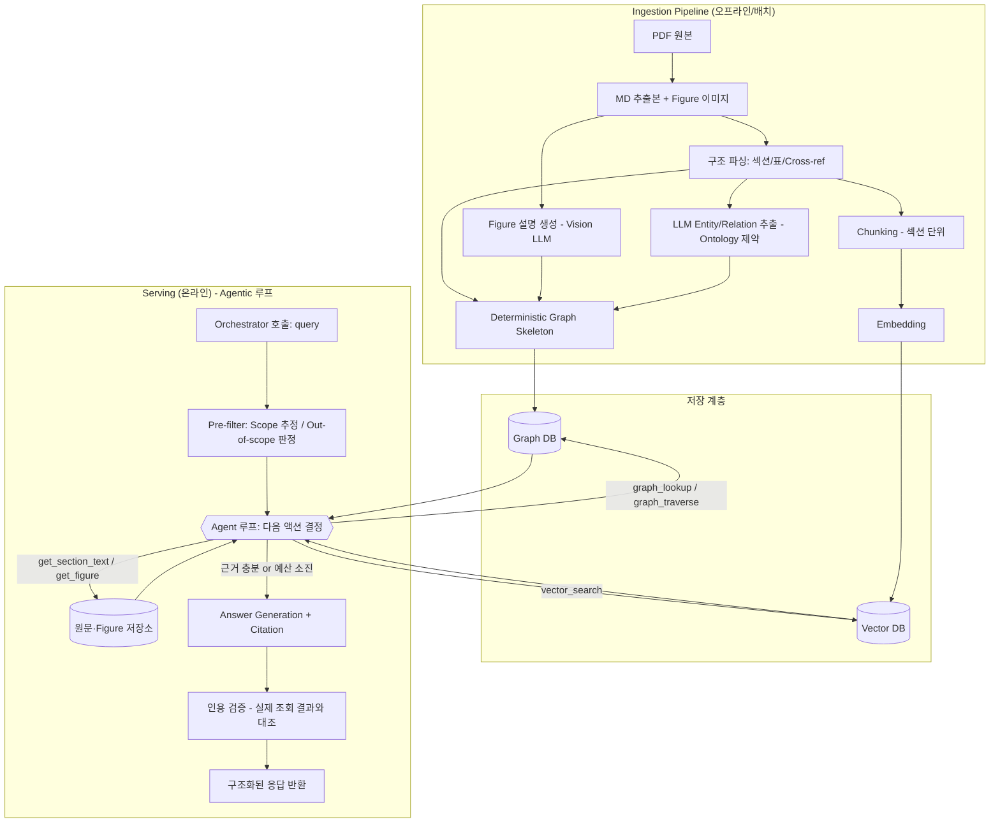

# Bluetooth Spec Q&A Agent 설계 문서 (Draft v0.1)

## 1. 개요

### 1.1 목적
Bluetooth 스펙 전반(Core, Profile, GATT, Mesh, LE Audio 등)에 대한 질의에 스펙 원문 근거를 명시하며 답변하는 Q&A Agent를 구축한다. 기존 "질문이 들어올 때마다 Wiki를 누적 생성"하는 방식은 초기 커버리지 부족(cold-start)으로 성숙 전 답변 품질이 낮다는 한계가 있었다. 본 설계는 Wiki 누적 방식 대신, 스펙 원문 전체를 사전에 인덱싱하는 **Vector RAG + Graph RAG 하이브리드 리트리버**로 전환해 이 문제를 해결한다.

### 1.2 사용 컨텍스트
- 이 Agent는 독립 서비스가 아니라, 상위 **Orchestrator에서 Tool로 호출**된다.
- 노출 방식: **MCP 서버 또는 API**로 오픈해 사내 여러 오케스트레이터/팀원이 BT 관련 질의 시 이 Tool 하나만 호출하는 형태. 즉 "팀 공용"은 DB를 여러 사람이 직접 공유한다는 뜻이 아니라, Agent의 MCP/API 인터페이스를 팀이 공유 호출한다는 의미다. DB(Vector/Graph)는 Agent 뒤에 숨어 있으며 임베디드/서버형 여부는 순수 내부 구현 선택(§6)이다.
- 따라서 최우선 설계 제약은 "명확하고 안정적인 입출력 계약(Tool Interface)"이다. 자연어 답변뿐 아니라 인용(citation), 신뢰도, out-of-scope 판정 등 오케스트레이터가 후처리/검증할 수 있는 구조화된 출력이 필요하다.
- 대화 상태(멀티턴)는 이 Agent가 직접 관리하지 않고, Orchestrator가 필요한 맥락을 매 호출 시 전달하는 stateless tool 형태를 기본으로 한다.

### 1.3 범위 / Non-goals
- 범위: Bluetooth 관련 스펙 전체(Core Spec, GATT Specification Supplement, 각 Profile 스펙, Mesh Profile/Model 스펙, LE Audio 계열 스펙 - BAP/CAP/CSIP/PBP/TMAP/HAP 등, Assigned Numbers, Errata)
- Non-goals (v0.1 기준): 로그/HCI snoop 캡처 분석, 구현 코드 검증, 테스트케이스 자동 생성은 이번 범위에서 제외. 필요 시 별도 Tool/Agent로 분리하고 본 Agent는 지식 검색·답변에 집중한다.

---

## 2. 요구사항

### 2.1 기능 요구사항
- 자연어 질의를 받아 스펙 근거 기반 답변 생성
- 답변에 출처(문서명/버전/섹션/페이지) 명시
- 스펙 버전 인지 (예: 5.3 vs 5.4 차이 질의 대응)
- 여러 섹션/문서에 걸친 멀티홉 질의 대응 (예: "이 이벤트 수신 후 상태 전이와 타이머는?")
- Figure(상태 다이어그램, 시퀀스 다이어그램)가 필요한 질의에 대한 근거 제공
- Out-of-scope(BT 스펙과 무관) 질의에 대한 명확한 신호 반환

### 2.2 비기능 요구사항
- 전체 스펙(수만 페이지 규모) 인덱싱이 가능한 확장성
- 신규 스펙/에라타 발행 시 증분(incremental) 업데이트 가능
- Orchestrator가 호출하기 쉬운 표준 Tool 계약(입출력 스키마 고정)
- 인프라/모델 스택은 기존 Wiki 프로젝트에 종속되지 않고 자유롭게 신규 설계 가능(재사용 제약 없음)

---

## 3. 아키텍처 개요



---

## 4. 데이터 소스

### 4.1 대상 문서 (전체 BT 스펙)
| 카테고리 | 예시 | 특이사항 |
|---|---|---|
| Core Spec | Core Spec v5.x/6.x | 최대 볼륨, 상태머신/PDU/절차 밀집 |
| GATT | GATT Specification Supplement | Characteristic/UUID 표 다수 |
| Profile | A2DP, AVRCP, HFP, HID, HOGP, PBAP, MAP, OPP 등 | 프로파일별 mandatory/optional 관계 |
| Mesh | Mesh Profile / Mesh Model Spec | 별도 상태/메시지 체계 |
| LE Audio | BAP, CAP, CSIP, PBP, TMAP, HAP 등 | 상호 참조 많은 스펙 군 |
| 참조 자료 | Assigned Numbers, Errata | 이미 표 구조 - 그래프화 용이 |

### 4.2 원본 형식
- PDF 원본 + 이미 추출된 MD 파일 + Figure는 별도 이미지 파일로 존재하며 MD에서 링크됨
- 즉 텍스트 파싱(PDF→구조화 텍스트) 단계는 이미 대부분 해결되어 있음 → Ingestion 파이프라인은 PDF 파싱보다 **MD 구조 파싱 + Figure 처리**에 집중하면 됨

---

## 5. Ingestion Pipeline

### 5.1 구조 파싱 (Deterministic, LLM 불필요)
MD의 heading 계층(#, ##, ###)을 그대로 `Document > Chapter > Section > Subsection` 노드로 매핑하고, 정규식으로 다음을 추출한다.
- Cross-reference 문자열 (예: "see Section 4.5.2", "Figure 3.2") → `REFERENCES` 엣지
- 표(table) → `Table` 노드 (행/열 그대로 보존, 특히 Assigned Numbers/파라미터 표는 거의 그대로 그래프 데이터가 됨)
- Figure 링크 → `Figure` 노드 (이미지 경로 메타데이터 보관)

이 단계는 스펙 문서 자체가 이미 가진 명시적 구조를 그대로 옮기는 것이므로 정확도가 높고 비용이 거의 들지 않는다. 그래프의 "뼈대"는 이 단계에서 대부분 완성된다.

### 5.2 Ontology 정의 (스키마 고정)
전체 스펙이라는 넓은 범위지만, 도메인 개념 자체는 프로토콜 스펙 특유의 고정된 패턴을 따르므로 사전에 ontology를 정의한다. 문서 유형(Core/Profile/Mesh 등)마다 공통 코어 타입 + 확장 타입 구조를 둔다.

**공통 코어 엔티티 타입**: `Procedure`, `State`, `Event`, `PDU/Packet`, `Parameter`, `Timer`, `ErrorCode`, `Role`(Central/Peripheral 등), `Layer`, `Profile`, `Characteristic/UUID`

**공통 관계 타입**: `triggers`, `requires`, `definedIn`, `partOf`, `mandatoryFor`, `optionalFor`, `supersedes`(버전 diff용), `references`

문서 유형별 확장 예: Mesh는 `Model`, `Element`, `Message` 타입 추가. LE Audio는 `Codec`, `Context Type` 등 추가.

### 5.3 LLM 기반 Entity/Relation 추출
5.1에서 만든 구조 위에, 섹션 텍스트를 대상으로 LLM이 5.2 ontology 스키마에 **제약된 형태로만** 엔티티/관계를 추출한다 (open extraction 아님). 이렇게 하면:
- 같은 개념이 여러 섹션에서 다른 이름으로 언급돼도 정규화하기 쉬움
- 관계 타입이 일관되어 그래프 순회 쿼리 작성이 쉬움
- 문서 유형이 늘어도(전체 스펙 확장) 스키마 재사용 가능

**구조화 출력 신뢰성**: 후보 모델(Qwen3.5-397B, GPT-OSS-120B, Gemma4-31B)이 각각 네이티브 function-calling/JSON mode를 얼마나 안정적으로 지원하는지는 미확인 상태. 모델의 native 능력에만 의존하기보다, 서빙 스택(vLLM/TGI 등)이 **grammar 기반 constrained decoding**(예: vLLM guided_json, outlines, xgrammar)을 지원하는지 먼저 확인하는 것을 권장한다. 지원된다면 세 모델 중 어느 것을 쓰든 JSON schema 위반 없이 강제 가능해 모델 선택 부담이 줄어든다. 미지원 시에는 (a) 프롬프트 + few-shot으로 유도 후 (b) pydantic/JSON schema 검증 + 실패 시 재시도(retry) 레이어를 추출/Tool 출력 양쪽에 공통으로 둔다.

### 5.4 Figure 처리
상태 다이어그램/시퀀스 다이어그램은 절차 이해에 중요하므로, Vision-capable LLM으로 각 Figure에 대한 구조화된 설명(등장 State/Event/전이 관계)을 생성해 텍스트화한다. 이 설명은 (a) Figure 노드의 속성으로 그래프에 저장, (b) 벡터 임베딩 대상 텍스트에도 포함해 벡터 검색으로도 히트되게 한다.

### 5.5 버전 관리
- 모든 노드/엣지에 `spec_version` 속성(다중 버전 태깅 가능: 동일 섹션이 여러 버전에 존재하면 리스트로 보관)
- 버전 간 변경 감지: 신규 버전/에라타 발행 시 섹션 단위 diff를 먼저 계산하고, **변경된 섹션만** 재추출(LLM 비용 절감). 변경 없는 섹션은 버전 태그만 추가.
- `supersedes` 관계로 이전 버전 조항과 신규 조항을 연결해 "5.3에서는 어땠는데 5.4에서는?" 류의 질의를 지원.

---

## 6. 저장 계층

**배포 형태 정정**: Qdrant/Neo4j도 클라우드 SaaS 전용이 아니라 오픈소스 Community 버전으로 사내 서버에 완전히 자체 호스팅(로컬 구축) 가능하다 - Chroma/KuzuDB와 마찬가지로 전부 로컬 구축 대상이다. "팀 공유 = 서버형 DB 필수"라는 이전 서술은 부정확했다.

실제 요구사항은 DB의 접속 방식이 아니라 **Agent를 MCP 서버 혹은 API로 열어 팀/오케스트레이터가 그 Tool 하나만 호출**하는 것이다. 팀원·오케스트레이터는 DB에 직접 붙지 않고 항상 Agent의 MCP/API 인터페이스만 거친다. 이 구조에서는 DB가 임베디드(Chroma+KuzuDB, Agent 프로세스 내부)든 서버형(Qdrant+Neo4j, 별도 프로세스)이든 외부에 보이는 동작은 동일하다. 실질적 선택 기준은 다음과 같다.

- **임베디드(Chroma+KuzuDB)가 적합한 경우**: 재인덱싱(쓰기)을 오프라인 배치로, Agent를 잠깐 내리고 수행하며, Agent 서버가 단일 프로세스/단일 replica로 충분한 경우. 운영 요소가 가장 단순함.
- **서버형(Qdrant+Neo4j)이 적합한 경우**: §10 버전 업데이트처럼 서빙 중에도 재인덱싱(쓰기)이 상시 필요하거나, 트래픽 증가로 Agent 서버를 여러 replica로 수평 확장할 계획이 있는 경우. 임베디드는 쓰기 프로세스와 서빙 프로세스가 분리되면 파일 잠금 충돌 위험이 있다.

전체 스펙을 지속 갱신(§10)해야 하고 팀 사용량 증가 가능성이 있다는 점에서 서버형을 기본 권장안으로 유지하되, 운영 부담을 낮추고 싶다면 임베디드로 시작해 필요해질 때 전환하는 것도 합리적인 대안이다.

### 6.1 Vector Store
- Chunking 단위: 섹션(heading 기준), 표는 표 단위로 별도 청크
- 짧은 cross-reference 대상은 청크에 요약 인라인(과도한 확장은 지양)
- 메타데이터: 문서명, 버전, 섹션 번호, 문서 유형(Core/Profile/Mesh 등)
- 배포: 사내 서버에 Docker로 자체 호스팅(Qdrant/Milvus/Weaviate 중 택1, 서버형) 또는 Agent 프로세스 내 임베디드(Chroma) - 위 기준으로 선택

### 6.2 Graph Store
- 서버형을 택할 경우 Neo4j Community Edition(Bolt 프로토콜, 사내 서버 자체 호스팅) 권장. 임베디드를 택할 경우 KuzuDB.
- 노드/엣지 모두 §5.2 ontology 스키마 준수, 버전 속성 포함

### 6.3 스택 확정 현황
| 구성요소 | 결정 |
|---|---|
| LLM (생성/추출) | 사내 서빙 endpoint (Qwen3.5-397B / GPT-OSS-120B / Gemma4-31B 중 선택 - §12 참고) |
| Vision (Figure 처리) | 사내 endpoint가 이미지 입력 지원 확인됨 → 별도 Vision 모델 불필요 |
| Embedding | 사내 endpoint의 embedding API 사용 |
| Vector DB | 사내 서버 자체 호스팅 - 서버형(Qdrant 등) 또는 임베디드(Chroma), §6 기준으로 선택 |
| Graph DB | 사내 서버 자체 호스팅 - 서버형(Neo4j) 또는 임베디드(KuzuDB), §6 기준으로 선택 |
| Agent 노출 방식 | MCP 서버 또는 API로 오픈 → 팀/오케스트레이터는 이 Tool 인터페이스만 호출, DB에 직접 접근하지 않음 |

---

## 7. 하이브리드 리트리버 파이프라인 (Agentic 반복 검색)

**결정 (§14.3 해소)**: route→vector→graph→merge→generate 단일 패스 대신, LLM이 스스로 다음 검색 액션을 판단하며 여러 차례 반복하는 **Agentic 루프**로 설계한다. 멀티홉 질의에서 한 번의 검색으로 근거가 부족할 때 스스로 추가 조회를 이어갈 수 있다.

### 7.0 Pre-filter (루프 진입 전)
루프에 들어가기 전 1회 경량 판정을 수행한다. Agentic 루프로 바뀌면서 기존 "Scope Router"는 파이프라인 단계가 아니라 **루프 진입 전 pre-filter + 루프 내 `scope_filter` 힌트**의 두 역할로 분리된다.
- Out-of-scope 판정: BT 스펙과 무관한 질의는 루프를 아예 돌리지 않고 즉시 `out_of_scope: true` 반환 (비용 방어)
- Scope 힌트 추정: 관련 문서군(Core/GATT/Mesh/LE Audio 등)을 추정해 루프 첫 `vector_search`의 `scope_filter` 기본값으로 제공. 이후 루프에서 LLM이 필요 시 스코프를 넓히거나 바꿀 수 있다(하드 제약 아님).

### 7.1 액션(내부 Tool) 정의
루프 내부에서 LLM이 호출 가능한 액션을 사내 인덱스 대상으로 한정한다.
- `vector_search(query, scope_filter?)`: 벡터 인덱스 top-k 검색
- `graph_lookup(entity_name)`: 엔티티명으로 정규화 노드 조회 (§14.1 Entity Resolution 결과 반영)
- `graph_traverse(node_id, relation_types?, hops=1)`: 특정 노드에서 관계 순회. 고정 N-hop을 미리 정하는 대신 매 스텝마다 LLM이 필요한 만큼만 순회하도록 해 §14.2의 정적 pruning 튜닝 문제를 완화
- `get_section_text(doc, section_id)`: 특정 섹션 원문 직접 조회
- `get_figure(figure_id)`: Figure 설명/이미지 조회
- `get_table(table_id | section_id)`: 파라미터/Assigned Numbers 등 표를 구조 보존 형태로 조회 (§14.12 - 표는 벡터 검색으로 잘 안 잡히므로 전용 액션 필요)

### 7.2 루프 제어
- 종료 조건: LLM이 "충분한 근거 확보"로 판단 시 종료, 또는 `max_iterations`/`max_tool_calls` 예산 소진 시 강제 종료
- 예산 소진 시: 근거 부족을 숨기지 말고 `confidence: low`로 명시한 답변 반환 (지어내지 않도록 강제)
- 예산 초과 빈도는 모니터링 대상(§14.5) - 잦으면 그래프/온톨로지 커버리지 부족 신호로 해석
- **컨텍스트 누적 관리**: 단일 패스와 달리 루프는 반복할수록 조회 결과가 쌓여 컨텍스트를 잠식한다. 매 스텝 전체 원문을 그대로 누적하지 말고, 조회 결과를 요약/발췌해 누적하고 원문은 ID로만 유지하다가 최종 합성 시 필요한 것만 다시 펼치는 방식을 기본으로 한다. (구체 상한은 §14.8)
- **Latency 예산**: Orchestrator가 동기 호출하는 Tool이므로 응답 시간 상한(SLA)을 수치로 정해야 하며, 이 값이 `max_iterations`의 실질적 상한을 결정한다. 현재 미정 - §12 참조.

### 7.3 모델 역할 분리 (비용/속도)
매 반복의 "다음 액션 결정"에 대형 모델을 쓰면 비용·지연이 급증한다. 후보 3개 모델 중 가벼운 모델(예: Gemma4-31B)을 반복 루프의 액션 결정용으로, 최종 답변 합성에는 더 큰 모델(Qwen3.5-397B 등)을 쓰는 역할 분리를 Phase 0 bake-off에서 함께 검증한다. 이때 세 모델의 tool-calling(함수 호출) 안정성이 §5.3의 구조화 출력 안정성과 함께 핵심 평가 항목이 된다.

### 7.4 답변 생성 및 근거 검증 (§14.4 해소)
루프 종료 후 최종 합성 단계에서 인용을 생성하되, LLM 자체 판단에만 맡기지 않고 **인용된 섹션/문서 ID가 루프 중 실제로 조회된 tool 결과에 존재하는지 프로그램적으로 대조**하는 검증 스텝을 둔다. 불일치 시 해당 인용은 제거하거나 1회 재검색을 트리거한다.

### 7.5 Orchestrator 관점에서의 불변성
루프는 Agent 내부에만 존재하며 §8 Tool 입출력 스키마는 그대로 유지한다 - Orchestrator는 단일 request/response로만 인지하고 내부 반복 여부를 알 필요가 없다. 디버깅/평가용으로 선택적 `retrieval_trace` 필드(기본 비노출, 로깅 전용)를 출력에 추가할 수 있다.

---

## 8. Tool Interface (Orchestrator 연동)

### 8.1 입출력 스키마 (예시)

```json
// Input
{
  "query": "L2CAP 연결 실패 시 재시도 절차는?",
  "spec_scope": "Core-LE",       // optional hint
  "spec_version": "5.4",          // optional
  "conversation_context": []      // optional, multi-turn 지원 시
}
```

```json
// Output
{
  "answer": "...",
  "citations": [
    {"doc": "Core Spec v5.4", "section": "3.5.2", "page": 512, "path": "..."}
  ],
  "related_entities": ["L2CAP", "Enhanced Connection Complete"],
  "confidence": "high",
  "out_of_scope": false,
  "retrieval_trace": null   // optional, 디버깅/평가 시에만 채움 (§7.5)
}
```

### 8.2 Out-of-scope 처리
루프 진입 전 Pre-filter(§7.0)에서 BT 스펙과 무관하다고 판단되면 루프를 돌리지 않고 즉시 `out_of_scope: true`와 낮은 confidence를 반환해, Orchestrator가 다른 Tool로 라우팅할 수 있게 한다.

### 8.3 멀티턴
Agent 자체는 상태를 갖지 않고, Orchestrator가 `conversation_context`로 이전 턴 요약을 넘기면 이를 질의 재해석에만 사용한다.

---

## 9. 평가(Evaluation) 전략
- 기존 Wiki 프로젝트에 누적된 실사용 질문/답변 로그를 **1차 Eval 셋**으로 재활용 (구조는 바뀌지만 질문 자체는 자산). 기존 Wiki 본문은 폐기하지 않고 정답 근거(reference answer) 라벨링의 출발점으로도 활용 - §14.13 참조
- 질의 유형별로 셋을 분리해야 개선 효과가 보인다: (a) 단순 lookup, (b) 멀티홉/절차 연결, (c) 버전 비교, (d) Figure 의존, (e) out-of-scope 오탐 확인용 negative 셋
- **품질 메트릭**: 인용 정확도(맞는 섹션을 짚었는가), 답변 사실 정확도(hallucination 여부), 멀티홉 질의 정답률(그래프 없이는 못 푸는 질문 별도 트래킹), 인용 검증(§7.4) 탈락률
- **Agentic 루프 전용 메트릭**: 질의당 평균 반복 횟수·tool 호출 수 분포, 예산 소진(강제 종료) 비율, latency p50/p95, 질의당 토큰 비용. 품질이 올라도 이 지표가 함께 악화되면 실사용 불가이므로 항상 같이 본다
- **Ablation**: 벡터 단독 / 그래프 단독 / 하이브리드, 단일 패스 vs Agentic 루프를 같은 셋으로 비교해 각 구성요소가 실제로 기여하는지 확인 (그래프 구축 비용을 정당화하는 근거)

## 10. 버전 업데이트 파이프라인
신규 스펙/에라타 발행 → 섹션 diff 계산 → 변경분만 재추출/재임베딩 → 그래프 `supersedes` 엣지로 이전 버전과 연결 → eval 셋 재실행으로 회귀 확인

## 11. 단계별 구현 계획
| Phase | 범위 | 목표 |
|---|---|---|
| 0 | 모델/인프라 검증 | 사내 endpoint 3개 모델 대상 구조화 출력(guided decoding 여부 포함) + **tool-calling/Agentic 루프 안정성** bake-off, 경량 모델(Gemma4-31B)의 액션 결정용 적합성 검증, Vision 품질 샘플 확인, **embedding의 한국어 질의↔영문 스펙 cross-lingual 검색 성능 확인(§14.10)**, DB 후보 설치 테스트(서버형/임베디드 §6 기준으로 택일) |
| 1 | Core Spec(LE) + GATT 일부 | 파이프라인 end-to-end 검증, Tool 계약 확정 |
| 2 | Core 전체 + 주요 Profile(A2DP/HFP/HID 등) | 스코프 라우팅 고도화, eval 셋 확장 |
| 3 | Mesh, LE Audio 계열 포함 전체 스펙 | 버전 diff/업데이트 파이프라인 자동화 |
| 4 | 운영 안정화 | 모니터링, 재랭킹 튜닝, 다중 팀 동시 호출 부하 대응 |

## 12. 오픈 이슈 (결정 필요)

**확정된 사항**
- LLM: 사내 서빙 endpoint 사용 (후보: Qwen3.5-397B, GPT-OSS-120B, Gemma4-31B)
- Vision: 동일 사내 endpoint로 처리 (이미지 입력 지원 확인됨)
- Embedding: 사내 endpoint의 embedding API 사용
- 노출 형태: Agent를 MCP 서버 또는 API로 사내 오픈, DB는 Agent 뒤에 은닉 (§1.2)
- 검색 방식: Agentic 반복 검색 루프 (§7)

**아직 결정 필요**
- 3개 후보 모델 중 어떤 걸 기본으로 쓸지 - 구조화 출력 안정성(§5.3) + tool-calling 안정성(§7.3) + 답변 품질 + 지연시간 기준 Phase 0 bake-off로 결정
- 사내 서빙 스택이 grammar 기반 constrained decoding(guided JSON)을 지원하는지
- Vector DB / Graph DB를 서버형(Qdrant 등 + Neo4j)으로 갈지 임베디드(Chroma + KuzuDB)로 갈지 - §6 기준(상시 재인덱싱 필요 여부, replica 확장 계획)으로 결정
- **응답 시간 SLA(p95) 수치** - Agentic 루프의 `max_iterations` 상한을 결정하는 핵심 값 (§7.2). Orchestrator가 이 Tool을 동기 호출하므로 상위 워크플로 전체 지연에 직결
- Pre-filter(§7.0)를 별도 경량 분류기로 할지 LLM 프롬프트로 할지
- **인덱싱 대상 스펙 버전 범위** - Core 5.3/5.4/6.0 등 몇 개 버전을 동시 보유할지. 물량·비용(§14.7)과 직결되며 버전 수만큼 배수로 증가
- 사내 endpoint의 동시 요청 처리량/쿼터 - 최초 대량 인덱싱(배치)과 서빙 트래픽의 쿼터 분리 필요 여부. Agentic 루프는 질의 1건당 LLM 호출이 여러 번이라 서빙 쪽 소모량이 단일 패스보다 훨씬 큼
- Agent 엔드포인트 접근 제어 - 어떤 오케스트레이터/팀원이 호출 가능한지 인증/네트워크 정책

## 13. 리스크
- 전체 스펙 최초 인덱싱 비용/시간 (특히 LLM 추출 단계, 사내 endpoint 쿼터에 종속)
- 엔티티 정규화 실패 시 그래프 품질 저하 → ontology 제약 추출로 완화하되 지속 모니터링 필요
- Figure 설명의 부정확성이 그래프에 잘못된 관계로 유입될 위험 → 신뢰도 낮은 Figure 추출은 별도 플래그
- 구조화 출력이 불안정한 모델을 선택할 경우 ontology 추출/Tool 출력 스키마가 자주 깨질 위험 → Phase 0 bake-off로 사전 검증
- 사내 오픈 후 다중 오케스트레이터 동시 호출 시 DB/LLM 병목 가능 → 부하 테스트를 Phase 4 이전에 조기 실시 권장
- **Agentic 루프 특성상 신규 리스크**: 반복 횟수가 많아지면 질의 1건당 지연시간·LLM 호출 비용이 크게 늘어남 → §7.2 예산 상한과 §7.3 모델 역할 분리로 완화. 루프가 수렴하지 못하고 예산을 계속 소진하는 질의 패턴은 별도로 추적해 온톨로지/그래프 보완 신호로 활용

## 14. 추가로 구체화가 필요한 부분

### 14.1 Entity Resolution (엔티티 정규화)
Ontology 타입/관계는 정의했지만, 같은 개념이 여러 섹션에서 다르게 표기될 때 실제로 하나의 그래프 노드로 병합하는 구체 방법(정확 문자열/별칭 테이블 매칭 vs 임베딩 유사도 클러스터링, 충돌 시 사람 검수 여부)이 아직 없음. (`graph_lookup` 액션의 정확도에 직결 - §7.1)

### 14.2 Graph Expansion 정책 → **부분 해소 (§7.1)**
정적 N-hop/pruning 규칙을 미리 정하는 대신, Agentic 루프에서 `graph_traverse`를 LLM이 매 스텝 필요한 만큼만 호출하는 방식으로 전환. 다만 `graph_traverse` 한 번 호출 시 반환 노드 수 상한(1회 호출 결과가 너무 커지는 경우의 컷오프)은 여전히 별도 결정 필요.

### 14.3 단일 패스 vs Agentic 반복 검색 → **결정 완료 (§7)**
Agentic 반복 루프 채택.

### 14.4 답변 근거 검증 (그라운딩 체크) → **해소 (§7.4)**
루프 중 실제 조회된 tool 결과와 최종 인용을 프로그램적으로 대조하는 검증 스텝으로 반영.

### 14.5 Observability & Ops
질의/답변 로깅, 검색 hit-rate 추적, 그래프/벡터 인덱스가 최신 스펙 버전 대비 얼마나 stale한지 알리는 모니터링, 오케스트레이터/팀별 사용량 지표 - 아직 설계 없음.

### 14.6 데이터 거버넌스 / 접근 등급
전체 코퍼스가 동일한 민감도인지, 사내 주석/에라타 중 일부가 특정 팀에만 노출돼야 하는 항목이 있는지 확인 필요. 있다면 검색 시점에 caller 권한별 필터링이 추가로 필요.

### 14.7 비용/물량 추정
전체 스펙 규모(페이지/청크 수) 기준 Ingestion에 필요한 LLM 호출 수·토큰량 추정치가 없음 - Phase 0/1 착수 전 개략 추정해 사내 API 쿼터와 대조 필요.

### 14.8 컨텍스트 윈도우 / 토큰 예산
후보 3개 모델의 context window 크기가 미확인. Agentic 루프에서는 단일 패스보다 이 제약이 더 빡빡하다 - 반복할수록 조회 결과가 누적되기 때문. §7.2의 요약 누적 전략에서 "스텝당 발췌 길이", "누적 상한", "최종 합성 시 펼칠 원문 개수" 세 수치를 모델 context window 확인 후 확정 필요.

### 14.9 백업 / 롤백
Ingestion 오류로 그래프가 오염될 경우를 대비한 백업 스냅샷·롤백 정책이 아직 없음.

### 14.10 Cross-lingual 검색 (한국어 질의 ↔ 영문 스펙)
BT 스펙 원문은 영문이고 팀 질의는 한국어일 가능성이 높다. 사내 embedding 모델이 multilingual인지, 한국어 질의로 영문 청크를 제대로 검색하는지 미확인 - **Phase 0에서 반드시 검증 필요**. 성능이 부족하면 (a) 질의를 영어로 선번역 후 검색, (b) 청크 임베딩 시 한국어 요약 병기, (c) multilingual embedding 별도 도입 중 선택해야 한다. 또한 `graph_lookup`의 엔티티명은 영문 기준일 텐데 한국어 질의에서 엔티티를 뽑을 때의 매핑도 함께 고려해야 한다.

### 14.11 Errata / 문서 간 충돌 해결
Errata는 독립 문서가 아니라 본문 조항을 **덮어쓰는** 성격이다. 원문 섹션과 에라타를 각각 별도로 인덱싱하면 "원문은 A, 에라타는 B"가 동시에 검색되어 답변이 틀릴 수 있다. 필요한 것: 에라타를 대상 섹션 노드에 `amends` 관계로 연결하고, 검색 결과에 원문이 포함되면 해당 섹션의 유효 에라타를 **자동으로 함께 가져와** 최신 유효 내용이 우선되도록 하는 규칙. 우선순위 정책(에라타 > 본문)을 답변 합성 프롬프트에도 명시해야 한다. Profile 스펙이 Core 조항을 제약하는 경우(프로파일이 특정 파라미터를 더 좁게 규정)도 같은 종류의 충돌이다.

### 14.12 표(Table) 검색 품질
스펙에는 파라미터/상태/Assigned Numbers 표가 대량으로 있고, 실무 질의의 상당수가 "이 값의 범위/기본값은?"처럼 표를 직접 겨냥한다. 그런데 표는 청크 임베딩으로 잘 검색되지 않는 대표적 데이터 형태다. §7.1에 `get_table` 액션을 추가했으나, 그에 앞서 표를 어떻게 인덱싱할지(행 단위 텍스트화, 표 캡션·헤더 기반 별도 인덱스, 또는 그래프 노드로 정규화) 결정이 필요하다.

### 14.13 기존 Wiki 자산의 처리
기존 Wiki를 완전히 폐기할지, 큐레이션 레이어로 남길지 미정. 남긴다면 실사용 질문에서 나온 해석/노하우(스펙 원문에는 없는 내용)를 별도 코퍼스로 인덱싱하고 답변 시 "스펙 근거"와 "사내 해석"을 명확히 구분해 표기해야 한다. 이 둘이 섞이면 근거 신뢰도가 무너진다.

### 14.14 응답 캐싱
Agentic 루프는 질의 1건당 비용이 크므로 반복·유사 질의에 대한 캐시 가치가 높다. 정확 일치 캐시부터 시작할지, 임베딩 유사도 기반 semantic 캐시까지 갈지, 인덱스 갱신(§10) 시 캐시 무효화를 어떻게 할지 결정 필요.
