# Bluetooth Core Specification 5.0 — Full Text

> Source: PDF converted via PyMuPDF.
> Wiki summary: [core-spec-5.0](../../wiki/versions/core-spec-5.0.md)

---

v 5.0
Master Table of Contents & Compliance Requirements
Specification of the Bluetooth  System
®
Specification Volume 0
Covered Core Package Version: 5.0 Publication Date: Dec 06 2016
Revision History
The Revision History is shown in the [Vol 0] Part C, Appendix.
Contributors
The persons who contributed to this specification are listed in the [Vol 0] Part C, Appendix.
Web Site
This specification can also be found on the official Bluetooth web site: https://www.bluetooth.org/en-us/specification/adopted-specifications
Disclaimer and Copyright Notice
Use of this specification is your acknowledgement that you agree to and will comply with the following notices and disclaimers. You are advised to seek appropriate legal, engineering, and other professional advice regarding the use, interpretation, and effect of this specification.
Use of Bluetooth specifications by members of Bluetooth SIG is governed by the membership and other related agreements between Bluetooth SIG and its members, including those agreements posted on Bluetooth SIG’s website located at www.bluetooth.com. Any use of this specification by a member that is not in compliance with the applicable membership and other related agreements is prohibited and, among other things, may result in (i) termination of the applicable agreements and (ii) liability for infringement of the intellectual property rights of Bluetooth SIG and its members.
Use of this specification by anyone who is not a member of Bluetooth SIG is prohibited and is an infringement of the intellectual property rights of Bluetooth SIG and its members. The furnishing of this specification does not grant any license to any intellectual property of Bluetooth SIG or its members. THIS SPECIFICATION IS PROVIDED “AS IS” AND BLUETOOTH SIG, ITS MEMBERS AND THEIR AFFILIATES MAKE NO REPRESENTATIONS OR WARRANTIES AND DISCLAIM ALL WARRANTIES, EXPRESS OR IMPLIED, INCLUDING ANY WARRANTIES OF MERCHANTABILITY, TITLE, NON-INFRINGEMENT, FITNESS FOR ANY PARTICULAR PURPOSE, OR THAT THE CONTENT OF THIS SPECIFICATION IS FREE OF ERRORS. For the avoidance of doubt, Bluetooth SIG has not made any search or investigation as to third parties that may claim rights in or to any specifications or any intellectual property that may be required to implement any specifications and it disclaims any obligation or duty to do so.
TO THE MAXIMUM EXTENT PERMITTED BY APPLICABLE LAW, BLUETOOTH SIG, ITS MEMBERS AND THEIR AFFILIATES DISCLAIM ALL LIABILITY ARISING OUT OF OR RELATING TO USE OF THIS SPECIFICATION AND ANY INFORMATION CONTAINED IN THIS SPECIFICATION, INCLUDING LOST REVENUE, PROFITS, DATA OR PROGRAMS, OR BUSINESS INTERRUPTION, OR FOR SPECIAL, INDIRECT, CONSEQUENTIAL, INCIDENTAL OR PUNITIVE DAMAGES, HOWEVER CAUSED AND REGARDLESS OF THE THEORY OF LIABILITY, AND EVEN IF BLUETOOTH SIG, ITS MEMBERS OR THEIR AFFILIATES HAVE BEEN ADVISED OF THE POSSIBILITY OF THE DAMAGES.
If this specification is a prototyping specification, it is solely for the purpose of developing and using prototypes to verify the prototyping specifications at Bluetooth SIG sponsored IOP events. Prototyping Specifications cannot be used to develop products for sale or distribution and prototypes cannot be qualified for distribution.
Products equipped with Bluetooth wireless technology ("Bluetooth Products") and their combination, operation, use, implementation, and distribution may be subject to regulatory controls under the laws and regulations of numerous countries that regulate products that use wireless non-licensed spectrum. Examples include airline regulations, telecommunications regulations, technology transfer controls and health and safety regulations. You are solely responsible for complying with all applicable laws and regulations and for obtaining any and all required authorizations, permits, or licenses in connection with your use of this specification and development, manufacture, and distribution of Bluetooth Products. Nothing in this specification provides any information or assistance in connection with complying with applicable laws or regulations or obtaining required authorizations, permits, or licenses.
Bluetooth SIG is not required to adopt any specification or portion thereof. If this specification is not the final version adopted by Bluetooth SIG’s Board of Directors, it may not be adopted. Any specification adopted by Bluetooth SIG’s Board of Directors may be withdrawn, replaced, or modified at any time. Bluetooth SIG reserves the right to change or alter final specifications in accordance with its membership and operating agreements.
Copyright © 1999 - 2016. The Bluetooth word mark and logos are owned by Bluetooth SIG, Inc. All copyrights in the Bluetooth Specifications themselves are owned by Ericsson AB, Lenovo (Singapore) Pte. Ltd., Intel Corporation, Microsoft Corporation, Nokia Corporation, Toshiba Corporation and Apple, Inc. Other third-party brands and names are the property of their respective owners.
Master Table of Contents &  Compliance Requirements
Part A
PART A: MASTER TABLE OF CONTENTS
This table of contents (TOC) covers the entire Bluetooth Specification. In addition each part of a volume is preceded by a detailed TOC.
THE BLUETOOTH SPECIFICATION MASTER TABLE OF CONTENTS
In the following Master Table of Contents:
• The TOC for each Volume starts at the top of a page.
• The Volume name in red is followed by the Volume number in black.
• A Volume contains one or more Parts (A, B, etc.); each Part can be viewed independently and has its own TOC.
Red or blue text on the following pages indicates hypertext links that take you directly to the indicated section, on condition that you have access to a complete specification.
Master Table of Contents & Compliance Requirements
Specification Volume 0
Part A MASTER TABLE OF CONTENTS
Part B BLUETOOTH COMPLIANCE REQUIREMENTS
Part C APPENDIX
Architecture & Terminology Overview
Specification Volume 1
Part A ARCHITECTURE
Part B ACRONYMS & ABBREVIATIONS
Part C CORE SPECIFICATION CHANGE HISTORY
Part D MIXING OF SPECIFICATION VERSIONS
Part E GENERAL TERMINOLOGY AND INTERPRETATION
Core System Package [BR/EDR Controller volume]
Specification Volume 2
Part A RADIO SPECIFICATION
Part B BASEBAND SPECIFICATION
Part C LINK MANAGER PROTOCOL SPECIFICATION
Part D ERROR CODES
Part E HOST CONTROLLER INTERFACE FUNCTIONAL SPECIFICATION
Part F MESSAGE SEQUENCE CHARTS
Part G SAMPLE DATA
Part H SECURITY SPECIFICATION
Core System Package [Host volume]
Specification Volume 3
Part A LOGICAL LINK CONTROL AND ADAPTATION PROTOCOL SPECIFICATION
Part B SERVICE DISCOVERY PROTOCOL (SDP) SPECIFICATION
Part C GENERIC ACCESS PROFILE
Part D TEST SUPPORT
Part E AMP MANAGER PROTOCOL SPECIFICATION
Part F ATTRIBUTE PROTOCOL (ATT)
Part G GENERIC ATTRIBUTE PROFILE (GATT)
Part H SECURITY MANAGER SPECIFICATION
Specification Volume 4
Part A UART TRANSPORT LAYER
Part B USB TRANSPORT LAYER
Part C SECURE DIGITAL (SD) TRANSPORT LAYER
Part D THREE-WIRE UART TRANSPORT LAYER
Core System Package [AMP Controller volume]
Specification Volume 5
Part A 802.11 PROTOCOL ADAPTATION LAYER FUNCTIONAL SPECIFICATION
Core System Package [Low Energy Controller volume]
Specification Volume 6
Part A PHYSICAL LAYER SPECIFICATION
Part B LINK LAYER SPECIFICATION
Part C SAMPLE DATA
Part D MESSAGE SEQUENCE CHARTS
Part E LOW ENERGY LINK LAYER SECURITY
Part F DIRECT TEST MODE
Core System Package [Wireless Coexistence volume]
Specification Volume 7
Part A MWS COEXISTENCE LOGICAL SIGNALING SPECIFICATION
Part B WIRELESS COEXISTENCE INTERFACE 1 (WCI-1) TRANSPORT SPECIFICATION
Part C WIRELESS COEXISTENCE INTERFACE 2 (WCI-2) TRANSPORT SPECIFICATION
Master Table of Contents &  Compliance Requirements
Part B
PART B: BLUETOOTH COMPLIANCE REQUIREMENTS
This document specifies the requirements for Bluetooth compliance.
CONTENTS

## 1  INTRODUCTION

The Bluetooth Qualification Program Reference Document (PRD) is the primary reference document for the Bluetooth Qualification Program and defines its requirements, functions, and policies. The PRD is available on the Bluetooth Web site.
Passing the Bluetooth Qualification Process demonstrates a certain measure of compliance and interoperability, but because products are not tested for every aspect of this Bluetooth Specification, qualification does not guarantee compliance. Passing the Bluetooth Qualification Process only satisfies one condition of the license grant. The Member has the ultimate responsibility to ensure that the qualified product complies with this Bluetooth Specification and interoperates with other products.

## 2  SCOPE

This part of the specification defines some fundamental concepts used in the Bluetooth Qualification Program.

## 3  DEFINITIONS

Bluetooth Qualification Process – The process defined in the Bluetooth Qualification Program Reference Document (PRD) to qualify a design used in implementations of Bluetooth wireless technology.
Bluetooth Qualification Program – The Bluetooth Qualification Process together with other related requirements and processes.

### 3.1   TYPES OF BLUETOOTH PRODUCTS

Bluetooth Product — Any product containing an implementation of Bluetooth wireless technology. Bluetooth Products as defined herein may require enabling technology external to Bluetooth Scope, as defined by the Patent and Copyright License Agreement, to become functional (e.g. power supply, technology capable of running executable code, etc.). Enabling technology is not part of any of the Bluetooth Product type definitions and is not included in the Bluetooth License grant.
All Bluetooth Products shall be one of the following:
• Bluetooth End Product
• Bluetooth Host Subsystem Product
• Bluetooth Controller Subsystem Product
• Bluetooth Profile Subsystem Product
• Bluetooth Component Product
• Bluetooth Development Tool
• Bluetooth Test Equipment.
Table 3.1 defines abbreviations for the different Core Configurations defined in Section 4.

| Abbreviation | Explanation | Section Reference |
| --- | --- | --- |
| BR CC | Bluetooth Basic Rate Core Configuration | Section 4.1 |
| EDR CC | Bluetooth Enhanced Data Rate Core Configuration | Section 4.2 |
| HS CC | High Speed Bluetooth Core Configuration | Section 4.3 |
| LE CC | Bluetooth Low Energy Core Configuration | Section 4.4 |
| BR and LE Combined CC | Bluetooth Basic Rate and Low Energy Combined Core Configuration | Section 4.5 |
| HCI CC | Host Controller Interface Core Configuration | Section 4.6 |

Table 3.1:  Core Configuration abbreviations
Using the abbreviations in Table 3.1 the following tables define Bluetooth product types in terms of Core Configurations. For the respective Core Configuration, the letter “M” indicates that it is mandatory to claim support, “O” indicates that it is optional to claim support, “P” indicates that it is optionally permitted to claim only partial support of the Core Configuration, “I” indicates that the Core Configuration is inherently included in the combined Core Configuration, “E” indicates that support for the Core Configuration shall not be claimed.

#### 3.1.1  Bluetooth End Product

A Bluetooth End Product is a Bluetooth product that claims to implement one or more Core Configurations, in compliance with the required parts of the Specification, and in accordance with the mandatory requirements as defined herein. Complementary products for Bluetooth End Products are limited to only Bluetooth Profile Subsystem Products. The Bluetooth End Product types are defined in Table 3.2.

|  | BR CC | EDR CC | HS CC | BR and LE Combined CC | LE CC | HCI CC |
| --- | --- | --- | --- | --- | --- | --- |
| BR End Product | M | P | P | E | E | O |
| EDR End Product | M | M | P | E | E | O |
| HS End Product | M | M | M | E | E | O |
| LE End Product | E | E | E | E | M | O |
| BR and LE End Product | I | P | P | M | I | O |
| EDR and LE End Product | I | M | P | M | I | O |
| HS and LE End Product | I | M | M | M | I | O |

Table 3.2:  Required configuration per Bluetooth End Product type

#### 3.1.2  Bluetooth Subsystem Product

A Bluetooth Subsystem Product is a Bluetooth product that claims to implement only a portion of the Specification, in compliance with such portion of the Specification, and in accordance with the mandatory requirements as defined herein. Bluetooth Subsystem Products can be qualified solely for distribution; the use of Bluetooth wireless technology in Bluetooth Subsystem Products requires such Bluetooth Subsystem Products to be combined with one or more complementary products such that the resulting combination satisfies the requirements of a Bluetooth End Product. Complementary
products used in combinations are limited to those complementary products specified in each of the product definitions.
There are three types of Bluetooth Subsystem Products defined:
1. Bluetooth Host Subsystem Product
2. Bluetooth Controller Subsystem Product
3. Bluetooth Profile Subsystem Product.
A Bluetooth Subsystem Product shall be one of these types.

##### 3.1.2.1  Bluetooth Host Subsystem Product

The required configuration for each Bluetooth Host Subsystem Product type is listed in Table 3.3.

|  | BR CC Host Parts | HS CC Host Parts | BR and LE Combined CC Host Parts | LE CC Host Parts | HCI C |
| --- | --- | --- | --- | --- | --- |
| BR/EDR Host Subsystem Product | M | P | E | E | M |
| HS Host Subsystem Product | M | M | E | E | M |
| LE Host Subsystem Product | E | E | E | M | M |
| BR/EDR and LE Host Subsystem Product | I | P | M | I | M |
| HS and LE Host Subsystem Product | I | M | M | I | M |

Table 3.3:  Required configuration per Bluetooth Host Subsystem Product type
A Bluetooth Host Subsystem Product may contain, in addition to the required Core Configuration Host parts (as defined in Table 3.3), all the mandatory requirements defined in one or more of the protocols and profiles above HCI. Protocols below HCI required by the Core Configuration Controller parts (as defined in Table 3.4) shall be excluded from the Host Subsystem Product. Complementary products for Bluetooth Host Subsystem Products are limited to:
a) Bluetooth Controller Subsystem Products that implement and use the HCI ([Vol 2] Part E) for communication between the subsystems; and
b) Bluetooth Profile Subsystem Products when the Bluetooth Host Subsystem is combined with a Bluetooth Controller Subsystem Product.

##### 3.1.2.2  Bluetooth Controller Subsystem Product

The required configuration for each Bluetooth Controller Subsystem Product type is listed in Table 3.4.

|  | BR CC Controller Parts | EDR CC Controller Parts | HS CC Controller Parts | BR and LE Combined CC Controller Parts | LE CC Controller H Parts |
| --- | --- | --- | --- | --- | --- |
| BR Controller Subsystem Product | M | P | P | E | E |
| EDR Control- ler Subsys- tem Product | M | M | P | E | E |
| HS Controller Subsystem Product | M | M | M | E | E |
| HS only Con- troller Subsys- tem Product | E | E | M | E | E |
| LE Controller Subsystem Product | E | E | E | E | M |
| BR and LE Controller Subsystem Product | I | P | P | M | I |
| EDR and LE Controller Subsystem Product | I | M | P | M | I |
| HS and LE Controller Subsystem Product | I | M | M | M | I |

Table 3.4:  Required configuration per Bluetooth Controller Subsystem Product type
A Bluetooth Controller Subsystem Product shall be limited to the Controller parts of the Core Configurations. Protocols and Profiles above HCI required by the Core Configuration Host parts (as defined in Table 3.3) shall be excluded from the Controller Subsystem Product. Complementary products for Bluetooth Controller Subsystem Products are limited to Bluetooth Host Subsystem Products that implement and use the HCI ([Vol 2] Part E) for communication between the subsystems.

##### 3.1.2.3  Bluetooth Profile Subsystem Product

A Bluetooth Profile Subsystem Product is a Bluetooth product that claims to implement, at a minimum, all the mandatory requirements defined in one or more of the profile or service specifications. Complementary products for Bluetooth Profile Subsystem Products are limited to:
a) Bluetooth Host Subsystem Products when combined with a Bluetooth Controller Subsystem Product; and
b) Bluetooth End Products.

#### 3.1.3  Bluetooth Component Product

A Bluetooth Component Product is a Bluetooth product that claims to implement, at a minimum, all the mandatory requirements, if any, of either one or more of any of the protocol and profile or service parts of the Specification in compliance with such portion of the Specification. Bluetooth Component Products can be qualified solely for distribution and the use of the Bluetooth wireless technology in Bluetooth Component Products require such Bluetooth Component Products to be incorporated in Bluetooth End Products or Bluetooth Subsystem Products. A product that meets the requirements of a Bluetooth End Product or Bluetooth Subsystem product may be qualified as a Bluetooth Component Product if a manufacturer determines that further integration is necessary prior to qualifying the product as a Bluetooth End Product or Bluetooth Subsystem Product.

#### 3.1.4  Bluetooth Development Tool

A Bluetooth Development Tool is a Bluetooth product intended to facilitate the development of new Bluetooth designs. Bluetooth Development Tools can be qualified solely for distribution and the use of the Bluetooth wireless technology in development of new Bluetooth Products.

#### 3.1.5  Bluetooth Test Equipment

A Bluetooth Test Equipment is a Bluetooth product intended to facilitate the testing of new Bluetooth Products. Bluetooth Test Equipment can be qualified solely for distribution and the use of the Bluetooth wireless technology in testing of new Bluetooth Products. Where necessary, Bluetooth Test Equipment may deviate from the Specification in order to fulfill the test purposes in the Bluetooth Test Specifications.

## 4  CORE CONFIGURATIONS

This section defines the set of features that are required for a product to be qualified to a specification name. The Core Specification version number is simply the version number of the specification itself.
Specification names differ from Core Specification version numbers in that products are marked based on meeting requirements for a Core Configuration together with the mixing requirements (see [Vol 1] Part D, Section 1).
Each Core Configuration is defined by a set of parts and individual features of the Core Specification that shall be supported to allow the configuration name to be used. The configuration requirements imposed on a device may depend on the profiles that it supports.

### 4.1   BASIC RATE CORE CONFIGURATION

This section specifies compliance requirements for the “Basic Rate” Core Configuration.
To claim support to the “Basic Rate” Core Configuration, an implementation must support a set of Required Features, according to the details in Table 4.1 and Table 4.2.
Host Part:

| Layer | Required Features |
| --- | --- |
| L2CAP ([Vol 3] Part A) | L2CAP Signaling Channel (CID 0x0001) and all mandatory features associated with it |
| SDP ([Vol 3] Part B) | All mandatory features |
| ATT ([Vol 3] Part F) | If ATT is supported, all mandatory features |
| GATT ([Vol 3] Part G) | GATT is mandatory when ATT is supported. When supported all mandatory features |
| GAP ([Vol 3] Part C) | All mandatory features in sections 2 through 8 and section 15 |

Table 4.1:  BR Core Configuration Host requirements
Controller Part:

| Layer | Required Features |
| --- | --- |
| RF ([Vol 2] Part A) | All mandatory features |
| BB ([Vol 2] Part B) | All mandatory features |
| LMP ([Vol 2] Part C) | All mandatory features |

Table 4.2:  BR Core Configuration Controller requirements

### 4.2   ENHANCED DATA RATE CORE CONFIGURATIONS

This section specifies compliance requirements for the “Enhanced Data Rate” Core Configuration.
Table 4.3 defines three categories of Transport Requirements that shall be satisfied subject to the following rules:
• A Bluetooth product shall support category 1 whenever it supports asynchronous transports for the profiles it incorporates.
• A Bluetooth product shall support category 2 whenever it supports asynchronous transports with multislot ACL packets for the profiles it incorporates.
• A Bluetooth product shall support category 3 whenever it supports eSCO synchronous transports for the profiles it incorporates.
A multi-profile product shall support all applicable categories in order to claim support for the Enhanced Data Rate Core Configuration.

| Category No. | Transport Requirements | Controller Part | Host Part |
| --- | --- | --- | --- |
|  |  | LMP Features Supported | L2CAP Featur Bits Required |
| 1 | EDR for asynchronous transports (single slot) | Enhanced Data Rate ACL 2 Mb/s mode (25) AND Enhanced Data Rate ACL 3 Mb/s mode (26) | None |
| 2 | EDR for asynchronous transports (multi-slot) | 3-slot Enhanced Data Rate ACL packets (39) AND 5-slot Enhanced Data Rate ACL packets (40) | None |
| 3 | EDR for synchronous trans- ports | Enhanced Data Rate eSCO 2 Mb/s mode (45) | None |

Table 4.3:  EDR Core Configuration requirements
Note: No additional requirements are stated on the support of 3-EV3, 2-EV5 and 3-EV5 packets.

### 4.3   HIGH SPEED CORE CONFIGURATION

This section specifies compliance requirements for the “High Speed” Core Configuration.
To claim support to the “High Speed” Core Configuration, an implementation must support a set of Required Features, according to the details in Table 4.4 and Table 4.5.
Host Part:

| Layer | Required Features |
| --- | --- |
| L2CAP ([Vol 3] Part A) | Enhanced Retransmission Mode (L2CAP extended features mask number 3) Fixed Channels (L2CAP extended features mask number 7) AMP Manager Fixed Channel (CID 0x0003) AMP Channel Creation and Handling ([Vol 3] Part A, Section 9 |
| A2MP ([Vol 3] Part E) | All mandatory features |

Table 4.4:  HS Core Configuration Host requirements
Controller Part:

| Layer | Required Features |
| --- | --- |
| 802.11 PAL ([Vol 5] Part A) | All mandatory features |

Table 4.5:  HS Core Configuration Controller requirements

### 4.4   LOW ENERGY CORE CONFIGURATION

This section specifies compliance requirements for the “Low Energy” Core Configuration.
To claim support to the “Low Energy” Core Configuration, an implementation must support a set of Required Features, according to the details in Table 4.6 and Table 4.7.
Host Part:

| Layer | Required Features |
| --- | --- |
| L2CAP ([Vol 3] Part A) | If the GAP Peripheral or Central role is supported, L2CAP LE Signaling Channel (CID 0x0005) and all mandatory features associated with it |
| GAP ([Vol 3] Part C) | All mandatory features for at least one of the LE GAP roles (Broadcaster, Observer, Peripheral or Central) in sections 9-1 and section 15 |

Table 4.6:  LE Core Configuration Host requirements

| Layer | Required Features |
| --- | --- |
| ATT ([Vol 3] Part F) | If the GAP Peripheral or Central role is supported, all manda- tory features |
| GATT ([Vol 3] Part G) | GATT is mandatory when ATT is supported. When supported, all mandatory features |
| SM ([Vol 3] Part H) | If the GAP Peripheral or Central role is supported, all manda- tory features |

Table 4.6:  LE Core Configuration Host requirements
Controller Part:

| Layer | Required Features |
| --- | --- |
| PHY ([Vol 6] Part A) | All mandatory features |
| LL ([Vol 6] Part B) | All mandatory features |

Table 4.7:  LE Core Configuration Controller requirements

### 4.5   BASIC RATE AND LOW ENERGY COMBINED CORE CONFIGURATION

This section specifies compliance requirements for the “Basic Rate and Low Energy Combined” Core Configuration.
To claim support for the “Basic Rate and Low Energy” Core Configuration, an implementation must support a set of Required Features, according to the details inTable 4.8 and Table 4.9.
Host Part:

| Layer | Required Features |
| --- | --- |
| L2CAP ([Vol 3] Part A) | All L2CAP requirements in the BR CC and LE CC |
| SDP ([Vol 3] Part B) | All mandatory features |
| GAP ([Vol 3] Part C) | All GAP requirements in the BR CC and LE CC AND All requirements in sections 13, 14 and 15 |
| ATT ([Vol 3] Part F) | All ATT requirements in the LE CC. If ATT is supported on BR, all ATT requirements in the BR CC. |
| GATT ([Vol 3] Part G) | All GATT requirements in the LE CC. If GATT is supported on BR, all GATT requirements in the BR CC. |
| SM ([Vol 3] Part H) | All SM requirements in the LE CC |

Table 4.8:  BR and LE Combined Core Configuration Host requirements
Controller Part:

| Layer | Required Features |
| --- | --- |
| RF ([Vol 2] Part A) | All RF requirements in the BR CC |
| BB ([Vol 2] Part B) | All BB requirements in the BR CC |
| LMP ([Vol 2] Part C) | All LMP requirements in the BR CC AND LMP feature bits 38 and 65 shall be set |
| PHY ([Vol 6] Part A) | All mandatory features in the LE CC |
| LL ([Vol 6] Part B) | All mandatory features in the LE CC |

Table 4.9:  BR and LE Combined Core Configuration Controller requirements

### 4.6   HOST CONTROLLER INTERFACE CORE CONFIGURATION

This section specifies compliance requirements for the “Host Controller Interface” Core Configuration.
To claim support for the “Host Controller Interface” Core Configuration, an implementation must support a set of Required Features, according to the details in Table 4.10.

| Layer | Required Features |
| --- | --- |
| HCI ([Vol 2] Part E) | All the supported features in the implementation shall be compliant to the Host Controller Interface. |

Table 4.10:  HCI Core Configuration requirements
Master Table of Contents &  Compliance Requirements
Part C
PART C: APPENDIX
CONTENTS

## 1  REVISION HISTORY

Beginning with v1.2 of the Core System Package the core Bluetooth specification documents, protocols and profiles were transferred to a new partitioning comprising volumes and individual profile specifications are each contained in an individual document instead of the two volumes (Core and Profiles) used in v1.1.
For more detailed information about changes between versions published before v1.2, please see the Appendix I “Revision History” in v1.1.

### 1.1   [VOL 0] MASTER TOC & COMPLIANCE REQUIREMENTS

#### 1.1.1  Bluetooth Compliance Requirements

| Rev | Date | Comments |
| --- | --- | --- |
| 5.0 | Dec 06 2016 | Incorporated errata |
| 4.2 | Dec 02 2014 | Incorporated errata |
| 4.1 | Dec 03 2013 | Clarifications for allowable complementary subsystems. |
| 4.0 | June 30 2010 | Updated to support Low Energy, ATT, and GATT support fo BR/EDR, and to enable High Speed Controller Subsys- tems. |
| 3.0 + HS | April 21 2009 | Updated to include support for the Alternative MAC/PHY feature and High Speed Core Configuration. |
| v2.1 + EDR | July 26 2007 | No content changes. Updates to the Table of Contents. |
| v2.0 + EDR | Oct 15 2004 | This version of the specification is intended to be a sepa- rate Bluetooth Specification that has all the functional cha acteristics of the v1.2 Bluetooth Specification that adds th Enhanced Data Rate (EDR) feature which required changes to Volume 0, Part A, Master Table of Contents. |
| v1.2 | Nov 05 2003 | This Part was moved from the Core volume. No content changes have been made to this document since v1.1. |

### 1.2   [VOL 1] ARCHITECTURE & TERMINOLOGY OVERVIEW

| Rev | Date | Comments |
| --- | --- | --- |
| 5.0 | Dec 06 2016 | Updated to include architectural aspects of new features added. Incorporated errata. |
| 4.2 | Dec 02 2014 | Updated to include architectural aspects of new features added. Incorporated errata. |
| 4.1 | Dec 03 2013 | Updated to include architectural aspects of new features added to CSA2, CSA3, CSA4 and v4.1. |
| 4.0 | June 30 2010 | Updated to support Low Energy. and ATT and GATT over BR/EDR. |
| 3.0 + HS | April 21 2009 | Updated to integrate the Alternate MAC/PHY and Unicast Connectionless Data features. |
| v2.1 + EDR | July 26 2007 | Added definitions for new features: Encryption Pause and Resume, Erroneous Data reporting, Extended Inquiry Response, Link Supervision Timeout Event, Packet Bound- ary Flag, Secure Simple Pairing, Sniff Subrating. |
| v2.0 + EDR | Oct 15 2004 | This version of the specification is intended to be a separat Bluetooth Specification that has all the functional characteri tics of the v1.2 Bluetooth Specification that adds the Enhanced Data Rate (EDR) feature which incorporates changes to Volume 1, Part B, Acronyms and Abbreviations. |
| v1.2 | Nov 05 2003 | New volume with informational content. This volume will always be updated in parallel with the Core System volume |

### 1.3   [VOLS 2, 3, 5, 6 & 7] CORE SYSTEM PACKAGE

| Rev | Date | Comments |
| --- | --- | --- |
| 5.0 | Dec 06 2016 | • New features added in 5.0: - CSA 5 features (Higher Output Power) - Slot Availability Mask (SAM) - 2 Msym/s PHY for LE - LE Long Range - High Duty Cycle Non-Connectable Advertising - LE Advertising Extensions - LE Channel Selection Algorithm #2 • Park State was deprecated and removed • Errata for v2.0 + EDR, v2.1 + EDR, v3.0 + HS + 4.0 + 4. + 4.2 (ESR09, ESR10 and ESR11). See also [Vol 1] Part C, Section 9.4. |
| 4.2 | Dec 02 2014 | • New features added in 4.2: - LE Data Packet Length Extension - LE Secure Connections - Link Layer Privacy - Link Layer Extended Scanner Filter Policies • Errata for v2.0 + EDR, v2.1 + EDR, v3.0 + HS + 4.0 + 4. (ESR08). See also [Vol 1] Part C, Section 8.2. |
| 4.1 | Dec 03 2013 | • New features added and changes made in 4.1: - CSA 2 features - CSA 3 features - CSA 4 features - Secure Connections - Train Nudging & Generalized Interlaced Scan - Low Duty Cycle Directed Advertising - 32-bit UUID Support in LE - LE Dual Mode Topology - Piconet Clock Adjustment - Removal of At Least One New Feature - LE L2CAP Connection Oriented Channel Support - LE Privacy v1.1 - LE Link Layer Topology - LE Ping • Errata for v2.0 + EDR, v2.1 + EDR, v3.0 + HS + 4.0 (ESR05, ESR06 and ESR07) |
| 4.0 | June 30 2010 | • New features added in 4.0: -Low Energy • Errata for v2.0 + EDR, v2.1 + EDR, v3.0 + HS |

| Rev | Date | Comments |
| --- | --- | --- |
| 3.0 + HS | April 21 2009 | • New features added in 3.0 + HS: -AMP Manager Protocol (A2MP) -Enhancements to L2CAP for AMP -Enhancements to HCI for AMP -Enhancements to Security for AMP -802.11 Protocol Adaptation Layer • Enhanced Power Control -Unicast Connectionless Data -HCI Read Encryption Key Size command -Generic Test Methodology for AMP -Enhanced USB and SDIO HCI Transports • Errata for v 2.0 + EDR and v2.1 + EDR |
| v2.1 + EDR | July 26 2007 | • New features added in 2.1 + EDR: -Encryption Pause and Resume -Erroneous Data Reporting -Extended Inquiry Response -Link Supervision Timeout Changed Event -Non-Flushable Packet Boundary Flag -Secure Simple Pairing -Sniff Subrating -Security Mode 4 • Updates to IEEE language in Volume 2, Part H, Security • Errata for v2.0 + EDR |
| v2.0 + EDR | Aug 01 2004 | This version of the specification is intended to be a separat Bluetooth Specification. This specification was created by adding EDR and the errata. |
| v1.2 | Nov 05 2003 | New features added in v1.2: - Architectural overview - Faster connection - Adaptive frequency hopping - Extended SCO links - Enhanced error detection and flow control - Enhanced synchronization capability - Enhanced flow specification The Core System Package now comprises two volumes and the text has gone through a radical change both in terms of structure and nomenclature. The language is als more precise and is adapted to meet the IEEE standard. The following parts are moved from the Core System Pack- age to other volumes or were deprecated: RFCOMM [vol 7], Object Exchange (IrDA Interoperability) [vol 8], TCS [vol 9], Interoperability Requirements for Blue- tooth as a WAP Bearer [vol 6], HCI USB Transport Layer [vol4], HCI RS232 Transport Layer [vol 4], HCI UART Trans port Layer [vol 4], Bluetooth Compliance Requirements [vo 0], Optional Paging Schemes [deprecated] |

| Rev | Date | Comments |
| --- | --- | --- |
| 1.1 | Feb 22 2001 | The specification was updated with Errata items previously published on the web site. The Bluetooth Assigned Num- bers appendix was lifted out from the specification to allow continuous maintenance on the web site. |
| 1.0B | Dec. 1 1999 | The specification was updated with Errata items previously published on the web site and was revised from a linguistic point of view. The following parts were added: Interoperability Requirements for Bluetooth as a WAP Bearer, Test Control Interface, Sample Data (appendix), Bluetooth Audio (appendix), Baseband Timers (appendix) and Optional Paging Scheme (appendix) |
| 1.0a | July 26 1999 | The first version of the Bluetooth Specification published on the public web site. Added part: Bluetooth Compliance Requirements. |
| 1.0 draft | July 05 1999 | The following parts were added: Service Discovery Protocol (SDP), Telephony Control Spec ification (TCS), Bluetooth Assigned Numbers (appendix) and Message Sequence Charts (appendix) |
| 0.9 | April 30 1999 | The following parts were added: IrDA Interoperability, HCI RS232 Transport Layer, HCI UART Transport Layer and Test Mode |
| 0.8 | Jan 21 1999 | The following parts were added: Radio Specification, L2CAP, RFCOMM, HCI & HCI USB Transport Layer |
| 0.7 | Oct 19 1998 | This first version only included Baseband and Link Manage Protocol |

### 1.4   [VOL 4] TRANSPORT LAYERS

| Rev | Date | Comments |
| --- | --- | --- |
| 5.0 | Dec 06 2016 | Incorporated errata |
| 4.2 | Dec 02 2014 | Incorporated errata |
| 4.1 | Dec 03 2013 | Incorporated errata |
| 4.0 | June 30 2010 | Incorporated errata |
| 3.0 + HS | April 21 2009 | Updated the USB and SDIO HCI Transport protocols for hig speed, support composite BR/EDR + AMP devices, and to include errata. |
| v2.1 + EDR | July 26 2007 | Added this volume to the specification |

## 2  CONTRIBUTORS

### 2.1   [VOL 0] MASTER TOC & COMPLIANCE REQUIREMENTS

#### 2.1.1  Part B: Bluetooth Compliance Requirements

| BQRB (Editor) |  |
| --- | --- |
| Kevin Marquess | Broadcom |
| Wayne Park | 3Com Corporation |
| Lawrence Jones | ComBit, Inc. |
| Magnus Sommansson | CSR |
| Gary Robinson | IBM Corporation |
| Georges Seuron | IBM Corporation |
| Rick Jessop | Intel Corporation |
| John Webb | Intel Corporation |
| Bruce Littlefield | Lucent Technologies, Inc. |
| Ellick Sung | Microsoft |
| Brian A. Redding | Motorola, Inc. |
| Waldemar Hontscha | Nokia Corporation |
| Petri Morko | Nokia Corporation |
| Joel Linksy | Qualcomm |
| Brian A. Redding | Qualcomm |
| Hans Andersson | ST Ericsson |
| Magnus Hansson | Telefonaktiebolaget LM Ericsson |
| Magnus Sommansson | Telefonaktiebolaget LM Ericsson |
| Göran Svennarp | Telefonaktiebolaget LM Ericsson |
| Warren Allen | Toshiba Corporation |
| John Shi | Toshiba Corporation |

#### 2.1.2  Vol 0 Part C: Appendix (Rev History and Contributors)

Steve Davies Nokia

### 2.2   [VOL 1] ARCHITECTURE & TERMINOLOGY OVERVIEW

#### 2.2.1  Part A: Architectural Overview

Version 5.0

| Edward Harrison | Anritsu |
| --- | --- |
| Phil Hough | Anritsu |
| Shawn Ding | Broadcom |
| Steve Hall | Broadcom |
| Angel Polo | Broadcom |
| Knut Odman | Broadcom |
| Huanchun Ye | Broadcom |
| Burch Seymour | Continental Automotive |
| Dishant Srivastava | CSR |
| Raja Banerjea | CSR |
| Sandipan Kundu | CSR |
| Harish Balasubramaniam | Intel |
| Johan Hedberg | Intel |
| Marcel Holtmann | Intel |
| Tim Wei | IVT Wireless |
| Josselin de la Broise | Marvell |
| Yi-Ling Chao | Marvell |
| KC Chou | MediaTek |
| L.C. Ko | MediaTek |
| James Wang | MediaTek |
| Thomas Varghese | Mindtree |
| Phil Corbishley | Nordic Semiconductor ASA |
| David Engelien-Lopes | Nordic Semiconductor ASA |
| Eivind Sjøgren Olsen | Nordic Semiconductor |
| Sam Geeraerts | NXP |
| Chris Deck | ON Semiconductor |
| Bjarne Klemmensen | Oticon A/S |
| Amre El-Hoiydi | Phonak Communications AG |
| Till Schmalmack | Phonak Communications AG |
| Niclas Granqvist | Polar |
| RaviKiran Gopalan | Qualcomm Atheros |
| Mayank Batra | Qualcomm Technologies, Inc. |
| Robin Heydon | Qualcomm Technologies, Inc. |
| Joel Linsky | Qualcomm Technologies, Inc. |
| Brian A. Redding | Qualcomm Technologies, Inc. |
| Jonathan Tanner | Qualcomm Technologies, Inc. |
| Jean-Philippe Lambert | RivieraWaves |

| Rasmus Abildgren | Samsung Electronics Co., Ltd. |
| --- | --- |
| Clive D.W. Feather | Samsung Electronics Co., Ltd. |
| Michael Knudsen | Samsung Electronics Co., Ltd. |
| Jeff Solum | Starkey Hearing Technologies |
| Florian Lefeuvre | Texas Instruments |
| Tomás Motos López | Texas Instruments |
| Anthony Viscardi | Texas Instruments |
| Michael Ungstrup | Widex A/S |

Version 1.2 to 4.2

| John Padgette | Accenture |
| --- | --- |
| Edward Harrison | Anritsu |
| Phil Hough | Anritsu |
| Sriram Hariharan | Apple |
| Joakim Linde | Apple |
| Ayse Findikli | Atheros |
| Prasanna Desai | Broadcom |
| Shawn Ding | Broadcom |
| Leonid Eidelman | Broadcom |
| Steven Hall | Broadcom |
| Farooq Hameed | Broadcom Corporation |
| Robert Hulvey | Broadcom |
| Ash Kapur | Broadcom |
| Knut Odman | Broadcom |
| Angel Polo | Broadcom |
| Erik Rivard | Broadcom |
| Mayank Batra | CSR |
| Jennifer Bray | CSR |
| Chris Church | CSR |
| Joe Decuir | CSR |
| Giriraj Goyal | CSR |
| Robin Heydon | CSR |
| Henrik Hedlund | CSR |
| Tim Howes | CSR |
| Ian Jones | CSR |
| Simon Kingston | CSR |
| Sean Mitchell | CSR |
| Ross O'Connor | CSR |
| Steven Singer | CSR |
| Dishant Srivastava | CSR |
| Neil Stewart | CSR |
| Jonathan Tanner | CSR |
| Steven Wenham | CSR |
| Paul Wright | CSR |

| Martin van der Zee | Ericsson |
| --- | --- |
| Leif Wilhelmsson | Ericsson |
| David Suvak | iAnywhere |
| Mattias Edlund | Infineon |
| Selim Aissi | Intel |
| Harish Balasubramaniam | Intel |
| Penny Chen | Intel |
| Magnus Eriksson | Intel |
| Oren Haggai | Intel |
| Chris Hansen | Intel |
| Marcel Holtmann | Intel |
| Robert Hughes | Intel |
| Sharon Yang | Intel |
| Yao Wang | IVT |
| Josselin De La Broise | Marvell |
| Josh Benaloh | Microsoft |
| Andy Glass | Microsoft |
| Peter Hauser | Microsoft |
| Joby Lafky | Microsoft |
| Kristin Lauter | Microsoft |
| Dan Simon | Microsoft |
| Don Stanwyck | Microsoft |
| Yacov Yacobi | Microsoft |
| Gideon Yuval | Microsoft |
| L. C. Ko | MediaTek |
| Huanchun Ye | MediaTek |
| Anindya Bakshi | Mindtree |
| Shwetha Madadik | Mindtree |
| Krishna Singala | Mindtree |
| Greg Muchnik | Motorola |
| Brian A. Redding | Motorola |
| Lily Chen | NIST |
| N Asokan | Nokia |
| Steve Davies | Nokia |
| Philip Ginzboorg | Nokia |
| Kanji Kerai | Nokia |
| Noel Lobo | Nokia |
| Thomas Müller | Nokia |
| Kaisa Nyberg | Nokia |
| Arto Palin | Nokia |
| Päivi Ruuska | Nokia |
| Jürgen Schnitzler | Nokia |
| Frank Berntsen | Nordic Semiconductor |
| David Engelien-Lopes | Nordic Semiconductor |
| Dominique Everaere | NXP |

| Javier del Prado Pavon | NXP |
| --- | --- |
| Reinhard Meindl | NXP |
| Tsuyoshi Okada | Panasonic Corporation |
| Niclas Granqvist | Polar |
| Terry Bourk | Qualcomm |
| Olaf Hirsch | Qualcomm Atheros |
| Joel Linsky | Qualcomm Atheros |
| Cameron McDonald | Qualcomm Atheros |
| Brian A. Redding | Qualcomm Atheros |
| Jean-Philippe Lambert | RivieraWaves |
| Leonard Ott | Socket Mobile |
| Rasmus Abildgren | Samsung Electronics |
| Clive D. W. Feather | Samsung Electronics |
| Kyong-Sok Seo | Samsung Electronics Co. Ltd |
| Andrew Estrada | Sony Corporation |
| Masahiko Seki | Sony Corporation |
| Guido Bertoni | ST-Ericsson |
| Jorgen van Parijs | ST-Ericsson |
| Yves Wernaers | ST-Ericsson |
| Dominique Everaere | ST-NXP Wireless |
| Ed Callaway | Sunrise Micro Devices |
| Tim Howes | Symbian |
| Michael Hasling | Tality |
| Alon Cheifetz | Texas Instruments |
| Amihai Kidron | Texas Instruments |
| Alon Paycher | Texas Instruments |
| Eran Reuveni | Texas Instruments |
| Yoshimitsu Shimojo | Toshiba |
| John Mersh | TTPCom |
| Jason Hillyard | Wicentric |
| Rod Kimmell | X6D, Inc. |

#### 2.2.2  Part B: Acronyms & Abbreviations

| Dan Sönnerstam | Pyramid Communication AB |
| --- | --- |
| Steve Koester | Bluetooth SIG, Inc. |
| Steve Davies | Nokia |

#### 2.2.3  Part C: Core Specification Change History

| Tom Siep | Bluetooth SIG Inc. |
| --- | --- |
| Robert Hulvey | Broadcom |
| Shawn Ding | Broadcom |
| Robin Heydon | CSR |
| Henrik Hedlund | CSR |
| Steven Singer | CSR |
| Paul Wright | CSR |
| David Suvak | iAnywhere |
| Mattias Edlund | Infineon |
| Rob Davies | Philips |
| Peter Hauser | Microsoft |
| Joel Linsky | Qualcomm |
| Terry Bourk | Qualcomm |
| Päivi Ruuska | Nokia |
| Arto Palin | Nokia |
| Dominique Everaere | NXP |
| Javier del Prado Pavon | NXP |
| Jorgen van Parijs | ST |
| Tim Howes | Symbian |
| Amihai Kidron | Texas Instruments |
| Eran Reuveni | Texas Instruments |
| Yoshimitsu Shimojo | Toshiba |
| John Mersh | TTPCom |

#### 2.2.4  Part D: Mixing of Specification Versions

| David Suvak | iAnywhere |
| --- | --- |
| Robert Hulvey | Broadcom |
| Shawn Ding | Broadcom |
| Kevin Marquess | Broadcom |
| Joe Decuir | CSR |
| Robin Heydon | CSR |
| Magnus Sommansson | CSR |
| Steven Singer | CSR |
| Mattias Edlund | Infineon |
| Peter Hauser | Microsoft |
| Elick Sung | Microsoft |
| Waldemar Hontscha | Nokia |
| Päivi Ruuska | Nokia |
| Arto Palin | Nokia |
| Dominique Everaere | NXP |
| Javier del Prado Pavon | NXP |
| Joel Linsky | Qualcomm Atheros |
| Terry Bourk | Qualcomm |
| Brian A. Redding | Qualcomm |

| Clive D. W. Feather | Samsung Electronics |
| --- | --- |
| Leonard Ott | Socket Communications |
| Jorgen van Parijs | ST |
| Hans Andersson | ST Ericsson |
| Tim Howes | Symbian |
| Amihai Kidron | Texas Instruments |
| Eran Reuveni | Texas Instruments |
| Shimojo Yoshimitsu | Toshiba |

#### 2.2.5  Part E: General Terminology and Interpretation

| Angel Polo | Broadcom |
| --- | --- |
| Harish Balasubramaniam | Intel |
| Marcel Holtmann | Intel |
| Tim Wei | IVT Wireless |
| L.C. Ko | MediaTek |
| Chris Deck | ON Semiconductor |
| Bjarne Klemmensen | Oticon A/S |
| Mayank Batra | Qualcomm Technologies, Inc. |
| Robin Heydon | Qualcomm Technologies, Inc. |
| Joel Linsky | Qualcomm Technologies, Inc. |
| Brian A. Redding | Qualcomm Technologies, Inc. |
| Jonathan Tanner | Qualcomm Technologies, Inc. |
| Rasmus Abildgren | Samsung Electronics Co., Ltd. |
| Clive D.W. Feather | Samsung Electronics Co., Ltd. |
| Michael Knudsen | Samsung Electronics Co., Ltd. |
| Jeff Solum | Starkey |
| Florian Lefeuvre | Texas Instruments |

### 2.3   [VOL 2] CORE SYSTEM PACKAGE, CONTROLLER

#### 2.3.1  Part A: Radio Specification

Version 3.0 + HS

| Phil Hough | Anritsu |
| --- | --- |
| Edward Harrison | Anritsu |
| Robert Hulvey | Broadcom |
| Shawn Ding | Broadcom |
| Mark Braun | Motorola |
| Joel Linsky | Qualcomm |
| Eran Reuveni | TI |

Version 2.0 + EDR

| Steven Hall | RF Micro Devices |
| --- | --- |
| Robert Young | CSR |
| Robert Kokke | Ericsson |
| Harald Kafemann | Nokia |
| Jukka Reunamäki | Nokia |
| Morton Gade | Digianswer |
| Mike Fitton | Toshiba |
| Oren Eliezer | Texas Instruments |
| Stephane Laurent-Michel | Tality |

Version 1.2

| Tom Siep | Bluetooth SIG Inc. |
| --- | --- |
| Jennifer Bray | CSR |
| Robin Heydon | CSR |
| Morten Gade | Digianswer/Motorola |
| Henrik Hedlund | Ericsson |
| Stefan Agnani | Ericsson |
| Robert Kokke | Ericsson |
| Roland Hellfajer | Infineon |
| Thomas Müller | Nokia |
| Antonio Salloum | Philips |
| Joel Linsky | Silicon Wave |
| Steven Hall | Silicon Wave |
| Oren Eliezer | Texas Instruments |
| Mike Fitton | Toshiba |

Previous versions

| Steve Williams | 3Com Corporation |
| --- | --- |
| Todor V. Cooklov | Aware |
| Poul Hove Kristensen | Digianswer A/S |
| Kurt B. Fischer | Hyper Corporation |
| Kevin D. Marquess | Hyper Corporation |
| Troy Beukema | IBM Corporation |
| Brian Gaucher | IBM Corporation |
| Jeff Schiffer | Intel Corporation |
| James P. Gilb | Mobilian |
| Rich L. Ditch | Motorola, Inc. |
| Paul Burgess | Nokia Corporation |
| Olaf Joeressen | Nokia Corporation |
| Thomas Müller | Nokia Corporation |
| Arto T. Palin | Nokia Corporation |
| Steven J. Shellhammer | Symbol |
| Sven Mattisson | Telefonaktiebolaget LM Ericsson |
| Lars Nord (Section Owner) | Telefonaktiebolaget LM Ericsson |

| Anders Svensson | Telefonaktiebolaget LM Ericsson |
| --- | --- |
| Mary A. DuVal | Texas Instruments |
| Allen Hotari | Toshiba Corporation |

#### 2.3.2  Part B: Baseband Specification

Version 5.0

| Steven Hall | Broadcom |
| --- | --- |
| Knut Odman | Broadcom |
| Huanchun Ye | Broadcom |
| Burch Seymour | Continental Automotive |
| Harish Balasubramaniam | Intel |
| Josselin de la Broise | Marvell |
| L. C. Ko | MediaTek |
| Joel Linsky | Qualcomm Technologies, Inc. |
| Clive D.W. Feather | Samsung Electronics Co., Ltd. |

Version 4.1

| John Padgette | Accenture |
| --- | --- |
| Prasanna Desai | Broadcom |
| Shawn Ding | Broadcom |
| Steven Hall | Broadcom |
| Farooq Hameed | Broadcom |
| Robert Hulvey | Broadcom |
| Knut Odman | Broadcom |
| Erik Rivard | Broadcom |
| Mayank Batra | CSR |
| Joe Decuir | CSR |
| Ian Jones | CSR |
| Sean Mitchell | CSR |
| Ross O'Connor | CSR |
| Steven Singer | CSR |
| Dishant Srivastava | CSR |
| Steven Wenham | CSR |
| Leif Wilhelmsson | Ericsson |
| Oren Haggai | Intel |
| Marcel Holtmann | Intel |
| Sharon Yang | Intel |
| Josselin de la Broise | Marvell |
| L. C. Ko | MediaTek |
| Huanchun Ye | MediaTek |
| Lily Chen | NIST |
| Kaisa Nyberg | Nokia |
| Tsuyoshi Okada | Panasonic Corporation |
| Olaf Hirsch | Qualcomm Atheros |

| Joel Linsky | Qualcomm Atheros |
| --- | --- |
| Cameron McDonald | Qualcomm Atheros |
| Brian A. Redding | Qualcomm Atheros |
| Jean-Philippe Lambert | RivieraWaves |
| Clive D. W. Feather | Samsung Electronics |
| Kyong-Sok Seo | Samsung Electronics Co. Ltd |
| Andrew Estrada | Sony Corporation |
| Masahiko Seki | Sony Corporation |
| Jorgen van Parijs | ST Ericsson |
| Yves Wernaers | ST-Ericsson |
| Alon Cheifetz | Texas Instruments |
| Alon Paycher | Texas Instruments |
| Rod Kimmell | X6D, Inc. |

Version 2.1 + EDR

| Ayse Findikli | Atheros |
| --- | --- |
| Robert Hulvey | Broadcom |
| Shawn Ding | Broadcom |
| Robin Heydon | CSR |
| Simon Kingston | CSR |
| Steven Singer | CSR |
| Steven Wenham | CSR |
| Paul Wright | CSR |
| Dave Suvak | iAnywhere |
| Mattias Edlund | Infineon |
| Selim Aissi | Intel |
| Penny Chen | Intel |
| Oren Haggai | Intel |
| Josh Benaloh | Microsoft |
| Andy Glass | Microsoft |
| Peter Hauser | Microsoft |
| Joby Lafky | Microsoft |
| Kristin Lauter | Microsoft |
| Dan Simon | Microsoft |
| Don Stanwyck | Microsoft |
| Yacov Yacobi | Microsoft |
| Gideon Yuval | Microsoft |
| Greg Muchnik | Motorola |
| N Asokan | Nokia |
| Philip Ginzboorg | Nokia |
| Kanji Kerai | Nokia |
| Noel Lobo | Nokia |
| Kaisa Nyberg | Nokia |
| Arto Palin | Nokia |
| Päivi Ruuska | Nokia |

| Joel Linsky | Qualcomm |
| --- | --- |
| Terry Bourk | Qualcomm |
| Dominique Everaere | NXP |
| Javier del Prado Pavon | NXP |
| Reinhard Meindl | NXP |
| Jorgen van Parijs | ST |
| Guido Bertoni | ST |
| Tim Howes | Symbian |
| Amihai Kidron | Texas Instruments |
| Eran Reuveni | Texas Instruments |
| Yoshimitsu Shimojo | Toshiba |

Version 2.0 + EDR

| Steven Hall | RF Micro Devices |
| --- | --- |
| Robert Young | CSR |
| Robert Kokke | Ericsson |
| Harald Kafemann | Nokia |
| Joel Linsky | RF Micro Devices |
| Terry Bourk | RF Micro Devices |
| Arto Palin | Nokia |

Version 1.2

| P G Madhavan | Agere |
| --- | --- |
| Hongbing Gan | Bandspeed, Inc. |
| Tod Sizer | Bell Labs |
| Alexander Thoukydides | CSR |
| Jennifer Bray | CSR |
| Robin Heydon | CSR |
| Kim Schneider | Digianswer/Motorola |
| Knud Dyring-Olsen | Digianswer/Motorola |
| Niels Nielsen | Digianswer/Motorola |
| Henrik Andersen | Digianswer/Motorola |
| Christian Gehrmann | Ericsson |
| Henrik Hedlund | Ericsson |
| Jan Åberg | Ericsson |
| Martin van der Zee | Ericsson |
| Rakesh Taori | Ericsson |
| Jaap Haartsen | Ericsson |
| Stefan Zürbes | Ericsson |
| Roland Hellfajer | Infineon |
| YC Maa | Integrated Programmable Communications, Inc. |
| HungKun Chen | Integrated Programmable Communications, Inc. |
| Steve McGowan | Intel |
| Adrian Stephens | Mobilian Corporation |
| Jim Lansford | Mobilian Corporation |

| Eric Meihofer | Motorola |
| --- | --- |
| Arto Palin | Nokia |
| Carmen Kühl | Nokia |
| Hannu Laine | Nokia |
| Jürgen Schnitzler | Nokia |
| Päivi Ruuska | Nokia |
| Thomas Müller | Nokia |
| Antonio Salloum | Philips |
| Harmke de Groot | Philips |
| Marianne van de Casteelee | Philips |
| Rob Davies | Philips |
| Roland Matthijssen | Philips |
| Joel Linsky (section owner) | Silicon Wave |
| Terry Bourk | Silicon Wave |
| Gary Schneider | Symbol Technologies, Inc. |
| Stephen J. Shellhammer | Symbol Technologies, Inc. |
| Michael Hasling | Tality |
| Amihai Kidron | Texas Instruments |
| Dan Michael | Texas Instruments |
| Eli Dekel | Texas Instruments |
| Jie Liang | Texas Instruments |
| Oren Eliezer | Texas Instruments |
| Tally Shina | Texas Instruments |
| Yariv Raveh | Texas Instruments |
| Anuj Batra | Texas Instruments |
| Katsuhiro Kinoshita | Toshiba |
| Toshiki Kizu | Toshiba |
| Yoshimitsu Shimojo | Toshiba |
| Charles Sturman | TTPCom |
| John Mersh | TTPCom |
| Sam Turner | TTPCom |
| Christoph Scholtz | University of Bonn |
| Simon Baatz | University of Bonn |

Previous versions

| Kevin D. Marquess | Hyper Corporation |
| --- | --- |
| Chatschik Bisdikian | IBM Corporation |
| Kris Fleming | Intel Corporation |
| James P. Gilb | Mobilian |
| David E. Cypher | NIST |
| Nada Golmie | NIST |
| Olaf Joeressen | Nokia Corporation |
| Thomas Müller | Nokia Corporation |
| Charlie Mellone | Motorola, Inc. |
| Harmke de Groot | Philips |

| Terry Bourk | Silicon Wave |
| --- | --- |
| Steven J. Shellhammer | Symbol |
| Jaap Haartsen | Telefonaktiebolaget LM Ericsson |
| Henrik Hedlund (Section Owner) | Telefonaktiebolaget LM Ericsson |
| Tobias Melin | Telefonaktiebolaget LM Ericsson |
| Joakim Persson | Telefonaktiebolaget LM Ericsson |
| Mary A. DuVal | Texas Instruments |
| Onn Haran | Texas Instruments |
| Thomas M. Siep | Texas Instruments |
| Ayse Findikli | Zeevo, Inc. |

Previous versions [Encryption Sample Data, appendix]

| Joel Linksy | RFMD |
| --- | --- |
| Thomas Müller | Nokia Corporation |
| Thomas Sander | Nokia Corporation |
| Joakim Persson (Section Owner) | Telefonaktiebolaget LM Ericsson |

Previous versions [Bluetooth Audio, appendix]

| Magnus Hansson | Telefonaktiebolaget LM Ericsson |
| --- | --- |
| Fisseha Mekuria | Telefonaktiebolaget LM Ericsson |
| Mats Omrin | Telefonaktiebolaget LM Ericsson |
| Joakim Persson (Section Owner) | Telefonaktiebolaget LM Ericsson |

Previous versions [Baseband Timers, appendix]

| David E. Cyper | NIST |
| --- | --- |
| Jaap Haartsen (Section Owner) | Telefonaktiebolaget LM Ericsson |
| Joakim Persson | Telefonaktiebolaget LM Ericsson |
| Ayse Findikli | Zeevo, Inc. |

#### 2.3.3  Part C: Link Manager Protocol

Version 5.0

| Steven Hall | Broadcom |
| --- | --- |
| Knut Odman | Broadcom |
| Huanchun Ye | Broadcom |
| Burch Seymour | Continental Automotive |
| Harish Balasubramaniam | Intel |
| Josselin de la Broise | Marvell |
| L. C. Ko | MediaTek |
| Joel Linsky | Qualcomm Technologies, Inc. |
| Clive D.W. Feather | Samsung Electronics Co., Ltd. |

Version 4.1

| Joakim Linde | Apple |
| --- | --- |
| Shawn Ding | Broadcom |
| Prasanna Desai | Broadcom |
| Steven Hall | Broadcom |
| Farooq Hameed | Broadcom |
| Robert Hulvey | Broadcom |
| Knut Odman | Broadcom |
| Angel Polo | Broadcom |
| Erik Rivard | Broadcom |
| Mayank Batra | CSR |
| Joe Decuir | CSR |
| Tim Howes | CSR |
| Ian Jones | CSR |
| Sean Mitchell | CSR |
| Ross O'Connor | CSR |
| Steven Singer | CSR |
| Dishant Srivastava | CSR |
| Jonathan Tanner | CSR |
| Steven Wenham | CSR |
| Leif Wilhelmsson | Ericsson |
| Magnus Eriksson | Intel |
| Marcel Holtmann | Intel |
| Sharon Yang | Intel |
| Josselin de la Broise | Marvell |
| L. C. Ko | MediaTek |
| Huanchun Ye | MediaTek |
| Krishna Singala | Mindtree |
| Lily Chen | NIST |
| Kaisa Nyberg | Nokia |
| Tsuyoshi Okada | Panasonic Corporation |
| Niclas Granqvist | Polar |
| Olaf Hirsch | Qualcomm Atheros |
| Joel Linsky | Qualcomm Atheros |
| Cameron McDonald | Qualcomm Atheros |
| Brian A. Redding | Qualcomm Atheros |
| Jean-Philippe Lambert | RivieraWaves |
| Rasmus Abildgren | Samsung Electronics |
| Clive D. W. Feather | Samsung Electronics |
| Kyong-Sok Seo | Samsung Electronics Co. Ltd |
| Andrew Estrada | Sony Corporation |
| Masahiko Seki | Sony Corporation |
| Jorgen van Parijs | ST Ericsson |
| Yves Wernaers | ST-Ericsson |
| Alon Cheifetz | Texas Instruments |

| Alon Paycher | Texas Instruments |
| --- | --- |
| Rod Kimmell | X6D, Inc. |

Version 4.0

| Robin Heydon | CSR |
| --- | --- |
| Steven Wenham | CSR |
| Kanji Kerai | Nokia |
| Steve Davies | Nokia |
| Tim Howes | Nokia |
| Brian A. Redding | Qualcomm |
| Joel Linsky | Qualcomm |
| Alon Paycher | Texas Instruments |

Version 3.0 + HS

| Phil Hough | Anritsu |
| --- | --- |
| Edward Harrison | Anritsu |
| Shawn Ding | Broadcom |
| Robert Hulvey | Broadcom |
| Mark Braun | Motorola |
| Joel Linsky | Qualcomm |
| Eran Reuveni | TI |

Version 2.1 + EDR

| P G Madhavan | Agere |
| --- | --- |
| Ayse Findikli | Atheros |
| Robert Hulvey | Broadcom |
| Shawn Ding | Broadcom |
| Robin Heydon | CSR |
| Henrik Hedlund | CSR |
| Simon Kingston | CSR |
| Steven Singer | CSR |
| Steven Wenham | CSR |
| Paul Wright | CSR |
| Dave Suvak | iAnywhere |
| Selim Aissi | Intel |
| Penny Chen | Intel |
| Mattias Edlund | Infineon |
| Josh Benaloh | Microsoft |
| Andy Glass | Microsoft |
| Peter Hauser | Microsoft |
| Joby Lafky | Microsoft |
| Kristin Lauter | Microsoft |
| Dan Simon | Microsoft |
| Don Stanwyck | Microsoft |
| Yacov Yacobi | Microsoft |

| Gideon Yuval | Microsoft |
| --- | --- |
| Peter Hauser | Microsoft |
| Greg Muchnik | Motorola |
| N Asokan | Nokia |
| Philip Ginzboorg | Nokia |
| Kanji Kerai | Nokia |
| Noel Lobo | Nokia |
| Kaisa Nyberg | Nokia |
| Arto Palin | Nokia |
| Päivi Ruuska | Nokia |
| Joel Linsky | Qualcomm |
| Terry Bourk | Qualcomm |
| Dominique Everaere | NXP |
| Javier del Prado Pavon | NXP |
| Reinhard Meindl | NXP |
| Jorgen van Parijs | ST |
| Guido Bertoni | ST |
| Tim Howes | Symbian |
| Amihai Kidron | Texas Instruments |
| Eran Reuveni | Texas Instruments |
| Shimojo Yoshimitsu | Toshiba |

Version 2.0 + EDR

| John Mersh | TTPCom Ltd. |
| --- | --- |
| Joel Linsky | RF Micro Devices |
| Harald Kafemann | Nokia |
| Simon Morris | CSR |

Version 1.2

| Jennifer Bray | CSR |
| --- | --- |
| Robin Heydon | CSR |
| Simon Morris | CSR |
| Alexander Thoukydides | CSR |
| Kim Schneider | Digianswer/Motorola |
| Knud Dyring-Olsen | Digianswer/Motorola |
| Henrik Andersen | Digianswer/Motorola |
| Jan Åberg | Ericsson |
| Martin van der Zee | Ericsson |
| Roland Hellfajer | Infineon |
| YC Maa | Integrated Programmable Communications, Inc. |
| Steve McGowan | Intel |
| Tod Sizer | Lucent Technologies |
| Adrian Stephens | Mobilian |
| Jürgen Schnitzler | Nokia |
| Thomas Müller | Nokia |

| Carmen Kuhl | Nokia |
| --- | --- |
| Arto Palin | Nokia |
| Thomas Müller | Nokia |
| Roland Matthijssen | Philips |
| Rob Davies | Philips |
| Harmke de Groot | Philips |
| Antonio Salloum | Philips |
| Joel Linsky | Silicon Wave |
| Terry Bourk | Silicon Wave |
| Yariv Raveh | Texas Instruments |
| Tally Shina | Texas Instruments |
| Amihai Kidron | Texas Instruments |
| Yoshimitsu Shimojo | Toshiba |
| Toshiki Kizu | Toshiba |
| John Mersh (section owner) | TTPCom |
| Sam Turner | TTPCom |

Previous versions

| Kim Schneider | Digianswer A/S |
| --- | --- |
| Toru Aihara | IBM Corporation |
| Chatschik Bisdikian | IBM Corporation |
| Kris Fleming | Intel Corporation |
| David E. Cypher | NIST |
| Thomas Busse | Nokia Corporation |
| Julien Corthial | Nokia Corporation |
| Olaf Joeressen | Nokia Corporation |
| Thomas Müller | Nokia Corporation |
| Dong Nguyen | Nokia Corporation |
| Harmke de Groot | Philips |
| Terry Bourk | Silicon Wave |
| Johannes Elg | Telefonaktiebolaget LM Ericsson |
| Jaap Haartsen | Telefonaktiebolaget LM Ericsson |
| Tobias Melin (Section Owner) | Telefonaktiebolaget LM Ericsson |
| Mary A. DuVal | Texas Instruments |
| Onn Haran | Texas Instruments |
| John Mersh | TTPCom |

#### 2.3.4  Part D: Error Codes

Version 5.0

| Steven Hall | Broadcom |
| --- | --- |
| Knut Odman | Broadcom |
| Angel Polo | Broadcom |
| Huanchun Ye | Broadcom |
| Burch Seymour | Continental Automotive |
| Marcel Holtmann | Intel |
| Harish Balasubramaniam | Intel |
| Tim Wei | IVT Wireless |
| Josselin de la Broise | Marvell |
| L.C. Ko | MediaTek |
| Chris Deck | ON Semiconductor |
| Bjarne Klemmensen | Oticon A/S |
| Robin Heydon | Qualcomm Technologies, Inc. |
| Joel Linsky | Qualcomm Technologies, Inc. |
| Brian A. Redding | Qualcomm Technologies, Inc. |
| Mayank Batra | Qualcomm Technologies, Inc. |
| Jonathan Tanner | Qualcomm Technologies, Inc. |
| Rasmus Abildgren | Samsung Electronics Co., Ltd. |
| Michael Knudsen | Samsung Electronics Co., Ltd. |
| Clive D.W. Feather | Samsung Electronics Co., Ltd. |
| Jeff Solum | Starkey |
| Florian Lefeuvre | Texas Instruments |

Version 4.1

| Shawn Ding | Broadcom |
| --- | --- |
| Steven Hall | Broadcom |
| Knut Odman | Broadcom |
| Angel Polo | Broadcom |
| Mayank Batra | CSR |
| Joe Decuir | CSR |
| Giriraj Goyal | CSR |
| Neil Stewart | CSR |
| Leif Wilhelmsson | Ericsson |
| Harish Balasubramaniam | Intel |
| Magnus Eriksson | Intel |
| Sharon Yang | Intel |
| Olaf Hirsch | Qualcomm Atheros |
| Joel Linsky | Qualcomm Atheros |
| Jean-Philippe Lambert | RivieraWaves |
| Clive D. W. Feather | Samsung Electronics |

| Jorgen van Parijs | ST Ericsson |
| --- | --- |
| Yves Wernaers | ST-Ericsson |
| Alon Cheifetz | Texas Instruments |
| Jason Hillyard | Wicentric |

Version 4.0

| Robert Hulvey | Broadcom |
| --- | --- |
| Steven Wenham | CSR |
| Kanji Kerai | Nokia |
| Steve Davies | Nokia |
| Tim Howes | Nokia |
| Brian A. Redding | Qualcomm |
| Joel Linsky | Qualcomm |
| Geert Sonck | ST Ericsson |

Version 3.0 + HS

| Phil Hough | Anritsu |
| --- | --- |
| Kevin Hayes | Atheros |
| Stratos Chatzikyriakos | Artimi |
| Shawn Ding | Broadcom |
| Joe Decuir | CSR |
| David Suvak | iAnywhere |
| Koen Derom | NXP Semiconductors |
| Joel Linsky | Qualcomm |
| Krishnan Rajamani | Qualcomm |
| John Hillan | Qualcomm |
| Mayank Sharma | SiRF |
| Jason Hillyard | Staccato Communications |
| William Stoye | Staccato Communications |

Version 2.1 + EDR

| Ayse Findikli | Atheros |
| --- | --- |
| Robert Hulvey | Broadcom |
| Shawn Ding | Broadcom |
| Robin Heydon | CSR |
| Simon Kingston | CSR |
| Steven Singer | CSR |
| Steven Wenham | CSR |
| Selim Aissi | Intel |
| Penny Chen | Intel |
| Mattias Edlund | Infineon |
| Josh Benaloh | Microsoft |
| Andy Glass | Microsoft |
| Peter Hauser | Microsoft |
| Joby Lafky | Microsoft |

| Kristin Lauter | Microsoft |
| --- | --- |
| Dan Simon | Microsoft |
| Don Stanwyck | Microsoft |
| Yacov Yacobi | Microsoft |
| Gideon Yuval | Microsoft |
| Greg Muchnik | Motorola |
| N Asokan | Nokia |
| Philip Ginzboorg | Nokia |
| Kanji Kerai | Nokia |
| Noel Lobo | Nokia |
| Kaisa Nyberg | Nokia |
| Arto Palin | Nokia |
| Päivi Ruuska | Nokia |
| Dominique Everaere | NXP |
| Reinhard Meindl | NXP |
| Joel Linsky | Qualcomm |
| Terry Bourk | Qualcomm |
| Guido Bertoni | ST |
| Eran Reuveni | Texas Instruments |
| Shimojo Yoshimitsu | Toshiba |

Version 1.2

| Robin Heydon (section owner) | CSR |
| --- | --- |
| Roland Hellfajer | Infineon |
| Joel Linsky | Silicon Wave |
| John Mersh | TTPCom |

This part was earlier included in the LMP and HCI functional Specifications.

#### 2.3.5  Part E: Bluetooth Host Controller Interface Functional Specification

Version 5.0

| Edward Harrison | Anritsu |
| --- | --- |
| Phil Hough | Anritsu |
| Shawn Ding | Broadcom |
| Steven Hall | Broadcom |
| Robert Hulvey | Broadcom |
| Knut Odman | Broadcom |
| Angel Polo | Broadcom |
| Huanchun Ye | Broadcom |
| Burch Seymour | Continental Automotive |
| Raja Banerjea | CSR |
| Sandipan Kundu | CSR |
| Dishant Srivastava | CSR |

| Harish Balasubramaniam | Intel |
| --- | --- |
| Marcel Holtmann | Intel |
| Tim Wei | IVT Wireless |
| Josselin de la Broise | Marvell |
| Yi-Ling Chao | Marvell |
| KC Chou | MediaTek |
| L.C. Ko | MediaTek |
| James Wang | MediaTek |
| Thomas Varghese | Mindtree |
| Phil Corbishley | Nordic Semiconductor ASA |
| David Engelien-Lopes | Nordic Semiconductor ASA |
| Eivind Sjøgren Olsen | Nordic Semiconductor ASA |
| Sam Geeraerts | NXP |
| Chris Deck | ON Semiconductor |
| Bjarne Klemmensen | Oticon A/S |
| Amre El-Hoiydi | Phonak Communications AG |
| Till Schmalmack | Phonak Communications AG |
| Niclas Granqvist | Polar |
| RaviKiran Gopalan | Qualcomm Atheros |
| Mayank Batra | Qualcomm Technologies, Inc. |
| Robin Heydon | Qualcomm Technologies, Inc. |
| Joel Linsky | Qualcomm Technologies, Inc. |
| Brian A. Redding | Qualcomm Technologies, Inc. |
| Laurence Richardson | Qualcomm Technologies, Inc. |
| Jonathan Tanner | Qualcomm Technologies, Inc. |
| Jean-Philippe Lambert | RivieraWaves |
| Rasmus Abildgren | Samsung Electronics Co., Ltd. |
| Clive D.W. Feather | Samsung Electronics Co., Ltd. |
| Michael Knudsen | Samsung Electronics Co., Ltd. |
| Jeff Solum | Starkey Hearing Technologies |
| Florian Lefeuvre | Texas Instruments |
| Tomás Motos López | Texas Instruments |
| Anthony Viscardi | Texas Instruments |
| Michael Ungstrup | Widex A/S |

Version 4.2

| Edward Harrison | Anritsu |
| --- | --- |
| Phil Hough | Anritsu |
| Sriram Hariharan | Apple |
| Angel Polo | Broadcom |
| Mayank Batra | CSR |
| Joe Decuir | CSR |

| Giriraj Goyal | CSR |
| --- | --- |
| Robin Heydon | CSR |
| Jonathan Tanner | CSR |
| Harish Balasubramaniam | Intel |
| Magnus Eriksson | Intel |
| Marcel Holtmann | Intel |
| Yao Wang | IVT Corporation |
| Frank Berntsen | Nordic Semiconductor |
| David Engelien-Lopes | Nordic Semiconductor |
| Rasmus Abildgren | Samsung Electronics |
| Clive D.W. Feather | Samsung Electronics |
| Ed Callaway | Sunrise Micro Devices |
| Joel Linsky | Qualcomm Atheros |
| Brian A. Redding | Qualcomm Atheros |
| Jean-Philippe Lambert | RivieraWaves |
| Jason Hillyard | Wicentric |

Version 4.1

| John Padgette | Accenture |
| --- | --- |
| Joakim Linde | Apple |
| Prasanna Desai | Broadcom |
| Shawn Ding | Broadcom |
| Steven Hall | Broadcom |
| Farooq Hameed | Broadcom |
| Robert Hulvey | Broadcom |
| Knut Odman | Broadcom |
| Angel Polo | Broadcom |
| Erik Rivard | Broadcom |
| Mayank Batra | CSR |
| Joe Decuir | CSR |
| Giriraj Goyal | CSR |
| Robin Heydon | CSR |
| Tim Howes | CSR |
| Ian Jones | CSR |
| Sean Mitchell | CSR |
| Ross O'Connor | CSR |
| Steven Singer | CSR |
| Dishant Srivastava | CSR |
| Neil Stewart | CSR |
| Jonathan Tanner | CSR |
| Steven Wenham | CSR |
| Leif Wilhelmsson | Ericsson |
| Harish Balasubramaniam | Intel |
| Magnus Eriksson | Intel |
| Oren Haggai | Intel |

| Marcel Holtmann | Intel |
| --- | --- |
| Sharon Yang | Intel |
| Yao Wang | IVT Corporation |
| Josselin de la Broise | Marvell |
| L. C. Ko | MediaTek |
| Huanchun Ye | MediaTek |
| Rajan S Pallathu | MindTree Ltd. |
| Krishna Singala | Mindtree |
| Lily Chen | NIST |
| Kaisa Nyberg | Nokia |
| David Engelien-Lopes | Nordic Semiconductor |
| Tsuyoshi Okada | Panasonic Corporation |
| Niclas Granqvist | Polar |
| Olaf Hirsch | Qualcomm Atheros |
| Joel Linsky | Qualcomm Atheros |
| Cameron McDonald | Qualcomm |
| Brian A. Redding | Qualcomm Atheros |
| Jean-Phillippe Lambert | RivieraWaves |
| Rasmus Abildgren | Samsung Electronics |
| Clive D. W. Feather | Samsung Electronics |
| Kyong-Sok Seo | Samsung Electronics Co. Ltd |
| Len Ott | Socket Mobile |
| Andrew Estrada | Sony Corporation |
| Masahiko Seki | Sony Corporation |
| Jorgen van Parijs | ST Ericsson |
| Yves Wernaers | ST-Ericsson |
| Alon Cheifetz | Texas Instruments |
| Alon Paycher | Texas Instruments |
| Anthony Viscardi | Texas Instruments |
| Jason Hillyard | Wicentric |
| Rod Kimmell | X6D, Inc. |

Version 4.0

| Edward Harrison | Anritsu |
| --- | --- |
| Kevin Hayes | Atheros |
| Joe Decuir | CSR |
| Robin Heydon | CSR |
| Steven Wenham | CSR |
| Magnus Eriksson | Infineon |
| James Dent | Nokia |
| James Steele | Nokia |
| Jonathan Tanner | Nokia |
| Steve Davies | Nokia |
| Brian A. Redding | Qualcomm |
| Joel Linsky | Qualcomm |

| Terry Bourk | Qualcomm |
| --- | --- |
| Len Ott | Socket Mobile |
| Geert Sonck | ST Ericsson |
| Aaron Atlas | Texas Instruments |
| Anthony Viscardi | Texas Instruments |

Version 3.0 + HS

| Phil Hough | Anritsu |
| --- | --- |
| Kevin Hayes | Atheros |
| Stratos Chatzikyriakos | Artimi |
| Angel Polo | Broadcom |
| Shawn Ding | Broadcom |
| Victor Zhodzishsky | Broadcom |
| Joe Decuir | CSR |
| David Suvak | iAnywhere |
| Dominique Everaere | ST-NXP Wireless |
| Yao Wang | IVT |
| Koen Derom | NXP Semiconductors |
| Ana Donezar Ibanez | Parrot |
| Joel Linsky | Qualcomm |
| John Hillan | Qualcomm |
| Krishnan Rajamani | Qualcomm |
| Mayank Sharma | SiRF |
| Jason Hillyard | Staccato Communications |
| William Stoye | Staccato Communications |
| Doug Clark | Symbian |

Version 2.1 + EDR

| Ayse Findikli | Atheros |
| --- | --- |
| Robert Hulvey | Broadcom |
| Shawn Ding | Broadcom |
| Henrik Hedlund | CSR |
| Robin Heydon | CSR |
| Simon Kingston | CSR |
| Steven Singer | CSR |
| Steven Wenham | CSR |
| Paul Wright | CSR |
| Mattias Edlund | Infineon |
| David Suvak | iAnywhere |
| Selim Aissi | Intel |
| Penny Chen | Intel |
| Josh Benaloh | Microsoft |
| Andy Glass | Microsoft |
| Peter Hauser | Microsoft |
| Joby Lafky | Microsoft |

| Kristin Lauter | Microsoft |
| --- | --- |
| Dan Simon | Microsoft |
| Don Stanwyck | Microsoft |
| Yacov Yacobi | Microsoft |
| Gideon Yuval | Microsoft |
| Greg Muchnik | Motorola |
| N Asokan | Nokia |
| Philip Ginzboorg | Nokia |
| Kanji Kerai | Nokia |
| Noel Lobo | Nokia |
| Kaisa Nyberg | Nokia |
| Arto Palin | Nokia |
| Päivi Ruuska | Nokia |
| Dominique Everaere | NXP |
| Javier del Prado Pavon | NXP |
| Reinhard Meindl | NXP |
| Joel Linsky | Qualcomm |
| Terry Bourk | Qualcomm |
| Tim Howes | Symbian |
| Jorgen van Parijs | ST |
| Guido Bertoni | ST |
| Amihai Kidron | Texas Instruments |
| Eran Reuveni | Texas Instruments |
| Shimojo Yoshimitsu | Toshiba |

Version 2.0 + EDR

| Neil Stewart | Tality UK, Ltd. |
| --- | --- |
| Joel Linsky | RF Micro Devices |
| Robin Heydon | CSR |

Version 1.2

| Robin Heydon (section owner | CSR |
| --- | --- |
| Jennifer Bray | CSR |
| Alexander Thoukydides | CSR |
| Knud Dyring-Olsen | Digianswer/Motorola |
| Henrik Andersen | Digianswer/Motorola |
| Jan Åberg | Ericsson |
| Martin van der Zee | Ericsson |
| Don Liechty | Extended Systems |
| Kevin Marquess | Hyper Corp |
| Roland Hellfajer | Infineon |
| YC Maa | Integrated Programmable Communications, Inc. |
| Steve McGowan | Intel |
| Tod Sizer | Lucent Technologies |
| Tsuyoshi Okada | Matsushita Electric Industrial Co. Ltd |

| Andy Glass | Microsoft |
| --- | --- |
| Adrian Stephens | Mobilian |
| Jürgen Schnitzler | Nokia |
| Thomas Müller | Nokia |
| Rene Tischer | Nokia |
| Rob Davies | Philips |
| Antonio Salloum | Philips |
| Joel Linsky | Silicon Wave |
| Terry Bourk | Silicon Wave |
| Len Ott | Socket Communications |
| Randy Erman | Taiyo Yuden |
| Yoshimitsu Shimojo | Toshiba |
| Toshiki Kizu | Toshiba |
| Katsuhiro Kinoshita | Toshiba |
| Sam Turner | TTPCom |
| John Mersh | TTPCom |

Previous versions

| Todor Cooklev | 3Com Corporation |
| --- | --- |
| Toru Aihara | IBM Corporation |
| Chatschik Bisdikian | IBM Corporation |
| Nathan Lee | IBM Corporation |
| Akihiko Mizutani | IBM Corporation |
| Les Cline | Intel Corporation |
| Bailey Cross | Intel Corporation |
| Kris Fleming | Intel Corporation |
| Robert Hunter | Intel Corporation |
| Jon Inouye | Intel Corporation |
| Srikanth Kambhatla | Intel Corporation |
| Steve Lo | Intel Corporation |
| Vijay Suthar | Intel Corporation |
| Bruce P. Kraemer | Intersil |
| Greg Muchnik | Motorola, Inc. |
| David E. Cypher | NIST |
| Thomas Busse | Nokia Corporation |
| Julien Courthial | Nokia Corporation |
| Thomas Müller | Nokia Corporation |
| Dong Nguyen | Nokia Corporation |
| Jürgen Schnitzler | Nokia Corporation |
| Fujio Watanabe | Nokia Corporation |
| Christian Zechlin | Nokia Corporation |
| Johannes Elg | Telefonaktiebolaget LM Ericsson |
| Christian Johansson (Section Owner) | Telefonaktiebolaget LM Ericsson |
| Patrik Lundin | Telefonaktiebolaget LM Ericsson |
| Tobias Melin | Telefonaktiebolaget LM Ericsson |
| Mary A. DuVal | Texas Instruments |

| Thomas M. Siep | Texas Instruments |
| --- | --- |
| Masahiro Tada | Toshiba Corporation |
| John Mersh | TTPCom |

#### 2.3.6  Part F: Message Sequence Charts

Version 5.0

| Steven Hall | Broadcom |
| --- | --- |
| Knut Odman | Broadcom |
| Huanchun Ye | Broadcom |
| Burch Seymour | Continental Automotive |
| Harish Balasubramaniam | Intel |
| Josselin de la Broise | Marvell |
| L. C. Ko | MediaTek |
| Joel Linsky | Qualcomm Technologies, Inc. |
| Clive D.W. Feather | Samsung Electronics Co., Ltd. |

Version 4.1

| John Padgette | Accenture |
| --- | --- |
| Prasanna Desai | Broadcom |
| Farooq Hameed | Broadcom |
| Robert Hulvey | Broadcom |
| Erik Rivard | Broadcom |
| Mayank Batra | CSR |
| Ian Jones | CSR |
| Sean Mitchell | CSR |
| Ross O'Connor | CSR |
| Steven Singer | CSR |
| Dishant Srivastava | CSR |
| Steven Wenham | CSR |
| Marcel Holtmann | Intel |
| Josselin De La Broise | Marvell |
| Lily Chen | NIST |
| Kaisa Nyberg | Nokia |
| Tsuyoshi Okada | Panasonic Corporation |
| Joel Linsky | Qualcomm Atheros |
| Cameron McDonald | Qualcomm Atheros |
| Brian A. Redding | Qualcomm Atheros |
| Jean-Philippe Lambert | RivieraWaves |
| Clive D. W. Feather | Samsung Electronics |
| Kyong-Sok Seo | Samsung Electronics Co. Ltd |
| Andrew Estrada | Sony Corporation |
| Masahiko Seki | Sony Corporation |
| Alon Cheifetz | Texas Instruments |
| Alon Paycher | Texas Instruments |

Rod Kimmell X6D, Inc.
Version 3.0 + HS

| Phil Hough | Anritsu |
| --- | --- |
| Kevin Hayes | Atheros |
| Stratos Chatzikyriakos | Artimi |
| Shawn Ding | Broadcom |
| Joe Decuir | CSR |
| David Suvak | iAnywhere |
| Koen Derom | NXP Semiconductors |
| Joel Linsky | Qualcomm |
| Krishnan Rajamani | Qualcomm |
| John Hillan | Qualcomm |
| Mayank Sharma | SiRF |
| Jason Hillyard | Staccato Communications |
| William Stoye | Staccato Communications |

Version 2.1 + EDR

| Ayse Findikli | Atheros |
| --- | --- |
| Robert Hulvey | Broadcom |
| Shawn Ding | Broadcom |
| Henrik Hedlund | CSR |
| Robin Heydon | CSR |
| Simon Kingston | CSR |
| Steven Singer | CSR |
| Steven Wenham | CSR |
| Selim Aissi | Intel |
| Penny Chen | Intel |
| Mattias Edlund | Infineon |
| Josh Benaloh | Microsoft |
| Andy Glass | Microsoft |
| Peter Hauser | Microsoft |
| Joby Lafky | Microsoft |
| Kristin Lauter | Microsoft |
| Dan Simon | Microsoft |
| Don Stanwyck | Microsoft |
| Yacov Yacobi | Microsoft |
| Gideon Yuval | Microsoft |
| Greg Muchnik | Motorola |
| N Asokan | Nokia |
| Philip Ginzboorg | Nokia |
| Kanji Kerai | Nokia |
| Noel Lobo | Nokia |
| Kaisa Nyberg | Nokia |
| Päivi Ruuska | Nokia |

| Dominique Everaere | NXP |
| --- | --- |
| Reinhard Meindl | NXP |
| Joel Linsky | Qualcomm |
| Terry Bourk | Qualcomm |
| Guido Bertoni | ST |
| Tim Howes | Symbian |
| Amihai Kidron | Texas Instruments |
| Eran Reuveni | Texas Instruments |
| Shimojo Yoshimitsu | Toshiba |

Version 1.2

| Tom Siep | Bluetooth SIG Inc. |
| --- | --- |
| Robin Heydon (section owner) | CSR |
| Simon Morris | CSR |
| Jan Åberg | Ericsson |
| Christian Gehrmann | Ericsson |
| Joel Linsky | Silicon Wave |
| John Mersh | TTPCom |

Previous versions

| Todor Cooklev | 3Com Corporation |
| --- | --- |
| Toru Aihara | IBM Corporation |
| Chatschik Bisdikian | IBM Corporation |
| Nathan Lee | IBM Corporation |
| Kris Fleming | Intel Corporation |
| Greg Muchnik | Motorola, Inc. |
| David E. Cypher | NIST |
| Thomas Busse | Nokia Corporation |
| Dong Nguyen (Section Owner) | Nokia Corporation |
| Fujio Watanabe | Nokia Corporation |
| Christian Johansson | Telefonaktiebolaget LM Ericsson |
| Tobias Melin | Telefonaktiebolaget LM Ericsson |
| Mary A. DuVal | Texas Instruments |

#### 2.3.7  Part G: Sample Data

Version 4.1

| John Padgette | Accenture |
| --- | --- |
| Prasanna Desai | Broadcom |
| Farooq Hameed | Broadcom |
| Robert Hulvey | Broadcom |
| Erik Rivard | Broadcom |
| Mayank Batra | CSR |
| Ian Jones | CSR |
| Sean Mitchell | CSR |

| Ross O'Connor | CSR |
| --- | --- |
| Steven Singer | CSR |
| Dishant Srivastava | CSR |
| Steven Wenham | CSR |
| Marcel Holtmann | Intel |
| Josselin De La Broise | Marvell |
| Lily Chen | NIST |
| Kaisa Nyberg | Nokia |
| Tsuyoshi Okada | Panasonic Corporation |
| Joel Linsky | Qualcomm Atheros |
| Cameron McDonald | Qualcomm Atheros |
| Brian A. Redding | Qualcomm Atheros |
| Jean-Philippe Lambert | RivieraWaves |
| Clive D. W. Feather | Samsung Electronics |
| Kyong-Sok Seo | Samsung Electronics Co. Ltd |
| Andrew Estrada | Sony Corporation |
| Masahiko Seki | Sony Corporation |
| Alon Cheifetz | Texas Instruments |
| Alon Paycher | Texas Instruments |
| Rod Kimmell | X6D, Inc. |

Version 3.0 + HS

| Kevin Hayes | Atheros |
| --- | --- |
| Robert Hulvey | Broadcom |
| Yao Wang | IVT |
| Joel Linsky | Qualcomm |
| John Saad | Qualcomm |

Version 2.1 + EDR

| Ayse Findikli | Atheros |
| --- | --- |
| Robert Hulvey | Broadcom |
| Shawn Ding | Broadcom |
| Robin Heydon | CSR |
| Simon Kingston | CSR |
| Steven Singer | CSR |
| Steven Wenham | CSR |
| Selim Aissi | Intel |
| Penny Chen | Intel |
| Josh Benaloh | Microsoft |
| Andy Glass | Microsoft |
| Peter Hauser | Microsoft |
| Joby Lafky | Microsoft |
| Kristin Lauter | Microsoft |
| Dan Simon | Microsoft |
| Don Stanwyck | Microsoft |

| Yacov Yacobi | Microsoft |
| --- | --- |
| Gideon Yuval | Microsoft |
| Greg Muchnik | Microsoft |
| N Asokan | Nokia |
| Philip Ginzboorg | Nokia |
| Kanji Kerai | Nokia |
| Noel Lobo | Nokia |
| Kaisa Nyberg | Nokia |
| Arto Palin | Nokia |
| Päivi Ruuska | Nokia |
| Dominique Everaere | NXP |
| Reinhard Meindl | NXP |
| Guido Bertoni | ST |
| Eran Reuveni | Texas Instruments |
| Shimojo Yoshimitsu | Toshiba |

Version 1.2
Joel Linsky Silicon Wave
Previous versions

| Thomas Müller | Nokia Corporation |
| --- | --- |
| Thomas Sander | Nokia Corporation |
| Joakim Persson (Section Owner) | Telefonaktiebolaget LM Ericsson |

#### 2.3.8  Part H: Security Specification

Version 4.2

| Sriram Hariharan | Apple |
| --- | --- |
| Angel Polo | Broadcom |
| Mayank Batra | CSR |
| Joe Decuir | CSR |
| Giriraj Goyal | CSR |
| Robin Heydon | CSR |
| Harish Balasubramaniam | Intel |
| Marcel Holtmann | Intel |
| Yao Wang | IVT Corporation |
| Frank Berntsen | Nordic Semiconductor |
| David Engelien-Lopes | Nordic Semiconductor |
| Rasmus Abildgren | Samsung Electronics |
| Joel Linsky | Qualcomm Atheros |
| Brian A. Redding | Qualcomm Atheros |
| Jason Hillyard | Wicentric |

Version 4.1

| John Padgette | Accenture |
| --- | --- |
| Prasanna Desai | Broadcom |
| Robert Hulvey | Broadcom |
| Erik Rivard | Broadcom |
| Mayank Batra | CSR |
| Ian Jones | CSR |
| Sean Mitchell | CSR |
| Ross O'Connor | CSR |
| Steven Singer | CSR |
| Steven Wenham | CSR |
| Marcel Holtmann | Intel |
| Josselin De La Broise | Marvell |
| Lily Chen | NIST |
| Kaisa Nyberg | Nokia |
| Joel Linsky | Qualcomm Atheros |
| Cameron McDonald | Qualcomm Atheros |
| Jean-Philippe Lambert | RivieraWaves |
| Clive D. W. Feather | Samsung Electronics |
| Alon Cheifetz | Texas Instruments |
| Alon Paycher | Texas Instruments |

Version 3.0 + HS

| Phil Hough | Anritsu |
| --- | --- |
| Edward Harrison | Anritsu |
| Kevin Hayes | Atheros |
| Shawn Ding | Broadcom |
| Robert Hulvey | Broadcom |
| Yao Wang | IVT |
| Mark Braun | Motorola |
| Kaisa Nyberg | Nokia |
| John Saad | Qualcomm |
| Joel Linsky | Qualcomm |
| Eran Reuveni | TI |

Version 2.1 + EDR

| Ayse Findikli | Atheros |
| --- | --- |
| Robert Hulvey | Broadcom |
| Shawn Ding | Broadcom |
| Henrik Hedlund | CSR |
| Robin Heydon | CSR |
| Simon Kingston | CSR |
| Steven Singer | CSR |
| Steven Wenham | CSR |
| Selim Aissi | Intel |

| Penny Chen | Intel |
| --- | --- |
| Josh Benaloh | Microsoft |
| Andy Glass | Microsoft |
| Peter Hauser | Microsoft |
| Joby Lafky | Microsoft |
| Kristin Lauter | Microsoft |
| Dan Simon | Microsoft |
| Don Stanwyck | Microsoft |
| Yacov Yacobi | Microsoft |
| Gideon Yuval | Microsoft |
| Greg Muchnik | Microsoft |
| Mattias Edlund | Infineon |
| N Asokan | Nokia |
| Philip Ginzboorg | Nokia |
| Kanji Kerai | Nokia |
| Noel Lobo | Nokia |
| Kaisa Nyberg | Nokia |
| Arto Palin | Nokia |
| Päivi Ruuska | Nokia |
| Dominique Everaere | NXP |
| Reinhard Meindl | NXP |
| Joel Linsky | QUALCOMM |
| Terry Bourk | QUALCOMM |
| Guido Bertoni | ST |
| Amihai Kidron | Texas Instruments |
| Eran Reuveni | Texas Instruments |
| Shimojo Yoshimitsu | Toshiba |

### 2.4   [VOL 3] CORE SYSTEM PACKAGE, HOST

#### 2.4.1  Part A: Logical Link Control and Adaptation Protocol Specification

Version 4.2

| Sriram Hariharan | Apple |
| --- | --- |
| Angel Polo | Broadcom |
| Mayank Batra | CSR |
| Joe Decuir | CSR |
| Giriraj Goyal | CSR |
| Robin Heydon | CSR |
| Harish Balasubramaniam | Intel |
| Marcel Holtmann | Intel |
| Yao Wang | IVT Corporation |
| Frank Berntsen | Nordic Semiconductor |
| David Engelien-Lopes | Nordic Semiconductor |
| Rasmus Abildgren | Samsung Electronics |

| Joel Linsky | Qualcomm Atheros |
| --- | --- |
| Brian A. Redding | Qualcomm Atheros |
| Jason Hillyard | Wicentric |

Version 4.1

| Leonid Eidelman | Broadcom |
| --- | --- |
| Ash Kapur | Broadcom |
| Angel Polo | Broadcom |
| Mayank Batra | CSR |
| Chris Church | CSR |
| Giriraj Goyal | CSR |
| Robin Heydon | CSR |
| Tim Howes | CSR |
| Neil Stewart | CSR |
| Harish Balasubramaniam | Intel |
| Magnus Eriksson | Intel |
| Oren Haggai | Intel |
| Marcel Holtmann | Intel |
| Robert Hughes | Intel |
| Yao Wang | IVT |
| Josselin De La Broise | Marvell |
| Anindya Bakshi | Mindtree |
| Shwetha Madadik | Mindtree |
| Krishna Singala | Mindtree |
| Niclas Granqvist | Polar |
| Joel Linsky | Qualcomm Atheros |
| Brian A. Redding | Qualcomm Atheros |
| Jean-Philippe Lambert | RivieraWaves |
| Rasmus Abildgren | Samsung Electronics |
| Jason Hillyard | Wicentric |

Version 4.0

| Xavier Boniface | Alpwise |
| --- | --- |
| Alexandre Gimard | Alpwise |
| Ash Kapur | Broadcom |
| Robert Hulvey | Broadcom |
| Joe Decuir | CSR |
| Laurence Jupp | CSR |
| Magnus Sommansson | CSR |
| Robin Heydon | CSR |
| Dave Suvak | iAnywhere |
| James Dent | Nokia |
| James Steele | Nokia |
| Jonathan Tanner | Nokia |
| Kanji Kerai | Nokia |

| Miika Laaksonen | Nokia |
| --- | --- |
| Steve Davies | Nokia |
| Tim Howes | Nokia |
| David Lopes | Nordic Semiconductor |
| Brian A. Redding | Qualcomm |
| Joel Linsky | Qualcomm |
| Terry Bourk | Qualcomm |
| Andy Estrada | Sony |
| Karl Torvmark | Texas Instruments |

Version 3.0 + HS

| Victor Zhodzishsky | Broadcom |
| --- | --- |
| Angel Polo | Broadcom |
| Ash Kapur | Broadcom |
| Robert Hulvey | Broadcom |
| Ken Steck | CSR |
| Dave Suvak | iAnywhere |
| Yao Wang | IVT |
| Jacques Chassot | Logitech |
| Nathan Sherman | Microsoft |
| Sandy Spinrad | Microsoft |
| Doug Clarke | Nokia |
| Kanji Kerai | Nokia |
| Ana Donezar Ibanez | Parrot |
| Joel Linksy | Qualcomm |
| Andy Estrada | Sony |
| Dominique Everaere | ST-NXP Wireless |

Version 2.1 + EDR

| Ayse Findikli | Atheros |
| --- | --- |
| Robert Hulvey | Broadcom |
| Shawn Ding | Broadcom |
| Robin Heydon | CSR |
| Simon Kingston | CSR |
| Steven Singer | CSR |
| Steven Wenham | CSR |
| Selim Aissi | Intel |
| Penny Chen | Intel |
| Dave Suvak | iAnywhere |
| Josh Benaloh | Microsoft |
| Andy Glass | Microsoft |
| Peter Hauser | Microsoft |
| Joby Lafky | Microsoft |
| Kristin Lauter | Microsoft |
| Dan Simon | Microsoft |

| Don Stanwyck | Microsoft |
| --- | --- |
| Yacov Yacobi | Microsoft |
| Gideon Yuval | Microsoft |
| Greg Muchnik | Microsoft |
| N Asokan | Nokia |
| Philip Ginzboorg | Nokia |
| Kanji Kerai | Nokia |
| Noel Lobo | Nokia |
| Kaisa Nyberg | Nokia |
| Dominique Everaere | NXP |
| Javier del Prado Pavon | NXP |
| Reinhard Meindl | NXP |
| Joel Linsky | QUALCOMM |
| Terry Bourk | QUALCOMM |
| Tim Howes | Symbian |
| Jorgen van Parijs | ST |
| Amihai Kidron | Texas Instruments |
| Shimojo Yoshimitsu | Toshiba |

Version 1.2

| Tom Siep | Bluetooth SIG Inc. |
| --- | --- |
| Carsten Andersen (section owner) | CSR |
| Jennifer Bray | CSR |
| Jan Åberg | Ericsson |
| Martin van der Zee | Ericsson |
| Sam Ravnborg | Ericsson |
| Stefan Agnani | Ericsson |
| Steve McGowan | Intel Corporation |
| Joby Lafky | Microsoft |
| Doron Holan | Microsoft |
| Andy Glass | Microsoft |
| Brian A. Redding | Motorola |
| Jürgen Schnitzler | Nokia |
| Thomas Müller | Nokia |
| Rob Davies | Philips |
| Terry Bourk | Silicon Wave |
| Michael Hasling | Tality |

Previous versions

| Jon Burgess | 3Com Corporation |
| --- | --- |
| Paul Moran | 3Com Corporation |
| Doug Kogan | Extended Systems |
| Kevin D. Marquess | Hyper Corporation |
| Toru Aihara | IBM Corporation |
| Chatschik Bisdikian | IBM Corporation |

| Kris Fleming | Intel Corporation |
| --- | --- |
| Uma Gadamsetty | Intel Corporation |
| Robert Hunter | Intel Corporation |
| Jon Inouye | Intel Corporation |
| Steve C. Lo | Intel Corporation |
| Chunrong Zhu | Intel Corporation |
| Sergey Solyanik | Microsoft Corporation |
| David E. Cypher | NIST |
| Nada Golmie | NIST |
| Thomas Busse | Nokia Corporation |
| Rauno Makinen | Nokia Corporation |
| Thomas Müller | Nokia Corporation |
| Petri Nykänen | Nokia Corporation |
| Peter Ollikainen | Nokia Corporation |
| Petri O. Nurminen | Nokia Corporation |
| Johannes Elg | Telefonaktiebolaget LM Ericsson |
| Jaap Haartsen | Telefonaktiebolaget LM Ericsson |
| Elco Nijboer | Telefonaktiebolaget LM Ericsson |
| Ingemar Nilsson | Telefonaktiebolaget LM Ericsson |
| Stefan Runesson | Telefonaktiebolaget LM Ericsson |
| Gerrit Slot | Telefonaktiebolaget LM Ericsson |
| Johan Sörensen | Telefonaktiebolaget LM Ericsson |
| Goran Svennarp | Telefonaktiebolaget LM Ericsson |
| Mary A. DuVal | Texas Instruments |
| Thomas M. Siep | Texas Instruments |
| Kinoshita Katsuhiro | Toshiba Corporation |

#### 2.4.2  Part B: Service Discovery Protocol (SDP)

Version 4.1

| Joakim Linde | Apple |
| --- | --- |
| Robert Hulvey | Broadcom |
| Angel Polo | Broadcom |
| Mayank Batra | CSR |
| Tim Howes | CSR |
| Jonathan Tanner | CSR |
| Magnus Eriksson | Intel |
| Krishna Singala | Mindtree |
| Niclas Granqvist | Polar |
| Joel Linsky | Qualcomm Atheros |
| Brian A. Redding | Qualcomm Atheros |
| Rasmus Abildgren | Samsung Electronics |

Version 2.1 + EDR

| Robin Heydon | CSR |
| --- | --- |
| Mattias Edlund | Infineon |
| Päivi Ruuska | Nokia |
| Arto Palin | Nokia |
| Joel Linsky | QUALCOMM |
| Terry Bourk | QUALCOMM |
| Amihai Kidron | Texas Instruments |
| Shimojo Yoshimitsu | Toshiba |

Previous versions

| Ned Plasson | 3Com Corporation |
| --- | --- |
| John Avery | Convergence |
| Jason Kronz | Convergence |
| Chatschik Bisdikian | IBM Corporation |
| Parviz Kermani | IBM Corporation |
| Brent Miller | IBM Corporation |
| Dick Osterman | IBM Corporation |
| Bob Pascoe | IBM Corporation |
| Jon Inouye | Intel Corporation |
| Srikanth Kambhatla | Intel Corporation |
| Jay Eaglstun | Motorola, Inc. |
| Dale Farnsworth (Section Owner) | Motorola, Inc. |
| Jean-Michel Rosso | Motorola, Inc. |
| Jan Grönholm | Nokia Corporation |
| Kati Rantala | Nokia Corporation |
| Thomas Müller | Nokia Corporation |
| Johannes Elg | Telefonaktiebolaget LM Ericsson |
| Kazuaki Iwamura | Toshiba Corporation |

#### 2.4.3  Part C: Generic Access Profile

Version 5.0

| Robert Hulvey | Broadcom |
| --- | --- |
| Angel Polo | Broadcom |
| Harish Balasubramaniam | Intel |
| Marcel Holtmann | Intel |
| Tim Wei | IVT Wireless |
| L.C. Ko | MediaTek |
| Sam Geeraerts | NXP |
| Chris Deck | ON Semiconductor |
| Bjarne Klemmensen | Oticon A/S |
| Amre El-Hoiydi | Phonak Communications AG |

| Till Schmalmack | Phonak Communications AG |
| --- | --- |
| Mayank Batra | Qualcomm Technologies, Inc. |
| Robin Heydon | Qualcomm Technologies, Inc. |
| Joel Linsky | Qualcomm Technologies, Inc. |
| Brian A. Redding | Qualcomm Technologies, Inc. |
| Laurence Richardson | Qualcomm Technologies, Inc. |
| Jonathan Tanner | Qualcomm Technologies, Inc. |
| Jean-Philippe Lambert | RivieraWaves |
| Rasmus Abildgren | Samsung Electronics Co., Ltd. |
| Clive D.W. Feather | Samsung Electronics Co., Ltd. |
| Michael Knudsen | Samsung Electronics Co., Ltd. |
| Jeff Solum | Starkey Hearing Technologies |
| Florian Lefeuvre | Texas Instruments |
| Michael Ungstrup | Widex A/S |

Version 4.2

| Sriram Hariharan | Apple |
| --- | --- |
| Angel Polo | Broadcom |
| Mayank Batra | CSR |
| Joe Decuir | CSR |
| Giriraj Goyal | CSR |
| Robin Heydon | CSR |
| Jonathan Tanner | CSR |
| Harish Balasubramaniam | Intel |
| Marcel Holtmann | Intel |
| Yao Wang | IVT Corporation |
| Frank Berntsen | Nordic Semiconductor |
| David Engelien-Lopes | Nordic Semiconductor |
| Rasmus Abildgren | Samsung Electronics |
| Joel Linsky | Qualcomm Atheros |
| Brian A. Redding | Qualcomm Atheros |
| Jason Hillyard | Wicentric |

Version 4.1

| John Padgette | Accenture |
| --- | --- |
| Joakim Linde | Apple |
| Prasanna Desai | Broadcom |
| Farooq Hameed | Broadcom |
| Robert Hulvey | Broadcom |
| Angel Polo | Broadcom |
| Erik Rivard | Broadcom |
| Mayank Batra | CSR |
| Joe Decuir | CSR |
| Giriraj Goyal | CSR |

| Tim Howes | CSR |
| --- | --- |
| Ian Jones | CSR |
| Sean Mitchell | CSR |
| Krishnan Nair | CSR |
| Ross O'Connor | CSR |
| Steven Singer | CSR |
| Dishant Srivastava | CSR |
| Neil Stewart | CSR |
| Jonathan Tanner | CSR |
| Steven Wenham | CSR |
| Harish Balasubramaniam | Intel |
| Magnus Eriksson | Intel |
| Oren Haggai | Intel |
| Marcel Holtmann | Intel |
| Robert D. Hughes | Intel |
| Josselin De La Broise | Marvell |
| Huanchun Ye | MediaTek |
| Alain Michaud | Microsoft |
| Krishna Singala | Mindtree |
| Lily Chen | NIST |
| Steve Davies | Nokia |
| Kaisa Nyberg | Nokia |
| David Engelien-Lopes | Nordic Semidonductor |
| Tsuyoshi Okada | Panasonic Corporation |
| Niclas Granqvist | Polar |
| Joel Linsky | Qualcomm Atheros |
| Cameron McDonald | Qualcomm Atheros |
| Brian A. Redding | Qualcomm Atheros |
| Jean-Philippe Lambert | RivieraWaves |
| Rasmus Abildgren | Samsung Electronics |
| Clive D. W. Feather | Samsung Electronics |
| Kyong-Sok Seo | Samsung Electronics Co. Ltd |
| Andrew Estrada | Sony Corporation |
| Masahiko Seki | Sony Corporation |
| Abelardo Gonzales | ST |
| Alon Cheifetz | Texas Instruments |
| Alon Paycher | Texas Instruments |
| Jason Hillyard | Wicentric |
| Rod Kimmell | X6D, Inc. |

Version 4.0

| Alexandre Gimard | Alpwise |
| --- | --- |
| Xavier Boniface | Alpwise |
| Mike Tsai | Atheros |
| John Padgette | Booz Allen Hamilton |

| Ash Kapur | Broadcom |
| --- | --- |
| Norbert Grunert | Broadcom |
| Robert Hulvey | Broadcom |
| Shawn Ding | Broadcom |
| Burch Seymour | Continental Automotive |
| Joe Decuir | CSR |
| Magnus Sommansson | CSR |
| Nick Hunn | CSR |
| Robin Heydon | CSR |
| Steven Wenham | CSR |
| David Suvak | iAnywhere |
| Chiu-Mien Chi | ISSC |
| Anindya Bakshi | MindTree |
| Ashok Kelur | MindTree |
| John Barr | Motorola |
| Michael Russell | Motorola |
| James Dent | Nokia |
| James Steele | Nokia |
| Jonathan Tanner | Nokia |
| Kanji Kerai | Nokia |
| Miika Laaksonen | Nokia |
| Steve Davies | Nokia |
| Tim Howes | Nokia |
| David Lopes | Nordic Semiconductor |
| Brian A. Redding | Qualcomm |
| Joel Linsky | Qualcomm |
| Terry Bourk | Qualcomm |
| Harsha Master | Sasken |
| Len Ott | Socket Mobile |
| Frédéric Virot | ST Ericsson |
| Geert Sonck | ST Ericsson |
| Pär-Gunnar Hjälmdahl | ST Ericsson |
| Aaron Atlas | Texas Instruments |

Version 3.0 + HS

| Robert Hulvey | Broadcom |
| --- | --- |
| Ken Steck | CSR |
| Jacques Chassot | Logitech |
| Nathan Sherman | Microsoft |
| Sandy Spinrad | Microsoft |
| Kanji Kerai | Nokia |
| Joel Linksy | Qualcomm |
| Andy Estrada | Sony |

Version 2.1 + EDR

| Robin Heydon | CSR |
| --- | --- |
| Mattias Edlund | Infineon |
| Päivi Ruuska | Nokia |
| Arto Palin | Nokia |
| Joel Linsky | QUALCOMM |
| Terry Bourk | QUALCOMM |
| Shimojo Yoshimitsu | Toshiba |

Version 1.2

| Jennifer Bray | CSR |
| --- | --- |
| Alexander Thoukydides | CSR |
| Christian Gehrmann | Ericsson |
| Henrik Hedlund | Ericsson |
| Jan Åberg | Ericsson |
| Stefan Agnani | Ericsson |
| Thomas Müller | Nokia |
| Joel Linsky | Silicon Wave |
| Terry Bourk | Silicon Wave |
| Katsuhiro Kinoshita | Toshiba |

Previous versions

| Ken Morley | 3Com Corporation |
| --- | --- |
| Chatschik Bisdikian | IBM Corporation |
| Jon Inouye | Intel Corporation |
| Brian A. Redding | Motorola, Inc. |
| David E. Cypher | NIST |
| Stephane Bouet | Nokia Corporation |
| Thomas Müller | Nokia Corporation |
| Martin Roter | Nokia Corporation |
| Johannes Elg | Telefonaktiebolaget LM Ericsson |
| Patric Lind (Section Owner) | Telefonaktiebolaget LM Ericsson |
| Erik Slotboom | Telefonaktiebolaget LM Ericsson |
| Johan Sörensen | Telefonaktiebolaget LM Ericsson |

#### 2.4.4  Part D: Test Support

Version 3.0 + HS

| Phil Hough | Anritsu |
| --- | --- |
| Edward Harrison | Anritsu |
| Angus Robinson | Anritsu |
| Kevin Hayes | Atheros |
| Stratos Chatzikyriakos | Artimi |
| Shawn Ding | Broadcom |
| Robert Hulvey | Broadcom |
| Yao Wang | IVT |

| Joe Decuir | CSR |
| --- | --- |
| Mark Braun | Motorola |
| Joel Linsky | Qualcomm |
| Eran Reuveni | TI |

Version 1.2

| Emilio Mira Escartis | Cetecom |
| --- | --- |
| Robin Heydon | CSR |
| Jennifer Bray | CSR |
| Stefan Agnani (section owner) | Ericsson |
| Terry Bourk | Silicon Wave |
| Joel Linsky | Silicon Wave |
| Michael Hasling | Tality |

Previous versions [Test Mode]

| Jeffrey Schiffer | Intel Corporation |
| --- | --- |
| David E. Cypher | NIST |
| Daniel Bencak | Nokia Corporation |
| Arno Kefenbaum | Nokia Corporation |
| Thomas Müller (Section Owner) | Nokia Corporation |
| Roland Schmale | Nokia Corporation |
| Fujio Watanabe | Nokia Corporation |
| Stefan Agnani | Telefonaktiebolaget LM Ericsson |
| Mårten Mattsson | Telefonaktiebolaget LM Ericsson |
| Tobias Melin | Telefonaktiebolaget LM Ericsson |
| Lars Nord | Telefonaktiebolaget LM Ericsson |
| Fredrik Töörn | Telefonaktiebolaget LM Ericsson |
| John Mersh | TTPCom |
| Ayse Findikli | Zeevo, Inc. |

Previous versions [Test Control Interface]

| Mike Feldman | Motorola, Inc. |
| --- | --- |
| Thomas Müller | Nokia Corporation |
| Stefan Agnani (Section Owner) | Telefonaktiebolaget LM Ericsson |
| Mårten Mattsson | Telefonaktiebolaget LM Ericsson |
| Dan Sönnerstam | Telefonaktiebolaget LM Ericsson |

#### 2.4.5  Part E: AMP Manager Protocol

Version 3.0 + HS

| Kevin Hayes | Atheros |
| --- | --- |
| Robert Hulvey | Broadcom |
| Dave Suvak | iAnywhere |
| Yao Wang | IVT |
| Doug Clark | Nokia |

| Kaisa Nyberg | Nokia |
| --- | --- |
| James Steele | Nokia |
| Joel Linsky | Qualcomm |
| John Saad | Qualcomm |

#### 2.4.6  Part F: Attribute Protocol Specification

Version 4.1

| Joakim Linde | Apple |
| --- | --- |
| Robert Hulvey | Broadcom |
| Angel Polo | Broadcom |
| Mayank Batra | CSR |
| Tim Howes | CSR |
| Jonathan Tanner | CSR |
| Magnus Eriksson | Intel |
| Krishna Singala | Mindtree |
| Niclas Granqvist | Polar |
| Joel Linsky | Qualcomm Atheros |
| Brian A. Redding | Qualcomm Atheros |
| Rasmus Abildgren | Samsung Electronics |

Version 4.0

| Alexandre Gimard | Alpwise |
| --- | --- |
| Xavier Boniface | Alpwise |
| Ash Kapur | Broadcom |
| Norbert Grunert | Broadcom |
| Srikanth Uppala | Broadcom |
| Burch Seymour | Continental Automotive |
| Joe Decuir | CSR |
| Magnus Sommansson | CSR |
| Nick Hunn | CSR |
| Robin Heydon | CSR |
| Morgan Lindqvist | Ericsson |
| Dave Suvak | iAnywhere |
| Chris Hansen | Intel |
| Marcel Holtmann | Intel |
| Anindya Bakshi | MindTree |
| John Barr | Motorola |
| Daidi Zhong | Nokia |
| James Dent | Nokia |
| James Steele | Nokia |
| Jonathan Tanner | Nokia |
| Juha Salokannel | Nokia |
| Kanji Kerai | Nokia |
| Miika Laaksonen | Nokia |

| Päivi Ruuska | Nokia |
| --- | --- |
| Steve Davies | Nokia |
| Tim Howes | Nokia |
| David Lopes | Nordic Semiconductor |
| Niclas Granqvist | Polar |
| Brian A. Redding | Qualcomm |
| Joel Linsky | Qualcomm |
| Terry Bourk | Qualcomm |
| Harsha Master | Sasken |
| Len Ott | Socket Mobile |
| Pär-Gunnar Hjälmdahl | ST Ericsson |
| Aaron Atlas | Texas Instruments |

#### 2.4.7  Part G: Generic Attribute Profile Specification

Version 4.1

| Joakim Linde | Apple |
| --- | --- |
| Robert Hulvey | Broadcom |
| Angel Polo | Broadcom |
| Mayank Batra | CSR |
| Tim Howes | CSR |
| Jonathan Tanner | CSR |
| Magnus Eriksson | Intel |
| Oren Haggai | Intel |
| Krishna Singala | Mindtree |
| Niclas Granqvist | Polar |
| Joel Linsky | Qualcomm Atheros |
| Brian A. Redding | Qualcomm Atheros |
| Rasmus Abildgren | Samsung Electronics |

Version 4.0

| Alexandre Gimard | Alpwise |
| --- | --- |
| Xavier Boniface | Alpwise |
| Ash Kapur | Broadcom |
| Norbert Grunert | Broadcom |
| Srikanth Uppala | Broadcom |
| Mats Andersson | connectBlue |
| Burch Seymour | Continental Automotive |
| Joe Decuir | CSR |
| Laurence Jupp | CSR |
| Magnus Sommansson | CSR |
| Nick Hunn | CSR |
| Robin Heydon | CSR |
| Dave Suvak | iAnywhere |
| Marcel Holtmann | Intel |

| Anindya Bakshi | MindTree |
| --- | --- |
| Krishna Shingala | MindTree |
| Daidi Zhong | Nokia |
| James Dent | Nokia |
| James Steele | Nokia |
| Jonathan Tanner | Nokia |
| Juha Salokannel | Nokia |
| Kanji Kerai | Nokia |
| Miika Laaksonen | Nokia |
| Päivi Ruuska | Nokia |
| Steve Davies | Nokia |
| Tim Howes | Nokia |
| David Lopes | Nordic Semiconductor |
| Sebastien Mackaie-Blanchi | Nordic Semiconductor |
| Niclas Granqvist | Polar |
| Brian A. Redding | Qualcomm |
| Joel Linksy | Qualcomm |
| Terry Bourk | Qualcomm |
| Pär-Gunnar Hjälmdahl | ST Ericsson |
| Aaron Atlas | Texas Instruments |

#### 2.4.8  Part H: Security Manager Specification

Version 5.0

| Johan Hedberg | Intel |
| --- | --- |
| Marcel Holtmann | Intel |
| Joel Linsky | Qualcomm Technologies, Inc. |

Version 4.2

| Sriram Hariharan | Apple |
| --- | --- |
| Angel Polo | Broadcom |
| Mayank Batra | CSR |
| Joe Decuir | CSR |
| Giriraj Goyal | CSR |
| Robin Heydon | CSR |
| Jonathan Tanner | CSR |
| Harish Balasubramaniam | Intel |
| Marcel Holtmann | Intel |
| Yao Wang | IVT Corporation |
| Frank Berntsen | Nordic Semiconductor |
| David Engelien-Lopes | Nordic Semiconductor |
| Rasmus Abildgren | Samsung Electronics |
| Joel Linsky | Qualcomm Atheros |
| Brian A. Redding | Qualcomm Atheros |
| Jason Hillyard | Wicentric |

Version 4.0

| Alexandre Gimard | Alpwise |
| --- | --- |
| Mike Tsai | Atheros |
| John Padgette | Booz Allen Hamilton |
| Chaojing Sun | Broadcom |
| Norbert Grunert | Broadcom |
| Prasanna Desai | Broadcom |
| Robert Hulvey | Broadcom |
| Hermanni Suominen | CSR |
| Laurence Jupp | CSR |
| Magnus Sommansson | CSR |
| Robin Heydon | CSR |
| Steven Wenham | CSR |
| Patrick Reinelt | Frontline |
| Chiu-Mien Chi | ISSC |
| Anindya Bakshi | MindTree |
| Ashok Kelur | MindTree |
| Michael Russell | Motorola |
| James Dent | Nokia |
| James Steele | Nokia |
| Jonathan Tanner | Nokia |
| Kanji Kerai | Nokia |
| Miika Laaksonen | Nokia |
| Noel Lobo | Nokia |
| Steve Davies | Nokia |
| Tim Howes | Nokia |
| David Lopes | Nordic Semiconductor |
| Brian A. Redding | Qualcomm |
| Joel Linsky | Qualcomm |
| Terry Bourk | Qualcomm |
| Christian Zechlin | Sasken |
| Frédéric Virot | ST Ericsson |
| Geert Sonck | ST Ericsson |
| Alon Paycher | Texas Instruments |
| Helge Coward | Texas Instruments |

### 2.5   [VOL 4] HOST CONTROLLER INTERFACE [TRANSPORT LAYER]

| Toru Aihara | IBM Corporation |
| --- | --- |
| Edgar Kerstan | IBM Corporation |
| Nathan Lee | IBM Corporation |
| Kris Fleming | Intel Corporation |
| Robert Hunter | Intel Corporation |
| Patrick Kane | Motorola, Inc. |
| Uwe Gondrum | Nokia Corporation |
| Thomas Müller | Nokia Corporation |
| Christian Zechlin | Nokia Corporation |
| Johannes Elg | Telefonaktiebolaget LM Ericsson |
| Sven Jerlhagen | Telefonaktiebolaget LM Ericsson |
| Christian Johansson | Telefonaktiebolaget LM Ericsson |
| Patrik Lundin | Telefonaktiebolaget LM Ericsson |
| Lars Novak | Telefonaktiebolaget LM Ericsson |
| Masahiro Tada | Toshiba Corporation |
| Steve Ross | Digianswer A/S |
| Chatschik Bisdikian | IBM Corporation |
| Les Cline | Intel Corporation |
| Brad Hosler | Intel Corporation |
| John Howard | Intel Corporation |
| Srikanth Kambhatla | Intel Corporation |
| Kosta Koeman | Intel Corporation |
| John McGrath | Intel Corporation |
| Patrik Lundin | Telefonaktiebolaget LM Ericsson |
| Leonard Ott | Socket Communications |
| Rebecca O’Dell | Signia Technologies |
| Tsuyoshi Okada | Matsushita Electric |
| Robert Hulvey | Broadcom |
| Joe Decuir | CSR |
| Robin Heydon | CSR |
| Joel Linsky | Qualcomm Atheros |
| Toru Aihara | IBM Corporation |
| Edgar Kerstan | IBM Corporation |
| Nathan Lee | IBM Corporation |
| Kris Fleming | Intel Corporation |
| Robert Hunter | Intel Corporation |
| Patrick Kane | Motorola, Inc. |
| Uwe Gondrum | Nokia Corporation |
| Thomas Müller | Nokia Corporation |
| Christian Zechlin | Nokia Corporation |
| Johannes Elg | Telefonaktiebolaget LM Ericsson |

| Sven Jerlhagen | Telefonaktiebolaget LM Ericsson |
| --- | --- |
| Christian Johansson | Telefonaktiebolaget LM Ericsson |
| Patrik Lundin | Telefonaktiebolaget LM Ericsson |
| Lars Novak | Telefonaktiebolaget LM Ericsson |
| Masahiro Tada | Toshiba Corporation |
| Steve Ross | Digianswer A/S |
| Chatschik Bisdikian | IBM Corporation |
| Les Cline | Intel Corporation |
| Brad Hosler | Intel Corporation |
| John Howard | Intel Corporation |
| Srikanth Kambhatla | Intel Corporation |
| Kosta Koeman | Intel Corporation |
| John McGrath | Intel Corporation |
| Patrik Lundin | Telefonaktiebolaget LM Ericsson |
| Leonard Ott | Socket Communications |
| Rebecca O’Dell | Signia Technologies |
| Tsuyoshi Okada | Matsushita Electric |

### 2.6   [VOL 5] CORE SYSTEM PACKAGE [AMP CONTROLLER VOLUME]

#### 2.6.1  Part A: 802.11 PAL

Version 4.1

| Kevin Hayes | Atheros |
| --- | --- |
| Raymond Hayes | Broadcom |
| Francoise Bannister | CSR |
| Nick Jackson | CSR |
| Shailendra Govardham | Marvell |
| Joel Linsky | Qualcomm |

Version 3.0 +HS

| Angus Robinson | Anritsu |
| --- | --- |
| Edward Harrison | Anritsu |
| Phil Hough | Anritsu |
| Stratos Chatzikyriakos | Artimi |
| Kevin Hayes | Atheros |
| Prerepa Viswanadham | Atheros |
| Chris Hansen | Broadcom |
| Raymond Hayes | Broadcom |
| Joe Decuir | CSR |
| Nick Jackson | CSR |
| David Suvak | iAnywhere |
| Ganesh Venkatesan | Intel |

| Quinton Yuan | Marvell |
| --- | --- |
| Raja Banerjea | Marvell |
| John Barr | Motorola |
| Janne Marin | Nokia |
| Mika Kasslin | Nokia |
| Joel Linsky | Qualcomm |
| Krishnan Rajamani | Qualcomm |
| Terry Bourk | Qualcomm |
| Ignacio Gimeno | ST-NXP Wireless |
| William Stoye | Staccato Communications |
| Amir Yassur | TI |
| Yossi Peery | TI |

### 2.7   [VOL 6] LOW ENERGY SPECIFICATION

#### 2.7.1  Part A: Physical Layer Specification

Version 5.0

| Edward Harrison | Anritsu |
| --- | --- |
| Phil Hough | Anritsu |
| Shawn Ding | Broadcom |
| Steven Hall | Broadcom |
| Angel Polo | Broadcom |
| Raja Banerjea | CSR |
| Sandipan Kundu | CSR |
| Dishant Srivastava | CSR |
| Leif Wilhelmsson | Ericsson |
| Yi-Ling Chao | Marvell |
| KC Chou | MediaTek |
| James Wang | MediaTek |
| Thomas Varghese | Mindtree |
| Phil Corbishley | Nordic Semiconductor ASA |
| David Engelien-Lopes | Nordic Semiconductor ASA |
| Eivind Sjøgren Olsen | Nordic Semiconductor ASA |
| Bjarne Klemmensen | Oticon A/S |
| Niclas Granqvist | Polar |
| RaviKiran Gopalan | Qualcomm Atheros |
| Mayank Batra | Qualcomm Technologies, Inc. |
| Robin Heydon | Qualcomm Technologies, Inc. |
| Joel Linsky | Qualcomm Technologies, Inc. |
| Jonathan Tanner | Qualcomm Technologies, Inc. |

| Jean-Philippe Lambert | RiveraWaves |
| --- | --- |
| Clive D.W. Feather | Samsung Electronics Co., Ltd. |
| Jeff Solum | Starkey Hearing Technologies |
| Florian Lefeuvre | Texas Instruments |
| Tomás Motos López | Texas Instruments |
| Anthony Viscardi | Texas Instruments |
| Micheal Ungstrup | Widex |

Version 4.2

| Edward Harrison | Anritsu |
| --- | --- |
| Phil Hough | Anritsu |
| Mayank Batra | CSR |
| Robin Heydon | CSR |
| Harish Balasubramaniam | Intel |
| Magnus Eriksson | Intel |
| Marcel Holtmann | Intel |
| Clive D.W. Feather | Samsung Electronics |
| Ed Callaway | Sunrise Micro Devices |
| Joel Linsky | Qualcomm Atheros |
| Brian A. Redding | Qualcomm Atheros |
| Jean-Philippe Lambert | RivieraWaves |
| Jason Hillyard | Wicentric |

Version 4.0

| Edward Harrison | Anritsu |
| --- | --- |
| Robert Hulvey | Broadcom |
| Burch Seymour | Continental Automotive |
| Magnus Sommansson | CSR |
| Robin Heydon | CSR |
| Steven Wenham | CSR |
| Henrik Arfwedson | Infineon |
| Jukka Reunamaki | Nokia |
| Mika Kasslin | Nokia |
| Steve Davies | Nokia |
| Frank Karlsen | Nordic Semiconductor |
| Øyvind Vedal | Nordic Semiconductor |
| Brian A. Redding | Qualcomm |
| Joel Linsky | Qualcomm |
| Terry Bourk | Qualcomm |
| Don Sturek | Texas Instruments |

#### 2.7.2  Part B: Link Layer Specification

Version 5.0

| Edward Harrison | Anritsu |
| --- | --- |
| Phil Hough | Anritsu |
| Shawn Ding | Broadcom |
| Steven Hall | Broadcom |
| Robert Hulvey | Broadcom |
| Knut Odman | Broadcom |
| Angel Polo | Broadcom |
| Huanchun Ye | Broadcom |
| Raja Banerjea | CSR |
| Sandipan Kundu | CSR |
| Dishant Srivastava | CSR |
| Leif Wilhelmsson | Ericsson |
| Harish Balasubramaniam | Intel |
| Marcel Holtmann | Intel |
| Tim Wei | IVT Wireless |
| Josselin de la Broise | Marvell |
| Yi-Ling Chao | Marvell |
| KC Chou | MediaTek |
| L.C. Ko | MediaTek |
| James Wang | MediaTek |
| Thomas Varghese | Mindtree |
| Phil Corbishley | Nordic Semiconductor ASA |
| David Engelien-Lopes | Nordic Semiconductor ASA |
| Eivind Sjøgren Olsen | Nordic Semiconductor ASA |
| Sam Geeraerts | NXP |
| Chris Deck | ON Semiconductor |
| Bjarne Klemmensen | Oticon A/S |
| Amre El-Hoiydi | Phonak Communications AG |
| Till Schmalmack | Phonak Communications AG |
| Niclas Granqvist | Polar |
| RaviKiran Gopalan | Qualcomm Atheros |
| Mayank Batra | Qualcomm Technologies, Inc. |
| Robin Heydon | Qualcomm Technologies, Inc. |
| Joel Linsky | Qualcomm Technologies, Inc. |
| Brian A. Redding | Qualcomm Technologies, Inc. |
| Laurence Richardson | Qualcomm Technologies, Inc. |
| Jonathan Tanner | Qualcomm Technologies, Inc. |
| Jean-Philippe Lambert | RivieraWaves |
| Rasmus Abildgren | Samsung Electronics Co., Ltd. |

| Clive D.W. Feather | Samsung Electronics Co., Ltd. |
| --- | --- |
| Michael Knudsen | Samsung Electronics Co., Ltd. |
| Jeff Solum | Starkey Hearing Technologies |
| Florian Lefeuvre | Texas Instruments |
| Tomás Motos López | Texas Instruments |
| Anthony Viscardi | Texas Instruments |
| Michael Ungstrup | Widex A/S |

Version 4.2

| Edward Harrison | Anritsu |
| --- | --- |
| Phil Hough | Anritsu |
| Sriram Hariharan | Apple |
| Angel Polo | Broadcom |
| Mayank Batra | CSR |
| Joe Decuir | CSR |
| Giriraj Goyal | CSR |
| Robin Heydon | CSR |
| Jonathan Tanner | CSR |
| Harish Balasubramaniam | Intel |
| Magnus Eriksson | Intel |
| Marcel Holtmann | Intel |
| Yao Wang | IVT Corporation |
| Frank Berntsen | Nordic Semiconductor |
| David Engelien-Lopes | Nordic Semiconductor |
| Rasmus Abildgren | Samsung Electronics |
| Clive D.W. Feather | Samsung Electronics |
| Ed Callaway | Sunrise Micro Devices |
| Joel Linsky | Qualcomm Atheros |
| Brian A. Redding | Qualcomm Atheros |
| Jean-Philippe Lambert | RivieraWaves |
| Jason Hillyard | Wicentric |

Version 4.1

| Angel Polo | Broadcom |
| --- | --- |
| Mayank Batra | CSR |
| Joe Decuir | CSR |
| Giriraj Goyal | CSR |
| Robin Heydon | CSR |
| Neil Stewart | CSR |
| Harish Balasubramaniam | Intel |
| Magnus Eriksson | Intel |
| Oren Haggai | Intel |
| Yao Wang | IVT Corporation |
| Rajan S Pallathu | MindTree Ltd. |

| David Lopes | Nordic Semiconductor |
| --- | --- |
| Joel Linsky | Qualcomm Atheros |
| Jean-Philippe Lambert | RivieraWaves |
| Rasmus Abildgren | Samsung Electronics |
| Anthony Viscardi | Texas Instruments |
| Jason Hillyard | Wicentric |

Version 4.0

| Angel Polo | Broadcom |
| --- | --- |
| Prasanna Desai | Broadcom |
| Robert Hulvey | Broadcom |
| Yuan Zhuang | Broadcom |
| Burch Seymour | Continental Automotive |
| Joe Decuir | CSR |
| Magnus Sommansson | CSR |
| Robin Heydon | CSR |
| Steven Singer | CSR |
| Steven Wenham | CSR |
| Robert Kvacek | EM Microelectronic |
| Henrik Arfwedson | Infineon |
| James Dent | Nokia |
| Jonathan Tanner | Nokia |
| Kanji Kerai | Nokia |
| Mika Kasslin | Nokia |
| Steve Davies | Nokia |
| Asbjørn Sæbø | Nordic Semiconductor |
| David Lopes | Nordic Semiconductor |
| Frank Karlsen | Nordic Semiconductor |
| Torstein Nesje | Nordic Semiconductor |
| Brian A. Redding | Qualcomm |
| Joel Linsky | Qualcomm |
| Terry Bourk | Qualcomm |
| Harsha Master | Sasken |
| Geert Sonck | ST Ericsson |
| Alon Paycher | Texas Instruments |
| Anthony Viscardi | Texas Instruments |
| Don Sturek | Texas Instruments |
| Helge Coward | Texas Instruments |

#### 2.7.3  Part C: Sample Data

Version 5.0

| Edward Harrison | Anritsu |
| --- | --- |
| Phil Hough | Anritsu |
| Steven Hall | Broadcom |
| Angel Polo | Broadcom |
| Raja Banerjea | CSR |
| Sandipan Kundu | CSR |
| Dishant Srivastava | CSR |
| Harish Balasubramaniam | Intel |
| Yi-Ling Chao | Marvell |
| KC Chou | MediaTek |
| James Wang | MediaTek |
| Phil Corbishley | Nordic Semiconductor ASA |
| David Engelien-Lopes | Nordic Semiconductor ASA |
| Eivind Sjøgren Olsen | Nordic Semiconductor ASA |
| Sam Geeraerts | NXP |
| Bjarne Klemmensen | Oticon A/S |
| Amre El-Hoiydi | Phonak Communications AG |
| Till Schmalmack | Phonak Communications AG |
| RaviKiran Gopalan | Qualcomm Atheros |
| Mayank Batra | Qualcomm Technologies, Inc. |
| Robin Heydon | Qualcomm Technologies, Inc. |
| Joel Linsky | Qualcomm Technologies, Inc. |
| Jonathan Tanner | Qualcomm Technologies, Inc. |
| Jean-Philippe Lambert | RivieraWaves |
| Clive D.W. Feather | Samsung Electronics Co., Ltd. |
| Florian Lefeuvre | Texas Instruments |
| Tomás Motos López | Texas Instruments |
| Michael Ungstrup | Widex A/S |

Version 4.0

| Robin Heydon | CSR |
| --- | --- |
| Steven Wenham | CSR |
| Joel Linsky | Qualcomm |
| Geert Sonck | ST Ericsson |

#### 2.7.4  Part D: Message Sequence Charts

Version 5.0

| Edward Harrison | Anritsu |
| --- | --- |
| Phil Hough | Anritsu |
| Shawn Ding | Broadcom |
| Steven Hall | Broadcom |
| Angel Polo | Broadcom |
| Raja Banerjea | CSR |
| Sandipan Kundu | CSR |
| Dishant Srivastava | CSR |
| Yi-Ling Chao | Marvell |
| KC Chou | MediaTek |
| James Wang | MediaTek |
| Thomas Varghese | Mindtree |
| Phil Corbishley | Nordic Semiconductor ASA |
| David Engelien-Lopes | Nordic Semiconductor ASA |
| Eivind Sjøgren Olsen | Nordic Semiconductor ASA |
| Bjarne Klemmensen | Oticon A/S |
| Niclas Granqvist | Polar |
| RaviKiran Gopalan | Qualcomm Atheros |
| Mayank Batra | Qualcomm Technologies, Inc. |
| Robin Heydon | Qualcomm Technologies, Inc. |
| Joel Linsky | Qualcomm Technologies, Inc. |
| Jonathan Tanner | Qualcomm Technologies, Inc. |
| Jean-Philippe Lambert | RiveraWaves |
| Clive D.W. Feather | Samsung Electronics Co., Ltd. |
| Jeff Solum | Starkey Hearing Technologies |
| Florian Lefeuvre | Texas Instruments |
| Tomás Motos López | Texas Instruments |
| Anthony Viscardi | Texas Instruments |
| Micheal Ungstrup | Widex |

Version 4.2

| Sriram Hariharan | Apple |
| --- | --- |
| Angel Polo | Broadcom |
| Mayank Batra | CSR |
| Joe Decuir | CSR |
| Giriraj Goyal | CSR |
| Robin Heydon | CSR |
| Jonathan Tanner | CSR |
| Harish Balasubramaniam | Intel |
| Marcel Holtmann | Intel |

| Yao Wang | IVT Corporation |
| --- | --- |
| Frank Berntsen | Nordic Semiconductor |
| David Engelien-Lopes | Nordic Semiconductor |
| Rasmus Abildgren | Samsung Electronics |
| Joel Linsky | Qualcomm Atheros |
| Brian A. Redding | Qualcomm Atheros |
| Jason Hillyard | Wicentric |

Version 4.1

| Angel Polo | Broadcom |
| --- | --- |
| Mayank Batra | CSR |
| Joe Decuir | CSR |
| Giriraj Goyal | CSR |
| Robin Heydon | CSR |
| Neil Stewart | CSR |
| Harish Balasubramaniam | Intel |
| Magnus Eriksson | Intel |
| Yao Wang | IVT Corporation |
| Rajan S Pallathu | MindTree Ltd. |
| David Lopes | Nordic Semiconductor |
| Joel Linsky | Qualcomm Atheros |
| Jean-Philippe Lambert | RivieraWaves |
| Rasmus Abildgren | Samsung Electronics |
| Anthony Viscardi | Texas Instruments |
| Jason Hillyard | Wicentric |

Version 4.0

| Robin Heydon | CSR |
| --- | --- |
| Steven Wenham | CSR |
| Steve Davies | Nokia |
| Joel Linsky | Qualcomm |
| Geert Sonck | ST Ericsson |

#### 2.7.5  Part E: Low Energy Security Specification

Version 4.2

| Edward Harrison | Anritsu |
| --- | --- |
| Phil Hough | Anritsu |
| Mayank Batra | CSR |
| Robin Heydon | CSR |
| Harish Balasubramaniam | Intel |
| Magnus Eriksson | Intel |
| Marcel Holtmann | Intel |
| Clive D.W. Feather | Samsung Electronics |
| Ed Callaway | Sunrise Micro Devices |

| Joel Linsky | Qualcomm Atheros |
| --- | --- |
| Brian A. Redding | Qualcomm Atheros |
| Jean-Philippe Lambert | RivieraWaves |
| Jason Hillyard | Wicentric |

Version 4.0

| Robin Heydon | CSR |
| --- | --- |
| Steven Singer | CSR |
| Steven Wenham | CSR |
| Mika Kasslin | Nokia |
| Joel Linsky | Qualcomm |
| Geert Sonck | ST Ericsson |
| Alon Paycher | Texas Instruments |

#### 2.7.6  Part F: Direct Test Mode

Version 5.0

| Edward Harrison | Anritsu |
| --- | --- |
| Phil Hough | Anritsu |
| Shawn Ding | Broadcom |
| Steven Hall | Broadcom |
| Angel Polo | Broadcom |
| Raja Banerjea | CSR |
| Sandipan Kundu | CSR |
| Dishant Srivastava | CSR |
| Yi-Ling Chao | Marvell |
| KC Chou | MediaTek |
| James Wang | MediaTek |
| Thomas Varghese | Mindtree |
| Phil Corbishley | Nordic Semiconductor ASA |
| David Engelien-Lopes | Nordic Semiconductor ASA |
| Eivind Sjøgren Olsen | Nordic Semiconductor ASA |
| Bjarne Klemmensen | Oticon A/S |
| Niclas Granqvist | Polar |
| RaviKiran Gopalan | Qualcomm Atheros |
| Mayank Batra | Qualcomm Technologies, Inc. |
| Robin Heydon | Qualcomm Technologies, Inc. |
| Joel Linsky | Qualcomm Technologies, Inc. |
| Jonathan Tanner | Qualcomm Technologies, Inc. |
| Jean-Philippe Lambert | RiveraWaves |
| Clive D.W. Feather | Samsung Electronics Co., Ltd. |
| Jeff Solum | Starkey Hearing Technologies |
| Florian Lefeuvre | Texas Instruments |

| Tomás Motos López | Texas Instruments |
| --- | --- |
| Anthony Viscardi | Texas Instruments |
| Micheal Ungstrup | Widex |

Version 4.2

| Edward Harrison | Anritsu |
| --- | --- |
| Phil Hough | Anritsu |
| Mayank Batra | CSR |
| Robin Heydon | CSR |
| Harish Balasubramaniam | Intel |
| Magnus Eriksson | Intel |
| Marcel Holtmann | Intel |
| Clive D.W. Feather | Samsung Electronics |
| Ed Callaway | Sunrise Micro Devices |
| Joel Linsky | Qualcomm Atheros |
| Brian A. Redding | Qualcomm Atheros |
| Jean-Philippe Lambert | RivieraWaves |
| Jason Hillyard | Wicentric |

Version 4.0

| Edward Harrison | Anritsu |
| --- | --- |
| Robert Hulvey | Broadcom |
| Magnus Sommansson | CSR |
| Robin Heydon | CSR |
| Steven Wenham | CSR |
| Steve Davies | Nokia |
| Frank Karlsen | Nordic Semiconductor |
| Joel Linsky | Qualcomm |
| Helge Coward | Texas Instruments |

### 2.8   [VOL 7] CORE SYSTEM PACKAGE [WIRELESS COEXISTENCE VOLUME]

#### 2.8.1  Part A: MWS Coexistence Logical Signaling Specification

Version 4.1

| Knut Odman | Broadcom |
| --- | --- |
| Shawn Ding | Broadcom |
| Steven Hall | Broadcom |
| Joe Decuir | CSR |
| Leif Wilhelmsson | Ericsson |
| Sharon Yang | Intel |

| Josselin de la Broise | Marvell |
| --- | --- |
| Huanchun Ye | MediaTek |
| L. C. Ko | MediaTek |
| Joel Linsky | Qualcomm Atheros |
| Olaf Hirsch | Qualcomm Atheros |
| Yves Wernaers | ST-Ericsson |
| Alon Cheifetz | Texas Instruments |

#### 2.8.2  Part B: Wireless Coexistence Interface 1 (WCI-1) Transport Specification

Version 4.1

| Steven Hall | Broadcom |
| --- | --- |
| Joe Decuir | CSR |
| Clive D.W. Feather | CSR |
| Sharon Yang | Intel |
| Huanchun Ye | MediaTek |
| L. C. Ko | MediaTek |
| Aaron Hsieh | MediaTek |
| Joel Linsky | Qualcomm Atheros |
| Olaf Hirsch | Qualcomm Atheros |
| Alon Cheifetz | Texas Instruments |

#### 2.8.3  Part C: Wireless Coexistence Interface 2 (WCI-2) Transport Specification

Version 4.1

| Knut Odman | Broadcom |
| --- | --- |
| Shawn Ding | Broadcom |
| Steven Hall | Broadcom |
| Joe Decuir | CSR |
| Clive D.W. Feather | CSR |
| Leif Wilhelmsson | Ericsson |
| Sharon Yang | Intel |
| Josselin De La Broise | Marvell |
| Huanchun Ye | MediaTek |
| Joel Linsky | Qualcomm |
| Olaf Hirsch | Qualcomm |
| Yves Wernaers | ST-Ericsson |
| Alon Cheifetz | Texas Instruments |

Architecture & Terminology Overview
Specification of the Bluetooth  System
®
Specification Volume 1
Covered Core Package Version: 5.0 Publication Date: Dec 06 2016
Revision History
The Revision History is shown in the [Vol 0] Part C, Appendix.
Contributors
The persons who contributed to this specification are listed in the [Vol 0] Part C, Appendix.
Web Site
This specification can also be found on the official Bluetooth web site: https://www.bluetooth.org/en-us/specification/adopted-specifications
Disclaimer and Copyright Notice
Use of this specification is your acknowledgement that you agree to and will comply with the following notices and disclaimers. You are advised to seek appropriate legal, engineering, and other professional advice regarding the use, interpretation, and effect of this specification.
Use of Bluetooth specifications by members of Bluetooth SIG is governed by the membership and other related agreements between Bluetooth SIG and its members, including those agreements posted on Bluetooth SIG’s website located at www.bluetooth.com. Any use of this specification by a member that is not in compliance with the applicable membership and other related agreements is prohibited and, among other things, may result in (i) termination of the applicable agreements and (ii) liability for infringement of the intellectual property rights of Bluetooth SIG and its members.
Use of this specification by anyone who is not a member of Bluetooth SIG is prohibited and is an infringement of the intellectual property rights of Bluetooth SIG and its members. The furnishing of this specification does not grant any license to any intellectual property of Bluetooth SIG or its members. THIS SPECIFICATION IS PROVIDED “AS IS” AND BLUETOOTH SIG, ITS MEMBERS AND THEIR AFFILIATES MAKE NO REPRESENTATIONS OR WARRANTIES AND DISCLAIM ALL WARRANTIES, EXPRESS OR IMPLIED, INCLUDING ANY WARRANTIES OF MERCHANTABILITY, TITLE, NON-INFRINGEMENT, FITNESS FOR ANY PARTICULAR PURPOSE, OR THAT THE CONTENT OF THIS SPECIFICATION IS FREE OF ERRORS. For the avoidance of doubt, Bluetooth SIG has not made any search or investigation as to third parties that may claim rights in or to any specifications or any intellectual property that may be required to implement any specifications and it disclaims any obligation or duty to do so.
TO THE MAXIMUM EXTENT PERMITTED BY APPLICABLE LAW, BLUETOOTH SIG, ITS MEMBERS AND THEIR AFFILIATES DISCLAIM ALL LIABILITY ARISING OUT OF OR RELATING TO USE OF THIS SPECIFICATION AND ANY INFORMATION CONTAINED IN THIS SPECIFICATION, INCLUDING LOST REVENUE, PROFITS, DATA OR PROGRAMS, OR BUSINESS INTERRUPTION, OR FOR SPECIAL, INDIRECT, CONSEQUENTIAL, INCIDENTAL OR PUNITIVE DAMAGES, HOWEVER CAUSED AND REGARDLESS OF THE THEORY OF LIABILITY, AND EVEN IF BLUETOOTH SIG, ITS MEMBERS OR THEIR AFFILIATES HAVE BEEN ADVISED OF THE POSSIBILITY OF THE DAMAGES.
If this specification is a prototyping specification, it is solely for the purpose of developing and using prototypes to verify the prototyping specifications at Bluetooth SIG sponsored IOP events. Prototyping Specifications cannot be used to develop products for sale or distribution and prototypes cannot be qualified for distribution.
Products equipped with Bluetooth wireless technology ("Bluetooth Products") and their combination, operation, use, implementation, and distribution may be subject to regulatory controls under the laws and regulations of numerous countries that regulate products that use wireless non-licensed spectrum. Examples include airline regulations, telecommunications regulations, technology transfer controls and health and safety regulations. You are solely responsible for complying with all applicable laws and regulations and for obtaining any and all required authorizations, permits, or licenses in connection with your use of this specification and development, manufacture, and distribution of Bluetooth Products. Nothing in this specification provides any information or assistance in connection with complying with applicable laws or regulations or obtaining required authorizations, permits, or licenses.
Bluetooth SIG is not required to adopt any specification or portion thereof. If this specification is not the final version adopted by Bluetooth SIG’s Board of Directors, it may not be adopted. Any specification adopted by Bluetooth SIG’s Board of Directors may be withdrawn, replaced, or modified at any time. Bluetooth SIG reserves the right to change or alter final specifications in accordance with its membership and operating agreements.
Copyright © 1999 - 2016. The Bluetooth word mark and logos are owned by Bluetooth SIG, Inc. All copyrights in the Bluetooth Specifications themselves are owned by Ericsson AB, Lenovo (Singapore) Pte. Ltd., Intel Corporation, Microsoft Corporation, Nokia Corporation, Toshiba Corporation and Apple, Inc. Other third-party brands and names are the property of their respective owners.
Architecture & Terminology Overview
Part A
PART A: ARCHITECTURE
CONTENTS

## 1  GENERAL DESCRIPTION

Bluetooth wireless technology is a short-range communications system intended to replace the cable(s) connecting portable and/or fixed electronic devices. The key features of Bluetooth wireless technology are robustness, low power consumption, and low cost. Many features of the core specification are optional, allowing product differentiation.
There are two forms of Bluetooth wireless technology systems: Basic Rate (BR) and Low Energy (LE). Both systems include device discovery, connection establishment and connection mechanisms. The Basic Rate system includes optional Enhanced Data Rate (EDR) Alternate Media Access Control (MAC) and Physical (PHY) layer extensions. The Basic Rate system offers synchronous and asynchronous connections with data rates of 721.2 kb/s for Basic Rate, 2.1 Mb/s for Enhanced Data Rate and high speed operation up to 54 Mb/s with the 802.11 AMP. The LE system includes features designed to enable products that require lower current consumption, lower complexity and lower cost than BR/EDR. The LE system is also designed for use cases and applications with lower data rates and has lower duty cycles. Depending on the use case or application, one system including any optional parts may be more optimal than the other.
Devices implementing both systems can communicate with other devices implementing both systems as well as devices implementing either system. Some profiles and use cases will be supported by only one of the systems. Therefore, devices implementing both systems have the ability to support the most use cases.
The Bluetooth core system consists of a Host and one or more Controllers. A Host is a logical entity defined as all of the layers below the non-core profiles and above the Host Controller Interface (HCI). A Controller is a logical entity defined as all of the layers below HCI. An implementation of the Host and Controller may contain the respective parts of the HCI. Two types of Controllers are defined in this version of the Core Specification: Primary Controllers and Secondary Controllers.
An implementation of the Bluetooth Core has only one Primary Controller which may be one of the following configurations:
• a BR/EDR Controller including the Radio, Baseband, Link Manager and optionally HCI.
• an LE Controller including the LE PHY, Link Layer and optionally HCI.
• a combined BR/EDR Controller portion and LE Controller portion (as identified in the previous two bullets) into a single Controller.
A Bluetooth core system may additionally have one or more Secondary Controllers described by the following configuration:
• an Alternate MAC/PHY (AMP) Controller including an 802.11 PAL (Protocol Adaptation Layer), 802.11 MAC and PHY, and optionally HCI.

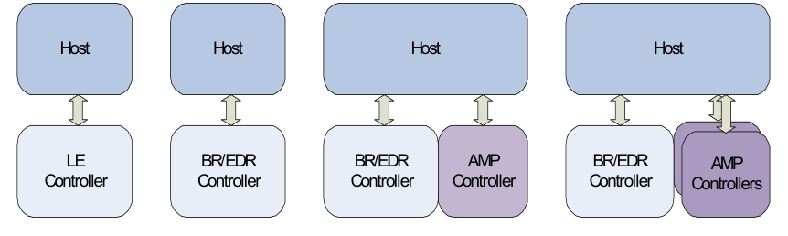

**Figure 1.1:  Bluetooth Host and Controller Combinations: (from left to right): LE Only Primary Controller, BR/EDR only Primary Controller, BR/EDR Primary Controller, with one AMP Secondary Controller, and BR/EDR with multiple AMP Secondary Controllers**

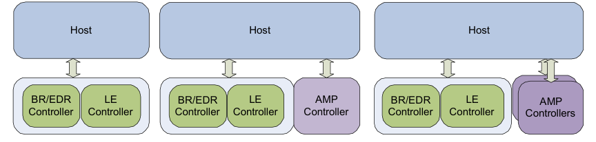

**Figure 1.2:  Bluetooth Host and Controller Combinations (from left to right): BR/EDR and LE Primary Controller, BR/EDR and LE Primary Controller with one AMP Secondary Controller, and BR/EDR and LE Primary Controller with multiple AMP Secondary Controllers**

This volume of the specification provides an overview of the Bluetooth system architecture, communication topologies and data transport features. The text in this volume of the specification should be treated as informational and used as a background and for context-setting.

### 1.1   OVERVIEW OF BR/EDR OPERATION

The Basic Rate / Enhanced Data Rate (BR/EDR) radio (physical layer or PHY) operates in the unlicensed ISM band at 2.4 GHz. The system employs a frequency hopping transceiver to combat interference and fading and provides many FHSS carriers. Basic Rate radio operation uses a shaped, binary frequency modulation to minimize transceiver complexity. The symbol rate is 1 megasymbol per second (Msym/s) supporting the bit rate of 1 megabit per second (Mb/s) or, with Enhanced Data Rate, a gross air bit rate of 2 or 3Mb/s. These modes are known as Basic Rate and Enhanced Data Rate respectively.
During typical operation a physical radio channel is shared by a group of devices that are synchronized to a common clock and frequency hopping pattern. One device provides the synchronization reference and is known as the master. All other devices synchronized to a master’s clock and frequency
hopping pattern are known as slaves. A group of devices synchronized in this fashion form a piconet. This is the fundamental form of communication in the Bluetooth BR/EDR wireless technology.
Devices in a piconet use a specific frequency hopping pattern, which is algorithmically determined by certain fields in the Bluetooth address and clock of the master. The basic hopping pattern is a pseudo-random ordering of the 79 frequencies, separated by 1 MHz, in the ISM band. The hopping pattern can be adapted – on a per-slave basis – to exclude a portion of the frequencies that are used by interfering devices. The adaptive hopping technique improves Bluetooth co-existence with static (non-hopping) ISM systems when they are co-located.
The physical channel is sub-divided into time units known as slots. Data is transmitted between Bluetooth devices in packets that are positioned in these slots. When circumstances permit, a number of consecutive slots may be allocated to a single packet. Frequency hopping may take place between the transmission or reception of packets. Bluetooth technology provides the effect of full duplex transmission through the use of a Time-Division Duplex (TDD) scheme.
Above the physical channel there is a layering of links and channels and associated control protocols. The hierarchy of channels and links from the physical channel upwards is physical channel, physical link, logical transport, logical link and L2CAP channel. These are discussed in more detail in Section 3.3 to Section 3.6 but are introduced here to aid the understanding of the remainder of this section.
Typically within a physical channel, a physical link is formed between a master device and slave devices. Exceptions to this include Inquiry scan and Page scan physical channels, which have no associated physical link. The physical link provides bidirectional packet transport between the master and slave devices, except in the case of a Connectionless Slave Broadcast physical link. In that case, the physical link provides a unidirectional packet transport from the master to a potentially unlimited number of slaves. Since a physical channel could include multiple slave devices, there are restrictions on which devices may form a physical link. There is a physical link between each slave and the master. Physical links are not formed directly between the slaves in a piconet.
The physical link is used as a transport for one or more logical links that support unicast synchronous, asynchronous and isochronous traffic, and broadcast traffic. Traffic on logical links is multiplexed onto the physical link by occupying slots assigned by a scheduling function in the resource manager.
A control protocol for the baseband and physical layers is carried over logical links in addition to user data. This is the link manager protocol (LMP). Devices that are active in a piconet have a default asynchronous connection-oriented logical transport that is used to transport the LMP protocol signaling. For
historical reasons this is known as the ACL logical transport. With the exception of Connectionless Slave Broadcast devices, the primary ACL logical transport is the one that is created whenever a device joins a piconet. Connectionless Slave Broadcast devices may join the piconet purely to listen to Connectionless Slave Broadcast packets. In that case, a Connectionless Slave Broadcast logical transport is created (also called a CSB logical transport) and no ACL logical transport is required. For all devices, additional logical transports may be created to transport synchronous data streams when required.
The Link Manager function uses LMP to control the operation of devices in the piconet and provide services to manage the lower architectural layers (radio layer and baseband layer). The LMP protocol is carried on the primary ACL and active slave broadcast logical transports.
Above the baseband layer the L2CAP layer provides a channel-based abstraction to applications and services. It carries out segmentation and reassembly of application data and multiplexing and de-multiplexing of multiple channels over a shared logical link. L2CAP has a protocol control channel that is carried over the default ACL logical transport. Application data submitted to the L2CAP protocol may be carried on any logical link that supports the L2CAP protocol.

### 1.2   OVERVIEW OF BLUETOOTH LOW ENERGY OPERATION

Like the BR/EDR radio, the LE radio operates in the unlicensed 2.4 GHz ISM band. The LE system employs a frequency hopping transceiver to combat interference and fading and provides many FHSS carriers. LE radio operation uses a shaped, binary frequency modulation to minimize transceiver complexity. LE uses terminology that differs from BR/EDR and AMP to describe supported PHYs with regards to differences in modulation, coding that may be applied, and the resulting data rates. The mandatory symbol rate is 1 megasymbol per second (Msym/s), where 1 symbol represents 1 bit therefore supporting a bit rate of 1 megabit per second (Mb/s), which is referred to as the LE 1M PHY. The 1 Msym/s symbol rate may optionally support error correction coding, which is referred to as the LE Coded PHY. This may use either of two coding schemes: S=2, where 2 symbols represent 1 bit therefore supporting a bit rate of 500 kb/s, and S=8, where 8 symbols represent 1 bit therefore supporting a bit rate of 125 kb/s. An optional symbol rate of 2 Msym/s may be supported, with a bit rate of 2 Mb/s, which is referred to as the LE 2M PHY. The 2 Msym/s symbol rate supports uncoded data only. LE 1M and LE 2M are collectively referred to as the LE Uncoded PHYs. (Section 3.2.2) describes this terminology in more detail.
LE employs two multiple access schemes: Frequency division multiple access (FDMA) and time division multiple access (TDMA). Forty (40) physical channels, separated by 2 MHz, are used in the FDMA scheme. Three (3) are used as primary advertising channels and 37 are used as secondary advertising channels and as data channels. A TDMA based polling scheme is
used in which one device transmits a packet at a predetermined time and a corresponding device responds with a packet after a predetermined interval.
The physical channel is sub-divided into time units known as events. Data is transmitted between LE devices in packets that are positioned in these events. There are four types of events: Advertising, Extended Advertising, Periodic Advertising, and Connection events.
Devices that transmit advertising packets on the advertising PHY channels are referred to as advertisers. Devices that receive advertising packets on the advertising channels without the intention to connect to the advertising device are referred to as scanners. Transmissions on the advertising PHY channels occur in advertising events. At the start of each advertising event, the advertiser sends an advertising packet corresponding to the advertising event type. Depending on the type of advertising packet, the scanner may make a request to the advertiser on the same advertising PHY channel which may be followed by a response from the advertiser on the same advertising PHY channel. The advertising PHY channel changes on the next advertising packet sent by the advertiser in the same advertising event. The advertiser may end the advertising event at any time during the event. The first advertising PHY channel is used at the start of the next advertising event.

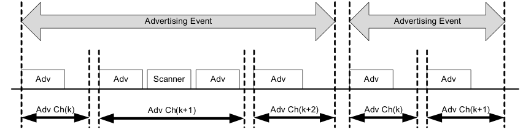

**Figure 1.3:  Advertising Events**

LE devices may fulfill the entire communication in the case of unidirectional or broadcast communication between two or more devices using advertising events. They may also use advertising events to establish pair-wise bi- directional communication between two or more devices using data channels or to establish periodic broadcasts using secondary advertising channels.
Devices that need to form a connection to another device listen for connectable advertising packets. Such devices are referred to as initiators. If the advertiser is using a connectable advertising event, an initiator may make a connection request using the same advertising PHY channel on which it received the connectable advertising packet. The advertising event is ended and connection events begin if the advertiser receives and accepts the request for a connection be initiated. Once a connection is established, the initiator becomes the master device in what is referred to as a piconet and the advertising device becomes the slave device. Connection events are used to send data packets between the master and slave devices. In connection events, channel
hopping occurs at the start of each connection event. Within a connection event, the master and slave alternate sending data packets using the same data PHY channel. The master initiates the beginning of each connection event and can end each connection event at any time.

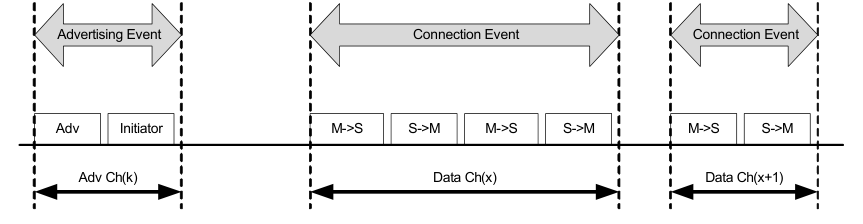

**Figure 1.4:  Connection Events**

Devices in a piconet use a specific frequency hopping pattern, which is algorithmically determined by a field contained in the connection request sent by an initiating device. The hopping pattern used in LE is a pseudo-random ordering of the 37 frequencies in the ISM band. The hopping pattern can be adapted to exclude a portion of the frequencies that are used by interfering devices. The adaptive hopping technique improves Bluetooth co-existence with static (non-hopping) ISM systems when these are co-located and have access to information about the local radio environment, or detected by other means.
Above the physical channel there are concepts of links, channels and associated control protocols. The hierarchy is physical channel, physical link, logical transport, logical link, and L2CAP channel. These are discussed in more detail in Section 3.3 to Section 3.6 but are introduced here to aid the understanding of the remainder of this section.
Within a physical channel, a physical link is formed between devices. The active physical link provides bidirectional packet transport between the master and slave devices. Since an LE physical channel could include multiple slave devices, there are restrictions on which devices may form a physical link. There is a physical link between each slave and master. Slaves are permitted to have physical links to more than one master at a time. A device is permitted to be master and slave at the same time. Physical links are not formed directly between the slaves in a piconet. Role changes between a master and slave device are not supported at this time. The advertising and periodic physical links provide a unidirectional packet transport from the advertiser to a potentially unlimited number of scanners or initiators.
The physical link is used as a transport for one or more logical links that support asynchronous traffic. Traffic on logical links is multiplexed onto the physical link assigned by a scheduling function in the resource manager.
A control protocol for the link and physical layers is carried over logical links in addition to user data. This is the link layer protocol (LL). Devices that are active
in a piconet have a default LE asynchronous connection logical transport (LE ACL) that is used to transport the LL protocol signaling. The default LE ACL is the one that is created whenever a device joins a piconet.
The Link Layer function uses the LL protocol to control the operation of devices in the piconet and provide services to manage the lower architectural layers (PHY and LL).
Just as in BR/EDR, above the link layer the L2CAP layer provides a channel- based abstraction to applications and services. It carries out fragmentation and de-fragmentation of application data and multiplexing and de-multiplexing of multiple channels over a shared logical link. L2CAP has a protocol control channel that is carried over the primary ACL logical transport.
In addition to L2CAP, LE provides two additional protocol layers that reside on top of L2CAP. The Security Manager protocol (SMP) uses a fixed L2CAP channel to implement the security functions between devices. The other is the Attribute protocol (ATT) that provides a method to communicate small amounts of data over a fixed L2CAP channel. The Attribute protocol is also used by devices to determine the services and capabilities of other devices. The Attribute protocol may also be used over BR/EDR.

### 1.3   OVERVIEW OF AMP OPERATION

Alternate MAC/PHYs (AMP) are secondary Controllers in the Bluetooth core system. The BR/EDR radio, the primary radio, is used to perform discovery, association, connection establishment, and connection maintenance. Once an L2CAP connection has been established between two devices over the BR/ EDR radio, the AMP Managers can discover the AMPs that are available on the other device. When an AMP is common between the two devices, the Core system provides mechanisms for moving data traffic from BR/EDR Controller to an AMP Controller.
Each AMP consists of a Protocol Adaptation Layer (PAL) on top of a MAC and PHY. The PAL is responsible for mapping the Bluetooth protocols and behavior (as specified by HCI) to the specific protocols of the underlying MAC and PHY.
L2CAP channels may be created on, or moved to, an AMP. L2CAP channels may also be moved back to the BR/EDR radio when those capabilities are not necessary or when the AMP physical link has a link supervision timeout. A link supervision timeout on an ACL link connecting two BR/EDR devices forces a disconnection of all AMP physical links between those devices.
AMPs may be enabled or disabled as needed in order to minimize power consumption in the system.

### 1.4   NOMENCLATURE

Where the following terms appear in the specification they have the meaning given in Table 1.1.

| Active Slave Broadcast (ASB) | The logical transport that is used to transport L2CAP user traffic and some kinds of LMP traffic to all active devices in the piconet over the BR/EDR Controller. Se Section 3.5.4.4 |
| --- | --- |
| Ad Hoc Network | A network typically created in a spontaneous manner. An ad hoc network requires no formal infrastructure and is limited in temporal and spatial extent. |
| Advertiser | A Bluetooth low energy device that broadcasts adver- tising packets during advertising events on advertising channels |
| Advertising Event | A series of between one and three advertising packet on different advertising channels sent by an advertise |
| Advertising Packet | A packet containing an advertising PDU. See [Vol 6] Part B, Section 2.3.1 |
| AMP | Alternate Media Access Controller (MAC) and Physica Layer (PHY) or Alternate MAC/PHY. |
| AMP Controller | A term referring to AMP PHY, AMP MAC, Protocol Adaptation Layer, and HCI layers. |
| BD ADDR _ | The Bluetooth device Address, BD ADDR, is used to _ identify a Bluetooth device. |
| Bluetooth | Bluetooth is a wireless communication link, operating i the unlicensed ISM band at 2.4 GHz using a frequenc hopping transceiver. It allows real-time AV and data communications between Bluetooth Hosts. The link protocol is based on time slots. |
| Bluetooth Baseband | The part of the Bluetooth system that specifies or implements the medium access and physical layer pro cedures to support the exchange of real-time voice, data information streams, and ad hoc networking between Bluetooth Devices. |
| Bluetooth Clock | A 28 bit clock internal to a BR/EDR Controller sub-sys tem that ticks every 312.5µs. The value of this clock defines the slot numbering and timing in the various physical channels. |
| Bluetooth Controller | A generic term referring to a Primary Controller with o without a Secondary Controller. |
| Bluetooth Device | A device that is capable of short-range wireless com- munications using the Bluetooth system. |
| Bluetooth Device Address | A 48 bit address used to identify each Bluetooth device. |

Table 1.1:  Nomenclature

| BR/EDR | Bluetooth basic rate (BR) and enhanced data rate (EDR). |
| --- | --- |
| BR/EDR Controller | A term referring to the Bluetooth Radio, Baseband, Lin Manager, and HCI layers. |
| BR/EDR Piconet Physical Chan- nel | A Channel that is divided into time slots in which each slot is related to an RF hop frequency. Consecutive hops normally correspond to different RF hop frequen cies and occur at a standard hop rate of 1600 hops/s. These consecutive hops follow a pseudo-random hop ping sequence, hopping through a 79 RF channel set, or optionally fewer channels when Adaptive Frequenc Hopping (AFH) is in use. |
| BR/EDR/LE | Bluetooth basic rate (BR), enhanced data rate (EDR) and low energy (LE). |
| C-plane | Control plane |
| Channel | Either a physical channel or an L2CAP channel, depending on the context. |
| Connect (to service) | The establishment of a connection to a service. If not already done, this also includes establishment of a physical link, logical transport, logical link and L2CAP channel. |
| Connectable device | A BR/EDR device in range that periodically listens on its page scan physical channel and will respond to a page on that channel. An LE device that is advertising using a connectable advertising event. |
| Connected devices | Two BR/EDR devices and with a physical link betwee them. |
| Connecting | A phase in the communication between devices when a connection between the devices is being established (Connecting phase follows after the link establishment phase is completed.) |
| Connection | A connection between two peer applications or higher layer protocols mapped onto an L2CAP channel. |
| Connection establishment | A procedure for creating a connection mapped onto a channel. |
| Connection Event | A series of one or more pairs of interleaving data pack ets sent between a master and a slave on the same physical channel. |
| Connectionless Slave Broadcast (CSB) | A feature that enables a master to broadcast informa- tion to an unlimited number of slaves. |
| Connectionless Slave Broadcast Receiver | A Bluetooth device that receives broadcast informatio from a Connectionless Slave Broadcast Transmitter. The device is a slave of the piconet. |

Table 1.1:  Nomenclature

| Connectionless Slave Broadcast Transmitter | A Bluetooth device that sends Connectionless Slave Broadcast messages for reception by one or more Connectionless Slave Broadcast receivers. The devic is the master of the piconet. |
| --- | --- |
| Controller | A collective term referring to all of the layers below HC |
| Coverage area | The area where two Bluetooth devices can exchange messages with acceptable quality and performance. |
| Creation of a secure connection | A procedure of establishing a connection, including authentication and encryption. |
| Creation of a trusted relationship | A procedure where the remote device is marked as a trusted device. This includes storing a common link ke for future authentication, or pairing, when a link key is not available. |
| Device discovery | A procedure for retrieving the Bluetooth device address, clock, class-of-device field and used page scan mode from discoverable devices. |
| Discoverable device | A BR/EDR device in range that periodically listens on an inquiry scan physical channel and will respond to a inquiry on that channel. An LE device in range that is advertising with a connectable or scannable advertisin event with a discoverable flag set in the advertising data. This device is in the discoverable mode. |
| Discoverable Mode | A Bluetooth device that is performing inquiry scans in BR/EDR or advertising with a discoverable or connect able advertising event with a discoverable flag set in LE. |
| Discovery procedure | A Bluetooth device that is carrying out the inquiry pro- cedure in BR/EDR or scanning for advertisers using a discoverable or connectable advertising event with a discoverable flag set in LE. |
| HCI | The Host Controller Interface (HCI) provides a com- mand interface to the baseband Controller and link manager and access to hardware status and control registers. This interface provides a uniform method of accessing the Bluetooth baseband capabilities. |
| Host | A logical entity defined as all of the layers below the non-core profiles (e.g.Volume 3) and above the Host Controller Interface (HCI). A Bluetooth Host attached t a Bluetooth Controller may communicate with other Bluetooth Hosts attached to their Controllers as well. |
| Initiator | A Bluetooth low energy device that listens on advertis ing channels for connectable advertising events to form connections. |
| Inquiring device | A BR/EDR device that is carrying out the inquiry proce dure. This device is performing the discovery proce- dure. |

Table 1.1:  Nomenclature

| Inquiry | A procedure where a Bluetooth device transmits inquir messages and listens for responses in order to dis- cover the other Bluetooth devices that are within the coverage area. |
| --- | --- |
| Inquiry scan | A procedure where a Bluetooth device listens for inquiry messages received on its inquiry scan physical channel. |
| Interoperability | The ability of two or more systems or components to exchange information and to use the information that has been exchanged. |
| Isochronous data | Information in a stream where each information entity in the stream is bound by a time relationship to previ- ous and successive entities. |
| Known device | A Bluetooth device for which at least the BD ADDR is _ stored. |
| L2CAP | Logical Link Control and Adaptation Protocol |
| L2CAP Channel | A logical connection on L2CAP level between two device serving a single application or higher layer protocol. |
| L2CAP Channel establishment | A procedure for establishing a logical connection on L2CAP level. |
| LE | Bluetooth low energy (LE) |
| Link | Shorthand for a logical link. |
| Link establishment | A procedure for establishing the default ACL link and hierarchy of links and channels between devices. |
| Link key | A secret key that is known by two devices and is used to authenticate the link. |
| LMP authentication | An LMP level procedure for verifying the identity of a remote device. |
| LMP pairing | A procedure that authenticates two devices and cre- ates a common link key that can be used as a basis fo a trusted relationship or a (single) secure connection. |
| Logical link | The lowest architectural level used to offer independent data transport services to clients of the Bluetooth system |
| Logical transport | Shared acknowledgment protocol and link identifiers between different logical links. |
| Name discovery | A procedure for retrieving the user-friendly name (the Bluetooth device name) of a connectable device. |
| Packet | Format of aggregated bits that are transmitted on a physical channel. |
| Page | The initial phase of the connection procedure where a device transmits a train of page messages until a response is received from the target device or a time- out occurs. |

Table 1.1:  Nomenclature

| Page scan | A procedure where a device listens for page message received on its page scan physical channel. |
| --- | --- |
| Paging device | A Bluetooth device that is carrying out the page proce dure. |
| Paired device | A Bluetooth device for which a link key has been cre- ated (either before connection establishment was requested or during connecting phase). |
| Passkey | A 6-digit number used to authenticate connections when Secure Simple Pairing is used. |
| Physical Channel | Characterized by synchronized occupancy of a sequence of RF carriers by one or more devices. A number of physical channel types exist with character istics defined for their different purposes. |
| Physical Link | A Baseband or Link Layer level connection between two devices. |
| Physical Transport | PHY packet transmission and/or reception on an RF channel using one or more modulation schemes. |
| Piconet | A collection of devices occupying a shared physical channel where one of the devices is the Piconet Maste and the remaining devices are connected to it. |
| Piconet Master | The BR/EDR device in a piconet whose Bluetooth Clock and Bluetooth Device Address are used to defin the piconet physical channel characteristics. |
| Piconet Slave | Any BR/EDR device in a piconet that is not the Picone Master, but is connected to the Piconet Master. |
| PIN | A user-friendly number that can be used to authenti- cate connections to a device before pairing has taken place. |
| PMP | A Participant in Multiple Piconets. A device that is con- currently a member of more than one piconet, which it achieves using time division multiplexing (TDM) to interleave its activity on each piconet physical channe |
| Profile Broadcast Data (PBD) | A logical link that carries data from a Connectionless Slave Broadcast Transmitter to one or more Connectionless Slave Broadcast Receivers. |
| Scanner | A Bluetooth low energy device that listens for advertis ing events on the advertising channels. |
| Scatternet | Two or more piconets that include one or more device acting as PMPs. |
| Service discovery | Procedures for querying and browsing for services offered by or through another Bluetooth device. |
| Service Layer Protocol | A protocol that uses an L2CAP channel for transportin PDUs. |

Table 1.1:  Nomenclature

| Silent device | A Bluetooth enabled device appears as silent to a remote device if it does not respond to inquiries mad by the remote device. |
| --- | --- |
| Synchronization Scan Physical Channel | A physical channel that enables a slave device to receive synchronization train packets from a master device. |
| Synchronization Train | A series of packets transmitted on a set of fixed fre- quencies that deliver sufficient information for a recei ing device to start receiving corresponding Connectionless Slave Broadcast packets or to recove the current piconet clock after missing a Coarse Cloc Adjust. |
| U-plane | User plane |
| Unknown device | A Bluetooth device for which no information (Bluetoot Device Address, link key or other) is stored. |

Table 1.1:  Nomenclature

## 2  CORE SYSTEM ARCHITECTURE

The Bluetooth Core system consists of a Host, a Primary Controller and zero or more Secondary Controllers. A minimal implementation of the Bluetooth BR/ EDR core system covers the four lowest layers and associated protocols defined by the Bluetooth specification as well as one common service layer protocol; the Service Discovery Protocol (SDP) and the overall profile requirements are specified in the Generic Access Profile (GAP). The BR/EDR Core system includes support of Alternate MAC/PHYs (AMPs) including an AMP Manager Protocol and Protocol Adaptation Layers (PALs) supporting externally referenced MAC/PHYs. A minimal implementation of a Bluetooth LE only core system covers the four lowest layers and associated protocols defined by the Bluetooth specification as well as two common service layer protocols; the Security Manager (SM) and Attribute Protocol (ATT) and the overall profile requirements are specified in the Generic Attribute Profile (GATT) and Generic Access Profile (GAP). Implementations combining Bluetooth BR/EDR and LE include both of the minimal implementations described above.
A complete Bluetooth application requires a number of additional service and higher layer protocols that are defined in the Bluetooth specification, but are not described here. The core system architecture is shown in Figure 2.1.

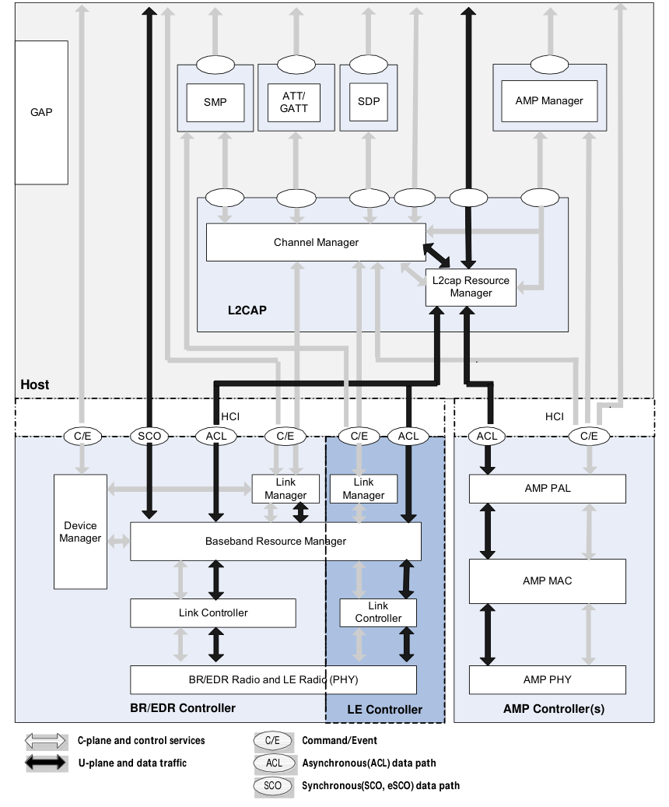

**Figure 2.1:  Bluetooth core system architecture**

Figure 2.1 shows the Core blocks, each with its associated communication protocol. Link Manager, Link Controller and BR/EDR Radio blocks comprise a BR/EDR Controller. An AMP PAL, AMP MAC, and AMP PHY comprise an AMP Controller. Link Manager, Link Controller and LE Radio blocks comprise an LE Controller. L2CAP, SDP and GAP blocks comprise a BR/EDR Host. L2CAP, SMP, Attribute protocol, GAP and Generic Attribute Profile (GATT) blocks comprise an LE Host. A BR/EDR/LE Host combines the set of blocks from each respective Host. This is a common implementation involving a standard
physical communication interface between the Controller and the Host. Although this interface is optional the architecture is designed to allow for its existence and characteristics. The Bluetooth specification enables interoperability between independent Bluetooth systems by defining the protocol messages exchanged between equivalent layers, and also interoperability between independent Bluetooth subsystems by defining a common interface between Bluetooth Controllers and Bluetooth Hosts.
A number of functional blocks and the path of services and data between them are shown. The functional blocks shown in the diagram are informative; in general the Bluetooth specification does not define the details of implementations except where this is required for interoperability. Thus the functional blocks in Figure 2.1 are shown in order to aid description of the system behavior. An implementation may be different from the system shown in Figure 2.1.
Standard interactions are defined for all inter-device operation, where Bluetooth devices exchange protocol signaling according to the Bluetooth specification. The Bluetooth core system protocols are the Radio (PHY) protocol, Link Control (LC) and Link Manager (LM) protocol or Link Layer (LL) protocol, AMP PAL, Logical Link Control and Adaptation protocol (L2CAP), and AMP Manager Protocol, all of which are fully defined in subsequent parts of the Bluetooth specification. In addition, the Service Discovery Protocol (SDP) and the Attribute Protocol (ATT) are service layer protocols that may be required by some Bluetooth applications.
The Bluetooth core system offers services through a number of service access points that are shown in the diagram as ellipses. These services consist of the basic primitives that control the Bluetooth core system. The services can be split into three types. There are device control services that modify the behavior and modes of a Bluetooth device, transport control services that create, modify and release traffic bearers (channels and links), and data services that are used to submit data for transmission over traffic bearers. It is common to consider the first two as belonging to the C-plane and the last as belonging to the U-plane.
A service interface to the Bluetooth Controller subsystem is defined such that the Primary Controller may be considered a standard part. In this configuration the Bluetooth Controller operates the lowest four layers. The Bluetooth Host operates the L2CAP layer and other higher layers. The standard interface is called the Host Controller Interface (HCI) and its service access points are represented by the ellipses on the upper edge of the Bluetooth Controller subsystem in Figure 2.1. Implementation of this standard service interface is optional.
As the Bluetooth architecture is defined with the possibility of separate Host and Controller(s) communicating through one or more HCI transports, a number of general assumptions are made. Bluetooth Controllers are assumed to have limited data buffering capabilities in comparison with the Host.
Therefore the L2CAP layer is expected to carry out some simple resource management when submitting L2CAP PDUs to the Controller for transport to a peer device. This includes segmentation of L2CAP SDUs into more manageable PDUs and then the fragmentation of PDUs into start and continuation packets of a size suitable for the Controller buffers, and management of the use of Controller buffers to ensure availability for channels with Quality of Service (QoS) commitments.
The BR/EDR Baseband, LE Link Layer, and AMP MAC layers provides the basic acknowledgment/repeat request (ARQ) protocol in Bluetooth. The L2CAP layer can optionally provide a further error detection and retransmission to the L2CAP PDUs. This feature is recommended for applications with requirements for a low probability of undetected errors in the user data. A further optional feature of L2CAP is a window-based flow control that can be used to manage buffer allocation in the receiving device. Both of these optional features augment the QoS performance in certain scenarios. Not all of the L2CAP capabilities are available when using the LE system.
Although these assumptions are not always required for embedded Bluetooth implementations that combine all layers in a single system, the general architectural and QoS models are defined with these assumptions in mind, in effect a lowest common denominator.
Automated conformance testing of implementations of the Bluetooth core system is required. This is achieved by allowing the tester to control the implementation through the PHY interface, and test interfaces such as Direct Test Mode (DTM), Generic Test Methodology (GTM), Test Control Interface (TCI), and test commands and events over HCI which are only required for conformance testing.
The tester exchanges with the Implementation Under Test (IUT) through the PHY interface to ensure the correct responses to requests from remote devices. The tester controls the IUT through HCI, DTM, GTM, or TCI to cause the IUT to originate exchanges through the PHY interface so that these can also be verified as conformant.
The TCI uses a different command-set (service interface) for the testing of each architectural layer and protocol. A subset of the HCI command-set is used as the TCI service interface for each of the layers and protocols within the BR/EDR Controller subsystem. A separate service interface is used for testing the L2CAP layer and protocol. As an L2CAP service interface is not defined in the Bluetooth core specification it is defined separately in the Test Control Interface specification. Implementation of the L2CAP service interface is only required for conformance testing.

### 2.1   CORE ARCHITECTURAL BLOCKS

This section describes the function and responsibility of each of the blocks shown in Figure 2.1. An implementation is not required to follow the architecture described above, though every implementation shall conform to the protocol specifications described in subsequent parts of the Bluetooth specification, and shall implement the behavioral aspects of the system outlined below and specified in subsequent parts of the Bluetooth specification.

#### 2.1.1  Host Architectural Blocks

##### 2.1.1.1  Channel Manager

The channel manager is responsible for creating, managing and closing L2CAP channels for the transport of service protocols and application data streams. The channel manager uses the L2CAP protocol to interact with a channel manager on a remote (peer) device to create these L2CAP channels and connect their endpoints to the appropriate entities. The channel manager interacts with its local link manager or an AMP PAL to create new logical links (if necessary) and to configure these links to provide the required quality of service for the type of data being transported.

##### 2.1.1.2  L2CAP Resource Manager

The L2CAP resource manager block is responsible for managing the ordering of submission of PDU fragments to the baseband and some relative scheduling between channels to ensure that L2CAP channels with QoS commitments are not denied access to the physical channel due to Controller resource exhaustion. This is required because the architectural model does not assume that a Controller has limitless buffering, or that the HCI is a pipe of infinite bandwidth.
L2CAP Resource Managers may also carry out traffic conformance policing to ensure that applications are submitting L2CAP SDUs within the bounds of their negotiated QoS settings. The general Bluetooth data transport model assumes well-behaved applications, and does not define how an implementation is expected to deal with this problem.

##### 2.1.1.3  Security Manager Protocol

The Security Manager Protocol (SMP) is the peer-to-peer protocol used to generate encryption keys and identity keys. The protocol operates over a dedicated fixed L2CAP channel. The SMP block also manages storage of the encryption keys and identity keys and is responsible for generating random addresses and resolving random addresses to known device identities. The SMP block interfaces directly with the Controller to provide stored keys used for encryption and authentication during the encryption or pairing procedures.
This block is only used in LE systems. Similar functionality in the BR/EDR system is contained in the Link Manager block in the Controller. SMP functionality is in the Host on LE systems to reduce the implementation cost of the LE only Controllers.

##### 2.1.1.4  Attribute Protocol

The Attribute Protocol (ATT) block implements the peer-to-peer protocol between an attribute server and an attribute client. The ATT client communicates with an ATT server on a remote device over a dedicated fixed L2CAP channel. The ATT client sends commands, requests, and confirmations to the ATT server. The ATT server sends responses, notifications and indications to the client. These ATT client commands and requests provide a means to read and write values of attributes on a peer device with an ATT server.

##### 2.1.1.5  AMP Manager Protocol

The AMP manager is a layer that uses L2CAP to communicate with a peer AMP Manager on a remote device. It also interfaces directly with the AMP PAL for AMP control purposes. The AMP manager is responsible for discovering remote AMP(s) and determining their availability. It also collects information about remote AMP(s). This information is used to set up and manage AMP physical links. The AMP manager uses a dedicated L2CAP signaling channel to communicate with remote AMP manager(s).

##### 2.1.1.6  Generic Attribute Profile

The Generic Attribute Profile (GATT) block represents the functionality of the attribute server and, optionally, the attribute client. The profile describes the hierarchy of services, characteristics and attributes used in the attribute server. The block provides interfaces for discovering, reading, writing and indicating of service characteristics and attributes. GATT is used on LE devices for LE profile service discovery.

##### 2.1.1.7  Generic Access Profile

The Generic Access Profile (GAP) block represents the base functionality common to all Bluetooth devices such as modes and access procedures used by the transports, protocols and application profiles. GAP services include device discovery, connection modes, security, authentication, association models and service discovery.

#### 2.1.2  BR/EDR/LE Controller Architectural Blocks

In implementations where the BR/EDR and LE systems are combined, the architectural blocks may be shared between systems or each system may have their own instantiation of the block.

##### 2.1.2.1  Device Manager

The device manager is the functional block in the baseband that controls the general behavior of the Bluetooth device. It is responsible for all operations of the Bluetooth system that are not directly related to data transport, such as inquiring for the presence of nearby Bluetooth devices, connecting to Bluetooth devices, or making the local Bluetooth device discoverable or connectable by other devices.
The device manager requests access to the transport medium from the baseband resource Controller in order to carry out its functions.
The device manager also controls local device behavior implied by a number of the HCI commands, such as managing the device local name, any stored link keys, and other functionality.

##### 2.1.2.2  Link Manager

The link manager is responsible for the creation, modification and release of logical links (and, if required, their associated logical transports), as well as the update of parameters related to physical links between devices. The link manager achieves this by communicating with the link manager in remote Bluetooth devices using the Link Manager Protocol (LMP) in BR/EDR and the Link Layer Protocol (LL) in LE.
The LM or LL protocol allows the creation of new logical links and logical transports between devices when required, as well as the general control of link and transport attributes such as the enabling of encryption on the logical transport, the adapting of transmit power in BR/EDR on the physical link, or the adjustment of QoS settings in BR/EDR for a logical link.

##### 2.1.2.3  Baseband Resource Manager

The baseband resource manager is responsible for all access to the radio medium. It has two main functions. At its heart is a scheduler that grants time on the physical channels to all of the entities that have negotiated an access contract. The other main function is to negotiate access contracts with these entities. An access contract is effectively a commitment to deliver a certain QoS that is required in order to provide a user application with an expected performance.
The access contract and scheduling function must take account of any behavior that requires use of the Primary Controller. This includes (for example) the normal exchange of data between connected devices over logical links, and logical transports, as well as the use of the radio medium to carry out inquiries, make connections, be discoverable or connectable, or to take readings from unused carriers during the use of adaptive frequency hopping mode.
In some cases in BR/EDR systems the scheduling of a logical link results in changing a logical link to a different physical channel from the one that was previously used. This may be (for example) due to involvement in scatternet, a periodic inquiry function, or page scanning. When the physical channels are not time slot aligned, then the resource manager also accounts for the realignment time between slots on the original physical channel and slots on the new physical channel. In some cases the slots will be naturally aligned due to the same device clock being used as a reference for both physical channels.

##### 2.1.2.4  Link Controller

The Link Controller is responsible for the encoding and decoding of Bluetooth packets from the data payload and parameters related to the physical channel, logical transport and logical link.
The Link Controller carries out the link control protocol signaling in BR/EDR and link layer protocol in LE (in close conjunction with the scheduling function of the resource manager), which is used to communicate flow control and acknowledgment and retransmission request signals. The interpretation of these signals is a characteristic of the logical transport associated with the baseband packet. Interpretation and control of the link control signaling is normally associated with the resource manager’s scheduler.

##### 2.1.2.5  PHY

The PHY block is responsible for transmitting and receiving packets of information on the physical channel. A control path between the baseband and the PHY block allows the baseband block to control the timing and frequency carrier of the PHY block. The PHY block transforms a stream of data to and from the physical channel and the baseband into required formats.

#### 2.1.3  AMP Controller Architectural Blocks

##### 2.1.3.1  AMP HCI

The AMP HCI is the logical interface between an AMP Controller and Host (L2CAP and AMP manager). HCI is an optional layer used when the Host and AMP Controller(s) are physically separated. Support for AMPs requires additional HCI commands and events. These new commands and events are related to AMP physical and logical link management, QoS, as well as flow control.
There is one logical instantiation of an HCI per AMP Controller, and another logical instantiation for the BR/EDR Controller. The physical HCI transport layer manages the multiplexing of several Controllers over the same physical transport bus in cases where multiple Controllers exist in a single physical unit.

##### 2.1.3.2  AMP PAL

The AMP PAL is the AMP layer interfacing the AMP MAC with the Host (L2CAP and AMP Manager). It translates commands from the Host into the specific MAC service primitives and primitives into commands, and it translates primitives from the AMP MAC into understandable event(s) for the Host. The AMP PAL provides support for AMP channel management, data traffic according to specified flow specifications, and power efficiency.
There is not a requirement that the AMP PAL has exclusive access to the AMP itself. Implementers may choose to allow other protocols to be concurrent clients of the AMP. Specific mechanisms for allowing other protocols to share access to the AMP are outside the scope of this specification.
A generic PAL architecture is shown in Figure 2.2. .

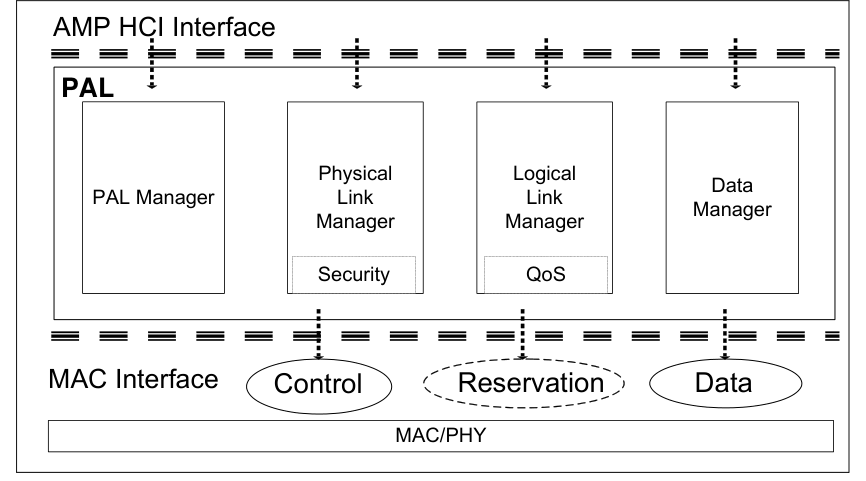

**Figure 2.2:  Generic PAL architecture**

Capabilities of the PAL and the underlying MAC/PHY are exchanged via the AMP_Info and AMP_Assoc structures by the AMP Manager Protocol. The AMP_Info contains generic capabilities of the PAL such as bandwidth availability, maximum PDU size, PAL capabilities, length of the AMP_Assoc and flush timeout information. The contents of the AMP_Assoc are dependent on the PAL and are related to the underlying MAC/PHY.

##### 2.1.3.3  AMP MAC

The AMP MAC is the MAC layer as defined in the IEEE 802 reference layer model. It provides services such as addressing and mechanisms to control and access channels. The AMP MAC is in between AMP PHY and AMP PAL layers.

##### 2.1.3.4  AMP PHY

The AMP PHY is the AMP physical layer.

## 3  DATA TRANSPORT ARCHITECTURE

The Bluetooth data transport system follows a layered architecture. This description of the Bluetooth system describes the Bluetooth core transport layers up to and including L2CAP channels. All Bluetooth operational modes follow the same generic transport architecture, which is shown in Figure 3.1.

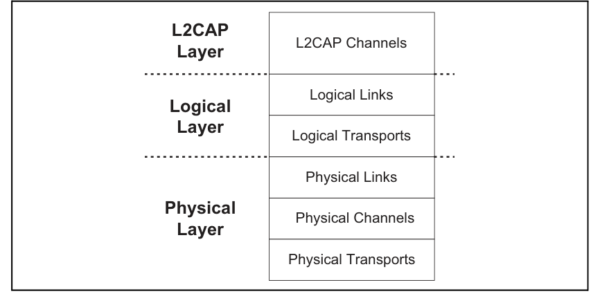

**Figure 3.1:  Bluetooth generic data transport architecture**

For efficiency and legacy reasons, the Bluetooth transport architecture includes a sub-division of the logical layer, distinguishing between logical links and logical transports. This sub-division provides a general (and commonly understood) concept of a logical link that provides an independent transport between two or more devices. The logical transport sub-layer is required to describe the inter-dependence between some of the logical link types (mainly for reasons of legacy behavior).
Prior to Version 1.2, the Bluetooth Core specification described the ACL and SCO links as physical links. With the addition of Extended SCO (eSCO) and for future expansion it is better to consider these as logical transport types, which more accurately encapsulates their purpose. However, they are not as independent as might be desired, due to their shared use of resources such as the LT_ADDR and acknowledgment/repeat request (ARQ) scheme. Hence the architecture is incapable of representing these logical transports with a single transport layer. The additional logical transport layer goes some way towards describing this behavior.

### 3.1   CORE TRAFFIC BEARERS

The Bluetooth core system provides a number of standard traffic bearers for the transport of service protocol and application data. These are shown in Figure 3.2 below (for ease of representation this is shown with higher layers to the left and lower layers to the right).

| ApplicaƟon | Bluetooth core Logical L2CAP Channels Logical Links Transports AMP BR/EDR Channel LE Link Manager AMP PAL Link Manager Layer Protocol Manager Signaling ACL-C BR/EDR ACL AMP Manager Fixed Channel ACL-U LE-C LE ACL LE-U AMP-C Unicast AMP ACL AMP-U SCO[-S] eSCO[-S] PBD CSB ADVB-C ADVB AdverƟƐement Broadcast ADVB-U PADVB ASB-C AcƟve Broadcast ASB-U ASB |
| --- | --- |
| Traĸc Types Higher Layer Protocol Signaling Reliable Asynchronous Framed User Data Higher Layer Framed Isochronous User Data Constant Rate Isochronous User Data Isochronous Unframed ProĮle Data Unreliable Asynchronous Framed User Data |  |
|  |  |

The core traffic bearers that are available to applications are shown in Figure 3.2 as the shaded rounded rectangles. The architectural layers that are defined to provide these services are described in Section 2. A number of data traffic types are shown on the left of the diagram linked to the traffic bearers that are typically suitable for transporting that type of data traffic.
The logical links are named using the names of the associated logical transport and a suffix that indicates the type of data that is transported. (C for control links carrying LMP or LL messages, U for L2CAP links carrying user data (L2CAP PDUs) and S for stream links carrying unformatted synchronous or isochronous data.) It is common for the suffix to be removed from the logical link without introducing ambiguity, thus a reference to the default ACL logical transport can be resolved to mean the ACL-C logical link in cases where the LMP protocol is being discussed, the LE-C logical link in cases where LL protocol is being discussed, the AMP-C logical link in cases where a PAL
protocol is being discussed, or the ACL-U,LE-U, or AMP-U logical links when the L2CAP layer is being discussed.
The mapping of application traffic types to Bluetooth core traffic bearers in Figure 3.2 is based on matching the traffic characteristics with the bearer characteristics. It is recommended to use these mappings as they provide the most natural and efficient method of transporting the data with its given characteristics.
However, an application (or an implementation of the Bluetooth core system) may choose to use a different traffic bearer, or a different mapping to achieve a similar result. For example, in a BR/EDR piconet with only one slave, the master may choose to transport L2CAP broadcasts over the ACL-U logical link rather than over the ASB-U logical link. This will probably be more efficient in terms of bandwidth (if the physical channel quality is not too degraded). Use of alternative transport paths to those in Figure 3.2 is only acceptable if the characteristics of the application traffic type are preserved.
Figure 3.2 shows a number of application traffic types. These are used to classify the types of data that may be submitted to the Bluetooth core system. The original data traffic type can be different from the type that is submitted to the Bluetooth core system if an intervening process modifies it. For example, video data is generated at a constant rate but an intermediate coding process may alter this to variable rate, e.g. by MPEG4 encoding. For the purposes of the Bluetooth core system, only the characteristic of the submitted data is of interest.

#### 3.1.1  Framed Data Traffic

The L2CAP layer services provide a frame-oriented transport for asynchronous and isochronous user data. The application submits data to this service in variable-sized frames (up to a negotiated maximum for the channel) and these frames are delivered in the same form to the corresponding application on the remote device. There is no requirement for the application to insert additional framing information into the data, although it may do so if this is required (such framing is invisible to the Bluetooth core system).
Connection-oriented L2CAP channels may be created for transport of unicast (point-to-point) data between two Bluetooth devices. Connection-oriented channels provide a context within which specific properties may be applied to data transported on the channel. For example, quality of service parameters or flow and error control modes may be applied. Connection-oriented L2CAP channels are created using the L2CAP connection procedure.
A connectionless BR/EDR L2CAP channel exists for broadcasting data or for transport of unicast data. In the case of piconet topologies the master device is always the source of broadcast data and the slave device(s) are the recipients. Broadcast traffic on the connectionless L2CAP channel is uni-directional. Unicast data sent on the connectionless L2CAP channels may be uni- directional or bi-directional. Unicast data sent on the L2CAP connectionless
channel provides an alternate mechanism to send data with the same level of reliability as an L2CAP connection-oriented channel operating in Basic mode but without the additional latency incurred by opening an L2CAP connection- oriented channel. LE L2CAP connectionless channels are not supported.
BR/EDR L2CAP channels have an associated QoS setting that defines constraints on the delivery of the frames of data. These QoS settings may be used to indicate (for example) that the data is isochronous, and therefore has a limited lifetime after which it becomes invalid, or that the data should be delivered within a given time period, or that the data is reliable and should be delivered without error, however long this takes.
Some L2CAP channels are fixed channels created when the ACL-U and/or LE- U logical links are established. These fixed channels have fixed channel identifiers and fixed configurations and do not permit negotiation of the configuration after they are created. These fixed channels are used for BR/ EDR and LE L2CAP signaling (ACL-U or LE-U), connectionless channel (ACL- U and ASB-U), AMP manager protocol (ACL-U), Security Manager Protocol (LE-U), Attribute Protocol (ACL-U or LE-U) and AMP Test Manager (ACL-U).
The L2CAP channel manager is responsible for arranging to transport the L2CAP channel data frames on an appropriate baseband logical link, possibly multiplexing this onto the baseband logical link with other L2CAP channels with similar characteristics.

#### 3.1.2  Unframed Data Traffic

If the application does not require delivery of data in frames, possibly because it includes in-stream framing, or because the data is a pure stream, then it may avoid the use of L2CAP channels and make direct use of a baseband logical link.
The Bluetooth core system supports the direct transport of application data that is isochronous and of a constant rate (either bit-rate, or frame-rate for pre- framed data), using a SCO-S or eSCO-S logical link. These logical links reserve physical channel bandwidth and provide a constant rate transport locked to the piconet clock. Data is transported in fixed size packets at fixed intervals with both of these parameters negotiated during channel establishment. eSCO links provide a greater choice of bit-rates and also provide greater reliability by using limited retransmission in case of error. Enhanced Data Rate operation is supported for eSCO, but not for SCO logical transports. SCO and eSCO logical transports do not support multiplexed logical links or any further layering within the Bluetooth core. An application may choose to layer a number of streams within the submitted SCO/eSCO stream, provided that the submitted stream is, or has the appearance of being, a constant rate stream.
The Bluetooth core system also supports the direct transport of application data using a Profile Broadcast Data (PBD) logical link. This logical link is similar to SCO-S and eSCO-S since it reserves physical channel bandwidth, provides
a constant rate transport locked to the piconet clock, and transports data at fixed intervals. It does not support multiplexed logical links or any further layering within the Bluetooth core but, unlike SCO-S and eSCO-S, it supports broadcasting data from a single transmitter to many receivers.
The application chooses the most appropriate type of logical link from those available at the baseband, and creates and configures it to transport the data stream, and releases it when completed. (The application will normally also use a framed L2CAP unicast channel to transport its C-plane information to the peer application on the remote device.)
If the application data is isochronous and of a variable rate, then this may only be carried by the L2CAP unicast channel, and hence will be treated as framed data.
Unframed data traffic is not supported in the LE system.

#### 3.1.3  Reliability of Traffic Bearers

##### 3.1.3.1  BR/EDR Reliability

Bluetooth is a wireless communications system. In poor RF environments, this system should be considered inherently unreliable. To counteract this the system provides levels of protection at each layer. The baseband packet header uses forward error correcting (FEC) coding to allow error correction by the receiver and a header error check (HEC) to detect errors remaining after correction. Certain Baseband packet types include FEC for the payload. Furthermore, some Baseband packet types include a cyclic redundancy error check (CRC).
On ACL logical transports the results of the error detection algorithm are used to drive a simple ARQ protocol. This provides an enhanced reliability by re- transmitting packets that do not pass the receiver’s error checking algorithm. It is possible to modify this scheme to support latency-sensitive packets by discarding an unsuccessfully transmitted packet at the transmitter if the packet’s useful life has expired. eSCO links use a modified version of this scheme to improve reliability by allowing a limited number of retransmissions.
The resulting reliability gained by this ARQ scheme is only as dependable as the ability of the HEC and CRC codes to detect errors. In most cases this is sufficient, however it has been shown that for the longer packet types the probability of an undetected error is too high to support typical applications, especially those with a large amount of data being transferred.
The L2CAP layer provides an additional level of error control that is designed to detect the occasional undetected errors in the baseband layer and request retransmission of the affected data. This provides the level of reliability required by typical Bluetooth applications.
Broadcast links have no feedback route, and are unable to use the ARQ scheme (although the receiver is still able to detect errors in received packets). Instead each packet is transmitted several times in the hope that the receiver is able to receive at least one of the copies successfully. Despite this approach there are still no guarantees of successful receipt, and so these links are considered unreliable.
In summary, if a link or channel is characterized as reliable this means that the receiver is capable of detecting errors in received packets and requesting re- transmission until the errors are removed. Due to the error detection system used some residual (undetected) errors may still remain in the received data. For L2CAP channels the level of these is comparable to other communication systems, although for logical links the residual error level is somewhat higher.
The transmitter may remove packets from the transmit queue such that the receiver does not receive all the packets in the sequence. If this happens detection of the missing packets is delegated to the L2CAP layer.
On an unreliable link the receiver is capable of detecting errors in received packets but cannot request retransmission. The packets passed on by the receiver may be without error, but there is no guarantee that all packets in the sequence are received. Hence the link is considered fundamentally unreliable. There are limited uses for such links, and these uses are normally dependent on the continuous repetition of data from the higher layers while it is valid.
Stream links have a reliability characteristic somewhere between a reliable and an unreliable link, depending on the current operating conditions.

##### 3.1.3.2  LE Reliability

Like BR/EDR, in poor RF environments, the LE system should be considered inherently unreliable. To counteract this, the system provides levels of protection at each layer. The LL packet uses a 24-bit cyclic redundancy error check (CRC) to cover the contents of the packet payload. If the CRC verification fails on the packet payload, the packet is not acknowledged by the receiver and the packet gets retransmitted by the sender.
Broadcast links have no feedback route, and are unable to use the acknowledgment scheme (although the receiver is still able to detect errors in received packets). Instead, each packet is transmitted several times to increase the probability that the receiver is able to receive at least one of the copies successfully. Despite this approach there are still no guarantees of successful receipt, and so these links are considered unreliable.
In summary, if a link or channel is characterized as reliable this means that the receiver is capable of detecting errors in received packets and requesting re- transmission until the errors are removed.
On an unreliable link the receiver is capable of detecting errors in received packets but cannot request retransmission. The packets passed on by the receiver may be without error, but there is no guarantee that all packets in the sequence are received. Hence the link is considered fundamentally unreliable. There are limited uses for such links, and these uses are normally dependent on the continuous repetition of data from the higher layers while it is valid.

##### 3.1.3.3  AMP Reliability

The reliability of each AMP depends on the underlying MAC/PHY technology. Some AMPs only flush user traffic when marked as flushable whereas other AMPs can flush user traffic.
The Bluetooth Core maintains a level of reliability for protocols and profiles above the Core by mandating the use of Enhanced Retransmission Mode or Streaming Mode for any L2CAP channel used over the AMP.

### 3.2   TRANSPORT ARCHITECTURE ENTITIES

The Bluetooth transport architecture entities are shown in Figure 3.3 and are described from the lowest layer upwards in the subsequent sections.

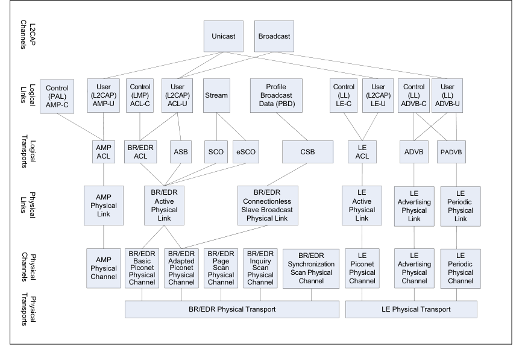

**Figure 3.3:  Overview of transport architecture entities and hierarchy**

The BR/EDR Physical Transport encapsulates the BR/EDR Physical Channels. Transfers using the BR/EDR Physical Transport use the BR/EDR Generic Packet Structure. The LE Physical Transport encapsulates the LE Physical
Channels. Transfers using the LE Physical Transport use the LE Generic Packet Structure.

#### 3.2.1  BR/EDR Generic Packet Structure

The general packet structure nearly reflects the architectural layers found in the Bluetooth BR/EDR system. The BR/EDR packet structure is designed for optimal use in normal operation. It is shown in Figure 3.4.

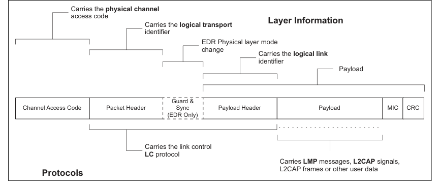

**Figure 3.4:  BR/EDR packet structure**

Packets normally only include the fields that are necessary to represent the layers required by the transaction. Thus a simple inquiry request over an inquiry scan physical channel does not create or require a logical link or higher layer and therefore consists only of the channel access code (associated with the physical channel).
All packets include the channel access code. This is used to identify communications on a particular physical channel, and to exclude or ignore packets on a different physical channel that happens to be using the same RF carrier in physical proximity.
There is no direct field within the BR/EDR packet structure that represents or contains information relating to physical links. This information is implied by the combination of the logical transport address (LT_ADDR) carried in the packet header and the channel access code (CAC).
Most BR/EDR packets include a packet header. The packet header is always present in packets transmitted on physical channels that support physical links, logical transports and logical links. The packet header carries the LT_ADDR, which is used by each receiving device to determine if the packet is addressed to the device and is used to route the packet internally.
The BR/EDR packet header also carries part of the link control (LC) protocol that is operated per logical transport (except for ACL and SCO transports that operate a shared LC protocol carried on either logical transport).
The Enhanced Data Rate (EDR) packets have a guard time and synchronization sequence before the payload. This is a field used for physical layer change of modulation scheme.
The payload header is present in all packets on logical transports that support multiple logical links. The payload header includes a logical link identifier field used for routing the payload, and a field indicating the length of the payload body. Some packet types also include a CRC at the end of the packet payload that is used to detect most errors in received packets. When AES-CCM encryption is enabled, ACL packets include a Message Integrity Check (MIC) just prior to the CRC field.
EDR packets have a trailer after the CRC.
The packet payload body is used to transport the user data. The interpretation of this data is dependent on the logical transport and logical link identifiers. For ACL logical transports Link Manager Protocol (LMP) messages and L2CAP signals are transported in the packet payload body, along with general user data from applications.
For SCO, eSCO, and CSB logical transports the payload body contains the user data for the logical link.

#### 3.2.2  LE Generic Packet Structure

LE radio operation is based on three PHYs and makes use of two modulation schemes. Table 3.1 summarizes the properties of each of the LE PHYs. Each packet transmitted uses a single PHY. Each PHY uses a single modulation scheme. Two of the PHYs are uncoded - that is, each bit maps directly to a single radio symbol in the packet - while the third PHY is error correction coded. There are two coding schemes: S=8 and S=2, where S is the number of symbols per bit.

| PHY | Modulation scheme | Coding scheme |  | Data rate |
| --- | --- | --- | --- | --- |
|  |  | Access Header | Payload |  |
| LE 1M | 1 Msym/s modulation | Uncoded | Uncoded | 1 Mb/s |
| LE 2M | 2 Msym/s modulation | Uncoded | Uncoded | 2 Mb/s |
| LE Coded | 1 Msym/s modulation | S=8 | S=8 | 125 kb/s |
|  |  |  | S=2 | 500 kb/s |

Table 3.1:  Summary of PHYs, modulation schemes, and coding schemes
The "Access Header" referred to in Table 3.1 includes all the bits in the packet format associated with the particular PHY prior to the start of the PDU Header but not including the preamble. The preamble is excluded as this is uncoded for all PHYs.
The "Payload" referred to in Table 3.1 includes all the bits in the packet format from the PDU Header to the end of the packet.
The general structure of the link layer air interface packet closely reflects the architectural layers found in the LE system. The packet structure for the LE Uncoded PHYs is designed for optimal use in normal operation and is shown in Figure 3.5.

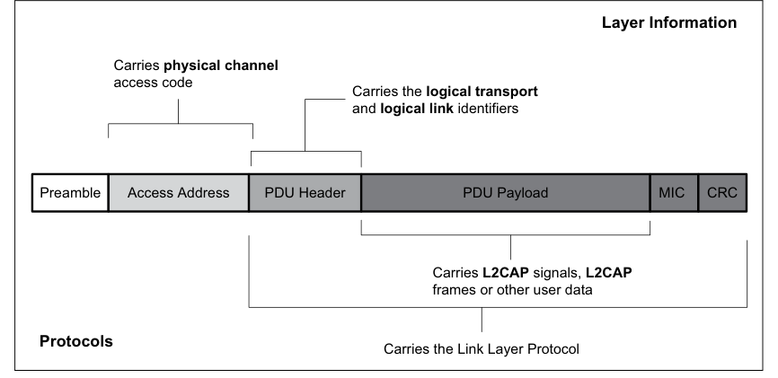

**Figure 3.5:  The packet structure for the LE Uncoded PHYs**

The packet structure for the LE Coded PHY is designed for optimal use in extended range operation and is shown in Figure 3.6

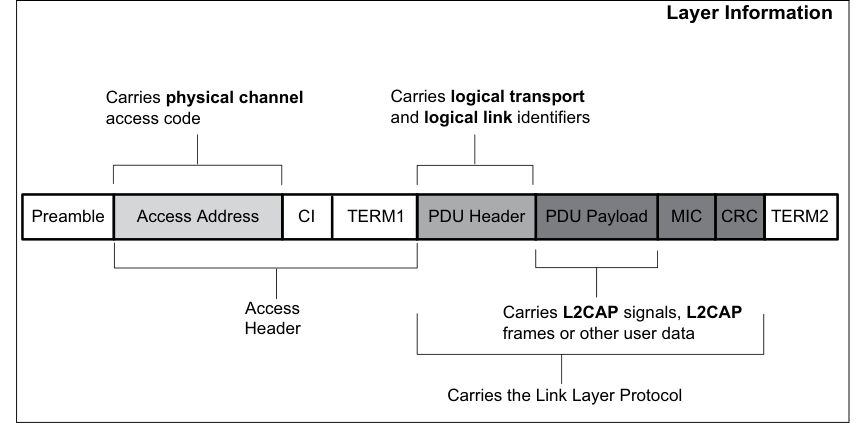

**Figure 3.6:  The packet structure for the LE Coded PHY**

When using the LE Coded PHY, it is recommended to carefully consider the impact of radio-on time for power consumption and duty cycle for scheduling and coexistence over the air. The LE Coded PHY with S=8 coding (125 kb/s) represents the worst case, when considering radio-on time and duty cycle, where each packet sent over the air will be approximately 8 times larger than LE 1M.
Table 3.2 illustrates the on-air time of advertising events with different sizes of AdvData. The first is using connectable and scannable undirected advertising events where the AdvData is sent on the primary advertising channel. The second is using events where the AdvData is offloaded to the secondary advertising channel. The usage of the primary and secondary advertising channels is described in Section 3.3.2.2. Numbers in parentheses are hypothetical and show cases that are not valid in a compliant implementation.

| AdvData [Bytes] | Connectable Undirected Advertising Event [µs] |  | Connectable Undirected Advertising Event Using Offloading [µs] |  |
| --- | --- | --- | --- | --- |
|  | LE 1M | LE Coded S=8 | LE 1M | LE Coded S=8 |
| 0 | 384 | (3,312) | 568 | 4,86 |
| 15 | 744 | (6,192) | 688 | 5,82 |
| 31 | 1,128 | (9,264) | 816 | 6,84 |
| 100 | (2,784) | (22,512) | 1,368 | 11,26 |
| 245 | (6,264) | (50,352) | 2,528 | 20,54 |

Table 3.2:  On-air time for various advertising events
Note: The events without offloading were calculated using three ADV_IND PDUs, while the events with offloading used three ADV_EXT_IND PDUs containing only the AuxPtr and ADI fields plus one AUX_ADV_IND PDU with the AdvA and ADI fields present and holding the AdvData.
Table 3.3 illustrates, for a range of payload sizes, the difference in Link Layer Data Channel PDU packet durations for connections over the LE 1M PHY and LE Coded PHY with S=8 coding. Connection duty cycle for a specific implementation may be easily calculated from this information.

| Payload [bytes] | LL Data Channel PDU [µs] |  |
| --- | --- | --- |
|  | LE 1M | LE Coded S=8 |
| 0 | 80 | 72 |
| 15 | 200 | 1,68 |
| 31 | 328 | 2,70 |

Table 3.3:  On-air time for various data channel packets

| Payload [bytes] | LL Data Channel PDU [µs] |  |
| --- | --- | --- |
|  | LE 1M | LE Coded S=8 |
| 100 | 880 | 7,1 |
| 255 | 2,120 | 17,0 |

Table 3.3:  On-air time for various data channel packets
The physical link identifier is not contained in the link layer air interface packet. The physical channel identifiers are either fixed, are determined at connection setup, or are determined at periodic advertising setup. All LE packets include the Access Address. This is used to identify communications on a physical channel, and to exclude or ignore packets on different physical channels that are using the same PHY channels in physical proximity. The Access Address determines whether the packet is directed to the advertising physical channel (and thus an advertising physical link) used for non-periodic advertising, the periodic physical channel used for periodic advertising, or to a piconet physical channel (and thus an active physical link to a device). The LE advertising physical channel used for non-periodic advertising uses a fixed Access Address. The LE periodic physical channel used for periodic advertising and LE piconet physical channels use a randomly generated 32-bit value as their Access Address. This provides a high number of periodic advertisements and a high number of active devices that can be addressed in an LE periodic advertisement or an LE piconet.
All LE packets include a PDU header. The PDU header determines the type of advertisement broadcast or logical link carried over the physical channel.
For advertising channel PDUs, the PDU header contains the type of advertisement payload, the device address type for addresses contained in the advertisement, and the advertising channel PDU payload length. Most advertising channel PDU payloads contain the advertiser's address and advertising data. One advertising channel PDU payload only contains the advertiser's device address and the initiator's device address in which the advertisement is directed. Advertising channel PDUs with scan requests payloads contain the scanner's device address and the advertiser's device address. Advertising channel PDUs with scan responses contain advertiser's device address and the scan response data. Advertising channel PDUs with connection request payloads contain the initiator's device address, advertiser's device address and connection setup parameters.
For data channel PDUs, the PDU header contains the Logical Link Identifier (LLID), the Next Expected Sequence Number (NESN), Sequence Number (SN), More Data (MD) and payload length. For data channel PDUs that contain control commands, the data channel PDU payload contains a command opcode and control data that is specific to the command. There is an optional Message Integrity Check (MIC) value that is used to authenticate the data PDU. For data channel PDUs that are data, the data channel PDU payload contains L2CAP data.

### 3.3   PHYSICAL CHANNELS

A number of types of physical channel are defined. All Bluetooth physical channels are characterized by a set of PHY frequencies combined with temporal parameters and restricted by spatial considerations. For the basic and adapted piconet physical channels frequency hopping is used to change frequency periodically to reduce the effects of interference and for regulatory reasons.
The Bluetooth BR/EDR system and LE system differ slightly in the way they use physical channels.

#### 3.3.1  BR/EDR Physical Channels

In the BR/EDR core system, peer devices use a shared physical channel for communication. To achieve this their transceivers need to be tuned to the same PHY frequency at the same time, and they need to be within a nominal range of each other.
Given that the number of RF carriers is limited and that many Bluetooth devices may be operating independently within the same spatial and temporal area there is a strong likelihood of two independent Bluetooth devices having their transceivers tuned to the same RF carrier, resulting in a physical channel collision. To mitigate the unwanted effects of this collision each transmission on a physical channel starts with an access code that is used as a correlation code by devices tuned to the physical channel. This channel access code is a property of the physical channel. The access code is present at the start of every transmitted packet.
Several BR/EDR physical channels are defined. Each is optimized and used for a different purpose. Two of these physical channels (the basic piconet channel and adapted piconet channel) are used for communication between connected devices and are associated with a specific piconet. Other BR/EDR physical channels are used for discovering (the inquiry scan channel) and connecting (the page scan channel) Bluetooth devices. The synchronization scan physical channel is used by devices to obtain timing and frequency information about the Connectionless Slave Broadcast physical link or to recover the current piconet clock.
A Bluetooth device can only use one BR/EDR physical channel at any given time. In order to support multiple concurrent operations the device uses time- division multiplexing between the channels. In this way a Bluetooth device can appear to operate simultaneously in several piconets, as well as being discoverable and connectable.
Whenever a Bluetooth device is synchronized to the timing, frequency and access code of a physical channel it is said to be ‘connected’ to this channel (whether or not it is actively involved in communications over the channel). The Bluetooth specification assumes that a device is only capable of connecting to one physical channel at any time. Advanced devices may be capable of
connecting simultaneously to more than one physical channel, but the specification does not assume that this is possible.

##### 3.3.1.1  Basic Piconet Channel

###### 3.3.1.1.1   Overview

The basic piconet channel is used for communication between connected devices during normal operation.

###### 3.3.1.1.2   Characteristics

The basic piconet channel is characterized by a pseudo-random sequence hopping through the PHY channels. The hopping sequence is unique for the piconet and is determined by the Bluetooth device address of the master. The phase in the hopping sequence is determined by the Bluetooth clock of the master. All Bluetooth devices participating in the piconet are time- and hop- synchronized to the channel.
The channel is divided into time slots where each slot corresponds to an PHY hop frequency. Consecutive hops correspond to different PHY hop frequencies. The time slots are numbered according to the Bluetooth clock of the piconet master. Packets are transmitted by Bluetooth devices participating in the piconet aligned to start at a slot boundary. Each packet starts with the channel access code, which is derived from the Bluetooth device address of the piconet master.
On the basic piconet channel the master controls access to the channel. The master starts its transmission in even-numbered time slots only. Packets transmitted by the master are aligned with the slot start and define the piconet timing. Packets transmitted by the master may occupy up to five time slots depending on the packet type.
Each master transmission is a packet carrying information on one of the logical transports. Slave devices may transmit on the physical channel in response. The characteristics of the response are defined by the logical transport that is addressed.
For example, on the asynchronous connection-oriented logical transport (ACL), the addressed slave device responds by transmitting a packet containing information for the same logical transport that is nominally aligned with the next (odd-numbered) slot start. Such a packet may occupy up to five time slots, depending on the packet type. On a broadcast logical transport no slaves are allowed to respond.

###### 3.3.1.1.3   Topology

A basic piconet channel may be shared by any number of Bluetooth devices, limited only by the resources available on the piconet master device. Only one device is the piconet master, all others being piconet slaves. All communication
is between the master and slave devices. There is no direct communication between slave devices on the piconet channel.
There is, however, a limitation on the number of logical transports that can be supported within a piconet. This means that although there is no theoretical limit to the number of Bluetooth devices that share a channel there is a limit to the number of these devices that can be actively involved in exchanging data with the master.

###### 3.3.1.1.4   Supported layers

The basic piconet channel supports a number of physical links, logical transports, logical links and L2CAP channels used for general purpose communications.

##### 3.3.1.2  Adapted Piconet Channel

###### 3.3.1.2.1   Overview

The adapted piconet channel differs from the basic piconet channel in two ways. First, the frequency on which a slave transmits is the same as the frequency used by its master in the preceding transmission. In other words the frequency is not recomputed between master and subsequent slave packets. Second, the adapted piconet channel may be based on fewer than the full 79 frequencies. A number of frequencies may be excluded from the hopping pattern by being marked as “unused”. The remainder of the 79 frequencies are included. The two sequences are the same except that whenever the basic pseudo-random hopping sequence selects an unused frequency, it is replaced with an alternative chosen from the used set. The set of frequencies used may vary between different physical links on the same adapted piconet channel.
Because the adapted piconet channel uses the same timing and access code as the basic piconet channel, physical links on the two channels are often coincident. This provides a deliberate benefit as it allows slaves in either the basic piconet channel or the adapted piconet channel to adjust their synchronization to the master.
The topology and supported layers of the adapted piconet physical channel are identical to the basic piconet physical channel with one exception: on the adapted piconet physical channel, it is possible for a single master to transmit data to an unlimited number of slaves using a single CSB logical transport. In this case, however, data is only transferred from master to slave and not from slave to master.

##### 3.3.1.3  Inquiry Scan Channel

###### 3.3.1.3.1   Overview

In order for a device to be discovered, an inquiry scan channel is used. A discoverable device listens for inquiry requests on its inquiry scan channel and then sends a response to that request. In order for a device to discover other devices, it iterates (hops) through all possible inquiry scan channel frequencies in a pseudo-random fashion, sending an inquiry request on each frequency and listening for any response.

###### 3.3.1.3.2   Characteristics

Inquiry scan channels follow a slower hopping pattern and use an access code to distinguish between occasional occupancy of the same radio frequency by two co-located devices using different physical channels.
The access code used on the inquiry scan channel is taken from a reserved set of inquiry access codes that are shared by all Bluetooth devices. One access code is used for general inquiries, and a number of additional access codes are reserved for limited inquiries. Each device has access to a number of different inquiry scan channels. As all of these channels share an identical hopping pattern, a device may concurrently occupy more than one inquiry scan channel if it is capable of concurrently correlating more than one access code.
A device using one of its inquiry scan channels remains passive on that channel until it receives an inquiry message on this channel from another Bluetooth device. This is identified by the appropriate inquiry access code. The inquiry scanning device will then follow the inquiry response procedure to return a response to the inquiring device.
In order for a device to discover other Bluetooth devices it uses the inquiry scan channel to send inquiry requests. As it has no prior knowledge of the devices to discover, it cannot know the exact characteristics of the inquiry scan channel.
The device takes advantage of the fact that inquiry scan channels have a reduced number of hop frequencies and a slower rate of hopping. The inquiring device transmits inquiry requests on each of the inquiry scan hop frequencies and listens for an inquiry response. Transmissions are done at a faster rate, allowing the inquiring device to cover all inquiry scan frequencies in a reasonably short time period.

###### 3.3.1.3.3   Topology

Inquiring and discoverable devices use a simple exchange of packets to fulfill the inquiring function. The topology formed during this transaction is a simple and transient point-to-point connection.

###### 3.3.1.3.4   Supported Layers

During the exchange of packets between an inquiring and discoverable device it may be considered that a temporary physical link exists between these devices. However, the concept is quite irrelevant as it has no physical representation but is only implied by the brief transaction between the devices. No further architectural layers are considered to be supported.

##### 3.3.1.4  Page Scan Channel

###### 3.3.1.4.1   Overview

A connectable device (one that is prepared to accept connections) does so using a page scan channel. A connectable device listens for a page request on its page scan channel and, once received, enters into a sequence of exchanges with this device. In order for a device to connect to another device, it iterates (hops) through all page scan channel frequencies in a pseudo- random fashion, sending a page request on each frequency and listening for a response.

###### 3.3.1.4.2   Characteristics

The page scan channel uses an access code derived from the scanning device’s Bluetooth device address to identify communications on the channel. The page scan channel uses a slower hopping rate than the hop rate of the basic and adapted piconet channels. The hop selection algorithm uses the Bluetooth device clock of the scanning device as an input.
A device using its page scan channel remains passive until it receives a page request from another Bluetooth device. This is identified by the page scan channel access code. The two devices will then follow the page procedure to form a connection. Following a successful conclusion of the page procedure both devices switch to the basic piconet channel that is characterized by having the paging device as master.
In order for a device to connect to another Bluetooth device it uses the page scan channel of the target device in order to send page requests. If the paging device does not know the phase of the target device’s page scan channel it therefore does not know the current hop frequency of the target device. The paging device transmits page requests on each of the page scan hop frequencies and listens for a page response. This is done at a faster hop rate, allowing the paging device to cover all page scan frequencies in a reasonably short time period.
The paging device may have some knowledge of the target device’s Bluetooth clock (indicated during a previous inquiry transaction between the two devices, or as a result of a previous involvement in a piconet with the device), in this case it is able to predict the phase of the target device’s page scan channel. It
may use this information to optimize the synchronization of the paging and page scanning process and speed up the formation of the connection.

###### 3.3.1.4.3   Topology

Paging and connectable devices use a simple exchange of packets to fulfill the paging function. The topology formed during this transaction is a simple and transient point-to-point connection.

###### 3.3.1.4.4   Supported Layers

During the exchange of packets between a paging and connectable device it may be considered that a temporary physical link exists between these devices. However, the concept is quite irrelevant as it has no physical representation but is only implied by the brief transaction between the devices. No further architectural layers are considered to be supported.

##### 3.3.1.5  Synchronization Scan Channel

###### 3.3.1.5.1   Overview

In order to receive packets sent on the CSB logical transport, a device must first obtain information about the timing and frequency channels of those packets. If a device misses a Coarse Clock Adjustment notification, it needs to recover the current piconet clock. The synchronization scan channel is provided for these purposes. A scanning device listens for synchronization train packets on the synchronization scan channel. Once a synchronization train packet is received, the device may stop listening for synchronization train packets because it has the timing and frequency information necessary to start receiving packets sent on the CSB logical transport or to recover the piconet clock.

###### 3.3.1.5.2   Characteristics

The synchronization scan channel uses an access code derived from the Bluetooth device address of the synchronization train transmitter to identify synchronization train packets on the channel. Once a synchronization train packet is received, the scanning BR/EDR Controller may start receiving packets sent on the CSB logical transport, depending on the needs of the Host and any applicable profile(s).

###### 3.3.1.5.3   Topology

The topology formed during this scan is transient and point-to-multipoint. There can be an unlimited number of scanning devices simultaneously receiving synchronization train packets from the same synchronization train transmitter.

###### 3.3.1.5.4   Supported Layers

There is a one-way flow of packets from the synchronization train transmitting device to the scanning device(s). This may be considered a temporary physical link that exists only until the scanning device receives the required information. No further architectural layers are considered to be supported.

#### 3.3.2  LE Physical Channels

In the LE core system, two Bluetooth devices use a shared physical channel for communication. To achieve this, their transceivers need to be tuned to the same PHY frequency at the same time, and they need to be within a nominal range of each other.
Given that the number of PHY channels is limited, and many Bluetooth devices can be operating independently within the same spatial and temporal area, there is a strong likelihood of two pairs of independent Bluetooth devices having their transceivers tuned to the same PHY channel, resulting in a collision. Unlike BR/EDR, where an access code is used to identify the piconet, LE uses a randomly generated Access Address to identify a physical channel between devices. In the event that two devices happen to share the same PHY channel in the same area, the targeted device Access Address is used as a correlator to determine to which device the communication is directed.
Three LE physical channels are defined. Each is optimized and used for a different purpose. The LE piconet channel is used for communication between connected devices and is associated with a specific piconet. The LE advertising channel is used for broadcasting advertisements to LE devices. These advertisements can be used to discover, connect, or send user data to scanner or initiator devices. The periodic physical channel is used to send user data to scanner devices in periodic advertisements at a specified interval.
An LE device can only use one of these LE physical channels at any given time. In order to support multiple concurrent operations the device uses time- division multiplexing between the channels. In this way a Bluetooth device can appear to support connected devices while simultaneously sending advertising broadcasts.
Whenever an LE device is synchronized to the timing and frequency of the physical channel it is said to be connected or synchronized to this channel (whether or not it is actively involved in communications over the channel). The Bluetooth specification assumes that a device is only capable of connecting to one physical channel at a time. Advanced devices may be capable of connecting or synchronizing simultaneously to more than one physical channel, but the specification does not make this assumption.

##### 3.3.2.1  LE Piconet Channel

###### 3.3.2.1.1   Overview

The LE piconet channel is used for communication between connected LE devices during normal operation.

###### 3.3.2.1.2   Characteristics

The LE piconet channel is characterized by a pseudo-random sequence of PHY channels and by three additional parameters provided by the master. The first is the channel map that indicates the set of PHY channels used in the piconet. The second is a pseudo random number used as an index into the complete set of PHY channels. The third is the timing of the first data packet sent by the master after the connection request.
The channel is divided into connection events where each connection event corresponds to a PHY hop channel. Consecutive connection events correspond to different PHY hop channels. The first packet sent by the master after the connection establishment sets an anchor point for the timing of all future connection events. In a connection event the master transmits packets to a slave in the piconet and the slave may or may not respond with a packet of its own.
On the LE piconet channel the master controls access to the channel. The master starts its transmission in a connection event that occurs at regular intervals. Packets transmitted by the master are aligned with the connection event start and define the piconet timing. Packets sent by the master may vary in length from 10 to 265 octets.
Each master transmission contains a packet carrying information on one of the logical transports. Slave devices can transmit on the physical channel in response.
The LE piconet channel is similar to the BR/EDR adapted piconet channel in that the set of PHY channels used can be modified to avoid interference. The set of used channels in the channel map is established by the master during connection setup. While in a connection the master can change the channel map when necessary to avoid new interferers.
There are 37 LE piconet channels. The master can reduce this number through the channel map indicating the used channels. When the hopping pattern hits an unused channel the unused channel is replaced with an alternate from the set of used channels. The LE Piconet physical channel can use any LE PHY.

###### 3.3.2.1.3   Topology

An LE piconet channel can be shared by any number of LE devices, limited only by the resources available on the piconet master device. Only one device is the piconet master; all others being piconet slaves. All communication is between the master and slave devices. There is no direct communication between slave devices on the piconet channel.
There is virtually no limit on the number of logical transports that can be supported within a piconet. This means that there is no theoretical limit to the number of Bluetooth devices that share a channel with the master.
An LE device is permitted to belong to one or more piconets at a time, that is, an LE device may be a slave in zero or more piconets and may also be a master of another piconet.
Only one LE piconet channel can exist between two LE device identities or non-resolvable private addresses.

###### 3.3.2.1.4   Supported layers

The LE piconet channel supports L2CAP channels used for general purpose communications.

##### 3.3.2.2  Advertising Channels

###### 3.3.2.2.1   Overview

An LE advertising channel is used to set up connections between two devices or to communicate broadcast information between unconnected devices.

###### 3.3.2.2.2   Characteristics

There are two LE advertising channels: the primary advertising channel and the secondary advertising channel.
The primary advertising channel is a set of three fixed PHY channels spread evenly across the LE frequency spectrum. The number of primary advertising PHY channels can be reduced by the advertising device in order to reduce interference. The primary advertising channel can use either the LE 1M or LE Coded PHY.
The primary advertising channel is divided into advertising events where each advertising event can hop on all three advertising PHY channels. Consecutive advertising events begin on the first advertising PHY channel. The advertising events occur at regular intervals which are slightly modified with a random delay to aid in interference avoidance.
On the primary advertising channel the advertising device controls access to the channel. The advertising device starts its transmission in an advertising event and transmits advertising packets on one or more of the three advertising PHY channels. Each advertising packet is sent on a different advertising PHY channel at a fixed interval. Seven types of advertising events can be used, with each advertising event type having different sized advertising packets. The PDU payloads of these advertising packets can vary in length from 6 to 37 octets.
Some advertising events sent by the advertising device permit the listening device to concurrently send scan requests or connection requests packets on the same advertising PHY channel in which the advertising packet was received. The advertising device can send a scan response packet again on the same advertising PHY channel within the same advertising event. The payload of the scan response packet can vary in length from 6 to 37 octets.
The secondary advertising channel is a set of 37 fixed PHY channels spread across the LE frequency spectrum. These are the same fixed LE PHY channels used by the data channel. The secondary advertising channel uses the same channel indices as the data channel. The payload of advertising packets used on the secondary advertising channel can vary in length from 0 to 255 octets. Advertising packets on the secondary advertising channel are not part of the advertising event but are part of the extended advertising event. These extended advertising events begin at the same time as the advertising event on the primary advertising channel and conclude with the last packet on the secondary advertising channel.
The secondary advertising channel is used to offload data that would otherwise be transmitted on the primary advertising channel. Advertising packets on the secondary advertising channel ("auxiliary packets") are scheduled by the advertiser when sufficient over-the-air time is available. The advertising packet on the primary advertising channel contains the PHY channel and the offset to the start time of the auxiliary packet.
The secondary advertising channel can use any LE PHY. All advertising packets on the secondary advertising channel in the same extended advertising event use the same PHY, which is specified in the advertising packet on the primary advertising channel.

###### 3.3.2.2.3   Topology

An LE advertising channel can be shared by any number of LE devices. Any number of LE devices can transmit advertising packets while sharing the advertising channel. Any number of scanning devices can listen on the advertising channel. An advertising device can advertise and be connected on an LE piconet channel simultaneously. Scanning devices may also be connected to one or more LE piconet channels simultaneously.

##### 3.3.2.3  Periodic Physical Channel

###### 3.3.2.3.1   Overview

An LE periodic physical channel is used to set up a periodic broadcast between unconnected devices.

###### 3.3.2.3.2   Characteristics

The periodic physical channel is characterized by a pseudo-random sequence of PHY channels and additional parameters provided by the advertiser. These are the channel map that indicates the set of PHY channels used in the periodic broadcast, the event counter used to determine the channel hopping sequence, the offset indicating the timing of the first periodic broadcast packet, and the interval between successive periodic broadcasts.
The channel is divided into periodic advertising events where the start of a periodic advertising event corresponds to a PHY hop channel. The start of consecutive periodic advertising events corresponds to different PHY hop channels. The first packet sent by the advertiser after the broadcast is established sets an anchor point for the timing of all future periodic advertising events.
On the periodic physical channel, the advertising device controls access to the channel. The advertiser starts its transmission in a periodic advertising event that occurs at regular intervals. Packets transmitted by the advertiser are aligned with the periodic advertising event and specified broadcast timing. The payload of packets sent by the advertiser may vary in length from 0 octets to 255 octets.
Each advertiser transmission contains a packet carrying information on the PADVB logical transports. Scanners cannot transmit on the physical channel.
There are 37 PHY channels. The advertiser can reduce this number through the channel map indicating the used channels. When the hopping pattern hits an unused channel, the unused channel is replaced with an alternate from the set of used channels. The periodic physical channel can use any PHY. All periodic advertising events use the same PHY used by the advertiser in the packet describing the characteristics of the periodic physical channel.

###### 3.3.2.3.3   Topology

An LE periodic physical channel can be shared by any number of LE devices. Any number of LE devices can transmit periodic advertising packets while sharing the same periodic physical PHY channels. Any number of scanning devices can listen on the periodic physical channel. An advertising device can advertise and be synchronized on an LE periodic physical channel simultaneously. Scanning devices may also be synchronized to one or more LE periodic physical channels simultaneously.

#### 3.3.3  AMP Physical Channel

##### 3.3.3.1  Overview

An AMP physical channel is used for communication between connected devices during normal operation. It is used in parallel with an adapted piconet channel between the associated BR/EDR Controllers.

##### 3.3.3.2  Characteristics

The AMP physical channel characteristics depend on the referenced MAC and PHY. See Volume 5 for the referenced MAC and PHY for each PAL.

##### 3.3.3.3  Topology

An AMP physical channel may be shared by any number of Bluetooth devices, limited only by the resources available on the piconet BR/EDR master device and the number of LT_ADDRs available. Roles within the AMP physical channel are not used. All communication is between the BR/EDR piconet master and a single BR/EDR piconet slave. There is no direct communication between BR/EDR piconet slave devices over the AMP physical channel.
Although there is no theoretical limit to the number of Bluetooth devices that can share an AMP physical channel, similar to the basic and adapted piconet channels, there is a limit to the number of these devices that can be actively involved in exchanging data with the master.

##### 3.3.3.4  Supported Layers

The AMP physical channel supports a number of physical links, logical transports, logical links and L2CAP channels used for general purpose communications.

### 3.4   PHYSICAL LINKS

A physical link represents a baseband connection between Bluetooth devices. A physical link is always associated with exactly one physical channel (although a physical channel may support more than one physical link). Within the Bluetooth system a physical link is a virtual concept that has no direct representation within the structure of a transmitted packet.
In BR/EDR the access code packet field, together with the clock and address of the master Bluetooth device, is used to identify a physical channel. In LE, the access address and channel map, including hopIncrement in the case of Channel Selection Algorithm #1 or an event counter in the case of Channel Selection Algorithm #2, are used to identify a physical channel. For BR/EDR and LE, there is no subsequent part of the packet that directly identifies the
physical link. Instead, the physical link may be identified by association with the logical transport, as each logical transport is only received on one physical link.
Some physical link types have properties that may be modified. An example of this is the transmit power for the link. Other physical link types have no modifiable properties. In the case of physical links with modifiable properties the LM protocol (BR/EDR) is used to adapt these properties. As the LM protocol (BR/EDR) is supported at a higher layer (by a logical link) the appropriate physical link is identified by implication from the logical link that transports the LM signaling.
In the situation where a transmission is broadcast over a number of different physical links, then the transmission parameters are selected to be suitable for all of the physical links.

#### 3.4.1  BR/EDR Links Supported by the Basic and Adapted Piconet Physical Channel

The basic piconet physical channel supports a physical link which may only be active. The adapted piconet physical channel may support several physical links, including active and Connectionless Slave Broadcast. An active physical link is a point-to-point link between the master and a slave. A Connectionless Slave Broadcast physical link is a point-to-multipoint link between the master and zero or more slaves. At least one physical link on the piconet physical channel is always present when a slave is synchronized in the piconet.

##### 3.4.1.1  Active Physical Link

The physical link between a master and a slave device is active if a default ACL logical transport exists between the devices. Active physical links have no direct identification of their own, but are identified by association with the default ACL logical transport ID with which there is a one-to-one correspondence.
An active physical link has the associated property of radio transmit power in each direction. Transmissions from slave devices are always directed over the active physical link to the master, and use the transmit power that is a property of this link in the slave to master direction. Transmissions from the master may be directed over a single active physical link (to a specific slave) or over a number of physical links (to a group of slaves in the piconet). In the case of point-to-point transmissions the master uses the appropriate transmit power for the physical link in question. (In the case of point-to-multipoint transmissions the master uses a transmit power appropriate for the set of devices addressed.)
Active physical links may be placed into Hold or Sniff mode. The effect of these modes is to modify the periods when the physical link is active and may carry traffic. Logical transports that have defined scheduling characteristics are not affected by these modes and continue according to their pre-defined scheduling
behavior. The default ACL logical transport and other links with undefined scheduling characteristics are subject to the mode of the active physical link.

##### 3.4.1.2  This section no longer used

##### 3.4.1.3  Connectionless Slave Broadcast Physical Link

A Connectionless Slave Broadcast physical link is present on a slave when the slave is synchronized in the piconet where a CSB logical transport exists. On a master, a Connectionless Slave Broadcast physical link is present when a CSB logical transport exists whether or not any slaves are synchronized. The Connectionless Slave Broadcast physical link is a point-to-multipoint unidirectional link between a master and zero or more slaves.
Connectionless Slave Broadcast physical links do not support power control because there is no feedback from slaves to the master. Traffic is always directed from a single master to zero or more slaves.
Connectionless Slave Broadcast packets are sent at regular intervals. The BR/ EDR Controller selects an interval within a range requested by the Host.

#### 3.4.2  BR/EDR Links Supported by the Scanning Physical Channels

In the case of inquiry scan and page scan channels, the physical link exists for a relatively short time and cannot be controlled or modified in any way. These types of physical links are not further elaborated.

#### 3.4.3  LE Links Supported by the LE Physical Channels

The LE piconet physical channels support an LE active physical link. The physical link is a point-to-point link between the master and a slave. It is always present when the slave is in a connection with the master.
The LE advertising physical channels support an LE advertising physical link. The physical link is a broadcast between the advertiser device and one or more scanner or initiator devices. It is always present when the advertiser is broadcasting advertisement events.
The LE periodic physical channels support an LE periodic physical link. The physical link is a broadcast between the advertiser device and one or more scanner devices. It is always present when the advertiser is broadcasting periodic advertising events.

##### 3.4.3.1  Active Physical Link

The physical link between a master and a slave device is active if a default LE ACL logical transport exists between the devices. Active physical links are each associated with a separate piconet physical channel, which in turn is identified by the randomly generated Access Address used in the Link Layer packet. Each Access Address has a one-to-one relationship with the master and the slave of the active physical link.

##### 3.4.3.2  Advertising Physical Link

An advertising physical link between an advertising device and an initiating device for the purposes of forming a connection (active physical link) can exist for a relatively short period of time. These advertising physical links cannot be controlled or modified in any way and these types of physical links are not further elaborated.
An advertising physical link between an advertising device and a scanning device used for periodic broadcasting of user data can exist for longer periods of time. There is no identification information about the physical link within the protocol. The relationship between the advertising and scanning device shall be established through the use of the Bluetooth device address.

##### 3.4.3.3  Periodic Physical Link

A periodic physical link between an advertising device and one or more scanning devices normally exists for a prolonged period of time. Periodic physical links are each associated with a separate periodic physical channel, which in turn is identified by the randomly generated Access Address used in the Link Layer packet. Each Access Address has a one-to-one relationship with the advertiser of the periodic physical link.

#### 3.4.4  Links Supported by the AMP Physical Channels

An AMP physical link is always associated with exactly one AMP physical channel (although an AMP physical channel may support more than one AMP physical link). The AMP physical link is a point-to-point link between two PALs. The characteristics of an AMP physical link depend on the underlying AMP technology.

### 3.5   LOGICAL LINKS AND LOGICAL TRANSPORTS

A variety of logical links are available to support different application data transport requirements. Each logical link is associated with a logical transport, which has a number of characteristics. These characteristics include flow control, acknowledgment/repeat mechanisms, sequence numbering and scheduling behavior. Logical transports are able to carry different types of logical links (depending on the type of the logical transport). In the case of
some of the Bluetooth logical links these are multiplexed onto the same logical transport. Logical transports may be carried by active physical links on either the basic or the adapted piconet physical channel.
Logical transport identification and real-time (link control) signaling are carried in the packet header, and for some logical links identification is carried in the payload header. Control signaling that does not require single slot response times is carried out using the LMP protocol.
Table 3.4 lists all of the logical transport types, the supported logical link types, which type of physical links and physical channels can support them, and a brief description of the purpose of the logical transport.

| Logical transport | Links supported | Supported by | Bearer | Overview |
| --- | --- | --- | --- | --- |
| Asynchronous Connection-Ori- ented (ACL) | Control (LMP) ACL-C or (PAL) AMP-C User (L2CAP) ACL-U or AMP-U | BR/EDR active physical link, BR/EDR basic or adapted piconet physical channel, AMP physical link, AMP physical channel | BR/EDR, AMP | Reliable or time- bounded, bi-direc- tional, point-to-poin |
| Synchronous Connection-Ori- ented (SCO) | Stream (unframed) SCO-S | BR/EDR active physical link, BR/EDR basic or adapted piconet physical channel | BR/EDR | Bi-directional, sym metric, point-to- point, AV channels Used for 64Kb/s constant rate data. |
| Extended Syn- chronous Con- nection-Oriented (eSCO) | Stream (unframed) eSCO-S | BR/EDR active physical link, BR/EDR basic or adapted piconet physical channel | BR/EDR | Bi-directional, sym metric or asymmet ric, point-to-point, general regular dat limited retransmis- sion. Used for con- stant rate data synchronized to th master Bluetooth clock. |
| Active Slave Broadcast (ASB) | Control (LMP) ASB-C User (L2CAP) ASB-U | BR/EDR active physical link, basic or adapted physical channel | BR/EDR | Unreliable, uni-dire tional broadcast to any devices syn- chronized with the physical channel. Used for broadcas L2CAP groups and certain LMP mes- sages. |

Table 3.4:  Logical transport types

| Logical transport | Links supported | Supported by | Bearer | Overview |
| --- | --- | --- | --- | --- |
| Connectionless Slave Broadcast (CSB) | Profile Broad- cast Data (PBD) | Connectionless Slave Broad- cast physical link, BR/EDR adapted piconet physical channel | BR/EDR | Unreliable, unidire tional, point-to-mul point, periodic transmissions to zero or more devices. |
| LE asynchronous connection (LE ACL | Control (LL) LE-C, User (L2CAP) LE-U | LE active physi- cal link, LE piconet physical channel | LE | Reliable, bi-direc- tional, point-to-poin |
| LE Advertising Broadcast (ADVB) | Control (LL) ADVB-C, User (LL) ADVB-U | LE advertising physical link, LE advertising physical channel | LE | Unreliable, uni-dire tional broadcast to all devices in a give area or directed to one recipient. Use to carry data and Link Layer signalin between uncon- nected devices. |
| LE Periodic Advertising Broadcast (PADVB) | Control (LL) ADVB-C, User (LL) ADVB-U | LE periodic physical link, LE periodic physi- cal channel | LE | Unreliable, periodi unidirectional broa cast to all devices i a given area. |

Table 3.4:  Logical transport types
The classification of each link type follows from a selection procedure within three categories.

#### 3.5.1  Casting

The first category is that of casting. This may be either unicast or broadcast.
• Unicast links. Unicast links exist between exactly two endpoints. Traffic may be sent in either direction on unicast links.
• Broadcast links. Broadcast links exist between one source device and zero or more receiver devices. Traffic is unidirectional, i e., only sent from the source devices to the receiver devices. Broadcast links are connectionless, meaning there is no procedure to create these links, and data may be sent over them at any time. Broadcast links are unreliable, and there is no guarantee that the data will be received.

#### 3.5.2  Scheduling and Acknowledgment Scheme

The second category relates to the scheduling and acknowledgment scheme of the link, and implies the type of traffic that is supported by the link. These are synchronous, isochronous or asynchronous. There are no specific isochronous links defined, though the default ACL link can be configured to operate in this fashion.
• Synchronous links. Synchronous links provide a method of associating the transported data with the Bluetooth piconet clock. This is achieved by reserving regular slots on the physical channel, and transmitting fixed size packets at these regular intervals. Such links are suitable for constant rate isochronous data.
• Asynchronous links. Asynchronous links provide a method for transporting data that has no time-based characteristics. The data is normally expected to be retransmitted until successfully received, and each data entity can be processed at any time after receipt, without reference to the time of receipt of any previous or successive entity in the stream (providing the ordering of data entities is preserved).
• Isochronous links. Isochronous links provide a method for transporting data that has time-based characteristics. The data may be retransmitted until received or expired. The data rate on the link need not be constant (this being the main difference from synchronous links).

#### 3.5.3  Class of Data

The final category is related to the class of data that is carried by the link. This is either control (LMP or PAL) data or user data. The user data category is sub- divided into L2CAP (or framed) data and stream (or unframed) data.
• Control links. Control links are only used for transporting LMP messages between two link managers. These links are invisible above the baseband layer, and cannot be directly instantiated, configured or released by applications, other than by the use of the connection and disconnection services that have this effect implicitly. Control links are always multiplexed with an equivalent L2CAP link onto an ACL or ASB logical transport. Subject to the rules defining the ARQ scheme, the control link traffic always takes priority over the L2CAP link traffic.
• L2CAP links. L2CAP links are used to transport L2CAP PDUs, which may carry the L2CAP signaling channel (on the default ACL-U logical link only) or framed user data submitted to user-instantiated L2CAP channels. L2CAP frames submitted to the baseband may be larger than the available baseband packets. A link control protocol embedded within the LLID field preserves the frame-start and frame-continuation semantics when the frame is transmitted in a number of fragments to the receiver.
• Stream links. Stream links are used to transport user data that has no inherent framing that should be preserved when delivering the data. Lost data may be replaced by padding at the receiver.

#### 3.5.4  Logical Transports

##### 3.5.4.1  BR/EDR Asynchronous Connection-Oriented (ACL)

The asynchronous connection-oriented (ACL) logical transport is used to carry LMP and L2CAP control signaling and best effort asynchronous user data. The ACL logical transport uses a 1-bit ARQN/SEQN scheme to provide simple channel reliability. Every active slave device within a piconet has one ACL logical transport to the piconet master, known as the default ACL.
The default ACL is created between the master and the slave when a device joins a piconet (connects to the basic piconet physical channel). This default ACL is assigned a logical transport address (LT_ADDR) by the piconet master. This LT_ADDR is also used to identify the active physical link when required (or as a piconet active member identifier, effectively for the same purpose).
The LT_ADDR for the default ACL is reused for synchronous connection- oriented logical transports between the same master and slave. (This is for reasons of compatibility with earlier Bluetooth specifications). Thus the LT_ADDR is not sufficient on its own to identify the default ACL. However the packet types used on the ACL are different from those used on the synchronous connection-oriented logical transport. Therefore, the ACL logical transport can be identified by the LT_ADDR field in the packet header in combination with the packet type field.
The default ACL may be used for isochronous data transport by configuring it to automatically flush packets after the packets have expired. Asynchronous traffic can be sent over an ACL logical transport configured for isochronous traffic by marking the asynchronous packets as non-automatically-flushable. This allows both isochronous and asynchronous traffic to be transferred at the same time to a single device.
If the default ACL is removed from the active physical link then all other logical transports that exist between the master and the slave are also removed. In the case of unexpected loss of synchronization to the piconet physical channel the physical link and all logical transports and logical links cease to exist at the time that this synchronization loss is detected.

##### 3.5.4.2  BR/EDR Synchronous Connection-Oriented (SCO)

The synchronous connection-oriented (SCO) logical transport is a symmetric, point-to-point transport between the master and a specific slave. The SCO logical transport reserves slots on the physical channel and can therefore be considered as a circuit-switched connection between the master and the slave. SCO logical transports carry 64 kb/s of information synchronized with the piconet clock. Typically this information is an encoded voice stream. Three different SCO configurations exist, offering a balance between robustness, delay and bandwidth consumption.
Each SCO-S logical link is supported by a single SCO logical transport, which is assigned the same LT_ADDR as the default ACL logical transport between the devices. Therefore the LT_ADDR field is not sufficient to identify the destination of a received packet. Because the SCO links use reserved slots, a device uses a combination of the LT_ADDR, the slot numbers (a property of the physical channel) and the packet type to identify transmissions on the SCO link.
Although slots are reserved for the SCO, it is permissible to use a reserved slot for traffic from another channel that has a higher priority. This may be required as a result of QoS commitments, or to send LMP signaling on the default ACL when the physical channel bandwidth is fully occupied by SCOs. As SCOs carry different packet types to ACLs, the packet type is used to identify SCO traffic (in addition to the slot number and LT_ADDR).
There are no further architectural layers defined by the Bluetooth core specification that are transported over a SCO link. A number of standard formats are defined for the 64 kb/s stream that is transported, or an unformatted stream is allowed where the application is responsible for interpreting the encoding of the stream.

##### 3.5.4.3  BR/EDR Extended Synchronous Connection-Oriented (eSCO)

The extended synchronous connection-oriented (eSCO) logical transport is a symmetric or asymmetric, point-to-point transport between the master and a specific slave. The eSCO reserves slots on the physical channel and can therefore be considered as a circuit-switched connection between the master and the slave. eSCO links offer a number of extensions over the standard SCO links, in that they support a more flexible combination of packet types and selectable data contents in the packets and selectable slot periods, allowing a range of synchronous bit rates to be supported.
eSCO links also can offer limited retransmission of packets (unlike SCO links where there is no retransmission). If these retransmissions are required they take place in the slots that follow the reserved slots, otherwise the slots may be used for other traffic.
Each eSCO-S logical link is supported by a single eSCO logical transport, identified by a LT_ADDR that is unique within the piconet for the duration of the eSCO. eSCO-S links are created using LM signaling and follow scheduling rules similar to SCO-S links.
There are no further architectural layers defined by the Bluetooth core specification that are transported over an eSCO-S link. Instead applications may use the data stream for whatever purpose they require, subject to the transport characteristics of the stream being suitable for the data being transported.

##### 3.5.4.4  BR/EDR Active Slave Broadcast (ASB)

The active slave broadcast logical transport is used to transport LMP control signaling and connectionless L2CAP user traffic to all devices in the piconet that are currently connected to the physical channel that is used by the ASB. There is no acknowledgment protocol and the traffic is uni-directional from the piconet master to the slaves. The ASB channel may be used for L2CAP group traffic (a legacy of the 1.1 specification), and is never used for L2CAP connection-oriented channels or L2CAP control signaling.
The ASB logical transport is inherently unreliable because of the lack of acknowledgment. To improve the reliability, each packet is transmitted a number of times. An identical sequence number is used to assist with filtering retransmissions at the slave device.
The ASB logical transport is identified by a reserved LT_ADDR.
An ASB is implicitly created whenever a piconet exists, and there is always one ASB associated with each of the active physical links (whether operating over the basic or adapted piconet physical channel) that exist within the piconet. Because the basic and adapted piconet physical channels, and different channel maps on the adapted piconet physical channel, are mostly coincident, a slave device cannot distinguish which of the ASB channels is being used to transmit the packets. This adds to the general unreliability of the ASB channel. (Although it is, perhaps, no more unreliable than general missed packets.)
A master device may decide to use only one of its two possible ASBs (when it has both a basic and adapted piconet physical channel), or only one of the channel maps in use on the adapted piconet physical channel (when it has more than one map), as with sufficient retransmissions or careful selection of which slots to transmit on it is possible to address all slaves.
The ASB channel is never used to carry L2CAP control signals.

##### 3.5.4.5  This section no longer used

##### 3.5.4.6  LE Asynchronous Connection (LE ACL)

The LE asynchronous connection (LE ACL) logical transport is used to carry LL and L2CAP control signaling and best effort asynchronous user data. The LE ACL logical transport uses a 1-bit NESN/SN scheme to provide simple channel reliability. Every active slave device within an LE piconet has one LE ACL logical transport to the piconet master, known as the default LE ACL.
The default LE ACL is automatically created between the master and the slave when a device joins a piconet (connects to the LE piconet physical channel). This default LE ACL is assigned an Access Address by the piconet master.
This Access Address is also used to identify the active physical link and active piconet physical channel when required.
If the default LE ACL is removed from the LE active physical link then all other LE logical transports that exist between the master and the slave are also removed. In the case of unexpected loss of synchronization to the LE piconet physical channel the LE physical link and all LE logical transports and LE logical links cease to exist at the time that this synchronization loss is detected.

##### 3.5.4.7  LE Advertising Broadcast (ADVB)

The LE advertising broadcast logical transport is used to transport broadcast control and user data to all scanning devices in a given area. There is no acknowledgment protocol and the traffic is predominately unidirectional from the advertising device. A scanning device can send requests over the logical transport to get additional broadcast user data, or to form an LE ACL logical transport connection. The LE Advertising Broadcast logical transport data is carried only over the LE advertising broadcast link.
The ADVB logical transport is inherently unreliable because of the lack of acknowledgment. To improve the reliability, each packet is transmitted a number of times over the LE advertising broadcast link.
An ADVB is created whenever an advertising device begins advertising. The ADVB logical transport is identified by the advertiser's Bluetooth device address and advertising set.

##### 3.5.4.8  Connectionless Slave Broadcast (CSB)

The CSB logical transport is used to transport profile broadcast data to all devices connected to the Connectionless Slave Broadcast logical transport. There is no acknowledgment scheme and the traffic is unidirectional from a master to zero or more slaves. To improve reliability, profile broadcast data may be transmitted multiple times.
The CSB logical transport is created on the transmitter whenever the Connectionless Slave Broadcast is started. The CSB logical transport is created on the receiver whenever Connectionless Slave Broadcast reception is configured. The CSB logical transport is identified by a unique LT_ADDR within the piconet that is reserved specifically for that purpose by the Connectionless Slave Broadcast Transmitter.

##### 3.5.4.9  LE Periodic Advertising Broadcast (PADVB)

The LE periodic advertising broadcast logical transport is used to transport periodic broadcast control and user data to all scanning devices in a given area. The data may be constant for several periods or may change frequently. There is no acknowledgment protocol and the traffic is unidirectional from the
advertising device. The LE Periodic Advertising Broadcast logical transport data is carried only over the LE periodic physical link.
The PADVB logical transport is inherently unreliable because of the lack of acknowledgment. To improve the reliability, the period between transmissions can be shorter than the interval between changes to the data so that each packet can be transmitted a number of times over the LE periodic physical link.
A PADVB is created whenever an advertising device begins periodic advertising. The PADVB logical transport is identified by the advertiser's Bluetooth device address, timing, and advertising set.

#### 3.5.5  Logical Links

Some logical transports are capable of supporting different logical links, either concurrently multiplexed, or one of the choice.

##### 3.5.5.1  BR/EDR Logical Links

Within BR/EDR logical transports, the logical link is identified by the logical link identifier (LLID) bits in the payload header of baseband packets that carry a data payload. The logical links distinguish between a limited set of core protocols that are able to transmit and receive data on the logical transports. Not all of the logical transports are able to carry all of the logical links (the supported mapping is shown in Figure 3.2). In particular the BR/EDR SCO and eSCO logical transports are only able to carry constant data rate streams, and these are uniquely identified by the LT_ADDR. Such logical transports only use packets that do not contain a payload header, as their length is known in advance, and no LLID is necessary.

###### 3.5.5.1.1   ACL Control Logical Links (ACL-C and ASB-C)

The ACL Control Logical Links (ACL-C and ASB-C) are used to carry BR/EDR LMP signaling between devices in the piconet. The ACL-C control link is only carried on the default ACL logical transport while the ASB-C control link is only carried on the ASB logical transport. Each control link is always given priority over the corresponding data link carried on the same logical transport.

###### 3.5.5.1.2   User Asynchronous/Isochronous Logical Links (ACL-U and ASB-U)

The user asynchronous/isochronous logical links (ACL-U and ASB-U) are used to carry all asynchronous and isochronous framed user data. The ACL-U link is only carried on the default ACL logical transport while the ASB-U link is only carried on the ASB logical transport. Packets on the ACL-U and ASB-U link are identified by one of two reserved LLID values. One value is used to indicate whether the baseband packet contains the start of an L2CAP frame and the other indicates a continuation of a previous frame. This ensures correct synchronization of the L2CAP reassembler following flushed packets. The use
of this technique removes the need for a more complex L2CAP header in every baseband packet (the header is only required in the L2CAP start packets), but adds the requirement that a complete L2CAP frame shall be transmitted before a new one is transmitted. (An exception to this rule being the ability to flush a partially transmitted L2CAP frame in favor of another L2CAP frame.)

###### 3.5.5.1.3   User Synchronous/Extended Synchronous Logical Links

(SCO-S/eSCO-S)
Synchronous (SCO-S) and extended synchronous (eSCO-S) logical links are used to support isochronous data delivered in a stream without framing. These links are associated with a single logical transport, where data is delivered in constant sized units at a constant rate. There is no LLID within the packets on these transports, as only a single logical link can be supported, and the packet length and scheduling period are pre-defined and remain fixed during the lifetime of the link.
Variable rate isochronous data cannot be carried by the SCO-S or eSCO-S logical links. In this case the data must be carried on ACL-U or ASB-U logical links, which use packets with a payload header.

###### 3.5.5.1.4   Profile Broadcast Data (PBD) Logical Link

The PBD logical link is used to broadcast isochronous unframed data to multiple receivers and resides on the CSB logical transport.

##### 3.5.5.2  LE Logical Links

Within LE logical transports, the logical link is identified by the logical link identifier (LLID) bits in the payload header of baseband packets that carry a data payload. The logical links distinguish between a limited set of core protocols that are able to transmit and receive data on the logical transports. Not all of the logical transports are able to carry all of the logical links (the supported mapping is shown in Figure 3.2).

###### 3.5.5.2.1   Control Logical Link (LE-C)

The LE ACL Control Logical Link (LE-C) is used to carry LE LL signaling between devices in the piconet. The control link is only carried on the default LE ACL logical transport.

###### 3.5.5.2.2   User Asynchronous Logical Link (LE-U)

The user asynchronous logical link (LE-U) is used to carry all asynchronous and framed user data. The LE-U link is carried on the LE logical transport. Packets on the LE-U link are identified by one of two reserved LLID values. One value is used to indicate whether the baseband packet contains the start of an L2CAP frame and the other indicates a continuation of a previous frame
or empty PDU. This ensures correct synchronization of the L2CAP re- assembler. The use of this technique removes the need for a more complex L2CAP header in every baseband packet, but adds the requirement that a complete L2CAP frame shall be transmitted before a new one is transmitted.

###### 3.5.5.2.3   Advertising Broadcast Control Logical Link (ADVB-C)

The LE Advertising Broadcast Control Logical Link (ADVB-C) is used to carry LE LL signaling between unconnected devices in a given area. This signaling is the control commands for gathering additional broadcast user data (scan requests) or connection requests. The control link is carried on the LE Advertising Broadcast and LE Periodic Advertising Broadcast logical transports.

###### 3.5.5.2.4   Advertising Broadcast User Data Logical Link (ADVB-U)

The LE Advertising Broadcast User Data Logical Link (ADVB-U) is used to carry LE Advertising Broadcast and LE Periodic Advertising Broadcast user data used between devices without the need for a connection or LE-U between the devices. The user data link is carried on the LE Advertising Broadcast logical transport for LE Advertising Broadcast user data and the LE Periodic Advertising Broadcast logical transport for LE Periodic Advertising Broadcast user data.

##### 3.5.5.3  AMP Logical Links

###### 3.5.5.3.1   AMP Control Logical Link (AMP-C)

Each PAL functions differently with respect to a control logical link. When one exists, this logical link is referred to as the AMP-C logical link.

###### 3.5.5.3.2   AMP User Asynchronous/Isochronous Logical Link (AMP-U)

The AMP user asynchronous/isochronous logical link (AMP-U) is used to carry all asynchronous and isochronous framed user data over an AMP. Unlike the ACL-U logical link, the AMP-U supports multiple logical link handles per physical link and each logical link handle may have different quality of service capabilities. The details of how the AMP-U logical link is mapped to the underlying MAC/PHY is described by the PAL.

### 3.6   L2CAP CHANNELS

L2CAP provides a multiplexing role allowing many different applications to share an ACL-U or AMP-U logical link. Applications and service protocols interface with L2CAP using a channel-oriented interface to create connections to equivalent entities on other devices.
L2CAP channel endpoints are identified to their clients by a Channel Identifier (CID). This is assigned by L2CAP, and each L2CAP channel endpoint on any device has a different CID.
L2CAP channels may be configured to provide an appropriate Quality of Service (QoS) to the application. L2CAP maps the channel onto the ACL-U logical link, LE-U, or one of the AMP-U logical links.
L2CAP supports channels that are connection-oriented and others that are group-oriented. Group-oriented channels may be mapped onto the ASB-U logical link, or implemented as iterated transmission to each member in turn over an ACL-U logical link.
Apart from the creation, configuration and dismantling of channels, the main role of L2CAP is to multiplex service data units (SDUs) from the channel clients onto the ACL-U, LE-U, or AMP-U logical links, and to carry out a simple level of scheduling, selecting SDUs according to relative priority.
L2CAP can provide per channel flow control with the peer L2CAP layer. This option is selected by the application when the channel is established. L2CAP can also provide enhanced error detection and retransmission to (a) reduce the probability of undetected errors being passed to the application and (b) recover from loss of portions of the user data when the Baseband layer performs a flush on the ACL-U logical link.
In the case where an HCI is present, the L2CAP is also required to segment L2CAP SDUs into fragments that will fit into the baseband buffers, and also to operate a token based flow control procedure over the HCI, submitting fragments to the baseband only when allowed to do so. This may affect the scheduling algorithm.

## 4  COMMUNICATION TOPOLOGY AND OPERATION

### 4.1   PICONET TOPOLOGY

#### 4.1.1  BR/EDR Topology

Any time a link is created using the BR/EDR Controller it is within the context of a piconet. A piconet consists of two or more devices that occupy the same BR/ EDR physical channel.
Connected BR/EDR devices communicate on the same physical channel by synchronizing with a common clock and hopping sequence. The common (piconet) clock is identical to the Bluetooth clock of one of the devices in the piconet, known as the master of the piconet, and the hopping sequence is derived from the master’s clock and the master’s Bluetooth device address. All other synchronized devices are referred to as slaves in the piconet.
The terms master and slave are only used when describing these roles in a piconet.
A number of independent piconets may exist in close proximity. Each piconet has a different physical channel (that is a different master device and an independent timing and hopping sequence).
A Bluetooth device may participate concurrently in two or more piconets. It does this on a time-division multiplexing basis. A Bluetooth device can never be a master of more than one piconet. (Since in BR/EDR the piconet is defined by synchronization to the master’s Bluetooth clock it is impossible to be the master of two or more piconets.) A Bluetooth device may be a slave in many independent piconets.
A Bluetooth device that is a member of two or more piconets is said to be involved in a scatternet. Involvement in a scatternet does not necessarily imply any network routing capability or function in the Bluetooth device. The Bluetooth core protocols do not, and are not intended to offer such functionality, which is the responsibility of higher level protocols and is outside the scope of the Bluetooth core specification.

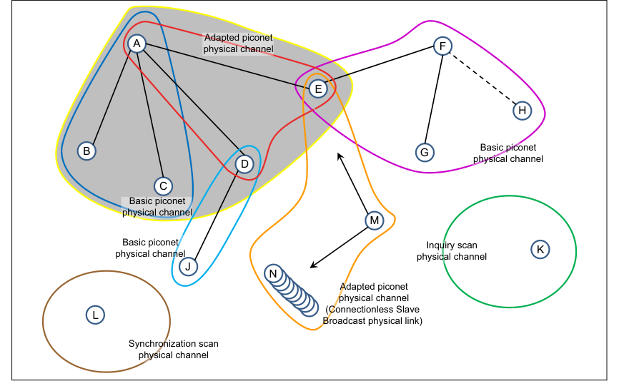

**Figure 4.1:  Example Bluetooth BR/EDR topology**

In Figure 4.1 an example topology is shown that demonstrates a number of the architectural features described below. Device A is a master in a piconet (represented by the shaded area, and known as piconet A) with devices B, C, D and E as slaves. Three other piconets are shown: a) one piconet with device F as master (known as piconet F) and devices E, G and H as slaves, b) one piconet with device D as master (known as piconet D) and device J as slave, and c) one piconet with device M as master (known as piconet M) and device E as a slave and many devices N as slaves.
In piconet A there are two physical channels. Devices B and C are using the basic piconet physical channel (represented by the blue enclosure) as they do not support adaptive frequency hopping. Devices D and E are capable of supporting adaptive frequency hopping, and are using the adapted piconet physical channel (represented by the red enclosure). Device A is capable of adaptive frequency hopping, and operates in a TDM basis on both physical channels according to which slave is being addressed.
Piconet D and piconet F are both using only a basic piconet physical channel (represented by the cyan and magenta enclosures respectively). In the case of piconet D this is because device J does not support the adaptive hopping mode. Although device D supports adaptive hopping it cannot use it in this piconet. In piconet F device F does not support adaptive hopping, and therefore it cannot be used in this piconet.
Piconet M (represented by the orange enclosure) uses a Connectionless Slave Broadcast physical link over the adaptive piconet physical channel to send Profile Broadcast Data to many slave devices including E and N.
Device K is shown in the same locality as the other devices. It is not currently a member of a piconet, but has services that it offers to other Bluetooth devices. It is currently listening on its inquiry scan physical channel (represented by the green enclosure), awaiting an inquiry request from another device.
Device L is shown in the same locality as the other devices. It is not currently a member of a piconet, but is currently listening on its Synchronization scan physical channel (represented by the brown enclosure), awaiting a synchronization train from another device.

#### 4.1.2  LE Topology

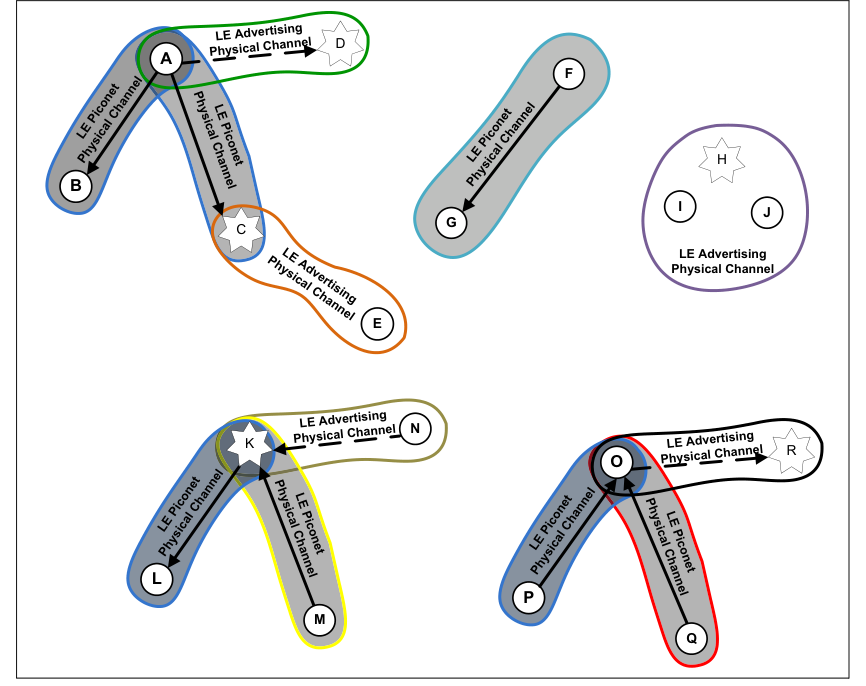

**Figure 4.2:  Example of Bluetooth LE topology**

In Figure 4.2 an example topology is shown that demonstrates a number of the LE architectural features described below. Device A is a master in a piconet (represented by the shaded area, and known as piconet A) with devices B and C as slaves. Unlike BR/EDR slaves, LE slaves do not share a common physical channel with the master. Each slave communicates on a separate physical channel with the master. One other piconet is shown with device F as master (known as piconet F) and device G as a slave. Device K is in a scatternet (known as scatternet K). Device K is master of device L and slave of device M. Device O is also in a scatternet (known as scatternet O). Device O is
slave of device P and slave of device Q. Note: In the figure, solid arrows point from master to slave; dashed arrows, indicating a connection initiation, point from initiator to advertiser using a connectable advertising event; devices that are advertising are indicated using stars.
There are five other groups of devices shown:
1. Device D is an advertiser and device A is also an initiator (known as group D).
2. Device E is a scanner and device C is also an advertiser (known as group C).
3. Device H is an advertiser and devices I and J are scanners (known as group H).
4. Device K is also an advertiser and device N is an initiator (known as group K).
5. Device R is an advertiser and device O is also an initiator (known as group R).
Devices A and B are using one LE piconet physical channel (represented by the blue enclosure and a dark gray background). Devices A and C are using another LE piconet physical channel (represented by the blue enclosure and a lighter gray background). In group D, device D is advertising using a connectable advertising event on the advertising physical channel (represented by the green enclosure) and device A is an initiator. Device A can form a connection with device D and add the device to piconet A. In group C, device C is also advertising on the advertising physical channel (represented by the orange enclosure) using any type of advertising events that are being captured by device E as a scanner. Group D and group C may be using different advertising PHY channels or different timings to avoid collisions.
In piconet F, there is one physical channel. Devices F and G are using an LE piconet physical channel (represented by the aqua enclosure). Device F is the master and device G is the slave.
In group H, there is one physical channel. Devices H, I and J are using an LE advertising physical channel (represented by the purple enclosure). Device H is an advertiser and devices I and J are scanners.
In scatternet K, devices K and L are using one LE piconet physical channel. Devices K and M are using another LE piconet physical channel. In group K, device K is also advertising using a connectable advertising event on the advertising physical channel and device N is an initiator. Device N can form a connection with device K resulting in device K being slave of two devices and master of one device at the same time.
In scatternet O, devices O and P are using one LE piconet physical channel. Devices O and Q are using another LE piconet physical channel. In group R, device R is advertising using a connectable advertising event on the advertising physical channel and device O is an initiator. Device O can form a connection with device R resulting in device O being slave of two devices and master of one device at the same time.

### 4.2   OPERATIONAL PROCEDURES AND MODES

The typical operational mode of a Bluetooth device is to be connected to other Bluetooth devices (in a piconet) and exchanging data with those Bluetooth devices. As Bluetooth is an ad-hoc wireless communications technology, there are a number of operational procedures that enable piconets to be formed so that the subsequent communications can take place. Procedures and modes are applied at different layers in the architecture and therefore a device may be engaged in a number of these procedures and modes concurrently.

#### 4.2.1  BR/EDR Procedures

##### 4.2.1.1  Inquiry (Discovering) Procedure

Bluetooth devices use the inquiry procedure to discover nearby devices, or to be discovered by devices in their locality.
The inquiry procedure is asymmetrical. A Bluetooth device that tries to find other nearby devices is known as an inquiring device and actively sends inquiry requests. Bluetooth devices that are available to be found are known as discoverable devices and listen for these inquiry requests and send responses. The inquiry procedure uses a special physical channel for the inquiry requests and responses.
Both inquiring and discoverable devices may already be connected to other Bluetooth devices in a piconet. Any time spent inquiring or occupying the inquiry scan physical channel needs to be balanced with the demands of the QoS commitments on existing logical transports.
The inquiry procedure does not make use of any of the architectural layers above the physical channel, although a transient physical link may be considered to be present during the exchange of inquiry and inquiry response information.

###### 4.2.1.1.1   Extended Inquiry Response

An Extended Inquiry Response can be used to provide miscellaneous information during the inquiry response procedure. Data types are defined for such things as local name and supported services, information that otherwise would have to be obtained by establishing a connection. A device that receives a local name and a list of supported services in an extended inquiry response does not have to connect to do a remote name request and an SDP service search, thereby shortening the time to useful information. It is recommended that a device includes all supported services and a significant portion of its local name, if that name is too long to be sent in its entirety, in the extended inquiry response.
The extended inquiry response procedure is backwards compatible with the standard inquiry response procedure.

##### 4.2.1.2  Paging (Connecting) Procedure

The procedure for forming connections is asymmetrical and requires that one Bluetooth device carries out the page (connection) procedure while the other Bluetooth device is connectable (page scanning). The procedure is targeted, so that the page procedure is only responded to by one specified Bluetooth device.
The connectable device uses a special physical channel to listen for connection request packets from the paging (connecting) device. This physical channel has attributes that are specific to the connectable device, hence only a paging device with knowledge of the connectable device is able to communicate on this channel.
Both paging and connectable devices may already be connected to other Bluetooth devices. Any time spent paging or occupying the page scan physical channel needs to be balanced with the demands of the QoS commitments on existing logical transports.

##### 4.2.1.3  Connected Mode

After a successful connection procedure over the BR/EDR Controller, there is a piconet physical channel to which both devices are connected, there is a physical link between the devices, and there are default ACL-C, ACL-U, ASB- C, and ASB-U logical links. Two of these links (ACL-C and ASB-C) transport the LMP control protocol and are invisible to the layers above the Link Manager. The ACL-U link transports the L2CAP signaling protocol and any multiplexed L2CAP best-effort channels. The ASB-U link transports L2CAP channels that are broadcast to all slaves on the piconet. It is common to refer to a default ACL logical transport, which can be resolved by context, but typically refers to the default ACL-U logical link.
When in the connected mode it is possible to create and release additional logical links and to change the modes of the physical and logical links while remaining connected to the piconet physical channel. It is also possible for the device to carry out inquiry, paging or scanning procedures or to be connected to other piconets without needing to disconnect from the original piconet physical channel. These actions are done using the Link Manager, which exchanges Link Manager Protocol messages with the remote Bluetooth device.
AMP physical links may be established in connected mode. Once an AMP physical link is created, one or more AMP-U logical links may be established to transport L2CAP user data.
During the time that a slave device is actively connected to a piconet there is always a default ACL logical transport between the slave and the master device. The only method of deleting the default ACL logical transport is to detach the device from the piconet physical channel, at which time the entire
hierarchy of L2CAP channels, logical links, and logical transports between the devices is deleted.

##### 4.2.1.4  Hold Mode

Hold mode is not a general device mode, but applies to unreserved slots on the physical link. When in this mode, the physical link is only active during slots that are reserved for the operation of the synchronous link types SCO and eSCO. All asynchronous links are inactive. Hold modes operate once for each invocation and are then exited when complete, returning to the previous mode.

##### 4.2.1.5  Sniff Mode

Sniff mode is not a general device mode, but applies to the default ACL logical transports. When in this mode the availability of these logical transports is modified by defining a duty cycle consisting of periods of presence and absence. Devices that have their default ACL logical transports in sniff mode may use the absent periods to engage in activity on another physical channel, or to enter reduced power mode. Sniff mode only affects the default ACL logical transports (i.e. their shared ACL logical transport), and does not apply to any additional SCO or eSCO logical transports that may be active. The periods of presence and absence of the physical link on the piconet physical channel is derived as a union of all logical transports that are built on the physical link.
Sniff subrating provides a mechanism for further reducing the active duty cycle, thereby enhancing the power-saving capability of sniff mode. Sniff subrating allows a Host to create a guaranteed access-like connection by specifying maximum transmit and receive latencies. This allows the basebands to optimize the low power performance without having to exit and re-enter sniff mode using Link Manager commands.
Note that broadcast logical transports have no defined expectations for presence or absence. A master device should aim to schedule broadcasts to coincide with periods of physical link presence within the piconet physical channel, but this is not always possible or practical. Repetition of broadcasts is defined to improve the possibilities for reaching multiple slaves without overlapping presence periods. However, broadcast logical transports cannot be considered to be reliable.

##### 4.2.1.6  This section no longer used

##### 4.2.1.7  Role Switch Procedure

The role switch procedure is a method for swapping the roles of two devices connected in a piconet. The procedure involves moving from the physical channel that is defined by the original master device to the physical channel
that is defined by the new master device. In the process of swapping from one physical channel to the next, the hierarchy of physical links and logical transports over the BR/EDR Controller are removed and rebuilt, with the exception of the ASB logical transport that is implied by the topology and is not preserved. Note that the role switch procedure does not affect AMP physical channels. After the role switch, the original piconet physical channel may cease to exist or may be continued if the original master had other slaves that are still connected to the channel.
The procedure only copies the default ACL logical links and supporting layers to the new physical channel. Any additional logical transports are not copied by this procedure, and if required this must be carried out by higher layers. The LT_ADDRs of any affected transports will be reassigned on the new physical channel and, therefore, may change.
If there are any QoS commitments on the original logical transports, then these are not preserved after a role switch. These must be renegotiated after the role switch has completed.

##### 4.2.1.8  Enhanced Data Rate

Enhanced Data Rate is a method of extending the capacity and types of Bluetooth packets for the purposes of increasing the maximum throughput, providing better support for multiple connections, and lowering power consumption, while the remainder of the architecture is unchanged.
Enhanced Data Rate may be selected as a mode that operates independently on each logical transport. Once enabled, the packet type bits in the packet header are interpreted differently from their meaning in Basic Rate mode. This different interpretation is clarified in conjunction with the logical transport address field in the header. The result of this interpretation allows the packet payload header and payload to be received and demodulated according to the packet type. Enhanced Data Rate can be enabled only for the ACL and eSCO logical transports and cannot be enabled for the SCO and broadcast logical transports.

##### 4.2.1.9  Connectionless Slave Broadcast Mode

Connectionless slave broadcast mode allows a piconet master to transmit profile broadcast data to any number of connected slave devices using the BR/ EDR adapted piconet physical channel. To enter this mode, the master reserves a specific logical transport as the dedicated CSB logical transport and starts broadcasting data using the Connectionless Slave Broadcast physical link and the synchronization train procedure. A single Profile Broadcast Data logical link is defined, which carries profile broadcast data using the Connectionless Slave Broadcast logical transport. The profile broadcast data is unframed and bypasses L2CAP.
To receive the Connectionless Slave Broadcast packets, a device must connect with the Connectionless Slave Broadcast Transmitter which has already established a CSB logical transport. To connect, a device follows the Synchronization Scan procedure to obtain the time schedule of the physical link and then starts receiving the Connectionless Slave Broadcast packets. Once connected, Connectionless Slave Broadcast receivers can receive profile broadcast data on the dedicated CSB logical transport and PBD logical link.

#### 4.2.2  LE Procedures

##### 4.2.2.1  Device Filtering Procedure

The device filtering procedure is a method for Controllers to reduce the number of devices requiring communication responses. Since it is not required to respond to requests from every device, it reduces the number of transmissions an LE Controller is required to make which reduces power consumption. It also reduces the communication the Controller would be required to make with the Host. This results in additional power savings since the Host does not have to be involved.
An advertising or scanning device may employ device filtering to restrict the devices from which it receives advertising packets, scan requests or connection requests. In LE, some advertising packets received by a scanning device require that the scanning device send a request to the advertising device. This advertisement can be ignored if device filtering is used and the advertising device is being filtered. A similar situation occurs with connection requests. Connection requests must be responded to by advertisers unless a device filter is used to limit the devices to which the advertiser is required to respond. Advertisers can also use device filters to limit the devices in which it will accept a scan request or connection request.
This device filtering is accomplished through the use of a “White List” located in the LL block of the Controller. A White List enumerates the remote devices that are allowed to communicate with the local device. When a White List is in effect, transmissions from devices that are not in the White List will be ignored by the LL. Since device filtering occurs in the LL it can have a significant impact on power consumption by filtering (or ignoring) advertising packets, scan requests or connection requests from being sent to the higher layers for handling.
The use of device filtering during certain procedures needs to be evaluated carefully to ensure devices are not unintentionally ignored, which may cause interoperability problems when attempting to establish connections or receive advertising broadcasts.

##### 4.2.2.2  Advertising Procedure

An advertiser uses the advertising procedure to perform unidirectional broadcasts to devices in the area. The unidirectional broadcast occurs without a connection between the advertising device and the listening devices. The advertising procedure can be used to establish connections with nearby initiating devices or used to provide periodic broadcast of user data to scanning devices listening on the advertising channel. The advertising procedure uses the primary advertising channel for all advertising broadcasts. However, the data may be offloaded on to the secondary advertising channel in one or more auxiliary packets to reduce both the occupancy of the primary advertising channel and the total on-air time and also to allow the data to be longer than the maximum that will fit into a single packet.
An LE device connected in an LE piconet may advertise using any type of advertising event. Time spent advertising while connected needs to be balanced with the connection requirements needed to maintain the already established connection(s) (if the device is a slave in the piconet then it needs to maintain its connection with the master and if the device is the master it needs to maintain its connection(s) with the one or more slaves in the piconet).
Advertising devices may receive scan requests from listening devices in order to get additional user data from the advertising device. Scan responses are sent by the advertising device to the device making the scan request.
An advertising device may receive connection requests from initiator devices. If the advertising device was using a connectable advertising event and the initiating device is not being filtered by the device filtering procedure, the advertising device ceases advertising and enters the connected mode. The device can begin advertising again after it is in the connected mode.
When advertising on the LE Uncoded PHYs, scan requests and scan responses can take place on the same PHY channel as the original advertisement or can be offloaded to the secondary advertising channel. In some cases when advertising on the LE Uncoded PHYs, connection request and connection responses are offloaded to the secondary advertising channel. When advertising on the LE Coded PHY, scan requests, scan responses, connection requests, and connection responses are always offloaded. As with advertising data, offloading is carried out by having the initial advertisement on the primary advertising channel point to an auxiliary packet on the secondary advertising channel. Scan requests and scan responses, connection requests, and connection responses are made on the same PHY and same channel as the auxiliary packet.

##### 4.2.2.3  Scanning Procedure

A scanning device uses the scanning procedure to listen for unidirectional broadcasts of user data from advertising devices using the advertising channel. A scanning device can request additional user data from an advertising device
by making a scan request. The advertising device responds to these requests with additional user data sent to the scanning device over the advertising channel.
The scanning procedure can be used while connected to other LE devices in an LE piconet. Time spent scanning while connected needs to be balanced with the connection requirements needed to maintain the already established connection with the other LE devices in the piconet.
If the broadcasts are connectable advertising events and the scanning device is in the initiator mode, it can initiate a connection by sending a connection request on the primary advertising channel or secondary advertising channel to the advertising device. Once the connection request is sent on the primary channel, the scanning device ceases the initiator mode scanning for additional broadcasts and enters the connected mode. When the connection request is sent on the secondary channel, the scanning device leaves the initiator mode, ceasing scanning for additional broadcasts, and enters the connected mode when it receives the connection response. The device can use the scanning procedure after it enters the connected mode. For a master device, using the initiator mode and scanning for connectable advertisements is how additional devices can be added to the master's LE piconet.

##### 4.2.2.4  Discovering Procedure

Bluetooth devices use the advertising procedure and scanning procedure to discover nearby devices, or to be discovered by devices in a given area.
The discovery procedure is asymmetrical. A Bluetooth device that tries to find other nearby devices is known as a discovering device and listens for devices advertising scannable advertising events. Bluetooth devices that are available to be found are known as discoverable devices and actively broadcast scannable advertising events over the advertising broadcast physical channel.
Both discovering and discoverable devices may already be connected to other Bluetooth devices in a piconet. Any time spent inquiring or occupying the advertising broadcast physical channel needs to be balanced with the connection requirements needed to maintain the already established connection with the other LE devices in the piconet.
Using device filtering by the scanning device will prevent the scanning device from discovering all the devices in a given area.

##### 4.2.2.5  Connecting Procedure

The procedure for forming connections is asymmetrical and requires that one Bluetooth device carries out the advertising procedure while the other Bluetooth device carries out the scanning procedure. The advertising procedure can be targeted, so that only one device will respond to the advertising. The scanning device can also target an advertising device by first discovering that the advertising device is present in a connectable manner, and
in the given area, and then scanning only connectable advertising events from that device using the device filter. After receiving connectable advertising events from the targeted advertising device, it can initiate a connection by sending the connection request to the targeted advertising device over the primary advertising channel or secondary advertising channel.
Time spent scanning while connected needs to be balanced with the connection requirements needed to maintain the already established connection with the other LE devices in the piconet.

##### 4.2.2.6  Connected Mode

After a successful connection procedure, the devices are physically connected to each other within a piconet. This means that there is a piconet physical channel to which they are both connected, there is a physical link between the devices, and there are default LE-C and LE-U logical links. When in the connected mode it is possible to change the properties of the physical and logical links while remaining connected to the piconet physical channel, such as changing the adaptive frequency hopping sequence or changing the length of data packets. It is also possible for the device to carry out advertising, scanning or discovery procedures without needing to disconnect from the original piconet physical channel.
Additional logical links are created using the Link Manager that exchanges LL Protocol messages with the remote Bluetooth device to negotiate the creation and settings for these links. One of these links (LE-C) transports the LL control protocol and is invisible to the layers above the Link Manager. The other link (LE-U) transports the L2CAP signaling protocol and any multiplexed L2CAP best-effort channels. It is common to refer to a default LE ACL logical transport, which can be resolved by context, but typically refers to the default LE-U logical link. Also note that these two logical links share a logical transport.
During the time that a slave device is actively connected to a piconet there is always a default LE ACL logical transport between the slave and the master device. The method of deleting the default LE ACL logical transport is to detach the device from the piconet physical channel, at which time the entire hierarchy of L2CAP channels, logical links, and logical transports between the devices is deleted.

##### 4.2.2.7  Periodic Advertising Procedure

An advertiser uses the periodic advertising procedure to perform unidirectional periodic broadcasts to devices in the area. The unidirectional broadcast occurs without a connection between the advertising device and the listening devices. The periodic advertising procedure can be used to synchronize with nearby devices to provide deterministic periodic broadcast of user data to scanning devices listening on the advertising channel. The advertising procedure uses the primary and secondary advertising channel to broadcast control and user information about the periodic advertising.
An LE device synchronized with other LE devices on the periodic physical channel uses the periodic advertising event. Time spent periodic advertising while connected or synchronized with other LE devices needs to be balanced with the connection and synchronization requirements needed to maintain the already established connection(s) or synchronizations.

##### 4.2.2.8  Periodic Advertising Synchronization Procedure

The procedure for synchronizing to periodic advertising is asymmetrical and requires that one Bluetooth device carries out the advertising procedure while the other Bluetooth device carries out the scanning procedure. The scanning device can target an advertising device by first discovering that the advertising device is present and broadcasting periodic advertisements in the given area. After receiving advertising events containing synchronization information from the targeted advertising device, it can synchronize to the periodic advertising events.
Synchronizing devices may already be advertising, scanning, or be connected to other Bluetooth devices in a piconet or synchronized to other periodic advertisements. Any time spent synchronizing to periodic advertising needs to be balanced with the requirements needed to maintain already established connections or synchronizations.

##### 4.2.2.9  Periodic Advertising Synchronized Mode

After a successful synchronization procedure, the devices are physically synchronized to each other. This means that there is a periodic physical channel to which they are both synchronized, there is a periodic physical link between the devices, and there is an ADVB-U and an ADVB-C logical link. It is also possible for the device to carry out advertising, scanning, or discovery procedures without needing to disconnect from the LE periodic physical channel.

#### 4.2.3  AMP Procedures

##### 4.2.3.1  AMP Discovery Procedures

The AMP Manager is responsible for discovering local AMP Controller(s) and maintaining that list over time as AMPs may be added or removed dynamically from the system. The local AMP Manager may request a list of AMPs from the remote AMP Manager. After the list of AMPs has been requested by the remote device, when an AMP is added or removed from the system, the local AMP Manager will notify that remote AMP Manager of the change.
Each AMP Is identified with an ID and a type. Once the list of AMPs has been received, the AMP Manager may request information (AMP_Info) for each AMP.

##### 4.2.3.2  Physical Link Creation Procedure

To set up an L2CAP channel with a remote device over an AMP physical link (AMP channel), the AMP Manager first discovers the remote AMP(s), collects the necessary information about the remote AMP(s) to set up a physical link in an optimal way and then initiates the physical link creation. This is done over a dedicated L2CAP channel.
The AMP Manager provides the remote AMP information that it collected about the remote AMP to the local AMP PAL. The local AMP PAL then uses this information to create the AMP physical link.

##### 4.2.3.3  Logical Link Creation Procedure

Once a physical link exists, L2CAP creates an AMP logical link with the desired QoS. An L2CAP channel is then created over the logical link, at which point the channel is ready for data communication.

## 5  SECURITY OVERVIEW

### 5.1   SECURITY ARCHITECTURE

The Bluetooth security model includes five distinct security features: pairing, bonding, device authentication, encryption and message integrity.
• Pairing: the process for creating one or more shared secret keys
• Bonding: the act of storing the keys created during pairing for use in subsequent connections in order to form a trusted device pair
• Device authentication: verification that the two devices have the same keys
• Encryption: message confidentiality
• Message integrity: protects against message forgeries
The Bluetooth Core security architecture has evolved over time. Initially, pairing utilized the E21 or E22 algorithms based on SAFER+. This version of pairing is referred to as “BR/EDR legacy pairing”. Device authentication was initially based on the E1 algorithm, which was also based on SAFER+. Encryption utilizes the E0 algorithm derived from the Massey-Rueppel algorithm. There was also no provision for cryptographic message integrity. Note that while the CRC provides some integrity protection, it is not considered to provide cryptographic integrity as it can be easily forged.
Version 2.1 + EDR of the Core Specification introduced Secure Simple Pairing, which utilizes FIPS-approved algorithms (SHA-256, HMAC-SHA-256 and the P-192 elliptic curve) and introduced four association models: Just Works, Numeric Comparison, Passkey Entry and Out-Of-Band (see Section 5.2). Device authentication and encryption remained the same when Secure Simple Pairing was introduced.
Version 3.0 + HS of the Core Specification added support for AMPs (see Section 5.5).
Version 4.0 added the entire security model for Low Energy (see Section 5.4) but did not change any security functionality for BR/EDR or AMP.
Version 4.1 added the Secure Connections feature to the BR/EDR phyisical transport, which upgraded Secure Simple Pairing to utilize the P-256 elliptic curve, device authentication to use FIPS-approved algorithms (HMAC-SHA- 256 and AES-CTR). Secure Connections also added message integrity (AES- CCM).
Version 4.2 added the Secure Connections feature to the LE physical transport, which upgraded LE pairing to utilize FIPS-approved algorithms (AES-CMAC and P-256 elliptic curve) and adapts the Numeric Comparison association model to be used on the Bluetooth LE physical transport. It also includes provisions for a key generated using Secure Connections on either
physical transport to preclude the need for the user to pair a second time on the other physical transport. LE pairing as defined in the Bluetooth Core Specification 4.0 and 4.1 is referred to as LE legacy pairing.
The security key hierarchy for BR/EDR and AMP is shown in Figure 5.1. The key hierarchy is different depending on whether a physical link is using Secure Connections or legacy security procedures and algorithms.

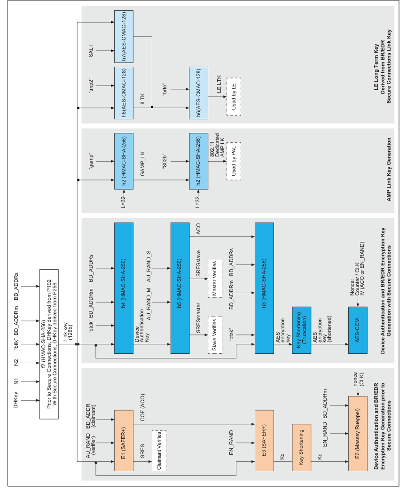

**Figure 5.1:  BR/EDR and AMP Key Hierarchy**

The security key hierarchy for LE is shown in Figure 5.2. The key hierarchy is different depending on whether a physical link is using LE Secure Connections or LE legacy pairing procedures and algorithms.

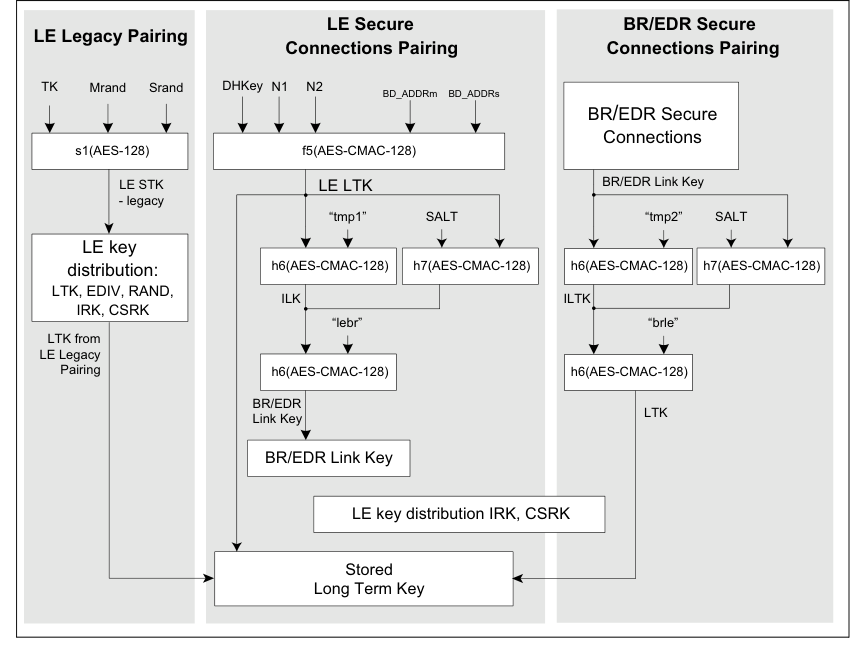

**Figure 5.2:  LE Key Hierarchy**

### 5.2   BR/EDR SECURE SIMPLE PAIRING

The primary goal of Secure Simple Pairing is to simplify the pairing procedure for the user. Secondary goals are to maintain or improve the security in Bluetooth wireless technology. Since high levels of security and ease-of-use are often at opposite ends of the spectrum in many technologies and products, much care has been taken to maximize security while minimizing complexity from the end user's point of view.

#### 5.2.1  Security Goals

Secure Simple Pairing has two security goals: protection against passive eavesdropping and protection against man-in-the-middle (MITM) attacks (active eavesdropping). It is a goal of Secure Simple Pairing to exceed the maximum security level provided by the use of a 16 alphanumeric PIN with the pairing algorithm used in Bluetooth Core Specification version 2.0 + EDR and earlier versions. Note that many Bluetooth devices compliant with Bluetooth Core Specification 2.0 + EDR and earlier versions use a 4-digit PIN or a fixed PIN of commonly known values significantly limiting the security on the link.

#### 5.2.2  Passive Eavesdropping Protection

A strong link key coupled with a strong encryption algorithm is necessary to give the user protection against passive eavesdropping. The strength of the link key is based on the amount of entropy (or randomness) in its generation process which would not be known by an attacker. Using legacy pairing, the only source of entropy is the PIN which, in many use cases, is typically four digits either selected by the user or fixed for a given product. Therefore, if the pairing procedure and one authentication exchange is recorded one can run an exhaustive search to find the PIN in a very short amount of time on commonly available computing hardware. With Secure Simple Pairing, the recording attack becomes much harder as the attacker must have solved a hard problem in public key cryptography in order to derive the link key from the recorded information. This protection is independent of the length of the passkey or other numeric values that the user must handle. Secure Simple Pairing gives the same resistance against the recording and passive eavesdropping attacks even when the user is not required to do anything.
Secure Simple Pairing uses Elliptic Curve Diffie Hellman (ECDH) public key cryptography as a means to thwart passive eavesdropping attacks. ECDH provides a very high degree of strength against passive eavesdropping attacks but it may be subject to MITM attacks, which however, are much harder to perform in practice than the passive eavesdropping attack (see Section 5.2.3).
Using the security protocols in the Bluetooth Core Specification version 2.0 + EDR and earlier with a 16 numeric digit PIN achieves about 53 bits of entropy whereas a 16 character alphanumeric, case sensitive PIN yields about 95 bits of entropy when the entire 62 character set is used ([0, … 9, 'A', … 'Z', 'a', … 'z']). For devices that do not support the Secure Connections feature (introduced in Core Specification v4.1), Secure Simple Pairing has approximately 96 bits of entropy using the FIPS approved P-192 elliptic curve which is at least as good as the entropy in Bluetooth Core Specification 2.0 + EDR and earlier using a 16 character, alphanumeric, case sensitive PIN. For devices that do support the Secure Connections feature, Secure Simple Pairing has approximately 128 bits of entropy using the FIPS-approved P-256 elliptic curve. ECDH cryptography was selected over standard Diffie Hellman (often referred to as DH76) since it is computationally less complex and less likely to exceed the low computational capacity in common Bluetooth Controllers.

#### 5.2.3  Man-In-The-Middle Protection

A man-in-the-middle (MITM) attack occurs when a user wants to connect two devices but instead of connecting directly with each other they unknowingly connect to a third (attacking) device that plays the role of the device they are attempting to pair with. The third device then relays information between the two devices giving the illusion that they are directly connected. The attacking device may even eavesdrop on communication between the two devices (known as active eavesdropping) and is able to insert and modify information on the connection. In this type of attack, all of the information exchanged
between the two devices are compromised and the attacker may inject commands and information into each of the devices thus potentially damaging the function of the devices. Devices falling victim to the attack are capable of communicating only when the attacker is present. If the attacker is not active or out range, the two victim devices will not be able to communicate directly with each other and the user will notice it.
To prevent MITM attacks, Secure Simple Pairing offers two user assisted numeric methods: numerical comparison or passkey entry. If Secure Simple Pairing would use 16 decimal digit numbers, then the usability would be the same as using legacy pairing with 16 decimal digit PIN. The chance for a MITM to succeed inserting its own link keys in this case is a 1 in 1016 = 253 pairing instances, which is an unnecessarily low probability.
Secure Simple Pairing protects the user from MITM attacks with a goal of offering a 1 in 1,000,000 chance that a MITM could mount a successful attack. The strength of the MITM protections was selected to minimize the user impact by using a six digit number for numerical comparison and Passkey entry. This level of MITM protection was selected since, in most cases, users can be alerted to the potential presence of a MITM attacker when the connection process fails as a result of a failed MITM attack. While most users feel that provided that they have not compromised their passkey, a 4-digit key is sufficient for authentication (i.e. bank card PIN codes), the use of six digits allows Secure Simple Pairing to be FIPS compliant and this was deemed to have little perceivable usability impact.

#### 5.2.4  Association Models

Secure Simple Pairing uses four association models referred to as Numeric Comparison, Just Works, Out Of Band, and Passkey Entry. Each of these association models are described in more detail in the following sections.
The association model used is deterministic based on the I/O capabilities of the two devices.

##### 5.2.4.1  Numeric Comparison

The Numeric Comparison association model is designed for scenarios where both devices are capable of displaying a six digit number and both are capable of having the user enter "yes" or "no". A good example of this model is the cell phone / PC scenario.
The user is shown a six digit number (from "000000" to "999999") on both displays and then asked whether the numbers are the same on both devices. If "yes" is entered on both devices, the pairing is successful.
The numeric comparison serves two purposes. First, since many devices do not have unique names, it provides confirmation to the user that the correct
devices are connected with each other. Second, the numeric comparison provides protection against MITM attacks (see Section 5.2.3).
Note that there is a significant difference from a cryptographic point of view between Numeric Comparison and the PIN entry model used by Bluetooth Core Specification and earlier versions. In the Numeric Comparison association model, the six digit number is an artifact of the security algorithm and not an input to it, as is the case in the Bluetooth security model. Knowing the displayed number is of no benefit in decrypting the encoded data exchanged between the two devices.

##### 5.2.4.2  Just Works

The Just Works association model is primarily designed for scenarios where at least one of the devices does not have a display capable of displaying a six digit number nor does it have a keyboard capable of entering six decimal digits. A good example of this model is the cell phone/mono headset scenario where most headsets do not have a display.
The Just Works association model uses the Numeric Comparison protocol but the user is never shown a number and the application may simply ask the user to accept the connection (exact implementation is up to the end product manufacturer).
The Just Works association model provides the same protection as the Numeric Comparison association model against passive eavesdropping but offers no protection against the MITM attack.
When compared against today's experience of a headset with a fixed PIN, the security level of the Just Works association model is considerably higher since a high degree of protection against passive eavesdropping is realized.

##### 5.2.4.3  Out of Band

The Out of Band (OOB) association model is primarily designed for scenarios where an Out of Band mechanism is used to both discover the devices as well as to exchange or transfer cryptographic numbers used in the pairing process. In order to be effective from a security point of view, the Out of Band channel should provide different properties in terms of security compared to the Bluetooth radio channel. The Out of Band channel should be resistant to MITM attacks. If it is not, security may be compromised during authentication.
The user's experience differs a bit depending on the Out of Band mechanism. As an example, with a Near Field Communication (NFC) solution, the user(s) will initially touch the two devices together, and is given the option to pair the first device with the other device. If "yes" is entered, the pairing is successful. This is a single touch experience where the exchanged information is used in both devices. The information exchanged includes discovery information (such as the Bluetooth Device Address) as well as cryptographic information. One of
the devices will use a Bluetooth Device Address to establish a connection with the other device. The rest of the exchanged information is used during authentication.
The OOB mechanism may be implemented as either read only or read/write. If one side is read only, a one-way authentication is performed. If both sides are read/write, a two-way authentication is performed.
The OOB protocol is selected only when the pairing process has been activated by previous OOB exchange of information and one (or both) of the device(s) gives OOB as the IO capabilities. The protocol uses the information which has been exchanged and simply asks the user to confirm connection.
The OOB association model supports any OOB mechanism where cryptographic information and the Bluetooth Device Address can be exchanged. The OOB association model does not support a solution where the user has activated a Bluetooth connection and would like to use OOB for authentication only.

##### 5.2.4.4  Passkey Entry

The Passkey Entry association model is primarily designed for the scenario where one device has input capability but does not have the capability to display six digits and the other device has output capabilities. A good example of this model is the PC and keyboard scenario.
The user is shown a six digit number (from "000000" to "999999") on the device with a display, and is then asked to enter the number on the other device. If the value entered on the second device is correct, the pairing is successful. Note that there is a significant difference from a cryptographic point of view between Passkey Entry and the PIN entry model used by Bluetooth Core Specification 2.0 + EDR and earlier versions. In the Passkey Entry association model, the six digit number is independent of the security algorithm and not an input to it, as is the case in the 2.0 + EDR security model. Knowing the entered number is of no benefit in decrypting the encoded data exchanged between the two devices.

##### 5.2.4.5  Association Model Overview

The following diagram shows Secure Simple Pairing from the point of view of the technology used for discovery and then the different association possibilities.

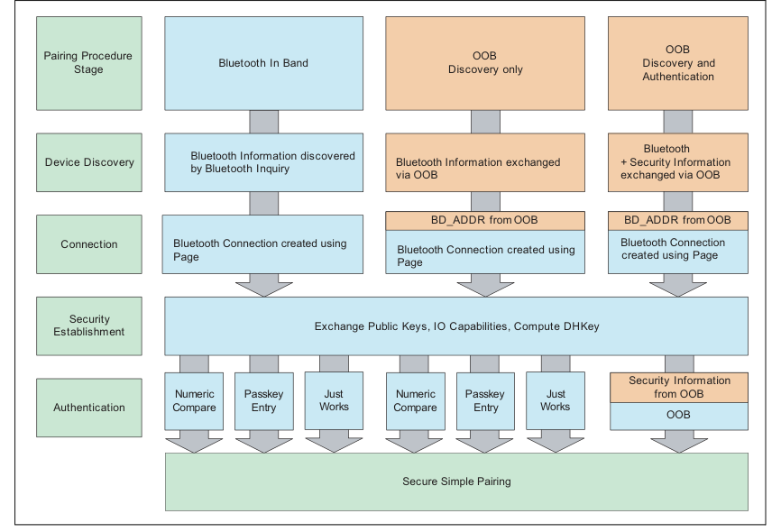

**Figure 5.3:  Secure Simple Pairing Association Models**

### 5.3   SECURE CONNECTIONS ONLY MODE

When a device requires that only FIPS-approved algorithms are used on the BR/EDR physical transport, it should enter Secure Connections Only Mode on the BR/EDR physical transport.  Secure Connections Only Mode is sometimes called a "FIPS Mode". This mode should be used when it is more important for a device to have high security than it is for it to maintain backwards compatibility with devices that do not support Secure Connections. The Host will enforce that the P-256 elliptic curve is used during pairing, the secure authentication sequences are used, and AES-CCM is used for encryption.
When a device requires that only FIPS-approved algorithms are used on the LE physical transport, it should enter Secure Connections Only Mode on the LE physical transport. Secure Connections Only Mode is sometimes called a "FIPS Mode". This mode should be used when it is more important for a device to have high security than it is for it to maintain backwards compatibility with devices that do not support LE Secure Connections. In this mode, the Host will enforce that the P-256 elliptic curve is used during pairing.
If a BR/EDR/LE device is configured in Secure Connections Only Mode, then both the BR/EDR and the LE transports will be in Secure Connection Only Mode.

### 5.4   LE SECURITY

The pairing mechanisms introduced in Bluetooth Core Specification v4.0 (known as LE Legacy Pairing) have some differences in security aspects with respect to BR/EDR security features such as Secure Simple Pairing. The association models are similar to BR/EDR Secure Simple Pairing from the user perspective and have the same names but have differences in the quality of the protection provided.

#### 5.4.1  Association Models

Bluetooth LE uses four association models referred to as Just Works, Numeric Comparison, Out of Band and Passkey Entry. LE legacy pairing does not have an equivalent of Numeric Comparison.
In LE legacy pairing, each of these association models is similar to BR/EDR Secure Simple Pairing with the following exceptions.
• Just Works and Passkey Entry do not provide any passive eavesdropping protection. This is because Secure Simple Pairing uses Elliptic Curve Diffie- Hellman and LE legacy pairing does not.
In LE Secure Connections pairing, the four association models are functionally equivalent to BR/EDR Secure Connections.
The use of each association model is based on the I/O capabilities of the devices.

#### 5.4.2  Key Generation

Key generation in Bluetooth LE is performed by the Host on each LE device independent of any other LE device. By performing key generation in the Host, the key generation algorithms can be upgraded without the need to change the Controller. Note: Key generation in BR/EDR is performed in the Controller.
Bluetooth LE uses multiple keys, each for a specific purpose, as follows:
• Confidentiality of data and device authentication
• Authentication of unencrypted data
• Device Identity
In LE, the key used to provide confidentiality and authentication is generated by combining contributions from each device during pairing.

#### 5.4.3  Encryption

Encryption in Bluetooth LE uses AES-CCM cryptography. Like BR/EDR, in LE encryption is performed in the Controller.

#### 5.4.4  Signed Data

Bluetooth LE supports the ability to send authenticated data over an unencrypted ATT bearer between two devices with a trusted relationship. This is accomplished by signing the data with a Connection Signature Resolving Key (CSRK). The sending device places a signature after the Data PDU. The receiving device verifies the signature and if the signature is verified the Data PDU is assumed to come from the trusted source. The signature is composed of a Message Authentication Code generated by the signing algorithm and a counter. The counter is used to protect against a replay attack and is incremented on each signed Data PDU sent.

#### 5.4.5  Privacy Feature

Bluetooth LE supports a feature that reduces the ability to track a LE device over a period of time by changing the Bluetooth device address on a frequent basis.
In order for a device using the privacy feature to reconnect to known devices, the device address, referred to as the private address, must be resolvable by the other device. The private address is generated using the device’s resolving identity key (IRK) exchanged during the bonding procedure.
There are two variants of the privacy feature. In the first variant, private addresses are resolved and generated by the Host. In the second variant, private addresses are resolved and generated by the Controller without involving the Host after the Host provides the Controller device identity information. In addition, the second variant may involve the Host when the resolving list in the Controller cannot store all the device identity resolving keys necessary for bonded devices.
There are two modes of privacy: device privacy mode and network privacy mode. A device in device privacy mode is only concerned about the privacy of the device and will accept advertising packets from peer devices that contain their identity address as well as ones that contain a private address, even if the peer device has distributed its IRK in the past. In network privacy mode, a device will only accept advertising packets from peer devices that contain private addresses. By default, network privacy mode is used when private addresses are resolved and generated by the Controller.
The Host maintains a resolving list by adding and removing device identities. The Host may provide the Controller with a complete resolving list or a subset of the resolving list. A device identity consists of the peer’s identity address and a local and peer’s IRK pair.
When the Controller performs address resolution and the Host needs to refer to a peer device that is included in the resolving list, it uses the peer’s device identity address. Likewise, all incoming events from the Controller to the Host will use the peer’s device identity, provided that the peer’s device address has
been resolved. If the Controller cannot resolve the peer’s device identity address in an advertisement, it may pass the event to the Host for resolution in the Host.
Device filtering becomes possible when address resolution is performed in the Controller because the peer’s device identity address can be resolved prior to checking whether it is in the White List.
Figure 5.4 shows a logical representation of the relationship between the Controller resolving list and the Controller White List. Actual implementations of the resolving list and White List are not required to follow this model. The resolving list may be independent of the white list.

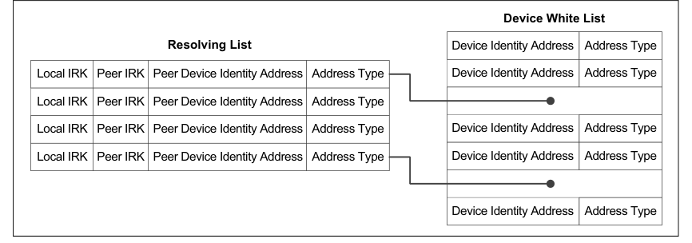

**Figure 5.4:  Logical Representation of the Resolving List and Device White List**

Note: Not all devices in the White List are device identity addresses.
When address resolution is performed exclusively in the Host, a device may experience increased power consumption because device filtering must be disabled.

### 5.5   AMP SECURITY

AMP security does not change the user experience because it utilizes the same Secure Simple Pairing association models that were introduced in the Bluetooth 2.1 + EDR Core Specification. From the user's point of view, all radios are "paired" in one process.
AMP security starts during the Secure Simple Pairing process. The link key for BR/EDR is generated during Phase 4 of Secure Simple Pairing. A 256-bit Generic AMP Link Key (GAMP_LK) is generated from the BR/EDR Link Key. The Generic AMP Link Key is stored in the security database alongside the BR/EDR Link Key once pairing has completed.
AMP security does not affect the BR/EDR Link Key so backwards compatibility is maintained for devices that support the Generic AMP feature with devices that do not.
When an AMP is used for the first time, a dedicated AMP key is created by the AMP Manager for that AMP type using the new Secure Simple Pairing function h2 and a KeyID for the AMP type. The length of the Dedicated AMP Link Key depends on the AMP Type. If the Pair-wise Master key already exists due to a previous connection the AMP link key is not created and the stored key is reused.
The Dedicated AMP Link Key is sent to the PAL during the Physical Link creation process. Each PAL is responsible for using the Dedicated AMP Link Key during the security phase of the physical link establishment process. Note that a Dedicated AMP link key is used for multiple sessions over the same AMP.
Each time a dedicated AMP key is successfully created, the Generic AMP Link Key is updated. This is performed using the h2 function with KeyID 'gamp'.

### 5.6   KEY GENERATION BETWEEN BR/EDR AND LE PHYSICAL TRANSPORTS

When two BR/EDR/LE devices support Secure Connections over both transports, keys for both transports may be generated during a single pairing procedure. The ability to convert keys from one transport to the other prevents the need to pair twice, thus enabling a better user experience.
The link key for BR/EDR generated during Phase 4 of Secure Simple Pairing on the BR/EDR physical transport may be converted to a Long Term Key (LTK) for use on the LE transport. Similarly, a LTK generated during Phase 2 of pairing on the LE physical transport may be converted to the BR/EDR Link Key for use on the BR/EDR physical transport.

## 6  BLUETOOTH APPLICATION ARCHITECTURE

### 6.1   BLUETOOTH PROFILES

Application interoperability in the Bluetooth system is accomplished by Bluetooth profiles. Bluetooth profiles define the required functions and features of each layer in the Bluetooth system from the PHY to L2CAP and any other protocols outside of the Core specification. The profile defines the vertical interactions between the layers as well as the peer-to-peer interactions of specific layers between devices.

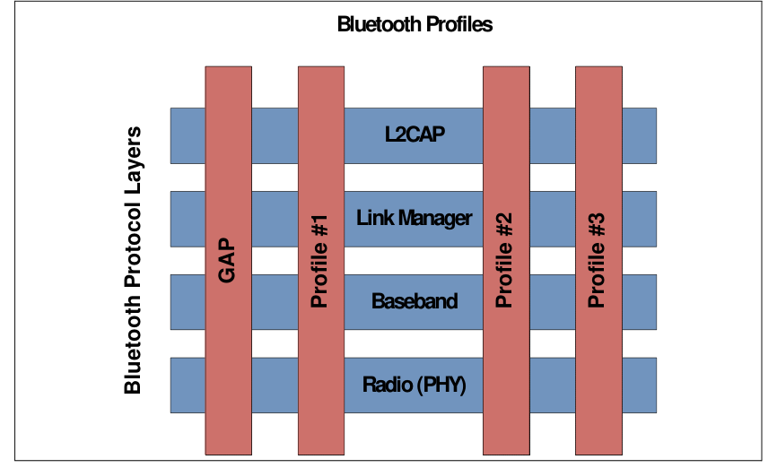

**Figure 6.1:  Bluetooth Profiles**

In addition, application behaviors and data formats are also defined by the profile. When two devices comply with all the requirements of a Bluetooth profile, interoperability of an application is enabled.
All profiles describe service discovery requirements necessary for devices to connect, find available application services and connection information necessary for making application level connections.

### 6.2   GENERIC ACCESS PROFILE

The Bluetooth system defines a base profile which all Bluetooth devices implement. This profile is the Generic Access Profile (GAP), which defines the basic requirements of a Bluetooth device. For instance, for BR/EDR, it defines a Bluetooth device to include the Radio, Baseband, Link Manager, L2CAP, and the service discovery protocol functionality; for LE, it defines the Physical
Layer, Link Layer, L2CAP, Security Manager, Attribute Protocol and Generic Attribute Profile. This ties all the various layers together to form the basic requirements for a Bluetooth device. It also describes the behaviors and methods for device discovery, connection establishment, security, authentication, association models and service discovery.
In BR/EDR, GAP defines a single role with functionality that may be present in each device. This functionality includes how devices discovery each other, establish connections and describes security association models used for authentication. In BR/EDR this functionality may be present in both devices. It may be necessary for a device to implement both the initiating and accepting functionality if the device wants to discover or establish connections with all devices. A device may only include either the initiating or the accepting functionality but it requires the remote device to support the complimentary functionality to discovery or establish connections with the device. For BR/ EDR, the Controller is required to support all the functionality, however the Host may limit this functionality based on the other profiles or use cases supported by the device.
In LE, GAP defines four specific roles: Broadcaster, Observer, Peripheral, and Central. A device may support multiple LE GAP roles provided that the underlying Controller supports those roles or role combinations. Each role specifies the requirements for the underlying Controller. This allows for Controllers to be optimized for specific use cases.
The Broadcaster role is optimized for transmitter only applications. Devices supporting the broadcaster role use advertising to broadcast data. The broadcaster role does not support connections. The Observer role is optimized for receiver only applications. Devices supporting the observer role are the complementary device for a broadcaster and receives broadcast data contained in advertisements. The observer role does not support connections. The Peripheral role is optimized for devices that support a single connection and are less complex than central devices. Devices supporting the peripheral role only require Controllers that support the Controller’s slave role. The Central role supports multiple connections and is the initiator for all connections with devices in the peripheral role. Devices supporting the central role require a Controller that support the Controller’s master role and generally supports more complex functions compared to the other LE GAP roles.

### 6.3   PROFILE HIERARCHY

Since all Bluetooth devices are required to implement GAP, any additional profiles implemented by a Bluetooth device become supersets of GAP. Depending on the complexity of an application or the ability to reuse common requirements of functionality of the Bluetooth system between many applications, additional generic profiles can be created that are both a superset of GAP as well as being a superset of another profile. A top level profile that describes application interoperability is called an Application Profile.

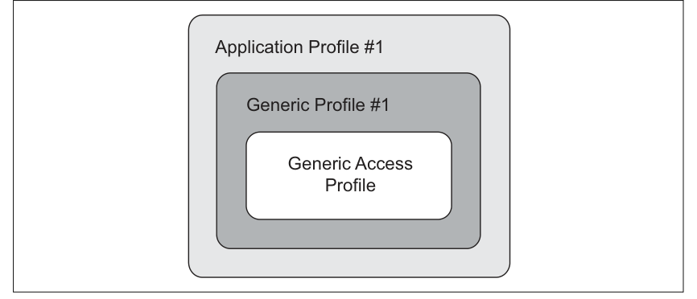

**Figure 6.2:  Profile Hierarchy**

Application profiles contain by reference GAP and any other generic profile that describes a set of common requirements of the Bluetooth system.

### 6.4   GENERIC ATTRIBUTE PROFILE

Generic Attribute Profile (GATT) is built on top of the Attribute Protocol (ATT) and establishes common operations and a framework for the data transported and stored by the Attribute Protocol. GATT defines two roles: Server and Client. The GATT roles are not necessarily tied to specific GAP roles and but may be specified by higher layer profiles. GATT and ATT are not transport specific and can be used in both BR/EDR and LE. However, GATT and ATT are mandatory to implement in LE since it is used for discovering services
The GATT server stores the data transported over the Attribute Protocol and accepts Attribute Protocol requests, commands and confirmations from the GATT client. The GATT server sends responses to requests and when configured, sends indication and notifications asynchronously to the GATT client when specified events occur on the GATT server.
GATT also specifies the format of data contained on the GATT server. Attributes, as transported by the Attribute Protocol, are formatted as Services and Characteristics. Services may contain a collection of characteristics. Characteristics contain a single value and any number of descriptors describing the characteristic value.
With the defined structure of services, characteristics and characteristic descriptors a GATT client that is not specific to a profile can still traverse the GATT server and display characteristic values to the user. The characteristic descriptors can be used to display descriptions of the characteristic values that may make the value understandable by the user.

### 6.5   GATT-BASED PROFILE HIERARCHY

The GATT Profile specifies the structure in which profile data is exchanged. This structure defines basic elements such as services and characteristics, used in a profile.
The top level of the hierarchy is a profile. A profile is composed of one or more services necessary to fulfill a use case. A service is composed of characteristics or references to other services. Each characteristic contains a value and may contain optional information about the value. The service and characteristic and the components of the characteristic (i.e., value and descriptors) contain the profile data and are all stored in Attributes on the server.

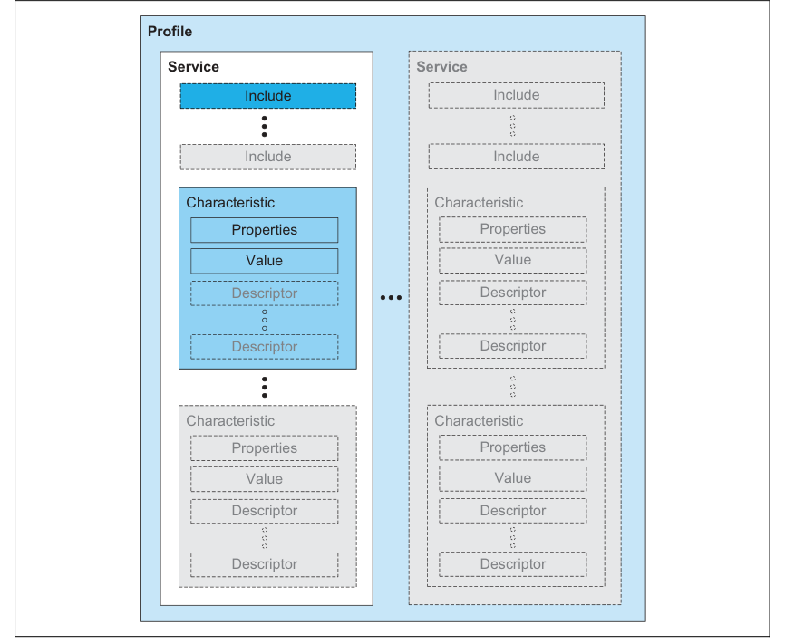

**Figure 6.3:  GATT-Based Profile Hierarchy**

#### 6.5.1  Service

A service is a collection of data and associated behaviors to accomplish a particular function or feature of a device or portions of a device. A service may reference other primary or secondary services and/or a set of characteristics that make up the service.
There are two types of services: primary and secondary. A primary service is a service that provides the primary functionality of a device. A secondary service is a service that provides auxiliary functionality of a device and is referenced from at least one primary service on the device.
To maintain backward compatibility with earlier clients, later revisions of a service definition can only add new referenced services or optional characteristics. Later revisions of a service definition are also forbidden from changing behaviors from previous revision of the service definition.
Services may be used in one or more profiles to fulfill a particular use case.

#### 6.5.2  Referenced Services

A referenced service is a method to incorporate another service definition on the server as part of the service referencing it. When a service references another service, the entire referenced service becomes part of the new service including any nested referenced services and characteristics. The referenced service still exists as an independent service. There are no limits to the depth of nested references.

#### 6.5.3  Characteristic

A characteristic is a value used in a service along with properties and configuration information about how the value is accessed and information about how the value is displayed or represented. A characteristic definition contains a characteristic declaration, characteristic properties, and a value. It may also contain descriptors that describe the value or permit configuration of the server with respect to the characteristic value.

## 7  COEXISTENCE AND COLLOCATION

Bluetooth devices operate in the unlicensed 2.4 GHz Industrial, Scientific and Medical (ISM) band. Many other technologies utilize the ISM band, including wireless LAN, cordless phones, and microwave ovens. The ISM band is also close enough to other frequency bands that Bluetooth devices may be an interferer of or a victim of other technologies.
Radios may be collocated or non-collocated. The term "collocated" is a loose one - in the Core Specification, collocated radios are assumed to be in the same product (a Multi-Radio Terminal or MRT) and may or may not have mechanisms to coordinate their activity in order to mitigate interference.
Determining the amount of expected isolation between radios is important for choosing an appropriate coexistence mechanism. With sufficient isolation, frequency division duplexing (FDD) techniques are the most efficient. With insufficient isolation or a shared antenna, time division duplexing (TDD) techniques need to be used. In many cases, a combination of FDD and TDD techniques are required to achieve acceptable levels of performance.
The Bluetooth Core Specification supports a variety of features that help mitigate interference to other devices and to minimize interference from other devices. Broadly, the types of solutions fall into the following categories:

| Type | Description |
| --- | --- |
| Frequency division | Simultaneous use of multiple radios enabled by filters and/or isolatio |
| Time division | One radio may transmit or receive at a time through scheduling or p oritization |
| Time alignment | Activities of the collocated radios are aligned in the time domain to optimize performances by avoiding conflicting activities. E.g. Trans- missions of multiple radios may occur simultaneously, multiple recep tions may occur simultaneously, but it is not possible to transmit and receive simultaneously |
| Hybrid frequency and time division | Use of frequency division, time alignment, and time division tech- niques depending on the relative frequencies in use by the radios, fil ters and isolation |

Table 7.1:  Interference mitigation types

### 7.1   CORE FEATURES SUPPORTING COEXISTENCE AND COLLOCATION

There are features in the Bluetooth Core Specification to specifically target the reduction of interference from collocated or non-collocated devices.

| Feature | Version Introduced | Description |
| --- | --- | --- |
| Adaptive Frequency Hopping | 1.2 | Allows devices to reduce the number of channels used in a piconet in order to avoid interferers |
| HCI Set Host Channel Classification | 1.2 | Allows a Host to inform the local Bluetooth Contro ler of the channels that are occupied by a collo- cated technology |
| Enhanced SCO (eSCO) | 1.2 | Added retransmissions to SCO for the purpose of combating interference |
| MWS Coexistence Signaling | CSA3 | Provides a standardized interface between collo- cated radios for communicating information neces sary to enable some coexistence techniques |
| Piconet Clock Adjust | 4.1 | Allows a Bluetooth device to align the piconet cloc with an external technology, e.g. Long Term Evolu tion (LTE) |
| Train Nudging | 4.1 | Provides a mechanism to improve the success rat of page and inquiry when the slots to receive the respective responses are periodically not availabl |
| Generalized Interlaced Scanning | 4.1 | Provides a mechanism to improve the success rat of page scan and inquiry scan when some slots ar periodically not available for scanning |
| Slot Availability Mask | 5.0 | Provides a mechanism for two Bluetooth devices t indicate to each other the availability of their time slots |

Table 7.2:  Interference mitigation features

### 7.2   ADAPTIVE FREQUENCY HOPPING

Adaptive Frequency Hopping (AFH) allows Bluetooth devices to improve their immunity to interference from and avoid causing interference to other devices in the 2.4 GHz ISM band. The basic principle is that Bluetooth channels are classified into two categories, used and unused, where used channels are part of the hopping sequence and unused channels are replaced in the hopping sequence by used channels in a pseudo-random way. This classification mechanism allows for the Bluetooth device to use either all or fewer than the 79 channels required in the Core Specification v1.1. The minimum number of channels allowed by the Bluetooth specification is 20.
The Core Specification defines the aspects of AFH necessary to ensure interoperability, including the hopping kernel, Baseband behavior, Link
Manager Protocol (LMP) commands, and Host Controller Interface (HCI) commands and events required to change and configure hopping sequences. The Bluetooth Specification also defines a mechanism that allows for a slave to report channel classification information to the master.
Adaptive Frequency Hopping utilizes metrics obtained through many sources. These metrics are analyzed and then the resulting Channel_Map is used by the adaptive frequency hopping kernel. The metrics may come from over-the- air measurements, data supplied by the Host (via the HCI_set_AFH_Channel_Classification command), or reports by the slave or from other hardware coexistence interfaces.
While AFH is a critical element in coexistence, it is not enough in some circumstances.

### 7.3   COEXISTENCE BETWEEN BLUETOOTH DEVICES AND WIRELESS LAN DEVICES

Coexistence between Bluetooth and Wireless LAN has traditionally been a combination of Adaptive Frequency Hopping (AFH) and proprietary techniques to prioritize traffic between the two protocols. The Bluetooth Core Specification does not specify signaling between the Bluetooth Controller and a Wireless LAN device.

### 7.4   MOBILE WIRELESS STANDARDS (MWS) COEXISTENCE

Significant interference can be present between the Bluetooth radio and a collocated MWS radio operating in frequency bands adjacent to the 2.4 GHz ISM band. This interference can prevent one radio from receiving while the other radio is transmitting.
The “Filter recommendations for Coexistence with LTE and WiMAX” whitepaper1 describes filter specifications that, in some cases, can reduce collocated interference to an acceptable level. The Bluetooth Core Specification includes complementary solutions to traditional filtering including features for Bluetooth Controllers and Hosts as well as signaling and messaging mechanisms between collocated MWS and Bluetooth radios. Figure 7.1 illustrates the general architecture model for these mechanisms. This architecture assumes separate antennas with limited isolation.
1. https://www.bluetooth.org/en-us/specification/reference-publications/white-papers

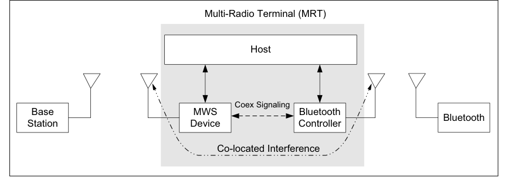

**Figure 7.1:  MWS Coexistence Architecture**

Two types of solutions have been considered. In the first solution, both Bluetooth transmissions (TX) and receptions (RX) are constrained by collocated MWS activities. Solutions of this type are called Pure TDM (Time Division Multiplexed) Mode. In the second solution, only Bluetooth receptions are affected by collocated MWS transmissions and Bluetooth transmissions do not impact the operation of the collocated MWS. Solutions of this type are called Hybrid Mode and are achieved, for example, by using steep roll-off Band Select Filters (BSFs) for the ISM band in the Bluetooth transceiver. Hybrid Mode applies where the Bluetooth transmission’s effect on MWS is sufficiently reduced via filtering that the Bluetooth device can safely transmit during the MWS downlink time. This requires a frequency guard band between the Bluetooth and MWS operational frequency ranges as well as constraints on both the Bluetooth BSF and the MWS BSF. The requirement for a time domain solution still remains, but only to protect Bluetooth reception.
These solutions are facilitated by an MWS coexistence signaling mechanism (see [Vol 7] Part A) and multiple transport layers (see [Vol 7] Part B and C).
MWS technologies operate in licensed bands and use centralized scheduling to support Wide Area Network services. An MWS radio synchronizes both time and frequency with a network Base Station. The Base Station determines which MWS radio will transmit or receive and when. MWS radios have no control over when to transmit or receive. When Bluetooth transmissions interfere with MWS receptions in the MRT, the MWS radio can be rendered unusable if the Bluetooth radio transmits freely. Figure 7.2 shows how Bluetooth activity can interfere with every MWS reception opportunity and similarly how MWS transmissions can interfere with Bluetooth reception. In the example shown in Figure 7.2 the Bluetooth device in the MRT is operating as the master of a piconet. Blocks marked with an “M” are single slot master transmissions and those marked with an “S” are single slot slave transmissions. The times at which reception by the MWS device may be corrupted by Bluetooth transmissions are marked with a red shade.

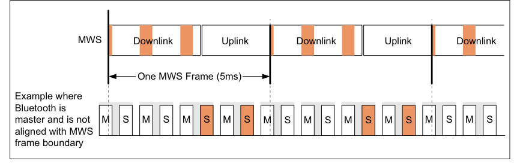

**Figure 7.2:  MWS receptions interfered with by uncontrolled Bluetooth transmissions**

Even with the best relative timing relationship (when the Bluetooth slot boundary is aligned with the MWS frame boundary), the Bluetooth radio in the MRT suffers reduced transmission and reception opportunities due to time multiplexing with the collocated MWS radio. The Bluetooth radio only gets one transmission/reception opportunity every MWS frame, as shown in Figure 7.3.

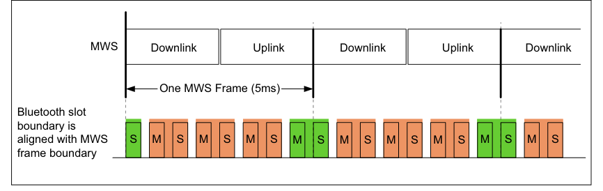

**Figure 7.3:  Bluetooth radio has reduced transmission/receiving opportunities**

Consequently, three out of four (for 5 ms MWS frames) or seven out of eight (for 10 ms MWS frames) slot pairs of Bluetooth can be punctured by MWS activities. Furthermore, since Bluetooth inquiry and paging use a sequence of 16 channels at a time, when the Bluetooth radio in the MRT is performing inquiry or paging the channel sequence will repeat every 5 ms resulting in the same channels being repeatedly punctured by the collocated MWS activities, see Figure 7.4. As a result, there is a high probability that the remote scanning device will not be able to receive the page or inquiry IDs within the current timeout.
When the inquiry or paging channel sequence gets repeatedly punctured, Train Nudging can be used to add an additional offset to the clock bits in order to shift the channel sequence.

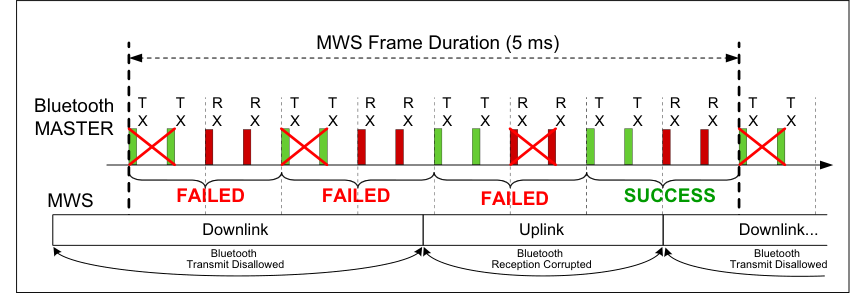

**Figure 7.4:  Bluetooth radio can suffer Inquiry/Page failures**

As MWS transmissions interfere with Bluetooth receptions in the MRT, up to 50% of the transmitted IDs from the remote inquiry/page device will not be received by the Bluetooth radio in the MRT performing scanning, as shown in Figure 7.5.
Based on the pattern of slots that are not available for scanning, Generalized Interlaced Scanning can be used to tune the phase of the second scan during a back-to-back scan.

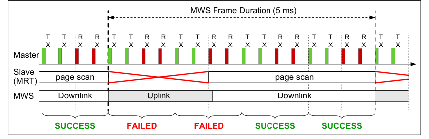

**Figure 7.5:  Bluetooth radio can suffer inquiry scan/page scan failures**

### 7.5   SYNCHRONIZING BLUETOOTH WITH AN EXTERNAL TIMING SOURCE

This section provides an example to illustrate the synchronization of the Bluetooth CLK with an MWS system so that the Bluetooth slots line up with the Downlink and Uplink times of the MWS system. The external frame in this example is LTE TDD Frame Configuration #1 and special subframe configuration #1; however the same mechanisms can be used for any external TDD/TDMA protocol. The example shows a time span of 10 ms.
[Vol 7] Part A defines the timing of the MWS frame as a fixed offset from the FRAME_SYNC signal in the coexistence signaling. This is shown in Figure 7.6 as FS. FS can be defined by the Host as any specific offset within the MWS
frame. For a piconet master, the most useful position for FS is the boundary between the uplink and the following downlink. This is because the master needs to transmit in a master slot during the uplink and then receive in the following slave slot during the downlink. Putting FS at this boundary allows the master to easily align its Bluetooth clock to put it between these slots. The situation is reversed in a slave: FS is most useful on the boundary between the downlink and the following uplink.
The HCI command Set_External_Frame_Configuration ([Vol 2] Part E, Section 7.3.81) is used to describe the MWS frame timing. This knowledge, together with FS, allows the Bluetooth Controller to align the Bluetooth clock with the MWS frame timing so as to minimize the effect of mutual interference. This is illustrated in Figure 7.6. The red ovals show slot pairs where both MWS and Bluetooth transmit and receive simultaneously and so do not interfere with each other. The MWS frame structure includes a downlink portion (“D”), an uplink portion (“U”), and a special portion (“S”) that includes a downlink and uplink portion separated by a guard period (“GP”).

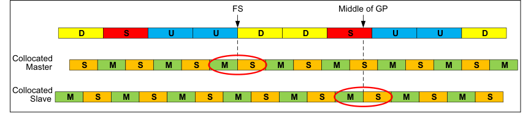

**Figure 7.6:  Alignment of MWS frame timing and Bluetooth clock**

Note: In LTE, if the implementation does not have access to the exact LTE timing it can assume that the downlink-to-uplink boundary is the middle of the GP in a special LTE subframe.

### 7.6   PICONET CLOCK ADJUSTMENT

As discussed in the previous section, aligning the MWS and Bluetooth clocks correctly greatly improves throughput on both technologies. The master has two mechanisms at its disposal to mitigate misalignments.
Coarse Clock Adjustments can be used to move the Bluetooth CLK using the LMP_clk_adj PDU. The clk_adj_us parameter is used to align the slots with the MWS alignment point indicated by the FRAME_SYNC signal. The clk_adj_slots parameter can be used to move the CLK several slots forward in time. This can be useful to align e.g. eSCO. Coarse Clock Adjustment is expected to be used only rarely, for instance at MWS connection or when the MWS frame timing changes due to roaming. Coarse Clock Adjustment can only be used when all slaves in the piconet support it.
The other option for the master is to use Clock Dragging. This is a method of slowly adjusting the phase of the clock backward or forward by making the
slots a few µs shorter or longer, respectively, until the desired CLK phase has been achieved. It should be noted that this is a very slow rate of adjustment, as it is designed to allow a legacy device to track the change, and therefore Clock Dragging must not be done at a faster rate than the maximum natural drift between devices. For this reason its main use is to facilitate small corrections over time if a misalignment with the MWS system is detected. If any device is connected that does not support Coarse Clock Adjustment, slowly moving the slave using Clock Dragging is the only option.
It is recommended to let the collocated device be the master, when possible, as it can react much faster to correct misalignments. If a slave is the collocated device, doing a role switch to make it master may be worth considering. Alternatively a slave can send a Piconet Clock Adjustment Request LMP packet to the master. The master then has the option to perform a Coarse Clock Adjustment, Clock Dragging, or to reject the request.

### 7.7   SLOT AVAILABILITY MASK (SAM)

Slot Availability Mask (SAM) allows two Bluetooth devices to indicate to each other time slots that are available for transmission and reception. The SAM slot map specifies the availability or otherwise of Bluetooth slots. A slot could be unavailable because of external conditions (e.g., MWS coexistence) or internal conditions (e.g., scatternet commitments). SAM does not impose new mandatory rules for the scheduling of BR/EDR time slots. Instead, it merely provides information which allows Controllers to refine their scheduling of Bluetooth slots to improve performance.
SAM slot maps are calculated by the Controller itself based on its scheduling requirements. There are no HCI commands defined specifically for SAM, merely LMP sequences that enable devices to exchange maps and indicate the map in use. The HCI commands "Set_External_Frame_Configuration" (see [Vol 2] Part E, Section 7.3.81) and "Set_MWS_PATTERN_Configuration" (see [Vol 2] Part E, Section 7.3.85) and real-time signals (e.g., MWS_PATTERN_Index or FRAME_SYNC) provided by the Coexistence Logical Interface (see [Vol 7] Part A) contain information concerning the appropriate SAM_Index and SAM anchor point to use for MWS coexistence; these may therefore trigger these LMP sequences.
A Controller may choose to perform a Piconet Clock Adjustment before initiating an LMP_SAM_switch sequence so as to increase the number of slot pairs available per MWS frame.
Architecture & Terminology Overview
Part B
PART B: ACRONYMS & ABBREVIATIONS
CONTENTS

## 1  LIST OF ACRONYMS AND ABBREVIATIONS

| Acronym or abbreviation | Writing out in full | Comments |
| --- | --- | --- |
| 8DPSK | 8 phase Differential Phase Shift Keying | 3 Mb/s modulation type used by Enhanced Data rate |
| A |  |  |
| A2MP | AMP Manager Protocol |  |
| AAD | Additional Authentical Data |  |
| AC | Access Category |  |
| ACI | Access Category Index |  |
| ACK | Acknowledge/Acknowledgment |  |
| ACL | Asynchronous Connection-ori- ented [logical transport] | Reliable or time-bounded, bi-direc tional, point-to-point |
| ACL-C | ACL Control [logical link] (LMP) |  |
| ACL-U | ACL User [logical link] (L2CAP) |  |
| ACO | Authenticated Ciphering Offset |  |
| AD | Advertising Data |  |
| Adv idx _ | Advertising channel index |  |
| ADVB | LE Advertising Broadcast |  |
| ADVB-C | LE Advertising Broadcast Control (Logical Link) |  |
| ADVB-U | LE Advertising Broadcast User Data (Logical Link) |  |
| ADI | AdvDataInfo |  |
| AES | Advanced Encryption Standard |  |
| AES-CCM | Advanced Encryption Standard - Counter with CBC MAC |  |
| AFH | Adaptive Frequency Hopping |  |
| AGC | Automatic Gain Control |  |
| AHS | Adapted Hop Sequence |  |
| AIFSN | Arbitration Interframe Space Num- ber |  |
| AMP | Alternate MAC PHY |  |

Table 1.1:  Acronyms and Abbreviations

| Acronym or abbreviation | Writing out in full | Comments |
| --- | --- | --- |
| AMP ASSOC _ | Alternate MAC PHY association information |  |
| AMP-U | AMP User Asynchronous/Isochro- nous Logical Link |  |
| ARQ | Automatic Repeat Request |  |
| ASB | Active Slave Broadcast [logical transport] | Unreliable, uni-directional broad- cast to any devices synchronized with the physical channel |
| ASB-C | ASB Control [logical link] (LMP) |  |
| ASB-U | ASB User [logical link] (L2CAP) |  |
| ATT | Attribute Protocol |  |
| B |  |  |
| BB | Baseband |  |
| BCH | Bose, Chaudhuri & Hocquenghem | Type of code The persons who discovered these codes in 1959 (H) and 1960 (B&C) |
| BD ADDR _ | Bluetooth Device Address |  |
| BER | Bit Error Rate |  |
| BT | Bandwidth Time |  |
| C |  |  |
| CAC | Channel Access Code |  |
| CBC-MAC | Cipher Block Chaining Message Authentication Code |  |
| CCM | Counter with Cipher Block Chain- ing-Message Authentication Code |  |
| CCMP | CTR with CBC-MAC Protocol |  |
| CLKN | Native Clock |  |
| CL | Connectionless |  |
| CLK | Master Clock |  |
| CLKE | Estimated Clock |  |
| CODEC | COder DECoder |  |
| COF | Ciphering Offset |  |
| CRC | Cyclic Redundancy Check |  |
| CSA | Core Specification Addendum | (In plural Addenda) |

Table 1.1:  Acronyms and Abbreviations

| Acronym or abbreviation | Writing out in full | Comments |
| --- | --- | --- |
| CSB | Connectionless Slave Broadcast | The logical transport enabled by the Connectionless Slave Broadcast feature |
| CSRK | Connection Signature Resolving Key |  |
| CTS | Clear to send |  |
| CVSD | Continuous Variable Slope Delta Modulation |  |
| D |  |  |
| DA | Destination address |  |
| DAC | Device Access Code |  |
| DCE | Data Communication Equipment |  |
| DCE | Data Circuit-Terminating Equip- ment | In serial communications, DCE refers to a device between the communication endpoints whose sole task is to facilitate the commu nications process; typically a modem |
| DCI | Default Check Initialization |  |
| DEVM | Differential Error Vector Magnitude | Measure of modulation error used for Enhanced Data Rate transmit- ter testing |
| DFS | Dynamic Frequency Selection |  |
| DH | Data-High Rate | Data packet type for high rate data |
| DHK | Diversifier Hiding Key |  |
| DIAC | Dedicated Inquiry Access Code |  |
| DID | (Advertising) Data ID |  |
| DIV | Diversifier |  |
| DM | Data - Medium Rate | Data packet type for medium rate data |
| DPSK | Differential Phase Shift Keying | Generic description of Enhanced Data Rate modulation |
| DQPSK | Differential Quaternary Phase Shift Keying | Modulation type used by Enhanced Data Rate |
| DSAP | Destination Service Access Point |  |

Table 1.1:  Acronyms and Abbreviations

| Acronym or abbreviation | Writing out in full | Comments |
| --- | --- | --- |
| DTE | Data Terminal Equipment | In serial communications, DTE refers to a device at the endpoint o the communications path; typically a computer or terminal. |
| DTM | Direct Test Mode |  |
| DUT | Device Under Test |  |
| DV | Data Voice | Data packet type for data and voice |
| E |  |  |
| E | Excluded | Do not use or claim support in this context. |
| ECWmax | Enhanced Contention Window maximum |  |
| ECWmim | Enhanced Contention Window minimum |  |
| ED | Erroneous Data |  |
| EDCA | Enhanced Distributed Channel Access |  |
| EDIV | Encrypted Diversifier |  |
| EDR | Enhanced Data Rate |  |
| EFS | Extended Flow Specification |  |
| EIR | Extended Inquiry Response | Host supplied information transmit ted in the inquiry responses sub- state |
| EIRP | Effective Isotropic Radiated Power | Equivalent power that an isotropic antenna must transmit to provide the same field power density |
| EOC | Extreme Operating Conditions |  |
| EPR | Encryption Pause Resume | Mode allowing the device to initiate the pause and resume encryption sequence |
| ER | Encryption Root |  |
| ERP | Extended Rate PHY conforming to Clause 19 |  |
| (e)SCO | Synchronous logical link or Extended Synchronous logical link | SCO or eSCO |

Table 1.1:  Acronyms and Abbreviations

| Acronym or abbreviation | Writing out in full | Comments |
| --- | --- | --- |
| eSCO | Extended Synchronous Connec- tion Oriented [logical transport] | Bi-directional, symmetric or asym- metric, point-to-point, general reg- ular data, limited retransmission |
| eSCO-S | Stream eSCO (unframed) | Used to support isochronous data delivered in a stream without fram- ing |
| ESS | Extended Service Set |  |
| ETSI | European Telecommunications Standards Institute |  |
| F |  |  |
| FCC | Federal Communications Commission |  |
| FCS | Frame Check Sequence |  |
| FDMA | Frequency Division Multiple Access |  |
| FEC | Forward Error Correction code |  |
| FH | Frequency Hopping |  |
| FHS | Frequency Hop Synchronization |  |
| FHSS | Frequency Hopping Spread Spec- trum |  |
| FIFO | First In First Out |  |
| FIPS | Federal Information Processing Standards |  |
| FM | Frequency Modulation | Modulation type |
| G |  |  |
| GAP | Generic Access Profile |  |
| GATT | Generic Attribute Profile |  |
| GFSK | Gaussian Frequency Shift Keying |  |
| GIAC | General Inquiry Access Code |  |
| GTM | Generic Test Methodology |  |
| H |  |  |
| HCI | Host Controller Interface |  |
| HEC | Header-Error-Check |  |
| HID | Human Interface Device |  |
| HV | High quality Voice | e.g. HV1 packet |

Table 1.1:  Acronyms and Abbreviations

| Acronym or abbreviation | Writing out in full | Comments |
| --- | --- | --- |
| HW | Hardware |  |
| I |  |  |
| IAC | Inquiry Access Code |  |
| IC | Industry Canada |  |
| IEC | International Electrotechnical Commission |  |
| IEEE | Institute of Electronic and Electrical Engineers |  |
| IETF | Internet Engineering Task Force |  |
| IFS | Inter Frame Space |  |
| IP | Internet Protocol |  |
| IPv4 | Internet Protocol version 4 |  |
| IPv6 | Internet Protocol version 6 |  |
| IR | Identity Root |  |
| IrDA | Infra-red Data Association |  |
| IRK | Identity Resolving Key |  |
| ISM | Industrial, Scientific, Medical |  |
| ISO | International Organization for Stan- dardization |  |
| ITU | International Telecommunication Union |  |
| IUT | Implementation Under Test |  |
| IV | Initialization Vector |  |
| IVm | Initialization Vector (master) |  |
| IVs | Initialization Vector (slave) |  |
| J |  |  |
| JRL | Japanese Radio Law |  |
| K |  |  |
| KCC | Korea Communications Commis- sion |  |
| L |  |  |
| L2CAP | Logical Link Control and Adaptation Protocol |  |

Table 1.1:  Acronyms and Abbreviations

| Acronym or abbreviation | Writing out in full | Comments |
| --- | --- | --- |
| LAP | Lower Address Part |  |
| LC | Link Controller | Link Controller (or baseband) part of the Bluetooth protocol stack. Low level Baseband protocol handler |
| LC | Link Control [logical link] | The control logical links LC and ACL-C are used at the link control level and link manager level, respectively. |
| LCP | Link Control Protocol |  |
| LE | Low Energy |  |
| LE-C | Low Energy Control (link) |  |
| LE-U | LE User [logical link] |  |
| LFSR | Linear Feedback Shift Register |  |
| LL | Link Layer |  |
| LLCP | Link Layer Control Protocol |  |
| LLID | Logical Link Identifier |  |
| LM | Link Manager |  |
| LMP | Link Manager Protocol | For LM peer to peer communicatio |
| LR | Loudness Rating |  |
| LSB | Least Significant Bit |  |
| LSO | Least Significant Octet |  |
| LSTO | Link Supervision Timeout Event | Controller can send LSTO event to Host |
| LT ADDR _ | Logical Transport ADDRess |  |
| LTK | Long-Term Key |  |
| M |  |  |
| M | Master or Mandatory |  |
| MAC | Medium Access Control |  |
| MAC | Message Authentication Code | Usually meaning the Medium Access Control code |
| Mb/s | Megabits (millions of bits) per sec- ond |  |
| MD | More Data |  |
| MIC | Message Integrity Check |  |

Table 1.1:  Acronyms and Abbreviations

| Acronym or abbreviation | Writing out in full | Comments |
| --- | --- | --- |
| MIIT | Ministry of Industry and Informa- tion Technology |  |
| MITM | Man-in-the-middle |  |
| MMI | Man Machine Interface |  |
| MS | Mobile Station |  |
| Msym/s | Megasymbols per second |  |
| MSB | Most Significant Bit |  |
| mSBC | modified Sub Band Codec | Hands-Free Profile v1.6 or later |
| MSC | Message Sequence Chart |  |
| MSO | Most Significant Octet |  |
| MTU | Maximum Transmission Unit |  |
| MWS | Mobile Wireless Standards | For example LTE and WiMAX |
|  |  |  |
| N |  |  |
| NAK | Negative Acknowledge |  |
| NAP | Non-significant Address Part |  |
| NCC | National Communications Com- mission |  |
| NESN | Next Expected Sequence Number |  |
| NIST | National Institute of Standards and Technology |  |
| NOC | Normal Operating Conditions |  |
| O |  |  |
| O | Optional |  |
| OBEX | OBject EXchange protocol |  |
| OCF | OpCode Command Field |  |
| OGF | OpCode Group Field |  |
| OOB | Out of Band |  |
| P |  |  |
| π/4 DQPSK | pi/4 Rotated Differential Quater- nary Phase Shift Keying | 2 Mb/s modulation type used by Enhanced Data Rate |
| PADVB | LE Periodic Advertising Broadcast (Logical Transport) |  |

Table 1.1:  Acronyms and Abbreviations

| Acronym or abbreviation | Writing out in full | Comments |
| --- | --- | --- |
| PBD | Profile Broadcast Data | The name of the logical link enabled by the Connectionless Slave Broadcast feature |
| PBF | Packet Boundary Flag | The device supports the capability to correctly handle HCI ACL Data Packets |
| PCM | Pulse Coded Modulation |  |
| PDU | Protocol Data Unit | A message |
| PHY | Physical Layer |  |
| PIN | Personal Identification Number |  |
| PN | Pseudo-random Noise |  |
| PPM | Part Per Million |  |
| PPP | Point-to-Point Protocol |  |
| PRBS | Pseudo Random Bit Sequence |  |
| PRNG | Pseudo Random Noise Generation |  |
| PSK | Phase Shift Keying | Class of modulation types |
| PSTN | Public Switched Telephone Net- work |  |
| ptt | Packet Type Table | The ptt parameter is used to select the logical transport types via LMP |
| Q |  |  |
| QoS | Quality of Service |  |
| R |  |  |
| RAND | Random number |  |
| RF | Radio Frequency |  |
| RFC | Request For Comments |  |
| RFCMode | Retransmission and Flow Control Mode |  |
| RFCOMM |  | Serial cable emulation protocol based on ETSI TS 07.10 |
| RFU | Reserved for Future Use |  |
| RMS | Root Mean Square |  |
| RPA | Resolvable Private Address |  |
| RSSI | Received Signal Strength Indica- tion |  |

Table 1.1:  Acronyms and Abbreviations

| Acronym or abbreviation | Writing out in full | Comments |
| --- | --- | --- |
| RX | Receive |  |
| S |  |  |
| S | Slave |  |
| SAP | Service Access Points |  |
| SAR | Segmentation and Reassembly |  |
| SCA | Sleep Clock Accuracy |  |
| SCO | Synchronous Connection-Ori- ented [logical transport] | Bi-directional, symmetric, point-to- point, AV channels |
| SCO-S | Stream SCO (unframed) | Used to support isochronous data delivered in a stream without fram- ing |
| SD | Service Discovery |  |
| SDP | Service Discovery Protocol |  |
| SDU | Service Data Unit |  |
| SEQN | Sequential Numbering scheme |  |
| SID | (Advertising) Set ID |  |
| SK | Session Key |  |
| SKDm | Session Key Diversifier (master) | Master portion of the Session Key Diversifier |
| SKDs | Session Key Diversifier (slave) | Slave portion of the Session Key Diversifier |
| SLR | Send Loudness Ring |  |
| SM | Security Manager |  |
| SMP | Security Manager Protocol |  |
| SN | Sequence Number |  |
| SRES | Signed Response |  |
| SRK | Signature Resolving Key |  |
| SS | Supplementary Services |  |
| SSI | Signal Strength Indication |  |
| SSP | Secure Simple Pairing | Simplifies the pairing process and improves Bluetooth security |
| SSR | Sniff Subrating | A mode that defines the anchor points at which the master trans- mits to the slave. |

Table 1.1:  Acronyms and Abbreviations

| Acronym or abbreviation | Writing out in full | Comments |
| --- | --- | --- |
| STK | Short Term Key |  |
| STP | Synchronization Train Packet | Packets transmitted using the Synchronization Train feature |
| SW | Software |  |
| T |  |  |
| T IFS _ | Time Inter Frame Space | Time interval between consecutive packets on same channel index |
| TC | Test Control | Test Control layer for the test inter face |
| TCI | Test Control Interface |  |
| TCP/IP | Transport Control Protocol/Inter- net Protocol |  |
| TCS | Telephony Control protocol Specification |  |
| TDD | Time-Division Duplex |  |
| TDMA | Time Division Multiple Access |  |
| TK | Temporary Key |  |
| TX | Transmit |  |
| U |  |  |
| UAP | Upper Address Part |  |
| UART | Universal Asynchronous receiver Transmitter |  |
| UI | User Interface |  |
| UI | Unnumbered Information |  |
| ULAP | Upper and Lower Address Parts |  |
| USB | Universal Serial Bus |  |
| UTF-8 | 8-bit UCS/Unicode Transformation Format |  |
| UUID | Universal Unique Identifier |  |
| W |  |  |
| WAP | Wireless Application Protocol |  |

Table 1.1:  Acronyms and Abbreviations
Architecture & Terminology Overview
Part C
PART C: CORE SPECIFICATION CHANGE HISTORY
CONTENTS

## 1  DEPRECATED FEATURES

Some features have been deemed no longer useful and have been deprecated. The term deprecation does not mean that they are no longer allowed, but that they are no longer recommended as the best way of performing a given function.
Deprecated features may be implemented using the latest qualifiable version of the Bluetooth core specification that specifies the deprecated features.

## 2  CHANGES FROM V1.1 TO V1.2

### 2.1   NEW FEATURES

Several new features were introduced in the Bluetooth Core Specification 1.2. The major areas of improvement are:
• Architectural overview
• Faster connection
• Adaptive frequency hopping
• Extended SCO links
• Enhanced error detection and flow control
• Enhanced synchronization capability
• Enhanced flow specification
The feature descriptions are incorporated into the existing text in different core parts, described in Volumes 2 and 3.

### 2.2   STRUCTURE CHANGES

The Bluetooth Core Specification 1.2 was significantly restructured for better consistency and readability. The most important structure changes have been performed in Baseband, LMP, HCI and L2CAP. The text in these sections has been rearranged to provide:
• Presentation of the information in a more logical progression
• Removal of redundant text and requirements
• Consolidation of baseband related requirements (for example, the Baseband Timers and Bluetooth Audio sections into the Baseband Specification)
• Alignment of the specification with the new architecture and terminology presented in the Architecture Overview (see [Vol 1] Part E).
In addition, new text and requirements were added for the new features as well as many changes throughout the specification to update the text to use IEEE language (see [Vol 1] Part E).

### 2.3   DEPRECATED FEATURES LIST

Features deprecated in version 1.2 are:
• The use of Unit Keys for security
• Optional Paging schemes
• 23 channel hopping sequence
• Page scan period mode and associated commands
2.4   CHANGES IN WORDING Two general classes of changes to the wording of the Bluetooth Specification have been done for version 1.2. They are a formalization of the language by using conventions established by the Institute of Electrical and Electronic Engineers (IEEE), and a regularization of Bluetooth wireless technology- specific terms. Many portions of the version 1.1 specification use imprecise or inaccurate terms to describe attributes of the protocol. A more accurate terminology described in Part E was introduced into the version 1.2 specification and have been applied in future versions.

### 2.5   NOMENCLATURE CHANGES

The nomenclature in Bluetooth 1.2 was also updated due to new concepts that are introduced together with the new features and the new architecture. See [Vol 1] Part A.

## 3  CHANGES FROM V1.2 TO V2.0 + EDR

### 3.1   NEW FEATURES

The Bluetooth Core Specification version 2.0 + EDR introduces Enhanced Data Rate (EDR). EDR provides a set of additional packet types that use the new 2 Mb/s and 3 Mb/s modes.
In addition to EDR a set of errata provided in ESR02 has been incorporated into this version and revised to include changes caused by the addition of EDR.
These additions are incorporated into the existing text in different core parts described in Volumes 2 and 3.

### 3.2   DEPRECATED FEATURES

The only feature deprecated in version 2.0 + EDR is the Page Scan Period Mode and associated commands (based on Erratum 694 which is also included in ESR02).

## 4  CHANGES FROM V2.0 + EDR TO V2.1 + EDR

### 4.1   NEW FEATURES

Several new features are introduced in Bluetooth Core Specification 2.1 + EDR. The major areas of improvement are:
• Erroneous Data Reporting
• Encryption Pause and Resume
• Extended Inquiry Response
• Link Supervision Timeout Changed Event
• Non-Automatically-Flushable Packet Boundary Flag
• Secure Simple Pairing
• Sniff Subrating
• Security Mode 4

### 4.2   DEPRECATED FEATURES

No features were deprecated in v2.1 + EDR.

## 5  CHANGES FROM V2.1 + EDR TO V3.0 + HS

### 5.1   NEW FEATURES

Several new features are introduced in Bluetooth Core Specification v3.0 + HS. The major areas of improvement are:
• AMP Manager Protocol (A2MP)
• Enhancements to L2CAP including
• Enhanced Retransmission Mode and Streaming Mode
• Improvements to the L2CAP state machine for AMP channels
• Fixed channel support
• Enhancements to HCI for AMP
• Enhancements to Security for AMP
• 802.11 Protocol Adaptation Layer
• Enhanced Power Control
• Unicast Connectionless Data
• HCI Read Encryption Key Size command
• Generic Test Methodology for AMP
• Enhanced USB and SDIO HCI Transports

### 5.2   DEPRECATED FEATURES

No features were deprecated in v3.0 + HS.

## 6  CHANGES FROM V3.0 + HS TO V4.0

### 6.1   NEW FEATURES

Several new features are introduced in Bluetooth Core Specification v4.0 Release. The major areas of improvement are:
• Bluetooth Low Energy including
• Low Energy Physical Layer
• Low Energy Link Layer
• Enhancements to HCI for Low Energy
• Low Energy Direct Test Mode
• AES Encryption
• Enhancements to L2CAP for Low Energy
• Enhancements to GAP for Low Energy
• Attribute Protocol (ATT)
• Generic Attribute Profile (GATT)
• Security Manager (SM)

### 6.2   DEPRECATED FEATURES

No features were deprecated in v4.0.

## 7  CHANGES FROM v4.0 TO v4.1

### 7.1   NEW FEATURES

Several new features are introduced in the Bluetooth Core Specification v4.1 Release. The major areas of improvement are:
• BR/EDR Secure Connections
• Train Nudging
• Generalized Interlaced Scan
• Low Duty Cycle Directed Advertising
• 32-bit UUID Support in LE
• LE Dual Mode Topology
• Piconet Clock Adjustment
• LE L2CAP Connection Oriented Channel Support
• LE Privacy v1.1
• LE Link Layer Topology
• LE Ping

#### 7.1.1  Features Added in CSA 4 – Integrated in v4.1

• Connectionless Slave Broadcast
• Unencrypted Unicast Connectionless Data Support
• Fast Advertising Interval
• eSCO Reserved Slots Clarification

#### 7.1.2  Features Added in CSA 3 – Integrated in v4.1

• MWS Coexistence HCI Changes
• GAP Connection Parameters Changes
• GAP Authentication and Lost Bond
• Dual Mode Addressing
• Private Address Changes
• Common Profile and Service Error Code Changes
• MWS Coexistence Signaling
• Wireless Coexistence Interface 1 (WCI-1) Transport Specification
• Wireless Coexistence Interface 2 (WCI-2) Transport Specification

#### 7.1.3  Features Added in CSA 2 – Integrated in v4.1

• Limited Discovery Time Changes
• EIR and AD Data Types In GAP
• Audio Architecture HCI Changes
• Audio Architecture USB Changes
• 802.11n Enhancements to the 802.11 PAL

### 7.2   DEPRECATED FEATURES

No features were deprecated in v4.1.

## 8  CHANGES FROM v4.1 TO v4.2

### 8.1   NEW FEATURES

Several new features are introduced in the Bluetooth Core Specification v4.2 Release. The major areas of improvement are:
• LE Data Packet Length Extension
• LE Secure Connections
• Link Layer Privacy
• Link Layer Extended Scanner Filter Policies

### 8.2   ERRATA INCORPORATED IN v4.2

Table 8.1 lists the integrated ESR08 errata items and also some ESR09 items, without test impact, which were added to v4.2 prior to the ESR09 release.

|  | ESR08 | ESR09 |
| --- | --- | --- |
| Global / Several Parts |  | 5782, 6001 |
| V0B: Compliance Req. | 5748 |  |
| V1A: Architecture Overview | 4767, 4768, 4858, 5526, 5531, 5742, 5748 | 5965, 6086 |
| V2A: Radio | 5179 |  |
| V2B: Baseband | 2645, 2668, 3909, 4997, 5185, 5447, 5636 | 5829, 5875, 5966 |
| V2C: LMP | 4934, 5118. 5756 | 5754, 5802, 5815, 5816 5817, 5818, 5819 |
| V2D: Error Codes | 5645, 5660 | 5814 |
| V2E: HCI | 4998, 5097, 5186, 5286, 5340, 5358, 5397, 5416, 5589, 5630, 5637, 5660, 5736, 5737, 5738 | 5000, 5174, 5247, 5821 5822, 5826, 5828, 5859 5907, 5926, 5927, 5935 5959, 5960 |
| V2F: MSCs | 5621 | 5762 |
| V2G: Sample Data |  |  |
| V2H: Security Spec. | 4815, 4830, 4903 |  |
| V3A: L2CAP | 2765, 3253, 3767, 3768, 3901, 3902, 3903, 4603, 4734, 4735, 4776, 5419 | 5987 |
| V3B: SDP | 5258 | 5257 |

Table 8.1:  Errata integrated in v4.2

|  | ESR08 | ESR09 |
| --- | --- | --- |
| V3C: GAP | 2341, 4087, 4778, 4895, 4935, 4936, 5618, 5441, 5051 | 5803, 5938, 5939, 5964 5989 |
| V3F: ATT |  | 6006 |
| V3G: GATT | 3817, 4358, 5116, 5117 |  |
| V3H: Security Manager |  | 6050 |
| V4B: USB Transport Layer | 5273 |  |
| V6A: Physical Layer | 5179 |  |
| V6B: Link Layer | 5231, 5232, 5233, 5234, 5235, 5236, 5307, 5360, 5419, 5428, 5526, 5577, 5653, 5656, 5706, 5707, 5720, 5721, 5722, 5723 | 5824, 5922, 5947, 5950 5954, 5994, 6116 |
| V6C: Sample Data | 4948 |  |
| V6D: MSCs | 4797, 4798 | 6032 |
| V6F: Direct Test Mode | 4834, 5749, 5751 |  |
| V7A: MWS Coexistence Logical Signaling | 5001 |  |
| V7B: WCI-1 Transport | 5004, 5619 |  |

Table 8.1:  Errata integrated in v4.2

## 9  CHANGES FROM v4.2 TO 5.0

### 9.1   NEW FEATURES

Several new features are introduced in the Bluetooth Core Specification 5.0 Release. The major areas of improvement are:
• Slot Availability Mask (SAM)
• 2 Msym/s PHY for LE
• LE Long Range
• High Duty Cycle Non-Connectable Advertising
• LE Advertising Extensions
• LE Channel Selection Algorithm #2

#### 9.1.1  Features Added in CSA5 - Integrated in v5.0

• Higher Output Power

### 9.2   DEPRECATED FEATURES

The following features were removed in this version of the specification:
• Park State

### 9.3   PRIVACY ERRATA

The Privacy errata shown in the table below have been resolved and integrated in this version of the specification.

| Erratum | Title |
| --- | --- |
| 5433 | In Table 9.3, C1 condition should be removed |
| 6182 | Invalid behavior with resolving address list not clear in Core or Test Spec |
| 6214 | Statement mismatch between procedure description and figure |
| 6247 | Unclear when to use LE Directed Advertising Report Event or LE Advertisin Report Event |
| 6356 | Defining scanner’s device address in “Scanner filter policy” |
| 6391 | Usage of peer address type not clear in privacy 1.2 |
| 6399 | LE Enhanced Connection Complete event |
| 6401 | Central Address Resolution Char in LE Peripheral |
| 6469 | Advertiser is not required to check AdvA |

Table 9.1:  Privacy errata

| Erratum | Title |
| --- | --- |
| 6471 | AdvA not well defined in SCAN RSP pdu, when privacy 1.2 enabled _ |
| 6508 | HCI command name mismatch |
| 6519 | When an advertiser device (or scanning performing active scanning) using privacy and Controller based resolvable private address generation is sup- posed to answer to a scan request (or advertising) received? |
| 6613 | Privacy Mode not clearly defined |
| 6629 | LE Directed Advertising Report Event - Order of parameters |
| 6984 | How does Adv respond to RPA in Connect Req when there’s no IRK and no WL |

Table 9.1:  Privacy errata

### 9.4   ERRATA INCORPORATED IN 5.0

Table 9.2 lists the integrated ESR09 and ESR10 errata items.

|  | ESR09 | ESR10 |
| --- | --- | --- |
| Global / Several Parts | 5782, 6001, 6334 | 6570, 6751, 6855. 7076 |
| V0B: Bluetooth Compliance Requirements |  | 6360, 6717 |
| V1A: Architecture Overview | 5900, 5965, 6086, 6120, 6193, 6240, 6242, 6277, 6284, 6288, 6290, 6303, 6361, 6363, 6364 | 6356, 6421, 6465, 6524 6529, 6558, 6603, 6604 6766, 6922, 7030, 7031 7301 |
| V1B: Acronyms & Abbreviations | 6277, 6349 | 6717 |
| V1C: Change History | 6195, 6318, |  |
| V1E: IEEE Language | 6208, 6381 | 6421, 6422, 7521 |
| V2A: Radio |  | 6199, 6547 |
| V2B: Baseband | 5829, 5875, 5966, 6096, 6193, 6277, 6350, | 6421, 6443, 6446, 6480 6505, 6523, 6531, 6537 6618, 6646, 6647, 6668 6714, 6721, 6749, 6953 6964 |
| V2C: LMP | 5753, 5754, 5802, 5815, 5816, 5817, 5818, 5819, 6114, 6175, 6176, 6177, 6193, 6210, 6277, 6289, 6291, 6295, 6332, 6339, 6388, 6389, 6404 | 4783, 6447, 6531, 6606 6735, 6773, 6776, 6852 |
| V2D: Error Codes | 5112, 5511, 5814, 6305, 6309 | 6421 |

Table 9.2:  Errata integrated in 5.0

|  | ESR09 | ESR10 |
| --- | --- | --- |
| V2E: HCI | 4354, 5000, 5174, 5247, 5266, 5821, 5822, 5826, 5828, 5859, 5905, 5907, 5926, 5927, 5935, 5959, 5960, 6072, 6110, 6115, 6211, 6265, 6277, 6278, 6286, 6293, 6301, 6302, 6326, 6338, 6339, 6374, 6409, 6419, 6420 | 4761, 4999, 5003, 6007 6182, 6247, 6356, 6399 6421, 6451, 6452, 6493 6508, 6531, 6532, 6534 6536, 6541, 6556, 6559 6563, 6566, 6568, 6576 6629, 6672, 6689, 6709 6716, 6722, 6749, 6752 6767, 6797, 6807, 6856 6857, 6882, 6886, 6910 6914, 6918, 6927, 6939 6986, 6997, 6998, 7017 7021, 7024, 7045, 7067 7068, 7069, 7077, 7372 |
| V2F: MSCs | 5762, 5875, 6212, 6286, 6319 | 5089, 6218, 6428, 6531 |
| V2H: Security Specification | 6194, 6359 | 5791, 5792, 5882, 6421 6902, 6906, 6907 |
| V3A: L2CAP | 5459, 5465, 5466, 5467, 5648, 5666, 5805, 5987, 6108, 6121, 6277, 6307, 6333 | 3548, 6417, 6421, 6567 6702, 6898, 6939 |
| V3B: SDP | 5257, 6308 | 6421, 6694 |
| V3C: GAP | 4958, 5562, 5786, 5803, 5821, 5938, 5939, 5964, 5989, 6166, 6167, 6168, 6215, 6217, 6222, 6313, 6405, 6411 | 4348, 4777, 4872, 4919 5110, 5399, 5407, 5418 5433, 5435, 5708, 5778 6214, 6356, 6401, 6421 6439, 6502, 6510, 6574 6575, 6599, 6732, 6745 6764, 6897, 7032, 7033 7354, 7355 |
| V3D:Test Support |  | 6421, 6525, 7075 |
| V3F: ATT | 5953, 6006, 6132, 6357 | 4243, 5107, 5610, 5919 6098, 6575 |
| V3G: GATT | 4253, 4836, 5059, 6251 | 4654, 5242, 5359, 5383 5717, 5718, 5719, 6575 6582, 7028, 7065, 7066 7072 |
| V3H: Security Manager | 4793, 4794, 5427, 5625, 6050, 6207, 6405 | 4796, 6219, 6421, 6436 6729, 6796, 6824, 6946 7461 |
| V4A: UART Transport |  | 6264 |
| V4B: USB Transport Layer | 5274 | 4165 |
| V5A: 802.11 Protocol Adaption |  | 6421, 7036 |

Table 9.2:  Errata integrated in 5.0

|  | ESR09 | ESR10 |
| --- | --- | --- |
| V6A: Physical Layer | 6118, 6156 | 6228 |
| V6B: Link Layer | 5174, 5534, 5745, 5824, 5922, 5947, 5950, 5954, 5986, 5994, 6116, 6119, 6123, 6131, 6153, 6164, 6167, 6168, 6188, 6192, 6197, 6268, 6294, 6306, 6310, 6311, 6321, 6331, 6339, 6345, 6371, 6384 | 6182, 6352, 6356, 6421, 6455, 6469, 6471, 6517, 6518, 6531, 6553, 6577, 6586, 6664, 6672, 6697, 6710, 6733, 6734, 6821, 6847, 6913, 6939, 6947, 6962, 6963, 6984, 7003, 7025, 7034, 7080, 7081, 7106, 7153 |
| V6C: Sample Data |  | 5809 |
| V6D: MSCs | 6032, 6269 | 6563, 6672, 6847 |
| V6E: LE Link Layer Security | 6194 |  |
| V6F: Direct Test Mode | 6390 | 6619, 6793, 6798, 7005, 7029 |
| V7A: MWS Coexistence Logical Signaling | 6234 | 5002 |
| V7B: Wireless Coexistence Interface 1 |  | 6915 |
| V7C: Wireless Coexistence Interface 2 |  | 6915 |

Table 9.2:  Errata integrated in 5.0
Table 9.3 lists the integrated ESR11 errata items.

|  | ESR11 |  |
| --- | --- | --- |
| Global / Several Parts | 7238, 7239, 7340 |  |
| V0C: Appendix | 7895 |  |
| V1A: Architecture Overview | 7421, 7422, 7423, 7484, 7772, 7777, 7980 |  |
| V1B: Acronyms & Abbreviations | 7777, 7895 |  |
| V1C: Change History | 7777 |  |
| V1D: Mixing of Spec Versions | 7351, 7358 |  |
| V1E: IEEE Language |  |  |
| V2A: Radio | 7278, 7526, 7662, 7777 |  |
| V2B: Baseband | 7304, 7305, 7320, 7651, 7777 |  |

Table 9.3:  Errata integrated in v5.0

|  | ESR11 |  |
| --- | --- | --- |
| V2C: LMP | 7145, 7284, 7285, 7292, 7320, 7367, 7713 |  |
| V2D: Error Codes | 7293, 8039 |  |
| V2E: HCI | 7143, 7158, 7185, 7187, 7217, 7218, 7234, 7262, 7274, 7326, 7334, 7375, 7396, 7458, 7485, 7504, 7644, 7650, 7706, 7716, 7717, 7821, 7835, 7851, 7867, 7871, 7900, 7991, 8090 |  |
| V2F: MSCs | 7509 |  |
| V3A: L2CAP | 7115, 7116, 7527, 7869 |  |
| V3B: SDP | 7819 |  |
| V3C: GAP | 7873, 8024 |  |
| V3D:Test Support | 7878 |  |
| V3F: ATT | 8041 |  |
| V3G: GATT | 7159, 7160, 7737, 7891, 7896, 7897, 8051, 8055 |  |
| V3H: Security Manager | 7226, 7320, 7469 |  |
| V5A: 802.11 Protocol Adaption | 7875, 7876, 7878 |  |
| V6A: Physical Layer | 7408, 7777 |  |
| V6B: Link Layer | 7122, 7152, 7195, 7209, 7269, 7320, 7321, 7330, 7331, 7481, 7482, 7630, 7686, 7720, 7777, 7791, 7809, 7995, 8031 |  |
| V6D: MSCs | 7509 |  |
| V6F: Direct Test Mode | 7156, 7281, 7696 |  |
| V7A: MWS Coexistence Logical Signaling | 7525 |  |

Table 9.3:  Errata integrated in v5.0
Architecture & Terminology Overview
Part D
PART D: MIXING OF SPECIFICATION VERSIONS
CONTENTS

## 1  MIXING OF SPECIFICATION VERSIONS

This part describes how volumes, and parts within volumes, of different versions and Specification Addenda of the Core Specification may be mixed in Bluetooth implementations. The Core System consists of a BR/EDR Controller Package (see Volume 2), a Low Energy Controller Package (see Volume 6), a Host Package (see Volume 3) and AMP Protocol Adaptation Layers (see Volume 5).
• All parts within a Primary Controller implementation shall comply with the same version of Volume 2 and Volume 6.
• All parts within a Host implementation of Volume 3 shall comply with the same version.
• An AMP Controller implementation shall contain parts of Volume 2 and Volume 5 from the same version.
• The Primary Controller, AMP Controller, and Host may comply with different versions within a single implementation.
In order to describe how these volumes and parts within volumes can be mixed, one needs to distinguish between four categories of features specified in the different specification versions. The four categories are:

| Category | Description |
| --- | --- |
| Type 1 | Feature that exists below HCI and cannot be configured/enabled via HCI |
| Type 2 | Feature that exists below HCI and can be configured/enabled via HCI |
| Type 3 | Feature that exists below and above HCI and requires HCI command events to function |
| Type 4 | Feature that exists only above HCI |

Table 1.1:  Feature type definitions
The outcome of mixing different Core System Packages are derived from the feature definitions in the table above:
• If an implementation contains features of type 1 or type 4, these features can function with any combination of Host Package and Controller Package or AMP Protocol Adaptation Layer (PAL) versions with applicable addenda.
• If an implementation contains features of type 2, these features can only be used under a default condition if a Host Package of an older version with applicable addenda is mixed with a Controller Package or AMP PAL of this version with applicable Core Specification Addenda (CSAs).
• In order to fully use the feature under all conditions, the Host Package, Controller Package, and AMP PAL must comply with the same or later version with applicable CSAs.
• If an implementation contains features of type 3, these features can only function if the Host Package supports this version or a later version with applicable CSAs and if the Controller Package complies with this version or a later version with applicable CSAs.
See the Bluetooth Brand Book for specification naming requirements.

### 1.1   FEATURES AND THEIR TYPES

The following table lists the features, their types, and the version or addendum where the feature was first introduced.

| Feature | Version | Type |
| --- | --- | --- |
| Basic AFH operation | 1.2 | 1 |
| Enhanced inquiry | 1.2 | 1 |
| Configuration of AFH (setting channels and enabling/dis- abling channel assessment) | 1.2 | 2 |
| Enhanced synchronization capability | 1.2 | 2 |
| Interlaced inquiry scan | 1.2 | 2 |
| Interlaced page scan | 1.2 | 2 |
| Broadcast encryption | 1.2 | 2 |
| Enhanced flow specification and flush time-out | 1.2 | 3 |
| Extended SCO links | 1.2 | 3 |
| Inquiry Result with RSSI | 1.2 | 3 |
| L2CAP flow and error control | 1.2 | 4 |
| 2 Mb/s EDR | 2.0 + EDR | 2 |
| 3 Mb/s EDR | 2.0 + EDR | 2 |
| 3 slot packets in EDR | 2.0 + EDR | 2 |
| 5 slot packets in EDR | 2.0 + EDR | 2 |
| 2 Mb/s eSCO | 2.0 + EDR | 2 |
| 3 Mb/s eSCO | 2.0 + EDR | 2 |
| 3 slot packets for EDR eSCO | 2.0 + EDR | 2 |
| Erroneous Data Reporting | 2.1 + EDR | 3 |
| Extended Inquiry Response | 2.1 + EDR | 3 |
| Encryption Pause and Resume | 2.1 + EDR | 1 |
| Link Supervision Timeout Changed Event | 2.1 + EDR | 3 |
| Non-Flushable Packet Boundary Flag | 2.1 + EDR | 3 |
| Sniff subrating | 2.1+ EDR | 3 |
| Secure Simple Pairing | 2.1.+ EDR | 3 |
| L2CAP Enhanced Retransmission Mode | Addendum 1/ 3.0 + HS | 4 |
| L2CAP Streaming Mode | Addendum 1/ 3.0 + HS | 4 |
| Enhanced Power Control | 3.0 + HS | 1 |

Table 1.2:  Features and their types

| Feature | Version | Type |
| --- | --- | --- |
| AMP Manager Protocol (A2MP) | 3.0 + HS | 4 |
| L2CAP Enhancements for AMP | 3.0 + HS | 4 |
| 802.11 PAL | 3.0 + HS | 3 |
| Generic Test Methodology | 3.0 + HS | 3 |
| Unicast Connectionless Data | 3.0 + HS | 4 |
| Low Energy Controller (PHY and LL) | 4.0 | 3 |
| Low Energy Host (L2CAP and Security Manager) | 4.0 | 4 |
| Attribute Protocol and Generic Attribute Profile | 4.0 | 4 |
| Appearance Data Type | Addendum 2 | 4 |
| 802.11n Enhancements to the 802.11 PAL | Addendum 2 | 3 |
| MWS Coexistence Signaling | Addendum 3 | 2 |
| Connectionless Slave Broadcast | Addendum 4 | 3 |
| Unencrypted UCD | Addendum 4 | 4 |
| BR/EDR Secure Connections | 4.1 | 3 |
| Train Nudging | 4.1 | 2 |
| Generalized Interlaced Scan | 4.1 | 2 |
| Piconet Clock Adjustment | 4.1 | 3 |
| Low Duty Cycle Directed Advertising | 4.1 | 2 |
| 32-bit UUID Support in LE | 4.1 | 4 |
| LE Dual Mode Topology | 4.1 | 4 |
| LE L2CAP Connection Oriented Channel Support | 4.1 | 4 |
| LE Privacy v1.1 | 4.1 | 4 |
| LE Link Layer Topology | 4.1 | 3 |
| LE Ping | 4.1 | 2 |
| LE Data Packet Length Extension | 4.2 | 2 |
| LE Secure Connections | 4.2 | 4 |
| Link Layer Privacy | 4.2 | 3 |
| Link Layer Extended Filter Policies | 4.2 | 3 |
| Slot Availability Mask | 5.0 | 2 |
| LE 2M PHY | 5.0 | 2 |
| LE Coded PHY | 5.0 | 3 |
| High Duty Cycle Non-Connectable Advertising | 5.0 | 2 |
| LE Advertising Extensions | 5.0 | 3 |

Table 1.2:  Features and their types

| Feature | Version | Type |
| --- | --- | --- |
| LE Channel Selection Algorithm #2 | 5.0 | 2 |
| LE Higher Output Power | Addendum 5 | 1 |

Table 1.2:  Features and their types

### 1.2   CORE SPECIFICATION ADDENDA

A Core Specification Addendum (CSA) contains one or more parts of a single volume, one or more parts in multiple volumes, changes on one or more parts, or a combination of parts and changes. Addenda are used to supersede a part in a volume or may be used to add a part to a volume according to the rules in Table 1.3.
Note: Each Change may contain changes and/or additions to one or more parts of the Core Specification.

| Addendum | Volume and Part or Change Name | Addition/ Changes/ Replacement | Allowed Versions & Addendum | Mandatory / Optional / Conditional | Type |
| --- | --- | --- | --- | --- | --- |
| 1 | Volume 3, Part A | Replacement | 2.0 + EDR, 2.1 + EDR | O | 4 |
| 2 | Audio Architec- ture HCI Changes | Change | 2.1 + EDR, 3.0 + HS, 4.0 | O | 2 |
|  | Audio Architec- ture USB Changes | Change | 2.1 + EDR, 3.0 + HS, 4.0 | O | 2 |
|  | LE Limited Discov- ery Time Changes | Change | 4.0 | C.1 | 4 |
|  | EIR and AD Data Types in GAP Changes | Change | 4.0 | C.1 | 4 |
|  | EIR and AD Data Types Specification | Addition | 4.0 | C.1 | 4 |
|  | Volume 5, Part A | Replacement | 3.0 + HS, 4.0 | O | 3 |

Table 1.3:  Adopted core specification versions to use with addenda.

| Addendum | Volume and Part or Change Name | Addition/ Changes/ Replacement | Allowed Versions & Addendum | Mandatory / Optional / Conditional | Type |
| --- | --- | --- | --- | --- | --- |
| 3 | LE Errata | Change | 4.0 with CSA2 | C.2 | Multipl |
|  | GAP Connection Parameters Changes | Change | 4.0 with CSA2 | C.1 | 4 |
|  | GAP Authentica- tion and Lost Bond Changes | Change | 4.0 with CSA2 | C.1 | 4 |
|  | Common Profile and Services Error Code Range Changes | Change | 4.0 with CSA2 | C.1 | 4 |
|  | Private Addressing Changes | Change | 4.0 with CSA2 | C.1 | 4 |
|  | Dual Mode Addressing Changes | Change | 4.0 with CSA2 | C.3 | 4 |
|  | MWS Coexistence Logical Signaling Specification | Addition | 2.1 + EDR, 3.0 + HS, 4.0 with CSA2 | O | 2 |
|  | MWS Coexistence HCI | Addition | 2.1 + EDR, 3.0 + HS, 4.0 with CSA2 | C.4 | 2 |
|  | Wireless Coexis- tence Interface 1 (WCI-1) Transport Layer Specifica- tion | Addition | 2.1 + EDR, 3.0 + HS, 4.0 with CSA2 | C.4 | 2 |
|  | Wireless Coexis- tence Interface 2 (WCI-2) Transport Layer Specifica- tion | Addition | 2.1 + EDR, 3.0 + HS, 4.0 with CSA2 | C.4 | 2 |

Table 1.3:  Adopted core specification versions to use with addenda.

| Addendum | Volume and Part or Change Name | Addition/ Changes/ Replacement | Allowed Versions & Addendum | Mandatory / Optional / Conditional | Type |
| --- | --- | --- | --- | --- | --- |
| 4 | Connectionless Slave Broadcast | Change | 3.0 + HS, 4.0 with CSA3 | O | 3 |
|  | Unencrypted UCD | Change | 3.0 + HS, 4.0 with CSA3 | O | 4 |
|  | Fast Advertising Interval | Change | 4.0 with CSA3 | C.1 | 4 |
|  | eSCO Reserved Slot Clarification | Change | 2.1 + EDR, 3.0 + HS, 4.0 with CSA3 | O | 1 |
| 5 | Higher Output Power | Change | 4.0 with CSA3, 4.0 with CSA4, 4.1, 4.2 | O | 1 |

Table 1.3:  Adopted core specification versions to use with addenda.
C.1: Mandatory if either the Host Part of the Low Energy Core Configuration or the Host Part of the Basic Rate and Low Energy Combined Core Configuration is supported, otherwise Excluded.
C.2: Mandatory if either the Host Part of the Low Energy Core Configuration, Controller Part of the Low Energy Core Configuration, Host Part of the Basic Rate and Low Energy Combined Core Configuration, or Controller Part of the Basic Rate and Low Energy Combined Core Configuration is supported, otherwise Excluded. C.3: Mandatory if the Host Part of the Basic Rate and Low Energy Combined Core Con- figuration is supported, otherwise Excluded. C.4: Optional if MWS Coexistence Logical Signaling is supported, otherwise Excluded.
Architecture & Terminology Overview
Part E
PART E: GENERAL TERMINOLOGY AND INTERPRETATION
CONTENTS

## 1  USE OF IEEE LANGUAGE

One of the purposes of this terminology is to make it easy for the reader to identify text that describes requirements as opposed to background information. The general term for text that describes attributes that are required for proper implementation of Bluetooth wireless technology is normative. The general term for language that provides background and context for normative text is informative. These terms are used in various sections to clarify implementation requirements.
Many portions of the Bluetooth Specification use imprecise or inaccurate terms to describe attributes of the protocol. This subsection describes the correct usage of key terms that indicate degree of requirements for processes and data structures. The information here was derived from the Institute of Electrical and Electronics Engineers (IEEE) Style Guide, see http:// standards.ieee.org/guides/style/.
The following list is a summary of the terms to be discussed in more detail below:

| shall | is required to – used to define requirements |
| --- | --- |
| must | is a natural consequence of -- used only to describe unavoidable situations |
| will | it is true that -- only used in statements of fact |
| should | is recommended that – used to indicate that among several possibilities one is recommended as particularly suitable, but not required |
| may | is permitted to – used to allow options |
| can | is able to – used to relate statements in a causal fashion |
| is | is defined as – used to further explain elements that are previously required or allowed |
| note | <informational text ONLY> |

For clarity of the definition of those terms, the following sections document why and how they are used. For these sections only, the IEEE terms are italicized to indicate their use as a noun. Uses and examples of the use of the terms in this section are underlined.

### 1.1   SHALL

The word shall is used to indicate mandatory requirements that shall be followed in order to conform to the specification and from which no deviation is permitted.
There is a strong implication that the presence of the word shall indicates a testable requirement. All testable requirements shall be reflected in the appropriate Implementation Conformance Statement (ICS). In turn, all ICS indicators should be reflected in the Test Cases (TCs) either directly or indirectly.
A direct reference is a specific test for the attribute cited in the text. For example, a minimum value for a given parameter may be an entry in the TCs. Indirect test coverage may be appropriate if the existence of the attribute is requisite for passing a higher level test.

### 1.2   MUST

The word must shall not be used when stating mandatory requirements. Must is used only to describe unavoidable situations and is seldom appropriate for the text of a Specification.
An example of an appropriate use of the term must is: “the Bluetooth radios must be in range of each other to communicate”.

### 1.3   WILL

The use of the word will shall not be used when stating mandatory requirements. The term will is only used in statements of fact. As with the term must, will is not generally applicable to the description of a protocol. An example of appropriate use of will is: “when power is removed from the radio, it can be assumed that communications will fail”.

### 1.4   SHOULD

Should equals is recommended that. The word should is used to indicate that among several possibilities one is recommended as particularly suitable without mentioning or excluding others. Alternatively it may indicate that a certain course of action is preferred but not necessarily required. Finally, in the negative form, it indicates a certain course of action is deprecated but not prohibited.
In the Bluetooth Specification the term designates an optional attribute that may require an entry in the ICS.
Explicit specification of alternatives should be done when using should.

### 1.5   MAY

The word may is used to indicate a course of action permissible within the limits of the specification. The term may equals is permitted. This is generally used when there is a single, optional attribute described, but multiple alternatives may be cited.
The use of may implies an optional condition in the ICS and therefore may need to be reflected in the corresponding test cases.
This specification does not use the phrase may not except in the form may or may not.

### 1.6   CAN

The word can is used for statements of possibility and capability, whether material, physical, or causal. The term can equals is able to.
The term can shall be used only in informative text. It describes capabilities by virtue of the rules established by normative text.

## 2  GENERAL INTERPRETATION RULES

The following rules apply throughout this specification except where explicitly overridden.

### 2.1   BINARY AND HEXADECIMAL VALUES

Binary numbers are normally written with a "b" suffix, so 1101b is the same as the decimal number 13.
In some places a sequence of bits is written in quotation marks thus: '1010'. Such sequences are not normally intended to be interpreted as numbers. The order that the bits are to be processed will always be specified.
Hexadecimal numbers are written with a "0x" prefix, so 0x42 is the same as the decimal number 66. The letters "a" to "f" are used to represent the digits 10 to 15, so 0x1a is the same as the decimal number 26. The case of letters in a hexadecimal number is not significant.
Underscore characters may be placed between the digits of binary or hexadecimal numbers to make them easier to interpret; these underscores shall not affect the value. For example, 0010_1011b and 00101011b both equal the decimal number 43.
All numbers not written in one of the above ways are decimal.

### 2.2   BIT NUMBERS AND BIT FIELDS

In some cases the specification needs to refer to some of the bits of an integer value. Bits are always numbered from 0 as the least significant bit, so bit 0 of 1011b equals 1 while bit 2 equals 0. A single bit will be notated with a subscript, as in CLK5.
Sometimes it is necessary to refer to a consecutive set of bits; for example, given a value CLK it may be necessary to refer to bits 2 to 4 of CLK (that is, the value equal to (CLK ÷ 4) modulo 8, or in C notation "(CLK >> 2) % 8" or "(CLK >> 2) & 7"). This will be notated either by a subscript with a dash or by brackets and a colon; the bit numbers will always be inclusive and the most significant bit number is given first. For example, bits 2 to 4 of CLK are written CLK4-2 or CLK[4:2].

### 2.3   SPECIFICATION OF BIT VALUES

Some values in this specification are divided into individual bits, each of which has a description. If explicit bit values are not given then this description represents the meaning when the bit equals 1 and the opposite applies when the value is 0. For example, a description of:
Bit 3: use 3-slot packets
means the same as:
Bit 3 = 1: use 3-slot packets;
Bit 3 = 0: do not use 3-slot packets.

### 2.4   RESERVED FOR FUTURE USE (RFU)

Where a field in a packet, PDU, or other data structure is described as "Reserved for future use" (irrespective of whether in upper or lower case), the device creating the structure shall set it to zero unless otherwise specified. Any device receiving or interpreting the structure shall ignore that field; in particular, it shall not reject the structure because of the value of the field.
Where a field, parameter, or other variable object can take a range of values and some values are described as "Reserved for future use", devices shall not set the object to that value. A device receiving an object with such a value should reject it, and any data structure containing it, as being erroneous; however, this does not apply in a context where the object is described as being ignored or if it is specified to ignore unrecognized values.
The abbreviation "RFU" is equivalent to "Reserved for future use".

### 2.5   USE OF INVALID VALUES IN CHECKSUMS AND OTHER CALCULATIONS

Where a field or value is used as part of a checksum, CRC, cryptographic key, or other similar calculation, and the value sent to or received from the peer is not valid (for example, it is an RFU field that has not been set to 0 by the sender), the actual value sent or received shall be used in the calculation and it shall not be replaced by a different valid value.

### 2.6   ASSIGNED NUMBER REQUIREMENTS

The Bluetooth SIG maintains a published set of assigned numbers on the Bluetooth SIG Assigned Numbers web page. These assigned numbers are grouped in various number spaces. Numbers assigned may overlap with other assigned numbers in different number spaces, but no number within a number space is permitted to be reused. The various number spaces are defined in the specification that defines the usage of the assigned numbers.
All Assigned Numbers within a given number space shall only be designated by the Bluetooth SIG and shall only be used for their intended purposes when used within a field, parameter, or other variable object defined to take on a value within that number space. All values not explicitly assigned within a given
number space are Reserved for future use and subject to the requirements in Section 2.4.
All 16-bit and 32-bit UUIDs as defined in [Vol 3] Part B, Section 2.5.1, are considered assigned numbers. All other UUID values may be used in any context where a UUID is permitted provided they are generated according to the recommendations in ITU-T Rec. X.667(10/2012), alternatively known as ISO/IEC 9834.8:2014.

## 3  NAMING CONVENTIONS

### 3.1   BR/EDR

This section is not currently used.

### 3.2   BLUETOOTH LOW ENERGY

#### 3.2.1  Link Layer PDUs

A consistent naming scheme is used for Link Layer PDUs to make their purpose and usage clearer.
The PDU name consists of up to five components. Each component is entirely uppercase. Those components that are present are separated by a single underscore (e.g., if only three of the five components are present, there are two underscores, not four). In order, these components are:
1. Where the PDU is used (optional) 2. When the PDU is used (mandatory) 3. What the PDU does (optional but usually present) 4. Version (optional) 5. How the PDU is used (mandatory)
The first component ("where") indicates which physical channel the PDU is used on. The values currently used are shown in Table 3.1.

| Value | Meaning |
| --- | --- |
| none | PDU is used on the primary advertising channel or any non-advertising channel |
| AUX | PDU is used on the secondary advertising channel |

Table 3.1:  First component (“where”) values
The second component ("when") indicates which kind of Link Layer procedure makes use of the PDU. The values currently used are shown in Table 3.2.

| Value | Meaning |  |
| --- | --- | --- |
| ADV | Normal Advertising |  |
| SYNC | Periodic Advertising |  |
| SCAN | Scanning |  |
| CONNECT | Connecting |  |
| CHAIN | Fragmented Data |  |

Table 3.2:  Second component (“when”) values

| Value | Meaning |  |
| --- | --- | --- |
| LL | Data Link Layer |  |
| DATA | Reliable Data | See Note 1 |

Table 3.2:  Second component (“when”) values
Note 1: This name is not currently used in the specification.
The third component ("what") distinguishes different PDUs that are found in the same context. While it is normally present, it is sometimes omitted where there is a "default" or "usual" case. This component may contain more than one word separated by underlines.
For example, the different cases for legacy advertising are shown in Table 3.3.

| Value | Meaning |
| --- | --- |
| none | Various |
| DIRECT | Connectable directed |
| NONCONN | Non-connectable and non-scannable undi- rected |
| SCAN | Scannable undirected |

Table 3.3:  Third component (“what”) values for legacy advertising
As another example, each Link Layer PDU has a value for this component based on the specific procedure it is used for.
The fourth component ("version") distinguishes between PDUs with the same purpose but different contents (usually because the original PDU was found to be insufficient to handle new features). The values currently used are shown in Table 3.4.

| Value | Meaning |
| --- | --- |
| none | Original version of the PDU |
| EXT | Extended version of the PDU |

Table 3.4:  Fourth component (“version”) values
The fifth and final component ("how") indicates how the PDU fits into a procedure. The values currently used are shown in Table 3.5.

| Value | Meaning |
| --- | --- |
| IND | An indication that doesn’t expect a reply |
| REQ | A request that expects a response |

Table 3.5:  Fifth component (“how”) values

| Value | Meaning |
| --- | --- |
| RSP | A response to a request |

Table 3.5:  Fifth component (“how”) values
Some examples of this convention in use, showing how the PDU name breaks up into the five components, are given in Table 3.6.

| PDU name | Components |  |  |  |  |
| --- | --- | --- | --- | --- | --- |
|  | where | when | what | version | how |
| ADV IND _ |  | ADV |  |  | IND |
| ADV DIRECT IND _ _ |  | ADV | DIRECT |  | IND |
| ADV EXT IND _ _ |  | ADV |  | EXT | IND |
| AUX ADV IND _ _ | AUX | ADV |  |  | IND |
| AUX CHAIN IND _ _ | AUX | CHAIN |  |  | IND |
| SCAN REQ _ |  | SCAN |  |  | REQ |
| AUX SYNC IND _ _ | AUX | SYNC |  |  | IND |
| LL PHY UPDATE IND _ _ _ |  | LL | PHY UPDATE _ |  | IND |
| LL LENGTH REQ _ _ |  | LL | LENGTH |  | REQ |
| LL LENGTH RSP _ _ |  | LL | LENGTH |  | RSP |
| LL REJECT IND _ _ |  | LL | REJECT |  | IND |
| LL REJECT EXT IND _ _ _ |  | LL | REJECT | EXT | IND |

Table 3.6:  Examples
Thus AUX_SYNC_IND is a PDU used for synchronous advertising on the secondary advertising channel that does not expect a response.
Core System Package
[BR/EDR Controller volume]
Specification of the Bluetooth  System
®
Specification Volume 2
Covered Core Package Version: 5.0 Publication Date: Dec 06 2016
Revision History
The Revision History is shown in the [Vol 0] Part C, Appendix.
Contributors
The persons who contributed to this specification are listed in the [Vol 0] Part C, Appendix.
Web Site
This specification can also be found on the official Bluetooth web site: https://www.bluetooth.org/en-us/specification/adopted-specifications
Disclaimer and Copyright Notice
Use of this specification is your acknowledgement that you agree to and will comply with the following notices and disclaimers. You are advised to seek appropriate legal, engineering, and other professional advice regarding the use, interpretation, and effect of this specification.
Use of Bluetooth specifications by members of Bluetooth SIG is governed by the membership and other related agreements between Bluetooth SIG and its members, including those agreements posted on Bluetooth SIG’s website located at www.bluetooth.com. Any use of this specification by a member that is not in compliance with the applicable membership and other related agreements is prohibited and, among other things, may result in (i) termination of the applicable agreements and (ii) liability for infringement of the intellectual property rights of Bluetooth SIG and its members.
Use of this specification by anyone who is not a member of Bluetooth SIG is prohibited and is an infringement of the intellectual property rights of Bluetooth SIG and its members. The furnishing of this specification does not grant any license to any intellectual property of Bluetooth SIG or its members. THIS SPECIFICATION IS PROVIDED “AS IS” AND BLUETOOTH SIG, ITS MEMBERS AND THEIR AFFILIATES MAKE NO REPRESENTATIONS OR WARRANTIES AND DISCLAIM ALL WARRANTIES, EXPRESS OR IMPLIED, INCLUDING ANY WARRANTIES OF MERCHANTABILITY, TITLE, NON-INFRINGEMENT, FITNESS FOR ANY PARTICULAR PURPOSE, OR THAT THE CONTENT OF THIS SPECIFICATION IS FREE OF ERRORS. For the avoidance of doubt, Bluetooth SIG has not made any search or investigation as to third parties that may claim rights in or to any specifications or any intellectual property that may be required to implement any specifications and it disclaims any obligation or duty to do so.
TO THE MAXIMUM EXTENT PERMITTED BY APPLICABLE LAW, BLUETOOTH SIG, ITS MEMBERS AND THEIR AFFILIATES DISCLAIM ALL LIABILITY ARISING OUT OF OR RELATING TO USE OF THIS SPECIFICATION AND ANY INFORMATION CONTAINED IN THIS SPECIFICATION, INCLUDING LOST REVENUE, PROFITS, DATA OR PROGRAMS, OR BUSINESS INTERRUPTION, OR FOR SPECIAL, INDIRECT, CONSEQUENTIAL, INCIDENTAL OR PUNITIVE DAMAGES, HOWEVER CAUSED AND REGARDLESS OF THE THEORY OF LIABILITY, AND EVEN IF BLUETOOTH SIG, ITS MEMBERS OR THEIR AFFILIATES HAVE BEEN ADVISED OF THE POSSIBILITY OF THE DAMAGES.
If this specification is a prototyping specification, it is solely for the purpose of developing and using prototypes to verify the prototyping specifications at Bluetooth SIG sponsored IOP events. Prototyping Specifications cannot be used to develop products for sale or distribution and prototypes cannot be qualified for distribution.
Products equipped with Bluetooth wireless technology ("Bluetooth Products") and their combination, operation, use, implementation, and distribution may be subject to regulatory controls under the laws and regulations of numerous countries that regulate products that use wireless non-licensed spectrum. Examples include airline regulations, telecommunications regulations, technology transfer controls and health and safety regulations. You are solely responsible for complying with all applicable laws and regulations and for obtaining any and all required authorizations, permits, or licenses in connection with your use of this specification and development, manufacture, and distribution of Bluetooth Products. Nothing in this specification provides any information or assistance in connection with complying with applicable laws or regulations or obtaining required authorizations, permits, or licenses.
Bluetooth SIG is not required to adopt any specification or portion thereof. If this specification is not the final version adopted by Bluetooth SIG’s Board of Directors, it may not be adopted. Any specification adopted by Bluetooth SIG’s Board of Directors may be withdrawn, replaced, or modified at any time. Bluetooth SIG reserves the right to change or alter final specifications in accordance with its membership and operating agreements.
Copyright © 1999 - 2016. The Bluetooth word mark and logos are owned by Bluetooth SIG, Inc. All copyrights in the Bluetooth Specifications themselves are owned by Ericsson AB, Lenovo (Singapore) Pte. Ltd., Intel Corporation, Microsoft Corporation, Nokia Corporation, Toshiba Corporation and Apple, Inc. Other third-party brands and names are the property of their respective owners.
Core System Package [BR/EDR Controller volume]
Part A
PART A: RADIO SPECIFICATION
CONTENTS

## 1  SCOPE

Bluetooth devices operate in the unlicensed 2.4 GHz ISM (Industrial Scientific Medical) band. A frequency hop transceiver is applied to combat interference and fading.
Two modulation modes are defined. A mandatory mode, called Basic Rate, uses a shaped, binary FM modulation to minimize transceiver complexity. An optional mode, called Enhanced Data Rate, uses PSK modulation and has two variants: π/4-DQPSK and 8DPSK. The symbol rate for all modulation modes is 1 Msym/s. The gross air data rate is 1 Mb/s for Basic Rate, 2 Mb/s for Enhanced Data Rate using π/4-DQPSK and 3 Mb/s for Enhanced Data Rate using 8DPSK.
A Time Division Duplex (TDD) scheme is used in both modes. This specification defines the requirements for a Bluetooth radio for the Basic Rate and Enhanced Data Rate modes.
Requirements are defined for two reasons:
• Provide compatibility between radios used in the system
• Define the quality of the system
The Bluetooth radio shall fulfil the stated requirements under the operating conditions specified in Appendix A. The radio parameters shall be measured according to the methods described in the RF Test Specification.
This specification is based on the established regulations for Europe, Japan and North America. The standard documents listed below are only for information, and are subject to change or revision at any time.
The Bluetooth SIG maintains regulatory content associated with Bluetooth technology in the 2.4 GHz ISM band, posted at https://www.bluetooth.org/ regulatory/newindex.cfm.
Europe:
Approval Standards: European Telecommunications Standards Institute, ETSI Documents: EN 300 328, EN 300 440, EN 301 489-17 Approval Authority: National Type Approval Authorities
Japan:
Approval Standards: Association of Radio Industries and Businesses, ARIB Documents: ARIB STD-T66 Approval Authority: Ministry of Post and Telecommunications, MPT.
North America:
Approval Standards: Federal Communications Commission, FCC, USA Documents: CFR47, Part 15, Sections 15.205, 15.209, 15.247 and 15.249
Approval Standards: Industry Canada, IC, Canada Documents: RSS-139 and RSS-210
Approval Authority: FCC (USA), Industry Canada (Canada)

## 2  FREQUENCY BANDS AND CHANNEL ARRANGEMENT

The Bluetooth system operates in the 2.4 GHz ISM band. This frequency band is 2400 - 2483.5 MHz.

| Regulatory Range | RF Channels |
| --- | --- |
| 2.400-2.4835 GHz | f=2402+k MHz, k=0,…,78 |

Table 2.1:  Operating frequency bands
RF channels are spaced 1 MHz and are ordered in channel number k as shown in Table 2.1.

## 3  TRANSMITTER CHARACTERISTICS

The requirements stated in this section are given as power levels at the antenna connector of the Bluetooth device. If the device does not have a connector, a reference antenna with 0 dBi gain is assumed.
Due to difficulty in measurement accuracy in radiated measurements, systems with an integral antenna should provide a temporary antenna connector during RF qualification testing.
If transmitting antennas of directional gain greater than 0 dBi are used, the power level delivered to the antenna shall be compensated to comply with the applicable paragraphs in relevant regulatory standards: EN 300 328, EN 301 489-17 and FCC part 15.
Bluetooth devices are classified into three power classes based on their highest output power capabilities.

| Power Class | Maximum Output Power (Pmax) | Nominal Output Power | Minimum Output Power1 | Power Control |
| --- | --- | --- | --- | --- |
| 1 | 100 mW (20 dBm) | N/A | 1 mW (0 dBm) | Pmin<+4 dBm to Pmax Optional: Pmin2 to Pmax |
| 2 | 2.5 mW (4 dBm) | 1 mW (0 dBm) | 0.25 mW (-6 dBm) | Optional: Pmin2 to Pmax |
| 3 | 1 mW (0 dBm) | N/A | N/A | Optional: Pmin2 to Pmax |

Table 3.1:  Power classes
1. Minimum output power at maximum power setting.
2. The lower power limit Pmin<-30dBm is suggested but is not mandatory, and may be chosen according to application needs.
A power class 1 device shall support received power control requests. Power control may be used to limit the transmitted power of a remote device to no more than +4 dBm to prevent saturation of the receiver of the local device. Support of received power control requests is optional for class 2 and class 3 devices but may be used to optimize the power consumption and reduce the overall interference level for all devices that use the same spectrum that Bluetooth devices use. The power steps shall form a monotonic sequence, with a maximum step size of 8 dB and a minimum step size of 2 dB.
A class 1 device shall support handling of power control requests and shall be able to adjust its transmit power down to 4 dBm or less. A device that supports changing its transmit power controls the output power in a physical link in
response to LMP commands received from a peer device that is capable of sending such requests (see [Vol 2] Part C).
In a connection, the output power shall not exceed the maximum output power of power class 2 for transmitting packets if the receiving device does not support the necessary messaging for sending the power control messages, see [Vol 2] Part C, Section 4.1.3. In this case, the transmitting device shall comply with the rules of a class 2 or class 3 device.
If a class 1 device is paging or inquiring very close to another device, the input power can be larger than the requirement in Section 4.1.5. This can cause the receiving device to fail to respond. It may therefore be useful to page at class 2 or 3 power in addition to paging at power class 1.
The transmit power level difference between the packet headers of all supported packet types at any given power step shall not exceed 10dB.
When communicating with a device that does not support enhanced power control, an enhanced power control device shall have an equal number of steps for each supported modulation scheme so that all supported modulation modes shall reach their respective maximum (or minimum) levels at the same time. The power levels may vary per modulation mode.
Devices shall not exceed the maximum allowed transmit power levels set by the regulatory bodies that have jurisdiction over the locales in which the device is to be sold or intended to operate. Implementers should be aware that the maximum transmit power level permitted under a given set of regulations might not be the same for all modulation modes.

### 3.1   BASIC RATE

#### 3.1.1  Modulation Characteristics

The Modulation is GFSK (Gaussian Frequency Shift Keying) with a bandwidth- bit period product BT=0.5. The Modulation index shall be between 0.28 and 0.35. A binary one shall be represented by a positive frequency deviation, and a binary zero shall be represented by a negative frequency deviation. The symbol timing shall be less than ±20 ppm.

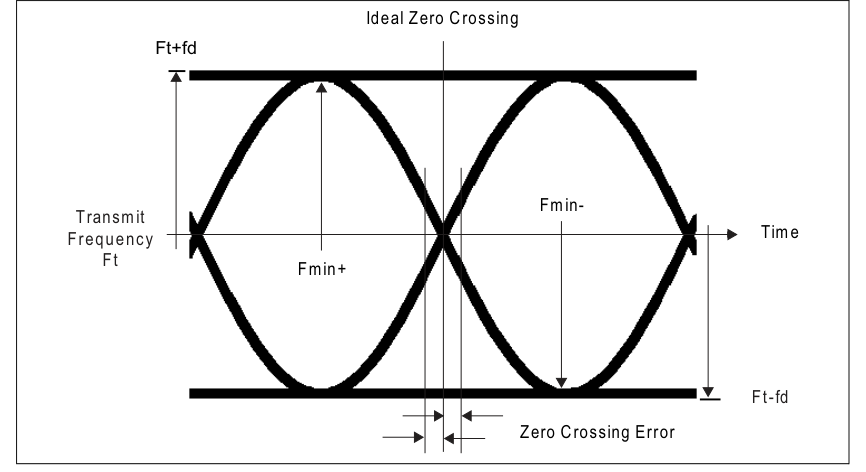

**Figure 3.1:  GFSK parameters definition.**

For each transmission, the minimum frequency deviation, Fmin = min{|Fmin+|, Fmin-}, which corresponds to 1010 sequence shall be no smaller than ±80% of the frequency deviation (fd) with respect to the transmit frequency Ft, which corresponds to a 00001111 sequence.
In addition, the minimum frequency deviation shall never be smaller than 115 kHz. The data transmitted has a symbol rate of 1 Msym/s.
The zero crossing error is the time difference between the ideal symbol period and the measured crossing time. This shall be less than ± 1/8 of a symbol period.

#### 3.1.2  Spurious Emissions

In-band spurious emissions shall be measured with a frequency hopping radio transmitting on one RF channel and receiving on a second RF channel; this means that the synthesizer may change RF channels between reception and transmission, but always returns to the same transmit RF channel. The equipment manufacturer is responsible for compliance in the intended country of use.

##### 3.1.2.1  In-Band spurious emission

Within the ISM band the transmitter shall pass a spectrum mask, given in Table 3.2. The spectrum shall comply with the 20 dB bandwidth definition in FCC part 15.247 and shall be measured accordingly. In addition to the FCC requirement an adjacent channel power on adjacent channels with a difference in RF channel number of two or greater is defined. This adjacent channel power is defined as the sum of the measured power in a 1 MHz bandwidth. The transmitted power shall be measured in a 100 kHz bandwidth using maximum
hold. The device shall transmit on RF channel M and the adjacent channel power shall be measured on RF channel number N. The transmitter shall transmit a pseudo random data pattern in the payload throughout the test.

| Frequency offset | Transmit Power |
| --- | --- |
| ± 500 kHz | -20 dBc |
| 2MHz (\|M-N\| = 2) | -20 dBm |
| 3MHz or greater (\|M-N\| ≥ 3) | -40 dBm |

Table 3.2:  Transmit Spectrum mask.
Note: If the output power is less than 0dBm then, wherever appropriate, the FCC's 20 dB relative requirement overrules the absolute adjacent channel power requirement stated in the above table.
Exceptions are allowed in up to three bands of 1 MHz width centered on a frequency which is an integer multiple of 1 MHz. They shall comply with an absolute value of –20 dBm.

#### 3.1.3  Radio Frequency Tolerance

The transmitted initial center frequency shall be within ±75 kHz from Fc. The initial frequency accuracy is defined as being the frequency accuracy before any packet information is transmitted. Note that the frequency drift requirement is not included in the ±75 kHz.
The limits on the transmitter center frequency drift within a packet are specified in Table 3.3. The different packets are defined in the Baseband Specification.

| Duration of Packet | Frequency Drift |
| --- | --- |
| Max length one slot packet | ±25 kHz |
| Max length three slot packet | ±40 kHz |
| Max length five slot packet | ±40 kHz |
| Maximum drift rate1 | 400 Hz/µs |

Table 3.3:  Maximum allowable frequency drifts in a packet.
1. The maximum drift rate is allowed anywhere in a packet.

### 3.2   ENHANCED DATA RATE

A key characteristic of the Enhanced Data Rate mode is that the modulation mode is changed within the packet. The access code and packet header, as defined in [Vol 2] Part B, Table 6.1, are transmitted with the Basic Rate 1 Mb/s GFSK modulation mode, whereas the subsequent synchronization sequence, payload, and trailer sequence are transmitted using the Enhanced Data Rate PSK modulation mode.

#### 3.2.1  Modulation Characteristics

During access code and packet header transmission the Basic Rate GFSK modulation mode shall be used. During the transmission of the synchronization sequence, payload, and trailer sequence a PSK type of modulation with a data rate of 2 Mb/s or optionally 3 Mb/s shall be used. The following subsections specify the PSK modulation for this transmission.

##### 3.2.1.1  Modulation Method Overview

The PSK modulation format defined for the 2 Mb/s transmission shall be π/4 rotated differential encoded quaternary phase shift keying (π/4-DQPSK).
The PSK modulation format defined for the 3 Mb/s transmission shall be differential encoded 8-ary phase shift keying (8DPSK).
The modulation shall employ square-root raised cosine pulse shaping to generate the equivalent lowpass information-bearing signal v(t). The output of the transmitter shall be a bandpass signal that can be represented as
S t( ) Re v t( )ej2πFct =
(EQ 1)
with Fc denoting the carrier frequency.

##### 3.2.1.2  Differential Phase Encoding

For the M-ary modulation, the binary data stream {bn}, n=1,2,3, …N, shall be mapped onto a corresponding sequence {Sk}, k=1,2, …N/log2(M) of complex valued signal points. M=4 applies for 2 Mb/s and M=8 applies for 3 Mb/s. Gray coding shall be applied as shown in Table 3.4 and Table 3.5. In the event that the length of the binary data stream N is not an integer multiple of log2(M), the last symbol of the sequence {Sk} shall be formed by appending data zeros to the appropriate length. The signal points Sk shall be defined by:
Sk Sk 1 – e jϕk = k 1 2 ..N/ 2 M ( ) log , , =
(EQ 2)
S0 ejφ = with φ [0 2π) , ∈
(EQ 3)
The relationship between the binary input bk and the phase φk shall be as defined in Table 3.4 for the 2 Mb/s transmission and in Table 3.5 for the 3 Mb/s transmission.

| b 2k-1 | b 2k | ϕ k |
| --- | --- | --- |
| 0 | 0 | π/4 |
| 0 | 1 | 3π/4 |
| 1 | 1 | -3π/4 |
| 1 | 0 | -π/4 |

Table 3.4:  π/4-DQPSK mapping

| b 3k-2 | b 3k-1 | b 3k | ϕ k |
| --- | --- | --- | --- |
| 0 | 0 | 0 | 0 |
| 0 | 0 | 1 | π/4 |
| 0 | 1 | 1 | π/2 |
| 0 | 1 | 0 | 3π/4 |
| 1 | 1 | 0 | π |
| 1 | 1 | 1 | -3π/4 |
| 1 | 0 | 1 | -π/2 |
| 1 | 0 | 0 | -π/4 |

Table 3.5:  8DPSK mapping

##### 3.2.1.3  Pulse Shaping

The lowpass equivalent information-bearing signal v(t) shall be generated according to
v t( ) Skp t kT – ( ) k  =
(EQ 4)
in which the symbol period T shall be 1µs.
The frequency spectrum P(f), which corresponds to the square-root raised cosine pulse p(t) of the pulse shaping filter is:

## 0 elsewhere         

## 1 0 f 1 β – 2T ----------- ≤ ≤

=
P f( )
(EQ 5)
1 2-- 1 π 2 f T 1 – ( ) 2β -------------------------------     sin –                     1 β – 2T ----------- f 1 β + 2T ------------ ≤ ≤
The roll off factor β shall be 0.4.

##### 3.2.1.4  Modulation Accuracy

The measurement of modulation accuracy utilizes differential error vector magnitude (DEVM) with tracking of the carrier frequency drift. The definition of DEVM and the derivation of the RMS and peak measures of DEVM are given in Appendix C.
The DEVM shall be measured over the synchronization sequence and payload portions of the packet, but not the trailer symbols. For each modulation method and each measurement carrier frequency, the DEVM measurement is made over a total of 200 non-overlapping blocks, where each block contains 50 symbols.
The transmitted packets shall be the longest supported packet type for each modulation method, as defined in [Vol 2] Part B, Table 6.9 and [Vol 2] Part B, Table 6.10.
The DEVM is measured using a square-root raised cosine filter, with a roll-off of 0.4 and a 3 dB bandwidth of ±500 kHz.

###### 3.2.1.4.1   RMS DEVM

The RMS DEVM for any of the measured blocks shall not exceed 0.20 for π/4-DQPSK and 0.13 for 8DPSK.

###### 3.2.1.4.2   99% DEVM

The 99% DEVM (defined as the DEVM value for which 99% of measured symbols have a lower DEVM) shall not exceed 0.30 for π/4-DQPSK and 0.20 for 8DPSK.

###### 3.2.1.4.3   Peak DEVM

The Peak DEVM shall not exceed 0.35 for π/4-DQPSK and 0.25 for 8DPSK.

#### 3.2.2  Spurious Emissions

In-band spurious emissions shall be measured with a frequency hopping radio transmitting on one RF channel and receiving on a second RF channel; this means that the synthesizer may change RF channels between reception and transmission, but always returns to the same transmit RF channel. The equipment manufacturer is responsible for compliance in the intended country of use.

##### 3.2.2.1  In-Band Spurious Emission

Within the ISM band the power spectral density of the transmitter shall comply with the following requirements when sending pseudo random data. All power measurements shall use a 100 kHz bandwidth with maximum hold. The power measurements between 1 MHz and 1.5 MHz from the carrier shall be at least 26 dB below the maximum power measurement up to 500 kHz from the carrier. The adjacent channel power for channels at least 2 MHz from the carrier is defined as the sum of the power measurements over a 1 MHz channel and shall not exceed -20 dBm for the second adjacent channels and -40 dBm for the third and subsequent adjacent channels. These requirements shall apply to the transmitted signal from the start of the guard time to the end of the power down ramp. The spectral mask is illustrated in Figure 3.2.
Exceptions are allowed in up to 3 bands of 1 MHz width centered on a frequency which is an integer multiple of 1 MHz. They shall comply with an absolute value of –20 dBm.

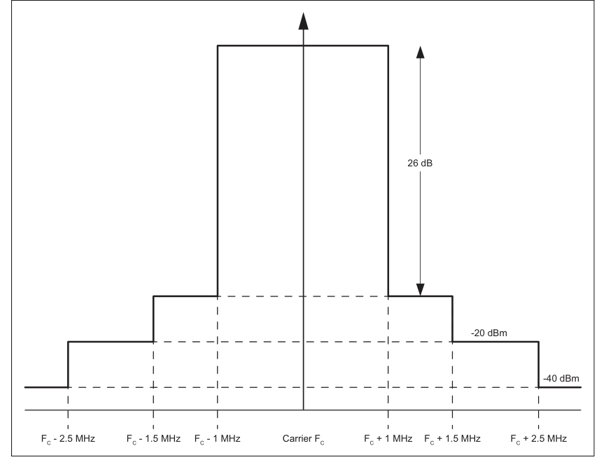

**Figure 3.2:  Transmitter spectrum mask**

#### 3.2.3  Radio Frequency Tolerance

The same carrier frequencies Fc as used for Basic Rate transmissions shall be used for the Enhanced Data Rate transmissions. The transmitted initial center frequency accuracy shall be within ±75 kHz from Fc. The maximum excursion from Fc (frequency offset plus drift) shall not exceed ±75 kHz.
The initial frequency accuracy is defined as being the frequency accuracy before any information is transmitted.

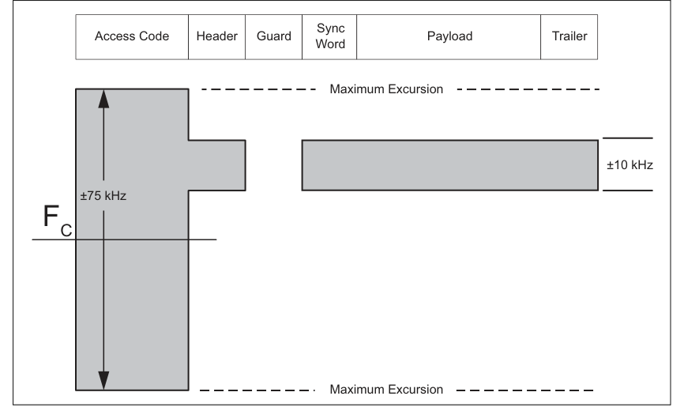

**Figure 3.3:  Carrier frequency mask**

The requirements on accuracy and stability are illustrated by Figure 3.3 for the Enhanced Data Rate packet format defined in Definition: Baseband Specification . The higher frequency accuracy requirement shall start at the first symbol of the header. The maximum drift over the header, synchronization sequence and payload shall be ±10 kHz.

#### 3.2.4  Relative Transmit Power

The requirement on the relative power of the GFSK and DPSK portions of the Enhanced Data Rate packet is defined as follows. The average power level during the transmission of access code and header is denoted as PGFSK and the average power level during the transmission of the synchronization sequence and the payload is denoted as PDPSK. The following inequalities shall be satisfied independently for each Enhanced Data Rate packet transmitted:
(PGFSK - 4 dB) < PDPSK < (PGFSK +1 dB)

## 4  RECEIVER CHARACTERISTICS

The receiver characteristics shall be measured using loopback as defined in [Vol 3] Part D, Section 1.
The reference sensitivity level referred to in this chapter is -70 dBm.

### 4.1   BASIC RATE

#### 4.1.1  Actual Sensitivity Level

The actual sensitivity level is defined as the input level for which a raw bit error rate (BER) of 0.1% is met. The receiver sensitivity shall be below or equal to –70 dBm with any Bluetooth transmitter compliant to the transmitter specification specified in Section 3.

#### 4.1.2  Interference Performance

The interference performance on Co-channel and adjacent 1 MHz and 2 MHz shall be measured with the wanted signal 10 dB over the reference sensitivity level. For interference performance on all other RF channels the wanted signal shall be 3 dB over the reference sensitivity level. If the frequency of an interfering signal is outside of the band 2400-2483.5 MHz, the out-of-band blocking specification (see Section 4.1.3) shall apply. The interfering signal shall be Bluetooth-modulated (see Section 4.1.7). The BER shall be ≤0.1% for all the signal-to-interference ratios listed in Table 4.1:

| Frequency of Interference | Ratio |
| --- | --- |
| Co-Channel interference, C/I co-channel | 11 dB |
| Adjacent (1 MHz) interference1, C/I 1MHz | 0 dB |
| Adjacent (2 MHz) interference1, C/I 2MHz | -30 dB |
| Adjacent (≥3 MHz) interference1, C/I ≥3MHz | -40 dB |
| Image frequency Interference1 2 3, C/I Image | -9 dB |
| Adjacent (1 MHz) interference to in-band image frequency1, C/I Image±1MHz | -20 dB |

Table 4.1:  Interference performance
1. If two adjacent channel specifications from Table 4.1 are applicable to the same chan- nel, the more relaxed specification applies.
2. In-band image frequency
3. If the image frequency ≠ n*1 MHz, then the image reference frequency is defined as the closest n*1 MHz frequency for integer n.
These specifications are only to be tested at nominal temperature conditions with a device receiving on one RF channel and transmitting on a second RF channel; this means that the synthesizer may change RF channels between reception and transmission, but always returns to the same receive RF channel.
RF channels where the requirements are not met are called spurious response RF channels. Five spurious response RF channels are allowed at RF channels with a distance of ≥2 MHz from the wanted signal. On these spurious response RF channels a relaxed interference requirement C/I = -17 dB shall be met.

#### 4.1.3  Out-of-Band Blocking

The out-of-band suppression (or rejection) shall be measured with the wanted signal 3 dB over the reference sensitivity level. The interfering signal shall be a continuous wave signal. The BER shall be ≤0.1%. The out-of-band blocking shall fulfil the following requirements:

| Interfering Signal Frequency | Interfering Signal Power Level |
| --- | --- |
| 30 MHz - 2000 MHz | -10 dBm |
| 2000 - 2399 MHz | -27 dBm |
| 2484 – 3000 MHz | -27 dBm |
| 3000 MHz – 12.75 GHz | -10 dBm |

Table 4.2:  Out-of-band suppression (or rejection) requirements.
24 exceptions are permitted which are dependent upon the given RF channel and are centered at a frequency which is an integer multiple of 1 MHz. For at least 19 of these spurious response frequencies, a reduced interference level of at least -50dBm is allowed in order to achieve the required BER=0.1% performance, whereas for a maximum of 5 of the spurious frequencies the interference level may be assumed arbitrarily lower.

#### 4.1.4  Intermodulation Characteristics

The reference sensitivity performance, BER = 0.1%, shall be met under the following conditions:
• The wanted signal shall be at frequency f0 with a power level 6 dB over the reference sensitivity level.
• A static sine wave signal shall be at a frequency f1 with a power level of –39 dBm.
• A Bluetooth modulated signal (see Section 4.1.7) shall be at f2 with a power level of -39 dBm.
Frequencies f0, f1 and f2 shall be chosen such that f0=2f1-f2 and  f2-f1 =n*1 MHz, where n can be 3, 4, or 5. The system shall fulfill at least one of the three alternatives (n=3, 4, or 5).

#### 4.1.5  Maximum Usable Level

The maximum usable input level that the receiver operates at shall be greater than -20 dBm. The BER shall be less than or equal to 0.1% at –20 dBm input power.

#### 4.1.6  Receiver Signal Strength Indicator

If a device supports Receive Signal Strength Indicator (RSSI) the accuracy shall be +/- 6 dB.

#### 4.1.7  Reference Signal Definition

A Bluetooth modulated interfering signal shall be defined as:
Modulation = GFSK Modulation index = 0.32±1% BT= 0.5±1% Bit Rate = 1 Mb/s ±1 ppm Modulating Data for wanted signal = PRBS9 Modulating Data for interfering signal = PRBS15 Frequency accuracy better than ±1 ppm.

### 4.2   ENHANCED DATA RATE

#### 4.2.1  Actual Sensitivity Level

The actual sensitivity level shall be defined as the input level for which a raw bit error rate (BER) of 0.01% is met. The requirement for a Bluetooth π/4-DQPSK and 8DPSK Enhanced Data Rate receiver shall be an actual sensitivity level of –70 dBm or better. The receiver shall achieve the –70 dBm sensitivity level with any Bluetooth transmitter compliant to the Enhanced Data Rate transmitter specification as defined in Section 3.2.

#### 4.2.2  BER Floor Performance

The receiver shall achieve a BER less than 0.001% at 10 dB above the reference sensitivity level.

#### 4.2.3  Interference Performance

The interference performance for co-channel and adjacent 1 MHz and 2 MHz channels shall be measured with the wanted signal 10 dB above the reference sensitivity level. On all other frequencies the wanted signal shall be 3 dB above the reference sensitivity level. The requirements in this section shall only apply if the frequency of the interferer is inside of the band 2400-2483.5 MHz.
The interfering signal for co-channel interference shall be similarly modulated as the desired signal. The interfering signal for other channels shall be equivalent to a nominal Bluetooth Basic Rate GFSK transmitter. The interfering signal shall carry random data.
A BER of 0.1% or better shall be achieved for the signal to interference ratios defined in Table 4.3.

| Frequency of Interference | π/4-DQPSK Ratio | 8DPSK Ratio |
| --- | --- | --- |
| Co-Channel interference, C/I co-channel | 13 dB | 21 dB |
| Adjacent (1 MHz) interference1, C/I 1MHz | 0 dB | 5 dB |
| Adjacent (2MHz) interference1, C/I 2MHz | -30 dB | -25 dB |
| Adjacent (≥3MHz) interference1 | -40 dB | -33 dB |
| Image frequency interference1,2,3, C/I Image | -7 dB | 0 dB |
| Adjacent (1 MHz) interference to in-band image frequency1,2,3,C/I Image ±1MHz | -20 dB | -13 dB |

Table 4.3:  Interference Performance
1. If two adjacent channel specifications from Table 4.3 are applicable to the same chan- nel, the more relaxed specification applies. 2. In-band image frequency. 3. If the image frequency is not equal to n*1 MHz, then the image reference frequency is defined as the closest n*1 MHz frequency for integer n.
These specifications are only to be tested at nominal temperature conditions with a receiver hopping on one frequency; this means that the synthesizer may change frequency between receive slot and transmit slot, but always returns to the same receive frequency.
Frequencies where the requirements are not met are called spurious response frequencies. Five spurious response frequencies are allowed at frequencies with a distance of ≥2 MHz from the wanted signal. On these spurious response frequencies a relaxed interference requirement C/I = -15 dB for π/4-DQPSK and C/I = -10 dB for 8DPSK shall be met.

#### 4.2.4  Maximum Usable Level

The maximum usable input level that the receiver operates at shall be greater than -20 dBm. The BER shall be less than or equal to 0.1% at -20 dBm input power.

#### 4.2.5  Out-of-Band and Intermodulation Characteristics

The Basic Rate out-of-band blocking and intermodulation requirements ensure adequate Enhanced Data Rate performance, and therefore there are no specific requirements for Enhanced Data Rate.

#### 4.2.6  Reference Signal Definition

A 2 Mb/s Bluetooth signal used as "wanted" or "interfering signal" is defined as:
Modulation = π/4-DQPSK Symbol Rate = 1 Ms/s ± 1 ppm Frequency accuracy better than ±1 ppm Modulating Data for wanted signal = PRBS9 Modulating Data for interfering signal = PRBS15 RMS Differential Error Vector Magnitude < 5% Average power over the GFSK and DPSK portions of the packet shall be equal to within +/- 1 dB
A 3 Mb/s Bluetooth signal used as "wanted" or "interfering signal" is defined as:
Modulation = 8DPSK Symbol Rate = 1 Ms/s ± 1 ppm Frequency accuracy better than ±1 ppm Modulating Data for wanted signal = PRBS9 Modulating Data for interfering signal = PRBS15 RMS Differential Error Vector Magnitude < 5% Average power over the GFSK and DPSK portions of the packet shall be equal to within +/- 1 dB
APPENDIX A TEST CONDITIONS
A.1   NOMINAL TEST CONDITIONS
A.1.1   Nominal Temperature
The nominal temperature conditions for tests shall be +15 to +35 °C. When it is impractical to carry out the test under this condition a note to this effect, stating the ambient temperature, shall be recorded. The actual value during the test shall be recorded in the test report.
A.1.2   Nominal Power Source
The normal test voltage for the equipment shall be the nominal voltage for which the equipment was designed.
A.2  EXTREME TEST CONDITIONS
A.2.1   Extreme Temperatures
Where tests at extreme temperatures are required, measurements shall be made over the extremes of the operating temperature range as declared by the manufacturer.
APPENDIX B THIS SECTION NO LONGER USED
APPENDIX C MODULATION ACCURACY
DEFINITION
C.1  ENHANCED DATA RATE MODULATION ACCURACY
The Enhanced Data Rate modulation accuracy is defined by the differential error vector, being the difference between the vectors representing consecutive symbols of the transmitted signal, after passing the signal through a specified measurement filter, sampling it at the symbol rate with an optimum sampling phase and compensating it for carrier frequency error and for the ideal carrier phase changes. The magnitude of the normalized differential error vector is called the Differential Error Vector Magnitude (DEVM). The objective of the DEVM is to estimate the modulation errors that would be perceived by a differential receiver.
In an ideal transmitter, the input bit sequence {bj} is mapped onto a complex valued symbol sequence {Sk}. Subsequently, this symbol sequence is transformed into a baseband signal S(t) by means of a pulse-shaping filter.
In an actual transmitter implementation, the bit sequence {bj} generates a baseband equivalent transmitted signal Y(t). This signal Y(t) contains, besides the desired component S(t), multiple distortion components. This is illustrated in Figure C.1.
Actual TX
Ideal TX (Baseband)
Mapper Pulse Shaping Distortions X {bj} {Sk} S(t) Y(t) R(t)
H[SMȦct)
Figure C.1:  TX model
Let Z(t) be the output of the measurement filter after first compensating the received signal for the initial center frequency error, ωi, of the received packet, i.e. the output after down conversion and filtering the transmit signal R(t) (see Figure C.2).The measurement filter is defined by a square-root raised cosine shaping filter with a roll-off factor equal to 0.4 and 3 dB bandwidth of ±500 kHz.
Let {Zk(ε)} be the sequence of samples obtained by sampling the signal Z(t) with a sampling period equal to the symbol period T and a sampling phase
equal to ε such that Zk(ε)=Z((k+ε)T). Note that this sequence {Zk(ε)} would coincide with the symbol sequence {Sk} if no distortion is present and the correct timing phase ε is chosen.
To reflect the behavior of a typical differential receiver, the sample sequence {Zk(ε)} should be compensated for carrier frequency drift. Therefore, the sequence {Zk(ε)} is multiplied by a factor W-k in which W = ejωT accounts for the frequency offset ω. A constant value of ω is used for each DEVM block of N = 50 symbols, but ω may vary between DEVM blocks (note that the values of ω can be used to measure carrier frequency drift.
In addition, {Zk(ε)} is compensated for the ideal phase changes between symbols by multiplying it with the complex conjugate of the symbol sequence {Sk}. However, it is not necessary to compensate {Zk(ε)} for initial carrier phase or output power of the transmitter.
Let {Qk(ε,ω)} denote the compensated sequence {Zk(ε)}, where the ideal phase changes have been removed and ε and ω are chosen optimally to minimize the DEVM, (i.e. remove time and frequency uncertainty). For a transmitter with no distortions other than a constant frequency error, {Qk(ε,ω)} is a complex constant that depends on the initial carrier phase and the output power of the transmitter.
The differential error sequence {Ek(ε,ω)} is defined as the difference between {Qk(ε,ω)} and {Qk-1(ε,ω)}. This reflects the modulation errors that would be perceived by a differential receiver. For a transmitter with no distortions other than a constant frequency error, {Ek(ε,ω)} is zero.
The definitions of the DEVM measures are based upon this differential error sequence {Ek(ε,ω)}. The generation of the error sequence is depicted in Figure C.2.
-
Delay 1 μs
EkİȦ
+
QkİȦ
Zkİ
Z(t)
Measurement Filter
R(t)
e MȦcȦi)t
Sk*·W-k
Figure C.2:  Error sequence generation
C.1.1  RMS DEVM
The root mean squared DEVM (RMS DEVM) computed over N = 50 symbols is defined as:
N
N
RMS DEVM = min
Ek(
) 2
Qk(
) 2
(EQ 6)
k=1
k=1
As can be seen from the expression above, the RMS DEVM is the square-root of the normalized power of the error.
C.1.2  Peak DEVM
The DEVM at symbol k is defined as:
Ek HZ 
(EQ 7)
DEVM (k) =
N6 j=1 Qj HZ  N
where ε0 and ω0 are the values for ε and ω used to calculate the RMS DEVM.
The peak DEVM is defined as:
Peak DEVM = max {DEVM (k)} k
(EQ 8)
Core System Package [BR/EDR Controller volume]
Part B
PART B: BASEBAND SPECIFICATION
This document describes the specification of the Bluetooth Link Controller which carries out the baseband protocols and other low- level link routines.
CONTENTS

## 1  GENERAL DESCRIPTION

This part specifies the normal operation of a Bluetooth baseband.
The Bluetooth system provides a point-to-point connection or a point-to- multipoint connection, see (a) and (b) in Figure 1.1. In a point-to-point connection the physical channel is shared between two Bluetooth devices. In a point-to-multipoint connection, the physical channel is shared among several Bluetooth devices. Two or more devices sharing the same physical channel form a piconet. One Bluetooth device acts as the master of the piconet, whereas the other device(s) act as slave(s). Up to seven slaves can be active in the piconet. The channel access is controlled by the master. An unlimited number of slaves can receive data on the physical channel carrying the Connectionless Slave Broadcast physical link.
Piconets that have common devices are called a scatternet, see (c) in Figure 1.1. Each piconet only has a single master, however, slaves can participate in different piconets on a time-division multiplex basis. In addition, a master in one piconet can be a slave in other piconets. Piconets shall not be frequency synchronized and each piconet has its own hopping sequence.

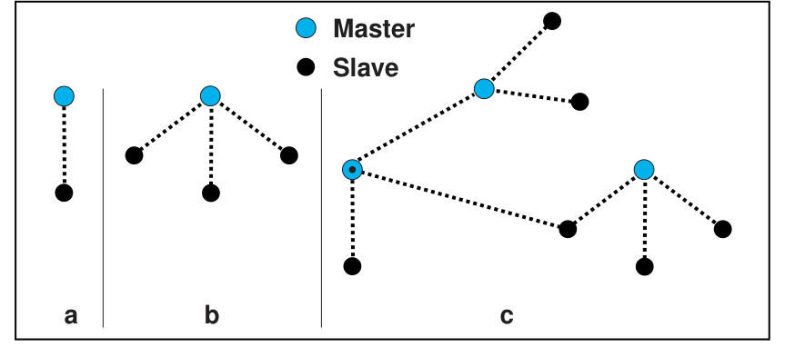

**Figure 1.1:  Piconets with a single slave operation (a), a multi-slave operation (b) and a scatternet operation (c)**

Data is transmitted over the air in packets. Two modes are defined: a mandatory mode called Basic Rate and an optional mode called Enhanced Data Rate. The symbol rate for all modulation modes is 1 Msym/s. The gross air data rate is 1 Mb/s for Basic Rate. Enhanced Data Rate has a primary modulation mode that provides a gross air data rate of 2 Mb/s, and a secondary modulation mode that provides a gross air data rate of 3 Mb/s.
The general Basic Rate packet format is shown in Figure 1.2. Each packet consists of 3 entities: the access code, the header, and the payload.

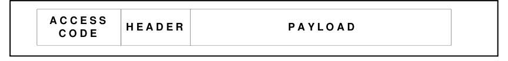

**Figure 1.2:  Standard Basic Rate packet format**

The general Enhanced Data Rate packet format is shown in Figure 1.3. Each packet consists of 6 entities: the access code, the header, the guard period, the synchronization sequence, the Enhanced Data Rate payload and the trailer. The access code and header use the same modulation mode as for Basic Rate packets while the synchronization sequence, the Enhanced Data Rate payload and the trailer use the Enhanced Data Rate modulation mode. The guard time allows for the transition between the modulation modes.

**Figure 1.3:  Standard Enhanced Data Rate packet format**

### 1.1   BLUETOOTH CLOCK

Every Bluetooth device shall have a native clock that shall be derived from a free running reference clock. Offsets may be added to the reference clock to synchronize the native clock with other non-Bluetooth systems. For synchronization with other Bluetooth devices, offsets are used that, when added to the native clock, provide temporary Bluetooth clocks that are mutually synchronized. It should be noted that the Bluetooth clock has no relation to the time of day; it may therefore be initialized to any value. The clock has a cycle of about a day. If the clock is implemented with a counter, a 28-bit counter is required that shall wrap around at 228-1. The least significant bit (LSB) shall tick in units of 312.5 μs (i.e. half a time slot), giving a clock rate of 3.2 kHz.
The clock determines critical periods and triggers the events in the device. Four periods are important in the Bluetooth system: 312.5 μs, 625 μs, 1.25 ms, and 1.28 s; these periods correspond to the timer bits CLK0, CLK1, CLK2, and CLK12, respectively, see Figure 1.4.

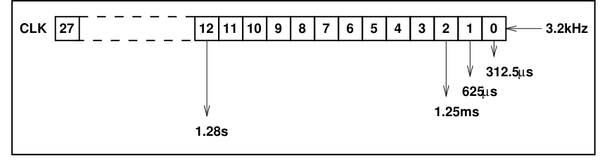

**Figure 1.4:  Bluetooth clock**

In the different modes and states a device can reside in, the clock has different appearances:
• CLKR reference clock
• CLKN native clock
• CLKE estimated clock
• CLK master clock
CLKR is the reference clock driven by the free running system clock. CLKN may be offset from the reference clock by a timing offset. In STANDBY and in Hold, Sniff, and Connectionless Slave Broadcast modes the reference clock shall have a worst case accuracy of+/-250ppm. In all other circumstances, it shall have a worst case accuracy of +/-20ppm; this accuracy shall also be used by the piconet master device while performing Piconet Clock Adjustment (see Section 8.6.10).
See Section 2.2.4 for the definition of CLK and Section 2.4.1 for the definition of CLKE.
The master may adjust its native clock during the existence of the piconet within certain limits (see Section 8.6.10.3). The master may also perform a coarse adjustment of the native clock by using the LMP_clk_adj sequence.

### 1.2   BLUETOOTH DEVICE ADDRESSING

Each Bluetooth device shall be allocated a unique 48-bit Bluetooth device address (BD_ADDR). The address shall be a 48-bit extended unique identifier (EUI-48) created in accordance with section 8.2 ("Universal addresses") of the IEEE 802-2014 standard (http://standards.ieee.org/findstds/standard/802- 2014.html).
Creation of a valid EUI-48 requires one of the following MAC Address Block types to be obtained from the IEEE Registration Authority:
• MAC Address Block Large (MA-L)
• MAC Address Block Medium (MA-M)
• MAC Address Block Small (MA-S)
See http://standards.ieee.org/develop/regauth/index.html for information on obtaining one of these MAC Address Blocks. See also the "Guidelines for 48- bit Global Identifier (EUI-48)" (https://standards.ieee.org/develop/regauth/tut/ eui48.pdf) for a tutorial on creation of EUI-48 addresses.
Figure 1.5 illustrates how the LAP, UAP, and NAP map to the EUI-48. The bit pattern in Figure 1.5 is an example BD_ADDR.

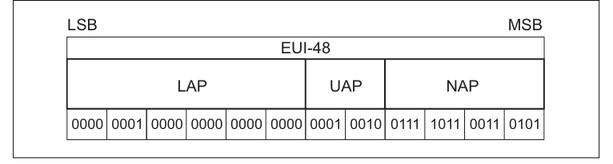

**Figure 1.5:  Format of BD_ADDR**

The BD_ADDR may take any values except those that would have any of the 64 reserved LAP values for general and dedicated inquiries (see Section 1.2.1).

#### 1.2.1  Reserved Addresses

A block of 64 contiguous LAPs is reserved for inquiry operations; one LAP common to all devices is reserved for general inquiry, the remaining 63 LAPs are reserved for dedicated inquiry of specific classes of devices (see Assigned Numbers). The same LAP values are used regardless of the contents of UAP and NAP. Consequently, none of these LAPs can be part of a user BD_ADDR.
The reserved LAP addresses are 0x9E8B00-0x9E8B3F. The general inquiry LAP is 0x9E8B33. All addresses have the LSB at the rightmost position, hexadecimal notation. The default check initialization (DCI) is used as the UAP whenever one of the reserved LAP addresses is used. The DCI is defined to be 0x00 (hexadecimal).

### 1.3   ACCESS CODES

In the Bluetooth system all transmissions over the physical channel begin with an access code. Three different access codes are defined, see also Section 6.3.1:
• device access code (DAC)
• channel access code (CAC)
• inquiry access code (IAC)
All access codes are derived from the LAP of a device address or an inquiry address. The device access code is used during page, page scan and page response substates and shall be derived from the paged device’s BD_ADDR. The channel access code is used in the CONNECTION state,
synchronization train substate, and synchronization scan substate, and forms the beginning of all packets exchanged on the piconet physical channel. The channel access code shall be derived from the LAP of the master’s BD_ADDR. Finally, the inquiry access code shall be used in the inquiry substate. There is one general IAC (GIAC) for general inquiry operations and there are 63 dedicated IACs (DIACs) for dedicated inquiry operations.
The access code also indicates to the receiver the arrival of a packet. It is used for timing synchronization and offset compensation. The receiver correlates against the entire synchronization word in the access code, providing very robust signaling.

## 2  PHYSICAL CHANNELS

The lowest architectural layer in the Bluetooth system is the physical channel. A number of types of physical channels are defined. All Bluetooth physical channels are characterized by the combination of a basic pseudo-random frequency hopping sequence (which, for physical links on the adapted piconet physical channel, is then modified by the AFH_channel_map (defined in [Vol 2] Part C, Section 5.2) for that link), the specific slot timing of the transmissions, the access code and packet header encoding. These aspects, together with the range of the transmitters, define the signature of the physical channel. For the basic and adapted piconet physical channels frequency hopping is used to change frequency periodically to reduce the effects of interference and to satisfy local regulatory requirements.
Two devices that wish to communicate use a shared physical channel for this communication. To achieve this, their transceivers must be tuned to the same RF frequency at the same time, and they must be within a nominal range of each other.
Given that the number of RF carriers is limited and that many Bluetooth devices could be operating independently within the same spatial and temporal area there is a strong likelihood of two independent Bluetooth devices having their transceivers tuned to the same RF carrier, resulting in a physical channel collision. To mitigate the unwanted effects of this collision each transmission on a physical channel starts with an access code that is used as a correlation code by devices tuned to the physical channel. This channel access code is a property of the physical channel. The access code is always present at the start of every transmitted packet.
Several Bluetooth physical channels are defined. Each is optimized and used for a different purpose. Two of these physical channels (the basic piconet channel and adapted piconet channel) are used for communication between connected devices and are associated with a specific piconet. Other physical channels are used for discovering (the inquiry scan channel) and connecting (the page scan channel) Bluetooth devices. The synchronization scan physical channel is used by devices to obtain timing and frequency information about the Connectionless Slave Broadcast physical link or to recover the current piconet clock.
A Bluetooth device can only use one of these physical channels at any given time. In order to support multiple concurrent operations the device uses time- division multiplexing between the channels. In this way a Bluetooth device can appear to operate simultaneously in several piconets, as well as being discoverable and connectable.
Whenever a Bluetooth device is synchronized to the timing, frequency and access code of a physical channel it is said to be 'connected' to this channel (whether or not it is actively involved in communications over the channel.) At a
minimum, a device need only be capable of connection to one physical channel at a time, however, advanced devices may be capable of connecting simultaneously to more than one physical channel, but the specification does not assume that this is possible.

### 2.1   PHYSICAL CHANNEL DEFINITION

Physical channels, apart from the synchronization scan physical channel (which uses a set of fixed RF channels), are defined by a basic pseudo-random RF channel hopping sequence, the packet (slot) timing and an access code. The hopping sequence is determined by the UAP and LAP of a Bluetooth device address, the selected basic hopping sequence, and – for the adapted piconet physical channel – the AFH_channel_map being used on a physical link. The phase in the hopping sequence is determined by the Bluetooth clock. All physical channels are subdivided into time slots whose length is different depending on the physical channel. Within the physical channel, each reception or transmission event is associated with a time slot or time slots. For each reception or transmission event an RF channel is selected by the hop selection kernel (see Section 2.6).The maximum hop rate is 1600 hops/s in the CONNECTION state, the synchronization train substate, and the synchronization scan substate and the maximum is 3200 hops/s in the inquiry and page substates.
The following physical channels are defined:
• basic piconet physical channel
• adapted piconet physical channel
• page scan physical channel
• inquiry scan physical channel
• synchronization scan physical channel

### 2.2   BASIC PICONET PHYSICAL CHANNEL

During the CONNECTION state the basic piconet physical channel is used by default. The adapted piconet physical channel may also be used. The adapted piconet physical channel is identical to the basic piconet physical channel except for the differences listed in Section 2.3.

#### 2.2.1  Master-Slave Definition

The basic piconet physical channel is defined by the master of the piconet. The master controls the traffic on the piconet physical channel by a polling scheme (see Section 8.5).
By definition, the device that initiates a connection by paging is the master. Once a piconet has been established, master-slave roles may be exchanged. This is described in Section 8.6.5.

#### 2.2.2  Hopping Characteristics

The basic piconet physical channel is characterized by a pseudo-random hopping through all 79 RF channels. The frequency hopping in the piconet physical channel is determined by the Bluetooth clock and BD_ADDR of the master. When the piconet is established, the master clock is communicated to the slaves. Each slave shall add an offset to its native clock to synchronize with the master clock. Since the clocks are independent, the offsets must be updated regularly. All devices participating in the piconet are time-synchronized and hop-synchronized to the channel.
The basic piconet physical channel uses the basic channel hopping sequence and is described in Section 2.6.

#### 2.2.3  Time Slots

The basic piconet physical channel is divided into time slots, each 625 μs in length. The time slots are numbered according to the most significant 27 bits of the Bluetooth clock CLK28-1 of the piconet master. The slot numbering ranges from 0 to 227-1 and is cyclic with a cycle length of 227. The time slot number is denoted as k.
A TDD scheme is used where master and slave alternately transmit, see Figure 2.1. The packet start shall be aligned with the slot start. Packets may extend over up to five time slots.

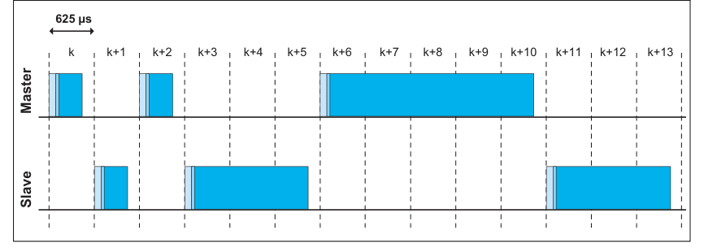

**Figure 2.1:  Multi-slot packets**

The term slot pairs is used to indicate two adjacent time slots starting with a master-to-slave transmission slot.

#### 2.2.4  Piconet Clocks

CLK is the master clock of the piconet. It shall be used for all timing and scheduling activities in the piconet. All devices shall use the CLK to schedule their transmission and reception. The CLK shall be derived from the reference clock CLKR (see Section 1.1) by adding a time_base_offset and a slave_offset, see Figure 2.2. The time_base_offset is a value that devices may use to store
a locally generated offset to CLKN caused by alignment to an external time base. The slave_offset shall be zero for the master since CLK is identical to its own native clock CLKN. Each slave shall add an appropriate slave_offset to its CLKN such that the CLK corresponds to the CLKN of the master. Although all CLKNs in the devices run at the same nominal rate, mutual drift causes inaccuracies in CLK. Therefore, the offsets in the slaves must be regularly updated such that CLK is approximately CLKN of the master.

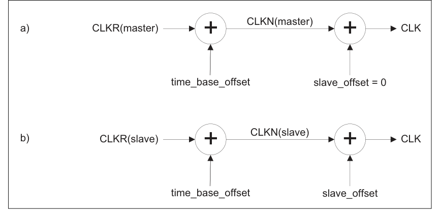

**Figure 2.2:  Derivation of CLK in master (a) and in slave (b)**

Changes in time_base_offset are only made by the master of a piconet; a device acting only as a slave has no need to distinguish CLKR and CLKN in normal operation. In a scatternet situation, a Controller may be changing both time_base_offset to align its CLKN with an external clock, either collocated or at the request of a slave, and slave_offset to maintain synchronization with a different piconet clock. In some cases, it is not possible to determine how much of an observed offset is caused by external frame timing alignment (time_base_offset) and how much is caused by the offset between master and slave (slave_offset).

#### 2.2.5  Transmit/Receive Timing

The master transmission shall always start at even numbered time slots (CLK1=0) and the slave transmission shall always start at odd numbered time slots (CLK1=1). Due to packet types that cover more than a single slot, master transmission may continue in odd numbered slots and slave transmission may continue in even numbered slots, see Figure 2.1.
All timing diagrams shown in this chapter are based on the signals as present at the antenna. The term “exact” when used to describe timing refers to an ideal transmission or reception and neglects timing jitter and clock frequency imperfections.
The average timing of packet transmission shall not drift faster than 20 ppm relative to the ideal slot timing of 625 μs. The instantaneous timing
shall not deviate more than 1 μs from the average timing. Thus, the absolute packet transmission timing of slot boundary  shall fulfill the equation:
tk k
k          jk offset, + + =
tk 1 di + ( )TN
(EQ 1)
i 1 =
where is the nominal slot length (625 μs), denotes jitter ( μs) at the start of slot , and, , denotes the drift ( ppm) within slot . The jitter and drift can vary arbitrarily within the given limits for every slot, while offset is an arbitrary but fixed constant. For hold and sniff the drift and jitter parameters specified in Link Manager Protocol [Vol 2] Part C, Section 4.3.1 apply.
TN jk jk 1 ≤ k dk dk 20 ≤ k

##### 2.2.5.1  Piconet Physical Channel Timing

In the figures, only single-slot packets are shown as an example.
The master TX/RX timing is shown in Figure 2.3. In Figure 2.3 and Figure 2.4 the channel hopping frequencies are indicated by f(k) where k is the time slot number. After transmission, a return packet is expected N × 625 μs after the start of the TX packet where N is an odd, integer larger than 0. N depends on the type of the transmitted packet.
To allow for some time slipping, an uncertainty window is defined around the exact receive timing. During normal operation, the window length shall be 20 μs, which allows the RX packet to arrive up to 10 μs too early or 10 μs too late. It is recommended that slaves implement variable sized windows or time tracking to accommodate a master's absence of more than 250ms.
During the beginning of the RX cycle, the access correlator shall search for the correct channel access code over the uncertainty window. If an event trigger does not occur the receiver may go to sleep until the next RX event. If in the course of the search, it becomes apparent that the correlation output will never exceed the final threshold, the receiver may go to sleep earlier. If a trigger event occurs, the receiver shall remain open to receive the rest of the packet unless the packet is for another device, a non-recoverable header error is detected, or a non-recoverable payload error is detected.

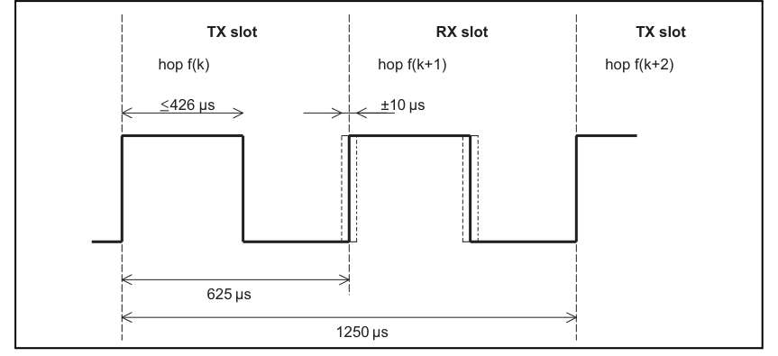

**Figure 2.3:  RX/TX cycle of master transceiver in normal mode for single-slot packets**

Each master transmission shall be derived from bit 2 of the Master's native Bluetooth clock, thus the current transmission will be scheduled Mx1250μs after the start of the previous master TX burst where M depends on the transmitted and received packet type and is an even, integer larger than 0. The master TX timing shall be derived from the master's native Bluetooth clock, and thus it will not be affected by time drifts in the slave(s).
Slaves maintain an estimate of the master’s native clock by adding a timing offset to the slave’s native clock (see Section 2.2.4). This offset shall be updated each time a packet is received from the master. By comparing the exact RX timing of the received packet with the estimated RX timing, slaves shall correct the offset for any timing misalignments. Since only the channel access code is required to synchronize the slave, slave RX timing can be corrected with any packet sent in the master-to-slave transmission slot.
The slave's TX/RX timing is shown in Figure 2.4. The slave’s transmission shall be scheduled N × 625μs after the start of the slave’s RX packet where N is an odd, positive integer larger than 0. If the slave’s RX timing drifts, so will its TX timing. During periods when a slave is in the active mode (see Section 8.6) and is prevented from receiving valid channel access codes from the master due to local RF interference, slave activity in a different piconet, or any other reason, the slave may increase its receive uncertainty window and/or use predicted timing drift to increase the probability of receiving the master's bursts when reception resumes.

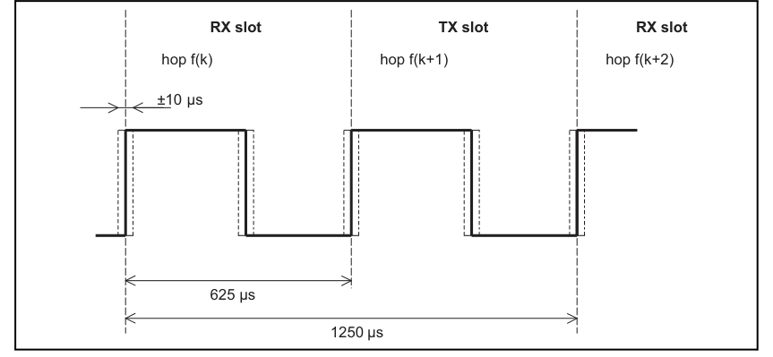

**Figure 2.4:  RX/TX cycle of slave transceiver in normal mode for single-slot packets**

##### 2.2.5.2  Piconet Physical Channel Re-synchronization

In the piconet physical channel, a slave can lose synchronization if it does not receive a packet from the master at least every 200ms (or less if the low power clock is used). The master may fail to transmit to the slave due to the master device being busy with other tasks such as maintaining connections to other devices in Sniff or Hold modes, due to SCO, eSCO, or Connectionless Slave Broadcast activity, due to the master being involved in a scatternet, or due to interference. When re-synchronizing to the piconet physical channel a slave device shall listen for the master before it may send information (except for a Connectionless Slave Broadcast slave device which shall listen for the master but does not send information). In this case, the length of the synchronization search window in the slave device may be increased from 20 µs to a larger value X µs as illustrated in Figure 2.5. Note that only RX hop frequencies are used. The hop frequency used in the master-to-slave (RX) slot shall also be used in the uncertainty window, even when it is extended into the preceding time interval normally used for the slave-to-master (TX) slot.
If the length of search window, X, exceeds 1250 µs, consecutive windows shall avoid overlapping search windows. Consecutive windows should instead be centered at f(k), f(k+4),... f(k+4i) (where 'i' is an integer), which gives a maximum value X=2500 µs, or even at f(k), f(k+6),...f(k+6i) which gives a maximum value X=3750 µs. The RX hop frequencies used shall correspond to the master-to-slave transmission slots.
It is recommended that single slot packets are transmitted by the master during slave re-synchronization.

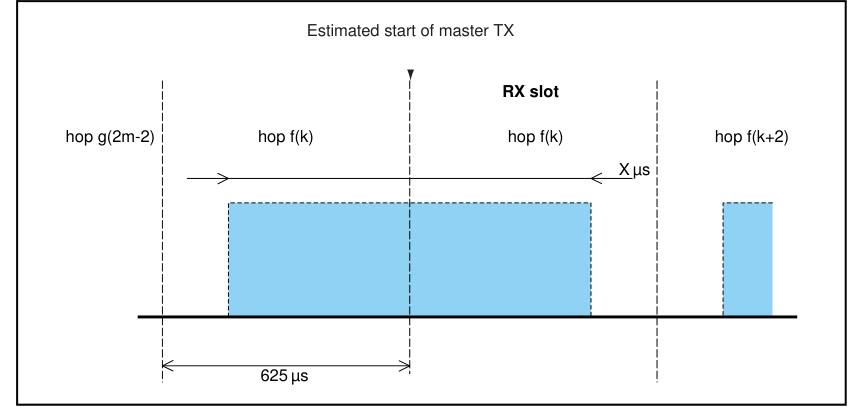

**Figure 2.5:  RX timing of slave returning from hold mode**

### 2.3   ADAPTED PICONET PHYSICAL CHANNEL

For devices that enter connectionless slave broadcast mode, the device that transmits Connectionless Slave Broadcast packets is the master of the piconet and any device that receives Connectionless Slave Broadcast packets is a slave of the piconet.

#### 2.3.1  Hopping Characteristics

Each physical link on the adapted piconet physical channel shall use at least Nmin RF channels (where Nmin is 20).
The adapted piconet physical channel uses the adapted channel hopping sequence described in Section 2.6.
Adapted piconet physical channels can be used for connected devices that have adaptive frequency hopping (AFH) enabled. There are two distinctions between basic and adapted piconet physical channels. The first is the same channel mechanism that makes the slave frequency the same as the preceding master transmission. The second aspect is that the adapted piconet physical channel may be based on less than the full 79 frequencies of the basic piconet physical channel. Each physical link on an adapted piconet physical channel may use a different set of frequencies.

### 2.4   PAGE SCAN PHYSICAL CHANNEL

Although master and slave roles are not defined prior to a connection, the term master is used for the paging device (that becomes a master in the CONNECTION state) and slave is used for the page scanning device (that becomes a slave in the CONNECTION state).

#### 2.4.1  Clock Estimate for Paging

A paging device uses an estimate of the native clock of the page scanning device, CLKE; i.e. an offset shall be added to the CLKN of the pager to approximate the CLKN of the recipient, see Figure 2.6. CLKE shall be derived from the native CLKN by adding an offset. By using the CLKN of the recipient, the pager might be able to speed up the connection establishment. Note: CLKR is never used for deriving CLKE or for any other control of the hopping kernel.

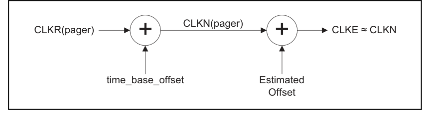

**Figure 2.6:  Derivation of CLKE**

#### 2.4.2  Hopping Characteristics

The page scan physical channel follows a slower hopping pattern than the basic piconet physical channel and is a short pseudo-random hopping sequence through the RF channels. The timing of the page scan channel shall be determined by the native Bluetooth clock of the scanning device. The frequency hopping sequence is determined by the Bluetooth address of the scanning device.
The page scan physical channel uses the page, master page response, slave page response, and page scan hopping sequences specified in Section 2.6.

#### 2.4.3  Paging Procedure Timing

During the paging procedure, the master shall transmit paging messages (see Table 8.3) corresponding to the slave to be connected. Since the paging message is a very short packet, the hop rate is 3200 hops/s. In a single TX slot interval, the paging device shall transmit on two different hop frequencies. In Figure 2.7 through Figure 2.11, f(k) is used for the frequencies of the page hopping sequence and f'(k) denotes the corresponding page response sequence frequencies. The first transmission starts where CLK0 = 0 and the second transmission starts where CLK0 = 1.
In a single RX slot interval, the paging device shall listen for the slave page response message on two different hop frequencies. Similar to transmission, the nominal reception starts where CLK0 = 0 and the second reception nominally starts where CLK0 = 1; see Figure 2.7. During the TX slot, the paging device shall send the paging message at the TX hop frequencies f(k) and f(k+1). In the RX slot, it shall listen for a response on the corresponding RX hop frequencies f’(k) and f’(k+1). The listening periods shall be exactly timed 625
μs after the corresponding paging packets, and shall include a ±10 μs uncertainty window.

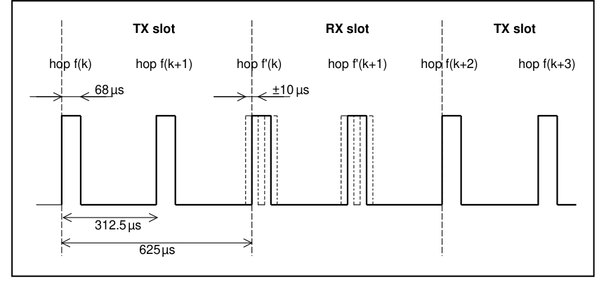

**Figure 2.7:  RX/TX cycle of transceiver in PAGE mode**

#### 2.4.4  Page Response Timing

At connection setup a master page response packet is transmitted from the master to the slave (see Table 8.3). This packet establishes the timing and frequency synchronization. After the slave device has received the page message, it shall return a response message that consists of the slave page response packet and shall follow 625 μs after the receipt of the page message. The master shall send the master page response packet in the TX slot following the RX slot in which it received the slave response, according to the RX/TX timing of the master. The time difference between the slave page response and master page response message will depend on the timing of the page message the slave received. In Figure 2.8, the slave receives the paging message sent first in the master-to-slave slot. It then responds with a first slave page response packet in the first half of the slave-to-master slot. The timing of the master page response packet is based on the timing of the page message sent first in the preceding master-to-slave slot: there is an exact 1250 μs delay between the first page message and the master page response packet. The packet is sent at the hop frequency f(k+1) which is the hop frequency following the hop frequency f(k) the page message was received in.

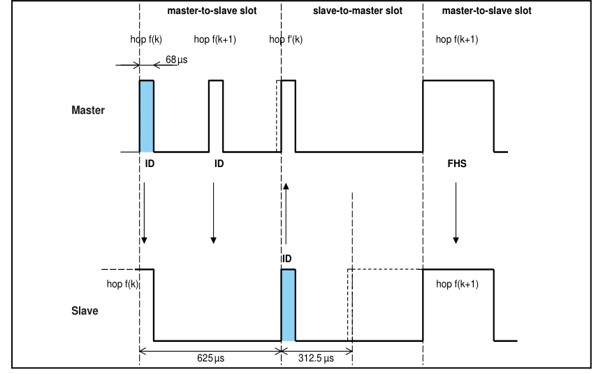

**Figure 2.8:  Timing of page response packets on successful page in first half slot**

In Figure 2.9, the slave receives the paging message sent second in the master-to-slave slot. It then responds with a slave page response packet in the second half of the slave-to-master slot exactly 625 μs after the receipt of the page message. The timing of the master page response packet is still based on the timing of the page message sent first in the preceding master-to-slave slot: there is an exact 1250 μs delay between the first page message and the master page response packet. The packet is sent at the hop frequency f(k+2) which is the hop frequency following the hop frequency f(k+1) the page message was received in.

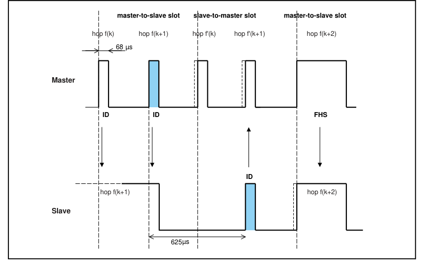

**Figure 2.9:  Timing of page response packets on successful page in second half slot**

The slave shall adjust its RX/TX timing according to the reception of the master page response packet (and not according to the reception of the page message). That is, the second slave page response message that acknowledges the reception of the master page response packet shall be transmitted 625 μs after the start of the master page response packet.

### 2.5   INQUIRY SCAN PHYSICAL CHANNEL

Although master and slave roles are not defined prior to a connection, the term master is used for the inquiring device and slave is used for the inquiry scanning device.

#### 2.5.1  Clock for Inquiry

The clock used for inquiry and inquiry scan shall be the device's native clock.

#### 2.5.2  Hopping Characteristics

The inquiry scan channel follows a slower hopping pattern than the piconet physical channel and is a short pseudo-random hopping sequence through the RF channels. The timing of the inquiry scan channel is determined by the native Bluetooth clock of the scanning device while the frequency hopping sequence is determined by the general inquiry access code.
The inquiry scan physical channel uses the inquiry, inquiry response, and inquiry scan hopping sequences described in Section 2.6.

#### 2.5.3  Inquiry Procedure Timing

During the inquiry procedure, the master shall transmit inquiry messages with the general or dedicated inquiry access code. The timing for inquiry is the same as for paging (see Section 2.4.3).

#### 2.5.4  Inquiry Response Timing

An inquiry response packet is transmitted from the slave to the master after the slave has received an inquiry message (see Table 8.5). This packet contains information necessary for the inquiring master to page the slave (see definition of the FHS packet in Section 6.5.1.4) and follows 625 μs after the receipt of the inquiry message. If the slave transmits an extended inquiry response packet, it shall be transmitted1250 μs after the start of the inquiry response packet.
In Figure 2.10 and Figure 2.11, f(k) is used for the frequencies of the inquiry hopping sequence and f'(k) denotes the corresponding inquiry response sequence frequency. The inquiry response packet and the extended inquiry response packet are received by the master at the hop frequency f'(k) when the inquiry message received by the slave was first in the master-to-slave slot.

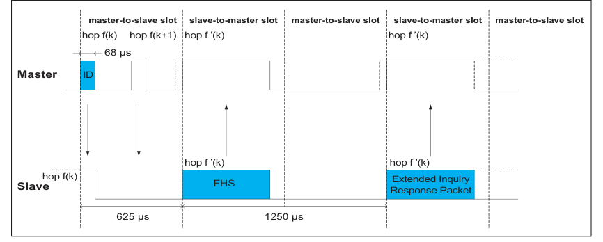

**Figure 2.10:  Timing of inquiry response packets on successful inquiry in first half slot**

When the inquiry message received by the slave was the second in the master-to-slave slot the inquiry response packet and the extended inquiry response packet are received by the master at the hop frequency f'(k+1).

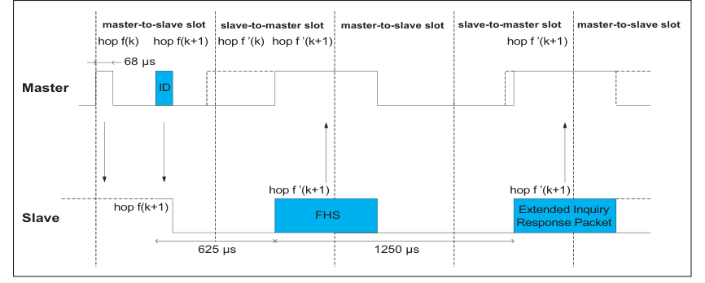

**Figure 2.11:  Timing of inquiry response packets on successful inquiry in second half slot**

### 2.6   HOP SELECTION

Bluetooth devices shall use the hopping kernel as defined in the following sections.
In total, six types of hopping sequence are defined − five for the basic hop system and one for an adapted set of hop locations used by adaptive frequency hopping (AFH). These sequences are:
• A page hopping sequence with 32 wake-up frequencies distributed equally over the 79 MHz, with a period length of 32;
• A page response hopping sequence covering 32 response frequencies that are in a one-to-one correspondence to the current page hopping sequence. The master and slave use different rules to obtain the same sequence;
• An inquiry hopping sequence with 32 wake-up frequencies distributed equally over the 79 MHz, with a period length of 32;
• An inquiry response hopping sequence covering 32 response frequencies that are in a one-to-one correspondence to the current inquiry hopping sequence.
• A basic channel hopping sequence which has a very long period length, which does not show repetitive patterns over a short time interval, and which distributes the hop frequencies equally over the 79 MHz during a short time interval.
• An adapted channel hopping sequence derived from the basic channel hopping sequence which uses the same channel mechanism and may use fewer than 79 frequencies. The adapted channel hopping sequence is only used in place of the basic channel hopping sequence. All other hopping sequences are not affected by hop sequence adaptation.
In addition, a set of synchronization train RF channels with 3 fixed frequencies is defined.

#### 2.6.1  General Selection Scheme

The selection scheme consists of two parts:
• selecting a sequence;
• mapping this sequence onto the hop frequencies;
The general block diagram of the hop selection scheme is shown in Figure 2.12. The mapping from the input to a particular RF channel index is performed in the selection box.
The inputs to the selection box are the selected clock, frozen clock, N, koffset, interlace_offset, address, sequence selection and AFH_channel_map. The source of the clock input depends on the hopping sequence selected. Additionally, each hopping sequence uses different bits of the clock (see Table 2.2). N, interlace_offset, and koffset are defined in Section 2.6.4.
The sequence selection input can be set to the following values:
• page scan
• inquiry scan
• page
• inquiry
• master page response
• slave page response
• inquiry response
• basic channel
• adapted channel
The address input consists of 28 bits including the entire LAP and the 4 LSBs of the UAP. This is designated as the UAP/LAP. When the basic or adapted channel hopping sequence is selected, the Bluetooth device address of the master (BD_ADDR) shall be used. When the page, master page response, slave page response, or page scan hopping sequences are selected the BD_ADDR given by the Host of the paged device shall be used (see HCI Create Connection Command [Vol 2] Part E, Section 7.1.5). When the inquiry, inquiry response, or inquiry scan hopping sequences are selected, the UAP/ LAP corresponding to the GIAC shall be used even if it concerns a DIAC. Whenever one of the reserved BD_ADDRs (see Section 1.2.1) is used for generating a frequency hop sequence, the UAP shall be replaced by the default check initialization (DCI, see Section 7.1). The hopping sequence is selected by the sequence selection input to the selection box.
When the adapted channel hopping sequence is selected, the AFH_channel_map is an additional input to the selection box. The AFH_channel_map indicates which channels shall be used and which shall be unused. These terms are defined in Section 2.6.3.

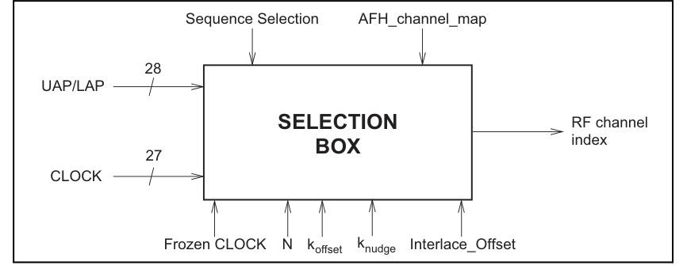

**Figure 2.12:  General block diagram of hop selection scheme**

The output, RF channel index, constitutes a pseudo-random sequence. The RF channel index is mapped to RF channel frequencies using the equation in [Vol 2] Part A, Table 2.1.
The selection scheme chooses a segment of 32 hop frequencies spanning about 64 MHz and visits these hops in a pseudo-random order. Next, a different 32-hop segment is chosen, etc. In the page, master page response, slave page response, page scan, inquiry, inquiry response and inquiry scan hopping sequences, the same 32-hop segment is used all the time (the segment is selected by the address; different devices will have different paging segments). When the basic channel hopping sequence is selected, the output constitutes a pseudo-random sequence that slides through the 79 hops. The principle is depicted in Figure 2.13.
.

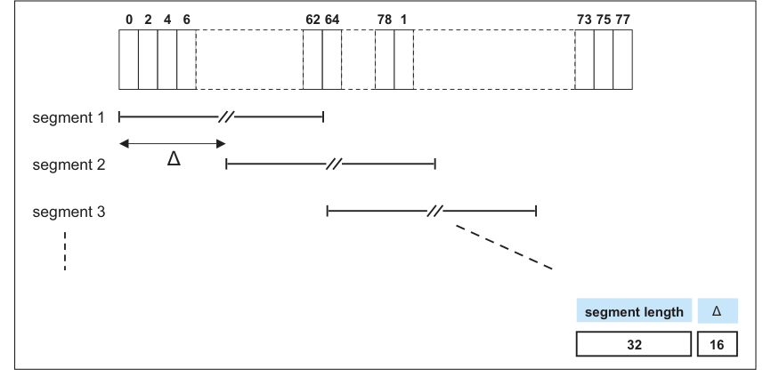

**Figure 2.13:  Hop selection scheme in CONNECTION state**

The RF frequency shall remain fixed for the duration of the packet. The RF frequency for the packet shall be derived from the Bluetooth clock value in the
first slot of the packet. The RF frequency in the first slot after a multi-slot packet shall use the frequency as determined by the Bluetooth clock value for that slot. Figure 2.14 illustrates the hop definition on single- and multi-slot packets.

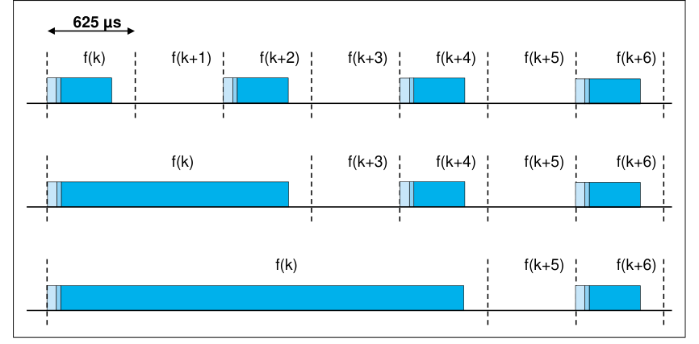

**Figure 2.14:  Single- and multi-slot packets**

When the adapted channel hopping sequence is used, the pseudo-random sequence contains only frequencies that are in the RF channel set defined by the AFH_channel_map input. The adapted sequence has similar statistical properties to the non-adapted hop sequence. In addition, the slave responds with its packet on the same RF channel that was used by the master to address that slave (or would have been in the case of a synchronous reserved slot without a validly received master-to-slave transmission). This is called the same channel mechanism of AFH. Thus, the RF channel used for the master to slave packet is also used for the immediately following slave to master packet. An example of the same channel mechanism is illustrated in Figure 2.15. The same channel mechanism shall be used whenever the adapted channel hopping sequence is selected.

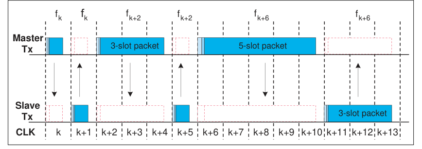

**Figure 2.15:  Example of the same channel mechanism**

#### 2.6.2  Selection Kernel

The basic hop selection kernel shall be as shown in Figure 2.16 and is used for the page, page response, inquiry, inquiry response and basic channel hopping selection kernels. In these substates the AFH_channel_map input is unused. The adapted channel hopping selection kernel is described in Section 2.6.3. The X input determines the phase in the 32-hop segment, whereas Y1 and Y2 selects between master-to-slave and slave-to-master. The inputs A to D determine the ordering within the segment, the inputs E and F determine the mapping onto the hop frequencies. The kernel addresses a register containing the RF channel indices. This list is ordered so that first all even RF channel indices are listed and then all odd hop frequencies. In this way, a 32-hop segment spans about 64 MHz.

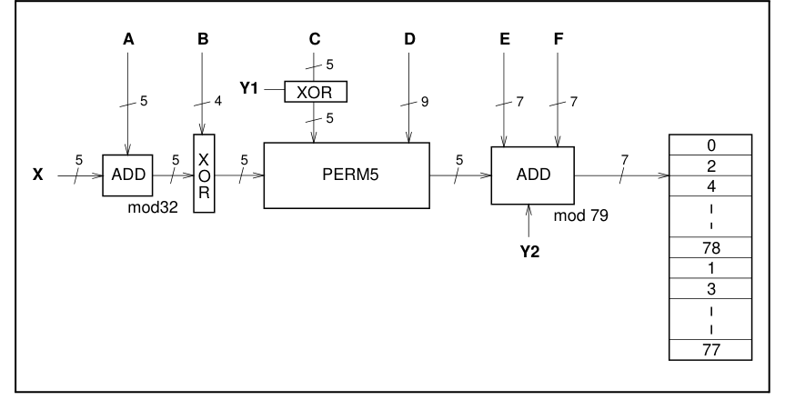

**Figure 2.16:  Block diagram of the basic hop selection kernel for the hop system**

The selection procedure consists of an addition, an XOR operation, a permutation operation, an addition, and finally a register selection. In the remainder of this chapter, the notation Ai is used for bit i of the BD_ADDR.

##### 2.6.2.1  First Addition Operation

The first addition operation only adds a constant to the phase and applies a modulo 32 operation. For the page hopping sequence, the first addition is redundant since it only changes the phase within the segment. However, when different segments are concatenated (as in the basic channel hopping sequence), the first addition operation will have an impact on the resulting sequence.

##### 2.6.2.2  XOR Operation

Let Z’ denote the output of the first addition. In the XOR operation, the four LSBs of Z’ are modulo-2 added to the address bits A22-19. The operation is illustrated in Figure 2.17.

**Figure 2.17:  XOR operation for the hop system**

##### 2.6.2.3  Permutation Operation

The permutation operation involves the switching from 5 inputs to 5 outputs for the hop system, controlled by the control word. The permutation or switching box shall be as shown in Figure 2.18. It consists of 7 stages of butterfly operations. The control of the butterflies by the control signals P is shown in Table 2.1. P0-8 corresponds to D0-8, and, corresponds to for in Figure 2.16.
Pi 9 + Ci Y1 ⊕ i 0…4 =

| Control signal | Butterfly |  | Control signal | Butterfly |
| --- | --- | --- | --- | --- |
| P 0 | {Z ,Z } 0 1 |  | P 8 | {Z ,Z } 1 4 |
| P 1 | {Z ,Z } 2 3 |  | P 9 | {Z ,Z } 0 3 |
| P 2 | {Z ,Z } 1 2 |  | P 10 | {Z ,Z } 2 4 |
| P 3 | {Z ,Z } 3 4 |  | P 11 | {Z ,Z } 1 3 |
| P 4 | {Z ,Z } 0 4 |  | P 12 | {Z ,Z } 0 3 |
| P 5 | {Z ,Z } 1 3 |  | P 13 | {Z ,Z } 1 2 |
| P 6 | {Z ,Z } 0 2 |  |  |  |
| P 7 | {Z ,Z } 3 4 |  |  |  |

Table 2.1:  Control of the butterflies for the hop system
The Z input is the output of the XOR operation as described in the previous section. The butterfly operation can be implemented with multiplexers as depicted in Figure 2.19.

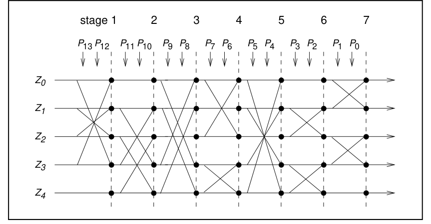

**Figure 2.18:  Permutation operation for the hop system**

**Figure 2.19:  Butterfly implementation**

##### 2.6.2.4  Second Addition Operation

The addition operation selects the hop frequencies to be used by the current segment and also switches between master-to-slave and slave-to-master. It adds the output of the current permutation (which selects a channel within the segment), a constant, the clock bit selecting master or slave slots, and a value used to switch each segment to a new set of channels in connection state. The addition is applied modulo 79.

##### 2.6.2.5  Register Bank

The output of the adder addresses a bank of 79 registers. The registers are loaded with the synthesizer code words corresponding to the hop frequencies 0 to 78. Note that the upper half of the bank contains the even hop frequencies, whereas the lower half of the bank contains the odd hop frequencies.

#### 2.6.3  Adapted Hop Selection Kernel

The adapted hop selection kernel is based on the basic hop selection kernel defined in the preceding sections.
The inputs to the adapted hop selection kernel are the same as for the basic hop system kernel except that the input AFH_channel_map (defined in Link Manager Protocol [Vol 2] Part C, Section 5.2) is used. The AFH_channel_map indicates which RF channels shall be used and which shall be unused. When hop sequence adaptation is enabled, the number of used RF channels may be reduced from 79 to some smaller value N. All devices shall be capable of operating on an adapted hop sequence (AHS) with Nmin ≤ N ≤ 79, with any combination of used RF channels within the AFH_channel_map that meets this constraint. Nmin is defined in Section 2.3.1.
Adaptation of the hopping sequence is achieved through two additions to the basic channel hopping sequence according to Figure 2.16:
• Unused RF channels are re-mapped uniformly onto used RF channels. That is, if the hop selection kernel of the basic system generates an unused RF channel, an alternative RF channel out of the set of used RF channels is selected pseudo-randomly.
• The used RF channel generated for the master-to-slave packet is also used for the immediately following slave-to-master packet (see Section 2.6.1).

##### 2.6.3.1  Channel Re-mapping Function

When the adapted hop selection kernel is selected, the basic hop selection kernel according to Figure 2.16 is initially used to determine an RF channel. If this RF channel is unused according to the AFH_channel_map, the unused RF channel is re-mapped by the re-mapping function to one of the used RF channels. If the RF channel determined by the basic hop selection kernel is already in the set of used RF channels, no adjustment is made. The hop sequence of the (non-adapted) basic hop equals the sequence of the adapted selection kernel on all locations where used RF channels are generated by the basic hop. This property facilitates all slaves remaining synchronized even if they are not all using the same hopping sequence.
A block diagram of the re-mapping mechanism is shown in Figure 2.20. The re- mapping function is a post-processing step to the selection kernel from Figure 2.16, denoted as ‘Hop selection of the basic hop’. The output fk of the basic hop selection kernel is an RF channel number that ranges between 0 and 78. This RF channel will either be in the set of used RF channels or in the set of unused RF channels.

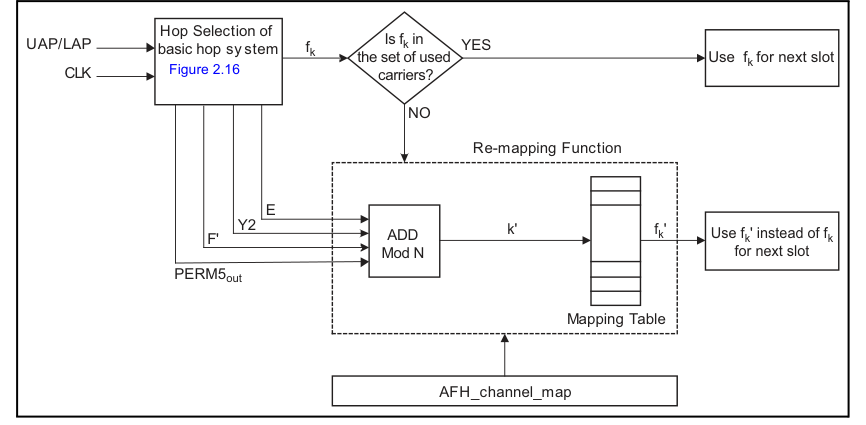

**Figure 2.20:  Block diagram of adaptive hop selection mechanism**

When an unused RF channel is generated by the basic hop selection mechanism, it is re-mapped to the set of used RF channels as follows. A new index k’ ∈ {0, 1,..., N-1} is calculated using some of the parameters from the basic hop selection kernel:
k’ = (PERM5out + E + F’ + Y2) mod N
where F’ is defined in Table 2.2. The index k’ is then used to select the re- mapped channel from a mapping table that contains all of the even used RF channels in ascending order followed by all the odd used RF channels in ascending order (i.e., the mapping table of Figure 2.16 with all the unused RF channels removed).

#### 2.6.4  Control Word

In the following section Xj-i, i<j, denotes bits i, i+1,...,j of the bit vector X. By convention, X0 is the least significant bit of the vector X.
The control word of the kernel is controlled by the overall control signals X, Y1, Y2, A to F, and F’ as illustrated in Figure 2.16 and Figure 2.20. During paging and inquiry, the inputs A to E use the address values as given in the corresponding columns of Table 2.2. In addition, the inputs X, Y1 and Y2 are used. The F and F’ inputs are unused. The clock bits CLK6-2 (i.e., input X) specify the phase within the length 32 sequence. CLK1 (i.e., inputs Y1 and Y2) is used to select between TX and RX. The address inputs determine the sequence order within segments. The final mapping onto the hop frequencies is determined by the register contents.
During the CONNECTION state (see Section 8.5), the inputs A, C and D shall be derived from the address bits being bit-wise XORed with the clock bits as shown in the “Connection state” column of Table 2.2 (the two most significant
bits, MSBs, are XORed together, the two second MSBs are XORed together, etc.).

|  | Page scan / Generalized Interlaced Page Scan / Inquiry scan / Generalized Interlaced Inquiry Scan | Page/Inquiry | Master/Slave page response and Inquiry response | Connection state |
| --- | --- | --- | --- | --- |
| X | CLKN / 16–12 (CLKN + / 16–12 interlace offset)mod32 Xir / 4–0 (Xir + 4–0 interlace offset)mod32 | Xp ⁄Xi 4–0 4–0 | Xprm / 4–0 Xprs / 4–0 Xir 4–0 | CLK 6–2 |
| Y1 | 0 | CLKE ⁄CLKN 1 1 | CLKE ⁄CLKN 1⁄1 1 | CLK 1 |
| Y2 | 0 | 32×CLKE ⁄ 1 32×CLKN 1 | 32×CLKE / 1 32×CLKN / 1 32×1 | 32×CLK 1 |
| A | A 27–23 | A 27–23 | A 27–23 | A ⊕CLK 27–23 25–21 |
| B | A 22–19 | A 22–19 | A 22–19 | A 22–19 |
| C | A 8 , 6 , 4, 2 ,0 | A 8 , 6 , 4 , 2 ,0 | A 8 , 6 , 4 , 2 ,0 | A ⊕CLK 8 , 6 , 4 , 2 ,0 20–1 |
| D | A 18–10 | A 18–10 | A 18–10 | A ⊕CLK 18–10 15–7 |
| E | A 13 ,11 , 9 , 7 , 5 , 3 ,1 | A 13 ,11 , 9 , 7 , 5 , 3 ,1 | A 13 ,11 , 9 , 7 , 5 , 3 ,1 | A 13 ,11 , 9 , 7 , 5 , 3 ,1 |
| F | 0 | 0 | 0 | 16×CLK mod 79 27–7 |
| F’ | n/a | n/a | n/a | 16×CLK mod N 27–7 |

Table 2.2:  Control for hop system
The five X input bits vary depending on the current state of the device. In the page scan and inquiry scan substates, the native clock (CLKN) shall be used. In CONNECTION state the master clock (CLK) shall be used as input. The situation is somewhat more complicated for the other states.

##### 2.6.4.1  Page Scan and Inquiry Scan Hopping Sequences

When the sequence selection input is set to page scan, the Bluetooth device address of the scanning device shall be used as address input. When the sequence selection input is set to inquiry scan, the GIAC LAP and the four LSBs of the DCI (as ), shall be used as address input for the hopping sequence. For the transmitted access code and in the receiver correlator, the
A27 24 –
appropriate GIAC or DIAC shall be used. The application decides which inquiry access code to use depending on the purpose of the inquiry.

##### 2.6.4.2  Page Hopping Sequence

When the sequence selection input is set to page, the paging device shall start using the A-train, i.e., , where is the source’s estimate of the current receiver frequency in the paged device. The index k is a function of all the inputs in Figure 2.16. There are 32 possible paging frequencies within each 1.28 second interval. Half of these frequencies belong to the A-train, the rest (i.e., ) belong to the B-train. In order to achieve the -8 offset of the A-train, a constant of 24 shall be added to the clock bits (which is equivalent to -8 due to the modulo 32 operation). The B-train is obtained by setting the offset to 8. In the case where slots to receive the first slave response are periodically not available, an additional offset ( ) is added to the clock bits in order to shift the train by an integer multiple of 1.25 ms duration. A cyclic shift of the order within the trains is also necessary in order to avoid a possible repetitive mismatch between the paging and scanning devices. Thus,
f k 8 – ( ) … f k( ) … f k 7 + ( ) , , , , { } f k( )
f k 8 + ( ) … f k 15 + ( ) , , f, k 16 – ( ) … f k 9 – ( ) , , { }
knudge
Xp [CLKE16 12 – koffset knudge + + + =
(EQ 2)
CLKE4 2 – 0 , CLKE16 12 – – ( ) mod 16]  mod  32,
where
koffset 24 A-train, 8 B-train.    =
(EQ 3)
knudge 0 During 1st 2 Npage repetitions ×
Even During all other repetitions.    =
(EQ 4)
Alternatively, each switch between the A- and B-trains may be accomplished by adding 16 to the current value of (originally initialized with 24).
koffset

##### 2.6.4.3  Slave Page Response Hopping Sequence

When the sequence selection input is set to slave page response, in order to eliminate the possibility of losing the link due to discrepancies of the native clock CLKN and the master’s clock estimate CLKE, the four bits shall be frozen at their current value. The value shall be frozen at the content it has in the slot where the recipient’s access code is detected. The native clock shall not be stopped; it is merely the values of the bits used for creating the X- input that are kept fixed for a while. A frozen value is denoted by an asterisk (*) in the discussion below.
CLKN16 12 –
For each response slot the paged device shall use an X-input value one larger (modulo 32) than in the preceding response slot. However, the first response
shall be made with the X-input kept at the same value as it was when the access code was recognized. Let be a counter starting at zero. Then, the X- input in the -th response slot (the first response slot being the one immediately following the page slot now responding to) of the slave response substate is:
N N 1 + ( )
Xprs CLKN∗16 12 – N + [ ]  mod  32, =
(EQ 5)
The counter shall be set to zero in the slot where the slave acknowledges the page (see Figure 8.3 and Figure 8.4). Then, the value of shall be increased by one each time is set to zero, which corresponds to the start of a master TX slot. The X-input shall be constructed this way until the first FHS packet is received and the immediately following response packet has been transmitted. After this the slave shall enter the CONNECTION state using the parameters received in the FHS packet.
N
N CLKN1

##### 2.6.4.4  Master Page Response Hopping Sequence

When the sequence selection input is set to master page response, the master shall freeze its estimated slave clock to the value that triggered a response from the paged device. It is equivalent to using the values of the clock estimate when receiving the slave response (since only will differ from the corresponding page transmission). Thus, the values are frozen when the slave ID packet is received. In addition to the clock bits used, the current values of and shall also be frozen. The master shall adjust its X-input in the same way the paged device does, i.e., by incrementing this value by one for each time is set to zero. The first increment shall be done before sending the FHS packet to the paged device. Let be a counter starting at one. The rule for forming the X-input is:
CLKE1
koffset knudge
CLKE1
N
Xprm CLKE [ ∗16 12 – k*offset k*nudge + + + =
(EQ 6)
CLKE∗4 2 – 0 , CLKE∗16 12 – – ( ) mod 16 N + ]  mod  32,
The value of shall be increased each time is set to zero, which corresponds to the start of a master TX slot.
N CLKE1

##### 2.6.4.5  Inquiry Hopping Sequence

When the sequence selection input is set to inquiry, the X-input is similar to that used in the page hopping sequence. Since no particular device is addressed, the native clock CLKN of the inquirer shall be used. Moreover, which of the two train offsets to start with is of no real concern in this state. Consequently,
Xi CLKN [ 16 12 – koffset knudge + + + =
(EQ 7)
CLKN4 2 – 0 , CLKN16 12 – – ( ) mod 16]  mod  32,
where and are defined by (EQ 3) and (EQ 4). The initial choice of is arbitrary.
koffset knudge
koffset
The GIAC LAP and the four LSBs of the DCI (as ) shall be used as address input for the hopping sequence generator.
A27 24 –

##### 2.6.4.6  Inquiry Response Hopping Sequence

The inquiry response hopping sequence is similar to the slave page response hopping sequence with respect to the X-input. The clock input shall not be frozen, thus the following equation apply:
Xir CLKN16 12 – N + [ ]  mod  32, =
(EQ 8)
Furthermore, the counter is increased not on basis, but rather after each FHS packet has been transmitted in response to the inquiry. There is no restriction on the initial value of as it is independent of the corresponding value in the inquiring unit.
N CLKN1
N
The Xir value used for the extended inquiry response packet shall be the same Xir value as calculated for the immediately preceding FHS packet.
The GIAC LAP and the four LSBs of the DCI (as ) shall be used as address input for the hopping sequence generator. The other input bits to the generator shall be the same as for page response.
A27 24 –

##### 2.6.4.7  Basic and Adapted Channel Hopping Sequence

In the basic and adapted channel hopping sequences, the clock bits to use in the basic or adapted hopping sequence generation shall always be derived from the master clock, CLK. The address bits shall be derived from the Bluetooth device address of the master.

##### 2.6.4.8  Synchronization Train RF Channels

The synchronization train and synchronization scan use RF channels from the set of three fixed RF channels with indices 0, 24, and 78.

### 2.7   SYNCHRONIZATION SCAN PHYSICAL CHANNEL

The synchronization scan physical channel enables devices to receive synchronization train packets.

#### 2.7.1  Hopping Characteristics

When a device enters the synchronization scan substate, it shall scan the synchronization train RF channels using the timing defined in Section 2.7.3. Each individual scan window shall use a different RF channel than the previous two scan windows.
The synchronization scan physical channel shall use all of the synchronization train RF channels defined in Section 2.6.4.8.

#### 2.7.2  Synchronization Train Procedure Timing

The master shall use the synchronization train procedure only when connectionless slave broadcast mode is enabled or during the Coarse Clock Adjustment Recovery Mode (Section 8.6.10.2); these can happen concurrently. During the synchronization train procedure, the master shall attempt to transmit synchronization train packets on all of the RF channels specified in Section 2.6.4.8. The transmission of synchronization train packets on each RF channel is independent of the transmission on other RF channels. For each RF channel, the master shall:
1. Establish synchronization train events that are separated by TSync_Train_Interval slots. During Coarse Clock Adjustment Recovery Mode the value of TSyn-
c_Train_Interval shall be 32. At all other times, it shall be the value selected by the Controller from a range provided by the Host ([Vol 2] Part E, Section 7.3.90).
2. Attempt to send a synchronization train packet between each pair of synchronization train events.
3. In the absence of scheduling conflicts, delay the start of the synchronization train packet transmission by TSync_Train_Delay slots from the synchronization train event, where TSync_Train_Delay is a pseudorandom number between 0 and TSync_Train_Delay_Max inclusive. Each value of TSync_Train_Delay shall be an even integer. TSync_Train_Delay_Max shall equal 4 slots during Coarse Clock Adjustment Recovery Mode and 16 slots at all other times. Each synchronization packet transmission shall start at the beginning of a time slot where CLK[1:0]=00b.
4. If the transmission of the synchronization train packet conflicts with the timing of higher priority packets, the actual delay may be adjusted to avoid the conflict. The actual delay should stay within the range of 0 to TSync_Train_Delay_Max inclusive and shall not be greater than or equal to TSync_Train_Interval. If it is not possible to transmit the complete packet before the next synchronization train event, it shall not be transmitted. Note that increasing the delay beyond the recommended range (0 to TSync_Train_Delay_Max) increases the chance that the scanning device will miss the packet.
5. There shall be no more than one synchronization train packet transmitted between any two consecutive synchronization train events.
6. The actual delays used shall not all be the same for any three consecutive synchronization train packets (though any two may be).
Note: Subject to the above requirements, synchronization train events on different RF channels may be managed separately or may be co-ordinated using the same value of TSync_Train_Delay.
Figure 2.21 shows the timing relationship of consecutive synchronization train packets on a single RF channel.

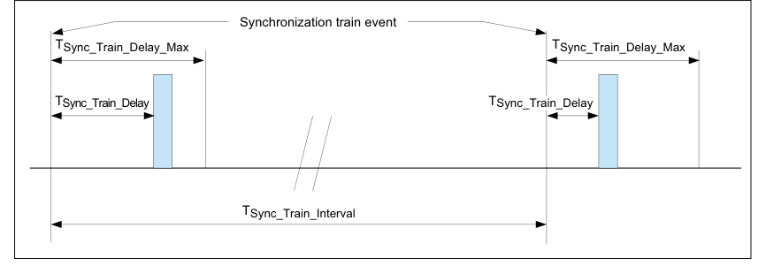

**Figure 2.21:  Synchronization train packet timing on a single channel**

#### 2.7.3  Synchronization Scan Procedure Timing

During the Synchronization Scan procedure, a device performs synchronization scans on the synchronization train RF channels. During each scan window, the device listens for the duration of TSync_Scan_Window. The RF channel for each scan window shall be selected as specified in Section 2.7.1. Each scan window should be continuous and not interrupted by other activities. The interval between the start of consecutive scan windows shall be equal to TSync_Scan_Interval. The values for TSync_Scan_Window and TSync_Scan_Interval shall be chosen as follows:
• During Connectionless Slave Broadcast, refer to [Vol 2] Part E, Section 7.1.52.
• During Coarse Clock Adjustment Recovery Mode, the values chosen are implementation specific.
This timing relationship is shown in Figure 2.22.

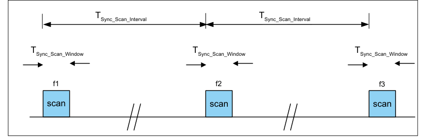

**Figure 2.22:  Synchronization scan timing**

## 3  PHYSICAL LINKS

A physical link represents a baseband connection between devices. A physical link is always associated with exactly one physical channel. Physical links have common properties that apply to all logical transports on the physical link.
Other than the Connectionless Slave Broadcast physical link, common properties of physical links are:
• Power control (see [Vol 2] Part C, Section 4.1.3)
• Link supervision (see Section 3.1 and [Vol 2] Part C, Section 4.1.6)
• Encryption (see [Vol 2] Part H, Section 4 and [Vol 2] Part C, Section 4.2.5)
• Channel quality-driven data rate change (see [Vol 2] Part C, Section 4.1.7)
• Multi-slot packet control (see [Vol 2] Part C, Section 4.1.10)
and for physical links on the adapted piconet physical channel:
• AFH channel map (see Section 2.3 and [Vol 2] Part C, Section 4.1.4)
The Connectionless Slave Broadcast physical link is associated with the BR/ EDR adapted piconet physical channel, a single logical transport (the CSB logical transport), and does not support the Link Manager Protocol. For information on link supervision on Connectionless Slave Broadcast physical links, see Section 3.2. Multi-slot packets on Connectionless Slave Broadcast physical links are controlled by the Host and specified at the profile level.

### 3.1   LINK SUPERVISION FOR ACTIVE PHYSICAL LINKS

A connection can break down due to various reasons such as a device moving out of range, encountering severe interference or a power failure condition. Since this can happen without any prior warning, it is important to monitor the link on both the master and the slave side to avoid possible collisions when the logical transport address (see Section 4.2) is reassigned to another slave.
To be able to detect link loss, both the master and the slave shall use a link supervision timer, T supervision. Upon reception of a valid packet header with one of the slave's addresses (see Section 4.2) on the physical link, the timer shall be reset. If at any time in CONNECTION state, the timer reaches the supervisionTO value, the connection shall be considered disconnected. The same link supervision timer shall be used for SCO, eSCO, and ACL logical transports.
The timeout period, supervisionTO, is negotiated by the Link Manager. Its value shall be chosen so that the supervision timeout will be longer than hold and sniff periods.

### 3.2   LINK SUPERVISION FOR CONNECTIONLESS SLAVE BROADCAST PHYSICAL LINKS

For Connectionless Slave Broadcast physical links, only the slave side monitors the link. To detect link loss, the slave shall use a link supervision timer, TCSB_Supervision. Each Connectionless Slave Broadcast slave shall reset the timer upon reception of a Connectionless Slave Broadcast packet with a valid packet header. If at any time in connectionless slave broadcast mode of the CONNECTION state, the timer reaches the CSB_supervisionTO value, the connection shall be considered disconnected.
For each slave, the timeout period, CSB_supervisionTO, shall be provided by the Host.

### 3.3   AUTHENTICATED PAYLOAD TIMEOUT FOR ACTIVE LINKS

For active physical links, when encryption is enabled and AES-CCM is used, a device monitors the time between receiving packets from the remote device containing a MIC. To ensure the integrity of the link, an Authenticated Payload timer, TAuthenticated_Payload, is used. Each device shall reset the timer upon reception of a packet with a valid MIC. If at any time in the CONNECTION state, the timer reaches the authenticatedPayloadTO value, the Host shall be notified. The timeout period, authenticatedPayloadTO, shall be provided by the Host.
The device shall reset the timer each time after the Host is notified. The Controller shall reset the timer when the Host writes the authenticatedPayloadTO value.

## 4  LOGICAL TRANSPORTS

### 4.1   GENERAL

Between master and slave(s), different types of logical transports may be established. Five logical transports have been defined:
• Synchronous Connection-Oriented (SCO) logical transport
• Extended Synchronous Connection-Oriented (eSCO) logical transport
• Asynchronous Connection-Oriented (ACL) logical transport
• Active Slave Broadcast (ASB) logical transport
• Connectionless Slave Broadcast (CSB) logical transport.
The synchronous logical transports are point-to-point logical transports between a master and a single slave in the piconet. The synchronous logical transports typically support time-bounded information like voice or general synchronous data. The master maintains the synchronous logical transports by using reserved slots at regular intervals. In addition to the reserved slots the eSCO logical transport may have a retransmission window after the reserved slots.
The ACL logical transport is also a point-to-point logical transport between the master and a slave. In the slots not reserved for synchronous logical transport(s), the master can establish an ACL logical transport on a per-slot basis to any slave, including the slave(s) already engaged in a synchronous logical transport.
The ASB logical transport is used by a master to communicate with active slaves.
The CSB logical transport is used by a master to send profile broadcast data to zero or more slaves.

### 4.2   LOGICAL TRANSPORT ADDRESS (LT_ADDR)

Each slave active in a piconet is assigned a primary 3-bit logical transport address (LT_ADDR). The all-zero LT_ADDR is reserved for ASB broadcast messages. The CSB logical transport uses a single non-zero LT_ADDR. The master does not have an LT_ADDR. A master's timing relative to the slaves’ distinguishes it from the slaves. A secondary LT_ADDR is assigned to the slave for each eSCO logical transport in use in the piconet. The secondary LT_ADDR shall not be 0. Only eSCO traffic (i.e. NULL, POLL, and one of the EV packet types as negotiated at eSCO logical transport setup) may be sent on these LT_ADDRs. ACL traffic (including LMP) shall always be sent on the primary LT_ADDR. A slave shall only accept packets with matching primary or secondary LT_ADDR and broadcast packets. The LT_ADDR is carried in the packet header (see Section 6.4). The LT_ADDR shall only be valid for as long as a slave is in
the active mode. As soon as it is disconnected, the slave shall lose all of its LT_ADDRs.
The primary LT_ADDR shall be assigned by the master to the slave when the slave is activated. This is either at connection establishment or role switch, when the primary LT_ADDR is carried in the FHS payload.
At any given time an LT_ADDR (other than the special case of the all-zero LT_ADDR) is either unused or is used for exactly one of the three purposes of the primary address for a slave, a secondary address for eSCO traffic, or for a CSB logical transport. Therefore allocating a secondary LT_ADDR for an eSCO logical transport, or reserving an LT_ADDR for the CSB logical transport, reduces the maximum number of active slaves possible in the piconet.

### 4.3   SYNCHRONOUS LOGICAL TRANSPORTS

The first type of synchronous logical transport, the SCO logical transport, is a symmetric, point-to-point transport between the master and a specific slave. The SCO logical transport reserves slots and can therefore be considered as a circuit-switched connection between the master and the slave. The master may support up to three SCO links to the same slave or to different slaves. A slave may support up to three SCO links from the same master, or two SCO links if the links originate from different masters. SCO packets are never retransmitted.
The second type of synchronous logical transport, the eSCO logical transport, is a point-to-point logical transport between the master and a specific slave. eSCO logical transports may be symmetric or asymmetric. Similar to SCO, eSCO reserves slots and can therefore be considered a circuit-switched connection between the master and the slave. In addition to the reserved slots, eSCO supports a retransmission window immediately following the reserved slots. Together, the reserved slots and the retransmission window form the complete eSCO window.

### 4.4   ASYNCHRONOUS LOGICAL TRANSPORT

In the slots not reserved for synchronous logical transports, the master may exchange packets with any slave on a per-slot basis. The ACL logical transport provides a packet-switched connection between the master and all active slaves participating in the piconet. Both asynchronous and isochronous services are supported. Between a master and a slave only a single ACL logical transport shall exist. For most ACL packets, packet retransmission is applied to assure data integrity.
ACL packets not addressed to a specific slave (LT_ADDR=0) are considered as broadcast packets and should be received by every slave except slaves with only a CSB logical transport. If there is no data to be sent on the ACL logical transport and no polling is required, no transmission is required.

### 4.5   TRANSMIT/RECEIVE ROUTINES

This section describes the way to use the packets as defined in Section 6 in order to support the traffic on the ACL, SCO and eSCO logical transports. Both single-slave and multi-slave configurations are considered. In addition, the use of buffers for the TX and RX routines are described.
The TX and RX routines described in sections 4.5.1 and 4.5.2 are informative only.

#### 4.5.1  TX Routine

The TX routine is carried out separately for each asynchronous and synchronous logical transport. Figure 4.1 shows the asynchronous and synchronous buffers as used in the TX routine. In this figure, only a single TX asynchronous buffer and a single TX synchronous buffer are shown. In the master, there is a separate TX asynchronous buffer for each slave. In addition there can be one or more TX synchronous buffers for each synchronous slave (different SCO or eSCO logical transports could either reuse the same TX synchronous buffer, or each have their own TX synchronous buffer). Each TX buffer consists of two FIFO registers: one current register which can be accessed and read by the Link Controller in order to compose the packets, and one next register that can be accessed by the Baseband Resource Manager to load new information. The positions of the switches S1 and S2 determine which register is current and which register is next; the switches are controlled by the Link Controller. The switches at the input and the output of the FIFO registers can never be connected to the same register simultaneously.

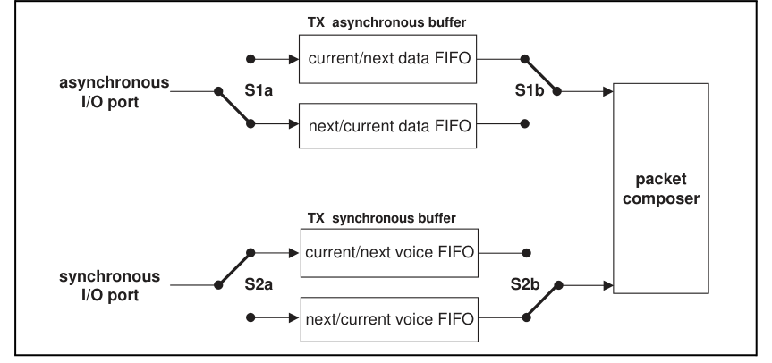

**Figure 4.1:  Functional diagram of TX buffering**

Of the packets common on the ACL and SCO logical transports (NULL, POLL and DM1) only the DM1 packet carries a payload that is exchanged between the Link Controller and the Link Manager; this common packet makes use of the asynchronous buffer. All ACL packets make use of the asynchronous
buffer. All SCO and eSCO packets make use of the synchronous buffer except for the DV packet where the synchronous data part is handled by the synchronous buffer and the data part is handled by the asynchronous buffer. In the next sections, the operation for ACL traffic, SCO traffic, eSCO traffic, and combined data-voice traffic on the SCO logical transport are described.

##### 4.5.1.1  ACL Traffic

In the case of asynchronous data only the TX ACL buffer in Figure 4.1 has to be considered. In this case, only packet types DM or DH are used, and these can have different lengths. The length is indicated in the payload header. The selection of DM or DH packets should depend on the quality of the link. See [Vol 2] Part C, Section 4.1.7.
The default packet type in pure data traffic is NULL (see Section 6.5.1.2). This means that, if there is no data to be sent (the data traffic is asynchronous, and therefore pauses occur in which no data is available) or no slaves need to be polled, NULL packets are sent instead − in order to send link control information to the other device (e.g. ACK/STOP information for received data). When no link control information is available (either no need to acknowledge and/or no need to stop the RX flow) no packet is sent at all.
The TX routine works as follows. The Baseband Resource Manager loads new data information in the register to which the switch S1a points. Next, it gives a command to the Link Controller, which forces the switch S1 to change (both S1a and S1b switch synchronously). When the payload needs to be sent, the packet composer reads the current register and, depending on the packet type, builds a payload which is appended to the channel access code and the header and is subsequently transmitted. In the response packet (which arrives in the following RX slot if it concerned a master transmission, or may be postponed until some later RX slot if it concerned a slave transmission), the result of the transmission is reported back. In case of an ACK, the switch S1 changes position; if a NAK (explicit or implicit) is received instead, the switch S1 will not change position. In that case, the same payload is retransmitted at the next TX occasion.
As long as the Baseband Resource Manager keeps loading the registers with new information, the Link Controller will automatically transmit the payload; in addition, retransmissions are performed automatically in case of errors. The Link Controller will send NULL or nothing when no new data is loaded. If no new data has been loaded in the next register, during the last transmission, the packet composer will be pointing to an empty register after the last transmission has been acknowledged and the next register becomes the current register. If new data is loaded in the next register, a flush command is required to switch the S1 switch to the proper register. As long as the Baseband Resource Manager keeps loading the data and type registers before each TX slot, the data is automatically processed by the Link Controller since the S1 switch is controlled by the ACK information received in response. However, if the traffic from the Baseband Resource Manager is interrupted once and a default packet is sent instead, a flush command is necessary to continue the flow in the Link Controller.
The flush command may also be used in case of time-bounded (isochronous) data. In case of a bad link, many retransmissions are necessary. In certain applications, the data is time-bounded: if a payload is retransmitted all the time because of link errors, it may become outdated, and the system might decide to continue with more recent data instead and skip the payload that does not come through. This is accomplished by the flush command as well. With the flush, the switch S1 is forced to change and the Link Controller is forced to consider the next data payload and overrules the ACK control. Any ACL type of packet can be used to send data or link control information to any other ACL slave.

##### 4.5.1.2  SCO Traffic

On the SCO logical transport only HV and DV packet types are used, See Section 6.5.2. The synchronous port may continuously load the next register in the synchronous buffer. The S2 switches are changed according to the Tsco interval. This Tsco interval is negotiated between the master and the slave at the time the SCO logical transport is established.
For each new SCO slot, the packet composer reads the current register after which the S2 switch is changed. If the SCO slot has to be used to send control information with high priority concerning a control packet between the master and the SCO slave, or a control packet between the master and any other slave, the packet composer will discard the SCO information and use the control information instead. This control information shall be sent in a DM1 packet. Data or link control information may also be exchanged between the master and the SCO slave by using the DV or DM1 packets.

##### 4.5.1.3  Mixed Data/Voice Traffic

In Section 6.5.2, a DV packet has been defined that can support both data and voice simultaneously on a single SCO logical transport. When the TYPE is DV, the Link Controller reads the data register to fill the data field and the voice register to fill the voice field. Thereafter, the switch S2 is changed. However, the position of S1 depends on the result of the transmission as on the ACL logical transport: only if an ACK has been received will the S1 switch change its position. In each DV packet, the voice information is new, but the data information might be retransmitted if the previous transmission failed. If there is no data to be sent, the SCO logical transport will automatically change from DV packet type to the current HV packet type used before the mixed data/voice transmission. Note that a flush command is necessary when the data stream has been interrupted and new data has arrived.
Combined data-voice transmission can also be accomplished by using a separate ACL logical transport in addition to the SCO logical transport(s) if channel capacity permits this.

##### 4.5.1.4  eSCO Traffic

On the eSCO logical transport only EV, POLL and NULL packet types are used, see Section 6.5.3. The synchronous port may continuously load the next register in the synchronous buffer. The S2 switches are changed according to the TeSCO interval. This TeSCO interval is negotiated between the master and the slave at the time the eSCO logical transport is established.
For each new eSCO slot, the packet composer reads the current register after which the S2 switch is changed. If the eSCO slot has to be used to send control information with high priority concerning a control packet between the master and the eSCO slave, or an ACL packet between the master and any other slave, the packet composer will discard the eSCO information and use the control information instead. Control information to the eSCO slave is sent in a DM1 packet on the primary LT_ADDR.

##### 4.5.1.5  Default Packet Types

On the ACL links, the default type is always NULL both for the master and the slave. This means that if no user information needs to be sent, either a NULL packet is sent if there is ACK or STOP information, or no packet is sent at all. The NULL packet can be used by the master to allocate the next slave-to- master slot to a certain slave (namely the one addressed). However, the slave is not forced to respond to the NULL packet from the master. If the master requires a response, it sends a POLL packet.
The SCO and eSCO packet types are negotiated at the LM level when the SCO or eSCO logical transport is established. The agreed packet type is also the default packet type for the reserved SCO or eSCO slots.

#### 4.5.2  RX Routine

The RX routine is carried out separately for the ACL logical transport and the synchronous logical transports. However, in contrast to the master TX asynchronous buffer, a single RX buffer is shared among all slaves. For the synchronous buffer, how the different synchronous logical transports are distinguished depends on whether extra synchronous buffers are required or not. Figure 4.2 shows the asynchronous and synchronous buffers as used in the RX routine. The RX asynchronous buffer consists of two FIFO registers: one register that can be accessed and loaded by the Link Controller with the payload of the latest RX packet, and one register that can be accessed by the Baseband Resource Manager to read the previous payload. The RX synchronous buffer also consists of two FIFO registers: one register which is filled with newly arrived voice information, and one register which can be read by the voice processing unit.

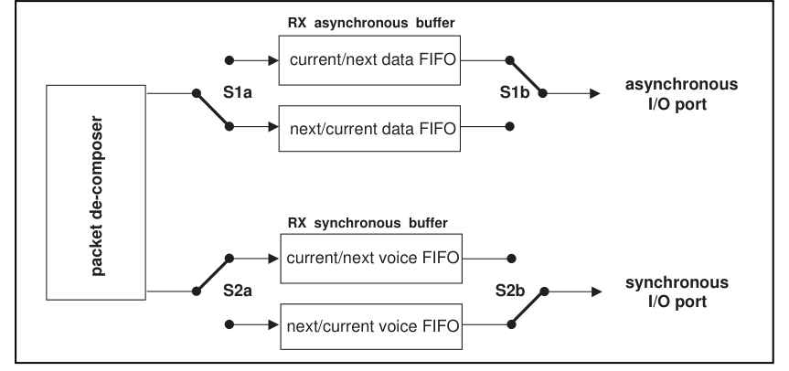

**Figure 4.2:  Functional diagram of RX buffering**

Since the TYPE indication in the header (see Section 6.4.2) of the received packet indicates whether the payload contains data and/or voice, the packet de-composer can automatically direct the traffic to the proper buffers. The switch S1 changes every time the Baseband Resource Manager reads the old register. If the next payload arrives before the RX register is emptied, a STOP indication is included in the packet header of the next TX packet that is returned. The STOP indication is removed again as soon as the RX register is emptied. The SEQN field is checked before a new ACL payload is stored into the asynchronous register (flush indication in LLID and broadcast messages influence the interpretation of the SEQN field see Section 7.6).
The S2 switch is changed every TSCO or TeSCO for SCO and eSCO respectively. If, due to errors in the header, no new synchronous payload arrives, the switch still changes. The synchronous data processing unit then processes the synchronous data to account for the missing parts.

#### 4.5.3  Flow Control

Since the RX ACL buffer can be full while a new payload arrives, flow control is required. The header field FLOW in the return TX packet may use STOP or GO in order to control the transmission of new data.

##### 4.5.3.1  Destination Control

As long as data cannot be received, a STOP indication shall be transmitted which is automatically inserted by the Link Controller into the header of the return packet. STOP shall be returned as long as the RX ACL buffer is not emptied by the Baseband Resource Manager. When new data can be accepted again, the GO indication shall be returned. GO shall be the default value. All packet types not including data can still be received. Voice communication for example is not affected by the flow control. Although a
device can-not receive new information, it may still continue to transmit information: the flow control shall be separate for each direction.

##### 4.5.3.2  Source Control

On the reception of a STOP signal, the Link Controller shall automatically switch to the default packet type. The ACL packet transmitted just before the reception of the STOP indication shall be kept until a GO signal is received. It may be retransmitted as soon as a GO indication is received. Only default packets shall be sent as long as the STOP indication is received. When no packet is received, GO shall be assumed implicitly. Note that the default packets contain link control information (in the header) for the receive direction (which may still be open) and may contain synchronous data (HV or EV packets). When a GO indication is received, the Link Controller may resume transmitting the data that is present in the TX ACL buffers.
In a multi-slave configuration, only the transmission to the slave that issued the STOP signal shall be stalled. This means that the master shall only stop transmission from the TX ACL buffer corresponding to the slave that momentarily cannot accept data.

### 4.6   ACTIVE SLAVE BROADCAST TRANSPORT

The active slave broadcast logical transport is used to transport L2CAP user traffic and certain LMP traffic to all devices in the piconet that are currently connected to the piconet physical channel that is used by the ASB. There is no acknowledgment protocol and the traffic is uni-directional from the piconet master to the slaves. The ASB logical transport may only be used for L2CAP group traffic and shall never be used for L2CAP connection-oriented channels or L2CAP control signaling.
The ASB logical transport is unreliable. To improve reliability somewhat each packet is transmitted a number of times. An identical sequence number is used to assist with filtering retransmissions at the slave device.
The ASB logical transport is identified by the reserved, all-zero, LT_ADDR. Packets on the ASB logical transport may be sent by the master at any time.

### 4.7   THIS SECTION NO LONGER USED

### 4.8   CONNECTIONLESS SLAVE BROADCAST LOGICAL TRANSPORT

The CSB logical transport is used to transport profile broadcast data from a master to multiple slaves. There is no acknowledgment scheme and the traffic is unidirectional. Note: The CSB logical transport is not used for L2CAP
connection-oriented channels, L2CAP control signaling, or LMP control signaling.
The CSB logical transport is unreliable. To improve reliability each packet payload may be transmitted a number of times.

## 5  LOGICAL LINKS

The following logical links are defined:
• Link Control (LC)
• ACL Control (ACL-C and ASB-C)
• User Asynchronous/Isochronous (ACL-U and ASB-U)
• User Synchronous (SCO-S)
• User Extended Synchronous (eSCO-S)
• Profile Broadcast Data (PBD)
The control logical link LC is used at the link control level. The ACL-C and ASB-C logical links are used at the link manager level. The ACL-U and ASB-U logical links are used to carry either asynchronous or isochronous user information. The SCO-S, and eSCO-S logical links are used to carry synchronous user information. The PBD logical link is used to carry profile broadcast data. The LC logical link is carried in the packet header, all other logical links are carried in the packet payload. The ACL-C, ACL-U, ASB-C, and ASB-U logical links are indicated in the logical link ID, LLID, field in the payload header. The SCO-S and eSCO-S logical links are carried by the synchronous logical transports only; the ACL-U link is normally carried by the ACL logical transport; however, it may also be carried by the data in the DV packet on the SCO logical transport. The ACL-C link may be carried either by the SCO or the ACL logical transport. The ASB-C and ASB-U links are carried by the ASB logical transport. The PBD logical link is carried by the CSB logical transport.

### 5.1   LINK CONTROL LOGICAL LINK (LC)

The LC control logical link shall be mapped onto the packet header. This logical link carries low level link control information like ARQ, flow control, and payload characterization. The LC logical link is carried in every packet except in the ID packet which does not have a packet header.

### 5.2   ACL CONTROL LOGICAL LINKS (ACL-C AND ASB-C)

The ACL-C and ASB-C logical links shall carry control information exchanged between the link managers of the master and the slave(s). The ACL-C logical link shall use DM1 or DV packets. DV packets shall only be used on the ACL-C link if the ACL-C message is less than or equal to 9 bytes and an HV1 synchronous logical transport is in use. The ASB-C logical link shall use DM1 packets. The ACL-C and ASB-C logical links are indicated by the LLID code 11b in the payload header.

### 5.3   USER ASYNCHRONOUS/ISOCHRONOUS LOGICAL LINKS (ACL-U AND ASB-U)

The ACL-U and ASB-U logical links shall carry L2CAP asynchronous and isochronous user data. These messages may be transmitted in one or more baseband packets. For fragmented messages, the start packet shall use an LLID code of 10b in the payload header. Remaining continuation packets shall use LLID code 01b. If there is no fragmentation, all packets shall use the LLID start code 10b.

#### 5.3.1  Pausing the ACL-U Logical Link

When paused by LM, the Link Controller transmits the current packet with ACL- U information, if any, until an ACK is received. While the ACL-U logical link is paused, the Link Controller shall not transmit any packets with ACL-U logical link information.
If the ACL-U was paused after an ACK, the next sequence number shall be used on the next packet. If the ACL-U was paused after a NAK, the same sequence number shall be used on the next packet and the un-acknowledged packet shall be transmitted once the ACL-U logical link is un-paused.
When the ACL-U logical link is un-paused by LM, the Link Controller may resume transmitting packets with ACL-U information.

### 5.4   USER SYNCHRONOUS DATA LOGICAL LINK (SCO-S)

The SCO-S logical link carries transparent synchronous user data. This logical link is carried over the synchronous logical transport SCO.

### 5.5   USER EXTENDED SYNCHRONOUS DATA LOGICAL LINK (eSCO-S)

The eSCO-S logical link also carries transparent synchronous user data. This logical link is carried over the extended synchronous logical transport eSCO.

### 5.6   LOGICAL LINK PRIORITIES

The ACL-C logical link shall have a higher priority than the ACL-U logical link when scheduling traffic on the shared ACL logical transport, except in the case when retransmissions of unacknowledged ACL packets shall be given priority over traffic on the ACL-C logical link. The ASB-C logical link shall have a higher priority than the ASB-U logical link when scheduling traffic on the shared ASB logical transport. The ACL-C logical link should also have priority over traffic on the SCO-S and eSCO-S logical links but opportunities for interleaving the logical links should be taken. The ACL-C, SCO-S, and eSCO-S logical links should have priority over traffic on the PBD logical link.

### 5.7   PROFILE BROADCAST DATA LOGICAL LINK

The PBD logical link carries profile broadcast data. Messages shall not be fragmented and shall always use LLID start code 10b.

## 6  PACKETS

Bluetooth devices shall use the packets as defined in the following sections.

### 6.1   GENERAL FORMAT

#### 6.1.1  Basic Rate

The general packet format of Basic Rate packets is shown in Figure 6.1. Each packet consists of 3 entities: the access code, the header, and the payload. In the figure, the number of bits per entity is indicated.

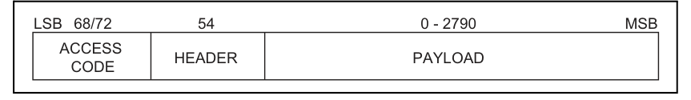

**Figure 6.1:  General Basic Rate packet format**

The access code is 72 or 68 bits and the header is 54 bits. The payload ranges from zero to a maximum of 2790 bits. Different packet types have been defined. A packet may consist of:
• the shortened access code only (see Section 6.5.1.1)
• the access code and the packet header
• the access code, the packet header and the payload.

#### 6.1.2  Enhanced Data Rate

The general format of Enhanced Data Rate packets is shown in Figure 6.2. The access code and packet header are identical in format and modulation to Basic Rate packets. Enhanced Data Rate packets have a guard time and synchronization sequence following the packet header. Following the payload are two trailer symbols. The guard time, synchronization sequence and trailer are defined in Section 6.6.

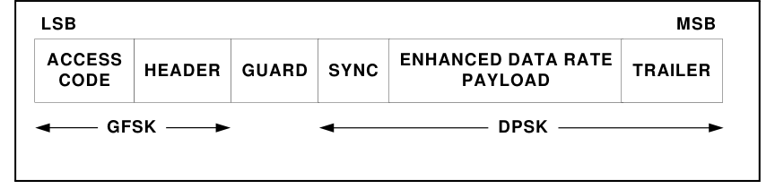

**Figure 6.2:  General enhanced data rate packet format**

### 6.2   BIT ORDERING

The bit ordering when defining packets and messages in the Baseband Specification, follows the Little Endian format. The following rules apply:
• The least significant bit (LSB) corresponds to ;
b0
• The LSB is the first bit sent over the air;
• In illustrations, the LSB is shown on the left side;
Furthermore, data fields generated internally at baseband level, such as the packet header fields and payload header length, shall be transmitted with the LSB first. For instance, a 3-bit parameter X=3 is sent as:
b0b1b2 110 =
over the air where 1 is sent first and 0 is sent last.

### 6.3   ACCESS CODE

Every packet starts with an access code. If a packet header follows, the access code is 72 bits long, otherwise the access code is 68 bits long and is known as a shortened access code. The shortened access code does not contain a trailer. This access code is used for synchronization, DC offset compensation and identification. The access code identifies all packets exchanged on a physical channel: all packets sent in the same physical channel are preceded by the same access code. In the receiver of the device, a sliding correlator correlates against the access code and triggers when a threshold is exceeded. This trigger signal is used to determine the receive timing.
The shortened access code is used in paging and inquiry. In this case, the access code itself is used as a signaling message and neither a header nor a payload is present.
The access code consists of a preamble, a sync word, and possibly a trailer, see Figure 6.3. For details see Section 6.3.1.

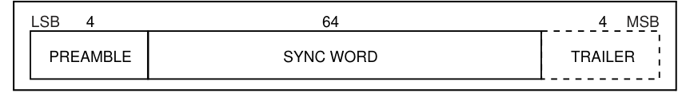

**Figure 6.3:  Access code format**

#### 6.3.1  Access Code Types

The different access code types use different Lower Address Parts (LAPs) to construct the sync word. The LAP field of the BD_ADDR is explained in Section 1.2. A summary of the different access code types is in Table 6.1.

| Code type | LAP | Code length | Comments |
| --- | --- | --- | --- |
| CAC | Master | 72 | See also Section 1.3 |
| DAC | Paged device | 68/721 |  |
| GIAC | Reserved | 68/721 |  |
| DIAC | Dedicated | 68/721 |  |

Table 6.1:  Summary of access code types
1. length 72 is only used in combination with FHS packets
The CAC consists of a preamble, sync word, and trailer and its total length is 72 bits. When used as self-contained messages without a header, the DAC and IAC do not include the trailer bits and are of length 68 bits.

#### 6.3.2  Preamble

The preamble is a fixed zero-one pattern of 4 symbols used to facilitate DC compensation. The sequence is either ‘1010’ or ‘0101’ (in transmission order), depending on whether the LSB of the following sync word is 1 or 0, respectively. The preamble is shown in Figure 6.4.

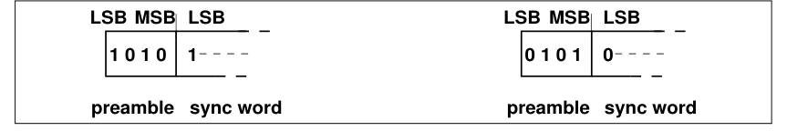

**Figure 6.4:  Preamble**

#### 6.3.3  Sync Word

The sync word is a 64-bit code word derived from a 24 bit address (LAP); for the CAC the master’s LAP is used; for the GIAC and the DIAC, reserved, dedicated LAPs are used; for the DAC, the slave LAP is used. The construction guarantees large Hamming distance between sync words based on different LAPs. In addition, the good auto correlation properties of the sync word improve timing acquisition.

##### 6.3.3.1  Synchronization Word Definition

The sync words are based on a (64,30) expurgated block code with an overlay (bit-wise XOR) of a 64 bit full length pseudo-random noise (PN) sequence. The expurgated code guarantees large Hamming distance ( ) between sync words based on different addresses. The PN sequence improves the auto correlation properties of the access code. The following steps describe how the sync word shall be generated:
dmin 14 =
1. Generate information sequence; 2. XOR this with the “information covering” part of the PN overlay sequence; 3. Generate the codeword; 4. XOR the codeword with all 64 bits of the PN overlay sequence;
The information sequence is generated by appending 6 bits to the 24 bit LAP (step 1). The appended bits are if the MSB of the LAP equals 0. If the MSB of the LAP is 1 the appended bits are . The LAP MSB together with the appended bits constitute a length-seven Barker sequence. The purpose of including a Barker sequence is to further improve the auto correlation properties. In step 2 the information is pre-scrambled by XORing it with the bits of the PN sequence (defined in Section 6.3.3.2). After generating the codeword (step 3), the complete PN sequence is XORed to the codeword (step 4). This step de-scrambles the information part of the codeword. At the same time the parity bits of the codeword are scrambled. Consequently, the original LAP and Barker sequence are ensured a role as a part of the access code sync word, and the cyclic properties of the underlying code is removed. The principle is depicted in Figure 6.5.
001101
110010
p34…p63
In the following discussion, binary sequences will be denoted by their corresponding D-transform (in which represents a delay of i time units). Let be the 63 bit PN sequence, where is the first bit (LSB) leaving the PRNG (see Figure 6.6), and, is the last bit (MSB). To obtain 64 bits, an extra zero is appended at the end of this sequence (thus, is unchanged). For notational convenience, the reciprocal of this extended polynomial, , will be used in the following discussion. This is the sequence in reverse order. We denote the 24 bit lower address part (LAP) of the Bluetooth device address by ( is the LSB of the Bluetooth device address).
Di
p' D ( ) p'0 p'1D … p'62D62 + + + = p'0 p'62
p' D ( )
p D ( ) D63p' 1 D ⁄ ( ) =
p' D ( )
a D ( ) a0 a1D … a23D23 + + + = a0

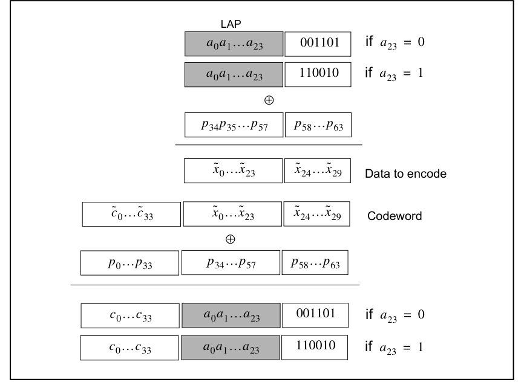

**Figure 6.5:  Construction of the sync word**

The (64,30) block code generator polynomial is denoted , where is the generator polynomial 157464165547 (octal notation) of a primitive binary (63,30) BCH code. Thus, in octal notation g(D) is
g D ( ) 1 D + ( )g' D ( ) = g' D ( )
g D ( ) 260534236651, =
(EQ 9)
the left-most bit corresponds to the high-order ( ) coefficient. The DC-free four bit sequences 0101 and 1010 can be written
g34
F1 D ( ) 1 D2, + =     
F0 D ( ) D D3, + =
(EQ 10)
respectively. Furthermore,
B1 D ( ) 1 D D4, + + =     
B0 D ( ) D2 D3 D5, + + =
(EQ 11)
which are used to create the length seven Barker sequences. Then, the access code shall be generated by the following procedure:
1. Format the 30 information bits to encode:
x D ( ) a D ( ) D24Ba23 D ( ). + =
2. Add the information covering part of the PN overlay sequence:
x˜ D ( ) x D ( ) p34 p35D … p63D29. + + + + =
3. Generate parity bits of the (64,30) expurgated block code:1
c˜ D ( ) D34x˜ D ( )  mod  g D ( ) = .
4. Create the codeword:
s˜ D ( ) D34x˜ D ( ) c˜ D ( ). + =
5. Add the PN sequence:
s D ( ) s˜ D ( ) p D ( ). + =
6. Append the (DC-free) preamble and trailer:
y D ( ) Fc0 D ( ) D4s D ( ) D68Fa23 D ( ). + + =

##### 6.3.3.2  Pseudo-Random Noise Sequence Generation

To generate the PN sequence the primitive polynomial shall be used. The LFSR and its starting state are shown in Figure 6.6. The PN sequence generated (including the extra terminating zero) becomes (hexadecimal notation) 83848D96BBCC54FC. The LFSR output starts with the left-most bit of this PN sequence. This corresponds to of the previous section. Thus, using the reciprocal as overlay gives the 64 bit sequence:
h D ( ) 1 D D3 D4 D6 + + + + =
p' D ( ) p D ( )
p 3F2A33DD69B121C1, =
(EQ 12)
where the left-most bit is (there are two initial zeros in the binary representation of the hexadecimal digit 3), and is the right-most bit.
p0 0 =
p63 1 =
p' D ( )

**Figure 6.6:  LFSR and the starting state to generate**

1. x(D) mod y(D) denotes the remainder when x(D) is divided by y(D).

#### 6.3.4  Trailer

The trailer is appended to the sync word as soon as the packet header follows the access code. This is typically the case with the CAC, but the trailer is also used in the DAC and IAC when these codes are used in FHS packets exchanged during page response and inquiry response.
The trailer is a fixed zero-one pattern of four symbols. The trailer together with the three MSBs of the syncword form a 7-bit pattern of alternating ones and zeroes which can be used for extended DC compensation. The trailer sequence is either ‘1010’ or ‘0101’(in transmission order) depending on whether the MSB of the sync word is 0 or 1, respectively. The choice of trailer is illustrated in Figure 6.7.

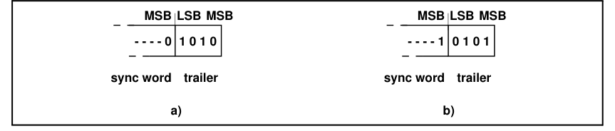

**Figure 6.7:  Trailer in CAC when MSB of sync word is 0 (a), and when MSB of sync word is 1 (b)**

### 6.4   PACKET HEADER

The header contains link control (LC) information and consists of 6 fields:
• LT_ADDR: 3-bit logical transport address • TYPE: 4-bit type code • FLOW: 1-bit flow control • ARQN: 1-bit acknowledge indication • SEQN: 1-bit sequence number • HEC: 8-bit header error check
The total header, including the HEC, consists of 18 bits, see Figure 6.8, and is encoded with a rate 1/3 FEC (not shown but described in Section 7.4) resulting in a 54-bit header. The LT_ADDR and TYPE fields shall be sent LSB first.

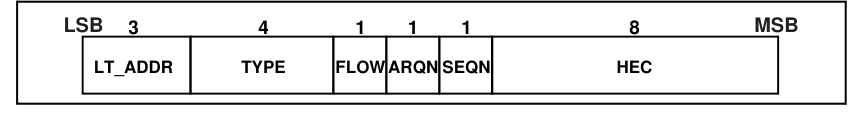

**Figure 6.8:  Header format**

#### 6.4.1  LT_ADDR

The 3-bit LT_ADDR field contains the logical transport address for the packet (see Section 4.2). This field indicates the destination slave (or slaves in the case of a broadcast) for a packet in a master-to-slave transmission slot and indicates the source slave for a slave-to-master transmission slot.

#### 6.4.2  TYPE

Sixteen different types of packets can be distinguished. The 4-bit TYPE code specifies which packet type is used. The interpretation of the TYPE code depends on the logical transport address in the packet. First, it shall be determined whether the packet is sent on a SCO logical transport, an eSCO logical transport, an ACL logical transport, or a CSB logical transport. Second, it shall be determined whether Enhanced Data Rate has been enabled for the logical transport (ACL or eSCO) indicated by LT_ADDR. It can then be determined which type of SCO packet, eSCO packet, or ACL packet has been received. The TYPE code determines how many slots the current packet will occupy (see the slot occupancy column in Table 6.2). This allows the non- addressed receivers to refrain from listening to the channel for the duration of the remaining slots. In Section 6.5, each packet type is described in more detail.

#### 6.4.3  FLOW

The FLOW bit is used for flow control of packets over the ACL logical transport. When the RX buffer for the ACL logical transport in the recipient is full, a STOP indication (FLOW=0) shall be returned to stop the other device from transmitting data temporarily. The STOP signal only affects ACL packets. Packets including only link control information (ID, POLL, and NULL packets), SCO packets or eSCO packets can still be received. When the RX buffer can accept data, a GO indication (FLOW=1) shall be returned. When no packet is received, or the received header is in error, a GO shall be assumed implicitly. In this case, the slave can receive a new packet with CRC although its RX buffer is still not emptied. The slave shall then return a NAK in response to this packet even if the packet passed the CRC check.
The FLOW bit is not used on the eSCO logical transport and shall be set to one on transmission and ignored upon receipt. The FLOW bit is reserved for future use on the CSB logical transport.

#### 6.4.4  ARQN

The 1-bit acknowledgment indication ARQN is used to inform the source of a successful transfer of payload data with CRC, and can be positive acknowledge ACK or negative acknowledge NAK. See Section 7.6 for initialization and usage of this bit.
The ARQN bit is reserved for future use on the CSB logical transport.

#### 6.4.5  SEQN

The SEQN bit provides a sequential numbering scheme to order the data packet stream. See Section 7.6.2 for initialization and usage of the SEQN bit. For active slave broadcast packets, a modified sequencing method is used, see Section 7.6.5.
The SEQN bit is reserved for future use on the CSB logical transport.

#### 6.4.6  HEC

Each header has a header-error-check to check the header integrity. The HEC is an 8-bit word (generation of the HEC is specified in Section 7.1.1). Before generating the HEC, the HEC generator is initialized with an 8-bit value. For FHS packets sent in master response substate, the slave upper address part (UAP) shall be used. For FHS packets and extended inquiry response packets sent in inquiry response, the default check initialization (DCI, see Section 1.2.1) shall be used. In all other cases, the UAP of the master device shall be used.
After the initialization, a HEC shall be calculated for the 10 header bits. Before checking the HEC, the receiver shall initialize the HEC check circuitry with the proper 8-bit UAP (or DCI). If the HEC does not check, the entire packet shall be discarded. More information can be found in Section 7.1.

### 6.5   PACKET TYPES

The packets used on the piconet are related to the logical transports on which they are used. Four logical transports with distinct packet types are defined (see Section 4):
• SCO logical transport
• eSCO logical transport
• ACL logical transport
• CSB logical transport.
To indicate the different packets on a logical transport, the 4-bit TYPE code is used. The packet types are divided into four segments. The first segment is reserved for control packets. All control packets occupy a single time slot. The second segment is reserved for packets occupying a single time slot. The third segment is reserved for packets occupying three time slots. The fourth segment is reserved for packets occupying five time slots. The slot occupancy is reflected in the segmentation and can directly be derived from the type code. Table 6.2 summarizes the packets defined for the SCO, eSCO, ACL, and CSB logical transport types; a dash means the value is reserved for future use.
All packet types with a payload shall use GFSK modulation unless specified otherwise in the following sections.
ACL logical transports Enhanced Data Rate packet types are explicitly selected via LMP using the packet_type_table (ptt) parameter. eSCO Enhanced Data Rate packet types are selected when the eSCO logical transport is established. Enhanced Data Rate packet types for the CSB logical transport are selected when the CSB logical transport is established.

| CSB logical transport (2-3 Mb/s) | NULL | — | — | DM1 | 2-DH1 | — | — | — | 3-DH1 | — | 2-DH3 | 3-DH3 | — | — | 2-DH5 |
| --- | --- | --- | --- | --- | --- | --- | --- | --- | --- | --- | --- | --- | --- | --- | --- |
| CSB logical transport (1 Mb/s) | NULL | — | — | DM1 | DH1 | — | — | — | — | — | DM3 | DH3 | — | — | DM5 |
| ACL logical transport (2-3 Mb/s) ptt=1 | NULL | POLL | FHS | DM1 | 2-DH1 | — | — | — | 3-DH1 | AUX1 | 2-DH3 | 3-DH3 | — | — | 2-DH5 |
| ACL logical transport (1 Mb/s) ptt=0 | NULL | POLL | FHS | DM1 | DH1 | — | — | — | — | AUX1 | DM3 | DH3 | — | — | DM5 |
| eSCO logical transport (2-3 Mb/s) | NULL | POLL | — | — | — | — | 2-EV3 | 3-EV3 | — | — | — | — | 2-EV5 | 3-EV5 | — |
| eSCO logical transport (1 Mb/s) | NULL | POLL | — | — | — | — | — | EV3 | — | — | — | — | EV4 | EV5 | — |
| SCO logical transport (1 Mb/s) | NULL | POLL | FHS | DM1 | — | HV1 | HV2 | HV3 | DV | — | — | — | — | — | — |
| Slot occu- pancy | 1 | 1 | 1 | 1 | 1 | 1 | 1 | 1 | 1 | 1 | 3 | 3 | 3 | 3 | 5 |
| TYPE code b b b b 3 2 1 0 | 0000 | 0001 | 0010 | 0011 | 0100 | 0101 | 0110 | 0111 | 1000 | 1001 | 1010 | 1011 | 1100 | 1101 | 1110 |
| Segment | 1 |  |  |  | 2 |  |  |  |  |  | 3 |  |  |  |  |

## 1111 5 — — — DH5 3-DH5 DH5 3-DH5

Table 6.2:  Packets defined for synchronous, asynchronous, and CSB logical transport types

#### 6.5.1  Common Packet Types

There are five common kinds of packets. In addition to the types listed in segment 1 of the previous table, the ID packet is also a common packet type but is not listed in segment 1 because it does not have a packet header.

##### 6.5.1.1  ID Packet

The identity or ID packet consists of the device access code (DAC) or inquiry access code (IAC). It has a fixed length of 68 bits. It is a very robust packet since the receiver uses a bit correlator to match the received packet to the known bit sequence of the ID packet.

##### 6.5.1.2  NULL Packet

The NULL packet has no payload and consists of the channel access code and packet header only. Its total (fixed) length is 126 bits. The NULL packet may be used to return link information to the source regarding the success of the previous transmission (ARQN), or the status of the RX buffer (FLOW). The NULL packet does not require acknowledgment.

##### 6.5.1.3  POLL Packet

The POLL packet is very similar to the NULL packet. It does not have a payload. In contrast to the NULL packet, it requires a confirmation from the recipient. It is not a part of the ARQ scheme. The POLL packet does not affect the ARQN and SEQN fields. Upon reception of a POLL packet the slave shall respond with a packet even when the slave does not have any information to send unless the slave has scatternet commitments in that timeslot. This return packet is an implicit acknowledgment of the POLL packet. This packet can be used by the master in a piconet to poll the slaves. Slaves shall not transmit the POLL packet. POLL packets shall not be sent on a Connectionless Slave Broadcast logical transport.

##### 6.5.1.4  FHS Packet

The FHS packet is a special control packet containing, among other things, the Bluetooth device address and the clock of the sender. The payload contains 144 information bits plus a 16-bit CRC code. The payload is coded with a rate 2/3 FEC with a gross payload length of 240 bits.
Figure 6.9 illustrates the format and contents of the FHS payload. The FHS packet is used in page master response, inquiry response and in role switch.
The FHS packet is not encrypted. No payload header or MIC is present.
The FHS packet contains real-time clock information. This clock information shall be updated before each retransmission. The retransmission of the FHS payload is different than retransmissions of ordinary data payloads where the same payload is used for each retransmission. The FHS packet is used for frequency hop synchronization before the piconet channel has been established, or when an existing piconet changes to a new piconet. However,
the FHS packet is not used by Connectionless Slave Broadcast slaves for frequency hop synchronization with Connectionless Slave Broadcast masters.

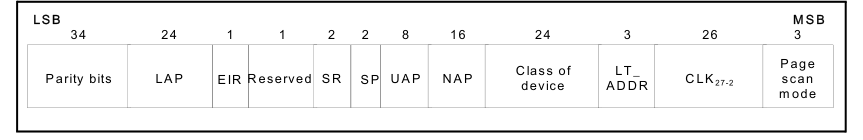

**Figure 6.9:  Format of the FHS payload**

Each field is described in more detail below:

| Parity bits | This 34-bit field contains the parity bits that form the first part of the sync word of the access code of the device that sends the FHS packet. These bits are derived from the LAP as described in Section 1.2. |
| --- | --- |
| LAP | This 24-bit field shall contain the lower address part of the device that send the FHS packet. |
| EIR | This bit shall indicate that an extended inquiry response packet may follow See Section 8.4.3. |
| Reserved | This 1-bit field is reserved for future use. |
| SR | This 2-bit field is the scan repetition field and indicates the interval between two consecutive page scan windows, see also Table 6.4 and Table 8.1 |
| SP | This 2-bit field shall be set to 10b. |
| UAP | This 8-bit field shall contain the upper address part of the device that send the FHS packet. |
| NAP | This 16-bit field shall contain the non-significant address part of the device that sends the FHS packet (see also Section 1.2 for LAP, UAP, and NAP). |
| Class of device | This 24-bit field shall contain the class of device of the device that sends th FHS packet. The field is defined in Bluetooth Assigned Numbers. |
| LT ADDR _ | This 3-bit field shall contain the logical transport address the recipient shal use if the FHS packet is used at connection setup or role switch. A slave responding to a master or a device responding to an inquiry request mes- sage shall include an all-zero LT ADDR field if it sends the FHS packet. _ |
| CLK 27-2 | This 26-bit field shall contain the value of the native clock of the device tha sends the FHS packet, sampled at the beginning of the transmission of the access code of this FHS packet. This clock value has a resolution of 1.25ms (two-slot interval). For each new transmission, this field is updated so that it accurately reflects the real-time clock value. |
| Page scan mode | This 3-bit field shall indicate which scan mode is used by default by the sender of the FHS packet. The interpretation of the page scan mode is illus trated in Table 6.5. |

Table 6.3:  Description of the FHS payload
The device sending the FHS shall set the SR bits according to Table 6.4.

| SR bit format b b 1 0 | SR mode |
| --- | --- |
| 00 | R0 |
| 01 | R1 |
| 10 | R2 |
| 11 | Reserved for future use |

Table 6.4:  Contents of SR field
The device sending the FHS shall set the page scan mode bits according to Table 6.5.

| Bit format b b b 2 1 0 | Page scan mode |
| --- | --- |
| 000 | Mandatory scan mode |
| 001 | Reserved for future use |
| 010 | Reserved for future use |
| 011 | Reserved for future use |
| 100 | Reserved for future use |
| 101 | Reserved for future use |
| 110 | Reserved for future use |
| 111 | Reserved for future use |

Table 6.5:  Contents of page scan mode field
The LAP, UAP, and NAP together form the 48-bit Bluetooth Device Address of the device that sends the FHS packet. Using the parity bits and the LAP, the recipient can directly construct the channel access code of the sender of the FHS packet.
When initializing the HEC and CRC for the FHS packet of inquiry response, the UAP shall be the DCI.

##### 6.5.1.5  DM1 Packet

DM1 is part of segment 1 in order to support control messages in any logical transport that allows the DM1 packet (see Table 6.2). However, it may also carry regular user data. Since the DM1 packet can be regarded as an ACL packet, it will be discussed in Section 6.5.4.

#### 6.5.2  SCO Packets

HV and DV packets are used on the synchronous SCO logical transport. The HV packets do not include a MIC or CRC and shall not be retransmitted. DV packets include a CRC on the data section, but not on the synchronous data section. DV packets do not include a MIC. The data section of DV packets shall be retransmitted. SCO packets may be routed to the synchronous I/O port. Four packets are allowed on the SCO logical transport: HV1, HV2, HV3 and DV. These packets are typically used for 64kb/s speech transmission but may be used for transparent synchronous data.
SCO packets shall only be encrypted with E0 when E0 is enabled. SCO packets shall not be sent when AES-CCM Encryption is enabled.

##### 6.5.2.1  HV1 Packet

The HV1 packet has 10 information bytes. The bytes are protected with a rate 1/3 FEC. No MIC is present. No CRC is present. The payload length is fixed at 240 bits. There is no payload header present.

##### 6.5.2.2  HV2 Packet

The HV2 packet has 20 information bytes. The bytes are protected with a rate 2/3 FEC. No MIC is present. No CRC is present. The payload length is fixed at 240 bits. There is no payload header present.

##### 6.5.2.3  HV3 Packet

The HV3 packet has 30 information bytes. The bytes are not protected by FEC. No MIC is present. No CRC is present. The payload length is fixed at 240 bits. There is no payload header present.

##### 6.5.2.4  DV Packet

The DV packet is a combined data - voice packet. The DV packet shall only be used in place of an HV1 packet. The payload is divided into a voice field of 80 bits and a data field containing up to 150 bits, see Figure 6.10. The voice field is not protected by FEC. The data field has between 1 and 10 information bytes (including the 1-byte payload header) plus a 16-bit CRC code. No MIC is present. The data field (including the CRC) is encoded with a rate 2/3 FEC. Since the DV packet has to be sent at regular intervals due to its synchronous contents, it is listed under the SCO packet types. The voice and data fields shall be treated separately. The voice field shall be handled in the same way as normal SCO data and shall never be retransmitted; that is, the voice field is always new. The data field is checked for errors and shall be retransmitted if necessary. When the asynchronous data field in the DV packet has not be acknowledged before the SCO logical transport is terminated, the asynchronous data field shall be retransmitted in a DM1 packet.

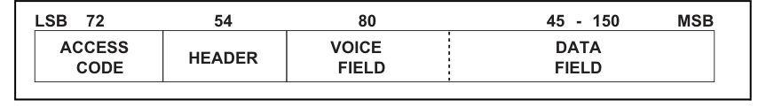

**Figure 6.10:  DV packet format**

#### 6.5.3  eSCO Packets

EV packets are used on the synchronous eSCO logical transport. The packets include a CRC and retransmission may be applied if no acknowledgment of proper reception is received within the retransmission window. No MIC is present. eSCO packets may be routed to the synchronous I/O port. Three eSCO packet types (EV3, EV4, EV5) are defined for Basic Rate operation and four additional eSCO packet types (2-EV3, 3-EV3, 2-EV5, 3-EV5) for Enhanced Data Rate operation. The eSCO packets may be used for 64kb/s speech transmission as well as transparent data at 64kb/s and other rates.

##### 6.5.3.1  EV3 Packet

The EV3 packet has between 1 and 30 information bytes plus a 16-bit CRC code. No MIC is present. The bytes are not protected by FEC. The EV3 packet may cover up to a single time slot. There is no payload header present. The payload length is set during the LMP eSCO setup and remains fixed until the link is removed or re-negotiated.

##### 6.5.3.2  EV4 Packet

The EV4 packet has between 1 and 120 information bytes plus a 16-bit CRC code. No MIC is present. The EV4 packet may cover to up three time slots. The information plus CRC bits are coded with a rate 2/3 FEC. There is no payload header present. The payload length is set during the LMP eSCO setup and remains fixed until the link is removed or re-negotiated.

##### 6.5.3.3  EV5 Packet

The EV5 packet has between 1 and 180 information bytes plus a 16-bit CRC code. No MIC is present. The bytes are not protected by FEC. The EV5 packet may cover up to three time slots. There is no payload header present. The payload length is set during the LMP eSCO setup and remains fixed until the link is removed or re-negotiated.

##### 6.5.3.4  2-EV3 Packet

The 2-EV3 packet is similar to the EV3 packet except that the payload is modulated using π/4-DQPSK. It has between 1 and 60 information bytes plus a 16-bit CRC code. No MIC is present. The bytes are not protected by FEC. The 2-EV3 packet covers a single time slot. There is no payload header present.
The payload length is set during the LMP eSCO setup and remains fixed until the link is removed or re-negotiated.

##### 6.5.3.5  2-EV5 Packet

The 2-EV5 packet is similar to the EV5 packet except that the payload is modulated using π/4-DQPSK. It has between 1 and 360 information bytes plus a 16-bit CRC code. No MIC is present. The bytes are not protected by FEC. The 2-EV5 packet may cover up to three time slots. There is no payload header present. The payload length is set during the LMP eSCO setup and remains fixed until the link is removed or re-negotiated.

##### 6.5.3.6  3-EV3 Packet

The 3-EV3 packet is similar to the EV3 packet except that the payload is modulated using 8DPSK. It has between 1 and 90 information bytes plus a 16- bit CRC code. No MIC is present. The bytes are not protected by FEC. The 3- EV3 packet covers a single time slot. There is no payload header present. The payload length is set during the LMP eSCO setup and remains fixed until the link is removed or re-negotiated.

##### 6.5.3.7  3-EV5 Packet

The 3-EV5 packet is similar to the EV5 packet except that the payload is modulated using 8DPSK. It has between 1 and 540 information bytes plus a 16-bit CRC code. No MIC is present. The bytes are not protected by FEC. The 3-EV5 packet may cover up to three time slots. There is no payload header present. The payload length is set during the LMP eSCO setup and remains fixed until the link is removed or re-negotiated.

#### 6.5.4  ACL Packets

ACL packets are used on the asynchronous logical transport and the CSB logical transport. The information carried may be user data for either logical transport or control data for the asynchronous logical transport.
Seven packet types are defined for Basic Rate operation: DM1, DH1, DM3, DH3, DM5, DH5 and AUX1. Six additional packets are defined for Enhanced Data Rate operation: 2-DH1, 3-DH1, 2-DH3, 3-DH3, 2-DH5 and 3-DH5.
The length indicator in the payload header specifies the number of user bytes (excluding payload header, MIC and the CRC code).

##### 6.5.4.1  DM1 Packet

The DM1 packet carries data information only. The payload has between 1 and 18 information bytes (including the 1-byte payload header) plus a 16-bit CRC code. A 32-bit MIC is present only when encryption with AES-CCM is enabled.
The DM1 packet occupies a single time slot. The information bits, MIC bits (when present), plus CRC bits are coded with a rate 2/3 FEC. The payload header in the DM1 packet is 1 byte long, see Figure 6.12.

##### 6.5.4.2  DH1 Packet

This packet is similar to the DM1 packet, except that the information in the payload is not FEC encoded. As a result, the DH1 packet has between 1 and 28 information bytes (including the 1-byte payload header) plus a 16-bit CRC code. A 32-bit MIC is present only when encryption with AES-CCM is enabled. The DH1 packet occupies a single time slot.

##### 6.5.4.3  DM3 Packet

The DM3 packet may occupy up to three time slots. The payload has between 2 and 123 information bytes (including the 2-byte payload header) plus a 16-bit CRC code. A 32-bit MIC is present only when encryption with AES-CCM is enabled. The information bits, MIC bits (when present), plus CRC bits are coded with a rate 2/3 FEC. The payload header in the DM3 packet is 2 bytes long, see Figure 6.13.

##### 6.5.4.4  DH3 Packet

This packet is similar to the DM3 packet, except that the information in the payload is not FEC encoded. As a result, the DH3 packet has between 2 and 185 information bytes (including the 2-byte payload header) plus a 16-bit CRC code. A 32-bit MIC is present only when encryption with AES-CCM is enabled. The DH3 packet may occupy up to three time slots.

##### 6.5.4.5  DM5 Packet

The DM5 packet may occupy up to five time slots. The payload has between 2 and 226 information bytes (including the 2-byte payload header) plus a 16-bit CRC code. A 32-bit MIC is present only when encryption with AES-CCM is enabled. The payload header in the DM5 packet is 2 bytes long. The information bits, MIC bits (when present), plus CRC bits are coded with a rate 2/3 FEC.

##### 6.5.4.6  DH5 Packet

This packet is similar to the DM5 packet, except that the information in the payload is not FEC encoded. As a result, the DH5 packet has between 2 and 341 information bytes (including the 2-byte payload header) plus a 16-bit CRC code. A 32-bit MIC is present only when encryption with AES-CCM is enabled. The DH5 packet may occupy up to five time slots.

##### 6.5.4.7  AUX1 Packet

This packet resembles a DH1 packet but has no MIC or CRC code. The AUX1 packet has between 1 and 30 information bytes (including the 1-byte payload header). The AUX1 packet occupies a single time slot. The AUX1 packet shall not be used for the ACL-U, ACL-C, ASB-C, or PBD logical links. An AUX1 packet may be discarded. The AUX1 packet shall only be encrypted when E0 encryption is enabled. The AUX1 packet shall not be used when AES-CCM encryption is enabled.

##### 6.5.4.8  2-DH1 Packet

This packet is similar to the DH1 packet except that the payload is modulated using π/4-DQPSK. The 2-DH1 packet has between 2 and 56 information bytes (including the 2-byte payload header) plus a 16-bit CRC code. A 32-bit MIC is present only when encryption with AES-CCM is enabled.The 2-DH1 packet occupies a single time slot.

##### 6.5.4.9  2-DH3 Packet

This packet is similar to the DH3 packet except that the payload is modulated using π/4-DQPSK. The 2-DH3 packet has between 2 and 369 information bytes (including the 2-byte payload header) plus a 16-bit CRC code. A 32-bit MIC is present only when encryption with AES-CCM is enabled. The 2-DH3 packet may occupy up to three time slots.

##### 6.5.4.10  2-DH5 Packet

This packet is similar to the DH5 packet except that the payload is modulated using π/4-DQPSK. The 2-DH5 packet has between 2 and 681 information bytes (including the 2-byte payload header) plus a 16-bit CRC code. A 32-bit MIC is present only when encryption with AES-CCM is enabled. The 2-DH5 packet may occupy up to five time slots.

##### 6.5.4.11  3-DH1 Packet

This packet is similar to the DH1 packet except that the payload is modulated using 8DPSK. The 3-DH1 packet has between 2 and 85 information bytes (including the 2-byte payload header) plus a 16-bit CRC code. A 32-bit MIC is present only when encryption with AES-CCM is enabled. The 3-DH1 packet occupies a single time slot.

##### 6.5.4.12  3-DH3 Packet

This packet is similar to the DH3 packet except that the payload is modulated using 8DPSK. The 3-DH3 packet has between 2 and 554 information bytes (including the 2-byte payload header) plus a 16-bit CRC code. A 32-bit MIC is
present only when encryption with AES-CCM is enabled. The 3-DH3 packet may occupy up to three time slots.

##### 6.5.4.13  3-DH5 Packet

This packet is similar to the DH5 packet except that the payload is modulated using 8DPSK. The 3-DH5 packet has between 2 and 1023 information bytes (including the 2-byte payload header) plus a 16-bit CRC code. A 32-bit MIC is present only when encryption with AES-CCM is enabled. The 3-DH5 packet may occupy up to five time slots.

### 6.6   PAYLOAD FORMAT

In the payload, two fields are distinguished: the synchronous data field and the asynchronous data field. The ACL packets only have the asynchronous data field and the SCO and eSCO packets only have the synchronous data field − with the exception of the DV packets which have both.

#### 6.6.1  Synchronous Data Field

In SCO, which is only supported in Basic Rate mode, the synchronous data field has a fixed length and consists only of the synchronous data body portion. No payload header is present.
In Basic Rate eSCO, the synchronous data field consists of two segments: a synchronous data body and a CRC code. No payload header is present.
In Enhanced Data Rate eSCO, the synchronous data field consists of five segments: a guard time, a synchronization sequence, a synchronous data body, a CRC code and a trailer. No payload header is present.
1. Enhanced Data Rate Guard Time For Enhanced Data Rate packets the guard time is defined as the period starting at the end of the last GFSK symbol of the header and ending at the start of the reference symbol of the synchronization sequence. The length of the guard time shall be between 4.75 µs and 5.25 µs.
2. Enhanced Data Rate Synchronization Sequence For Enhanced Data Rate packets the symbol timing at the start of the synchronization sequence shall be within ±¼ µs of the symbol timing of the last GFSK symbol of the packet header. The length of the synchronization sequence is 11 µs (11 DPSK symbols) and consists of a reference symbol (with arbitrary phase) followed by ten DPSK symbols. The phase changes between the DPSK symbols (shown in Definition: Synchronization sequence ) shall be
{ϕ1, ϕ2, ϕ3, ϕ4, ϕ5, ϕ6, ϕ7, ϕ8, ϕ9, ϕ10} = {3π/4, -3π/4, 3π/4, -3π/4, 3π/4, -3π/4, -3π/4, 3π/4, 3π/4, 3π/4} (EQ 13)

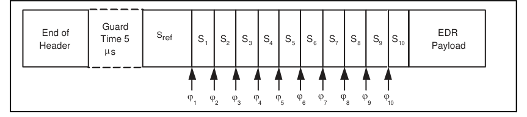

**Figure 6.11:  Synchronization sequence**

Sref is the reference symbol. ϕ1 is the phase change between the reference symbol and the first DPSK symbol S1. ϕk is the phase change between the
k-1th symbol Sk-1 and the kth symbol Sk Note: The synchronization sequence may be generated using the modulator by pre-pending the data with bits that generate the synchronization sequence. For π/4-DQPSK, the bit sequence used to generate the synchronization sequence is 0,1,1,1,0,1,1,1,0,1,1,1,1,1,0,1,0,1,0,1. For 8DPSK, the bit sequence used to generate the synchronization sequence is 0,1,0,1,1,1,0,1,0,1,1,1,0,1,0,1,1,1,1,1,1,0,1,0,0,1,0,0,1,0.
3. Synchronous data body For HV and DV packets, the synchronous data body length is fixed. For EV packets, the synchronous data body length is negotiated during the LMP eSCO setup. Once negotiated, the synchronous data body length remains constant unless re-negotiated. The synchronous data body length may be different for each direction of the eSCO logical transport.
4. CRC code
The 16-bit CRC in the payload is generated as specified in Section 7.1. The 8- bit UAP of the master is used to initialize the CRC generator. Only the Synchronous data body segment is used to generate the CRC code.
5. Enhanced Data Rate Trailer For Enhanced Data Rate packets, two trailer symbols shall be added to the end of the payload. The trailer bits shall be all zero, i.e. {00, 00} for the π/4- DQPSK and {000, 000} for the 8DPSK.

#### 6.6.2  Asynchronous Data Field

Basic rate ACL packets have an asynchronous data field consisting of two, three or four segments: a payload header, a payload body, possibly a MIC, and possibly a CRC code.
Enhanced Data Rate ACL packets have an asynchronous data field consisting of six or seven segments: a guard time, a synchronization sequence, a payload header, a payload body, possibly a MIC, a CRC and a trailer.
1. Enhanced Data Rate Guard time This is the same as defined for the Synchronous data field in Section 6.6.1.
2. Enhanced Data Rate Synchronization sequence This is the same as defined for the Synchronous data field in Section 6.6.1.
3. Payload header The payload header is one or two bytes long. Basic rate packets in segments one and two have a 1-byte payload header; Basic Rate packets in segments three and four and all Enhanced Data Rate packets have a 2-byte payload header. The payload header specifies the logical link (2-bit LLID indication), controls the flow on the logical channels (1-bit FLOW indication), and has a payload length indicator (5 bits and 10 bits for 1-byte and 2-byte payload headers, respectively). In the case of a 2-byte payload header, the length indicator is extended by five bits into the next byte. The remaining three bits of the second byte are reserved for future use. The formats of the 1-byte and 2-byte payload headers are shown in Figure 6.12 and Figure 6.13.

**Figure 6.12:  Payload header format for Basic Rate single-slot ACL packets**

**Figure 6.13:  Payload header format for multi-slot ACL packets and all EDR ACL packets**

The LLID field shall be transmitted first, the length field last. In Table 6.6, more details about the contents of the LLID field are listed.

| LLID code b b 1 0 | Logical Link | Information |
| --- | --- | --- |
| 00 | N/A | Reserved for future use |
| 01 | ACL-U and ASB-U | Continuation fragment of an L2CAP message |

Table 6.6:  Logical link LLID field contents

| LLID code b b 1 0 | Logical Link | Information |
| --- | --- | --- |
| 10 | ACL-U and ASB-U | Start of an L2CAP message or no fragmentation |
|  | PBD | Profile broadcast data, no fragmentation |
| 11 | ACL-C and ASB-C | LMP message |

Table 6.6:  Logical link LLID field contents
An L2CAP message may be fragmented into several packets. Code 10b shall be used for an ACL-U or ASB-U packet carrying the first fragment of such a message; code 01b shall be used for continuing fragments. The first fragment of an L2CAP message sent over HCI is identified by having a Packet_Boundary_Flag value of 00b or 10b both of which are mapped to LLID code 10b. If there is no fragmentation, code 10b shall be used for every packet. ACL packets used over the PBD logical link do not use fragmentation. For ACL packets used over the PBD logical link, LLID code 10b shall be used by the transmitter. Any ACL packet used over the PBD logical link with LLID not equal to 10b shall be ignored by the receiver. Code 11b shall be used for LMP messages. Code 00b is reserved for future use. The flow indicator in the payload is used to control the flow at the L2CAP level. It is used to control the flow per logical link. FLOW=1 means flow-on (GO) and FLOW=0 means flow-off (STOP). After a new connection has been established the flow indicator shall be set to GO. When a device receives a payload header with the flow bit set to STOP, it shall stop the transmission of ACL-U packets before an additional amount of payload data is sent. This amount is defined as the flow control lag, expressed as a number of bytes. The shorter the flow control lag, the less buffering the other device must dedicate to this function. The flow control lag shall not exceed 1792 bytes (7 × 256 bytes). In order to allow devices to optimize the selection of packet length and buffer space, the flow control lag of a given implementation shall be provided in the LMP_features_res message. If a packet containing the payload flow bit of STOP is received, with a valid packet header but bad payload, the payload flow control bit shall be ignored. The baseband ACK contained in the packet header will be received and a further ACL packet may be transmitted. Each occurrence of this situation allows a further ACL packet to be sent in spite of the flow control request being sent via the payload header flow control bit. It is recommended that devices that use the payload header flow bit should ensure that no further ACL packets are sent until the payload flow bit has been correctly received. This can be accomplished by simultaneously turning on the flow bit in the packet header and keeping it on until an ACK is received back (ARQN=1). This will typically be only one round trip time. Since they lack a payload CRC, AUX1 packets should not be used with a payload flow bit of STOP. The Baseband Resource Manager is responsible for setting and processing the flow bit in the payload header. Real-time flow control shall be carried out at the packet level by the Link Controller via the flow bit in the packet header
(see Section 6.4.3). With the payload flow bit, traffic from the remote end can be controlled. It is allowed to generate and send an ACL packet with payload length zero irrespective of flow status. L2CAP start-fragment and continue-fragment indications (LLID=10 and LLID=01) also retain their meaning when the payload length is equal to zero (i.e. an empty start- fragment shall not be sent in the middle of an on-going ACL-U or ASB-U packet transmission). It is always safe to send an ACL packet with length=0 and LLID=01. The payload flow bit has its own meaning for each logical link, see Table 6.7. On the ACL-C, ASB-C, and ASB-U logical links, no flow control is applied and the payload FLOW bit shall always be set to one. On the PBD logical link, no flow control is applied and the payload FLOW bit shall always be set to zero.

| LLID code b b 1 0 | Logical Link | Usage and semantics of the ACL payload header FLOW bit |
| --- | --- | --- |
| 00 | N/A | Reserved for future use. |
| 01 | ACL-U | Flow control of the ACL-U channel (L2CAP messages). |
|  | ASB-U | Always set FLOW=1 on transmission and ignore the bit on reception. |
|  | PBD | Reserved for future use. |
| 10 | ACL-U | Flow control of the ACL-U channel (L2CAP messages). |
|  | ASB-U | Always set FLOW=1 on transmission and ignore the bit on reception. |
|  | PBD | Always set FLOW=0 on transmission and ignore the bit on reception. |
| 11 | ACL-C and ASB-C | Always set FLOW=1 on transmission and ignore the bit on reception. |

Table 6.7:  Use of payload header flow bit on the logical links
The length indicator shall be set to the number of bytes (i.e. 8-bit words) in the payload excluding the payload header, MIC, and the CRC code; i.e. the payload body only. With reference to Figure 6.12 and Figure 6.13, the MSB of the length field in a 1-byte header is the last (right-most) bit in the payload header; the MSB of the length field in a 2-byte header is the fourth bit to the left from the right-most end of the second byte in the payload header.
4. Payload body The payload body includes the user information and determines the effective user throughput. The length of the payload body is indicated in the length field of the payload header.
5. Message Integrity Check The 32-bit Message Integrity Check (MIC) in the payload is generated as specified in [Vol 2] Part H, Section 9.2.
6. CRC code generation The 16-bit cyclic redundancy check code in the payload is generated as specified in Section 7.1. Before determining the CRC code, an 8-bit value is used to initialize the CRC generator. For the CRC code in the FHS packets sent in master response substate, the UAP of the slave is used. For the FHS packet and the extended inquiry response packet sent in inquiry response substate, the DCI (see Section 1.2.1) is used. For all other packets, the UAP of the master is used. Only the Payload header, Payload body, and MIC segments (if present) are used to generate the CRC code.
7. Enhanced Data Rate Trailer This is the same as defined for the Synchronous data field in Section 6.6.1.

### 6.7   PACKET SUMMARY

A summary of the packets and their characteristics is shown in Table 6.8, Table 6.9 and Table 6.10. The payload represents the packet payload excluding FEC, CRC, and payload header.

| Type | Payload (bytes) | FEC | MIC | CRC | Symmetric Max. Rate | Asymmetric Max. Rate |
| --- | --- | --- | --- | --- | --- | --- |
| ID | N/A | N/A | N/A | N/A | N/A | N/A |
| NULL | N/A | N/A | N/A | N/A | N/A | N/A |
| POLL | N/A | N/A | N/A | N/A | N/A | N/A |
| FHS | 18 | 2/3 | N/A | Yes | N/A | N/A |

Table 6.8:  Link control packets

| Type | Payload Header (bytes) | User Payload (bytes) | FEC | MIC | CRC | Symmetric Max. Rate (kb/s) | Asymmetric Max. Rate (kb/s) |  |
| --- | --- | --- | --- | --- | --- | --- | --- | --- |
|  |  |  |  |  |  |  | Forward | Reverse |
| DM1 | 1 | 0-17 | 2/3 | C.1 | Yes | 108.8 | 108.8 | 108.8 |
| DH1 | 1 | 0-27 | No | C.1 | Yes | 172.8 | 172.8 | 172.8 |
| DM3 | 2 | 0-121 | 2/3 | C.1 | Yes | 258.1 | 387.2 | 54.4 |
| DH3 | 2 | 0-183 | No | C.1 | Yes | 390.4 | 585.6 | 86.4 |
| DM5 | 2 | 0-224 | 2/3 | C.1 | Yes | 286.7 | 477.8 | 36.3 |
| DH5 | 2 | 0-339 | No | C.1 | Yes | 433.9 | 723.2 | 57.6 |
| AUX1 | 1 | 0-29 | No | No | No | 185.6 | 185.6 | 185.6 |
| 2-DH1 | 2 | 0-54 | No | C.1 | Yes | 345.6 | 345.6 | 345.6 |
| 2-DH3 | 2 | 0-367 | No | C.1 | Yes | 782.9 | 1174.4 | 172.8 |

Table 6.9:  ACL packets

| Type | Payload Header (bytes) | User Payload (bytes) | FEC | MIC | CRC | Symmetric Max. Rate (kb/s) | Asymmetric Max. Rate (kb/s) |  |
| --- | --- | --- | --- | --- | --- | --- | --- | --- |
|  |  |  |  |  |  |  | Forward | Revers |
| 2-DH5 | 2 | 0-679 | No | C.1 | Yes | 869.1 | 1448.5 | 115.2 |
| 3-DH1 | 2 | 0-83 | No | C.1 | Yes | 531.2 | 531.2 | 531.2 |
| 3-DH3 | 2 | 0-552 | No | C.1 | Yes | 1177.6 | 1766.4 | 235.6 |
| 3-DH5 | 2 | 0-1021 | No | C.1 | Yes | 1306.9 | 2178.1 | 177.1 |

C.1: Mandatory when encryption with AES-CCM enabled, else excluded.
Table 6.9:  ACL packets

| Type | Payload Header (bytes) | User Payload (bytes) | FEC | MIC | CRC | Symmetric Max. Rate (kb/s) |
| --- | --- | --- | --- | --- | --- | --- |
| HV1 | N/A | 10 | 1/3 | No | No | 64.0 |
| HV2 | N/A | 20 | 2/3 | No | No | 64.0 |
| HV3 | N/A | 30 | no | No | No | 64.0 |
| DV1 | 1 D | 10+(0-9) D | 2/3 D | No | Yes D | 64.0+57.6 D |
| EV3 | N/A | 1-30 | No | No | Yes | 96 |
| EV4 | N/A | 1-120 | 2/3 | No | Yes | 192 |
| EV5 | N/A | 1-180 | No | No | Yes | 288 |
| 2-EV3 | N/A | 1-60 | No | No | Yes | 192 |
| 2-EV5 | N/A | 1-360 | No | No | Yes | 576 |
| 3-EV3 | N/A | 1-90 | No | No | Yes | 288 |
| 3-EV5 | N/A | 1-540 | No | No | Yes | 864 |

Table 6.10:  Synchronous packets
1. Items followed by ‘D’ relate to data field only.

## 7  BIT STREAM PROCESSING

Bluetooth devices shall use the bit stream processing schemes as defined in the following sections.
Before the payload is sent over the air interface, several bit manipulations are performed in the transmitter to increase reliability and security. An HEC is added to the packet header, the header bits are scrambled with a whitening word, and FEC coding is applied. In the receiver, the inverse processes are carried out. Figure 7.1 shows the processes carried out for the packet header both at the transmit and the receive side. All header bit processes are mandatory except that whitening and de-whitening shall not be performed on synchronization train packets. In Figure 7.1 processes not performed on all packet types are indicated by dashed blocks.

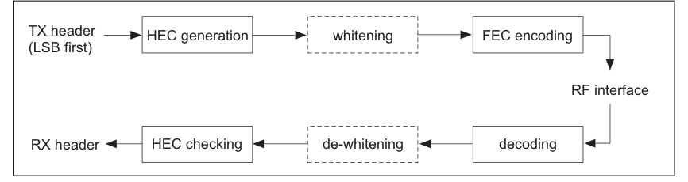

**Figure 7.1:  Header bit processes**

Figure 7.2 shows the processes that may be carried out on the payload. In addition to the processes defined for the packet header, encryption can be applied on the payload. Whitening and de-whitening, as explained in Section 7.2, are mandatory for every payload except synchronization train payloads, where they are forbidden.All other processes are optional and depend on the packet type (see Section 6.6) and whether encryption is enabled. In Figure 7.2, optional processes are indicated by dashed blocks. When E0 encryption is used, the entire payload shall be encrypted. When AES-CCM encryption is used, only the payload body and MIC shall be encrypted; the payload header and CRC shall not be encrypted.

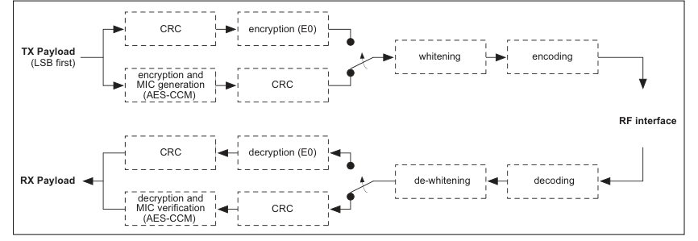

**Figure 7.2:  Payload bit processes**

### 7.1   ERROR CHECKING

The packet can be checked for errors or wrong delivery using the channel access code, the HEC in the header, and the CRC in the payload. At packet reception, the access code is checked first. Since the 64-bit sync word in the channel access code is derived from the 24-bit master LAP, this checks if the LAP is correct, and prevents the receiver from accepting a packet of another piconet (provided the LAP field of the master's BD_ADDR is different).
The HEC and CRC computations are initialized as follows:
• In the Inquiry Response substate, the DCI value shall be used for the FHS and Extended Inquiry Response Packet.
• In the Master Page Response substate, the UAP of the slave shall be used in the FHS packet.
• In the Connection State, the UAP of the master shall be used. Even though the access code may be the same for two piconets the different UAP values will typically cause the HEC and CRC to fail.
• During Role Switch starting from the TDD switch, the UAP of the new slave shall be used for the FHS packet.
The generation and check of the HEC and CRC are summarized in Figure 7.5 and Figure 7.8. Before calculating the HEC or CRC, the shift registers in the HEC/CRC generators shall be initialized with the 8-bit UAP (or DCI) value. Then the header and payload information shall be shifted into the HEC and CRC generators, respectively (with the LSB first).
A packet has a valid header if the access code is correct for the piconet and the HEC has the correct value, irrespective of the values of the other header fields.

#### 7.1.1  HEC Generation

The HEC generating LFSR is depicted in Figure 7.3. The generator polynomial is . Initially this circuit shall be pre-loaded with the 8-bit UAP such that the LSB of the UAP (denoted UAP0) goes to the left-most shift register element, and, UAP7 goes to the right-most element. The initial state of the HEC LFSR is depicted in Figure 7.4. Then the data shall be shifted in with the switch S set in position 1. When the last data bit has been clocked into the LFSR, the switch S shall be set in position 2, and, the HEC can be read out from the register. The LFSR bits shall be read out from right to left (i.e., the bit in position 7 is the first to be transmitted, followed by the bit in position 6, etc.).
g D ( ) D 1 + ( ) D7 D4 D3 D2 1 + + + + ( ) D8 D7 D5 D2 D 1 + + + + + = =

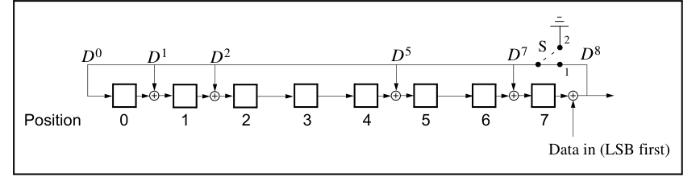

**Figure 7.3:  The LFSR circuit generating the HEC**

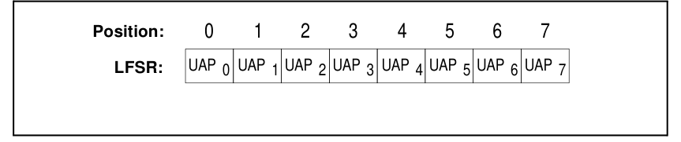

**Figure 7.4:  Initial state of the HEC generating circuit**

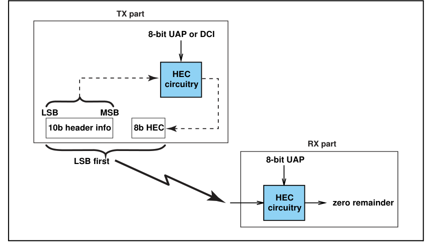

**Figure 7.5:  HEC generation and checking**

#### 7.1.2  CRC Generation

The 16 bit LFSR for the CRC is constructed similarly to the HEC using the CRC- CCITT generator polynomial (i.e. 210041 in octal representation) (see Figure 7.6). For this case, the 8 left-most bits shall be initially loaded with the 8-bit UAP (UAP0 to the left and UAP7 to the right) while the 8 right-most bits shall be reset to zero. The initial state of the 16 bit LFSR is specified in Figure 7.7. The switch S shall be set in position 1 while the data is
g D ( ) D16 D12 D5 1 + + + =
shifted in. After the last bit has entered the LFSR, the switch shall be set in position 2, and, the register’s contents shall be transmitted, from right to left (i.e., starting with position 15, then position 14, etc.).

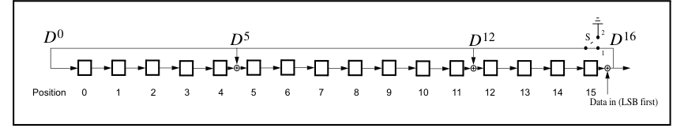

**Figure 7.6:  The LFSR circuit generating the CRC**

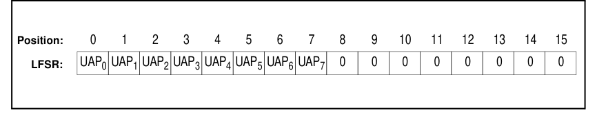

**Figure 7.7:  Initial state of the CRC generating circuit**

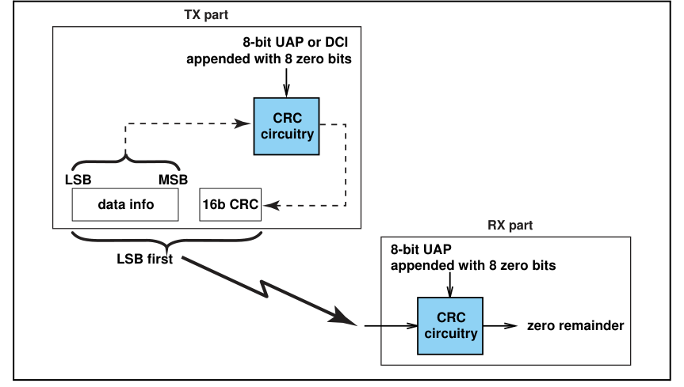

**Figure 7.8:  CRC generation and checking**

### 7.2   DATA WHITENING

Synchronization train packets shall not be scrambled with a data whitening word. Before transmission of all other packets, both the header and the payload shall be scrambled with a data whitening word in order to randomize the data from highly redundant patterns and to minimize DC bias in the packet. The scrambling shall be performed prior to the FEC encoding.
At the receiver, the received data of scrambled packets shall be descrambled using the same whitening word generated in the recipient. The descrambling shall be performed after FEC decoding.
The whitening word is generated with the polynomial (i.e., 221 in octal representation) and shall be subsequently XORed with the header and the payload. The whitening word is generated with the linear feedback shift register shown in Figure 7.9. Before each transmission, the shift register shall be initialized with a portion of the master Bluetooth clock, CLK6-1, extended with an MSB of value one. This initialization shall be carried out with CLK1 written to position 0, CLK2 written to position 1, etc. Exceptions are the FHS packet sent during inquiry response or page response, and the extended inquiry response packet sent during inquiry response, where initialization of the whitening register shall be carried out differently. Instead of the master clock, the X-input used in the inquiry or page response (depending on current state) routine shall be used, see Table 2.2. The 5-bit value shall be extended with two MSBs of value 1. During register initialization, the LSB of X (i.e., X0) shall be written to position 0, X1 shall be written to position 1, etc.
g D ( ) D7 D4 1 + + =

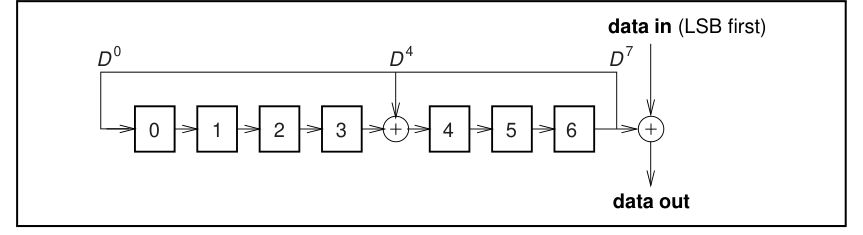

**Figure 7.9:  Data whitening LFSR**

After initialization, the packet header and the payload (including the CRC) are whitened. The payload whitening shall continue from the state the whitening LFSR had at the end of HEC. There shall be no re-initialization of the shift register between packet header and payload. The first bit of the “data in” sequence shall be the LSB of the packet header.
For Enhanced Data Rate packets, whitening shall not be applied to the guard, synchronization and trailer portions of the Enhanced Data Rate packets. During the periods where whitening is not applied the LFSR shall be paused.

### 7.3   ERROR CORRECTION

There are three error correction schemes defined for Bluetooth:
• 1/3 rate FEC
• 2/3 rate FEC
• ARQ scheme for the data
The purpose of the FEC scheme on the data payload is to reduce the number of retransmissions. However, in a reasonably error-free environment, FEC gives unnecessary overhead that reduces the throughput. Therefore, the packet definitions given in Section 6 have been kept flexible to use FEC in the payload or not, resulting in the DM and DH packets for the ACL logical transport, HV packets for the SCO logical transport, and EV packets for the eSCO logical transport. The packet header is always protected by a 1/3 rate FEC since it contains valuable link information and is designed to withstand more bit errors.
Correction measures to mask errors in the voice decoder are not included in this section. This matter is discussed in Section 9.3.

### 7.4   FEC CODE: RATE 1/3

A simple 3-times repetition FEC code is used for the header. The repetition code is implemented by repeating each bit three times, see the illustration in Figure 7.10. The 3-times repetition code is used for the entire header, as well as for the synchronous data field in the HV1 packet.

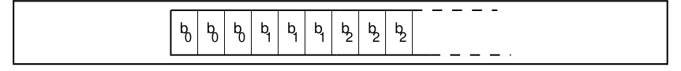

**Figure 7.10:  Bit-repetition encoding scheme**

### 7.5   FEC CODE: RATE 2/3

The other FEC scheme is a (15,10) shortened Hamming code. The generator polynomial is . This corresponds to 65 in octal notation. The LFSR generating this code is depicted in Figure 7.11. Initially all register elements are set to zero. The 10 information bits are sequentially fed into the LFSR with the switches S1 and S2 set in position 1. Then, after the final input bit, the switches S1 and S2 are set in position 2, and the five parity bits are shifted out. The parity bits are appended to the information bits. Subsequently, each block of 10 information bits is encoded into a 15 bit codeword. This code can correct all single errors and detect all double errors in each codeword. This 2/3 rate FEC is used in the DM packets, in the data field of the DV packet, in the FHS packet, in the HV2 packet, and in the EV4 packet. Since the encoder operates with information segments of length 10, tail bits with value zero shall be appended after the CRC bits to bring the total number of bits equal to a multiple of 10. The number of tail bits to append shall be the least possible that achieves this (i.e., in the interval 0...9). These tail bits are not included in the payload length indicator for ACL packets or in the payload length field of the eSCO setup LMP command.
g D ( ) D 1 + ( ) D4 D 1 + + ( ) =

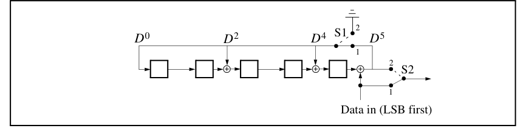

**Figure 7.11:  LFSR generating the (15,10) shortened Hamming code**

### 7.6   ARQ SCHEME

With an automatic repeat request scheme, DM packets, DH packets, the data field of DV packets, and EV packets shall be transmitted until acknowledgment of a successful reception is returned by the destination (or timeout is exceeded). The acknowledgment information shall be included in the header of the return packet. The ARQ scheme is only used on the payload in the packet and only on packets that have a CRC. The packet header and the synchronous data payload of HV and DV packets are not protected by the ARQ scheme.

#### 7.6.1  Unnumbered ARQ

Bluetooth uses a fast, unnumbered acknowledgment scheme. An ACK (ARQN=1) or a NAK (ARQN=0) is returned in response to the receipt of a previously received packet. The slave shall respond in the slave-to-master slot directly following the master-to-slave slot unless the slave has scatternet commitments in that timeslot; the master shall respond at the next event addressing the same slave (the master may have addressed other slaves between the last received packet from the considered slave and the master response to this packet). For a packet reception to be successful, at least the HEC must pass. In addition, the MIC and CRC must pass when present.
In the first POLL packet at the start of a new connection (as a result of a page, page scan, or role switch) the master shall initialize the ARQN bit to NAK. The response packet sent by the slave shall also have the ARQN bit set to NAK. The subsequent packets shall use the following rules. The initial value of the master’s eSCO ARQN at link set-up shall be NAK.
The ARQN bit shall only be affected by data packets containing CRC and empty slots. As shown in Figure 7.12, upon successful reception of a CRC packet, the ARQN bit shall be set to ACK. If, in any receive slot in the slave, or, in a receive slot in the master following transmission of a packet, one of these events applies:
1. no access code is detected
2. the HEC fails
3. the CRC fails
4. the MIC fails.
then the ARQN bit shall be set to NAK. In eSCO the ARQN bit may be set to ACK even when the CRC on an EV packet has failed thus enabling delivery of erroneous packets.
Packets that have correct HEC but that are addressed to other slaves, or packets other than DH, DM, DV or EV packets, shall not affect the ARQN bit, except as noted in Section 7.6.2.2. In these cases the ARQN bit shall be left as it was prior to reception of the packet. For ACL packets, if a CRC packet with a correct header has the same SEQN as the previously received CRC packet, the ARQN bit shall be set to ACK and the payload shall be ignored without checking the CRC. For eSCO packets, the SEQN shall not be used when determining the ARQN. If an eSCO packet has been received successfully within the eSCO window subsequent receptions within the eSCO window shall be ignored. At the end of the eSCO window, the master’s ARQN shall be retained for the first master-to-slave transmission in the next eSCO window.
The ARQN bit in the FHS packet is not meaningful. Contents of the ARQN bit in the FHS packet shall not be checked.
The ARQN bit in the extended inquiry response packet is reserved for future use.
Broadcast packets shall be checked on errors using the CRC, but no ARQ scheme shall be applied. Broadcast packets shall never be acknowledged.
Note: In Figure 7.12, TX refers to the next transmission that the device makes and does not imply that it must transmit in the next slot. NO TX indicates that the device must not transmit in the next slot.
Note: In Figure 7.14, "Packet OK" means that the packet has an allowed TYPE for the connection and the CRC is valid.

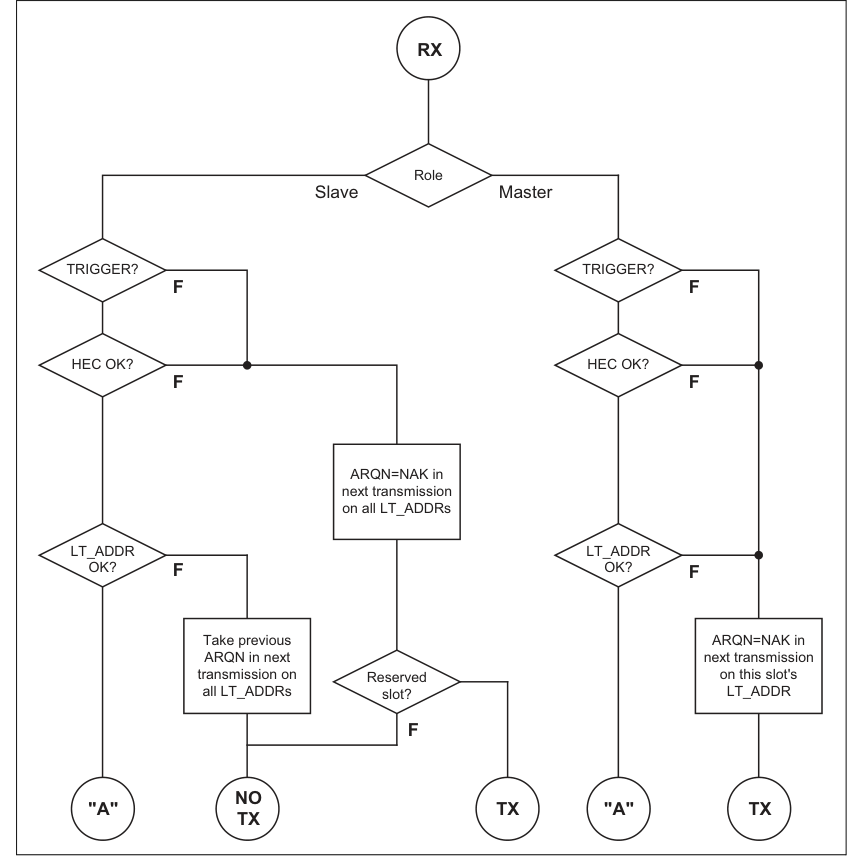

**Figure 7.12:  Stage 1 of the receive protocol for determining the ARQN bit**

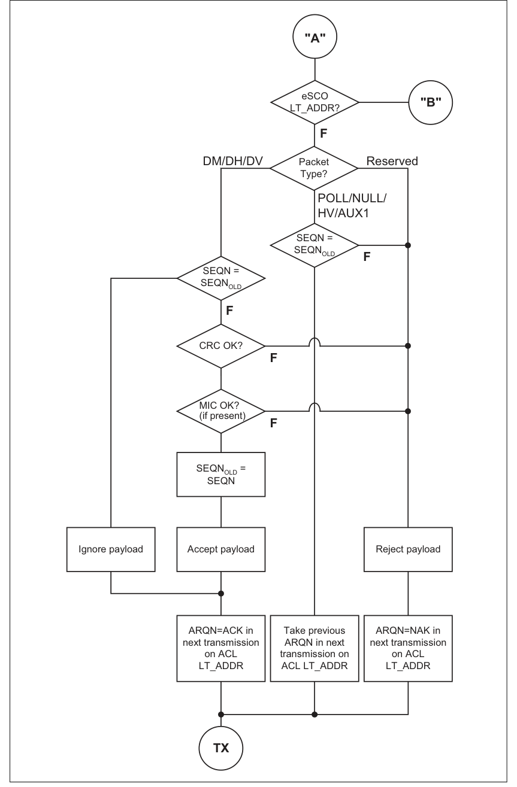

**Figure 7.13:  Stage 2 (ACL) of the receive protocol for determining the ARQN bit**

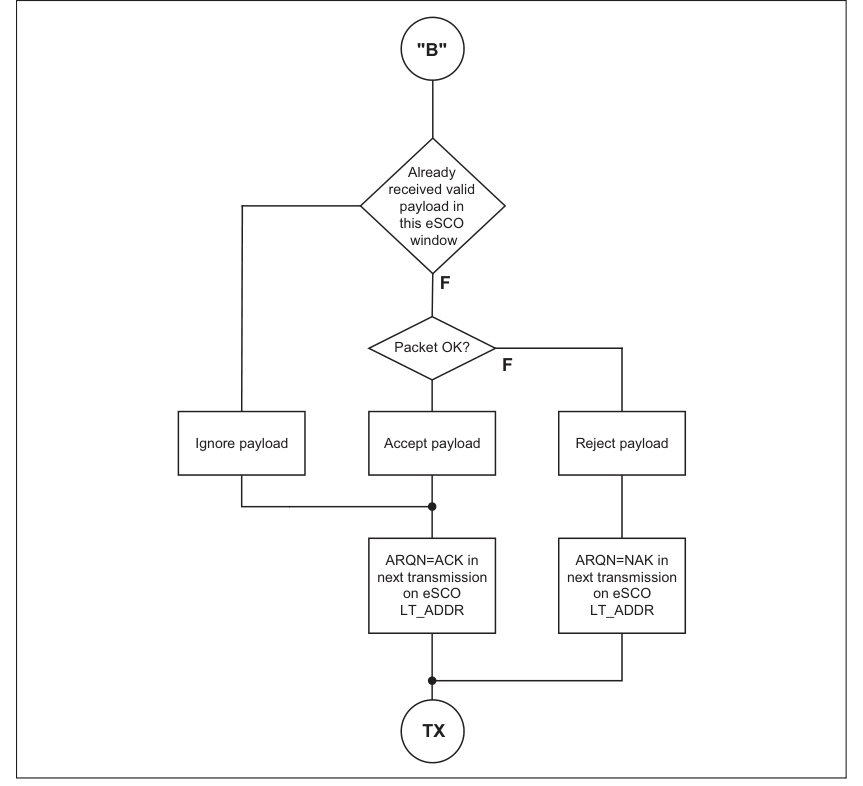

**Figure 7.14:  Stage 2 (eSCO) of the receive protocol for determining the ARQN bit**

#### 7.6.2  Retransmit Filtering

The data payload shall be transmitted until a positive acknowledgment is received or a timeout is exceeded. A retransmission shall be carried out either because the packet transmission itself failed, or because the acknowledgment transmitted in the return packet failed (note that the latter has a lower failure probability since the header is more heavily coded). In the latter case, the destination keeps receiving the same payload over and over again. In order to filter out the retransmissions in the destination, the SEQN bit is present in the header. Normally, this bit is alternated for every new CRC data payload transmission. In case of a retransmission, this bit shall not be changed so the destination can compare the SEQN bit with the previous SEQN value. If different, a new data payload has arrived; otherwise it is the same data payload and may be ignored. Only new data payloads shall be transferred to the Baseband Resource Manager. Note that CRC data payloads can be carried only by DM, DH, DV or EV packets.

##### 7.6.2.1  Initialization of SEQN at Start of New Connection

The SEQN bit of the first CRC data packet at the start of a connection (as a result of page, page scan, or role switch) on both the master and the slave sides shall be set to 1. The subsequent packets shall use the rules in the following sections.

##### 7.6.2.2  ACL and SCO Retransmit Filtering

The SEQN bit shall only be affected by the CRC data packets as shown in Figure 7.15. It shall be inverted every time a new CRC data packet is sent. The CRC data packet shall be retransmitted with the same SEQN number until an ACK is received or the packet is flushed. When an ACK is received, a new payload may be sent and on that transmission the SEQN bit shall be inverted. If a device decides to flush (see Section 7.6.3), and it has not received an acknowledgment for the current packet, it shall replace the current packet with an ACL-U continuation packet with the same sequence number as the current packet and length zero. If it replaces the current packet in this way it shall not move on to transmit the next packet until it has received an ACK.
If the slave receives a packet other than DH, DM, DV or EV with the SEQN bit inverted from that in the last header successfully received on the same LT_ADDR, it shall set the ARQN bit to NAK until a DH, DM, DV or EV packet is successfully received.

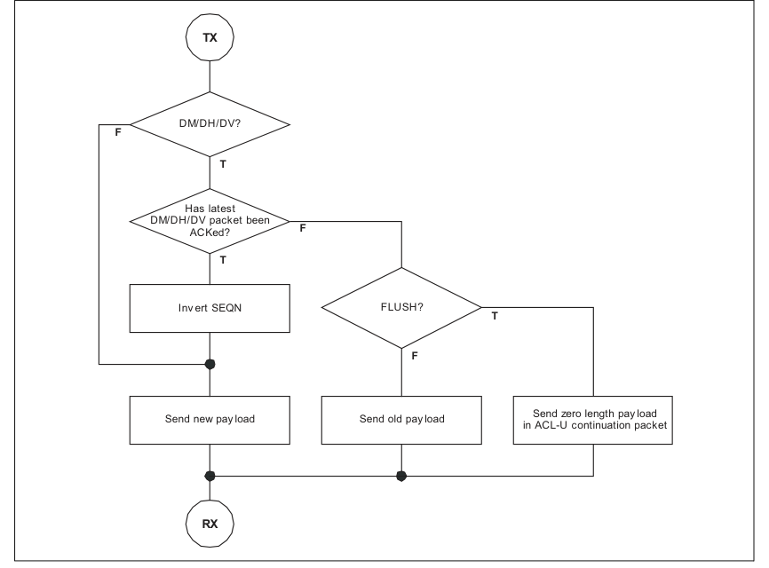

**Figure 7.15:  Transmit filtering for packets with CRC**

##### 7.6.2.3  eSCO Retransmit Filtering

In eSCO, the SEQN bit shall be toggled every eSCO window. The value shall be constant for the duration of the eSCO window. The initial value of SEQN shall be zero.
For a given eSCO window the SEQN value shall be constant.

##### 7.6.2.4  FHS Retransmit Filtering

The SEQN bit in the FHS packet is not meaningful. This bit may be set to any value. Contents of the SEQN bit in the FHS packet shall not be checked.

##### 7.6.2.5  Extended Inquiry Response Retransmit Filtering

The SEQN bit in the extended inquiry response packet is reserved for future use.

##### 7.6.2.6  Packets without CRC Retransmit Filtering

During transmission of packets without a CRC the SEQN bit shall remain the same as it was in the previous packet.

#### 7.6.3  Flushing Payloads

On ACL logical transports, the ARQ scheme can cause variable delay in the traffic flow since retransmissions are inserted to assure error-free data transfer. For certain communication links, only a limited amount of delay is allowed: retransmissions are allowed up to a certain limit at which the current payload shall be ignored. This data transfer is indicated as isochronous traffic. This means that the retransmit process must be overruled in order to continue with the next data payload. Aborting the retransmit scheme is accomplished by flushing the old data and forcing the Link Controller to take the next data instead.
Flushing results in loss of remaining portions of an L2CAP message. Therefore, the packet following the flush shall have a start packet indication of LLID = 10 in the payload header for the next L2CAP message. This informs the destination of the flush (see Section 6.6). Flushing will not necessarily result in a change in the SEQN bit value, see the previous section.
The Flush Timeout defines a maximum period after which all segments of the ACL-U packet with a Packet_Boundary_Flag value of 10 are flushed from the Controller buffer. The Flush Timeout shall start when the First segment of the ACL-U packet is stored in the Controller buffer. If the First segment of an ACL- U packet has a Packet_Boundary_Flag value of 00, it is non-automatically- flushable and shall not cause the Flush Timeout to start. After the Flush timeout has expired the Link Controller may continue transmissions according to the procedure described in Section 7.6.2.2, however the Baseband Resource
Manager shall not continue the transmission of the ACL-U packet to the Link Controller. If the Baseband Resource Manager has further segments of the packet queued for transmission to the Link Controller it shall delete the remaining segments of the ACL-U packet from the queue. In case the complete ACL-U packet was not stored in the Controller buffer yet, any Continuation segments, received for the ACL logical transport, shall be flushed, until a First segment is received. When the complete ACL-U packet has been flushed, the Link Manager shall continue transmission of the next ACL-U packet for the ACL logical transport. The default Flush Timeout shall be infinite, i.e. re- transmissions are carried out until physical link loss occurs. This is also referred to as a 'reliable channel.' All devices shall support the default Flush Timeout. Reliable data shall be sent over a channel with a finite flush timeout by marking reliable packets as non-automatically-flushable.
On eSCO logical transports, packets shall be automatically flushed at the end of the eSCO window.
Connectionless Slave Broadcast packets are transmitted at each scheduled Connectionless Slave Broadcast Instant. If no new data is available, the Connectionless Slave Broadcast Transmitter shall transmit a packet with the last available data in the payload.

#### 7.6.4  Multi-slave Considerations

In a piconet with multiple logical transports, the master shall carry out the ARQ protocol independently on each logical transport.

#### 7.6.5  Active Slave Broadcast Packets

ASB broadcast packets are packets transmitted by the master to all the slaves simultaneously (see Section 8.6.4) If multiple hop sequences are being used each transmission may only be received by some of the slaves. In this case the master shall repeat the transmission on each hop sequence. An ASB broadcast packet shall be indicated by the all-zero LT_ADDR (note; the FHS packet and the extended inquiry response packet are the only packets which may have an all-zero LT_ADDR but are not broadcast packets). Broadcast packets shall not be acknowledged (at least not at the LC level).
Since broadcast messages are not acknowledged, each broadcast packet is transmitted at least a fixed number of times. An ASB broadcast packet should be transmitted NBC times before the next broadcast packet of the same broadcast message is transmitted, see Figure 7.16. Optionally, an ASB broadcast packet may be transmitted NBC + 1 times. Note: NBC=1 means that each broadcast packet should be sent only once, but optionally may be sent twice. However, time-critical broadcast information may abort the ongoing broadcast train.  In addition, an LMP packet sent on the ASB-C logical link is always a complete message for these purposes and is always sent exactly once; the LMP specification may provide requirements for whether and when to send another message with the same or related contents.
If multiple hop sequences are being used then the master may transmit on the different hop sequences in any order, providing that transmission of a new broadcast packet shall not be started until all transmissions of any previous broadcast packet have completed on all hop sequences. The transmission of a single broadcast packet may be interleaved among the hop sequences to minimize the total time to broadcast a packet. The master has the option of transmitting only NBC times on channels common to all hop sequences.
ASB broadcast packets with a CRC shall have their own sequence number. The SEQN of the first broadcast packet with a CRC shall be set to SEQN = 1 by the master and shall be inverted for each new broadcast packet with CRC thereafter. ASB broadcast packets without a CRC have no influence on the sequence number. The slave shall accept the SEQN of the first broadcast packet it receives in a connection and shall check for change in SEQN for subsequent broadcast packets. Since there is no acknowledgment of broadcast messages and there is no end packet indication, it is important to receive the start packets correctly. To ensure this, repetitions of the broadcast packets that are L2CAP start packets and LMP packets shall not be filtered out. These packets shall be indicated by LLID=1X in the payload header as explained in Table 6.6. Only repetitions of the L2CAP continuation packets shall be filtered out.

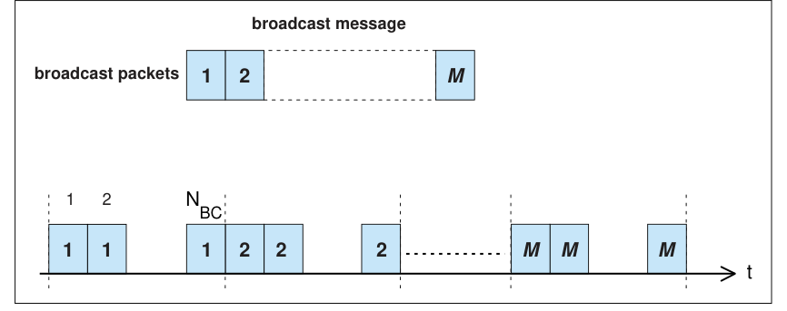

**Figure 7.16:  Broadcast repetition scheme**

### 7.7   ERRONEOUS SYNCHRONOUS DATA REPORTING

Erroneous data reporting may be enabled for synchronous links. When enabled, synchronous data shall be processed as follows:
• If, during an (e)SCO interval, an eSCO packet was received with valid HEC, an allowed TYPE for the connection, and valid CRC, or a SCO packet was received with valid HEC, the received payload data shall be sent to the upper-edge of the Controller with a "good data" indication.
• If, during an eSCO interval, eSCO packets with valid HEC were received, but none of them had an allowed TYPE for the connection and a valid CRC, the best known data available (e.g., data derived from the received data or
the actual payload data that was received with a CRC error) shall be sent to the upper-edge of the Controller with a "data with possible errors" indication.
• If, during an (e)SCO interval, no SCO or eSCO packet with valid HEC has been received, a "lost data" indication shall be sent to the upper-edge of the Controller.

### 7.8   MESSAGE INTEGRITY CHECK

When encryption with AES-CCM is enabled, a Message Integrity Check (MIC) is added to the payload before the CRC for packets that are defined to include the MIC. The MIC is sent Most Significant Octet (MSO) first.

## 8  LINK CONTROLLER OPERATION

This section describes how a piconet is established and how devices can be added to and released from the piconet. Several states of operation of the devices are defined to support these functions. In addition, the operation of several piconets with one or more common members, the scatternet, is discussed.

### 8.1   OVERVIEW OF STATES

Figure 8.1 shows a state diagram illustrating the different states used in the Link Controller. There are two major states: STANDBY and CONNECTION; in addition, there are nine substates, page, page scan, inquiry, inquiry scan, synchronization train, synchronization scan, master response, slave response, and inquiry response. Note that the master response, slave response, and inquiry response substates are not shown in the simplified figure below. The substates are interim states that are used to establish connections and enable device discovery. To move from one state or substate to another, either commands from the link manager are used, or internal signals in the Link Controller are used (such as the trigger signal from the correlator and the timeout signals).
.

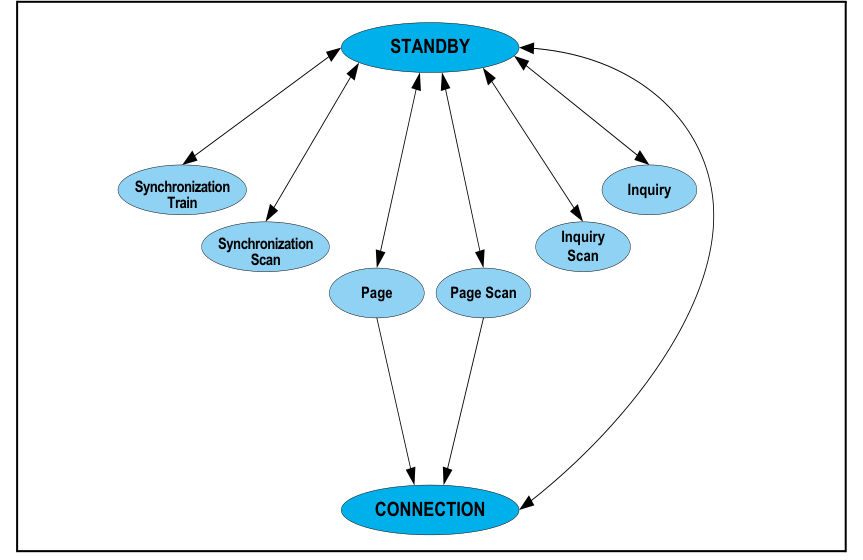

**Figure 8.1:  State diagram of Link Controller**

### 8.2   STANDBY STATE

The STANDBY state is the default state in the device. In this state, the device may be in a low-power mode. Only the native clock is running with a worst case accuracy of +/-250 ppm.
The Controller may leave the STANDBY state to scan for page or inquiry messages, or to page or inquiry itself.

### 8.3   CONNECTION ESTABLISHMENT SUBSTATES

In order to establish new connections the paging procedure or the synchronization scan procedure is used. Only the Bluetooth device address is required to set up a connection using the paging procedure. Knowledge about the clock, obtained from the inquiry procedure (see Section 8.4) or from a previous connection with this device, and the page scanning mode of the other device will accelerate the paging procedure. A device that establishes a connection using a page procedure will automatically become the master of the connection. A device that establishes a connection using a synchronization scan procedure does so in two steps. First, from within the synchronization scan substate, the BR/EDR Controller follows the synchronization scan procedure to collect clock, packet timing, and AFH channel map information from the master and then transitions to the STANDBY state. Second, as commanded by the Host, the BR/EDR Controller transitions from the STANDBY state to the connectionless slave broadcast mode of the CONNECTION state.
The truncated page procedure is a modification of the paging procedure and is used to deliberately generate a page response timeout on the slave device.

#### 8.3.1  Page Scan Substate

In the page scan substate, a device may be configured to use either the standard or generalized interlaced scanning procedure. During a standard scan, a device listens for the duration of the scan window Tw_page_scan (11.25ms default, see HCI [Vol 2] Part E, Section 7.3.20), while the generalized interlaced scan is performed as two back to back scans of Tw_page_scan. If the scan interval is not at least twice the scan window, then generalized interlaced scan shall not be used. During each scan window, the device shall listen at a single hop frequency, its correlator matched to its device access code (DAC). The scan window shall be long enough to completely scan 16 page frequencies.
When a device enters the page scan substate, it shall select the scan frequency according to the page hopping sequence determined by the device's Bluetooth device address, see Section 2.6.4.1. The phase in the sequence shall be determined by CLKN16-12 of the device’s native clock; that is, every 1.28s a different frequency is selected.
In the case of a standard scan, if the correlator exceeds the trigger threshold during the page scan, the device shall enter the slave response substate described in Section 8.3.3.1. The scanning device may also use generalized interlaced scan. In this case, if the correlator does not exceed the trigger threshold during the first scan it shall scan a second time using the phase in the sequence determined by [CLKN16-12 + interlace_offset] mod 32. If on this second scan the correlator exceeds the trigger threshold the device shall enter the slave response substate using [CLKN16-12 + interlace_offset] mod 32 as the frozen CLKN* in the calculation for Xprs(79) (see Section 2.6.4.3 for details). If the correlator does not exceed the trigger threshold during a scan in normal mode or during the second scan in interlaced scan mode it shall return to either the STANDBY or CONNECTION state.
The interlace_offset value ranges from 0 to 31. The value 16 should be used unless the pattern of slots that are not available for scanning implies a different value should be used.
The page scan substate can be entered from the STANDBY state or the CONNECTION state. In the STANDBY state, no connection has been established and the device can use all the capacity to carry out the page scan. Before entering the page scan substate from the CONNECTION state, the device should reserve as much capacity as possible for scanning. If desired, the device may place ACL connections in Hold (see Section 8.8) or Sniff (see Section 8.7). Synchronous connections should not be interrupted by the page scan, although eSCO retransmissions should be paused during the scan. The page scan may be interrupted by the reserved synchronous slots which should have higher priority than the page scan. SCO packets should be used requiring the least amount of capacity (HV3 packets). The scan window shall be increased to minimize the setup delay. If one SCO logical transport is present using HV3 packets and TSCO=6 slots or one eSCO logical transport is present using EV3 packets and TeSCO=6 slots, a total scan window Tw_page_scan of at least 36 slots (22.5ms) is recommended; if two SCO links are present using HV3 packets and TSCO=6 slots or two eSCO links are present using EV3 packets and TeSCO=6 slots, a total scan window of at least 54 slots (33.75ms) is recommended.
The scan interval Tpage_scan is defined as the interval between the beginnings of two consecutive page scans. A distinction is made between the case where the scan interval is equal to the scan window Tw_page_scan (continuous scan), the scan interval is maximal 1.28s, or the scan interval is maximal 2.56s. These three cases shall determine the behavior of the paging device; that is, whether the paging device shall use R0, R1 or R2, see also Section 8.3.2. Table 8.1 illustrates the relationship between Tpage_scan and modes R0, R1 and R2. Although scanning in the R0 mode is continuous, the scanning may be interrupted for example by reserved synchronous slots. The scan interval information is included in the SR field in the FHS packet.

| SR mode | T page scan _ |
| --- | --- |
| R0 | ≤ 1.28s and = T w page scan _ _ |
| R1 | ≤ 1.28s |
| R2 | ≤ 2.56s |

Table 8.1:  Relationship between scan interval, and paging modes R0, R1, and R2

#### 8.3.2  Page Substate

The page substate is used by the master (source) to activate and connect to a slave (destination) in the page scan substate. The master tries to coincide with the slave's scan activity by repeatedly transmitting the paging message consisting of the slave’s device access code (DAC) in different hop channels. Since the Bluetooth clocks of the master and the slave are not synchronized, the master does not know exactly when the slave wakes up and on which hop frequency. Therefore, it transmits a train of identical page scan messages at different hop frequencies and listens in between the transmit intervals until it receives a response from the slave.
The page procedure in the master consists of a number of steps. First, the Host communicates the BD_ADDR of the slave to the Controller. This BD_ADDR shall be used by the master to determine the page hopping sequence; see Section 2.6.4.2. For the phase in the sequence, the master shall use an estimate of the slave’s clock. For example, this estimate can be derived from timing information that was exchanged during the last encounter with this particular device (which could have acted as a master at that time), or from an inquiry procedure. With this estimate CLKE of the slave’s Bluetooth clock, the master can predict on which hop channel the slave starts page scanning.
The estimate of the Bluetooth clock in the slave can be completely wrong. Although the master and the slave use the same hopping sequence, they use different phases in the sequence and might never select the same frequency. To compensate for the clock drifts, the master shall send its page message during a short time interval on a number of wake-up frequencies. It shall transmit also on hop frequencies just before and after the current, predicted hop frequency. During each TX slot, the master shall sequentially transmit on two different hop frequencies. In the following RX slot, the receiver shall listen sequentially to two corresponding RX hops for an ID packet. The RX hops shall be selected according to the page response hopping sequence. The page response hopping sequence is strictly related to the page hopping sequence: for each page hop there is a corresponding page response hop. The RX/TX timing in the page substate is described in Section 2.2.5, see also Figure 2.7. In the next TX slot, the master shall transmit on two hop frequencies different from the former ones. Note: The hop rate is increased to 3200 hops/s.
With the increased hopping rate as described above, the transmitter can cover 16 different hop frequencies in 16 slots or 10 ms. The page hopping sequence is divided over two paging trains A and B of 16 frequencies. Train A includes the 16 hop frequencies surrounding the current, predicted hop frequency f(k), where k is determined by the clock estimate CLKE16-12. The first train consists of hops
f(k-8), f(k-7),...,f(k),...,f(k+7)
When the difference between the Bluetooth clocks of the master and the slave is between -8x1.28 s and +7x1.28 s, one of the frequencies used by the master will be the hop frequency the slave will listen to. Since the master does not know when the slave will enter the page scan substate, the master has to repeat this train A Npage times or until a response is obtained, whichever is shorter. If the slave scan interval corresponds to R1, the repetition number is at least 128; if the slave scan interval corresponds to R2 or if the master has not previously read the slave's SR mode, the repetition number is at least 256. If the master has not previously read the slave's SR mode it shall use Npage >= 256. Note that CLKE16-12 changes every 1.28 s; therefore, every 1.28 s, the trains will include different frequencies of the page hopping set.
When the difference between the Bluetooth clocks of the master and the slave is less than -8x1.28 s or larger than +7x1.28 s, the remaining 16 hops are used to form the new 10 ms train B. The second train consists of hops
f(k-16), f(k-15),...,f(k-9),f(k+8)...,f(k+15)
Train B shall be repeated for Npage times. If no response is obtained, knudge may be updated in the case where slots to receive are periodically not available and train A shall be tried again Npage times. Alternate use of train A and train B and updates of knudge shall be continued until a response is received or the timeout pageTO is exceeded. When extended_pageTO is greater than zero, the timeout may be extended to (pageTO + extended_pageTO). If a response is returned by the slave, the master device enters the master response substate.
The page substate may be entered from the STANDBY state or the CONNECTION state. In the STANDBY state, no connection has been established and the device can use all the capacity to carry out the page. Before entering the page substate from the CONNECTION state, the device should free as much capacity as possible for paging. To ensure this, it is recommended that the ACL connections are put on hold. However, the synchronous connections shall not be disturbed by the page. This means that the page will be interrupted by the reserved SCO and eSCO slots which have higher priority than the page. In order to obtain as much capacity for paging, it is recommended to use the SCO packets which use the least amount of capacity (HV3 packets). If SCO or eSCO links are present, the repetition number Npage of a single train shall be increased, see Table 8.2. Here it has been assumed that the HV3 packet are used with an interval TSCO=6 slots or
EV3 packets are used with an interval of TeSCO=6 slots, which would correspond to a 64 kb/s synchronous link.
.

| SR mode | no synchronous link | one synchronous link (HV3) | two synchronous link (HV3) |
| --- | --- | --- | --- |
| R0 | N ≥1 page | N ≥2 page | N ≥3 page |
| R1 | N ≥128 page | N ≥256 page | N ≥384 page |
| R2 | N ≥256 page | N ≥512 page | N ≥768 page |

Table 8.2:  Relationship between train repetition, and paging modes R0, R1 and R2 when synchronous links are present
The construction of the page train shall be independent of the presence of synchronous links; that is, synchronous packets are sent on the reserved slots but shall not affect the hop frequencies used in the unreserved slots, see Figure 8.2.

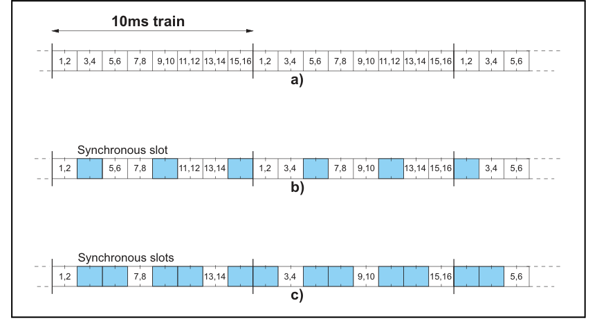

**Figure 8.2:  Conventional page (a), page while one synchronous link present (b), page while two synchronous links present (c)**

#### 8.3.3  Page Response Substates

When a page message is successfully received by the slave, there is a coarse FH synchronization between the master and the slave. Both the master and the slave enter a response substate to exchange vital information to continue the connection setup. It is important for the piconet connection that both devices shall use the same channel access code, use the same channel hopping sequence, and their clocks are synchronized. These parameters shall be derived from the master device. The device that initializes the connection
(starts paging) is defined as the master device (which is thus only valid during the time the piconet exists). The channel access code and channel hopping sequence shall be derived from the Bluetooth device address (BD_ADDR) of the master. The timing shall be determined by the master clock. An offset shall be added to the slave’s native clock to temporarily synchronize the slave clock to the master clock. At start-up, the master parameters are transmitted from the master to the slave. The messaging between the master and the slave at start- up is specified in this section.
The initial messaging between master and slave is shown in Table 8.3 and in Figure 8.3 and Figure 8.4. In those two figures frequencies f (k), f(k+1), etc. are the frequencies of the page hopping sequence determined by the slave’s BD_ADDR. The frequencies f’(k), f’(k+1), etc. are the corresponding page_response frequencies (slave-to-master). The frequencies g(m) belong to the basic channel hopping sequence.

| Step | Message | Packet Type | Direction | Hopping Sequence | Access Code and Clock |
| --- | --- | --- | --- | --- | --- |
| 1 | Page | ID | Master to slave | Page | Slave |
| 2 | First slave page response | ID | Slave to master | Page response | Slave |
| 3 | Master page response | FHS | Master to slave | Page | Slave |
| 4 | Second slave page response | ID | Slave to master | Page response | Slave |
| 5 | 1st packet master | POLL | Master to slave | Channel | Master |
| 6 | 1st packet slave | Any type | Slave to master | Channel | Master |

Table 8.3:  Initial messaging during start-up
In step 1 (see Table 8.3), the master device is in page substate and the slave device in the page scan substate. Assume in this step that the page message sent by the master reaches the slave. On receiving the page message, the slave enters the slave response in step 2. The master waits for a reply from the slave and when this arrives in step 2, it shall enter the master response in step 3. Note that during the initial message exchange, all parameters are derived from the slave’s device address, and that only the page hopping and page response hopping sequences are used (are also derived from the slave’s device address). Note that when the master and slave enter the response states, their clock input to the page and page response hop selection is frozen as is described in Section 2.6.4.3.

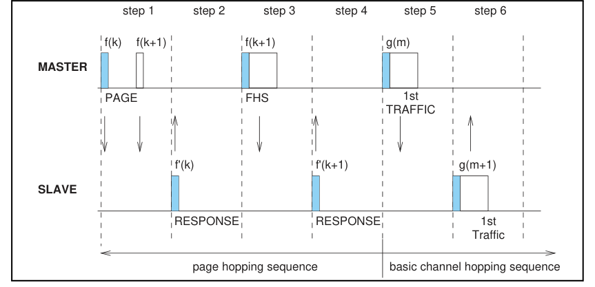

**Figure 8.3:  Messaging at initial connection when slave responds to first page message**

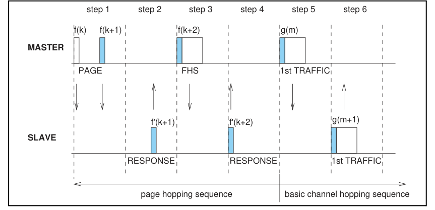

**Figure 8.4:  Messaging at initial connection when slave responds to second page message**

In the case of the truncated page procedure, the messaging stops after step 2 in the sequence shown in Table 8.3. This procedure is illustrated in Figure 8.5 and Figure 8.6.

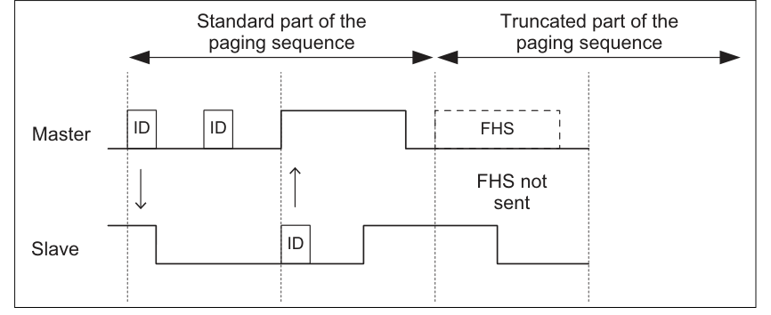

**Figure 8.5:  First half slot truncated page**

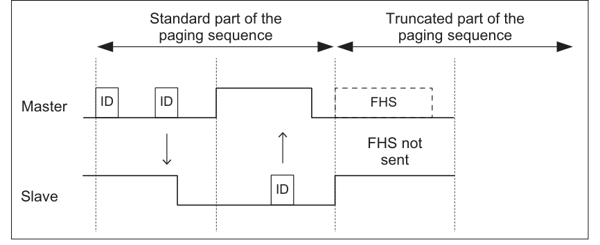

**Figure 8.6:  Second half slot truncated page**

##### 8.3.3.1  Slave Response Substate

After having received the page message in step 1, the slave device shall transmit a slave page response message (the slave's device access code) in step 2. This response message shall be the slave’s device access code. The slave shall transmit this response 625 μs after the beginning of the received page message and at the response hop frequency that corresponds to the hop frequency in which the page message was received. The slave transmission is therefore time aligned to the master transmission. During initial messaging, the slave shall still use the page response hopping sequence to return information to the master. The clock input CLKN16-12 shall be frozen at the value it had at the time the page message was received.
After having sent the response message, the slave’s receiver shall be activated 312.5 μs after the start of the response message and shall await the arrival of an FHS packet. Note that an FHS packet can arrive 312.5 μs after the arrival of the page message as shown in Figure 8.4, and not after 625 μs as is usually
the case in the piconet physical channel RX/TX timing. More details about the timing can be found in Section 2.4.4.
If the setup fails before the CONNECTION state has been reached, the following procedure shall be carried out. The slave shall listen as long as no FHS packet is received until pagerespTO is exceeded. Every 1.25 ms, however, it shall select the next master-to-slave hop frequency according to the page hop sequence. If nothing is received after pagerespTO, the slave shall return back to the page scan substate for one scan period. Length of the scan period depends on the synchronous reserved slots present. If no page message is received during this additional scan period, the slave shall resume scanning at its regular scan interval and return to the state it was in prior to the first page scan state.
If an FHS packet is received by the slave in the slave response substate, the slave shall return a slave page response message in step 4 to acknowledge reception of the FHS packet. This response shall use the page response hopping sequence. The transmission of the slave page response packet is based on the reception of the FHS packet. Then the slave shall change to the master's channel access code and clock as received from the FHS packet. Only the 26 MSBs of the master clock are transferred: the timing shall be such that CLK1 and CLK0 are both zero at the time the FHS packet was received as the master transmits in even slots only. The offset between the master’s clock and the slave’s clock shall be determined from the master’s clock in the FHS packet and reported to the slave’s Baseband Resource Manager.
Finally, the slave enters the CONNECTION state in step 5. From then on, the slave shall use the master’s clock and the master's BD_ADDR to determine the basic channel hopping sequence and the channel access code. The slave shall use the LT_ADDR in the FHS payload as the primary LT_ADDR in the CONNECTION state. The connection mode shall start with a POLL packet transmitted by the master. The slave may respond with any type of packet. If the POLL packet is not received by the slave, or the response packet is not received by the master, within newconnectionTO number of slots after FHS packet acknowledgment, the master and the slave shall return to page and page scan substates, respectively. See Section 8.5

##### 8.3.3.2  Master Response Substate

When the master has received a slave page response message in step 2, and the master is not executing the truncated page procedure, it shall enter the master response routine. It shall freeze the current clock input to the page hop selection scheme. The master shall then transmit an FHS packet in step 3 containing the master’s real-time Bluetooth clock, the master’s BD_ADDR, the BCH parity bits, and the class of device. The FHS packet contains all information to construct the channel access code without requiring a mathematical derivation from the master's Bluetooth device address. The LT_ADDR field in the packet header of FHS packets in the master response substate shall be set to all-zeros. The FHS packet shall be transmitted at the beginning of the master-to-slave slot following
the slot in which the slave responded. The FHS packet shall carry the all-zero LT_ADDR. The TX timing of the FHS is not based on the reception of the response packet from the slave. The FHS packet may therefore be sent 312.5 μs after the reception of the response packet like shown in Figure 8.4 and not 625 μs after the received packet as is usual in the piconet physical channel RX/TX timing, see also Section 2.4.4.
After the master has sent its FHS packet, it shall wait for a second slave page response message in step 4 acknowledging the reception of the FHS packet. This response shall be the slave’s device access code. If no response is received, the master shall retransmit the FHS packet with an updated clock and still using the slave’s parameters. It shall retransmit the FHS packet with the clock updated each time until a second slave page response message is received, or the timeout of pagerespTO is exceeded. In the latter case, the master shall return to the page substate and send an error message to the Baseband Resource Manager. During the retransmissions of the FHS packet, the master shall use the page hopping sequence.
If the slave’s response is received, the master shall change to using the master parameters, so it shall use the channel access code and the master clock. The lower clock bits CLK0 and CLK1 shall be reset to zero at the start of the FHS packet transmission and are not included in the FHS packet. Finally, the master enters the CONNECTION state in step 5. The master BD_ADDR shall be used to change to a new hopping sequence, the basic channel hopping sequence. The basic channel hopping sequence uses all 79 hop channels in a pseudo- random fashion, see also Section 2.6.4.7. The master shall now send its first traffic packet in a hop determined with the new (master) parameters. This first packet shall be a POLL packet. See Section 8.5. This packet shall be sent within newconnectionTO number of slots after reception of the FHS packet acknowledgment. The slave may respond with any type of packet. If the POLL packet is not received by the slave or the POLL packet response is not received by the master within newconnectionTO number of slots, the master and the slave shall return to page and page scan substates, respectively.

### 8.4   DEVICE DISCOVERY SUBSTATES

In order to discover other devices a device shall enter inquiry substate. In this substate, it shall repeatedly transmit the inquiry message (ID packet, see Section 6.5.1.1) at different hop frequencies. The inquiry hop sequence is derived from the LAP of the GIAC. Thus, even when DIACs are used, the applied hopping sequence is generated from the GIAC LAP. A device that allows itself to be discovered, shall regularly enter the inquiry scan substate to respond to inquiry messages. The following sections describe the message exchange and contention resolution during inquiry response. The inquiry response is optional: a device is not forced to respond to an inquiry message.
During the inquiry substate, the discovering device collects the Bluetooth device addresses and clocks of all devices that respond to the inquiry message. In addition, the discovering device also collects extended
information (e.g. local name and supported services) from devices that respond with an extended inquiry response packet. It can then, if desired, make a connection to any one of the discovered devices by means of the previously described page procedure.
The inquiry message broadcast by the source does not contain any information about the source. However, it may indicate which class of devices should respond. There is one general inquiry access code (GIAC) to inquire for any device, and a number of dedicated inquiry access codes (DIAC) that only inquire for a certain type of device. The inquiry access codes are derived from reserved Bluetooth device addresses and are further described in Section 6.3.1.

#### 8.4.1  Inquiry Scan Substate

The inquiry scan substate is very similar to the page scan substate. However, instead of scanning for the device's device access code, the receiver shall scan for the inquiry access code long enough to completely scan for 16 inquiry frequencies. Two types of scans are defined: standard and generalized interlaced. In the case of a standard scan the length of this scan period is denoted Tw_inquiry_scan (11.25ms default, see HCI [Vol 2] Part E, Section 7.3.22). The standard scan is performed at a single hop frequency as defined by Xir4-0 (see Section 2.6.4.6). The generalized interlaced scan is performed as two back to back scans of Tw_inquiry_scan where the first scan is on the normal hop frequency and the second scan is defined by [Xir4-0 + interlace_offset] mod 32. If the scan interval is not at least twice the scan window then generalized interlaced scan shall not be used. The inquiry procedure uses 32 dedicated inquiry hop frequencies according to the inquiry hopping sequence. These frequencies are determined by the general inquiry address. The phase is determined by the native clock of the device carrying out the inquiry scan; the phase changes every 1.28s.
The interlace_offset value ranges from 0 to 31. The value 16 should be used unless the pattern of slots that are not available for scanning implies a different value should be used.
Instead of, or in addition to, the general inquiry access code, the device may scan for one or more dedicated inquiry access codes. However, the scanning shall follow the inquiry scan hopping sequence determined by the general inquiry address. If an inquiry message is received during an inquiry wake-up period, the device shall enter the inquiry response substate.
The inquiry scan substate can be entered from the STANDBY state or the CONNECTION state. In the STANDBY state, no connection has been established and the device can use all the capacity to carry out the inquiry scan. Before entering the inquiry scan substate from the CONNECTION state, the device should reserve as much capacity as possible for scanning. If desired, the device may place ACL logical transports in Sniff or Hold. Synchronous logical transports are preferably not interrupted by the inquiry
scan, although eSCO retransmissions should be paused during the scan. In this case, the inquiry scan may be interrupted by the reserved synchronous slots. SCO packets should be used requiring the least amount of capacity (HV3 packets). The scan window, Tw inquiry scan, shall be increased to increase the probability to respond to an inquiry message. If one SCO logical transport is present using HV3 packets and TSCO=6 slots or one eSCO logical transport is present using EV3 packets and TeSCO=6 slots, a total scan window of at least 36 slots (22.5ms) is recommended; if two SCO links are present using HV3 packets and TSCO=6 slots or two eSCO links are present using EV3 packets and TeSCO=6 slots, a total scan window of at least 54 slots (33.75ms) is recommended.
The scan interval Tinquiry scan is defined as the interval between two consecutive inquiry scans. The inquiry scan interval shall be less than or equal to 2.56 s.

#### 8.4.2  Inquiry Substate

The inquiry substate is used to discover new devices. This substate is very similar to the page substate; the TX/RX timing shall be the same as in paging, see Section 2.4.4 and Figure 2.7. The TX and RX frequencies shall follow the inquiry hopping sequence and the inquiry response hopping sequence, and are determined by the general inquiry access code and the native clock of the discovering device. In between inquiry transmissions, the receiver shall scan for inquiry response messages. When a response is received, the entire packet (an FHS packet) shall be read. If the EIR bit in the FHS packet is set to one, the device should try to receive the extended inquiry response packet 1250μs after the start of the FHS packet. After this, the device shall continue with inquiry transmissions. The device in an inquiry substate shall not acknowledge the inquiry response messages. If enabled by the Host (see HCI [Vol 2] Part E, Section 7.3.50), the RSSI value of the inquiry response message shall be measured. It shall keep probing at different hop channels and in between listening for response packets. As in the page substate, two 10 ms trains A and B are defined, splitting the 32 frequencies of the inquiry hopping sequence into two 16-hop parts. A single train shall be repeated for at least Ninquiry=256 times before a new train is used. In order to collect all responses in an error-free environment, at least three train switches must have taken place. As a result, the inquiry substate may have to last for 10.24 s unless the inquirer collects enough responses and aborts the inquiry substate earlier. If desired, the inquirer may also prolong the inquiry substate to increase the probability of receiving all responses in an error-prone environment. When some receive slots are periodically not available, it may require up to 31 train switches to collect all responses in an error-free environment, depending on the pattern of the available receive slots. Before each switch to train A, knudge may be updated. As a result, the inquiry substate may have to last for 40.96s. If an inquiry procedure is automatically initiated periodically (say a 10 s period every minute), then the interval between two inquiry instances shall be determined randomly. This is done to avoid two devices synchronizing their inquiry procedures.
The inquiry substate is continued until stopped by the Baseband Resource Manager (when it decides that it has sufficient number of responses), when a timeout has been reached (Inquiry_Length), or by a command from the Host to cancel the inquiry procedure. In case Extended_Inquiry_Length is different from zero, the timeout may be extended to (Inquiry_Length + Extended_Inquiry_Length).
The inquiry substate can be entered from the STANDBY state or the CONNECTION state. In the STANDBY state, no connection has been established and the device can use all the capacity to carry out the inquiry. Before entering the inquiry substate from the CONNECTION state, the device should free as much capacity as possible for inquiry. To ensure this, it is recommended that the ACL logical transports are placed in Sniff or Hold. However, the reserved slots of synchronous logical transports shall not be disturbed by the inquiry. This means that the inquiry will be interrupted by the reserved SCO and eSCO slots which have higher priority than the inquiry. In order to obtain as much capacity as possible for inquiry, it is recommended to use the SCO packets which use the least amount of capacity (HV3 packets). If SCO or eSCO links are present, the repetition number Ninquiry shall be increased, see Table 8.4.
Here it has been assumed that HV3 packets are used with an interval TSCO=6 slots or EV3 packets are used with an interval of TeSCO=6 slots, which would correspond to a 64 kb/s synchronous link.

|  | No synchronous links | One synchronous link (HV3) | Two synchronous link (HV3) |
| --- | --- | --- | --- |
| N inquiry | ≥ 256 | ≥ 512 | ≥ 768 |

Table 8.4:  Increase of train repetition when synchronous links are present
If an extended inquiry response packet could not be received because of higher priority traffic, the reception failed due to HEC or CRC failure, or because the packet type is not supported by the device, the inquiry response shall be reported to higher layers as an extended inquiry response with all-zero data.

#### 8.4.3  Inquiry Response Substate

The slave response substate for inquiries differs completely from the slave response substate applied for pages. When the inquiry message is received in the inquiry scan substate, the recipient shall return an inquiry response (FHS) packet containing the recipient's device address (BD_ADDR) and other parameters. If the recipient has non-zero extended inquiry response data to send it shall return an extended inquiry response packet after the FHS packet.
The following protocol in the slave's inquiry response shall be used. On the first inquiry message received in the inquiry scan substate the slave shall enter the inquiry response substate. If the slave has non-zero extended inquiry
response data to send it shall return an FHS packet with the EIR bit set to one to the master 625μs after the inquiry message was received. It shall then return an extended inquiry response packet 1250μs after the start of the FHS packet. If the slave's extended inquiry response data is all zeroes the slave shall only return an FHS packet with the EIR bit set to zero. A contention problem could arise when several devices are in close proximity to the inquiring device and all respond to an inquiry message at the same time. However, because every device has a free running clock it is highly unlikely that they all use the same phase of the inquiry hopping sequence. In order to avoid repeated collisions between devices that wake up in the same inquiry hop channel simultaneously, a device shall back-off for a random period of time. Thus, if the device receives an inquiry message and returns an FHS packet, it shall generate a random number, RAND, between 0 and MAX_RAND. For scanning intervals ≥ 1.28s MAX_RAND shall be 1023, however, for scanning intervals < 1.28s MAX_RAND may be as small as 127. A profile that uses a special DIAC may choose to use a smaller MAX_RAND than 1023 even when the scanning interval is ≥ 1.28s. The slave shall return to the CONNECTION or STANDBY state for the duration of at least RAND time slots. Before returning to the CONNECTION and STANDBY state, the device may go through the page scan substate. After at least RAND slots, the device shall add an offset of 1 to the phase in the inquiry hop sequence (the phase has a 1.28 s resolution) and return to the inquiry scan substate again. If the slave is triggered again, it shall repeat the procedure using a new RAND. The offset to the clock accumulates each time an FHS packet is returned. During a probing window, a slave may respond multiple times, but on different frequencies and at different times. Reserved synchronous slots should have priority over response packets; that is, if a response packet overlaps with a reserved synchronous slot, it shall not be sent but the next inquiry message is awaited. If a device has extended inquiry response data to send but the extended inquiry response packet overlaps with a reserved synchronous slot the FHS packet may be sent with the EIR bit set to zero.
The messaging during the inquiry routines is summarized in Table 8.5. In step 1, the master transmits an inquiry message using the inquiry access code and its own clock. The slave responds with the FHS packet containing the slave’s Bluetooth device address, native clock and other slave information. This FHS packet is returned at times that tend to be random. The FHS packet is not acknowledged in the inquiry routine, but it is retransmitted at other times and frequencies as long as the master is probing with inquiry messages. If the slave has non-zero extended inquiry response data it sends an extended inquiry response packet to the master in step 3.
The extended inquiry response packet is an ACL packet with type DM1, DM3, DM5, DH1, DH3 or DH5. To minimize interference it is recommended to use the shortest packet that fits the data. The packet shall be sent on the same frequency as the FHS packet, 1250 µs after the start of the FHS packet. In the packet header, LT_ADDR shall be set to zero. TYPE shall be one of DM1, DM3, DM5, DH1, DH3 or DH5. FLOW, ARQN and SEQN shall all be set to zero and ignored during receipt. The HEC LFSR shall be initialized with the
same DCI (default check initialization) as for the FHS packet. In the payload header, LLID shall contain the value 10 (start of an L2CAP message or no fragmentation). FLOW shall be set to zero and ignored upon receipt. The length of the payload body (LENGTH) shall be smaller than or equal to 240 bytes. The CRC LFSR shall be initialized with the same DCI as for the FHS packet. The data whitening LFSR shall be initialized with the same value as for the FHS packet.
The payload data has two parts, a significant part followed by a non-significant part. The significant part contains a sequence of data structures as defined in [Vol 3] Part C, Section 8. The non-significant part contains all-zero octets.
The baseband shall not change any octets in the significant part. When transmitting data, the non-significant part octets may be omitted from the payload.
A device shall store a single extended inquiry response packet. This packet shall be used with all IACs.

| Step | Message | Packet Type | Direction | Hopping Sequence | Access Cod and Clock |
| --- | --- | --- | --- | --- | --- |
| 1 | Inquiry | ID | master to slave | inquiry | inquiry |
| 2 | Inquiry response | FHS | slave to master | inquiry response | inquiry |
| 3 | Extended Inquiry Response | DM1, DM3, DM5, DH1, DH3, DH5 | slave to master | inquiry response * | inquiry |

Table 8.5:  Messaging during inquiry routines
* The extended inquiry response packet is sent on the same frequency as the inquiry response (FHS) packet.

### 8.5   CONNECTION STATE

In the CONNECTION state, the connection has been established and packets can be sent back and forth, with the exception of connectionless slave broadcast mode, in which case packets are only sent from the master. In both devices, the channel (master) access code, the master's Bluetooth clock, and the AFH_channel_map are used. CONNECTION state uses the basic or adapted channel hopping sequence.
There are two ways to enter the CONNECTION state. A device can transition from the page/page scan substates to the CONNECTION state or directly from the STANDBY state to the connectionless slave broadcast mode of the CONNECTION state.
If a device enters from the page/page scan substates, the CONNECTION state starts with a POLL packet sent by the master to verify the switch to the master’s timing and channel frequency hopping. The slave may respond with any type of packet. If the slave does not receive the POLL packet or the master does not receive the response packet for newconnectionTO number of slots, both devices shall return to page/page scan substates.
The first information packets in the CONNECTION state contain control messages that characterize the link and give more details regarding the devices. These messages are exchanged between the link managers of the devices. For example, they may define the SCO logical transport and the sniff parameters. Then the transfer of user information can start by alternately transmitting and receiving packets.
The CONNECTION state is left through a detach or reset command. The detach command is used if the link has been disconnected in the normal way; all configuration data in the Link Controller shall remain valid. The reset command is a soft reset of the Link Controller. The functionality of the soft reset is described in [Vol 2] Part E, Section 7.3.2.
In the CONNECTION state, if a device is not going to be nominally present on the channel at all times it may describe its unavailability by using sniff mode or hold mode (see Figure 8.7).
If a device enters the connectionless slave broadcast mode of the CONNECTION state, the master starts by sending packets on the CSB logical transport and the slave starts by receiving packets sent on the CSB logical transport.

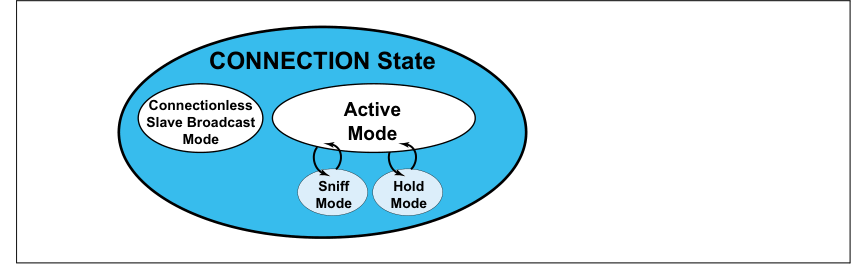

**Figure 8.7:  Connection state**

### 8.6   ACTIVE MODE

In the active mode, both master and slave actively participate on the channel. Up to seven slaves may be in the active mode at any given time in a piconet. The master schedules the transmission based on traffic demands to and from the different slaves. In addition, it supports regular transmissions to keep slaves synchronized to the channel. Slaves in the active mode listen in the master-to- slave slots for packets. These devices are known as active slaves. If an active
slave is not addressed, it may sleep until the next new master transmission. Slaves can derive the number of slots the master has reserved for transmission from the TYPE field in the packet header; during this time, the non-addressed slaves do not have to listen on the master-to-slave slots. When a device is participating in multiple piconets it should listen in the master-to-slave slot for the current piconet. It is recommended that a device not be away from each piconet in which it is participating for more than Tpoll slots. A periodic master transmission is required to keep the slaves synchronized to the channel. Since the slaves only need the channel access code to synchronize, any packet type can be used for this purpose.
Only the slave that is addressed by one of its LT_ADDRs (primary or secondary) may return a packet in the next slave-to-master slot. If no valid packet header is received, the slave may only respond in its reserved SCO or eSCO slave-to-master slot. In the case of a broadcast message, no slave shall return a packet.

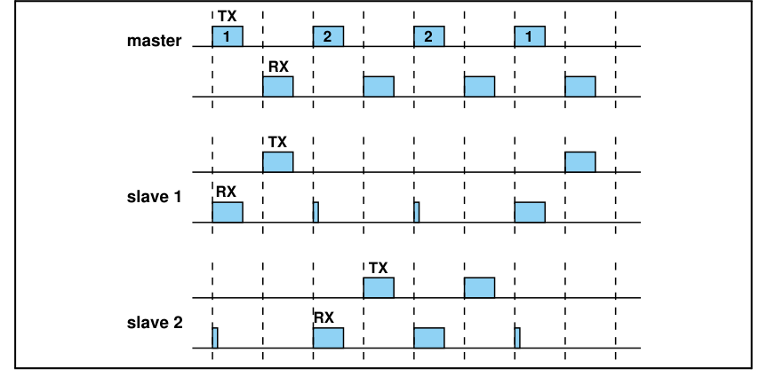

**Figure 8.8:  RX/TX timing in multi-slave configuration**

For ACL logical transports the mode selection may be left to real time packet type selections. The packet type table (ptt) in Section 6.5 allows the selection of Basic Rate or Enhanced Data Rate for each of the packet type codes, however; the DM1 packet is available in all packet type tables. ACL traffic over this given physical or logical link shall utilize the packet types in the given column of Table 6.2.

#### 8.6.1  Polling in the Active Mode

The master always has full control over the piconet. Due to the TDD scheme, slaves can only communicate with the master and not other slaves. In order to avoid collisions on the ACL logical transport, a slave is only allowed to transmit in the slave-to-master slot when addressed by the LT_ADDR in the packet header in the preceding master-to-slave slot. If the LT_ADDR in the preceding
slot does not match, or a valid packet header was not received, the slave shall not transmit.
The master normally attempts to poll a slave's ACL logical transport no less often than once every Tpoll slots. Tpoll is set by the Link Manager (see [Vol 2] Part C, Section 4.1.8).
The slave's ACL logical transport may be polled with any packet type except for FHS and ID. For example, polling during SCO may use HV packets, since the slave may respond to an HV packet with a DM1 packet (see Section 8.6.2).

#### 8.6.2  SCO

The SCO logical transport shall be established by the master sending a SCO setup message via the LM protocol. This message contains timing parameters including the SCO interval TSCO and the offset DSCO to specify the reserved slots.
In order to prevent clock wrap-around problems, an initialization flag in the LMP setup message indicates whether initialization procedure 1 or 2 is being used. The slave shall apply the initialization method as indicated by the initialization flag. The master shall use initialization 1 when the MSB of the current master clock (CLK27) is 0; it shall use initialization 2 when the MSB of the current master clock (CLK27) is 1. The master-to-slave SCO slots reserved by the master and the slave shall be initialized on the slots for which the clock satisfies the applicable equation:
CLK27-1 mod TSCO = DSCO for initialization 1
(CLK27,CLK26-1) mod TSCO = DSCO for initialization 2
The slave-to-master SCO slots shall directly follow the reserved master-to- slave SCO slots. After initialization, the clock value CLK(k+1) for the next master-to-slave SCO slot shall be derived by adding the fixed interval TSCO to the clock value of the current master-to-slave SCO slot:
CLK27-1(k+1) = CLK27-1(k) + TSCO
The master will send SCO packets to the slave at regular intervals (the SCO interval TSCO counted in slots) in the reserved master-to-slave slots. An HV1 packet can carry 1.25ms of speech at a 64 kb/s rate. An HV1 packet shall therefore be sent every two time slots (TSCO=2). An HV2 packet can carry 2.5ms of speech at a 64 kb/s rate. An HV2 packet shall therefore be sent every four time slots (TSCO=4). An HV3 packet can carry 3.75ms of speech at a 64 kb/s rate. An HV3 packet shall therefore be sent every six time slots (TSCO=6).
The slave is allowed to transmit in the slot reserved for its SCO logical transport unless a packet with the correct access code was received in the preceding slot and the LT_ADDR did not address this slave (irrespective of whether or not the HEC was correct). If the correct LT_ADDR was received in
the preceding slot but the HEC was incorrect, the slave should not transmit in the reserved SCO slot.
Since the DM1 packet is recognized on the SCO logical transport, it may be sent during the SCO reserved slots if a valid packet header with the primary LT_ADDR is received in the preceding slot. DM1 packets sent during SCO reserved slots shall only be used to send ACL-C data.
The slave shall not transmit anything other than an HV packet in a reserved SCO slot unless it decodes its own slave address in the packet header of the packet in the preceding master-to-slave transmission slot.

#### 8.6.3  eSCO

The eSCO logical transport is established by the master sending an eSCO setup message via the LM protocol. This message contains timing parameters including the eSCO interval TeSCO and the offset DeSCO to specify the reserved slots.
To enter eSCO, the master or slave shall send an eSCO setup command via the LM protocol. This message shall contain the eSCO interval TeSCO and an offset DeSCO. In order to prevent clock wrap-around problems, an initialization flag in the LMP setup message indicates whether initialization procedure 1 or 2 shall be used. The initiating device shall use initialization 1 when the MSB of the current master clock (CLK27) is 0; it shall use initialization 2 when the MSB of the current master clock (CLK27) is 1. The responding device shall apply the initialization method as indicated by the initialization flag. The master-to-slave eSCO slots reserved by the master and the slave shall be initialized on the slots for which the clock satisfies the applicable equation:
CLK27-1 mod TeSCO = DeSCO for initialization 1
(CLK27,CLK26-1) mod TeSCO = DeSCO for initialization 2
The slave-to-master eSCO slots shall directly follow the reserved master-to- slave eSCO slots. After initialization, the clock value CLK(k+1) for the next master-to-slave eSCO slot shall be found by adding the fixed interval TeSCO to the clock value of the current master-to-slave eSCO slot:
CLK27-1(k+1) = CLK27-1(k) + TeSCO
When an eSCO logical transport is established, the master shall assign an additional LT_ADDR to the slave. This provides the eSCO logical transport with an ARQ scheme that is separate from that of the ACL logical transport. All traffic on a particular eSCO logical transport, and only that eSCO traffic, is carried on the eSCO LT_ADDR. The eSCO ARQ scheme uses the ARQN bit in the packet header, and operates similarly to the ARQ scheme on ACL links.
There are two different polling rules in eSCO. In the eSCO reserved slots, the polling rule is the same as to the SCO reserved slots. The master may send a
packet in the master slot. The slave may transmit on the eSCO LT_ADDR in the following slot either if it received a packet on the eSCO LT_ADDR in the previous slot, or if it did not receive a valid packet header in the previous slot. When the master-to-slave packet type is a three-slot packet, the slave’s transmit slot is the fourth slot of the eSCO reserved slots. A master shall transmit in an eSCO retransmission window on a given eSCO LT_ADDR only if it addressed that eSCO LT_ADDR or did not transmit any packet in the immediately preceding eSCO reserved slots. A slave may transmit on an eSCO LT_ADDR in the eSCO reserved slots only if the slave did not received a valid packet header with a different LT_ADDR in the eSCO reserved slots. Inside retransmission windows, the same polling rule as for ACL traffic is used: the slave shall transmit on the eSCO channel only if it received a valid packet header and correct LT_ADDR on the eSCO channel in the previous master-to- slave transmission slot. The master may transmit on any non-eSCO LT_ADDR in any master-to-slave transmission slot inside the eSCO retransmission window.
The master shall only transmit on an eSCO LT_ADDR in the retransmission window if there are enough slots left for both the master and slave packets to complete in the retransmission window. If the master is transmitting a NULL packet (with ARQN=ACK), then this requires one slot, otherwise it requires enough slots for the master’s negotiated eSCO packet type plus:
• if the master’s packet has ARQN=NAK, then enough slots for the slave’s negotiated eSCO packet type;
• if the master’s packet has ARQN=ACK, then one slot.
The master may refrain from transmitting in any slot during the eSCO retransmission window. When there is no data to transmit from master to slave, either due to the traffic being unidirectional or due to the master-to-slave packet having been ACK’ed, the master shall use the POLL packet. When the master-to-slave packet has been ACK’ed, and the slave-to-master packet has been correctly received, the master shall not address the slave on the eSCO LT_ADDR until the next eSCO reserved slot, with the exception that the master may transmit a NULL packet with ARQN=ACK on the eSCO LT_ADDR. When there is no data to transmit from slave to master, either due to the traffic being unidirectional or due to the slave-to-master packet having been ACK'ed, the slave shall use NULL packets. eSCO traffic should be given priority over ACL traffic in the retransmission window.
Figure 8.9 shows the eSCO window when single slot packets are used.

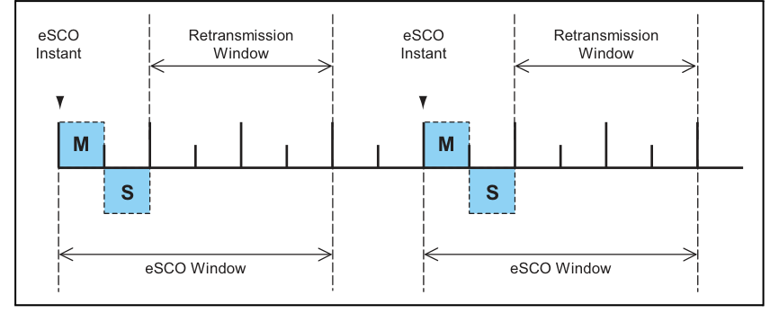

**Figure 8.9:  eSCO Window Details for Single-Slot Packets**

When multi-slot packets are used in either direction of the eSCO logical transport, the first transmission continues into the following slots. The retransmission window in this case starts the slot after the end of the slave-to- master packet, i.e. two, four or six slots immediately following the eSCO instant are reserved and should not be used for other traffic. Figure 8.10 shows the eSCO window when multi-slot packets are used in one direction and single-slot packets are used in the other direction.

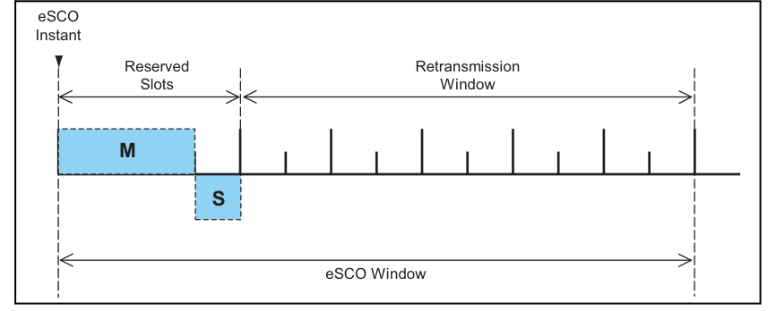

**Figure 8.10:  eSCO Window Details for Asymmetric Traffic**

eSCO windows may overlap on the master, but shall not overlap on an individual slave.
In the reserved slots both master and slave shall only listen and transmit at their allocated slots at the first transmission time of each eSCO window. Intermittent lapses due to, for instance, time-critical signaling during connection establishment are allowed. Both master and slave may refrain from sending data and may use instead POLL and NULL packets respectively. When the master transmits a POLL packet instead of an eSCO 3-slot packet, or the slave does not receive anything in the reserved master-to-slave transmission slot, it
shall start any transmission in the same slot as if the master had transmitted the negotiated packet type. For example, if the master had negotiated an EV5 packet the slave would transmit three slots later. If the master does not receive a slave transmission in response to an eSCO packet it causes an implicit NAK of the packet in question. The listening requirements for the slave during the retransmission window are the same as for an active ACL logical transport.

#### 8.6.4  Broadcast Scheme

The master of the piconet can broadcast messages to all slaves on the ASB logical transport. An ASB broadcast packet shall have an LT_ADDR set to all zero. If a new broadcast message carries ASB-U data, it may be fragmented in the same way as ACL packets. Therefore it shall start with a packet carrying the start of L2CAP message indication (LLID=10b) and may be followed by packets carrying the continuation of L2CAP message indication (LLID=01b). If a new broadcast message carries ASB-C data, it shall not be fragmented and shall consist of a single packet carrying the LMP message indication (LLID=11b). In either case, the master may carry out a number of retransmissions of each of these packets to increase the probability for error- free delivery; see also Section 7.6.5.
A broadcast packet shall never be acknowledged at the baseband layer.
The Broadcast LT_ADDR shall use a ptt=0.

#### 8.6.5  Role Switch

There are several occasions when a role switch is used:
• A role switch is necessary in order to make a paging device a slave when joining an existing piconet, since by definition the paging device is initially master of a piconet involving the pager (master) and the paged (slave) device.
• A role switch is necessary in order for a slave in an existing piconet to set up a new piconet with itself as master and the original piconet master as slave. If the original piconet had more than one slave, then this implies a double role for the original piconet master; it becomes a slave in the new piconet while still maintaining the original piconet as master.
Prior to the role switch, encryption if present, shall be paused or disabled in the old piconet. A role switch shall not be performed if the physical link is in Sniff or Hold mode, or has any synchronous logical transports.
For the master and slave involved in the role switch, the switch results in a reversal of their TX and RX timing: a TDD switch. Additionally, since the piconet parameters are derived from the Bluetooth device address and clock of the master, a role switch inherently involves a redefinition of the piconet as well: a piconet switch. The new piconet's parameters shall be derived from the former slave's device address and clock.
Assume device A is to become master; device B was the former master. Then there are two alternatives: either the slave initiates the role switch or the master initiates the role switch. These alternatives are described in Link Manager Protocol, [Vol 2] Part C, Section 4.4.2. The baseband procedure is the same regardless of which alternative is used.
To begin the role switch, the slave A and master B shall perform a TDD switch using the former hopping scheme (still using the Bluetooth device address and clock of device B), so there is no piconet switch yet. The slot offset information sent by slave A shall not be used yet; it is used when both devices have switched to the new piconet and device B is positioning its correlation window. Device A now becomes the master, device B the slave. The LT_ADDR formerly used by device A in its slave role, shall now be used by slave B.
At the moment of the TDD switch, both devices A and B shall start a timer with a time out of newconnectionTO. The timer shall be stopped in slave B as soon as it receives an FHS packet from master A on the TDD-switched channel. The timer shall be stopped in master A as soon as it receives an ID packet from slave B. If the newconnectionTO expires, the master and slave shall return to the old piconet timing and AFH state, taking their old roles of master and slave. The FHS packet shall be sent by master A using the "old" piconet parameters. The LT_ADDR in the FHS packet header shall be the former LT_ADDR used by device A. The LT_ADDR carried in the FHS payload shall be the new LT_ADDR intended for device B when operating on the new piconet. After the FHS acknowledgment, which is the ID packet and shall be sent by the slave on the old hopping sequence, both master A and slave B shall use the new channel parameters of the new piconet as indicated by the FHS with the sequence selection set to basic channel hopping sequence. If the new master has physical links that are AFH enabled, following the piconet switch the new master is responsible for controlling the AFH operational mode of its new slave.
Since the old and new masters' clocks are synchronized, the clock information sent in the FHS payload shall indicate the new master's clock at the beginning of the FHS packet transmission. Furthermore, the 1.25 ms resolution of the clock information given in the FHS packet is not sufficient for aligning the slot boundaries of the two piconets. The slot-offset information in the LMP message previously sent by device A shall be used to provide more accurate timing information. The slot offset indicates the delay between the start of the master- to-slave slots of the old and new piconet channels. This timing information ranges from 0 to 1249 μs with a resolution of 1μs. It shall be used together with the clock information in the FHS packet to accurately position the correlation window when switching to the new master's timing after acknowledgment of the FHS packet.
After reception of the FHS packet acknowledgment, the new master A shall switch to its own timing with the sequence selection set to the basic channel hopping sequence and shall send a POLL packet to verify the switch. Both the master and the slave shall start a new timer with a time out of newconnectionTO on FHS packet acknowledgment. The start of this timer shall be aligned with the beginning of the first master TX slot boundary of the new piconet, following the FHS packet acknowledgment. The slave shall stop the
timer when the POLL packet is received; the master shall stop the timer when the POLL packet is acknowledged. The slave shall respond with any type of packet to acknowledge the POLL. Any pending AFH_Instant shall be cancelled once the POLL packet has been received by the slave. If no response is received, the master shall re-send the POLL packet until newconnectionTO is reached. If this timer expires, both the slave and the master shall return to the old piconet timing with the old master and slave roles. Expiry of the timer shall also restore the state associated with AFH (including any pending AFH_Instant), Channel Quality Driven Data Rate (CQDDR, Link Manager Protocol [Vol 2] Part C, Section 4.1.7) and power control (Link Manager Protocol [Vol 2] Part C, Section 4.1.3). The role switch procedure may then restart from the TDD switch. Aligning the timer with TX boundaries of the new piconet ensures that no device returns to the old piconet timing in the middle of a master RX slot.
After the role switch the ACL logical transport is reinitialized as if it were a new connection. For example, the SEQN of the first data packet containing a CRC on the new piconet channel shall be set according to the rules in Section 7.6.2.

#### 8.6.6  Scatternet

Multiple piconets can cover the same area. Since each piconet has a different master, the piconets hop independently, each with their own hopping sequence and phase as determined by the respective master. In addition, the packets carried on the channels are preceded by different channel access codes as determined by the master device addresses. As more piconets are added, the probability of collisions increases; a graceful degradation of performance results as is common in frequency-hopping spread spectrum systems.
If multiple piconets cover the same area, a device can participate in two or more overlaying piconets by applying time multiplexing. To participate on the proper channel, it shall use the associated master device address and proper clock offset to obtain the correct phase. A device can act as a slave in several piconets, but only as a master in a single piconet: since two piconets with the same master are synchronized and use the same hopping sequence, they are one and the same piconet. A group of piconets in which connections exist between different piconets is called a scatternet.
A master or slave can become a slave in another piconet by being paged by the master of this other piconet. On the other hand, a device participating in one piconet can page the master or slave of another piconet. Since the paging device always starts out as master, a master-slave role switch is required if a slave role is desired. This is described in Section 8.6.5.

##### 8.6.6.1  Inter-Piconet Communications

Time multiplexing must be used to switch between piconets. Devices may achieve the time multiplexing necessary to implement scatternet by using sniff mode or by remaining in an active ACL connection. For an ACL connection in piconets where the device is a slave in the CONNECTION state, it may choose not to listen in every master slot. In this case it should be recognized that the quality of service on this link can degrade abruptly if the slave is not present enough to match up with the master polling that slave. Similarly, in piconets where the device is master it may choose not to transmit in every master slot. In this case it is important to honor Tpoll as much as possible. Devices in sniff mode could have sufficient time to visit another piconet in between sniff slots. When the device is a slave using sniff mode and there are not sufficient idle slots, the device may choose to not listen to all master transmission slots in the sniff_attempts period or during the subsequent sniff_timeout period. A master is not required to transmit during sniff slots and therefore has flexibility for scatternet. If SCO or eSCO links are established, other piconets shall only be visited in the non-reserved slots in between reserved slots. This is only possible if there is a single SCO logical transport using HV3 packets or eSCO links where at least four slots remain in between the reserved slots. Since the multiple piconets are not synchronized, guard time must be left to account for misalignment. This means that only 2 slots can effectively be used to visit another piconet in between the HV3 packets.
Since the clocks of two masters of different piconets are not synchronized, a slave device participating in two piconets shall maintain two offsets that, added to its own native clock, create the two master clocks. Since the two master clocks drift independently, the slave must regularly update the offsets in order to keep synchronization to both masters.

#### 8.6.7  Hop Sequence Switching

Hop sequence adaptation is controlled by the master and can be set to either enabled or disabled. Once enabled, hop sequence adaptation shall apply to all logical transports on a physical link. Once enabled, the master may periodically update the set of used and unused channels as well as disable hop sequence adaptation on a physical link. When a master has multiple physical links the state of each link is independent of all other physical links.
When hop sequence adaptation is enabled, the sequence selection hop selection kernel input is set to adapted channel hopping sequence and the AFH_channel_map input is set to the appropriate set of used and unused channels. Additionally, the same channel mechanism shall be used. When hop sequence adaptation is enabled with all channels used this is known as AHS(79).
When hop sequence adaptation is disabled, the sequence selection input of the hop selection kernel is set to basic channel hopping sequence (the AFH_channel_map input is unused in this case) and the same channel mechanism shall not be used.
The hop sequence adaptation state shall be changed when the master sends the LMP_set_AFH PDU and a baseband acknowledgment is received. When the baseband acknowledgment is received prior to the hop sequence switch instant, AFH_Instant, (See Link Manager Protocol [Vol 2] Part C, Section 4.1.4) the hop sequence proceeds as shown in Figure 8.11.

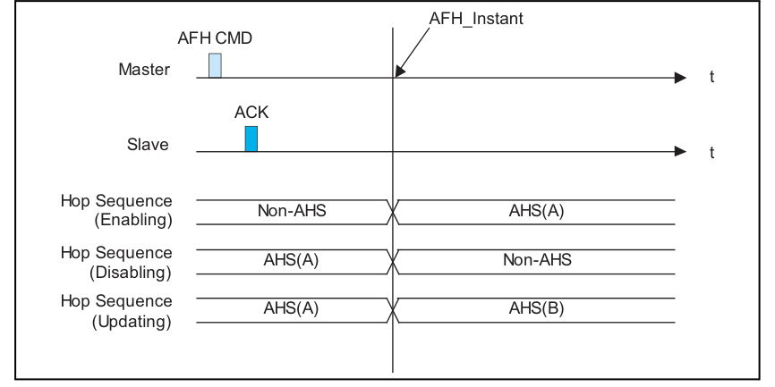

**Figure 8.11:  Successful hop sequence switching**

When the baseband acknowledgment is not received prior to the AFH_Instant the master shall use a recovery hop sequence for the slave(s) that did not respond with an acknowledgment (this may be because the slave did not hear the master’s transmission or the master did not hear the slave’s transmission). When hop sequence adaptation is being enabled or disabled the recovery sequence shall be the AFH_channel_map specified in the LMP_set_AFH PDU. When the AFH_channel_map is being updated the master shall choose a recovery sequence that includes all of the RF channels marked as used in either the old or new AFH_channel_map, e.g. AHS(79). Once the baseband acknowledgment is received the master shall use the AFH_channel_map in the LMP_set_AFH PDU starting with the next transmission to the slave. See Figure 8.12.

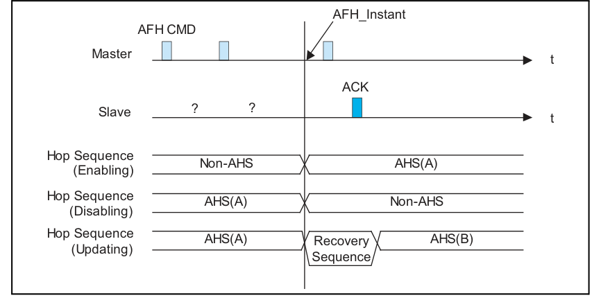

**Figure 8.12:  Recovery hop sequences**

When the AFH_Instant occurs during a multi-slot packet transmitted by the master, the slave shall use the same hopping sequence parameters as the master used at the start of the multi-slot packet. An example of this is shown in Figure 8.13. In this figure the basic channel hopping sequence is designated f. The first adapted channel hopping sequence is designated with f', and the second adapted channel hopping sequence is designated f''.

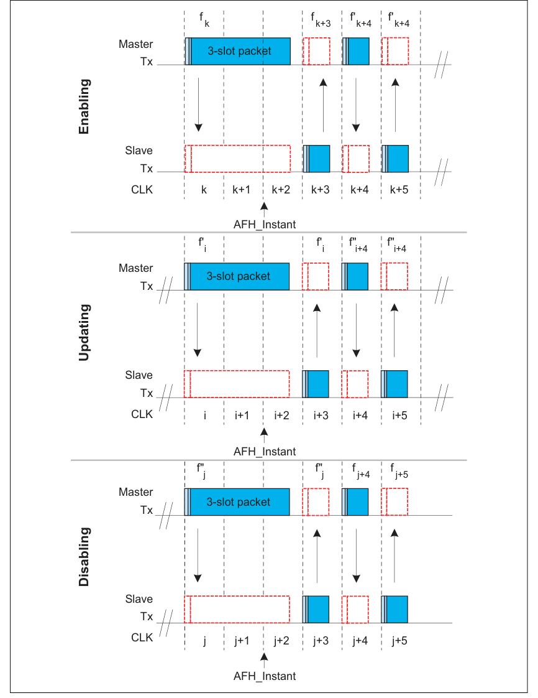

**Figure 8.13:  AFH_Instant changes during multi-slot packets transmitted by the master**

#### 8.6.8  Channel Classification and Channel Map Selection

RF channels are classified as being unknown, bad or good. These classifications are determined individually by the master and slaves based on local information (e.g. active or passive channel assessment methods or from the Host via HCI). Information received from other devices via LMP (for example, an AFH_channel_map from a master or a channel classification report from a slave) shall not be included in a device’s channel classification.
The three possible channel classifications shall be as defined in Table 8.6.

| Classification | Definition |
| --- | --- |
| unknown | A channel shall be classified as unknown if the channel assessment mea surements are insufficient to reliably classify the channel, and the chann is not marked as bad in the most recent HCI Set AFH Channel Classifi _ _ _ cation. |
| bad | A channel may be classified as bad if an ACL or synchronous throughput failure measure associated with it has exceeded a threshold (defined by the particular channel assessment algorithm employed). A channel may also be classified as bad if an interference-level measure associated with it, determining the interference level that the link poses upon other systems in the vicinity, has exceeded a threshold (defined by the particular channel assessment algorithm employed). A channel shall be classified as bad when it is marked as bad in the mos recent HCI Set AFH Channel Classification _ _ _ |
| good | A channel shall be classified as good if it is not either unknown or bad. |

Table 8.6:  Channel classification descriptions
A master with AFH enabled physical links shall determine an AFH_channel_map for each such link (two or more links may use the same map) based on any combination of the following information:
• Channel classification from local measurements (e.g. active or passive channel assessment in the Controller), if supported and enabled. The Host may enable or disable local measurements using the HCI Write_AFH_Channel_Assessment_Mode command, defined in the HCI Functional Specification [Vol 2] Part E, Section 7.3.54 if HCI is present.
• Channel classification information from the Host using the HCI Set_AFH_channel_classification command, defined in the HCI Functional Specification [Vol 2] Part E, Section 7.3.46 if HCI is present. Channels classified as bad in the most recent AFH_Host_Channel_Classification shall be marked as unused in the AFH_channel_map.
• Channel classification reports received from slaves in LMP_channel_classification PDUs, defined in the LMP Specification [Vol 2] Part C, Section 4.1.5.
The algorithm used by the master to combine these information sources and generate the AFH_channel_map is not defined in the specification and will be
implementation specific. At no time shall the number of channels used be less than Nmin, defined in Section 2.3.1.
If a master determines that all channels should be used, it may keep AFH operation enabled using an AFH_channel_map of 79 used channels, i.e., AHS(79).
For all devices that support the Synchronization Train Substate (see Section 8.11.2), the RF channel indices used for the Synchronization Train (see Section 2.6.4.8) shall be marked as unused in the AFH_channel_map for all logical links.

#### 8.6.9  Power Management

Features are provided to allow low-power operation. These features are both at the microscopic level when handling the packets, and at the macroscopic level when using certain operation modes.

##### 8.6.9.1  Packet Handling

In order to minimize power consumption, packet handling is minimized both at TX and RX sides. At the TX side, power is minimized by only sending useful data. This means that if only link control information needs to be exchanged, NULL packets may be used. No transmission is required if there is no link control information to be sent, or if the transmission would only involve a NAK (NAK is implicit on no reply). If there is data to be sent, the payload length shall be adapted in order to send only the valid data bytes. At the RX side, packet processing takes place in different steps. If no valid access code is found in the search window, the transceiver may return to sleep. If an access code is found, the receiver device shall start to process the packet header. If the HEC fails, the device may return to sleep after the packet header. A valid header indicates if a payload will follow and how many slots are involved.

##### 8.6.9.2  Slot Occupancy

As was described in Section 6.5, the packet type indicates how many slots a packet may occupy. A slave not addressed in the packet header may go to sleep for the remaining slots the packet occupies. This can be read from the TYPE code.

##### 8.6.9.3  Recommendations for Low-Power Operation

The most common and flexible method for reducing power consumption is the use of sniff. Hold can also be used by repeated negotiation of hold periods.

##### 8.6.9.4  Enhanced Data Rate

Enhanced Data Rate provides power saving because of the ability to send a given amount of data in either fewer packets or with the same (or similar) number of packets but with shorter payloads.

#### 8.6.10  Piconet Clock Adjustment

A master may adjust the piconet clock during the existence of a piconet using two mechanisms: Coarse Clock Adjustment and Clock Dragging. Both mechanisms may be used within the same piconet.

##### 8.6.10.1  Coarse Clock Adjustment

The master carries out a coarse clock adjustment by selecting an adjustment instant (clk_adj_instant), which shall be a master to slave slot, and the amount of the adjustment, and then broadcasting these parameters to all slaves by sending LMP_clk_adj (see [Vol 2] Part C, Section 4.1.14.1). The amount of the adjustment is specified as two values: clk_adj_slots, which is the change in the value of CLK[27:1] at the clk_adj_instant, and clk_adj_us, which is the number of microseconds between the start of a master slot in the old clock (CLKold) and in the new clock (CLKnew) domains.
The master shall provide the opportunity for each slave to acknowledge the adjustment with LMP_clk_adj_ack (see [Vol 2] Part C, Section 4.1.14.1). If the master receives any other packet than LMP_clk_adj_ack with the current clk_adj_id, it should poll the slave more times until the expected acknowledgment is received or the slave responds with a NULL packet. If any slave does not acknowledge the adjustment, the master shall start the Coarse Clock Adjustment Recovery Mode (see Section 8.6.10.2).
When the clk_adj_instant occurs, the master will add (clk_adj_slots * 625 + clk_adj_us) µs to time_base_offset and the slave(s) will add the same amount to slave_offset. If the clk_adj_instant occurs during a multi-slot packet the adjustment is delayed until the start of the following master-to-slave slot. If a role switch is successful prior to the clk_adj_instant, the pending coarse clock adjustment shall be discarded. The effect of the adjustment is that devices will use the new clock domain starting at clk_adj_instant.
Figure 8.14 shows an example of a positive clock adjustment. In this example the clk_adj_instant is set to slot 12 (which is in the old clock domain), clk_adj_slots is set to 6 and clk_adj_us is set to 400. Time is moved forward clk_adj_slots * 625 + clk_adj_us = 6 * 625 + 400 = 4150 µs. The initial slot in the new clock domain is at CLKnew[27:1] = clk_adj_instant + clk_adj_slots = 12 + 6 = 18. This is an even value so the first slot is a master slot. A positive clk_adj_us means that the first slot is assumed to have started clk_adj_us before the clk_adj_instant, and hence only 625 – clk_adj_us = 225 µs remains after the instant. Since transmissions cannot be started part way through a slot, this partial slot is unusable. The first complete slot after the clk_adj_instant is a
slave slot which can be used, for example, for eSCO. If clk_adj_slots had been an odd number, the first complete slot would have been a master slot. The first complete master slot in this example happens at CLKnew[27:1] = 20.

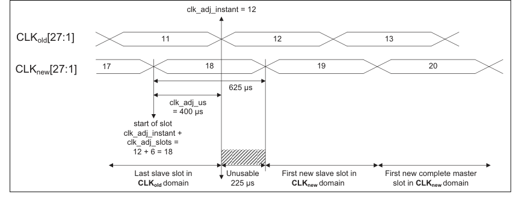

**Figure 8.14:  Positive Coarse Clock Adjustment**

Figure 8.15 shows an example of a negative clock adjustment. In this example the clk_adj_instant is again set to slot 12, clk_adj_slots is set to 0 and clk_adj_us is set to –400. Time is moved by clk_adj_slots * 625 + clk_adj_us = 0 * 625 + (–400) = –400 µs, which is 400 µs backwards. The initial slot in the CLKnew domain is at CLKnew[27:1] = clk_adj_instant + clk_adj_slots = 12 + 0 = 12. This is an even value so the first slot is a master slot. A negative clk_adj_us means that the first slot in the CLKnew domain starts clk_adj_us after clk_adj_instant. The time between the first slot in the CLKnew domain and clk_adj_instant (in this case 400 µs) is effectively a continuation of the previous slot, even if its number changes, and hence is unusable. (This is the case whenever clk_adj_us is negative, even when clk_adj_slots is non-zero.)

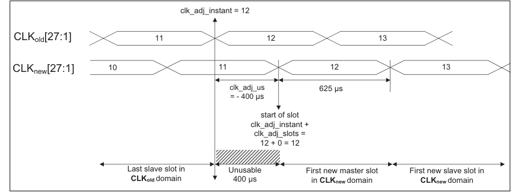

**Figure 8.15:  Negative Coarse Clock Adjustment**

If clk_adj_us is zero then the adjustment alters the slot numbering but not the actual times at which slots start. Therefore all slots remain available for use, though if clk_adj_slots is odd then there will be two consecutive slave slots.

##### 8.6.10.2  Coarse Clock Adjustment Recovery Mode

In Coarse Clock Adjustment Recovery Mode, the master enters the Synchronization Train Substate (see Section 8.11.2). The master should remain in this substate and transmit synchronization train packets until all slaves have acknowledged the adjustment with the LMP_clk_adj_ack PDU, or link supervision timeout has expired for the last unresponsive slave. The master may cancel Coarse Clock Adjustment Recovery Mode to initiate another coarse clock adjustment or for any other reason. During Coarse Clock Adjustment Recovery Mode the master shall continue broadcasting LMP_clk_adj PDUs (see [[Vol 2] Part C, Section 4.1.14.1).
When a slave does not detect any transmissions from its master it may enter the Synchronization Scan Substate (see Section 8.11.1) and scan for synchronization train packets as defined in Section 2.7. TSync_Scan_Window should be set large enough to enable reception of at least one synchronization train packet. A slave that could have lost its connection to the master due to coarse clock adjustment should prioritize synchronization scan.
A slave that receives a Synchronization Train packet with the BD_ADDR of its master shall change the value of slave_offset to make CLK correspond to the contents of the packet and then exit the Synchronization Scan Substate. If the new clock is in the range CLKOLD–LSTO to CLKOLD inclusive (where LSTO is the link supervision timeout period), then this shall be treated as a negative change. In this case, the slave shall not transmit any packet and shall ignore all received directed packets until the value of CLK, after being changed, is strictly greater than the value of CLK the last time it transmitted or received (as appropriate) a packet. If the new clock is outside this range then this shall be treated as a positive change (and thus might involve a clock wrap).

##### 8.6.10.3  Clock Dragging

Clock Dragging means that the master periodically adjusts its time_base_offset (see Section 2.2.4) until a desired time adjustment has been accomplished.
Each single adjustment shall be performed by a directed packet from the master to each slave and a response (e.g. baseband acknowledgment) from each slave. If a slave does not respond, the master shall suspend its updating of time_base_offset (but should continue to poll that slave) at least until each slave has either responded or has failed to respond for at least CLK_adj_dragTO. In case several slaves fail to respond, the master should ensure that each of the failing slaves gets at least one CLK_adj_dragTO to respond (these may be concurrent for multiple slaves). The master need not allow more than one suspension of CLK_adj_dragTO for any given slave during a link supervision timeout for that slave.
A single adjustment shall be less than or equal to 3 µs. Within any period of 125 ms, the total adjustment in a single direction shall be less than or equal to 5 µs. Note: These requirements apply to the changes to time_base_offset and
are applied irrespective of the accuracy of the master's reference clock (see Section 1.1). This means that slaves may observe a change in CLK greater than 20ppm.
If a master is performing Clock Dragging when it initiates a Coarse Clock Adjustment, a new Clock Dragging, or a sequence containing an instant or timing control flags, or receives a request from a slave to initiate such a sequence, it shall abort the current Clock Dragging before processing the new request or carrying out the sequence. If the master has suspended clock dragging during CLK_adj_dragTO, it shall reject new requests until the timeout is cancelled due to slave response or the timeout period expires.

#### 8.6.11  Slot Availability Mask (SAM)

Slot Availability Mask (SAM) allows two Bluetooth devices to indicate to each other the availability of their time slots for transmission and reception. From the baseband point of view, SAM provides a map - the SAM slot map - which marks the availability of Bluetooth slots. The availability arises from either external conditions (e.g., MWS coexistence) or internal conditions (e.g., topology management for scatternets). The SAM slot map marks each slot using one of four type codes defined in [Vol 2] Part C, Section 5.2 and repeated for convenience in Table 8.7.

| Slot type code | Meaning |
| --- | --- |
| 0 | The slot is not available for either transmission or reception |
| 1 | The slot is available for transmission but not reception |
| 2 | The slot is available for reception but not transmission |
| 3 | The slot is available for both transmission and reception |

Table 8.7:  SAM Slot Types
Note: A master may mark master-to-slave slots available for reception and slave-to-master slots available for transmission, because such slots may be used in this way for multi-slot packets; similarly for a slave. A SAM slot map with all slots set to type 3 is equivalent to not using SAM and simply performing normal scheduling.
Figure 8.16 shows an example of a SAM slot map. The master-to-slave slots are labeled with the letter 'M' and slave-to-master slots with the letter 'S'.

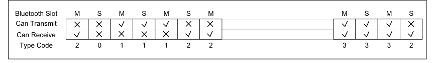

**Figure 8.16:  An example of a SAM slot map**

A SAM slot map has a finite length and is repeated indefinitely until changed by the associated LMP procedures. SAM anchor points are spaced regularly with an interval of TSAM, in units of slots. Between adjacent SAM anchor points, the slot map indicates when the device is able to transmit and receive. The SAM slot map is effectively repeated every TSAM until it is changed.
The SAM interval TSAM is further divided into NSAM-SM sub-intervals of equal length, TSAM-SM, such that TSAM = TSAM-SM * NSAM-SM. TSAM-SM shall be an even integer so as to contain TX/RX slot pairs.
The words "SAM submap" (or simply "submap" when there is no ambiguity from the context) will be used to denote a sub-interval of TSAM-SM slots. Each submap is assigned one of the four usage types defined in [Vol 2] Part C, Section 5.2 and repeated for convenience in Table 8.8.

| Submaptype code | Meaning |
| --- | --- |
| 0 | Each slot is individually available or unavailable as configured. Slots may have different availabilities for transmission and reception. |
| 1 | All slots are available for transmission and reception. |
| 2 | All slots are unavailable for transmission and reception. |
| 3 | Reserved for Future Use |

Table 8.8:  SAM Submap Types
The SAM facilities specify each SAM slot map at the submap granularity. Figure 8.17 shows an example of a SAM slot map in terms of submaps in the local device. Each box represents a sub-interval of TSAM-SM slots, with the label on the box indicating the type of the submap. Note that at the submap level of granularity, transmit and receive are handled identically. The difference will only appear inside submaps with type 0.

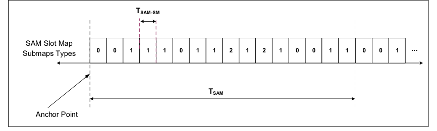

**Figure 8.17:  Example of a SAM slot map in terms of submaps in the local device**

In addition to the SAM slot maps, the Controller also maintains a single "SAM type 0 submap" that is used to specify the availability of individual slots for those submaps shown as having type 0. The Controller then combines the SAM slot map at submap granularity with the first TSAM-SM entries of the type 0
submap to generate the effective maps. Figure 8.18 shows a SAM slot map and a SAM type 0 submap together with the resulting effective map.

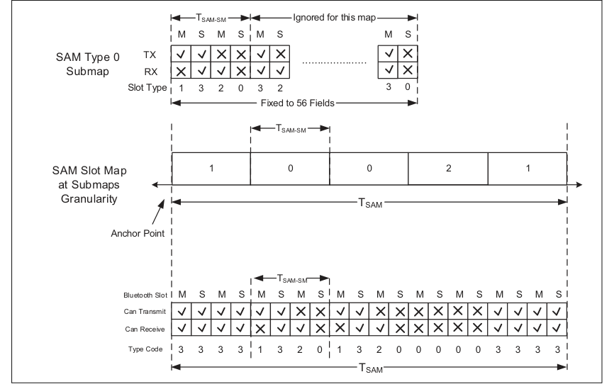

**Figure 8.18:  Example of a SAM slot map and SAM type 0 submap being combined**

Figure 8.19 shows an example of a SAM type 0 submap for a collocated MWS.

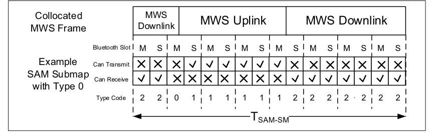

**Figure 8.19:  Examples of SAM type 0 submap at a Bluetooth device with a collocated MWS**

The assumption in the example is that, in order to prevent mutual interference between Bluetooth and MWS radios, Bluetooth transmissions are not available during MWS downlink durations and Bluetooth reception is not available during MWS uplink durations. The MWS frame is 10 ms long and the SAM type 0 submap needs to have the same length, so TSAM-SM is 16.
Figure 8.20 shows another example of a collocated Bluetooth device with a low traffic load in the MWS Uplink. In this case, the implementation chooses to mark the MWS Uplink portion available for both TX and RX, because there is a
good chance that it can receive master packets and respond to them without interference from MWS.

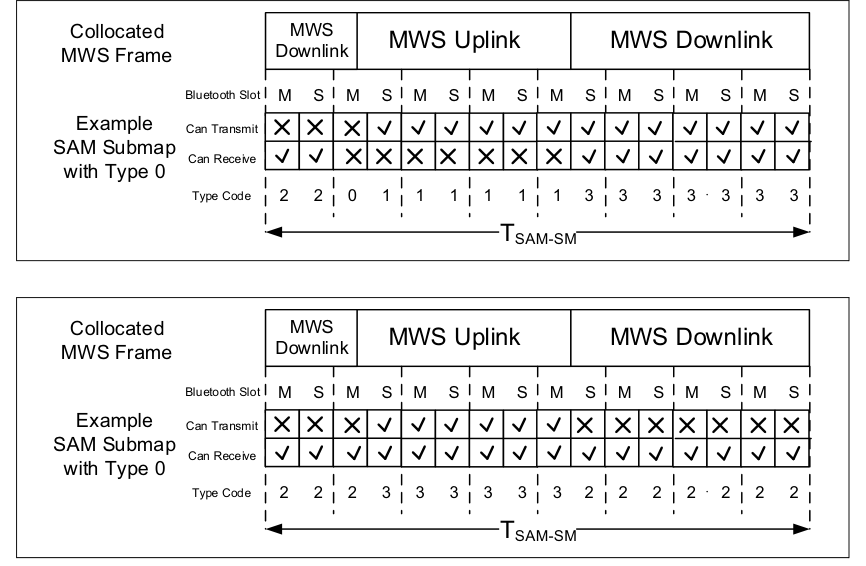

**Figure 8.20:  Examples of SAM type 0 submap at a Bluetooth device with a collocated MWS with low uplink traffic load**

SAM allows each device to send its local slot availability to the other, in which case the availability of slots depends on the combined slot maps. The scheduling recommendations for such a SAM slot map are described in Section 8.6.11.2.
A device that supports the SAM feature shall be capable of storing three distinct SAM slot maps from each connected remote device. A remote device can only define one type 0 submap, which can be referenced by any of its defined SAM slot maps. The remote device may redefine its type 0 submap at any time.

##### 8.6.11.1  SAM Anchor Point

SAM slot maps are periodic, defined by an interval TSAM and an offset DSAM. Figure 8.21 shows an example of SAM slot maps designed to correspond to periodic MWS active and inactivity cycles.

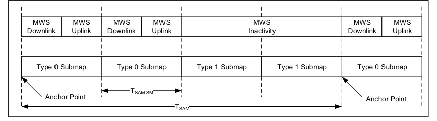

**Figure 8.21:  An example of SAM slot maps for a periodic MWS active and inactive cycles**

SAM anchor points are the start points of the first slot in the SAM slot maps. SAM anchor points are computed from TSAM and DSAM using the current master clock, which is known to both devices. The first SAM anchor point is indicated by SAM_Instant. In order to prevent problems caused by the clock wrap-around, the LMP message carries an additional timing control flag, which indicates whether initialization procedure 1 or 2 shall be used. The initiating device shall use initialization 1 when the MSB of the current master clock (CLK27) is 0; it shall use initialization 2 when the MSB of the current master clock (CLK27) is 1. The responding device shall apply the initialization method indicated by the initialization flag. The SAM anchor points shall be initialized on the slots for which the clock satisfies the applicable equations:
CLK27-1 mod TSAM = DSAM for initialization 1
(CLK 27, CLK26-1) mod TSAM = DSAM for initialization 2
After initialization, the clock value CLK(k+1) for the next SAM anchor point can be found by adding the fixed interval TSAM to the clock value of the current anchor point:
CLK27-1 (k+1) = CLK27-1 (k) + TSAM
The SAM anchor point shall be a master-to-slave slot. As a corollary, the first slot of every SAM submap is also a master-to-slave slot.

##### 8.6.11.2  SAM Scheduling

SAM enables each device to send its local slot availability to the other. The scheduler in the Bluetooth Controller should consider the SAM slot maps from both local and remote devices for packet scheduling. The only effect of using the SAM information is to restrict a device's transmission and reception opportunities.
For all ACL packets and for eSCO packets in the retransmission window:
1. The master should only transmit a packet if the required master-to-slave slots are marked as available for transmission in the master's SAM slot map and available for reception in the slave's SAM slot map.
2. The slave should only transmit a packet if the required slots are marked as available for reception in the master's SAM slot map and available for transmission in the slave's SAM slot map.
3. The slave may choose not to listen to the master in master-to-slave slots that are marked either unavailable for transmission in the master’s SAM slot map or unavailable for reception in the slave’s SAM slot map.
For all ACL packets, the master should only transmit a packet if the slot immediately following the master's packet is marked as available for transmission in the slave's SAM slot map and available for reception in the master's SAM slot map.
For eSCO packets in the retransmission window, the master should only transmit a packet if either:
1. the slot immediately following the master's packet is marked as available for transmission in the slave's SAM slot map and available for reception in the master's SAM slot map;
2. this is the last opportunity for the master to transmit this packet in this retransmission window; or
3. for all subsequent master-to-slave slots in the same retransmission window that provide sufficient remaining slots for the master to transmit the same packet, the rules in this section state that the master should not transmit the packet.
In SCO and eSCO reserved slots, either the master or the slave may choose not to transmit a SCO or eSCO packet unless the required slots are marked both as available for transmission in the local SAM slot map and available for reception in the remote SAM slot map.
Figure 8.22 below illustrates possible scheduling results with combined SAM slot maps from master and slave.

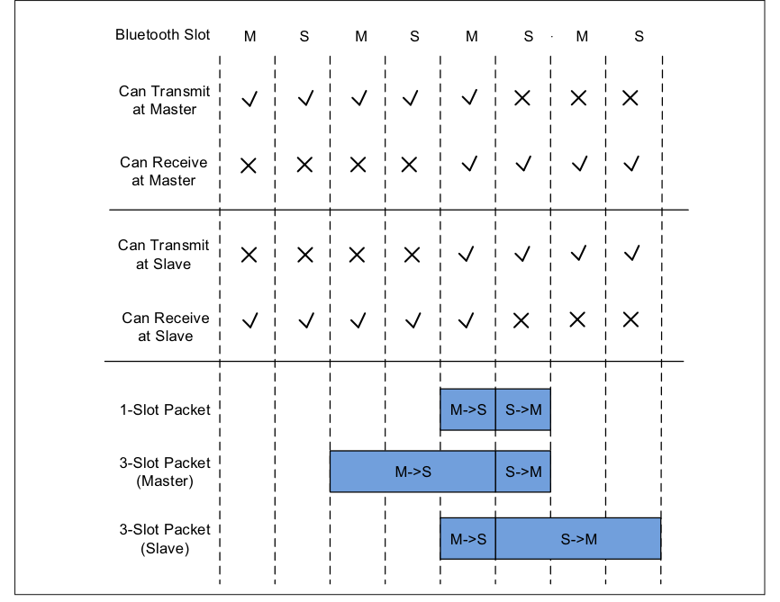

**Figure 8.22:  Example of possible scheduling results with combined SAM slot maps from master and slave**

### 8.7   SNIFF MODE

In Sniff mode, the duty cycle of the slave’s activity in the piconet may be reduced. If a slave is in active mode on an ACL logical transport, it shall listen in every ACL slot to the master traffic, unless that link is being treated as a scatternet link or is absent due to hold mode. With sniff mode, the time slots when a slave is listening are reduced, so the master shall only transmit to a slave in specified time slots. The sniff anchor points are spaced regularly with an interval of Tsniff.

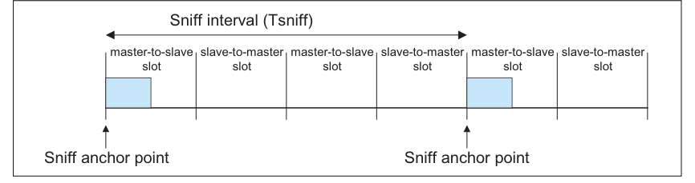

**Figure 8.23:  Sniff anchor points**

The slave listens in master-to-slave transmission slots starting at the sniff anchor point. It shall use the following rules to determine whether to continue listening:
• If fewer than Nsniff attempt master-to-slave transmission slots have elapsed since the sniff anchor point then the slave shall continue listening.
• If the slave has received a packet with a matching LT_ADDR that contains ACL data (DM, DH, DV, or AUX1 packets) in the preceding Nsniff timeout master-to-slave transmission slots then it shall continue listening.
• If the slave has transmitted a packet containing ACL data (DM, DH, DV, or AUX1 packets) in the preceding Nsniff timeout slave-to-master transmission slots then it shall continue listening.
• If the slave has received any packet with a matching LT_ADDR in the preceding Nsniff timeout master-to-slave transmission slots then it may continue listening.
• A device may override the rules above and stop listening prior to Nsniff timeout or the remaining Nsniff attempt slots if it has activity in another piconet.
It is possible that activity from one sniff timeout may extend to the next sniff anchor point. Any activity from a previous sniff timeout shall not affect activity after the next sniff anchor point. So in the above rules, only the slots since the last sniff anchor point are considered.
Note that Nsniff attempt =1 and Nsniff timeout =0 cause the slave to listen only at the slot beginning at the sniff anchor point, irrespective of packets received from the master.
Nsniff attempt =0 shall not be used.
Sniff mode only applies to asynchronous logical transports and their associated LT_ADDR. Sniff mode shall not apply to synchronous logical transports, therefore, both masters and slaves shall still respect the reserved slots and retransmission windows of synchronous links.
To enter sniff mode, the master or slave shall issue a sniff command via the LM protocol. This message includes the sniff interval Tsniff and an offset Dsniff. In addition, an initialization flag indicates whether initialization procedure 1 or 2 shall be used. The device shall use initialization 1 when the MSB of the current master clock (CLK27) is 0; it shall use initialization 2 when the MSB of the current master clock (CLK27) is 1. The slave shall apply the initialization method as indicated by the initialization flag irrespective of its clock bit value CLK27. The sniff anchor point determined by the master and the slave shall be initialized on the slots for which the clock satisfies the applicable equation:
CLK27-1 mod Tsniff = Dsniff for initialization 1
(CLK27,CLK26-1) mod Tsniff = Dsniff for initialization 2
this implies that Dsniff must be even
After initialization, the clock value CLK(k+1) for the next sniff anchor point shall be derived by adding the fixed interval Tsniff to the clock value of the current sniff anchor point:
CLK27-1(k+1) = CLK27-1(k) + Tsniff

#### 8.7.1  Sniff Transition Mode

Sniff transition mode is a special mode which is used during the transition between sniff and active mode. It is required because during this transition it is unclear which mode (Sniff or Active) the slave is in and it is necessary to ensure that the slave is polled correctly regardless of which mode it is in.
In sniff transition mode the master shall maintain the active mode poll interval in case the slave is in active mode. In addition the master shall poll the slave at least once in the sniff attempt transmit slots starting at each sniff anchor point. Note that this transmission counts for the active mode polling as well. The master shall use its high power accurate clock when in Sniff Transition Mode.
The precise circumstances under which the master enters Sniff Transition Mode are defined in [Vol 2] Part C, Section 4.5.3.1.

#### 8.7.2  Sniff Subrating

When sniff subrating is enabled by the Link Manager a device alternates between sniff mode and sniff subrating mode. Sniff subrating mode allows a device to use a reduced number of sniff anchor points. A device shall transition from sniff mode to sniff subrating mode based on the sniff mode timeout value (see Section 8.7.2.1). A device shall transition from sniff subrating mode to sniff mode whenever ACL-U, ASB-U, ACL-C, or ASB-C data is received from the remote device.

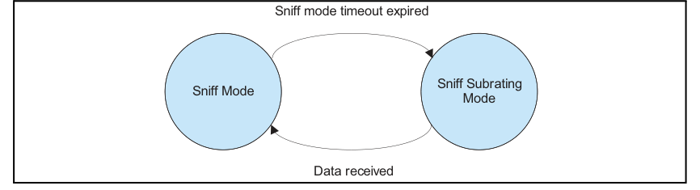

**Figure 8.24:  Sniff subrating**

A slave device in sniff subrating mode shall also temporarily enter sniff mode after transmitting a packet requiring acknowledgment until the baseband acknowledgment is received.
Note: Once sniff subrating is enabled the master and slave devices may be in sniff mode or sniff subrating mode at different times. The rules defined in
Section 8.7.2.2 describe how the two devices maintain synchronization and can reliably exchange data.

##### 8.7.2.1  Sniff Mode Timeout

Whenever a packet containing ACL-U,ASB-U, ACL-C, or ASB-C data is received by a device in sniff subrating mode it shall transition to sniff mode, re- start the sniff mode timeout and all sniff anchor points shall be used until a minimum number of slots equal to the received min_sniff_mode_timeout have expired. If ACL-U, ASB_U, ACL-C, or ASB-C data is received before min_sniff_mode_timeout slots have passed since the last ACL-U, ASB_U, ACL-C, or ASB-C data was received, the timeout shall be restarted. NULL and POLL packets do not contain ACL or ASB data and shall not restart the sniff mode timeout.
Note that there are two sniff mode timeout values: one for the local device and one for the remote device.

##### 8.7.2.2  Sniff Subrating Mode

When the sniff mode timeout has expired a device shall enter sniff subrating mode. In sniff subrating mode the mandatory sniff subrate anchor points at which the master shall transmit to the slave and the slave shall listen for the master, are defined as follows (where M is the max subrate received by the master, N is the max subrate received by the slave, A is the sniff subrating instant, and k is any positive integer):

|  | Master | Slave |
| --- | --- | --- |
| M=N | CLK = A + [ T • M • k ] M ( k ) sniff | CLK = A+ [ T • N • k ] N ( k ) sniff |
| M>N | At least once every j anchor points satisfying CLK = A + [ T • N • k ], where N ( k ) sniff j =  M / N  | CLK = A + [ T • N • k ] N ( k ) sniff |
| M<N | CLK = A + [ T • M • k ] M( k ) sniff | At least once every j anchor points satisfying CLK = A + [ T • M • k ], where M( k ) sniff j =  N / M  |

Table 8.9:  Sniff subrate anchor points
1 Note:  X  denotes the mathematical “floor” function, equivalent to rounding down to the nearest integer. Hence,   X / Y  yields the highest integer j for which Y • .
j X ≤
2 Note: When sniff subrating is enabled, the rules specified in Section 8.7 for Nsniff attempt and Nsniff Timeout shall apply to sniff subrating anchor points.

### 8.8   HOLD MODE

During the CONNECTION state, the ACL logical transport to a slave can be put in a hold mode. In hold mode the slave temporarily shall not support ACL packets on the channel. Any synchronous packet during reserved synchronous slots (from SCO and eSCO links) shall be supported. With the hold mode, capacity can be made free to do other things like scanning, paging, inquiring, or attending another piconet. The device in hold mode can also enter a low- power sleep mode. During hold mode, the slave device keeps its logical transport address(es) (LT_ADDR).
Prior to entering hold mode, master and slave agree on the time duration the slave remains in hold mode. A timer shall be initialized with the holdTO value. When the timer is expired, the slave shall wake up, synchronize to the traffic on the channel and will wait for further master transmissions.

### 8.9   THIS SECTION NO LONGER USED

### 8.10   CONNECTIONLESS SLAVE BROADCAST MODE

In connectionless slave broadcast mode, the master broadcasts packets to zero or more slaves.
The master can broadcast messages to multiple slaves in connectionless slave broadcast mode. For this purpose, the master shall reserve an LT_ADDR for use only by Connectionless Slave Broadcast traffic. In connectionless slave broadcast mode, the master transmits packets at specified intervals.

#### 8.10.1  Connectionless Slave Broadcast Transmit Operation

In connectionless slave broadcast mode, the master transmits packets on the CSB logical transport at intervals requested by the Host in master-to-slave transmission slots.
If the Host has not yet provided the BR/EDR Controller with any data packets to transmit since enabling the broadcast, or if the length of the data is zero, the BR/EDR Controller shall transmit NULL packets. This is different than the case where the Host has provided data since enabling the broadcast but has not provided new data since the previous broadcast packet. In that case, the BR/ EDR Controller resends the most recent data.
The Host may provide Connectionless Slave Broadcast data through HCI commands. Because HCI commands are limited to 255 bytes, a single command cannot carry the maximum payloads allowed by larger packets, such as DH5. Therefore, HCI commands for Connectionless Slave Broadcast allow fragmentation of large payloads at the HCI level. The BR/EDR Controller shall assemble all HCI fragments of a packet before transmission and shall not
transmit incomplete packets. Until such assembly is complete, the Controller shall continue to transmit the previous data (if any).
Figure 8.25 shows the timing of Connectionless Slave Broadcast packets.

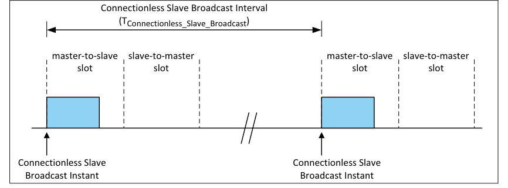

**Figure 8.25:  Connectionless Slave Broadcast Timing**

Connectionless Slave Broadcast Instants are separated by the Connectionless Slave Broadcast Interval (TConnectionless_Slave_Broadcast). The Connectionless Slave Broadcast interval can be any even value from 0x0002 to 0xFFFE slots and is negotiated between the BR/EDR Controller and the Host during CSB setup. At the start of each Connectionless Slave Broadcast Instant, the Connectionless Slave Broadcast packet is transmitted using the adapted piconet physical channel. Connectionless Slave Broadcast packets shall not be encrypted.
The master shall stop transmitting Connectionless Slave Broadcast packets after CSB_supervisionTO slots have passed without transmission of a Connectionless Slave Broadcast packet. CSB_supervisionTO may be any even value from 0x0002 to 0xFFFE slots. Connectionless Slave Broadcast packets can fail to transmit for a certain continuous period of time due to scheduling conflicts from higher priority traffic.

#### 8.10.2  Connectionless Slave Broadcast Receive Operation

In connectionless slave broadcast mode, the slave is synchronized to a Connectionless Slave Broadcast transmitter and is receiving profile broadcast data on the LT_ADDR reserved by the master for the CSB logical transport.
When requesting synchronization establishment, the Host provides the Controller with the master’s clock offset and the next Connectionless Slave Broadcast Instant received from the synchronization train. Because of delays in the Host, it is possible that the Connectionless Slave Broadcast Instant occurs in the past. The BR/EDR Controller shall support Connectionless Slave Broadcast instants at least 1 second in the past. The slave should determine whether the Connectionless Slave Broadcast Instant is in the past or the future by using the master’s clock offset and its own clock to estimate the current master clock and start listening from the next broadcast instant.
The Skip parameter is set by the Host and specifies the number of consecutive Connectionless Slave Broadcast instants which the receiver may skip after successfully receiving a Connectionless Slave Broadcast packet. If the Connectionless Slave Broadcast packet is received successfully, the payload data shall be forwarded to the Host. If no Connectionless Slave Broadcast packet is received by a slave during a Connectionless Slave Broadcast Instant, the slave shall ignore Skip and instead listen at every scheduled Connectionless Slave Broadcast Instant until it is able to successfully receive a Connectionless Slave Broadcast packet or until CSB_supervisionTO number of slots have passed.
The BR/EDR Controller shall stop listening for Connectionless Slave Broadcast packets after CSB_supervisionTO slots have passed without receiving a Connectionless Slave Broadcast packet.
The BR/EDR Controller may transfer Connectionless Slave Broadcast data to the Host through HCI events. Because HCI events are limited to 255 bytes a received packet may or may not fit into a single HCI event. The BR/EDR Controller shall fragment and transfer such packets using multiple HCI events.

#### 8.10.3  AFH in Connectionless Slave Broadcast

Connectionless Slave Broadcast packets shall be transmitted on the adapted piconet channel and the synchronization train shall always contain the current AFH channel map for the PBD logical link.

### 8.11   SYNCHRONIZATION ESTABLISHMENT SUBSTATES

#### 8.11.1  Synchronization Scan Substate

The synchronization scan substate is used by slaves to receive synchronization train packets from the piconet master. The synchronization scan substate can be entered from the STANDBY or CONNECTED states. In the synchronization scan substate, a device uses the Synchronization Scan procedure (see Section 2.7.3). During each synchronization scan window, the device shall listen on a single frequency with its correlator matched to the master’s channel access code (CAC).
If the correlator exceeds the trigger threshold during the Synchronization Scan procedure, the scanning device shall receive the synchronization train packet, whose contents are defined in Table 8.10. Upon reception of the synchronization train packet the device shall exit the synchronization scan substate and return to the STANDBY or CONNECTED state as appropriate. If the packet is not received the device should stay in the synchronization scan substate. If the synchronization_scanTO expires before reception of a Synchronization Train packet, the device shall return to the STANDBY state. A device attempting to synchronize to a Connectionless Slave Broadcast
transport shall ignore any synchronization train packet whose Connectionless Slave Broadcast LT_ADDR field in the payload is set to zero.
The synchronization scan may be interrupted by higher priority traffic. In particular, the reserved synchronous slots should have higher priority than the synchronization scan.

#### 8.11.2  Synchronization Train Substate

The synchronization train substate is used by the master of the piconet to transmit synchronization train packets. The synchronization train substate can be entered from the STANDBY or CONNECTED states. In the synchronization train substate, a device uses the Synchronization Train procedure (see Section 2.7.2). During the Synchronization Train procedure, the master repeatedly transmits synchronization train packets on the channels specified in Section 2.6.4.8. While in the synchronization train substate:
• if Connectionless Slave Broadcast mode is enabled, the master shall continue to transmit Connectionless Slave Broadcast packets in addition to synchronization train packets;
• if the master is in Coarse Clock Adjustment Recovery Mode, it shall continue transmitting and receiving on all active logical transports to all slaves that have acknowledged the Coarse Clock Adjustment (see [Vol 2] Part C, Section 4.1.14.1).
Reserved SCO and eSCO slots should have higher priority than the synchronization train. Once the master enters the synchronization train substate, it shall remain in the synchronization train substate until synchronization_trainTO expires or the Host directs otherwise. The master shall transition to the STANDBY or CONNECTED state when exiting the synchronization train substate.
The synchronization train packet is a basic rate ACL packet with type DM3 and LT_ADDR of zero. FLOW, ARQN and SEQN shall all be set to zero upon transmission and ignored upon receipt. The HEC LFSR shall be initialized with the master UAP. In the payload header, the LLID shall contain the value 10b (start of an L2CAP message or no fragmentation). FLOW in the payload header shall be set to zero upon transmission and ignored upon reception. The length of the payload body (LENGTH) shall be 28 bytes. The CRC LFSR shall be initialized with the master UAP. Data whitening is not used. Encryption is not used.
There are two possible formats. Format 1 shall be used when the synchronization train is being transmitted by a device which is the master of a piconet where Connectionless Slave Broadcast mode is enabled, and format 2
shall be used otherwise. The format of the payload portion of the DM3 packet used in the synchronization train is shown in Table 8.10.

| Bytes | Field | Length | Format 1 Description | Format 2 Description |
| --- | --- | --- | --- | --- |
| 0-3 | CLK | 4 Bytes | Current piconet clock (CLK) | Current piconet clock (CLK) |
| 4-7 | Future Connectionless Slave Broadcast Instant | 4 Bytes | CLK[27:1] corre- sponding to the start of a future Connec- tionless Slave Broad- cast Instant. | CLK[27:1] + 160 slots |
| 8-17 | AFH Channel Map | 10 Bytes | The current AFH Channel Map _ _ used for the PBD logi- cal link. The format is the same as the Link Manager AFH Chan- _ nel Map parameter, _ see [Vol 2] Part C, Table 5.2. | Unspecified |
| 18-23 | Master BD ADDR _ | 6 Bytes | Master BD ADDR _ | Master BD ADD _ |
| 24-25 | Connectionless Slave Broadcast Interval | 2 Bytes | Time duration in slots from the start of a Connectionless Slave Broadcast packet to the start of the next Connectionless Slave Broadcast packet. Must be even. | Unspecified |
| 26 | Connectionless Slave Broadcast LT ADDR _ | 1 Byte | The LT ADDR _ reserved for the CSB logical transport. | 0x00 |
| 27 | Service Data | 1 Byte | Defined by the ser- vice using the Con- nectionless Slave Broadcast feature. | 0x00 |

Table 8.10:  Synchronization Train Packet Payload Body
The Host provides the Service Data for the synchronization train packet payload body when format 1 is used. The BR/EDR Controller provides the data for all other fields.
All devices in the synchronization scan substate shall accept payloads of any length from 28 to 121 bytes inclusive and shall ignore bytes 28 (counting from 0) and beyond.
When format 1 is used the Future Connectionless Slave Broadcast Instant in the synchronization train packet payload shall correspond to one of the next 4
broadcast instants. Figure 8.26 shows an example of valid and invalid values for this field.

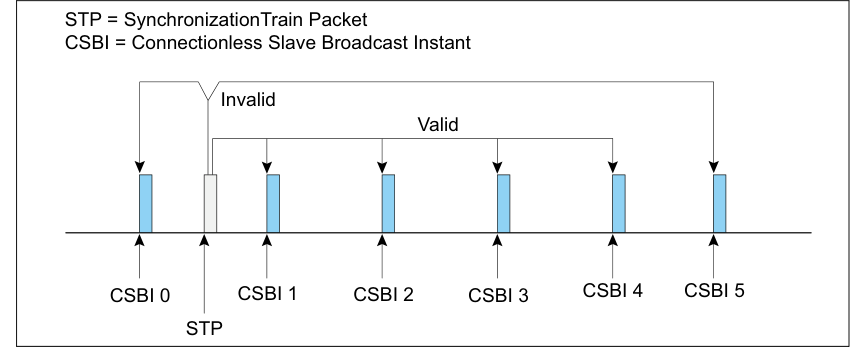

**Figure 8.26:  Examples of Synchronization Train Pointing to Connectionless Slave Broadcast Instant**

The master shall not transmit synchronization train packets in a Connectionless Slave Broadcast Instant.

## 9  AUDIO

On the air-interface, either a 64 kb/s log PCM (Pulse Code Modulation) format (A-law or μ-law) may be used, or a 64 kb/s CVSD (Continuous Variable Slope Delta Modulation) may be used. The latter format applies an adaptive delta modulation algorithm with syllabic companding.
The voice coding on the line interface is designed to have a quality equal to or better than the quality of 64 kb/s log PCM.
Table 9.1 summarizes the voice coding schemes supported on the air interface. The appropriate voice coding scheme is selected after negotiations between the Link Managers.

| Voice Codecs |  |
| --- | --- |
| linear | CVSD |
| 8-bit logarithmic | A-law |
|  | μ-law |

Table 9.1:  Voice coding schemes supported on the air interface

### 9.1   LOG PCM CODEC

Since the synchronous logical transports on the air-interface can support a 64 kb/s information stream, a 64 kb/s log PCM traffic can be used for transmission. Either A-law or μ-law compression may be applied. In the event that the line interface uses A-law and the air interface uses μ-law or vice versa, a conversion from A-law to μ-law shall be performed. The compression method shall follow ITU-T recommendations G. 711.

### 9.2   CVSD CODEC

A more robust format for voice over the air interface is delta modulation. This modulation scheme follows the waveform where the output bits indicate whether the prediction value is smaller or larger than the input waveform. To reduce slope overload effects, syllabic companding is applied: the step size is adapted according to the average signal slope. The input to the CVSD encoder shall be 64 ksamples/s linear PCM (typically 16 bits, but actual value is implementation specific). Block diagrams of the CVSD encoder and CVSD decoder are shown in Figure 9.1, Figure 9.2 and Figure 9.3. The system shall be clocked at 64 kHz.

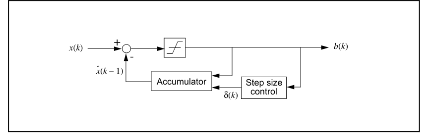

**Figure 9.1:  Block diagram of CVSD encoder with syllabic companding**

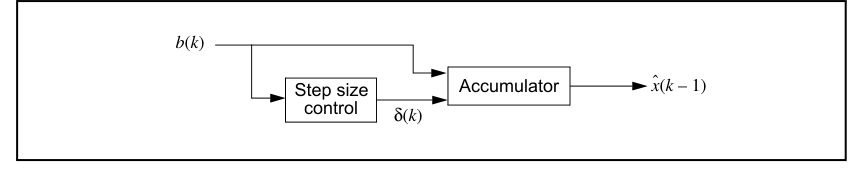

**Figure 9.2:  Block diagram of CVSD decoder with syllabic companding**

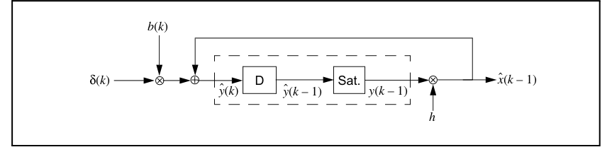

**Figure 9.3:  Accumulator procedure**

Let for , otherwise . On air these numbers shall be represented by the sign bit; i.e. negative numbers are mapped on “1” and positive numbers are mapped on “0”.
sgn x( ) 1 = x 0 ≥ sgn x( ) 1 – =
Denote the CVSD encoder output bit , the encoder input , the accumulator contents , and the step size . Furthermore, let h be the decay factor for the accumulator, let β denote the decay factor for the step size, and, let α be the syllabic companding parameter. The latter parameter monitors the slope by considering the K most recent output bits
b k( ) x k( ) y k( ) δ k( )
Let
xˆ k( ) hy k( ). =
(EQ 14)
Then, the CVSD encoder internal state shall be updated according to the following set of equations:
b k( ) sgn x k( ) xˆ k 1 – ( ) – { }, =
(EQ 15)
0, otherwise,    =
α 1, if J bits in the last K output bits are equal,
(EQ 16)
βδ k 1 – ( ) δmin , { } max , α 0, =     
δ k( ) δ k 1 – ( ) δmin + δmax , { }, min α 1, =
=
(EQ 17)
y k( ) yˆ k( ) ymax , { }, min yˆ k( ) 0. ≥
yˆ k( ) ymin , { }, max yˆ k( ) 0. <     
=
(EQ 18)
where
yˆ k( ) xˆ k 1 – ( ) b k( )δ k( ) + = .
(EQ 19)
In these equations, δmin and δmax are the minimum and maximum step sizes, and, ymin and ymax are the accumulator’s negative and positive saturation values, respectively. Over air, the bits shall be sent in the same order they are generated by the CVSD encoder.
For a 64 kb/s CVSD, the parameters as shown in Table 9.2 shall be used. The numbers are based on a 16 bit signed number output from the accumulator. These values result in a time constant of 0.5 ms for the accumulator decay, and a time constant of 16 ms for the step size decay

| Parameter | Value |
| --- | --- |
| h | 1 1–----- 32 |
| β | 1 1–----------- 1024 |
| J | 4 |
| K | 4 |
| δ min | 10 |
| δ max | 1280 |
| y min | –215 or –215+1 |
| y max | 215–1 |

Table 9.2:  CVSD parameter values. The values are based on a 16 bit signed number output from the accumulator

### 9.3   ERROR HANDLING

In the DV, HV3, EV3, EV5, 2-EV3, 3-EV3, 2-EV5 and 3-EV5 packets, the voice is not protected by FEC. The quality of the voice in an error-prone environment then depends on the robustness of the voice coding scheme and, in the case of eSCO, the retransmission scheme. CVSD, in particular, is rather insensitive to random bit errors, which are experienced as white background noise. However, when a packet is rejected because either the channel access code, the HEC test was unsuccessful, or the CRC has failed, measures have to be taken to “fill” in the lost speech segment.
The voice payload in the HV2 and EV4 packets are protected by a 2/3 rate FEC. For errors that are detected but cannot be corrected, the receiver should try to minimize the audible effects. For instance, from the 15-bit FEC segment with uncorrected errors, the 10-bit information part as found before the FEC decoder should be used. The HV1 packet is protected by a 3 bit repetition FEC. For this code, the decoding scheme will always assume zero or one-bit errors. Thus, there exist no detectable but uncorrectable error events for HV1 packets.

### 9.4   GENERAL AUDIO REQUIREMENTS

#### 9.4.1  Signal Levels

For A-law and μ-law log-PCM encoded signals the requirements on signal levels shall follow the ITU-T recommendation G.711.
Full swing at the 16 bit linear PCM interface to the CVSD encoder is defined to be 3 dBm0.

#### 9.4.2  CVSD Audio Quality

For Bluetooth audio quality the requirements are put on the transmitter side. The 64 ksamples/s linear PCM input signal should have negligible spectral power density above 4 kHz. The power spectral density in the 4-32 kHz band of the decoded signal at the 64 ksamples/s linear PCM output, should be more than 20 dB below the maximum in the 0-4 kHz range.
APPENDIX A GENERAL AUDIO
RECOMMENDATIONS
A.1  MAXIMUM SOUND PRESSURE
It is the sole responsibility of each manufacturer to design their audio products in a safe way with regards to injury to the human ear. The Bluetooth Specification doesn’t specify maximum sound pressure from an audio device.
A.2  OTHER TELEPHONY NETWORK REQUIREMENTS
It is the sole responsibility of each manufacturer to design the Bluetooth audio product so that it meets the regulatory requirements of all telephony networks that it may be connected to.
A.3  AUDIO LEVELS FOR BLUETOOTH
Audio levels shall be calculated as Send Loudness Rating, SLR, and Receive Loudness Rating, RLR. The calculation methods are specified in ITU-T Recommendation P.79.
The physical test set-up for Handsets and Headsets is described in ITU-T Recommendation P.51 and P.57
The physical test set-up for speakerphones and “Vehicle hands-free systems” is specified in ITU-T Recommendation P.34.
A general equation for computation of loudness rating (LR) for telephone sets is given by ITU-T recommendations P.79 and is given by
N2          log10 , – =
LR 10 m ----- 10 m si wi – ( ) 10 ⁄
(EQ 20)
i N1 =
where
m is a constant (~ 0.2). wi = weighting coefficient (different for the various LRs). Si = the sensitivity at frequency Fi, of the electro-acoustic path N1,N2, consecutive filter bank numbers (Art. Index: 200-4000 Hz)
(EQ 20) is used for calculating the (SLR) according to Figure A.1, and (RLR) according to Figure A.2. When calculating LRs one must only include those parts of the frequency band where an actual signal transmission can occur in order to ensure that the additive property of LRs is retained. Therefore ITU-T P.79 uses only the frequency band 200-4000 Hz in LR computations.
A.4  MICROPHONE PATH
SLR measurement model
A/D, Filter PCM
CVSD BTR MRP PGA
Figure A.1:  SLR measurement set-up
A.5  LOUDSPEAKER PATH
RLR measurement model
CVSD
D/A, Filter PGA BTR ERP
PCM
Figure A.2:  RLR measurement set-up
A.6  BLUETOOTH VOICE INTERFACE
The specification for the Bluetooth voice interface should follow in the first place the ITU-T Recommendations P.79, which specifies the loudness ratings for telephone sets. These recommendations give general guidelines and specific algorithms used for calculating the loudness ratings of the audio signal with respect to Ear Reference Point (ERP).
For Bluetooth voice interface to the different cellular system terminals, loudness and frequency recommendations based on the cellular standards should be used. For example, GSM 03.50 gives recommendation for both the loudness ratings and frequency mask for a GSM terminal interconnection with Bluetooth.
1- The output of the CVSD decoder are 16-bit linear PCM digital samples, at a sampling frequency of 8 ksample/s. Bluetooth also supports 8-bit log PCM samples of A-law and μ-law type. The sound pressure at the ear reference point for a given 16-bit CVSD sample, should follow the sound pressure level given in the cellular standard specification.
2- A maximum sound pressure which can be represented by a 16-bit linear PCM sample at the output of the CVSD decoder should be specified according to the loudness rating, in ITU P.79 and at PGA value of 0 dB. Programmable Gain Amplifiers (PGAs) are used to control the audio level at the terminals by
the user. For conversion between various PCM representations: A-law, μ-law and linear PCM, ITU-T G.711, G.712, G.714 give guidelines and PCM value relationships. Zero-code suppression based on ITU-T G.711 is also recommended to avoid network mismatches.
A.7  FREQUENCY MASK
For interfacing a Bluetooth terminal to a digital cellular mobile terminal, a compliance of the CVSD decoder signal to the frequency mask given in the cellular standard, is recommended to guarantee correct function of the speech coders. A recommendation for a frequency mask is given in the Table A.1 below. The Figure A.3 below shows a plot of the frequency mask for Bluetooth (solid line). The GSM frequency mask (dotted line) is shown in Figure A.3 for comparison.
Bluetooth GSM mask
dB
8.0
4.0
0.0
-6.0
-9.0
-12.0
-20.0
f kHz

### 0.1 0.2 0.3 1.0 2.0 3.0 3.4 4.0

0.5
Figure A.3:  Plot of recommended frequency mask for Bluetooth. The GSM send frequency mask is given for comparison (dotted line)

| Frequency (Hz) | Upper Limit (dB) | Lower Limit (dB) |
| --- | --- | --- |
| 50 | -20 | - |
| 300 | 4 | -12 |

Table A.1:  Recommended Frequency Mask for Bluetooth

| Frequency (Hz) | Upper Limit (dB) | Lower Limit (dB) |
| --- | --- | --- |
| 1000 | 4 | -9 |
| 2000 | 4 | -9 |
| 3000 | 4 | --9 |
| 3400 | 4 | -12 |
| 4000 | 0 | - |

Table A.1:  Recommended Frequency Mask for Bluetooth
APPENDIX B TIMERS
This appendix contains a list of Baseband timers related to inactivity timeout defined in this specification. Definitions and default values of the timers are listed below
All timer values are given in slots.
B.1  LIST OF TIMERS
B.1.1  inquiryTO
The inquiryTO defines the number of slots the inquiry substate shall last. The timer value may be changed by the Host. HCI provides a command to change the timer value.
B.1.2  pageTO
The pageTO defines the number of slots the page substate can last before a response is received when the extended_pageTO is zero. The timer value may be changed by the Host. HCI provides a command to change the timer value.
B.1.3  extended_pageTO
The extended_pageTO defines the number of additional slots the page substate can last beyond pageTO before a response is received. The timer value may be changed by the Host. HCI provides a command to change the timer value.
B.1.4  pagerespTO
In the slave, it defines the number of slots the slave shall await the master’s response, FHS packet, after sending the page acknowledgment ID packet. In the master, pagerespTO defines the number of slots the master should wait for the FHS packet acknowledgment before returning to page substate. Both master and slave units should use the same value for this timeout, to ensure common page/scan intervals after reaching pagerespTO.
The pagerespTO value is 8 slots.
B.1.5  newconnectionTO
Every time a new connection is started through paging, scanning, or role switch, the master sends a POLL packet as the first packet in the new connection. Transmission and acknowledgment of this POLL packet is used to confirm the new connection. If the POLL packet is not received by the slave or the response packet is not received by the master for newconnectionTO
number of slots, both the master and the slave should return to the previous substate.
newconnectionTO value is 32 slots.
B.1.6  supervisionTO
The supervisionTO is used by both the master and slave to monitor link loss. If a device does not receive any packets that pass the HEC check and have the proper LT_ADDR for a period of supervisionTO, it should reset the link. The supervision timer keeps running in Hold mode and Sniff mode.
The supervisionTO value may be changed by the Host. HCI provides a command to change the timer value. At the baseband level a default value equivalent to 20 seconds should be used.
B.1.7  CSB_supervisionTO
The CSB_supervisionTO is used by the slave to monitor connection loss and by the master to monitor scheduling conflicts and has a range of 0x0002 to 0xFFFE with only even values valid. At the baseband level a default value equivalent to 5.12 seconds should be used. The Host can change the value of CSB_supervisionTO.
B.1.8  synchronization_trainTO
The synchronization_trainTO is used by the master to determine how long to continue broadcasting Synchronization Train packets and has a range of 0x00000002 to 0x07FFFFFE with only even values valid. At the baseband level a default value equivalent to 120 seconds should be used for Connectionless Slave Broadcast and a default value equivalent to 20 seconds should be used for Coarse Clock Adjustment Recovery Mode. The Host may change the value of synchronization_trainTO that is used during Connectionless Slave Broadcast.
B.1.9  synchronization_scanTO
The synchronization_scanTO is used by the slave to determine when to stop scanning for synchronization train packets. It has a range of 0x0022 to 0xFFFE with only even values valid. At the baseband level a default value equivalent to 5.12 seconds should be used for Connectionless Slave Broadcast and a default value equivalent to 20 seconds should be used during Coarse Clock Adjustment Recovery Mode. The Host may change the value of synchronization_scanTO that is used during Connectionless Slave Broadcast.
B.1.10  authenticatedPayloadTO
The authenticatedPayloadTO is the maximum amount of time in seconds allowed between receiving packets containing a MIC. The Host can change the value of authenticatedPayloadTO.
The default value for authenticatedPayloadTO is 30 seconds.
B.1.11  CLK_adj_dragTO
The CLK_adj_dragTO is the minimum amount of time in seconds the drag shall be suspended when a slave has not responded after the master has dragged the clock.
The CLK_adj_dragTO value shall be 1 second.
APPENDIX C RECOMMENDATIONS FOR AFH OPERATION IN HOLD, SNIFF AND CSB CONNECTIONLESS SLAVE BROADCAST
The three possible AFH operation modes for an AFH capable slave in Hold mode and Sniff mode are the same three AFH operation modes used during CONNECTION state:
• Enabled (using an AHS with some RF channels unused)
• Enabled (using AHS(79))
• Disabled
The master may place an AFH capable slave in any of the three AFH operating modes.
C.1  OPERATION AT THE MASTER
A master that has one or more slaves in hold or sniff and decides to update them simultaneously shall schedule an AFH_Instant for a time that allows it to update all these slaves (as well as its active slaves) with the new adaptation.
A master that has multiple slaves with non-overlapping “wake” times (e.g. slaves in sniff mode with different timing parameters) may keep them enabled on the same adaptation provided that its scheduling of the AFH_Instant allows enough time to update them all.
This timing is summarized in the figure below. In this example the master decides that a hop sequence adaptation applying to all its slaves at the same time is required. However it cannot schedule an AFH_Instant until it has informed its active slave, its slave in hold, and its slave in sniff.
If it decides that only some slaves require the new adaptation, it need only take those slaves into account when scheduling the AFH_Instant.

| T HS AFH-enabled sniff mode slave ENA awake (Earliest T HS Next AFH-enabled Awake Awake Awake slave in Adaptation hold mode T ENA HS for AFH-enabled Awake this slave not in a power-saving ENA device) mode Master activity Previous Master Earliest next AFH Instant decides on possible _ a new AH AFH Instant _ | T HS AFH-enabled sniff mode slave ENA awake (Earliest T HS Next AFH-enabled Awake Awake Awake slave in Adaptation hold mode T ENA HS for AFH-enabled Awake this slave not in a power-saving ENA device) mode Master activity Previous Master Earliest next AFH Instant decides on possible _ a new AH AFH Instant _ |  |  |  |  |  |  |  |
| --- | --- | --- | --- | --- | --- | --- | --- | --- |
|  |  |  |  |  |  |  |  |  |
|  |  | T HS Awake Awake |  |  |  |  | ENA (Earliest Nex |  |
|  |  | Awake |  | A | wake |  |  |  |
|  |  | T HS |  |  | ENA |  | t Adaptation fo |  |
|  |  |  |  |  | Awake |  | r t |  |
|  |  |  | ENA |  |  |  |  |  |
|  |  | vious Master Instant decides on a new AH |  |  |  |  |  |  |
|  |  |  |  |  |  |  |  |  |
| Figure C.1: Timin |  | g constraint on AFH Instant with slaves in hold and sniff _ |  |  |  |  |  |  |

C.2  [THIS SECTION NO LONGER USED]
C.3  AFH OPERATION IN SNIFF
Once a slave has been placed in sniff mode, the master may periodically change its AHS without taking the slave out of sniff mode.
C.4  AFH OPERATION IN HOLD
A slave that is in hold mode cannot send or receive any LMP messages. Once the slave has left hold mode the master may subsequently update the slave’s adaptation.
C.5  AFH OPERATION IN CONNECTIONLESS SLAVE BROADCAST
After the master’s BR/EDR Controller notifies the master’s Host that the AFH channel map has changed for the PBD logical link, the master’s Host may restart the synchronization train to allow slaves to obtain the updated AFH channel map. This is shown in the following MSC.

| Host |  |  |
| --- | --- | --- |
|  |  |  |
|  | Change event |  |
|  | Start Synchronization Train |  |
|  | Command Status |  |
|  |  | Train Sync |
|  |  | Train |
|  | Synchronization Train Complete |  |

Figure C.2:  AFH Map Change – Connectionless Slave Broadcast master
Modification of the AFH channel map will affect slaves using a different AFH channel map. Depending on the overlap between a slave’s current AFH channel map and the current AFH channel map of the master, the slave may miss some Connectionless Slave Broadcast instants and, in the case of disjoint or nearly disjoint AFH channel maps, the slave may lose synchronization. Slaves should monitor the Connectionless Slave Broadcast reception rate and obtain the current AFH channel map of the master (via the synchronization train) if degradation exceeds desired thresholds.
Core System Package [BR/EDR Controller volume]
Part C
PART C: LINK MANAGER PROTOCOL SPECIFICATION
This specification describes the Link Manager Protocol (LMP) which is used for link set-up and control. The signals are interpreted and filtered out by the Link Manager on the receiving side and are not propagated to higher layers.
CONTENTS

## 1  INTRODUCTION

The Link Manager Protocol (LMP) is used to control and negotiate all aspects of the operation of the Bluetooth connection between two devices. This includes the set-up and control of logical transports and logical links, and for control of physical links.
The Link Manager Protocol is used to communicate between the Link Managers (LM) on the two devices. All LMP messages shall apply solely to the physical link and associated logical links and logical transports between the sending and receiving devices.
The protocol is made up of a series of messages which shall be transferred over the ACL-C or ASB-C logical link between two devices. LMP messages shall be interpreted and acted-upon by the LM and shall not be directly propagated to higher protocol layers.

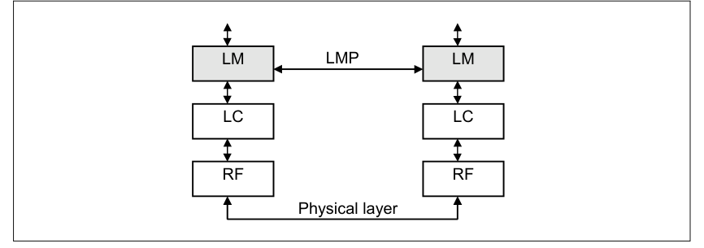

**Figure 1.1:  Link Manager Protocol signaling layer**

## 2  GENERAL RULES

### 2.1   MESSAGE TRANSPORT

LMP messages shall be exchanged over the ACL-C logical link that is carried on the default ACL logical transport ([Vol 2] Part B, Section 4.4) or over the ASB-C logical link that is carried on the ASB logical transport ([Vol 2] Part B, Section 4.6). LMP messages shall be carried on the default ACL logical transport unless specified otherwise in Sections 4 and 5. The ACL-C and ASB- C logical links are distinguished from the ACL-U and ASB-U logical links (which carry L2CAP and user data) by the Logical Link Identifier (LLID) field carried in the payload header of variable-length packets ([Vol 2] Part B, Section 6.6.2).
The control logical links have a higher priority than other traffic - see [Vol 2] Part B, Section 5.6.
The error detection and correction capabilities of the baseband ACL logical transport are generally sufficient for the requirements of the LMP. Therefore LMP messages do not contain any additional error detection information beyond what can be realized by means of sanity checks performed on the contents of LMP messages. Any such checks and protections to overcome undetected errors in LMP messages is an implementation matter.

### 2.2   SYNCHRONIZATION

This section is informative and explains why many of the LMP message sequences are defined as they are.
LMP messages are carried on the ACL-C and ASB-C logical links, which do not guarantee a time to deliver or acknowledge packets. LMP procedures take account of this when synchronizing state changes in the two devices. For example, criteria are defined that specify when a logical transport address (LT_ADDR) may be re-used after it becomes available due to a device leaving the piconet. Other LMP procedures, such as hold or role switch include the Bluetooth clock as a parameter in order to define a fixed synchronization point. The transitions into and out of sniff mode are protected with a transition mode.
The LC normally attempts to communicate with each slave no less often than every Tpoll slots (see Section 4.1.8) based on the Tpoll for that slave.

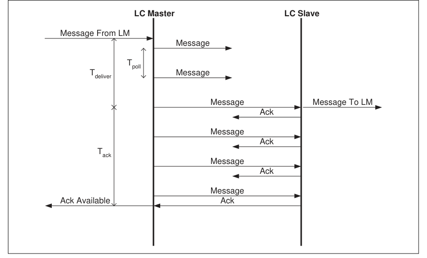

**Figure 2.1:  Transmission of a message from master to slave1**

Figure 2.1 illustrates the fundamental problem. It shows the transmission of a packet from the master to the slave in conditions of heavy interference for illustrative purposes. It is obvious that neither side can determine the value of either Tdeliver or Tack. It is therefore not possible to use simple messages to identify uniquely the instant at which a state change occurs in the other device.

### 2.3   PACKET FORMAT

Each PDU is assigned either a 7 or a 15 bit opcode used to uniquely identify different types of PDUs, see Table 5.1. The first 7 bits of the opcode and a transaction ID are located in the first byte of the payload body. If the initial 7 bits of the opcode have one of the special escape values 124-127 then an additional byte of opcode is located in the second byte of the payload and the combination uniquely identifies the PDU.
The FLOW bit in the packet header is always 1 and is ignored on reception.
If the PDU contains one or more parameters these are placed in the payload starting immediately after the opcode, i.e. at byte 2 if the PDU has a 7 bit opcode or byte 3 if the PDU has a 15 bit opcode. The number of bytes used depends on the length of the parameters. All parameters have a little-endian format, i.e. the least significant byte is transferred first.
1. Note the diagram shows the limiting case where the master transmits the message at inter- vals of Tpoll. In the case of heavy interference improved performance is gained by transmit- ting more often.
Parameters may have an arrayed type with a fixed number of elements of the same type; for example, 'u_int8 [5]' designates that the parameter is an array of five u_int8 values. In these cases the elements of the array are transferred in order of index. Where the element size is 1, 2, or 4 bits, the elements are packed 8, 4, or 2 at a time into each byte with the element with the lowest index placed in the least significant bit(s).
LMP messages shall be transmitted using DM1 packets, however if an HV1 SCO link is in use and the length of the payload is less than 9 bytes then DV packets may be used.

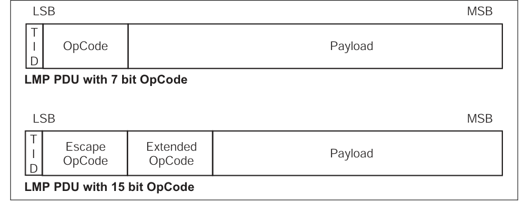

**Figure 2.2:  Payload body when LMP PDUs are sent**

### 2.4   TRANSACTIONS

The LMP operates in terms of transactions. A transaction is a connected set of message exchanges which achieve a particular purpose. All PDUs which form part of the same transaction shall have the same value for the transaction ID which is stored as part of the first byte of the OpCode (see Section 2.3).
The transaction ID is in the least significant bit. It shall be 0 if the PDU forms part of a transaction that was initiated by the master and 1 if the transaction was initiated by the slave.
Each sequence described in Section 4 shall be defined as a transaction. For pairing, see Section 4.2.2, and encryption, see Section 4.2.5, all sequences belonging to each section shall be counted as one transaction and shall use the same transaction ID. For connection establishment, see Section 4.1.1, LMP_host_connection_req and the response with LMP_accepted or LMP_not_accepted shall form one transaction and have the transaction ID of 0. LMP_setup_complete is a stand-alone PDU, which forms a transaction by itself.
For error handling, see Section 2.5, the PDU to be rejected and LMP_not_accepted or LMP_not_accepted_ext shall form a single transaction.

#### 2.4.1  LMP Response Timeout

The time between receiving a baseband packet carrying an LMP PDU and sending a baseband packet carrying a valid response PDU, according to the procedure rules in Section 4, shall be less than the LMP Response Timeout. The value of this timeout is 30 seconds. Note that the LMP Response Timeout is applied not only to sequences described in Section 4, but also to the series of the sequences defined as the transactions in Section 4. It shall also be applied to the series of LMP transactions that take place during a period when traffic on the ACL-U logical link is disabled for the duration of the series of LMP transactions, for example during the enabling of encryption.
The LMP Response Timeout shall restart each time an LMP PDU which requires a reply is queued for transmission by the baseband.
LMP messages sent on the ASB-C logical link have special rules and are not subject to the LMP Response Timeout.

### 2.5   ERROR HANDLING

If the LM receives a PDU with unrecognized opcode, it shall respond with LMP_not_accepted or LMP_not_accepted_ext with the error code Unknown LMP PDU (0x19). The opcode parameter that is echoed back is the unrecognized opcode.
If the LM receives a PDU with invalid parameters, it shall respond with LMP_not_accepted or LMP_not_accepted_ext with the error code Invalid LMP Parameters (0x1E).
If the maximum response time (see Section 2.4.1) is exceeded or if a link loss is detected (see [Vol 2] Part B, Section 3.1), the party that waits for the response shall conclude that the procedure has terminated unsuccessfully.
Erroneous LMP messages can be caused by errors on the channel or systematic errors at the transmit side. To detect the latter case, the LM should monitor the number of erroneous messages and disconnect if it exceeds a threshold, which is implementation-dependent.
When the LM receives a PDU that is not allowed, and the PDU normally expects a PDU reply, for example LMP_host_connection_req or LMP_unit_key, the LM shall return PDU LMP_not_accepted or LMP_not_accepted_ext with the error code LMP PDU Not Allowed (0x24). If the PDU normally doesn’t expect a reply, for example LMP_sres or LMP_temp_key, the PDU will be ignored.
The reception of an optional PDU which is not supported shall be handled in one of two ways: if the LM simply does not know the opcode (e.g. it was added at a later version of the specification) it shall respond with LMP_not_accepted or LMP_not_accepted_ext with the error code Unknown LMP PDU (0x19). If
the LM recognizes the PDU as optional but unsupported then it shall reply with LMP_not_accepted or LMP_not_accepted_ext with the error code Unsupported LMP Feature (0x1A) if the PDU would normally generate a reply otherwise no reply is generated.

#### 2.5.1  Transaction Collision Resolution

Since LMP PDUs are not interpreted in real time, collision situations can occur where both LMs initiate the same procedure and both cannot be completed. In this situation, the master shall reject the slave-initiated procedure by sending LMP_not_accepted or LMP_not_accepted_ext with the error code LMP Error Transaction Collision / LL Procedure Collision (0x23). The master-initiated procedure shall then be completed.
Collision situations can also occur where both LMs initiate different procedures and both cannot be completed. In this situation, the master shall reject the slave-initiated procedure by sending LMP_not_accepted or LMP_not_accepted_ext with the error code Different Transaction Collision (0x2A). The master-initiated procedure shall then be completed.

### 2.6   PROCEDURE RULES

Each procedure is described and depicted with a sequence diagram. The following symbols are used in the sequence diagrams:

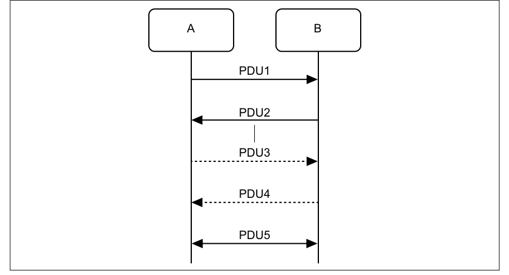

**Figure 2.3:  Symbols used in sequence diagrams**

PDU1 is a PDU sent from A to B. PDU2 is a PDU sent from B to A. PDU3 is a PDU that is optionally sent from A to B. PDU4 is a PDU that is optionally sent from B to A. PDU5 is a PDU sent from either A or B. A vertical line indicates that more PDUs can optionally be sent.

### 2.7   GENERAL RESPONSE MESSAGES

The PDUs LMP_accepted, LMP_accepted_ext, LMP_not_accepted and LMP_not_accepted_ext are used as response messages to other PDUs in a number of different procedures. LMP_accepted or LMP_accepted_ext includes the opcode of the message which is accepted. LMP_not_accepted or LMP_not_accepted_ext includes the opcode of the message which is not accepted and the error code why it is not accepted.
LMP_accepted_ext and LMP_not_accepted_ext shall be used when the opcode is 15 bits in length. LMP_accepted and LMP_not_accepted shall be used when the opcode is 7 bits in length.

| M/O | PDU | Contents |
| --- | --- | --- |
| M | LMP accepted _ | op code |
| M | LMP not accepted _ _ | op code error code |
| O | LMP accepted ext _ _ | escape op code extended op code |
| O | LMP not accepted ext _ _ _ | escape op code extended op code error code |

Table 2.1:  General response messages.

### 2.8   LMP MESSAGE CONSTRAINTS

This section is informative.
• No LMP message shall exceed the maximum payload length of a single DM1 packet i.e. 17 bytes in length ([Vol 2] Part B, Section 6.5.4.1).
• All LM messages are of fixed length.
• The LMP version number shall not be used to indicate the presence or absence of functionality.

## 3  DEVICE FEATURES

### 3.1   GENERAL DESCRIPTION

Each PDU is either Mandatory or Optional as defined by the M/O field in the tables of Section 4. An M in this field shall indicate that support for the PDU is mandatory. An O in this field shall indicate that support for the PDU is optional and it shall be followed by the number(s) of the feature(s) involved in brackets.
All features added after the 1.1 specification have associated LMP feature bits. Support of these features may be made “mandatory” by the qualification process but the LM still considers them to be optional since it must interoperate with older devices which do not support them.
The LM does not need to be able to transmit a PDU which is optional. Support of optional PDUs is indicated by a device's features mask. The features mask can be read (see Section 4.3.4). An LM shall not send or be sent any PDU which is incompatible with the features signaled in its or its peer's features mask, as detailed in Section 3.2.
The set of features supported by the LM shall not change while the Controller has a connection to another device. A peer device may cache the device's feature mask or extended feature mask, or the LM may cache a peer's feature mask or extended feature mask, during a connection.

### 3.2   FEATURE DEFINITIONS

| Feature | Definition |
| --- | --- |
| Extended features | This feature indicates whether the device is able to support the extended features mask using the LMP sequences defined in Sec- tion 4.3.4. |
| Timing accuracy | This feature indicates whether the LM supports requests for timing accuracy using the sequence defined in Section 4.3.1. |
| Enhanced inquiry scan | This feature indicates whether the device is capable of supporting the enhanced inquiry scan mechanism as defined in [Vol 2] Part B, Section 8.4.1. The presence of this feature has only local meaning and does not imply support for any additional LMP PDUs or sequences. |
| Interlaced inquiry scan | This feature indicates whether the device is capable of supporting the interlaced inquiry scan mechanism as defined in [Vol 2] Part B, Section 8.4.1. The presence of this feature has only local meaning and does not imply support for any additional LMP PDUs or sequences. |
| Interlaced page scan | This feature indicates whether the device is capable of supporting the interlaced page scan mechanism as defined in [Vol 2] Part B, Section 8.3.1. The presence of this feature has only local meaning and does not imply support for any additional LMP PDUs or sequences. |
| RSSI with inquiry results | This feature bit shall be set if the "Extended Inquiry Response" fea- ture bit is set. This feature indicates whether the device is capable o reporting the RSSI with inquiry results as defined in [Vol 2] Part B, Section 8.4.2. The presence of this feature has only local meaning and does not imply support for any additional LMP PDUs or sequences. |
| Extended Inquiry Response | This feature indicates whether the device supports extended inquir response as defined in the Baseband specification. If this bit is set, the "RSSI with inquiry results" feature bit shall also be set. |
| Paging parameter negotiation | This feature indicates whether the LM is capable of supporting the signaling of changes in the paging scheme as defined in Section 4.1.9. |
| 3 slot packets | This feature indicates whether the device supports the transmission and reception of both DM3 and DH3 packets for the transport of tra fic on the ACL-U logical link. |
| 5 slot packets | This feature indicates whether the device supports the transmission and reception of both DM5 and DH5 packets for the transport of tra fic on the ACL-U logical link. |
| Flow control lag | This is defined as the total amount of ACL-U data that can be sent following the receipt of a valid payload header with the payload header flow bit set to 0 and is in units of 256 bytes. See further in [V 2] Part B, Section 6.6.2. |

Table 3.1:  Feature Definitions  (Sheet 1 of 7)

| Feature | Definition |
| --- | --- |
| AFH capable slave | This feature indicates whether the device is able to support the Ada tive Frequency Hopping mechanism as a slave as defined in [Vol 2 Part B, Section 2.3 using the LMP sequences defined in Section 4.1.4. |
| AFH classification slave | This feature indicates whether the device is able to support the AF classification mechanism as a slave as defined in [Vol 2] Part B, Se tion 8.6.8 using the LMP sequences defined Section 4.1.5. |
| AFH capable mas- ter | This indicates whether the device is able to support the Adaptive Fr quency Hopping mechanism as a master as defined in [Vol 2] Part B Section 2.3 using the LMP sequences defined in Section 4.1.4. |
| AFH classification master | This feature indicate whether the device is able to support the AFH classification mechanism as a master as defined in [Vol 2] Part B, Section 8.6.8 using the LMP sequences defined Section 4.1.5. |
| Power control | This feature indicates whether the device is capable of adjusting its transmission power. This feature indicates the ability to receive the LMP incr power and LMP decr power PDUs and transmit the _ _ _ _ LMP max power and LMP min power PDUs, using the sequence _ _ _ _ defined in Section 4.1.3. These sequences may be used even if the remote device does not support the power control feature, as long a it supports the Power control requests feature. |
| Power control requests | This feature indicates whether the device is capable of determining the transmit power level of the other device should be adjusted and will send the LMP incr power and LMP decr power PDUs to _ _ _ _ request the adjustments. It indicates the ability to receive the LMP _ max power and LMP min power PDUs, using the sequences in _ _ _ Section 4.1.3. These sequences may be used even if the remote device does not support the RSSI feature, as long as it supports th power control feature. |
| Enhanced power control | This feature indicates whether the device is able to support enhanced power control using the LMP sequences as defined in Section 4.1.3.1. This feature bit shall only be set if the "power control" feature bit (bi 18) is set and if the "power control requests" feature bit (bit 9) is set |
| Channel Quality Driven Data Rate | This feature indicates whether the LM is capable of recommending packet type (or types) depending on the channel quality using the LMP sequences defined in Section 4.1.7. |
| Broadcast encryption | This feature indicates whether the device is capable of supporting broadcast encryption as defined in [Vol 2] Part H, Section 4.2 and also the sequences defined in Section 4.2.6 and Section 4.2.4. Note: Devices compliant to versions of this specification 1.1 and ea lier may support broadcast encryption even though this feature bit i not set. This feature bit shall not be set if the "coarse clock adjustment" feature bit (bit 134) is set. |

Table 3.1:  Feature Definitions  (Sheet 2 of 7)

| Feature | Definition |
| --- | --- |
| Encryption | This feature shall be supported. This feature indicates whether the device supports the encryption of packet contents using the sequence defined in Section 4.2.5. |
| Pause Encryption | When this feature bit is enabled on both sides, then the encryption pause/resume sequences shall be used. If either side does not sup port the Pause Encryption feature bit, then the encryption pause/ resume sequences shall not be used. This feature bit shall be set if the “Secure Connections (Controller Support)” feature bit is set. |
| Slot offset | This feature indicates whether the LM supports the transfer of the slot offset using the sequence defined in Section 4.4.1. |
| Role switch | This feature indicates whether the device supports the change of master and slave roles as defined by [Vol 2] Part B, Section 8.6.5 using the sequence defined in Section 4.4.2. |
| Hold mode | This feature indicates whether the device is able to support Hold mode as defined in [Vol 2] Part B, Section 8.8 using the LMP sequences defined in Section 4.5.1. |
| Sniff mode | This feature indicates whether the device is able to support sniff mode as defined in [Vol 2] Part B, Section 8.7 using the LMP sequences defined in Section 4.5.3. |
| Sniff subrating | This feature indicates whether the device is able to support sniff su rating as defined in [Vol 2] Part B, Section 8.7.2 using the LMP sequences as defined in Section 4.5.3.3.This feature bit shall be se if the "Sniff mode" feature bit is set. |
| SCO link | This feature shall indicate whether the device is able to support the SCO logical transport as defined in [Vol 2] Part B, Section 4.3, the HV1 packet defined in [Vol 2] Part B, Section 6.5.2.1 and receiving the DV packet defined in [Vol 2] Part B, Section 6.5.2.4 using the LMP sequence in Section 4.6.1. |
| HV2 packets | This feature indicates whether the device is capable of supporting the HV2 packet type as defined in baseband Section 6.5.2.2 on the SCO logical transport. |
| HV3 packets | This feature indicates whether the device is capable of supporting the HV3 packet type as defined in baseband Section 6.5.2.3 on the SCO logical transport. |
| μ-law log synchro- nous data | This feature indicates whether the device is capable of supporting µ Law Log format data as defined in [Vol 2] Part B, Section 9.1 on the SCO and eSCO logical transports. |
| A-law log synchro- nous data | This feature indicates whether the device is capable of supporting A Law Log format data as defined in [Vol 2] Part B, Section 9.1 on the SCO and eSCO logical transports. |

Table 3.1:  Feature Definitions  (Sheet 3 of 7)

| Feature | Definition |
| --- | --- |
| CVSD synchro- nous data | This feature indicates whether the device is capable of supporting CVSD format data as defined in [Vol 2] Part B, Section 9.2 on the SCO and eSCO logical transports. |
| Transparent synchronous data | This feature indicates whether the device is capable of supporting transparent synchronous data as defined in [Vol 2] Part B, Section 6.4.3 on the SCO and eSCO logical transports. |
| Extended SCO link | This feature indicates whether the device is able to support the eSCO logical transport as defined [Vol 2] Part B, Section 5.5 and th EV3 packet defined in [Vol 2] Part B, Section 6.5.3.1 using the LMP sequences defined in Section 4.6.2. |
| EV4 packets | This feature indicates whether the device is capable of supporting the EV4 packet type defined in [Vol 2] Part B, Section 6.5.3.2 on th eSCO logical transport. |
| EV5 packets | This feature indicates whether the device is capable of supporting the EV5 packet type defined in [Vol 2] Part B, Section 6.5.3.3 on th eSCO logical transport. |
| Enhanced Data Rate ACL 2 Mb/s mode | This feature indicates whether the device supports the transmission and reception of 2-DH1 packets for the transport of traffic on the ACL-U logical link. |
| Enhanced Data Rate ACL 3 Mb/s mode | This feature indicates whether the device supports the transmission and reception of 3-DH1 packets for the transport of traffic on the ACL-U logical link. This feature bit shall only be set if the “Enhanced Data Rate ACL 2 Mb/s mode” feature bit is set. |
| 3-slot Enhanced Data Rate ACL packets | This feature indicates whether the device supports the transmission and reception of three-slot Enhanced Data Rate packets on the AC U logical link. This feature bit shall only be set if the “Enhanced Data Rate ACL 2 Mb/s mode” feature bit is set. |
| 5-slot Enhanced Data Rate ACL packets | This feature indicates whether the device supports the transmission and reception of 5-slot Enhanced Data Rate packets for the transpo of traffic on the ACL-U logical link. This feature bit shall only be set if the “Enhanced Data Rate ACL 2 Mb/s mode” feature bit is set. |
| Enhanced Data Rate eSCO 2 Mb/s mode | This feature indicates whether the device supports the transmission and reception of 2-EV3 packets for the transport of traffic on the eSCO logical transport. |
| Enhanced Data Rate eSCO 3 Mb/s mode | This feature indicates whether the device supports the transmission and reception of 3-EV3 packets for the transport of traffic on the eSCO logical transport. This feature bit shall only be set if the “Enhanced Data Rate eSCO Mb/s mode” feature bit is set. |

Table 3.1:  Feature Definitions  (Sheet 4 of 7)

| Feature | Definition |
| --- | --- |
| 3-slot Enhanced Data Rate eSCO packets | This feature indicates whether the device supports the transmission and reception of 3-slot Enhanced Data Rate packets for the transpo of traffic on the eSCO logical transport. This feature bit shall only be set if the “Enhanced Data Rate eSCO Mb/s mode” feature bit is set. |
| Erroneous Data Reporting | This feature indicates whether the device is able to support the Pac et Status Flag and the HCI commands "Write Default Erroneous _ _ Data Reporting" and "Read Default Erroneous Data Reporting". This feature bit may be set if at least one of the "SCO link" or "Extended SCO link" feature bits are set. |
| Link Supervision Timeout Changed Event | This feature bit indicates whether the device supports the sending the HCI Link Supervision Timeout Changed Event to the Host. |
| Non-flushable Packet Boundary Flag | This feature indicates that the device supports the capability to cor- rectly handle HCI ACL Data Packets with a Packet Boundary Flag _ _ value of 00 (Non-Automatically-Flushable packet). |
| Secure Simple Pair- ing (Controller Sup- port) | This feature indicates whether the Link Manager is capable of sup- porting the Secure Simple Pairing, Section 4.2.7. |
| Secure Simple Pair- ing (Host Support) | This feature indicates whether the Host is capable of supporting Secure Simple Pairing Section 4.2.7. If HCI is supported, this bit shall be set if Write Simple Pairing Mod has been issued to enable the Secure Simple Pairing feature. Whe HCI is not supported, this bit may be set using a vendor specific mechanism, This bit shall only be set if the Secure Simple Pairing (Controller Su port) bit is set. |
| Encapsulated PDU | This feature indicates whether the device is capable of supporting the Encapsulated PDU mechanism as defined in Section 4.1.12.1. This feature shall be set if Secure Simple Pairing is supported. |
| Variable Inquiry TX Power Level | This feature indicates whether the device is capable of setting the T power level for Inquiry. |
| BR/EDR Not Sup- ported | This feature indicates whether the device does not support BR/ED If this feature bit is set, then all other LMP feature bits shall be set t zero except the LE Supported (Controller) feature bit that shall be se to one. |
| LE Supported (Con- troller) | This feature indicates whether the Controller supports LE. The local Host uses this feature bit to determine whether the Contro ler supports LE. A remote device does not use this feature bit. |

Table 3.1:  Feature Definitions  (Sheet 5 of 7)

| Feature | Definition |
| --- | --- |
| Simultaneous LE and BR/EDR to Same Device Capa- ble (Controller) | This feature indicates that the Controller supports simultaneous LE and BR/EDR links to the same remote device. This bit shall only be set if the LE Supported (Controller) bit is set. The local Host uses this feature bit to determine whether the Contro ler is capable of supporting simultaneous LE and BR/EDR connec- tions to a remote device. A remote device does not use this feature bit. |
| LE Supported (Host) | This feature indicates that the Host supports LE. This bit shall only be set if the LE Supported (Controller) bit is set o the local Controller. The local Host sets this feature bit to indicate to a remote device tha the local device is capable of supporting LE. A remote Host uses this feature bit to determine whether an LE con nection to the peer device is possible. |
| Simultaneous LE and BR/EDR to Same Device Capa- ble (Host) | This feature indicates that the Host supports simultaneous LE and BR/EDR links to the same remote device. The local Host shall set this feature bit to zero. A remote Host shall ignore this feature bit. |
| Connectionless Slave Broadcast - Master Operation | This feature indicates whether the device supports Connectionless Slave Broadcast as master. |
| Connectionless Slave Broadcast - Slave Operation | This feature indicates whether the device supports Connectionless Slave Broadcast as slave. |
| Synchronization Train | This feature indicates whether the device supports Synchronization Train as master. |
| Synchronization Scan | This feature indicates whether the device supports Synchronization Scan as slave. |
| Inquiry Response Notification Event | This feature bit indicates whether the device supports sending the HCI Inquiry Response Notification Event to the Host. |
| Secure Connections (Controller Support) | This feature indicates whether the Controller is able to support AES CCM, the P-256 Elliptic Curve for Secure Simple Pairing, and enhanced authentication using the LMP sequences as defined in Section 4.2.7. This feature bit shall only be set if the “Secure Simple Pairing (Con troller Support)” feature bit is set. |

Table 3.1:  Feature Definitions  (Sheet 6 of 7)

| Feature | Definition |
| --- | --- |
| Secure Connections (Host Support) | This feature indicates whether the Host is capable of supporting Secure Connections. If HCI is supported, this bit shall be set if the Write Secure Connec- tions Host Support command has been issued by the Host. When HCI is not supported, this bit may be set using a vendor specific mechanism. This bit shall only be set if the Secure Connections (Controller Sup port) bit is set and the Secure Simple Pairing (Host Support) bit is set. |
| Ping | This feature indicates whether the device supports the transmissio and reception of ping messages. This feature bit shall be set if the “Secure Connections (Controller Support) feature bit is set. |
| Train nudging | This feature indicates whether the device is able to support the trai nudging mechanism described in [Vol 2] Part B, Section 8.3.2 and Section 8.4.2. The presence of this feature has only local meaning and does not imply support for any additional LMP PDUs or sequences. |
| Generalized interlaced scan | This feature indicates whether the device is able to support the gen eralized interlaced scan mechanism described in [Vol 2] Part B, Se tion 8.3.1 and Section 8.4.1. The presence of this feature has only local meaning and does not imply support for any additional LMP PDUs or sequences. |
| Coarse Clock Adjustment | This feature indicates whether the device is able to support coarse clock adjustments using the LMP sequences as defined in Section 4.1.14. This feature bit shall only be set if the “AFH capable master” (bit 43 and “AFH capable slave” (bit 35) feature bits are set. |
| Slot Availability Mask | This feature indicates whether the device is able to support Slot Availability Mask using the LMP sequences as defined in Section 4.1.15. |

Table 3.1:  Feature Definitions  (Sheet 7 of 7)

### 3.3   FEATURE MASK DEFINITION

The features are represented as a bit mask when they are transferred in LMP messages. For each feature a single bit is specified which shall be set to 1 if the feature is supported and set to 0 otherwise. The single exception is the flow control lag which is coded as a 3 bit field with the least significant bit in byte 2 bit 4 and the most significant bit in byte 2 bit 6. All removed, unknown, or unassigned feature bits are reserved for future use.

| No. | Supported feature | Byte | Bit |
| --- | --- | --- | --- |
| 0 | 3 slot packets | 0 | 0 |
| 1 | 5 slot packets | 0 | 1 |
| 2 | Encryption | 0 | 2 |
| 3 | Slot offset | 0 | 3 |
| 4 | Timing accuracy | 0 | 4 |
| 5 | Role switch | 0 | 5 |
| 6 | Hold mode | 0 | 6 |
| 7 | Sniff mode | 0 | 7 |
| 8 | Reserved | 1 | 0 |
| 9 | Power control requests | 1 | 1 |
| 10 | Channel quality driven data rate (CQDDR) | 1 | 2 |
| 11 | SCO link | 1 | 3 |
| 12 | HV2 packets | 1 | 4 |
| 13 | HV3 packets | 1 | 5 |
| 14 | μ-law log synchronous data | 1 | 6 |
| 15 | A-law log synchronous data | 1 | 7 |
| 16 | CVSD synchronous data | 2 | 0 |
| 17 | Paging parameter negotiation | 2 | 1 |
| 18 | Power control | 2 | 2 |
| 19 | Transparent synchronous data | 2 | 3 |
| 20 | Flow control lag (least significant bit) | 2 | 4 |
| 21 | Flow control lag (middle bit) | 2 | 5 |
| 22 | Flow control lag (most significant bit) | 2 | 6 |
| 23 | Broadcast Encryption | 2 | 7 |
| 24 | Reserved for future use | 3 | 0 |
| 25 | Enhanced Data Rate ACL 2 Mb/s mode | 3 | 1 |
| 26 | Enhanced Data Rate ACL 3 Mb/s mode | 3 | 2 |
| 27 | Enhanced inquiry scan | 3 | 3 |
| 28 | Interlaced inquiry scan | 3 | 4 |
| 29 | Interlaced page scan | 3 | 5 |
| 30 | RSSI with inquiry results | 3 | 6 |
| 31 | Extended SCO link (EV3 packets) | 3 | 7 |

Table 3.2:  Feature mask definitions (page 0)

| No. | Supported feature | Byte | Bit |
| --- | --- | --- | --- |
| 32 | EV4 packets | 4 | 0 |
| 33 | EV5 packets | 4 | 1 |
| 34 | Reserved for future use | 4 | 2 |
| 35 | AFH capable slave | 4 | 3 |
| 36 | AFH classification slave | 4 | 4 |
| 37 | BR/EDR Not Supported | 4 | 5 |
| 38 | LE Supported (Controller) | 4 | 6 |
| 39 | 3-slot Enhanced Data Rate ACL packets | 4 | 7 |
| 40 | 5-slot Enhanced Data Rate ACL packets | 5 | 0 |
| 41 | Sniff subrating | 5 | 1 |
| 42 | Pause encryption | 5 | 2 |
| 43 | AFH capable master | 5 | 3 |
| 44 | AFH classification master | 5 | 4 |
| 45 | Enhanced Data Rate eSCO 2 Mb/s mode | 5 | 5 |
| 46 | Enhanced Data Rate eSCO 3 Mb/s mode | 5 | 6 |
| 47 | 3-slot Enhanced Data Rate eSCO packets | 5 | 7 |
| 48 | Extended Inquiry Response | 6 | 0 |
| 49 | Simultaneous LE and BR/EDR to Same Device Capable (Controller) | 6 | 1 |
| 50 | Reserved for future use | 6 | 2 |
| 51 | Secure Simple Pairing | 6 | 3 |
| 52 | Encapsulated PDU | 6 | 4 |
| 53 | Erroneous Data Reporting | 6 | 5 |
| 54 | Non-flushable Packet Boundary Flag | 6 | 6 |
| 55 | Reserved for future use | 6 | 7 |
| 56 | Link Supervision Timeout Changed Event | 7 | 0 |
| 57 | Inquiry TX Power Level | 7 | 1 |
| 58 | Enhanced Power Control | 7 | 2 |
| 59 | Reserved for future use | 7 | 3 |
| 60 | Reserved for future use | 7 | 4 |
| 61 | Reserved for future use | 7 | 5 |
| 62 | Reserved for future use | 7 | 6 |

Table 3.2:  Feature mask definitions (page 0)

| No. | Supported feature | Byte | Bit |
| --- | --- | --- | --- |
| 63 | Extended features | 7 | 7 |

Table 3.2:  Feature mask definitions (page 0)

| No. | Supported Feature | Byte | Bit |
| --- | --- | --- | --- |
| 64 | Secure Simple Pairing (Host Support) | 0 | 0 |
| 65 | LE Supported (Host) | 0 | 1 |
| 66 | Simultaneous LE and BR/EDR to Same Device Capable (Host) | 0 | 2 |
| 67 | Secure Connections (Host Support) | 0 | 3 |

Table 3.3:  Extended feature mask definition (page 1)

| No. | Supported Feature | Byte | Bit |
| --- | --- | --- | --- |
| 128 | Connectionless Slave Broadcast – Master Operation | 0 | 0 |
| 129 | Connectionless Slave Broadcast – Slave Operation | 0 | 1 |
| 130 | Synchronization Train | 0 | 2 |
| 131 | Synchronization Scan | 0 | 3 |
| 132 | Inquiry Response Notification Event | 0 | 4 |
| 133 | Generalized interlaced scan | 0 | 5 |
| 134 | Coarse Clock Adjustment | 0 | 6 |
| 135 | Reserved for future use | 0 | 7 |
| 136 | Secure Connections (Controller Support) | 1 | 0 |
| 137 | Ping | 1 | 1 |
| 138 | Reserved for future use | 1 | 2 |
| 139 | Train nudging | 1 | 3 |
| 138 | Slot Availability Mask | 1 | 2 |

Table 3.4:  Extended feature mask definition (page 2)

### 3.4   LINK MANAGER INTEROPERABILITY POLICY

Link managers of any version shall interpret using the lowest common subset of functionality by reading the LMP features mask (defined in Table 3.2).
An optional LMP PDU shall only be sent to a device if the corresponding feature bit is set in its feature mask. The exception to this are certain PDUs (see Section 4.1.1) which can be sent before the features mask is requested. Note: A later version device with a restricted feature set is indistinguishable from an earlier version device with the same features.

## 4  PROCEDURE RULES

### 4.1   CONNECTION CONTROL

#### 4.1.1  Connection Establishment

After the paging procedure, LMP procedures for clock offset request, LMP version, supported features, name request and detach may then be initiated.

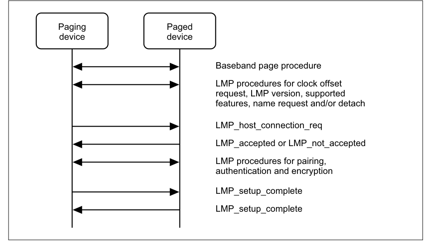

**Figure 4.1:  Connection establishment**

When the paging device wishes to create a connection involving layers above LM, it sends an LMP_host_connection_req PDU. When the other side receives this message, the Host is informed about the incoming connection. The remote device can accept or reject the connection request by sending an LMP_accepted PDU or an LMP_not_accepted PDU. Alternatively, if the slave needs a role switch, see Section 4.4.2, it sends an LMP_slot_offset PDU and LMP_switch_req PDU after it has received an LMP_host_connection_req PDU. If the role switch fails the LM shall continue with the creation of the connection unless this cannot be supported due to limited resources in which case the connection shall be terminated with an LMP_detach PDU with error code Remote Device Terminated Connection due to Low Resources (0x14). When the role switch has been successfully completed, the old slave will reply with an LMP_accepted PDU or an LMP_not_accepted PDU to the LMP_host_connection_req PDU (with the transaction ID set to 0).
If the paging device receives an LMP_not_accepted PDU in response to LMP_host_connection_req it shall immediately disconnect the link using the mechanism described in Section 4.1.2.
If the LMP_host_connection_req PDU is accepted, LMP security procedures (pairing, authentication and encryption) may be invoked. When a device is not going to initiate any more security procedures during connection establishment it sends an LMP_setup_complete PDU. When both devices have sent LMP_setup_complete PDUs the traffic can be transferred on the BR/EDR ACL logical transport.

| M/O | PDU | Contents |
| --- | --- | --- |
| M | LMP host connection req _ _ _ | - |
| M | LMP setup complete _ _ | - |

Table 4.1:  Connection establishment PDU

#### 4.1.2  Detach

The connection between two Bluetooth devices may be detached anytime by the master or the slave. An error code parameter is included in the message to inform the other party of why the connection is detached.

| M/O | PDU | Contents |
| --- | --- | --- |
| M | LMP detach _ | error code |

Table 4.2:  Detach PDU
The initiating LM shall pause traffic on the ACL-U logical link (see [Vol 2] Part B, Section 5.3.1). The initiating LM then queues the LMP_detach for transmission and it shall start a timer for 6*Tpoll slots where Tpoll is the poll interval for the connection. If the initiating LM receives the baseband acknowledgment before the timer expires it starts a timer for 3*Tpoll slots. When this timer expires, and if the initiating LM is the master, the LT_ADDR(s) may be re-used immediately. If the initial timer expires then the initiating LM drops the link and starts a timer for Tlinksupervisiontimeout slots after which the LT_ADDR(s) may be re-used if the initiating LM is the master.
When the receiving LM receives the LMP_detach, it shall start a timer for 6*Tpoll slots if it is the master and 3*Tpoll if it is the slave. On timer expiration, the link shall be detached and, if the receiving LM is the master, the LT_ADDR(s) may be re-used immediately. If the receiver never receives the LMP_detach then a link supervision timeout will occur, the link will be detached, and the LT_ADDR may be re-used immediately.
If at any time during this or any other LMP sequence the Link supervision timeout expires then the link shall be terminated immediately and the LT_ADDR(S) may be re-used immediately.
If the connection is in hold mode, the initiating LM shall wait for hold mode to end before initiating the procedure defined above. If the connection is in sniff mode, the initiating LM shall perform the procedure to exit sniff mode before
initiating the procedure defined above. If the procedure to exit sniff mode does not complete within the LMP response timeout (30 seconds) the procedure defined above shall be initiated anyway.
Initiating LM LM
LMP_detach
Sequence 1: Connection closed by sending LMP_detach

#### 4.1.3  Power Control

If the received signal characteristics differ too much from the preferred value of a Bluetooth device, it may request an increase or a decrease of the other device’s  transmit power level. A device's transmit power level is a property of the physical link, and affects all logical transports carried over the physical link. Power control requests carried over the default ACL-C logical link shall only affect the physical link associated with the requesting device’s default ACL-C logical link; they shall not affect the power level used on the physical links to other slaves.
Two power control mechanisms are specified: legacy power control (see Table 4.3) and enhanced power control (see Table 4.4 and Section 4.1.3.1). A device that supports enhanced power control shall also support legacy power control.

| M/O | PDU | Contents |
| --- | --- | --- |
| O(9) | LMP incr power req _ _ _ | for future use (1 Byte) |
| O(9) | LMP decr power req _ _ _ | for future use (1 Byte) |
| O(18) | LMP max power _ _ | - |
| O(18) | LMP min power _ _ | - |

Table 4.3:  Legacy Power control PDU

| M/O | PDU |
| --- | --- |
| O(58) | LMP power control req _ _ _ |
| O(58) | LMP power control res _ _ _ |

Table 4.4:  Enhanced Power control PDU
The power adjustment requests may be made at any time using the legacy power control mechanism following a successful baseband paging procedure and before the Link Manager supported features responses have been processed. After the Link Manager supported features responses have been
processed, if both devices support enhanced power control (see Section 4.1.3.1) then only enhanced power control shall be used. Otherwise, if either device supports only the legacy power control mechanism then only legacy power control shall be used.
If a device does not support power control requests this is indicated in the supported features list and thus no power control requests shall be sent after the supported features response has been processed. Prior to this time, a power control adjustment might be sent and if the recipient does not support power control it is allowed to send LMP_max_power in response to LMP_incr_power_req and LMP_min_power in response to LMP_decr_power_req. Another possibility is to send LMP_not_accepted with the error code Unsupported LMP Feature (0x1A).
Upon receipt of an LMP_incr_power_req PDU or LMP_decr_power_req PDU the output power shall be increased or decreased one step. See [Vol 2] Part A, Section 3 for the definition of the step size.
Initiating LM LM
LMP_incr_power_req or LMP_decr_power_req
Sequence 2: A device requests a change of the other device’s TX power
If the receiver of LMP_incr_power_req is at maximum power LMP_max_power shall be returned. The device shall only request an increase again after having requested a decrease at least once. If the receiver of LMP_decr_power_req is at minimum power then LMP_min_power shall be returned and the device shall only request a decrease after having requested an increase at least once.
Initiating LM LM
LMP_incr_power_req
LMP_max_power
Sequence 3: The TX power cannot be increased
Initiating LM LM
LMP_decr_power_req
LMP_min_power
Sequence 4: The TX power cannot be decreased
One byte in LMP_incr/decr_power_req is reserved for future use.

##### 4.1.3.1  Enhanced Power Control

Enhanced power control shall only be used when both devices support the enhanced power control LMP feature. Legacy power control shall not be used when both devices support the enhanced power control LMP feature.

###### 4.1.3.1.1   Sending Enhanced Power Control Requests

To adjust the remote device's output power, a device shall send the LMP_power_control_req PDU with the power_adjustment_request parameter.
The power_adjustment_request parameter may be set to: one step up, one step down, or all the way to the max power level. The remote device shall respond with an LMP_power_control_res PDU. The responder shall transmit the LMP_power_control_res PDU at the new power level. Upon reception of the LMP_power_control_res PDU, the initiating device should restart any processes used to determine whether additional power level changes are required.
If the receiver of the LMP_power_control_req PDU has indicated that the output power levels for all of the supported modulation modes are at maximum the requesting device shall only request an increase again after having requested a decrease at least once. If the receiver of the LMP_power_control_req PDU has indicated that the output power levels for all of the supported modulation modes are at minimum the requesting device shall only request a decrease after having requested an increase at least once.
A new LMP_power_control_req PDU shall not be sent until an LMP_power_control_res PDU has been received.

###### 4.1.3.1.2   Responding to Enhanced Power Control Requests

When a device receives an LMP_power_control_req PDU with the power_control_adjust parameter set to "increment one step," all supported modulations that are not at the maximum level shall be increased one step.
When a device receives an LMP_power_control_req PDU with the power_control_adjust parameter set to "decrement one step", all supported modulations that are not at the minimum level shall be decreased one step.
Implementations shall not violate the relative power level between modulations (see [Vol 2] Part A, Section 3).
When a device receives an LMP_power_control_req PDU with the power_control_adjust parameter set to "increment power to maximum value", each supported modulation mode shall be set to its maximum power level.
Note: See [Vol 2] Part A, Section 3 for requirements on the relative power levels of different modulation modes.
The responding LM shall send the LMP_power_control_res PDU to indicate the status for every modulation. The power_adjustment_response parameter has three 2-bit fields indicating the status for each modulation mode: GFSK, DQPSK and 8DPSK. Each 2-bit field shall be set to one of the following values: not supported, changed one step, max power, or min power. The changed one step value shall only be used when the power level for that modulation mode has not reached the minimum or maximum level.
The not supported value shall be used for each unsupported modulation type.
The responder shall transmit the LMP_power_control_res PDU at the new transmit power level and shall not change its power level until requested by the remote device by a subsequent LMP_power_control_req PDU.
Initiating LM LM
LMP_power_control_req
LMP_power_control_res
Sequence 5: A device responds to a power control request

#### 4.1.4  Adaptive Frequency Hopping

AFH is used to improve the performance of physical links in the presence of interference as well as reducing the interference caused by physical links on other devices in the ISM band. AFH shall only be used during the connection state.
The LMP_set_AFH PDU contains three parameters: AFH_Instant, AFH_Mode, and AFH_Channel_Map. The parameter, AFH_Instant, specifies the instant at which the hopset switch shall become effective. This is specified as a Bluetooth Clock value of the master’s clock, that is available to both devices. The AFH

| M/O | PDU | Contents |
| --- | --- | --- |
| O(35) Rx O(43) Tx | LMP set AFH _ _ | AFH Instant, _ AFH Mode, _ AFH Channel Map _ _ |

Table 4.5:  AFH PDU
instant is chosen by the master and shall be an even value at least 6*Tpoll or 96 slots (whichever is greater) in the future. The AFH_instant shall be within 12 hours of the current clock value. The parameter AFH_Mode, specifies whether AFH shall be enabled or disabled. The parameter AFH_Channel_Map, specifies the set of channels that shall be used if AFH is enabled.
When the LMP_set_AFH PDU is received the AFH instant shall be compared with the current Bluetooth clock value. If it is in the past then the AFH_instant has passed and the slave shall immediately configure the hop selection kernel (see [Vol 2] Part B, Section 2.6.3) with the new AFH_mode and AFH_channel_map specified in the LMP_set_AFH PDU. If it is in the future then a timer shall be started to expire at the AFH instant. When this timer expires it shall configure the hop selection kernel with the new AFH_mode and AFH_channel_map.
The master shall not send a new LMP_set_AFH PDU to a slave until it has received the baseband acknowledgment for any previous LMP_set_AFH addressed to that slave and the instant has passed.
Role switch while AFH is enabled shall follow the procedures define by [Vol 2] Part B, Section 8.6.5.

##### 4.1.4.1  Master Enables AFH

Prior to enabling AFH the master LM shall pause traffic on the ACL-U logical link (see [Vol 2] Part B, Section 5.3.1). The master shall then enable AFH on a physical link by sending the LMP_set_AFH PDU with AFH_mode set to AFH_enabled, the AFH_channel_map parameter containing the set of used and unused channels, and an AFH_instant. The LM shall not calculate the AFH instant until after traffic on the ACL-U logical link has been stopped. The master considers the physical link to be AFH_enabled once the baseband acknowledgment has been received and the AFH_instant has passed. Once the baseband acknowledgment has been received the master shall restart transmission on the ACL-U logical link.
Slave LM Master LM
LMP_set_AFH
Sequence 6: Master Enables AFH

##### 4.1.4.2  Master Disables AFH

Prior to disabling AFH the master LM shall pause traffic on the ACL-U logical link ([Vol 2] Part B, Section 5.3.1). The master shall then disable AFH operation on a physical link by sending the LMP_set_AFH PDU with AFH_mode set to AFH_disabled and an AFH_instant. The AFH_channel_map parameter is not valid when AFH_mode is AFH_disabled. The LM shall not calculate the AFH instant until after traffic on the ACL-U logical link has been stopped. The master considers the physical link to have entered AFH_disabled operation once the baseband acknowledgment has been received and the AFH_instant has passed. Once the baseband acknowledgment has been received the master shall restart transmission on the ACL-U logical link.
Slave LM Master LM
LMP_set_AFH
Sequence 7: Master disables AFH

##### 4.1.4.3  Master Updates AFH

A master shall update the AFH parameters on a physical link by sending the LMP_set_AFH PDU with AFH_mode set to AFH_enabled, an AFH_instant and a new AFH_channel_map. The master shall consider the slave to have the updated AFH parameters once the baseband acknowledgment has been received and the AFH_instant has passed.
Slave LM Master LM
LMP_set_AFH
Sequence 8: Master Updates AFH

##### 4.1.4.4  AFH Operation in Hold and Sniff Modes

A slave in Hold or Sniff shall retain the AFH_mode and AFH_channel_map it was using prior to entering those modes. A master may change the AFH_mode while a slave is in sniff.
A master that receives a request from an AFH_enabled slave to enter  Hold or Sniff and decides to operate the slave using a different hop sequence shall respond with an LMP_set_AFH PDU specifying the new hop sequence.
The master continues with the LMP signaling, for Hold or Sniff initiation, once the baseband acknowledgment for the LMP_set_AFH PDU has been received. Optionally, the master may delay the continuation of this LMP signaling until after the instant. An AFH_capable_slave device shall support both of these cases.
A master that receives a request from an AFH_enabled slave to enter Hold or Sniff and decides not to change the slave's hop sequence shall respond exactly as it would do without AFH. In this case, AFH operation has no effect on the LMP signaling.

#### 4.1.5  Channel Classification

A master may request channel classification information from a slave that is AFH_enabled.
A slave that supports the AFH_classification_slave feature shall perform channel classification and reporting according to its AFH_reporting_mode. The master shall control the AFH_reporting_mode using the LMP_channel_classification_req PDU. The slave shall report its channel classification using the LMP_channel_classification PDU.
The slave shall report pairs of channels as good, bad or unknown. See Table 5.2 for the detailed format of the AFH_Channel_Classification parameter. When one channel in the nth channel pair is good and the other channel is unknown the nth channel pair shall be reported as good. When one channel in the nth channel pair is bad and the other is unknown the nth channel pair shall be reported as bad. It is implementation dependent what to report when one channel in a channel pair is good and the other is bad.

| M/O | PDU | Contents |
| --- | --- | --- |
| O(36) Rx O(44) Tx | LMP channel classification req _ _ _ | AFH Reporting Mode, _ _ AFH Min Interval, _ _ AFH Max Interval _ _ |
| O(36) Tx O(44) Rx | LMP channel classification _ _ | AFH Channel Classification _ _ |

Table 4.6:  Channel classification PDU
The LMP_channel_classification_req PDU contains three parameters: AFH_Reporting_Mode, AFH_Min_Interval, and AFH_Max_Interval. In the AFH_reporting_disabled state, the slave shall not generate any channel classification reports. The parameter AFH_min_interval, defines the minimum amount of time from the last LMP_channel_classification command that was sent before the next LMP_channel_classification PDU may be sent. The parameter AFH_max_interval, defines the maximum amount of time between the change in the radio environment being detected by a slave and its generation of an LMP_channel_classification PDU. The AFH_max_interval shall be equal to or larger than AFH_min_interval.
The AFH_reporting_mode parameter shall determine if the slave is in the AFH_reporting_enabled or AFH_reporting_disabled state. The default state, prior to receipt of any LMP_channel_classification_req PDUs, shall be AFH_reporting_disabled.
AFH_reporting_mode is implicitly set to the AFH_reporting_disabled state when any of the following occur:
• Establishment of a connection at the baseband level
• Master-slave role switch
• Entry to hold mode operation
AFH_reporting_mode is implicitly restored to its former value when any of the following occur:
• Exit from hold mode
• Failure of Master-slave role switch

##### 4.1.5.1  Channel Classification Reporting Enabling and Disabling

A master enables slave channel classification reporting by sending the LMP_channel_classification_req PDU with the AFH_reporting_mode parameter set to AFH_reporting_enabled.
When a slave has had classification reporting enabled by the master it shall send the LMP_channel_classification PDU according to the information in the latest LMP_channel_classification_req PDU. The LMP_channel_classification PDU shall not be sent if there has been no change in the slave’s channel classification.
A master disables slave channel classification reporting by sending the LMP_channel_classification_req PDU with the AFH_reporting_mode parameter set to AFH_reporting_disabled.
Slave LM Master LM
LMP_channel_classification_req (enable)
. . .
LMP_channel_classification
. . .
LMP_channel_classification
. . .
LMP_channel_classification_req (disable)
Sequence 9: Channel classification reporting

#### 4.1.6  Link Supervision

Each physical link has a timer that is used for link supervision. This timer is used to detect physical link loss caused by devices moving out of range, or being blocked by interference, a device’s power-down, or other similar failure cases. Link supervision is specified in [Vol 2] Part B, Section 3.1.

| M/O | PDU | Contents |
| --- | --- | --- |
| M | LMP supervision timeout _ _ | supervision timeout |

Table 4.7:  Set supervision timeout PDU
Slave LM Master LM
LMP_supervision_timeout
Sequence 10: Setting the link supervision timeout

#### 4.1.7  Channel Quality Driven Data Rate Change (CQDDR)

The data throughput for a given packet type depends on the quality of the RF channel. Quality measurements in the receiver of one device can be used to dynamically control the packet type transmitted from the remote device for optimization of the data throughput. Device A sends the LMP_auto_rate PDU once to notify device B to enable this feature. Once enabled, device B may request packet type(s) that A should transmit by sending the LMP_preferred_rate PDU. This PDU has a parameter which determines the preferred error coding (with or without 2/3 FEC) and optionally the preferred
size in slots of the packets. Device A is not required to change to the packet type specified by this parameter. Device A shall not send a packet that is larger than max slots (see Section 4.1.10) even if the preferred size is greater than this value.
The data rate parameter includes the preferred rate for Basic Rate and Enhanced Data Rate modes. When operating in Basic Rate mode, the device shall use bits 0-2 to determine the preferred data rate. When operating in Enhanced Data Rate mode, the device shall use bits 3-6 to determine the preferred data rate. For devices that support Enhanced Data Rate, the preferred rates for both Basic Rate and Enhanced Data Rate modes shall be valid at all times.
These PDUs may be sent at any time after connection setup is completed.

| M/O | PDU | Contents |
| --- | --- | --- |
| O(10) | LMP auto rate _ _ | - |
| O(10) | LMP preferred rate _ _ | data rate |

Table 4.8:  Quality-driven change of the data rate PDU
A LM B LM
LMP_auto_rate
Sequence 11: A notifies B to enable CQDDR
A LM B LM
LMP_preferred_rate
Sequence 12: B sends A a preferred packet type

#### 4.1.8  Quality of Service (QoS)

The LM provides QoS capabilities. A poll interval, Tpoll, that is defined as the maximum time between transmissions from the master to a particular slave on the ACL logical transport, is used to support bandwidth allocation and latency control - see [Vol 2] Part B, Section 8.6.1 for details. The poll interval is guaranteed in the active and sniff modes except when there are collisions with page, page scan, inquiry and inquiry scan, during time critical LMP sequences in the current piconet and any other piconets in which the Bluetooth device is a
member, and during critical baseband sequences (such as the page response, initial connection state until the first POLL, and role switch). These PDUs may be sent at any time after connection setup is completed.
Master and slave negotiate the number of repetitions for broadcast packets (NBC), see [Vol 2] Part B, Section 7.6.5.

| M/O | PDU | Contents |
| --- | --- | --- |
| M | LMP quality of service _ _ _ | poll interval N BC |
| M | LMP quality of service req _ _ _ _ | poll interval N BC |

Table 4.9:  Quality of Service PDU

##### 4.1.8.1  Master Notifies Slave of the Quality of Service

The master notifies the slave of the new poll interval and NBC by sending the LMP_quality_of_service PDU. The slave cannot reject the notification.
Slave LM Master LM
LMP_quality_of_service
Sequence 13: Master notifies slave of quality of service

##### 4.1.8.2  Device Requests New Quality of Service

Either the master or the slave may request a new poll interval and NBC by sending an LMP_quality_of_service_req PDU. The parameter NBC is meaningful only when it is sent by a master to a slave. For transmission of LMP_quality_of_service_req PDUs from a slave, this parameter shall be ignored by the master. The request can be accepted or rejected. This allows the master and slave to dynamically negotiate the quality of service as needed.
The selected poll interval by the slave shall be less than or equal to the specified Access Latency for the outgoing traffic of the ACL link (see L2CAP Definition: Quality of Service (QoS) Option  [Vol 3] Part A, Section 5.3).
Initiating LM LM
LMP_quality_of_service_req
LMP_accepted
Sequence 14: Device accepts new quality of service
Initiating LM LM
LMP_quality_of_service_req
LMP_not_accepted
Sequence 15: Device rejects new quality of service

#### 4.1.9  Paging Scheme Parameters

LMP provides a means to negotiate the paging scheme parameters that are used the next time a device is paged.

| M/O | PDU | Contents |
| --- | --- | --- |
| O(17) | LMP page mode req _ _ _ | paging scheme paging scheme settings |
| O(17) | LMP page scan mode req _ _ _ _ | paging scheme paging scheme settings |

Table 4.10:  Paging scheme request PDU

##### 4.1.9.1  Page Mode

This procedure is initiated from device A and negotiates the paging scheme used when device A pages device B. Device A proposes a paging scheme including the parameters for this scheme and device B can accept or reject. On rejection the old setting shall not be changed. A request to switch to a reserved paging scheme shall be rejected.
A LM B LM
LMP_page_mode_req
LMP_accepted or LMP_not_accepted
Sequence 16: Negotiation for page mode

##### 4.1.9.2  Page Scan Mode

This procedure is initiated from device A and negotiates the paging scheme and paging scheme settings used when device B pages device A. Device A proposes a paging scheme and paging scheme settings and device B may accept or reject. On reject the old setting is not changed. A request specifying the mandatory scheme shall be accepted. A request specifying a non- mandatory scheme shall be rejected. This procedure should be used when device A changes its paging scheme settings. A slave should also send this message to the master after connection establishment, to inform the master of the slave's current paging scheme and paging scheme settings.
A LM B LM
LMP_page_scan_mode_req
LMP_accepted or LMP_not_accepted
Sequence 17: Negotiation for page scan mode

#### 4.1.10  Control of Multi-Slot Packets

The number of consecutive slots used by a device on an ACL-U logical link can be limited. It does not affect traffic on the eSCO links where the packet sizes are defined as part of link setup. A device allows the remote device to use a maximum number of slots by sending the PDU LMP_max_slot providing max slots as parameter. Each device can request to use a maximal number of slots by sending the PDU LMP_max_slot_req providing max slots as parameter. After a new connection (as a result of page, page scan, or role switch) the default value is 1 slot. These PDUs can be sent at any time after connection setup is completed.

| M/O | PDU | Contents |
| --- | --- | --- |
| M | LMP max slot _ _ | max slots |
| M | LMP max slot req _ _ _ | max slots |

Table 4.11:  Multi-slot packet control PDU
Initiating LM LM
LMP_max_slot
Sequence 18: Device allows Remote Device to use a maximum number of slots
Initiating LM LM
LMP_max_slot_req
LMP_accepted
Sequence 19: Device requests a maximum number of slots. Remote Device accepts
Initiating LM LM
LMP_max_slot_req
LMP_not_accepted
Sequence 20: Device requests a maximum number of slots. Remote Device rejects

#### 4.1.11  Enhanced Data Rate

A device may change the packet type table, ptt, to select which if any of the packets and optional modulation modes are to be used on an ACL logical transport.
Either the master or the slave may request a new packet type table and therefore the packets and modulation mode to be used on this ACL link. After a new baseband connection, as a result of page or page scan, the default value for ptt shall be 0.
The change of the modulation mode for an ACL logical transport shall not affect the packet and packet types used for an associated SCO logical transport on the same LT_ADDR.
Note: Enhanced Data Rate eSCO links are negotiated using the LMP eSCO link_req as described in Section 4.6.2.
Before changing the packet type table, the initiator shall finalize the transmission of the current ACL packet with ACL-U information and shall stop ACL-U transmissions. It shall then send the LMP_packet_type_table_req PDU.
If the receiver rejects the change, then it shall respond with an LMP_not_accepted_ext PDU.
If the receiver accepts the change, then it shall finalize the transmission of the current ACL packet with ACL-U information and shall stop ACL-U transmissions, it shall change to the new packet type table and shall respond with an LMP_accepted_ext PDU. When it receives the baseband level acknowledgment for the LMP_accepted_ext PDU it shall restart ACL-U transmissions.
When the initiator receives an LMP_not_accepted_ext PDU the initiator shall restart ACL-U transmissions.
When the initiator receives an LMP_accepted_ext PDU it shall change the packet type table and restart ACL-U transmissions.

| M/O | PDU | Contents |
| --- | --- | --- |
| O(25) | LMP packet type table req _ _ _ _ | packet type table |

Table 4.12:  Enhanced Data Rate PDUs
LM-A LM-B
LMP_packet_type_table_req
LMP_not_accepted_ext
Sequence 21: Packet type table change is rejected
LM-A LM-B
LMP_packet_type_table_req
LMP_accepted_ext
Sequence 22: Packet type table change is accepted

#### 4.1.12  Encapsulated LMP PDUs

Some transactions require sending LMP payload data that is longer than 16 octets. To enable a link manager to send a large PDU, an encapsulated LMP PDU is defined. An encapsulated LMP PDU is composed of a minimum of two LMP messages, a header PDU and one or more payload PDUs.

| M/O | PDU | Contents |
| --- | --- | --- |
| O(52) | LMP encapsulated header _ _ | encapsulated major type encapsulated minor type encapsulated payload length |
| O(52) | LMP encapsulated payload _ _ | encapsulated data |

Table 4.13:  Encapsulated LMP PDUs

##### 4.1.12.1  Sending an Encapsulated PDU

The LMP_encapsulated_header PDU shall be sent by the initiating device when it needs to send an encapsulated PDU. This PDU shall be either accepted or rejected using the LMP_accepted or LMP_not_accepted PDUs. If the major and minor types are not supported the PDU shall be rejected with error code Unsupported LMP Parameter Value (0x20). If the LMP_encapsulated_header PDU is accepted, then one or more LMP_encapsulated_payload PDUs will be sent with the encapsulated data sent in sequence, 16 octets at a time, or if this is last packet, the correct number of octets and then zero padded.
Each LMP_encapsulated_payload PDU shall be accepted or rejected. If the LMP_encapsulated_header PDU is rejected, then the opcode in the LMP_not_accepted PDU shall be the opcode for the LMP_encapsulated_header and not the encapsulated major type or encapsulated minor type. If the LMP_encapsulated_payload PDU is rejected, then the opcode in the LMP_not_accepted PDU shall be the opcode for the LMP_encapsulated_payload.
A responding device may reject the final LMP_encapsulated_payload PDU after accepting the LMP_encapsulated_header PDU. This is so that the link
manager can still reject an encapsulated message after all the data has been received.
Initiating LM LM
LMP_encapsulated_header
LMP_accepted or LMP_not_accepted
LMP_encapsulated_payload
LMP_accepted or LMP_not_accepted
LMP_encapsulated_payload
LMP_accepted or LMP_not_accepted
Sequence 23: Sending an encapsulated PDU
Between sending an LMP_encapsulated_header PDU and an LMP_encapsulated_payload PDU, or between each of the LMP_encapsulated_payload PDU, either device shall be able to send the following LMP PDUs without causing a "different transaction collision" error.
• LMP_channel_classification
• LMP_decr_power_req
• LMP_detach
• LMP_incr_power_req
• LMP_max_power
• LMP_max_slot
• LMP_min_power
• LMP_preferred_rate
• LMP_set_AFH

#### 4.1.13  Ping

When both devices support the Ping feature, a Link Manager may verify the presence of the remote Link Manager by using the LMP ping mechanism.  The LMP ping mechanism may also be used to verify message integrity on the ACL logical transport by forcing the remote device to send an ACL packet that contains a MIC. Note: Since the LMP_ping_res PDU contains a MIC and will update the packet counter, the sender of the LMP_ping_req PDU can verify that packets with earlier packet counter values have not been deliberately suppressed by an attacker.

| M/O | PDU | Contents |
| --- | --- | --- |
| O(137) | LMP ping req _ _ |  |
| O(137) | LMP ping res _ _ |  |

Table 4.14:  Ping PDUs
The initiating link manager sends the LMP_ping_req PDU. The responding link manager responds with the LMP_ping_res PDU. The initiating link manager may be a master or slave.
Initiating LM LM
LMP_ping_req
LMP_ping_res
Sequence 24: Ping PDUs
The Link Manager shall send an LMP_ping_req PDU when the remote device has not sent a packet containing a payload protected by a MIC within an authenticated payload timeout set by the Host (see [Vol 2] Part E, Section 7.3.94). The Link Manager should send an LMP_ping_req PDU in advance enough of the expiration of the authenticated payload timeout to allow the remote device reasonable time to respond with an LMP_ping_res PDU before the timeout expires.

#### 4.1.14  Piconet Clock Adjustment

The master may adjust the piconet clock (e.g. to align with an external time base) by initiating the Coarse Clock Adjustment or Clock Dragging procedures. A slave may request that the master adjust the piconet clock.

| M/O | PDU | Contents |
| --- | --- | --- |
| O(134) | LMP clk adj _ _ | clk adj id _ _ clk adj instant _ _ clk adj us _ _ clk adj slots _ _ clk adj mode _ _ clk adj clk _ _ |
| O(134) | LMP clk adj ack _ _ _ | clk adj id _ _ |
| O(134) | LMP clk adj req _ _ _ | clk adj us _ _ clk adj slots _ _ clk adj period _ _ |

Table 4.15:  Piconet clock adjustment PDUs
Piconet clock adjustment requests may be made at any time after the Link Manager supported features responses have been processed.
The master’s LM shall not initiate another sequence containing an instant or timing control flags before an outstanding clock adjustment instant has been reached, while waiting for CLK_adj_dragTO to expire (see [Vol 2] Part B, Section Appendix B), or while in Coarse Clock Adjustment Recovery Mode (see [Vol 2] Part B, Section 8.6.10.2); however the latter may be terminated by the master in order to initiate the request. If a request to initiate such a sequence is received before an outstanding clock adjustment instant is reached or CLK_adj_dragTO has been cancelled or has expired, the request shall be rejected with the error code Different Transaction Collision (0x2A).
The master is free to reject any request for an adjustment; an implementation may, for instance, accept coarse clock adjustment requests from one slave but reject all requests from any other slave.
Note: Broadcast encryption cannot be enabled when the Coarse Clock Adjustment feature is supported.

##### 4.1.14.1  Master Coarse Adjustment of Piconet Clock

The coarse clock adjustment procedure shall only be used if all connected slaves declare support for the Coarse Clock Adjustment feature.
For all devices that may use Coarse Clock Adjustment Recovery Mode (see [Vol 2] Part B, Section 8.6.10.2), the RF channel indices used for the Synchronization Train (see [Vol 2] Part B, Section 2.6.4.8) shall be marked as unused in the AFH_channel_map for all logical links.
The master may use the clk_adj_period parameter from one or more slaves, in addition to other scheduling considerations, to select an optimal value of clk_adj_slots.
The master selects the parameters of the coarse clock adjustment. Some parameters shall remain the same for every LMP_clk_adj PDU associated with a given adjustment. These are the number of slots (clk_adj_slots) between 0 and 255, an offset within a slot (clk_adj_us) between –624 µs and 624 µs, a coarse clock adjustment instant (clk_adj_instant), which is specified in the old time domain before the instant, and an identifier for the instant (clk_adj_id). The clk_adj_instant shall be at least 12 slots in the future and no more than 12 hours away. The clk_adj_id shall be different for any two adjacent adjustments and for any two adjustments whose instants are closer together in time than the longest Link Supervision Timeout period for any slave. Each LMP_clk_adj PDU also contains the value of CLK when it is transmitted (clk_adj_clk) and a flag clk_adj_mode, which shall be set to Before Instant if the LMP_clk_adj PDU is sent before the instant or to After Instant if the LMP_clk_adj_PDU is sent on or after the instant.
To initiate the coarse adjustment, the master starts broadcasting the LMP_clk_adj PDU using the ASB-C logical link and, unless all slaves have acknowledged, it should broadcast the LMP_clk_adj PDU at least 6 times before the adjustment instant. The master shall continue to broadcast the LMP_clk_adj PDU until all slaves have acknowledged the adjustment with an LMP_clk_adj_ack PDU or the master has left Coarse Clock Adjustment Recovery Mode.
A master shall not initiate a coarse clock adjustment if there are any transactions outstanding that involve LMP PDUs containing an instant or timing control flags including, but not limited to: role switch, adaptive frequency hopping, SCO, eSCO, sniff, sniff subrating, hold, and encryption pause resume.
A slave shall discard and not acknowledge an LMP_clk_adj PDU with a value of clk_adj_id that is the same as that in the most recently received LMP_clk_adj PDU, if any, and any LMP_clk_adj PDU with any parameters outside the valid range (see Section 5.2).
On receipt of an LMP_clk_adj PDU that passes these checks, the slave shall reply with an LMP_clk_adj_ack PDU (on the ACL-C logical link) containing the same value of clk_adj_id as in the LMP_clk_adj PDU and shall change the value of slave_offset, if not already performed, as described in [Vol 2] Part B, Section 8.6.10.1, either at the adjustment instant or, if that has passed, immediately.
Slave LM Master LM
LMP_clk_adj
LMP_clk_adj_ack
Sequence 25: Master initiates a coarse clock adjustment

##### 4.1.14.2  Slave Request for Coarse Adjustment of Piconet Clock

The slave may request a coarse adjustment of the piconet clock by sending the LMP_clk_adj_req PDU to the master.  The LMP_clk_adj_req PDU contains three parameters: clk_adj_us, clk_adj_slots, and clk_adj_period. The parameters clk_adj_us and clk_adj_slots have the same meaning as in the LMP_clk_adj PDU and clk_adj_slots or clk_adj_us shall be non-zero. If non- zero, the parameter clk_adj_period is an indication to the master that the request is for any of a set of possible adjustments, all of which are equally acceptable to the slave. These adjustments are those where the number of slots is equal to clk_adj_slots + N * clk_adj_period, where N is zero or a positive integer, and the offset within a slot equals clk_adj_us. For example, if clk_adj_slots is 18 and clk_adj_period is 48, then the acceptable adjustments
are 18, 66, 114, 162, and 210 slots. A value of zero for clk_adj_period indicates that an adjustment of any number of slots is equally acceptable to the slave (that is, the master may ignore the value of clk_adj_slots). A request for a coarse adjustment shall also update the master’s local record of clk_adj_period for the slave.
The slave may indicate its preferred clk_adj_period to the master without requesting a clock adjustment. In this case it shall set clk_adj_slots and clk_adj_us to zero. Upon receiving an LMP_clk_adj_req PDU with clk_adj_slots and clk_adj_us set to zero, the master shall respond with LMP_accepted PDU and update its local record of clk_adj_period for the slave, but shall not initialize any clock adjustment. The master is not required to honor a slave’s preferred clk_adj_period when making coarse clock adjustments.
The master may accept the coarse clock adjustment request from the slave by sending an LMP_accepted_ext PDU. This indicates that the master intends to carry out a coarse clock adjustment with the requested value of clk_adj_us; however, the value of clk_adj_slots may be different to that requested and might not follow the clk_adj_period parameter.
Slave LM Master LM
LMP_clk_adj_req
LMP_accepted_ext
Sequence 26: Master accepts slave request for a coarse clock adjustment
The master may reject the coarse clock adjustment request from the slave by sending an LMP_not_accepted_ext PDU with the error code Command Disallowed (0x0C) (see [Vol 2] Part D, Section 2.12). The master's decision not to follow the clk_adj_slots or clk_adj_period parameters does not constitute a rejection.
The master may implement the coarse clock adjustment request from the slave by carrying out clock dragging (see [Vol 2] Part B, Section 8.6.10.3) to achieve the requested clock adjustment. If so, it shall send an LMP_not_accepted_ext PDU with the error code Coarse Clock Adjustment Rejected but Will Try to Adjust Using Clock Dragging (0x40) (see [Vol 2] Part D, Section 2.61).
Slave LM Master LM
LMP_clk_adj_req
LMP_not_accepted_ext
Sequence 27: Master rejects a slave request for coarse clock adjustment

#### 4.1.15  Slot Availability Mask

SAM LMP sequences may be initiated at any time after Link Manager supported features responses have been processed.
Either the master or the slave may initiate the LMP_SAM_set_type0 PDU to configure the SAM type 0 submapof the local device. The initiation may be triggered by the HCI command "Set_External_Frame_Configuration"for MWS coexistence.
Either the master or the slave may initiate the LMP_SAM_define_map PDU to define a new or modify an existing local SAM slot map. The initiation may be triggered by the HCI command "Set_MWS_PATTERN_Configuration" for MWS coexistence. If a type 0 submapis used with the LMP_SAM_define_map PDU, the Controller shall first execute the SAM set type 0 LMP sequence to configure the SAM type 0 submap, then the SAM define map LMP sequence itself.
Either the master or the slave may initiate the LMP_SAM_switchPDU to switch to a local SAM slot map that has been defined by previous SAM set type 0 and SAM define map LMP sequences. This may be triggered by the real-time signals (e.g. MWS_PATTERN_Index, FRAME_SYNC, etc) from the Coexistence Logical Interface (see [Vol 7] Part A), which contain information for the SAM_Index to be activated and the SAM anchor point for MWS coexistence. Note that Piconet Clock Adjustment may be performed to create more available slot pairs per MWS frame before initiating the SAM switch LMP sequence.
These SAM LMP sequences will be described in detail in the following subsections.

| M/O | PDU | Contents |
| --- | --- | --- |
| O(138) | LMP SAM set type0 _ _ _ | Update Mode SAM Type0Submap _ |
| O(138) | LMP SAM define map _ _ _ | SAM Index _ T SAM-SM N SAM-SM SAM Submaps _ |
| O(138) | LMP SAM switch _ _ | SAM Index _ Timing control flags D SAM SAM Instant _ |

Table 4.16:  PDUs used for SAM negotiation
The LMP_SAM_set_type0 PDU contains the following SAM parameters from the sender:
1. Update Mode: When Update Mode is set to 0, the existing slot maps containing the type 0 submap are invalidated and the corresponding SAM_Index shall not be used until the map with that index has been redefined in a subsequent SAM define map LMP sequence. When Update Mode is set to 1, the new type 0 submap shall take effect immediately. When Update Mode is set to 2, the new type 0 submap shall take effect at the start of the next sub-interval.
2. SAM_Type0Submap: This parameter specifies the types of each slot in the type 0 submap. The length of this parameter corresponds to 56 slots but, when it is used in a map, only the first TSAM-SM entries are significant. Note that different maps can have different values of TSAM-SM.
The LMP_SAM_define_map PDU contains the following parameters from the sender:
1. SAM_Index: Index of the SAM slot map this PDU applies to. If the same SAM_Index has been previously defined, then the previous map parameters associated with the map shall be discarded and replaced by the parameters contained in this PDU.
2. TSAM-SM: Length of each SAM submap in slots. It shall be an even integer in the range 2 to 56.
3. NSAM_SM: The number of SAM submaps in the SAM slot map.
4. SAM_Submaps: This parameter specifies the types of the SAM submaps, using 2 bits for each submap. The length of this parameter corresponds to 48 submaps, but only the first NSAM_SM entries are significant.
The LMP_SAM_switch PDU contains the following parameters from the sender:
1. SAM_Index: Index of the SAM slot map. It shall either be the index of a valid map, in which case SAM should be enabled and that map selected, or shall be 0xFF, which indicates that SAM should be disabled (meaning that, for SAM purposes, all slots are available for both transmission and reception). Disabling SAM does not invalidate a SAM slot map or the type 0 submap.
2. Timing control flags: This parameter is used to avoid clock wrap-around during the sequence, using one of the two initialization rules. Only bit1 of the timing control flags parameter is valid.
3. DSAM: SAM offset that is used to compute the SAM anchor point. Only even values are valid.
4. SAM_Instant: Bits 27:1 of the Bluetooth master clock value when the SAM slot map is to be activated. This is used to indicate the first anchor point of the slot map. The new SAM slot map may be activated at SAM_Instant even if the baseband acknowledgment is not received.

##### 4.1.15.1  SAM Type 0 Submap Configuration

Either the master or the slave may initiate the SAM type 0 submap configuration sequence by sending an LMP_SAM_set_type0 PDU to the responder. Both devices shall save the SAM parameters contained in this PDU.Update Mode shall not be set to 0 if the active SAM slot map contains a type 0 submap. If the responder can accept the parameters, it shall send an LMP_accepted_ext PDU. If the Update Mode parameter is set to 0 and the active SAM slot map contains a type 0 submap, it shall send an LMP_not_accepted PDU with the error code Invalid LMP Parameters (0x1E).
  
	

	
	
	

Sequence 28: SAM Type 0 submap configuration sequence

##### 4.1.15.2  SAM Slot Map Define

Either the master or the slave may initiate the SAM slot map define sequence by sending an LMP_SAM_define_map PDU. If NSAM-SM is set to zero, the map shall be deleted. The SAM_Index parameter shall not be 0xFF or that of the currently selected map. The slot map may only contain a type 0 submap if the LMP_SAM_set_type0 sequence has already been used to define the type 0 submap. If the responder can accept the parameters, it shall send an
LMP_accepted_ext PDU. If a SAM type 0 submap is used in an LMP_SAM_define_map PDU without successfully completing the LMP_SAM_set_type0 sequence in advance, it shall send an LMP_not_accepted PDU with the error code Type0 Submap Not Defined (0x41).
 
 
	

	
	
	

Sequence 29: SAM slot map define sequence

##### 4.1.15.3  SAM Switch Sequence

Either the master or the slave may initiate the SAM switch sequence by sending an LMP_SAM_switch PDU to the responder. There are two initialization procedures to prevent problems caused by clock wrap-around; see [Vol 2] Part B, Section 8.6.11.1 for details. The SAM_Index shall refer to a SAM slot map that is currently valid (the special value 0xFF is always valid). If the responder can accept the parameters, it shall send an LMP_accepted_ext PDU. If the SAM_Index is invalid (e.g., the associated SAM_Index configuration has not yet been defined with LMP_SAM_define_map sequence), it shall send an LMP_not_accepted PDU with the error code Invalid LMP Parameters (0x1E).
Each Controller shall notify its Host of a successful SAM switch sequence specifying a different SAM_Index to that currently selected (it may, but need not, notify the Host if the sequence specifies the current map). The currently selected map remains in effect if the change is not accepted.
 
 
	

	
	
	

Sequence 30: SAM switch sequence

##### 4.1.15.4  SAM Change during the Transmission of a Multi-Slot Packet

SAM slot map changes do not affect the transmission of a multi-slot packet that spans the change instant. In the case of a master-to-slave packet, the new map can mean that the slave may choose not to reply to the packet.

##### 4.1.15.5  SAM and Role Switching

The master and slave shall disable SAM at the role switch instant. If the role switch fails, both devices shall resume using the SAM parameters prior to the role switch instant
SAM mode may be reconfigured and re-enabled after the successful completion of a role switch using the new piconet clock.

##### 4.1.15.6  SAM and Sniff Mode

If sniff negotiation is requested when SAM is already enabled, the device should align sniff with SAM by choosing the sniff anchor point to be an available master-to-slave slot and the sniff period to be an integral multiple of TSAM. If such alignment is not possible, the sniff configuration shall take precedence, even if this requires a device to transmit or receive on a slot marked as unavailable by SAM. The SAM slot maps shall be reinstated when devices exit the sniff mode. Note: Even though sniff overrides the SAM slot maps, a device still might not be able to transmit or receive because of scatternet commitments, a coexistence clash, or some other reason.

### 4.2   SECURITY

#### 4.2.1  Authentication

Two authentication procedures are defined: legacy and secure authentication. Legacy authentication shall be performed when at least one device does not support both the Secure Connections (Controller Support) and Secure Connections (Host Support) features and the local device allows legacy authentication to be used. Secure authentication shall be performed when both devices support the Secure Connections (Controller Support) and Secure Connections (Host Support) features.
The legacy authentication procedure is based on a challenge-response scheme as described in [Vol 2] Part H, Section 3.2.2. The verifier sends an LMP_au_rand PDU that contains a random number (the challenge) to the claimant. The claimant calculates a response, that is a function of this challenge, the claimant’s BD_ADDR and a secret key. The response is sent back to the verifier, which checks if the response was correct or not. The response shall be calculated as described in [Vol 2] Part H, Section 6.1. A successful calculation of the authentication response requires that two devices share a secret key. This key is created as described in Section 4.2.2. Both the
master and the slave can be verifiers. The sequences for legacy authentication are described in Section 4.2.1.1 and Section 4.2.1.2.
The secure authentication procedure is a challenge-response scheme as described in [Vol 2] Part H, Section 5. The verifier sends an LMP_au_rand PDU that contains a random number (the challenge) to the claimant. The claimant responds with another LMP_au_rand PDU also containing a random number. Both Link Managers calculate the Device Authentication Key using the h4 function (see [Vol 2] Part H, Section 7.7.7) and then calculate the SRES_master, SRES_slave and ACO values using the h5 function (see [Vol 2] Part H, Section 7.7.8). The slave (regardless of whether it was the verifier or claimant) sends its response (SRES_slave) to the master. The master sends its response (SRES_master) to the slave. A successful calculation of the authentication response requires that two devices share a secret key. The sequences for secure authentication are described in Section 4.2.1.2 and Section 4.2.1.4.

| M/O | PDU | Contents |
| --- | --- | --- |
| M | LMP au rand _ _ | random number |
| M | LMP sres _ | authentication response |

Table 4.17:  Authentication PDUs

##### 4.2.1.1  Claimant has Link Key (Legacy Authentication)

If the claimant has a link key associated with the verifier, it shall calculate the response and sends it to the verifier with LMP_sres. The verifier checks the response. If the response is not correct, the verifier can end the connection by sending an LMP_detach PDU with the error code Authentication Failure (0x05), see Section 4.1.2.
Claimant LM Verifier LM
LMP_au_rand
LMP_sres
Sequence 31: Authentication. Claimant has link key
Upon reception of an LMP_au_rand, an LM shall reply with LMP_sres before initiating its own authentication.
Note: There can be conflicting actions from the master and the slave which could lead to the two devices having different Authenticated Ciphering Offsets (ACOs, see [Vol 2] Part H, Section 6.1) when they calculate the encryption key. The following procedures assure that this cannot occur:
• procedure in Section 2.5.1 (Transaction Collision Resolution) when the master and slave simultaneously initiate an authentication.
• procedure in Section 4.2.5.1 when encryption parameters are being negotiated.

##### 4.2.1.2  Claimant has no Link Key (Legacy Authentication and Secure Authentication)

If the claimant does not have a link key associated with the verifier it shall send an LMP_not_accepted PDU with the error code PIN or Key Missing (0x06) after receiving an LMP_au_rand PDU ([Vol 2] Part D, Section 2.6).
Note: This sequence is identical for legacy authentication and secure authentication.
Claimant LM Verifier LM
LMP_au_rand
LMP_not_accepted
Sequence 32: Authentication fails. Claimant has no link key

##### 4.2.1.3  Repeated Attempts

The scheme described in [Vol 2] Part H, Section 5.1 shall be applied when an authentication fails. This will prevent an intruder from trying a large number of keys in a relatively short time.

##### 4.2.1.4  Responder has Link Key (Secure Authentication)

Both the master and slave LM act as verifier and claimant. The initiator is the device that sends the LMP_au_rand PDU first.
The initiator sends an LMP_au_rand PDU to the responder. If the responder has a link key associated with the initiator, it shall respond with an LMP_au_rand PDU. The initiator and responder shall calculate the response. The slave responds first with an LMP_sres PDU containing SRES_slave. The master shall then respond with an LMP_sres PDU containing SRES_master. The master shall verify that the SRES_slave sent by the slave matches the SRES_slave calculated by the master. The slave shall verify that the SRES_master sent by the master matches the SRES_master calculated by the slave. If the response is not correct, then either device can end the connection by sending an LMP_detach PDU with the error code Authentication Failure (0x05) (see Section 4.1.2).
Initiating LM (Master) Responding LM
LMP_au_rand
LMP_au_rand
LMP_sres
LMP_sres
Sequence 33: Secure Authentication. Responder has link key. Initiator is master
Initiating LM (Slave) Responding LM
LMP_au_rand
LMP_au_rand
LMP_sres
LMP_sres
Sequence 34: Secure Authentication. Responder has link key. Initiator is slave
In the case where the master and slave both initiate the secure authentication sequence, the master shall reject the slave’s LMP_au_rand PDU with an LMP_not_accepted PDU with the error code LMP Error Transaction Collision / LL Procedure Collision (0x23). The slave shall send another LMP_au_rand PDU with transaction ID set to 0 (master).
Note: Secure Authentication is a mutual authentication.

#### 4.2.2  Pairing

When two devices do not have a common link key an initialization key (Kinit) shall be created using either the pairing or Secure Simple Pairing procedures. When pairing is used, Kinit shall be created based on a PIN, and a random number and a BD_ADDR. Kinit shall be created as specified in [Vol 2] Part H, Section 6.3. When both devices have calculated Kinit the link key shall be created, and a mutual authentication is performed. The pairing procedure starts with a device sending an LMP_in_rand PDU; this device is referred to as the "initiating LM" or "initiator" in Section 4.2.2.1 - Section 4.2.2.5. The other
device is referred to as the "responding LM" or "responder". The PDUs used in the pairing procedure are:

| M/O | PDU | Contents |
| --- | --- | --- |
| M | LMP in rand _ _ | random number |
| M | LMP au rand _ _ | random number |
| M | LMP sres _ | authentication response |
| M | LMP comb key _ _ | random number |
| M | LMP unit key _ _ | key |

Table 4.18:  Pairing PDUs
All sequences described in Section 4, including the mutual authentication after the link key has been created, shall form a single transaction. The transaction ID from the first LMP_in_rand shall be used for all subsequent sequences.

##### 4.2.2.1  Responder Accepts Pairing

When the initiator sends an LMP_in_rand PDU and the responder shall reply with an LMP_accepted PDU. Both devices shall then calculate Kinit based on the BD_ADDR of the responder and the procedure continues with creation of the link key; see Section 4.2.2.4.
Initiating LM
Responding LM
LMP_in_rand
LMP_accepted
Sequence 35: Pairing accepted. Responder has a variable PIN. Initiator has a variable or fixed PIN

##### 4.2.2.2  Responder has a Fixed PIN

If the responder has a fixed PIN it shall generate a new random number and send it back in an LMP_in_rand PDU. If the initiator has a variable PIN it shall accept the LMP_in_rand PDU and shall respond with an LMP_accepted PDU. Both sides shall then calculate Kinit based on the last IN_RAND and the BD_ADDR of the initiator. The procedure continues with creation of the link key; see Section 4.2.2.4.
Initiating LM
Responding LM
LMP_in_rand
LMP_in_rand
LMP_accepted
Sequence 36: Responder has a fixed PIN and initiator has a variable PIN
If the responder has a fixed PIN and the initiator also has a fixed PIN, the second LMP_in_rand shall be rejected by the initiator sending an LMP_not_accepted PDU with the error code Pairing not Allowed (0x18).
Initiating LM
Responding LM
LMP_in_rand
LMP_in_rand
LMP_not_accepted
Sequence 37: Both devices have a fixed PIN

##### 4.2.2.3  Responder Rejects Pairing

If the responder rejects pairing it shall send an LMP_not_accepted PDU with the error code Pairing not Allowed (0x18) after receiving an LMP_in_rand PDU.
Initiating LM
Responding LM
LMP_in_rand
LMP_not_accepted
Sequence 38: Responder rejects pairing

##### 4.2.2.4  Creation of the Link Key

When Kinit is calculated in both devices the link key shall be created. This link key will be used in the authentication between the two devices for all subsequent connections until it is changed; see Section 4.2.3 and Section 4.2.4. The link key created in the pairing procedure will either be a combination
key or one of the device's unit keys. The following rules shall apply to the selection of the link key:
• if one device sends an LMP_unit_key PDU and the other device sends LMP_comb_key, the unit key will be the link key.
• if both devices send an LMP_unit_key PDU, the master's unit key will be the link key.
• if both devices send an LMP_comb_key PDU, the link key shall be calculated as described in [Vol 2] Part H, Section 3.2.
The content of the LMP_unit_key PDU is the unit key bitwise XORed with Kinit. The content of the LMP_comb_key PDU is LK_RAND bitwise XORed with Kinit. Any device configured to use a combination key shall store the link key.
The use of unit keys is deprecated since it is implicitly insecure.
When the new link key has been created mutual authentication shall be performed to confirm that the same link key has been created in both devices. After mutual authentication, if encryption is enabled, the initiating device shall pause and immediately resume encryption to produce a new encryption key. Note that this will cause a new encryption key to be generated from the ACO created during the mutual authentication process and, when E0 encryption is used, the random number sent in the LMP_start_encryption_req PDU which occurs in response to the resumption of encryption.
Initiating LM
Responding LM
LMP_comb_key or LMP_unit_key
LMP_comb_key or LMP_unit_key
Sequence 39: Creation of the link key

##### 4.2.2.5  Repeated Attempts

When the authentication after creation of the link key fails because of an incorrect authentication response, the same scheme as in Section 4.2.1.3 shall be used. This prevents an intruder from trying a large number of different PINs in a relatively short time.

#### 4.2.3  Change Link Key

If the link key is derived from combination keys and the current link is the semi- permanent link key, the link key can be changed. If the link key is a unit key, the devices shall go through the pairing procedure in order to change the link key.
The contents of the LMP_comb_key PDU is protected by a bitwise XOR with the current link key.

| M/O | PDU | Contents |
| --- | --- | --- |
| M | LMP comb key _ _ | random number |

Table 4.19:  Change link key PDU
Initiating LM LM
LMP_comb_key
LMP_comb_key
Sequence 40: Successful change of the link key
Initiating LM LM
LMP_comb_key
LMP_not_accepted
Sequence 41: Change of the link key not possible since the other device uses a unit key
If the change of link key is successful the new link key shall be stored and the old link key shall be discarded. The new link key shall be used as link key for all the following connections between the two devices until the link key is changed again. The new link key also becomes the current link key. It will remain the current link key until the link key is changed again, or until a temporary link key is created, see Section 4.2.4.
When the new link key has been created, mutual or secure authentication shall be performed to confirm that the same link key has been created in both devices.
If both devices support the Secure Connections (Controller Support) and Secure Connections (Host Support) features, the device that initiated the change link key shall initiate the Secure Authentication procedure. Otherwise, the first authentication in the mutual authentication is performed with the device that initiated the change link key as verifier. When finalized an authentication in the reverse direction is performed.
After mutual or secure authentication, if encryption is enabled, the initiating device shall pause and immediately resume encryption to produce a new
encryption key. Note that this will cause a new encryption key to be generated from the ACO created during the mutual authentication process, and when E0 encryption is used, the random number sent in the LMP_start_encryption_req PDU which occurs in response to the resumption of encryption.

#### 4.2.4  Change Current Link Key Type

The current link key can be a semi-permanent link key or a temporary link key. It may be changed temporarily, but the change shall only be valid for the current connection, see [Vol 2] Part H, Section 3.1. Changing to a temporary link key is necessary if the piconet is to support encrypted broadcast. The current link key shall not be changed before the connection establishment procedure has completed. This feature is only supported if broadcast encryption is supported as indicated by the LMP features mask.

| M/O | PDU | Contents |
| --- | --- | --- |
| O(23) | LMP temp rand _ _ | random number |
| O(23) | LMP temp key _ _ | key |
| O(23) | LMP use semi permanent key _ _ _ _ | - |

Table 4.20:  Change current link key PDU

##### 4.2.4.1  Change to a Temporary Link Key

The master starts by creating the master key Kmaster as specified in [Vol 2] Part H (EQ 4). Then the master shall generate a random number, RAND, and shall send it to the slave in an LMP_temp_rand PDU. Both sides then calculate an overlay denoted OVL as OVL= E22(current link key, RAND, 16). The master shall then send Kmaster protected by a modulo-2 addition with OVL to the slave in an LMP_temp_key PDU. The slave calculates Kmaster, based on OVL, that becomes the current link key. It shall be the current link key until the devices fall back to the semi-permanent link key, see Section 4.2.4.2.
Note: The terminology in this section is the same as used in [Vol 2] Part H, Section 3.2.8.
Slave LM Master LM
LMP_temp_rand
LMP_temp_key
Sequence 42: Change to a temporary link key
All sequences described in Section 4.2.4.1, including the mutual authentication after Kmaster has been created, shall form a single transaction. The transaction ID shall be set to 0.
When the devices have changed to the temporary key, a mutual authentication shall be made to confirm that the same link key has been created in both devices. The first authentication in the mutual authentication shall be performed with the master as verifier. When finalized an authentication in the reverse direction is performed.
Should the mutual authentication fail at either side, the LM of the verifier should start the detach procedure. This will allow the procedure to succeed even though one of the devices may be erroneous.

##### 4.2.4.2  Semi-Permanent Link Key becomes Current Link Key

After the current link key has been changed to Kmaster, this change can be undone and the semi-permanent link key becomes the current link key again. If encryption is used on the link, the procedure to go back to the semi-permanent link key shall be immediately followed by the master stopping encryption using the procedure described in Section 4.2.5.4. Encryption may be restarted by the master according to the procedures in Section 4.2.5.1 subsection 3. This is to assure that encryption with encryption parameters known by other devices in the piconet is not used when the semi-permanent link key is the current link key.
Slave LM Master LM
LMP_use_semi_permanent_key
LMP_accepted
Sequence 43: Link key changed to the semi-permanent link key

#### 4.2.5  Encryption

If at least one authentication has been performed encryption may be used. Two encryption mechanisms are defined: E0 encryption (legacy) and AES-CCM encryption. If both devices support the Secure Connections (Controller Support) and Secure Connections (Host Support) features, then AES-CCM shall be used when encryption is enabled. If at least one device does not support both the Secure Connections (Controller Support) and Secure Connections (Host Support) features, then E0 shall be used when encryption is enabled.
In order for the master to use the same encryption parameters for all slaves in the piconet where E0 encryption would be used it shall issue a temporary key,
Kmaster. The master shall make this key the current link key for all slaves in the piconet where E0 encryption would be used before encryption is started, see Section 4.2.4. This is required if broadcast packets are to be encrypted.
Note: Packets encrypted with broadcast encryption can not be received by slaves that have AES-CCM encryption enabled. When the local Controller supports Secure Connections and there are not any slaves in the piconet that do not support Secure Connections, broadcast packets will not be encrypted and may be received by slaves that support Secure Connections.

| M/O | PDU | Contents |
| --- | --- | --- |
| O | LMP encryption mode req _ _ _ | encryption mode |
| O | LMP encryption key size req _ _ _ _ | key size |
| O | LMP start encryption req _ _ _ | random number |
| O | LMP stop encryption req _ _ _ | - |
| O (42) | LMP pause encryption req _ _ _ |  |
| O (42) | LMP resume encryption req _ _ _ |  |
| O (136) | LMP pause encryption aes req _ _ _ _ | random number |

Table 4.21:  Encryption handling PDU
All sequences described in Section 4.2.5 shall form a single transaction. The transaction ID from the LMP_encryption_mode_req PDU shall be used for all start encryption and stop encryption sequences.

##### 4.2.5.1  Encryption Mode

The master and the slave must agree upon whether to use encryption (encryption mode=1 in LMP_encryption_mode_req) or not (encryption mode=0). If the semi-permanent key is used (Key_Flag=0x00) encryption shall only apply to point-to-point packets. If the master link key is used (Key_Flag=0x01) encryption shall apply to both point-to-point packets and broadcast packets. If master and slave agree on the encryption mode, the master continues to give more detailed information about the encryption.
Devices should never send LMP_encryption_mode_req with an encryption mode value of 2 however for backwards compatibility if the LMP_encryption_mode_req is received with an encryption mode value of 2 then it should be treated the same as an encryption mode value of 1.
If both devices support both the Secure Connections (Controller Support) and Secure Connections (Host Support) features, setting the encryption mode to 0 shall not be allowed. If a device receives an LMP_encryption_mode PDU with encryption mode set to 0, it shall respond with an LMP_not_accepted PDU with error code Encryption Mode Not Allowed (0x25).
The initiating LM shall pause traffic on the ACL-U logical link (see [Vol 2] Part B, Section 5.3.1). The initiating device shall then send the LMP_encryption_mode_req PDU. If the responding device accepts the change in encryption mode then it shall complete the transmission of the current packet on the ACL logical transport and shall then suspend transmission on the ACL- U logical link. The responding device shall then send the LMP_accepted PDU.
ACL-U logical link traffic shall only be resumed after the attempt to encrypt or decrypt the logical transport is completed, i.e. at the end of Sequence 42 (on failure), 43, 44 or 45.
Initiating LM LM
LMP_encryption_mode_req
LMP_accepted or LMP_not_accepted
Sequence 44: Negotiation for encryption mode
After a device has sent an LMP_encryption_mode_req PDU it shall not send an LMP_au_rand PDU before encryption is started. After a device has received an LMP_encryption_mode_req PDU and sent an LMP_accepted PDU it shall not send an LMP_au_rand PDU before encryption is started. If an LMP_au_rand PDU is sent violating these rules, the claimant shall respond with an LMP_not_accepted PDU with the error code LMP PDU Not Allowed (0x24). This assures that devices will not have different ACOs when they calculate the encryption key. If the encryption mode is not accepted or the encryption key size negotiation results in disagreement the devices may send an LMP_au_rand PDU again.

##### 4.2.5.2  Encryption Key Size

Note: This section uses the same terms as in [Vol 2] Part H, Section 4.1. The master sends an LMP_encryption_key_size_req PDU including the suggested key size Lsug, m, that is initially equal to Lmax, m. If Lmin, s ≤ Lsug, m and the slave supports Lsug, m it shall respond with an LMP_accepted PDU and Lsug, m shall be used as the key size. If both conditions are not fulfilled the slave sends back an LMP_encryption_key_size_req PDU including the slave's suggested key size Lsug, s. This value shall be the slave's largest supported key size that is less than Lsug, m. Then the master performs the corresponding test on the slave’s suggestion. This procedure is repeated until a key size agreement is reached or it becomes clear that no such agreement can be reached. If an agreement is reached a device sends an LMP_accepted PDU and the key size in the last LMP_encryption_key_size_req PDU shall be used. After this, encryption is started; see Section 4.2.5.3. If an agreement is not reached a device sends an LMP_not_accepted PDU with the error code Unsupported
LMP Parameter Value (0x20) and the devices shall not communicate using encryption.
Slave LM Master LM
LMP_encryption_key_size_req
LMP_encryption_key_size_req
LMP_encryption_key_size_req
LMP_accepted
Sequence 45: Encryption key size negotiation successful
Slave LM Master LM
LMP_encryption_key_size_req
LMP_encryption_key_size_req
LMP_encryption_key_size_req
LMP_not_accepted
Sequence 46: Encryption key size negotiation failed

##### 4.2.5.3  Start Encryption

To start encryption, the master issues the random number EN_RAND and calculates the encryption key. See [Vol 2] Part H, Section 3.2.5. The random number shall be the same for all slaves in the piconet when broadcast encryption is used. The master then sends an LMP_start_encryption_req PDU, that includes EN_RAND.
The slave shall calculate the encryption key when this message is received and shall acknowledge with an LMP_accepted PDU. For E0, the encryption key shall be calculated using the E3 algorithm (see [Vol 2] Part H, Section 6.4). For AES-CCM, the encryption key shall be calculated using the h3 algorithm (see [Vol 2] Part H, Section 7.7.6). Note: For AES-CCM, the EN_RAND is not used when creating the encryption key.
If encryption has been paused, then this sequence shall not be used.
Slave LM Master LM
LMP_start_encryption_req
LMP_accepted
Sequence 47: Start of encryption
Starting encryption shall be performed in three steps:
1. Master is configured to transmit unencrypted packets and to receive encrypted packets.
2. Slave is configured to transmit and receive encrypted packets.
3. Master is configured to transmit and receive encrypted packets.
Between step 1 and step 2, master-to-slave transmission is possible. This is when an LMP_start_encryption_req PDU is transmitted. Step 2 is triggered when the slave receives this message. Between step 2 and step 3, slave-to- master transmission is possible. This is when an LMP_accepted PDU is transmitted. Step 3 is triggered when the master receives this message.

##### 4.2.5.4  Stop Encryption

To stop encryption a device shall send an LMP_encryption_mode_req PDU with the parameter encryption mode equal to 0 (no encryption). The other device responds with an LMP_accepted PDU or an LMP_not_accepted PDU (the procedure is described in Sequence 44 in Section 4.2.5.1). If accepted, encryption shall be stopped by the master sending an LMP_stop_encryption_req PDU and the slave shall respond with an LMP_accepted PDU according to Sequence 48.
If encryption has been paused, then this sequence shall not be used.
Slave LM Master LM
LMP_stop_encryption_req
LMP_accepted
Sequence 48: Stop of encryption
Stopping encryption shall be performed in three steps, similar to the procedure for starting encryption.
1. Master is configured to transmit encrypted packets and to receive unen- crypted packets.
2. Slave is configured to transmit and receive unencrypted packets.
3. Master is configured to transmit and receive unencrypted packets.
Between step 1 and step 2 master to slave transmission is possible. This is when an LMP_stop_encryption_req PDU is transmitted. Step 2 is triggered when the slave receives this message. Between step 2 and step 3 slave to master transmission is possible. This is when an LMP_accepted PDU is transmitted. Step 3 is triggered when the master receives this message.

##### 4.2.5.5  Pause Encryption

For E0 encryption:
• To pause encryption without disabling encryption, a device shall finalize the transmission of the current ACL-U data packet and then send an LMP_pause_encryption_req PDU (with the transaction ID set to the role of the device at the time the LMP_pause_encryption_req PDU is sent).
For AES-CCM encryption:
• To pause encryption without disabling encryption, a device shall finalize the transmission of the current ACL-U data packet and then send an LMP_pause_encryption_aes_req PDU (with the transaction ID set to the role of the device at the time the LMP_pause_encryption_aes_req PDU is sent). The LMP_pause_encryption_aes_req PDU includes a random number EN_RAND.
If the responding device is a master, then the master device shall finalize the transmission of the current ACL-U data packet and then respond with an LMP_stop_encryption_req PDU to the slave.
If the responding device is a slave, then the slave device shall finalize the transmission of the current ACL-U data packet and then respond with an LMP_pause_encryption_req PDU. The master device shall respond to the LMP_pause_encryption_req PDU with an LMP_stop_encryption_req PDU to the slave.
When the slave receives the LMP_stop_encryption_req PDU it shall respond with an LMP_accepted PDU.
Slave LM Master LM
LMP_pause_encryption_req
LMP_pause_encryption_req
LMP_stop_encryption_req
LMP_accepted
Sequence 49: Master-initiated pausing of encryption (E0)
Slave LM Master LM
LMP_pause_encryption_aes_req
LMP_pause_encryption_req
LMP_stop_encryption_req
LMP_accepted
Sequence 50: Master-initiated pausing of encryption (AES-CCM)
Slave LM Master LM
LMP_pause_encryption_req
LMP_stop_encryption_req
LMP_accepted
Sequence 51: Slave-initiated pausing of encryption (E0)
Slave LM Master LM
LMP_pause_encryption_aes_req
LMP_stop_encryption_req
LMP_accepted
Sequence 52: Slave-initiated pausing of encryption (AES-CCM)
For E0 encryption:
• The LMP_pause_encryption_req PDU and LMP_stop_encryption_req PDU shall only be rejected  when a transaction collision needs to be resolved.
For AES-CCM encryption:
• The LMP_pause_encryption_aes_req PDU and LMP_stop_encryption_req PDU shall only be rejected when a transaction collision needs to be resolved.
Pausing encryption shall be performed in three steps, similar to the procedure for stopping encryption.
1. Master is configured to transmit encrypted packets and to receive unencrypted packets. 2. Slave is configured to transmit and receive unencrypted packets. 3. Master is configured to transmit and receive unencrypted packets.
Between step 1 and step 2 master-to-slave transmission is possible. This is when the LMP_stop_encryption_req PDU is transmitted from the master to the slave. Step 2 is triggered when the slave receives this message. Between step 2 and step 3 slave-to-master transmission is possible. This is when an LMP_accepted PDU is transmitted. Step 3 is triggered when the master receives this message.
Note: A device can only restart ACL-U data traffic by resuming encryption using the procedures in Section 4.2.5.6.

##### 4.2.5.6  Resume Encryption

Responding – Slave LM Initiating – Master LM
LMP_start_encryption_req
LMP_accepted
Sequence 53: Initiating Master LM resumes encryption
Responding – Master LM Initiating – Slave LM
LMP_resume_encryption_req
LMP_start_encryption_req
LMP_accepted
Sequence 54: Initiating Slave LM resumes encryption
For E0 encryption:
• If the responding device is a slave, then the slave shall calculate the encryption key and respond with an LMP_accepted PDU.
• If the responding device is a master, then the master shall respond with an LMP_start_encryption_req PDU. The slave, upon receiving the LMP_start_encryption_req PDU from the master, shall calculate the encryption key and respond with an LMP_accepted PDU.
For AES-CCM encryption:
If the resume encryption was the result of a Change Connection Link Key pro- cedure, the LMs shall calculate a new encryption key using the h3 algorithm (see [Vol 2] Part H, Section 7.7.6).
Note: When AES-CCM is used, the EN_RAND value in the LMP_start_encryption_req PDU is not used.
• If the responding device is a slave, then the slave shall respond with an LMP_accepted PDU.
• If the responding device is a master, then the master shall respond with an LMP_start_encryption_req PDU. The slave, upon receiving the LMP_start_encryption_req PDU from the master, shall respond with an LMP_accepted PDU.
The LMP_resume_encryption_req PDU and the LMP_start_encryption_req PDU shall not be rejected.
Resuming encryption shall be performed in three steps, similar to the procedure for starting encryption:
1. Master is configured to transmit unencrypted packets and to receive encrypted packets. 2. Slave is configured to transmit and receive encrypted packets. 3. Master is configured to transmit and receive encrypted packets.
Between step 1 and step 2, master-to-slave transmission is possible. This is when the LMP_start_encryption_req PDU is transmitted from the master. Step 2 is triggered when the slave receives this message. Between step 2 and step 3, slave-to-master transmission is possible. This is when an LMP_accepted PDU is transmitted. Step 3 is triggered when the master receives this message.
Note: For a slave-initiated resumption of encryption, step 1 is not started when the master has received the LMP_resume_encryption_req PDU from the slave, but when the master sends the LMP_start_encryption_req PDU.

##### 4.2.5.7  Change Encryption Mode, Key or Random Number

If the encryption key or encryption random number need to be changed or if the current link key needs to be changed according to the procedures in Section 4.2.4, encryption shall be paused and resumed after completion, using the procedures in Section 4.2.5, Section 4.2.5.1 and Section 4.2.5.2, and Section 4.2.3 for the new parameters to be valid. If the Pause Encryption feature is not supported by both devices, encryption shall be stopped and re-started after completion, using the procedures in Section 4.2.5, subsections 3-4 for the new parameters to be valid.

##### 4.2.5.8  Encryption Key Refresh

When E0 encryption is used, the Link Manager shall refresh the encryption key within 228 ticks of the Bluetooth clock from the previous start or resume of encryption. When AES-CCM encryption is used, the Link Manager shall refresh the encryption key before the PayloadCounter or dayCounter roll over (at least 236 ticks of the Bluetooth clock from the previous start of encryption). To refresh the encryption key, the Link Manager shall Pause encryption using the procedure in Section 4.2.5.5 and immediately Resume encryption using the procedure in Section 4.2.5.6.
If the encryption key has not been refreshed before the rollover event, the link shall be terminated immediately.

#### 4.2.6  Request Supported Encryption Key Size

When broadcast encryption is supported via the LMP features mask, it is possible for the master to request a slave's supported encryption key sizes.

| M/O | PDU | Contents |
| --- | --- | --- |
| O(23) | LMP encryption key size mask req _ _ _ _ _ |  |
| O(23) | LMP encryption key size mask res _ _ _ _ _ | key size mask |

Table 4.22:  Encryption key size request PDU
The master shall send an LMP_encryption_key_mask_req PDU to the slave to obtain the slave’s supported encryption key sizes.
The slave shall return a bit mask indicating all broadcast encryption key sizes supported. The least significant bit shall indicate support for a key size of 1, the next most significant bit shall indicate support for a key size of 2 and so on up to a key size of 16. In all cases a bit set to 1 shall indicate support for a key size; a bit set to 0 shall indicate that the key size is not supported.
Slave LM Master LM
LMP_encryption_key_size_mask_req
LMP_encryption_key_size_mask_res
Sequence 55: Request for supported encryption key sizes

#### 4.2.7  Secure Simple Pairing

There are four stages defined in the Secure Simple Pairing LM process:
• IO capabilities exchange
• Public key exchange
• Authentication stage 1
• Authentication stage 2
The devices shall first exchange the IO capabilities to determine the proper algorithm to be used. Three algorithms have been specified: Numeric comparison, Passkey entry, Out of band.
In following sections, the device requesting the IO capabilities is referred to as the "Initiating LM" or "Initiator". The other device is referred to as the "LM" or "Responder". This designation remains throughout the entire Secure Simple Pairing procedure.
Note that the Host shall enable Secure Simple Pairing before the LMP Secure Simple Pairing procedures start.

| M/O | PDU | Contents |
| --- | --- | --- |
| O(51) | LMP io capability req _ _ _ | IO capabilities, _ OOB Authentication Data, _ _ Authentication Requirements _ |
| O(51) | LMP io capability res _ _ _ | IO capabilities, _ OOB Authentication Data, _ _ Authentication Requirements _ |
| O(51) | LMP Simple Pairing Confirm _ _ _ | Commitment Value |

Table 4.23:  Secure simple pairing PDUs

| M/O | PDU | Contents |
| --- | --- | --- |
| O(51) | LMP Simple Pairing Number _ _ _ | Nonce Value |
| O(51) | LMP Dhkey check _ _ | Confirmation value |
| O(51) | LMP Numeric Comparison Failed _ _ _ | - |
| O(51) | LMP OOB Failed _ _ | - |
| O(51) | LMP keypress notification _ _ | Notification Type |
| O(51) | LMP Passkey Entry Failed _ _ _ | - |

Table 4.23:  Secure simple pairing PDUs

##### 4.2.7.1  IO Capability Exchange

The Link Managers shall use the local and remote IO capabilities to determine which association model shall be used.
If Simple_Pairing_Mode is set to enabled, the Initiator shall request the IO capabilities from the Host. The initiator shall send an LMP_io_capability_req PDU to the Responder. If Simple_Pairing_Mode is set to enabled on the responding device, it shall reply with an LMP_io_capability_res PDU containing its IO capabilities description.
The OOB_Authentication_Data parameter shall be set as shown in Table 4.24.

|  |  |  | Local Device |  |
| --- | --- | --- | --- | --- |
|  |  |  | Does not support Secure Connections | Supports Secure Connections |
| Remote Device | Does not have OOB Data |  | No OOB Data Received | No OOB Data Receive |
|  | Does not support Secure Connections. P-192 OOB Data Available |  | OOB Data Received | OOB Data Received |
|  | Supports Secure Connections | Only P-192 OOB Data Available | OOB Data Received | No OOB Data Receive |
|  |  | P-192 OOB Data and P-256 OOB Data Available | OOB Data Received 1 | OOB Data Received |
|  |  | Only P-256 OOB Data Available | No OOB Data Received 1 | OOB Data Received |

Table 4.24:  Setting the OOB_Authentication_Data parameter
1. A device that does not support Secure Connections cannot generate P-256 OOB data.
LM Initiating LM
LMP_io_capability_req
LMP_io_capability_res
Sequence 56: IO Capability Exchange

###### 4.2.7.1.1   IO Capability Exchange Transaction Collision and Resolution

If both Link Managers attempt to become the initiator of the IO capability exchange, the master Link Manager shall send an LMP_not_accepted_ext PDU with error code LMP Error Transaction Collision / LL Procedure Collision (0x23). The slave Link Manager shall respond with the LMP_io_capability_res PDU.
The master LM shall remain the initiating LM for the remainder of the Secure Simple Pairing sequences.
Slave LM Master LM
LMP_io_capability_req
LMP_io_capability_req
LMP_not_accepted_ext (transaction collision)
LMP_io_capability_res
Sequence 57: IO Capability exchange with transaction collision (master transmitting LMP_io_capability_req first) and resolution
Slave LM Master LM
LMP_io_capability_req
LMP_io_capability_req
LMP_not_accepted_ext (transaction collision)
LMP_io_capability_res
Sequence 58: IO Capability exchange with transaction collision (slave transmitting LMP_io_capability_req first) and resolution

##### 4.2.7.2  Public Key Exchange

Once the IO capabilities are exchanged, public keys shall be exchanged between the two devices.
Since the public key size is longer than the payload body length of a DM1 packet, the exchange shall be done using the LMP LMP_encapsulated_header and LMP_encapsulated_payload PDUs as defined in Section 4.1.12.
When at least one device does not support Secure Connections, the P-192 curve shall be used for calculating the public and private keys. When both devices support Secure Connections, the P-256 curve shall be used for calculating the public and private keys.
The Initiator shall first send its public key, and the Responder shall reply with its public key.
LM Initiating LM
LMP_encapsulated_header (public key)
LMP_accepted
Repeat N Times
LMP_encapsulated_payload
LMP_accepted
LMP_encapsulated_header (public key)
LMP_accepted
Repeat N Times
LMP_encapsulated_payload
LMP_accepted
Sequence 59: Public key exchange
A public key shall be considered as received when the last LMP_encapsulated_payload has been received and the associated LMP_accepted PDU has been sent.
The device can then start computing its Diffie Hellman Key.

##### 4.2.7.3  Authentication Stage 1

One of the following procedures shall be used in Authentication Stage 1:
• If one or both devices have the OOB Authentication Data parameter set to Received, the Out-of-Band procedure shall be used.
• If both devices have the Authentication_Requirements parameter set to one of the man-in-the middle (MITM) Protection Not Required options, the Numeric Comparison procedure shall be used.
• If one or both devices have the Authentication_Requirements parameter set to one of the MITM Protection Required options, the Passkey Entry procedure shall be used if the either the local or remote IO Capability is set to KeyboardOnly and the other IO capability is not set to NoInputNoOutput. Otherwise, the Numeric Comparison authentication procedure shall be used.

###### 4.2.7.3.1   Authentication Stage 1: Numeric Comparison

Once public keys have been exchanged, both devices shall generate a random number.
The Responder shall compute its commitment as defined in Section 7.7.1, and shall send this value to the Initiator by using LMP_simple_pairing_confirm PDU.
The Initiator shall then send an LMP_simple_pairing_number PDU with its generated random number. The Responder shall acknowledge by sending an LMP_accepted PDU.
The Responder shall then send an LMP_simple_pairing_number containing its own generated random number. Upon reception, the Initiator shall calculate the commitment as defined in Section 7.7.1 and compare it to the one received previously with the LMP_simple_pairing_confirm PDU. If both values are equal, the Initiator shall respond with an LMP_accepted PDU.
LM Initiating LM
LMP_simple_pairing_confirm
LMP_simple_pairing_number
LMP_accepted
LMP_simple_pairing_number
LMP_accepted
Sequence 60: Numeric Comparison Authentication: Commitment check success

###### 4.2.7.3.1.1  Commitment Check Failure

If the calculated commitment by the Initiator is not equal to the received commitment, the Initiator shall abort the Secure Simple Pairing process by sending an LMP_not_accepted PDU with reason "Authentication Failure."
LM Initiating LM
LMP_simple_pairing_confirm
LMP_simple_pairing_number
LMP_accepted
LMP_simple_pairing_number
LMP_not_accepted
Sequence 61: Numeric Comparison Authentication: Commitment check failure

###### 4.2.7.3.1.2 Numeric Comparison Failure on Initiator Side

If the user on the initiating side indicates that the confirm values do not match (as indicated by the HCI_User_Confirmation_Request_Negative_Reply command) the initiating LM shall send an LMP_numeric_comparison_failure PDU.
Secure Simple Pairing process shall then be aborted. The Link Managers shall not disconnect the connection.
LM Initiating LM
LMP_numeric_comparison_failed
Sequence 62: Authentication stage 1 Numeric Comparison Failure on Initiator Side

###### 4.2.7.3.1.3  Numeric Comparison Failure on Responder Side

If the user on the responding side indicates that the confirm values do not match (as indicated by the HCI_User_Confirmation_Request_Negative_Reply command) the responding LM shall send an LMP_not_accepted PDU in response to the LMP_dhkey_check PDU.
Simple Pairing process shall then be aborted. The Link Managers shall not disconnect the connection.
LM Initiating LM
LMP_simple_pairing_confirm
LMP_simple_pairing_number
LMP_accepted
LMP_simple_pairing_number
LMP_accepted
LMP_dhkey_check (authentication stage 2)
LMP_not_accepted
Sequence 63: Authentication stage 1: Numeric Comparison Failure on Responder Side

###### 4.2.7.3.2   Authentication Stage 1: Passkey Entry Authentication

The initiating LM shall start the following procedure after receiving the Passkey Reply from the Host. This procedure shall be repeated 20 times:
1. The Initiator and the Responder shall generate a new random number. 2. The Initiator and the Responder shall calculate the local commitment value using the exchanged public keys, the local random number, and the passkey from the local Host, according to Section 7.7.1. 3. The Initiator shall send an LMP_simple_pairing_confirm PDU with the commitment it calculated in step 2.
4. The Responder shall respond with an LMP_simple_pairing_confirm PDU with the commitment it calculated in step 2. 5. The Initiator shall then send an LMP_simple_pairing_number PDU with the random number it generated in step 1. 6. The Responder shall then calculate commitment from the exchanged public keys, the random number it received and the passkey from the local Host, according to Section 7.7.1. If the calculated commitment and the received commitment are equal, the Responder shall reply with an LMP_accepted PDU. 7. The Responder shall then send an LMP_simple_pairing_number PDU with the random value it generated in step 1. 8. The Initiator shall calculate the commitment using exchanged public keys, the received the random number it received and the passkey from the local Host, according to Section 7.7.1. If the calculated commitment is equal to the received commitment, the Initiator shall reply with an LMP_accepted PDU.
LM Initiating LM
Repeat 20 times
LMP_simple_pairing_confirm
LMP_simple_pairing_confirm
LMP_simple_pairing_number
LMP_accepted
LMP_simple_pairing_number
LMP_accepted
Sequence 64: Authentication Passkey entry
When this procedure has successfully passed 20 times, the Secure Simple Pairing process continues with the Authentication step 2 as described in Section 4.2.7.4.

###### 4.2.7.3.2.1  Commitment Check Failure on the Responder side

If during one of the 20 repetitions, the commitment calculated by the Responder is not equal to the one received from the Initiator (step 6), the Responder shall abort the Secure Simple Pairing process by sending an LMP_not_accepted PDU with reason "Authentication Failure."
Secure Simple Pairing procedures shall then be aborted. The Link Managers shall not disconnect the connection.
LM Initiating LM
LMP_simple_pairing_confirm
LMP_simple_pairing_confirm
LMP_simple_pairing_number
LMP_not_accepted
Sequence 65: Authentication Passkey Entry: Commitment check failure on the Responder side

###### 4.2.7.3.2.2  Commitment check failure on the Initiator side

If during one of the 20 repetitions, the commitment calculated by the Initiator is not equal to the one received from the Responder (step 8), the Initiator shall abort the Secure Simple Pairing process by sending an LMP_not_accepted PDU with reason "Authentication Failure".
Secure Simple Pairing procedures shall then be aborted. The Link Managers shall not disconnect the connection.
LM Initiating LM
LMP_simple_pairing_confirm
LMP_simple_pairing_confirm
LMP_simple_pairing_number
LMP_accepted
LMP_simple_pairing_number
LMP_not_accepted
Sequence 66: Authentication Passkey Entry: Commitment check failure on the Initiator side

###### 4.2.7.3.2.3  Passkey Entry Failure on Initiator Side

If the initiating side indicates that the passkey was not entered or canceled (as indicated by the HCI_Passkey_Request_Negative_Reply command) the initiating LM shall send an LMP_passkey_entry_failed PDU.
Secure Simple Pairing process shall then be aborted. The Link Managers shall not disconnect the connection.
LM Initiating LM
LMP_passkey_entry_failed
Sequence 67: Authentication stage 1 Passkey Entry Failure on Initiator Side

###### 4.2.7.3.3   Passkey Entry Failure on Responding Side

If the responding side indicates that the passkey was not entered or canceled (as indicated by the HCI_Passkey_Request_Negative_Reply command), the responding LM shall send an LMP_not_accepted PDU in response to the LMP_simple_pairing_config PDU.
Simple Pairing process shall then be aborted. The Link Managers shall not disconnect the connection.
LM Initiating LM
LMP_simple_pairing_confirm
LMP_not_accepted
Sequence 68: Authentication Stage 1 Passkey Entry Failure on Responding Side

###### 4.2.7.3.4    Keypress Notifications

A Controller that allows the Host to change its IO capabilities shall send notifications on key presses to the remote side using the LMP_keypress_notification PDU when the Host sets the IO capabilities to KeyboardOnly IO and when Secure Simple Pairing is supported on the Host and Controller.
LM Initiating LM
LMP_keypress_notification
Sequence 69: Keypress Notifications

###### 4.2.7.3.5   Authentication Stage 1: OOB

Upon reception of the OOB information (as defined in [Vol 2] Part H, Section 7.2.2) from the Host, the devices shall compare the received commitment from its Host, with the one calculated using the secret number received from the Host and the public key received from the remote device. If the local Host has not set the OOB Authentication Data Present, the LM shall set the remote secret number to zero and base the subsequent calculations on this value.
If the commitment check on the initiator is valid, the Initiator shall then generate a random number (nonce) and send it to the Responder using an
LMP_simple_pairing_number PDU. If the commitment succeeds, the Responder shall acknowledge by sending an LMP_accepted PDU otherwise it shall send an LMP_not_accepted PDU. The Responder shall then generate a random number (nonce) and send it to the Initiator using an LMP_simple_pairing_number PDU. If the commitment succeeds, the Initiator shall acknowledge by sending an LMP_accepted PDU otherwise it shall send an LMP_not_accepted PDU.
If the commitment values don't match in the Initiator, the procedure in Section 4.2.7.3.5.2 shall apply.
If the commitment values don't match in the Responder, the procedure in Section 4.2.7.3.5.1 shall apply.
LM Initiating LM
LMP_simple_pairing_number
LMP_accepted
LMP_simple_pairing_number
LMP_accepted
Sequence 70: Authentication OOB: Only one device is OOB-r capable
When these operations have been passed successfully, Secure Simple Pairing procedures continue with Authentication step 2 as described in Section 4.2.7.4.

###### 4.2.7.3.5.1  Commitment Check Failure on the Responder Side

If the commitment received OOB from the Host is not equal to the calculated commitment, the Responder shall send an LMP_not_accepted PDU with reason "Authentication Failure" in response to LMP_simple_pairing_number PDU.
Secure Simple Pairing process shall then be aborted. The Link Managers shall not disconnect the connection.
LM Initiating LM
LMP_simple_pairing_number
LMP_not_accepted
Sequence 71: Authentication stage 1 OOB: Commitment check failure on the Responder side

###### 4.2.7.3.5.2  Commitment Check Failure on the Initiator Side

If the commitment received OOB from the Host is not equal to the calculated commitment, the Initiator shall send an LMP_not_accepted PDU with reason "Authentication Failure" in response to LMP_simple_pairing_number PDU.
Secure Simple Pairing process shall then be aborted. The Link Managers shall not disconnect the connection.
LM Initiating LM
LMP_simple_pairing_number
LMP_accepted
LMP_simple_pairing_number
LMP_not_accepted
Sequence 72: Authentication stage 1 OOB: Commitment check failure on the Initiator side

###### 4.2.7.3.6   Out-of-Band Information not Available on the Initiator Side

If the Host on the initiating side does not have out-of-band information the Initiator shall send an LMP_oob_failed PDU.
Simple Pairing process shall then be aborted. The Link Managers shall not disconnect the connection.
LM Initiating LM
LMP_oob_failed
Sequence 73: Authentication stage 1 OOB: OOB information not available on the Initiator side

##### 4.2.7.4  Authentication stage 2: DHKey Check

At this stage, both devices compute new confirmation values based on Diffie- Hellman key and previously exchanged information according to Section 7.7.4.
The Initiator shall send an LMP_DHKey_check PDU to the Responder including the confirmation value it has computed. Upon reception, the Responder shall reply with an LMP_accepted PDU if the received value is equal to the one it has calculated according to Section 7.7.4. If it fails, refer to Section 4.2.7.3.5.1.
The Responder shall then send an LMP_DHKey_check PDU to the Initiator including its confirmation value it has computed. Upon reception, the Initiator shall reply with an LMP_accepted PDU if the received value is equal to the one it has calculated according to Section 7.7.4. If it fails, refer to Section 4.2.7.4.1.1.
At this point, both devices shall compute the link key according to Section 7.7.3.
If at least one device does not support both the Secure Connections (Controller Support) and the Secure Connections (Host Support) features, the Initiator shall then start standard mutual authentication as described in Section 4.2.1.1
If both devices support both the Secure Connections (Controller Support) and the Secure Connections (Host Support) features, the Initiator shall then start secure authentication as described in Section 4.2.1.4.
After secure authentication, if encryption is enabled, the initiating device shall pause and immediately resume encryption to produce a new encryption key. Note: This will cause a new encryption key to be generated using the h3 function including the ACO created during the secure authentication process.
LM Initiating LM
LMP_DHKey_check
LMP_accepted
LMP_DHKey_check
LMP_accepted
Sequence 74: DHKey check

###### 4.2.7.4.1   Check Failure on the Responder Side

If the confirmation value received via LMP by the Responder is not equal to the one it has calculated according to Section 7.7.4, the Responder shall send an LMP_not_accepted PDU with reason "Authentication Failure".
Secure Simple Pairing procedures shall then be aborted. The Link Managers shall not disconnect the connection.
LM Initiating LM
LMP_DHKey_check
LMP_not_accepted
Sequence 75: DHKey check: Check failure on the Responder side

###### 4.2.7.4.1.1  Check Failure on the Initiator Side

If the confirmation value received via LMP by the Initiator is not equal to the one it has calculated according to Section 7.7.4, the Initiator shall send an LMP_not_accepted PDU with reason "Authentication Failure".
Secure Simple Pairing procedures shall then be aborted. The Link Managers shall not disconnect the connection.
LM Initiating LM
LMP_DHKey_check
LMP_accepted
LMP_DHKey_check
LMP_not_accepted
Sequence 76: DHKey check: check failure on the Initiator side

### 4.3   INFORMATIONAL REQUESTS

#### 4.3.1  Timing Accuracy

LMP supports requests for the timing accuracy. This information can be used to minimize the scan window during piconet physical channel re-synchronization (see [Vol 2] Part B, Section 2.2.5.2). The timing accuracy parameters returned
are the long term drift measured in ppm and the long term jitter measured in µs of the worst case clock used. These parameters are fixed for a certain device and shall be identical when requested several times. Reported time accuracy shall not include changes caused by performing Piconet Clock Adjustment. If timing accuracy information has not been received from the remote device, the worst-case values (drift=250ppm and jitter=10µs) shall be used.

| M/O | PDU | Contents |
| --- | --- | --- |
| O(4) | LMP timing accuracy req _ _ _ | - |
| O(4) | LMP timing accuracy res _ _ _ | drift jitter |

Table 4.25:  Request limited timing PDU
LM Initiating LM
LMP_timing_accuracy_req
LMP_timing_accuracy_res
Sequence 77: The requested device supports timing accuracy information
LM Initiating LM
LMP_timing_accuracy_req
LMP_not_accepted
Sequence 78: The requested device does not support timing accuracy information

#### 4.3.2  Clock Offset

The clock offset can be used to speed up the paging time the next time the same device is paged. The master can request the clock offset at anytime following a successful baseband paging procedure (i.e., before, during or after connection setup). The clock offset shall be defined by the following equation:
(CLKN16-2 slave - CLKN16-2 master) mod 2**15.

| M/O | PDU | Contents |
| --- | --- | --- |
| M | LMP clkoffset req _ _ | - |
| M | LMP clkoffset res _ _ | clock offset |

Table 4.26:  PDUs used for clock offset request.
Master LM Slave LM
LMP_clkoffset_req
LMP_clkoffset_res
Sequence 79: Clock offset requested

#### 4.3.3  LMP Version

LMP supports requests for the version of the LM protocol. The LMP_version_req and LMP_version_res PDUs contain three parameters: VersNr, CompId and SubVersNr. VersNr specifies the version of the Bluetooth LMP specification that the device supports. CompId is used to track possible problems with the lower Bluetooth layers. All companies that create a unique implementation of the LM shall have their own CompId. The same company is also responsible for the administration and maintenance of the SubVersNr. It is recommended that each company has a unique SubVersNr for each RF/BB/LM implementation. For a given VersNr and CompId, the values of the SubVersNr shall increase each time a new implementation is released. For both CompId and SubVersNr the value 0xFFFF means that no valid number applies. There is no ability to negotiate the version of the LMP. The sequence below is only used to exchange the parameters. LMP version can be requested at anytime following a successful baseband paging procedure.

| M/O | PDU | Contents |
| --- | --- | --- |
| M | LMP version req _ _ | VersNr CompId SubVersNr |
| M | LMP version res _ _ | VersNr CompId SubVersNr |

Table 4.27:  PDUs used for LMP version request
LM Initiating LM
LMP_version_req
LMP_version_res
Sequence 80: Request for LMP version

#### 4.3.4  Supported Features

The supported features may be requested at anytime following a successful baseband paging procedure by sending the LMP_features_req PDU. Upon reception of an LMP_features_req PDU, the receiving device shall return an LMP_features_res PDU.
The extended features mask provides support for more than 64 features. Support for the extended features mask is indicated by the presence of the appropriate bit in the LMP features mask. The LMP_features_req_ext and LMP_features_res_ext PDUs operate in precisely the same way as the LMP_features_req and LMP_features_res PDUs except that they allow the various pages of the extended features mask to be requested. The LMP_features_req_ext may be sent at any time following the exchange of the LMP_features_req and LMP_features_rsp PDUs.
The LMP_features_req_ext PDU contains a feature page index that specifies which page is requested and the contents of that page for the requesting device. Pages are numbered from 0-255 with page 0 corresponding to the normal features mask. Each page consists of 64 bits. If a device does not support any page number it shall return a mask with every bit set to 0. It also contains the maximum features page number containing any non-zero bit for this device. The recipient of an LMP_features_req_ext PDU shall respond with an LMP_features_res_ext PDU containing the same page number and the appropriate features page along with its own maximum features page number.
If the extended features request is not supported then all bits in all extended features pages for that device shall be assumed to be zero.

| M/O | PDU | Contents |
| --- | --- | --- |
| M | LMP features req _ _ | features |
| M | LMP features res _ _ | features |

Table 4.28:  PDUs used for features request

| M/O | PDU | Contents |
| --- | --- | --- |
| O(63) | LMP features req ext _ _ _ | features page max supported page extended features |
| O(63) | LMP features res ext _ _ _ | features page max supported page extended features |

Table 4.28:  PDUs used for features request
LM Initiating LM
LMP_features_req
LMP_features_res
Sequence 81: Request for supported features
LM Initiating LM
LMP_features_req_ext
LMP_features_res_ext
Sequence 82: Request for extended features

#### 4.3.5  Name Request

LMP supports name request to another device. The name is a user-friendly name associated with the device and consists of a maximum of 248 bytes coded according to the UTF-8 standard. The name is fragmented over one or more DM1 packets. When an LMP_name_req PDU is sent, a name offset indicates which fragment is expected. The corresponding LMP_name_res PDU carries the same name offset, the name length indicating the total number of bytes in the name of the device and the name fragment, where:
• name fragment(N) = name(N + name offset), if (N + name offset) < name length
• name fragment(N) = 0,otherwise.
Here 0 ≤ N ≤ 13. In the first sent LMP_name_req PDU, name offset=0. Sequence 83 is then repeated until the initiator has collected all fragments of
the name. The name request may be made at any time following a successful baseband paging procedure.

| M/O | PDU | Contents |
| --- | --- | --- |
| M | LMP name req _ _ | name offset |
| M | LMP name res _ _ | name offset name length name fragment |

Table 4.29:  Name request PDUs
LM Initiating LM
LMP_name_req
LMP_name_res
Sequence 83: Device’s name requested and it responses

### 4.4   ROLE SWITCH

#### 4.4.1  Slot Offset

With LMP_slot_offset the information about the difference between the slot boundaries in different piconets is transmitted. The LMP_slot_offset PDU may be sent anytime after the baseband paging procedure has completed. This PDU carries the parameters slot offset and BD_ADDR. The slot offset shall be the time in microseconds from the start of a master transmission in the current piconet to the start of the next following master transmission in the piconet where the BD_ADDR device (normally the slave) is master at the time that the request is interpreted by the BD_ADDR device.

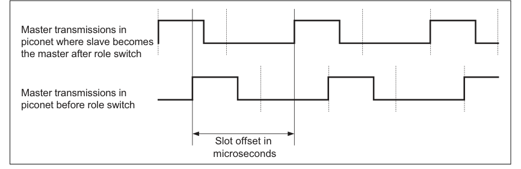

**Figure 4.2:  Slot offset for role switch**

See Section 4.4 for the use of LMP_slot_offset in the context of the role switch. In the case of role switch the BD_ADDR is that of the slave device.

| M/O | PDU | Contents |
| --- | --- | --- |
| O(3) | LMP slot offset _ _ | slot offset BD ADDR _ |

Table 4.30:  Slot Offset PDU
LM Initiating LM
LMP_slot_offset
Sequence 84: Slot offset information is sent

#### 4.4.2  Role Switch

Since the paging device always becomes the master of the piconet, a switch of the master slave role is sometimes needed, see [Vol 2] Part B, Section 8.6.5. A role switch may be performed anytime after the baseband paging procedure has completed.
Support for LMP_slot_offset is mandatory if LMP_switch_req is supported.
The LMP_slot_offset shall be sent only if the ACL logical transport is in active mode. The LMP_switch_req shall be sent only if the ACL logical transport is in active mode, when encryption is disabled or paused, and all synchronous logical transports on the same physical link are disabled. Additionally, LMP_slot_offset or LMP_switch_req shall not be initiated or accepted while a synchronous logical transport is being negotiated by LM.

| M/O | PDU | Contents |
| --- | --- | --- |
| O(5) | LMP switch req _ _ | switch instant |
| O(5) | LMP slot offset _ _ | slot offset BD ADDR _ |

Table 4.31:  Role switch PDUs
The initiating LM shall pause traffic on the ACL-U logical link (see [Vol 2] Part B, Section 5.3.1). If the encryption mode is set to "encryption" and both devices support pausing encryption, then the initiating device shall initiate the pause encryption sequence (see Section 4.2.5.5.) It shall then send an LMP_slot_offset PDU immediately followed by an LMP_switch_req PDU. If the master accepts the role switch and encryption is not already paused, it shall pause traffic on the ACL-U logical link (see [Vol 2] Part B, Section 5.3.1) and
respond with an LMP_accepted PDU. When the role switch has been completed at the baseband level (successfully or not) if encryption was paused, the device that paused encryption shall initiate the resume encryption sequence (see Section 4.2.5.6). If encryption was not paused, both devices shall re-enable transmission on the ACL-U logical link. If the master rejects the role switch it responds with an LMP_not_accepted PDU and the slave re- enables transmission on the ACL-U logical link. The transaction ID for the role switch PDUs in the sequence (LMP_slot_offset and LMP_switch_req along with the associated LMP_accepted or LMP_not_accepted) shall be set to 1.
Master LM Slave LM
LMP_slot_offset
LMP_switch_req
LMP_accepted or LMP_not_accepted
Sequence 85: Role switch (slave initiated)
If the master initiates the role switch and if the encryption mode is set to "encryption" and both devices support pausing encryption, the master device shall initiate the pause encryption sequence (See Section 4.2.5.5), otherwise it shall pause traffic on the ACL-U logical link (see [Vol 2] Part B, Section 5.3.1) and send an LMP_switch_req PDU. If the slave accepts the role switch and encryption is not already paused, it shall pause traffic on the ACL-U logical link (see [Vol 2] Part B, Section 5.3.1) and responds with an LMP_slot_offset PDU immediately followed by an LMP_accepted PDU. When the role switch has been completed at the baseband (successfully or not) if encryption was paused, the device that paused encryption shall initiate the resume encryption sequence (see Section 4.2.5.6). When AES-CCM encryption is used, the LMs shall calculate a new encryption key using the h3 algorithm (see [Vol 2] Part H, Section 7.7.6) with the BD_ADDRs for the new master and slave prior to resuming encryption. If encryption was not paused, both devices re-enable transmission on the ACL-U logical link. If the slave rejects the role switch it responds with an LMP_not_accepted PDU and the master re-enables transmission on the ACL-U logical link. The transaction ID for the role switch PDUs in the sequence (LMP_slot_offset and LMP_switch_req along with the associated LMP_accepted or LMP_not_accepted) shall be set to 0.
Slave LM Master LM
LMP_switch_req
LMP_slot_offset (if LMP_accepted)
LMP_accepted or LMP_not_accepted
Sequence 86: Role switch (master initiated)
The LMP_switch_req PDU contains a parameter, switch instant, which specifies the instant at which the TDD switch is performed. This is specified as a Bluetooth clock value of the master's clock, that is available to both devices. This instant is chosen by the sender of the message and shall be at least 2*Tpoll or 32 (whichever is greater) slots in the future. The switch instant shall be within 12 hours of the current clock value to avoid clock wrap.
The sender of the LMP_switch_req PDU selects the switch instant and queues the LMP_switch_req PDU to LC for transmission and starts a timer to expire at the switch instant. When the timer expires it initiates the mode switch. In the case of a master initiated switch if the LMP_slot_offset PDU has not been received by the switch instant the role switch is carried out without an estimate of the slave's slot offset. If an LMP_not_accepted PDU is received before the timer expires then the timer is stopped and the role switch shall not be initiated.
When the LMP_switch_req is received the switch instant is compared with the current master clock value. If it is in the past then the instant has been passed and an LMP_not_accepted PDU with the error code Instant Passed (0x28) shall be returned. If it is in the future then an LMP_accepted PDU shall be returned assuming the role switch is allowed and a timer is started to expire at the switch instant. When this timer expires the role switch shall be initiated.
After a successful role switch the supervision timeout and poll interval (Tpoll) shall be set to their default values. The authentication state and the ACO shall remain unchanged. Adaptive Frequency Hopping shall follow the procedures described in [Vol 2] Part B, Section 8.6.5. The default value for max_slots shall be used.

### 4.5   MODES OF OPERATION

#### 4.5.1  Hold Mode

The ACL logical transport of a connection between two Bluetooth devices can be placed in hold mode for a specified hold time. See [Vol 2] Part B, Section 8.8 for details.

| M/O | PDU | Contents |
| --- | --- | --- |
| O(6) | LMP hold _ | hold time, hold instant |
| O(6) | LMP hold req _ _ | hold time, hold instant |

Table 4.32:  Hold mode PDUs
The LMP_hold and LMP_hold_req PDUs both contain a parameter, hold instant, that specifies the instant at which the hold becomes effective. This is specified as a Bluetooth clock value of the master's clock, that is available to both devices. The hold instant is chosen by the sender of the message and should be at least 6*Tpoll slots in the future. The hold instant shall be within 12 hours of the current clock value to avoid clock wrap.

##### 4.5.1.1  Master Forces Hold Mode

The master may force hold mode if there has previously been a request for hold mode that has been accepted by the slave. The hold time included in the PDU when the master forces hold mode shall not be longer than any hold time the slave has previously accepted when there was a request for hold mode.
The master LM shall first pause traffic on the ACL-U logical link (see [Vol 2] Part B, Section 5.3.1). It shall select the hold instant and queue the LMP_hold PDU to its LC for transmission. It shall then start a timer to wait until the hold instant occurs. When this timer expires then the connection shall enter hold mode. If the baseband acknowledgment for the LMP_hold PDU is not received then the master may enter hold mode, but it shall not use its low accuracy clock during the hold.
When the slave LM receives an LMP_hold PDU it compares the hold instant with the current master clock value. If it is in the future then it starts a timer to expire at this instant and enters hold mode when it expires.
When the master LM exits from Hold mode it re-enables transmission on the ACL-U logical link.
Slave LM Master LM
LMP_hold
Sequence 87: Master forces slave into hold mode

##### 4.5.1.2  Slave Forces Hold Mode

The slave may force hold mode if there has previously been a request for hold mode that has been accepted by the master. The hold time included in the PDU when the slave forces hold mode shall not be longer than any hold time the master has previously accepted when there was a request for hold mode.
The slave LM shall first complete the transmission of the current packet on the ACL logical transport and then shall suspend transmission on the ACL-U logical link. It shall select the hold instant and queue the LMP_hold PDU to its LC for transmission. It shall then wait for an LMP_hold PDU from the master acting according to the procedure described in Section 4.5.1.1.
When the master LM receives an LMP_hold PDU it shall pause traffic on the ACL-U logical link (see [Vol 2] Part B, Section 5.3.1). It shall then inspect the hold instant. If this is less than 6*Tpoll slots in the future it shall modify the instant so that it is at least 6*Tpoll slots in the future. It shall then send an LMP_hold PDU using the mechanism described in Section 4.5.1.1.
When the master and slave LMs exit from Hold mode they shall re-enable transmission on the ACL-U logical link.
Slave LM Master LM
LMP_hold
LMP_hold
Sequence 88: Slave forces master into hold mode

##### 4.5.1.3  Master or Slave Requests Hold Mode

The master or the slave may request to enter hold mode. Upon receipt of the request, the same request with modified parameters may be returned or the negotiation may be terminated. If an agreement is seen an LMP_accepted PDU terminates the negotiation and the ACL link is placed in hold mode. If no agreement is seen, an LMP_not_accepted PDU with the error code
Unsupported LMP Parameter Value (0x20) terminates the negotiation and hold mode is not entered.
The initiating LM shall pause traffic on the ACL-U logical link (see [Vol 2] Part B, Section 5.3.1). On receiving an LMP_hold_req PDU the receiving LM shall complete the transmission of the current packet on the ACL logical transport and then shall suspend transmission on the ACL-U logical link.
The LM sending the LMP_hold_req PDU selects the hold instant, that shall be at least 9*Tpoll slots in the future. If this is a response to a previous LMP_hold_req PDU and the contained hold instant is at least 9*Tpoll slots in the future then this shall be used. The LMP_hold_req PDU shall then be queued to its LC for transmission and a timer shall be started to expire at this instant and the connection enters hold mode when it expires unless an LMP_not_accepted or LMP_hold_req PDU is received by its LM before that point. If the LM receiving LMP_hold_req PDU agrees to enter hold mode it shall return an LMP_accepted PDU and shall start a timer to expire at the hold instant. When this timer expires it enters hold mode.
When each LM exits from Hold mode it shall re-enable transmission on the ACL-U logical link.
LM Initiating LM
LMP_hold_req
LMP_hold_req
LMP_hold_req
LMP_accepted or LMP_not_accepted
Sequence 89: Negotiation for hold mode

#### 4.5.2  This Section no longer used

#### 4.5.3  Sniff Mode

To enter sniff mode, master and slave negotiate a sniff interval Tsniff and a sniff offset, Dsniff, that specifies the timing of the sniff slots. The offset determines the time of the first sniff slot; after that the sniff slots follow periodically with the sniff interval Tsniff. To avoid clock wrap-around during the initialization, one of two options is chosen for the calculation of the first sniff slot. A timing control
flag in the message from the master indicates this. Only bit1 of the timing control flag is valid.
When the ACL logical transport is in sniff mode the master shall only start a transmission in the sniff slots. Two parameters control the listening activity in the slave: the sniff attempt and the sniff timeout. The sniff attempt parameter determines for how many slots the slave shall listen when the slave is not treating this as a scatternet link, beginning at the sniff slot, even if it does not receive a packet with its own LT_ADDR. The sniff timeout parameter determines for how many additional slots the slave shall listen when the slave is not treating this as a scatternet link if it continues to receive only packets with its own LT_ADDR. It is not possible to modify the sniff parameters while the device is in sniff mode.

| M/O | PDU | Contents |
| --- | --- | --- |
| O(7) | LMP sniff req _ _ | timing control flags D sniff T sniff sniff attempt sniff timeout |
| O(7) | LMP unsniff req _ _ | - |

Table 4.33:  Sniff mode PDUs

##### 4.5.3.1  Master or Slave Requests Sniff Mode

Either the master or the slave may request entry to sniff mode. The process is initiated by sending an LMP_sniff_req PDU containing a set of parameters. The receiving LM shall then decide whether to reject the attempt by sending an LMP_not_accepted PDU, to suggest different parameters by replying with an LMP_sniff_req PDU or to accept the request.
Before the first time that the master sends LMP_sniff_req in a transaction it shall enter sniff transition mode. If the master receives or sends an LMP_not_accepted PDU it shall exit from sniff transition mode.
If the master receives an LMP_sniff_req PDU it shall enter sniff transition mode (if not already in it) and then determine whether to accept the request. The master may reply with an LMP_not_accepted PDU or if it can enter sniff mode but requires a different set of parameters it shall respond with an LMP_sniff_req PDU containing the new parameters. If the master decides that the parameters are acceptable then it shall send an LMP_accepted PDU; when it receives the baseband acknowledgment for this PDU it shall exit sniff transition mode and enter sniff mode.
If the master decides to accept the request it shall send an LMP_accepted PDU. When the master receives the baseband acknowledgment for this PDU it shall exit sniff transition mode and enter sniff mode.
If the master receives an LMP_accepted PDU the master shall exit from sniff transition mode and enter sniff mode.
If the slave receives an LMP_sniff_req PDU it shall determine whether to accept the request. The slave may reply with an LMP_not_accepted PDU to reject the request or, if it can enter sniff mode but requires a different set of parameters it shall respond with an LMP_sniff_req PDU containing the new parameters. If the slave decides that the parameters are acceptable then it shall send an LMP_accepted PDU and enter sniff mode. If the slave receives an LMP_not_accepted PDU it shall terminate the attempt to enter sniff mode.
LM Initiating LM
LMP_sniff_req
LMP_sniff_req
LMP_sniff_req
LMP_accepted or LMP_not_accepted
Sequence 90: Negotiation for sniff mode

##### 4.5.3.2  Moving a Slave from Sniff Mode to Active Mode

Sniff mode may be exited by either the master or the slave sending an LMP_unsniff_req PDU. The requested device shall reply with an LMP_accepted PDU.
If the master requests an exit from sniff mode it shall enter sniff transition mode and then send an LMP_unsniff_req PDU. When the slave receives the LMP_unsniff_req it shall exit from sniff mode and reply with an LMP_accepted PDU. When the master receives the LMP_accepted PDU it shall exit from sniff transition mode and enter active mode.
If the slave requests an exit from sniff mode it shall send an LMP_unsniff_req PDU. When the master receives the LMP_unsniff_req PDU it shall enter sniff transition mode and then send an LMP_accepted PDU. When the slave receives the LMP_accepted PDU it shall exit from sniff mode and enter active mode. When the master receives the baseband acknowledgment for the LMP_accepted PDU it shall leave sniff transition mode and enter active mode.
LM Initiating LM
LMP_unsniff_req
LMP_accepted
Sequence 91: Slave moved from sniff mode to active mode

##### 4.5.3.3  Sniff Subrating

Once sniff mode has been started, sniff subrating may be initiated by either Link Manager.
The LMP_sniff_subrating_req and LMP_sniff_subrating_res PDUs specify parameters that the peer and initiating device shall use respectively for sniff subrating.
The sniff subrating instant value shall be used to calculate the first sniff subrating anchor point. The sniff subrating instant value shall be a maximum of 216 time slots (40.9 seconds) from the current master clock and shall be a sniff anchor point. The sniff subrating instant value should indicate a clock value in the future with respect to the clock value when the LMP message is first sent.
If the LMP_sniff_subrating_req PDU is sent by the master, the sniff subrating instant value shall be used. The slave device shall reply with an LMP_sniff_subrating_res PDU using the same sniff subrating instant value given by the master.
When the LMP_sniff_subrating_req PDU is sent by the slave, the sniff subrating instant value shall be ignored. The master device shall reply with an LMP_sniff_subrating_res PDU with the sniff subrating instant value that shall be used for sniff subrating.
The initiating device shall not transition to the new sniff subrating parameters until the sniff subrating instant has passed and the LMP_sniff_subrating_res PDU has been received. The non-initiating device shall remain in sniff mode and shall not transition to the new sniff subrating parameters until after the sniff subrating instant has passed and the baseband acknowledgment of the LMP_sniff_subrating_res PDU has been received.
LM Initiating LM
LMP_sniff_subrating_req
LMP_sniff_subrating_res
Sequence 92: LM accepts sniff subrating request
A device shall not send a new LMP_sniff_subrating_req PDU until the previous sniff subrating transaction has completed and the sniff subrating instant has passed.
The maximum clock interval between two sniff subrating anchor points shall be less than the link supervision timeout. If the link supervision timeout needs to be updated to a shorter value than the clock interval between two sniff subrating anchor points, the master shall disable sniff subrating, shall send the LMP_Supervision_Timeout PDU with the new supervision timeout value, and shall start using the new supervision timeout value after receiving a baseband ACK for the LMP_Supervision_Timeout PDU. Upon reception of the LMP_Supervision_Timeout PDU the slave shall disable sniff subrating and shall start using the new supervision timeout value.
The master shall initiate sniff subrating with the max_sniff_subrate parameter less than the new supervision timeout. The slave shall respond with the LMP_sniff_subrating_res PDU with the max_sniff_subrate parameter less than the new supervision timeout.
Note: When changing the link supervision timeout while sniff subrating is enabled, refer to Section 4.5.3.3.

### 4.6   LOGICAL TRANSPORTS

When a connection is first established between two devices the connection consists of the ACL logical transport (carrying the ACL-C logical link for LMP messages and the ACL-U logical link for L2CAP data) and the ASB logical transport carrying the ASB-C logical links for LMP messages and the ASB-U logical link for L2CAP data. One or more synchronous logical transports (SCO or eSCO) may then be added. A new logical transport shall not be created if it would cause all slots to be allocated to reserved slots on secondary LT_ADDRs.

#### 4.6.1  SCO Logical Transport

The SCO logical transport reserves slots separated by the SCO interval, Tsco. The first slot reserved for the SCO logical transport is defined by Tsco and the SCO offset, Dsco. See [Vol 2] Part B, Section 8.6.2 for details. A device shall
initiate a request for HV2 or HV3 packet type only if the other device supports it (bits 12, 13) in its features mask. A device shall initiate CVSD, μ-law or A-law coding or uncoded (transparent) data only if the other device supports the corresponding feature. To avoid problems with a wrap-around of the clock during initialization of the SCO logical transport, the timing control flags parameter is used to indicate how the first SCO slot shall be calculated. Only bit1 of the timing control flags parameter is valid. The SCO link is distinguished from all other SCO links by a SCO handle. The SCO handle zero shall not be used.

| M/O | PDU | Contents |
| --- | --- | --- |
| O(11) | LMP SCO link req _ _ _ | SCO handle timing control flags D sco T sco SCO packet air mode |
| O(11) | LMP remove SCO link req _ _ _ _ | SCO handle error |

Table 4.34:  SCO link management PDUs

##### 4.6.1.1  Master Initiates a SCO Link

When establishing a SCO link the master sends a request, a LMP_SCO_link_req PDU, with parameters that specify the timing, packet type and coding that will be used on the SCO link. Each of the SCO packet types supports three different voice coding formats on the air-interface: µ-law log PCM, A-law log PCM and CVSD. The air coding by log PCM or CVSD may be deactivated to achieve a transparent synchronous data link at 64 kb/s.
The slots used for the SCO links are determined by three parameters controlled by the master: Tsco, Dsco and a flag indicating how the first SCO slot is calculated. After the first slot, the SCO slots follow periodically at an interval of Tsco.
If the slave does not accept the SCO link, but can operate with a different set of SCO parameters, it can indicate what it does not accept in the error code field of LMP_not_accepted PDU. The master may then issue a new request with modified parameters.
The SCO handle in the message shall be different from existing SCO link(s).
If the SCO packet type is HV1 the LMP_accepted shall be sent using the DM1 packet.
Slave LM Master LM
LMP_SCO_link_req
LMP_accepted or LMP_not_accepted
Sequence 93: Master requests a SCO link

##### 4.6.1.2  Slave Initiates a SCO Link

The slave may initiate the establishment of a SCO link. The slave sends an LMP_SCO_link_req PDU, but the parameters timing control flags and Dsco are invalid as well as the SCO handle, that shall be zero. If the master is not capable of establishing a SCO link, it replies with an LMP_not_accepted PDU. Otherwise it sends back an LMP_SCO_link_req PDU. This message includes the assigned SCO handle, Dsco and the timing control flags. The master should try to use the same parameters as in the slave request; if the master cannot meet that request, it is allowed to use other values. The slave shall then reply with LMP_accepted or LMP_not_accepted PDU.
If the SCO packet type is HV1 the LMP_accepted shall be sent using the DM1 packet.
Slave LM Master LM
LMP_SCO_link_req
LMP_not_accepted
Sequence 94: Master rejects slave’s request for a SCO link
Slave LM Master LM
LMP_SCO_link_req
LMP_SCO_link_req
LMP_accepted or LMP_not_accepted
Sequence 95: Master accepts slave’s request for a SCO link

##### 4.6.1.3  Master Requests Change of SCO Parameters

The master sends an LMP_SCO_link_req PDU, where the SCO handle is the handle of the SCO link the master wishes to change parameters for. If the slave accepts the new parameters, it replies with an LMP_accepted PDU and the SCO link will change to the new parameters. If the slave does not accept the new parameters, it shall reply with an LMP_not_accepted PDU and the SCO link is left unchanged. When the slave replies with an LMP_not_accepted PDU it shall indicate in the error code parameter what it does not accept. The master may then try to change the SCO link again with modified parameters. The sequence is the same as in Section 4.6.1.1.

##### 4.6.1.4  Slave Requests Change of SCO Parameters

The slave sends an LMP_SCO_link_req PDU, where the SCO handle is the handle of the SCO link to be changed. The parameters timing control flags and Dsco are not valid in this PDU. If the master does not accept the new parameters it shall reply with an LMP_not_accepted PDU and the SCO link is left unchanged. If the master accepts the new parameters it shall reply with an LMP_SCO_link_req PDU containing the same parameters as in the slave request. When receiving this message the slave replies with an LMP_not_accepted PDU if it does not accept the new parameters. The SCO link is then left unchanged. If the slave accepts the new parameters it replies with an LMP_accepted PDU and the SCO link will change to the new parameters. The sequence is the same as in Section 4.6.1.2.

##### 4.6.1.5  Remove a SCO link

Master or slave may remove the SCO link by sending a request including the SCO handle of the SCO link to be removed and an error code indicating why the SCO link is removed. The receiving side shall respond with an LMP_accepted PDU.
LM Initiating LM
LMP_remove_SCO_link_req
LMP_accepted
Sequence 96: SCO link removed
Note that the slave shall use the initialization flag appropriate to the master's Bluetooth clock. See [Vol 2] Part B, Section 8.6.2.

#### 4.6.2  eSCO Logical Transport

After an ACL link has been established, one or more extended SCO (eSCO) links can be set up to the remote device. The eSCO links are similar to SCO links using timing control flags, an interval TeSCO and an offset DeSCO. Only bit1 of the timing control flags parameter is valid. As opposed to SCO links, eSCO links have a configurable data rate that may be asymmetric, and can be set up to provide limited retransmissions of lost or damaged packets inside a retransmission window of size WeSCO. The DeSCO shall be based on CLK.

| M/O | PDU | Contents |
| --- | --- | --- |
| O(31) | LMP eSCO link req _ _ _ | eSCO handle eSCO LT ADDR _ timing control flags D eSCO T eSCO W eSCO eSCO packet type M->S eSCO packet type S->M packet length M->S packet length S->M air mode negotiation state |
| O(31) | LMP remove eSCO link req _ _ _ _ | eSCO handle error |

Table 4.35:  PDUs used for managing the eSCO links
The parameters DeSCO, TeSCO, WeSCO, eSCO packet type M->S, eSCO packet type S->M, packet length M->S, packet length S->M are henceforth referred to as the negotiable parameters.

##### 4.6.2.1  Master Initiates an eSCO Link

When establishing an eSCO link the master sends an LMP_eSCO_link_req PDU specifying all parameters. The slave may accept this with an LMP_accepted_ext PDU, reject it with an LMP_not_accepted_ext PDU, or respond with its own LMP_eSCO_link_req specifying alternatives for some or all parameters. The slave shall not negotiate the eSCO handle or eSCO LT_ADDR parameters. The negotiation of parameters continues until the master or slave either accepts the latest parameters with an LMP_accepted_ext PDU, or terminates the negotiation with an LMP_not_accepted_ext PDU. The negotiation shall use the procedures defined in Section 4.6.2.5.
Slave LM Master LM
LMP_eSCO_link_req
LMP_eSCO_link_req
LMP_eSCO_link_req
LMP_accepted_ext or LMP_not_accepted_ext
Sequence 97: Master requests an eSCO link

##### 4.6.2.2  Slave Initiates an eSCO Link

When attempting to establish an eSCO link the slave shall send an LMP_eSCO_link_req PDU specifying all parameters, with the exception of eSCO LT_ADDR and eSCO handle, which are invalid. The latter shall be set to zero. The master may respond to this with an LMP_eSCO_link_req PDU, filling in these missing parameters, and potentially changing the other requested parameters. The slave can accept this with an LMP_accepted_ext PDU, or respond with a further LMP_eSCO_link_req PDU specifying alternatives for some or all of the parameters. The negotiation of parameters continues until the master or slave either accepts the latest parameters with an LMP_accepted_ext PDU, or terminates the negotiation with an LMP_not_accepted_ext PDU.
Slave LM Master LM
LMP_eSCO_link_req
LMP_eSCO_link_req
LMP_eSCO_link_req
LMP_accepted_ext or LMP_not_accepted_ext
Sequence 98: Slave requests an eSCO link
Note that the slave should use the initialization flag appropriate to the master's Bluetooth clock. See Definition: Baseband Specification Section 8.6.3.
The master may reject the request immediately with an LMP_not_accepted_ext PDU. The negotiation shall use the procedures defined in Section 4.6.2.5.
Slave LM Master LM
LMP_eSCO_link_req
LMP_not_accepted_ext
Sequence 99: Master rejects slave’s request for an eSCO link

##### 4.6.2.3  Master or Slave Requests Change of eSCO Parameters

The master or slave may request a renegotiation of the eSCO parameters. The master or slave shall send an LMP_eSCO_link_req PDU with the eSCO handle of the eSCO link the device wishes to renegotiate. The remote device may accept the changed parameters immediately with LMP_accepted_ext PDU, or the negotiation may be continued with further LMP_eSCO_link_req PDUs until the master or slave accepts the latest parameters with an LMP_accepted_ext PDU or terminates the negotiation with an LMP_not_accepted_ext PDU. In the case of termination with an LMP_not_accepted_ext PDU, the eSCO link continues on the previously negotiated parameters.
The sequence is the same as in Section 4.6.2.2.
During re-negotiation, the eSCO LT_ADDR and eSCO handle shall not be re- negotiated and shall be set to the originally negotiated values. The negotiation shall use the procedures defined in Section 4.6.2.5.

##### 4.6.2.4  Remove an eSCO Link

Either the master or slave may remove the eSCO link by sending a request including the eSCO handle of the eSCO link to be removed and an error code indicating why the eSCO link is removed. The receiving side shall respond with an LMP_accepted_ext PDU. The slave shall shut down its eSCO logical transport before sending its PDU (LMP_remove_eSCO_link_req for slave initiated removal, LMP_accepted_ext for master initiated). The master shall not reassign the eSCO LT_ADDR until the end of the removal procedure. If, for some reason, such as the slave being out of range, the procedure cannot be completed, the master shall not reassign the eSCO LT_ADDR until the primary LT_ADDR is available for reuse (supervision timeout).
LM Initiating LM
LMP_remove_eSCO_link_req
LMP_accepted_ext
Sequence 100: eSCO link removed

##### 4.6.2.5  Rules for the LMP Negotiation and Renegotiation

Rule 1: the negotiation_state shall be set to 0 by the initiating LM. After the initial LMP_eSCO_link_req is sent the negotiation_state shall not be set to 0.
Rule 2: if the bandwidth (defined as 1600 times the packet length in bytes divided by TeSCO in slots) for either RX or TX or the air_mode cannot be accepted the device shall send LMP_not_accepted_ext with the appropriate error code.
Rule 3: Bandwidth and air_mode are not negotiable and shall not be changed for the duration of the negotiation. Once one side has rejected the negotiation (with LMP_not_accepted_ext) a new negotiation may be started with different bandwidth and air_mode parameters.
Rule 4: if the parameters will cause a latency violation (TeSCO + WeSCO + reserved synchronous slots > allowed local latency) the device should propose new parameters that shall not cause a reserved slot violation or latency violation for the device that is sending the parameters. In this case the negotiation_state shall be set to 3. Otherwise the device shall send LMP_not_accepted_ext.
Rule 5: once a device has received an LMP_eSCO_link_req with the negotiation_state set to 3 (latency violation), the device shall not propose any combination of packet type, TeSCO, and WeSCO that will give an equal or larger latency than the combination that caused the latency violation for the other device.
Rule 6: if the parameters cause both a reserved slot violation and a latency violation or if the parameters are not supported and a latency violation occurs, then the device shall set the negotiation_state to 3 (latency violation).
Rule 7: if the parameters will cause a reserved slot violation the device should propose new parameters that shall not cause a reserved slot violation. In this case the negotiation_state shall be set to 2. Otherwise the device shall send LMP_not_accepted_ext.
Rule 8: If the requested parameters are not supported the device should propose a setting that is supported, and set the negotiation_state to 4. If it is
not possible to find such a parameter set, the device shall send LMP_not_accepted_ext.
Rule 9: when proposing new parameters for reasons other than a latency violation, reserved slot violation, or configuration not supported, the negotiation_state shall be set to 1.

##### 4.6.2.6  Negotiation State Definitions

Reserved Slot Violation: a reserved slot violation is when the receiving LM cannot setup the requested eSCO logical transport because the eSCO reserved slots would overlap with other regularly scheduled slots (e.g. other synchronous reserved slots or sniff anchor points).
Latency Violation: a latency violation is when the receiving LM cannot setup the requested eSCO logical transport because the latency (WeSCO+TeSCO + reserved synchronous slots) is greater than the maximum allowed latency.
Configuration not supported: The combination of parameters requested is not inside the supported range for the device.

### 4.7   TEST MODE

LMP has PDUs to support different test modes used for certification and compliance testing of the Bluetooth radio and baseband. See Definition: Test Methodology [Vol 3] Part D, Section 1 for a detailed description of these test modes.

#### 4.7.1  Activation and Deactivation of Test Mode

The activation may be carried out locally (via a HW or SW interface), or using the air interface.
• For activation over the air interface, entering the test mode shall be locally enabled for security and type approval reasons. The implementation of this local enabling is not subject to standardization. The tester sends an LMP command that shall force the DUT to enter test mode. The DUT shall terminate all normal operation before entering the test mode. The DUT shall return an LMP_Accepted PDU on reception of an activation command. An LMP_Not_Accepted PDU shall be returned if the DUT is not locally enabled.
• If the activation is performed locally using a HW or SW interface, the DUT shall terminate all normal operation before entering the test mode. Until a connection to the tester exists, the device shall perform page scan and inquiry scan. Extended scan activity is recommended.
The test mode is activated by sending an LMP_test_activate PDU to the device under test (DUT). The DUT is always the slave. The lm shall be able to receive this message anytime. If entering test mode is locally enabled in the DUT it shall respond with an LMP_accepted PDU and test mode is entered. Otherwise the DUT responds with an LMP_not_accepted PDU and the DUT remains in normal operation. The error code in the LMP_not_accepted PDU shall be LMP PDU Not Allowed (0x24).
Slave LM Master LM
LMP_test_activate
LMP_accepted
Sequence 101: Activation of test mode successful
Slave LM Master LM
LMP_test_activate
LMP_not_accepted
Sequence 102: Activation of test mode fails. Slave is not allowed to enter test mode
The test mode can be deactivated in two ways. Sending an LMP_test_control PDU with the test scenario set to "exit test mode" exits the test mode and the slave returns to normal operation still connected to the master. Sending an LMP_detach PDU to the DUT ends the test mode and the connection.

#### 4.7.2  Control of Test Mode

Control and configuration is performed using special LMP commands (see Section 4.7.3). These commands shall be rejected if the Bluetooth device is not in test mode. In this case, an LMP_not_accepted shall be returned. The DUT shall return an LMP_accepted on reception of a control command when in test mode.
A Bluetooth device in test mode shall ignore all LMP commands not related to control of the test mode. LMP commands dealing with power control and the request for LMP features (LMP_features_req), and adaptive frequency hopping (LMP_set_AFH, LMP_channel_classification_req and LMP_channel_classification) are allowed in test mode; the normal procedures are also used to test the adaptive power control.
The DUT shall leave the test mode when an LMP_Detach command is received or an LMP_test_control command is received with test scenario set to 'exit test mode'.
When the DUT has entered test mode, the PDU LMP_test_control PDU can be sent to the DUT to start a specific test. This PDU is acknowledged with an LMP_accepted PDU. If a device that is not in test mode receives an LMP_test_control PDU it responds with an LMP_not_accepted PDU, where the error code shall be LMP PDU Not Allowed (0x24).
Slave LM Master LM
LMP_test_control
LMP_accepted
Sequence 103: Control of test mode successful
Slave LM Master LM
LMP_test_control
LMP_not_accepted
Sequence 104: Control of test mode rejected since slave is not in test mode

#### 4.7.3  Summary of Test Mode PDUs

Table 4.36 lists all LMP messages used for test mode. To ensure that the contents of LMP_test_control PDU are suitably whitened (important when sent in transmitter mode), all parameters listed in Table 4.37 are XORed with 0x55 before being sent.

| LMP PDU | PDU number | Possible Direction | Contents | Position in Payloa |
| --- | --- | --- | --- | --- |
| LMP test activate _ _ | 56 | m → s |  |  |

Table 4.36:  LMP messages used for Test Mode

| LMP PDU | PDU number | Possible Direction | Contents | Position in Payloa |
| --- | --- | --- | --- | --- |
| LMP test control _ _ | 57 | m → s | test scenario hopping mode TX frequency RX frequency power control mode poll period packet type length of test data | 2 3 4 5 6 7 8 9-10 |
| LMP detach _ | 7 | m → s |  |  |
| LMP accepted _ | 3 | m ← s |  |  |
| LMP not accepted _ _ | 4 | m ← s |  |  |

Table 4.36:  LMP messages used for Test Mode

| Name | Length (bytes) | Type | Unit | Detailed |
| --- | --- | --- | --- | --- |
| Test scenario | 1 | u int8 _ |  | 0 Pause Test Mode 1 Transmitter test – 0 pattern 2 Transmitter test – 1 pattern 3 Transmitter test – 1010 pattern 4 Pseudorandom bit sequence 5 Closed Loop Back – ACL packe 6 Closed Loop Back – Synchro- nous packets 7 ACL Packets without whitening 8 Synchronous Packets without whitening 9 Transmitter test – 1111 0000 pa tern 10–254 Reserved for future use 255 Exit Test Mode The value is XORed with 0x55. |
| Hopping mode | 1 | u int8 _ |  | 0 RX/TX on single frequency 1 Normal hopping 2–255 Reserved for future use The value is XORed with 0x55. |
| TX frequency (for DUT) | 1 | u int8 _ |  | f = [2402 + k] MHz The value is XORed with 0x55. |
| RX frequency (for DUT) | 1 | u int8 _ |  | f = [2402 + k] MHz The value is XORed with 0x55. |
| Power control mode | 1 | u int8 _ |  | 0 fixed TX output power 1 adaptive power control The value is XORed with 0x55. |

Table 4.37:  Parameters used in LMP_Test_Control PDU

| Name | Length (bytes) | Type | Unit | Detailed |
| --- | --- | --- | --- | --- |
| Poll period | 1 | u int8 _ | 1.25 ms | The value is XORed with 0x55. |
| Packet type | 1 | u int8 _ |  | Bits 3-0 numbering as in packet header, see Baseband Specification Bits 7-4 0: ACL/SCO 1: eSCO 2: Enhanced Data Rate ACL 3: Enhanced Data Rate eSCO 4-15: Reserved for future use The value is XORed with 0x55. |
| length of test sequence (=length of user data in Baseband Specifica- tion) | 2 | u int16 _ | 1 byte | unsigned binary number The value is XORed with 0x5555. |

Table 4.37:  Parameters used in LMP_Test_Control PDU
The control PDU is used for both transmitter and loop back tests. The following restrictions apply for the parameter settings:

| Parameter | Restrictions Transmitter Test | Restrictions Loopback Test |
| --- | --- | --- |
| TX frequency | 0 ≤ k ≤ 78 | 0 ≤ k ≤ 78 |
| RX frequency | same as TX frequency | 0 ≤ k ≤ 78 |
| Poll period |  | not applicable (set to 0) |
| Length of test sequence | Depends on packet type. See Table 6.9 and Table 6.10 in the Baseband specification | For ACL and SCO packets: not applicable (set to 0) For eSCO packets: [see Table 6.10 in the Base- band specification] |

Table 4.38:  Restrictions on the parameters in the LMP_Test_Control PDU

## 5  SUMMARY

### 5.1   PDU SUMMARY

| LMP PDU | Length (bytes) | op code | Packet type | Possible direction | Contents | Positio in payload |
| --- | --- | --- | --- | --- | --- | --- |
| Escape 1 | variable | 124 | DM1 | m ↔ s | extended op code | 2 |
|  |  |  |  |  | variable | 3-? |
| Escape 2 | variable | 125 | DM1 | m ↔ s | extended op code | 2 |
|  |  |  |  |  | variable | 3-? |
| Escape 3 | variable | 126 | DM1 | m ↔ s | extended op code | 2 |
|  |  |  |  |  | variable | 3-? |
| Escape 4 | variable | 127 | DM1 | m ↔ s | extended op code | 2 |
|  |  |  |  |  | variable | 3-? |
| LMP accepted _ | 2 | 3 | DM1/DV | m ↔ s | op code | 2 |
| LMP accepted ext _ _ | 4 | 127/01 | DM1 | m ↔ s | escape op code | 3 |
|  |  |  |  |  | extended op code | 4 |
| LMP au rand _ _ | 17 | 11 | DM1 | m ↔ s | random number | 2-17 |
| LMP auto rate _ _ | 1 | 35 | DM1/DV | m ↔ s | - |  |
| LMP channel _ classification _ | 12 | 127/17 | DM1 | m ← s | AFH channel _ _ classification | 3 – 12 |
| LMP channel _ classification req _ _ | 7 | 127/16 | DM1 | m → s | AFH reporting _ mode _ | 3 |
|  |  |  |  |  | AFH min interval _ _ | 4-5 |
|  |  |  |  |  | AFH max interval _ _ | 6-7 |
| LMP clk adj _ _ | 15 | 127/5 | DM1 | m → s | clk adj id _ _ | 3 |
|  |  |  |  |  | clk adj instant _ _ | 4-7 |
|  |  |  |  |  | clk adj us _ _ | 8-9 |
|  |  |  |  |  | clk adj slots _ _ | 10 |
|  |  |  |  |  | clk adj mode _ _ | 11 |
|  |  |  |  |  | clk adj clk _ _ | 12-15 |
| LMP clk adj ack _ _ _ | 3 | 127/6 | DM1 | s → m | clk adj id _ _ | 3 |

Table 5.1:  Coding of the different LM PDUs  (Sheet 1 of 8)

| LMP PDU | Length (bytes) | op code | Packet type | Possible direction | Contents | Positio in payloa |
| --- | --- | --- | --- | --- | --- | --- |
| LMP clk adj req _ _ _ | 6 | 127/7 | DM1 | m ← s | clk adj us _ _ | 3-4 |
|  |  |  |  |  | clk adj slots _ _ | 5 |
|  |  |  |  |  | clk adj period _ _ | 6 |
| LMP clkoffset req _ _ | 1 | 5 | DM1/DV | m → s | – |  |
| LMP clkoffset res _ _ | 3 | 6 | DM1/DV | m ← s | clock offset | 2–3 |
| LMP comb key _ _ | 17 | 9 | DM1 | m ↔ s | random number | 2-17 |
| LMP decr power _ _ req _ | 2 | 32 | DM1/DV | m ↔ s | for future use | 2 |
| LMP detach _ | 2 | 7 | DM1/DV | m ↔ s | error code | 2 |
| LMP DHkey Check _ _ | 17 | 65 | DM1 | m ↔ s | Confirmation Value | 2-17 |
| LMP encapsulated _ header _ | 4 | 61 | DM1 | m ↔ s | encapsulated major type | 2 |
|  |  |  |  |  | encapsulated minor type | 3 |
|  |  |  |  |  | encapsulated pay- load length | 4 |
| LMP encapsulated _ payload _ | 17 | 62 | DM1 | m ↔ s | encapsulated data | 2-17 |
| LMP encryption _ key size mask _ _ _ req _ | 1 | 58 | DM1 | m → s |  |  |
| LMP encryption _ key size _ _ mask res _ _ | 3 | 59 | DM1 | m ← s | key size mask | 2-3 |
| LMP encryption _ key size req _ _ _ | 2 | 16 | DM1/DV | m ↔ s | key size | 2 |
| LMP encryption _ mode req _ _ | 2 | 15 | DM1/DV | m ↔ s | encryption mode | 2 |

Table 5.1:  Coding of the different LM PDUs  (Sheet 2 of 8)

| LMP PDU | Length (bytes) | op code | Packet type | Possible direction | Contents | Position in payload |
| --- | --- | --- | --- | --- | --- | --- |
| LMP eSCO link req _ _ _ (see Note 1) | 16 | 127/12 | DM1 | m↔s | eSCO handle | 3 |
|  |  |  |  |  | eSCO LT ADDR _ | 4 |
|  |  |  |  |  | timing control flags | 5 |
|  |  |  |  |  | D eSCO | 6 |
|  |  |  |  |  | T eSCO | 7 |
|  |  |  |  |  | W eSCO | 8 |
|  |  |  |  |  | eSCO packet type M->S | 9 |
|  |  |  |  |  | eSCO packet type S->M | 10 |
|  |  |  |  |  | packet length M->S | 11-12 |
|  |  |  |  |  | packet length S->M | 13-14 |
|  |  |  |  |  | air mode | 15 |
|  |  |  |  |  | negotiation state | 16 |
| LMP features req _ _ | 9 | 39 | DM1/DV | m ↔ s | features | 2-9 |
| LMP features _ req ext _ _ | 12 | 127/03 | DM1 | m ↔ s | features page | 3 |
|  |  |  |  |  | max supported page | 4 |
|  |  |  |  |  | extended features | 5-12 |
| LMP features res _ _ | 9 | 40 | DM1/DV | m ↔ s | features | 2-9 |
| LMP features _ res ext _ _ | 12 | 127/04 | DM1 | m ↔ s | features page | 3 |
|  |  |  |  |  | max supported page | 4 |
|  |  |  |  |  | extended features | 5-12 |
| LMP hold _ | 7 | 20 | DM1/DV | m ↔ s | hold time | 2-3 |
|  |  |  |  |  | hold instant | 4-7 |
| LMP hold req _ _ | 7 | 21 | DM1/DV | m ↔ s | hold time | 2-3 |
|  |  |  |  |  | hold instant | 4-7 |
| LMP host _ connection req _ _ | 1 | 51 | DM1/DV | m ↔ s | – |  |
| LMP in rand _ _ | 17 | 8 | DM1 | m ↔ s | random number | 2-17 |
| LMP incr power _ _ req _ | 2 | 31 | DM1/DV | m ↔ s | for future use | 2 |

Table 5.1:  Coding of the different LM PDUs  (Sheet 3 of 8)

| LMP PDU | Length (bytes) | op code | Packet type | Possible direction | Contents | Positio in payload |
| --- | --- | --- | --- | --- | --- | --- |
| LMP IO _ Capability req _ _ | 5 | 127/25 | DM1 | m ↔ s | IO capabilities _ | 3 |
|  |  |  |  |  | OOB Authentica- tion Data | 4 |
|  |  |  |  |  | Authentication _ Requirement | 5 |
| LMP IO _ Capability res _ _ | 5 | 127/26 | DM1 | m ↔ s | IO capabilities _ | 3 |
|  |  |  |  |  | OOB Authentica- tion Data | 4 |
|  |  |  |  |  | Authentication _ Requirement | 5 |
| LMP keypress _ notification _ | 3 | 127/30 | DM1 | m ↔ s | Notification Type | 2 |
| LMP max power _ _ | 1 | 33 | DM1/DV | m ↔ s | – |  |
| LMP max slot _ _ | 2 | 45 | DM1/DV | m ↔ s | max slots | 2 |
| LMP max slot req _ _ _ | 2 | 46 | DM1/DV | m ↔ s | max slots | 2 |
| LMP min power _ _ | 1 | 34 | DM1/DV | m ↔ s | – |  |
| LMP name req _ _ | 2 | 1 | DM1/DV | m ↔ s | name offset | 2 |
| LMP name res _ _ | 17 | 2 | DM1 | m ↔ s | name offset | 2 |
|  |  |  |  |  | name length | 3 |
|  |  |  |  |  | name fragment | 4-17 |
| LMP not accepted _ _ | 3 | 4 | DM1/DV | m ↔ s | op code | 2 |
|  |  |  |  |  | error code | 3 |
| LMP not _ accepted ext _ _ | 5 | 127/02 | DM1 | m ↔ s | escape op code | 3 |
|  |  |  |  |  | extended op code | 4 |
|  |  |  |  |  | error code | 5 |
| LMP numeric _ comparison failed _ _ | 2 | 127/27 | DM1 | m ↔ s | – |  |
| LMP oob failed _ _ | 2 | 127/29 | DM1 | m ↔ s |  |  |
| LMP packet type _ _ table req _ _ | 3 | 127/11 | DM1 | m ↔ s | packet type table | 3 |
| LMP page mode _ _ req _ | 3 | 53 | DM1/DV | m ↔ s | paging scheme | 2 |
|  |  |  |  |  | paging scheme set- tings | 3 |

Table 5.1:  Coding of the different LM PDUs  (Sheet 4 of 8)

| LMP PDU | Length (bytes) | op code | Packet type | Possible direction | Contents | Positio in payload |
| --- | --- | --- | --- | --- | --- | --- |
| LMP page scan _ _ mode req _ _ | 3 | 54 | DM1/DV | m ↔ s | paging scheme | 2 |
|  |  |  |  |  | paging scheme set- tings | 3 |
| LMP passkey _ failed _ | 2 | 127/28 | DM1 | m ↔ s | – |  |
| LMP pause encryp- _ _ tion aes req _ _ | 17 | 66 | DM1 | m ↔ s | random number | 2-17 |
| LMP pause _ encryption req _ _ | 2 | 127/23 | DM1 | m ↔ s | – |  |
| LMP ping req _ _ | 2 | 127/33 | DM1 | m ↔ s | - |  |
| LMP ping res _ _ | 2 | 127/34 | DM1 | m ↔ s | - |  |
| LMP power _ control req _ _ | 3 | 127/31 | DM1/DV | m ↔ s | power adjust- _ ment request _ | 3 |
| LMP power _ control res _ _ | 3 | 127/32 | DM1/DV | m ↔ s | power adjust- _ ment response _ | 3 |
| LMP preferred rate _ _ | 2 | 36 | DM1/DV | m ↔ s | data rate | 2 |
| LMP quality of _ _ service _ | 4 | 41 | DM1/DV | m → s | poll interval | 2-3 |
|  |  |  |  |  | N BC | 4 |
| LMP quality of _ _ service req _ _ | 4 | 42 | DM1/DV | m ↔ s | poll interval | 2-3 |
|  |  |  |  |  | N BC | 4 |
| LMP remove _ eSCO link req _ _ _ (see Note 1) | 4 | 127/13 | DM1 | m↔s | eSCO handle | 3 |
|  |  |  |  |  | error code | 4 |
| LMP remove _ SCO link req _ _ _ | 3 | 44 | DM1/DV | m ↔ s | SCO handle | 2 |
|  |  |  |  |  | error code | 3 |
| LMP resume _ encryption req _ _ | 2 | 127/24 | DM1 | m ← s | – |  |
| LMP SAM define _ _ map _ | 17 | 127/36 | DM1 | m ↔ s | SAM Index _ | 3 |
|  |  |  |  |  | T SAM-SM | 4 |
|  |  |  |  |  | N SAM-SM | 5 |
|  |  |  |  |  | SAM Submaps _ | 6-17 |
| LMP SAM set _ _ type0 _ | 17 | 127/35 | DM1 | m ↔ s | Update Mode | 3 |
|  |  |  |  |  | SAM Type0Sub- _ map | 4-17 |

Table 5.1:  Coding of the different LM PDUs  (Sheet 5 of 8)

| LMP PDU | Length (bytes) | op code | Packet type | Possible direction | Contents | Positio in payload |
| --- | --- | --- | --- | --- | --- | --- |
| LMP SAM switch _ _ | 9 | 127/37 | DM1 | m ↔ s | SAM Index _ | 3 |
|  |  |  |  |  | Timing control flags | 4 |
|  |  |  |  |  | D SAM | 5 |
|  |  |  |  |  | SAM Instant _ | 6-9 |
| LMP SCO link req _ _ _ | 7 | 43 | DM1/DV | m ↔ s | SCO handle | 2 |
|  |  |  |  |  | timing control flags | 3 |
|  |  |  |  |  | D sco | 4 |
|  |  |  |  |  | T sco | 5 |
|  |  |  |  |  | SCO packet | 6 |
|  |  |  |  |  | air mode | 7 |
| LMP set AFH _ _ | 16 | 60 | DM1 | m → s | AFH instant _ | 2-5 |
|  |  |  |  |  | AFH mode _ | 6 |
|  |  |  |  |  | AFH channel map _ _ | 7-16 |
| LMP setup _ complete _ | 1 | 49 | DM1 | m ↔ s | - |  |
| LMP Simple _ Pairing Confirm _ _ | 17 | 63 | DM1 | m ↔ s | Commitment Value | 2-17 |
| LMP Simple _ Pairing Number _ _ | 17 | 64 | DM1 | m ↔ s | Nonce Value | 2-17 |
| LMP slot offset _ _ | 9 | 52 | DM1/DV | m ↔ s | slot offset | 2-3 |
|  |  |  |  |  | BD ADDR _ | 4-9 |
| LMP sniff req _ _ | 10 | 23 | DM1 | m ↔ s | timing control flags | 2 |
|  |  |  |  |  | D sniff | 3-4 |
|  |  |  |  |  | T sniff | 5-6 |
|  |  |  |  |  | sniff attempt | 7-8 |
|  |  |  |  |  | sniff timeout | 9-10 |
| LMP sniff _ subrating req _ _ | 9 | 127/21 | DM1 | m ↔ s | max sniff subrate _ _ | 3 |
|  |  |  |  |  | min sniff mode _ _ _ timeout | 4-5 |
|  |  |  |  |  | sniff subrating in- _ _ stant | 6-9 |

Table 5.1:  Coding of the different LM PDUs  (Sheet 6 of 8)

| LMP PDU | Length (bytes) | op code | Packet type | Possible direction | Contents | Positio in payload |
| --- | --- | --- | --- | --- | --- | --- |
| LMP sniff _ subrating res _ _ | 9 | 127/22 | DM1 | m ↔ s | max sniff subrate _ _ | 3 |
|  |  |  |  |  | min sniff mode _ _ _ timeout | 4-5 |
|  |  |  |  |  | sniff subrating _ _ instant | 6-9 |
| LMP sres _ | 5 | 12 | DM1/DV | m ↔ s | authentication response | 2-5 |
| LMP start _ encryption req _ _ | 17 | 17 | DM1 | m → s | random number | 2-17 |
| LMP stop _ encryption req _ _ | 1 | 18 | DM1/DV | m → s | – |  |
| LMP supervision _ timeout _ | 3 | 55 | DM1/DV | m →s | supervision timeout | 2-3 |
| LMP switch req _ _ | 5 | 19 | DM1 | m ↔ s | switch instant | 2-5 |
| LMP temp key _ _ | 17 | 14 | DM1 | m → s | key | 2-17 |
| LMP temp rand _ _ | 17 | 13 | DM1 | m → s | random number | 2-17 |
| LMP test activate _ _ | 1 | 56 | DM1/DV | m → s | – |  |
| LMP test control _ _ | 10 | 57 | DM1 | m → s | test scenario | 2 |
|  |  |  |  |  | hopping mode | 3 |
|  |  |  |  |  | TX frequency | 4 |
|  |  |  |  |  | RX frequency | 5 |
|  |  |  |  |  | power control mode | 6 |
|  |  |  |  |  | poll period | 7 |
|  |  |  |  |  | packet type | 8 |
|  |  |  |  |  | length of test data | 9-10 |
| LMP timing _ accuracy req _ _ | 1 | 47 | DM1/DV | m ↔ s | – |  |
| LMP timing _ accuracy res _ _ | 3 | 48 | DM1/DV | m ↔ s | drift | 2 |
|  |  |  |  |  | jitter | 3 |
| LMP unit key _ _ | 17 | 10 | DM1 | m ↔ s | key | 2-17 |
| LMP unsniff req _ _ | 1 | 24 | DM1/DV | m ↔ s | - |  |
| LMP use semi _ _ permanent key _ _ | 1 | 50 | DM1/DV | m → s | - |  |

Table 5.1:  Coding of the different LM PDUs  (Sheet 7 of 8)

| LMP PDU | Length (bytes) | op code | Packet type | Possible direction | Contents | Positio in payloa |
| --- | --- | --- | --- | --- | --- | --- |
| LMP version req _ _ | 6 | 37 | DM1/DV | m ↔ s | VersNr | 2 |
|  |  |  |  |  | CompId | 3-4 |
|  |  |  |  |  | SubVersNr | 5-6 |
| LMP version res _ _ | 6 | 38 | DM1/DV | m ↔ s | VersNr | 2 |
|  |  |  |  |  | CompId | 3-4 |
|  |  |  |  |  | SubVersNr | 5-6 |

Table 5.1:  Coding of the different LM PDUs  (Sheet 8 of 8)
Note 1.  Parameters coincide with their namesakes in LMP_SCO_link_req and LMP_remove_SCO_link_req apart from the following:
1. eSCO_LT_ADDR - the eSCO connection will be active on an additional LT_ADDR that needs to be defined. The master is not allowed to re-assign an active eSCO link to a different LT_ADDR.
2. DeSCO, TeSCO - as per LMP_SCO_link_req but with a greater flexibility in values (e.g. no longer fixed with respect to HV1, HV2, and HV3 packet choice).
3. WeSCO - the eSCO retransmission window size (in slots)
4. packet type and packet length may be prescribed differently in Master-to- Slave or Slave-to-Master directions for asynchronous eSCO links
5. packet length (in bytes) - eSCO packet types no longer have fixed length
6. negotiation state – this is used to better enable the negotiation of the negotiable parameters: DeSCO, TeSCO, WeSCO, eSCO packet type M->S, eSCO packet type S->M, packet length M->S, packet length S->M. When responding to an eSCO link request with a new suggestion for these parameters, this flag may be set to 1 to indicate that the last received negotiable parameters are possible, but the new parameters specified in the response eSCO link request would be preferable, to 2 to indicate that the last received negotiable parameters are not possible as they cause a reserved slot violation or to 3 to indicate that the last received negotiable parameters would cause a latency violation. The flag shall be set to zero in the initiating LMP_eSCO_link_req.

### 5.2   PARAMETER DEFINITIONS

Where no mandatory range is given, the mandatory range consists of all valid values that are not reserved for future use.

| Name | Length (bytes) | Type | Unit | Detailed | Mandatory range |
| --- | --- | --- | --- | --- | --- |
| access scheme | 1 | u int4 _ |  | 0: polling technique 1-15: reserved for future use |  |
| AFH channel _ classification _ | 10 | u int2 _ [40] | - | The nth (numbering from 0) element defines the classi- fication of channels 2n and 2n+1, other than the 39th element which just con- tains the classification of channel 78. The value of each ele- ment indicates: 0 = unknown 1 = good 2 = reserved for future use 3 = bad |  |
| AFH channel _ map _ | 10 | u int1 _ [80] | - | If AFH mode is not _ AFH enabled, the con- _ tents of this parameter are reserved for future use. Otherwise: The nth (numbering from 0) element (in the range 0 to 78) contains the value for channel n. Element 79 is reserved for future use. The value of each ele- ment indicates: 0: channel n is unused 1: channel n is used |  |
| AFH instant _ | 4 | u int32 _ | slots | Bits 27:1 of the Bluetooth master clock value at the time of switching hop sequences. Shall be even. |  |
| AFH max _ interval _ | 2 | u int16 _ | slots | Range is 0x0640 to 0xBB80 slots (1 to 30s) Only even values are valid1 |  |

Table 5.2:  Parameters in LM PDUs. (Sheet 1 of 12)

| Name | Length (bytes) | Type | Unit | Detailed | Mandatory range |
| --- | --- | --- | --- | --- | --- |
| AFH min _ interval _ | 2 | u int16 _ | slots | Range is 0x0640 to 0xBB80 slots (1 to 30s) Only even values are valid1 |  |
| AFH mode _ | 1 | u int8 _ | - | 0: AFH disabled _ 1: AFH enabled _ 2-255: reserved for future use |  |
| AFH reporting _ mode _ | 1 | u int8 _ | - | 0: AFH reporting disabled _ _ 1: AFH reporting enabled _ _ 2-255: reserved for future use |  |
| air mode | 1 | u int8 _ |  | 0: µ-law log 1: A-law log 2: CVSD 3: transparent data 4-255: reserved for future use | See Table 5.3 |
| authentication response | 4 | multiple bytes |  |  |  |
| Authentication Requirements _ | 1 | u int8 _ |  | 0x00:MITM Protection Not Required – No Bonding 0x01: MITM Protection Required – No Bonding 0x02: MITM Protection Not Required – Dedicated Bonding 0x03: MITM Protection Required – Dedicated Bonding 0x04: MITM Protection Not Required – General Bond- ing 0x05: MITM Protection Required – General Bond- ing 0x06 to 0xFF– reserved for future use |  |
| BD ADDR _ | 6 | multiple bytes |  | BD ADDR of the sending _ device |  |
| clk adj clk _ _ | 4 | u int32 _ | slot pairs | CLK[27:2] for the moment that the PDU is transmitted. |  |

Table 5.2:  Parameters in LM PDUs. (Sheet 2 of 12)

| Name | Length (bytes) | Type | Unit | Detailed | Mandatory range |
| --- | --- | --- | --- | --- | --- |
| clk adj id _ _ | 1 | u int8 _ |  | clk adj id is chosen by the _ _ master as a handle to identify a Coarse Clock Adjustment event. |  |
| clk adj instant _ _ | 4 | u int32 _ | slots | CLK [27:1] at the time of old the coarse clock adjust- ment, based on the value of time base offset before the _ _ adjustment is made. Only even values are valid1. |  |
| clk adj mode _ _ | 1 | u int8 _ |  | 0: Before Instant 1: After Instant 2-255: reserved for future use |  |
| clk adj period _ _ | 1 | u int8 _ | slots | Indicates to the master that adding an integer multiple of this value to clk adj slots gives an _ _ equally acceptable adjust- ment. The value of clk adj period shall be zero _ _ or an even number greater than clk adj slots. Only _ _ even values are valid1. |  |
| clk adj slots _ _ | 1 | u int8 _ | slots | The difference between the clocks at the adjust- ment instant (i.e. CLK [27:1] ‒ new CLK [27:1]). old |  |
| clk adj us _ _ | 2 | int16 | µs | The offset between the old and new slot boundaries. Valid range is ‒624 to +624. |  |
| clock offset | 2 | u int16 _ | 1.25ms | (CLKN slave - 16-2 CLKN master) mod 215 16-2 MSbit of second byte not used. |  |
| Commitment value | 16 | Multiple bytes |  | Little Endian format |  |
| CompId | 2 | u int16 _ |  | see Bluetooth Assigned Num- bers) |  |

Table 5.2:  Parameters in LM PDUs. (Sheet 3 of 12)

| Name | Length (bytes) | Type | Unit | Detailed | Mandatory range |
| --- | --- | --- | --- | --- | --- |
| Confirmation value | 16 | Multiple bytes |  | Little Endian format |  |
| data rate | 1 | u int8 _ |  | When in Basic Rate mode: bit0 = 0: use FEC bit0 = 1: do not use FEC bit1-2=0: No packet-size preference available bit1-2=1: use 1-slot packets bit1-2=2: use 3-slot packets bit1-2=3: use 5-slot packets When in Enhanced Data Rate mode: bit3-4=0: use DM1 packets bit3-4=1: use 2 Mb/s pack- ets bit3-4=2: use 3 Mb/s pack- ets bit3-4=3: reserved for future use bit5-6=0: No packet-size preference available bit5-6=1: use 1-slot pack- ets bit5-6=2: use 3-slot pack- ets bit5-6=3: use 5-slot pack- ets bit7: reserved for future use |  |
| D eSCO | 1 | u int8 _ | slots | Only even values less than T are valid1 eSCO |  |
| drift | 1 | u int8 _ | ppm |  |  |
| D SAM | 1 | u int8 _ | slots | Offset of the SAM anchor point; only even values less than T are valid SAM |  |
| D SCO | 1 | u int8 _ | slots | Only even values less than T are valid1 SCO |  |

Table 5.2:  Parameters in LM PDUs. (Sheet 4 of 12)

| Name | Length (bytes) | Type | Unit | Detailed | Mandatory range |
| --- | --- | --- | --- | --- | --- |
| D sniff | 2 | u int16 _ | slots | Only even values less than T are valid1 sniff |  |
| encapsulated data | 16 | Multiple bytes |  | MSBs zero padded when data is less than 16 bytes. Little Endian format |  |
| encapsulated major type | 1 | u int8 _ |  | See Table 5.4 |  |
| encapsulated minor type | 1 | u int8 _ |  | See Table 5.4 |  |
| encapsulated payload length | 1 | u int8 _ |  | See Table 5.4 |  |
| encryption mode | 1 | u int8 _ |  | 0: no encryption 1: encryption 2: encryption 3 -255: reserved for future use |  |
| error code | 1 | u int8 _ |  | See [Vol 2] Part D, |  |
| escape op code | 1 | u int8 _ |  | Identifies which escape op code is being acknowl- edged: range 124-127 |  |
| eSCO handle | 1 | u int8 _ |  |  |  |
| eSCO LT ADDR _ | 1 | u int8 _ |  | Logical transport address for the eSCO logical trans- port. Valid range is 1-7. |  |
| eSCO packet type | 1 | u int8 _ |  | 0x00: NULL/POLL 0x07: EV3 0x0C: EV4 0x0D: EV5 0x26: 2-EV3 0x2C: 2-EV5 0x37: 3-EV3 0x3D: 3-EV5 Other values are reserved for future use | If the value i 0x00 the POLL packe shall be use by the mas- ter, the NUL packet shall be used by the slave. See Table 5.3 |
| extended features | 8 | u int1 _ [64] |  | The nth (numbering from 0) element represents feature number 64P + n in Tables 3.2 onwards, where P is the relevant features page number. |  |

Table 5.2:  Parameters in LM PDUs. (Sheet 5 of 12)

| Name | Length (bytes) | Type | Unit | Detailed | Mandatory range |
| --- | --- | --- | --- | --- | --- |
| extended op code | 1 | u int8 _ |  | Which extended op code is being acknowledged |  |
| features | 8 | u int1 _ [64] |  | The nth (numbering from 0) element represents feature number n in Table 3.2 |  |
| features page | 1 | u int8 _ |  | Identifies which page of extended features is being requested. 0 means standard features 1-255 other feature pages |  |
| hold instant | 4 | u int32 _ | slots | Bits 27:1 of the master Bluetooth clock value. Only even values are valid1 |  |
| hold time | 2 | u int16 _ | slots | Only even values less than or equal to (supervisionTO * 0.999) are valid1 | 0x0014 to 0x8000 |
| IO Capabilities _ | 1 | u int8 _ |  | 0: Display only 1: Display YesNo 2: KeyboardOnly 3: NoInputNoOutput 4-255: reserved for future use |  |
| jitter | 1 | u int8 _ | µs |  |  |
| key | 16 | multiple bytes |  |  |  |
| key size | 1 | u int8 _ | byte |  |  |
| key size mask | 2 | u int16 _ |  | Bit mask of supported broadcast encryption key sizes: least significant bit is support for length 1, and so on. The bit shall be one if the key size is supported. |  |
| LT ADDR _ | 1 | u int4 _ |  |  |  |
| max slots | 1 | u int8 _ | slots |  |  |
| max supported page | 1 | u int8 _ |  | Highest page of extended features which contains a non-zero bit for the originat- ing device. Range 0-255 |  |

Table 5.2:  Parameters in LM PDUs. (Sheet 6 of 12)

| Name | Length (bytes) | Type | Unit | Detailed | Mandatory range |
| --- | --- | --- | --- | --- | --- |
| max sniff _ subrate _ | 1 | u int8 _ | sub- rate | Valid range: 1-255 |  |
| min sniff _ mode timeout _ _ | 2 | u int16 _ | slots | Only even values are valid1 |  |
| name fragment | 14 | multiple bytes |  | UTF-8 characters. |  |
| name length | 1 | u int8 _ | bytes |  |  |
| name offset | 1 | u int8 _ | bytes |  |  |
| negotiation state | 1 | u int8 _ |  | 0: Initiate negotiation 1: the latest received set of negotiable parameters were possible but these parameters are preferred. 2: the latest received set of negotiable parameters would cause a reserved slot violation. 3: the latest received set of negotiable parameters would cause a latency vio- lation. 4: the latest received set of negotiable parameters are not supported. Other values are reserved for future use |  |
| Nonce Value | 16 | Muliti- ple bytes |  | Little Endian Format |  |
| Notification Type | 1 | U int8 _ |  | 0=passkey entry started 1=passkey digit entered 2=passkey digit erased 3=passkey cleared 4=passkey entry completed 5-255: reserved for future use |  |
| N poll | 1 | u int8 _ |  |  |  |
| N SAM-SM | 1 | u int8 _ | sub- maps | Number of submaps in the SAM slot map; range 0 to 48 |  |

Table 5.2:  Parameters in LM PDUs. (Sheet 7 of 12)

| Name | Length (bytes) | Type | Unit | Detailed | Mandatory range |
| --- | --- | --- | --- | --- | --- |
| OOB Authenti- cation Data | 1 | u int8 _ |  | 0: No OOB Authentication Data received 1: OOB Authentication Data received 2-255: reserved for future use |  |
| op code | 1 | u int8 _ |  |  |  |
| packet length | 2 | uint16 | bytes | Length of the eSCO payload 0 for POLL/NULL 1-30 for EV3 1-120 for EV4 1-180 for EV5 1-60 for 2-EV3 1-360 for 2-EV5 1-90 for 3-EV3 1-540 for 3-EV5 Other values are invalid | See Table 5.3 |
| packet type table | 1 | u int8 _ |  | 0: 1Mb/s only 1: 2/3 Mb/s 2-255: reserved for future use |  |
| paging scheme | 1 | u int8 _ |  | 0: mandatory scheme 1-255: reserved for future use |  |
| paging scheme settings | 1 | u int8 _ |  | For mandatory scheme: 0: R0 1: R1 2: R2 3-255: reserved for future use |  |
| poll interval | 2 | u int16 _ | slots | Only even values are valid1 | 0x0006 to 0x1000 |
| power adjustment _ request _ | 1 | u int8 _ |  | 0: decrement power one step 1: increment power one step 2: increase to maximum power 3-255: reserved for future use |  |

Table 5.2:  Parameters in LM PDUs. (Sheet 8 of 12)

| Name | Length (bytes) | Type | Unit | Detailed | Mandatory range |
| --- | --- | --- | --- | --- | --- |
| power adjustment _ response _ | 1 | u int8 _ |  | bits 0-1: GFSK bits 2-3: DQPSK bits 4-5: 8DPSK bits 6-7: reserved for future use Each 2-bit value is defined as follows 0: not supported 1: changed one step, (not min or max) 2: max power 3: min power |  |
| random number | 16 | multiple bytes |  |  |  |
| reserved(n) | n | u int8 _ |  | reserved for future use |  |
| SAM Index _ | 1 | u int8 _ |  | Index of the SAM slot map | 0-2, 0xFF |
| SAM Instant _ | 4 | u int32 _ | slots | CLK[27:1] at the instant the SAM slot map is to be activated. Only even val- ues are valid1. |  |

Table 5.2:  Parameters in LM PDUs. (Sheet 9 of 12)

| Name | Length (bytes) | Type | Unit | Detailed | Mandatory range |
| --- | --- | --- | --- | --- | --- |
| SAM Submaps _ | 12 | multiple- bytes |  | This parameter contains 48 2-bit fields. Only the first N fields are SAM-SM significant; the remainder are reserved for future use. The nth (numbering from 0) such field defines the sub- map type of the nth sub- map in the map. The meanings of the pos- sible values are: 0 = Each slot is individually available or unavailable as configured. Slots may have different availabilities for transmission and reception 1 = All slots are available for transmission and reception 2 = All slots are unavail- able for transmission and reception 3 = reserved for future use |  |
| SAM Type0- _ Submap | 14 | multiple- bytes |  | This parameter contains 56 2-bit fields. The nth (numbering from 0) such field defines the slot type of the nth slot. The meanings of the pos- sible values are: 0 = The slot is not avail- able for either transmis- sion or reception 1 = The slot is available for transmission but not reception 2 = The slot is available for reception but not transmis- sion 3 = The slot is available for both transmission and reception |  |

Table 5.2:  Parameters in LM PDUs. (Sheet 10 of 12)

| Name | Length (bytes) | Type | Unit | Detailed | Mandatory range |
| --- | --- | --- | --- | --- | --- |
| SCO handle | 1 | u int8 _ |  |  |  |
| SCO packet | 1 | u int8 _ |  | 0: HV1 1: HV2 2: HV3 3-255: reserved for future use |  |
| slot offset | 2 | u int16 _ | µs | 0 ≤ slot offset < 1250 |  |
| sniff attempt | 2 | u int16 _ | received slots | Number of receive slots | 1 to T /2 sniff |
| sniff timeout | 2 | u int16 _ | received slots | Number of receive slots | 0 to 0x0028 |
| sniff subrating _ instant _ | 4 | u int32 _ | slots | Bits 27:1 of the master Bluetooth clock value Only even values are valid1 |  |
| SubVersNr | 2 | u int16 _ |  | Defined by each company |  |
| supervision timeout | 2 | u int16 _ | slots | 0 means an infinite timeout | 0 and 0x019 to 0xFFFF |
| switch instant | 4 | u int32 _ | slots | Bits 27:1 of the master Bluetooth clock value Only even values are valid1 |  |
| T eSCO | 1 | u int8 _ | slots | Valid range is 4 – 254 slots Only even values are valid1 | See Table 5.3 |
| timing control flags | 1 | u int8 _ |  | bit0 = 0: no timing change bit0 = 1: timing change bit1 = 0: use initialization 1 bit1 = 1: use initialization 2 bit2 = 0: access window bit2 = 1: no access window bit3-7: reserved for future use |  |
| T SAM-SM | 1 | u int8 _ | slots | Length of each SAM sub- map. Range 2 to 56. Only even values are valid1 |  |
| T sco | 1 | u int8 _ | slots | Only even values are valid1 | 2 and 6 |
| T sniff | 2 | u int16 _ | slots | Only even values less than or equal to (supervisionTO * 0.999) are valid1 | 0x0006 to 0x0540 |

Table 5.2:  Parameters in LM PDUs. (Sheet 11 of 12)

| Name | Length (bytes) | Type | Unit | Detailed | Mandatory range |
| --- | --- | --- | --- | --- | --- |
| Update Mode | 1 | u int8 _ |  | 0: Existing SAM slot maps containing any type 0 sub- maps are invalidated 1: The defined type 0 sub- map takes effect immedi- ately 2:The defined type 0 sub- map takes effect at the start of the next sub-interval All other values are reserved for future use. |  |
| VersNr | 1 | u int8 _ |  | See Bluetooth Assigned Numbers |  |
| W eSCO | 1 | u int8 _ | slots | Number of slots in the retransmission window Valid range is 0 – 254 slots Only even values are valid1 | See Table 5.3 |

Table 5.2:  Parameters in LM PDUs. (Sheet 12 of 12)
1. If a device receives an LMP PDU with an odd value in this parameter field the PDU should be rejected with an error code of invalid LMP parameters.
Note: Where a parameter is described as bits N:M of some other value V, the parameter value in the PDU shall be V shifted right by M bits. Where the space available for the parameter is greater than that needed (N-M+1 bits), the parameter value still occupies the entire space and the remaining bits shall be zero.
For example, if a 16 bit parameter is equal to 0xDEAD and bits 10:6 are stored in a u_int8, the resulting parameter will be 0x1A.

|  | Single Slot Packets | 3-Slot Packets |
| --- | --- | --- |
| T eSCO | EV3: 6 2-EV3: 6-12 (even) 3-EV3: 6-18 (even) | EV4: 16 EV5: 16 2-EV5: 16 3-EV5: 16 |
| W eSCO | 0, 2, and 4 | 0 and 6 |
| packet length M → S | 10*T /2 eSCO | 10*T /2 eSCO |
| packet length S → M | 10*T /2 eSCO | 10*T /2 eSCO |

Table 5.3:  Mandatory parameter ranges for eSCO packet types

|  | Single Slot Packets | 3-Slot Packets |
| --- | --- | --- |
| air mode | At least one of A-law, mu-law, CVSD, transparent | transparent |

Table 5.3:  Mandatory parameter ranges for eSCO packet types

### 5.3   LMP ENCAPSULATED

| Name | Major Type | Minor Type | Payload Length | Detailed |
| --- | --- | --- | --- | --- |
| P-192 Public Key | 1 | 1 | 48 | X, Y format Bytes 23-0: X co-ordinate Bytes 47-24: Y co-ordinate Little Endian Format |
| P-256 Public Key | 1 | 2 | 64 | X, Y format Bytes 31-0: X co-ordinate Bytes 63-32: Y co-ordinate Little Endian Format |

Table 5.4:  LMP encapsulated

### 5.4   DEFAULT VALUES

Devices shall use these values before anything else has been negotiated:

| Parameter | Value |
| --- | --- |
| AFH mode _ | AFH disabled _ |
| AFH reporting mode _ _ | AFH reporting disabled _ _ |
| drift | 250 |
| jitter | 10 |
| max slots | 1 |
| poll interval | 40 |

Table 5.5:  Device default values
Core System Package [BR/EDR Controller volume]
Part D
PART D: ERROR CODES
CONTENTS

## 1  OVERVIEW OF ERROR CODES

This document lists the various possible error codes. When a command fails, or an LMP, LL, or AMP message needs to indicate a failure, error codes are used to indicate the reason for the error. Error codes have a size of one octet.

### 1.1   USAGE DESCRIPTIONS

The purpose of this section is to give descriptions of how the error codes should be used. It is beyond the scope of this document to give detailed descriptions of all situations where error codes can be used, especially as this is implementation dependent.

### 1.2   HCI COMMAND ERRORS

If an HCI Command that should generate a Command Complete event generates an error then this error shall be reported in the Command Complete event.
If an HCI Command that sent a Command Status with the error code ‘Success’ to the Host before processing may find an error during execution then the error may be reported in the normal completion command for the original command or in a Command Status event.
Some HCI Commands may generate errors that need to be reported to the Host, but there is insufficient information to determine how the command would normally be processed. In this case, two events can be used to indicate this to the Host, the Command Complete event and Command Status events. Which of the two events is used is implementation-dependent.

### 1.3   LIST OF ERROR CODES

The error code of 0x00 means Success. The possible range of failure error codes is 0x01-0xFF. Section 2 provides an error code usage description for each failure error code.
Values marked as “Reserved for Future Use” or not listed in Table 1.1 can be used in future versions of the specification. A Host shall consider any error code that it does not explicitly understand equivalent to the “Unspecified Error (0x1F).”

| Error Code | Name |
| --- | --- |
| 0x00 | Success |
| 0x01 | Unknown HCI Command |

Table 1.1:  List of Possible Error Codes

| Error Code | Name |
| --- | --- |
| 0x02 | Unknown Connection Identifier |
| 0x03 | Hardware Failure |
| 0x04 | Page Timeout |
| 0x05 | Authentication Failure |
| 0x06 | PIN or Key Missing |
| 0x07 | Memory Capacity Exceeded |
| 0x08 | Connection Timeout |
| 0x09 | Connection Limit Exceeded |
| 0x0A | Synchronous Connection Limit To A Device Exceeded |
| 0x0B | Connection Already Exists |
| 0x0C | Command Disallowed |
| 0x0D | Connection Rejected due to Limited Resources |
| 0x0E | Connection Rejected Due To Security Reasons |
| 0x0F | Connection Rejected due to Unacceptable BD ADDR _ |
| 0x10 | Connection Accept Timeout Exceeded |
| 0x11 | Unsupported Feature or Parameter Value |
| 0x12 | Invalid HCI Command Parameters |
| 0x13 | Remote User Terminated Connection |
| 0x14 | Remote Device Terminated Connection due to Low Resources |
| 0x15 | Remote Device Terminated Connection due to Power Off |
| 0x16 | Connection Terminated By Local Host |
| 0x17 | Repeated Attempts |
| 0x18 | Pairing Not Allowed |
| 0x19 | Unknown LMP PDU |
| 0x1A | Unsupported Remote Feature / Unsupported LMP Feature |
| 0x1B | SCO Offset Rejected |
| 0x1C | SCO Interval Rejected |
| 0x1D | SCO Air Mode Rejected |
| 0x1E | Invalid LMP Parameters / Invalid LL Parameters |
| 0x1F | Unspecified Error |
| 0x20 | Unsupported LMP Parameter Value / Unsupported LL Parameter Value |
| 0x21 | Role Change Not Allowed |

Table 1.1:  List of Possible Error Codes

| Error Code | Name |
| --- | --- |
| 0x22 | LMP Response Timeout / LL Response Timeout |
| 0x23 | LMP Error Transaction Collision / LL Procedure Collision |
| 0x24 | LMP PDU Not Allowed |
| 0x25 | Encryption Mode Not Acceptable |
| 0x26 | Link Key cannot be Changed |
| 0x27 | Requested QoS Not Supported |
| 0x28 | Instant Passed |
| 0x29 | Pairing With Unit Key Not Supported |
| 0x2A | Different Transaction Collision |
| 0x2B | Reserved for Future Use |
| 0x2C | QoS Unacceptable Parameter |
| 0x2D | QoS Rejected |
| 0x2E | Channel Classification Not Supported |
| 0x2F | Insufficient Security |
| 0x30 | Parameter Out Of Mandatory Range |
| 0x31 | Reserved for Future Use |
| 0x32 | Role Switch Pending |
| 0x33 | Reserved for Future Use |
| 0x34 | Reserved Slot Violation |
| 0x35 | Role Switch Failed |
| 0x36 | Extended Inquiry Response Too Large |
| 0x37 | Secure Simple Pairing Not Supported By Host |
| 0x38 | Host Busy - Pairing |
| 0x39 | Connection Rejected due to No Suitable Channel Found |
| 0x3A | Controller Busy |
| 0x3B | Unacceptable Connection Parameters |
| 0x3C | Advertising Timeout |
| 0x3D | Connection Terminated due to MIC Failure |
| 0x3E | Connection Failed to be Established |
| 0x3F | MAC Connection Failed |
| 0x40 | Coarse Clock Adjustment Rejected but Will Try to Adjust Using Clock Dragging |

Table 1.1:  List of Possible Error Codes

| Error Code | Name |
| --- | --- |
| 0x41 | Type0 Submap Not Defined |
| 0x42 | Unknown Advertising Identifier |
| 0x43 | Limit Reached |
| 0x44 | Operation Cancelled by Host |

Table 1.1:  List of Possible Error Codes

## 2  ERROR CODE DESCRIPTIONS

### 2.1   UNKNOWN HCI COMMAND (0x01)

The Unknown HCI Command error code indicates that the Controller does not understand the HCI Command Packet OpCode that the Host sent. The OpCode given might not correspond to any of the OpCodes specified in this document, or any vendor-specific OpCodes, or the command may have not been implemented.

### 2.2   UNKNOWN CONNECTION IDENTIFIER (0x02)

The Unknown Connection Identifier error code indicates that a command was sent from the Host that should identify a connection, but that connection does not exist.

### 2.3   HARDWARE FAILURE (0x03)

The Hardware Failure error code indicates to the Host that something in the Controller has failed in a manner that cannot be described with any other error code. The meaning implied with this error code is implementation dependent.

### 2.4   PAGE TIMEOUT (0x04)

The Page Timeout error code indicates that a page timed out because of the Page Timeout configuration parameter. This error code may occur only with the Remote_Name_Request and Create_Connection commands.

### 2.5   AUTHENTICATION FAILURE (0x05)

The Authentication Failure error code indicates that pairing or authentication failed due to incorrect results in the pairing or authentication procedure. This could be due to an incorrect PIN or Link Key.

### 2.6   PIN OR KEY MISSING (0x06)

The PIN or Key Missing error code is used when pairing failed because of a missing PIN, or authentication failed because of a missing Key.

### 2.7   MEMORY CAPACITY EXCEEDED (0x07)

The Memory Capacity Exceeded error code indicates to the Host that the Controller has run out of memory to store new parameters.

### 2.8   CONNECTION TIMEOUT (0x08)

The Connection Timeout error code indicates that the link supervision timeout has expired for a given connection.

### 2.9   CONNECTION LIMIT EXCEEDED (0x09)

The Connection Limit Exceeded error code indicates that an attempt to create another connection failed because the Controller is already at its limit of the number of connections it can support. The number of connections a device can support is implementation dependent.

### 2.10   SYNCHRONOUS CONNECTION LIMIT TO A DEVICE EXCEEDED (0x0A)

The Synchronous Connection Limit to a Device Exceeded error code indicates that the Controller has reached the limit to the number of synchronous connections that can be achieved to a device. The number of synchronous connections a device can support is implementation dependent.

### 2.11   CONNECTION ALREADY EXISTS (0x0B)

The Connection Already Exists error code indicates that an attempt was made to create a new Connection to a device when there is already a connection to this device and multiple connections to the same device are not permitted.

### 2.12   COMMAND DISALLOWED (0x0C)

The Command Disallowed error code indicates that the command requested cannot be executed because the Controller is in a state where it cannot process this command at this time. This error shall not be used for command OpCodes where the error code Unknown HCI Command is valid.

### 2.13   CONNECTION REJECTED DUE TO LIMITED RESOURCES (0x0D)

The Connection Rejected Due To Limited Resources error code indicates that a connection was rejected due to limited resources.

### 2.14   CONNECTION REJECTED DUE TO SECURITY REASONS (0x0E)

The Connection Rejected Due To Security Reasons error code indicates that a connection was rejected due to security requirements not being fulfilled, like authentication or pairing.

### 2.15   CONNECTION REJECTED DUE TO UNACCEPTABLE BD_ADDR (0x0F)

The Connection Rejected due to Unacceptable BD_ADDR error code indicates that a connection was rejected because this device does not accept the BD_ADDR. This may be because the device will only accept connections from specific BD_ADDRs.

### 2.16   CONNECTION ACCEPT TIMEOUT EXCEEDED (0x10)

The Connection Accept Timeout Exceeded error code indicates that the Connection Accept Timeout has been exceeded for this connection attempt.

### 2.17   UNSUPPORTED FEATURE OR PARAMETER VALUE (0x11)

The Unsupported Feature Or Parameter Value error code indicates that a feature or parameter value in the HCI command is not supported. This error code shall not be used in an LMP PDU.

### 2.18   INVALID HCI COMMAND PARAMETERS (0x12)

The Invalid HCI Command Parameters error code indicates that at least one of the HCI command parameters is invalid.
This shall be used when:
• the parameter total length is invalid.
• a command parameter is an invalid type.
• a connection identifier does not match the corresponding event.
• a parameter is odd when it is required to be even.
• a parameter is outside of the specified range.
• two or more parameter values have inconsistent values.
Note: An invalid type can be, for example, when a SCO connection handle is used where an ACL connection handle is required.

### 2.19   REMOTE USER TERMINATED CONNECTION (0x13)

The Remote User Terminated Connection error code indicates that the user on the remote device terminated the connection.

### 2.20   REMOTE DEVICE TERMINATED CONNECTION DUE TO LOW RESOURCES (0x14)

The Remote Device Terminated Connection due to Low Resources error code indicates that the remote device terminated the connection because of low resources.

### 2.21   REMOTE DEVICE TERMINATED CONNECTION DUE TO POWER OFF (0x15)

The Remote Device Terminated Connection due to Power Off error code indicates that the remote device terminated the connection because the device is about to power off.

### 2.22   CONNECTION TERMINATED BY LOCAL HOST (0x16)

The Connection Terminated By Local Host error code indicates that the local device terminated the connection.

### 2.23   REPEATED ATTEMPTS (0x17)

The Repeated Attempts error code indicates that the Controller is disallowing an authentication or pairing procedure because too little time has elapsed since the last authentication or pairing attempt failed.

### 2.24   PAIRING NOT ALLOWED (0x18)

The Pairing Not Allowed error code indicates that the device does not allow pairing. For example, when a device only allows pairing during a certain time window after some user input allows pairing.

### 2.25   UNKNOWN LMP PDU (0x19)

The Unknown LMP PDU error code indicates that the Controller has received an unknown LMP OpCode.

### 2.26   UNSUPPORTED REMOTE FEATURE / UNSUPPORTED LMP FEATURE (0x1A)

The Unsupported Remote Feature error code indicates that the remote device does not support the feature associated with the issued command or LMP PDU.

### 2.27   SCO OFFSET REJECTED (0x1B)

The SCO Offset Rejected error code indicates that the offset requested in the LMP_SCO_link_req PDU has been rejected.

### 2.28   SCO INTERVAL REJECTED (0x1C)

The SCO Interval Rejected error code indicates that the interval requested in the LMP_SCO_link_req PDU has been rejected.

### 2.29   SCO AIR MODE REJECTED (0x1D)

The SCO Air Mode Rejected error code indicates that the air mode requested in the LMP_SCO_link_req PDU has been rejected.

### 2.30   INVALID LMP PARAMETERS / INVALID LL PARAMETERS (0x1E)

The Invalid LMP Parameters / Invalid LL Parameters error code indicates that some LMP PDU / LL Control PDU parameters were invalid. This shall be used when:
• the PDU length is invalid.
• a parameter is odd when it is required to be even.
• a parameter is outside of the specified range.
• two or more parameters have inconsistent values.

### 2.31   UNSPECIFIED ERROR (0x1F)

The Unspecified Error error code indicates that no other error code specified is appropriate to use.

### 2.32   UNSUPPORTED LMP PARAMETER VALUE / UNSUPPORTED LL PARAMETER VALUE (0x20)

The Unsupported LMP Parameter Value / Unsupported LL Parameter Value error code indicates that an LMP PDU or an LL Control PDU contains at least one parameter value that is not supported by the Controller at this time. This is normally used after a long negotiation procedure, for example during an LMP_hold_req, LMP_sniff_req and LMP_encryption_key_size_req PDU exchanges. This may be used by the Link Layer, for example during the Connection Parameters Request Link Layer Control procedure.

### 2.33   ROLE CHANGE NOT ALLOWED (0x21)

The Role Change Not Allowed error code indicates that a Controller will not allow a role change at this time.

### 2.34   LMP RESPONSE TIMEOUT / LL RESPONSE TIMEOUT (0x22)

The LMP Response Timeout / LL Response Timeout error code indicates that an LMP transaction failed to respond within the LMP response timeout or an LL transaction failed to respond within the LL response timeout.

### 2.35   LMP ERROR TRANSACTION COLLISION / LL PROCEDURE COLLISION (0x23)

The LMP Error Transaction Collision / LL Procedure Collision error code indicates that an LMP transaction or LL procedure has collided with the same transaction or procedure that is already in progress.

### 2.36   LMP PDU NOT ALLOWED (0x24)

The LMP PDU Not Allowed error code indicates that a Controller sent an LMP PDU with an OpCode that was not allowed.

### 2.37   ENCRYPTION MODE NOT ACCEPTABLE (0x25)

The Encryption Mode Not Acceptable error code indicates that the requested encryption mode is not acceptable at this time.

### 2.38   LINK KEY CANNOT BE CHANGED (0x26)

The Link Key cannot be Changed error code indicates that a link key cannot be changed because a fixed unit key is being used.

### 2.39   REQUESTED QoS NOT SUPPORTED (0x27)

The Requested QoS Not Supported error code indicates that the requested Quality of Service is not supported.

### 2.40   INSTANT PASSED (0x28)

The Instant Passed error code indicates that an LMP PDU or LL PDU that includes an instant cannot be performed because the instant when this would have occurred has passed.

### 2.41   PAIRING WITH UNIT KEY NOT SUPPORTED (0x29)

The Pairing With Unit Key Not Supported error code indicates that it was not possible to pair as a unit key was requested and it is not supported.

### 2.42   DIFFERENT TRANSACTION COLLISION (0x2A)

The Different Transaction Collision error code indicates that an LMP transaction or LL Procedure was started that collides with an ongoing transaction.

### 2.43   QoS UNACCEPTABLE PARAMETER (0x2C)

The QoS Unacceptable Parameter error code indicates that the specified quality of service parameters could not be accepted at this time, but other parameters may be acceptable.

### 2.44   QoS REJECTED (0x2D)

The QoS Rejected error code indicates that the specified quality of service parameters cannot be accepted and QoS negotiation should be terminated.

### 2.45   CHANNEL ASSESSMENT NOT SUPPORTED (0x2E)

The Channel Assessment Not Supported error code indicates that the Controller cannot perform channel assessment because it is not supported.

### 2.46   INSUFFICIENT SECURITY (0x2F)

The Insufficient Security error code indicates that the HCI command or LMP PDU sent is only possible on an encrypted link.

### 2.47   PARAMETER OUT OF MANDATORY RANGE (0x30)

The Parameter Out Of Mandatory Range error code indicates that a parameter value requested is outside the mandatory range of parameters for the given HCI command or LMP PDU and the recipient does not accept that value.

### 2.48   ROLE SWITCH PENDING (0x32)

The Role Switch Pending error code indicates that a Role Switch is pending. This can be used when an HCI command or LMP PDU cannot be accepted because of a pending role switch. This can also be used to notify a peer device about a pending role switch.

### 2.49   RESERVED SLOT VIOLATION (0x34)

The Reserved Slot Violation error code indicates that the current Synchronous negotiation was terminated with the negotiation state set to Reserved Slot Violation.

### 2.50   ROLE SWITCH FAILED (0x35)

The Role Switch Failed error code indicates that a role switch was attempted but it failed and the original piconet structure is restored. The switch may have failed because the TDD switch or piconet switch failed.

### 2.51   EXTENDED INQUIRY RESPONSE TOO LARGE (0x36)

The Extended Inquiry Response Too Large error code indicates that the extended inquiry response, with the requested requirements for FEC, is too large to fit in any of the packet types supported by the Controller.

### 2.52   SIMPLE PAIRING NOT SUPPORTED BY HOST (0x37)

The Secure Simple Pairing Not Supported by Host error code indicates that the IO capabilities request or response was rejected because the sending Host does not support Secure Simple Pairing even though the receiving Link Manager does.

### 2.53   HOST BUSY–PAIRING (0x38)

The Host Busy - Pairing error code indicates that the Host is busy with another pairing operation and unable to support the requested pairing. The receiving device should retry pairing again later.

### 2.54   CONNECTION REJECTED DUE TO NO SUITABLE CHANNEL FOUND (0x39)

The Connection Rejected due to No Suitable Channel Found error code indicates that the Controller could not calculate an appropriate value for the Channel selection operation.

### 2.55   CONTROLLER BUSY (0x3A)

The Controller Busy error code indicates that the operation was rejected because the Controller was busy and unable to process the request.

### 2.56   UNACCEPTABLE CONNECTION PARAMETERS (0x3B)

The Unacceptable Connection Parameters error code indicates that the remote device either terminated the connection or rejected a request because of one or more unacceptable connection parameters.

### 2.57   ADVERTISING TIMEOUT (0x3C)1

The Advertising Timeout error code indicates that advertising for a fixed duration completed or, for directed advertising, that advertising completed without a connection being created.

### 2.58   CONNECTION TERMINATED DUE TO MIC FAILURE (0x3D)

The Connection Terminated Due to MIC Failure error code indicates that the connection was terminated because the Message Integrity Check (MIC) failed on a received packet.

### 2.59   CONNECTION FAILED TO BE ESTABLISHED (0x3E)

The Connection Failed to be Established error code indicates that the LL initiated a connection but the connection has failed to be established.

### 2.60   MAC CONNECTION FAILED (0x3F)

The MAC of the 802.11 AMP was requested to connect to a peer, but the connection failed.

### 2.61   COARSE CLOCK ADJUSTMENT REJECTED BUT WILL TRY TO ADJUST USING CLOCK DRAGGING (0x40)

The Coarse Clock Adjustment Rejected but Will Try to Adjust Using Clock Dragging error code indicates that the master, at this time, is unable to make a coarse adjustment to the piconet clock, using the supplied parameters. Instead the master will attempt to move the clock using clock dragging.

### 2.62   TYPE0 SUBMAP NOT DEFINED (0x41)

The Type0 Submap Not Defined error code indicates that the LMP PDU is rejected because the Type 0 submap is not currently defined.

### 2.63   UNKNOWN ADVERTISING IDENTIFIER (0x42)

The Unknown Advertising Identifier error code indicates that a command was sent from the Host that should identify an Advertising or Sync handle, but the Advertising or Sync handle does not exist.
1. Formerly called Directed Advertising Timeout

### 2.64   LIMIT REACHED (0x43)

The Limit Reached error code indicates that number of operations requested has been reached and has indicated the completion of the activity (e.g., advertising or scanning).

### 2.65   OPERATION CANCELLED BY HOST (0x44)

The Operation Cancelled by Host error code indicates a request to the Controller issued by the Host and still pending was successfully canceled.
Core System Package [BR/EDR Controller volume]
Part E
PART E: HOST CONTROLLER INTERFACE FUNCTIONAL SPECIFICATION
This document describes the functional specification for the Host Controller Interface (HCI). The HCI provides a uniform command interface to a Controller.
CONTENTS

## 1  INTRODUCTION

This Part of the Bluetooth Core Specification describes the functional specifications for the Host Controller Interface (HCI). The HCI provides a uniform interface method of accessing a Bluetooth Controller’s capabilities. The next three sections provide a brief overview of the lower layers of the Bluetooth software stack and of the Bluetooth hardware. Section 2 provides an overview of the Lower HCI Device Driver Interface on the Host device. Section 4 describes the flow control used between the Host and the Controller. Section 7 describes each of the HCI Commands in detail, identifies parameters for each of the commands, and lists events associated with each command.
This specification is applicable to the following types of Controllers:
• BR/EDR Controller
• BR/EDR/LE Controller
• LE Controller
• AMP Controller
A Host may drive a Primary Controller and zero or more AMP Controllers. A Primary Controller shall support one of the following sets of functionality:
• BR/EDR only
• LE only
• BR/EDR/LE
In the following sections, the term “BR/EDR Controller” is used to describe the BR/EDR functionality of a Primary Controller which may be either a BR/EDR only Controller or a BR/EDR/LE Controller. Similarly, the term “LE Controller” is used to describe the LE functionality of a Primary Controller which may be either an LE only Controller or a BR/EDR/LE Controller.
A BR/EDR Controller supports BR/EDR functionality only. A BR/EDR/LE Controller supports BR/EDR functionality and LE functionality. An LE Controller supports LE functionality only. An AMP Controller supports an AMP PAL. A Primary Controller is either a BR/EDR Controller, a BR/EDR/LE Controller, or an LE Controller.

### 1.1   LOWER LAYERS OF THE BLUETOOTH SOFTWARE STACK

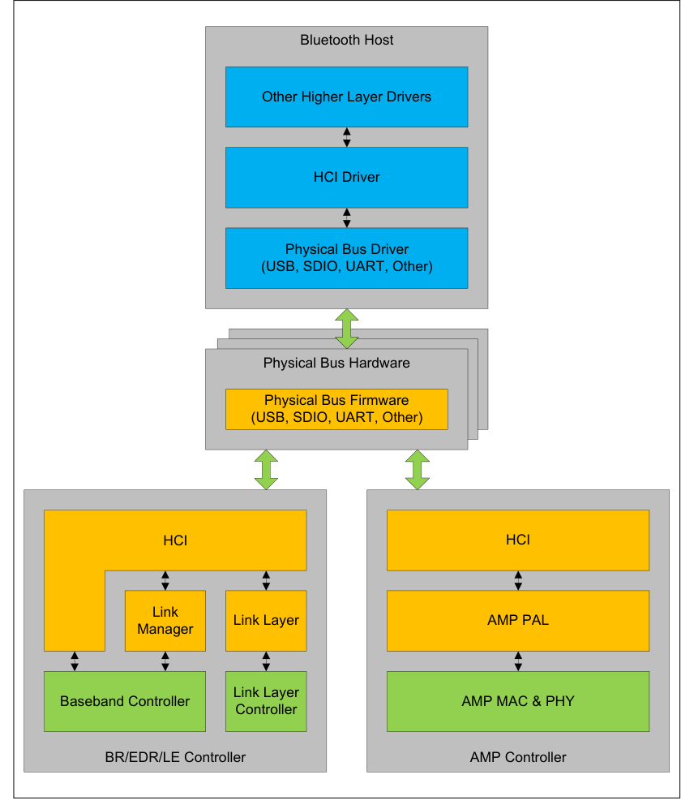

**Figure 1.1:  Overview of the Lower Software Layers**

Figure 1.1 provides an overview of the lower software layers.
Several layers may exist between the HCI driver on the Host system and the HCI layer in the Controller(s). These intermediate layers, the Host Controller Transport Layer, provide the ability to transfer data without intimate knowledge of the data.

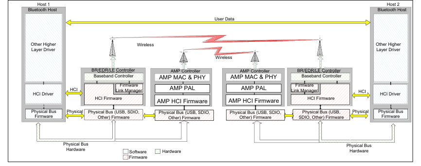

**Figure 1.2:  End to End Overview of Lower Software Layers to Transfer Data**

Figure 1.2 illustrates the path of a data transfer from one device to another. The HCI driver on the Host exchanges data and commands with the HCI firmware on the Bluetooth hardware. The Host Control Transport Layer (i.e. physical bus) driver provides both HCI layers with the ability to exchange information with each other.
The Host will receive asynchronous notifications of HCI events independent of which Host Controller Transport Layer is used. HCI events are used for notifying the Host when something occurs. When the Host discovers that an event has occurred it will then parse the received event packet to determine which event occurred.
A BR/EDR/LE Controller uses one shared command buffer and flow control for BR/EDR and LE. Data buffers can be either shared between BR/EDR and LE or there may be separate data buffers for BR/EDR and LE. The configuration of a Controller is determined through HCI.
LE Controllers use a reduced set of HCI commands and events. Some commands and events are re-used for multiple Controller types.

## 2  OVERVIEW OF HOST CONTROLLER TRANSPORT LAYER

The Host driver stack has a transport layer between the Host Controller Interface driver and the Host.
The main goal of this transport layer is transparency. The Host Controller driver (which interfaces to the Controller) should be independent of the underlying transport technology. In addition, the transport should not require any understanding of the data that the Host Controller driver passes to the Controller. This allows the logical interface (HCI) or the Controller to be upgraded without affecting the transport layer.
The specified Host Controller Transport Layers are described in Volume 4, Host Controller Interface [Transport Layer].

### 2.1   HOST CONTROLLER TRANSPORT LAYER AND AMPS

The logical Host Controller Interface does not consider multiplexing/routing over the Host Controller Transport Layer(s). The Host designer must consider this in deciding which of the multiple Controller configurations it will support. Each logical AMP HCI instantiation is particular to a single AMP Controller. The Host shall direct each HCI Command to a specific AMP, and be aware of the source of each HCI Event, and manage flow control separately for each HCI. The Host's Controller_ID concept used for AMP enumeration may assist with this.
The logical HCI definition does not consider the initial discovery of what AMPs are present in the system.
The upper layers discover the AMP capabilities. As seen by the AMP Manager, each local AMP has a Controller_ID that is used to route the data and commands to the correct AMP Controller. This identifier is not used in AMP HCI.
The separate logical HCIs within a system may be on the same physical HCI transport, on separate physical HCI transports, or any combination. This may require a layer of multiplexing, which is not defined within this AMP HCI logical specification.
The logical HCI is not affected by this topology. The logical HCI definition describes commands and events as seen by a single AMP.

## 3  OVERVIEW OF COMMANDS AND EVENTS

The commands and events are sent between the Host and the Controller(s). The version information in this section denotes the version number of the specification in which this command or event is first specified. The Supported Controllers column denotes the Controller types that can support the command: All, BR/EDR, LE, or AMP, or a comma-separated list of Controller types (e.g. “BR/EDR, LE”). Not all Controllers of the named type(s) will necessarily support the command.

| Name | Vers. | Summary description | Supported Controllers |
| --- | --- | --- | --- |
| Accept Connection Request Command | 1.1 | The Accept Connection Request command is used to accept a new incoming BR/EDR connection request. | BR/EDR |
| Accept Logical Link Command | 3.0 + HS | The Accept Logical Command will cause the AMP Controller to create a logical link to the remote AMP Con- troller identified by the physical link handle. | AMP |
| Accept Physical Link Command | 3.0 + HS | The Accept Physical Link command will cause the AMP Controller to accept a Physical Link request from the initiating BR/EDR Controller 's AMP Controller specified by the com- mand parameters. | AMP |
| Accept Synchronous Con- nection Request Command | 1.2 | The Accept Synchronous Connec- tion Request command is used to accept an incoming request for a synchronous connection and to inform the local Link Manager about the acceptable parameter values for the synchronous connection. | BR/EDR |
| AMP Receiver Report Event | 3.0 + HS | The AMP Receiver Reportevent shall be sent from the AMP to the tester via the AMP Test Manager at the interval configured by the EnableAM- PReceiverReports command. | AMP |
| AMP Start Test Event | 3.0 + HS | The AMP Start Test event shall be generated when the AMP Test com- mand has completed and the first data is ready to be sent or received. | AMP |

Table 3.1:  Alphabetical list of commands and events (Sheet 1 of 41)

| Name | Vers. | Summary description | Supported Controllers |
| --- | --- | --- | --- |
| AMP Status Change Event | 3.0 + HS | The AMP Status Change event can occur at any time, after initial Read Local AMP Info request, the Control- _ ler detects a change has occurred regarding status. | AMP |
| AMP Test Command | 3.0 + HS | The AMP Test command is used to configure and start a test. This com- mand shall be only valid in AMP Test Mode. | AMP |
| AMP Test End Command | 3.0 + HS | The AMP Test End command is used to stop any test scenario which is in progress. This command shall only be used in AMP Test Mode when a test is in progress. | AMP |
| AMP Test End Event | 3.0 + HS | The AMP Test End event shall be generated to indicate that the AMP has transmitted or received the num- ber of frames/bursts configured. | AMP |
| Authenticated Payload Timeout Expired Event | 4.1 | This event is used to indicate that a packet containing a valid MIC on the Handle was not received within the authenticatedPayloadTO. | BR/EDR, LE |
| Authentication Complete Event | 1.1 | The Authentication Complete event occurs when authentication has been completed for the specified connection. | BR/EDR |
| Authentication Requested Command | 1.1 | The Authentication Requested com- mand is used to establish authentica- tion between the two devices associated with the specified Con- nection Handle. _ | BR/EDR |
| Change Connection Link Key Command | 1.1 | The Change Connection Link Key command is used to force both devices of a connection associated to the Connection Handle, to gener- _ ate a new link key. | BR/EDR |
| Change Connection Link Key Complete Event | 1.1 | The Change Connection Link Key Complete event is used to indicate that the change in the Link Key for the Connection Handle specified by _ the Connection Handle event _ parameter had been completed. | BR/EDR |

Table 3.1:  Alphabetical list of commands and events (Sheet 2 of 41)

| Name | Vers. | Summary description | Supported Controllers |
| --- | --- | --- | --- |
| Change Connection Packet Type Command | 1.1 | The Change Connection Packet Type command is used to change which packet types can be used for a connection that is currently estab- lished. | BR/EDR |
| Channel Selected Event | 3.0 + HS | The Channel Selected event indi- cates to the Host originating the physical link that the link information data is available to be read using the Read Local AMP Assoc command. | AMP |
| Command Complete Event | 1.1 | The Command Complete event is used by the Controller to pass the return status of a command and the other event parameters for each HCI Command. | All |
| Command Status Event | 1.1 | The Command Status event is used to indicate that the command described by the Command Op- _ code parameter has been received and the Controller is currently per- forming the task for this command. | All |
| Connection Complete Event | 1.1 | The Connection Complete event indicates to both of the Hosts forming the connection that a new BR/EDR connection has been established. | BR/EDR |
| Connection Packet Type Changed Event | 1.1 | The Connection Packet Type Changed event is used to indicate the completion of the process of the Link Manager changing the packet type mask used for the specified Connection Handle. _ | BR/EDR |
| Connection Request Event | 1.1 | The Connection Request event is used to indicate that a new incoming BR/EDR connection is trying to be established. | BR/EDR |
| Connectionless Slave Broadcast Channel Map Change Event | CSA 4 | The Connectionless Slave Broadcast Channel Map Change event indi- cates to the Host that the BR/EDR Controller has moved to a new AFH channel map for the PBD logical link. | BR/EDR |
| Connectionless Slave Broadcast Receive Event | CSA 4 | The Connectionless Slave Broadcast Receive event provides the Host with the data received from a Connection- less Slave Broadcast packet. | BR/EDR |

Table 3.1:  Alphabetical list of commands and events (Sheet 3 of 41)

| Name | Vers. | Summary description | Supported Controllers |
| --- | --- | --- | --- |
| Connectionless Slave Broadcast Timeout Event | CSA 4 | On the Connectionless Slave Broad- cast Receiver, the Connectionless Slave Broadcast Timeout event indi- cates to the Host that the BR/EDR Controller has lost synchronization with the Connectionless Slave Broadcast Transmitter. On the Connectionless Slave Broad- cast Transmitter, the Connectionless Slave Broadcast Timeout event indi- cates to the Host that the BR/EDR Controller has been unable to trans- mit a Connectionless Slave Broad- cast packet for the timeout interval specified in the Set Connectionless Slave Broadcast command. | BR/EDR |
| Create Connection Cancel Command | 1.2 | The Create Connection Cancel com- mand is used to cancel an ongoing Create Connection. | BR/EDR |
| Create Connection Com- mand | 1.1 | The Create Connection command will cause the BR/EDR Link Manager to create an ACL connection to the BR/EDR Controller with the BD ADDR specified by the com- _ mand parameters. | BR/EDR |
| Create Logical Link Command | 3.0 + HS | The Create Logical Command will cause the AMP Controller to create a logical link to the remote AMP Con- troller identified by the physical link handle. | AMP |
| Create New Unit Key Com- mand | 1.1 | The Create New Unit Key command is used to create a new unit key. | BR/EDR |
| Create Physical Link Command | 3.0 + HS | The Create Physical Link command will cause the AMP Controller to initi- ate a Physical Link creation to the remote BR/EDR Controller's AMP Controller specified by the command parameters. | AMP |
| Data Buffer Overflow Event | 1.1 | The Data Buffer Overflow event is used to indicate that the Controller's data buffers have overflowed, because the Host has sent more packets than allowed. | All |

Table 3.1:  Alphabetical list of commands and events (Sheet 4 of 41)

| Name | Vers. | Summary description | Supported Controllers |
| --- | --- | --- | --- |
| Delete Reserved LT ADDR Command _ | CSA 4 | The Delete Reserved LT ADDR _ command requests that the BR/EDR Controller cancel the reservation of a specific LT ADDR reserved for the _ purposes of Connectionless Slave Broadcast. | BR/EDR |
| Delete Stored Link Key Command | 1.1 | The Delete Stored Link Key com- mand provides the ability to remove one or more of the link keys stored in the Controller. | BR/EDR |
| Disconnect Command | 1.1 | The Disconnect command is used to terminate an existing BR/EDR or LE connection. | BR/EDR, LE |
| Disconnect Logical Link Command | 3.0 + HS | The Disconnect Logical Link com- mand is used to terminate the desig- nated logical link. | AMP |
| Disconnect Physical Link Command | 3.0 + HS | The Disconnect Physical Link com- mand is used to terminate the desig- nated physical link (during or after creation). | AMP |
| Disconnection Complete Event | 1.1 | The Disconnection Complete event occurs when a connection has been terminated. | BR/EDR, LE |
| Disconnection Logical Link Complete Event | 3.0 + HS | The Disconnection Logical Link Complete event occurs when an AMP Logical Link has been termi- nated. | AMP |
| Disconnection Physical Link Complete Event | 3.0 + HS | The Disconnection Physical Link Complete event occurs when an AMP Physical Link has been termi- nated. | AMP |
| Enable AMP Receiver Reports Command | 3.0+ HS | The Enable AMP Receiver Reports command is used to enable and dis- able the reporting of frames received. | AMP |
| Enable Device Under Test Mode Command | 1.1 | The Enable Device Under Test Mode command will allow the local Con- troller to enter test mode via LMP test commands. The Host issues this command when it wants the local device to be the DUT for the Testing scenarios as described in the Blue- tooth Test Mode document. | BR/EDR, AMP |

Table 3.1:  Alphabetical list of commands and events (Sheet 5 of 41)

| Name | Vers. | Summary description | Supported Controllers |
| --- | --- | --- | --- |
| Encryption Change Event | 1.1 | The Encryption Change event is used to indicate that the change in the encryption has been completed for the Connection Handle specified _ by the Connection Handle event _ parameter. | BR/EDR, LE |
| Encryption Key Refresh Complete Event | 2.1 + EDR | The Encryption Key Refresh Com- plete event is used to indicate to the Host that the encryption key was refreshed on the given Connec- tion Handle any time encryption is _ paused and then resumed. | BR/EDR, LE |
| Enhanced Accept Synchro- nous Connection Request Command | CSA 2 | The Enhanced Accept Synchronous Connection Request command is used to accept an incoming request for a synchronous connection and to inform the local Link Manager about the acceptable parameter values for the synchronous connection. | BR/EDR |
| Enhanced Flush Command | 2.1 + EDR | The Enhanced Flush command is used to discard specific packets cur- rently pending for transmission in the Controller for the specified Handle. This command takes a parameter specifying the type of packets to be flushed. | BR/EDR, AMP |
| Enhanced Flush Complete Event | 2.1 + EDR | The Enhanced Flush Complete event is used to indicate that an Enhanced Flush is complete. | BR/EDR, AMP |
| Enhanced Setup Synchro- nous Connection Com- mand | CSA 2 | The Enhanced Setup Synchronous Connection command adds a new or modifies an existing synchronous logical transport (SCO or eSCO) on a physical link depending on the Connection Handle parameter spec- _ ified. | BR/EDR |
| Exit Periodic Inquiry Mode Command | 1.1 | The Exit Periodic Inquiry Mode com- mand is used to end the Periodic Inquiry mode when the local device is in Periodic Inquiry Mode. | BR/EDR |
| Exit Sniff Mode Command | 1.1 | The Exit Sniff Mode command is used to end the sniff mode for a Con- nection Handle which is currently in _ sniff mode. | BR/EDR |

Table 3.1:  Alphabetical list of commands and events (Sheet 6 of 41)

| Name | Vers. | Summary description | Supported Controllers |
| --- | --- | --- | --- |
| Extended Inquiry Result Event | 2.1 + EDR | The Extended Inquiry Result event indicates that a BR/EDR Controller has responded with an extended inquiry response during the current Inquiry process. | BR/EDR |
| Flow Spec Modify Command | 3.0 + HS | The Flow Spec Modify command modifies certain parameters of an existing Logical Link's Flow Spec on this AMP Controller. | AMP |
| Flow Spec Modify Complete Event | 3.0 + HS | The Flow Spec Modify Complete event indicates to the Host that a Flow Spec Modify command has been completed. | AMP |
| Flow Specification Com- mand | 1.2 | The Flow Specification command is used to specify the flow parameters for the traffic carried over the ACL connection identified by the Connec- tion Handle. _ | BR/EDR |
| Flow Specification Com- plete Event | 1.2 | The Flow Specification Complete event is used to inform the Host about the Quality of Service for the ACL connection the Controller is able to support. | BR/EDR |
| Flush Command | 1.1 | The Flush command is used to dis- card all data that is currently pending for transmission in the Controller for the specified Connection Handle. _ | BR/EDR |
| Flush Occurred Event | 1.1 | The Flush Occurred event is used to indicate that, for the specified Han- dle, the data to be transmitted has been discarded. | BR/EDR, AMP |
| Get MWS Transport Layer Configuration Command | CSA 3 | The Get MWS Transport Layer Con- figuration command reads the sup- ported baud rates from the Controller. | BR/EDR, LE and AMP |
| Hardware Error Event | 1.1 | The Hardware Error event is used to indicate some type of hardware fail- ure for the Controller. | All |
| Hold Mode Command | 1.1 | The Hold Mode command is used to initiate Hold Mode. | BR/EDR |

Table 3.1:  Alphabetical list of commands and events (Sheet 7 of 41)

| Name | Vers. | Summary description | Supported Controllers |
| --- | --- | --- | --- |
| Host Buffer Size Command | 1.1 | The Host Buffer Size command is used by the Host to notify the Con- troller about its buffer sizes for ACL and synchronous data. The Control- ler will segment the data to be trans- mitted from the Controller to the Host, so that data contained in HCI Data Packets will not exceed these sizes. | BR/EDR, LE |
| Host Number Of Com- pleted Packets Command | 1.1 | The Host Number Of Completed Packets command is used by the Host to indicate to the Controller when the Host is ready to receive more HCI packets for any Connec- tion Handle. _ | All |
| Inquiry Cancel Command | 1.1 | The Inquiry Cancel command will cause the BR/EDR Controller to stop the current Inquiry if the BR/EDR Controller is in Inquiry Mode. | BR/EDR |
| Inquiry Command | 1.1 | The Inquiry command will cause the BR/EDR Controller to enter Inquiry Mode. Inquiry Mode is used to dis- covery other nearby BR/EDR Con- trollers. | BR/EDR |
| Inquiry Complete Event | 1.1 | The Inquiry Complete event indi- cates that the Inquiry is finished. | BR/EDR |
| Inquiry Response Notifica- tion Event | CSA 4 | The Inquiry Response Notification event indicates to the Host that the BR/EDR Controller responded to an inquiry message. | BR/EDR |
| Inquiry Result Event | 1.1 | The Inquiry Result event indicates that a BR/EDR Controller or multiple BR/EDR Controllers have responded so far during the current Inquiry pro- cess. | BR/EDR |
| Inquiry Result with RSSI Event | 1.2 | The Inquiry Result with RSSI event indicates that a BR/EDR Controller or multiple BR/EDR Controllers have responded so far during the current Inquiry process. | BR/EDR |
| IO Capability Request Event | 2.1 + EDR | The IO Capability Request event is used to indicate that the IO capabili- ties of the Host are required for a simple pairing process. | BR/EDR |

Table 3.1:  Alphabetical list of commands and events (Sheet 8 of 41)

| Name | Vers. | Summary description | Supported Controllers |
| --- | --- | --- | --- |
| IO Capability Request Neg- ative Reply Command | 2.1 + EDR | The IO Capability Request Nega- _ _ _ tive Reply command is used to _ reject a pairing attempt after an HCI IO Capability Request event has been received by the Host. | BR/EDR |
| IO Capability Request Reply Command | 2.1 + EDR | The IO Capability Request Reply _ _ command is used to reply to an IO Capability Request event from the Controller, and specifies the current I/O capabilities of the Host. | BR/EDR |
| IO Capability Response Event | 2.1 + EDR | The IO Capability Response event is used to indicate to the Host that IO capabilities from a remote device specified by BD ADDR have been _ received during a simple pairing pro- cess. | BR/EDR |
| Keypress Notification Event | 2.1 + EDR | The Keypress Notification event is sent to the Host after a passkey noti- fication has been received by the Link Manager on the given BD ADDR. _ | BR/EDR |
| LE Add Device To Periodic Advertiser List Command | 5.0 | The LE Add Device To Periodic Advertiser List command will add a device to the Periodic Advertiser List. | LE |
| LE Add Device To Resolv- ing List Command | 4.2 | The LE Add Device to Resolving List command is used to add one device to the list of address translations used to resolve Resolvable Private Addresses in the Controller. | LE |
| LE Add Device To White List Command | 4.0 | The LE Add Device To White List Command will add a device to the White List. | LE |
| LE Advertising Report Event | 4.0 | The LE Advertising Report event indicates that an advertising or scan response packet has been received. | LE |
| LE Advertising Set Termi- nated Event | 5.0 | The LE Advertising Set Terminated event indicates that advertising in a given advertising set has stopped. | LE |
| LE Channel Selection Algorithm Event | 5.0 | The LE Channel Selection Algorithm event indicates the channel selection algorithm used on a connection. | LE |
| LE Clear Advertising Sets Command | 5.0 | The LE Clear Advertising Sets com- mand will remove all existing adver- tising sets from the Controller. | LE |

Table 3.1:  Alphabetical list of commands and events (Sheet 9 of 41)

| Name | Vers. | Summary description | Supported Controllers |
| --- | --- | --- | --- |
| LE Clear Periodic Adver- tiser List Command | 5.0 | The LE Clear Periodic Advertiser List command will clear the Periodic Advertiser List. | LE |
| LE Clear Resolving List Command | 4.2 | The LE Clear Resolving List com- mand is used to remove all devices from the list of address translations used to resolve Resolvable Private Addresses in the Controller. | LE |
| LE Clear White List Command | 4.0 | The LE Clear White List Command will clear the White List. | LE |
| LE Connection Complete Event | 4.0 | The LE Connection Complete event indicates to the Host that a new con- nection has been created. | LE |
| LE Connection Update Command | 4.0 | The LE Connection Update Com- mand will be used to change the con- nection parameters of an existing connection. | LE |
| LE Connection Update Complete Event | 4.0 | The LE Connection Update Com- plete event indicates the completion of the process to change the connec- tion parameters. | LE |
| LE Create Connection Cancel Command | 4.0 | The LE Create Connection Cancel Command is used to cancel an ongoing LE Create Connection Com- mand. | LE |
| LE Create Connection Command | 4.0 | The LE Create Connection Com- mand is used to create a new con- nection. | LE |
| LE Data Length Change Event | 4.2 | The LE Data Length Change event is used to indicate a change in the maximum packet sizes by the Link Layer. | LE |
| LE Directed Advertising Report Event | 4.2 | The LE Directed Advertising Report event indicates that directed adver- tisements have been received where the advertiser is using a resolvable private address for the TargetA field in the ADV DIRECT IND PDU and _ _ the filter policy is set to send this event to the Host. | LE |
| LE Encrypt Command | 4.0 | The LE Encrypt Command will encrypt a block of unencrypted data against a key and generate a block of encrypted data. | LE |

Table 3.1:  Alphabetical list of commands and events (Sheet 10 of 41)

| Name | Vers. | Summary description | Supported Controllers |
| --- | --- | --- | --- |
| LE Enhanced Connection Complete Event | 4.2 | The LE Enhanced Connection Com- plete event indicates to the Host that a new connection has been created. This event contains the additional parameters of the local and peer resolvable private addresses. | LE |
| LE Enhanced Receiver Test Command | 5.0 | The LE Enhanced Receiver Test Command will run the LE receiver test. This command allows the tes- ter's transmitter to be specified and supports both standard and stable modulation indices. | LE |
| LE Enhanced Transmitter Test Command | 5.0 | The LE Enhanced Transmitter Test Command will run the LE transmitter test. This command allows the trans- mitter PHY to be specified. | LE |
| LE Extended Advertising Report Event | 5.0 | The LE Extended Advertising Report event indicates that an advertising packet has been received. | LE |
| LE Generate DHKey Com- mand | 4.2 | The LE Generate DHKey command _ _ is used to initiate generation of a Dif- fie-Hellman key in the Controller for use over the LE transport. | LE |
| LE Generate DHKey Com- plete Event | 4.2 | This event indicates that LE Diffie- Hellman key generation has been completed by the Controller. | LE |
| LE Long Term Key Request Event | 4.0 | The LE Long Term Key Request event indicates that a Long Term Key is required for a connection. | LE |
| LE Long Term Key Request Negative Reply Command | 4.0 | The LE Long Term Key Request Negative Reply Command is used to reply to an LE Long Term Key Request event and indicates that the Host does not have a Long Term Key for that connection. | LE |
| LE Long Term Key Request Reply Command | 4.0 | The LE Long Term Key Request Reply Command is used to reply to an LE Long Term Key Request event and includes the Long Term Key stored in the Host for that connec- tion. | LE |
| LE Periodic Advertising Create Sync Cancel Com- mand | 5.0 | The LE Periodic Advertising Create Sync Cancel command is used to cancel a pending LE Periodic Adver- tising Create Sync command. | LE |

Table 3.1:  Alphabetical list of commands and events (Sheet 11 of 41)

| Name | Vers. | Summary description | Supported Controllers |
| --- | --- | --- | --- |
| LE Periodic Advertising Create Sync Command | 5.0 | The LE Periodic Advertising Create Sync command is used to start receiving periodic advertising pack- ets from an advertiser. | LE |
| LE Periodic Advertising Report Event | 5.0 | The LE Periodic Advertising Report event indicates that a periodic adver- tising packet has been received. | LE |
| LE Periodic Advertising Sync Established Event | 5.0 | The LE Periodic Advertising Sync Established event indicates that the Controller has started receiving peri- odic advertising packets from an advertiser. | LE |
| LE Periodic Advertising Sync Lost Event | 5.0 | The LE Periodic Advertising Sync Lost event indicates the Controller has ended receiving Periodic Adver- tiser identified by Sync Handle. | LE |
| LE Periodic Advertising Terminate Sync Command | 5.0 | The LE Periodic Advertising Termi- nate Sync command is used to end receiving of periodic advertising identified by Sync Handle. _ | LE |
| LE PHY Update Complete Event | 5.0 | The LE PHY Update Complete event is used to inform the Host of the cur- rent PHY. | LE |
| LE Rand Command | 4.0 | The LE Rand Command will gener- ate a random number. | LE |
| LE Read Advertising Channel Tx Power Command | 4.0 | The LE Read Advertising Channel TX Power Command will read the transmit power level that will be used for advertising. | LE |
| LE Read Buffer Size Com- mand | 4.0 | The LE Read Buffer Size command returns the size of the HCI buffers. These buffers are used by the LE Controller to buffer data that is to be transmitted. | LE |
| LE Read Channel Map Command | 4.0 | The LE Read Channel Map Com- mand will read the current state of the channel map for a connection. | LE |
| LE Read Local P-256 Pub- lic Key Command | 4.2 | The LE Read Local P-256 Pub- _ _ _ _ lic Key command is used to return _ the local P-256 public key from the Controller. | LE |
| LE Read Local P-256 Pub- lic Key Complete Event | 4.2 | This event is generated when local P-256 key generation is complete. | LE |

Table 3.1:  Alphabetical list of commands and events (Sheet 12 of 41)

| Name | Vers. | Summary description | Supported Controllers |
| --- | --- | --- | --- |
| LE Read Local Resolvable Address Command | 4.2 | The LE Read Local Resolvable Address command is used to get the current local Resolvable Private Address being used for the corre- sponding peer Identity Address. | LE |
| LE Read Local Supported Features Command | 4.0 | The LE Read Local Supported Fea- tures command will read the version information for the local LE Control- ler. | LE |
| LE Read Maximum Adver- tising Data Length Com- mand | 5.0 | The LE Read Maximum Advertising Data Length command will read the maximum length of advertising data that the advertising Controller sup- ports in a given advertising set. | LE |
| LE Read Maximum Data Length Command | 4.2 | The LE Read Maximum Data Length command allows the Host to read the Controller’s supportedMaxTxOctets, supportedMaxTxTime, supportedMaxRxOctets, and supportedMaxRxTime parameters. | LE |
| LE Read Number of Sup- ported Advertising Sets Command | 5.0 | The LE Read Number of Supported Advertising Sets command will read the maximum number of advertising sets supported by the advertising Controller at the same time. | LE |
| LE Read Peer Resolvable Address Command | 4.2 | The LE Read Peer Resolvable Address command is used to get the current peer Resolvable Private Address being used for the corre- sponding peer Public and Random (static) Identity Address. | LE |
| LE Read Periodic Adver- tiser List Size Command | 5.0 | The LE Read Periodic Advertiser List Size command will read the maxi- mum number of Periodic Advertiser List entries that the Controller sup- ports. | LE |
| LE Read PHY Command | 5.0 | The LE Read PHY command will read the current PHY. | LE |
| LE Read Remote Features Command | 4.0 | The LE Read RemoteFeatures Com- mand is used to read the features used on a connection and the fea- tures supported by a remote LE device. | LE |

Table 3.1:  Alphabetical list of commands and events (Sheet 13 of 41)

| Name | Vers. | Summary description | Supported Controllers |
| --- | --- | --- | --- |
| LE Read Remote Features Complete Event | 4.0 | The LE Read Remote Features Complete event indicates the com- pletion of the process to read the fea- tures used on a connection and the features supported by a remote LE device. | LE |
| LE Read Resolving List Size Command | 4.2 | The LE Read Resolving List Size command is used to read the total number of address translation entries in the resolving list that can be stored in the Controller. | LE |
| LE Read RF Path Com- pensation Command | 5.0 | The LE Read RF Path Compensa- tion command is used to read the RF Path Compensation Value. | LE |
| LE Read Suggested Default Data Length Command | 4.2 | The LE Read Suggested Default Data Length command allows the Host to read the initial MaxTxOctets and MaxTxTime values for new con- nections it suggested to the Control- ler. | LE |
| LE Read Supported States Command | 4.0 | The LE Read Supported States Command will read the current sup- ported state and role combinations for the local LE Controllers. | LE |
| LE Read Transmit Power Command | 5.0 | The LE Read Transmit Power com- mand will read the minimum and maximum transmit powers supported by the Controller for advertising packets. | LE |
| LE Read White List Size Command | 4.0 | The LE Read White List Size Com- mand will read the maximum number of White List entries that this Control- ler supports. | LE |
| LE Receiver Test Command | 4.0 | The LE Receiver Test Command will run the LE receiver test. | LE |
| LE Remote Connection Parameter Request Negative Reply Command | 4.1 | The LE Remote Connection Parame- ter Request Negative Reply Com- mand is used to reject the remote device’s request to change the con- nection parameters of the LE con- nection. | LE |

Table 3.1:  Alphabetical list of commands and events (Sheet 14 of 41)

| Name | Vers. | Summary description | Supported Controllers |
| --- | --- | --- | --- |
| LE Remote Connection Parameter Request Reply Command | 4.1 | The LE Remote Connection Parame- ter Request Reply Command is used to accept the remote device’s request to change the connection parameters of the LE connection. | LE |
| LE Remove Advertising Set Command | 5.0 | The LE Remove Advertising Set command will remove an advertising set from the Controller. | LE |
| LE Remove Device From Periodic Advertiser List Command | 5.0 | The LE Remove Device From Peri- odic Advertiser List command will remove a single device from the Periodic Advertiser List. | LE |
| LE Remove Device From Resolving List Command | 4.2 | The LE Remove Device From Resolving List command is used to remove one device from the list of address translations used to resolve Resolvable Private Addresses in the Controller. | LE |
| LE Remove Device From White List Command | 4.0 | The LE Remove Device From White List Command will remove a single device from the White List. | LE |
| LE Scan Request Received Event | 5.0 | The LE Scan Request Received event indicates that a scan request has been received. | LE |
| LE Scan Timeout Event | 5.0 | The LE Scan Timeout event indi- cates that scanning has finished. | LE |
| LE Set Address Resolu- tion Enable Command | 4.2 | The LE Set Address Resolution Enable command is used to enable resolution of Resolvable Private Addresses in the Controller. | LE |
| LE Set Advertising Data Command | 4.0 | The LE Set Advertising Data Com- mand will set the data transmitted when advertising. | LE |
| LE Set Advertising Param- eters Command | 4.0 | The LE Set Advertising Parameters Command will set the parameters used for advertising. | LE |
| LE Set Advertising Set Random Address Com- mand | 5.0 | The LE Set Advertising Set Random Address command will set the ran- dom address used in advertising. | LE |
| LE Set Advertising Enable Command | 4.0 | The LE Set Advertising Enable Com- mand will enable or disable advertis- ing. | LE |

Table 3.1:  Alphabetical list of commands and events (Sheet 15 of 41)

| Name | Vers. | Summary description | Supported Controllers |
| --- | --- | --- | --- |
| LE Set Data Length Command | 4.2 | The LE Set Data Length command is used to suggest maximum packet sizes to the Controller. | LE |
| LE Set Default PHY Com- mand | 5.0 | The LE Set Default PHY command is used to configure preferred PHYs for new connections for the local device. | LE |
| LE Set Event Mask Command | 4.0 | The LE Set Event Mask Command is used to control which events are generated by the HCI for the Host. | LE |
| LE Set Extended Advertis- ing Data Command | 5.0 | The LE Set Extended Advertising Data command will set the advertis- ing data transmitted when advertis- ing. | LE |
| LE Set Extended Advertis- ing Enable Command | 5.0 | The LE Set Extended Advertising Enable command will enable or dis- able advertising. | LE |
| LE Set Extended Advertis- ing Parameters Command | 5.0 | The LE Set Extended Advertising Parameters command will set the parameters used for advertising. | LE |
| LE Set Extended Scan Enable Command | 5.0 | The LE Set Extended Scan Enable command will enable or disable scanning on the primary advertising channels. | LE |
| LE Set Extended Scan Parameters Command | 5.0 | The LE Set Extended Scan Parame- ters command will set the parame- ters used for scanning on the primary advertising channel. | LE |
| LE Set Extended Scan Response Data Command | 5.0 | The LE Set Extended Scan Response Data command will set the data transmitted in a scan response. | LE |
| LE Set Host Channel Clas- sification Command | 4.0 | The LE Set Host Channel Classifica- tion Command allows the Host to specify a channel classification based on its “local information”. | LE |
| LE Set Periodic Advertising Data Command | 5.0 | The LE Set Periodic Advertising Data command will set the periodic adver- tising data transmitted when adver- tising. | LE |
| LE Set Periodic Advertising Enable Command | 5.0 | The LE Set Periodic Advertising Enable command will enable or dis- able advertising. | LE |

Table 3.1:  Alphabetical list of commands and events (Sheet 16 of 41)

| Name | Vers. | Summary description | Supported Controllers |
| --- | --- | --- | --- |
| LE Set Periodic Advertising Parameters Command | 5.0 | The LE Set Periodic Advertising Parameters Command will set the parameters used for periodic adver- tising. | LE |
| LE Set PHY Command | 5.0 | The LE Set PHY command is used to request a change of the PHY for a Connection Handle. _ | LE |
| LE Set Privacy Mode Com- mand | 4.2 | The LE Set Privacy Mode command is used to allow the Host to specify the privacy mode for an entry on the resolving list. | LE |
| LE Set Random Address Command | 4.0 | The LE Set Random Address Com- mand will set the Random Device Address that may be used in a packet sent on an advertising PHY channel. | LE |
| LE Set Resolvable Private Address Timeout Com- mand | 4.2 | The LE Set Resolvable Private Address Timeout sets the length of time the Controller uses a random private address before a new ran- dom private address is generated and starts being used. | LE |
| LE Set Scan Enable Command | 4.0 | The LE Set Scan Enable Command will enable or disable scanning. | LE |
| LE Set Scan Parameters Command | 4.0 | The LE Set Scan Parameters Com- mand will set the parameters used for scanning. | LE |
| LE Set Scan Response Data Command | 4.0 | The LE Set Scan Response Data Command will set the data transmit- ted in a scan response. | LE |
| LE Start Encryption Com- mand | 4.0 | The LE Start Encryption Command is used to enable link level encryption. | LE |
| LE Test End Command | 4.0 | The LE Test End Command will end the current the receiver or transmitter test. | LE |
| LE Transmitter Test Command | 4.0 | The LE Transmitter Test Command will run the LE transmitter test. | LE |
| LE Write RF Path Compen- sation Command | 5.0 | The LE Write RF Path Compensation command is used to indicate the RF path gain or loss from the RF trans- ceiver output to the antenna output contributed by intermediate compo- nents. | LE |

Table 3.1:  Alphabetical list of commands and events (Sheet 17 of 41)

| Name | Vers. | Summary description | Supported Controllers |
| --- | --- | --- | --- |
| LE Write Suggested Default Data Length Com- mand | 4.2 | The LE Write Suggested Default Data Length command allows the Host to suggest initial MaxTxOctets and MaxTxTime values for new con- nections. | LE |
| Link Key Notification Event | 1.1 | The Link Key Notification event is used to indicate to the Host that a new Link Key has been created for the connection with the BR/EDR Controller specified in BD ADDR. _ | BR/EDR |
| Link Key Request Event | 1.1 | The Link Key Request event is used to indicate that a Link Key is required for the connection with the device specified in BD ADDR. _ | BR/EDR |
| Link Key Request Negative Reply Command | 1.1 | The Link Key Request Negative Reply command is used to reply to a Link Key Request event from the BR/ EDR Controller if the Host does not have a stored Link Key for the con- nection with the other BR/EDR Con- troller specified by BD ADDR. _ | BR/EDR |
| Link Key Request Reply Command | 1.1 | The Link Key Request Reply com- mand is used to reply to a Link Key Request event from the BR/EDR Controller, and specifies the Link Key stored on the Host to be used as the link key for the connection with the other BR/EDR Controller specified by BD ADDR. _ | BR/EDR |
| Link Supervision Timeout Changed Event | 2.1 + EDR | The Link Supervision Timeout-event indicates that the remote device changed the Link Supervision Time- out. | BR/EDR |
| Logical Link Cancel Com- mand | 3.0 + HS | The Logical Link Cancel command is used to request cancellation of the ongoing logical link creation process identified by the Physical Link Han- _ _ dle and the Tx Flow Spec ID. _ _ _ | AMP |
| Logical Link Complete Event | 3.0 + HS | The Logical Link Complete event indicates to both of the Hosts forming the connection that a new AMP Logi- cal Link has been established. | AMP |
| Loopback Command Event | 1.1 | The Loopback Command event is used to loop back all commands that the Host sends to the BR/EDR Con- troller with some exceptions. | BR/EDR |

Table 3.1:  Alphabetical list of commands and events (Sheet 18 of 41)

| Name | Vers. | Summary description | Supported Controllers |
| --- | --- | --- | --- |
| Master Link Key Command | 1.1 | The Master Link Key command is used to force both BR/EDR Control- lers of a connection associated to the Connection Handle to use the tem- _ porary link key of the Master device or the regular link keys. | BR/EDR |
| Master Link Key Complete Event | 1.1 | The Master Link Key Complete event is used to indicate that the change in the temporary Link Key or in the semi-permanent link keys on the Bluetooth master side has been completed. | BR/EDR |
| Max Slots Change Event | 1.1 | The Max Slots Change event it used to indicate a change in the max slots by the LM. | BR/EDR |
| Mode Change Event | 1.1 | The Mode Change event is used to indicate that the current mode has changed. | BR/EDR |
| Number Of Completed Data Blocks Event | 3.0 + HS | The Number Of Completed Data Blocks event is used by the Control- ler to indicate to the Host how many HCI ACL Data Packets have been completed and how many data block buffers have been freed for each Handle since the previous Number of Completed Data Blocks event was sent. | BR/EDR, AMP |
| Number Of Completed Packets Event | 1.1 | The Number Of Completed Packets event is used by the Controller to indicate to the Host how many HCI Data Packets have been completed for each Connection Handle since _ the previous Number Of Completed Packets event was sent. | All |
| Page Scan Repetition Mode Change Event | 1.1 | The Page Scan Repetition Mode Change event indicates that the con- nected remote BR/EDR Controller with the specified Connection Han- _ dle has successfully changed the Page Scan Repetition Mode (SR)." _ _ _ | BR/EDR |
| Periodic Inquiry Mode Command | 1.1 | The Periodic Inquiry Mode command is used to configure the BR/EDR Controller to perform an automatic Inquiry based on a specified period range. | BR/EDR |

Table 3.1:  Alphabetical list of commands and events (Sheet 19 of 41)

| Name | Vers. | Summary description | Supported Controllers |
| --- | --- | --- | --- |
| Physical Link Complete Event | 3.0 + HS | The Physical Link Complete event indicates to both of the Hosts forming the connection that a new AMP Physical Link has been established. | AMP |
| Physical Link Loss Early Warning Event | 3.0 + HS | The Physical Link Loss Early Warn- ing event occurs when a physical link has indication that the link may be disrupted. | AMP |
| Physical Link Recovery Event | 3.0 + HS | The Physical Link Recovery event indicates that whatever interruption caused an earlier Physical Link Loss Early Warning event has now been cleared. | AMP |
| PIN Code Request Event | 1.1 | The PIN Code Request event is used to indicate that a PIN code is required to create a new link key for a connection. | BR/EDR |
| PIN Code Request Nega- tive Reply Command | 1.1 | The PIN Code Request Negative Reply command is used to reply to a PIN Code Request event from the Controller when the Host cannot specify a PIN code to use for a con- nection. | BR/EDR |
| PIN Code Request Reply Command | 1.1 | The PIN Code Request Reply com- mand is used to reply to a PIN Code Request event from the Controller and specifies the PIN code to use for a connection. | BR/EDR |
| QoS Setup Command | 1.1 | The QoS Setup command is used to specify Quality of Service parame- ters for a Connection Handle. _ | BR/EDR |
| QoS Setup Complete Event | 1.1 | The QoS Setup Complete event is used to indicate that QoS is setup. | BR/EDR |
| QoS Violation Event | 1.1 | The QoS Violation event is used to indicate the Controller’s Link Man- ager or PAL is unable to provide the current QoS requirement for the Handle. | BR/EDR, AMP |
| Read AFH Channel Assessment Mode Com- mand | 1.2 | The Read AFH Channel Assessment Mode command will read the value for the AFH Channel Classification Mode parameter. This value is used to enable or disable the Controller’s channel assessment scheme. | BR/EDR |

Table 3.1:  Alphabetical list of commands and events (Sheet 20 of 41)

| Name | Vers. | Summary description | Supported Controllers |
| --- | --- | --- | --- |
| Read AFH Channel Map Command | 1.2 | The Read AFH Channel Map com- mand will read the current state of the channel map for a connection. | BR/EDR |
| Read Authenticated Pay- load Timeout Command | 4.1 | This command is used to read the Authenticated Payload Timeout parameter, which is used to set the maximum time between packets being received from the remote device without a valid MIC. | BR/EDR, LE |
| Read Authentication Enable Command | 1.1 | The Read Authentication Enable command will read the value for the Authentication Enable parameter, which controls whether the Bluetooth device will require authentication for each connection with other Bluetooth devices. | BR/EDR |
| Read Automatic Flush Tim- eout Command | 1.1 | The Read Automatic Flush Timeout command will read the value for the Flush Timeout configuration parame- ter for the specified Connec- tion Handle. The Flush Timeout _ parameter is only used for ACL con- nections. | BR/EDR |
| Read BD ADDR _ Command | 1.1 | The Read BD ADDR command will _ read the value for the BD ADDR _ parameter. | BR/EDR, LE |
| Read Best Effort Flush Timeout Command | 3.0 + HS | The Read Best Effort Flush Timeout command returns the last value writ- ten with the Write Best Effort Flush Timeout command. | AMP |
| Read Buffer Size Command | 1.1 | The Read Buffer Size command _ _ returns the size of the HCI buffers. These buffers are used by the Con- troller to buffer data that is to be transmitted. | BR/EDR, AMP |
| Read Class of Device Command | 1.1 | The Read Class of Device command will read the value for the Class of Device configuration parameter, which is used to indicate its capabili- ties to other devices. | BR/EDR |
| Read Clock Command | 1.2 | The Read Clock command will read an estimate of a piconet or the local Bluetooth Clock. | BR/EDR |

Table 3.1:  Alphabetical list of commands and events (Sheet 21 of 41)

| Name | Vers. | Summary description | Supported Controllers |
| --- | --- | --- | --- |
| Read Clock Offset Com- mand | 1.1 | The Read Clock Offset command allows the Host to read the clock off- set of remote BR/EDR Controllers. | BR/EDR |
| Read Clock Offset Com- plete Event | 1.1 | The Read Clock Offset Complete event is used to indicate the comple- tion of the process of the LM obtain- ing the Clock offset information. | BR/EDR |
| Read Connection Accept Timeout Command | 1.1 | The Read Connection Accept Time- out command will read the value for the Connection Accept Timeout con- figuration parameter, which allows the Controller to automatically deny a connection request after a speci- fied period has occurred, and to refuse a new connection. | BR/EDR, AMP |
| Read Current IAC LAP Command | 1.1 | The Read Current IAC LAP com- mand will read the LAP(s) used to create the Inquiry Access Codes (IAC) that the local BR/EDR Control- ler is simultaneously scanning for during Inquiry Scans. | BR/EDR |
| Read Data Block Size Command | 3.0 + HS | The Read Data Block Size command returns the maximum size of the HCI buffers. These buffers are used by the Controller to buffer data that is to be transmitted. | BR/EDR, AMP |
| Read Default Erroneous Data Reporting Command | 2.1 + EDR | The Read Default Erroneous Data Reporting command will read the value for the Erroneous Data Report- ing configuration parameter, which controls whether the BR/EDR Con- troller will provide data for every (e)SCO interval, with the Pack- et Status Flag in HCI Synchronous _ _ Data Packets set according to HCI Synchronous Data Packets. | BR/EDR |
| Read Default Link Policy Settings Command | 1.2 | The Read Default Link Policy Set- tings command will read the Default Link Policy configuration parameter for all new connections. | BR/EDR |
| Read Encryption Key Size Command | 3.0 + HS | The Read Encryption Key Size com- mand is used to read the encryption key size on a given Connec- tion Handle. _ | BR/EDR |

Table 3.1:  Alphabetical list of commands and events (Sheet 22 of 41)

| Name | Vers. | Summary description | Supported Controllers |
| --- | --- | --- | --- |
| Read Enhanced Transmit Power Level Command | 3.0 + HS | The Read Enhanced Transmit Power Level command will read the values for the GFSK, DQPSK and 8DPSK Transmit Power Level parameters for the specified Connection Handle. _ | BR/EDR |
| Read Extended Inquiry Length Command | 4.1 | The Read Extended Inquiry Length command is used to read the Extended Inquiry Length parameter from the Controller. | BR/EDR |
| Read Extended Inquiry Response Command | 2.1 + EDR | The Read Extended Inquiry Response command will read the data that the BR/EDR Controller sends in the extended inquiry response packet during inquiry response. | BR/EDR |
| Read Extended Page Timeout Command | 4.1 | The Read Extended Page Timeout command is used to read the Extended Page Timeout parameter from the Controller. | BR/EDR |
| Read Failed Contact Counter Command | 1.1 | The Read Failed Contact Counter- command will read the value for the Failed Contact Counter configura- tion parameter for a particular con- nection to another device. | BR/EDR, AMP |
| Read Flow Control Mode Command | 3.0 + HS | The Read Flow Control Mode com- mand returns the value of the Flow - _ Control Mode configuration _ parameter supported by this Control- ler. | BR/EDR, AMP |
| Read Hold Mode Activity Command | 1.1 | The Read Hold Mode Activity com- mand is used to read which activities should be suspended when the BR/ EDR Controller is in Hold Mode. | BR/EDR |
| Read Inquiry Mode Com- mand | 1.2 | The Read Inquiry Mode command is used to read the Inquiry Mode con- figuration parameter of the local BR/ EDR Controller. | BR/EDR |
| Read Inquiry Response Transmit Power Level Command | 2.1 + EDR | This command will read the inquiry response Transmit Power level used to transmit the FHS and EIR data packets. This can be used directly in the Tx Power Level EIR data type. | BR/EDR |

Table 3.1:  Alphabetical list of commands and events (Sheet 23 of 41)

| Name | Vers. | Summary description | Supported Controllers |
| --- | --- | --- | --- |
| Read Inquiry Scan Activity Command | 1.1 | The Read Inquiry Scan Activity com- mand will read the value for Inquiry Scan Interval and Inquiry Scan Win- dow configuration parameters. Inquiry Scan Interval defines the amount of time between consecutive inquiry scans. Inquiry Scan Window defines the amount of time for the duration of the inquiry scan. | BR/EDR |
| Read Inquiry Scan Type Command | 1.2 | The Read Inquiry Scan Type com- mand is used to read the Inquiry Scan Type configuration parameter of the local BR/EDR Controller. The Inquiry Scan Type configuration parameter can set the inquiry scan to either normal or interlaced scan. | BR/EDR |
| Read LE Host Support Command | 4.0 | This command reads the LE Sup- ported Host and Simultaneous LE Host settings from the BR/EDR Con- troller. | BR/EDR |
| Read Link Policy Settings Command | 1.1 | The Read Link Policy Settings com- mand will read the Link Policy config- uration parameter for the specified Connection Handle. The Link Policy _ settings allow the Host to specify which Link Modes the Link Manager can use for the specified Connec- tion Handle. _ | BR/EDR |
| Read Link Quality Com- mand | 1.1 | The Read Link Quality command will read the value for the Link Quality for the specified Connection Handle. _ | BR/EDR, AMP |
| Read Link Supervision Timeout Command | 1.1 | The Read Link Supervision Timeout command will read the value for the Link Supervision Timeout configura- tion parameter for the device. This parameter is used by the Controller to determine link loss. | BR/EDR, AMP |
| Read LMP Handle Com- mand | 1.2 | The Read LMP Handle command will read the current LMP Handle associ- ated with the Connection Handle. _ | BR/EDR |
| Read Local AMP ASSOC Command | 3.0 + HS | The Read Local AMP ASSOC com- _ mand will return a fragment of the AMP ASSOC structure, which con- _ tains AMP specific information for this AMP Controller. | AMP |

Table 3.1:  Alphabetical list of commands and events (Sheet 24 of 41)

| Name | Vers. | Summary description | Supported Controllers |
| --- | --- | --- | --- |
| Read Local AMP Info Com- mand | 3.0 + HS | The Read Local AMP Info command returns information about this AMP Controller. | AMP |
| Read Local Extended Fea- tures Command | 1.2 | The Read Local Extended Features command requests a list of the sup- ported extended features for the local device. | BR/EDR |
| Read Local Name Command | 1.1 | The Read Local Name command provides the ability to read the stored user-friendly name for the BR/EDR Controller. | BR/EDR |
| Read Local OOB Data Command | 2.1 + EDR | This command is used to obtain a Simple Pairing Hash C and Simple Pairing Randomizer R which are intended to be transferred to a remote device using an OOB mecha- nism. | BR/EDR |
| Read Local OOB Extended Data Command | 4.1 | This command is used to obtain Sim- ple Pairing Hash C and Randomizer R associated with both P-192 and P- 256 public keys, which are intended to be transferred to a remote device using an OOB mechanism. | BR/EDR |
| Read Local Supported Codecs Command | CSA 2 | The Read Local Supported Codecs command is used for a Host to query a Controller’s supported codecs. | BR/EDR |
| Read Local Supported Commands Command | 1.2 | The Read Local Supported Com- mands command requests a list of the supported HCI commands for the local device. | All |
| Read Local Supported Features Command | 1.1 | The Read Local Supported Features command requests a list of the sup- ported features for the local device. | All |
| Read Local Version Information Command | 1.1 | The Read Local Version Information command will read the version infor- mation for the local Controller. | All |
| Read Location Data Command | 3.0 + HS | The Read Location Data command provides the ability to read the Loca- tion Data parameters from any stored knowledge of environment or regulations or currently in use in the AMP Controller. | AMP |

Table 3.1:  Alphabetical list of commands and events (Sheet 25 of 41)

| Name | Vers. | Summary description | Supported Controllers |
| --- | --- | --- | --- |
| Read Logical Link Accept Timeout Command | 3.0 + HS | The Read Logical Link Accept Time- out command will read the value for the Logical Link Accept Timeout con- figuration parameter, which allows the AMP Controller to automatically deny a Logical Link request after a specified period has occurred, and to refuse a new connection. | AMP |
| Read Loopback Mode Command | 1.1 | The Read Loopback Mode command will read the value for the setting of the BR/EDR Controller’s Loopback Mode. The setting of the Loopback Mode will determine the path of infor- mation. | BR/EDR |
| Read Num Broadcast Retransmissions Com- mand | 1.1 | The Read Num Broadcast Retrans- missions command will read the parameter value for the Number of Broadcast Retransmissions for the BR/EDR Controller. | BR/EDR |
| Read Number Of Supported IAC Command | 1.1 | The Read Number of Supported IAC command will read the value for the number of Inquiry Access Codes (IAC) that the local BR/EDR Control- ler can simultaneously listen for during an Inquiry Scan. | BR/EDR |
| Read Page Scan Activity Command | 1.1 | The Read Page Scan Activity com- mand will read the values for the Page Scan Interval and Page Scan Window configuration parameters. Page Scan Interval defines the amount of time between consecutive page scans. Page Scan Window defines the duration of the page scan. | BR/EDR |
| Read Page Scan Type Command | 1.2 | The Read Page Scan Type com- mand is used to read the page scan type of the local BR/EDR Controller. The Page Scan Type configuration parameter can set the page scan to either normal or interlaced scan. | BR/EDR |

Table 3.1:  Alphabetical list of commands and events (Sheet 26 of 41)

| Name | Vers. | Summary description | Supported Controllers |
| --- | --- | --- | --- |
| Read Page Timeout Com- mand | 1.1 | The Read Page Timeout command will read the value for the Page Reply Timeout configuration parameter, which determines the time the BR/ EDR Controller will wait for the remote device to respond to a con- nection request before the local device returns a connection failure. | BR/EDR |
| Read PIN Type Command | 1.1 | The Read PIN Type command is used for the Host to read the value that is specified to indicate whether the Host supports variable PIN or only fixed PINs. | BR/EDR |
| Read Remote Extended Features Command | 1.2 | The Read Remote Extended Fea- tures command requests a list of the supported extended features of a remote device. | BR/EDR |
| Read Remote Extended Features Complete Event | 1.2 | The Read Remote Extended Fea- tures Complete event is used to indi- cate the completion of the process of the Link Manager obtaining the sup- ported Extended features of the remote BR/EDR Controller specified by the Connection Handle event _ parameter. | BR/EDR |
| Read Remote Supported Features Command | 1.1 | The Read Remote Supported Fea- tures command requests a list of the supported features of a remote device. | BR/EDR |
| Read Remote Supported Features Complete Event | 1.1 | The Read Remote Supported Fea- tures Complete event is used to indi- cate the completion of the process of the Link Manager obtaining the sup- ported features of the remote BR/ EDR Controller specified by the Con- nection Handle event parameter. _ | BR/EDR |
| Read Remote Version Information Command | 1.1 | The Read Remote Version Informa- tion command will read the values for the version information for the remote device associated with the Connection Handle. _ | BR/EDR, LE |

Table 3.1:  Alphabetical list of commands and events (Sheet 27 of 41)

| Name | Vers. | Summary description | Supported Controllers |
| --- | --- | --- | --- |
| Read Remote Version Information Complete Event | 1.1 | The Read Remote Version Informa- tion Complete event is used to indi- cate the completion of the process of the Link Manager obtaining the ver- sion information of the remote device associated with the Connec- tion Handle event parameter. _ | BR/EDR, LE |
| Read RSSI Command | 1.1 | The Read RSSI command will read the value for the Received Signal Strength Indication (RSSI) for a Con- nection Handle to another Control- _ ler. | All |
| Read Scan Enable Com- mand | 1.1 | The Read Scan Enable command will read the value for the Scan Enable configuration parameter, which controls whether or not the BR/EDR Controller will periodically scan for page attempts and/or inquiry requests from other BR/EDR Con- trollers. | BR/EDR |
| Read Secure Connections Host Support Command | 4.1 | The Read Secure Connections Host Support command is used to read the Secure Connections Host Sup- ports parameter from the Controller. | BR/EDR |
| Read Simple Pairing Mode Command | 2.1 + EDR | This command reads the Simple Pairing mode setting in the BR/EDR Controller. | BR/EDR |
| Read Stored Link Key Command | 1.1 | The Read Stored Link Key command provides the ability to read whether one or more link keys are stored in the Controller. | BR/EDR |
| Read Synchronization Train Parameters Com- mand | CSA 4 | The Read Synchronization Train Parameters command returns the currently configured values for the Synchronization Train functionality in the BR/EDR Controller. | BR/EDR |
| Read Synchronous Flow Control Enable Command | 1.1 | The Read Synchronous Flow Control Enable command provides the ability to read the Synchronous Flow Con- trol Enable setting. By using this set- ting, the Host can decide if the Controller will send Number Of Com- pleted Packets events for Synchro- nous Connection Handles. _ | BR/EDR |

Table 3.1:  Alphabetical list of commands and events (Sheet 28 of 41)

| Name | Vers. | Summary description | Supported Controllers |
| --- | --- | --- | --- |
| Read Transmit Power Level Command | 1.1 | The Read Transmit Power Level command will read the values for the Transmit Power Level parameter for the specified Connection Handle. _ | BR/EDR, LE |
| Read Voice Setting Com- mand | 1.1 | The Read Voice Setting command will read the values for the Voice Set- ting configuration parameter, which controls all the various settings for the voice connections. | BR/EDR |
| Receive Synchronization Train Command | CSA 4 | The Receive Synchronization Train _ _ command requests synchronization with the specified Connectionless Slave Broadcast transmitter. | BR/EDR |
| Refresh Encryption Key Command | 2.1 + EDR | The Refresh Encryption Key com- mand s used by the Host to cause the Controller to refresh the encryp- tion key by pausing and resuming encryption | BR/EDR |
| Reject Connection Request Command | 1.1 | The Reject Connection Request command is used to decline a new incoming BR/EDR connection request. | BR/EDR |
| Reject Synchronous Con- nection Request Command | 1.2 | The Reject Synchronous Connec- tion Request command is used to decline an incoming request for a synchronous link. | BR/EDR |
| Remote Host Supported Features Notification Event | 2.1 + EDR | The Remote Host Supported Fea- tures Notification event is used to return the LMP extended features page containing the Host features. | BR/EDR |
| Remote Name Request Cancel Command | 1.2 | The Remote Name Request Cancel command is used to cancel an ongo- ing Remote Name Request. | BR/EDR |
| Remote Name Request Command | 1.1 | The Remote Name Request com- mand is used to obtain the user- friendly name of another BR/EDR Controller. | BR/EDR |
| Remote Name Request Complete Event | 1.1 | The Remote Name Request com- plete event is used to indicate a remote name request has been com- pleted. | BR/EDR |

Table 3.1:  Alphabetical list of commands and events (Sheet 29 of 41)

| Name | Vers. | Summary description | Supported Controllers |
| --- | --- | --- | --- |
| Remote OOB Data Request Event | 2.1 + EDR | The Remote OOB Data Request event is used to indicate that the Simple Pairing Hash C and the Sim- ple Pairing Randomizer R is required for the Secure Simple Pairing pro- cess involving the device identified by BD ADDR. _ | BR/EDR |
| Remote OOB Data Request Negative Reply Command | 2.1 + EDR | The Remote OOB Data Request Negative Reply command is used to reply to a Remote OOB Data Request event that the Host does not have the C and R | BR/EDR |
| Remote OOB Data Request Reply Command | 2.1 + EDR | The Remote OOB Data Request Reply command is used to reply to a Remote OOB Data Request event with the C and R val- ues received via an OOB transfer from a remote BR/EDR Controller identified by BD ADDR. | BR/EDR |
| Remote OOB Extended Data Request Reply Com- mand | 4.1 | The Remote OOB Extended Data Request Reply command is used to reply to a Remote OOB Data Request event with the C and R val- ues received via an OOB transfer from a remote BR/EDR Controller identified by the BD ADDR. _ | BR/EDR |
| Reset Command | 1.1 | For a BR/EDR Controller, the Reset command resets HCI, the Link Man- ager, and the Bluetooth radio. For an AMP Controller, the Reset command resets HCI and the AMP PAL. For an LE Controller, the Reset command resets HCI, the Link Layer, and LE PHY. | All |
| Reset Failed Contact Counter Command | 1.1 | The Reset Failed Contact Counter- command will reset the value for the Failed Contact Counter configura- tion parameter for a particular con- nection to another device. | BR/EDR, AMP |
| Return Link Keys Event | 1.1 | The Return Link Keys event is used to return stored link keys after a Read Stored Link Key command is used. | BR/EDR |
| Role Change Event | 1.1 | The Role Change event is used to indicate that the current BR/EDR Controller role related to the particu- lar connection has been changed. | BR/EDR |

Table 3.1:  Alphabetical list of commands and events (Sheet 30 of 41)

| Name | Vers. | Summary description | Supported Controllers |
| --- | --- | --- | --- |
| Role Discovery Command | 1.1 | The Role Discovery command is used for a BR/EDR Controller to determine which role the device is performing for a particular Connec- tion Handle. _ | BR/EDR |
| SAM Status Change Event | 5.0 | This event is used to indicate that either the local or remote SAM slot map on a particular connection has been changed. | BR/EDR |
| Send Keypress Notifica- tion Command | 2.1 + EDR | This command is used during the Passkey Entry protocol by a device with KeyboardOnly IO capabilities. It is used by a Host to inform the remote device when keys have been entered or erased. | BR/EDR |
| Set AFH Host Channel Classification Command | 1.2 | The Set AFH Host Channel Classifi- cation command allows the Host to specify a channel classification based on its “local information”. | BR/EDR |
| Set Connection Encryption Command | 1.1 | The Set Connection Encryption com- mand is used to enable and disable the link level encryption. | BR/EDR |
| Set Connectionless Slave Broadcast Command | CSA 4 | The Set Connectionless Slave Broadcast command controls Con- nectionless Slave Broadcast func- tionality (for transmission) in the BR/ EDR Controller including enabling and disabling the broadcast. | BR/EDR |
| Set Connectionless Slave Broadcast Data Command | CSA 4 | The Set Connectionless Slave Broadcast Data command is used by the Host to set Connectionless Slave Broadcast data in the BR/EDR Con- troller. | BR/EDR |
| Set Connectionless Slave Broadcast Receive Com- mand | CSA 4 | The Set Connectionless Slave Broadcast Receive command enables and disables Connection- less Slave Broadcast reception in the BR/EDR Controller. | BR/EDR |
| Set Controller To Host Flow Control Command | 1.1 | The Set Controller To Host Flow Control command is used by the Host to turn flow control on or off in the direction from the Controller to the Host. | BR/EDR, LE |

Table 3.1:  Alphabetical list of commands and events (Sheet 31 of 41)

| Name | Vers. | Summary description | Supported Controllers |
| --- | --- | --- | --- |
| Set Event Filter Command | 1.1 | The Set Event Filter command is used by the Host to specify different event filters. The Host may issue this command multiple times to request various conditions for the same type of event filter and for different types of event filters. | BR/EDR |
| Set Event Mask Command | 1.1 | The Set Event Mask command is used to control which events are generated by the HCI for the Host. | All |
| Set Event Mask Page 2 Command | 3.0 + HS | The Set Event Mask Page 2 com- mand is used to control which events are generated by the HCI for the Host. | All |
| Set External Frame Configuration Command | CSA 3 | The Set External Frame Configura- tion command enables an external device to describe a frame structure to the Controller. | BR/EDR, LE and AMP |
| Set MWS Channel Parameters Command | CSA 3 | The Set MWS Channel Parameters command enables an MWS device to inform the Controller about the MWS channel configuration. | BR/EDR, LE and AMP |
| Set MWS Scan Frequency Table Command | CSA 3 | The Set MWS Scan Frequency Table command specifies the frequencies represented by the frequency index supplied by the MWS SCAN FRE- _ _ QUENCY signal. | BR/EDR, LE and AMP |
| Set MWS Signaling Command | CSA 3 | The Set MWS Signaling command enables a MWS device to inform the Controller about the timing parame- ters for the MWS coexistence inter- face. | BR/EDR, LE and AMP |
| Set MWS Transport Layer Command | CSA 3 | The Set MWS Transport Layer com- mand selects the MWS coexistence signaling transport layer in the Con- troller. | BR/EDR, LE and AMP |
| Set MWS PATTERN _ Configuration Command | CSA 3 | The Set MWS PATTERN Configura- _ tion command specifies the configu- ration of the pattern indicated over the MWS Coexistence Transport Layer. | BR/EDR, LE and AMP |

Table 3.1:  Alphabetical list of commands and events (Sheet 32 of 41)

| Name | Vers. | Summary description | Supported Controllers |
| --- | --- | --- | --- |
| Set Reserved LT ADDR _ Command | CSA 4 | The Set Reserved LT ADDR com- _ _ _ mand requests that the BR/EDR Controller reserve a specific LT ADDR for the purposes of Con- _ nectionless Slave Broadcast. | BR/EDR |
| Set Triggered Clock Cap- ture Command | CSA 4 | The Set Triggered Clock Capture command is used to configure the Controller to return events containing an estimate of a piconet or the local Bluetooth clock. | BR/EDR |
| Setup Synchronous Con- nection Command | 1.2 | The Setup Synchronous Connection command adds a new or modifies an existing synchronous logical trans- port (SCO or eSCO) on a physical link depending on the Connec- tion Handle parameter specified. _ | BR/EDR |
| Short Range Mode Change Complete Event | 3.0 + HS | The Short Range Mode Change Complete event is used to indicate completion of any tasks relating to establishment of short range mode. | 802.11 PAL only |
| Short Range Mode Com- mand | 3.0 + HS | The Short Range Mode command is used to notify the AMP that the peer may be at close enough range to require modification of AMP trans- mission power level. | 802.11 PAL only |
| Simple Pairing Complete Event | 2.1 + EDR | The Simple Pairing Complete event is used to indicate that the simple pairing process has completed. | BR/EDR |
| Slave Page Response Tim- eout Event | CSA 4 | The Slave Page Response Timeout event indicates to the Host that the pagerespTO has been exceeded on the BR/EDR Controller after the Con- troller responded to an ID packet. | BR/EDR |
| Sniff Mode Command | 1.1 | The Sniff Mode command is used to alter the behavior of the LM and have the LM place the local or remote device into the sniff mode. | BR/EDR |
| Sniff Subrating Command | 2.1 + EDR | The Sniff Subrating command is used to configure the sniff subrating parameters in the local device. | BR/EDR |
| Sniff Subrating Event | 2.1 + EDR | The Sniff Subrating event is used to inform the Host of the local and remote transmit and receive laten- cies. | BR/EDR |

Table 3.1:  Alphabetical list of commands and events (Sheet 33 of 41)

| Name | Vers. | Summary description | Supported Controllers |
| --- | --- | --- | --- |
| Start Synchronization Train Command | CSA 4 | The Start Synchronization Train com- mand enables the Synchronization Train on the BR/EDR Controller using the currently configured Syn- chronization Train parameters. | BR/EDR |
| Switch Role Command | 1.1 | The Switch Role command is used to switch master and slave roles of the devices on either side of a connec- tion. | BR/EDR |
| Synchronization Train Complete Event | CSA 4 | The Synchronization Train Complete event indicates that the Synchroniza- tion Train has completed. | BR/EDR |
| Synchronization Train Received Event | CSA 4 | The Synchronization Train Received event provides the status of Synchro- nization Train packets received from the device with the given BD ADDR. _ | BR/EDR |
| Synchronous Connection Changed Event | 1.2 | The Synchronous Connection Changed event indicates to the Host that an existing Synchronous con- nection has been reconfigured. | BR/EDR |
| Synchronous Connection Complete Event | 1.2 | The Synchronous Connection Com- plete event indicates to both the Hosts that a new Synchronous con- nection has been established. | BR/EDR |
| Triggered Clock Capture Event | CSA 4 | The Triggered Clock Capture event reports the Bluetooth clock when an external trigger occurred. | BR/EDR |
| Truncated Page Cancel Command | CSA 4 | The Truncated Page Cancel Com- mand is used to cancel an ongoing Truncated Page. | BR/EDR |
| Truncated Page Command | CSA 4 | The Truncated Page command will cause the BR/EDR Controller to page the BR/EDR Controller with the BD ADDR specified by the com- _ mand parameters and abort the page sequence after receiving the ID response packet. | BR/EDR |
| Truncated Page Complete Event | CSA 4 | The Truncated Page Complete event indicates to the Host that a Trun- cated Page has completed. | BR/EDR |
| User Confirmation Request Event | 2.1 + EDR | The User Confirmation Request event is used to indicate that user confirmation of a numeric value is required. | BR/EDR |

Table 3.1:  Alphabetical list of commands and events (Sheet 34 of 41)

| Name | Vers. | Summary description | Supported Controllers |
| --- | --- | --- | --- |
| User Confirmation Request Negative Reply Command | 2.1 + EDR | The User Confirmation Request Negative Reply command is used to reply to a User Confirmation Request event and indicates that the user selected “no”. This command will ter- minate Secure Simple Pairing. | BR/EDR |
| User Confirmation Request Reply Command | 2.1 + EDR | The User Confirmation Request Reply command is used to reply to a User Confirmation Request event and indicates that the user selected “yes”. It is also used when the Host has no input and no output capabili- ties. | BR/EDR |
| User Passkey Notification Event | 2.1 + EDR | The User Passkey Notification event is used to provide a passkey for the Host to display to the user as required as part of a Simple Pairing process. | BR/EDR |
| User Passkey Request Event | 2.1 + EDR | The User Passkey Request event is used to indicate that a passkey is required as part of a Simple Pairing process. | BR/EDR |
| User Passkey Request Negative Reply Command | 2.1 + EDR | The User Passkey Request Negative Reply command is used to reply to a User Passkey Request event and indicates the Host could not provide a passkey. This command will termi- nate Simple Pairing. | BR/EDR |
| User Passkey Request Reply Command | 2.1 + EDR | The User Passkey Request Reply command is used to reply to a User Passkey Request event and speci- fies the Numeric Value (passkey) _ entered by the user to be used in the Secure Simple Pairing process. | BR/EDR |
| Write AFH Channel Assessment Mode Com- mand | 1.2 | The Write AFH Channel Assessment Mode command will write the value for the Channel Classification Mode configuration parameter. This value is used to enable or disable the Con- troller’s channel assessment scheme. | BR/EDR |
| Write Authenticated Pay- load Timeout Command | 4.1 | This command is used to write the Authenticated Payload Timeout parameter, which is used to set the maximum time between packets being received from the remote device without a valid MIC. | BR/EDR, LE |

Table 3.1:  Alphabetical list of commands and events (Sheet 35 of 41)

| Name | Vers. | Summary description | Supported Controllers |
| --- | --- | --- | --- |
| Write Authentication Enable Command | 1.1 | The Write Authentication Enable command will write the value for the Authentication Enable parameter, which controls whether the Bluetooth device will require authentication for each connection with other Bluetooth devices. | BR/EDR |
| Write Automatic Flush Tim- eout Command | 1.1 | The Write Automatic Flush Timeout command will write the value for the Flush Timeout configuration parame- ter for the specified Connec- tion Handle. The Flush Timeout _ parameter is only used for ACL con- nections. | BR/EDR |
| Write Best Effort Flush Tim- eout Command | 3.0 + HS | The Write Best Effort Flush Timeout command configures the AMP device with a maximum time to attempt to transmit any given frame on the Best Effort logical link. | 802.11 PAL only |
| Write Class of Device Command | 1.1 | The Write Class of Device command will write the value for the Class of Device configuration _ _ parameter, which is used to indicate its capabilities to other devices. | BR/EDR |
| Write Connection Accept Timeout Command | 1.1 | The Write Connection Accept Time- out command will write the value for the Connection Accept Timeout con- figuration parameter, which allows the Controller to automatically deny a connection request after a specified period has occurred, and to refuse a new connection. | BR/EDR, AMP |
| Write Current IAC LAP Command | 1.1 | The Write Current IAC LAP com- mand will write the LAP(s) used to create the Inquiry Access Codes (IAC) that the local BR/EDR Control- ler is simultaneously scanning for during Inquiry Scans. | BR/EDR |

Table 3.1:  Alphabetical list of commands and events (Sheet 36 of 41)

| Name | Vers. | Summary description | Supported Controllers |
| --- | --- | --- | --- |
| Write Default Erroneous Data Reporting Command | 2.1 + EDR | The Write Default Erroneous Data Reporting command will write the value for the Erroneous Data Report- ing configuration parameter, which controls whether the Bluetooth Con- troller will provide data for every (e)SCO interval, with the Pack- et Status Flag in HCI Synchronous _ _ Data Packets set according to HCI Synchronous Data Packets. | BR/EDR |
| Write Default Link Policy Settings Command | 1.2 | The Write Default Link Policy Set- tings command will write the Default Link Policy configuration parameter for all new connections. | BR/EDR |
| Write Extended Inquiry Length Command | 4.1 | The Write Extended Inquiry Length command is used to write the Extended Inquiry Length parameter to the Controller. | BR/EDR |
| Write Extended Inquiry Response Command | 2.1 + EDR | The Write Extended Inquiry Response command will write the data that the BR/EDR Controller sends in the extended inquiry response packet during inquiry response. | BR/EDR |
| Write Extended Page Timeout Command | 4.1 | The Write Extended Page Timeout command is used to write the Extended Page Timeout parameter to the Controller. | BR/EDR |
| Write Flow Control Mode Command | 3.0 + HS | The Write Flow Control Mode com- mand sets the value of the Flow - _ Control Mode configuration _ parameter for this Controller. | BR/EDR, AMP |
| Write Hold Mode Activity Command | 1.1 | The Write Hold Mode Activity com- mand is used to write which activities should be suspended when the BR/ EDR Controller is in Hold Mode. | BR/EDR |
| Write Inquiry Mode Command | 1.2 | The Write Inquiry Mode command is used to write the Inquiry Mode con- figuration parameter of the local BR/ EDR Controller. | BR/EDR |

Table 3.1:  Alphabetical list of commands and events (Sheet 37 of 41)

| Name | Vers. | Summary description | Supported Controllers |
| --- | --- | --- | --- |
| Write Inquiry Scan Activity Command | 1.1 | The Write Inquiry Scan Activity com- mand will write the value for Inquiry Scan Interval and Inquiry Scan Win- dow configuration parameters. Inquiry Scan Interval defines the amount of time between consecutive inquiry scans. Inquiry Scan Window defines the amount of time for the duration of the inquiry scan. | BR/EDR |
| Write Inquiry Scan Type Command | 1.2 | The Write Inquiry Scan Type com- mand is used to write the Inquiry Scan Type configuration parameter of the local BR/EDR Controller. The Inquiry Scan Type configuration parameter can set the inquiry scan to either normal or interlaced scan. | BR/EDR |
| Write Inquiry Transmit Power Level Command | 2.1 + EDR | This command is used to write the transmit power level used to transmit the inquiry (ID) data packets. | BR/EDR |
| Write LE Host Support Command | 4.0 | This command writes the LE Sup- ported Host and Simultaneous LE Host settings to the BR/EDR Control- ler. | BR/EDR |
| Write Link Policy Settings Command | 1.1 | The Write Link Policy Settings com- mand will write the Link Policy con- figuration parameter for the specified Connection Handle. The Link Policy _ settings allow the Host to specify which Link Modes the Link Manager can use for the specified Connec- tion Handle. _ | BR/EDR |
| Write Link Supervision Tim- eout Command | 1.1 | The Write Link Supervision Timeout command will write the value for the Link Supervision Timeout configura- tion parameter for the device. This parameter is used by the Controller to determine link loss. | BR/EDR, AMP |
| Write Local Name Com- mand | 1.1 | The Write Local Name command provides the ability to modify the user-friendly name for the BR/EDR Controller. | BR/EDR |
| Write Location Data Command | 3.0 + HS | The Write Location Data command is used to tell the Controller any knowl- edge of environment or regulations currently in force, which may affect the operation of the Controller. | AMP |

Table 3.1:  Alphabetical list of commands and events (Sheet 38 of 41)

| Name | Vers. | Summary description | Supported Controllers |
| --- | --- | --- | --- |
| Write Logical Link Accept Timeout Command | 3.0 + HS | The Write Logical Link Accept Time- out command will write the value for the Logical Link Accept Timeout con- figuration parameter, which allows the AMP Controller to automatically deny a connection request after a specified period has occurred, and to refuse a new connection. | AMP |
| Write Loopback Mode Command | 1.1 | The Write Loopback Mode command will write the value for the setting of the BR/EDR Controllers Loopback Mode. The setting of the Loopback Mode will determine the path of infor- mation. | BR/EDR |
| Write Num Broadcast Retransmissions Com- mand | 1.1 | The Write Num Broadcast Retrans- missions command will write the parameter value for the Number of Broadcast Retransmissions for the BR/EDR Controller. | BR/EDR |
| Write Page Scan Activity Command | 1.1 | The Write Page Scan Activity com- mand will write the value for Page Scan Interval and Page Scan Win- dow configuration parameters. Page Scan Interval defines the amount of time between consecutive page scans. Page Scan Window defines the duration of the page scan. | BR/EDR |
| Write Page Scan Type Command | 1.2 | The Write Page Scan Type com- mand is used to write the page scan type of the local BR/EDR Controller. The Page Scan Type configuration parameter can set the page scan to either normal or interlaced scan. | BR/EDR |
| Write Page Timeout Com- mand | 1.1 | The Write Page Timeout command will write the value for the Page Reply Timeout configuration parame- ter, which allows the BR/EDR Con- troller to define the amount of time a connection request will wait for the remote device to respond before the local device returns a connection fail- ure. | BR/EDR |
| Write PIN Type Command | 1.1 | The Write PIN Type command is used for the Host to specify whether the Host supports variable PIN or only fixed PINs. | BR/EDR |

Table 3.1:  Alphabetical list of commands and events (Sheet 39 of 41)

| Name | Vers. | Summary description | Supported Controllers |
| --- | --- | --- | --- |
| Write Remote AMP ASSOC Command | 3.0 + HS | The Write Remote AMP ASSOC _ command allows the Host to write a fragment of the AMP ASSOC struc- _ ture, which contains AMP specific information for the AMP Controller. | AMP |
| Write Scan Enable Com- mand | 1.1 | The Write Scan Enable command will write the value for the Scan Enable configuration parameter, which controls whether or not the BR/EDR Controller will periodically scan for page attempts and/or inquiry requests from other BR/EDR Con- trollers. | BR/EDR |
| Write Secure Connections Host Support Command | 4.1 | The Write Secure Connections Host Support command is used to write the Secure Connections Host Sup- ports parameter to the Controller. | BR/EDR |
| Write Secure Connections Test Mode Command | 4.1 | This command is used to put the Controller in a test mode where DM1 packets are not allowed to be used for ACL-U traffic and/or the contents of eSCO payloads can be looped back. | BR/EDR |
| Write Simple Pairing Debug Mode Command | 2.1 + EDR | This command configures the BR/ EDR Controller to use a predefined Diffie Hellman private key for Simple Pairing to enable debug equipment to monitor the encrypted connection. | BR/EDR |
| Write Simple Pairing Mode Command | 2.1 + EDR | This command writes the Simple Pairing mode setting in the BR/EDR Controller. | BR/EDR |
| Write Stored Link Key Command | 1.1 | The Write Stored Link Key command provides the ability to write one or more link keys to be stored in the Controller. | BR/EDR |
| Write Synchronization Train Parameters Com- mand | CSA 4 | The Write Synchronization Train Parameters command configures the Synchronization Train functionality in the BR/EDR Controller. | BR/EDR |

Table 3.1:  Alphabetical list of commands and events (Sheet 40 of 41)

| Name | Vers. | Summary description | Supported Controllers |
| --- | --- | --- | --- |
| Write Synchronous Flow Control Enable Command | 1.1 | The Write Synchronous Flow Control Enable command provides the ability to write the Synchronous Flow Con- trol Enable setting. By using this set- ting, the Host can decide if the Controller will send Number Of Com- pleted Packets events for Synchro- nous Connection Handles. _ | BR/EDR |
| Write Voice Setting Com- mand | 1.1 | The Write Voice Setting command will write the values for the Voice Set- ting configuration parameter, which controls all the various settings for the voice connections. | BR/EDR |

Table 3.1:  Alphabetical list of commands and events (Sheet 41 of 41)

### 3.1   LE CONTROLLER REQUIREMENTS

Table 3.2 lists the commands and events that a Controller supporting LE shall implement if HCI is claimed. The Link Layer Features are defined in [Vol 6] Part B, Section 4.6.

| Name | LE Feature Requirements |
| --- | --- |
| Command Complete Event | Mandatory |
| Command Status Event | Mandatory |
| LE Add Device To White List Command | Mandatory |
| LE Clear White List Command | Mandatory |
| LE Read Buffer Size Command | Mandatory |
| LE Read Local Supported Features Command | Mandatory |
| LE Read Supported States Command | Mandatory |
| LE Read White List Size Command | Mandatory |
| LE Remove Device From White List Command | Mandatory |
| LE Set Event Mask Command | Mandatory |
| LE Test End Command | Mandatory |
| Read BD ADDR Command _ | Mandatory |
| Read Local Supported Features Command | Mandatory |
| Read Local Version Information Command | Mandatory |
| Reset Command | Mandatory |
| Read Local Supported Commands Command | Mandatory |
| Set Event Mask Command | Mandatory |
| LE Read Advertising Channel TX Power Command | C1 |
| LE Transmitter Test Command | C1 |
| LE Set Advertising Data Command | C1 |
| LE Set Advertising Enable Command | C1 |
| LE Set Advertising Parameters Command | C1 |
| LE Set Random Address Command | C1 |
| LE Advertising Report Event | C2 |
| LE Receiver Test Command | C2 |
| LE Set Scan Enable Command | C2 |
| LE Set Scan Parameters Command | C2 |
| Disconnect Command | C3 |

Table 3.2:  Bluetooth Controller supporting LE requirements

| Name | LE Feature Requirements |
| --- | --- |
| Disconnection Complete Event | C3 |
| LE Connection Complete Event | C3 |
| LE Connection Update Command | C3 |
| LE Connection Update Complete Event | C3 |
| LE Create Connection Cancel Command | C3 |
| LE Create Connection Command | C3 |
| LE Read Channel Map Command | C3 |
| LE Read Remote Features Command | C3 |
| LE Read Remote Features Complete Event | C3 |
| LE Set Host Channel Classification Command | C3 |
| Number Of Completed Packets Event | C3 |
| Read Transmit Power Level Command | C3 |
| Read Remote Version Information Command | C3 |
| Read Remote Version Information Complete Event | C3 |
| Read RSSI Command | C3 |
| Encryption Change Event | C4 |
| Encryption Key Refresh Complete Event | C4 |
| LE Encrypt Command | C4 |
| LE Long Term Key Request Event | C4 |
| LE Long Term Key Request Reply Command | C4 |
| LE Long Term Key Request Negative Reply Command | C4 |
| LE Rand Command | C4 |
| LE Start Encryption Command | C4 |
| Read Buffer Size Command | C5 |
| Read LE Host Support | C5 |
| Write LE Host Support | C5 |
| LE Remote Connection Parameter Request Reply Command | C6 |
| LE Remote Connection Parameter Request Negative Reply Command | C6 |
| LE Remote Connection Parameter Request Event | C6 |
| Write Authenticated Payload Timeout Command | C7 |
| Read Authenticated Payload Timeout Command | C7 |

Table 3.2:  Bluetooth Controller supporting LE requirements

| Name | LE Feature Requirements |
| --- | --- |
| Authenticated Payload Timeout Expired Event | C7 |
| LE Set Data Length Command | C8 |
| LE Data Length Change Event | C8 |
| LE Read Suggested Default Data Length Command | C8 |
| LE Write Suggested Default Data Length Command | C8 |
| LE Read Maximum Data Length Command | C8 |
| LE Set Resolvable Private Address Timeout Command | C9 |
| LE Set Address Resolution Enable Command | C9 |
| LE Directed Advertising Report Event | C9 |
| LE Add Device to Resolving List Command | C9 |
| LE Remove Device From Resolving List Command | C9 |
| LE Clear Resolving List Command | C9 |
| LE Set Privacy Mode | C9 |
| LE Read Peer Resolvable Address Command | C10 |
| LE Read Local Resolvable Address Command | C10 |
| LE Read PHY Command | C11 |
| LE Set Default PHY Command | C11 |
| LE Set PHY Command | C11 |
| LE PHY Update Complete Event | C11 |
| LE Enhanced Transmitter Test Command | C12 |
| LE Enhanced Receiver Test Command | C13 |
| Set Event Mask Page 2 Command | C14 |
| LE Set Scan Response Data Command | C15 |
| LE Set Advertising Set Random Address Command | C16 |
| LE Set Extended Advertising Parameters Command | C17 |
| LE Set Extended Advertising Data Command | C17 |
| LE Set Extended Scan Response Data Command | C17 |
| LE Scan Request Received Event | C17 |
| LE Set Extended Advertising Enable Command | C17 |
| LE Read Maximum Advertising Data Length Command | C17 |
| LE Read Number of Supported Advertising Sets Command | C17 |
| LE Remove Advertising Set Command | C17 |

Table 3.2:  Bluetooth Controller supporting LE requirements

| Name | LE Feature Requirements |
| --- | --- |
| LE Clear Advertising Sets Command | C17 |
| LE Advertising Set Terminated Event | C17 |
| LE Set Periodic Advertising Parameters Command | C18 |
| LE Set Periodic Advertising Data Command | C18 |
| LE Set Periodic Advertising Enable Command | C18 |
| LE Set Extended Scan Parameters Command | C19 |
| LE Set Extended Scan Enable Command | C19 |
| LE Scan Timeout Event | C19 |
| LE Extended Advertising Report Event | C19 |
| LE Extended Create Connection Command | C19 |
| LE Periodic Advertising Create Sync Command | C20 |
| LE Periodic Advertising Create Sync Cancel Command | C20 |
| LE Periodic Advertising Terminate Sync Command | C20 |
| LE Periodic Advertising Report Event | C20 |
| LE Periodic Advertising Sync Established Event | C20 |
| LE Periodic Advertising Sync Lost Event | C20 |
| LE Add Device To Periodic Advertiser List Command | C20 |
| LE Remove Device From Periodic Advertiser List Command | C20 |
| LE Clear Periodic Advertiser List Command | C20 |
| LE Read Periodic Advertiser List Size Command | C20 |
| LE Read RF Path Compensation Command | C21 |
| LE Write RF Path Compensation Command | C21 |
| LE Channel Selection Algorithm Event | C22 |
| LE Enhanced Connection Complete Event | C23 |
| Data Buffer Overflow Event | Optional |
| Hardware Error Event | Optional |
| Host Buffer Size Command | Optional |
| Host Number Of Completed Packets Command | Optional |
| Set Controller To Host Flow Control Command | Optional |
| LE Read Transmit Power Command | Optional |
| LE Read Local P-256 Public Key Command | Optional |
| LE Generate DH Key Command | Optional |

Table 3.2:  Bluetooth Controller supporting LE requirements

| Name | LE Feature Requiremen |
| --- | --- |
| LE Read Local P-256 Public Key Complete Event | Optional |
| LE Generate DHKey Complete Event | Optional |

Table 3.2:  Bluetooth Controller supporting LE requirements
C1: Mandatory if Controller supports transmitting packets, otherwise optional. C2: Mandatory if Controller supports receiving packets, otherwise optional. C3: Mandatory if Controller supports Connection State, otherwise excluded. C4: Mandatory if LE Feature (LE Encryption) is supported, otherwise optional. C5: Mandatory if BR/EDR is supported, otherwise optional. C6: Mandatory if LE Feature (Connection Parameters Request procedure) is supported, otherwise optional. C7: Mandatory if LE Feature (LE Ping) is supported, otherwise excluded. C8: Mandatory if LE Feature (LE Data Packet Length Extension) is supported, otherwise optional.
C9: Mandatory if LE Feature (LL Privacy) is supported, otherwise excluded.
C10: Optional if LE Feature (LL Privacy) is supported, otherwise excluded.
C11: Mandatory if LE Feature (LE 2M PHY) or LE Feature (LE Coded PHY) is supported, otherwise excluded.
C12: Mandatory if LE Feature (LE 2M PHY) or LE Feature (LE Coded PHY) or LE Feature (Stable Modulation Index - Transmitter) is supported, otherwise optional.
C13: Mandatory if LE Feature (LE 2M PHY) or LE Feature (LE Coded PHY) or LE Feature (Stable Modulation Index - Receiver) is supported, otherwise optional.
C14: Mandatory if LE Feature (LE Ping) is supported, otherwise optional.
C15: Mandatory if Controller supports transmitting scannable advertisements, otherwise excluded.
C16: Mandatory if LE Feature (Extended Advertising) is supported, otherwise excluded.
C17: Mandatory if LE Feature (Extended Advertising) is supported and the Controller supports any advertising states, otherwise excluded.
C18: Mandatory if LE Feature (Periodic Advertising) is supported and the Controller supports any advertising states, otherwise excluded. C19: Mandatory if LE Feature (Extended Advertising) is supported and the Controller supports any scanning or initiating states, otherwise excluded. C20: Mandatory if LE Feature (Periodic Advertising) is supported and the Controller supports any scanning states, otherwise excluded. C21:Mandatory if the Controller supports sending Transmit Power in advertisements, otherwise optional. C22: Mandatory if LE Feature (LE Channel Selection Algorithm #2) is supported, otherwise excluded. C23: Mandatory if LE Feature (LL Privacy) or LE Feature (Extended Advertising) is supported, otherwise optional.

#### 3.1.1  Legacy and Extended Advertising

Table 3.3 lists the legacy and extended advertising commands and events.
If a Controller supports any legacy advertising command or event listed in the table and also supports the LE Feature (Extended Advertising), it shall support the corresponding extended advertising command or event in the same row of the table.
If, since the last power-on or reset, the Host has ever issued a legacy advertising command and then issues an extended advertising command, or has ever issued an extended advertising command and then issues a legacy advertising command, the Controller shall return the error code Command Disallowed (0x0C).
A Host should not issue legacy commands to a Controller that supports the LE Feature (Extended Advertising).

| Legacy advertising command or event | Extended advertising command or event |
| --- | --- |
| LE Advertising Report Event | LE Extended Advertising Report Event |
| LE Directed Advertising Report Event | LE Extended Advertising Report Event |
| LE Set Advertising Parameters Command | LE Set Extended Advertising Parameters Command |
| LE Read Advertising Channel Tx Power Command | None |
| LE Set Advertising Data Command | LE Set Extended Advertising Data Command |
| LE Set Scan Response Data Command | LE Set Extended Scan Response Data Command |
| LE Set Advertising Enable Command | LE Set Extended Advertising Enable Command |
| none | LE Read Maximum Advertising Data Length Command |
| none | LE Read Number of Supported Advertising Sets Command |
| none | LE Remove Advertising Set Command |
| none | LE Clear Advertising Sets Command |
| none | LE Set Periodic Advertising Parameters Command |
| none | LE Set Periodic Advertising Data Command |
| none | LE Set Periodic Advertising Enable Command |
| LE Set Scan Parameters Command | LE Set Extended Scan Parameters Command |

Table 3.3:  Legacy and extended advertising commands and events

| Legacy advertising command or event | Extended advertising command or event |
| --- | --- |
| LE Set Scan Enable Command | LE Set Extended Scan Enable Command |
| LE Create Connection Command | LE Extended Create Connection Command |
| none | LE Periodic Advertising Create Sync Command |
| none | LE Periodic Advertising Create Sync Cancel Command |
| none | LE Periodic Advertising Terminate Sync Command |
| none | LE Add Device To Periodic Advertiser List Command |
| none | LE Remove Device From Periodic Advertiser List Command |
| none | LE Clear Periodic Advertiser List Command |
| none | LE Read Periodic Advertiser List Size Command |

Table 3.3:  Legacy and extended advertising commands and events

## 4  HCI FLOW CONTROL

Flow control for data shall be used in the direction from the Host to the Controller to avoid overflowing the Controller data buffers with ACL data destined for a remote device (using a Connection_Handle) that is not responding. The Host manages the data buffers of the Controller. For Primary Controller, packet based flow control is the default. For AMP Controllers, data block based data flow control is the default for ACL traffic. Flow control for data moving from the Controller to the Host may be used in the Primary Controller in accordance with Section 4.2.
Command flow control is covered in Section 4.4 and Section 4.5.

### 4.1   HOST TO CONTROLLER DATA FLOW CONTROL

Two methods of data flow control are defined: 'packet-based' flow control and 'data-block-based' flow control, known as buffer management. Selection of the data flow control mechanism is performed with the Write Flow Control Mode command (see Section 7.3.73).
If a BR/EDR/LE Controller implements separate buffers for ACL Data:
1. The Host shall use the LE Read Buffer Size command to determine the buf- fers that are used for ACL Data on an LE-U logical link.
2. The Host shall use separate packet based flow control for each set of buffers.
3. The Connection_Handle contained in the ACL Data packet shall be used by the Controller to determine which set of buffers to use and the logical link (ACL-U, ASB-U, or LE-U) over which the data is to be sent.
If a BR/EDR/LE Controller does not implement separate buffers, then all ACL Data shall use the BR/EDR buffer management as described below, and only the logical link (ACL-U, ASB-U, or LE-U) shall be determined by the Connection_Handle.

#### 4.1.1  Packet-based Data Flow Control

When the packet based flow control mechanism is enabled, on initialization, a Host that supports LE shall issue the LE Read Buffer Size command. Two of the return parameters of this command determine the maximum size of HCI ACL (excluding header) Data Packets that can be used to transmit ACL data for an LE transport sent from the Host to the Controller. There is an additional return parameter that specifies the total number of HCI ACL Data Packets that the Controller may have waiting for transmission in those buffers. A Primary Controller that supports BR/EDR and LE may return zero for the total number of HCI ACL Packets used to transmit ACL data for an LE transport. In this case
the Host shall then send all BR/EDR and LE data using the HCI ACL Data Packets into the buffers identified using the Read Buffer Size command.
In a BR/EDR Controller, when the packet based flow control mechanism is enabled, on initialization, the Host shall issue the Read Buffer Size command. Two of the return parameters of this command determine the maximum size of HCI ACL and synchronous Data Packets (excluding header) sent from the Host to the Controller. There are also two additional return parameters that specify the total number of HCI ACL and synchronous Data Packets that the Controller may have waiting for transmission in its buffers.
When there is at least one connection to another device, or when in local loopback mode on a BR/EDR Controller, the Controller shall use the Number Of Completed Packets event to control the flow of data from the Host. This event contains a list of Connection_Handles and a corresponding number of HCI Data Packets that have been completed (transmitted, flushed, or looped back to the Host) since the previous time the event was returned (or since the connection was established, if the event has not been returned before for a particular Connection_Handle).
The Host chooses the Connection_Handles for the following HCI Data Packets based on the information returned in this event, and/or the LE Read Buffer Size commands.
Every time it has sent an HCI Data Packet, the Host shall assume that the free buffer space for the corresponding link type (ACL, SCO or eSCO) in the Controller has decreased by one HCI Data Packet.
Each Number Of Completed Packets event received by the Host provides information about how many HCI Data Packets have been completed (transmitted or flushed) for each Connection_Handle since the previous Number Of Completed Packets event was sent to the Host. It can then calculate the actual current buffer usage.
When the Controller has completed one or more HCI Data Packet(s) it shall send a Number Of Completed Packets event to the Host, until it finally reports that all the pending HCI Data Packets have been completed. The frequency at which this event is sent is manufacturer specific.
Note: The Number Of Completed Packets events will not report on synchronous Connection_Handles if Synchronous Flow Control is disabled. (See Read Synchronous Flow Control Enable Command, and Write Synchronous Flow Control Enable Command.)
For each individual  Handle, the data shall be sent to the Controller in HCI Data Packets in the order in which it was created in the Host. The Controller shall also transmit data on the air that is received from the Host for a given  Handle in the same order as it is received from the Host.
Data that is received on the air from another device shall, for the corresponding Connection_Handle, be sent in HCI Data Packets to the Host in the same order as it is received. This means the scheduling shall be decided separately for each Handle basis. For each individual Handle, the order of the data shall not be changed from the order in which the data has been created.
HCI shall not fragment an L2CAP message on an LE-U logical link that is 27 octets or less in length.

#### 4.1.2  Data-Block-Based Data Flow Control

When the data-block-based flow control mechanism is enabled, on initialization the Host shall issue the Read Data Block Size Command. Two of the return parameters of this command determine the maximum size of HCI ACL Data Packets (excluding header) sent from the Host to the Controller. A further return parameter specifies the total number of HCI ACL Data Packets that the Controller may have waiting for transmission in its buffers.
When there is at least one Logical Link to another AMP the Controller shall use the Number Of Completed Data Blocks event to control the flow of data from the Host. This event contains a list of Handles and a corresponding number of HCI Data Packets that have been completed (transmitted or flushed) since the previous time the event was returned (or since the link was established, if the event has not been returned before for a particular Handle).
Based on the information returned in this event, and the return parameters of the Read Data Block Size command that specify the total number of HCI ACL Data Packets that can be stored in the Controller, the Host decides for which Handles the following HCI Data Packets should be sent.
Every time it has sent an HCI Data Packet, the Host shall assume that the free buffer space for the corresponding ACL link type in the Controller has decreased by one HCI Data Packet.
Each Number Of Completed Data Blocks event received by the Host provides information about how many HCI Data Packets have been completed (transmitted or flushed) for each Handle since the previous Number Of Completed Data Blocks event was sent to the Host. It can then calculate the actual current buffer usage.
When the Controller has completed one or more HCI Data Packet(s) it shall send a Number Of Completed Data Blocks event to the Host until it finally reports that all the pending HCI Data Packets have been completed. The frequency at which this event is sent is manufacturer specific.
For each individual Handle, the data must be sent to the Controller in HCI Data Packets in the order in which it was created in the Host. The Controller shall also transmit data for a given Handle in the same order as it is received from the Host.
Data that is received shall be sent in HCI Data Packets to the Host in the same order as it is received. This means the scheduling shall be decided separately for each Handle basis.

### 4.2   CONTROLLER TO HOST DATA FLOW CONTROL

In some implementations, flow control may also be necessary in the direction from the Controller to the Host. The Set Host Controller To Host Flow Control command can be used to turn flow control on or off in that direction. For AMP Controllers, Controller to Host data flow control is provided by the HCI physical transport or software equivalent.
On initialization, the Host uses the Host Buffer Size command to notify the Controller about the maximum size of HCI ACL and synchronous Data Packets sent from the Controller to the Host. The command also contains two additional command parameters to notify the Primary Controller about the total number of ACL and synchronous Data Packets that can be stored in the data buffers of the Host.
The Host uses the Host Number Of Completed Packets command in exactly the same way as the Primary Controller uses the Number Of Completed Packets event as was previously described in this section.
The Host Number Of Completed Packets command is a special command for which no command flow control is used, and which can be sent anytime there is a connection or when in local loopback mode. The command also has no event after the command has completed. This makes it possible for the flow control to work in exactly the same way in both directions, and the flow of normal commands will not be disturbed.

### 4.3   DISCONNECTION BEHAVIOR

When the Host receives a Disconnection Complete, Disconnection Physical Link Complete or Disconnection Logical Link Complete event, the Host shall assume that all unacknowledged HCI Data Packets that have been sent to the Controller for the returned Handle have been flushed, and that the corresponding data buffers have been freed. A Primary Controller does not have to notify the Host about this in a Number Of Completed Packets event, nor does the AMP Controller have to notify the Host about this in a Number Of Completed Data Blocks event, before the disconnection event (and must not do so afterwards because the Connection_Handle is no longer valid).
If flow control is also enabled in the direction from the Controller to the Host, the Controller may, after it has sent a Disconnection Complete event, assume that the Host will flush its data buffers for the sent Handle when it receives the Disconnection Complete event. The Host does not have to notify the Primary Controller about this in a Host Number Of Completed Packets command.

### 4.4   COMMAND FLOW CONTROL

On initial power-on, and after a reset, the Host shall send a maximum of one outstanding HCI Command Packet until a Command Complete or Command Status event has been received.
The Command Complete and Command Status events contain a parameter called Num HCI Command Packets, which indicates the number of HCI Command Packets the Host is currently allowed to send to the Controller. The Controller may buffer one or more HCI command packets, but the Controller shall start performing the commands in the order in which they are received. The Controller can start performing a command before it completes previous commands. Therefore, the commands do not always complete in the order they are started.
To indicate to the Host that the Controller is ready to receive HCI command packets, the Controller may generate a Command Complete or Command Status event with the Command Opcode set to 0x0000 and the Num HCI Command Packets event parameter set to 1 or more. Command Opcode 0x0000 is a special value indicating that this event is not associated with a command sent by the Host. The Controller can send a Command Complete or Command Status event with Command Opcode 0x0000 at any time to change the number of outstanding HCI command packets that the Host can send before waiting. The Controller may generate a Command Complete or Command Status event with the Num HCI Command Packets event parameter set to zero to inform the Host that it must stop sending commands.
For most commands, a Command Complete event shall be sent to the Host when the Controller completes the command. Some commands are executed in the background and do not return a Command Complete event when they have been completed. Instead, the Controller shall send a Command Status event back to the Host when it has begun to execute the command. When the actions associated with the command have finished, an event that is associated with the command shall be sent by the Controller to the Host.
If the command does not begin to execute (for example, if there was a parameter error or the command is currently not allowed), the Command Status event shall be returned with the appropriate error code in the Status parameter, and the event associated with the sent command shall not be returned.
When a connection is disconnected and there are outstanding commands relating to that connection, the Controller may return the event associated with each command to the Host. Each such event shall have a non-zero status and shall precede the Disconnection Complete event. No events for that Connection_Handle shall be sent after the Disconnection Complete event.

### 4.5   COMMAND ERROR HANDLING

If an error occurs for a command for which a Command Complete event is returned, the Return Parameters field may only contain some of the return parameters specified for the command. The Status parameter, which explains the error reason and which is the first return parameter, shall always be returned. If there is a Handle parameter or a BD_ADDR parameter right after the Status parameter, this parameter shall also be returned so that the Host can identify to which instance of a command the Command Complete event belongs. In this case, the Handle or BD_ADDR parameter shall have exactly the same value as that in the corresponding command parameter. It is implementation specific whether more parameters will be returned in case of an error.
The above also applies to commands that have associated command specific completion events with a status parameter in their completion event, with five exceptions. The first two exceptions are the Connection Complete and the Synchronous Connection Complete events. On failure, for these two events only, the second parameter, Connection_Handle, is not valid and the third parameter, BD_ADDR, is valid for identification purposes. The next two exceptions are the LE Connection Complete and LE Enhanced Connection Complete events. On failure, the Status parameter is valid, all other parameters are not valid. The final exception is the Logical Link completion event. On failure, for this event, the second parameter (Logical_Link_Handle) is not valid but the third parameter (Physical_Link_Handle) is valid for identification purposes. The validity of other parameters is likewise implementation specific for failed commands in this group, but they shall be sent in any case.
Note: The BD_ADDR return parameter of the command Read BD_ADDR is not used to identify to which instance of the Read BD ADDR command the Command Complete event belongs. It is optional for the Controller to return this parameter in case of an error.

### 4.6   LMP TRANSACTION AND LL PROCEDURE COLLISIONS

If the Host issues a command that returns a successful Command Status event but then triggers an LMP transaction or Link Layer procedure that terminates with the error code LMP Error Transaction Collision / LL Procedure Collision (0x23) because the peer has also initiated the same transaction or procedure, then the Controller shall take one of the following actions:
• The Controller shall wait until the peer-initiated transaction or procedure has completed and use the result to generate the command-specific completion event. In this case, the collision is not reported to the Host.
• The Controller shall generate the command-specific completion event with the error code LMP Error Transaction Collision / LL Procedure Collision (0x23).

## 5  HCI DATA FORMATS

### 5.1   INTRODUCTION

The HCI provides a uniform command method of accessing  Controller capabilities. The HCI Link commands provide the Host with the ability to control connections to other BR/EDR Controllers. For the BR/EDR Controller, these commands typically involve the Link Manager (LM) to exchange LMP commands or the Link Layer (LL) to exchange LL Control packets with remote Bluetooth devices. For details see [Vol 2] Part C, Link Manager Protocol Specification and [Vol 6] Part B, Link Layer Specification. For AMP Controllers, these commands typically involve the AMP PAL. For details see the appropriate PAL specification (see [Vol 5] Part A, 802.11 Protocol Adaptation Layer Functional Specification).
The HCI Policy commands are used to affect the behavior of the local and remote LM or LL. These Policy commands provide the Host with methods of influencing how the LM or LL manages the piconet. The Controller & Baseband, Informational, and Status commands provide the Host access to various registers in the Controller.

### 5.2   DATA AND PARAMETER FORMATS

• All values are in Binary and Hexadecimal Little Endian formats unless otherwise noted
• In addition, all parameters which can have negative values must use 2’s complement when specifying values
• Unless noted otherwise, the order of parameters in an HCI command packet or HCI event packet is the order the parameters are listed in the command or event.
• Arrayed parameters are specified using the following notation: ParameterA[i]. If more than one set of arrayed parameters are specified (e.g. ParameterA[i], ParameterB[i]), then, unless noted otherwise, the order
of the parameters are as follows: ParameterA[0], ParameterB[0], ParameterA[1], ParameterB[1], ParameterA[2], ParameterB[2], … ParameterA[n], ParameterB[n]
• Unless noted otherwise, all parameter values are sent and received in Little Endian format (i.e. for multi-octet parameters the rightmost (Least Significant Octet) is transmitted first)
• Most command and event parameters that are not-arrayed and all elements in an arrayed parameter have fixed sizes (an integer number of octets). Where a parameter, or an element of an arrayed parameter, has a variable length, this will be noted in the specific command; the length will then be specified in another parameter.The parameters and the size of each not arrayed parameter (or of each element in an arrayed parameter) contained in a command or an event is specified for each command or event. The number of elements in an arrayed parameter is not fixed.
• Where bit strings are specified, the low order bit is the right hand bit, e.g. 0 is the low order bit in 10b.
• Parameter values or opcodes that an implementation does not know how to interpret shall be ignored and the operation that is being attempted shall be completed with the correct signaling. The Host or Controller shall not stop functioning because of receiving a reserved value.

### 5.3   HANDLES

Three types of handles are used to identify logical channels between the Host and a Controller: Connection_Handles, Logical Link Handles, and Physical Link Handles.

#### 5.3.1  Primary Controller Handles

Connection_Handles are used to identify logical channels between the Host and the Primary Controller. Connection_Handles are assigned by the Primary Controller when a new logical link is created, using the Connection Complete, Synchronous Connection Complete, LE Connection Complete, or LE Enhanced Connection Complete events. Broadcast Connection_Handles are handled differently, and are described in Section 5.3.1.1.
Note: There are no Broadcast or Synchronous Connection_Handles in a Controller that only supports LE.

##### 5.3.1.1  Broadcast Connection_Handles

The first time the Host sends an HCI Data Packet with Broadcast_Flag set to 01b (active slave broadcast) after a power-on or a reset, the value of the Connection_Handle parameter must be a value which is not currently assigned by the Host Controller.
The BR/EDR Controller must then continue to use the same Connection_Handles for broadcast until a reset is made. Note: The Host Controller must not send a Connection Complete event containing a new Connection_Handle that it knows is used for broadcast.
Note: In some situations, it may happen that the Host Controller sends a Connection Complete event before having interpreted a Broadcast packet received from the Host, and that the Connection_Handles of both Connection Complete event and HCI Data packet are the same. This conflict has to be avoided as follows:
If a Connection Complete event is received containing the Connection_Handle used for broadcast, the Host has to wait before sending any packets for the new connection until it receives a Number Of Completed Packets event indicating that there are no pending broadcast packets belonging to the Connection_Handle. In addition, the Host must change the Connection_Handle used for broadcast to a Connection_Handle which is currently not assigned by the Host Controller.
This Connection_Handle must then be used for all following broadcasts of until a reset is performed or the same conflict situation happens again. However, this will occur very rarely.
The Host Controller must, in the above conflict case, be able to distinguish between the Broadcast message sent by the Host and the new connection made (this could be even a new synchronous link) even though the Connection_Handles are the same.
For an HCI Data Packet sent from the Host Controller to the Host where the Broadcast_Flag is 01, the Connection_Handle parameter should contain the Connection_Handle for the ACL connection to the master that sent the broadcast.
For Connectionless Slave Broadcast, no Connection_Handle is assigned.

#### 5.3.2  AMP Controller Handles

AMP Controllers have two types of handles: Physical Link Handles and Logical Link Handles. For data, command and event operations between the Host and an AMP Controller, a Logical Link Handle is used where a Connection_Handle is specified, unless a Physical Link Handle is explicitly specified.
A Physical Link is an association between the local Controller and a remote Controller. For any AMP Controller, there can be at most one Physical Link. The Host is responsible for allocating Physical Link Handles. A value of 0 shall not be used for a Physical Link Handle. Physical Links are created and removed explicitly, and encryption keys are established on a per Physical Link basis. The AMP may support one or more Physical Links (representing different remote devices) at any one time.
For each Physical Link, an AMP Controller provides zero or more Logical Links.
A Logical Link is an allocation of bandwidth or other resources for application level data transfer between the local AMP Controller and a remote AMP Controller. A Logical Link exists with respect to a specific Physical Link and the Controller ensures this Handle's uniqueness. The AMP shall support one or more Logical Links (representing distinct resource allocations) over any one Physical Link.

### 5.4   EXCHANGE OF HCI-SPECIFIC INFORMATION

The Host Controller Transport Layer provides transparent exchange of HCI specific information. These transporting mechanisms provide the ability for the Host to send HCI commands, ACL data and synchronous data to the BR/EDR Controller, and HCI commands and ACL data to the LE Controller or AMP Controller. These transport mechanisms also provide the ability for the Host to receive HCI events, ACL data and synchronous data from the BR/EDR Controller, and HCI events and ACL data from the LE Controller or AMP Controller. Since the Host Controller Transport Layer provides transparent exchange of HCI-specific information, the HCI specification specifies the format of the commands, events, and data exchange between the Host and the Controller(s). The next sections specify the HCI packet formats.

#### 5.4.1  HCI Command Packet

The HCI Command Packet is used to send commands to the Controller from the Host. The format of the HCI Command Packet is shown in Figure 5.1, and the definition of each field is explained below.
Controllers shall be able to accept HCI Command Packets with up to 255 bytes of data excluding the HCI Command Packet header. The HCI Command Packet header is the first 3 octets of the packet.
Each command is assigned a 2 byte Opcode used to uniquely identify different types of commands. The Opcode parameter is divided into two fields, called the OpCode Group Field (OGF) and OpCode Command Field (OCF). The OGF occupies the upper 6 bits of the Opcode, while the OCF occupies the remaining 10 bits. The OGF of 0x3F is reserved for vendor-specific debug commands. The organization of the opcodes allows additional information to be inferred without fully decoding the entire Opcode.
Note: The OGF composed of all ‘ones’ has been reserved for vendor-specific debug commands. These commands are vendor-specific and are used during manufacturing, for a possible method for updating firmware, and for debugging.
On receipt of a Vendor Specific Debug command the Controller should respond with either:
1. A Command Status Event. If the status indicates success (Section 7.7.15) then this event shall be followed by an HCI Event with Event Code field of 0xFF (Section 5.4.4).
2. A Command Complete Event specifying the corresponding Vendor Specific Debug command opcode.
The Host shall assume that sending of a Vendor Specific Debug command will consume an HCI Command credit.

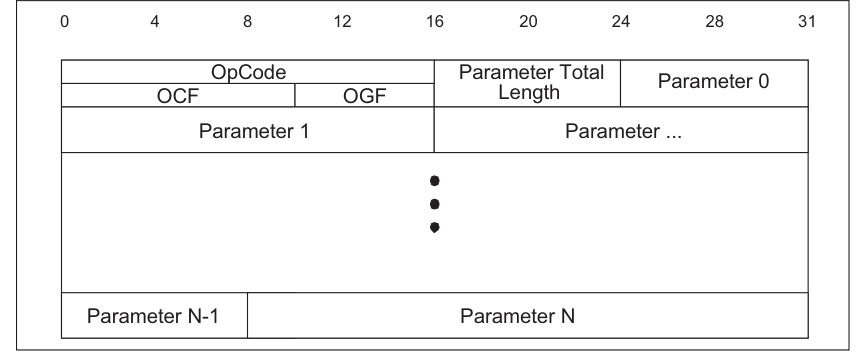

**Figure 5.1:  HCI Command Packet**

Op_Code: Size: 2 Octets

| Value | Parameter Description |
| --- | --- |
| 0xXXXX | OGF Range (6 bits): 0x00-0x3F (0x3F reserved for vendor-specific debu commands) OCF Range (10 bits): 0x0000-0x03FF |

Parameter_Total_Length: Size: 1 Octet

| Value | Parameter Description |
| --- | --- |
| 0xXX | Lengths of all of the parameters contained in this packet measured in octets. (N.B.: total length of parameters, not number of parameters) |

Parameter 0 - N: Size: Parameter Total Length

| Value | Parameter Description |
| --- | --- |
| 0xXX | Each command has a specific number of parameters associated with it. These parameters and the size of each of the parameters are defined fo each command. Each parameter is an integer number of octets in size. |

#### 5.4.2  HCI ACL Data Packets

HCI ACL Data Packets are used to exchange data between the Host and Controller. There are two types of HCI ACL Data Packets:
• Automatically-Flushable
• Non-Automatically-Flushable
Automatically-Flushable HCI Data Packets are flushed based on the setting of an automatic flush timer (see Read Automatic Flush Timeout Command). Non- Automatically-Flushable HCI Data Packets are not controlled by the automatic flush timeout and shall not be automatically flushed. The format of the HCI ACL Data Packet is shown in Figure 5.2. The definition for each of the fields in the data packets is explained below.
Hosts and Controllers shall be able to accept HCI ACL Data Packets with up to 27 bytes of data excluding the HCI ACL Data Packet header on Connection_Handles associated with an LE-U logical link.The HCI ACL Data Packet header is the first 4 octets of the packet.
Note: HCI ACL Data Packets with a Connection_Handle associated with an LE-U logical link will not be affected by the automatic flush timer because only non-flushable packet boundary flags are allowed.
All packets on an AMP logical link are affected by the automatic flush timer.

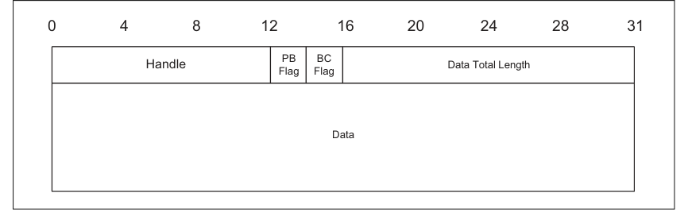

**Figure 5.2:  HCI ACL Data Packet**

Handle: Size: 12 Bits

| Value | Parameter Description |
| --- | --- |
| 0xXXX | Connection Handle to be used for transmitting a data packet or segmen _ over a Primary Controller. Logical Link Handle to be used for transmitting a data packet over an _ _ AMP Controller. On the receiving side (AMP Controller to Host), the least significant 8 bits of the Handle are the Physical Link Handle and the most significant 4 bit _ _ are reserved for future use. (This is because certain AMP Controllers might not be able to provide the logical link context on the receiving side, and the Host does not require it.) Range: 0x000-0xEFF (all other values reserved for future use) |

The Flag Bits consist of the Packet_Boundary_Flag and Broadcast_Flag. The Packet_Boundary_Flag is located in bit 4 and bit 5, and the Broadcast_Flag is located in bit 6 and bit 7 in the second octet of the HCI ACL Data packet.
Packet_Boundary_Flag: Size: 2 Bits

| Value | Parameter Description |  | ASB-U | ACL-U | AMP-U | LE-U |
| --- | --- | --- | --- | --- | --- | --- |
| 00b | First non-auto- matically-flush- able packet of Higher Layer Message (start of a non-automati- cally-flushable L2CAP PDU) from Host to Controller. | Host to Controller | Not allowed | Allowed | Not allowed | Allowed |
|  |  | Controller to Host | Not allowed | Not allowed (except during loopback) | Not allowed | Not allowed |
| 01b | Continuing frag- ment of Higher Layer Message | Host to Controller | Allowed | Allowed | Not allowed | Allowed |
|  |  | Controller to Host | Allowed | Allowed | Not allowed | Allowed |
| 10b | First automati- cally flushable packet of Higher Layer Message (start of an auto- matically-flush- able L2CAP PDU). | Host to Controller | Allowed | Allowed | Not allowed | Not Allowed |
|  |  | Controller to Host | Allowed | Allowed | Not allowed | Allowed |
| 11b | A complete L2CAP PDU. Automatically flushable. | Host to Controller | Not allowed | Not Allowed | Allowed | Not Allowed |
|  |  | Controller to Host | Not allowed | Not Allowed | Allowed | Not Allowed |

The start of a non-flushable packet of a Higher Layer Message (start of a non- automatically-flushable L2CAP PDU) with the PBF of 00b shall be transmitted with an LLID of 10b. All continuing fragment packets of a Higher Layer Message shall be transmitted with an LLID of 01b.
Broadcast_Flag (in packet from Host to Controller): Size: 2 Bits

| Value | Parameter Description |
| --- | --- |
| 00b | No broadcast. Only point-to-point (this is the only valid option for AMPs). |
| 01b | Active Slave Broadcast: packet is sent to all active slaves and may be received by slaves in sniff mode. |
| 10b | Reserved for future use. |
| 11b | Reserved for future use. |

Broadcast_Flag (in packet from Controller to Host): Size: 2 Bits

| Value | Parameter Description |
| --- | --- |
| 00b | Point-to-point |
| 01b | Active Slave Broadcast |
| 10b | Reserved for future use. |
| 11b | Reserved for future use. |

Note: Slaves in sniff mode may or may not receive a broadcast packet depending on whether they happen to be listening at sniff slots, when the packet is sent.
Data_Total_Length: Size: 2 Octets

| Value | Parameter Description |
| --- | --- |
| 0xXXXX | Length of data measured in octets. |

#### 5.4.3  HCI Synchronous Data Packets

HCI synchronous (SCO and eSCO) Data Packets are used to exchange synchronous data between the Host and Controller. The format of the synchronous Data Packet is shown in Figure 5.3. The definition for each of the fields in the data packets is explained below. The HCI SCO Data Packet header is the first 3 octets of the packet.

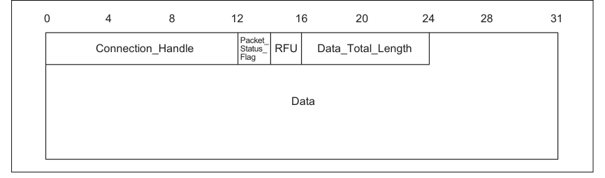

**Figure 5.3:  HCI Synchronous Data Packet**

Connection_Handle: Size: 12 Bits

| Value | Parameter Description |
| --- | --- |
| 0xXXX | Connection Handle to be used to for transmitting a synchronous data _ packet or segment. Range: 0x0000-0x0EFF (all other values reserved for future use) |

The Packet_Status_Flag bits consist of two bits, which are located from bit 4 to 5 in the second octet of the HCI Synchronous Data packet.
The Host shall set the Packet_Status_Flag bits to 00b.
If the Erroneous_Data_Reporting parameter was set to disabled when the synchronous connection was created, the Controller shall set the Packet_Status_Flag bits to 00b and whether or not data is provided for cases when a valid (e)SCO packet was not received is unspecified.
If the Erroneous_Data_Reporting parameter was set to enabled when the synchronous connection was created, the Controller shall set the Packet_Status_Flag according to the following table.
Packet_Status_Flag (in packets sent by the Controller) Size: 2 Bits

| Value | Parameter Description |
| --- | --- |
| 00b | Correctly received data. The payload data belongs to received eSCO or SCO packets that the baseband marked as “good data”. |
| 01b | Possibly invalid data. At least one eSCO packet has been marked by the baseband as “data with possible errors” and all others have been marke as “good data” in the eSCO interval(s) corresponding to the HCI Synchr nous Data Packet. |
| 10b | No data received. All data from the baseband received during the (e)SC interval(s) corresponding to the HCI Synchronous Data Packet have bee marked as "lost data" by the baseband. The Payload data octets shall be set to 0. |
| 11b | Data partially lost. Not all, but at least one (e)SCO packet has been marked as “lost data” by the baseband in the (e)SCO intervals corre- sponding to the HCI Synchronous Data Packet. The payload data octets corresponding to the missing (e)SCO packets shall be set to 0. |

Note: Some HCI transports and/or Controller implementations will align the HCI Synchronous Data Packets with the (e)SCO baseband packets such that data integrity can be explicitly marked in the Packet_Status_Flag. For HCI transports or Controller implementations that do not preserve this alignment, information in the Packet_Status_Flag may be ambiguous.
Data_Total_Length: Size: 1 Octet

| Value | Parameter Description |
| --- | --- |
| 0xXX | Length of synchronous data measured in octets |

#### 5.4.4  HCI Event Packet

The HCI Event Packet is used by the Controller to notify the Host when events occur. The Host must be able to accept HCI Event Packets with up to 255 octets of data excluding the HCI Event Packet header. The format of the HCI Event Packet is shown in Figure 5.4, and the definition of each field is explained below. The HCI Event Packet header is the first 2 octets of the packet.
An LE Controller uses subevent codes to transmit LE specific events from the Controller to the Host. Note: The subevent code will always be the first Event Parameter (See Section 7.7.65).

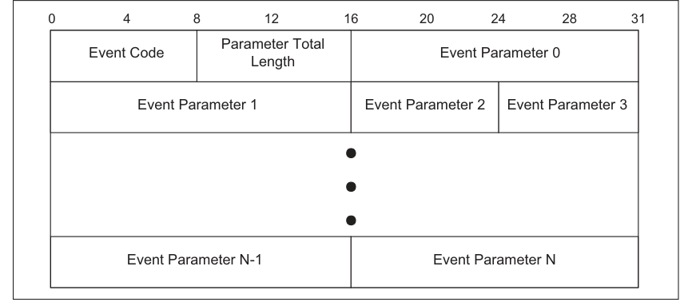

**Figure 5.4:  HCI Event Packet**

Event_Code: Size: 1 Octet

| Value | Parameter Description |
| --- | --- |
| 0xXX | Each event is assigned a 1-Octet event code used to uniquely identify di ferent types of events. Range: 0x00-0xFF (The event code 0xFF is reserved for the event code used for vendor-specific debug events.) |

Parameter_Total_Length: Size: 1 Octet

| Value | Parameter Description |
| --- | --- |
| 0xXX | Length of all of the parameters contained in this packet, measured in octets |

Event_Parameter 0 - N: Size: Parameter Total Length

| Value | Parameter Description |
| --- | --- |
| 0xXX | Each event has a specific number of parameters associated with it. Thes parameters and the size of each of the parameters are defined for each event. Each parameter is an integer number of octets in size. |

## 6  HCI CONFIGURATION PARAMETERS

### 6.1   SCAN ENABLE

The Scan_Enable parameter controls whether or not the BR/EDR Controller will periodically scan for page attempts and/or inquiry requests from other BR/ EDR Controllers. If Page_Scan is enabled, then the device will enter page scan mode based on the value of the Page_Scan_Interval and Page_Scan_Window parameters. If Inquiry_Scan is enabled, then the BR/EDR Controller will enter Inquiry Scan mode based on the value of the Inquiry_Scan_Interval and Inquiry_Scan_Window parameters.

| Value | Parameter Description |
| --- | --- |
| 0x00 | No Scans enabled. |
| 0x01 | Inquiry Scan enabled. Page Scan always disabled. |
| 0x02 | Inquiry Scan disabled. Page Scan enabled. |
| 0x03 | Inquiry Scan enabled. Page Scan enabled. |
| All other values | Reserved for future use |

### 6.2   INQUIRY SCAN INTERVAL

The Inquiry_Scan_Interval configuration parameter defines the amount of time between consecutive inquiry scans. This is defined as the time interval from when the BR/EDR Controller started its last inquiry scan until it begins the next inquiry scan.

| Value | Parameter Description |
| --- | --- |
| N = 0xXXXX | Size: 2 Octets Range: 0x0012 to 0x1000; only even values are valid Default: 0x1000 Mandatory Range: 0x0012 to 0x1000 Time = N * 0.625 ms Time Range: 11.25 to 2560 ms Time Default: 2.56 s |

### 6.3   INQUIRY SCAN WINDOW

The Inquiry_Scan_Window configuration parameter defines the amount of time for the duration of the inquiry scan. The Inquiry_Scan_Window can only be less than or equal to the Inquiry_Scan_Interval.

| Value | Parameter Description |
| --- | --- |
| N = 0xXXXX | Size: 2 Octets Range: 0x0011 to 0x1000 Default: 0x0012 Mandatory Range: 0x0011 to Inquiry Scan Interval Time = N * 0.625 ms Time Range: 10.625 ms to 2560 ms Time Default: 11.25 ms |

### 6.4   INQUIRY SCAN TYPE

The Inquiry_Scan_Type configuration parameter indicates whether inquiry scanning will be done using non-interlaced scan or interlaced scan. Currently, one mandatory inquiry scan type and one optional inquiry scan type are defined. For details, see the Baseband Specification, [Vol 2] Part B, Section 8.4.1.

| Value | Parameter Description |
| --- | --- |
| 0x00 | Mandatory: Standard Scan (default) |
| 0x01 | Optional: Interlaced Scan |
| All other values | Reserved for future use |

### 6.5   INQUIRY MODE

The Inquiry_Mode configuration parameter indicates whether inquiry returns Inquiry Result events in the standard format, with RSSI, or with RSSI and extended inquiry response information.

| Value | Parameter Description |
| --- | --- |
| 0x00 | Standard Inquiry Result event format |
| 0x01 | Inquiry Result format with RSSI |
| 0x02 | Inquiry Result with RSSI format or Extended Inquiry Result format |
| All other values | Reserved for future use |

### 6.6   PAGE TIMEOUT

The Page_Timeout configuration parameter defines the maximum time the local Link Manager will wait for a baseband page response from the remote device at a locally initiated connection attempt. If this time expires and the remote BR/EDR Controller has not responded to the page at baseband level, the connection attempt will be considered to have failed.

| Value | Parameter Description |
| --- | --- |
| N = 0xXXXX | Size: 2 Octets Range: 0x0001 to 0xFFFF Default: 0x2000 Mandatory Range: 0x0016 to 0xFFFF Time = N * 0.625 ms Time Range: 0.625 ms to 40.9 s Time Default: 5.12 s |

### 6.7   CONNECTION ACCEPT TIMEOUT

The Connection_Accept_Timeout configuration parameter allows the BR/EDR Controller to automatically deny a connection request after a specified time period has occurred and the new connection is not accepted. The parameter defines the time duration from when the BR/EDR Controller sends a Connection Request event until the BR/EDR Controller will automatically reject an incoming connection.
The Connection_Accept_Timeout configuration parameter allows each AMP Controller to limit the duration of the Create_Physical_Link command or Accept_Physical_Link command it is locally serving. The parameter defines the maximum time duration for all physical connection setup activities that occur between the Create_Physical_Link command or Accept_Physical_Link command and the corresponding Physical Link Compete event (including all authentication activity) before the AMP Controller will automatically reject the physical link setup.

| Value | Parameter Description |
| --- | --- |
| N = 0xXXXX | Size: 2 Octets Range: 0x0001 to 0xB540 Default: 0x1F40 Mandatory Range: 0x00A0 to 0xB540 Time = N * 0.625 ms Time Range: 0.625 ms to 29 s Time Default: BR/EDR 5 s AMP type dependent |

### 6.8   PAGE SCAN INTERVAL

The Page_Scan_Interval configuration parameter defines the amount of time between consecutive page scans. This time interval is defined from when the Controller started its last page scan until it begins the next page scan.

| Value | Parameter Description |
| --- | --- |
| N = 0xXXXX | Size: 2 Octets Range: 0x0012 to 0x1000; only even values are valid Default: 0x0800 Mandatory Range: 0x0012 to 0x1000 Time = N * 0.625 ms Time Range: 11.25 ms to 2560 ms Time Default: 1.28 s |

### 6.9   PAGE SCAN WINDOW

The Page_Scan_Window configuration parameter defines the amount of time for the duration of the page scan. The Page_Scan_Window can only be less than or equal to the Page_Scan_Interval.

| Value | Parameter Description |
| --- | --- |
| N = 0xXXXX | Size: 2 Octets Range: 0x0011 to 0x1000 Default: 0x0012 Mandatory Range: 0x0011 to Page Scan Interval Time = N * 0.625 ms Time Range: 10.625 ms to Page Scan Interval Time Default: 11.25 ms |

### 6.10   THIS SECTION NO LONGER USED

### 6.11   PAGE SCAN TYPE

The Page_Scan_Type parameter indicates whether page scanning will be done using non-interlaced scan or interlaced scan. For details, see the Baseband Specification, [Vol 2] Part B, Section 8.3.1.

| Value | Parameter Description |
| --- | --- |
| 0x00 | Mandatory: Standard Scan (default) |
| 0x01 | Optional: Interlaced Scan |
| All other values | Reserved for future use |

### 6.12   VOICE SETTING

The Voice_Setting parameter controls all the various settings for voice connections. The input settings apply to all voice connections, and cannot be set for individual voice connections. The Voice_Setting parameter controls the configuration for voice connections: Input Coding, Air coding format, input data format, Input sample size, and linear PCM parameter. The air coding format bits in the Voice_Setting command parameter specify which air coding format the local device requests. The air coding format bits do not specify which air coding format(s) the local device accepts when a remote device requests an air coding format. This is determined by the hardware capabilities of the local BR/ EDR Controller.

| Value | Parameter Description |
| --- | --- |
| 00XXXXXXXX | Input Coding: Linear |
| 01XXXXXXXX | Input Coding: µ-law Input Coding |
| 10XXXXXXXX | Input Coding: A-law Input Coding |
| 11XXXXXXXX | Reserved for future use |
| XX00XXXXXX | Input Data Format: 1’s complement |
| XX01XXXXXX | Input Data Format: 2’s complement |
| XX10XXXXXX | Input Data Format: Sign-Magnitude |
| XX11XXXXXX | Input Data Format: Unsigned |
| XXXX0XXXXX | Input Sample Size: 8-bit (only for linear PCM) |
| XXXX1XXXXX | Input Sample Size: 16-bit (only for linear PCM) |
| XXXXXnnnXX | Linear PCM Bit Pos: # bit positions that MSB of sample is away _ _ _ from starting at MSB (only for Linear PCM). |
| XXXXXXXX00 | Air Coding Format: CVSD |
| XXXXXXXX01 | Air Coding Format: µ-law |
| XXXXXXXX10 | Air Coding Format: A-law |
| XXXXXXXX11 | Air Coding Format: Transparent Data |

### 6.13   PIN TYPE

The PIN Type configuration parameter determines whether the Link Manager assumes that the Host supports variable PIN codes or a fixed PIN code. The Host Controller uses the PIN-type information during pairing.

| Value | Parameter Description |
| --- | --- |
| 0x00 | Variable PIN. |
| 0x01 | Fixed PIN. |

### 6.14   LINK KEY

The Controller can store a limited number of link keys for other BR/EDR Controllers. Link keys are shared between two BR/EDR Controllers, and are used for all security transactions between the two BR/EDR Controllers. A Host device may have additional storage capabilities, which can be used to save additional link keys to be reloaded to the BR/EDR Controller when needed. A Link Key is associated with a BD_ADDR.

| Value | Parameter Description |
| --- | --- |
| 0xXXXXXXXXXX XXXXXXXXXXX XXXXXXXXXXX | Link Key for an associated BD ADDR. _ |

### 6.15   FAILED CONTACT COUNTER

The Failed_Contact_Counter records the number of consecutive incidents in which either the local or remote device did not respond after the flush timeout had expired, and the L2CAP PDU that was currently being transmitted was automatically ‘flushed’. When this occurs, the Failed_Contact_Counter is incremented by 1.
The Failed Contact Counter is maintained for each Connection_Handle and Logical_Link_Handle.
The Failed_Contact_Counter for a connection is reset to zero on the following conditions:
1. When a new connection is established
2. When the Failed_Contact_Counter is > zero and an L2CAP PDU is acknowledged for that connection
3. When the Reset_Failed_Contact_Counter command has been issued

| Value | Parameter Description |
| --- | --- |
| 0xXXXX | Number of consecutive failed contacts for a connection corresponding to the Connection or Logical Link Handle. |

### 6.16   AUTHENTICATION ENABLE

The Authentication_Enable parameter controls if the local device requires to authenticate the remote device at connection setup (between the Create_Connection command or acceptance of an incoming ACL connection and the corresponding Connection Complete event). At connection setup, only the device(s) with the Authentication_Enable parameter enabled will try to authenticate the other device.
Note: Changing this parameter does not affect existing connections.

| Value | Parameter Description |
| --- | --- |
| 0x00 | Authentication not required. |
| 0x01 | Authentication required for all connections. |
| All other values | Reserved for future use |

### 6.17   HOLD MODE ACTIVITY

The Hold_Mode_Activity value is used to determine what activities should be suspended when the BR/EDR Controller is in hold mode. After the hold period has expired, the device will return to the previous mode of operation. Multiple hold mode activities may be specified for the Hold_Mode_Activity parameter by performing a bitwise OR operation of the different activity types. If no activities are suspended, then all of the current Periodic Inquiry, Inquiry Scan, and Page Scan settings remain valid during the Hold Mode. If the Hold_Mode_Activity parameter is set to Suspend Page Scan, Suspend Inquiry Scan, and Suspend Periodic Inquiries, then the device can enter a low-power state during the Hold Mode period, and all activities are suspended. Suspending multiple activities can be specified for the Hold_Mode_Activity parameter by performing a bitwise OR operation of the different activity types. The Hold Mode Activity is only valid if all connections are in Hold Mode.

| Value | Parameter Description |
| --- | --- |
| 0x00 | Maintain current Power State. |
| 0x01 | Suspend Page Scan. |
| 0x02 | Suspend Inquiry Scan. |
| 0x04 | Suspend Periodic Inquiries. |
| All other values | Reserved for future use. |

### 6.18   LINK POLICY SETTINGS

The Link_Policy_Settings parameter determines the behavior of the local Link Manager when it receives a request from a remote Link Manager or it determines itself to change the master-slave role or to enter hold or sniff mode. The local Link Manager will automatically accept or reject such a request from the remote device, and may even autonomously request itself, depending on the value of the Link_Policy_Settings parameter for the corresponding Connection_Handle. When the value of the Link_Policy_Settings parameter is changed for a certain Connection_Handle, the new value will only be used for requests from a remote device or from the local Link Manager itself made after this command has been completed. By enabling each mode individually, the Host can choose any combination needed to support various modes of operation. Multiple LM policies may be specified for the Link_Policy_Settings parameter by performing a bitwise OR operation of the different activity types.
Note: The local BR/EDR Controller may be forced into hold mode (regardless of whether the local device is master or slave) by the remote device regardless of the value of the Link_Policy_Settings parameter. The forcing of hold mode can however only be done once the connection has already been placed into hold mode through an LMP request (the Link_Policy_Settings determine if requests from a remote device should be accepted or rejected). The forcing of hold mode can after that be done as long as the connection lasts regardless of the setting for hold mode in the Link_Policy_Settings parameter.
Note that the previous description implies that if the implementation in the remote device is a “polite” implementation that does not force another device into hold mode via LMP PDUs, then the Link_Policy_Settings will never be overruled.

| Value | Parameter Description |
| --- | --- |
| 0x0000 | Disable All LM Modes Default |
| 0x0001 | Enable Role switch. |
| 0x0002 | Enable Hold Mode. |
| 0x0004 | Enable Sniff Mode. |
| All other bits | Reserved for future use. |

### 6.19   FLUSH TIMEOUT

The Flush_Timeout configuration parameter is used for ACL connections on a BR/EDR Controller only. The Flush Timeout is defined in the Baseband specification [Vol 2] Part B, Section 7.6.3. This parameter allows automatically- flushable ACL packets to be automatically flushed without the Host device issuing a Flush command. This provides support for isochronous data, such as audio. Non-automatically-flushable ACL packets shall not be affected by this parameter (see Section 5.4.2) providing support for both asynchronous and isochronous data on the same ACL connection. When the L2CAP packet that is currently being transmitted is automatically ‘flushed’, the Failed Contact Counter is incremented by one.
Note: Since for AMP Controllers a Flush Timeout value is maintained as part of the Extended Flow Specification for each logical link, the separate Flush Timeout configuration parameter is not used.

| Value | Parameter Description |
| --- | --- |
| 0 | Timeout = ∞; No Automatic Flush |
| N = 0xXXXX | Size: 2 Octets Range: 0x0001 to 0x07FF Mandatory Range: 0x0002 to 0x07FF Time = N * 0.625 ms Time Range: 0.625 ms to 1279.375 ms |

### 6.20   NUM BROADCAST RETRANSMISSIONS

Broadcast packets are not acknowledged and are unreliable. The Number of Broadcast Retransmissions parameter, N, is used to increase the reliability of a broadcast message by retransmitting the broadcast message multiple times. This sets the value NBC in the baseband to one greater than the Num Broadcast Retransmissions value. (See [Vol 2] Part B, Section 7.6.5) This parameter should be adjusted as the link quality measurement changes.

| Value | Parameter Description |
| --- | --- |
| N = 0xXX | N = N + 1 BC Range 0x00-0xFE |

### 6.21   LINK SUPERVISION TIMEOUT

The Link_Supervision_Timeout parameter is used by the Controller to monitor link loss. If, for any reason, no packets are received from that Handle (a Connection_Handle for the BR/EDR Controller or the Physical_Link_Handle for an AMP Controller) for a duration longer than the Link_Supervision_Timeout, the connection shall be disconnected. For the BR/EDR Controller, the same timeout value is used for both synchronous and ACL connections for the device specified by the Connection_Handle. For an AMP Controller, the timeout value is maintained for each physical link. Note: Some AMP Controllers may also have an early notification event (See Physical Link Loss Early Warning Event).
Note: Setting the Link_Supervision_Timeout to No Link_Supervision_Timeout (0x0000) on a BR/EDR Controller will disable the Link_Supervision_Timeout check for the specified Connection_Handle.

| Value | Parameter Description |
| --- | --- |
| 0x0000 | No Link Supervision Timeout. _ _ Shall not be used with AMP Controllers. |
| N = 0xXXXX | Size: 2 Octets Range: 0x0001 to 0xFFFF Default: 0x7D00 Mandatory Range: 0x0190 to 0xFFFF Time = N * 0.625 ms Time Range: 0.625 ms to 40.9 s Time Default: BR/EDR 20 s AMP 10 s |

### 6.22   SYNCHRONOUS FLOW CONTROL ENABLE

The Synchronous Flow Control Enable configuration parameter allows the Host to decide if the BR/EDR Controller will send Number Of Completed Packets events for synchronous Connection_Handles. This setting allows the Host to enable and disable synchronous flow control.

| Value | Parameter Description |
| --- | --- |
| 0x00 | Synchronous Flow Control is disabled. No Number of Completed Packet events will be sent from the BR/EDR Controller for synchronous Connec tion Handles. _ |
| 0x01 | Synchronous Flow Control is enabled. Number of Completed Packets events will be sent from the BR/EDR Controller for synchronous Connec tion Handles. _ |

### 6.23   LOCAL NAME

The user-friendly Local Name provides the user the ability to distinguish one BR/EDR Controller from another. The Local Name configuration parameter is a UTF-8 encoded string with up to 248 octets in length. The Local Name configuration parameter will be null terminated (0x00) if the UTF-8 encoded string is less than 248 octets.
Note: The Local Name configuration parameter is a string parameter. Endianess does therefore not apply to the Local Name configuration parameter. The first octet of the name is received first.

| Value | Parameter Description |
| --- | --- |
|  | A UTF-8 encoded User Friendly Descriptive Name for the device. If the name contained in the parameter is shorter than 248 octets, the end of the name is indicated by a NULL octet (0x00), and the following octets (to fill up 248 octets, which is the length of the parameter) do not have valid values. |

### 6.24   EXTENDED INQUIRY RESPONSE

The Extended Inquiry Response provides information about the local device in response to inquiry from remote devices. The configuration parameter has two parts, a significant part followed by a non-significant part. The non-significant part contains only zero octets. The length of the extended inquiry response configuration parameter is 240 octets. The data format of the significant part is defined in [Vol 3] Part C, Section 8.

| Value | Parameter Description |
| --- | --- |
|  | Information about the local device that will be sent in an extended inquiry respons packet to remote devices during inquiry response. |

### 6.25   ERRONEOUS DATA REPORTING

The Erroneous_Data_Reporting configuration parameter shall be used for SCO and eSCO connections only. This parameter determines if the BR/EDR Controller is required to provide data to the Host for every (e)SCO interval, with the Packet_Status_Flag in HCI Synchronous Data Packets set according to Section 5.4.3.

| Value | Parameter Description |
| --- | --- |
| 0x00 | Erroneous data reporting disabled |
| 0x01 | Erroneous data reporting enabled. |
| All other values | Reserved for future use |

### 6.26   CLASS OF DEVICE

The Class_of_Device parameter is used to indicate the capabilities of the local device to other devices.

| Value | Parameter Description |
| --- | --- |
| 0xXXXXXX | Class of Device for the device. |

### 6.27   SUPPORTED COMMANDS

The Supported Commands configuration parameter lists which HCI commands the local Controller supports. It is implied that if a command is listed as supported, the feature underlying that command is also supported.
The Supported Commands is a 64 octet bit field. If a bit is set to 1, then this command is supported.

| Octet | Bit | Command Supported |
| --- | --- | --- |
| 0 | 0 | Inquiry |
|  | 1 | Inquiry Cancel |
|  | 2 | Periodic Inquiry Mode |
|  | 3 | Exit Periodic Inquiry Mode |
|  | 4 | Create Connection |
|  | 5 | Disconnect |
|  | 6 | Add SCO Connection (deprecated) |
|  | 7 | Create Connection Cancel |
| 1 | 0 | Accept Connection Request |
|  | 1 | Reject Connection Request |
|  | 2 | Link Key Request Reply |
|  | 3 | Link Key Request Negative Reply |
|  | 4 | PIN Code Request Reply |
|  | 5 | PIN Code Request Negative Reply |
|  | 6 | Change Connection Packet Type |
|  | 7 | Authentication Requested |

| Octet | Bit | Command Supported |
| --- | --- | --- |
| 2 | 0 | Set Connection Encryption |
|  | 1 | Change Connection Link Key |
|  | 2 | Master Link Key |
|  | 3 | Remote Name Request |
|  | 4 | Remote Name Request Cancel |
|  | 5 | Read Remote Supported Features |
|  | 6 | Read Remote Extended Features |
|  | 7 | Read Remote Version Information |
| 3 | 0 | Read Clock Offset |
|  | 1 | Read LMP Handle |
|  | 2 | Reserved for Future Use |
|  | 3 | Reserved for Future Use |
|  | 4 | Reserved for Future Use |
|  | 5 | Reserved for Future Use |
|  | 6 | Reserved for Future Use |
|  | 7 | Reserved for Future Use |
| 4 | 0 | Reserved for Future Use |
|  | 1 | Hold Mode |
|  | 2 | Sniff Mode |
|  | 3 | Exit Sniff Mode |
|  | 4 | Reserved |
|  | 5 | Reserved |
|  | 6 | QoS Setup |
|  | 7 | Role Discovery |
| 5 | 0 | Switch Role |
|  | 1 | Read Link Policy Settings |
|  | 2 | Write Link Policy Settings |
|  | 3 | Read Default Link Policy Settings |
|  | 4 | Write Default Link Policy Settings |
|  | 5 | Flow Specification |
|  | 6 | Set Event Mask |
|  | 7 | Reset |

| Octet | Bit | Command Supported |
| --- | --- | --- |
| 6 | 0 | Set Event Filter |
|  | 1 | Flush |
|  | 2 | Read PIN Type |
|  | 3 | Write PIN Type |
|  | 4 | Create New Unit Key |
|  | 5 | Read Stored Link Key |
|  | 6 | Write Stored Link Key |
|  | 7 | Delete Stored Link Key |
| 7 | 0 | Write Local Name |
|  | 1 | Read Local Name |
|  | 2 | Read Connection Accept Timeout |
|  | 3 | Write Connection Accept Timeout |
|  | 4 | Read Page Timeout |
|  | 5 | Write Page Timeout |
|  | 6 | Read Scan Enable |
|  | 7 | Write Scan Enable |
| 8 | 0 | Read Page Scan Activity |
|  | 1 | Write Page Scan Activity |
|  | 2 | Read Inquiry Scan Activity |
|  | 3 | Write Inquiry Scan Activity |
|  | 4 | Read Authentication Enable |
|  | 5 | Write Authentication Enable |
|  | 6 | Read Encryption Mode (deprecated) |
|  | 7 | Write Encryption Mode (deprecated) |
| 9 | 0 | Read Class Of Device |
|  | 1 | Write Class Of Device |
|  | 2 | Read Voice Setting |
|  | 3 | Write Voice Setting |
|  | 4 | Read Automatic Flush Timeout |
|  | 5 | Write Automatic Flush Timeout |
|  | 6 | Read Num Broadcast Retransmissions |
|  | 7 | Write Num Broadcast Retransmissions |

| Octet | Bit | Command Supported |
| --- | --- | --- |
| 10 | 0 | Read Hold Mode Activity |
|  | 1 | Write Hold Mode Activity |
|  | 2 | Read Transmit Power Level |
|  | 3 | Read Synchronous Flow Control Enable |
|  | 4 | Write Synchronous Flow Control Enable |
|  | 5 | Set Controller To Host Flow Control |
|  | 6 | Host Buffer Size |
|  | 7 | Host Number Of Completed Packets |
| 11 | 0 | Read Link Supervision Timeout |
|  | 1 | Write Link Supervision Timeout |
|  | 2 | Read Number of Supported IAC |
|  | 3 | Read Current IAC LAP |
|  | 4 | Write Current IAC LAP |
|  | 5 | Read Page Scan Mode Period (deprecated) |
|  | 6 | Write Page Scan Mode Period (deprecated) |
|  | 7 | Read Page Scan Mode (deprecated) |
| 12 | 0 | Write Page Scan Mode (deprecated) |
|  | 1 | Set AFH Host Channel Classification |
|  | 2 | Reserved for Future Use |
|  | 3 | Reserved for Future Use |
|  | 4 | Read Inquiry Scan Type |
|  | 5 | Write Inquiry Scan Type |
|  | 6 | Read Inquiry Mode |
|  | 7 | Write Inquiry Mode |
| 13 | 0 | Read Page Scan Type |
|  | 1 | Write Page Scan Type |
|  | 2 | Read AFH Channel Assessment Mode |
|  | 3 | Write AFH Channel Assessment Mode |
|  | 4 | Reserved for Future Use |
|  | 5 | Reserved for Future Use |
|  | 6 | Reserved for Future Use |
|  | 7 | Reserved for Future Use |

| Octet | Bit | Command Supported |
| --- | --- | --- |
| 14 | 0 | Reserved for Future Use |
|  | 1 | Reserved for Future Use |
|  | 2 | Reserved for Future Use |
|  | 3 | Read Local Version Information |
|  | 4 | Reserved for Future Use |
|  | 5 | Read Local Supported Features |
|  | 6 | Read Local Extended Features |
|  | 7 | Read Buffer Size |
| 15 | 0 | Read Country Code [Deprecated] |
|  | 1 | Read BD ADDR |
|  | 2 | Read Failed Contact Counter |
|  | 3 | Reset Failed Contact Counter |
|  | 4 | Read Link Quality |
|  | 5 | Read RSSI |
|  | 6 | Read AFH Channel Map |
|  | 7 | Read Clock |
| 16 | 0 | Read Loopback Mode |
|  | 1 | Write Loopback Mode |
|  | 2 | Enable Device Under Test Mode |
|  | 3 | Setup Synchronous Connection Request |
|  | 4 | Accept Synchronous Connection Request |
|  | 5 | Reject Synchronous Connection Request |
|  | 6 | Reserved for Future Use |
|  | 7 | Reserved for Future Use |
| 17 | 0 | Read Extended Inquiry Response |
|  | 1 | Write Extended Inquiry Response |
|  | 2 | Refresh Encryption Key |
|  | 3 | Reserved for Future Use |
|  | 4 | Sniff Subrating |
|  | 5 | Read Simple Pairing Mode |
|  | 6 | Write Simple Pairing Mode |
|  | 7 | Read Local OOB Data |

| Octet | Bit | Command Supported |
| --- | --- | --- |
| 18 | 0 | Read Inquiry Response Transmit Power Level |
|  | 1 | Write Inquiry Transmit Power Level |
|  | 2 | Read Default Erroneous Data Reporting |
|  | 3 | Write Default Erroneous Data Reporting |
|  | 4 | Reserved for Future Use |
|  | 5 | Reserved for Future Use |
|  | 6 | Reserved for Future Use |
|  | 7 | IO Capability Request Reply |
| 19 | 0 | User Confirmation Request Reply |
|  | 1 | User Confirmation Request Negative Reply |
|  | 2 | User Passkey Request Reply |
|  | 3 | User Passkey Request Negative Reply |
|  | 4 | Remote OOB Data Request Reply |
|  | 5 | Write Simple Pairing Debug Mode |
|  | 6 | Enhanced Flush |
|  | 7 | Remote OOB Data Request Negative Reply |
| 20 | 0 | Reserved for Future Use |
|  | 1 | Reserved for Future Use |
|  | 2 | Send Keypress Notification |
|  | 3 | IO Capability Request Negative Reply |
|  | 4 | Read Encryption Key Size |
|  | 5 | Reserved for Future Use |
|  | 6 | Reserved for Future Use |
|  | 7 | Reserved for Future Use |
| 21 | 0 | Create Physical Link |
|  | 1 | Accept Physical Link |
|  | 2 | Disconnect Physical Link |
|  | 3 | Create Logical Link |
|  | 4 | Accept Logical Link |
|  | 5 | Disconnect Logical Link |
|  | 6 | Logical Link Cancel |
|  | 7 | Flow Spec Modify |

| Octet | Bit | Command Supported |
| --- | --- | --- |
| 22 | 0 | Read Logical Link Accept Timeout |
|  | 1 | Write Logical Link Accept Timeout |
|  | 2 | Set Event Mask Page 2 |
|  | 3 | Read Location Data |
|  | 4 | Write Location Data |
|  | 5 | Read Local AMP Info |
|  | 6 | Read Local AMP ASSOC _ |
|  | 7 | Write Remote AMP ASSOC _ |
| 23 | 0 | Read Flow Control Mode |
|  | 1 | Write Flow Control Mode |
|  | 2 | Read Data Block Size |
|  | 3 | Reserved for Future Use |
|  | 4 | Reserved for Future Use |
|  | 5 | Enable AMP Receiver Reports |
|  | 6 | AMP Test End |
|  | 7 | AMP Test |
| 24 | 0 | Read Enhanced Transmit Power Level |
|  | 1 | Reserved for Future Use |
|  | 2 | Read Best Effort Flush Timeout |
|  | 3 | Write Best Effort Flush Timeout |
|  | 4 | Short Range Mode |
|  | 5 | Read LE Host Support |
|  | 6 | Write LE Host Support |
|  | 7 | Reserved for Future Use |
| 25 | 0 | LE Set Event Mask |
|  | 1 | LE Read Buffer Size |
|  | 2 | LE Read Local Supported Features |
|  | 3 | Reserved for Future Use |
|  | 4 | LE Set Random Address |
|  | 5 | LE Set Advertising Parameters |
|  | 6 | LE Read Advertising Channel TX Power |
|  | 7 | LE Set Advertising Data |

| Octet | Bit | Command Supported |
| --- | --- | --- |
| 26 | 0 | LE Set Scan Response Data |
|  | 1 | LE Set Advertising Enable |
|  | 2 | LE Set Scan Parameters |
|  | 3 | LE Set Scan Enable |
|  | 4 | LE Create Connection |
|  | 5 | LE Create Connection Cancel |
|  | 6 | LE Read White List Size |
|  | 7 | LE Clear White List |
| 27 | 0 | LE Add Device To White List |
|  | 1 | LE Remove Device From White List |
|  | 2 | LE Connection Update |
|  | 3 | LE Set Host Channel Classification |
|  | 4 | LE Read Channel Map |
|  | 5 | LE Read Remote Features |
|  | 6 | LE Encrypt |
|  | 7 | LE Rand |
| 28 | 0 | LE Start Encryption |
|  | 1 | LE Long Term Key Request Reply |
|  | 2 | LE Long Term Key Request Negative Reply |
|  | 3 | LE Read Supported States |
|  | 4 | LE Receiver Test |
|  | 5 | LE Transmitter Test |
|  | 6 | LE Test End |
|  | 7 | Reserved for Future Use |
| 29 | 0 | Reserved for Future Use |
|  | 1 | Reserved for Future Use |
|  | 2 | Reserved for Future Use |
|  | 3 | Enhanced Setup Synchronous Connection |
|  | 4 | Enhanced Accept Synchronous Connection |
|  | 5 | Read Local Supported Codecs |
|  | 6 | Set MWS Channel Parameters |
|  | 7 | Set External Frame Configuration |

| Octet | Bit | Command Supported |
| --- | --- | --- |
| 30 | 0 | Set MWS Signaling |
|  | 1 | Set MWS Transport Layer |
|  | 2 | Set MWS Scan Frequency Table |
|  | 3 | Get MWS Transport Layer Configuration |
|  | 4 | Set MWS PATTERN Configuration |
|  | 5 | Set Triggered Clock Capture |
|  | 6 | Truncated Page |
|  | 7 | Truncated Page Cancel |
| 31 | 0 | Set Connectionless Slave Broadcast |
|  | 1 | Set Connectionless Slave Broadcast Receive |
|  | 2 | Start Synchronization Train |
|  | 3 | Receive Synchronization Train |
|  | 4 | Set Reserved LT ADDR _ |
|  | 5 | Delete Reserved LT ADDR _ |
|  | 6 | Set Connectionless Slave Broadcast Data |
|  | 7 | Read Synchronization Train Parameters |
| 32 | 0 | Write Synchronization Train Parameters |
|  | 1 | Remote OOB Extended Data Request Reply |
|  | 2 | Read Secure Connections Host Support |
|  | 3 | Write Secure Connections Host Support |
|  | 4 | Read Authenticated Payload Timeout |
|  | 5 | Write Authenticated Payload Timeout |
|  | 6 | Read Local OOB Extended Data |
|  | 7 | Write Secure Connections Test Mode |
| 33 | 0 | Read Extended Page Timeout |
|  | 1 | Write Extended Page Timeout |
|  | 2 | Read Extended Inquiry Length |
|  | 3 | Write Extended Inquiry Length |
|  | 4 | LE Remote Connection Parameter Request Reply |
|  | 5 | LE Remote Connection Parameter Request Negative Reply |
|  | 6 | LE Set Data Length |
|  | 7 | LE Read Suggested Default Data Length |

| Octet | Bit | Command Supported |
| --- | --- | --- |
| 34 | 0 | LE Write Suggested Default Data Length |
|  | 1 | LE Read Local P-256 Public Key |
|  | 2 | LE Generate DH Key |
|  | 3 | LE Add Device To Resolving List |
|  | 4 | LE Remove Device From Resolving List |
|  | 5 | LE Clear Resolving List |
|  | 6 | LE Read Resolving List Size |
|  | 7 | LE Read Peer Resolvable Address |
| 35 | 0 | LE Read Local Resolvable Address |
|  | 1 | LE Set Address Resolution Enable |
|  | 2 | LE Set Resolvable Private Address Timeout |
|  | 3 | LE Read Maximum Data Length |
|  | 4 | LE Read PHY Command |
|  | 5 | LE Set Default PHY Command |
|  | 6 | LE Set PHY Command |
|  | 7 | LE Enhanced Receiver Test Command |
| 36 | 0 | LE Enhanced Transmitter Test Command |
|  | 1 | LE Set Advertising Set Random Address Command |
|  | 2 | LE Set Extended Advertising Parameters Command |
|  | 3 | LE Set Extended Advertising Data Command |
|  | 4 | LE Set Extended Scan Response Data Command |
|  | 5 | LE Set Extended Advertising Enable Command |
|  | 6 | LE Read Maximum Advertising Data Length Command |
|  | 7 | LE Read Number of Supported Advertising Sets Command |
| 37 | 0 | LE Remove Advertising Set Command |
|  | 1 | LE Clear Advertising Sets Command |
|  | 2 | LE Set Periodic Advertising Parameters Command |
|  | 3 | LE Set Periodic Advertising Data Command |
|  | 4 | LE Set Periodic Advertising Enable Command |
|  | 5 | LE Set Extended Scan Parameters Command |
|  | 6 | LE Set Extended Scan Enable Command |
|  | 7 | LE Extended Create Connection Command |

| Octet | Bit | Command Supported |
| --- | --- | --- |
| 38 | 0 | LE Periodic Advertising Create Sync Command |
|  | 1 | LE Periodic Advertising Create Sync Cancel Command |
|  | 2 | LE Periodic Advertising Terminate Sync Command |
|  | 3 | LE Add Device To Periodic Advertiser List Command |
|  | 4 | LE Remove Device From Periodic Advertiser List Command |
|  | 5 | LE Clear Periodic Advertiser List Command |
|  | 6 | LE Read Periodic Advertiser List Size Command |
|  | 7 | LE Read Transmit Power Command |
| 39 | 0 | LE Read RF Path Compensation Command |
|  | 1 | LE Write RF Path Compensation Command |
|  | 2 | LE Set Privacy Mode |
|  | 3 | Reserved for Future Use |
|  | 4 | Reserved for Future Use |
|  | 5 | Reserved for Future Use |
|  | 6 | Reserved for Future Use |
|  | 7 | Reserved for Future Use |

### 6.28   LOGICAL LINK ACCEPT TIMEOUT

The Logical_Link_Accept_Timeout configuration parameter allows the AMP Controller to automatically deny a logical link request after a specified time period has elapsed and the new logical link has not completed. The parameter defines the timeout duration, which includes all logical link setup activities that occur between the Create_Logical_Link or Accept_Logical_Link commands and the Logical Link Compete event. If these activities are not completed within the specified time, the AMP Controller will automatically reject the logical link set up.

| Value | Parameter Description |
| --- | --- |
| N = 0xXXXX | Size: 2 Octets Range: 0x0001 to 0xB540 Default: 0x1F40 Mandatory Range: 0x00A0 to 0xB540 Time = N * 0.625 ms Time Range: 0.625 ms to 29 s Time Default: AMP Type dependent |

### 6.29   LOCATION DOMAIN AWARE

The Location_Domain_Aware parameter indicates if the transmitter has information about the current regulatory domain.
Location_Domain_Aware: Size 1 Octet

| Value | Parameter Description |
| --- | --- |
| 0x00 | Regulatory domain unknown |
| 0x01 | Regulatory domain known |
| All other values | Reserved for future use |

### 6.30   LOCATION DOMAIN

The Location_Domain parameter specifies the country or other location code if known.
Location_Domain: Size 2 Octets

| Value | Parameter Description |
| --- | --- |
| 0xXXXX | Shall be set to the character string "XX" (0x5858) for a non-country entit or when Location Domain Aware is set to regulatory domain unknown. _ _ When the regulatory domain is known, it shall be set to the relevant ISO 3166-11 alpha-2 two character country code, with the first letter in the least significant octet (for example, "BT" is encoded as 0x5442). |

1. ISO 3166-1-alpha-2 code elements (English), http://www.iso.org/iso/country_names_and_code_elements

### 6.31   LOCATION DOMAIN OPTIONS

The Location_Domain_Options parameter may specify additional information specific to that country, or that the location is not a single country.
Location_Domain_Options: Size: 1 Octet

| Values | Parameter Descriptions |
| --- | --- |
| 0x20 0x4F 0x49 0x58 | Single octet suffix: "space" indicates that the code applies to the entire country "O" indicates for use outdoors only "I" indicates for use indoors only "X" indicates a non-country entity |
| All other values | Reserved for future use |

The format of the Location_Domain_Options parameter is derived from IEEE 802.11-2007 Annex D "ASN.1 encoding of the MAC and PHY MIB."

### 6.32   LOCATION OPTIONS

The Location_Options parameter indicates if the transmitter has information about any options that may affect operation in different locations.
Location_Options: Size: 1 Octet

| Bit | Value | Parameter Description |
| --- | --- | --- |
| 0 | 0 | Not mains-powered |
| 0 | 1 | Mains powered |
| 1-7 |  | Reserved for future use |

### 6.33   FLOW CONTROL MODE

The Flow_Control_Mode configuration parameter allows the Host to select the HCI Data flow control mode used by the Controller for ACL Data traffic.
Flow_Control_Mode: Size: 1 Octet

| Value | Parameter Description |
| --- | --- |
| 0x00 | Packet based data flow control mode (default for a Primary Controller) |
| 0x01 | Data block based data flow control mode (default for an AMP Control- ler) |
| All other values | Reserved for future use |

### 6.34   LE SUPPORTED HOST

The LE_Supported_Host parameter allows the Host to read and set the Link Manager Protocol feature bit LE Supported (Host). See [Vol 2] Part C, Section 3.2.

| Value | Parameter Description |
| --- | --- |
| 0x00 | LE Supported (Host) disabled (default) |
| 0x01 | LE Supported (Host) enabled |
| All other values | Reserved for future use |

### 6.35   SIMULTANEOUS LE HOST

The Simultaneous_LE_Host parameter allows the Host to read and set the Link Manager Protocol feature bit Simultaneous LE and BR/EDR to Same Device Capable (Host). See [Vol 2] Part C, Section 3.2.

| Value | Parameter Description |
| --- | --- |
| 0x00 | Simultaneous LE and BR/EDR to Same Device Capable (Host) disabled (default). This value shall be ignored. |
| All other values | Reserved for future use |

### 6.36   SYNCHRONIZATION TRAIN INTERVAL

The Sync_Train_Interval configuration parameter defines the time between Synchronization Train transmit events on a single transmit RF channel.
Sync_Train_Interval: Size: 2 Octets

| Value | Parameter Description |
| --- | --- |
| N = 0xXXXX | Range: 0x0020 to 0xFFFE; only even values are valid Default: 0x0080 Mandatory Range: 0x0020 to 0x1000 Time = N * 0.625 ms Time Range: 20 ms to 40.9 s Time Default: 80 ms |

### 6.37   SYNCHRONIZATION TRAIN TIMEOUT

The synchronization_trainTO configuration parameter is used by the Controller to terminate the Synchronization Train after it has been started via the HCI_Start_Synchronization_Train command.
synchronization_trainTO: Size: 4 Octets

| Value | Parameter Description |
| --- | --- |
| N = 0xXXXXXXXX | Range: 0x00000002 to 0x07FFFFFE; only even values are valid Default: 0x0002EE00 Mandatory Range: 0x00000002 to 0x07FFFFFE Time = N * 0.625 ms Time Range: 1.25 ms to 23.3 hours Time Default: 120 s |

### 6.38   SERVICE DATA

The Service_Data configuration parameter defines the value of the service data field in the Synchronization Train.
Service_Data: Size: 1 Octet

| Value | Parameter Description |
| --- | --- |
| N = 0xXX | Range: 0x00 to 0xFF Default: 0x00 |

### 6.39   SECURE CONNECTIONS HOST SUPPORT

The Secure_Connections_Host_Support configuration parameter allows the Host to indicate whether it supports Secure Connections or not. When Secure Connections Host Support is set to 'enabled' the Controller shall use the enhanced reporting mechanisms for the Encryption_Enabled parameter in the Encryption Change event (see Section 7.7.8) and the Key_Type parameter in the Link Key Notification event (see Section 7.7.24).
Secure_Connections_Host_Support: Size: 1 Octet

| Value | Parameter Description |
| --- | --- |
| 0x00 | Secure Conections Host Support is ‘disabled’. Host does not support _ _ _ Secure Connections (default) |
| 0x01 | Secure Connections Host Support is ‘enabled’. Host supports Secure _ _ _ Connections |
| All other values | Reserved for future use |

### 6.40   AUTHENTICATED PAYLOAD TIMEOUT

The Authenticated_Payload_Timeout configuration parameter allows the Host to configure the maximum interval between packets containing a MIC received from the remote device when AES-CCM encryption is enabled.
Authenticated_Payload_Timeout: Size: 2 Octets

| Value | Parameter Description |
| --- | --- |
| N = 0xXXXX | Maximum amount of time specified between packets authenticated by a MIC. Range: 0x0001 to 0xFFFF Time = N * 10 ms Time Range: 10 ms to 655,350 ms |

### 6.41   EXTENDED PAGE TIMEOUT

The Extended_Page_Timeout configuration parameter together with Page_Timeout defines the maximum time the local Link Manager will wait for a baseband page response from the remote device at a locally initiated connection attempt. If this time expires and the remote device has not responded to the page at baseband level, the connection attempt will be considered to have failed.
Extended_Page_Timeout: Size: 2 Octets

| Value | Parameter Description |
| --- | --- |
| N = 0xXXXX | Range: 0x0000 to 0xFFFF Default: 0x0000 Mandatory Range: 0x0000 to 0xFFFF Time = N * 0.625 ms Time Range: 0 to 40.9 s Time Default: 0 s |

### 6.42   EXTENDED INQUIRY LENGTH

The Extended_Inquiry_Length configuration parameter together with Inquiry_Length defines the maximum time the local Link Manager will wait for a baseband inquiry response messages from the remote device at a locally initiated inquiry or periodic inquiry.
Extended Inquiry Length: Size: 2 Octets

| Value | Parameter Description |
| --- | --- |
| N = 0xXXXX | Range: 0x0000 to 0xFFFF Default: 0x0000 Mandatory Range: 0x0000 to 0xFFFF Time = N * 0.625 ms Time Range: 0 to 40.9 s Time Default: 0 s |

## 7  HCI COMMANDS AND EVENTS

### 7.1   LINK CONTROL COMMANDS

The Link Control commands allow a Controller to control connections to other BR/EDR Controllers. Some Link Control commands are used only with a BR/ EDR Controller whereas other Link Control commands are used only with an AMP Controller.
In the BR/EDR Controller, when the Link Control commands are used, the Link Manager (LM) controls how the Bluetooth piconets and scatternets are established and maintained. These commands instruct the LM to create and modify link layer connections with Bluetooth remote devices, perform Inquiries of other BR/EDR Controllers in range, and other LMP commands.
In the AMP Controller, Link Control commands are used to create, modify and disconnect physical and logical links.
In the LE Controller, Link Control commands are used to disconnect physical links.
For the Link Control commands, the OGF is defined as 0x01.

#### 7.1.1  Inquiry Command

| Command | OCF | Command Parameters | Return Parameter |
| --- | --- | --- | --- |
| HCI Inquiry _ | 0x0001 | LAP, Inquiry Length, _ Num Responses _ |  |

Description:
This command causes the BR/EDR Controller to enter Inquiry Mode. Inquiry Mode is used to discover other nearby BR/EDR Controllers. The LAP input parameter contains the LAP from which the inquiry access code shall be derived when the inquiry procedure is made. The Inquiry_Length parameter specifies the total duration of the Inquiry Mode and, when this time expires, Inquiry will be halted. When Extended_Inquiry_Length is greater than zero, the duration of the Inquiry Mode may be changed to (Inquiry_Length + Extended_Inquiry_Length). The Num_Responses parameter specifies the number of responses that can be received before the Inquiry is halted. Inquiry Result, Inquiry Result with RSSI, or Extended Inquiry Result events will be sent to report the details of nearby BR/EDR Controllers that have responded to this inquiry. The Inquiry Complete event is sent to report that Inquiry Mode has ended.
A device which responds during an inquiry or inquiry period should always be reported to the Host in an Inquiry Result, Inquiry Result with RSSI, or Extended Inquiry Result event if the device has not been reported earlier during the current inquiry or inquiry period and the device has not been filtered out using the command Set_Event_Filter. If the device has been reported earlier during the current inquiry or inquiry period, it may or may not be reported depending on the implementation (depending on if earlier results have been saved in the BR/EDR Controller and in that case how many responses that have been saved). It is recommended that the BR/EDR Controller tries to report a particular device only once during an inquiry or inquiry period.
Command Parameters:
LAP: Size: 3 Octets

| Value | Parameter Description |
| --- | --- |
| 0x9E8B00– 0x9E8B3F | This is the LAP from which the inquiry access code should be derived when the inquiry procedure is made; see Bluetooth Assigned Numbers |

Inquiry_Length: Size: 1 Octet

| Value | Parameter Description |
| --- | --- |
| N = 0xXX | Maximum amount of time specified before the Inquiry is halted. Size: 1 octet Range: 0x01 – 0x30 Time = N * 1.28 s Range: 1.28 – 61.44 s |

Num_Responses: Size: 1 Octet

| Value | Parameter Description |
| --- | --- |
| 0x00 | Unlimited number of responses. |
| 0xXX | Maximum number of responses from the Inquiry before the Inquiry is halted. Range: 0x01 – 0xFF |

Return Parameters:
None.
Event(s) generated (unless masked away):
A Command Status event shall be sent from the BR/EDR Controller to the Host when the BR/EDR Controller has started the Inquiry process. Unless filtered, an Inquiry Result, Inquiry Result with RSSI, or Extended Inquiry Result event shall be created for each BR/EDR Controller which responds to the Inquiry message. In addition, multiple BR/EDR Controllers which respond to the
Inquire message may be combined into the same event. An Inquiry Complete event shall be generated when the Inquiry process has completed.
Note: No Command Complete event will be sent by the BR/EDR Controller to indicate that this command has been completed. Instead, the Inquiry Complete event will indicate that this command has been completed. No Inquiry Complete event will be generated for the cancelled Inquiry process.

#### 7.1.2  Inquiry Cancel Command

| Command | OCF | Command Parameters | Return Parameters |
| --- | --- | --- | --- |
| HCI Inquiry Cancel _ _ | 0x0002 |  | Status |

Description:
This command shall cause the BR/EDR Controller to stop the current Inquiry if the BR/EDR Controller is in Inquiry Mode. This command allows the Host to interrupt the BR/EDR Controller and request the BR/EDR Controller to perform a different task. The command should only be issued after the Inquiry command has been issued, a Command Status event has been received for the Inquiry command, and before the Inquiry Complete event occurs.
Command Parameters:
None.
Return Parameters:
Status: Size: 1 Octet

| Value | Parameter Description |
| --- | --- |
| 0x00 | Inquiry Cancel command succeeded. _ |
| 0x01-0xFF | Inquiry Cancel command failed. See [Vol 2] Part D, Error Codes for a lis _ of error codes and descriptions. |

Event(s) generated (unless masked away):
When the Inquiry_Cancel command has completed, a Command Complete event shall be generated. No Inquiry Complete event will be generated for the cancelled Inquiry process.

#### 7.1.3  Periodic Inquiry Mode Command

| Command | OCF | Command Parameters | Return Paramete |
| --- | --- | --- | --- |
| HCI Periodic _ _ Inquiry Mode _ | 0x0003 | Max Period Length, _ _ Min Period Length, _ _ LAP, Inquiry Length, _ Num Responses _ | Status |

Description:
The Periodic_Inquiry_Mode command is used to configure the BR/EDR Controller to enter the Periodic Inquiry Mode that performs an automatic Inquiry. Max_Period_Length and Min_Period_Length define the time range between two consecutive inquiries, from the beginning of an inquiry until the start of the next inquiry. The BR/EDR Controller shall use this range to determine a new random time between two consecutive inquiries for each Inquiry. The LAP input parameter contains the LAP from which the inquiry access code shall be derived when the inquiry procedure is made. The Inquiry_Length parameter specifies the total duration of the Inquiry Mode and, when time expires, Inquiry will be halted. When Extended_Inquiry_Length is greater than zero, the duration of the Inquiry Mode may be changed to (Inquiry_Length + Extended_Inquiry_Length). The Num_Responses parameter specifies the number of responses that can be received before the Inquiry is halted. This command is completed when the Inquiry process has been started by the BR/EDR Controller, and a Command Complete event is sent from the Controller to the Host. When each of the periodic Inquiry processes are completed, the Controller will send an Inquiry Complete event to the Host indicating that the latest periodic Inquiry process has finished. When a BR/EDR Controller responds to the Inquiry message, an Inquiry Result, Inquiry Result with RSSI, or Extended Inquiry Result event will occur to notify the Host of the discovery.
Note: Max_Period_Length > Min_Period_Length > (Inquiry_Length + Extended_Inquiry_Length)
A device which responds during an inquiry or inquiry period should always be reported to the Host in an Inquiry Result, Inquiry Result with RSSI, or Extended Inquiry Result event if the device has not been reported earlier during the current inquiry or inquiry period and the device has not been filtered out using the command Set_Event_Filter. If the device has been reported earlier during the current inquiry or inquiry period, it may or may not be reported depending on the implementation (depending on if earlier results have been saved in the BR/EDR Controller and in that case how many responses that have been saved). It is recommended that the BR/EDR Controller tries to report a particular device only once during an inquiry or inquiry period.
Command Parameters:
Max_Period_Length: Size: 2 Octets

| Value | Parameter Description |
| --- | --- |
| N = 0xXXXX | Maximum amount of time specified between consecutive inquiries. Size: 2 octets Range: 0x03 – 0xFFFF Time = N * 1.28 s Range: 3.84 – 83884.8 s 0.0 – 23.3 hours |

Min_Period_Length: Size: 2 Octets

| Value | Parameter Description |
| --- | --- |
| N = 0xXXXX | Minimum amount of time specified between consecutive inquiries. Size: 2 octets Range: 0x02 – 0xFFFE Time = N * 1.28 s Range: 2.56 – 83883.52 s 0.0 – 23.3 hours |

LAP: Size: 3 Octets

| Value | Parameter Description |
| --- | --- |
| 0x9E8B00– 0x9E8B3F | This is the LAP from which the inquiry access code should be derived when the inquiry procedure is made; see “Bluetooth Assigned Numbers” |

Inquiry_Length: Size: 1 Octet

| Value | Parameter Description |
| --- | --- |
| N = 0xXX | Maximum amount of time specified before the Inquiry is halted. Size: 1 octet Range: 0x01 – 0x30 Time = N * 1.28 s Range: 1.28 – 61.44 s |

Num_Responses: Size: 1 Octet

| Value | Parameter Description |
| --- | --- |
| 0x00 | Unlimited number of responses. |
| 0xXX | Maximum number of responses from the Inquiry before the Inquiry is halted. Range: 0x01 – 0xFF |

Return Parameters:
Status: Size: 1 Octet

| Value | Parameter Description |
| --- | --- |
| 0x00 | Periodic Inquiry Mode command succeeded. |
| 0x01-0xFF | Periodic Inquiry Mode command failed. See [Vol 2] Part D, Error Codes f a list of error codes and descriptions. |

Event(s) generated (unless masked away):
The Periodic Inquiry Mode begins when the BR/EDR Controller sends the Command Complete event for this command to the Host. Unless filtered, an Inquiry Result, Inquiry Result with RSSI, or Extended Inquiry Result event shall be created for each remote device that have responded to the Inquiry message. In addition, multiple BR/EDR Controllers which response to the Inquiry message may be combined into the same event. An Inquiry Complete event shall be generated when each of the periodic Inquiry processes has completed. No Inquiry Complete event will be generated for the cancelled Inquiry process.

#### 7.1.4  Exit Periodic Inquiry Mode Command

| Command | OCF | Command Parameters | Return Parameters |
| --- | --- | --- | --- |
| HCI Exit Periodic Inquiry Mode _ _ _ _ | 0x0004 |  | Status |

Description:
The Exit_Periodic_Inquiry_Mode command is used to end the Periodic Inquiry mode when the local device is in Periodic Inquiry Mode. If the BR/EDR Controller is currently in an Inquiry process, the Inquiry process shall be stopped directly and the BR/EDR Controller shall no longer perform periodic inquiries until the Periodic Inquiry Mode command is reissued.
Command Parameters:
None.
Return Parameters:
Status: Size: 1 Octet

| Value | Parameter Description |
| --- | --- |
| 0x00 | Exit Periodic Inquiry Mode command succeeded. |
| 0x01-0xFF | Exit Periodic Inquiry Mode command failed. See [Vol 2] Part D, Error Codes for a list of error codes and descriptions. |

Event(s) generated (unless masked away):
A Command Complete event for this command shall occur when the local device is no longer in Periodic Inquiry Mode. No Inquiry Complete event will be generated for the cancelled Inquiry process.

#### 7.1.5  Create Connection Command

| Command | OCF | Command Parameters | Return Parameter |
| --- | --- | --- | --- |
| HCI Create Connection _ _ | 0x0005 | BD ADDR, _ Packet Type, _ Page Scan Repetition Mode, _ _ _ Reserved, Clock Offset, _ Allow Role Switch _ _ |  |

Description:
This command causes the Link Manager to create a connection to the remote device with the BD_ADDR specified by the command parameters. This command causes the local BR/EDR Controller to begin the Page process to create a link level connection. The Link Manager will determine how the new ACL connection is established. This ACL connection is determined by the current state of the device, its piconet, and the state of the device to be connected. The Packet_Type command parameter specifies which packet types the Link Manager shall use for the ACL connection. When sending HCI ACL Data Packets the Link Manager shall only use the packet type(s) specified by the Packet_Type command parameter or the always-allowed DM1 packet type. Multiple packet types may be specified for the Packet Type parameter by performing a bit-wise OR operation of the different packet types. The Link Manager may choose which packet type to be used from the list of acceptable packet types. The Page_Scan_Repetition_Mode parameter specifies the page scan repetition mode supported by the remote device with the BD_ADDR. This is the information that was acquired during the inquiry process. The Clock_Offset parameter is the difference between its own clock and the clock of the remote device with BD_ADDR. Only bits 2 through 16 of the difference are used, and they are mapped to this parameter as bits 0 through 14 respectively. A Clock_Offset_Valid_Flag, located in bit 15 of the Clock_Offset parameter, is used to indicate if the Clock Offset is valid or not. A Connection_Handle for this connection is returned in the Connection Complete event (see below). The Allow_Role_Switch parameter specifies if the local device accepts or rejects the request of a master-slave role switch when the remote device requests it at the connection setup (in the Role parameter of the Accept_Connection_Request command) (before the local Controller returns a Connection Complete event). For a definition of the different packet types see the [Vol 2] Part B, Baseband Specification.
Note: The Host should enable as many packet types as possible for the Link Manager to perform efficiently. However, the Host must not enable packet types that the local device does not support.
Command Parameters:
BD_ADDR: Size: 6 Octets

| Value | Parameter Description |
| --- | --- |
| 0xXXXXXXXXXXXX | BD ADDR of the Device to be connected. _ |

Packet_Type: Size: 2 Octets

| Value | Parameter Description |
| --- | --- |
| 0x0001 | Reserved for future use. |
| 0x0002 | 2-DH1 shall not be used. |
| 0x0004 | 3-DH1 shall not be used. |
| 0x00081 | DM1 may be used. |
| 0x0010 | DH1 may be used. |
| 0x0020 | Reserved for future use. |
| 0x0040 | Reserved for future use. |
| 0x0080 | Reserved for future use. |
| 0x0100 | 2-DH3 shall not be used. |
| 0x0200 | 3-DH3 shall not be used. |
| 0x0400 | DM3 may be used. |
| 0x0800 | DH3 may be used. |
| 0x1000 | 2-DH5 shall not be used. |
| 0x2000 | 3-DH5 shall not be used. |
| 0x4000 | DM5 may be used. |
| 0x8000 | DH5 may be used. |

1. This bit will be interpreted as set to 1 by Bluetooth V1.2 or later Controllers.
Page_Scan_Repetition_Mode: Size: 1 Octet

| Value | Parameter Description |
| --- | --- |
| 0x00 | R0 |
| 0x01 | R1 |
| 0x02 | R2 |
| All other values | Reserved for future use. |

Reserved: Size: 1 Octet

| Value | Parameter Description |
| --- | --- |
| 0x00 | Reserved, must be set to 0x00. See Section A.10.2. |

Clock_Offset: Size: 2 Octets

| Bit format | Parameter Description |
| --- | --- |
| Bits 14-0 | Bits 16-2 of CLKNslave-CLK |
| Bit 15 | Clock Offset Valid Flag _ _ _ Invalid Clock Offset = 0 Valid Clock Offset = 1 |

Allow_Role_Switch: Size: 1 Octet

| Value | Parameter Description |
| --- | --- |
| 0x00 | The local device will be a master, and will not accept a role switch requested by the remote device at the connection setup. |
| 0x01 | The local device may be a master, or may become a slave after accepting a role switch requested by the remote device at the connec tion setup. |
| All other values | Reserved for future use. |

Return Parameters:
None.
Event(s) generated (unless masked away):
When the BR/EDR Controller receives the Create_Connection command, the BR/EDR Controller shall send the Command Status event to the Host. In addition, when the Link Manager determines the connection is established, the BR/EDR Controller, on both BR/EDR Controllers that form the connection, shall send a Connection Complete event to each Host. The Connection Complete event contains the Connection_Handle if this command is successful.
Note: No Command Complete event will be sent by the Controller to indicate that this command has been completed. Instead, the Connection Complete event will indicate that this command has been completed.

#### 7.1.6  Disconnect Command

| Command | OCF | Command Parameters | Return Parameters |
| --- | --- | --- | --- |
| HCI Disconnect _ | 0x0006 | Connection Handle, _ Reason |  |

Description:
The Disconnect command is used to terminate an existing connection. The Connection_Handle command parameter indicates which connection is to be disconnected. The Reason command parameter indicates the reason for ending the connection and is copied into the error code field of the LMP_detach PDU on a BR/EDR connection or the Error Code field of the LL_TERMINATE_IND PDU on an LE connection. All synchronous connections on a physical link should be disconnected before the ACL connection on the same physical connection is disconnected.
Command Parameters:
Connection_Handle: Size: 2 Octets (12 Bits meaningful)

| Value | Parameter Description |
| --- | --- |
| 0xXXXX | Connection Handle _ Range: 0x0000-0x0EFF (all other values reserved for future use) |

Reason: Size: 1 Octet

| Value | Parameter Description |
| --- | --- |
| 0x05, 0x13-0x15, 0x1A, 0x29, 0x3B | Authentication Failure error code (0x05), Other End Terminated Connec- tion error codes (0x13-0x15), Unsupported Remote Feature error code (0x1A), Pairing with Unit Key Not Supported error code (0x29) and Unac ceptable Connection Parameters error code (0x3B), see [Vol 2] Part D, Error Codes for a list of error codes and descriptions. |

Return Parameters:
None.
Event(s) generated (unless masked away):
When the Controller receives the Disconnect command, it shall send the Command Status event to the Host. The Disconnection Complete event will occur at each Host when the termination of the connection has completed, and on the local Host also indicates that this command has been completed. The Reason event parameter in the event on the local Host shall be set to the value "Connection Terminated by Local Host (0x16)", while that on the remote Host shall be set to the value of the Reason command parameter.
Note: No Command Complete event will be sent by the Controller to indicate that this command has been completed. Instead, the Disconnection Complete event will indicate that this command has been completed.

#### 7.1.7  Create Connection Cancel Command

| Command | OCF | Command Parameters | Return Parameters |
| --- | --- | --- | --- |
| HCI Create Connec- _ _ tion Cancel _ | 0x0008 | BD ADDR _ | Status, BD ADDR _ |

Description:
This command is used to request cancellation of the ongoing connection creation process, which was started by a Create_Connection command of the local BR/EDR Controller.
Command Parameters:
BD_ADDR: Size: 6 Octets

| Value | Parameter Description |
| --- | --- |
| 0xXXXXXXXXXXXX | BD ADDR of the Create Connection command request that was _ issued before and is subject of this cancellation request |

Return Parameters:
Status: Size: 1 Octet

| Value | Parameter Description |
| --- | --- |
| 0x00 | Create Connection Cancel command succeeded |
| 0x01-0xff | Create Connection Cancel command failed. See [Vol 2] Part D, Error Codes for list of error codes |

BD_ADDR: Size: 6 Octet

| Value | Parameter Description |
| --- | --- |
| 0xXXXXXXXXXXXX | BD ADDR of the Create Connection command that was issued _ before and is the subject of this cancellation request. |

Event(s) generated (unless masked away):
When the Create_Connection_Cancel command has completed, a Command Complete event shall be generated.
If the connection is already established by the baseband, but the BR/EDR Controller has not yet sent the Connection Complete event, then the local device shall detach the link and return a Command Complete event with the status “Success”.
If the connection is already established, and the Connection Complete event has been sent, then the Controller shall return a Command Complete event with the error code Connection already exists (0x0B).
If the Create_Connection_Cancel command is sent to the Controller without a preceding Create Connection command to the same device, the BR/EDR Controller shall return a Command Complete event with the error code Unknown Connection Identifier (0x02).
The Connection Complete event for the corresponding Create_Connection command shall always be sent. The Connection Complete event shall be sent after the Command Complete event for the Create_Connection_Cancel command. If the cancellation was successful, the Connection Complete event will be generated with the error code Unknown Connection Identifier (0x02).

#### 7.1.8  Accept Connection Request Command

| Command | OCF | Command Parameters | Return Parameters |
| --- | --- | --- | --- |
| HCI Accept Connec- _ _ tion Request _ | 0x0009 | BD ADDR, _ Role |  |

Description:
The Accept_Connection_Request command is used to accept a new incoming connection request. The Accept_Connection_Request command shall only be issued after a Connection Request event has occurred. The Connection Request event will return the BD_ADDR of the device which is requesting the connection. This command will cause the Link Manager to create a connection to the BR/EDR Controller, with the BD_ADDR specified by the command parameters. The Link Manager will determine how the new connection will be established. This will be determined by the current state of the device, its piconet, and the state of the device to be connected. The Role command parameter allows the Host to specify if the Link Manager shall request a role switch and become the Master for this connection. This is a preference and not a requirement. If the Role Switch fails then the connection will still be accepted, and the Role Discovery Command will reflect the current role.
Note: The Link Manager may terminate the connection if it would be low on resources if the role switch fails. The decision to accept a connection must be completed before the connection accept timeout expires on the local Bluetooth Module.
Note: When accepting synchronous connection request, the Role parameter is not used and will be ignored by the BR/EDR Controller.
Command Parameters:
BD_ADDR: Size: 6 Octets

| Value | Parameter Description |
| --- | --- |
| 0xXXXXXXXXXXXX | BD ADDR of the Device to be connected _ |

Role: Size: 1 Octet

| Value | Parameter Description |
| --- | --- |
| 0x00 | Become the Master for this connection. The LM will perform the role switch. |
| 0x01 | Remain the Slave for this connection. The LM will NOT perform the role switch. |

Return Parameters:
None.
Event(s) generated (unless masked away):
The Accept_Connection_Request command shall cause the Command Status event to be sent from the BR/EDR Controller when the BR/EDR Controller begins setting up the connection. In addition, when the Link Manager determines the connection is established, the local BR/EDR Controller shall send a Connection Complete event to its Host, and the remote Controller will send a Connection Complete event or a Synchronous Connection Complete event to the Host. The Connection Complete event contains the Connection_Handle if this command is successful.
Note: No Command Complete event will be sent by the BR/EDR Controller to indicate that this command has been completed. Instead, the Connection Complete event will indicate that this command has been completed.

#### 7.1.9  Reject Connection Request Command

| Command | OCF | Command Parameters | Return Parameters |
| --- | --- | --- | --- |
| HCI Reject Connec- _ _ tion Request _ | 0x000A | BD ADDR, _ Reason |  |

Description:
The Reject_Connection_Request command is used to decline a new incoming connection request. The Reject_Connection_Request command shall only be called after a Connection Request event has occurred. The Connection Request event will return the BD_ADDR of the device that is requesting the connection. The Reason command parameter will be returned to the connecting device in the Status parameter of the Connection Complete event returned to the Host of the connection device, to indicate why the connection was declined.
Command Parameters:
BD_ADDR: Size: 6 Octets

| Value | Parameter Description |
| --- | --- |
| 0xXXXXXXXXXXXX | BD ADDR of the Device to reject the connection from. _ |

Reason: Size: 1 Octet

| Value | Parameter Description |
| --- | --- |
| 0x0D-0x0F | Host Reject Error Code. See [Vol 2] Part D, Error Codes for list of Error Codes and descriptions. |

Return Parameters:
None.
Event(s) generated (unless masked away):
When the Controller receives the Reject_Connection_Request command, the Controller shall send the Command Status event to the Host. Then, the local BR/EDR Controller will send a Connection Complete event to its Host, and the remote device shall send a Connection Complete event or a Synchronous Connection Complete event to the Host. The Status parameter of the Connection Complete event, which is sent to the Host of the device attempting to make the connection, will contain the Reason command parameter from this command.
Note: No Command Complete event will be sent by the BR/EDR Controller to indicate that this command has been completed. Instead, the Connection Complete event will indicate that this command has been completed.

#### 7.1.10  Link Key Request Reply Command

| Command | OCF | Command Parameters | Return Parameters |
| --- | --- | --- | --- |
| HCI Link Key Request Reply _ _ _ _ | 0x000B | BD ADDR, Link Key _ _ | Status, BD ADDR _ |

Description:
The Link_Key_Request_Reply command is used to reply to a Link Key Request event from the Controller, and specifies the Link Key stored on the Host to be used as the link key for the connection with the other BR/EDR Controller specified by BD_ADDR. The Link Key Request event will be generated when the BR/EDR Controller needs a Link Key for a connection.
When the BR/EDR Controller generates a Link Key Request event in order for the local Link Manager to respond to the request from the remote Link Manager (as a result of a Create_Connection or Authentication_Requested command from the remote Host), the local Host must respond with either a Link_Key_Request_Reply or Link_Key_Request_Negative_Reply command before the remote Link Manager detects LMP response timeout. (See [Vol 2] Part C, Link Manager Protocol Specification.)
When the BR/EDR Controller supports the Secure Connections (Controller Support) feature, it shall discard the Link Key once the connection has been disconnected.
Command Parameters:
BD_ADDR: Size: 6 Octets

| Value | Parameter Description |
| --- | --- |
| 0xXXXXXXXXXXXX | BD ADDR of the Device of which the Link Key is for. _ |

Link_Key: Size: 16 Octets

| Value | Parameter Description |
| --- | --- |
| 0xXXXXXXXXXX XXXXXXXXXXX XXXXXXXXXXX | Link Key for the associated BD ADDR. _ |

Return Parameters:
Status: Size: 1 Octet

| Value | Parameter Description |
| --- | --- |
| 0x00 | Link Key Request Reply command succeeded. _ _ _ |
| 0x01-0xFF | Link Key Request Reply command failed. See [Vol 2] Part D, Error _ _ _ Codes for error codes and descriptions. |

BD_ADDR: Size: 6 Octets

| Value | Parameter Description |
| --- | --- |
| 0xXXXXXXXX XXXX | BD ADDR of the Device of which the Link Key request reply has _ completed. |

Event(s) generated (unless masked away):
When the Link_Key_Request_Reply command has completed, a Command Complete event shall be generated.

#### 7.1.11  Link Key Request Negative Reply Command

| Command | OCF | Command Parameters | Return Parameters |
| --- | --- | --- | --- |
| HCI Link Key Re- _ _ _ quest Negative Reply _ _ | 0x000C | BD ADDR _ | Status, BD ADDR _ |

Description:
The Link_Key_Request_Negative_Reply command is used to reply to a Link Key Request event from the BR/EDR Controller if the Host does not have a stored Link Key for the connection with the other BR/EDR Controller specified by BD_ADDR. The Link Key Request event will be generated when the BR/ EDR Controller needs a Link Key for a connection.
When the Controller generates a Link Key Request event in order for the local Link Manager to respond to the request from the remote Link Manager (as a result of a Create_Connection or Authentication_Requested command from the remote Host), the local Host must respond with either a Link_Key_Request_Reply or Link_Key_Request_Negative_Reply command before the remote Link Manager detects LMP response timeout. (See [Vol 2] Part C, Link Manager Protocol Specification.)
Command Parameters:
BD_ADDR: Size: 6 Octets

| Value | Parameter Description |
| --- | --- |
| 0xXXXXXXXXXX XX | BD ADDR of the Device which the Link Key is for. _ |

Return Parameters:
Status: Size: 1 Octet

| Value | Parameter Description |
| --- | --- |
| 0x00 | Link Key Request Negative Reply command succeeded. _ _ _ _ |
| 0x01-0xFF | Link Key Request Negative Reply command failed. See [Vol 2] Part D, _ _ _ _ Error Codes for a list of error codes and descriptions. |

BD_ADDR: Size: 6 Octets

| Value | Parameter Description |
| --- | --- |
| 0xXXXXXXXX XXXX | BD ADDR of the Device which the Link Key request negative reply has _ completed. |

Event(s) generated (unless masked away):
When the Link_Key_Request_Negative_Reply command has completed, a Command Complete event shall be generated.

#### 7.1.12  PIN Code Request Reply Command

| Command | OCF | Command Parameters | Return Parameters |
| --- | --- | --- | --- |
| HCI PIN Code Request Reply _ _ _ _ | 0x000D | BD ADDR, _ PIN Code Length, _ _ PIN Code _ | Status, BD ADDR _ |

Description:
The PIN_Code_Request_Reply command is used to reply to a PIN Code request event from the BR/EDR Controller, and specifies the PIN code to use for a connection. The PIN Code Request event will be generated when a connection with remote initiating device has requested pairing.
When the BR/EDR Controller generates a PIN Code Request event in order for the local Link Manager to respond to the request from the remote Link Manager (as a result of a Create_Connection or Authentication_Requested command from the remote Host), the local Host must respond with either a PIN_Code_Request_Reply or PIN_Code_Request_Negative_Reply command before the remote Link Manager detects LMP response timeout. (See [Vol 2] Part C, Link Manager Protocol Specification.)
Command Parameters:
BD_ADDR: Size: 6 Octets

| Value | Parameter Description |
| --- | --- |
| 0xXXXXXXXXXX XX | BD ADDR of the Device which the PIN code is for. _ |

PIN_Code_Length: Size: 1 Octet

| Value | Parameter Description |
| --- | --- |
| 0xXX | The PIN code length specifics the length, in octets, of the PIN code to be used. Range: 0x01-0x10 |

PIN_Code: Size: 16 Octets

| Value | Parameter Description |
| --- | --- |
| 0xXXXXXXXXXX XXXXXXXXXXX XXXXXXXXXXX | PIN code for the device that is to be connected. The Host should ensure that strong PIN Codes are used. PIN Codes can be up to a maximum of 128 bits. Note: The PIN Code Parameter is a string _ parameter. Endianess does therefore not apply to the PIN Code _ Parameter. The first octet of the PIN code should be transmitted first. |

Return Parameters:
Status: Size: 1 Octet

| Value | Parameter Description |
| --- | --- |
| 0x00 | PIN Code Request Reply command succeeded. _ _ _ |
| 0x01-0xFF | PIN Code Request Reply command failed. See [Vol 2] Part D, Error _ _ _ Codes for a list of error codes and descriptions. |

BD_ADDR: Size: 6 Octets

| Value | Parameter Description |
| --- | --- |
| 0xXXXXXXXX XXXX | BD ADDR of the Device which the PIN Code request reply has _ completed. |

Event(s) generated (unless masked away):
When the PIN_Code_Request_Reply command has completed, a Command Complete event shall be generated.

#### 7.1.13  PIN Code Request Negative Reply Command

| Command | OCF | Command Parameters | Return Parameters |
| --- | --- | --- | --- |
| HCI PIN Code _ _ _ Request Negative Reply _ _ | 0x000E | BD ADDR _ | Status, BD ADDR _ |

Description:
The PIN_Code_Request_Negative_Reply command is used to reply to a PIN Code request event from the BR/EDR Controller when the Host cannot specify a PIN code to use for a connection. This command will cause the pair request with remote device to fail.
When the BR/EDR Controller generates a PIN Code Request event in order for the local Link Manager to respond to the request from the remote Link Manager (as a result of a Create_Connection or Authentication_Requested command from the remote Host), the local Host must respond with either a PIN_Code_Request_Reply or PIN_Code_Request_Negative_Reply command before the remote Link Manager detects LMP response timeout. (See [Vol 2] Part C, Link Manager Protocol Specification.)
Command Parameters:
BD_ADDR: Size: 6 Octets

| Value | Parameter Description |
| --- | --- |
| 0xXXXXXXXXXXXX | BD ADDR of the Device which this command is responding to. _ |

Return Parameters:
Status: Size: 1 Octet

| Value | Parameter Description |
| --- | --- |
| 0x00 | PIN Code Request Negative Reply command succeeded. _ _ _ _ |
| 0x01-0xFF | PIN Code Request Negative Reply command failed. See [Vol 2] Part D _ _ _ _ Error Codes for a list of error codes and descriptions. |

BD_ADDR: Size: 6 Octets

| Value | Parameter Description |
| --- | --- |
| 0xXXXXXXXX XXXX | BD ADDR of the Device which the PIN Code request negative reply has _ completed. |

Event(s) generated (unless masked away):
When the PIN_Code_Request_Negative_Reply command has completed, a Command Complete event shall be generated.

#### 7.1.14  Change Connection Packet Type Command

| Command | OCF | Command Parameters | Return Parameter |
| --- | --- | --- | --- |
| HCI Change Connection _ _ _ Packet Type _ | 0x000F | Connection Handle, _ Packet Type _ |  |

Description:
The Change_Connection_Packet_Type command is used to change which packet types can be used for a connection that is currently established. This allows current connections to be dynamically modified to support different types of user data. The Packet_Type command parameter specifies which packet types the Link Manager can use for the connection. When sending HCI ACL Data Packets the Link Manager shall only use the packet type(s) specified by the Packet_Type command parameter or the always-allowed DM1 packet type. The interpretation of the value for the Packet_Type command parameter will depend on the Link_Type command parameter returned in the Connection Complete event at the connection setup. Multiple packet types may be specified for the Packet_Type command parameter by bitwise OR operation of the different packet types. For a definition of the different packet types see the [Vol 2] Part B, Baseband Specification.
Note: The Host should enable as many packet types as possible for the Link Manager to perform efficiently. However, the Host must not enable packet types that the local device does not support.
Note: To change an eSCO connection, use the Setup Synchronous Connection command.
Command Parameters:
Connection_Handle: Size: 2 Octets (12 Bits meaningful)

| Value | Parameter Description |
| --- | --- |
| 0xXXXX | Connection Handle _ Range: 0x0000-0x0EFF (all other values reserved for future use) |

Packet_Type: Size: 2 Octets
For ACL Link_Type

| Value | Parameter Description |
| --- | --- |
| 0x0001 | Reserved for future use. |
| 0x0002 | 2-DH1 shall not be used. |
| 0x0004 | 3-DH1 shall not be used. |
| 0x00081 | DM1 may be used. |
| 0x0010 | DH1 may be used. |
| 0x0020 | Reserved for future use. |
| 0x0040 | Reserved for future use. |
| 0x0080 | Reserved for future use. |
| 0x0100 | 2-DH3 shall not be used. |
| 0x0200 | 3-DH3 shall not be used. |
| 0x0400 | DM3 may be used. |
| 0x0800 | DH3 may be used. |
| 0x1000 | 2-DH5 shall not be used. |
| 0x2000 | 3-DH5 shall not be used. |
| 0x4000 | DM5 may be used. |
| 0x8000 | DH5 may be used. |

1. This bit will be set to 1 by Bluetooth V1.2 or later Controllers.
For SCO Link Type

| Value | Parameter Description |
| --- | --- |
| 0x0001 | Reserved for future use. |
| 0x0002 | Reserved for future use. |
| 0x0004 | Reserved for future use. |
| 0x0008 | Reserved for future use. |
| 0x0010 | Reserved for future use. |
| 0x0020 | HV1 |
| 0x0040 | HV2 |
| 0x0080 | HV3 |
| 0x0100 | Reserved for future use. |
| 0x0200 | Reserved for future use. |
| 0x0400 | Reserved for future use. |

| Value | Parameter Description |
| --- | --- |
| 0x0800 | Reserved for future use. |
| 0x1000 | Reserved for future use. |
| 0x2000 | Reserved for future use. |
| 0x4000 | Reserved for future use. |
| 0x8000 | Reserved for future use. |

Return Parameters:
None.
Event(s) generated (unless masked away):
When the BR/EDR Controller receives the Change Connection Packet Type command, BR/EDR the Controller shall send the Command Status event to the Host. In addition, when the Link Manager determines the packet type has been changed for the connection, the Controller on the local device will send a Connection Packet Type Changed event to the Host. This will be done at the local side only.
Note: No Command Complete event will be sent by the BR/EDR Controller to indicate that this command has been completed. Instead, the Connection Packet Type Changed event will indicate that this command has been completed.

#### 7.1.15  Authentication Requested Command

| Command | OCF | Command Parameters | Return Parameters |
| --- | --- | --- | --- |
| HCI Authentication _ _ Requested | 0x0011 | Connection Handle _ |  |

Description:
The Authentication_Requested command is used to try to authenticate the remote device associated with the specified Connection_Handle. On an authentication failure, the BR/EDR Controller or Link Manager shall not automatically detach the link. The Host is responsible for issuing a Disconnect command to terminate the link if the action is appropriate.
Note: The Connection_Handle command parameter is used to identify the other BR/EDR Controller which forms the connection. The Connection_Handle should be a Connection_Handle for an ACL connection. The authentication will apply to all Connection_Handles with the same remote BR/EDR Controller.
Command Parameters:
Connection_Handle: Size 2 Octets (12 Bits meaningful)

| Value | Parameter Description |
| --- | --- |
| 0xXXXX | Connection Handle _ Range: 0x0000-0x0EFF (all other values reserved for future use) |

Return Parameters:
None.
Event(s) generated (unless masked away):
When the Controller receives the Authentication_Requested command, it shall send the Command Status event to the Host. If Simple Pairing Mode is enabled, the Link Key Request event shall be generated, and Simple Pairing shall be started only if Host replies to it with Link Key Request Negative Reply Command; if Host replies to it with Link Key Request Reply Command, only authentication procedure (see [Vol 2] Part C, Section 4.2.1) shall be performed and no Simple Pairing shall be started. If Simple Pairing Mode is not enabled and authentication fails, the PIN Code Request event may be generated. The Authentication Complete event will occur when the authentication has been completed for the connection and is indication that this command has been completed.
Note: No Command Complete event will be sent by the BR/EDR Controller to indicate that this command has been completed. Instead, the Authentication Complete event will indicate that this command has been completed.
On receipt of an Authentication Requested Command, a local BR/EDR Controller that is not in Simple Pairing Mode may use an existing stored link key and respond immediately to the Host with an Authentication Complete event.
This behavior is not recommended for Controllers as it offers the Host no method for enhancing the security of an existing link (e.g., in the case where a profile mandating a minimum passkey length is started over a link that is already authenticated with shorter passkey than the new service requires).

#### 7.1.16  Set Connection Encryption Command

| Command | OCF | Command Parameters | Return Parameters |
| --- | --- | --- | --- |
| HCI Set Connection _ _ _ Encryption | 0x0013 | Connection Handle, _ Encryption Enable _ |  |

Description:
The Set_Connection_Encryption command is used to enable and disable the link level encryption. Note: The Connection_Handle command parameter is used to identify the other BR/EDR Controller which forms the connection. The Connection_Handle should be a Connection_Handle for an ACL connection. The encryption setting will apply to all Connection_Handles with the same remote BR/EDR Controller. While the encryption is being changed, all ACL traffic must be turned off for all Connection_Handles associated with the remote device.
If both devices support both the Secure Connections (Controller Support) and Secure Connections (Host Support) features, and Encryption_Enable is set to Turn Link Level Encryption OFF when encryption is currently enabled on the specified Connection_Handle, the Controller shall return the error code Encryption Mode Not Acceptable (0x25).
Command Parameters:
Connection_Handle: Size 2 Octets (12 Bits meaningful)

| Value | Parameter Description |
| --- | --- |
| 0xXXXX | Connection Handle _ Range: 0x0000-0x0EFF (all other values reserved for future use) |

Encryption_Enable: Size: 1 Octet

| Value | Parameter Description |
| --- | --- |
| 0x00 | Turn Link Level Encryption OFF. |
| 0x01 | Turn Link Level Encryption ON. |

Return Parameters:
None.
Event(s) generated (unless masked away):
When the BR/EDR Controller receives the Set_Connection_Encryption command, the BR/EDR Controller shall send the Command Status event to the Host. When the Link Manager has completed enabling/disabling encryption for the connection, the local BR/EDR Controller shall send an Encryption Change
event to the Host, and the BR/EDR Controller on the remote device will also generate an Encryption Change event.
Note: No Command Complete event will be sent by the Controller to indicate that this command has been completed. Instead, the Encryption Change event will indicate that this command has been completed.

#### 7.1.17  Change Connection Link Key Command

| Command | OCF | Command Parameters | Return Parameter |
| --- | --- | --- | --- |
| HCI Change Connection _ _ _ Link Key _ | 0x0015 | Connection Handle _ |  |

Description:
The Change_Connection_Link_Key command is used to force both devices of a connection associated with the Connection_Handle to generate a new link key. The link key is used for authentication and encryption of connections.
Note: The Connection_Handle command parameter is used to identify the other BR/EDR Controller forming the connection. The Connection_Handle should be a Connection_Handle for an ACL connection.
Note: The resulting link key, generated as a result of Change_Connection_Link_Key command, will be of equal link key strength to the previously used link key.
Command Parameters:
Connection_Handle: Size 2 Octets (12 Bits meaningful)

| Value | Parameter Description |
| --- | --- |
| 0xXXXX | Connection Handle _ Range: 0x0000-0x0EFF (all other values reserved for future use) |

Return Parameters:
None.
Event(s) generated (unless masked away):
When the Controller receives the Change_Connection_Link_Key command, the BR/EDR Controller shall send the Command Status event to the Host. When the Link Manager has changed the Link Key for the connection, the local BR/EDR Controller shall send a Link Key Notification event and a Change Connection Link Key Complete event to the Host, and the remote BR/EDR Controller will also generate a Link Key Notification event. The Link Key Notification event indicates that a new connection link key is valid for the connection.
Note: No Command Complete event will be sent by the BR/EDR Controller to indicate that this command has been completed. Instead, the Change Connection Link Key Complete event will indicate that this command has been completed.

#### 7.1.18  Master Link Key Command

| Command | OCF | Command Parameters | Return Parameter |
| --- | --- | --- | --- |
| HCI Master Link Key _ _ _ | 0x0017 | Key Flag _ |  |

Description:
The Master_Link_Key command is used to force the device that is master of the piconet to use the temporary link key of the master device, or the semi- permanent link keys. The temporary link key is used for encryption of broadcast messages within a piconet, and the semi-permanent link keys are used for private encrypted point-to-point communication. The Key_Flag command parameter is used to indicate which Link Key (temporary link key of the Master, or the semi-permanent link keys) shall be used.
The HCI Master Link Key Command shall be rejected with error code Command Disallowed (0x0C) when all slaves in the piconet support AES-CCM encryption and Key_Flag is set to “Use Temporary Link Key”.
Note: When at least one slave in the piconet cannot support AES-CCM encryption, encrypted broadcast packets will not be received by slave devices where both the Controller and Host support Secure Connections. When all slaves in the piconet support AES-CCM encryption, broadcast packets will not be encrypted and may be received by slaves that have AES-CCM encryption enabled.
Command Parameters:
Key_Flag: Size: 1 Octet

| Value | Parameter Description |
| --- | --- |
| 0x00 | Use semi-permanent Link Keys. |
| 0x01 | Use Temporary Link Key. |

Return Parameters:
None.
Event(s) generated (unless masked away):
When the BR/EDR Controller receives the Master_Link_Key command, the BR/EDR Controller shall send the Command Status event to the Host. When the Link Manager has changed link key, the BR/EDR Controller on both the local and the remote device shall send a Master Link Key Complete event to the Host. The Connection_Handle on the master side shall be a Connection_Handle for one of the existing connections to a slave. On the slave
side, the Connection_Handle shall be a Connection_Handle to the initiating master.
The Master Link Key Complete event contains the status of this command.
Note: No Command Complete event will be sent by the BR/EDR Controller to indicate that this command has been completed. Instead, the Master Link Key Complete event will indicate that this command has been completed.

#### 7.1.19  Remote Name Request Command

| Command | OCF | Command Parameters | Return Parameter |
| --- | --- | --- | --- |
| HCI Remote Name Request _ _ _ | 0x0019 | BD ADDR, _ Page Scan Repetition Mode, _ _ _ Reserved, Clock Offset _ |  |

Description:
The Remote_Name_Request command is used to obtain the user-friendly name of another BR/EDR Controller. The user-friendly name is used to enable the user to distinguish one BR/EDR Controller from another. The BD_ADDR command parameter is used to identify the device for which the user-friendly name is to be obtained. The Page_Scan_Repetition_Mode parameter specifies the page scan repetition mode supported by the remote device with the BD_ADDR. This is the information that was acquired during the inquiry process. The Clock_Offset parameter is the difference between its own clock and the clock of the remote device with BD_ADDR. Only bits 2 through 16 of the difference are used and they are mapped to this parameter as bits 0 through 14 respectively. A Clock_Offset_Valid_Flag, located in bit 15 of the Clock_Offset command parameter, is used to indicate if the Clock Offset is valid or not.
When the Remote Supported Host Features Notification event is unmasked and when the Remote_Name_Request command initiates a connection, the Link Manager shall read the remote LMP features mask pages 0 and 1.
Note: If no connection exists between the local device and the device corresponding to the BD_ADDR, a temporary link layer connection will be established to obtain the LMP features and name of the remote device.
Command Parameters:
BD_ADDR: Size: 6 Octets

| Value | Parameter Description |
| --- | --- |
| 0xXXXXXXXXXX XX | BD ADDR for the device whose name is requested. _ |

Page_Scan_Repetition_Mode: Size: 1 Octet

| Value | Parameter Description |
| --- | --- |
| 0x00 | R0 |
| 0x01 | R1 |
| 0x02 | R2 |
| All other values | Reserved for future use. |

Reserved: Size: 1 Octet

| Value | Parameter Description |
| --- | --- |
| 0x00 | Reserved, must be set to 0x00. See Section A.10.2. |

Clock_Offset: Size: 2 Octets

| Bit format | Parameter Description |
| --- | --- |
| Bits 14-0 | Bits 16-2 of CLKNslave-CLK |
| Bit 15 | Clock Offset Valid Flag _ _ _ Invalid Clock Offset = 0 Valid Clock Offset = 1 |

Return Parameters:
None.
Event(s) generated (unless masked away):
When the BR/EDR Controller receives the Remote_Name_Request command, the BR/EDR Controller shall send the Command Status event to the Host. If a temporary link layer connection was established, then when the Link Manager has completed the LMP sequence to obtain the remote Host supported features, if present, the BR/EDR Controller on the local device shall send a Remote Host Supported Features Notification event. When the Link Manager has completed the LMP messages to obtain the remote name, the local BR/ EDR Controller shall send a Remote Name Request Complete event to the Host. If the remote Host supported features page is present, the Remote Host Supported Features Notification event shall be sent before the Remote Name Request Complete event. If not, only the Remote Name Request Complete event shall be sent.
Note: No Command Complete event shall be sent by the BR/EDR Controller to indicate that this command has been completed. Instead, only the Remote Name Request Complete event will indicate that this command has been completed.

#### 7.1.20  Remote Name Request Cancel Command

| Command | OCF | Command Parameters | Return Parameter |
| --- | --- | --- | --- |
| HCI Remote Name Request Cancel _ _ _ _ | 0x001A | BD ADDR _ | Status, BD ADDR _ |

Description:
This command is used to request cancellation of the ongoing remote name request process, which was started by the Remote Name Request command.
Command Parameters:
BD_ADDR: Size: 6 Octets

| Value | Parameter Description |
| --- | --- |
| 0xXXXXXXXXXXXX | BD ADDR of the Remote Name Request command that was issued _ before and that is subject of this cancellation request |

Return Parameters:
Status: Size: 1 Octet

| Value | Parameter Description |
| --- | --- |
| 0x00 | Remote Name Request Cancel command succeeded |
| 0x01-0xff | Remote Name Request Cancel command failed. See [Vol 2] Part D, Erro Codes for list of error codes |

BD_ADDR: Size: 6 Octets

| Value | Parameter Description |
| --- | --- |
| 0xXXXXXXXXXXXX | BD ADDR of the Remote Name Request Cancel command that wa _ issued before and that was subject of this cancellation request |

Event(s) generated (unless masked away):
When the Remote Name Request Cancel command has completed, a Command Complete event shall be generated.
If the Remote Name Request Cancel command is sent to the BR/EDR Controller without a preceding Remote Name Request command to the same device, the Controller shall return a Command Complete event with the error code Invalid HCI Command Parameters (0x12).
The Remote Name Request Complete event for the corresponding Remote Name Request Command shall always be sent. The Remote Name Request Complete event shall be sent after the Command Complete event for the
Remote Name Request Cancel command. If the cancellation was successful, the Remote Name Request Complete event shall be generated with the error code Unknown Connection Identifier (0x02).

#### 7.1.21  Read Remote Supported Features Command

| Command | OCF | Command Parameters | Return Parameter |
| --- | --- | --- | --- |
| HCI Read Remote Supported Features _ _ _ _ | 0x001B | Connection Handle _ |  |

Description:
This command requests a list of the supported features for the remote device identified by the Connection_Handle parameter. The Connection_Handle must be a Connection_Handle for an ACL-U logical link. The Read Remote Supported Features Complete event will return a list of the LMP features. For details see [Vol 2] Part C, Link Manager Protocol Specification.
Command Parameters:
Connection_Handle: Size: 2 Octets (12 Bits meaningful)

| Value | Parameter Description |
| --- | --- |
| 0xXXXX | Connection Handle _ Range: 0x0000-0x0EFF (all other values reserved for future use) |

Return Parameters:
None.
Event(s) generated (unless masked away):
When the BR/EDR Controller receives the Read_Remote_Supported_Features command, the BR/EDR Controller shall send the Command Status event to the Host. When the Link Manager has completed the LMP sequence to determine the remote features or has determined that it will be using a cached copy, the BR/EDR Controller on the local device shall send a Read Remote Supported Features Complete event to the Host. The Read Remote Supported Features Complete event contains the status of this command, and parameters describing the supported features of the remote device.
Note: No Command Complete event will be sent by the BR/EDR Controller to indicate that this command has been completed. Instead, the Read Remote Supported Features Complete event will indicate that this command has been completed.

#### 7.1.22  Read Remote Extended Features Command

| Command | OCF | Command Parameters | Return Parameter |
| --- | --- | --- | --- |
| HCI Read Remote Extended Features _ _ _ _ | 0x001C | Connection Han- _ dle, Page Number |  |

Description:
The Read_Remote_Extended_Features command returns the requested page of the extended LMP features for the remote device identified by the specified Connection_Handle. The Connection_Handle must be the Connection_Handle for an ACL-U logical link. This command is only available if the extended features feature is implemented by the remote device. The Read Remote Extended Features Complete event will return the requested information. For details see [Vol 2] Part C, Link Manager Protocol Specification.
Command Parameters:
Connection_Handle: Size: 2 Octets (12 Bits meaningful)

| Value | Parameter Description |
| --- | --- |
| 0xXXXX | Connection Handle _ Range: 0x0000-0x0EFF (all other values reserved for future use) |

Page Number: Size: 1 Octet

| Value | Parameter Description |
| --- | --- |
| 0x00 | Requests the normal LMP features as returned by the Read Remote - _ _ Supported Features command _ |
| 0x01-0xFF | Return the corresponding page of features |

Return Parameters:
None.
Event(s) generated (unless masked away):
When the BR/EDR Controller receives the Read_Remote_Extended_Features command the BR/EDR Controller shall send the Command Status event to the Host. When the Link Manager has completed the LMP sequence to determine the remote extended features or has determined that it will be using a cached copy, the Controller on the local device shall generate a Read Remote Extended Features Complete event to the Host. The Read Remote Extended Features Complete event contains the page number and the remote features returned by the remote device.
Note: No Command Complete event will ever be sent by the BR/EDR Controller to indicate that this command has been completed. Instead the Read Remote Extended Features Complete event will indicate that this command has been completed.

#### 7.1.23  Read Remote Version Information Command

| Command | OCF | Command Parameters | Return Parameters |
| --- | --- | --- | --- |
| HCI Read Remote Version _ _ _ _ Information | 0x001D | Connection Handle _ |  |

Description:
This command will obtain the values for the version information for the remote device identified by the Connection_Handle parameter. The Connection_Handle must be a Connection_Handle for an ACL-U or LE-U logical link.
Command Parameters:
Connection_Handle: Size: 2 Octets (12 Bits meaningful)

| Value | Parameter Description |
| --- | --- |
| 0xXXXX | Connection Handle _ Range: 0x0000-0x0EFF (all other values reserved for future use) |

Return Parameters:
None.
Event(s) generated (unless masked away):
When the Controller receives the Read_Remote_Version_Information command, the Controller shall send the Command Status event to the Host. When the Link Manager or Link Layer has completed the sequence to determine the remote version information, the local Controller shall send a Read Remote Version Information Complete event to the Host. The Read Remote Version Information Complete event contains the status of this command, and parameters describing the version and subversion of the LMP or Link Layer used by the remote device.
Note: No Command Complete event will be sent by the Controller to indicate that this command has been completed. Instead, the Read Remote Version Information Complete event will indicate that this command has been completed.

#### 7.1.24  Read Clock Offset Command

| Command | OCF | Command Parameters | Return Parameters |
| --- | --- | --- | --- |
| HCI Read Clock Offset _ _ _ | 0x001F | Connection Handle _ |  |

Description:
Both the System Clock and the clock offset to a remote device are used to determine what hopping frequency is used by a remote device for page scan. This command allows the Host to read the clock offset of remote devices. The clock offset can be used to speed up the paging procedure when the local device tries to establish a connection to a remote device, for example, when the local Host has issued Create_Connection or Remote_Name_Request. The Connection_Handle must be a Connection_Handle for an ACL-U logical link.
Command Parameters:
Connection_Handle: Size: 2 Octets (12 bits meaningful)

| Value | Parameter Description |
| --- | --- |
| 0xXXXX | Connection Handle _ Range: 0x0000-0x0EFF (all other values reserved for future use) |

Return Parameters:
None.
Event(s) generated (unless masked away):
When the BR/EDR Controller receives the Read_Clock_Offset command, the BR/EDR Controller shall send the Command Status event to the Host. If this command was requested at the master and the Link Manager has completed the LMP messages to obtain the Clock Offset information, the BR/EDR Controller on the local BR/EDR Controller shall send a Read Clock Offset Complete event to the Host.
Note: No Command Complete event will be sent by the BR/EDR Controller to indicate that this command has been completed. Instead, only the Read Clock Offset Complete event will indicate that this command has been completed. If the command is requested at the slave, the LM will immediately send a Command Status event and a Read Clock Offset Complete event to the Host, without an exchange of LMP PDU.

#### 7.1.25  Read LMP Handle Command

| Command | OCF | Command Parameters | Return Parameters |
| --- | --- | --- | --- |
| HCI Read LMP Handle _ _ _ | 0x0020 | Connection Handle _ | Status, Connec- tion Handle, _ LMP Handle, _ Reserved |

Description:
This command reads the current LMP Handle associated with the Connection_Handle. The Connection_Handle shall be a SCO or eSCO Handle. If the Connection_Handle is a SCO Connection_Handle, then this command shall read the LMP SCO Handle for this connection. If the Connection_Handle is an eSCO Connection_Handle, then this command shall read the LMP eSCO Handle for this connection.
Command Parameters:
Connection_Handle: Size 2 Octets (12 bits meaningful)

| Value | Parameter Description |
| --- | --- |
| 0xXXXX | Connection Handle _ Range: 0x0000-0x0EFF (all other values reserved for future use) |

Return Parameters:
Status: Size: 1 Octet

| Value | Parameter Description |
| --- | --- |
| 0x00 | Read LMP Handle command succeeded. _ _ |
| 0x01 – 0xFF | Read LMP Handle command failed. See [Vol 2] Part D, Error Codes for a _ _ list of error codes and descriptions. |

Connection_Handle: Size: 2 Octets (12 bits meaningful)

| Value | Parameter Description |
| --- | --- |
| 0xXXXX | Connection Handle _ Range: 0x0000-0x0EFF (all other values reserved for future use) |

LMP_Handle: Size: 1 Octet

| Value | Parameter Description |
| --- | --- |
| 0xXX | The LMP Handle is the LMP Handle that is associated with this Connec- tion Handle. _ For a synchronous handle, this would be the LMP Synchronous Handle used when negotiating the synchronous connection in the link manager. |

Reserved: Size: 4 Octets

| Value | Parameter Description |
| --- | --- |
| 0xXXXXXXXX | This parameter is reserved, must be set to zero. |

Events(s) generated (unless masked away):
When the Read_LMP_Handle command has completed, a Command Complete event shall be generated.

#### 7.1.26  Setup Synchronous Connection Command

| Command | OCF | Command Parameters | Return Parameter |
| --- | --- | --- | --- |
| HCI Setup Synchro- _ _ nous Connection _ | 0x0028 | Connection Handle, _ Transmit Bandwidth, _ Receive Bandwidth, _ Max Latency, _ Voice Setting, _ Retransmission Effort, _ Packet Type |  |

Description:
The  Setup_Synchronous_Connection command adds a new or modifies an existing synchronous logical transport (SCO or eSCO) on a physical link depending on the Connection_Handle parameter specified. If the Connection_Handle refers to an ACL link a new synchronous logical transport will be added. If the ACL link has encryption enabled using AES-CCM and the Controller cannot establish an eSCO transport (e.g. the Host parameters restricting the packet types to only SCO packet types), the Controller shall return the error code Connection Rejected Due to Security Reasons (0x0E) and a SCO transport will not be established. If the Connection_Handle refers to an already existing synchronous logical transport (eSCO only) this link will be modified. The parameters are specified per connection. This synchronous connection can be used to transfer synchronous voice at 64kb/s or transparent synchronous data.
When used to setup a new synchronous logical transport, the Connection_Handle parameter shall specify an ACL connection with which the new synchronous connection will be associated. The other parameters relate to the negotiation of the link, and may be reconfigured during the lifetime of the link. The transmit and receive bandwidth specify how much bandwidth shall be available for transmitting and for receiving data. While in many cases the receive and transmit bandwidth parameters may be equal, they may be different. The latency specifies an upper limit to the time in milliseconds between the eSCO (or SCO) instants, plus the size of the retransmission window, plus the length of the reserved synchronous slots for this logical transport. The content format specifies the settings for voice or transparent data on this connection. The retransmission effort specifies the extra resources that are allocated to this connection if a packet may need to be retransmitted. The Retransmission_Effort parameter shall be set to indicate the required behavior, or to don't care.
When used to modify an existing synchronous logical transport, the Transmit_Bandwidth, Receive_Bandwidth and Voice_Setting shall be set to the same values as were used during the initial setup. The Packet_Type, Retransmission_Effort and Max_Latency parameters may be modified.
The Packet_Type field is a bitmap specifying which packet types the LM shall accept in the negotiation of the link parameters. Multiple packet types are
specified by bitwise OR of the packet type codes in the table. At least one packet type must be specified for each negotiation. It is recommended to enable as many packet types as possible. Note that it is allowed to enable packet types that are not supported by the local device.
A Connection_Handle for the new synchronous connection will be returned in the synchronous connection complete event.
Note: The link manager may choose any combination of packet types, timing, and retransmission window sizes that satisfy the parameters given. This may be achieved by using more frequent transmissions of smaller packets. The link manager may choose to set up either a SCO or an eSCO connection, if the parameters allow, using the corresponding LMP sequences.
Note: To modify a SCO connection, use the Change Connection Packet Type command.
Note: If the lower layers cannot achieve the exact transmit and receive bandwidth requested subject to the other parameters, then the link shall be rejected.
A synchronous connection may only be created when an ACL connection already exists.
Command Parameters:
Connection_Handle: 2 octets (12 bits meaningful)

| Value | Parameter Description |
| --- | --- |
| 0xXXXX | Connection Handle _ Range: 0x0000-0x0EFF (all other values reserved for future use) |

Transmit_Bandwidth: 4 octets

| Value | Parameter Description |
| --- | --- |
| 0xXXXXXXXX | Transmit bandwidth in octets per s. |

Receive_Bandwidth: 4 octets

| Value | Parameter Description |
| --- | --- |
| 0xXXXXXXXX | Receive bandwidth in octets per s. |

Max_Latency: 2 octets

| Value | Parameter Description |
| --- | --- |
| 0x0000- 0x0003 | Reserved for Future Use |
| 0x0004- 0xFFFE | This is a value in milliseconds representing the upper limit of the sum of the synchronous interval, and the size of the eSCO window, where the eSCO window is the reserved slots plus the retransmission window. (See Figure 8.7 in the Baseband specification) |
| 0xFFFF | Don't care. |

Voice_Setting: 2 octets (10 bits meaningful)

| Value | Parameter Description |
| --- | --- |
| See Section 6.12. |  |

Retransmission_Effort: 1 octet

| Value | Parameter Description |
| --- | --- |
| 0x00 | No retransmissions |
| 0x01 | At least one retransmission, optimize for power consumption. |
| 0x02 | At least one retransmission, optimize for link quality |
| 0xFF | Don’t care |
| All other values | Reserved for future use |

Packet_Type: 2 octets

| Value | Parameter Description |
| --- | --- |
| 0x0001 | HV1 may be used. |
| 0x0002 | HV2 may be used. |
| 0x0004 | HV3 may be used. |
| 0x0008 | EV3 may be used. |
| 0x0010 | EV4 may be used. |
| 0x0020 | EV5 may be used. |
| 0x0040 | 2-EV3 shall not be used. |
| 0x0080 | 3-EV3 shall not be used. |
| 0x0100 | 2-EV5 shall not be used. |
| 0x0200 | 3-EV5 shall not be used. |
| 0x0400 | Reserved for future use |
| 0x0800 | Reserved for future use |

| Value | Parameter Description |
| --- | --- |
| 0x1000 | Reserved for future use |
| 0x2000 | Reserved for future use |
| 0x4000 | Reserved for future use |
| 0x8000 | Reserved for future use |

Return Parameters:
None.
Event(s) generated (unless masked away)
When the BR/EDR Controller receives the Setup_Synchronous_Connection command, it shall send the Command Status event to the Host. In addition, when the LM determines the connection is established, the local BR/EDR Controller shall send a Synchronous Connection Complete event to the local Host, and the remote Controller will send a Synchronous Connection Complete event or a Connection Complete event to the remote Host. The synchronous Connection Complete event contains the Connection_Handle if this command is successful.
If this command is used to change the parameters of an existing eSCO link, the Synchronous Connection Changed Event is sent to both Hosts. In this case no Connection Setup Complete Event or Connection Request Event will be sent to either Host. This command cannot be used to change the parameters of a SCO link.
Note: No Command Complete event will be sent by the BR/EDR Controller to indicate that this command has been completed. Instead, the Synchronous Connection Complete event will indicate that this command has been completed.

#### 7.1.27  Accept Synchronous Connection Request Command

| Command | OCF | Command Parameters | Return Parameters |
| --- | --- | --- | --- |
| HCI Accept _ _ Synchronous _ Connection Request _ | 0x0029 | BD ADDR, _ Transmit Bandwidth, _ Receive Bandwidth, _ Max Latency, _ Voice Setting, _ Retransmission Effort, _ Packet Type _ |  |

Description:
The Accept_Synchronous_Connection_Request command is used to accept an incoming request for a synchronous connection and to inform the local Link Manager about the acceptable parameter values for the synchronous connection.
The Command shall only be issued after a Connection_Request event with link type SCO or eSCO has occurred. Connection_Request event contains the BD_ADDR of the device requesting the connection. The decision to accept a connection must be taken before the connection accept timeout expires on the local device.
If the ACL link has encryption enabled using AES-CCM and the Controller cannot establish an eSCO transport (e.g. the Host parameters restricting the packet types to only SCO packet types), the Controller shall return the error code Connection Rejected Due to Security Reasons (0x0E) and a SCO transport will not be established.
The parameter set of the Accept_Synchronous_Connection_Request command is the same as for the Setup_Synchronous_Connection command. The Transmit_Bandwidth and Receive_Bandwidth values are required values for the new link and shall be met. The Max_Latency is an upper bound to the acceptable latency for the Link, as defined in Section 7.1.26 Setup_Synchronous_Connection and shall not be exceeded. Voice_Setting specifies the encoding in the same way as in the Setup_Synchronous_Connection command and shall be met. The Retransmission_Effort parameter shall be set to indicate the required behavior, or to don't care. The Packet_Type parameter is a bit mask specifying the synchronous packet types that are allowed on the link and shall be met. The reserved bits in the Packet_Type field shall be set to one. If all bits are set in the packet type field then all packets types shall be allowed.
If the Link Type of the incoming request is SCO, then only the Transmit_Bandwidth, Max_Latency, Voice_Settings, and Packet_Type fields are valid.
If the Connection_Request event is masked away, and the BR/EDR Controller is not set to auto-accept this connection attempt, the BR/EDR Controller will automatically reject it. If the Controller is set to automatically accept the connection attempt, the LM should assume default parameters. In that case the Synchronous Connection Complete Event shall be generated, unless masked away.
Command Parameters:
BD_ADDR: 6 octets

| Value | Parameter Description |
| --- | --- |
| 0xXXXXXXXXXXXXX | BD ADDR of the device requesting the connection _ |

Transmit_Bandwidth: 4 octets

| Value | Parameter Description |
| --- | --- |
| 0x00000000-0xFFFFFFFE | Maximum possible transmit bandwidth in octets per s. |
| 0xFFFFFFFF | Don’t care |

Default: Don’t care
Receive_Bandwidth: 4 octets

| Value | Parameter Description |
| --- | --- |
| 0x00000000-0xFFFFFFFE | Maximum possible receive bandwidth in octets per s. |
| 0xFFFFFFFF | Don’t care |

Default: Don’t care
Max_Latency: 2 octets

| Value | Parameter Description |
| --- | --- |
| 0x0000- 0x0003 | Reserved for Future Use |
| 0x0004- 0xFFFE | This is a value in milliseconds representing the upper limit of the sum of the synchronous interval and the size of the eSCO window, where the eSCO window is the reserved slots plus the retransmission window. |
| 0xFFFF | Don't care. |

Default: Don't care
Voice_Settings: 2 octets (10 bits meaningful)

| Value | Parameter Description |
| --- | --- |
| See Section 6.12. |  |

Default: When links are auto-accepted, the values written by the Write_Voice_Settings command are used.
Retransmission_Effort: 1 octet

| Value | Parameter Description |
| --- | --- |
| 0x00 | No retransmissions |
| 0x01 | At least one retransmission, optimize for power consumption. |
| 0x02 | At least one retransmission, optimize for link quality. |
| All other values | Reserved for future use |
| 0xFF | Don’t care |

Default: Don't care
Packet_Type: 2 octets

| Value | Parameter Description |
| --- | --- |
| 0x0001 | HV1 may be used. |
| 0x0002 | HV2 may be used. |
| 0x0004 | HV3 may be used. |
| 0x0008 | EV3 may be used. |
| 0x0010 | EV4 may be used. |
| 0x0020 | EV5 may be used. |
| 0x0040 | 2-EV3 shall not be used. |
| 0x0080 | 3-EV3 shall not be used |
| 0x0100 | 2-EV5 shall not be used. |
| 0x0200 | 3-EV5 shall not be used. |
| 0x0400 | Reserved for future use |
| 0x0800 | Reserved for future use |
| 0x1000 | Reserved for future use |
| 0x2000 | Reserved for future use |
| 0x4000 | Reserved for future use |
| 0x8000 | Reserved for future use |

Default: 0x003F - means all defined packet types may be used.
Return Parameters:
None.
Event(s) generated (unless masked away):
The Accept_Synchronous_Request command shall cause the Command Status event to be sent from the BR/EDR Controller when the BR/EDR Controller starts setting up the connection. When the link setup is complete, the local BR/EDR Controller shall send a Synchronous Connection Complete event to its Host, and the remote BR/EDR Controller will send a Connection Complete event or a Synchronous Connection Complete event to the Host. The Synchronous Connection Complete will contain the Connection_Handle and the link parameters if the setup is successful.
Note: No Command Complete event will be sent by the Host Controller as the result of this command. Instead, the Synchronous Connection Complete or Connection Complete event will indicate that this command has been completed.

#### 7.1.28  Reject Synchronous Connection Request Command

| Command | OCF | Command Parameters | Return Parameter |
| --- | --- | --- | --- |
| HCI Reject Synchronous _ _ _ Connection Request _ | 0x002A | BD ADDR, _ Reason |  |

Description:
The Reject_Synchronous_Connection_Request command is used to decline an incoming request for a synchronous link. It shall only be issued after a Connection Request Event with Link Type equal to SCO or eSCO has occurred. The Connection Request Event contains the BD_ADDR of the device requesting the connection. The Reason parameter will be returned to the initiating Host in the Status parameter of the Synchronous connection complete event on the remote side.
Command Parameters:
BD_ADDR: 6 octets

| Value | Parameter Description |
| --- | --- |
| 0xXXXXXXXXXXXXX | BD ADDR of the device requesting the connection _ |

Reason: 1 octet

| Value | Parameter Description |
| --- | --- |
| 0x0D-0x0F | Host Reject Error Code. See [Vol 2] Part D, Error Codes for error codes and descriptions. |

Return Parameters:
None.
Event(s) Generated (unless masked away):
When the Host Controller receives the Reject_Synchronous_Connection_Request, it shall send a Command Status event to the Host. When the setup is terminated, the local Controller shall send a Synchronous Connection Complete event to its Host, and the remote Controller will send a Connection Complete event or a Synchronous Connection Complete event to the Host with the Reason code from this command.
Note: No Command complete event will be sent by the Host Controller to indicate that this command has been completed. Instead, the Synchronous Connection Complete or Connection Complete event will indicate that this command has been completed.

#### 7.1.29  IO Capability Request Reply Command

| Command | OCF | Command Parameters | Return Parameters |
| --- | --- | --- | --- |
| HCI IO Capability _ _ _ Request Reply _ | 0x002B | BD ADDR, _ IO Capability, _ OOB Data Present, _ _ Authentication Requirements _ | Status, BD ADDR _ |

Description:
The IO_Capability_Request_Reply command is used to reply to an IO Capability Request event from the Controller, and specifies the current I/O capabilities of the Host. This includes the Host input, output and out-of-band (OOB) capabilities.
If an authenticated link key is not required by the Host, the Authentication Requirements parameter may be set to one of the following:
• MITM Protection Not Required – No Bonding
• MITM Protection Not Required – Dedicated Bonding
• MITM Protection Not Required – General Bonding
If both Hosts set the Authentication_Requirements parameter to one of the above values, the Link Managers shall use the numeric comparison authentication procedure and the Hosts shall use the Just Works Association Model.
If an authenticated link key is required by the Host, the Authentication Requirements parameter shall be set to one of the following:
• MITM Protection Required – No Bonding
• MITM Protection Required – Dedicated Bonding
• MITM Protection Required – General Bonding
In addition, the following requirements apply:
• If one or both Hosts set the Authentication Requirements parameter to one of the above values, the Link Managers shall use the IO_Capability parameter to determine the authentication procedure.
• A Host that sets the Authentication_Requirements parameter to one of the above values shall verify that the resulting Link Key type meets the security requirements requested.
If the Host has received OOB authentication data from a device with the same BD_ADDR sent in the IO Capabilty Request event, then the OOB_Data_Present parameter shall be set to:
• "P-192 OOB authentication data from remote device present" when the Host has received only P-192 OOB data,
• "P-256 OOB authentication data from remote device present" when the Host has received only P-256 OOB data, or • "P-192 and P-256 OOB authentication data from remote device present" when the Host has received both P-192 and P-256 OOB data.
Otherwise OOB_Data_Present shall be set to "OOB authentication data not present".
Command Parameters:
BD_ADDR: Size: 6 Octets

| Value | Parameter Description |
| --- | --- |
| 0xXXXXXXXXXX XX | BD ADDR of remote device involved in simple pairing process _ |

IO_Capability: Size: 1 Octet

| Value | Parameter Description |
| --- | --- |
| 0x00 | DisplayOnly |
| 0x01 | DisplayYesNo |
| 0x02 | KeyboardOnly |
| 0x03 | NoInputNoOutput |
| All other values | Reserved for future use |

OOB_Data_Present: Size: 1 Octet

| Value | Parameter Description |
| --- | --- |
| 0x00 | OOB authentication data not present |
| 0x01 | P-192 OOB authentication data from remote device present |
| 0x02 | P-256 OOB authentication data from remote device present |
| 0x03 | P-192 and P-256 OOB authentication data from remote device presen |
| All other values | Reserved for future use |

Authentication_Requirements: Size: 1 Octet

| Value | Parameter Description |
| --- | --- |
| 0x00 | MITM Protection Not Required – No Bonding. Numeric comparison with automatic accept allowed. |
| 0x01 | MITM Protection Required – No Bonding. Use IO Capabilities to deter mine authentication procedure |
| 0x02 | MITM Protection Not Required – Dedicated Bonding. Numeric compa ison with automatic accept allowed. |
| 0x03 | MITM Protection Required – Dedicated Bonding. Use IO Capabilities t determine authentication procedure |
| 0x04 | MITM Protection Not Required – General Bonding. Numeric Compari- son with automatic accept allowed. |
| 0x05 | MITM Protection Required – General Bonding. Use IO capabilities to determine authentication procedure. |
| All other values | Reserved for future use |

Return Parameters:
Status: Size: 1 Octet

| Value | Parameter Description |
| --- | --- |
| 0x00 | IO Capability Request Reply command succeeded _ _ _ |
| 0x01 - 0xFF | IO Capability Request Reply command failed. See [Vol 2] Part D, _ _ _ Error Codes for a list of error codes and descriptions. |

BD_ADDR: Size: 6 Octets

| Value | Parameter Description |
| --- | --- |
| 0xXXXXXXXXXX XX | BD ADDR of remote device involved in simple pairing process _ |

Event(s) generated (unless masked away):
When the IO_Capability_Request_Reply command has completed, a Command Complete event shall be generated. When the device is the initiator of Secure Simple Pairing, an IO Capability Response event shall be generated. Additionally, when the OOB_Data_Present parameter indicates that OOB authentication data from the remote device is present, the Remote OOB Data Request event shall be generated.

#### 7.1.30  User Confirmation Request Reply Command

| Command | OCF | Command Parameters | Return Parameters |
| --- | --- | --- | --- |
| HCI User Confirmation _ _ _ Request Reply _ | 0x002C | BD ADDR _ | Status, BD ADDR _ |

Description:
The User_Confirmation_Request_Reply command is used to reply to a User Confirmation Request event and indicates that the user selected "yes". It is also used when the Host has no input and no output capabilities.
Command Parameters:
BD_ADDR: Size: 6 Octets

| Value | Parameter Description |
| --- | --- |
| 0xXXXXXXXXXXX X | BD ADDR of remote device involved in simple pairing process _ |

Return Parameters:
Status: Size: 1 Octet

| Value | Parameter Description |
| --- | --- |
| 0x00 | User Confirmation Request Reply command succeeded _ _ _ |
| 0x01 - 0xFF | User Confirmation Request Reply command failed. See [Vol 2] Part _ _ _ D, Error Codes for a list of error codes and descriptions. |

BD_ADDR: Size: 6 Octets

| Value | Parameter Description |
| --- | --- |
| 0xXXXXXXXXXXX X | BD ADDR of remote device involved in simple pairing process _ |

Event(s) generated (unless masked away):
When the User_Confirmation_Request_Reply command has completed, a Command Complete event shall be generated.

#### 7.1.31  User Confirmation Request Negative Reply Command

| Command | OCF | Command Parameters | Return Parameters |
| --- | --- | --- | --- |
| HCI User Confirmation _ _ _ Request Negative Reply _ _ | 0x002D | BD ADDR _ | Status, BD ADDR _ |

Description:
The User_Confirmation_Request_Negative_Reply command is used to reply to a User Confirmation Request event and indicates that the user selected "no". This command shall cause the initiating Link Manager to transmit an LMP_Numeric_Comparison_Failed PDU and terminate Secure Simple Pairing.
Command Parameters:
BD_ADDR: Size: 6 Octets

| Value | Parameter Description |
| --- | --- |
| 0xXXXXXXXXXX XX | BD ADDR of remote device involved in simple pairing process _ |

Return Parameters:
Status: Size: 1 Octet

| Value | Parameter Description |
| --- | --- |
| 0x00 | User Confirmation Request Negative Reply command succeeded _ _ _ _ |
| 0x01 - 0xFF | User Confirmation Request Negative Reply command failed. See _ _ _ _ [Vol 2] Part D, Error Codes for a list of error codes and descriptions. |

BD_ADDR: Size: 6 Octets

| Value | Parameter Description |
| --- | --- |
| 0xXXXXXXXXXX XX | BD ADDR of remote device involved in simple pairing process _ |

Event(s) generated (unless masked away):
When the User_Confirmation_Request_Negative_Reply command has completed, a Command Complete event shall be generated.

#### 7.1.32  User Passkey Request Reply Command

| Command | OCF | Command Parameters | Return Parameters |
| --- | --- | --- | --- |
| HCI User Passkey Request Reply _ _ _ _ | 0x002E | BD ADDR, _ Numeric Value _ | Status, BD ADDR _ |

Description:
The User_Passkey_Request_Reply command is used to reply to a User Passkey Request event and specifies the Numeric_Value (passkey) entered by the user to be used in the Secure Simple Pairing process.
Command Parameters:
BD_ADDR: Size: 6 Octets

| Value | Parameter Description |
| --- | --- |
| 0xXXXXXXXXXXXX | BD ADDR of remote device involved in simple pairing process _ |

Numeric_Value: Size: 4 Octets

| Value | Parameter Description |
| --- | --- |
| 0x00000000 - 0x000F423F | Numeric value (passkey) entered by user. Valid values are decimal 000000 - 999999. |

Return Parameters:
Status: Size: 1 Octet

| Value | Parameter Description |
| --- | --- |
| 0x00 | User Passkey Request Reply command succeeded _ _ _ |
| 0x01 - 0xFF | User Passkey Request Reply command failed. See [Vol 2] Part D, _ _ _ Error Codes for a list of error codes and descriptions. |

BD_ADDR: Size: 6 Octets

| Value | Parameter Description |
| --- | --- |
| 0xXXXXXXXXXXXX | BD ADDR of remote device involved in simple pairing process _ |

Event(s) generated (unless masked away):
When the User_Passkey_Request_Reply command has completed, a Command Complete event shall be generated.

#### 7.1.33  User Passkey Request Negative Reply Command

| Command | OCF | Command Parameters | Return Parameters |
| --- | --- | --- | --- |
| HCI User Passkey _ _ _ Request Negative Reply _ _ | 0x002F | BD ADDR _ | Status, BD ADDR _ |

Description:
The User_Passkey_Request_Negative_Reply command is used to reply to a User Passkey Request event and indicates the Host could not provide a passkey. This command shall cause the initiating Link Manager to transmit an LMP_Passkey_Entry_Failed PDU and terminate Simple Pairing.
Command Parameters:
BD_ADDR: Size: 6 Octets

| Value | Parameter Description |
| --- | --- |
| 0xXXXXXXXXXX XX | BD ADDR of remote device involved in simple pairing process _ |

Return Parameters:
Status: Size: 1 Octet

| Value | Parameter Description |
| --- | --- |
| 0x00 | User Passkey Request Negative Reply command succeeded _ _ _ _ |
| 0x01 - 0xFF | User Passkey Request Negative Reply command failed. See [Vol 2 _ _ _ _ Part D, Error Codes for a list of error codes and descriptions. |

BD_ADDR: Size: 6 Octets

| Value | Parameter Description |
| --- | --- |
| 0xXXXXXXXXXX XX | BD ADDR of remote device involved in simple pairing process _ |

Event(s) generated (unless masked away):
When the User_Passkey_Negative_Request_Reply command has completed, a Command Complete event shall be generated.

#### 7.1.34  Remote OOB Data Request Reply Command

| Command | OCF | Command Parameters | Return Parameters |
| --- | --- | --- | --- |
| HCI Remote OOB _ _ _ Data Request Reply _ _ | 0x0030 | BD ADDR, _ C, R | Status, BD ADDR _ |

Description:
The Remote_OOB_Data_Request_Reply command is used to reply to a Remote OOB Data Request event with the C and R values received via an OOB transfer from a remote device identified by BD_ADDR. If the R value is not present in the received OOB data from the remote device, the Host shall set R to zeros.
Command Parameters:
BD_ADDR: Size: 6 Octets

| Value | Parameter Description |
| --- | --- |
| 0xXXXXXXXXXX XX | BD ADDR of remote device from which the C and R values were _ received |

C: Size: 16 Octets

| Value | Parameter Description |
| --- | --- |
| 0xXXXXXXXXXX XXXXXXXXXXXX XXXXXXXXXX | Simple Pairing Hash C |

R: Size: 16 Octets

| Value | Parameter Description |
| --- | --- |
| 0xXXXXXXXXXX XXXXXXXXXXXX XXXXXXXXXX | Simple Pairing Randomizer R |

Return Parameters:
Status: Size: 1 Octet

| Value | Parameter Description |
| --- | --- |
| 0x00 | Remote OOB Data Request Reply command succeeded _ _ _ _ |
| 0x01 - 0xFF | Remote OOB Data Request Reply command failed. See [Vol 2] Par _ _ _ _ D, Error Codes for a list of error codes and descriptions. |

BD_ADDR: Size: 6 Octets

| Value | Parameter Description |
| --- | --- |
| 0xXXXXXXXXXX XX | BD ADDR of remote device involved in simple pairing process _ |

Event(s) generated (unless masked away):
When the Remote_OOB_Data_Request_Reply command has completed, a Command Complete event shall be generated.

#### 7.1.35  Remote OOB Data Request Negative Reply Command

| Command | OCF | Command Parameters | Return Parameters |
| --- | --- | --- | --- |
| HCI Remote OOB Data _ _ _ _ Request Negative Reply _ _ | 0x0033 | BD ADDR _ | Status, BD ADDR _ |

Description:
The Remote_OOB_Data_Request_Negative_Reply command is used to reply to a Remote OOB Data Request event that the Host does not have the C and R values associated with the remote device identified by BD_ADDR.
Command Parameters:
BD_ADDR: Size: 6 Octets

| Value | Parameter Description |
| --- | --- |
| 0xXXXXXXXXXXXX | BD ADDR of remote device _ |

Return Parameters:
Status: Size: 1 Octet

| Value | Parameter Description |
| --- | --- |
| 0x00 | Remote OOB Data Request Negative Reply command suc- _ _ _ _ _ ceeded |
| 0x01 - 0xFF | Remote OOB Data Request Negative Reply command failed. Se _ _ _ _ _ [Vol 2] Part D, Error Codes for a list of error codes and descriptions. |

BD_ADDR: Size: 6 Octets

| Value | Parameter Description |
| --- | --- |
| 0xXXXXXXXXXXX X | BD ADDR of remote device involved in simple pairing process _ |

Event(s) generated (unless masked away):
When the Remote_OOB_Data_Request_Negative_Reply command has completed, a Command Complete event shall be generated.

#### 7.1.36  IO Capability Request Negative Reply Command

| Command | OCF | Command Parameters | Return Parameters |
| --- | --- | --- | --- |
| HCI IO Capability _ _ _ Request Negative Reply _ _ | 0x0034 | BD ADDR, _ Reason | Status, BD ADDR _ |

Description:
The IO_Capability_Request_Negative_Reply command shall be used to reject a pairing attempt after an HCI IO Capability Request event has been received by the Host. The reason for the rejection is given in the Reason parameter. The error code Simple Pairing not Supported by Host (0x37) shall not be used in the Reason parameter.
Command Parameters:
BD_ADDR: Size: 6 Octets

| Value | Parameter Description |
| --- | --- |
| 0xXXXXXXXXXXXX | BD ADDR of remote device involved in the Simple Pairing process _ |

Reason: Size: 1 Octet

| Value | Parameter Description |
| --- | --- |
| 0xXX | Reason that Simple Pairing rejected. See [Vol 2] Part D, Error Codes for a list of error codes and descriptions. |

Return Parameters:
Status: Size: 1 Octet

| Value | Parameter Description |
| --- | --- |
| 0x00 | IO Capability Request Negative Reply command succeeded. _ _ _ _ |
| 0x01 - 0xFF | IO Capability Request Negative Reply command failed. See [Vol 2 _ _ _ _ Part D, Error Codes for a list of error codes and descriptions. |

BD_ADDR: Size: 6 Octets

| Value | Parameter Description |
| --- | --- |
| 0xXXXXXXXXXXX X | BD ADDR of remote device involved in Simple Pairing process _ |

Event(s) generated (unless masked away):
When the IO_Capability_Request_Negative_Reply command has completed, a Command Complete event shall be generated.

#### 7.1.37  Create Physical Link Command

| Command | OCF | Command Parameters | Return Parameters |
| --- | --- | --- | --- |
| HCI Create Physical Link _ _ _ | 0x0035 | Physical Link Handle, _ _ Dedicated AMP Key Length, _ _ _ Dedicated AMP Key Type, _ _ _ Dedicated AMP Key _ _ |  |

Description:
When this command is received by an AMP Controller, the AMP Controller shall initiate a connection to another AMP Controller. The AMP_ASSOC used to create the physical link shall be written to the AMP Controller using the Write Remote AMP_ASSOC command following the Create Physical Link command.
The Dedicated_AMP_Key_Length parameter is used by the Host to indicate the number of valid octets of the Dedicated_AMP_Key. The AMP shall use the supplied key to generate a session key in order to encrypt all data on the indicated physical link. The method by which to do this is AMP type specific. The Dedicated_AMP_Key_Type parameter indicates whether the key is an authenticated combination key, an unauthenticated combination key, or a debug combination key.
Command Parameters:
Physical _Link_Handle: Size: 1 Octet

| Value | Parameter Description |
| --- | --- |
| 0xXX | Physical Link Handle identifying the physical link to be created (se Section 5.3.2). |
| 0x00 | Reserved for Future Use |

Dedicated_AMP_Key_Length: Size: 1 Octet

| Value | Parameter Description |
| --- | --- |
| 0 | Reserved for Future Use |
| 0xXX | See Assigned Numbers. |
| 33-255 | Reserved for Future Use |

Dedicated_AMP_Key_Type: Size: 1 Octet

| Value | Parameter Description |
| --- | --- |
| 0x00 | Reserved for Future Use |
| 0x01 | Reserved for Future Use |
| 0x02 | Reserved for Future Use |
| 0x03 | Debug combination keys |
| 0x04 | Unauthenticated combination key |
| 0x05 | Authenticated combination key |
| 0x06 | Reserved for Future Use |
| All other values | Reserved for future use |

Dedicated_AMP_Key: Size: AMP_Key_Length Octets

| Value | Parameter Description |
| --- | --- |
| 0xXX...XX | Dedicated AMP Key for the associated AMP. The Dedicated AMP Key is a multi-octet integer. |

Return Parameters:
None.
Event(s) generated (unless masked away):
When the AMP Controller receives the Create Physical Link command, the AMP Controller shall send the Command Status event to the Host. When the AMP Controller has determined underlying connection details to populate the AMP_ASSOC the AMP Controller shall generate a Channel Selected event to the Host. After the Channel Selected event is received the Host uses the Read Local AMP_ASSOC command to obtain the capabilities and status of the local AMP. The AMP_ASSOC is sent to the remote AMP to be used to perform a matching Accept Physical Link command. When the connection has been completed the AMP Controller on both devices that form the connection shall send a Physical Link Complete event to its Host. The Physical Link Complete event indicates to the Host whether the physical link creation was successful. This sequence must be completed before any Logical Links using this Controller can be created.
If the AMP physical link security establishment process fails (for instance, if the two AMP Controllers do not have matching keys) then the physical link shall be disconnected and the Physical Link Complete event shall be sent to the Host with the Authentication Failure error code see [Vol 2] Part D, Error Codes.
Note: No Command Complete event will be sent by the AMP Controller to indicate that this command has been completed. Instead, the Physical Link Complete event will indicate that this command has been completed.

#### 7.1.38  Accept Physical Link Command

| Command | OCF | Command Parameters | Return Parameters |
| --- | --- | --- | --- |
| HCI Accept Physical Link _ _ _ | 0x0036 | Physical Link Handle, _ _ Dedicated AMP Key Length, _ _ _ Dedicated AMP Key Type, _ _ _ Dedicated AMP Key _ _ |  |

Description:
When this command is received by an AMP Controller, the AMP Controller shall attempt to accept a connection request from the initiating BR/EDR Controller's AMP Controller. The AMP_ASSOC used to create the physical link shall be written to the AMP Controller using the Write_Remote_AMP_ASSOC command after issuing the Accept_Physical_Link command.
The Dedicated_AMP_Key_Length parameter is used by the Host to indicate the number of valid octets of the Dedicated_AMP_Key. The AMP shall use the Dedicated_AMP_Key for AMP type-specific security functions. The Dedicated_AMP_Key_Type parameter indicates whether the key is an authenticated combination key, an unauthenticated combination key, or a debug combination key.
Command Parameters:
Physical_Link_Handle: Size: 1 Octet

| Value | Parameter Description |
| --- | --- |
| 0xXX | Physical Link Handle identifying the physical link to be created. |

Dedicated_AMP_Key_Length: Size: 1 Octet

| Value | Parameter Description |
| --- | --- |
| 0x00 | Reserved for Future Use |
| 0xXX | See Assigned Numbers. |
| 33-255 | Reserved for Future Use |

Dedicated_AMP_Key_Type Size: 1 Octet

| Value | Parameter Description |
| --- | --- |
| 0x00 | Reserved for Future Use |
| 0x01 | Reserved for Future Use |
| 0x02 | Reserved for Future Use |
| 0x03 | Debug combination key |
| 0x04 | Authenticated combination key |
| 0x05 | Unauthenticated combination key |
| 0x06 | Reserved for Future Use |
| All other values | Reserved for future use |

Dedicated_AMP_Key Size: Dedicated_AMP_Key_Length Octets

| Value | Parameter Description |
| --- | --- |
| 0xXX..XX | Dedicated AMP Key for the associated AMP. The Dedicated AMP Key is a multi-octet integer. |

Return Parameters:
None.
Event(s) generated (unless masked away):
When the AMP Controller receives the Accept Physical Link command, the AMP Controller shall send the Command Status event to the Host. When the connection has been completed, the AMP Controller shall send a Physical Link Complete event to the Host. The Physical Link Complete event indicates to the Host whether the link creation was successful. This sequence must be completed before any Logical Links can be created.
If communication is not established within the Connection Accept Timeout then a Physical Link Complete event shall be returned with a Status value of Connection Accept Timeout Exceeded (0x10).
If the AMP-specific security establishment process fails (for instance, if the two AMP Controllers do not have matching keys) then the physical link shall be deleted and the Physical Link Complete event sent to the Host with the Authentication Failure error code.
No Physical Link Complete event shall be sent before the security is established.
Note: No Command Complete event will be sent by the AMP Controller to indicate that this command has been completed. Instead, the Physical Link Complete event will indicate that this command has been completed.

#### 7.1.39  Disconnect Physical Link Command

| Command | OCF | Command Parameters | Return Parameters |
| --- | --- | --- | --- |
| HCI Disconnect Physi- _ _ cal Link _ | 0x0037 | Physical Link Handle, _ _ Reason |  |

Description:
When the Disconnect_Physical_Link command is received by an AMP Controller, the AMP Controller shall terminate the AMP physical link indicated by the Physical_Link_Handle parameter. The Reason parameter indicates the reason for ending the connection. The remote AMP Controller will receive the Reason parameter in the Disconnection Physical Link Complete event.
All logical links on a physical link should be disconnected before the physical link is disconnected.
The Disconnect_Physical_Link command may be used to cancel the creation of a physical link, before the Physical Link Complete event for this link has been generated.
Command Parameters:
Physical_Link_Handle: Size: 1 Octet

| Value | Parameter Description |
| --- | --- |
| 0xXX | Physical Link Handle identifying the physical link which has been _ _ created. |

Reason: Size: 1 Octet

| Value | Parameter Description |
| --- | --- |
| 0x05, 0x13-0x16, 0x1A | Authentication Failure error code (0x05), Other End Terminated Connection error codes (0x13-0x16), Unsupported Remote Featur error code (0x1A), see [Vol 2] Part D, Error Codes for a list of erro codes and descriptions. |

Return Parameters:
None.
Event(s) generated (unless masked away):
When the AMP Controller receives the Disconnect Physical Link command, a Command Status event shall be sent to the Host. The Disconnection Physical Link Complete event occurs at both Hosts when the termination of the connection has completed, and indicates that this command has been completed.
The Disconnect Physical Link command may be used to cancel the creation of a physical link. In such a case, the Physical Link Complete event for the corresponding Create Physical Link or Accept Physical Link command shall always be sent. The Physical Link Complete event shall be sent after the Disconnection Physical Link Complete event, in the case the Controller has already issued a Command Status event for the Disconnect Physical Link command, thus treating it as a creation cancel. If the cancellation was successful, the Physical Link Complete event shall be generated with the error code Unknown Connection Identifier (0x02).
Note: No Command Complete event will be sent by the AMP Controller to indicate that this command has been completed. Instead, the Disconnection Physical Link Complete event will indicate that this command has been completed.

#### 7.1.40  Create Logical Link Command

| Command | OCF | Command Parameters | Return Parameters |
| --- | --- | --- | --- |
| HCI Create Logical Link _ _ _ | 0x0038 | Physical Link Handle, _ _ Tx Flow Spec, _ _ Rx Flow Spec _ _ |  |

Description:
When the Create_Logical_Link command is received by an AMP Controller, the AMP Controller shall create a logical connection to the remote AMP Controller identified by the physical link handle.
The Flow_Spec structures define the traffic requirements of the link. The Flow Spec ID values in the Tx/Rx parameters identify the logical link. Note: The Tx_Flow_Spec and Rx_Flow_Spec parameter only use 16 out of the 18 octets of the L2CAP Extended Flow Spec. The Type and Length fields from the L2CAP format are not included in the Tx_Flow_Spec and Rx_Flow_Spec parameters. A logical link can be created between two devices that are already joined by a physical link. In order to create a logical link the Create Logical Link command is called on one device (the initiating device) and the Accept Logical Link command is called on the other device (the responding device). The Flow_Spec information must match for the two calls (see [Vol 3] Part A, Section 5.6 and Section 9.1).
The AMP Controller may refuse to create the logical link if it has insufficient resources. If the AMP Controller is already in the process of creating one or more logical links, it may reject a Create Logical Link command with the error code Controller Busy (0x3A). When the Host receives this error code, it shall wait until a previous logical link creation completes before requesting another logical link.
The logical link must be completed before the Logical Link Accept Timeout expires on the local AMP.
Command Parameters:
Physical_Link_Handle: Size: 1 Octet

| Value | Parameter Description |
| --- | --- |
| 0xXX | Physical Link Handle over which the logical link is to be establishe |

Tx_Flow_Spec: Size: 16 Octets
Parameter Description
Extended Flow Specification value defining transmitted traffic. See [Vol 3] Part A, Section 5.6.
Rx_Flow_Spec: Size: 16 Octets
Parameter Description
Extended Flow Specification value defining received traffic. (See [Vol 3] Part A, Section 5.6).
Return Parameters:
None.
Event(s) generated (unless masked away):
When the AMP Controller receives the Create Logical Link command, the AMP Controller shall send the Command Status event to the Host. In addition, when the AMP Controller determines the logical link is established, the AMP Controller shall send a Logical Link Complete event to each Host. The Logical Link Complete event contains the Logical Link Handle, Physical Link Handle, and the corresponding flow spec ID if this command is successful.
Note: No Command Complete event will be sent by the AMP Controller to indicate that this command has been completed. Instead, the Logical Link Complete event will indicate that this command has been completed.

#### 7.1.41  Accept Logical Link Command

| Command | OCF | Command Parameters | Return Parameters |
| --- | --- | --- | --- |
| HCI Accept Logical Link _ _ _ | 0x0039 | Physical Link Handle, _ _ Tx Flow Spec, _ _ Rx Flow Spec _ _ |  |

Description:
When the Accept_Logical_Link command is received by an AMP Controller, the AMP Controller shall attempt to accept a logical link with the remote AMP Controller identified by the Physical_Link_Handle.
The Flow_Spec structures define the traffic requirements of the link. The Flow Spec ID in the Tx/Rx parameter values identify the logical link.
A logical link may be created between two devices which are already joined by a physical link. In order to create a logical link the Create Logical Link command is called on one device (the initiating device) and the Accept Logical Link command is called on the other device (the responding device). The Flow_Spec information must match for the two calls. See [Vol 3] Part A, Section 5.6 and Section 9.1 for how this is achieved.
The AMP Controller may refuse to create the logical link if it has insufficient resources.
The logical link must be completed before the Logical Link Accept Timeout expires on the local AMP.
Command Parameters:
Physical_Link_Handle: Size: 1 Octet

| Value | Parameter Description |
| --- | --- |
| 0xXX | Physical Link Handle over which the logical link is to be establishe |

Tx_Flow_Spec: Size: 16 Octets
Parameter Description
Extended Flow Specification value defining transmitted traffic (see [Vol 3] Part A, Section 5.6).
Rx_Flow_Spec: Size: 16 Octets
Parameter Description
Extended Flow Specification value defining received traffic (see [Vol 3] Part A, Section 5.6).
Return Parameters:
None.
Event(s) generated (unless masked away):
When the AMP Controller receives the Accept Logical Link command, the AMP Controller shall send the Command Status event to the Host. In addition, when the AMP Controller determines the logical link is established, it shall send a Logical Link Complete event to each Host. This action shall occur on both Controllers that form the connection. The Logical Link Complete event contains the Logical Link Handle if this command is successful.
Note: No Command Complete event will be sent by the AMP Controller to indicate that this command has been completed. Instead, the Logical Link Complete event will indicate that this command has been completed.

#### 7.1.42  Disconnect Logical Link Command

| Command | OCF | Command Parameters | Return Parameters |
| --- | --- | --- | --- |
| HCI _ Disconnect Logical Link _ _ | 0x003A | Logical Link Handle _ _ |  |

Description:
When the Disconnect_Logical_Link command is received by an AMP Controller it shall terminate the designated logical link on the local Controller. The Logical_Link_Handle command parameter indicates which logical link is to be disconnected.
Command Parameters:
Logical_Link_Handle: Size: 2 Octets (12 Bits meaningful)

| Value | Parameter Description |
| --- | --- |
| 0xXXXX | Logical Link Handle for the logical link being disconnected. _ _ Range: 0x0000-0x0EFF (all other values reserved for future use) |

Return Parameters:
None.
Event(s) generated (unless masked away):
When the AMP Controller receives the Disconnect Logical Link command it shall send the Command Status event to the Host. The Disconnection Logical Link Complete event shall be sent to the Host when the termination of the logical link has completed, and indicates that this command has been completed.
Note: No Command Complete event will be sent by the AMP Controller to indicate that this command has been completed. Instead, the Disconnection Logical Link Complete event will indicate that this command has been completed.

#### 7.1.43  Logical Link Cancel Command

| Command | OCF | Command Parameters | Return Parameters |
| --- | --- | --- | --- |
| HCI Logical Link Cancel _ _ _ | 0x003B | Physical Link Handle, _ _ Tx Flow Spec ID _ _ _ | Status, Physical Link Handle _ _ Tx Flow Spec ID _ _ _ |

Description:
When the Logical_Link_Cancel command is received by an AMP Controller, the AMP Controller shall cancel the ongoing logical link creation process identified by the Physical_Link_Handle and the Tx_Flow_Spec_ID.
Command Parameters:
Physical_Link_Handle: Size: 1 Octet

| Value | Parameter Description |
| --- | --- |
| 0xXX | Physical Link Handle over which the logical link is to be estab- _ _ lished. |

Tx_Flow_Spec_ID: Size: 1 Octet

| Value | Parameter Description |
| --- | --- |
| 0xXX | Flow Spec ID identifying the logical link whose creation is being cancelled. This matches the ID field of the Tx Flow Spec in the _ _ matching Create or Accept Logical Link command. |

Return Parameters:
Status: Size: 1 Octet

| Value | Parameter Description |
| --- | --- |
| 0x00 | Logical Link Cancel command succeeded |
| 0x01-0xFF | Logical Link Cancel command failed. See [Vol 2] Part D, Error Codes for list of error codes. |

Physical_Link_Handle: Size: 1 Octet

| Value | Parameter Description |
| --- | --- |
| 0xXX | Physical Link Handle identifying the logical link creation being can celled. |

Tx_Flow_Spec_ID: Size: 1 Octet

| Value | Parameter Description |
| --- | --- |
| 0xXX | Flow Spec ID identifying the logical link creation being cancelled. This matches the ID field of the Tx Flow Spec in the matching C _ _ ate or Accept Logical Link command. |

Event(s) generated (unless masked away):
When the Logical Link Cancel command has completed, a Command Complete event shall be generated.
If the logical link is already established by the Controller, but the AMP Controller has not yet sent the Logical Link Complete event, then the local Controller shall detach the logical link and return a Command Complete event with the status "Success".
If the logical link is already established, and the Logical Link Complete event has been sent, then the AMP Controller shall return a Command Complete event with the error code Connection already exists (0x0B).
If the Logical Link Cancel command is sent to the AMP Controller without a preceding Create or Accept Logical Link command to the same device, the Controller shall return a Command Complete event with the error code Unknown Connection Identifier (0x02).
The Logical Link Complete event for the corresponding Create Logical Link Command shall always be sent. The Logical Link Complete event shall be sent after the Command Complete event for the Logical Link Cancel command. If the cancellation was successful, the Logical Link Complete event shall be generated with the error code Unknown Connection Identifier (0x02).

#### 7.1.44  Flow Spec Modify Command

| Command | OCF | Command Parameters | Return Parameters |
| --- | --- | --- | --- |
| HCI Flow Spec Modify _ _ _ | 0x003C | Handle, Tx Flow Spec, _ _ Rx Flow Spec _ _ |  |

Description:
When the Flow_Spec_Modify command is received by an AMP Controller, the AMP Controller shall modify the Flow Spec of the logical connection identified by the Handle.
Matching commands will be issued on both devices. This ensures that both Controllers have full knowledge of the traffic requirements on this logical link, in both directions. Each Controller is responsible for meeting its own Tx Flow specification.
The Flow_Spec_Modify command cannot be used to change the Identifier or the Service Type fields of an existing Handle's Flow Spec.
Command Parameters:
Handle: Size: 2 Octets (12 Bits meaningful)

| Value | Parameter Description |
| --- | --- |
| 0xXXXX | Connection Handle if the receiving Controller is a BR/EDR Contro _ ler. Logical Link Handle, if the receiving Controller is an AMP Contro _ _ ler, identifying the logical link to be changed. Range: 0x0000-0x0EFF (0x0F00 - 0x0FFF Reserved for future us |

Tx_Flow_Spec: Size: 16 Octets
Parameter Description
Extended Flow Specification value defining transmitted traffic (see [Vol 3] Part A, Section 5.6).
Rx_Flow_Spec: Size: 16 Octets
Parameter Description
Extended Flow Specification value defining received traffic (see [Vol 3] Part A, Section 5.6).
Return Parameters:
None.
Event(s) generated (unless masked away):
When the AMP Controller receives the Flow Spec Modify command, the AMP Controller shall send the Command Status event to the Host. When each AMP Controller has completed the change a Flow Spec Modify Complete event shall be sent to the Host. If the modify fails, the Controllers shall revert to previously specified values.
Note: No Command Complete event will be sent by the AMP Controller to indicate that this command has been completed. Instead, the Flow Spec Modify Complete event will indicate that this command has been completed.

#### 7.1.45  Enhanced Setup Synchronous Connection Command

| Command | OCF | Command Parameters | Return Parameter |
| --- | --- | --- | --- |
| HCI Enhanced Setup _ _ _ Synchronous Connection _ | 0x003D | Connection Handle, _ Transmit Bandwidth, _ Receive Bandwidth, _ Transmit Coding Format, _ _ Receive Coding Format, _ _ Transmit Codec Frame Size, _ _ _ Receive Codec Frame Size, _ _ _ Input Bandwidth, _ Output Bandwidth, _ Input Coding Format, _ _ Output Coding Format, _ _ Input Coded Data Size, _ _ _ Output Coded Data Size, _ _ _ Input PCM Data Format, _ _ _ Output PCM Data Format, _ _ _ Input PCM Sample Payload _ _ _ _ MSB Position, _ Output PCM Sample Payload _ _ _ _ MSB Position, _ Input Data Path, _ _ Output Data Path, _ _ Input Transport Unit Size, _ _ _ Output Transport Unit Size, _ _ _ Max Latency, _ Packet Type, _ Retransmission Effort _ |  |

Description:
The Enhanced_Setup_Synchronous_Connection command adds a new, or modifies an existing, synchronous logical transport (SCO or eSCO) on a physical link depending on the Connection_Handle parameter specified. If the Connection_Handle refers to an ACL link, then a new synchronous logical transport shall be added. If the Connection_Handle refers to an existing synchronous logical transport (eSCO only), then this link shall be modified. The parameters are specified per connection. This synchronous connection can be used to transfer synchronous voice data or transparent synchronous data. If the ACL link has encryption enabled using AES-CCM and the Controller cannot establish an eSCO transport (e.g. the Host parameters restricting the packet types to SCO packet types), the Controller shall return the error code Connection Rejected Due to Security Reasons (0x0E) and a SCO transport will not be established.
When used to setup a new synchronous logical transport, the Connection_Handle parameter shall specify an ACL connection with which the new synchronous connection shall be associated. The other parameters relate to the negotiation of the link, and may be reconfigured during the lifetime of the link.
The following terms are used to describe the four different audio paths: Transmit, Receive, Input and Output. The Transmit and Receive paths are from the perspective of the local Controller’s radio. The Input and Output paths are from the perspective of the Controller.
Local Host
Remote Host
INPUT
INPUT
OUTPUT
OUTPUT
RECEIVE
TRANSMIT
Local Controller
Remote Controller
TRANSMIT
RECEIVE
The following parameters are used to describe the transmit and receive paths over the air:
• The Transmit_Bandwidth and Receive_Bandwidth parameters specify how much bandwidth shall be available for transmitting and for receiving data. The Host shall set the Transmit_Bandwidth and Receive_Bandwidth parameters to be equal or shall set one of them to be zero and the other non-zero.
• The Transmit_Coding_Format and Receive_Coding_Format parameters specify the coding format used for transmitted or received data. The Host shall set the Transmit_Coding_Format and Receive_Coding_Formats to be equal. Note: When the Transmit_Coding_Format and Receive_Coding_Format parameters are not equal to CVSD, A-law or µ-law, the Link Manager shall map these to Transparent air mode.
• The Transmit_Codec_Frame_Size and Receive_Codec_Frame_Size parameters specify the frame size produced by the codecs in the context of over-the-air coding. The over-the-air packet size should have the following relationship with the codec frame size:
Packet_Size = Frame_Size * N, or
Packet_Size = Frame_Size / N
where N is an integer.
The following parameters are used to describe the coding format used prior to encapsulating over the audio data transport path:
• The Input_Bandwidth and Output_Bandwidth specify the nominal rate at which the Host or Controller transfers data (note that for HCI transports this excludes the HCI header). The Host shall either set the Input_Bandwidth and Output_Bandwidth to be equal, or shall set one of them to be zero and the other non-zero.
• The Input_Coding_Format and Output_Coding_Format parameters specify the coding format used over the transport.  The Host shall set the Input_Coding_Format and Output_Coding_Format to be equal.
• The Input_Coded_Data_Size and Output_Coded_Data_Size specify the number of bits in each sample or frame of data. For CVSD, a frame of data shall be 8 bits.
• The Input_PCM_Data_Format and Output_PCM_Data_Format parameters specify the data format over the transport for linear samples. It is ignored when the data is encoded in any other way.
• The Input_PCM_Sample_Payload_MSB_Position and Output_PCM_Sample_Payload_MSB_Position parameters indicate, for linear samples, how many bit positions that the MSB of the sample is away from starting at the MSB of the data. It is ignored when the data is encoded in any other way. For example, if Input_Coded_Data_Size =16 and Input_PCM_Sample_Payload_MSB_Position = 3, then each sample is actually only 13 bits, the MSB (which is the sign bit for signed formats) is bit 12 (counting from the LSB at bit 0), and the contents of bits 13, 14, and 15 of each sample are ignored.
The following parameters describe the audio data transport path characteristics:
• The Input_Data_Path and Output_Data_Path parameters specify the audio data transport path. When set to 0x00, the audio data path shall be over the HCI transport. When set to 0xFF, audio test mode (see Section 7.6.2) is selected. Note: This is only applicable during test mode. When set to 0x01- 0xFE, the audio data path shall use non-HCI transport data paths (e.g. PCM interface) with logical transport channel numbers. The meanings of these logical transport channel numbers are vendor specific.
• The Input_Transport_Unit_Size and Output_Transport_Unit_Size indicate how many bits are in each unit of data delivered by the audio data transport. Except for HCI, the meaning of “unit” depends on the Host transport used and, therefore, is vendor specific (for example, on a PCM transport this should indicate the number of bits transported per sync pulse, and would normally be 8 or 16). The Host shall set the Input_Transport_Unit_Size and Output_Transport_Unit_Size to be equal. For HCI Host transport the Host shall set them to 0.
The following parameters are used by the Link Manager to negotiate the synchronous transport:
• The Max_Latency parameter specifies an upper limit to the time in milliseconds between the eSCO (or SCO) instants, plus the size of the retransmission window, plus the length of the reserved synchronous slots for this logical transport.
• The Packet_Type parameter is a bitmap specifying which synchronous packet types may be used by the Link Manager in the negotiation of the link parameters. Multiple packet types are specified by bitwise OR of the packet type codes in the table. At least one packet type shall be specified for each negotiation. It is recommended to enable as many packet types as possible. Note: It is allowed to enable packet types that are not supported by the local device.
• The Retransmission_Effort parameter specifies the extra resources that are allocated to this connection if a packet may need to be retransmitted. The Retransmission_Effort parameter shall be set to indicate the required behavior, or to “Don’t care”.
The following restrictions shall apply:
• Either both the Transmit_Coding_Format and Input_Coding_Format shall be “transparent” or neither shall be. If both are “transparent”, the Transmit_Bandwidth and the Input_Bandwidth shall be the same and the Controller shall not modify the data sent to the remote device.
• Either both the Receive_Coding_Format and Output_Coding_Format shall be “transparent” or neither shall be. If both are “transparent”, the Receive_Bandwidth and the Output_Bandwidth shall be the same and the Controller shall not modify the data sent to the Host.
A Connection_Handle for the new synchronous connection will be returned in the Synchronous Connection Complete event if the command is used to set up a new synchronous connection.
When used to modify an existing synchronous logical transport, only the Packet_Type, Retransmission_Effort and Max_Latency parameters may be modified.
Note: The Link Manager may choose any combination of packet types, timing, and retransmission window sizes that satisfy the parameters given. This may be achieved by using more frequent transmissions of smaller packets. The link manager may choose to set up either a SCO or an eSCO connection, if the parameters allow, using the corresponding LMP sequences.
Note: To modify a SCO connection, use the Change_Connection_Packet_Type command.
Note: If the lower layers cannot achieve the exact transmit and receive bandwidth requested subject to the other parameters, or cannot achieve the transcoding or resampling implied by the parameters, then the link creation or
link modification shall be rejected. A synchronous connection may only be created when an ACL connection already exists.
The data at the audio data transport interface shall be treated as a stream of bits. The bits in each unit of data delivered by the transport shall be taken LSB first, and the units shall be taken in the order of delivery. The samples, encoded samples, frames, or other entity to be transcoded for transmission, or that has been transcoded after reception, shall be taken in the order of transmission or reception, with each entity taken LSB first.
For example, if the audio data transport uses 16 bit units and the Input or Output coding format is A-law, each unit represents two samples with the first in the 8 least significant bits and the second in the 8 most significant bits. Similarly, if the audio data transport uses 8 bit units and the Input or Output coding format is linear PCM with a size of 16 bits, the 8 least significant bits of each sample are transmitted first.
Command Parameters:
Connection_Handle: Size: 2 Octets (12 bits meaningful)

| Value | Parameter Description |
| --- | --- |
| 0xXXXX | Connection Handle _ Range: 0x0000 – 0x0EFF (all other values reserved for future use) |

Transmit_Bandwidth: Size: 4 Octets

| Value | Parameter Description |
| --- | --- |
| 0x00000000 – 0xFFFFFFFE | Transmit bandwidth in octets per s. |
| 0xFFFFFFFF | Don’t care |

Receive_Bandwidth: Size: 4 Octets

| Value | Parameter Description |
| --- | --- |
| 0x00000000 – 0xFFFFFFFE | Receive bandwidth in octets per s. |
| 0xFFFFFFFF | Don’t care |

Transmit_Coding_Format: Size: 5 Octets

| Value | Parameter Description |
| --- | --- |
| Octet 0 | See Assigned Numbers for Coding Format _ |
| Octets 1-4 | Octet 1-2: Company ID, see Assigned Numbers for Company Identifie Octet 3-4: Vendor specific codec ID. Shall be ignored if octet 0 of Transmit Coding Format is not 0xFF. _ _ |

Receive_Coding_Format: Size: 5 Octets

| Value | Parameter Description |
| --- | --- |
| Octet 0 | See Assigned Numbers for Coding Format _ |
| Octets 1-4 | Octet 1-2: Company ID, see Assigned Numbers for Company Identifier Octet 3-4: Vendor specific codec ID. Shall be ignored if octet 0 of Receive Coding Format is not 0xFF. _ _ |

Transmit_Codec_Frame_Size: Size: 2 Octets

| Value | Parameter Description |
| --- | --- |
| 0xXXXX | Range: 0x0001-0xFFFF, the actual size of the over-the-air encoded frame in octets. |
| 0x0000 | Reserved for Future Use |

Receive_Codec_Frame_Size: Size: 2 Octets

| Value | Parameter Description |
| --- | --- |
| 0xXXXX | Range: 0x0001-0xFFFF, the actual size of the over-the-air encoded frame in octets. |
| 0x0000 | Reserved for Future Use |

Input_Bandwidth: Size: 4 Octets

| Value | Parameter Description |
| --- | --- |
| 0xXXXXXXXX | Host to Controller nominal data rate in octets per s. |

Output_Bandwidth: Size: 4 Octets

| Value | Parameter Description |
| --- | --- |
| 0xXXXXXXXX | Controller to Host nominal data rate in octets per s. |

Input_Coding_Format: Size: 5 Octets

| Value | Parameter Description |
| --- | --- |
| Octet 0 | See Assigned Numbers for Coding Format _ |
| Octets 1-4 | Octet 1-2: Company ID, see Assigned Numbers for Company Identifier Octet 3-4: Vendor specific codec ID. Shall be ignored if octet 0 of Input Coding Format is not 0xFF. _ _ |

Output_Coding_Format: Size: 5 Octets

| Value | Parameter Description |
| --- | --- |
| Octet 0 | See Assigned Numbers for Coding Format _ |

| Value | Parameter Description |
| --- | --- |
| Octets 1-4 | Octet 1-2: Company ID, see Assigned Numbers for Company Identifier Octet 3-4: Vendor specific codec ID. Shall be ignored if octet 0 of Output Coding Format is not 0xFF. _ _ |

Input_Coded_Data_Size: Size: 2 Octets

| Value | Parameter Description |
| --- | --- |
| 0xXXXX | Size, in bits, of the sample or framed data |

Output_Coded_Data_Size: Size: 2 Octets

| Value | Parameter Description |
| --- | --- |
| 0xXXXX | Size, in bits, of the sample or framed data |

Input_PCM_Data_Format: Size: 1 Octet

| Value | Parameter Description |
| --- | --- |
| 0xXX | See Assigned Numbers for PCM Data Format _ _ |

Output_PCM_Data_Format: Size: 1 Octet

| Value | Parameter Description |
| --- | --- |
| 0xXX | See Assigned Numbers for PCM Data Format _ _ |

Input_PCM_Sample_Payload_MSB_Position: Size: 1 Octet

| Value | Parameter Description |
| --- | --- |
| 0xXX | The number of bit positions within an audio sample that the MSB of the sample is away from starting at the MSB of the data. |

Output_PCM_Sample_Payload_MSB_Position: Size: 1 Octet

| Value | Parameter Description |
| --- | --- |
| 0xXX | The number of bit positions within an audio sample that the MSB of the sample is away from starting at the MSB of the data. |

Input_Data_Path: Size: 1 Octet

| Value | Parameter Description |
| --- | --- |
| 0x00 | HCI |
| 0x01-0xFE | Logical Channel Number. The meaning of the logical channels will be _ _ vendor specific. |
| 0xFF | Audio test mode |

Output_Data_Path: Size: 1 Octet

| Value | Parameter Description |
| --- | --- |
| 0x00 | HCI |
| 0x01-0xFE | Logical Channel Number. The meaning of the logical channels will _ _ be vendor specific. |
| 0xFF | Audio test mode |

Input_Transport_Unit_Size: Size: 1 Octet

| Value | Parameter Description |
| --- | --- |
| 1 to 255 | The number of bits in each unit of data received from the Host over the audio data transport. |
| 0 | Not applicable (implied by the choice of audio data transport) |

Output_Transport_Unit_Size: Size: 1 Octet

| Value | Parameter Description |
| --- | --- |
| 1 to 255 | The number of bits in each unit of data sent to the Host over the audio data transport. |
| 0 | Not applicable (implied by the choice of audio data transport) |

Max_Latency: Size: 2 Octets

| Value | Parameter Description |
| --- | --- |
| 0x0000 – 0x0003 | Reserved for Future Use |
| 0x0004 – 0xFFFE | The value in milliseconds representing the upper limit of the sum of the synchronous interval, and the size of the eSCO window, where the eSCO window is the reserved slots plus the retransmission window. (See Figure 8.9 in [Vol 2] Part B, Baseband Specification) |
| 0xFFFF | Don’t care. |

Packet_Type: Size: 2 Octets

| Value | Parameter Description |
| --- | --- |
| 0x0001 | HV1 may be used |
| 0x0002 | HV2 may be used |
| 0x0004 | HV3 may be used |
| 0x0008 | EV3 may be used |
| 0x0010 | EV4 may be used |
| 0x0020 | EV5 may be used |
| 0x0040 | 2-EV3 shall not be used |
| 0x0080 | 3-EV3 shall not be used |
| 0x0100 | 2-EV5 shall not be used |
| 0x0200 | 3-EV5 shall not be used |
| 0x0400 | Reserved for future use |
| 0x0800 | Reserved for future use |
| 0x1000 | Reserved for future use |
| 0x2000 | Reserved for future use |
| 0x4000 | Reserved for future use |
| 0x8000 | Reserved for future use |

Note: 0x003F means all packet types may be used.
Retransmission_Effort: Size: 1 Octet

| Value | Parameter Description |
| --- | --- |
| 0x00 | No retransmission |
| 0x01 | At least one retransmission, optimize for power consumption |
| 0x02 | At least one retransmission, optimize for link quality |
| All other values | Reserved for future use |
| 0xFF | Don’t care |

Return Parameters:
None.
Event(s) generated (unless masked away):
When the BR/EDR Controller receives the Enhanced_Setup_Synchronous_Connection command, it shall send the Command Status event to the Host. In addition, when the LM determines that
the connection is established, the local BR/EDR Controller shall send a Synchronous Connection Complete event to the local Host, and the remote Controller will send a Synchronous Connection Complete event or a Connection Complete event to the remote Host. The Synchronous Connection Complete event contains the Connection_Handle if this command is successful.
This command cannot be used to change the parameters of a SCO link.
Note: No Command Complete event will be sent by the local BR/EDR Controller to indicate that this command has been completed. Instead, the Synchronous Connection Complete event (for a new connection setup) or Synchronous Connection Changed event (for modifying an existing synchronous link) will indicate that this command has been completed.

#### 7.1.46  Enhanced Accept Synchronous Connection Request Command

| Command | OCF | Command Parameters | Return Paramte |
| --- | --- | --- | --- |
| HCI Enhanced _ _ Accept _ Synchronous _ Connection _ Request | 0x003E | BD ADDR, _ Transmit Bandwidth, _ Receive Bandwidth, _ Transmit Coding Format, _ _ Receive Coding Format, _ _ Transmit Codec Frame Size, _ _ _ Receive Codec Frame Size, _ _ _ Input Bandwidth, _ Output Bandwidth, _ Input Coding Format, _ _ Output Coding Format, _ _ Input Coded Data Size, _ _ _ Output Coded Data Size, _ _ _ Input PCM Data Format, _ _ _ Output PCM Data Format, _ _ _ Input PCM Sample Payload MSB Position, _ _ _ _ _ Output PCM Sample Payload MSB Position, _ _ _ _ _ Input Data Path, _ _ Output Data Path, _ _ Input Transport Unit Size, _ _ _ Output Transport Unit Size, _ _ _ Max Latency, _ Packet Type, _ Retransmission Effort _ |  |

Description:
The Enhanced_Accept_Synchronous_Connection_Request command is used to accept an incoming request for a synchronous connection and to present the local Link Manager with the acceptable parameter values for the synchronous connection. This command shall only be issued after a Connection_Request event, with link type SCO or eSCO, has occurred. A Connection_Request event contains the BD_ADDR of the device requesting the connection. The command to accept a connection must be received by the Controller before the connection accept timeout expires on the local device.
The parameter set of the Enhanced_Accept_Synchronous_Connection_Request command is the same as for the Enhanced_Setup_Synchronous_Connection command except for the Connection_Handle in the Enhanced_Setup_Synchronous_Connection
command, which is replaced by the BD_ADDR in the Enhanced_Accept_Synchronous_Connection_Request command. Please refer to Section 7.1.45 for their descriptions.
If the Link Type of the incoming request is SCO, then the Retransmission Effort parameter shall be ignored.
If the Connection_Request event is masked away, the BR/EDR Controller will automatically reject it. A Controller shall not be configured to auto accept a synchronous connection.
If the ACL link has encryption enabled using AES-CCM and the Controller cannot establish an eSCO transport (e.g. the Host parameters restricting the packet types to SCO packet types), the Controller shall return the error code Connection Rejected Due to Security Reasons (0x0E) and a SCO transport will not be established.
Command Parameters:
BD_ADDR: Size: 6 Octets

| Value | Parameter Description |
| --- | --- |
| 0xXXXXXXXXXXX X | BD ADDR of the device requesting the connection _ |

Transmit_Bandwidth: Size: 4 Octets

| Value | Parameter Description |
| --- | --- |
| 0x00000000 – 0xFFFFFFFE | Transmit bandwidth in octets per s. |
| 0xFFFFFFFF | Don’t care |

Receive_Bandwidth: Size: 4 Octets

| Value | Parameter Description |
| --- | --- |
| 0x00000000 – 0xFFFFFFFE | Receive bandwidth in octets per s. |
| 0xFFFFFFFF | Don’t care |

Transmit_Coding_Format: Size: 5 Octets

| Value | Parameter Description |
| --- | --- |
| Octet 0 | See Assigned Numbers for Coding Format _ |
| Octets 1-4 | Octet 1-2: Company ID, see Assigned Numbers for Company Identifier Octet 3-4: Vendor specific codec ID. Shall be ignored if octet 0 of Transmit Coding Format is not 0xFF. _ _ |

Receive_Coding_Format: Size: 5 Octets

| Value | Parameter Description |
| --- | --- |
| Octet 0 | See Assigned Numbers for Coding Format _ |
| Octets 1-4 | Octet 1-2: Company ID, see Assigned Numbers for Company Identifier Octet 3-4: Vendor specific codec ID. Shall be ignored if octet 0 of Receive Coding Format is not 0xFF. _ _ |

Transmit_Codec_Frame_Size: Size: 2 Octets

| Value | Parameter Description |
| --- | --- |
| 0xXXXX | Range: 0x0001-0xFFFF, the actual size of the over-the-air encoded frame in octets. |
| 0x0000 | Reserved for Future Use |

Receive_Codec_Frame_Size: Size: 2 Octets

| Value | Parameter Description |
| --- | --- |
| 0xXXXX | Range: 0x0001-0xFFFF, the actual size of the over-the-air encoded frame in octets. |
| 0x0000 | Reserved for Future Use |

Input_Bandwidth: Size: 4 Octets

| Value | Parameter Description |
| --- | --- |
| 0xXXXXXXXX | Host to Controller nominal data rate in octets per s. |

Output_Bandwidth: Size: 4 Octets

| Value | Parameter Description |
| --- | --- |
| 0xXXXXXXXX | Controller to Host nominal data rate in octets per s. |

Input_Coding_Format: Size: 5 Octets

| Value | Parameter Description |
| --- | --- |
| Octet 0 | See Assigned Numbers for Coding Format _ |
| Octets 1-4 | Octet 1-2: Company ID, see Assigned Numbers for Company Identifier Octet 3-4: Vendor specific codec ID. Shall be ignored if octet 0 of Input Coding Format is not 0xFF. _ _ |

Output_Coding_Format: Size: 5 Octets

| Value | Parameter Description |
| --- | --- |
| Octet 0 | See Assigned Numbers for Coding Format _ |
| Octets 1-4 | Octet 1-2: Company ID, see Assigned Numbers for Company Identifier. Octet 3-4: Vendor specific codec ID. Shall be ignored if octet 0 of Output Coding Format is not 0xFF. _ _ |

Input_Coded_Data_Size: Size: 2 Octets

| Value | Parameter Description |
| --- | --- |
| 0xXXXX | Size, in bits, of the sample or framed data |

Output_Coded_Data_Size: Size: 2 Octets

| Value | Parameter Description |
| --- | --- |
| 0xXXXX | Size, in bits, of the sample or framed data |

Input_PCM_Data_Format: Size: 1 Octet

| Value | Parameter Description |
| --- | --- |
| 0xXX | See Assigned Numbers for PCM Data Format _ _ |

Output_PCM_Data_Format: Size: 1 Octet

| Value | Parameter Description |
| --- | --- |
| 0xXX | See Assigned Numbers for PCM Data Format _ _ |

Input_PCM_Sample_Payload_MSB_Position: Size: 1 Octet

| Value | Parameter Description |
| --- | --- |
| 0xXX | The number of bit positions within an audio sample that the MSB of the sample is away from starting at the MSB of the data. |

Output_PCM_Sample_Payload_MSB_Position: Size: 1 Octet

| Value | Parameter Description |
| --- | --- |
| 0xXX | The number of bit positions within an audio sample that the MSB of the sample is away from starting at the MSB of the data. |

InputData_Path: Size: 1 Octet

| Value | Parameter Description |
| --- | --- |
| 0x00 | HCI |
| 0x01-0xFE | Logical Channel Number. The meaning of the logical channels will _ _ be vendor specific. |

| Value | Parameter Description |
| --- | --- |
| 0xFF | Audio test mode |

Output_Data_Path: Size: 1 Octet

| Value | Parameter Description |
| --- | --- |
| 0x00 | HCI |
| 0x01-0xFE | Logical Channel Number. The meaning of the logical channels will _ _ be vendor specific. |
| 0xFF | Audio test mode |

Input_Transport_Unit_Size: Size: 1 Octet

| Value | Parameter Description |
| --- | --- |
| 1 to 255 | The number of bits in each unit of data received from the Host over the audio data transport. |
| 0 | Not applicable (implied by the choice of audio data transport) |

Output_Transport_Unit_Size: Size: 1 Octet

| Value | Parameter Description |
| --- | --- |
| 1 to 255 | The number of bits in each unit of data sent to the Host over the audio data transport. |
| 0 | Not applicable (implied by the choice of audio data transport) |

Max_Latency: Size: 2 Octets

| Value | Parameter Description |
| --- | --- |
| 0x0000 – 0x0003 | Reserved for Future Use |
| 0x0004 – 0xFFFE | The value in milliseconds representing the upper limit of the sum of the synchronous interval, and the size of the eSCO window, where the eSCO window is the reserved slots plus the retransmission win- dow. (See Baseband Specification Figure 8.9) |
| 0xFFFF | Don’t care. |

Packet_Type: Size: 2 Octets

| Value | Parameter Description |
| --- | --- |
| 0x0001 | HV1 may be used |
| 0x0002 | HV2 may be used |
| 0x0004 | HV3 may be used |
| 0x0008 | EV3 may be used |
| 0x0010 | EV4 may be used |

| Value | Parameter Description |
| --- | --- |
| 0x0020 | EV5 may be used |
| 0x0040 | 2-EV3 shall not be used |
| 0x0080 | 3-EV3 shall not be used |
| 0x0100 | 2-EV5 shall not be used |
| 0x0200 | 3-EV5 shall not be used |
| 0x0400 | Reserved for future use |
| 0x0800 | Reserved for future use |
| 0x1000 | Reserved for future use |
| 0x2000 | Reserved for future use |
| 0x4000 | Reserved for future use |
| 0x8000 | Reserved for future use |

Note: 0x003F means all packet types may be used.
Retransmission_Effort: Size: 1 Octet

| Value | Parameter Description |
| --- | --- |
| 0x00 | No retransmission |
| 0x01 | At least one retransmission, optimize for power consumption |
| 0x02 | At least one retransmission, optimize for link quality |
| All other values | Reserved for future use |
| 0xFF | Don’t care |

Return Parameters:
None.
Event(s) generated (unless masked away):
The Enhanced_Accept_Synchronous_Request command requests the local BR/ EDR Controller to start setting up the connection. When this action commences, the Command Status event shall be sent by the BR/EDR Controller. When the link setup is complete, the BR/EDR Controller shall send a Synchronous Connection Complete event to its Host, and the remote BR/EDR Controller will send a Connection Complete event, or a Synchronous Connection Complete event, to its Host. The Synchronous Connection Complete will contain the Connection_Handle and the link parameters if the setup is successful.
Note: No Command Complete event will be sent by the local Controller as the result of this command. Instead, the Synchronous Connection Complete or Connection Complete event will indicate that this command has been completed.

#### 7.1.47  Truncated Page Command

| Command | OCF | Command Parameters | Return Parameters |
| --- | --- | --- | --- |
| HCI Truncated Page _ _ | 0x003F | BD ADDR, _ Page Scan Repetition Mode, _ _ _ Clock Offset _ |  |

Description:
The Truncated_Page command is used to page the BR/EDR Controller with the specified BD_ADDR and then abort the paging sequence after an ID response has been received. See [Vol 2] Part B, Section 8.3.3 for additional information.
The Page_Scan_Repetition_Mode parameter specifies the page scan repetition mode supported by the remote BR/EDR Controller with the BD_ADDR. This is the information that was acquired during the inquiry process.
The Clock_Offset parameter is the difference between the local BR/EDR Controller’s own clock and the clock of the remote BR/EDR Controller with BD_ADDR. Only bits 2 through 16 of the difference are used, and they are mapped to this parameter as bits 0 through 14 respectively. A Clock_Offset_Valid_Flag, located in bit 15 of the Clock_Offset parameter, indicates if the Clock Offset is valid or not.
Command Parameters:
BD_ADDR: Size: 6 Octets

| Value | Parameter Description |
| --- | --- |
| 0xXXXXXXXXXXXX | BD ADDR of the Device to page _ |

Page_Scan_Repetition_Mode: Size: 1 Octet

| Value | Parameter Description |
| --- | --- |
| 0x00 | R0 |
| 0x01 | R1 |
| 0x02 | R2 |
| All other values | Reserved for future use. |

Clock_Offset: Size: 2 Octets

| Value | Parameter Description |
| --- | --- |
| Bits 14-0 | Bits 16-2 of CLKNslave-CLK |
| Bit 15 | Clock Offset is valid |

Return Parameters:
None.
Event(s) generated (unless masked away):
When the BR/EDR Controller receives the Truncated_Page command the BR/ EDR Controller shall send the Command Status event to the Host. In addition, when the Truncated Page procedure has completed, the BR/EDR Controller shall send a Truncated Page Complete event to the Host.
Note: No Command Complete event will be sent by the BR/EDR Controller to indicate that this command has been completed. Instead, the Truncated Page Complete event will indicate that this command has been completed.

#### 7.1.48  Truncated Page Cancel Command

| Command | OCF | Command Parameters | Return Parameters |
| --- | --- | --- | --- |
| HCI Truncated Page _ _ _ Cancel | 0x0040 | BD ADDR _ | Status, BD ADDR _ |

Description:
The Truncated_Page_Cancel command is used to request cancellation of an ongoing Truncated_Page process previously started by a Truncated_Page command.
Command Parameters:
BD_ADDR: Size: 6 Octets

| Value | Parameter Description |
| --- | --- |
| 0xXXXXXXXXXXXX | BD ADDR of the device to which the Truncated Page command _ was previously issued and that is the subject of the cancellation request. |

Return Parameters:
Status: Size: 1 Octet

| Value | Parameter Description |
| --- | --- |
| 0x00 | Truncated Page Cancel command succeeded. _ _ |
| 0x01-0xFF | Truncated Page Cancel command failed. See [Vol 2] Part D, Erro _ _ Codes, for error codes and descriptions |

BD_ADDR: Size: 6 Octets

| Value | Parameter Description |
| --- | --- |
| 0xXXXXXXXXXXXX | BD ADDR of the device to which the Truncated Page command _ was previously issued before and that is the subject of the cancell tion request. |

Event(s) generated (unless masked away):
When the Truncated_Page_Cancel command has completed, a Command Complete event shall be generated.
If the truncated page procedure has already completed, but the BR/EDR Controller has not yet sent the Truncated Page Complete event, then the local device shall return a Command Complete event with status “Success”.
If the Truncated Page Cancel command is sent to the BR/EDR Controller without an outstanding Truncated Page Command to the same device, the BR/ EDR Controller shall return a Command Complete event with the error code Unknown Connection Identifier (0x02). Note that from the BR/EDR Controller perspective this is identical to the situation where the Truncated Page Command has already completed and the Truncated Page Complete event already sent.

#### 7.1.49  Set Connectionless Slave Broadcast Command

| Command | OCF | Command Parameters | Return Parameters |
| --- | --- | --- | --- |
| HCI Set Connectionless _ _ Slave Broadcast _ _ | 0x0041 | Enable, LT ADDR, _ LPO Allowed, _ Packet Type, _ Interval Min, _ Interval Max, _ CSB supervisionTO _ | Status, LT ADDR, _ Interval |

Description:
The Set_Connectionless_Slave_Broadcast command controls the Connectionless Slave Broadcast functionality in the BR/EDR Controller. Connectionless slave broadcast mode may be enabled or disabled by the Enable parameter. If this command is issued with Enable = 0, and the synchronization train substate is active, then the Controller shall also exit the synchronization train substate.
The LT_ADDR indicated in the Set_Connectionless_Slave_Broadcast shall be pre-allocated using the HCI_Set_Reserved_LT_ADDR command. If the LT_ADDR has not been reserved, the Unknown Connection Identifier (0x02) error code shall be returned. If the Controller is unable to reserve sufficient bandwidth for the requested activity, the Connection Rejected Due to Limited Resources (0x0D) error code shall be returned.
The LPO_Allowed parameter informs the BR/EDR Controller whether it is allowed to sleep.
The Packet_Type parameter specifies which packet types are allowed. The Host shall either enable BR packet types only, or shall enable EDR and DM1 packet types only.
The Interval_Min and Interval_Max parameters specify the range from which the BR/EDR Controller must select the Connectionless Slave Broadcast Interval. The selected Interval is returned.
Command Parameters:
Enable: Size: 1 Octet

| Value | Parameter Description |
| --- | --- |
| 0x00 | Disabled |
| 0x01 | Enabled |
| All other values | Reserved for future use |

LT_ADDR: Size: 1 Octet

| Value | Parameter Description |
| --- | --- |
| 0x01-0x07 | LT ADDR used for Connectionless Slave Broadcast _ |
| All other values | Reserved for future use |

LPO_Allowed: Size: 1 Octet

| Value | Parameter Description |
| --- | --- |
| 0x00 | BR/EDR Controller shall not sleep (that is, clock accuracy shall be equal to or better than ± 20 ppm) |
| 0x01 | BR/EDR Controller may sleep (that is, clock accuracy shall be equal to or better than ± 250 ppm) |
| All other values | Reserved for future use |

Packet_Type: Size: 2 Octets

| Value | Parameter Description |
| --- | --- |
| 0x0001 | Reserved for future use |
| 0x0002 | 2-DH1 shall not be used |
| 0x0004 | 3-DH1 shall not be used |
| 0x0008 | DM1 may be used |
| 0x0010 | DH1 may be used |
| 0x0020 | Reserved for future use |
| 0x0040 | Reserved for future use |
| 0x0080 | Reserved for future use |
| 0x0100 | 2-DH3 shall not be used |
| 0x0200 | 3-DH3 shall not be used |
| 0x0400 | DM3 may be used |
| 0x0800 | DH3 may be used |
| 0x1000 | 2-DH5 shall not be used |
| 0x2000 | 3-DH5 shall not be used |
| 0x4000 | DM5 may be used |
| 0x8000 | DH5 may be used |

Interval_Min: Size: 2 Octets

| Value | Parameter Description |
| --- | --- |
| N = 0xXXXX | Minimum interval between Connectionless Slave Broadcast pack- ets in slots. Range: 0x0002-0xFFFE; only even values are valid |

Interval_Max: Size: 2 Octets

| Value | Parameter Description |
| --- | --- |
| N = 0xXXXX | Maximum interval between Connectionless Slave Broadcast pack- ets in slots. Range: 0x0002-0xFFFE; only even values are valid |

CSB_supervisionTO: Size: 2 Octets

| Value | Parameter Description |
| --- | --- |
| N = 0xXXXX | Duration in slots after which the BR/EDR Controller reports a Con- nectionless Slave Broadcast Timeout event if it is unable to transmi a Connectionless Slave Broadcast packet. Range: 0x0002-0xFFFE; only even values are valid |

Return Parameters:
Status: Size: 1 Octet

| Value | Parameter Description |
| --- | --- |
| 0x00 | Set Connectionless Slave Broadcast command succeeded. _ _ _ |
| 0x01-0xFF | Set Connectionless Slave Broadcast command failed. See [Vol 2 _ _ _ Part D, Error Codes, for error codes and descriptions. |

LT_ADDR: Size: 1 Octet

| Value | Parameter Description |
| --- | --- |
| 0x01-0x07 | LT ADDR used for Connectionless Slave Broadcast _ |
| All other values | Reserved for future use |

Interval: Size: 2 Octets

| Value | Parameter Description |
| --- | --- |
| N = 0xXXXX | Actual interval between Connectionless Slave Broadcast packets in slots. Range: 0x0002-0xFFFE; only even values are valid |

Event(s) generated (unless masked away):
When the Set_Connectionless_Slave_Broadcast command has completed, a Command Complete event shall be generated.
If the BR/EDR Controller is unable to transmit a Connectionless Slave Broadcast packet for CSB_supervisionTO slots, it shall generate a Connectionless Slave Broadcast Timeout event.

#### 7.1.50  Set Connectionless Slave Broadcast Receive Command

| Command | OCF | Command Parameters | Return Parameters |
| --- | --- | --- | --- |
| HCI Set Connectionless _ _ _ Slave Broadcast Receive _ _ | 0x0042 | Enable, BD ADDR, _ LT ADDR, _ Interval, Clock Offset, _ Next Connectionless _ _ Slave Broadcast Clock, _ _ CSB supervisionTO, _ Remote Timing Accuracy, _ _ Skip, Packet Type, _ AFH Channel Map _ _ | Status, BD ADDR, _ LT ADDR _ |

Description:
The Set_Connectionless_Slave_Broadcast_Receive command controls the reception of Connectionless Slave Broadcast packets in the BR/EDR Controller of a Connectionless Slave Broadcast slave. If the Enable parameter is set to Disabled, the BR/EDR Controller does not attempt to receive Connectionless Slave Broadcast packets. If the Enable parameter is set to Enabled, the BR/ EDR Controller starts attempting to receive Connectionless Slave Broadcast packets on the specified LT_ADDR.
The Interval parameter specifies the interval of the Connectionless Slave Broadcast to be used by the BR/EDR Controller.
The Skip parameter specifies the number of consecutive Connectionless Slave Broadcast instants which the receiver may skip after successfully receiving a Connectionless Slave Broadcast packet.
The Packet_Type parameter specifies which packet types are allowed. The Host shall either enable BR packet types only or shall enable EDR and DM1 packet types only.
The AFH_Channel_Map parameter is the AFH channel map used by the master for the PBD logical link, and is obtained by the slave’s Host from the Synchronization Train Received event.
Command Parameters:
Enable: Size: 1 Octet

| Value | Parameter Description |
| --- | --- |
| 0x00 | Disabled |
| 0x01 | Enabled |
| All other values | Reserved for future use |

BD_ADDR: Size: 6 Octets

| Value | Parameter Description |
| --- | --- |
| 0xXXXXXXXXXXXX | BD ADDR of the Connectionless Slave Broadcast transmitter _ |

LT_ADDR: Size: 1 Octet

| Value | Parameter Description |
| --- | --- |
| 0x01-0x07 | LT ADDR to use for receiving Connectionless Slave Broadcast _ messages |
| All other values | Reserved for future use |

Interval: Size: 2 Octets

| Value | Parameter Description |
| --- | --- |
| N = 0xXXXX | Interval between Connectionless Slave Broadcast packets instants in slots. Range: 0x0002-0xFFFE; only even values are valid |

Clock_Offset: Size: 4 Octets (28 bits meaningful)

| Value | Parameter Description |
| --- | --- |
| 0xXXXXXXXX | (CLKNslave – CLK) modulo 228 |

Next_Connectionless_Slave_Broadcast_Clock:Size: 4 Octets (28 bits meaningful)

| Value | Parameter Description |
| --- | --- |
| 0xXXXXXXXX | CLK for next Connectionless Slave Broadcast instant |

CSB_supervisionTO: Size: 2 Octets

| Value | Parameter Description |
| --- | --- |
| N = 0xXXXX | Duration in slots to continue listening for Connectionless Slave Broadcast packets after the last successfully received Connection- less Slave Broadcast packet. Range: 0x0002-0xFFFE; only even values are valid |

Remote_Timing_Accuracy: Size: 1 Octet

| Value | Parameter Description |
| --- | --- |
| N = 0xXX | Timing accuracy of the master in ppm. Typical values are 20ppm and 250ppm. |

Skip: Size: 1 Octet

| Value | Parameter Description |
| --- | --- |
| N = 0xXX | Number of Connectionless Slave Broadcast instants to skip after successfully receiving a Broadcast packet. |

Packet_Type: Size: 2 Octets

| Value | Parameter Description |
| --- | --- |
| 0x0001 | Reserved for future use |
| 0x0002 | 2-DH1 shall not be used |
| 0x0004 | 3-DH1 shall not be used |
| 0x0008 | DM1 may be used |
| 0x0010 | DH1 may be used |
| 0x0020 | Reserved for future use |
| 0x0040 | Reserved for future use |
| 0x0080 | Reserved for future use |
| 0x0100 | 2-DH3 shall not be used |
| 0x0200 | 3-DH3 shall not be used |
| 0x0400 | DM3 may be used |
| 0x0800 | DH3 may be used |
| 0x1000 | 2-DH5 shall not be used |
| 0x2000 | 3-DH5 shall not be used |
| 0x4000 | DM5 may be used |
| 0x8000 | DH5 may be used |

AFH_Channel_Map: Size: 10 Octets (79 Bits Meaningful)

| Value | Parameter Description |
| --- | --- |
| 0xXXXXXXXX XXXXXXXXXX XX | This parameter contains 80 1-bit fields. The nth such field (in the range 0 to 78) contains the value for channel n: 0: channel n is unused 1: channel n is used The most significant bit (bit 79) is reserved for future use At least N channels shall be marked as used (see [Vol 2] Part B min Section 2.3.1) |

Return Parameters:
Status: Size: 1 Octet

| Value | Parameter Description |
| --- | --- |
| 0x00 | Set Connectionless Slave Broadcast Receive command suc- _ _ _ _ ceeded. |
| 0x01-0xFF | Set Connectionless Slave Broadcast Receive command failed. _ _ _ _ See [Vol 2] Part D, Error Codes, for error codes and descriptions. |

BD_ADDR: Size: 6 Octets

| Value | Parameter Description |
| --- | --- |
| 0xXXXXXXXXXXXX | BD ADDR of the Connectionless Slave Broadcast transmitter _ |

LT_ADDR: Size: 1 Octet

| Value | Parameter Description |
| --- | --- |
| 0x01-0x07 | LT ADDR used for receiving Connectionless Slave Broadcast me _ sages |
| All other values | Reserved for future use |

Event(s) generated (unless masked away):
When the Set_Connectionless_Slave_Broadcast_Receive command has been received, a Command Complete event shall be generated. Completion of the Set_Connectionless_Slave_Broadcast_Receive command does not require reception of a Connectionless Slave Broadcast packet. If the BR/EDR Controller does not receive a Connectionless Slave Broadcast packet for CSB_supervisionTO slots, it shall generate a Connectionless Slave Broadcast Timeout event.

#### 7.1.51  Start Synchronization Train Command

| Command | OCF | Command Parameters | Return Parameters |
| --- | --- | --- | --- |
| HCI Start Synchronization Train _ _ _ | 0x0043 |  |  |

Description:
The Start_Synchronization_Train command controls the Synchronization Train functionality in the BR/EDR Controller. Connectionless slave broadcast mode must be enabled on the BR/EDR Controller before this command may be used. If connectionless slave broadcast mode is not enabled, the Command Disallowed (0x0C) error code shall be returned. After receiving this command and returning a Command Status event, the Baseband starts attempting to send synchronization train packets containing information related to the enabled Connectionless Slave Broadcast packet timing.
Note: The AFH_Channel_Map used in the synchronization train packets is configured by the Set_AFH_Channel_Classification command and the local channel classification in the BR/EDR Controller.
The synchronization train packets will be sent using the parameters specified by the latest Write_Synchronization_Train_Parameters command. The Synchronization Train will continue until synchronization_trainTO slots (as specified in the last Write_Synchronization_Train command) have passed or until the Host disables the Connectionless Slave Broadcast logical transport.
Command Parameters:
None.
Return Parameters:
None
Event(s) generated (unless masked away):
When the BR/EDR Controller receives the Start_Synchronization_Train command, it shall send a Command Status event to the Host.
Note: No Command Complete event shall be sent by the BR/EDR Controller to indicate that this command has been completed. Instead the Synchronization Train Complete event will indicate that this command has been completed.

#### 7.1.52  Receive Synchronization Train Command

| Command | OCF | Command Parameters | Return Parameters |
| --- | --- | --- | --- |
| HCI Receive _ _ Synchronization Train _ | 0x0044 | BD ADDR, _ synchronization scanTO, _ Sync Scan Window, _ _ Sync Scan Interval _ _ |  |

Description:
The Receive_Synchronization_Train command requests synchronization with the specified Connectionless Slave Broadcast Transmitter. The Sync_Scan_Window parameter specifies the duration of each scan and the Sync_Scan_Interval parameter specifies the interval between the start of consecutive scan windows. A Synchronization_Train_Received event shall be sent if a synchronization train packet is received with a non-zero Connectionless Slave Broadcast LT_ADDR or if the BR/EDR Controller fails to receive a synchronization train packet for synchronization_scanTO slots.
Command Parameters:
BD_ADDR: Size: 6 Octets

| Value | Parameter Description |
| --- | --- |
| 0xXXXXXXXXXXXX | BD ADDR of the Connectionless Slave Broadcast transmitter _ |

synchronization_scanTO: Size: 2 Octets

| Value | Parameter Description |
| --- | --- |
| N = 0xXXXX | Duration in slots to search for the synchronization train Shall be greater than or equal to Sync Scan Window; only even _ _ values are valid |

Sync_Scan_Window: Size: 2 Octets

| Value | Parameter Description |
| --- | --- |
| N = 0xXXXX | Duration in slots to listen for a synchronization train packet on a si gle frequency Range: 0x0022-0xFFFE; only even values are valid |

Sync_Scan_Interval: Size: 2 Octets

| Value | Parameter Description |
| --- | --- |
| N = 0xXXXX | Duration in slots between the start of consecutive scan windows Shall be greater than or equal to Sync Scan Window+0x0002; _ _ only even values are valid |

Return Parameters:
None.
Event(s) generated (unless masked away):
When the BR/EDR Controller receives the Receive_Synchronization_Train command, it shall send a Command Status event to the Host. In addition, when the BR/EDR Controller receives, or fails to receive within the duration specified by synchronization_scanTO, the synchronization train from the Connectionless Slave Broadcast transmitter, it shall send a Synchronization Train Received event to the Host.
Note: No Command Complete event shall be sent by the BR/EDR Controller to indicate that this command has been completed. Instead the Synchronization Train Received event will indicate that this command has been completed.

#### 7.1.53  Remote OOB Extended Data Request Reply Command

| Command | OCF | Command Parameters | Return Parameters |
| --- | --- | --- | --- |
| HCI Remote OOB Extended Data _ _ _ _ _ Request Reply _ | 0x0045 | BD ADDR, _ C 192, _ R 192, _ C 256, _ R 256 _ | Status, BD ADDR _ |

Description:
The Remote_OOB_Extended_Data_Request_Reply command is used to reply to a Remote OOB Data Request event with the C and R values derived with the P-192 public key and the C and R values associated with the P-256 public key received via an OOB transfer from a remote device identified by BD_ADDR. If the C_192 and R_192 values are not present in the received OOB data from the remote device, the Host shall set C_192 and R_192 to zeros. If the C_256 and R_256 values are not present in the received OOB data from the remote device, the Host shall set C_256 and R_256 to zeros.
Command Parameters:
BD_ADDR: Size: 6 Octets

| Value | Parameter Description |
| --- | --- |
| 0xXXXXXXXXXXX X | BD ADDR of remote device from which the C and R values were _ received |

C_192: Size: 16 Octets

| Value | Parameter Description |
| --- | --- |
| 0xXXXXXXXXXXX XXXXXXXXXXXX XXXXXXXXX | Simple Pairing Hash C derived from the P-192 public key. |

R_192: Size: 16 Octets

| Value | Parameter Description |
| --- | --- |
| 0xXXXXXXXXXXX XXXXXXXXXXXX XXXXXXXXX | Simple Pairing Randomizer associated with the P-192 public key. |

C_256: Size: 16 Octets

| Value | Parameter Description |
| --- | --- |
| 0xXXXXXXXXXXX XXXXXXXXXXXX XXXXXXXXX | Simple Pairing Hash C derived from the P-256 public key. |

R_256: Size: 16 Octets

| Value | Parameter Description |
| --- | --- |
| 0xXXXXXXXXXXX XXXXXXXXXXXX XXXXXXXXX | Simple Pairing Randomizer associated with the P-256 public key. |

Return Parameters:
Status: Size: 1 Octet

| Value | Parameter Description |
| --- | --- |
| 0x00 | Remote OOB Extended Data Request Reply command suc- _ _ _ _ _ ceeded. |
| 0x01-0xFF | Remote OOB Extended Data Request Reply command failed. _ _ _ _ _ See [Vol 2] Part D, Error Codes for a list of error codes and descrip- tions. |

BD_ADDR: Size: 6 Octets

| Value | Parameter Description |
| --- | --- |
| 0xXXXXXXXXXXX X | BD ADDR of remote device from which the C and R values were _ received |

Event(s) generated (unless masked away):
When the Remote_OOB_Extended_Data_Request_Reply command has completed, a Command Complete event shall be generated.

### 7.2   LINK POLICY COMMANDS

The Link Policy Commands provide methods for the Host to affect how the Link Manager manages the piconet. When Link Policy Commands are used, the LM still controls how Bluetooth piconets and scatternets are established and maintained, depending on adjustable policy parameters. These policy commands modify the Link Manager behavior that can result in changes to the link layer connections with Bluetooth remote devices.
Note: Only one ACL connection can exist between two BR/EDR Controllers, and therefore there can only be one ACL HCI Connection_Handle for each physical link layer Connection. The BR/EDR Controller provides policy adjustment mechanisms to provide support for a number of different policies. This capability allows one Bluetooth module to be used to support many different usage models, and the same Bluetooth module can be incorporated in many different types of BR/EDR Controllers.
For the Link Policy Commands, the OGF is defined as 0x02.

#### 7.2.1  Hold Mode Command

| Command | OCF | Command Parameters | Return Parameters |
| --- | --- | --- | --- |
| HCI Hold Mode _ _ | 0x0001 | Connection Handle, _ Hold Mode Max Interval, _ _ _ Hold Mode Min Interval _ _ _ |  |

Description:
The Hold_Mode command is used to alter the behavior of the Link Manager, and have it place the ACL baseband connection associated by the specified Connection_Handle into the hold mode. The Hold_Mode_Max_Interval and Hold_Mode_Min_Interval command parameters specify the length of time the Host wants to put the connection into the hold mode. The local and remote devices will negotiate the length in the hold mode. The Hold_Mode_Max_ Interval parameter is used to specify the maximum length of the Hold interval for which the Host may actually enter into the hold mode after negotiation with the remote device. The Hold interval defines the amount of time between when the Hold Mode begins and when the Hold Mode is completed. The Hold_ Mode_Min_Interval parameter is used to specify the minimum length of the Hold interval for which the Host may actually enter into the hold mode after the negotiation with the remote device. Therefore the Hold_Mode_Min_Interval cannot be greater than the Hold_Mode_Max_Interval. The BR/EDR Controller will return the actual Hold interval in the Interval parameter of the Mode Change event, if the command is successful. This command enables the Host to support a low-power policy for itself or several other BR/EDR Controllers, and allows the devices to enter Inquiry Scan, Page Scan, and a number of other possible actions.
Note: The Connection_Handle cannot be of the SCO or eSCO link type If the Host sends data to the BR/EDR Controller with a Connection_Handle corresponding to a connection in hold mode, the BR/EDR Controller will keep the data in its buffers until either the data can be transmitted (the hold mode has ended) or a flush, a flush timeout or a disconnection occurs. This is valid even if the Host has not yet been notified of the hold mode through a Mode Change event when it sends the data.
Note: The above is not valid for an HCI Data Packet sent from the Host to the BR/EDR Controller on the master side where the Connection_Handle is a Connection_Handle used for broadcast and the Broadcast_Flag is set to Active Broadcast. The broadcast data will then never be received by slaves in hold mode.
The Hold_Mode_Max_Interval shall be less than the Link Supervision Timeout configuration parameter.
Command Parameters:
Connection_Handle: Size: 2 Octets (12 Bits meaningful)

| Value | Parameter Description |
| --- | --- |
| 0xXXXX | Connection Handle _ Range: 0x0000-0x0EFF (all other values reserved for future use) |

Hold_Mode_Max_Interval: Size: 2 Octets

| Value | Parameter Description |
| --- | --- |
| N = 0xXXXX | Maximum acceptable number of Baseband slots to wait in Hold Mode. Time Length of the Hold = N * 0.625 ms (1 Baseband slot) Range for N: 0x0002-0xFFFE; only even values are valid. Time Range: 1.25ms - 40.9 s Mandatory Range: 0x0014 to 0x8000 |

Hold_Mode_Min_Interval: Size: 2 Octets

| Value | Parameter Description |
| --- | --- |
| N = 0xXXXX | Minimum acceptable number of Baseband slots to wait in Hold Mode. Time Length of the Hold = N * 0.625 ms (1 Baseband slot) Range for N: 0x0002-0xFF00; only even values are valid Time Range: 1.25 ms - 40.9 s Mandatory Range: 0x0014 to 0x8000 |

Return Parameters:
None.
Event(s) generated (unless masked away):
When the BR/EDR Controller receives the Hold_Mode command, the BR/EDR Controller shall send the Command Status event to the Host. The Mode Change event shall occur when the Hold Mode has started and the Mode Change event shall occur again when the Hold Mode has completed for the specified Connection_Handle. The Mode Change event signaling the end of the Hold Mode is an estimation of the hold mode ending if the event is for a remote BR/EDR Controller.
Note: No Command Complete event will be sent by the Controller to indicate that this command has been completed. Instead, only the Mode Change event will indicate that this command has been completed. If an error occurs after the Command Status event has occurred, then the status in the Mode Change event shall indicate the error.

#### 7.2.2  Sniff Mode Command

| Command | OCF | Command Parameters | Return Parameters |
| --- | --- | --- | --- |
| HCI Sniff Mode _ _ | 0x0003 | Connection Handle, _ Sniff Max Interval, _ _ Sniff Min Interval, _ _ Sniff Attempt, _ Sniff Timeout _ |  |

Description:
The Sniff_Mode command is used to alter the behavior of the Link Manager and have it place the ACL baseband connection associated with the specified Connection_Handle into the sniff mode. The Connection_Handle command parameter is used to identify which ACL link connection is to be placed in sniff mode. The Sniff_Max_Interval and Sniff_Min_Interval command parameters are used to specify the requested acceptable maximum and minimum periods in the Sniff Mode. The Sniff_Min_Interval shall not be greater than the Sniff_Max_Interval. The sniff interval defines the amount of time between each consecutive sniff period. The BR/EDR Controller will return the actual sniff interval in the Interval parameter of the Mode Change event, if the command is successful. For a description of the meaning of the Sniff_Attempt and Sniff_Timeout parameters, see [Vol 2] Part B, Section 8.7. Sniff_Attempt is there called Nsniff attempt and Sniff_Timeout is called Nsniff timeout. This command enables the Host to support a low-power policy for itself or several other BR/EDR Controllers, and allows the devices to enter Inquiry Scan, Page Scan, and a number of other possible actions.
Note: In addition, the Connection_Handle cannot be one of the synchronous link types. If the Host sends data to the BR/EDR Controller with a Connection_Handle corresponding to a connection in sniff mode, the BR/EDR Controller will keep the data in its buffers until either the data can be transmitted or a flush, a flush timeout or a disconnection occurs. This is valid even if the Host has not yet been notified of the sniff mode through a Mode Change event when it sends the data. Note that it is possible for the master to transmit data to a slave without exiting sniff mode (see description in [Vol 2] Part B, Section 8.7).
Note: The above is not valid for an HCI Data Packet sent from the Host to the BR/EDR Controller on the master side where the Connection_Handle is a Connection_Handle used for broadcast and the Broadcast_Flag is set to Active Broadcast. In that case, the broadcast data will only be received by a slave in sniff mode if that slave happens to listen to the master when the broadcast is made.
The Sniff_Max_Interval shall be less than the Link Supervision Timeout configuration parameter.
Command Parameters:
Connection_Handle: Size: 2 Octets (12 Bits meaningful)

| Value | Parameter Description |
| --- | --- |
| 0xXXXX | Connection Handle _ Range: 0x0000-0x0EFF (all other values reserved for future use) |

Sniff_Max_Interval: Size: 2 Octets

| Value | Parameter Description |
| --- | --- |
| N = 0xXXXX | Range: 0x0002 to 0xFFFE; only even values are valid Mandatory Range: 0x0006 to 0x0540 Time = N * 0.625 ms Time Range: 1.25 ms to 40.9 s |

Sniff_Min_Interval: Size: 2 Octets

| Value | Parameter Description |
| --- | --- |
| N = 0xXXXX | Range: 0x0002 to 0xFFFE; only even values are valid Mandatory Range: 0x0006 to 0x0540 Time = N * 0.625 ms Time Range: 1.25 ms to 40.9 s |

Sniff_Attempt: Size: 2 Octets

| Value | Parameter Description |
| --- | --- |
| N = 0xXXXX | Number of Baseband receive slots for sniff attempt. Length = N* 1.25 ms Range for N: 0x0001 – 0x7FFF Time Range: 1.25ms - 40.9 s Mandatory Range for Controller: 1 to T /2 sniff |

Sniff_Timeout: Size: 2 Octets

| Value | Parameter Description |
| --- | --- |
| N = 0xXXXX | Number of Baseband receive slots for sniff timeout. Length = N * 1.25 ms Range for N: 0x0000 – 0x7FFF Time Range: 0 ms - 40.9 s Mandatory Range for Controller: 0 to 0x0028 |

Return Parameters:
None.
Event(s) generated (unless masked away):
When the BR/EDR Controller receives the Sniff_Mode command, the BR/EDR Controller shall send the Command Status event to the Host. The Mode Change event shall occur when the Sniff Mode has started for the specified Connection_Handle.
Note: No Command Complete event will be sent by the BR/EDR Controller to indicate that this command has been completed. Instead only the Mode Change event will indicate that this command has been completed. If an error occurs after the Command Status event has occurred, then the status in the Mode Change event shall indicate the error.

#### 7.2.3  Exit Sniff Mode Command

| Command | OCF | Command Parameters | Return Parameters |
| --- | --- | --- | --- |
| HCI Exit Sniff Mode _ _ _ | 0x0004 | Connection Handle _ |  |

Description:
The Exit_Sniff_Mode command is used to end the sniff mode for a Connection_Handle, which is currently in sniff mode. The Link Manager will determine and issue the appropriate LMP commands to remove the sniff mode for the associated Connection_Handle.
Note: The Connection_Handle cannot be one of the synchronous link types.
Command Parameters:
Connection_Handle: Size: 2 Octets (12 Bits meaningful)

| Value | Parameter Description |
| --- | --- |
| 0xXXXX | Connection Handle _ Range: 0x0000-0x0EFF (all other values reserved for future use) |

Return Parameters:
None.
Event(s) generated (unless masked away):
When BR/EDR Controller receives the Exit_Sniff_Mode command, the BR/ EDR Controller shall send the Command Status event to the Host. The Mode Change event shall occur when the Sniff Mode has ended for the specified Connection_Handle.
Note: No Command Complete event will be sent by the BR/EDR Controller to indicate that this command has been completed. Instead, only the Mode Change event will indicate that this command has been completed.

#### 7.2.4  This section no longer used

#### 7.2.5  This section no longer used

#### 7.2.6  QoS Setup Command

| Command | OCF | Command Parameters | Return Parameters |
| --- | --- | --- | --- |
| HCI QoS Setup _ _ | 0x0007 | Connection Handle, _ Flags, Service Type, _ Token Rate, _ Peak Bandwidth, _ Latency, Delay Variation _ |  |

Description:
The QoS_Setup command is used to specify Quality of Service parameters for a Connection_Handle. The Connection_Handle must be a Connection_Handle for an ACL connection. These QoS parameter are the same parameters as L2CAP QoS. For more detail see [Vol 3] Part A, Logical Link Control and Adaptation Protocol Specification. This allows the Link Manager to have all of the information about what the Host is requesting for each connection. The LM will determine if the QoS parameters can be met. BR/EDR Controllers that are both slaves and masters can use this command. When a device is a slave, this command will trigger an LMP request to the master to provide the slave with the specified QoS as determined by the LM. When a device is a master, this command is used to request a slave device to accept the specified QoS as determined by the LM of the master. The Connection_Handle command parameter is used to identify for which connection the QoS request is requested.
Command Parameters:
Connection_Handle: Size: 2 Octets (12 Bits meaningful)

| Value | Parameter Description |
| --- | --- |
| 0xXXXX | Connection Handle _ Range: 0x0000-0x0EFF (all other values reserved for future use) |

Flags: Size: 1 Octet

| Value | Parameter Description |
| --- | --- |
| 0x00 – 0xFF | Reserved for future use. |

Service_Type: Size: 1 Octet

| Value | Parameter Description |
| --- | --- |
| 0x00 | No Traffic. |
| 0x01 | Best Effort. |
| 0x02 | Guaranteed. |
| All other values | Reserved for future use. |

Token_Rate: Size: 4 Octets

| Value | Parameter Description |
| --- | --- |
| 0xXXXXXXXX | Token Rate in octets per s. |

Peak_Bandwidth: Size: 4 Octets

| Value | Parameter Description |
| --- | --- |
| 0xXXXXXXXX | Peak Bandwidth in octets per s. |

Latency: Size: 4 Octets

| Value | Parameter Description |
| --- | --- |
| 0xXXXXXXXX | Latency in microseconds. |

Delay_Variation: Size: 4 Octets

| Value | Parameter Description |
| --- | --- |
| 0xXXXXXXXX | Delay Variation in microseconds. |

Return Parameters:
None.
Event(s) generated (unless masked away):
When the BR/EDR Controller receives the QoS_Setup command, the BR/EDR Controller shall send the Command Status event to the Host. When the Link Manager has completed the LMP messages to establish the requested QoS parameters, the BR/EDR Controller shall send a QoS Setup Complete event to the Host, and the event may also be generated on the remote side if there was LMP negotiation. The values of the parameters of the QoS Setup Complete event may, however, be different on the initiating and the remote side. The QoS Setup Complete event returned by the BR/EDR Controller on the local side contains the status of this command, and returned QoS parameters describing the supported QoS for the connection.
Note: No Command Complete event will be sent by the BR/EDR Controller to indicate that this command has been completed. Instead, the QoS Setup Complete event will indicate that this command has been completed.

#### 7.2.7  Role Discovery Command

| Command | OCF | Command Parameters | Return Parameters |
| --- | --- | --- | --- |
| HCI Role Discovery _ _ | 0x0009 | Connection Handle _ | Status, Connection Handle, _ Current Role _ |

Description:
The Role_Discovery command is used for a Host to determine which role the device is performing for a particular Connection_Handle. The Connection_Handle must be a Connection_Handle for an ACL connection.
Command Parameters:
Connection_Handle: Size: 2 Octets (12 Bits meaningful)

| Value | Parameter Description |
| --- | --- |
| 0xXXXX | Connection Handle _ Range: 0x0000-0x0EFF (all other values reserved for future use) |

Return Parameters:
Status: Size: 1 Octet

| Value | Parameter Description |
| --- | --- |
| 0x00 | Role Discovery command succeeded _ |
| 0x01-0xFF | Role Discovery command failed. See [Vol 2] Part D, Error Codes for a lis _ of error codes and descriptions. |

Connection_Handle: Size: 2 Octets (12 Bits meaningful)

| Value | Parameter Description |
| --- | --- |
| 0xXXXX | Connection Handle _ Range: 0x0000-0x0EFF (all other values reserved for future use) |

Current_Role: Size: 1 Octet

| Value | Parameter Description |
| --- | --- |
| 0x00 | Current Role is Master for this Connection Handle. _ |
| 0x01 | Current Role is Slave for this Connection Handle. _ |

Event(s) generated (unless masked away):
When the Role_Discovery command has completed, a Command Complete event shall be generated.

#### 7.2.8  Switch Role Command

| Command | OCF | Command Parameters | Return Parameters |
| --- | --- | --- | --- |
| HCI Switch Role _ _ | 0x000B | BD ADDR, _ Role |  |

Description:
The Switch_Role command is used to switch the current BR/EDR role the device is performing for a particular connection with another specified BR/EDR Controller. The BD_ADDR command parameter indicates for which connection the role switch is to be performed. The Role parameter indicates the requested new role that the local device performs.
Note: The BD_ADDR command parameter must specify a BR/EDR Controller for which a connection already exists.
Note: If there is an (e)SCO connection between the local device and the device identified by the BD_ADDR parameter, an attempt to perform a role switch shall be rejected by the local device.
Note: If the connection between the local device and the device identified by the BD_ADDR parameter is placed in Sniff Mode, an attempt to perform a role switch will be rejected by the local device.
Command Parameters:
BD_ADDR: Size: 6 Octets

| Value | Parameter Description |
| --- | --- |
| 0xXXXXXXXXXX XX | BD ADDR for the connected device with which a role switch is to be _ performed. |

Role: Size: 1 Octet

| Value | Parameter Description |
| --- | --- |
| 0x00 | Change own Role to Master for this BD ADDR. _ |
| 0x01 | Change own Role to Slave for this BD ADDR. _ |

Return Parameters:
None.
Event(s) generated (unless masked away):
When the BR/EDR Controller  receives the Switch_Role command, the BR/ EDR Controller shall send the Command Status event to the Host. When the role switch is performed, a Role Change event shall occur to indicate that the roles have been changed, and will be communicated to both Hosts.
Note: No Command Complete event will be sent by the BR/EDR Controller to indicate that this command has been completed. Instead, only the Role Change event will indicate that this command has been completed.

#### 7.2.9  Read Link Policy Settings Command

| Command | OCF | Command Parameters | Return Parameters |
| --- | --- | --- | --- |
| HCI Read Link Poli- _ _ _ cy Settings _ | 0x000C | Connection Handle _ | Status, Connection Handle, _ Link Policy Settings _ _ |

Description:
This command will read the Link Policy setting for the specified Connection_Handle. The Connection_Handle shall be a Connection_Handle for an ACL connection. Section 6.18.
Command Parameters:
Connection_Handle: Size: 2 Octets (12 Bits meaningful)

| Value | Parameter Description |
| --- | --- |
| 0xXXXX | Connection Handle _ Range: 0x0000-0x0EFF (all other values reserved for future use) |

Return Parameters:
Status: Size: 1 Octet

| Value | Parameter Description |
| --- | --- |
| 0x00 | Read Link Policy Settings command succeeded. _ _ _ |
| 0x01-0xFF | Read Link Policy Settings command failed. See [Vol 2] Part D, Error _ _ _ Codes for a list of error codes and descriptions. |

Connection_Handle: Size: 2 Octets (12 Bits meaningful)

| Value | Parameter Description |
| --- | --- |
| 0xXXXX | Connection Handle _ Range: 0x0000-0x0EFF (all other values reserved for future use) |

Link_Policy_Settings Size: 2 Octets

| Value | Parameter Description |
| --- | --- |
| 0x0000 | Disable All LM Modes Default. |
| 0x0001 | Enable Role Switch. |
| 0x0002 | Enable Hold Mode. |
| 0x0004 | Enable Sniff Mode. |
| All other bits | Reserved for future use. |

Event(s) generated (unless masked away):
When the Read_Link_Policy_Settings command has completed, a Command Complete event shall be generated.

#### 7.2.10  Write Link Policy Settings Command

| Command | OCF | Command Parameters | Return Parameters |
| --- | --- | --- | --- |
| HCI Write Link _ _ _ Policy Settings _ | 0x000D | Connection Handle, _ Link Policy Settings _ _ | Status, Connection Handle _ |

Description:
This command writes the Link Policy setting for the specified Connection_Handle. The Connection_Handle shall be a Connection_Handle for an ACL connection. See Section 6.18.
The default value is the value set by the Write Default Link Policy Settings Command.
Command Parameters:
Connection_Handle: Size: 2 Octets (12 Bits meaningful)

| Value | Parameter Description |
| --- | --- |
| 0xXXXX | Connection Handle _ Range: 0x0000-0x0EFF (all other values reserved for future use) |

Link_Policy_Settings Size: 2 Octets

| Value | Parameter Description |
| --- | --- |
| 0x0000 | Disable All LM Modes. |
| 0x0001 | Enable Role Switch. |
| 0x0002 | Enable Hold Mode. |
| 0x0004 | Enable Sniff Mode. |
| All other bits | Reserved for future use. |

Return Parameters:
Status: Size: 1 Octet

| Value | Parameter Description |
| --- | --- |
| 0x00 | Write Link Policy Settings command succeeded. _ _ _ |
| 0x01-0xFF | Write Link Policy Settings command failed. See [Vol 2] Part D, Error _ _ _ Codes for error codes and descriptions. |

Connection_Handle: Size: 2 Octets (12 Bits meaningful)

| Value | Parameter Description |
| --- | --- |
| 0xXXXX | Connection Handle _ Range: 0x0000-0x0EFF (all other values reserved for future use) |

Event(s) generated (unless masked away):
When the Write_Link_Policy_Settings command has completed, a Command Complete event shall be generated.

#### 7.2.11  Read Default Link Policy Settings Command

| Command | OCF | Command Parameters | Return Parameters |
| --- | --- | --- | --- |
| HCI Read Default Link _ _ _ _ Policy Settings _ | 0x000E |  | Status, Default Link Policy Settings _ _ _ |

Description:
This command reads the Default Link Policy setting for all new BR/EDR connections.
Note: See the Link Policy Settings configuration parameter for more information. See Section 6.18.
Command Parameters:
None.
Return Parameters:
Status: Size: 1 Octet

| Value | Parameter Description |
| --- | --- |
| 0x00 | Read Link Policy Settings command succeeded _ _ _ |
| 0x01-0xFF | Read Link Policy Settings command failed. See [Vol 2] Part D, Error _ _ _ Codes for a list of error codes and descriptions. |

Default_Link_Policy_Settings Size: 2 Octets

| Value | Parameter Description |
| --- | --- |
| 0x0000 | Disable All LM Modes Default |
| 0x0001 | Enable Role Switch |
| 0x0002 | Enable Hold Mode |
| 0x0004 | Enable Sniff Mode |
| All other bits | Reserved for future use |

Event(s) generated (unless masked away):
When the Read_Default_Link_Policy_Settings command has completed, a Command Complete event shall be generated.

#### 7.2.12  Write Default Link Policy Settings Command

| Command | OCF | Command Parameters | Return Parameter |
| --- | --- | --- | --- |
| HCI Write Default Link Policy _ _ _ _ _ Settings | 0x000F | Default Link Policy Settings _ _ _ | Status |

Description:
This command writes the Default Link Policy configuration value. The Default_Link_Policy_Settings parameter determines the initial value of the Link_Policy_Settings for all new BR/EDR connections.
Note: See the Link Policy Settings configuration parameter for more information. See Section 6.18.
Command Parameters:
Default_Link_Policy_Settings Size: 2 Octets

| Value | Parameter Description |
| --- | --- |
| 0x0000 | Disable All LM Modes Default |
| 0x0001 | Enable Role Switch |
| 0x0002 | Enable Hold Mode |
| 0x0004 | Enable Sniff Mode |
| All other bits | Reserved for future use |

Return Parameters:
Status: Size: 1 Octet

| Value | Parameter Description |
| --- | --- |
| 0x00 | Write Link Policy Settings command succeeded _ _ _ |
| 0x01-0xFF | Write Link Policy Settings command failed. See [Vol 2] Part D, Error _ _ _ Codes for a list of error codes and descriptions. |

Event(s) generated (unless masked away):
When the Write_Default_Link_Policy_Settings command has completed, a Command Complete event will be generated.

#### 7.2.13  Flow Specification Command

| Command | OCF | Command Parameters | Return Parameters |
| --- | --- | --- | --- |
| HCI Flow Specification _ _ | 0x0010 | Connection Handle, _ Flags, Flow direction, _ Service Type, _ Token Rate, _ Token Bucket Size, _ _ Peak Bandwidth, _ Access Latency |  |

Description:
The Flow_Specification command is used to specify the flow parameters for the traffic carried over the ACL connection identified by the Connection_Handle. The Connection_Handle must be a Connection_Handle for an ACL connection. The Connection_Handle command parameter is used to identify for which connection the Flow Specification is requested. The flow parameters refer to the outgoing or incoming traffic of the ACL link, as indicated by the Flow_direction field. The Flow Specification command allows the Link Manager to have the parameters of the outgoing as well as the incoming flow for the ACL connection. The flow parameters are defined in the L2CAP specification [Vol 3] Part A, Section 5.3, Quality of Service (QoS) Option. The Link Manager will determine if the flow parameters can be supported. BR/EDR Controllers that are both master and slave can use this command.
Command Parameters:
Connection_Handle: Size: 2 Octets (12 Bits meaningful)

| Value | Parameter Description |
| --- | --- |
| 0xXXXX | Connection Handle _ Range: 0x0000 - 0x0EFF (all other values reserved for future use) |

Flags: Size: 1 Octet

| Value | Parameter Description |
| --- | --- |
| 0x00 – 0xFF | Reserved for future use. |

Flow_direction: Size: 1 Octet

| Value | Parameter Description |
| --- | --- |
| 0x00 | Outgoing Flow i.e. traffic send over the ACL connection |
| 0x01 | Incoming Flow i.e. traffic received over the ACL connection |
| 0x02 – 0xFF | Reserved for future use. |

Service_Type: Size: 1 Octet

| Value | Parameter Description |
| --- | --- |
| 0x00 | No Traffic |
| 0x01 | Best Effort |
| 0x02 | Guaranteed |
| 0x03 – 0xFF | Reserved for future use |

Token Rate: Size: 4 Octets

| Value | Parameter Description |
| --- | --- |
| 0xXXXXXXXX | Token Rate in octets per s |

Token Bucket Size: Size: 4 Octets

| Value | Parameter Description |
| --- | --- |
| 0xXXXXXXXX | Token Bucket Size in octets |

Peak_Bandwidth: Size: 4 Octets

| Value | Parameter Description |
| --- | --- |
| 0xXXXXXXXX | Peak Bandwidth in octets per s |

Access Latency: Size: 4 Octets

| Value | Parameter Description |
| --- | --- |
| 0xXXXXXXXX | Latency in microseconds |

Return Parameters:
None.
Event(s) generated (unless masked away):
When the Controller receives the Flow_Specification command, the BR/EDR Controller shall send the Command Status event to the Host. When the Link Manager has determined if the Flow specification can be supported, the BR/ EDR Controller on the local BR/EDR Controller shall send a Flow Specification Complete event to the Host. The Flow Specification Complete event returned by the Controller on the local side contains the status of this command, and returned Flow parameters describing the supported QoS for the ACL connection.
Note: No Command Complete event will be sent by the BR/EDR Controller to indicate that this command has been completed. Instead, the Flow Specification Complete event will indicate that this command has been completed.

#### 7.2.14   Sniff Subrating Command

| Command | OCF | Command Parameters | Return Parameters |
| --- | --- | --- | --- |
| HCI Sniff Subrating _ _ | 0x0011 | Connection Handle, _ Maximum Latency, _ Minimum Remote Timeout, _ _ Minimum Local Timeout _ _ | Status, Connection Handle _ |

Description:
The Sniff_Subrating command specifies the parameters for sniff subrating for a given link. The interval shall be determined from the sniff interval and the maximum subrate latency parameters from the command. The link may have smaller subrates and therefore lower latencies and longer timeouts than those specified. When the sniff subrate has been exchanged a Sniff Subrating event shall be generated. If this command is used on a link in sniff mode this shall cause sniff subrating to be negotiated at the Link Manager, otherwise sniff subrating shall be negotiated only after the device has entered the sniff mode.
The Connection_Handle shall be the primary Connection_Handle between the two devices.
The Maximum Latency parameter shall define the maximum allowed sniff subrate of the remote device.
Note: If the Host does not write the sniff subrating parameters prior to sniff subrating being initiated by the Link Manager the default values shall be used.
Command Parameters:
Connection_Handle: Size: 2 Octets (12 bits meaningful)

| Value | Parameter Description |
| --- | --- |
| 0xXXXX | Connection Handle _ Range: 0x0000 – 0x0EFF (all other values reserved for future use) |

Maximum_Latency: Size: 2 Octets

| Value | Parameter Description |
| --- | --- |
| N = 0xXXXX | The Maximum Latency parameter shall be used to calculate the maxi mum sniff subrate that the remote device may use. _ Default: T sniff Latency = N * 0.625 ms (1 Baseband slot) Range for N: 0x0002 – 0xFFFE Time Range: 1.25ms – 40.9 s |

Minimum_Remote_Timeout: Size: 2 Octets

| Value | Parameter Description |
| --- | --- |
| N = 0xXXXX | Minimum base sniff subrate timeout that the remote device may use Default: 0x0000 Latency = N * 0.625 ms (1 Baseband slot) Range for N: 0x0000 – 0xFFFE Time Range: 0 s - 40.9 s |

Minimum_Local_Timeout: Size: 2 Octets

| Value | Parameter Description |
| --- | --- |
| N = 0xXXXX | Minimum base sniff subrate timeout that the local device may use. Default: 0x0000 Latency = N * 0.625 ms (1 Baseband slot) Range for N: 0x0000 – 0xFFFE Time Range: 0 s - 40.9 s |

Return Parameters:
Status: Size: 1 Octet

| Value | Parameter Description |
| --- | --- |
| 0x00 | The Sniff Subrating command succeeded. |
| 0x01 - 0xFF | Sniff Subrating command failed. See [Vol 2] Part D, Error Codes for a list of error codes and descriptions. |

Connection_Handle: Size: 2 Octets (12 bits meaningful)

| Value | Parameter Description |
| --- | --- |
| 0xXXXX | Connection Handle _ Range: 0x0000 - 0x0EFF (all other values reserved for future use) |

Event(s) generated (unless masked away)
When the Sniff_Subrating command has been received by the BR/EDR Controller, a Command Complete event shall be generated.
A  Sniff_Subrating event shall occur when the sniff subrating has been negotiated for the specified Connection_Handle.

### 7.3   CONTROLLER & BASEBAND COMMANDS

The Controller & Baseband Commands provide access and control to various capabilities of the Bluetooth hardware. These parameters provide control of BR/EDR Controllers and of the capabilities of the Link Manager and Baseband in the BR/EDR Controller, the PAL in an AMP Controller, and the Link Layer in an LE Controller. The Host can use these commands to modify the behavior of the local Controller.
For the HCI Control and Baseband Commands, the OGF is defined as 0x03.

#### 7.3.1  Set Event Mask Command

| Command | OCF | Command Parameters | Return Parameters |
| --- | --- | --- | --- |
| HCI Set Event Mask _ _ _ | 0x0001 | Event Mask _ | Status |

Description:
The Set_Event_Mask command is used to control which events are generated by the HCI for the Host. If the bit in the Event_Mask is set to a one, then the event associated with that bit will be enabled. For an LE Controller, the “LE Meta Event” bit in the Event_Mask shall enable or disable all LE events in the LE Meta Event (see Section 7.7.65). The Host has to deal with each event that occurs. The event mask allows the Host to control how much it is interrupted.
Command Parameters:
Event_Mask: Size: 8 Octets

| Bit | Parameter Description |
| --- | --- |
| 0 | Inquiry Complete Event |
| 1 | Inquiry Result Event |
| 2 | Connection Complete Event |
| 3 | Connection Request Event |
| 4 | Disconnection Complete Event |
| 5 | Authentication Complete Event |
| 6 | Remote Name Request Complete Event |
| 7 | Encryption Change Event |
| 8 | Change Connection Link Key Complete Event |
| 9 | Master Link Key Complete Event |
| 10 | Read Remote Supported Features Complete Event |
| 11 | Read Remote Version Information Complete Event |

| Bit | Parameter Description |
| --- | --- |
| 12 | QoS Setup Complete Event |
| 13 | Reserved for future use |
| 14 | Reserved for future use |
| 15 | Hardware Error Event |
| 16 | Flush Occurred Event |
| 17 | Role Change Event |
| 18 | Reserved for future use |
| 19 | Mode Change Event |
| 20 | Return Link Keys Event |
| 21 | PIN Code Request Event |
| 22 | Link Key Request Event |
| 23 | Link Key Notification Event |
| 24 | Loopback Command Event |
| 25 | Data Buffer Overflow Event |
| 26 | Max Slots Change Event |
| 27 | Read Clock Offset Complete Event |
| 28 | Connection Packet Type Changed Event |
| 29 | QoS Violation Event |
| 30 | Page Scan Mode Change Event [deprecated] |
| 31 | Page Scan Repetition Mode Change Event |
| 32 | Flow Specification Complete Event |
| 33 | Inquiry Result with RSSI Event |
| 34 | Read Remote Extended Features Complete Event |
| 35 | Reserved for future use |
| 36 | Reserved for future use |
| 37 | Reserved for future use |
| 38 | Reserved for future use |
| 39 | Reserved for future use |
| 40 | Reserved for future use |
| 41 | Reserved for future use |
| 42 | Reserved for future use |
| 43 | Synchronous Connection Complete Event |

| Bit | Parameter Description |
| --- | --- |
| 44 | Synchronous Connection Changed Event |
| 45 | Sniff Subrating Event |
| 46 | Extended Inquiry Result Event |
| 47 | Encryption Key Refresh Complete Event |
| 48 | IO Capability Request Event |
| 49 | IO Capability Response Event |
| 50 | User Confirmation Request Event |
| 51 | User Passkey Request Event |
| 52 | Remote OOB Data Request Event |
| 53 | Simple Pairing Complete Event |
| 54 | Reserved for future use |
| 55 | Link Supervision Timeout Changed Event |
| 56 | Enhanced Flush Complete Event |
| 57 | Reserved for Future Use |
| 58 | User Passkey Notification Event |
| 59 | Keypress Notification Event |
| 60 | Remote Host Supported Features Notification Event |
| 61 | LE Meta Event |
| 62 | Reserved for future use |
| 63 | Reserved for future use |

The value with all bits set to 0 indicates that no events are specified. The default is for bits 0 to 44 inclusive (the value 0x0000 1FFF FFFF FFFF) to be set.
Return Parameters:
Status: Size: 1 Octet

| Value | Parameter Description |
| --- | --- |
| 0x00 | Set Event Mask command succeeded. _ _ |
| 0x01-0xFF | Set Event Mask command failed. See [Vol 2] Part D, Error Codes for _ _ error codes and descriptions. |

Event(s) generated (unless masked away):
When the Set_Event_Mask command has completed, a Command Complete event shall be generated.

#### 7.3.2  Reset Command

| Command | OCF | Command Parameters | Return Parameters |
| --- | --- | --- | --- |
| HCI Reset _ | 0x0003 |  | Status |

Description:
The Reset command will reset the Controller and the Link Manager on the BR/ EDR Controller, the PAL on an AMP Controller, or the Link Layer on an LE Controller. If the Controller supports both BR/EDR and LE then the Reset command shall reset the Link Manager, Baseband and Link Layer. The Reset command shall not affect the used HCI transport layer since the HCI transport layers may have reset mechanisms of their own. After the reset is completed, the current operational state will be lost, the Controller will enter standby mode and the Controller will automatically revert to the default values for the parameters for which default values are defined in the specification.
Note: The Reset command will not necessarily perform a hardware reset. This is implementation defined. On an AMP Controller, the Reset command shall reset the service provided at the logical HCI to its initial state, but beyond this the exact effect on the Controller device is implementation defined and should not interrupt the service provided to other protocol stacks.
The Host shall not send additional HCI commands before the Command Complete event related to the Reset command has been received.
Command Parameters:
None.
Return Parameters:
Status: Size: 1 Octet

| Value | Parameter Description |
| --- | --- |
| 0x00 | Reset command succeeded, was received and will be executed. |
| 0x01-0xFF | Reset command failed. See [Vol 2] Part D, Error Codes for a list of error codes and descriptions. |

Event(s) generated (unless masked away):
When the reset has been performed, a Command Complete event shall be generated.

#### 7.3.3  Set Event Filter Command

| Command | OCF | Command Parameters | Return Parameters |
| --- | --- | --- | --- |
| HCI Set Event Filter _ _ _ | 0x0005 | Filter Type, _ Filter Condition Type, _ _ Condition | Status |

Description:
The Set_Event_Filter command is used by the Host to specify different event filters. The Host may issue this command multiple times to request various conditions for the same type of event filter and for different types of event filters. The event filters are used by the Host to specify items of interest, which allow the BR/EDR Controller to send only events which interest the Host. Only some of the events have event filters. By default (before this command has been issued after power-on or Reset) no filters are set, and the Auto_Accept_Flag is off (incoming connections are not automatically accepted). An event filter is added each time this command is sent from the Host and the Filter_Condition_Type is not equal to 0x00. (The old event filters will not be overwritten). To clear all event filters, the Filter_Type = 0x00 is used. The Auto_Accept_Flag will then be set to off. To clear event filters for only a certain Filter_Type, the Filter_Condition_Type = 0x00 is used.
The Inquiry Result filter allows the BR/EDR Controller to filter out Inquiry Result, Inquiry Result with RSSI, or Extended Inquiry Result events. The Inquiry Result filter allows the Host to specify that the BR/EDR Controller only sends Inquiry Results to the Host if the report meets one of the specified conditions set by the Host. For the Inquiry Result filter, the Host can specify one or more of the following Filter Condition Types:
1. Return responses from all devices during the Inquiry process
2. A device with a specific Class of Device responded to the Inquiry process
3. A device with a specific BD_ADDR responded to the Inquiry process
The Inquiry Result filter is used in conjunction with the Inquiry and Periodic Inquiry command.
The Connection Setup filter allows the Host to specify that the Controller only sends a Connection Complete or Connection Request event to the Host if the event meets one of the specified conditions set by the Host. For the Connection Setup filter, the Host can specify one or more of the following Filter Condition Types:
1. Allow Connections from all devices
2. Allow Connections from a device with a specific Class of Device
3. Allow Connections from a device with a specific BD_ADDR
For each of these conditions, an Auto_Accept_Flag parameter allows the Host to specify what action should be done when the condition is met. The Auto_ Accept_Flag allows the Host to specify if the incoming connection should be auto accepted (in which case the BR/EDR Controller will send the Connection Complete event to the Host when the connection is completed) or if the Host should make the decision (in which case the BR/EDR Controller will send the Connection Request event to the Host, to elicit a decision on the connection).
The Connection Setup filter is used in conjunction with the Read/Write_ Scan_Enable commands. If the local device is in the process of a page scan, and is paged by another device which meets one on the conditions set by the Host, and the Auto_Accept_Flag is off for this device, then a Connection Request event will be sent to the Host by the BR/EDR Controller. A Connection Complete event will be sent later on after the Host has responded to the incoming connection attempt. In this same example, if the Auto_Accept_Flag is on, then a Connection Complete event will be sent to the Host by the Controller. (No Connection Request event will be sent in that case.)
The BR/EDR Controller will store these filters in volatile memory until the Host clears the event filters using the Set_Event_Filter command or until the Reset command is issued. The number of event filters the BR/EDR Controller can store is implementation dependent. If the Host tries to set more filters than the BR/EDR Controller can store, the BR/EDR Controller will return the Memory Full error code and the filter will not be installed.
Note: The Clear All Filters has no Filter Condition Types or Conditions.
Note: In the condition that a connection is auto accepted, a Link Key Request event and possibly also a PIN Code Request event and a Link Key Notification event could be sent to the Host by the Controller before the Connection Complete event is sent.
If there is a contradiction between event filters, the latest set event filter will override older ones. An example is an incoming connection attempt where more than one Connection Setup filter matches the incoming connection attempt, but the Auto-Accept_Flag has different values in the different filters.
Command Parameters:
Filter_Type: Size: 1 Octet

| Value | Parameter Description |
| --- | --- |
| 0x00 | Clear All Filters (Note: In this case, the Filter Condition Type and Cond _ _ tion parameters should not be given, they should have a length of 0 octets. Filter Type should be the only parameter.) _ |
| 0x01 | Inquiry Result. |
| 0x02 | Connection Setup. |
| All other values | Reserved for future use. |

Filter Condition Types: For each Filter Type one or more Filter Condition types exists.
Inquiry_Result_Filter_Condition_Type: Size: 1 Octet

| Value | Parameter Description |
| --- | --- |
| 0x00 | Return responses from all devices during the Inquiry process. (Note: A device may be reported to the Host in an Inquiry Result, Inquiry Result with RSSI, or Extended Inquiry Result event more than once during an inquiry or inquiry period depending on the implementation, see description in Section 7.1.1 and Section 7.1.3) |
| 0x01 | A device with a specific Class of Device responded to the Inquiry process |
| 0x02 | A device with a specific BD ADDR responded to the Inquiry process. _ |
| All other values | Reserved for future use |

Connection_Setup_Filter_Condition_Type: Size: 1 Octet

| Value | Parameter Description |
| --- | --- |
| 0x00 | Allow Connections from all devices. |
| 0x01 | Allow Connections from a device with a specific Class of Device. |
| 0x02 | Allow Connections from a device with a specific BD ADDR. _ |
| All other values | Reserved for future use. |

Condition: For each Filter Condition Type defined for the Inquiry Result Filter and the Connection Setup Filter, zero or more Condition parameters are required – depending on the filter condition type and filter type.
Condition for Inquiry_Result_Filter_Condition_Type = 0x00
Condition: Size: 0 Octet

| Value | Parameter Description |
| --- | --- |
|  | The Condition parameter is not used. |

Condition for Inquiry_Result_Filter_Condition_Type = 0x01
Condition:
Size: 6 Octets
Class_of_Device: Size: 3 Octets

| Value | Parameter Description |
| --- | --- |
| 0x000000 | Default, Return All Devices. |
| 0xXXXXXX | Class of Device of Interest. |

Class_of_Device_Mask: Size: 3 Octets

| Value | Parameter Description |
| --- | --- |
| 0xXXXXXX | Bit Mask used to determine which bits of the Class of Device paramete are ‘don’t care’. Zero-value bits in the mask indicate the ‘don’t care’ bits of the Class of Device. |

Condition for Inquiry_Result_Filter_Condition_Type = 0x02
Condition:
Size: 6 Octets
BD_ADDR: Size: 6 Octets

| Value | Parameter Description |
| --- | --- |
| 0xXXXXXXXXXX XX | BD ADDR of the Device of Interest _ |

Condition for Connection_Setup_Filter_Condition_Type = 0x00
Condition:
Size: 1 Octet
Auto_Accept_Flag: Size:1 Octet

| Value | Parameter Description |
| --- | --- |
| 0x01 | Do NOT Auto accept the connection. (Auto accept is off) |
| 0x02 | Do Auto accept the connection with role switch disabled. (Auto accept is on). |
| 0x03 | Do Auto accept the connection with role switch enabled. (Auto accept is on). Note: When auto accepting an incoming synchronous connection, no role switch will be performed. The value 0x03 of the Auto Accept Flag _ _ will then get the same effect as if the value had been 0x02. |
| 0x04 – 0xFF | Reserved for future use. |

Condition for Connection_Setup_Filter_Condition_Type = 0x01
Condition:
Size: 7 Octets
Class_of_Device: Size: 3 Octets

| Value | Parameter Description |
| --- | --- |
| 0x000000 | Default, Return All Devices. |
| 0xXXXXXX | Class of Device of Interest. |

Class_of_Device_Mask: Size: 3 Octets

| Value | Parameter Description |
| --- | --- |
| 0xXXXXXX | Bit Mask used to determine which bits of the Class of Device paramete are ‘don’t care’. Zero-value bits in the mask indicate the ‘don’t care’ bits of the Class of Device. Note: For an incoming SCO connection, if the class of device is unknown then the connection will be accepted. |

Auto_Accept_Flag: Size: 1 Octet

| Value | Parameter Description |
| --- | --- |
| 0x01 | Do NOT Auto accept the connection. (Auto accept is off) |
| 0x02 | Do Auto accept the connection with role switch disabled. (Auto accept is on). |
| 0x03 | Do Auto accept the connection with role switch enabled. (Auto accept is on). Note: When auto accepting an incoming synchronous connection, no role switch will be performed. The value 0x03 of the Auto Accept Flag _ _ will then get the same effect as if the value had been 0x02. |
| 0x04 – 0xFF | Reserved for future use. |

Condition for Connection_Setup_Filter_Condition_Type = 0x02
Condition:
Size: 7 Octets
BD_ADDR: Size: 6 Octets

| Value | Parameter Description |
| --- | --- |
| 0xXXXXXXXXXX XX | BD ADDR of the Device of Interest. _ |

Auto_Accept_Flag: Size: 1 Octet

| Value | Parameter Description |
| --- | --- |
| 0x01 | Do NOT Auto accept the connection. (Auto accept is off) |
| 0x02 | Do Auto accept the connection with role switch disabled. (Auto accept is on). |
| 0x03 | Do Auto accept the connection with role switch enabled. (Auto accept i on). Note: When auto accepting an incoming synchronous connection no role switch will be performed. The value 0x03 of the Auto Accept _ _ Flag will then get the same effect as if the value had been 0x02. |
| 0x04 – 0xFF | Reserved for future use. |

Return Parameters:
Status: Size: 1 Octet

| Value | Parameter Description |
| --- | --- |
| 0x00 | Set Event Filter command succeeded. _ _ |
| 0x01-0xFF | Set Event Filter command failed. See [Vol 2] Part D, Error Codes for a _ _ list of error codes and descriptions. |

Event(s) generated (unless masked away):
A Command Complete event for this command shall occur when the  Controller has enabled the filtering of events. When one of the conditions are met, a specific event shall occur.

#### 7.3.4  Flush Command

| Command | OCF | Command Parameters | Return Parameters |
| --- | --- | --- | --- |
| HCI Flush _ | 0x0008 | Connection Handle _ | Status, Connection Handle _ |

Description:
The Flush command is used to discard all data that is currently pending for transmission in the Controller for the specified Connection_Handle, even if there currently are chunks of data that belong to more than one L2CAP packet in the Controller. Both automatically-flushable and non-automatically-flushable packets shall be discarded (see Section 5.4.2). After this, all data that is sent to the Controller for the same Connection_Handle will be discarded by the Controller until an HCI Data Packet with one of the start Packet_Boundary_Flag values (0x00 or 0x02) is received. When this happens, a new transmission attempt can be made.
This command, when used on a BR/EDR Controller or an AMP Controller, will allow higher-level software to control how long the baseband should try to retransmit a baseband packet for a Connection_Handle before all data that is currently pending for transmission in the Controller should be flushed.
Note: The Flush command is used for ACL connections only. In addition to the Flush command, the automatic flush timers (see Section 7.3.29) can be used to automatically flush an automatically-flushable L2CAP packet that is currently being transmitted after the specified flush timer has expired.
Command Parameters:
Connection_Handle: Size: 2 Octets (12 Bits meaningful)

| Value | Parameter Description |
| --- | --- |
| 0xXXXX | Connection Handle _ Range: 0x0000-0x0EFF (all other values reserved for future use) |

Return Parameters:
Status: Size: 1 Octet

| Value | Parameter Description |
| --- | --- |
| 0x00 | Flush command succeeded. |
| 0x01-0xFF | Flush command failed. See [Vol 2] Part D, Error Codes for a list of error codes and descriptions. |

Connection_Handle: Size: 2 Octets (12 Bits meaningful)

| Value | Parameter Description |
| --- | --- |
| 0xXXXX | Connection Handle _ Range: 0x0000-0x0EFF (all other values reserved for future use) |

Event(s) generated (unless masked away):
The Flush Occurred event shall occur once the flush is completed. A Flush Occurred event could be from an automatic Flush or could be caused by the Host issuing the Flush command. When the Flush command has completed, a Command Complete event shall be generated, to indicate that the Host caused the Flush.

#### 7.3.5  Read PIN Type Command

| Command | OCF | Command Parameters | Return Parameters |
| --- | --- | --- | --- |
| HCI Read PIN Type _ _ _ | 0x0009 |  | Status, PIN Type _ |

Description:
The Read_PIN_Type command is used to read the PIN_Type configuration parameter. See Section 6.13.
Command Parameters:
None.
Return Parameters:
Status: Size: 1 Octet

| Value | Parameter Description |
| --- | --- |
| 0x00 | Read PIN Type command succeeded. _ _ |
| 0x01-0xFF | Read PIN Type command failed. See [Vol 2] Part D, Error Codes for a lis _ _ of error codes and descriptions. |

PIN_Type: Size: 1 Octet

| Value | Parameter Description |
| --- | --- |
| 0x00 | Variable PIN. |
| 0x01 | Fixed PIN. |

Event(s) generated (unless masked away):
When the Read_PIN_Type command has completed, a Command Complete event will be generated.

#### 7.3.6  Write PIN Type Command

| Command | OCF | Command Parameters | Return Parameters |
| --- | --- | --- | --- |
| HCI Write PIN Type _ _ _ | 0x000A | PIN Type _ | Status |

Description:
The Write_PIN_Type command is used to write the PIN Type configuration parameter. See Section 6.13.
Command Parameters:
PIN_Type: Size: 1 Octet

| Value | Parameter Description |
| --- | --- |
| 0x00 | Variable PIN. |
| 0x01 | Fixed PIN. |

Return Parameters:
Status: Size: 1 Octet

| Value | Parameter Description |
| --- | --- |
| 0x00 | Write PIN Type command succeeded. _ _ |
| 0x01-0xFF | Write PIN Type command failed. See [Vol 2] Part D, Error Codes for a lis _ _ of error codes and descriptions. |

Event(s) generated (unless masked away):
When the Write_PIN_Type command has completed, a Command Complete event shall be generated.

#### 7.3.7  Create New Unit Key Command

| Command | OCF | Command Parameters | Return Parameter |
| --- | --- | --- | --- |
| HCI Create New Unit Key _ _ _ _ | 0x000B |  | Status |

Description:
The Create_New_Unit_Key command is used to create a new unit key. The Controller shall generate a random seed that shall be used to generate the new unit key. All new connection shall use the new unit key, but the old unit key shall still be used for all current connections.
Note: This command will not have any effect for a device which doesn’t use unit keys (i.e. a device which uses only combination keys).
Command Parameters:
None.
Return Parameters:
Status: Size: 1 Octet

| Value | Parameter Description |
| --- | --- |
| 0x00 | Create New Unit Key command succeeded. _ _ _ |
| 0x01-0xFF | Create New Unit Key command failed. See [Vol 2] Part D, Error Codes _ _ _ for a list of error codes and descriptions. |

Event(s) generated (unless masked away):
When the Create_New_Unit_Key command has completed, a Command Complete event shall be generated.

#### 7.3.8  Read Stored Link Key Command

| Command | OCF | Command Parameters | Return Parameters |
| --- | --- | --- | --- |
| HCI Read Stored _ _ _ Link Key _ | 0x000D | BD ADDR, _ Read All Flag _ _ | Status, Max Num Keys, _ _ Num Keys Read _ _ |

Description:
The Read_Stored_Link_Key command provides the ability to read whether one or more link keys are stored in the BR/EDR Controller. The BR/EDR Controller can store a limited number of link keys for other BR/EDR Controllers. Link keys are shared between two BR/EDR Controllers, and are used for all security transactions between the two devices. The read link key command shall not return the link keys value. A Host device may have additional storage capabilities, which can be used to save additional link keys to be reloaded to the BR/EDR Controller when needed. The Read_All_Flag parameter is used to indicate if all of the stored Link Keys should be returned. If Read_All_Flag indicates that all Link Keys are to be returned, then the BD_ADDR command parameter must be ignored. The BD_ADDR command parameter is used to identify which link key to read. The stored Link Keys are returned by one or more Return Link Keys events. See Section 6.14.
Command Parameters:
BD_ADDR: Size: 6 Octets

| Value | Parameter Description |
| --- | --- |
| 0xXXXXXXXXXXXX | BD ADDR for the stored link key to be read. _ |

Read_All_Flag: Size: 1 Octet

| Value | Parameter Description |
| --- | --- |
| 0x00 | Return Link Key for specified BD ADDR. _ |
| 0x01 | Return all stored Link Keys. |
| All other values | Reserved for future use. |

Return Parameters:
Status: Size: 1 Octet

| Value | Parameter Description |
| --- | --- |
| 0x00 | Read Stored Link Key command succeeded. _ _ _ |
| 0x01-0xFF | Read Stored Link Key command failed. See [Vol 2] Part D, Error Codes _ _ _ for error codes and descriptions. |

Max_Num_Keys: Size: 2 Octets

| Value | Parameter Description |
| --- | --- |
| 0xXXXX | Total Number of Link Keys that the Controller can store. Range: 0x0000 – 0xFFFF |

Num_Keys_Read: Size: 2 Octets

| Value | Parameter Description |
| --- | --- |
| 0xXXXX | Number of Link Keys Read. Range: 0x0000 – 0xFFFF |

Event(s) generated (unless masked away):
Zero or more instances of the Return Link Keys event shall occur after the command is issued. When there are no link keys stored, no Return Link Keys events will be returned. When there are link keys stored, the number of link keys returned in each Return Link Keys event is implementation specific. When the Read_Stored_Link_Key command has completed a Command Complete event shall be generated.

#### 7.3.9  Write Stored Link Key Command

| Command | OCF | Command Parameters | Return Parameters |
| --- | --- | --- | --- |
| HCI Write Stored Link Key _ _ _ _ | 0x0011 | Num Keys To Write, _ _ _ BD ADDR[i], _ Link Key[i] _ | Status, Num Keys Written _ _ |

Description:
The Write_Stored_Link_Key command provides the ability to write one or more link keys to be stored in the BR/EDR Controller. The BR/EDR Controller can store a limited number of link keys for other BR/EDR Controllers. If no additional space is available in the BR/EDR Controller then no additional link keys will be stored. If space is limited and if all the link keys to be stored will not fit in the limited space, then the order of the list of link keys without any error will determine which link keys are stored. Link keys at the beginning of the list will be stored first. The Num_Keys_Written parameter will return the number of link keys that were successfully stored. If no additional space is available, then the Host must delete one or more stored link keys before any additional link keys are stored. The link key replacement algorithm is implemented by the Host and not the BR/EDR Controller. Link keys are shared between two BR/ EDR Controllers and are used for all security transactions between the two devices. A Host device may have additional storage capabilities, which can be used to save additional link keys to be reloaded to the BR/EDR Controller when needed. See Section 6.14.
Note: Link Keys are only stored by issuing this command.
A Host in Secure Connections Only Mode should not store link keys in the Controller.
Command Parameters:
Num_Keys_To_Write: Size: 1 Octet

| Value | Parameter Description |
| --- | --- |
| 0xXX | Number of Link Keys to Write. Range: 0x01 - 0x0B |

BD_ADDR [i]: Size: 6 Octets * Num_Keys_To_Write

| Value | Parameter Description |
| --- | --- |
| 0xXXXXXXXXXXXX | BD ADDR for the associated Link Key. _ |

Link_Key[i]: Size: 16 Octets* Num_Keys_To_Write

| Value | Parameter Description |
| --- | --- |
| 0xXXXXXXXXXX XXXXXXXXXXX XXXXXXXXXXX | Link Key for an associated BD ADDR. _ |

Return Parameters:
Status: Size: 1 Octet

| Value | Parameter Description |
| --- | --- |
| 0x00 | Write Stored Link Key command succeeded. _ _ _ |
| 0x01-0xFF | Write Stored Link Key command failed. See [Vol 2] Part D, Error Code _ _ _ for a list of error codes and descriptions. |

Num_Keys_Written: Size: 1 Octet

| Value | Parameter Description |
| --- | --- |
| 0xXX | Number of Link Keys successfully written. Range: 0x00 – 0x0B |

Event(s) generated (unless masked away):
When the Write_Stored_Link_Key command has completed, a Command Complete event shall be generated.

#### 7.3.10  Delete Stored Link Key Command

| Command | OCF | Command Parameters | Return Parameters |
| --- | --- | --- | --- |
| HCI Delete Stored _ _ _ Link Key _ | 0x0012 | BD ADDR, _ Delete All Flag _ _ | Status, Num Keys Deleted _ _ |

Description:
The Delete_Stored_Link_Key command provides the ability to remove one or more of the link keys stored in the BR/EDR Controller. The BR/EDR Controller can store a limited number of link keys for other BR/EDR devices. Link keys are shared between two BR/EDR devices and are used for all security transactions between the two devices. The Delete_All_Flag parameter is used to indicate if all of the stored Link Keys should be deleted. If the Delete_All_Flag indicates that all Link Keys are to be deleted, then the BD_ADDR command parameter must be ignored This command provides the ability to negate all security agreements between two devices. The BD_ADDR command parameter is used to identify which link key to delete. If a link key is currently in use for a connection, then the link key will be deleted when all of the connections are disconnected. See Section 6.14.
Command Parameters:
BD_ADDR: Size: 6 Octets

| Value | Parameter Description |
| --- | --- |
| 0xXXXXXXXXXXXX | BD ADDR for the link key to be deleted. _ |

Delete_All_Flag: Size: 1 Octet

| Value | Parameter Description |
| --- | --- |
| 0x00 | Delete only the Link Key for specified BD ADDR. _ |
| 0x01 | Delete all stored Link Keys. |
| All other values | Reserved for future use. |

Return Parameters:
Status: Size: 1 Octet

| Value | Parameter Description |
| --- | --- |
| 0x00 | Delete Stored Link Key command succeeded. _ _ _ |
| 0x01-0xFF | Delete Stored Link Key command failed. See [Vol 2] Part D, Error Codes _ _ _ for error codes and descriptions. |

Num_Keys_Deleted: Size: 2 Octets

| Value | Parameter Description |
| --- | --- |
| 0xXXXX | Number of Link Keys Deleted |

Event(s) generated (unless masked away):
When the Delete_Stored_Link_Key command has completed, a Command Complete event shall be generated.

#### 7.3.11  Write Local Name Command

| Command | OCF | Command Parameters | Return Parameters |
| --- | --- | --- | --- |
| HCI Write Local Name _ _ _ | 0x0013 | Local Name | Status |

Description:
The Write_Local_Name command provides the ability to modify the user- friendly name for the BR/EDR Controller. See Section 6.23.
Command Parameters:
Local Name: Size: 248 Octets

| Value | Parameter Description |
| --- | --- |
|  | A UTF-8 encoded User-Friendly Descriptive Name for the device. If the name contained in the parameter is shorter than 248 octets, the en of the name is indicated by a NULL octet (0x00), and the following octets (to fill up 248 octets, which is the length of the parameter) do not have valid values. |
|  | Null terminated Zero length String. Default. |

Return Parameters:
Status: Size: 1 Octet

| Value | Parameter Description |
| --- | --- |
| 0x00 | Write Local Name command succeeded. _ _ |
| 0x01-0xFF | Write Local Name command failed. See [Vol 2] Part D, Error Codes fo _ _ a list of error codes and descriptions. |

Event(s) generated (unless masked away):
When the Write_Local_Name command has completed, a Command Complete event shall be generated.

#### 7.3.12  Read Local Name Command

| Command | OCF | Command Parameters | Return Parameters |
| --- | --- | --- | --- |
| HCI Read Local Name _ _ _ | 0x0014 |  | Status, Local Name _ |

Description:
The Read_Local_Name command provides the ability to read the stored user- friendly name for the BR/EDR Controller. See Section 6.23.
Command Parameters:
None.
Return Parameters:
Status: Size: 1 Octet

| Value | Parameter Description |
| --- | --- |
| 0x00 | Read Local Name command succeeded _ _ |
| 0x01-0xFF | Read Local Name command failed (see [Vol 2] Part D, Error Codes fo _ _ list of Error Codes). |

Local_Name: Size: 248 Octets

| Value | Parameter Description |
| --- | --- |
|  | A UTF-8 encoded User Friendly Descriptive Name for the device. If the name contained in the parameter is shorter than 248 octets, the end of the name is indicated by a NULL octet (0x00), and the following octets (to fill up 248 octets, which is the length of the parameter) do no have valid values. |

Event(s) generated (unless masked away):
When the Read_Local_Name command has completed a Command Complete event shall be generated.

#### 7.3.13  Read Connection Accept Timeout Command

| Command | OCF | Command Parameters | Return Parameters |
| --- | --- | --- | --- |
| HCI Read Connec- _ _ tion Accept Timeout _ _ | 0x0015 |  | Status, Conn Accept Timeout _ _ |

Description:
This command reads the value for the Connection_Accept_Timeout configuration parameter. See Section 6.7.
Command Parameters:
None.
Return Parameters:
Status: Size: 1 Octet

| Value | Parameter Description |
| --- | --- |
| 0x00 | Read Connection Accept Timeout command succeeded. _ _ _ |
| 0x01-0xFF | Read Connection Accept Timeout command failed. See [Vol 2] Part D, _ _ _ Error Codes for a list of error codes and descriptions. |

Conn_Accept_Timeout: Size: 2 Octets

| Value | Parameter Description |
| --- | --- |
| N = 0xXXXX | Connection Accept Timeout measured in Number of BR/EDR Baseband slots. Interval Length = N * 0.625 ms (1 Baseband slot) Range for N: 0x0001 – 0xB540 Time Range: 0.625 ms -29 s |

Event(s) generated (unless masked away):
When the Read_Connection_Timeout command has completed, a Command Complete event shall be generated.

#### 7.3.14  Write Connection Accept Timeout Command

| Command | OCF | Command Parameters | Return Parameters |
| --- | --- | --- | --- |
| HCI Write Connec- _ _ tion Accept Timeout _ _ | 0x0016 | Conn Accept Timeout _ _ | Status |

Description:
This command  writes the value for the Connection_Accept_Timeout configuration parameter. See Section 6.7.
Command Parameters:
Conn_Accept_Timeout: Size: 2 Octets

| Value | Parameter Description |
| --- | --- |
| N = 0xXXXX | Connection Accept Timeout measured in Number of BR/EDR Baseband slots. Interval Length = N * 0.625 ms (1 Baseband slot) Range for N: 0x0001 – 0xB540 Time Range: 0.625 ms - 29 s Default: N = 0x1FA0 Time = 5.06 s Mandatory Range for Controller: 0x00A0 to 0xB540 |

Return Parameters:
Status: Size: 1 Octet

| Value | Parameter Description |
| --- | --- |
| 0x00 | Write Connection Accept Timeout command succeeded. _ _ _ |
| 0x01-0xFF | Write Connection Accept Timeout command failed. See [Vol 2] Part D, _ _ _ Error Codes for a list of error codes and descriptions. |

Event(s) generated (unless masked away):
When the Write_Connection_Accept_Timeout command has completed, a Command Complete event shall be generated.

#### 7.3.15  Read Page Timeout Command

| Command | OCF | Command Parameters | Return Parameters |
| --- | --- | --- | --- |
| HCI Read Page Timeout _ _ _ | 0x0017 |  | Status, Page Timeout _ |

Description:
This command reads the value for the Page_Timeout configuration parameter. See Section 6.6.
Command Parameters:
None.
Return Parameters:
Status: Size: 1 Octet

| Value | Parameter Description |
| --- | --- |
| 0x00 | Read Page Timeout command succeeded. _ _ |
| 0x01-0xFF | Read Page Timeout command failed. See [Vol 2] Part D, Error Codes fo _ _ a list of error codes and descriptions. |

Page_Timeout: Size: 2 Octets

| Value | Parameter Description |
| --- | --- |
| N = 0xXXXX | Page Timeout measured in Number of Baseband slots. Interval Length = N * 0.625 ms (1 Baseband slot) Range for N: 0x0001 – 0xFFFF Time Range: 0.625 ms -40.9 s |

Event(s) generated (unless masked away):
When the Read_Page_Timeout command has completed, a Command Complete event shall be generated.

#### 7.3.16  Write Page Timeout Command

| Command | OCF | Command Parameters | Return Parameters |
| --- | --- | --- | --- |
| HCI Write Page Timeout _ _ _ | 0x0018 | Page Timeout _ | Status |

Description:
This command writes the value for the Page_Timeout configuration parameter. The Page_Timeout configuration parameter defines the maximum time the local Link Manager shall wait for a baseband page response from the remote device at a locally initiated connection attempt. If this time expires and the remote device has not responded to the page at baseband level, the connection attempt will be considered to have failed.
Command Parameters:
Page_Timeout: Size: 2 Octets

| Value | Parameter Description |
| --- | --- |
| 0 | Illegal Page Timeout. Must be larger than 0. |
| N = 0xXXXX | Page Timeout measured in Number of Baseband slots. Interval Length = N * 0.625 ms (1 Baseband slot) Range for N: 0x0001 – 0xFFFF Time Range: 0.625 ms -40.9 s Default: N = 0x2000 Time = 5.12 s Mandatory Range for Controller: 0x0016 to 0xFFFF |

Return Parameters:
Status: Size: 1 Octet

| Value | Parameter Description |
| --- | --- |
| 0x00 | Write Page Timeout command succeeded. _ _ |
| 0x01-0xFF | Write Page Timeout command failed. See [Vol 2] Part D, Error Codes fo _ _ a list of error codes and descriptions. |

Event(s) generated (unless masked away):
When the Write_Page_Timeout command has completed, a Command Complete event shall be generated.

#### 7.3.17  Read Scan Enable Command

| Command | OCF | Command Parameters | Return Parameters |
| --- | --- | --- | --- |
| HCI Read Scan Enable _ _ _ | 0x0019 |  | Status, Scan Enable _ |

Description:
This command reads the value for the Scan_Enable parameter configuration parameter. See Section 6.1.
Command Parameters:
None.
Return Parameters:
Status: Size: 1 Octet

| Value | Parameter Description |
| --- | --- |
| 0x00 | Read Scan Enable command succeeded. _ _ |
| 0x01-0xFF | Read Scan Enable command failed. See [Vol 2] Part D, Error Codes for _ _ a list of error codes and descriptions. |

Scan_Enable: Size: 1 Octet

| Value | Parameter Description |
| --- | --- |
| 0x00 | No Scans enabled. |
| 0x01 | Inquiry Scan enabled. Page Scan disabled. |
| 0x02 | Inquiry Scan disabled. Page Scan enabled. |
| 0x03 | Inquiry Scan enabled. Page Scan enabled. |
| All other values | Reserved for future use |

Event(s) generated (unless masked away):
When the Read_Scan_Enable command has completed, a Command Complete event shall be generated.

#### 7.3.18  Write Scan Enable Command

| Command | OCF | Command Parameters | Return Parameters |
| --- | --- | --- | --- |
| HCI Write Scan Enable _ _ _ | 0x001A | Scan Enable _ | Status |

Description:
This command writes the value for the Scan_Enable configuration parameter. See Section 6.1.
Command Parameters:
Scan_Enable: Size: 1 Octet

| Value | Parameter Description |
| --- | --- |
| 0x00 | No Scans enabled. Default. |
| 0x01 | Inquiry Scan enabled. Page Scan disabled. |
| 0x02 | Inquiry Scan disabled. Page Scan enabled. |
| 0x03 | Inquiry Scan enabled. Page Scan enabled. |
| All other values | Reserved for future use |

Return Parameters:
Status: Size: 1 Octet

| Value | Parameter Description |
| --- | --- |
| 0x00 | Write Scan Enable command succeeded. _ _ |
| 0x01-0xFF | Write Scan Enable command failed. See [Vol 2] Part D, Error Codes for _ _ list of error codes and descriptions. |

Event(s) generated (unless masked away):
When the Write_Scan_Enable command has completed, a Command Complete event shall be generated.

#### 7.3.19  Read Page Scan Activity Command

| Command | OCF | Command Parameters | Return Parameters |
| --- | --- | --- | --- |
| HCI Read Page Scan _ _ _ _ Activity | 0x001B |  | Status, Page Scan Interval, _ _ Page Scan Window _ _ |

Description:
This command reads the value for Page_Scan_Interval and Page_Scan_Window configuration parameters. See Section 6.8 and Section 6.9.
Note: Page Scan is only performed when Page_Scan is enabled (see 6.1, 7.3.17 and 7.3.18). A changed Page_Scan_Interval could change the local Page_Scan_Repetition_Mode (see [Vol 2] Part B, Baseband Specification).
Command Parameters:
None.
Return Parameters:
Status: Size: 1 Octet

| Value | Parameter Description |
| --- | --- |
| 0x00 | Read Page Scan Activity command succeeded. _ _ _ |
| 0x01-0xFF | Read Page Scan Activity command failed. See [Vol 2] Part D, Error _ _ _ Codes for a list of error codes and descriptions. |

Page_Scan_Interval: Size: 2 Octets

| Value | Parameter Description |
| --- | --- |
| N = 0xXXXX | Size: 2 Octets Range: 0x0012 – 0x1000 Time = N * 0.625 ms Range: 11.25 ms - 2560 ms; only even values are valid |

Page_Scan_Window: Size: 2 Octets

| Value | Parameter Description |
| --- | --- |
| N = 0xXXXX | Size: 2 Octets Range: 0x0011 - 0x1000 Time = N * 0.625 ms Range: 10.625 ms - 2560 ms |

Event(s) generated (unless masked away):
When the Read_Page_Scan_Activity command has completed, a Command Complete event shall be generated.

#### 7.3.20  Write Page Scan Activity Command

| Command | OCF | Command Parameters | Return Parameters |
| --- | --- | --- | --- |
| HCI Write Page Scan _ _ _ _ Activity | 0x001C | Page Scan Interval, _ _ Page Scan Window _ _ | Status |

Description:
This command writes the values for the Page_Scan_Interval and Page_Scan_Window configuration parameters. The Page_Scan_Window shall be less than or equal to the Page_Scan_Interval. See Section 6.8 and Section 6.9.
Note: Page Scan is only performed when Page_Scan is enabled (see 6.1, 7.3.17 and 7.3.18). A changed Page_Scan_Interval could change the local Page_Scan_Repetition_Mode (see [Vol 2] Part B, Baseband Specification).
Command Parameters:
Page_Scan_Interval: Size: 2 Octets

| Value | Parameter Description |
| --- | --- |
| See Section 6.8 |  |

Page_Scan_Window: Size: 2 Octets

| Value | Parameter Description |
| --- | --- |
| See Section 6.9 |  |

Return Parameters:
Status: Size: 1 Octet

| Value | Parameter Description |
| --- | --- |
| 0x00 | Write Page Scan Activity command succeeded. _ _ _ |
| 0x01-0xFF | Write Page Scan Activity command failed. See [Vol 2] Part D, Error _ _ _ Codes for a list of error codes and descriptions. |

Event(s) generated (unless masked away):
When the Write_Page_Scan_Activity command has completed, a Command Complete event shall be generated.

#### 7.3.21  Read Inquiry Scan Activity Command

| Command | OCF | Command Parameters | Return Parameters |
| --- | --- | --- | --- |
| HCI Read _ _ Inquiry Scan Activity _ _ | 0x001D |  | Status, Inquiry Scan Interval, _ _ Inquiry Scan Window _ _ |

Description:
This command reads the value for Inquiry_Scan_Interval and Inquiry_ Scan_Window configuration parameter. See Section 6.2 and Section 6.3.
Note: Inquiry Scan is only performed when Inquiry_Scan is enabled see 6.1, 7.3.17 and 7.3.18).
Command Parameters:
None.
Return Parameters:
Status: Size: 1 Octet

| Value | Parameter Description |
| --- | --- |
| 0x00 | Read Inquiry Scan Activity command succeeded. _ _ _ |
| 0x01-0xFF | Read Inquiry Scan Activity command failed. See [Vol 2] Part D, Error _ _ _ Codes for a list of error codes and descriptions. |

Inquiry_Scan_Interval: Size: 2 Octets

| Value | Parameter Description |
| --- | --- |
| N = 0xXXXX | Size: 2 Octets Range: 0x0012 – 0x1000 Time = N * 0.625 ms Range: 11.25 - 2560 ms; only even values are valid |

Inquiry_Scan_Window: Size: 2 Octets

| Value | Parameter Description |
| --- | --- |
| N = 0xXXXX | Size: 2 Octets Range: 0x0011 - 0x1000 Time = N * 0.625 ms Range: 10.625 ms - 2560 ms |

Event(s) generated (unless masked away):
When the Read_Inquiry_Scan_Activity command has completed, a Command Complete event shall be generated.

#### 7.3.22  Write Inquiry Scan Activity Command

| Command | OCF | Command Parameters | Return Parameters |
| --- | --- | --- | --- |
| HCI Write Inquiry _ _ _ Scan Activity _ | 0x001E | Inquiry Scan Interval, _ _ Inquiry Scan Window _ _ | Status |

Description:
This command writes the values for the Inquiry_Scan_Interval and Inquiry_Scan_Window configuration parameters. The Inquiry_Scan_Window shall be less than or equal to the Inquiry_Scan_Interval. See Section 6.2 and Section 6.3.
Note: Inquiry Scan is only performed when Inquiry_Scan is enabled (see 6.1, 7.3.17 and 7.3.18).
Command Parameters:
Inquiry_Scan_Interval: Size: 2 Octets

| Value | Parameter Description |
| --- | --- |
| See Section 6.2. |  |

Inquiry_Scan_Window: Size: 2 Octets

| Value | Parameter Description |
| --- | --- |
| See Section 6.3. |  |

Return Parameters:
Status: Size: 1 Octet

| Value | Parameter Description |
| --- | --- |
| 0x00 | Write Inquiry Scan Activity command succeeded. _ _ _ |
| 0x01-0xFF | Write Inquiry Scan Activity command failed. See [Vol 2] Part D, Error _ _ _ Codes for a list of error codes and descriptions. |

Event(s) generated (unless masked away):
When the Write_Inquiry_Scan_Activity command has completed, a Command Complete event shall be generated.

#### 7.3.23  Read Authentication Enable Command

| Command | OCF | Command Parameters | Return Parameters |
| --- | --- | --- | --- |
| HCI Read _ _ Authentication Enable _ | 0x001F |  | Status, Authentication Enable _ |

Description:
This command reads the value for the Authentication_Enable configuration parameter. See Section 6.16 Authentication Enable.
Command Parameters:
None.
Return Parameters:
Status: Size: 1 Octet

| Value | Parameter Description |
| --- | --- |
| 0x00 | Read Authentication Enable command succeeded. _ _ |
| 0x01-0xFF | Read Authentication Enable command failed. See [Vol 2] Part D, Error _ _ Codes for a list of error codes and descriptions. |

Authentication_Enable: Size: 1 Octet

| Value | Parameter Description |
| --- | --- |
| 0x00 | Authentication not required. |
| 0x01 | Authentication required for all connections. |
| All other values | Reserved for future use |

Event(s) generated (unless masked away):
When the Read_Authentication_Enable command has completed, a Command Complete event shall be generated.

#### 7.3.24  Write Authentication Enable Command

| Command | OCF | Command Parameters | Return Parameters |
| --- | --- | --- | --- |
| HCI Write _ _ Authentication Enable _ | 0x0020 | Authentication Enable _ | Status |

Description:
This command writes the value for the Authentication_Enable configuration parameter. See Section 6.16 Authentication Enable.
The Authentication_Enable configuration parameter shall only apply to connections (e.g. send an LMP_in_rand or LMP_au_rand) when the remote device’s Host or BR/EDR Controller does not support Secure Simple Pairing or when the local Host does not support Secure Simple Pairing.
Note: Requires LM to read Host features during connection setup.
Command Parameters:
Authentication_Enable: Size: 1 Octet

| Value | Parameter Description |
| --- | --- |
| 0x00 | Authentication not required. Default. |
| 0x01 | Authentication required for all connections. |
| All other values | Reserved for future use |

Return Parameters:
Status: Size: 1 Octet

| Value | Parameter Description |
| --- | --- |
| 0x00 | Write Authentication Enable command succeeded. _ _ |
| 0x01-0xFF | Write Authentication Enable command failed. See [Vol 2] Part D, Error _ _ Codes for a list of error codes and descriptions. |

Event(s) generated (unless masked away):
When the Write_Authentication_Enable command has completed, a Command Complete event shall be generated.

#### 7.3.25  Read Class of Device Command

| Command | OCF | Command Parameters | Return Parameters |
| --- | --- | --- | --- |
| HCI Read Class of Device _ _ _ _ | 0x0023 |  | Status, Class of Device _ _ |

Description:
This command reads the value for the Class_of_Device parameter. See Section 6.26.
Command Parameters:
None.
Return Parameters:
Status: Size: 1 Octet

| Value | Parameter Description |
| --- | --- |
| 0x00 | Read Class of Device command succeeded. _ _ _ |
| 0x01-0xFF | Read Class of Device command failed. See [Vol 2] Part D, Error Code _ _ _ for a list of error codes and descriptions. |

Class_of_Device: Size: 3 Octets

| Value | Parameter Description |
| --- | --- |
| 0xXXXXXX | Class of Device for the device. |

Event(s) generated (unless masked away):
When the Read_Class_of_Device command has completed, a Command Complete event shall be generated.

#### 7.3.26  Write Class of Device Command

| Command | OCF | Command Parameters | Return Parameters |
| --- | --- | --- | --- |
| HCI Write Class of Device _ _ _ _ | 0x0024 | Class of Device _ _ | Status |

Description:
This command writes the value for the Class_of_Device parameter. See Section 6.26.
Command Parameters:
Class_of_Device: Size: 3 Octets

| Value | Parameter Description |
| --- | --- |
| 0xXXXXXX | Class of Device for the device. |

Return Parameters:
Status: Size: 1 Octet

| Value | Parameter Description |
| --- | --- |
| 0x00 | Write Class of Device command succeeded. _ _ _ |
| 0x01-0xFF | Write Class of Device command failed. See [Vol 2] Part D, Error Codes _ _ _ for a list of error codes and descriptions. |

Event(s) generated (unless masked away):
When the Write_Class_of_Device command has completed, a Command Complete event shall be generated.

#### 7.3.27  Read Voice Setting Command

| Command | OCF | Command Parameters | Return Parameters |
| --- | --- | --- | --- |
| HCI Read Voice Setting _ _ _ | 0x0025 |  | Status, Voice Setting _ |

Description:
This command reads the values for the Voice_Setting configuration parameter. See Section 6.12.
Command Parameters:
None.
Return Parameters:
Status: Size: 1 Octet

| Value | Parameter Description |
| --- | --- |
| 0x00 | Read Voice Setting command succeeded. _ _ |
| 0x01-0xFF | Read Voice Setting command failed. See [Vol 2] Part D, Error Codes fo _ _ a list of error codes and descriptions. |

Voice_Setting: Size: 2 Octets (10 Bits meaningful)

| Value | Parameter Description |
| --- | --- |
| See Section 6.12. |  |

Event(s) generated (unless masked away):
When the Read_Voice_Setting command has completed, a Command Complete event shall be generated.

#### 7.3.28  Write Voice Setting Command

| Command | OCF | Command Parameters | Return Parameters |
| --- | --- | --- | --- |
| HCI Write Voice Setting _ _ _ | 0x0026 | Voice Setting _ | Status |

Description:
This command writes the values for the Voice_Setting configuration parameter. See Section 6.12.
Command Parameters:
Voice_Setting: Size: 2 Octets (10 Bits meaningful)

| Value | Parameter Description |
| --- | --- |
| See Section 6.12. |  |

Return Parameters:
Status: Size: 1 Octet

| Value | Parameter Description |
| --- | --- |
| 0x00 | Write Voice Setting command succeeded. _ _ |
| 0x01-0xFF | Write Voice Setting command failed. See [Vol 2] Part D, Error Codes fo _ _ a list of error codes and descriptions. |

Event(s) generated (unless masked away):
When the Write_Voice_Setting command has completed, a Command Complete event shall be generated.

#### 7.3.29  Read Automatic Flush Timeout Command

| Command | OCF | Command Parameters | Return Parameters |
| --- | --- | --- | --- |
| HCI Read Automatic Flush _ _ _ _ Timeout | 0x0027 | Connection Handle _ | Status, Connection Handle _ Flush Timeout _ |

Description:
This command reads the value for the Flush_Timeout parameter for the specified Connection_Handle. See Section 6.19.
Command Parameters:
Connection_Handle: Size: 2 Octets (12 Bits meaningful)

| Value | Parameter Description |
| --- | --- |
| 0xXXXX | Connection Handle _ Range: 0x0000-0x0EFF (all other values reserved for future use) |

Return Parameters:
Status: Size: 1 Octet

| Value | Parameter Description |
| --- | --- |
| 0x00 | Read Automatic Flush Timeout command succeeded. _ _ _ |
| 0x01-0xFF | Read Automatic Flush Timeout command failed. See [Vol 2] Part D, _ _ _ Error Codes for a list of error codes and descriptions. |

Connection_Handle: Size: 2 Octets (12 Bits meaningful)

| Value | Parameter Description |
| --- | --- |
| 0xXXXX | Connection Handle _ Range: 0x0000-0x0EFF (all other values reserved for future use) |

Flush_Timeout: Size: 2 Octets

| Value | Parameter Description |
| --- | --- |
| 0 | Timeout = ∞; No Automatic Flush |
| N = 0xXXXX | Flush Timeout = N * 0.625 ms Size: 11 bits Range: 0x0001 – 0x07FF |

Event(s) generated (unless masked away):
When the Read_Automatic_Flush_Timeout command has completed, a Command Complete event shall be generated.

#### 7.3.30  Write Automatic Flush Timeout Command

| Command | OCF | Command Parameters | Return Parameters |
| --- | --- | --- | --- |
| HCI Write Automatic Flush _ _ _ _ Timeout | 0x0028 | Connection Handle, _ Flush Timeout _ | Status, Connection Handle _ |

Description:
This command writes the value for the Flush_Timeout parameter for the specified Connection_Handle. See Section 6.19.
Command Parameters:
Connection_Handle: Size: 2 Octets (12 Bits meaningful)

| Value | Parameter Description |
| --- | --- |
| 0xXXXX | Connection Handle _ Range: 0x0000-0x0EFF (all other values reserved for future use) |

Flush_Timeout: Size: 2 Octets

| Value | Parameter Description |
| --- | --- |
| 0 | Timeout = ∞; No Automatic Flush. Default. |
| N = 0xXXXX | Flush Timeout = N * 0.625 ms Size: 11 bits Range: 0x0001 – 0x07FF Mandatory Range for Controller: 0x0002 to 0x07FF |

Return Parameters:
Status: Size: 1 Octet

| Value | Parameter Description |
| --- | --- |
| 0x00 | Write Automatic Flush Timeout command succeeded. _ _ _ |
| 0x01-0xFF | Write Automatic Flush Timeout command failed. See [Vol 2] Part D, _ _ _ Error Codes for a list of error codes and descriptions. |

Connection_Handle: Size: 2 Octets (12 Bits meaningful)

| Value | Parameter Description |
| --- | --- |
| 0xXXXX | Connection Handle _ Range: 0x0000-0x0EFF (all other values reserved for future use) |

Event(s) generated (unless masked away):
When the Write_Automatic_Flush_Timeout command has completed, a Command Complete event shall be generated.

#### 7.3.31  Read Num Broadcast Retransmissions Command

| Command | OCF | Command Parameters | Return Parameters |
| --- | --- | --- | --- |
| HCI Read Num Broadcast _ _ _ _ Retransmissions | 0x0029 |  | Status, Num Broadcast Retransmission _ _ |

Description:
This command reads the device’s parameter value for the Number of Broadcast Retransmissions. See Section 6.20
Command Parameters:
None.
Return Parameters:
Status: Size: 1 Octet

| Value | Parameter Description |
| --- | --- |
| 0x00 | Read Num Broadcast Retransmissions command succeeded. _ _ _ |
| 0x01-0xFF | Read Num Broadcast Retransmissions command failed. See [Vol 2] _ _ _ Part D, Error Codes for a list of error codes and descriptions. |

Num_Broadcast_Retransmissions: Size: 1 Octet

| Value | Parameter Description |
| --- | --- |
| See Section 6.20. |  |

Event(s) generated (unless masked away):
When the Read_Num_Broadcast_Retransmission command has completed, a Command Complete event shall be generated.

#### 7.3.32  Write Num Broadcast Retransmissions Command

| Command | OCF | Command Parameters | Return Parameter |
| --- | --- | --- | --- |
| HCI Write Num Broadcast _ _ _ _ Retransmissions | 0x002A | Num Broadcast _ _ Retransmissions | Status |

Description:
This command writes the device’s parameter value for the Number of Broadcast Retransmissions. See Section 6.20.
Command Parameters:
Num_Broadcast_Retransmissions: Size: 1 Octet

| Value | Parameter Description |
| --- | --- |
| See Section 6.20. |  |

Return Parameters:
Status: Size: 1 Octet

| Value | Parameter Description |
| --- | --- |
| 0x00 | Write Num Broadcast Retransmissions command succeeded. _ _ _ |
| 0x01-0xFF | Write Num Broadcast Retransmissions command failed. See [Vol 2] _ _ _ Part D, Error Codes for a list of error codes and descriptions. |

Event(s) generated (unless masked away):
When the Write_Num_Broadcast_Retransmissions command has completed, a Command Complete event shall be generated.

#### 7.3.33  Read Hold Mode Activity Command

| Command | OCF | Command Parameters | Return Parameters |
| --- | --- | --- | --- |
| HCI Read Hold Mode Activity _ _ _ _ | 0x002B |  | Status, Hold Mode Activity _ _ |

Description:
This command reads the value for the Hold_Mode_Activity parameter. See Section 6.16.
Command Parameters:
None.
Return Parameters:
Status: Size: 1 Octet

| Value | Parameter Description |
| --- | --- |
| 0x00 | Read Hold Mode Activity command succeeded. _ _ _ |
| 0x01-0xFF | Read Hold Mode Activity command failed. See [Vol 2] Part D, Error _ _ _ Codes for a list of error codes and descriptions. |

Hold_Mode_Activity: Size: 1 Octet

| Value | Parameter Description |
| --- | --- |
| 0x00 | Maintain current Power State. |
| 0x01 | Suspend Page Scan. |
| 0x02 | Suspend Inquiry Scan. |
| 0x04 | Suspend Periodic Inquiries. |
| All other values | Reserved for future use. |

Event(s) generated (unless masked away):
When the Read_Hold_Mode_Activity command has completed, a Command Complete event shall be generated.

#### 7.3.34  Write Hold Mode Activity Command

| Command | OCF | Command Parameters | Return Parameter |
| --- | --- | --- | --- |
| HCI Write Hold Mode Activity _ _ _ _ | 0x002C | Hold Mode Activity _ _ | Status |

Description:
This command writes the value for the Hold_Mode_Activity parameter. See Section 6.16.
Command Parameters:
Hold_Mode_Activity: Size: 1 Octet

| Value | Parameter Description |
| --- | --- |
| 0x00 | Maintain current Power State. Default. |
| 0x01 | Suspend Page Scan. |
| 0x02 | Suspend Inquiry Scan. |
| 0x04 | Suspend Periodic Inquiries. |
| All other values | Reserved for future use. |

Return Parameters:
Status: Size: 1 Octet

| Value | Parameter Description |
| --- | --- |
| 0x00 | Write Hold Mode Activity command succeeded. _ _ _ |
| 0x01-0xFF | Write Hold Mode Activity command failed. See [Vol 2] Part D, Error _ _ _ Codes for a list of error codes and descriptions. |

Event(s) generated (unless masked away):
When the Write_Hold_Mode_Activity command has completed, a Command Complete event shall be generated.

#### 7.3.35  Read Transmit Power Level Command

| Command | OCF | Command Parameters | Return Parameters |
| --- | --- | --- | --- |
| HCI Read Transmit _ _ _ Power Level _ | 0x002D | Connection Handle, _ Type | Status, Connection Handle, _ Transmit Power Level _ _ |

Description:
This command  reads the values for the Transmit_Power_Level parameter for the specified Connection_Handle. The Connection_Handle shall be a Connection_Handle for an ACL connection.
Command Parameters:
Connection_Handle: Size: 2 Octets (12 Bits meaningful)

| Value | Parameter Description |
| --- | --- |
| 0xXXXX | Connection Handle _ Range: 0x0000-0x0EFF (all other values reserved for future use) |

Type: Size: 1 Octet

| Value | Parameter Description |
| --- | --- |
| 0x00 | Read Current Transmit Power Level. |
| 0x01 | Read Maximum Transmit Power Level. |
| All other values | Reserved for future use |

Return Parameters:
Status: Size: 1 Octet

| Value | Parameter Description |
| --- | --- |
| 0x00 | Read Transmit Power Level command succeeded. _ _ _ |
| 0x01-0xFF | Read Transmit Power Level command failed. See [Vol 2] Part D, Error _ _ _ Codes for a list of error codes and descriptions. |

Connection_Handle: Size: 2 Octets (12 Bits meaningful)

| Value | Parameter Description |
| --- | --- |
| 0xXXXX | Connection Handle _ Range: 0x0000-0x0EFF (all other values reserved for future use) |

Transmit_Power_Level: Size: 1 Octet

| Value | Parameter Description |
| --- | --- |
| N = 0xXX | Size: 1 Octet (signed integer) Range: -30 ≤ N ≤ 20 Units: dBm |

Event(s) generated (unless masked away):
When the Read_Transmit_Power_Level command has completed, a Command Complete event shall be generated.

#### 7.3.36  Read Synchronous Flow Control Enable Command

| Command | OCF | Command Parameters | Return Parameters |
| --- | --- | --- | --- |
| HCI Read _ _ Synchronous Flow _ _ Control Enable _ | 0x002E |  | Status, Synchronous - _ Flow _ Control Enable _ |

Description:
The Read_Synchronous_Flow_Control_Enable command provides the ability to read the Synchronous_Flow_Control_Enable parameter. See Section 6.22.
The Synchronous_Flow_Control_Enable parameter shall only be changed if no connection exists.
Command Parameters:
None.
Return Parameters:
Status: Size: 1 Octet

| Value | Parameter Description |
| --- | --- |
| 0x00 | Read Synchronous Flow Control Enable command succeeded _ _ _ _ |
| 0x01-0xFF | Read Synchronous Flow Control Enable command failed (see [Vol 2] _ _ _ _ Part D, Error Codes for list of Error Codes). |

Synchronous_Flow_Control_Enable: Size: 1 Octet

| Value | Parameter Description |
| --- | --- |
| 0x00 | Synchronous Flow Control is disabled. No Number of Completed Packet events will be sent from the Controller for Synchronous Connection Han _ dles. |
| 0x01 | Synchronous Flow Control is enabled. Number of Completed Packets events will be sent from the Controller for Synchronous Connection Han _ dles. |

Event(s) generated (unless masked away):
When the Read_Synchronous_Flow_Control_Enable command has completed a Command Complete event shall be generated.

#### 7.3.37  Write Synchronous Flow Control Enable Command

| Command | OCF | Command Parameters | Return Parameters |
| --- | --- | --- | --- |
| HCI Write Synchro- _ _ nous Flow Control En- _ _ _ able | 0x002F | Synchronous Flow _ _ Control Enable _ | Status |

Description:
The Write_Synchronous_Flow_Control_Enable command provides the ability to write the Synchronous_Flow_Control_Enable parameter. See Section 6.22.
The Synchronous_Flow_Control_Enable parameter can only be changed if no connections exist.
Command Parameters:
Synchronous_Flow_Control_Enable: Size: 1 Octet

| Value | Parameter Description |
| --- | --- |
| 0x00 | Synchronous Flow Control is disabled. No Number of Completed Packet events shall be sent from the Controller for synchronous Connection Handles. _ Default |
| 0x01 | Synchronous Flow Control is enabled. Number of Completed Packets events shall be sent from the Controller for synchronous Connection Handles. _ |

Return Parameters:
Status: Size: 1 Octet

| Value | Parameter Description |
| --- | --- |
| 0x00 | Write Synchronous Flow Control Enable command succeeded _ _ _ _ |
| 0x01-0xFF | Write Synchronous Flow Control Enable command failed (see [Vol 2] _ _ _ _ Part D, Error Codes for list of Error Codes.) |

Event(s) generated (unless masked away):
When the Write_Synchronous_Flow_Control_Enable command has completed a Command Complete event shall be generated.

#### 7.3.38  Set Controller To Host Flow Control Command

| Command | OCF | Command Parameters | Return Parameters |
| --- | --- | --- | --- |
| HCI Set Controller To _ _ _ _ Host Flow Control _ _ | 0x0031 | Flow Control Enable _ _ | Status |

Description:
This command is used by the Host to turn flow control on or off for data and/or voice sent in the direction from the Controller to the Host. If flow control is turned off, the Host should not send the Host_Number_Of_Completed_Packets command. That command will be ignored by the Controller if it is sent by the Host and flow control is off. If flow control is turned on for HCI ACL Data Packets and off for HCI synchronous Data Packets, Host_Number_Of_Completed_Packets commands sent by the Host should only contain Connection_Handles for ACL connections. If flow control is turned off for HCI ACL Data Packets and on for HCI synchronous Data Packets, Host_Number_Of_Completed_Packets commands sent by the Host should only contain Connection_Handles for synchronous connections. If flow control is turned on for HCI ACL Data Packets and HCI synchronous Data Packets, the Host will send Host_Number_Of_Completed_Packets commands both for ACL connections and synchronous connections.
The Flow_Control_Enable parameter shall only be changed if no connections exist.
Command Parameters:
Flow_Control_Enable: Size: 1 Octet

| Value | Parameter Description |
| --- | --- |
| 0x00 | Flow control off in direction from Controller to Host. Default. |
| 0x01 | Flow control on for HCI ACL Data Packets and off for HCI synchronous Data Packets in direction from Controller to Host. |
| 0x02 | Flow control off for HCI ACL Data Packets and on for HCI synchronous Data Packets in direction from Controller to Host. |
| 0x03 | Flow control on both for HCI ACL Data Packets and HCI synchronous Data Packets in direction from Controller to Host. |
| All other values | Reserved for future use |

Return Parameters:
Status: Size: 1 Octet

| Value | Parameter Description |
| --- | --- |
| 0x00 | Set Controller To Host Flow Control command succeeded. _ _ _ _ _ |
| 0x01-0xFF | Set Controller To Host Flow Control command failed. See [Vol 2] Par _ _ _ _ _ D, Error Codes for a list of error codes and descriptions. |

Event(s) generated (unless masked away):
When the Set_Controller_To_Host_Flow_Control command has completed, a Command Complete event shall be generated.

#### 7.3.39  Host Buffer Size Command

| Command | OCF | Command Parameters | Return Paramete |
| --- | --- | --- | --- |
| HCI Host Buffer Size _ _ _ | 0x0033 | Host ACL Data Packet Length, _ _ _ _ Host Synchronous Data Pack- _ _ _ et Length, _ Host Total Num ACL Data Packets, _ _ _ _ _ Host Total Num Synchronous Data _ _ _ _ _ Packets | Status |

Description:
The Host_Buffer_Size command is used by the Host to notify the Controller about the maximum size of the data portion of HCI ACL and synchronous Data Packets sent from the Controller to the Host. The Controller shall segment the data to be transmitted from the Controller to the Host according to these sizes, so that the HCI Data Packets will contain data with up to these sizes. The Host_Buffer_Size command also notifies the Controller about the total number of HCI ACL and synchronous Data Packets that can be stored in the data buffers of the Host. If flow control from the Controller to the Host is turned off, and the Host_Buffer_Size command has not been issued by the Host, this means that the Controller will send HCI Data Packets to the Host with any lengths the Controller wants to use, and it is assumed that the data buffer sizes of the Host are unlimited. If flow control from the Controller to the Host is turned on, the Host_Buffer_Size command shall after a power-on or a reset always be sent by the Host before the first Host_Number_Of_Completed_Packets command is sent.
The Set Controller To Host Flow Control Command is used to turn flow control on or off. The Host_ACL_Data_Packet_Length command parameter will be used to determine the size of the L2CAP segments contained in ACL Data Packets, which are transferred from the Controller to the Host. The Host_Synchronous_Data_Packet_Length command parameter is used to determine the maximum size of HCI synchronous Data Packets. Both the Host and the Controller shall support command and event packets, where the data portion (excluding header) contained in the packets is 255 octets in size.
The Host_Total_Num_ACL_Data_Packets command parameter contains the total number of HCI ACL Data Packets that can be stored in the data buffers of the Host. The Controller will determine how the buffers are to be divided between different Connection_Handles. The Host_Total_Num_Synchronous_ Data_Packets command parameter gives the same information for HCI synchronous Data Packets.
Note: The Host_ACL_Data_Packet_Length and Host_Synchronous_Data_ Packet_Length command parameters do not include the length of the HCI Data Packet header.
Command Parameters:
Host_ACL_Data_Packet_Length: Size: 2 Octets

| Value | Parameter Description |
| --- | --- |
| 0xXXXX | Maximum length (in octets) of the data portion of each HCI ACL Data Packet that the Host is able to accept. |

Host_Synchronous_Data_Packet_Length: Size: 1 Octet

| Value | Parameter Description |
| --- | --- |
| 0xXX | Maximum length (in octets) of the data portion of each HCI synchronous Data Packet that the Host is able to accept. |

Host_Total_Num_ACL_Data_Packets: Size: 2 Octets

| Value | Parameter Description |
| --- | --- |
| 0xXXXX | Total number of HCI ACL Data Packets that can be stored in the data buffers of the Host. |

Host_Total_Num_Synchronous_Data_Packets: Size: 2 Octets

| Value | Parameter Description |
| --- | --- |
| 0xXXXX | Total number of HCI synchronous Data Packets that can be stored in the data buffers of the Host. |

Return Parameters:
Status: Size: 1 Octet

| Value | Parameter Description |
| --- | --- |
| 0x00 | Host Buffer Size command succeeded. _ _ |
| 0x01-0xFF | Host Buffer Size command failed. See [Vol 2] Part D, Error Codes for a _ _ list of error codes and descriptions. |

Event(s) generated (unless masked away):
When the Host_Buffer_Size command has completed, a Command Complete event shall be generated.

#### 7.3.40  Host Number Of Completed Packets Command

| Command | OCF | Command Parameters | Return Paramete |
| --- | --- | --- | --- |
| HCI Host Number Of _ _ _ _ Completed Packets _ | 0x0035 | Number Of Handles, _ _ Connection Handle[i], _ Host Num Of Completed Packets [i] _ _ _ _ |  |

Description:
The Host_Number_Of_Completed_Packets command is used by the Host to indicate to the Controller the number of HCI Data Packets that have been completed for each Connection_Handle since the previous Host_Number_Of_ Completed_Packets command was sent to the Controller. This means that the corresponding buffer space has been freed in the Host. Based on this information, and the Host_Total_Num_ACL_Data_Packets and Host_Total_Num_Synchronous_Data_Packets command parameters of the Host_Buffer_Size command, the Controller can determine for which Connection_Handles the following HCI Data Packets should be sent to the Host. The command should only be issued by the Host if flow control in the direction from the Controller to the Host is on and there is at least one connection, or if the Controller is in local loopback mode. Otherwise, the command will be ignored by the Controller. When the Host has completed one or more HCI Data Packet(s) it shall send a Host_Number_Of_Completed_Packets command to the Controller, until it finally reports that all pending HCI Data Packets have been completed. The frequency at which this command is sent is manufacturer specific.
The Set Controller To Host Flow Control Command is used to turn flow control on or off. If flow control from the Controller to the Host is turned on, the Host_Buffer_Size command shall always be sent by the Host after a power-on or a reset before the first Host_Number_Of_Completed_Packets command is sent.
Note: The Host_Number_Of_Completed_Packets command is a special command in the sense that no event is normally generated after the command has completed. The command may be sent at any time by the Host when there is at least one connection, or if the Controller is in local loopback mode independent of other commands. The normal flow control for commands is not used for the Host_Number_Of_Completed_Packets command.
Command Parameters:
Number_Of_Handles: Size: 1 Octet

| Value | Parameter Description |
| --- | --- |
| 0xXX | The number of Connection Handles and Host Num Of Completed Packets _ _ _ _ _ parameters pairs contained in this command. Range: 0-255 |

Connection_Handle[i]: Size: Number_Of_Handles*2 Octets (12 Bits meaningful)

| Value | Parameter Description |
| --- | --- |
| 0xXXXX | Connection Handle _ Range: 0x0000-0x0EFF (all other values reserved for future use) |

Host_Num_Of_Completed_Packets [i]: Size: Number_Of_Handles * 2 Octets

| Value | Parameter Description |
| --- | --- |
| N = 0xXXXX | The number of HCI Data Packets that have been completed for the asso ciated Connection Handle since the previous time the event was _ returned. Range for N: 0x0000-0xFFFF |

Return Parameters:
None.
Event(s) generated (unless masked away):
Normally, no event is generated after the Host_Number_Of_Completed_ Packets command has completed. However, if the Host_Number_Of_ Completed_Packets command contains one or more invalid parameters, the Controller shall return a Command Complete event with a failure status indicating the Invalid HCI Command Parameters error code. The Host may send the Host_Number_Of_Completed_Packets command at any time when there is at least one connection, or if the Controller is in local loopback mode. The normal flow control for commands is not used for this command.

#### 7.3.41  Read Link Supervision Timeout Command

| Command | OCF | Command Parameters | Return Parameters |
| --- | --- | --- | --- |
| HCI Read Link Supervision _ _ _ _ Timeout | 0x0036 | Handle | Status, Handle, Link Supervision _ _ Timeout |

Description:
This command reads the value for the Link_Supervision_Timeout parameter for the Controller.
The Handle used for this command shall be the ACL connection to the appropriate device. See Section 6.21.
Command Parameters:
Handle: Size: 2 Octets (12 Bits meaningful)

| Value | Parameter Description |
| --- | --- |
| 0xXXXX | Specifies which Connection Handle’s Link Supervision Timeout value is _ to be read. On an AMP, a Physical Link Handle is used as the lower 8 bits of the Han dle. The upper 4 bits are reserved and shall be set to 0. Range: 0x0000-0x0EFF (all other values reserved for future use) |

Return Parameters:
Status: Size: 1 Octet

| Value | Parameter Description |
| --- | --- |
| 0x00 | Read Link Supervision Timeout command succeeded. _ _ _ |
| 0x01-0xFF | Read Link Supervision Timeout command failed. See [Vol 2] Part D, _ _ _ Error Codes for a list of error codes and descriptions. |

Handle: Size: 2 Octets (12 Bits meaningful)

| Value | Parameter Description |
| --- | --- |
| 0xXXXX | Specifies which Connection Handle’s Link Supervision Timeout value _ was read. The Handle is a Connection Handle for a BR/EDR Controller. On an AMP _ a Physical Link Handle is used as the lower 8 bits of the Handle. The upper 4 bits are reserved and shall be set to 0. Range: 0x0000-0x0EFF (all other values reserved for future use) |

Link_Supervision_Timeout: Size: 2 Octets

| Value | Parameter Description |
| --- | --- |
| 0x0000 | No Link Supervision Timeout. _ _ |
| N = 0xXXXX | Measured in Number of BR/EDR Baseband slots Link Supervision Timeout = N * 0.625 ms (1 Baseband slot) _ _ Range for N: 0x0001 – 0xFFFF Time Range: 0.625ms - 40.9 s |

Event(s) generated (unless masked away):
When the Read_Link_Supervision_Timeout command has completed, a Command Complete event shall be generated.

#### 7.3.42  Write Link Supervision Timeout Command

| Command | OCF | Command Parameters | Return Parameter |
| --- | --- | --- | --- |
| HCI Write Link Supervision _ _ _ _ Timeout | 0x0037 | Handle, Link Supervision _ _ Timeout | Status, Handle |

Description:
This command writes the value for the Link_Supervision_Timeout parameter for a BR/EDR or AMP Controller. If the Host issues this command with a Connection_Handle which identifies a BR/EDR connection where the Controller is the slave, the Controller shall return the error code Command Disallowed (0x0C). The command may be issued to any AMP Controller without restriction to role.
The Handle used for this command shall be the ACL connection to the appropriate device. This command will set the Link_Supervision_ Timeout values for other Synchronous Handles to that device. See Section 6.21.
Command Parameters:
Handle: Size: 2 Octets (12 Bits meaningful)

| Value | Parameter Description |
| --- | --- |
| 0xXXXX | Specifies which Handle’s Link Supervision Timeout value is to be written The Handle is a Connection Handle for a BR/EDR Controller. On an AM _ a Physical Link Handle is used as the lower 8 bits of the Handle. The upper 4 bits are reserved and shall be set to 0. Range: 0x0000-0x0EFF (all other values reserved for future use) |

Link_Supervision_Timeout: Size: 2 Octets

| Value | Parameter Description |
| --- | --- |
| 0x0000 | No Link Supervision Timeout. _ _ |
| N = 0xXXXX | Measured in Number of BR/EDR Baseband slots Link Supervision Timeout = N*0.625 ms (1 Baseband slot) _ _ Range for N: 0x0001 – 0xFFFF Time Range: 0.625ms – 40.9 s Default: N = 0x7D00 Link Supervision Timeout = 20 s _ _ Mandatory Range for Controller: 0x0190 to 0xFFFF; plus 0 for infinite tim eout |

Return Parameters:
Status: Size: 1 Octet

| Value | Parameter Description |
| --- | --- |
| 0x00 | Write Link Supervision Timeout command succeeded. _ _ _ |
| 0x01-0xFF | Write Link Supervision Timeout command failed. See [Vol 2] Part D, _ _ _ Error Codes for a list of error codes and descriptions. |

Handle: Size: 2 Octets (12 Bits meaningful)

| Value | Parameter Description |
| --- | --- |
| 0xXXXX | Specifies which Handle’s Link Supervision Timeout value was written. The Handle is a Connection Handle for a BR/EDR Controller. On an AM _ a Physical Link Handle is used as the lower 8 bits of the Handle. The upper 4 bits (of the 12 meaningful bits) are reserved and shall be set to Range: 0x0000-0x0EFF (all other values reserved for future use) |

Event(s) generated (unless masked away):
When the Write_Link_Supervision_Timeout command has completed, a Command Complete event shall be generated.

#### 7.3.43  Read Number Of Supported IAC Command

| Command | OCF | Command Parameters | Return Parameters |
| --- | --- | --- | --- |
| HCI Read Number Of Supported IAC _ _ _ _ _ | 0x0038 |  | Status, Num Support IAC _ _ |

Description:
This command reads the value for the number of Inquiry Access Codes (IAC) that the local BR/EDR Controller can simultaneous listen for during an Inquiry Scan. All BR/EDR Controllers are required to support at least one IAC, the General Inquiry Access Code (the GIAC). Some BR/EDR Controllers support additional IACs.
Command Parameters:
None.
Return Parameters:
Status: Size: 1 Octet

| Value | Parameter Description |
| --- | --- |
| 0x00 | Read Number Of Supported IAC command succeeded. _ _ _ _ |
| 0x01-0xFF | Read Number Of Supported IAC command failed. See [Vol 2] Part D, _ _ _ _ Error Codes for a list of error codes and descriptions. |

Num_Support_IAC Size: 1 Octet

| Value | Parameter Description |
| --- | --- |
| 0xXX | Specifies the number of Supported IAC that the local BR/EDR Controller can simultaneous listen for during an Inquiry Scan. Range: 0x01-0x40 |

Event(s) generated (unless masked away):
When the Read_Number_Of_Supported_IAC command has completed, a Command Complete event shall be generated.

#### 7.3.44  Read Current IAC LAP Command

| Command | OCF | Command Parameters | Return Parameter |
| --- | --- | --- | --- |
| HCI Read Current IAC LAP _ _ _ _ | 0x0039 |  | Status, Num Current IAC, _ _ IAC LAP[i] _ |

Description:
This command reads the LAP(s) used to create the Inquiry Access Codes (IAC) that the local BR/EDR Controller is simultaneously scanning for during Inquiry Scans. All BR/EDR Controllers shall support at least one IAC, the General Inquiry Access Code (the GIAC). Some BR/EDR Controllers support additional IACs.
Command Parameters:
None.
Return Parameters:
Status: Size: 1 Octet

| Value | Parameter Description |
| --- | --- |
| 0x00 | Read Current IAC LAP command succeeded. _ _ _ |
| 0x01-0xFF | Read Current IAC LAP command failed. See [Vol 2] Part D, Error Code _ _ _ for a list of error codes and descriptions. |

Num_Current_IAC Size: 1 Octet

| Value | Parameter Description |
| --- | --- |
| 0xXX | Specifies the number of IACs which are currently in use by the local BR/ EDR Controller to simultaneously listen for during an Inquiry Scan. Range: 0x01-0x40 |

IAC_LAP[i] Size: 3 Octets * Num_Current_IAC

| Value | Parameter Description |
| --- | --- |
| 0xXXXXXX | LAPs used to create the IAC which is currently in use by the local BR/EDR Controller to simultaneously listen for during an Inquiry Scan. Range: 0x9E8B00-0x9E8B3F |

Event(s) generated (unless masked away):
When the Read_Current_IAC_LAP command has completed, a Command Complete event shall be generated.

#### 7.3.45  Write Current IAC LAP Command

| Command | OCF | Command Parameters | Return Parameters |
| --- | --- | --- | --- |
| HCI Write Current IAC LAP _ _ _ _ | 0x003A | Num Current IAC, _ _ IAC LAP[i] _ | Status |

Description:
This command writes the LAP(s) used to create the Inquiry Access Codes (IAC) that the local BR/EDR Controller is simultaneously scanning for during Inquiry Scans. All BR/EDR Controller shall support at least one IAC, the General Inquiry Access Code (the GIAC). Some BR/EDR Controllers support additional IACs.
This command shall clear any existing IACs and stores Num_Current_IAC and the IAC_LAPs in to the Controller. If Num_Current_IAC is greater than Num_Support_IAC then only the first Num_Support_IAC shall be stored in the Controller, and a Command Complete event with error code Success (0x00) shall be generated.
Command Parameters:
Num_Current_IAC Size: 1 Octet

| Value | Parameter Description |
| --- | --- |
| 0xXX | Specifies the number of IACs that will be used by the local BR/EDR Con- troller to simultaneously listen for during an Inquiry Scan. Range: 0x01-0x40 |

IAC_LAP[i] Size: 3 Octets * Num_Current_IAC

| Value | Parameter Description |
| --- | --- |
| 0xXXXXXX | LAP(s) that will be used to create the IACs that will be used by the local BR/EDR Controller to simultaneously listen for during an Inquiry Scan. Range: 0x9E8B00-0x9E8B3F. The default IAC(s) to be used shall be the GIAC and zero or more other IACs specified by the manufacturer. |

Return Parameters:
Status: Size: 1 Octet

| Value | Parameter Description |
| --- | --- |
| 0x00 | Write Current IAC LAP command succeeded. _ _ _ |
| 0x01-0xFF | Write Current IAC LAP command failed. See [Vol 2] Part D, Error Code _ _ _ for a list of error codes and descriptions. |

Event(s) generated (unless masked away):
When the Write_Current_IAC_LAP command has completed, a Command Complete event shall be generated.

#### 7.3.46  Set AFH Host Channel Classification Command

| Command | OCF | Command Parameters | Return Parameters |
| --- | --- | --- | --- |
| Set AFH Host Channel _ _ _ _ Classification | 0x003F | AFH Host Channel _ _ _ Classification | Status |

Description:
The Set_AFH_Host_Channel_Classification command allows the Host to specify a channel classification based on its “local information”. This classification persists until overwritten with a subsequent Set_AFH_Host_Channel_Classification command or until the BR/EDR Controller is reset.
This command shall be supported by a device that declares support for any of the AFH_capable_master, AFH_classification_slave or AFH_classification_master features.
If this command is used, updates should be sent within 10 seconds of the Host knowing that the channel classification has changed. The interval between two successive commands sent shall be at least 1 second.
Command Parameters:
AFH_Host_Channel_Classification: Size: 10 Octets (79 Bits meaningful)

| Value | Parameter Description |
| --- | --- |
| 0xXXXXXXXX XXXXXXXXXX XX | This parameter contains 80 1-bit fields. The nth such field (in the range 0 to 78) contains the value for channel n: 0: channel n is bad 1: channel n is unknown The most significant bit (bit 79) is reserved for future use At least N channels shall be marked as unknown. (See [Vol 2] Part B, min Section 2.3.1). If the device supports Synchronizable mode, then the syn chronization train channels (see [Vol 2] Part B, Section 2.6.4.8) shall be excluded when checking this requirement. |

Return Parameters:
Status: Size: 1 Octet

| Value | Parameter Description |
| --- | --- |
| 0x00 | Set AFH Host Channel Classification command succeeded. _ _ _ _ |
| 0x01-0xFF | Set AFH Host Channel Classification command failed. [Vol 2] Part D, _ _ _ _ Error Codes for a list of error codes and descriptions. |

Event(s) generated (unless masked away):
When the Set_AFH_Host_Channel_Classification command has completed, a Command Complete event shall be generated.

#### 7.3.47  Read Inquiry Scan Type Command

| Command | OCF | Command Parameters | Return Parameters |
| --- | --- | --- | --- |
| HCI Read Inquiry Scan Type _ _ _ _ | 0x0042 |  | Status, Inquiry Scan Type _ _ |

Description:
This command reads the Inquiry_Scan_Type configuration parameter from the local BR/EDR Controller. See Section 6.4.For details, see the Baseband Specification, [Vol 2] Part B, Section 8.4.1.
Command Parameters:
None.
Return Parameters:
Status: Size: 1 Octet

| Value | Parameter Description |
| --- | --- |
| 0x00 | Read Inquiry Scan Type command succeeded _ _ _ |
| 0x01-0xFF | Read Inquiry Scan Type command failed. See [Vol 2] Part D, Error _ _ _ Codes for a list of error codes and descriptions. |

Inquiry_Scan_Type: Size: 1 Octet

| Value | Parameter Description |
| --- | --- |
| 0x00 | Standard Scan (default) |
| 0x01 | Interlaced Scan |
| All other values | Reserved for future use |

Event(s) generated (unless masked away):
When the Read_Inquiry_Scan_Type command has completed, a Command Complete event shall be generated.

#### 7.3.48  Write Inquiry Scan Type Command

| Command | OCF | Command Parameters | Return Parameters |
| --- | --- | --- | --- |
| HCI Write Inquiry Scan Type _ _ _ _ | 0x0043 | Scan Type _ | Status |

Description:
This command writes the Inquiry Scan Type configuration parameter of the local BR/EDR Controller. See Section 6.4. For details, see the Baseband Specification, [Vol 2] Part B, Inquiry Scan Substate.
Command Parameters:
Scan_Type: Size: 1 Octet

| Value | Parameter Description |
| --- | --- |
| 0x00 | Standard Scan (default) |
| 0x01 | Interlaced Scan |
| All other values | Reserved for future use |

Return Parameters:
Status: Size: 1 Octet

| Value | Parameter Description |
| --- | --- |
| 0x00 | Write Inquiry Scan Type command succeeded _ _ _ |
| 0x01-0xFF | Write Inquiry Scan Type command failed. See [Vol 2] Part D, Error _ _ _ Codes for a list of error codes and descriptions. |

Event(s) generated (unless masked away):
When the Write_Inquiry_Scan_Type command has completed, a Command Complete event shall be generated.

#### 7.3.49  Read Inquiry Mode Command

| Command | OCF | Command Parameters | Return Parameters |
| --- | --- | --- | --- |
| HCI Read Inquiry Mode _ _ _ | 0x0044 |  | Status, Inquiry - _ Mode |

Description:
This command reads the Inquiry_Mode configuration parameter of the local BR/EDR Controller. See Section 6.5.
Command Parameters:
None.
Return Parameters:
Status: Size: 1 Octet

| Value | Parameter Description |
| --- | --- |
| 0x00 | Read Inquiry Mode command succeeded. _ _ |
| 0x01-0xFF | Read Inquiry Mode command failed. See [Vol 2] Part D, Error Codes fo _ _ list of Error Codes. |

Inquiry_Mode: Size: 1 Octet

| Value | Parameter Description |
| --- | --- |
| 0x00 | Standard Inquiry Result event format |
| 0x01 | Inquiry Result format with RSSI |
| 0x02 | Inquiry Result with RSSI format or Extended Inquiry Result format |
| All other values | Reserved for future use |

Event(s) generated (unless masked away):
When the Read_Inquiry_Mode command has completed, a Command Complete event shall be generated.

#### 7.3.50  Write Inquiry Mode Command

| Command | OCF | Command Parameters | Return Parameters |
| --- | --- | --- | --- |
| HCI Write Inquiry Mode _ _ _ | 0x0045 | Inquiry Mode _ | Status |

Description:
This command writes the Inquiry_Mode configuration parameter of the local BR/EDR Controller. See Section 6.5.
Command Parameters:
Inquiry_Mode: Size: 1 Octet

| Value | Parameter Description |
| --- | --- |
| 0x00 | Standard Inquiry Result event format (default) |
| 0x01 | Inquiry Result format with RSSI |
| 0x02 | Inquiry Result with RSSI format or Extended Inquiry Result format |
| All other values | Reserved for future use |

Return Parameters:
Status: Size: 1 Octet

| Value | Parameter Description |
| --- | --- |
| 0x00 | Write Inquiry Mode command succeeded. _ _ |
| 0x01-0xFF | Write Inquiry Mode command failed. See [Vol 2] Part D, Error Codes for _ _ a list of error codes and descriptions. |

Event(s) generated (unless masked away):
When the Write_Inquiry_Mode command has completed, a Command Complete event shall be generated.

#### 7.3.51  Read Page Scan Type Command

| Command | OCF | Command Parameters | Return Parameters |
| --- | --- | --- | --- |
| HCI Read Page Scan Type _ _ _ _ | 0x0046 |  | Status, Page Scan Typ _ _ |

Description:
This command reads the Page Scan Type configuration parameter of the local BR/EDR Controller. See Section 6.11. For details, see the Baseband Specification, “Part B, Page Scan Substate” .
Command Parameters:
None.
Return Parameters:
Status: Size: 1 Octet

| Value | Parameter Description |
| --- | --- |
| 0x00 | Read Page Scan Type command succeeded. _ _ _ |
| 0x01-0xFF | Read Page Scan Type command failed. See [Vol 2] Part D, Error Code _ _ _ for a list of error codes and descriptions. |

Page_Scan_Type: Size: 1 Octet

| Value | Parameter Description |
| --- | --- |
| 0x00 | Mandatory: Standard Scan (default) |
| 0x01 | Optional: Interlaced Scan |
| All other values | Reserved for future use |

Event(s) generated (unless masked away):
When the Read_Page_Scan_Type command has completed, a Command Complete event shall be generated.

#### 7.3.52  Write Page Scan Type Command

| Command | OCF | Command Parameters | Return Parameters |
| --- | --- | --- | --- |
| HCI Write Page Scan Type _ _ _ _ | 0x0047 | Page Scan Type _ _ | Status |

Description:
This command writes the Page Scan Type configuration parameter of the local BR/EDR Controller. See Section 6.11. For details, see the Baseband Specification, [Vol 2] Part B, Section 8.3.1.
Command Parameters:
Page_Scan_Type: Size: 1 Octet

| Value | Parameter Description |
| --- | --- |
| 0x00 | Mandatory: Standard Scan (default) |
| 0x01 | Optional: Interlaced Scan |
| All other values | Reserved for future use |

Return Parameters:
Status: Size: 1 Octet

| Value | Parameter Description |
| --- | --- |
| 0x00 | Write Page Scan Type command succeeded. _ _ _ |
| 0x01-0xFF | Write Page Scan Type command failed. See [Vol 2] Part D, Error Code _ _ _ for a list of error codes and descriptions. |

Event(s) generated (unless masked away):
When the Write_Page_Scan_Type command has completed, a Command Complete event shall be generated.

#### 7.3.53  Read AFH Channel Assessment Mode Command

| Command | OCF | Command Parameters | Return Parameters |
| --- | --- | --- | --- |
| Read AFH Channel Assess- _ _ _ ment Mode _ | 0x0048 |  | Status, AFH Channel _ Assessment Mode _ _ |

Description:
The Read_AFH_Channel_Assessment_Mode command reads the value for the AFH_Channel_Assessment_Mode parameter. The AFH_Channel_Assessment_Mode parameter controls whether the Controller’s channel assessment scheme is enabled or disabled.
This command shall be supported by a device that declares support for any of the AFH_capable_master, AFH_classification_slave or AFH_classification_master features.
Command Parameters:
None.
Return Parameters:
Status: Size: 1 Octet

| Value | Parameter Description |
| --- | --- |
| 0x00 | Read AFH Channel Assessment Mode command succeeded. _ _ _ _ |
| 0x01-0xFF | Read AFH Channel Assessment Mode command failed. See [Vol 2] _ _ _ _ Part D, Error Codes for a list of error codes and descriptions. |

AFH_Channel_Assessment_Mode: Size: 1 Octet

| Value | Parameter Description |
| --- | --- |
| 0x00 | Controller channel assessment disabled. |
| 0x01 | Controller channel assessment enabled. |
| All other values | Reserved for future use. |

Event(s) generated (unless masked away):
When the Read_AFH_Channel_Assessment_Mode command has completed, a Command Complete event shall be generated.

#### 7.3.54  Write AFH Channel Assessment Mode Command

| Command | OCF | Command Parameters | Return Parameters |
| --- | --- | --- | --- |
| Write AFH Channel _ _ Assessment Mode _ _ | 0x0049 | AFH Channel _ Assessment Mode _ _ | Status |

Description:
The Write_AFH_Channel_Assessment_Mode command writes the value for the AFH_Channel_Assessment_Mode parameter. The AFH_Channel_Assessment_Mode parameter controls whether the Controller’s channel assessment scheme is enabled or disabled.
Disabling channel assessment forces all channels to be unknown in the local classification, but does not affect the AFH_reporting_mode or support for the Set_AFH_Host_Channel_Classification command. A slave in the AFH_reporting_enabled state shall continue to send LMP channel classification messages for any changes to the channel classification caused by either this command (altering the AFH_Channel_Assessment_Mode) or HCI Set_AFH_Host_Channel_Classification command (providing a new channel classification from the Host).
This command shall be supported by a device that declares support for any of the AFH_capable_master, AFH_classification_slave or AFH_classification_master features.
If the AFH_Channel_Assessment_Mode parameter is enabled and the BR/ EDR Controller does not support a channel assessment scheme, other than via the Set_AFH_Host_Channel_Classification command, then a Status parameter of ‘Channel Assessment Not Supported’ should be returned. See “Part D, Error Codes”  for a list of error codes and descriptions.
If the BR/EDR Controller supports a channel assessment scheme then the default AFH_Channel_Assessment_Mode is enabled, otherwise the default is disabled.
Command Parameters:
AFH_Channel_Assessment_Mode: Size: 1 Octet

| Value | Parameter Description |
| --- | --- |
| 0x00 | Controller channel assessment disabled. |
| 0x01 | Controller channel assessment enabled. |
| All other values | Reserved for future use. |

Return Parameters:
Status: Size: 1 Octet

| Value | Parameter Description |
| --- | --- |
| 0x00 | Write AFH Channel Assessment Mode command succeeded. _ _ _ _ |
| 0x01-0xFF | Write AFH Channel Assessment Mode command failed. See [Vol 2] _ _ _ _ Part D, Error Codes for a list of error codes and descriptions. |

Event(s) generated (unless masked away):
When the Write_AFH_Channel_Assessment_Mode command has completed, a Command Complete event shall be generated.

#### 7.3.55  Read Extended Inquiry Response Command

| Command | OCF | Command Parameters | Return Parameters |
| --- | --- | --- | --- |
| HCI Read Extended _ _ _ Inquiry Response _ | 0x0051 |  | Status, FEC Required, _ Extended Inquiry Response _ _ |

Description:
The Read_Extended_Inquiry_Response command reads the extended inquiry response to be sent during the extended inquiry response procedure. The FEC_Required parameter states if FEC encoding is required.
Command Parameters:
None.
Return Parameters:
Status: Size: 1 Octet

| Value | Parameter Description |
| --- | --- |
| 0x00 | Read Extended Inquiry Response command succeeded. _ _ _ |
| 0x01 - 0xFF | Read Extended Inquiry Response command failed. See [Vol 2] Part _ _ _ D, Error Codes for a list of error codes and descriptions. |

FEC_Required: Size: 1 Octet

| Value | Parameter Description |
| --- | --- |
| 0x00 | FEC is not required |
| 0x01 | FEC is required |
| All other values | Reserved for future use |

Extended_Inquiry_Response: Size: 240 Octets

| Value | Parameter Description |
| --- | --- |
|  | Extended inquiry response data as defined in [Vol 3] Part C, Section 8. |

Event(s) generated (unless masked away):
When the Read_Extended_Inquiry_Response command has completed, a Command Complete event shall be generated.

#### 7.3.56  Write Extended Inquiry Response Command

| Command | OCF | Command Parameters | Return Parameters |
| --- | --- | --- | --- |
| HCI Write Extended _ _ _ Inquiry Response _ | 0x0052 | FEC Required, _ Extended Inquiry Response _ _ | Status |

Description:
The Write_Extended_Inquiry_Response command writes the extended inquiry response to be sent during the extended inquiry response procedure. The FEC_Required command parameter states if FEC encoding is required. The extended inquiry response data is not preserved over a reset. The initial value of the inquiry response data is all zero octets. The Controller shall not interpret the extended inquiry response data.
Command Parameters:
FEC_Required: Size: 1 Octet

| Value | Parameter Description |
| --- | --- |
| 0x00 | FEC is not required |
| 0x01 | FEC is required |
| All other values | Reserved for future use |

Extended Inquiry Response: Size: 240 Octets

| Value | Parameter Description |
| --- | --- |
|  | Extended inquiry response data as defined in [Vol 3] Part C, Section 8. |
|  | All octets zero (default). |

Return Parameters:
Status: Size: 1 Octet

| Value | Parameter Description |
| --- | --- |
| 0x00 | Write Extended Inquiry Response command succeeded _ _ _ |
| 0x01-0xFF | Write Extended Inquiry Response command failed. See [Vol 2] Part D, _ _ _ Error Codes for a list of error codes and descriptions. |

Event(s) generated (unless masked away):
When the Write_Extended_Inquiry_Response command has completed, a Command Complete event shall be generated.

#### 7.3.57  Refresh Encryption Key Command

| Command | OCF | Command Parameters | Return Parameters |
| --- | --- | --- | --- |
| HCI Refresh Encryption Key _ _ _ | 0x0053 | Connection Handle _ |  |

Description:
This command is used by the Host to cause the BR/EDR Controller to refresh the encryption key on an ACL connection identified by a Connection_Handle by pausing and resuming encryption.
Command Parameters:
Connection_Handle: Size: 2 Octets (12 bits meaningful)

| Value | Parameter Description |
| --- | --- |
| 0xXXXX | Connection Handle _ Range: 0x0000-0x0EFF (all other values reserved for future use) |

Return Parameters:
None.
Event(s) generated (unless masked away):
A Command_Status event is sent from the BR/EDR Controller to the Host when the Controller has started the Refresh Encryption Key procedure. An Encryption Key Refresh Complete event shall be generated when the Refresh Encryption Key procedure has completed.

#### 7.3.58  Read Simple Pairing Mode Command

| Command | OCF | Command Parameters | Return Parameters |
| --- | --- | --- | --- |
| HCI Read Simple Pairing _ _ _ _ Mode | 0x0055 |  | Status, Simple Pair- _ ing Mode _ |

Description:
This command reads the Simple_Pairing_Mode parameter in the BR/EDR Controller.
Command Parameters:
None.
Return Parameters:
Status: Size: 1 Octet

| Value | Parameter Description |
| --- | --- |
| 0x00 | Read Simple Pairing Mode command succeeded. _ _ _ |
| 0x01 - 0xFF | Read Simple Pairing Mode command failed. See [Vol 2] Part D, Erro _ _ _ Codes for a list of error codes and descriptions. |

Simple_Pairing_Mode Size: 1Octet

| Value | Parameter Description |
| --- | --- |
| 0x00 | Simple Pairing not set (default) |
| 0x01 | Simple pairing enabled |
| All other values | Reserved for future use |

Event(s) generated (unless masked away):
When the Read_Simple_Pairing_Mode command has completed, a Command Complete event shall be generated.

#### 7.3.59  Write Simple Pairing Mode Command

| Command | OCF | Command Parameters | Return Parameters |
| --- | --- | --- | --- |
| HCI Write Simple Pairing _ _ _ _ Mode | 0x0056 | Simple Pairing Mode _ _ | Status |

Description:
This command enables Simple Pairing mode in the BR/EDR Controller. When Simple Pairing Mode is set to 'enabled' the Link Manager shall respond to an LMP_io_capability_req PDU with an LMP_io_capability_res PDU and continue with the subsequent pairing procedure. When Simple Pairing mode is set to 'disabled', the Link Manager shall reject an IO capability request. A Host shall not set the Simple Pairing Mode to ‘disabled.’
Until Write_Simple_Pairing_Mode is received by the BR/EDR Controller, it shall not support any Simple Pairing sequences, and shall return the error code Simple Pairing not Supported by Host (0x37). This command shall be written before initiating page scan or paging procedures.
The Link Manager Secure Simple Pairing (Host Support) feature bit shall be set to the Simple_Pairing_Mode parameter. The default value for Simple_Pairing_Mode shall be 'disabled.' When Simple_Pairing_Mode is set to 'enabled,' the bit in the LMP features mask indicating support for Secure Simple Pairing (Host Support) shall be set to enabled in subsequent responses to an LMP_features_req from a remote device.
Command Parameters:
Simple_Pairing_Mode: Size: 1 Octet

| Value | Parameter Description |
| --- | --- |
| 0x00 | Simple Pairing disabled (default) |
| 0x01 | Simple pairing enabled |
| All other values | Reserved for future use |

Return Parameters:
Status: Size: 1 Octet

| Value | Parameter Description |
| --- | --- |
| 0x00 | Write Simple Pairing Mode command succeeded. _ _ _ |
| 0x01 - 0xFF | Write Simple Pairing Mode command failed. See [Vol 2] Part D, Erro _ _ _ Codes for a list of error codes and descriptions. |

Event(s) generated (unless masked away):
When the Write_Simple_Pairing_Mode command has completed, a Command Complete event shall be generated.

#### 7.3.60  Read Local OOB Data Command

| Command | OCF | Command Parameters | Return Parameters |
| --- | --- | --- | --- |
| HCI Read Local OOB Data _ _ _ _ | 0x0057 |  | Status, C, R |

Description:
This command obtains a Simple Pairing Hash C and Simple Pairing Randomizer R which are intended to be transferred to a remote device using an OOB mechanism. The BR/EDR Controller shall create new values for C and R for each invocation of this command.
Note: Each OOB transfer will have unique C and R values so after each OOB transfer this command shall be used to obtain a new set of values for the next OOB transfer.
Note: The Controller keeps information used to generate these values for later use in the simple pairing process. If the BR/EDR Controller is powered off or reset then this information is lost and the values obtained before the power off or reset are invalid.
Command Parameters:
None.
Return Parameters:
Status: Size: 1 Octet

| Value | Parameter Description |
| --- | --- |
| 0x00 | Read Local OOB Data command succeeded. _ _ _ |
| 0x01 - 0xFF | Read Local OOB Data command failed. See [Vol 2] Part D, Error _ _ _ Codes for a list of error codes and descriptions. |

C: Size: 16 Octets

| Value | Parameter Description |
| --- | --- |
| 0xXXXXXXXXXX XXXXXXXXXXXX XXXXXXXXXX | Simple Pairing Hash C |

R: Size: 16 Octets

| Value | Parameter Description |
| --- | --- |
| 0xXXXXXXXXXX XXXXXXXXXXXX XXXXXXXXXX | Simple Pairing Randomizer R |

Event(s) generated (unless masked away):
When the Read_Local_OOB_Data command has completed, a Command Complete event shall be generated.

#### 7.3.61  Read Inquiry Response Transmit Power Level Command

| Command | OCF | Command Parameters | Return Parameters |
| --- | --- | --- | --- |
| HCI Read Inquiry _ _ Response Transmit _ _ Power Level _ _ | 0x0058 |  | Status, TX Power _ |

Description:
This command reads the power level used to transmit the FHS and EIR data packets. This can be used directly in the Tx Power Level EIR data type.
Command Parameters:
None.
Return Parameters:
Status: Size: 1 Octet

| Value | Parameter Description |
| --- | --- |
| 0x00 | Read Inquiry Response Transmit Power Level command suc- _ _ _ _ _ ceeded. |
| 0x01 - 0xFF | Read Inquiry Response Transmit Power Level command failed. _ _ _ _ _ See [Vol 2] Part D, Error Codes for a list of error codes and descrip- tions. |

TX_Power: Size: 1 Octet

| Value | Parameter Description |
| --- | --- |
| 0xXX | Size: 1 Octet (signed integer) Range: -70 ≤ N ≤ 20 Units: dBm |

Event(s) generated (unless masked away):
When the Read_Inquiry_Response_Transmit_Power_Level command has completed, a Command Complete event shall be generated.

#### 7.3.62  Write Inquiry Transmit Power Level Command

| Command | OCF | Command Parameters | Return Parameters |
| --- | --- | --- | --- |
| HCI Write Inquiry Trans- _ _ _ mit Power Level _ _ | 0x0059 | TX Power _ | Status |

Description:
This command writes the inquiry transmit power level used to transmit the inquiry (ID) data packets. The Controller should use the supported TX power level closest to the Tx_Power parameter.
Command Parameters:
TX Power: Size: 1 Octet

| Value | Parameter Description |
| --- | --- |
| 0xXX | Size: 1 Octet (signed integer) Range: -70 ≤ N ≤ 20 Units: dBm |

Return Parameters:
Status: Size: 1 Octet

| Value | Parameter Description |
| --- | --- |
| 0x00 | Write Inquiry Transmit Power Level command succeeded _ _ _ _ |
| 0x01 - 0xFF | Write Inquiry Transmit Power Level command failed. See [Vol 2] _ _ _ _ Part D, Error Codes for a list of error codes and descriptions. |

Event(s) generated (unless masked away):
When the Write_Inquiry_Transmit_Power_Level command has completed, a Command Complete event shall be generated.

#### 7.3.63  Send Keypress Notification Command

| Command | OCF | Command Parameters | Return Parameters |
| --- | --- | --- | --- |
| HCI Send Key- _ _ press Notification _ | 0x0060 | BD ADDR, _ Notification Type _ | Status, BD ADDR _ |

Description:
This command is used during the Passkey Entry protocol by a device with KeyboardOnly IO capabilities. It is used by a Host to inform the remote device when keys have been entered or erased.
Command Parameters:
BD_ADDR: Size: 6 Octets

| Value | Parameter Description |
| --- | --- |
| 0xXXXXXXXXXXXX | BD ADDR of remote device involved in simple pairing process _ |

Notification_Type: Size: 1 Octet

| Value | Parameter Description |
| --- | --- |
| 0 | Passkey entry started |
| 1 | Passkey digit entered |
| 2 | Passkey digit erased |
| 3 | Passkey cleared |
| 4 | Passkey entry completed |
| 5-255 | Reserved for future use |

Return Parameters:
Status: Size: 1 Octet

| Value | Parameter Description |
| --- | --- |
| 0x00 | Send Keypress Notification command succeeded _ _ |
| 0x01 - 0xFF | Send Keypress Notification command failed _ _ |

BD_ADDR: Size: 6 Octets

| Value | Parameter Description |
| --- | --- |
| 0xXXXXXXXXXXXX | BD ADDR of remote device involved in simple pairing process _ |

Event(s) generated (unless masked away):
When the Send_Keypress_Notification command has completed, a Command Complete event shall be generated.

#### 7.3.64  Read Default Erroneous Data Reporting Command

| Command | OCF | Command Parameters | Return Parameters |
| --- | --- | --- | --- |
| HCI Read Default _ _ _ Erroneous Data Reporting _ _ | 0x005A |  | Status, Erroneous Data Reporting _ _ |

Description:
This command reads the Erroneous_Data_Reporting parameter.
Command Parameters:
None.
Return Parameters:
Status: Size: 1 Octet

| Value | Parameter Description |
| --- | --- |
| 0x00 | Read Default Erroneous Data Reporting command succeeded. _ _ _ _ |
| 0x01 - 0xFF | Read Default Erroneous Data Reporting command failed. See [Vol _ _ _ _ 2] Part D, Error Codes for a list of error codes and descriptions. |

Erroneous_Data_Reporting: Size: 1 Octet

| Value | Parameter Description |
| --- | --- |
| 0x00 | Erroneous data reporting disabled. |
| 0x01 | Erroneous data reporting enabled. |
| All other values | Reserved for future use. |

Event(s) generated (unless masked away):
When the Read_Default_Erroneous_Data_Reporting command has completed, a Command Complete event shall be generated.

#### 7.3.65  Write Default Erroneous Data Reporting Command

| Command | OCF | Command Parameters | Return Parameters |
| --- | --- | --- | --- |
| HCI Write Default _ _ _ Erroneous Data Reporting _ _ | 0x005B | Erroneous Data Reporting _ _ | Status |

Description:
This command writes the Erroneous_Data_Reporting parameter. The BR/EDR Controller shall set the Packet_Status_Flag as defined in Section 5.4.3 HCI Synchronous Data Packets, depending on the value of this parameter. The new value for the Erroneous_Data_Reporting parameter shall not apply to existing synchronous connections.
Command Parameters:
Erroneous_Data_Reporting: Size: 1 Octet

| Value | Parameter Description |
| --- | --- |
| 0x00 | Erroneous Data reporting disabled (default). |
| 0x01 | Erroneous data reporting enabled. |
| All other values | Reserved for future use. |

Return Parameters:
Status: Size: 1 Octet

| Value | Parameter Description |
| --- | --- |
| 0x00 | Write Default Erroneous Data Reporting command succeeded. _ _ _ _ |
| 0x01 - 0xFF | Write Default Erroneous Data Reporting command failed. See [Vol _ _ _ _ 2] Part D, Error Codes for a list of error codes and descriptions. |

Event(s) generated (unless masked away):
When the Write_Default_Erroneous_Data_Reporting command has completed, a Command Complete event shall be generated.

#### 7.3.66  Enhanced Flush Command

| Command | OCF | Command Parameters | Return Parameters |
| --- | --- | --- | --- |
| HCI Enhanced Flush _ _ | 0x005F | Handle, Packet Type _ |  |

Description:
The Enhanced_Flush command is used to discard all L2CAP packets identified by Packet_Type that are currently pending for transmission in the Controller for the specified Handle, even if there currently are chunks of data that belong to more than one L2CAP packet of the same type in the Controller. The only packet type defined is automatically-flushable. Packets not identified by Packet_Type will not be flushed and will be processed normally by the Controller.
After flushing the packets, all data that is sent to the BR/EDR Controller for the same Handle and packet type shall be discarded by the Controller until an HCI Data Packet with the start Packet_Boundary_Flag (0x00 or 0x02) is received. This command allows higher-level software to control how long the baseband should try to retransmit a baseband packet of a specific type for a Handle before all data of that type currently pending for transmission in the Controller should be flushed. Note that the Enhanced Flush command is used for ACL-U connections only. On the BR/EDR Controller, the Flush command can be used to flush all packets (see Section 7.3.4). In addition to the Enhanced Flush and Flush commands, the automatic flush timers (see Section 7.3.29) can be used to automatically flush an automatically-flushable L2CAP packet that is currently being transmitted after the specified flush timer has expired.
This command shall be supported by a device that declares support for the Non-Flushable Packet Boundary Flag feature.
On an AMP Controller, in addition to the Enhanced_Flush command, the automatic flush timer specified in the Flow Specification for this logical link may be used to automatically flush packets on this logical link.
Command Parameters:
Handle: Size: 2 Octets (12 bits meaningful)

| Value | Parameter Description |
| --- | --- |
| 0xXXXX | Handle to be used to identify a connection. The Handle is a Connection Handle for a BR/EDR Controller and a Logical Lin _ Handle for an AMP Controller. Range: 0x0000 - 0x0EFF (all other values reserved for future use) |

Packet_Type: Size: 1 Octet

| Value | Parameter Description |
| --- | --- |
| 0x00 | Automatically flushable only. |
| All other values | Reserved for future use. |

Return Parameters:
None.
Event(s) generated (unless masked away):
When the Controller receives the Enhanced_Flush command, the Controller shall send the Command Status event to the Host. In addition, when all the packets identified by Packet_Type have been flushed for the specified Handle, the Controller shall send an Enhanced Flush Complete event to the Host. The Controller may send the Enhanced Flush Complete event immediately after flushing all the packets of type Packet_Type for the specified Handle, or it may wait until all packets for the specified Handle, independent of Packet_Type, buffered in the Controller at the time of the receipt of the Enhanced Flush Command, have been either flushed or transmitted.
Note: No Command Complete event will be sent by the Controller to indicate that this command has been completed. Instead, the Enhanced Flush Complete event will indicate that this command has been completed.

#### 7.3.67  Read Logical Link Accept Timeout Command

| Command | OCF | Command Parameters | Return Parameters |
| --- | --- | --- | --- |
| HCI Read Logical Link _ _ _ _ Accept Timeout _ | 0x0061 |  | Status, Logical Link Accept Timeout _ _ _ |

Description:
This command reads the value for the Logical_Link_Accept_Timeout configuration parameter.
Command Parameters:
None.
Return Parameters:
Status: Size: 1 Octet

| Value | Parameter Description |
| --- | --- |
| 0x00 | Read Logical Link Accept Timeout command succeeded. _ _ _ _ |
| 0x01-0xFF | Read Logical Link Accept Timeout command failed. See [Vol 2] _ _ _ _ Part D, Error Codes for a list of error codes and descriptions. |

Logical_Link_Accept_Timeout: Size: 2 Octets

| Value | Parameter Description |
| --- | --- |
| N = 0xXXXX | Logical Link Accept Timeout measured in Number of BR/EDR _ Baseband slots. Interval Length = N * 0.625 ms (1 BR/EDR Baseband slot) Range for N: 0x0001 - 0xB540 Time Range: 0.625 ms -29 s |

Event(s) generated (unless masked away):
When the Read_Logical_Link_Timeout command has completed, a Command Complete event shall be generated.

#### 7.3.68  Write Logical Link Accept Timeout Command

| Command | OCF | Command Parameters | Return Parameters |
| --- | --- | --- | --- |
| HCI Write Logical Link _ _ _ _ Accept Timeout _ | 0x0062 | Logical Link Accept Timeout _ _ _ | Status |

Description:
This command writes the value for the Logical_Link_Accept_Timeout configuration parameter. See Logical Link Accept Timeout.
Command Parameters:
Logical_Link_Accept_Timeout: Size: 2 Octets

| Value | Parameter Description |
| --- | --- |
| N = 0xXXXX | Logical Link Accept Timeout measured in Number of BR/ED _ Baseband slots. Interval Length = N * 0.625 ms (1 BR/EDR Baseband slot) Range for N: 0x0001 - 0xB540 Time Range: 0.625 ms - 29 s Default: N = 0x1FA0 Time = 5.06 s Mandatory Range for Controller: 0x00A0 to 0xB540 |

Return Parameters:
Status: Size: 1 Octet

| Value | Parameter Description |
| --- | --- |
| 0x00 | Write Logical Link Accept Timeout command succeeded. _ _ _ _ |
| 0x01-0xFF | Write Logical Link Accept Timeout command failed. See [Vol 2] _ _ _ _ Part D, Error Codesor a list of error codes and descriptions. |

Event(s) generated (unless masked away):
When the Write_Logical_Link_Accept_Timeout command has completed, a Command Complete event shall be generated.

#### 7.3.69  Set Event Mask Page 2 Command

| Command | OCF | Command Parameters | Return Parameters |
| --- | --- | --- | --- |
| HCI Set Event Mask Page 2 _ _ _ _ _ | 0x0063 | Event Mask Page 2 _ _ _ | Status |

Description:
The Set_Event_Mask_Page_2 command is used to control which events are generated by the HCI for the Host. The Event_Mask_Page_2 is a logical extension to the Event_Mask parameter of the Set_Event_Mask command. If the bit in the Event_Mask_Page_2 is set to a one, then the event associated with that bit shall be enabled. The Host has to deal with each event that occurs by the Controllers. The event mask allows the Host to control how much it is interrupted.
Command Parameters:
Event_Mask_Page_2: Size: 8 Octets

| Bit | Parameter Description |
| --- | --- |
| 0 | Physical Link Complete Event |
| 1 | Channel Selected Event |
| 2 | Disconnection Physical Link Complete Event |
| 3 | Physical Link Loss Early Warning Event |
| 4 | Physical Link Recovery Event |
| 5 | Logical Link Complete Event |
| 6 | Disconnection Logical Link Complete Event |
| 7 | Flow Spec Modify Complete Event |
| 8 | Number Of Completed Data Blocks Event |
| 9 | AMP Start Test Event |
| 10 | AMP Test End Event |
| 11 | AMP Receiver Report Event |
| 12 | Short Range Mode Change Complete Event |
| 13 | AMP Status Change Event |
| 14 | Triggered Clock Capture Event |
| 15 | Synchronization Train Complete Event |
| 16 | Synchronization Train Received Event |
| 17 | Connectionless Slave Broadcast Receive Event |
| 18 | Connectionless Slave Broadcast Timeout Event |

| Bit | Parameter Description |
| --- | --- |
| 19 | Truncated Page Complete Event |
| 20 | Slave Page Response Timeout Event |
| 21 | Connectionless Slave Broadcast Channel Map Change Event |
| 22 | Inquiry Response Notification Event |
| 23 | Authenticated Payload Timeout Expired Event |
| 24 | SAM Status Change Event |

The value with all bits set to 0 (which is the default) indicates that no events are specified.
All bits not listed in this table are reserved for future use.
Return Parameters:
Status: Size: 1 Octet

| Value | Parameter Description |
| --- | --- |
| 0x00 | Set Event Mask Page 2 command succeeded. _ _ _ _ |
| 0x01-0xFF | Set Event Mask Page 2 command failed. See [Vol 2] Part D, _ _ _ _ Error Codesfor error codes and descriptions. |

Event(s) generated (unless masked away):
When the Set_Event_Mask_Page_2 command has completed, a Command Complete event shall be generated.

#### 7.3.70  Read Location Data Command

| Command | OCF | Command Parameters | Return Parameters |
| --- | --- | --- | --- |
| HCI _ Read Location Data _ _ | 0x0064 |  | Status, Location Domain Aware, _ _ Location Domain, _ Location Domain Options, _ Location Options _ |

Description:
The Read_Location_Data command provides the ability to read any stored knowledge of environment or regulations or currently in use in the AMP Controller. See Section 6.29 to Section 6.32.
Command Parameters:
None.
Return Parameters:
Status: Size: 1 Octet

| Value | Parameter Description |
| --- | --- |
| 0x00 | Read Location Data command succeeded. _ _ |
| 0x01-0xFF | Read Location Data command failed. See " [Vol 2] Part D, Error _ _ Codes for error codes and descriptions. |

See Section 6.29 to Section 6.32 for Location_Domain_Aware, Location_Domain, Location_Domain_Options and Location_Options respectively.
Event(s) generated (unless masked away):
When the Read_Location_Data command has completed, a Command Complete event shall be generated.

#### 7.3.71  Write Location Data Command

| Command | OCF | Command Parameters | Return Parameters |
| --- | --- | --- | --- |
| HCI _ Write Location Data _ _ | 0x0065 | Location Domain Aware, _ _ Location Domain, _ Location Domain Options, _ _ Location Options _ | Status |

Description:
The Write_Location_Data command writes information about the environment or regulations currently in force, which may affect the operation of the Controller. The Controller may use this information to optimize its operation and to ensure its conformance to currently applicable regulations. The exact way in which this affects AMP operation is AMP type specific.
Command Parameters:
See Section 6.29 to Section 6.32 for Location_Domain_Aware, Location_Domain, Location_Domain_Options, Location_Options.
Return Parameters:
Status: Size: 1 Octet

| Value | Parameter Description |
| --- | --- |
| 0x00 | Write Location Data command succeeded. _ _ |
| 0x01-0xFF | Write Location Data command failed. See [Vol 2] Part D, Error _ _ Codes for error codes and descriptions. |

Event(s) generated (unless masked away):
When the Write_Location_Data command has completed, a Command Complete event shall be generated.

#### 7.3.72  Read Flow Control Mode Command

| Command | OCF | Command Parameters | Return Parameters |
| --- | --- | --- | --- |
| HCI _ Read Flow Control Mode _ _ _ | 0x0066 |  | Status, Flow Control Mode _ _ |

Description:
This command reads the value for the Flow_Control_Mode configuration parameter. See Section 6.33.
Command Parameters:
None.
Return Parameters:
Status: Size: 1 Octet

| Value | Parameter Description |
| --- | --- |
| 0x00 | Read Flow Control Mode command succeeded. _ _ _ |
| 0x01-0xFF | Read Flow Control Mode command failed. See [Vol 2] Part D, _ _ _ Error Codes for a list of error codes and descriptions. |

Flow_Control_Mode: See Section 6.33.
Event(s) generated (unless masked away):
When the Read_Flow_Control_Mode command has completed, a Command Complete event shall be generated.

#### 7.3.73  Write Flow Control Mode Command

| Command | OCF | Command Parameters | Return Parameters |
| --- | --- | --- | --- |
| HCI Write Flow Control Mode _ _ _ _ | 0x0067 | Flow Control Mode _ _ | Status |

Description:
This command writes the value for the Flow_Control_Mode configuration parameter. See Section 6.33.
Command Parameters:
Flow_Control_Mode: Size: 1 Octet

| Value | Parameter Description |
| --- | --- |
| 0x00 | Packet based data flow control mode (default for a BR/EDR Control- ler) |
| 0x01 | Data block based data flow control mode (default for an AMP Control ler) |
| All other values | Reserved for future use |

Return Parameters:
Status: Size: 1 Octet

| Value | Parameter Description |
| --- | --- |
| 0x00 | Write Flow Control Mode command succeeded. _ _ _ |
| 0x01-0xFF | Write Flow Control Mode command failed. See [Vol 2] Part D, _ _ _ Error Codesfor a list of error codes and descriptions. |

Event(s) generated (unless masked away):
When the Write_Flow_Control_Mode command has completed, a Command Complete event shall be generated. If the set fails then the Controller continues using its current mode.

#### 7.3.74  Read Enhanced Transmit Power Level Command

| Command | OCF | Command Parameters | Return Parameters |
| --- | --- | --- | --- |
| HCI Read _ _ Enhanced _ Transmit Power _ _ Level | 0x0068 | Connection Handle, _ Type | Status, Connection Handle, _ Transmit Power Level GFSK, _ _ _ Transmit Power Level DQPSK _ _ _ Transmit Power Level 8DPSK _ _ _ |

Description:
This command reads the values for the Enhanced_Transmit_Power_Level parameters for the specified Connection_Handle. The Connection_Handle must be a Connection_Handle for an ACL connection.
Command Parameters:
Connection_Handle: Size: 2 Octets (12 bits meaningful)

| Value | Parameter Description |
| --- | --- |
| 0xXXXX | Connection Handle _ Range: 0x0000 - 0x0EFF (all other values reserved for future use) |

Type: Size: 1 Octet

| Value | Parameter Description |
| --- | --- |
| 0x00 | Read Current Transmit Power Level |
| 0x01 | Read Maximum Transmit Power Level |
| All other values | Reserved for future use. |

Return Parameters:
Status: Size: 1 Octet

| Value | Parameter Description |
| --- | --- |
| 0x00 | Read Enhanced Transmit Power Level command succeeded. _ _ _ _ |
| 0x01-0xFF | Read Enhanced Transmit Power Level command failed. See _ _ _ _ [Vol 2] Part D, Error Codes for a list of error codes and descriptions |

Connection_Handle: Size: 2 Octets (12 bits meaningful)

| Value | Parameter Description |
| --- | --- |
| 0xXXXX | Connection Handle _ Range: 0x0000 - 0x0EFF (all other values reserved for future use) |

Transmit_Power_Level_GFSK: Size: 1 Octet

| Value | Parameter Description |
| --- | --- |
| 0xXX | Size: 1 Octet (signed integer) Range: -100 ≤ N ≤ 20 Units: dBm |

Transmit_Power_Level_DQPSK: Size: 1 Octet

| Value | Parameter Description |
| --- | --- |
| 0xXX | Size: 1 Octet (signed integer) Range: -100 ≤ N ≤ 20 Units: dBm |

Transmit_Power_Level_8DPSK: Size: 1 Octet

| Value | Parameter Description |
| --- | --- |
| 0x00 | Size: 1 Octet (signed integer) Range: -100 ≤ N ≤ 20 Units: dBm |

Event(s) generated (unless masked away):
When  the Read_Enhanced_Transmit_Power_Level command has completed, a Command Complete event shall be generated.

#### 7.3.75  Read Best Effort Flush Timeout Command

| Command | OCF | Command Parameters | Return Parameters |
| --- | --- | --- | --- |
| HCI _ Read Best Ef- _ _ fort Flush Timeout _ _ | 0x0069 | Logical Link Handle _ _ | Status, Best Effort Flush Timeout _ _ _ |

Description:
This command reads the value of the Best Effort Flush Timeout from the AMP Controller.
Command Parameters:
Logical_Link_Handle: Size: 2 Octets (12 Bits meaningful)

| Value | Parameter Description |
| --- | --- |
| 0xXXXX | Logical Link Handle to which the Write Best Effort Flush Time- _ _ _ _ _ _ out command applies. Range: 0x0000-0xEFF (all other values reserved for future use) |

Return Parameters:
Status: Size: 1 Octet

| Value | Parameter Description |
| --- | --- |
| 0x00 | Read Best Effort Flush Timeout command succeeded. _ _ _ _ |
| 0x01-0xFF | Read Best Effort Flush Timeout command failed. See [Vol 2] Par _ _ _ _ D, Error Codes for a list of error codes and descriptions. |

Best_Effort_Flush_Timeout: Size: 4 Octets

| Value | Parameter Description |
| --- | --- |
| 0xXXXXXXXX | 0x00000000 - 0xFFFFFFFE: Best Effort Flush Timeout value in microseconds 0xFFFFFFFF: No Best Effort Flush Timeout used (default) |

Event(s) generated (unless masked away):
When the Read_Best_Effort_Flush_Timeout command has completed, a Command Complete event shall be generated.

#### 7.3.76  Write Best Effort Flush Timeout Command

| Command | OCF | Command Parameters | Return Parameters |
| --- | --- | --- | --- |
| HCI _ Write Best Effort Flush - _ _ _ _ Timeout | 0x006A | Logical Link Handle, _ _ Best Effort Flush Timeout _ _ _ | Status |

Description:
This command writes the value of the Best_Effort_Flush_Timeout into the AMP Controller. The Best_Effort_Flush_Timeout shall be associated with the given logical link, and that Logical_Link_Handle must specify a Best Effort logical link.
Command Parameters:
Logical_Link_Handle: Size: 2 Octets (12 bits meaningful)

| Value | Parameter Description |
| --- | --- |
| 0xXXXX | Logica Link Handle to which the Write Best Effort Flush Time- _ _ _ _ _ _ out command applies. Range: 0x0000-0xEFF (all other values reserved for future use) |

Best_Effort_Flush_Timeout: Size: 4 Octets

| Value | Parameter Description |
| --- | --- |
| 0xXXXXXXXX | 0x00000000 - 0xFFFFFFFE: Best Effort Flush Timeout value in _ _ _ microseconds 0xFFFFFFFF: No Best Effort Flush Timeout used (default) |

Return Parameters:
Status: Size: 1 Octet

| Value | Parameter Description |
| --- | --- |
| 0x00 | Write Best Effort Flush Timeout command succeeded. _ _ _ _ |
| 0x01-0xFF | Write Best Effort Flush Timeout command failed. See " [Vol 2] _ _ _ _ Part D, Error Codes for a list of error codes and descriptions. |

Event(s) generated (unless masked away):
When the Write_Best_Effort_Flush_Timeout command has completed, a Command Complete event shall be generated.

#### 7.3.77  Short Range Mode Command

| Command | OCF | Command Parameters | Return Parameters |
| --- | --- | --- | --- |
| HCI _ Short Range Mode _ _ | 0x006B | Physical Link Handle, _ _ Short Range Mode _ _ |  |

Description:
This command will configure the value of Short_Range_Mode to the AMP Controller and is AMP type specific (see Volume 5, Core System Package [AMP Controller volume]).
Command Parameters:
Physical_Link_Handle: Size: 1 Octet

| Value | Parameter Description |
| --- | --- |
| 0xXX | Physical Link Handle to which the Short Range Mode command _ _ applies. |

Short_Range_Mode: Size: 1 Octet

| Value | Parameter Description |
| --- | --- |
| 0xXX | Configuration setting of Short Range Mode 0x00 - Short Range Mode disabled (default) 0x01 - Short Range Mode enabled 0x02 - 0xFF - Reserved for Future Use |

Return Parameters:
None.
Event(s) generated (unless masked away):
A Command Status event is sent from the AMP Controller to the Host when the AMP Controller has received the Short_Range_Mode command. When the Short_Range_Mode command has completed, a Short Range Mode Change Complete event shall be generated.
Note: No Command Complete event will be sent by the AMP Controller to indicate that this command has been completed. Instead, the Short Range Mode Change Complete event will indicate that this command has been completed.

#### 7.3.78  Read LE Host Support Command

| Command | OCF | Command Parameters | Return Parameters |
| --- | --- | --- | --- |
| HCI Read LE Host _ _ _ _ Support | 0x006C |  | Status, LE Supported Host, _ _ Simultaneous LE Host _ _ |

Description:
The Read_LE_Host_Support command is used to read the LE Supported (Host) and Simultaneous LE and BR/EDR to Same Device Capable (Host) Link Manager Protocol feature bits. These Link Manager Protocol feature bits are used by the local Host and a remote device (Controller and Host). See [Vol 2] Part C, Section 3.2.
The Simultaneous_LE_Host parameter shall be ignored upon receipt.
Command Parameters:
None.
Return Parameters:
Status: Size: 1 Octet

| Value | Parameter Description |
| --- | --- |
| 0x00 | Read LE Host Support command succeeded. _ _ _ |
| 0x01 - 0xFF | Read LE Host Support command failed. See [Vol 2] Part D, Error _ _ _ Codes for a list of error codes and descriptions. |

LE_Supported_Host: Size: 1 Octet

| Value | Parameter Description |
| --- | --- |
| 0xXX | LE Supported Host parameter, see Section 6.34. _ _ |

Simultaneous_LE_Host: Size: 1 Octet

| Value | Parameter Description |
| --- | --- |
| 0xXX | Simultaneous LE Host parameter, see Section 6.35. _ _ |

Event(s) Generated (unless masked away):
When the Read_LE_Host_Support command has completed, a Command Complete event shall be generated.

#### 7.3.79  Write LE Host Support Command

| Command | OCF | Command Parameters | Return Parameter |
| --- | --- | --- | --- |
| HCI Write LE Host Support _ _ _ _ | 0x006 D | LE Supported Host, _ _ Simultaneous LE Host _ _ | Status |

Description:
The Write_LE_Host_Support command is used to set the LE Supported (Host) and Simultaneous LE and BR/EDR to Same Device Capable (Host) Link Manager Protocol feature bits. These Link Manager Protocol feature bits are used by a remote Host. See [Vol 2] Part C, Section 3.2.
The default value for these feature bits shall be disabled. When LE_Supported_Host is set to enabled the bit in LMP features mask indicating support for LE Support (Host) shall be set. The Simultaneous_LE_Host parameter shall be set to disabled.
Command Parameters:
LE_Supported_Host: Size: 1 Octet

| Value | Parameter Description |
| --- | --- |
| 0xXX | LE Supported Host parameter. See Section 6.34 _ _ |

Simultaneous_LE_Host: Size: 1 Octet

| Value | Parameter Description |
| --- | --- |
| 0xXX | Simultaneous LE Host parameter. See Section 6.35 _ _ |

Return Parameters:
Status: Size: 1 Octet

| Value | Parameter Description |
| --- | --- |
| 0x00 | Write LE Host Support command succeeded. _ _ _ |
| 0x01 - 0xFF | Write LE Host Support command failed. See "[Vol 2] Part D, Error _ _ _ Codes for a list of error codes and descriptions. |

Event(s) Generated (unless masked away):
When the Write_LE_Host_Support command has completed, a Command Complete event shall be generated.

#### 7.3.80  Set MWS Channel Parameters Command

| Command | OCF | Command Parameters | Return Parameter |
| --- | --- | --- | --- |
| HCI Set MWS Channel _ _ _ _ Parameters | 0x006E | MWS Channel Enable, _ _ MWS RX Center Frequency, _ _ _ MWS TX Center Frequency, _ _ _ MWS RX Channel Bandwidth, _ _ _ MWS TX Channel Bandwidth, _ _ _ MWS Channel Type _ _ | Status |

Description:
The Set_MWS_Channel_Parameters command is used to inform the Controller of the MWS channel parameters.
The MWS_Channel_Enable parameter is used to enable or disable the MWS channel.
The MWS_RX_Center_Frequency and MWS_TX_Center_Frequency parameters are used to indicate the center frequency of the MWS device’s uplink (TX) and downlink (RX) channels. Note that the uplink and downlink channel centers may be the same value or different values.
The MWS_RX_Channel_Bandwidth and MWS_TX_Channel_Bandwidth parameters are used to indicate the bandwidth, in kHz, of the MWS device’s uplink and downlink channels.
The MWS_Channel_Type parameter describes the type of channel. The types are defined in the Bluetooth Assigned Numbers.
Command Parameters:
MWS_Channel_Enable: Size: 1 Octet

| Value | Parameter Description |
| --- | --- |
| 0x00 | MWS channel is disabled. |
| 0x01 | MWS channel is enabled. |
| 0x02 – 0xFF | Reserved for Future Use. |

MWS_RX_Center_Frequency: Size: 2 Octets

| Value | Parameter Description |
| --- | --- |
| 0xXXXX | MWS RX center frequency in MHz. |

MWS_TX_Center_Frequency: Size: 2 Octets

| Value | Parameter Description |
| --- | --- |
| 0xXXXX | MWS TX center frequency in MHz |

MWS_RX_Channel_Bandwidth: Size: 2 Octets

| Value | Parameter Description |
| --- | --- |
| 0xXXXX | MWS RX channel bandwidth in kHz. |

MWS_TX_Channel_Bandwidth: Size: 2 Octets

| Value | Parameter Description |
| --- | --- |
| 0xXXXX | MWS TX channel bandwidth in kHz. |

MWS_Channel_Type: Size: 1 Octet

| Value | Parameter Description |
| --- | --- |
| 0xXX | See Bluetooth Assigned numbers. |

Return Parameters:
Status: Size: 1 Octet

| Value | Parameter Description |
| --- | --- |
| 0x00 | Set MWS Channel Parameters command succeeded. _ _ _ |
| 0x01-0xFF | Set MWS Channel Parameters command failed. See [Vol 2] Part _ _ _ D, Error Codes, for error codes and descriptions |

Event(s) generated (unless masked away):
When the Set_MWS_Channel_Parameters command has completed, a Command Complete event shall be generated.

#### 7.3.81  Set External Frame Configuration Command

| Command | OCF | Command Parameters | Return Paramete |
| --- | --- | --- | --- |
| HCI Set External _ _ _ Frame Configuration _ | 0x006F | Ext Frame Duration, _ _ Ext Frame Sync Assert Offset, _ _ _ _ Ext Frame Sync Assert Jitter, _ _ _ _ Ext Num Periods, _ _ Period Duration[i], _ Period Type[i] _ | Status |

Description:
The Set_External_Frame_Configuration command allows the Host to specify a frame configuration for an external collocated MWS system. This frame configuration persists until overwritten with a subsequent Set_External_Frame_Configuration or until the Primary Controller is reset.
This command may be supported by a device that declares support for the Coarse Clock Adjustment feature. It may be used to allow the Controller to align the piconet clock with an external frame structure.
When the external frame structure is a multiple of 1.25 ms, it can be aligned in a stable manner with the piconet clock.
The start of the external frame structure is defined as an offset from an external frame synchronization signal. This offset is defined by the Ext_Frame_Sync_Assert_Offset parameter. The offset is represented as the time (in microseconds) from the start of the next MWS frame to the FRAME_SYNC signal.
An external frame consists of downlink periods, uplink periods and guard periods. Downlink means the collocated MWS system is receiving, thus may be interfered with by Bluetooth transmissions. Uplink means the collocated MWS system is transmitting, thus may cause interference to Bluetooth receptions. A guard period may be used by the MWS system to compensate for propagation delays; in this case it should be regarded as split equally between downlink and uplink durations.
The number of specified periods is given by Ext_Num_Periods.
The duration in microseconds of each period is defined by the Period_Duration[i] parameters.
The Period_Type[i] parameter indicates if the specified period is an uplink, downlink, bi-directional or guard period.
The sum of all Period_Duration[i] parameters shall be equal to the Ext_Frame_Duration parameter.
Upon reception of a Set_External_Frame_Configuration command and a FRAME_SYNC signal from the MWS Coexistence Logical Interface, the Controller may compute the type 0 submap for local SAM slot maps. The Controller may then initiate the SAM set type 0 and SAM define map LMP sequences with the remote device.
Command Parameters:
Ext_Frame_Duration: Size: 2 Octets

| Value | Parameter Description |
| --- | --- |
| 0xXXXX | External frame duration in microseconds (unsigned integer) |

Ext_Frame_Sync_Assert_Offset: Size: 2 Octets

| Value | Parameter Description |
| --- | --- |
| 0xXXXX | External frame offset in microseconds (signed integer) |

Ext_Frame_Sync_Assert_Jitter: Size: 2 Octets

| Value | Parameter Description |
| --- | --- |
| 0xXXXX | External frame sync jitter in microseconds (unsigned integer) |

Ext_Num_Periods: Size: 1 Octet

| Value | Parameter Description |
| --- | --- |
| N | Number of specified periods in an external frame. Valid range: 1 to 32 (unsigned integer) |

Period_Duration[i]: Size: Ext_Num_Periods * 2 Octets

| Value | Parameter Description |
| --- | --- |
| 0xXXXX | Duration of the [i] period in microseconds (unsigned integer) |

Period_Type[i]: Size: Ext_Num_Periods * 1 Octet

| Value | Parameter Description |
| --- | --- |
| 0x00 | Downlink |
| 0x01 | Uplink |
| 0x02 | Bi-Directional |
| 0x03 | Guard Period |
| All other values | Reserved for future use |

Return Parameters:
Status: Size: 1 Octet

| Value | Parameter Description |
| --- | --- |
| 0x00 | Set External Frame Configuration command succeeded. _ _ _ |
| 0x01-0xFF | Set External Frame Configuration command failed. See [Vol 2] _ _ _ Part D, Error Codes, for error codes and descriptions |

Event(s) generated (unless masked away):
When the Set_External_Frame_Configuration command has completed, a Command Complete event shall be generated.

#### 7.3.82  Set MWS Signaling Command

| Command | OCF | Command Parameters | Return Parameters |
| --- | --- | --- | --- |
| HCI Set _ _ MWS Signaling _ | 0x0070 | MWS RX Assert Offset, _ _ _ MWS RX Assert Jitter, _ _ _ MWS RX Deassert Offset, _ _ _ MWS RX Deassert Jitter, _ _ _ MWS TX Assert Offset, _ _ _ MWS TX Assert Jitter, _ _ _ MWS TX Deassert Offset, _ _ _ MWS TX Deassert Jitter, _ _ _ MWS Pattern Assert Offset, _ _ _ MWS Pattern Assert Jitter, _ _ _ MWS Inactivity Duration _ _ _ Assert Offset, _ MWS Inactivity Duration _ _ _ Assert Jitter, _ MWS Scan Frequency _ _ _ Assert Offset, _ MWS Scan Frequency _ _ _ Assert Jitter, _ MWS Priority Assert _ _ _ Offset Request _ | Status, Bluetooth Rx Priority _ _ _ Assert Offset, _ Bluetooth Rx Priority _ _ _ Assert Jitter, _ Bluetooth Rx Priority _ _ _ Deassert Offset, _ Bluetooth Rx Priority _ _ _ Deassert Jitter, _ 802 Rx Priority Assert _ _ _ _ Offset, 802 Rx Priority Assert _ _ _ _ Jitter, 802 Rx Priority Deassert _ _ _ _ Offset, 802 Rx Priority Deassert _ _ _ _ Jitter, Bluetooth Tx On Assert _ _ _ _ Offset, Bluetooth Tx On Assert _ _ _ _ Jitter, Bluetooth Tx On Deassert _ _ _ Offset, Bluetooth Tx On Deassert _ _ _ Jitter, 802 Tx On Assert Offset, _ _ _ _ 802 Tx On Assert Jitter, _ _ _ _ 802 Tx On Deassert Offse _ _ _ _ 802 Tx On Deassert Jitter _ _ _ _ |

Description:
The Set_MWS_Signaling command is used to inform the Bluetooth Controller of the MWS signaling interface logical layer parameters.
All signals are defined in [Vol 7] Part A.
Command Parameters:
MWS_RX_Assert_Offset: Size: 2 Octets

| Value | Parameter Description |
| --- | --- |
| 0xXXXX | MWS RX signal assert offset in microseconds (signed integer). _ |

MWS_RX_Assert_Jitter: Size: 2 Octets

| Value | Parameter Description |
| --- | --- |
| 0xXXXX | MWS RX signal assert jitter in microseconds (unsigned integer). _ |

MWS_RX_Deassert_Offset: Size: 2 Octets

| Value | Parameter Description |
| --- | --- |
| 0xXXXX | MWS RX signal de-assert offset in microseconds (signed integer). _ |

MWS_RX_Deassert_Jitter: Size: 2 Octets

| Value | Parameter Description |
| --- | --- |
| 0xXXXX | MWS RX signal de-assert jitter in microseconds (unsigned integer). _ |

MWS_TX_Assert_Offset: Size: 2 Octets

| Value | Parameter Description |
| --- | --- |
| 0xXXXX | MWS TX signal assert offset in microseconds (signed integer). _ |

MWS_TX_Assert_Jitter: Size: 2 Octets

| Value | Parameter Description |
| --- | --- |
| 0xXXXX | MWS TX signal assert jitter in microseconds (unsigned integer). _ |

MWS_TX_Deassert_Offset: Size: 2 Octets

| Value | Parameter Description |
| --- | --- |
| 0xXXXX | MWS TX signal de-assert offset in microseconds (signed integer). _ |

MWS_TX_Deassert_Jitter: Size: 2 Octets

| Value | Parameter Description |
| --- | --- |
| 0xXXXX | MWS TX signal de-assert jitter in microseconds (unsigned integer). _ |

MWS_Pattern_Assert_Offset: Size: 2 Octets

| Value | Parameter Description |
| --- | --- |
| 0xXXXX | MWS PATTERN signal assert offset in microseconds (signed integer). _ |

MWS_Pattern_Assert_Jitter: Size: 2 Octets

| Value | Parameter Description |
| --- | --- |
| 0xXXXX | MWS PATTERN signal assert jitter in microseconds (unsigned integer) _ |

MWS_Inactivity_Duration_Assert_Offset: Size: 2 Octets

| Value | Parameter Description |
| --- | --- |
| 0xXXXX | MWS INACTIVITY DURATION signal assert offset in microseconds _ _ (signed integer). |

MWS_Inactivity_Duration_Assert_Jitter: Size: 2 Octets

| Value | Parameter Description |
| --- | --- |
| 0xXXXX | MWS INACTIVITY DURATION signal assert jitter in microseconds _ _ (unsigned integer). |

MWS_Scan_Frequency_Assert_Offset: Size: 2 Octets

| Value | Parameter Description |
| --- | --- |
| 0xXXXX | MWS SCAN FREQUENCY signal assert offset in microseconds _ _ (signed integer). |

MWS_Scan_Frequency_Assert_Jitter: Size: 2 Octets

| Value | Parameter Description |
| --- | --- |
| 0xXXXX | MWS SCAN FREQUENCY signal assert jitter in microseconds _ _ (unsigned integer). |

MWS_Priority_Assert_Offset_Request: Size: 2 Octets

| Value | Parameter Description |
| --- | --- |
| 0xXXXX | Minimum advance notification from the beginning of an MWS Uplink period in microseconds (unsigned integer) before which the BLUE- TOOTH RX PRI or 802 RX PRI signal shall be asserted to be rec- _ _ _ _ ognized by the MWS. |

Return Parameters:
Status: Size: 1 Octet

| Value | Parameter Description |
| --- | --- |
| 0x00 | Set MWS Signaling command succeeded. _ _ |
| 0x01-0xFF | Set MWS Signaling command failed. See [Vol 2] Part D, Error _ _ Codes, for error codes and descriptions |

Bluetooth_RX_Priority_Assert_Offset: Size: 2 Octets

| Value | Parameter Description |
| --- | --- |
| 0xXXXX | BLUETOOTH RX PRI signal assert offset in microseconds (signed _ _ integer). |

Bluetooth_RX_Priority_Assert_Jitter: Size: 2 Octets

| Value | Parameter Description |
| --- | --- |
| 0xXXXX | BLUETOOTH RX PRI signal assert jitter in microseconds _ _ (unsigned integer). |

Bluetooth_RX_Priority_Deassert_Offset: Size: 2 Octets

| Value | Parameter Description |
| --- | --- |
| 0xXXXX | BLUETOOTH RX PRI signal de-assert offset in microseconds _ _ (signed integer). |

802_RX_Bluetooth_RX_Priority_Deassert_Jitter: Size: 2 Octets

| Value | Parameter Description |
| --- | --- |
| 0xXXXX | BLUETOOTH RX PRI signal de-assert jitter in microseconds _ _ (unsigned integer). |

Priority_Assert_Offset: Size: 2 Octets

| Value | Parameter Description |
| --- | --- |
| 0xXXXX | 802 RX PRI signal assert offset in microseconds (signed integer). _ _ |

802_RX_Priority_Assert_Jitter: Size: 2 Octets

| Value | Parameter Description |
| --- | --- |
| 0xXXXX | 802 RX PRI signal assert jitter in microseconds (unsigned integer). _ _ |

802_RX_Priority_Deassert_Offset: Size: 2 Octets

| Value | Parameter Description |
| --- | --- |
| 0xXXXX | 802 RX PRI signal de-assert offset in microseconds (signed integer). _ _ |

802_RX_Priority_Deassert_Jitter: Size: 2 Octets

| Value | Parameter Description |
| --- | --- |
| 0xXXXX | 802 RX PRI signal de-assert jitter in microseconds (unsigned integer). _ _ |

Bluetooth_TX_On_Assert_Offset: Size: 2 Octets

| Value | Parameter Description |
| --- | --- |
| 0xXXXX | BLUETOOTH TX ON signal assert offset in microseconds (signed _ _ integer). |

Bluetooth_TX_On_Assert_Jitter: Size: 2 Octets

| Value | Parameter Description |
| --- | --- |
| 0xXXXX | BLUETOOTH TX ON signal assert jitter in microseconds (unsigned _ _ integer). |

Bluetooth_TX_On_Deassert_Offset: Size: 2 Octets

| Value | Parameter Description |
| --- | --- |
| 0xXXXX | BLUETOOTH TX ON signal de-assert offset in microseconds _ _ (signed integer). |

Bluetooth_TX_On_Deassert_Jitter: Size: 2 Octets

| Value | Parameter Description |
| --- | --- |
| 0xXXXX | BLUETOOTH TX ON signal de-assert jitter in microseconds _ _ (unsigned integer). |

802_TX_On_Assert_Offset: Size: 2 Octets

| Value | Parameter Description |
| --- | --- |
| 0xXXXX | 802 TX ON signal assert offset in microseconds (signed integer). _ _ |

802_TX_On_Assert_Jitter: Size: 2 Octets

| Value | Parameter Description |
| --- | --- |
| 0xXXXX | 802 TX ON signal assert jitter in microseconds (unsigned integer). _ _ |

802_TX_On_Deassert_Offset: Size: 2 Octets

| Value | Parameter Description |
| --- | --- |
| 0xXXXX | 802 TX ON signal de-assert offset in microseconds (signed integer). _ _ |

802_TX_On_Deassert_Jitter: Size: 2 Octets

| Value | Parameter Description |
| --- | --- |
| 0xXXXX | 802 TX ON signal de-assert jitter in microseconds (unsigned integer) _ _ |

Event(s) generated (unless masked away):
When the Set_MWS_Signaling command has completed, a Command Complete event shall be generated.

#### 7.3.83  Set MWS Transport Layer Command

| Command | OCF | Command Parameters | Return Parameters |
| --- | --- | --- | --- |
| HCI Set MWS Transport Layer _ _ _ _ | 0x0071 | Transport Layer, _ To MWS Baud Rate, _ _ _ From MWS Baud Rate _ _ _ | Status |

Description:
The Set_MWS_Transport_Layer command configures the transport layer between the Bluetooth Controller and MWS device.
Command Parameters:
Transport_Layer: Size: 1 Octet

| Value | Parameter Description |
| --- | --- |
| 0xXX | See Bluetooth Assigned numbers. |

To_MWS_Baud_Rate: Size: 4 Octets

| Value | Parameter Description |
| --- | --- |
| 0xXXXXXXXX | Baud rate in the Bluetooth to MWS direction in Baud. |

From_MWS_Baud_Rate: Size: 4 Octets

| Value | Parameter Description |
| --- | --- |
| 0xXXXXXXXX | Baud rate in the MWS to Bluetooth direction in Baud. |

Return Parameters:
Status: Size: 1 Octet

| Value | Parameter Description |
| --- | --- |
| 0x00 | Set MWS Transport Layer command succeeded. _ _ _ |
| 0x01-0xFF | Set MWS Transport Layer command failed. See [Vol 2] Part D, _ _ _ Error Codes, for error codes and descriptions |

Event(s) generated (unless masked away):
When the Set_MWS_Transport_Layer command has completed, a Command Complete event shall be generated.

#### 7.3.84  Set MWS Scan Frequency Table Command

| Command | OCF | Command Parameters | Return Parameters |
| --- | --- | --- | --- |
| HCI Set MWS Scan _ _ _ _ Frequency Table _ | 0x0072 | Num Scan Frequencies, _ _ Scan Frequency Low[i], _ _ Scan Frequency High[i] _ _ | Status |

Description:
The Set_MWS_Scan_Frequency_Table command configures the MWS scan frequency table in the Controller.
The Num_Scan_Frequencies parameter indicates the number of MWS scan frequencies to be set. A Controller shall support at least 8 table entries.
The Scan_Frequency_Low[i] and Scan_Frequency_High[i] parameters indicate the lower and upper edges for each scan frequency.
Command Parameters:
Num_Scan_Frequencies: Size: 1 Octet

| Value | Parameter Description |
| --- | --- |
| N | Number of MWS scan frequencies to be set in the table. |

Scan_Frequency_Low[i]: Size: Num_Scan_Frequencies * 2 Octets

| Value | Parameter Description |
| --- | --- |
| 0xXXXX | Lower edge of the MWS scan frequency in MHz (unsigned integer) |

Scan_Frequency_High[i]: Size: Num_Scan_Frequencies * 2 Octets

| Value | Parameter Description |
| --- | --- |
| 0xXXXX | Upper edge of the MWS scan frequency in MHz (unsigned integer) |

Return Parameters:
Status: Size: 1 Octet

| Value | Parameter Description |
| --- | --- |
| 0x00 | Set MWS Scan Frequency Table command succeeded. _ _ _ _ |
| 0x01-0xFF | Set MWS Scan Frequency Table command failed. See [Vol 2] _ _ _ _ Part D, Error Codes, for error codes and descriptions |

Event(s) generated (unless masked away):
When the Set_MWS_Scan_Frequency_Table command has completed, a Command Complete event shall be generated.

#### 7.3.85  Set MWS_PATTERN Configuration Command

| Command | OCF | Command Parameters | Return Parameter |
| --- | --- | --- | --- |
| HCI Set MWS _ _ _ PATTERN Configuration _ | 0x0073 | MWS PATTERN Index, _ _ MWS PATTERN NumIntervals, _ _ MWS PATTERN IntervalDuration[i], _ _ MWS PATTERN IntervalType[i] _ _ | Status |

Description:
The Set_MWS_PATTERN_Configuration command is used by the Host to specify, in conjunction with the Set_External_Frame_Configuration command, local MWS_PATTERN parameters for an external collocated system.
An MWS_PATTERN configuration shall persist until overwritten by a subsequent Set_MWS_PATTERN_Configuration. All MWS_PATTERN configurations are deleted when a Set_External_Frame_Configuration command is received or when the Primary Controller is reset.
The sum of the MWS_PATTERN_IntervalDuration parameters shall be an integral multiple of the length of a frame as defined by the most recent Set_External_Frame_Configuration command.
If any interval with type 4 either has a MWS_PATTERN_IntervalDuration greater than the length of a frame or the sum of the MWS_PATTERN_IntervalDuration parameters for the previous intervals is not a multiple of the length of the frame, the Controller shall return the error code Invalid HCI Command Parameters (0x12).
Upon reception of a Set_MWS_PATTERN_Configuration command, the Controller may compute the local SAM slot map with SAM_Index equal to MWS_PATTERN_Index. If the SAM slot map does not exist, it should be created; if the SAM slot map already exists, its parameters should be replaced. The Controller may then initiate the SAM define map LMP sequence with the remote device.
Upon reception of a MWS_PATTERN signal, with a value other than 3, from the MWS Coexistence Logical Interface (see [Vol 7] Part A), the Controller should check the MWS_PATTERN value against the SAM_Index of those SAM slot maps that have been configured by previous Set_MWS_PATTERN_Configuration commands. It should then take the following course of action:
1. If MWS_PATTERN does not match any configured SAM slot map, it should take no further action.
2. If MWS_PATTERN matches an available SAM slot map that is already active or is being activated, it should take no further action (i.e. let the current or pending active SAM slot map continue).
3. If MWS_PATTERN matches an available SAM slot map that is neither active nor is being activated, then:
a) If the SAM slot map has been activated previously using the LMP_SAM_set_type0 (if relevant) and LMP_SAM_define_map LMP sequences, the Controller should start the SAM switch LMP sequence to activate the matched SAM slot map;
b) Otherwise the Controller should start or complete the SAM set type 0 (if relevant), SAM define map, and SAM switch LMP sequences to activate the matched SAM slot map.
Command Parameters:
MWS_PATTERN_Index: Size: 1 Octet

| Value | Parameter Description |
| --- | --- |
| 0xXX | Index of the MWS PATTERN instance to be configured. _ Range is 0-2. |

MWS_PATTERN_NumIntervals: Size: 1 Octet

| Value | Parameter Description |
| --- | --- |
| 0xXX | The number of intervals in the following array. |

MWS_PATTERN_IntervalDuration[i]: Size: MWS_PATTERN_NumInterval * 2 Octets

| Value | Parameter Description |
| --- | --- |
| 0xXXXX | An array specifying the duration of Bluetooth activity intervals in microseconds. |

MWS_PATTERN_IntervalType[i]: Size: MWS_PATTERN_NumInterval * 1 Octet

| Value | Parameter Description |
| --- | --- |
| 0xXX | An array specifying the types of permitted Bluetooth activities in each interval: 0. Neither transmission nor reception is allowed. 1. Transmission is allowed. 2. Reception is allowed. 3. Both transmission and reception are allowed. 4. Interval for the MWS frame as defined by the Set Exter- _ nal Frame Configuration command. _ _ |

Return Parameters:
Status: Size: 1 Octet

| Value | Parameter Description |
| --- | --- |
| 0x00 | Set MWS PATTERN Configuration command succeeded _ _ _ |
| 0x01-0xFF | Set MWS PATTERN Configuration command failed. See _ _ _ [Vol 2] Part D, Error Codes for a list of error codes and descriptions. |

Event(s) generated (unless masked away):
When the Set_MWS_PATTERN_Configuration command has completed, a Command Complete event shall be generated.

#### 7.3.86  Set Reserved LT_ADDR Command

| Command | OCF | Command Parameters | Return Parameters |
| --- | --- | --- | --- |
| HCI Set _ _ Reserved LT ADDR _ _ | 0x0074 | LT ADDR _ | Status, LT ADDR _ |

Description:
The Set_Reserved_LT_ADDR command allows the Host to request that the BR/EDR Controller reserve a specific LT_ADDR for Connectionless Slave Broadcast.
If the LT_ADDR indicated in the LT_ADDR parameter is already in use by the BR/EDR Controller, it shall return the Connection Already Exists (0x0B) error code. If the LT_ADDR indicated in the LT_ADDR parameter is out of range, the Controller shall return the Invalid HCI Command Parameters (0x12) error code. If the command succeeds, then the reserved LT_ADDR shall be used when issuing subsequent Set Connectionless Slave Broadcast Data and Set Connectionless Slave Broadcast commands.
To ensure that the reserved LT_ADDR is not already allocated, it is recommended that this command be issued at some point after HCI_Reset is issued but before page scanning is enabled or paging is initiated.
Command Parameters:
LT_ADDR: Size: 1 Octet

| Value | Parameter Description |
| --- | --- |
| 0x01-0x07 | LT ADDR to reserve for Connectionless Slave Broadcast _ |
| All other values | Reserved for future use |

Return Parameters:
Status: Size: 1 Octet

| Value | Parameter Description |
| --- | --- |
| 0x00 | Set Reserved LT ADDR command succeeded. _ _ _ |
| 0x01-0xFF | Set Reserved LT ADDR command failed. See [Vol 2] Part D, _ _ _ Error Codes, for error codes and descriptions. |

LT_ADDR: Size: 1 Octet

| Value | Parameter Description |
| --- | --- |
| 0x01-0x07 | LT ADDR reserved for Connectionless Slave Broadcast. This _ parameter shall have the same value as the Command Paramet LT ADDR. _ |
| All other values | Reserved for future use |

Event(s) generated (unless masked away):
When the Set_Reserved_LT_ADDR command has completed, a Command Complete event shall be generated.

#### 7.3.87  Delete Reserved LT_ADDR Command

| Command | OCF | Command Parameters | Return Parameters |
| --- | --- | --- | --- |
| HCI Delete _ _ Reserved LT ADDR _ _ | 0x0075 | LT ADDR _ | Status, LT ADDR _ |

Description:
The Delete_Reserved_LT_ADDR command requests that the BR/EDR Controller cancel the reservation for a specific LT_ADDR reserved for the purposes of Connectionless Slave Broadcast.
If the LT_ADDR indicated in the LT_ADDR parameter is not reserved by the BR/EDR Controller, it shall return the Unknown Connection Identifier (0x02) error code.
If connectionless slave broadcast mode is still active, then the Controller shall return the Command Disallowed (0x0C) error code.
Command Parameters:
LT_ADDR: Size: 1 Octet

| Value | Parameter Description |
| --- | --- |
| 0x01-0x07 | LT ADDR currently reserved for Connectionless Slave Broadcast _ and for which reservation is to be cancelled |
| All other values | Reserved for future use |

Return Parameters:
Status: Size: 1 Octet

| Value | Parameter Description |
| --- | --- |
| 0x00 | Delete Reserved LT ADDR command succeeded. _ _ _ |
| 0x01-0xFF | Delete Reserved LT ADDR command failed. See [Vol 2] Part D, _ _ _ Error Codes, for error codes and descriptions. |

LT_ADDR: Size: 1 Octet

| Value | Parameter Description |
| --- | --- |
| 0x01-0x07 | LT ADDR whose reservation the Host has requested to cancel. _ |
| All other values | Reserved for future use |

Event(s) generated (unless masked away):
When the Delete_Reserved_LT_ADDR command has completed, a Command Complete event shall be generated.

#### 7.3.88  Set Connectionless Slave Broadcast Data Command

| Command | OCF | Command Parameters | Return Parameters |
| --- | --- | --- | --- |
| HCI Set Connectionless _ _ _ Slave Broadcast Data _ _ | 0x0076 | LT ADDR, _ Fragment, Data Length, _ Data | Status, LT ADDR _ |

Description:
The Set_Connectionless_Slave_Broadcast_Data command provides the ability for the Host to set Connectionless Slave Broadcast data in the BR/EDR Controller. This command may be issued at any time after an LT_ADDR has been reserved regardless of whether connectionless slave broadcast mode has been enabled or disabled by the Enable parameter in the Set_Connectionless_Slave_Broadcast command. If the command is issued without the LT_ADDR reserved, the Unknown Connection Identifier (0x02) error code shall be returned.
If connectionless slave broadcast mode is disabled, this data shall be kept by the BR/EDR Controller and used once connectionless slave broadcast mode is enabled. If connectionless slave broadcast mode is enabled, and this command is successful, this data will be sent starting with the next Connectionless Slave Broadcast instant.
The Data_Length field may be zero, in which case no data needs to be provided.
The Host may fragment the data using the Fragment field in the command. If the combined length of the fragments exceeds the capacity of the largest allowed packet size specified in the Set Connectionless Slave Broadcast command, all fragments associated with the data being assembled shall be discarded and the Invalid HCI Command Parameters error (0x12) shall be returned.
Command Parameters:
LT_ADDR: Size: 1 Octet

| Value | Parameter Description |
| --- | --- |
| 0x01-0x07 | LT ADDR on which to send Connectionless Slave Broadcast dat _ |
| All other values | Reserved for future use |

Fragment: Size: 1 Octet

| Value | Parameter Description |
| --- | --- |
| 0x00 | Continuation fragment |
| 0x01 | Starting fragment |
| 0x02 | Ending fragment |
| 0x03 | No fragmentation (single fragment) |
| All other values | Reserved for future use |

Data_Length: Size: 1 Octet

| Value | Parameter Description |
| --- | --- |
| 0xXX | Length of the Data field |

Data: Size: Data_Length Octets

| Value | Parameter Description |
| --- | --- |
| Variable | Data to send in future Connectionless Slave Broadcast packets. This data will be repeated in future Connectionless Slave Broadcas instants until new data is provided |

Return Parameters:
Status: Size: 1 Octet

| Value | Parameter Description |
| --- | --- |
| 0x00 | Set Connectionless Slave Broadcast Data command succeeded _ _ _ _ |
| 0x01-0xFF | Set Connectionless Slave Broadcast Data command failed. See _ _ _ _ [Vol 2] Part D, Error Codes, for error codes and descriptions |

LT_ADDR: Size: 1 Octet

| Value | Parameter Description |
| --- | --- |
| 0x01-0x07 | LT ADDR on which Connectionless Slave Broadcast data will be _ sent |
| All other values | Reserved for future use |

Event(s) generated (unless masked away):
When the Set_Connectionless_Slave_Broadcast_Data command has completed, a Command Complete event shall be generated.

#### 7.3.89  Read Synchronization Train Parameters Command

| Command | OCF | Command Parameters | Return Parameters |
| --- | --- | --- | --- |
| HCI Read Synchroniza- _ _ tion _ Train Parameters _ | 0x0077 | None | Status, Sync Train Interval, _ _ synchroniza- tion trainTO, _ Service Data _ |

Description:
The Read_Synchronization_Train_Parameters command returns the currently configured values for the Synchronization Train functionality in the master’s BR/EDR Controller. This command may be issued at any time.
Command Parameters:
None.
Return Parameters:
Status: Size: 1 Octet

| Value | Parameter Description |
| --- | --- |
| 0x00 | Read Synchronization Train Parameters command succeeded. _ _ _ |
| 0x01-0xFF | Read Synchronization Train Parameters command failed. See _ _ _ [Vol 2] Part D, Error Codes, for error codes and descriptions. |

Sync_Train_Interval: Size: 2 Octets

| Value | Parameter Description |
| --- | --- |
| N = 0xXXXX | Interval in slots between consecutive Synchronization Train events on the same channel. Range: 0x0020-0xFFFE; only even values are valid |

synchronization_trainTO: Size: 4 Octets

| Value | Parameter Description |
| --- | --- |
| N = 0xXXXXXXXX | Duration in slots to continue sending the synchronization train Range: 0x00000002 - 0x07FFFFFE; only even values are valid |

Service_Data: Size: 1 Octet

| Value | Parameter Description |
| --- | --- |
| 0xXX | Host provided value included in Synchronization Train packet, octe 27; see [Vol 2] Part B, Table 8.10. |

Event(s) generated (unless masked away):
When the BR/EDR Controller receives the Read_Synchronization_Train_Parameters command, it shall send a Command Complete event to the Host.

#### 7.3.90  Write Synchronization Train Parameters Command

| Command | OCF | Command Parameters | Return Parameters |
| --- | --- | --- | --- |
| HCI Write Synchroniza- _ _ tion Train Parameters _ _ | 0x007 8 | Interval Min, _ Interval Max, _ synchroniza- tion trainTO, _ Service Data _ | Status, Sync Train Interval _ _ |

Description:
The Write_Synchronization_Train_Parameters command configures the Synchronization Train functionality in the BR/EDR Controller. This command may be issued at any time.
Note: The AFH_Channel_Map used in the Synchronization Train packets is configured by the Set_AFH_Channel_Classification command and the local channel classification in the BR/EDR Controller.
Interval_Min and Interval_Max specify the allowed range of Sync_Train_Interval. Refer to [Vol 2] Part B, Section 2.7.2 for a detailed description of Sync_Train_Interval. The BR/EDR Controller shall select an interval from this range and return it in Sync_Train_Interval. If the Controller is unable to select a value from this range, it shall return the Invalid HCI Command Parameters (0x12) error code.
Once started (via the Start_Synchronization_Train Command) the Synchronization Train will continue until synchronization_trainTO slots have passed or Connectionless Slave Broadcast has been disabled.
Command Parameters:
Interval_Min: Size: 2 Octets

| Value | Parameter Description |
| --- | --- |
| N = 0xXXXX | Minimum value allowed for the interval Sync Train _ Interval in slots. _ Range: 0x0020-0xFFFE; only even values are valid |

Interval_Max: Size: 2 Octets

| Value | Parameter Description |
| --- | --- |
| N = 0xXXXX | Maximum value allowed for the interval Sync Train _ Interval in slots. _ Range: 0x0020-0xFFFE; only even values are valid |

synchronization_trainTO : Size: 4 Octets

| Value | Parameter Description |
| --- | --- |
| N = 0xXXXXXXXX | Duration in slots to continue sending the synchronization train Range: 0x0000 0002-0x07FF FFFE; only even values are valid |

Service_Data: Size: 1 Octet

| Value | Parameter Description |
| --- | --- |
| 0xXX | Host provided value to be included in octet 27 of the Synchroniza- tion Train packet payload body; see [Vol 2] Part B, Table 8.10. |

Return Parameters:
Status: Size: 1 Octet

| Value | Parameter Description |
| --- | --- |
| 0x00 | Write Synchronization Train Parameters command succeeded. _ _ _ |
| 0x01-0xFF | Write Synchronization Train Parameters command failed. See _ _ _ [Vol 2] Part D, Error Codes, for error codes and descriptions. |

Sync_Train_Interval: Size: 2 Octets

| Value | Parameter Description |
| --- | --- |
| N = 0xXXXX | Interval in slots between consecutive Synchronization Train packet on the same channel. Range: 0x0020-0xFFFE; only even values are valid |

Event(s) generated (unless masked away):
When the BR/EDR Controller receives the Write_Synchronization_Train_Parameters command, it shall send a Command Complete event to the Host.

#### 7.3.91  Read Secure Connections Host Support Command

| Command | OCF | Command Parameters | Return Parameters |
| --- | --- | --- | --- |
| HCI Read Secure Connections _ _ _ _ Host Support _ | 0x0079 |  | Status, Secure Connections _ _ Host Support _ |

Description:
This command reads the Secure_Connections_Host_Support parameter in the BR/EDR Controller. When Secure Connections Host Support is set to 'enabled' the Controller uses the enhanced reporting mechanisms for the Encryption_Enabled parameter in the Encryption Change event (see Section 7.7.8) and the Key_Type parameter in the Link Key Notification event (see Section 7.7.24).
Command Parameters:
None.
Return Parameters:
Status: Size: 1 Octet

| Value | Parameter Description |
| --- | --- |
| 0x00 | Read Secure Connections Host Support command succeeded. _ _ _ _ |
| 0x01-0xFF | Read Secure Connections Host Support command failed. See [Vo _ _ _ _ 2] Part D, Error Codes for a list of error codes and descriptions. |

Secure_Connections_Host_Support: Size: 1 Octet

| Value | Parameter Description |
| --- | --- |
| 0x00 | Secure Connections Host Support is ‘disabled’. Host does not sup- _ _ _ port Secure Connections (default) |
| 0x01 | Secure Connections Host Support is ‘enabled’. Host supports _ _ _ Secure Connections |
| All other values | Reserved for future use |

Event(s) generated (unless masked away):
When the Read_Secure_Connections_Host_Support command has completed, a Command Complete event shall be generated.

#### 7.3.92  Write Secure Connections Host Support Command

| Command | OCF | Command Parameters | Return Parameters |
| --- | --- | --- | --- |
| HCI Write Secure _ _ _ Connections Host Support _ _ | 0x007A | Secure Connections _ _ Host Support _ | Status |

Description:
This command writes the Secure_Connections_Host_Support parameter in the BR/EDR Controller. When Secure Connections Host Support is set to 'enabled' the Controller shall use the enhanced reporting mechanisms for the Encryption_Enabled parameter in the Encryption Change event (see Section 7.7.8) and the Key_Type parameter in the Link Key Notification event (see Section 7.7.24). If the Host has not written this parameter before initiating page scan or paging procedures, the Controller shall return the error code Command Disallowed (0x0C).
The Link Manager Secure Connections (Host Support) feature bit shall be set to the Secure_Connections_Host_Support parameter. The default value for Secure_Connections_Host_Support shall be 'disabled.' When Secure_Connections_Host_Support is set to 'enabled,' the bit in the LMP features mask indicating support for Secure Connections (Host Support) shall be set to enabled in subsequent responses to an LMP_features_req from a remote device.
Command Parameters:
Secure_Connections_Host_Support: Size: 1 Octet

| Value | Parameter Description |
| --- | --- |
| 0x00 | Secure Connections Host Support is ‘disabled’. Host does not sup- _ _ _ port Secure Connections (default) |
| 0x01 | Secure Connections Host Support is ‘enabled’. Host supports _ _ _ Secure Connections |
| All other values | Reserved for future use |

Return Parameters:
Status: Size: 1 Octet

| Value | Parameter Description |
| --- | --- |
| 0x00 | Write Secure Connections Host Support command succeeded. _ _ _ _ |
| 0x01-0xFF | Write Secure Connections Host Support command failed. See [Vo _ _ _ _ 2] Part D, Error Codes for a list of error codes and descriptions. |

Event(s) generated (unless masked away):
When the Write_Secure_Connections_Host_Support command has completed, a Command Complete event shall be generated.

#### 7.3.93  Read Authenticated Payload Timeout Command

| Command | OCF | Command Parameters | Return Parameters |
| --- | --- | --- | --- |
| HCI Read Authenticated _ _ _ Payload Timeout _ | 0x007B | Connection Handle _ | Status, Connection Handle, _ Authenticated Payload _ _ Timeout |

Description:
This command reads the Authenticated_Payload_Timeout (authenticatedPayloadTO, see [Vol 2] Part B, Section Appendix B for BR/EDR connections and [Vol 6] Part B, Section 5.4 for LE connections) parameter in the Primary Controller on the specified Connection_Handle.
When the Connection_Handle identifies a BR/EDR synchronous connection, the Controller shall return the error code Command Disallowed (0x0C).
Command Parameters:
Connection_Handle: Size: 2 Octets (12 Bits meaningful)

| Value | Parameter Description |
| --- | --- |
| 0xXXXX | Connection Handle _ Range: 0x0000-0x0EFF (all other values reserved for future use) |

Return Parameters:
Status: Size: 1 Octet

| Value | Parameter Description |
| --- | --- |
| 0x00 | Read Authenticated Payload Timeout command succeeded. _ _ _ |
| 0x01-0xFF | Read Authenticated Payload Timeout command failed. See [Vol 2] _ _ _ Part D, Error Codes for a list of error codes and descriptions. |

Connection_Handle: Size: 2 Octets (12 Bits meaningful)

| Value | Parameter Description |
| --- | --- |
| 0xXXXX | Connection Handle _ Range: 0x0000-0x0EFF (all other values reserved for future use) |

Authenticated_Payload_Timeout: Size: 2 Octets

| Value | Parameter Description |
| --- | --- |
| N = 0xXXXX | Maximum amount of time specified between packets authenticated b a MIC. Default = 0x0BB8 (30 s) Range: 0x0001 to 0xFFFF Time = N * 10 ms Time Range: 10 ms to 655,350 ms |

Event(s) generated (unless masked away):
When the Read_Authenticated_Payload_Timeout command has completed, a Command Complete event shall be generated.

#### 7.3.94  Write Authenticated Payload Timeout Command

| Command | OCF | Command Parameters | Return Parameters |
| --- | --- | --- | --- |
| HCI Write Authenticated _ _ _ Payload Timeout _ | 0x007C | Connection Handle, _ Authenticated _ Payload Timeout _ | Status, Connection Handle _ |

Description:
This command writes the Authenticated_Payload_Timeout (authenticatedPayloadTO, see [Vol 2] Part B, Section Appendix B and [Vol 6] Part B, Section 5.4 for the LE connection) parameter in the Primary Controller for the specified Connection_Handle.
When the Connection_Handle identifies a BR/EDR ACL connection:
• If the connection is in sniff mode, the Authenticated_Payload_Timeout shall be equal to or greater than Tsniff.
• If the connection is in sniff subrating mode, the Authenticated_Payload_Timeout shall be equal to or greater than (max subrate)xTsniff.
• If the connection is in hold mode, the Authenticated_Payload_Timeout shall be equal to or greater than the holdTO value.
When the Connection_Handle identifies a BR/EDR synchronous connection, this command shall be rejected with the error code Command Disallowed (0x0C).
When the Connection_Handle identifies an LE connection, the Authenticated_Payload_Timeout shall be equal to or greater than connInterval * (1 + connSlaveLatency).
When the Connection_Handle is associated with an ACL connection, the Link Manager will use this parameter to determine when to use the LMP ping sequence.
When the Connection_Handle is associated with an LE connection, the Link Layer will use this parameter to determine when to use the LE ping sequence.
Command Parameters:
Connection_Handle: Size: 2 Octets (12 Bits meaningful)

| Value | Parameter Description |
| --- | --- |
| 0xXXXX | Connection Handle _ Range: 0x0000-0x0EFF (all other values reserved for future use) |

Authenticated_Payload_Timeout: Size: 2 Octets

| Value | Parameter Description |
| --- | --- |
| N = 0xXXXX | Maximum amount of time specified between packets authenticated b a valid MIC. Range: 0x0001 to 0xFFFF Time = N * 10 ms Time Range: 10 ms to 655,350 ms |

Return Parameters:
Status: Size: 1 Octet

| Value | Parameter Description |
| --- | --- |
| 0x00 | Write Authenticated Payload Timeout command succeeded. _ _ _ |
| 0x01-0xFF | Write Authenticated Payload Timeout command failed. See [Vol 2] _ _ _ Part D, Error Codes for a list of error codes and descriptions. |

Connection_Handle: Size: 2 Octets (12 Bits meaningful)

| Value | Parameter Description |
| --- | --- |
| 0xXXXX | Connection Handle _ Range: 0x0000-0x0EFF (all other values reserved for future use) |

Event(s) generated (unless masked away):
When the Write_Authenticated_Payload_Timeout command has completed, a Command Complete event shall be generated.

#### 7.3.95  Read Local OOB Extended Data Command

| Command | OCF | Command Parameters | Return Parameters |
| --- | --- | --- | --- |
| HCI Read Local OOB Extended Data _ _ _ _ _ | 0x007D |  | Status, C 192, _ R 192, _ C 256, _ R 256 _ |

Description:
This command obtains Simple Pairing Hash C_192, Simple Pairing Randomizer R_192, Simple Pairing Hash C_256, and Simple Pairing Randomizer R_256, which are intended to be transferred to a remote device using an OOB mechanism. The BR/EDR Controller shall create new values for C_192, R_192, C_256, and R_256 for each invocation of this command. Each random number (R_192 and R_256) shall be created according to [Vol 2] Part H, Section 2.
Note: Each OOB transfer will have unique C_192, R_192, C_256, and R_256 values so after each OOB transfer this command shall be used to obtain a new set of values for the next OOB transfer.
Note: The Controller keeps information used to generate these values for later use in the simple pairing process. If the BR/EDR Controller is powered off or reset then this information is lost and the values obtained before the power off or reset are invalid.
Command Parameters:
None.
Return Parameters:
Status: Size: 1 Octet

| Value | Parameter Description |
| --- | --- |
| 0x00 | Read Local OOB Extended Data command succeeded. _ _ _ _ |
| 0x01-0xFF | Read Local OOB Extended Data command failed. See [Vol 2] Par _ _ _ _ D, Error Codes for a list of error codes and descriptions. |

C_192: Size: 16 Octets

| Value | Parameter Description |
| --- | --- |
| 0xXXXXXXXXXXX XXXXXXXXXXXX XXXXXXXXX | Simple Pairing Hash C derived from the P-192 public key. |

R_192: Size: 16 Octets

| Value | Parameter Description |
| --- | --- |
| 0xXXXXXXXXXXX XXXXXXXXXXXX XXXXXXXXX | Simple Pairing Randomizer associated with the P-192 public key. |

C_256: Size: 16 Octets

| Value | Parameter Description |
| --- | --- |
| 0xXXXXXXXXXXX XXXXXXXXXXXX XXXXXXXXX | Simple Pairing Hash C derived from the P-256 public key. |

R_256: Size: 16 Octets

| Value | Parameter Description |
| --- | --- |
| 0xXXXXXXXXXXX XXXXXXXXXXXX XXXXXXXXX | Simple Pairing Randomizer associated with the P-256 public key. |

Event(s) generated (unless masked away):
When the Read_Local_OOB_Extended_Data command has completed, a Command Complete event shall be generated.

#### 7.3.96  Read Extended Page Timeout Command

| Command | OCF | Command Parameters | Return Parameters |
| --- | --- | --- | --- |
| HCI Read Extended _ _ _ Page Timeout _ | 0x007E |  | Status, Extended Page Timeout _ _ |

Description:
The Read_Extended_Page_Timeout command will read the value for the Extended_Page_Timeout configuration parameter. See Section 6.41.
Command Parameters:
None.
Return Parameters:
Status: Size: 1 Octet

| Value | Parameter Description |
| --- | --- |
| 0x00 | Read Extended Page Timeout command succeeded. _ _ _ |
| 0x01-0x0F | Read Extended Page Timeout command failed. See [Vol 2] Part D, Error _ _ _ Codes for a list of error codes and descriptions. |

Extended_Page_Timeout: Size: 2 Octets

| Value | Parameter Description |
| --- | --- |
| 0xXXXX | Extended Page Timeout measured in Number of Baseband slots. Interval Length = N * 0.625 ms (1 Baseband slot) Range for N: 0x0000 (default) – 0xFFFF Time Range: 0 - 40.9 s |

Event(s) generated (unless masked away):
When the Read_Extended_Page_Timeout command has completed, a Command Complete event shall be generated.

#### 7.3.97  Write Extended Page Timeout Command

| Command | OCF | Command Parameters | Return Parameters |
| --- | --- | --- | --- |
| HCI Write Extended _ _ _ Page Timeout _ | 0x007F | Extended Page Timeout _ _ | Status |

Description:
The Write_Extended_Page_Timeout command will write the value for the Extended_Page_Timeout configuration parameter. The Extended_Page_Timeout configuration parameter defines the maximum time after the Page_Timeout expires that the local Link Manager may wait for a baseband page response from the remote device at a locally initiated connection attempt. If this time expires and the remote device has not responded to the page at baseband level, the connection attempt will be considered to have failed.
Command Parameters:
Extended_Page_Timeout: Size: 2 Octets

| Value | Parameter Description |
| --- | --- |
| 0 | Default |
| N = 0xXXXX | Extended Page Timeout measured in Number of Baseband slots. Interval Length = N * 0.625 ms (1 Baseband slot) Range for N: 0x0000 – 0xFFFF Time Range: 0 - 40.9 s Mandatory Range for Controller: 0x0000 to 0xFFFF |

Return Parameters:
Status: Size: 1 Octet

| Value | Parameter Description |
| --- | --- |
| 0x00 | Write Extended Page Timeout command succeeded. _ _ _ |
| 0x01-0x0F | Write Extended Page Timeout command failed. See [Vol 2] Part D, Erro _ _ _ Codes for a list of error codes and descriptions. |

Event(s) generated (unless masked away):
When the Write_Extended_Page_Timeout command has completed, a Command Complete event shall be generated.

#### 7.3.98  Read Extended Inquiry Length Command

| Command | OCF | Command Parameters | Return Parameters |
| --- | --- | --- | --- |
| HCI Read Extended _ _ _ Inquiry Length _ | 0x0080 |  | Status, Extended Inquiry Length _ _ |

Description:
The Read_Extended_Inquiry_Length command will read the value for the Extended_Inquiry_Length configuration parameter. See Section 6.42.
Command Parameters:
None.
Return Parameters:
Status: Size: 1 Octet

| Value | Parameter Description |
| --- | --- |
| 0x00 | Read Extended Inquiry Length command succeeded. _ _ _ |
| 0x01-0x0F | Read Extended Inquiry Length command failed. See [Vol 2] Part D, Erro _ _ _ Codes for a list of error codes and descriptions. |

Extended_Inquiry_Length: Size: 2 Octets

| Value | Parameter Description |
| --- | --- |
| 0xXXXX | Extended Inquiry Length measured in Number of Baseband slots. _ _ Interval Length = N * 0.625 ms (1 Baseband slot) Range for N: 0x0000 (default) – 0xFFFF Time Range: 0 - 40.9 s |

Event(s) generated (unless masked away):
When the Read_Extended_Inquiry_Length command has completed, a Command Complete event shall be generated.

#### 7.3.99  Write Extended Inquiry Length Command

| Command | OCF | Command Parameters | Return Parameters |
| --- | --- | --- | --- |
| HCI Write Extended _ _ _ Inquiry Length _ | 0x0081 | Extended Inquiry Length _ _ | Status |

Description:
The Write_Extended_Inquiry_Length command will write the value for the Extended_Inquiry_Length configuration parameter. The Extended_ Inquiry_Length configuration parameter defines the maximum time after the Inquiry_Length expires that the local Link Manager may wait for a baseband inquiry response from the remote device at a locally initiated connection attempt. If this time expires and the remote device has not responded to the inquiry at baseband level, the inquiry will be considered to have failed.
Command Parameters:
Extended_Inquiry_Length: Size: 2 Octets

| Value | Parameter Description |
| --- | --- |
| 0 | Default |
| 0xXXXX | Extended Inquiry Length measured in Number of Baseband slots. _ _ Interval Length = N * 0.625 ms (1 Baseband slot) Range for N: 0x0000 – 0xFFFF Time Range: 0 - 40.9 s |

Return Parameters:
Status: Size: 1 Octet

| Value | Parameter Description |
| --- | --- |
| 0x00 | Write Extended Inquiry Length command succeeded. _ _ _ |
| 0x01-0x0F | Write Extended Inquiry Length command failed. See [Vol 2] Part D, Erro _ _ _ Codes for a list of error codes and descriptions. |

Event(s) generated (unless masked away):
When the Write_Extended_Inquiry_Length command has completed, a Command Complete event shall be generated.

### 7.4   INFORMATIONAL PARAMETERS

The Informational Parameters are fixed by the manufacturer of the Bluetooth hardware. These parameters provide information about the BR/EDR Controller and the capabilities of the Link Manager and Baseband in the BR/EDR Controller and PAL in the AMP Controller. The Host device cannot modify any of these parameters.
For Informational Parameters Commands, the OGF is defined as 0x04.

#### 7.4.1  Read Local Version Information Command

| Command | OCF | Command Parameters | Return Parameters |
| --- | --- | --- | --- |
| HCI Read Local Version _ _ _ _ Information | 0x0001 |  | Status, HCI Version, HCI Revision, LMP Version, Manufacturer Name, _ LMP Subversion |

Description:
This command reads the values for the version information for the local Controller.
The HCI Version information defines the version information of the HCI layer. The LMP/PAL Version information defines the version of the LMP or PAL. The Manufacturer_Name information indicates the manufacturer of the local device.
The HCI Revision and LMP/PAL Subversion are implementation dependent.
Command Parameters:
None.
Return Parameters:
Status: Size: 1 Octet

| Value | Parameter Description |
| --- | --- |
| 0x00 | Read Local Version Information command succeeded. _ _ _ |
| 0x01-0xFF | Read Local Version Information command failed. See [Vol 2] Part D, _ _ _ Error Codes for a list of error codes and descriptions. |

HCI_Version: Size: 1 Octet

| Value | Parameter Description |
| --- | --- |
| See Bluetooth Assigned Numbers |  |

HCI_Revision: Size: 2 Octets

| Value | Parameter Description |
| --- | --- |
| 0xXXXX | Revision of the Current HCI in the BR/EDR Controller. |

LMP/PAL_Version: Size: 1 Octet

| Value | Parameter Description |
| --- | --- |
| 0xXX | Version of the Current LMP or PAL in the Controller. See Bluetooth Assigned Numbers |

Manufacturer_Name: Size: 2 Octets

| Value | Parameter Description |
| --- | --- |
| 0xXXXX | Manufacturer Name of the BR/EDR Controller. See Bluetooth Assigned Numbers |

LMP/PAL_Subversion: Size: 2 Octets

| Value | Parameter Description |
| --- | --- |
| 0xXXXX | Subversion of the Current LMP or PAL in the Controller. This value is implementation dependent. |

Event(s) generated (unless masked away):
When the Read_Local_Version_Information command has completed, a Command Complete event shall be generated.

#### 7.4.2  Read Local Supported Commands Command

| Command | OCF | Command Parameters | Return Parameters |
| --- | --- | --- | --- |
| HCI _ Read Local Supported Commands _ _ _ | 0x0002 |  | Status, Supported Command _ |

Description:
This command reads the list of HCI commands supported for the local Controller.
This command shall return the Supported_Commands configuration parameter. It is implied that if a command is listed as supported, the feature underlying that command is also supported.
See Section 6.27 for more information.
Command Parameters:
None.
Return Parameters:
Status: Size: 1 Octet

| Value | Parameter Description |
| --- | --- |
| 0 | Read Local Supported Commands command succeeded _ _ _ |
| 0x01-0xff | Read Local Supported Commands command failed. See [Vol 2] Part D _ _ _ Error Codes for a list of error codes and descriptions. |

Supported Commands: Size: 64 Octets

| Value | Parameter Description |
| --- | --- |
|  | Bit mask for each HCI Command. If a bit is 1, the Controller supports the corresponding command and the features required for the command. Unsupported or undefined commands shall be set to 0. See Section 6.27. |

Event(s) generated (unless masked away):
When the Read_Local_Supported_Commands command has completed, a Command Complete event shall be generated.

#### 7.4.3  Read Local Supported Features Command

| Command | OCF | Command Parameters | Return Parameters |
| --- | --- | --- | --- |
| HCI Read Local Supported Features _ _ _ _ | 0x0003 |  | Status, LMP Features _ |

Description:
This command requests a list of the supported features for the local BR/EDR Controller. This command will return a list of the LMP features. For details see [Vol 2] Part C, Link Manager Protocol Specification.
Command Parameters:
None.
Return Parameters:
Status: Size: 1 Octet

| Value | Parameter Description |
| --- | --- |
| 0x00 | Read Local Supported Features command succeeded. _ _ _ |
| 0x01-0xFF | Read Local Supported Features command failed. See [Vol 2] Part D, _ _ _ Error Codes. |

LMP_Features: Size: 8 Octets

| Value | Parameter Description |
| --- | --- |
| 0xXXXXXXXX XXXXXXXX | Bit Mask List of LMP features. For details see [Vol 2] Part C, Link Manage Protocol Specification. |

Event(s) generated (unless masked away):
When the Read_Local_Supported_Features command has completed, a Command Complete event shall be generated.

#### 7.4.4  Read Local Extended Features Command

| Command | OCF | Command Parameters | Return Parameters |
| --- | --- | --- | --- |
| HCI Read Local _ _ _ Extended Features _ | 0x0004 | Page number | Status, Page number, Maximum Page Number, Extended LMP Features _ _ |

Description:
The Read_Local_Extended_Features command returns the requested page of the extended LMP features.
Command Parameters:
Page Number: Size: 1 Octet

| Value | Parameter Description |
| --- | --- |
| 0x00 | Requests the normal LMP features as returned by Read Local Support- _ _ ed Features. _ |
| 0x01-0xFF | Return the corresponding page of features. |

Return Parameters:
Status: Size: 1 Octet

| Value | Parameter Description |
| --- | --- |
| 0x00 | Read Local Extended Features command succeeded _ _ _ |
| 0x01-0xFF | Read Local Extended Features command failed. See [Vol 2] Part D, _ _ _ Error Codes for list of error codes. |

Page Number: Size: 1 Octet

| Value | Parameter Description |
| --- | --- |
| 0x00 | The normal LMP features as returned by Read Local Supported Fea- _ _ _ tures. |
| 0x01-0xFF | The page number of the features returned. |

Maximum Page Number: Size: 1 Octet

| Value | Parameter Description |
| --- | --- |
| 0x00-0xFF | The highest features page number which contains non-zero bits for the local device. |

Extended_LMP_Features: Size: 8 Octets

| Value | Parameter Description |
| --- | --- |
| 0xXXXXXXXXXXXXXXXX | Bit map of requested page of LMP features. See LMP specification for details. |

Event(s) generated (unless masked away):
When the Read_Local_Extended_Features command has completed, a Command Complete event shall be generated.

#### 7.4.5  Read Buffer Size Command

| Command | OCF | Command Parameters | Return Parameters |
| --- | --- | --- | --- |
| HCI Read Buffer Size _ _ _ | 0x0005 |  | Status, HC ACL Data Packet Length, _ _ _ _ HC Synchronous Data Packet _ _ _ _ Length, HC Total Num ACL Data Packets _ _ _ _ _ HC Total Num Synchronous Data _ _ _ _ _ Packets |

Description:
The Read_Buffer_Size command is used to read the maximum size of the data portion of HCI ACL and synchronous Data Packets sent from the Host to the Controller. The Host will segment the data to be transmitted from the Host to the Controller according to these sizes, so that the HCI Data Packets will contain data with up to these sizes. The Read_Buffer_Size command also returns the total number of HCI ACL and synchronous Data Packets that can be stored in the data buffers of the Controller. The Read_Buffer_Size command must be issued by the Host before it sends any data to the Controller.
For a device supporting BR/EDR and LE, if the LE_Read_Buffer_Size command returned zero for the number of buffers, then buffers returned by Read_Buffer_Size are shared between BR/EDR and LE.
On an Primary Controller that supports LE only, the Read_Buffer_Size command shall not be supported (the LE_Read_Buffer_Size command is to be used in this case).
The HC_ACL_Data_Packet_Length return parameter will be used to determine the size of the L2CAP segments contained in ACL Data Packets, which are transferred from the Host to the Controller to be broken up into baseband packets by the Link Manager. The HC_Synchronous_Data_Packet_Length return parameter is used to determine the maximum size of HCI synchronous Data Packets. The HC_Total_Num_ACL_Data_Packets return parameter contains the total number of HCI ACL Data Packets that can be stored in the data buffers of the Controller. The Host will determine how the buffers are to be divided between different Connection_Handles. The HC_Total_Num_ Synchronous_Data_Packets return parameter gives the same information but for HCI synchronous Data Packets.
Note: The HC_ACL_Data_Packet_Length and HC_Synchronous_Data_ Packet_Length return parameters do not include the length of the HCI Data Packet header.
Command Parameters:
None.
Return Parameters:
Status: Size: 1 Octet

| Value | Parameter Description |
| --- | --- |
| 0x00 | Read Buffer Size command succeeded. _ _ |
| 0x01-0xFF | Read Buffer Size command failed. See [Vol 2] Part D, Error Codes for a _ _ list of error codes and descriptions. |

HC_ACL_Data_Packet_Length: Size: 2 Octets

| Value | Parameter Description |
| --- | --- |
| 0xXXXX | Maximum length (in octets) of the data portion of each HCI ACL Data Packet that the Controller is able to accept. |

HC_Synchronous_Data_Packet_Length: Size: 1 Octet

| Value | Parameter Description |
| --- | --- |
| 0xXX | Maximum length (in octets) of the data portion of each HCI Synchronous Data Packet that the Controller is able to accept. |

HC_Total_Num_ACL_Data_Packets: Size: 2 Octets

| Value | Parameter Description |
| --- | --- |
| 0xXXXX | Total number of HCI ACL Data Packets that can be stored in the data buffers of the Controller. |

HC_Total_Num_Synchronous_Data_Packets: Size: 2 Octets

| Value | Parameter Description |
| --- | --- |
| 0xXXXX | Total number of HCI Synchronous Data Packets that can be stored in the data buffers of the Controller. |

Event(s) generated (unless masked away):
When the Read_Buffer_Size command has completed, a Command Complete event shall be generated.

#### 7.4.6  Read BD_ADDR Command

| Command | OCF | Command Parameters | Return Parameters |
| --- | --- | --- | --- |
| HCI Read BD ADDR _ _ _ | 0x0009 |  | Status, BD ADDR _ |

Description:
On a BR/EDR Controller, this command reads the Bluetooth Controller address (BD_ADDR). See the [Vol 2] Part B, Baseband Specification for details of how BD_ADDR is used (see [Vol 3] Part C, Section 3.2.1).
On an LE Controller, this command shall read the Public Device Address as defined in [Vol 6] Part B, Section 1.3. If this Controller does not have a Public Device Address, the value 0x000000000000 shall be returned.
On a BR/EDR/LE Controller, the public address shall be the same as the BD_ADDR.
Command Parameters:
None.
Return Parameters:
Status: Size: 1 Octet

| Value | Parameter Description |
| --- | --- |
| 0x00 | Read BD ADDR command succeeded. _ _ |
| 0x01-0xFF | Read BD ADDR command failed. See [Vol 2] Part D, Error Codes for a _ _ list of error codes and descriptions. |

BD_ADDR: Size: 6 Octets

| Value | Parameter Description |
| --- | --- |
| 0xXXXXXXXXXXXX | BD ADDR of the Device _ |

Event(s) generated (unless masked away):
When the Read_BD_ADDR command has completed, a Command Complete event shall be generated.

#### 7.4.7  Read Data Block Size Command

| Command | OCF | Command Parameters | Return Parameters |
| --- | --- | --- | --- |
| HCI _ Read Data _ _ Block Size _ | 0x000A |  | Status, Max ACL Data Packet Length, _ _ _ _ Data Block Length, _ _ Total Num Data Blocks _ _ _ |

Description:
The Read_Data_Block_Size command is used to read values regarding the maximum permitted data transfers over the Controller and the data buffering available in the Controller.
The Host uses this information when fragmenting data for transmission, and when performing block-based flow control, based on the Number Of Completed Data Blocks event. The Read_Data_Block_Size command shall be issued by the Host before it sends any data to the Controller.
Command Parameters:
None.
Return Parameters:
Status: Size: 1 Octet

| Value | Parameter Description |
| --- | --- |
| 0x00 | Read Data Block Size command succeeded. _ _ _ |
| 0x01-0xFF | Read Data Block Size command failed. See [Vol 2] Part D, Error Codes _ _ _ for a list of error codes and descriptions. |

Max_ACL_Data_Packet_Length: Size: 2 Octets

| Value | Parameter Description |
| --- | --- |
| 0xXXXX | Maximum length (in octets) of the data portion of an HCI ACL Data Packe that the Controller is able to accept for transmission. For AMP Controllers this always equals to Max PDU Size. _ _ |

Data_Block_Length: Size: 2 Octets

| Value | Parameter Description |
| --- | --- |
| 0xXXXX | Maximum length (in octets) of the data portion of each HCI ACL Data Packet that the Controller is able to hold in each of its data block buffers. |

Total_Num_Data_Blocks: Size: 2 Octets

| Value | Parameter Description |
| --- | --- |
| 0xXXXX | Total number of data block buffers available in the Controller for t storage of data packets scheduled for transmission. |

Event(s) generated (unless masked away):
When the Read_Data_Block_Size command has completed, a Command Complete event shall be generated.

#### 7.4.8  Read Local Supported Codecs Command

| Command | OCF | Command Parameters | Return Parameters |
| --- | --- | --- | --- |
| HCI Read Local _ _ _ Supported Codecs _ | 0x000B |  | Status, Number of Supported Codecs _ _ _ Supported Codecs[i], _ Number of Supported _ _ _ Vendor Specific Codecs, _ _ Vendor Specific Codecs[k] _ _ |

The order of the return parameters in an HCI event packet is:
Status Number_of_Supported_Codecs Supported_Codecs[0] . . . Supported_Codecs[n] Number_of_Supported_Vendor_Specific_Codecs Vendor_Specific_Codecs[0] . . . Vendor_Specific_Codecs[m]
Description:
This command reads a list of the Bluetooth SIG approved codecs supported by the Controller, as well as vendor specific codecs, which are defined by an individual manufacturer.
Command Parameters:
None
Return Parameters:
Status: Size: 1 Octet

| Value | Parameter Description |
| --- | --- |
| 0x00 | Read Local Supported Codecs command succeeded. _ _ _ |
| 0x01 – 0xFF | Read Local Supported Codecs command failed. See [Vol 2] Part D _ _ _ Error Codes for a list of error codes and descriptions. |

Number_of_Supported_Codecs: Size: 1 Octet

| Value | Parameter Description |
| --- | --- |
| 0xXX | Total number of codecs supported |

Supported_Codecs[i]: Size: 1 * Number_of_Supported_Codecs Octets

| Value | Parameter Description |
| --- | --- |
| 0xXX, 0xXX, … | An array of codec identifiers. See Assigned Numbers for Codec ID |

Number_of_Supported_Vendor_Specific_Codecs: Size: 1 Octet

| Value | Parameter Description |
| --- | --- |
| 0xXX | Total number of vendor specific codecs supported |

Vendor_Specific_Codecs[k]: Size: 4 * Number_of_Supported_Vendor_Specific_Codecs

| Value | Parameter Description |
| --- | --- |
| 0xXXXXXXXX | Octets 0 and 1: Company ID, see Assigned Numbers for Company Identifier Octets 2 and 3: Vendor defined codec ID |

Event(s) generated (unless masked away):
When the Read_Local_Supported_Codecs command has completed, a Command Complete event shall be generated.

### 7.5   STATUS PARAMETERS

The Controller modifies all status parameters. These parameters provide information about the current state of the Link Manager and Baseband in the BR/EDR Controller and the PAL in an AMP Controller. The Host device cannot modify any of these parameters other than to reset certain specific parameters.
For the Status Parameters Commands, the OGF is defined as 0x05.

#### 7.5.1  Read Failed Contact Counter Command

| Command | OCF | Command Parameters | Return Parameters |
| --- | --- | --- | --- |
| HCI Read Failed _ _ _ Contact Counter _ | 0x0001 | Handle | Status, Handle, Failed Contact Counte _ _ |

Description:
This command reads the value for the Failed_Contact_Counter parameter for a particular connection to another device. The Handle shall be a Handle for an ACL connection. See Section 6.15.
Command Parameters:
Handle: Size: 2 Octets (12 Bits meaningful)

| Value | Parameter Description |
| --- | --- |
| 0xXXXX | The Handle for the Connection for which the Failed Contact Counter should be read. The Handle is a Connection Handle for a BR/EDR Controller and a Logi _ cal Link Handle for an AMP Controller. _ _ Range: 0x0000-0x0EFF (all other values reserved for future use) |

Return Parameters:
Status: Size: 1 Octet

| Value | Parameter Description |
| --- | --- |
| 0x00 | Read Failed Contact Counter command succeeded. _ _ _ |
| 0x01-0xFF | Read Failed Contact Counter command failed. See [Vol 2] Part D, Erro _ _ _ Codes for a list of error codes and descriptions. |

Handle: Size: 2 Octets (12 Bits meaningful)

| Value | Parameter Description |
| --- | --- |
| 0xXXXX | The Handle for the connection for which the Failed Contact Counter has been read. The Handle is a Connection Handle for a BR/EDR Controller and a Log _ cal Link Handle for an AMP Controller. _ _ Range: 0x0000-0x0EFF (all other values reserved for future use) |

Failed_Contact_Counter: Size: 2 Octets

| Value | Parameter Description |
| --- | --- |
| 0xXXXX | Number of consecutive failed contacts for a connection corresponding to the Handle. |

Event(s) generated (unless masked away):
When the Read_Failed_Contact_Counter command has completed, a Command Complete event shall be generated.

#### 7.5.2  Reset Failed Contact Counter Command

| Command | OCF | Command Parameters | Return Parameters |
| --- | --- | --- | --- |
| HCI Reset Failed _ _ _ Contact Counter _ | 0x0002 | Handle | Status, Handle |

Description:
This command resets the value for the Failed_Contact_Counter parameter for a particular connection to another device. The Handle shall be a Handle for an ACL connection. See Section 6.15.
Command Parameters:
Handle: Size: 2 Octets (12 Bits meaningful)

| Value | Parameter Description |
| --- | --- |
| 0xXXXX | The Handle for the connection for which the Failed Contact Counter should be reset. The Handle is a Connection Handle for a BR/EDR Controller and a Logi- _ cal Link Handle for an AMP Controller. Range: 0x0000-0x0EFF (all other values reserved for future use) |

Return Parameters:
Status: Size: 1 Octet

| Value | Parameter Description |
| --- | --- |
| 0x00 | Reset Failed Contact Counter command succeeded. _ _ _ |
| 0x01-0xFF | Reset Failed Contact Counter command failed. See [Vol 2] Part D, Erro _ _ _ Codes for a list of error codes and descriptions. |

Handle: Size: 2 Octets (12 Bits meaningful)

| Value | Parameter Description |
| --- | --- |
| 0xXXXX | The Handle for the connection for which the Failed Contact Counter has been reset. The Handle is a Connection Handle for a BR/EDR Controller and a Logi- _ cal Link Handle for an AMP Controller. _ _ Range: 0x0000-0x0EFF (all other values reserved for future use) |

Event(s) generated (unless masked away):
When the Reset_Failed_Contact_Counter command has completed, a Command Complete event shall be generated.

#### 7.5.3  Read Link Quality Command

| Command | OCF | Command Parameters | Return Parameters |
| --- | --- | --- | --- |
| HCI Read Link Quality _ _ _ | 0x0003 | Handle | Status, Handle, Link Quality _ |

Description:
This command returns the value for the Link_Quality for the specified Handle. The Handle shall be a Handle for an ACL connection. This command shall return a Link_Quality value from 0-255, which represents the quality of the link between two BR/EDR Controllers. The higher the value, the better the link quality is. Each Bluetooth module vendor will determine how to measure the link quality.
The Read_Link_Quality command is provided by AMPs. The meaning of the link quality metric is AMP type specific and defined in the AMP PALs (see Volume 5, Core System Package [AMP Controller volume].
Command Parameters:
Handle: Size: 2 Octets (12 Bits meaningful)

| Value | Parameter Description |
| --- | --- |
| 0xXXXX | The Handle for the connection for which link quality parameters are to be read. The Handle is a Connection Handle for a BR/EDR Controller and a Phy _ ical Link Handle for an AMP Controller. _ _ Range: 0x0000-0x0EFF (all other values reserved for future use) |

Return Parameters:
Status: Size: 1 Octet

| Value | Parameter Description |
| --- | --- |
| 0x00 | Read Link Quality command succeeded. _ _ |
| 0x01-0xFF | Read Link Quality command failed. See [Vol 2] Part D, Error Codes for _ _ list of error codes and descriptions. |

Handle: Size: 2 Octets (12 Bits meaningful)

| Value | Parameter Description |
| --- | --- |
| 0xXXXX | The Handle for the connection for which the link quality parameter has been read. The Handle is a Connection Handle for a BR/EDR Controller and a Phy _ ical Link Handle for an AMP Controller. _ _ Range: 0x0000-0x0EFF (all other values reserved for future use) |

Link_Quality: Size: 1 Octet

| Value | Parameter Description |
| --- | --- |
| 0xXX | The current quality of the Link connection between the local device and the remote device specified by the Handle. Range: 0x00 – 0xFF The higher the value, the better the link quality is. |

Event(s) generated (unless masked away):
When the Read_Link_Quality command has completed, a Command Complete event shall be generated.

#### 7.5.4  Read RSSI Command

| Command | OCF | Command Parameters | Return Parameters |
| --- | --- | --- | --- |
| HCI Read RSSI _ _ | 0x0005 | Handle | Status, Handle, RSSI |

Description:
This command reads the Received Signal Strength Indication (RSSI) value from a Controller.
For a BR/EDR Controller, a Connection_Handle is used as the Handle command parameter and return parameter. The RSSI parameter returns the difference between the measured Received Signal Strength Indication (RSSI) and the limits of the Golden Receive Power Range for a Connection_Handle to another BR/EDR Controller. The Connection_Handle must be a Connection_Handle for an ACL connection. Any positive RSSI value returned by the Controller indicates how many dB the RSSI is above the upper limit, any negative value indicates how many dB the RSSI is below the lower limit. The value zero indicates that the RSSI is inside the Golden Receive Power Range.
Note: How accurate the dB values will be depends on the Bluetooth hardware. The only requirements for the hardware are that the BR/EDR Controller is able to tell whether the RSSI is inside, above or below the Golden Device Power Range.
The RSSI measurement compares the received signal power with two threshold levels, which define the Golden Receive Power Range. The lower threshold level corresponds to a received power between -56 dBm and 6 dB above the actual sensitivity of the receiver. The upper threshold level is 20 dB above the lower threshold level to an accuracy of +/- 6 dB.
For an AMP Controller, a Physical_Link_Handle is used for the Handle command parameter and return parameter. The meaning of the RSSI metric is AMP type specific and defined in the AMP PALs (see Volume 5, Core System Package [AMP Controller volume].
For an LE transport, a Connection_Handle is used as the Handle command parameter and return parameter. The meaning of the RSSI metric is an absolute receiver signal strength value in dBm to ± 6 dB accuracy. If the RSSI cannot be read, the RSSI metric shall be set to 127.
Command Parameters:
Handle: Size: 2 Octets (12 Bits meaningful)

| Value | Parameter Description |
| --- | --- |
| 0xXXXX | The Handle for the connection for which the RSSI is to be read. The Handle is a Connection Handle for a BR/EDR Controller and a Phys _ ical Link Handle for an AMP Controller. _ _ Range: 0x0000-0x0EFF (all other values reserved for future use) |

Return Parameters:
Status: Size: 1 Octet

| Value | Parameter Description |
| --- | --- |
| 0x00 | Read RSSI command succeeded. _ |
| 0x01-0xFF | Read RSSI command failed. See [Vol 2] Part D, Error Codes for a list of _ error codes and descriptions. |

Handle: Size: 2 Octets (12 Bits meaningful)

| Value | Parameter Description |
| --- | --- |
| 0xXXXX | The Handle for the connection for which the RSSI has been read. The Handle is a Connection Handle for a BR/EDR Controller and a Phys _ ical Link Handle for an AMP Controller. _ _ Range: 0x0000-0x0EFF (all other values reserved for future use) |

RSSI: Size: 1 Octet

| Value | Parameter Description |
| --- | --- |
|  | BR/EDR Range: -128 ≤ N ≤ 127 (signed integer) Units: dB AMP: Range: AMP type specific (signed integer) Units: dBm LE: Range: -127 to 20, 127 (signed integer) Units: dBm |

Event(s) generated (unless masked away):
When the Read_RSSI command has completed, a Command Complete event shall be generated.

#### 7.5.5  Read AFH Channel Map Command

| Command | OCF | Command Parameters | Return Parameters |
| --- | --- | --- | --- |
| HCI Read AFH _ _ Channel Map _ _ | 0x0006 | Connection Handle _ | Status, Connection Handle, _ AFH Mode, _ AFH Channel Map _ _ |

Description:
This command returns the values for the AFH_Mode and AFH_Channel_Map for the specified Connection_Handle. The Connection_Handle shall be a Connection_Handle for an ACL connection.
The returned values indicate the state of the hop sequence specified by the most recent LMP_Set_AFH message for the specified Connection_Handle, regardless of whether the master has received the baseband ACK or whether the AFH_Instant has passed.
This command shall be supported by a device that declares support for either the AFH_capable_slave or AFH_capable_master feature.
Command Parameters:
Connection_Handle: Size: 2 Octets (12 Bits meaningful)

| Value | Parameter Description |
| --- | --- |
| 0xXXXX | Connection Handle _ Range: 0x0000-0x0EFF (all other values reserved for future use) |

Return Parameters:
Status: Size: 1 Octet

| Value | Parameter Description |
| --- | --- |
| 0x00 | Read AFH Channel Map command succeeded. _ _ _ |
| 0x01-0xFF | Read AFH Channel Map command failed. See [Vol 2] Part D, Error _ _ _ Codes for a list of error codes and descriptions. |

Connection_Handle: Size: 2 Octets (12 Bits meaningful)

| Value | Parameter Description |
| --- | --- |
| 0xXXXX | Connection Handle _ Range: 0x0000-0x0EFF (all other values reserved for future use) |

AFH_Mode: Size: 1 Octet

| Value | Parameter Description |
| --- | --- |
| 0x00 | AFH disabled. |
| 0x01 | AFH enabled. |
| All other values | Reserved for future use. |

AFH_Channel_Map: Size: 10 Octets (79 Bits meaningful)

| Value | Parameter Description |
| --- | --- |
| 0xXXXXXXXX XXXXXXXXX XXX | If AFH Mode is not AFH enabled then the contents of this parameter are _ reserved for future use. Otherwise: This parameter contains 80 1-bit fields. The nth such field (in the range 0 to 78) contains the value for channel n: 0: channel n is unused 1: channel n is used The most significant bit (bit 79) is reserved for future use |

Event(s) generated (unless masked away):
When the Read_AFH_Channel_Map command has completed, a Command Complete event shall be generated.

#### 7.5.6  Read Clock Command

| Command | OCF | Command Parameters | Return Parameters |
| --- | --- | --- | --- |
| HCI Read Clock _ _ | 0x0007 | Connection Handle, _ Which Clock _ | Status, Connection Handle, _ Clock, Accuracy |

Description:
This command reads the estimate of the value of the Bluetooth Clock from the BR/EDR Controller.
If the Which_Clock value is 0, then the Connection_Handle shall be ignored, the local Bluetooth Clock value shall be returned and the accuracy parameter shall be set to 0.
If the Which_Clock value is 1, then the Connection_Handle shall be a valid ACL Connection_Handle. If the current role of this ACL connection is Master, then the Bluetooth Clock of this device shall be returned. If the current role is Slave, then an estimate of the Bluetooth Clock of the remote master and the accuracy of this value shall be returned.
The accuracy reflects the clock drift that might have occurred since the slave last received a valid transmission from the master.
Note: The Bluetooth Clock has a minimum accuracy of 250ppm, or about 22 seconds drift in one day.
Note: See [Vol 2] Part B, Section 1.1 for more information about the Bluetooth Clock.
Command Parameters:
Connection_Handle: Size: 2 Octets (12 Bits meaningful)

| Value | Parameter Description |
| --- | --- |
| 0xXXXX | Connection Handle _ Range: 0x0000-0x0EFF (all other values reserved for future use) |

Which_Clock: Size 1 Octet)

| Value | Parameter Description |
| --- | --- |
| 0xXX | 0x00 = Local Clock (Connection Handle does not have to be valid) _ 0x01 = Piconet Clock (Connection Handle shall be valid) _ 0x02 to 0xFF = Reserved for Future Use |

Return Parameters:
Status: Size: 1 Octet

| Value | Parameter Description |
| --- | --- |
| 0x00 | Read Clock command succeeded. _ |
| 0x01 – 0xFF | Read Clock command failed. See [Vol 2] Part D, Error Codes for a list of _ error codes and descriptions. |

Connection_Handle: Size: 2 Octets (12 Bits meaningful)

| Value | Parameter Description |
| --- | --- |
| 0xXXXX | The Connection Handle for the connection for which the master clock ha _ been read. If the Which Clock parameter was 0, then the _ Connection Handle is reserved for future use. _ Range: 0x0000-0x0EFF (all other values reserved for future use) |

Clock: Size: 4 Octets (28 bits meaningful)

| Value | Parameter Description |
| --- | --- |
| 0xXXXXXXXX | Bluetooth Clock of the device requested. |

Accuracy: Size: 2 Octets

| Value | Parameter Description |
| --- | --- |
| 0xXXXX | +/- maximum Bluetooth Clock error. Value of 0xFFFF means Unknown. Accuracy = +/- N * 0.3125 ms (1 Bluetooth Clock) Range for N: 0x0000 - 0xFFFE Time Range for N: 0 - 20479.375 ms |

Event(s) generated (unless masked away):
When the Read_Clock command has completed, a Command Complete event shall be generated.

#### 7.5.7  Read Encryption Key Size Command

| Command | OCF | Command Parameters | Return Parameters |
| --- | --- | --- | --- |
| HCI _ Read Encryption _ _ Key Size _ | 0x0008 | Connection Handle _ | Status, Connection Handle, _ Key Size _ |

Description:
This command reads the current encryption key size associated with the Connection_Handle. The Connection_Handle shall be a Connection_Handle for an active ACL connection.
Command Parameters:
Connection_Handle: Size: 2 Octets (12 bits meaningful)

| Value | Parameter Description |
| --- | --- |
| 0xXXXX | Connection Handle _ Range: 0x0000-0x0EFF (all other values reserved for future use). |

Return Parameters:
Status: Size: 1 Octet

| Value | Parameter Description |
| --- | --- |
| 0x00 | Read Encryption Key Size succeeded _ _ _ |
| 0x01 - 0xFF | Read Encryption Key Size failed. See [Vol 2] Part D, Error Code _ _ _ for a list of error codes and descriptions. |

Connection_Handle: Size: 2 Octets (12 bits meaningful)

| Value | Parameter Description |
| --- | --- |
| 0xXXXX | Connection Handle _ Range: 0x0000-0x0EFF (all other values reserved for future use). |

Key_Size: Size: 1 Octet

| Value | Parameter Description |
| --- | --- |
| 0xXX | Encryption key size. See [Vol 2] Part C, Section 5.2. |

Event(s) generated (unless masked away):
When the Read_Encryption_Key_Size command has completed, a Command_Complete event shall be generated.
If the ACL connection associated with the Connection_Handle is not encrypted, the Controller shall return a Command Complete event with the error code Insufficient Security (0x2F).

#### 7.5.8  Read Local AMP Info Command

| Command | OCF | Command Parameters | Return Parameters |
| --- | --- | --- | --- |
| HCI Read Local AMP Info _ _ _ _ | 0x0009 |  | Status, AMP Status, _ Total Bandwidth, _ Max Guaranteed Bandwidth, _ _ Min Latency, _ Max PDU Size, _ _ Controller Type, _ PAL Capabilities, _ Max AMP ASSOC Length, _ _ _ Max Flush Timeout, _ _ Best Effort Flush Timeout _ _ _ |

Description:
This command returns information about the AMP Controller.
Command Parameters:
None.
Return Parameters:
Status: Size: 1 Octet

| Value | Parameter Description |
| --- | --- |
| 0x00 | Read Local AMP Info command succeeded _ _ _ |
| 0x01-0xFF | Read Local AMP Info command failed. See [Vol 2] Part D, Error _ _ _ Codes |

AMP_Status: Size: 1 Octet

| Value | Parameter Description |
| --- | --- |
| 0x00 | The Controller is available but is currently physically powered down. This value shall be used if the AMP Controller is present and can be powered up by the AMP Manager. This value indicates that there may be a cost of time and power to use this AMP Controller (i.e., the time taken and power required to power up the AMP Controller). These costs are AMP type and AM implementation dependent. |

| Value | Parameter Description |
| --- | --- |
| 0x01 | This value indicates that the AMP Controller is only used by Blue- tooth technology and will not be shared with other non-Bluetooth technologies. This value shall only be used if the AMP Controller is powered up This value does not indicate how much bandwidth is currently fre on the AMP Controller. |
| 0x02 | The AMP Controller has no capacity available for Bluetooth opera tion This value indicates that all of the AMP Controller’s bandwidth is currently allocated to servicing a non Bluetooth technology. A device is permitted to create a Physical Link to an AMP Controll that has this status. This value shall only be used if the AMP Controller is powered up |
| 0x03 | The AMP Controller has low capacity available for Bluetooth oper tion. This value indicates that the majority of the AMP Controller’s ban width is currently allocated to servicing a non Bluetooth technolog An AMP Controller with capacity in the approximate range of 0% t 30% should indicate this value. This value does not indicate how much of the capacity available f Bluetooth operation is currently available. This value shall only be used if the AMP Controller is powered up |
| 0x04 | The AMP Controller has medium capacity available for Bluetooth operation. An AMP Controller with capacity in the approximate range of 30% to 70% should indicate this value. This value does not indicate how much of the capacity available f Bluetooth operation is currently available. This value shall only be used if the AMP Controller is powered up |
| 0x05 | The AMP Controller has high capacity available for Bluetooth ope ation. This value indicates that the majority of the AMP Controller’s ban width is currently allocated to servicing the Bluetooth technology. An AMP Controller with capacity in the approximate range of 70% to 100% should indicate this value. This value does not indicate how much of the capacity available f Bluetooth operation is currently available. This value shall only be used if the AMP Controller is powered up |

| Value | Parameter Description |
| --- | --- |
| 0x06 | The AMP Controller has full capacity available for Bluetooth opera tion. This value indicates that while currently the AMP is only being use by Bluetooth the device allows a different technology to share the radio. This value shall be used by devices that are not capable of deter- mining the current available capacity of an AMP that is shared by different technology. This value does not indicate how much of the capacity available fo Bluetooth operation is currently available. This value shall only be used if the AMP Controller is powered up. |
| All other values | Reserved for future use |

The AMP Controller to generate AMP_Status_Change event if this parameter changes after initial Read_Local_AMP_Info request. See [Vol 3] Part E, Section 3.4.
Total_Bandwidth: Size: 4 Octets

| Value | Parameter Description |
| --- | --- |
|  | An upper bound on the total data rate that can be achieved by the AMP over HCI. It accounts for the total bandwidth provided by the HCI transport. No sustained combination of transmit and receive operations shall exceed this value. This can be used to help in AM selection and admission control. Expressed in kb/s. |

Max_Guaranteed_Bandwidth: Size: 4 Octets

| Value | Parameter Description |
| --- | --- |
|  | An upper bound on the maximum data the AMP can guarantee for a single logical link over HCI. Any request made by an application above this threshold would be rejected. It accounts for any band- width limitations of the HCI transport. No sustained combination o transmit and receive operations shall exceed this value. This can be used to help in AMP selection and admission control. Expresse in kb/s. |

Min_Latency: Size: 4 Octets

| Value | Parameter Description |
| --- | --- |
|  | A lower bound on the latency in microseconds that the AMP can guarantee for a logical channel. It accounts for the minimum latenc of the HCI transport. This can be used to help in AMP selection an admission control. |

Max_PDU_Size: Size: 2 Octets

| Value | Parameter Description |
| --- | --- |
|  | An upper bound on the size of L2CAP PDU which may be provide for transmission or reception on this AMP. The Host shall not require the AMP to transport L2CAP PDUs larger than this value. Expressed in octets. The Maximum PDU Size parameter describe in [Vol 3] Part A, Section 5.4 for any connection over this AMP should not exceed this value. |

Controller_Type: Size: 1 Octet

| Value | Parameter Description |
| --- | --- |
| See Bluetooth Assigned Numbers. |  |

PAL_Capabilities: Size: 2 Octets

| Value | Parameter Description |
| --- | --- |
| 0xXXXX | Bit 0: "Service Type = Guaranteed" is supported by PAL = 1 Bits 15-1: Reserved for future use (See [Vol 3] Part A, Section 5.6.) |

Max_AMP_ASSOC_Length: Size: 2 Octets

| Value | Parameter Description |
| --- | --- |
| 0xXXXX | AMP ASSOC maximum length for this local AMP Controller. For _ use with Read and Write AMP ASSOC commands [Section 7.5.8 _ and Section 7.5.9]. This value is sent to the remote AMP Manager in the AMP Get Info Response (see "[Vol 3] Part E, Section 3.8). |

Max_Flush_Timeout: Size: 4 Octets

| Value | Parameter Description |
| --- | --- |
| 0xXXXXXXXX | Maximum time period, in microseconds, which the AMP device uses to attempt to transmit a frame on a Guaranteed Logical Link. If the Controller is configured to retry frames for an unbounded tim (i.e. there is no flushing at all), then it shall set this value to 0xFFFFFFFF. |

Best_Effort_Flush_Timeout Size: 4 Octets

| Value | Parameter Description |
| --- | --- |
| 0xXXXXXXXX | The typical time period, in microseconds, which the AMP device may use to attempt to transmit a frame on a Best Effort Logical Link. The value shall not exceed the value given in Max Flush - _ _ Timeout. If the Controller is configured to retry frames for an unbounded tim (i.e. there is no flushing at all), then it shall set this value to 0xFFFFFFFF. |

Event(s) generated (unless masked away):
When the Read_Local_AMP_Info command has completed, a Command Complete event shall be generated.

#### 7.5.9  Read Local AMP ASSOC Command

| Command | OCF | Command Parameters | Return Parameters |
| --- | --- | --- | --- |
| HCI _ Read Local AMP ASSOC _ _ _ | 0x000A | Physical Link Handle, _ _ Length So Far, _ _ Max Remote _ _ AMP ASSOC Length _ _ | Status, Physical Link Handle, _ _ AMP ASSOC _ _ Remaining Length, _ AMP ASSOC fragme _ _ |

Description:
This command returns a fragment of the AMP_ASSOC structure. The AMP_ASSOC contains information in an AMP type specific format and is defined in the AMP PALs (see Volume 5, Core System Package [AMP Controller volume]). This may include a combination of address, capabilities and status information. This command can be used when creating an AMP physical link as given by the Physical_Link_Handle parameter, see the Create Physical Link command for more details. If the command is being executed outside of the context of any physical link creation, then the Physical_Link_Handle shall be 0x00.
The Controller shall limit the returned AMP_ASSOC to Max_AMP_ASSOC_Length octets. The Host shall set this parameter to the "AMP_ASSOC_Size" value returned from the remote device in the AMP Get Info Response (see AMP Manager Protocol Specification, [Vol 3] Part E, Section 3.8).
The AMP_ASSOC length may be larger than can fit in a single HCI event. Each time the Read_Local_AMP_ASSOC command is called, the remaining length of the AMP_ASSOC (including the data returned in the Command Complete event) is included in the AMP_ASSOC_Remaining_Length parameter and data from the AMP_ASSOC is contained in the AMP_ASSOC_fragment parameter. In order to obtain the entire AMP_ASSOC, a Host shall continue calling Read_Local_AMP_ASSOC until the AMP_ASSOC_Remaining_Length parameter returned is equal to the size of the AMP_ASSOC_fragment in that event.
The Length_So_Far parameter shall be set to 0 to obtain the first AMP_ASSOC_fragment. Subsequent fragments are obtained by incrementing the Length_So_Far parameter by the length of the previous fragment.
Once the Host begins reading an AMP_ASSOC, all fragments returned in a sequence of Read_Local_AMP_ASSOC commands shall be from one, static AMP_ASSOC.
Command Parameters:
Physical_Link_Handle: Size: 1 Octet

| Value | Parameter Description |
| --- | --- |
| 0x00 | Used to indicate invalid Physical Link Handle _ _ |
| 0xXX | Physical Link Handle which describes the link to which the _ _ AMP ASSOC belongs. _ |

Length_So_Far: Size: 2 Octets
Value
Set Length_So_Far to 0 for the first fragment. Increment parameter by the length of the pre- vious fragment, for each subsequent call
AMP_ASSOC_Length : Size: 2 Octets

| Value | Parameter Description |
| --- | --- |
| 0xXXXX | The maximum length, in octets, allowed by the Host for the AMP ASSOC maximum length for the remote returned by the AMP _ Controller. For use with Read command to prevent interoperability issues. |

Return Parameters:
Status: Size: 1 Octet

| Value | Parameter Description |
| --- | --- |
| 0x00 | Read Local AMP ASSOC command succeeded _ _ _ |
| 0x01-0xFF | Read Local AMP ASSOC command failed. See [Vol 2] Part D, _ _ _ Error Codes for list of Error Codes. |

Physical_Link_Handle: Size: 1 Octet

| Value | Parameter Description |
| --- | --- |
| 0xXX | Physical Link Handle identifying the physical link to be created _ _ with the associated AMP ASSOC. _ |

AMP_ASSOC_Remaining_Length: Size: 2 Octets

| Value | Parameter Description |
| --- | --- |
| 1-size of variable | Length, in octets, of the remainder of the AMP ASSOC including _ this fragment. |
| 0 | Reserved for Future Use |

AMP_ASSOC_fragment: Size: 1 to 248 Octets
Value
A fragment of the local AMP_ASSOC structure created by a remote AMP of the same Con- troller type. A fragment, other than the final one, shall be exactly 248 bytes in length.
Event(s) generated (unless masked away):
When the Read_Local_AMP_ASSOC command has completed, a Command Complete event shall be generated.

#### 7.5.10  Write Remote AMP ASSOC Command

| Command | OCF | Command Parameters | Return Parameters |
| --- | --- | --- | --- |
| HCI Write Remote _ _ _ AMP ASSOC _ | 0x000B | Physical Link Handle, _ _ Length So Far, _ _ AMP ASSOC _ _ Remaining Length, _ AMP ASSOC fragment _ _ | Status, Physical Link Hand _ _ |

Description:
This command writes an AMP_ASSOC fragment to the AMP Controller. The AMP_ASSOC contains information in an AMP type specific format and is defined in the AMP PALs (see Volume 5, Core System Package [AMP Controller volume]). This may include a combination of address, capabilities and status information. This command may be used when creating an AMP physical link. See the Create_Physical_Link command for more details. See Section 7.1.37.
The AMP_ASSOC length may be larger than can fit in a single HCI command. Each time the Write_Remote_AMP_ASSOC command is called, the remaining length of the AMP_ASSOC (including the data provided in the command) is included in the AMP_ASSOC_Remaining_Length parameter and data from the AMP_ASSOC is contained in the AMP_ASSOC_fragment parameter. In order to write the entire AMP_ASSOC to the Controller, a Host shall continue calling Write_Remote_AMP_ASSOC until the AMP_ASSOC_Remaining_Length parameter returned is equal to the size of the AMP_ASSOC_fragment in that command.
The Write_Local_AMP_ASSOC command shall be called immediately after the Command Status event (with result of success) for either the Create_Physical_Link or Accept_Physical_Link commands.
The Length_So_Far parameter shall be set to 0 to write the first AMP_ASSOC_fragment. Subsequent fragments are written by incrementing the Length_So_Far parameter by the length of the previous fragment.
Command Parameters:
Physical_Link_Handle: Size: 1 Octet

| Value | Parameter Description |
| --- | --- |
| 0xXX | Physical Link Handle identifying the physical link to be created _ _ with the associated AMP ASSOC. _ |

Length_So_Far: Size: 2 Octets
Value
Set Length_So_Far to 0 for the first fragment. Increment it by the length of the previous frag- ment, for each subsequent call.
AMP_ASSOC_Remaining_Length: Size: 2 Octets

| Value | Parameter Description |
| --- | --- |
| 0x0001- Max- AMP AS- _ _ SOC Length _ | Length, in octets, of the remainder of the AMP ASSOC, including _ this fragment. Max AMP ASSOC Length as reported in Read Lo _ _ _ _ cal AMP Info command. _ _ |
| 0x0000 | Reserved for Future Use |

AMP_ASSOC_fragment: Size: 1 to 248 Octets
Value
A fragment of the AMP_ASSOC structure created by a remote AMP of the same Controller type.
The fragment length shall be 248 bytes for all but the last fragment.
Return Parameters:
Status: Size: 1 Octet

| Value | Parameter Description |
| --- | --- |
| 0x00 | Write Remote AMP ASSOC command succeeded _ _ _ |
| 0x01-0xFF | Write Remote AMP ASSOC command failed. See "[Vol 2] Part D _ _ _ Error Codes for list of Error Codes. |

Physical_Link_Handle: Size: 1 Octet

| Value | Parameter Description |
| --- | --- |
| 0xXX | Physical Link Handle identifying the physical link to be created _ _ with the associated AMP ASSOC. _ |

Event(s) generated (unless masked away):
When the Write_Remote_AMP_ASSOC command has completed, a Command Complete event shall be generated.

#### 7.5.11  Get MWS Transport Layer Configuration Command

| Command | OCF | Command Parameters | Return Parameters |
| --- | --- | --- | --- |
| HCI Get MWS Transport _ _ _ _ Layer Configuration _ | 0x000C |  | Status, Num Transports, _ Transport Layer[i], _ Num Baud Rates[i], _ _ To MWS Baud Rate[k], _ _ _ From MWS Baud Rate[k] _ _ _ |

The order of the return parameters in an HCI event packet is:
Status Num_Transports Transport_Layer[0] Num_Baud_Rates[0] . . . Transport_Layer[n] Num_Baud_Rates[n] To_MWS_Baud_Rate[0] From_MWS_Baud_Rate[0] . . . To_MWS_Baud_Rate[m] From_MWS_Baud_Rate[m]
Description:
The Get_MWS_Transport_Layer_Configuration command is used to inform the Host of the Baud rates supported by the Controller for the transport layer.
The Num_Transports parameter is used to indicate the number of MWS coexistence transport interfaces supported by the Controller. The Num_Baud_Rates parameter indicates the number of supported baud rates for each transport.
The To_MWS_Baud_Rate parameters indicate the supported baud rates in the direction from Bluetooth to MWS for each transport.
The From_MWS_Baud_Rate parameters indicate the supported baud rates in the direction from MWS to Bluetooth for each transport.
If one direction has more supported rates than the other direction, the Controller shall - in the direction with less supported rates - fill with sufficient
zeros to produce the same number of values. The rates for the two directions are not necessarily paired.
Command Parameters:
None.
Return Parameters:
Status: Size: 1 Octet

| Value | Parameter Description |
| --- | --- |
| 0x00 | Get MWS Transport Layer Configuration command suc- _ _ _ _ ceeded. |
| 0x01-0xFF | Get MWS Transport Layer Configuration command failed. _ _ _ _ See [Vol 2] Part D, Error Codes, for error codes and descrip- tions. |

Num_Transports: Size: 1 Octet

| Value | Parameter Description |
| --- | --- |
| 0xXX | Number of supported MWS coexistence transport layers. |

Transport_Layer[i]: Size: Num_Transports * 1 Octet

| Value | Parameter Description |
| --- | --- |
| 0xXX | See Bluetooth Assigned numbers. |

Num_Baud_Rates[i]: Size: Num_Transports * 1 Octet

| Value | Parameter Description |
| --- | --- |
| 0xXX | Number of different baud rates supported for one transport. |

To_MWS_Baud_Rate[k]: Size: SUM (Num_Baud_Rates [i])* 4 Octets

| Value | Parameter Description |
| --- | --- |
| 0xXXXXXXXX | List of supported Baud rates in the Bluetooth Controller to MWS Device direction in Baud. Each element of the list shall have the format 0xXXXXXXXX. The list shall start with the firs baud rate for the first transport, followed by the remaining baud rates for the first transport, followed by the baud rates fo the second transport (if any), followed by baud rates for subse quent transports (if any). |

From_MWS_Baud_Rate[k]: Size: SUM (Num_Baud_Rates[i]) * 4 Octets

| Value | Parameter Description |
| --- | --- |
| 0xXXXXXXXX | List of supported Baud rates in the Bluetooth Controller for s nals in the MWS to Bluetooth Controller Device direction in Baud. Each element of the list shall have the format 0xXXXXXXXX. The list shall start with the first baud rate for the first transport, followed by the remaining baud rates for th first transport, followed by the baud rates for the second tran port (if any), followed by baud rates for subsequent transpor (if any). |

Event(s) generated (unless masked away):
When the Get_MWS_Transport Layer_Configuration command has completed, a Command Complete event shall be generated.

#### 7.5.12  Set Triggered Clock Capture Command

| Command | OCF | Command Parameters | Return Parameters |
| --- | --- | --- | --- |
| HCI Set Triggered _ _ _ Clock Capture _ | 0x000D | Connection Handle, _ Enable, Which Clock, _ LPO Allowed, _ Num Clock _ _ Captures To Filter _ _ | Status |

Description:
The Set_Triggered_Clock_Capture command configures the BR/EDR Controller for triggered clock capturing.
Triggered clock capturing is enabled or disabled by the Enable parameter.
If the Which_Clock value is 0, then the Connection_Handle shall be ignored. If the Which_Clock value is 1, then the Connection_Handle shall be a valid ACL Connection _Handle.
The LPO_Allowed parameter informs the BR/EDR Controller whether it may use a lower accuracy clock or not.
The Num_Clock_Captures_To_Filter parameter is used to filter triggered clock captures between sending Triggered Clock Capture events to the Host. When set to zero, all triggered clock captures shall result in a Triggered Clock Capture event sent to the Host. When set to a non-zero value, after every Triggered Clock Capture event, Num_Clock_Captures_To_Filter triggered clock captures in a row shall not trigger an event to be sent to the Host.
Note: An implementation should ensure that the rate of triggered clock captures does not overwhelm the HCI event queue and processing.
Note: See [Vol 2] Part B, Section 1.1 for more information about the Bluetooth Clock.
Command Parameters:
Connection_Handle: Size: 2 Octets (12 Bits meaningful)

| Value | Parameter Description |
| --- | --- |
| 0xXXXX | Connection Handle _ Range: 0x0000 – 0x0EFF (all other values reserved for future use) |

Enable: Size: 1 Octet

| Value | Parameter Description |
| --- | --- |
| 0x00 | Disable triggered clock capturing on the specified Connection Handle _ (Default) |
| 0x01 | Enable triggered clock capturing on the specified Connection Handle _ |
| All other values | Reserved for future use |

Which_Clock: Size: 1 Octet

| Value | Parameter Description |
| --- | --- |
| 0xXX | 0x00 = Local Clock (Connection Handle does not have to be valid) _ 0x01 = Piconet Clock (Connection Handle shall be valid) _ 0x02-0xFF = Reserved for Future Use |

LPO_Allowed: Size: 1 Octet

| Value | Parameter Description |
| --- | --- |
| 0x00 | Controller shall not sleep (that is, clock accuracy shall be equal to or bet- ter than ± 20 ppm) |
| 0x01 | Controller may sleep (that is, clock accuracy shall be equal to or better than ± 250 ppm) |
| All other values | Reserved for future use |

Num_Clock_Captures_To_Filter: Size: 1 Octet

| Value | Parameter Description |
| --- | --- |
| 0x00 | All triggered clock captures result in a Triggered Clock Capture event sent to the Host |
| 0x01-0xFF | Number of triggered clock captures filtered between sending a Triggered Clock Capture event to the Host. |

Return Parameters:
Status: Size: 1 Octet

| Value | Parameter Description |
| --- | --- |
| 0x00 | Set Triggered Clock Capture command succeeded. _ _ _ |
| 0x01-0xFF | Set Triggered Clock Capture command failed. See [Vol 2] Part D, Error _ _ _ Codes, for error codes and descriptions. |

Event(s) generated (unless masked away):
When the Set_Triggered_Clock_Capture command has completed, a Command Complete event shall be sent to the Host.
When Triggered Clock Capturing is enabled, Triggered Clock Capture events are returned until Triggered Clock Capturing is disabled.

### 7.6   TESTING COMMANDS

The Testing commands are used to provide the ability to test various functional capabilities of the Bluetooth hardware. These commands provide the ability to arrange various conditions for testing.
For the Testing Commands, the OGF is defined as 0x06.

#### 7.6.1  Read Loopback Mode Command

| Command | OCF | Command Parameters | Return Parameters |
| --- | --- | --- | --- |
| HCI Read Loopback Mode _ _ _ | 0x0001 |  | Status, Loopback Mode _ |

Description:
This command reads the value for the setting of the Controller’s Loopback_Mode. The setting of the Loopback_Mode parameter shall determine the path of information. In Non-testing Mode operation, the Loopback_Mode parameter is set to Non-testing Mode and the path of the information is as specified by the Bluetooth specifications. In Local Loopback Mode, every Data Packet (ACL, SCO and eSCO) and Command Packet that is sent from the Host to the Controller is sent back with no modifications by the Controller, as shown in Figure 7.1. For details of loopback modes see Section 7.6.2.
Command Parameters:
None.
Return Parameters:
Status: Size: 1 Octet

| Value | Parameter Description |
| --- | --- |
| 0x00 | Read Loopback Mode command succeeded. _ _ |
| 0x01-0xFF | Read Loopback Mode command failed. See [Vol 2] Part D, Error Codes _ _ for a list of error codes and descriptions. |

Loopback_Mode: Size: 1 Octet

| Value | Parameter Description |
| --- | --- |
| 0x00 | No Loopback mode enabled (default). |
| 0x01 | Enable Local Loopback. |
| 0x02 | Enable Remote Loopback. (Not supported by AMPs) |
| All other values | Reserved for future use. |

Event(s) generated (unless masked away):
When the Read_Loopback_Mode command has completed, a Command Complete event shall be generated.

#### 7.6.2  Write Loopback Mode Command

| Command | OCF | Command Parameters | Return Parameter |
| --- | --- | --- | --- |
| HCI Write Loopback Mode _ _ _ | 0x0002 | Loopback Mode _ | Status |

Description:
This command writes the value for the setting of the BR/EDR Controller’s Loopback Mode. The setting of the Loopback_Mode parameter shall determine the path of information. In Non-testing Mode operation, the Loopback_Mode parameter is set to Non-testing Mode and the path of the information as specified by the Bluetooth specifications. In Local Loopback Mode, every Data Packet (ACL, SCO and eSCO) and Command Packet that is sent from the Host to the BR/EDR Controller is sent back with no modifications by the BR/ EDR Controller, as shown in Figure 7.1.
When the BR/EDR Controller enters Local Loopback Mode, it shall respond with one to four Connection_Handles, one for an ACL connection and zero to three for synchronous connections. The Host should use these Connection_Handles when sending data in Local Loopback Mode. The number of Connection_Handles returned for synchronous connections (between zero and three) is implementation specific. When in Local Loopback Mode, the BR/EDR Controller loops back commands and data to the Host. The Loopback Command event is used to loop back commands that the Host sends to the Controller.
When an AMP enters Local Loopback Mode, all data transmission will be looped back with the received Logical_Link_Handle value, without checking the validity of the Logical Link Handle. This allows local loopback of data without any link creation, and without any data transmission over the air.
There are some commands that are not looped back in Local Loopback Mode: Reset, Set_Controller_To_Host_Flow_Control, Host_Buffer_Size, Host_ Number_Of_Completed_Packets, Read_Buffer_Size, Read_Loopback_Mode and Write_Loopback_Mode. These commands should be executed in the way they are normally executed. The commands Reset and Write_Loopback_Mode can be used to exit local loopback mode.
If Write_Loopback_Mode is used to exit Local Loopback Mode on a BR/EDR Controller, Disconnection Complete events corresponding to the Connection Complete events that were sent when entering Local Loopback Mode should be sent to the Host. Furthermore, no connections are allowed in Local Loopback mode. If there is a connection, and there is an attempt to set the device to Local Loopback Mode, the attempt will be refused. When the device is in Local Loopback Mode, the Controller will refuse incoming connection attempts. This allows the Host BR/EDR Controller Transport Layer to be tested without any other variables.
If a BR/EDR Controller is set to Remote Loopback Mode, it will send back all data (ACL, SCO and eSCO) that comes over the air. It will only allow a maximum of one ACL connection and three synchronous connections, and these shall all be to the same remote device. If there are existing connections to a remote device and there is an attempt to set the local device to Remote Loopback Mode, the attempt shall be refused.

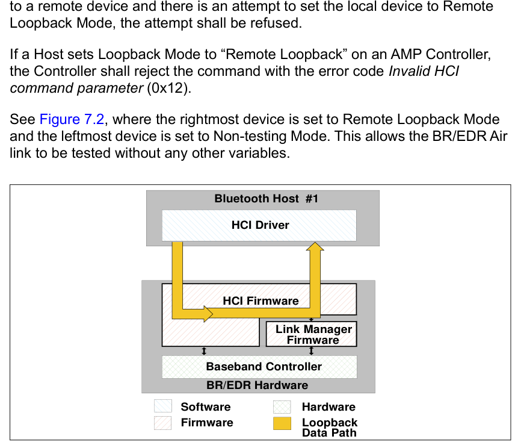

**Figure 7.1:  Local Loopback Mode**

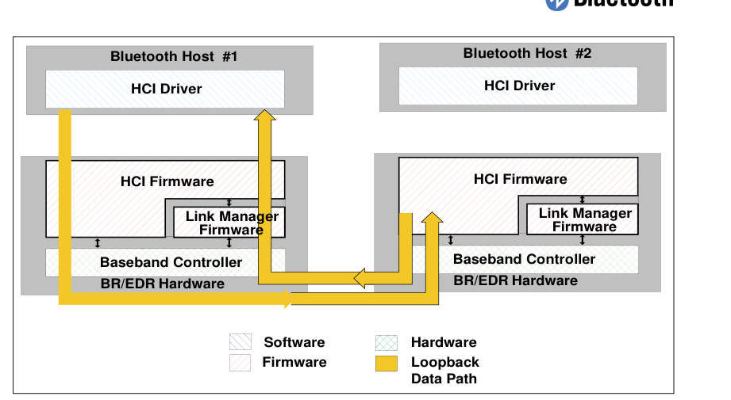

**Figure 7.2:  Remote Loopback Mode**

Command Parameters:
Loopback_Mode: Size: 1 Octet

| Value | Parameter Description |
| --- | --- |
| 0x00 | No Loopback mode enabled (default). |
| 0x01 | Enable Local Loopback. |
| 0x02 | Enable Remote Loopback. (Not Supported by AMPs) |
| All other values | Reserved for future use. |

Return Parameters:
Status: Size: 1 Octet

| Value | Parameter Description |
| --- | --- |
| 0x00 | Write Loopback Mode command succeeded. _ _ |
| 0x01-0xFF | Write Loopback Mode command failed. See [Vol 2] Part D, Error Code _ _ for a list of error codes and descriptions. |

Event(s) generated (unless masked away):
When the Write_Loopback_Mode command has completed, a Command Complete event shall be generated.

#### 7.6.3  Enable Device Under Test Mode Command

| Command | OCF | Command Parameters | Return Parameters |
| --- | --- | --- | --- |
| HCI Enable Device Under _ _ _ _ Test Mode _ | 0x0003 |  | Status |

Description:
The Enable_Device_Under_Test_Mode command allows the local BR/EDR Controller to enter test mode via LMP test commands for BR/EDR Controllers or via the AMP Test Command for AMP Controllers. For details see [Vol 2] Part C, Link Manager Protocol Specification for BR/EDR Controllers or Section 7.6.7 for AMP Controllers. The Host issues this command when it wants the local device to be the DUT for the Testing scenarios as described in the [Vol 3] Part D, Section 1. When the BR/EDR Controller receives this command, it shall complete the command with a Command Complete event. The BR/EDR Controller functions as normal until the remote tester issues the LMP test command or for AMPs the AMP Test Command to place the local device into Device Under Test mode. To disable and exit the Device Under Test Mode, the Host may issue the Reset command. This command prevents remote BR/EDR Controllers from causing the local BR/EDR Controller to enter test mode without first issuing this command.
Command Parameters:
None.
Return Parameters:
Status: Size: 1 Octet

| Value | Parameter Description |
| --- | --- |
| 0x00 | Enter Device Under Test Mode command succeeded. _ _ _ _ |
| 0x01-0xFF | Enter Device Under Test Mode command failed. See [Vol 2] Part D, _ _ _ _ Error Codes for a list of error codes and descriptions. |

Event(s) generated (unless masked away):
When the Enter_Device_Under_Test_Mode command has completed, a Command Complete event shall be generated.

#### 7.6.4  Write Simple Pairing Debug Mode Command

| Command | OCF | Command Parameters | Return Parameters |
| --- | --- | --- | --- |
| HCI Write Simple Pairing _ _ _ _ Debug Mode _ | 0x0004 | Simple Pairing Debug - _ _ _ Mode | Status |

Description:
This command configures the BR/EDR Controller to use a predefined Diffie Hellman private key for Simple Pairing to enable debug equipment to monitor the encrypted connection.
Note: Only one side (initiator or responder) needs to set simple pairing debug mode in order for debug equipment to be able to determine the link key and, therefore, be able to monitor the encrypted connection.
When the Simple_Pairing_Debug_Mode parameter is set to enabled the BR/ EDR Controller shall use the predefined Diffie Hellman private key. The BR/ EDR Controller shall also set the resulting Link_Key type to "Debug Combination Key."
When in Simple Pairing debug mode, the Link Manager shall use the following Diffie Hellman private / public key pairs:
For P-192:
Private key: 07915f86918ddc27005df1d6cf0c142b625ed2eff4a518ff
Public key (X): 15207009984421a6586f9fc3fe7e4329d2809ea51125f8ed
Public key (Y): b09d42b81bc5bd009f79e4b59dbbaa857fca856fb9f7ea25
For P-256:
Private key: 3f49f6d4 a3c55f38 74c9b3e3 d2103f50 4aff607b eb40b799 5899b8a6 cd3c1abd
Public key (X): 20b003d2 f297be2c 5e2c83a7 e9f9a5b9 eff49111 acf4fddb cc030148 0e359de6
Public key (Y): dc809c49 652aeb6d 63329abf 5a52155c 766345c2 8fed3024 741c8ed0 1589d28b
Command Parameters:
Simple_Pairing_Debug_Mode: Size: 1 Octet

| Value | Parameter Description |
| --- | --- |
| 0x00 | Simple Pairing debug mode disabled (default) |
| 0x01 | Simple pairing debug mode enabled |
| All other values | Reserved for future use |

Return Parameters:
Status: Size: 1 Octet

| Value | Parameter Description |
| --- | --- |
| 0x00 | Write Simple Pairing Mode command succeeded. _ _ _ |
| 0x01 - 0xFF | Write Simple Pairing Mode command failed. See [Vol 2] Part D, Err _ _ _ Codes for a list of error codes and descriptions. |

Event(s) generated (unless masked away):
When the Write_Simple_Pairing_Debug_Mode command has completed, a Command Complete event shall be generated.

#### 7.6.5  Enable AMP Receiver Reports Command

| Command | OCF | Command Parameters | Return Parameters |
| --- | --- | --- | --- |
| HCI Enable AMP Receiver Reports _ _ _ _ | 0x0007 | Enable, Interval | Status |

Description:
This command enables and disables the reporting of frames received. This command shall only be valid in AMP Test Mode. After multiples of the specified Interval, a report of frames that have been received/not received by the DUT shall be sent to the tester. Optionally, the sums of bits in error are also reported. The values returned are the cumulative totals since the mode was last initiated or reset. The totals are reset by sending the Enable_AMP_Receiver_Reports, the HCI_AMP_Test command or the AMP_Test_End command. This event is also generated after an AMP Test End event.
Command Parameters:
Enable: Size: 1 Octet

| Value | Parameter Description |
| --- | --- |
| 0x00 | Disable |
| 0x01 | Enable |
| All other values | Reserved for future use |

Interval: Size: 1 Octet

| Value | Parameter Description |
| --- | --- |
| 0x00 | Reserved for Future Use |
| 0x01-0xFF | Number of s between event reporting |

Return Parameters:
Status: Size: 1 Octet

| Value | Parameter Description |
| --- | --- |
| 0x00 | Enable AMP Receiver Reports command succeeded _ _ _ |
| 0x01-0xFF | Enable AMP Receiver Reports command failed. [Vol 2] Part D, Error _ _ _ Codes for a list of error codes and descriptions. |

Event(s) Generated (unless masked away):
When the Enable_AMP_Receiver_Reports command has completed, a Command Complete event shall be generated.

#### 7.6.6  AMP Test End Command

| Command | OCF | Command Parameters | Return Parameter |
| --- | --- | --- | --- |
| HCI AMP Test End _ _ _ | 0x0008 |  | Status |

Description:
This command is used to stop any test scenario in progress. This command shall only be used in AMP Test Mode when a test is in progress. This command shall not exit an AMP Controller from AMP Test mode.
Command Parameters:
None.
Return Parameters:
Status: Size: 1 Octet

| Value | Parameter Description |
| --- | --- |
| 0x00 | AMP Test End command succeeded _ _ |
| 0x01-0xFF | AMP Test End command failed. [Vol 2] Part D, Error Codes for a list of _ _ error codes and descriptions. |

Event(s) Generated (unless masked away):
When the AMP_Test_End command has completed an AMP Test End event shall be generated and the AMP Receiver Report event shall be generated if the AMP receiver reports are enabled.

#### 7.6.7  AMP Test Command

| Command | OCF | Command Parameters | Return Parameters |
| --- | --- | --- | --- |
| HCI AMP Test _ _ | 0x0009 | Test Parameters _ | Status |

Description:
This command is used to configure and start a test. This command shall be only valid in AMP Test Mode.
When a test scenario has completed or on receiving a AMP_Test_End command the AMP shall send a AMP Test End event and the AMP returns to an idle state with the RX and TX off.
The details of the Test_Parameters for each Controller Type are detailed in the AMP PAL specification.
Command Parameters:
Test_Parameters: Size: 1 Octet

| Value | Parameter Description |
| --- | --- |
| 0xXX | Controller Type. See Assigned Numbers |

Return Parameters:
Status: Size: 1 Octet

| Value | Parameter Description |
| --- | --- |
| 0x00 | AMP Test command succeeded _ |
| 0x01-0xFF | AMP Test command failed. See [Vol 2] Part D, Error Codes _ |

Event(s) generated (unless masked away):
When the AMP Controller receives the AMP_Test command, the AMP Controller shall send the Command Status event to the AMP Test Manager which shall be routed to the tester.
The AMP Start Test event shall be generated when the AMP_Test command has completed and the first data is ready to be sent or received.
Command Complete event shall not be sent by the AMP to indicate that this command has been completed. Instead, the AMP Start Test event shall indicate that this command has been completed.
When in a transmitter test scenario and the frames/bursts count have been transmitted the AMP Test End event shall be sent.

#### 7.6.8  Write Secure Connections Test Mode Command

| Command | OCF | Command Parameters | Return Parameters |
| --- | --- | --- | --- |
| HCI Write Secure _ _ _ Connections Test Mode _ _ | 0x000A | Connection Handle, _ DM1 ACL-U Mode, _ _ eSCO Loopback Mode _ _ | Status, Connection Handle _ |

Description:
This command configures the BR/EDR Controller to enable and disable the two test modes used for verifying the Secure Connections feature during qualification. The DM1_ACL-U_Mode parameter enables and disables the use of DM1 packets for transmitting ACL-U data. When DM1 ACL-U Mode is disabled, ACL-U traffic may use DM1 packets. When DM1 ACL-U Mode is enabled, ACL-U traffic shall not use DM1 packets unless the Packet_Type parameter only allows DM1 packets (e.g. set to 0x3306 or 0x330E).
The command is used during testing to help make transmit ACL packet selection predictable.

| device to eSCO Loopback Mode, the attempt shall be refused. _ _ See Figure 7.3, where the rightmost device has the eSCO Loopback Mode _ _ parameter set to enabled and the leftmost device is in a normal mode of operation. This allows the encryption and decryption of eSCO packets to be tested without any other variables. |  |  |  |  |  |  |  |  |  |  |  |  |  |  |  |  |  |  |  |  |
| --- | --- | --- | --- | --- | --- | --- | --- | --- | --- | --- | --- | --- | --- | --- | --- | --- | --- | --- | --- | --- |
|  | Bluetooth Host #1 HCI Driver |  |  |  |  |  |  |  |  |  |  |  | Bluetooth Host #2 HCI Driver |  |  |  |  |  |  |  |
|  |  | HCI Driver |  |  |  |  |  |  |  |  |  |  |  | HCI Driver |  |  |  |  |  |  |
|  |  |  |  |  |  |  |  |  |  |  |  |  |  |  |  |  |  |  |  |  |
|  |  |  | HCI Firmware Link Mana Firmwa |  |  |  |  |  |  |  |  |  |  | HCI Firmware Link Manager Firmware |  |  |  |  |  |  |
|  |  |  |  |  |  | Link Mana Firmwa |  | ge re | r |  |  |  |  |  |  |  |  |  | Link Manager Firmware |  |
|  |  |  |  |  |  |  |  |  |  |  |  |  |  |  |  |  |  |  |  |  |
|  |  |  | Baseband Controller |  |  |  |  |  |  |  |  |  |  |  |  |  | Baseband Controller |  |  |  |
|  |  |  | BR/EDR Hardware |  |  |  |  |  |  |  |  |  |  |  |  |  |  |  |  |  |
|  | Software Hardware Firmware Loopback Data Path |  |  |  |  |  |  |  |  |  |  |  |  |  |  |  |  |  |  |  |
| Figure 7.3: Secure Connections eSCO Loopback |  |  |  |  |  |  |  |  |  |  |  |  |  |  |  |  |  |  |  |  |

The Connection_Handle shall be for an ACL connection.
When the eSCO_Loopback_Mode parameter is set to enabled, received eSCO payloads are looped back as subsequent transmitted eSCO payloads. There may be a delay of 0 or more eSCO intervals before the Controller loops back the payload. This is illustrated in the following three figures.

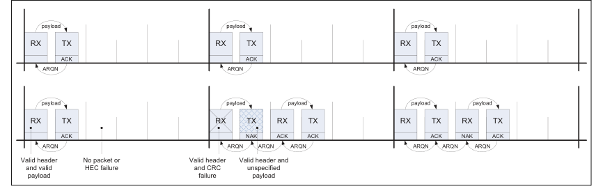

**Figure 7.4:  Secure Connections eSCO loopback immediate**

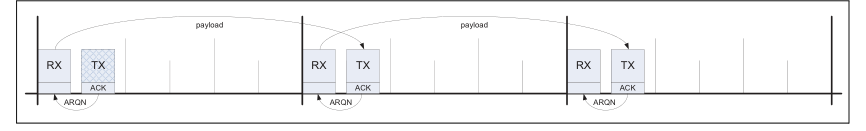

**Figure 7.5:  Secure Connections eSCO loopback delayed**

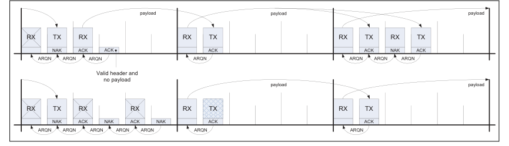

**Figure 7.6:  Secure Connections eSCO loopback delayed with retransmissions**

Command Parameters:
Connection_Handle: Size: 2 Octets (12 Bits meaningful)

| Value | Parameter Description |
| --- | --- |
| 0xXXXX | Connection Handle _ Range: 0x0000-0x0EFF (all other values reserved for future use) |

DM1_ACL-U_Mode: Size: 1 Octet

| Value | Parameter Description |
| --- | --- |
| 0x00 | DM1 ACL-U mode disabled (default) |
| 0x01 | DM1 ACL-U mode enabled |
| All other values | Reserved for future use |

eSCO_Loopback_Mode: Size: 1 Octet

| Value | Parameter Description |
| --- | --- |
| 0x00 | eSCO loopback mode disabled (default) |
| 0x01 | eSCO loopback mode enabled |
| All other values | Reserved for future use |

Return Parameters:
Status: Size: 1 Octet

| Value | Parameter Description |
| --- | --- |
| 0x00 | Write Secure Connections Test Mode command succeeded. _ _ _ _ |
| 0x01-0xFF | Write Secure Connections Test Mode command failed. _ _ _ _ See [Vol 2] Part D, Error Codes for a list of error codes and descriptions. |

Connection_Handle: Size: 2 Octets (12 Bits meaningful)

| Value | Parameter Description |
| --- | --- |
| 0xXXXX | Connection Handle _ Range: 0x0000-0x0EFF (all other values reserved for future use) |

Events(s) generated (unless masked away):
When the Write_Secure_Connections_Test_Mode command has completed, a Command_Complete event shall be generated.

### 7.7   EVENTS

#### 7.7.1  Inquiry Complete Event

| Event | Event Code | Event Parameters |
| --- | --- | --- |
| Inquiry Complete | 0x01 | Status |

Description:
The Inquiry Complete event indicates that the Inquiry is finished. This event contains a Status parameter, which is used to indicate if the Inquiry completed successfully or if the Inquiry was not completed.
Event Parameters:
Status: Size: 1 Octet

| Value | Parameter Description |
| --- | --- |
| 0x00 | Inquiry command completed successfully. |
| 0x01-0xFF | Inquiry command failed. See [Vol 2] Part D, Error Codes for a list of erro codes and descriptions. |

#### 7.7.2  Inquiry Result Event

| Event | Event Code | Event Parameters |
| --- | --- | --- |
| Inquiry Result | 0x02 | Num Responses, _ BD ADDR[i], _ Page Scan Repetition Mode[i], _ _ _ Reserved[i], Reserved[i], Class of Device[i] _ _ Clock Offset[i] _ |

Description:
The Inquiry Result event indicates that a BR/EDR Controller or multiple BR/ EDR Controllers have responded so far during the current Inquiry process. This event will be sent from the BR/EDR Controller to the Host as soon as an Inquiry Response from a remote device is received if the remote device supports only mandatory paging scheme. The BR/EDR Controller may queue these Inquiry Responses and send multiple BR/EDR Controllers information in one Inquiry Result event. The event can be used to return one or more Inquiry responses in one event.
This event is only generated if the Inquiry_Mode parameter of the last Write_Inquiry_Mode command was set to 0x00 (Standard Inquiry Result event format) or if the Write_Inquiry_Mode command has not been used.
Event Parameters:
Num_Responses: Size: 1 Octet

| Value | Parameter Description |
| --- | --- |
| 0xXX | Number of responses from the Inquiry. |

BD_ADDR[i]: Size: 6 Octets * Num_Responses

| Value | Parameter Description |
| --- | --- |
| 0xXXXXXXXXXX XX | BD ADDR for each device which responded. _ |

Page_Scan_Repetition_Mode[i]: Size: 1 Octet * Num_Responses

| Value | Parameter Description |
| --- | --- |
| 0x00 | R0 |
| 0x01 | R1 |
| 0x02 | R2 |

| Value | Parameter Description |
| --- | --- |
| 0x03 – 0xFF | Reserved for Future Use |

Reserved[i]: 1 Size: 1 Octet * Num_Responses

| Value | Parameter Description |
| --- | --- |
| 0xXX | Reserved for Future Use. |

Reserved[i]: 2 Size: 1 Octet * Num_Responses

| Value | Parameter Description |
| --- | --- |
| 0xXX | Reserved for Future Use. |

Class_of_Device[i]: Size: 3 Octets * Num_Responses

| Value | Parameter Description |
| --- | --- |
| 0xXXXXXX | Class of Device for the device |

Clock_Offset[i]: Size: 2 Octets * Num_Responses

| Bit format | Parameter Description |
| --- | --- |
| Bits 14-0 | Bits 16-2 of CLKNslave-CLK |
| Bit 15 | Reserved for Future Use |

1. This was the Page_Scan_Period_Mode parameter in the v1.1 specification. This parameter has no meaning in v1.2 or later and no default value.
2. This was the Page_Scan_Mode parameter in the v1.1 specification.

#### 7.7.3  Connection Complete Event

| Event | Event Code | Event Parameters |
| --- | --- | --- |
| Connection Complete | 0x03 | Status, Connection Handle, _ BD ADDR, _ Link Type, _ Encryption Enabled _ |

Description:
The Connection Complete event indicates to both of the Hosts forming the connection that a new connection has been established. This event also indicates to the Host, which issued the Create_Connection, or Accept_Connection_Request or Reject_Connection_Request command and then received a Command Status event, if the issued command failed or was successful.
Event Parameters:
Status: Size: 1 Octet

| Value | Parameter Description |
| --- | --- |
| 0x00 | Connection successfully completed. |
| 0x01-0xFF | Connection failed to Complete. See [Vol 2] Part D, Error Codes for a list o error codes and descriptions. |

Connection_Handle: Size: 2 Octets (12 Bits meaningful)

| Value | Parameter Description |
| --- | --- |
| 0xXXXX | Connection Handle _ Range: 0x0000-0x0EFF (all other values reserved for future use) |

BD_ADDR: Size: 6 Octets

| Value | Parameter Description |
| --- | --- |
| 0xXXXXXXXXXXXX | BD ADDR of the other connected Device forming the connection. _ |

Link_Type: Size: 1 Octet

| Value | Parameter Description |
| --- | --- |
| 0x00 | SCO connection. |
| 0x01 | ACL connection (Data Channels). |
| All other values | Reserved for future use. |

Encryption_Enabled: Size: 1 Octet

| Value | Parameter Description |
| --- | --- |
| 0x00 | Link level encryption disabled. |
| 0x01 | Link level encryption enabled. |
| All other values | Reserved for future use. |

#### 7.7.4  Connection Request Event

| Event | Event Code | Event Parameters |
| --- | --- | --- |
| Connection Request | 0x04 | BD ADDR, _ Class of Device, _ _ Link Type _ |

Description:
The Connection Request event is used to indicate that a new incoming connection is trying to be established. The connection may either be accepted or rejected. If this event is masked away and there is an incoming connection attempt and the BR/EDR Controller is not set to auto-accept this connection attempt, the BR/EDR Controller shall automatically refuse the connection attempt. When the Host receives this event and the link type parameter is ACL, it should respond with either an Accept_Connection_Request or Reject_Connection_Request command before the timer Conn_Accept_Timeout expires. If the link type is SCO or eSCO, the Host should reply with the Accept_Synchronous_Connection_Request or the Reject_Synchronous_Connection_Request command. If the link type is SCO, the Host may respond with Accept_Connection_Request command. If the event is responded to with Accept_Connection_Request command, then the default parameter settings of the Accept_Synchronous_Connection_Request command (see Section 7.1.27) should be used by the local Link Manager when negotiating the SCO link parameters. In that case, the Connection Complete event and not the Synchronous Connection Complete event, shall be returned on completion of the connection.
Event Parameters:
BD_ADDR: Size: 6 Octets

| Value | Parameter Description |
| --- | --- |
| 0xXXXXXXXXXXXX | BD ADDR of the device that requests the connection. _ |

Class_of_Device: Size: 3 Octets

| Value | Parameter Description |
| --- | --- |
| 0xXXXXXX | Class of Device for the device, which requests the connection. |
| 0x000000 | Unknown Class of Device |

Link_Type: Size: 1 Octet

| Value | Parameter Description |
| --- | --- |
| 0x00 | SCO Connection requested |
| 0x01 | ACL Connection requested |
| 0x02 | eSCO Connection requested |
| All other values | Reserved for future use. |

#### 7.7.5  Disconnection Complete Event

| Event | Event Code | Event Parameters |
| --- | --- | --- |
| Disconnection Complete | 0x05 | Status, Connection Handle, Reason _ |

Description:
The Disconnection Complete event occurs when a connection is terminated. The status parameter indicates if the disconnection was successful or not. The reason parameter indicates the reason for the disconnection if the disconnection was successful. If the disconnection was not successful, the value of the reason parameter can be ignored by the Host. For example, this can be the case if the Host has issued the Disconnect command and there was a parameter error, or the command was not presently allowed, or a Connection_Handle that didn’t correspond to a connection was given.
Note: When a physical link fails, one Disconnection Complete event will be returned for each logical channel on the physical link with the corresponding Connection_Handle as a parameter.
Event Parameters:
Status: Size: 1 Octet

| Value | Parameter Description |
| --- | --- |
| 0x00 | Disconnection has occurred. |
| 0x01-0xFF | Disconnection failed to complete. See [Vol 2] Part D, Error Codes for a lis of error codes and descriptions. |

Connection_Handle: Size: 2 Octets (12 Bits meaningful)

| Value | Parameter Description |
| --- | --- |
| 0xXXXX | Connection Handle which was disconnected. _ Range: 0x0000-0x0EFF (all other values reserved for future use) |

Reason: Size: 1 Octet

| Value | Parameter Description |
| --- | --- |
| 0xXX | Reason for disconnection. See [Vol 2] Part D, Error Codes for error code and descriptions. |

#### 7.7.6  Authentication Complete Event

| Event | Event Code | Event Parameters |
| --- | --- | --- |
| Authentication Complete | 0x06 | Status, Connection Handle _ |

Description:
The Authentication Complete event occurs when authentication has been completed for the specified connection. The Connection_Handle must be a Connection_Handle for an ACL connection.
Event Parameters:
Status: Size: 1 Octet

| Value | Parameter Description |
| --- | --- |
| 0x00 | Authentication Request successfully completed. |
| 0x01-0xFF | Authentication Request failed to complete. See [Vol 2] Part D, Error Code for a list of error codes and descriptions. |

Connection_Handle: Size: 2 Octets (12 Bits meaningful)

| Value | Parameter Description |
| --- | --- |
| 0xXXXX | Connection Handle for which Authentication has been performed. _ Range: 0x0000-0x0EFF (all other values reserved for future use) |

#### 7.7.7  Remote Name Request Complete Event

| Event | Event Code | Event Parameters |
| --- | --- | --- |
| Remote Name Request Complete | 0x07 | Status, BD ADDR, Remote Name _ _ |

Description:
The Remote Name Request Complete event is used to indicate that a remote name request has been completed. The Remote_Name event parameter is a UTF-8 encoded string with up to 248 octets in length. The Remote_Name event parameter will be null-terminated (0x00) if the UTF-8 encoded string is less than 248 octets. The BD_ADDR event parameter is used to identify which device the user-friendly name was obtained from.
Note: The Remote_Name parameter is a string parameter. Endian-ness does therefore not apply to the Remote_Name parameter. The first octet of the name is received first.
Event Parameters:
Status: Size: 1 Octet

| Value | Parameter Description |
| --- | --- |
| 0x00 | Remote Name Request command succeeded. _ _ |
| 0x01-0xFF | Remote Name Request command failed. See [Vol 2] Part D, Error Code _ _ for a list of error codes and descriptions. |

BD_ADDR: Size: 6 Octets

| Value | Parameter Description |
| --- | --- |
| 0xXXXXXXXXXXXX | BD ADDR for the device whose name was requested. _ |

Remote_Name: Size: 248 Octets

| Value | Parameter Description |
| --- | --- |
| Name[248] | A UTF-8 encoded user-friendly descriptive name for the remote device. If the name contained in the parameter is shorter than 248 octets, the end of the name is indicated by a NULL octet (0x00), and the following octets (to fill up 248 octets, which is the length of the parameter) do not have valid values. |

#### 7.7.8  Encryption Change Event

| Event | Event Code | Event Parameters |
| --- | --- | --- |
| Encryption Change | 0x08 | Status, Connection Handle, _ Encryption Enabled _ |

Description:
The Encryption Change event is used to indicate that the change of the encryption mode has been completed. The Connection_Handle will be a Connection_Handle for an ACL connection and is used to identify the remote device. The Encryption_Enabled event parameter specifies the new Encryption_Enabled parameter for the Connection_Handle specified by the Connection_Handle event parameter. This event will occur on both devices to notify the Hosts when Encryption has changed for all connections between the two devices. Note: This event shall not be generated if encryption is paused or resumed; during a role switch, for example.
The meaning of the Encryption_Enabled parameter depends on whether the Host has indicated support for Secure Connections in the Secure_Connections_Host_Support parameter. When Secure_Connections_Host_Support is ‘disabled’ or the Connection_Handle refers to an LE link, the Controller shall only use Encryption_Enabled values 0x00 (OFF) and 0x01 (ON). When Secure_Connections_Host_Support is ‘enabled’ and the Connection_Handle refers to a BR/EDR link, the Controller shall set Encryption_Enabled to 0x00 when encryption is off, to 0x01 when encryption is on and using E0 and to 0x02 when encryption is on and using AES-CCM.
Event Parameters:
Status: Size: 1 Octet

| Value | Parameter Description |
| --- | --- |
| 0x00 | Encryption Change has occurred. |
| 0x01-0xFF | Encryption Change failed. See [Vol 2] Part D, Error Codes for a list of erro codes and descriptions. |

Connection_Handle: Size: 2 Octets (12 Bits meaningful)

| Value | Parameter Description |
| --- | --- |
| 0xXXXX | Connection Handle _ Range: 0x0000-0x0EFF (all other values reserved for future use) |

Encryption_Enabled: Size: 1 Octet

| Value | Parameter Description |
| --- | --- |
| 0x00 | Link Level Encryption is OFF. |
| 0x01 | Link Level Encryption is ON with E0 for BR/EDR. Link Level Encryption is ON with AES-CCM for LE. |
| 0x02 | Link Level Encryption is ON with AES-CCM for BR/EDR. |
| All other values | Reserved for future use. |

#### 7.7.9  Change Connection Link Key Complete Event

| Event | Event Code | Event Parameters |
| --- | --- | --- |
| Change Connection Link Key Complete | 0x09 | Status, Connection Handle _ |

Description:
The Change Connection Link Key Complete event is used to indicate that the change in the Link Key for all connections to a given remote BR/EDR Controller has been completed.
The Connection_Handle will be a Connection_Handle for an ACL connection to the remote Controller. The Change Connection Link Key Complete event is sent only to the Host which issued the Change_Connection_Link_Key command.
Event Parameters:
Status: Size: 1 Octet

| Value | Parameter Description |
| --- | --- |
| 0x00 | Change Connection Link Key command succeeded. _ _ _ |
| 0x01-0xFF | Change Connection Link Key command failed. See [Vol 2] Part D, Erro _ _ _ Codes for a list of error codes and descriptions. |

Connection_Handle: Size: 2 Octets (12 Bits meaningful)

| Value | Parameter Description |
| --- | --- |
| 0xXXXX | Connection Handle _ Range: 0x0000-0x0EFF (all other values reserved for future use) |

#### 7.7.10  Master Link Key Complete Event

| Event | Event Code | Event Parameters |
| --- | --- | --- |
| Master Link Key Complete | 0x0A | Status, Connection Handle, Key Flag _ _ |

Description:
The Master Link Key Complete event is used to indicate that the Link Key managed by the master of the piconet has been changed. The Connection_Handle will be a Connection_Handle for an ACL connection within that piconet. The link key used for the connection will be the temporary link key of the master device or the semi-permanent link key indicated by the Key_Flag. The Key_Flag event parameter is used to indicate which Link Key (temporary link key of the Master, or the semi-permanent link keys) is now being used in the piconet.
Note: For a master, the change from a semi-permanent Link Key to temporary Link Key will affect all Connection_Handles related to the piconet. For a slave, this change affects only this particular Connection_Handle. A temporary link key must be used when both broadcast and point-to-point traffic shall be encrypted.
Event Parameters:
Status: Size: 1 Octet

| Value | Parameter Description |
| --- | --- |
| 0x00 | Master Link Key command succeeded. _ _ |
| 0x01-0xFF | Master Link Key command failed. See [Vol 2] Part D, Error Codes for a _ _ list of error codes and descriptions. |

Connection_Handle: Size: 2 Octets (12 Bits meaningful)

| Value | Parameter Description |
| --- | --- |
| 0xXXXX | Connection Handle _ Range: 0x0000-0x0EFF (all other values reserved for future use) |

Key_Flag: Size: 1 Octet

| Value | Parameter Description |
| --- | --- |
| 0x00 | Using Semi-permanent Link Key. |
| 0x01 | Using Temporary Link Key. |

#### 7.7.11  Read Remote Supported Features Complete Event

| Event | Event Code | Event Parameters |
| --- | --- | --- |
| Read Remote Supported Features Complete | 0x0B | Status, Connection Handle, LMP Features _ _ |

Description:
The Read Remote Supported Features Complete event is used to indicate the completion of the process of the Link Manager obtaining the supported features of the remote BR/EDR Controller specified by the Connection_Handle event parameter. The Connection_Handle will be a Connection_Handle for an ACL connection. The event parameters include a list of LMP features. For details see [Vol 2] Part C, Link Manager Protocol Specification.
Note: If the features are requested more than once while a connection exists between the two devices, the second and subsequent requests may report a cached copy of the features rather than fetching the feature mask again.
Event Parameters:
Status: Size: 1 Octet

| Value | Parameter Description |
| --- | --- |
| 0x00 | Read Remote Supported Features command succeeded. _ _ _ |
| 0x01-0xFF | Read Remote Supported Features command failed. See [Vol 2] Part D _ _ _ Error Codes for a list of error codes and descriptions. |

Connection_Handle: Size: 2 Octets (12 Bits meaningful)

| Value | Parameter Description |
| --- | --- |
| 0xXXXX | Connection Handle _ Range: 0x0000-0x0EFF (all other values reserved for future use) |

LMP_Features: Size: 8 Octets

| Value | Parameter Description |
| --- | --- |
| 0xXXXXXXXX XXXXXXXX | Bit Mask List of LMP features. See [Vol 2] Part C, Link Manager Protocol Specification. |

#### 7.7.12  Read Remote Version Information Complete Event

| Event | Event Code | Event Parameters |
| --- | --- | --- |
| Read Remote Version Information Complete | 0x0C | Status, Connection Handle, _ Version, Manufacturer Name, _ Subversion |

Description:
The Read Remote Version Information Complete event is used to indicate the completion of the process obtaining the version information of the remote Controller specified by the Connection_Handle event parameter. The Connection_Handle shall be for an ACL connection.
The Version event parameter defines the specification version of the BR/EDR or LE Controller. The Manufacturer_Name event parameter indicates the manufacturer of the remote Controller. The Subversion event parameter is controlled by the manufacturer and is implementation dependent. The Subversion event parameter defines the various revisions that each version of the Bluetooth hardware will go through as design processes change and errors are fixed. This allows the software to determine what Bluetooth hardware is being used and, if necessary, to work around various bugs in the hardware.
When the Connection_Handle is associated with a BR/EDR ACL-U logical link, the Version event parameter shall be LMP VersNr parameter, the Manufacturer_Name event parameter shall be the CompId parameter, and the Subversion event parameter shall be the LMP SubVersNr parameter.
When the Connection_Handle is associated with an LE-U logical link, the Version event parameter shall be Link Layer VersNr parameter, the Manufacturer_Name event parameter shall be the CompId parameter, and the Subversion event parameter shall be the SubVersNr parameter.
Event Parameters:
Status: Size: 1 Octet

| Value | Parameter Description |
| --- | --- |
| 0x00 | Read Remote Version Information command succeeded. _ _ _ |
| 0x01-0xFF | Read Remote Version Information command failed. See [Vol 2] Part D _ _ _ Error Codes for a list of error codes and descriptions. |

Connection_Handle: Size: 2 Octets (12 Bits meaningful)

| Value | Parameter Description |
| --- | --- |
| 0xXXXX | Connection Handle _ Range: 0x0000-0x0EFF (all other values reserved for future use) |

Version: Size: 1 Octet

| Value | Parameter Description |
| --- | --- |
| 0xXX | Version of the Current LMP in the remote Controller. See LMP VersNr an Link LayerVersNr in the Bluetooth Assigned Numbers. |

Manufacturer_Name: Size: 2 Octets

| Value | Parameter Description |
| --- | --- |
| 0xXXXX | Manufacturer Name of the remote Controller. See CompId in the Blue- tooth Assigned Numbers. |

Subversion: Size: 2 Octets

| Value | Parameter Description |
| --- | --- |
| 0xXXXX | Subversion of the LMP in the remote Controller. See [Vol 2] Part C, Table 5.2 and [Vol 6] Part B, Section 2.4.2.13(SubVersNr). |

#### 7.7.13  QoS Setup Complete Event

| Event | Event Code | Event Parameters |
| --- | --- | --- |
| QoS Setup Complete | 0x0D | Status, Connection Handle, _ Flags, Service Type, _ Token Rate, _ Peak Bandwidth, _ Latency, Delay Variation _ |

Description:
The QoS Setup Complete event is used to indicate the completion of the process of the Link Manager setting up QoS with the remote BR/EDR Controller specified by the Connection_Handle event parameter. The Connection_Handle will be a Connection_Handle for an ACL connection. For more detail see [Vol 3] Part A, Logical Link Control and Adaptation Protocol Specification.
Event Parameters:
Status: Size: 1 Octet

| Value | Parameter Description |
| --- | --- |
| 0x00 | QoS Setup command succeeded. _ |
| 0x01-0xFF | QoS Setup command failed. See [Vol 2] Part D, Error Codes for a list of _ error codes and descriptions. |

Connection_Handle: Size: 2 Octets (12 Bits meaningful)

| Value | Parameter Description |
| --- | --- |
| 0xXXXX | Connection Handle _ Range: 0x0000-0x0EFF (all other values reserved for future use) |

Flags: Size: 1 Octet

| Value | Parameter Description |
| --- | --- |
| 0x00 – 0xFF | Reserved for future use. |

Service_Type: Size: 1 Octet

| Value | Parameter Description |
| --- | --- |
| 0x00 | No Traffic Available. |
| 0x01 | Best Effort Available. |
| 0x02 | Guaranteed Available. |
| All other values | Reserved for future use. |

Token_Rate: Size: 4 Octets

| Value | Parameter Description |
| --- | --- |
| 0xXXXXXXXX | Available Token Rate, in octets per s. |

Peak_Bandwidth: Size: 4 Octets

| Value | Parameter Description |
| --- | --- |
| 0xXXXXXXXX | Available Peak Bandwidth, in octets per s. |

Latency: Size: 4 Octets

| Value | Parameter Description |
| --- | --- |
| 0xXXXXXXXX | Available Latency, in microseconds. |

Delay_Variation: Size: 4 Octets

| Value | Parameter Description |
| --- | --- |
| 0xXXXXXXXX | Available Delay Variation, in microseconds. |

#### 7.7.14  Command Complete Event

| Event | Event Code | Event Parameters |
| --- | --- | --- |
| Command Complete | 0x0E | Num HCI Command Packets, _ _ _ Command Opcode, Return Parameters _ _ |

Description:
The Command Complete event is used by the Controller for most commands to transmit return status of a command and the other event parameters that are specified for the issued HCI command.
The Num_HCI_Command_Packets event parameter allows the Controller to indicate the number of HCI command packets the Host can send to the Controller. If the Controller requires the Host to stop sending commands, the Num_HCI_Command_Packets event parameter will be set to zero. To indicate to the Host that the Controller is ready to receive HCI command packets, the Controller generates a Command Complete event with the Command_Opcode set to 0x0000 and the Num_HCI_Command_Packets event parameter set to 1 or more. Command_Opcode 0x0000 is a special value indicating that this event is not associated with a command sent by the Host. The Controller can send a Command Complete event with Command Opcode 0x0000 at any time to change the number of outstanding HCI command packets that the Host can send before waiting. See each command for the parameters that are returned by this event.
Event Parameters:
Num_HCI_Command_Packets: Size: 1 Octet

| Value | Parameter Description |
| --- | --- |
| N = 0xXX | The Number of HCI command packets which are allowed to be sent to the Controller from the Host. Range for N: 0 – 255 |

Command_Opcode: Size: 2 Octets

| Value | Parameter Description |
| --- | --- |
| 0x0000 | No associated command |
| 0xXXXX | (non-zero) Opcode of the command which caused this event. |

Return_Parameter(s): Size: Depends on Command

| Value | Parameter Description |
| --- | --- |
| 0xXX | This is the return parameter(s) for the command specified in the Command Opcode event parameter. See each command’s definition for _ the list of return parameters associated with that command. |

#### 7.7.15  Command Status Event

| Event | Event Code | Event Parameters |
| --- | --- | --- |
| Command Status | 0x0F | Status, Num HCI Command Packets, _ _ _ Command Opcode _ |

Description:
The Command Status event is used to indicate that the command described by the Command_Opcode parameter has been received, and that the Controller is currently performing the task for this command. This event is needed to provide mechanisms for asynchronous operation, which makes it possible to prevent the Host from waiting for a command to finish. If the command cannot begin to execute (a parameter error may have occurred, or the command may currently not be allowed), the Status event parameter will contain the corresponding error code, and no complete event will follow since the command was not started. The Num_HCI_Command_Packets event parameter allows the Controller to indicate the number of HCI command packets the Host can send to the Controller. If the Controller requires the Host to stop sending commands, the Num_HCI_Command_Packets event parameter will be set to zero. To indicate to the Host that the Controller is ready to receive HCI command packets, the Controller generates a Command Status event with Status 0x00 and Command_Opcode 0x0000 and the Num_HCI_Command_Packets event parameter set to 1 or more. Command_Opcode 0x0000 is a special value indicating that this event is not associated with a command sent by the Host. The Controller can send a Command Status event with Command Opcode 0x0000 at any time to change the number of outstanding HCI command packets that the Host can send before waiting.
Event Parameters:
Status: Size: 1 Octet

| Value | Parameter Description |
| --- | --- |
| 0x00 | Command currently in pending. |
| 0x01-0xFF | Command failed. See [Vol 2] Part D, Error Codes for a list of error codes and descriptions. |

Num_HCI_Command_Packets: Size: 1 Octet

| Value | Parameter Description |
| --- | --- |
| N = 0xXX | The Number of HCI command packets which are allowed to be sent to th Controller from the Host. Range for N: 0 – 255 |

Command_Opcode: Size: 2 Octets

| Value | Parameter Description |
| --- | --- |
| 0x0000 | No associated command |
| 0xXXXX | (non-zero) Opcode of the command which caused this event and is pendin completion. |

#### 7.7.16  Hardware Error Event

| Event | Event Code | Event Parameters |
| --- | --- | --- |
| Hardware Error | 0x10 | Hardware Code _ |

Description:
The Hardware Error event is used to notify the Host that a hardware failure has occurred in the Controller.
Event Parameters:
Hardware_Code: Size: 1 Octet

| Value | Parameter Description |
| --- | --- |
| 0x00-0xFF | These Hardware Codes will be implementation-specific, and can be _ assigned to indicate various hardware problems. |

#### 7.7.17  Flush Occurred Event

| Event | Event Code | Event Parameters |
| --- | --- | --- |
| Flush Occurred | 0x11 | Handle |

Description:
The Flush Occurred event is used to indicate that, for the specified Handle, the current user data to be transmitted has been removed. The Handle shall be a Connection_Handle for a BR/EDR LE ACL connection or a Logical_Link_Handle for an AMP ACL connection. This could result from the Flush command, or be due to the automatic flush. Multiple blocks of an L2CAP packet could have been pending in the Controller. If one baseband packet part of an L2CAP PDU is flushed, then the rest of the HCI data packets for the L2CAP PDU must also be flushed.
Event Parameters:
Handle: Size: 2 Octets (12 Bits meaningful)

| Value | Parameter Description |
| --- | --- |
| 0xXXXX | Handle that was flushed. The Handle is a Connection Handle for a Pri- _ mary Controller or a Logical Link Handle for an AMP Controller. _ _ Range: 0x0000-0x0EFF (all other values reserved for future use) |

#### 7.7.18  Role Change Event

| Event | Event Code | Event Parameters |
| --- | --- | --- |
| Role Change | 0x12 | Status, BD ADDR, New Role _ _ |

Description:
The Role Change event is used to indicate that the current role of the BR/EDR Controller related to the particular connection has changed. This event only occurs when both the remote and local BR/EDR Controllers have completed their role change for the BR/EDR Controller associated with the BD_ADDR event parameter. This event allows both affected Hosts to be notified when the Role has been changed.
Event Parameters:
Status: Size: 1 Octet

| Value | Parameter Description |
| --- | --- |
| 0x00 | Role change has occurred. |
| 0x01-0xFF | Role change failed. See [Vol 2] Part D, Error Codes for a list of error code and descriptions. |

BD_ADDR: Size: 6 Octets

| Value | Parameter Description |
| --- | --- |
| 0xXXXXXXXXXXXX | BD ADDR of the Device for which a role change has completed. _ |

New_Role: Size: 1 Octet

| Value | Parameter Description |
| --- | --- |
| 0x00 | Currently the Master for specified BD ADDR. _ |
| 0x01 | Currently the Slave for specified BD ADDR. _ |

#### 7.7.19  Number Of Completed Packets Event

| Event | Event Code | Event Parameters |
| --- | --- | --- |
| Number Of Completed Packets | 0x13 | Number of Handles, _ _ Connection Handle[i], _ HC Num Of Completed Packets[i] _ _ _ _ |

Description:
The Number Of Completed Packets event is used by the Controller to indicate to the Host how many HCI Data Packets have been completed (transmitted or flushed) for each Connection_Handle since the previous Number Of Completed Packets event was sent to the Host. This means that the corresponding buffer space has been freed in the Controller. Based on this information, and the HC_Total_Num_ACL_Data_Packets and HC_Total_Num_Synchronous_Data_Packets return parameter of the Read_Buffer_Size command, the Host can determine for which Connection_Handles the following HCI Data Packets should be sent to the Controller. The Number Of Completed Packets event shall not specify a given Connection_Handle before the Connection Complete event for the corresponding connection or after an event indicating disconnection of the corresponding connection. While the Controller has HCI data packets in its buffer, it must keep sending the Number Of Completed Packets event to the Host at least periodically, until it finally reports that all the pending ACL Data Packets have been transmitted or flushed. The rate with which this event is sent is manufacturer specific.
Note: Number Of Completed Packets events will not report on synchronous Connection_Handles if synchronous Flow Control is disabled. (See Section 7.3.36 and Section 7.3.37.)
Event Parameters:
Number_of_Handles: Size: 1 Octet

| Value | Parameter Description |
| --- | --- |
| 0xXX | The number of Connection Handles and Num HCI Data Packets _ _ _ _ parameters pairs contained in this event. Range: 0-255 |

Connection_Handle[i]: Size: Number_of_Handles * 2 Octets(12 Bits meaningful)

| Value | Parameter Description |
| --- | --- |
| 0xXXXX | Connection Handle. _ Range: 0x0000-0x0EFF (all other values reserved for future use) |

HC_Num_Of_Completed_Packets [i]: Size: Number_of_Handles * 2 Octets

| Value | Parameter Description |
| --- | --- |
| N = 0xXXXX | The number of HCI Data Packets that have been completed (transmitte or flushed) for the associated Connection Handle since the previous tim _ the event was returned. Range for N: 0x0000-0xFFFF |

#### 7.7.20  Mode Change Event

| Event | Event Code | Event Parameters |
| --- | --- | --- |
| Mode Change | 0x14 | Status, Connection Handle, _ Current Mode, _ Interval |

Description:
The Mode Change event is used to indicate when the device associated with the Connection_Handle changes between Active mode, Hold mode, and Sniff mode. The Connection_Handle will be a Connection_Handle for an ACL connection. The Connection_Handle event parameter is used to indicate which connection the Mode Change event is for. The Current_Mode event parameter is used to indicate which state the connection is currently in. The Interval parameter is used to specify a time amount specific to each state. Each Controller that is associated with the Connection_Handle which has changed Modes shall send the Mode Change event to its Host.
Event Parameters:
Status: Size: 1 Octet

| Value | Parameter Description |
| --- | --- |
| 0x00 | A Mode Change has occurred. |
| 0x01-0xFF | Hold Mode, Sniff Mode, or Exit Sniff Mode command failed. See [Vol 2 _ _ _ _ Part D, Error Codes for a list of error codes and descriptions. |

Connection_Handle: Size: 2 Octets(12 Bits meaningful)

| Value | Parameter Description |
| --- | --- |
| 0xXXXX | Connection Handle. _ Range: 0x0000-0x0EFF (all other values reserved for future use) |

Current_Mode: Size: 1 Octet

| Value | Parameter Description |
| --- | --- |
| 0x00 | Active Mode. |
| 0x01 | Hold Mode. |
| 0x02 | Sniff Mode. |
| All other values | Reserved for future use. |

Interval: Size: 2 Octets

| Value | Parameter Description |
| --- | --- |
| N = 0xXXXX | Hold: Number of Baseband slots to wait in Hold Mode. Hold Interval = N * 0.625 ms (1 Baseband slot) Range for N: 0x0002-0xFFFE Time Range: 1.25 ms-40.9 s Sniff: Number of Baseband slots between sniff anchor points. Time between sn anchor points = N * 0.625 ms (1 Baseband slot)Range for N: 0x0002- 0xFFFE Time Range: 1.25 ms-40.9 s |

#### 7.7.21  Return Link Keys Event

| Event | Event Code | Event Parameters |
| --- | --- | --- |
| Return Link Keys | 0x15 | Num Keys, _ BD ADDR [i], Link Key[i] _ _ |

Description:
The Return Link Keys event is used by the BR/EDR Controller to send the Host the BD_ADDRs associated with one or more stored Link Keys. Zero or more instances of this event will occur after the Read_Stored_Link_Key command. When there are no link keys stored, no Return Link Keys events shall be returned. When there are link keys stored, the number of link keys returned in each Return Link Keys event is implementation specific. This event shall never return the value of the link keys. The link keys value parameter shall always contain the value of zero.
Event Parameters:
Num_Keys: Size: 1 Octet

| Value | Parameter Description |
| --- | --- |
| 0xXX | Number of Link Keys contained in this event. Range: 0x01 – 0x0B |

BD_ADDR [i]: Size: 6 Octets * Num_Keys

| Value | Parameter Description |
| --- | --- |
| 0xXXXXXXXXXXXX | BD ADDR for the associated Link Key. _ |

Link_Key[i]: Size:16 Octets * Num_Keys

| Value | Parameter Description |
| --- | --- |
| 0x000000000000 00000000000000 000000 | Shall be zero. |

#### 7.7.22  PIN Code Request Event

| Event | Event Code | Event Parameters |
| --- | --- | --- |
| PIN Code Request | 0x16 | BD ADDR _ |

Description:
The PIN Code Request event is used to indicate that a PIN code is required to create a new link key. The Host shall respond using either the PIN_Code_Request_Reply or the PIN_Code_Request_Negative_Reply command, depending on whether the Host can provide the Controller with a PIN code or not.
Note: If the PIN Code Request event is masked away, then the BR/EDR Controller will assume that the Host has no PIN Code.
When the BR/EDR Controller generates a PIN Code Request event in order for the local Link Manager to respond to the request from the remote Link Manager (as a result of a Create_Connection or Authentication_Requested command from the remote Host), the local Host must respond with either a PIN_Code_Request_Reply or PIN_Code_Request_Negative_Reply command before the remote Link Manager detects LMP response timeout. (See [Vol 2] Part C, Link Manager Protocol Specification.)
Event Parameters:
BD_ADDR: Size: 6 Octets

| Value | Parameter Description |
| --- | --- |
| 0xXXXXXXXXXXXX | BD ADDR of the Device which a new link key is being created for _ |

#### 7.7.23  Link Key Request Event

| Event | Event Code | Event Parameters |
| --- | --- | --- |
| Link Key Request | 0x17 | BD ADDR _ |

Description:
The Link Key Request event is used to indicate that a Link Key is required for the connection with the device specified in BD_ADDR. If the Host has the requested stored Link Key, then the Host shall pass the requested Key to the Controller using the Link_Key_Request_Reply command. If the Host does not have the requested stored Link Key, or the stored Link Key does not meet the security requirements for the requested service, then the Host shall use the Link_Key_Request_Negative_Reply command to indicate to the Controller that the Host does not have the requested key.
Note: If the Link Key Request event is masked away, then the BR/EDR Controller will assume that the Host has no additional link keys.
If the Host uses the Link_Key_Request_Negative_Reply command when the requested service requires an authenticated Link Key and the current Link Key is unauthenticated, the Host should set the Authentication_Requirements parameter one of the MITM Protection Required options.
When the Controller generates a Link Key Request event in order for the local Link Manager to respond to the request from the remote Link Manager (as a result of a Create_Connection or Authentication_Requested command from the remote Host), the local Host must respond with either a Link_Key_Request_Reply or Link_Key_Request_Negative_Reply command before the remote Link Manager detects LMP response timeout. (See [Vol 2] Part C, Link Manager Protocol Specification.)
Event Parameters:
BD_ADDR: Size: 6 Octets

| Value | Parameter Description |
| --- | --- |
| 0xXXXXXXXXXXXX | BD ADDR of the Device which a stored link key is being requeste _ |

#### 7.7.24  Link Key Notification Event

| Event | Event Code | Event Parameters |
| --- | --- | --- |
| Link Key Notification | 0x18 | BD ADDR, _ Link Key, _ Key Type _ |

Description:
The Link Key Notification event is used to indicate to the Host that a new Link Key has been created for the connection with the device specified in BD_ADDR. The Host can save this new Link Key in its own storage for future use. Also, the Host can decided to store the Link Key in the BR/EDR Controller’s Link Key Storage by using the Write_Stored_Link_Key command. The Key_Type event parameter informs the Host about which key type (combination key, local unit key, or remote unit key, debug combination key, unauthenticated combination key, authenticated combination key or changed combination key) that was used during pairing. If pairing with unit key is not supported, the Host can for instance discard the key or disconnect the link.
The combination key Key_Type is used when standard pairing was used. The debug combination key Key_Type is used when Simple Pairing was used and the debug public key is sent or received. The unauthenticated combination key Key_Type is used when the Just Works Simple Pairing association model was used. The authenticated combination key Key_Type is used when Simple Pairing was used and the Just Works association mode was not used. The changed combination key Key_Type is used when the link key has been changed using the Change Connection Link Key procedure and Simple Pairing Mode is set to enabled. Note: It is the responsibility of the Host to remember the Key_Type (combination, debug combination, unauthenticated combination, or authenticated combination) prior to changing the link key.
When the unauthenticated or authenticated combination key Key_Type is used, the Controller shall use values 0x04 and 0x05 to indicate keys created with the P-192 elliptic curve and values 0x07 through 0x08 to indicate keys created with the P-256 elliptic curve. The values 0x07 and 0x08 shall only be used when the Host has indicated support for Secure Connections in the Secure_Connections_Host_Support parameter.
Event Parameters:
BD_ADDR: Size: 6 Octets

| Value | Parameter Description |
| --- | --- |
| 0xXXXXXXXXXXXX | BD ADDR of the Device for which the new link key has been _ generated. |

Link_Key: Size: 16 Octets

| Value | Parameter Description |
| --- | --- |
| 0xXXXXXXXXXX XXXXXXXXXXX XXXXXXXXXXX | Link Key for the associated BD ADDR. _ |

Key_Type: Size: 1 Octet

| Value | Parameter Description |
| --- | --- |
| 0x00 | Combination Key |
| 0x01 | Local Unit Key |
| 0x02 | Remote Unit Key |
| 0x03 | Debug Combination Key |
| 0x04 | Unauthenticated Combination Key generated from P-192 |
| 0x05 | Authenticated Combination Key generated from P-192 |
| 0x06 | Changed Combination Key |
| 0x07 | Unauthenticated Combination Key generated from P-256 |
| 0x08 | Authenticated Combination Key generated from P-256 |
| All other values | Reserved for future use |

#### 7.7.25  Loopback Command Event

| Event | Event Code | Event Parameters |
| --- | --- | --- |
| Loopback Command | 0x19 | HCI Command Packet _ _ |

Description:
When in Local Loopback mode, the BR/EDR Controller loops back commands and data to the Host. The Loopback Command event is used to loop back all commands that the Host sends to the Controller with some exceptions. See Section 7.6.1 for a description of which commands that are not looped back. The HCI_Command_Packet event parameter contains the entire HCI Command Packet including the header.
Note: The event packet is limited to a maximum of 255 octets in the payload; since an HCI Command Packet has 3 octets of header data, only the first 252 octets of the command parameters will be returned.
Event Parameters:
HCI_Command_Packet: Size: Depends on Command

| Value | Parameter Description |
| --- | --- |
| 0xXXXXXX | HCI Command Packet, including header. |

#### 7.7.26  Data Buffer Overflow Event

| Event | Event Code | Event Parameters |
| --- | --- | --- |
| Data Buffer Overflow | 0x1A | Link Type _ |

Description:
This event is used to indicate that the Controller’s data buffers have been overflowed. This can occur if the Host has sent more packets than allowed. The Link_Type parameter is used to indicate that the overflow was caused by ACL or synchronous data.
Event Parameters:
Link_Type: Size: 1 Octet

| Value | Parameter Description |
| --- | --- |
| 0x00 | Synchronous Buffer Overflow (Voice Channels). |
| 0x01 | ACL Buffer Overflow (Data Channels). |
| All other values | Reserved for future use. |

#### 7.7.27  Max Slots Change Event

| Event | Event Code | Event Parameters |
| --- | --- | --- |
| Max Slots Change | 0x1B | Connection Handle, _ LMP Max Slots _ _ |

Description:
This event is used to notify the Host about the LMP_Max_Slots parameter when the value of this parameter changes. It shall be sent each time the maximum allowed length, in number of slots, for baseband packets transmitted by the local device, changes. The Connection_Handle will be a Connection_Handle for an ACL connection.
Event Parameters:
Connection_Handle: Size: 2 Octets (12 Bits meaningful)

| Value | Parameter Description |
| --- | --- |
| 0xXXXX | Connection Handle. _ Range: 0x0000-0x0EFF (all other values reserved for future use) |

LMP_Max_Slots: Size: 1 octet

| Value | Parameter Description |
| --- | --- |
| 0x01, 0x03, 0x05 | Maximum number of slots allowed to use for baseband packets, see [Vol 2] Part C, Section 4.1.10 and Section 5.2. |

#### 7.7.28  Read Clock Offset Complete Event

| Event | Event Code | Event Parameters |
| --- | --- | --- |
| Read Clock Offset Complete | 0x1C | Status, Connection Handle, _ Clock Offset _ |

Description:
The Read Clock Offset Complete event is used to indicate the completion of the process of the Link Manager obtaining the Clock Offset information of the BR/EDR Controller specified by the Connection_Handle event parameter. The Connection_Handle will be a Connection_Handle for an ACL connection.
Event Parameters:
Status: Size: 1 Octet

| Value | Parameter Description |
| --- | --- |
| 0x00 | Read Clock Offset command succeeded. _ _ |
| 0x01-0xFF | Read Clock Offset command failed. See [Vol 2] Part D, Error Codes for _ _ list of error codes and descriptions. |

Connection_Handle: Size: 2 Octets (12 bits meaningful)

| Value | Parameter Description |
| --- | --- |
| 0xXXXX | Connection Handle _ Range: 0x0000-0x0EFF (all other values reserved for future use) |

Clock_Offset: Size: 2 Octets

| Bit format | Parameter Description |
| --- | --- |
| Bits 14-0 | Bits 16-2 of CLKNslave-CLK |
| Bit 15 | Reserved for Future Use. |

#### 7.7.29  Connection Packet Type Changed Event

| Event | Event Code | Event Parameters |
| --- | --- | --- |
| Connection Packet Type Changed | 0x1D | Status, Connection Handle, _ Packet Type _ |

Description:
The Connection Packet Type Changed event is used to indicate that the process has completed of the Link Manager changing which packet types can be used for the connection. This allows current connections to be dynamically modified to support different types of user data. The Packet_Type event parameter specifies which packet types the Link Manager can use for the connection identified by the Connection_Handle event parameter for sending L2CAP data or voice. The Packet_Type event parameter does not decide which packet types the LM is allowed to use for sending LMP PDUs.
Event Parameters:
Status: Size: 1 Octet

| Value | Parameter Description |
| --- | --- |
| 0x00 | Connection Packet Type changed successfully. |
| 0x01-0xFF | Connection Packet Type Changed failed. See [Vol 2] Part D, Error Codes for a list of error codes and descriptions. |

Connection_Handle: Size: 2 Octets (12 Bits meaningful)

| Value | Parameter Description |
| --- | --- |
| 0xXXXX | Connection Handle. _ Range: 0x0000-0x0EFF (all other values reserved for future use) |

Packet_Type: Size: 2 Octets
For ACL_Link_Type

| Value | Parameter Description |
| --- | --- |
| 0x0001 | Reserved for future use. |
| 0x0002 | 2-DH1 shall not be used. |
| 0x0004 | 3-DH1 shall not be used. |
| 0x00081 | DM1 may be used. |
| 0x0010 | DH1 may be used. |
| 0x0020 | Reserved for future use. |
| 0x0040 | Reserved for future use. |

| Value | Parameter Description |
| --- | --- |
| 0x0080 | Reserved for future use. |
| 0x0100 | 2-DH3 shall not be used. |
| 0x0200 | 3-DH3 shall not be used. |
| 0x0400 | DM3 may be used. |
| 0x0800 | DH3 may be used. |
| 0x1000 | 2-DH5 shall not be used. |
| 0x2000 | 3-DH5 shall not be used. |
| 0x4000 | DM5 may be used. |
| 0x8000 | DH5 may be used. |

1. This bit will be interpreted as set to 1 by Bluetooth V1.2 or later Controllers.
For SCO_Link_Type

| Value | Parameter Description |
| --- | --- |
| 0x0001 | Reserved for future use. |
| 0x0002 | Reserved for future use. |
| 0x0004 | Reserved for future use. |
| 0x0008 | Reserved for future use. |
| 0x0010 | Reserved for future use. |
| 0x0020 | HV1 |
| 0x0040 | HV2 |
| 0x0080 | HV3 |
| 0x0100 | Reserved for future use. |
| 0x0200 | Reserved for future use. |
| 0x0400 | Reserved for future use. |
| 0x0800 | Reserved for future use. |
| 0x1000 | Reserved for future use. |
| 0x2000 | Reserved for future use. |
| 0x4000 | Reserved for future use. |
| 0x8000 | Reserved for future use. |

#### 7.7.30  QoS Violation Event

| Event | Event Code | Event Parameters |
| --- | --- | --- |
| QoS Violation | 0x1E | Handle |

Description:
The QoS Violation event is used to indicate the Controller is unable to provide the current QoS requirement for the Connection or Logical Link Handle. This event indicates that the Controller is unable to provide one or more of the agreed QoS parameters.
The Host chooses what action should be done. With a BR/EDR Controller the Host can reissue the QoS_Setup command to renegotiate the QoS setting for Connection_Handle. With an AMP Controller the Host can reissue the Flow_Spec_Modify command.
Event Parameters:
Handle: Size: 2 Octets (12 Bits meaningful)

| Value | Parameter Description |
| --- | --- |
| 0xXXXX | Handle for the link that the Controller cannot provide the current QoS requested. The Handle is a Connection Handle for a BR/EDR Controlle _ and a Logical Link Handle for an AMP Controller. _ _ Range: 0x0000-0x0EFF (all other values reserved for future use) |

#### 7.7.31  Page Scan Repetition Mode Change Event

| Event | Event Code | Event Parameters |
| --- | --- | --- |
| Page Scan Repetition Mode Change | 0x20 | BD ADDR, _ Page Scan Repetition Mode _ _ _ |

Description:
The Page Scan Repetition Mode Change event indicates that the remote BR/EDR Controller with the specified BD_ADDR has successfully changed the Page_Scan_Repetition_Mode (SR).
Event Parameters:
BD_ADDR: Size: 6 Octets

| Value | Parameter Description |
| --- | --- |
| 0xXXXXXXXX XXXX | BD ADDR of the remote device. _ |

Page_Scan_Repetition_Mode: Size: 1 Octet

| Value | Parameter Description |
| --- | --- |
| 0x00 | R0 |
| 0x01 | R1 |
| 0x02 | R2 |
| 0x03 – 0xFF | Reserved for Future Use. |

#### 7.7.32  Flow Specification Complete Event

| Event | Event Code | Event Parameters |
| --- | --- | --- |
| Flow Specification Complete | 0x21 | Status, Connection Handle, _ Flags, Flow direction, _ Service Type, Token Rate, _ _ Token Bucket Size, _ _ Peak Bandwidth, _ Access Latency |

Description:
The Flow Specification Complete event is used to inform the Host about the Quality of Service for the ACL connection the Controller is able to support. The Connection_Handle will be a Connection_Handle for an ACL connection. The flow parameters refer to the outgoing or incoming traffic of the ACL link, as indicated by the Flow_direction field. The flow parameters are defined in the L2CAP specification [Vol 3] Part A, Section 5.3. When the Status parameter indicates a successful completion, the flow parameters specify the agreed values by the Controller. When the Status parameter indicates a failed completion with the error code QoS Unacceptable Parameters (0x2C), the flow parameters specify the acceptable values of the Controller. This enables the Host to continue the 'QoS negotiation' with a new HCI Flow_Specification command with flow parameter values that are acceptable for the Controller. When the Status parameter indicates a failed completion with the error code QoS Rejected (0x2D), this indicates a request of the Controller to discontinue the 'QoS negotiation'. When the Status parameter indicates a failed completion, the flow parameter values of the most recently successful completion must be assumed (or the default values when there was no success completion).
Event Parameters:
Status: Size: 1 Octet

| Value | Parameter Description |
| --- | --- |
| 0x00 | Flow Specification command succeeded _ |
| 0x01 – 0xFF | Flow Specification command failed. See [Vol 2] Part D, Error Codes for _ list of Error Codes |

Connection_Handle: Size: 2 Octets (12 Bits meaningful)

| Value | Parameter Description |
| --- | --- |
| 0xXXXX | Connection Handle _ Range: 0x0000 - 0x0EFF (all other values reserved for future use) |

Flags: Size: 1 Octet)

| Value | Parameter Description |
| --- | --- |
| 0x00 – 0xFF | Reserved for future use. |

Flow_direction: Size: 1 Octet

| Value | Parameter Description |
| --- | --- |
| 0x00 | Outgoing Flow i.e. traffic send over the ACL connection |
| 0x01 | Incoming Flow i.e. traffic received over the ACL connection |
| 0x02 – 0xFF | Reserved for future use. |

Service_Type: Size: 1 Octet

| Value | Parameter Description |
| --- | --- |
| 0x00 | No Traffic |
| 0x01 | Best Effort |
| 0x02 | Guaranteed |
| 0x03 – 0xFF | Reserved for future use |

Token Rate: Size: 4 Octets

| Value | Parameter Description |
| --- | --- |
| 0xXXXXXXXX | Token Rate in octets per s |

Token Bucket Size: Size: 4 Octets

| Value | Parameter Description |
| --- | --- |
| 0xXXXXXXXX | Token Bucket Size in octets |

Peak_Bandwidth: Size: 4 Octets

| Value | Parameter Description |
| --- | --- |
| 0xXXXXXXXX | Peak Bandwidth in octets per s |

Access Latency: Size: 4 Octets

| Value | Parameter Description |
| --- | --- |
| 0xXXXXXXXX | Access Latency in microseconds |

#### 7.7.33  Inquiry Result with RSSI Event

| Event | Event Code | Event Parameters |
| --- | --- | --- |
| Inquiry Result with RSSI | 0x22 | Num responses, _ BD ADDR[i], _ Page Scan Repetition Mode[i], _ _ _ Reserved[i], Class of Device[i], _ _ Clock Offset[i], _ RSSI[i] |

Description:
The Inquiry Result with RSSI event indicates that a BR/EDR Controller or multiple BR/EDR Controllers have responded so far during the current Inquiry process. This event will be sent from the BR/EDR Controller to the Host as soon as an Inquiry Response from a remote device is received if the remote device supports only mandatory paging scheme. This BR/EDR Controller may queue these Inquiry Responses and send multiple BR/EDR Controllers information in one Inquiry Result event. The event can be used to return one or more Inquiry responses in one event. The RSSI parameter is measured during the FHS packet returned by each responding slave.
This event shall only be generated if the Inquiry Mode parameter of the last Write_Inquiry_Mode command was set to 0x01 (Inquiry Result format with RSSI), or was set to 0x02 (Inquiry Result with RSSI format or Extended Inquiry Result format) and the inquiry response packet had the EIR field set to 0.
Event Parameters:
Num_Responses: Size: 1 Octet

| Value | Parameter Description |
| --- | --- |
| 0xXX | Number of responses from the Inquiry. |

BD_ADDR[i]: Size: 6 Octets * Num_Responses

| Value | Parameter Description |
| --- | --- |
| 0xXXXXXXXXXX XX | BD ADDR for each device which responded. _ |

Page_Scan_Repetition_Mode[i]: Size: 1 Octet* Num_Responses

| Value | Parameter Description |
| --- | --- |
| 0x00 | R0 |
| 0x01 | R1 |
| 0x02 | R2 |
| 0x03 – 0xFF | Reserved for Future Use |

Reserved[i]:1 Size: 1 Octet* Num_Responses

| Value | Parameter Description |
| --- | --- |
| 0xXX | Reserved for Future Use. |

Class_of_Device[i]: Size: 3 Octets * Num_Responses

| Value | Parameter Description |
| --- | --- |
| 0xXXXXXX | Class of Device for the device |

Clock_Offset[i]: Size: 2 Octets * Num_Responses

| Bit format | Parameter Description |
| --- | --- |
| Bits 14-0 | Bits 16-2 of CLKNslave-CLK |
| Bit 15 | Reserved for Future Use |

RSSI[i]: Size: 1 Octet * Num_Responses

| Value | Parameter Description |
| --- | --- |
| 0xXX | Range: -127 to +20 Units: dBm |

1. This was the Page_Scan_Period_Mode parameter in the v1.1 specification. This parameter has no meaning in v1.2 or later and no default value.

#### 7.7.34  Read Remote Extended Features Complete Event

| Event | Event Code | Event Parameters |
| --- | --- | --- |
| Read Remote Extended Features Complete | 0x23 | Status, Connection Handle, _ Page Number, _ Maximum page number, Extended LMP Features _ _ |

Description:
The Read Remote Extended Features Complete event is used to indicate the completion of the process of the Link Manager obtaining the remote extended LMP features of the remote device specified by the Connection_Handle event parameter. The Connection_Handle will be a Connection_Handle for an ACL connection. The event parameters include a page of the remote devices extended LMP features. For details see [Vol 2] Part C, Link Manager Protocol Specification.
Note: If a feature page is requested more than once while a connection exists between the two devices, the second and subsequent requests may report a cached copy of that page rather than fetching it again.
Event Parameters:
Status: Size: 1 Octet

| Value | Parameter Description |
| --- | --- |
| 0x00 | Request for remote extended features succeeded |
| 0x01-0xFF | Request for remote extended features failed. See [Vol 2] Part D, Error Codes for error codes. |

Connection_Handle: Size: 2 Octets (12 Bits meaningful)

| Value | Parameter Description |
| --- | --- |
| 0xXXXX | The Connection Handle _ Range: 0x0000-0x0EFF (all other values reserved for future use) |

Page Number: Size: 1Octet

| Value | Parameter Description |
| --- | --- |
| 0x00 | The normal LMP features as returned by Read Remote Supported Fea _ _ _ tures command |
| 0x01-0xFF | The page number of the features returned |

Maximum Page Number: Size: 1Octet

| Value | Parameter Description |
| --- | --- |
| 0x00-0xFF | The highest features page number which contains non-zero bits for the remote device |

Extended_LMP_Features: Size: 8 Octets

| Value | Parameter Description |
| --- | --- |
| 0xFFFFFFFFFFFFFFFF | Bit map of requested page of LMP features. See LMP [Vol 2] Part C, Section 3.3 for details. |

#### 7.7.35  Synchronous Connection Complete Event

| Event | Event Code | Event Parameters |
| --- | --- | --- |
| Synchronous Connection Com- plete | 0x2C | Status, Connection Handle, _ BD ADDR, _ Link Type, Transmission Interval, _ Retransmission Window, Rx Packet Length, _ _ Tx Packet Length _ _ Air Mode |

Description:
The Synchronous Connection Complete event is sent to indicate completion of any of the following commands:
• Setup_Synchronous_Connection
• Accept_Synchronous_Connection_Request
• Reject_Synchronous_Connection_Request
• Enhanced_Setup_Synchronous_Connection
• Enhanced_Accept_Synchronous_Connection_Request
This event returns the completion status for the command.
When the Synchronous Connection Complete event was triggered by the Enhanced_Setup_Synchronous_Connection or Enhanced_Accept_Synchronous_Connection_Request commands, the Controller shall set the Air Mode parameter to the Transmit Air Coding Format parameter of the original command.
Event Parameters:
Status: Size: 1 Octet

| Value | Parameter Description |
| --- | --- |
| 0x00 | Connection successfully completed. |
| 0x01 –0xFF | Connection failed to complete. See [Vol 2] Part D, Error Codes for error codes and descriptions. |

Connection_Handle: Size: 2 Octets (12 Bits meaningful)

| Value | Parameter Description |
| --- | --- |
| 0xXXXX | Connection Handle _ Range: 0x0000-0x0EFF (all other values reserved for future use) |

BD_ADDR: Size: 6 Octets

| Value | Parameter Description |
| --- | --- |
| 0xXXXXXXXXXXXX | BD ADDR of the other connected device forming the connection. _ |

Link_Type: Size: 1 Octet

| Value | Parameter Description |
| --- | --- |
| 0x00 | SCO Connection |
| 0x01 | Reserved for Future Use |
| 0x02 | eSCO Connection |
| 0x03 – 0xFF | Reserved for Future Use |

Transmission_Interval: Size: 1 Octet

| Value | Parameter Description |
| --- | --- |
| 0xXX | Time between two consecutive eSCO instants measured in slots. Must be zero for SCO links. |

Retransmission window: Size: 1 Octet

| Value | Parameter Description |
| --- | --- |
| 0xXX | The size of the retransmission window measured in slots. Must be zero for SCO links. |

Rx_Packet_Length: Size: 2 Octets

| Value | Parameter Description |
| --- | --- |
| 0xXXXX | Length in bytes of the eSCO payload in the receive direction. Must be zero for SCO links. |

Tx_Packet_Length: Size: 2 Octets

| Value | Parameter Description |
| --- | --- |
| 0xXXXX | Length in bytes of the eSCO payload in the transmit direction. Must be zero for SCO links. |

Air Mode: Size: 1 Octet

| Value | Parameter Description |
| --- | --- |
| 0x00 | µ-law log |
| 0x01 | A-law log |
| 0x02 | CVSD |
| 0x03 | Transparent Data |
| 0x04 – 0xFF | Reserved for Future Use |

#### 7.7.36  Synchronous Connection Changed Event

| Event | Event Code | Event Parameters |
| --- | --- | --- |
| Synchronous Connection Changed | 0x2D | Status, Connection Handle, _ Transmission Interval, _ Retransmission Window, Rx Packet Length, _ _ Tx Packet Length _ _ |

Description:
The Synchronous Connection Changed event indicates to the Host that an existing synchronous connection has been reconfigured. This event also indicates to the initiating Host (if the change was Host initiated) if the issued command failed or was successful.
Command Parameters:
Status: Size: 1 Octet

| Value | Parameter Description |
| --- | --- |
| 0x00 | Connection successfully reconfigured. |
| 0x01 –0xFF | Reconfiguration failed to complete. See [Vol 2] Part D, Error Codes for error codes and descriptions. |

Connection_Handle: Size: 2 Octets (12 Bits meaningful)

| Value | Parameter Description |
| --- | --- |
| 0xXXXX | Connection Handle _ Range: 0x0000-0x0EFF (all other values reserved for future use) |

Transmission_Interval: Size: 1 Octet

| Value | Parameter Description |
| --- | --- |
| 0xXX | Time between two consecutive SCO/eSCO instants measured in slots. |

Retransmission window: Size: 1 Octet

| Value | Parameter Description |
| --- | --- |
| 0xXX | The size of the retransmission window measured in slots. Must be zero fo SCO links. |

Rx_Packet_Length: Size: 2 Octets

| Value | Parameter Description |
| --- | --- |
| 0xXXXX | Length in bytes of the SCO/eSCO payload in the receive direction. |

Tx_Packet_Length: Size: 2 Octets

| Value | Parameter Description |
| --- | --- |
| 0xXXXX | Length in bytes of the SCO/eSCO payload in the transmit direction. |

#### 7.7.37  Sniff Subrating Event

| Event | Event Code | Event Parameters |
| --- | --- | --- |
| Sniff Subrating | 0x2E | Status Connection Handle _ Maximum Transmit Latency _ _ Maximum Receive Latency _ _ Minimum Remote Timeout _ _ Minimum Local Timeout _ _ |

Description:
The Sniff Subrating event indicates that the device associated with the Connection_Handle has either enabled sniff subrating or the sniff subrating parameters have been renegotiated by the link manager. The Connection_Handle will be a Connection_Handle for an ACL connection. The Connection_Handle event parameter indicates which connection the Sniff Subrating event is for.
Each BR/EDR Controller that is associated with the Connection_Handle that has changed its subrating parameters will send the Sniff Subrating event to its Host.
Event Parameters:
Status: Size: 1 Octet

| Value | Parameter Description |
| --- | --- |
| 0x00 | Sniff Subrating command succeeded _ |
| 0x01 – 0xFF | Subrating command failed to complete. See [Vol 2] Part D, Error Codes for error codes and descriptions. |

Connection_Handle: Size: 2 Octets (12 bits meaningful)

| Value | Parameter Description |
| --- | --- |
| 0xXXXX | Connection Handle. _ Range: 0x0000 – 0x0EFF (all other values reserved for future use |

Maximum_Transmit_Latency: Size: 2 Octet

| Value | Parameter Description |
| --- | --- |
| N = 0xXXXX | Maximum latency for data being transmitted from the local device to the remote device. Latency = N * 0.625 ms (1 Baseband slot) Range for N: 0x0000 – 0xFFFE Time Range: 0 s - 40.9 s |

Maximum_Receive_Latency: Size: 2 Octet

| Value | Parameter Description |
| --- | --- |
| N = 0xXXXX | Maximum latency for data being received by the local device from the remote device. Latency = N * 0.625 ms (1 Baseband slot) Range for N: 0x0000 – 0xFFFE Time Range: 0 s - 40.9 s |

Minimum_Remote_Timeout: Size: 2 Octets

| Value | Parameter Description |
| --- | --- |
| N = 0xXXXX | The base sniff subrate timeout in baseband slots that the remote device shall use. Timeout = N * 0.625 ms (1 Baseband slot) Range for N: 0x0000 – 0xFFFE Time Range: 0 s – 40.9 s |

Minimum_Local_Timeout: Size: 2 Octets

| Value | Parameter Description |
| --- | --- |
| N = 0xXXXX | The base sniff subrate timeout in baseband slots that the local device will use. Timeout = N * 0.625 ms (1 Baseband slot) Range for N: 0x0000 – 0xFFFE Time Range: 0 s – 40.9 s |

#### 7.7.38  Extended Inquiry Result Event

| Event | Event Code | Event Parameters |
| --- | --- | --- |
| Extended Inquiry Result | 0x2F | Num Responses, _ BD ADDR, _ Page Scan Repetition Mode, _ _ _ Reserved, Class of Device, _ _ Clock Offset, _ RSSI, Extended Inquiry Response _ _ |

Description:
The Extended Inquiry Result event indicates that a BR/EDR Controller has responded during the current inquiry process with extended inquiry response data. This event will be sent from the BR/EDR Controller to the Host upon reception of an Extended Inquiry Response from a remote device. One single Extended Inquiry Response is returned per event. This event contains RSSI and inquiry response data for the BR/EDR Controller that responded to the latest inquiry. The RSSI parameter is measured during the FHS packet returned by each responding slave. The Num_Responses parameter shall be set to one.
This event is only generated if the Inquiry_Mode parameter of the last Write_Inquiry_Mode command was set to 0x02 (Inquiry Result with RSSI format or Extended Inquiry Result format).
Note: This ensures that a Host that does not support Extended Inquiry Results will never receive the Extended Inquiry Result event.
If an inquiry response packet with the EIR field set to zero is received, the Inquiry Result with RSSI event format shall be used. If the EIR bit is set to one the Extended Inquiry Result event format shall be used. If the EIR bit is set to one but the Controller failed to receive the extended inquiry response packet, the Extended_Inquiry_Response parameter is set to zeros. If an extended inquiry response packet from the same device is correctly received in a later response, another event shall be generated.
Note: The only difference between the Extended Inquiry Result event and the Inquiry Result with RSSI event is the additional Extended_Inquiry_Response parameter.
Note: The Extended_Inquiry_Response parameter is not interpreted by the Controller. The tagged data set by the other Host should be passed unaltered if it has been correctly received.
Event Parameters:
Num_Responses: Size: 1 Octet

| Value | Parameter Description |
| --- | --- |
| 0x01 | Number of responses from the inquiry. The Extended Inquiry Result event always contains a single response. |

BD_ADDR: Size: 6 Octets

| Value | Parameter Description |
| --- | --- |
| 0xXXXXXXXX XXXX | BD ADDR for the device that responded. _ |

Page_Scan_Repetition_Mode: Size: 1 Octet

| Value | Parameter Description |
| --- | --- |
| 0x00 | R0 |
| 0x01 | R1 |
| 0x02 | R2 |
| All other values | Reserved for future use |

Reserved: Size: 1 Octet

| Value | Parameter Description |
| --- | --- |
| 0xXX | Reserved for Future Use. |

Class_of_Device: Size: 3 Octets

| Value | Parameter Description |
| --- | --- |
| 0xXXXXXX | Class of Device for the device that responded. |

Clock_Offset Size: 2 Octets

| Value | Parameter Description |
| --- | --- |
| Bits 14-0 | Bits 16-2 of CLKNslave-CLK |
| Bit 15 | Reserved for Future Use. |

RSSI: Size: 1 Octet

| Value | Parameter Description |
| --- | --- |
| 0xXX | Range: -127 to +20 |
|  | Units: dBm |

Extended_Inquiry_Response: Size: 240 Octets

| Value | Parameter Description |
| --- | --- |
|  | Extended Inquiry Response data as defined in [Vol 3] Part C, Section 8 |

#### 7.7.39  Encryption Key Refresh Complete Event

| Command | Event Code | Event Parameters |
| --- | --- | --- |
| Encryption Key Refresh Complete | 0x30 | Status, Connection Handle _ |

Description:
The Encryption Key Refresh Complete event is used to indicate to the Host that the encryption key was refreshed on the given Connection_Handle any time encryption is paused and then resumed. The BR/EDR Controller shall send this event when the encryption key has been refreshed due to encryption being started or resumed.
If the Encryption Key Refresh Complete event was generated due to an encryption pause and resume operation embedded within a change connection link key procedure, the Encryption Key Refresh Complete event shall be sent prior to the Change Connection Link Key Complete event.
If the Encryption Key Refresh Complete event was generated due to an encryption pause and resume operation embedded within a role switch procedure, the Encryption Key Refresh Complete event shall be sent prior to the Role Change event.
Event parameters:
Status: Size: 1 Octet

| Value | Parameter Description |
| --- | --- |
| 0x00 | Encryption Key Refresh completed successfully |
| 0x01 - 0xFF | Encryption Key Refresh failed. See [Vol 2] Part D, Error Codes for list of Error Codes |

Connection_Handle: Size: 2 Octets (12 bits meaningful)

| Value | Parameter Description |
| --- | --- |
| 0xXXXX | Connection Handle _ Range: 0x0000-0x0EFF (all other values reserved for future use). |

#### 7.7.40  IO Capability Request Event

| Event | Event Code | Event Parameters |
| --- | --- | --- |
| IO Capability Request | 0x31 | BD ADDR _ |

Description:
The IO Capability Request event is used to indicate that the IO capabilities of the Host are required for a simple pairing process. The Host shall respond with an IO_Capability_Request_Reply command. This event shall only be generated if simple pairing has been enabled with the Write_Simple_Pairing_Mode command.
Event Parameters:
BD_ADDR: Size: 6 Octets

| Value | Parameter Description |
| --- | --- |
| 0xXXXXXXXXXXXX | BD ADDR of remote device involved in simple pairing process _ |

#### 7.7.41  IO Capability Response Event

| Event | Event Code | Event Parameters |
| --- | --- | --- |
| IO Capability Response | 0x32 | BD ADDR, _ IO Capability, _ OOB Data Present, _ _ Authentication Requirements _ |

Description:
The IO Capability Response event is used to indicate to the Host that IO capabilities from a remote device specified by BD_ADDR have been received during a simple pairing process. This event will only be generated if simple pairing has been enabled with the Write_Simple_Pairing_Mode command.
Event Parameters:
BD_ADDR: Size: 6 Octets

| Value | Parameter Description |
| --- | --- |
| 0xXXXXXXXXXXXX | BD ADDR identifying the device to which the IO capabilities apply. _ |

IO_Capability: Size: 1 Octet

| Value | Parameter Description |
| --- | --- |
| 0x00 | DisplayOnly |
| 0x01 | DisplayYesNo |
| 0x02 | KeyboardOnly |
| 0x03 | NoInputNoOutput |
| 0x04 – 0xFF | Reserved for future use |

OOB_Data_Present: Size: 1 Octet

| Value | Parameter Description |
| --- | --- |
| 0x00 | OOB authentication data not present |
| 0x01 | OOB authentication data from remote device present |
| 0x02 – 0xFF | Reserved for future use |

Authentication_Requirements: Size: 1 Octet

| Value | Parameter Description |
| --- | --- |
| 0x00 | MITM Protection Not Required – No Bonding. Numeric comparison with automatic accept allowed. |

| Value | Parameter Description |
| --- | --- |
| 0x01 | MITM Protection Required – No Bonding. Use IO Capabilities to determine authentication procedure |
| 0x02 | MITM Protection Not Required – Dedicated Bonding. Numeric com- parison with automatic accept allowed. |
| 0x03 | MITM Protection Required – Dedicated Bonding. Use IO Capabilitie to determine authentication procedure |
| 0x04 | MITM Protection Not Required – General Bonding. Numeric Compa ison with automatic accept allowed. |
| 0x05 | MITM Protection Required – General Bonding. Use IO capabilities t determine authentication procedure. |
| All other values | Reserved for future use |

#### 7.7.42  User Confirmation Request Event

| Event | Event Code | Event Parameters |
| --- | --- | --- |
| User Confirmation Request | 0x33 | BD ADDR, _ Numeric Value _ |

Description:
The User Confirmation Request event is used to indicate that user confirmation of a numeric value is required. The Host shall reply with either the User_Confirmation_Request_Reply or the User_Confirmation_Request_Negative_Reply command. If the Host has output capability (DisplayYesNo or KeyboardOnly), it shall display the Numeric_Value until the Simple Pairing Complete event is received. It shall reply based on the yes/no response from the user. If the Host has no input and no output it shall reply with the User Confirmation Request Reply command. When the Controller generates a User Confirmation Request event, in order for the local Link Manager to respond to the request from the remote Link Manager, the local Host must respond with either a User_Confirmation_Request_Reply or a User_Confirmation_Request_Negative_Reply command before the remote Link Manager detects LMP response timeout. (See [Vol 2] Part C, Link Manager Protocol Specification.)
Event Parameters:
BD_ADDR: Size: 6 Octets

| Value | Parameter Description |
| --- | --- |
| 0xXXXXXXXXXXXX | BD ADDR of device involved in Simple Pairing process. _ |

Numeric_Value: Size: 4 Octets

| Value | Parameter Description |
| --- | --- |
| 0x00000000 – 0x000F423F | Numeric value to be displayed. Valid values are decimal 000000 – 999999. |

#### 7.7.43  User Passkey Request Event

| Event | Event Code | Event Parameters |
| --- | --- | --- |
| User Passkey Request | 0x34 | BD ADDR _ |

Description:
The User Passkey Request event is used to indicate that a passkey is required as part of a Simple Pairing process. The Host shall respond with either a User_Passkey_Request_Reply or User_Passkey_Request_Negative_Reply command. This event will only be generated if simple pairing has been enabled with the Write_Simple_Pairing_Mode command. When the Controller generates a User Passkey Request event, in order for the local Link Manager to respond to the request from the remote Link Manager, the local Host must respond with either a User_Passkey_Request_Reply or User_Passkey_Request_Negative_Reply command before the remote Link Manager detects LMP response timeout. (See [Vol 2] Part C, Link Manager Protocol Specification.)
Event Parameters:
BD_ADDR: Size: 6 Octets

| Value | Parameter Description |
| --- | --- |
| 0xXXXXXXXXXXXX | BD ADDR of the device involved in simple pairing process. _ |

#### 7.7.44  Remote OOB Data Request Event

| Event | Event Code | Event Parameters |
| --- | --- | --- |
| Remote OOB Data Request | 0x35 | BD ADDR _ |

Description:
The Remote OOB Data Request event is used to indicate that the Simple Pairing Hash C and the Simple Pairing Randomizer R is required for the Secure Simple Pairing process involving the device identified by BD_ADDR. The C and R values were transferred to the Host from the remote device via an OOB mechanism. This event is sent by the Controller because the Host previously set the OOB Data Present parameter to "OOB authentication data from remote device present" in an IO Capability Request Reply command. If both the Host and Controller support Secure Connections the Host shall respond with the Remote OOB Extended Data Request Reply command. Otherwise, the Host shall respond with the Remote OOB Data Request Reply command.
Event Parameters:
BD_ADDR: Size: 6 Octets

| Value | Parameter Description |
| --- | --- |
| 0xXXXXXXXXXXXX | BD ADDR of the device from which the C and R values were _ received. |

#### 7.7.45  Simple Pairing Complete Event

| Event | Event Code | Event Parameters |
| --- | --- | --- |
| Simple Pairing Complete | 0x36 | Status, BD ADDR _ |

Description:
The Simple Pairing Complete event is used to indicate that the simple pairing process has completed. A Host that is displaying a numeric value can use this event to change its UI.
When the LMP simple pairing sequences fail for any reason, the Simple Pairing Complete event shall be sent to the Host. When Simple Pairing Complete event is sent in response to the IO capability exchange failing, the Status parameter shall be set to the error code received from the remote device. Otherwise, the Status shall be set to the error code Authentication Failure (0x05).
Event Parameters:
Status: Size: 1 Octet

| Value | Parameter Description |
| --- | --- |
| 0x00 | Simple Pairing succeeded |
| 0x01 - 0xFF | Simple Pairing failed. See [Vol 2] Part D, Error Codes for a list of Erro Codes. |

BD_ADDR: Size: 6 Octets

| Value | Parameter Description |
| --- | --- |
| 0xXXXXXXXXXXXX | BD ADDR of the device involved in simple pairing process. _ |

#### 7.7.46  Link Supervision Timeout Changed Event

| Event | Event Code | Event Parameters |
| --- | --- | --- |
| Link Supervision Timeout Changed | 0x38 | Connection Handle, _ Link Supervision Timeout _ _ |

Description:
The Link Supervision Timeout Changed event is used to notify the slave's Host when the Link_Supervision_Timeout parameter is changed in the slave Controller. This event shall only be sent to the Host by the slave Controller upon receiving an LMP_supervision_timeout PDU from the master.
Note: The Connection_Handle used for this command shall be the ACL connection of the appropriate device.
Event Parameters:
Connection_Handle: Size: 2 Octets (12 bits meaningful)

| Value | Parameter Description |
| --- | --- |
| 0xXXXX | Connection Handle _ Range: 0x0000-0x0EFF (all other values reserved for future use) |

Link_Supervision_Timeout: Size: 2 Octets

| Value | Parameter Description |
| --- | --- |
| N = 0xXXXX | Measured in Number of Baseband slots Link Supervision Timeout = N*0.625 ms (1 Baseband slot) _ _ Range for N: 0x0001 - 0xFFFF Time Range: 0.625ms - 40.9 s (0 means infinite timeout) |

#### 7.7.47  Enhanced Flush Complete Event

| Event | Event Code | Event parameter |
| --- | --- | --- |
| Enhanced Flush Complete | 0x39 | Handle |

Description:
The Enhanced Flush Complete event is used to indicate that an Enhanced Flush is complete for the specified Handle.
Event Parameters:
Handle: Size: 2 Octets (12 bits meaningful)

| Value | Parameter Description |
| --- | --- |
| 0xXXXX | Handle of the link for which Controller cannot provide the requested QoS The Handle is a Connection Handle for a BR/EDR Controller and a Log _ cal Link Handle for an AMP Controller. _ _ Range: 0x0000 - 0x0EFF (all other values reserved for future use) |

#### 7.7.48  User Passkey Notification Event

| Event | Event Code | Event Parameters |
| --- | --- | --- |
| User Passkey Notification | 0x3B | BD ADDR, _ Passkey |

Description:
The User Passkey Notification event is used to provide a passkey for the Host to display to the user as required as part of a Simple Pairing process. The Passkey parameter shall be a randomly generated number (see [Vol 2] Part H, Section 2) generated by the Controller modulo 1,000,000.
This event will be generated if the IO capabilities of the local device are DisplayOnly or DisplayYesNo and the IO capabilities of the remote device are KeyboardOnly.
This event shall only be generated if simple pairing has been enabled with the Write_Simple_Pairing_Mode command.
Event Parameters:
BD_ADDR: Size: 6 Octets

| Value | Parameter Description |
| --- | --- |
| 0xXXXXXXXXXXXX | BD ADDR of the device involved in simple pairing process. _ |

Passkey: Size: 4 Octets

| Value | Parameter Description |
| --- | --- |
| 0x00000000 - 0x000F423F | Passkey to be displayed. Valid values are decimal 000000 - 99999 |

#### 7.7.49  Keypress Notification Event

| Command | Event Code | Event Parameters |
| --- | --- | --- |
| Keypress Notification | 0x3C | BD ADDR, _ Notification Type _ |

Description:
The Keypress Notification event is sent to the Host after a passkey notification has been received by the Link Manager on the given BD_ADDR. The Notification_Type parameter may be used by the Host's user interface.
Event parameters:
BD_ADDR: Size: 6 Octets

| Value | Parameter Description |
| --- | --- |
| 0xXXXXXXXXXXX X | BD ADDR of remote device involved in simple pairing process _ |

Notification_Type: Size: 1 Octet

| Value | Parameter Description |
| --- | --- |
| 0 | Passkey entry started |
| 1 | Passkey digit entered |
| 2 | Passkey digit erased |
| 3 | Passkey cleared |
| 4 | Passkey entry completed |
| 5-255 | Reserved for future use |

#### 7.7.50  Remote Host Supported Features Notification Event

| Command | Event Code | Event Parameters |
| --- | --- | --- |
| Remote Host Sup- ported Features Noti- fication | 0x3D | BD ADDR, _ Host Supported Features _ _ |

Description:
The Remote Host Supported Features Notification event is used to return the LMP extended features page containing the Host features. The BD_ADDR shall be the address of the remote device.
This event shall only be generated after the LMP extended features are read from the remote device during a connection initiated by a Remote Name Request command.
Note: This event is not generated during a connection initiated by the Create_Connection command.
Event parameters:
BD_ADDR: Size: 6 Octets

| Value | Parameter Description |
| --- | --- |
| 0xXXXXXXXXXXXX | BD ADDR of remote device. _ |

Host_Supported_Features: Size: 8 Octets

| Value | Parameter Description |
| --- | --- |
| 0xFFFFFFFFFFFFF FFF | Bit map of Host Supported Features page of LMP extended fea- tures. For more information, see [Vol 2] Part C, Link Manager Protocol Specification. |

#### 7.7.51  Physical Link Complete Event

| Event | Event Code | Event Parameters |
| --- | --- | --- |
| Physical Link Complete | 0x40 | Status, Physical Link Handle _ _ |

Description:
The Physical Link Complete event indicates to the Host that a new AMP physical link has been established. This event is used as a response for either Create_Physical_Link or Accept_Physical_Link commands and is preceded by a Command Status event.
Event Parameters:
Status: Size: 1 Octet

| Value | Parameter Description |
| --- | --- |
| 0x00 | Connection successfully completed. |
| 0x01-0xFF | Connection failed to Complete. See [Vol 2] Part D, Error Codes fo a list of error codes and descriptions. |

Physical_Link_Handle: Size: 1 Octet

| Value | Parameter Description |
| --- | --- |
| 0xXX | Physical Link Handle identifying the physical link which has been _ _ created. |

#### 7.7.52  Channel Selected Event

| Event | Event Code | Event Parameters |
| --- | --- | --- |
| Channel Selected | 0x41 | Physical Link Handle _ _ |

Description:
The Channel Selected event indicates to the Host originating the physical link that the link information data is available to be read using the Read Local AMP Assoc command. This allows the originating device to determine link implementation parameters such as an underlying physical channel choice. This structure shall be sent in the AMP Create Physical Link Request (see [Vol 3] Part E, Section 3.11]) and be used at the remote end in the Accept_Physical_Link command.
Event Parameters:
Physical_Link_Handle: Size: 1 Octet

| Value | Parameter Description |
| --- | --- |
| 0xXX | Physical Link Handle to the established physical link. _ _ |

#### 7.7.53  Disconnection Physical Link Complete Event

| Event | Event Code | Event Parameters |
| --- | --- | --- |
| Disconnection Physical Link Complete | 0x42 | Status, Physical Link Handle, _ _ Reason |

Description:
The Disconnection Physical Link Complete event occurs when a physical link is terminated. The status parameter indicates if the disconnection was successful or not.
When a physical link fails, one Disconnection Logical Link Complete event will be returned for each logical channel on the physical link with the corresponding Logical_Link_Handle as a parameter.
Event Parameters:
Status: Size: 1 Octet

| Value | Parameter Description |
| --- | --- |
| 0x00 | Disconnection has occurred. |
| 0x01-0xFF | Disconnection failed to complete. See [Vol 2] Part D, Error Codes for a lis of error codes and descriptions. |

Physical_Link_Handle: Size: 1 Octet

| Value | Parameter Description |
| --- | --- |
| 0xXX | Physical Link Handle which was disconnected. _ _ |

Reason: Size: 1 Octet

| Value | Parameter Description |
| --- | --- |
| 0xXX | Reason for disconnection. See [Vol 2] Part D, Error Codes for error code and descriptions. |

#### 7.7.54  Physical Link Loss Early Warning Event

| Event | Event Code | Event Parameters |
| --- | --- | --- |
| Physical Link Loss Early Warning | 0x43 | Physical Link Handle, _ _ Link Loss Reason _ _ |

Description:
The Physical Link Loss Early Warning event occurs when a physical link has early indication that the link may be disrupted. Data transmission and reception may suffer impairment on this link. The Host may use this to indicate to the user that traffic may be disrupted.
The exact low level meaning is dependent on the AMP type. Some AMP types may never generate this event.
Event Parameters:
Physical_Link_Handle: Size: 1 Octet

| Value | Parameter Description |
| --- | --- |
| 0xXX | Physical Link Handle to which the warning refers. _ _ |

Link_Loss_Reason: Size: 1 Octet

| Value | Parameter Description |
| --- | --- |
| 0 | Unknown |
| 1 | Range related |
| 2 | Bandwidth related |
| 3 | Resolving conflict |
| 4 | Interference |
| 5-255 | Reserved for Future Use |

#### 7.7.55  Physical Link Recovery Event

| Event | Event Code | Event Parameters |
| --- | --- | --- |
| Physical Link Recovery | 0x44 | Physical Link Handle _ _ |

Description:
The Physical Link Recovery event indicates that whatever interruption caused an earlier Physical Link Loss Early Warning event has now been cleared. The normal data transmission and reception service can be expected. The exact low level meaning is dependent on the AMP type. The Host may use this event to cancel any indication to the user caused by the Physical Link Loss Early Warning event.
Event Parameters:
Physical_Link_Handle: Size: 1 Octet

| Value | Parameter Description |
| --- | --- |
| 0xXX | Physical Link Handle to which the warning referred. _ _ |

#### 7.7.56  Logical Link Complete Event

| Event | Event Code | Event Parameters |
| --- | --- | --- |
| Logical Link Complete | 0x45 | Status, Logical Link Handle, _ _ Physical Link Handle, _ _ TX Flow Spec ID _ _ _ |

Description:
The Logical Link Complete event indicates to both of the Hosts forming the connection whether a new connection has been established successfully.
Event Parameters:
Status: Size: 1 Octet

| Value | Parameter Description |
| --- | --- |
| 0x00 | Connection successfully completed. |
| 0x01-0xFF | Connection failed to Complete. See [Vol 2] Part D, Error Codes for a list of error codes and descriptions. |

Logical_Link_Handle: Size: 2 Octets (12 Bits meaningful)

| Value | Parameter Description |
| --- | --- |
| 0xXXXX | Logical Link Handle to be used to identify a connection between _ _ two BR/EDR Controllers with communicating AMPs. The Logi- cal Link Handle is used as an identifier for transmitting and _ _ receiving data. Range: 0x0000-0x0EFF (all other values reserved for future use) |

Physical_Link_Handle: Size: 1 Octet

| Value | Parameter Description |
| --- | --- |
| 0xXX | Physical Link identifying the physical link over which the logical _ link has been created. |

TX_Flow_Spec_ID: Size: 1 Octet

| Value | Parameter Description |
| --- | --- |
| 0xXX | Flow Spec ID identifying the logical link creation that completed. This matches the ID field of the TX Flow Spec _ _ |

#### 7.7.57  Disconnection Logical Link Complete Event

| Event | Event Code | Event Parameters |
| --- | --- | --- |
| Disconnection Logical Link Complete | 0x46 | Status, Logical Link Handle, _ _ Reason |

Description:
The Disconnection Logical Link Complete event occurs when a logical link is terminated on the local Controller. The status parameter indicates if the disconnection was successful or not.
Note: When the local Controller disconnects a logical link, the remote Controller will not be notified.
Note: When a physical link fails, one Disconnection Logical Link Complete event will be returned for each logical channel on the physical link with the corresponding Logical_Link_Handle as a parameter.
Event Parameters:
Status: Size: 1 Octet

| Value | Parameter Description |
| --- | --- |
| 0x00 | Disconnection has occurred. |
| 0x01-0xFF | Disconnection failed to complete. See [Vol 2] Part D, Error Codes for a list of error codes and descriptions. |

Logical_Link_Handle: Size: 2 Octets (12 Bits meaningful)

| Value | Parameter Description |
| --- | --- |
| 0xXXXX | Logical Link Handle which was disconnected. _ _ Range: 0x0000-0x0EFF (all other values reserved for future use) |

Reason: Size: 1 Octet

| Value | Parameter Description |
| --- | --- |
| 0xXX | Reason for disconnection. See [Vol 2] Part D, Error Codes for erro codes and descriptions. |

#### 7.7.58  Flow Spec Modify Complete Event

| Event | Event Code | Event Parameters |
| --- | --- | --- |
| Flow Spec Modify Complete | 0x47 | Status, Handle |

Description:
The Flow Spec Modify Complete event indicates to the Host that a Flow Spec Modify command has been completed. This event also indicates to the Host which issued the Flow_Spec_Modify command and then received a Command Status event if the issued command failed or was successful.
Event Parameters:
Status: Size: 1 Octet

| Value | Parameter Description |
| --- | --- |
| 0x00 | Flow Spec Modify command successfully completed. _ _ |
| 0x01-0xFF | Flow Spec Modify command failed to Complete. See [Vol 2] Part _ _ D, Error Codes for a list of error codes and descriptions. |

Handle: Size: 2 Octets (12 Bits meaningful)

| Value | Parameter Description |
| --- | --- |
| 0xXXXX | Connection Handle if the receiving Controller is a BR/EDR Contro _ ler. Logical Link Handle, if the receiving Controller is an AMP Contro _ _ ler, identifying the logical link to be changed. Logical Link Handle to be used to identify a connection between _ _ two BR/EDR Controllers with communicating AMPs. Range: 0x0000-0x0EFF (all other values reserved for future use) |

#### 7.7.59  Number Of Completed Data Blocks Event

| Event | Event Code | Event Parameters |
| --- | --- | --- |
| Number Of Completed Data Blocks | 0x48 | Total Num Data Blocks, _ _ _ Number of Handles, _ _ Handle[i], Num Of Completed Packets[i], _ _ _ Num Of Completed Blocks[i] _ _ _ |

Description:
The Number Of Completed Data Blocks event is used by the Controller to indicate to the Host how many HCI ACL Data Packets have been completed (transmitted or flushed), and how many data block buffers have been freed, for each Handle (a Connection_Handle if the Controller is a BR/EDR Controller or a Logical_Link_Handle if the Controller is an AMP Controller) since the previous Number Of Completed Data Blocks event was sent to the Host. This means that the corresponding buffer space has been freed in the Controller. Based on this information, and the Total_Num_Data_Blocks parameter, the Host can determine for which Handles the following HCI ACL Data Packets should be sent to the Controller.
The Host should determine the number of blocks occupied by each ACL data packet by dividing the ACL data packet size by the Data_Block_Length parameter of the Read_Data_Block_Size command.
The Total_Num_Data_Blocks parameter indicates the total number of buffer blocks available in the Controller. Before any Number of Complete Data Blocks event is received, the value of Total_Num_Data_Blocks from the Read_Data_Block_Size command is used. This allows the value to be updated at any time, which provides the Controller with some flexibility on its buffer allocation.
If the Controller were permitted to reduce its buffer pool in an arbitrary way then there is a potential race condition, in the case where the Host has just started to transmit a new packet. In order to prevent this race condition, the Total_Num_Data_Blocks parameter shall not indicate a reduction in the pool of blocks greater than the sum of the Num_Of_Completed_Blocks values in this event. If a greater reduction in the block pool is required then the value 0 shall be indicated here. The value 0 has a special meaning and indicates that the Host shall re-issue the Read Data Block Size command in order to find the new buffer pool size. The Host shall wait for any outstanding TX to complete and shall defer further TX until the Read_Data_Block_Size command has been issued and completed. The Controller shall reduce its allocation only after the Read_Data_Block_Size command has been issued and completed. This ensures that the race condition described above is avoided.
Event Parameters:
Total_Num_Data_Blocks: Size: 2 Octets

| Value | Parameter Description |
| --- | --- |
| 0x0000 | The size of the buffer pool may have changed. The Host is requested to issue a Read Data Block Size command in order to determine the new value of Total Num Data Blocks. _ _ _ |
| 0xXXXX | Total number of data block buffers available in the Controller for the storage of data packets scheduled for transmission. This indicates the existing value is unchanged, or increased, or reduced by up to the sum of the Num Of Completed Blocks values in this com- _ _ _ mand. |

Number_of_Handles: Size: 1 Octet

| Value | Parameter Description |
| --- | --- |
| 0xXX | The number of Handles and Num Of Completed Packets and _ _ _ Num Of Completed Blocks parameter triples contained in this _ _ _ event. |
| Range: 0-255 |  |

Handle[i]: Size: Number_of_Handles * 2 Octets(12 Bits meaningful)

| Value | Parameter Description |
| --- | --- |
| 0xXXXX | Handle (Connection Handle for a BR/EDR Controller or a Logi- _ cal Link Handle for an AMP Controller). _ _ Range: 0x0000-0x0EFF (all other values reserved for future use) |

Num_Of_Completed_Packets [i]: Size: Number_of_Handles * 2 Octets

| Value | Parameter Description |
| --- | --- |
| N = 0xXXXX | The number of HCI ACL Data Packets that have been completed (transmitted or flushed) for the associated Handle since the previ- ous time that a Number Of Completed Data Blocks event provided information about this Handle. Range for N: 0x0000-0xFFFF |

Num_Of_Completed_Blocks [i]: Size: Number_of_Handles * 2 Octets

| Value | Parameter Description |
| --- | --- |
| N = 0xXXXX | The number of data blocks that have been freed for the associated Handle since the previous time that a Number Of Completed Data Blocks event provided information about this Handle. Range for N: 0x0000-0xFFFF |

#### 7.7.60  Short Range Mode Change Complete Event

| Event | Event Code | Event Parameters |
| --- | --- | --- |
| Short Range Mode Change - _ _ _ _ Complete | 0x4C | Status, Physical Link Handle, _ _ Short Range Mode State _ _ _ |

Description:
The Short Range Mode Change Complete event occurs after the AMP Controller has been notified to enable or disable Short Range Mode for a given physical link. The status parameter indicates if the configuration change was successful or not.
Event Parameters:
Status: Size: 1 Octet

| Value | Parameter Description |
| --- | --- |
| 0x00 | Short Range Mode configuration has occurred. |
| 0x01-0xFF | Short Range Mode configuration failed to complete. See [Vol 2] Part D, Error Codes for a list of error codes and descriptions. |

Physical_Link_Handle: Size: 1 Octet

| Value | Parameter Description |
| --- | --- |
| 0xXX | Physical Link Handle to which the configuration applies. _ _ |

Short_Range_Mode_State: Size: 1 Octet

| Value | Parameter Description |
| --- | --- |
| 0xXX | State of Short Range Mode in Controller. 0 - Short Range Mode disabled 1 - Short Range Mode enabled 0x02 - 0xFF - Reserved for Future Use |

#### 7.7.61  AMP Status Change Event

| Event | Event Code | Event Parameters |
| --- | --- | --- |
| AMP Status Change _ _ | 0x4D | Status, AMP Status _ |

Description:
The AMP Status Change event can occur at any time, after initial Read_Local_AMP_Info_Request command, and when the AMP Controller detects a change has occurred regarding status and is based on availability thresholds.
Event Parameters:
Status: Size: 1 Octet

| Value | Parameter Description |
| --- | --- |
| 0x00 | AMP Status Change has occurred. _ _ |
| 0x01-0xFF | AMP Status Change failed to complete. See [Vol 2] Part D, Error _ _ Codes for a list of error codes and descriptions. |

AMP_Status: Size: 1 Octet

| Value | Parameter Description |
| --- | --- |
| 0x00 | The Controller radio is available but is currently physically powere down. This value should be used if the AMP Controller is present and ca be powered up by the AMP Manager. This value indicates that there may be a cost of time and power to use this AMP Controller (i.e., the time taken and power required to power up the AMP Controller). These costs are AMP type and AM implementation dependent. |
| 0x01 | This value indicates that the AMP Controller is only used by Blue- tooth technology and will not be shared with other non-Bluetooth technologies. This value shall only be used if the AMP Controller is powered up. This value does not indicate how much bandwidth is currently free on the AMP Controller. |
| 0x02 | The AMP Controller has no capacity available for Bluetooth opera- tion. This value indicates that all of the AMP Controllers bandwidth is currently allocated to servicing a non Bluetooth technology. A device is permitted to create a Physical Link to an AMP Controlle that has this status. This value shall only be used if the AMP Controller is powered up. |

| Value | Parameter Description |
| --- | --- |
| 0x03 | The AMP Controller has low capacity available for Bluetooth operatio This value indicates that the majority of the AMP Controllers band width is currently allocated to servicing a non Bluetooth technolog An AMP Controller that with capacity in the approximate range of < capacity < 30% should indicate this value. This value does not indicate how much of the capacity available f Bluetooth operation is currently available. This value shall only be used if the AMP Controller is powered up |
| 0x04 | The AMP Controller has medium capacity available for Bluetooth operation. An AMP Controller that with capacity in the approximate range of 30% < capacity < 70% should indicate this value. This value does not indicate how much of the capacity available f Bluetooth operation is currently available. This value shall only be used if the AMP Controller is powered up |
| 0x05 | The AMP Controller has high capacity available for Bluetooth ope ation. This value indicates that the majority of the AMP Controllers band width is currently allocated to servicing the Bluetooth technology. An AMP Controller that with capacity in the approximate range of 70% < capacity < 100% should indicate this value. This value does not indicate how much of the capacity available f Bluetooth operation is currently available. This value shall only be used if the AMP Controller is powered up |
| 0x06 | The AMP Controller has full capacity available for Bluetooth operatio This value indicates that while currently the AMP is only being use by Bluetooth the device allows a different technology to share the radio. This value shall be used by devices that are not capable of deter- mining the current available capacity of an AMP that is shared by different technology. This value does not indicate how much of the capacity available f Bluetooth operation is currently available. This value shall only be used if the AMP Controller is powered up |
| All other values | Reserved for future use |

#### 7.7.62  AMP Start Test Event

| Event | Event Code | Event Parameters |
| --- | --- | --- |
| AMP Start Test | 0x49 | Status, Test Scenario |

Description:
The AMP Start Test event shall be generated when the AMP_Test command has completed and the first data is ready to be sent or received .
Event Parameters:
Status: Size: 1 Octet

| Value | Parameter Description |
| --- | --- |
| 0x00 | Test command succeeded |
| 0x01-0xFF | Test command failed. See [Vol 2] Part D, Error Codes |

Test Scenario: Size: 1 Octet

| Value | Parameter Description |
| --- | --- |
| 0xXX | See the Test Commands section of the Protocol Adaptation Layer Func- tional Specification for the Controller type |

#### 7.7.63  AMP Test End Event

| Event | Event Code | Event Parameters |
| --- | --- | --- |
| AMP Test End | 0x4A | Status, Test Scenario |

Description:
The AMP Test End event shall be generated to indicate that the AMP has transmitted or received the number of frames/bursts configured.
If the Receiver reports are enabled an AMP Receiver Report Event shall be generated.
Event Parameters:
Status: Size: 1 Octet

| Value | Parameter Description |
| --- | --- |
| 0x00 | AMP Test End command succeeded _ _ |
| 0x01-0xFF | AMP Test End command failed. See [Vol 2] Part D, Error Codes _ _ |

Test Scenario: Size: 1 Octet

| Value | Parameter Description |
| --- | --- |
| 0xXX | See the Test Commands section of the Protocol Adaptation Layer Func- tional Specification for the Controller type |

#### 7.7.64  AMP Receiver Report Event

| Event | Event Code | Event Parameters |
| --- | --- | --- |
| AMP Receiver Report | 0x4B | Controller Type, _ Reason, Event Type, _ Number Of Frames, _ _ Number Of Error Frames, _ _ _ Number Of Bits, _ _ Number Of Error Bits _ _ _ |

Description:
The AMP Receiver Report event shall be sent from the AMP to the tester via the AMP Test Manager at the interval configured by the Enable_AMP_Receiver_Reports command.
The AMP Receiver Report event is generated to indicate the number of frames received and optionally the number of bits in error detected.
Event Parameters:
Controller_Type: Size: 1 Octet

| Value | Parameter Description |
| --- | --- |
| 0xXX | See Bluetooth Assigned Numbers |

Reason: Size: 1 Octet

| Value | Parameter Description |
| --- | --- |
| 0xXX | 0x00 Configured Interval report 0x01 Test Ended report 0x02 – 0xFF Reserved for Future Use |

Event_type: Size: 4 Bytes

| Value | Parameter Description |
| --- | --- |
| 0xXX | 0x00 Frames received report 0x01 Frames received and bits in error report (optional) 0x02 – 0xFF Reserved for Future Use |

Number_Of_Frames: Size: 2 Bytes

| Value | Parameter Description |
| --- | --- |
| 0xXXXX | Number of frames received so far |

Number_Of_Error_Frames: Size: 2 Bytes

| Value | Parameter Description |
| --- | --- |
| 0xXXXX | Number of frames with errors received so far |

Number_Of_Bits: Size: 4 Bytes

| Value | Parameter Description |
| --- | --- |
| 0xXXXXXXXX | Number of bits received so far. Shall be set to 0x00000000 if the Event type is not equal to 0x01. _ |

Number_Of_Error_Bits: Size: 4 Bytes

| Value | Parameter Description |
| --- | --- |
| 0xXXXXXXXX | Number of bit errors received so far. Shall be set to 0x00000000 if the Event type is not equal to 0x01. _ |

#### 7.7.65  LE Meta Event

Description:
The LE Meta Event is used to encapsulate all LE Controller specific events. The Event Code of all LE Meta Events shall be 0x3E. The Subevent_Code is the first octet of the event parameters. The Subevent_Code shall be set to one of the valid Subevent_Codes from an LE specific event. All other Subevent_Parameters are defined in the LE Controller specific events.

##### 7.7.65.1  LE Connection Complete Event

| Event | Event Code | Event parameters |
| --- | --- | --- |
| LE Connection Com- plete | 0x3E | Subevent Code, _ Status, Connection Handle, _ Role, Peer Address Type, _ _ Peer Address, _ Conn Interval, _ Conn Latency, _ Supervision Timeout, _ Master Clock Accuracy _ _ |

Description:
The LE Connection Complete event indicates to both of the Hosts forming the connection that a new connection has been created. Upon the creation of the connection a Connection_Handle shall be assigned by the Controller, and passed to the Host in this event. If the connection creation fails this event shall be provided to the Host that had issued the LE_Create_Connection command.
This event indicates to the Host which issued a LE_Create_Connection command and received a Command Status event if the connection creation failed or was successful.
The Master_Clock_Accuracy parameter is only valid for a slave. On a master, this parameter shall be set to 0x00.
Note: This event is not sent if the LE Enhanced Connection Complete event (see Section 7.7.65.10) is unmasked.
Event Parameters:
Subevent_Code: Size: 1 Octet

| Value | Parameter Description |
| --- | --- |
| 0x01 | Subevent code for the LE Connection Complete event |

Status: Size: 1 Octet

| Value | Parameter Description |
| --- | --- |
| 0x00 | Connection successfully completed. |
| 0x01 – 0xFF | Connection failed to complete. [Vol 2] Part D, Error Codes for a list of error codes and descriptions. |

Connection_Handle: Size: 2 Octets (12 bits meaningful)

| Value | Parameter Description |
| --- | --- |
| 0xXXXX | Connection Handle _ Range: 0x0000-0x0EFF (all other values reserved for future use) |

Role: Size: 1 Octet

| Value | Parameter Description |
| --- | --- |
| 0x00 | Connection is master |
| 0x01 | Connection is slave |
| All other values | Reserved for future use |

Peer_Address_Type: Size: 1 Octet

| Value | Parameter Description |
| --- | --- |
| 0x00 | Peer is using a Public Device Address |
| 0x01 | Peer is using a Random Device Address |
| All other values | Reserved for future use |

Peer_Address: Size: 6 Octets

| Value | Parameter Description |
| --- | --- |
| 0xXXXXXXXXXXXX | Public Device Address or Random Device Address of the peer device |

Conn_Interval: Size: 2 Octets

| Value | Parameter Description |
| --- | --- |
| 0xXXXX | Connection interval used on this connection. Range: 0x0006 to 0x0C80 Time = N * 1.25 ms Time Range: 7.5 ms to 4000 ms. |

Conn_Latency: Size: 2 Octets

| Value | Parameter Description |
| --- | --- |
| 0xXXXX | Slave latency for the connection in number of connection events. Range: 0x0000 to 0x01F3 |

Supervision_Timeout: Size: 2 Octets

| Value | Parameter Description |
| --- | --- |
| 0xXXXX | Connection supervision timeout. Range: 0x000A to 0x0C80 Time = N * 10 ms Time Range: 100 ms to 32 s |

Master_Clock_Accuracy: Size: 1 Octet

| Value | Parameter Description |
| --- | --- |
| 0x00 | 500 ppm |
| 0x01 | 250 ppm |
| 0x02 | 150 ppm |
| 0x03 | 100 ppm |
| 0x04 | 75 ppm |
| 0x05 | 50 ppm |
| 0x06 | 30 ppm |
| 0x07 | 20 ppm |
| All other values | Reserved for future use |

##### 7.7.65.2  LE Advertising Report Event

| Event | Event Code | Event parameters |
| --- | --- | --- |
| LE Advertising Report | 0x3E | Subevent Code, _ Num Reports, _ Event Type[i], _ Address Type[i], _ Address[i], Length[i], Data[i], RSSI[i] |

Description:
The LE Advertising Report event indicates that one or more Bluetooth devices have responded to an active scan or have broadcast advertisements that were received during a passive scan. The Controller may queue these advertising reports and send information from multiple devices in one LE Advertising Report event.
This event shall only be generated if scanning was enabled using the LE Set Scan Enable command. It only reports advertising events that used legacy advertising PDUs.
Event Parameters:
Subevent_Code: Size: 1 Octet

| Value | Parameter Description |
| --- | --- |
| 0x02 | Subevent code for the LE Advertising Report event |

Num_Reports: Size: 1 Octet

| Value | Parameter Description |
| --- | --- |
| 0x01 - 0x19 | Number of responses in event. |
| All other values | Reserved for future use |

Event_Type[i]: Size: 1 Octet * Num_Reports

| Value | Parameter Description |
| --- | --- |
| 0x00 | Connectable and scannable undirected advertising (ADV IND) _ |
| 0x01 | Connectable directed advertising (ADV DIRECT IND) _ _ |
| 0x02 | Scannable undirected advertising (ADV SCAN IND) _ _ |
| 0x03 | Non connectable undirected advertising (ADV NONCONN IND) _ _ |

| Value | Parameter Description |
| --- | --- |
| 0x04 | Scan Response (SCAN RSP) _ |
| All other values | Reserved for future use |

Address_Type[i]: Size: 1 Octet * Num_Reports

| Value | Parameter Description |
| --- | --- |
| 0x00 | Public Device Address |
| 0x01 | Random Device Address |
| 0x02 | Public Identity Address (Corresponds to Resolved Private Address) |
| 0x03 | Random (static) Identity Address (Corresponds to Resolved Private Address) |
| All other values | Reserved for future use |

Address[i]: Size: 6 Octets * Num_Reports

| Value | Parameter Description |
| --- | --- |
| 0xXXXXXXXXXXXX | Public Device Address, Random Device Address, Public Identity Address or Random (static) Identity Address of the advertising device. |

Length_Data[i]: Size: 1 Octets * Num_Reports

| Value | Parameter Description |
| --- | --- |
| 0x00 - 0x1F | Length of the Data[i] field for each device which responded. |
| All other values | Reserved for future use. |

Data[i]: Size: SUM (Length_Data[i]) Octets

| Value | Parameter Description |
| --- | --- |
|  | Length Data[i] octets of advertising or scan response data formatted _ as defined in [Vol 3] Part C, Section 11. Note: Each element of this array has a variable length. |

RSSI[i]: Size: 1 Octet * Num_Reports

| Value | Parameter Description |
| --- | --- |
| N | Size: 1 Octet (signed integer) Range: -127 ≤ N ≤ +20 Units: dBm |
| 127 | RSSI is not available |
| 21 to 126 | Reserved for future use |

##### 7.7.65.3  LE Connection Update Complete Event

| Event | Event Code | Event parameters |
| --- | --- | --- |
| LE Connection Update Complete | 0x3E | Subevent Code, _ Status, Connection Handle, _ Conn Interval, _ Conn Latency, _ Supervision Timeout _ |

Description:
The LE Connection Update Complete event is used to indicate that the Controller process to update the connection has completed.
This event shall be issued if the LE Connection Update command was issued by the Host or if the connection parameters are updated following a request from the peer device. If no parameters are updated following a request from the peer device then this event shall not be issued.
Note: This event can be issued autonomously by the Master’s Controller if it decides to change the connection interval based on the range of allowable connection intervals for that connection.
Note: The parameter values returned in this event may be different from the parameter values provided by the Host through the LE Connection Update command (Section 7.8.18) or the LE Remote Connection Parameter Request Reply command (Section 7.8.31).
Event Parameters:
Subevent_Code: Size: 1 Octet

| Value | Parameter Description |
| --- | --- |
| 0x03 | Subevent code for the LE Connection Update Complete event |

Status: Size: 1 Octet

| Value | Parameter Description |
| --- | --- |
| 0x00 | Connection Update command successfully completed. _ |
| 0x01 – 0xFF | Connection Update command failed to complete. See [Vol 2] Part D _ Error Codes for a list of error codes and descriptions. |

Connection_Handle: Size: 2 Octets (12 bits meaningful)

| Value | Parameter Description |
| --- | --- |
| 0xXXXX | Connection Handle _ Range: 0x0000-0x0EFF (all other values reserved for future use) |

Conn_Interval: Size: 2 Octets

| Value | Parameter Description |
| --- | --- |
| 0xXXXX | Connection interval used on this connection. Range: 0x0006 to 0x0C80 Time = N * 1.25 ms Time Range: 7.5 ms to 4000 ms. |

Conn_Latency: Size: 2 Octets

| Value | Parameter Description |
| --- | --- |
| 0xXXXX | Slave latency for the connection in number of connection events. Range: 0x0000 to 0x01F3 |

Supervision_Timeout: Size: 2 Octets

| Value | Parameter Description |
| --- | --- |
| 0xXXXX | Supervision timeout for this connection. Range: 0x000A to 0x0C80 Time = N * 10 ms Time Range: 100 ms to 32000 ms |

##### 7.7.65.4  LE Read Remote Features Complete Event

| Event | Event Code | Event parameters |
| --- | --- | --- |
| LE Read Remote Features Complete | 0x3E | Subevent Code, _ Status, Connection Handle, _ LE Features _ |

Description:
The LE Read Remote Features Complete event is used to indicate the completion of the process of the Controller obtaining the features used on the connection and the features supported by the remote Bluetooth device specified by the Connection_Handle event parameter.
Note: If the features are requested more than once while a connection exists between the two devices, the second and subsequent requests may report a cached copy of the features rather than fetching the feature mask again.
Event Parameters:
Subevent_Code: Size: 1 Octet

| Value | Parameter Description |
| --- | --- |
| 0x04 | Subevent code for the LE Read Remote Features Complete event. |

Status: Size: 1 Octet

| Value | Parameter Description |
| --- | --- |
| 0x00 | LE Read Remote Features command successfully completed. _ _ _ |
| 0x01 – 0xFF | LE Read Remote Features command failed to complete. See [Vol 2] _ _ _ Part D, Error Codes for a list of error codes and descriptions. |

Connection_Handle: Size: 2 Octets (12 bits meaningful)

| Value | Parameter Description |
| --- | --- |
| 0xXXXX | Connection Handle _ Range: 0x0000-0x0EFF (all other values reserved for future use) |

LE_Features: Size: 8 Octets

| Value | Parameter Description |
| --- | --- |
| 0xXXXXXXXXXX XXXXXX | Bit Mask List of LE features. See [Vol 6] Part B, Section 4.6. |

##### 7.7.65.5  LE Long Term Key Request Event

| Event | Event Code | Event parameters |
| --- | --- | --- |
| LE Long Term Key Request | 0x3E | Subevent Code, _ Connection Handle, _ Random Number, _ Encryption Diversifier _ |

Description:
The LE Long Term Key Request event indicates that the master device is attempting to encrypt or re-encrypt the link and is requesting the Long Term Key from the Host. (See [Vol 6] Part B, Section 5.1.3).
Event Parameters:
Subevent_Code: Size: 1 Octet

| Value | Parameter Description |
| --- | --- |
| 0x05 | Subevent code for the LE Long Term Key Request event |

Connection_Handle: Size: 2 Octets (12 bits meaningful)

| Value | Parameter Description |
| --- | --- |
| 0xXXXX | Connection Handle _ Range: 0x0000-0x0EFF (all other values reserved for future use) |

Random_Number: Size: 8 Octets

| Value | Parameter Description |
| --- | --- |
| 0xXXXXXXXXXX XXXXXX | 64-bit random number. |

Encrypted_Diversifier: Size: 2 Octets

| Value | Parameter Description |
| --- | --- |
| 0xXXXX | 16-bit encrypted diversifier. |

##### 7.7.65.6  LE Remote Connection Parameter Request Event

| Event | Event Code | Event parameters |
| --- | --- | --- |
| LE Remote Connection Parameter Request | 0x3E | Subevent Code, _ Connection Handle, _ Interval Min, _ Interval Max, _ Latency, Timeout |

Description:
This event indicates to the master’s Host or the slave’s Host that the remote device is requesting a change in the connection parameters. The Host replies either with the HCI LE Remote Connection Parameter Request Reply command or the HCI LE Remote Connection Parameter Request Negative Reply command.
Event Parameters:
Subevent_Code: Size: 1 Octet

| Value | Parameter Description |
| --- | --- |
| 0x06 | Subevent code for the LE Remote Connection Parameter Request event. |

Connection_Handle: Size: 2 Octets (12 bits meaningful)

| Value | Parameter Description |
| --- | --- |
| 0xXXXX | Connection Handle _ Range 0x0000-0x0EFF (all other values reserved for future use) |

Interval_Min: Size: 2 Octets

| Value | Parameter Description |
| --- | --- |
| N = 0xXXXX | Minimum value of the connection interval requested by the remote device. Range: 0x0006 to 0x0C80 Time = N * 1.25 ms Time Range: 7.5 ms to 4 s |

Interval_Max: Size: 2 Octets

| Value | Parameter Description |
| --- | --- |
| N = 0xXXXX | Maximum value of the connection interval requested by the remote device. Range: 0x0006 to 0x0C80 Time = N * 1.25 ms Time Range: 7.5 ms to 4 s |

Latency: Size: 2 Octets

| Value | Parameter Description |
| --- | --- |
| 0xXXXX | Maximum allowed slave latency for the connection specified as the number of connection events requested by the remote device. Range: 0x0000 to 0x01F3 (499) |

Timeout: Size: 2 Octets

| Value | Parameter Description |
| --- | --- |
| N = 0xXXXX | Supervision timeout for the connection requested by the remote device. Range: 0x000A to 0x0C80 Time = N * 10 ms Time Range: 100 ms to 32 s |

##### 7.7.65.7  LE Data Length Change Event

| Event | Event Code | Event parameters |
| --- | --- | --- |
| LE Data Length Change | 0x3E | Subevent Code, _ Connection Handle, _ MaxTxOctets, MaxTxTime, MaxRxOctets, MaxRxTime |

Description:
The LE Data Length Change event notifies the Host of a change to either the maximum Payload length or the maximum transmission time of packets in either direction. The values reported are the maximum that will actually be used on the connection following the change, except that on the LE Coded PHY a packet taking up to 2704 µs to transmit may be sent even though the corresponding parameter has a lower value.
Event Parameters:
Subevent_Code: Size: 1 Octet

| Value | Parameter Description |
| --- | --- |
| 0x07 | Subevent code for the LE Data Length Change event |

Connection_Handle: Size: 2 Octets (12 bits meaningful)

| Value | Parameter Description |
| --- | --- |
| 0xXXXX | Connection Handle _ Range 0x0000-0x0EFF (all other values reserved for future use) |

MaxTxOctets: Size: 2 Octets

| Value | Parameter Description |
| --- | --- |
| 0xXXXX | The maximum number of payload octets in a Link Layer packet that the local Controller will send on this connection (connEffectiveMaxTxOctets defined in [Vol 6] Part B, Section 4.5.10). Range 0x001B-0x00FB (all other values reserved for future use) |

MaxTxTime: Size: 2 Octets

| Value | Parameter Description |
| --- | --- |
| 0xXXXX | The maximum time that the local Controller will take to send a Link Layer packet on this connection (connEffectiveMaxTxTime defined in [Vol 6] Part B, Section 4.5.10). Range 0x0148-0x4290 (all other values reserved for future use) |

MaxRxOctets: Size: 2 Octets

| Value | Parameter Description |
| --- | --- |
| 0xXXXX | The maximum number of payload octets in a Link Layer packet that th local Controller expects to receive on this connection (connEffectiveMaxRxOctets defined in [Vol 6] Part B, Section 4.5.10) Range 0x001B-0x00FB (all other values reserved for future use) |

MaxRxTime: Size: 2 Octets

| Value | Parameter Description |
| --- | --- |
| 0xXXXX | The maximum time that the local Controller expects to take to receive Link Layer packet on this connection (connEffectiveMaxRxTime defined in [Vol 6] Part B, Section 4.5.10). Range 0x0148-0x4290 all other values reserved for future use) |

##### 7.7.65.8  LE Read Local P-256 Public Key Complete Event

| Event | Event Code | Event Parameters |
| --- | --- | --- |
| LE Read Local P-256 Public Key Complete | 0x3E | Subevent Code, _ Status, Local P-256 Public Key _ _ _ |

Description:
This event is generated when local P-256 key generation is complete.
Event Parameters:
Subevent_Code: Size: 1 Octet

| Value | Parameter Description |
| --- | --- |
| 0x08 | Subevent code for the LE Read Local P-256 Public Key Complete event. |

Status: Size: 1 Octet

| Value | Parameter Description |
| --- | --- |
| 0x00 | LE Read Local P-256 Public Key command completed successfully. |
| 0x01-0xFF | LE Read Local P-256 Public Key command failed. See [Vol 2] Part D, Error Codes for a list of error codes and descriptions. |

Local_P-256_Public_Key: Size: 64 Octets

| Value | Parameter Description |
| --- | --- |
| 0xXXXXXXXXXXXXXXXX XXXXXXXXXXXXXXXX XXXXXXXXXXXXXXXX XXXXXXXXXXXXXXXX XXXXXXXXXXXXXXXX XXXXXXXXXXXXXXXX XXXXXXXXXXXXXXXX XXXXXXXXXXXXXXXX | Local P-256 public key. |

##### 7.7.65.9  LE Generate DHKey Complete Event

| Event | Event Code | Event Parameters |
| --- | --- | --- |
| LE Generate DHKey Complete | 0x3E | Subevent Code, _ Status, DHKey |

Description:
This event indicates that LE Diffie Hellman key generation has been completed by the Controller.
Event Parameters:
Subevent_Code: Size: 1 Octet

| Value | Parameter Description |
| --- | --- |
| 0x09 | Subevent code for the LE Generate DHKey Complete event. |

Status: Size: 1 Octet

| Value | Parameter Description |
| --- | --- |
| 0x00 | LE Generate DHKey command completed successfully. _ _ |
| 0x01-0xFF | LE Generate DHKey command failed. See [Vol 2] Part D, Error Codes for a _ _ list of error codes and descriptions. |

DHKey: Size: 32 Octets

| Value | Parameter Description |
| --- | --- |
| 0xXXXXXXXX XXXXXXXX XXXXXXXX XXXXXXXX XXXXXXXX XXXXXXXX XXXXXXXX XXXXXXXX | Diffie Hellman Key. |

##### 7.7.65.10  LE Enhanced Connection Complete Event

| Event | Event Code | Event parameters |
| --- | --- | --- |
| LE Enhanced Connection Complete | 0x3E | Subevent Code, _ Status, Connection Handle, _ Role, Peer Address Type, _ _ Peer Address, _ Local Resolvable Private Address, _ _ _ Peer Resolvable Private Address _ _ _ Conn Interval, _ Conn Latency, _ Supervision Timeout, _ Master Clock Accuracy _ _ |

Description:
The LE Enhanced Connection Complete event indicates to both of the Hosts forming the connection that a new connection has been created. Upon the creation of the connection a Connection_Handle shall be assigned by the Controller, and passed to the Host in this event. If the connection creation fails, this event shall be provided to the Host that had issued the LE_Create_Connection or LE_Extended_Create_Connection command.
If this event is unmasked and LE Connection Complete event is unmasked, only the LE Enhanced Connection Complete event is sent when a new connection has been created.
This event indicates to the Host that issued an LE_Create_Connection or LE_Extended_Create_Connection command and received a Command Status event if the connection creation failed or was successful.
The Master_Clock_Accuracy parameter is only valid for a slave. On a master, this parameter shall be set to 0x00.
Event Parameters:
Subevent Code: Size: 1 Octet

| Value | Parameter Description |
| --- | --- |
| 0x0A | Subevent code for the LE Enhanced Connection Complete event |

Status: Size: 1 Octet

| Value | Parameter Description |
| --- | --- |
| 0x00 | Connection successfully completed. |
| 0x01 – 0xFF | Connection failed to complete. See Part D, Error Codes for a list of error codes and descriptions. |

Connection_Handle: Size: 2 Octets (12 bits meaningful)

| Value | Parameter Description |
| --- | --- |
| 0xXXXX | Connection Handle _ Range: 0x0000-0x0EFF (all other values reserved for future use) |

Role: Size: 1 Octet

| Value | Parameter Description |
| --- | --- |
| 0x00 | Connection is master |
| 0x01 | Connection is slave |
| All other values | Reserved for future use |

Peer_Address_Type: Size: 1 Octet

| Value | Parameter Description |
| --- | --- |
| 0x00 | Public Device Address (default) |
| 0x01 | Random Device Address |
| 0x02 | Public Identity Address (Corresponds to Resolved Private Address) |
| 0x03 | Random (Static) Identity Address (Corresponds to Resolved Private Address) |
| All other values | Reserved for future use |

Peer_Address: Size: 6 Octets

| Value | Parameter Description |
| --- | --- |
| 0xXXXXXXXXXX XX | Public Device Address, or Random Device Address, Public Identity Address or Random (static) Identity Address of the device to be con- nected. |

Local_Resolvable_Private_Address: Size: 6 Octets

| Value | Parameter Description |
| --- | --- |
| 0xXXXXXXXXXX XX | Resolvable Private Address being used by the local device for this connection. This is only valid when the Own Address Type (from the _ _ HCI LE Create Connection, HCI LE Set Advertising Parameters, _ _ _ _ _ _ _ HCI LE Set Extended Advertising Parameters, or _ _ _ _ _ HCI LE Extended Create Connection commands) is set to 0x02 or _ _ _ _ 0x03, and the Controller generated a resolvable private address for the local device using a non-zero local IRK. For other Own Address Type _ _ values, the Controller shall return all zeros. |

Peer_Resolvable_Private_Address: Size: 6 Octets

| Value | Parameter Description |
| --- | --- |
| 0xXXXXXXXXXX XX | Resolvable Private Address being used by the peer device for this con nection. This is only valid for Peer Address Type 0x02 and 0x03. For _ _ other Peer Address Type values, the Controller shall return all zeros. _ _ |

Conn_Interval: Size: 2 Octets

| Value | Parameter Description |
| --- | --- |
| N = 0xXXXX | Connection interval used on this connection. Range: 0x0006 to 0x0C80 Time = N * 1.25 ms Time Range: 7.5 ms to 4000 ms. |

Conn_Latency: Size: 2 Octets

| Value | Parameter Description |
| --- | --- |
| N = 0xXXXX | Slave latency for the connection in number of connection events. Range: 0x0000 to 0x01F3 |

Supervision_Timeout: Size: 2 Octets

| Value | Parameter Description |
| --- | --- |
| N = 0xXXXX | Connection supervision timeout. Range: 0x000A to 0x0C80 Time = N * 10 ms Time Range: 100 ms to 32 s |

Master_Clock_Accuracy: Size: 1 Octet

| Value | Parameter Description |
| --- | --- |
| 0x00 | 500 ppm |
| 0x01 | 250 ppm |

| Value | Parameter Description |
| --- | --- |
| 0x02 | 150 ppm |
| 0x03 | 100 ppm |
| 0x04 | 75 ppm |
| 0x05 | 50 ppm |
| 0x06 | 30 ppm |
| 0x07 | 20 ppm |
| 0x08 – 0xFF | Reserved for future use |

##### 7.7.65.11  LE Directed Advertising Report Event

| Event | Event Code | Event parameters |
| --- | --- | --- |
| LE Directed Advertising Report | 0x3E | Subevent Code, _ Num Reports, _ Event Type[i], _ Address Type[i], _ Address[i], Direct Address Type[i], _ _ Direct Address[i], _ RSSI[i] |

Description:
The LE Directed Advertising Report event indicates that directed advertisements have been received where the advertiser is using a resolvable private address for the TargetA field of the advertising PDU which the Controller is unable to resolve and the Scanning_Filter_Policy is equal to 0x02 or 0x03, see Section 7.8.10. Direct_Address_Type and Direct_Address specify the address the directed advertisements are being directed to. Address_Type and Address specify the address of the advertiser sending the directed advertisements. The Controller may queue these advertising reports and send information from multiple advertisers in one LE Directed Advertising Report event.
This event shall only be generated if scanning was enabled using the LE Set Scan Enable command. It only reports advertising events that used legacy advertising PDUs.
Event Parameters:
Subevent Code: Size: 1 Octet

| Value | Parameter Description |
| --- | --- |
| 0x0B | Subevent code for the LE Directed Advertising Report event |

Num_reports: Size: 1 Octet

| Value | Parameter Description |
| --- | --- |
| 0x01 – 0x19 | Number of responses in event |
| All other values | Reserved for future use |

Event_Type[i]: Size: 1 Octet

| Value | Parameter Description |
| --- | --- |
| 0x01 | Connectable directed legacy advertising (ADV DIRECT IND) _ _ |
| All other values | Reserved for future use |

Address_Type[i]: Size: 1 Octet

| Value | Parameter Description |
| --- | --- |
| 0x00 | Public Device Address (default) |
| 0x01 | Random Device Address |
| 0x02 | Public Identity Address (Corresponds to Resolved Private Address ) |
| 0x03 | Random (static) Identity Address (Corresponds to Resolved Private Address) |
| 0xFF | No address provided (anonymous advertisement) |
| All other values | Reserved for future use |

Address[i]: Size: 6 Octets

| Value | Parameter Description |
| --- | --- |
| 0xXXXXXXXXXX XX | Public Device Address, Random Device Address, Public Identity Address or Random (static) Identity Address of the advertising device. |

Direct_Address_Type[i]: Size: 1 Octet

| Value | Parameter Description |
| --- | --- |
| 0x01 | Random Device Address (default) |
| All other values | Reserved for future use |

Direct_Address[i]: Size: 6 Octets

| Value | Parameter Description |
| --- | --- |
| 0xXXXXXXXXXX XX | Random Device Address |

RSSI[i]: Size: 1 Octet

| Value | Parameter Description |
| --- | --- |
| N | Size: 1 Octet (signed integer) Range: -127 ≤ N ≤ +20 Units: dBm |
| 127 | RSSI is not available |
| 21 to 126 | Reserved for future use |

##### 7.7.65.12  LE PHY Update Complete Event

| Event | Event Code | Event Parameter |
| --- | --- | --- |
| LE PHY Update Complete | 0x3E | Subevent Code, _ Status, Connection Handle, _ TX PHY, _ RX PHY _ |

Description:
The LE PHY Update Complete Event is used to indicate that the Controller has changed the transmitter PHY or receiver PHY in use.
If the Controller changes the transmitter PHY, the receiver PHY, or both PHYs, this event shall be issued.
If an LE_Set_PHY command was sent and the Controller determines that neither PHY will change as a result, it issues this event immediately.
Event Parameters:
Subevent_Code: Size: 1 Octet

| Value | Parameter Description |
| --- | --- |
| 0x0C | Subevent code for the LE PHY Update Complete event |

Status: Size: 1 Octet

| Value | Parameter Description |
| --- | --- |
| 0x00 | LE Set PHY command succeeded or autonomous PHY update made by _ _ the Controller. |
| 0x01 – 0xFF | LE Set PHY command failed. See Part D, Error Codes for a list of error _ _ codes and descriptions. |

Connection_Handle: Size: 2 Octets (12 Bits meaningful)

| Value | Parameter Description |
| --- | --- |
| 0xXXXX | Connection Handle _ Range: 0x0000-0x0EFF (all other values reserved for future use) |

TX_PHY: Size: 1 Octet

| Value | Parameter Description |
| --- | --- |
| 0x01 | The transmitter PHY for the connection is LE 1M |
| 0x02 | The transmitter PHY for the connection is LE 2M |

| Value | Parameter Description |
| --- | --- |
| 0x03 | The transmitter PHY for the connection is LE Coded |
| All other values | Reserved for future use |

RX_PHY: Size: 1 Octet

| Value | Parameter Description |
| --- | --- |
| 0x01 | The receiver PHY for the connection is LE 1M |
| 0x02 | The receiver PHY for the connection is LE 2M |
| 0x03 | The receiver PHY for the connection is LE Coded |
| All other values | Reserved for future use |

##### 7.7.65.13  LE Extended Advertising Report Event

| Event | Event Code | Event Parameters |
| --- | --- | --- |
| LE Extended Adver- tising Report | 0x3E | Subevent Code, _ Num Reports, _ Event Type[i], _ Address Type[i], _ Address[i], Primary PHY[i], _ Secondary PHY[i], _ Advertising SID[i], _ Tx Power[i], _ RSSI[i], Periodic Advertising Interval[i], _ _ Direct Address Type[i], _ _ Direct Address[i], _ Data Length[i], _ Data[i] |

Description:
The LE Extended Advertising Report event indicates that one or more Bluetooth devices have responded to an active scan or have broadcast advertisements that were received during a passive scan. The Controller may coalesce multiple advertising reports from the same or different advertisers into a single LE Extended Advertising Report event, provided all the parameters from all the advertising reports fit in a single HCI event.
This event shall only be generated if scanning was enabled using the LE Set Extended Scan Enable command. It reports advertising events using either legacy or extended advertising PDUs.
The Controller may split the data from a single advertisement (whether one PDU or several) into several reports. If so, each report except the last shall have an Event_Type with a data status field of "incomplete, more data to come", while the last shall have the value "complete"; the Address_Type, Address, Advertising_SID, Primary_PHY, and Secondary_PHY fields shall be the same in all the reports.
When a scan response is received, bits 0-2 and 4 of the event type shall indicate the properties of the original advertising event.
An Event_Type with a data status field of "incomplete, data truncated" indicates that the Controller attempted to receive an AUX_CHAIN_IND PDU but was not successful.
Where the event being reported used a legacy advertising PDU, the Controller shall set the Event_Type to the value specified in Table 7.1.

| PDU Type | Event Type _ |
| --- | --- |
| ADV IND _ | 0010011b |
| ADV DIRECT IND _ _ | 0010101b |
| ADV SCAN IND _ _ | 0010010b |
| ADV NONCONN IND _ _ | 0010000b |
| SCAN RSP to an ADV IND _ _ | 0011011b |
| SCAN RSP to an ADV SCAN IND _ _ _ | 0011010b |

Table 7.1:  Event_Type values for legacy PDUs
If the Event_Type indicates a legacy PDU (bit 4 = 1), the Primary_PHY parameter shall indicate the LE 1M PHY and the Secondary_PHY parameter shall be set to 0x00. Otherwise, the Primary_PHY parameter indicates the PHY used to send the advertising PDU on the primary advertising channel and the Secondary_PHY parameter indicates the PHY used to send the advertising PDU(s), if any, on the secondary advertising channel.
The Periodic_Advertising_Interval event parameter is set to zero when no periodic advertising exists as part of the advertising set.
The Direct_Address_Type and Direct_Address parameters indicate the TargetA address in the advertising PDU for directed advertising event types (bit 2 = 1). These parameters shall be ignored for undirected advertising event types (bit 2 = 0).
When multiple advertising packets are used to complete a single advertising report (e.g., a packet containing an ADV_EXT_IND PDU combined with one containing an AUX_ADV_IND PDU), the RSSI and TxPower event parameters shall be set based on the last packet received.
Event Parameters:
Subevent_Code: Size: 1 Octet

| Value | Parameter Description |
| --- | --- |
| 0x0D | Subevent code for the LE Extended Advertising Report event |

Num_Reports: Size: 1 Octet

| Value | Parameter Description |
| --- | --- |
| 0x01 – 0x0A | Number of separate reports in the event |
| All other values | Reserved for future use |

Event_Type[i]: Size: 2 Octets * Num_Reports

| Bit Number | Parameter Description |
| --- | --- |
| 0 | Connectable advertising |
| 1 | Scannable advertising |
| 2 | Directed advertising |
| 3 | Scan response |
| 4 | Legacy advertising PDUs used |
| 5-6 | Data status: 00b = Complete 01b = Incomplete, more data to come 10b = Incomplete, data truncated, no more to come 11b = Reserved for future use |
| All other bits | Reserved for future use |

Address_Type[i]: Size: 1 Octet * Num_Reports

| Value | Parameter Description |
| --- | --- |
| 0x00 | Public Device Address |
| 0x01 | Random Device Address |
| 0x02 | Public Identity Address (corresponds to Resolved Private Address) |
| 0x03 | Random (static) Identity Address (corresponds to Resolved Private Address) |
| 0xFF | No address provided (anonymous advertisement) |
| All other values | Reserved for future use |

Address[i]: Size: 6 Octets * Num_Reports

| Value | Parameter Description |
| --- | --- |
| 0xXXXXXXXXXXXX | Public Device Address, Random Device Address, Public Identity Address or Random (static) Identity Address of the advertising device. |

Primary_PHY[i]: Size: 1 Octet * Num_Reports

| Value | Parameter Description |
| --- | --- |
| 0x01 | Advertiser PHY is LE 1M |
| 0x03 | Advertiser PHY is LE Coded |
| All other values | Reserved for future use |

Secondary_PHY[i]: Size: 1 Octet * Num_Reports

| Value | Parameter Description |
| --- | --- |
| 0x00 | No packets on the secondary advertising channel |
| 0x01 | Advertiser PHY is LE 1M |
| 0x02 | Advertiser PHY is LE 2M |
| 0x03 | Advertiser PHY is LE Coded |
| All other values | Reserved for future use |

Advertising_SID[i]: Size: 1 Octet * Num_Reports

| Value | Parameter Description |
| --- | --- |
| 0x00 – 0x0F | Value of the Advertising SID subfield in the ADI field of the PDU |
| 0xFF | No ADI field in the PDU |
| All other values | Reserved for future use |

Tx_Power[i]: Size: 1 Octet * Num_Reports

| Value | Parameter Description |
| --- | --- |
| N = 0xXX | Size: 1 Octet (signed integer) Range: -127 ≤ N ≤ +126 Units: dBm |
| 127 | Tx Power information not available |

RSSI[i]: Size: 1 Octet * Num_Reports

| Value | Parameter Description |
| --- | --- |
| N | Size: 1 Octet (signed integer) Range: -127 ≤ N ≤ +20 Units: dBm |
| 127 | RSSI is not available |
| All other values | Reserved for future use |

Periodic_Advertising_Interval[i]: Size: 2 Octets * Num_Reports

| Value | Parameter Description |
| --- | --- |
| 0 | No periodic advertising |
| N = 0xXXXX | Interval of the periodic advertising Range: 0x0006 to 0xFFFF Time = N * 1.25 ms Time Range: 7.5 ms to 81,918.75 s |

Direct_Address_Type[i]: Size: 1 Octet * Num_Reports

| Value | Parameter Description |
| --- | --- |
| 0x00 | Public Device Address |
| 0x01 | Random Device Address |
| 0x02 | Public Identity Address (Corresponds to Resolved Private Address) |
| 0x03 | Random (static) Identity Address (Corresponds to Resolved Pri- vate Address) |
| 0xFE | Random Device Address (Controller unable to resolve) |
| All other values | Reserved for future use |

Direct_Address[i]: Size: 6 Octets * Num_Reports

| Value | Parameter Description |
| --- | --- |
| 0xXXXXXXXXXXXX | Public Device Address, Random Device Address, Public Identity Address or Random (static) Identity Address of the target device |

Data_Length[i]: Size: 1 Octet * Num_Reports

| Value | Parameter Description |
| --- | --- |
| 0-229 | Length of the Data[i] field for each device which responded |
| All other values | Reserved for future use |

Data[i]Size: SUM (Data_Length[i]) Octets

| Value | Parameter Description |
| --- | --- |
|  | Data Length[i] octets of advertising or scan response data format _ ted as defined in [Vol 3] Part C, Section 11. Note: Each element of this array has a variable length. |

##### 7.7.65.14  LE Periodic Advertising Sync Established Event

| Event | Event Code | Event Parameters |
| --- | --- | --- |
| LE Periodic Advertising Sync Established | 0x3E | Subevent Code, _ Status, Sync Handle, _ Advertising SID, _ Advertiser Address Type, _ _ Advertiser Address, _ Advertiser PHY, _ Periodic Advertising Interval, _ _ Advertiser Clock Accuracy _ _ |

Description:
The LE Periodic Advertising Sync Established event indicates that the Controller has received the first periodic advertising packet from an advertiser after the LE_Periodic_Advertising_Create_Sync Command has been sent to the Controller.
The Sync_Handle shall be assigned by the Controller.
This event indicates to the Host which issued an LE_Periodic_Advertising_Create_Sync command and received a Command Status event if the periodic advertising reception failed or was successful.
Event Parameters:
Subevent_Code: Size: 1 Octet

| Value | Parameter Description |
| --- | --- |
| 0x0E | Subevent code for the LE Periodic Advertising Sync Established event |

Status: Size: 1 Octet

| Value | Parameter Description |
| --- | --- |
| 0x00 | Periodic advertising sync successful |
| 0x01 - 0xFF | Periodic advertising sync failed. See [Vol 2] Part D, Error Codes fo a list of error codes and descriptions |

Sync_Handle: Size: 2 Octets (12 bits meaningful)

| Value | Parameter Description |
| --- | --- |
| 0xXXXX | Sync Handle to be used to identify the periodic advertiser _ Range: 0x0000-0x0EFF |

| Value | Parameter Description |
| --- | --- |
| All other values | Reserved for future use |

Advertising_SID: Size: 1 Octet

| Value | Parameter Description |
| --- | --- |
| 0x00 - 0x0F | Value of the Advertising SID subfield in the ADI field of the PDU |
| All other values | Reserved for future use |

Advertiser_Address_Type: Size: 1 Octet

| Value | Parameter Description |
| --- | --- |
| 0x00 | Public Device Address or Public Identity Address |
| 0x01 | Random Device Address or Random (static) Identity Address |
| 0x02 | Public Identity Address (corresponds to Resolved Private Address |
| 0x03 | Random (static) Identity Address (corresponds to Resolved Pri- vate Address) |
| All other values | Reserved for future use |

Advertiser_Address: Size: 6 Octets

| Value | Parameter Description |
| --- | --- |
| 0xXXXXXXXXXXXX | Public Device Address, Random Device Address, Public Identity Address, or Random (static) Identity Address of the advertiser |

Advertiser_PHY: Size: 1 Octet

| Value | Parameter Description |
| --- | --- |
| 0x01 | Advertiser PHY is LE 1M |
| 0x02 | Advertiser PHY is LE 2M |
| 0x03 | Advertiser PHY is LE Coded |
| All other values | Reserved for future use |

Periodic_Advertising_Interval: Size: 2 Octets

| Value | Parameter Description |
| --- | --- |
| N = 0xXXXX | Periodic advertising interval _ Range: 0x0006 to 0xFFFF Time = N * 1.25 ms Time Range: 7.5 ms to 81.91875 s |

Advertiser_Clock_Accuracy: Size: 1 Octet

| Value | Parameter Description |
| --- | --- |
| 0x00 | 500 ppm |
| 0x01 | 250 ppm |
| 0x02 | 150 ppm |
| 0x03 | 100 ppm |
| 0x04 | 75 ppm |
| 0x05 | 50 ppm |
| 0x06 | 30 ppm |
| 0x07 | 20 ppm |
| All other values | Reserved for future use |

##### 7.7.65.15  LE Periodic Advertising Report Event

| Event | Event Code | Event Parameters |
| --- | --- | --- |
| LE Periodic Advertising Report | 0x3E | Subevent Code, _ Sync Handle, _ Tx Power, _ RSSI, Unused Data Status, _ Data Length, _ Data |

Description:
The LE Periodic Advertising Report event indicates that the Controller has received a Periodic Advertising packet.
The Sync_Handle parameter indicates the identifier for the periodic advertisements specified by the Advertising SID subfield of the ADI field in the ADV_EXT_IND PDU.
The Controller may split the data from a single periodic advertisement (whether one PDU or several) into several reports. If so, each report except the last shall have a Data_Status of "incomplete, more data to come", while the last shall have the value "complete".
A Data_Status of "incomplete, data truncated" indicates that the Controller attempted to receive an AUX_CHAIN_IND PDU but was not successful.
The Unused parameter shall be set to 0xFF by the Controller and ignored by the Host.
Event Parameters:
Subevent_Code: Size: 1 Octet

| Value | Parameter Description |
| --- | --- |
| 0x0F | Subevent code for the LE Periodic Advertising Report event |

Sync_Handle: Size: 2 Octets (12 bits meaningful)

| Value | Parameter Description |
| --- | --- |
| 0xXXXX | Sync Handle to be used to identify the periodic advertiser from _ which data has been received. Range: 0x0000-0x0EFF |
| All other values | Reserved for future use |

Tx_Power: Size: 1 Octet

| Value | Parameter Description |
| --- | --- |
| N = 0xXX | Size: 1 Octet (signed integer) Range: -127 ≤ N ≤ +126 Units: dBm |
| 127 | Tx Power information not available |

RSSI: Size: 1 Octet

| Value | Parameter Description |
| --- | --- |
| N | Size: 1 Octet (signed integer) Range: -127 ≤ N ≤ +20 Units: dBm |
| 127 | RSSI is not available |
| All other values | Reserved for future use |

Unused:1 Size: 1 Octet

| Value | Parameter Description |
| --- | --- |
| 0xFF | This value must be used by the Controller |
| All other values | Reserved for future use |
| 1. This parameter is intended to be used in a future feature. |  |

Data_Status: Size: 1 Octet

| Value | Parameter Description |
| --- | --- |
| 0x00 | Data complete |
| 0x01 | Data incomplete, more data to come |
| 0x02 | Data incomplete, data truncated, no more to come |
| All other values | Reserved for future use |

Data_Length: Size: 1 Octet

| Value | Parameter Description |
| --- | --- |
| 0 - 248 | Length of the Data field |
| All other values | Reserved for future use |

Data: Size: Data_Length Octets

| Value | Parameter Description |
| --- | --- |
| Variable | Data received from a Periodic Advertising packet |

##### 7.7.65.16  LE Periodic Advertising Sync Lost Event

| Event | Event Code | Event Parameters |
| --- | --- | --- |
| LE Periodic Advertising Sync Lost | 0x3E | Subevent Code, _ Sync Handle _ |

Description:
The LE Periodic Advertising Sync Lost event indicates that the Controller has not received a Periodic Advertising packet identified by Sync_Handle within the timeout period.
Event Parameters:
Subevent_Code: Size: 1 Octet

| Value | Parameter Description |
| --- | --- |
| 0x10 | Subevent code for the LE Periodic Advertising Sync Lost event |

Sync_Handle: Size: 2 Octets (12 bits meaningful)

| Value | Parameter Description |
| --- | --- |
| 0xXXXX | Sync Handle to be used to identify the periodic advertiser. _ Range: 0x0000-0x0EFF |
| All other values | Reserved for future use |

##### 7.7.65.17  LE Scan Timeout Event

| Event | Event Code | Event Parameters |
| --- | --- | --- |
| LE Scan Timeout | 0x3E | Subevent Code _ |

Description:
The LE Scan Timeout event indicates that scanning has ended because the duration has expired.
This event shall only be generated if scanning was enabled using the LE Set Extended Scan Enable command.
Event Parameters:
Subevent_Code: Size: 1 Octet

| Value | Parameter Description |
| --- | --- |
| 0x11 | Subevent code for the LE Scan Timeout event |

##### 7.7.65.18  LE Advertising Set Terminated Event

| Event | Event Code | Event Parameters |
| --- | --- | --- |
| LE Advertising Set Terminated | 0x3E | Subevent Code, _ Status, Advertising Handle, _ Connection Handle, _ Num Completed Extended Advertising Events _ _ _ _ |

Description:
The LE Advertising Set Terminated event indicates that the Controller has terminated advertising in the advertising sets specified by the Advertising_Handle parameter.
This event shall be generated every time connectable advertising in an advertising set results in a connection being created.
This event shall only be generated if advertising was enabled using the LE Set Extended Advertising Enable command.
The Connection_Handle parameter is only valid when advertising ends because a connection was created.
If the Max_Extended_Advertising_Events parameter in the LE_Set_Extended_Advertising_Enable command was non-zero, the Num_Completed_Extended_Advertising_Events parameter shall be set to the number of completed extended advertising events the Controller had transmitted when either the duration elapsed or the maximum number of extended advertising events was reached; otherwise it shall be set to zero.
If advertising has terminated as a result of the advertising duration elapsing, the Status parameter shall be set to the error code Advertising Timeout (0x3C).
If advertising has terminated because the Max_Extended_Advertising_Events was reached, the Status parameter shall be set to the error code Limit Reached (0x43).
Event Parameters:
Subevent_Code: Size: 1 Octet

| Value | Parameter Description |
| --- | --- |
| 0x12 | Subevent code for the LE Advertising Set Terminated event |

Status: Size: 1 Octet

| Value | Parameter Description |
| --- | --- |
| 0x00 | Advertising successfully ended with a connection being created |
| 0x01 – 0xFF | Advertising ended for another reason. See [Vol 2] Part D, Error Code for a list of error codes and descriptions. |

Advertising_Handle: Size: 1 Octet

| Value | Parameter Description |
| --- | --- |
| 0x00 – 0xEF | Advertising Handle in which advertising has ended _ |
| All other values | Reserved for future use |

Connection_Handle: Size: 2 Octets (12 bits meaningful)

| Value | Parameter Description |
| --- | --- |
| 0xXXXX | Connection Handle of the connection whose creation ended the _ advertising Range: 0x0000 – 0x0EFF (all other values reserved for future use) |

Num_Completed_Extended_Advertising_Events: Size: 1 Octet

| Value | Parameter Description |
| --- | --- |
| 0xXX | Number of completed extended advertising events transmitted by th Controller |

##### 7.7.65.19  LE Scan Request Received Event

| Event | Event Code | Event Parameters |
| --- | --- | --- |
| LE Scan Request Received | 0x3E | Subevent Code, _ Advertising Handle, _ Scanner Address Type, _ _ Scanner Address _ |

Description:
The LE Scan Request Received event indicates that a SCAN_REQ PDU or an AUX_SCAN_REQ PDU has been received by the advertiser. The request contains a device address from a scanner that is allowed by the advertising filter policy. The advertising set is identified by Advertising_Handle.
This event shall only be generated if advertising was enabled using the LE Set Extended Advertising Enable command.
The Scanner_Address_Type and Scanner_Address indicates the type of the address and the address of the scanner device.
Event Parameters:
Subevent_Code: Size: 1 Octet

| Value | Parameter Description |
| --- | --- |
| 0x13 | Subevent code for the LE Scan Request Received event |

Advertising_Handle: Size: 1 Octet

| Value | Parameter Description |
| --- | --- |
| 0x00 – 0xEF | Used to identify an advertising set |
| All other values | Reserved for future use |

Scanner_Address_Type: Size: 1 Octet

| Value | Parameter Description |
| --- | --- |
| 0x00 | Public Device Address |
| 0x01 | Random Device Address |
| 0x02 | Public Identity Address (corresponds to Resolved Private Address) |
| 0x03 | Random (static) Identity Address (corresponds to Resolved Private Address) |
| All other values | Reserved for future use |

Scanner_Address: Size: 6 Octets

| Value | Parameter Description |
| --- | --- |
| 0xXXXXXXXXXXX X | Public Device Address, Random Device Address, Public Identity Address or Random (static) Identity Address of the advertising devi |

##### 7.7.65.20  LE Channel Selection Algorithm Event

| Event | Event Code | Event Parameters |
| --- | --- | --- |
| LE Channel Selection Algorithm Event | 0x3E | Subevent Code, _ Connection Handle, _ Channel Selection Algorithm _ _ |

Description:
The LE Channel Selection Algorithm Event indicates which channel selection algorithm is used on a data channel connection (see [Vol 6] Part B, Section 4.5.8).
Event Parameters:
Subevent_Code: Size: 1Octet

| Value | Parameter Description |
| --- | --- |
| 0x14 | Subevent code for the LE Channel Selection Algorithm event |

Connection_Handle: Size: 2 Octets (12 Bits meaningful)

| Value | Parameter Description |
| --- | --- |
| 0xXXXX | Connection Handle _ Range: 0x0000 – 0x0EFF (all other values reserved for future use) |

Channel_Selection_Algorithm: Size: 1Octet

| Value | Parameter Description |
| --- | --- |
| 0x00 | LE Channel Selection Algorithm #1 is used |
| 0x01 | LE Channel Selection Algorithm #2 is used |
| 0x02 – 0xFF | Reserved for future use |

#### 7.7.66  Triggered Clock Capture Event

| Event | Event Code | Event Parameters |
| --- | --- | --- |
| Triggered Clock Capture | 0x4E | Connection Handle, _ Which Clock, _ Clock, Slot Offset _ |

Description:
The Triggered Clock Capture event is sent to indicate that a triggering event has occurred at the specified clock and offset value. The Which_Clock parameter indicates whether the clock is local or a piconet clock. The Connection_Handle parameter is used when the clock is a piconet clock to indicate which piconet’s clock was reported.
The Clock parameter indicates the value of the selected clock at the instant of the triggering event, with bits 1 and 0 set to 0b.
The Slot_Offset parameter indicates the number of microseconds (from 0 to 1249) from the instant at which the selected clock took the value Clock until the triggering event.
Note: What constitutes a triggering event is defined by the Controller implementation. For example, it could be an interrupt signal received by the Controller hardware.
Event Parameters:
Connection_Handle: Size: 2 Octets (12 bits meaningful)

| Value | Parameter Description |
| --- | --- |
| 0xXXXX | Connection Handle _ Range: 0x0000 – 0x0EFF (all other values reserved for future use) |

Which_Clock: Size: 1 Octet

| Value | Parameter Description |
| --- | --- |
| 0xXX | 0x00 = Local Clock (Connection Handle does not have to be valid) _ 0x01 = Piconet Clock (Connection Handle shall be valid) _ 0x02-0xFF = Reserved for Future Use |

Clock: Size: 4 Octets (28 bits meaningful)

| Value | Parameter Description |
| --- | --- |
| 0xXXXXXXXX | Bluetooth clock of the device requested with bits 1 and 0 set to 0b. |

Slot_Offset: Size: 2 Octets

| Value | Parameter Description |
| --- | --- |
| N = 0xXXXX | Number of microseconds from the selected clock attaining the valu Clock until the triggering event. Range: 0 to 1249. |

#### 7.7.67  Synchronization Train Complete Event

| Event | Event Code | Event Parameters |
| --- | --- | --- |
| Synchronization Train Complete | 0x4F | Status |

Description:
The Synchronization Train Complete event indicates that the Start Synchronization Train command has completed.
Event Parameters:
Status: Size: 1 Octet

| Value | Parameter Description |
| --- | --- |
| 0x00 | Start Synchronization Train command completed successfully. |
| 0x01-0xFF | Start Synchronization Train command failed. See [Vol 2] Part D, Error Codes, for error codes and descriptions. |

#### 7.7.68  Synchronization Train Received Event

| Event | Event Code | Event Parameters |
| --- | --- | --- |
| Synchronization Train Received | 0x50 | Status, BD ADDR, _ Clock Offset, _ AFH Channel Map, _ _ LT ADDR, _ Next Broadcast Instant, _ _ Connectionless Slave _ _ Broadcast Interval, _ Service Data _ |

Description:
The Synchronization Train Received event provides information received from a synchronization train packet transmitted by a Connectionless Slave Broadcast transmitter with the given BD_ADDR. If synchronization was successful, it provides the clock offset, AFH channel map, LT_ADDR, next broadcast instant, broadcast interval, and service data as received from the synchronization train payload. If the command returns a status of 0x01-0xFF, then all other parameters are undefined and shall be ignored.
A packet with the Connectionless Slave Broadcast LT_ADDR field in the payload set to zero shall be ignored for the purposes of this event.
Event Parameters:
Status: Size: 1 Octet

| Value | Parameter Description |
| --- | --- |
| 0x00 | Received Synchronization Train command completed successfully |
| 0x01-0xFF | Received Synchronization Train command failed. See Part D, Erro Codes, for error codes and descriptions. |

BD_ADDR: Size: 6 Octets

| Value | Parameter Description |
| --- | --- |
| 0xXXXXXXXXXXXX | BD ADDR of the Connectionless Slave Broadcast transmitter. _ |

Clock_Offset: Size: 4 Octets(28 bits meaningful)

| Value | Parameter Description |
| --- | --- |
| 0xXXXXXXXX | (CLKNslave - CLK) modulo 228 |

AFH_Channel_Map: Size: 10 Octets (79 Bits Meaningful)

| Value | Parameter Description |
| --- | --- |
| 0xXXXXXXXX XXXXXXXXXX XX | This parameter contains 80 1-bit fields. The nth such field (in the range 0 to 78) contains the value for channel n: 0: channel n is unused 1: channel n is used The most significant bit (bit 79) is reserved for future use |

LT_ADDR: Size: 1 Octet

| Value | Parameter Description |
| --- | --- |
| 0x01-0x07 | LT ADDR of Connectionless Slave Broadcast channel. _ |
| All other values | Reserved for future use |

Next_Broadcast_Instant: Size: 4 Octets (28 bits meaningful)

| Value | Parameter Description |
| --- | --- |
| 0xXXXXXXXX | CLK of a future broadcast on this channel |

Connectionless_Slave_Broadcast_Interval: Size: 2 Octets

| Value | Parameter Description |
| --- | --- |
| 0xXXXX | Interval between Connectionless Slave Broadcast instants in slots Range: 0x0002-0xFFFE; only even values are valid |

Service_Data: Size: 1 Octet

| Value | Parameter Description |
| --- | --- |
| 0xXX | Value from octet 27 of the Synchronization Train packet; see [Vol 2 Part B, Table 8.10. |

#### 7.7.69  Connectionless Slave Broadcast Receive Event

| Event | Event Code | Event Parameters |
| --- | --- | --- |
| Connectionless Slave Broadcast Receive | 0x51 | BD ADDR, _ LT ADDR, _ CLK, Offset, Receive Status, _ Fragment, Data Length, _ Data |

Description:
The Connectionless Slave Broadcast Receive event shall be sent by the BR/ EDR Controller every Connectionless Slave Broadcast Instant on which the BR/EDR Controller is scheduled to receive a Connectionless Slave Broadcast packet. If the packet is not received successfully, the event returns a Receive_Status of 0x01. Otherwise, the event returns the payload Data along with the Piconet Clock and the offset from the local CLKN when the packet was received.
The BR/EDR Controller shall send multiple Connectionless Slave Broadcast Receive events if the length of the received data exceeds the capacity of a single Connectionless Slave Broadcast Receive event. The fragments shall be marked as starting, continuation, or ending to allow the Host to reassemble the received packet. Only a single event shall be generated for a Connectionless Slave Broadcast instant on which a Connectionless Slave Broadcast packet was scheduled for reception but the BR/EDR Controller failed to successfully receive it.
Event Parameters:
BD_ADDR: Size: 6 Octets

| Value | Parameter Description |
| --- | --- |
| 0xXXXXXXXXXXXX | BD ADDR of the broadcasting master device _ |

LT_ADDR: Size: 1 Octet

| Value | Parameter Description |
| --- | --- |
| 0x01-0x07 | LT ADDR of the Connectionless Slave Broadcast _ |
| All other values | Reserved for future use |

CLK: Size: 4 Octets (28 bits meaningful)

| Value | Parameter Description |
| --- | --- |
| 0xXXXXXXXX | CLK when Connectionless Slave Broadcast data was received |

Offset: Size: 4 Octets (28 bits meaningful)

| Value | Parameter Description |
| --- | --- |
| 0xXXXXXXXX | (CLKNslave – CLK) modulo 228 |

Receive Status: Size: 1 Octet

| Value | Parameter Description |
| --- | --- |
| 0x00 | Packet received successfully |
| 0x01 | Packet not received successfully (Fragment, Data Length, and _ Data fields invalid) |
| All other values | Reserved for future use |

Fragment: Size: 1 Octet

| Value | Parameter Description |
| --- | --- |
| 0x00 | Continuation fragment |
| 0x01 | Starting fragment |
| 0x02 | Ending fragment |
| 0x03 | No fragmentation (single fragment) |
| All other values | Reserved for future use |

Data_Length: Size: 1 Octet

| Value | Parameter Description |
| --- | --- |
| 0xXX | Length of Data field |

Data: Size: Data_Length Octets

| Value | Parameter Description |
| --- | --- |
| Variable | Data received from a Connectionless Slave Broadcast packet. |

#### 7.7.70  Connectionless Slave Broadcast Timeout Event

| Event | Event Code | Event Parameters |
| --- | --- | --- |
| Connectionless Slave Broadcast Timeout | 0x52 | BD ADDR, _ LT ADDR _ |

Description:
On the Connectionless Slave Broadcast Receiver, the Connectionless Slave Broadcast Timeout event indicates to the Host that the BR/EDR Controller has lost synchronization with the Connectionless Slave Broadcast because no Connectionless Slave Broadcast packets have been received for the timeout interval, CSB_supervisionTO, specified in the Set Connectionless Slave Broadcast Receive command.
On the Connectionless Slave Broadcast Transmitter, the Connectionless Slave Broadcast Timeout event indicates to the Host that the BR/EDR Controller has been unable to transmit a Connectionless Slave Broadcast packet for the timeout interval, CSB_supervisionTO, specified in the Set Connectionless Slave Broadcast command.
Event Parameters:
BD_ADDR: Size: 6 Octets

| Value | Parameter Description |
| --- | --- |
| 0xXXXXXXXXXXXX | BD ADDR of the broadcasting master device _ |

LT_ADDR: Size: 1 Octet

| Value | Parameter Description |
| --- | --- |
| 0x01-0x07 | LT ADDR of the Connectionless Slave Broadcast _ |
| All other values | Reserved for future use |

#### 7.7.71  Truncated Page Complete Event

| Event | Event Code | Event Parameters |
| --- | --- | --- |
| Truncated Page Complete | 0x53 | Status, BD ADDR _ |

Description:
The Truncated Page Complete event indicates to the Host that a Truncated Page command completed. Truncated Paging is considered to be successful when a slave page response ID packet has been received by the local BR/EDR Controller. See [Vol 2] Part B, Section 8.3.3 for more information.
A Truncated Page Complete event shall always be sent for each Truncated Page Command. If the Host issues a Truncated Page Cancel command before the Controller returns the Truncated Page Complete event, then the Truncated Page Complete event shall be sent after the Command Complete event for the Truncated Page Cancel command. If the cancellation was successful, the Truncated Page Complete event shall be generated with the error code Unknown Connection Identifier (0x02).
Event Parameters:
Status: Size: 1 Octet

| Value | Parameter Description |
| --- | --- |
| 0x00 | Truncated Page command completed successfully. _ |
| 0x01-0xFF | Truncated Page command failed. See [Vol 2] Part D, Error Codes _ for a list of error codes and descriptions. |

BD_ADDR: Size: 6 Octets

| Value | Parameter Description |
| --- | --- |
| 0xXXXXXXXXXXXX | BD ADDR of the paged (slave) device _ |

#### 7.7.72  Slave Page Response Timeout Event

| Event | Event Code | Event Parameters |
| --- | --- | --- |
| Slave Page Response Timeout | 0x54 |  |

Description:
The Slave Page Response Timeout event indicates to the Host that a slave page response timeout has occurred in the BR/EDR Controller. Note: This event will be generated if the slave BR/EDR Controller responds to a page but does not receive the master FHS packet (see [Vol 2] Part B, Section 8.3.3) within pagerespTO.
Event Parameters:
None

#### 7.7.73  Connectionless Slave Broadcast Channel Map Change Event

| Event | Event Code | Event Parameters |
| --- | --- | --- |
| Connectionless Slave Broadcast Channel Map Change | 0x55 | Channel Map _ |

Description:
The Connectionless Slave Broadcast Channel Map Change event is sent by the master's BR/EDR Controller to the master's Host to indicate that the master’s BR/EDR Controller has moved to a new AFH channel map for the PBD logical link.
After an AFH channel map change takes effect for the PBD logical link, the Connectionless Slave Broadcast Transmitter BR/EDR Controller shall send this event to the Host. Upon reception of this event, the Host may restart the synchronization train to allow receivers to obtain the updated AFH channel map.
This event shall also be sent if the Host issues a Set_AFH_Channel_Classification command which causes the Connectionless Slave Broadcast Channel Map to change.
Event Parameters:
Channel_Map: Size: 10 Octets (79 Bits Meaningful)

| Value | Parameter Description |
| --- | --- |
| 0xXXXXXXXX XXXXXXXXXX XX | This parameter contains 80 1-bit fields. The nth such field (in the range 0 to 78) contains the value for channel 0: channel n is unused 1: channel n is used The most significant bit (bit 79) is reserved for future use |

#### 7.7.74  Inquiry Response Notification Event

| Event | Event Code | Event Parameters |
| --- | --- | --- |
| Inquiry Response Notification | 0x56 | LAP, RSSI |

Description:
The Inquiry Response Notification event indicates to the Host that the BR/EDR Controller responded to an Inquiry message. The LAP parameter in the event indicates the LAP used to create the access code received. The parameter may be used by the Host to determine which access code was used in cases where the BR/EDR Controller is performing inquiry scan on multiple inquiry access codes using parallel scanning or sequential scanning. See [Vol 3] Part C, Section 4.1.2.1 for details on sequential and parallel scanning.
The LAP parameter returned by the BR/EDR Controller shall be one of the LAPs currently enabled. LAPs are enabled via the Write_Current_IAC_LAP command.
The RSSI parameter indicates the signal strength of the received ID packet.
Event Parameters:
LAP: Size: 3 Octets

| Value | Parameter Description |
| --- | --- |
| 0x9E8B00– 0x9E8B3F | LAP from which the IAC was derived; see Bluetooth Assigned Numbers. |

RSSI: Size: 1 Octet

| Value | Parameter Description |
| --- | --- |
| N = 0xXX Signed Integer | Size: 1 Octet (signed integer) Range: -100 ≤ N ≤ 20, +127 indicates unknown RSSI Units: dBm |

#### 7.7.75  Authenticated Payload Timeout Expired Event

| Event | Event Code | Event Parameters |
| --- | --- | --- |
| Authenticated Payload Timeout Expired | 0x57 | Connection Handle _ |

Description:
The Authenticated Payload Timeout Expired event is used to indicate that a packet containing a valid MIC on the Connection_Handle was not received within the authenticatedPayloadTO (see [Vol 2] Part B, Section Appendix B for the BR/EDR and [Vol 6] Part B, Section 5.4 for the LE connection). Note: A Host may choose to disconnect the link when this occurs.
Event Parameters:
Connection_Handle: Size: 2 Octet (12 Bits meaningful)

| Value | Parameter Description |
| --- | --- |
| 0xXXXX | Connection Handle _ Range: 0x0000-0x0EFF (all other values reserved for future use) |

#### 7.7.76  SAM Status Change Event

| Event | Event Code | Event Parameters |
| --- | --- | --- |
| SAMStatusChange | 0x58 | Connection Handle, _ Local SAM Index, _ _ Local SAM TX Availability, _ _ _ Local SAM RX Availability, _ _ _ Remote SAM Index, _ _ Remote SAM TX Availability, _ _ _ Remote SAM RX Availability _ _ _ |

Description:
The SAM Status Change event indicates that the Controller has changed the SAM status for the connection identified by the Connection_Handle; i.e., a new SAM slot map has been enabled or the existing one disabled. Note: A change from one SAM slot map to another only generates one event, not two.
Event Parameters:
Connection_Handle: Size: 2 Octets (12 Bits meaningful)

| Value | Parameter Description |
| --- | --- |
| 0xXXXX | Connection Handle _ Range: 0x0000-0x0EFF (all other values reserved for future use) |

Local_SAM_Index: Size: 1 Octet

| Value | Parameter Description |
| --- | --- |
| 0xXX | The index of the current SAM slot map used by the local device.0xFF means SAM is disabled (i.e. all slots are available) |

Local_SAM_TX_Availability: Size: 1 Octet

| Value | Parameter Description |
| --- | --- |
| 0xXX | The proportion of slots available for the local device to transmit. 0 rep- resents "less than 1 in 255" and 255 represents "all"; other proportions shall be linearly scaled. That is, Local SAM TX Availability = (total avai _ _ _ _ able TX slots / local T ) * 255, rounded to the integer below, where _ _ _ SAM total available TX slots is the total number of slots available for transmis _ _ _ sion in the current local SAM slot map and local TSAM is T for the _ SAM current local SAM slot map. |

Local_SAM_RX_Availability: Size: 1 Octet

| Value | Parameter Description |
| --- | --- |
| 0xXX | The proportion of slots available for the local device to receive. 0 rep- resents "less than 1 in 255" and 255 represents "all"; other proportions shall be linearly scaled. That is, Local SAM RX Availability = (total avai _ _ _ _ able RX slots / local T ) * 255, rounded to the integer below, where _ _ _ SAM total available RX slots is the total number of slots available for recep- _ _ _ tion in the current local SAM slot map and local T is T for the cu _ SAM SAM rent local SAM slot map. |

Remote_SAM_Index: Size: 1 Octet

| Value | Parameter Description |
| --- | --- |
| 0xXX | The index of the current SAM slot map used by the remote device.0xFF means SAM is disabled (i.e. all slots are available) |

Remote_SAM_TX_Availability: Size: 1 Octet

| Value | Parameter Description |
| --- | --- |
| 0xXX | The proportion of slots available for the remote device to transmit. 0 rep- resents "less than 1 in 255" and 255 represents "all"; other proportions shall be linearly scaled. That is, Remote SAM TX Availability = _ _ _ (total available TX slots / remote T ) * 255, rounded to the integer _ _ _ _ SAM below, where total available TX slots is the total number of slots avail- _ _ _ able for transmission in the current remote SAM slot map and remote T is T for the current remote SAM slot map. _ SAM SAM |

Remote_SAM_RX_Availability: Size: 1 Octet

| Value | Parameter Description |
| --- | --- |
| 0xXX | The proportion of slots available for the remote device to receive. 0 rep- resents "less than 1 in 255" and 255 represents "all"; other proportions shall be linearly scaled. That is, Remote SAM RX Availability = _ _ _ (total available RX slots / remote T ) * 255, rounded to the integer _ _ _ _ SAM below, where total available RX slots is the total number of slots avail- _ _ _ able for reception in the current remote SAM slot map and remote T _ SAM is T for the current remote SAM slot map. SAM |

### 7.8   LE CONTROLLER COMMANDS

The LE Controller Commands provide access and control to various capabilities of the Bluetooth hardware, as well as methods for the Host to affect how the Link Layer manages the piconet, and controls connections.
For the LE Controller Commands, the OGF code is defined as 0x08.

#### 7.8.1  LE Set Event Mask Command

| Command | OCF | Command Parameters | Return Parameters |
| --- | --- | --- | --- |
| HCI LE Set Event _ _ _ Mask _ | 0x0001 | LE Event Mask _ _ | Status |

Description:
The LE_Set_Event_Mask command is used to control which LE events are generated by the HCI for the Host. If the bit in the LE_Event_Mask is set to a one, then the event associated with that bit will be enabled. The Host has to deal with each event that is generated by an LE Controller. The event mask allows the Host to control which events will interrupt it.
For LE events to be generated, the LE Meta Event bit in the Event_Mask shall also be set. If that bit is not set, then LE events shall not be generated, regardless of how the LE_Event_Mask is set.
Command Parameters:
LE_Event_Mask: Size: 8 Octets

| Bit | LE Subevent Types |
| --- | --- |
| 0 | LE Connection Complete Event |
| 1 | LE Advertising Report Event |
| 2 | LE Connection Update Complete Event |
| 3 | LE Read Remote Features Complete Event |
| 4 | LE Long Term Key Request Event |
| 5 | LE Remote Connection Parameter Request Event |
| 6 | LE Data Length Change Event |
| 7 | LE Read Local P-256 Public Key Complete Event |
| 8 | LE Generate DHKey Complete Event |
| 9 | LE Enhanced Connection Complete Event |
| 10 | LE Directed Advertising Report Event |

| Bit | LE Subevent Types |
| --- | --- |
| 11 | LE PHY Update Complete Event |
| 12 | LE Extended Advertising Report Event |
| 13 | LE Periodic Advertising Sync Established Event |
| 14 | LE Periodic Advertising Report Event |
| 15 | LE Periodic Advertising Sync Lost Event |
| 16 | LE Extended Scan Timeout Event |
| 17 | LE Extended Advertising Set Terminated Event |
| 18 | LE Scan Request Received Event |
| 19 | LE Channel Selection Algorithm Event |

The value with all bits set to 0 indicates that no events are specified. The default is for bits 0 to 4 inclusive (the value 0x0000 0000 0000 001F) to be set.
All bits not listed in this table are reserved for future use.
Return Parameters:
Status: Size: 1 Octet

| Value | Parameter Description |
| --- | --- |
| 0x00 | LE Set Event Mask command succeeded. _ _ _ |
| 0x01 – 0xFF | LE Set Event Mask command failed. See [Vol 2] Part D, Error _ _ _ Codes for a list of error codes and descriptions. |

Event(s) Generated (unless masked away):
When the LE_Set_Event_Mask command has completed, a Command Complete event shall be generated.

#### 7.8.2  LE Read Buffer Size Command

| Command | OCF | Command parameters | Return Parameters |
| --- | --- | --- | --- |
| HCI LE Read _ _ Buffer Size _ _ | 0x0002 |  | Status, HC LE ACL Data Packet Length, _ _ _ _ _ HC Total Num LE ACL Data Packe _ _ _ _ _ _ |

Description:
The LE_Read_Buffer_Size command is used to read the maximum size of the data portion of HCI LE ACL Data Packets sent from the Host to the Controller. The Host will segment the data transmitted to the Controller according to these values, so that the HCI Data Packets will contain data with up to this size. The LE_Read_Buffer_Size command also returns the total number of HCI LE ACL Data Packets that can be stored in the data buffers of the Controller. The LE_Read_Buffer_Size command must be issued by the Host before it sends any data to an LE Controller (see Section 4.1.1).
If the Controller returns a length value of zero, the Host shall use the Read_Buffer_Size command to determine the size of the data buffers (shared between BR/EDR and LE transports).
Note: Both the Read_Buffer_Size and LE_Read_Buffer_Size commands may return buffer length and number of packets parameter values that are non- zero. This allows a Controller to offer different buffers and number of buffers for BR/EDR data packets and LE data packets.
The HC_LE_ACL_Data_Packet_Length return parameter shall be used to determine the size of the L2CAP PDU segments contained in ACL Data Packets, which are transferred from the Host to the Controller to be broken up into packets by the Link Layer. The HC_Total_Num_LE_ACL_Data_Packets return parameter contains the total number of HCI ACL Data Packets that can be stored in the data buffers of the Controller. The Host determines how the buffers are to be divided between different Connection_Handles.
Note: The HC_LE_ACL_Data_Packet_Length return parameter does not include the length of the HCI Data Packet header.
Command Parameters:
None.
Return Parameters:
Status: Size: 1 Octet

| Value | Parameter Description |
| --- | --- |
| 0x00 | LE Read Buffer Size command succeeded. _ _ _ |
| 0x01 – 0xFF | LE Read Buffer Size command failed. See [Vol 2] Part D, Error _ _ _ Codes for a list of error codes and descriptions. |

HC_LE_Data_Packet_Length: Size: 2 Octets

| Value | Parameter Description |
| --- | --- |
| 0x0000 | No dedicated LE Buffer – use Read Buffer Size command. _ _ |
| 0x0001 – 0x001A | Reserved for Future Use |
| 0x001B – 0xFFFF | Maximum length (in octets) of the data portion of each HCI ACL Data Packet that the Controller is able to accept. |

HC_Total_Num_LE_Data_Packets: Size: 1 Octet

| Value | Parameter Description |
| --- | --- |
| 0x00 | No dedicated LE Buffer – use Read Buffer Size command. _ _ |
| 0x01 – 0xFF | Total number of HCI ACL Data Packets that can be stored in the dat buffers of the Controller. |

Event(s) Generated (unless masked away):
When the LE_Read_Buffer_Size command has completed, a Command Complete event shall be generated.

#### 7.8.3  LE Read Local Supported Features Command

| Command | OCF | Command parameters | Return Parameters |
| --- | --- | --- | --- |
| HCI LE Read L _ _ _ ocal Supported - _ _ Features | 0x0003 |  | Status, LE Features _ |

Description:
This command requests the list of the supported LE features for the Controller.
Command Parameters:
None.
Return Parameters:
Status: Size: 1 Octet

| Value | Parameter Description |
| --- | --- |
| 0x00 | LE Read Local Supported Features command succeeded. _ _ _ _ |
| 0x01 – 0xFF | LE Read Local Supported Features command failed. See _ _ _ _ [Vol 2] Part D, Error Codes for a list of error codes and descriptions. |

LE_Features: Size: 8 Octets

| Value | Parameter Description |
| --- | --- |
| 0xXXXXXXXXXXXXXXXX | Bit Mask List of supported LE features. See [Vol 6] Part B, Se tion 4.6. |

Event(s) Generated (unless masked away):
When the LE_Read_Local_Supported_Features command has completed, a Command Complete event shall be generated.

#### 7.8.4  LE Set Random Address Command

| Command | OCF | Command parameters | Return Parameter |
| --- | --- | --- | --- |
| HCI LE Set Ran- _ _ _ dom Address _ | 0x0005 | Random Address _ | Status |

Description:
The LE_Set_Random_Address command is used by the Host to set the LE Random Device Address in the Controller (see [Vol 6] Part B, Section 1.3).
If this command is used to change the address, the new random address shall take effect for advertising no later than the next successful LE Set Advertising Enable Command, for scanning no later than the next successful LE Set Scan Enable Command or LE Set Extended Scan Enable Command, and for initiating no later than the next successful LE Create Connection Command or LE Extended Create Connection Command.
Note: If Extended Advertising is in use, this command only affects the address used for scanning and initiating. The addresses used for advertising are set by the LE_Set_Advertising_Set_Random_Address command (see Section 7.8.52).
If the Host issues this command when scanning or legacy advertising is enabled, the Controller shall return the error code Command Disallowed (0x0C).
Command Parameters:
Random_Addess: Size: 6 Octets

| Value | Parameter Description |
| --- | --- |
| 0xXXXXXXXXXXXX | Random Device Address as defined by [Vol 6] Part B, Section 1.3. |

Return Parameters:
Status: Size: 1 Octet

| Value | Parameter Description |
| --- | --- |
| 0x00 | LE Set Random Address command succeeded. _ _ _ |
| 0x01 – 0xFF | LE Set Random Address command failed. See [Vol 2] Part D _ _ _ Error Codes for a list of error codes and descriptions. |

Event(s) Generated (unless masked away):
When the LE_Set_Random_Address command has completed, a Command Complete event shall be generated.

#### 7.8.5  LE Set Advertising Parameters Command

| Command | OCF | Command parameters | Return Parameters |
| --- | --- | --- | --- |
| HCI LE Set _ _ _ Advertising _ Parameters | 0x0006 | Advertising Interval Min, _ _ Advertising Interval Max, _ _ Advertising Type, _ Own Address Type, _ _ Peer Address Type, _ _ Peer Address, _ Advertising Channel Map, _ _ Advertising Filter Policy _ _ | Status |

Description:
The LE_Set_Advertising_Parameters command is used by the Host to set the advertising parameters.
The Advertising_Interval_Min shall be less than or equal to the Advertising_Interval_Max. The Advertising_Interval_Min and Advertising_Interval_Max should not be the same value to enable the Controller to determine the best advertising interval given other activities.
For high duty cycle directed advertising, i.e. when Advertising_Type is 0x01 (ADV_DIRECT_IND, high duty cycle), the Advertising_Interval_Min and Advertising_Interval_Max parameters are not used and shall be ignored.
The Advertising_Type is used to determine the packet type that is used for advertising when advertising is enabled.
Own_Address_Type parameter indicates the type of address being used in the advertising packets.
If Own_Address_Type equals 0x02 or 0x03, the Peer_Address parameter contains the peer’s Identity Address and the Peer_Address_Type parameter contains the Peer’s Identity Type (i.e. 0x00 or 0x01). These parameters are used to locate the corresponding local IRK in the resolving list; this IRK is used to generate the own address used in the advertisement.
If directed advertising is performed, i.e. when Advertising_Type is set to 0x01 (ADV_DIRECT_IND, high duty cycle) or 0x04 (ADV_DIRECT_IND, low duty cycle mode), then the Peer_Address_Type and Peer_Address shall be valid.
If Own_Address_Type equals 0x02 or 0x03, the Controller generates the peer’s Resolvable Private Address using the peer’s IRK corresponding to the peer’s Identity Address contained in the Peer_Address parameter and peer’s Identity Address Type (i.e. 0x00 or 0x01) contained in the Peer_Address_Type parameter.
The Advertising_Channel_Map is a bit field that indicates the advertising channels that shall be used when transmitting advertising packets. At least one channel bit shall be set in the Advertising_Channel_Map parameter.
The Advertising_Filter_Policy parameter shall be ignored when directed advertising is enabled.
The Host shall not issue this command when advertising is enabled in the Controller; if it is the Command Disallowed error code shall be used.
If the advertising interval range provided by the Host (Advertising_Interval_Min, Advertising_Interval_Max) is outside the advertising interval range supported by the Controller, then the Controller shall return the Unsupported Feature or Parameter Value (0x11) error code.
Command Parameters:
Advertising_Interval_Min: Size: 2 Octets

| Value | Parameter Description |
| --- | --- |
| N = 0xXXXX | Minimum advertising interval for undirected and low duty cycle directed advertising. Range: 0x0020 to 0x4000 Default: N = 0x0800 (1.28 s) Time = N * 0.625 ms Time Range: 20 ms to 10.24 s |

Advertising_Interval_Max: Size: 2 Octets

| Value | Parameter Description |
| --- | --- |
| N = 0xXXXX | Maximum advertising interval for undirected and low duty cycle directed advertising. Range: 0x0020 to 0x4000 Default: N = 0x0800 (1.28 s) Time = N * 0.625 ms Time Range: 20 ms to 10.24 s |

Advertising_Type: Size: 1 Octet

| Value | Parameter Description |
| --- | --- |
| 0x00 | Connectable and scannable undirected advertising (ADV IND) _ (default) |
| 0x01 | Connectable high duty cycle directed advertising (ADV DIRECT IND, high duty cycle) _ _ |
| 0x02 | Scannable undirected advertising (ADV SCAN IND) _ _ |
| 0x03 | Non connectable undirected advertising (ADV NONCONN IND _ _ |

| Value | Parameter Description |
| --- | --- |
| 0x04 | Connectable low duty cycle directed advertising (ADV DIRECT IND, low duty cycle) _ _ |
| 0x05 – 0xFF | Reserved for future use |

Own_Address_Type: Size: 1 Octet

| Value | Parameter Description |
| --- | --- |
| 0x00 | Public Device Address (default) |
| 0x01 | Random Device Address |
| 0x02 | Controller generates Resolvable Private Address based on the local IRK from the resolving list. If the resolving list contains no matching entry, use the public address. |
| 0x03 | Controller generates Resolvable Private Address based on the local IRK from the resolving list. If the resolving list contains no matching entry, use the random address from LE Set Random Address. _ _ _ |
| 0x04 – 0xFF | Reserved for future use |

Peer_Address_Type: Size: 1 Octet

| Value | Parameter Description |
| --- | --- |
| 0x00 | Public Device Address (default) or Public Identity Address |
| 0x01 | Random Device Address or Random (static) Identity Address |
| 0x02 – 0xFF | Reserved for future use |

Peer_Address: Size: 6 Octets

| Value | Parameter Description |
| --- | --- |
| 0xXXXXXXXXXXXX | Public Device Address, Random Device Address, Public Identity Address, or Random (static) Identity Address of the device to be connected. |

Advertising_Channel_Map: Size: 1 Octet

| Value | Parameter Description |
| --- | --- |
| 00000000b | Reserved for future use |
| xxxxxxx1b | Channel 37 shall be used |
| xxxxxx1xb | Channel 38 shall be used |
| xxxxx1xxb | Channel 39 shall be used |
| 00000111b | Default (all channels enabled) |

Advertising_Filter_Policy: Size: 1 Octet

| Value | Parameter Description |
| --- | --- |
| 0x00 | Process scan and connection requests from all devices (i.e., the White Lis is not in use) (default). |
| 0x01 | Process connection requests from all devices and only scan requests fro devices that are in the White List. |
| 0x02 | Process scan requests from all devices and only connection requests fro devices that are in the White List. |
| 0x03 | Process scan and connection requests only from devices in the White Lis |
| 0x04 – 0xFF | Reserved for future use. |

Return Parameters:
Status: Size: 1 Octet

| Value | Parameter Description |
| --- | --- |
| 0x00 | LE Set Advertising Parameters command succeeded. _ _ _ |
| 0x01 – 0xFF | LE Set Advertising Parameters command failed. See [Vol 2] Pa _ _ _ D, Error Codes for a list of error codes and descriptions. |

Event(s) Generated (unless masked away):
When the LE_Set_Advertising_Parameters command has completed, a Command Complete event shall be generated.

#### 7.8.6  LE Read Advertising Channel Tx Power Command

| Command | OCF | Command parameters | Return Parameters |
| --- | --- | --- | --- |
| HCI LE Read Advertising _ _ _ _ Channel Tx Power _ _ | 0x0007 |  | Status, Transmit Power Level _ _ |

Description:
The LE_Read_Advertising_Channel_Tx_Power command is used by the Host to read the transmit power level used for LE advertising channel packets.
Command Parameters:
None.
Return Parameters:
Status: Size: 1 Octet

| Value | Parameter Description |
| --- | --- |
| 0x00 | LE Read Advertising Channel Tx Power command succeeded. _ _ _ _ _ |
| 0x01 – 0xFF | LE Read Advertising Channel Tx Power failed. See [Vol 2] Part D, _ _ _ _ _ Error Codes for a list of error codes and descriptions. |

Transmit_Power_Level: Size: 1 Octet

| Value | Parameter Description |
| --- | --- |
| N = 0xXX | Size: 1 Octet (signed integer) Range: -20 ≤ N ≤ 10 Units: dBm Accuracy: +/- 4 dB |

Event(s) Generated (unless masked away):
When the LE_Read_Advertising_Channel_Tx_Power command has completed, a Command Complete event shall be generated.

#### 7.8.7  LE Set Advertising Data Command

| Command | OCF | Command parameters | Return Parameters |
| --- | --- | --- | --- |
| HCI LE Set Advertising Data _ _ _ _ | 0x0008 | Advertising Data Length, _ _ Advertising Data _ | Status |

Description:
The LE_Set_Advertising_Data command is used to set the data used in advertising packets that have a data field.
Only the significant part of the Advertising_Data should be transmitted in the advertising packets, as defined in [Vol 3] Part C, Section 11.
If advertising is currently enabled, the Controller shall use the new data in subsequent advertising events. If an advertising event is in progress when this command is issued, the Controller may use the old or new data for that event. If advertising is currently disabled, the data shall be kept by the Controller and used once advertising is enabled.
Command Parameters:
Advertising_Data_Length: Size: 1 Octet

| Value | Parameter Description |
| --- | --- |
| 0x00 – 0x1F | The number of significant octets in the Advertising Data. _ |

Advertising_Data: Size: 31 Octets

| Value | Parameter Description |
| --- | --- |
|  | 31 octets of advertising data formatted as defined in [Vol 3] Part C, Section 11. |
|  | All octets zero (default). |

Return Parameters:
Status: Size: 1 Octet

| Value | Parameter Description |
| --- | --- |
| 0x00 | LE Set Advertising Data command succeeded. _ _ _ |
| 0x01 – 0xFF | LE Set Advertising Data command failed. See [Vol 2] Part D _ _ _ Error Codes for a list of error codes and descriptions. |

Event(s) Generated (unless masked away):
When the LE_Set_Advertising_Data command has completed, a Command Complete event shall be generated.

#### 7.8.8  LE Set Scan Response Data Command

| Command | OCF | Command parameters | Return Parameter |
| --- | --- | --- | --- |
| HCI LE Set _ _ _ Scan Response _ _ Data | 0x0009 | Scan Response _ _ Data Length, _ Scan Response Data _ _ | Status |

Description:
This command is used to provide data used in Scanning Packets that have a data field.
Only the significant part of the Scan_Response_Data should be transmitted in the Scanning Packets, as defined in [Vol 3] Part C, Section 11.
If advertising is currently enabled, the Controller shall use the new data in subsequent advertising events. If an advertising event is in progress when this command is issued, the Controller may use the old or new data for that event. If advertising is currently disabled, the data shall be kept by the Controller and used once advertising is enabled.
Command Parameters:
Scan_Response_Data_Length: Size: 1 Octet

| Value | Parameter Description |
| --- | --- |
| 0x00 – 0x1F | The number of significant octets in the Scan Response Data. _ _ |

Scan_Response_Data: Size: 31 Octets

| Value | Parameter Description |
| --- | --- |
|  | 31 octets of Scan Response Data formatted as defined in [Vol 3] Par _ _ C, Section 11. |
|  | All octets zero (default). |

Return Parameters:
Status: Size: 1 Octet

| Value | Parameter Description |
| --- | --- |
| 0x00 | LE Set Scan Response Data command succeeded. _ _ _ _ |
| 0x01 – 0xFF | LE Set Scan Response Data command failed. See [Vol 2] Part D, _ _ _ _ Error Codes for a list of error codes and descriptions. |

Event(s) Generated (unless masked away):
When the LE_Set_Scan_Response_Data command has completed, a Command Complete event shall be generated.

#### 7.8.9  LE Set Advertising Enable Command1

| Command | OCF | Command parameters | Return Parameters |
| --- | --- | --- | --- |
| HCI LE Set _ _ _ Advertising _ Enable | 0x000A | Advertising Enable _ | Status |

Description:
The LE_Set_Advertising_Enable command is used to request the Controller to start or stop advertising. The Controller manages the timing of advertisements as per the advertising parameters given in the LE_Set_Advertising_Parameters command.
The Controller shall continue advertising until the Host issues an LE_Set_Advertising_Enable command with Advertising_Enable set to 0x00 (Advertising is disabled) or until a connection is created or until the Advertising is timed out due to high duty cycle Directed Advertising. In these cases, advertising is then disabled.
If the advertising parameters' Own_Address_Type parameter is set to 0x01 and the random address for the device has not been initialized, the Controller shall return the error code Invalid HCI Command Parameters (0x12).
If the advertising parameters' Own_Address_Type parameter is set to 0x03, the controller's resolving list did not contain a matching entry, and the random address for the device has not been initialized, the Controller shall return the error code Invalid HCI Command Parameters (0x12).
Note: Enabling advertising when it is already enabled can cause the random address to change. Disabling advertising when it is already disabled has no effect.
Command Parameters:
Advertising_Enable: Size: 1 Octet

| Value | Parameter Description |
| --- | --- |
| 0x00 | Advertising is disabled (default) |
| 0x01 | Advertising is enabled. |
| 0x02 – 0xFF | Reserved for future use |

1. This command was formerly called “LE Set Advertise Enable”.
Return Parameters:
Status: Size: 1 Octet

| Value | Parameter Description |
| --- | --- |
| 0x00 | LE Set Advertising Enable command succeeded. _ _ _ |
| 0x01 – 0xFF | LE Set Advertising Enable command failed. See [Vol 2] Part D, Err _ _ _ Codes for a list of error codes and descriptions. |

Event(s) Generated (unless masked away):
When the LE_Set_Advertising_Enable command has completed, a Command Complete event shall be generated.
If the Advertising_Type parameter is 0x01 (ADV_DIRECT_IND, high duty cycle) and the directed advertising fails to create a connection, an LE Connection Complete or LE Enhanced Connection Complete event shall be generated with the Status code set to Advertising Timeout (0x3C).
If the Advertising_Type parameter is 0x00 (ADV_IND), 0x01 (ADV_DIRECT_IND, high duty cycle), or 0x04 (ADV_DIRECT_IND, low duty cycle) and a connection is created, an LE Connection Complete or LE Enhanced Connection Complete event shall be generated.
Note: There is a possible race condition if the Advertising_Enable parameter is set to 0x00 (Disable) and the Advertising_Type parameter is 0x00, 0x01, or 0x04. The advertisements might not be stopped before a connection is created, and therefore both the Command Complete event and either an LE Connection Complete event or an LE Enhanced Connection Complete event could be generated. This can also occur when high duty cycle directed advertising is timed out and this command disables advertising.

#### 7.8.10  LE Set Scan Parameters Command

| Command | OCF | Command parameters | Return Parameters |
| --- | --- | --- | --- |
| HCI LE Set S- _ _ _ can Parameters _ | 0x000B | LE Scan Type, _ _ LE Scan Interval, _ _ LE Scan Window, _ _ Own Address Type, _ _ Scanning Filter Policy _ _ | Status |

Description:
The LE_Set_Scan_Parameters command is used to set the scan parameters.
The LE_Scan_Type parameter controls the type of scan to perform.
The LE_Scan_Interval and LE_Scan_Window parameters are recommendations from the Host on how long (LE_Scan_Window) and how frequently (LE_Scan_Interval) the Controller should scan (See [Vol 6] Part B, Section 4.5.3). The LE_Scan_Window parameter shall always be set to a value smaller or equal to the value set for the LE_Scan_Interval parameter. If they are set to the same value scanning should be run continuously.
Own_Address_Type parameter indicates the type of address being used in the scan request packets.
The Host shall not issue this command when scanning is enabled in the Controller; if it is the Command Disallowed error code shall be used.
Command Parameters:
LE_Scan_Type: Size: 1 Octet

| Value | Parameter Description |
| --- | --- |
| 0x00 | Passive Scanning. No scanning PDUs shall be sent (default) |
| 0x01 | Active scanning. Scanning PDUs may be sent. |
| 0x02 – 0xFF | Reserved for future use |

LE_Scan_Interval: Size: 2 Octets

| Value | Parameter Description |
| --- | --- |
| N = 0xXXXX | This is defined as the time interval from when the Controller started its last LE scan until it begins the subsequent LE scan. Range: 0x0004 to 0x4000 Default: 0x0010 (10 ms) Time = N * 0.625 ms Time Range: 2.5 ms to 10.24 s |

LE_Scan_Window: Size: 2 Octets

| Value | Parameter Description |
| --- | --- |
| N = 0xXXXX | The duration of the LE scan. LE Scan Window shall be less _ _ than or equal to LE Scan Interval _ _ Range: 0x0004 to 0x4000 Default: 0x0010 (10 ms) Time = N * 0.625 ms Time Range: 2.5 ms to 10.24 s |

Own_Address_Type: Size: 1 Octet

| Value | Parameter Description |
| --- | --- |
| 0x00 | Public Device Address (default) |
| 0x01 | Random Device Address |
| 0x02 | Controller generates Resolvable Private Address based on the local IRK from the resolving list. If the resolving list contains no matching entry, use the public address. |
| 0x03 | Controller generates Resolvable Private Address based on the local IRK from the resolving list. If the resolving list contains no matching entry, use the random address from LE Set Ran- _ _ dom Address. _ |
| All other values | Reserved for future use. |

Scanning_Filter_Policy: Size: 1 Octet

| Value | Parameter Description |
| --- | --- |
| 0x00 | Accept all advertising packets except directed advertising packets not addressed to this device (default). |
| 0x01 | Accept only advertising packets from devices where the advertiser’s address is in the White List. Directed advertising packets which are no addressed to this device shall be ignored. |
| 0x02 | Accept all advertising packets except directed advertising packets where the initiator's identity address does not address this device. Note: Directed advertising packets where the initiator's address is a resolvable private address that cannot be resolved are also accepted. |
| 0x03 | Accept all advertising packets except: • advertising packets where the advertiser's identity address is not in the White List; and • directed advertising packets where the initiator's identity address does not address this device Note: Directed advertising packets where the initiator's address is a resolvable private address that cannot be resolved are also accepted. |
| 0x04 – 0xFF | Reserved for future use. |

Return Parameters:
Status: Size: 1 Octet

| Value | Parameter Description |
| --- | --- |
| 0x00 | LE Set Scan Parameters command succeeded. _ _ _ |
| 0x01 – 0xFF | LE Set Scan Parameters command failed. See [Vol 2] Part D, Erro _ _ _ Codes for a list of error codes and descriptions. |

Event(s) Generated (unless masked away):
When the LE_Set_Scan_Parameters command has completed, a Command Complete event shall be generated.

#### 7.8.11  LE Set Scan Enable Command

| Command | OCF | Command parameters | Return Parameters |
| --- | --- | --- | --- |
| HCI LE Set S- _ _ _ can Enable _ | 0x000C | LE Scan Enable, _ _ Filter Duplicates _ | Status |

Description:
The LE_Set_Scan_Enable command is used to start scanning. Scanning is used to discover advertising devices nearby.
The Filter_Duplicates parameter controls whether the Link Layer should filter out duplicate advertising reports (Filtering_Enabled) to the Host, or if the Link Layer should generate advertising reports for each packet received (Filtering_Disabled). See [Vol 6] Part B, Section 4.4.3.5.
If the scanning parameters' Own_Address_Type parameter is set to 0x01 or 0x03 and the random address for the device has not been initialized, the Controller shall return the error code Invalid HCI Command Parameters (0x12).
If the LE_Scan_Enable parameter is set to 0x01 and scanning is already enabled, any change to the Filter_Duplicates setting shall take effect. Note: Disabling scanning when it is disabled has no effect.
Command Parameters:
LE_Scan_Enable: Size: 1 Octet

| Value | Parameter Description |
| --- | --- |
| 0x00 | Scanning disabled. |
| 0x01 | Scanning enabled. |
| 0x02 – 0xFF | Reserved for future use. |

Filter_Duplicates: Size: 1 Octet

| Value | Parameter Description |
| --- | --- |
| 0x00 | Duplicate filtering disabled. |
| 0x01 | Duplicate filtering enabled. |
| 0x02 – 0xFF | Reserved for future use. |

Return Parameters:
Status: Size: 1 Octet

| Value | Parameter Description |
| --- | --- |
| 0x00 | LE Set Scan Enable command succeeded. _ _ _ |

| Value | Parameter Description |
| --- | --- |
| 0x01 – 0xFF | LE Set Scan Enable command failed. See [Vol 2] Part D, Error _ _ _ Codes for a list of error codes and descriptions. |

Event(s) Generated (unless masked away):
When the LE_Set_Scan_Enable command has completed, a Command Complete event shall be generated.
Zero or more LE Advertising Reports are generated by the Controller based on advertising packets received and the duplicate filtering. More than one advertising packet may be reported in each LE Advertising Report event.
When the Scanning_Filter_Policy is set to 0x02 or 0x03 (see Section 7.8.10) and a directed advertisement was received where the advertiser used a resolvable private address which the Controller is unable to resolve, an LE Directed Advertising Report event shall be generated instead of an LE Advertising Report Event.

#### 7.8.12  LE Create Connection Command

| Command | OCF | Command parameters | Return Parameter |
| --- | --- | --- | --- |
| HCI LE Create _ _ Connection _ | 0x000D | LE Scan Interval, _ _ LE Scan Window, _ _ Initiator Filter Policy, _ _ Peer Address Type, _ _ Peer Address, _ Own Address Type, _ _ Conn Interval Min, _ _ Conn Interval Max, _ _ Conn Latency, _ Supervision Timeout, _ Minimum CE Length, _ _ Maximum CE Length _ _ |  |

Description:
The LE_Create_Connection command is used to create a Link Layer connection to a connectable advertiser.
The LE_Scan_Interval and LE_Scan_Window parameters are recommendations from the Host on how long (LE_Scan_Window) and how frequently (LE_Scan_Interval) the Controller should scan. The LE_Scan_Window parameter shall be set to a value smaller or equal to the value set for the LE_Scan_Interval parameter. If both are set to the same value, scanning should run continuously.
The Initiator_Filter_Policy is used to determine whether the White List is used. If the White List is not used, the Peer_Address_Type and the Peer_Address parameters specify the address type and address of the advertising device to connect to.
Peer_Address_Type parameter indicates the type of address used in the connectable advertisement sent by the peer. The Host shall not set Peer_Address_Type to either 0x02 or 0x03 if both the Host and the Controller support the LE Set Privacy Mode command. If a Controller that supports the LE Set Privacy Mode command receives the LE Create Connection command with Peer_Address_Type set to either 0x02 or 0x03, it may use either device privacy mode or network privacy mode for that peer device.
Peer_Address parameter indicates the Peer’s Public Device Address, Random (static) Device Address, Non-Resolvable Private Address or Resolvable Private Address depending on the Peer_Address_Type parameter.
Own_Address_Type parameter indicates the type of address being used in the connection request packets.
The Conn_Interval_Min and Conn_Interval_Max parameters define the minimum and maximum allowed connection interval. The Conn_Interval_Min parameter shall not be greater than the Conn_Interval_Max parameter.
The Conn_Latency parameter defines the maximum allowed connection latency (see [Vol 6] Part B, Section 4.5.1).
The Supervision_Timeout parameter defines the link supervision timeout for the connection. The Supervision_Timeout in milliseconds shall be larger than (1 + Conn_Latency) * Conn_Interval_Max * 2, where Conn_Interval_Max is given in milliseconds. (See [Vol 6] Part B, Section 4.5.2).
The Minimum_CE_Length and Maximum_CE_Length parameters are informative parameters providing the Controller with the expected minimum and maximum length of the connection events. The Minimum_CE_Length parameter shall be less than or equal to the Maximum_CE_Length parameter.
If the Host issues this command when another LE_Create_Connection command is pending in the Controller, the Controller shall return the error code Command Disallowed (0x0C).
If the Own_Address_Type parameter is set to 0x01 and the random address for the device has not been initialized, the Controller shall return the error code Invalid HCI Command Parameters (0x12).
If the Own_Address_Type parameter is set to 0x03, the Initiator_Filter_Policy parameter is set to 0x00, the controller's resolving list did not contain a matching entry, and the random address for the device has not been initialized, the Controller shall return the error code Invalid HCI Command Parameters (0x12).
If the Own_Address_Type parameter is set to 0x03, the Initiator_Filter_Policy parameter is set to 0x01, and the random address for the device has not been initialized, the Controller shall return the error code Invalid HCI Command Parameters (0x12).
Command Parameters:
LE_Scan_Interval: Size: 2 Octets

| Value | Parameter Description |
| --- | --- |
| N = 0xXXXX | This is defined as the time interval from when the Controller starte its last LE scan until it begins the subsequent LE scan. Range: 0x0004 to 0x4000 Time = N * 0.625 ms Time Range: 2.5 ms to 10.24 s |

LE_Scan_Window: Size: 2 Octets

| Value | Parameter Description |
| --- | --- |
| N = 0xXXXX | Amount of time for the duration of the LE scan. LE Scan Window _ _ shall be less than or equal to LE Scan Interval _ _ Range: 0x0004 to 0x4000 Time = N * 0.625 ms Time Range: 2.5 ms to 10.24 s |

Initiator_Filter_Policy: Size: 1 Octet

| Value | Parameter Description |
| --- | --- |
| 0x00 | White List is not used to determine which advertiser to connect to. Peer Address Type and Peer Address shall be used. _ _ _ |
| 0x01 | White List is used to determine which advertiser to connect to. Peer Address Type and Peer Address shall be ignored. _ _ _ |
| 0x02 – 0xFF | Reserved for future use. |

Peer_Address_Type: Size: 1 Octet

| Value | Parameter Description |
| --- | --- |
| 0x00 | Public Device Address |
| 0x01 | Random Device Address |
| 0x02 | Public Identity Address (Corresponds to peer’s Resolvable Private Address). This value shall only be used by the Host if either the Host or the Controller does not support the LE Set Privacy Mode com- mand. |
| 0x03 | Random (static) Identity Address (Corresponds to peer’s Resolvable Private Address). This value shall only be used by a Host if either the Host or the Controller does not support the LE Set Privacy Mode command. |
| 0x04 – 0xFF | Reserved for future use |

Peer_Address: Size: 6 Octets

| Value | Parameter Description |
| --- | --- |
| 0xXXXXXXXXXXXX | Public Device Address, Random Device Address, Public Identity Address, or Random (static) Identity Address of the device to be connected |

Own_Address_Type: Size: 1 Octet

| Value | Parameter Description |
| --- | --- |
| 0x00 | Public Device Address |
| 0x01 | Random Device Address |

| Value | Parameter Description |
| --- | --- |
| 0x02 | Controller generates Resolvable Private Address based on the local IRK from the resolving list. If the resolving list contains no matching entry, use the public address. |
| 0x03 | Controller generates Resolvable Private Address based on the local IRK from the resolving list. If the resolving list contains no matching entry, use the random address from the most recent successful LE Set Random Address Command. _ _ _ |
| 0x04 – 0xFF | Reserved for future use |

Conn_Interval_Min: Size: 2 Octets

| Value | Parameter Description |
| --- | --- |
| N = 0xXXXX | Minimum value for the connection interval. This shall be less than or equal to Conn Interval Max. _ _ Range: 0x0006 to 0x0C80 Time = N * 1.25 ms Time Range: 7.5 ms to 4 s. |
| 0x0000 – 0x0005 and 0x0C81 – 0xFFFF | Reserved for future use |

Conn_Interval_Max: Size: 2 Octets

| Value | Parameter Description |
| --- | --- |
| N = 0xXXXX | Maximum value for the connection interval. This shall be greater than or equal to Conn Interval Min. _ _ Range: 0x0006 to 0x0C80 Time = N * 1.25 ms Time Range: 7.5 ms to 4 s. |
| 0x0000 – 0x0005 and 0x0C81 – 0xFFFF | Reserved for future use |

Conn_Latency: Size: 2 Octets

| Value | Parameter Description |
| --- | --- |
| N = 0xXXXX | Slave latency for the connection in number of connection events. Range: 0x0000 to 0x01F3 |

Supervision_Timeout: Size: 2 Octets

| Value | Parameter Description |
| --- | --- |
| N = 0xXXXX | Supervision timeout for the LE Link. (See [Vol 6] Part B, Section 4.5.2) Range: 0x000A to 0x0C80 Time = N * 10 ms Time Range: 100 ms to 32 s |
| 0x0000 - 0x0009 and 0x0C81 - 0xFFFF | Reserved for future use |

Minimum_CE_Length: Size: 2 Octets

| Value | Parameter Description |
| --- | --- |
| N = 0xXXXX | Information parameter about the minimum length of connection event needed for this LE connection. Range: 0x0000 – 0xFFFF Time = N * 0.625 ms. |

Maximum_CE_Length: Size: 2 Octets

| Value | Parameter Description |
| --- | --- |
| N = 0xXXXX | Information parameter about the maximum length of connection event needed for this LE connection. Range: 0x0000 – 0xFFFF Time = N * 0.625 ms. |

Return Parameters:
None.
Event(s) Generated (unless masked away):
When the Controller receives the LE_Create_Connection command, the Controller sends the Command Status event to the Host. An LE Connection Complete or LE Enhanced Connection Complete event shall be generated when a connection is created or the connection creation procedure is cancelled. If a connection is created and the Controller supports the LE Channel Selection Algorithm #2 feature, this event shall be immediately followed by an LE Channel Selection Algorithm Event.
Note: No Command Complete event is sent by the Controller to indicate that this command has been completed. Instead, the LE Connection Complete or LE Enhanced Connection Complete event indicates that this command has been completed.

#### 7.8.13  LE Create Connection Cancel Command

| Command | OCF | Command parameters | Return Parameters |
| --- | --- | --- | --- |
| HCI LE Create _ _ Connection Cancel _ _ | 0x000E |  | Status |

Description:
The LE_Create_Connection_Cancel command is used to cancel the LE_Create_Connection or LE_Extended_Create_Connection commands. This command shall only be issued after the LE_Create_Connection or LE_Extended_Create_Connection commands have been issued, a Command Status event has been received for the LE Create Connection or LE_Extended_Create_Connection commands, and before the LE Connection Complete or LE Enhanced Connection Complete events.
Command Parameters:
None.
Return Parameters:
Status: Size: 1 Octet

| Value | Parameter Description |
| --- | --- |
| 0x00 | LE Create Connection Cancel command succeeded. _ _ _ |
| 0x01 – 0xFF | LE Create Connection Cancel command failed. See [Vol 2] Pa _ _ _ D, Error Codes for a list of error codes and descriptions. |

Event(s) Generated (unless masked away):
When the LE_Create_Connection_Cancel command has completed, a Command Complete event shall be generated.
If the LE_Create_Connection_Cancel command is sent to the Controller without a preceding LE_Create_Connection or LE_Extended_Create_Connection command, the Controller shall return a Command Complete event with the error code Command Disallowed (0x0C).
If the cancellation was successful then, after the Command Complete event for the LE_Create_Connection_Cancel command, either an LE Connection Complete or an LE Enhanced Connection Complete event shall be generated.
In either case, the event shall be sent with the error code Unknown Connection Identifier (0x02).

#### 7.8.14  LE Read White List Size Command

| Command | OCF | Command parameters | Return Parameters |
| --- | --- | --- | --- |
| HCI LE Read _ _ _ White List Size _ _ | 0x000F |  | Status, White List Size _ _ |

Description:
The LE_Read_White_List_Size command is used to read the total number of White List entries that can be stored in the Controller. Note: The number of entries that can be stored is not fixed and the Controller can change it at any time (e.g. because the memory used to store the White List can also be used for other purposes).
Command Parameters:
None.
Return Parameters:
Status: Size: 1 Octet

| Value | Parameter Description |
| --- | --- |
| 0x00 | LE Read White List Size command succeeded. _ _ _ _ |
| 0x01 – 0xFF | LE Read White List Size command failed. See [Vol 2] Part D, _ _ _ _ Error Codes for a list of error codes and descriptions. |

White_List_Size: Size: 1 Octet

| Value | Parameter Description |
| --- | --- |
| 0x01 – 0xFF | Total number of White List entries that can be stored in the Controller. |
| 0x00 | Reserved for future use |

Event(s) Generated (unless masked away):
When the LE_Read_White_List_Size command has completed, a Command Complete event shall be generated.

#### 7.8.15  LE Clear White List Command

| Command | OCF | Command parameters | Return Parameters |
| --- | --- | --- | --- |
| HCI LE Clear _ _ _ White List _ | 0x0010 |  | Status |

Description:
The LE_Clear_White_List command is used to clear the White List stored in the Controller.
This command can be used at any time except when:
• any advertising filter policy uses the White List and advertising is enabled.
• the scanning filter policy uses the White List and scanning is enabled.
• the initiator filter policy uses the White List and an LE_Create_Connection command is outstanding.
Command Parameters:
None.
Return Parameters:
Status: Size: 1 Octet

| Value | Parameter Description |
| --- | --- |
| 0x00 | LE Clear White List command succeeded. _ _ _ |
| 0x01 – 0xFF | LE Clear White List command failed. See [Vol 2] Part D, Error _ _ _ Codes for a list of error codes and descriptions. |

Event(s) Generated (unless masked away):
When the LE Clear White List command has completed, a Command Complete event shall be generated.

#### 7.8.16  LE Add Device To White List Command

| Command | OCF | Command parameters | Return Parameters |
| --- | --- | --- | --- |
| HCI LE Add _ _ De- _ vice To White List _ _ _ | 0x0011 | Address Type, _ Address | Status |

Description:
The LE_Add_Device_To_White_List command is used to add a single device to the White List stored in the Controller.
This command can be used at any time except when:
• any advertising filter policy uses the White List and advertising is enabled.
• the scanning filter policy uses the White List and scanning is enabled.
• the initiator filter policy uses the White List and a create connection command is outstanding.
When a Controller cannot add a device to the White List because there is no space available, it shall return the error code Memory Capacity Exceeded (0x07).
Address is ignored when Address_Type is set to 0xFF.
Command Parameters:
Address_Type: Size: 1 Octet

| Value | Parameter Description |
| --- | --- |
| 0x00 | Public Device Address |
| 0x01 | Random Device Address |
| 0xFF | Devices sending anonymous advertisements |
| All other values | Reserved for future use. |

Address: Size: 6 Octets

| Value | Parameter Description |
| --- | --- |
| 0xXXXXXXXXXXXX | Public Device Address or Random Device Address of the devic to be added to the White List. |

Return Parameters:
Status: Size: 1 Octet

| Value | Parameter Description |
| --- | --- |
| 0x00 | LE Add Device To White List command succeeded. _ _ _ _ _ |
| 0x01 – 0xFF | LE Add Device To White List command failed. See [Vol 2] Par _ _ _ _ _ D, Error Codes for a list of error codes and descriptions. |

Event(s) Generated (unless masked away):
When the LE_Add_Device_To_White_List command has completed, a Command Complete event shall be generated.

#### 7.8.17  LE Remove Device From White List Command

| Command | OCF | Command parameters | Return Parameters |
| --- | --- | --- | --- |
| HCI LE Remove _ _ Device From _ _ White List _ _ | 0x0012 | Address Type, _ Address | Status |

Description:
The LE_Remove_Device_From_White_List command is used to remove a single device from the White List stored in the Controller.
This command can be used at any time except when:
• any advertising filter policy uses the White List and advertising is enabled. • the scanning filter policy uses the White List and scanning is enabled. • the initiator filter policy uses the White List and a create connection command is outstanding.
Address is ignored when Address_Type is set to 0xFF.
Command Parameters:
Address_Type: Size: 1 Octet

| Value | Parameter Description |
| --- | --- |
| 0x00 | Public Device Address |
| 0x01 | Random Device Address |
| 0xFF | Devices sending anonymous advertisements |
| All other values | Reserved for future use. |

Address: Size: 6 Octets

| Value | Parameter Description |
| --- | --- |
| 0xXXXXXXXXXXXX | Public Device Address or Random Device Address of the devic to be removed from the White List. |

Return Parameters:
Status: Size: 1 Octet

| Value | Parameter Description |
| --- | --- |
| 0x00 | LE Remove Device From White List command succeeded. _ _ _ _ _ |
| 0x01 – 0xFF | LE Remove Device From White List command failed. See _ _ _ _ _ [Vol 2] Part D, Error Codes for a list of error codes and descrip- tions. |

Event(s) Generated (unless masked away):
When the LE_Remove_Device_From_White_List command has completed, a Command Complete event shall be generated.

#### 7.8.18  LE Connection Update Command

| Command | OCF | Command parameters | Return Parameters |
| --- | --- | --- | --- |
| HCI LE Connec- _ _ tion Update _ | 0x0013 | Connection Handle, _ Conn Interval Min, _ _ Conn Interval Max, _ _ Conn Latency, _ Supervision Timeout, _ Minimum CE Length, _ _ Maximum CE Length _ _ |  |

Description:
The LE_Connection_Update command is used to change the Link Layer connection parameters of a connection. This command may be issued on both the master and slave.
The Conn_Interval_Min and Conn_Interval_Max parameters are used to define the minimum and maximum allowed connection interval. The Conn_Interval_Min parameter shall not be greater than the Conn_Interval_Max parameter.
The Conn_Latency parameter shall define the maximum allowed connection latency.
The Supervision_Timeout parameter shall define the link supervision timeout for the LE link. The Supervision_Timeout in milliseconds shall be larger than (1 + Conn_Latency) * Conn_Interval_Max * 2, where Conn_Interval_Max is given in milliseconds.
The Minimum_CE_Length and Maximum_CE_Length are information parameters providing the Controller with a hint about the expected minimum and maximum length of the connection events. The Minimum_CE_Length shall be less than or equal to the Maximum_CE_Length.
The actual parameter values selected by the Link Layer may be different from the parameter values provided by the Host through this command.
Command Parameters:
Connection_Handle: Size: 2 Octets (12 Bits meaningful)

| Value | Parameter Description |
| --- | --- |
| 0xXXXX | Connection Handle _ Range 0x0000-0x0EFF (all other values reserved for future use) |

Conn_Interval_Min: Size: 2 Octets

| Value | Parameter Description |
| --- | --- |
| N = 0xXXXX | Minimum value for the connection interval. This shall be less than or equal to Conn Interval Max. _ _ Range: 0x0006 to 0x0C80 Time = N * 1.25 ms Time Range: 7.5 ms to 4 s. |
| 0x0000-0x0005 and 0x0C81-0xFFFF | Reserved for future use |

Conn_Interval_Max: Size: 2 Octets

| Value | Parameter Description |
| --- | --- |
| N = 0xXXXX | Maximum value for the connection interval. This shall be greater than or equal to Conn Interval Min. _ _ Range: 0x0006 to 0x0C80 Time = N * 1.25 ms Time Range: 7.5 ms to 4 s. |
| 0x0000-0x0005 and 0x0C81-0xFFFF | Reserved for future use |

Conn_Latency: Size: 2 Octets

| Value | Parameter Description |
| --- | --- |
| N = 0xXXXX | Slave latency for the connection in number of connection events. Range: 0x0000 to 0x01F3 |
| 0x01F4 – 0xFFFF | Reserved for future use. |

Supervision_Timeout: Size: 2 Octets

| Value | Parameter Description |
| --- | --- |
| N = 0xXXXX | Supervision timeout for the LE Link. Range: 0x000A to 0x0C80 Mandatory Range: 0x000A to 0x0C80 Time = N * 10 ms Time Range: 100 ms to 32 s |
| 0x0001-0x0009 and 0x0C81-0xFFFF | Reserved for future use |

Minimum_CE_Length: Size: 2 Octets

| Value | Parameter Description |
| --- | --- |
| N = 0xXXXX | Information parameter about the minimum length of connection eve needed for this LE connection. How this value is used is outside the scope of this specification. Range: 0x0000 – 0xFFFF Time = N * 0.625 ms. |

Maximum_CE_Length: Size: 2 Octets

| Value | Parameter Description |
| --- | --- |
| N = 0xXXXX | Information parameter about the maximum length of connection eve needed for this LE connection. How this value is used is outside the scope of this specification. Range: 0x0000 – 0xFFFF Time = N * 0.625 ms. |

Return Parameters:
None.
Event(s) Generated (unless masked away):
When the Controller receives the LE_Connection_Update command, the Controller sends the Command Status event to the Host. The LE Connection Update Complete event shall be generated after the connection parameters have been applied by the Controller or if the command subsequently fails.
Note: A Command Complete event is not sent by the Controller to indicate that this command has been completed. Instead, the LE Connection Update Complete event indicates that this command has been completed.

#### 7.8.19  LE Set Host Channel Classification Command

| Command | OCF | Command parameters | Return Parameter |
| --- | --- | --- | --- |
| HCI LE Set Host C _ _ _ _ hannel Classification _ | 0x0014 | Channel Map _ | Status |

Description:
The LE_Set_Host_Channel_Classification command allows the Host to specify a channel classification for data channels based on its “local information”. This classification persists until overwritten with a subsequent LE_Set_Host_Channel_Classification command or until the Controller is reset using the Reset command (see [Vol 6] Part B, Section 4.5.8.1).
If this command is used, the Host should send it within 10 seconds of knowing that the channel classification has changed. The interval between two successive commands sent shall be at least one second.
This command shall only be used when the local device supports the Master role.
Command Parameters:
Channel_Map: Size: 5 Octet (37 Bits meaningful)

| Value | Parameter Description |
| --- | --- |
| 0xXXXXXXXXXX | This parameter contains 37 1-bit fields. The nth such field (in the range 0 to 36) contains the value for the link layer channel index n. Channel n is bad = 0. Channel n is unknown = 1. The most significant bits are reserved and shall be set to 0for futur use. At least one channel shall be marked as unknown. |

Return Parameters:
Status: Size: 1 Octet

| Value | Parameter Description |
| --- | --- |
| 0x00 | LE Set Host Channel Classification command succeeded. _ _ _ _ |
| 0x01 – 0xFF | LE Set Host Channel Classification command failed. See [Vol 2] _ _ _ _ Part D, Error Codes for a list of error codes and descriptions. |

Event(s) Generated (unless masked away):
When the LE_Set_Host_Channel_Classification command has completed, a Command Complete event shall be generated.

#### 7.8.20  LE Read Channel Map Command

| Command | OCF | Command parameters | Return Parameters |
| --- | --- | --- | --- |
| HCI LE Read Cha _ _ _ nnel Map _ | 0x0015 | Connection Handle _ | Status, Connection Handle, _ Channel Map _ |

Description:
The LE_Read_Channel_Map command returns the current Channel_Map for the specified Connection_Handle. The returned value indicates the state of the Channel_Map specified by the last transmitted or received Channel_Map (in a CONNECT_IND or LL_CHANNEL_MAP_IND message) for the specified Connection_Handle, regardless of whether the Master has received an acknowledgment.
Command Parameters:
Connection_Handle: Size: 2 Octets (12 Bits meaningful)

| Value | Parameter Description |
| --- | --- |
| 0xXXXX | Connection Handle _ Range 0x0000-0x0EFF (all other values reserved for future use) |

Return Parameters:
Status: Size: 1 Octet

| Value | Parameter Description |
| --- | --- |
| 0x00 | LE Read Channel Map command succeeded. _ _ _ |
| 0x01 – 0xFF | LE Read Channel Map command failed. See [Vol 2] Part D, Erro _ _ _ Codes for a list of error codes and descriptions. |

Connection_Handle: Size: 2 Octets (12 Bits meaningful)

| Value | Parameter Description |
| --- | --- |
| 0xXXXX | Connection Handle _ Range 0x0000-0x0EFF (all other values reserved for future use) |

Channel_Map: Size: 5 Octets

| Value | Parameter Description |
| --- | --- |
| 0xXXXXXXXXXX | This parameter contains 37 1-bit fields. The nth such field (in the range 0 to 36) contains the value for t link layer channel index n. Channel n is unused = 0. Channel n is used = 1. The most significant bits are reserved for future use. |

Event(s) Generated (unless masked away):
When the LE_Read_Channel_Map command has completed, a Command Complete event shall be generated.

#### 7.8.21  LE Read Remote Features Command

| Command | OCF | Command parameters | Return Parameter |
| --- | --- | --- | --- |
| HCI LE Read _ _ _ Remote Features _ | 0x0016 | Connection Handle _ |  |

Description:
This command requests, from the remote device identified by the connection handle, the features used on the connection and the features supported by the remote device. For details see [Vol 6] Part B, Section 4.6.
This command may be issued on both the master and slave.
Note: If a connection already exists between the two devices and the features have already been fetched on that connection, the Controller may use a cached copy of the features.
Command Parameters:
Connection_Handle: Size: 2 Octets (12 Bits meaningful)

| Value | Parameter Description |
| --- | --- |
| 0xXXXX | Connection Handle _ Range 0x0000-0x0EFF (all other values reserved for future use) |

Return Parameters:
None.
Event(s) Generated (unless masked away):
When the Controller receives the LE_Read_Remote_Features command, the Controller shall send the Command Status event to the Host. When the Controller has completed the procedure to determine the remote features or has determined that it will be using a cached copy, the Controller shall send a LE Read Remote Features Complete event to the Host.
The LE Read Remote Features Complete event contains the status of this command and the parameter describing the features used on the connection and the features supported by the remote device.
Note: A Command Complete event is not sent by the Controller to indicate that this command has been completed. Instead, the LE Read Remote Features Complete event indicates that this command has been completed.

#### 7.8.22  LE Encrypt Command

| Command | OCF | Command parameters | Return Parameters |
| --- | --- | --- | --- |
| HCI LE Encrypt _ _ | 0x0017 | Key, Plaintext Data _ | Status, Encrypted Data _ |

Description:
The LE_Encrypt command is used to request the Controller to encrypt the Plaintext_Data in the command using the Key given in the command and returns the Encrypted_Data to the Host. The AES-128 bit block cypher is defined in NIST Publication FIPS-197 (http://csrc.nist.gov/publications/fips/ fips197/fips-197.pdf).
Command Parameters:
Key: Size: 16 Octets

| Value | Parameter Description |
| --- | --- |
| 0xXXXXXXXXXXXXXX XXXXXXXXXXXXXXX XXX | 128 bit key for the encryption of the data given in the command. The most significant octet of the key corresponds to key[0] using the notation specified in FIPS 197. |

Plaintext_Data: Size: 16 Octets

| Value | Parameter Description |
| --- | --- |
| 0xXXXXXXXXXXXXXX XXXXXXXXXXXXXXX XXX | 128 bit data block that is requested to be encrypted. The most significant octet of the PlainText Data corresponds to _ in[0] using the notation specified in FIPS 197. |

Return Parameters:
Status: Size: 1 Octet

| Value | Parameter Description |
| --- | --- |
| 0x00 | LE Encrypt command succeeded. _ |
| 0x01 – 0xFF | LE Encrypt command failed. See [Vol 2] Part D, Error Codes for a list of _ error codes and descriptions. |

Encrypted_Data: Size: 16 Octets

| Value | Parameter Description |
| --- | --- |
| 0xXXXXXXXXXXXXXX XXXXXXXXXXXXXXX XXX | 128 bit encrypted data block. The most significant octet of the Encrypted Data corresponds to _ out[0] using the notation specified in FIPS 197. |

Event(s) Generated (unless masked away):
When the LE_Encrypt command has completed, a Command Complete event shall be generated.

#### 7.8.23  LE Rand Command

| Command | OCF | Command parameters | Return Parameter |
| --- | --- | --- | --- |
| HCI LE Rand _ _ | 0x0018 |  | Status, Random Number _ |

Description:
The LE_Rand command is used to request the Controller to generate 8 octets of random data to be sent to the Host. The Random_Number shall be generated according to [Vol 2] Part H, Section 2 if the LE Feature (LE Encryption) is supported.
Command Parameters:
None.
Return Parameters:
Status: Size: 1 Octet

| Value | Parameter Description |
| --- | --- |
| 0x00 | LE Rand command succeeded. _ |
| 0x01 – 0xFF | LE Rand command failed. See [Vol 2] Part D, Error Codes for a list of _ error codes and descriptions. |

Random_Number: Size: 8 Octets

| Value | Parameter Description |
| --- | --- |
| 0xXXXXXXXXXXX XXXXX | Random Number |

Event(s) Generated (unless masked away):
When the LE_Rand command has completed, a Command Complete event shall be generated.

#### 7.8.24  LE Start Encryption Command

| Command | OCF | Command parameters | Return Parameters |
| --- | --- | --- | --- |
| HCI LE Start _ _ _ Encryption | 0x0019 | Connection Handle, _ Random Number, _ Encrypted Diversifier, _ Long Term Key _ _ |  |

Description:
The LE_Start_Encryption command is used to authenticate the given encryption key associated with the remote device specified by the Connection_Handle, and once authenticated will encrypt the connection. The parameters are as defined in [Vol 3] Part H, Section 2.4.4.
If the connection is already encrypted then the Controller shall pause connection encryption before attempting to authenticate the given encryption key, and then re-encrypt the connection. While encryption is paused no user data shall be transmitted.
On an authentication failure, the connection shall be automatically disconnected by the Link Layer. If this command succeeds, then the connection shall be encrypted.
This command shall only be used when the local device’s role is Master.
Command Parameters:
Connection_Handle: Size: 2 Octets (12 Bits meaningful)

| Value | Parameter Description |
| --- | --- |
| 0xXXXX | Connection Handle _ Range 0x0000-0x0EFF (all other values reserved for future use |

Random_Number: Size: 8 Octets

| Value | Parameter Description |
| --- | --- |
| 0xXXXXXXXXXXXXXX XX | 64 bit random number. |

Encrypted_Diversifier: Size: 2 Octets

| Value | Parameter Description |
| --- | --- |
| 0xXXXX | 16 bit encrypted diversifier. |

Long_Term_Key: Size: 16 Octets

| Value | Parameter Description |
| --- | --- |
| 0xXXXXXXXXXXXXXX XXXXXXXXXXXXXXX XXX | 128 bit long term key. |

Return Parameters:
None.
Event(s) Generated (unless masked away):
When the Controller receives the LE_Start_Encryption command it shall send the Command Status event to the Host. If the connection is not encrypted when this command is issued, an Encryption Change event shall occur when encryption has been started for the connection. If the connection is encrypted when this command is issued, an Encryption Key Refresh Complete event shall occur when encryption has been resumed.
Note: A Command Complete event is not sent by the Controller to indicate that this command has been completed. Instead, the Encryption Change or Encryption Key Refresh Complete events indicate that this command has been completed.

#### 7.8.25  LE Long Term Key Request Reply Command

| Command | OCF | Command parameters | Return Parameters |
| --- | --- | --- | --- |
| HCI LE Long _ _ _ Term Key _ _ Request Reply _ | 0x001A | Connection Handle, _ Long Term Key _ _ | Status, Connection Handle _ |

Description:
The LE_Long_Term_Key_Request Reply command is used to reply to an LE Long Term Key Request event from the Controller, and specifies the Long_Term_Key parameter that shall be used for this Connection_Handle. The Long_Term_Key is used as defined in [Vol 6] Part B, Section 5.1.3.
Command Parameters:
Connection_Handle: Size: 2 Octets (12 Bits meaningful)

| Value | Parameter Description |
| --- | --- |
| 0xXXXX | Connection Handle _ Range 0x0000-0x0EFF (all other values reserved for future use) |

Long Term Key: Size: 16 Octets

| Value | Parameter Description |
| --- | --- |
| 0xXXXXXXXXXXXXXX XXXXXXXXXXXXXXX XXX | 128 bit long term key for the given connection. |

Return Parameters:
Status: Size: 1 Octet

| Value | Parameter Description |
| --- | --- |
| 0x00 | LE Long Term Key Request Reply command succeeded. _ _ _ _ _ |
| 0x01 – 0xFF | LE Long Term Key Request Reply command failed. See [Vol 2 _ _ _ _ _ Part D, Error Codes for a list of error codes and descriptions. |

Connection_Handle: Size: 2 Octets (12 Bits meaningful)

| Value | Parameter Description |
| --- | --- |
| 0xXXXX | Connection Handle _ Range 0x0000-0x0EFF (all other values reserved for future use) |

Event(s) Generated (unless masked away):
When the LE_Long_Term_Key_Request_Reply command has completed, a Command Complete event shall be generated.

#### 7.8.26  LE Long Term Key Request Negative Reply Command

| Command | OCF | Command parameters | Return Parameters |
| --- | --- | --- | --- |
| HCI LE Long _ _ Term Key _ _ Request _ Negative Reply _ _ | 0x001B | Connection Handle _ | Status, Connection Handle _ |

Description:
The LE_Long_Term_Key_Request_Negative_Reply command is used to reply to an LE Long Term Key Request event from the Controller if the Host cannot provide a Long Term Key for this Connection_Handle.
Command Parameters:
Connection_Handle: Size: 2 Octets (12 Bits meaningful)

| Value | Parameter Description |
| --- | --- |
| 0xXXXX | Connection Handle _ Range 0x0000-0x0EFF (all other values reserved for future use) |

Return Parameters:
Status: Size: 1 Octet

| Value | Parameter Description |
| --- | --- |
| 0x00 | LE Long Term Key Request Negative Reply command succeeded. _ _ _ _ _ _ |
| 0x01 – 0xFF | LE Long Term Key Request Negative Reply command failed. See _ _ _ _ _ _ [Vol 2] Part D, Error Codes for a list of error codes and descriptions. |

Connection_Handle: Size: 2 Octets (12 Bits meaningful)

| Value | Parameter Description |
| --- | --- |
| 0xXXXX | Connection Handle _ Range 0x0000-0x0EFF (all other values reserved for future use) |

Event(s) Generated (unless masked away):
When the LE_Long_Term_Key_Request_Negative_Reply command has completed, a Command Complete event shall be generated.

#### 7.8.27  LE Read Supported States Command

| Command | OCF | Command parameters | Return Parameter |
| --- | --- | --- | --- |
| HCI LE Read _ _ _ Supported States _ | 0x001C |  | Status, LE States _ |

Description:
The LE_Read_Supported_States command reads the states and state combinations that the link layer supports. See [Vol 6] Part B, Section 1.1.1.
LE_States is an 8-octet bit field. If a bit is set to 1 then this state or state combination is supported by the Controller. Multiple bits in LE_States may be set to 1 to indicate support for multiple state and state combinations.
Command Parameters:
None.
Return Parameters:
Status: Size: 1 Octet

| Value | Parameter Description |
| --- | --- |
| 0x00 | LE Read Supported States command succeeded. _ _ _ |
| 0x01 – 0xFF | LE Read Supported States command failed. See [Vol 2] Part D, Error _ _ _ Codes for a list of error codes and descriptions. |

LE_States: Size: 8 Octets

|  | SUPPORTED STATES & ROLES |  |  |  |  |  |  |  |  |
| --- | --- | --- | --- | --- | --- | --- | --- | --- | --- |
|  | Scannable Advertising State | Connectable Advertising State | Non-connectable Advertising State | High Duty Cycle Directed Advertising State | Low Duty Cycle Directed Advertising State | Active Scanning State | Passive Scanning State | Initiating State | Connection State (Slave Role) Connection State (Master Role) |
| Bit |  |  |  |  |  |  |  |  |  |
| 0 |  |  | X |  |  |  |  |  |  |
| 1 | X |  |  |  |  |  |  |  |  |
| 2 |  | X |  |  |  |  |  |  |  |
| 3 |  |  |  | X |  |  |  |  |  |
| 4 |  |  |  |  |  |  | X |  |  |
| 5 |  |  |  |  |  | X |  |  |  |
| 6 |  |  |  |  |  |  |  | X |  |
| 7 |  |  |  |  |  |  |  |  | X |
| 8 |  |  | X |  |  |  | X |  |  |
| 9 | X |  |  |  |  |  | X |  |  |

|  | SUPPORTED STATES & ROLES |  |  |  |  |  |  |  |  |
| --- | --- | --- | --- | --- | --- | --- | --- | --- | --- |
|  | Scannable Advertising State | Connectable Advertising State | Non-connectable Advertising State | High Duty Cycle Directed Advertising State | Low Duty Cycle Directed Advertising State | Active Scanning State | Passive Scanning State | Initiating State | (Slave Role) Connection State (Master Role) |
| Bit |  |  |  |  |  |  |  |  |  |
| 10 |  | X |  |  |  |  | X |  |  |
| 11 |  |  |  | X |  |  | X |  |  |
| 12 |  |  | X |  |  | X |  |  |  |
| 13 | X |  |  |  |  | X |  |  |  |
| 14 |  | X |  |  |  | X |  |  |  |
| 15 |  |  |  | X |  | X |  |  |  |
| 16 |  |  | X |  |  |  |  | X |  |
| 17 | X |  |  |  |  |  |  | X |  |
| 18 |  |  | X |  |  |  |  |  | X |
| 19 | X |  |  |  |  |  |  |  | X |
| 20 |  |  | X |  |  |  |  |  | X |
| 21 | X |  |  |  |  |  |  |  | X |
| 22 |  |  |  |  |  |  | X | X |  |
| 23 |  |  |  |  |  | X |  | X |  |
| 24 |  |  |  |  |  |  | X |  | X |
| 25 |  |  |  |  |  | X |  |  | X |
| 26 |  |  |  |  |  |  | X |  | X |
| 27 |  |  |  |  |  | X |  |  | X |
| 28 |  |  |  |  |  |  |  | X | X |
| 29 |  |  |  |  | X |  |  |  |  |
| 30 |  |  |  |  | X |  | X |  |  |
| 31 |  |  |  |  | X | X |  |  |  |
| 32 |  | X |  |  |  |  |  | X |  |
| 33 |  |  |  | X |  |  |  | X |  |
| 34 |  |  |  |  | X |  |  | X |  |
| 35 |  | X |  |  |  |  |  |  | X |
| 36 |  |  |  | X |  |  |  |  | X |
| 37 |  |  |  |  | X |  |  |  | X |
| 38 |  | X |  |  |  |  |  |  | X |
| 39 |  |  |  | X |  |  |  |  | X |
| 40 |  |  |  |  | X |  |  |  | X |
| 41 |  |  |  |  |  |  |  | X | X |

All bits not listed in this table, and the value with all bits set to 0, are reserved for future use.
Event(s) Generated (unless masked away):
When the LE_Read_Supported_States command has completed, a Command Complete event will be generated.

#### 7.8.28  LE Receiver Test Command

| Command | OCF | Command Parameters | Return Parameters |
| --- | --- | --- | --- |
| HCI LE Receiver Test _ _ _ | 0x001D | RX Channel _ | Status |

Description:
This command is used to start a test where the DUT receives test reference packets at a fixed interval. The tester generates the test reference packets.
Command Parameters:
RX_Channel: Size: 1 Octet

| Value | Parameter Description |
| --- | --- |
| N = 0xXX | N = (F – 2402) / 2 |
|  | Range: 0x00 – 0x27. Frequency Range : 2402 MHz to 2480 MHz |

Return Parameters:
Status: Size: 1 Octet

| Value | Parameter Description |
| --- | --- |
| 0x00 | LE Receiver Test command succeeded. _ _ |
| 0x01 – 0xFF | LE Receiver Test command failed. See [Vol 2] Part D, Error Codes _ _ for a list of error codes and descriptions. |

Event(s) Generated (unless masked away):
When the LE_Receiver_Test command has completed, a Command Complete event shall be generated.

#### 7.8.29  LE Transmitter Test Command

| Command | OCF | Command Parameters | Return Parameters |
| --- | --- | --- | --- |
| HCI LE Transmitter Test _ _ _ | 0x001E | TX Channel, _ Length Of Test Data, _ _ _ Packet Payload _ | Status |

Description:
This command is used to start a test where the DUT generates test reference packets at a fixed interval. The Controller shall transmit at maximum power.
An LE Controller supporting the LE_Transmitter_Test command shall support Packet_Payload values 0x00, 0x01 and 0x02. An LE Controller may support other values of Packet_Payload.
Command Parameters:
TX_Channel: Size: 1 Octet

| Value | Parameter Description |
| --- | --- |
| N = 0xXX | N = (F – 2402) / 2 |
|  | Range: 0x00 – 0x27. Frequency Range : 2402 MHz to 2480 MHz |

Length_Of_Test_Data: Size: 1 Octet

| Value | Parameter Description |
| --- | --- |
| 0x00-0xFF | Length in bytes of payload data in each packet |

Packet_Payload: Size: 1 Octet

| Value | Parameter Description |
| --- | --- |
| 0x00 | PRBS9 sequence ‘11111111100000111101…’ (in transmission order) as described in [Vol 6] Part F, Section 4.1.5 |
| 0x01 | Repeated ‘11110000’ (in transmission order) sequence as described in [Vol 6] Part F, Section 4.1.5 |
| 0x02 | Repeated ‘10101010’ (in transmission order) sequence as described in [Vol 6] Part F, Section 4.1.5 |
| 0x03 | PRBS15 sequence as described in [Vol 6] Part F, Section 4.1.5 |
| 0x04 | Repeated ‘11111111’ (in transmission order) sequence |
| 0x05 | Repeated ‘00000000’ (in transmission order) sequence |
| 0x06 | Repeated ‘00001111’ (in transmission order) sequence |
| 0x07 | Repeated ‘01010101’ (in transmission order) sequence |

| Value | Parameter Description |
| --- | --- |
| All other values | Reserved for future use |

Return Parameters:
Status: Size: 1 Octet

| Value | Parameter Description |
| --- | --- |
| 0x00 | LE Transmitter Test command succeeded. _ _ |
| 0x01 – 0xFF | LE Transmitter Test command failed. See [Vol 2] Part D, Error _ _ Codes for a list of error codes and descriptions. |

Event(s) Generated (unless masked away):
When the LE_Transmitter_Test command has completed, a Command Complete event shall be generated.

#### 7.8.30  LE Test End Command

| Command | OCF | Command Parameters | Return Parameters |
| --- | --- | --- | --- |
| HCI LE Test End _ _ _ | 0x001F |  | Status, Number Of Packets _ _ |

Description:
This command is used to stop any test which is in progress. The Number_Of_Packets for a transmitter test shall be reported as 0x0000. The Number_Of_Packets is an unsigned number and contains the number of received packets.
Command Parameters:
None.
Return Parameters:
Status: Size: 1 Octet

| Value | Parameter Description |
| --- | --- |
| 0x00 | LE Test End command succeeded. _ _ |
| 0x01-0xFF | LE Test End command failed See [Vol 2] Part D, Error Codes for a _ _ list of error codes and descriptions. |

Number_Of_Packets: Size: 2 Octets

| Value | Parameter Description |
| --- | --- |
| 0xXXXX | Number of packets received |

Event(s) Generated (unless masked away):
When the LE_Test_End command has completed, a Command Complete event shall be generated.

#### 7.8.31  LE Remote Connection Parameter Request Reply Command

| Command | OCF | Command Parameters | Return Parameter |
| --- | --- | --- | --- |
| LE Remote Connection _ _ _ Parameter Request Reply _ _ | 0x0020 | Connection Handle, _ Interval Min, _ Interval Max, _ Latency, Timeout, Minimum CE Length, _ _ Maximum CE Length _ _ | Status, Connection Handl _ |

Description:
Both the master Host and the slave Host use this command to reply to the HCI LE Remote Connection Parameter Request event. This indicates that the Host has accepted the remote device’s request to change connection parameters.
The Interval_Min and Interval_Max parameters define the minimum and maximum allowed connection interval. The Interval_Min parameter shall not be greater than the Interval_Max parameter.
The Latency parameter shall define the maximum allowed slave latency for the connection in number of connection events.
The Timeout parameter shall define the link supervision timeout for the LE link. The Timeout in milliseconds shall be larger than (1 + Latency) * Interval_Max * 2, where Interval_Max is given in milliseconds.
The Minimum_CE_Length and Maximum_CE_Length are information parameters providing the Controller with a hint about the expected minimum and maximum length of the connection events. The Minimum_CE_Length shall be less than or equal to the Maximum_CE_Length.
The actual parameter values selected by the Link Layer may be different from the parameter values provided by the Host through this command.
Command Parameters:
Connection_Handle: Size: 2 Octets (12 Bits meaningful)

| Value | Parameter Description |
| --- | --- |
| 0xXXXX | Connection Handle _ Range 0x0000-0x0EFF (all other values reserved for future use) |

Interval_Min: Size: 2 Octets

| Value | Parameter Description |
| --- | --- |
| N = 0xXXXX | Minimum value of the connection interval. Range: 0x0006 to 0x0C80 Time = N * 1.25 ms Time Range: 7.5 ms to 4 s |

Interval_Max: Size: 2 Octets

| Value | Parameter Description |
| --- | --- |
| N = 0xXXXX | Maximum value of the connection interval. Range: 0x0006 to 0x0C80 Time = N * 1.25 ms Time Range: 7.5 ms to 4 s |

Latency: Size: 2 Octets

| Value | Parameter Description |
| --- | --- |
| 0xXXXX | Maximum allowed slave latency for the connection specified as the number of connection events. Range: 0x0000 to 0x01F3 (499) |

Timeout: Size: 2 Octets

| Value | Parameter Description |
| --- | --- |
| N = 0xXXXX | Supervision timeout for the connection. Range: 0x000A to 0x0C80 Time = N * 10 ms Time Range: 100 ms to 32 s |

Minimum_CE_Length: Size: 2 Octets

| Value | Parameter Description |
| --- | --- |
| N = 0xXXXX | Information parameter about the minimum length of connection even needed for this LE connection. Range: 0x0000 to 0xFFFF Time = N * 0.625 ms Time Range: 0 ms to 40.9 s |

Maximum_CE_Length: Size: 2 Octets

| Value | Parameter Description |
| --- | --- |
| N = 0xXXXX | Information parameter about the maximum length of connection event needed for this LE connection. Range: 0x0000 to 0xFFFF Time = N * 0.625 ms Time Range: 0 ms to 40.9 s |

Return Parameters:
Status: Size: 1 Octet

| Value | Parameter Description |
| --- | --- |
| 0x00 | LE Remote Connection Parameter Request Reply command _ _ _ _ _ succeeded. |
| 0x01-0xFF | LE Remote Connection Parameter Request Reply command _ _ _ _ _ failed. See [Vol 2] Part D, Error Codes for a list of error codes and description. |

Connection_Handle: Size: 2 Octets (12 Bits meaningful)

| Value | Parameter Description |
| --- | --- |
| 0xXXXX | Connection Handle _ Range 0x0000-0x0EFF (all other values reserved for future use) |

Events(s) generated (unless masked away):
When the LE_Remote_Connection_Parameter_Request_Reply command has completed, a Command Complete event shall be generated.

#### 7.8.32  LE Remote Connection Parameter Request Negative Reply Command

| Command | OCF | Command Parameters | Return Parameters |
| --- | --- | --- | --- |
| LE Remote Connection _ _ _ Parameter Request _ _ Negative Reply _ | 0x0021 | Connection Handle, _ Reason | Status, Connection Handle _ |

Description:
Both the master Host and the slave Host use this command to reply to the HCI LE Remote Connection Parameter Request event. This indicates that the Host has rejected the remote device’s request to change connection parameters. The reason for the rejection is given in the Reason parameter.
Instead of issuing this command, the Host should try to provide alternative connection parameters to the Link Layer via the HCI LE Remote Connection Parameter Request Reply command (Section 7.8.31).
Command Parameters:
Connection_Handle: Size: 2 Octets (12 Bits meaningful)

| Value | Parameter Description |
| --- | --- |
| 0xXXXX | Connection Handle _ Range 0x0000-0x0EFF (all other values reserved for future use) |

Reason: Size: 1 Octet

| Value | Parameter Description |
| --- | --- |
| 0xXX | Reason that the connection parameter request was rejected. See [Vol 2] Part D, Error Codes for a list of error codes and descriptions. |

Return Parameters:
Status: Size: 1 Octet

| Value | Parameter Description |
| --- | --- |
| 0x00 | LE Remote Connection Parameter Request Negative Reply _ _ _ _ _ _ command succeeded. |
| 0x01-0xFF | LE Remote Connection Parameter Request Negative Reply _ _ _ _ _ _ command failed. See [Vol 2] Part D, Error Codes for a list of error codes and description. |

Connection_Handle: Size: 2 Octets (12 Bits meaningful)

| Value | Parameter Description |
| --- | --- |
| 0xXXXX | Connection Handle _ Range 0x0000-0x0EFF (all other values reserved for future use) |

Events(s) generated (unless masked away):
When the LE_Remote_Connection_Parameter_ Request_Negative_Reply command has completed, a Command Complete event shall be generated.

#### 7.8.33  LE Set Data Length Command

| Command | OCF | Command Parameters | Return Parameters |
| --- | --- | --- | --- |
| HCI LE Set Data Length _ _ _ _ | 0x0022 | Connection Handle, _ TxOctets, TxTime | Status, Connection Handle _ |

Description:
The LE_Set_Data_Length command allows the Host to suggest maximum transmission packet size and maximum packet transmission time (connMaxTxOctets and connMaxTxTime - see [Vol 6] Part B, Section 4.5.10) to be used for a given connection. The Controller may use smaller or larger values based on local information.
Command Parameters:
Connection_Handle: Size: 2 Octets (12 Bits meaningful)

| Value | Parameter Description |
| --- | --- |
| 0xXXXX | Connection Handle _ Range 0x0000-0x0EFF (all other values reserved for future use) |

TxOctets: Size: 2 Octets

| Value | Parameter Description |
| --- | --- |
| 0xXXXX | Preferred maximum number of payload octets that the local Control- ler should include in a single Link Layer packet on this connection. Range 0x001B-0x00FB (all other values reserved for future use) |

TxTime: Size: 2 Octets

| Value | Parameter Description |
| --- | --- |
| 0xXXXX | Preferred maximum number of microseconds that the local Controlle should use to transmit a single Link Layer packet on this connection Range 0x0148-0x4290 (all other values reserved for future use) |

Return Parameters:
Status: Size: 1 Octet

| Value | Parameter Description |
| --- | --- |
| 0x00 | LE Set Data Length command succeeded. _ _ _ |
| 0x01 - 0xFF | LE Set Data Length command failed. See [Vol 2] Part D, Error _ _ _ Codes for a list of error codes and description. |

Connection_Handle: Size: 2 Octets (12 Bits meaningful)

| Value | Parameter Description |
| --- | --- |
| 0xXXXX | Connection Handle _ Range 0x0000-0x0EFF (all other values reserved for future use) |

Event(s) generated (unless masked away):
When the LE_Set_Data_Length command has completed, a Command Complete event shall be generated.
If the command causes the maximum transmission packet size or maximum packet transmission time to change, an LE Data Length Change Event shall be generated.

#### 7.8.34  LE Read Suggested Default Data Length Command

| Command | OCF | Command Parameters | Return Parameters |
| --- | --- | --- | --- |
| HCI LE Read Suggested Default _ _ _ _ _ Data Length _ | 0x0023 |  | Status, SuggestedMaxTxOctets, SuggestedMaxTxTime |

Description:
The LE_Read_Suggested_Default_Data_Length command allows the Host to read the Host's suggested values (SuggestedMaxTxOctets and SuggestedMaxTxTime) for the Controller's maximum transmitted number of payload octets and maximum packet transmission time to be used for new connections (see [Vol 6] Part B, Section 4.5.10).
Command Parameters:
None.
Return Parameters:
Status: Size: 1 Octet

| Value | Parameter Description |
| --- | --- |
| 0x00 | LE Read Suggested Default Data Length command succeeded _ _ _ _ _ |
| 0x01 - 0xFF | LE Read Suggested Default Data Length command failed. See _ _ _ _ _ [Vol 2] Part D, Error Codes for a list of error codes and description. |

SuggestedMaxTxOctets: Size: 2 Octets

| Value | Parameter Description |
| --- | --- |
| 0xXXXX | The Host's suggested value for the Controller's maximum transmitte number of payload octets to be used for new connections. Range 0x001B-0x00FB (all other values reserved for future use) Default: 0x001B |

SuggestedMaxTxTime: Size: 2 Octets

| Value | Parameter Description |
| --- | --- |
| 0xXXXX | The Host's suggested value for the Controller's maximum packet transmission time to be used for new connections. Range 0x0148-0x4290 (all other values reserved for future use) Default: 0x0148 |

Event(s) generated (unless masked away):
When the LE_Read_Suggested_Default_Data_Length command has completed, a Command Complete event shall be generated.

#### 7.8.35  LE Write Suggested Default Data Length Command

| Command | OCF | Command Parameters | Return Parameter |
| --- | --- | --- | --- |
| HCI LE Write Suggested Default _ _ _ _ _ Data Length _ | 0x0024 | SuggestedMaxTxOctets, SuggestedMaxTxTime | Status |

Description:
The LE_Write_Suggested_Default_Data_Length command allows the Host to specify its suggested values for the Controller's maximum transmission number of payload octets and maximum packet transmission time to be used for new connections. The Controller may use smaller or larger values for connInitialMaxTxOctets and connInitialMaxTxTime based on local information.(see [Vol 6] Part B, Section 4.5.10).
Command Parameters:
SuggestedMaxTxOctets: Size: 2 Octets

| Value | Parameter Description |
| --- | --- |
| 0xXXXX | The Host's suggested value for the Controller's maximum transmitte number of payload octets to be used for new connections. Range 0x001B-0x00FB (all other values reserved for future use) |

SuggestedMaxTxTime: Size: 2 Octets

| Value | Parameter Description |
| --- | --- |
| 0xXXXX | The Host's suggested value for the Controller's maximum packet transmission time to be used for new connections. Range 0x0148-0x4290 (all other values reserved for future use) |

Return Parameters:
Status: Size: 1 Octet

| Value | Parameter Description |
| --- | --- |
| 0x00 | LE Write Suggested Default Data Length command succeeded. _ _ _ _ _ |
| 0x01 - 0xFF | LE Write Suggested Default Data Length command failed. See _ _ _ _ _ [Vol 2] Part D, Error Codes for a list of error codes and description. |

Event(s) generated (unless masked away):
When the LE_Write_Suggested_Default_Data_Length command has completed, a Command Complete event shall be generated.

#### 7.8.36  LE Read Local P-256 Public Key Command

| Command | OCF | Command Parameters | Return Parameter |
| --- | --- | --- | --- |
| HCI LE Read Local P-256 _ _ _ _ _ Public Key _ | 0x0025 |  |  |

Description:
The LE_Read_Local_P-256_Public_Key command is used to return the local P-256 public key from the Controller. The Controller shall generate a new P- 256 public/private key pair upon receipt of this command.
The keys returned via this command shall not be used when Secure Connections is used over the BR/EDR transport.
Command Parameters:
None.
Return Parameters:
None.
Event(s) Generated (unless masked away):
When the Controller receives the LE_Read_Local_P-256_Public_Key command, the Controller shall send the Command Status event to the Host. When the local P-256 public key generation finishes, an LE Read Local P-256 Public Key Complete event shall be generated.
No Command Complete event is sent by the Controller to indicate that this command has been completed.

#### 7.8.37  LE Generate DHKey Command

| Command | OCF | Command Parameters | Return Parameter |
| --- | --- | --- | --- |
| HCI LE Generate DHKey _ _ _ | 0x0026 | Remote P-256 Public Key _ _ _ |  |

Description:
The LE_Generate_DHKey command is used to initiate generation of a Diffie- Hellman key in the Controller for use over the LE transport. This command takes the remote P-256 public key as input. The Diffie-Hellman key generation uses the private key generated by LE_Read_Local_P256_Public_Key command.
The Diffie-Hellman key returned via this command shall not be generated using any keys used for Secure Connections over the BR/EDR transport.
Command Parameters:
Remote_P-256_Public_Key: Size: 64 Octets

| Value | Parameter Description |
| --- | --- |
| 0xXXXXXXXXXXXXXXXX XXXXXXXXXXXXXXXX XXXXXXXXXXXXXXXX XXXXXXXXXXXXXXXX XXXXXXXXXXXXXXXX XXXXXXXXXXXXXXXX XXXXXXXXXXXXXXXX XXXXXXXXXXXXXXXX | The remote P-256 public key: X, Y format Octets 31-0: X co-ordinate Octets 63-32: Y co-ordinate Little Endian Format |

Return Parameters:
None.
Event(s) Generated (unless masked away):
When the Controller receives the LE_Generate_DHKey command, the Controller shall send the Command Status event to the Host. When the DHKey generation finishes, an LE DHKey Generation Complete event shall be generated.
No Command Complete event is sent by the Controller to indicate that this command has been completed.

#### 7.8.38  LE Add Device To Resolving List Command

| Command | OCF | Command Parameters | Return parameters |
| --- | --- | --- | --- |
| HCI LE Add Device To _ _ _ _ _ Resolving List _ | 0x0027 | Peer Identity Address Type, _ _ _ Peer Identity Address, _ _ Peer IRK, _ Local IRK _ | Status |

Description:
The LE_Add_Device_To_Resolving_List command is used to add one device to the list of address translations used to resolve Resolvable Private Addresses in the Controller.
This command cannot be used when address translation is enabled in the Controller and:
• Advertising is enabled
• Scanning is enabled
• Create connection command is outstanding
This command can be used at any time when address translation is disabled in the Controller.
The added device shall be set to Network Privacy mode.
When a Controller cannot add a device to the list because there is no space available, it shall return the error code Memory Capacity Exceeded (0x07).
Command Parameters:
Peer_Identity_Address_Type: Size: 1 Octet

| Value | Parameter Description |
| --- | --- |
| 0x00 | Public Identity Address |
| 0x01 | Random (static) Identity Address |
| 0x02 – 0xFF | Reserved for Future Use |

Peer_Identity_Address: Size: 6 Octets

| Value | Parameter Description |
| --- | --- |
| 0xXXXXXXXXXXXX | Public or Random (static) Identity address of the peer device |

Peer_IRK: Size: 16 Octets

| Value | Parameter Description |
| --- | --- |
| 0xXXXXXXXXXXXXXXXX XXXXXXXXXXXXXXXX | IRK of the peer device |

Local_IRK: Size:16 Octets

| Value | Parameter Description |
| --- | --- |
| 0xXXXXXXXXXXXXXXXX XXXXXXXXXXXXXXXX | IRK of the local device |

Return Parameters:
Status: Size:1 Octet

| Value | Parameter Description |
| --- | --- |
| 0x00 | LE Add Device To Resolving List command succeeded _ _ _ _ _ |
| 0x01 – 0xFF | LE Add Device To Resolving List command failed. See _ _ _ _ _ [Vol 2] Part D, Error Codes for a list of error codes and descriptions. |

Event(s) Generated (unless masked away):
When the LE_Add_Device_To_Resolving_List command has completed, a Command Complete event shall be generated.

#### 7.8.39  LE Remove Device From Resolving List Command

| Command | OCF | Command Parameters | Return parameters |
| --- | --- | --- | --- |
| HCI LE Remove Device _ _ _ _ From Resolving List _ _ | 0x0028 | Peer Identity Address Type, _ _ _ Peer Identity Address _ _ | Status |

Description:
The LE_Remove_Device_From_Resolving_List command is used to remove one device from the list of address translations used to resolve Resolvable Private Addresses in the Controller.
This command cannot be used when address translation is enabled in the Controller and:
• Advertising is enabled
• Scanning is enabled
• Create connection command is outstanding
This command can be used at any time when address translation is disabled in the Controller.
When a Controller cannot remove a device from the resolving list because it is not found, it shall return the error code Unknown Connection Identifier (0x02).
Command Parameters:
Peer_Identity_Address_Type: Size: 1 Octet

| Value | Parameter Description |
| --- | --- |
| 0x00 | Public Identity Address |
| 0x01 | Random (static) Identity Address |
| 0x02 – 0xFF | Reserved for Future Use |

Peer_Device_Address: Size: 6 Octets

| Value | Parameter Description |
| --- | --- |
| 0xXXXXXXXXXXXX | Public or Random (static) Identity Address of the peer devic |

Return Parameters:
Status: Size:1 Octet

| Value | Parameter Description |
| --- | --- |
| 0x00 | LE Remove Device From Resolving List command _ _ _ _ _ succeeded |
| 0x01 – 0xFF | LE Remove Device From Resolving List command failed _ _ _ _ _ See [Vol 2] Part D, Error Codes for a list of error codes and descriptions. |

Event(s) Generated (unless masked away):
When the LE_Remove_Device_From_Resolving_List command has completed, a Command Complete event shall be generated.

#### 7.8.40  LE Clear Resolving List Command

| Command | OCF | Command Parameters | Return parameters |
| --- | --- | --- | --- |
| HCI LE Clear Resolving List _ _ _ _ | 0x0029 |  | Status |

Description:
The LE_Clear_Resolving_List command is used to remove all devices from the list of address translations used to resolve Resolvable Private Addresses in the Controller.
This command cannot be used when address translation is enabled in the Controller and:
• Advertising is enabled
• Scanning is enabled
• Create connection command is outstanding
This command can be used at any time when address translation is disabled in the Controller.
Command Parameters:
None
Return Parameters:
Status: Size:1 Octet

| Value | Parameter Description |
| --- | --- |
| 0x00 | LE Clear Resolving List command succeeded _ _ _ |
| 0x01 – 0xFF | LE Clear Resolving List command failed. See [Vol 2] Part D _ _ _ Error Codes for a list of error codes and descriptions. |

Event(s) Generated (unless masked away):
When the LE_Clear_Resolving_List command has completed, a Command Complete event shall be generated.

#### 7.8.41  LE Read Resolving List Size Command

| Command | OCF | Command Parameters | Return parameters |
| --- | --- | --- | --- |
| HCI LE Read Resolving List Size _ _ _ _ _ | 0x002A |  | Status, Resolving List Size _ _ |

Description:
The LE_Read_Resolving_List_Size command is used to read the total number of address translation entries in the resolving list that can be stored in the Controller. Note: The number of entries that can be stored is not fixed and the Controller can change it at any time (e.g. because the memory used to store the list can also be used for other purposes).
Command Parameters:
None
Return Parameters:
Status: Size:1 Octet

| Value | Parameter Description |
| --- | --- |
| 0x00 | LE Read Resolving List Size command succeeded _ _ _ _ |
| 0x01 – 0xFF | LE Read Resolving List Size command failed. See [Vol 2] _ _ _ _ Part D, Error Codes for a list of error codes and descriptions |

Resolving_List_Size: Size:1 Octet

| Value | Parameter Description |
| --- | --- |
| 0xXX | Number of address translation entries in the resolving list |

Event(s) Generated (unless masked away):
When the LE_Read_Resolving_List_Size command has completed, a Command Complete event shall be generated.

#### 7.8.42  LE Read Peer Resolvable Address Command

| Command | OCF | Command Parameters | Return parameters |
| --- | --- | --- | --- |
| HCI LE Read _ _ _ Peer Resolvable Address _ _ | 0x002B | Peer Identity Address _ _ _ Type, Peer Identity Address _ _ | Status, Peer Resolvable _ _ Address |

Description:
The LE_Read_Peer_Resolvable_Address command is used to get the current peer Resolvable Private Address being used for the corresponding peer Public and Random (static) Identity Address. The peer’s resolvable address being used may change after the command is called.
This command can be used at any time.
When a Controller cannot find a Resolvable Private Address associated with the Peer Identity Address, it shall return the error code Unknown Connection Identifier (0x02).
Command Parameters:
Peer_Identity_Address_Type Size: 1 Octet

| Value | Parameter Description |
| --- | --- |
| 0x00 | Public Identity Address |
| 0x01 | Random (static) Identity Address |
| 0x02 – 0xFF | Reserved for Future Use |

Peer_Identity_Address: Size: 6 Octets

| Value | Parameter Description |
| --- | --- |
| 0xXXXXXXXXXXXX | Public or Random (static) Identity Address of the peer device |

Return Parameters:
Status Size:1 Octet

| Value | Parameter Description |
| --- | --- |
| 0x00 | LE Read Peer Resolvable Address command succeeded _ _ _ _ |
| 0x01 – 0xFF | LE Read Peer Resolvable Address command failed. See _ _ _ _ [Vol 2] Part D, Error Codes for a list of error codes and descriptions. |

Peer_Resolvable_Address: Size: 6 Octets

| Value | Parameter Description |
| --- | --- |
| 0xXXXXXXXXXXXX | Resolvable Private Address being used by the peer device |

Event(s) Generated (unless masked away):
When the LE_Read_Peer_Resolvable_Address command has completed, a Command Complete event shall be generated.

#### 7.8.43  LE Read Local Resolvable Address Command

| Command | OCF | Command Parameters | Return Parameters |
| --- | --- | --- | --- |
| HCI LE Read Local _ _ _ _ Resolvable Address _ | 0x002C | Peer Identity _ _ Address Type, _ Peer Identity _ _ Address | Status, Local Resolvable _ _ Address |

Description:
The LE_Read_Local_Resolvable_Address command is used to get the current local Resolvable Private Address being used for the corresponding peer Identity Address. The local’s resolvable address being used may change after the command is called.
This command can be used at any time.
When a Controller cannot find a Resolvable Private Address associated with the Peer Identity Address, it shall return the error code Unknown Connection Identifier (0x02).
Command Parameters:
Peer_Identity_Address_Type: Size: 1 Octet

| Value | Parameter Description |
| --- | --- |
| 0x00 | Public Identity Address |
| 0x01 | Random (static) Identity Address |
| 0x02 – 0xFF | Reserved for Future Use |

Peer_Identity_Address: Size: 6 Octets

| Value | Parameter Description |
| --- | --- |
| 0xXXXXXXXXXXXX | Public Identity Address or Random (static) Identity Address o the peer device, 48 bit value. |

Return Parameters:
Status: Size:1 Octet

| Value | Parameter Description |
| --- | --- |
| 0x00 | LE Read Local Resolvable Address command succeeded _ _ _ _ |
| 0x01 – 0xFF | LE Read Local Resolvable Address command failed. See _ _ _ _ [Vol 2] Part D, Error Codes for a list of error codes and descriptions. |

Local_Resolvable_Address: Size: 6 Octets

| Value | Parameter Description |
| --- | --- |
| 0xXXXXXXXXXXXX | Resolvable Private Address being used by the local device |

Event(s) Generated (unless masked away):
When the LE_Read_Local_Resolvable_Address command has completed, a Command Complete event shall be generated.

#### 7.8.44  LE Set Address Resolution Enable Command

| Command | OCF | Command Parameters | Return parameters |
| --- | --- | --- | --- |
| HCI LE Set Address Resolution _ _ _ _ _ Enable | 0x002D | Address Resolution _ _ Enable | Status |

Description:
The LE_Set_Address_Resolution_Enable command is used to enable resolution of Resolvable Private Addresses in the Controller. This causes the Controller to use the resolving list whenever the Controller receives a local or peer Resolvable Private Address.
This command can be used at any time except when:
• Advertising is enabled
• Scanning is enabled
• Create connection command is outstanding
Note: enabling address resolution when it is already enabled, or disabling it when it is already disabled, has no effect.
Command Parameters:
Address_Resolution_Enable: Size:1 Octet

| Value | Parameter Description |
| --- | --- |
| 0x00 | Address Resolution in Controller disabled (default) |
| 0x01 | Address Resolution in Controller enabled |
| 0x02 – 0xFF | Reserved for Future Use |

Return Parameters:
Status: Size:1 Octet

| Value | Parameter Description |
| --- | --- |
| 0x00 | LE Set Address Resolution Enable command succeeded _ _ _ _ |
| 0x01 – 0xFF | LE Set Address Resolution Enable command failed. See _ _ _ _ [Vol 2] Part D, Error Codes for a list of error codes and descriptions. |

Event(s) Generated (unless masked away):
When the LE_Set_Address_Resolution_Enable command has completed, a Command Complete event shall be generated.

#### 7.8.45  LE Set Resolvable Private Address Timeout Command

| Command | OCF | Command Parameters | Return parameter |
| --- | --- | --- | --- |
| HCI LE Set Resolvable Private Address Tim- _ _ _ _ _ _ eout | 0x002E | RPA Timeout _ | Status |

Description:
The LE_Set_Resolvable_Private_Address_Timeout command set the length of time the Controller uses a Resolvable Private Address before a new resolvable private address is generated and starts being used.
This timeout applies to all addresses generated by the Controller.
Command Parameters:
RPA_Timeout: Size: 2 Octets

| Value | Parameter Description |
| --- | --- |
| N = 0xXXXX | RPA Timeout measured in s _ Range for N: 0x0001 – 0xA1B8 (1 s – approximately 11.5 hours) Default: N= 0x0384 (900 s or 15 minutes) |

Return Parameters:
Status: Size:1 Octet

| Value | Parameter Description |
| --- | --- |
| 0x00 | LE Set Resolvable Private Address Timeout command _ _ _ _ _ succeeded |
| 0x01 – 0xFF | LE Set Resolvable Private Address Timeout command _ _ _ _ _ failed. See [Vol 2] Part D, Error Codes for a list of error code and descriptions. |

Event(s) Generated (unless masked away):
When the LE_Set_Resolvable_Private_Address_Timeout command has completed, a Command Complete event shall be generated.

#### 7.8.46  LE Read Maximum Data Length Command

| Command | OCF | Command Parameters | Return parameters |
| --- | --- | --- | --- |
| HCI LE Read Maximum Data _ _ _ _ _ Length | 0x002F |  | Status, supportedMaxTxOctets, supportedMaxTxTime, supportedMaxRxOctets, supportedMaxRxTime |

Description:
The LE_Read_Maximum_Data_Length command allows the Host to read the Controller’s maximum supported payload octets and packet duration times for transmission and reception (supportedMaxTxOctets and supportedMaxTxTime, supportedMaxRxOctets, and supportedMaxRxTime, see [Vol 6] Part B, Section 4.5.10).
Command Parameters:
None.
Return Parameters:
Status: Size: 1 Octet

| Value | Parameter Description |
| --- | --- |
| 0x00 | LE Read Maximum Data Length command succeeded. _ _ _ _ |
| 0x01 - 0xFF | LE Read Maximum Data Length command failed. See [Vol 2] Par _ _ _ _ D, Error Codes for a list of error codes and description. |

supportedMaxTxOctets: Size: 2 Octet

| Value | Parameter Description |
| --- | --- |
| 0xXXXX | Maximum number of payload octets that the local Controller support for transmission of a single Link Layer packet on a data connection. Range 0x001B-0x00FB (all other values reserved for future use) |

supportedMaxTxTime: Size: 2 Octet

| Value | Parameter Description |
| --- | --- |
| 0xXXXX | Maximum time, in microseconds, that the local Controller supports fo transmission of a single Link Layer packet on a data connection. Range 0x0148-0x4290 all other values reserved for future use) |

supportedMaxRxOctets: Size: 2 Octet

| Value | Parameter Description |
| --- | --- |
| 0xXXXX | Maximum number of payload octets that the local Controller support for reception of a single Link Layer packet on a data connection. Range 0x001B-0x00FB (all other values reserved for future use) |

supportedMaxRxTime: Size: 2 Octet

| Value | Parameter Description |
| --- | --- |
| 0xXXXX | Maximum time, in microseconds, that the local Controller supports f reception of a single Link Layer packet on a data connection. Range 0x0148-0x4290 all other values reserved for future use) |

Event(s) generated (unless masked away):
When the LE_Read_Maximum_Data_Length command has completed, a Command Complete event shall be generated.

#### 7.8.47  LE Read PHY Command

| Command | OCF | Command Parameter | Return Parameters |
| --- | --- | --- | --- |
| HCI LE Read PHY _ _ _ | 0x0030 | Connection Handle _ | Status, Connection Handle, _ TX PHY, _ RX PHY _ |

Description:
The LE_Read_PHY command is used to read the current transmitter PHY and receiver PHY on the connection identified by the Connection_Handle.
Command Parameters:
Connection_Handle: Size: 2 Octets (12 Bits meaningful)

| Value | Parameter Description |
| --- | --- |
| 0xXXXX | Connection Handle _ Range:0x0000-0x0EFF (all other values reserved for future use) |

Return Parameters:
Status: Size: 1 Octet

| Value | Parameter Description |
| --- | --- |
| 0x00 | LE Read PHY command succeeded. _ _ |
| 0x01 – 0xFF | LE Read PHY command failed. See Part D, Error Codes for a list of _ _ error codes and descriptions. |

Connection_Handle: Size: 2 Octets (12 Bits meaningful)

| Value | Parameter Description |
| --- | --- |
| 0xXXXX | Connection Handle _ Range:0x0000-0x0EFF (all other values reserved for future use) |

TX_PHY: Size: 1 Octet

| Value | Parameter Description |
| --- | --- |
| 0x01 | The transmitter PHY for the connection is LE 1M |
| 0x02 | The transmitter PHY for the connection is LE 2M |
| 0x03 | The transmitter PHY for the connection is LE Coded |
| All other values | Reserved for future use |

RX_PHY: Size: 1 Octet

| Value | Parameter Description |
| --- | --- |
| 0x01 | The receiver PHY for the connection is LE 1M |
| 0x02 | The receiver PHY for the connection is LE 2M |
| 0x03 | The receiver PHY for the connection is LE Coded |
| All other values | Reserved for future use |

Event(s) Generated (unless masked away):
When the LE_Read_PHY command has completed, a Command Complete event shall be generated.

#### 7.8.48  LE Set Default PHY Command

| Command | OCF | Command Parameter | Return Parameters |
| --- | --- | --- | --- |
| HCI LE Set Default PHY _ _ _ _ | 0x0031 | ALL PHYS, _ TX PHYS, _ RX PHYS _ | Status |

Description:
The LE_Set_Default_PHY command allows the Host to specify its preferred values for the transmitter PHY and receiver PHY to be used for all subsequent connections over the LE transport.
The ALL_PHYS parameter is a bit field that allows the Host to specify, for each direction, whether it has no preference among the PHYs that the Controller supports in a given direction or whether it has specified particular PHYs that it prefers in the TX_PHYS or RX_PHYS parameter.
The TX_PHYS parameter is a bit field that indicates the transmitter PHYs that the Host prefers the Controller to use. If the ALL_PHYS parameter specifies that the Host has no preference, the TX_PHYS parameter is ignored; otherwise at least one bit shall be set to 1.
The RX_PHYS parameter is a bit field that indicates the receiver PHYs that the Host prefers the Controller to use. If the ALL_PHYS parameter specifies that the Host has no preference, the RX_PHYS parameter is ignored; otherwise at least one bit shall be set to 1.
Command Parameters:
ALL_PHYS: Size: 1 Octet

| Bit number | Meaning |
| --- | --- |
| 0 | The Host has no preference among the transmitter PHYs supported by the Controller |
| 1 | The Host has no preference among the receiver PHYs supported by the Con troller |
| 2-7 | Reserved for future use |

TX_PHYS: Size: 1 Octet

| Bit number | Meaning |
| --- | --- |
| 0 | The Host prefers to use the LE 1M transmitter PHY (possibly among others) |
| 1 | The Host prefers to use the LE 2M transmitter PHY (possibly among others) |
| 2 | The Host prefers to use the LE Coded transmitter PHY (possibly among others |

| Bit number | Meaning |
| --- | --- |
| 3 – 7 | Reserved for future use |

RX_PHYS: Size: 1 Octet

| Bit number | Meaning |
| --- | --- |
| 0 | The Host prefers to use the LE 1M receiver PHY (possibly among others) |
| 1 | The Host prefers to use the LE 2M receiver PHY (possibly among others) |
| 2 | The Host prefers to use the LE Coded receiver PHY (possibly among others |
| 3 – 7 | Reserved for future use |

Return Parameters:
Status: Size: 1 Octet

| Value | Parameter Description |
| --- | --- |
| 0x00 | LE Set Default PHY command succeeded. _ _ _ |
| 0x01 – 0xFF | LE Set Default PHY command failed. See [Vol 2] Part D, Error Codes _ _ _ for a list of error codes and descriptions. |

Event(s) Generated (unless masked away):
When the LE_Set_Default_PHY command has completed, a Command Complete event shall be generated.

#### 7.8.49  LE Set PHY Command

| Command | OCF | Command Parameter | Return Parameters |
| --- | --- | --- | --- |
| HCI LE Set PHY _ _ _ | 0x0032 | Connection Handle, _ ALL PHYS, _ TX PHYS, _ RX PHYS, _ PHY options _ |  |

Description:
The LE_Set_PHY command is used to set the PHY preferences for the connection identified by the Connection_Handle. The Controller might not be able to make the change (e.g. because the peer does not support the requested PHY) or may decide that the current PHY is preferable.
The ALL_PHYS parameter is a bit field that allows the Host to specify, for each direction, whether it has no preference among the PHYs that the Controller supports in a given direction or whether it has specified particular PHYs that it prefers in the TX_PHYS or RX_PHYS parameter.
The TX_PHYS parameter is a bit field that indicates the transmitter PHYs that the Host prefers the Controller to use. If the ALL_PHYS parameter specifies that the Host has no preference, the TX_PHYS parameter is ignored; otherwise at least one bit shall be set to 1.
The RX_PHYS parameter is a bit field that indicates the receiver PHYs that the Host prefers the Controller to use. If the ALL_PHYS parameter specifies that the Host has no preference, the RX_PHYS parameter is ignored; otherwise at least one bit shall be set to 1.
If, for at least one direction, the Host has specified a preference and the current PHY is not one of those preferred, the Controller shall request a change. Otherwise the Controller may, but need not, request a change.
The PHY preferences provided by the LE Set PHY command override those provided via the LE Set Default PHY command (Section 7.8.48) or any preferences previously set using the LE Set PHY command on the same connection.
The PHY_options parameter is a bit field that allows the Host to specify options for PHYs. The default value for a new connection shall be all zero bits. The Controller may override any preferred coding for transmitting on the LE Coded PHY.
The Host may specify a preferred coding even if it prefers not to use the LE Coded transmitter PHY since the Controller may override the PHY preference.
Command Parameters:
Connection_Handle: Size: 2 Octets (12 Bits meaningful)

| Value | Parameter Description |
| --- | --- |
| 0xXXXX | Connection Handle _ Range: 0x0000-0x0EFF (all other values reserved for future use) |

ALL_PHYS: Size: 1 Octet

| Bit number | Meaning |
| --- | --- |
| 0 | The Host has no preference among the transmitter PHYs supported by the Controller |
| 1 | The Host has no preference among the receiver PHYs supported by the Con troller |
| 2 – 7 | Reserved for future use |

TX_PHYS: Size: 1 Octet

| Bit number | Meaning |
| --- | --- |
| 0 | The Host prefers to use the LE 1M transmitter PHY (possibly among others) |
| 1 | The Host prefers to use the LE 2M transmitter PHY (possibly among others) |
| 2 | The Host prefers to use the LE Coded transmitter PHY (possibly among others |
| 3 – 7 | Reserved for future use |

RX_PHYS: Size: 1 Octet

| Bit number | Meaning |
| --- | --- |
| 0 | The Host prefers to use the LE 1M receiver PHY (possibly among others) |
| 1 | The Host prefers to use the LE 2M receiver PHY (possibly among others) |
| 2 | The Host prefers to use the LE Coded receiver PHY (possibly among others) |
| 3 – 7 | Reserved for future use |

PHY_options: Size: 2 Octets

| Bit number | Meaning |
| --- | --- |
| 0 – 1 | 0 = the Host has no preferred coding when transmitting on the LE Coded PHY 1 = the Host prefers that S=2 coding be used when transmitting on the LE Coded PHY 2 = the Host prefers that S=8 coding be used when transmitting on the LE Coded PHY 3 = Reserved for future use |
| 2 – 15 | Reserved for future use |

Return Parameters:
None.
Event(s) Generated (unless masked away):
When the Controller receives the LE_Set_PHY command, the Controller shall send the Command Status event to the Host. The LE PHY Update Complete event shall be generated either when one or both PHY changes or when the Controller determines that neither PHY will change immediately.
Note: If the peer negotiation resulted in no change to either PHY, this is not an error and the Update Complete event will contain a status indicating success.
Note: A Command Complete event is not sent by the Controller to indicate that this command has been completed. Instead, the LE PHY Update Complete event indicates that this command has been completed. The LE PHY Update Complete event may also be issued autonomously by the Link Layer.

#### 7.8.50  LE Enhanced Receiver Test Command

| Command | OCF | Command Parameters | Return Parameter |
| --- | --- | --- | --- |
| HCI LE Enhanced Receiver Test _ _ _ _ | 0x0033 | RX Channel, _ PHY, Modulation Index _ | Status |

Description:
This command is used to start a test where the DUT receives test reference packets at a fixed interval. The tester generates the test reference packets.
Command Parameters:
RX_Channel: Size: 1 Octet

| Value | Parameter Description |
| --- | --- |
| N=0xXX | N = (F-2402) / 2 Range: 0x00 – 0x27. Frequency Range: 2402 MHz to 2480 MHz |

PHY: Size: 1 Octet

| Value | Parameter Description |
| --- | --- |
| 0x00 | Reserved for future use |
| 0x01 | Receiver set to use the LE 1M PHY |
| 0x02 | Receiver set to use the LE 2M PHY |
| 0x03 | Receiver set to use the LE Coded PHY |
| 0x04 – 0xFF | Reserved for future use |

Modulation_Index: Size: 1 Octet

| Value | Parameter Description |
| --- | --- |
| 0x00 | Assume transmitter will have a standard modulation index |
| 0x01 | Assume transmitter will have a stable modulation index |
| 0x02 – 0xFF | Reserved for future use |

Return Parameters:
Status: Size: 1 Octet

| Value | Parameter Description |
| --- | --- |
| 0x00 | LE Enhanced Receiver Test command succeeded. _ _ _ |

| Value | Parameter Description |
| --- | --- |
| 0x01 – 0xFF | LE Enhanced Receiver Test command failed. See Part D, Error Code _ _ _ for a list of error codes and descriptions. |

Event(s) Generated (unless masked away):
When the LE_Enhanced_Receiver_Test command has completed, a Command Complete event shall be generated.

#### 7.8.51  LE Enhanced Transmitter Test Command

| Command | OCF | Command Parameters | Return Parameter |
| --- | --- | --- | --- |
| HCI LE Enhanced Transmitter Test _ _ _ _ | 0x0034 | TX Channel, _ Length Of Test Data, _ _ _ Packet Payload, _ PHY | Status |

Description:
This command is used to start a test where the DUT generates test reference packets at a fixed interval. The Controller shall transmit at maximum power.
An LE Controller supporting the LE_Enhanced Transmitter_Test command shall support Packet_Payload values 0x00, 0x01 and 0x02. An LE Controller supporting the LE Coded PHY shall also support Packet_Payload value 0x04. An LE Controller may support other values of Packet_Payload.
Command Parameters:
TX_Channel: Size: 1 Octet

| Value | Parameter Description |
| --- | --- |
| N=0xXX | N = (F-2402) / 2 Range: 0x00 – 0x27 Frequency Range: 2402 MHz to 2480 MHz |

Length_Of_Test_Data: Size: 1 Octet

| Value | Parameter Description |
| --- | --- |
| 0x00-0xFF | Length in bytes of payload data in each packet |

Packet_Payload: Size: 1 Octet

| Value | Parameter Description |
| --- | --- |
| 0x00 | PRBS9 sequence ‘11111111100000111101…’ (in transmission order) as described in [Vol 6] Part F, Section 4.1.5 |
| 0x01 | Repeated ‘11110000’ (in transmission order) sequence as described in [Vol 6] Part F, Section 4.1.5 |
| 0x02 | Repeated ‘10101010’ (in transmission order) sequence as described in [Vol 6] Part F, Section 4.1.5 |
| 0x03 | PRBS15 sequence as described in [Vol 6] Part F, Section 4.1.5 |
| 0x04 | Repeated ‘11111111’ (in transmission order) sequence |
| 0x05 | Repeated ‘00000000’ (in transmission order) sequence |

| Value | Parameter Description |
| --- | --- |
| 0x06 | Repeated ‘00001111’ (in transmission order) sequence |
| 0x07 | Repeated ‘01010101’ (in transmission order) sequence |
| 0x08 – 0xFF | Reserved for future use |

PHY: Size: 1 Octet

| Value | Parameter Description |
| --- | --- |
| 0x00 | Reserved for future use |
| 0x01 | Transmitter set to use the LE 1M PHY |
| 0x02 | Transmitter set to use the LE 2M PHY |
| 0x03 | Transmitter set to use the LE Coded PHY with S=8 data coding |
| 0x04 | Transmitter set to use the LE Coded PHY with S=2 data coding |
| 0x05 – 0xFF | Reserved for future use |

Return Parameters:
Status: Size: 1 Octet

| Value | Parameter Description |
| --- | --- |
| 0x00 | LE Enhanced Transmitter Test command succeeded. _ _ _ |
| 0x01 – 0xFF | LE Enhanced Transmitter Test command failed.[Vol 2] Part D, Section _ _ _ 1.3 for a list of error codes and descriptions. |

Event(s) Generated (unless masked away):
When the LE_Enhanced_Transmitter_Test command has completed, a Command Complete event shall be generated.

#### 7.8.52  LE Set Advertising Set Random Address Command

| Command | OCF | Command Parameters | Return Parameters |
| --- | --- | --- | --- |
| HCI LE Set Advertising Set Ran- _ _ _ _ _ dom Address _ | 0x0035 | Advertising Handle, _ Random Address _ | Status |

Description:
The LE_Set_Advertising_Set_Random_Address command is used by the Host to set the random device address specified by the Random_Address parameter. This address is used in the Controller (see [Vol 6] Part B, Section 1.3.2) for the advertiser's address contained in the advertising PDUs for the advertising set specified by the Advertising_Handle parameter.
If the Host issues this command while an advertising set using connectable advertising is enabled, the Controller shall return the error code Command Disallowed (0x0C). The Host may issue this command at any other time.
If this command is used to change the address, the new random address shall take effect for advertising no later than the next successful LE Extended Set Advertising Enable Command and for periodic advertising no later than the next successful LE Periodic Advertising Enable Command.
Command Parameters:
Advertising_Handle: Size: 1 Octet

| Value | Parameter Description |
| --- | --- |
| 0x00 – 0xEF | Used to identify an advertising set |
| All other values | Reserved for future use |

Advertising_Random_Address: Size: 6 Octets

| Value | Parameter Description |
| --- | --- |
| 0xXXXXXXXXXX XX | Random Device Address as defined by [Vol 6] Part B, Section 1.3.2 |

Return Parameters:
Status: Size: 1 Octet

| Value | Parameter Description |
| --- | --- |
| 0x00 | HCI LE Set Advertising Set Random Address command succeede _ _ _ _ _ _ |
| 0x01 – 0xFF | HCI LE Set Advertising Set Random Address command failed. See _ _ _ _ _ _ [Vol 2] Part D, Error Codes for a list of error codes and descriptions |

Event(s) Generated (unless masked away):
When the LE_Set_Advertising_Set_Random_Address command has completed, a Command Complete event shall be generated.

#### 7.8.53  LE Set Extended Advertising Parameters Command

| Command | OCF | Command Parameters | Return Parameters |
| --- | --- | --- | --- |
| HCI LE Set _ _ _ Extended _ Advertising _ Parameters | 0x0036 | Advertising Handle, _ Advertising Event Properties, _ _ Primary Advertising Interval Min, _ _ _ Primary Advertising Interval Max, _ _ _ Primary Advertising Channel Map, _ _ _ Own Address Type, _ _ Peer Address Type, _ _ Peer Address, _ Advertising Filter Policy, _ _ Advertising Tx Power, _ _ Primary Advertising PHY, _ _ Secondary Advertising Max Skip, _ _ _ Secondary Advertising PHY, _ _ Advertising SID, _ Scan Request Notification Enable _ _ _ | Status, Selected Tx _ _ Power |

Description:
The LE_Set_Extended_Advertising_Parameters command is used by the Host to set the advertising parameters.
The Advertising_Handle parameter identifies the advertising set whose parameters are being configured.
The Advertising_Event_Properties parameter describes the type of advertising event that is being configured and its basic properties. The type shall be one supported by the Controller. In particular, the following restrictions apply to this parameter:
• If legacy advertising PDU types are being used, then the parameter value shall be one of those specified in Table 7.2. If the advertising set already contains data, the type shall be one that supports advertising data and the amount of data shall not exceed 31 octets.

| Event Type | PDU Type | Advertising Event Properties | Advertising Data |
| --- | --- | --- | --- |
| Connectable and scannable undirected | ADV IND _ | 00010011b | Supported |
| Connectable directed (low duty cycle) | ADV DIRECT IND _ _ | 00010101b | Not allowed |
| Connectable directed (high duty cycle) | ADV DIRECT IND _ _ | 00011101b | Not allowed |
| Scannable undirected | ADV SCAN IND _ _ | 00010010b | Supported |
| Non-connectable and non- scannable undirected | ADV NONCONN IND _ _ | 00010000b | Supported |

Table 7.2:  Advertising Event Properties values for legacy PDUs
• If extended advertising PDU types are being used (bit 4 = 0) then: The advertisement shall not be both connectable and scannable. High duty cycle directed connectable advertising (≤ 3.75 ms advertising interval) shall not be used (bit 3 = 0).
If the Advertising_Event_Properties parameter does not describe an event type supported by the Controller, contains an invalid bit combination, or specifies a type that does not support advertising data when the advertising set already contains some, the Controller shall return the error code Invalid HCI Command Parameters (0x12).
The parameters beginning with“Secondary” are only valid when extended advertising PDU types are being used (bit 4 = 0).
The Own_Address_Type parameter shall be ignored for anonymous advertising (bit 5 = 1).
If Directed advertising is selected, the Peer_Address_Type and Peer_Address shall be valid and the Advertising_Filter_Policy parameter shall be ignored.
The Primary_Advertising_Interval_Min parameter shall be less than or equal to the Primary_Advertising_Interval_Max parameter. The Primary_Advertising_Interval_Min and Primary_Advertising_Interval_Max parameters should not be the same value so that the Controller can choose the best advertising interval given other activities.
For high duty cycle connectable directed advertising event type (ADV_DIRECT_IND), the Primary_Advertising_Interval_Min and Primary_Advertising_Interval_Max parameters are not used and shall be ignored.
If the primary advertising interval range provided by the Host (Primary_Advertising_Interval_Min, Primary_Advertising_Interval_Max) is outside the advertising interval range supported by the Controller, then the Controller shall return the error code Unsupported Feature or Parameter Value (0x11).
The Primary_Advertising_Channel_Map is a bit field that indicates the advertising channels that shall be used when transmitting advertising packets. At least one channel bit shall be set in the Primary_Advertising_Channel_Map parameter.
The Own_Address_Type parameter specifies the type of address being used in the advertising packets. For random addresses, the address is specified by the LE_Set_Advertising_Set_Random_Address command.
If Own_Address_Type equals 0x02 or 0x03, the Peer_Address parameter contains the peer’s Identity Address and the Peer_Address_Type parameter contains the peer’s Identity Type (i.e., 0x00 or 0x01). These parameters are used to locate the corresponding local IRK in the resolving list; this IRK is used to generate their own address used in the advertisement.
The Advertising_Tx_Power parameter indicates the maximum power level at which the advertising packets are to be transmitted on the advertising channels. The Controller shall choose a power level lower than or equal to the one specified by the Host.
The Primary_Advertising_PHY parameter indicates the PHY on which the advertising packets are transmitted on the primary advertising channel. If legacy advertising PDUs are being used, the Primary_Advertising_PHY shall indicate the LE 1M PHY. The Secondary_Advertising_PHY parameter indicates the PHY on which the advertising packets are be transmitted on the secondary advertising channel.
The Secondary_Advertising_Max_Skip parameter is the maximum number of advertising events that can be skipped before the AUX_ADV_IND can be sent.
The Advertising_SID parameter specifies the value to be transmitted in the Advertising SID subfield of the ADI field of the Extended Header of those advertising channel PDUs that have an ADI field. If the advertising set only uses PDUs that do not contain an ADI field, Advertising_SID is ignored.
The Scan_Request_Notification_Enable parameter indicates whether the Controller shall send notifications upon the receipt of a scan request PDU that is in response to an advertisement from the specified advertising set that contains its device address and is from a scanner that is allowed by the advertising filter policy.
If the Host issues this command when advertising is enabled for the specified advertising set, the Controller shall return the error code Command Disallowed (0x0C).
If periodic advertising is enabled for the advertising set and the Secondary_Advertising_PHY parameter does not specify the PHY currently being used for the periodic advertising, the Controller shall return the error code Command Disallowed (0x0C).
If the Advertising_Handle does not identify an existing advertising set and the Controller is unable to support a new advertising set at present, the Controller shall return the error code Memory Capacity Exceeded (0x07).
Command Parameters:
Advertising_Handle: Size: 1 Octet

| Value | Parameter Description |
| --- | --- |
| 0x00 – 0xEF | Used to identify an advertising set |
| All other values | Reserved for future use |

Advertising_Event_Properties: Size: 2 Octets

| Bit number | Parameter Description |
| --- | --- |
| 0 | Connectable advertising |
| 1 | Scannable advertising |
| 2 | Directed advertising |
| 3 | High Duty Cycle Directed Connectable advertising (≤ 3.75 ms Advertis ing Interval) |
| 4 | Use legacy advertising PDUs |
| 5 | Omit advertiser's address from all PDUs ("anonymous advertising") |
| 6 | Include TxPower in the extended header of the advertising PDU |
| All other bits | Reserved for future use |

Primary_Advertising_Interval_Min: Size: 3 Octets

| Value | Parameter Description |
| --- | --- |
| N = 0xXXXXXX | Minimum advertising interval for undirected and low duty cycle directed advertising. Range: 0x000020 to 0xFFFFFF Time = N * 0.625 ms Time Range: 20 ms to 10,485.759375 s |

Primary_Advertising_Interval_Max: Size: 3 Octets

| Value | Parameter Description |
| --- | --- |
| N = 0xXXXXXX | Maximum advertising interval for undirected and low duty cycle directed advertising. Range: 0x000020 to 0xFFFFFF Time = N * 0.625 ms Time Range: 20 ms to 10,485.759375 s |

Primary_Advertising_Channel_Map: Size: 1 Octet

| Bit number | Parameter Description |
| --- | --- |
| 0 | Channel 37 shall be used |
| 1 | Channel 38 shall be used |
| 2 | Channel 39 shall be used |
| All other bits | Reserved for future use |

Own_Address_Type: Size: 1 Octet

| Value | Parameter Description |
| --- | --- |
| 0x00 | Public Device Address |
| 0x01 | Random Device Address |
| 0x02 | Controller generates the Resolvable Private Address based on the local IRK from the resolving list. If the resolving list contains no matching entry, use the public address. |
| 0x03 | Controller generates the Resolvable Private Address based on the local IRK from the resolving list. If the resolving list contains no matching entry, use the random address from LE Set Advertising Set Ran- _ _ _ _ dom Address. _ |
| All other values | Reserved for future use |

Peer_Address_Type: Size: 1 Octet

| Value | Parameter Description |
| --- | --- |
| 0x00 | Public Device Address or Public Identity Address |
| 0x01 | Random Device Address or Random (static) Identity Address |
| All other values | Reserved for future use |

Peer_Address: Size: 6 Octets

| Value | Parameter Description |
| --- | --- |
| 0xXXXXXXXXXX XX | Public Device Address, Random Device Address, Public Identity Address, or Random (static) Identity Address of the device to be con- nected. |

Advertising_Filter_Policy: Size: 1 Octet

| Value | Parameter Description |
| --- | --- |
| 0x00 | Process scan and connection requests from all devices (i.e., the White List is not in use) |
| 0x01 | Process connection requests from all devices and only scan requests from devices that are in the White List |
| 0x02 | Process scan requests from all devices and only connection requests from devices that are in the White List. |
| 0x03 | Process scan and connection requests only from devices in the White List. |
| All other values | Reserved for future use |

Advertising_Tx_Power: Size: 1 Octet

| Value | Parameter Description |
| --- | --- |
| N = 0xXX | Size: 1 Octet (signed integer) Range: -127 ≤ N ≤ +126 Units: dBm |
| 127 | Host has no preference |

Primary_Advertising_PHY: Size: 1 Octet

| Value | Parameter Description |
| --- | --- |
| 0x01 | Primary advertisement PHY is LE 1M |
| 0x03 | Primary advertisement PHY is LE Coded |
| All other values | Reserved for future use |

Secondary_Advertising_Max_Skip: Size: 1 Octet

| Value | Parameter Description |
| --- | --- |
| 0x00 | AUX ADV IND shall be sent prior to the next advertising event _ _ |
| 0x01-0xFF | Maximum advertising events the Controller can skip before sending the AUX ADV IND packets on the secondary advertising channel _ _ |

Secondary_Advertising_PHY: Size: 1 Octet

| Value | Parameter Description |
| --- | --- |
| 0x01 | Secondary advertisement PHY is LE 1M |
| 0x02 | Secondary advertisement PHY is LE 2M |
| 0x03 | Secondary advertisement PHY is LE Coded |
| All other values | Reserved for future use |

Advertising_SID: Size: 1 Octet

| Value | Parameter Description |
| --- | --- |
| 0x00 – 0x0F | Value of the Advertising SID subfield in the ADI field of the PDU |
| All other values | Reserved for future use |

Scan_Request_Notification_Enable: Size: 1 Octet

| Value | Parameter Description |
| --- | --- |
| 0x00 | Scan request notifications disabled |
| 0x01 | Scan request notifications enabled |
| All other values | Reserved for future use |

Return Parameters
Status: Size: 1 Octet

| Value | Parameter Description |
| --- | --- |
| 0x00 | HCI LE Set Extended Advertising Parameters command succeede _ _ _ _ _ |
| 0x01 – 0xFF | HCI LE Set Extended Advertising Parameters command failed. See _ _ _ _ _ [Vol 2] Part D, Error Codes for a list of error codes and descriptions |

Selected_Tx_Power: Size: 1 Octet

| Value | Parameter Description |
| --- | --- |
| N = 0xXX | Size: 1 Octet (signed integer) Range: -127 ≤ N ≤ +126 Units: dBm |

Event(s) Generated (unless masked away):
When the LE_Set_Extended_Advertising_Parameters command has completed, a Command Complete event shall be generated. The Selected_Tx_Power return parameter indicates the transmit power selected by the Controller. The Controller shall not change the transmit power for this advertising set without being directed to by the Host.

#### 7.8.54  LE Set Extended Advertising Data Command

| Command | OCF | Command Parameters | Return Parameters |
| --- | --- | --- | --- |
| HCI LE Set Extended _ _ _ _ Advertising Data _ | 0x0037 | Advertising Handle, _ Operation, Fragment Preference, _ Advertising Data Length, _ _ Advertising Data _ | Status |

Description:
The LE_Set_Extended_Advertising_Data command is used to set the data used in advertising PDUs that have a data field. This command may be issued at any time after an advertising set identified by the Advertising_Handle parameter has been created using the LE Set Extended Advertising Parameters Command (see Section 7.8.53), regardless of whether advertising in that set is enabled or disabled.
If advertising is currently enabled for the specified advertising set, the Controller shall use the new data in subsequent extended advertising events for this advertising set. If an extended advertising event is in progress when this command is issued, the Controller may use the old or new data for that event.
If advertising is currently disabled for the specified advertising set, the data shall be kept by the Controller and used once advertising is enabled for that set. The data shall be discarded when the advertising set is removed.
Only the significant part of the advertising data should be transmitted in the advertising packets as defined in [Vol 3] Part C, Section 11.
The Host may set the advertising data in one or more operations using the Operation parameter in the command. If the combined length of the data exceeds the capacity of the advertising set identified by the Advertising_Handle parameter (see Section 7.8.57 LE Read Maximum Advertising Data Length Command) or the amount of memory currently available, all the data shall be discarded and the Controller shall return the error code Memory Capacity Exceeded (0x07).
If Operation indicates the start of new data (values 0x01 or 0x03), then any existing partial or complete advertising data shall be discarded. If the Advertising_Data_Length parameter is zero and Operation is 0x03, any existing partial or complete data shall be deleted (with no new data provided).
If Operation is 0x04, the behavior is the same as if the current advertising data had been sent again; this can be used to cause the Advertising DID value to be updated (see [Vol 6] Part B, Section 4.4.2.11).
The Fragment_Preference parameter provides a hint to the Controller as to whether advertising data should be fragmented.
If the advertising set specifies a type that does not support advertising data, the Controller shall return the error code Invalid HCI Parameters (0x12).
If the advertising set uses legacy advertising PDUs that support advertising data and either Operation is not 0x03 or the Advertising_Data_Length parameter exceeds 31 octets, the Controller shall return the error code Invalid HCI Command Parameters (0x12).
If Operation is 0x04 and:
• advertising is currently disabled for the advertising set;
• the advertising set contains no data;
• the advertising set uses legacy PDUs; or
• Advertising_Data_Length is not zero;
then the Controller shall return the error code Invalid HCI Command Parameters (0x12).
If Operation is not 0x03 or 0x04 and Advertising_Data_Length is zero, the Controller shall return the error code Invalid HCI Command Parameters (0x12).
If advertising is currently enabled for the specified advertising set and Operation does not have the value 0x03 or 0x04, the Controller shall return the error code Command Disallowed (0x0C).
If the advertising set corresponding to the Advertising_Handle parameter does not exist, then the Controller shall return the error code Unknown Advertising Identifier (0x42).
Command Parameters:
Advertising_Handle: Size: 1 Octet

| Value | Parameter Description |
| --- | --- |
| 0x00 – 0xEF | Used to identify an advertising set |
| All other values | Reserved for future use |

Operation: Size: 1 Octet

| Value | Parameter Description |
| --- | --- |
| 0x00 | Intermediate fragment of fragmented extended advertising data |
| 0x01 | First fragment of fragmented extended advertising data |
| 0x02 | Last fragment of fragmented extended advertising data |
| 0x03 | Complete extended advertising data |

| Value | Parameter Description |
| --- | --- |
| 0x04 | Unchanged data (just update the Advertising DID) |
| All other values | Reserved for future use |

Fragment_Preference : Size: 1 Octet

| Value | Parameter Description |
| --- | --- |
| 0x00 | The Controller may fragment all Host advertising data |
| 0x01 | The Controller should not fragment or should minimize fragmentation of Host advertising data |
| All other values | Reserved for future use |

Advertising_Data_Length: Size: 1 Octet

| Value | Parameter Description |
| --- | --- |
| 0 – 251 | The number of octets in the Advertising Data parameter |
| All other values | Reserved for future use |

Advertising_Data: Size: Advertising_Data_Length Octets

| Value | Parameter Description |
| --- | --- |
|  | Advertising data formatted as defined in [Vol 3] Part C, Section 11 Note: This parameter has a variable length. |

Return Parameters:
Status: Size: 1 Octet

| Value | Parameter Description |
| --- | --- |
| 0x00 | HCI LE Set Extended Advertising Data command succeeded _ _ _ _ _ |
| 0x01 – 0xFF | HCI LE Set Extended Advertising Data command failed. See [Vol 2] _ _ _ _ _ Part D, Error Codes for a list of error codes and descriptions |

Event(s) Generated (unless masked away):
When the LE_Set_Extended_Advertising_Data command has completed, a Command Complete event shall be generated.

#### 7.8.55  LE Set Extended Scan Response Data Command

| Command | OCF | Command Parameters | Return Parameter |
| --- | --- | --- | --- |
| HCI LE Set Extended _ _ _ _ Scan Response Data _ _ | 0x0038 | Advertising Handle, _ Operation, Fragment Preference, _ Scan Response Data Length, _ _ _ Scan Response Data _ _ | Status |

Description:
The LE_Set_Extended_Scan_Response_Data command is used to provide scan response data used in scanning response PDUs. This command may be issued at any time after the advertising set identified by the Advertising_Handle parameter has been created using the LE Set Extended Advertising Parameters Command (see Section 7.8.53) regardless of whether advertising in that set is enabled or disabled.
If advertising is currently enabled for the specified advertising set, the Controller shall use the new data in subsequent extended advertising events for this advertising set. If an extended advertising event is in progress when this command is issued, the Controller may use the old or new data for that event.
If advertising is currently disabled for the specified advertising set, the data shall be kept by the Controller and used once advertising is enabled for that set. The data shall be discarded when the advertising set is removed.
Only the significant part of the scan response data should be transmitted in the advertising packets as defined in [Vol 3] Part C, Section 11.
The Host may set the scan response data in one or more operations using the Operation parameter in the command. If the combined length of the data exceeds the capacity of the advertising set identified by the Advertising_Handle parameter (see Section 7.8.57 LE Read Maximum Advertising Data Length Command) or the amount of memory currently available, all the data shall be discarded and the Controller shall return the error code Memory Capacity Exceeded (0x07).
If Operation indicates the start of new data (values 0x01 or 0x03), then any existing partial or complete scan response data shall be discarded. If the Scan_Response_Data_Length parameter is zero, then Operation shall be 0x03; this indicates that any existing partial or complete data shall be deleted and no new data provided.
The Fragment_Preference parameter provides a hint to the Controller as to whether advertising data should be fragmented.
If the advertising set is non-scannable and the Host uses this command other than to delete existing data, the Controller shall return the error code Invalid HCI Parameters (0x12).
If the advertising set uses scannable legacy advertising PDUs and either Operation is not 0x03 or the Scan_Response_Data_Length parameter exceeds 31 octets, the Controller shall return the error code Invalid HCI Command Parameters (0x12).
If advertising is currently enabled for the specified advertising set and Operation does not have the value 0x03, the Controller shall return the error code Command Disallowed (0x0C).
If the advertising set corresponding to the Advertising_Handle parameter does not exist, then the Controller shall return the error code Unknown Advertising Identifier (0x42).
Command Parameters:
Advertising_Handle: Size: 1 Octet

| Value | Parameter Description |
| --- | --- |
| 0x00 – 0xEF | Used to identify an advertising set |
| All other values | Reserved for future use |

Operation: Size: 1 Octet

| Value | Parameter Description |
| --- | --- |
| 0x00 | Intermediate fragment of fragmented scan response data |
| 0x01 | First fragment of fragmented scan response data |
| 0x02 | Last fragment of fragmented scan response data |
| 0x03 | Complete scan response data |
| All other values | Reserved for future use |

Fragment_Preference: Size: 1 Octet

| Value | Parameter Description |
| --- | --- |
| 0x00 | The Controller may fragment all scan response data |
| 0x01 | The Controller should not fragment or should minimize fragmentation o scan response data |
| All other values | Reserved for future use |

Scan_Response_Data_Length: Size: 1 Octet

| Value | Parameter Description |
| --- | --- |
| 0 – 251 | The number of octets in the Scan Response Data parameter _ |
| All other values | Reserved for future use |

Scan_Response_Data: Size: Scan_Response_Data_Length Octets

| Value | Parameter Description |
| --- | --- |
|  | Scan response data formatted as defined in [Vol 3] Part C, Section 11 Note: This parameter has a variable length. |

Return Parameters:
Status: Size: 1 Octet

| Value | Parameter Description |
| --- | --- |
| 0x00 | HCI LE Set Extended Scan Response Data command succeeded _ _ _ _ _ _ |
| 0x01 – 0xFF | HCI LE Set Extended Scan Response Data command failed. See _ _ _ _ _ _ [Vol 2] Part D, Error Codes for a list of error codes and descriptions |

Event(s) Generated (unless masked away):
When the LE_Set_Extended_Scan_Response_Data command has completed, a Command Complete event shall be generated.

#### 7.8.56  LE Set Extended Advertising Enable Command

| Command | OCF | Command Parameters | Return Paramete |
| --- | --- | --- | --- |
| HCI LE Set Extended _ _ _ _ Advertising Enable _ | 0x0039 | Enable, Number of Sets, _ _ Advertising Handle[i], _ Duration[i], Max Extended Advertising Events[i] _ _ _ | Status |

Description:
The LE_Set_Extended_Advertising_Enable command is used to request the Controller to enable or disable one or more advertising sets using the advertising sets identified by the Advertising_Handle[i] parameter. The Controller manages the timing of advertisements in accordance with the advertising parameters given in the LE_Set_Extended_Advertising_Parameters command. The Number_of_Sets parameter is the number of advertising sets contained in the parameter arrays. If Enable and Number_of_Sets are both set to 0x00, then all advertising sets are disabled.
The Controller shall only start an advertising event when the corresponding advertising set is enabled. The Controller shall continue advertising until all advertising sets have been disabled. This can happen when the Host issues an LE_Set_Extended_Advertising_Enable command with the Enable parameter set to 0x00 (Advertising is disabled), a connection is created, the duration specified in the Duration[i] parameter expires, or the number of extended advertising events transmitted for the set exceeds the Max_Extended_Advertising_Events[i] parameter.
The Duration[i] parameter indicates the duration for which that advertising set is enabled. The duration begins at the start of the first advertising event of this advertising set. The Controller should not start an extended advertising event that it cannot complete within the duration.
If the advertising is high duty cycle connectable directed advertising, then Duration[i] shall be less than or equal to 1.28 seconds and shall not be equal to 0.
The Max_Extended_Advertising_Events[i] parameter, if non-zero, indicates the maximum number of extended advertising events that shall be sent prior to disabling the extended advertising set even if the Duration[i] parameter has not expired.
Duration[i] and Max_Extended_Advertising_Events[i] are ignored when Enable is set to 0x00.
If the LE_Set_Extended_Advertising_Enable command is sent again for an advertising set while that set is enabled, the timer used for the duration and the number of events counter are reset and any change to the random address shall take effect.
Disabling the advertising set identified by the Advertising_Handle[i] parameter does not disable any periodic advertising associated with that set.
Note: disabling an advertising set that is already disabled has no effect.
If the same advertising set is identified by more than one entry in the Advertising_Handle[i] arrayed parameter, then the Controller shall return the error code Invalid HCI Command Parameters (0x12).
If the advertising set corresponding to the Advertising_Handle[i] parameter does not exist, then the Controller shall return the error code Unknown Advertising Identifier (0x42).
If the advertising data or scan response data in the advertising set is not complete, the Controller shall return the error code Command Disallowed (0x0C).
If the advertising set uses connectable extended advertising PDUs and the advertising data in the advertising set will not fit in the AUX_ADV_IND PDU, the Controller shall return the error code Invalid HCI Command Parameters (0x12).
Note: The maximum amount of data that will fit in the PDU depends on which options are selected and on the maximum length of PDU that the Controller is able to transmit.
If the Enable parameter is set to 0x01 (Advertising is enabled) and Number_of_Sets is set to 0x00, the Controller shall return the error code Invalid HCI Command Parameters (0x12).
If the advertising set's Own_Address_Type parameter is set to 0x01 and the random address for the advertising set has not been initialized, the Controller shall return the error code Invalid HCI Command Parameters (0x12).
If the advertising set's Own_Address_Type parameter is set to 0x03, the controller's resolving list did not contain a matching entry, and the random address for the advertising set has not been initialized, the Controller shall return the error code Invalid HCI Command Parameters (0x12).
Command Parameters:
Enable: Size: 1 Octet

| Value | Parameter Description |
| --- | --- |
| 0x00 | Advertising is disabled |
| 0x01 | Advertising is enabled |
| All other values | Reserved for future use |

Number_of_Sets: Size: 1 Octet

| Value | Parameter Description |
| --- | --- |
| 0x00 | Disable all advertising sets |
| 0x01 – 0x3F | Number of advertising sets to enable or disable |
| All other values | Reserved for future use |

Advertising_Handle[i]: Size: 1 Octet * Number_of_Sets

| Value | Parameter Description |
| --- | --- |
| 0x00 – 0xEF | Used to identify an advertising set |
| All other values | Reserved for future use |

Duration[i]: Size: 2 Octets * Number_of_Sets

| Value | Parameter Description |
| --- | --- |
| 0x0000 | No advertising duration. Advertising to continue until the Host disables it. |
| N = 0xXXXX | Advertising duration Range: 0x0001 – 0xFFFF Time = N * 10 ms Time Range: 10 ms to 655,350 ms |

Max_Extended_Advertising_Events[i]: Size: 1 Octet * Number_of_Sets

| Value | Parameter Description |
| --- | --- |
| N = 0xXX | Maximum number of extended advertising events the Controller shall attempt to send prior to terminating the extended advertising |
| 0x00 | No maximum number of advertising events. |

Return Parameters:
Status: Size: 1 Octet

| Value | Parameter Description |
| --- | --- |
| 0x00 | HCI LE Set Extended Advertising Enable command succeeded _ _ _ _ _ |
| 0x01 – 0xFF | HCI LE Set Extended Advertising Enable command failed. See [V _ _ _ _ _ 2] Part D, Error Codes for a list of error codes and descriptions. |

Event(s) Generated (unless masked away):
When the HCI_LE_Set_Extended_Advertising_Enable command has completed, a Command Complete event shall be generated.
If the Duration[i] parameter is set to a value other than 0x0000, an LE Advertising Set Terminated event shall be generated when the duration specified in the Duration[i] parameter expires.
If the Max_Extended_Advertising_Events[i] parameter is set to a value other than 0x00, an LE Advertising Set Terminated event shall be generated when the maximum number of extended advertising events has been transmitted by the Controller.
If the advertising set is connectable and a connection gets created, an LE Connection Complete event shall be generated followed by an LE Advertising Set Terminated event with the Status parameter set to 0x00.
If the advertising set is for high duty cycle connectable directed advertising that fails to create a connection before the duration expires, an LE Connection Complete event shall be generated with the Status parameter set to the error code Advertising Timeout (0x3C).
Note: If this command is used to disable advertising at about the same time that a connection is established or the advertising duration expires, there is a possible race condition in that it is possible to receive both an LE Connection Complete event and the Command Complete event for this command.

#### 7.8.57  LE Read Maximum Advertising Data Length Command

| Command | OCF | Command Parameters | Return Parameters |
| --- | --- | --- | --- |
| HCI LE Read Maximum _ _ _ _ Advertising Data Length _ _ | 0x003A |  | Status, Maximum Advertising _ _ Data Length _ |

Description:
The LE_Read_Maximum_Advertising_Data_Length command is used to read the maximum length of data supported by the Controller for use as advertisement data or scan response data in an advertising event or as periodic advertisement data.
Note: The maximum amount may be fragmented across multiple PDUs (see [Vol 6] Part B, Section 2.3.4.9).
Command Parameters:
None.
Return Parameters:
Status: Size: 1 Octet

| Value | Parameter Description |
| --- | --- |
| 0x00 | HCI LE Read Maximum Advertising Data Length command suc- _ _ _ _ _ _ ceeded |
| 0x01 – 0xFF | HCI LE Read Maximum Advertising Data Length command failed. _ _ _ _ _ _ See [Vol 2] Part D, Error Codes for a list of error codes and descrip- tions. |

Maximum_Advertising_Data_Length: Size: 2 Octets

| Value | Parameter Description |
| --- | --- |
| 0x001F – 0x0672 | Maximum supported advertising data length |
| All other values | Reserved for future use |

Event(s) Generated (unless masked away):
When the HCI_LE_Read_Maximum_Advertising_Data_Length command has completed, a Command Complete event shall be generated.

#### 7.8.58  LE Read Number of Supported Advertising Sets Command

| Command | OCF | Command Parameters | Return Parameters |
| --- | --- | --- | --- |
| HCI LE Read Number of _ _ _ _ _ Supported Advertising Sets _ _ | 0x003B |  | Status, Num Supported _ _ Advertising Sets _ |

Description:
The LE_Read_Number_of_Supported_Advertising_Sets command is used to read the maximum number of advertising sets supported by the advertising Controller at the same time. Note: The number of advertising sets that can be supported is not fixed and the Controller can change it at any time because the memory used to store advertising sets can also be used for other purposes.
Command Parameters:
None.
Return Parameters:
Status: Size: 1 Octet

| Value | Parameter Description |
| --- | --- |
| 0x00 | HCI LE Read Number of Supported Advertising Sets command _ _ _ _ _ _ _ succeeded |
| 0x01 – 0xFF | HCI LE Read Number of Supported Advertising Sets command _ _ _ _ _ _ _ failed. See [Vol 2] Part D, Error Codes for a list of error codes and descriptions. |

Num_Supported_Advertising_Sets: Size: 1 Octet

| Value | Parameter Description |
| --- | --- |
| 0x01 – 0xF0 | Number of advertising sets supported at the same time |
| All other values | Reserved for future use |

Event(s) Generated (unless masked away):
When the HCI_LE_Read_Number_of_Supported_Advertising_Sets command has completed, a Command Complete event shall be generated.

#### 7.8.59  LE Remove Advertising Set Command

| Command | OCF | Command Parameters | Return Parameters |
| --- | --- | --- | --- |
| HCI LE Remove Advertising Set _ _ _ _ | 0x003C | Advertising Handle _ | Status |

Description:
The LE_Remove_Advertising_Set command is used to remove an advertising set from the Controller.
If the advertising set corresponding to the Advertising_Handle parameter does not exist, then the Controller shall return the error code Unknown Advertising Identifier (0x42). If advertising on the advertising set is enabled, then the Controller shall return the error code Command Disallowed (0x0C).
Command Parameters:
Advertising_Handle: Size: 1 Octet

| Value | Parameter Description |
| --- | --- |
| 0x00 – 0xEF | Used to identify an advertising set |
| All other values | Reserved for future use |

Return Parameters:
Status: Size: 1 Octet

| Value | Parameter Description |
| --- | --- |
| 0x00 | HCI LE Remove Advertising Set command succeeded _ _ _ _ |
| 0x01 – 0xFF | HCI LE Remove Advertising Set command failed. See [Vol 2] Part D _ _ _ _ Error Codes for a list of error codes and descriptions. |

Event(s) Generated (unless masked away):
When the HCI_LE_Remove_Advertising_Set command has completed, a Command Complete event shall be generated.

#### 7.8.60  LE Clear Advertising Sets Command

| Command | OCF | Command Parameters | Return Parameters |
| --- | --- | --- | --- |
| HCI LE Clear Advertising Sets _ _ _ _ | 0x003D |  | Status |

Description:
The LE_Clear_Advertising_Sets command is used to remove all existing advertising sets from the Controller.
If advertising is enabled on any advertising set, then the Controller shall return the error code Command Disallowed (0x0C).
Note: All advertising sets are cleared on HCI reset.
Command Parameters:
None.
Return Parameters:
Status: Size: 1 Octet

| Value | Parameter Description |
| --- | --- |
| 0x00 | HCI LE Clear Advertising Sets command succeeded _ _ _ _ |
| 0x01 – 0xFF | HCI LE Clear Advertising Sets command failed. See [Vol 2] Part D, _ _ _ _ Error Codes for a list of error codes and descriptions. |

Event(s) Generated (unless masked away):
When the HCI_LE_Clear_Advertising_Sets command has completed, a Command Complete event shall be generated.

#### 7.8.61  LE Set Periodic Advertising Parameters Command

| Command | OCF | Command Parameters | Return Parameter |
| --- | --- | --- | --- |
| HCI LE Set Periodic _ _ _ _ Advertising Parameters _ | 0x003E | Advertising Handle, _ Periodic Advertising Interval Min, _ _ _ Periodic Advertising Interval Max, _ _ _ Periodic Advertising Properties _ _ | Status |

Description:
The LE_Set_Periodic_Advertising_Parameters command is used by the Host to set the parameters for periodic advertising.
The Advertising_Handle parameter identifies the advertising set whose periodic advertising parameters are being configured. If the corresponding advertising set does not already exist, then the Controller shall return the error code Unknown Advertising Identifier (0x42).
The Periodic_Advertising_Interval_Min parameter shall be less than or equal to the Periodic_Advertising_Interval_Max parameter. The Periodic_Advertising_Interval_Min and Periodic_Advertising_Interval_Max parameters should not be the same value to enable the Controller to determine the best advertising interval given other activities.
The Periodic_Advertising_Properties parameter indicates which fields should be included in the advertising packet.
If the advertising set identified by the Advertising_Handle specified anonymous advertising, the Controller shall return the error code Invalid HCI Parameters (0x12).
If the Host issues this command when periodic advertising is enabled for the specified advertising set, the Controller shall return the error code Command Disallowed (0x0C).
If the Advertising_Handle does not identify an advertising set that is already configured for periodic advertising and the Controller is unable to support more periodic advertising at present, the Controller shall return the error code Memory Capacity Exceeded (0x07).
Command Parameters:
Advertising_Handle: Size: 1 Octet

| Value | Parameter Description |
| --- | --- |
| 0x00 – 0xEF | Used to identify a periodic advertisement |
| All other values | Reserved for future use |

Periodic_Advertising_Interval_Min: Size: 2 Octets

| Value | Parameter Description |
| --- | --- |
| N = 0xXXXX | Minimum advertising interval for periodic advertising. Range: 0x0006 to 0xFFFF Time = N * 1.25 ms Time Range: 7.5ms to 81.91875 s |

Periodic_Advertising_Interval_Max: Size: 2 Octets

| Value | Parameter Description |
| --- | --- |
| N = 0xXXXX | Maximum advertising interval for periodic advertising. Range: 0x0006 to 0xFFFF Time = N * 1.25 ms Time Range: 7.5ms to 81.91875 s |

Periodic_Advertising_Properties: Size: 2 Octets

| Bit Number | Parameter Description |
| --- | --- |
| 6 | Include TxPower in the advertising PDU |
| All other bits | Reserved for future use |

Return Parameters:
Status: Size: 1 Octet

| Value | Parameter Description |
| --- | --- |
| 0x00 | HCI LE Set Periodic Advertising Parameters command succeeded _ _ _ _ _ |
| 0x01 – 0xFF | HCI LE Set Periodic Advertising Parameters command failed. See _ _ _ _ _ [Vol 2] Part D, Error Codes for a list of error codes and descriptions. |

Event(s) Generated (unless masked away):
When the LE_Set_Periodic_Advertising_Parameters command has completed, a Command Complete event shall be generated.

#### 7.8.62  LE Set Periodic Advertising Data Command

| Command | OCF | Command Parameters | Return Parameters |
| --- | --- | --- | --- |
| HCI LE Set Periodic _ _ _ _ Advertising Data _ | 0x003F | Advertising Handle, _ Operation, Advertising Data Length, _ _ Advertising Data _ | Status |

Description:
The LE_Set_Periodic_Advertising_Data command is used to set the data used in periodic advertising PDUs. This command may be issued at any time after the advertising set identified by the Advertising_Handle parameter has been configured for periodic advertising using the LE_Set_Periodic_Advertising_Parameters Command (see Section 7.8.61), regardless of whether advertising in that set is enabled or disabled. If the advertising set has not been configured for periodic advertising, then the Controller shall return the error code Command Disallowed (0x0C).
If advertising is currently enabled for the specified advertising set, the Controller shall use the new data in subsequent periodic advertising events for this advertising set. If a periodic advertising event is in progress when this command is issued, the Controller may use the old or new data for that event.
If periodic advertising is currently disabled for the specified advertising set, the data shall be kept by the Controller and used once periodic advertising is enabled for that set. The data shall be discarded when the advertising set is removed.
Only the significant part of the periodic advertising data should be transmitted in the advertising packets as defined in [Vol 3] Part C, Section 11.
The Host may set the periodic advertising data in one or more operations using the Operation parameter in the command. If the combined length of the data exceeds the capacity of the advertising set identified by the Advertising_Handle parameter (see Section 7.8.57 LE Read Maximum Advertising Data Length Command) or the amount of memory currently available, all the data shall be discarded and the Controller shall return the error code Memory Capacity Exceeded (0x07).
If Operation indicates the start of new data (values 0x01 or 0x03), then any existing partial or complete data shall be discarded. If the Advertising_Data_Length parameter is 0, then Operation shall be 0x03; this indicates that any existing partial or complete data shall be deleted and no new data provided.
If periodic advertising is currently enabled for the specified advertising set and Operation does not have the value 0x03, the Controller shall return the error code Command Disallowed (0x0C).
If the advertising set corresponding to the Advertising_Handle parameter does not exist, then the Controller shall return the error code Unknown Advertising Identifier (0x42).
Command Parameters:
Advertising_Handle: Size: 1 Octet

| Value | Parameter Description |
| --- | --- |
| 0x00 – 0xEF | Used to identify an advertising set |
| All other values | Reserved for future use |

Operation: Size: 1 Octet

| Value | Parameter Description |
| --- | --- |
| 0x00 | Intermediate fragment of fragmented periodic advertising data |
| 0x01 | First fragment of fragmented periodic advertising data |
| 0x02 | Last fragment of fragmented periodic advertising data |
| 0x03 | Complete periodic advertising data |
| All other values | Reserved for future use |

Advertising_Data_Length: Size: 1 Octet

| Value | Parameter Description |
| --- | --- |
| 0 – 252 | The number of octets in the Advertising Data parameter |
| All other values | Reserved for future use |

Advertising_Data: Size: Advertising_Data_Length Octets

| Value | Parameter Description |
| --- | --- |
|  | Periodic advertising data formatted as defined in [Vol 3] Part C, Section 11. Note: This parameter has a variable length. |

Return Parameters:
Status: Size: 1 Octet

| Value | Parameter Description |
| --- | --- |
| 0x00 | HCI LE Set Periodic Advertising Data command succeeded _ _ _ _ _ |
| 0x01 – 0xFF | HCI LE Set Periodic Advertising Data command failed. See [Vol 2] _ _ _ _ _ Part D, Error Codes for a list of error codes and descriptions. |

Event(s) Generated (unless masked away):
When the LE_Set_Periodic_Advertising_Data command has completed, a Command Complete event shall be generated.

#### 7.8.63  LE Set Periodic Advertising Enable Command

| Command | OCF | Command Parameters | Return Parameters |
| --- | --- | --- | --- |
| HCI LE Set Periodic Advertising _ _ _ _ _ Enable | 0x0040 | Enable, Advertising Handle _ | Status |

Description:
The LE_Set_Periodic_Advertising_Enable command is used to request the Controller to enable or disable the periodic advertising for the advertising set specified by the Advertising_Handle parameter (ordinary advertising is not affected).
If the advertising set is not currently enabled (see the LE_Set_Extended_Advertising_Enable command), the periodic advertising is not started until the advertising set is enabled. Once the advertising set has been enabled, the Controller shall continue periodic advertising until the Host issues an LE_Set_Periodic_Advertising_Enable command with Enable set to 0x00 (periodic advertising is disabled). Disabling the advertising set has no effect on the periodic advertising once the advertising set has been enabled.
The Controller manages the timing of advertisements in accordance with the advertising parameters given in the LE_Set_Periodic_Advertising_Parameters command.
If the advertising set corresponding to the Advertising_Handle parameter does not exist, the Controller shall return the error code Unknown Advertising Identifier (0x42).
If the periodic advertising data in the advertising set is not complete, the Controller shall return the error code Command Disallowed (0x0C).
Note: Enabling periodic advertising when it is already enabled can cause the random address to change. Disabling periodic advertising when it is already disabled has no effect.
Command Parameters:
Enable: Size: 1 Octet

| Value | Parameter Description |
| --- | --- |
| 0x00 | Periodic advertising is disabled (default) |
| 0x01 | Periodic advertising is enabled |
| All other values | Reserved for future use |

Advertising_Handle: Size: 1 Octet

| Value | Parameter Description |
| --- | --- |
| 0x00 – 0xEF | Used to identify an advertising set |
| All other values | Reserved for future use |

Return Parameters:
Status: Size: 1 Octet

| Value | Parameter Description |
| --- | --- |
| 0x00 | HCI LE Set Periodic Advertising Enable command succeeded _ _ _ _ _ |
| 0x01 – 0xFF | HCI LE Set Periodic Advertising Enable command failed. See [Vol _ _ _ _ _ Part D, Error Codes for a list of error codes and descriptions. |

Event(s) Generated (unless masked away):
When the HCI_LE_Set_Perodic_Advertising_Enable command has completed, a Command Complete event shall be generated.

#### 7.8.64  LE Set Extended Scan Parameters Command

| Command | OCF | Command Parameters | Return Parameters |
| --- | --- | --- | --- |
| HCI LE Set Extended _ _ _ _ Scan Parameters _ | 0x0041 | Own Address Type _ _ Scanning Filter Policy _ _ Scanning PHYs, _ Scan Type[i], _ Scan Interval[i], _ Scan Window[i] _ | Status |

Description:
The LE_Set_Extended_Scan_Parameters command is used to set the extended scan parameters to be used on the advertising channels.
The Scanning_PHYs parameter indicates the PHY(s) on which the advertising packets should be received on the primary advertising channel. The Host may enable one or more scanning PHYs. The Scan_Type[i], Scan_Interval[i], and Scan_Window[i] parameters array elements are ordered in the same order as the set bits in the Scanning_PHY parameter, starting from bit 0. The number of array elements is determined by the number of bits set in the Scanning_PHY parameter.
The Scan_Type[i] parameter specifies the type of scan to perform.
The Scan_Interval[i] and Scan_Window[i] parameters are recommendations from the Host on how long (Scan_Window[i]) and how frequently (Scan_Interval[i]) the Controller should scan (see [Vol 6] Part B, Section 4.5.3); however the frequency and length of the scan is implementation specific. If the requested scan cannot be supported by the implementation, the Controller shall return the error code Invalid HCI Command Parameters (0x12).
The Own_Address_Type parameter indicates the type of address being used in the scan request packets.
If the Host issues this command when scanning is enabled in the Controller, the Controller shall return the error code Command Disallowed (0x0C).
Command Parameters:
Own_Address_Type: Size: 1 Octet

| Value | Parameter Description |
| --- | --- |
| 0x00 | Public Device Address |
| 0x01 | Random Device Address |
| 0x02 | Controller generates the Resolvable Private Address based on the loca IRK from the resolving list. If the resolving list contains no matching entry, then use the public address. |
| 0x03 | Controller generates the Resolvable Private Address based on the loca IRK from the resolving list. If the resolving list contains no matching entry, then use the random address from LE Set Random Address. _ _ _ |
| All other values | Reserved for future use |

Scanning_Filter_Policy: Size: 1 Octet

| Value | Parameter Description |
| --- | --- |
| 0x00 | Accept all advertising packets except directed advertising packets not addressed to this device |
| 0x01 | Accept only advertising packets from devices where the advertiser’s address is in the White List. Directed advertising packets which are not addressed to this device shall be ignored. |
| 0x02 | Accept all advertising packets except directed advertising packets where the initiator’s identity address does not address this device. Note: directed advertising packets where the initiator’s address is a resolvable private address that cannot be resolved are also accepted. |
| 0x03 | Accept all advertising packets except: • advertising packets where the advertiser’s identity address is not in the White List; and • directed advertising packets where the initiator’s identity address does not address this device Note: directed advertising packets where the initiator’s address is a resolvable private address that cannot be resolved are also accepted. |
| All other values | Reserved for future use |

Scanning_PHYs: Size: 1 Octet

| Bit number | Parameter Description |
| --- | --- |
| 0 | Scan advertisements on the LE 1M PHY |
| 2 | Scan advertisements on the LE Coded PHY |
| All other bits | Reserved for future use |

Scan_Type[i]: Size: 1 Octet * bits set in Scanning_PHYs

| Value | Parameter Description |
| --- | --- |
| 0x00 | Passive Scanning. No scan request PDUs shall be sent. |
| 0x01 | Active Scanning. Scan request PDUs may be sent. |
| All other values | Reserved for future use |

Scan_Interval[i]: Size: 2 Octets * bits set in Scanning_PHYs

| Value | Parameter Description |
| --- | --- |
| N = 0xXXXX | Time interval from when the Controller started its last scan until it begins the subsequent scan on the primary advertising channel. Range: 0x0004 to 0xFFFF Time = N * 0.625 ms Time Range: 2.5 ms to 40.959375 s |

Scan_Window[i]: Size: 2 Octets * bits set in Scanning_PHYs

| Value | Parameter Description |
| --- | --- |
| N = 0xXXXX | Duration of the scan on the primary advertising channel. Range: 0x0004 to 0xFFFF Time = N * 0.625 ms Time Range: 2.5 ms to 40.959375 s |

Return Parameters:
Status: Size: 1 Octet

| Value | Parameter Description |
| --- | --- |
| 0x00 | HCI LE Set Extended Scan Parameters command succeeded _ _ _ _ _ |
| 0x01 – 0xFF | HCI LE Set Extended Scan Parameters command failed. See [Vol 2 _ _ _ _ _ Part D, Error Codes for a list of error codes and descriptions. |

Event(s) Generated (unless masked away):
When the LE_Set_Extended_Scan_Parameters command has completed, a Command Complete event shall be generated.

#### 7.8.65  LE Set Extended Scan Enable Command

| Command | OCF | Command Parameters | Return Parameter |
| --- | --- | --- | --- |
| HCI LE Set Extended Scan Enable _ _ _ _ _ | 0x0042 | Enable, Filter Duplicates, _ Duration, Period | Status |

Description:
The LE_Set_Extended_Scan_Enable command is used to enable or disable scanning.
The Enable parameter determines whether scanning is enabled or disabled. If it is disabled, the remaining parameters are ignored.
The Filter_Duplicates parameter controls whether the Link Layer should filter out duplicate advertising reports (filtering duplicates enabled) to the Host or if the Link Layer should generate advertising reports for each packet received (filtering duplicates disabled). See [Vol 6] Part B, Section 4.4.3.5.
If the Filter_Duplicates parameter is set to 0x00, all advertisements received from advertisers shall be sent to the Host in advertising report events.
If the Filter_Duplicates parameter is set to 0x01, duplicate advertisements should not be sent to the Host in advertising report events until scanning is disabled.
If the Filter_Duplicates parameter is set to 0x02, duplicate advertisements in a single scan period should not be sent to the Host in advertising report events; this setting shall only be used if Period is non-zero. If Filter_Duplicates is set to 0x2 and Period to zero, the Controller shall return the Invalid error code HCI Command Parameters (0x12).
If the Duration parameter is zero or both the Duration parameter and Period parameter are non-zero, the Controller shall continue scanning until scanning is disabled by the Host issuing an LE_Set_Extended_Scan_Enable command with the Enable parameter set to 0x00 (Scanning is disabled). The Period parameter is ignored when the Duration parameter is zero.
If the Duration parameter is non-zero and the Period parameter is zero, the Controller shall continue scanning until the duration specified in the Duration parameter has expired.
If both the Duration and Period parameters are non-zero and the Duration parameter is greater than or equal to the Period parameter, the Controller shall return the error code Invalid HCI Command Parameters (0x12).
When the Duration and Period parameters are non-zero, the Controller shall scan for the duration of the Duration parameter within a scan period specified by the Period parameter. After the scan period has expired, a new scan period shall begin and scanning shall begin again for the duration specified. The scan periods continue until the Host disables scanning.
If the LE_Set_Extended_Scan_Enable command is sent while scanning is enabled, the timers used for duration and period are reset to the new parameter values and a new scan period is started. Any change to the Filter_Duplicates setting or the random address shall take effect. Note: Disabling scanning when it is disabled has no effect.
Note: The duration of a scan period refers to the time spent scanning on both the primary and secondary advertising channels. However, expiry of the duration does not prevent the Link Layer from scanning for and receiving auxiliary packets of received advertisements.
If the scanning parameters' Own_Address_Type parameter is set to 0x01 or 0x03 and the random address for the device has not been initialized, the Controller shall return the error code Invalid HCI Command Parameters (0x12).
Command Parameters:
Enable: Size: 1 Octet

| Value | Parameter Description |
| --- | --- |
| 0x00 | Scanning disabled |
| 0x01 | Scanning enabled |
| All other values | Reserved for future use |

Filter_Duplicates: Size: 1 Octet

| Value | Parameter Description |
| --- | --- |
| 0x00 | Duplicate filtering disabled |
| 0x01 | Duplicate filtering enabled |
| 0x02 | Duplicate filtering enabled, reset for each scan period |
| All other values | Reserved for future use |

Duration: Size: 2 Octets

| Value | Parameter Description |
| --- | --- |
| 0x0000 | Scan continuously until explicitly disable |
| N = 0xXXXX | Scan duration Range: 0x0001 – 0xFFFF Time = N * 10 ms Time Range: 10 ms to 655.35 s |

Period: Size: 2 Octets

| Value | Parameter Description |
| --- | --- |
| 0x0000 | Periodic scanning disabled |
| N = 0xXXXX | Time interval from when the Controller started its last Scan Duration _ until it begins the subsequent Scan Duration. _ Range: 0x0001 – 0xFFFF Time = N * 1.28 sec Time Range: 1.28 s to 83,884.8 s |

Return Parameters:
Status: Size: 1 Octet

| Value | Parameter Description |
| --- | --- |
| 0x00 | HCI LE Set Extended Scan Enable command succeeded _ _ _ _ _ |
| 0x01 – 0xFF | HCI LE Set Extended Scan Enable command failed. See [Vol 2] _ _ _ _ _ Part D, Error Codes for a list of error codes and descriptions. |

Event(s) Generated (unless masked away):
When the LE_Set_Extended_Scan_Enable command has completed, a Command Complete event shall be generated.
Zero or more LE Extended Advertising Reports are generated by the Controller based on any advertising packets received and the duplicate filtering in effect. More than one advertising packet may be reported in each LE Advertising Report event. If the LE_Set_Extended_Scan_Parameters Command Scanning_Filter_Policy parameter is set to 0x02 or 0x03 (see Section 7.8.64), LE Directed Advertising Report events may also be generated.
At the end of a single scan (Duration non-zero but Period zero), an LE Scan Timeout event shall be generated.

#### 7.8.66  LE Extended Create Connection Command

| Command | OCF | Command Parameters | Return Parameters |
| --- | --- | --- | --- |
| HCI LE Extended Create _ _ _ _ Connection | 0x0043 | Initiator Filter Policy, _ _ Own Address Type, _ _ Peer Address Type, _ _ Peer Address, _ Initiating PHYs, _ Scan Interval[i], _ Scan Window[i], _ Conn Interval Min[i], _ _ Conn Interval Max[i], _ _ Conn Latency[i], _ Supervision Timeout[i], _ Minimum CE Length[i], _ _ Maximum CE Length[i] _ _ |  |

Description:
The LE_Extended_Create_Connection command is used to create a Link Layer connection to a connectable advertiser. LE_Extended_Create_Connection command can be used in place of LE_Create_Connection command.
The Initiator_Filter_Policy parameter is used to determine whether the White List is used. If the White List is not used, the Peer_Address_Type and the Peer_Address parameters specify the address type and address of the advertising device to connect to.
The Own_Address_Type parameter indicates the type of address being used in the connection request packets.
The Peer_Address_Type parameter indicates the type of address used in the connectable advertisement sent by the peer.
The Peer_Address parameter indicates the Peer’s Public Device Address, Random (static) Device Address, Non-Resolvable Private Address, or Resolvable Private Address depending on the Peer_Address_Type parameter.
The Initiating_PHYs parameter indicates the PHY(s) on which the advertising packets should be received on the primary advertising channel and the PHYs for which connection parameters have been specified. The Host may enable one or more initiating PHYs. The array elements of the arrayed parameters are ordered in the same order as the set bits in the Initiating_PHYs parameter, starting from bit 0. The number of array elements is determined by the number of bits set in the Initiating_PHYs parameter. When a connectable
advertisement is received and a connection request is sent on one PHY, scanning on any other PHYs is terminated.
The Scan_Interval[i] and Scan_Window[i] parameters are recommendations from the Host on how long (Scan_Window[i]) and how frequently (Scan_Interval[i]) the Controller should scan (see [Vol 6] Part B, Section 4.5.3); however the frequency and length of the scan is implementation specific. If the requested scan cannot be supported by the implementation, the Controller shall return the error code Invalid HCI Command Parameters (0x12). If bit 1 is set in Initiating_PHYs, the values for the LE 2M PHY are ignored.
The Conn_Interval_Min[i] and Conn_Interval_Max[i] parameters define the minimum and maximum allowed connection interval. The Conn_Interval_Min[i] parameter shall not be greater than the Conn_Interval_Max[i] parameter.
The Conn_Latency[i] parameter defines the maximum allowed connection latency (see [Vol 6] Part B, Section 4.5.1).
The Supervision_Timeout[i] parameter defines the link supervision timeout for the connection. The Supervision_Timeout[i] in milliseconds shall be larger than (1 + Conn_Latency[i]) * Conn_Interval_Max[i] * 2, where Conn_Interval_Max[i] is given in milliseconds (see [Vol 6] Part B, Section 4.5.2).
The Minimum_CE_Length[i] and Maximum_CE_Length[i] parameters are informative parameters providing the Controller with the expected minimum and maximum length of the connection events. The Minimum_CE_Length[i] parameter shall be less than or equal to the Maximum_CE_Length[i] parameter.
Where the connection is made on a PHY whose bit is not set in the Initiating_PHYs parameter, the Controller shall use the Conn_Interval_Min[i], Conn_Interval_Max[i], Conn_Latency[i], Supervision_Timeout[i], Minimum_CE_Length[i], and Maximum_CE_Length[i] parameters for an implementation-chosen PHY whose bit is set in the Initiating_PHYs parameter.
If the Host issues this command when another LE_Extended_Create_Connection command is pending in the Controller, the Controller shall return the error code Command Disallowed (0x0C).
If the Own_Address_Type parameter is set to 0x01 and the random address for the device has not been initialized, the Controller shall return the error code Invalid HCI Command Parameters (0x12).
If the Own_Address_Type parameter is set to 0x03, the Initiator_Filter_Policy parameter is set to 0x00, the controller's resolving list did not contain a matching entry, and the random address for the device has not been initialized, the Controller shall return the error code Invalid HCI Command Parameters (0x12).
If the Own_Address_Type parameter is set to 0x03, the Initiator_Filter_Policy parameter is set to 0x01, and the random address for the device has not been initialized, the Controller shall return the error code Invalid HCI Command Parameters (0x12).
If the Initiating_PHYs parameter does not have at least one bit set for a PHY allowed for scanning on the primary advertising channel, the Controller shall return the error code Invalid HCI Command Parameters (0x12).
Command Parameters:
Initiating_Filter_Policy: Size: 1 Octet

| Value | Parameter Description |
| --- | --- |
| 0x00 | White List is not used to determine which advertiser to connect to. Peer Address Type and Peer Address shall be used. _ _ _ |
| 0x01 | White List is used to determine which advertiser to connect to. Peer Address Type and Peer Address shall be ignored. _ _ _ |
| All other values | Reserved for future use |

Own_Address_Type: Size: 1 Octet

| Value | Parameter Description |
| --- | --- |
| 0x00 | Public Device Address |
| 0x01 | Random Device Address |
| 0x02 | Controller generates the Resolvable Private Address based on the loca IRK from the resolving list. If the resolving list contains no matching entry, then use the public address. |
| 0x03 | Controller generates the Resolvable Private Address based on the loca IRK from the resolving list. If the resolving list contains no matching entry, then use the random address from the most recent successful LE Set Random Address Command. _ _ _ |
| All other values | Reserved for future use |

Peer_Address_Type: Size: 1 Octet

| Value | Parameter Description |
| --- | --- |
| 0x00 | Public Device Address or Public Identity Address |
| 0x01 | Random Device Address or Random (static) Identity Address |
| All other values | Reserved for future use |

Peer_Address: Size: 6 Octets

| Value | Parameter Description |
| --- | --- |
| 0xXXXXXXXXXX XX | Public Device Address, Random Device Address, Public Identity Address, or Random (static) Identity Address of the device to be con- nected. |

Initiating_PHYs: Size: 1 Octet

| Bit number | Parameter Description |
| --- | --- |
| 0 | Scan connectable advertisements on the LE 1M PHY. Connection parameters for the LE 1M PHY are provided. |
| 1 | Connection parameters for the LE 2M PHY are provided. |
| 2 | Scan connectable advertisements on the LE Coded PHY. Connection parameters for the LE Coded PHY are provided. |
| All other bits | Reserved for future use |

Scan_Interval[i]: Size: 2 Octets * bits set in Initiating_PHYs

| Value | Parameter Description |
| --- | --- |
| N = 0xXXXX | Time interval from when the Controller started its last scan until it begins the subsequent scan on the primary advertising channel. Range: 0x0004 to 0xFFFF Time = N * 0.625 ms Time Range: 2.5 ms to 40.959375 s |

Scan_Window[i]: Size: 2 Octets * bits set in Initiating_PHYs

| Value | Parameter Description |
| --- | --- |
| N = 0xXXXX | Duration of the scan on the primary advertising channel. Range: 0x0004 to 0xFFFF Time = N * 0.625 ms Time Range: 2.5 ms to 40.959375 s |

Conn_Interval_Min[i]: Size: 2 Octets * bits set in Initiating_PHYs

| Value | Parameter Description |
| --- | --- |
| N = 0xXXXX | Minimum value for the connection interval. This shall be less than or equal to Conn Interval Max[i]. _ _ Range: 0x0006 to 0x0C80 Time = N * 1.25 ms Time Range: 7.5 ms to 4 s |
| All other values | Reserved for future use |

Conn_Interval_Max[i]: Size: 2 Octets * bits set in Initiating_PHYs

| Value | Parameter Description |
| --- | --- |
| N = 0xXXXX | Maximum value for the connection interval. This shall be greater than or equal to Conn Interval Max[i]. _ _ Range: 0x0006 to 0x0C80 Time = N * 1.25 ms Time Range: 7.5 ms to 4 s |
| All other values | Reserved for future use |

Conn_Latency[i]: Size: 2 Octets * bits set in Initiating_PHYs

| Value | Parameter Description |
| --- | --- |
| N = 0xXXXX | Slave latency for the connection in number of connection events. Range: 0x0000 to 0x01F3 |
| All other values | Reserved for future use |

Supervision_Timeout[i]: Size: 2 Octets * bits set in Initiating_PHYs

| Value | Parameter Description |
| --- | --- |
| N = 0xXXXX | Supervision timeout for the LE Link. (See [Vol 6] Part B, Section 4.5.2) Range: 0x000A to 0x0C80 Time = N * 10 ms Time Range: 100 ms to 32 s |
| All other values | Reserved for future use |

Minimum_CE_Length[i]: Size: 2 Octets * bits set in Initiating_PHYs

| Value | Parameter Description |
| --- | --- |
| N = 0xXXXX | Informative parameter recommending the minimum length of connec- tion event needed for this LE connection. Range: 0x0000 – 0xFFFF Time = N * 0.625 ms |

Maximum_CE_Length[i]: Size: 2 Octets * bits set in Initiating_PHYs

| Value | Parameter Description |
| --- | --- |
| N = 0xXXXX | Informative parameter recommending the maximum length of connec- tion event needed for this LE connection. Range: 0x0000 – 0xFFFF Time = N * 0.625 ms |

Return Parameters:
None.
Event(s) Generated (unless masked away):
When the Controller receives the LE_Extended_Create_Connection command, the Controller sends the Command Status event to the Host. An LE Enhanced Connection Complete event shall be generated when a connection is created or the connection creation procedure is cancelled. If a connection is created, this event shall be immediately followed by an LE Channel Selection Algorithm Event.
Note: No Command Complete event is sent by the Controller to indicate that this command has been completed. Instead, the LE Enhanced Connection Complete event indicates that this command has been completed.

#### 7.8.67  LE Periodic Advertising Create Sync Command

| Command | OCF | Command Parameters | Return Parameter |
| --- | --- | --- | --- |
| HCI LE Periodic _ _ _ Advertising Create Sync _ _ | 0x0044 | Filter Policy, _ Advertising SID, _ Advertiser Address Type, _ _ Advertiser Address, _ Skip, Sync Timeout, _ Unused |  |

Description:
The LE_Periodic_Advertising_Create_Sync command is used to synchronize with periodic advertising from an advertiser and begin receiving periodic advertising packets.
This command may be issued whether or not scanning is enabled and scanning may be enabled and disabled (see the LE Set Extended Scan Enable Command) while this command is pending. However, synchronization can only occur when scanning is enabled. While scanning is disabled, no attempt to synchronize will take place.
The Filter_Policy parameter is used to determine whether the Periodic Advertiser List is used. If the Periodic Advertiser List is not used, the Advertising_SID, Advertiser Address_Type, and Advertiser Address parameters specify the periodic advertising device to listen to; otherwise they are ignored.
The Advertising_SID parameter, if used, specifies the value that must match the Advertising SID subfield in the ADI field of the received advertisement for it to be used to synchronize.
The Skip parameter specifies the number of consecutive periodic advertising packets that the receiver may skip after successfully receiving a periodic advertising packet.
The Sync_Timeout parameter specifies the maximum permitted time between successful receives. If this time is exceeded, synchronization is lost.
The Unused parameter is reserved for future use.
Irrespective of the value of the Skip parameter, the Controller should stop skipping packets before the Sync_Timeout would be exceeded.
If the Host issues this command when another LE_Periodic_Advertising_Create_Sync command is pending (see page 1380), the Controller shall return the error code Command Disallowed (0x0C).
If the Host issues this command for a periodic advertising set from an advertiser that the Controller is already synchronized to, the Controller shall return the error code Connection Already Exists (0x0B).
Command Parameters:
Filter_Policy: Size: 1 Octet

| Value | Parameter Description |
| --- | --- |
| 0x00 | Use the Advertising SID, Advertising Address Type, and Advertis- _ _ _ ing Address parameters to determine which advertiser to listen to. _ |
| 0x01 | Use the Periodic Advertiser List to determine which advertiser to listen to. |
| All other values | Reserved for future use |

Advertising_SID: Size: 1 Octet

| Value | Parameter Description |
| --- | --- |
| 0x00 – 0x0F | Advertising SID subfield in the ADI field used to identify the Periodic Advertising |
| All other values | Reserved for future use |

Advertising_Address_Type: Size: 1 Octet

| Value | Parameter Description |
| --- | --- |
| 0x00 | Public Device Address |
| 0x01 | Random Device Address |
| All other values | Reserved for future use |

Advertiser_Address: Size: 6 Octets

| Value | Parameter Description |
| --- | --- |
| 0xXXXXXXXXXX XX | Public Device Address, Random Device Address, Public Identity Address, or Random (static) Identity Address of the advertiser |

Skip: Size: 2 Octets

| Value | Parameter Description |
| --- | --- |
| N = 0xXXXX | The number of periodic advertising packets that can be skipped after a successful receive Range: 0x0000 to 0x01F3 |

Sync_Timeout: Size: 2 Octets

| Value | Parameter Description |
| --- | --- |
| N = 0xXXXX | Synchronization timeout for the periodic advertising Range: 0x000A to 0x4000 Time = N*10 ms Time Range: 100 ms to 163.84 s |

Unused:1 Size: 1 Octet

| Value | Parameter Description |
| --- | --- |
| 0x00 | This value must be used by the Host |
| All other values | Reserved for future use |

Return Parameters:
None.
Event(s) generated (unless masked away):
When the LE_Periodic_Advertising_Create_Sync command has been received, the Controller sends the Command Status event to the Host. An LE Periodic Advertising Sync Established event shall be generated when the Controller starts receiving periodic advertising packets; until the event is generated, the command is considered to be pending.
When the Controller receives periodic advertising packets, it sends LE Periodic Advertising Report events to the Host.
Note: No Command Complete event is sent by the Controller to indicate that this command has been completed. Instead, the LE Periodic Advertising Sync Established event indicates that this command has been completed.
1. This parameter is intended to be used in a future feature.

#### 7.8.68  LE Periodic Advertising Create Sync Cancel Command

| Command | OCF | Command Parameters | Return Parameters |
| --- | --- | --- | --- |
| HCI LE Periodic Advertising Create _ _ _ _ _ Sync Cancel _ | 0x0045 |  | Status |

Description:
The LE_Periodic_Advertising_Create_Sync_Cancel command is used to cancel the LE_Periodic_Advertising_Create_Sync command while it is pending.
If the Host issues this command while no LE_Periodic_Advertising_Create_Sync command is pending, the Controller shall return the error code Command Disallowed (0x0C).
Command Parameters:
None.
Return Parameters:
Status: Size: 1 Octet

| Value | Parameter Description |
| --- | --- |
| 0x00 | HCI LE Periodic Advertising Create Sync Cancel command suc- _ _ _ _ _ _ ceeded |
| 0x01 – 0xFF | HCI LE Periodic Advertising Create Sync Cancel command failed. _ _ _ _ _ _ See [Vol 2] Part D, Error Codes for a list of error codes and descrip- tions. |

Event(s) generated (unless masked away):
When the LE_Periodic_Advertising_Create_Sync_Cancel command has completed, the Controller sends a Command Complete event to the Host.
After the Command Complete is sent and if the cancellation was successful, the Controller sends a LE Periodic Advertising Sync Established event to the Host with the error code Operation Cancelled by Host (0x44).

#### 7.8.69  LE Periodic Advertising Terminate Sync Command

| Command | OCF | Command Parameters | Return Parameters |
| --- | --- | --- | --- |
| HCI LE Periodic Advertising _ _ _ _ Terminate Sync _ | 0x0046 | Sync Handle _ | Status |

Description:
The LE_Periodic_Advertising_Terminate_Sync command is used to stop reception of the periodic advertising identified by the Sync_Handle parameter.
If the Host issues this command when another LE_Periodic_Advertising_Create_Sync command is pending (see below), the Controller shall return the error code Command Disallowed (0x0C).
If the periodic advertising corresponding to the Sync_Handle parameter does not exist, then the Controller shall return the error code Unknown Advertising Identifier (0x42).
Command Parameters:
Sync_Handle: Size: 2 Octets (12 bits meaningful)

| Value | Parameter Description |
| --- | --- |
| 0xXXXX | Sync Handle to be used to identify the periodic advertiser _ Range: 0x0000-0x0EFF |
| All other values | Reserved for future use |

Return Parameters:
Status: Size: 1 Octet

| Value | Parameter Description |
| --- | --- |
| 0x00 | HCI LE Periodic Advertising Terminate Sync command succeeded _ _ _ _ _ |
| 0x01 – 0xFF | HCI LE Periodic Advertising Terminate Sync command failed. See _ _ _ _ _ [Vol 2] Part D, Error Codes for a list of error codes and descriptions. |

Event(s) generated (unless masked away):
When the LE_Periodic_Advertising_Terminate_Sync command has completed, a Command Complete event shall be generated.

#### 7.8.70  LE Add Device To Periodic Advertiser List Command

| Command | OCF | Command Parameters | Return Parameters |
| --- | --- | --- | --- |
| HCI LE Add Device To _ _ _ _ _ Periodic Advertiser List _ _ | 0x0047 | Advertiser Address Type, _ _ Advertiser Address, _ Advertising SID _ | Status |

Description:
The LE_Add_Device_To_Periodic_Advertiser_List command is used to add a single device to the Periodic Advertiser list stored in the Controller. Any additions to the Periodic Advertiser list take effect immediately. If the device is already on the list, the Controller shall return the error code Invalid HCI Command Parameters (0x12).
If the Host issues this command when an LE_Periodic_Advertising_Create_Sync command is pending, the Controller shall return the error code Command Disallowed (0x0C).
When a Controller cannot add a device to the Periodic Advertiser list because the list is full, the Controller shall return the error code Memory Capacity Exceeded (0x07).
Command Parameters:
Advertiser_Address_Type: Size: 1 Octet

| Value | Parameter Description |
| --- | --- |
| 0x00 | Public Device Address or Public Identity Address |
| 0x01 | Random Device Address or Random (static) Identity Address |
| All other values | Reserved for future use |

Advertiser_Address: Size: 6 Octets

| Value | Parameter Description |
| --- | --- |
| 0xXXXXXXXXXX XX | Public Device Address, Random Device Address, Public Identity Address, or Random (static) Identity Address of the advertiser |

Advertising_SID: Size: 1 Octet

| Value | Parameter Description |
| --- | --- |
| 0x00-0x0F | Advertising SID subfield in the ADI field used to identify the Periodic Advertising |
| All other values | Reserved for future use |

Return Parameters:
Status: Size: 1 Octet

| Value | Parameter Description |
| --- | --- |
| 0x00 | HCI LE Add Device To Periodic Advertiser List command suc- _ _ _ _ _ _ _ ceeded |
| 0x01 – 0xFF | HCI LE Add Device To Periodic Advertiser List command failed. _ _ _ _ _ _ _ See [Vol 2] Part D, Error Codes for a list of error codes and descrip- tions. |

Event(s) Generated (unless masked away):
When the HCI_LE_Add_Device_To_Periodic_Advertiser_List command has completed, a Command Complete event shall be generated.

#### 7.8.71  LE Remove Device From Periodic Advertiser List Command

| Command | OCF | Command Parameters | Return Parameters |
| --- | --- | --- | --- |
| HCI LE Remove Device _ _ _ _ From Periodic Advertiser List _ _ _ | 0x0048 | Advertiser Address Type, _ _ Advertiser Address, _ Advertising SID _ | Status |

Description:
The LE_Remove_Device_From_Periodic_Advertiser_List command is used to remove one device from the list of Periodic Advertisers stored in the Controller. Removals from the Periodic Advertisers List take effect immediately.
If the Host issues this command when an LE_Periodic_Advertising_Create_Sync command is pending, the Controller shall return the error code Command Disallowed (0x0C).
When a Controller cannot remove a device from the Periodic Advertiser list because it is not found, the Controller shall return the error code Unknown Advertising Identifier (0x42).
Command Parameters:
Advertiser_Address_Type: Size: 1 Octet

| Value | Parameter Description |
| --- | --- |
| 0x00 | Public Device Address or Public Identity Address |
| 0x01 | Random Device Address or Random (static) Identity Address |
| All other values | Reserved for future use |

Advertiser_Address: Size: 6 Octets

| Value | Parameter Description |
| --- | --- |
| 0xXXXXXXXXXX XX | Public Device Address, Random Device Address, Public Identity Address, or Random (static) Identity Address of the advertiser |

Advertising_SID: Size: 1 Octet

| Value | Parameter Description |
| --- | --- |
| 0x00-0x0F | Advertising SID subfield in the ADI field used to identify the Periodic Advertising |
| All other values | Reserved for future use |

Return Parameters:
Status: Size: 1 Octet

| Value | Parameter Description |
| --- | --- |
| 0x00 | HCI LE Remove Device From Periodic Advertiser List command _ _ _ _ _ _ _ succeeded |
| 0x01 – 0xFF | HCI LE Remove Device From Periodic Advertiser List command _ _ _ _ _ _ _ failed. See [Vol 2] Part D, Error Codes for a list of error codes and descriptions. |

Event(s) Generated (unless masked away):
When the HCI_LE_Remove_Device_From_Periodic_Advertiser_List command has completed, a Command Complete event shall be generated.

#### 7.8.72  LE Clear Periodic Advertiser List Command

| Command | OCF | Command Parameters | Return Parameters |
| --- | --- | --- | --- |
| HCI LE Clear Periodic Advertiser List _ _ _ _ _ | 0x0049 |  | Status |

Description:
The LE_Clear_Periodic_Advertiser_List command is used to remove all devices from the list of Periodic Advertisers in the Controller.
If this command is used when an LE_Periodic_Advertising_Create_Sync command is pending, the Controller shall return the error code Command Disallowed (0x0C).
Command Parameters:
None.
Return Parameters:
Status: Size: 1 Octet

| Value | Parameter Description |
| --- | --- |
| 0x00 | HCI LE Clear Periodic Advertiser List command succeeded _ _ _ _ _ |
| 0x01 – 0xFF | HCI LE Clear Periodic Advertiser List command failed. See [Vol 2] _ _ _ _ _ Part D, Error Codes for a list of error codes and descriptions. |

Event(s) Generated (unless masked away):
When the HCI_LE_Clear_Periodic_Advertiser_List command has completed, a Command Complete event shall be generated.

#### 7.8.73  LE Read Periodic Advertiser List Size Command

| Command | OCF | Command Parameters | Return Parameters |
| --- | --- | --- | --- |
| HCI LE Read Periodic _ _ _ _ Advertiser List Size _ _ | 0x004A |  | Status, Periodic Advertiser List Size _ _ _ |

Description:
The LE_Read_Periodic_Advertiser_List_Size command is used to read the total number of Periodic Advertiser list entries that can be stored in the Controller. Note: The number of entries that can be stored is not fixed and the Controller can change it at any time (e.g., because the memory used to store the list can also be used for other purposes).
Command Parameters:
None.
Return Parameters:
Status: Size: 1 Octet

| Value | Parameter Description |
| --- | --- |
| 0x00 | HCI LE Read Periodic Advertiser List Size command succeeded _ _ _ _ _ _ |
| 0x01 – 0xFF | HCI LE Read Periodic Advertiser List Size command failed. See _ _ _ _ _ _ [Vol 2] Part D, Error Codes for a list of error codes and descriptions. |

Periodic_Advertiser_List_Size: Size: 1 Octet

| Value | Parameter Description |
| --- | --- |
| 0x01 – 0xFF | Total number of Periodic Advertiser list entries that can be stored in th Controller |
| 0x00 | Reserved for future use |

Event(s) Generated (unless masked away):
When the HCI_LE_Read_Periodic_Advertiser_List_Size command has completed, a Command Complete event shall be generated.

#### 7.8.74  LE Read Transmit Power Command

| Command | OCF | Command Parameters | Return Parameters |
| --- | --- | --- | --- |
| HCI LE Read Transmit Power _ _ _ _ | 0x004B |  | Status, Min Tx Power, _ _ Max Tx Power _ _ |

Description:
The LE_Read_Transmit_Power command is used to read the minimum and maximum transmit powers supported by the Controller.
Command Parameters:
None.
Return Parameters:
Status: Size: 1 Octet

| Value | Parameter Description |
| --- | --- |
| 0x00 | HCI LE Read Transmit Power command succeeded _ _ _ _ |
| 0x01 – 0xFF | HCI LE Read Transmit Power command failed. See [Vol 2] Part D, _ _ _ _ Error Codes for a list of error codes and descriptions. |

Min_Tx_Power: Size: 1 Octet

| Value | Parameter Description |
| --- | --- |
| N = 0xXX | Size: 1 Octet (signed integer) Range: -127 ≤ N ≤ +126 Units: dBm |

Max_Tx_Power: Size: 1 Octet

| Value | Parameter Description |
| --- | --- |
| N = 0xXX | Size: 1 Octet (signed integer) Range: -127 ≤ N ≤ +126 Units: dBm |

Event(s) Generated (unless masked away):
When the HCI_LE_Read _Transmit_Power command has completed, a Command Complete event shall be generated.

#### 7.8.75  LE Read RF Path Compensation Command

| Command | OCF | Command Parameters | Return Parameters |
| --- | --- | --- | --- |
| HCI LE Read RF _ _ _ _ Path Compensation _ | 0x004C |  | Status, RF Tx Path Compensation Value, _ _ _ _ RF Rx Path Compensation Value _ _ _ _ |

Description:
The LE_Read_RF_Path_Compensation command is used to read the RF Path Compensation Values parameter used in the Tx Power Level and RSSI calculation.
Command Parameters:
None.
Return Parameters:
Status: Size: 1 Octet

| Value | Parameter Description |
| --- | --- |
| 0x00 | HCI LE Read RF Path Compensation command succeeded _ _ _ _ _ |
| 0x01 – 0xFF | HCI LE Read RF Path Compensation command failed. See [Vol 2] _ _ _ _ _ Part D, Error Codes for a list of error codes and descriptions. |

RF_Tx_Path_Compensation_Value: Size: 2 Octets

| Value | Parameter Description |
| --- | --- |
| 0xXXXX | Size: 2 Octets (signed integer) Range: -128.0 dB (0xFB00) ≤ N ≤ 128.0 dB (0x0500) Units: 0.1 dB |

RF_Rx_Path_Compensation_Value: Size: 2 Octets

| Value | Parameter Description |
| --- | --- |
| 0xXXXX | Size: 2 Octets (signed integer) Range: -128.0 dB (0xFB00) ≤ N ≤ 128.0 dB (0x0500) Units: 0.1 dB |

Event(s) Generated (unless masked away):
When the HCI_LE_Read_RF_Path_Compensation command has completed, a Command Complete event shall be generated.

#### 7.8.76  LE Write RF Path Compensation Command

| Command | OCF | Command Parameters | Return Parameters |
| --- | --- | --- | --- |
| HCI LE Write RF _ _ _ _ Path Compensation _ | 0x004D | RF Tx Path Compensation Value, _ _ _ _ RF Rx Path Compensation Value _ _ _ _ | Status |

Description:
The LE_Write_RF_Path_Compensation command is used to indicate the RF path gain or loss between the RF transceiver and the antenna contributed by intermediate components. A positive value means a net RF path gain and a negative value means a net RF path loss. The RF Tx Path Compensation Value parameter shall be used by the Controller to calculate radiative Tx Power Level used in the TxPower field in the Extended Header using the following equation:
Radiative Tx Power Level = Tx Power Level at RF transceiver output + RF Tx Path Compensation Value
For example, if the Tx Power Level is +4 (dBm) at RF transceiver output and the RF Path Compensation Value is -1.5 (dB), the radiative Tx Power Level is +4+(-1.5) = 2.5 (dBm).
The RF Rx Path Compensation Value parameter shall be used by the Controller to calculate the RSSI value reported to the Host.
Command Parameters:
RF_Tx_Path_Compensation_Value: Size: 2 Octets

| Value | Parameter Description |
| --- | --- |
| 0xXXXX | Size: 2 Octets (signed integer) Range: -128.0 dB (0xFB00) ≤ N ≤ 128.0 dB (0x0500) Units: 0.1 dB |

RF_Rx_Path_Compensation_Value: Size: 2 Octets

| Value | Parameter Description |
| --- | --- |
| 0xXXXX | Size: 2 Octets (signed integer) Range: -128.0 dB (0xFB00) ≤ N ≤ 128.0 dB (0x0500) Units: 0.1 dB |

Return Parameters:
Status: Size: 1 Octet

| Value | Parameter Description |
| --- | --- |
| 0x00 | HCI LE Write RF Path Compensation command succeeded _ _ _ _ _ |
| 0x01 – 0xFF | HCI LE Write RF Path Compensation command failed. See [Vol 2] _ _ _ _ _ Part D, Error Codes for a list of error codes and descriptions. |

Event(s) Generated (unless masked away):
When the HCI_LE_Write_RF_Path_Compensation command has completed, a Command Complete event shall be generated.

#### 7.8.77  LE Set Privacy Mode Command

| Command | OCF | Command Parameters | Return Parameter |
| --- | --- | --- | --- |
| HCI LE Set Privacy Mode _ _ _ _ | 0x004E | Peer Identity Address Type, _ _ _ Peer Identity Address, _ _ Privacy Mode _ | Status |

Description:
The HCI_LE_Set_Privacy_Mode command is used to allow the Host to specify the privacy mode to be used for a given entry on the resolving list. The effect of this setting is specified in [Vol 6] Part B, Section 4.7.
When an entry on the resolving list is removed, the mode associated with that entry shall also be removed.
This command cannot be used when address translation is enabled in the Controller and:
• Advertising is enabled
• Scanning is enabled
• Create connection command is outstanding
This command can be used at any time when address translation is disabled in the Controller.
If the device is not on the resolving list, the Controller shall return the error code Unknown Connection Identifier (0x02).
Command Parameters:
Peer_Identity_Address_Type: Size: 1 Octet

| Value | Parameter Description |
| --- | --- |
| 0x00 | Public Identity Address |
| 0x01 | Random (static) Identity Address |
| All other values | Reserved for future use |

Peer Identity_Address: Size: 6 Octets

| Value | Parameter Description |
| --- | --- |
| 0xXXXXXXXXXX XX | Public Identity Address or Random (static) Identity Address of the advertiser |

Privacy_Mode: Size: 1 Octet

| Value | Parameter Description |
| --- | --- |
| 0x00 | Use Network Privacy Mode for this peer device (default) |
| 0x01 | Use Device Privacy Mode for this peer device |
| All other values | Reserved for future use |

Return Parameters:
Status: Size: 1 Octet

| Value | Parameter Description |
| --- | --- |
| 0x00 | HCI LE Set Privacy Mode command succeeded _ _ _ _ |
| 0x01 - 0xFF | HCI LE Set Privacy Mode command failed. See [Vol 2] Part D, Erro _ _ _ _ Codes for a list of error codes and descriptions. |

Event(s) Generated (unless masked away):
When the HCI_LE_Set_Privacy_Mode command has completed, a Command Complete event shall be generated.
APPENDIX A DEPRECATED COMMANDS, EVENTS
AND CONFIGURATION PARAMETERS
Commands, events and configuration parameters in this section were in prior versions of the specification, but have been determined not to be required.
They may be implemented by a Controller to allow for backwards compatibility with a Host utilizing a prior version of the specification.
A Host should not use these commands.
A.1  READ PAGE SCAN MODE COMMAND

| Command | OGF | OCF | Command Parameters | Return Parameters |
| --- | --- | --- | --- | --- |
| HCI Read Page Scan Mode _ _ _ _ | 0x03 | 0x003D |  | Status, Page Scan Mode _ _ |

Description:
This command is used to read the default Page Scan Mode configuration parameter of the local BR/EDR Controller. See Section A.10.2.
Command Parameters:
None.
Return Parameters:
Status: Size: 1 Octet

| Value | Parameter Description |
| --- | --- |
| 0x00 | Read Page Scan Mode command succeeded. _ _ _ |
| 0x01-0xFF | Read Page Scan Mode command failed. See [Vol 2] Part D, Error _ _ _ Codes for a list of error codes and descriptions. |

Page_Scan_Mode: Size: 1 Octet

| Value | Parameter Description |
| --- | --- |
| See Appendix A, Section A.10.2. |  |

Event(s) generated (unless masked away):
When the Read_Page_Scan_Mode command has completed, a Command Complete event will be generated.
A.2  WRITE PAGE SCAN MODE COMMAND

| Command | OGF | OCF | Command Parameters | Return Parameter |
| --- | --- | --- | --- | --- |
| HCI Write Page Scan Mode _ _ _ _ | 0x03 | 0x003E | Page Scan Mode _ _ | Status |

Description:
This command is used to write the default Page Scan Mode configuration parameter of the local BR/EDR Controller. See Section A.10.2
Command Parameters:
Page_Scan_Mode: Size: 1 Octet

| Value | Parameter Description |
| --- | --- |
| See Section A.10.2. |  |

Return Parameters:
Status: Size: 1 Octet

| Value | Parameter Description |
| --- | --- |
| 0x00 | Write Page Scan Mode command succeeded. _ _ _ |
| 0x01-0xFF | Write Page Scan Mode command failed. See [Vol 2] Part D, Error _ _ _ Codes for a list of error codes and descriptions. |

Event(s) generated (unless masked away):
When the Write_Page_Scan_Mode command has completed, a Command Complete event will be generated.
A.3  READ PAGE SCAN PERIOD MODE COMMAND

| Command | OGF | OCF | Command Parameters | Return Parameters |
| --- | --- | --- | --- | --- |
| HCI Read Page Scan _ _ _ _ Period Mode _ | 0x03 | 0x003B |  | Status, Page Scan Period Mode _ _ _ |

Description:
This command is used to read the mandatory Page_Scan_Period_Mode configuration parameter of the local BR/EDR Controller. See Section 6.10.
Command Parameters:
None.
Return Parameters:
Status: Size: 1 Octet

| Value | Parameter Description |
| --- | --- |
| 0x00 | Read Page Scan Period Mode command succeeded. _ _ _ _ |
| 0x01-0xFF | Read Page Scan Period Mode command failed. See [Vol 2] Part D, _ _ _ _ Error Codes for a list of error codes and descriptions. |

Page_Scan_Period_Mode: Size: 1 Octet

| Value | Parameter Description |
| --- | --- |
| 0x00 | P0 |
| 0x01 | P1 |
| 0x02 | P2 |
| All other values | Reserved for future use. |

Event(s) generated (unless masked away):
When the Read_Page_Scan_Period_Mode command has completed, a Command Complete event will be generated.
A.4  WRITE PAGE SCAN PERIOD MODE COMMAND

| Command | OGF | OCF | Command Parameters | Return Parameters |
| --- | --- | --- | --- | --- |
| HCI Write Page Scan _ _ _ _ Period Mode _ | 0x03 | 0x003C | Page Scan Period Mode _ _ _ | Status |

Description:
This command is used to write the mandatory Page_Scan_Period_Mode configuration parameter of the local BR/EDR Controller. See Section 6.10.
Command Parameters:
Page_Scan_Period_Mode: Size: 1 Octet

| Value | Parameter Description |
| --- | --- |
| 0x00 | P0 |
| 0x01 | P1 |
| 0x02 | P2. Default. |
| All other values | Reserved for future use. |

Return Parameters:
Status: Size: 1 Octet

| Value | Parameter Description |
| --- | --- |
| 0x00 | Write Page Scan Period Mode command succeeded. _ _ _ _ |
| 0x01-0xFF | Write Page Scan Period Mode command failed. See [Vol 2] Part D, _ _ _ _ Error Codes for a list of error codes and descriptions. |

Event(s) generated (unless masked away):
When the Write_Page_Scan_Period_Mode command has completed, a Command Complete event will be generated.
A.5  ADD SCO CONNECTION COMMAND

| Command | OGF | OCF | Command Parameters | Return Parameters |
| --- | --- | --- | --- | --- |
| HCI Add SCO Connection _ _ _ | 0x01 | 0x0007 | Connection Handle, _ Packet Type _ |  |

Description:
This command will cause the Link Manager to create a SCO connection using the ACL connection specified by the Connection_Handle command parameter. This command causes the local BR/EDR Controller to create a SCO connection. The Link Manager will determine how the new connection is established. This connection is determined by the current state of the device, its piconet, and the state of the device to be connected. The Packet_Type command parameter specifies which packet types the Link Manager should use for the connection. The Link Manager must only use the packet type(s) specified by the Packet_Type command parameter for sending HCI SCO Data Packets. Multiple packet types may be specified for the Packet_Type command parameter by performing a bitwise OR operation of the different packet types. The Link Manager may choose which packet type is to be used from the list of acceptable packet types. A Connection_Handle for this connection is returned in the Connection Complete event (see below).
Note: A SCO connection can only be created when an ACL connection already exists. For a definition of the different packet types, see the [Vol 2] Part B, Baseband Specification.
Note: At least one packet type must be specified. The Host should enable as many packet types as possible for the Link Manager to perform efficiently. However, the Host must not enable packet types that the local device does not support.
Command Parameters:
Connection_Handle Size 2 Octets (12 Bits meaningful)

| Value | Parameter Description |
| --- | --- |
| 0xXXXX | Connection Handle _ Range: 0x0000-0x0EFF (all other values reserved for future use) |

Packet_Type: Size: 2 Octets

| Value | Parameter Description |
| --- | --- |
| 0x0001 | Reserved for future use. |
| 0x0002 | Reserved for future use. |
| 0x0004 | Reserved for future use. |
| 0x0008 | Reserved for future use. |
| 0x0010 | Reserved for future use. |
| 0x0020 | HV1 |
| 0x0040 | HV2 |
| 0x0080 | HV3 |
| 0x0100 | Reserved for future use. |
| 0x0200 | Reserved for future use. |
| 0x0400 | Reserved for future use. |
| 0x0800 | Reserved for future use. |
| 0x1000 | Reserved for future use. |
| 0x2000 | Reserved for future use. |
| 0x4000 | Reserved for future use. |
| 0x8000 | Reserved for future use. |

Return Parameters:
None.
Event(s) generated (unless masked away):
When the Controller receives the Add_SCO_Connection command, it sends the Command Status event to the Host. In addition, when the LM determines the connection is established, the local Controller will send a Connection Complete event to its Host, and the remote Controller will send a Connection Complete event or a Synchronous Connection Complete event to the Host. The Connection Complete event contains the Connection_Handle if this command is successful.
Note: No Command Complete event will be sent by the Controller to indicate that this command has been completed. Instead, the Connection Complete event will indicate that this command has been completed.
A.6  PAGE SCAN MODE CHANGE EVENT

| Event | Event Code | Event Parameters |
| --- | --- | --- |
| Page Scan Mode Change | 0x1F | BD ADDR, Page Scan Mode _ _ _ |

Description:
The Page Scan Mode Change event indicates that the connected remote BR/ EDR Controller with the specified BD_ADDR has successfully changed the Page_Scan_Mode.
Event Parameters:
BD_ADDR: Size: 6 Octets

| Value | Parameter Description |
| --- | --- |
| 0xXXXXXXXX XXXX | BD ADDR of the remote device. _ |

Page_Scan_Mode: Size: 1 Octet

| Value | Parameter Description |
| --- | --- |
| 0x00 | Mandatory Page Scan Mode. |
| 0x01 | Optional Page Scan Mode I. |
| 0x02 | Optional Page Scan Mode II. |
| 0x03 | Optional Page Scan Mode III. |
| 0x04 – 0xFF | Reserved for Future Use. |

A.7  READ COUNTRY CODE COMMAND

| Command | OGF | OCF | Command Parameters | Return Parameters |
| --- | --- | --- | --- | --- |
| HCI Read Country Code _ _ _ | 0x04 | 0x0007 |  | Status, Country Code _ |

Description:
This command will read the value for the Country_Code return parameter. The Country_Code defines which range of frequency band of the ISM 2.4 GHz band will be used by the device. Each country has local regulatory bodies regulating which ISM 2.4 GHz frequency ranges can be used.
Command Parameters:
None.
Return Parameters:
Status: Size: 1 Octet

| Value | Parameter Description |
| --- | --- |
| 0x00 | Read Country Code command succeeded. _ _ |
| 0x01-0xFF | Read Country Code command failed. See [Vol 2] Part D, Error Codes fo _ _ error codes and descriptions. |

Country_Code: Size: 1 Octet

| Value | Parameter Description |
| --- | --- |
| 0x00 | North America & Europe* and Japan |
| 0x01 | France |
| All other values | Reserved for future use. |

*. Except France
Event(s) generated (unless masked away):
When the Read_Country_Code command has completed, a Command Complete event will be generated.
A.8  READ ENCRYPTION MODE COMMAND

| Command | OGF | OCF | Command Parameters | Return Parameter |
| --- | --- | --- | --- | --- |
| HCI Read Encryption Mode _ _ _ | 0x03 | 0x0021 |  | Status, Encryption Mode _ |

Description:
This command will read the value for the Encryption_Mode configuration parameter. See Section A.10.1.
Command Parameters:
None.
Return Parameters:
Status: Size: 1 Octet

| Value | Parameter Description |
| --- | --- |
| 0x00 | Read Encryption Mode command succeeded. _ _ |
| 0x01-0xFF | Read Encryption Mode command failed. See [Vol 2] Part D, Error Code _ _ for a list of error codes and descriptions. |

Encryption_Mode: Size: 1 Octet

| Value | Parameter Description |
| --- | --- |
| See Section A.10.1 |  |

Event(s) generated (unless masked away):
When the Read_Encryption_Mode command has completed, a Command Complete event will be generated.
A.9  WRITE ENCRYPTION MODE COMMAND

| Command | OGF | OCF | Command Parameters | Return Parameter |
| --- | --- | --- | --- | --- |
| HCI Write Encryption Mode _ _ _ | 0x03 | 0x0022 | Encryption Mode _ | Status |

Description:
This command will write the value for the Encryption_Mode configuration parameter. See Section A.10.1.
Command Parameters:
Encryption_Mode: Size: 1 Octet

| Value | Parameter Description |
| --- | --- |
| See Section A.10.1. |  |

Return Parameters:
Status: Size: 1 Octet

| Value | Parameter Description |
| --- | --- |
| 0x00 | Write Encryption Mode command succeeded. _ _ |
| 0x01-0xFF | Write Encryption Mode command failed. See [Vol 2] Part D, Error Code _ _ for a list of error codes and descriptions. |

Event(s) generated (unless masked away):
When the Write_Encryption_Mode command has completed, a Command Complete event will be generated.
A.10  DEPRECATED PARAMETERS
A.10.1  Encryption Mode
The Encryption_Mode parameter controls if the local device requires encryption to the remote device at connection setup (between the Create_Connection command or acceptance of an incoming ACL connection and the corresponding Connection Complete event). At connection setup, only devices with the Authentication_Enabled configuration parameter set to required and the Encryption_Mode configuration parameter set to required will try to encrypt the physical link to the other device.
Note: Changing this parameter does not affect existing connections.
A temporary link key is used when both broadcast and point-to-point traffic are encrypted.
The Host must not specify the Encryption_Mode parameter with more encryption capability than its local device currently supports, although the parameter is used to request the encryption capability to the remote device. Note that the Host must not request the command with the Encryption_Mode parameter set to 0x01, when the local device does not support encryption.
Note: For encryption to be used, both devices must support and enable encryption.

| Value | Parameter Description |
| --- | --- |
| 0x00 | Encryption not required. |
| 0x01 | Encryption required for all connections. |
| All other values | Reserved for future use. |

Note: In the Connection Complete event the Encryption_Mode parameter will show whether encryption was successfully turned on. If the remote device does not support encryption or has set Encryption_Mode to 0x01 when the local device has not, the encryption mode returned in the Connection Complete event may or may not equal the encryption mode set in the Write_Encryption_Mode command.
A.10.2  Page Scan Mode
The Page_Scan_Mode parameter indicates the page scan mode that is used for default page scan. Currently one mandatory page scan mode and three optional page scan modes are defined. Following an inquiry response, if the Baseband timer T_mandatory_pscan has not expired, the mandatory page
scan mode must be applied. For details see the [Vol 2] Part B, Baseband Specification (Keyword: Page Scan Mode, FHS Packet, T_mandatory_pscan)

| Value | Parameter Description |
| --- | --- |
| 0x00 | Mandatory Page Scan Mode |
| 0x01 | Optional Page Scan Mode I |
| 0x02 | Optional Page Scan Mode II |
| 0x03 | Optional Page Scan Mode III |
| All other values | Reserved for future use |

A.10.3  Page Scan Period Mode
Every time an inquiry response message is sent, the BR/EDR Controller will start a timer (T_mandatory_pscan), the value of which is dependent on the Page_Scan_Period_Mode. As long as this timer has not expired, the BR/EDR Controller will use the mandatory page scan mode for all following page scans.
Note: The timer T_mandatory_pscan will be reset at each new inquiry response. For details see [Vol 2] Part B, Baseband Specification.

| Value | Parameter Description |
| --- | --- |
| 0x00 | P0 |
| 0x01 | P1 |
| 0x02 | P2 |
| All other values | Reserved for future use. |

Core System Package [BR/EDR Controller volume]
Part F
PART F: MESSAGE SEQUENCE CHARTS
Examples of interactions between Host Controller Interface Commands and Events and Link Manager Protocol Data Units are represented in the form of message sequence charts. The message sequence charts also present interaction examples of HCI with AMP (Alternate MAC and PHY) Controllers. These charts show typical interactions and do not indicate all possible protocol behavior.
CONTENTS

## 1  INTRODUCTION

This section shows typical interactions between Host Controller Interface (HCI) Commands and Events and Link Manager (LM) Protocol Data Units (PDU) on the BR/EDR Controller. It focuses on the message sequence charts (MSCs) for the procedures specified in “Host Controller Interface Functional Specification” with regard to LM Procedures from “Link Manager Protocol Specification” and PALs found in [Vol 5] Part A.
This section illustrates only the most useful scenarios, it does not cover all possible alternatives. Furthermore, the message sequence charts do not consider errors over the air interface or Host interface. In all message sequence charts it is assumed that all events are not masked, so the Host Controller will not filter out any events.
The sequence of messages in these message sequence charts is for illustrative purposes. The messages may be sent in a different order where allowed by the Link Manager, PAL, or HCI sections. If any of these charts differ with text in the Baseband, Link Manager, PAL, or HCI sections, the text in those sections shall be considered normative. This section is informative.

### 1.1   NOTATION

The notation used in the message sequence charts (MSCs) consists of ovals, elongated hexagons, boxes, lines, and arrows. The vertical lines terminated on the top by a shadow box and at the bottom by solid oval indicate a protocol entity that resides in a device. MSCs describe interactions between these entities and states those entities may be in.
The following symbols represent interactions and states:

| Oval | Defines the context for the message sequence chart. |
| --- | --- |
| Hexagon | Indicates a condition needed to start the transactions below this hexagon The location and width of the Hexagon indicates which entity or entities make this decision. |
| Box | Replaces a group of transactions. May indicate a user action, or a proce dure in the baseband. |
| Dashed Box | Optional group of transactions. |
| Solid Arrow | Represents a message, signal or transaction. Can be used to show LMP and HCI traffic. Some baseband packet traffic is also shown. These are prefixed by BB followed by either the type of packet, or an indication that there is an AC signal in a packet. |
| Dashed Arrow | Represents an optional message, signal or transaction. Can be used to show LMP and HCI traffic. |

### 1.2   FLOW OF CONTROL

Some message sequences are split into several charts. These charts are marked in sequence with different step numbers with multiple paths through with optional letters after the step numbers. Numbers indicate normal or required ordering. The letters represent alternative paths. For example, Step 4 is after Step 3, and Step 5a could be executed instead of Step 5b.

### 1.3   EXAMPLE MSC

The protocol entities represented in the example shown in Figure 1.1 illustrate the interactions of two devices named A and B. Note that each device includes a Host and a LM entity in this example. Other MSCs in this section may show the interactions of more than two devices.

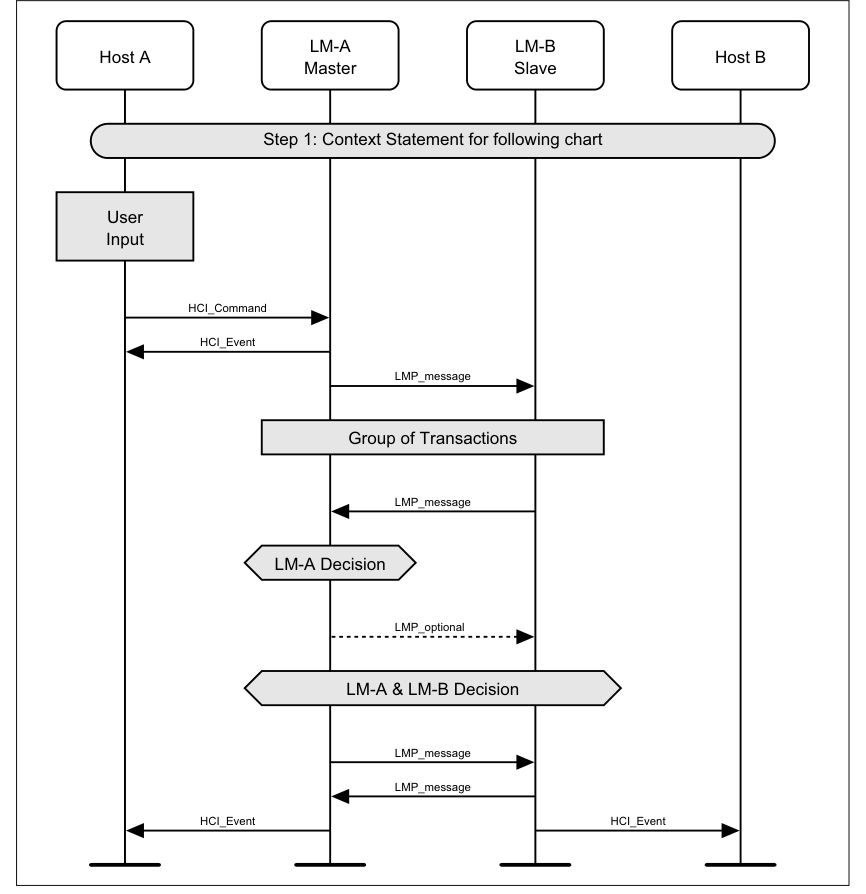

**Figure 1.1:  Example MSC**

## 2  SERVICES WITHOUT CONNECTION REQUEST

### 2.1   REMOTE NAME REQUEST

The service Remote Name Request is used to find out the name of the remote device without requiring an explicit ACL Connection.
Step 1: The Host sends an HCI_Set_Event_Mask with the bit of Remote Host Supported Features Notification Event (bit 60) set and an HCI_Remote_Name_Request command expecting that its local device will automatically try to connect to the remote device. (See Figure 2.1.)

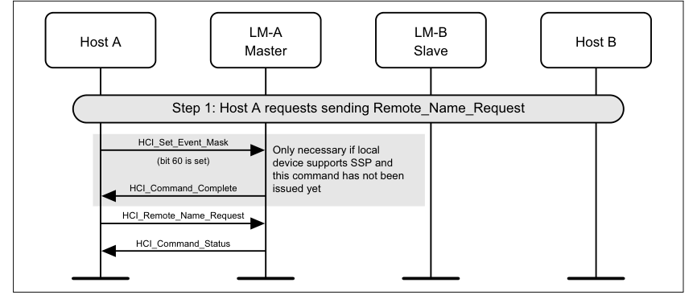

**Figure 2.1:  Remote name request**

Step 2a:   If an ACL Connection does not exist device A pages device B. After the Baseband paging procedure, the local device attempts to get the remote device's extended features, send an HCI_Remote_Device_Supported_Features_Notification event, get the remote name, disconnect, and return the name of the remote device to the Host. (See Figure 2.2.)

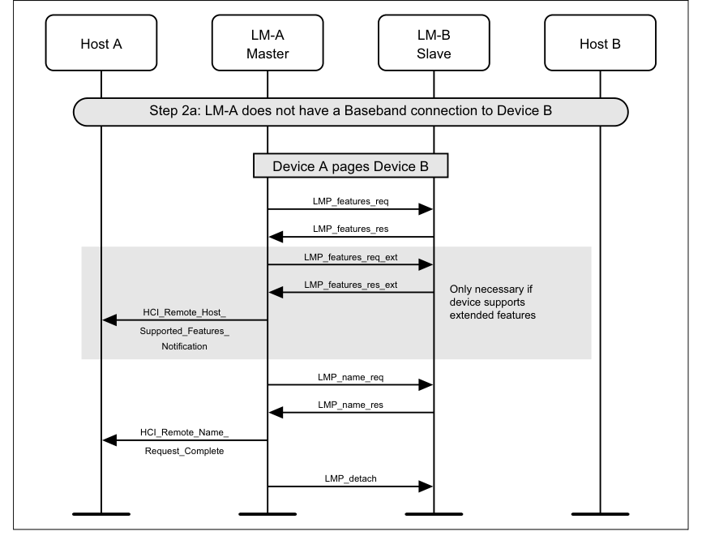

**Figure 2.2:  Remote name request if no current baseband connection**

Step 2b:  If an ACL Connection exists when the request is made, then the Remote Name Request procedure will be executed like an optional service. No Paging and no ACL disconnect is done. (See Figure 2.3.)

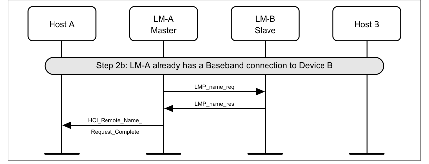

**Figure 2.3:  Remote name request with baseband connection**

### 2.2   ONE-TIME INQUIRY

Inquiry is used to detect and collect nearby devices.
Step 1:  The Host sends an HCI_Inquiry command. (See Figure 2.4.)

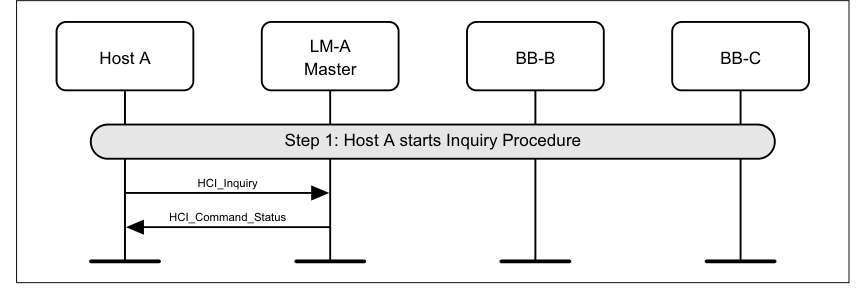

**Figure 2.4:  Host A starts inquiry procedure**

Step 2:  The Controller will start the Baseband inquiry procedure with the specified Inquiry Access Code and Inquiry Length. When Inquiry Responses are received, the Controller extracts the required information and returns the information related to the found devices using one or more Inquiry Result events to the Host. (See Figure 2.5.)

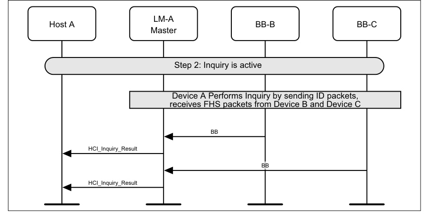

**Figure 2.5:  LM-A performs inquiry and reports result**

Step 3a:  If the Host wishes to terminate an Inquiry, the HCI_Inquiry_Cancel command is used to immediately stop the inquiry procedure. (See Figure 2.6.)

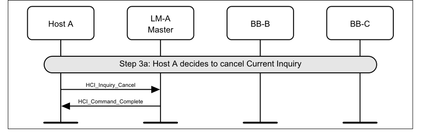

**Figure 2.6:  Host A cancels inquiry**

Step 3b:  If the Inquiry procedure is completed due to the number of results obtained, or the Inquiry Length has expired, an Inquiry Complete event is returned to the Host. (See Figure 2.7.)

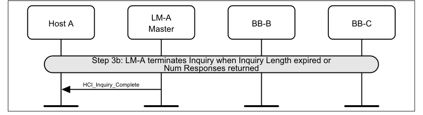

**Figure 2.7:  LM-A terminates current inquiry**

### 2.3   PERIODIC INQUIRY

Periodic inquiry is used when the inquiry procedure is to be repeated periodically.
Step 1:  The Hosts sends an HCI_Periodic_Inquiry_Mode command. (See Figure 2.8.)

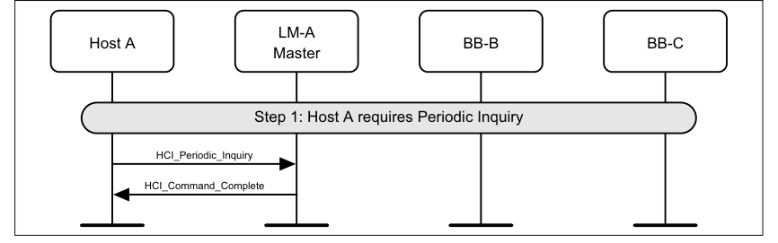

**Figure 2.8:  Host A starts periodic inquiry**

Step 2:  The Controller will start a periodic Inquiry. In the inquiry cycle, one or several Inquiry Result events will be returned. (See Figure 2.9.)

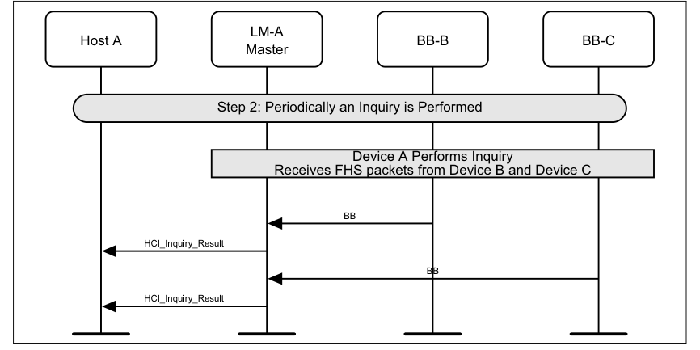

**Figure 2.9:  LM-A periodically performs an inquiry and reports result**

Step 3:  An Inquiry Complete event will be returned to the Host when the current periodic inquiry has finished. (See Figure 2.10.)

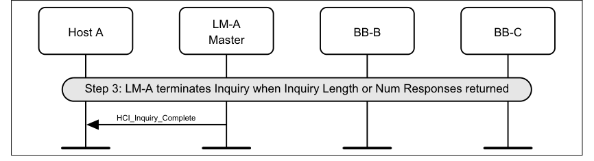

**Figure 2.10:  LM-A terminates current inquiry**

Step 4:  The periodic Inquiry can be stopped using the HCI_Exit_Periodic_Inquiry_Mode command. (See Figure 2.11.)

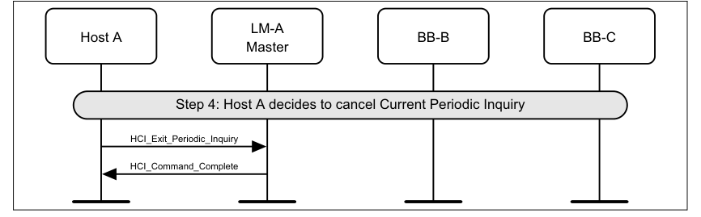

**Figure 2.11:  Host A decides to exit periodic inquiry**

## 3  ACL CONNECTION ESTABLISHMENT AND DETACHMENT

A flow diagram of the establishment and detachment of a connection between two devices is shown in Figure 3.1. The process is illustrated in 9 distinct steps. A number of these steps may be optionally performed, such as authentication and encryption. Some steps are required, such as the Connection Request and Setup Complete steps. The steps in the overview diagram directly relate to the steps in the following message sequence charts.

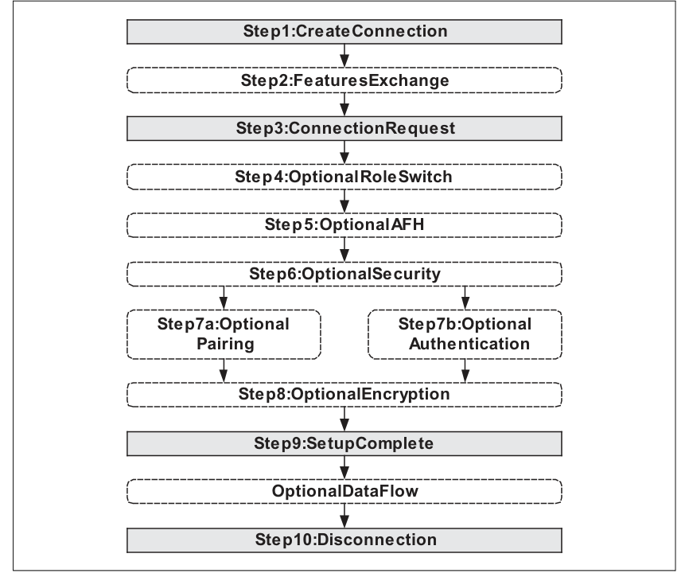

**Figure 3.1:  Overview diagram for connection setup**

### 3.1   CONNECTION SETUP

Step 1:  The Host sends an HCI_Create_Connection command to the Controller. The Controller then performs a Baseband paging procedure with the specified BD_ADDR. (See Figure 3.2.)

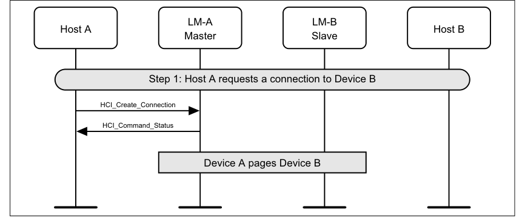

**Figure 3.2:  Host A requests connection with device B**

Step 2:  Optionally, the LM may decide to exchange features. (See Figure 3.3.)

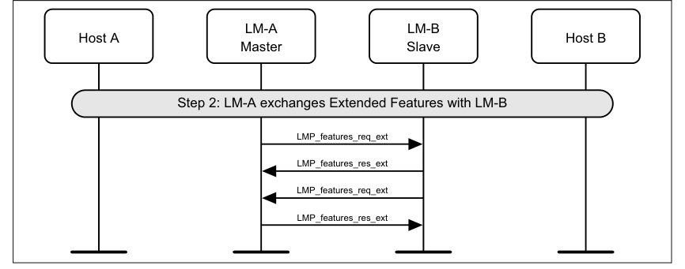

**Figure 3.3:  LM-A and LM-B exchange features**

Step 3:  The LM on the master will request an LMP_Host_connection_req PDU. The LM on the slave will then confirm that a connection is OK, and if so, what role is preferred. (See Figure 3.4)

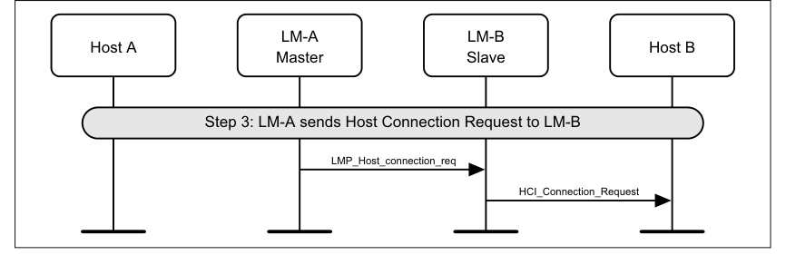

**Figure 3.4:  LM-A requests Host connection**

Step 4a:  The remote Host rejects this connection, and the link is terminated. (See Figure 3.5.)

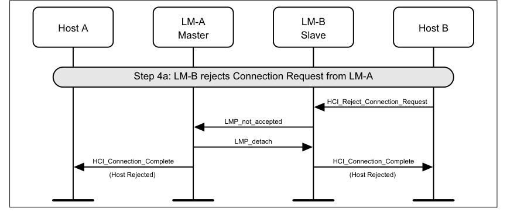

**Figure 3.5:  Device B rejects connection request**

Step 4b:  The remote Host accepts this connection. (See Figure 3.6.)

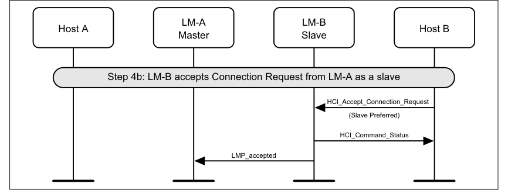

**Figure 3.6:  Device B accepts connection request**

Step 4c:  The remote Host accepts this connection but with the preference of being a master. This will cause a role switch to occur before the LMP_accepted for the LMP_Host_connection_req PDU is sent. (See Figure 3.7.)

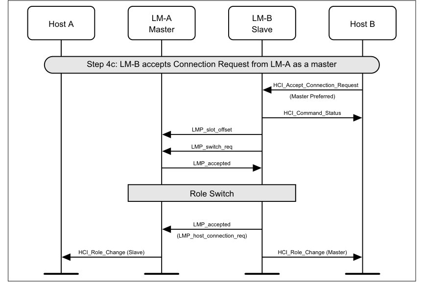

**Figure 3.7:  Device B accepts connection requests as master**

Step 5:  After the features have been exchanged and AFH support is determined to be available, the master may at any time send an LMP_set_AFH and LMP_channel_classification_req PDU. (See Figure 3.8.)

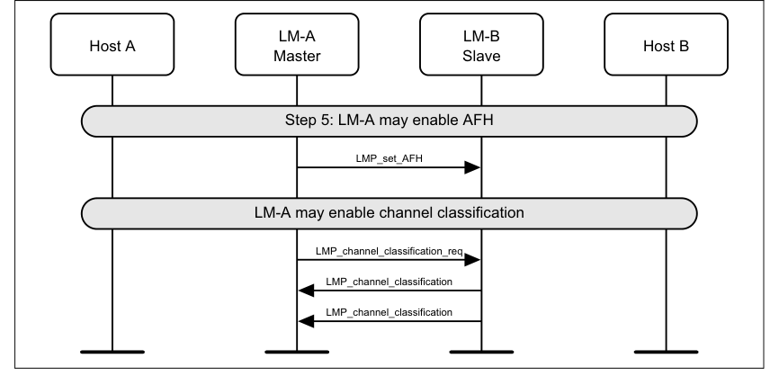

**Figure 3.8:  LM-A starts adaptive frequency hopping**

Step 6:  The LM will request if authentication is required. It does this by requesting the Link Key for this connection from the Host. (See Figure 3.9.)

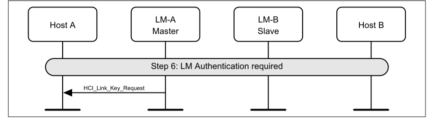

**Figure 3.9:  Authentication initiated**

Step 7a:  If authentication is required by the higher layers and the devices to be connected do not have a common link key, a pairing procedure will be used. The LM will have requested a link key from the Host for this connection. If there is a negative reply, then a PIN code will be requested. This PIN code will be requested on both sides of the connection, and authentication performed based on this PIN code. The last step is for the new link key for this connection to be passed to the Host so that it may store it for future connections. (See Figure 3.10.)

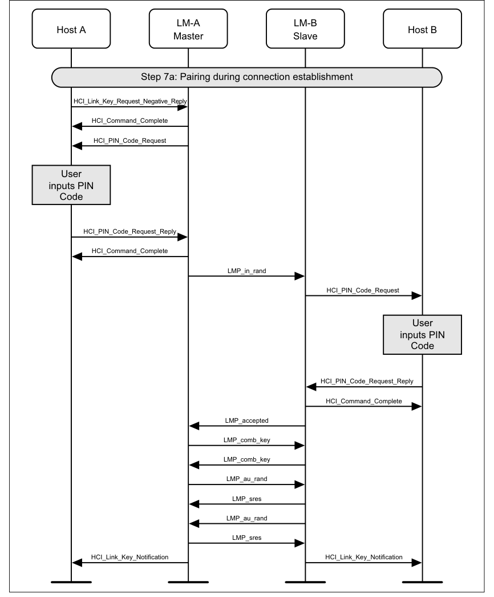

**Figure 3.10:  Pairing during connection setup**

Step 7b:  If a common link key exists between the devices, then pairing is not needed. The LM will have asked for a link key from the Host for this connection. If this is a positive reply, then the link key is used for authentication. If the configuration parameter Authentication_Enable is set, then the authentication procedure must be executed. This MSC only shows the case when Authentication_Enable is set on both sides. (See Figure 3.11.)

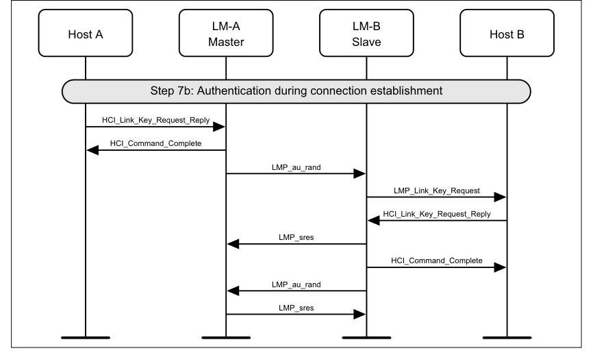

**Figure 3.11:  Authentication during connection setup**

Step 8:  Once the pairing or authentication procedure is successful, the encryption procedure may be started. This MSC only shows the set up of an encrypted point-to-point connection. (See Figure 3.12.)

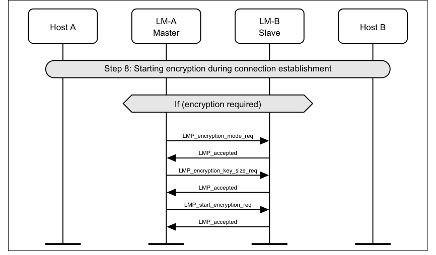

**Figure 3.12:  Starting encryption during connection setup**

Step 9:  The LMs indicate that the connection is setup by sending LMP_setup_complete PDU. This will cause the Host to be notified of the new connection handle, and this connection may be used to send higher layer data such as L2CAP information. (See Figure 3.13.)

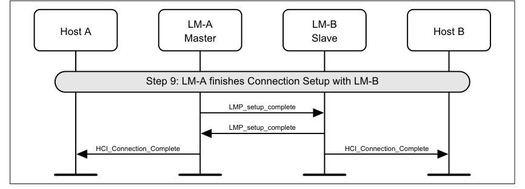

**Figure 3.13:  LM-A and LM-B finishes connection setup**

Step 10:  Once the connection is no longer needed, either device may terminate the connection using the HCI_Disconnect command and LMP_detach message PDU. The disconnection procedure is one-sided and does not need an explicit acknowledgment from the remote LM. The use of ARQ Acknowledgment from the Baseband is needed to ensure that the remote LM has received the LMP_detach PDU. (See Figure 3.14.)

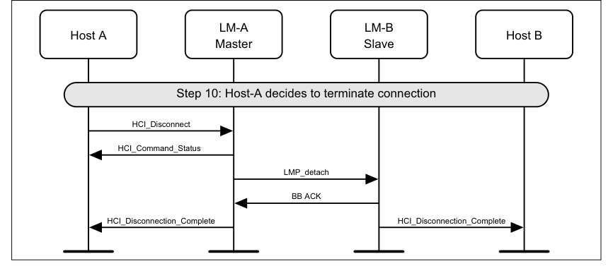

**Figure 3.14:  Host A decides to disconnect**

## 4  OPTIONAL ACTIVITIES AFTER ACL CONNECTION ESTABLISHMENT

### 4.1   AUTHENTICATION REQUESTED

Step 1:  Authentication can be explicitly executed at any time after a connection has been established. If no Link Key is available then the Link Key is required from the Host. (See Figure 4.1.)
Note: If the Controller or LM and the Host do not have the Link Key a PIN Code Request event will be sent to the Host to request a PIN Code for pairing. A procedure identical to that used during Connection Setup (Section 3.1, Step 7a:) will be used. (See Figure 3.10.)

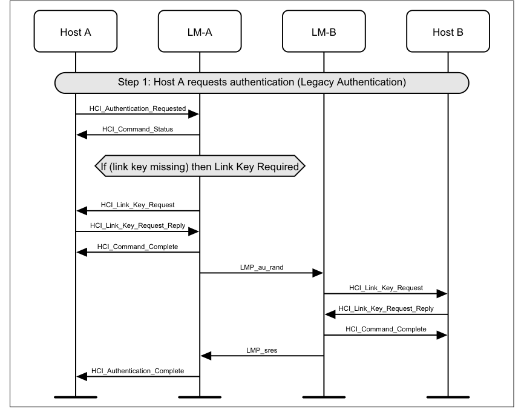

**Figure 4.1:  Authentication requested (Legacy Authentication)**

When both devices support Secure Connections, Secure Authentication is used.

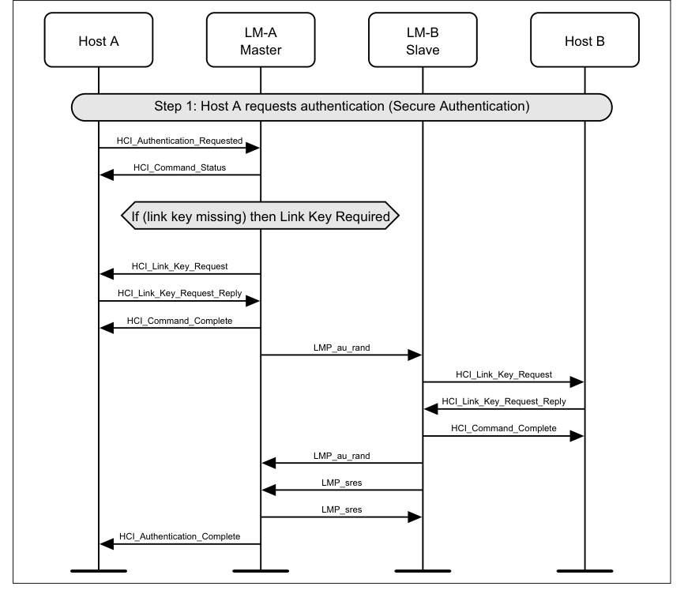

**Figure 4.2:  Authentication requested (Secure Authentication)**

### 4.2   SIMPLE PAIRING MESSAGE SEQUENCE CHARTS

A flow diagram of simple pairing between two devices is shown in Figure 4.3. The process is illustrated in 11 distinct steps. A number of these steps have a number of different options.

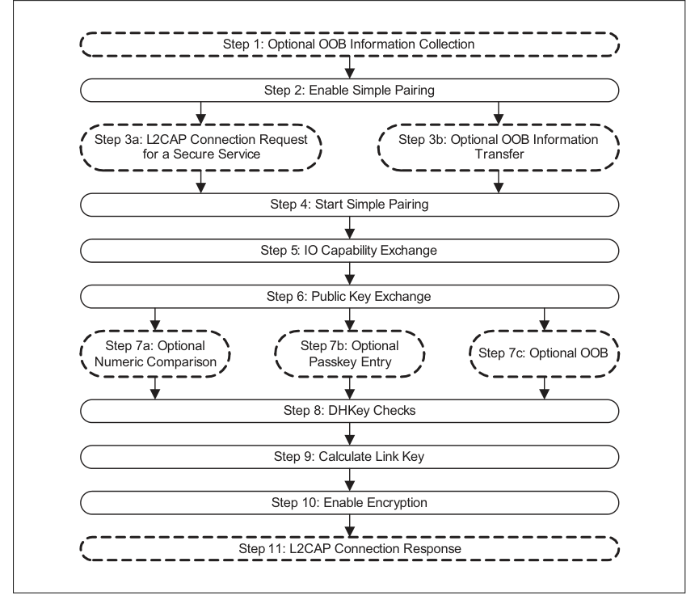

**Figure 4.3:  Simple pairing, flow diagram**

#### 4.2.1  Optional OOB Information Collection

If a device supports OOB information exchange, then the Host should request the C and R values from the Controller that need to be sent by OOB. It is then assumed that the Host transfers this information to the OOB system. Note: This could occur a long time before, for example at the factory for a passive tag.

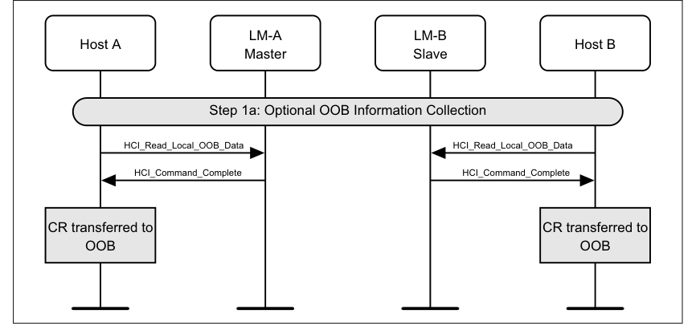

**Figure 4.4:  Optional OOB information collection (P-192 only)**

When the Controller and Host support Secure Connections, the HCI_Read_Local_OOB_Extended_Data command is used instead of HCI_Read_Local_OOB_Data.

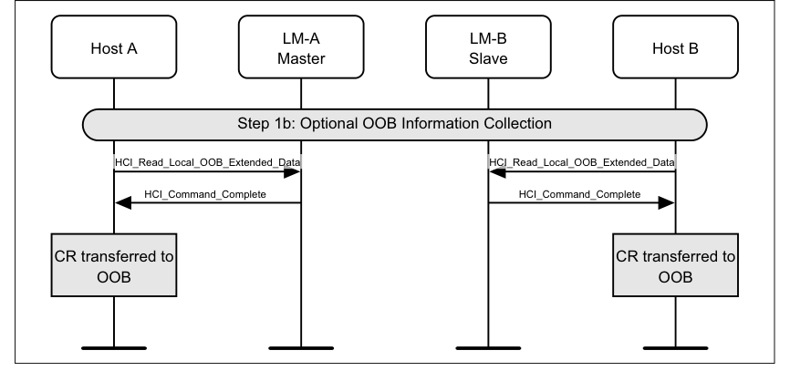

**Figure 4.5:  Optional OOB information collection (P-192 and P-256)**

#### 4.2.2  Enable Simple Pairing and Secure Connections

To enable simple pairing, a device must use the Write Simple Pairing Mode command. This should be done before any other connections that may use simple pairing are created.

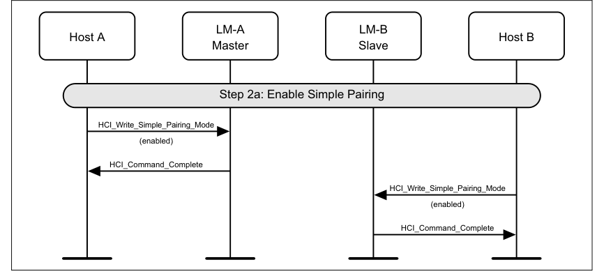

**Figure 4.6:  Enable simple pairing**

To configure the Controller to use Secure Connections HCI commands and events, a device must use the HCI_Write_Secure_Connections_Host_Support command. This should be done before any connections are created.

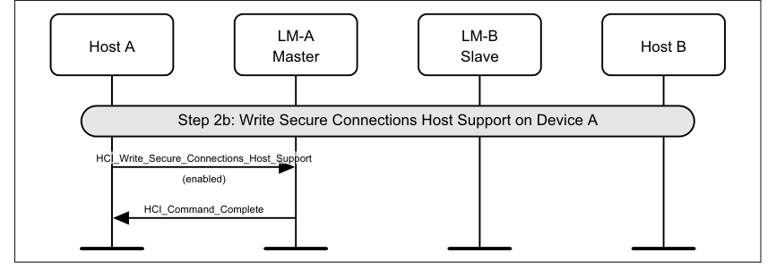

**Figure 4.7:  Enable Secure Connections Host support**

To configure the Controller to enforce a maximum interval between packets containing a MIC (when AES-CCM encryption is used), a device must use the HCI_Write_Authenticated_Payload_Timeout command.

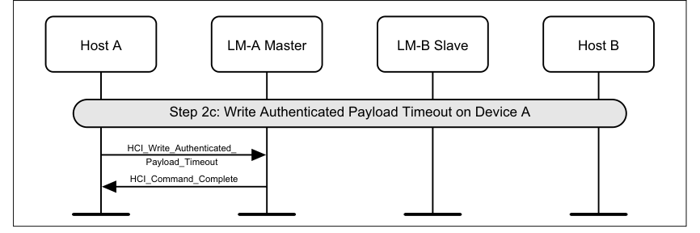

**Figure 4.8:  Set Authenticated_Payload_Timeout**

#### 4.2.3  Connection Establishment

Simple pairing, once it is enabled, is triggered by one of two possible actions. It could be triggered by an L2CAP connection request to a service that requires security, or it could be triggered by an OOB transfer of information.

#### 4.2.4  L2CAP Connection Request for a Secure Service

Once a connection has been established between two devices, if a device requests an L2CAP connection to a service that requires authentication and encryption, then the device will start simple pairing.

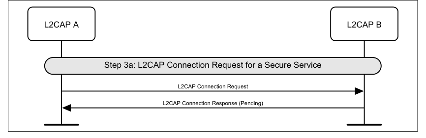

**Figure 4.9:  L2CAP connection request for a secure service**

#### 4.2.5  Optional OOB Information Transfer

Even if a Bluetooth connection has not been established between two devices, an OOB transfer can occur that transfers the Bluetooth Device Address of the device, and other OOB information for authentication. If an OOB transfer occurs, then the Host can start simple pairing.

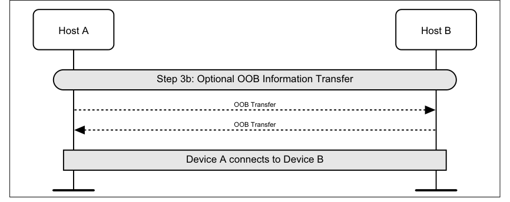

**Figure 4.10:  Optional OOB information transfer**

#### 4.2.6  Start Simple Pairing

Once the Host has determined that simple pairing should start, it issues an Authentication Requested command to the Controller. This will cause the Controller to generate a request for a link key. If the Host has a link key for this connection, then pairing is not required, and the link key can be used immediately once it has been authenticated. Simple Pairing will only be used if a Link_Key_Request_Negative_Reply Command is sent from the Host to the Controller on the initiating side.

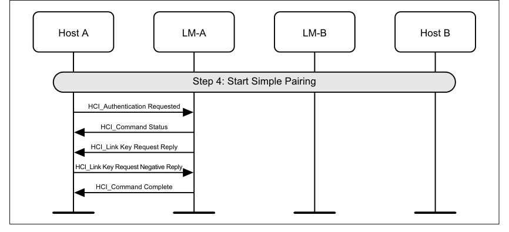

**Figure 4.11:  Start simple pairing**

#### 4.2.7  IO Capability Exchange

To be able to determine the correct authentication algorithm to use, the input / output capabilities of the two devices are exchanged.

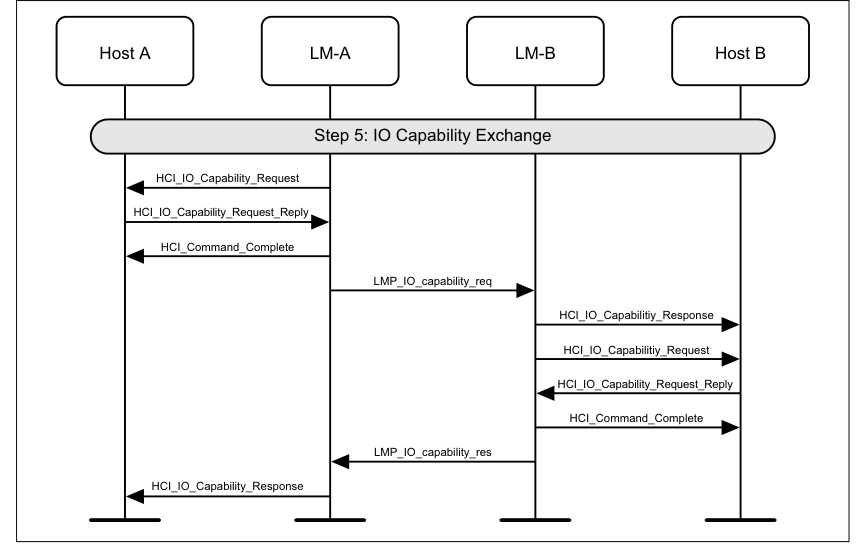

**Figure 4.12:  IO capability exchange**

#### 4.2.8  Public Key Exchange

Next the public keys are exchanged between the two devices. Once a device has received the public key of the peer device, it can start to calculate the Diffie Hellman Key (DHKey). This may take a long time, and should be started early, so that user interaction can hide the calculation time. The DHKey is not required until step 8.

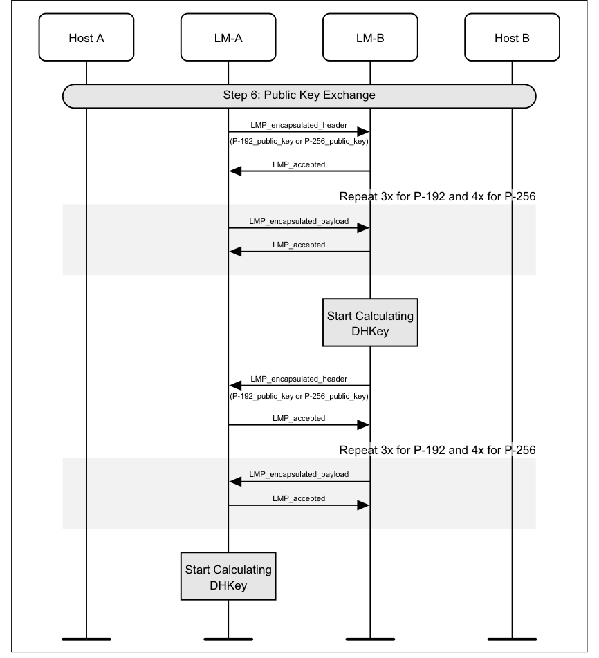

**Figure 4.13:  Public key exchange**

#### 4.2.9  Authentication

A device can be authenticated by using one of three algorithms. The choice of algorithm is determined by the combination of the IO capabilities of the two devices.

#### 4.2.10  Numeric Comparison

The numeric comparison step will be done when both devices have output capabilities, or if one of the devices has no input or output capabilities. If both devices have output capabilities, this step requires the displaying of a user confirmation value. This value should be displayed until the end of step 8. If one or both devices do not have output capabilities, the same protocol is used but the Hosts will skip the step asking for the user confirmation.
Note: The sequence for Just Works is identical to that of Numeric Comparison with the exception that the Host will not show the numbers to the user.

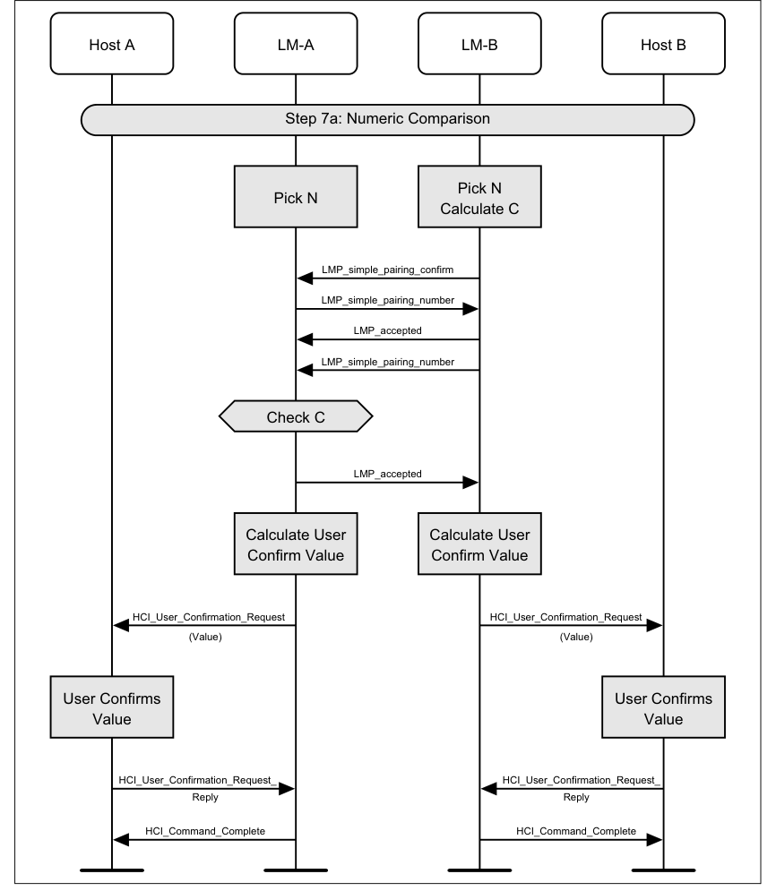

**Figure 4.14:  Numeric comparison authentication**

#### 4.2.11  Numeric Comparison Failure on Initiating Side

If the numeric comparison fails on the initiating side due to the user indicating that the confirmation values do not match, Simple Pairing is terminated.

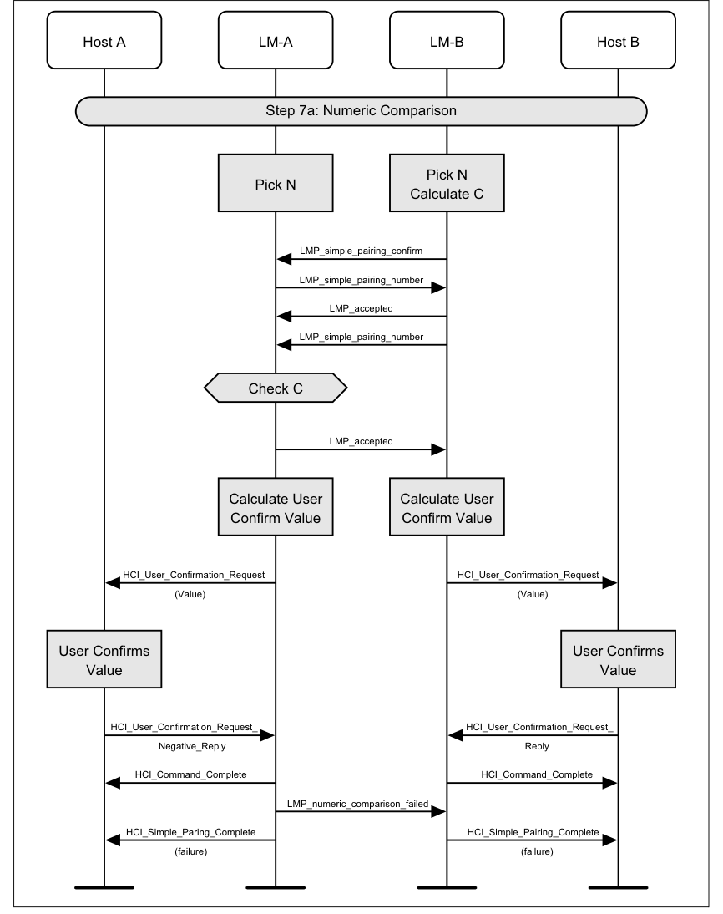

**Figure 4.15:  Numeric comparison authentication (failure on initiating side)**

#### 4.2.12  Numeric Comparison Failure on Responding Side

If the numeric comparison fails on the responding side due to the user indicating that the confirmation values do not match, Simple Pairing is terminated.

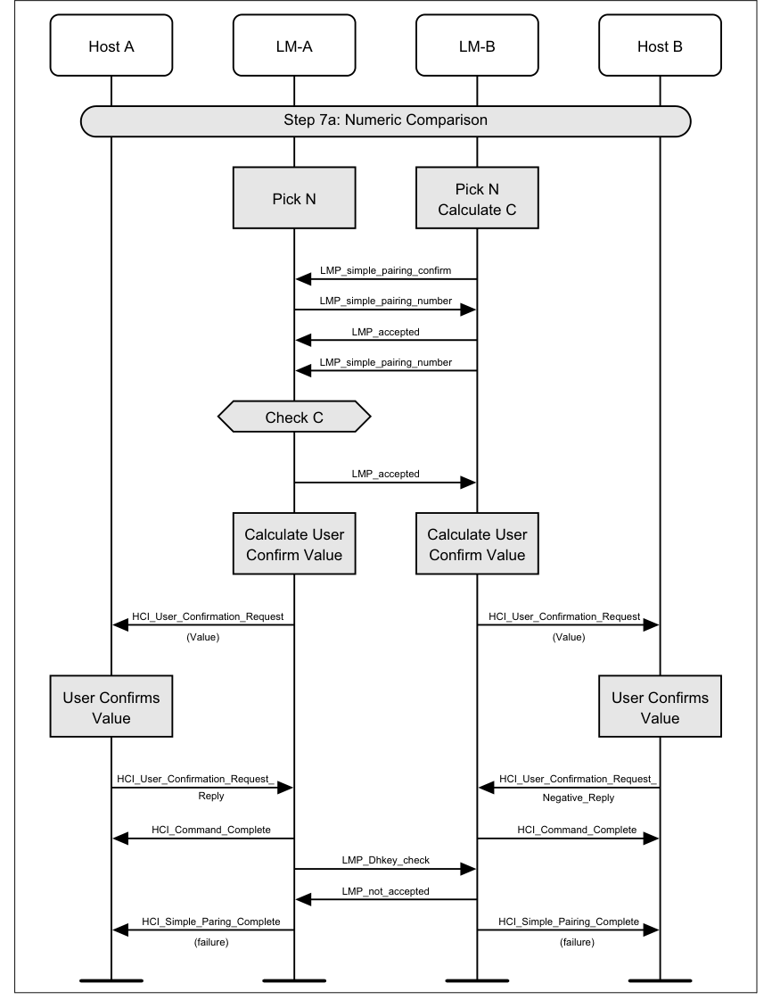

**Figure 4.16:  Numeric comparison failure on responding side**

#### 4.2.13  Passkey Entry

The Passkey entry step is used in two cases: when one device has numeric input only and the other device has either a display or numeric input capability or when both devices only have numeric input capability. In this step, one device display a number to be entered by the other device or the user enters a number on both devices. This number should be displayed until the end of step 8. Key press notification messages are shown during the user input phase.

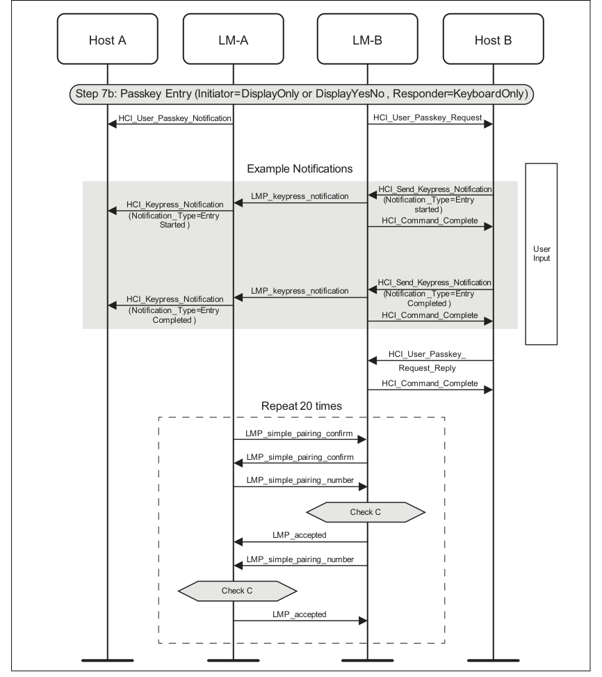

**Figure 4.17:  Passkey entry authentication**

#### 4.2.14  Passkey Entry Failure on Responding Side

If the passkey entry fails on the responding side, Simple Pairing is terminated.

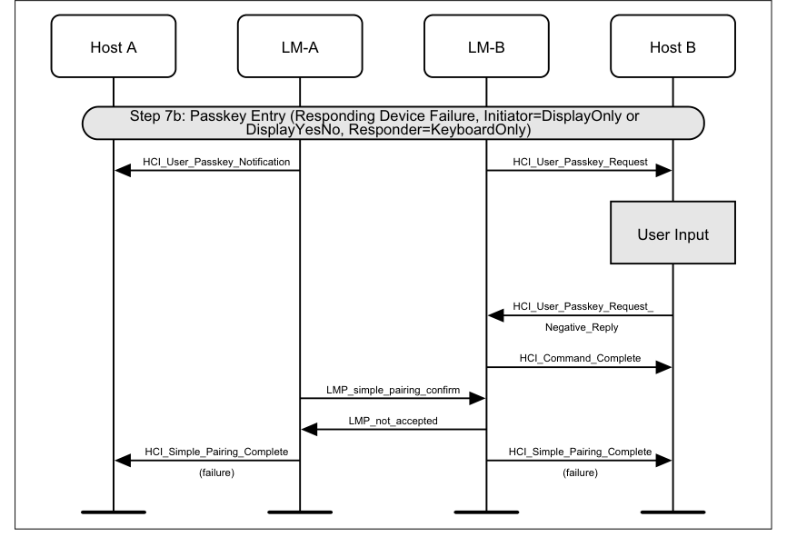

**Figure 4.18:  Passkey entry failure on responding side**

#### 4.2.15  Passkey Entry Failure on Initiator Side

If the passkey entry fails on the initiating side, Simple Pairing is terminated. Note that this is only possible if the initiating LM side sends an HCI User Passkey Request event.

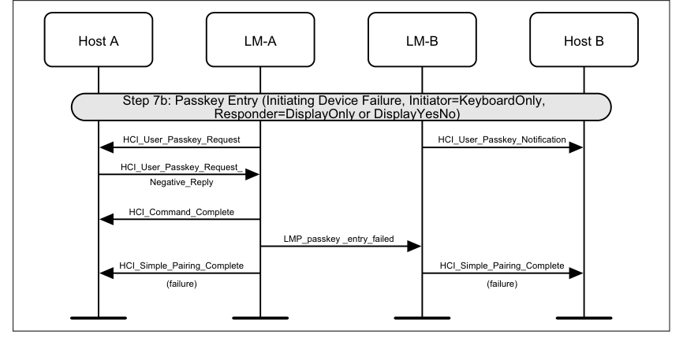

**Figure 4.19:  Passkey entry failure on initiating side**

#### 4.2.16  Out of Band

The OOB authentication will only be done when both devices have some OOB information to use. This step requires no user interaction.

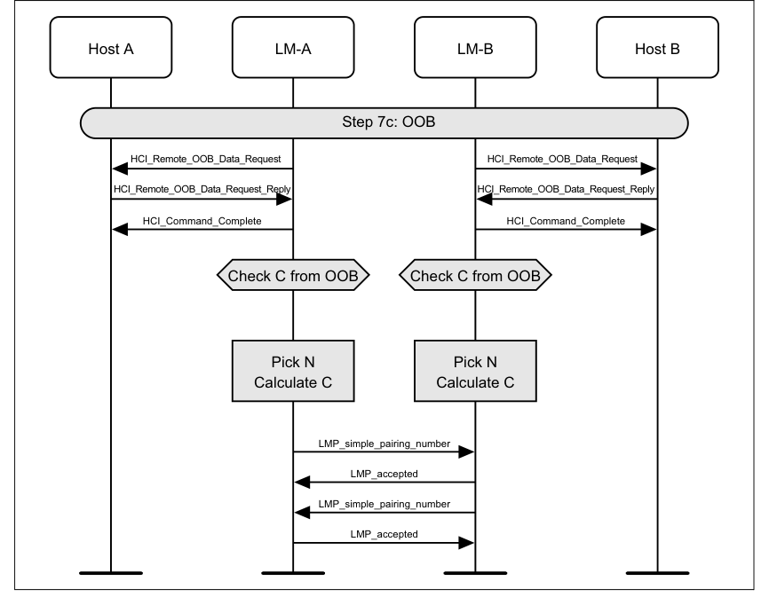

**Figure 4.20:  OOB authentication (P-192)**

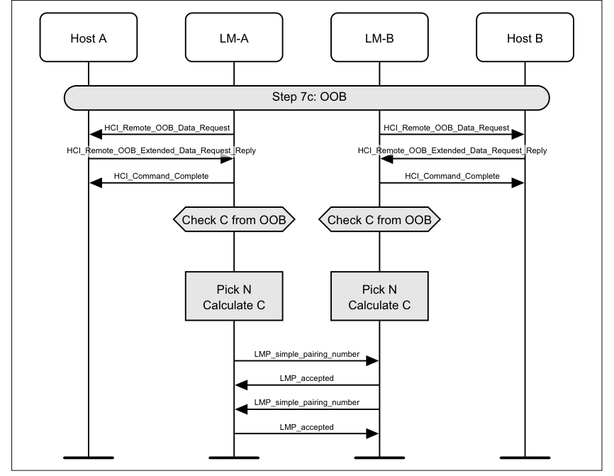

**Figure 4.21:  OOB authentication (P-256)**

#### 4.2.17  OOB Failure on Initiator Side

If the initiating side does not have OOB information, Simple Pairing is terminated.

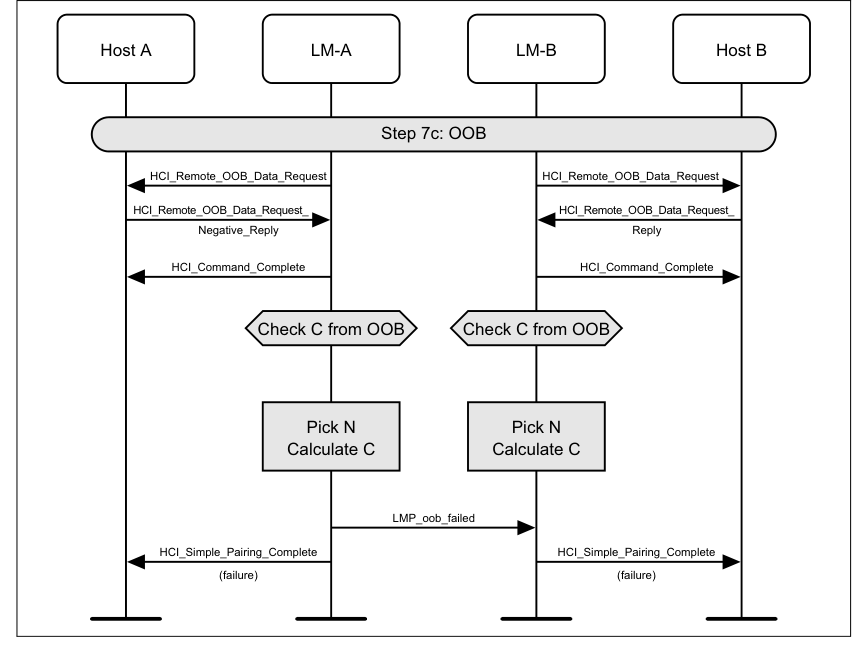

**Figure 4.22:  OOB authentication failure on initiating side**

#### 4.2.18  DHKey Checks

Once the devices have been authenticated, and the DHKey calculation has completed, the DHKey value generated is checked. If this succeeds, then both devices would have finished displaying information to the user about the process, and therefore a message is sent from the Controller to the Host to notify it to stop displaying this information.

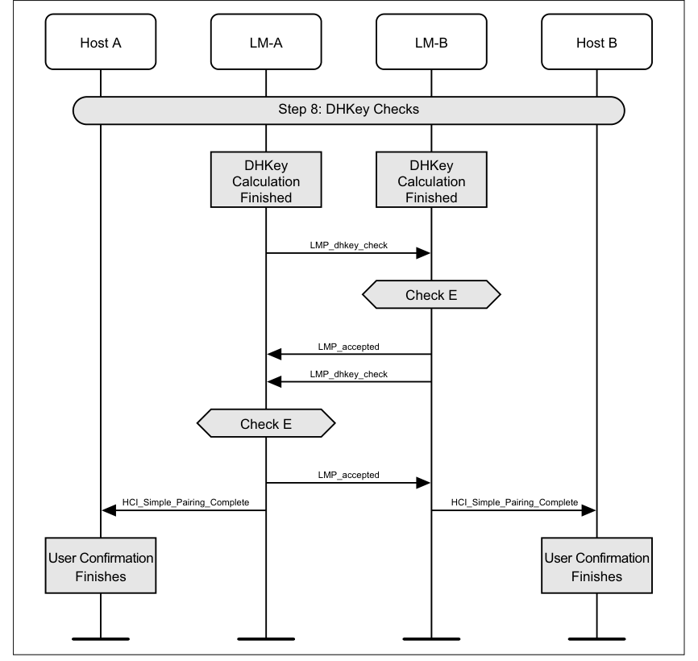

**Figure 4.23:  DHKey checks**

#### 4.2.19  Calculate Link Key

Once simple pairing is complete, the link key can be calculated from the DHKey, and this should be used as input to a standard mutual authentication. Once this is complete, a Link Key Notification event will be generated.

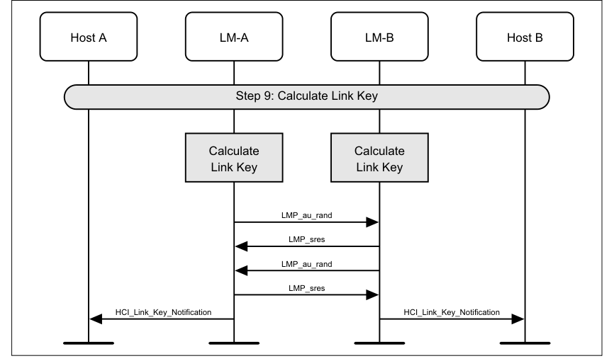

**Figure 4.24:  Calculate link key**

#### 4.2.20  Enable Encryption

Once the link key has been notified to the Host, the Authentication Requested command will complete with an Authentication Complete event. The Host can then turn on encryption using the standard methods.

**Figure 4.25:  Start encryption**

#### 4.2.21  L2CAP Connection Response

If this simple pairing was triggered by an L2CAP Connection Request, then only after all of the above steps have completed can the L2CAP Connection Response message be sent.

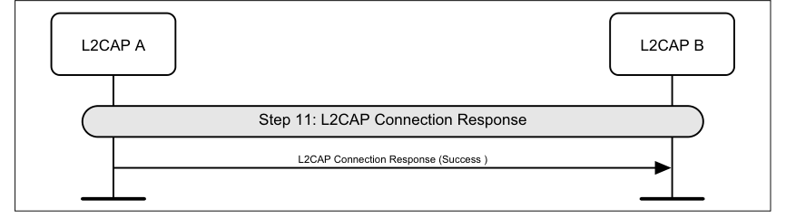

**Figure 4.26:  L2CAP connection response**

#### 4.2.22  LMP Ping

When the Authenticated Payload Timeout has nearly expired, the Link Manager will force the remote device to send a packet containing a MIC by sending the LMP_ping_req PDU.

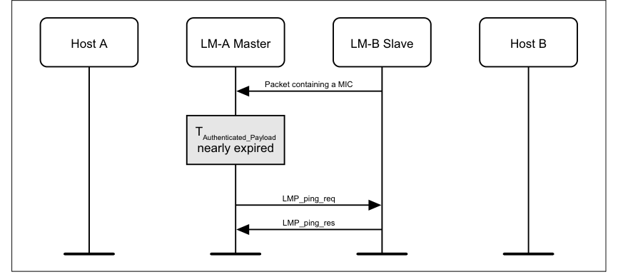

**Figure 4.27:  Successful Ping**

When a packet with a MIC has not been received within the Authenticated Payload Timeout, the Host is notified that the timer has expired.

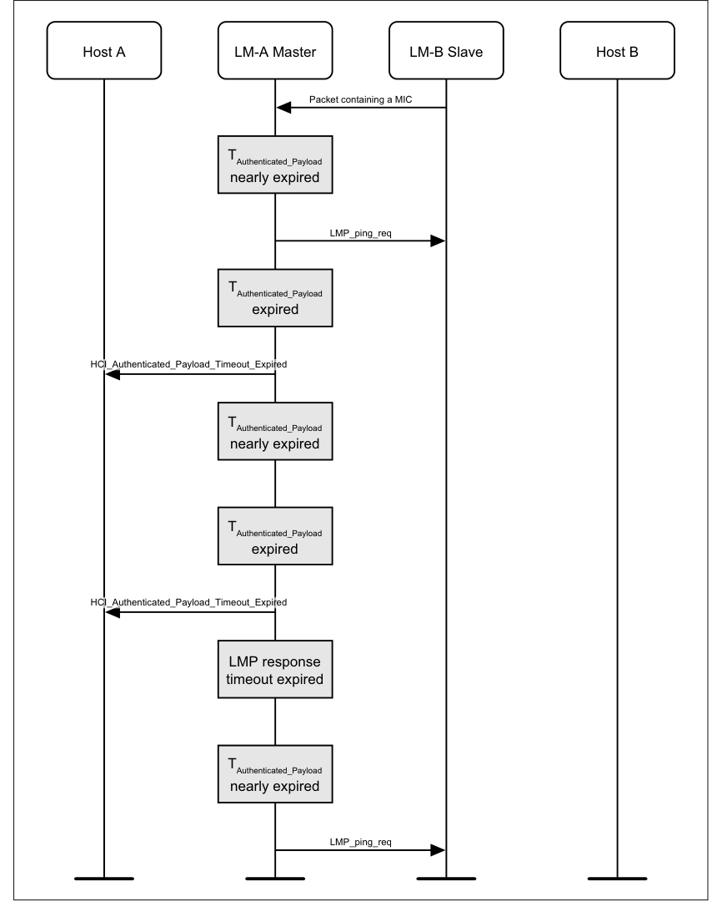

**Figure 4.28:  Unsuccessful Ping**

### 4.3   LINK SUPERVISION TIMEOUT CHANGED EVENT

When enabled by the Host, the slave generates an HCI_Link_Supervision_Timeout_Changed event after the LMP_supervision_timeout PDU is received.

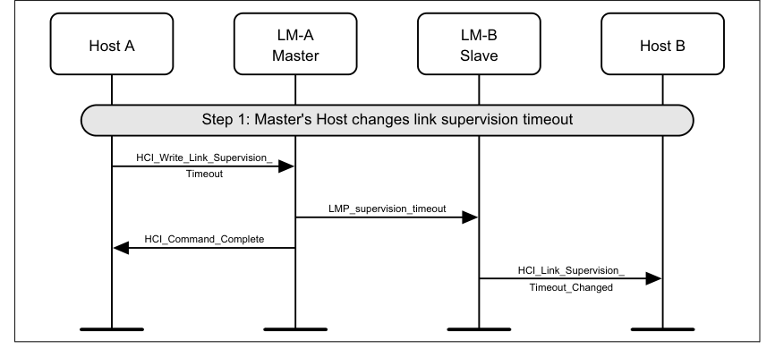

**Figure 4.29:  Link supervision timeout event**

### 4.4   SET CONNECTION ENCRYPTION

Step 1:  The Host may at any time turn on encryption using the HCI_Set_Connection_Encryption command. This command can be originated from either the master or slave sides. Only the master side is shown in Figure 4.30. If this command is sent from a slave, the only difference is that the LMP_encryption_mode_req PDU will be sent from the slave. The LMP_encryption_key_size_req and LMP_start_encryption_req PDUs will always be requested from the master. (See Figure 4.30.)

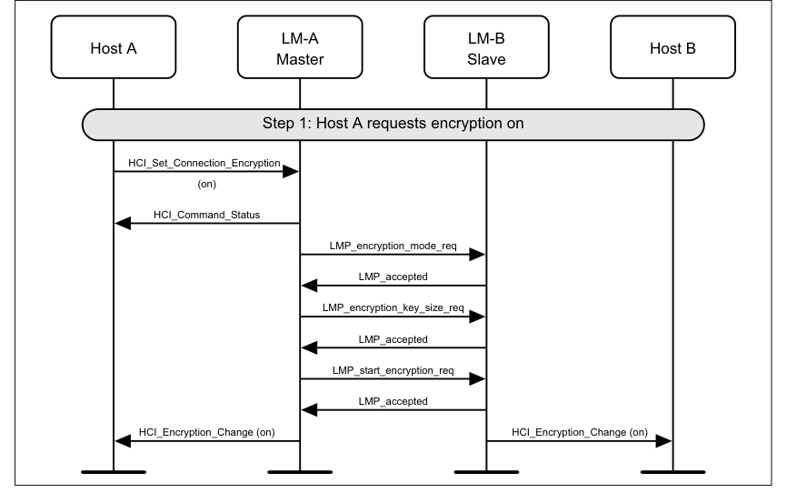

**Figure 4.30:  Encryption requested**

Step 2:  To terminate the use of encryption, The HCI_Set_Connection_Encryption command is used. (See Figure 4.31.)

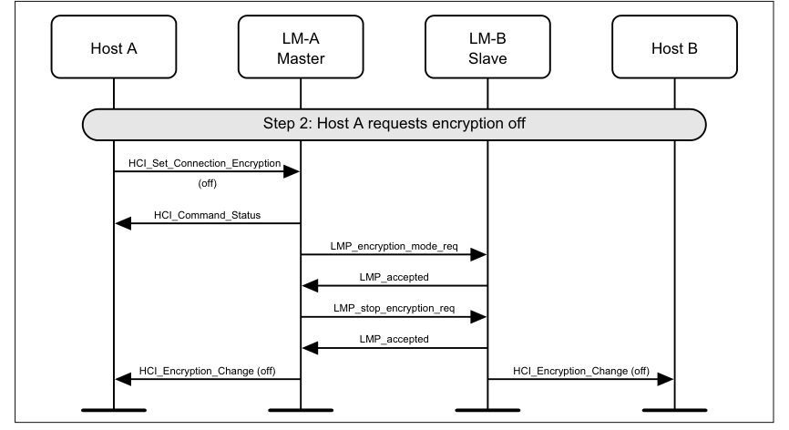

**Figure 4.31:  Encryption off requested**

### 4.5   CHANGE CONNECTION LINK KEY

Step 1:  The master Host (Host A) may change the connection link key using the HCI_Change_Connection_Link_Key command. A new link key will be generated and the Hosts will be notified of this new link key. (See Figure 4.32.)

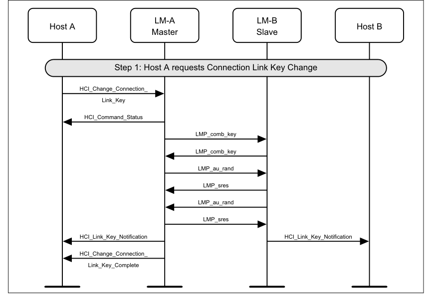

**Figure 4.32:  Change connection link key**

### 4.6   CHANGE CONNECTION LINK KEY WITH ENCRYPTION PAUSE AND RESUME

Step 1:  The master Host (Host A) may change the connection link key using the HCI_Change_Connection_Link_Key command. A new link key will be generated and the Hosts will be notified of this new link key. Encryption will then be paused and resumed, immediately using this new link key to generate a new encryption key. (See Figure 4.33.)

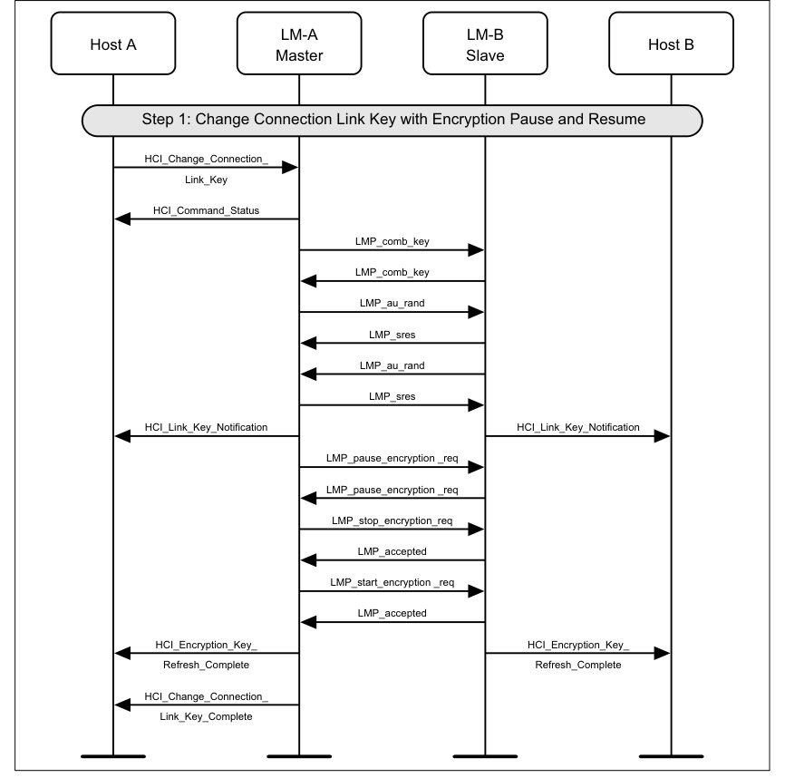

**Figure 4.33:  Change connection link key with encryption pause resume**

### 4.7   MASTER LINK KEY

Step 1:  The Host changes to a Master Link Key from a Semi-permanent Link Key using the HCI_Master_Link_Key command when at least one device does not support Encryption Pause Resume. (See Figure 4.34.)

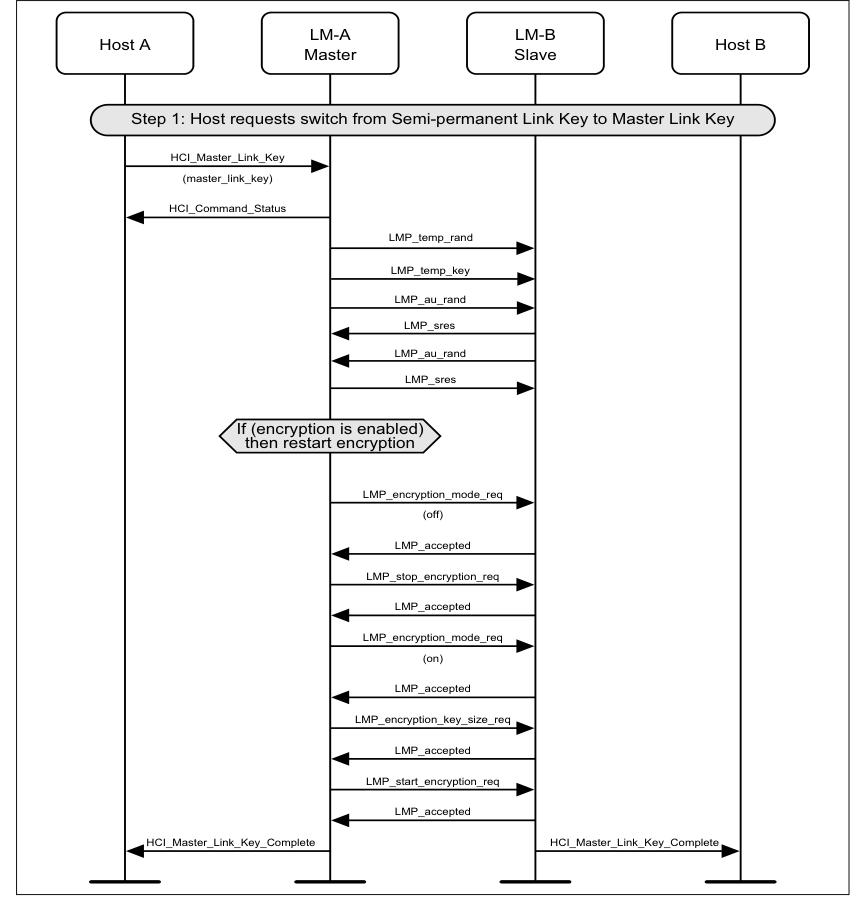

**Figure 4.34:  Change to master link key**

Step 2:  The Host changes to a Semi-permanent Link Key from a Master Link Key using the HCI_Master_Link_Key command. (See Figure 4.35.)

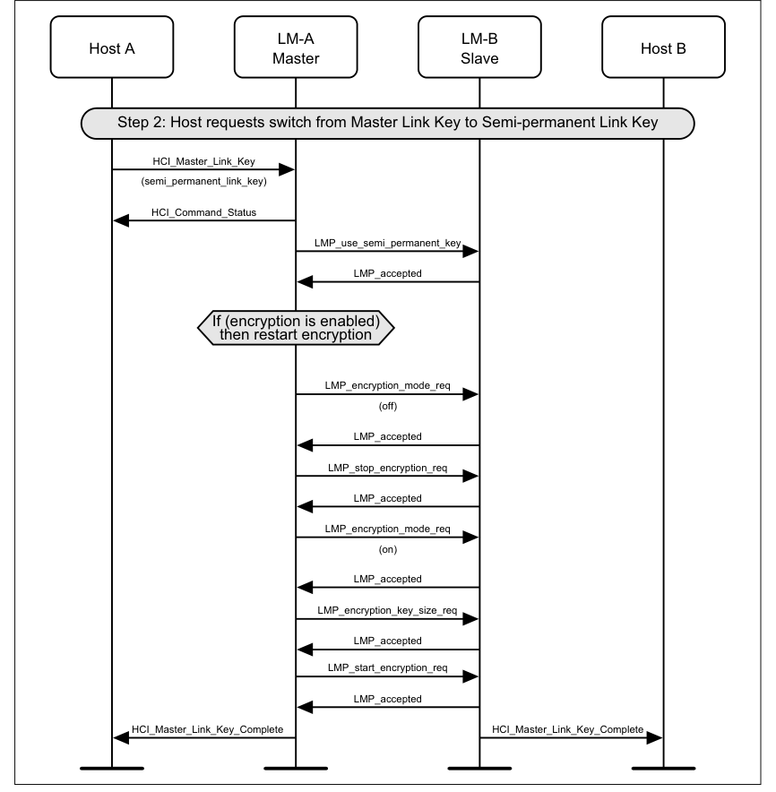

**Figure 4.35:  Change to semi permanent link key**

### 4.8   READ REMOTE SUPPORTED FEATURES

Using the HCI_Read_Remote_Supported_Features command the supported LMP Features of a remote device can be read. (See Figure 4.36.)
If the remote supported features have been obtained previously then the Controller may return them without sending any LMP PDUs.
Step 1:  The Host requests the supported features of a remote device.

**Figure 4.36:  Read remote supported features**

### 4.9   READ REMOTE EXTENDED FEATURES

Using the HCI_Read_Remote_Extended_Features command the extended LMP features of a remote device can be read. (See Figure 4.37.)
If the remote extended features have been obtained previously then the Controller may return them without sending any LMP PDUs.
Step 1:  The Host requests the extended features of a remote device.

**Figure 4.37:  Read remote extended features**

### 4.10   READ CLOCK OFFSET

Using the HCI_Read_Clock_Offset command the device acting as the master can read the Clock Offset of a slave. The Clock Offset can be used to speed up the paging procedure in a later connection attempt. If the command is requested from the slave device, the Controller will directly return a Command Status event and a Read Clock Offset Complete event without sending any LMP PDUs. (See Figure 4.38.)
Step 1:  The Host requests the clock offset of a remote device.

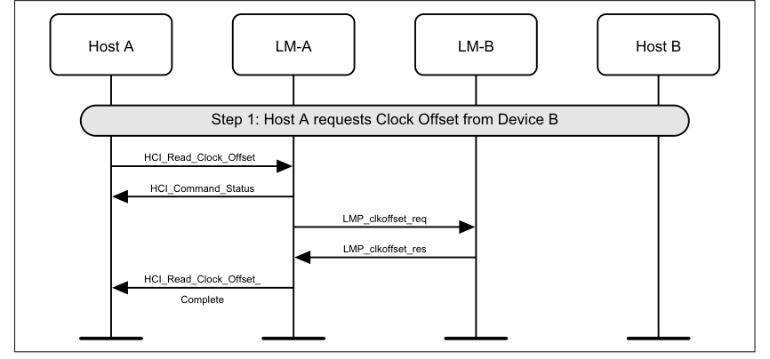

**Figure 4.38:  Read clock offset**

### 4.11   ROLE SWITCH ON AN ENCRYPTED LINK USING ENCRYPTION PAUSE AND RESUME

The HCI_Switch_Role command can be used to explicitly switch the current master / slave role of the local device with the specified device. The master Host (A) requests a role switch with a slave. This will first pause encryption, and then send the switch request, and the slave will respond with the slot offset and accepted. The role switch is performed by doing the TDD switch and piconet switch. Encryption is resumed, and finally an HCI_Role_Change event is sent on both sides. (Figure 4.39)

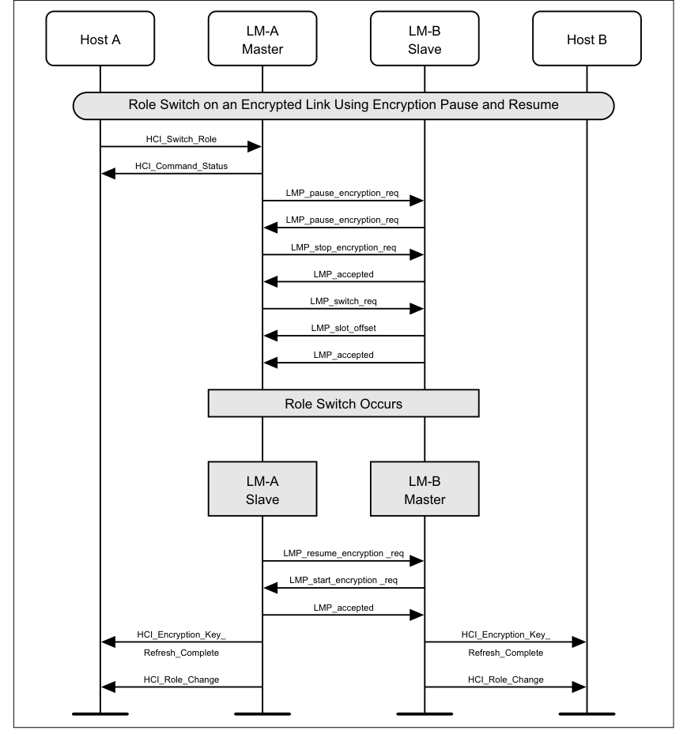

**Figure 4.39:  Role switch on an encrypted link using encryption pause and resume**

### 4.12   REFRESHING ENCRYPTION KEYS

The HCI_Refresh_Encryption_Key command may be used by the master's Host to explicitly pause and resuming encryption to refresh the encryption key. After encryption is resumed an HCI_Encryption_Key_Refresh_Complete event is sent on both sides. (See Figure 4.40).

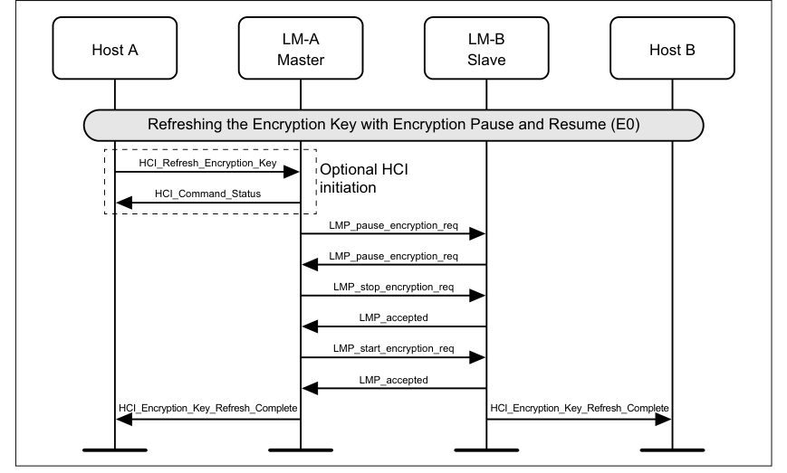

**Figure 4.40:  Refreshing encryption keys (E0)**

When both devices support Secure Connections, the encryption key refresh sequence is performed as follows.

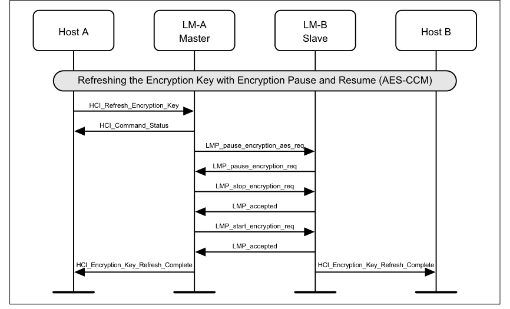

**Figure 4.41:  Refreshing encryption keys (AES-CCM)**

### 4.13   READ REMOTE VERSION INFORMATION

Using the HCI_Read_Remote_Version_Information command the version information of a remote device can be read. (See Figure 4.42.)
If the remote version information has been obtained previously then the Controller may return them without sending any LMP PDUs.
Step 1:  The Host requests the version information of a remote device.

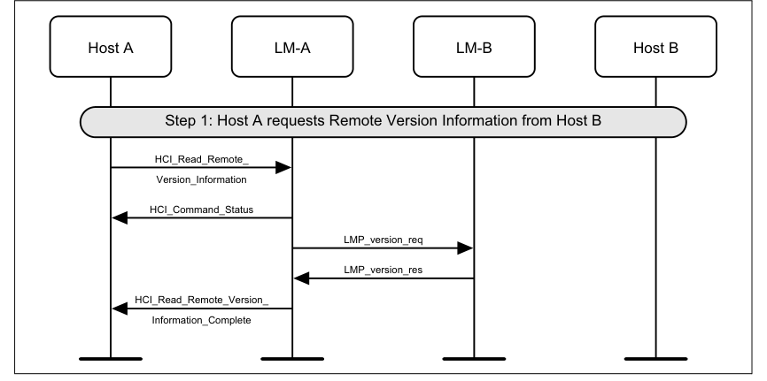

**Figure 4.42:  Read remote version information**

### 4.14   QOS SETUP

Using the HCI_Flow_Specification command the Quality of Service (QoS) and Flow Specification requirements of a connection can be notified to a Controller. The Controller may then change the quality of service parameters with a remote device. (See Figure 4.43.)
Step 1:  The Host sends QoS parameters to a remote device.

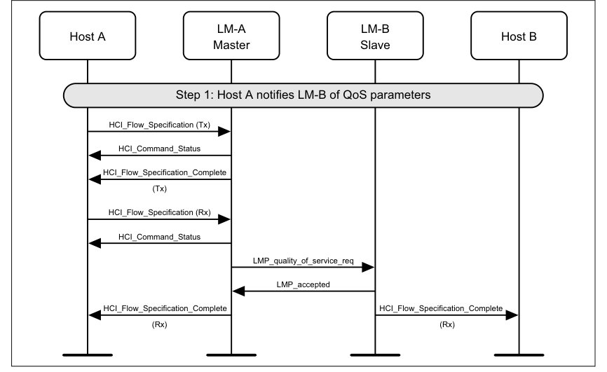

**Figure 4.43:  QoS flow specification**

### 4.15   SWITCH ROLE

The HCI_Switch_Role command can be used to explicitly switch the current master / slave role of the local device with the specified device.
Step 1a:  The master Host (A) requests a role switch with a slave. This will send the switch request, and the slave will respond with the slot offset and accepted. (See Figure 4.44.)

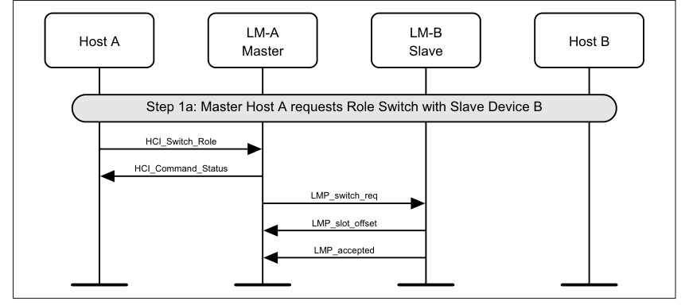

**Figure 4.44:  Master requests role switch**

Step 1b:  The slave Host (B) requests a role switch with a master. This will send the slot offset and the switch request, and the master will respond with a LMP_accepted PDU. (See Figure 4.45.)

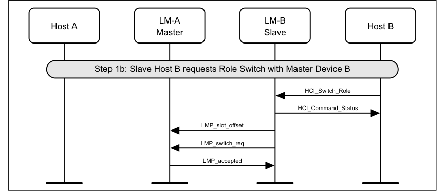

**Figure 4.45:  Slave requests role switch**

Step 2:  The role switch is performed by doing the TDD switch and piconet switch. Finally an HCI_Role_Change event is sent on both sides. (See Figure 4.46.)

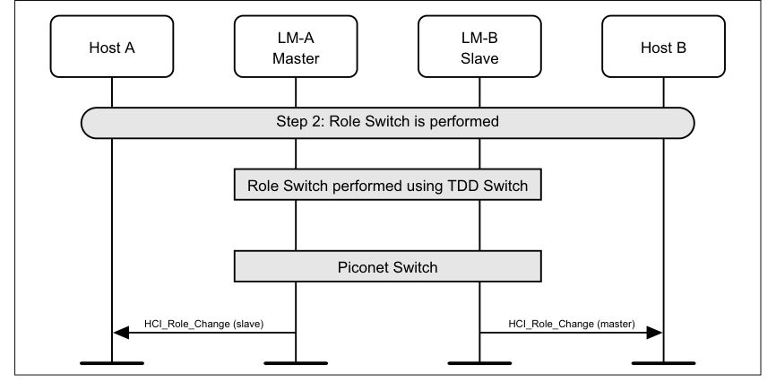

**Figure 4.46:  Role switch is performed**

### 4.16   AMP PHYSICAL LINK CREATION AND DISCONNECT

A flow diagram of the AMP link establishment and detachment of a connection between two devices is shown in Figure 4.47.

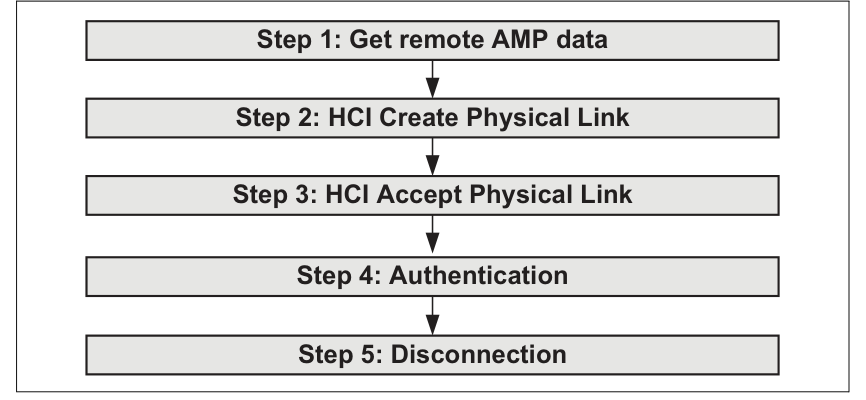

**Figure 4.47:  Overview diagram for physical link creation and disconnection**

#### 4.16.1  Physical Link Establishment

The process of establishing a Physical Link consists of 4 steps.
Step 1: Host A uses the BR/EDR Controller to request AMP_Info data from Host B in order to create an AMP connection. Host B gets this information from PAL B using HCI Read Local AMP Info. Host B returns the information to Host A over the BR/EDR radio.

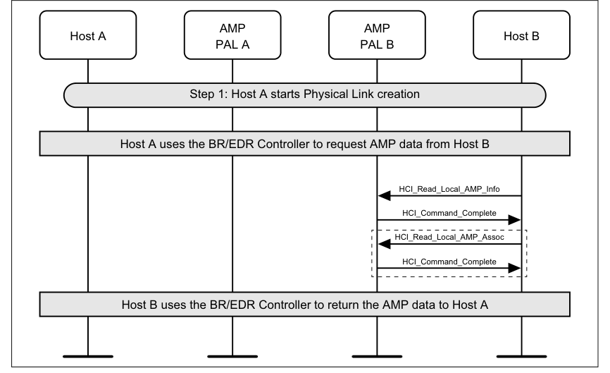

**Figure 4.48:  Get remote AMP data**

Step 2: Host A sends an HCI Create Physical Link command to its AMP Controller. AMP Controller A determines which channel will be used, and provides channel information to its Host. AMP Controller A joins or creates that channel. Note use of dotted rectangles for zero or multiple uses of read or write AMP_Assoc.

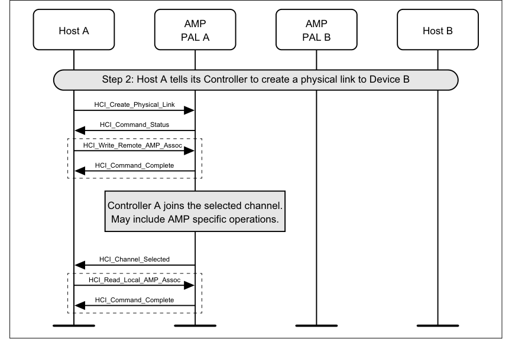

**Figure 4.49:  Host A tells its Controller to create the physical link**

Step 3: Host A uses the BR/EDR radio to request a physical link to B. Host B tells its AMP Controller to accept a physical link from Device A.

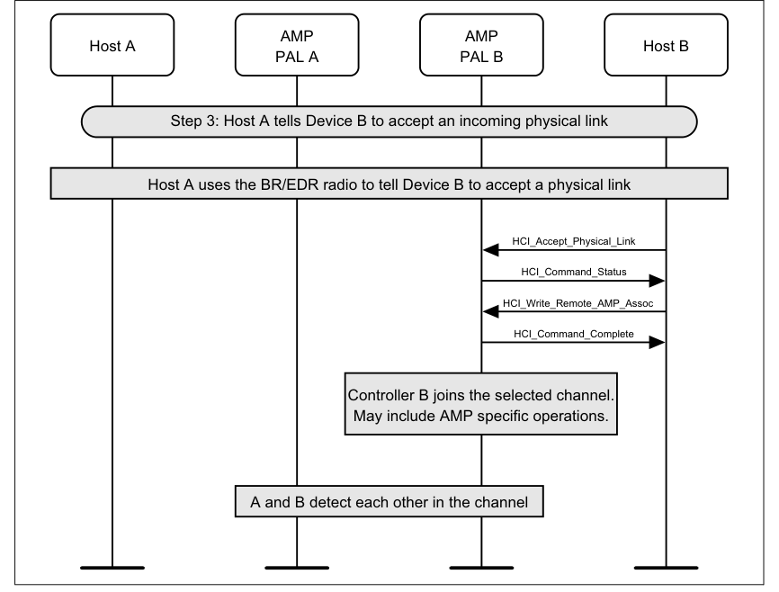

**Figure 4.50:  Host A tells Host B to accept an incoming physical link**

Step 4: The AMP Controllers perform security operations. When the handshake is complete, both devices inform their Hosts that the link is ready for use. Note that the mechanism used to transport the authentication messages is defined by each PAL.

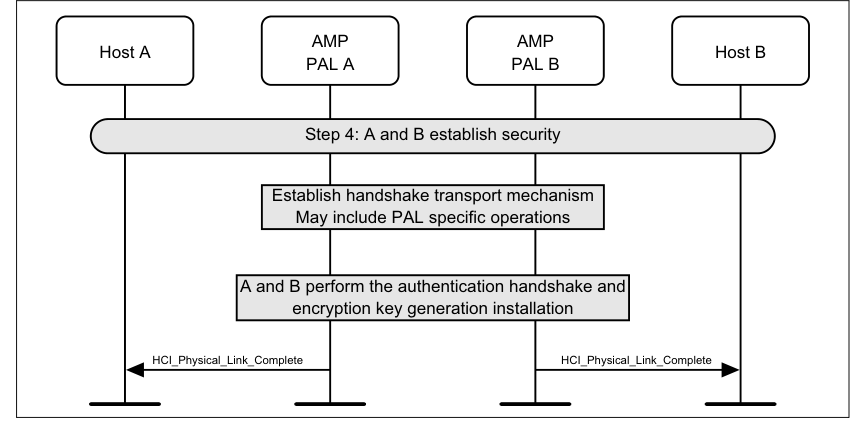

**Figure 4.51:  A and B establish AMP physical link security**

Step 5: Host A sends a Physical Link Disconnect command to its AMP Controller. AMP Controllers A and B do whatever AMP specific action is required to meet the request. Each AMP Controller sends the Physical Link Disconnect Complete event to its Host. Both devices can now leave the AMP channel.
Note that disconnection of any active Logical Links is not shown in Figure 4.52.

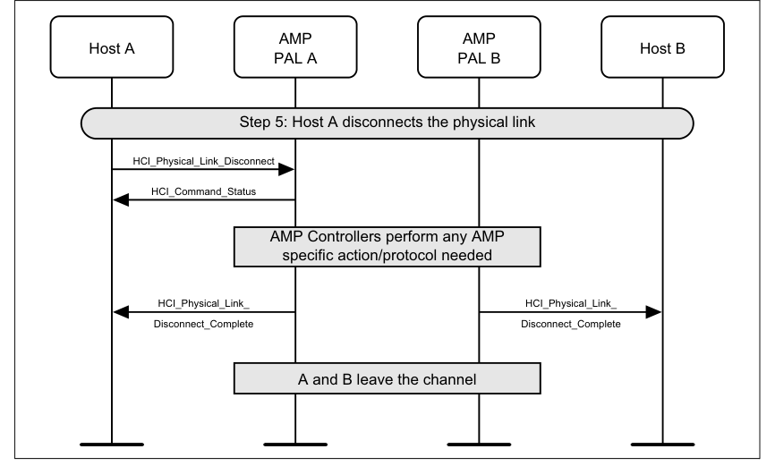

**Figure 4.52:  Host A disconnects the physical link**

Step 6: During normal operation the AMP Controller may alert its Host to issues on the link.

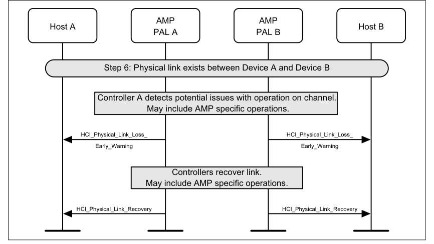

**Figure 4.53:  Controller reports link loss to its Host**

#### 4.16.2  Logical Link Creation

Step 1: Host A sends a Logical Link Create command to its AMP Controller. AMP Controllers A and B do whatever AMP specific action is required to meet the bandwidth request. Each AMP Controller sends the Logical Link Creation Complete event to its Host. Both devices can now pass data traffic over the AMP channel.
A flow diagram of the establishment of a Guaranteed logical connection between two devices is shown in Figure 4.54.

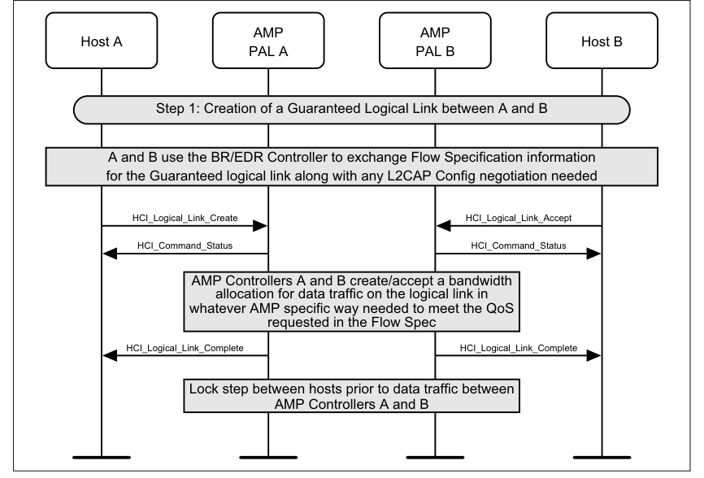

**Figure 4.54:  Guaranteed logical link creation**

Step 2: Host A sends a Logical Link Disconnect command to its AMP Controller. AMP Controllers A and B do whatever AMP specific action is required to meet the request. Each AMP Controller sends the Logical Link Disconnect Complete event to its Host.

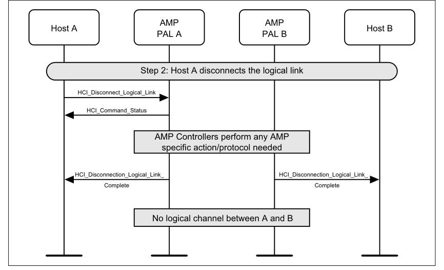

**Figure 4.55:  Host A disconnects the logical link**

Step 3: During normal operation the Host may modify logical link characteristics.

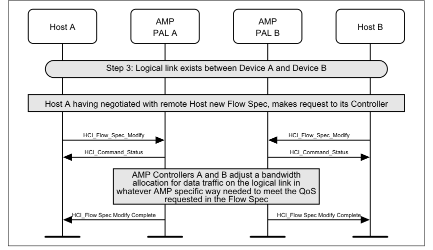

**Figure 4.56:  Host A modifies Flow_Spec on an existing logical link**

### 4.17   AMP TEST MODE SEQUENCE CHARTS

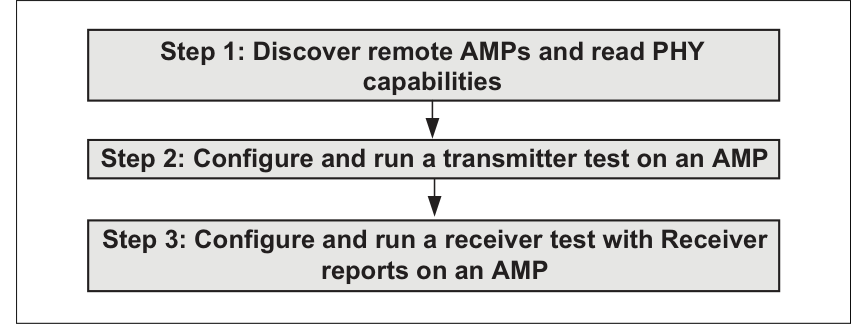

**Figure 4.57:  Overview diagram for AMP test mode**

#### 4.17.1  Discover the AMP Present and Running Transmitter and Receiver Tests

The process of discovering the number of AMPs and running transmitter and receiver tests is detailed in the following three steps.
Step 1: The tester sends an AMP Discovery Request to the AMP Test Manager of the DUT over the BR/EDR ACL connection. The AMP Test Manager will reply with the AMP Discover Response to the tester with a list of available AMP and type over the BR/EDR ACL connection. The tester then requests the PHY capabilities for each of the AMP it may test.

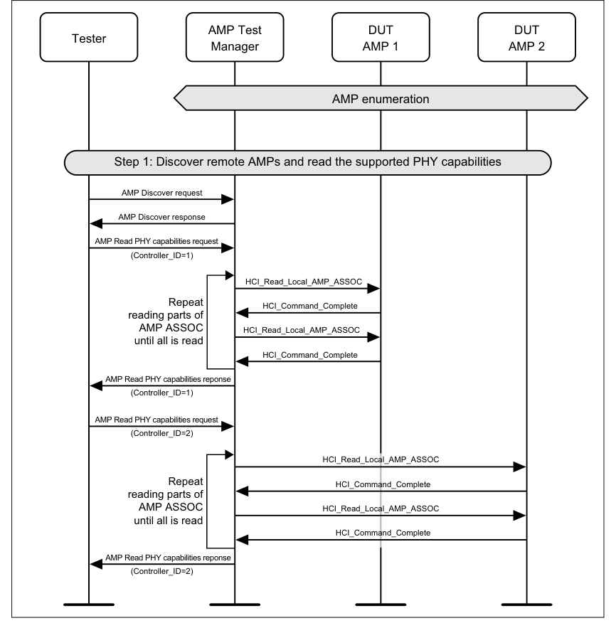

**Figure 4.58:  Discover remote AMPs and their PHY capabilities**

Step 2: In order to configure a transmitter test, the Tester sends an HCI_AMP_Test_Command to the AMP Test Manager of the DUT using the L2CAP AMP Test Message for the AMP Controller indicated by the Controller_ID. The AMP Test Manager sends on the HCI_AMP_Test_Command on to the AMP indicated by the Controller_ID. When the HCI_AMP_Start_Test_Event is returned from the AMP Controller, the event will be sent via the AMP Test Manager back to the Tester within an L2CAP AMP Test message.

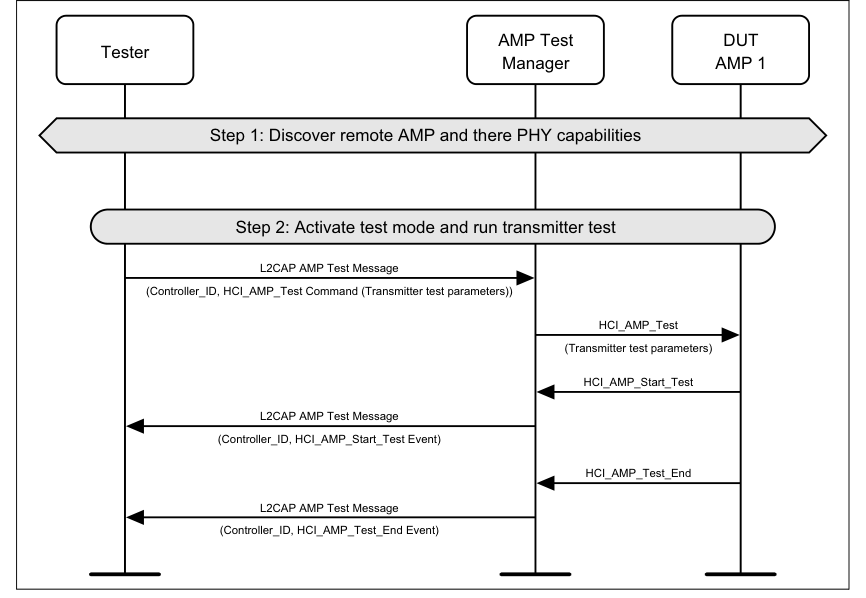

**Figure 4.59:  Activate test mode and run a transmitter test**

Step 3: In order to Enable AMP Receiver Reports, the Tester sends an AMP test command to the AMP Test Manager of the DUT using the L2CAP AMP Test message for the AMP Controller indicated by the Controller_ID. The Command_Complete_Event is returned to the Tester via the AMP Test Manager in an L2CAP AMP Test Message.
In order to configure a receiver test, the Tester sends an HCI_AMP_Test_Command to the AMP Test Manager of the DUT using the L2CAP AMP Test Message for the AMP Controller indicated by the Controller_ID. The AMP Test Manager sends on the HCI_AMP_Test_Command on to the AMP indicated by the Controller_ID. The HCI_AMP_Start_Event is returned to the Tester via the AMP Test Manager in an L2CAP AMP Test Message.
AMP_Receiver_Reports and the HCI_Test_End_Event are sent back to the Tester via the AMP Test Manager from the Controller and then the Recever reports is disabled by the Tester using the HCI_Enable_AMP_Receiver_Reports command.

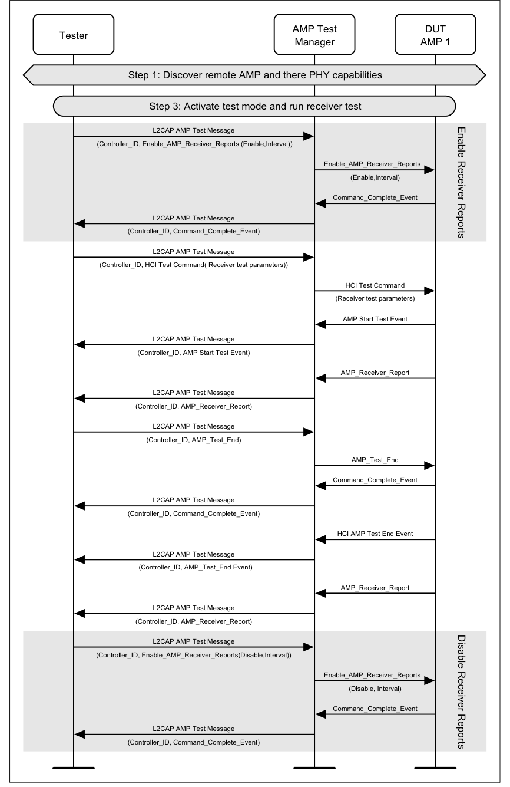

**Figure 4.60:  Configure and run a receiver test with receiver reports on an AMP**

### 4.18   SLOT AVAILABILITY MASK

A flow diagram of SAM negotiation between two devices is shown in Figure 4.61. The setup of SAM may be triggered by the Link Manager for MWS coexistence or topology management purposes. For MWS coexistence, SAM LMP sequences may be triggered by the HCI commands "Set_External_Frame_Configuration" and "Set_MWS_PATTERN_Configuration" or by the real-time signals (e.g. MWS_PATTERN_Index, FRAME_SYNC, etc) from the Coexistence Logical Interface (see [Vol 7] Part A), as these contain information for the SAM_Index to be activated and the SAM anchor point for MWS coexistence. Piconet Clock Adjustment may be performed to create more available slot pairs per MWS frame before initiating the LMP_SAM_switch sequence.

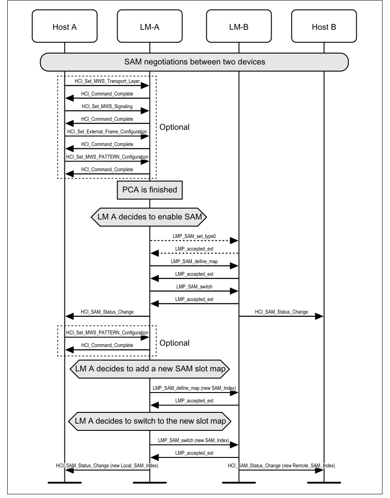

**Figure 4.61:  SAM negotiations between two devices**

### 4.19   LMP TRANSACTION COLLISION

The Link Managers of both the master and slave may initiate the same LMP transaction at the same time.

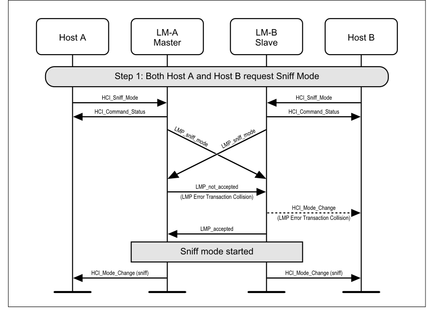

**Figure 4.62:  LMP Transaction Collision**

## 5  SYNCHRONOUS CONNECTION ESTABLISHMENT AND DETACHMENT

### 5.1   SYNCHRONOUS CONNECTION SETUP

Using the HCI_Setup_Synchronous_Connection command, a Host can add a synchronous logical channel to the link. A synchronous logical link can be provided by creating a SCO or an eSCO logical transport.
Note: An ACL Connection must be established before a synchronous connection can be created.
Step 1a:  Master device requests a synchronous connection with a device. (See Figure 5.1.)

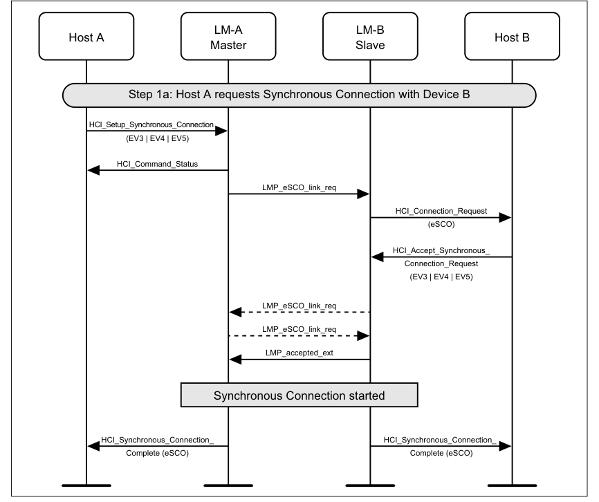

**Figure 5.1:  Master requests synchronous EV3, EV4 or EV5 connection**

Step 1b:  Slave device requests a synchronous connection with a device. (See Figure 5.2.)

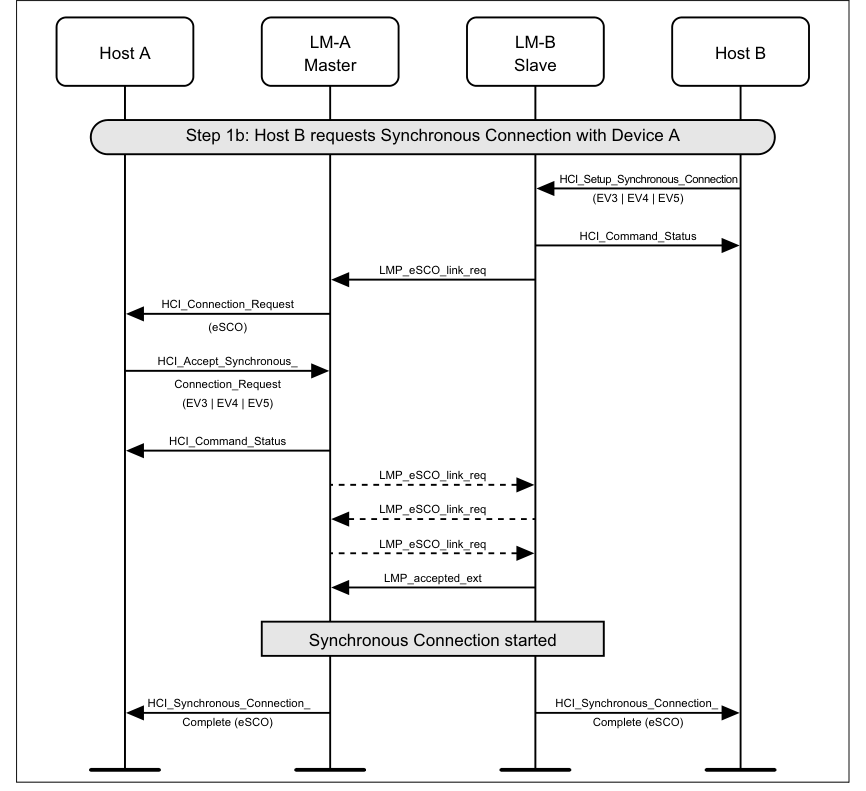

**Figure 5.2:  Slave requests synchronous EV3, EV4 or EV5 connection**

Step 1c:  Master device requests a SCO connection with a device. (See Figure 5.3.)

**Figure 5.3:  Master requests synchronous connection using SCO**

Step 1d:  Master device requests a SCO connection with a device. (See Figure 5.4.)

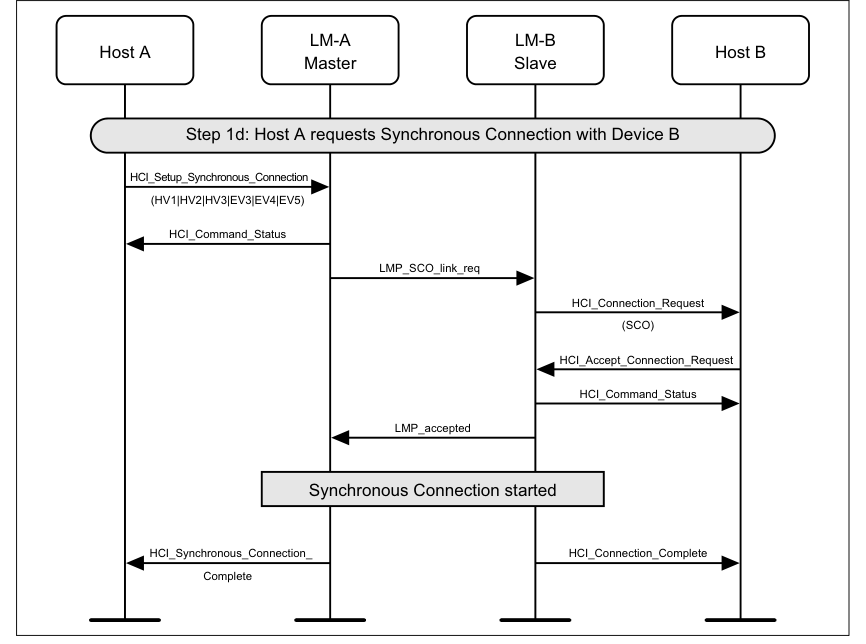

**Figure 5.4:  Master requests synchronous connection with legacy slave**

Step 1e:  Host device requests a SCO connection with a device. (See Figure 5.5.)

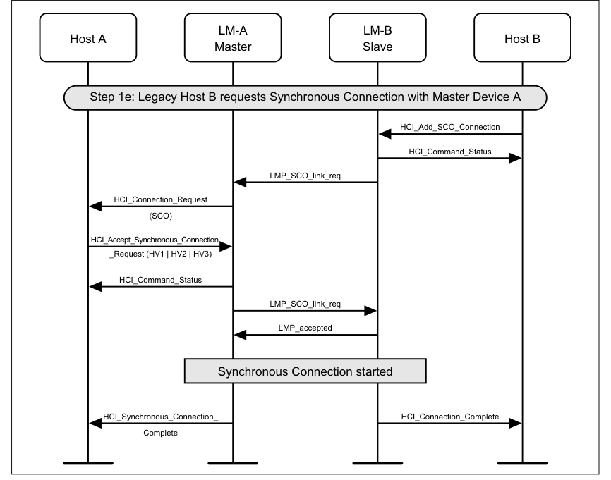

**Figure 5.5:  Any device that supports only SCO connections requests a synchronous connection with a device**

Step 2a:  Master renegotiates eSCO connection (see Figure 5.6.)

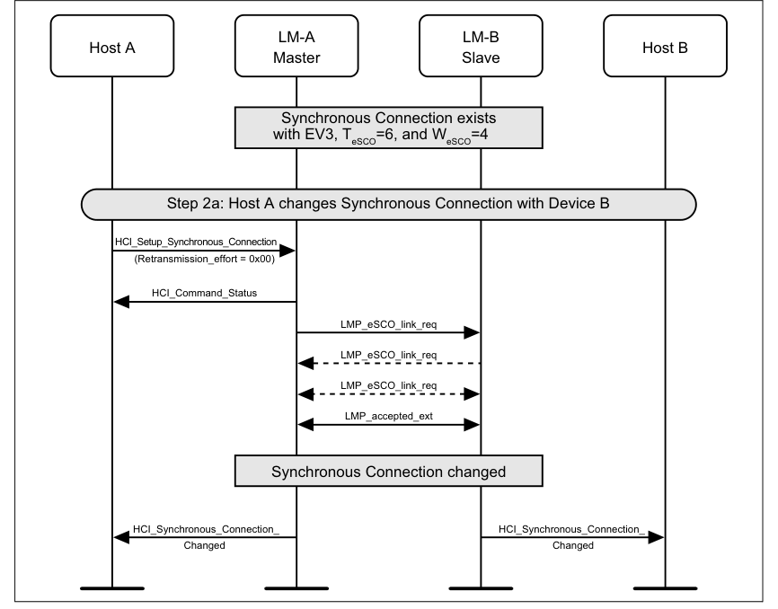

**Figure 5.6:  Master renegotiates eSCO connection**

Step 2b:  Slave renegotiates eSCO connection (see Figure 5.7.)

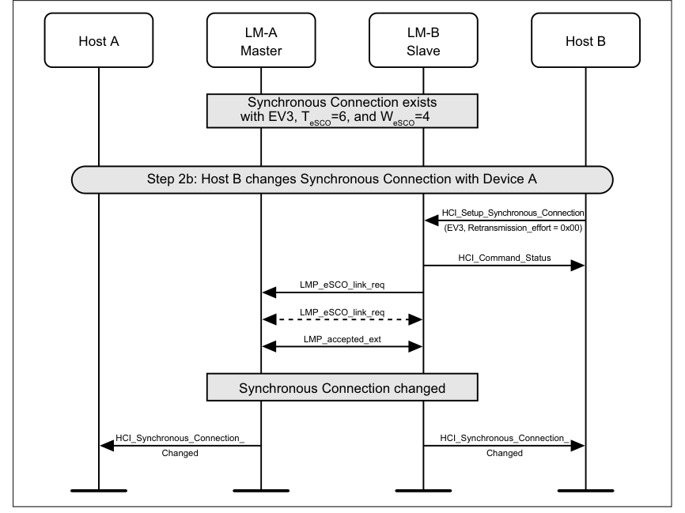

**Figure 5.7:  Slave renegotiates eSCO connection**

Step 3a:  eSCO Disconnection. (See Figure 5.8.)

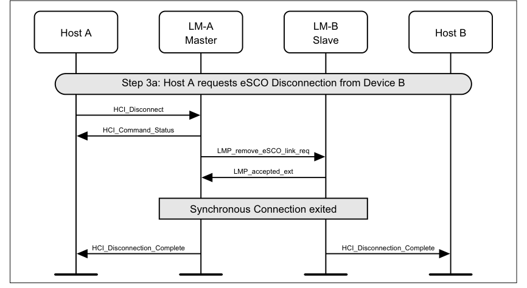

**Figure 5.8:  Synchronous disconnection of eSCO connection**

Step 3b:  SCO Disconnection. (See Figure 5.9.)

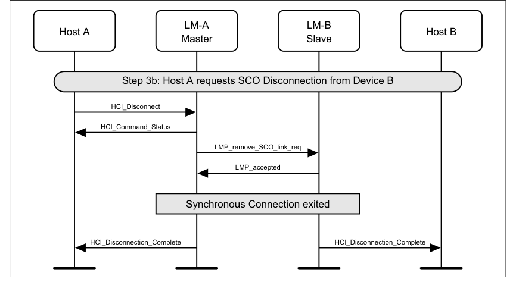

**Figure 5.9:  Synchronous disconnection of SCO connection**

### 5.2   SYNCHRONOUS CONNECTION SETUP WITH ENHANCED SYNCHRONOUS COMMANDS

Using the HCI_Enhanced_Setup_Synchronous_Connection command, a Host can add a synchronous logical channel to the link. A synchronous logical link can be provided by creating a SCO or an eSCO logical transport.
Note: An ACL Connection must be established before a synchronous connection can be created.
Step 1a: Master device requests a synchronous connection with a slave device.

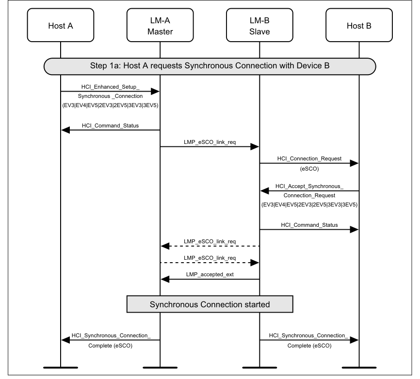

**Figure 5.10:  Master requests synchronous connection (EV3, EV4, EV5, 2-EV3, 2-EV5, 3-EV3, or 3-EV5)**

Step 1b: Slave device requests a synchronous connection with a master device.

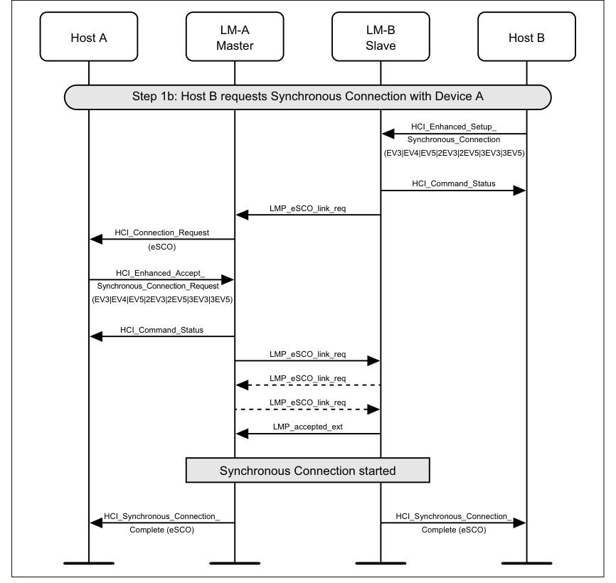

**Figure 5.11:  Slave requests synchronous connection (EV3, EV4, EV5, 2-EV3, 2-EV5, 3-EV3, or 3-EV5)**

Step 1c: Master device requests a SCO connection with a slave device.

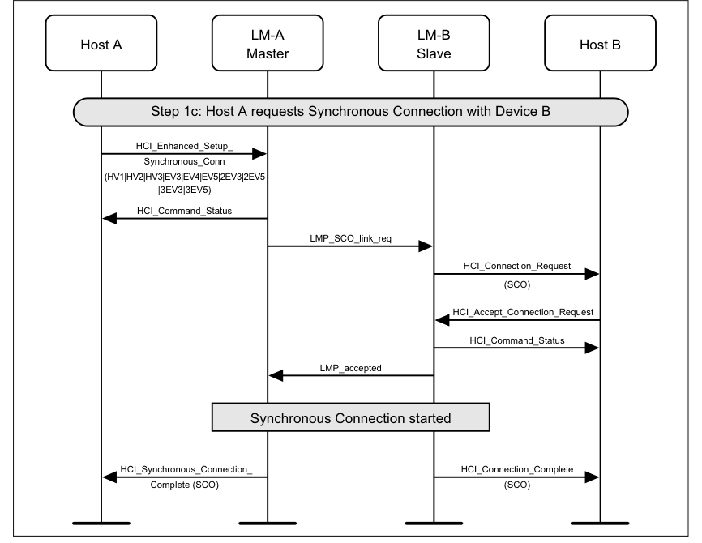

**Figure 5.12:  Master requests synchronous connection (HV1, HV2, HV3, EV3, EV4, EV5, 2EV3, 2EV5, 3EV3 or 3EV5)**

Step 1d: Slave device requests a SCO connection with a master device.

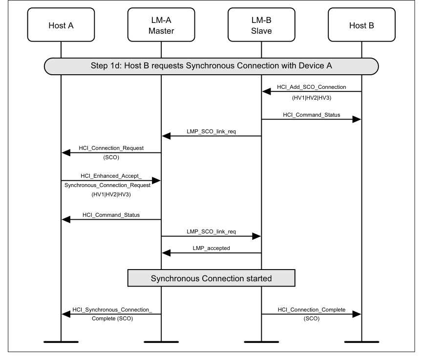

**Figure 5.13:  Slave requests synchronous connection (HV1, HV2, or HV3)**

Step 2a: Master renegotiates eSCO connection.

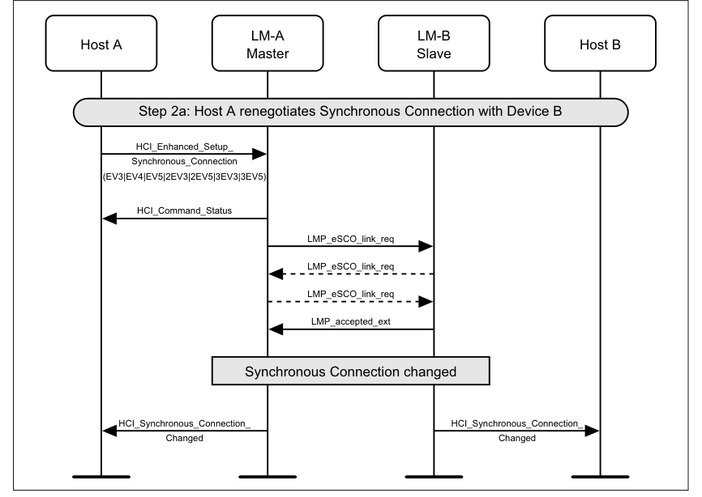

**Figure 5.14:  Master renegotiates synchronous connection parameter change**

Step 2b: Slave renegotiates eSCO connection.

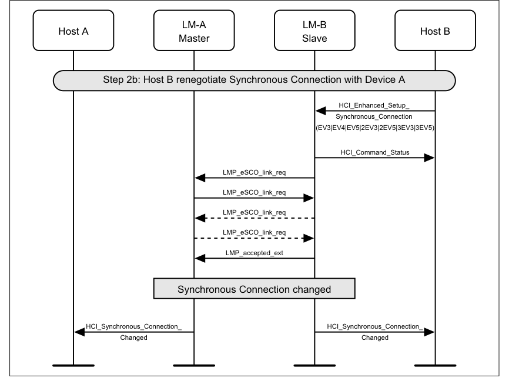

**Figure 5.15:  Slave renegotiates synchronous connection parameter change**

## 6  SNIFF AND HOLD

Entry into Sniff mode or Hold mode requires an established ACL Connection.

### 6.1   SNIFF MODE

The HCI_Sniff_Mode command is used to enter sniff mode. The HCI_Exit_Sniff_Mode command is used to exit sniff mode.
Step 1:  Host requests to enter sniff mode. Multiple LMP_sniff_req PDUs may be sent as the parameters for sniff mode are negotiated. (See Figure 6.1.)

**Figure 6.1:  Sniff mode request**

Step 2:  Host requests to exit sniff mode. (See Figure 6.2.)

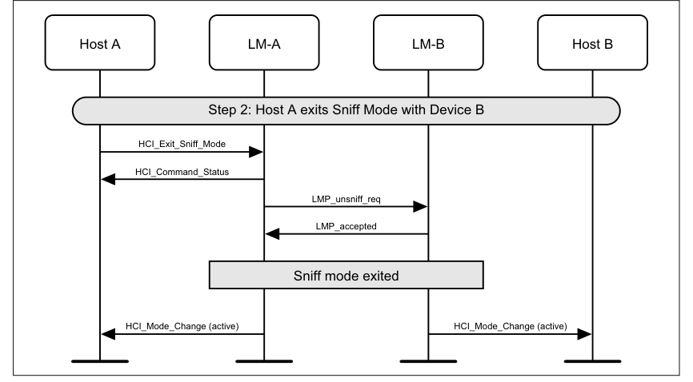

**Figure 6.2:  Exit sniff mode request**

### 6.2   HOLD MODE

The HCI_Hold_Mode command can be used to place a device into hold mode. The Controller may do this by either negotiating the hold mode parameters or forcing hold mode. Hold mode will automatically end after the negotiated length of time.
Step 1a:  A Host requests hold mode. (See Figure 6.3.)

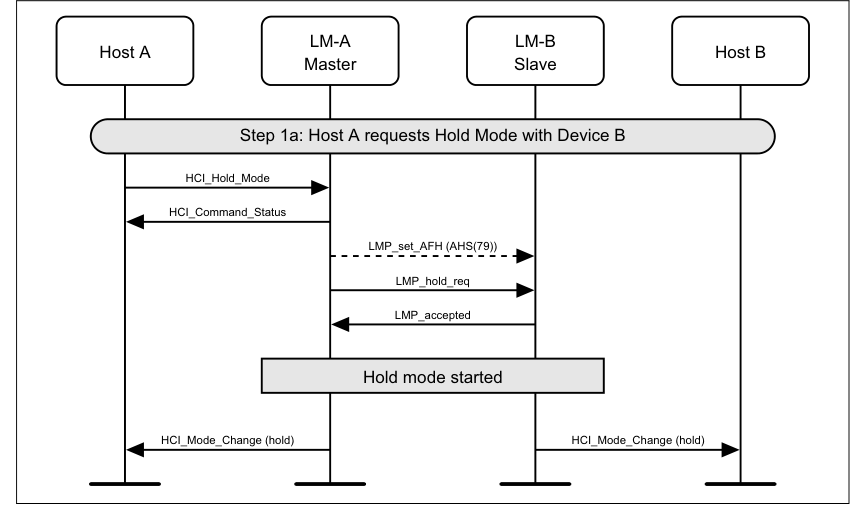

**Figure 6.3:  Hold request**

Step 1b:  A Host may force hold mode. (See Figure 6.4.)

**Figure 6.4:  Master forces hold mode**

Step 1c:  A slave device requests hold mode. (See Figure 6.5.)

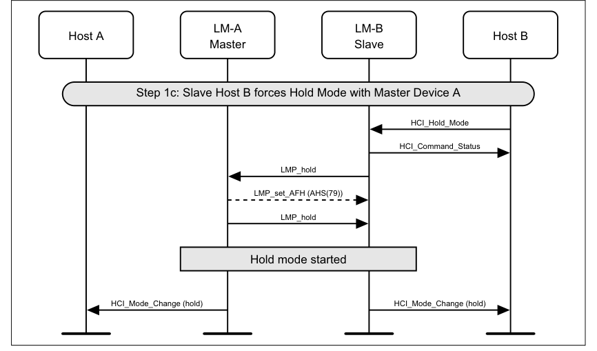

**Figure 6.5:  Slave forces hold mode**

Step 2:  When hold mode completes the Hosts are notified using the HCI_Mode_Change event. (See Figure 6.6.)

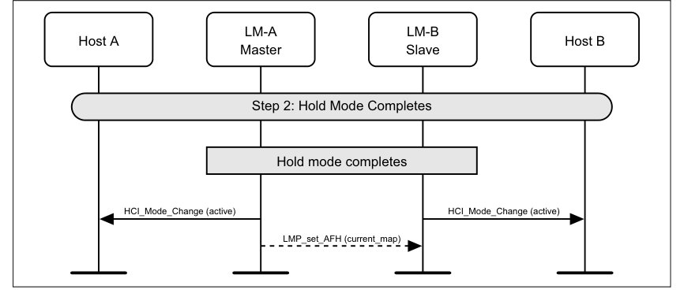

**Figure 6.6:  Hold mode completes**

### 6.3   THIS SECTION NO LONGER USED

## 7  BUFFER MANAGEMENT, FLOW CONTROL

Buffer management is very important for resource limited devices. This can be achieved on the Host Controller Interface using the HCI_Read_Buffer_Size command, and the HCI_Number_Of_Completed_Packets event, and the HCI_Set_Host_Controller_To_Host_Flow_Control, HCI_Host_Buffer_Size and HCI_Host_Number_Of_Completed_Packets commands.
Step 1:  During initialization, the Host reads the buffer sizes available in the Controller. When an HCI Data Packet has been transferred to the remote device, and a Baseband acknowledgment has been received for this data, then an HCI_Number_Of_Completed_Packets event will be generated. (See Figure 7.1.)

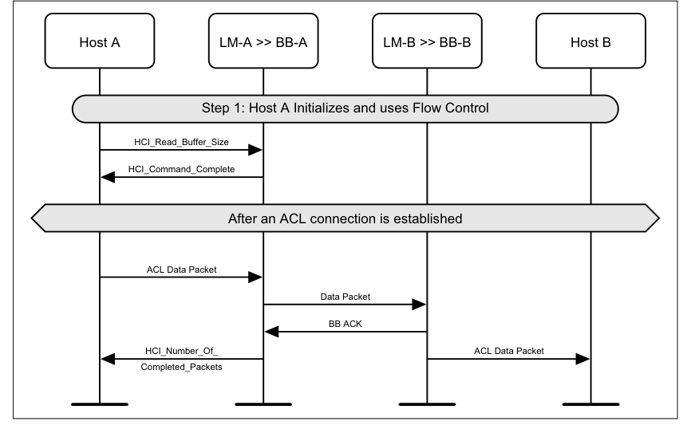

**Figure 7.1:  Host to Controller flow control**

Step 2:  During initialization, the Host notifies the Controller that Host flow control shall be used, and then the Host buffer sizes available. When a data packet has been received from a remote device, an HCI Data Packet is sent to the Host from the Controller, and the Host shall acknowledge its receipt by sending HCI_Host_Number_Of_Completed_Packets. (See Figure 7.2.)

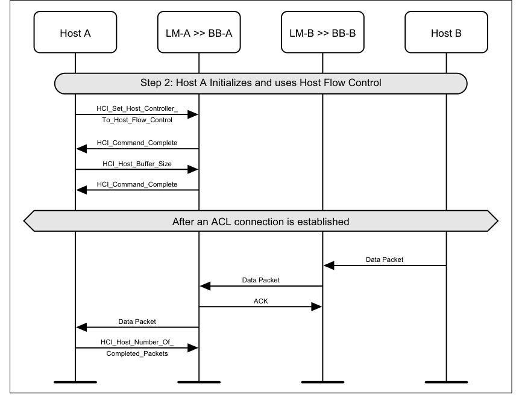

**Figure 7.2:  Controller to Host flow control**

## 8  LOOPBACK MODE

The loopback modes are used for testing of a device only.

### 8.1   LOCAL LOOPBACK MODE

The local loopback mode is used to loopback received HCI Commands, and HCI ACL and HCI Synchronous packets sent from the Host to the Controller.
Step 1:  The Host enters local loopback mode. Four connection complete events are generated and then a command complete event. (See Figure 8.1.)

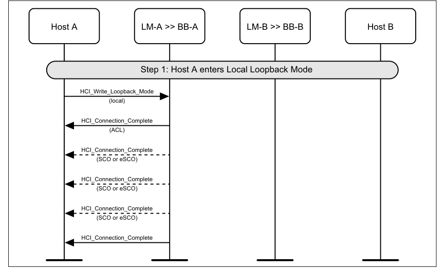

**Figure 8.1:  Entering local loopback mode**

Step 2a:  The Host sending HCI Data Packet will receive the exact same data back in HCI Data Packets from the Controller. (See Figure 8.2.)

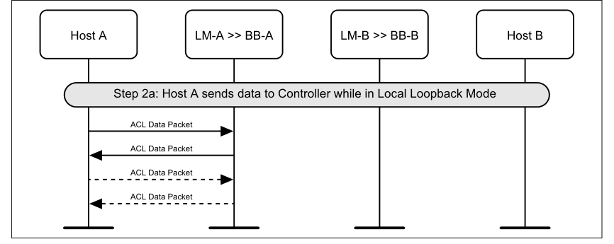

**Figure 8.2:  Looping back data in local loopback mode**

Step 2b:  The Host sending most HCI Command Packets to the Controller will receive an HCI_Loopback_Command event with the contents of the HCI Command Packet in the payload. (See Figure 8.3.)

**Figure 8.3:  Looping back commands in local loopback mode**

Step 3:  The Host exits local loopback mode. Multiple disconnection complete events are generated before the command complete event. (See Figure 8.4.)

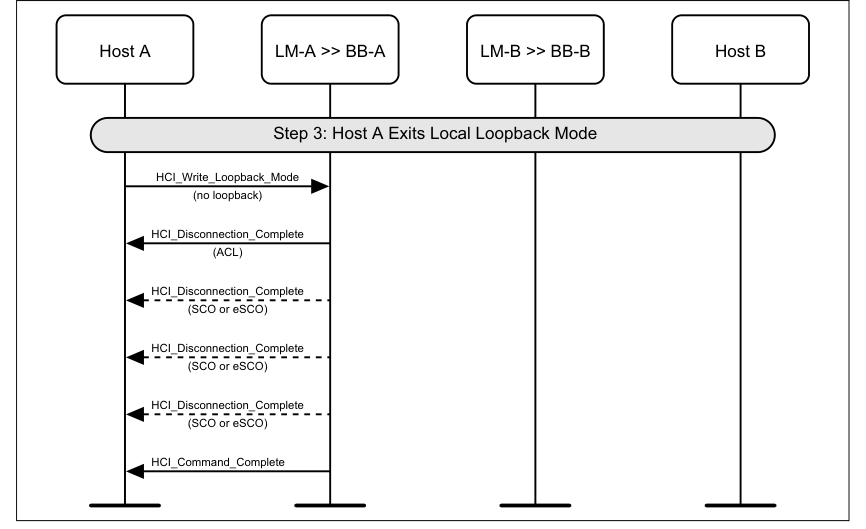

**Figure 8.4:  Exiting local loopback mode**

### 8.2   REMOTE LOOPBACK MODE

The remote loopback mode is used to loopback data to a remote device over the air.
Step 1:  The local device first enables remote loopback. The remote Host then sets up a connection to the local device. (See Figure 8.5.)

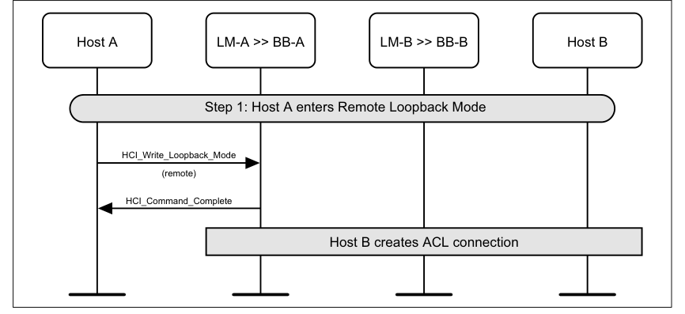

**Figure 8.5:  Entering remote loopback mode**

Step 2:  Any data received from the remote Host will be looped back in the Controller of the local device. (See Figure 8.6.)

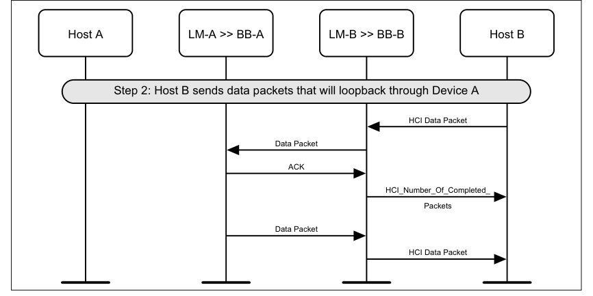

**Figure 8.6:  Looping back data in remote loopback mode**

Step 3:  The local Host exits remote loopback mode. Any connections can then be disconnected by the remote device. (See Figure 8.7.)

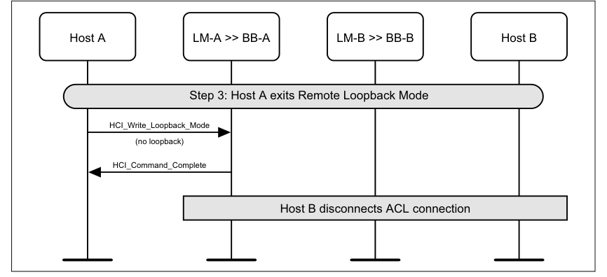

**Figure 8.7:  Exiting remote loopback mode**

## 9  CONNECTIONLESS SLAVE BROADCAST SERVICES

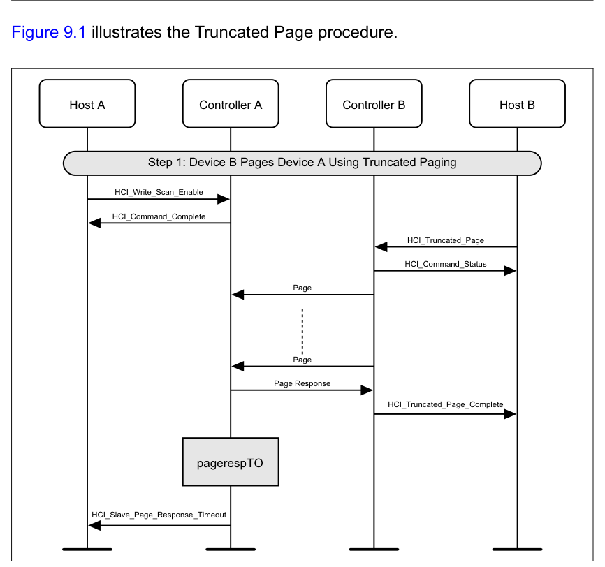

**Figure 9.1:  Truncated paging**

Figure 9.2 illustrates how Device A starts transmitting Connectionless Slave Broadcast packets to Device B.

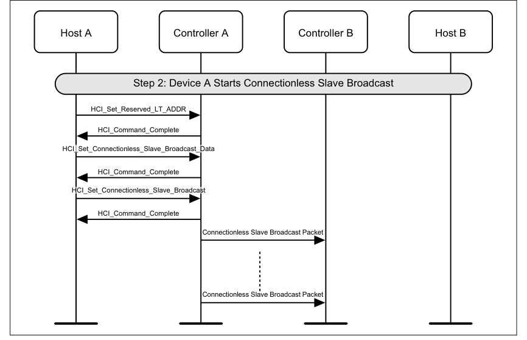

**Figure 9.2:  Connectionless slave broadcast transmitter start**

Figure 9.3 shows the Synchronization Train feature. Device A is the Connectionless Slave Broadcast Transmitter. Device B is the Connectionless Slave Broadcast Receiver.

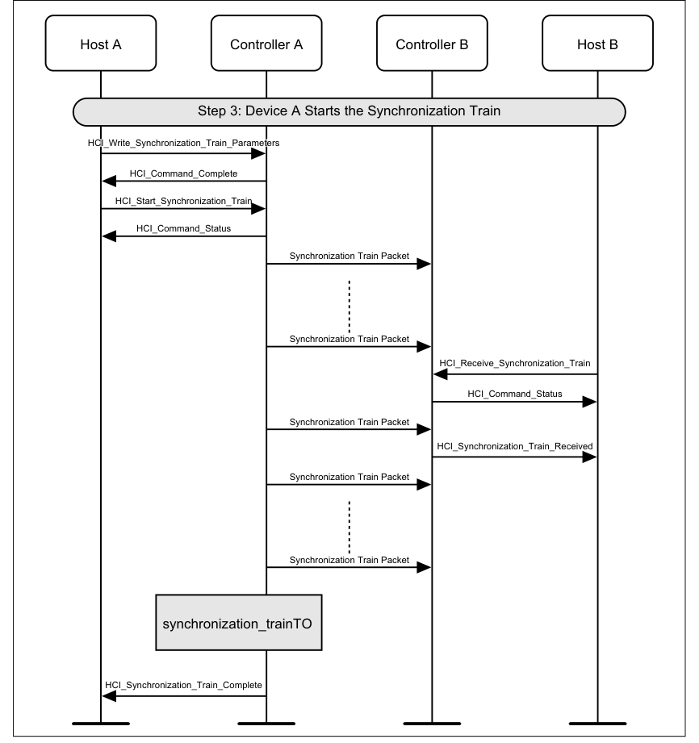

**Figure 9.3:  Synchronization train**

Figure 9.4 illustrates how Device B starts receiving Connectionless Slave Broadcast packets from Device A.

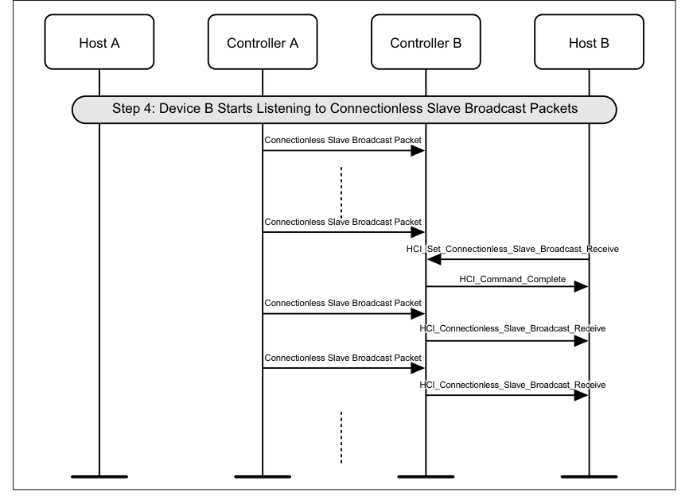

**Figure 9.4:  Connectionless slave broadcast receiver start**

Core System Package [BR/EDR Controller volume] Part G
PART G: SAMPLE DATA
Sample data for various parts of the Bluetooth baseband specification. All sample data are provided for reference purpose only; they are intended as a complement to the definitions provided elsewhere in the specification. They can be used to check the behavior of an implementation and avoid misunderstandings. Fulfilling these sample data is a necessary but not sufficient condition for an implementation to be fully Bluetooth compliant.
CONTENTS

## 1  ENCRYPTION SAMPLE DATA

### 1.1   E0 ENCRYPTION SAMPLE DATA

This section contains four sets of sample data for the encryption process.
With respect to the functional description of the encryption engine in the Bluetooth baseband specification, the contents of registers and resulting concurrent values are listed as well. This by no means excludes different implementations (as far as they produce the same encryption stream) but is intended to describe the functional behavior.
In case of misunderstandings or inconsistencies, these sample data form the normative reference.

#### 1.1.1  Generating Kc' from Kc

where Kc'(x) = g2(x)(Kc(x) mod g1(x)).
Note: All polynomials are in hexadecimal notation.
'L' is the effective key length in bytes.
The notation 'p: [m]' implies that deg(p(x)) = m.
MSB LSB
L = 1
g1: [8] 00000000 00000000 00000000 0000011d
g2: [119] 00e275a0 abd218d4 cf928b9b bf6cb08f
Kc: a2b230a4 93f281bb 61a85b82 a9d4a30e
Kc mod g1: [7] 00000000 00000000 00000000 0000009f
g2(Kc mod g1): [126] 7aa16f39 59836ba3 22049a7b 87f1d8a5
-----------------------------------------------------------
L = 2
g1: [16] 00000000 00000000 00000000 0001003f
g2: [112] 0001e3f6 3d7659b3 7f18c258 cff6efef
Kc: 64e7df78 bb7ccaa4 61433123 5b3222ad
Kc mod g1: [12] 00000000 00000000 00000000 00001ff0
g2(Kc mod g1): [124] 142057bb 0bceac4c 58bd142e 1e710a50
-----------------------------------------------------------
L = 3
g1: [24] 00000000 00000000 00000000 010000db
g2: [104] 000001be f66c6c3a b1030a5a 1919808b
Kc: 575e5156 ba685dc6 112124ac edb2c179
Kc mod g1: [23] 00000000 00000000 00000000 008ddbc8
g2(Kc mod g1): [127] d56d0adb 8216cb39 7fe3c591 1ff95618
-----------------------------------------------------------
L = 4
g1: [32] 00000000 00000000 00000001 000000af
g2: [96] 00000001 6ab89969 de17467f d3736ad9
Kc: 8917b4fc 403b6db2 1596b86d 1cb8adab
Kc mod g1: [31] 00000000 00000000 00000000 aa1e78aa
g2(Kc mod g1): [127] 91910128 b0e2f5ed a132a03e af3d8cda
-----------------------------------------------------------
L = 5
g1: [40] 00000000 00000000 00000100 00000039
g2: [88] 00000000 01630632 91da50ec 55715247
Kc: 785c915b dd25b9c6 0102ab00 b6cd2a68
Kc mod g1: [38] 00000000 00000000 0000007f 13d44436
g2(Kc mod g1): [126] 6fb5651c cb80c8d7 ea1ee56d f1ec5d02
-----------------------------------------------------------
L = 6
g1: [48] 00000000 00000000 00010000 00000291
g2: [77] 00000000 00002c93 52aa6cc0 54468311
Kc: 5e77d19f 55ccd7d5 798f9a32 3b83e5d8
Kc mod g1: [47] 00000000 00000000 000082eb 4af213ed
g2(Kc mod g1): [124] 16096bcb afcf8def 1d226a1b 4d3f9a3d
-----------------------------------------------------------
L = 7
g1: [56] 00000000 00000000 01000000 00000095
g2: [71] 00000000 000000b3 f7fffce2 79f3a073
Kc: 05454e03 8ddcfbe3 ed024b2d 92b7f54c
Kc mod g1: [55] 00000000 00000000 0095b8a4 8eb816da
g2(Kc mod g1): [126] 50f9c0d4 e3178da9 4a09fe0d 34f67b0e
-----------------------------------------------------------
L = 8
g1: [64] 00000000 00000001 00000000 0000001b
g2: [63] 00000000 00000000 a1ab815b c7ec8025
Kc: 7ce149fc f4b38ad7 2a5d8a41 eb15ba31
Kc mod g1: [63] 00000000 00000000 8660806c 1865deec
g2(Kc mod g1): [126] 532c36d4 5d0954e0 922989b6 826f78dc
-----------------------------------------------------------
L = 9
g1: [72] 00000000 00000100 00000000 00000609
g2: [49] 00000000 00000000 0002c980 11d8b04d
Kc: 5eeff7ca 84fc2782 9c051726 3df6f36e
Kc mod g1: [71] 00000000 00000083 58ccb7d0 b95d3c71
g2(Kc mod g1): [120] 016313f6 0d3771cf 7f8e4bb9 4aa6827d
-----------------------------------------------------------
L = 10
g1: [80] 00000000 00010000 00000000 00000215
g2: [42] 00000000 00000000 0000058e 24f9a4bb
Kc: 7b13846e 88beb4de 34e7160a fd44dc65
Kc mod g1: [79] 00000000 0000b4de 34171767 f36981c3
g2(Kc mod g1): [121] 023bc1ec 34a0029e f798dcfb 618ba58d
-----------------------------------------------------------
L = 11
g1: [88] 00000000 01000000 00000000 0000013b
g2: [35] 00000000 00000000 0000000c a76024d7
Kc: bda6de6c 6e7d757e 8dfe2d49 9a181193
Kc mod g1: [86] 00000000 007d757e 8dfe88aa 2fcee371
g2(Kc mod g1): [121] 022e08a9 3aa51d8d 2f93fa78 85cc1f87
-----------------------------------------------------------
L = 12
g1: [96] 00000001 00000000 00000000 000000dd
g2: [28] 00000000 00000000 00000000 1c9c26b9
Kc: e6483b1c 2cdb1040 9a658f97 c4efd90d
Kc mod g1: [93] 00000000 2cdb1040 9a658fd7 5b562e41
g2(Kc mod g1): [121] 030d752b 216fe29b b880275c d7e6f6f9
-----------------------------------------------------------
L = 13
g1: [104] 00000100 00000000 00000000 0000049d
g2: [21] 00000000 00000000 00000000 0026d9e3
Kc: d79d281d a2266847 6b223c46 dc0ab9ee
Kc mod g1: [100] 0000001d a2266847 6b223c45 e1fc5fa6
g2(Kc mod g1): [121] 03f11138 9cebf919 00b93808 4ac158aa
-----------------------------------------------------------
L = 14
g1: [112] 00010000 00000000 00000000 0000014f
g2: [14] 00000000 00000000 00000000 00004377
Kc: cad9a65b 9fca1c1d a2320fcf 7c4ae48e
Kc mod g1: [111] 0000a65b 9fca1c1d a2320fcf 7cb6a909
g2(Kc mod g1): [125] 284840fd f1305f3c 529f5703 76adf7cf
-----------------------------------------------------------
L = 15
g1: [120] 01000000 00000000 00000000 000000e7
g2: [7] 00000000 00000000 00000000 00000089
Kc: 21f0cc31 049b7163 d375e9e1 06029809
Kc mod g1: [119] 00f0cc31 049b7163 d375e9e1 0602840e
g2(Kc mod g1): [126] 7f10b53b 6df84b94 f22e566a 3754a37e
-----------------------------------------------------------
L = 16
g1: [128] 00000001 00000000 00000000 00000000 00000000
g2: [0] 00000000 00000000 00000000 00000001
Kc: 35ec8fc3 d50ccd32 5f2fd907 bde206de
Kc mod g1: [125] 35ec8fc3 d50ccd32 5f2fd907 bde206de
g2(Kc mod g1): [125] 35ec8fc3 d50ccd32 5f2fd907 bde206de
-----------------------------------------------------------

#### 1.1.2  First Set of Sample Data

Initial values for the key, pan address and clock
K’c1[0]   = 00   K’c1[1]   = 00    K’c1[2]   = 00    K’c1[3]  = 00
K’c1[4]   = 00   K’c1[5]   = 00    K’c1[6]   = 00    K’c1[7]  = 00
K’c1[8]   = 00   K’c1[9]   = 00    K’c1[10]  = 00    K’c1[11] = 00
K’c1[12]  = 00   K’c1[13]  = 00    K’c1[14]  = 00    K’c1[15] = 00
Addr1[0] = 00   Addr1[1] = 00    Addr1[2] = 00
Addr1[3] = 00   Addr1[4] = 00    Addr1[5] = 00
CL1[0]  = 00   CL1[1]  = 00    CL1[2]  = 00    CL1[3]  = 00
===============================================================================================
Fill LFSRs with initial data
===============================================================================================
t  clk#    LFSR1    LFSR2     LFSR3      LFSR4           X1 X2 X3 X4   Z  C[t+1] C[t] C[t-1]

## 0     0    0000000* 00000000* 000000000* 0000000000*     0  0  0  0    0  00     00   00

## 1     1    0000000* 00000001* 000000000* 0000000001*     0  0  0  0    0  00     00   00

## 2     2    0000000* 00000002* 000000000* 0000000003*     0  0  0  0    0  00     00   00

## 3     3    0000000* 00000004* 000000000* 0000000007*     0  0  0  0    0  00     00   00

## 4     4    0000000* 00000008* 000000000* 000000000E*     0  0  0  0    0  00     00   00

## 5     5    0000000* 00000010* 000000000* 000000001C*     0  0  0  0    0  00     00   00

## 6     6    0000000* 00000020* 000000000* 0000000038*     0  0  0  0    0  00     00   00

## 7     7    0000000* 00000040* 000000000* 0000000070*     0  0  0  0    0  00     00   00

## 8     8    0000000* 00000080* 000000000* 00000000E0*     0  0  0  0    0  00     00   00

## 9     9    0000000* 00000100* 000000000* 00000001C0*     0  0  0  0    0  00     00   00

## 10    10    0000000* 00000200* 000000000* 0000000380*     0  0  0  0    0  00     00   00

## 11    11    0000000* 00000400* 000000000* 0000000700*     0  0  0  0    0  00     00   00

## 12    12    0000000* 00000800* 000000000* 0000000E00*     0  0  0  0    0  00     00   00

## 13    13    0000000* 00001000* 000000000* 0000001C00*     0  0  0  0    0  00     00   00

## 14    14    0000000* 00002000* 000000000* 0000003800*     0  0  0  0    0  00     00   00

## 15    15    0000000* 00004000* 000000000* 0000007000*     0  0  0  0    0  00     00   00

## 16    16    0000000* 00008000* 000000000* 000000E000*     0  0  0  0    0  00     00   00

## 17    17    0000000* 00010000* 000000000* 000001C000*     0  0  0  0    0  00     00   00

## 18    18    0000000* 00020000* 000000000* 0000038000*     0  0  0  0    0  00     00   00

## 19    19    0000000* 00040000* 000000000* 0000070000*     0  0  0  0    0  00     00   00

## 20    20    0000000* 00080000* 000000000* 00000E0000*     0  0  0  0    0  00     00   00

## 21    21    0000000* 00100000* 000000000* 00001C0000*     0  0  0  0    0  00     00   00

## 22    22    0000000* 00200000* 000000000* 0000380000*     0  0  0  0    0  00     00   00

## 23    23    0000000* 00400000* 000000000* 0000700000*     0  0  0  0    0  00     00   00

## 24    24    0000000* 00800000* 000000000* 0000E00000*     0  1  0  0    1  00     00   00

## 25    25    0000000* 01000000* 000000000* 0001C00000*     0  0  0  0    0  00     00   00

## 26    26    0000000  02000000* 000000000* 0003800000*     0  0  0  0    0  00     00   00

## 27    27    0000000  04000000* 000000000* 0007000000*     0  0  0  0    0  00     00   00

## 28    28    0000000  08000000* 000000000* 000E000000*     0  0  0  0    0  00     00   00

## 29    29    0000000  10000000* 000000000* 001C000000*     0  0  0  0    0  00     00   00

## 30    30    0000000  20000000* 000000000* 0038000000*     0  0  0  0    0  00     00   00

## 31    31    0000000  40000000* 000000000* 0070000000*     0  0  0  0    0  00     00   00

## 32    32    0000000  00000001  000000000* 00E0000000*     0  0  0  1    1  00     00   00

## 33    33    0000000  00000002  000000000* 01C0000000*     0  0  0  1    1  00     00   00

## 34    34    0000000  00000004  000000000  0380000000*     0  0  0  1    1  00     00   00

## 35    35    0000000  00000008  000000000  0700000000*     0  0  0  0    0  00     00   00

## 36    36    0000000  00000010  000000000  0E00000000*     0  0  0  0    0  00     00   00

## 37    37    0000000  00000020  000000000  1C00000000*     0  0  0  0    0  00     00   00

## 38    38    0000000  00000040  000000000  3800000000*     0  0  0  0    0  00     00   00

## 39    39    0000000  00000080  000000000  7000000000*     0  0  0  0    0  00     00   00

===============================================================================================
Start clocking Summation Combiner
===============================================================================================

## 40     1    0000000  00000100  000000000  6000000001      0  0  0  0    0  00     00   00

## 41     2    0000000  00000200  000000000  4000000003      0  0  0  0    0  00     00   00

## 42     3    0000000  00000400  000000000  0000000007      0  0  0  0    0  00     00   00

## 43     4    0000000  00000800  000000000  000000000E      0  0  0  0    0  00     00   00

## 44     5    0000000  00001001  000000000  000000001D      0  0  0  0    0  00     00   00

## 45     6    0000000  00002002  000000000  000000003B      0  0  0  0    0  00     00   00

## 46     7    0000000  00004004  000000000  0000000077      0  0  0  0    0  00     00   00

## 47     8    0000000  00008008  000000000  00000000EE      0  0  0  0    0  00     00   00

## 48     9    0000000  00010011  000000000  00000001DD      0  0  0  0    0  00     00   00

## 49    10    0000000  00020022  000000000  00000003BB      0  0  0  0    0  00     00   00

## 50    11    0000000  00040044  000000000  0000000777      0  0  0  0    0  00     00   00

## 51    12    0000000  00080088  000000000  0000000EEE      0  0  0  0    0  00     00   00

## 52    13    0000000  00100110  000000000  0000001DDD      0  0  0  0    0  00     00   00

## 53    14    0000000  00200220  000000000  0000003BBB      0  0  0  0    0  00     00   00

## 54    15    0000000  00400440  000000000  0000007777      0  0  0  0    0  00     00   00

## 55    16    0000000  00800880  000000000  000000EEEE      0  1  0  0    1  00     00   00

## 56    17    0000000  01001100  000000000  000001DDDD      0  0  0  0    0  00     00   00

## 57    18    0000000  02002200  000000000  000003BBBB      0  0  0  0    0  00     00   00

## 58    19    0000000  04004400  000000000  0000077777      0  0  0  0    0  00     00   00

## 59    20    0000000  08008800  000000000  00000EEEEE      0  0  0  0    0  00     00   00

## 60    21    0000000  10011000  000000000  00001DDDDD      0  0  0  0    0  00     00   00

## 61    22    0000000  20022000  000000000  00003BBBBB      0  0  0  0    0  00     00   00

## 62    23    0000000  40044000  000000000  0000777777      0  0  0  0    0  00     00   00

## 63    24    0000000  00088001  000000000  0000EEEEEE      0  0  0  0    0  00     00   00

## 64    25    0000000  00110003  000000000  0001DDDDDD      0  0  0  0    0  00     00   00

## 65    26    0000000  00220006  000000000  0003BBBBBB      0  0  0  0    0  00     00   00

## 66    27    0000000  0044000C  000000000  0007777777      0  0  0  0    0  00     00   00

## 67    28    0000000  00880018  000000000  000EEEEEEE      0  1  0  0    1  00     00   00

## 68    29    0000000  01100031  000000000  001DDDDDDC      0  0  0  0    0  00     00   00

## 69    30    0000000  02200062  000000000  003BBBBBB8      0  0  0  0    0  00     00   00

## 70    31    0000000  044000C4  000000000  0077777770      0  0  0  0    0  00     00   00

## 71    32    0000000  08800188  000000000  00EEEEEEE0      0  1  0  1    0  01     00   00

## 72    33    0000000  11000311  000000000  01DDDDDDC1      0  0  0  1    0  00     01   00

## 73    34    0000000  22000622  000000000  03BBBBBB83      0  0  0  1    1  11     00   01

## 74    35    0000000  44000C44  000000000  0777777707      0  0  0  0    1  10     11   00

## 75    36    0000000  08001888  000000000  0EEEEEEE0E      0  0  0  1    1  01     10   11

## 76    37    0000000  10003111  000000000  1DDDDDDC1D      0  0  0  1    0  01     01   10

## 77    38    0000000  20006222  000000000  3BBBBBB83B      0  0  0  1    0  11     01   01

## 78    39    0000000  4000C444  000000000  7777777077      0  0  0  0    1  01     11   01

## 79    40    0000000  00018888  000000000  6EEEEEE0EF      0  0  0  1    0  10     01   11

## 80    41    0000000  00031110  000000000  5DDDDDC1DE      0  0  0  1    1  00     10   01

## 81    42    0000000  00062220  000000000  3BBBBB83BC      0  0  0  1    1  01     00   10

## 82    43    0000000  000C4440  000000000  7777770779      0  0  0  0    1  01     01   00

## 83    44    0000000  00188880  000000000  6EEEEE0EF2      0  0  0  1    0  11     01   01

## 84    45    0000000  00311100  000000000  5DDDDC1DE5      0  0  0  1    0  10     11   01

## 85    46    0000000  00622200  000000000  3BBBB83BCB      0  0  0  1    1  01     10   11

## 86    47    0000000  00C44400  000000000  7777707797      0  1  0  0    0  01     01   10

## 87    48    0000000  01888801  000000000  6EEEE0EF2F      0  1  0  1    1  11     01   01

## 88    49    0000000  03111003  000000000  5DDDC1DE5E      0  0  0  1    0  10     11   01

## 89    50    0000000  06222006  000000000  3BBB83BCBC      0  0  0  1    1  01     10   11

## 90    51    0000000  0C44400C  000000000  7777077979      0  0  0  0    1  00     01   10

## 91    52    0000000  18888018  000000000  6EEE0EF2F2      0  1  0  1    0  10     00   01

## 92    53    0000000  31110030  000000000  5DDC1DE5E5      0  0  0  1    1  11     10   00

## 93    54    0000000  62220060  000000000  3BB83BCBCB      0  0  0  1    0  00     11   10

## 94    55    0000000  444400C1  000000000  7770779797      0  0  0  0    0  10     00   11

## 95    56    0000000  08880183  000000000  6EE0EF2F2F      0  1  0  1    0  00     10   00

## 96    57    0000000  11100307  000000000  5DC1DE5E5F      0  0  0  1    1  01     00   10

## 97    58    0000000  2220060E  000000000  3B83BCBCBF      0  0  0  1    0  00     01   00

## 98    59    0000000  44400C1C  000000000  770779797E      0  0  0  0    0  11     00   01

## 99    60    0000000  08801838  000000000  6E0EF2F2FC      0  1  0  0    0  01     11   00

## 100    61    0000000  11003070  000000000  5C1DE5E5F8      0  0  0  0    1  11     01   11

## 101    62    0000000  220060E0  000000000  383BCBCBF0      0  0  0  0    1  01     11   01

## 102    63    0000000  4400C1C0  000000000  70779797E0      0  0  0  0    1  11     01   11

## 103    64    0000000  08018380  000000000  60EF2F2FC1      0  0  0  1    0  10     11   01

## 104    65    0000000  10030701  000000000  41DE5E5F82      0  0  0  1    1  01     10   11

## 105    66    0000000  20060E02  000000000  03BCBCBF04      0  0  0  1    0  01     01   10

## 106    67    0000000  400C1C05  000000000  0779797E09      0  0  0  0    1  10     01   01

## 107    68    0000000  0018380A  000000000  0EF2F2FC12      0  0  0  1    1  00     10   01

## 108    69    0000000  00307015  000000000  1DE5E5F825      0  0  0  1    1  01     00   10

## 109    70    0000000  0060E02A  000000000  3BCBCBF04B      0  0  0  1    0  00     01   00

## 110    71    0000000  00C1C055  000000000  779797E097      0  1  0  1    0  10     00   01

## 111    72    0000000  018380AA  000000000  6F2F2FC12F      0  1  0  0    1  11     10   00

## 112    73    0000000  03070154  000000000  5E5E5F825E      0  0  0  0    1  11     11   10

## 113    74    0000000  060E02A8  000000000  3CBCBF04BC      0  0  0  1    0  11     11   11

## 114    75    0000000  0C1C0550  000000000  79797E0979      0  0  0  0    1  00     11   11

## 115    76    0000000  18380AA0  000000000  72F2FC12F2      0  0  0  1    1  10     00   11

## 116    77    0000000  30701541  000000000  65E5F825E5      0  0  0  1    1  11     10   00

## 117    78    0000000  60E02A82  000000000  4BCBF04BCB      0  1  0  1    1  00     11   10

## 118    79    0000000  41C05505  000000000  1797E09796      0  1  0  1    0  11     00   11

## 119    80    0000000  0380AA0A  000000000  2F2FC12F2C      0  1  0  0    0  01     11   00

## 120    81    0000000  07015415  000000000  5E5F825E59      0  0  0  0    1  11     01   11

## 121    82    0000000  0E02A82A  000000000  3CBF04BCB2      0  0  0  1    0  10     11   01

## 122    83    0000000  1C055054  000000000  797E097964      0  0  0  0    0  01     10   11

## 123    84    0000000  380AA0A8  000000000  72FC12F2C9      0  0  0  1    0  01     01   10

## 124    85    0000000  70154151  000000000  65F825E593      0  0  0  1    0  11     01   01

## 125    86    0000000  602A82A3  000000000  4BF04BCB26      0  0  0  1    0  10     11   01

## 126    87    0000000  40550546  000000000  17E097964C      0  0  0  1    1  01     10   11

## 127    88    0000000  00AA0A8D  000000000  2FC12F2C99      0  1  0  1    1  01     01   10

## 128    89    0000000  0154151A  000000000  5F825E5932      0  0  0  1    0  11     01   01

## 129    90    0000000  02A82A34  000000000  3F04BCB264      0  1  0  0    0  10     11   01

## 130    91    0000000  05505468  000000000  7E097964C9      0  0  0  0    0  01     10   11

## 131    92    0000000  0AA0A8D0  000000000  7C12F2C992      0  1  0  0    0  01     01   10

## 132    93    0000000  154151A1  000000000  7825E59324      0  0  0  0    1  10     01   01

## 133    94    0000000  2A82A342  000000000  704BCB2648      0  1  0  0    1  00     10   01

## 134    95    0000000  55054684  000000000  6097964C91      0  0  0  1    1  01     00   10

## 135    96    0000000  2A0A8D09  000000000  412F2C9923      0  0  0  0    1  01     01   00

## 136    97    0000000  54151A12  000000000  025E593246      0  0  0  0    1  10     01   01

## 137    98    0000000  282A3424  000000000  04BCB2648D      0  0  0  1    1  00     10   01

## 138    99    0000000  50546848  000000000  097964C91A      0  0  0  0    0  01     00   10

## 139   100    0000000  20A8D090  000000000  12F2C99235      0  1  0  1    1  00     01   00

## 140   101    0000000  4151A120  000000000  25E593246A      0  0  0  1    1  11     00   01

## 141   102    0000000  02A34240  000000000  4BCB2648D5      0  1  0  1    1  01     11   00

## 142   103    0000000  05468481  000000000  17964C91AB      0  0  0  1    0  10     01   11

## 143   104    0000000  0A8D0903  000000000  2F2C992357      0  1  0  0    1  00     10   01

## 144   105    0000000  151A1206  000000000  5E593246AE      0  0  0  0    0  01     00   10

## 145   106    0000000  2A34240C  000000000  3CB2648D5C      0  0  0  1    0  00     01   00

## 146   107    0000000  54684818  000000000  7964C91AB8      0  0  0  0    0  11     00   01

## 147   108    0000000  28D09030  000000000  72C9923571      0  1  0  1    1  01     11   00

## 148   109    0000000  51A12060  000000000  6593246AE2      0  1  0  1    1  10     01   11

## 149   110    0000000  234240C0  000000000  4B2648D5C5      0  0  0  0    0  00     10   01

## 150   111    0000000  46848180  000000000  164C91AB8A      0  1  0  0    1  01     00   10

## 151   112    0000000  0D090301  000000000  2C99235714      0  0  0  1    0  00     01   00

## 152   113    0000000  1A120602  000000000  593246AE28      0  0  0  0    0  11     00   01

## 153   114    0000000  34240C04  000000000  32648D5C51      0  0  0  0    1  10     11   00

## 154   115    0000000  68481809  000000000  64C91AB8A2      0  0  0  1    1  01     10   11

## 155   116    0000000  50903012  000000000  4992357144      0  1  0  1    1  01     01   10

## 156   117    0000000  21206024  000000000  13246AE288      0  0  0  0    1  10     01   01

## 157   118    0000000  4240C048  000000000  2648D5C511      0  0  0  0    0  00     10   01

## 158   119    0000000  04818090  000000000  4C91AB8A23      0  1  0  1    0  00     00   10

## 159   120    0000000  09030120  000000000  1923571446      0  0  0  0    0  00     00   00

## 160   121    0000000  12060240  000000000  3246AE288D      0  0  0  0    0  00     00   00

## 161   122    0000000  240C0480  000000000  648D5C511B      0  0  0  1    1  00     00   00

## 162   123    0000000  48180900  000000000  491AB8A237      0  0  0  0    0  00     00   00

## 163   124    0000000  10301200  000000000  123571446F      0  0  0  0    0  00     00   00

## 164   125    0000000  20602400  000000000  246AE288DF      0  0  0  0    0  00     00   00

## 165   126    0000000  40C04800  000000000  48D5C511BE      0  1  0  1    0  01     00   00

## 166   127    0000000  01809001  000000000  11AB8A237D      0  1  0  1    1  00     01   00

## 167   128    0000000  03012002  000000000  23571446FA      0  0  0  0    0  11     00   01

## 168   129    0000000  06024004  000000000  46AE288DF5      0  0  0  1    0  01     11   00

## 169   130    0000000  0C048008  000000000  0D5C511BEA      0  0  0  0    1  11     01   11

## 170   131    0000000  18090011  000000000  1AB8A237D5      0  0  0  1    0  10     11   01

## 171   132    0000000  30120022  000000000  3571446FAA      0  0  0  0    0  01     10   11

## 172   133    0000000  60240044  000000000  6AE288DF55      0  0  0  1    0  01     01   10

## 173   134    0000000  40480089  000000000  55C511BEAA      0  0  0  1    0  11     01   01

## 174   135    0000000  00900113  000000000  2B8A237D54      0  1  0  1    1  10     11   01

## 175   136    0000000  01200227  000000000  571446FAA8      0  0  0  0    0  01     10   11

## 176   137    0000000  0240044E  000000000  2E288DF550      0  0  0  0    1  00     01   10

## 177   138    0000000  0480089C  000000000  5C511BEAA0      0  1  0  0    1  11     00   01

## 178   139    0000000  09001138  000000000  38A237D540      0  0  0  1    0  01     11   00

## 179   140    0000000  12002270  000000000  71446FAA81      0  0  0  0    1  11     01   11

## 180   141    0000000  240044E0  000000000  6288DF5503      0  0  0  1    0  10     11   01

## 181   142    0000000  480089C0  000000000  4511BEAA06      0  0  0  0    0  01     10   11

## 182   143    0000000  10011381  000000000  0A237D540D      0  0  0  0    1  00     01   10

## 183   144    0000000  20022702  000000000  1446FAA81A      0  0  0  0    0  11     00   01

## 184   145    0000000  40044E04  000000000  288DF55035      0  0  0  1    0  01     11   00

## 185   146    0000000  00089C08  000000000  511BEAA06A      0  0  0  0    1  11     01   11

## 186   147    0000000  00113810  000000000  2237D540D5      0  0  0  0    1  01     11   01

## 187   148    0000000  00227021  000000000  446FAA81AA      0  0  0  0    1  11     01   11

## 188   149    0000000  0044E042  000000000  08DF550355      0  0  0  1    0  10     11   01

## 189   150    0000000  0089C085  000000000  11BEAA06AA      0  1  0  1    0  10     10   11

## 190   151    0000000  0113810A  000000000  237D540D54      0  0  0  0    0  10     10   10

## 191   152    0000000  02270215  000000000  46FAA81AA9      0  0  0  1    1  10     10   10

## 192   153    0000000  044E042A  000000000  0DF5503553      0  0  0  1    1  10     10   10

## 193   154    0000000  089C0854  000000000  1BEAA06AA7      0  1  0  1    0  01     10   10

## 194   155    0000000  113810A8  000000000  37D540D54E      0  0  0  1    0  01     01   10

## 195   156    0000000  22702150  000000000  6FAA81AA9D      0  0  0  1    0  11     01   01

## 196   157    0000000  44E042A0  000000000  5F5503553A      0  1  0  0    0  10     11   01

## 197   158    0000000  09C08540  000000000  3EAA06AA75      0  1  0  1    0  10     10   11

## 198   159    0000000  13810A80  000000000  7D540D54EA      0  1  0  0    1  10     10   10

## 199   160    0000000  27021500  000000000  7AA81AA9D5      0  0  0  1    1  10     10   10

## 200   161    0000000  4E042A00  000000000  75503553AB      0  0  0  0    0  10     10   10

## 201   162    0000000  1C085400  000000000  6AA06AA756      0  0  0  1    1  10     10   10

## 202   163    0000000  3810A800  000000000  5540D54EAC      0  0  0  0    0  10     10   10

## 203   164    0000000  70215000  000000000  2A81AA9D58      0  0  0  1    1  10     10   10

## 204   165    0000000  6042A001  000000000  5503553AB0      0  0  0  0    0  10     10   10

## 205   166    0000000  40854002  000000000  2A06AA7561      0  1  0  0    1  10     10   10

## 206   167    0000000  010A8004  000000000  540D54EAC3      0  0  0  0    0  10     10   10

## 207   168    0000000  02150009  000000000  281AA9D586      0  0  0  0    0  10     10   10

## 208   169    0000000  042A0012  000000000  503553AB0C      0  0  0  0    0  10     10   10

## 209   170    0000000  08540024  000000000  206AA75618      0  0  0  0    0  10     10   10

## 210   171    0000000  10A80048  000000000  40D54EAC30      0  1  0  1    0  01     10   10

## 211   172    0000000  21500091  000000000  01AA9D5861      0  0  0  1    0  01     01   10

## 212   173    0000000  42A00122  000000000  03553AB0C3      0  1  0  0    0  11     01   01

## 213   174    0000000  05400244  000000000  06AA756186      0  0  0  1    0  10     11   01

## 214   175    0000000  0A800488  000000000  0D54EAC30D      0  1  0  0    1  01     10   11

## 215   176    0000000  15000911  000000000  1AA9D5861A      0  0  0  1    0  01     01   10

## 216   177    0000000  2A001223  000000000  3553AB0C35      0  0  0  0    1  10     01   01

## 217   178    0000000  54002446  000000000  6AA756186A      0  0  0  1    1  00     10   01

## 218   179    0000000  2800488D  000000000  554EAC30D5      0  0  0  0    0  01     00   10

## 219   180    0000000  5000911B  000000000  2A9D5861AA      0  0  0  1    0  00     01   00

## 220   181    0000000  20012236  000000000  553AB0C355      0  0  0  0    0  11     00   01

## 221   182    0000000  4002446C  000000000  2A756186AA      0  0  0  0    1  10     11   00

## 222   183    0000000  000488D9  000000000  54EAC30D54      0  0  0  1    1  01     10   11

## 223   184    0000000  000911B2  000000000  29D5861AA8      0  0  0  1    0  01     01   10

## 224   185    0000000  00122364  000000000  53AB0C3550      0  0  0  1    0  11     01   01

## 225   186    0000000  002446C8  000000000  2756186AA0      0  0  0  0    1  01     11   01

## 226   187    0000000  00488D90  000000000  4EAC30D540      0  0  0  1    0  10     01   11

## 227   188    0000000  00911B20  000000000  1D5861AA81      0  1  0  0    1  00     10   01

## 228   189    0000000  01223640  000000000  3AB0C35502      0  0  0  1    1  01     00   10

## 229   190    0000000  02446C80  000000000  756186AA05      0  0  0  0    1  01     01   00

## 230   191    0000000  0488D901  000000000  6AC30D540B      0  1  0  1    1  11     01   01

## 231   192    0000000  0911B203  000000000  55861AA817      0  0  0  1    0  10     11   01

## 232   193    0000000  12236407  000000000  2B0C35502F      0  0  0  0    0  01     10   11

## 233   194    0000000  2446C80E  000000000  56186AA05F      0  0  0  0    1  00     01   10

## 234   195    0000000  488D901C  000000000  2C30D540BF      0  1  0  0    1  11     00   01

## 235   196    0000000  111B2039  000000000  5861AA817E      0  0  0  0    1  10     11   00

## 236   197    0000000  22364072  000000000  30C35502FD      0  0  0  1    1  01     10   11

## 237   198    0000000  446C80E4  000000000  6186AA05FB      0  0  0  1    0  01     01   10

## 238   199    0000000  08D901C8  000000000  430D540BF6      0  1  0  0    0  11     01   01

## 239   200    0000000  11B20391  000000000  061AA817EC      0  1  0  0    0  10     11   01

Z[0]  = 3D
Z[1]  = C1
Z[2]  = F0
Z[3]  = BB
Z[4]  = 58
Z[5]  = 1E
Z[6]  = 42
Z[7]  = 42
Z[8]  = 4B
Z[9]  = 8E
Z[10] = C1
Z[11] = 2A
Z[12] = 40
Z[13] = 63
Z[14] = 7A
Z[15] = 1E
===============================================================================================
Reload this pattern into the LFSRs
Hold content of Summation Combiner regs and calculate new C[t+1] and Z values
===============================================================================================
LFSR1  <= 04B583D
LFSR2  <= 208E1EC1
LFSR3  <= 063C142F0
LFSR4  <= 0F7A2A42BB
C[t+1] <= 10
===============================================================================================
Generating 125 key symbols (encryption/decryption sequence)
===============================================================================================

## 240     1    04B583D  208E1EC1  063C142F0  0F7A2A42BB      0  1  0  0    0  10     11   01

## 241     2    096B07A  411C3D82  0C78285E1  1EF4548577      1  0  1  1    1  10     10   11

## 242     3    12D60F4  02387B04  18F050BC3  3DE8A90AEF      0  0  1  1    0  01     10   10

## 243     4    05AC1E9  0470F609  11E0A1786  7BD15215DF      0  0  0  1    0  01     01   10

## 244     5    0B583D2  08E1EC13  03C142F0C  77A2A42BBF      1  1  0  1    0  00     01   01

## 245     6    16B07A5  11C3D827  078285E18  6F4548577E      0  1  0  0    1  11     00   01

## 246     7    0D60F4B  2387B04F  0F050BC30  5E8A90AEFD      1  1  1  1    1  00     11   00

## 247     8    1AC1E97  470F609E  1E0A17860  3D15215DFA      1  0  1  0    0  11     00   11

## 248     9    1583D2E  0E1EC13D  1C142F0C0  7A2A42BBF4      0  0  1  0    0  01     11   00

## 249    10    0B07A5D  1C3D827B  18285E181  74548577E9      1  0  1  0    1  10     01   11

## 250    11    160F4BB  387B04F7  1050BC302  68A90AEFD2      0  0  0  1    1  00     10   01

## 251    12    0C1E976  70F609EE  00A178605  515215DFA5      1  1  0  0    0  00     00   10

## 252    13    183D2ED  61EC13DD  0142F0C0B  22A42BBF4B      1  1  0  1    1  01     00   00

## 253    14    107A5DA  43D827BA  0285E1817  4548577E97      0  1  0  0    0  00     01   00

## 254    15    00F4BB4  07B04F74  050BC302F  0A90AEFD2E      0  1  0  1    0  10     00   01

## 255    16    01E9769  0F609EE8  0A178605E  15215DFA5C      0  0  1  0    1  11     10   00

## 256    17    03D2ED3  1EC13DD0  142F0C0BD  2A42BBF4B9      0  1  0  0    0  00     11   10

## 257    18    07A5DA7  3D827BA0  085E1817B  548577E972      0  1  1  1    1  11     00   11

## 258    19    0F4BB4F  7B04F740  10BC302F6  290AEFD2E5      1  0  0  0    0  01     11   00

## 259    20    1E9769F  7609EE80  0178605ED  5215DFA5CA      1  0  0  0    0  10     01   11

## 260    21    1D2ED3F  6C13DD01  02F0C0BDA  242BBF4B94      1  0  0  0    1  00     10   01

## 261    22    1A5DA7E  5827BA03  05E1817B4  48577E9729      1  0  0  0    1  01     00   10

## 262    23    14BB4FC  304F7407  0BC302F69  10AEFD2E53      0  0  1  1    1  00     01   00

## 263    24    09769F9  609EE80E  178605ED2  215DFA5CA7      1  1  0  0    0  10     00   01

## 264    25    12ED3F2  413DD01C  0F0C0BDA4  42BBF4B94F      0  0  1  1    0  00     10   00

## 265    26    05DA7E5  027BA038  1E1817B49  0577E9729F      0  0  1  0    1  01     00   10

## 266    27    0BB4FCA  04F74071  1C302F693  0AEFD2E53F      1  1  1  1    1  11     01   00

## 267    28    1769F95  09EE80E3  18605ED27  15DFA5CA7F      0  1  1  1    0  11     11   01

## 268    29    0ED3F2B  13DD01C6  10C0BDA4F  2BBF4B94FE      1  1  0  1    0  10     11   11

## 269    30    1DA7E56  27BA038D  01817B49F  577E9729FD      1  1  0  0    0  10     10   11

## 270    31    1B4FCAD  4F74071B  0302F693E  2EFD2E53FB      1  0  0  1    0  01     10   10

## 271    32    169F95B  1EE80E37  0605ED27D  5DFA5CA7F7      0  1  0  1    1  01     01   10

## 272    33    0D3F2B7  3DD01C6E  0C0BDA4FB  3BF4B94FEF      1  1  1  1    1  00     01   01

## 273    34    1A7E56F  7BA038DC  1817B49F6  77E9729FDE      1  1  1  1    0  01     00   01

## 274    35    14FCADF  774071B9  102F693ED  6FD2E53FBD      0  0  0  1    0  00     01   00

## 275    36    09F95BE  6E80E373  005ED27DB  5FA5CA7F7B      1  1  0  1    1  10     00   01

## 276    37    13F2B7C  5D01C6E7  00BDA4FB6  3F4B94FEF7      0  0  0  0    0  11     10   00

## 277    38    07E56F9  3A038DCE  017B49F6C  7E9729FDEE      0  0  0  1    0  00     11   10

## 278    39    0FCADF2  74071B9C  02F693ED8  7D2E53FBDD      1  0  0  0    1  10     00   11

## 279    40    1F95BE5  680E3738  05ED27DB0  7A5CA7F7BA      1  0  0  0    1  11     10   00

## 280    41    1F2B7CA  501C6E71  0BDA4FB60  74B94FEF74      1  0  1  1    0  01     11   10

## 281    42    1E56F94  2038DCE2  17B49F6C0  69729FDEE8      1  0  0  0    0  10     01   11

## 282    43    1CADF29  4071B9C4  0F693ED80  52E53FBDD1      1  0  1  1    1  11     10   01

## 283    44    195BE53  00E37389  1ED27DB01  25CA7F7BA3      1  1  1  1    1  01     11   10

## 284    45    12B7CA6  01C6E713  1DA4FB602  4B94FEF747      0  1  1  1    0  01     01   11

## 285    46    056F94C  038DCE26  1B49F6C04  1729FDEE8E      0  1  1  0    1  11     01   01

## 286    47    0ADF299  071B9C4D  1693ED808  2E53FBDD1C      1  0  0  0    0  10     11   01

## 287    48    15BE532  0E37389A  0D27DB011  5CA7F7BA38      0  0  1  1    0  10     10   11

## 288    49    0B7CA64  1C6E7135  1A4FB6022  394FEF7471      1  0  1  0    0  01     10   10

## 289    50    16F94C9  38DCE26A  149F6C044  729FDEE8E2      0  1  0  1    1  01     01   10

## 290    51    0DF2993  71B9C4D4  093ED8089  653FBDD1C4      1  1  1  0    0  00     01   01

## 291    52    1BE5327  637389A9  127DB0112  4A7F7BA388      1  0  0  0    1  11     00   01

## 292    53    17CA64E  46E71353  04FB60224  14FEF74710      0  1  0  1    1  01     11   00

## 293    54    0F94C9C  0DCE26A6  09F6C0448  29FDEE8E21      1  1  1  1    1  01     01   11

## 294    55    1F29939  1B9C4D4D  13ED80890  53FBDD1C42      1  1  0  1    0  00     01   01

## 295    56    1E53272  37389A9A  07DB01121  27F7BA3884      1  0  0  1    0  10     00   01

## 296    57    1CA64E5  6E713534  0FB602242  4FEF747108      1  0  1  1    1  00     10   00

## 297    58    194C9CB  5CE26A69  1F6C04485  1FDEE8E210      1  1  1  1    0  11     00   10

## 298    59    1299397  39C4D4D3  1ED80890A  3FBDD1C420      0  1  1  1    0  00     11   00

## 299    60    053272F  7389A9A6  1DB011214  7F7BA38840      0  1  1  0    0  11     00   11

## 300    61    0A64E5E  6713534C  1B6022428  7EF7471081      1  0  1  1    0  00     11   00

## 301    62    14C9CBD  4E26A699  16C044850  7DEE8E2102      0  0  0  1    1  10     00   11

## 302    63    099397A  1C4D4D32  0D80890A0  7BDD1C4205      1  0  1  1    1  00     10   00

## 303    64    13272F4  389A9A65  1B0112141  77BA38840B      0  1  1  1    1  00     00   10

## 304    65    064E5E8  713534CB  160224283  6F74710817      0  0  0  0    0  00     00   00

## 305    66    0C9CBD1  626A6997  0C0448507  5EE8E2102E      1  0  1  1    1  01     00   00

## 306    67    19397A3  44D4D32E  180890A0E  3DD1C4205C      1  1  1  1    1  11     01   00

## 307    68    1272F46  09A9A65D  10112141D  7BA38840B8      0  1  0  1    1  10     11   01

## 308    69    04E5E8C  13534CBA  00224283A  7747108171      0  0  0  0    0  01     10   11

## 309    70    09CBD19  26A69975  004485075  6E8E2102E3      1  1  0  1    0  10     01   10

## 310    71    1397A32  4D4D32EB  00890A0EA  5D1C4205C7      0  0  0  0    0  00     10   01

## 311    72    072F465  1A9A65D7  0112141D5  3A38840B8F      0  1  0  0    1  01     00   10

## 312    73    0E5E8CA  3534CBAF  0224283AA  747108171F      1  0  0  0    0  00     01   00

## 313    74    1CBD194  6A69975E  044850755  68E2102E3E      1  0  0  1    0  10     00   01

## 314    75    197A329  54D32EBC  0890A0EAB  51C4205C7D      1  1  1  1    0  01     10   00

## 315    76    12F4653  29A65D79  112141D56  238840B8FA      0  1  0  1    1  01     01   10

## 316    77    05E8CA6  534CBAF2  024283AAD  47108171F4      0  0  0  0    1  10     01   01

## 317    78    0BD194D  269975E5  04850755B  0E2102E3E9      1  1  0  0    0  11     10   01

## 318    79    17A329A  4D32EBCB  090A0EAB6  1C4205C7D2      0  0  1  0    0  00     11   10

## 319    80    0F46535  1A65D797  12141D56D  38840B8FA5      1  0  0  1    0  11     00   11

## 320    81    1E8CA6A  34CBAF2F  04283AADA  7108171F4B      1  1  0  0    1  01     11   00

## 321    82    1D194D5  69975E5F  0850755B4  62102E3E97      1  1  1  0    0  01     01   11

## 322    83    1A329AA  532EBCBF  10A0EAB68  44205C7D2F      1  0  0  0    0  11     01   01

## 323    84    1465355  265D797F  0141D56D1  0840B8FA5E      0  0  0  0    1  01     11   01

## 324    85    08CA6AB  4CBAF2FF  0283AADA2  108171F4BC      1  1  0  1    0  01     01   11

## 325    86    1194D56  1975E5FF  050755B45  2102E3E979      0  0  0  0    1  10     01   01

## 326    87    0329AAD  32EBCBFF  0A0EAB68A  4205C7D2F3      0  1  1  0    0  11     10   01

## 327    88    065355A  65D797FF  141D56D14  040B8FA5E7      0  1  0  0    0  00     11   10

## 328    89    0CA6AB4  4BAF2FFF  083AADA28  08171F4BCF      1  1  1  0    1  11     00   11

## 329    90    194D569  175E5FFF  10755B450  102E3E979E      1  0  0  0    0  01     11   00

## 330    91    129AAD3  2EBCBFFF  00EAB68A1  205C7D2F3C      0  1  0  0    0  10     01   11

## 331    92    05355A6  5D797FFF  01D56D142  40B8FA5E78      0  0  0  1    1  00     10   01

## 332    93    0A6AB4D  3AF2FFFE  03AADA285  0171F4BCF1      1  1  0  0    0  00     00   10

## 333    94    14D569B  75E5FFFD  0755B450A  02E3E979E2      0  1  0  1    0  01     00   00

## 334    95    09AAD37  6BCBFFFA  0EAB68A15  05C7D2F3C4      1  1  1  1    1  11     01   00

## 335    96    1355A6E  5797FFF4  1D56D142A  0B8FA5E788      0  1  1  1    0  11     11   01

## 336    97    06AB4DC  2F2FFFE8  1AADA2854  171F4BCF11      0  0  1  0    0  11     11   11

## 337    98    0D569B8  5E5FFFD0  155B450A9  2E3E979E23      1  0  0  0    0  11     11   11

## 338    99    1AAD370  3CBFFFA1  0AB68A153  5C7D2F3C46      1  1  1  0    0  10     11   11

## 339   100    155A6E0  797FFF43  156D142A7  38FA5E788D      0  0  0  1    1  01     10   11

## 340   101    0AB4DC0  72FFFE87  0ADA2854E  71F4BCF11B      1  1  1  1    1  10     01   10

## 341   102    1569B81  65FFFD0E  15B450A9D  63E979E236      0  1  0  1    0  11     10   01

## 342   103    0AD3703  4BFFFA1C  0B68A153B  47D2F3C46C      1  1  1  1    1  01     11   10

## 343   104    15A6E07  17FFF438  16D142A76  0FA5E788D8      0  1  0  1    1  10     01   11

## 344   105    0B4DC0F  2FFFE870  0DA2854EC  1F4BCF11B0      1  1  1  0    1  11     10   01

## 345   106    169B81F  5FFFD0E1  1B450A9D8  3E979E2360      0  1  1  1    0  01     11   10

## 346   107    0D3703F  3FFFA1C3  168A153B0  7D2F3C46C1      1  1  0  0    1  10     01   11

## 347   108    1A6E07E  7FFF4386  0D142A761  7A5E788D83      1  1  1  0    1  11     10   01

## 348   109    14DC0FD  7FFE870C  1A2854EC2  74BCF11B07      0  1  1  1    0  01     11   10

## 349   110    09B81FB  7FFD0E19  1450A9D84  6979E2360E      1  1  0  0    1  10     01   11

## 350   111    13703F6  7FFA1C33  08A153B09  52F3C46C1C      0  1  1  1    1  11     10   01

## 351   112    06E07EC  7FF43867  1142A7612  25E788D838      0  1  0  1    1  00     11   10

## 352   113    0DC0FD8  7FE870CF  02854EC25  4BCF11B071      1  1  0  1    1  11     00   11

## 353   114    1B81FB1  7FD0E19E  050A9D84B  179E2360E3      1  1  0  1    0  00     11   00

## 354   115    1703F62  7FA1C33D  0A153B096  2F3C46C1C7      0  1  1  0    0  11     00   11

## 355   116    0E07EC4  7F43867B  142A7612C  5E788D838E      1  0  0  0    0  01     11   00

## 356   117    1C0FD88  7E870CF6  0854EC259  3CF11B071C      1  1  1  1    1  01     01   11

## 357   118    181FB11  7D0E19ED  10A9D84B3  79E2360E38      1  0  0  1    1  11     01   01

## 358   119    103F622  7A1C33DA  0153B0967  73C46C1C71      0  0  0  1    0  10     11   01

## 359   120    007EC45  743867B5  02A7612CE  6788D838E3      0  0  0  1    1  01     10   11

## 360   121    00FD88B  6870CF6B  054EC259C  4F11B071C6      0  0  0  0    1  00     01   10

## 361   122    01FB117  50E19ED7  0A9D84B38  1E2360E38C      0  1  1  0    0  10     00   01

## 362   123    03F622F  21C33DAE  153B09671  3C46C1C718      0  1  0  0    1  11     10   00

## 363   124    07EC45F  43867B5C  0A7612CE2  788D838E30      0  1  1  1    0  01     11   10

## 364   125    0FD88BF  070CF6B9  14EC259C4  711B071C61      1  0  0  0    0  10     01   11

#### 1.1.3  Second Set of Sample Data

Initial values for the key, BD_ADDR and clock
K’c2[0]   = 00   K’c2[1]   = 00    K’c2[2]   = 00    K’c2[3]  = 00
K’c2[4]   = 00   K’c2[5]   = 00    K’c2[6]   = 00    K’c2[7]  = 00
K’c2[8]   = 00   K’c2[9]   = 00    K’c2[10]  = 00    K’c2[11] = 00
K’c2[12]  = 00   K’c2[13]  = 00    K’c2[14]  = 00    K’c2[15] = 00
Addr2[0] = 00   Addr2[1] = 00    Addr2[2] = 00
Addr2[3] = 00   Addr2[4] = 00    Addr2[5] = 00
CL2[0]  = 00   CL2[1]  = 00    CL2[2]  = 00    CL2[3]  = 03
===============================================================================================
Fill LFSRs with initial data
===============================================================================================
t  clk#    LFSR1    LFSR2     LFSR3      LFSR4           X1 X2 X3 X4   Z  C[t+1] C[t] C[t-1]

## 0     0    0000000* 00000000* 000000000* 0000000000*     0  0  0  0    0  00     00   00

## 1     1    0000001* 00000001* 000000001* 0000000001*     0  0  0  0    0  00     00   00

## 2     2    0000002* 00000002* 000000002* 0000000003*     0  0  0  0    0  00     00   00

## 3     3    0000004* 00000004* 000000004* 0000000007*     0  0  0  0    0  00     00   00

## 4     4    0000008* 00000008* 000000008* 000000000E*     0  0  0  0    0  00     00   00

## 5     5    0000010* 00000010* 000000010* 000000001C*     0  0  0  0    0  00     00   00

## 6     6    0000020* 00000020* 000000020* 0000000038*     0  0  0  0    0  00     00   00

## 7     7    0000040* 00000040* 000000040* 0000000070*     0  0  0  0    0  00     00   00

## 8     8    0000080* 00000080* 000000080* 00000000E0*     0  0  0  0    0  00     00   00

## 9     9    0000100* 00000100* 000000100* 00000001C0*     0  0  0  0    0  00     00   00

## 10    10    0000200* 00000200* 000000200* 0000000380*     0  0  0  0    0  00     00   00

## 11    11    0000400* 00000400* 000000400* 0000000700*     0  0  0  0    0  00     00   00

## 12    12    0000800* 00000800* 000000800* 0000000E00*     0  0  0  0    0  00     00   00

## 13    13    0001000* 00001000* 000001000* 0000001C00*     0  0  0  0    0  00     00   00

## 14    14    0002000* 00002000* 000002000* 0000003800*     0  0  0  0    0  00     00   00

## 15    15    0004000* 00004000* 000004000* 0000007000*     0  0  0  0    0  00     00   00

## 16    16    0008000* 00008000* 000008000* 000000E000*     0  0  0  0    0  00     00   00

## 17    17    0010000* 00010000* 000010000* 000001C000*     0  0  0  0    0  00     00   00

## 18    18    0020000* 00020000* 000020000* 0000038000*     0  0  0  0    0  00     00   00

## 19    19    0040000* 00040000* 000040000* 0000070000*     0  0  0  0    0  00     00   00

## 20    20    0080000* 00080000* 000080000* 00000E0000*     0  0  0  0    0  00     00   00

## 21    21    0100000* 00100000* 000100000* 00001C0000*     0  0  0  0    0  00     00   00

## 22    22    0200000* 00200000* 000200000* 0000380000*     0  0  0  0    0  00     00   00

## 23    23    0400000* 00400000* 000400000* 0000700000*     0  0  0  0    0  00     00   00

## 24    24    0800000* 00800000* 000800000* 0000E00000*     1  1  0  0    0  01     00   00

## 25    25    1000000* 01000000* 001000000* 0001C00000*     0  0  0  0    0  00     00   00

## 26    26    0000001  02000000* 002000000* 0003800000*     0  0  0  0    0  00     00   00

## 27    27    0000002  04000000* 004000000* 0007000000*     0  0  0  0    0  00     00   00

## 28    28    0000004  08000000* 008000000* 000E000000*     0  0  0  0    0  00     00   00

## 29    29    0000008  10000000* 010000000* 001C000000*     0  0  0  0    0  00     00   00

## 30    30    0000010  20000000* 020000000* 0038000000*     0  0  0  0    0  00     00   00

## 31    31    0000020  40000000* 040000000* 0070000000*     0  0  0  0    0  00     00   00

## 32    32    0000040  00000001  080000000* 00E0000000*     0  0  1  1    0  01     00   00

## 33    33    0000080  00000002  100000000* 01C0000000*     0  0  0  1    1  00     00   00

## 35    35    0000202  00000008  000000002  0700000000*     0  0  0  0    0  00     00   00

## 36    36    0000404  00000010  000000004  0E00000000*     0  0  0  0    0  00     00   00

## 37    37    0000808  00000020  000000008  1C00000000*     0  0  0  0    0  00     00   00

## 38    38    0001011  00000040  000000011  3800000000*     0  0  0  0    0  00     00   00

## 39    39    0002022  00000080  000000022  7000000000*     0  0  0  0    0  00     00   00

===============================================================================================
Start clocking Summation Combiner
===============================================================================================

## 40     1    0004044  00000100  000000044  6000000001      0  0  0  0    0  00     00   00

## 41     2    0008088  00000200  000000088  4000000003      0  0  0  0    0  00     00   00

## 42     3    0010111  00000400  000000111  0000000007      0  0  0  0    0  00     00   00

## 43     4    0020222  00000800  000000222  000000000E      0  0  0  0    0  00     00   00

## 44     5    0040444  00001001  000000444  000000001D      0  0  0  0    0  00     00   00

## 45     6    0080888  00002002  000000888  000000003B      0  0  0  0    0  00     00   00

## 46     7    0101111  00004004  000001111  0000000077      0  0  0  0    0  00     00   00

## 47     8    0202222  00008008  000002222  00000000EE      0  0  0  0    0  00     00   00

## 48     9    0404444  00010011  000004444  00000001DD      0  0  0  0    0  00     00   00

## 49    10    0808888  00020022  000008888  00000003BB      1  0  0  0    1  00     00   00

## 50    11    1011110  00040044  000011111  0000000777      0  0  0  0    0  00     00   00

## 51    12    0022221  00080088  000022222  0000000EEE      0  0  0  0    0  00     00   00

## 52    13    0044442  00100110  000044444  0000001DDD      0  0  0  0    0  00     00   00

## 53    14    0088884  00200220  000088888  0000003BBB      0  0  0  0    0  00     00   00

## 54    15    0111109  00400440  000111111  0000007777      0  0  0  0    0  00     00   00

## 55    16    0222212  00800880  000222222  000000EEEE      0  1  0  0    1  00     00   00

## 56    17    0444424  01001100  000444444  000001DDDD      0  0  0  0    0  00     00   00

## 57    18    0888848  02002200  000888888  000003BBBB      1  0  0  0    1  00     00   00

## 58    19    1111090  04004400  001111110  0000077777      0  0  0  0    0  00     00   00

## 59    20    0222120  08008800  002222220  00000EEEEE      0  0  0  0    0  00     00   00

## 60    21    0444240  10011000  004444440  00001DDDDD      0  0  0  0    0  00     00   00

## 61    22    0888480  20022000  008888880  00003BBBBB      1  0  0  0    1  00     00   00

## 62    23    1110900  40044000  011111100  0000777777      0  0  0  0    0  00     00   00

## 63    24    0221200  00088001  022222200  0000EEEEEE      0  0  0  0    0  00     00   00

## 64    25    0442400  00110003  044444400  0001DDDDDD      0  0  0  0    0  00     00   00

## 65    26    0884800  00220006  088888800  0003BBBBBB      1  0  1  0    0  01     00   00

## 66    27    1109000  0044000C  111111000  0007777777      0  0  0  0    1  01     01   00

## 67    28    0212001  00880018  022222001  000EEEEEEE      0  1  0  0    0  11     01   01

## 68    29    0424002  01100031  044444002  001DDDDDDC      0  0  0  0    1  01     11   01

## 69    30    0848004  02200062  088888004  003BBBBBB8      1  0  1  0    1  10     01   11

## 70    31    1090008  044000C4  111110008  0077777770      0  0  0  0    0  00     10   01

## 71    32    0120010  08800188  022220010  00EEEEEEE0      0  1  0  1    0  00     00   10

## 72    33    0240020  11000311  044440020  01DDDDDDC1      0  0  0  1    1  00     00   00

## 73    34    0480040  22000622  088880040  03BBBBBB83      0  0  1  1    0  01     00   00

## 74    35    0900081  44000C44  111100080  0777777707      1  0  0  0    0  00     01   00

## 75    36    1200103  08001888  022200101  0EEEEEEE0E      0  0  0  1    1  11     00   01

## 76    37    0400207  10003111  044400202  1DDDDDDC1D      0  0  0  1    0  01     11   00

## 77    38    080040E  20006222  088800404  3BBBBBB83B      1  0  1  1    0  01     01   11

## 78    39    100081C  4000C444  111000808  7777777077      0  0  0  0    1  10     01   01

## 79    40    0001038  00018888  022001010  6EEEEEE0EF      0  0  0  1    1  00     10   01

## 80    41    0002070  00031110  044002020  5DDDDDC1DE      0  0  0  1    1  01     00   10

## 81    42    00040E0  00062220  088004040  3BBBBB83BC      0  0  1  1    1  00     01   00

## 82    43    00081C1  000C4440  110008081  7777770779      0  0  0  0    0  11     00   01

## 83    44    0010383  00188880  020010103  6EEEEE0EF2      0  0  0  1    0  01     11   00

## 84    45    0020707  00311100  040020206  5DDDDC1DE5      0  0  0  1    0  10     01   11

## 85    46    0040E0E  00622200  08004040C  3BBBB83BCB      0  0  1  1    0  11     10   01

## 86    47    0081C1D  00C44400  100080819  7777707797      0  1  0  0    0  00     11   10

## 87    48    010383A  01888801  000101032  6EEEE0EF2F      0  1  0  1    0  11     00   11

## 88    49    0207075  03111003  000202064  5DDDC1DE5E      0  0  0  1    0  01     11   00

## 89    50    040E0EA  06222006  0004040C8  3BBB83BCBC      0  0  0  1    0  10     01   11

## 90    51    081C1D5  0C44400C  000808191  7777077979      1  0  0  0    1  00     10   01

## 91    52    10383AB  18888018  001010323  6EEE0EF2F2      0  1  0  1    0  00     00   10

## 92    53    0070756  31110030  002020646  5DDC1DE5E5      0  0  0  1    1  00     00   00

## 93    54    00E0EAC  62220060  004040C8C  3BB83BCBCB      0  0  0  1    1  00     00   00

## 94    55    01C1D59  444400C1  008081919  7770779797      0  0  0  0    0  00     00   00

## 95    56    0383AB2  08880183  010103232  6EE0EF2F2F      0  1  0  1    0  01     00   00

## 96    57    0707565  11100307  020206464  5DC1DE5E5F      0  0  0  1    0  00     01   00

## 97    58    0E0EACA  2220060E  04040C8C8  3B83BCBCBF      1  0  0  1    0  10     00   01

## 98    59    1C1D594  44400C1C  080819191  770779797E      1  0  1  0    0  00     10   00

## 99    60    183AB28  08801838  101032323  6E0EF2F2FC      1  1  0  0    0  00     00   10

## 100    61    1075650  11003070  002064647  5C1DE5E5F8      0  0  0  0    0  00     00   00

## 101    62    00EACA1  220060E0  0040C8C8E  383BCBCBF0      0  0  0  0    0  00     00   00

## 102    63    01D5943  4400C1C0  00819191D  70779797E0      0  0  0  0    0  00     00   00

## 103    64    03AB286  08018380  01032323A  60EF2F2FC1      0  0  0  1    1  00     00   00

## 104    65    075650C  10030701  020646475  41DE5E5F82      0  0  0  1    1  00     00   00

## 105    66    0EACA18  20060E02  040C8C8EA  03BCBCBF04      1  0  0  1    0  01     00   00

## 106    67    1D59430  400C1C05  0819191D4  0779797E09      1  0  1  0    1  00     01   00

## 107    68    1AB2861  0018380A  1032323A9  0EF2F2FC12      1  0  0  1    0  10     00   01

## 108    69    15650C3  00307015  006464752  1DE5E5F825      0  0  0  1    1  11     10   00

## 109    70    0ACA186  0060E02A  00C8C8EA4  3BCBCBF04B      1  0  0  1    1  00     11   10

## 110    71    159430C  00C1C055  019191D48  779797E097      0  1  0  1    0  11     00   11

## 111    72    0B28618  018380AA  032323A90  6F2F2FC12F      1  1  0  0    1  01     11   00

## 112    73    1650C30  03070154  064647520  5E5E5F825E      0  0  0  0    1  11     01   11

## 113    74    0CA1860  060E02A8  0C8C8EA40  3CBCBF04BC      1  0  1  1    0  11     11   01

## 114    75    19430C0  0C1C0550  19191D480  79797E0979      1  0  1  0    1  11     11   11

## 115    76    1286180  18380AA0  12323A900  72F2FC12F2      0  0  0  1    0  11     11   11

## 116    77    050C301  30701541  046475201  65E5F825E5      0  0  0  1    0  11     11   11

## 117    78    0A18602  60E02A82  08C8EA402  4BCBF04BCB      1  1  1  1    1  10     11   11

## 118    79    1430C04  41C05505  1191D4804  1797E09796      0  1  0  1    0  10     10   11

## 119    80    0861808  0380AA0A  0323A9008  2F2FC12F2C      1  1  0  0    0  01     10   10

## 120    81    10C3011  07015415  064752011  5E5F825E59      0  0  0  0    1  00     01   10

## 121    82    0186022  0E02A82A  0C8EA4022  3CBF04BCB2      0  0  1  1    0  10     00   01

## 122    83    030C045  1C055054  191D48044  797E097964      0  0  1  0    1  11     10   00

## 123    84    061808A  380AA0A8  123A90088  72FC12F2C9      0  0  0  1    0  00     11   10

## 124    85    0C30115  70154151  047520111  65F825E593      1  0  0  1    0  11     00   11

## 125    86    186022A  602A82A3  08EA40222  4BF04BCB26      1  0  1  1    0  00     11   00

## 126    87    10C0455  40550546  11D480444  17E097964C      0  0  0  1    1  10     00   11

## 127    88    01808AA  00AA0A8D  03A900888  2FC12F2C99      0  1  0  1    0  00     10   00

## 128    89    0301155  0154151A  075201111  5F825E5932      0  0  0  1    1  01     00   10

## 129    90    06022AA  02A82A34  0EA402222  3F04BCB264      0  1  1  0    1  00     01   00

## 130    91    0C04555  05505468  1D4804445  7E097964C9      1  0  1  0    0  10     00   01

## 131    92    1808AAA  0AA0A8D0  1A900888A  7C12F2C992      1  1  1  0    1  00     10   00

## 132    93    1011555  154151A1  152011115  7825E59324      0  0  0  0    0  01     00   10

## 133    94    0022AAB  2A82A342  0A402222B  704BCB2648      0  1  1  0    1  00     01   00

## 134    95    0045556  55054684  148044457  6097964C91      0  0  0  1    1  11     00   01

## 135    96    008AAAC  2A0A8D09  0900888AE  412F2C9923      0  0  1  0    0  01     11   00

## 136    97    0115559  54151A12  12011115D  025E593246      0  0  0  0    1  11     01   11

## 137    98    022AAB2  282A3424  0402222BA  04BCB2648D      0  0  0  1    0  10     11   01

## 138    99    0455564  50546848  080444575  097964C91A      0  0  1  0    1  01     10   11

## 139   100    08AAAC8  20A8D090  100888AEA  12F2C99235      1  1  0  1    0  10     01   10

## 140   101    1155591  4151A120  0011115D5  25E593246A      0  0  0  1    1  00     10   01

## 141   102    02AAB22  02A34240  002222BAA  4BCB2648D5      0  1  0  1    0  00     00   10

## 142   103    0555644  05468481  004445755  17964C91AB      0  0  0  1    1  00     00   00

## 143   104    0AAAC88  0A8D0903  00888AEAA  2F2C992357      1  1  0  0    0  01     00   00

## 144   105    1555911  151A1206  011115D55  5E593246AE      0  0  0  0    1  01     01   00

## 145   106    0AAB222  2A34240C  02222BAAA  3CB2648D5C      1  0  0  1    1  11     01   01

## 146   107    1556445  54684818  044457555  7964C91AB8      0  0  0  0    1  01     11   01

## 147   108    0AAC88B  28D09030  0888AEAAA  72C9923571      1  1  1  1    1  01     01   11

## 148   109    1559117  51A12060  11115D555  6593246AE2      0  1  0  1    1  11     01   01

## 149   110    0AB222F  234240C0  0222BAAAB  4B2648D5C5      1  0  0  0    0  10     11   01

## 150   111    156445F  46848180  044575557  164C91AB8A      0  1  0  0    1  01     10   11

## 151   112    0AC88BF  0D090301  088AEAAAE  2C99235714      1  0  1  1    0  10     01   10

## 152   113    159117F  1A120602  1115D555D  593246AE28      0  0  0  0    0  00     10   01

## 153   114    0B222FE  34240C04  022BAAABA  32648D5C51      1  0  0  0    1  01     00   10

## 154   115    16445FD  68481809  045755574  64C91AB8A2      0  0  0  1    0  00     01   00

## 155   116    0C88BFA  50903012  08AEAAAE8  4992357144      1  1  1  1    0  01     00   01

## 156   117    19117F5  21206024  115D555D1  13246AE288      1  0  0  0    0  00     01   00

## 157   118    1222FEA  4240C048  02BAAABA2  2648D5C511      0  0  0  0    0  11     00   01

## 158   119    0445FD5  04818090  057555744  4C91AB8A23      0  1  0  1    1  01     11   00

## 159   120    088BFAA  09030120  0AEAAAE88  1923571446      1  0  1  0    1  10     01   11

## 160   121    1117F55  12060240  15D555D11  3246AE288D      0  0  0  0    0  00     10   01

## 161   122    022FEAA  240C0480  0BAAABA22  648D5C511B      0  0  1  1    0  00     00   10

## 162   123    045FD54  48180900  175557444  491AB8A237      0  0  0  0    0  00     00   00

## 163   124    08BFAA9  10301200  0EAAAE889  123571446F      1  0  1  0    0  01     00   00

## 164   125    117F553  20602400  1D555D113  246AE288DF      0  0  1  0    0  00     01   00

## 165   126    02FEAA7  40C04800  1AAABA227  48D5C511BE      0  1  1  1    1  10     00   01

## 166   127    05FD54F  01809001  15557444F  11AB8A237D      0  1  0  1    0  00     10   00

## 167   128    0BFAA9F  03012002  0AAAE889E  23571446FA      1  0  1  0    0  00     00   10

## 168   129    17F553F  06024004  1555D113D  46AE288DF5      0  0  0  1    1  00     00   00

## 169   130    0FEAA7E  0C048008  0AABA227A  0D5C511BEA      1  0  1  0    0  01     00   00

## 170   131    1FD54FC  18090011  1557444F5  1AB8A237D5      1  0  0  1    1  00     01   00

## 171   132    1FAA9F9  30120022  0AAE889EB  3571446FAA      1  0  1  0    0  10     00   01

## 172   133    1F553F2  60240044  155D113D7  6AE288DF55      1  0  0  1    0  00     10   00

## 173   134    1EAA7E4  40480089  0ABA227AE  55C511BEAA      1  0  1  1    1  00     00   10

## 174   135    1D54FC9  00900113  157444F5D  2B8A237D54      1  1  0  1    1  01     00   00

## 175   136    1AA9F93  01200227  0AE889EBA  571446FAA8      1  0  1  0    1  00     01   00

## 176   137    1553F26  0240044E  15D113D75  2E288DF550      0  0  0  0    0  11     00   01

## 177   138    0AA7E4C  0480089C  0BA227AEA  5C511BEAA0      1  1  1  0    0  00     11   00

## 178   139    154FC98  09001138  17444F5D4  38A237D540      0  0  0  1    1  10     00   11

## 179   140    0A9F931  12002270  0E889EBA9  71446FAA81      1  0  1  0    0  00     10   00

## 180   141    153F262  240044E0  1D113D753  6288DF5503      0  0  1  1    0  00     00   10

## 181   142    0A7E4C5  480089C0  1A227AEA7  4511BEAA06      1  0  1  0    0  01     00   00

## 182   143    14FC98B  10011381  1444F5D4F  0A237D540D      0  0  0  0    1  01     01   00

## 183   144    09F9316  20022702  0889EBA9E  1446FAA81A      1  0  1  0    1  11     01   01

## 184   145    13F262D  40044E04  1113D753D  288DF55035      0  0  0  1    0  10     11   01

## 185   146    07E4C5A  00089C08  0227AEA7A  511BEAA06A      0  0  0  0    0  01     10   11

## 186   147    0FC98B4  00113810  044F5D4F5  2237D540D5      1  0  0  0    0  01     01   10

## 187   148    1F93169  00227021  089EBA9EB  446FAA81AA      1  0  1  0    1  11     01   01

## 188   149    1F262D2  0044E042  113D753D7  08DF550355      1  0  0  1    1  10     11   01

## 189   150    1E4C5A4  0089C085  027AEA7AE  11BEAA06AA      1  1  0  1    1  10     10   11

## 190   151    1C98B48  0113810A  04F5D4F5C  237D540D54      1  0  0  0    1  10     10   10

## 191   152    1931691  02270215  09EBA9EB8  46FAA81AA9      1  0  1  1    1  01     10   10

## 192   153    1262D22  044E042A  13D753D71  0DF5503553      0  0  0  1    0  01     01   10

## 193   154    04C5A44  089C0854  07AEA7AE2  1BEAA06AA7      0  1  0  1    1  11     01   01

## 194   155    098B488  113810A8  0F5D4F5C4  37D540D54E      1  0  1  1    0  11     11   01

## 195   156    1316910  22702150  1EBA9EB89  6FAA81AA9D      0  0  1  1    1  11     11   11

## 196   157    062D220  44E042A0  1D753D712  5F5503553A      0  1  1  0    1  11     11   11

## 197   158    0C5A440  09C08540  1AEA7AE25  3EAA06AA75      1  1  1  1    1  10     11   11

## 198   159    18B4880  13810A80  15D4F5C4B  7D540D54EA      1  1  0  0    0  10     10   11

## 199   160    1169100  27021500  0BA9EB897  7AA81AA9D5      0  0  1  1    0  01     10   10

## 200   161    02D2201  4E042A00  1753D712E  75503553AB      0  0  0  0    1  00     01   10

## 201   162    05A4403  1C085400  0EA7AE25C  6AA06AA756      0  0  1  1    0  10     00   01

## 202   163    0B48807  3810A800  1D4F5C4B8  5540D54EAC      1  0  1  0    0  00     10   00

## 203   164    169100F  70215000  1A9EB8971  2A81AA9D58      0  0  1  1    0  00     00   10

## 204   165    0D2201E  6042A001  153D712E3  5503553AB0      1  0  0  0    1  00     00   00

## 205   166    1A4403C  40854002  0A7AE25C6  2A06AA7561      1  1  1  0    1  01     00   00

## 206   167    1488079  010A8004  14F5C4B8D  540D54EAC3      0  0  0  0    1  01     01   00

## 207   168    09100F2  02150009  09EB8971B  281AA9D586      1  0  1  0    1  11     01   01

## 208   169    12201E5  042A0012  13D712E37  503553AB0C      0  0  0  0    1  01     11   01

## 209   170    04403CA  08540024  07AE25C6E  206AA75618      0  0  0  0    1  11     01   11

## 210   171    0880795  10A80048  0F5C4B8DD  40D54EAC30      1  1  1  1    1  11     11   01

## 211   172    1100F2A  21500091  1EB8971BA  01AA9D5861      0  0  1  1    1  11     11   11

## 212   173    0201E54  42A00122  1D712E374  03553AB0C3      0  1  1  0    1  11     11   11

## 213   174    0403CA9  05400244  1AE25C6E9  06AA756186      0  0  1  1    1  11     11   11

## 214   175    0807952  0A800488  15C4B8DD3  0D54EAC30D      1  1  0  0    1  11     11   11

## 215   176    100F2A5  15000911  0B8971BA6  1AA9D5861A      0  0  1  1    1  11     11   11

## 216   177    001E54A  2A001223  1712E374C  3553AB0C35      0  0  0  0    1  00     11   11

## 217   178    003CA94  54002446  0E25C6E98  6AA756186A      0  0  1  1    0  11     00   11

## 218   179    0079528  2800488D  1C4B8DD31  554EAC30D5      0  0  1  0    0  01     11   00

## 219   180    00F2A50  5000911B  18971BA62  2A9D5861AA      0  0  1  1    1  10     01   11

## 220   181    01E54A0  20012236  112E374C4  553AB0C355      0  0  0  0    0  00     10   01

## 221   182    03CA940  4002446C  025C6E988  2A756186AA      0  0  0  0    0  01     00   10

## 222   183    0795280  000488D9  04B8DD310  54EAC30D54      0  0  0  1    0  00     01   00

## 223   184    0F2A500  000911B2  0971BA620  29D5861AA8      1  0  1  1    1  10     00   01

## 224   185    1E54A00  00122364  12E374C40  53AB0C3550      1  0  0  1    0  00     10   00

## 225   186    1CA9400  002446C8  05C6E9880  2756186AA0      1  0  0  0    1  01     00   10

## 226   187    1952800  00488D90  0B8DD3101  4EAC30D540      1  0  1  1    0  11     01   00

## 227   188    12A5000  00911B20  171BA6202  1D5861AA81      0  1  0  0    0  10     11   01

## 228   189    054A000  01223640  0E374C404  3AB0C35502      0  0  1  1    0  10     10   11

## 229   190    0A94000  02446C80  1C6E98808  756186AA05      1  0  1  0    0  01     10   10

## 230   191    1528001  0488D901  18DD31011  6AC30D540B      0  1  1  1    0  10     01   10

## 231   192    0A50003  0911B203  11BA62023  55861AA817      1  0  0  1    0  11     10   01

## 232   193    14A0006  12236407  0374C4047  2B0C35502F      0  0  0  0    1  11     11   10

## 233   194    094000C  2446C80E  06E98808E  56186AA05F      1  0  0  0    0  11     11   11

## 234   195    1280018  488D901C  0DD31011D  2C30D540BF      0  1  1  0    1  11     11   11

## 235   196    0500030  111B2039  1BA62023A  5861AA817E      0  0  1  0    0  11     11   11

## 236   197    0A00060  22364072  174C40475  30C35502FD      1  0  0  1    1  11     11   11

## 237   198    14000C0  446C80E4  0E98808EA  6186AA05FB      0  0  1  1    1  11     11   11

## 238   199    0800180  08D901C8  1D31011D5  430D540BF6      1  1  1  0    0  10     11   11

## 239   200    1000301  11B20391  1A62023AB  061AA817EC      0  1  1  0    0  10     10   11

Z[0]  = 25
Z[1]  = 45
Z[2]  = 6B
Z[3]  = 55
Z[4]  = 5F
Z[5]  = C2
Z[6]  = 20
Z[7]  = E5
Z[8]  = C4
Z[9]  = F8
Z[10] = 3A
Z[11] = F1
Z[12] = FF
Z[13] = 89
Z[14] = 02
Z[15] = 35
===============================================================================================
Reload this pattern into the LFSRs
Hold content of Summation Combiner regs and calculate new C[t+1] and Z values
===============================================================================================
LFSR1  <= 1C45F25
LFSR2  <= 7FF8C245
LFSR3  <= 1893A206B
LFSR4  <= 1A02F1E555
C[t+1] <= 10
===============================================================================================
Generating 125 key symbols (encryption/decryption sequence)
===============================================================================================

## 240     1    1C45F25  7FF8C245  1893A206B  1A02F1E555      1  1  1  0    1  10     10   11

## 241     2    188BE4A  7FF1848B  1127440D7  3405E3CAAB      1  1  0  0    0  01     10   10

## 242     3    1117C95  7FE30917  024E881AF  680BC79557      0  1  0  0    0  01     01   10

## 243     4    022F92B  7FC6122F  049D1035E  50178F2AAF      0  1  0  0    0  11     01   01

## 244     5    045F257  7F8C245E  093A206BD  202F1E555E      0  1  1  0    1  10     11   01

## 245     6    08BE4AE  7F1848BC  127440D7A  405E3CAABC      1  0  0  0    1  01     10   11

## 246     7    117C95C  7E309178  04E881AF4  00BC795579      0  0  0  1    0  01     01   10

## 247     8    02F92B8  7C6122F0  09D1035E8  0178F2AAF2      0  0  1  0    0  11     01   01

## 248     9    05F2570  78C245E1  13A206BD0  02F1E555E5      0  1  0  1    1  10     11   01

## 249    10    0BE4AE1  71848BC2  07440D7A0  05E3CAABCA      1  1  0  1    1  10     10   11

## 250    11    17C95C3  63091784  0E881AF40  0BC7955795      0  0  1  1    0  01     10   10

## 251    12    0F92B87  46122F09  1D1035E80  178F2AAF2B      1  0  1  1    0  10     01   10

## 252    13    1F2570F  0C245E12  1A206BD01  2F1E555E56      1  0  1  0    0  11     10   01

## 253    14    1E4AE1F  1848BC25  1440D7A03  5E3CAABCAC      1  0  0  0    0  00     11   10

## 254    15    1C95C3E  3091784A  0881AF407  3C79557958      1  1  1  0    1  11     00   11

## 255    16    192B87D  6122F094  11035E80F  78F2AAF2B1      1  0  0  1    1  01     11   00

## 256    17    12570FA  4245E128  0206BD01E  71E555E562      0  0  0  1    0  10     01   11

## 257    18    04AE1F4  048BC250  040D7A03D  63CAABCAC5      0  1  0  1    0  11     10   01

## 258    19    095C3E8  091784A0  081AF407A  479557958A      1  0  1  1    0  01     11   10

## 259    20    12B87D1  122F0941  1035E80F4  0F2AAF2B14      0  0  0  0    1  11     01   11

## 260    21    0570FA3  245E1283  006BD01E9  1E555E5628      0  0  0  0    1  01     11   01

## 261    22    0AE1F46  48BC2506  00D7A03D2  3CAABCAC50      1  1  0  1    0  01     01   11

## 262    23    15C3E8C  11784A0C  01AF407A5  79557958A0      0  0  0  0    1  10     01   01

## 263    24    0B87D18  22F09419  035E80F4A  72AAF2B140      1  1  0  1    1  11     10   01

## 264    25    170FA30  45E12832  06BD01E94  6555E56280      0  1  0  0    0  00     11   10

## 265    26    0E1F460  0BC25065  0D7A03D28  4AABCAC501      1  1  1  1    0  00     00   11

## 266    27    1C3E8C0  1784A0CB  1AF407A50  1557958A03      1  1  1  0    1  01     00   00

## 267    28    187D181  2F094196  15E80F4A0  2AAF2B1406      1  0  0  1    1  00     01   00

## 268    29    10FA302  5E12832C  0BD01E941  555E56280C      0  0  1  0    1  11     00   01

## 269    30    01F4604  3C250658  17A03D283  2ABCAC5019      0  0  0  1    0  01     11   00

## 270    31    03E8C09  784A0CB0  0F407A506  557958A033      0  0  1  0    0  10     01   11

## 271    32    07D1812  70941960  1E80F4A0C  2AF2B14066      0  1  1  1    1  11     10   01

## 272    33    0FA3024  612832C1  1D01E9419  55E56280CD      1  0  1  1    0  01     11   10

## 273    34    1F46049  42506583  1A03D2832  2BCAC5019A      1  0  1  1    0  01     01   11

## 274    35    1E8C093  04A0CB07  1407A5065  57958A0335      1  1  0  1    0  00     01   01

## 275    36    1D18127  0941960F  080F4A0CB  2F2B14066B      1  0  1  0    0  10     00   01

## 276    37    1A3024F  12832C1F  101E94196  5E56280CD7      1  1  0  0    0  00     10   00

## 277    38    146049F  2506583E  003D2832C  3CAC5019AE      0  0  0  1    1  01     00   10

## 278    39    08C093E  4A0CB07D  007A50658  7958A0335D      1  0  0  0    0  00     01   00

## 279    40    118127C  141960FA  00F4A0CB0  72B14066BA      0  0  0  1    1  11     00   01

## 280    41    03024F8  2832C1F4  01E941961  656280CD74      0  0  0  0    1  10     11   00

## 281    42    06049F1  506583E9  03D2832C2  4AC5019AE9      0  0  0  1    1  01     10   11

## 282    43    0C093E2  20CB07D2  07A506585  158A0335D3      1  1  0  1    0  10     01   10

## 283    44    18127C5  41960FA5  0F4A0CB0B  2B14066BA7      1  1  1  0    1  11     10   01

## 284    45    1024F8A  032C1F4B  1E9419616  56280CD74F      0  0  1  0    0  00     11   10

## 285    46    0049F15  06583E97  1D2832C2C  2C5019AE9F      0  0  1  0    1  10     00   11

## 286    47    0093E2B  0CB07D2F  1A5065859  58A0335D3E      0  1  1  1    1  00     10   00

## 287    48    0127C56  1960FA5E  14A0CB0B2  314066BA7D      0  0  0  0    0  01     00   10

## 288    49    024F8AD  32C1F4BC  094196164  6280CD74FB      0  1  1  1    0  11     01   00

## 289    50    049F15A  6583E978  12832C2C8  45019AE9F6      0  1  0  0    0  10     11   01

## 290    51    093E2B5  4B07D2F0  050658591  0A0335D3ED      1  0  0  0    1  01     10   11

## 291    52    127C56B  160FA5E0  0A0CB0B22  14066BA7DA      0  0  1  0    0  01     01   10

## 292    53    04F8AD7  2C1F4BC1  141961645  280CD74FB5      0  0  0  0    1  10     01   01

## 293    54    09F15AF  583E9783  0832C2C8A  5019AE9F6A      1  0  1  0    0  11     10   01

## 294    55    13E2B5E  307D2F06  106585915  20335D3ED5      0  0  0  0    1  11     11   10

## 295    56    07C56BD  60FA5E0D  00CB0B22B  4066BA7DAA      0  1  0  0    0  11     11   11

## 296    57    0F8AD7A  41F4BC1B  019616457  00CD74FB54      1  1  0  1    0  10     11   11

## 297    58    1F15AF4  03E97836  032C2C8AF  019AE9F6A9      1  1  0  1    1  10     10   11

## 298    59    1E2B5E9  07D2F06C  06585915E  0335D3ED52      1  1  0  0    0  01     10   10

## 299    60    1C56BD2  0FA5E0D8  0CB0B22BC  066BA7DAA4      1  1  1  0    0  10     01   10

## 300    61    18AD7A5  1F4BC1B0  196164578  0CD74FB549      1  0  1  1    1  11     10   01

## 301    62    115AF4B  3E978361  12C2C8AF0  19AE9F6A92      0  1  0  1    1  00     11   10

## 302    63    02B5E96  7D2F06C2  0585915E0  335D3ED524      0  0  0  0    0  10     00   11

## 303    64    056BD2D  7A5E0D85  0B0B22BC1  66BA7DAA49      0  0  1  1    0  00     10   00

## 304    65    0AD7A5B  74BC1B0A  161645783  4D74FB5493      1  1  0  0    0  00     00   10

## 305    66    15AF4B6  69783615  0C2C8AF07  1AE9F6A926      0  0  1  1    0  01     00   00

## 306    67    0B5E96D  52F06C2B  185915E0F  35D3ED524C      1  1  1  1    1  11     01   00

## 307    68    16BD2DB  25E0D857  10B22BC1F  6BA7DAA499      0  1  0  1    1  10     11   01

## 308    69    0D7A5B7  4BC1B0AF  01645783F  574FB54933      1  1  0  0    0  10     10   11

## 309    70    1AF4B6F  1783615F  02C8AF07F  2E9F6A9266      1  1  0  1    1  01     10   10

## 310    71    15E96DF  2F06C2BF  05915E0FF  5D3ED524CC      0  0  0  0    1  00     01   10

## 311    72    0BD2DBF  5E0D857F  0B22BC1FE  3A7DAA4998      1  0  1  0    0  10     00   01

## 312    73    17A5B7F  3C1B0AFE  1645783FD  74FB549331      0  0  0  1    1  11     10   00

## 313    74    0F4B6FF  783615FD  0C8AF07FA  69F6A92662      1  0  1  1    0  01     11   10

## 314    75    1E96DFF  706C2BFB  1915E0FF5  53ED524CC4      1  0  1  1    0  01     01   11

## 315    76    1D2DBFE  60D857F6  122BC1FEB  27DAA49988      1  1  0  1    0  00     01   01

## 316    77    1A5B7FD  41B0AFEC  045783FD7  4FB5493310      1  1  0  1    1  10     00   01

## 317    78    14B6FFA  03615FD8  08AF07FAE  1F6A926620      0  0  1  0    1  11     10   00

## 318    79    096DFF4  06C2BFB1  115E0FF5D  3ED524CC40      1  1  0  1    0  01     11   10

## 319    80    12DBFE8  0D857F63  02BC1FEBB  7DAA499881      0  1  0  1    1  10     01   11

## 320    81    05B7FD0  1B0AFEC6  05783FD77  7B54933103      0  0  0  0    0  00     10   01

## 321    82    0B6FFA1  3615FD8C  0AF07FAEF  76A9266206      1  0  1  1    1  00     00   10

## 322    83    16DFF42  6C2BFB18  15E0FF5DE  6D524CC40C      0  0  0  0    0  00     00   00

## 323    84    0DBFE85  5857F631  0BC1FEBBD  5AA4998819      1  0  1  1    1  01     00   00

## 324    85    1B7FD0B  30AFEC62  1783FD77A  3549331033      1  1  0  0    1  00     01   00

## 325    86    16FFA16  615FD8C5  0F07FAEF5  6A92662067      0  0  1  1    0  10     00   01

## 326    87    0DFF42D  42BFB18B  1E0FF5DEA  5524CC40CE      1  1  1  0    1  00     10   00

## 327    88    1BFE85B  057F6317  1C1FEBBD5  2A4998819C      1  0  1  0    0  00     00   10

## 328    89    17FD0B7  0AFEC62E  183FD77AA  5493310339      0  1  1  1    1  01     00   00

## 329    90    0FFA16F  15FD8C5C  107FAEF55  2926620672      1  1  0  0    1  00     01   00

## 330    91    1FF42DF  2BFB18B9  00FF5DEAA  524CC40CE5      1  1  0  0    0  10     00   01

## 331    92    1FE85BF  57F63172  01FEBBD55  24998819CA      1  1  0  1    1  00     10   00

## 332    93    1FD0B7F  2FEC62E4  03FD77AAA  4933103394      1  1  0  0    0  00     00   10

## 333    94    1FA16FF  5FD8C5C9  07FAEF555  1266206728      1  1  0  0    0  01     00   00

## 334    95    1F42DFF  3FB18B93  0FF5DEAAA  24CC40CE51      1  1  1  1    1  11     01   00

## 335    96    1E85BFF  7F631727  1FEBBD554  4998819CA3      1  0  1  1    0  11     11   01

## 336    97    1D0B7FE  7EC62E4F  1FD77AAA9  1331033947      1  1  1  0    0  10     11   11

## 337    98    1A16FFC  7D8C5C9F  1FAEF5553  266206728E      1  1  1  0    1  10     10   11

## 338    99    142DFF9  7B18B93F  1F5DEAAA7  4CC40CE51D      0  0  1  1    0  01     10   10

## 339   100    085BFF3  7631727F  1EBBD554E  198819CA3B      1  0  1  1    0  10     01   10

## 340   101    10B7FE6  6C62E4FF  1D77AAA9C  3310339477      0  0  1  0    1  00     10   01

## 341   102    016FFCC  58C5C9FE  1AEF55538  66206728EE      0  1  1  0    0  00     00   10

## 342   103    02DFF98  318B93FC  15DEAAA70  4C40CE51DC      0  1  0  0    1  00     00   00

## 343   104    05BFF31  631727F8  0BBD554E1  18819CA3B9      0  0  1  1    0  01     00   00

## 344   105    0B7FE62  462E4FF1  177AAA9C2  3103394772      1  0  0  0    0  00     01   00

## 345   106    16FFCC5  0C5C9FE2  0EF555384  6206728EE4      0  0  1  0    1  11     00   01

## 346   107    0DFF98A  18B93FC4  1DEAAA709  440CE51DC9      1  1  1  0    0  00     11   00

## 347   108    1BFF315  31727F88  1BD554E12  0819CA3B93      1  0  1  0    0  11     00   11

## 348   109    17FE62A  62E4FF11  17AAA9C24  1033947726      0  1  0  0    0  01     11   00

## 349   110    0FFCC54  45C9FE22  0F5553849  206728EE4C      1  1  1  0    0  01     01   11

## 350   111    1FF98A8  0B93FC44  1EAAA7093  40CE51DC99      1  1  1  1    1  00     01   01

## 351   112    1FF3150  1727F889  1D554E127  019CA3B933      1  0  1  1    1  10     00   01

## 352   113    1FE62A0  2E4FF112  1AAA9C24F  0339477267      1  0  1  0    0  00     10   00

## 353   114    1FCC541  5C9FE225  15553849E  06728EE4CF      1  1  0  0    0  00     00   10

## 354   115    1F98A82  393FC44B  0AAA7093C  0CE51DC99F      1  0  1  1    1  01     00   00

## 355   116    1F31504  727F8897  1554E1279  19CA3B933E      1  0  0  1    1  00     01   00

## 356   117    1E62A09  64FF112F  0AA9C24F2  339477267D      1  1  1  1    0  01     00   01

## 357   118    1CC5412  49FE225E  1553849E4  6728EE4CFB      1  1  0  0    1  00     01   00

## 358   119    198A824  13FC44BC  0AA7093C9  4E51DC99F7      1  1  1  0    1  10     00   01

## 359   120    1315049  27F88979  154E12792  1CA3B933EE      0  1  0  1    0  00     10   00

## 360   121    062A093  4FF112F3  0A9C24F24  39477267DC      0  1  1  0    0  00     00   10

## 361   122    0C54127  1FE225E6  153849E48  728EE4CFB8      1  1  0  1    1  01     00   00

## 362   123    18A824E  3FC44BCD  0A7093C91  651DC99F71      1  1  1  0    0  11     01   00

## 363   124    115049C  7F88979A  14E127922  4A3B933EE2      0  1  0  0    0  10     11   01

## 364   125    02A0938  7F112F35  09C24F244  1477267DC5      0  0  1  0    1  01     10   11

#### 1.1.4  Third Set of Samples

Initial values for the key, pan address and clock
K’c3[0]   = FF   K’c3[1]   = FF    K’c3[2]   = FF    K’c3[3]  = FF
K’c3[4]   = FF   K’c3[5]   = FF    K’c3[6]   = FF    K’c3[7]  = FF
K’c3[8]   = FF   K’c3[9]   = FF    K’c3[10]  = FF    K’c3[11] = FF
K’c3[12]  = FF   K’c3[13]  = FF    K’c3[14]  = FF    K’c3[15] = FF
Addr3[0] = FF   Addr3[1] = FF    Addr3[2] = FF
Addr3[3] = FF   Addr3[4] = FF    Addr3[5] = FF
CL3[0]  = FF   CL3[1]  = FF    CL3[2]  = FF    CL3[3]  = 03
===============================================================================================
Fill LFSRs with initial data
===============================================================================================
t  clk#    LFSR1    LFSR2     LFSR3      LFSR4           X1 X2 X3 X4   Z  C[t+1] C[t] C[t-1]

## 0     0    0000000* 00000000* 000000000* 0000000000*     0  0  0  0    0  00     00   00

## 1     1    0000001* 00000001* 000000001* 0000000001*     0  0  0  0    0  00     00   00

## 2     2    0000003* 00000002* 000000003* 0000000003*     0  0  0  0    0  00     00   00

## 3     3    0000007* 00000004* 000000007* 0000000007*     0  0  0  0    0  00     00   00

## 4     4    000000F* 00000009* 00000000F* 000000000F*     0  0  0  0    0  00     00   00

## 5     5    000001F* 00000013* 00000001F* 000000001F*     0  0  0  0    0  00     00   00

## 6     6    000003F* 00000027* 00000003F* 000000003F*     0  0  0  0    0  00     00   00

## 7     7    000007F* 0000004F* 00000007F* 000000007F*     0  0  0  0    0  00     00   00

## 8     8    00000FF* 0000009F* 0000000FF* 00000000FF*     0  0  0  0    0  00     00   00

## 9     9    00001FF* 0000013F* 0000001FF* 00000001FF*     0  0  0  0    0  00     00   00

## 10    10    00003FF* 0000027F* 0000003FF* 00000003FF*     0  0  0  0    0  00     00   00

## 11    11    00007FF* 000004FF* 0000007FF* 00000007FF*     0  0  0  0    0  00     00   00

## 12    12    0000FFF* 000009FF* 000000FFF* 0000000FFF*     0  0  0  0    0  00     00   00

## 13    13    0001FFF* 000013FF* 000001FFF* 0000001FFF*     0  0  0  0    0  00     00   00

## 14    14    0003FFF* 000027FF* 000003FFF* 0000003FFF*     0  0  0  0    0  00     00   00

## 15    15    0007FFF* 00004FFF* 000007FFF* 0000007FFF*     0  0  0  0    0  00     00   00

## 16    16    000FFFF* 00009FFF* 00000FFFF* 000000FFFF*     0  0  0  0    0  00     00   00

## 17    17    001FFFF* 00013FFF* 00001FFFF* 000001FFFF*     0  0  0  0    0  00     00   00

## 18    18    003FFFF* 00027FFF* 00003FFFF* 000003FFFF*     0  0  0  0    0  00     00   00

## 19    19    007FFFF* 0004FFFF* 00007FFFF* 000007FFFF*     0  0  0  0    0  00     00   00

## 20    20    00FFFFF* 0009FFFF* 0000FFFFF* 00000FFFFF*     0  0  0  0    0  00     00   00

## 21    21    01FFFFF* 0013FFFF* 0001FFFFF* 00001FFFFF*     0  0  0  0    0  00     00   00

## 22    22    03FFFFF* 0027FFFF* 0003FFFFF* 00003FFFFF*     0  0  0  0    0  00     00   00

## 23    23    07FFFFF* 004FFFFF* 0007FFFFF* 00007FFFFF*     0  0  0  0    0  00     00   00

## 24    24    0FFFFFF* 009FFFFF* 000FFFFFF* 0000FFFFFF*     1  1  0  0    0  01     00   00

## 25    25    1FFFFFF* 013FFFFF* 001FFFFFF* 0001FFFFFF*     1  0  0  0    1  00     00   00

## 26    26    1FFFFFF  027FFFFF* 003FFFFFF* 0003FFFFFF*     1  0  0  0    1  00     00   00

## 27    27    1FFFFFF  04FFFFFF* 007FFFFFF* 0007FFFFFF*     1  1  0  0    0  01     00   00

## 28    28    1FFFFFF  09FFFFFF* 00FFFFFFF* 000FFFFFFF*     1  1  0  0    0  01     00   00

## 29    29    1FFFFFF  13FFFFFF* 01FFFFFFF* 001FFFFFFF*     1  1  0  0    0  01     00   00

## 30    30    1FFFFFF  27FFFFFF* 03FFFFFFF* 003FFFFFFF*     1  1  0  0    0  01     00   00

## 31    31    1FFFFFF  4FFFFFFF* 07FFFFFFF* 007FFFFFFF*     1  1  0  0    0  01     00   00

## 32    32    1FFFFFF  1FFFFFFF  0FFFFFFFF* 00FFFFFFFF*     1  1  1  1    0  10     00   00

## 33    33    1FFFFFF  3FFFFFFE  1FFFFFFFF* 01FFFFFFFF*     1  1  1  1    0  10     00   00

## 35    35    1FFFFFF  7FFFFFF9  1FFFFFFFF  07FFFFFFFF*     1  1  1  1    0  10     00   00

## 36    36    1FFFFFF  7FFFFFF3  1FFFFFFFF  0FFFFFFFFF*     1  1  1  1    0  10     00   00

## 37    37    1FFFFFF  7FFFFFE7  1FFFFFFFF  1FFFFFFFFF*     1  1  1  1    0  10     00   00

## 38    38    1FFFFFF  7FFFFFCF  1FFFFFFFF  3FFFFFFFFF*     1  1  1  1    0  10     00   00

## 39    39    1FFFFFF  7FFFFF9F  1FFFFFFFF  7FFFFFFFFF*     1  1  1  1    0  10     00   00

===============================================================================================
Start clocking Summation Combiner
===============================================================================================

## 40     1    1FFFFFF  7FFFFF3F  1FFFFFFFF  7FFFFFFFFF      1  1  1  1    0  01     10   00

## 41     2    1FFFFFF  7FFFFE7F  1FFFFFFFF  7FFFFFFFFF      1  1  1  1    1  10     01   10

## 42     3    1FFFFFF  7FFFFCFF  1FFFFFFFF  7FFFFFFFFF      1  1  1  1    0  10     10   01

## 43     4    1FFFFFF  7FFFF9FF  1FFFFFFFF  7FFFFFFFFF      1  1  1  1    0  00     10   10

## 44     5    1FFFFFF  7FFFF3FF  1FFFFFFFF  7FFFFFFFFF      1  1  1  1    0  11     00   10

## 45     6    1FFFFFF  7FFFE7FE  1FFFFFFFF  7FFFFFFFFF      1  1  1  1    1  00     11   00

## 46     7    1FFFFFF  7FFFCFFC  1FFFFFFFF  7FFFFFFFFF      1  1  1  1    0  00     00   11

## 47     8    1FFFFFF  7FFF9FF9  1FFFFFFFF  7FFFFFFFFF      1  1  1  1    0  10     00   00

## 48     9    1FFFFFF  7FFF3FF3  1FFFFFFFF  7FFFFFFFFF      1  1  1  1    0  01     10   00

## 49    10    1FFFFFF  7FFE7FE6  1FFFFFFFF  7FFFFFFFFF      1  1  1  1    1  10     01   10

## 50    11    1FFFFFE  7FFCFFCC  1FFFFFFFE  7FFFFFFFFF      1  1  1  1    0  10     10   01

## 51    12    1FFFFFC  7FF9FF99  1FFFFFFFC  7FFFFFFFFF      1  1  1  1    0  00     10   10

## 52    13    1FFFFF8  7FF3FF33  1FFFFFFF8  7FFFFFFFFF      1  1  1  1    0  11     00   10

## 53    14    1FFFFF0  7FE7FE67  1FFFFFFF0  7FFFFFFFFF      1  1  1  1    1  00     11   00

## 54    15    1FFFFE0  7FCFFCCF  1FFFFFFE1  7FFFFFFFFF      1  1  1  1    0  00     00   11

## 55    16    1FFFFC0  7F9FF99F  1FFFFFFC3  7FFFFFFFFF      1  1  1  1    0  10     00   00

## 56    17    1FFFF80  7F3FF33E  1FFFFFF87  7FFFFFFFFE      1  0  1  1    1  00     10   00

## 57    18    1FFFF00  7E7FE67C  1FFFFFF0F  7FFFFFFFFC      1  0  1  1    1  00     00   10

## 58    19    1FFFE01  7CFFCCF8  1FFFFFE1E  7FFFFFFFF8      1  1  1  1    0  10     00   00

## 59    20    1FFFC03  79FF99F0  1FFFFFC3C  7FFFFFFFF0      1  1  1  1    0  01     10   00

## 60    21    1FFF807  73FF33E0  1FFFFF878  7FFFFFFFE1      1  1  1  1    1  10     01   10

## 61    22    1FFF00F  67FE67C0  1FFFFF0F0  7FFFFFFFC3      1  1  1  1    0  10     10   01

## 62    23    1FFE01E  4FFCCF80  1FFFFE1E1  7FFFFFFF87      1  1  1  1    0  00     10   10

## 63    24    1FFC03C  1FF99F00  1FFFFC3C3  7FFFFFFF0F      1  1  1  1    0  11     00   10

## 64    25    1FF8078  3FF33E01  1FFFF8787  7FFFFFFE1E      1  1  1  1    1  00     11   00

## 65    26    1FF00F0  7FE67C02  1FFFF0F0F  7FFFFFFC3C      1  1  1  1    0  00     00   11

## 66    27    1FE01E1  7FCCF805  1FFFE1E1E  7FFFFFF878      1  1  1  1    0  10     00   00

## 67    28    1FC03C3  7F99F00A  1FFFC3C3C  7FFFFFF0F0      1  1  1  1    0  01     10   00

## 68    29    1F80787  7F33E015  1FFF87878  7FFFFFE1E1      1  0  1  1    0  10     01   10

## 69    30    1F00F0F  7E67C02A  1FFF0F0F0  7FFFFFC3C3      1  0  1  1    1  11     10   01

## 70    31    1E01E1E  7CCF8054  1FFE1E1E1  7FFFFF8787      1  1  1  1    1  01     11   10

## 71    32    1C03C3C  799F00A9  1FFC3C3C3  7FFFFF0F0F      1  1  1  1    1  01     01   11

## 72    33    1807878  733E0152  1FF878787  7FFFFE1E1E      1  0  1  1    0  00     01   01

## 73    34    100F0F0  667C02A5  1FF0F0F0F  7FFFFC3C3C      0  0  1  1    0  10     00   01

## 74    35    001E1E0  4CF8054B  1FE1E1E1F  7FFFF87878      0  1  1  1    1  00     10   00

## 75    36    003C3C1  19F00A96  1FC3C3C3F  7FFFF0F0F0      0  1  1  1    1  00     00   10

## 76    37    0078783  33E0152C  1F878787F  7FFFE1E1E1      0  1  1  1    1  01     00   00

## 77    38    00F0F07  67C02A59  1F0F0F0FF  7FFFC3C3C3      0  1  1  1    0  11     01   00

## 78    39    01E1E0E  4F8054B3  1E1E1E1FF  7FFF878787      0  1  1  1    0  11     11   01

## 79    40    03C3C1C  1F00A966  1C3C3C3FF  7FFF0F0F0F      0  0  1  1    1  11     11   11

## 80    41    0787838  3E0152CC  1878787FF  7FFE1E1E1E      0  0  1  1    1  11     11   11

## 81    42    0F0F070  7C02A598  10F0F0FFF  7FFC3C3C3C      1  0  0  1    1  11     11   11

## 82    43    1E1E0E0  78054B30  01E1E1FFF  7FF8787878      1  0  0  1    1  11     11   11

## 83    44    1C3C1C0  700A9660  03C3C3FFE  7FF0F0F0F0      1  0  0  1    1  11     11   11

## 84    45    1878380  60152CC0  078787FFC  7FE1E1E1E0      1  0  0  1    1  11     11   11

## 85    46    10F0700  402A5980  0F0F0FFF8  7FC3C3C3C0      0  0  1  1    1  11     11   11

## 86    47    01E0E00  0054B300  1E1E1FFF0  7F87878780      0  0  1  1    1  11     11   11

## 87    48    03C1C00  00A96601  1C3C3FFE0  7F0F0F0F00      0  1  1  0    1  11     11   11

## 88    49    0783800  0152CC03  18787FFC0  7E1E1E1E01      0  0  1  0    0  11     11   11

## 89    50    0F07000  02A59806  10F0FFF80  7C3C3C3C03      1  1  0  0    1  11     11   11

## 90    51    1E0E000  054B300D  01E1FFF00  7878787807      1  0  0  0    0  11     11   11

## 91    52    1C1C001  0A96601A  03C3FFE01  70F0F0F00F      1  1  0  1    0  10     11   11

## 92    53    1838003  152CC035  0787FFC03  61E1E1E01E      1  0  0  1    0  10     10   11

## 93    54    1070007  2A59806B  0F0FFF807  43C3C3C03C      0  0  1  1    0  01     10   10

## 94    55    00E000F  54B300D7  1E1FFF00F  0787878078      0  1  1  1    0  10     01   10

## 95    56    01C001F  296601AE  1C3FFE01F  0F0F0F00F1      0  0  1  0    1  00     10   01

## 96    57    038003F  52CC035C  187FFC03F  1E1E1E01E2      0  1  1  0    0  00     00   10

## 97    58    070007F  259806B8  10FFF807F  3C3C3C03C4      0  1  0  0    1  00     00   00

## 98    59    0E000FE  4B300D71  01FFF00FE  7878780788      1  0  0  0    1  00     00   00

## 99    60    1C001FD  16601AE2  03FFE01FD  70F0F00F10      1  0  0  1    0  01     00   00

## 100    61    18003FA  2CC035C5  07FFC03FB  61E1E01E21      1  1  0  1    0  11     01   00

## 101    62    10007F4  59806B8B  0FFF807F7  43C3C03C43      0  1  1  1    0  11     11   01

## 102    63    0000FE8  3300D717  1FFF00FEE  0787807887      0  0  1  1    1  11     11   11

## 103    64    0001FD0  6601AE2F  1FFE01FDC  0F0F00F10E      0  0  1  0    0  11     11   11

## 104    65    0003FA0  4C035C5F  1FFC03FB8  1E1E01E21D      0  0  1  0    0  11     11   11

## 105    66    0007F40  1806B8BE  1FF807F70  3C3C03C43B      0  0  1  0    0  11     11   11

## 106    67    000FE81  300D717C  1FF00FEE1  7878078877      0  0  1  0    0  11     11   11

## 107    68    001FD02  601AE2F8  1FE01FDC2  70F00F10EF      0  0  1  1    1  11     11   11

## 108    69    003FA05  4035C5F0  1FC03FB84  61E01E21DE      0  0  1  1    1  11     11   11

## 109    70    007F40B  006B8BE0  1F807F708  43C03C43BC      0  0  1  1    1  11     11   11

## 110    71    00FE816  00D717C0  1F00FEE11  0780788778      0  1  1  1    0  10     11   11

## 111    72    01FD02C  01AE2F81  1E01FDC23  0F00F10EF1      0  1  1  0    0  10     10   11

## 112    73    03FA059  035C5F02  1C03FB847  1E01E21DE3      0  0  1  0    1  10     10   10

## 113    74    07F40B3  06B8BE05  1807F708F  3C03C43BC7      0  1  1  0    0  01     10   10

## 114    75    0FE8166  0D717C0B  100FEE11E  780788778F      1  0  0  0    0  01     01   10

## 115    76    1FD02CD  1AE2F817  001FDC23D  700F10EF1F      1  1  0  0    1  11     01   01

## 116    77    1FA059B  35C5F02F  003FB847A  601E21DE3F      1  1  0  0    1  10     11   01

## 117    78    1F40B37  6B8BE05E  007F708F4  403C43BC7F      1  1  0  0    0  10     10   11

## 118    79    1E8166E  5717C0BD  00FEE11E9  00788778FF      1  0  0  0    1  10     10   10

## 119    80    1D02CDC  2E2F817A  01FDC23D3  00F10EF1FE      1  0  0  1    0  01     10   10

## 120    81    1A059B9  5C5F02F5  03FB847A6  01E21DE3FD      1  0  0  1    1  01     01   10

## 121    82    140B373  38BE05EB  07F708F4C  03C43BC7FB      0  1  0  1    1  11     01   01

## 122    83    08166E7  717C0BD7  0FEE11E98  0788778FF7      1  0  1  1    0  11     11   01

## 123    84    102CDCF  62F817AE  1FDC23D31  0F10EF1FEF      0  1  1  0    1  11     11   11

## 124    85    0059B9F  45F02F5C  1FB847A63  1E21DE3FDE      0  1  1  0    1  11     11   11

## 125    86    00B373E  0BE05EB9  1F708F4C7  3C43BC7FBC      0  1  1  0    1  11     11   11

## 126    87    0166E7D  17C0BD72  1EE11E98F  788778FF78      0  1  1  1    0  10     11   11

## 127    88    02CDCFB  2F817AE5  1DC23D31F  710EF1FEF1      0  1  1  0    0  10     10   11

## 128    89    059B9F7  5F02F5CA  1B847A63F  621DE3FDE2      0  0  1  0    1  10     10   10

## 129    90    0B373EF  3E05EB94  1708F4C7F  443BC7FBC4      1  0  0  0    1  10     10   10

## 130    91    166E7DF  7C0BD728  0E11E98FF  08778FF788      0  0  1  0    1  10     10   10

## 131    92    0CDCFBE  7817AE50  1C23D31FF  10EF1FEF10      1  0  1  1    1  01     10   10

## 132    93    19B9F7D  702F5CA1  1847A63FE  21DE3FDE21      1  0  1  1    0  10     01   10

## 133    94    1373EFB  605EB942  108F4C7FC  43BC7FBC43      0  0  0  1    1  00     10   01

## 134    95    06E7DF7  40BD7285  011E98FF8  0778FF7886      0  1  0  0    1  01     00   10

## 135    96    0DCFBEF  017AE50A  023D31FF0  0EF1FEF10D      1  0  0  1    1  00     01   00

## 136    97    1B9F7DF  02F5CA15  047A63FE1  1DE3FDE21A      1  1  0  1    1  10     00   01

## 137    98    173EFBF  05EB942B  08F4C7FC3  3BC7FBC434      0  1  1  1    1  00     10   00

## 138    99    0E7DF7F  0BD72856  11E98FF87  778FF78869      1  1  0  1    1  00     00   10

## 139   100    1CFBEFF  17AE50AC  03D31FF0F  6F1FEF10D3      1  1  0  0    0  01     00   00

## 140   101    19F7DFE  2F5CA159  07A63FE1E  5E3FDE21A7      1  0  0  0    0  00     01   00

## 141   102    13EFBFC  5EB942B3  0F4C7FC3C  3C7FBC434F      0  1  1  0    0  10     00   01

## 142   103    07DF7F8  3D728566  1E98FF878  78FF78869F      0  0  1  1    0  00     10   00

## 143   104    0FBEFF0  7AE50ACD  1D31FF0F0  71FEF10D3E      1  1  1  1    0  11     00   10

## 144   105    1F7DFE1  75CA159B  1A63FE1E1  63FDE21A7D      1  1  1  1    1  00     11   00

## 145   106    1EFBFC3  6B942B36  14C7FC3C3  47FBC434FB      1  1  0  1    1  11     00   11

## 146   107    1DF7F86  5728566D  098FF8786  0FF78869F7      1  0  1  1    0  00     11   00

## 147   108    1BEFF0C  2E50ACDB  131FF0F0C  1FEF10D3EF      1  0  0  1    0  11     00   11

## 148   109    17DFE19  5CA159B6  063FE1E19  3FDE21A7DF      0  1  0  1    1  01     11   00

## 149   110    0FBFC33  3942B36D  0C7FC3C32  7FBC434FBF      1  0  1  1    0  01     01   11

## 150   111    1F7F866  728566DB  18FF87865  7F78869F7E      1  1  1  0    0  00     01   01

## 151   112    1EFF0CC  650ACDB6  11FF0F0CB  7EF10D3EFC      1  0  0  1    0  10     00   01

## 152   113    1DFE199  4A159B6D  03FE1E196  7DE21A7DF9      1  0  0  1    0  00     10   00

## 153   114    1BFC333  142B36DB  07FC3C32C  7BC434FBF3      1  0  0  1    0  00     00   10

## 154   115    17F8666  28566DB6  0FF878659  778869F7E6      0  0  1  1    0  01     00   00

## 155   116    0FF0CCC  50ACDB6D  1FF0F0CB3  6F10D3EFCC      1  1  1  0    0  11     01   00

## 156   117    1FE1999  2159B6DA  1FE1E1966  5E21A7DF99      1  0  1  0    1  10     11   01

## 157   118    1FC3332  42B36DB5  1FC3C32CC  3C434FBF33      1  1  1  0    1  10     10   11

## 158   119    1F86664  0566DB6B  1F8786599  78869F7E67      1  0  1  1    1  01     10   10

## 159   120    1F0CCC8  0ACDB6D6  1F0F0CB33  710D3EFCCE      1  1  1  0    0  10     01   10

## 160   121    1E19991  159B6DAC  1E1E19666  621A7DF99D      1  1  1  0    1  11     10   01

## 161   122    1C33323  2B36DB58  1C3C32CCC  4434FBF33B      1  0  1  0    1  00     11   10

## 162   123    1866647  566DB6B0  187865999  0869F7E676      1  0  1  0    0  11     00   11

## 163   124    10CCC8F  2CDB6D60  10F0CB333  10D3EFCCEC      0  1  0  1    1  01     11   00

## 164   125    019991E  59B6DAC0  01E196666  21A7DF99D9      0  1  0  1    1  10     01   11

## 165   126    033323C  336DB580  03C32CCCD  434FBF33B3      0  0  0  0    0  00     10   01

## 166   127    0666478  66DB6B01  07865999A  069F7E6766      0  1  0  1    0  00     00   10

## 167   128    0CCC8F0  4DB6D603  0F0CB3334  0D3EFCCECD      1  1  1  0    1  01     00   00

## 168   129    19991E1  1B6DAC07  1E1966669  1A7DF99D9B      1  0  1  0    1  00     01   00

## 169   130    13323C3  36DB580E  1C32CCCD3  34FBF33B37      0  1  1  1    1  10     00   01

## 170   131    0664786  6DB6B01C  1865999A7  69F7E6766F      0  1  1  1    1  00     10   00

## 171   132    0CC8F0D  5B6D6039  10CB3334F  53EFCCECDF      1  0  0  1    0  00     00   10

## 172   133    1991E1A  36DAC073  01966669E  27DF99D9BF      1  1  0  1    1  01     00   00

## 173   134    1323C35  6DB580E6  032CCCD3C  4FBF33B37E      0  1  0  1    1  00     01   00

## 174   135    064786A  5B6B01CD  065999A78  1F7E6766FC      0  0  0  0    0  11     00   01

## 175   136    0C8F0D5  36D6039B  0CB3334F0  3EFCCECDF9      1  1  1  1    1  00     11   00

## 176   137    191E1AA  6DAC0737  1966669E1  7DF99D9BF3      1  1  1  1    0  00     00   11

## 177   138    123C354  5B580E6E  12CCCD3C3  7BF33B37E7      0  0  0  1    1  00     00   00

## 178   139    04786A9  36B01CDC  05999A787  77E6766FCE      0  1  0  1    0  01     00   00

## 179   140    08F0D53  6D6039B8  0B3334F0E  6FCCECDF9C      1  0  1  1    0  11     01   00

## 180   141    11E1AA6  5AC07370  166669E1D  5F99D9BF38      0  1  0  1    1  10     11   01

## 181   142    03C354C  3580E6E0  0CCCD3C3A  3F33B37E70      0  1  1  0    0  10     10   11

## 182   143    0786A99  6B01CDC0  1999A7875  7E6766FCE1      0  0  1  0    1  10     10   10

## 183   144    0F0D533  56039B81  13334F0EB  7CCECDF9C2      1  0  0  1    0  01     10   10

## 184   145    1E1AA66  2C073703  06669E1D6  799D9BF385      1  0  0  1    1  01     01   10

## 185   146    1C354CC  580E6E06  0CCD3C3AC  733B37E70B      1  0  1  0    1  11     01   01

## 186   147    186A998  301CDC0C  199A78759  66766FCE17      1  0  1  0    1  10     11   01

## 187   148    10D5331  6039B818  1334F0EB2  4CECDF9C2F      0  0  0  1    1  01     10   11

## 188   149    01AA662  40737031  0669E1D65  19D9BF385E      0  0  0  1    0  01     01   10

## 189   150    0354CC5  00E6E063  0CD3C3ACB  33B37E70BD      0  1  1  1    0  00     01   01

## 190   151    06A998A  01CDC0C6  19A787596  6766FCE17B      0  1  1  0    0  10     00   01

## 191   152    0D53315  039B818C  134F0EB2C  4ECDF9C2F6      1  1  0  1    1  00     10   00

## 192   153    1AA662A  07370318  069E1D659  1D9BF385ED      1  0  0  1    0  00     00   10

## 193   154    154CC54  0E6E0630  0D3C3ACB3  3B37E70BDB      0  0  1  0    1  00     00   00

## 194   155    0A998A8  1CDC0C60  1A7875967  766FCE17B6      1  1  1  0    1  01     00   00

## 195   156    1533151  39B818C0  14F0EB2CE  6CDF9C2F6C      0  1  0  1    1  00     01   00

## 196   157    0A662A3  73703180  09E1D659D  59BF385ED8      1  0  1  1    1  10     00   01

## 197   158    14CC547  66E06301  13C3ACB3A  337E70BDB0      0  1  0  0    1  11     10   00

## 198   159    0998A8E  4DC0C602  078759675  66FCE17B61      1  1  0  1    0  01     11   10

## 199   160    133151D  1B818C05  0F0EB2CEB  4DF9C2F6C2      0  1  1  1    0  01     01   11

## 200   161    0662A3B  3703180B  1E1D659D6  1BF385ED85      0  0  1  1    1  11     01   01

## 201   162    0CC5477  6E063017  1C3ACB3AC  37E70BDB0B      1  0  1  1    0  11     11   01

## 202   163    198A8EF  5C0C602F  187596759  6FCE17B617      1  0  1  1    0  10     11   11

## 203   164    13151DE  3818C05F  10EB2CEB2  5F9C2F6C2F      0  0  0  1    1  01     10   11

## 204   165    062A3BC  703180BF  01D659D65  3F385ED85E      0  0  0  0    1  00     01   10

## 205   166    0C54779  6063017E  03ACB3ACB  7E70BDB0BD      1  0  0  0    1  11     00   01

## 206   167    18A8EF2  40C602FD  075967597  7CE17B617B      1  1  0  1    0  00     11   00

## 207   168    1151DE4  018C05FA  0EB2CEB2F  79C2F6C2F7      0  1  1  1    1  11     00   11

## 208   169    02A3BC9  03180BF5  1D659D65E  7385ED85EE      0  0  1  1    1  01     11   00

## 209   170    0547793  063017EB  1ACB3ACBC  670BDB0BDC      0  0  1  0    0  10     01   11

## 210   171    0A8EF27  0C602FD6  159675978  4E17B617B9      1  0  0  0    1  00     10   01

## 211   172    151DE4E  18C05FAD  0B2CEB2F1  1C2F6C2F73      0  1  1  0    0  00     00   10

## 212   173    0A3BC9C  3180BF5A  1659D65E3  385ED85EE6      1  1  0  0    0  01     00   00

## 213   174    1477938  63017EB5  0CB3ACBC6  70BDB0BDCC      0  0  1  1    1  00     01   00

## 214   175    08EF270  4602FD6A  19675978D  617B617B99      1  0  1  0    0  10     00   01

## 215   176    11DE4E1  0C05FAD5  12CEB2F1A  42F6C2F733      0  0  0  1    1  11     10   00

## 216   177    03BC9C3  180BF5AA  059D65E34  05ED85EE67      0  0  0  1    0  00     11   10

## 217   178    0779387  3017EB55  0B3ACBC68  0BDB0BDCCF      0  0  1  1    0  11     00   11

## 218   179    0EF270F  602FD6AA  1675978D0  17B617B99F      1  0  0  1    1  01     11   00

## 219   180    1DE4E1F  405FAD54  0CEB2F1A1  2F6C2F733F      1  0  1  0    1  10     01   11

## 220   181    1BC9C3F  00BF5AA9  19D65E342  5ED85EE67F      1  1  1  1    0  10     10   01

## 221   182    179387F  017EB552  13ACBC684  3DB0BDCCFE      0  0  0  1    1  10     10   10

## 222   183    0F270FF  02FD6AA5  075978D09  7B617B99FC      1  1  0  0    0  01     10   10

## 223   184    1E4E1FF  05FAD54A  0EB2F1A12  76C2F733F9      1  1  1  1    1  10     01   10

## 224   185    1C9C3FE  0BF5AA94  1D65E3425  6D85EE67F2      1  1  1  1    0  10     10   01

## 225   186    19387FD  17EB5529  1ACBC684B  5B0BDCCFE4      1  1  1  0    1  01     10   10

## 226   187    1270FFA  2FD6AA53  15978D096  3617B99FC9      0  1  0  0    0  01     01   10

## 227   188    04E1FF5  5FAD54A7  0B2F1A12C  6C2F733F93      0  1  1  0    1  11     01   01

## 228   189    09C3FEB  3F5AA94E  165E34258  585EE67F27      1  0  0  0    0  10     11   01

## 229   190    1387FD7  7EB5529C  0CBC684B1  30BDCCFE4F      0  1  1  1    1  10     10   11

## 230   191    070FFAE  7D6AA538  1978D0962  617B99FC9E      0  0  1  0    1  10     10   10

## 231   192    0E1FF5C  7AD54A70  12F1A12C4  42F733F93D      1  1  0  1    1  01     10   10

## 232   193    1C3FEB9  75AA94E1  05E342588  05EE67F27A      1  1  0  1    0  10     01   10

## 233   194    187FD73  6B5529C3  0BC684B10  0BDCCFE4F4      1  0  1  1    1  11     10   01

## 234   195    10FFAE6  56AA5386  178D09621  17B99FC9E8      0  1  0  1    1  00     11   10

## 235   196    01FF5CC  2D54A70C  0F1A12C43  2F733F93D0      0  0  1  0    1  10     00   11

## 236   197    03FEB98  5AA94E19  1E3425887  5EE67F27A1      0  1  1  1    1  00     10   00

## 237   198    07FD731  35529C33  1C684B10F  3DCCFE4F42      0  0  1  1    0  00     00   10

## 238   199    0FFAE63  6AA53866  18D09621F  7B99FC9E84      1  1  1  1    0  10     00   00

## 239   200    1FF5CC6  554A70CD  11A12C43F  7733F93D09      1  0  0  0    1  11     10   00

Z[0]  = 59
Z[1]  = 3B
Z[2]  = EF
Z[3]  = 07
Z[4]  = 13
Z[5]  = 70
Z[6]  = 9B
Z[7]  = B7
Z[8]  = 52
Z[9]  = 8F
Z[10] = 3E
Z[11] = B9
Z[12] = A5
Z[13] = AC
Z[14] = EA
Z[15] = 9E
===============================================================================================
Reload this pattern into the LFSRs
Hold content of Summation Combiner regs and calculate new C[t+1] and Z values
===============================================================================================
LFSR1  <= 1521359
LFSR2  <= 528F703B
LFSR3  <= 0AC3E9BEF
LFSR4  <= 4FEAB9B707
C[t+1] <= 00
===============================================================================================
Generating 125 key symbols (encryption/decryption sequence)
===============================================================================================

## 240     1    1521359  528F703B  0AC3E9BEF  4FEAB9B707      0  1  1  1    1  00     10   00

## 241     2    0A426B3  251EE076  1587D37DE  1FD5736E0F      1  0  0  1    0  00     00   10

## 242     3    1484D67  4A3DC0ED  0B0FA6FBD  3FAAE6DC1E      0  0  1  1    0  01     00   00

## 243     4    0909ACF  147B81DA  161F4DF7A  7F55CDB83D      1  0  0  0    0  00     01   00

## 244     5    121359E  28F703B5  0C3E9BEF5  7EAB9B707B      0  1  1  1    1  10     00   01

## 245     6    0426B3C  51EE076B  187D37DEB  7D5736E0F6      0  1  1  0    0  00     10   00

## 246     7    084D679  23DC0ED6  10FA6FBD7  7AAE6DC1EC      1  1  0  1    1  00     00   10

## 247     8    109ACF2  47B81DAC  01F4DF7AF  755CDB83D8      0  1  0  0    1  00     00   00

## 248     9    01359E4  0F703B59  03E9BEF5E  6AB9B707B1      0  0  0  1    1  00     00   00

## 249    10    026B3C8  1EE076B3  07D37DEBD  55736E0F63      0  1  0  0    1  00     00   00

## 250    11    04D6791  3DC0ED67  0FA6FBD7A  2AE6DC1EC7      0  1  1  1    1  01     00   00

## 251    12    09ACF22  7B81DACF  1F4DF7AF4  55CDB83D8F      1  1  1  1    1  11     01   00

## 252    13    1359E44  7703B59E  1E9BEF5E8  2B9B707B1F      0  0  1  1    1  10     11   01

## 253    14    06B3C88  6E076B3C  1D37DEBD0  5736E0F63F      0  0  1  0    1  01     10   11

## 254    15    0D67911  5C0ED678  1A6FBD7A1  2E6DC1EC7E      1  0  1  0    1  01     01   10

## 255    16    1ACF223  381DACF0  14DF7AF42  5CDB83D8FD      1  0  0  1    1  11     01   01

## 256    17    159E446  703B59E0  09BEF5E85  39B707B1FA      0  0  1  1    1  10     11   01

## 257    18    0B3C88C  6076B3C0  137DEBD0A  736E0F63F4      1  0  0  0    1  01     10   11

## 258    19    1679118  40ED6780  06FBD7A15  66DC1EC7E8      0  1  0  1    1  01     01   10

## 259    20    0CF2231  01DACF00  0DF7AF42A  4DB83D8FD1      1  1  1  1    1  00     01   01

## 260    21    19E4463  03B59E01  1BEF5E854  1B707B1FA3      1  1  1  0    1  10     00   01

## 261    22    13C88C6  076B3C03  17DEBD0A9  36E0F63F47      0  0  0  1    1  11     10   00

## 262    23    079118C  0ED67807  0FBD7A152  6DC1EC7E8E      0  1  1  1    0  01     11   10

## 263    24    0F22318  1DACF00E  1F7AF42A4  5B83D8FD1D      1  1  1  1    1  01     01   11

## 264    25    1E44630  3B59E01C  1EF5E8548  3707B1FA3B      1  0  1  0    1  11     01   01

## 265    26    1C88C61  76B3C039  1DEBD0A91  6E0F63F477      1  1  1  0    0  11     11   01

## 266    27    19118C3  6D678073  1BD7A1523  5C1EC7E8EF      1  0  1  0    1  11     11   11

## 267    28    1223187  5ACF00E6  17AF42A46  383D8FD1DE      0  1  0  0    0  11     11   11

## 268    29    044630E  359E01CC  0F5E8548D  707B1FA3BD      0  1  1  0    1  11     11   11

## 269    30    088C61C  6B3C0399  1EBD0A91A  60F63F477B      1  0  1  1    0  10     11   11

## 270    31    1118C39  56780733  1D7A15234  41EC7E8EF6      0  0  1  1    0  10     10   11

## 271    32    0231872  2CF00E67  1AF42A468  03D8FD1DEC      0  1  1  1    1  01     10   10

## 272    33    04630E5  59E01CCE  15E8548D1  07B1FA3BD8      0  1  0  1    1  01     01   10

## 273    34    08C61CB  33C0399D  0BD0A91A3  0F63F477B1      1  1  1  0    0  00     01   01

## 274    35    118C396  6780733A  17A152347  1EC7E8EF63      0  1  0  1    0  10     00   01

## 275    36    031872D  4F00E674  0F42A468E  3D8FD1DEC7      0  0  1  1    0  00     10   00

## 276    37    0630E5A  1E01CCE8  1E8548D1D  7B1FA3BD8E      0  0  1  0    1  01     00   10

## 277    38    0C61CB5  3C0399D0  1D0A91A3B  763F477B1C      1  0  1  0    1  00     01   00

## 278    39    18C396A  780733A0  1A1523477  6C7E8EF639      1  0  1  0    0  10     00   01

## 279    40    11872D5  700E6741  142A468EF  58FD1DEC72      0  0  0  1    1  11     10   00

## 280    41    030E5AB  601CCE83  08548D1DF  31FA3BD8E5      0  0  1  1    1  00     11   10

## 281    42    061CB57  40399D07  10A91A3BF  63F477B1CB      0  0  0  1    1  10     00   11

## 282    43    0C396AF  00733A0F  01523477E  47E8EF6396      1  0  0  1    0  00     10   00

## 283    44    1872D5F  00E6741F  02A468EFD  0FD1DEC72C      1  1  0  1    1  00     00   10

## 284    45    10E5ABE  01CCE83F  0548D1DFA  1FA3BD8E58      0  1  0  1    0  01     00   00

## 285    46    01CB57C  0399D07F  0A91A3BF4  3F477B1CB0      0  1  1  0    1  00     01   00

## 286    47    0396AF9  0733A0FE  1523477E9  7E8EF63961      0  0  0  1    1  11     00   01

## 287    48    072D5F3  0E6741FD  0A468EFD2  7D1DEC72C3      0  0  1  0    0  01     11   00

## 288    49    0E5ABE7  1CCE83FA  148D1DFA4  7A3BD8E587      1  1  0  0    1  10     01   11

## 289    50    1CB57CE  399D07F4  091A3BF49  7477B1CB0F      1  1  1  0    1  11     10   01

## 290    51    196AF9D  733A0FE9  123477E92  68EF63961E      1  0  0  1    1  00     11   10

## 291    52    12D5F3B  66741FD2  0468EFD25  51DEC72C3C      0  0  0  1    1  10     00   11

## 292    53    05ABE77  4CE83FA4  08D1DFA4B  23BD8E5879      0  1  1  1    1  00     10   00

## 293    54    0B57CEE  19D07F49  11A3BF496  477B1CB0F2      1  1  0  0    0  00     00   10

## 294    55    16AF9DC  33A0FE92  03477E92C  0EF63961E4      0  1  0  1    0  01     00   00

## 295    56    0D5F3B8  6741FD25  068EFD259  1DEC72C3C9      1  0  0  1    1  00     01   00

## 296    57    1ABE771  4E83FA4B  0D1DFA4B3  3BD8E58793      1  1  1  1    0  01     00   01

## 297    58    157CEE2  1D07F496  1A3BF4967  77B1CB0F26      0  0  1  1    1  00     01   00

## 298    59    0AF9DC5  3A0FE92D  1477E92CE  6F63961E4D      1  0  0  0    1  11     00   01

## 299    60    15F3B8B  741FD25A  08EFD259C  5EC72C3C9B      0  0  1  1    1  01     11   00

## 300    61    0BE7716  683FA4B4  11DFA4B39  3D8E587937      1  0  0  1    1  10     01   11

## 301    62    17CEE2D  507F4968  03BF49672  7B1CB0F26E      0  0  0  0    0  00     10   01

## 302    63    0F9DC5B  20FE92D0  077E92CE4  763961E4DC      1  1  0  0    0  00     00   10

## 303    64    1F3B8B6  41FD25A0  0EFD259C9  6C72C3C9B9      1  1  1  0    1  01     00   00

## 304    65    1E7716D  03FA4B40  1DFA4B393  58E5879373      1  1  1  1    1  11     01   00

## 305    66    1CEE2DB  07F49680  1BF496727  31CB0F26E6      1  1  1  1    1  11     11   01

## 306    67    19DC5B7  0FE92D00  17E92CE4E  63961E4DCD      1  1  0  1    0  10     11   11

## 307    68    13B8B6F  1FD25A00  0FD259C9C  472C3C9B9A      0  1  1  0    0  10     10   11

## 308    69    07716DF  3FA4B400  1FA4B3938  0E58793735      0  1  1  0    0  01     10   10

## 309    70    0EE2DBF  7F496800  1F4967271  1CB0F26E6A      1  0  1  1    0  10     01   10

## 310    71    1DC5B7F  7E92D000  1E92CE4E2  3961E4DCD4      1  1  1  0    1  11     10   01

## 311    72    1B8B6FF  7D25A001  1D259C9C4  72C3C9B9A9      1  0  1  1    0  01     11   10

## 312    73    1716DFF  7A4B4002  1A4B39389  6587937352      0  0  1  1    1  10     01   11

## 313    74    0E2DBFF  74968005  149672713  4B0F26E6A5      1  1  0  0    0  11     10   01

## 314    75    1C5B7FE  692D000B  092CE4E26  161E4DCD4B      1  0  1  0    1  00     11   10

## 315    76    18B6FFC  525A0017  1259C9C4D  2C3C9B9A96      1  0  0  0    1  10     00   11

## 316    77    116DFF8  24B4002F  04B39389B  587937352C      0  1  0  0    1  11     10   00

## 317    78    02DBFF1  4968005F  096727136  30F26E6A58      0  0  1  1    1  00     11   10

## 318    79    05B7FE3  12D000BF  12CE4E26C  61E4DCD4B1      0  1  0  1    0  11     00   11

## 319    80    0B6FFC7  25A0017F  059C9C4D8  43C9B9A963      1  1  0  1    0  00     11   00

## 320    81    16DFF8E  4B4002FF  0B39389B1  07937352C6      0  0  1  1    0  11     00   11

## 321    82    0DBFF1C  168005FF  167271363  0F26E6A58C      1  1  0  0    1  01     11   00

## 322    83    1B7FE38  2D000BFF  0CE4E26C7  1E4DCD4B18      1  0  1  0    1  10     01   11

## 323    84    16FFC70  5A0017FF  19C9C4D8F  3C9B9A9631      0  0  1  1    0  11     10   01

## 324    85    0DFF8E1  34002FFF  139389B1E  7937352C62      1  0  0  0    0  00     11   10

## 325    86    1BFF1C3  68005FFF  07271363D  726E6A58C4      1  0  0  0    1  10     00   11

## 326    87    17FE387  5000BFFE  0E4E26C7B  64DCD4B188      0  0  1  1    0  00     10   00

## 327    88    0FFC70F  20017FFD  1C9C4D8F6  49B9A96311      1  0  1  1    1  00     00   10

## 328    89    1FF8E1F  4002FFFB  19389B1ED  137352C623      1  0  1  0    0  01     00   00

## 329    90    1FF1C3F  0005FFF7  1271363DB  26E6A58C46      1  0  0  1    1  00     01   00

## 330    91    1FE387F  000BFFEE  04E26C7B6  4DCD4B188C      1  0  0  1    0  10     00   01

## 331    92    1FC70FF  0017FFDC  09C4D8F6D  1B9A963118      1  0  1  1    1  00     10   00

## 332    93    1F8E1FF  002FFFB8  1389B1EDA  37352C6231      1  0  0  0    1  01     00   10

## 333    94    1F1C3FF  005FFF70  071363DB4  6E6A58C462      1  0  0  0    0  00     01   00

## 334    95    1E387FE  00BFFEE0  0E26C7B68  5CD4B188C5      1  1  1  1    0  01     00   01

## 335    96    1C70FFC  017FFDC1  1C4D8F6D1  39A963118A      1  0  1  1    0  11     01   00

## 336    97    18E1FF9  02FFFB82  189B1EDA2  7352C62315      1  1  1  0    0  11     11   01

## 337    98    11C3FF2  05FFF705  11363DB45  66A58C462B      0  1  0  1    1  11     11   11

## 338    99    0387FE4  0BFFEE0A  026C7B68B  4D4B188C56      0  1  0  0    0  11     11   11

## 339   100    070FFC9  17FFDC15  04D8F6D16  1A963118AD      0  1  0  1    1  11     11   11

## 340   101    0E1FF92  2FFFB82B  09B1EDA2C  352C62315A      1  1  1  0    0  10     11   11

## 341   102    1C3FF24  5FFF7057  1363DB458  6A58C462B4      1  1  0  0    0  10     10   11

## 342   103    187FE48  3FFEE0AE  06C7B68B0  54B188C569      1  1  0  1    1  01     10   10

## 343   104    10FFC90  7FFDC15C  0D8F6D161  2963118AD2      0  1  1  0    1  01     01   10

## 344   105    01FF920  7FFB82B9  1B1EDA2C2  52C62315A5      0  1  1  1    0  00     01   01

## 345   106    03FF240  7FF70573  163DB4584  258C462B4B      0  1  0  1    0  10     00   01

## 346   107    07FE481  7FEE0AE6  0C7B68B08  4B188C5696      0  1  1  0    0  00     10   00

## 347   108    0FFC902  7FDC15CD  18F6D1610  163118AD2D      1  1  1  0    1  00     00   10

## 348   109    1FF9204  7FB82B9A  11EDA2C20  2C62315A5B      1  1  0  0    0  01     00   00

## 349   110    1FF2408  7F705735  03DB45841  58C462B4B6      1  0  0  1    1  00     01   00

## 350   111    1FE4810  7EE0AE6B  07B68B082  3188C5696C      1  1  0  1    1  10     00   01

## 351   112    1FC9021  7DC15CD6  0F6D16105  63118AD2D8      1  1  1  0    1  00     10   00

## 352   113    1F92042  7B82B9AD  1EDA2C20B  462315A5B0      1  1  1  0    1  00     00   10

## 353   114    1F24084  7705735A  1DB458416  0C462B4B61      1  0  1  0    0  01     00   00

## 354   115    1E48108  6E0AE6B5  1B68B082C  188C5696C3      1  0  1  1    0  11     01   00

## 355   116    1C90211  5C15CD6A  16D161059  3118AD2D86      1  0  0  0    0  10     11   01

## 356   117    1920422  382B9AD5  0DA2C20B3  62315A5B0D      1  0  1  0    0  10     10   11

## 357   118    1240845  705735AA  1B4584167  4462B4B61A      0  0  1  0    1  10     10   10

## 358   119    048108A  60AE6B55  168B082CF  08C5696C34      0  1  0  1    0  01     10   10

## 359   120    0902114  415CD6AB  0D161059E  118AD2D869      1  0  1  1    0  10     01   10

## 360   121    1204228  02B9AD56  1A2C20B3D  2315A5B0D2      0  1  1  0    0  11     10   01

## 361   122    0408451  05735AAD  14584167B  462B4B61A4      0  0  0  0    1  11     11   10

## 362   123    08108A2  0AE6B55B  08B082CF7  0C5696C348      1  1  1  0    0  10     11   11

## 363   124    1021144  15CD6AB6  1161059EF  18AD2D8690      0  1  0  1    0  10     10   11

## 364   125    0042289  2B9AD56C  02C20B3DE  315A5B0D20      0  1  0  0    1  10     10   10

#### 1.1.5  Fourth Set of Samples

Initial values for the key, pan address and clock
K’c4[0]   = 21   K’c4[1]   = 87    K’c4[2]   = F0    K’c4[3]  = 4A
K’c4[4]   = BA   K’c4[5]   = 90    K’c4[6]   = 31    K’c4[7]  = D0
K’c4[8]   = 78   K’c4[9]   = 0D    K’c4[10]  = 4C    K’c4[11] = 53
K’c4[12]  = E0   K’c4[13]  = 15    K’c4[14]  = 3A    K’c4[15] = 63
Addr4[0] = 2C   Addr4[1] = 7F    Addr4[2] = 94
Addr4[3] = 56   Addr4[4] = 0F    Addr4[5] = 1B
CL4[0]  = 5F   CL4[1]  = 1A    CL4[2]  = 00    CL4[3]  = 02
===============================================================================================
Fill LFSRs with initial data
===============================================================================================
t  clk#    LFSR1    LFSR2     LFSR3      LFSR4           X1 X2 X3 X4   Z  C[t+1] C[t] C[t-1]

## 0     0    0000000* 00000000* 000000000* 0000000000*     0  0  0  0    0  00     00   00

## 1     1    0000000* 00000001* 000000001* 0000000001*     0  0  0  0    0  00     00   00

## 2     2    0000001* 00000002* 000000002* 0000000003*     0  0  0  0    0  00     00   00

## 3     3    0000002* 00000004* 000000004* 0000000007*     0  0  0  0    0  00     00   00

## 4     4    0000004* 00000009* 000000008* 000000000F*     0  0  0  0    0  00     00   00

## 5     5    0000008* 00000013* 000000010* 000000001E*     0  0  0  0    0  00     00   00

## 6     6    0000010* 00000027* 000000021* 000000003D*     0  0  0  0    0  00     00   00

## 7     7    0000021* 0000004F* 000000043* 000000007A*     0  0  0  0    0  00     00   00

## 8     8    0000042* 0000009F* 000000087* 00000000F4*     0  0  0  0    0  00     00   00

## 9     9    0000084* 0000013F* 00000010F* 00000001E9*     0  0  0  0    0  00     00   00

## 10    10    0000108* 0000027F* 00000021F* 00000003D2*     0  0  0  0    0  00     00   00

## 11    11    0000211* 000004FE* 00000043E* 00000007A5*     0  0  0  0    0  00     00   00

## 12    12    0000422* 000009FC* 00000087C* 0000000F4A*     0  0  0  0    0  00     00   00

## 13    13    0000845* 000013F8* 0000010F8* 0000001E94*     0  0  0  0    0  00     00   00

## 14    14    000108B* 000027F0* 0000021F1* 0000003D29*     0  0  0  0    0  00     00   00

## 15    15    0002117* 00004FE1* 0000043E3* 0000007A52*     0  0  0  0    0  00     00   00

## 16    16    000422E* 00009FC2* 0000087C6* 000000F4A4*     0  0  0  0    0  00     00   00

## 17    17    000845D* 00013F84* 000010F8C* 000001E948*     0  0  0  0    0  00     00   00

## 18    18    00108BA* 00027F08* 000021F18* 000003D290*     0  0  0  0    0  00     00   00

## 19    19    0021174* 0004FE10* 000043E30* 000007A520*     0  0  0  0    0  00     00   00

## 20    20    00422E8* 0009FC21* 000087C61* 00000F4A41*     0  0  0  0    0  00     00   00

## 21    21    00845D1* 0013F842* 00010F8C3* 00001E9482*     0  0  0  0    0  00     00   00

## 22    22    0108BA3* 0027F084* 00021F186* 00003D2905*     0  0  0  0    0  00     00   00

## 23    23    0211747* 004FE109* 00043E30C* 00007A520B*     0  0  0  0    0  00     00   00

## 24    24    0422E8F* 009FC213* 00087C619* 0000F4A417*     0  1  0  0    1  00     00   00

## 25    25    0845D1E* 013F8426* 0010F8C32* 0001E9482F*     1  0  0  0    1  00     00   00

## 26    26    108BA3D  027F084D* 0021F1864* 0003D2905E*     0  0  0  0    0  00     00   00

## 27    27    011747B  04FE109B* 0043E30C9* 0007A520BC*     0  1  0  0    1  00     00   00

## 28    28    022E8F6  09FC2136* 0087C6192* 000F4A4179*     0  1  0  0    1  00     00   00

## 29    29    045D1EC  13F8426C* 010F8C325* 001E9482F2*     0  1  0  0    1  00     00   00

## 30    30    08BA3D9  27F084D8* 021F1864B* 003D2905E5*     1  1  0  0    0  01     00   00

## 31    31    11747B3  4FE109B0* 043E30C97* 007A520BCA*     0  1  0  0    1  00     00   00

## 32    32    02E8F67  1FC21360  087C6192E* 00F4A41795*     0  1  1  1    1  01     00   00

## 33    33    05D1ECF  3F8426C1  10F8C325C* 01E9482F2B*     0  1  0  1    0  01     00   00

## 35    35    1747B3E  7E109B04  03E30C970  07A520BCAC*     0  0  0  1    1  00     00   00

## 36    36    0E8F67C  7C213608  07C6192E1  0F4A417958*     1  0  0  0    1  00     00   00

## 37    37    1D1ECF8  78426C11  0F8C325C3  1E9482F2B1*     1  0  1  1    1  01     00   00

## 38    38    1A3D9F0  7084D822  1F1864B86  3D2905E563*     1  1  1  0    1  01     00   00

## 39    39    147B3E1  6109B044  1E30C970C  7A520BCAC6*     0  0  1  0    1  00     00   00

===============================================================================================
Start clocking Summation Combiner
===============================================================================================

## 40     1    08F67C2  42136088  1C6192E18  74A417958D      1  0  1  1    1  01     00   00

## 41     2    11ECF84  0426C111  18C325C30  69482F2B1B      0  0  1  0    0  00     01   00

## 42     3    03D9F08  084D8222  11864B861  52905E5637      0  0  0  1    1  11     00   01

## 43     4    07B3E10  109B0444  030C970C3  2520BCAC6E      0  1  0  0    0  01     11   00

## 44     5    0F67C21  21360889  06192E186  4A417958DC      1  0  0  0    0  10     01   11

## 45     6    1ECF843  426C1112  0C325C30C  1482F2B1B8      1  0  1  1    1  11     10   01

## 46     7    1D9F086  04D82225  1864B8619  2905E56370      1  1  1  0    0  01     11   10

## 47     8    1B3E10D  09B0444B  10C970C32  520BCAC6E1      1  1  0  0    1  10     01   11

## 48     9    167C21B  13608897  0192E1865  2417958DC3      0  0  0  0    0  00     10   01

## 49    10    0CF8436  26C1112F  0325C30CB  482F2B1B87      1  1  0  0    0  00     00   10

## 50    11    19F086D  4D82225E  064B86197  105E56370F      1  1  0  0    0  01     00   00

## 51    12    13E10DB  1B0444BC  0C970C32F  20BCAC6E1F      0  0  1  1    1  00     01   00

## 52    13    07C21B7  36088979  192E1865E  417958DC3F      0  0  1  0    1  11     00   01

## 53    14    0F8436E  6C1112F2  125C30CBD  02F2B1B87F      1  0  0  1    1  01     11   00

## 54    15    1F086DD  582225E4  04B86197B  05E56370FF      1  0  0  1    1  10     01   11

## 55    16    1E10DBA  30444BC9  0970C32F7  0BCAC6E1FF      1  0  1  1    1  11     10   01

## 56    17    1C21B75  60889793  12E1865EE  17958DC3FF      1  1  0  1    0  01     11   10

## 57    18    18436EA  41112F27  05C30CBDD  2F2B1B87FF      1  0  0  0    0  10     01   11

## 58    19    1086DD4  02225E4E  0B86197BA  5E56370FFF      0  0  1  0    1  00     10   01

## 59    20    010DBA8  0444BC9D  170C32F74  3CAC6E1FFF      0  0  0  1    1  01     00   10

## 60    21    021B750  0889793A  0E1865EE8  7958DC3FFF      0  1  1  0    1  00     01   00

## 61    22    0436EA0  1112F274  1C30CBDD0  72B1B87FFE      0  0  1  1    0  10     00   01

## 62    23    086DD40  2225E4E9  186197BA1  656370FFFC      1  0  1  0    0  00     10   00

## 63    24    10DBA81  444BC9D3  10C32F743  4AC6E1FFF8      0  0  0  1    1  01     00   10

## 64    25    01B7502  089793A7  01865EE86  158DC3FFF1      0  1  0  1    1  00     01   00

## 65    26    036EA05  112F274E  030CBDD0D  2B1B87FFE3      0  0  0  0    0  11     00   01

## 66    27    06DD40B  225E4E9C  06197BA1A  56370FFFC6      0  0  0  0    1  10     11   00

## 67    28    0DBA817  44BC9D39  0C32F7434  2C6E1FFF8D      1  1  1  0    1  10     10   11

## 68    29    1B7502E  09793A72  1865EE868  58DC3FFF1B      1  0  1  1    1  01     10   10

## 69    30    16EA05D  12F274E5  10CBDD0D0  31B87FFE36      0  1  0  1    1  01     01   10

## 70    31    0DD40BA  25E4E9CB  0197BA1A1  6370FFFC6D      1  1  0  0    1  11     01   01

## 71    32    1BA8174  4BC9D397  032F74343  46E1FFF8DA      1  1  0  1    0  11     11   01

## 72    33    17502E8  1793A72F  065EE8687  0DC3FFF1B4      0  1  0  1    1  11     11   11

## 73    34    0EA05D0  2F274E5E  0CBDD0D0F  1B87FFE369      1  0  1  1    0  10     11   11

## 74    35    1D40BA0  5E4E9CBD  197BA1A1F  370FFFC6D2      1  0  1  0    0  10     10   11

## 75    36    1A81741  3C9D397B  12F74343F  6E1FFF8DA5      1  1  0  0    0  01     10   10

## 76    37    1502E82  793A72F6  05EE8687F  5C3FFF1B4B      0  0  0  0    1  00     01   10

## 77    38    0A05D05  7274E5ED  0BDD0D0FF  387FFE3696      1  0  1  0    0  10     00   01

## 78    39    140BA0B  64E9CBDA  17BA1A1FF  70FFFC6D2C      0  1  0  1    0  00     10   00

## 79    40    0817416  49D397B4  0F74343FE  61FFF8DA59      1  1  1  1    0  11     00   10

## 80    41    102E82C  13A72F69  1EE8687FD  43FFF1B4B3      0  1  1  1    0  00     11   00

## 81    42    005D058  274E5ED2  1DD0D0FFA  07FFE36966      0  0  1  1    0  11     00   11

## 82    43    00BA0B0  4E9CBDA5  1BA1A1FF5  0FFFC6D2CD      0  1  1  1    0  00     11   00

## 83    44    0174160  1D397B4A  174343FEA  1FFF8DA59B      0  0  0  1    1  10     00   11

## 84    45    02E82C0  3A72F695  0E8687FD4  3FFF1B4B37      0  0  1  1    0  00     10   00

## 85    46    05D0580  74E5ED2B  1D0D0FFA9  7FFE36966E      0  1  1  1    1  00     00   10

## 86    47    0BA0B00  69CBDA56  1A1A1FF53  7FFC6D2CDC      1  1  1  1    0  10     00   00

## 87    48    1741600  5397B4AC  14343FEA6  7FF8DA59B8      0  1  0  1    0  00     10   00

## 88    49    0E82C01  272F6959  08687FD4D  7FF1B4B370      1  0  1  1    1  00     00   10

## 89    50    1D05802  4E5ED2B3  10D0FFA9A  7FE36966E0      1  0  0  1    0  01     00   00

## 90    51    1A0B004  1CBDA566  01A1FF535  7FC6D2CDC0      1  1  0  1    0  11     01   00

## 91    52    1416009  397B4ACC  0343FEA6B  7F8DA59B80      0  0  0  1    0  10     11   01

## 92    53    082C013  72F69599  0687FD4D7  7F1B4B3701      1  1  0  0    0  10     10   11

## 93    54    1058026  65ED2B33  0D0FFA9AF  7E36966E03      0  1  1  0    0  01     10   10

## 94    55    00B004D  4BDA5667  1A1FF535E  7C6D2CDC06      0  1  1  0    1  01     01   10

## 95    56    016009B  17B4ACCE  143FEA6BD  78DA59B80D      0  1  0  1    1  11     01   01

## 96    57    02C0137  2F69599D  087FD4D7B  71B4B3701A      0  0  1  1    1  10     11   01

## 97    58    058026F  5ED2B33B  10FFA9AF6  636966E034      0  1  0  0    1  01     10   11

## 98    59    0B004DF  3DA56677  01FF535ED  46D2CDC068      1  1  0  1    0  10     01   10

## 99    60    16009BF  7B4ACCEF  03FEA6BDB  0DA59B80D0      0  0  0  1    1  00     10   01

## 100    61    0C0137F  769599DF  07FD4D7B7  1B4B3701A1      1  1  0  0    0  00     00   10

## 101    62    18026FE  6D2B33BE  0FFA9AF6E  36966E0342      1  0  1  1    1  01     00   00

## 102    63    1004DFC  5A56677D  1FF535EDD  6D2CDC0684      0  0  1  0    0  00     01   00

## 103    64    0009BF9  34ACCEFB  1FEA6BDBB  5A59B80D09      0  1  1  0    0  10     00   01

## 104    65    00137F2  69599DF7  1FD4D7B76  34B3701A12      0  0  1  1    0  00     10   00

## 105    66    0026FE5  52B33BEF  1FA9AF6EC  6966E03424      0  1  1  0    0  00     00   10

## 106    67    004DFCA  256677DF  1F535EDD8  52CDC06848      0  0  1  1    0  01     00   00

## 107    68    009BF94  4ACCEFBE  1EA6BDBB0  259B80D091      0  1  1  1    0  11     01   00

## 108    69    0137F29  1599DF7C  1D4D7B760  4B3701A123      0  1  1  0    1  10     11   01

## 109    70    026FE53  2B33BEF9  1A9AF6EC0  166E034246      0  0  1  0    1  01     10   11

## 110    71    04DFCA7  56677DF2  1535EDD81  2CDC06848D      0  0  0  1    0  01     01   10

## 111    72    09BF94F  2CCEFBE4  0A6BDBB03  59B80D091B      1  1  1  1    1  00     01   01

## 112    73    137F29E  599DF7C9  14D7B7607  33701A1236      0  1  0  0    1  11     00   01

## 113    74    06FE53C  333BEF93  09AF6EC0E  66E034246C      0  0  1  1    1  01     11   00

## 114    75    0DFCA79  6677DF26  135EDD81D  4DC06848D8      1  0  0  1    1  10     01   11

## 115    76    1BF94F2  4CEFBE4D  06BDBB03B  1B80D091B1      1  1  0  1    1  11     10   01

## 116    77    17F29E5  19DF7C9A  0D7B76077  3701A12363      0  1  1  0    1  00     11   10

## 117    78    0FE53CA  33BEF934  1AF6EC0EF  6E034246C6      1  1  1  0    1  11     00   11

## 118    79    1FCA794  677DF269  15EDD81DF  5C06848D8C      1  0  0  0    0  01     11   00

## 119    80    1F94F29  4EFBE4D2  0BDBB03BE  380D091B19      1  1  1  0    0  01     01   11

## 120    81    1F29E53  1DF7C9A5  17B76077D  701A123633      1  1  0  0    1  11     01   01

## 121    82    1E53CA6  3BEF934B  0F6EC0EFB  6034246C66      1  1  1  0    0  11     11   01

## 122    83    1CA794D  77DF2696  1EDD81DF6  406848D8CD      1  1  1  0    0  10     11   11

## 123    84    194F29B  6FBE4D2C  1DBB03BED  00D091B19B      1  1  1  1    0  11     10   11

## 124    85    129E536  5F7C9A59  1B76077DA  01A1236337      0  0  1  1    1  00     11   10

## 125    86    053CA6C  3EF934B3  16EC0EFB4  034246C66E      0  1  0  0    1  10     00   11

## 126    87    0A794D9  7DF26967  0DD81DF69  06848D8CDD      1  1  1  1    0  01     10   00

## 127    88    14F29B3  7BE4D2CF  1BB03BED3  0D091B19BB      0  1  1  0    1  01     01   10

## 128    89    09E5366  77C9A59F  176077DA6  1A12363377      1  1  0  0    1  11     01   01

## 129    90    13CA6CD  6F934B3F  0EC0EFB4D  34246C66EF      0  1  1  0    1  10     11   01

## 130    91    0794D9B  5F26967F  1D81DF69A  6848D8CDDF      0  0  1  0    1  01     10   11

## 131    92    0F29B37  3E4D2CFE  1B03BED35  5091B19BBE      1  0  1  1    0  10     01   10

## 132    93    1E5366F  7C9A59FD  16077DA6B  212363377C      1  1  0  0    0  11     10   01

## 133    94    1CA6CDF  7934B3FB  0C0EFB4D6  4246C66EF9      1  0  1  0    1  00     11   10

## 134    95    194D9BE  726967F6  181DF69AD  048D8CDDF2      1  0  1  1    1  11     00   11

## 135    96    129B37D  64D2CFED  103BED35B  091B19BBE5      0  1  0  0    0  01     11   00

## 136    97    05366FA  49A59FDA  0077DA6B7  12363377CA      0  1  0  0    0  10     01   11

## 137    98    0A6CDF5  134B3FB4  00EFB4D6E  246C66EF95      1  0  0  0    1  00     10   01

## 138    99    14D9BEA  26967F69  01DF69ADD  48D8CDDF2B      0  1  0  1    0  00     00   10

## 139   100    09B37D4  4D2CFED2  03BED35BB  11B19BBE56      1  0  0  1    0  01     00   00

## 140   101    1366FA8  1A59FDA5  077DA6B77  2363377CAC      0  0  0  0    1  01     01   00

## 141   102    06CDF51  34B3FB4A  0EFB4D6EF  46C66EF959      0  1  1  1    0  00     01   01

## 142   103    0D9BEA2  6967F695  1DF69ADDF  0D8CDDF2B2      1  0  1  1    1  10     00   01

## 143   104    1B37D45  52CFED2A  1BED35BBF  1B19BBE564      1  1  1  0    1  00     10   00

## 144   105    166FA8A  259FDA54  17DA6B77E  363377CAC8      0  1  0  0    1  01     00   10

## 145   106    0CDF515  4B3FB4A9  0FB4D6EFC  6C66EF9591      1  0  1  0    1  00     01   00

## 146   107    19BEA2B  167F6952  1F69ADDF8  58CDDF2B22      1  0  1  1    1  10     00   01

## 147   108    137D457  2CFED2A5  1ED35BBF1  319BBE5645      0  1  1  1    1  00     10   00

## 148   109    06FA8AF  59FDA54A  1DA6B77E2  63377CAC8B      0  1  1  0    0  00     00   10

## 149   110    0DF515F  33FB4A95  1B4D6EFC4  466EF95916      1  1  1  0    1  01     00   00

## 150   111    1BEA2BF  67F6952A  169ADDF88  0CDDF2B22C      1  1  0  1    0  11     01   00

## 151   112    17D457F  4FED2A55  0D35BBF10  19BBE56459      0  1  1  1    0  11     11   01

## 152   113    0FA8AFE  1FDA54AB  1A6B77E20  3377CAC8B3      1  1  1  0    0  10     11   11

## 153   114    1F515FD  3FB4A957  14D6EFC40  66EF959166      1  1  0  1    1  10     10   11

## 154   115    1EA2BFA  7F6952AF  09ADDF880  4DDF2B22CC      1  0  1  1    1  01     10   10

## 155   116    1D457F4  7ED2A55F  135BBF100  1BBE564598      1  1  0  1    0  10     01   10

## 156   117    1A8AFE8  7DA54ABF  06B77E200  377CAC8B31      1  1  0  0    0  11     10   01

## 157   118    1515FD0  7B4A957F  0D6EFC401  6EF9591663      0  0  1  1    1  00     11   10

## 158   119    0A2BFA1  76952AFE  1ADDF8803  5DF2B22CC7      1  1  1  1    0  00     00   11

## 159   120    1457F42  6D2A55FD  15BBF1007  3BE564598E      0  0  0  1    1  00     00   00

## 160   121    08AFE84  5A54ABFB  0B77E200F  77CAC8B31C      1  0  1  1    1  01     00   00

## 161   122    115FD09  34A957F7  16EFC401F  6F95916639      0  1  0  1    1  00     01   00

## 162   123    02BFA12  6952AFEF  0DDF8803E  5F2B22CC73      0  0  1  0    1  11     00   01

## 163   124    057F424  52A55FDF  1BBF1007D  3E564598E7      0  1  1  0    1  01     11   00

## 164   125    0AFE848  254ABFBF  177E200FA  7CAC8B31CF      1  0  0  1    1  10     01   11

## 165   126    15FD090  4A957F7E  0EFC401F5  795916639E      0  1  1  0    0  11     10   01

## 166   127    0BFA121  152AFEFD  1DF8803EA  72B22CC73C      1  0  1  1    0  01     11   10

## 167   128    17F4243  2A55FDFA  1BF1007D4  6564598E78      0  0  1  0    0  10     01   11

## 168   129    0FE8486  54ABFBF4  17E200FA8  4AC8B31CF0      1  1  0  1    1  11     10   01

## 169   130    1FD090C  2957F7E8  0FC401F51  15916639E1      1  0  1  1    0  01     11   10

## 170   131    1FA1219  52AFEFD1  1F8803EA3  2B22CC73C2      1  1  1  0    0  01     01   11

## 171   132    1F42432  255FDFA2  1F1007D47  564598E785      1  0  1  0    1  11     01   01

## 172   133    1E84865  4ABFBF44  1E200FA8F  2C8B31CF0B      1  1  1  1    1  11     11   01

## 173   134    1D090CB  157F7E88  1C401F51E  5916639E17      1  0  1  0    1  11     11   11

## 174   135    1A12196  2AFEFD11  18803EA3C  322CC73C2E      1  1  1  0    0  10     11   11

## 175   136    142432C  55FDFA23  11007D479  64598E785C      0  1  0  0    1  01     10   11

## 176   137    0848659  2BFBF446  0200FA8F2  48B31CF0B9      1  1  0  1    0  10     01   10

## 177   138    1090CB2  57F7E88C  0401F51E4  116639E173      0  1  0  0    1  00     10   01

## 178   139    0121964  2FEFD118  0803EA3C8  22CC73C2E6      0  1  1  1    1  00     00   10

## 179   140    02432C9  5FDFA230  1007D4791  4598E785CD      0  1  0  1    0  01     00   00

## 180   141    0486593  3FBF4461  000FA8F23  0B31CF0B9B      0  1  0  0    0  00     01   00

## 181   142    090CB26  7F7E88C3  001F51E47  16639E1736      1  0  0  0    1  11     00   01

## 182   143    121964D  7EFD1187  003EA3C8F  2CC73C2E6C      0  1  0  1    1  01     11   00

## 183   144    0432C9B  7DFA230E  007D4791E  598E785CD8      0  1  0  1    1  10     01   11

## 184   145    0865936  7BF4461C  00FA8F23C  331CF0B9B0      1  1  0  0    0  11     10   01

## 185   146    10CB26D  77E88C38  01F51E479  6639E17361      0  1  0  0    0  00     11   10

## 186   147    01964DA  6FD11870  03EA3C8F2  4C73C2E6C2      0  1  0  0    1  10     00   11

## 187   148    032C9B4  5FA230E1  07D4791E4  18E785CD84      0  1  0  1    0  00     10   00

## 188   149    0659368  3F4461C2  0FA8F23C9  31CF0B9B09      0  0  1  1    0  00     00   10

## 189   150    0CB26D0  7E88C384  1F51E4793  639E173612      1  1  1  1    0  10     00   00

## 190   151    1964DA0  7D118709  1EA3C8F27  473C2E6C24      1  0  1  0    0  00     10   00

## 191   152    12C9B41  7A230E12  1D4791E4E  0E785CD848      0  0  1  0    1  01     00   10

## 192   153    0593683  74461C24  1A8F23C9C  1CF0B9B091      0  0  1  1    1  00     01   00

## 193   154    0B26D06  688C3848  151E47938  39E1736123      1  1  0  1    1  10     00   01

## 194   155    164DA0D  51187091  0A3C8F271  73C2E6C247      0  0  1  1    0  00     10   00

## 195   156    0C9B41A  2230E123  14791E4E3  6785CD848F      1  0  0  1    0  00     00   10

## 196   157    1936835  4461C247  08F23C9C6  4F0B9B091E      1  0  1  0    0  01     00   00

## 197   158    126D06A  08C3848E  11E47938D  1E1736123C      0  1  0  0    0  00     01   00

## 198   159    04DA0D5  1187091C  03C8F271B  3C2E6C2478      0  1  0  0    1  11     00   01

## 199   160    09B41AA  230E1238  0791E4E37  785CD848F1      1  0  0  0    0  01     11   00

## 200   161    1368354  461C2470  0F23C9C6F  70B9B091E3      0  0  1  1    1  10     01   11

## 201   162    06D06A9  0C3848E1  1E47938DF  61736123C6      0  0  1  0    1  00     10   01

## 202   163    0DA0D52  187091C3  1C8F271BE  42E6C2478D      1  0  1  1    1  00     00   10

## 203   164    1B41AA4  30E12387  191E4E37C  05CD848F1A      1  1  1  1    0  10     00   00

## 204   165    1683549  61C2470F  123C9C6F9  0B9B091E34      0  1  0  1    0  00     10   00

## 205   166    0D06A92  43848E1E  047938DF3  1736123C68      1  1  0  0    0  00     00   10

## 206   167    1A0D524  07091C3C  08F271BE7  2E6C2478D1      1  0  1  0    0  01     00   00

## 207   168    141AA49  0E123879  11E4E37CF  5CD848F1A2      0  0  0  1    0  00     01   00

## 208   169    0835492  1C2470F3  03C9C6F9F  39B091E345      1  0  0  1    0  10     00   01

## 209   170    106A925  3848E1E6  07938DF3F  736123C68B      0  0  0  0    0  11     10   00

## 210   171    00D524A  7091C3CD  0F271BE7E  66C2478D16      0  1  1  1    0  01     11   10

## 211   172    01AA495  6123879B  1E4E37CFD  4D848F1A2D      0  0  1  1    1  10     01   11

## 212   173    035492A  42470F36  1C9C6F9FB  1B091E345B      0  0  1  0    1  00     10   01

## 213   174    06A9255  048E1E6C  1938DF3F6  36123C68B7      0  1  1  0    0  00     00   10

## 214   175    0D524AB  091C3CD8  1271BE7EC  6C2478D16E      1  0  0  0    1  00     00   00

## 215   176    1AA4957  123879B1  04E37CFD8  5848F1A2DD      1  0  0  0    1  00     00   00

## 216   177    15492AF  2470F363  09C6F9FB0  3091E345BA      0  0  1  1    0  01     00   00

## 217   178    0A9255E  48E1E6C7  138DF3F61  6123C68B75      1  1  0  0    1  00     01   00

## 218   179    1524ABD  11C3CD8F  071BE7EC3  42478D16EB      0  1  0  0    1  11     00   01

## 219   180    0A4957B  23879B1F  0E37CFD87  048F1A2DD6      1  1  1  1    1  00     11   00

## 220   181    1492AF6  470F363F  1C6F9FB0E  091E345BAD      0  0  1  0    1  10     00   11

## 221   182    09255EC  0E1E6C7F  18DF3F61D  123C68B75B      1  0  1  0    0  00     10   00

## 222   183    124ABD9  1C3CD8FF  11BE7EC3A  2478D16EB6      0  0  0  0    0  01     00   10

## 223   184    04957B3  3879B1FE  037CFD874  48F1A2DD6D      0  0  0  1    0  00     01   00

## 224   185    092AF66  70F363FD  06F9FB0E9  11E345BADB      1  1  0  1    1  10     00   01

## 225   186    1255ECD  61E6C7FA  0DF3F61D3  23C68B75B7      0  1  1  1    1  00     10   00

## 226   187    04ABD9B  43CD8FF5  1BE7EC3A7  478D16EB6E      0  1  1  1    1  00     00   10

## 227   188    0957B37  079B1FEA  17CFD874E  0F1A2DD6DD      1  1  0  0    0  01     00   00

## 228   189    12AF66F  0F363FD4  0F9FB0E9C  1E345BADBB      0  0  1  0    0  00     01   00

## 229   190    055ECDE  1E6C7FA9  1F3F61D39  3C68B75B76      0  0  1  0    1  11     00   01

## 230   191    0ABD9BC  3CD8FF53  1E7EC3A73  78D16EB6EC      1  1  1  1    1  00     11   00

## 231   192    157B379  79B1FEA7  1CFD874E6  71A2DD6DD9      0  1  1  1    1  11     00   11

## 232   193    0AF66F3  7363FD4E  19FB0E9CD  6345BADBB2      1  0  1  0    1  01     11   00

## 233   194    15ECDE6  66C7FA9D  13F61D39A  468B75B765      0  1  0  1    1  10     01   11

## 234   195    0BD9BCC  4D8FF53A  07EC3A735  0D16EB6ECA      1  1  0  0    0  11     10   01

## 235   196    17B3799  1B1FEA75  0FD874E6A  1A2DD6DD94      0  0  1  0    0  00     11   10

## 236   197    0F66F33  363FD4EA  1FB0E9CD5  345BADBB28      1  0  1  0    0  11     00   11

## 237   198    1ECDE67  6C7FA9D5  1F61D39AA  68B75B7650      1  0  1  1    0  00     11   00

## 238   199    1D9BCCF  58FF53AB  1EC3A7354  516EB6ECA0      1  1  1  0    1  11     00   11

## 239   200    1B3799E  31FEA756  1D874E6A8  22DD6DD940      1  1  1  1    1  00     11   00

Z[0]  = 3F
Z[1]  = B1
Z[2]  = 67
Z[3]  = D2
Z[4]  = 2F
Z[5]  = A6
Z[6]  = 1F
Z[7]  = B9
Z[8]  = E6
Z[9]  = 84
Z[10] = 43
Z[11] = 07
Z[12] = D8
Z[13] = 1E
Z[14] = E7
Z[15] = C3
===============================================================================================
Reload this pattern into the LFSRs
Hold content of Summation Combiner regs and calculate new C[t+1] and Z values
===============================================================================================
LFSR1  <= 0E62F3F
LFSR2  <= 6C84A6B1
LFSR3  <= 11E431F67
LFSR4  <= 61E707B9D2
C[t+1] <= 00
===============================================================================================
Generating 125 key symbols (encryption/decryption sequence)
===============================================================================================

## 240     1    0E62F3F  6C84A6B1  11E431F67  61E707B9D2      1  1  0  1    0  00     11   00

## 241     2    1CC5E7F  59094D63  03C863ECE  43CE0F73A5      1  0  0  1    0  11     00   11

## 242     3    198BCFF  32129AC6  0790C7D9D  079C1EE74A      1  0  0  1    1  01     11   00

## 243     4    13179FE  6425358C  0F218FB3A  0F383DCE94      0  0  1  0    0  10     01   11

## 244     5    062F3FD  484A6B19  1E431F675  1E707B9D28      0  0  1  0    1  00     10   01

## 245     6    0C5E7FB  1094D632  1C863ECEB  3CE0F73A50      1  1  1  1    0  11     00   10

## 246     7    18BCFF7  2129AC64  190C7D9D7  79C1EE74A1      1  0  1  1    0  00     11   00

## 247     8    1179FEE  425358C8  1218FB3AE  7383DCE942      0  0  0  1    1  10     00   11

## 248     9    02F3FDD  04A6B190  0431F675D  6707B9D285      0  1  0  0    1  11     10   00

## 249    10    05E7FBB  094D6320  0863ECEBB  4E0F73A50B      0  0  1  0    0  00     11   10

## 250    11    0BCFF77  129AC640  10C7D9D77  1C1EE74A16      1  1  0  0    0  11     00   11

## 251    12    179FEEE  25358C80  018FB3AEE  383DCE942C      0  0  0  0    1  10     11   00

## 252    13    0F3FDDC  4A6B1900  031F675DD  707B9D2859      1  0  0  0    1  01     10   11

## 253    14    1E7FBB8  14D63200  063ECEBBA  60F73A50B3      1  1  0  1    0  10     01   10

## 254    15    1CFF771  29AC6401  0C7D9D774  41EE74A167      1  1  1  1    0  10     10   01

## 255    16    19FEEE2  5358C803  18FB3AEE9  03DCE942CE      1  0  1  1    1  01     10   10

## 256    17    13FDDC4  26B19007  11F675DD2  07B9D2859C      0  1  0  1    1  01     01   10

## 257    18    07FBB88  4D63200E  03ECEBBA4  0F73A50B38      0  0  0  0    1  10     01   01

## 258    19    0FF7711  1AC6401D  07D9D7748  1EE74A1670      1  1  0  1    1  11     10   01

## 259    20    1FEEE23  358C803B  0FB3AEE91  3DCE942CE1      1  1  1  1    1  01     11   10

## 260    21    1FDDC47  6B190076  1F675DD23  7B9D2859C2      1  0  1  1    0  01     01   11

## 261    22    1FBB88F  563200ED  1ECEBBA47  773A50B385      1  0  1  0    1  11     01   01

## 262    23    1F7711E  2C6401DB  1D9D7748F  6E74A1670A      1  0  1  0    1  10     11   01

## 263    24    1EEE23D  58C803B6  1B3AEE91E  5CE942CE15      1  1  1  1    0  11     10   11

## 264    25    1DDC47A  3190076C  1675DD23D  39D2859C2B      1  1  0  1    0  01     11   10

## 265    26    1BB88F4  63200ED9  0CEBBA47A  73A50B3856      1  0  1  1    0  01     01   11

## 266    27    17711E8  46401DB2  19D7748F5  674A1670AD      0  0  1  0    0  11     01   01

## 267    28    0EE23D0  0C803B64  13AEE91EA  4E942CE15B      1  1  0  1    0  11     11   01

## 268    29    1DC47A0  190076C8  075DD23D4  1D2859C2B7      1  0  0  0    0  11     11   11

## 269    30    1B88F41  3200ED90  0EBBA47A9  3A50B3856E      1  0  1  0    1  11     11   11

## 270    31    1711E83  6401DB20  1D7748F53  74A1670ADC      0  0  1  1    1  11     11   11

## 271    32    0E23D07  4803B641  1AEE91EA7  6942CE15B8      1  0  1  0    1  11     11   11

## 272    33    1C47A0F  10076C82  15DD23D4F  52859C2B71      1  0  0  1    1  11     11   11

## 273    34    188F41E  200ED905  0BBA47A9E  250B3856E3      1  0  1  0    1  11     11   11

## 274    35    111E83C  401DB20A  17748F53D  4A1670ADC7      0  0  0  0    1  00     11   11

## 275    36    023D078  003B6414  0EE91EA7A  142CE15B8E      0  0  1  0    1  10     00   11

## 276    37    047A0F0  0076C828  1DD23D4F5  2859C2B71C      0  0  1  0    1  11     10   00

## 277    38    08F41E1  00ED9050  1BA47A9EA  50B3856E39      1  1  1  1    1  01     11   10

## 278    39    11E83C2  01DB20A0  1748F53D5  21670ADC72      0  1  0  0    0  10     01   11

## 279    40    03D0785  03B64141  0E91EA7AA  42CE15B8E4      0  1  1  1    1  11     10   01

## 280    41    07A0F0A  076C8283  1D23D4F54  059C2B71C8      0  0  1  1    1  00     11   10

## 281    42    0F41E14  0ED90507  1A47A9EA9  0B3856E390      1  1  1  0    1  11     00   11

## 282    43    1E83C29  1DB20A0F  148F53D52  1670ADC720      1  1  0  0    1  01     11   00

## 283    44    1D07853  3B64141E  091EA7AA5  2CE15B8E40      1  0  1  1    0  01     01   11

## 284    45    1A0F0A6  76C8283C  123D4F54B  59C2B71C81      1  1  0  1    0  00     01   01

## 285    46    141E14C  6D905079  047A9EA97  33856E3902      0  1  0  1    0  10     00   01

## 286    47    083C299  5B20A0F2  08F53D52F  670ADC7204      1  0  1  0    0  00     10   00

## 287    48    1078533  364141E4  11EA7AA5E  4E15B8E408      0  0  0  0    0  01     00   10

## 288    49    00F0A67  6C8283C8  03D4F54BC  1C2B71C811      0  1  0  0    0  00     01   00

## 289    50    01E14CE  59050791  07A9EA978  3856E39022      0  0  0  0    0  11     00   01

## 290    51    03C299C  320A0F23  0F53D52F1  70ADC72045      0  0  1  1    1  01     11   00

## 291    52    0785339  64141E47  1EA7AA5E2  615B8E408A      0  0  1  0    0  10     01   11

## 292    53    0F0A673  48283C8E  1D4F54BC4  42B71C8115      1  0  1  1    1  11     10   01

## 293    54    1E14CE6  1050791C  1A9EA9788  056E39022B      1  0  1  0    1  00     11   10

## 294    55    1C299CD  20A0F239  153D52F10  0ADC720456      1  1  0  1    1  11     00   11

## 295    56    185339B  4141E472  0A7AA5E20  15B8E408AC      1  0  1  1    0  00     11   00

## 296    57    10A6736  0283C8E4  14F54BC41  2B71C81158      0  1  0  0    1  10     00   11

## 297    58    014CE6C  050791C9  09EA97882  56E39022B0      0  0  1  1    0  00     10   00

## 298    59    0299CD9  0A0F2393  13D52F104  2DC7204561      0  0  0  1    1  01     00   10

## 299    60    05339B3  141E4726  07AA5E208  5B8E408AC3      0  0  0  1    0  00     01   00

## 300    61    0A67366  283C8E4C  0F54BC411  371C811587      1  0  1  0    0  10     00   01

## 301    62    14CE6CC  50791C98  1EA978822  6E39022B0F      0  0  1  0    1  11     10   00

## 302    63    099CD99  20F23930  1D52F1045  5C7204561E      1  1  1  0    0  01     11   10

## 303    64    1339B33  41E47260  1AA5E208B  38E408AC3D      0  1  1  1    0  01     01   11

## 304    65    0673666  03C8E4C0  154BC4117  71C811587A      0  1  0  1    1  11     01   01

## 305    66    0CE6CCC  0791C980  0A978822E  639022B0F5      1  1  1  1    1  11     11   01

## 306    67    19CD999  0F239301  152F1045C  47204561EB      1  0  0  0    0  11     11   11

## 307    68    139B332  1E472603  0A5E208B9  0E408AC3D6      0  0  1  0    0  11     11   11

## 308    69    0736664  3C8E4C06  14BC41172  1C811587AD      0  1  0  1    1  11     11   11

## 309    70    0E6CCC8  791C980C  0978822E5  39022B0F5A      1  0  1  0    1  11     11   11

## 310    71    1CD9990  72393019  12F1045CB  7204561EB4      1  0  0  0    0  11     11   11

## 311    72    19B3320  64726033  05E208B97  6408AC3D69      1  0  0  0    0  11     11   11

## 312    73    1366640  48E4C067  0BC41172F  4811587AD3      0  1  1  0    1  11     11   11

## 313    74    06CCC81  11C980CF  178822E5E  1022B0F5A6      0  1  0  0    0  11     11   11

## 314    75    0D99903  2393019E  0F1045CBC  204561EB4C      1  1  1  0    0  10     11   11

## 315    76    1B33206  4726033D  1E208B979  408AC3D699      1  0  1  1    1  10     10   11

## 316    77    166640D  0E4C067B  1C41172F2  011587AD33      0  0  1  0    1  10     10   10

## 317    78    0CCC81B  1C980CF6  18822E5E5  022B0F5A66      1  1  1  0    1  01     10   10

## 318    79    1999036  393019EC  11045CBCA  04561EB4CD      1  0  0  0    0  01     01   10

## 319    80    133206C  726033D9  0208B9794  08AC3D699B      0  0  0  1    0  11     01   01

## 320    81    06640D9  64C067B3  041172F29  11587AD337      0  1  0  0    0  10     11   01

## 321    82    0CC81B3  4980CF66  0822E5E53  22B0F5A66F      1  1  1  1    0  11     10   11

## 322    83    1990366  13019ECC  1045CBCA6  4561EB4CDF      1  0  0  0    0  00     11   10

## 323    84    13206CC  26033D98  008B9794D  0AC3D699BE      0  0  0  1    1  10     00   11

## 324    85    0640D98  4C067B31  01172F29B  1587AD337C      0  0  0  1    1  11     10   00

## 325    86    0C81B30  180CF662  022E5E537  2B0F5A66F9      1  0  0  0    0  00     11   10

## 326    87    1903660  3019ECC5  045CBCA6F  561EB4CDF3      1  0  0  0    1  10     00   11

## 327    88    1206CC1  6033D98A  08B9794DE  2C3D699BE6      0  0  1  0    1  11     10   00

## 328    89    040D983  4067B315  1172F29BD  587AD337CC      0  0  0  0    1  11     11   10

## 329    90    081B306  00CF662A  02E5E537A  30F5A66F98      1  1  0  1    0  10     11   11

## 330    91    103660C  019ECC55  05CBCA6F4  61EB4CDF31      0  1  0  1    0  10     10   11

## 331    92    006CC19  033D98AB  0B9794DE8  43D699BE62      0  0  1  1    0  01     10   10

## 332    93    00D9833  067B3156  172F29BD0  07AD337CC5      0  0  0  1    0  01     01   10

## 333    94    01B3066  0CF662AC  0E5E537A0  0F5A66F98B      0  1  1  0    1  11     01   01

## 334    95    03660CD  19ECC559  1CBCA6F41  1EB4CDF317      0  1  1  1    0  11     11   01

## 335    96    06CC19B  33D98AB2  19794DE83  3D699BE62F      0  1  1  0    1  11     11   11

## 336    97    0D98336  67B31565  12F29BD06  7AD337CC5F      1  1  0  1    0  10     11   11

## 337    98    1B3066D  4F662ACA  05E537A0C  75A66F98BF      1  0  0  1    0  10     10   11

## 338    99    1660CDB  1ECC5594  0BCA6F418  6B4CDF317E      0  1  1  0    0  01     10   10

## 339   100    0CC19B7  3D98AB29  1794DE831  5699BE62FC      1  1  0  1    0  10     01   10

## 340   101    198336F  7B315653  0F29BD062  2D337CC5F9      1  0  1  0    0  11     10   01

## 341   102    13066DE  7662ACA7  1E537A0C5  5A66F98BF2      0  0  1  0    0  00     11   10

## 342   103    060CDBC  6CC5594F  1CA6F418B  34CDF317E4      0  1  1  1    1  11     00   11

## 343   104    0C19B78  598AB29F  194DE8317  699BE62FC9      1  1  1  1    1  00     11   00

## 344   105    18336F1  3315653F  129BD062E  5337CC5F92      1  0  0  0    1  10     00   11

## 345   106    1066DE2  662ACA7E  0537A0C5C  266F98BF25      0  0  0  0    0  11     10   00

## 346   107    00CDBC5  4C5594FD  0A6F418B9  4CDF317E4B      0  0  1  1    1  00     11   10

## 347   108    019B78B  18AB29FA  14DE83172  19BE62FC96      0  1  0  1    0  11     00   11

## 348   109    0336F16  315653F4  09BD062E5  337CC5F92C      0  0  1  0    0  01     11   00

## 349   110    066DE2D  62ACA7E8  137A0C5CA  66F98BF258      0  1  0  1    1  10     01   11

## 350   111    0CDBC5B  45594FD1  06F418B95  4DF317E4B1      1  0  0  1    0  11     10   01

## 351   112    19B78B6  0AB29FA2  0DE83172B  1BE62FC962      1  1  1  1    1  01     11   10

## 352   113    136F16C  15653F45  1BD062E57  37CC5F92C5      0  0  1  1    1  10     01   11

## 353   114    06DE2D9  2ACA7E8B  17A0C5CAE  6F98BF258B      0  1  0  1    0  11     10   01

## 354   115    0DBC5B2  5594FD16  0F418B95D  5F317E4B16      1  1  1  0    0  01     11   10

## 355   116    1B78B64  2B29FA2C  1E83172BB  3E62FC962C      1  0  1  0    1  10     01   11

## 356   117    16F16C8  5653F458  1D062E577  7CC5F92C58      0  0  1  1    0  11     10   01

## 357   118    0DE2D91  2CA7E8B0  1A0C5CAEF  798BF258B1      1  1  1  1    1  01     11   10

## 358   119    1BC5B23  594FD161  1418B95DF  7317E4B163      1  0  0  0    0  10     01   11

## 359   120    178B647  329FA2C2  083172BBF  662FC962C7      0  1  1  0    0  11     10   01

## 360   121    0F16C8E  653F4584  1062E577F  4C5F92C58E      1  0  0  0    0  00     11   10

## 361   122    1E2D91C  4A7E8B09  00C5CAEFE  18BF258B1C      1  0  0  1    0  11     00   11

## 362   123    1C5B238  14FD1613  018B95DFC  317E4B1639      1  1  0  0    1  01     11   00

## 363   124    18B6471  29FA2C27  03172BBF9  62FC962C72      1  1  0  1    0  01     01   11

## 364   125    116C8E2  53F4584E  062E577F3  45F92C58E4      0  1  0  1    1  11     01   01

### 1.2   AES-CCM ENCRYPTION SAMPLE DATA

All values below are hexadecimal and follow notation of AES-CCM: MSbyte to LSbyte & msbit to lsbit.
(0 byte DM1, M --> S) (8 byte DM1, M --> S) (8 byte DM1, S --> M) (17 byte DM1, M --> S) (17 byte DM1, S --> M) (20 byte DH1, M --> S) (20 byte DH1, S --> M) (27 byte DH1, M --> S) (27 byte DH1, S --> M) (367 byte 2-DH3, M --> S) (367 byte 2-DH3, S --> M) (1021 byte 3-DH5, M --> S) (1021 byte 3-DH5, S --> M)

#### 1.2.1  Sample Data 1 (DM1, M --> S)

Payload byte length: 00 K: 89678967 89678967 45234523 45234523 Payload counter: 0000bc614e Zero-length ACL-U Continuation: 0 Direction: 0 Initialization vector: 66778899 aabbccdd LT_ADDR: 1 Packet Type: 3 LLID: 2 Payload:
B0: 494e61bc 0000ddcc bbaa9988 77660000 B1: 00190200 00000000 00000000 00000000
Y0: bb01f0c5 16dfd7b5 0d0cccb8 eaebb347 Y1: a9adf6e6 7876cf95 118a09d5 ac3f216e
T: a9adf6e6
CTR0: 014e61bc 0000ddcc bbaa9988 77660000
S0: b90f2b23 f63717d3 38e0559d 1e7e785e
MIC: 10a2ddc5 Encrypted payload:

#### 1.2.2  Sample Data 2 (DM1, M --> S)

Payload byte length: 08 K: 89678967 89678967 45234523 45234523 Payload counter: 0000bc614e Zero-length ACL-U Continuation: 0 Direction: 0 Initialization vector: 66778899 aabbccdd LT_ADDR: 1 Packet Type: 3 LLID: 2 Payload: 68696a6b 6c6d6e6f
B0: 494e61bc 0000ddcc bbaa9988 77660008 B1: 00190200 00000000 00000000 00000000 B2: 68696a6b 6c6d6e6f 00000000 00000000
Y0: 95ddc3d4 2c9a70f1 61a28ee2 c08271ab Y1: 418635ff 54615443 8aceca41 fe274779 Y2: 08d78b32 9d78ed33 b285fc42 e178d781
T: 08d78b32
CTR0: 014e61bc 0000ddcc bbaa9988 77660000 CTR1: 014e61bc 0000ddcc bbaa9988 77660001
S0: b90f2b23 f63717d3 38e0559d 1e7e785e S1: d8c7e3e1 02050abb 025d0895 17cbe5fb
MIC: b1d8a011 Encrypted payload: b0ae898a 6e6864d4

#### 1.2.3  Sample Data 3 (DM1, S --> M)

Payload byte length: 08 K: 89678967 89678967 45234523 45234523 Payload counter: 0000bc614e Zero-length ACL-U Continuation: 0 Direction: 1 Initialization vector: 66778899 aabbccdd LT_ADDR: 1 Packet Type: 3 LLID: 2 Payload: 68696a6b 6c6d6e6f
B0: 494e61bc 0020ddcc bbaa9988 77660008 B1: 00190200 00000000 00000000 00000000 B2: 68696a6b 6c6d6e6f 00000000 00000000
Y0: 31081122 b1cca37a 5f04d238 897b9bc8 Y1: 02ee3065 95c5d55a d0a030a3 3bee507b Y2: 7382a2ba aa874418 14eafbef 41f57180
T: 7382a2ba
CTR0: 014e61bc 0020ddcc bbaa9988 77660000 CTR1: 014e61bc 0020ddcc bbaa9988 77660001
S0: 2a4d408d 2035b058 cc2fbf3b 8de15c73 S1: 9c89f68f b31bf4b5 7fbc7e83 123bd8a8
MIC: 59cfe237 Encrypted payload: f4e09ce4 df769ada

#### 1.2.4  Sample Data 4 (DM1, M --> S)

Payload byte length: 11 K: ce2ad11b a11456bd bd9d8b1f 848322fc Payload counter: 00bdb3be95 Zero-length ACL-U Continuation: 0 Direction: 0 Initialization vector: 82b8b727 5bf92769 LT_ADDR: 1 Packet Type: 3 LLID: 2 Payload: 86126da5 dbb39164 9ba1cac4 60917233 05
B0: 4995beb3 bd006927 f95b27b7 b8820011 B1: 00190200 00000000 00000000 00000000 B2: 86126da5 dbb39164 9ba1cac4 60917233 B3: 05000000 00000000 00000000 00000000
Y0: ab182b6f e8bca0a9 7cc306e0 eab19e84 Y1: c198f821 49061035 977a5aae 60c51726 Y2: 45dd4181 40facb43 0f73f71b 49ea36ae Y3: 7b112114 38d06bc2 98cb22db c5218041
T: 7b112114
CTR0: 0195beb3 bd006927 f95b27b7 b8820000 CTR1: 0195beb3 bd006927 f95b27b7 b8820001 CTR2: 0195beb3 bd006927 f95b27b7 b8820002
S0: bd3d1368 1478c30c 62b734ac e8e00c6e S1: bfaa326d 8d84d8f6 e4518d12 20babe4f S2: fc4a6327 776a3136 604a1ab8 20836505
MIC: c62c327c Encrypted payload: 39b85fc8 56374992 7ff047d6 402bcc7c f9

#### 1.2.5  Sample Data 5 (DM1, S --> M)

Payload byte length: 11 K: ce2ad11b a11456bd bd9d8b1f 848322fc Payload counter: 00bdb3be95 Zero-length ACL-U Continuation: 0 Direction: 1 Initialization vector: 82b8b727 5bf92769 LT_ADDR: 1 Packet Type: 3 LLID: 2 Payload: 86126da5 dbb39164 9ba1cac4 60917233 05
B0: 4995beb3 bd206927 f95b27b7 b8820011 B1: 00190200 00000000 00000000 00000000 B2: 86126da5 dbb39164 9ba1cac4 60917233 B3: 05000000 00000000 00000000 00000000
Y0: 2c317af0 b12026df 8400f84e aa8e53e7 Y1: 1ec2c0c5 74e2cad3 3e143b2b 9d63095d Y2: e7f08f4b d7c24c04 651434d8 a84f8ae9 Y3: d6f08416 0d556004 6c9b850b 1b579614
T: d6f08416
CTR0: 0195beb3 bd206927 f95b27b7 b8820000 CTR1: 0195beb3 bd206927 f95b27b7 b8820001 CTR2: 0195beb3 bd206927 f95b27b7 b8820002
S0: d8bc791d b48ea182 ef438e70 ee0f50e1 S1: c5e90ff5 6e1e06b3 4d6b699c 9fb72e3d S2: b68f4956 19bea370 0a1f118e a5dd6aff
MIC: 0e4cfd0b Encrypted payload: 43fb6250 b5ad97d7 d6caa358 ff265c0e b3

#### 1.2.6  Sample Data 6 (DH1, M --> S)

Payload byte length: 14 K: 7b04934f d9d25294 ef1a014d a094f0b5 Payload counter: 006267f78b Zero-length ACL-U Continuation: 0 Direction: 0 Initialization vector: 74ca58e8 b136986f LT_ADDR: 1 Packet Type: 4 LLID: 2 Payload: 9bb3a2bd dd043b3a 904cc247 0a1d545f b2095e3d
B0: 498bf767 62006f98 36b1e858 ca740014 B1: 00210200 00000000 00000000 00000000 B2: 9bb3a2bd dd043b3a 904cc247 0a1d545f B3: b2095e3d 00000000 00000000 00000000
Y0: ae691727 39e614a3 e0be3227 ac9afd99 Y1: 47b13424 8ff2f5f7 eaea4fdd 0fab9d92 Y2: 36154960 3c1fc026 4509902e de57dfc3 Y3: 1d45d8f7 950a39c3 9779bb7c d1b3fe17
T: 1d45d8f7
CTR0: 018bf767 62006f98 36b1e858 ca740000 CTR1: 018bf767 62006f98 36b1e858 ca740001 CTR2: 018bf767 62006f98 36b1e858 ca740002
S0: 254593c4 cd12c6a7 d9dec572 95524b75 S1: af492e65 ca391b26 e8ce9653 498ed0de S2: 869271ed ac79c1bc 3cf0f959 c2711f3b
MIC: 38004b33 Encrypted payload: 34fa8cd8 173d201c 78825414 43938481 349b2fd0

#### 1.2.7  Sample Data 7 (DH1, S --> M)

Payload byte length: 14 K: 7b04934f d9d25294 ef1a014d a094f0b5 Payload counter: 006267f78b Zero-length ACL-U Continuation: 0 Direction: 1 Initialization vector: 74ca58e8 b136986f LT_ADDR: 1 Packet Type: 4 LLID: 2 Payload: 9bb3a2bd dd043b3a 904cc247 0a1d545f b2095e3d
B0: 498bf767 62206f98 36b1e858 ca740014 B1: 00210200 00000000 00000000 00000000 B2: 9bb3a2bd dd043b3a 904cc247 0a1d545f B3: b2095e3d 00000000 00000000 00000000
Y0: 55410490 6f3a5827 e5a04a60 7cf19ad5 Y1: 000cc95c c0d099ca b15b244b d3440c24 Y2: bd1d9815 96438c28 eebfd508 6cf80d34 Y3: 8c227888 d0725a21 ffba99b2 38043d5e
T: 8c227888
CTR0: 018bf767 62206f98 36b1e858 ca740000 CTR1: 018bf767 62206f98 36b1e858 ca740001 CTR2: 018bf767 62206f98 36b1e858 ca740002
S0: 1404487a 919e16c8 b3245d80 2b364231 S1: 82082cbc 57038db7 4823be9a 34e0a8d7 S2: 1b5f7526 d26fe763 7669dfee 63743d3a
MIC: 982630f2 Encrypted payload: 19bb8e01 8a07b68d d86f7cdd 3efdfc88 a9562b1b

#### 1.2.8  Sample Data 8 (DH1, M --> S)

Payload byte length: 1b K: 7b04934f d9d25294 ef1a014d a094f0b5 Payload counter: 006267f78b Zero-length ACL-U Continuation: 0 Direction: 0 Initialization vector: 74ca58e8 b136986f LT_ADDR: 1 Packet Type: 4 LLID: 2 Payload: 8f11d05e e0e749b5 eeda42f9 2b184502 95388ce5 872916b4 bf7260
B0: 498bf767 62006f98 36b1e858 ca74001b B1: 00210200 00000000 00000000 00000000 B2: 8f11d05e e0e749b5 eeda42f9 2b184502 B3: 95388ce5 872916b4 bf726000 00000000
Y0: 28015834 f3117a84 904800f7 ebd4b0d4 Y1: 15c4a61e b7ae954e 2c9d1b19 3ba2a9e5 Y2: 832c185d 1effc0ee 94d3a26e 23aca8e6 Y3: dcef7067 fc38a84e 893670a6 fb9e069b
T: dcef7067
CTR0: 018bf767 62006f98 36b1e858 ca740000 CTR1: 018bf767 62006f98 36b1e858 ca740001 CTR2: 018bf767 62006f98 36b1e858 ca740002
S0: 254593c4 cd12c6a7 d9dec572 95524b75 S1: af492e65 ca391b26 e8ce9653 498ed0de S2: 869271ed ac79c1bc 3cf0f959 c2711f3b
MIC: f9aae3a3 Encrypted payload: 2058fe3b 2ade5293 0614d4aa 629695dc 13aafd08 2b50d708 838299

#### 1.2.9  Sample Data 9 (DH1, S --> M)

Payload byte length: 1b K: 7b04934f d9d25294 ef1a014d a094f0b5 Payload counter: 006267f78b Zero-length ACL-U Continuation: 0 Direction: 1 Initialization vector: 74ca58e8 b136986f LT_ADDR: 1 Packet Type: 4 LLID: 2 Payload: 8f11d05e e0e749b5 eeda42f9 2b184502 95388ce5 872916b4 bf7260
B0: 498bf767 62206f98 36b1e858 ca74001b B1: 00210200 00000000 00000000 00000000 B2: 8f11d05e e0e749b5 eeda42f9 2b184502 B3: 95388ce5 872916b4 bf726000 00000000
Y0: feb39b06 54b486da bf1cec46 b5c5ec2a Y1: eeda0fc3 4057d94e 3572448d 67b640f4 Y2: 48461729 ec1c7060 3b0f88ce becef21a Y3: b1ff4755 658c2aa2 862952a5 1ca041a1
T: b1ff4755
CTR0: 018bf767 62206f98 36b1e858 ca740000 CTR1: 018bf767 62206f98 36b1e858 ca740001 CTR2: 018bf767 62206f98 36b1e858 ca740002
S0: 1404487a 919e16c8 b3245d80 2b364231 S1: 82082cbc 57038db7 4823be9a 34e0a8d7 S2: 1b5f7526 d26fe763 7669dfee 63743d3a
MIC: a5fb0f2f Encrypted payload: 0d19fce2 b7e4c402 a6f9fc63 1ff8edd5 8e67f9c3 5546f1d7 c91bbf

#### 1.2.10  Sample Data 10 (2-DH3, M --> S)

Payload byte length: 16f K: 7b04934f d9d25294 ef1a014d a094f0b5 Payload counter: 006267f78b Zero-length ACL-U Continuation: 0 Direction: 0 Initialization vector: 74ca58e8 b136986f LT_ADDR: 1 Packet Type: a LLID: 2 Payload: 969b0972 549738ea 89120710 55797f19 631dd8e7 219308a0 836e8d6b a55ec08f 42604406 543c2f96 60c261c3 1c3d8826 73aab82e bd5a8278 93625aa8 b9a4c5b3 bc310174 e4d6436e 2e44aa08 1d64e751 b5501222 dcc34270 6aefd398 1e10b2e2 56e20d95 1e4e68cc 3fdd4b5c 8e93809a ff008232 3b6a864e b8556219 e94fbdd2 500550e9 939e6108 43a375ab a75d1f6d a0304656 b45f488c 0ba40259 4e1ee6a1 c59301e8 f1507906 40dc0c24 330120c0 ac7f6707 e7f00d4a ea6c0577 a31abbb6 4f9b6bab 47bfa387 c89bbbe1 6d8cbd49 4a9c452f 9d46ab05 dcf0f434 f4c27bce 2e0e177d 1aba438d 64a8cd72 ca0c170c 9fa6e227 992fe354 98c94581 f1d869ee b07ffcf2 c19b35c8 5e22939e b54c772c 2c4c0963 f51a653d 777879f2 d1ab67fc ba300c9e fa3ba62e 9f70e4b9 1a996f81 7a9dff0b 56fd15c2 e9858db3 9b33e8c2 254df11b 64b9ac36 409f2406 5c9e478a fc3b8161 b32d1b56 9236e631 23ed2a53 89d4c4e0 8a799f0a 370e7310 734c9f
B0: 498bf767 62006f98 36b1e858 ca74016f B1: 00510200 00000000 00000000 00000000 B2: 969b0972 549738ea 89120710 55797f19 B3: 631dd8e7 219308a0 836e8d6b a55ec08f B4: 42604406 543c2f96 60c261c3 1c3d8826 B5: 73aab82e bd5a8278 93625aa8 b9a4c5b3 B6: bc310174 e4d6436e 2e44aa08 1d64e751 B7: b5501222 dcc34270 6aefd398 1e10b2e2 B8: 56e20d95 1e4e68cc 3fdd4b5c 8e93809a B9: ff008232 3b6a864e b8556219 e94fbdd2 B10: 500550e9 939e6108 43a375ab a75d1f6d B11: a0304656 b45f488c 0ba40259 4e1ee6a1 B12: c59301e8 f1507906 40dc0c24 330120c0 B13: ac7f6707 e7f00d4a ea6c0577 a31abbb6 B14: 4f9b6bab 47bfa387 c89bbbe1 6d8cbd49 B15: 4a9c452f 9d46ab05 dcf0f434 f4c27bce B16: 2e0e177d 1aba438d 64a8cd72 ca0c170c B17: 9fa6e227 992fe354 98c94581 f1d869ee B18: b07ffcf2 c19b35c8 5e22939e b54c772c B19: 2c4c0963 f51a653d 777879f2 d1ab67fc B20: ba300c9e fa3ba62e 9f70e4b9 1a996f81
B21: 7a9dff0b 56fd15c2 e9858db3 9b33e8c2 B22: 254df11b 64b9ac36 409f2406 5c9e478a B23: fc3b8161 b32d1b56 9236e631 23ed2a53 B24: 89d4c4e0 8a799f0a 370e7310 734c9f00
Y0: 29d89cd3 f2a1cf11 de30fb32 7e036fd8 Y1: 969453f9 b7ed6ed5 0bb166ac ad84b447 Y2: 29c1dbe6 569d3bcd 517acede fdf9b2a3 Y3: 87ae6d80 ceb1d9ae e7e009f3 0564b2b4 Y4: f7b4d9bf a1fa7bba 484cba56 f72c649c Y5: 7cff7307 318bed9a 94c81c3f 7fa87554 Y6: ccf442c7 832413c6 1387b50f 1d6af991 Y7: fda7fb71 83c5a785 a798814c d0a4f4ef Y8: ca85d795 514e510a e715b603 ad7fd821 Y9: 65527777 4efa23ca d5124e05 0597d5ff Y10: b17f66c4 8a523b41 950f09c0 fc3a2a15 Y11: 886ec25e ed7cd1af 44de48bf fde11c40 Y12: cd685d0d 10a34a2f 2fa75fee c8a36979 Y13: d7486efa 056ebad9 0f6fe2ac f9871d36 Y14: c28103ad 2fe40cb6 42337daa fee66a03 Y15: c4a313af aad33282 8db4432c 73550d1c Y16: e29b7baa b3c83223 72fc11d5 b15c01bb Y17: 22737a00 4e7f26b9 c9f368e1 a90843ae Y18: 11f9a9f7 997119fb ebad9814 230e9f11 Y19: 026c4112 d016c255 9595bdc9 a8b14e95 Y20: dfe4c01a b101dfca 4bd2ca7e 4342d595 Y21: 5a128313 b4180f77 80a029cc 23a0c1fc Y22: b4df1ace 2e0a3a2a 968d45e4 7a11a3cf Y23: d2fb23c5 4849439d 80e8fed4 7ee0e5cb Y24: da1c4547 7eab6f64 b771cf1e 8ca278ad
T: da1c4547
CTR0: 018bf767 62006f98 36b1e858 ca740000 CTR1: 018bf767 62006f98 36b1e858 ca740001 CTR2: 018bf767 62006f98 36b1e858 ca740002 CTR3: 018bf767 62006f98 36b1e858 ca740003 CTR4: 018bf767 62006f98 36b1e858 ca740004 CTR5: 018bf767 62006f98 36b1e858 ca740005 CTR6: 018bf767 62006f98 36b1e858 ca740006 CTR7: 018bf767 62006f98 36b1e858 ca740007 CTR8: 018bf767 62006f98 36b1e858 ca740008 CTR9: 018bf767 62006f98 36b1e858 ca740009 CTR10: 018bf767 62006f98 36b1e858 ca74000a CTR11: 018bf767 62006f98 36b1e858 ca74000b CTR12: 018bf767 62006f98 36b1e858 ca74000c CTR13: 018bf767 62006f98 36b1e858 ca74000d CTR14: 018bf767 62006f98 36b1e858 ca74000e CTR15: 018bf767 62006f98 36b1e858 ca74000f CTR16: 018bf767 62006f98 36b1e858 ca740010 CTR17: 018bf767 62006f98 36b1e858 ca740011 CTR18: 018bf767 62006f98 36b1e858 ca740012 CTR19: 018bf767 62006f98 36b1e858 ca740013 CTR20: 018bf767 62006f98 36b1e858 ca740014 CTR21: 018bf767 62006f98 36b1e858 ca740015 CTR22: 018bf767 62006f98 36b1e858 ca740016 CTR23: 018bf767 62006f98 36b1e858 ca740017
S0: 254593c4 cd12c6a7 d9dec572 95524b75 S1: af492e65 ca391b26 e8ce9653 498ed0de S2: 869271ed ac79c1bc 3cf0f959 c2711f3b S3: 31554cb7 aa9b1dfb 24ba8b26 eab59ad8 S4: 7cb39415 9dce80e6 0ac0e5e0 9667747e S5: 9727b319 ccbcc251 d539fd08 497942c8 S6: bd972408 212a147c 3eb66687 1488e2d9 S7: aef3e149 6b4e615b 309a7f93 53ca2981 S8: 6b276914 1d957bec 4c87e76d ee681e76 S9: a2df383f eece9b0d 4553f2e8 6f8b6035 S10: 11dac6bc c4177830 c7038ee1 e6cb0579 S11: 30bfd1cf 7fa95155 7c0757bf f14840a0 S12: 2315682b 1f4cb1f6 10fd4365 4d9b6155 S13: 7f4aa2fd 211bbc18 9ff3dcd7 c8102220 S14: a072aa38 70e32a62 f7214fb1 97dbfbfd S15: f7c2b622 96a1f9e1 d3e7837f 293f6e86 S16: e63dc9fd 830944d5 b9fa2257 b0e19402 S17: eceef697 e76f671f 5e7e8c6e ae43f63b S18: a9bccd3a 4ae6b498 40a6ead6 cd6200a8 S19: 2b624b6b f923eb0f 110ff341 4b1ab902 S20: a47db290 f068ca62 c9236eec ddb431f4 S21: a4ad3dc5 7e324250 1938950e 7b3827fd S22: 364c32d8 35f63c05 5c8f32dd e560cc8f S23: f2fd81dc cd12d0cc 2e4f7834 43a74630
MIC: ff59d683 Encrypted payload: 39d22717 9eae23cc 61dc9143 1cf7afc7 e58fa90a 8deac91c bf9e7432 672fdfb4 733508b1 fea7326d 4478eae5 f68812fe 0f192c3b 2094029e 99a2bf48 2fc3b1cd 2b16b26d 286a813f fb7d5700 541da599 08c7362a fde9560c 5459b51f 0a98503b f811ecdc 75000997 0f4734cf dd59a91b 9427eb26 26fffda2 f4d28574 0727a3a4 f2da68d6 7d50fa05 06f08743 c8d67f58 b1ea80ea 704830bc cca78cb8 a8d5e3d8 f52cd027 8ef92853 3cdb5b9b c2496060 8f6a0f2c f8bcbcbc fa914612 ee81dae3 30d1c956 66a41f9f 57686736 a59c9f69 eaeeef17 eda58167 2bd1bb85 63198033 d9cca15f 8c1bba6c b74f4e0d e333798a 799b2bda 1a26a781 213367d6 4139fdec 5c910a65 26f452d7 005c1ff0 1b0f8117 85f0c459 bffcd1a5 37de9324 1cc96754 915247f5 03184d21 8e7f17f8 5183d683 dee04d9b a695dfa0 20a6e35f 4687d936 81e0ccde 1a8bee66 59a7b108 27a66077 ca77b3b9 86db2753 ceb9d4ec c68de6dc 7b29453c 476b4fc6 19410b24 30ebd9

#### 1.2.11  Sample Data 11 (2-DH3, S --> M)

Payload byte length: 16f K: 7b04934f d9d25294 ef1a014d a094f0b5 Payload counter: 006267f78b Zero-length ACL-U Continuation: 0 Direction: 1 Initialization vector: 74ca58e8 b136986f LT_ADDR: 1 Packet Type: a LLID: 2 Payload: 969b0972 549738ea 89120710 55797f19 631dd8e7 219308a0 836e8d6b a55ec08f 42604406 543c2f96 60c261c3 1c3d8826 73aab82e bd5a8278 93625aa8 b9a4c5b3 bc310174 e4d6436e 2e44aa08 1d64e751 b5501222 dcc34270 6aefd398 1e10b2e2 56e20d95 1e4e68cc 3fdd4b5c 8e93809a ff008232 3b6a864e b8556219 e94fbdd2 500550e9 939e6108 43a375ab a75d1f6d a0304656 b45f488c 0ba40259 4e1ee6a1 c59301e8 f1507906 40dc0c24 330120c0 ac7f6707 e7f00d4a ea6c0577 a31abbb6 4f9b6bab 47bfa387 c89bbbe1 6d8cbd49 4a9c452f 9d46ab05 dcf0f434 f4c27bce 2e0e177d 1aba438d 64a8cd72 ca0c170c 9fa6e227 992fe354 98c94581 f1d869ee b07ffcf2 c19b35c8 5e22939e b54c772c 2c4c0963 f51a653d 777879f2 d1ab67fc ba300c9e fa3ba62e 9f70e4b9 1a996f81 7a9dff0b 56fd15c2 e9858db3 9b33e8c2 254df11b 64b9ac36 409f2406 5c9e478a fc3b8161 b32d1b56 9236e631 23ed2a53 89d4c4e0 8a799f0a 370e7310 734c9f
B0: 498bf767 62206f98 36b1e858 ca74016f B1: 00510200 00000000 00000000 00000000 B2: 969b0972 549738ea 89120710 55797f19 B3: 631dd8e7 219308a0 836e8d6b a55ec08f B4: 42604406 543c2f96 60c261c3 1c3d8826 B5: 73aab82e bd5a8278 93625aa8 b9a4c5b3 B6: bc310174 e4d6436e 2e44aa08 1d64e751 B7: b5501222 dcc34270 6aefd398 1e10b2e2 B8: 56e20d95 1e4e68cc 3fdd4b5c 8e93809a B9: ff008232 3b6a864e b8556219 e94fbdd2 B10: 500550e9 939e6108 43a375ab a75d1f6d B11: a0304656 b45f488c 0ba40259 4e1ee6a1 B12: c59301e8 f1507906 40dc0c24 330120c0 B13: ac7f6707 e7f00d4a ea6c0577 a31abbb6 B14: 4f9b6bab 47bfa387 c89bbbe1 6d8cbd49 B15: 4a9c452f 9d46ab05 dcf0f434 f4c27bce B16: 2e0e177d 1aba438d 64a8cd72 ca0c170c B17: 9fa6e227 992fe354 98c94581 f1d869ee B18: b07ffcf2 c19b35c8 5e22939e b54c772c B19: 2c4c0963 f51a653d 777879f2 d1ab67fc B20: ba300c9e fa3ba62e 9f70e4b9 1a996f81
B21: 7a9dff0b 56fd15c2 e9858db3 9b33e8c2 B22: 254df11b 64b9ac36 409f2406 5c9e478a B23: fc3b8161 b32d1b56 9236e631 23ed2a53 B24: 89d4c4e0 8a799f0a 370e7310 734c9f00
Y0: 34969012 2648722b fb7771dd b1b38b1b Y1: 8c511978 793004c6 975e5f19 93c19d99 Y2: 482014e5 39ddbbd4 0833c079 5bab45ef Y3: b994181f a79795ce a6968237 28ad1659 Y4: 7b8fea33 1c4c8c50 d8ae584b bfc65033 Y5: e185c7b7 dd9831f5 2e0d2140 95368c09 Y6: d598bb23 fb4d4e82 a8b74b2b c95b5b71 Y7: 6c5c7fc1 8cc70897 3bb594a8 39541943 Y8: c7f822e8 7546115f 80d57035 7960abb8 Y9: a430ddc8 58f529f1 97bebcb7 e9160550 Y10: c9bf7627 33253b87 1490fbd7 353a3175 Y11: 1d93c403 de2c3b76 62e6ea6e cbf757c0 Y12: 0d607c00 af5502d9 2d56d483 745f6855 Y13: e27bdc66 de323cff a3a1620d 1637310e Y14: 840d6d95 6785fead 710de246 e944bf2e Y15: 806b9eb6 6517c4f8 1d55f260 e08f455b Y16: 36883866 2f7275ab 6ba45111 2431882d Y17: e5b4f1f6 cbbcc363 33ef1b05 94b5385e Y18: e8d47695 67be9d89 04445e73 8a45e019 Y19: 77639b94 f0f9907c db541ef0 c8d45e4b Y20: a2bd914a 281e1d5f 0c9b8de4 3fcb6565 Y21: 6c1072e6 5581e658 7d7a0561 e8a85ddf Y22: 8256c105 5c932ba8 bb71936b c727d10f Y23: 2f4cc66a d568be7e 500a7448 6c2278ad Y24: 2ca06cb0 0009e3c3 9e123a8a 2c2869dc
T: 2ca06cb0
CTR0: 018bf767 62206f98 36b1e858 ca740000 CTR1: 018bf767 62206f98 36b1e858 ca740001 CTR2: 018bf767 62206f98 36b1e858 ca740002 CTR3: 018bf767 62206f98 36b1e858 ca740003 CTR4: 018bf767 62206f98 36b1e858 ca740004 CTR5: 018bf767 62206f98 36b1e858 ca740005 CTR6: 018bf767 62206f98 36b1e858 ca740006 CTR7: 018bf767 62206f98 36b1e858 ca740007 CTR8: 018bf767 62206f98 36b1e858 ca740008 CTR9: 018bf767 62206f98 36b1e858 ca740009 CTR10: 018bf767 62206f98 36b1e858 ca74000a CTR11: 018bf767 62206f98 36b1e858 ca74000b CTR12: 018bf767 62206f98 36b1e858 ca74000c CTR13: 018bf767 62206f98 36b1e858 ca74000d CTR14: 018bf767 62206f98 36b1e858 ca74000e CTR15: 018bf767 62206f98 36b1e858 ca74000f CTR16: 018bf767 62206f98 36b1e858 ca740010 CTR17: 018bf767 62206f98 36b1e858 ca740011 CTR18: 018bf767 62206f98 36b1e858 ca740012 CTR19: 018bf767 62206f98 36b1e858 ca740013 CTR20: 018bf767 62206f98 36b1e858 ca740014 CTR21: 018bf767 62206f98 36b1e858 ca740015 CTR22: 018bf767 62206f98 36b1e858 ca740016 CTR23: 018bf767 62206f98 36b1e858 ca740017
S0: 1404487a 919e16c8 b3245d80 2b364231 S1: 82082cbc 57038db7 4823be9a 34e0a8d7 S2: 1b5f7526 d26fe763 7669dfee 63743d3a S3: a3673258 5020c6cd d72bf517 accb632d S4: 8a60ebb6 59c59ac1 a45a1ffd f54f7cd7 S5: 036f35c7 130c8a30 25e9da14 706df5bc S6: e328cbb0 09c91d56 f010b40e e0fc5c3f S7: 626d3d67 b53eb139 e155c9a2 df407b17 S8: d94e430b 829c7caf 289d2898 3c68aa5a S9: d6343452 d92cb1ac b3fde90b e2f0789f S10: 8ab8413c 0df18adf ae07a74f 82b3c91f S11: 61bfac52 125b8fc4 eaac30f7 5a543821 S12: 68899f8f 2892931d 88b08926 7fa3cfc9 S13: 86b668c5 4ef24455 22a45f42 61aea816 S14: f57b4941 8332f0b3 7749ea30 53a711ee S15: 593562a8 45c75a7c 70030f08 6fedd965 S16: f85e742f a743f353 6a22b384 be1dabdc S17: ed7e317b 635deed3 e8b619f2 9bc65eb0 S18: 2035622d 94718ad6 c1631fa2 755883f4 S19: 40f50638 ad826c4a 3ca4fb88 467445ae S20: e27eb632 0c2aee5c 9210b1c7 736fb897 S21: 711a9be3 c7054fa5 82ec70b6 028489e7 S22: 7b543081 c52e2cba 26400e6b 46642d0d S23: d9564733 01fa7fae 7cfac2a7 239639e2
MIC: 38a424ca Encrypted payload: 149325ce 0394b55d c131b98a 6199d7ce 7842adc1 f3fcefc3 f5075285 c62afdb5 e107765e 041ce95b b7e994d4 b0f6eb0b f9ca5398 e49f18b9 37384555 4cebb964 bf5e34b3 f7dac95e 0bad701c 6d0912ed 5678d992 d50a5f26 9aff6796 feeceedd 348f30f2 ab70d9f5 de8882fe 51d3fb8d 264ec139 b9f6fae1 90c84a81 d5271788 863164bb 4ab2d0a4 f05e9ca0 45ad67f2 2a88076a b9aec253 a5a3a516 ccad2fbe a42cadba e30bf6c2 aa703cd3 695518e1 c4f6f888 cf629e57 62dc8c51 dcb9747f c92d036e 094de7d2 ea3fe4a3 0c22155f bfe70c6e 1e745bb6 abb91e04 a7656a20 773b75d5 5f7d19f1 14abc27a a5e1ce69 67f89608 3e6c1007 f2ebf605 4fc5c232 5d01cd89 a2c6db1b b6948a6c 2e8a299c 0c796b4e 616befeb b61b6650 a4f3e408 fac50aa6 57b9ca64 a3d41f31 5ced2a2f 98e34939 5ad7fb9e 7b953c74 e85c5055 54576af8 a3bce393 c27354b0 5e1ace6d 876fb1e0 760337ec b476e85a 6589075e 508283d3 8b83e0a4 4bf4b1b7 50daa6

#### 1.2.12  Sample Data 12 (3-DH5, M --> S)

Payload byte length: 3fd K: 7b04934f d9d25294 ef1a014d a094f0b5 Payload counter: 006267f78b Zero-length ACL-U Continuation: 0 Direction: 0 Initialization vector: 74ca58e8 b136986f LT_ADDR: 1 Packet Type: f LLID: 2 Payload: 6d42614c 50694940 209c8bd5 5be57733 3ec1066a 76cb602e a58ced25 f98ceb94 58bc3db4 e7c46bb9 e23f9220 68bfca00 c1da8f08 1c10e526 0ea37fab 3d91be9f 3a4e68e9 006cca11 fdc76c59 1e20769d e1e34385 af105dab 4d44eda7 eacd1974 5414d5a9 568d67af c05aedd9 6726a130 7ebe31fd 81881237 c953d2a5 42c57c3b 019691ef 911953fb 39264712 c61e3e5e 21286421 85891af5 bf8ca291 59c30596 11bbe5cd 8f88a7bb b8afd34a 4211eed5 850ca781 cc9cf5b9 06d5fced 79d35981 39a1a239 2965b0d5 c6c03a9f e22433ba 08e7aac7 7d207392 b3486ead dd5c81c6 5454d575 edd91892 0a2f0fe9 f6d5c037 fec1272e f22c9aa0 d02b3412 81f60847 887cd303 a82937cf ded4be2d 139342ce bd09041a f5eaa675 4307eb2d 20a60f7b 1b944afe e3ae1a6f 476021c7 d30d300e 44f9eaa2 42e8cb7a 6d74d5b5 0f2d6c1b d436f44f 1ddf8579 70821a65 117e1200 e0270f00 7cbe6bb2 020ec332 bc464299 20131eb1 e8864206 3b4a8324 522cfe0a a5209fd7 3f11a1e0 da00c945 835b6b5f ec9eaea9 9d177dc0 cbd2efe8 21b388c3 78b2e137 c84f37a4 5599ffc0 a9106204 5ed1439f 7e67ea1d 6ab024f7 247e85df bf15d19c b0f488d2 cb06bed9 644ec34c 2e69f752 4af38319 81c7556e 359bfaf5 22a00878 4ce3e7e2 362698ea 6c00001d fdf0936d 2cf7a318 ed4f0447 ad506cdd c2fcf8b7 328bb527 063859b5 f60819d3 eebdd291 0a12c6af 1c670a30 38fd9e2c 4a6a3ad7 a51982bd 8d4fabf5 a8c16517 831661b0 09405052 9fba337b 2b3544cf 6811a761 093afd66 8b154a21 a5941b88 a482c5ce f04b18c1 c2e67d7d f90c3a4d d4ee12fe 4b734174 d3ee8b0c 1ade74eb 237710da 4694764b 7cce26c4 7a2570bf 30bb18c7 6571ab05 26892de7 b5d62840 7f300971 14d6014b 2ca566b3 d6ad1ef5 96e552e6 defc287e 6a5a5c16 be31d26a 392e1570 a9f9e0b3 32d223e5 b15407f3 41cc55f8 3296f3f5 175ebece 580a3f24 49494406 fa75e051 c829441b ce7cba98
cb7ea85d 8031787d 9495b971 c6925f64 2726ef05 932d3f1a 14a9bd1a d88a9b31 6f54d80e 9fe31dcf c94c1f6a 92cc2c82 60bd9296 e075b884 2976b667 041800df 520e7a28 e5b9314a 0bb93966 1aba4643 829544e2 d69f255c ce5bfa89 9a4704f3 be803081 fbc36f5c 65fb13c8 69fc770a 07cbc8ff 50b8dbe3 b171e9f9 ebc8cf22 49127607 32973806 95979b3c d75a3f8f f933a408 d4945f63 96755d6e 493b554b 58e78f5b a21d31b3 bbcddf62 83e94233 15a3bea8 3a6ff73f f02809da 3c6d8208 acfd6f05 b62bb5a5 91f1e4d5 4b84d357 2f00672a 3e3c434c 1736072b 45f6370c bb46706b 56a57e86 3ed2217a 816e5c09 1e2895f7 89b57c5e c0a67011 d5f2f69d 6dac3941 3bc897dc cb42d3bc ffda31e0 e961f3fb e4f40041 69e86cc0 530e891c 7665902a 1ce0804c 921780ae e2
B0: 498bf767 62006f98 36b1e858 ca7403fd B1: 00790200 00000000 00000000 00000000 B2: 6d42614c 50694940 209c8bd5 5be57733 B3: 3ec1066a 76cb602e a58ced25 f98ceb94 B4: 58bc3db4 e7c46bb9 e23f9220 68bfca00 B5: c1da8f08 1c10e526 0ea37fab 3d91be9f B6: 3a4e68e9 006cca11 fdc76c59 1e20769d B7: e1e34385 af105dab 4d44eda7 eacd1974 B8: 5414d5a9 568d67af c05aedd9 6726a130 B9: 7ebe31fd 81881237 c953d2a5 42c57c3b B10: 019691ef 911953fb 39264712 c61e3e5e B11: 21286421 85891af5 bf8ca291 59c30596 B12: 11bbe5cd 8f88a7bb b8afd34a 4211eed5 B13: 850ca781 cc9cf5b9 06d5fced 79d35981 B14: 39a1a239 2965b0d5 c6c03a9f e22433ba B15: 08e7aac7 7d207392 b3486ead dd5c81c6 B16: 5454d575 edd91892 0a2f0fe9 f6d5c037 B17: fec1272e f22c9aa0 d02b3412 81f60847 B18: 887cd303 a82937cf ded4be2d 139342ce B19: bd09041a f5eaa675 4307eb2d 20a60f7b B20: 1b944afe e3ae1a6f 476021c7 d30d300e B21: 44f9eaa2 42e8cb7a 6d74d5b5 0f2d6c1b B22: d436f44f 1ddf8579 70821a65 117e1200 B23: e0270f00 7cbe6bb2 020ec332 bc464299 B24: 20131eb1 e8864206 3b4a8324 522cfe0a B25: a5209fd7 3f11a1e0 da00c945 835b6b5f B26: ec9eaea9 9d177dc0 cbd2efe8 21b388c3 B27: 78b2e137 c84f37a4 5599ffc0 a9106204 B28: 5ed1439f 7e67ea1d 6ab024f7 247e85df B29: bf15d19c b0f488d2 cb06bed9 644ec34c B30: 2e69f752 4af38319 81c7556e 359bfaf5 B31: 22a00878 4ce3e7e2 362698ea 6c00001d B32: fdf0936d 2cf7a318 ed4f0447 ad506cdd B33: c2fcf8b7 328bb527 063859b5 f60819d3 B34: eebdd291 0a12c6af 1c670a30 38fd9e2c B35: 4a6a3ad7 a51982bd 8d4fabf5 a8c16517 B36: 831661b0 09405052 9fba337b 2b3544cf
B37: 6811a761 093afd66 8b154a21 a5941b88 B38: a482c5ce f04b18c1 c2e67d7d f90c3a4d B39: d4ee12fe 4b734174 d3ee8b0c 1ade74eb B40: 237710da 4694764b 7cce26c4 7a2570bf B41: 30bb18c7 6571ab05 26892de7 b5d62840 B42: 7f300971 14d6014b 2ca566b3 d6ad1ef5 B43: 96e552e6 defc287e 6a5a5c16 be31d26a B44: 392e1570 a9f9e0b3 32d223e5 b15407f3 B45: 41cc55f8 3296f3f5 175ebece 580a3f24 B46: 49494406 fa75e051 c829441b ce7cba98 B47: cb7ea85d 8031787d 9495b971 c6925f64 B48: 2726ef05 932d3f1a 14a9bd1a d88a9b31 B49: 6f54d80e 9fe31dcf c94c1f6a 92cc2c82 B50: 60bd9296 e075b884 2976b667 041800df B51: 520e7a28 e5b9314a 0bb93966 1aba4643 B52: 829544e2 d69f255c ce5bfa89 9a4704f3 B53: be803081 fbc36f5c 65fb13c8 69fc770a B54: 07cbc8ff 50b8dbe3 b171e9f9 ebc8cf22 B55: 49127607 32973806 95979b3c d75a3f8f B56: f933a408 d4945f63 96755d6e 493b554b B57: 58e78f5b a21d31b3 bbcddf62 83e94233 B58: 15a3bea8 3a6ff73f f02809da 3c6d8208 B59: acfd6f05 b62bb5a5 91f1e4d5 4b84d357 B60: 2f00672a 3e3c434c 1736072b 45f6370c B61: bb46706b 56a57e86 3ed2217a 816e5c09 B62: 1e2895f7 89b57c5e c0a67011 d5f2f69d B63: 6dac3941 3bc897dc cb42d3bc ffda31e0 B64: e961f3fb e4f40041 69e86cc0 530e891c B65: 7665902a 1ce0804c 921780ae e2000000
Y0: ebe10d25 4ab27e31 1ea87d16 867d7904 Y1: 99b84ef8 a25d519e 700f76f1 85a74583 Y2: 23fd3478 f96bddd9 dd2e7ded 25f2515e Y3: 5659d15b 1b569b1f 298f4430 7459cbe0 Y4: d0e6d2f8 939e7c9d 3774cf46 642295ce Y5: 7e6662bc 99ec7ecc d985ddd4 d2365187 Y6: 421bb569 a5f4d07a 5157fed4 db03f630 Y7: 9fa62969 f43263b1 ac3e269f 15b844ff Y8: a36e0d50 b75b2feb 45d8c9ee 052f33e4 Y9: 6245ece7 0ad0e314 2ce6ad6b f406b745 Y10: 41ff1de6 e1b3ccec eb6cfb07 fd150751 Y11: 43cae883 dd43266d 2f717cd4 b7c777ba Y12: 92e3f4b7 bc4b8613 38c0043b 6885fbfb Y13: b1595644 ec0a8e4e 803994e6 f3d284c5 Y14: e9f7ec01 c4f11349 a5f0a3aa efe88c98 Y15: 8c48cadc 7483c350 c11b6cb4 b8f32b25 Y16: b76f72f5 d54da8e0 b70bcaae 0727f4ed Y17: b700d8e8 585256f8 38530196 ef3a4a6e Y18: e0a0f7f0 8f252298 48f8e404 ff4d9f93 Y19: aea86952 8f028974 d890f4e5 52e6da13 Y20: 36566635 1c0a0078 9ee4499b d30ac682 Y21: 886e6fcb 9e9fe3e8 dbfa13ae 7d1e44a7 Y22: 43c5285e de2846da 266a4720 cbd3713e Y23: 52c47b3e d9a6666e 566eaba7 9275a90f Y24: ac04ee00 56922a78 5f48347a 3a2360f7 Y25: 33b5496f 546e71f0 80272f6a d189898a Y26: 5519cbaf ff8fe542 4934f09a 39584456
Y27: 913a3746 5e6ad4c1 7fce844c f72dc1d8 Y28: 46cef034 a103a8f4 ac13040c 6c466b4b Y29: 6cbffa5e 2dff5b95 87ba863b 26eab593 Y30: f3dbf258 03f21f71 4d03c4a2 7be84598 Y31: b3c7f849 ab6e9612 e9ece9d5 57c4c813 Y32: 39043423 c60f8fd8 2c108055 6f387c76 Y33: f9dd8872 1fa6f4f4 e5345613 fd5495fd Y34: cf3d7135 63d2ccfd 41507bd0 fe759830 Y35: 8215cff7 93ae5d92 446fb102 632b4fb8 Y36: 8b02ecb6 fcc063f6 fb41e34a 19afdb3a Y37: 982e82d3 171d9fb0 ab5b8fbf 17dc00d2 Y38: 2dc18652 f4818748 e3c5fe0e 36b47716 Y39: e6eaef36 46e56552 8ed8c309 ea46ba7f Y40: 40842220 827424b0 b2f7d5cf b201b5e4 Y41: 5153e29d bc85bafb 36dea69c ec1f1a43 Y42: 08614ff3 44d96b3a f5b9e763 5600b69c Y43: 2550a964 b17af58b 1843199b 1394de57 Y44: 11cda830 619505fa 49d971c9 c8051abb Y45: d73824df 17b8ccc2 b52ba9ea ff6f6097 Y46: 100d3219 3486065d 9e7e7ebd 235c34c1 Y47: 440e8fbf e2af1797 2fa75056 2e1941d4 Y48: 91eb5850 4d92d2b8 a64b0e8e 34cf38ef Y49: 715b4924 0a081cee 2509e363 c746ba6b Y50: 1cc42047 e5fa2dfb 1c0901f0 a01676c5 Y51: 2634d6db 62d0d5b7 328c5278 6d44b7b1 Y52: 79a0548c 8589f663 323c1604 6af753a8 Y53: e0ba54a0 412e68c1 13c5daf1 8a6e275a Y54: a1a5e608 3359873b cfb66476 052fcb79 Y55: ce70f15c f2971ebe 7c2d1e3c a288f591 Y56: d9a64946 58968fda 4756668d a5b82b89 Y57: 0c2d5786 6ae786a6 03c6db95 6d26186a Y58: 00732c24 192905a4 3edaeb0d cc3d4a95 Y59: ae9a2e1c 042112df 4578395b cba685b1 Y60: 50fdc48d 0af8812c b3e64e85 3316b083 Y61: d2c14e67 888a7401 85bd5b91 37d6977a Y62: 4b882e82 ca8338bb 2278c4d3 8d07f474 Y63: 4bf051e5 19bc961e 38c52cae 50e61d87 Y64: 657025a1 064ec7d6 e1d16bc0 049931bf Y65: 6de9dbe8 c5a2ed24 66701ea3 4caee13e
T: 6de9dbe8
CTR0: 018bf767 62006f98 36b1e858 ca740000 CTR1: 018bf767 62006f98 36b1e858 ca740001 CTR2: 018bf767 62006f98 36b1e858 ca740002 CTR3: 018bf767 62006f98 36b1e858 ca740003 CTR4: 018bf767 62006f98 36b1e858 ca740004 CTR5: 018bf767 62006f98 36b1e858 ca740005 CTR6: 018bf767 62006f98 36b1e858 ca740006 CTR7: 018bf767 62006f98 36b1e858 ca740007 CTR8: 018bf767 62006f98 36b1e858 ca740008 CTR9: 018bf767 62006f98 36b1e858 ca740009 CTR10: 018bf767 62006f98 36b1e858 ca74000a CTR11: 018bf767 62006f98 36b1e858 ca74000b CTR12: 018bf767 62006f98 36b1e858 ca74000c CTR13: 018bf767 62006f98 36b1e858 ca74000d CTR14: 018bf767 62006f98 36b1e858 ca74000e
CTR15: 018bf767 62006f98 36b1e858 ca74000f CTR16: 018bf767 62006f98 36b1e858 ca740010 CTR17: 018bf767 62006f98 36b1e858 ca740011 CTR18: 018bf767 62006f98 36b1e858 ca740012 CTR19: 018bf767 62006f98 36b1e858 ca740013 CTR20: 018bf767 62006f98 36b1e858 ca740014 CTR21: 018bf767 62006f98 36b1e858 ca740015 CTR22: 018bf767 62006f98 36b1e858 ca740016 CTR23: 018bf767 62006f98 36b1e858 ca740017 CTR24: 018bf767 62006f98 36b1e858 ca740018 CTR25: 018bf767 62006f98 36b1e858 ca740019 CTR26: 018bf767 62006f98 36b1e858 ca74001a
CTR27: 018bf767 62006f98 36b1e858 ca74001b CTR28: 018bf767 62006f98 36b1e858 ca74001c CTR29: 018bf767 62006f98 36b1e858 ca74001d CTR30: 018bf767 62006f98 36b1e858 ca74001e CTR31: 018bf767 62006f98 36b1e858 ca74001f CTR32: 018bf767 62006f98 36b1e858 ca740020 CTR33: 018bf767 62006f98 36b1e858 ca740021 CTR34: 018bf767 62006f98 36b1e858 ca740022 CTR35: 018bf767 62006f98 36b1e858 ca740023 CTR36: 018bf767 62006f98 36b1e858 ca740024 CTR37: 018bf767 62006f98 36b1e858 ca740025 CTR38: 018bf767 62006f98 36b1e858 ca740026 CTR39: 018bf767 62006f98 36b1e858 ca740027 CTR40: 018bf767 62006f98 36b1e858 ca740028 CTR41: 018bf767 62006f98 36b1e858 ca740029 CTR42: 018bf767 62006f98 36b1e858 ca74002a CTR43: 018bf767 62006f98 36b1e858 ca74002b CTR44: 018bf767 62006f98 36b1e858 ca74002c CTR45: 018bf767 62006f98 36b1e858 ca74002d CTR46: 018bf767 62006f98 36b1e858 ca74002e CTR47: 018bf767 62006f98 36b1e858 ca74002f CTR48: 018bf767 62006f98 36b1e858 ca740030 CTR49: 018bf767 62006f98 36b1e858 ca740031 CTR50: 018bf767 62006f98 36b1e858 ca740032 CTR51: 018bf767 62006f98 36b1e858 ca740033 CTR52: 018bf767 62006f98 36b1e858 ca740034 CTR53: 018bf767 62006f98 36b1e858 ca740035 CTR54: 018bf767 62006f98 36b1e858 ca740036 CTR55: 018bf767 62006f98 36b1e858 ca740037 CTR56: 018bf767 62006f98 36b1e858 ca740038 CTR57: 018bf767 62006f98 36b1e858 ca740039 CTR58: 018bf767 62006f98 36b1e858 ca74003a CTR59: 018bf767 62006f98 36b1e858 ca74003b CTR60: 018bf767 62006f98 36b1e858 ca74003c CTR61: 018bf767 62006f98 36b1e858 ca74003d CTR62: 018bf767 62006f98 36b1e858 ca74003e CTR63: 018bf767 62006f98 36b1e858 ca74003f CTR64: 018bf767 62006f98 36b1e858 ca740040
S0: 254593c4 cd12c6a7 d9dec572 95524b75 S1: af492e65 ca391b26 e8ce9653 498ed0de S2: 869271ed ac79c1bc 3cf0f959 c2711f3b S3: 31554cb7 aa9b1dfb 24ba8b26 eab59ad8 S4: 7cb39415 9dce80e6 0ac0e5e0 9667747e
S5: 9727b319 ccbcc251 d539fd08 497942c8 S6: bd972408 212a147c 3eb66687 1488e2d9 S7: aef3e149 6b4e615b 309a7f93 53ca2981 S8: 6b276914 1d957bec 4c87e76d ee681e76 S9: a2df383f eece9b0d 4553f2e8 6f8b6035 S10: 11dac6bc c4177830 c7038ee1 e6cb0579 S11: 30bfd1cf 7fa95155 7c0757bf f14840a0 S12: 2315682b 1f4cb1f6 10fd4365 4d9b6155 S13: 7f4aa2fd 211bbc18 9ff3dcd7 c8102220 S14: a072aa38 70e32a62 f7214fb1 97dbfbfd S15: f7c2b622 96a1f9e1 d3e7837f 293f6e86 S16: e63dc9fd 830944d5 b9fa2257 b0e19402 S17: eceef697 e76f671f 5e7e8c6e ae43f63b S18: a9bccd3a 4ae6b498 40a6ead6 cd6200a8 S19: 2b624b6b f923eb0f 110ff341 4b1ab902 S20: a47db290 f068ca62 c9236eec ddb431f4 S21: a4ad3dc5 7e324250 1938950e 7b3827fd S22: 364c32d8 35f63c05 5c8f32dd e560cc8f S23: f2fd81dc cd12d0cc 2e4f7834 43a74630 S24: 7875bf58 8a162375 b25069d6 b82f4f36 S25: a66bb2d0 43870301 47dbe7f1 92f04b34 S26: 52b87f3e 796b208e 5a0f57c1 6de88c53 S27: 312e84cd 8f627142 ffa9b6cd 56ce3c59 S28: 6695a4dd 1e85cb05 c2070e7c fa16dd90 S29: 10df7734 8a106a97 3b37c508 e54fc157 S30: 54abd840 17756b69 0b7e187b ef5c8ea5 S31: 0bf5f442 c3fecabd 64b313ca 9787f134 S32: aaed31c5 98d1b73a ceaf242d 37b08fd4 S33: 37946570 fcf94220 77cf63da 4781771b S34: ab5dd397 a7c0d893 7b17c1d2 eb9bc233 S35: 7367b29c 0ecc6a76 1a3c5602 40ca2ca2 S36: 6b593c6d f7485995 f36f1169 089c0be9 S37: ffca503f cfb8848c 73e37041 508128a3 S38: 444e1461 b95ef61a 90c93236 5aaa9fa8 S39: 4099c123 717f86df 23e16eaf 7ed015df S40: 730217d1 28fa1af8 720864ad 99430469 S41: 43e6b844 95068645 5aca15ed 1bc668a6 S42: 9ee17b6a 65f56326 42e4b829 b5348945 S43: acf20ec7 151b75f0 dd4023ba d099b71c S44: 41880777 e033c519 79eee51e 14a9246d S45: 02bb2b01 4981e028 ddb66c67 a7077a1b S46: db90a526 db75c631 d31af69d ef7b9082 S47: fddfda45 35a30553 78f655cb eae4d1d3 S48: 3472e976 3205e39b e8295a5d 9be10244 S49: fbe961bd 23f25c70 c87cac28 157b55d1 S50: 20a9174a 8da17e48 167086fd 5201ccbb S51: 390a62b8 90a669c1 b89476ac a46ee788 S52: e354ab7f bd3afd7d 02361116 91afbf21 S53: cbe14419 ab1a4841 3155aaab e1d41a64 S54: cf8fd9f8 8d63ce6a c4c81f7b 852a081f S55: c6abaae1 44875175 f239963a 194565d1 S56: 8f420880 95982bda d1317139 e9ca663b S57: 5c7e5c2e 9a457be9 325620ed e0465cf7 S58: f9eb32f4 e1804702 eaff74d1 dea8a295 S59: eb66a965 5551f198 b13495a8 2200509c S60: a0ee623d 5562b3a6 2cea2c8d f60eb0d8 S61: e7562630 9f7d5b7b 4da8effc e4a1e015
S62: fa1a5da9 7cdfed2b efd7b409 e065c33e S63: 238ac0b6 f00d1b5b 77b091cc f4a4ffc4 S64: 533e37d7 b179b943 53511492 e4f58248
MIC: 48ac482c Encrypted payload: c20b4f29 9a505266 c8521d86 126ba7ed b8537787 dab2a192 997c147c 3bfdf4af 69e97103 4d5f7642 c6851906 820a50d8 bd691b1d 81de65c0 04639a4b abf6cae1 ad69dbf0 ccd00840 28fe9151 57593455 5c74678d 8e3a49d7 73f28b20 fe45fbad fae734e0 3dc306f4 f0c0924a 34ec88b1 159958e9 9c1d69db 85d435c8 acad624d a349a9d0 7fd7c8f6 7c75b5fa a9955e6b 30f2a29d 419e62c5 788f2c70 bf0800ef 21043402 f021f6ee c4a884f5 b359ae75 a619cfaa d3d0444f 1628bf88 344838d4 46eb00c4 087e0ccd 5933e648 2a34119a a89500ff 0dc359f0 4469211c 4a877a3b a3966357 7b78e173 d9c88c96 dfeaaeb1 18fceed3 7125de75 69d11645 31179c45 64922594 4f4650d0 80aa3243 bdd0b4f5 14b5c920 bf0c12ed 03a101fb edc40fd3 30f60195 1a8df160 566fd286 9817890c e0845832 b2800118 a457bb59 d2995def 709bc98a 63edc729 69ba8f6b 6a4635fd d66b3dd8 494857b7 5e81f1ef 59268e16 d2ee9f6d 259492ca 1505fb10 118bb83a dd55208f b5078295 6850a093 3b742469 4af51c79 de907ec1 8c090819 b343c3f7 2a0a9e09 b124172a 0f96a801 c4f8ee57 6fffc752 f1059b5f 9519923a 72b0b986 d9807541 ae7143d7 0901b0a5 9e581edc 3eb68066 c0e3e98e baf09066 d0d43ba2 760bd038 5b968c8b 3d588091 835c8eb8 f605672f ef0969a5 89fc178d 3ad79de9 6811c972 aa5a021d c8977d98 c1b89607 d929b7e1 f6eb848f 6ba869ea 7f7ce937 e137e940 02d95a2e f6586a27 435aa724 f071d32c 078c3a24 85866579 6bff686d 03489b0c fe72a4f3 787a5b48 ad081061 5b4895f1 3ff39c4d b1050d3c a98d12ee 90a0069f f22db76e 4327b93a 4074eb43 63eed1f9 37ebf094 5f2f486b 04f56560 43b90f16 4d8bb1fd 5481494a 2c952c29 3cd6b135 81d0870e 766f735e cd6b7653 0804298c bb094b58 28bee43f 0b055b2f 95dc1bb7 bce29543 ef92005f 61cdb0ef 0044528f d2a536ec 6eb05bd0 4ca31b49 4bf26f07 b3f40079 159f287c 697bc083 10ee0d7b 5b44be4c 478f4fec 29e9cfe6 daf93540 a68e3a49 6c5fe8d1 326e4ae2 5b263178 ade6fe54 21654537 092d2ec6 9b54f32b c387e4f4 e10a1a4f 1163550e 72a76d62 68184f02 1dc9bf9b 48bb8af8 bb9f265a 46394c9d 76cf8c25 3e29e37b 5dd49bfe 46f99221 67cd02de f853c82b
cc2a8ce6 fba293a2 80244352 0a1cd546 869dafff bff4f66c 515f8447 52703790 3f980ee9 90130e16 644ccb54 507e309a d7a587db 37851a69 6afcae5b 6a232408 49dde286 a02a8cd6 c27e2937 dc2bdeff 55165df1 57abf2a7 7b0e9004 952c71c2 c466ce4f 6b6db2d4 a6029283 67f66790 1ba81256 03c7cd20 12380df7 7760ecd1 f97eb3c7 16c82725 8d0e9fed 31531688 97b664e8 47177af7 249567b5 1fbff2de caeb334d 14f91b1a 1e58fd0c a7aa76d8 255ba7fd ad99390f c146943c 06

#### 1.2.13  Sample Data 13 (3-DH5, S --> M)

Payload byte length: 3fd K: 7b04934f d9d25294 ef1a014d a094f0b5 Payload counter: 006267f78b Zero-length ACL-U Continuation: 0 Direction: 1 Initialization vector: 74ca58e8 b136986f LT_ADDR: 1 Packet Type: f LLID: 2 Payload: 6d42614c 50694940 209c8bd5 5be57733 3ec1066a 76cb602e a58ced25 f98ceb94 58bc3db4 e7c46bb9 e23f9220 68bfca00 c1da8f08 1c10e526 0ea37fab 3d91be9f 3a4e68e9 006cca11 fdc76c59 1e20769d e1e34385 af105dab 4d44eda7 eacd1974 5414d5a9 568d67af c05aedd9 6726a130 7ebe31fd 81881237 c953d2a5 42c57c3b 019691ef 911953fb 39264712 c61e3e5e 21286421 85891af5 bf8ca291 59c30596 11bbe5cd 8f88a7bb b8afd34a 4211eed5 850ca781 cc9cf5b9 06d5fced 79d35981 39a1a239 2965b0d5 c6c03a9f e22433ba 08e7aac7 7d207392 b3486ead dd5c81c6 5454d575 edd91892 0a2f0fe9 f6d5c037 fec1272e f22c9aa0 d02b3412 81f60847 887cd303 a82937cf ded4be2d 139342ce bd09041a f5eaa675 4307eb2d 20a60f7b 1b944afe e3ae1a6f 476021c7 d30d300e 44f9eaa2 42e8cb7a 6d74d5b5 0f2d6c1b d436f44f 1ddf8579 70821a65 117e1200 e0270f00 7cbe6bb2 020ec332 bc464299 20131eb1 e8864206 3b4a8324 522cfe0a a5209fd7 3f11a1e0 da00c945 835b6b5f ec9eaea9 9d177dc0 cbd2efe8 21b388c3 78b2e137 c84f37a4 5599ffc0 a9106204 5ed1439f 7e67ea1d 6ab024f7 247e85df bf15d19c b0f488d2 cb06bed9 644ec34c 2e69f752 4af38319 81c7556e 359bfaf5 22a00878 4ce3e7e2 362698ea 6c00001d fdf0936d 2cf7a318 ed4f0447 ad506cdd
c2fcf8b7 328bb527 063859b5 f60819d3 eebdd291 0a12c6af 1c670a30 38fd9e2c 4a6a3ad7 a51982bd 8d4fabf5 a8c16517 831661b0 09405052 9fba337b 2b3544cf 6811a761 093afd66 8b154a21 a5941b88 a482c5ce f04b18c1 c2e67d7d f90c3a4d d4ee12fe 4b734174 d3ee8b0c 1ade74eb 237710da 4694764b 7cce26c4 7a2570bf 30bb18c7 6571ab05 26892de7 b5d62840 7f300971 14d6014b 2ca566b3 d6ad1ef5 96e552e6 defc287e 6a5a5c16 be31d26a 392e1570 a9f9e0b3 32d223e5 b15407f3 41cc55f8 3296f3f5 175ebece 580a3f24 49494406 fa75e051 c829441b ce7cba98 cb7ea85d 8031787d 9495b971 c6925f64 2726ef05 932d3f1a 14a9bd1a d88a9b31 6f54d80e 9fe31dcf c94c1f6a 92cc2c82 60bd9296 e075b884 2976b667 041800df 520e7a28 e5b9314a 0bb93966 1aba4643 829544e2 d69f255c ce5bfa89 9a4704f3 be803081 fbc36f5c 65fb13c8 69fc770a 07cbc8ff 50b8dbe3 b171e9f9 ebc8cf22 49127607 32973806 95979b3c d75a3f8f f933a408 d4945f63 96755d6e 493b554b 58e78f5b a21d31b3 bbcddf62 83e94233 15a3bea8 3a6ff73f f02809da 3c6d8208 acfd6f05 b62bb5a5 91f1e4d5 4b84d357 2f00672a 3e3c434c 1736072b 45f6370c bb46706b 56a57e86 3ed2217a 816e5c09 1e2895f7 89b57c5e c0a67011 d5f2f69d 6dac3941 3bc897dc cb42d3bc ffda31e0 e961f3fb e4f40041 69e86cc0 530e891c 7665902a 1ce0804c 921780ae e2
B0: 498bf767 62206f98 36b1e858 ca7403fd B1: 00790200 00000000 00000000 00000000 B2: 6d42614c 50694940 209c8bd5 5be57733 B3: 3ec1066a 76cb602e a58ced25 f98ceb94 B4: 58bc3db4 e7c46bb9 e23f9220 68bfca00 B5: c1da8f08 1c10e526 0ea37fab 3d91be9f B6: 3a4e68e9 006cca11 fdc76c59 1e20769d B7: e1e34385 af105dab 4d44eda7 eacd1974 B8: 5414d5a9 568d67af c05aedd9 6726a130 B9: 7ebe31fd 81881237 c953d2a5 42c57c3b B10: 019691ef 911953fb 39264712 c61e3e5e B11: 21286421 85891af5 bf8ca291 59c30596 B12: 11bbe5cd 8f88a7bb b8afd34a 4211eed5 B13: 850ca781 cc9cf5b9 06d5fced 79d35981 B14: 39a1a239 2965b0d5 c6c03a9f e22433ba B15: 08e7aac7 7d207392 b3486ead dd5c81c6 B16: 5454d575 edd91892 0a2f0fe9 f6d5c037 B17: fec1272e f22c9aa0 d02b3412 81f60847 B18: 887cd303 a82937cf ded4be2d 139342ce B19: bd09041a f5eaa675 4307eb2d 20a60f7b B20: 1b944afe e3ae1a6f 476021c7 d30d300e B21: 44f9eaa2 42e8cb7a 6d74d5b5 0f2d6c1b B22: d436f44f 1ddf8579 70821a65 117e1200
B23: e0270f00 7cbe6bb2 020ec332 bc464299 B24: 20131eb1 e8864206 3b4a8324 522cfe0a B25: a5209fd7 3f11a1e0 da00c945 835b6b5f B26: ec9eaea9 9d177dc0 cbd2efe8 21b388c3 B27: 78b2e137 c84f37a4 5599ffc0 a9106204 B28: 5ed1439f 7e67ea1d 6ab024f7 247e85df B29: bf15d19c b0f488d2 cb06bed9 644ec34c B30: 2e69f752 4af38319 81c7556e 359bfaf5 B31: 22a00878 4ce3e7e2 362698ea 6c00001d B32: fdf0936d 2cf7a318 ed4f0447 ad506cdd B33: c2fcf8b7 328bb527 063859b5 f60819d3 B34: eebdd291 0a12c6af 1c670a30 38fd9e2c B35: 4a6a3ad7 a51982bd 8d4fabf5 a8c16517 B36: 831661b0 09405052 9fba337b 2b3544cf B37: 6811a761 093afd66 8b154a21 a5941b88 B38: a482c5ce f04b18c1 c2e67d7d f90c3a4d B39: d4ee12fe 4b734174 d3ee8b0c 1ade74eb B40: 237710da 4694764b 7cce26c4 7a2570bf B41: 30bb18c7 6571ab05 26892de7 b5d62840 B42: 7f300971 14d6014b 2ca566b3 d6ad1ef5 B43: 96e552e6 defc287e 6a5a5c16 be31d26a B44: 392e1570 a9f9e0b3 32d223e5 b15407f3 B45: 41cc55f8 3296f3f5 175ebece 580a3f24 B46: 49494406 fa75e051 c829441b ce7cba98 B47: cb7ea85d 8031787d 9495b971 c6925f64 B48: 2726ef05 932d3f1a 14a9bd1a d88a9b31 B49: 6f54d80e 9fe31dcf c94c1f6a 92cc2c82 B50: 60bd9296 e075b884 2976b667 041800df B51: 520e7a28 e5b9314a 0bb93966 1aba4643 B52: 829544e2 d69f255c ce5bfa89 9a4704f3 B53: be803081 fbc36f5c 65fb13c8 69fc770a B54: 07cbc8ff 50b8dbe3 b171e9f9 ebc8cf22 B55: 49127607 32973806 95979b3c d75a3f8f B56: f933a408 d4945f63 96755d6e 493b554b B57: 58e78f5b a21d31b3 bbcddf62 83e94233 B58: 15a3bea8 3a6ff73f f02809da 3c6d8208 B59: acfd6f05 b62bb5a5 91f1e4d5 4b84d357 B60: 2f00672a 3e3c434c 1736072b 45f6370c B61: bb46706b 56a57e86 3ed2217a 816e5c09 B62: 1e2895f7 89b57c5e c0a67011 d5f2f69d B63: 6dac3941 3bc897dc cb42d3bc ffda31e0 B64: e961f3fb e4f40041 69e86cc0 530e891c B65: 7665902a 1ce0804c 921780ae e2000000
Y0: b7b63a11 d2ff710c 5d821353 120fe064 Y1: 31635446 16989968 dbd392df 77ab44b2 Y2: fe667b06 7ef88846 a74b5119 476c5ca9 Y3: 03db41e6 902e40ff fa6d86e6 92a2c630 Y4: 0a1c2366 e55a2cd0 701fe43d 34becee0 Y5: 8e8c6fd4 dfb9071b 3feb7938 defa835e Y6: 61b2fe53 6f876519 43698e8d f7ca327e Y7: 3705a0c3 39989f81 377afb1b d9f01569 Y8: d96211f1 959c7a64 3ee0a727 b4ad2ae2 Y9: 7cdc85ed d204d4ce 33665710 bcd4f7f1 Y10: 9a6d0fed cfde263e 62eddf28 fab38c98 Y11: 98915f60 f70cc4df 74ac9931 1a4f2990 Y12: 4a88113a 754243af c00324ef 117678f7
Y13: a0f620c0 b3a903fa 648210ef 63eef46f Y14: f526db99 20291004 225a762f 129e58ff Y15: 8ee96b03 494a8b18 1e1194b7 babb8a27 Y16: 59b69b74 0455f2ac 65f9c651 34ceae70 Y17: 9c0a2ee9 64e57ffb 57bcd10d f3c8a567 Y18: ee339202 c09ff61a 72fc2a2f 183b370e Y19: 57b1bac2 63769a7b db0eac84 6b49aca4 Y20: 20e3786a e9526a50 cdc9dcc5 c579a3bf Y21: 6bc61121 214dd538 aa3cc0a3 9abab72a Y22: 5a42d758 fb854450 55199e78 ba42ca62 Y23: fc9cf1f6 58691ce8 01ca2501 25223403 Y24: cfa5ab4f 90431bc8 f832f148 db633e8e Y25: 7254ae54 60a7dcbd 3470df60 7af3c1ca Y26: 436205c4 763e68ab 390907e2 da236e8d Y27: 6738b5db e1b8b739 d5eccc0d 47ab511c Y28: 65a1dd1e f661d376 1c917ea7 f171dc7e Y29: 55a82897 a7d19703 87e783cd 52ddecd8 Y30: 7e0ae507 5c9b8dc1 e4981e02 377472b5 Y31: 035d4dd3 493a84b5 0c2bd3ae 2f9f728b Y32: 34441d1c cd9400d9 164c74b3 5021a97e Y33: 4c5c3051 0c1d8571 782993c0 3a7a9e13 Y34: 63453300 3bc6cc3d 53a36db3 79f2b047 Y35: e3630826 7ac4040c b087d657 953a4560 Y36: 967ef5bd bf821572 466bf00f aefd751b Y37: 4f19c371 c5da0b9f 4bc55452 05dab223 Y38: 6fa54807 d40a41ca 3c41bf6a 890d56c9 Y39: fb2d42e7 013c1e0d 17aa1e01 090fe190 Y40: f6104499 02efdc76 6cae97b7 f27d8765 Y41: 5d9ebc6d 22b48c7c 276b9670 636433cb Y42: d85fb261 60c02b6d 348e6616 8d79f268 Y43: c66ab5e0 7fc159dd 07f41e8d 511989d0 Y44: e18f58b0 c831550b 2aa0f002 51899793 Y45: c36620e2 7a396916 74cc358f 36d4ae68 Y46: 6b1cb137 b69d021f 764150fd 5b29744f Y47: cc3b7f27 a69a9666 6919d755 6893a18f Y48: b1e1c8f8 936c88d1 b2540bf8 e82032d9 Y49: 045ad0f2 638df0e6 79357e37 0240dd8a Y50: 455f563e 5cf94329 a4efbede ac30d09f Y51: f6e8f947 ec78897c 96fe5879 a1519ede Y52: f2a0a601 d7765bb7 0a41a0b6 fae10c36 Y53: 86bcc098 bcd1e930 7b008ec5 6c027ccb Y54: 8f0f380b c973be6a c88d8a4d 45f86b0c Y55: 2b5ca348 5bb4015a e9b907f6 1cc77400 Y56: a2755ca8 2c52702b ed08736d ef68938a Y57: d92292d5 0a0cf7cd 79d95799 6c6dff88 Y58: 469d1262 83afb58c 9810c732 a4a36a79 Y59: bb563499 7ca1c960 8357c393 60148fff Y60: 83e8dbc7 67e501de 080aac2d 0501b9ec Y61: 956f13a2 c14f9476 d268896c f24ed47a Y62: 1dfcb90c 4b088e40 830784fe f9dbe7c6 Y63: e7c8898d 9c033db9 117191d0 57d0d5cb Y64: 6a187312 e7bc05cc bd8e8199 e9e7348d Y65: 682ec5d4 8fec944f 0e02eeb0 bcf11786
T: 682ec5d4
CTR0: 018bf767 62206f98 36b1e858 ca740000
CTR1: 018bf767 62206f98 36b1e858 ca740001 CTR2: 018bf767 62206f98 36b1e858 ca740002 CTR3: 018bf767 62206f98 36b1e858 ca740003 CTR4: 018bf767 62206f98 36b1e858 ca740004 CTR5: 018bf767 62206f98 36b1e858 ca740005 CTR6: 018bf767 62206f98 36b1e858 ca740006 CTR7: 018bf767 62206f98 36b1e858 ca740007 CTR8: 018bf767 62206f98 36b1e858 ca740008 CTR9: 018bf767 62206f98 36b1e858 ca740009 CTR10: 018bf767 62206f98 36b1e858 ca74000a CTR11: 018bf767 62206f98 36b1e858 ca74000b CTR12: 018bf767 62206f98 36b1e858 ca74000c CTR13: 018bf767 62206f98 36b1e858 ca74000d CTR14: 018bf767 62206f98 36b1e858 ca74000e CTR15: 018bf767 62206f98 36b1e858 ca74000f CTR16: 018bf767 62206f98 36b1e858 ca740010 CTR17: 018bf767 62206f98 36b1e858 ca740011 CTR18: 018bf767 62206f98 36b1e858 ca740012 CTR19: 018bf767 62206f98 36b1e858 ca740013 CTR20: 018bf767 62206f98 36b1e858 ca740014 CTR21: 018bf767 62206f98 36b1e858 ca740015 CTR22: 018bf767 62206f98 36b1e858 ca740016 CTR23: 018bf767 62206f98 36b1e858 ca740017 CTR24: 018bf767 62206f98 36b1e858 ca740018 CTR25: 018bf767 62206f98 36b1e858 ca740019 CTR26: 018bf767 62206f98 36b1e858 ca74001a CTR27: 018bf767 62206f98 36b1e858 ca74001b CTR28: 018bf767 62206f98 36b1e858 ca74001c CTR29: 018bf767 62206f98 36b1e858 ca74001d CTR30: 018bf767 62206f98 36b1e858 ca74001e CTR31: 018bf767 62206f98 36b1e858 ca74001f CTR32: 018bf767 62206f98 36b1e858 ca740020 CTR33: 018bf767 62206f98 36b1e858 ca740021 CTR34: 018bf767 62206f98 36b1e858 ca740022 CTR35: 018bf767 62206f98 36b1e858 ca740023 CTR36: 018bf767 62206f98 36b1e858 ca740024 CTR37: 018bf767 62206f98 36b1e858 ca740025 CTR38: 018bf767 62206f98 36b1e858 ca740026 CTR39: 018bf767 62206f98 36b1e858 ca740027 CTR40: 018bf767 62206f98 36b1e858 ca740028 CTR41: 018bf767 62206f98 36b1e858 ca740029 CTR42: 018bf767 62206f98 36b1e858 ca74002a CTR43: 018bf767 62206f98 36b1e858 ca74002b CTR44: 018bf767 62206f98 36b1e858 ca74002c CTR45: 018bf767 62206f98 36b1e858 ca74002d CTR46: 018bf767 62206f98 36b1e858 ca74002e CTR47: 018bf767 62206f98 36b1e858 ca74002f CTR48: 018bf767 62206f98 36b1e858 ca740030 CTR49: 018bf767 62206f98 36b1e858 ca740031 CTR50: 018bf767 62206f98 36b1e858 ca740032 CTR51: 018bf767 62206f98 36b1e858 ca740033 CTR52: 018bf767 62206f98 36b1e858 ca740034 CTR53: 018bf767 62206f98 36b1e858 ca740035 CTR54: 018bf767 62206f98 36b1e858 ca740036 CTR55: 018bf767 62206f98 36b1e858 ca740037 CTR56: 018bf767 62206f98 36b1e858 ca740038 CTR57: 018bf767 62206f98 36b1e858 ca740039
CTR58: 018bf767 62206f98 36b1e858 ca74003a CTR59: 018bf767 62206f98 36b1e858 ca74003b CTR60: 018bf767 62206f98 36b1e858 ca74003c CTR61: 018bf767 62206f98 36b1e858 ca74003d CTR62: 018bf767 62206f98 36b1e858 ca74003e CTR63: 018bf767 62206f98 36b1e858 ca74003f CTR64: 018bf767 62206f98 36b1e858 ca740040
S0: 1404487a 919e16c8 b3245d80 2b364231 S1: 82082cbc 57038db7 4823be9a 34e0a8d7 S2: 1b5f7526 d26fe763 7669dfee 63743d3a S3: a3673258 5020c6cd d72bf517 accb632d S4: 8a60ebb6 59c59ac1 a45a1ffd f54f7cd7 S5: 036f35c7 130c8a30 25e9da14 706df5bc S6: e328cbb0 09c91d56 f010b40e e0fc5c3f S7: 626d3d67 b53eb139 e155c9a2 df407b17 S8: d94e430b 829c7caf 289d2898 3c68aa5a S9: d6343452 d92cb1ac b3fde90b e2f0789f S10: 8ab8413c 0df18adf ae07a74f 82b3c91f S11: 61bfac52 125b8fc4 eaac30f7 5a543821 S12: 68899f8f 2892931d 88b08926 7fa3cfc9 S13: 86b668c5 4ef24455 22a45f42 61aea816 S14: f57b4941 8332f0b3 7749ea30 53a711ee S15: 593562a8 45c75a7c 70030f08 6fedd965 S16: f85e742f a743f353 6a22b384 be1dabdc S17: ed7e317b 635deed3 e8b619f2 9bc65eb0 S18: 2035622d 94718ad6 c1631fa2 755883f4 S19: 40f50638 ad826c4a 3ca4fb88 467445ae S20: e27eb632 0c2aee5c 9210b1c7 736fb897 S21: 711a9be3 c7054fa5 82ec70b6 028489e7 S22: 7b543081 c52e2cba 26400e6b 46642d0d S23: d9564733 01fa7fae 7cfac2a7 239639e2 S24: 202ed696 6fbc2ecf f0982979 25bef3ea S25: e2148e71 5935e2a5 bd175ee9 a799a549 S26: 77310821 6671e6dc 3a121369 a557aa4f S27: 6d6c2659 06036f0c 1cec57ed 4a36158d S28: b216aab3 be06fde0 262ae2ea e81cd2e5 S29: 0b56812e 52b653f9 0e27362e dd7dcbd4 S30: df590fb5 d38ea1cd f8eb2d5b 3d474253 S31: 6493924c 073da4bf d5658181 48b52d76 S32: e8491efc f7d18b0a 027f656e c6886a7d S33: eb26ca54 5d221211 73a037ec e43053e9 S34: fa2f9edf 4e9d9c1c aa6e786c e743c1c0 S35: cf833d58 0d508e0e da69560a 66d3c03b S36: f5922c3b 4382f00f 9b64ebb1 b2accbb0 S37: 9a3faeeb 69fdb9e1 3a025f2d 299c177e S38: 376d0236 76cfe2b1 1c0e342a afe6418b S39: 1d2a5ab1 7dc816ee 6c37e855 07f11bd7 S40: c33e7e9f 7669ad90 44625f47 1155c411 S41: bae0615e 9d48b215 0b9e7065 04b09ef7 S42: 606e0db2 17e5251d ba08c3db f20915fd S43: f28282de b65b5dcc 0b88f0d0 20fa4810 S44: 701e67ab aa5af6c2 1bf15c6f ea339a58 S45: bd5176ce 91b3298f fe989ff0 c6ff991f S46: 9eb857c4 bfec9af6 b1c78acd f3aabd69 S47: 7acfb2d7 217154f8 09cd5f4c 9728c6cc S48: 66b07ebe 3665809d 7b855491 4bf90528
S49: 91a82a7d f3744bd0 7fc8850c 08554c8d S50: 0fa45385 3cca72db eaa031b2 65c9d590 S51: 2bf70aa1 dab678d7 f8d8a2b2 88dc22da S52: 1633856d aacda2bb 94f1d66b 0f4ad876 S53: b09b906a ff48f724 b9524495 409a0a62 S54: 7cda29ed 1e6f903d b7a9f4c5 26c28530 S55: f5338a50 74e0c5ed 214c4380 70886009 S56: 9cd2fb3c f8e8d55f 93a10ccd f288eead S57: 9f1b72ba 2e506062 9dcc02a2 a3536e0e S58: ea50be8b e9ffe171 c6f64b44 1357e68e S59: 5d3c94b8 ef4051ff 79cd4200 3d9a3208 S60: 14267f84 ee8d7e71 df5d46ec 361f1648 S61: 7871fd55 dbcbcf6c 20c2902d 58935861 S62: 33b892d6 63807bf4 ddc0cc2b 3e037547 S63: 611a7ca9 85d3571a 1b6a0917 40795e7c S64: ef6adb06 6b6cb075 5ac5a39a 08ae7e7b
MIC: 7c2a8dae Encrypted payload: ef4a4df0 076ac4f7 68bf354f 6f05dfe4 259e734c a4a4874d d3e532cb 9af8d6ae fbdb0fec b7e4ad74 35146737 c474a92d 4bba64be 45d57fe7 aaf96056 c8dec248 39215d2e 13604021 d82eb64d 6e4d8321 02cb8835 a6d940fd bd5459a9 0a31454b 3679e8ce e3b3d696 210f247b b866da27 a7f072f6 03146e98 e1cefa3d 7eadd661 d7a2a5bd 4835e257 8adbae19 24ee46c1 ab90251d 8878902a 118b05de db70cc89 7004499f 9dd3287f 5203e3bd 1845d6f4 ed85380e e40e66a4 8e6575cb 06709648 bf17cafc 6797f480 e46465dd 838a9bac fd9ce386 fe128321 c401849d 8efb9028 0d61b7dd a81e42ee 7a2c00e1 99381952 069f5301 556f69f3 ba098796 3feba39b 6502e278 cb74d91c 3662a7df 88551c7e 9d3c6637 619b2ca3 8264f48f 55fe8c8f 5b614cc6 4e2c7625 7bc4da4f 957975a0 a6875c90 4ec22526 ff646472 7c42d48c a52c6fac dadacadc f26e6ad3 13fa9be7 9b733f81 b9904708 244ecd59 fa226f94 f9455982 e97c3da8 47b04183 71bac7e8 850e4941 50ad8f2f 2a98e03c a6e598b5 0e8a20d8 c4229f65 76c5b101 862a2d8a 0f83e916 ae3ed178 6f8beca9 0c47c84b 33bd65c6 78648511 765c731a 6e489052 0d037b2f 0ef27532 ed2c5c33 8c5211a9 253f767c 1845d0e0 8fe06340 e8e63121 fdf907cd 9f6d462f cecdb5b1 5147424e 99630121 2bca07a7 382a85c6 e5e541ab 2ab5e64b c55a3e2d 04473cdb 308073ae 059b18c5 5730d4be 6fc73ddc dccdcdc5 b045a408 eb841ea1 2721d399 4f82a4d7 4c955ce8 0410de5c 45d36571 4de684f4 9d838b5a 4ab80d69 1071a190 1738d038 3ebd6b25 99b6a120 f8e42250 d0902d33 e38310c8 3dbca3c5 cfe0bf26 b5383560 3e5d4a6b 3b5c60a5 10f9ce91 7dd46b68
f3856658 13180695 62eb72a0 a483ec51 c5d0682f 899eb35e 273b16d6 d21d8002 f68b5f54 c9190d63 d0529fcd 4c38c797 cbac97ae 1fa2bd7f 395ad335 91ae4fe3 31d23253 98cc0537 0cafe2a1 b239a57c f41832c8 6bc6c9de 36b1dbeb 08832387 55c6ff99 3fdde28b 255233bc 3538e20d 5de95dd2 b25c6be2 1d64e256 4fa25dfd 09e4a6b0 a9869d52 b2c94bfb d93529aa f115b8eb 1301f354 56be336b 0c4d4c52 5daa29ad d9734391 e11908d4 7f7393d3 a9624e43 0c295d8b 3683583b 129b2629 a8b3b5ec 510ecde7 f10ac5a3 66b6af7c b7505895 aff02cc7 0823ad6c ab52c540 35c85fea 2cf8a83b 223e6ff9 f198babf 0c002e58 a0749a8e b7391eee 39b33542 c4357467 5af5e4ec 286cd3af 7161ac9e 8ab8cc12 143f975d 6de40b78 9f3eec06 46add18e 5fd454d4 5707af91 58d335d9 723cf392 d17c12b3 6efb452b 786c0504 af600fef b82800f7 e18f6796 b7714a41 665968a2 527eb332 e064e03c 8d61aefc 5e14ab97 5848ec28 16821f97 c1d944a7 887b8f52 6127575b 728265d7 1377d760 990f4b2c 778c3039 c8d22334 ea

#### 1.2.14  Sample Data 14 (EV3)

Payload byte length: 1e K: 972b7dcd be8942b7 d8fdc356 a5590aca CLK[27:1]: 030b5a8f dayCounter: 061a Initialization vector: 70b690bd dfe9630f LT_ADDR: 1 Packet Type: 7 Payload: 4625f778 578290f9 0ee83576 b3f8a898 faff3fe4 5db812b2 e189297a fd89
CTR0: 018f5a0b d3700f63 e9dfbd90 b6700000 CTR1: 018f5a0b d3700f63 e9dfbd90 b6700001 CTR2: 018f5a0b d3700f63 e9dfbd90 b6700002
Encrypted payload: 76637937 69b2ba4c 41704100 d6c4602a dbae2a87 f77a9fdb a0c56d2c b532

## 2  FREQUENCY HOPPING SAMPLE DATA

The section contains three sets of sample data showing the basic and adapted hopping schemes for different combinations of addresses and initial clock values.

### 2.1   FIRST SET

Hop sequence {k} for PAGE SCAN/INQUIRY SCAN SUBSTATE: CLKN start: 0x0000000 UAP / LAP: 0x00000000 #ticks: 0000 | 1000 | 2000 | 3000 | 4000 | 5000 | 6000 | 7000 | -------------------------------------------------------- 0x0000000: 0 |    2 |    4 |    6 |    8 |   10 |   12 |   14 | 0x0008000: 16 |   18 |   20 |   22 |   24 |   26 |   28 |   30 | 0x0010000: 32 |   34 |   36 |   38 |   40 |   42 |   44 |   46 | 0x0018000: 48 |   50 |   52 |   54 |   56 |   58 |   60 |   62 | 0x0020000: 0 |    2 |    4 |    6 |    8 |   10 |   12 |   14 | 0x0028000: 16 |   18 |   20 |   22 |   24 |   26 |   28 |   30 | 0x0030000: 32 |   34 |   36 |   38 |   40 |   42 |   44 |   46 | 0x0038000: 48 |   50 |   52 |   54 |   56 |   58 |   60 |   62 |
Hop sequence {k} for PAGE STATE/INQUIRY SUBSTATE: CLKE start: 0x0000000 UAP / LAP: 0x00000000 #ticks: 00 01 02 03 | 04 05 06 07 | 08 09 0a 0b | 0c 0d 0e 0f | -------------------------------------------------------- 0x0000000: 48 50 09 13 | 52 54 41 45 | 56 58 11 15 | 60 62 43 47 | 0x0000010: 00 02 64 68 | 04 06 17 21 | 08 10 66 70 | 12 14 19 23 | 0x0000020: 48 50 09 13 | 52 54 41 45 | 56 58 11 15 | 60 62 43 47 | 0x0000030: 00 02 64 68 | 04 06 17 21 | 08 10 66 70 | 12 14 19 23 | ... 0x0001000: 48 18 09 05 | 20 22 33 37 | 24 26 03 07 | 28 30 35 39 | 0x0001010: 32 34 72 76 | 36 38 25 29 | 40 42 74 78 | 44 46 27 31 | 0x0001020: 48 18 09 05 | 20 22 33 37 | 24 26 03 07 | 28 30 35 39 | 0x0001030: 32 34 72 76 | 36 38 25 29 | 40 42 74 78 | 44 46 27 31 | ... 0x0002000: 16 18 01 05 | 52 54 41 45 | 56 58 11 15 | 60 62 43 47 | 0x0002010: 00 02 64 68 | 04 06 17 21 | 08 10 66 70 | 12 14 19 23 | 0x0002020: 16 18 01 05 | 52 54 41 45 | 56 58 11 15 | 60 62 43 47 | 0x0002030: 00 02 64 68 | 04 06 17 21 | 08 10 66 70 | 12 14 19 23 | ... 0x0003000: 48 50 09 13 | 52 22 41 37 | 24 26 03 07 | 28 30 35 39 | 0x0003010: 32 34 72 76 | 36 38 25 29 | 40 42 74 78 | 44 46 27 31 | 0x0003020: 48 50 09 13 | 52 22 41 37 | 24 26 03 07 | 28 30 35 39 | 0x0003030: 32 34 72 76 | 36 38 25 29 | 40 42 74 78 | 44 46 27 31 |
Hop sequence {k} for SLAVE PAGE RESPONSE SUBSTATE: CLKN* = 0x0000010 UAP / LAP: 0x00000000 #ticks: 00 | 02 04 | 06 08 | 0a 0c | 0e 10 | 12 14 | 16 18 | 1a 1c | 1e ---------------------------------------------------------------- 0x0000012: 64 | 02 68 | 04 17 | 06 21 | 08 66 | 10 70 | 12 19 | 14 23 | 16 0x0000032: 01 | 18 05 | 20 33 | 22 37 | 24 03 | 26 07 | 28 35 | 30 39 | 32 0x0000052: 72 | 34 76 | 36 25 | 38 29 | 40 74 | 42 78 | 44 27 | 46 31 | 48 0x0000072: 09 | 50 13 | 52 41 | 54 45 | 56 11 | 58 15 | 60 43 | 62 47 | 00
Hop sequence {k} for MASTER PAGE RESPONSE SUBSTATE: Offset value: 24 CLKE* = 0x0000012 UAP / LAP: 0x00000000 #ticks: 00 02 | 04 06 | 08 0a | 0c 0e | 10 12 | 14 16 | 18 1a | 1c 1e | ---------------------------------------------------------------- 0x0000014: 02 68 | 04 17 | 06 21 | 08 66 | 10 70 | 12 19 | 14 23 | 16 01 | 0x0000034: 18 05 | 20 33 | 22 37 | 24 03 | 26 07 | 28 35 | 30 39 | 32 72 | 0x0000054: 34 76 | 36 25 | 38 29 | 40 74 | 42 78 | 44 27 | 46 31 | 48 09 | 0x0000074: 50 13 | 52 41 | 54 45 | 56 11 | 58 15 | 60 43 | 62 47 | 00 64 | P 1
Hop sequence {k} for CONNECTION STATE (Basic channel hopping sequence; ie, non-AFH): CLK start: 0x0000010 0x00000000 #ticks: 00 02 | 04 06 | 08 0a | 0c 0e | 10 12 | 14 16 | 18 1a | 1c 1e | ---------------------------------------------------------------- 0x0000010: 08 66 | 10 70 | 12 19 | 14 23 | 16 01 | 18 05 | 20 33 | 22 37 | 0x0000030: 24 03 | 26 07 | 28 35 | 30 39 | 32 72 | 34 76 | 36 25 | 38 29 | 0x0000050: 40 74 | 42 78 | 44 27 | 46 31 | 48 09 | 50 13 | 52 41 | 54 45 | 0x0000070: 56 11 | 58 15 | 60 43 | 62 47 | 32 17 | 36 19 | 34 49 | 38 51 | 0x0000090: 40 21 | 44 23 | 42 53 | 46 55 | 48 33 | 52 35 | 50 65 | 54 67 | 0x00000b0: 56 37 | 60 39 | 58 69 | 62 71 | 64 25 | 68 27 | 66 57 | 70 59 | 0x00000d0: 72 29 | 76 31 | 74 61 | 78 63 | 01 41 | 05 43 | 03 73 | 07 75 | 0x00000f0: 09 45 | 13 47 | 11 77 | 15 00 | 64 49 | 66 53 | 68 02 | 70 06 | 0x0000110: 01 51 | 03 55 | 05 04 | 07 08 | 72 57 | 74 61 | 76 10 | 78 14 | 0x0000130: 09 59 | 11 63 | 13 12 | 15 16 | 17 65 | 19 69 | 21 18 | 23 22 | 0x0000150: 33 67 | 35 71 | 37 20 | 39 24 | 25 73 | 27 77 | 29 26 | 31 30 | 0x0000170: 41 75 | 43 00 | 45 28 | 47 32 | 17 02 | 21 04 | 19 34 | 23 36 | 0x0000190: 33 06 | 37 08 | 35 38 | 39 40 | 25 10 | 29 12 | 27 42 | 31 44 | 0x00001b0: 41 14 | 45 16 | 43 46 | 47 48 | 49 18 | 53 20 | 51 50 | 55 52 | 0x00001d0: 65 22 | 69 24 | 67 54 | 71 56 | 57 26 | 61 28 | 59 58 | 63 60 | 0x00001f0: 73 30 | 77 32 | 75 62 | 00 64 | 49 34 | 51 42 | 57 66 | 59 74 | 0x0000210: 53 36 | 55 44 | 61 68 | 63 76 | 65 50 | 67 58 | 73 03 | 75 11 | 0x0000230: 69 52 | 71 60 | 77 05 | 00 13 | 02 38 | 04 46 | 10 70 | 12 78 | 0x0000250: 06 40 | 08 48 | 14 72 | 16 01 | 18 54 | 20 62 | 26 07 | 28 15 | 0x0000270: 22 56 | 24 64 | 30 09 | 32 17 | 02 66 | 06 74 | 10 19 | 14 27 | 0x0000290: 04 70 | 08 78 | 12 23 | 16 31 | 18 03 | 22 11 | 26 35 | 30 43 | 0x00002b0: 20 07 | 24 15 | 28 39 | 32 47 | 34 68 | 38 76 | 42 21 | 46 29 | 0x00002d0: 36 72 | 40 01 | 44 25 | 48 33 | 50 05 | 54 13 | 58 37 | 62 45 | 0x00002f0: 52 09 | 56 17 | 60 41 | 64 49 | 34 19 | 36 35 | 50 51 | 52 67 | 0x0000310: 38 21 | 40 37 | 54 53 | 56 69 | 42 27 | 44 43 | 58 59 | 60 75 | 0x0000330: 46 29 | 48 45 | 62 61 | 64 77 | 66 23 | 68 39 | 03 55 | 05 71 | 0x0000350: 70 25 | 72 41 | 07 57 | 09 73 | 74 31 | 76 47 | 11 63 | 13 00 | 0x0000370: 78 33 | 01 49 | 15 65 | 17 02 | 66 51 | 70 67 | 03 04 | 07 20 | 0x0000390: 68 55 | 72 71 | 05 08 | 09 24 | 74 59 | 78 75 | 11 12 | 15 28 | 0x00003b0: 76 63 | 01 00 | 13 16 | 17 32 | 19 53 | 23 69 | 35 06 | 39 22 | 0x00003d0: 21 57 | 25 73 | 37 10 | 41 26 | 27 61 | 31 77 | 43 14 | 47 30 | 0x00003f0: 29 65 | 33 02 | 45 18 | 49 34 | 19 04 | 21 08 | 23 20 | 25 24 |
UAP/LAP:
Hop Sequence {k} for CONNECTION STATE (Adapted channel hopping sequence with all channel used; ie, AFH(79)):
CLK start:    0x0000010
ULAP:         0x00000000
Used Channels:0x7fffffffffffffffffff
#ticks:       00 02 | 04 06 | 08 0a | 0c 0e | 10 12 | 14 16 | 18 1a | 1c 1e |
---------------------------------------------------------------
0x0000010     08 08 | 10 10 | 12 12 | 14 14 | 16 16 | 18 18 | 20 20 | 22 22 |
0x0000030     24 24 | 26 26 | 28 28 | 30 30 | 32 32 | 34 34 | 36 36 | 38 38 |
0x0000050     40 40 | 42 42 | 44 44 | 46 46 | 48 48 | 50 50 | 52 52 | 54 54 |
0x0000070     56 56 | 58 58 | 60 60 | 62 62 | 32 32 | 36 36 | 34 34 | 38 38 |
0x0000090     40 40 | 44 44 | 42 42 | 46 46 | 48 48 | 52 52 | 50 50 | 54 54 |
0x00000b0     56 56 | 60 60 | 58 58 | 62 62 | 64 64 | 68 68 | 66 66 | 70 70 |
0x00000d0     72 72 | 76 76 | 74 74 | 78 78 | 01 01 | 05 05 | 03 03 | 07 07 |
0x00000f0     09 09 | 13 13 | 11 11 | 15 15 | 64 64 | 66 66 | 68 68 | 70 70 |
0x0000110     01 01 | 03 03 | 05 05 | 07 07 | 72 72 | 74 74 | 76 76 | 78 78 |
0x0000130     09 09 | 11 11 | 13 13 | 15 15 | 17 17 | 19 19 | 21 21 | 23 23 |
0x0000150     33 33 | 35 35 | 37 37 | 39 39 | 25 25 | 27 27 | 29 29 | 31 31 |
0x0000170     41 41 | 43 43 | 45 45 | 47 47 | 17 17 | 21 21 | 19 19 | 23 23 |
0x0000190     33 33 | 37 37 | 35 35 | 39 39 | 25 25 | 29 29 | 27 27 | 31 31 |
0x00001b0     41 41 | 45 45 | 43 43 | 47 47 | 49 49 | 53 53 | 51 51 | 55 55 |
0x00001d0     65 65 | 69 69 | 67 67 | 71 71 | 57 57 | 61 61 | 59 59 | 63 63 |
0x00001f0     73 73 | 77 77 | 75 75 | 00 00 | 49 49 | 51 51 | 57 57 | 59 59 |
0x0000210     53 53 | 55 55 | 61 61 | 63 63 | 65 65 | 67 67 | 73 73 | 75 75 |
0x0000230     69 69 | 71 71 | 77 77 | 00 00 | 02 02 | 04 04 | 10 10 | 12 12 |
0x0000250     06 06 | 08 08 | 14 14 | 16 16 | 18 18 | 20 20 | 26 26 | 28 28 |
0x0000270     22 22 | 24 24 | 30 30 | 32 32 | 02 02 | 06 06 | 10 10 | 14 14 |
0x0000290     04 04 | 08 08 | 12 12 | 16 16 | 18 18 | 22 22 | 26 26 | 30 30 |
0x00002b0     20 20 | 24 24 | 28 28 | 32 32 | 34 34 | 38 38 | 42 42 | 46 46 |
0x00002d0     36 36 | 40 40 | 44 44 | 48 48 | 50 50 | 54 54 | 58 58 | 62 62 |
0x00002f0     52 52 | 56 56 | 60 60 | 64 64 | 34 34 | 36 36 | 50 50 | 52 52 |
0x0000310     38 38 | 40 40 | 54 54 | 56 56 | 42 42 | 44 44 | 58 58 | 60 60 |
0x0000330     46 46 | 48 48 | 62 62 | 64 64 | 66 66 | 68 68 | 03 03 | 05 05 |
0x0000350     70 70 | 72 72 | 07 07 | 09 09 | 74 74 | 76 76 | 11 11 | 13 13 |
0x0000370     78 78 | 01 01 | 15 15 | 17 17 | 66 66 | 70 70 | 03 03 | 07 07 |
0x0000390     68 68 | 72 72 | 05 05 | 09 09 | 74 74 | 78 78 | 11 11 | 15 15 |
0x00003b0     76 76 | 01 01 | 13 13 | 17 17 | 19 19 | 23 23 | 35 35 | 39 39 |
0x00003d0     21 21 | 25 25 | 37 37 | 41 41 | 27 27 | 31 31 | 43 43 | 47 47 |
0x00003f0     29 29 | 33 33 | 45 45 | 49 49 | 19 19 | 21 21 | 23 23 | 25 25 |
Hop Sequence {k} for CONNECTION STATE (Adapted channel hopping sequence with channels 0 to 21 unused):
CLK start:    0x0000010
ULAP:         0x00000000
Used Channels:0x7fffffffffffffc00000
#ticks:       00 02 | 04 06 | 08 0a | 0c 0e | 10 12 | 14 16 | 18 1a | 1c 1e |
---------------------------------------------------------------
0x0000010     30 30 | 32 32 | 34 34 | 36 36 | 38 38 | 40 40 | 42 42 | 22 22 |
0x0000030     24 24 | 26 26 | 28 28 | 30 30 | 32 32 | 34 34 | 36 36 | 38 38 |
0x0000050     40 40 | 42 42 | 44 44 | 46 46 | 48 48 | 50 50 | 52 52 | 54 54 |
0x0000070     56 56 | 58 58 | 60 60 | 62 62 | 32 32 | 36 36 | 34 34 | 38 38 |
0x0000090     40 40 | 44 44 | 42 42 | 46 46 | 48 48 | 52 52 | 50 50 | 54 54 |
0x00000b0     56 56 | 60 60 | 58 58 | 62 62 | 64 64 | 68 68 | 66 66 | 70 70 |
0x00000d0     72 72 | 76 76 | 74 74 | 78 78 | 45 45 | 49 49 | 47 47 | 51 51 |
0x00000f0     53 53 | 57 57 | 55 55 | 59 59 | 64 64 | 66 66 | 68 68 | 70 70 |
0x0000110     45 45 | 47 47 | 49 49 | 51 51 | 72 72 | 74 74 | 76 76 | 78 78 |
0x0000130     53 53 | 55 55 | 57 57 | 59 59 | 61 61 | 63 63 | 65 65 | 23 23 |
0x0000150     33 33 | 35 35 | 37 37 | 39 39 | 25 25 | 27 27 | 29 29 | 31 31 |
0x0000170     41 41 | 43 43 | 45 45 | 47 47 | 61 61 | 65 65 | 63 63 | 23 23 |
0x0000190     33 33 | 37 37 | 35 35 | 39 39 | 25 25 | 29 29 | 27 27 | 31 31 |
0x00001b0     41 41 | 45 45 | 43 43 | 47 47 | 49 49 | 53 53 | 51 51 | 55 55 |
0x00001d0     65 65 | 69 69 | 67 67 | 71 71 | 57 57 | 61 61 | 59 59 | 63 63 |
0x00001f0     73 73 | 77 77 | 75 75 | 66 66 | 49 49 | 51 51 | 57 57 | 59 59 |
0x0000210     53 53 | 55 55 | 61 61 | 63 63 | 65 65 | 67 67 | 73 73 | 75 75 |
0x0000230     69 69 | 71 71 | 77 77 | 66 66 | 68 68 | 70 70 | 76 76 | 78 78 |
0x0000250     72 72 | 74 74 | 23 23 | 25 25 | 27 27 | 29 29 | 26 26 | 28 28 |
0x0000270     22 22 | 24 24 | 30 30 | 32 32 | 68 68 | 72 72 | 76 76 | 23 23 |
0x0000290     70 70 | 74 74 | 78 78 | 25 25 | 27 27 | 22 22 | 26 26 | 30 30 |
0x00002b0     29 29 | 24 24 | 28 28 | 32 32 | 34 34 | 38 38 | 42 42 | 46 46 |
0x00002d0     36 36 | 40 40 | 44 44 | 48 48 | 50 50 | 54 54 | 58 58 | 62 62 |
0x00002f0     52 52 | 56 56 | 60 60 | 64 64 | 34 34 | 36 36 | 50 50 | 52 52 |
0x0000310     38 38 | 40 40 | 54 54 | 56 56 | 42 42 | 44 44 | 58 58 | 60 60 |
0x0000330     46 46 | 48 48 | 62 62 | 64 64 | 66 66 | 68 68 | 34 34 | 36 36 |
0x0000350     70 70 | 72 72 | 38 38 | 40 40 | 74 74 | 76 76 | 42 42 | 44 44 |
0x0000370     78 78 | 32 32 | 46 46 | 48 48 | 66 66 | 70 70 | 34 34 | 38 38 |
0x0000390     68 68 | 72 72 | 36 36 | 40 40 | 74 74 | 78 78 | 42 42 | 46 46 |
0x00003b0     76 76 | 32 32 | 44 44 | 48 48 | 50 50 | 23 23 | 35 35 | 39 39 |
0x00003d0     52 52 | 25 25 | 37 37 | 41 41 | 27 27 | 31 31 | 43 43 | 47 47 |
0x00003f0     29 29 | 33 33 | 45 45 | 49 49 | 50 50 | 52 52 | 23 23 | 25 25 |
Hop Sequence {k} for CONNECTION STATE (Adapted channel hopping sequence with even channels used):
CLK start:    0x0000010
ULAP:         0x00000000
Used Channels:0x55555555555555555555
#ticks:       00 02 | 04 06 | 08 0a | 0c 0e | 10 12 | 14 16 | 18 1a | 1c 1e |
---------------------------------------------------------------
0x0000010     08 08 | 10 10 | 12 12 | 14 14 | 16 16 | 18 18 | 20 20 | 22 22 |
0x0000030     24 24 | 26 26 | 28 28 | 30 30 | 32 32 | 34 34 | 36 36 | 38 38 |
0x0000050     40 40 | 42 42 | 44 44 | 46 46 | 48 48 | 50 50 | 52 52 | 54 54 |
0x0000070     56 56 | 58 58 | 60 60 | 62 62 | 32 32 | 36 36 | 34 34 | 38 38 |
0x0000090     40 40 | 44 44 | 42 42 | 46 46 | 48 48 | 52 52 | 50 50 | 54 54 |
0x00000b0     56 56 | 60 60 | 58 58 | 62 62 | 64 64 | 68 68 | 66 66 | 70 70 |
0x00000d0     72 72 | 76 76 | 74 74 | 78 78 | 00 00 | 04 04 | 02 02 | 06 06 |
0x00000f0     08 08 | 12 12 | 10 10 | 14 14 | 64 64 | 66 66 | 68 68 | 70 70 |
0x0000110     00 00 | 02 02 | 04 04 | 06 06 | 72 72 | 74 74 | 76 76 | 78 78 |
0x0000130     08 08 | 10 10 | 12 12 | 14 14 | 16 16 | 18 18 | 20 20 | 22 22 |
0x0000150     32 32 | 34 34 | 36 36 | 38 38 | 24 24 | 26 26 | 28 28 | 30 30 |
0x0000170     40 40 | 42 42 | 44 44 | 46 46 | 16 16 | 20 20 | 18 18 | 22 22 |
0x0000190     32 32 | 36 36 | 34 34 | 38 38 | 24 24 | 28 28 | 26 26 | 30 30 |
0x00001b0     40 40 | 44 44 | 42 42 | 46 46 | 48 48 | 52 52 | 50 50 | 54 54 |
0x00001d0     64 64 | 68 68 | 66 66 | 70 70 | 56 56 | 60 60 | 58 58 | 62 62 |
0x00001f0     72 72 | 76 76 | 74 74 | 00 00 | 48 48 | 50 50 | 56 56 | 58 58 |
0x0000210     52 52 | 54 54 | 60 60 | 62 62 | 64 64 | 66 66 | 72 72 | 74 74 |
0x0000230     68 68 | 70 70 | 76 76 | 00 00 | 02 02 | 04 04 | 10 10 | 12 12 |
0x0000250     06 06 | 08 08 | 14 14 | 16 16 | 18 18 | 20 20 | 26 26 | 28 28 |
0x0000270     22 22 | 24 24 | 30 30 | 32 32 | 02 02 | 06 06 | 10 10 | 14 14 |
0x0000290     04 04 | 08 08 | 12 12 | 16 16 | 18 18 | 22 22 | 26 26 | 30 30 |
0x00002b0     20 20 | 24 24 | 28 28 | 32 32 | 34 34 | 38 38 | 42 42 | 46 46 |
0x00002d0     36 36 | 40 40 | 44 44 | 48 48 | 50 50 | 54 54 | 58 58 | 62 62 |
0x00002f0     52 52 | 56 56 | 60 60 | 64 64 | 34 34 | 36 36 | 50 50 | 52 52 |
0x0000310     38 38 | 40 40 | 54 54 | 56 56 | 42 42 | 44 44 | 58 58 | 60 60 |
0x0000330     46 46 | 48 48 | 62 62 | 64 64 | 66 66 | 68 68 | 00 00 | 02 02 |
0x0000350     70 70 | 72 72 | 04 04 | 06 06 | 74 74 | 76 76 | 08 08 | 10 10 |
0x0000370     78 78 | 78 78 | 12 12 | 14 14 | 66 66 | 70 70 | 00 00 | 04 04 |
0x0000390     68 68 | 72 72 | 02 02 | 06 06 | 74 74 | 78 78 | 08 08 | 12 12 |
0x00003b0     76 76 | 78 78 | 10 10 | 14 14 | 16 16 | 20 20 | 32 32 | 36 36 |
0x00003d0     18 18 | 22 22 | 34 34 | 38 38 | 24 24 | 28 28 | 40 40 | 44 44 |
0x00003f0     26 26 | 30 30 | 42 42 | 46 46 | 16 16 | 18 18 | 20 20 | 22 22 |
Hop Sequence {k} for CONNECTION STATE (Adapted channel hopping sequence with odd channels used):
CLK start:    0x0000010
ULAP:         0x00000000
Used Channels:0x2aaaaaaaaaaaaaaaaaaa
#ticks:       00 02 | 04 06 | 08 0a | 0c 0e | 10 12 | 14 16 | 18 1a | 1c 1e |
---------------------------------------------------------------
0x0000010     09 09 | 11 11 | 13 13 | 15 15 | 17 17 | 19 19 | 21 21 | 23 23 |
0x0000030     25 25 | 27 27 | 29 29 | 31 31 | 33 33 | 35 35 | 37 37 | 39 39 |
0x0000050     41 41 | 43 43 | 45 45 | 47 47 | 49 49 | 51 51 | 53 53 | 55 55 |
0x0000070     57 57 | 59 59 | 61 61 | 63 63 | 33 33 | 37 37 | 35 35 | 39 39 |
0x0000090     41 41 | 45 45 | 43 43 | 47 47 | 49 49 | 53 53 | 51 51 | 55 55 |
0x00000b0     57 57 | 61 61 | 59 59 | 63 63 | 65 65 | 69 69 | 67 67 | 71 71 |
0x00000d0     73 73 | 77 77 | 75 75 | 01 01 | 01 01 | 05 05 | 03 03 | 07 07 |
0x00000f0     09 09 | 13 13 | 11 11 | 15 15 | 65 65 | 67 67 | 69 69 | 71 71 |
0x0000110     01 01 | 03 03 | 05 05 | 07 07 | 73 73 | 75 75 | 77 77 | 01 01 |
0x0000130     09 09 | 11 11 | 13 13 | 15 15 | 17 17 | 19 19 | 21 21 | 23 23 |
0x0000150     33 33 | 35 35 | 37 37 | 39 39 | 25 25 | 27 27 | 29 29 | 31 31 |
0x0000170     41 41 | 43 43 | 45 45 | 47 47 | 17 17 | 21 21 | 19 19 | 23 23 |
0x0000190     33 33 | 37 37 | 35 35 | 39 39 | 25 25 | 29 29 | 27 27 | 31 31 |
0x00001b0     41 41 | 45 45 | 43 43 | 47 47 | 49 49 | 53 53 | 51 51 | 55 55 |
0x00001d0     65 65 | 69 69 | 67 67 | 71 71 | 57 57 | 61 61 | 59 59 | 63 63 |
0x00001f0     73 73 | 77 77 | 75 75 | 03 03 | 49 49 | 51 51 | 57 57 | 59 59 |
0x0000210     53 53 | 55 55 | 61 61 | 63 63 | 65 65 | 67 67 | 73 73 | 75 75 |
0x0000230     69 69 | 71 71 | 77 77 | 03 03 | 05 05 | 07 07 | 13 13 | 15 15 |
0x0000250     09 09 | 11 11 | 17 17 | 19 19 | 21 21 | 23 23 | 29 29 | 31 31 |
0x0000270     25 25 | 27 27 | 33 33 | 35 35 | 05 05 | 09 09 | 13 13 | 17 17 |
0x0000290     07 07 | 11 11 | 15 15 | 19 19 | 21 21 | 25 25 | 29 29 | 33 33 |
0x00002b0     23 23 | 27 27 | 31 31 | 35 35 | 37 37 | 41 41 | 45 45 | 49 49 |
0x00002d0     39 39 | 43 43 | 47 47 | 51 51 | 53 53 | 57 57 | 61 61 | 65 65 |
0x00002f0     55 55 | 59 59 | 63 63 | 67 67 | 37 37 | 39 39 | 53 53 | 55 55 |
0x0000310     41 41 | 43 43 | 57 57 | 59 59 | 45 45 | 47 47 | 61 61 | 63 63 |
0x0000330     49 49 | 51 51 | 65 65 | 67 67 | 69 69 | 71 71 | 03 03 | 05 05 |
0x0000350     73 73 | 75 75 | 07 07 | 09 09 | 77 77 | 01 01 | 11 11 | 13 13 |
0x0000370     03 03 | 01 01 | 15 15 | 17 17 | 69 69 | 73 73 | 03 03 | 07 07 |
0x0000390     71 71 | 75 75 | 05 05 | 09 09 | 77 77 | 03 03 | 11 11 | 15 15 |
0x00003b0     01 01 | 01 01 | 13 13 | 17 17 | 19 19 | 23 23 | 35 35 | 39 39 |
0x00003d0     21 21 | 25 25 | 37 37 | 41 41 | 27 27 | 31 31 | 43 43 | 47 47 |
0x00003f0     29 29 | 33 33 | 45 45 | 49 49 | 19 19 | 21 21 | 23 23 | 25 25 |

### 2.2   SECOND SET

Hop sequence {k} for PAGE SCAN/INQUIRY SCAN SUBSTATE: CLKN start: 0x0000000 ULAP: 0x2a96ef25 #ticks: 0000 | 1000 | 2000 | 3000 | 4000 | 5000 | 6000 | 7000 | -------------------------------------------------------- 0x0000000: 49 |   13 |   17 |   51 |   55 |   19 |   23 |   53 | 0x0008000: 57 |   21 |   25 |   27 |   31 |   74 |   78 |   29 | 0x0010000: 33 |   76 |    1 |   35 |   39 |    3 |    7 |   37 | 0x0018000: 41 |    5 |    9 |   43 |   47 |   11 |   15 |   45 | 0x0020000: 49 |   13 |   17 |   51 |   55 |   19 |   23 |   53 | 0x0028000: 57 |   21 |   25 |   27 |   31 |   74 |   78 |   29 | 0x0030000: 33 |   76 |    1 |   35 |   39 |    3 |    7 |   37 | 0x0038000: 41 |    5 |    9 |   43 |   47 |   11 |   15 |   45 |
Hop sequence {k} for PAGE STATE/INQUIRY SUBSTATE: CLKE start: 0x0000000 ULAP: 0x2a96ef25 #ticks: 00 01 02 03 | 04 05 06 07 | 08 09 0a 0b | 0c 0d 0e 0f | -------------------------------------------------------- 0x0000000: 41 05 10 04 | 09 43 06 16 | 47 11 18 12 | 15 45 14 32 | 0x0000010: 49 13 34 28 | 17 51 30 24 | 55 19 26 20 | 23 53 22 40 | 0x0000020: 41 05 10 04 | 09 43 06 16 | 47 11 18 12 | 15 45 14 32 | 0x0000030: 49 13 34 28 | 17 51 30 24 | 55 19 26 20 | 23 53 22 40 | ... 0x0001000: 41 21 10 36 | 25 27 38 63 | 31 74 65 59 | 78 29 61 00 | 0x0001010: 33 76 02 75 | 01 35 77 71 | 39 03 73 67 | 07 37 69 08 | 0x0001020: 41 21 10 36 | 25 27 38 63 | 31 74 65 59 | 78 29 61 00 | 0x0001030: 33 76 02 75 | 01 35 77 71 | 39 03 73 67 | 07 37 69 08 | ... 0x0002000: 57 21 42 36 | 09 43 06 16 | 47 11 18 12 | 15 45 14 32 | 0x0002010: 49 13 34 28 | 17 51 30 24 | 55 19 26 20 | 23 53 22 40 | 0x0002020: 57 21 42 36 | 09 43 06 16 | 47 11 18 12 | 15 45 14 32 | 0x0002030: 49 13 34 28 | 17 51 30 24 | 55 19 26 20 | 23 53 22 40 | ... 0x0003000: 41 05 10 04 | 09 27 06 63 | 31 74 65 59 | 78 29 61 00 | 0x0003010: 33 76 02 75 | 01 35 77 71 | 39 03 73 67 | 07 37 69 08 | 0x0003020: 41 05 10 04 | 09 27 06 63 | 31 74 65 59 | 78 29 61 00 | 0x0003030: 33 76 02 75 | 01 35 77 71 | 39 03 73 67 | 07 37 69 08 |
Hop sequence {k} for SLAVE PAGE RESPONSE SUBSTATE: CLKN* = 0x0000010 ULAP: 0x2a96ef25 #ticks: 00 | 02 04 | 06 08 | 0a 0c | 0e 10 | 12 14 | 16 18 | 1a -------------------------------------------------------- 0x0000012: 34 | 13 28 | 17 30 | 51 24 | 55 26 | 19 20 | 23 22 | 53 0x0000032: 42 | 21 36 | 25 38 | 27 63 | 31 65 | 74 59 | 78 61 | 29 0x0000052: 02 | 76 75 | 01 77 | 35 71 | 39 73 | 03 67 | 07 69 | 37 0x0000072: 10 | 05 04 | 09 06 | 43 16 | 47 18 | 11 12 | 15 14 | 45
Hop sequence {k} for MASTER PAGE RESPONSE SUBSTATE: Offset value: 24 CLKE* = 0x0000012 ULAP: 0x2a96ef25 #ticks: 00 02 | 04 06 | 08 0a | 0c 0e | 10 12 | 14 16 | 18 1a | -------------------------------------------------------- 0x0000014: 13 28 | 17 30 | 51 24 | 55 26 | 19 20 | 23 22 | 53 40 | 0x0000034: 21 36 | 25 38 | 27 63 | 31 65 | 74 59 | 78 61 | 29 00 | 0x0000054: 76 75 | 01 77 | 35 71 | 39 73 | 03 67 | 07 69 | 37 08 | 0x0000074: 05 04 | 09 06 | 43 16 | 47 18 | 11 12 | 15 14 | 45 32 |
Hop sequence {k} for CONNECTION STATE (Basic channel hopping sequence; ie, non-AFH): CLK start: 0x0000010 ULAP: 0x2a96ef25 #ticks: 00 02 | 04 06 | 08 0a | 0c 0e | 10 12 | 14 16 | 18 1a | 1c 1e | --------------------------------------------------------------- 0x0000010: 55 26 | 19 20 | 23 22 | 53 40 | 57 42 | 21 36 | 25 38 | 27 63 | 0x0000030: 31 65 | 74 59 | 78 61 | 29 00 | 33 02 | 76 75 | 01 77 | 35 71 | 0x0000050: 39 73 | 03 67 | 07 69 | 37 08 | 41 10 | 05 04 | 09 06 | 43 16 | 0x0000070: 47 18 | 11 12 | 15 14 | 45 32 | 02 66 | 47 60 | 49 64 | 04 54 | 0x0000090: 06 58 | 51 52 | 53 56 | 08 70 | 10 74 | 55 68 | 57 72 | 59 14 | 0x00000b0: 61 18 | 27 12 | 29 16 | 63 30 | 65 34 | 31 28 | 33 32 | 67 22 | 0x00000d0: 69 26 | 35 20 | 37 24 | 71 38 | 73 42 | 39 36 | 41 40 | 75 46 | 0x00000f0: 77 50 | 43 44 | 45 48 | 00 62 | 26 11 | 69 05 | 73 07 | 36 17 | 0x0000110: 40 19 | 04 13 | 08 15 | 38 25 | 42 27 | 06 21 | 10 23 | 12 48 | 0x0000130: 16 50 | 59 44 | 63 46 | 14 56 | 18 58 | 61 52 | 65 54 | 28 64 | 0x0000150: 32 66 | 75 60 | 00 62 | 30 72 | 34 74 | 77 68 | 02 70 | 20 01 | 0x0000170: 24 03 | 67 76 | 71 78 | 22 09 | 58 43 | 24 37 | 26 41 | 68 47 | 0x0000190: 70 51 | 36 45 | 38 49 | 72 55 | 74 59 | 40 53 | 42 57 | 44 78 | 0x00001b0: 46 03 | 12 76 | 14 01 | 48 07 | 50 11 | 16 05 | 18 09 | 60 15 | 0x00001d0: 62 19 | 28 13 | 30 17 | 64 23 | 66 27 | 32 21 | 34 25 | 52 31 | 0x00001f0: 54 35 | 20 29 | 22 33 | 56 39 | 19 04 | 62 63 | 66 00 | 07 73 | 0x0000210: 11 10 | 54 69 | 58 06 | 23 75 | 27 12 | 70 71 | 74 08 | 76 33 | 0x0000230: 01 49 | 44 29 | 48 45 | 13 35 | 17 51 | 60 31 | 64 47 | 05 41 | 0x0000250: 09 57 | 52 37 | 56 53 | 21 43 | 25 59 | 68 39 | 72 55 | 78 65 | 0x0000270: 03 02 | 46 61 | 50 77 | 15 67 | 51 36 | 17 18 | 19 34 | 41 24 | 0x0000290: 43 40 | 09 22 | 11 38 | 57 28 | 59 44 | 25 26 | 27 42 | 29 63 | 0x00002b0: 31 00 | 76 61 | 78 77 | 45 67 | 47 04 | 13 65 | 15 02 | 37 71 | 0x00002d0: 39 08 | 05 69 | 07 06 | 53 75 | 55 12 | 21 73 | 23 10 | 33 16 | 0x00002f0: 35 32 | 01 14 | 03 30 | 49 20 | 75 60 | 39 48 | 43 56 | 00 66 | 0x0000310: 04 74 | 47 62 | 51 70 | 08 68 | 12 76 | 55 64 | 59 72 | 61 18 | 0x0000330: 65 26 | 29 14 | 33 22 | 69 20 | 73 28 | 37 16 | 41 24 | 77 34 | 0x0000350: 02 42 | 45 30 | 49 38 | 06 36 | 10 44 | 53 32 | 57 40 | 63 50 | 0x0000370: 67 58 | 31 46 | 35 54 | 71 52 | 28 13 | 73 03 | 75 11 | 34 17 | 0x0000390: 36 25 | 02 15 | 04 23 | 42 21 | 44 29 | 10 19 | 12 27 | 14 48 | 0x00003b0: 16 56 | 61 46 | 63 54 | 22 52 | 24 60 | 69 50 | 71 58 | 30 64 | 0x00003d0: 32 72 | 77 62 | 00 70 | 38 68 | 40 76 | 06 66 | 08 74 | 18 01 | 0x00003f0: 20 09 | 65 78 | 67 07 | 26 05 | 44 29 | 32 23 | 36 25 | 70 43 |
Hop Sequence {k} for CONNECTION STATE (Adapted channel hopping sequence with all channel used; ie, AFH(79)):
CLK start:    0x0000010
ULAP:         0x2a96ef25
Used Channels:0x7fffffffffffffffffff
#ticks:       00 02 | 04 06 | 08 0a | 0c 0e | 10 12 | 14 16 | 18 1a | 1c 1e |
---------------------------------------------------------------
0x0000010     55 55 | 19 19 | 23 23 | 53 53 | 57 57 | 21 21 | 25 25 | 27 27 |
0x0000030     31 31 | 74 74 | 78 78 | 29 29 | 33 33 | 76 76 | 01 01 | 35 35 |
0x0000050     39 39 | 03 03 | 07 07 | 37 37 | 41 41 | 05 05 | 09 09 | 43 43 |
0x0000070     47 47 | 11 11 | 15 15 | 45 45 | 02 02 | 47 47 | 49 49 | 04 04 |
0x0000090     06 06 | 51 51 | 53 53 | 08 08 | 10 10 | 55 55 | 57 57 | 59 59 |
0x00000b0     61 61 | 27 27 | 29 29 | 63 63 | 65 65 | 31 31 | 33 33 | 67 67 |
0x00000d0     69 69 | 35 35 | 37 37 | 71 71 | 73 73 | 39 39 | 41 41 | 75 75 |
0x00000f0     77 77 | 43 43 | 45 45 | 00 00 | 26 26 | 69 69 | 73 73 | 36 36 |
0x0000110     40 40 | 04 04 | 08 08 | 38 38 | 42 42 | 06 06 | 10 10 | 12 12 |
0x0000130     16 16 | 59 59 | 63 63 | 14 14 | 18 18 | 61 61 | 65 65 | 28 28 |
0x0000150     32 32 | 75 75 | 00 00 | 30 30 | 34 34 | 77 77 | 02 02 | 20 20 |
0x0000170     24 24 | 67 67 | 71 71 | 22 22 | 58 58 | 24 24 | 26 26 | 68 68 |
0x0000190     70 70 | 36 36 | 38 38 | 72 72 | 74 74 | 40 40 | 42 42 | 44 44 |
0x00001b0     46 46 | 12 12 | 14 14 | 48 48 | 50 50 | 16 16 | 18 18 | 60 60 |
0x00001d0     62 62 | 28 28 | 30 30 | 64 64 | 66 66 | 32 32 | 34 34 | 52 52 |
0x00001f0     54 54 | 20 20 | 22 22 | 56 56 | 19 19 | 62 62 | 66 66 | 07 07 |
0x0000210     11 11 | 54 54 | 58 58 | 23 23 | 27 27 | 70 70 | 74 74 | 76 76 |
0x0000230     01 01 | 44 44 | 48 48 | 13 13 | 17 17 | 60 60 | 64 64 | 05 05 |
0x0000250     09 09 | 52 52 | 56 56 | 21 21 | 25 25 | 68 68 | 72 72 | 78 78 |
0x0000270     03 03 | 46 46 | 50 50 | 15 15 | 51 51 | 17 17 | 19 19 | 41 41 |
0x0000290     43 43 | 09 09 | 11 11 | 57 57 | 59 59 | 25 25 | 27 27 | 29 29 |
0x00002b0     31 31 | 76 76 | 78 78 | 45 45 | 47 47 | 13 13 | 15 15 | 37 37 |
0x00002d0     39 39 | 05 05 | 07 07 | 53 53 | 55 55 | 21 21 | 23 23 | 33 33 |
0x00002f0     35 35 | 01 01 | 03 03 | 49 49 | 75 75 | 39 39 | 43 43 | 00 00 |
0x0000310     04 04 | 47 47 | 51 51 | 08 08 | 12 12 | 55 55 | 59 59 | 61 61 |
0x0000330     65 65 | 29 29 | 33 33 | 69 69 | 73 73 | 37 37 | 41 41 | 77 77 |
0x0000350     02 02 | 45 45 | 49 49 | 06 06 | 10 10 | 53 53 | 57 57 | 63 63 |
0x0000370     67 67 | 31 31 | 35 35 | 71 71 | 28 28 | 73 73 | 75 75 | 34 34 |
0x0000390     36 36 | 02 02 | 04 04 | 42 42 | 44 44 | 10 10 | 12 12 | 14 14 |
0x00003b0     16 16 | 61 61 | 63 63 | 22 22 | 24 24 | 69 69 | 71 71 | 30 30 |
0x00003d0     32 32 | 77 77 | 00 00 | 38 38 | 40 40 | 06 06 | 08 08 | 18 18 |
0x00003f0     20 20 | 65 65 | 67 67 | 26 26 | 44 44 | 32 32 | 36 36 | 70 70 |
Hop Sequence {k} for CONNECTION STATE (Adapted channel hopping sequence with channels 0 to 21 unused):
CLK start:    0x0000010
ULAP:         0x2a96ef25
Used Channels:0x7fffffffffffffc00000
#ticks:       00 02 | 04 06 | 08 0a | 0c 0e | 10 12 | 14 16 | 18 1a | 1c 1e |
---------------------------------------------------------------
0x0000010     55 55 | 50 50 | 23 23 | 53 53 | 57 57 | 52 52 | 25 25 | 27 27 |
0x0000030     31 31 | 74 74 | 78 78 | 29 29 | 33 33 | 76 76 | 32 32 | 35 35 |
0x0000050     39 39 | 34 34 | 38 38 | 37 37 | 41 41 | 36 36 | 40 40 | 43 43 |
0x0000070     47 47 | 42 42 | 46 46 | 45 45 | 55 55 | 47 47 | 49 49 | 57 57 |
0x0000090     59 59 | 51 51 | 53 53 | 61 61 | 63 63 | 55 55 | 57 57 | 59 59 |
0x00000b0     61 61 | 27 27 | 29 29 | 63 63 | 65 65 | 31 31 | 33 33 | 67 67 |
0x00000d0     69 69 | 35 35 | 37 37 | 71 71 | 73 73 | 39 39 | 41 41 | 75 75 |
0x00000f0     77 77 | 43 43 | 45 45 | 53 53 | 26 26 | 69 69 | 73 73 | 36 36 |
0x0000110     40 40 | 57 57 | 61 61 | 38 38 | 42 42 | 59 59 | 63 63 | 65 65 |
0x0000130     69 69 | 59 59 | 63 63 | 67 67 | 71 71 | 61 61 | 65 65 | 28 28 |
0x0000150     32 32 | 75 75 | 53 53 | 30 30 | 34 34 | 77 77 | 55 55 | 73 73 |
0x0000170     24 24 | 67 67 | 71 71 | 22 22 | 58 58 | 24 24 | 26 26 | 68 68 |
0x0000190     70 70 | 36 36 | 38 38 | 72 72 | 74 74 | 40 40 | 42 42 | 44 44 |
0x00001b0     46 46 | 65 65 | 67 67 | 48 48 | 50 50 | 69 69 | 71 71 | 60 60 |
0x00001d0     62 62 | 28 28 | 30 30 | 64 64 | 66 66 | 32 32 | 34 34 | 52 52 |
0x00001f0     54 54 | 73 73 | 22 22 | 56 56 | 37 37 | 62 62 | 66 66 | 25 25 |
0x0000210     29 29 | 54 54 | 58 58 | 23 23 | 27 27 | 70 70 | 74 74 | 76 76 |
0x0000230     76 76 | 44 44 | 48 48 | 31 31 | 35 35 | 60 60 | 64 64 | 23 23 |
0x0000250     27 27 | 52 52 | 56 56 | 39 39 | 25 25 | 68 68 | 72 72 | 78 78 |
0x0000270     78 78 | 46 46 | 50 50 | 33 33 | 51 51 | 35 35 | 37 37 | 41 41 |
0x0000290     43 43 | 27 27 | 29 29 | 57 57 | 59 59 | 25 25 | 27 27 | 29 29 |
0x00002b0     31 31 | 76 76 | 78 78 | 45 45 | 47 47 | 31 31 | 33 33 | 37 37 |
0x00002d0     39 39 | 23 23 | 25 25 | 53 53 | 55 55 | 39 39 | 23 23 | 33 33 |
0x00002f0     35 35 | 76 76 | 78 78 | 49 49 | 75 75 | 39 39 | 43 43 | 40 40 |
0x0000310     44 44 | 47 47 | 51 51 | 48 48 | 52 52 | 55 55 | 59 59 | 61 61 |
0x0000330     65 65 | 29 29 | 33 33 | 69 69 | 73 73 | 37 37 | 41 41 | 77 77 |
0x0000350     42 42 | 45 45 | 49 49 | 46 46 | 50 50 | 53 53 | 57 57 | 63 63 |
0x0000370     67 67 | 31 31 | 35 35 | 71 71 | 28 28 | 73 73 | 75 75 | 34 34 |
0x0000390     36 36 | 42 42 | 44 44 | 42 42 | 44 44 | 50 50 | 52 52 | 54 54 |
0x00003b0     56 56 | 61 61 | 63 63 | 22 22 | 24 24 | 69 69 | 71 71 | 30 30 |
0x00003d0     32 32 | 77 77 | 40 40 | 38 38 | 40 40 | 46 46 | 48 48 | 58 58 |
0x00003f0     60 60 | 65 65 | 67 67 | 26 26 | 44 44 | 32 32 | 36 36 | 70 70 |
Hop Sequence {k} for CONNECTION STATE (Adapted channel hopping sequence with even channels used):
CLK start:    0x0000010
ULAP:         0x2a96ef25
Used Channels:0x55555555555555555555
#ticks:       00 02 | 04 06 | 08 0a | 0c 0e | 10 12 | 14 16 | 18 1a | 1c 1e |
---------------------------------------------------------------
0x0000010     52 52 | 16 16 | 20 20 | 50 50 | 54 54 | 18 18 | 22 22 | 24 24 |
0x0000030     28 28 | 74 74 | 78 78 | 26 26 | 30 30 | 76 76 | 78 78 | 32 32 |
0x0000050     36 36 | 00 00 | 04 04 | 34 34 | 38 38 | 02 02 | 06 06 | 40 40 |
0x0000070     44 44 | 08 08 | 12 12 | 42 42 | 02 02 | 44 44 | 46 46 | 04 04 |
0x0000090     06 06 | 48 48 | 50 50 | 08 08 | 10 10 | 52 52 | 54 54 | 56 56 |
0x00000b0     58 58 | 24 24 | 26 26 | 60 60 | 62 62 | 28 28 | 30 30 | 64 64 |
0x00000d0     66 66 | 32 32 | 34 34 | 68 68 | 70 70 | 36 36 | 38 38 | 72 72 |
0x00000f0     74 74 | 40 40 | 42 42 | 00 00 | 26 26 | 66 66 | 70 70 | 36 36 |
0x0000110     40 40 | 04 04 | 08 08 | 38 38 | 42 42 | 06 06 | 10 10 | 12 12 |
0x0000130     16 16 | 56 56 | 60 60 | 14 14 | 18 18 | 58 58 | 62 62 | 28 28 |
0x0000150     32 32 | 72 72 | 00 00 | 30 30 | 34 34 | 74 74 | 02 02 | 20 20 |
0x0000170     24 24 | 64 64 | 68 68 | 22 22 | 58 58 | 24 24 | 26 26 | 68 68 |
0x0000190     70 70 | 36 36 | 38 38 | 72 72 | 74 74 | 40 40 | 42 42 | 44 44 |
0x00001b0     46 46 | 12 12 | 14 14 | 48 48 | 50 50 | 16 16 | 18 18 | 60 60 |
0x00001d0     62 62 | 28 28 | 30 30 | 64 64 | 66 66 | 32 32 | 34 34 | 52 52 |
0x00001f0     54 54 | 20 20 | 22 22 | 56 56 | 14 14 | 62 62 | 66 66 | 02 02 |
0x0000210     06 06 | 54 54 | 58 58 | 18 18 | 22 22 | 70 70 | 74 74 | 76 76 |
0x0000230     76 76 | 44 44 | 48 48 | 08 08 | 12 12 | 60 60 | 64 64 | 00 00 |
0x0000250     04 04 | 52 52 | 56 56 | 16 16 | 20 20 | 68 68 | 72 72 | 78 78 |
0x0000270     78 78 | 46 46 | 50 50 | 10 10 | 46 46 | 12 12 | 14 14 | 36 36 |
0x0000290     38 38 | 04 04 | 06 06 | 52 52 | 54 54 | 20 20 | 22 22 | 24 24 |
0x00002b0     26 26 | 76 76 | 78 78 | 40 40 | 42 42 | 08 08 | 10 10 | 32 32 |
0x00002d0     34 34 | 00 00 | 02 02 | 48 48 | 50 50 | 16 16 | 18 18 | 28 28 |
0x00002f0     30 30 | 76 76 | 78 78 | 44 44 | 70 70 | 34 34 | 38 38 | 00 00 |
0x0000310     04 04 | 42 42 | 46 46 | 08 08 | 12 12 | 50 50 | 54 54 | 56 56 |
0x0000330     60 60 | 24 24 | 28 28 | 64 64 | 68 68 | 32 32 | 36 36 | 72 72 |
0x0000350     02 02 | 40 40 | 44 44 | 06 06 | 10 10 | 48 48 | 52 52 | 58 58 |
0x0000370     62 62 | 26 26 | 30 30 | 66 66 | 28 28 | 68 68 | 70 70 | 34 34 |
0x0000390     36 36 | 02 02 | 04 04 | 42 42 | 44 44 | 10 10 | 12 12 | 14 14 |
0x00003b0     16 16 | 56 56 | 58 58 | 22 22 | 24 24 | 64 64 | 66 66 | 30 30 |
0x00003d0     32 32 | 72 72 | 00 00 | 38 38 | 40 40 | 06 06 | 08 08 | 18 18 |
0x00003f0     20 20 | 60 60 | 62 62 | 26 26 | 44 44 | 32 32 | 36 36 | 70 70 |
Hop Sequence {k} for CONNECTION STATE (Adapted channel hopping sequence with odd channels used):
CLK start:    0x0000010
ULAP:         0x2a96ef25
Used Channels:0x2aaaaaaaaaaaaaaaaaaa
#ticks:       00 02 | 04 06 | 08 0a | 0c 0e | 10 12 | 14 16 | 18 1a | 1c 1e |
---------------------------------------------------------------
0x0000010     55 55 | 19 19 | 23 23 | 53 53 | 57 57 | 21 21 | 25 25 | 27 27 |
0x0000030     31 31 | 77 77 | 03 03 | 29 29 | 33 33 | 01 01 | 01 01 | 35 35 |
0x0000050     39 39 | 03 03 | 07 07 | 37 37 | 41 41 | 05 05 | 09 09 | 43 43 |
0x0000070     47 47 | 11 11 | 15 15 | 45 45 | 07 07 | 47 47 | 49 49 | 09 09 |
0x0000090     11 11 | 51 51 | 53 53 | 13 13 | 15 15 | 55 55 | 57 57 | 59 59 |
0x00000b0     61 61 | 27 27 | 29 29 | 63 63 | 65 65 | 31 31 | 33 33 | 67 67 |
0x00000d0     69 69 | 35 35 | 37 37 | 71 71 | 73 73 | 39 39 | 41 41 | 75 75 |
0x00000f0     77 77 | 43 43 | 45 45 | 05 05 | 31 31 | 69 69 | 73 73 | 41 41 |
0x0000110     45 45 | 09 09 | 13 13 | 43 43 | 47 47 | 11 11 | 15 15 | 17 17 |
0x0000130     21 21 | 59 59 | 63 63 | 19 19 | 23 23 | 61 61 | 65 65 | 33 33 |
0x0000150     37 37 | 75 75 | 05 05 | 35 35 | 39 39 | 77 77 | 07 07 | 25 25 |
0x0000170     29 29 | 67 67 | 71 71 | 27 27 | 63 63 | 29 29 | 31 31 | 73 73 |
0x0000190     75 75 | 41 41 | 43 43 | 77 77 | 01 01 | 45 45 | 47 47 | 49 49 |
0x00001b0     51 51 | 17 17 | 19 19 | 53 53 | 55 55 | 21 21 | 23 23 | 65 65 |
0x00001d0     67 67 | 33 33 | 35 35 | 69 69 | 71 71 | 37 37 | 39 39 | 57 57 |
0x00001f0     59 59 | 25 25 | 27 27 | 61 61 | 19 19 | 67 67 | 71 71 | 07 07 |
0x0000210     11 11 | 59 59 | 63 63 | 23 23 | 27 27 | 75 75 | 01 01 | 03 03 |
0x0000230     01 01 | 49 49 | 53 53 | 13 13 | 17 17 | 65 65 | 69 69 | 05 05 |
0x0000250     09 09 | 57 57 | 61 61 | 21 21 | 25 25 | 73 73 | 77 77 | 05 05 |
0x0000270     03 03 | 51 51 | 55 55 | 15 15 | 51 51 | 17 17 | 19 19 | 41 41 |
0x0000290     43 43 | 09 09 | 11 11 | 57 57 | 59 59 | 25 25 | 27 27 | 29 29 |
0x00002b0     31 31 | 03 03 | 05 05 | 45 45 | 47 47 | 13 13 | 15 15 | 37 37 |
0x00002d0     39 39 | 05 05 | 07 07 | 53 53 | 55 55 | 21 21 | 23 23 | 33 33 |
0x00002f0     35 35 | 01 01 | 03 03 | 49 49 | 75 75 | 39 39 | 43 43 | 07 07 |
0x0000310     11 11 | 47 47 | 51 51 | 15 15 | 19 19 | 55 55 | 59 59 | 61 61 |
0x0000330     65 65 | 29 29 | 33 33 | 69 69 | 73 73 | 37 37 | 41 41 | 77 77 |
0x0000350     09 09 | 45 45 | 49 49 | 13 13 | 17 17 | 53 53 | 57 57 | 63 63 |
0x0000370     67 67 | 31 31 | 35 35 | 71 71 | 35 35 | 73 73 | 75 75 | 41 41 |
0x0000390     43 43 | 09 09 | 11 11 | 49 49 | 51 51 | 17 17 | 19 19 | 21 21 |
0x00003b0     23 23 | 61 61 | 63 63 | 29 29 | 31 31 | 69 69 | 71 71 | 37 37 |
0x00003d0     39 39 | 77 77 | 07 07 | 45 45 | 47 47 | 13 13 | 15 15 | 25 25 |
0x00003f0     27 27 | 65 65 | 67 67 | 33 33 | 51 51 | 39 39 | 43 43 | 77 77 |

### 2.3   THIRD SET

Hop sequence {k} for PAGE SCAN/INQUIRY SCAN SUBSTATE: CLKN start: 0x0000000 ULAP: 0x6587cba9 #ticks: 0000 | 1000 | 2000 | 3000 | 4000 | 5000 | 6000 | 7000 | -------------------------------------------------------- 0x0000000: 16 |   65 |   67 |   18 |   20 |   53 |   55 |    6 | 0x0008000: 8 |   57 |   59 |   10 |   12 |   69 |   71 |   22 | 0x0010000: 24 |   73 |   75 |   26 |   28 |   45 |   47 |   77 | 0x0018000: 0 |   49 |   51 |    2 |    4 |   61 |   63 |   14 | 0x0020000: 16 |   65 |   67 |   18 |   20 |   53 |   55 |    6 | 0x0028000: 8 |   57 |   59 |   10 |   12 |   69 |   71 |   22 | 0x0030000: 24 |   73 |   75 |   26 |   28 |   45 |   47 |   77 | 0x0038000: 0 |   49 |   51 |    2 |    4 |   61 |   63 |   14 |
Hop sequence {k} for PAGE STATE/INQUIRY SUBSTATE: CLKE start: 0x0000000 ULAP: 0x6587cba9 #ticks: 00 01 02 03 | 04 05 06 07 | 08 09 0a 0b | 0c 0d 0e 0f | -------------------------------------------------------- 0x0000000: 00 49 36 38 | 51 02 42 40 | 04 61 44 46 | 63 14 50 48 | 0x0000010: 16 65 52 54 | 67 18 58 56 | 20 53 60 62 | 55 06 66 64 | 0x0000020: 00 49 36 38 | 51 02 42 40 | 04 61 44 46 | 63 14 50 48 | 0x0000030: 16 65 52 54 | 67 18 58 56 | 20 53 60 62 | 55 06 66 64 | ... 0x0001000: 00 57 36 70 | 59 10 74 72 | 12 69 76 78 | 71 22 03 01 | 0x0001010: 24 73 05 07 | 75 26 11 09 | 28 45 13 30 | 47 77 34 32 | 0x0001020: 00 57 36 70 | 59 10 74 72 | 12 69 76 78 | 71 22 03 01 | 0x0001030: 24 73 05 07 | 75 26 11 09 | 28 45 13 30 | 47 77 34 32 | ... 0x0002000: 08 57 68 70 | 51 02 42 40 | 04 61 44 46 | 63 14 50 48 | 0x0002010: 16 65 52 54 | 67 18 58 56 | 20 53 60 62 | 55 06 66 64 | 0x0002020: 08 57 68 70 | 51 02 42 40 | 04 61 44 46 | 63 14 50 48 | 0x0002030: 16 65 52 54 | 67 18 58 56 | 20 53 60 62 | 55 06 66 64 | ... 0x0003000: 00 49 36 38 | 51 10 42 72 | 12 69 76 78 | 71 22 03 01 | 0x0003010: 24 73 05 07 | 75 26 11 09 | 28 45 13 30 | 47 77 34 32 | 0x0003020: 00 49 36 38 | 51 10 42 72 | 12 69 76 78 | 71 22 03 01 | 0x0003030: 24 73 05 07 | 75 26 11 09 | 28 45 13 30 | 47 77 34 32 |
Hop sequence {k} for SLAVE PAGE RESPONSE SUBSTATE: CLKN* = 0x0000010 ULAP: 0x6587cba9 #ticks: 00 | 02 04 | 06 08 | 0a 0c | 0e 10 | 12 14 | 16 18 | 1a 1c | 1e ---------------------------------------------------------------- 0x0000012: 52 | 65 54 | 67 58 | 18 56 | 20 60 | 53 62 | 55 66 | 06 64 | 08 0x0000032: 68 | 57 70 | 59 74 | 10 72 | 12 76 | 69 78 | 71 03 | 22 01 | 24 0x0000052: 05 | 73 07 | 75 11 | 26 09 | 28 13 | 45 30 | 47 34 | 77 32 | 00 0x0000072: 36 | 49 38 | 51 42 | 02 40 | 04 44 | 61 46 | 63 50 | 14 48 | 16
Hop sequence {k} for MASTER PAGE RESPONSE SUBSTATE: Offset value: 24 CLKE* = 0x0000012 ULAP: 0x6587cba9 #ticks: 00 02 | 04 06 | 08 0a | 0c 0e | 10 12 | 14 16 | 18 1a | 1c 1e | ---------------------------------------------------------------- 0x0000014: 65 54 | 67 58 | 18 56 | 20 60 | 53 62 | 55 66 | 06 64 | 08 68 | 0x0000034: 57 70 | 59 74 | 10 72 | 12 76 | 69 78 | 71 03 | 22 01 | 24 05 | 0x0000054: 73 07 | 75 11 | 26 09 | 28 13 | 45 30 | 47 34 | 77 32 | 00 36 | 0x0000074: 49 38 | 51 42 | 02 40 | 04 44 | 61 46 | 63 50 | 14 48 | 16 52 |
Hop sequence {k} for CONNECTION STATE (Basic channel hopping sequence; ie, non-AFH): CLK start: 0x0000010 ULAP: 0x6587cba9 #ticks: 00 02 | 04 06 | 08 0a | 0c 0e | 10 12 | 14 16 | 18 1a | 1c 1e | ---------------------------------------------------------------- 0x0000010: 20 60 | 53 62 | 55 66 | 06 64 | 08 68 | 57 70 | 59 74 | 10 72 | 0x0000030: 12 76 | 69 78 | 71 03 | 22 01 | 24 05 | 73 07 | 75 11 | 26 09 | 0x0000050: 28 13 | 45 30 | 47 34 | 77 32 | 00 36 | 49 38 | 51 42 | 02 40 | 0x0000070: 04 44 | 61 46 | 63 50 | 14 48 | 50 05 | 16 07 | 20 09 | 48 11 | 0x0000090: 52 13 | 06 15 | 10 17 | 38 19 | 42 21 | 08 23 | 12 25 | 40 27 | 0x00000b0: 44 29 | 22 31 | 26 33 | 54 35 | 58 37 | 24 39 | 28 41 | 56 43 | 0x00000d0: 60 45 | 77 62 | 02 64 | 30 66 | 34 68 | 00 70 | 04 72 | 32 74 | 0x00000f0: 36 76 | 14 78 | 18 01 | 46 03 | 72 29 | 42 39 | 44 43 | 74 41 | 0x0000110: 76 45 | 46 47 | 48 51 | 78 49 | 01 53 | 50 63 | 52 67 | 03 65 | 0x0000130: 05 69 | 54 55 | 56 59 | 07 57 | 09 61 | 58 71 | 60 75 | 11 73 | 0x0000150: 13 77 | 30 15 | 32 19 | 62 17 | 64 21 | 34 31 | 36 35 | 66 33 | 0x0000170: 68 37 | 38 23 | 40 27 | 70 25 | 27 61 | 72 71 | 76 73 | 25 75 | 0x0000190: 29 77 | 78 00 | 03 02 | 31 04 | 35 06 | 01 16 | 05 18 | 33 20 | 0x00001b0: 37 22 | 07 08 | 11 10 | 39 12 | 43 14 | 09 24 | 13 26 | 41 28 | 0x00001d0: 45 30 | 62 47 | 66 49 | 15 51 | 19 53 | 64 63 | 68 65 | 17 67 | 0x00001f0: 21 69 | 70 55 | 74 57 | 23 59 | 53 22 | 35 12 | 37 28 | 67 14 | 0x0000210: 69 30 | 23 32 | 25 48 | 55 34 | 57 50 | 39 40 | 41 56 | 71 42 | 0x0000230: 73 58 | 27 36 | 29 52 | 59 38 | 61 54 | 43 44 | 45 60 | 75 46 | 0x0000250: 77 62 | 15 00 | 17 16 | 47 02 | 49 18 | 31 08 | 33 24 | 63 10 | 0x0000270: 65 26 | 19 04 | 21 20 | 51 06 | 06 54 | 65 42 | 69 58 | 18 46 | 0x0000290: 22 62 | 55 64 | 59 01 | 08 68 | 12 05 | 71 72 | 75 09 | 24 76 | 0x00002b0: 28 13 | 57 66 | 61 03 | 10 70 | 14 07 | 73 74 | 77 11 | 26 78 | 0x00002d0: 30 15 | 47 32 | 51 48 | 00 36 | 04 52 | 63 40 | 67 56 | 16 44 | 0x00002f0: 20 60 | 49 34 | 53 50 | 02 38 | 38 78 | 12 05 | 14 13 | 44 07 | 0x0000310: 46 15 | 16 17 | 18 25 | 48 19 | 50 27 | 24 33 | 26 41 | 56 35 | 0x0000330: 58 43 | 20 21 | 22 29 | 52 23 | 54 31 | 28 37 | 30 45 | 60 39 | 0x0000350: 62 47 | 00 64 | 02 72 | 32 66 | 34 74 | 08 01 | 10 09 | 40 03 | 0x0000370: 42 11 | 04 68 | 06 76 | 36 70 | 70 31 | 42 35 | 46 43 | 74 39 | 0x0000390: 78 47 | 48 49 | 52 57 | 01 53 | 05 61 | 56 65 | 60 73 | 09 69 | 0x00003b0: 13 77 | 50 51 | 54 59 | 03 55 | 07 63 | 58 67 | 62 75 | 11 71 | 0x00003d0: 15 00 | 32 17 | 36 25 | 64 21 | 68 29 | 40 33 | 44 41 | 72 37 | 0x00003f0: 76 45 | 34 19 | 38 27 | 66 23 | 11 71 | 05 18 | 07 22 | 13 20 |
Hop Sequence {k} for CONNECTION STATE (Adapted channel hopping sequence with all channel used; ie, AFH(79)):
CLK start:    0x0000010
ULAP:         0x6587cba9
Used Channels:0x7fffffffffffffffffff
#ticks:       00 02 | 04 06 | 08 0a | 0c 0e | 10 12 | 14 16 | 18 1a | 1c 1e |
---------------------------------------------------------------
0x0000010     20 20 | 53 53 | 55 55 | 06 06 | 08 08 | 57 57 | 59 59 | 10 10 |
0x0000030     12 12 | 69 69 | 71 71 | 22 22 | 24 24 | 73 73 | 75 75 | 26 26 |
0x0000050     28 28 | 45 45 | 47 47 | 77 77 | 00 00 | 49 49 | 51 51 | 02 02 |
0x0000070     04 04 | 61 61 | 63 63 | 14 14 | 50 50 | 16 16 | 20 20 | 48 48 |
0x0000090     52 52 | 06 06 | 10 10 | 38 38 | 42 42 | 08 08 | 12 12 | 40 40 |
0x00000b0     44 44 | 22 22 | 26 26 | 54 54 | 58 58 | 24 24 | 28 28 | 56 56 |
0x00000d0     60 60 | 77 77 | 02 02 | 30 30 | 34 34 | 00 00 | 04 04 | 32 32 |
0x00000f0     36 36 | 14 14 | 18 18 | 46 46 | 72 72 | 42 42 | 44 44 | 74 74 |
0x0000110     76 76 | 46 46 | 48 48 | 78 78 | 01 01 | 50 50 | 52 52 | 03 03 |
0x0000130     05 05 | 54 54 | 56 56 | 07 07 | 09 09 | 58 58 | 60 60 | 11 11 |
0x0000150     13 13 | 30 30 | 32 32 | 62 62 | 64 64 | 34 34 | 36 36 | 66 66 |
0x0000170     68 68 | 38 38 | 40 40 | 70 70 | 27 27 | 72 72 | 76 76 | 25 25 |
0x0000190     29 29 | 78 78 | 03 03 | 31 31 | 35 35 | 01 01 | 05 05 | 33 33 |
0x00001b0     37 37 | 07 07 | 11 11 | 39 39 | 43 43 | 09 09 | 13 13 | 41 41 |
0x00001d0     45 45 | 62 62 | 66 66 | 15 15 | 19 19 | 64 64 | 68 68 | 17 17 |
0x00001f0     21 21 | 70 70 | 74 74 | 23 23 | 53 53 | 35 35 | 37 37 | 67 67 |
0x0000210     69 69 | 23 23 | 25 25 | 55 55 | 57 57 | 39 39 | 41 41 | 71 71 |
0x0000230     73 73 | 27 27 | 29 29 | 59 59 | 61 61 | 43 43 | 45 45 | 75 75 |
0x0000250     77 77 | 15 15 | 17 17 | 47 47 | 49 49 | 31 31 | 33 33 | 63 63 |
0x0000270     65 65 | 19 19 | 21 21 | 51 51 | 06 06 | 65 65 | 69 69 | 18 18 |
0x0000290     22 22 | 55 55 | 59 59 | 08 08 | 12 12 | 71 71 | 75 75 | 24 24 |
0x00002b0     28 28 | 57 57 | 61 61 | 10 10 | 14 14 | 73 73 | 77 77 | 26 26 |
0x00002d0     30 30 | 47 47 | 51 51 | 00 00 | 04 04 | 63 63 | 67 67 | 16 16 |
0x00002f0     20 20 | 49 49 | 53 53 | 02 02 | 38 38 | 12 12 | 14 14 | 44 44 |
0x0000310     46 46 | 16 16 | 18 18 | 48 48 | 50 50 | 24 24 | 26 26 | 56 56 |
0x0000330     58 58 | 20 20 | 22 22 | 52 52 | 54 54 | 28 28 | 30 30 | 60 60 |
0x0000350     62 62 | 00 00 | 02 02 | 32 32 | 34 34 | 08 08 | 10 10 | 40 40 |
0x0000370     42 42 | 04 04 | 06 06 | 36 36 | 70 70 | 42 42 | 46 46 | 74 74 |
0x0000390     78 78 | 48 48 | 52 52 | 01 01 | 05 05 | 56 56 | 60 60 | 09 09 |
0x00003b0     13 13 | 50 50 | 54 54 | 03 03 | 07 07 | 58 58 | 62 62 | 11 11 |
0x00003d0     15 15 | 32 32 | 36 36 | 64 64 | 68 68 | 40 40 | 44 44 | 72 72 |
0x00003f0     76 76 | 34 34 | 38 38 | 66 66 | 11 11 | 05 05 | 07 07 | 13 13 |
Hop Sequence {k} for CONNECTION STATE (Adapted channel hopping sequence with channels 0 to 21 unused):
CLK start:    0x0000010
ULAP:         0x6587cba9
Used Channels:0x7fffffffffffffc00000
#ticks:       00 02 | 04 06 | 08 0a | 0c 0e | 10 12 | 14 16 | 18 1a | 1c 1e |
---------------------------------------------------------------
0x0000010     29 29 | 53 53 | 55 55 | 72 72 | 74 74 | 57 57 | 59 59 | 76 76 |
0x0000030     78 78 | 69 69 | 71 71 | 22 22 | 24 24 | 73 73 | 75 75 | 26 26 |
0x0000050     28 28 | 45 45 | 47 47 | 77 77 | 66 66 | 49 49 | 51 51 | 68 68 |
0x0000070     70 70 | 61 61 | 63 63 | 23 23 | 50 50 | 25 25 | 29 29 | 48 48 |
0x0000090     52 52 | 72 72 | 76 76 | 38 38 | 42 42 | 74 74 | 78 78 | 40 40 |
0x00000b0     44 44 | 22 22 | 26 26 | 54 54 | 58 58 | 24 24 | 28 28 | 56 56 |
0x00000d0     60 60 | 77 77 | 68 68 | 30 30 | 34 34 | 66 66 | 70 70 | 32 32 |
0x00000f0     36 36 | 23 23 | 27 27 | 46 46 | 72 72 | 42 42 | 44 44 | 74 74 |
0x0000110     76 76 | 46 46 | 48 48 | 78 78 | 32 32 | 50 50 | 52 52 | 34 34 |
0x0000130     36 36 | 54 54 | 56 56 | 38 38 | 40 40 | 58 58 | 60 60 | 42 42 |
0x0000150     44 44 | 30 30 | 32 32 | 62 62 | 64 64 | 34 34 | 36 36 | 66 66 |
0x0000170     68 68 | 38 38 | 40 40 | 70 70 | 27 27 | 72 72 | 76 76 | 25 25 |
0x0000190     29 29 | 78 78 | 34 34 | 31 31 | 35 35 | 32 32 | 36 36 | 33 33 |
0x00001b0     37 37 | 38 38 | 42 42 | 39 39 | 43 43 | 40 40 | 44 44 | 41 41 |
0x00001d0     45 45 | 62 62 | 66 66 | 46 46 | 50 50 | 64 64 | 68 68 | 48 48 |
0x00001f0     52 52 | 70 70 | 74 74 | 23 23 | 53 53 | 35 35 | 37 37 | 67 67 |
0x0000210     69 69 | 23 23 | 25 25 | 55 55 | 57 57 | 39 39 | 41 41 | 71 71 |
0x0000230     73 73 | 27 27 | 29 29 | 59 59 | 61 61 | 43 43 | 45 45 | 75 75 |
0x0000250     77 77 | 46 46 | 48 48 | 47 47 | 49 49 | 31 31 | 33 33 | 63 63 |
0x0000270     65 65 | 50 50 | 52 52 | 51 51 | 59 59 | 65 65 | 69 69 | 71 71 |
0x0000290     22 22 | 55 55 | 59 59 | 61 61 | 65 65 | 71 71 | 75 75 | 24 24 |
0x00002b0     28 28 | 57 57 | 61 61 | 63 63 | 67 67 | 73 73 | 77 77 | 26 26 |
0x00002d0     30 30 | 47 47 | 51 51 | 53 53 | 57 57 | 63 63 | 67 67 | 69 69 |
0x00002f0     73 73 | 49 49 | 53 53 | 55 55 | 38 38 | 65 65 | 67 67 | 44 44 |
0x0000310     46 46 | 69 69 | 71 71 | 48 48 | 50 50 | 24 24 | 26 26 | 56 56 |
0x0000330     58 58 | 73 73 | 22 22 | 52 52 | 54 54 | 28 28 | 30 30 | 60 60 |
0x0000350     62 62 | 53 53 | 55 55 | 32 32 | 34 34 | 61 61 | 63 63 | 40 40 |
0x0000370     42 42 | 57 57 | 59 59 | 36 36 | 70 70 | 42 42 | 46 46 | 74 74 |
0x0000390     78 78 | 48 48 | 52 52 | 76 76 | 23 23 | 56 56 | 60 60 | 27 27 |
0x00003b0     31 31 | 50 50 | 54 54 | 78 78 | 25 25 | 58 58 | 62 62 | 29 29 |
0x00003d0     33 33 | 32 32 | 36 36 | 64 64 | 68 68 | 40 40 | 44 44 | 72 72 |
0x00003f0     76 76 | 34 34 | 38 38 | 66 66 | 29 29 | 23 23 | 25 25 | 31 31 |
Hop Sequence {k} for CONNECTION STATE (Adapted channel hopping sequence with even channels used):
CLK start:    0x0000010
ULAP:         0x6587cba9
Used Channels:0x55555555555555555555
#ticks:       00 02 | 04 06 | 08 0a | 0c 0e | 10 12 | 14 16 | 18 1a | 1c 1e |
---------------------------------------------------------------
0x0000010     20 20 | 52 52 | 54 54 | 06 06 | 08 08 | 56 56 | 58 58 | 10 10 |
0x0000030     12 12 | 68 68 | 70 70 | 22 22 | 24 24 | 72 72 | 74 74 | 26 26 |
0x0000050     28 28 | 44 44 | 46 46 | 76 76 | 00 00 | 48 48 | 50 50 | 02 02 |
0x0000070     04 04 | 60 60 | 62 62 | 14 14 | 50 50 | 16 16 | 20 20 | 48 48 |
0x0000090     52 52 | 06 06 | 10 10 | 38 38 | 42 42 | 08 08 | 12 12 | 40 40 |
0x00000b0     44 44 | 22 22 | 26 26 | 54 54 | 58 58 | 24 24 | 28 28 | 56 56 |
0x00000d0     60 60 | 76 76 | 02 02 | 30 30 | 34 34 | 00 00 | 04 04 | 32 32 |
0x00000f0     36 36 | 14 14 | 18 18 | 46 46 | 72 72 | 42 42 | 44 44 | 74 74 |
0x0000110     76 76 | 46 46 | 48 48 | 78 78 | 78 78 | 50 50 | 52 52 | 00 00 |
0x0000130     02 02 | 54 54 | 56 56 | 04 04 | 06 06 | 58 58 | 60 60 | 08 08 |
0x0000150     10 10 | 30 30 | 32 32 | 62 62 | 64 64 | 34 34 | 36 36 | 66 66 |
0x0000170     68 68 | 38 38 | 40 40 | 70 70 | 24 24 | 72 72 | 76 76 | 22 22 |
0x0000190     26 26 | 78 78 | 00 00 | 28 28 | 32 32 | 78 78 | 02 02 | 30 30 |
0x00001b0     34 34 | 04 04 | 08 08 | 36 36 | 40 40 | 06 06 | 10 10 | 38 38 |
0x00001d0     42 42 | 62 62 | 66 66 | 12 12 | 16 16 | 64 64 | 68 68 | 14 14 |
0x00001f0     18 18 | 70 70 | 74 74 | 20 20 | 50 50 | 32 32 | 34 34 | 64 64 |
0x0000210     66 66 | 20 20 | 22 22 | 52 52 | 54 54 | 36 36 | 38 38 | 68 68 |
0x0000230     70 70 | 24 24 | 26 26 | 56 56 | 58 58 | 40 40 | 42 42 | 72 72 |
0x0000250     74 74 | 12 12 | 14 14 | 44 44 | 46 46 | 28 28 | 30 30 | 60 60 |
0x0000270     62 62 | 16 16 | 18 18 | 48 48 | 06 06 | 62 62 | 66 66 | 18 18 |
0x0000290     22 22 | 52 52 | 56 56 | 08 08 | 12 12 | 68 68 | 72 72 | 24 24 |
0x00002b0     28 28 | 54 54 | 58 58 | 10 10 | 14 14 | 70 70 | 74 74 | 26 26 |
0x00002d0     30 30 | 44 44 | 48 48 | 00 00 | 04 04 | 60 60 | 64 64 | 16 16 |
0x00002f0     20 20 | 46 46 | 50 50 | 02 02 | 38 38 | 12 12 | 14 14 | 44 44 |
0x0000310     46 46 | 16 16 | 18 18 | 48 48 | 50 50 | 24 24 | 26 26 | 56 56 |
0x0000330     58 58 | 20 20 | 22 22 | 52 52 | 54 54 | 28 28 | 30 30 | 60 60 |
0x0000350     62 62 | 00 00 | 02 02 | 32 32 | 34 34 | 08 08 | 10 10 | 40 40 |
0x0000370     42 42 | 04 04 | 06 06 | 36 36 | 70 70 | 42 42 | 46 46 | 74 74 |
0x0000390     78 78 | 48 48 | 52 52 | 76 76 | 00 00 | 56 56 | 60 60 | 04 04 |
0x00003b0     08 08 | 50 50 | 54 54 | 78 78 | 02 02 | 58 58 | 62 62 | 06 06 |
0x00003d0     10 10 | 32 32 | 36 36 | 64 64 | 68 68 | 40 40 | 44 44 | 72 72 |
0x00003f0     76 76 | 34 34 | 38 38 | 66 66 | 06 06 | 00 00 | 02 02 | 08 08 |
Hop Sequence {k} for CONNECTION STATE (Adapted channel hopping sequence with odd channels used):
CLK start:    0x0000010
ULAP:         0x6587cba9
Used Channels:0x2aaaaaaaaaaaaaaaaaaa
#ticks:       00 02 | 04 06 | 08 0a | 0c 0e | 10 12 | 14 16 | 18 1a | 1c 1e |
---------------------------------------------------------------
0x0000010     23 23 | 53 53 | 55 55 | 09 09 | 11 11 | 57 57 | 59 59 | 13 13 |
0x0000030     15 15 | 69 69 | 71 71 | 25 25 | 27 27 | 73 73 | 75 75 | 29 29 |
0x0000050     31 31 | 45 45 | 47 47 | 77 77 | 03 03 | 49 49 | 51 51 | 05 05 |
0x0000070     07 07 | 61 61 | 63 63 | 17 17 | 53 53 | 19 19 | 23 23 | 51 51 |
0x0000090     55 55 | 09 09 | 13 13 | 41 41 | 45 45 | 11 11 | 15 15 | 43 43 |
0x00000b0     47 47 | 25 25 | 29 29 | 57 57 | 61 61 | 27 27 | 31 31 | 59 59 |
0x00000d0     63 63 | 77 77 | 05 05 | 33 33 | 37 37 | 03 03 | 07 07 | 35 35 |
0x00000f0     39 39 | 17 17 | 21 21 | 49 49 | 75 75 | 45 45 | 47 47 | 77 77 |
0x0000110     01 01 | 49 49 | 51 51 | 03 03 | 01 01 | 53 53 | 55 55 | 03 03 |
0x0000130     05 05 | 57 57 | 59 59 | 07 07 | 09 09 | 61 61 | 63 63 | 11 11 |
0x0000150     13 13 | 33 33 | 35 35 | 65 65 | 67 67 | 37 37 | 39 39 | 69 69 |
0x0000170     71 71 | 41 41 | 43 43 | 73 73 | 27 27 | 75 75 | 01 01 | 25 25 |
0x0000190     29 29 | 03 03 | 03 03 | 31 31 | 35 35 | 01 01 | 05 05 | 33 33 |
0x00001b0     37 37 | 07 07 | 11 11 | 39 39 | 43 43 | 09 09 | 13 13 | 41 41 |
0x00001d0     45 45 | 65 65 | 69 69 | 15 15 | 19 19 | 67 67 | 71 71 | 17 17 |
0x00001f0     21 21 | 73 73 | 77 77 | 23 23 | 53 53 | 35 35 | 37 37 | 67 67 |
0x0000210     69 69 | 23 23 | 25 25 | 55 55 | 57 57 | 39 39 | 41 41 | 71 71 |
0x0000230     73 73 | 27 27 | 29 29 | 59 59 | 61 61 | 43 43 | 45 45 | 75 75 |
0x0000250     77 77 | 15 15 | 17 17 | 47 47 | 49 49 | 31 31 | 33 33 | 63 63 |
0x0000270     65 65 | 19 19 | 21 21 | 51 51 | 11 11 | 65 65 | 69 69 | 23 23 |
0x0000290     27 27 | 55 55 | 59 59 | 13 13 | 17 17 | 71 71 | 75 75 | 29 29 |
0x00002b0     33 33 | 57 57 | 61 61 | 15 15 | 19 19 | 73 73 | 77 77 | 31 31 |
0x00002d0     35 35 | 47 47 | 51 51 | 05 05 | 09 09 | 63 63 | 67 67 | 21 21 |
0x00002f0     25 25 | 49 49 | 53 53 | 07 07 | 43 43 | 17 17 | 19 19 | 49 49 |
0x0000310     51 51 | 21 21 | 23 23 | 53 53 | 55 55 | 29 29 | 31 31 | 61 61 |
0x0000330     63 63 | 25 25 | 27 27 | 57 57 | 59 59 | 33 33 | 35 35 | 65 65 |
0x0000350     67 67 | 05 05 | 07 07 | 37 37 | 39 39 | 13 13 | 15 15 | 45 45 |
0x0000370     47 47 | 09 09 | 11 11 | 41 41 | 75 75 | 47 47 | 51 51 | 01 01 |
0x0000390     05 05 | 53 53 | 57 57 | 01 01 | 05 05 | 61 61 | 65 65 | 09 09 |
0x00003b0     13 13 | 55 55 | 59 59 | 03 03 | 07 07 | 63 63 | 67 67 | 11 11 |
0x00003d0     15 15 | 37 37 | 41 41 | 69 69 | 73 73 | 45 45 | 49 49 | 77 77 |
0x00003f0     03 03 | 39 39 | 43 43 | 71 71 | 11 11 | 05 05 | 07 07 | 13 13 |

## 3  ACCESS CODE SAMPLE DATA

Different access codes (GIAC, DIACs, others...)
LAP with LSB as rightmost bit.
Bit transmit order on air
--------------------------------->
LAP: | Preamble:| Sync word:      | Trailer: |
--------------------------------------------------

## 000000 |   5    | 7e7041e3 4000000d |    5     |

ffffff |   a    | e758b522 7ffffff2 |    a     |
9e8b33 |   5    | 475c58cc 73345e72 |    a     |
9e8b34 |   5    | 28ed3c34 cb345e72 |    a     |
9e8b36 |   5    | 62337b64 1b345e72 |    a     |
9e8b39 |   a    | c05747b9 e7345e72 |    a     |
9e8b3d |   5    | 7084eab0 2f345e72 |    a     |
9e8b42 |   5    | 64c86d2b 90b45e72 |    a     |
9e8b48 |   a    | e3c3725e 04b45e72 |    a     |
9e8b4f |   a    | 8c7216a6 bcb45e72 |    a     |
9e8b57 |   a    | b2f16c30 fab45e72 |    a     |
9e8b60 |   5    | 57bd3b22 c1b45e72 |    a     |
9e8b6a |   a    | d0b62457 55b45e72 |    a     |
9e8b75 |   a    | 81843a39 abb45e72 |    a     |
9e8b81 |   5    | 0ca96681 e0745e72 |    a     |
9e8b8e |   a    | aecd5a5c 1c745e72 |    a     |
9e8b9c |   5    | 17453fbf ce745e72 |    a     |
9e8bab |   a    | f20968ad f5745e72 |    a     |
9e8bbb |   5    | 015f4a1e f7745e72 |    a     |
9e8bcc |   a    | d8c695a0 0cf45e72 |    a     |
9e8bde |   5    | 614ef043 def45e72 |    a     |
9e8bf1 |   a    | ba81ddc7 a3f45e72 |    a     |
9e8c05 |   5    | 64a7dc4f 680c5e72 |    a     |
9e8c1a |   5    | 3595c221 960c5e72 |    a     |
9e8c30 |   a    | cb35cc0d 830c5e72 |    a     |
9e8c47 |   5    | 12ac13b3 788c5e72 |    a     |
9e8c5f |   5    | 2c2f6925 3e8c5e72 |    a     |
9e8c78 |   5    | 3a351c84 078c5e72 |    a     |
9e8c92 |   5    | 7396d0f3 124c5e72 |    a     |
9e8cad |   5    | 5b0fdfc4 6d4c5e72 |    a     |
9e8cc9 |   a    | aea2eb38 e4cc5e72 |    a     |
9e8ce6 |   5    | 756dc6bc 99cc5e72 |    a     |
9e8d04 |   5    | 214cf934 882c5e72 |    a     |
9e8d23 |   5    | 37568c95 b12c5e72 |    a     |
9e8d43 |   5    | 72281560 f0ac5e72 |    a     |
9e8d64 |   5    | 643260c1 c9ac5e72 |    a     |
9e8d86 |   a    | e044f493 986c5e72 |    a     |
9e8da9 |   5    | 3b8bd917 e56c5e72 |    a     |
9e8dcd |   a    | ce26edeb 6cec5e72 |    a     |
9e8df2 |   a    | e6bfe2dc 13ec5e72 |    a     |
9e8e18 |   a    | 82dcde3d c61c5e72 |    a     |
9e8e3f |   a    | 94c6ab9c ff1c5e72 |    a     |
9e8e67 |   a    | 969059a6 799c5e72 |    a     |
9e8e90 |   a    | c4dfccef 425c5e72 |    a     |
9e8eba |   5    | 3a7fc2c3 575c5e72 |    a     |
9e8ee5 |   5    | 57985401 69dc5e72 |    a     |
9e8f11 |   5    | 0ae2a363 623c5e72 |    a     |
9e8f3e |   a    | d12d8ee7 1f3c5e72 |    a     |
9e8f6c |   5    | 547063a8 0dbc5e72 |    a     |
9e8f9b |   5    | 063ff6e1 367c5e72 |    a     |
9e8fcb |   a    | c9bc5cfe f4fc5e72 |    a     |
9e8ffc |   5    | 2cf00bec cffc5e72 |    a     |
9e902e |   a    | 8ec5052f 5d025e72 |    a     |
9e9061 |   5    | 1074b15e 61825e72 |    a     |
9e9095 |   a    | 9d59ede6 2a425e72 |    a     |
9e90ca |   a    | f0be7b24 14c25e72 |    a     |
9e9100 |   5    | 10e10dd0 c0225e72 |    a     |
9e9137 |   a    | f5ad5ac2 fb225e72 |    a     |
9e916f |   a    | f7fba8f8 7da25e72 |    a     |
9e91a8 |   5    | 2f490e5b c5625e72 |    a     |
9e91e2 |   a    | 94979982 91e25e72 |    a     |
9e921d |   5    | 26cda478 2e125e72 |    a     |
9e9259 |   a    | aacb81dd 26925e72 |    a     |
9e9296 |   a    | bfac7f5b da525e72 |    a     |
9e92d4 |   a    | c9a7b0a7 cad25e72 |    a     |
9e9313 |   a    | c142bdde 32325e72 |    a     |
616cec |   5    | 586a491f 0dcda18d |    5     |
616ceb |   5    | 37db2de7 b5cda18d |    5     |
616ce9 |   5    | 7d056ab7 65cda18d |    5     |
616ce6 |   a    | df61566a 99cda18d |    5     |
616ce2 |   5    | 6fb2fb63 51cda18d |    5     |
616cdd |   5    | 472bf454 2ecda18d |    5     |
616cd7 |   a    | c020eb21 bacda18d |    5     |
616cd0 |   a    | af918fd9 02cda18d |    5     |
616cc8 |   a    | 9112f54f 44cda18d |    5     |
616cbf |   5    | 488b2af1 bf4da18d |    5     |
616cb5 |   a    | cf803584 2b4da18d |    5     |
616caa |   a    | 9eb22bea d54da18d |    5     |
616c9e |   a    | a49cb509 9e4da18d |    5     |
616c91 |   5    | 06f889d4 624da18d |    5     |
616c83 |   a    | bf70ec37 b04da18d |    5     |
616c74 |   a    | ed3f797e 8b8da18d |    5     |
616c64 |   5    | 1e695bcd 898da18d |    5     |
616c53 |   a    | fb250cdf b28da18d |    5     |
616c41 |   5    | 42ad693c 608da18d |    5     |
616c2e |   a    | a5b7cc14 dd0da18d |    5     |
616c1a |   a    | 9f9952f7 960da18d |    5     |
616c05 |   a    | ceab4c99 680da18d |    5     |
616bef |   a    | d403ddde fdf5a18d |    5     |
616bd8 |   5    | 314f8acc c6f5a18d |    5     |
616bc0 |   5    | 0fccf05a 80f5a18d |    5     |
616ba7 |   5    | 25030d57 7975a18d |    5     |
616b8d |   a    | dba3037b 6c75a18d |    5     |
616b72 |   5    | 4439ce17 13b5a18d |    5     |
616b56 |   a    | 8d417247 5ab5a18d |    5     |
616b39 |   5    | 6a5bd76f e735a18d |    5     |
616b1b |   5    | 592e8166 b635a18d |    5     |
616afc |   5    | 28609d46 cfd5a18d |    5     |
616adc |   5    | 51cb8c1f 4ed5a18d |    5     |
616abb |   5    | 7b047112 b755a18d |    5     |
616a99 |   5    | 4871271b e655a18d |    5     |
616a76 |   5    | 24bdc8c4 9b95a18d |    5     |
616a52 |   a    | edc57494 d295a18d |    5     |
616a2d |   a    | f989f30f 6d15a18d |    5     |
616a07 |   5    | 0729fd23 7815a18d |    5     |
6169e0 |   a    | 8bf0ba4f 81e5a18d |    5     |
6169b8 |   a    | 89a64875 0765a18d |    5     |
61698f |   5    | 6cea1f67 3c65a18d |    5     |

## 616965 |   5    | 2549d310 29a5a18d |    5     |

61693a |   5    | 48ae45d2 1725a18d |    5     |
61690e |   5    | 7280db31 5c25a18d |    5     |
6168e1 |   a    | ce1b9f34 61c5a18d |    5     |
6168b3 |   5    | 4b46727b 7345a18d |    5     |

## 616884 |   a    | ae0a2569 4845a18d |    5     |

## 616854 |   a    | ea5fc581 4a85a18d |    5     |

## 616823 |   5    | 33c61a3f b105a18d |    5     |

6167f1 |   a    | c49fb8c5 63f9a18d |    5     |
6167be |   5    | 5a2e0cb4 5f79a18d |    5     |
61678a |   5    | 60009257 1479a18d |    5     |

## 616755 |   a    | 86314e62 eab9a18d |    5     |

61671f |   5    | 3defd9bb be39a18d |    5     |
6166e8 |   a    | bff7e728 c5d9a18d |    5     |
6166b0 |   a    | bda11512 4359a18d |    5     |

## 616677 |   5    | 6513b3b1 fb99a18d |    5     |

61663d |   a    | decd2468 af19a18d |    5     |

## 616602 |   a    | f6542b5f d019a18d |    5     |

6165c6 |   a    | dc44b49b d8e9a18d |    5     |

## 616589 |   5    | 42f500ea e469a18d |    5     |

61654b |   a    | bf2885e1 34a9a18d |    5     |
61650c |   a    | ec4c69b5 4c29a18d |    5     |

## 4  HEC AND PACKET HEADER SAMPLE DATA

This section contains examples of HECs computed for sample UAP and packet header contents (Data). The resulting 54 bit packet headers are shown in the rightmost column. Note that the UAP, Data and HEC values are in hexadecimal notation, while the header is in octal notation. The header is transmitted from left to right over the air.
UAP Data HEC Header (octal)
--------------------------------------------

## 00 123 e1 770007 007070 000777

## 47 123 06 770007 007007 700000

## 00 124 32 007007 007007 007700

## 47 124 d5 007007 007070 707077

## 00 125 5a 707007 007007 077070

## 47 125 bd 707007 007070 777707

## 00 126 e2 077007 007007 000777

## 47 126 05 077007 007070 700000

## 00 127 8a 777007 007007 070007

## 47 127 6d 777007 007070 770770

## 00 11b 9e 770770 007007 777007

## 47 11b 79 770770 007070 077770

## 00 11c 4d 007770 007070 770070

## 47 11c aa 007770 007007 070707

## 00 11d 25 707770 007070 700700

## 47 11d c2 707770 007007 000077

## 00 11e 9d 077770 007070 777007

## 47 11e 7a 077770 007007 077770

## 00 11f f5 777770 007070 707777

## 47 11f 12 777770 007007 007000

## 5  CRC SAMPLE DATA

This section shows the CRC computed for a sample 10 byte payload and a UAP of 0x47.
Data:
-----
data[0] = 0x4e
data[1] = 0x01
data[2] = 0x02
data[3] = 0x03
data[4] = 0x04
data[5] = 0x05
data[6] = 0x06
data[7] = 0x07
data[8] = 0x08
data[9] = 0x09
UAP = 0x47
==> CRC = 6d d2
Codeword (hexadecimal notation):
---------------------------------
4e 01 02 03 04 05 06 07 08 09 6d d2
NB: Over the air each byte in the codeword
is sent with the LSB first.

## 6  COMPLETE SAMPLE PACKETS

### 6.1   EXAMPLE OF DH1 PACKET

Packet header: (MSB...LSB)
--------------------------
LT_ADDR = 011
TYPE = 0100 (DH1)
FLOW = 0
ARQN = 1
SEQN = 0
Payload: (MSB...LSB)
--------------------
payload length: 5 bytes
logical channel = 10 (UA/I, Start L2CAP message)
flow = 1
data byte 1 = 00000001
data byte 2 = 00000010
data byte 3 = 00000011
data byte 4 = 00000100
data byte 5 = 00000101
HEC and CRC initialization: (MSB...LSB)
---------------------------------------
uap = 01000111
NO WHITENING USED
AIR DATA (LSB...MSB)
Packet header (incl HEC):
-------------------------
111111000
000000111000
000111000
000111111000000000000000
Payload (incl payload header and CRC):
-------------------------------------------------------------
01110100
10000000
01000000
11000000
00100000
10100000
1110110000110110

### 6.2   EXAMPLE OF DM1 PACKET

Packet header: (MSB...LSB)
--------------------------
LT_ADDR = 011
TYPE = 0011 (DM1)
FLOW = 0
ARQN = 1
SEQN = 0
Payload: (MSB...LSB)
--------------------
payload length: 5 bytes
logical channel = 10 (UA/I, Start L2CAP message)
flow = 1
data byte 1 = 00000001
data byte 2 = 00000010
data byte 3 = 00000011
data byte 4 = 00000100
data byte 5 = 00000101
HEC and CRC initialization: (MSB...LSB)
---------------------------------------
uap = 01000111
NO WHITENING USED
AIR DATA (LSB...MSB)
Packet header (incl HEC):
-------------------------
111111000
111111000000
000111000
111000000111111111111000
Payload (incl payload header, FEC23, CRC and 6 padded zeros):
-------------------------------------------------------------

## 0111010010 11001

## 0000000100 01011

## 0000110000 11110

## 0000100000 00111

## 1010000011 01100

## 1011000011 00010

## 0110000000 10001

## 7  SIMPLE PAIRING SAMPLE DATA

This section provides sample data for the Simple Pairing cryptographic functions (f1, f2, f3, g and the ECDH calculations).

### 7.1   ELLIPTIC CURVE SAMPLE DATA

In each data set, the bytes are ordered from least significant on the right to most significant on the left.

#### 7.1.1  P-192 Sample Data

##### 7.1.1.1  P-192 Data Set 1

Private A:   07915f86918ddc27005df1d6cf0c142b625ed2eff4a518ff
Private B:   1e636ca790b50f68f15d8dbe86244e309211d635de00e16d
Public A(x): 15207009984421a6586f9fc3fe7e4329d2809ea51125f8ed
Public A(y): b09d42b81bc5bd009f79e4b59dbbaa857fca856fb9f7ea25
DHKey:       fb3ba2012c7e62466e486e229290175b4afebc13fdccee46

##### 7.1.1.2  P-192 Data Set 2

Private A:   52ec1ca6e0ec973c29065c3ca10be80057243002f09bb43e
Private B:   57231203533e9efe18cc622fd0e34c6a29c6e0fa3ab3bc53
Public A(x): 45571f027e0d690795d61560804da5de789a48f94ab4b07e
Public A(y): 0220016e8a6bce74b45ffec1e664aaa0273b7cbd907a8e2b
DHKey:       a20a34b5497332aa7a76ab135cc0c168333be309d463c0c0

##### 7.1.1.3  P-192 Data Set 3

Private A:   00a0df08eaf51e6e7be519d67c6749ea3f4517cdd2e9e821
Private B:   2bf5e0d1699d50ca5025e8e2d9b13244b4d322a328be1821
Public A(x): 2ed35b430fa45f9d329186d754eeeb0495f0f653127f613d
Public A(y): 27e08db74e424395052ddae7e3d5a8fecb52a8039b735b73
DHKey:       3b3986ba70790762f282a12a6d3bcae7a2ca01e25b87724e

##### 7.1.1.4  P-192 Data Set 4

Private A:   030a4af66e1a4d590a83e0284fca5cdf83292b84f4c71168
Private B:   12448b5c69ecd10c0471060f2bf86345c5e83c03d16bae2c
Public A(x): f24a6899218fa912e7e4a8ba9357cb8182958f9fa42c968c
Public A(y): 7c0b8a9ebe6ea92e968c3a65f9f1a9716fe826ad88c97032
DHKey:       4a78f83fba757c35f94abea43e92effdd2bc700723c61939

##### 7.1.1.5  P-192 Data Set 5

Private A:   604df406c649cb460be16244589a40895c0db7367dc11a2f
Private B:   526c2327303cd505b9cf0c012471902bb9e842ce32b0addc
Public A(x): cbe3c629aceb41b73d475a79fbfe8c08cdc80ceec00ee7c9
Public A(y): f9f70f7ae42abda4f33af56f7f6aa383354e453fa1a2bd18
DHKey:       64d4fe35567e6ea0ca31f947e1533a635436d4870ce88c45

##### 7.1.1.6  P-192 Data Set 6

Private A:   1a2c582a09852979eb2cee18fb0befb9a55a6d06f6a8fad3
Private B:   243778916920d68df535955bc1a3cccd5811133a8205ae41
Public A(x): eca2d8d30bbef3ba8b7d591fdb98064a6c7b870cdcebe67c
Public A(y): 2e4163a44f3ae26e70dae86f1bf786e1a5db5562a8ed9fee
DHKey:       6433b36a7e9341940e78a63e31b3cf023282f7f1e3bf83bd

##### 7.1.1.7  P-192 Data Set 7

Private A:   0f494dd08b493edb07228058a9f30797ff147a5a2adef9b3
Private B:   2da4cd46d9e06e81b1542503f2da89372e927877becec1be
Public A(x): 9f56a8aa27346d66652a546abacc7d69c17fd66e0853989f
Public A(y): d7234c1464882250df7bbe67e0fa22aae475dc58af0c4210
DHKey:       c67beda9baf3c96a30616bf87a7d0ae704bc969e5cad354b

##### 7.1.1.8  P-192 Data Set 8

Private A:   7381d2bc6ddecb65126564cb1af6ca1985d19fb57f0fff16
Private B:   18e276beff75adc3d520badb3806822e1c820f1064447848
Public A(x): 61c7f3c6f9e09f41423dce889de1973d346f2505a5a3b19b
Public A(y): 919972ff4cd6aed8a4821e3adc358b41f7be07ede20137df
DHKey:       6931496eef2fcfb03e0b1eef515dd4e1b0115b8b241b0b84

##### 7.1.1.9  P-192 Data Set 9

Private A:   41c7b484ddc37ef6b7952c379f87593789dac6e4f3d8d8e6
Private B:   33e4eaa77f78216e0e99a9b200f81d2ca20dc74ad62d9b78
Public A(x): 9f09c773adb8e7b66b5d986cd15b143341a66d824113c15f
Public A(y): d2000a91738217ab8070a76c5f96c03de317dfab774f4837
DHKey:       a518f3826bb5fa3d5bc37da4217296d5b6af51e5445c6625

##### 7.1.1.10  P-192 Data Set 10

Private A:   703cf5ee9c075f7726d0bb36d131c664f5534a6e6305d631
Private B:   757291c620a0e7e9dd13ce09ceb729c0ce1980e64d569b5f
Public A(x): fa2b96d382cf894aeeb0bd985f3891e655a6315cd5060d03
Public A(y): f7e8206d05c7255300cc56c88448158c497f2df596add7a2
DHKey:       12a3343bb453bb5408da42d20c2d0fcc18ff078f56d9c68c

#### 7.1.2  P-256 Sample Data

##### 7.1.2.1  P-256 Data Set 1

Private A:   3f49f6d4 a3c55f38 74c9b3e3 d2103f50 4aff607b eb40b799 5899b8a6 cd3c1abd Private B:   55188b3d 32f6bb9a 900afcfb eed4e72a 59cb9ac2 f19d7cfb 6b4fdd49 f47fc5fd Public A(x): 20b003d2 f297be2c 5e2c83a7 e9f9a5b9 eff49111 acf4fddb cc030148 0e359de6 Public A(y): dc809c49 652aeb6d 63329abf 5a52155c 766345c2 8fed3024 741c8ed0 1589d28b Public B(x): 1ea1f0f0 1faf1d96 09592284 f19e4c00 47b58afd 8615a69f 559077b2 2faaa190 Public B(y): 4c55f33e 429dad37 7356703a 9ab85160 472d1130 e28e3676 5f89aff9 15b1214a DHKey:       ec0234a3 57c8ad05 341010a6 0a397d9b 99796b13 b4f866f1 868d34f3 73bfa698

##### 7.1.2.2  P-256 Data Set 2

Private A:   06a51669 3c9aa31a 6084545d 0c5db641 b48572b9 7203ddff b7ac73f7 d0457663
Private B:   529aa067 0d72cd64 97502ed4 73502b03 7e8803b5 c60829a5 a3caa219 505530ba
Public A(x): 2c31a47b 5779809e f44cb5ea af5c3e43 d5f8faad 4a8794cb 987e9b03 745c78dd
Public A(y): 91951218 3898dfbe cd52e240 8e43871f d0211091 17bd3ed4 eaf84377 43715d4f
Public B(x): f465e43f f23d3f1b 9dc7dfc0 4da87581 84dbc966 204796ec cf0d6cf5 e16500cc
Public B(y): 0201d048 bcbbd899 eeefc424 164e33c2 01c2b010 ca6b4d43 a8a155ca d8ecb279
DHKey:       ab85843a 2f6d883f 62e5684b 38e30733 5fe6e194 5ecd1960 4105c6f2 3221eb69

### 7.2   HASH FUNCTIONS SAMPLE DATA

In each data set, the bytes are ordered from least significant on the right to most significant on the left.

#### 7.2.1  f1()

##### 7.2.1.1  f1() with P-192 Inputs

Set 1a
U:       15207009984421a6586f9fc3fe7e4329d2809ea51125f8ed
V:       356b31938421fbbf2fb331c89fd588a69367e9a833f56812
X:       d5cb8454d177733effffb2ec712baeab
Z:       00
output:  1bdc955a9d542ffc9f9e670cdf665010
Set 1b
U:      15207009984421a6586f9fc3fe7e4329d2809ea51125f8ed
V:      356b31938421fbbf2fb331c89fd588a69367e9a833f56812
X:      d5cb8454d177733effffb2ec712baeab
Z:      80
output: 611325ebcb6e5269b868113306095fa6
Set 1c
U:      15207009984421a6586f9fc3fe7e4329d2809ea51125f8ed
V:      356b31938421fbbf2fb331c89fd588a69367e9a833f56812
X:      d5cb8454d177733effffb2ec712baeab
Z:      81
output: b68df39fd8a406b06a6c517d3666cf91
Set 2a (swapped U and V inputs compared with set 1)
U:       356b31938421fbbf2fb331c89fd588a69367e9a833f56812
V:       15207009984421a6586f9fc3fe7e4329d2809ea51125f8ed
X:       d5cb8454d177733effffb2ec712baeab
Z:       00
output:  f4e1ec4b88f305e81477627b1643a927
Set 2b (swapped U and V inputs compared with set 1)
U:      356b31938421fbbf2fb331c89fd588a69367e9a833f56812
V:      15207009984421a6586f9fc3fe7e4329d2809ea51125f8ed
X:      d5cb8454d177733effffb2ec712baeab
Z:      80
output: ac6aa7cfa96ae99dd3a74225adb068ae
Set 2c (swapped U and V inputs compared with set 1)
U:      356b31938421fbbf2fb331c89fd588a69367e9a833f56812
V:      15207009984421a6586f9fc3fe7e4329d2809ea51125f8ed
X:      d5cb8454d177733effffb2ec712baeab
Z:      81
output: 5ad4721258aa1fa06082edad980d0cc5
Set 3a (U and V set to same value as U in set 1)
U:       15207009984421a6586f9fc3fe7e4329d2809ea51125f8ed
V:       15207009984421a6586f9fc3fe7e4329d2809ea51125f8ed
X:       d5cb8454d177733effffb2ec712baeab
Z:       00
output:  49125fc1e8cdc615826c15e5d23ede41
Set 3b (U and V set to same value as V in set 1)
U:       356b31938421fbbf2fb331c89fd588a69367e9a833f56812
V:       356b31938421fbbf2fb331c89fd588a69367e9a833f56812
X:       d5cb8454d177733effffb2ec712baeab
Z:       80
output:  159f204c520565175c2b9c523acad2eb
Set 3c (U and V set to same value as V in set 1)
U:       356b31938421fbbf2fb331c89fd588a69367e9a833f56812
V:       356b31938421fbbf2fb331c89fd588a69367e9a833f56812
X:       d5cb8454d177733effffb2ec712baeab
Z:       81
output:  9a162ff9a8235e5b12539ba0ff9179da

##### 7.2.1.2  f1() with P-256 Inputs

Set 1a
U: 20b003d2f297be2c5e2c83a7e9f9a5b9eff49111acf4fddbcc0301480e359de6
V: 55188b3d32f6bb9a900afcfbeed4e72a59cb9ac2f19d7cfb6b4fdd49f47fc5fd
X: d5cb8454d177733effffb2ec712baeab
Z: 00
output: D301CE92CC7B9E3F51D2924B8B33FACA
Set 1b
U: 20b003d2f297be2c5e2c83a7e9f9a5b9eff49111acf4fddbcc0301480e359de6
V: 55188b3d32f6bb9a900afcfbeed4e72a59cb9ac2f19d7cfb6b4fdd49f47fc5fd
X: d5cb8454d177733effffb2ec712baeab
Z: 80
output: 7E431112C10DE8A3984C8AC8149FF6EC

#### 7.2.2  g()

##### 7.2.2.1  g() with P-192 Inputs

Set 1
U:        15207009984421a6586f9fc3fe7e4329d2809ea51125f8ed
V:        356b31938421fbbf2fb331c89fd588a69367e9a833f56812
X:        d5cb8454d177733effffb2ec712baeab
Y:        a6e8e7cc25a75f6e216583f7ff3dc4cf
output:             52146a1e
output (decimal):   1377069598

## 6 digits (decimal): 069598

##### 7.2.2.2  g() with P-256 Inputs

Set 1
U: 20b003d2f297be2c5e2c83a7e9f9a5b9eff49111acf4fddbcc0301480e359de6
V: 55188b3d32f6bb9a900afcfbeed4e72a59cb9ac2f19d7cfb6b4fdd49f47fc5fd
X: d5cb8454d177733effffb2ec712baeab
Y: a6e8e7cc25a75f6e216583f7ff3dc4cf
output: 000240E0
output (decimal): 147680

## 6 digits (decimal): 147680

#### 7.2.3  f2()

##### 7.2.3.1  f2() with P-192 Inputs

Set 1
W:      fb3ba2012c7e62466e486e229290175b4afebc13fdccee46
N1:     d5cb8454d177733effffb2ec712baeab
N2:     a6e8e7cc25a75f6e216583f7ff3dc4cf
keyID:  62746c6b
A1:     56123737bfce
A2:     a713702dcfc1
output: c234c1198f3b520186ab92a2f874934e

##### 7.2.3.2  f2() with P-256 Inputs

Set 1
W: ec0234a357c8ad05341010a60a397d9b99796b13b4f866f1868d34f373bfa698
N1: d5cb8454d177733effffb2ec712baeab
N2: a6e8e7cc25a75f6e216583f7ff3dc4cf
keyID: 62746c6b
A1: 56123737bfce
A2: a713702dcfc1
output: 47300bb95c7404129450674b1741104d

#### 7.2.4  f3()

##### 7.2.4.1  f3() with P-192 Inputs

Set 1
W:      fb3ba2012c7e62466e486e229290175b4afebc13fdccee46
N1:     d5cb8454d177733effffb2ec712baeab
N2:     a6e8e7cc25a75f6e216583f7ff3dc4cf
R:      12a3343bb453bb5408da42d20c2d0fc8
IOcap:  000000
A1:     56123737bfce
A2:     a713702dcfc1
output: 5e6a346b8add7ee80e7ec0c2461b1509
Set 2
W:      fb3ba2012c7e62466e486e229290175b4afebc13fdccee46
N1:     d5cb8454d177733effffb2ec712baeab
N2:     a6e8e7cc25a75f6e216583f7ff3dc4cf
R:      12a3343bb453bb5408da42d20c2d0fc8
IOcap:  000001
A1:     56123737bfce
A2:     a713702dcfc1
output: 7840e5445a13e3ce6e48a2decbe51482
Set 3
W:      fb3ba2012c7e62466e486e229290175b4afebc13fdccee46
N1:     d5cb8454d177733effffb2ec712baeab
N2:     a6e8e7cc25a75f6e216583f7ff3dc4cf
R:      12a3343bb453bb5408da42d20c2d0fc8
IOcap:  000002
A1:     56123737bfce
A2:     a713702dcfc1
output: da9afb5c6c9dbe0af4722b532520c4b3
Set 4
W:      fb3ba2012c7e62466e486e229290175b4afebc13fdccee46
N1:     d5cb8454d177733effffb2ec712baeab
N2:     a6e8e7cc25a75f6e216583f7ff3dc4cf
R:      12a3343bb453bb5408da42d20c2d0fc8
IOcap:  000003
A1:     56123737bfce
A2:     a713702dcfc1
output: 2c0f220c50075285852e01bcee4b5f90
Set 5
W:      fb3ba2012c7e62466e486e229290175b4afebc13fdccee46
N1:     d5cb8454d177733effffb2ec712baeab
N2:     a6e8e7cc25a75f6e216583f7ff3dc4cf
R:      12a3343bb453bb5408da42d20c2d0fc8
IOcap:  000100
A1:     56123737bfce
A2:     a713702dcfc1
output: 0a096af0fa61dce0933987febe95fc7d
Set 6
W:      fb3ba2012c7e62466e486e229290175b4afebc13fdccee46
N1:     d5cb8454d177733effffb2ec712baeab
N2:     a6e8e7cc25a75f6e216583f7ff3dc4cf
R:      12a3343bb453bb5408da42d20c2d0fc8
IOcap:  000101
A1:     56123737bfce
A2:     a713702dcfc1
output: 49b8d74007888e770e1a49d6810069b9
Set 7
W:      fb3ba2012c7e62466e486e229290175b4afebc13fdccee46
N1:     d5cb8454d177733effffb2ec712baeab
N2:     a6e8e7cc25a75f6e216583f7ff3dc4cf
R:      12a3343bb453bb5408da42d20c2d0fc8
IOcap:  000102
A1:     56123737bfce
A2:     a713702dcfc1
output: 309cd0327dec2514894a0c88b101a436
Set 8
W:      fb3ba2012c7e62466e486e229290175b4afebc13fdccee46
N1:     d5cb8454d177733effffb2ec712baeab
N2:     a6e8e7cc25a75f6e216583f7ff3dc4cf
R:      12a3343bb453bb5408da42d20c2d0fc8
IOcap:  000103
A1:     56123737bfce
A2:     a713702dcfc1
output: 4512274ba875b156c2187e2061b90434
Set 9 (same as set 1 with N1 and N2 swapped and A1 and A2 swapped)
W:      fb3ba2012c7e62466e486e229290175b4afebc13fdccee46
N1:     a6e8e7cc25a75f6e216583f7ff3dc4cf
N2:     d5cb8454d177733effffb2ec712baeab
R:      12a3343bb453bb5408da42d20c2d0fc8
IOcap:  000000
A1:     a713702dcfc1
A2:     56123737bfce
output: 8d56dc59e70855f563b5e85e42d5964e
Set 10 (same as set 2 with N1 and N2 swapped and A1 and A2 swapped)
W:      fb3ba2012c7e62466e486e229290175b4afebc13fdccee46
N1:     a6e8e7cc25a75f6e216583f7ff3dc4cf
N2:     d5cb8454d177733effffb2ec712baeab
R:      12a3343bb453bb5408da42d20c2d0fc8
IOcap:  000001
A1:     a713702dcfc1
A2:     56123737bfce
output: c92fdacbf0ce931e9c4087a9dfb7bc0b
Set 11 (same as set 3 with N1 and N2 swapped and A1 and A2 swapped)
W:      fb3ba2012c7e62466e486e229290175b4afebc13fdccee46
N1:     a6e8e7cc25a75f6e216583f7ff3dc4cf
N2:     d5cb8454d177733effffb2ec712baeab
R:      12a3343bb453bb5408da42d20c2d0fc8
IOcap:  000002
A1:     a713702dcfc1
A2:     56123737bfce
output: 52ac910200dc34285bbbf2144883c498
Set 12 (same as set 4 with N1 and N2 swapped and A1 and A2 swapped)
W:      fb3ba2012c7e62466e486e229290175b4afebc13fdccee46
N1:     a6e8e7cc25a75f6e216583f7ff3dc4cf
N2:     d5cb8454d177733effffb2ec712baeab
R:      12a3343bb453bb5408da42d20c2d0fc8
IOcap:  000003
A1:     a713702dcfc1
A2:     56123737bfce
output: c419d677e0d426e6bb36de5fa54c5041
Set 13 (same as set 5 with N1 and N2 swapped and A1 and A2 swapped)
W:      fb3ba2012c7e62466e486e229290175b4afebc13fdccee46
N1:     a6e8e7cc25a75f6e216583f7ff3dc4cf
N2:     d5cb8454d177733effffb2ec712baeab
R:      12a3343bb453bb5408da42d20c2d0fc8
IOcap:  000100
A1:     a713702dcfc1
A2:     56123737bfce
output: fb0e1f9f7c623c1bf2675fcff1551137
Set 14 (same as set 6 with N1 and N2 swapped and A1 and A2 swapped)
W:      fb3ba2012c7e62466e486e229290175b4afebc13fdccee46
N1:     a6e8e7cc25a75f6e216583f7ff3dc4cf
N2:     d5cb8454d177733effffb2ec712baeab
R:      12a3343bb453bb5408da42d20c2d0fc8
IOcap:  000101
A1:     a713702dcfc1
A2:     56123737bfce
output: 16c7be68184f1170fbbb2bef5a9c515d
Set 15 (same as set 7 with N1 and N2 swapped and A1 and A2 swapped)
W:      fb3ba2012c7e62466e486e229290175b4afebc13fdccee46
N1:     a6e8e7cc25a75f6e216583f7ff3dc4cf
N2:     d5cb8454d177733effffb2ec712baeab
R:      12a3343bb453bb5408da42d20c2d0fc8
IOcap:  000102
A1:     a713702dcfc1
A2:     56123737bfce
output: 24849f33d3ac05fef9034c18d9adb310
Set 16 (same as set 8 with N1 and N2 swapped and A1 and A2 swapped)
W:      fb3ba2012c7e62466e486e229290175b4afebc13fdccee46
N1:     a6e8e7cc25a75f6e216583f7ff3dc4cf
N2:     d5cb8454d177733effffb2ec712baeab
R:      12a3343bb453bb5408da42d20c2d0fc8
IOcap:  000103
A1:     a713702dcfc1
A2:     56123737bfce
output: e0f484bb0b071483285903e85094046b
Set 17
W:      fb3ba2012c7e62466e486e229290175b4afebc13fdccee46
N1:     d5cb8454d177733effffb2ec712baeab
N2:     a6e8e7cc25a75f6e216583f7ff3dc4cf
R:      12a3343bb453bb5408da42d20c2d0fc8
IOcap:  010000
A1:     56123737bfce
A2:     a713702dcfc1
output: 4bf22677415ed90aceb21873c71c1884
Set 18
W:      fb3ba2012c7e62466e486e229290175b4afebc13fdccee46
N1:     d5cb8454d177733effffb2ec712baeab
N2:     a6e8e7cc25a75f6e216583f7ff3dc4cf
R:      12a3343bb453bb5408da42d20c2d0fc8
IOcap:  010001
A1:     56123737bfce
A2:     a713702dcfc1
output: 0d4b97992eb570efb369cfe45e1681b5
Set 19
W:      fb3ba2012c7e62466e486e229290175b4afebc13fdccee46
N1:     d5cb8454d177733effffb2ec712baeab
N2:     a6e8e7cc25a75f6e216583f7ff3dc4cf
R:      12a3343bb453bb5408da42d20c2d0fc8
IOcap:  010002
A1:     56123737bfce
A2:     a713702dcfc1
output: 0f0906bbfa75e95c471e97c4211b2741
Set 20
W:      fb3ba2012c7e62466e486e229290175b4afebc13fdccee46
N1:     d5cb8454d177733effffb2ec712baeab
N2:     a6e8e7cc25a75f6e216583f7ff3dc4cf
R:      12a3343bb453bb5408da42d20c2d0fc8
IOcap:  010003
A1:     56123737bfce
A2:     a713702dcfc1
output: 88f1f60ce1ff4bf8aa08a170dd061d4e
Set 21
W:      fb3ba2012c7e62466e486e229290175b4afebc13fdccee46
N1:     d5cb8454d177733effffb2ec712baeab
N2:     a6e8e7cc25a75f6e216583f7ff3dc4cf
R:      12a3343bb453bb5408da42d20c2d0fc8
IOcap:  010100
A1:     56123737bfce
A2:     a713702dcfc1
output: 940f88f25317c358d9bd2f146778e36b
Set 22
W:      fb3ba2012c7e62466e486e229290175b4afebc13fdccee46
N1:     d5cb8454d177733effffb2ec712baeab
N2:     a6e8e7cc25a75f6e216583f7ff3dc4cf
R:      12a3343bb453bb5408da42d20c2d0fc8
IOcap:  010101
A1:     56123737bfce
A2:     a713702dcfc1
output: 591396355ac4dc72be05a15e718ec945
Set 23
W:      fb3ba2012c7e62466e486e229290175b4afebc13fdccee46
N1:     d5cb8454d177733effffb2ec712baeab
N2:     a6e8e7cc25a75f6e216583f7ff3dc4cf
R:      12a3343bb453bb5408da42d20c2d0fc8
IOcap:  010102
A1:     56123737bfce
A2:     a713702dcfc1
output: a3dc055f656abb1d6e11d3f37340189a
Set 24
W:      fb3ba2012c7e62466e486e229290175b4afebc13fdccee46
N1:     d5cb8454d177733effffb2ec712baeab
N2:     a6e8e7cc25a75f6e216583f7ff3dc4cf
R:      12a3343bb453bb5408da42d20c2d0fc8
IOcap:  010103
A1:     56123737bfce
A2:     a713702dcfc1
output: fd5412a22ba5dd893852608f8ab0c934
Set 25 (same as set 1 with N1 and N2 swapped and A1 and A2 swapped)
W:      fb3ba2012c7e62466e486e229290175b4afebc13fdccee46
N1:     a6e8e7cc25a75f6e216583f7ff3dc4cf
N2:     d5cb8454d177733effffb2ec712baeab
R:      12a3343bb453bb5408da42d20c2d0fc8
IOcap:  010000
A1:     a713702dcfc1
A2:     56123737bfce
output: 2a742039c5fd6c6faafce17b619ac56f
Set 26 (same as set 2 with N1 and N2 swapped and A1 and A2 swapped)
W:      fb3ba2012c7e62466e486e229290175b4afebc13fdccee46
N1:     a6e8e7cc25a75f6e216583f7ff3dc4cf
N2:     d5cb8454d177733effffb2ec712baeab
R:      12a3343bb453bb5408da42d20c2d0fc8
IOcap:  010001
A1:     a713702dcfc1
A2:     56123737bfce
output: a60d89efb52db7905179a6c63b8f212a
Set 27 (same as set 3 with N1 and N2 swapped and A1 and A2 swapped)
W:      fb3ba2012c7e62466e486e229290175b4afebc13fdccee46
N1:     a6e8e7cc25a75f6e216583f7ff3dc4cf
N2:     d5cb8454d177733effffb2ec712baeab
R:      12a3343bb453bb5408da42d20c2d0fc8
IOcap:  010002
A1:     a713702dcfc1
A2:     56123737bfce
output: cb02f803d755fd936f0a832f4ee9fd4a
Set 28 (same as set 4 with N1 and N2 swapped and A1 and A2 swapped)
W:      fb3ba2012c7e62466e486e229290175b4afebc13fdccee46
N1:     a6e8e7cc25a75f6e216583f7ff3dc4cf
N2:     d5cb8454d177733effffb2ec712baeab
R:      12a3343bb453bb5408da42d20c2d0fc8
IOcap:  010003
A1:     a713702dcfc1
A2:     56123737bfce
output: 00786c04a24561485aaf22808871b874
Set 29 (same as set 5 with N1 and N2 swapped and A1 and A2 swapped)
W:      fb3ba2012c7e62466e486e229290175b4afebc13fdccee46
N1:     a6e8e7cc25a75f6e216583f7ff3dc4cf
N2:     d5cb8454d177733effffb2ec712baeab
R:      12a3343bb453bb5408da42d20c2d0fc8
IOcap:  010100
A1:     a713702dcfc1
A2:     56123737bfce
output: 2a58ef2d99281d472a88027423f8215f
Set 30 (same as set 6 with N1 and N2 swapped and A1 and A2 swapped)
W:      fb3ba2012c7e62466e486e229290175b4afebc13fdccee46
N1:     a6e8e7cc25a75f6e216583f7ff3dc4cf
N2:     d5cb8454d177733effffb2ec712baeab
R:      12a3343bb453bb5408da42d20c2d0fc8
IOcap:  010101
A1:     a713702dcfc1
A2:     56123737bfce
output: ff7ab3752a144232f2cbbcbf979f5517
Set 31 (same as set 7 with N1 and N2 swapped and A1 and A2 swapped)
W:      fb3ba2012c7e62466e486e229290175b4afebc13fdccee46
N1:     a6e8e7cc25a75f6e216583f7ff3dc4cf
N2:     d5cb8454d177733effffb2ec712baeab
R:      12a3343bb453bb5408da42d20c2d0fc8
IOcap:  010102
A1:     a713702dcfc1
A2:     56123737bfce
output: 9d7fccef23625b1cc684fbf3f8b0e182
Set 32 (same as set 8 with N1 and N2 swapped and A1 and A2 swapped)
W:      fb3ba2012c7e62466e486e229290175b4afebc13fdccee46
N1:     a6e8e7cc25a75f6e216583f7ff3dc4cf
N2:     d5cb8454d177733effffb2ec712baeab
R:      12a3343bb453bb5408da42d20c2d0fc8
IOcap:  010103
A1:     a713702dcfc1
A2:     56123737bfce
output: 864f87e26dece4dfdde30ade1e463d4f

##### 7.2.4.2  f3() with P-256 Inputs

Set 1
W: ec0234a357c8ad05341010a60a397d9b99796b13b4f866f1868d34f373bfa698
N1: d5cb8454d177733effffb2ec712baeab
N2: a6e8e7cc25a75f6e216583f7ff3dc4cf
R: 12a3343bb453bb5408da42d20c2d0fc8
IOcap: 000000
A1: 56123737bfce
A2: a713702dcfc1
output: 5634c83c9996a86b53473fe25979ec90

#### 7.2.5  h2()

Each element in this section except for 'L' is a multi-octet integer arranged with the least significant octet on the right and the most significant octet on the left.
Set 1 (Generic AMP initial creation)
W: c234c1198f3b520186ab92a2f874934ec234c1198f3b520186ab92a2f874934e
keyID:  67616d70 ('gamp')
L:      32
output: 7E010832407F59D51CB473FB0D3355899C077DD052D0F5F03F0FA4B964097A04
Set 2 (802.11)
W: 7E010832407F59D51CB473FB0D3355899C077DD052D0F5F03F0FA4B964097A04
keyID:  38303262 ('802b')
L:      32
output: D660DC08E542F1DCC32CDC2000B548F06BC1D7EB0F227DD809B50D9F1945C68E
Set 3 (Generic AMP refresh after 802.11)
W:      7E010832407F59D51CB473FB0D3355899C077DD052D0F5F03F0FA4B964097A04
keyID:  67616d70 ('gamp')
L:      32
output: AA8247E5DBAFC80F908C1C2ECA2F73E86D41DF754355994B220D5817040991B2
Set 4 (ECMA-368)
W: AA8247E5DBAFC80F908C1C2ECA2F73E86D41DF754355994B220D5817040991B2
keyID:  65636d61 ('ecma')
L:      16
output: 89286411644B33DC378A93A1B1506AFF
Set 5 (Generic AMP refresh after ECMA-368)
W: AA8247E5DBAFC80F908C1C2ECA2F73E86D41DF754355994B220D5817040991B2
keyID:  67616d70 ('gamp')
L:      32
output: 925CAE4683A2CCF105ED141F5370AB501448E83D2E43F38573120360B100F27D

#### 7.2.6  h4()

Set 1a
keyID:  6274646b
A1:     56123737bfce
A2:     a713702dcfc1
input:  6274646b56123737bfcea713702dcfc1
W:      c234c1198f3b520186ab92a2f874934e
output: b089c4e39d7c192c3aba3c2109d24c0dc039e700adf3a263008e65a8b00fb1fa
Device Authentication Key: b089c4e39d7c192c3aba3c2109d24c0d

#### 7.2.7  h5()

Set 1a
R1:     d5cb8454d177733effffb2ec712baeab
R2:     a6e8e7cc25a75f6e216583f7ff3dc4cf
input:  d5cb8454d177733effffb2ec712baeaba6e8e7cc25a75f6e216583f7ff3dc4cf
W:      b089c4e39d7c192c3aba3c2109d24c0d
output: 746af87e1eeb1137c683b97d9d421f911f3ddf100403871b362958c458976d65
SRESmaster: 746af87e
SRESslave:  1eeb1137
ACO:        c683b97d9d421f91

#### 7.2.8  h3()

Set 1a
keyID:   6274616b
A1:      56123737bfce
A2:      a713702dcfc1
ACO:     c683b97d9d421f91
input:   6274616b56123737bfcea713702dcfc1c683b97d9d421f91
W:       c234c1198f3b520186ab92a2f874934e
output:  677b377f74a5d501121c46492d4cb489e27fe151026ab47f271a47399c8969ff
AES Encryption key: 677b377f74a5d501121c46492d4cb489

## 8  WHITENING SEQUENCE SAMPLE DATA

This section shows the output of the whitening sequence generator.
Whitening  Whitening
Sequence     LFSR
-----------------------

## 1       1111111

## 1       1101111

## 1       1001111

## 0       0001111

## 0       0011110

## 0       0111100

## 1       1111000

## 1       1100001

## 1       1010011

## 0       0110111

## 1       1101110

## 1       1001101

## 0       0001011

## 0       0010110

## 0       0101100

## 1       1011000

## 0       0100001

## 1       1000010

## 0       0010101

## 0       0101010

## 1       1010100

## 0       0111001

## 1       1110010

## 1       1110101

## 1       1111011

## 1       1100111

## 1       1011111

## 0       0101111

## 1       1011110

## 0       0101101

## 1       1011010

## 0       0100101

## 1       1001010

## 0       0000101

## 0       0001010

## 0       0010100

## 0       0101000

## 1       1010000

## 0       0110001

## 1       1100010

## 1       1010101

## 0       0111011

## 1       1110110

## 1       1111101

## 1       1101011

## 1       1000111

## 0       0011111

## 0       0111110

## 1       1111100

## 1       1101001

## 1       1000011

## 0       0010111

## 0       0101110

## 1       1011100

## 0       0101001

## 1       1010010

## 0       0110101

## 1       1101010

## 1       1000101

## 0       0011011

## 0       0110110

## 1       1101100

## 1       1001001

## 0       0000011

## 0       0000110

## 0       0001100

## 0       0011000

## 0       0110000

## 1       1100000

## 1       1010001

## 0       0110011

## 1       1100110

## 1       1011101

## 0       0101011

## 1       1010110

## 0       0111101

## 1       1111010

## 1       1100101

## 1       1011011

## 0       0100111

## 1       1001110

## 0       0001101

## 0       0011010

## 0       0110100

## 1       1101000

## 1       1000001

## 0       0010011

## 0       0100110

## 1       1001100

## 0       0001001

## 0       0010010

## 0       0100100

## 1       1001000

## 0       0000001

## 0       0000010

## 0       0000100

## 0       0001000

## 0       0010000

## 0       0100000

## 1       1000000

## 0       0010001

## 0       0100010

## 1       1000100

## 0       0011001

## 0       0110010

## 1       1100100

## 1       1011001

## 0       0100011

## 1       1000110

## 0       0011101

## 0       0111010

## 1       1110100

## 1       1111001

## 1       1100011

## 1       1010111

## 0       0111111

## 1       1111110

## 1       1101101

## 1       1001011

## 0       0000111

## 0       0001110

## 0       0011100

## 0       0111000

## 1       1110000

## 1       1110001

## 1       1110011

## 1       1110111

## 1       1111111

## 9  FEC SAMPLE DATA

================================================
Rate 2/3 FEC -- (15,10) Shortened Hamming Code
================================================
Data is in hexadecimal notation, the codewords are in binary notation. The codeword bits are sent from left to right over the air interface. The space in the codeword indicates the start of parity bits.
Data: Codeword:
0x001 1000000000 11010
0x002 0100000000 01101
0x004 0010000000 11100
0x008 0001000000 01110
0x010 0000100000 00111
0x020 0000010000 11001
0x040 0000001000 10110
0x080 0000000100 01011
0x100 0000000010 11111
0x200 0000000001 10101

## 10  ENCRYPTION KEY SAMPLE DATA

Explanation:
For the Section 10.1 through Section 10.5, the hexadecimal sample data is written with the least significant byte at the leftmost position and the most significant byte at the rightmost position. Within each byte, the least significant bit (LSB) is at the rightmost position and the most significant bit (MSB) is at the leftmost position Thus, a line reading:
aco: 48afcdd4bd40fef76693b113
means aco[0]=0x48, ac[1]=0xaf, ..., aco[11]=0x13. The LSB of aco[11] is 1 and the MSB of aco[11] is 0.
Key [ i]: denotes the ith sub-key in Ar or A'r; round  r: denotes the input to the rth round; added ->: denotes the input to round 3 in A'r after adding original input (of round 1).

### 10.1   FOUR TESTS OF E1

rand    :00000000000000000000000000000000
address :000000000000
key     :00000000000000000000000000000000
round  1:00000000000000000000000000000000
Key [ 1]:00000000000000000000000000000000
Key [ 2]:4697b1baa3b7100ac537b3c95a28ac64
round  2:78d19f9307d2476a523ec7a8a026042a
Key [ 3]:ecabaac66795580df89af66e66dc053d
Key [ 4]:8ac3d8896ae9364943bfebd4969b68a0
round  3:600265247668dda0e81c07bbb30ed503
Key [ 5]:5d57921fd5715cbb22c1be7bbc996394
Key [ 6]:2a61b8343219fdfb1740e6511d41448f
round  4:d7552ef7cc9dbde568d80c2215bc4277
Key [ 7]:dd0480dee731d67f01a2f739da6f23ca
Key [ 8]:3ad01cd1303e12a1cd0fe0a8af82592c
round  5:fb06bef32b52ab8f2a4f2b6ef7f6d0cd
Key [ 9]:7dadb2efc287ce75061302904f2e7233
Key [10]:c08dcfa981e2c4272f6c7a9f52e11538
round  6:b46b711ebb3cf69e847a75f0ab884bdd
Key [11]:fc2042c708e409555e8c147660ffdfd7
Key [12]:fa0b21001af9a6b9e89e624cd99150d2
round  7:c585f308ff19404294f06b292e978994
Key [13]:18b40784ea5ba4c80ecb48694b4e9c35
Key [14]:454d54e5253c0c4a8b3fcca7db6baef4
round  8:2665fadb13acf952bf74b4ab12264b9f
Key [15]:2df37c6d9db52674f29353b0f011ed83
Key [16]:b60316733b1e8e70bd861b477e2456f1
Key [17]:884697b1baa3b7100ac537b3c95a28ac
round  1:158ffe43352085e8a5ec7a88e1ff2ba8
Key [ 1]:e9e5dfc1b3a79583e9e5dfc1b3a79583
Key [ 2]:7595bf57e0632c59f435c16697d4c864
round  2:0b5cc75febcdf7827ca29ec0901b6b5b
Key [ 3]:e31b96afcc75d286ef0ae257cbbc05b7
Key [ 4]:0d2a27b471bc0108c6263aff9d9b3b6b
round  3:e4278526c8429211f7f2f0016220aef4
added ->:f1b68365fd6217f952de6a89831fd95c
Key [ 5]:98d1eb5773cf59d75d3b17b3bc37c191
Key [ 6]:fd2b79282408ddd4ea0aa7511133336f
round  4:d0304ad18337f86040145d27aa5c8153
Key [ 7]:331227756638a41d57b0f7e071ee2a98
Key [ 8]:aa0dd8cc68b406533d0f1d64aabacf20
round  5:84db909d213bb0172b8b6aaf71bf1472
Key [ 9]:669291b0752e63f806fce76f10e119c8
Key [10]:ef8bdd46be8ee0277e9b78adef1ec154
round  6:f835f52921e903dfa762f1df5abd7f95
Key [11]:f3902eb06dc409cfd78384624964bf51
Key [12]:7d72702b21f97984a721c99b0498239d
round  7:ae6c0b4bb09f25c6a5d9788a31b605d1
Key [13]:532e60bceaf902c52a06c2c283ecfa32
Key [14]:181715e5192efb2a64129668cf5d9dd4
round  8:744a6235b86cc0b853cc9f74f6b65311
Key [15]:83017c1434342d4290e961578790f451
Key [16]:2603532f365604646ff65803795ccce5
Key [17]:882f7c907b565ea58dae1c928a0dcf41
sres    :056c0fe6
aco     :48afcdd4bd40fef76693b113
-----------------------------------------
rand    :bc3f30689647c8d7c5a03ca80a91eceb
address :7ca89b233c2d
key     :159dd9f43fc3d328efba0cd8a861fa57
round  1:bc3f30689647c8d7c5a03ca80a91eceb
Key [ 1]:159dd9f43fc3d328efba0cd8a861fa57
Key [ 2]:326558b3c15551899a97790e65ff669e
round  2:3e950edf197615638cc19c09f8fedc9b
Key [ 3]:62e879b65b9f53bbfbd020c624b1d682
Key [ 4]:73415f30bac8ab61f410adc9442992db
round  3:6a7640791cb536678936c5ecd4ae5a73
Key [ 5]:5093cfa1d31c1c48acd76df030ea3c31
Key [ 6]:0b4acc2b8f1f694fc7bd91f4a70f3009
round  4:fca2c022a577e2ffb2aa007589693ec7
Key [ 7]:2ca43fc817947804ecff148d50d6f6c6
Key [ 8]:3fcd73524b533e00b7f7825bea2040a4
round  5:e97f8ea4ed1a6f4a36ffc179dc6bb563
Key [ 9]:6c67bec76ae8c8cc4d289f69436d3506
Key [10]:95ed95ee8cb97e61d75848464bffb379
round  6:38b07261d7340d028749de1773a415c7
Key [11]:ff566c1fc6b9da9ac502514550f3e9d2
Key [12]:ab5ce3f5c887d0f49b87e0d380e12f47
round  7:58241f1aed7c1c3e047d724331a0b774
Key [13]:a2cab6f95eac7d655dbe84a6cd4c47f5
Key [14]:f5caff88af0af8c42a20b5bbd2c8b460
round  8:3d1aaeff53c0910de63b9788b13c490f
Key [15]:185099c1131cf97001e2f36fda415025
Key [16]:a0ebb82676bc75e8378b189eff3f6b1d
Key [17]:cf5b348aaee27ae332b4f1bfa10289a6
round  1:2e4b417b9a2a9cfd7d8417d9a6a556eb
Key [ 1]:fe78b835f26468ab069fd3991b086fda
Key [ 2]:095c5a51c6fa6d3ac1d57fa19aa382bd
round  2:b8bca81d6bb45af9d92beadd9300f5ed
Key [ 3]:1af866df817fd9f4ec00bc704192cffc
Key [ 4]:f4a8a059c1f575f076f5fbb24bf16590
round  3:351aa16dec2c3a4787080249ed323eae
added ->:1b65e2167656d6bafa8c19904bd79445
Key [ 5]:8c9d18d9356a9954d341b4286e88ea1f
Key [ 6]:5c958d370102c9881bf753e69c7da029
round  4:2ce8fef47dda6a5bee74372e33e478a2
Key [ 7]:7eb2985c3697429fbe0da334bb51f795
Key [ 8]:af900f4b63a1138e2874bfb7c628b7b8
round  5:572787f563e1643c1c862b7555637fb4
Key [ 9]:834c8588dd8f3d4f31117a488420d69b
Key [10]:bc2b9b81c15d9a80262f3f48e9045895
round  6:16b4968c5d02853c3a43aa4cdb5f26ac
Key [11]:f08608c9e39ad3147cba61327919c958
Key [12]:2d4131decf4fa3a959084714a9e85c11
round  7:10e4120c7cccef9dd4ba4e6da8571b01
Key [13]:c934fd319c4a2b5361fa8eef05ae9572
Key [14]:4904c17aa47868e40471007cde3a97c0
round  8:f9081772498fed41b6ffd72b71fcf6c6
Key [15]:ea5e28687e97fa3f833401c86e6053ef
Key [16]:1168f58252c4ecfccafbdb3af857b9f2
Key [17]:b3440f69ef951b78b5cbd6866275301b
sres    :8d5205c5
aco     :3ed75df4abd9af638d144e94
-----------------------------------------
rand    :0891caee063f5da1809577ff94ccdcfb
address :c62f19f6ce98
key     :45298d06e46bac21421ddfbed94c032b
round  1:0891caee063f5da1809577ff94ccdcfb
Key [ 1]:45298d06e46bac21421ddfbed94c032b
Key [ 2]:8f03e1e1fe1c191cad35a897bc400597
round  2:1c6ca013480a685c1b28e0317f7167e1
Key [ 3]:4f2ce3a092dde854ef496c8126a69e8e
Key [ 4]:968caee2ac6d7008c07283daec67f2f2
round  3:06b4915f5fcc1fc551a52048f0af8a26
Key [ 5]:ab0d5c31f94259a6bf85ee2d22edf56c
Key [ 6]:dfb74855c0085ce73dc17b84bfd50a92
round  4:077a92b040acc86e6e0a877db197a167
Key [ 7]:8f888952662b3db00d4e904e7ea53b5d
Key [ 8]:5e18bfcc07799b0132db88cd6042f599
round  5:7204881fb300914825fdc863e8ceadf3
Key [ 9]:bfca91ad9bd3d1a06c582b1d5512dddf
Key [10]:a88bc477e3fa1d5a59b5e6cf793c7a41
round  6:27031131d86cea2d747deb4f756143aa
Key [11]:f3cfb8dac8aea2a6a8ef95af3a2a2767
Key [12]:77beb90670c5300b03aa2b2232d3d40c
round  7:fc8c13d49149b1ce8d86f96e44a00065
Key [13]:b578373650af36a06e19fe335d726d32
Key [14]:6bcee918c7d0d24dfdf42237fcf99d53
round  8:04ef5f5a7ddf846cda0a07782fc23866
Key [15]:399f158241eb3e079f45d7b96490e7ea
Key [16]:1bcfbe98ecde2add52aa63ea79fb917a
Key [17]:ee8bc03ec08722bc2b075492873374af
round  1:d989d7a40cde7032d17b52f8117b69d5
Key [ 1]:2ecc6cc797cc41a2ab02007f6af396ae
Key [ 2]:acfaef7609c12567d537ae1cf9dc2198
round  2:8e76eb9a29b2ad5eea790db97aee37c1
Key [ 3]:079c8ff9b73d428df879906a0b87a6c8
Key [ 4]:19f2710baf403a494193d201f3a8c439
round  3:346bb7c35b2539676375aafe3af69089
added ->:edf48e675703a955b2f0fc062b71f95c
Key [ 5]:d623a6498f915cb2c8002765247b2f5a
Key [ 6]:900109093319bc30108b3d9434a77a72
round  4:fafb6c1f3ebbd2477be2da49dd923f69
Key [ 7]:e28e2ee6e72e7f4e5b5c11f10d204228
Key [ 8]:8e455cd11f8b9073a2dfa5413c7a4bc5
round  5:7c72230df588060a3cf920f9b0a08f06
Key [ 9]:28afb26e2c7a64238c41cefc16c53e74
Key [10]:d08dcafc2096395ba0d2dddd0e471f4d
round  6:55991df991db26ff00073a12baa3031d
Key [11]:fcffdcc3ad8faae091a7055b934f87c1
Key [12]:f8df082d77060252c02d91e55bd6a7d6
round  7:70ec682ff864375f63701fa4f6be5377
Key [13]:bef3706e523d708e8a44147d7508bc35
Key [14]:3e98ab283ca2422d56a56cf8b06caeb3
round  8:172f12ec933da85504b4ea5c90f8f0ea
Key [15]:87ad9625d06645d22598dd5ef811ea2c
Key [16]:8bd3db0cc8168009e5da90877e13a36f
Key [17]:0e74631d813a8351ac7039b348c41b42
sres    :00507e5f
aco     :2a5f19fbf60907e69f39ca9f
-----------------------------------------
rand    :0ecd61782b4128480c05dc45542b1b8c
address :f428f0e624b3
key     :35949a914225fabad91995d226de1d92
round  1:0ecd61782b4128480c05dc45542b1b8c
Key [ 1]:35949a914225fabad91995d226de1d92
Key [ 2]:ea6b3dcccc8ee5d88de349fa5010404f
round  2:8935e2e263fbc4b9302cabdfc06bce3e
Key [ 3]:920f3a0f2543ce535d4e7f25ad80648a
Key [ 4]:ad47227edf9c6874e80ba80ebb95d2c9
round  3:b4c8b878675f184a0c72f3dab51f8f05
Key [ 5]:81a941ca7202b5e884ae8fa493ecac3d
Key [ 6]:bcde1520bee3660e86ce2f0fb78b9157
round  4:77ced9f2fc42bdd5c6312b87fc2377c5
Key [ 7]:c8eee7423d7c6efa75ecec0d2cd969d3
Key [ 8]:910b3f838a02ed441fbe863a02b4a1d0
round  5:fe28e8056f3004d60bb207e628b39cf2
Key [ 9]:56c647c1e865eb078348962ae070972d
Key [10]:883965da77ca5812d8104e2b640aec0d
round  6:1f2ba92259d9e88101518f145a33840f
Key [11]:61d4cb7e4f8868a283327806a9bd8d4d
Key [12]:9f57de3a3ff310e21dc1e696ce060304
round  7:cc9b5d0218d29037e88475152ebebb2f
Key [13]:7aa1d8adc1aeed7127ef9a18f6eb2d8e
Key [14]:b4db9da3bf865912acd14904c7f7785d
round  8:b04d352bedc02682e4a7f59d7cda1dba
Key [15]:a13d7141ef1f6c7d867e3d175467381b
Key [16]:08b2bc058e50d6141cdd566a307e1acc
Key [17]:057b2b4b4be5dc0ac49e50489b8006c9
round  1:5cfacc773bae995cd7f1b81e7c9ec7df
Key [ 1]:1e717950f5828f3930fe4a9395858815
Key [ 2]:d1623369b733d98bbc894f75866c544c
round  2:d571ffa21d9daa797b1a0a3c962fc64c
Key [ 3]:4abf27664ae364cc8a7e5bcf88214cc4
Key [ 4]:2aaedda8dc4933dd6aeaf6e5c0d5a482
round  3:e17c8e498a00f125bf654c938c23f36d
added ->:bd765a3eb1ae8a796856048df0c1bab2
Key [ 5]:bc7f8ab2d86000f47b1946cc8d7a7a2b
Key [ 6]:6b28544cb13ec6c5d98470df2cf900b7
round  4:a9727c26f2f06bd9920e83c8605dcd76
Key [ 7]:1be840d9107f2c9523f66bb19f5464a1
Key [ 8]:61d6fb1aa2f0c2b26fb2a3d6de8c177c
round  5:aeff751f146eab7e4626b2e2c9e2fb39
Key [ 9]:adabfc82570c568a233173099f23f4c2
Key [10]:b7df6b55ad266c0f1ff7452101f59101
round  6:cf412b95f454d5185e67ca671892e5bd
Key [11]:8e04a7282a2950dcbaea28f300e22de3
Key [12]:21362c114433e29bda3e4d51f803b0cf
round  7:16165722fe4e07ef88f8056b17d89567
Key [13]:710c8fd5bb3cbb5f132a7061de518bd9
Key [14]:0791de7334f4c87285809343f3ead3bd
round  8:28854cd6ad4a3c572b15490d4b81bc3f
Key [15]:4f47f0e5629a674bfcd13770eb3a3bd9
Key [16]:58a6d9a16a284cc0aead2126c79608a1
Key [17]:a564082a0a98399f43f535fd5cefad34
sres    :80e5629c
aco     :a6fe4dcde3924611d3cc6ba1
=========================================

### 10.2   FOUR TESTS OF E21

rand    :00000000000000000000000000000000
address :000000000000
round  1:00000000000000000000000000000000
Key [ 1]:00000000000000000000000000000006
Key [ 2]:4697b1baa3b7100ac537b3c95a28dc94
round  2:98611307ab76bbde9a86af1ce8cad412
Key [ 3]:ecabaac66795580df89af66e665d863d
Key [ 4]:8ac3d8896ae9364943bfebd4a2a768a0
round  3:820999ad2e6618f4b578974beeedf9e7
added ->:820999ad2e6618f4b578974beeedf9e7
Key [ 5]:5d57921fd5715cbb22c1bedb1c996394
Key [ 6]:2a61b8343219fdfb1740e9541d41448f
round  4:acd6edec87581ac22dbdc64ea4ced3a2
Key [ 7]:dd0480dee731d67f01ba0f39da6f23ca
Key [ 8]:3ad01cd1303e12a18dcfe0a8af82592c
round  5:1c7798732f09fbfe25795a4a2fbc93c2
Key [ 9]:7dadb2efc287ce7b0c1302904f2e7233
Key [10]:c08dcfa981e2f4572f6c7a9f52e11538
round  6:c05b88b56aa70e9c40c79bb81cd911bd
Key [11]:fc2042c708658a555e8c147660ffdfd7
Key [12]:fa0b21002605a6b9e89e624cd99150d2
round  7:abacc71b481c84c798d1bdf3d62f7e20
Key [13]:18b407e44a5ba4c80ecb48694b4e9c35
Key [14]:454d57e8253c0c4a8b3fcca7db6baef4
round  8:e8204e1183ae85cf19edb2c86215b700
Key [15]:2d0b946d9db52674f29353b0f011ed83
Key [16]:76c316733b1e8e70bd861b477e2456f1
Key [17]:8e4697b1baa3b7100ac537b3c95a28ac
Ka      :d14ca028545ec262cee700e39b5c39ee
-----------------------------------------
rand    :2dd9a550343191304013b2d7e1189d09
address :cac4364303b6
round  1:cac4364303b6cac4364303b6cac43643
Key [ 1]:2dd9a550343191304013b2d7e1189d0f
Key [ 2]:14c4335b2c43910c5dcc71d81a14242b
round  2:e169f788aad45a9011f11db5270b1277
Key [ 3]:55bfb712cba168d1a48f6e74cd9f4388
Key [ 4]:2a2b3aacca695caef2821b0fb48cc253
round  3:540f9c76652e92c44987c617035037bf
added ->:9ed3d23566e45c007fcac9a1c9146dfc
Key [ 5]:a06aab22d9a287384042976b4b6b00ee
Key [ 6]:c229d054bb72e8eb230e6dcdb32d16b7
round  4:83659a41675f7171ea57909dc5a79ab4
Key [ 7]:23c4812ab1905ddf77dedaed4105649a
Key [ 8]:40d87e272a7a1554ae2e85e3638cdf52
round  5:0b9382d0ed4f2fccdbb69d0db7b130a4
Key [ 9]:bdc064c6a39f6b84fe40db359f62a3c4
Key [10]:58228db841ce3cee983aa721f36aa1b9
round  6:c6ebda0f8f489792f09c189568226c1f
Key [11]:a815bacd6fa747a0d4f52883ac63ebe7
Key [12]:a9ce513b38ea006c333ecaaefcf1d0f8
round  7:75a8aba07e69c9065bcd831c40115116
Key [13]:3635e074792d4122130e5b824e52cd60
Key [14]:511bdb61bb28de72a5d794bffbf407df
round  8:57a6e279dcb764cf7dd6a749dd60c735
Key [15]:a32f5f21044b6744b6d913b13cdb4c0a
Key [16]:9722bbaeef281496ef8c23a9d41e92f4
Key [17]:807370560ad7e8a13a054a65a03b4049
Ka      :e62f8bac609139b3999aedbc9d228042
-----------------------------------------
rand    :dab3cffe9d5739d1b7bf4a667ae5ee24
address :02f8fd4cd661
round  1:02f8fd4cd66102f8fd4cd66102f8fd4c
Key [ 1]:dab3cffe9d5739d1b7bf4a667ae5ee22
Key [ 2]:e315a8a65d809ec7c289e69c899fbdcc
round  2:ef85ff081b8709405e19f3e275cec7dc
Key [ 3]:df6a119bb50945fc8a3394e7216448f3
Key [ 4]:87fe86fb0d58b5dd0fb3b6b1dab51d07
round  3:aa25c21bf577d92dd97381e3e9edcc54
added ->:a81dbf5723d8dbd524bf5782ebe5c918
Key [ 5]:36cc253c506c0021c91fac9d8c469e90
Key [ 6]:d5fda00f113e303809b7f7d78a1a2b0e
round  4:9e69ce9b53caec3990894d2baed41e0d
Key [ 7]:c14b5edc10cabf16bc2a2ba4a8ae1e40
Key [ 8]:74c6131afc8dce7e11b03b1ea8610c16
round  5:a5460fa8cedca48a14fd02209e01f02e
Key [ 9]:346cfc553c6cbc9713edb55f4dcbc96c
Key [10]:bddf027cb059d58f0509f8963e9bdec6
round  6:92b33f11eadcacc5a43dd05f13d334dd
Key [11]:8eb9e040c36c4c0b4a7fd3dd354d53c4
Key [12]:c6ffecdd5e135b20879b9dfa4b34bf51
round  7:fb0541aa5e5df1a61c51aef606eb5a41
Key [13]:bf12f5a6ba08dfc4fda4bdfc68c997d9
Key [14]:37c4656b9215f3c959ea688fb64ad327
round  8:f0bbd2b94ae374346730581fc77a9c98
Key [15]:e87bb0d86bf421ea4f779a8eee3a866c
Key [16]:faa471e934fd415ae4c0113ec7f0a5ad
Key [17]:95204a80b8400e49db7cf6fd2fd40d9a
Ka      :b0376d0a9b338c2e133c32b69cb816b3
-----------------------------------------
rand    :13ecad08ad63c37f8a54dc56e82f4dc1
address :9846c5ead4d9
round  1:9846c5ead4d99846c5ead4d99846c5ea
Key [ 1]:13ecad08ad63c37f8a54dc56e82f4dc7
Key [ 2]:ad04f127bed50b5e671d6510d392eaed
round  2:97374e18cdd0a6f7a5aa49d1ac875c84
Key [ 3]:57ad159e5774fa222f2f3039b9cd5101
Key [ 4]:9a1e9e1068fede02ef90496e25fd8e79
round  3:9dd3260373edd9d5f4e774826b88fd2d
added ->:0519ebe9a7c6719331d1485bf3cec2c7
Key [ 5]:378dce167db62920b0b392f7cfca316e
Key [ 6]:db4277795c87286faee6c9e9a6b71a93
round  4:40ec6563450299ac4e120d88672504d6
Key [ 7]:ec01aa2f5a8a793b36c1bb858d254380
Key [ 8]:2921a66cfa5bf74ac535424564830e98
round  5:57287bbb041bd6a56c2bd931ed410cd4
Key [ 9]:07018e45aab61b3c3726ee3d57dbd5f6
Key [10]:627381f0fa4c02b0c7d3e7dfbffc3333
round  6:66affa66a8dcd36e36bf6c3f1c6a276e
Key [11]:33b57c925bd5551999f716e138efbe79
Key [12]:a6dc7f9aa95bcc9243aebd12608f657a
round  7:450e65184fd8c72c578d5cdecb286743
Key [13]:a6a6db00fd8c72a28ea57ea542f6e102
Key [14]:dcf3377daeb2e24e61f0ad6620951c1f
round  8:e5eb180b519a4e673f21b7c4f4573f3d
Key [15]:621240b9506b462a7fa250da41844626
Key [16]:ae297810f01f43dc35756cd119ee73d6
Key [17]:b959835ec2501ad3894f8b8f1f4257f9
Ka      :5b61e83ad04d23e9d1c698851fa30447
=========================================

### 10.3   THREE TESTS OF E22

(for K_master and overlay generation)
rand    :001de169248850245a5f7cc7f0d6d633
PIN     :d5a51083a04a1971f18649ea8b79311a
round  1:001de169248850245a5f7cc7f0d6d623
Key [ 1]:d5a51083a04a1971f18649ea8b79311a
Key [ 2]:7317cdbff57f9b99f9810a2525b17cc7
round  2:5f05c143347b59acae3cb002db23830f
Key [ 3]:f08bd258adf1d4ae4a54d8ccb26220b2
Key [ 4]:91046cbb4ccc43db18d6dd36ca7313eb
round  3:c8f3e3300541a25b6ac5a80c3105f3c4
added ->:c810c45921c9f27f302424cbc1dbc9e7
Key [ 5]:67fb2336f4d9f069da58d11c82f6bd95
Key [ 6]:4fed702c75bd72c0d3d8f38707134c50
round  4:bd5e0c3a97fa55b91a3bbbf306ebb978
Key [ 7]:41c947f80cdc0464c50aa89070af314c
Key [ 8]:680eecfa8daf41c7109c9a5cb1f26d75
round  5:21c1a762c3cc33e75ce8976a73983087
Key [ 9]:6e33fbd94d00ff8f72e8a7a0d2cebc4c
Key [10]:f4d726054c6b948add99fabb5733ddc3
round  6:56d0df484345582f6b574a449ba155eb
Key [11]:4eda2425546a24cac790f49ef2453b53
Key [12]:cf2213624ed1510408a5a3e00b7333df
round  7:120cf9963fe9ff22993f7fdf9600d9b8
Key [13]:d04b1a25b0b8fec946d5ecfa626d04c9
Key [14]:01e5611b0f0e140bdb64585fd3ae5269
round  8:a6337400ad8cb47fefb91332f5cb2713
Key [15]:f15b2dc433f534f61bf718770a3698b1
Key [16]:f990d0273d8ea2b9e0b45917a781c720
Key [17]:f41b3cc13d4301297bb6bdfcb3e5a1dd
-----------------------------------------
rand    :67ed56bfcf99825f0c6b349369da30ab
PIN     :7885b515e84b1f082cc499976f1725ce
round  1:67ed56bfcf99825f0c6b349369da30bb
Key [ 1]:7885b515e84b1f082cc499976f1725ce
Key [ 2]:72445901fdaf506beb036f4412512248
round  2:6b160b66a1f6c26c1f3432f463ef5aa1
Key [ 3]:59f0e4982e97633e5e7fd133af8f2c5b
Key [ 4]:b4946ec77a41bf7c729d191e33d458ab
round  3:3f22046c964c3e5ca2a26ec9a76a9f67
added ->:580f5ad359e5c003ae0da25ace44cfdc
Key [ 5]:eb0b839f97bdf534183210678520bbef
Key [ 6]:cff0bc4a94e5c8b2a2d24d9f59031e19
round  4:87aa61fc0ff88e744c195249b9a33632
Key [ 7]:592430f14d8f93db95dd691af045776d
Key [ 8]:3b55b404222bf445a6a2ef5865247695
round  5:83dcf592a854226c4dcd94e1ecf1bc75
Key [ 9]:a9714b86319ef343a28b87456416bd52
Key [10]:e6598b24390b3a0bf2982747993b0d78
round  6:dee0d13a52e96bcf7c72045a21609fc6
Key [11]:62051d8c51973073bff959b032c6e1e2
Key [12]:29e94f4ab73296c453c833e217a1a85b
round  7:08488005761e6c7c4dbb203ae453fe3a
Key [13]:0e255970b3e2fc235f59fc5acb10e8ce
Key [14]:d0dfbb3361fee6d4ffe45babf1cd7abf
round  8:0d81e89bddde7a7065316c47574feb8f
Key [15]:c12eee4eb38b7a171f0f736003774b40
Key [16]:8f962523f1c0abd9a087a0dfb11643d3
Key [17]:24be1c66cf8b022f12f1fb4c60c93fd1
Ka      :04435771e03a9daceb8bb1a493ee9bd8
-----------------------------------------
rand    :40a94509238664f244ff8e3d13b119d3
PIN     :1ce44839badde30396d03c4c36f23006
round  1:40a94509238664f244ff8e3d13b119c3
Key [ 1]:1ce44839badde30396d03c4c36f23006
Key [ 2]:6dd97a8f91d628be4b18157af1a9dcba
round  2:0eac5288057d9947a24eabc1744c4582
Key [ 3]:fef9583d5f55fd4107ad832a725db744
Key [ 4]:fc3893507016d7c1db2bd034a230a069
round  3:60b424f1082b0cc3bd61be7b4c0155f0
added ->:205d69f82bb17031f9604c465fb26e33
Key [ 5]:0834d04f3e7e1f7f85f0c1db685ab118
Key [ 6]:1852397f9a3723169058e9b62bb3682b
round  4:2c6b65a49d66af6566675afdd6fa7d7d
Key [ 7]:6c10da21d762ae4ac1ba22a96d9007b4
Key [ 8]:9aa23658b90470a78d686344b8a9b0e7
round  5:a2c537899665113a42f1ac24773bdc31
Key [ 9]:137dee3bf879fe7bd02fe6d888e84f16
Key [10]:466e315a1863f47d0f93bc6827cf3450
round  6:e26982980d79b21ed3e20f8c3e71ba96
Key [11]:0b33cf831465bb5c979e6224d7f79f7c
Key [12]:92770660268ede827810d707a0977d73
round  7:e7b063c4e2e3110b89b7e1631c762dd5
Key [13]:7be30ae4961cf24ca17625a77bb7a9f8
Key [14]:be65574a33ae30e6e82dbd2826d3cc1a
round  8:7a963e37b2c2e76b489cfe40a2cf00e5
Key [15]:ed0ba7dd30d60a5e69225f0a33011e5b
Key [16]:765c990f4445e52b39e6ed6105ad1c4f
Key [17]:52627bf9f35d94f30d5b07ef15901adc
Ka      :9cde4b60f9b5861ed9df80858bac6f7f
=========================================

### 10.4   TESTS OF E22 WITH PIN AUGMENTING

for PIN lengths 1,...,16 bytes
rand    :24b101fd56117d42c0545a4247357048
PIN length =16 octets
PIN     :fd397c7f5c1f937cdf82d8816cc377e2
round  1:24b101fd56117d42c0545a4247357058
Key [ 1]:fd397c7f5c1f937cdf82d8816cc377e2
Key [ 2]:0f7aac9c9b53f308d9fdbf2c78e3c30e
round  2:838edfe1226266953ccba8379d873107
Key [ 3]:0b8ac18d4bb44fad2efa115e43945abc
Key [ 4]:887b16b062a83bfa469772c25b456312
round  3:8cd0c9283120aba89a7f9d635dd4fe3f
added ->:a881cad5673128ea5ad3f7211a096e67
Key [ 5]:2248cbe6d299e9d3e8fd35a91178f65b
Key [ 6]:b92af6237385bd31f8fb57fb1bdd824e
round  4:2648d9c618a622b10ef80c4dbaf68b99
Key [ 7]:2bf5ffe84a37878ede2d4c30be60203b
Key [ 8]:c9cb6cec60cb8a8f29b99fcf3e71e40f
round  5:b5a7d9e96f68b14ccebf361de3914d0f
Key [ 9]:5c2f8a702e4a45575b103b0cce8a91c6
Key [10]:d453db0c9f9ddbd11e355d9a34d9b11b
round  6:632a091e7eefe1336857ddafd1ff3265
Key [11]:32805db7e59c5ed4acabf38d27e3fece
Key [12]:fde3a8eedfa3a12be09c1a8a00890fd7
round  7:048531e9fd3efa95910540150f8b137b
Key [13]:def07eb23f3a378f059039a2124bc4c2
Key [14]:2608c58f23d84a09b9ce95e5caac1ab4
round  8:461814ec7439d412d0732f0a6f799a6a
Key [15]:0a7ed16481a623e56ee1442ffa74f334
Key [16]:12add59aca0d19532f1516979954e369
Key [17]:dd43d02d39ffd6a386a4b98b4ac6eb23
Ka      :a5f2adf328e4e6a2b42f19c8b74ba884
-----------------------------------------
rand    :321964061ac49a436f9fb9824ac63f8b
PIN length =15 octets
PIN     :ad955d58b6b8857820ac1262d617a6
address :0314c0642543
Key [ 1]:ad955d58b6b8857820ac1262d617a603
Key [ 2]:f281736f68e3d30b2ac7c67f125dc416
round  2:7c4a4ece1398681f4bafd309328b7770
Key [ 3]:43c157f4c8b360387c32ab330f9c9aa8
Key [ 4]:3a3049945a298f6d076c19219c47c3cb
round  3:9672b00738bdfaf9bd92a855bc6f3afb
added ->:a48b1401228194bad23161d7f6357960
Key [ 5]:c8e2eaa6d73b7de18f3228ab2173bc69
Key [ 6]:8623f44488222e66a293677cf30bf2bb
round  4:9b30247aad3bf133712d034b46d21c68
Key [ 7]:f3e500902fba31db9bae50ef30e484a4
Key [ 8]:49d4b1137c18f4752dd9955a5a8d2f43
round  5:4492c25fda08083a768b4b5588966b23
Key [ 9]:9d59c451989e74785cc097eda7e42ab8
Key [10]:251de25f3917dcd99c18646107a641fb
round  6:21ae346635714d2623041f269978c0ee
Key [11]:80b8f78cb1a49ec0c3e32a238e60fddf
Key [12]:beb84f4d20a501e4a24ecfbde481902b
round  7:9b56a3d0f8932f20c6a77a229514fb00
Key [13]:852571b44f35fd9d9336d3c1d2506656
Key [14]:d0a0d510fb06ba76e69b8ee3ebc1b725
round  8:6cd8492b2fd31a86978bcdf644eb08a8
Key [15]:c7ffd523f32a874ed4a93430a25976de
Key [16]:16cdcb25e62964876d951fdcc07030d3
Key [17]:def32c0e12596f9582e5e3c52b303f52
Ka      :c0ec1a5694e2b48d54297911e6c98b8f
-----------------------------------------
rand    :d4ae20c80094547d7051931b5cc2a8d6
PIN length =14 octets
PIN     :e1232e2c5f3b833b3309088a87b6
address :fabecc58e609
round  1:d4ae20c80094547d7051931b5cc2a8c6
Key [ 1]:e1232e2c5f3b833b3309088a87b6fabe
Key [ 2]:5f0812b47cd3e9a30d7707050fffa1f2
round  2:1f45f16be89794bef33e4547c9c0916a
Key [ 3]:77b681944763244ffa3cd71b248b79b5
Key [ 4]:e2814e90e04f485958ce58c9133e2be6
round  3:b10d2f4ac941035263cee3552d774d2f
added ->:65bb4f82c9d5572f131f764e7139f5e9
Key [ 5]:520acad20801dc639a2c6d66d9b79576
Key [ 6]:c72255cdb61d42be72bd45390dd25ba5
round  4:ead4dc34207b6ea721c62166e155aaad
Key [ 7]:ebf04c02075bf459ec9c3ec06627d347
Key [ 8]:a1363dd2812ee800a4491c0c74074493
round  5:f507944f3018e20586d81d7f326aae9d
Key [ 9]:b0b6ba79493dc833d7f425be7b8dadb6
Key [10]:08cd23e536b9b9b53e85eb004cba3111
round  6:fff450f4302a2b3571e8405e148346da
Key [11]:fec22374c6937dcd26171f4d2edfada3
Key [12]:0f1a8ef5979c69ff44f620c2e007b6e4
round  7:de558779589897f3402a90ee78c3f921
Key [13]:901fb66f0779d6aad0c0fba1fe812cb5
Key [14]:a0cab3cd15cd23603adc8d4474efb239
round  8:b2df0aa0c9f07fbbaa02f510a29cf540
Key [15]:18edc3f4296dd6f1dea13f7c143117a1
Key [16]:8d3d52d700a379d72ded81687f7546c7
Key [17]:5927badfe602f29345f840bb53e1dea6
Ka      :d7b39be13e3692c65b4a9e17a9c55e17
-----------------------------------------
rand    :272b73a2e40db52a6a61c6520549794a
PIN length =13 octets
PIN     :549f2694f353f5145772d8ae1e
address :20487681eb9f
round  1:272b73a2e40db52a6a61c6520549795a
Key [ 1]:549f2694f353f5145772d8ae1e204876
Key [ 2]:42c855593d66b0c458fd28b95b6a5fbf
round  2:d7276dc8073f7677c31f855bde9501e2
Key [ 3]:75d0a69ae49a2da92e457d767879df52
Key [ 4]:b3aa7e7492971afaa0fb2b64827110df
round  3:71aae503831133d19bc452da4d0e409b
added ->:56d558a1671ee8fbf12518884857b9c1
Key [ 5]:9c8cf1604a98e9a503c342e272de5cf6
Key [ 6]:d35bc2df6b85540a27642106471057d9
round  4:f41a709c89ea80481aa3d2b9b2a9f8ca
Key [ 7]:b454dda74aeb4eff227ba48a58077599
Key [ 8]:bcba6aec050116aa9b7c6a9b7314d796
round  5:20fdda20f4a26b1bd38eb7f355a7be87
Key [ 9]:d41f8a9de0a716eb7167a1b6e321c528
Key [10]:5353449982247782d168ab43f17bc4d8
round  6:a70e316997eeed49a5a9ef9ba5e913b5
Key [11]:32cbc9cf1a81e36a45153972347ce4ac
Key [12]:5747619006cf4ef834c749f2c4b9feb6
round  7:e66f2317a825f589f76b47b6aa6e73fb
Key [13]:f9b68beba0a09d2a570a7dc88cc3c3c2
Key [14]:55718f9a4f0b1f9484e8c6b186a41a4b
round  8:5f68f940440a9798e074776019804ada
Key [15]:4ecc29be1b4d78433f6aa30db974a7fb
Key [16]:8470a066ffb00cda7b08059599f919f5
Key [17]:f39a36d74e960a051e1ca98b777848f4
Ka      :9ac64309a37c25c3b4a584fc002a1618
-----------------------------------------
rand    :7edb65f01a2f45a2bc9b24fb3390667e
PIN length =12 octets
PIN     :2e5a42797958557b23447ca8
address :04f0d2737f02
round  1:7edb65f01a2f45a2bc9b24fb3390666e
Key [ 1]:2e5a42797958557b23447ca804f0d273
Key [ 2]:18a97c856561eb23e71af8e9e1be4799
round  2:3436e12db8ffdc1265cb5a86da2fed0b
Key [ 3]:7c0908dcbc73201e17c4f7aa1ab8aec8
Key [ 4]:7cb58833602fbe4194c7cc797ce8c454
round  3:caed6af4226f67e4ad1914620803ef2a
added ->:b4c8cf04389eac4611b438993b935544
Key [ 5]:f4dce7d607b5234562d0ebb2267b08b8
Key [ 6]:560b75c5545751fd8fa99fa4346e654b
round  4:ee67c87d6f74bb75db98f68bff0192c1
Key [ 7]:32f10cefd8d3e6424c6f91f1437808af
Key [ 8]:a934a46045be30fb3be3a5f3f7b18837
round  5:792398dcbeb8d10bdb07ae3c819e943c
Key [ 9]:a0f12e97c677a0e8ac415cd2c8a7ca88
Key [10]:e27014c908785f5ca03e8c6a1da3bf13
round  6:e778b6e0c3e8e7edf90861c7916d97a8
Key [11]:1b4a4303bcc0b2e0f41c72d47654bd9f
Key [12]:4b1302a50046026d6c9054fc8387965a
round  7:1fafddc7efa5f04c1dec1869d3f2d9bb
Key [13]:58c334bb543d49eca562cdbe0280e0fc
Key [14]:bdb60d383c692d06476b76646c8dec48
round  8:3d7c326d074bd6aa222ea050f04a3c7f
Key [15]:78c0162506be0b5953e8403c01028f93
Key [16]:24d7dbbe834dbd7b67f57fcf0d39d60f
Key [17]:2e74f1f3331c0f6585e87b2f715e187e
Ka      :d3af4c81e3f482f062999dee7882a73b
-----------------------------------------
rand    :26a92358294dce97b1d79ec32a67e81a
PIN length =11 octets
PIN     :05fbad03f52fa9324f7732
address :b9ac071f9d70
round  1:26a92358294dce97b1d79ec32a67e80a
Key [ 1]:05fbad03f52fa9324f7732b9ac071f9d
Key [ 2]:2504c9691c04a18480c8802e922098c0
round  2:0be20e3d76888e57b6bf77f97a8714fb
Key [ 3]:576b2791d1212bea8408212f2d43e77e
Key [ 4]:90ae36dcce8724adb618f912d1b27297
round  3:1969667060764453257d906b7e58bd5b
added ->:3f12892849c312c494542ea854bfa551
Key [ 5]:bc492c42c9e87f56ec31af5474e9226e
Key [ 6]:c135d1dbed32d9519acfb4169f3e1a10
round  4:ac404205118fe771e54aa6f392da1153
Key [ 7]:83ccbdbbaf17889b7d18254dc9252fa1
Key [ 8]:80b90a1767d3f2848080802764e21711
round  5:41795e89ae9a0cf776ffece76f47fd7a
Key [ 9]:cc24e4a86e8eed129118fd3d5223a1dc
Key [10]:7b1e9c0eb9dab083574be7b7015a62c9
round  6:29ca9e2f87ca00370ef1633505bfba4b
Key [11]:888e6d88cf4beb965cf7d4f32b696baa
Key [12]:6d642f3e5510b0b043a44daa2cf5eec0
round  7:81fc891c3c6fd99acc00028a387e2366
Key [13]:e224f85da2ab63a23e2a3a036e421358
Key [14]:c8dc22aaa739e2cb85d6a0c08226c7d0
round  8:e30b537e7a000e3d2424a9c0f04c4042
Key [15]:a969aa818c6b324bae391bedcdd9d335
Key [16]:6974b6f2f07e4c55f2cc0435c45bebd1
Key [17]:134b925ebd98e6b93c14aee582062fcb
Ka      :be87b44d079d45a08a71d15208c5cb50
-----------------------------------------
rand    :0edef05327eab5262430f21fc91ce682
PIN length =10 octets
PIN     :8210e47390f3f48c32b3
address :7a3cdfe377d1
round  1:0edef05327eab5262430f21fc91ce692
Key [ 1]:8210e47390f3f48c32b37a3cdfe377d1
Key [ 2]:c6be4c3e425e749b620a94c779e33a7e
round  2:07ca3c7a7a6bcbc31d79a856d9cffc0e
Key [ 3]:2587cec2a4b8e4f996a9ed664350d5dd
Key [ 4]:70e4bf72834d9d3dbb7eb2c239216dc0
round  3:792ad2ac4e4559d1463714d2f161b6f4
added ->:7708c2ff692f0ef7626706cd387d9c66
Key [ 5]:6696e1e7f8ac037e1fff3598f0c164e2
Key [ 6]:23dbfe4d0b561bea08fbcef25e49b648
round  4:7d8c71a9d7fbdcbd851bdf074550b100
Key [ 7]:b03648acd021550edee904431a02f00c
Key [ 8]:cb169220b7398e8f077730aa4bf06baa
round  5:b6fcaa45064ffd557e4b7b30cfbb83e0
Key [ 9]:af602c2ba16a454649951274c2be6527
Key [10]:5d60b0a7a09d524143eca13ad680bc9c
round  6:b3416d391a0c26c558843debd0601e9e
Key [11]:9a2f39bfe558d9f562c5f09a5c3c0263
Key [12]:72cae8eebd7fabd9b1848333c2aab439
round  7:abe4b498d9c36ea97b8fd27d7f813913
Key [13]:15f27ea11e83a51645d487b81371d7dc
Key [14]:36083c8666447e03d33846edf444eb12
round  8:8032104338a945ba044d102eabda3b22
Key [15]:0a3a8977dd48f3b6c1668578befadd02
Key [16]:f06b6675d78ca0ee5b1761bdcdab516d
Key [17]:cbc8a7952d33aa0496f7ea2d05390b23
Ka      :bf0706d76ec3b11cce724b311bf71ff5
-----------------------------------------
rand    :86290e2892f278ff6c3fb917b020576a
PIN length = 9 octets
PIN     :3dcdffcfd086802107
address :791a6a2c5cc3
round  1:86290e2892f278ff6c3fb917b0205765
Key [ 1]:3dcdffcfd086802107791a6a2c5cc33d
Key [ 2]:b4962f40d7bb19429007062a3c469521
round  2:1ec59ffd3065f19991872a7863b0ef02
Key [ 3]:eb9ede6787dd196b7e340185562bf28c
Key [ 4]:2964e58aacf7287d1717a35b100ae23b
round  3:f817406f1423fc2fe33e25152679eaaf
added ->:7e404e47861574d08f7dde02969941ca
Key [ 5]:6abf9a314508fd61e486fa4e376c3f93
Key [ 6]:6da148b7ee2632114521842cbb274376
round  4:e9c2a8fac22b8c7cf0c619e2b3f890ed
Key [ 7]:df889cc34fda86f01096d52d116e620d
Key [ 8]:5eb04b147dc39d1974058761ae7b73fc
round  5:444a8aac0efee1c02f8d38f8274b7b28
Key [ 9]:8426cc59eee391b2bd50cf8f1efef8b3
Key [10]:8b5d220a6300ade418da791dd8151941
round  6:9185f983db150b1bccab1e5c12eb63a1
Key [11]:82ba4ddef833f6a4d18b07aa011f2798
Key [12]:ce63d98794682054e73d0359dad35ec4
round  7:5eded2668f5916dfd036c09e87902886
Key [13]:da794357652e80c70ad8b0715dbe33d6
Key [14]:732ef2c0c3220b31f3820c375e27bb29
round  8:88a5291b4acbba009a85b7dd6a834b3b
Key [15]:3ce75a61d4b465b70c95d7ccd5799633
Key [16]:5df9bd2c3a17a840cdaafb76c171db7c
Key [17]:3f8364b089733d902bccb0cd3386846f
Ka      :cdb0cc68f6f6fbd70b46652de3ef3ffb
-----------------------------------------
rand    :3ab52a65bb3b24a08eb6cd284b4b9d4b
PIN length = 8 octets
PIN     :d0fb9b6838d464d8
address :25a868db91ab
round  1:3ab52a65bb3b24a08eb6cd284b4b9d45
Key [ 1]:d0fb9b6838d464d825a868db91abd0fb
Key [ 2]:2573f47b49dad6330a7a9155b7ae8ba1
round  2:ad2ffdff408fcfab44941016a9199251
Key [ 3]:d2c5b8fb80cba13712905a589adaee71
Key [ 4]:5a3381511b338719fae242758dea0997
round  3:2ddc17e570d7931a2b1d13f6ace928a5
added ->:17914180cb12b7baa5d3e0dee734c5e0
Key [ 5]:e0a4d8ac27fbe2783b7bcb3a36a6224d
Key [ 6]:949324c6864deac3eca8e324853e11c3
round  4:62c1db5cf31590d331ec40ad692e8df5
Key [ 7]:6e67148088a01c2d4491957cc9ddc4aa
Key [ 8]:557431deab7087bb4c03fa27228f60c6
round  5:9c8933bc361f4bde4d1bda2b5f8bb235
Key [ 9]:a2551aca53329e70ade3fd2bb7664697
Key [10]:05d0ad35de68a364b54b56e2138738fe
round  6:9156db34136aa06655bf28a05be0596a
Key [11]:1616a6b13ce2f2895c722e8495181520
Key [12]:b12e78a1114847b01f6ed2f5a1429a23
round  7:84dcc292ed836c1c2d523f2a899a2ad5
Key [13]:316e144364686381944e95afd8a026bb
Key [14]:1ab551b88d39d97ea7a9fe136dbfe2e1
round  8:87bdcac878d777877f4eccf042cfee5e
Key [15]:70e21ab08c23c7544524b64492b25cc9
Key [16]:35f730f2ae2b950a49a1bf5c8b9f8866
Key [17]:2f16924c22db8b74e2eadf1ba4ebd37c
Ka      :983218718ca9aa97892e312d86dd9516
-----------------------------------------
rand    :a6dc447ff08d4b366ff96e6cf207e179
PIN length = 7 octets
PIN     :9c57e10b4766cc
address :54ebd9328cb6
round  1:a6dc447ff08d4b366ff96e6cf207e174
Key [ 1]:9c57e10b4766cc54ebd9328cb69c57e1
Key [ 2]:00a609f4d61db26993c8177e3ee2bba8
round  2:1ed26b96a306d7014f4e5c9ee523b73d
Key [ 3]:646d7b5f9aaa528384bda3953b542764
Key [ 4]:a051a42212c0e9ad5c2c248259aca14e
round  3:a53f526db18e3d7d53edbfc9711041ed
added ->:031b9612411b884b3ce62da583172299
Key [ 5]:d1bd5e64930e7f838d8a33994462d8b2
Key [ 6]:5dc7e2291e32435665ebd6956bec3414
round  4:9438be308ec83f35c560e2796f4e0559
Key [ 7]:10552f45af63b0f15e2919ab37f64fe7
Key [ 8]:c44d5717c114a58b09207392ebe341f8
round  5:b79a7b14386066d339f799c40479cb3d
Key [ 9]:6886e47b782325568eaf59715a75d8ff
Key [10]:8e1e335e659cd36b132689f78c147bda
round  6:ef232462228aa166438d10c34e17424b
Key [11]:8843efeedd5c2b7c3304d647f932f4d1
Key [12]:13785aaedd0adf67abb4f01872392785
round  7:02d133fe40d15f1073673b36bba35abd
Key [13]:837d7ca2722419e6be3fae35900c3958
Key [14]:93f8442973e7fccf2e7232d1d057c73a
round  8:275506a3d08c84e94cc58ed60054505e
Key [15]:8a7a9edffa3c52918bc6a45f57d91f5d
Key [16]:f214a95d777f763c56109882c4b52c84
Key [17]:10e2ee92c5ea1ddc5eb010e55510c403
Ka      :9cd6650ead86323e87cafb1ff516d1e0
-----------------------------------------
rand    :3348470a7ea6cc6eb81b40472133262c
PIN length = 6 octets
PIN     :fcad169d7295
address :430d572f8842
round  1:3348470a7ea6cc6eb81b404721332620
Key [ 1]:fcad169d7295430d572f8842fcad169d
Key [ 2]:b3479d4d4fd178c43e7bc5b0c7d8983c
round  2:af976da9225066d563e10ab955e6fc32
Key [ 3]:7112462b37d82dd81a2a35d9eb43cb7c
Key [ 4]:c5a7030f8497945ac7b84600d1d161fb
round  3:d08f826ebd55a0bd7591c19a89ed9bde
added ->:e3d7c964c3fb6cd3cdac01dda820c1fe
Key [ 5]:84b0c6ef4a63e4dff19b1f546d683df5
Key [ 6]:f4023edfc95d1e79ed4bb4de9b174f5d
round  4:6cd952785630dfc7cf81eea625e42c5c
Key [ 7]:ea38dd9a093ac9355918632c90c79993
Key [ 8]:dbba01e278ddc76380727f5d7135a7de
round  5:93573b2971515495978264b88f330f7f
Key [ 9]:d4dc3a31be34e412210fafa6eca00776
Key [10]:39d1e190ee92b0ff16d92a8be58d2fa0
round  6:b3f01d5e7fe1ce6da7b46d8c389baf47
Key [11]:1eb081328d4bcf94c9117b12c5cf22ac
Key [12]:7e047c2c552f9f1414d946775fabfe30
round  7:0b833bff6106d5bae033b4ce5af5a924
Key [13]:e78e685d9b2a7e29e7f2a19d1bc38ebd
Key [14]:1b582272a3121718c4096d2d8602f215
round  8:23de0bbdc70850a7803f4f10c63b2c0f
Key [15]:8569e860530d9c3d48a0870dac33f676
Key [16]:6966b528fdd1dc222527052c8f6cf5a6
Key [17]:a34244c757154c53171c663b0b56d5c2
Ka      :98f1543ab4d87bd5ef5296fb5e3d3a21
-----------------------------------------
rand    :0f5bb150b4371ae4e5785293d22b7b0c
PIN length = 5 octets
PIN     :b10d068bca
address :b44775199f29
round  1:0f5bb150b4371ae4e5785293d22b7b07
Key [ 1]:b10d068bcab44775199f29b10d068bca
Key [ 2]:aec70d1048f1bbd2c18040318a8402ad
round  2:342d2b79d7fb7cd110379742b9842c79
Key [ 3]:6d8d5cf338f29ef4420639ef488e4fa9
Key [ 4]:a1584117541b759ba6d9f7eb2bedcbba
round  3:9407e8e3e810603921bf81cfda62770a
added ->:9b6299b35c477addc437d35c088df20d
Key [ 5]:09a20676666aeed6f22176274eb433f4
Key [ 6]:840472c001add5811a054be5f5c74754
round  4:9a3ba953225a7862c0a842ed3d0b2679
Key [ 7]:fad9e45c8bf70a972fcd9bff0e8751f5
Key [ 8]:e8f30ff666dfd212263416496ff3b2c2
round  5:2c573b6480852e875df34b28a5c44509
Key [ 9]:964cdba0cf8d593f2fc40f96daf8267a
Key [10]:bcd65c11b13e1a70bcd4aafba8864fe3
round  6:21b0cc49e880c5811d24dee0194e6e9e
Key [11]:468c8548ea9653c1a10df6288dd03c1d
Key [12]:5d252d17af4b09d3f4b5f7b5677b8211
round  7:e6d6bdcd63e1d37d9883543ba86392fd
Key [13]:e814bf307c767428c67793dda2df95c7
Key [14]:4812b979fdc20f0ff0996f61673a42cc
round  8:e3dde7ce6bd7d8a34599aa04d6a760ab
Key [15]:5b1e2033d1cd549fc4b028146eb5b3b7
Key [16]:0f284c14fb8fe706a5343e3aa35af7b1
Key [17]:b1f7a4b7456d6b577fded6dc7a672e37
Ka      :c55070b72bc982adb972ed05d1a74ddb
-----------------------------------------
rand    :148662a4baa73cfadb55489159e476e1
PIN length = 4 octets
PIN     :fb20f177
address :a683bd0b1896
round  1:148662a4baa73cfadb55489159e476eb
Key [ 1]:fb20f177a683bd0b1896fb20f177a683
Key [ 2]:47266cefbfa468ca7916b458155dc825
round  2:3a942eb6271c3f4e433838a5d3fcbd27
Key [ 3]:688853a6d6575eb2f6a2724b0fbc133b
Key [ 4]:7810df048019634083a2d9219d0b5fe0
round  3:9c835b98a063701c0887943596780769
added ->:8809bd3c1a0aace6d3dcdca4cf5c7d82
Key [ 5]:c78f6dcf56da1bbd413828b33f5865b3
Key [ 6]:eb3f3d407d160df3d293a76d1a513c4a
round  4:7e68c4bafa020a4a59b5a1968105bab5
Key [ 7]:d330e038d6b19d5c9bb0d7285a360064
Key [ 8]:9bd3ee50347c00753d165faced702d9c
round  5:227bad0cf0838bdb15b3b3872c24f592
Key [ 9]:9543ad0fb3fe74f83e0e2281c6d4f5f0
Key [10]:746cd0383c17e0e80e6d095a87fd0290
round  6:e026e98c71121a0cb739ef6f59e14d26
Key [11]:fa28bea4b1c417536608f11f406ea1dd
Key [12]:3aee0f4d21699df9cb8caf5354a780ff
round  7:cd6a6d8137d55140046f8991da1fa40a
Key [13]:372b71bc6d1aa6e785358044fbcf05f4
Key [14]:00a01501224c0405de00aa2ce7b6ab04
round  8:52cd7257fe8d0c782c259bcb6c9f5942
Key [15]:c7015c5c1d7c030e00897f104a006d4a
Key [16]:260a9577790c62e074e71e19fd2894df
Key [17]:c041b7a231493acd15ddcdaee94b9f52
Ka      :7ec864df2f1637c7e81f2319ae8f4671
-----------------------------------------
rand    :193a1b84376c88882c8d3b4ee93ba8d5
PIN length = 3 octets
PIN     :a123b9
address :4459a44610f6
round  1:193a1b84376c88882c8d3b4ee93ba8dc
Key [ 1]:a123b94459a44610f6a123b94459a446
Key [ 2]:5f64d384c8e990c1d25080eb244dde9b
round  2:3badbd58f100831d781ddd3ccedefd3f
Key [ 3]:5abc00eff8991575c00807c48f6dbea5
Key [ 4]:127521158ad6798fb6479d1d2268abe6
round  3:0b53075a49c6bf2df2421c655fdedf68
added ->:128d22de7e3247a5decf572bb61987b4
Key [ 5]:f2a1f620448b8e56665608df2ab3952f
Key [ 6]:7c84c0af02aad91dc39209c4edd220b1
round  4:793f4484fb592e7a78756fd4662f990d
Key [ 7]:f6445b647317e7e493bb92bf6655342f
Key [ 8]:3cae503567c63d3595eb140ce60a84c0
round  5:9e46a8df925916a342f299a8306220a0
Key [ 9]:734ed5a806e072bbecb4254993871679
Key [10]:cda69ccb4b07f65e3c8547c11c0647b8
round  6:6bf9cd82c9e1be13fc58eae0b936c75a
Key [11]:c48e531d3175c2bd26fa25cc8990e394
Key [12]:6d93d349a6c6e9ff5b26149565b13d15
round  7:e96a9871471240f198811d4b8311e9a6
Key [13]:5c4951e85875d663526092cd4cbdb667
Key [14]:f19f7758f5cde86c3791efaf563b3fd0
round  8:e94ca67d3721d5fb08ec069191801a46
Key [15]:bf0c17f3299b37d984ac938b769dd394
Key [16]:7edf4ad772a6b9048588f97be25bde1c
Key [17]:6ee7ba6afefc5b561abbd8d6829e8150
Ka      :ac0daabf17732f632e34ef193658bf5d
-----------------------------------------
rand    :1453db4d057654e8eb62d7d62ec3608c
PIN length = 2 octets
PIN     :3eaf
address :411fbbb51d1e
round  1:1453db4d057654e8eb62d7d62ec36084
Key [ 1]:3eaf411fbbb51d1e3eaf411fbbb51d1e
Key [ 2]:c3a1a997509f00fb4241aba607109c64
round  2:0b78276c1ebc65707d38c9c5fa1372bd
Key [ 3]:3c729833ae1ce7f84861e4dbad6305cc
Key [ 4]:c83a43c3a66595cb8136560ed29be4ff
round  3:23f3f0f6441563d4c202cee0e5cb2335
added ->:3746cbbb418bb73c2964a536cb8e83b1
Key [ 5]:18b26300b86b70acdd1c8f5cbc7c5da8
Key [ 6]:04efc75309b98cd8f1cef5513c18e41e
round  4:c61afa90d3c14bdf588320e857afdc00
Key [ 7]:517c789cecadc455751af73198749fb8
Key [ 8]:fd9711f913b5c844900fa79dd765d0e2
round  5:a8a0e02ceb556af8bfa321789801183a
Key [ 9]:bb5cf30e7d3ceb930651b1d16ee92750
Key [10]:3d97c7862ecab42720e984972f8efd28
round  6:0b58e922438d224db34b68fca9a5ea12
Key [11]:4ce730344f6b09e449dcdb64cd466666
Key [12]:38828c3a56f922186adcd9b713cdcc31
round  7:b90664c4ac29a8b4bb26debec9ffc5f2
Key [13]:d30fd865ea3e9edcff86a33a2c319649
Key [14]:1fdb63e54413acd968195ab6fa424e83
round  8:6934de3067817cefd811abc5736c163b
Key [15]:a16b7c655bbaa262c807cba8ae166971
Key [16]:7903dd68630105266049e23ca607cda7
Key [17]:888446f2d95e6c2d2803e6f4e815ddc9
Ka      :1674f9dc2063cc2b83d3ef8ba692ebef
-----------------------------------------
rand    :1313f7115a9db842fcedc4b10088b48d
PIN length = 1 octets
PIN     :6d
address :008aa9be62d5
round  1:1313f7115a9db842fcedc4b10088b48a
Key [ 1]:6d008aa9be62d56d008aa9be62d56d00
Key [ 2]:46ebfeafb6657b0a1984a8dc0893accf
round  2:839b23b83b5701ab095bafd162ec0ac7
Key [ 3]:8e15595edcf058af62498ee3c1dc6098
Key [ 4]:dd409c3444e94b9cc08396ae967542a0
round  3:c0a2010cc44f2139427f093f4f97ae68
added ->:d3b5f81d9eecd97bbe6ccd8e4f1f62e2
Key [ 5]:487deff5d519f6a6481e947b926f633c
Key [ 6]:5b4b6e3477ed5c2c01f6e607d3418963
round  4:1a5517a0efad3575931d8ea3bee8bd07
Key [ 7]:34b980088d2b5fd6b6a2aceeda99c9c4
Key [ 8]:e7d06d06078acc4ecdbc8da800b73078
round  5:d3ce1fdfe716d72c1075ff37a8a2093f
Key [ 9]:7d375bad245c3b757380021af8ecd408
Key [10]:14dac4bc2f4dc4929a6cceec47f4c3a3
round  6:47e90cb55be6e8dd0f583623c2f2257b
Key [11]:66cfda3c63e464b05e2e7e25f8743ad7
Key [12]:77cfccda1ad380b9fdf1df10846b50e7
round  7:f866ae6624f7abd4a4f5bd24b04b6d43
Key [13]:3e11dd84c031a470a8b66ec6214e44cf
Key [14]:2f03549bdb3c511eea70b65ddbb08253
round  8:02e8e17cf8be4837c9c40706b613dfa8
Key [15]:e2f331229ddfcc6e7bea08b01ab7e70c
Key [16]:b6b0c3738c5365bc77331b98b3fba2ab
Key [17]:f5b3973b636119e577c5c15c87bcfd19
Ka      :38ec0258134ec3f08461ae5c328968a1
=========================================

### 10.5   FOUR TESTS OF E3

rand    :00000000000000000000000000000000
aco     :48afcdd4bd40fef76693b113
key     :00000000000000000000000000000000
round  1:00000000000000000000000000000000
Key [ 1]:00000000000000000000000000000000
Key [ 2]:4697b1baa3b7100ac537b3c95a28ac64
round  2:78d19f9307d2476a523ec7a8a026042a
Key [ 3]:ecabaac66795580df89af66e66dc053d
Key [ 4]:8ac3d8896ae9364943bfebd4969b68a0
round  3:600265247668dda0e81c07bbb30ed503
Key [ 5]:5d57921fd5715cbb22c1be7bbc996394
Key [ 6]:2a61b8343219fdfb1740e6511d41448f
round  4:d7552ef7cc9dbde568d80c2215bc4277
Key [ 7]:dd0480dee731d67f01a2f739da6f23ca
Key [ 8]:3ad01cd1303e12a1cd0fe0a8af82592c
round  5:fb06bef32b52ab8f2a4f2b6ef7f6d0cd
Key [ 9]:7dadb2efc287ce75061302904f2e7233
Key [10]:c08dcfa981e2c4272f6c7a9f52e11538
round  6:b46b711ebb3cf69e847a75f0ab884bdd
Key [11]:fc2042c708e409555e8c147660ffdfd7
Key [12]:fa0b21001af9a6b9e89e624cd99150d2
round  7:c585f308ff19404294f06b292e978994
Key [13]:18b40784ea5ba4c80ecb48694b4e9c35
Key [14]:454d54e5253c0c4a8b3fcca7db6baef4
round  8:2665fadb13acf952bf74b4ab12264b9f
Key [15]:2df37c6d9db52674f29353b0f011ed83
Key [16]:b60316733b1e8e70bd861b477e2456f1
Key [17]:884697b1baa3b7100ac537b3c95a28ac
round  1:5d3ecb17f26083df0b7f2b9b29aef87c
Key [ 1]:e9e5dfc1b3a79583e9e5dfc1b3a79583
Key [ 2]:7595bf57e0632c59f435c16697d4c864
round  2:de6fe85c5827233fe22514a16f321bd8
Key [ 3]:e31b96afcc75d286ef0ae257cbbc05b7
Key [ 4]:0d2a27b471bc0108c6263aff9d9b3b6b
round  3:7cd335b50d09d139ea6702623af85edb
added ->:211100a2ff6954e6e1e62df913a656a7
Key [ 5]:98d1eb5773cf59d75d3b17b3bc37c191
Key [ 6]:fd2b79282408ddd4ea0aa7511133336f
round  4:991dccb3201b5b1c4ceff65a3711e1e9
Key [ 7]:331227756638a41d57b0f7e071ee2a98
Key [ 8]:aa0dd8cc68b406533d0f1d64aabacf20
round  5:18768c7964818805fe4c6ecae8a38599
Key [ 9]:669291b0752e63f806fce76f10e119c8
Key [10]:ef8bdd46be8ee0277e9b78adef1ec154
round  6:82f9aa127a72632af43d1a17e7bd3a09
Key [11]:f3902eb06dc409cfd78384624964bf51
Key [12]:7d72702b21f97984a721c99b0498239d
round  7:1543d7870bf2d6d6efab3cbf62dca97d
Key [13]:532e60bceaf902c52a06c2c283ecfa32
Key [14]:181715e5192efb2a64129668cf5d9dd4
round  8:eee3e8744a5f8896de95831ed837ffd5
Key [15]:83017c1434342d4290e961578790f451
Key [16]:2603532f365604646ff65803795ccce5
Key [17]:882f7c907b565ea58dae1c928a0dcf41
kc      :cc802aecc7312285912e90af6a1e1154
-----------------------------------------
rand    :950e604e655ea3800fe3eb4a28918087
aco     :68f4f472b5586ac5850f5f74
key     :34e86915d20c485090a6977931f96df5
round  1:950e604e655ea3800fe3eb4a28918087
Key [ 1]:34e86915d20c485090a6977931f96df5
Key [ 2]:8de2595003f9928efaf37e5229935bdb
round  2:d46f5a04c967f55840f83d1cdb5f9afc
Key [ 3]:46f05ec979a97cb6ddf842ecc159c04a
Key [ 4]:b468f0190a0a83783521deae8178d071
round  3:e16edede9cb6297f32e1203e442ac73a
Key [ 5]:8a171624dedbd552356094daaadcf12a
Key [ 6]:3085e07c85e4b99313f6e0c837b5f819
round  4:805144e55e1ece96683d23366fc7d24b
Key [ 7]:fe45c27845169a66b679b2097d147715
Key [ 8]:44e2f0c35f64514e8bec66c5dc24b3ad
round  5:edbaf77af070bd22e9304398471042f1
Key [ 9]:0d534968f3803b6af447eaf964007e7b
Key [10]:f5499a32504d739ed0b3c547e84157ba
round  6:0dab1a4c846aef0b65b1498812a73b50
Key [11]:e17e8e456361c46298e6592a6311f3fb
Key [12]:ec6d14da05d60e8abac807646931711f
round  7:1e7793cac7f55a8ab48bd33bc9c649e0
Key [13]:2b53dde3d89e325e5ff808ed505706ae
Key [14]:41034e5c3fb0c0d4f445f0cf23be79b0
round  8:3723768baa78b6a23ade095d995404da
Key [15]:e2ca373d405a7abf22b494f28a6fd247
Key [16]:74e09c9068c0e8f1c6902d1b70537c30
Key [17]:767a7f1acf75c3585a55dd4a428b2119
round  1:39809afb773efd1b7510cd4cb7c49f34
Key [ 1]:1d0d48d485abddd3798b483a82a0f878
Key [ 2]:aed957e600a5aed5217984dd5fef6fd8
round  2:6436ddbabe92655c87a7d0c12ae5e5f6
Key [ 3]:fee00bb0de89b6ef0a289696a4faa884
Key [ 4]:33ce2f4411db4dd9b7c42cc586b8a2ba
round  3:cec690f7e0aa5f063062301e049a5cc5
added ->:f7462a0c97e85c1d4572fd52b35efbf1
Key [ 5]:b5116f5c6c29e05e4acb4d02a46a3318
Key [ 6]:ff4fa1f0f73d1a3c67bc2298abc768f9
round  4:dcdfe942e9f0163fc24a4718844b417d
Key [ 7]:5453650c0819e001e48331ad0e9076e0
Key [ 8]:b4ff8dda778e26c0dce08349b81c09a1
round  5:265a16b2f766afae396e7a98c189fda9
Key [ 9]:f638fa294427c6ed94300fd823b31d10
Key [10]:1ccfa0bd86a9879b17d4bc457e3e03d6
round  6:628576b5291d53d1eb8611c8624e863e
Key [11]:0eaee2ef4602ac9ca19e49d74a76d335
Key [12]:6e1062f10a16e0d378476da3943842e9
round  7:d7b9c2e9b2d5ea5c27019324cae882b3
Key [13]:40be960bd22c744c5b23024688e554b9
Key [14]:95c9902cb3c230b44d14ba909730d211
round  8:97fb6065498385e47eb3df6e2ca439dd
Key [15]:10d4b6e1d1d6798aa00aa2951e32d58d
Key [16]:c5d4b91444b83ee578004ab8876ba605
Key [17]:1663a4f98e2862eddd3ec2fb03dcc8a4
kc      :c1beafea6e747e304cf0bd7734b0a9e2
-----------------------------------------
rand    :6a8ebcf5e6e471505be68d5eb8a3200c
aco     :658d791a9554b77c0b2f7b9f
key     :35cf77b333c294671d426fa79993a133
round  1:6a8ebcf5e6e471505be68d5eb8a3200c
Key [ 1]:35cf77b333c294671d426fa79993a133
Key [ 2]:c4524e53b95b4bf2d7b2f095f63545fd
round  2:ade94ec585db0d27e17474b58192c87a
Key [ 3]:c99776768c6e9f9dd3835c52cea8d18a
Key [ 4]:f1295db23823ba2792f21217fc01d23f
round  3:da8dc1a10241ef9e6e069267cd2c6825
Key [ 5]:9083db95a6955235bbfad8aeefec5f0b
Key [ 6]:8bab6bc253d0d0c7e0107feab728ff68
round  4:e6665ca0772ceecbc21222ff7be074f8
Key [ 7]:2fa1f4e7a4cf3ccd876ec30d194cf196
Key [ 8]:267364be247184d5337586a19df8bf84
round  5:a857a9326c9ae908f53fee511c5f4242
Key [ 9]:9aef21965b1a6fa83948d107026134c7
Key [10]:d2080c751def5dc0d8ea353cebf7b973
round  6:6678748a1b5f21ac05cf1b117a7c342f
Key [11]:d709a8ab70b0d5a2516900421024b81e
Key [12]:493e4843805f1058d605c8d1025f8a56
round  7:766c66fe9c460bb2ae39ec01e435f725
Key [13]:b1ed21b71daea03f49fe74b2c11fc02b
Key [14]:0e1ded7ebf23c72324a0165a698c65c7
round  8:396e0ff7b2b9b7a3b35c9810882c7596
Key [15]:b3bf4841dc92f440fde5f024f9ce8be9
Key [16]:1c69bc6c2994f4c84f72be8f6b188963
Key [17]:bb7b66286dd679a471e2792270f3bb4d
round  1:45654f2f26549675287200f07cb10ec9
Key [ 1]:1e2a5672e66529e4f427b0682a3a34b6
Key [ 2]:974944f1ce0037b1febcf61a2bc961a2
round  2:990cd869c534e76ed4f4af7b3bfbc6c8
Key [ 3]:8147631fb1ce95d624b480fc7389f6c4
Key [ 4]:6e90a2db33d284aa13135f3c032aa4f4
round  3:ceb662f875aa6b94e8192b5989abf975
added ->:8b1bb1d753fe01e1c08b2ba9f55c07bc
Key [ 5]:cbad246d24e36741c46401e6387a05f9
Key [ 6]:dcf52aaec5713110345a41342c566fc8
round  4:d4e000be5de78c0f56ff218f3c1df61b
Key [ 7]:8197537aa9d27e67d17c16b182c8ec65
Key [ 8]:d66e00e73d835927a307a3ed79d035d8
round  5:9a4603bdef954cfaade2052604bed4e4
Key [ 9]:71d46257ecc1022bcd312ce6c114d75c
Key [10]:f91212fa528379651fbd2c32890c5e5f
round  6:09a0fd197ab81eb933eece2fe0132dbb
Key [11]:283acc551591fadce821b02fb9491814
Key [12]:ca5f95688788e20d94822f162b5a3920
round  7:494f455a2e7a5db861ece816d4e363e4
Key [13]:ba574aef663c462d35399efb999d0e40
Key [14]:6267afc834513783fef1601955fe0628
round  8:37a819f91c8380fb7880e640e99ca947
Key [15]:fdcd9be5450eef0f8737e6838cd38e2b
Key [16]:8cfbd9b8056c6a1ce222b92b94319b38
Key [17]:4f64c1072c891c39eeb95e63318462e0
kc      :a3032b4df1cceba8adc1a04427224299
-----------------------------------------
rand    :5ecd6d75db322c75b6afbd799cb18668
aco     :63f701c7013238bbf88714ee
key     :b9f90c53206792b1826838b435b87d4d
round  1:5ecd6d75db322c75b6afbd799cb18668
Key [ 1]:b9f90c53206792b1826838b435b87d4d
Key [ 2]:15f74bbbde4b9d1e08f858721f131669
round  2:72abb85fc80c15ec2b00d72873ef9ad4
Key [ 3]:ef7fb29f0b01f82706c7439cc52f2dab
Key [ 4]:3003a6aecdee06b9ac295cce30dcdb93
round  3:2f10bab93a0f73742183c68f712dfa24
Key [ 5]:5fcdbb3afdf7df06754c954fc6340254
Key [ 6]:ddaa90756635579573fe8ca1f93d4a38
round  4:183b145312fd99d5ad08e7ca4a52f04e
Key [ 7]:27ca8a7fc703aa61f6d7791fc19f704a
Key [ 8]:702029d8c6e42950762317e730ec5d18
round  5:cbad52d3a026b2e38b9ae6fefffecc32
Key [ 9]:ff15eaa3f73f4bc2a6ccfb9ca24ed9c5
Key [10]:034e745246cd2e2cfc3bda39531ca9c5
round  6:ce5f159d0a1acaacd9fb4643272033a7
Key [11]:0a4d8ff5673731c3dc8fe87e39a34b77
Key [12]:637592fab43a19ac0044a21afef455a2
round  7:8a49424a10c0bea5aba52dbbffcbcce8
Key [13]:6b3fde58f4f6438843cdbe92667622b8
Key [14]:a10bfa35013812f39bf2157f1c9fca4e
round  8:f5e12da0e93e26a5850251697ec0b917
Key [15]:2228fe5384e573f48fdd19ba91f1bf57
Key [16]:5f174db2bc88925c0fbc6b5485bafc08
Key [17]:28ff90bd0dc31ea2bb479feb7d8fe029
round  1:0c75eed2b54c1cfb9ff522daef94ed4d
Key [ 1]:a21ceb92d3c027326b4de775865fe8d0
Key [ 2]:26f64558a9f0a1652f765efd546f3208
round  2:48d537ac209a6aa07b70000016c602e8
Key [ 3]:e64f9ef630213260f1f79745a0102ae5
Key [ 4]:af6a59d7cebfd0182dcca9a537c4add8
round  3:8b6d517ac893743a401b3fb7911b64e1
added ->:87e23fa87ddf90c1df10616d7eaf51ac
Key [ 5]:9a6304428b45da128ab64c8805c32452
Key [ 6]:8af4d1e9d80cb73ec6b44e9b6e4f39d8
round  4:9f0512260a2f7a5067efc35bf1706831
Key [ 7]:79cc2d138606f0fca4e549c34a1e6d19
Key [ 8]:803dc5cdde0efdbee7a1342b2cd4d344
round  5:0cfd7856edfafac51f29e86365de6f57
Key [ 9]:e8fa996448e6b6459ab51e7be101325a
Key [10]:2acc7add7b294acb444cd933f0e74ec9
round  6:2f1fa34bf352dc77c0983a01e8b7d622
Key [11]:f57de39e42182efd6586b86a90c86bb1
Key [12]:e418dfd1bb22ebf1bfc309cd27f5266c
round  7:ee4f7a53849bf73a747065d35f3752b1
Key [13]:80a9959133856586370854db6e0470b3
Key [14]:f4c1bc2f764a0193749f5fc09011a1ae
round  8:8fec6f7249760ebf69e370e9a4b80a92
Key [15]:d036cef70d6470c3f52f1b5d25b0c29d
Key [16]:d0956af6b8700888a1cc88f07ad226dc
Key [17]:1ce8b39c4c7677373c30849a3ee08794
kc      :ea520cfc546b00eb7c3a6cea3ecb39ed
=========================================

## 11  CONNECTIONLESS SLAVE BROADCAST SAMPLE

DATA
This section contains an example of the DM3 packet used for the synchronization train (see [Vol 2] Part B, Section 8.11.2).
Packet header: (MSB...LSB) -------------------------- LT_ADDR = 0 TYPE = 1010 (DM3) FLOW = 0 ARQN = 0 SEQN = 0
Payload: -------- logical channel = 10 (binary) (L2CAP start or no fragmentation) payload length = 28 bytes flow = 0 current CLK = 0x2345678 next connectionless slave broadcast instant = 0x23457a0 AFH channel map = all channels used except 16 and 42 to 47 master BD_ADDR = NAP 0xACDE, UAP 0x48, LAP 0x610316 connectionless slave broadcast interval = 564 slots connectionless slave broadcast LT_ADDR = 1 service data = 0x69
AIR DATA
Packet header (including HEC, in transmitted bit order): -------------------------------------------------------- 000000000 000111000111 000 000 000 111111111000000000000111
Payload ------- The data forming the payload consists of the following 32 octets (given in hexadecimal) in the order transmitted:
e2 00 78 56 34 02 d0 2b 1a 01 ff ff fe ff ff 03 ff ff ff 7f 16 03 61 48 de ac 34 02 01 69 f2 85
The bit sequence transmitted (including FEC) will therefore begin:

## 0100011100 01001 0000000001 10101 1110011010 11011

and end:

## 0100111110 10001 1000010000 00011

Core System Package [BR/EDR Controller volume]
Part H
PART H: SECURITY SPECIFICATION
This document describes the specification of the security system which may be used at the link layer. The Encryption, Authentication and Key Generation schemes are specified. The requirements for the supporting process of random number generation are also specified.
CONTENTS

## 1  SECURITY OVERVIEW

Bluetooth wireless technology provides peer-to-peer communications over short distances. In order to provide usage protection and information confidentiality, the system provides security measures both at the application layer and the link layer. These measures are designed to be appropriate for a peer environment.
This means that in each device, the authentication and encryption routines are implemented in the same way.
The security mechanisms used in BR/EDR have evolved over the course of multiple Core Specifications in three phases: legacy, Secure Simple Pairing, and Secure Connections. The encryption, authentication and key generation algorithms associated with each is shown in Table 1.1.

| Security Mechanism | Legacy | Secure Simple Pairing | Secure Connections |
| --- | --- | --- | --- |
| Encryption | E0 | E0 | AES-CCM |
| Authentication | SAFER+ | SAFER+ | HMAC-SHA256 |
| Key Generation | SAFER+ | P-192 ECDH HMAC-SHA-256 | P-256 ECDH HMAC-SHA-256 |

Table 1.1:  Security algorithms
The legacy encryption, authentication and key generation algorithms are described in Section 3 to 6. The algorithms used for Secure Simple Pairing and Secure Connections are described in Section 7 to 9.
Four different entities are used for maintaining security at the link layer: a Bluetooth device address, two secret keys, and a pseudo-random number that shall be regenerated for each new transaction. The four entities and their sizes are summarized in Table 1.2.

| Entity | Size |
| --- | --- |
| BD ADDR _ | 48 bits |
| Private user key, authentication | 128 bits |
| Private user key, encryption configurable length (byte-wise) | 8-128 bits |
| RAND | 128 bits |

Table 1.2:  Entities used in authentication and encryption procedures.
The Bluetooth device address (BD_ADDR) is the 48-bit address. The BD_ADDR can be obtained via user interactions, or, automatically, via an inquiry routine by a device.
The secret keys are derived during initialization and are never disclosed. The encryption key is derived from the authentication key during the authentication process. For the authentication algorithm, the size of the key used is always 128 bits. For the encryption algorithm, the key size may vary between 1 and 16 octets (8 - 128 bits). The size of the encryption key is configurable for two reasons. The first has to do with the many different requirements imposed on cryptographic algorithms in different countries − both with respect to export regulations and official attitudes towards privacy in general. The second reason is to facilitate a future upgrade path for the security without the need of a costly redesign of the algorithms and encryption hardware; increasing the effective key size is the simplest way to combat increased computing power at the opponent side.
The encryption key is entirely different from the authentication key. Each time encryption is activated, a new encryption key shall be generated. Thus, the lifetime of the encryption key does not necessarily correspond to the lifetime of the authentication key.
It is anticipated that the authentication key will be more static in its nature than the encryption key − once established, the particular application running on the device decides when, or if, to change it. To underline the fundamental importance of the authentication key to a specific link, it is often referred to as the link key.
The RAND is a pseudo-random number which can be derived from a random or pseudo-random process in the device. This is not a static parameter and will change frequently.
In the remainder of this chapter, the terms user and application are used interchangeably to designate the entity that is at either side.

### 1.1   PAUSING ENCRYPTION AND ROLE SWITCH

To perform a role switch on a connection encryption must be disabled or paused as the encryption is based off the master's clock and Bluetooth address information. Unfortunately, if the role switch is required, and encryption is turned off, the device on the other end of the link will not be aware of the reason for disabling encryption, and can therefore take two possible actions: send clear text data, or disconnect. Neither of these possible actions is desirable. When performing a role switch on an encrypted link, the role switch shall be performed as a single operation where possible. If this is not possible because the other device does not support the encryption pause feature, then when a device wishes to have an encrypted link, and encryption is disabled, then the device should not send any user data, and should not disconnect. If both devices support the encryption pause feature, then this procedure shall be used.

### 1.2   CHANGE CONNECTION LINK KEYS

It is possible to perform a change of connection link keys while a link is encrypted, but it is not possible to use the new link keys until encryption has been stopped and then restarted. As with role switches, disabling encryption and then re-enabling it again can cause user data to be sent in the clear or a disconnection to occur. The use of encryption pausing prevents this problem from occurring. On devices that do not support the encryption pause feature, when a device wishes to have an encrypted link, and encryption is disabled, then the device should not send any data, and should not disconnect. If both devices support the encryption pause feature, then this procedure shall be used.

### 1.3   PERIODICALLY REFRESHING ENCRYPTION KEYS

If both devices support the encryption pause feature, then the encryption keys shall be refreshed by the Link Manager at least once every 228 Bluetooth Clocks (about 23.3 hours) when E0 encryption is used and before the PayloadCounter or dayCounter roll over (at least 238 Bluetooth Clocks or at least 2.72 years) when AES-CCM encryption is used if it is not refreshed by the Host or the remote Link Manager. To refresh an encryption key, the Host may use the Change Connection Link Key procedure or request an encryption key refresh. If the encryption key has not been refreshed before going stale, a device may disconnect the link.

## 2  RANDOM NUMBER GENERATION

Each device has a pseudo-random number generator. Pseudo-random numbers are used for many purposes within the security functions − for instance, for the challenge-response scheme, for generating authentication and encryption keys, nonces used in Simple Pairing, for Passkeys used in authentication. A device shall use a pseudo random number generator compliant with [FIPS PUB 140-2] (http://csrc.nist.gov/publications/fips/fips140-2/fips1402annexc.pdf).
An example of a possible random generator is provided in [FIPS PUB 186-2] Appendix 3.1 (http://dx.doi.org/10.6028/NIST.FIPS.186-4), which can be used by replacing SHA-1 function with the SHA-256 function.
The device shall use a seed with at least the minimum entropy required by the pseudo random number generator.
The random number generator shall be tested against the [FIPS SP800-22] (http://csrc.nist.gov/publications/nistpubs/800-22-rev1a/SP800-22rev1a.pdf). This encompasses the verification of the following statistical tests performed on the output of the PRNG as specified by the [FIPS SP800-22]:
1. The Frequency (Monobit) Test 2. Frequency Test within a Block 3. The Runs Test 4. Test for the Longest-Run-of-Ones in a Block 5. The Binary Matrix Rank Test 6. The Discrete Fourier Transform (Spectral) Test 7. The Non-overlapping Template Matching Test
8. The Overlapping Template Matching Test 9. Maurer's "Universal Statistical" Test 10. The Linear Complexity Test 11. The Serial Test 12. The Approximate Entropy Test 13. The Cumulative Sums (Cusums) Test 14. The Random Excursions Test 15. The Random Excursions Variant Test
These tests are part of standard statistical mathematical packages. Some test suites, like the Diehard test suite can be used to verify the compliance. Alternatively, other tools, such as the DieHarder (http://www.phy.duke.edu/ ~rgb/General/rand_rate.php) or the available NIST tools (http://csrc.nist.gov/ groups/ST/toolkit/random_number.html) and the corresponding recommendations (http://csrc.nist.gov/publications/nistpubs/800-22-rev1/SP800-22rev1.pdf) may also be used.

## 3  KEY MANAGEMENT

It is important that the encryption key size within a specific device cannot be set by the user − this should be a factory preset entity. In order to prevent the user from over-riding the permitted key size, the Bluetooth baseband processing shall not accept an encryption key given from higher software layers. Whenever a new encryption key is required, it shall be created as defined in Section 6.4.
Changing a link key shall also be done through the defined baseband procedures. Depending on what kind of link key it is, different approaches are required. The details are found in Section 3.2.7.

### 3.1   KEY TYPES

The link key is a 128-bit random number which is shared between two or more parties and is the base for all security transactions between these parties. The link key itself is used in the authentication routine. Moreover, the link key is used as one of the parameters when the encryption key is derived.
In the following, a session is defined as the time interval for which the device is a member of a particular piconet. Thus, the session terminates when the device disconnects from the piconet.
The link keys are either semi-permanent or temporary. A semi-permanent link key may be stored in non-volatile memory and may be used after the current session is terminated. Consequently, once a semi-permanent link key is defined, it may be used in the authentication of several subsequent connections between the devices sharing it. The designation semi-permanent is justified by the possibility of changing it. How to do this is described in Section 3.2.7.
The lifetime of a temporary link key is limited by the lifetime of the current session − it shall not be reused in a later session. Typically, in a point-to- multipoint configuration where the same information is to be distributed securely to several recipients, a common encryption key is useful. To achieve this, a special link key (denoted master key) may temporarily replace the current link keys. The details of this procedure are found in Section 3.2.6.
In the following, the current link key is the link key in use at the current moment. It can be semi-permanent or temporary. Thus, the current link key is used for all authentications and all generation of encryption keys in the on-going connection (session).
In order to accommodate different types of applications, four types of link keys have been defined:
• the combination key KAB
• the unit key KA
• the temporary key Kmaster
• the initialization key Kinit
Note: The use of unit keys is deprecated since it is implicitly insecure.
In addition to these keys there is an encryption key, denoted Kc. This key is derived from the current link key. Whenever encryption is activated by an LM command, the encryption key shall be changed automatically. The purpose of separating the authentication key and encryption key is to facilitate the use of a shorter encryption key without weakening the strength of the authentication procedure. There are no governmental restrictions on the strength of authentication algorithms. However, in some countries, such restrictions exist on the strength of encryption algorithms.
The combination key KAB and the unit key KA are functionally indistinguishable; the difference is in the way they are generated. The unit key KA is generated in, and therefore dependent on, a single device A. The unit key shall be generated once at installation of the device; thereafter, it is very rarely changed. The combination key is derived from information in both devices A and B, and is therefore always dependent on two devices. The combination key is derived for each new combination of two devices.
It depends on the application or the device whether a unit key or a combination key is used. Devices which have little memory to store keys, or are installed in equipment that will be accessible to a large group of users, should use their own unit key. In that case, they only have to store a single key. Applications that require a higher security level should use the combination keys. These applications will require more memory since a combination key for each link to a different device has to be stored.
The master key, Kmaster, shall only be used during the current session. It shall only replace the original link key temporarily. For example, this may be utilized when a master wants to reach more than two devices simultaneously using the same encryption key, see Section 3.2.6.
The initialization key, Kinit, shall be used as the link key during the initialization process when no combination or unit keys have been defined and exchanged yet or when a link key has been lost. The initialization key protects the transfer of initialization parameters. The key is derived from a random number, an L-octet PIN code, and a BD_ADDR. This key shall only be used during initialization.
The PIN may be a fixed number provided with the device (for example when there is no user interface as in a PSTN plug). Alternatively, the PIN can be
selected by the user, and then entered in both devices that are to be matched. The latter procedure should be used when both devices have a user interface, for example a phone and a laptop. Entering a PIN in both devices is more secure than using a fixed PIN in one of the devices, and should be used whenever possible. Even if a fixed PIN is used, it shall be possible to change the PIN; this is in order to prevent re-initialization by users who once obtained the PIN. If no PIN is available, a default value of zero may be used. The length of this default PIN is one byte, PIN (default) = 0x00. This default PIN may be provided by the Host.
For many applications the PIN code will be a relatively short string of numbers. Typically, it may consist of only four decimal digits. Even though this gives sufficient security in many cases, there exist countless other, more sensitive, situations where this is not reliable enough. Therefore, the PIN code may be chosen to be any length from 1 to 16 octets. For the longer lengths, the devices exchanging PIN codes may use software at the application layer rather than mechanical (i.e. human) interaction. For example, this can be a Diffie-Hellman key agreement, where the exchanged key is passed on to the generation process in both devices, just as in the case of a shorter PIN code.
Kinit

### 3.2   KEY GENERATION AND INITIALIZATION

The link keys must be generated and distributed among the devices in order to be used in the authentication procedure. Since the link keys shall be secret, they shall not be obtainable through an inquiry routine in the same way as the Bluetooth device addresses. The exchange of the keys takes place during an initialization phase which shall be carried out separately for each two devices that are using authentication and encryption. The initialization procedures consist of the following five parts:
• generation of an initialization key
• generation of link key
• link key exchange
• authentication
• generation of encryption key in each device (optional)
After the initialization procedure, the devices can proceed to communicate, or the link can be disconnected. If encryption is implemented, the E0 algorithm shall be used with the proper encryption key derived from the current link key. For any new connection established between devices A and B, they should use the common link key for authentication, instead of once more deriving Kinit from the PIN. A new encryption key derived from that particular link key shall be created next time encryption is activated.
If no link key is available, the LM shall automatically start an initialization procedure.

#### 3.2.1  Generation of Initialization Key,

Kinit
A link key is used temporarily during initialization, the initialization key . This key shall be derived by the algorithm from a BD_ADDR, a PIN code, the length of the PIN (in octets), and a random number IN_RAND. The principle is depicted in Figure 6.4. The 128-bit output from shall be used for key exchange during the generation of a link key. When the devices have performed the link key exchange, the initialization key shall be discarded.
Kinit E22
E22
When the initialization key is generated, the PIN is augmented with the BD_ADDR. If one device has a fixed PIN the BD_ADDR of the other device shall be used. If both devices have a variable PIN the BD_ADDR of the device that received IN_RAND shall be used. If both devices have a fixed PIN they cannot be paired. Since the maximum length of the PIN used in the algorithm cannot exceed 16 octets, it is possible that not all octets of BD_ADDR will be used. This procedure ensures that depends on the identity of the device with a variable PIN. A fraudulent device may try to test a large number of PINs by claiming another BD_ADDR each time. It is the application’s responsibility to take countermeasures against this threat. If the device address is kept fixed, the waiting interval before the next try may be increased exponentially (see Section 5.1).
Kinit
The details of the algorithm can be found in Section 6.3.
E22

#### 3.2.2  Authentication

The legacy authentication procedure shall be carried out as described in Section 5. During each legacy authentication, a new AU_RANDA shall be issued.
For legacy authentication, mutual authentication is achieved by first performing the authentication procedure in one direction and then immediately performing the authentication procedure in the opposite direction.
The secure authentication procedure is always a mutual authentication. Secure authentication shall be carried out as described in Section 7.7.8. During each secure authentication, new AU_RAND_M and AU_RAND_S shall be used.
As a side effect of a successful authentication procedure an auxiliary parameter, the Authenticated Ciphering Offset (ACO), will be computed. The ACO shall be used for ciphering key generation as described in Section 3.2.5.
The claimant/verifier status is determined by the LM.

#### 3.2.3  Generation of a Unit Key

A unit key shall be generated when the device is in operation for the first time; i.e. not during each initialization. The unit key shall be generated by the algorithm as described in Section 6.3. Once created, the unit key should be stored in non-volatile memory and very rarely changed. If after initialization the
KA
E21
unit key is changed, any previously initialized devices will possess a wrong link key. At initialization, the application must determine which of the two parties will provide the unit key as the link key. Typically, this will be the device with restricted memory capabilities, since this device only has to remember its own unit key. The unit key shall be transferred to the other party and then stored as the link key for that particular party. So, for example in Figure 3.1, the unit key of device A, , is being used as the link key for the connection A-B; device A sends the unit key to device B; device B will store as the link key . For another initialization, for example with device C, device A will reuse its unit key , whereas device C stores it as .
KA
KA KA KBA
KA KCA

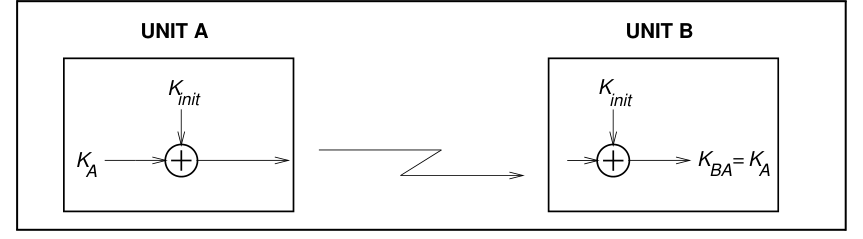

**Figure 3.1:  Generation of unit key. When the unit key has been exchanged, the initialization key is discarded in both devices.**

#### 3.2.4  Generation of a Combination Key

To use a combination key, it is first generated during the initialization procedure. The combination key is the combination of two numbers generated in device A and B, respectively. First, each device shall generate a random number, LK_RANDA and LK_RANDB. Then, utilizing with the random number and their own BD_ADDRs, the two random numbers
E21
LK_KA E21 LK_RANDA BD_ADDRA , ( ), =
(EQ 1)
and
LK_KB E21 LK_RANDB BD_ADDRB , ( ), =
(EQ 2)
shall be created in device A and device B, respectively. These numbers constitute the devices’ contribution to the combination key that is to be created. Then, the two random numbers LK_RANDA and LK_RANDB shall be exchanged securely by XORing with the current link key, . Thus, device A shall send to device B, while device B shall send to device A. If this is done during the initialization phase the link key .
K K LK_RANDA ⊕ K LK_RANDB ⊕
K Kinit =
When the random numbers and have been mutually exchanged, each device shall recalculate the other device’s contribution to the combination key. This is possible since each device knows the Bluetooth device address of the other device. Thus, device A shall calculate (EQ 2) and device B shall calculate (EQ 1). After this, both devices shall combine the two
LK_RANDA LK_RANDB
numbers to generate the 128-bit link key. The combining operation is a simple bitwise modulo-2 addition (i.e. XOR). The result shall be stored in device A as the link key and in device B as the link key . When both devices have derived the new combination key, a mutual authentication procedure shall be initiated to confirm the success of the transaction. The old link key shall be discarded after a successful exchange of a new combination key. The message flow between master and slave and the principle for creating the combination key is depicted in Figure 3.2.
KAB KBA

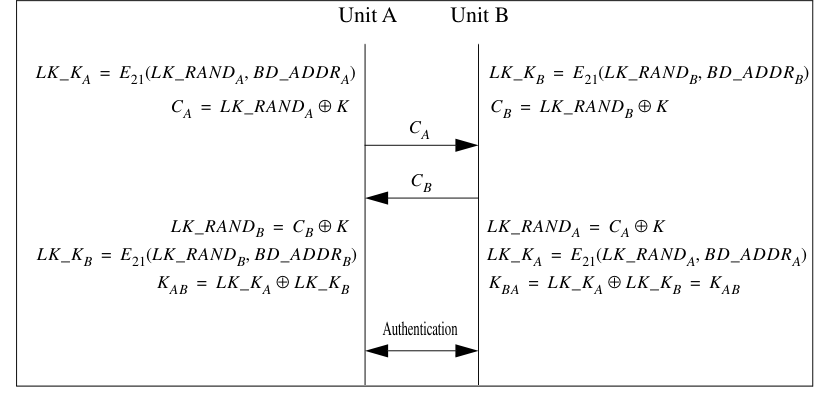

**Figure 3.2:  Generating a combination key. The old link key (K) is discarded after the exchange of a new combination key has succeeded**

#### 3.2.5  Generating the Encryption Key

The encryption key, , is derived by algorithm from the current link key, a 96-bit Ciphering OFfset number (COF), and a 128-bit random number. The COF is determined in one of two ways. If the current link key is a master key, then COF shall be derived from the master BD_ADDR. Otherwise the value of COF shall be set to the value of ACO as computed during the authentication procedure. Therefore:1
KC E3
COF BD_ADDR BD_ADDR, ∪ if link key is a master key ACO, otherwise.    =
(EQ 3)
There is an explicit call of when the LM activates encryption. Consequently, the encryption key is automatically changed each time the device enters encryption mode. The details of the key generating function can be found in Section 6.4.
E3
E3
1. denotes the concatenation of  and .
x y ∪ x y

#### 3.2.6  Point-to-Multipoint Configuration

It is possible for the master to use separate encryption keys for each slave in a point-to-multipoint configuration with ciphering activated. Then, if the application requires more than one slave to listen to the same payload, each slave must be addressed individually. This can cause unwanted capacity loss for the piconet. Moreover, a slave might not be capable of switching between two or more encryption keys in real time (e.g., after looking at the LT_ADDR in the header). Thus, the master cannot use different encryption keys for broadcast messages and individually addressed traffic. Therefore, the master may tell several slave devices to use a common link key (and, hence, indirectly also to use a common encryption key) and may then broadcast the information encrypted. For many applications, this key is only of temporary interest. In the following discussion, this key is denoted by .
Kmaster
The transfer of necessary parameters shall be protected by the routine described in Section 3.2.8. After the confirmation of successful reception in each slave, the master shall issue a command to the slaves to replace their respective current link key by the new (temporary) master key. Before encryption can be activated, the master shall also generate and distribute a common EN_RAND to all participating slaves. Using this random number and the newly derived master key, each slave shall generate a new encryption key.
Note that the master must negotiate the encryption key length to use individually with each slave that will use the master key. If the master has already negotiated with some of these slaves, it has knowledge of the sizes that can be accepted. There may be situations where the permitted key lengths of some devices are incompatible. In that case, the master must exclude the limiting device from the group.
When all slaves have received the necessary data, the master can communicate information on the piconet securely using the encryption key derived from the new temporary link key. Each slave in possession of the master key can eavesdrop on all encrypted traffic, not only the traffic intended for itself. The master may tell all participants to fall back to their old link keys simultaneously.

#### 3.2.7  Modifying the Link Keys

A link key based on a unit key can be changed. The unit key is created once during first use. Typically, the link key should be changed rather than the unit key, as several devices may share the same unit key as link key (e.g. a printer whose unit key is distributed to all users using the printer’s unit key as link key). Changing the unit key will require re-initialization of all devices connecting. Changing the unit key can be justified in some circumstances, e.g. to deny access to all previously allowed devices.
If the key change concerns combination keys, then the procedure is straightforward. The change procedure is identical to the procedure described
in Figure 3.2, using the current value of the combination key as link key. This procedure can be carried out at any time after the authentication and encryption start. Since the combination key corresponds to a single link, it can be modified each time this link is established. This will improve the security of the system since then old keys lose their validity after each session.
Starting up an entirely new initialization procedure is also possible. In that case, user interaction is necessary since a PIN will be required in the authentication and encryption procedures.

#### 3.2.8  Generating a Master Key

The key-change routines described so far are semi-permanent. To create the master link key, which can replace the current link key during a session (see Section 3.2.6), other means are needed. First, the master shall create a new link key from two 128-bit random numbers, RAND1 and RAND2. This shall be done by
Kmaster E22 RAND1 RAND2 16 , , ( ). =
(EQ 4)
This key is a 128-bit random number. The reason for using the output of and not directly choosing a random number as the key, is to avoid possible problems with degraded randomness due to a poor implementation of the random number generator within the device.
E22
Then, a third random number, RAND, shall be transmitted to the slave. Using with the current link key and RAND as inputs, both the master and the slave shall compute a 128-bit overlay. The master shall send the bitwise XOR of the overlay and the new link key to the slave. The slave, who knows the overlay, shall recalculate . To confirm the success of this transaction, the devices shall perform a mutual authentication procedure using the new link key. This procedure shall then be repeated for each slave that receives the new link key. The ACO values from the authentications shall not replace the current ACO, as this ACO is needed to (re)compute a ciphering key when the master falls back to the previous (non-temporary) link key.
E22
Kmaster
The master activates encryption by an LM command. Before activating encryption, the master shall ensure that all slaves receive the same random number, EN_RAND, since the encryption key is derived through the means of individually in all participating devices. Each slave shall compute a new encryption key as follows:
E3
KC E3 Kmaster EN_RAND, COF , ( ) =
(EQ 5)
where the value of COF shall be derived from the master’s BD_ADDR as specified by equation (EQ 3). The details of the encryption key generating function are described in Section 6.4. The message flow between the master and the slave when generating the master key is depicted in Figure 3.3. Note
that in this case the ACO produced during the authentication is not used when computing the ciphering key.

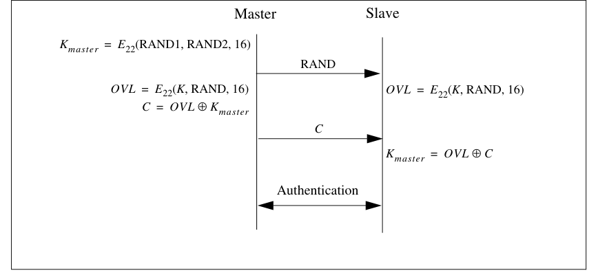

**Figure 3.3:  Master link key distribution and computation of the corresponding encryption key.**

## 4  ENCRYPTION (E0)

User information can be protected by encryption of the packet payload; the access code and the packet header shall never be encrypted. The encryption of the payload shall be carried out with a stream cipher called E0 that shall be re-synchronized for every payload. The overall principle is shown in Figure 4.1.
The stream cipher system E0 shall consist of three parts:
• the first part performs initialization (generation of the payload key). The payload key generator shall combine the input bits in an appropriate order and shall shift them into the four LFSRs used in the key stream generator.
• the second part generates the key stream bits and shall use a method derived from the summation stream cipher generator attributable to Massey and Rueppel. The second part is the main part of the cipher system, as it will also be used for initialization.
• the third part performs encryption and decryption.

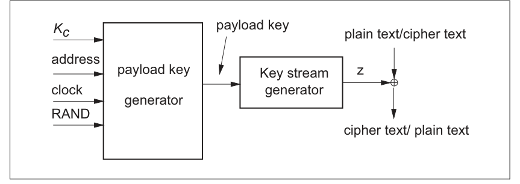

**Figure 4.1:  Stream ciphering for Bluetooth with E0.**

### 4.1   ENCRYPTION KEY SIZE NEGOTIATION

Each device implementing the baseband specification shall have a parameter defining the maximal allowed key length, (number of octets in the key). For each application using encryption, a number shall be defined indicating the smallest acceptable key size for that particular application. Before generating the encryption key, the devices involved shall negotiate to decide the key size to use.
Lmax 1 Lmax 16 ≤ ≤ ,
Lmin
The master shall send a suggested value, , to the slave. Initially, the suggested value shall be set to . If , and, the slave supports the suggested length, the slave shall acknowledge and this value shall be the length of the encryption key for this link. However, if both conditions are not fulfilled, the slave shall send a new proposal, , to the master. This value shall be the largest among all supported lengths less than the previous master suggestion. Then, the master shall perform the corresponding test on
Lsug M ( )
Lmax M ( ) Lmin S ( ) Lsug M ( ) ≤
Lsug S ( ) Lsug M ( ) <
the slave suggestion. This procedure shall be repeated until a key length agreement is reached, or, one device aborts the negotiation. An abort may be caused by lack of support for and all smaller key lengths, or if in one of the devices. In case of an abort link encryption cannot be employed.
Lsug Lsug Lmin <
The possibility of a failure in setting up a secure link is an unavoidable consequence of letting the application decide whether to accept or reject a suggested key size. However, this is a necessary precaution. Otherwise a fraudulent device could enforce a weak protection on a link by claiming a small maximum key size.

### 4.2   ENCRYPTION OF BROADCAST MESSAGES

There may be three settings for the baseband regarding encryption:
1. No encryption. This is the default setting. No messages are encrypted
2. Point-to-point only encryption. Broadcast messages are not encrypted. This may be enabled either during the connection establishment procedure or after the connection has been established.
3. Point-to-point and broadcast encryption. All messages are encrypted. This may be enabled after the connection has been established only. This setting should not be enabled unless all affected links share the same master link key as well as the same EN_RAND value, both used in generating the encryption key.

### 4.3   ENCRYPTION CONCEPT

| Broadcast traffic | Individually addressed traffic |
| --- | --- |
| No encryption | No encryption |
| No encryption | Encryption, K master |
| Encryption, K master | Encryption, K master |

Table 4.1:  Possible encryption modes for a slave in possession of a master key.
For the encryption routine, a stream cipher algorithm is used in which ciphering bits are bit-wise modulo-2 added to the data stream to be sent over the air interface. The payload is ciphered after the CRC bits are appended, but, prior to the FEC encoding.
Each packet payload shall be ciphered separately. The cipher algorithm uses the master Bluetooth device address (BD_ADDR), 26 bits of the master real-time clock (CLK 26-1) and the encryption key as input, see Figure 4.2 (where it is assumed that device A is the master).
E0
KC
The encryption key KC is derived from the current link key, COF, and a random number, EN_RANDA (see Section 6.4). The random number shall be issued by the master before entering encryption mode. Note that EN_RANDA is publicly known since it is transmitted as plain text over the air.
Within the algorithm, the encryption key is modified into another key denoted . The maximum effective size of this key shall be factory preset and may be set to any multiple of eight between one and sixteen (8-128 bits). The procedure for deriving the key is described in Section 4.5.
E0 KC K′C
The real-time clock is incremented for each slot. The algorithm shall be re- initialized at the start of each new packet (i.e. for Master-to-Slave as well as for Slave-to-Master transmission). By using CLK26-1 at least one bit is changed between two transmissions. Thus, a new keystream is generated after each re- initialization. For packets covering more than a single slot, the Bluetooth clock as found in the first slot shall be used for the entire packet.
E0
The encryption algorithm generates a binary keystream, , which shall be modulo-2 added to the data to be encrypted. The cipher is symmetric; decryption shall be performed in exactly the same way using the same key as used for encryption.
E0 Kcipher

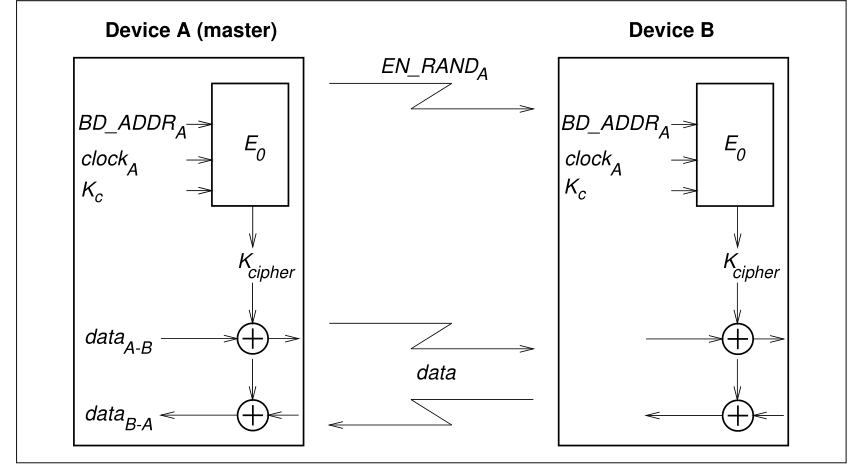

**Figure 4.2:  Functional description of the encryption procedure**

### 4.4   ENCRYPTION ALGORITHM

The system uses linear feedback shift registers (LFSRs) whose output is combined by a simple finite state machine (called the summation combiner) with 16 states. The output of this state machine is the key stream sequence, or, during initialization phase, the randomized initial start value. The algorithm
uses an encryption key , a 48-bit Bluetooth address, the master clock bits CLK26-1, and a 128-bit RAND value. Figure 4.3 shows the setup.
KC
There are four LFSRs (LFSR1,...,LFSR4) of lengths , , , and, , with feedback polynomials as specified in Table 4.2. The total length of the registers is 128. These polynomials are all primitive. The Hamming weight of all the feedback polynomials is chosen to be five − a reasonable trade-off between reducing the number of required XOR gates in the hardware implementation and obtaining good statistical properties of the generated sequences.
L1 25 = L2 31 = L3 33 = L4 39 =

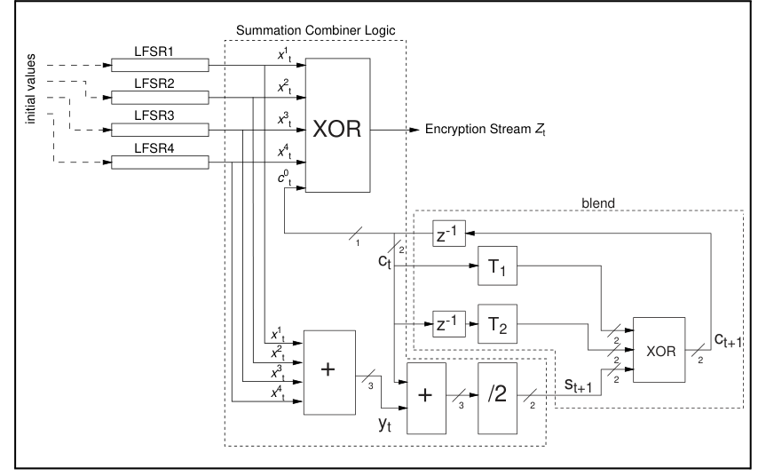

**Figure 4.3:  Concept of the encryption engine.**

| i | L i | feedback f ( t) i | weight |
| --- | --- | --- | --- |
| 1 | 25 | t25+t20+t12+t8+1 | 5 |
| 2 | 31 | t31+t24+t16+t12+1 | 5 |
| 3 | 33 | t33+t28+t24+t4+1 | 5 |
| 4 | 39 | t39+t36+t28+t4+1 | 5 |

Table 4.2:  The four primitive feedback polynomials.
Let denote the symbol of LFSRi. The value is derived from the four- tuple using the following equation:
xti tth yt xt1 … xt4 , ,

## 4  = ,

yt xti
(EQ 6)
i 1 =
where the sum is over the integers. Thus can take the values 0,1,2,3, or 4. The output of the summation generator is obtained by the following equations:
yt
zt xt1 xt2 xt3 xt4 ct0 ⊕ ⊕ ⊕ ⊕ 0 1 , { }, ∈ =
(EQ 7)
st 1 + st 1 + 1 st 1 + 0 , ( ) yt ct + 2 -------------- 0 1 2 3 , , , { }, ∈ = =
(EQ 8)
ct 1 + ct 1 + 1 ct 1 + 0 , ( ) st 1 + T1 ct [ ] T2 ct 1 – [ ], ⊕ ⊕ = =
(EQ 9)
where and are two different linear bijections over GF(4). Suppose GF(4) is generated by the irreducible polynomial , and let be a zero of this polynomial in GF(4). The mappings and are now defined as:
T1 .[ ] T2 .[ ]
x2 x 1 + + α T1 T2
T1: GF 4 ( ) GF 4 ( ) →
x x |→
T2: GF 4 ( ) GF 4 ( ) →
x α 1 + ( )x. |→
The elements of GF(4) can be written as binary vectors. This is summarized in Table 4.3.

| x | T [ x] 1 | T [ x] 2 |
| --- | --- | --- |
| 00 | 00 | 00 |
| 01 | 01 | 11 |
| 10 | 10 | 01 |
| 11 | 11 | 10 |

Table 4.3:  The mappings T1 and T2.
Since the mappings are linear, they can be implemented using XOR gates; i.e.
T1: x1 x0 , ( ) x1 x0 , ( ), |→
T2: x1 x0 , ( ) x0 x1 x0 ⊕ , ( ). |→

#### 4.4.1  The Operation of the Cipher

Figure 4.4 gives an overview of the operation in time. The encryption algorithm shall run through the initialization phase before the start of transmission or reception of a new packet. Thus, for multislot packets the cipher is initialized using the clock value of the first slot in the multislot sequence.

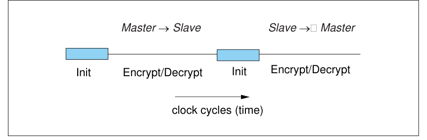

**Figure 4.4:  Overview of the operation of the encryption engine. Between each start of a packet (TX or RX), the LFSRs are re-initialized.**

### 4.5   LFSR INITIALIZATION

The key stream generator is loaded with an initial value for the four LFSRs (in total 128 bits) and the 4 bits that specify the values of and . The 132 bit initial value is derived from four inputs by using the key stream generator. The input parameters are the key , a 128-bit random number RAND, a 48-bit Bluetooth device address, and the 26 master clock bits CLK26-1.
c0 c 1 –
KC
The effective length of the encryption key may vary between 8 and 128 bits. Note that the actual key length as obtained from is 128 bits. Then, within , the key length may be reduced by a modulo operation between and a polynomial of desired degree. After reduction, the result is encoded with a block code in order to distribute the starting states more uniformly. The operation shall be as defined in (EQ 10).
E3 E0 KC
When the encryption key has been created the LFSRs are loaded with their initial values. Then, 200 stream cipher bits are created by operating the generator. Of these bits, the last 128 are fed back into the key stream generator as an initial value of the four LFSRs. The values of and are kept. From this point on, when clocked the generator produces the encryption (decryption) sequence which is bitwise XORed to the transmitted (received) payload data.
ct ct 1 –
In the following, octet i of a binary sequence is . Bit 0 of is the LSB. Then, the LSB of corresponds to bit of the sequence , the MSB of is bit of . For instance, bit 24 of the Bluetooth device address is the LSB of BD_ADDR[3].
X X i[ ] X X i[ ] 8i X X i[ ] 8i 7 + X
The details of the initialization shall be as follows:
1. Create the encryption key to use from the 128-bit secret key and the 128-bit publicly known EN_RAND. Let , be the
KC L 1 L 16 ≤ ≤ ,
effective key length in number of octets. The resulting encryption key is :
K'C
K'C x( ) g2 L ( ) x( ) KC x( )  mod  g1 L ( ) x( ) ( ), =
(EQ 10)
deg g1 L ( ) x( ) ( ) 8L = deg g2 L ( ) x( ) ( ) 128 8L – ≤
where and . The polynomials are defined in Table 4.4. 2. Shift the 3 inputs , the Bluetooth device address, the clock, and the six-bit constant 111001 into the LFSRs. In total, 208 bits are shifted in:
K'C
a) Open all switches shown in Figure 4.5;
b) Arrange inputs bits as shown in Figure 4.5; Set the content of all shift register elements to zero. Set .
t 0 =
c) Start shifting bits into the LFSRs. The rightmost bit at each level of
Figure 4.5 is the first bit to enter the corresponding LFSR.
d) When the first input bit at level i reaches the rightmost position of LFSRi, close the switch of this LFSR.
e) At (when the switch of LFSR4 is closed), reset both blend registers ; Up to this point, the content of and has been of no concern. However, their content will now be used in computing the output sequence.
t 39 =
c39 c39 1 – 0 = = ct ct 1 –
f) From now on output symbols are generated. The remaining input bits are continuously shifted into their corresponding shift registers. When the last bit has been shifted in, the shift register is clocked with input = 0;
Note: When finished, LFSR1 has effectively clocked 30 times with feedback closed, LFSR2 has clocked 24 times, LFSR3 has clocked 22 times, and LFSR4 has effectively clocked 16 times with feedback closed.
3. To mix initial data, continue to clock until 200 symbols have been produced with all switches closed ( ); 4. Keep blend registers and , make a parallel load of the last 128 generated bits into the LFSRs according to Figure 4.6 at ;
t 239 =
ct ct 1 –
t 240 =
After the parallel load in item 4, the blend register contents shall be updated for each subsequent clock.

| L | deg | ( L) g 1 | deg | ( L) g 2 |
| --- | --- | --- | --- | --- |
| 1 | [8] | 00000000 00000000 00000000 0000011d | [119] | 00e275a0 abd218d4 cf928b9b bf6cb08f |
| 2 | [16] | 00000000 00000000 00000000 0001003f | [112] | 0001e3f6 3d7659b3 7f18c258 cff6efef |
| 3 | [24] | 00000000 00000000 00000000 010000db | [104] | 000001be f66c6c3a b1030a5a 1919808b |
| 4 | [32] | 00000000 00000000 00000001 000000af | [96] | 00000001 6ab89969 de17467f d3736ad9 |

Table 4.4:  Polynomials used when creating K’c. . 1

| L | deg | ( L) g 1 | deg | ( L) g 2 |
| --- | --- | --- | --- | --- |
| 5 | [40] | 00000000 00000000 00000100 00000039 | [88] | 00000000 01630632 91da50ec 55715247 |
| 6 | [48] | 00000000 00000000 00010000 00000291 | [77] | 00000000 00002c93 52aa6cc0 54468311 |
| 7 | [56] | 00000000 00000000 01000000 00000095 | [71] | 00000000 000000b3 f7fffce2 79f3a073 |
| 8 | [64] | 00000000 00000001 00000000 0000001b | [63] | 00000000 00000000 a1ab815b c7ec8025 |
| 9 | [72] | 00000000 00000100 00000000 00000609 | [49] | 00000000 00000000 0002c980 11d8b04d |
| 10 | [80] | 00000000 00010000 00000000 00000215 | [42] | 00000000 00000000 0000058e 24f9a4bb |
| 11 | [88] | 00000000 01000000 00000000 0000013b | [35] | 00000000 00000000 0000000c a76024d7 |
| 12 | [96] | 00000001 00000000 00000000 000000dd | [28] | 00000000 00000000 00000000 1c9c26b9 |
| 13 | [104] | 00000100 00000000 00000000 0000049d | [21] | 00000000 00000000 00000000 0026d9e3 |
| 14 | [112] | 00010000 00000000 00000000 0000014f | [14] | 00000000 00000000 00000000 00004377 |
| 15 | [120] | 01000000 00000000 00000000 000000e7 | [7] | 00000000 00000000 00000000 00000089 |
| 16 | [128] | 1 00000000 00000000 00000000 00000000 | [0] | 00000000 00000000 00000000 00000001 |

Table 4.4:  Polynomials used when creating K’c. . 1
1. All polynomials are in hexadecimal notation. The LSB is in the rightmost position.
In Figure 4.5, all bits are shifted into the LFSRs, starting with the least significant bit (LSB). For instance, from the third octet of the address, BD_ADDR[2], first BD_ADDR16 is entered, followed by BD_ADDR17, etc. Furthermore, CL0 corresponds to CLK1,..., CL25 corresponds to CLK26.
xt i i, 1 … 4 , , =
Note that the output symbols are taken from the positions 24, 24, 32, and 32 for LFSR1, LFSR2,LFSR3, and LFSR4, respectively (counting the leftmost position as number 1).

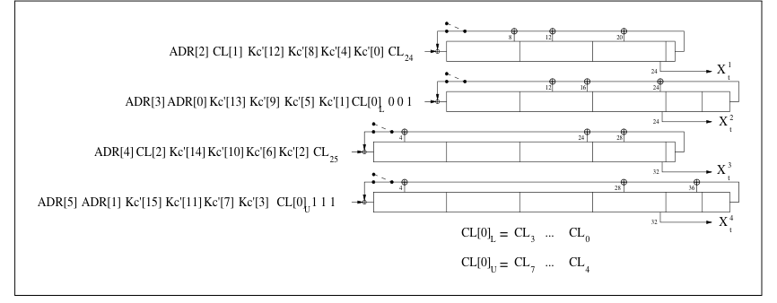

**Figure 4.5:  Arranging the input to the LFSRs.**

In Figure 4.6, the 128 binary output symbols Z0,..., Z127 are arranged in octets denoted Z[0],..., Z[15]. The LSB of Z[0] corresponds to the first of these symbols, the MSB of Z[15] is the last output from the generator. These bits shall be loaded into the LFSRs according to the figure. It is a parallel load and no update of the blend registers is done. The first output symbol is generated at the same time. The octets shall be written into the registers with the LSB in the leftmost position (i.e. the opposite of before). For example, Z24 is loaded into position 1 of LFSR4.

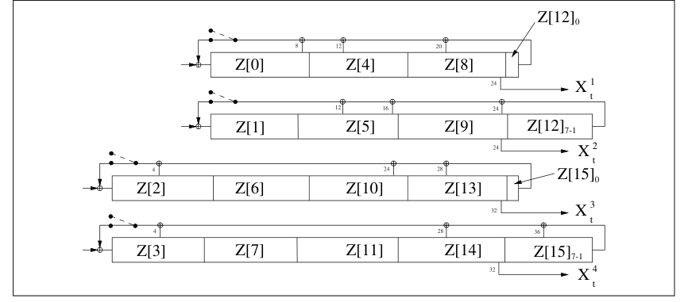

**Figure 4.6:  Distribution of the 128 last generated output symbols within the LFSRs.**

### 4.6   KEY STREAM SEQUENCE

When the initialization is finished, the output from the summation combiner is used for encryption/decryption. The first bit to use shall be the one produced at the parallel load, i.e. at . The circuit shall be run for the entire length of the current payload. Then, before the reverse direction is started, the entire initialization process shall be repeated with updated values on the input parameters.
t 240 =
Sample data of the encryption output sequence can be found in [Vol 2] Part G, Section 1.1. A necessary, but not sufficient, condition for all Bluetooth compliant implementations of encryption is to produce these encryption streams for identical initialization values.

## 5  AUTHENTICATION

Legacy authentication uses a challenge-response scheme in which a claimant’s knowledge of a secret key is checked through a 2-move protocol using symmetric secret keys. The latter implies that a correct claimant/verifier pair share the same secret key, for example K. In the challenge-response scheme the verifier challenges the claimant to authenticate a random input (the challenge), denoted by AU_RANDA, with an authentication code, denoted by , and return the result SRES to the verifier, see Figure 5.1. This figure also shows that the input to E1 consists of the tuple AU_RANDA and the Bluetooth device address (BD_ADDR) of the claimant. The use of this address prevents a simple reflection attack1. The secret K shared by devices A and B is the current link key.
E1

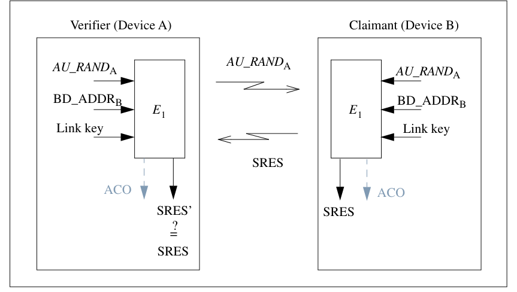

**Figure 5.1:  Challenge-response for the Bluetooth.**

The challenge-response scheme for symmetric keys in legacy authentication is depicted in Figure 5.2.
1. The reflection attack actually forms no threat because all service requests are dealt with on a FIFO basis. When preemption is introduced, this attack is potentially dangerous.

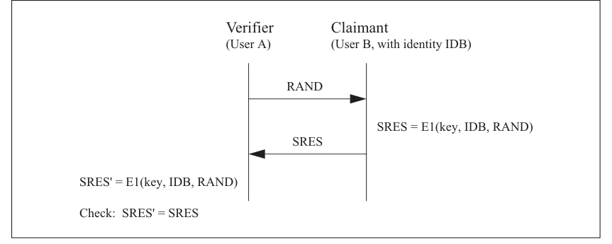

**Figure 5.2:  Challenge-response for symmetric key systems.**

In legacy authentication, the verifier is not required to be the master. The application indicates which device has to be authenticated. Some applications only require a one-way authentication. However, some peer-to-peer communications, should use a mutual authentication in which each device is subsequently the challenger (verifier) in two authentication procedures. The LM shall process authentication preferences from the application to determine in which direction(s) the authentication(s) takes place. For mutual authentication with the devices of Figure 5.1, after device A has successfully authenticated device B, device B could authenticate device A by sending an AU_RANDB (different from the AU_RANDA that device A issued) to device A, and deriving the SRES and SRES’ from the new AU_RANDB, the address of device A, and the link key KAB.
If a legacy authentication is successful the value of ACO as produced by shall be retained.
E1
Secure Authentication uses a challenge-response scheme in which both devices act as a verifier and claimant in the same sequence where the knowledge of a secret key is checked through a 4-move protocol using symmetric secret keys. The latter implies that a correct claimant/verifier pair share the same secret key, for example K. In the challenge-response scheme the master challenges the slave to authenticate a random input (the challenge), denoted by AU_RANDm, with an authentication code, denoted by h4 and h5, and return the resulting SRESs to the verifier, see Figure 5.3. Similarly, the slave challenges the master to authenticate a random input (the challenge), denoted AU_RANDs, with an authentication code, denoted by h4 and h5, and return the resulting SRESm to the verifier. This figure also shows that the inputs to h4 and h5 consist of a secret, a string “btdk”, the Bluetooth device address of the master (BD_ADDRm), and the Bluetooth device address of the slave (BD_ADDRs). The use of these addresses prevents a simple reflection attack. The secret K shared by the master and slave is the current link key.

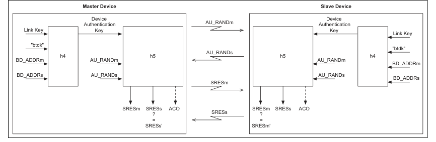

**Figure 5.3:  Challenge and response for secure authententication.**

The challenge-response scheme for symmetric keys in secure authentication is depicted in Figure 5.4.

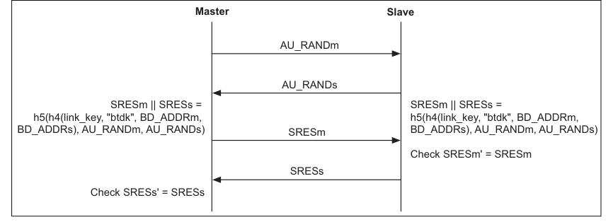

**Figure 5.4:  Challenge-response for secure authentication.**

In secure authentication, both the master and slave are the verifier and claimant. The application indicates which device has to be authenticated, but secure authentication is always a mutual authentication.
If a secure authentication is successful the value of ACO as produced by h5 shall be retained.

### 5.1   REPEATED ATTEMPTS

When the authentication attempt fails, a waiting interval shall pass before the verifier will initiate a new authentication attempt to the same claimant, or before it will respond to an authentication attempt initiated by a device claiming the same identity as the failed device. For each subsequent authentication failure, the waiting interval shall be increased exponentially. For example, after each failure, the waiting interval before a new attempt can be made could be twice
as long as the waiting interval prior to the previous attempt1. The waiting interval shall be limited to a maximum.
The maximum waiting interval depends on the implementation. The waiting time shall exponentially decrease to a minimum when no new failed attempts are made during a certain time period. This procedure prevents an intruder from repeating the authentication procedure with a large number of different keys.
To protect a device's private key, a device should implement a method to prevent an attacker from retrieving useful information about the device's private key using invalid public keys. For this purpose, a device can use one of the following methods:
• Change its private key after three failed attempts from any BD_ADDR and after 10 successful pairings from any BD_ADDR; or after a combination of these such that 3 successful pairings count as one failed pairing; or
• Verify that the received public keys from any BD_ADDR are on the correct curve; or
• Implement elliptic curve point addition and doubling using formulas that are valid only on the correct curve.
1. Another appropriate value larger than 1 may be used.

## 6  THE AUTHENTICATION AND KEY-GENERATING FUNCTIONS

This section describes the algorithms used for authentication and key generation.

### 6.1   THE AUTHENTICATION FUNCTION E1

The authentication function is a computationally secure authentication code. uses the encryption function SAFER+. The algorithm is an enhanced version of an existing 64-bit block cipher SAFER-SK128, and it is freely available. In the following discussion, the block cipher will be denoted as the function which maps using a 128-bit key, a 128-bit input to a 128-bit output, i.e.
E1 E1
Ar
Ar:  0 1 , { }128 0 1 , { }128 × 0 1 , { }128 →
(EQ 11)
k x × ( ) t. |→
The details of are given in the next section. The function is constructed using as follows
Ar E1 Ar
E1:  0 1 , { }128 0 1 , { }128 0 1 , { }48 × × 0 1 , { }32 0 1 , { }96 × →
(EQ 12)
K RAND address , , ( ) SRES ACO , ( ), |→
where , where is a keyed hash function defined as1,
SRES Hash K RAND, address 6 , , ( ) 0 … 3 , , [ ] = Hash
Hash: 0 1 , { }128 0 1 , { }128 0 1 , { }8 L × 6 12 , { } × × × 0 1 , { }128 →
(EQ 13)
K I1 I2 L , , , ( ) A'r K˜ [ ] E I2 L , ( ) Ar K I1 , ( )16 I1 ( ) +16 [ ] , ( ), |→
and where
E: 0 1 , { }8 L × 6 12 , { } × 0 1 , { }8 16 × →
(EQ 14)
X 0 … L , , 1 – [ ] L , ( ) X i(mod L) [ ]  for i = 0...15 ( ), |→
is an expansion of the  octet word into a 128-bit word. The function is evaluated twice for each evaluation of . The key for the second use of (actually ) is offset from as follows2
L X Ar E1 K˜ Ar A'r K
1. The operator +16 denotes bytewise addition mod 256 of the 16 octets, and the operator ⊕16 denotes bytewise XORing of the 16 octets. 2. The constants are the largest primes below 257 for which 10 is a primitive root.
K˜ 0 [ ] K 0 [ ] 233 + ( ) = mod 256, K˜ 1 [ ] K 1 [ ] 229, ⊕ =
K˜ 2 [ ] K 2 [ ] 223 + ( ) = mod 256, K˜ 3 [ ] K 3 [ ] 193, ⊕ =
K˜ 4 [ ] K 4 [ ] 179 + ( ) = mod 256, K˜ 5 [ ] K 5 [ ] 167, ⊕ =
K˜ 6 [ ] K 6 [ ] 149 + ( ) = mod 256, K˜ 7 [ ] K 7 [ ] 131, ⊕ =
(EQ 15)
K˜ 8 { } K 8 [ ] 233, ⊕ = K˜ 9 [ ] K 9 [ ] 229 + ( ) = mod 256,
K˜ 10 [ ] K 10 [ ] 223, ⊕ = K˜ 11 [ ] K 11 [ ] 193 + ( ) = mod 256,
K˜ 12 [ ] K 12 [ ] 179, ⊕ = K˜ 13 [ ] K 13 [ ] 167 + ( ) = mod 256,
K˜ 14 [ ] K 14 [ ] 149, ⊕ = K˜ 15 [ ] K 15 [ ] 131 + ( ) = mod 256.
A data flowchart of the computation of is shown in Figure 6.1. is also used to deliver the parameter ACO (Authenticated Ciphering Offset) that is used in the generation of the ciphering key by , see equations (EQ 3) and (EQ 23). The value of ACO is formed by the octets 4 through 15 of the output of the hash function defined in (EQ 13):
E1 E1
E3
ACO Hash K RAND, address 6 , , ( ) 4 … 15 , , [ ] =
. (EQ 16)

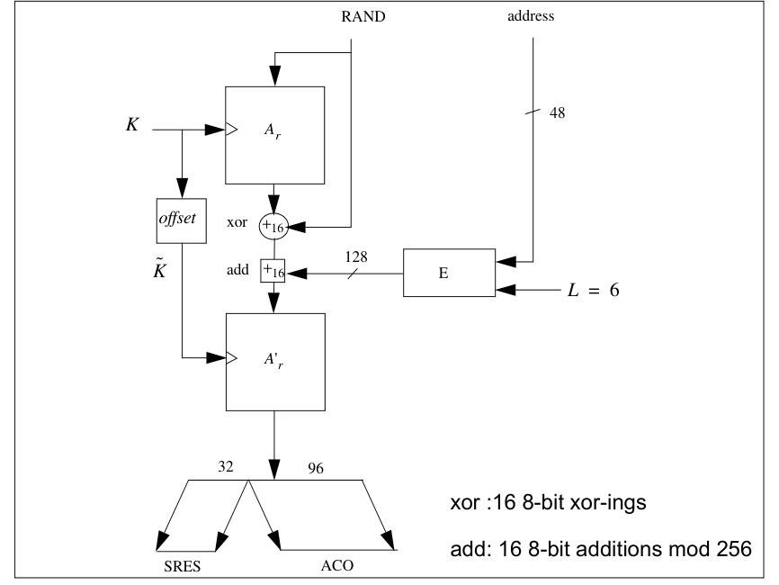

**Figure 6.1:  Flow of data for the computation of E1.**

### 6.2   THE FUNCTIONS Ar AND A’r

The function is identical to SAFER+. It consists of a set of 8 layers, (each layer is called a round) and a parallel mechanism for generating the sub keys , , which are the round keys to be used in each round. The function will produce a 128-bit result from a 128-bit random input string and a 128-bit key. Besides the function , a slightly modified version referred to as is used in which the input of round 1 is added to the input of round 3. This is done to make the modified version non-invertible and prevents the use of (especially in ) as an encryption function. See Figure 6.2 for details.
Ar
Kp j[ ] p 1 2 … 17 , , , =
Ar A′r
A′r E2x

#### 6.2.1  The Round Computations

The computations in each round are a composition of encryption with a round key, substitution, encryption with the next round key, and, finally, a Pseudo Hadamard Transform (PHT). The computations in a round shall be as shown in Figure 6.2. The sub keys for round are denoted , , . After the last round is applied identically to all previous odd numbered keys.
r r , 1 2 … 8 , , , = K2r 1 – j[ ] K2r j[ ] j 0 1 … 15 , , , = K17 j[ ]

#### 6.2.2  The Substitution Boxes “e” and “l”

In Figure 6.2 two boxes are shown, marked “e” and “l”. These boxes implement the same substitutions as are used in SAFER+; i.e. they implement
e l, : 0 … 255 , , { } 0 … 255 , , { }, →
e : i 45i (mod 257) ( ) (mod 256), |→
l : i j s.t. i |→ e j( ). =
Their role, as in the SAFER+ algorithm, is to introduce non-linearity.

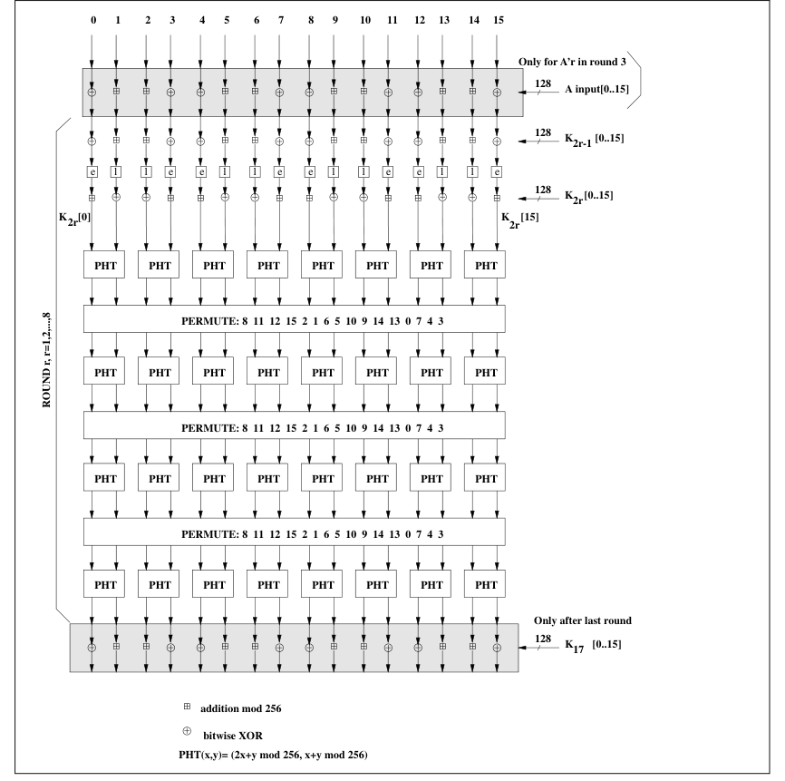

**Figure 6.2:  One round in Ar and A’r.**

In Section 6.2, the permutation boxes show how input byte indices are mapped onto output byte indices. Thus, position 8 is mapped on position 0 (leftmost), position 11 is mapped on position 1, etc.

#### 6.2.3  Key Scheduling

In each round, 2 batches of 16 octet-wide keys are needed. These round keys are derived as specified by the key scheduling in SAFER+. Figure 6.3 gives an overview of how the round keys are determined. The bias vectors B2, B3, ..., B17 shall be computed according to following equation:
Kp j[ ]
Bp i[ ] 45 4517p i 1 + +  mod 257 ( ) mod 257 ( ) mod 256 ( ),  for i 0 … 15. , , = =
(EQ 17)

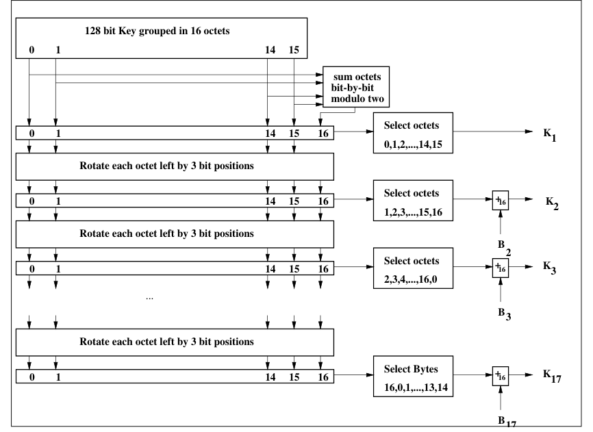

**Figure 6.3:  Key scheduling in Ar.**

### 6.3   E2-KEY GENERATION FUNCTION FOR AUTHENTICATION

The key used for authentication shall be derived through the procedure that is shown in Figure 6.4. The figure shows two modes of operation for the algorithm. In the first mode, produces a 128-bit kink key, , using a 128-bit RAND value and a 48-bit address. This mode shall be utilized when creating unit keys and combination keys. In the second mode, produces a 128-bit link key, , using a 128-bit RAND value and an  octet user PIN. The second mode shall be used to create the initialization key, and also when a master key is to be generated.
E21 K
E22 K L
When the initialization key is generated, the PIN is augmented with the BD_ADDR, see Section 3.2.1 for which address to use. The augmentation shall always start with the least significant octet of the address immediately following the most significant octet of the PIN. Since the maximum length of the PIN used in the algorithm cannot exceed 16 octets, it is possible that not all octets of BD_ADDR will be used.
This key generating algorithm again exploits the cryptographic function . for mode 1 (denoted ) is computed according to following equations:
E2 E21
E21:  0 1 , { }128 0 1 , { }48 × 0 1 , { }128 →
(EQ 18)
RAND address , ( ) A'r X Y , ( ) |→
where (for mode 1)
      
X RAND 0…14 [ ] RAND 15 [ ] 6 ⊕ ( ) ∪ =

## 15 ∪ =

(EQ 19)
Y address i (mod 6) [ ]
i 0 =
Let  be the number of octets in the user PIN. The augmenting is defined by
L
PIN' PIN 0…L 1 – [ ] BD_ADDR 0… 5 15 L – , { } min [ ], ∪
PIN 0…L 1 – [ ],    = L 16, <
(EQ 20)
L 16, =
Then, in mode 2, (denoted ) is
E2 E22
E22:  0 1 , { }8L' 0 1 , { }128 1 2 … 16 , , , { } × × 0 1 , { }128 →
(EQ 21)
PIN' RAND, L′ , ( ) A'r X Y , ( ) |→
where
Y RAND 0…14 [ ] RAND 15 [ ] L' ⊕ ( ), ∪ =       

## 15 ∪ = ,

X PIN' i (mod L') [ ]
(EQ 22)
i 0 =
and is the number of octets in PIN’.
L' min 16 L 6 + , { } =

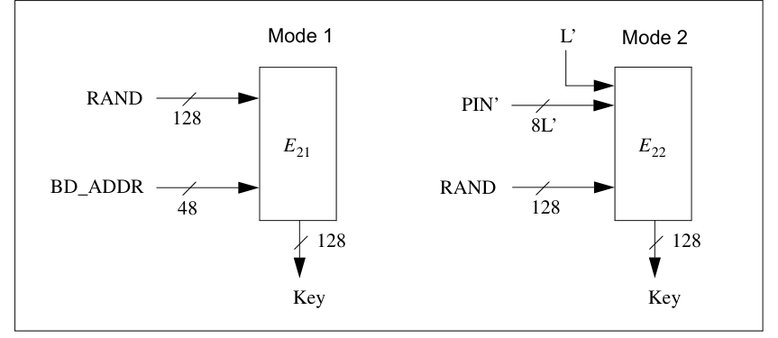

**Figure 6.4:  Key generating algorithmE2 and its two modes. Mode 1 is used for unit and combination keys, while mode 2 is used for Kinit and K master.**

### 6.4   E3-KEY GENERATION FUNCTION FOR ENCRYPTION

The ciphering key used by shall be generated by . The function is constructed using as follows
KC E0 E3 E3 A'r
E3:  0 1 , { }128 0 1 , { }128 0 1 , { }96 × × 0 1 , { }128 →
(EQ 23)
K RAND COF , , ( ) Hash K RAND COF, 12 , , ( ) |→
where is the hash function as defined by (EQ 13). The key length produced is 128 bits. However, before use within , the encryption key is shortened to the correct encryption key length, as described in Section 4.5. A block scheme of is depicted in Figure 6.5.
Hash
E0 KC
E3
The value of COF is determined as specified by equation (EQ 3).

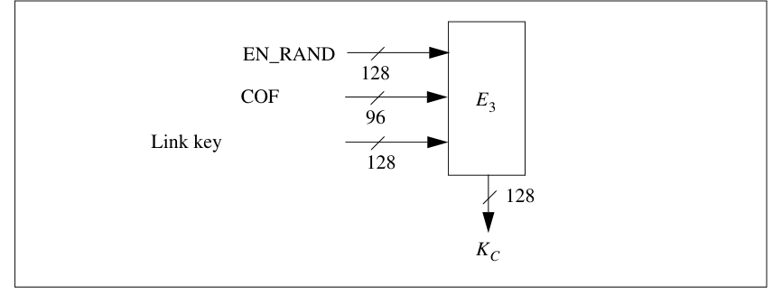

**Figure 6.5:  Generation of the encryption key**

## 7  SECURE SIMPLE PAIRING

The Secure Simple Pairing security functions and procedures are described in this section. In addition, a cryptographic analysis of each procedure is provided.
There are five phases of Secure Simple Pairing:
• Phase 1: Public key exchange
• Phase 2: Authentication Stage 1
• Phase 3: Authentication Stage 2
• Phase 4: Link key calculation
• Phase 5: LMP Authentication and Encryption
Phases 1, 3, 4 and 5 are the same for all protocols whereas phase 2 (Authentication Stage 1) is different depending on the protocol used. Distributed through these five phases are 13 steps.

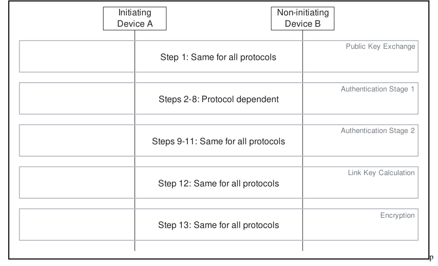

**Figure 7.1:  Simple Pairing Security Phases**

The terminology used in the security sections is defined in Table 7.1:
Term Definition
Cx Commitment value from device X
Cxi ith commitment value from device X. Only used in the passkey entry protocol
Table 7.1:  Terminology
Term Definition
DHKey Diffie Hellman key
Ex Check value from device X
f1( ) Used to generate the 128-bit commitment values Ca and Cb
f2( ) Used to compute the link key and possible other keys from the DHKey and random nonces
f3( ) Used to compute check values Ea and Eb in Authentication Stage 2
g( ) Used to compute numeric check values
h2( ) Used to compute Generic AMP and Dedicated AMP keys
IOcapA IO capabilities of device A
IOcapB IO capabilities of device B
LK Link Key
Nx Nonce (unique random value) from device X
Nxi ith nonce (unique random value) from device X. Only used in the passkey entry protocol
PKx Public Key of device X
rx Random value generated by device X
rxi Bit i of the random value rx. Only used in the passkey entry protocol
SKx Secret (Private) Key of device X
Vx Confirmation value on device X. Only used in the numeric compare protocol.
X BD_ADDR of device X
Table 7.1:  Terminology

### 7.1   PHASE 1: PUBLIC KEY EXCHANGE

Initially, each device generates its own Elliptic Curve Diffie-Hellman (ECDH) public-private key pair (step 1). This key pair needs to be generated only once per device and may be computed in advance of pairing. A device may, at any time, choose to discard its public-private key pair and generate a new one, although there is not a requirement to do so.
Pairing is initiated by the initiating device sending its public key to the receiving device (step 1a). The responding device replies with its own public key (step 1b) These public keys are not regarded as secret although they may identify the devices. Note that steps 1a and 1b are the same in all three protocols.
When both device’s Controllers and Hosts support Secure Connections, the P- 256 elliptic curve is used. When at least one device’s Controller or Host doesn’t support Secure Connections, the P-192 elliptic curve is used.

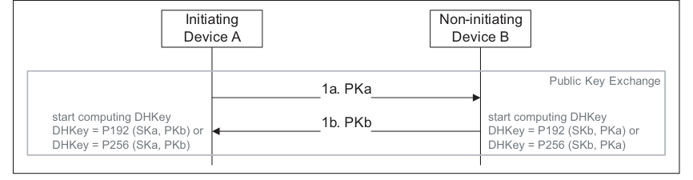

**Figure 7.2:  Public Key Exchange Details**

### 7.2   PHASE 2: AUTHENTICATION STAGE 1

Authentication Stage 1 has three different protocols: Numeric Comparison, Out-of-Band, and Passkey Entry. Note that there is not a separate protocol for the Just Works association model. This association model shares the Numeric Comparison protocol.
The protocol is chosen based on the IO capabilities of the two devices.

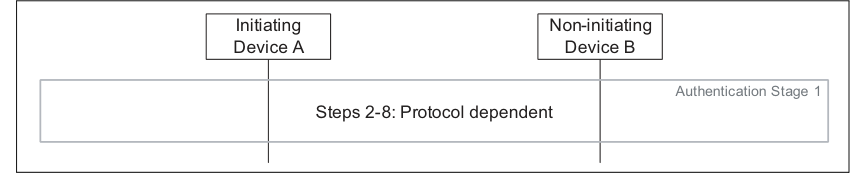

**Figure 7.3:  Authentication Stage 1 (High Level)**

The three protocols are described in the following sections.

#### 7.2.1  Authentication Stage 1: Numeric Comparison Protocol

The Numeric Comparison protocol provides limited protection against active "man-in-the-middle" (MITM) attacks as an active man-in-the-middle will succeed with a probability of 0.000001 on each iteration of the protocol. Provided that there is no MITM at the time the pairing is performed, the shared Link Key that is generated is computationally secure from even a passive eavesdropper that may have been present during the pairing.
The sequence diagram of Authentication Stage 1 for the Numeric Comparison protocol from the cryptographic point of view is shown below:

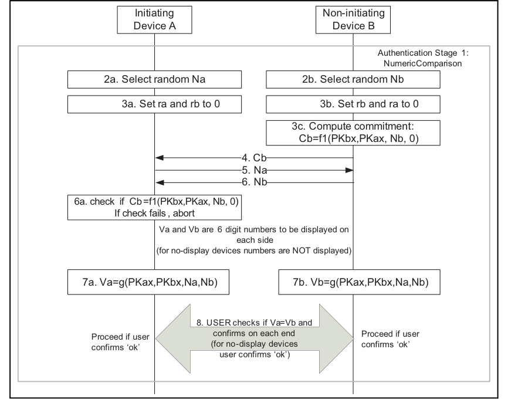

**Figure 7.4:  Authentication Stage 1: Numeric Comparison Protocol Details**

After the public keys have been exchanged, each device selects a pseudo- random 128-bit nonce (step 2). This value is used to prevent replay attacks and must be freshly generated with each instantiation of the pairing protocol. This value should be generated directly from a physical source of randomness or with a good pseudo-random generator seeded with a random value from a physical source.
Following this the responding device then computes a commitment to the two public keys that have been exchanged and its own nonce value (step 3c). This commitment is computed as a one-way function of these values and is transmitted to the initiating device (step 4). The commitment prevents an attacker from changing these values at a later time.
The initiating and responding devices then exchange their respective nonce values (steps 5 and 6) and the initiating device confirms the commitment (step 6a). A failure at this point indicates the presence of an attacker or other transmission error and causes the protocol to abort. The protocol may be repeated with or without the generation of new public-private key pairs, but new nonces must be generated if the protocol is repeated.
Assuming that the commitment check succeeds, the two devices each compute 6-digit confirmation values that are displayed to the user on their
respective devices (steps 7a, 7b, and 8). The user is expected to check that these 6-digit values match and to confirm if there is a match. If there is no match, the protocol aborts and, as before, new nonces must be generated if the protocol is to be repeated.
An active MITM must inject its own key material into this process to have any effect other than denial-of-service. A simple MITM attack will result in the two 6- digit display values being different with probability 0.999999. A more sophisticated attack may attempt to engineer the display values to match, but this is thwarted by the commitment sequence. If the attacker first exchanges nonces with the responding device, it must commit to the nonce that it will use with the initiating device before it sees the nonce from the initiating device. If the attacker first exchanges nonces with the initiating device, it must send a nonce to the responding device before seeing the nonce from the responding device. In each case, the attacker must commit to at least the second of its nonces before knowing the second nonce from the legitimate devices. It therefore cannot choose its own nonces in such a way as to cause the display values to match.

#### 7.2.2  Authentication Stage 1: Out of Band Protocol

The Out-of-Band protocol is used when authentication information has been received by at least one of the devices and indicated in the OOB Authentication Data Present parameter in the LMP IO capability exchange sequence. The mode in which the discovery of the peer device is first done in-band and then followed by the transmission of authentication parameters through OOB interface is not supported. The sequence diagram for Authentication Stage 1 for Out of Band from the cryptographic point of view is shown below:

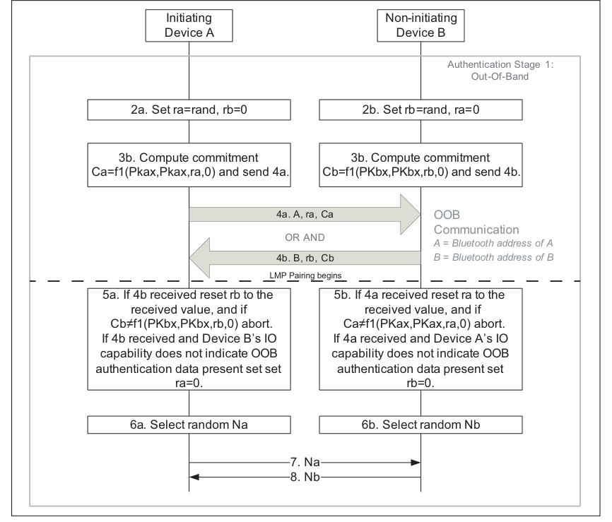

**Figure 7.5:  Authentication Stage 1: Out of Band Details**

Principle of operation: If both devices can transmit and/or receive data over an out-of-band channel, then mutual authentication will be based on the commitments of the public keys (Ca and Cb) exchanged OOB in Authentication stage 1. If OOB communication is possible only in one direction, then authentication of the device receiving the OOB communication will be based on that device knowing a random number r sent via OOB. In this case, r must be secret: r can be created afresh every time, or access to the device sending r must be restricted. If r is not sent by a device, it is assumed to be 0 by the device receiving the OOB information in step 4a or 4b.
Roles of A and B: The OOB Authentication Stage 1 protocol is symmetric with respect to the roles of A and B. It does not require that device A always will initiate pairing and it automatically resolves asymmetry in the OOB communication, e.g. in the case when one of the devices has an NFC tag and can only transmit OOB.
Order of steps: The public key exchange must happen before the verification step 5. In the diagram the in-band public key exchange between the devices (step 1) is done before the OOB communication (step 4). But when the pairing
is initiated by an OOB interface, public key exchange will happen after the OOB communication (step 1 will be between steps 4 and 5).
Values of ra and rb: Since the direction of the peer's OOB interface cannot be verified before the OOB communication takes place, a device should always generate and if possible transmit through its OOB interface a random number r to the peer. Each device applies the following rules locally to set the values of its own r and the value of the peer's r:
1. Initially, r of the device is set to a random number and r of the peer is set to 0 (step 2). 2. If a device has received OOB, it sets the peer's r value to what was sent by the peer (Step 5). 3. If the remote device's OOB Authentication Data parameter sent in the LMP IO capabilities exchange sequence is set to No OOB Data Received, it sets its own r value to 0 (Step 5)
These rules ensure that when entering Authentication Stage 2, both A and B have the same values for ra and rb if OOB communication took place.

#### 7.2.3  Authentication Stage 1: Passkey Entry Protocol

The Passkey Entry protocol is used when LMP IO capability exchange sequence indicates that Passkey Entry shall be used.
The sequence diagram for Authentication Stage 1 for Passkey Entry from the cryptographic point of view is shown in Figure 7.6.

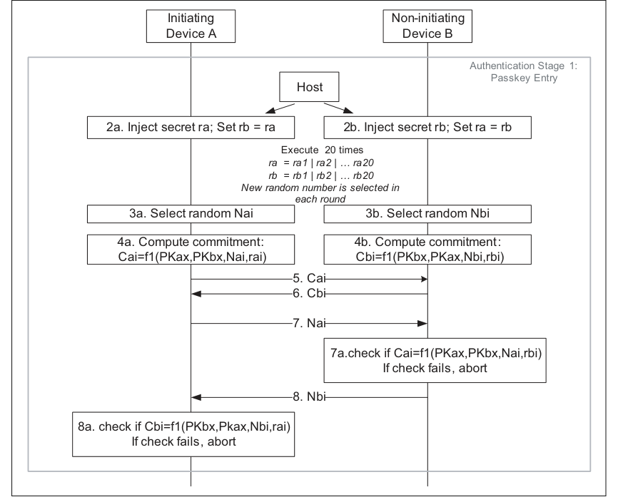

**Figure 7.6:  Authentication Stage 1: Passkey Entry Details**

The user inputs an identical Passkey into both devices. Alternately, the Passkey may be generated and displayed on one device, and the user then inputs it into the other (step 2). This short shared key will be the basis of the mutual authentication of the devices. Steps 3 through 8 are repeated k times for a k-bit Passkey --e.g., k=20 for a 6-digit Passkey (999999=0xF423F).
In Steps 3-8, each side commits to each bit of the Passkey, using a long nonce (128 bits), and sending the hash of the nonce, the bit of the Passkey, and both public keys to the other party. The parties then take turns revealing their commitments until the entire Passkey has been mutually disclosed. The first party to reveal a commitment for a given bit of the Passkey effectively reveals that bit of the Passkey in the process, but the other party then has to reveal the corresponding commitment to show the same bit value for that bit of the Passkey, or else the first party will then abort the protocol, after which no more bits of the Passkey are revealed.
This "gradual disclosure" prevents leakage of more than 1 bit of un-guessed Passkey information in the case of a MITM attack. A MITM attacker with only partial knowledge of the Passkey will only receive one incorrectly-guessed bit of the Passkey before the protocol fails. Hence, a MITM attacker who engages
first one side, then the other will only gain an advantage of at most two bits over a simple brute-force guesser which succeeds with probability 0.000001.
The long nonce is included in the commitment hash to make it difficult to brute- force even after the protocol has failed. The public Diffie-Hellman values are included to tie the Passkey protocol to the original ECDH key exchange, to prevent a MITM from substituting the attacker's public key on both sides of the ECDH exchange in standard MITM fashion.
At the end of this stage, Na is set to Na20 and Nb is set to Nb20 for use in Authentication Stage 2.

### 7.3   PHASE 3: AUTHENTICATION STAGE 2

The second stage of authentication then confirms that both devices have successfully completed the exchange. This stage is identical in all three protocols.
Each device computes a new confirmation value that includes the previously exchanged values and the newly derived shared key (step 9). The initiating device then transmits its confirmation value which is checked by the responding device (step 10). If this check fails, it indicates that the initiating device has not confirmed the pairing, and the protocol must be aborted. The responding device then transmits its confirmation value which is checked by the initiating device (step 11). A failure indicates that the responding device has not confirmed the pairing and the protocol should abort.

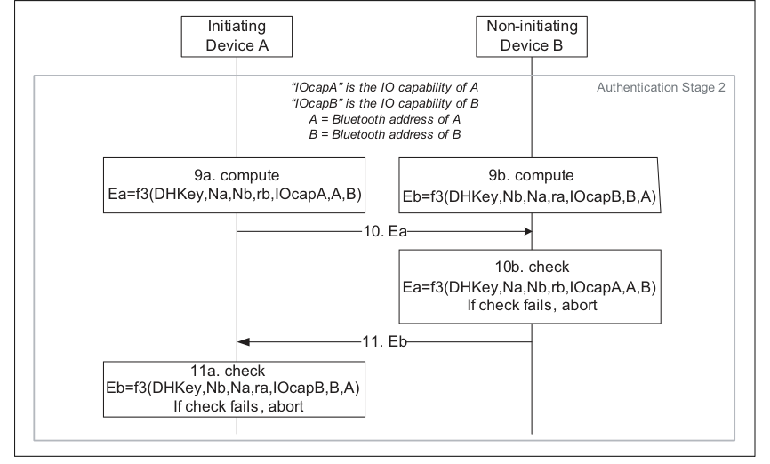

**Figure 7.7:  Authentication Stage 2**

### 7.4   PHASE 4: LINK KEY CALCULATION

Once both sides have confirmed the pairing, a link key is computed from the derived shared key and the publicly exchanged data (step 12). The nonces ensure the freshness of the key even if long-term ECDH values are used by both sides. This link key is used to maintain the pairing.
When computing the link key both parties shall input the parameters in the same order to ensure that both devices compute the same key: device A's parameters are those of the piconet master and device B's parameters are those of the piconet slave.

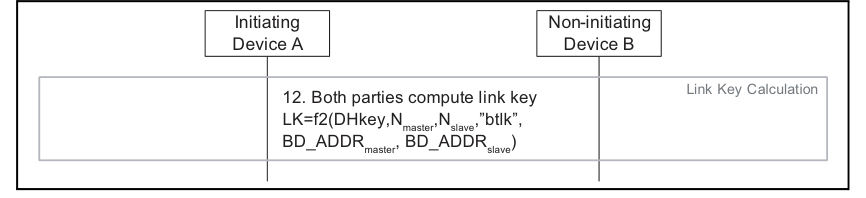

**Figure 7.8:  Link Key Calculation**

### 7.5   PHASE 5: LMP AUTHENTICATION AND ENCRYPTION

The final phase in Simple Pairing consists of authentication and generation of the encryption key. This is the same as the final steps in legacy pairing.

### 7.6   ELLIPTIC CURVE DEFINITION

Simple Pairing supports two elliptic curves: P-192 and P-256.
Simple Pairing uses the FIPS P-192 and P-256 curves defined in FIPS 186-31. Elliptic curves are specified by p, a, b and are of the form:
E: y2 = x3 + ax + b (mod p)
For each value of b a unique curve can be developed. In NIST P-192 and P-256:
a = mod (-3, p) b is defined and its method of generation can be verified by using SHA-1 (with a given seed s and using b2c = -27 (mod p))
1. http://dx.doi.org/10.6028/NIST.FIPS.186-4
The following parameters are given:
• The prime modulus p, order r, base point x-coordinate Gx, base point y- coordinate Gy.
• The integers p and r are given in decimal form; bit strings and field elements are given in hex.
For P-192:
p = 6277101735386680763835789423207666416083908700390324961279
r = 6277101735386680763835789423176059013767194773182842284081
b = 64210519 e59c80e7 0fa7e9ab 72243049 feb8deec c146b9b1
Gx = 188da80e b03090f6 7cbf20eb 43a18800 f4ff0afd 82ff1012
Gy = 07192b95 ffc8da78 631011ed 6b24cdd5 73f977a1 1e794811
The function P192 is defined as follows. Given an integer u, 0 < u < r, and a point V on the curve E, the value P192(u,V) is computed as the x-coordinate of the uth multiple uV of the point V.
The private keys shall be between 1 and r/2, where r is the Order of the Abelian Group on the elliptic curve (e.g. between 1 and 2192/2).
For P-256:
p = 11579208921035624876269744694940757353008614341529031419553363130 8867097853951
r = 11579208921035624876269744694940757352999695522413576034242225906 1068512044369
b = 5ac635d8 aa3a93e7 b3ebbd55 769886bc 651d06b0 cc53b0f6 3bce3c3e 27d2604b
Gx = 6b17d1f2 e12c4247 f8bce6e5 63a440f2 77037d81 2deb33a0 f4a13945 d898c296
Gy = 4fe342e2 fe1a7f9b 8ee7eb4a 7c0f9e16 2bce3357 6b315ece cbb64068 37bf51f5
The function P-256 is defined as follows. Given an integer u, 0 < u < r, and a point V on the curve E, the value P-256(u,V) is computed as the x-coordinate of the uth multiple uV of the point V.
The private keys shall be between 1 and r/2, where r is the Order of the Abelian Group on the elliptic curve (e.g. between 1 and 2256/2).

### 7.7   CRYPTOGRAPHIC FUNCTION DEFINITIONS

In addition to computing the Elliptic Curve Diffie Hellman key, the Numeric Comparison, Out-of-Band and Passkey Entry protocols require four cryptographic functions. These functions are known as f1, g, f2 and f3.
f1 is used to generate the 128-bit commitment values Ca and Cb g is used to compute the 6-digit numeric check values f2 is used to compute the link key and possible other keys from the DHKey and random nonces f3 is used to compute check values Ea and Eb in Authentication Stage 2.
The basic building block for these functions is based on as it already exists in the key derivation function E3 (which is the same as E1 but with a larger input).
Inside the f1, g, f2, and f3 cryptographic functions, when a multi-octet integer input parameter is used as input to the SHA-256 and HMAC-SHA-256 functions, the most significant octet of the integer parameter shall be the first octet of the stream and the least significant octet of the integer parameter shall be the last octet of the stream. The output of the f1, g, f2 and f3 cryptographic functions is a multi-octet integer where the first octet out of SHA-256 and HMAC-SHA-256 shall be the MSB and the last octet shall be the LSB of that parameter.
Inside the h2 cryptographic function, when a multi-octet integer input parameter is used as input to the SHA-256 and HMAC-SHA-256 functions, the most significant octet of the integer parameter shall be the last octet of the stream and the least significant octet of the integer parameter shall be the first octet of the stream. The output of the h2 cryptographic function is a multi-octet integer where the first octet out of SHA-256 and HMAC-SHA-256 shall be the LSB and the last octet shall be the MSB of that parameter.

#### 7.7.1  The Simple Pairing Commitment Function f1

The commitments are computed with function f1. The definition of the Simple Pairing commitment function makes use of the MAC function HMAC based on SHA-256x, which is denoted as HMAC-SHA-256X with 128-bit key X.
The inputs to the Simple Pairing function f1 are:

| Input | Bits with P-192 | Bits with P-256 |
| --- | --- | --- |
| U | 192 | 256 |
| V | 192 | 256 |
| X | 128 | 128 |
| Z | 8 | 8 |

Z is zero (i.e., 8 bits of zeros) for Numeric Comparison and OOB protocol. In the Passkey protocol the most significant bit of Z is set equal to one and the least significant bit is made up from one bit of the passkey e.g. if the passkey bit is 1 then Z = 0x81 and if the passkey bit is 0 then Z = 0x80.
The output of the Simple Pairing f1 function is:
f1(U, V, X, Z) = HMAC-SHA-256X (U || V || Z) / 2128
The inputs to f1 are different depending on the different protocols.

| Numeric Comparison | Out-Of-Band | Passkey Entry |
| --- | --- | --- |
| Ca = f1(PKax, PKbx, Na, 0) | Ca = f1(PKax, PKax, ra, 0) | Cai = f1(PKax, PKbx, Nai, rai |
| Cb = f1(PKbx, PKax, Nb, 0) | Cb = f1(PKbx, PKbx, rb, 0) | Cbi = f1(PKbx, PKax, Nbi, rbi |

Table 7.2:  Inputs to f1 for the different protocols
where PKax denotes the x-coordinate of the public key PKa of A. Similarly, PKbx denotes the x-coordinate of the public key PKb of B. Nai is the nonce value of ith round. For each round Nai value is a new 128 bit number. Similarly, rai is one bit value of the passkey expanded to 8 bits (either 0x80 or 0x81).
Na and Nb are nonces from Devices A and B. ra and rb are random values generated by devices A and B.

#### 7.7.2  The Simple Pairing Numeric Verification Function g

The Simple Pairing g function is defined as follows:
The inputs to the Simple Pairing function g are:

| Input | Bits with P-192 | Bits with P-256 |
| --- | --- | --- |
| U | 192 | 256 |
| V | 192 | 256 |
| X | 128 | 128 |
| Y | 128 | 128 |

The output of the Simple Pairing g function is:
g(U, V, X, Y) = SHA-256(U || V || X || Y) mod 232
The numeric verification value is taken as six least significant digits of the 32-bit integer g(PKax, PKbx, Na, Nb) where PKax denotes the x-coordinate of the public key PKa of A and PKbx denotes the x-coordinate of the public key PKb of B.
Output of SHA-256 is truncated to 32 bits by taking the least significant 32 bits of the output of SHA-256. This value is converted to decimal numeric value. The checksum used for numeric comparison is the least significant six digits.
Compare Value = g (U, V, X, Y) mod 106
For example, if output = 0x 01 2e b7 2a then decimal value = 19838762 and the checksum used for numeric comparison is 838762.

#### 7.7.3  The Simple Pairing Key Derivation Function f2

The definition of the Simple Pairing key derivation function makes use of the MAC function HMAC based on SHA-256, which is denoted as HMAC-SHA- 256W with 192-bit or 256-bit key W.
The inputs to the Simple Pairing function f2 are:

| Input | Bits with P-192 | Bits with P-256 |
| --- | --- | --- |
| W | 192 | 256 |
| N 1 | 128 | 128 |
| N 2 | 128 | 128 |
| keyID | 32 | 32 |
| A 1 | 48 | 48 |
| A 2 | 48 | 48 |

The string "btlk" is mapped into keyID using extended ASCII1 as follows:
keyID[0] = 0110 1011 (lsb) keyID[1] = 0110 1100 keyID[2] = 0111 0100 keyID[3] = 0110 0010
KeyID = 0x62746c6b
The output of the Simple Pairing f2 function is:
f2(W, N1, N2, KeyID, A1, A2) = HMAC-SHA-256W (N1 || N2|| KeyID || A1|| A2) / 2128
The output of f2 is taken as the 128 most significant (leftmost) bits of the output of HMAC-SHA-256.
The link key is then calculated as:
LK = f2(DHKey, N_master, N_slave, "btlk", BD_ADDR_master, BD_ADDR_slave)
1. ISO/IEC 8859-1(see www.iso.org)

#### 7.7.4  The Simple Pairing Check Function f3

The definition of the Simple Pairing f3 check function makes use of the MAC function HMAC based on SHA-256, which is denoted as HMAC-SHA-256W with 192-bit or 256-bit key W.
The inputs to the Simple Pairing function f3 are:

| Input | Bits with P-192 | Bits with P-256 |
| --- | --- | --- |
| W | 192 | 256 |
| N 1 | 128 | 128 |
| N 2 | 128 | 128 |
| IOcap | 24 | 24 |
| A 1 | 48 | 48 |
| A 2 | 48 | 48 |

IOcap is three octets with the most significant octet as the Authentication Requirements parameter, the middle octet as the LMP Out-of-Band Authentication Data parameter, and the least significant octet as the LMP IO capability parameter.
The output of the Simple Pairing f3 function is:
f3(W, N1, N2, R, IOcap, A1, A2) = HMAC-SHA-256W (N1 || N2 || R || IOcap || A1 || A2) / 2128
The output of f3 is taken as the 128 most significant (leftmost) bits of the output of HMAC-SHA-256. The check values are computed with function f3. The inputs to f3 are different depending on the different protocols:

| Numeric Comparison | Out-Of-Band | Passkey Entry |
| --- | --- | --- |
| Ea = f3(DHKey, Na, Nb, 0, IOcapA, A, B) | Ea = f3(DHKey, Na, Nb, rb, IOcapA, A, B) | Ea = f3(DHKey, Na20, Nb20, rb IOcapA, A, B) |
| Eb = f3(DHKey, Nb, Na, 0, IOcapB, B, A) | Eb = f3(DHKey, Nb, Na, ra, IOcapB, B, A) | Eb = f3(DHKey, Nb20, Na20, ra IOcapB, B, A) |

Table 7.3:  Inputs to f3 for the different protocols
DHKey denotes the shared secret Diffie-Hellman Key computed as P192(SKa, PKb) or P256(SKa, PKb) by A and as P192(SKb, PKa) or P256(SKb, PKb) by B. IOcapA denotes the IO capability data of A and IOcapB denotes the IO capability data of B. In Passkey Entry, the data ra and rb are 6-digit passkey values which are expressed as a 128-bit integer. For instance, if the 6-digit value of ra is 131313
then R = 0x 00 00 00 00 00 00 00 00 00 00 00 00 00 02 00 f1.
The input A is the BD_ADDR of device A and the input B is the BD_ADDR of device B.

#### 7.7.5  The Simple Pairing AMP Key Derivation Function h2

The definition of the Simple Pairing dedicated AMP key derivation function makes use of the MAC function HMAC based on SHA-256, which is denoted as HMAC-SHA-256W with 256-bit key W.
The inputs to the Simple Pairing function h2 are as follows:
W is 256 bits keyID is 32 bits L is 8 bits
The output of the Simple Pairing h2 function is as follows:
h2(W, keyID, L) = HMAC-SHA-256W (keyID) / 2256-(L*8)
For each Dedicated AMP, a fixed value of the key identifier KeyID is specified. A master key MKAMP of length LAMP, 0 ≤ LAMP ≤ 32, is computed as
MKAMP = h2 (GAMP_LK, keyIDAMP, LAMP).

##### 7.7.5.1  Initial GAMP_LK Creation

The Generic AMP Link Key (GAMP_LK) shall be created every time the link key (LK) is changed or created using the f2 function (see Section 7.7.3). Whenever the GAMP_LK is created, all dedicated AMP link keys associated with the remote BD_ADDR shall be discarded.
A fixed value of the key identifier KeyID is specified ('gamp'). The string 'gamp' is mapped into keyID using extended ASCII1 as follows:
keyID[0] = 0111 0000 (lsb)
keyID[1] = 0110 1101
keyID[2] = 0110 0001
keyID[3] = 0110 0111
keyID = 0x67616d70
The initial GAMP_LK shall be created in the Host using the h2 function.
GAMP_LK = h2 (W, 'gamp', 32)
Where W = LK || LK

##### 7.7.5.2  Dedicated AMP Link Key Generation

Each AMP uses a defined keyID and keyLength. Both values are defined in the Assigned numbers page.
A dedicated AMP link key is computed as
1. ISO_8859-1
Dedicated_AMP_Link_Key = h2 (GAMP_LK, keyID, keyLength)

##### 7.7.5.3  GAMP_LK Regeneration

Each time the GAMP_LK is used to generate a valid dedicated AMP link key it shall be regenerated by computing
New_ GAMP_LK = h2 (GAMP_LK, 'gamp', 32)
and then setting
GAMP_LK = New_GAMP_LK

##### 7.7.5.4  Debug AMP Link Key Generation

When the BR/EDR link key is a debug link key, the dedicated AMP link keys are set equal to the keyLength least significant octets of the Generic AMP link key. When debug link keys are used, the Generic AMP link key shall not be regenerated.

#### 7.7.6  The AES Encryption Key Generation Function h3

AES encryption keys are created using the AES encryption key generation function h3. The definition of the AES encryption key generation function makes use of the MAC function HMAC based on SHA-256, which is denoted as HMAC-SHA-256T with 128-bit key T.
The inputs to function h3 are:

| Input | Bits with P-256 |
| --- | --- |
| T | 128 |
| keyID | 32 |
| A 1 | 48 |
| A 2 | 48 |
| ACO | 64 |

A1 is the BD_ADDR of the master. A2 is the BD_ADDR of the slave. ACO is the 64 bit ACO output from h5. T is the 128 bit Bluetooth Link Key derived from f2.
The string “btak” (Bluetooth AES Key) is mapped into keyID using extended ASCII as follows:
keyID[0] = 0110 1011 (lsb) keyID[1] = 0110 0001 keyID[2] = 0111 0100 keyID[3] = 0110 0010 KeyID = 0x6274616b
The output of function h3 is:
h3(W, keyID, A1, A2, ACO) =
HMAC-SHA-256T(KeyID || A1 || A2 || ACO) / 2128
The output of h3 is taken as the 128 most significant (leftmost) bits of the output of HMAC-SHA-256.

#### 7.7.7  The Device Authentication Key Generation Function h4

With Secure Connections, a device authentication key is created using function h4. The definition of the device authentication key generation function makes use of the MAC function HMAC based on SHA-256, which is denoted as HMAC-SHA-256T with 128-bit key T.
The inputs to function h4 are:

| Input | Bits with P-256 |
| --- | --- |
| T | 128 |
| keyID | 32 |
| A 1 | 48 |
| A 2 | 48 |

A1 is the BD_ADDR of the master. A2 is the BD_ADDR of the slave. T is the 128 bit Bluetooth Link Key derived from f2.
The string “btdk” (Bluetooth Device Key) is mapped into keyID using extended ASCII as follows:
keyID[0] = 0110 1011 (lsb) keyID[1] = 0110 0100 keyID[2] = 0111 0100 keyID[3] = 0110 0010 KeyID = 0x6274646b
The output of function h4 is:
h4(W, KeyID, A1, A2) = HMAC-SHA-256T(KeyID || A1 || A2) / 2128
The output of h4 is taken as the 128 most significant (leftmost) bits of the output of HMAC-SHA-256.

#### 7.7.8  The Device Authentication Confirmation Function h5

With Secure Connections, device authentication confirmation values are created using function h5. The definition of the device authentication confirmation function makes use of the MAC function HMAC based on SHA- 256, which is denoted as HMAC-SHA-256S with 128-bit key S.
The inputs to function h5 are:

| Input | Bits with P-256 |
| --- | --- |
| S | 128 |
| R 1 | 128 |
| R 2 | 128 |

R1 is the 128 bit random number (AU_RAND_M) from the master during the Link Manager device authentication sequence. R2 is the 128 bit random number from the slave (AU_RAND_S) during the Link Manager device authentication sequence. S is the 128-bit Bluetooth Device Authentication Key derived from h4.
The output of function h5 is:
h5(W, R1, R2) = HMAC-SHA-256S(R1 || R2) / 2128
The output of h5 is taken as the 128 most significant (leftmost) bits of the output of HMAC-SHA-256. The first 32 bits (leftmost) become the SRESmaster. The next 32 bits become the SRESslave. The final 64 bits become the Authentication Ciphering Offset (ACO), which is used in h3 and as the IV for Encryption Start for the encryption nonce.

## 8  AMP SECURITY

### 8.1   CREATION OF THE INITIAL GENERIC AMP LINK KEY

AMP security starts any time the BR/EDR link key is created or changed. This may be as the result of the f2 function during Phase 4 of the Secure Simple Pairing process (see Section 7.7.3) or due to a change connection link key procedure. The initial Generic AMP link key, GAMP_LK, is created with the h2 function using the BR/EDR Link Key concatenated together with itself to form a 256-bit value and with the KeyID 'gamp' (see Section 7.7.5.1). The Generic AMP Link Key (GAMP_LK) is stored in the security database alongside the BR/ EDR Link Key once pairing has completed.
Whenever the Generic AMP Link Key is created, all Dedicated AMP Link Keys associated with the remote device shall be discarded and any active AMP Physical Links to the remote device shall be disconnected. Note that when a Host initiates a Change Connection Link Key procedure, all active AMP physical links between the two devices will be disconnected.
Since AMP security does not affect the BR/EDR Link Key, backwards compatibility is maintained for devices that support the Generic AMP feature with devices that do not. The Generic AMP Link Key is generated as part of Secure Simple Pairing regardless of whether the devices both support the Generic AMP feature or any AMP in common.

### 8.2   CREATION OF DEDICATED AMP LINK KEYS

When an AMP is used for the first time, a dedicated AMP key is created by the AMP Manager for that AMP type using the new Secure Simple Pairing function h2 and a KeyID for the AMP type. The length of the Dedicated AMP Link Key depends on the AMP Type. If the Dedicated AMP Link Key already exists due to a previous connection the AMP link key is not created and the stored key is reused.
The Dedicated AMP Link Key is sent down to the PAL in the HCI Create Physical Link and HCI Accept Physical Link commands (see [Vol 2] Part E, Section 7.1.37 and [Vol 2] Part E, Section 7.1.38). Each PAL is responsible for establishing security from the Dedicated AMP Link Key. Note that a Dedicated AMP Link Key may be used for multiple sessions over the same AMP.
Each time a dedicated AMP key is created and the AMP Create Physical Link sequence completes successfully (see [Vol 3] Part E, Section 2.3.3), the Generic AMP Link Key is updated. This is performed using the h2 function with KeyID 'gamp.' If the AMP Create Physical Link sequence does not complete successfully, the dedicated AMP link key shall be discarded and the Generic AMP Link Key shall not be updated.
Figure 8.1 shows an overview of the AMP key generation in the Host.

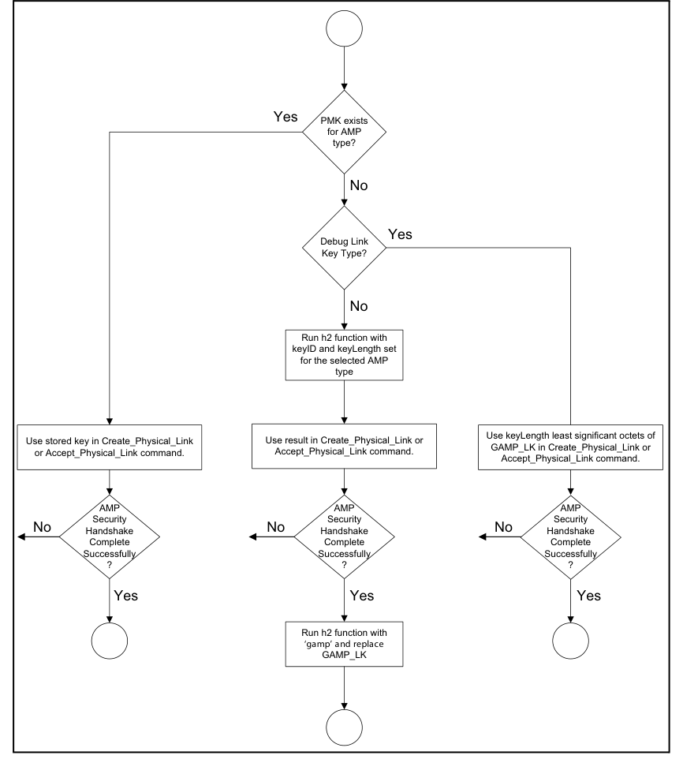

**Figure 8.1:  AMP key generation in Host**

Creation of the dedicated AMP keys and updates to the Generic AMP Link Key are the responsibility of the AMP Manager (see [Vol 3] Part E, Section 2.3.3).

### 8.3   DEBUG CONSIDERATIONS

Since the AMP architecture requires encryption to be enabled on each AMP, in order to support sniffers for debug as well as to enable testing over the air, provisions need to be made in the AMP architecture to support debug combination keys. In this document, this is supported in two ways:
• Passing the link key type along with the link key (and length) in the HCI_Create_Physical_Link and HCI_Accept_Physical_Link commands and
• Requiring that the GAMP_LK is used as the dedicated AMP key when the key type is set to "debug combination key.”

## 9  AES-CCM ENCRYPTION FOR BR/EDR

The Baseband provides security using Counter with Cipher Block Chaining- Message Authentication Code (CCM) as defined in IETF RFC 3610 (http:// www.ietf.org/rfc/rfc3610.txt) with a modification to the B1 counter mode block format that omits the length of the additional authenticated data. The description of the algorithm can also be found in the NIST Special Publication 800-38C (http://csrc.nist.gov/publications/PubsSPs.html).
Using the notation in [4], CCM has two size parameters, M and L. The Baseband defines these to be:
M = 4; indicating that the MIC length is 4 octets (32 bits)
Size of M represents a trade-off between message expansion and the probability that an attacker can undetectably modify a message.
L = 2; indicating that the Length field is 2 octets (16 bits)
Size of L requires a trade-off between the maximum message size and the size of the Nonce.

### 9.1   NONCE FORMATS

All of the parameters in the nonce are unique per logical transport. The nonce will be 13 octets and will have two formats. The first format is called the payload counter format and is used for ACL packets on the primary LT_ADDR. The second format is called the clock format and is used for eSCO packets.
The reason for two formats has to do with two factors: potential security attacks and synchronization. Since ACL packets on the primary LT_ADDR carry protocol, they are susceptible to attacks that eSCO packets (only data) are not.
The descriptions of the two nonce formats are provided in Table 9.1.

| Octet | Field | Octets | Payload Counter Format Description | Clock Format Description |
| --- | --- | --- | --- | --- |
| 0 | Nonce0 | 1 | PayloadCounter[7:0] | CLK[8:1] |
| 1 | Nonce1 | 1 | PayloadCounter[15:8] | CLK[16:9] |
| 2 | Nonce2 | 1 | PayloadCounter[23:16] | CLK[24:17] |

Table 9.1:  Nonce Formats.

| Octet | Field | Octets | Payload Counter Format Description | Clock Format Description |
| --- | --- | --- | --- | --- |
| 3 | Nonce3 | 1 | PayloadCounter[31:24] | Bit 2 – Bit 0: CLK[27:25] Bit 7 – Bit 3: dayCounter[4:0] |
| 4 | Nonce4 | 1 | Bits 3 - 0: PayloadCounter[35:32] Bit 4: zero-length ACL-U continuation packet (1=zero-length ACL-U continuation packet, 0=otherwise) Bit 5: direction (0=master to slave, 1=slave to master) Bits 7-6: nonceType = 00b (ACL) | Bit 5 – Bit 0: dayCounter[10:5] Bits 7-6: nonceType = 01b (eSCO) |
| 5 | Nonce5 | 1 | Octet0 (LSO) of IV |  |
| 6 | Nonce6 | 1 | Octet1 of IV |  |
| 7 | Nonce7 | 1 | Octet2 of IV |  |
| 8 | Nonce8 | 1 | Octet3 of IV |  |
| 9 | Nonce9 | 1 | Octet4 of IV |  |
| 10 | Nonce10 | 1 | Octet5 of IV |  |
| 11 | Nonce11 | 1 | Octet6 of IV |  |
| 12 | Nonce12 | 1 | Octet7 (MSO) of IV |  |

Table 9.1:  Nonce Formats.
In the payload counter format, the PayloadCounter starts at zero for the first encrypted packet in each direction after encryption is started or resumed and increments every time an encrypted payload including zero-length payloads is accepted by the remote device. Note: It is possible that when encryption is being enabled or resumed, a packet may first get transmitted unencrypted and then get retransmitted encrypted. In such a case, the PayloadCounter gets incremented when the encrypted retransmission of the packet gets accepted by the remote device.
Bit 4 of Octet 4 shall be set to 1 for a zero length ACL-U continuation packet (see [Vol 2] Part B, Section 7.6.2.2), otherwise it shall be set to 0.
In the clock format, the master clock (CLK) used for the nonce shall be the value in the first slot of the packet. After a new ACL connection has been established or a role switch has been successfully performed and when eSCO
is successfully established for the first time then the dayCounter value shall be initialized to:

## 1 if CLK27 in the first clock format nonce is 0, and initialization procedure 2 (see [Vol 2] Part B, Section 8.6.3) is used 0 otherwise.

After the dayCounter has been initialized, it shall increment every time the master clock (CLK) rolls over to 0x0000000 (approximately every 23.3 hours). Note: When Security Mode 4 is in use, eSCO will not be established before encryption is started.
The IV is an 8 octet field. For encryption start, all octets of the IV are from the ACO output of the last execution of h5 prior to the start of encryption. Note: Multiple device authentications may occur prior to starting encryption but only the ACO of the last device authentication is used. After an encryption resume, all 8 octets of the IV are from the EN_RAND sent by the device initiating the encryption pause (see [Vol 2] Part C, Section 4.2.5.5). An encryption pause and resume will be required prior to the PayloadCounter or dayCounter rolling over in order to keep the nonce fresh for an encryption key.

| Octet | IV for Encryption Start | IV After Resume Encryption |
| --- | --- | --- |
| 0 | ACO[0] | EN RAND[0] _ |
| 1 | ACO[1] | EN RAND[1] _ |
| 2 | ACO[2] | EN RAND[2] _ |
| 3 | ACO[3] | EN RAND[3] _ |
| 4 | ACO[4] | EN RAND[4] _ |
| 5 | ACO[5] | EN RAND[5] _ |
| 6 | ACO[6] | EN RAND[6] _ |
| 7 | ACO[7] | EN RAND[7] _ |

Table 9.2:  IV Construction.

### 9.2   COUNTER MODE BLOCKS

For calculating the MIC, the payload is broken into two or more counter mode blocks. The CCM specification refers to these blocks as blocks B0 – Bn. B0 applies to the nonce, B1 applies to the associated data {that is packet header and payload header} and additional B blocks are generated as needed for
authentication of the payload body.

| Offset (octets) | Field | Size (octets) | Value | Description |
| --- | --- | --- | --- | --- |
| 0 | Flags | 1 | 0x49 | As per the CCM specification |
| 1 | Nonce | 13 | variable | The nonce as described in Section 9.1. Nonce0 shall have offset 1. Nonce12 shall have offset 13. |
| 14 | Length[MSO] | 1 | variable | The most significant octet of the length o the payload body |
| 15 | Length[LSO] | 1 | variable | The least significant octet of the length o the payload body |

Table 9.3:  B0 Counter Mode Block Format.

| Offset | Field | Size (octets) | Value | Description |
| --- | --- | --- | --- | --- |
| 0 | Packet Header _ [MSO] | 1 | Variable | The most significant octet of the packet header: Bit 0: 0b (ARQN masked) Bit 1: 0b (SEQN masked) Bit 7 – Bit 2: 000000b |
| 1 | Packet Header _ [LSO] | 1 | Variable | The least significant octet of the packet header: Bit 2 – Bit 0: LT ADDR _ Bit 6 – Bit 3: TYPE Bit 7: 0b (FLOW masked) |
| 2 | Payload Header _ | 1 | Variable | The payload header: Bit 1 – Bit 0: LLID Bit 2: 0b (FLOW masked) Bit 7 – Bit 3: 00000b |
| 3 | Padding | 13 | 0x00, 0x00, 0x00, 0x00, 0x00, 0x00, 0x00, 0x00, 0x00, 0x00, 0x00, 0x00, 0x00 | These octets are only used to pad the block. They are not part of the packet and never transmitted. |

Table 9.4:  B1 Counter Mode Block Format.

### 9.3   ENCRYPTION BLOCKS

The CCM algorithm uses the Ai blocks to generate a keystream that is used to encrypt the MIC and payload body. Block A0 is always used to encrypt and decrypt the MIC, when present. Block A1 is always used to encrypt and decrypt the first 16 octets of the payload body. Subsequent blocks are always used to encrypt and decrypt the rest of the payload body as needed.

| Offset (octets) | Field | Size (octets) | Value | Description |
| --- | --- | --- | --- | --- |
| 0 | Flags | 1 | 0x01 | As per the CCM specification |
| 1 | Nonce | 13 | variable | The nonce as described in Section 9.1. Nonce0 shall have offset 1. Nonce12 shall have offset 13. |
| 14 | i[MSO] | 1 | variable | The most significant octet of the counter i |
| 15 | i[LSO] | 1 | variable | The least significant octet of the counter i |

Table 9.5:  Encryption Mode Block Format.

### 9.4   ENCRYPTION KEY SIZE REDUCTION

When the devices have negotiated a key size shorter than the maximum length, the key will be shortened by replacing LSOs of the key with 0x00.

### 9.5   REPEATED MIC FAILURES

Anytime the MIC check fails and the CRC passes on a given packet, it is considered an authentication failure. No more than three authentication failures shall be permitted during the lifetime of an encryption key with a given IV. The third authentication failure shall initiate an encryption key refresh (see [Vol 2] Part C, Section 4.2.5.8). If a fourth authentication failure occurs prior to the encryption key refresh procedure completing, the link shall be disconnected with reason code Connection Rejected Due to Security Reasons (0x0E). Note: The MIC is not checked when the CRC is invalid.
Core System Package
[Host volume]
Specification of the Bluetooth  System
®
Specification Volume 3
Covered Core Package Version: 5.0 Publication Date: Dec 06 2016
Revision History
The Revision History is shown in the [Vol 0] Part C, Appendix.
Contributors
The persons who contributed to this specification are listed in the [Vol 0] Part C, Appendix.
Web Site
This specification can also be found on the official Bluetooth web site: https://www.bluetooth.org/en-us/specification/adopted-specifications
Disclaimer and Copyright Notice
Use of this specification is your acknowledgement that you agree to and will comply with the following notices and disclaimers. You are advised to seek appropriate legal, engineering, and other professional advice regarding the use, interpretation, and effect of this specification.
Use of Bluetooth specifications by members of Bluetooth SIG is governed by the membership and other related agreements between Bluetooth SIG and its members, including those agreements posted on Bluetooth SIG’s website located at www.bluetooth.com. Any use of this specification by a member that is not in compliance with the applicable membership and other related agreements is prohibited and, among other things, may result in (i) termination of the applicable agreements and (ii) liability for infringement of the intellectual property rights of Bluetooth SIG and its members.
Use of this specification by anyone who is not a member of Bluetooth SIG is prohibited and is an infringement of the intellectual property rights of Bluetooth SIG and its members. The furnishing of this specification does not grant any license to any intellectual property of Bluetooth SIG or its members. THIS SPECIFICATION IS PROVIDED “AS IS” AND BLUETOOTH SIG, ITS MEMBERS AND THEIR AFFILIATES MAKE NO REPRESENTATIONS OR WARRANTIES AND DISCLAIM ALL WARRANTIES, EXPRESS OR IMPLIED, INCLUDING ANY WARRANTIES OF MERCHANTABILITY, TITLE, NON-INFRINGEMENT, FITNESS FOR ANY PARTICULAR PURPOSE, OR THAT THE CONTENT OF THIS SPECIFICATION IS FREE OF ERRORS. For the avoidance of doubt, Bluetooth SIG has not made any search or investigation as to third parties that may claim rights in or to any specifications or any intellectual property that may be required to implement any specifications and it disclaims any obligation or duty to do so.
TO THE MAXIMUM EXTENT PERMITTED BY APPLICABLE LAW, BLUETOOTH SIG, ITS MEMBERS AND THEIR AFFILIATES DISCLAIM ALL LIABILITY ARISING OUT OF OR RELATING TO USE OF THIS SPECIFICATION AND ANY INFORMATION CONTAINED IN THIS SPECIFICATION, INCLUDING LOST REVENUE, PROFITS, DATA OR PROGRAMS, OR BUSINESS INTERRUPTION, OR FOR SPECIAL, INDIRECT, CONSEQUENTIAL, INCIDENTAL OR PUNITIVE DAMAGES, HOWEVER CAUSED AND REGARDLESS OF THE THEORY OF LIABILITY, AND EVEN IF BLUETOOTH SIG, ITS MEMBERS OR THEIR AFFILIATES HAVE BEEN ADVISED OF THE POSSIBILITY OF THE DAMAGES.
If this specification is a prototyping specification, it is solely for the purpose of developing and using prototypes to verify the prototyping specifications at Bluetooth SIG sponsored IOP events. Prototyping Specifications cannot be used to develop products for sale or distribution and prototypes cannot be qualified for distribution.
Products equipped with Bluetooth wireless technology ("Bluetooth Products") and their combination, operation, use, implementation, and distribution may be subject to regulatory controls under the laws and regulations of numerous countries that regulate products that use wireless non-licensed spectrum. Examples include airline regulations, telecommunications regulations, technology transfer controls and health and safety regulations. You are solely responsible for complying with all applicable laws and regulations and for obtaining any and all required authorizations, permits, or licenses in connection with your use of this specification and development, manufacture, and distribution of Bluetooth Products. Nothing in this specification provides any information or assistance in connection with complying with applicable laws or regulations or obtaining required authorizations, permits, or licenses.
Bluetooth SIG is not required to adopt any specification or portion thereof. If this specification is not the final version adopted by Bluetooth SIG’s Board of Directors, it may not be adopted. Any specification adopted by Bluetooth SIG’s Board of Directors may be withdrawn, replaced, or modified at any time. Bluetooth SIG reserves the right to change or alter final specifications in accordance with its membership and operating agreements.
Copyright © 1999 - 2016. The Bluetooth word mark and logos are owned by Bluetooth SIG, Inc. All copyrights in the Bluetooth Specifications themselves are owned by Ericsson AB, Lenovo (Singapore) Pte. Ltd., Intel Corporation, Microsoft Corporation, Nokia Corporation, Toshiba Corporation and Apple, Inc. Other third-party brands and names are the property of their respective owners.
Core System Package [Host volume]
Part A
PART A: LOGICAL LINK CONTROL AND ADAPTATION PROTOCOL SPECIFICATION
The Bluetooth logical link control and adaptation protocol (L2CAP) supports higher level protocol multiplexing, packet segmentation and reassembly, and the conveying of quality of service information. The protocol state machine, packet format, and composition are described in this document.
CONTENTS

## 1  INTRODUCTION

This section of the Bluetooth Specification defines the Logical Link Control and Adaptation Layer Protocol, referred to as L2CAP. L2CAP provides connection- oriented and connectionless data services to upper layer protocols with protocol multiplexing capability and segmentation and reassembly operation. L2CAP permits higher level protocols and applications to transmit and receive upper layer data packets (L2CAP Service Data Units, SDU) up to 64 kilobytes in length. L2CAP also permits per-channel flow control and retransmission.
The L2CAP layer provides logical channels, named L2CAP channels, which are multiplexed over one or more logical links.

### 1.1   L2CAP FEATURES

The functional requirements for L2CAP include protocol/channel multiplexing, segmentation and reassembly (SAR), per-channel flow control, and error control. L2CAP sits above a lower layer composed of one of the following:
1. BR/EDR Controller and zero or more AMP Controllers or 2. BR/EDR/LE Controller (supporting BR/EDR and LE) and zero or more AMP Controllers, or 3. LE Controller (supporting LE only)
L2CAP interfaces with upper layer protocols.
Figure 1.1 breaks down L2CAP into its architectural components. The Channel Manager provides the control plane functionality and is responsible for all internal signaling, L2CAP peer-to-peer signaling and signaling with higher and lower layers. It performs the state machine functionality described in Section 6 and uses message formats described in Section 4, and Section 5. The Retransmission and Flow Control block provides per-channel flow control and error recovery using packet retransmission. The Resource Manager is responsible for providing a frame relay service to the Channel Manager, the Retransmission and Flow Control block and those application data streams that do not require Retransmission and Flow Control services. It is responsible for coordinating the transmission and reception of packets related to multiple L2CAP channels over the facilities offered at the lower layer interface.

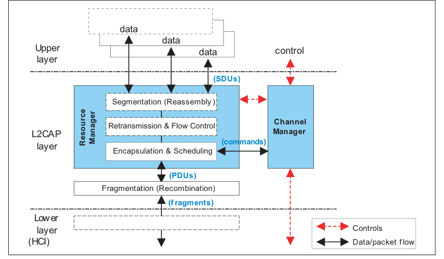

**Figure 1.1:  L2CAP architectural blocks**

• Protocol/channel multiplexing L2CAP supports multiplexing over individual Controllers and across multiple Controllers. An L2CAP channel shall operate over one Controller at a time. During channel setup, protocol multiplexing capability is used to route the connection to the correct upper layer protocol. For data transfer, logical channel multiplexing is needed to distinguish between multiple upper layer entities. There may be more than one upper layer entity using the same protocol.
• Segmentation and reassembly With the frame relay service offered by the Resource Manager, the length of transport frames is controlled by the individual applications running over L2CAP. Many multiplexed applications are better served if L2CAP has control over the PDU length. This provides the following benefits:
a) Segmentation will allow the interleaving of application data units in order to satisfy latency requirements.
b) Memory and buffer management is easier when L2CAP controls the packet size.
c) Error correction by retransmission can be made more efficient.
d) The amount of data that is destroyed when an L2CAP PDU is corrupted or lost can be made smaller than the application's data unit.
e) The application is decoupled from the segmentation required to map the application packets into the lower layer packets.
• Flow control per L2CAP channel Controllers provide error and flow control for data going over the air and HCI flow control exists for data going over an HCI transport. When several data streams run over the same Controller using separate L2CAP channels, each channel requires individual flow control. A window based flow control scheme is provided.
• Error control and retransmissions When L2CAP channels are moved from one Controller to another data can be lost. Also, some applications require a residual error rate much smaller than some Controllers can deliver. L2CAP provides error checks and retransmissions of L2CAP PDUs. The error checking in L2CAP protects against errors due to Controllers falsely accepting packets that contain errors but pass Controller-based integrity checks. L2CAP error checking and retransmission also protect against loss of packets due to flushing by the Controller. The error control works in conjunction with flow control in the sense that the flow control mechanism will throttle retransmissions as well as first transmissions.
• Support for Streaming Streaming applications such as audio set up an L2CAP channel with an agreed-upon data rate and do not want flow control mechanisms, including those in the Controller, to alter the flow of data. A flush timeout is used to keep data flowing on the transmit side. Streaming mode is used to stop HCI and Controller based flow control from being applied on the receiving side.
• Fragmentation and Recombination Some Controllers may have limited transmission capabilities and may require fragment sizes different from those created by L2CAP segmentation. Therefore layers below L2CAP may further fragment and recombine L2CAP PDUs to create fragments which fit each layer’s capabilities. During transmission of an L2CAP PDU, many different levels of fragmentation and recombination may occur in both peer devices. The HCI driver or Controller may fragment L2CAP PDUs to honor packet size constraints of a Host Controller interface transport scheme. This results in HCI data packet payloads carrying start and continuation fragments of the L2CAP PDU. Similarly the Controller may fragment L2CAP PDUs to map them into Controller packets. This may result in Controller packet payloads carrying start and continuation fragments of the L2CAP PDU. Each layer of the protocol stack may pass on different sized fragments of L2CAP PDUs, and the size of fragments created by a layer may be different in each peer device. However the PDU is fragmented within the stack, the receiving L2CAP entity still recombines the fragments to obtain the original L2CAP PDU.
• Quality of Service The L2CAP connection establishment process allows the exchange of information regarding the quality of service (QoS) expected between two Bluetooth devices. Each L2CAP implementation monitors the resources used by the protocol and ensures that QoS contracts are honored. For a BR/EDR or BR/EDR/LE Controller, L2CAP may support both isochronous (Guaranteed) and asynchronous (Best Effort) data flows over the same ACL logical link by marking packets as automatically-flushable or non-automatically-flushable by setting the appropriate value for the Packet_Boundary_Flag in the HCI ACL Data Packet (see [Vol 2] Part E, Section 5.4.2). Automatically-flushable L2CAP packets are flushed according to the automatic flush timeout set for the ACL logical link on which the L2CAP channels are mapped (see [Vol 2] Part E, Section 6.19). Non- automatically-flushable L2CAP packets are not affected by the automatic flush timeout and will not be flushed. All L2CAP packets can be flushed by using the HCI Flush command (see [Vol 2] Part E, Section 7.3.4). For AMP Controllers, L2CAP places all asynchronous data flows going to the same remote device over a single logical link (aggregation). L2CAP places each isochronous data flow over its own logical link.

### 1.2   ASSUMPTIONS

The protocol is designed based on the following assumptions:
1. Controllers provide orderly delivery of data packets, although there might be individual packet corruption and duplicates. For devices with a BR/EDR or BR/EDR/LE Controller, no more than one ACL-U logical link exists between any two devices. For devices with a given AMP Controller, more than one AMP-U logical link may exist between any two devices. For devices with a BR/EDR/LE or LE Controller, no more than one LE-U logical link exists between any two devices.
2. Controllers always provide the impression of full-duplex communication channels. This does not imply that all L2CAP communications are bi- directional. Unidirectional traffic does not require duplex channels.
3. The L2CAP layer provides a channel with a degree of reliability based on the mechanisms available in Controllers and with additional packet segmentation, error detection, and retransmission that can be enabled in the enhanced L2CAP layer. Some Controllers perform data integrity checks and resend data until it has been successfully acknowledged or a timeout occurs. Other Controllers will resend data up to a certain number of times whereupon the data is flushed. Because acknowledgments may be lost, timeouts may occur even after the data has been successfully sent. Note that the use of baseband broadcast packets in a BR/EDR or BR/EDR/LE Controller is unreliable and that all broadcasts start the first segment of an L2CAP packet with the same sequence bit.
4. Controllers provide error and flow control for data going over the air and HCI flow control exists for data going over an HCI transport but some
applications will want better error control than some Controllers provide. Also, moving channels between Controllers requires L2CAP flow and error control. The Flow and Error Control block provides four modes. Enhanced Retransmission mode and Retransmission Mode offer segmentation, flow control and L2CAP PDU retransmissions. Flow control mode offers just the segmentation and flow control functions. Streaming mode offers segmentation and receiver side packet flushing.

### 1.3   SCOPE

The following features are outside the scope of L2CAP’s responsibilities:
• L2CAP does not transport synchronous data designated for SCO or eSCO logical transports.
• L2CAP does not support a reliable broadcast channel. See Section 3.2.

### 1.4   TERMINOLOGY

The following formal definitions apply:

| Term | Description |
| --- | --- |
| Upper layer | The system layer above the L2CAP layer, which exchanges data wit L2CAP in the form of SDUs. The upper layer may be represented by an application or higher protocol entity known as the Service Level Protocol. The interface of the L2CAP layer with the upper layer is no specified. |
| Lower layer | The system layer below the L2CAP layer, which exchanges data wit the L2CAP layer in the form of PDUs, or fragments of PDUs. The lower layer is mainly represented within the Controller, however a Host Controller Interface (HCI) may be involved, such that an HCI Host driver could also be seen as the lower layer. Except for the HCI functional specification (in case HCI is involved) the interface betwee L2CAP and the lower layer is not specified. |
| L2CAP channel | The logical connection between two endpoints in peer devices, char- acterized by their Channel Identifiers (CID), which is multiplexed ove one Controller based logical link. |
| SDU, or L2CAP SDU | Service Data Unit: a packet of data that L2CAP exchanges with the upper layer and transports transparently over an L2CAP channel using the procedures specified here. The term SDU is associated wit data originating from upper layer entities only, i.e. does not include any protocol information generated by L2CAP procedures. |
| Segment, or SDU segment | A part of an SDU, as resulting from the Segmentation procedure. An SDU may be split into one or more segments. Note: This term is relevant only to Enhanced Retransmission mode, Streaming mode, Retransmission Mode and Flow Control Mode, not to the Basic L2CAP Mode. |

Table 1.1:  Terminology

| Term | Description |
| --- | --- |
| Segmentation | A procedure used in the L2CAP Retransmission and Flow Control Modes, resulting in an SDU being split into one or more smaller units called Segments, as appropriate for the transport over an L2CAP channel. Note: This term is relevant only to the Enhanced Retransmission mode, Streaming mode, Retransmission Mode and Flow Control Mode, not to the Basic L2CAP Mode. |
| Reassembly | The reverse procedure corresponding to Segmentation, resulting in an SDU being re-established from the segments received over an L2CAP channel, for use by the upper layer. Note that the interface between the L2CAP and the upper layer is not specified; therefore, reassembly may actually occur within an upper layer entity although i is conceptually part of the L2CAP layer. Note: This term is relevant only to Enhanced Retransmission mode, Streaming mode, Retransmission Mode and Flow Control Mode, not to the Basic L2CAP Mode. |
| PDU, or L2CAP PDU | Protocol Data Unit: a packet of data containing L2CAP protocol infor- mation fields, control information, and/or upper layer information data A PDU is always started by a Basic L2CAP header. Types of PDUs are: B-frames, I-frames, S-frames, C-frames, G-frames, and LE- Frames. |
| Basic L2CAP header | Minimum L2CAP protocol information that is present in the beginning of each PDU: a length field and a field containing the Channel Identi- fier (CID). |
| Basic information frame (B-frame) | A B-frame is a PDU used in the Basic L2CAP mode for L2CAP data packets. It contains a complete SDU as its payload, encapsulated by a Basic L2CAP header. |
| Information frame (I-frame) | An I-frame is a PDU used in Enhanced Retransmission Mode, Streaming mode, Retransmission mode, and Flow Control Mode. It contains an SDU segment and additional protocol information, encap sulated by a Basic L2CAP header |
| Supervisory frame (S-frame) | An S-frame is a PDU used in Enhanced Retransmission Mode, Retransmission Mode, and Flow Control Mode. It contains protocol information only, encapsulated by a Basic L2CAP header, and no SDU data. |
| Control frame (C-frame) | A C-frame is a PDU that contains L2CAP signaling messages exchanged between the peer L2CAP entities. C-frames are exclusively used on the L2CAP signaling channel. |
| Group frame (G-frame) | A G-frame is a PDU exclusively used on the Connectionless L2CAP channel. It is encapsulated by a Basic L2CAP header and contains the PSM followed by the completed SDU. G-frames may be used to broad- cast data to active slaves via Active Broadcast or to send unicast data to a single remote device. |
| LE Information frame (LE-frame) | An LE-frame is a PDU used in LE Credit Based Flow Control Mode. It contains an SDU segment and additional protocol information, encapsu lated by a Basic L2CAP header. |

Table 1.1:  Terminology

| Term | Description |
| --- | --- |
| Fragment | A part of a PDU, as resulting from a fragmentation operation. Frag- ments are used only in the delivery of data to and from the lower layer They are not used for peer-to-peer transportation. A fragment may b a Start or Continuation Fragment with respect to the L2CAP PDU. A fragment does not contain any protocol information beyond the PDU the distinction of start and continuation fragments is transported by lower layer protocol provisions. Note: Start Fragments always begin with the Basic L2CAP header of PDU. |
| Fragmentation | A procedure used to split L2CAP PDUs to smaller parts, named frag ments, appropriate for delivery to the lower layer transport. Although described within the L2CAP layer, fragmentation may actually occur i an HCI Host driver, and/or in a Controller, to accommodate the L2CA PDU transport to HCI data packet or Controller packet sizes. Fragmentation of PDUs may be applied in all L2CAP modes. Note: In version 1.1, Fragmentation and Recombination was referred to as “Segmentation and Reassembly“. |
| Recombination | The reverse procedure corresponding to fragmentation, resulting in an L2CAP PDU re-established from fragments. In the receive path, full or partial recombination operations may occur in the Controller and/or the Host, and the location of recombination does not necessa ily correspond to where fragmentations occurs on the transmit side. |
| Maximum Transmission Unit (MTU) | The maximum size of payload data, in octets, that the upper layer entity is capable of accepting, i.e. the MTU corresponds to the maxi- mum SDU size. |
| Maximum PDU payload Size (MPS) | The maximum size of payload data in octets that the L2CAP layer entity is capable of accepting, i.e. the MPS corresponds to the maxi- mum PDU payload size. Note: In the absence of segmentation, or in the Basic L2CAP Mode, th Maximum Transmission Unit is the equivalent to the Maximum PDU payload Size and shall be made equal in the configuration parameters |
| Signaling MTU (MTU ) sig | The maximum size of command information that the L2CAP layer entity is capable of accepting. The MTU , refers to the signaling sig channel only and corresponds to the maximum size of a C-frame, excluding the Basic L2CAP header. The MTU value of a peer is dis sig covered when a C-frame that is too large is rejected by the peer. |
| Connectionless MTU (MTU ) cnl | The maximum size of the connection packet information that the L2CAP layer entity is capable of accepting. The MTU refers to the cnl connectionless channel only and corresponds to the maximum G- frame, excluding the Basic L2CAP header and the PSM which imme diately follows it. The MTU of a peer can be discovered by sending cnl an Information Request. |

Table 1.1:  Terminology

| Term | Description |
| --- | --- |
| MaxTransmit | In Enhanced Retransmission mode and Retransmission mode, Max Transmit controls the number of transmissions of a PDU that L2CAP is allowed to try before assuming that the PDU (and the link) is lost. The minimum value is 1 (only 1 transmission permitted). In Enhance Retransmission mode a value 0 means infinite transmissions. Note: Setting MaxTransmit to 1 prohibits PDU retransmissions. Fail- ure of a single PDU will cause the link to drop. By comparison, in Flo Control mode, failure of a single PDU will not necessarily cause the link to drop. |

Table 1.1:  Terminology

## 2  GENERAL OPERATION

L2CAP is based around the concept of ’channels’. Each one of the endpoints of an L2CAP channel is referred to by a channel identifier (CID).

### 2.1   CHANNEL IDENTIFIERS

A channel identifier (CID) is the local name representing a logical channel endpoint on the device. The scope of CIDs is related to the logical link as shown in Figure 2.1. The null identifier (0x0000) shall never be used as a destination endpoint. Identifiers from 0x0001 to 0x003F are reserved for specific L2CAP functions. These channels are referred to as Fixed Channels. At a minimum, the L2CAP Signaling channel (Fixed Channel 0x0001) or the L2CAP LE Signaling channel (Fixed Channel 0x0005) shall be supported. If Fixed Channel 0x0005 is supported, then Fixed Channels 0x0004 and 0x0006 shall be supported (see Table 2.2). Other fixed channels may be supported. The Information Request / Response mechanism (described in Section 4.10 and Section 4.11) shall be used to determine which fixed channels a remote device supports over the ACL-U logical link.
The characteristics of each fixed channel are defined on a per channel basis. Fixed channel characteristics include configuration parameters (e.g., reliability, MTU size, QoS), security, and the ability to change parameters using the L2CAP configuration mechanism. Table 2.1 lists the defined fixed channels, provides a reference to where the associated channel characteristics are defined and specifies the logical link over which the channel may operate. Fixed channels are available as soon as the ACL-U or LE-U logical link is set up. All initialization that is normally performed when a channel is created shall be performed for each of the supported fixed channels when the ACL-U or LE- U logical link is set up. Fixed channels shall only run over ACL-U, ASB-U, or LE-U logical links and shall not be moved.
Implementations are free to manage the remaining CIDs in a manner best suited for that particular implementation, with the provision that two simultaneously active L2CAP channels shall not share the same CID. A different CID name space exists for each ACL-U, ASB-U, and LE-U logical link. The AMP-U logical link shares the CID name space with its associated ACL-U logical link. Table 2.1 and Table 2.2 summarizes the definition and partitioning of the CID name space for each logical link.

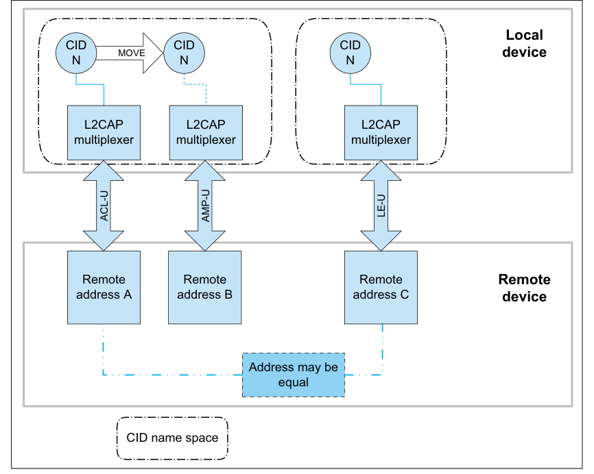

**Figure 2.1:  Dynamically allocated CID assignments**

Assignment of dynamically allocated CIDs is relative to a particular logical link and a device can assign CIDs independently from other devices. Thus, even if the same CID value has been assigned to (remote) channel endpoints by several remote devices connected to a single local device, the local device can still uniquely associate each remote CID with a different device. Further, even if the same CID value has been assigned to (remote) channel endpoints by the same remote device, these can be distinguished because they will be bound to a different logical link.
The CID name space for the ACL-U, ASB-C, and AMP-U logical links is as fol- lows:

| CID | Description | Channel Characteristics | Logical Lin Supported |
| --- | --- | --- | --- |
| 0x0000 | Null identifier | Not allowed |  |
| 0x0001 | L2CAP Signaling channel | See Section 4 | ACL-U |
| 0x0002 | Connectionless channel | See Section 7.6 | ACL-U, ASB-U |

Table 2.1:  CID name space on ACL-U, ASB-U, and AMP-U logical links

| CID | Description | Channel Characteristics | Logical Lin Supported |
| --- | --- | --- | --- |
| 0x0003 | AMP Manager Protocol | See [Vol 3] Part E, Section 2.2. | ACL-U |
| 0x0004-0x0006 | Reserved for Future Use | Not applicable |  |
| 0x0007 | BR/EDR Security Manager | See [Vol 3] Part H | ACL-U |
| 0x0008-0x003E | Reserved for Future Use | Not applicable |  |
| 0x003F | AMP Test Manager | See [Vol 3] Part D, Section 1.2.3 | ACL-U |
| 0x0040-0xFFFF | Dynamically allocated | Communicated using L2CAP configuration mechanism (see Section 7.1) | ACL-U, AMP-U |

Table 2.1:  CID name space on ACL-U, ASB-U, and AMP-U logical links
The CID name space for the LE-U logical link is as follows:

| CID | Description | Channel Characteristics | Logical Link Supported |
| --- | --- | --- | --- |
| 0x0000 | Null identifier | Not Allowed |  |
| 0x0001-0x0003 | Reserved for Future Use | Not applicable |  |
| 0x0004 | Attribute Protocol | See [Vol 3] Part F | LE-U |
| 0x0005 | Low Energy L2CAP Signaling channel | See Section 4 | LE-U |
| 0x0006 | Security Manager Protocol | See [Vol 3] Part H | LE-U |
| 0x0007-0x001F | Reserved for Future Use | Not applicable |  |
| 0x0020-0x003E | Assigned Numbers |  | LE-U |
| 0x003F | Reserved for Future Use | Not applicable |  |
| 0x0040-0x007F | Dynamically allocated | Communicated using the L2CAP LE credit based create connection mecha- nism (see Section 4.22) | LE-U |
| Other | Reserved for Future Use | Not applicable |  |

Table 2.2:  CID name space on LE-U logical link

### 2.2   OPERATION BETWEEN DEVICES

Figure 2.2 illustrates the use of CIDs in a communication between corresponding peer L2CAP entities in separate devices. The connection- oriented data channels represent a connection between two devices, where a CID, combined with the logical link, identifies each endpoint of the channel. When used for broadcast transmissions, the connectionless channel restricts data flow to a single direction. The connectionless channel may be used to transmit data to all active slaves, using Active Broadcast. When used for unicast transmissions the connectionless channel may be used in either direction between a master and a slave.
There are also a number of CIDs reserved for special purposes. The L2CAP signaling channels are examples of reserved channels. Fixed channel 0x0001 is used to create and establish connection-oriented data channels and to negotiate changes in the characteristics of connection-oriented channels and to discover characteristics of the connectionless channel operating over the ACL-U logical link.
The L2CAP signaling channel (0x0001) and all supported fixed channels are available immediately when the ACL-U logical link is established between two devices. Another CID (0x0002) is reserved for all incoming and outgoing connectionless data traffic, whether broadcast or unicast. Connectionless data traffic may flow immediately once the ACL-U logical link is established between two devices and once the transmitting device has determined that the remote device supports connectionless traffic.
The L2CAP LE signaling channel (0x0005) and all supported fixed channels are available immediately when the LE-U logical link is established between two devices.

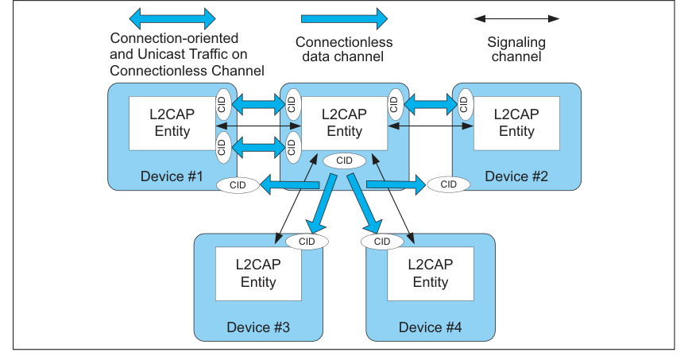

**Figure 2.2:  Channels between devices**

Table 2.3 describes the various channel types and their source and destination identifiers. A dynamically allocated CID is allocated to identify, along with the logical link, the local endpoint and shall be in the range 0x0040 to 0xFFFF for ACL-U, 0x0040 to 0x007F for LE-U. Section 6 describes the state machine associated with each connection-oriented channel with a dynamically allocated CID. Section 3.1 and Section 3.3 describe the packet format associated with connection-oriented channels. Section 3.2 describes the packet format associated with the connectionless channel.

| Channel Type | Local CID (sending) | Remote CID (receiving) |
| --- | --- | --- |
| Connection-oriented | Dynamically allocated and fixed | Dynamically allocated and fixe |
| Connectionless data | 0x0002 (fixed) | 0x0002 (fixed) |
| L2CAP Signaling | 0x0001 and 0x0005 (fixed) | 0x0001 and 0x0005 (fixed) |

Table 2.3:  Types of Channel Identifiers

### 2.3   OPERATION BETWEEN LAYERS

L2CAP implementations should follow the general architecture described below. L2CAP implementations transfer data between upper layer protocols and the lower layer protocol. This document lists a number of services that should be exported by any L2CAP implementation. Each implementation shall also support a set of signaling commands for use between L2CAP implementations. L2CAP implementations should also be prepared to accept certain types of events from lower layers and generate events to upper layers. How these events are passed between layers is implementation specific.

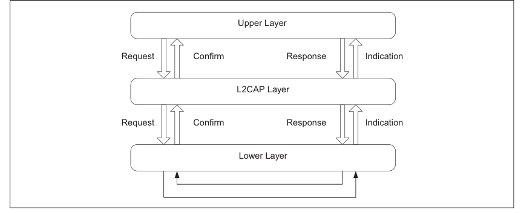

**Figure 2.3:  L2CAP transaction model**

### 2.4   MODES OF OPERATION

L2CAP channels may operate in one of five different modes as selected for each L2CAP channel.
The modes are:
• Basic L2CAP Mode (equivalent to L2CAP specification in Bluetooth v1.1) 1
• Flow Control Mode
• Retransmission Mode
• Enhanced Retransmission Mode
• Streaming Mode
• LE Credit Based Flow Control Mode
The modes are enabled using the configuration procedure described in Section 7.1. The Basic L2CAP Mode shall be the default mode, which is used when no other mode is agreed. Enhanced Retransmission mode shall be used for all reliable channels created over AMP-U logical links and for ACL-U logical links operating as described in Section 7.10. Enhanced Retransmission mode should be enabled for reliable channels created over ACL-U logical links not operating as described in Section 7.10. Streaming mode shall be used for streaming applications created over AMP-U logical links and ACL-U logical links operating as described in Section 7.10. Streaming mode should be enabled for streaming applications created over ACL-U logical links not operating as described in Section 7.10. Either Enhanced Retransmission mode or Streaming mode should be enabled when supported by both L2CAP entities. Flow Control Mode and Retransmission mode shall only be enabled when communicating with L2CAP entities that do not support either Enhanced Retransmission mode or Streaming mode.
In Flow Control mode, Retransmission mode, and Enhanced Retransmission mode, PDUs exchanged with a peer entity are numbered and acknowledged. The sequence numbers in the PDUs are used to control buffering, and a TxWindow size is used to limit the required buffer space and/or provide a method for flow control.
In Flow Control Mode no retransmissions take place, but missing PDUs are detected and can be reported as lost.
In Retransmission Mode a timer is used to ensure that all PDUs are delivered to the peer, by retransmitting PDUs as needed. A go-back-n repeat mechanism is used to simplify the protocol and limit the buffering requirements.
Enhanced Retransmission mode is similar to Retransmission mode. It adds the ability to set a POLL bit to solicit a response from a remote L2CAP entity, adds
1. Specification of the Bluetooth System v1.1 (Feb 22nd 2001): volume 1, part D.
the SREJ S-frame to improve the efficiency of error recovery and adds an RNR S-frame to replace the R-bit for reporting a local busy condition.
Streaming mode is for real-time isochronous traffic. PDUs are numbered but are not acknowledged. A finite flush timeout is set on the sending side to flush packets that are not sent in a timely manner. On the receiving side if the receive buffers are full when a new PDU is received then a previously received PDU is overwritten by the newly received PDU. Missing PDUs can be detected and reported as lost. TxWindow size is not used in Streaming mode.
Note: Although L2CAP Basic mode may be used for L2CAP channels operating over ACL-U logical links, only L2CAP channels which have been configured to use Enhanced Retransmission mode or Streaming mode may be moved to operate over an AMP-U logical link. (see Section 4.16).
LE Credit Based Flow Control Mode is used for LE L2CAP connection oriented channels for flow control using a credit based scheme for L2CAP data (i.e. not signaling packets). This is the only mode that shall be used for LE L2CAP connection oriented channels.
L2CAP channels used for multiplexing layers such as RFCOMM can serve a variety of higher layer protocols. In cases where the local device and remote device have mutual support for an AMP and complementary support for profiles on a multiplexing layer which requires reliability (e.g. RFCOMM), the multiplexing layer should be configured to use Enhanced Retransmission mode to ensure that profiles utilizing the multiplexer are not prevented from being moved to the AMP-U logical link. Similarly, in cases where the local device and remote device have mutual support for an AMP and complementary support for profiles on a multiplexing layer which does not require reliability, the multiplexing layer should be configured to use Streaming mode to ensure that profiles utilizing the multiplexer are not prevented from being moved to the AMP-U logical link.
Care should be taken in selecting the parameters used for Enhanced Retransmission mode and Streaming mode when they are used beneath legacy profile implementations to ensure that performance is not negatively impacted relative to the performance achieved when using the same profile with Basic mode on an ACL-U logical link. When there can never be a mutually supported AMP, nor complementary support for a profile which would benefit from AMP, it may be preferable to configure Basic mode to minimize the risk of negative performance impacts.

### 2.5   MAPPING CHANNELS TO LOGICAL LINKS

L2CAP maps channels to Controller logical links, which in turn run over Controller physical links. All logical links going between a local Controller and remote Controller run over a single physical link. There is one ACL-U logical link per BR/EDR physical link and one LE-U logical link per LE physical link, while there may be multiple AMP-U logical links per AMP physical link.
All Best Effort and Guaranteed channels going over a BR/EDR physical link between two devices shall be mapped to a single ACL-U logical link. All Best Effort channels going over an AMP physical link between two Controllers shall be mapped to a single AMP-U logical link while each Guaranteed channel going between two Controllers shall be mapped to its own AMP-U logical link with one AMP-U logical link per Guaranteed channel. All channels going over an LE physical link between two devices shall be treated as best effort and mapped to a single LE-U logical link.
When a Guaranteed channel is created or moved to a Controller, a corresponding Guaranteed logical link shall be created to carry the channel traffic. Creation of a Guaranteed logical link involves admission control. Admission control is verifying that the guarantee can be achieved without compromising existing guarantees. For an AMP Controller, L2CAP shall tell the Controller to create a Guaranteed logical link and admission control shall be performed by the Controller. For a BR/EDR Controller, admission control (creation of a Guaranteed logical link) shall be performed by the L2CAP layer.

## 3  DATA PACKET FORMAT

L2CAP is packet-based but follows a communication model based on channels. A channel represents a data flow between L2CAP entities in remote devices. Channels may be connection-oriented or connectionless. Fixed channels other than the L2CAP connectionless channel (CID 0x0002) and the two L2CAP signaling channels (CIDs 0x0001 and 0x0005) are considered connection-oriented. All channels with dynamically assigned CIDs are connection-oriented. All L2CAP layer packet fields shall use Little Endian byte order with the exception of the information payload field. The endian-ness of higher layer protocols encapsulated within L2CAP information payload is protocol-specific.

### 3.1   CONNECTION-ORIENTED CHANNELS IN BASIC L2CAP MODE

Figure 3.1 illustrates the format of the L2CAP PDU used on connection- oriented channels. In basic L2CAP mode, the L2CAP PDU on a connection- oriented channel is also referred to as a "B-frame".

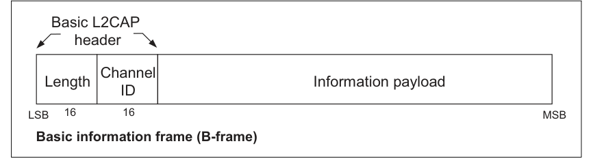

**Figure 3.1:  L2CAP PDU format in Basic L2CAP mode on connection-oriented channels (field sizes in bits)**

The fields shown are:
• Length: 2 octets (16 bits) Length indicates the size of the information payload in octets, excluding the length of the L2CAP header. The length of an information payload can be up to 65535 octets. The Length field is used for recombination and serves as a simple integrity check of the recombined L2CAP packet on the receiving end.
• Channel ID: 2 octets The channel ID (CID) identifies the destination channel endpoint of the packet.
• Information payload: 0 to 65535 octets This contains the payload received from the upper layer protocol (outgoing packet), or delivered to the upper layer protocol (incoming packet). The MTU for channels with dynamically allocated CIDs is determined during channel
configuration (see Section 5.1). The minimum supported MTU values for the signaling PDUs are shown in Table 4.1).

### 3.2   CONNECTIONLESS DATA CHANNEL IN BASIC L2CAP MODE

Figure 3.2 illustrates the L2CAP PDU format within a connectionless data channel. Here, the L2CAP PDU is also referred to as a "G-frame".

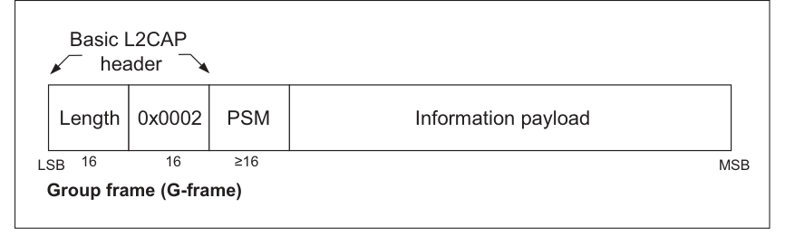

**Figure 3.2:  L2CAP PDU format on the Connectionless channel**

The fields shown are:
• Length: 2 octets Length indicates the size of information payload plus the PSM field in octets.
• Channel ID: 2 octets Channel ID (0x0002) reserved for connectionless traffic.
• Protocol/Service Multiplexer (PSM): 2 octets (minimum) For information on the PSM field see Section 4.2.
• Information payload: 0 to 65533 octets This parameter contains the payload information to be distributed to all slaves in the piconet for broadcast connectionless traffic, or to a specific remote device for data sent via the L2CAP connectionless channel. Implementations shall support a connectionless MTU (MTUcnl) of 48 octets on the connectionless channel. Devices may also explicitly change to a larger or smaller connectionless MTU (MTUcnl). Note: The maximum size of the Information payload field decreases accordingly if the PSM field is extended beyond the two octet minimum.

### 3.3   CONNECTION-ORIENTED CHANNEL IN RETRANSMISSION/FLOW CONTROL/STREAMING MODES

To support flow control, retransmissions, and streaming, L2CAP PDU types with protocol elements in addition to the Basic L2CAP header are defined. The information frames (I-frames) are used for information transfer between L2CAP entities. The supervisory frames (S-frames) are used to acknowledge I-frames and request retransmission of I-frames.

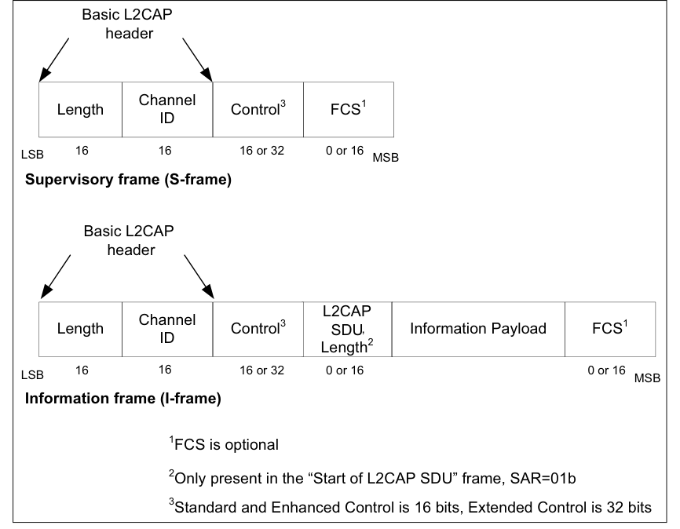

**Figure 3.3:  L2CAP PDU formats in Flow Control and Retransmission Modes**

#### 3.3.1  L2CAP header fields

• Length: 2 octets The first two octets in the L2CAP PDU contain the length of the entire L2CAP PDU in octets, excluding the Length and CID field. For I-frames and S-frames, the Length field therefore includes the octet lengths of the Control, L2CAP SDU Length (when present), Information octets and frame check sequence (FCS) (when present) fields. The maximum number of Information octets in one I-frame is based on which fields are present and the type of the Control Field. The maximum number of Information octets in an I-frame with a Standard Control field is as follows:
L2CAP SDU Length present and FCS present 65529 octets L2CAP SDU Length present and FCS not present 65531 octets L2CAP SDU Length not present and FCS present 65531 octets L2CAP SDU Length not present and FCS not present 65533 octets
The maximum number of Information octets in an I-frame with an Extended Control field is as follows:
L2CAP SDU Length present and FCS present 65527 octets L2CAP SDU Length present and FCS not present 65529 octets L2CAP SDU Length not present and FCS present 65529 octets L2CAP SDU Length not present and FCS not present 65531 octets
• Channel ID: 2 octets This field contains the Channel Identification (CID).

#### 3.3.2  Control field (2 or 4 octets)

The Control Field identifies the type of frame. There are three different Control Field formats: the Standard Control Field, the Enhanced Control Field, and the Extended Control Field. The Standard Control Field shall be used for Retransmission mode and Flow Control mode. The Enhanced Control Field shall be used for Enhanced Retransmission mode and Streaming mode. The Extended Control Field may be used for Enhanced Retransmission mode and Streaming mode. The Control Field will contain sequence numbers where applicable. Its coding is shown in Table 3.1, Table 3.2, and Table 3.3. There are two different frame types, Information frame types and Supervisory frame types. Information and Supervisory frames types are distinguished by the least significant bit in the Control Field, as shown in Table 3.1, Table 3.2, and Table 3.3.
• Information frame format (I-frame) The I-frames are used to transfer information between L2CAP entities. Each I-frame has a TxSeq(Send sequence number), ReqSeq(Receive sequence number) which may or may not acknowledge additional I-frames received by the data link layer entity. Each I-frame with a Standard Control field has a retransmission bit (R bit) that affects whether I-frames are retransmitted. Each I-frame with an Enhanced Control Field or an Extended Control Field has an F-bit that is used in Poll/Final bit functions. The SAR field in the I-frame is used for segmentation and reassembly control. The L2CAP SDU Length field specifies the length of an SDU, including the aggregate length across all segments if segmented.
• Supervisory frame format (S-frame)
S-frames are used to acknowledge I-frames and request retransmission of I- frames. Each S-frame has an ReqSeq sequence number which may acknowledge additional I-frames received by the data link layer entity. Each S-frame with a Standard Control Field has a retransmission bit (R bit) that affects whether I-frames are retransmitted. Each S-frame with an Enhanced Control field or an Extended Control Field has a Poll bit (P-bit) and a Final bit (F-bit) and does not have an R-bit. Defined types of S-frames are RR (Receiver Ready), REJ (Reject), RNR (Receiver Not Ready) and SREJ (Selective Reject).

| Frame type | 16 | 15 | 14 | 13 | 12 | 11 | 10 | 9 | 8 | 7 | 6 | 5 | 4 | 3 | 2 |
| --- | --- | --- | --- | --- | --- | --- | --- | --- | --- | --- | --- | --- | --- | --- | --- |
| I | SAR |  | ReqSeq |  |  |  |  |  | R | TxSeq |  |  |  |  |  |
| S | X | X | ReqSeq |  |  |  |  |  | R | X | X | X | S |  | 0 |
| X denotes bits reserved for future use. |  |  |  |  |  |  |  |  |  |  |  |  |  |  |  |

Table 3.1:  Standard Control Field formats

| Frame type | 16 | 15 | 14 | 13 | 12 | 11 | 10 | 9 | 8 | 7 | 6 | 5 | 4 | 3 | 2 |
| --- | --- | --- | --- | --- | --- | --- | --- | --- | --- | --- | --- | --- | --- | --- | --- |
| I | SAR |  | ReqSeq |  |  |  |  |  | F | TxSeq |  |  |  |  |  |
| S | X | X | ReqSeq |  |  |  |  |  | F | X | X | P | S |  | 0 |
| X denotes bits reserved for future use. |  |  |  |  |  |  |  |  |  |  |  |  |  |  |  |

Table 3.2:  Enhanced Control Field formats

| Frame type | 16 | 15 | 14 | 13 | 12 | 11 | 10 | 9 | 8 | 7 | 6 | 5 | 4 | 3 | 2 |
| --- | --- | --- | --- | --- | --- | --- | --- | --- | --- | --- | --- | --- | --- | --- | --- |
| I | ReqSeq |  |  |  |  |  |  |  |  |  |  |  |  |  | F |
|  | TxSeq |  |  |  |  |  |  |  |  |  |  |  |  |  | SAR |
| S | ReqSeq |  |  |  |  |  |  |  |  |  |  |  |  |  | F |
|  |  |  |  |  |  |  |  |  | X | X | X | X | X | P | S |
| X denotes bits reserved for future use. |  |  |  |  |  |  |  |  |  |  |  |  |  |  |  |

Table 3.3:  Extended Control Field formats
• Send Sequence Number - TxSeq (6 bits or 14 bits) The send sequence number is used to number each I-frame, to enable sequencing and retransmission.
• Receive Sequence Number - ReqSeq (6 bits or 14 bits) The receive sequence number is used by the receiver side to acknowledge I-frames, and in the REJ and SREJ frames to request the retransmission of an I-frame with a specific send sequence number.
• Retransmission Disable Bit - R (1 bit) The Retransmission Disable bit is used to implement Flow Control. The receiver sets the bit when its internal receive buffer is full, this happens when one or more I-frames have been received but the SDU reassembly function has not yet pulled all the frames received. When the sender receives a frame with the Retransmission Disable bit set it shall disable the RetransmissionTimer, this causes the sender to stop retransmitting I-frames. R=0: Normal operation. Sender uses the RetransmissionTimer to control retransmission of I-frames. Sender does not use the MonitorTimer. R=1: Receiver side requests sender to postpone retransmission of I-frames. Sender monitors signaling with the MonitorTimer. Sender does not use the RetransmissionTimer. The functions of ReqSeq and R are independent.
• Segmentation and Reassembly - SAR (2 bits) The SAR bits define whether an L2CAP SDU is segmented. For segmented SDUs, the SAR bits also define which part of an SDU is in this I-frame, thus allowing one L2CAP SDU to span several I-frames. An I-frame with SAR=”Start of L2CAP SDU” also contains a length indicator, specifying the number of information octets in the total L2CAP SDU. The encoding of the SAR bits is shown in Table 3.4.

| 00b | Unsegmented L2CAP SDU |
| --- | --- |
| 01b | Start of L2CAP SDU |
| 10b | End of L2CAP SDU |
| 11b | Continuation of L2CAP SDU |

Table 3.4:  SAR control element format
• Supervisory function - S (2 bits) The S-bits mark the type of S-frame. There are four types defined: RR (Receiver Ready), REJ (Reject), RNR (Receiver Not Ready) and SREJ (Selective Reject). The encoding is shown in Table 3.5.

| 00b | RR - Receiver Ready |
| --- | --- |
| 01b | REJ - Reject |
| 10b | RNR - Receiver Not Ready |
| 11b | SREJ - Select Reject |

Table 3.5:  S control element format: type of S-frame
• Poll - P (1 bit) The P-bit is set to 1 to solicit a response from the receiver. The receiver shall respond immediately with a frame with the F-bit set to 1.
• Final - F (1 bit) The F-bit is set to 1 in response to an S-frame with the P bit set to 1.

#### 3.3.3  L2CAP SDU Length Field (2 octets)

When an SDU spans more than one I-frame, the first I-frame in the sequence shall be identified by SAR=01b=”Start of L2CAP SDU”. The L2CAP SDU Length field shall specify the total number of octets in the SDU. The L2CAP SDU Length field shall be present in I-frames with SAR=01b (Start of L2CAP SDU) and shall not be used in any other I-frames. When the SDU is unsegmented (SAR=00b), the L2CAP SDU Length field is not needed and shall not be present.

#### 3.3.4  Information Payload Field

The information payload field consists of an integral number of octets. The maximum number of octets in this field is the same as the negotiated value of the MPS configuration parameter. The maximum number of octets in this field is also limited by the range of the Basic L2CAP header length field. This ranges from 65533 octets for I-frames with a Standard or Enhanced Control Field, no SDU length field, and no FCS field to 65527 octets for I-frames with an Enhanced Control Field, an SDU length field, and FCS field. Thus, even if an MPS of 65533 has been negotiated, the range of the Basic L2CAP header length field will restrict the number of octets in this field. For example, when an Enhanced Control Field, an SDU length field, and FCS field are present the number of octets in this field is restricted to 65529.

#### 3.3.5  Frame Check Sequence (2 octets)

The Frame Check Sequence (FCS) is 2 octets. The FCS is constructed using the generator polynomial g(D) = D16 + D15 + D2 + 1 (see Figure 3.4). The 16 bit LFSR is initially loaded with the value 0x0000, as depicted in Figure 3.5. The switch S is set in position 1 while data is shifted in, LSB first for each octet. After the last bit has entered the LFSR, the switch is set in position 2, and the register contents are transmitted from right to left (i.e. starting with position 15, then position 14, etc.). The FCS covers the Basic L2CAP header, Control, L2CAP-SDU length and Information payload fields, if present, as shown in Figure 3.3.

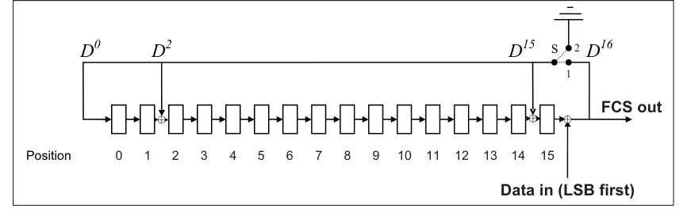

**Figure 3.4:  The LFSR circuit generating the FCS**

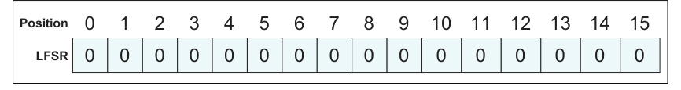

**Figure 3.5:  Initial state of the FCS generating circuit**

Examples of FCS calculation, g(D) = D16 + D15 + D2 + 1:
1. I Frame Length = 14 Control = 0x0002 (SAR=00b, ReqSeq=000000b, R=0b, TxSeq=000001b) Information Payload = 00 01 02 03 04 05 06 07 08 09 (10 octets, hexadeci- mal notation) ==> FCS = 0x6138 ==> Data to Send = 0E 00 40 00 02 00 00 01 02 03 04 05 06 07 08 09 38 61 (hexadecimal notation)
2. RR Frame Length = 4 Control = 0x0101 (ReqSeq=000001b, R=0b, S=00b) ==> FCS = 0x14D4 ==> Data to Send = 04 00 40 00 01 01 D4 14 (hexadecimal notation)

#### 3.3.6  Invalid Frame Detection

For Retransmission mode and Flow Control mode, a received PDU shall be regarded as invalid, if one of the following conditions occurs:
1. Contains an unknown CID.
2. Contains an FCS error. 3. Contains a length greater than the maximum PDU payload size (MPS). 4. I-frame that has fewer than 8 octets. 5. I-frame with SAR=01b (Start of L2CAP SDU) that has fewer than 10 octets. 6. I-frame with SAR bits that do not correspond to a normal sequence of either unsegmented or start, continuation, end for the given CID. 7. S-frame where the length field is not equal to 4.
These error conditions may be used for error reporting.

#### 3.3.7  Invalid Frame Detection Algorithm

For Enhanced Retransmission mode and Streaming mode the following algorithm shall be used for received PDUs. It may be used for Retransmission mode and Flow Control mode:
1. Check the CID. If the PDU contains an unknown CID then it shall be ignored. 2. Check the FCS. If the PDU contains an FCS error then it shall be ignored. If the channel is configured to use "No FCS" then the PDU is considered to have a good FCS (no FCS error).
3. Check the following conditions. If one of the conditions occurs the channel shall be closed or in the case of fixed channels the ACL shall be disconnected.
a) PDU contains a length greater than the maximum PDU payload size (MPS)
b) I-frame that has fewer than the required number of octets.If the channel is configured to use a Standard or Enhanced Control Field then the required number of octets is 6 if "No FCS" is configured; otherwise, it is 8. If the channel is configured to use the Extended Control Field then the required number of octets is 8 if "No FCS" is configured; otherwise, it is 10.
c) S-frame where the length field is invalid. If the channel is configured to use a Standard or Enhanced Control Field then the length field shall be 2 if "No FCS" is configured; otherwise, the length field shall be 4. If the channel is configured to use the Extended Control Field then the length field shall be 4 if "No FCS" is configured; otherwise, the length field shall be 6.
4. Check the SAR bits. The SAR check is performed after the frame has been successfully received in the correct sequence. The PDU is invalid if one of the following conditions occurs:
a) I-frame with SAR=01b (Start of L2CAP SDU) that has fewer than the required number of octets. If the channel is configured to use a Standard or Enhanced Control field then the required number of octets is 8 if "No FCS" is configured; otherwise, the required number of octets is 10. If the channel is configured to use an Extended Control field then the required number of octets is 10 if "No FCS" is configured; otherwise, the required number of octets is 12.
b) I-frame with SAR bits that do not correspond to a normal sequence of either unsegmented or start, continuation, end for the given CID.
c) I-frame with SAR= 01b (Start of L2CAP SDU) where the value in the L2CAP SDU length field exceeds the configured MTU.
5. If the I-frame has been received in the correct sequence and is invalid as described in 4 then the channel shall be closed or in the case of fixed channels the ACL shall be disconnected. For Streaming mode and Flow Control mode if one or more I-frames are missing from a sequence of I-frames using SAR bits of start, continuation and end then received I-frames in the sequence may be ignored. For Flow Control mode and Streaming mode I-frames received out of sequence with SAR bits of unsegmented may be accepted.
If the algorithm is used for Retransmission mode or Flow control mode then it shall be used instead of Invalid Frame detection described in Section 3.3.6.
These error conditions may be used for error reporting.

### 3.4   CONNECTION-ORIENTED CHANNELS IN LE CREDIT BASED FLOW CONTROL MODE

To support LE Credit Based Flow Control Mode, L2CAP PDU type with protocol elements in addition to the Basic L2CAP header are defined. In LE Credit Based Flow Control Mode, the L2CAP PDU on a connection-oriented channel is an LE information frame (LE-frame).

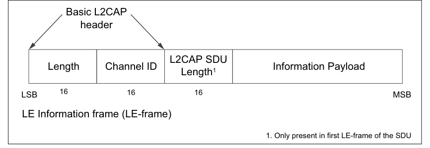

**Figure 3.6:  L2CAP PDU format in LE Credit Based Flow Control Mode**

#### 3.4.1  L2CAP Header Fields

• Length: 2 octets The first two octets in the L2CAP PDU contain the length of the entire L2CAP PDU in octets, excluding the Length and CID fields. For LE-frames, the Length field includes the octet lengths of the L2CAP SDU Length when present and Information Payload fields.
• Channel ID: 2 octets The channel ID (CID) identifies the destination channel endpoint of the packet.

#### 3.4.2  L2CAP SDU Length Field (2 octets)

The first LE-frame of the SDU shall contain the L2CAP SDU Length field that shall specify the total number of octets in the SDU. All subsequent LE-frames that are part of the same SDU shall not contain the L2CAP SDU Length field.

#### 3.4.3  Information Payload Field

The information payload field consists of an integral number of octets. The maximum number of octets in this field is the same as the peer’s MPS. The maximum number of octets in this field is also limited by the range of the Basic L2CAP header length field, of 65533 octets.
The number of octets contained in the first LE-frame information payload of the SDU is equal to the L2CAP header length field minus 2 octets.  All subsequent
LE-frames of the same SDU contain the number of octets in the information payload equal to the L2CAP header length field.
If the SDU length field value exceeds the receiver's MTU, the receiver shall disconnect the channel. If the payload length of any LE-frame exceeds the receiver's MPS, the receiver shall disconnect the channel. If the sum of the payload lengths for the LE-frames exceeds the specified SDU length, the receiver shall disconnect the channel.

## 4  SIGNALING PACKET FORMATS

This section describes the signaling commands passed between two L2CAP entities on peer devices. All signaling commands are sent over a signaling channel. The signaling channel for managing channels over ACL-U logical links shall use CID 0x0001 and the signaling channel for managing channels over LE-U logical links shall use CID 0x0005. Signaling channels are available as soon as the lower layer logical transport is set up and L2CAP traffic is enabled. Figure 4.1 illustrates the general format of L2CAP PDUs containing signaling commands (C-frames). Multiple commands may be sent in a single C-frame over Fixed Channel CID 0x0001 while only one command per C-frame shall be sent over Fixed Channel CID 0x0005. Commands take the form of Requests and Responses. All L2CAP implementations shall support the reception of C-frames with a payload length that does not exceed the signaling MTU. The minimum supported payload length for the C-frame (MTUsig) is defined in Table 4.1. L2CAP implementations should not use C-frames that exceed the MTUsig of the peer device. If a device receives a C-frame that exceeds its MTUsig then it shall send a Command Reject containing the supported MTUsig. Implementations shall be able to handle the reception of multiple commands in an L2CAP packet sent over Fixed Channel CID 0x0001.

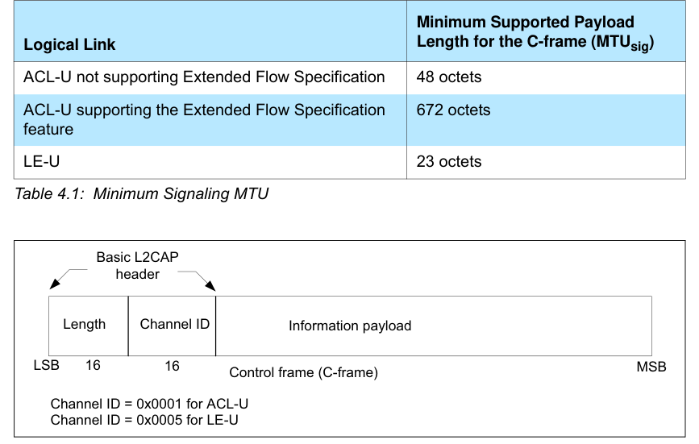

**Figure 4.1:  L2CAP PDU format on a signaling channel**

Figure 4.2 displays the general format of all signaling commands.

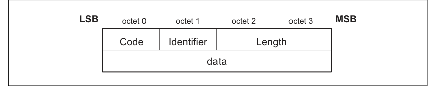

**Figure 4.2:  Command format**

The fields shown are:
• Code (1 octet) The Code field is one octet long and identifies the type of command. When a packet is received with a Code field that is unknown or disallowed on the signaling channel it is received on, a Command Reject packet (defined in Section 4.1) is sent in response. Table 4.2 lists the codes defined by this document. All codes are specified with the most significant bit in the left-most position.

| Code | Description | CIDs on which Code is Allowed |
| --- | --- | --- |
| 0x00 | Reserved for Future Use | Any |
| 0x01 | Command reject | 0x0001 and 0x0005 |
| 0x02 | Connection request | 0x0001 |
| 0x03 | Connection response | 0x0001 |
| 0x04 | Configure request | 0x0001 |
| 0x05 | Configure response | 0x0001 |
| 0x06 | Disconnection request | 0x0001 and 0x0005 |
| 0x07 | Disconnection response | 0x0001 and 0x0005 |
| 0x08 | Echo request | 0x0001 |
| 0x09 | Echo response | 0x0001 |
| 0x0A | Information request | 0x0001 |
| 0x0B | Information response | 0x0001 |
| 0x0C | Create Channel request | 0x0001 |
| 0x0D | Create Channel response | 0x0001 |
| 0x0E | Move Channel request | 0x0001 |
| 0x0F | Move Channel response | 0x0001 |
| 0x10 | Move Channel Confirmation | 0x0001 |
| 0x11 | Move Channel Confirmation response | 0x0001 |

Table 4.2:  Signaling Command Codes

| Code | Description | CIDs on which Code i Allowed |
| --- | --- | --- |
| 0x12 | Connection Parameter Update request | 0x0005 |
| 0x13 | Connection Parameter Update response | 0x0005 |
| 0x14 | LE Credit Based Connection request | 0x0005 |
| 0x15 | LE Credit Based Connection response | 0x0005 |
| 0x16 | LE Flow Control Credit | 0x0005 |
| Other | Reserved for Future Use | Any |

Table 4.2:  Signaling Command Codes  (Continued)
• Identifier (1 octet) The Identifier field is one octet long and matches responses with requests. The requesting device sets this field and the responding device uses the same value in its response. Within each signaling channel a different Identifier shall be used for each successive command. Following the original transmission of an Identifier in a command, the Identifier may be recycled if all other Identifiers have subsequently been used. RTX and ERTX timers are used to determine when the remote end point is not responding to signaling requests. On the expiration of a RTX or ERTX timer, the same identifier shall be used if a duplicate Request is re-sent as stated in Section 6.2. A device receiving a duplicate request on a particular signaling channel should reply with a duplicate response on the same signaling channel. A command response with an invalid identifier is silently discarded. Signaling identifier 0x00 is an illegal identifier and shall never be used in any command.
• Length (2 octets) The Length field is two octets long and indicates the size in octets of the data field of the command only, i.e., it does not cover the Code, Identifier, and Length fields.
• Data (0 or more octets) The Data field is variable in length. The Code field determines the format of the Data field. The length field determines the length of the data field.

### 4.1   COMMAND REJECT (CODE 0x01)

A Command Reject packet shall be sent in response to a command packet with an unknown command code or when sending the corresponding response is inappropriate. Figure 4.3 displays the format of the packet. The identifier shall match the identifier of the command packet being rejected. Implementations shall always send these packets in response to unidentified signaling packets. Command Reject packets should not be sent in response to an identified Response packet.
When multiple commands are included in an L2CAP packet and the packet exceeds the signaling MTU (MTUsig) of the receiver, a single Command Reject packet shall be sent in response. The identifier shall match the first Request command in the L2CAP packet. If only Responses are recognized, the packet shall be silently discarded.

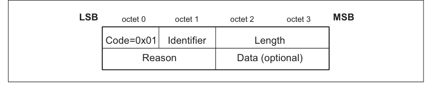

**Figure 4.3:  Command Reject Packet**

Figure 4.3 shows the format of the Command Reject packet. The data fields are:
• Reason (2 octets) The Reason field describes why the Request packet was rejected, and is set to one of the Reason codes in Table 4.3.

| Reason value | Description |
| --- | --- |
| 0x0000 | Command not understood |
| 0x0001 | Signaling MTU exceeded |
| 0x0002 | Invalid CID in request |
| Other | Reserved for Future Use |

Table 4.3:  Reason Code Descriptions
• Data (0 or more octets) The length and content of the Data field depends on the Reason code. If the Reason code is 0x0000, “Command not understood”, no Data field is used. If the Reason code is 0x0001, “Signaling MTU Exceeded”, the 2-octet Data field represents the maximum signaling MTU the sender of this packet can accept. If a command refers to an invalid channel then the Reason code 0x0002 will be returned. Typically a channel is invalid because it does not exist. The data
field shall be 4 octets containing the local (first) and remote (second) channel endpoints (relative to the sender of the Command Reject) of the disputed channel. The remote endpoint is the source CID from the rejected command. The local endpoint is the destination CID from the rejected command. If the rejected command contains only one of the channel endpoints, the other one shall be replaced by the null CID 0x0000.

| Reason value | Data Length | Data value |
| --- | --- | --- |
| 0x0000 | 0 octets | N/A |
| 0x0001 | 2 octets | Actual MTU sig |
| 0x0002 | 4 octets | Requested CID |

Table 4.4:  Reason Data values

### 4.2   CONNECTION REQUEST (CODE 0x02)

Connection request packets are sent to create an L2CAP channel between two devices. The L2CAP channel shall be established before configuration begins. Figure 4.4 illustrates a Connection Request packet.

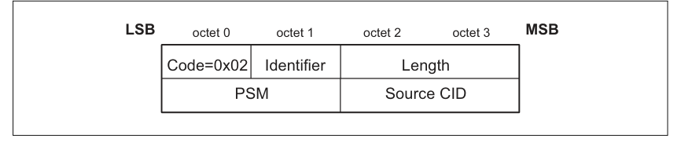

**Figure 4.4:  Connection Request Packet**

The data fields are:
• Protocol/Service Multiplexer - PSM (2 octets (minimum)) The PSM field is at least two octets in length. The structure of the PSM field is based on the ISO 3309 extension mechanism for address fields. All PSM values shall be ODD, that is, the least significant bit of the least significant octet must be 1. Also, all PSM values shall have the least significant bit of the most significant octet equal to 0. This allows the PSM field to be extended beyond 16 bits. PSM values are separated into two ranges. Valid values in the first range are assigned by the Bluetooth SIG and indicate protocols. The second range of values are dynamically allocated and used in conjunction with the Service Discovery Protocol (SDP). The dynamically assigned values may be used to support multiple implementations of a particular protocol.
PSM values are defined in the Assigned Numbers document.

| Range | Type | Server Usage | Client Usage |
| --- | --- | --- | --- |
| 0x0001-0x0EFF (Note 1) | Fixed, SIG assigned | PSM is fixed for all implementations. | PSM may be obtained via SDP may be assumed for a fixed ser vice. Protocol used is indicated by the PSM as defined in the Assigned Numbers page. |
| >0x1000 | Dynamic | PSM may be fixed for a given imple- mentation or may be assigned at the time the service is registered in SDP. | PSM shall be obtained via SDP upon every reconnection. PSM for one direction will typically be different from the other directio |

Table 4.5:  PSM ranges and usage
1. PSMs shall be odd and the least significant bit of the most significant byte shall be zero, hence the following ranges do not contain valid PSMs: 0x0100-0x01FF, 0x0300-0x03FF, 0x0500-0x05FF, 0x0700-0x07FF, 0x0900-0x09FF, 0x0B00- 0x0BFF, 0x0D00-0x0DFF, 0x0F00-0x0FFF. All even values are also not valid as PSMs.
• Source CID - SCID (2 octets) The source CID is two octets in length and represents a channel endpoint on the device sending the request. Once the channel has been configured, data packets flowing to the sender of the request shall be sent to this CID. Thus, the Source CID represents the channel endpoint on the device sending the request and receiving the response. The value of the Source CID shall be from the dynamically allocated range as defined in Table 2.1 and shall not be already allocated to a different channel on the device sending the request.

### 4.3   CONNECTION RESPONSE (CODE 0x03)

When a device receives a Connection Request packet, it shall send a Connection Response packet. Note: Implementations conforming to previous versions of this specification may respond with a Command Reject (Reason 0x0002 – Invalid CID In Request) packet under conditions now covered by result codes of 0x0006 and 0x0007. The format of the connection response packet is shown in Figure 4.5.

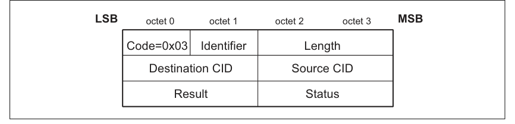

**Figure 4.5:  Connection Response Packet**

The data fields are:
• Destination Channel Identifier - DCID (2 octets) This field contains the channel endpoint on the device sending this Response packet. Thus, the Destination CID represents the channel endpoint on the device receiving the request and sending the response. The value of the Destination CID shall be from the dynamically allocated range as defined in Table 2.1 and shall not be already allocated to a different channel on the device sending the response.
• Source Channel Identifier - SCID (2 octets) This field contains the channel endpoint on the device receiving this Response packet. This is copied from the SCID field of the connection request packet.
• Result (2 octets) The result field indicates the outcome of the connection request. The result value of 0x0000 indicates success while a non-zero value indicates the connection request failed or is pending. A logical channel is established on the receipt of a successful result unless the DCID field is outside of the dynamically allocated range (see Table 2.1) or is already allocated on the device sending the response. Table 4.6 defines values for this field. If the result field does not indicate the connection was successful, the DCID and SCID fields may be invalid and shall be ignored.

| Value | Description |
| --- | --- |
| 0x0000 | Connection successful. |
| 0x0001 | Connection pending |

Table 4.6:  Result values

| Value | Description |
| --- | --- |
| 0x0002 | Connection refused – PSM not supported. |
| 0x0003 | Connection refused – security block. |
| 0x0004 | Connection refused – no resources available. |
| 0x0005 | Reserved for Future Use |
| 0x0006 | Connection refused – invalid Source CID |
| 0x0007 | Connection refused – Source CID already allocated |
| Other | Reserved for Future Use. |

Table 4.6:  Result values (Continued)
• Status (2 octets) Only defined for Result = Pending. Indicates the status of the connection. The status is set to one of the values shown in Table 4.7.

| Value | Description |
| --- | --- |
| 0x0000 | No further information available |
| 0x0001 | Authentication pending |
| 0x0002 | Authorization pending |
| Other | Reserved for Future Use |

Table 4.7:  Status values

### 4.4   CONFIGURATION REQUEST (CODE 0x04)

Configuration Request packets are sent to establish an initial logical link transmission contract between two L2CAP entities and also to re-negotiate this contract whenever appropriate. The contract consists of a set of configuration parameter options defined in Section 5. All parameter options have default values and can have previously agreed values which are values that were accepted in a previous configuration process or in a previous step in the current configuration process. The only parameters that should be included in the Configuration Request packet are those that require different values than the default or previously agreed values.
If no parameters need to be negotiated or specified then no options shall be inserted and the continuation flag (C) shall be set to zero. Any missing configuration parameters are assumed to have their most recently explicitly or implicitly accepted values. Even if all default values are acceptable, a Configuration Request packet with no options shall be sent. Implicitly accepted values are default values for the configuration parameters that have not been explicitly negotiated for the specific channel under configuration.
See Section 7.1 for details of the configuration procedure.
Figure 4.6 defines the format of the Configuration Request packet.

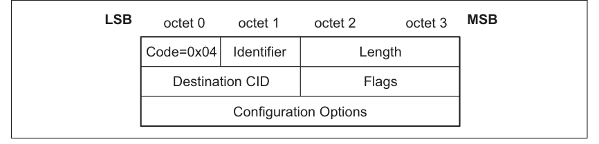

**Figure 4.6:  Configuration Request Packet**

The data fields are:
• Destination CID - DCID (2 octets) This field contains the channel endpoint on the device receiving this Request packet.
• Flags (2 octets) Figure 4.7 shows the two-octet Flags field. Note the most significant bit is shown on the left.

**Figure 4.7:  Configuration Request Flags field format**

Only one flag is defined, the Continuation flag (C). When both L2CAP entities support the Extended Flow Specification option, the Continuation flag shall not be used and shall be set to zero in all Configuration Request and Response packets. When all configuration options cannot fit into a Configuration Request with length that does not exceed the receiver's MTUsig, the options shall be passed in multiple configuration command packets. If all options fit into the receiver's MTUsig, then they shall be sent in a single configuration request with the continuation flag set to zero. Each Configuration Request shall contain an integral number of options - partially formed options shall not be sent in a packet. Each Request shall be tagged with a different Identifier and shall be matched with a Response with the same Identifier. When used in the Configuration Request, the continuation flag indicates the responder should expect to receive multiple request packets. The responder shall reply to each Configuration Request packet. The responder may reply to each Configuration Request with a Configuration Response containing the same option(s) present in the Request (except for those error conditions more appropriate for a Command Reject), or the responder may reply with a "Success" Configuration Response packet containing no options, delaying those options until the full Request has been received. The Configuration Request packet with the continuation flag cleared shall be treated as the Configuration Request event in the channel state machine. When used in the Configuration Response, the continuation flag shall be set to one if the flag is set to one in the Request. If the continuation flag is set to one in the Response when the matching Request has the flag set to zero, it indicates the responder has additional options to send to the requestor. In this situation, the requestor shall send null-option Configuration Requests (with continuation flag set to zero) to the responder until the responder replies with a Configuration Response where the continuation flag is set to zero. The Configuration Response packet with the continuation flag set to zero shall be treated as the Configuration Response event in the channel state machine. The result of the configuration transaction is the union of all the result values. All the result values must succeed for the configuration transaction to succeed. Other flags are reserved for future use.
• Configuration Options A list of the parameters and their values to be negotiated shall be provided in the Configuration Options field. These are defined in Section 5. A Configuration Request may contain no options (referred to as an empty or null configuration request) and can be used to request a response. For an empty configuration request the length field is set to 0x0004.

### 4.5   CONFIGURATION RESPONSE (CODE 0x05)

Configuration Response packets shall be sent in reply to Configuration Request packets except when the error condition is covered by a Command Reject response. Each configuration parameter value (if any is present) in a Configuration Response reflects an ’adjustment’ to a configuration parameter value that has been sent (or, in case of default values, implied) in the corresponding Configuration Request. For example, if a configuration request relates to traffic flowing from device A to device B, the sender of the configuration response may adjust this value for the same traffic flowing from device A to device B, but the response cannot adjust the value in the reverse direction.
The options sent in the Response depend on the value in the Result field. Figure 4.8 defines the format of the Configuration Response packet. See also Section 7.1 for details of the configuration process.

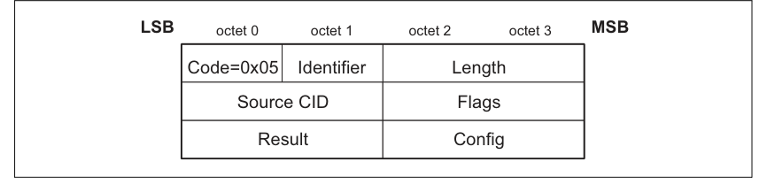

**Figure 4.8:  Configuration Response Packet**

The data fields are:
• Source CID - SCID (2 octets) This field contains the channel endpoint on the device receiving this Response packet. The device receiving the Response shall check that the Identifier field matches the same field in the corresponding configuration request command and the SCID matches its local CID paired with the original DCID.
• Flags (2 octets) Figure 4.9 displays the two-octet Flags field. Note the most significant bit is shown on the left.

**Figure 4.9:  Configuration Response Flags field format**

Only one flag is defined, the Continuation flag (C).
When both L2CAP entities support the Extended Flow Specification option, the Continuation flag shall not be used and shall be set to zero in all Configuration Request and Response packets. More configuration responses will follow when C is set to one. This flag indicates that the parameters included in the response are a partial subset of parameters being sent by the device sending the Response packet. The other flag bits are reserved for future use.
• Result (2 octets) The Result field indicates whether or not the Request was acceptable. See Table 4.8 for possible result codes.

| Result | Description |
| --- | --- |
| 0x0000 | Success |
| 0x0001 | Failure – unacceptable parameters |
| 0x0002 | Failure – rejected (no reason provided) |
| 0x0003 | Failure – unknown options |
| 0x0004 | Pending |
| 0x0005 | Failure - flow spec rejected |
| Other | Reserved for Future Use |

Table 4.8:  Configuration Response Result codes
• Configuration Options
This field contains the list of parameters being configured. These are defined in Section 5. On a successful result (Result=0x0000) and pending result (Result=0x0004), these parameters contain the return values for any wild card parameter values (see Section 5.3) and “adjustments” to non- negotiated configuration parameter values contained in the request. A response with the result code of 0x0000 (Success) is also referred to as a positive response. On an unacceptable parameters failure (Result=0x0001) the rejected parameters shall be sent in the response with the values that would have been accepted if sent in the original request. Any missing configuration parameters in the Configuration Request are assumed to have their default value or previously agreed value and they too shall be included in the Configuration Response if they need to be changed. A response with the result code of 0x0001 is also referred to as a negative response. On an unknown option failure (Result=0x0003), the option(s) that contain an option type field that is not understood by the recipient of the Request shall be included in the Response unless they are hints. Hints are those options in the Request that are skipped if not understood (see Section 5). Hints shall not be included in the Response and shall not be the sole cause for rejecting the Request.
On a flow spec rejected failure (Result=0x0005), an Extended Flow Spec option may be included to reflect the QoS level that would be acceptable (see Section 7.1.3). The decision on the amount of time (or messages) spent arbitrating the channel parameters before terminating the negotiation is implementation specific.

### 4.6   DISCONNECTION REQUEST (CODE 0x06)

Terminating an L2CAP channel requires that a disconnection request be sent and acknowledged by a disconnection response. Figure 4.10 shows a disconnection request. The receiver shall ensure that both source and destination CIDs match before initiating a channel disconnection.
Once a Disconnection Request is issued, all incoming data in transit on this L2CAP channel shall be discarded and any new additional outgoing data shall be discarded. Once a disconnection request for a channel has been received, all data queued to be sent out on that channel shall be discarded.

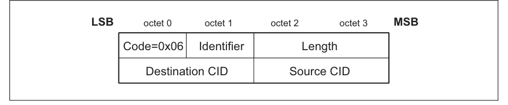

**Figure 4.10:  Disconnection Request Packet**

The data fields are:
• Destination CID - DCID (2 octets) This field specifies the endpoint of the channel to be disconnected on the device receiving this request.
• Source CID - SCID (2 octets) This field specifies the endpoint of the channel to be disconnected on the device sending this request.
The SCID and DCID are relative to the sender of this request and shall match those of the channel to be disconnected. If the DCID is not recognized by the receiver of this message, a CommandReject message with ’invalid CID’ result code shall be sent in response. If the receiver finds a DCID match but the SCID fails to find the same match, the request should be silently discarded.

### 4.7   DISCONNECTION RESPONSE (CODE 0x07)

Disconnection responses shall be sent in response to each valid disconnection request.

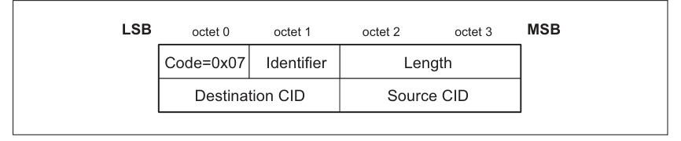

**Figure 4.11:  Disconnection Response Packet**

The data fields are:
• Destination CID - DCID (2 octets) This field identifies the channel endpoint on the device sending the response.
• Source CID - SCID (2 octets) This field identifies the channel endpoint on the device receiving the response. The DCID and the SCID (which are relative to the sender of the request), and the Identifier fields shall match those of the corresponding disconnection request command. If the CIDs do not match, the response should be silently discarded at the receiver.

### 4.8   ECHO REQUEST (CODE 0x08)

Echo requests are used to request a response from a remote L2CAP entity. These requests may be used for testing the link or for passing vendor specific information using the optional data field. L2CAP entities shall respond to a valid Echo Request packet with an Echo Response packet. The Data field is optional and implementation specific. L2CAP entities should ignore the contents of this field if present.

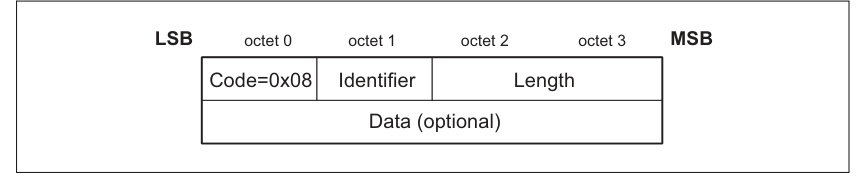

**Figure 4.12:  Echo Request Packet**

### 4.9   ECHO RESPONSE (CODE 0x09)

An Echo response shall be sent upon receiving a valid Echo Request. The identifier in the response shall match the identifier sent in the Request. The optional and implementation specific data field may contain the contents of the data field in the Request, different data, or no data at all.

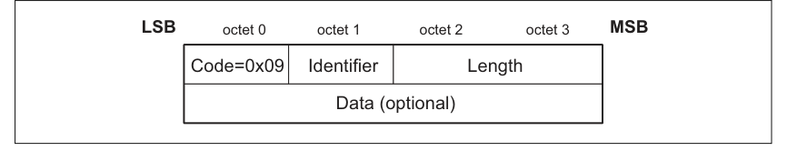

**Figure 4.13:  Echo Response Packet**

### 4.10   INFORMATION REQUEST (CODE 0x0A)

Information requests are used to request implementation specific information from a remote L2CAP entity. L2CAP implementations shall respond to a valid Information Request with an Information Response. It is optional to send Information Requests.
An L2CAP implementation shall only use optional features or attribute ranges for which the remote L2CAP entity has indicated support through an Information Response. Until an Information Response which indicates support for optional features or ranges has been received only mandatory features and ranges shall be used.

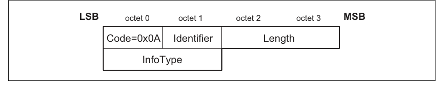

**Figure 4.14:  Information Request Packet**

The data field is:
• InfoType (2 octets) The InfoType defines the type of implementation specific information being requested. See Section 4.11 for details on the type of information requested.

| Value | Description |
| --- | --- |
| 0x0001 | Connectionless MTU |
| 0x0002 | Extended features supported |

Table 4.9:  InfoType definitions

| Value | Description |
| --- | --- |
| 0x0003 | Fixed Channels supported |
| Other | Reserved for Future Use |

Table 4.9:  InfoType definitions  (Continued)
L2CAP entities shall not send an Information Request packet with InfoType 0x0003 over Fixed Channel CID 0x0001 until first verifying that the Fixed Channels bit is set in the Extended feature mask of the remote device. Support for fixed channels is mandatory for devices with BR/EDR/LE or LE Controllers. Information Request and Information Response shall not be used over Fixed Channel CID 0x0005.

### 4.11   INFORMATION RESPONSE (CODE 0x0B)

An information response shall be sent upon receiving a valid Information Request. The identifier in the response shall match the identifier sent in the Request. The data field shall contain the value associated with the InfoType field sent in the Request, or shall be empty if the InfoType is not supported.

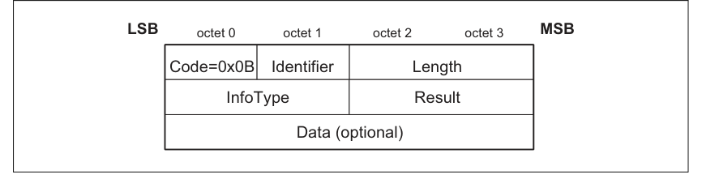

**Figure 4.15:  Information Response Packet**

The data fields are:
• InfoType (2 octets) The InfoType defines the type of implementation specific information that was requested. This value shall be copied from the InfoType field in the Information Request.
• Result (2 octets) The Result contains information about the success of the request. If result is "Success," the data field contains the information as specified in Table 4.11. If result is "Not supported," no data shall be returned.

| Value | Description |
| --- | --- |
| 0x0000 | Success |
| 0x0001 | Not supported |

Table 4.10:  Information Response Result values

| Value | Description |
| --- | --- |
| Other | Reserved for Future Use |

Table 4.10:  Information Response Result values  (Continued)
• Data (0 or more octets) The contents of the Data field depends on the InfoType. For InfoType = 0x0001 the data field contains the remote entity’s 2-octet acceptable connectionless MTU. The default value is defined in Section 3.2. For InfoType = 0x0002, the data field contains the 4 octet L2CAP extended feature mask. The feature mask refers to the extended features that the L2CAP entity sending the Information Response supports. The feature bits contained in the L2CAP feature mask are specified in Section 4.12. For InfoType = 0x0003, the data field contains an 8 octet bit map that indicates which Fixed L2CAP Channels (i.e., the L2CAP channels that use a CID from 0x0000 to 0x003F) are supported. A list of available fixed channels is provided in Table 2.1 in Section 2.1. A detailed description of this InfoType data field is given in Section 4.13. Note: L2CAP entities of versions prior to version 1.2, receiving an Information Request with InfoType = 0x0002 for an L2CAP feature discovery, return an Information Response with result code "Not supported." L2CAP entities at version 1.2 to 2.1 + EDR that have an all zero extended features mask may return an Information Response with result code "Not supported."

| InfoType | Data | Data Length (octets) |
| --- | --- | --- |
| 0x0001 | Connectionless MTU | 2 |
| 0x0002 | Extended feature mask | 4 |
| 0x0003 | Fixed Channels Supported | 8 |

Table 4.11:  Information Response Data fields

### 4.12   EXTENDED FEATURE MASK

The features are represented as a bit mask in the Information Response data field (see Section 4.11). For each feature a single bit is specified which shall be set to 1 if the feature is supported and set to 0 otherwise. All unknown or unassigned feature bits are reserved for future use.
The feature mask shown in Table 4.12 consists of 4 octets (numbered octet 0 ... 3), with bit numbers 0 ... 7 each. Within the Information Response packet data field, bit 0 of octet 0 is aligned leftmost, bit 7 of octet 3 is aligned rightmost.
Note: The L2CAP feature mask was introduced in Bluetooth v1.2 and contains features introduced after Bluetooth v1.1.

| No. | Supported feature | Octet | Bit |
| --- | --- | --- | --- |
| 0 | Flow control mode | 0 | 0 |
| 1 | Retransmission mode | 0 | 1 |
| 2 | Bi-directional QoS1 | 0 | 2 |
| 3 | Enhanced Retransmission Mode | 0 | 3 |
| 4 | Streaming Mode | 0 | 4 |
| 5 | FCS Option | 0 | 5 |
| 6 | Extended Flow Specification for BR/EDR | 0 | 6 |
| 7 | Fixed Channels | 0 | 7 |
| 8 | Extended Window Size | 1 | 0 |
| 9 | Unicast Connectionless Data Reception | 1 | 1 |
| 31 | Reserved for feature mask extension | 3 | 7 |

Table 4.12:  Extended feature mask
1. Peer side supports upper layer control of the Link Manager's Bi-directional QoS, see Section 5.3 for more details.

### 4.13   FIXED CHANNELS SUPPORTED

Each Fixed Channel is represented by a single bit in an 8 octet bit mask. The bit associated with a channel shall be set to 1 if the L2CAP entity supports signaling on that channel. The L2CAP signaling channel is mandatory and therefore the bit associated with that channel shall be set to 1.Table 4.13 shows the format of the bit mask.

| CID | Fixed Channel | Value | Octet | Bit |
| --- | --- | --- | --- | --- |
| 0x0000 | Null identifier | Shall be set to 0 | 0 | 0 |
| 0x0001 | L2CAP Signaling channel | Shall be set to 1 | 0 | 1 |
| 0x0002 | Connectionless reception | 0 – if not supported 1 – if supported | 0 | 2 |
| 0x0003 | AMP Manager Protocol Chan- nel | 0 – if not supported 1 – if supported | 0 | 3 |
| 0x0004- 0x0006 | Reserved for Future Use |  | 0 | 4-6 |
| 0x0007 | BR/EDR Security Manager | 0 – if not supported 1 – if supported | 0 | 7 |
| 0x0008- 0x003E | Reserved for Future Use |  | 1-6 7 | 0-7 0-6 |
| 0x003F | AMP Test Manager | 0 – if not supported 1 – if supported | 7 | 7 |
| Other | Reserved for Future Use |  | Other |  |

Table 4.13:  Fixed Channels Supported bit mask
An L2CAP entity shall not transmit on any fixed channel (with the exception of the L2CAP signaling channel) until it has received a Fixed Channels Supported InfoType from the peer L2CAP entity indicating support for the channel, or has received a valid signaling packet from the remote device on the Fixed channel. All packets received on a non-supported fixed channel shall be ignored.

### 4.14   CREATE CHANNEL REQUEST (CODE 0x0C)

The Create Channel request packet, shown in Figure 4.16, is sent to create an L2CAP channel between two devices over the Controller identified by the Controller ID.

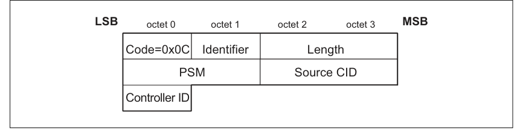

**Figure 4.16:  Create Channel Request Packet**

The data fields are:
• Protocol/Service Multiplexer –PSM (2 octets (minimum)) The PSM field is at least two octets in length. The structure of the PSM field is based on the ISO 3309 extension mechanism for address fields. All PSM values shall be odd, that is, the least significant bit of the least significant octet must be 1. Also, all PSM values shall have the least significant bit of the most significant octet equal to 0. This allows the PSM field to be extended beyond 16 bits. PSM values are separated into two ranges. Values in the first range are assigned by the Bluetooth SIG and indicate protocols. The second range of values are dynamically allocated and used in conjunction with the Service Discovery Protocol (SDP). The dynamically assigned values may be used to support multiple implementations of a particular protocol. PSM values are defined in the Assigned Numbers document.
• Source CID –SCID (2 octets) The source CID is two octets in length and represents a channel endpoint on the device sending the request. Once the channel has been configured, data packets flowing to the sender of the request shall be sent to this CID. Thus, the Source CID represents the channel endpoint on the device sending the request and receiving the response. The value of the Source CID shall be from the dynamically allocated range as defined in Table 2.1 and shall not be already allocated to a different channel on the device sending the request.
• Controller Identifier –Controller ID (1 octet) The Controller ID is one octet in length and represents the Controller physical link over which the channel shall be created. The Controller ID is the identifier of the Controller on the remote device obtained via an AMP Manager Discover Available AMPs request. See [Vol 3] Part E, AMP Manager Protocol Specification The Controller physical link shall already exist.

### 4.15   CREATE CHANNEL RESPONSE (CODE 0x0D)

When a device receives a Create Channel Request Packet, it shall send a Create Channel Response packet. Note: Implementations conforming to versions prior to 4.2 may respond with a Command Reject (Reason 0x0002 – Invalid CID In Request) packet under conditions now covered by result codes of 0x0006 and 0x0007 of this packet. The format of the Create Channel Response packet is shown in Figure 4.17.

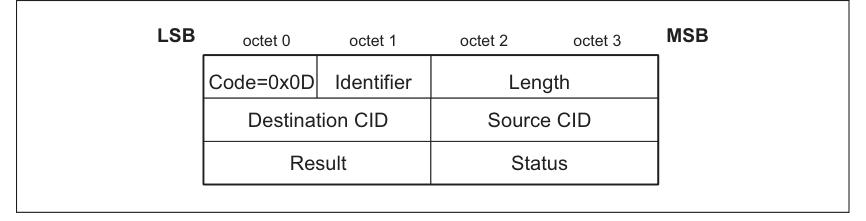

**Figure 4.17:  Create Channel Response Packet**

The data fields are:
• Destination Channel Identifier–DCID (2 octets) This field contains the channel endpoint on the device sending this Response packet. Thus, the Destination CID represents the channel endpoint on the device receiving the request and sending the response. The value of the Destination CID shall be from the dynamically allocated range as defined in Table 2.1 and shall not be already allocated to a different channel on the device sending the response.
• Source Channel Identifier–SCID (2 octets) This field contains the channel endpoint on the device receiving this Response packet. This is copied from the SCID field of the Create Channel Request packet.
• Result (2 octets) The result field indicates the outcome of the Create Channel Request. The result value of 0x0000 indicates success while a non-zero value indicates the Create Channel Request failed or is pending. A logical channel is established on the receipt of a successful result unless the DCID field is outside of the dynamically allocated range (see Table 2.1) or is already allocated on the device sending the response. Table 4.14 defines values for this field. The DCID and SCID fields shall be ignored when the result field indicates the connection was refused.

| Result | Description |
| --- | --- |
| 0x0000 | Connection successful |

Table 4.14:  Result values

| Result | Description |
| --- | --- |
| 0x0001 | Connection pending |
| 0x0002 | Connection refused - PSM not supported |
| 0x0003 | Connection refused - security block |
| 0x0004 | Connection refused - no resources available |
| 0x0005 | Connection refused - Controller ID not supported |
| 0x0006 | Connection refused – invalid Source CID |
| 0x0007 | Connection refused – Source CID already allocated |
| Other | Reserved for Future Use |

Table 4.14:  Result values (Continued)
• Status (2 octets) Only defined for Result = Pending. Indicates the status of the connection. The status is set to one of the values shown in Table 4.15.

| Value | Description |
| --- | --- |
| 0x0000 | No further information available |
| 0x0001 | Authentication pending |
| 0x0002 | Authorization pending |
| Other | Reserved for Future Use |

Table 4.15:  Status values

### 4.16   MOVE CHANNEL REQUEST (CODE 0x0E)

Move Channel request packets are sent to move an existing L2CAP channel from a physical link on one Controller to a physical link on another Controller. The CIDs for the L2CAP channel are not changed by a Move operation. Figure 4.18 illustrates a Move Channel request packet. Channels shall only be moved if configured to use Enhanced Retransmission mode or Streaming mode. Fixed channels (see Section 2.1) shall not be moved.

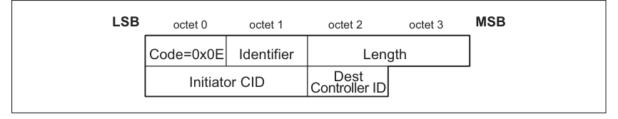

**Figure 4.18:  Move Channel Request Packet**

The data fields are:
• Initiator Channel Identifier - ICID (2 octets) This field contains the channel endpoint on the device sending this Request packet.
• Destination Controller Identifier - Dest Controller ID (1 octet) The Dest Controller ID is one octet in length and represents the Controller physical link to which the channel shall be moved. The Controller ID is the identifier of the Controller on the remote device obtained via an AMP Manager Discover Available AMPs request. See [Vol 3] Part E, AMP Manager Protocol Specification.The Controller physical link shall already exist.

### 4.17   MOVE CHANNEL RESPONSE (CODE 0x0F)

When a device receives a Move Channel request packet it shall send a Move Channel response packet. If the device has sent its own Move Channel request then a collision has occurred. One of the requests shall be rejected while the other shall proceed. The Move Channel request that shall be rejected is based on the algorithm in Section 7.7
The format of Move Channel response packet is shown in Figure 4.19.

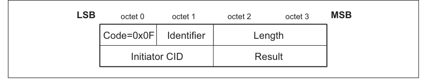

**Figure 4.19:  Move Channel Response Packet**

The data fields are:
• Initiator Channel Identifier – ICID (2 octets) This field contains the channel endpoint on the device that sent the Move Channel Request (device receiving this Response packet). This is the same value as was sent in the Move Channel Request packet.
• Result (2 octets) The result field indicates the outcome of the move request. The result value of 0x0000 indicates success while a non-zero value indicates the move request failed. A logical channel is moved on the receipt of a successful result. Table 4.16 defines values for this field. The ICID field shall be ignored when the result field indicates the move was refused.

| Result | Description |
| --- | --- |
| 0x0000 | Move Success |
| 0x0001 | Move Pending |
| 0x0002 | Move refused - Controller ID not supported |
| 0x0003 | Move refused - new Controller ID is same as old Con- troller ID |
| 0x0004 | Move refused - Configuration not supported |
| 0x0005 | Move refused - Move Channel collision |
| 0x0006 | Move refused - Channel not allowed to be moved |
| Other | Reserved for Future Use |

Table 4.16:  Result values

### 4.18   MOVE CHANNEL CONFIRMATION (CODE 0x10)

When the initiator of a Move Channel request receives a Move Channel response with a result code other than "pending" from the responder, it shall send a Move Channel confirmation packet, that will conclude the Move Channel procedure, informing the responder that all the QoS parameters were successfully (or not) negotiated. The format of Move Channel confirmation packet is shown in Figure 4.20.

**Figure 4.20:  Move Channel Confirmation Packet**

The data fields are:
• Initiator Channel Identifier – ICID (2 octets) This field contains the channel endpoint on the device sending the Move Channel Confirmation packet. This is the same value as was sent in the original Move Channel Request packet.
• Result (2 octets) The result field indicates the outcome of the move confirmation. The result value of 0x0000 indicates success while a non-zero value indicates the move failed.

| Result | Description |
| --- | --- |
| 0x0000 | Move success - both sides succeed |
| 0x0001 | Move failure - one or both sides refuse |
| Other | Reserved for Future Use |

Table 4.17:  Result values

### 4.19   MOVE CHANNEL CONFIRMATION RESPONSE (CODE 0x11)

When a device receives a Move Channel Confirmation packet it shall send a Move Channel Confirmation response packet. The purpose of the Move Channel Confirmation Response is so that Move Channel Confirmation is consistent with the command/response style. The format of Move Channel Confirmation response packet is shown in Figure 4.21.

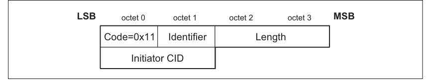

**Figure 4.21:  Move Channel Confirmation Response Packet**

The data field is:
• Initiator Channel Identifier – ICID (2 octets) This field contains the channel endpoint on the device that sent the Move Channel Confirmation packet.

### 4.20   CONNECTION PARAMETER UPDATE REQUEST (CODE 0x12)

This command shall only be sent from the LE slave device to the LE master device and only if one or more of the LE slave Controller, the LE master Controller, the LE slave Host and the LE master Host do not support the Connection Parameters Request Link Layer Control Procedure ([Vol 6] Part B, Section 5.1.7). If an LE slave Host receives a Connection Parameter Update Request packet it shall respond with a Command Reject packet with reason 0x0000 (Command not understood).
The Connection Parameter Update Request allows the LE slave Host to request a set of new connection parameters. When the LE master Host receives a Connection Parameter Update Request packet, depending on the parameters of other connections, the LE master Host may accept the requested parameters and deliver the requested parameters to its Controller or reject the request. In devices supporting HCI, the LE master Host delivers the requested parameters to its Controller using the HCI_LE_Connection_Update command (see [Vol 2] Part E, Section 7.8.18). If the LE master Host accepts the requested parameters it shall send the Connection Parameter Update Response packet with result 0x0000 (Parameters accepted) otherwise it shall set the result to 0x0001 (request rejected).
The LE slave Host will receive an indication from the LE slave Controller when the connection parameters have been updated. In devices supporting HCI, this
notification will be in the form of an LE Connection Update Complete event (see [Vol 2] Part E, Section 7.7.65.3). If the LE master Controller rejects the updated connection parameters no indication from the LE slave Controller will be sent to the LE slave Host.

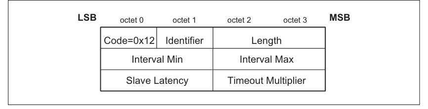

**Figure 4.22:  Connection Parameters Update Request Packet**

The data fields are:
• Interval Min (2 octets) Defines minimum value for the connection interval in the following manner: connIntervalMin = Interval Min * 1.25 ms. Interval Min range: 6 to 3200 frames where 1 frame is 1.25 ms and equivalent to 2 BR/EDR slots. Values outside the range are reserved for future use. Interval Min shall be less than or equal to Interval Max.
• Interval Max (2 octets) Defines maximum value for the connection interval in the following manner: connIntervalMax = Interval Max * 1.25 ms. Interval Max range: 6 to 3200 frames. Values outside the range are reserved for future use. Interval Max shall be equal to or greater than the Interval Min.
• Slave Latency (2 octets) Defines the slave latency parameter (as number of LL connection events) in the following manner: connSlaveLatency =  Slave Latency. The Slave Latency field shall have a value in the range of 0 to ((connSupervisionTimeout / (connIntervalMax*2)) -1). The Slave Latency field shall be less than 500.
• Timeout Multiplier (2 octets) Defines connection timeout parameter in the following manner: connSupervisionTimeout = Timeout Multiplier * 10 ms The Timeout Multiplier field shall have a value in the range of 10 to 3200.

### 4.21   CONNECTION PARAMETER UPDATE RESPONSE (CODE 0x13)

This response shall only be sent from the LE master device to the LE slave device.
The Connection Parameter Update Response packet shall be sent by the master Host when it receives a Connection Parameter Update Request packet. If the LE master Host accepts the request it shall send the connection parameter update to its Controller.

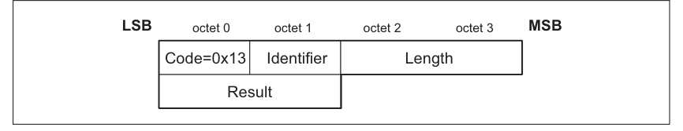

**Figure 4.23:  Connection Parameters Update Response Packet**

The data field is:
• Result (2 octets) The result field indicates the response to the Connection Parameter Update Request. The result value of 0x0000 indicates that the LE master Host has accepted the connection parameters while 0x0001 indicates that the LE master Host has rejected the connection parameters.

| Result | Description |
| --- | --- |
| 0x0000 | Connection Parameters accepted |
| 0x0001 | Connection Parameters rejected |
| Other | Reserved for Future Use |

Table 4.18:  Result values

### 4.22   LE CREDIT BASED CONNECTION REQUEST (CODE 0x14)

LE Credit Based Connection Request packets are sent to create and configure an L2CAP channel between two devices. Figure 4.24 illustrates a Connection Request packet.

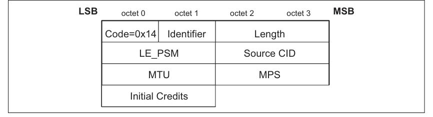

**Figure 4.24:  LE Credit Based Connection Request Packet**

The data fields are:
• LE Protocol/Service Multiplexer – LE_PSM (2 octets) The LE_PSM field is two octets in length. LE_PSM values are separated into two ranges. Values in the first range are assigned by the Bluetooth SIG and indicate protocols. Values in the second range are dynamically allocated and used in conjunction with services defined in the GATT server. The dynamically assigned values may be used to support multiple implementations of a particular protocol. LE_PSM values are defined in the table below.

| Range | Type | Server Usage | Client Usage |
| --- | --- | --- | --- |
| 0x0001- 0x007F | Fixed, SIG assigned | LE PSM is fixed for all _ implementations | LE PSM may be assumed for fixe _ service. Protocol used is indicated by the LE PSM as defined in the _ Assigned Numbers page. |
| 0x0080- 0x00FF | Dynamic | LE PSM may be fixed _ for a given implementa- tion or may be assigned at the time the service is registered in GATT | LE PSM shall be obtained from th _ service in GATT upon every recon nection. LE PSM for one directio _ will typically be different from the other direction. |
| Other | RFU | Not applicable | Not applicable |

Table 4.19:  LE Credit Based Connection Request LE_PSM ranges
• Source CID – SCID (2 octets) The source CID is two octets in length and represents a channel endpoint on the device sending the request. Once the channel has been created, data packets flowing to the sender of the request shall be sent to this CID. Thus,
the Source CID represents the channel endpoint on the device sending the request and receiving the response.
• Maximum Transmission Unit – MTU (2 octets) The MTU field specifies the maximum SDU size (in octets) that the L2CAP layer entity sending the LE Credit Based Connection Request can receive on this channel. L2CAP implementations shall support a minimum MTU size of 23 octets.
• Maximum PDU Size – MPS (2 octets) The MPS field specifies the maximum payload size (in octets) that the L2CAP layer entity sending the LE Credit Based Connection Request is capable of receiving on this channel. L2CAP implementations shall support a minimum MPS of 23 octets and may support an MPS up to 65533 octets.
• Initial Credits – (2 octets) The initial credit value indicates the number of LE-frames that the peer device can send to the L2CAP layer entity sending the LE Credit Based Connection Request. The initial credit value shall be in the range of 0 to 65535.

### 4.23   LE CREDIT BASED CONNECTION RESPONSE (CODE 0x15)

When a device receives a LE Credit Based Connection Request packet, it shall send a LE Credit Based Connection Response packet. The format of the connection response packet is shown in Figure 4.25.

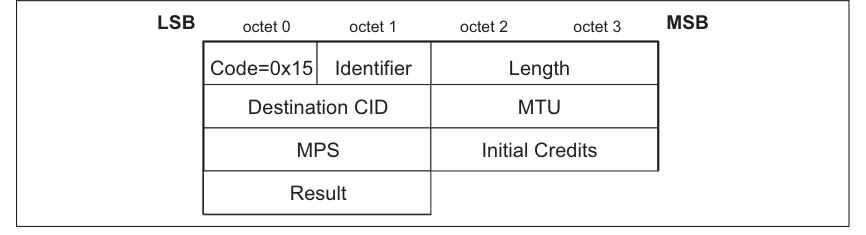

**Figure 4.25:  LE Credit Based Connection Response Packet**

The data fields are:
• Destination CID – DCID (2 octets) The destination CID is two octets in length and represents a channel endpoint on the device sending the response. Once the channel has been created, data packets flowing to the sender of the response shall be sent to this CID. Thus, the destination CID represents the channel endpoint on the device receiving the request and sending the response.
• Maximum Transmission Unit – MTU (2 octets) The MTU field specifies the maximum SDU size (in octets) that the L2CAP layer entity sending the LE Credit Based Connection Response can receive on this channel. L2CAP implementations shall support a minimum MTU size of 23 octets.
• Maximum PDU Size – MPS (2 octets) The MPS field specifies the maximum payload size (in octets) that the L2CAP layer entity sending the LE Credit Based Connection Response is capable of receiving on this channel. L2CAP implementations shall support a minimum MPS of 23 octets and may support an MPS up to 65533 octets.
• Initial Credits – (2 octets) The initial credit value indicates the number of LE-frames that the peer device can send to the L2CAP layer entity sending the LE Credit Based Connection Response. The initial credit value shall be in the range of 0 to 65535.
• Result – (2 octets) The result field indicates the outcome of the connection request. A result value of 0x0000 indicates success while a non-zero value indicates the connection request was refused. A logical channel is established on the receipt of a successful result. Table 4.20 defines values for this field. The DCID, MTU, MPS and Initial Credits fields shall be ignored when the result field indicates the connection was refused.

| Value | Description |
| --- | --- |
| 0x0000 | Connection successful |
| 0x0001 | Reserved for Future Use |
| 0x0002 | Connection refused – LE PSM not supported _ |
| 0x0003 | Reserved for Future Use |
| 0x0004 | Connection refused – no resources available |
| 0x0005 | Connection refused – insufficient authentication |
| 0x0006 | Connection refused – insufficient authorization |
| 0x0007 | Connection refused – insufficient encryption key size |
| 0x0008 | Connection refused – insufficient encryption |
| 0x0009 | Connection refused – invalid Source CID |
| 0x000A | Connection refused – Source CID already allocated |
| 0x000B | Connection refused – unacceptable parameters |
| Other | Reserved for Future Use |

Table 4.20:  Result values for LE Credit Based Connection Response

### 4.24   LE FLOW CONTROL CREDIT (CODE 0x16)

A device shall send a LE Flow Control Credit packet when it is capable of receiving additional LE-frames (for example after it has processed one or more LE-frames).

**Figure 4.26:  LE Flow Control Credit Packet**

The data fields are:
• CID – (2 octets) The CID is two octets in length and represents the source channel endpoint of the device sending the LE Flow Control Credit packet.  For example, a received LE Flow Control Credit packet with a given CID (0x0042) would provide credits for the receiving device’s destination CID (0x0042).
• Credits – (2 octets) The credit value field represents number of credits the receiving device can increment, corresponding to the number of LE-frames that can be sent to the peer device sending the LE Flow Control Credit packet. The credit value field shall be a number between 1 and 65535.

## 5  CONFIGURATION PARAMETER OPTIONS

Options are a mechanism to extend the configuration parameters. Options shall be transmitted as information elements containing an option type, an option length, and one or more option data fields. Figure 5.1 illustrates the format of an option.

**Figure 5.1:  Configuration option format**

The configuration option fields are:
• Type (1 octet) The option type field defines the parameters being configured. The most significant bit of the type determines the action taken if the option is not recognized. 0 - option must be recognized; if the option is not recognized then refuse the configuration request 1 - option is a hint; if the option is not recognized then skip the option and continue processing
• Length (1 octet) The length field defines the number of octets in the option data. Thus an option type without option data has a length of 0.
• Option data The contents of this field are dependent on the option type.

### 5.1   MAXIMUM TRANSMISSION UNIT (MTU)

This option specifies the maximum SDU size the sender of this option is capable of accepting for a channel. The type is 0x01, and the payload length is 2 octets, carrying the two-octet MTU size value as the only information element (see Figure 5.2). Unlike the B-Frame length field, the I-frame length field may be greater than the configured MTU because it includes the octet lengths of the Control, L2CAP SDU Length (when present), and frame check sequence fields as well as the Information octets.
MTU is not a negotiated value, it is an informational parameter that each device can specify independently. It indicates to the remote device that the local device can receive, in this channel, an MTU larger than the minimum required. All L2CAP implementations shall support a minimum MTU of 48 octets over the ACL- U logical link and 23 octets over the LE-U logical link; however, some protocols
and profiles explicitly require support for a larger MTU. The minimum MTU for a channel is the larger of the L2CAP minimum 48 octet MTU and any MTU explicitly required by the protocols and profiles using that channel. (Note: The MTU is only affected by the profile directly using the channel. For example, if a service discovery transaction is initiated by a non service discovery profile, that profile does not affect the MTU of the L2CAP channel used for service discovery).
The following rules shall be used when responding to a configuration request specifying the MTU for a channel:
• A request specifying any MTU greater than or equal to the minimum MTU for the channel shall be accepted.
• A request specifying an MTU smaller than the minimum MTU for the channel may be rejected.
The signaling described in Section 4.5 may be used to reject an MTU smaller than the minimum MTU for a channel. The "failure-unacceptable parameters" result sent to reject the MTU shall include the proposed value of MTU that the remote device intends to transmit. It is implementation specific whether the local device continues the configuration process or disconnects the channel.
If the remote device sends a positive configuration response it should include the actual MTU to be used on this channel for traffic flowing into the local device. Following the above rules, the actual MTU cannot be less than 48 bytes.This is the minimum of the MTU in the configuration request and the outgoing MTU capability of the device sending the configuration response. The new agreed value (the default value in a future re-configuration) is the value specified in the response.
Note: For backwards compatibility reception of the MTU option in a negative Configuration Response where the MTU option is not in error should be interpreted in the same way as it is in a positive Configuration Response (e.g. the case where another configuration option value is unacceptable but the negative Configuration Response contains the MTU option in addition to the unacceptable option).
The MTU to be used on this channel for the traffic flowing in the opposite direction will be established when the remote device sends its own Configuration Request as explained in Section 4.4.
If the configured mode is Enhanced Retransmission mode or Streaming mode then MTU shall not be reconfigured to a smaller size.

**Figure 5.2:  MTU Option Format**

The option data field is:
• Maximum Transmission Unit - MTU (2 octets) The MTU field is the maximum SDU size, in octets, that the originator of the Request can accept for this channel. The MTU is asymmetric and the sender of the Request shall specify the MTU it can receive on this channel if it differs from the default value. L2CAP implementations shall support a minimum MTU size of 48 octets. The default value is 672 octets1.

### 5.2   FLUSH TIMEOUT OPTION

This option is used to inform the recipient of the Flush Timeout the sender is going to use. This option shall not be used if the Extended Flow Specification is used. The Flush Timeout is defined in the BR/EDR Baseband specification [Vol 2] Part B, Section 7.6.3. The type is 0x02 and the payload size is 2 octets. The Flush Timeout option is negotiable.
If the remote device returns a negative response to this option and the local device cannot honor the proposed value, then it shall either continue the configuration process by sending a new request with the original value, or disconnect the channel. The flush timeout applies to all channels on the same ACL logical transport but may be overridden on a packet by packet basis by marking individual L2CAP packets as non-automatically-flushable via the Packet_Boundary_Flag in the HCI ACL Data Packet (see Section 1.1).

**Figure 5.3:  Flush Timeout option format**

The option data field is:
• Flush Timeout This value is the Flush Timeout in milliseconds. This is an asymmetric value and the sender of the Request shall specify its flush timeout value if it differs from the default value of 0xFFFF. Possible values are: 0x0001 - no retransmissions at the baseband level should be performed since the minimum polling interval is 1.25 ms. 0x0002 to 0xFFFE - Flush Timeout used by the baseband.
1.  The default MTU was selected based on the payload carried by two baseband DH5 packets (2*341=682 octets) minus the baseband ACL headers (2*2=4 octets) and a 6-octet L2CAP header. Note that the L2CAP header length is 4 octets (see Section 3.3.1) but for historical reasons an L2CAP header length of 6 bytes is used.
0xFFFF - an infinite amount of retransmissions. This is also referred to as a ’reliable channel’. In this case, the baseband shall continue retransmissions until physical link loss is declared by link manager timeouts.

### 5.3   QUALITY OF SERVICE (QOS) OPTION

This option specifies a flow specification similar to RFC 13631. Although the RFC flow specification addresses only the transmit characteristics, the Bluetooth QoS interface can handle the two directions (Tx and Rx) in the negotiation as described below.
If no QoS configuration parameter is negotiated the link shall assume the default parameters. The QoS option is type 0x03. This option shall not be used if the Extended Flow Specification option is used. The QoS option is negotiable.
In a configuration request, this option describes the outgoing traffic flow from the device sending the request. In a positive Configuration Response, this option describes the incoming traffic flow agreement to the device sending the response. In a negative Configuration Response, this option describes the preferred incoming traffic flow to the device sending the response.
L2CAP implementations are only required to support ’Best Effort’ service, support for any other service type is optional. Best Effort does not require any guarantees. If no QoS option is placed in the request, Best Effort shall be assumed. If any QoS guarantees are required then a QoS configuration request shall be sent.
The remote device’s Configuration Response contains information that depends on the value of the result field (see Section 4.5). If the request was for Guaranteed Service, the response shall include specific values for any wild card parameters (see Token Rate and Token Bucket Size descriptions) contained in the request. If the result is “Failure – unacceptable parameters”, the response shall include a list of outgoing flow specification parameters and parameter values that would make a new Connection Request from the local device acceptable by the remote device. Both explicitly referenced in a Configuration Request or implied configuration parameters can be included in a Configuration Response. Recall that any missing configuration parameters from a Configuration Request are assumed to have their most recently accepted values.
If a configuration request contains any QoS option parameters set to “do not care” then the configuration response shall set the same parameters to “do not care”. This rule applies for both Best Effort and Guaranteed Service.
1. Internet Engineering Task Force, “A Proposed Flow Specification”, RFC 1363, September 1992.

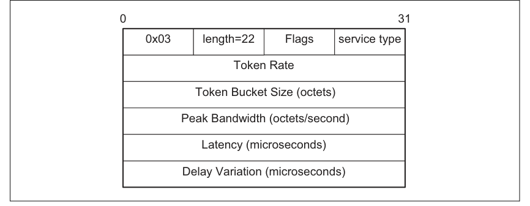

**Figure 5.4:  Quality of Service (QoS) option format containing Flow Specification**

The option data fields are:
• Flags (1 octet) Reserved for future use.
• Service Type (1 octet) This field indicates the level of service required. Table 5.1 defines the different services available. The default value is ‘Best effort’. If ‘Best effort’ is selected, the remaining parameters should be treated as optional by the remote device. The remote device may choose to ignore the fields, try to satisfy the parameters but provide no response (QoS option omitted in the Response message), or respond with the settings it will try to meet. If ‘No traffic’ is selected, the remainder of the fields shall be ignored because there is no data being sent across the channel in the outgoing direction.

| Value | Description |
| --- | --- |
| 0x00 | No traffic |
| 0x01 | Best effort (Default) |
| 0x02 | Guaranteed |
| Other | Reserved for Future Use |

Table 5.1:  Service type definitions
• Token Rate (4 octets) The value of this field represents the average data rate with which the application transmits data. The application may send data at this rate continuously. On a short time scale the application may send data in excess of the average data rate, dependent on the specified Token Bucket Size and Peak Bandwidth (see below). The Token Bucket Size and Peak Bandwidth allow the application to transmit data in a 'bursty' fashion.
The Token Rate signaled between two L2CAP peers is the data transmitted by the application and shall exclude the L2CAP protocol overhead. The Token Rate signaled over the interface between L2CAP and the Link Manager shall include the L2CAP protocol overhead. Furthermore the Token Rate value signaled over this interface may also include the aggregation of multiple L2CAP channels onto the same ACL logical transport. The Token Rate is the rate with which traffic credits are provided. Credits can be accumulated up to the Token Bucket Size. Traffic credits are consumed when data is transmitted by the application. When traffic is transmitted, and there are insufficient credits available, the traffic is non- conformant. The Quality of Service guarantees are only provided for conformant traffic. For non-conformant traffic there may  be insufficient resources such as bandwidth and buffer space. Furthermore non- conformant traffic may violate the QoS guarantees of other traffic flows. The Token Rate is specified in octets per second. The value 0x00000000 indicates no token rate is specified. This is the default value and means “do not care”. When the Guaranteed service is selected, the default value shall not be used. The value 0xFFFFFFFF is a wild card matching the maximum token rate available. The meaning of this value depends on the service type. For best effort, the value is a hint that the application wants as much bandwidth as possible. For Guaranteed service the value represents the maximum bandwidth available at the time of the request.
• Token Bucket Size (4 octets) The Token Bucket Size specifies a limit on the 'burstiness' with which the application may transmit data. The application may offer a burst of data equal to the Token Bucket Size instantaneously, limited by the Peak Bandwidth (see below). The Token Bucket Size is specified in octets. The Token Bucket Size signaled between two L2CAP peers is the data transmitted by the application and shall exclude the L2CAP protocol overhead. The Token Bucket Size signaled over the interface between L2CAP and Link Manager shall include the L2CAP protocol overhead. Furthermore the Token Bucket Size value over this interface may include the aggregation of multiple L2CAP channels onto the same ACL logical transport. The value of 0x00000000 means that no token bucket is needed; this is the default value. When the Guaranteed service is selected, the default value shall not be used. The value 0xFFFFFFFF is a wild card matching the maximum token bucket available. The meaning of this value depends on the service type. For best effort, the value indicates the application wants a bucket as big as possible. For Guaranteed service the value represents the maximum L2CAP SDU size. The Token Bucket Size is a property of the traffic carried over the L2CAP channel. The Maximum Transmission Unit (MTU) is a property of an L2CAP implementation. For the Guaranteed service the Token Bucket Size shall be smaller or equal to the MTU.
• Peak Bandwidth (4 octets)
The value of this field, expressed in octets per second, limits how fast packets from applications may be sent back-to-back. Some systems can take advantage of this information, resulting in more efficient resource allocation. The Peak Bandwidth signaled between two L2CAP peers specifies the data transmitted by the application and shall exclude the L2CAP protocol overhead. The Peak Bandwidth signaled over the interface between L2CAP and Link Manager shall include the L2CAP protocol overhead. Furthermore the Peak Bandwidth value over this interface may include the aggregation of multiple L2CAP channels onto the same ACL logical transport. The value of 0x00000000 means "don't care." This states that the device has no preference on incoming maximum bandwidth, and is the default value. When the Guaranteed service is selected, the default value shall not be used.
• Access Latency (4 octets) The value of this field is the maximum acceptable delay of an L2CAP packet to the air-interface. The precise interpretation of this number depends on over which interface this flow parameter is signaled. When signaled between two L2CAP peers, the Access Latency is the maximum acceptable delay between the instant when the L2CAP SDU is received from the upper layer and the start of the L2CAP SDU transmission over the air. When signaled over the interface between L2CAP and the Link Manager, it is the maximum delay between the instant the first fragment of an L2CAP PDU is stored in the Host Controller buffer and the initial transmission of the L2CAP packet on the air. Thus the Access Latency value may be different when signaled between L2CAP and the Link Manager to account for any queuing delay at the L2CAP transmit side. Furthermore the Access Latency value may include the aggregation of multiple L2CAP channels onto the same ACL logical transport. The Access Latency is expressed in microseconds. The value 0xFFFFFFFF means “do not care” and is the default value. When the Guaranteed service is selected, the default value shall not be used.
• Delay Variation (4 octets) The value of this field is the difference, in microseconds, between the maximum and minimum possible delay of an L2CAP SDU between two L2CAP peers. The Delay Variation is a purely informational parameter. The value 0xFFFFFFFF means “do not care” and is the default value.

### 5.4   RETRANSMISSION AND FLOW CONTROL OPTION

This option specifies whether retransmission and flow control is used. If the feature is used both incoming and outgoing parameters are specified by this option. The Retransmission and Flow Control option contains both negotiable parameters and non-negotiable parameters. The mode parameter controls both incoming and outgoing data flow (i.e. both directions have to agree) and is negotiable. The other parameters control incoming data flow and are non- negotiable.

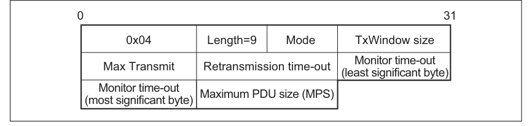

**Figure 5.5:  Retransmission and Flow Control option format**

The option data fields are:
• Mode (1 octet) The field contains the requested mode of the link. Possible values are shown in Table 5.2.

| Value | Description |
| --- | --- |
| 0x00 | L2CAP Basic Mode |
| 0x01 | Retransmission mode |
| 0x02 | Flow control mode |
| 0x03 | Enhanced Retransmission mode |
| 0x04 | Streaming mode |
| Other | Reserved for future use |

Table 5.2:  Mode definitions
The Basic L2CAP mode is the default. If Basic L2CAP mode is requested then all other parameters shall be ignored. Enhanced Retransmission mode should be enabled if a reliable channel has been requested. Enhanced Retransmission mode shall only be sent to an L2CAP entity that has previously advertised support for the mode in its Extended Feature Mask (see Section 4.12). Streaming mode should be enabled if a finite L2CAP Flush Time-Out is set on an L2CAP connection. Streaming mode shall only be sent to a device that has previously advertised support for the mode in the Extended Feature Mask (see Section 4.12).
Flow Control mode and Retransmission mode shall only be used for backwards compatibility with L2CAP entities that do not support Enhanced Retransmission mode or Streaming mode.
• TxWindow size (1 octet) This field specifies the size of the transmission window for Flow Control mode, Retransmission mode, and Enhanced Retransmission mode. The range is 1 to 32 for Flow Control mode and Retransmission mode. The range is 1 to 63 for Enhanced Retransmission mode. In Retransmission mode and Flow Control mode this parameter should be negotiated to reflect the buffer sizes allocated for the connection on both sides. In general, the Tx Window size should be made as large as possible to maximize channel utilization. Tx Window size also controls the delay on flow control action. The transmitting device can send as many PDUs fit within the window. In Enhanced Retransmission mode this value indicates the maximum number of I-frames that the sender of the option can receive without acknowledging some of the received frames. It is not negotiated. It is an informational parameter that each L2CAP entity can specify separately. In general, the TxWindow size should be made as large as possible to maximize channel utilization. The transmitting L2CAP entity can send as many PDUs as will fit within the receiving L2CAP entity's TxWindow. TxWindow size values in a Configuration Response indicate the maximum number of packets the sender can send before it requires an acknowledgment. In other words it represents the number of unacknowledged packets the send can hold. The value sent in a Configuration Response shall be less than or equal to the TxWindow size sent in the Configuration Request. The receiver of this option in the Configuration Response may use this value as part of its acknowledgment algorithm.
In Streaming mode this value is reserved for future use.
• MaxTransmit (1 octet) This field controls the number of transmissions of a single I-frame that L2CAP is allowed to try in Retransmission mode and Enhanced Retransmission mode. The minimum value is 1 (one transmission is permitted). MaxTransmit controls the number of retransmissions that L2CAP is allowed to try in Retransmission mode and Enhanced Retransmission mode before accepting that a packet and the channel is lost. When a packet is lost after being transmitted MaxTransmit times the channel shall be disconnected by sending a Disconnect request (see Section 4.6). In Enhanced Retransmission mode MaxTransmit controls the number of retransmissions for I-frames and S-frames with P-bit set to 1. The sender of the option in a Configuration Request specifies the value that shall be used by the receiver of the option. MaxTransmit values in a Configuration Response shall be ignored. Lower values might be appropriate for services requiring low latency. Higher values will be suitable for a link requiring robust operation. A value of 1 means that no retransmissions will be
made but also means that the channel will be disconnected as soon as a packet is lost. MaxTransmit shall not be set to zero in Retransmission mode. In Enhanced Retransmission mode a value of zero for MaxTransmit means infinite retransmissions. In Streaming mode this value is reserved for future use.
• Retransmission time-out (2 octets) This is the value in milliseconds of the retransmission time-out (this value is used to initialize the RetransmissionTimer). The purpose of this timer in retransmission mode is to activate a retransmission in some exceptional cases. In such cases, any delay requirements on the channel may be broken, so the value of the timer should be set high enough to avoid unnecessary retransmissions due to delayed acknowledgments. Suitable values could be 100’s of milliseconds and up. The purpose of this timer in flow control mode is to supervise I-frame transmissions. If an acknowledgment for an I-frame is not received within the time specified by the RetransmissionTimer value, either because the I- frame has been lost or the acknowledgment has been lost, the timeout will cause the transmitting side to continue transmissions. Suitable values are implementation dependent. The purpose of this timer in Enhanced Retransmission mode is to detect lost I-frames and initiate appropriate error recovery. The value used for the Retransmission time-out is specified in Section 8.6.2. The value sent in a Configuration Request is also specified in Section 8.6.2. A value for the Retransmission time-out shall be sent in a positive Configuration Response and indicates the value that will be used by the sender of the Configuration Response. In Streaming mode this value is reserved for future use.
• Monitor time-out (2 octets) In Retransmission mode this is the value in milliseconds of the interval at which S-frames should be transmitted on the return channel when no frames are received on the forward channel. (this value is used to initialize the MonitorTimer, see below). This timer ensures that lost acknowledgments are retransmitted. Its main use is to recover Retransmission Disable Bit changes in lost frames when no data is being sent. The timer shall be started immediately upon transitioning to the open state. It shall remain active as long as the connection is in the open state and the retransmission timer is not active. Upon expiration of the Monitor timer an S-frame shall be sent and the timer shall be restarted. If the monitor timer is already active when an S-frame is sent, the timer shall be restarted. An idle connection will have periodic monitor traffic sent in both directions. The value for this time-out should also be set to 100’s of milliseconds or higher. In Enhanced Retransmission mode the Monitor time-out is used to detect lost S-frames with P-bit set to 1. If the time-out occurs before a response
with the F-bit set to 1 is received the S-frame is resent. The value used for the Monitor time-out is specified in Section 8.6.3. The value sent in a Configuration Request is also specified in Section 8.6.2. A value for the Monitor time-out shall be sent in a positive Configuration Response and indicates the value that will be used by the sender of the Configuration Response. In Streaming mode this value is reserved for future use.
• Maximum PDU payload Size - MPS (2 octets) The maximum size of payload data in octets that the L2CAP layer entity sending the option in a Configuration Request is capable of accepting, i.e. the MPS corresponds to the maximum PDU payload size. Values used for MPS should take into account all possible Controllers to which the channel might be moved given that the MPS value cannot be renegotiated once the channel is created. Each device specifies the value separately. An MPS value sent in a positive Configuration Response is the actual MPS the receiver of the Configuration Request will use on this channel for traffic flowing into the local device. An MPS value sent in a positive Configuration Response shall be equal to or smaller than the value sent in the Configuration Request.
When using Retransmission mode and Flow Control mode the settings are configured separately for the two directions of an L2CAP connection. For example, in operating with an L2CAP entity implementing an earlier version of the core specification, an L2CAP connection can be configured as Flow Control mode in one direction and Retransmission mode in the other direction. If Basic L2CAP mode is configured in one direction and Retransmission mode or Flow control mode is configured in the other direction on the same L2CAP channel then the channel shall not be used.
Note: This asymmetric configuration only occurs during configuration.
When using Enhanced Retransmission mode or Streaming mode, both directions of the L2CAP connection shall be configured to the same mode. A precedence algorithm shall be used by both devices so a mode conflict can be resolved in a quick and deterministic manner.
There are two operating states:
• A device has a preferred mode but is willing to use another mode (known as "state 1"), and
• A device requires a specific mode (known as "state 2"). This includes cases where channels are created over AMP-U logical links or ACL-U logical links operating as described in Section 7.10.
In state 1, Basic L2CAP mode has the highest precedence and shall take precedence over Enhanced Retransmission mode and Streaming mode. Enhanced Retransmission mode has the second highest precedence and shall take precedence over all other modes except Basic L2CAP mode. Streaming
mode shall have the next level of precedence after Enhanced Retransmission mode.
In state 2, a layer above L2CAP requires Enhanced Retransmission mode or Streaming mode. In this case, the required mode takes precedence over all other modes.
A device does not know in which state the remote device is operating so the state 1 precedence algorithm assumes that the remote device may be a state 2 device. If the mode proposed by the remote device has a higher precedence (according to the state 1 precedence) then the algorithm will operate such that creation of a channel using the remote device's mode has higher priority than disconnecting the channel.
The algorithm for state 1 devices is divided into two parts. Part one covers the case where the remote device proposes a mode with a higher precedence than the state 1 local device. Part two covers the case where the remote device proposes a mode with a lower precedence than the state 1 local device. Part one of the algorithm is as follows:
• When the remote device receives the Configuration Request from the local device it will either reject the local device's Configuration Request by sending a negative Configuration Response or disconnect the channel. The negative Configuration Response will contain the remote device's desired mode.
• Upon receipt of the negative Configuration Response the local device shall either send a second Configuration Request proposing the mode contained in the remote device's negative Configuration Response or disconnect the channel.
• When the local device receives the Configuration Request from the remote device it shall send a positive Configuration Response or disconnect the channel.
• If the mode in the remote Device's negative Configuration Response does not match the mode in the remote device's Configuration Request then the local device shall disconnect the channel.
Part two of the algorithm is as follows:
• When the local device receives the Configuration Request from the remote device it shall reject the Configuration Request by sending a negative Configuration Response proposing its desired mode. The local device's desired mode shall be the same mode it sent in its Configuration Request. Upon receiving the negative Configuration Response the remote device will either send a second Configuration Request or disconnect the channel.
• If the local device receives a second Configuration Request from the remote device that does not contain the desired mode then the local device shall disconnect the channel.
• If the local device receives a negative Configuration Response then it shall disconnect the channel.
An example of the algorithm for state 1 devices is as follows:
• The remote device proposes Basic L2CAP mode in a Configuration Request and the local device proposes Enhanced Retransmission mode or Streaming mode. The remote device rejects the local device's Configuration Request by sending a negative Configuration Response proposing Basic mode. The local device will send a second Configuration Request proposing Basic L2CAP mode or disconnect the channel. If the local device sends a second Configuration Request that does not propose Basic L2CAP mode then the remote device will disconnect the channel. If the local device rejects the remote device's Configuration Request then the remote device will disconnect the channel.
The algorithm for state 2 devices is as follows:
• If the local device proposes a mode in a Configuration Request and the remote device proposes a different mode or rejects the local device's Configuration Request then the local device shall disconnect the channel.
For Enhanced Retransmission mode and Streaming mode the Retransmission time-out and Monitor Time-out parameters of the Retransmission and Flow Control option parameters may be changed but all other parameters shall not be changed in a subsequent reconfiguration after the channel has reached the OPEN state.

### 5.5   FRAME CHECK SEQUENCE (FCS) OPTION

This option is used to specify the type of Frame Check Sequence (FCS) that will be included on S/I-frames that are sent. It is non-negotiable. The FCS option shall only be used when the mode is being, or is already configured to Enhanced Retransmission mode or Streaming mode. Note: The FCS option can be reconfigured only when the mode is Enhanced Retransmission mode or Streaming mode. Implementations may reconfigure the FCS when L2CAP channels are moved between Controllers. The Frame Check Sequence option is type 0x05. "No FCS" shall only be used if both L2CAP entities send the FCS Option with value 0x00 (No FCS) in a configuration request. If one L2CAP entity sends the FCS Option with "No FCS" in a configuration request and the other L2CAP sends the FCS Option with a value other than "No FCS" then the default shall be used. If one or both L2CAP entities do not send the FCS option in a configuration request then the default shall be used.

**Figure 5.6:  FCS option format**

The FCS types are shown in Table 5.3

| Value | Description |
| --- | --- |
| 0x00 | No FCS |
| 0x01 | 16-bit FCS defined in section 3.3.5 (default) |
| Other | Reserved for Future Use |

Table 5.3:  FCS types
Value of 0x00 is set when the sender wishes to omit the FCS from S/I-frames.
This option shall only be sent if the peer L2CAP entity has indicated support for the FCS Option in the Extended Features Mask (see Section 4.12).

### 5.6   EXTENDED FLOW SPECIFICATION OPTION

This option specifies a flow specification for requesting a desired Quality of Service (QoS) on a channel. It is non-negotiable. The Extended Flow Specification shall be supported on all channels created over AMP-U logical links. Optionally, Extended Flow Specification may be supported on channels created over ACL-U logical links (see Section 7.10). If both devices show support for Extended Flow Specification for BR/EDR in the Extended Feature mask (see Table 4.12) then all channels created between the two devices shall use an Extended Flow Specification. The Quality of Service option and Flush Timeout option shall not be used if the Extended Flow Specification is used.
The parameters in the Extended Flow Specification option specify the traffic stream in the outgoing direction (transmitted traffic). Extended Flow Specification option is type 0x06.

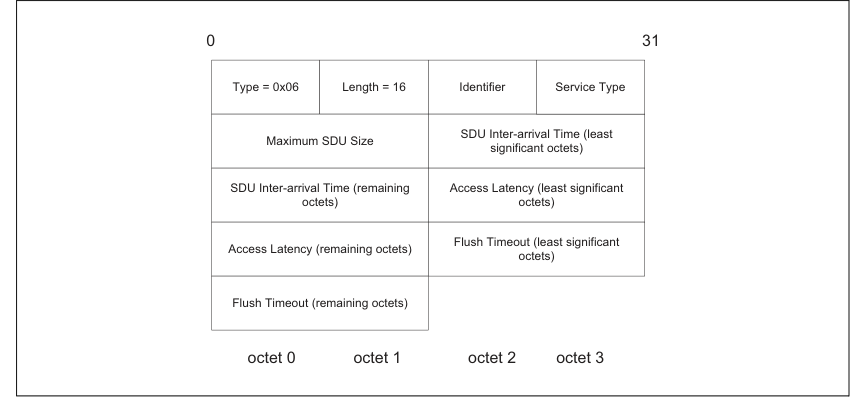

**Figure 5.7:  Extended Flow Specification option format**

If no Extended Flow Specification is provided by the upper layer, an Extended Flow Specification with following default values shall be used:

| Qos Parameter | Default Value |
| --- | --- |
| Identifier | 0x01 |
| Service Type | Best Effort |
| Maximum SDU size | 0xFFFF |
| SDU Inter-arrival Time | 0xFFFFFFFF |
| Access Latency | 0xFFFFFFFF |
| Flush Timeout | 0xFFFFFFFF |

Table 5.4:  Default Values for Extended Flow Specification
For a Best Effort channel no latency, air-time or bandwidth guarantees shall be assumed.
The parameters of the Extended Flow Specification are shown in Table 5.5:

| QoS parameter | Parameter Size in Octets | Unit |
| --- | --- | --- |
| Identifier | 1 | na |
| Service Type | 1 | na |
| Maximum SDU Size | 2 | octets |
| SDU Inter-arrival Time | 4 | microseconds |

Table 5.5:  Traffic parameters for L2CAP QoS configuration

| QoS parameter | Parameter Size in Octets | Unit |
| --- | --- | --- |
| Access Latency | 4 | microseconds |
| Flush Timeout | 4 | microseconds |

Table 5.5:  Traffic parameters for L2CAP QoS configuration
• Identifer (1 octet) This field provides a unique identifier for the flow specification. This identifier is used by some Controllers in the process of setting up the QoS request. Each active flow specification sent by a device to configure an L2CAP channel shall have a unique Identifier. An Identifier can be reused when the L2CAP channel associated with the flow spec is disconnected. The Identifier shall be unique within the scope of a physical link. Extended Flow Specifications for channels on different physical links may have the same Identifier. The Identifier for an Extended Flow Specification with Service Type Best Effort shall be 0x01. Note: Since the Identifier for an Extended Flow Specification with Service Type Best Effort is fixed to 0x01 it is possible to generate a Best Effort Extended Flow Specification for the remote device without performing the Lockstep Configuration process. (The Lockstep Configuration process is described in Section 7.1.3). This allows a Best Effort channel created over the ACL-U logical link without using the Lockstep configuration procedure to be moved to an AMP-U logical link. It is not possible to move a Guaranteed channel created over the ACL-U logical link to an AMP-U logical link unless the Lockstep configuration procedure is used during channel creation. This is because the Identifier for the remote device's Extended Flow Specification with Service Type Guaranteed is not known.
• Service Type (1 octet) This field indicates the level of service required. Table 5.6 defines the different Service Types values. The default value is 'Best effort'. If 'Best effort' is selected then Access Latency and Flush Timeout shall both be set to 0xFFFFFFFF. Maximum SDU size and SDU Inter-arrival Time are used to indicate the maximum data rate that the application can deliver to L2CAP for transmission. This is useful for high speed Controllers so they do not reserve more bandwidth than the application can deliver. The remote device should respond with lower settings indicating the maximum rate at which it can receive data (for example, maximum rate data it can write to a mass storage device, etc.). Values of 0xFFFF for Maximum SDU size and 0xFFFFFFFF for SDU Inter-arrival time are used when the actual values are not known. If Maximum SDU size is set to 0xFFFF then SDU Inter-arrival time shall be set to 0xFFFFFFFF, if SDU Inter-arrival time is set to 0xFFFFFFFF then Maximum SDU size shall be set to 0xFFFF. This tells the Controller to allocate as much bandwidth as possible.
If “Guaranteed” is selected the QoS parameters can be used to identify different types of Guaranteed traffic.
• Guaranteed bandwidth traffic is traffic with a minimum data rate but no particular latency requested. Latency will be related to the link supervision timeout. For this type of traffic Access Latency is set to 0xFFFFFFFF.
• Guaranteed Latency traffic is traffic with only latency requirements. For this type of traffic SDU Inter-arrival time is set to 0xFFFFFFFF. HID interrupt channel and AVRCP are examples of this type of traffic.
• Both Guaranteed Latency and Bandwidth traffic has both a latency and bandwidth requirement. An example is Audio/Video streaming.
If 'No Traffic' is selected the remainder of the fields shall be ignored because there is no data being sent across the channel in the outgoing direction.

| Value | Description |
| --- | --- |
| 0x00 | No Traffic |
| 0x01 | Best effort (Default) |
| 0x02 | Guaranteed |
| Other | Reserved for Future Use |

Table 5.6:  Service Type definitions
A channel shall not be configured as “Best Effort” in one direction and “Guaranteed” in the other direction. If a channel is configured in this way it shall be disconnected. A channel may be configured as “No Traffic” in one direction and “Best Effort” in the other direction. The “No Traffic” refers to the application traffic not the Enhanced Retransmission mode supervisory traffic. A channel configured in this way is considered to have a service type of Best Effort. A channel may be configured as “No Traffic” in one direction and “Guaranteed” in the other direction. A channel configure in this way is considered to have a service type of Guaranteed.
Once configured the service type of a channel shall not be changed during reconfiguration.
• Maximum SDU Size (2 octets) The Maximum SDU Size parameter specifies the maximum size of the SDUs transmitted by the application. If the Service Type is “Guaranteed” then traffic submitted to L2CAP with a larger size is considered non- conformant. QoS guarantees are only provided for conformant traffic.
• SDU Inter-arrival time (4 octets) The SDU Inter-arrival time parameter specifies the time between consecutive SDUs generated by the application. For streaming traffic, SDU Inter-arrival time should be set to the average time between SDUs. For variable rate traffic and best effort traffic, SDU Inter-arrival time should be set to the minimum time between SDUs. If the Service Type is “Guaranteed”
then traffic submitted to L2CAP with a smaller interval, is considered non- conformant. QoS guarantees are only provided for conformant traffic.
• Access Latency (4 octets) The Access Latency parameter specifies the maximum delay between consecutive transmission opportunities on the air-interface for the connection. Note that access latency is based on the time base of the Controller, which may or may not be synchronous to the time base being used by the Host or the application. For streaming traffic (for example, A2DP), the Access Latency should be set to indicate the time budgeted for transmission of the data over the air, and would normally be roughly equal to the Flush Timeout minus the duration of streaming data which can be stored in the receive side application buffers. For non-streaming, bursty traffic (i.e. HID and AVRCP), the Access Latency parameter value sent in the L2CAP Configuration Request should be set to the desired latency, minus any HCI transport delays and any other stack delays that may be expected on the device and on target Host systems. The remote device receiving the L2CAP Configuration Request may send an Access Latency parameter value in the L2CAP Configuration Response which is equal to or lower than the value it received. The remote device may send a lower value to account for other traffic it may be carrying, or overhead activities it may be carrying out. If HCI is used then the Host should take into account the latency of the HCI transport when determining the value for the Access Latency. For example if the application requires an Access Latency of 20ms and the HCI transport has a latency of 5 ms then the value for Access Latency should be 15ms.
• Flush Timeout (4 Octets) The Flush Timeout defines a maximum period after which all segments of the SDU are flushed from L2CAP and the Controller. A Flush Timeout value of 0xFFFFFFFF indicates that data will not be discarded by the transmitting side, even if the link becomes congested. Note that in this case data is treated as reliable, and is never flushed. The device receiving the L2CAP Configuration Request with Flush Timeout set to 0xFFFFFFFF should not modify this parameter. The Flush Timeout for a “Best Effort” channel shall be set to 0xFFFFFFFF. However, if the Traffic Type is “Guaranteed” and the transmit side buffer is limited, then the Flush Timeout parameter given in the L2CAP Configuration Request may be set to a value corresponding to the duration of streaming data which the transmit buffer can hold before it must begin discarding data. The side receiving the L2CAP Configuration Request may then set the Flush Timeout parameter in the L2CAP Configuration Response to a lower value if the receive side buffer is smaller than the transmit side buffer. Note that the total available buffer space is typically a combination of application buffers, any buffers maintained by the L2CAP implementation, and HCI buffers provided by the Controller. The Flush Timeout should normally be set to a value which is larger than the Access Latency, and which also accounts for buffers maintained by the application on the receive side such as de-jitter buffers used in audio and video streaming applications. In general, the Flush Timeout value should be selected to ensure that the Flush Timeout expires when the application buffers are about to be exhausted. Flush Timeout may be set to 0x00000000 to indicate that no retransmissions are to occur. Data may be flushed immediately after transmission in this case. This behavior is useful in applications such as gaming where the tolerable latency is on the order of a few milliseconds, and hence the information contained in a packet will become stale very rapidly. In such applications, it is preferable to send “fresher” data if the last SDU submitted for transmission was not transmitted as a result of interference.

### 5.7   EXTENDED WINDOW SIZE OPTION

This option is used to negotiate the maximum extended window size. The Extended Window Size option is type 0x07 and is non-negotiable.

**Figure 5.8:  Extended Window Size option format**

The allowable values for the Maximum Extended Window Size are:

| Value | Description |
| --- | --- |
| 0x0000 | Invalid value for Enhanced Retransmission mode Valid for Streaming mode |
| 0x0001 - 0x3FFF | Valid maximum window size (frames) for Enhanced Retransmission mode. Invalid for Streaming mode |
| Other | Reserved for Future Use |

Table 5.7:  Extended Window Size values
This option shall only be sent if the peer L2CAP entity has indicated support for the Extended Window size feature in the Extended Features Mask (see Section 4.12).
This option shall be ignored if the channel is configured to use Basic L2CAP Mode (see Section 5.4).
For Enhanced Retransmission mode, this option has the same directional semantics as the Retransmission and Flow Control option (see Section 5.4). The sender of a Configuration Request command containing this option is suggesting the maximum window size (possibly based on its own internal L2CAP receive buffer resources) that the peer L2CAP entity should use when sending data.
For Streaming mode, this option is used to enable use of the Extended Control Field and if sent, shall have a value of 0.
If this option is successfully configured then the Maximum Window Size negotiated using the Retransmission and Flow Control option (see Section 5.4) shall be ignored.
If this option is successfully configured in either direction then both L2CAP entities shall use the Extended Control Fields in all S/I-frames (see Section 3.3.2).
If the option is only configured in one direction then the maximum window size for the opposite direction shall be taken from the maximum window size value in the existing Retransmission and Flow Control option. In this configuration both L2CAP entities shall use the extended control fields in all S/I-frames.

## 6  STATE MACHINE

This section is informative. The state machine does not necessarily represent all possible scenarios.

### 6.1   GENERAL RULES FOR THE STATE MACHINE:

• It is implementation specific, and outside the scope of this specification, how the transmissions are triggered.
• “Ignore” means that the signal can be silently discarded.
The following states have been defined to clarify the protocol; the actual number of states and naming in a given implementation is outside the scope of this specification:
• CLOSED – channel not connected.
• WAIT_CONNECT – a connection request has been received, but only a connection response with indication “pending” can be sent.
• WAIT_CONNECT_RSP – a connection request has been sent, pending a positive connect response.
• CONFIG – the different options are being negotiated for both sides; this state comprises a number of substates, see Section 6.1.3
• OPEN – user data transfer state.
• WAIT_DISCONNECT – a disconnect request has been sent, pending a disconnect response.
• WAIT_CREATE – a channel creation request has been received, but only a response with indication “pending” can be sent. This state is similar to WAIT_CONNECT.
• WAIT_CREATE_RSP – a channel creation request has been sent, pending a channel creation response. This state is similar to WAIT_CONNECT_RSP.
• WAIT_MOVE – a request to move the current channel to another Controller has been received, but only a response with indication “pending” can be sent.
• WAIT_MOVE_RSP – a request to move a channel to another Controller has been sent, pending a move response
• WAIT_MOVE_CONFIRM – a response to the move channel request has been sent, waiting for a confirmation of the move operation by the initiator side
• WAIT_CONFIRM_RSP – a move channel confirm has been sent, waiting for a move channel confirm response.
In the following state tables and descriptions, the L2CAP_Data message corresponds to one of the PDU formats used on connection-oriented data channels as described in section 3, including PDUs containing B-frames, I- frames, S-frames.
Some state transitions and actions are triggered only by internal events effecting one of the L2CAP entity implementations, not by preceding L2CAP signaling messages. It is implementation-specific and out of the scope of this specification, how these internal events are realized; just for the clarity of specifying the state machine, the following abstract internal events are used in the state event tables, as far as needed:
• OpenChannel_Req – a local L2CAP entity is requested to set up a new connection-oriented channel.
• OpenChannel_Rsp – a local L2CAP entity is requested to finally accept or refuse a pending connection request.
• ConfigureChannel_Req – a local L2CAP entity is requested to initiate an outgoing configuration request.
• CloseChannel_Req – a local L2CAP entity is requesed to close a channel.
• SendData_Req – a local L2CAP entity is requested to transmit an SDU.
• ReconfigureChannel_Req – a local L2CAP entity is requested to reconfigure the parameters of a connection-oriented channel.
• OpenChannelCntrl_Req – a local L2CAP entity is requested to set up a new connection over a Controller identified by a Controller ID.
• OpenChannelCntrl_Rsp – a local L2CAP entity is requested to internally accept or refuse a pending connection over a Controller identified by a Controller ID.
• MoveChannel_Req – a local L2CAP entity is requested to move the current channel to another Controller.
• ControllerLogicalLinkInd – a Controller indicates the acceptance or rejection of a logical link request with an Extended Flow Specification.
There is a single state machine for each L2CAP connection-oriented channel that is active. A state machine is created for each new L2CAP_ConnectReq received. The state machine always starts in the CLOSED state.
To simplify the state event tables, the RTX and ERTX timers, as well as the handling of request retransmissions are described in Section 6.1.7 and not included in the state tables.
L2CAP messages not bound to a specific data channel and thus not impacting a channel state (e.g. L2CAP_InformationReq, L2CAP_EchoReq) are not covered in this section.
The following states and transitions are illustrated in Figure 6.1.

#### 6.1.1  CLOSED state

| Event | Condition | Action | Next State |
| --- | --- | --- | --- |
| OpenChannel req _ | - | Send L2CAP _ ConnectReq | WAIT _ CONNECT RSP _ |
| L2CAP ConnectReq _ | Normal, connection is possible | Send L2CAP _ ConnectRsp (success) | CONFIG (substate WAIT CONFIG) _ |
| L2CAP ConnectReq _ | Need to indicate pending | Send L2CAP _ ConnectRsp (pending) | WAIT CONNEC _ |
| L2CAP ConnectReq _ | No resource, not approved, etc. | Send L2CAP _ ConnectRsp (refused) | CLOSED |
| L2CAP ConnectRsp _ | - | Ignore | CLOSED |
| L2CAP ConfigReq _ | - | Send L2CAP _ CommandReject (with reason Invalid CID) | CLOSED |
| L2CAP ConfigRsp _ | - | Ignore | CLOSED |
| L2CAP _ DisconnectReq | - | Send L2CAP _ DisconnectRsp | CLOSED |
| L2CAP DisconnectRsp _ | - | Ignore | CLOSED |
| L2CAP Data _ | - | Ignore | CLOSED |
| OpenChannelCntrl _ Req |  | Send L2CAP _ CreateChanReq | WAIT _ CREATE RSP _ |
| L2CAP _ CreateChanReq | Normal, connection is possible | Send L2CAP CreateChanRsp _ (success) | CONFIG |
| L2CAP _ CreateChanReq | Need to indicate pending | Send L2CAP CreateChanRsp _ (pending) | WAIT CREATE _ |
| L2CAP _ CreateChanReq | No resource, not approved | Send L2CAP CreateChanRsp _ (refused) | CLOSED |
| L2CAP _ CreateChanRsp |  | Ignore | CLOSED |
| L2CAP MoveChanReq _ |  | Ignore | CLOSED |
| L2CAP MoveChanRsp _ |  | Ignore | CLOSED |
| L2CAP _ MoveChanConfirm |  | Ignore | CLOSED |
| L2CAP _ MoveChanConfirmRsp |  | Ignore | CLOSED |

Table 6.1:  CLOSED state event table
Notes. The L2CAP_ConnectReq message is not mentioned in any of the other states apart from the CLOSED state, as it triggers the establishment of a new channel, thus the branch into a new instance of the state machine.

#### 6.1.2  WAIT_CONNECT_RSP state

| Event | Condition | Action | Next State |
| --- | --- | --- | --- |
| L2CAP ConnectRsp _ | Success indi- cated in result | Send L2CAP _ ConfigReq | CONFIG (substate WAIT CON- _ FIG) |
| L2CAP ConnectRsp _ | Result pending | - | WAIT CONNECT RSP _ _ |
| L2CAP ConnectRsp _ | Remote side refuses connec- tion | - | CLOSED |
| L2CAP ConfigReq _ | - | Send L2CAP _ CommandReject (with reason Invalid CID) | WAIT CONNECT RSP _ _ |
| L2CAP ConfigRsp _ | - | Ignore | WAIT CONNECT RSP _ _ |
| L2CAP DisconnectRsp _ | - | Ignore | WAIT CONNECT RSP _ _ |
| L2CAP Data _ | - | Ignore | WAIT CONNECT RSP _ _ |
| L2CAP _ CreateChanReq |  | Ignore | WAIT CONNECT RSP _ _ |
| L2CAP _ CreateChanRsp |  | Ignore | WAIT CONNECT RSP _ _ |
| L2CAP MoveChanReq _ |  | Ignore | WAIT CONNECT RSP _ _ |
| L2CAP MoveChanRsp _ |  | Ignore | WAIT CONNECT RSP _ _ |
| L2CAP _ MoveChanConfirm |  | Ignore | WAIT CONNECT RSP _ _ |
| L2CAP _ MoveChanConfirmRsp |  | Ignore | WAIT CONNECT RSP _ _ |

Table 6.2:  WAIT_CONNECT_RSP state event table
Notes. An L2CAP_DisconnectReq message is not included here, since the Source and Destination CIDs are not available yet to relate it correctly to the state machine of a specific channel.

#### 6.1.3  WAIT_CONNECT state

| Event | Condition | Action | Next State |
| --- | --- | --- | --- |
| OpenChannel Rsp _ | Pending connec- tion request is finally acceptable | Send L2CAP Con- _ nect Rsp (success) _ | CONFIG (substate WAIT _ CONFIG) |
| OpenChannel Rsp _ | Pending connec- tion request is finally refused | Send L2CAP Con- _ nect Rsp (refused) _ | CLOSED |
| L2CAP ConnectRsp _ | - | Ignore | WAIT CONNEC _ |
| L2CAP ConfigRsp _ | - | Ignore | WAIT CONNEC _ |
| L2CAP DisconnectRsp _ | - | Ignore | WAIT CONNEC _ |
| L2CAP Data _ | - | Ignore | WAIT CONNEC _ |
| L2CAP _ CreateChanReq |  | Ignore | WAIT CONNEC _ |
| L2CAP _ CreateChanRsp |  | Ignore | WAIT CONNEC _ |
| L2CAP MoveChanReq _ |  | Ignore | WAIT CONNEC _ |
| L2CAP MoveChanRsp _ |  | Ignore | WAIT CONNEC _ |
| L2CAP _ MoveChanConfirm |  | Ignore | WAIT CONNEC _ |
| L2CAP _ MoveChanConfirmRsp |  | Ignore | WAIT CONNEC _ |

Table 6.3:  WAIT_CONNECT state event table
Notes. An L2CAP_DisconnectReq or L2CAP_ConfigReq message is not included here, since the Source and Destination CIDs are not available yet to relate it correctly to the state machine of a specific channel.

#### 6.1.4  CONFIG state

Two configuration processes exist as described in Section 7.1. The configuration processes are the Standard process and the Lockstep process.
In the Standard and Lockstep configuration processes both L2CAP entities initiate a configuration request during the configuration process. This means that each device adopts an initiator role for the outgoing configuration request, and an acceptor role for the incoming configuration request. Configurations in both directions may occur sequentially, but can also occur in parallel.
In the Lockstep configuration process both L2CAP entities send Configuration Request packets and receive Configuration Response packets with a pending result code before submitting the flow specifications to their local Controllers. A final Configuration Response packet is sent by each L2CAP entity indicating the response from its local Controller.
The following substates are distinguished within the CONFIG state:
• WAIT_CONFIG – a device has sent or received a connection response, but has neither initiated a configuration request yet, nor received a configuration request with acceptable parameters.
• WAIT_SEND_CONFIG – for the initiator path, a configuration request has not yet been initiated, while for the response path, a request with acceptable options has been received.
• WAIT_CONFIG_REQ_RSP – for the initiator path, a request has been sent but a positive response has not yet been received, and for the acceptor path, a request with acceptable options has not yet been received.
• WAIT_CONFIG_RSP – the acceptor path is complete after having responded to acceptable options, but for the initiator path, a positive response on the recent request has not yet been received.
• WAIT_CONFIG_REQ – the initiator path is complete after having received a positive response, but for the acceptor path, a request with acceptable options has not yet been received.
• WAIT_IND_FINAL_RSP – for both the initiator and acceptor, the Extended Flow Specification has been sent to the local Controller but neither a response from Controller nor the final configuration response has yet been received.
• WAIT_FINAL_RSP – the device received an indication from the Controller accepting the Extended Flow Specification and has sent a positive response. It is waiting for the remote device to send a configuration response.
• WAIT_CONTROL_IND – the device has received a positive response and is waiting for its Controller to accept or reject the Extended Flow Specification.
According to Section 6.1.1 and Section 6.1.2, the CONFIG state is entered via WAIT_CONFIG substate from either the CLOSED state, the WAIT_CONNECT state, or the WAIT_CONNECT_RSP state. The CONFIG state is left for the OPEN state if both the initiator and acceptor paths complete successfully.
For better overview, separate tables are given: Table 6.4 shows the success transitions; therein, transitions on one of the minimum paths (no previous non- success transitions) are shaded. Table 6.5 shows the non-success transitions within the configuration process, and Table 6.6 shows further transition cause by events not belonging to the configuration process itself. The following configuration states and transitions are illustrated in Figure 6.2.

| Previous state | Event | Condition | Action | Next State |
| --- | --- | --- | --- | --- |
| WAIT CONFIG _ | ConfigureChannel _ Req | Standard process | Send L2CAP _ ConfigReq | WAIT _ CONFIG _ REQ RSP _ |
| WAIT CONFIG _ | ConfigureChannel _ Req | Lockstep process | Send L2CAP _ Config Req (Ext Flow Spec plus other options) | WAIT _ CONFIG _ REQ RSP _ |
| WAIT CONFIG _ | L2CAP ConfigReq _ | Options acceptable Standard process | Send L2CAP _ ConfigRsp (success) | WAIT SEND _ _ CONFIG |
| WAIT CONFIG _ | L2CAP ConfigReq _ | Options acceptable Lockstep process | Send L2CAP _ ConfigRsp (pending) | WAIT SEND _ _ CONFIG |
| WAIT CONFIG _ _ REQ RSP _ | L2CAP ConfigReq _ | Options acceptable | Send L2CAP _ ConfigRsp (success) | WAIT _ CONFIG RSP _ |
| WAIT CONFIG _ _ REQ RSP _ | L2CAP ConfigRsp _ | Remote side accepts options | (continue wait- ing for configu- ration request) | WAIT _ CONFIG REQ _ |
| WAIT CONFIG _ _ REQ | L2CAP ConfigReq _ | Options acceptable Standard process | Send L2CAP _ ConfigRsp (success) | OPEN |
| WAIT CONFIG _ _ REQ | L2CAP ConfigReq _ | Options acceptable Lockstep process | Send L2CAP _ ConfigRsp (pending) | WAIT IND _ _ FINAL RSP _ |
| WAIT _ SEND CONFIG _ | ConfigureChannel _ Req | - | Send L2CAP _ ConfigReq | WAIT _ CONFIG RSP _ |
| WAIT CONFIG _ _ RSP | L2CAP ConfigRsp _ | Remote side accepts options Standard process | - | OPEN |

Table 6.4:  CONFIG state event table

| Previous state | Event | Condition | Action | Next State |
| --- | --- | --- | --- | --- |
| WAIT CONFIG _ _ RSP | L2CAP ConfigRsp _ | Remote side accepts option Lockstep proc |  | WAIT IND _ _ FINAL RSP _ |
| WAIT IND _ _ FINAL RSP _ | ControllerLogical LinkInd | Reject | Send L2CAP _ ConfigRsp (fail) | WAIT CONFI _ |
| WAIT IND _ _ FINAL RSP _ | ControllerLogical LinkInd | Accept | Send L2CAP _ ConfigRsp (success) | WAIT FINAL _ _ RSP |
| WAIT IND _ _ FINAL RSP _ | L2CAP ConfigRsp _ | Remote side fail |  | WAIT CONFI _ |
| WAIT IND _ _ FINAL RSP _ | L2CAP ConfigRsp _ | Remote side success |  | WAIT _ CONTROL _ IND |
| WAIT FINAL _ _ RSP | L2CAP ConfigRsp _ | Remote side fail |  | WAIT CONFI _ |
| WAIT FINAL _ _ RSP | L2CAP ConfigRsp _ | Remote side success |  | OPEN |
| WAIT _ CONTROL IND _ | ControllerLogical LinkInd | Reject | Send L2CAP _ ConfigRsp (fail) | WAIT CONFI _ |
| WAIT _ CONTROL IND _ | ControllerLogical LinkInd | Accept | Send L2CAP _ ConfigRsp (success) | OPEN |

Table 6.4:  CONFIG state event table  (Continued)

| Previous state | Event | Condition | Action | Next State |
| --- | --- | --- | --- | --- |
| WAIT CONFIG _ | L2CAP ConfigReq _ | Options not acceptable | Send L2CAP Confi- _ gRsp (fail) | WAIT CONFIG _ |
| WAIT CONFIG _ | L2CAP ConfigRsp _ | - | Ignore | WAIT CONFIG _ |
| WAIT SEND _ CONFIG _ | L2CAP ConfigRsp _ | - | Ignore | WAIT SEND _ CONFIG _ |
| WAIT CON- _ FIG REQ RSP _ _ | L2CAP ConfigReq _ | Options not acceptable | Send L2CAP Confi- _ gRsp (fail) | WAIT CON- _ FIG REQ RSP _ _ |
| WAIT CON- _ FIG REQ RSP _ _ | L2CAP ConfigRsp _ | Remote side rejects options | Send L2CAP Confi- _ gReq (new options) | WAIT CON- _ FIG REQ RSP _ _ |
| WAIT CON- _ FIG REQ _ | L2CAP ConfigReq _ | Options not acceptable | Send L2CAP Confi- _ gRsp (fail) | WAIT CON- _ FIG REQ _ |
| WAIT CON- _ FIG REQ _ | L2CAP ConfigRsp _ | - | Ignore | WAIT CON- _ FIG REQ _ |
| WAIT CON- _ FIG RSP _ | L2CAP ConfigRsp _ | Remote side rejects options | Send L2CAP Confi- _ gReq (new options) | WAIT CON- _ FIG RSP _ |

Table 6.5:  CONFIG state/substates event table: non-success transitions within configuration process

| Previous state | Event | Condition | Action | Next State |
| --- | --- | --- | --- | --- |
| CONFIG (any substate) | CloseChannel Req _ | Any internal reason to stop | Send L2CAP _ Disconnect Req | WAIT _ DISCONNECT |
| CONFIG (any substate) | L2CAP Disconnec- _ tReq | - | Send L2CAP _ Disconnect Rsp | CLOSED |
| CONFIG (any substate) | L2CAP Disconnec- _ tRsp | - | Ignore | CONFIG (remain in sub- state) |
| CONFIG (any substate) | L2CAP Data _ | - | Process the PDU | CONFIG (remain in sub- state) |

Table 6.6:  CONFIG state/substates event table: events not related to configuration process

| Previous state | Event | Condition | Action | Next State |
| --- | --- | --- | --- | --- |
| CONFIG (any substate) | L2CAP _ CreateChanReq |  | Ignore | CONFIG (remain in sub state) |
| CONFIG (any substate) | L2CAP _ CreateChanRsp |  | Ignore | CONFIG (remain in sub state) |
| CONFIG (any substate) | L2CAP _ MoveChanReq |  | Ignore | CONFIG (remain in sub state) |
| CONFIG (any substate) | L2CAP _ MoveChanRsp |  | Ignore | CONFIG (remain in sub state) |
| CONFIG (any substate) | L2CAP _ MoveChanConfirm |  | Ignore | CONFIG (remain in sub state) |
| CONFIG (any substate) | L2CAP _ MoveChanCon- firmRsp |  | Ignore | CONFIG (remain in sub state) |

Table 6.6:  CONFIG state/substates event table: events not related to configuration process
Notes:
- Receiving data PDUs (L2CAP_Data) in CONFIG state should be relevant only in case of a transition to a reconfiguration procedure (from OPEN state). Discarding the received data is allowed only in Retransmission Mode and Enhanced Retransmission Mode. Discarding an S-frame is allowed but not recommended. If a S-frame is dis- carded, the monitor timer will cause a new S-frame to be sent after a time out.
- Indicating a failure in a configuration response does not necessarily imply a failure of the overall configuration procedure; instead, based on the information received in the negative response, a modified configuration request may be triggered.

#### 6.1.5  OPEN state

| Event | Condition | Action | Next State |
| --- | --- | --- | --- |
| SendData req _ | - | Send L2CAP Data _ packet according to con- figured mode | OPEN |
| ReconfigureChannel _ Req | - | Complete outgoing SDU Send L2CAP ConfigReq _ | CONFIG (substate WAIT CONFIG _ _ REQ RSP) _ |
| CloseChannel Req _ | - | Send L2CAP Discon- _ nectReq | WAIT _ DISCONNECT |
| L2CAP ConnectRsp _ | - | Ignore | OPEN |
| L2CAP ConfigReq _ | Incoming config options accept- able | Complete outgoing SDU Send L2CAP _ ConfigRsp (ok) | CONFIG (substate WAIT SEND _ _ CONFIG) |
| L2CAP ConfigReq _ | Incoming config options not acceptable | Complete outgoing SDU Send L2CAP _ ConfigRsp (fail) | OPEN |
| L2CAP DisconnectReq _ | - | Send L2CAP _ DisconnectRsp | CLOSED |
| L2CAP DisconnectRsp _ | - | Ignore | OPEN |
| L2CAP Data _ | - | Process the PDU | OPEN |
| MoveChannel Req _ |  | Send L2CAP MoveChanReq _ | WAIT MOVE _ _ RSP |
| L2CAP _ CreateChanReq |  | Ignore | OPEN |
| L2CAP _ CreateChanRsp |  | Ignore | OPEN |
| L2CAP MoveChanReq _ | Logical Link cre- ate/modify is not needed | Send L2CAP MoveChanRsp _ (success) | WAIT MOVE _ _ CONFIRM |
| L2CAP MoveChanReq _ | Need to indicate pending (logical link create/mod- ify is needed) | Send L2CAP MoveChanRsp _ (pending) | WAIT MOVE _ |
| L2CAP MoveChanReq _ | No resource, not approved | Send L2CAP MoveChanRsp _ (refused) | WAIT MOVE _ _ CONFIRM |
| L2CAP MoveChanRsp _ |  | Ignore | OPEN |

Table 6.7:  OPEN state event table

| Event | Condition | Action | Next State |
| --- | --- | --- | --- |
| L2CAP _ MoveChanConfirm |  | Ignore | OPEN |
| L2CAP _ MoveChanConfirmRsp |  | Ignore | OPEN |

Table 6.7:  OPEN state event table
Note: The outgoing SDU shall be completed from the view of the remote entity. Therefore all PDUs forming the SDU shall have been reliably transmitted by the local entity and acknowledged by the remote entity, before entering the configuration state.

#### 6.1.6  WAIT_DISCONNECT state

| Event | Condition | Action | Next State |
| --- | --- | --- | --- |
| L2CAP ConnectRsp _ | - | Ignore | WAIT DISCONNEC _ |
| L2CAP ConfigReq _ | - | Send L2CAP _ CommandReject with reason Invalid CID | WAIT DISCONNEC _ |
| L2CAP ConfigRsp _ | - | Ignore | WAIT DISCONNEC _ |
| L2CAP DisconnectReq _ | - | Send L2CAP _ DisconnectRsp | CLOSED |
| L2CAP DisconnectRsp _ | - | - | CLOSED |
| L2CAP Data _ | - | Ignore | WAIT DISCONNEC _ |
| L2CAP _ CreateChanReq |  | Ignore | WAIT DISCONNEC _ |
| L2CAP _ CreateChanRsp |  | Ignore | WAIT DISCONNEC _ |
| L2CAP MoveChanReq _ |  | Ignore | WAIT DISCONNEC _ |
| L2CAP MoveChanRsp _ |  | Ignore | WAIT DISCONNEC _ |
| L2CAP _ MoveChanConfirm |  | Ignore | WAIT DISCONNEC _ |
| L2CAP _ MoveChanConfirmRsp |  | Ignore | WAIT DISCONNEC _ |

Table 6.8:  WAIT_DISCONNECT state event table

#### 6.1.7  WAIT_CREATE_RSP state

| Event | Condition | Action | Next State |
| --- | --- | --- | --- |
| L2CAP CreateChanReq _ |  | Ignore | WAIT CREATE RS _ _ |
| L2CAP CreateChanRsp _ | Success indicated in result | Send L2CAP ConfigReq _ | CONFIG (substate WAIT CONFIG) _ |
| L2CAP CreateChanRsp _ | Result pending |  | WAIT CREATE RS _ _ |
| L2CAP CreateChanRsp _ | Remote side refuses connection |  | CLOSED |
| L2CAP MoveChanReq _ |  | Ignore | WAIT CREATE RS _ _ |
| L2CAP MoveChanRsp _ |  | Ignore | WAIT CREATE RS _ _ |
| L2CAP MoveChanConfirm _ |  | Ignore | WAIT CREATE RS _ _ |
| L2CAP _ MoveChanConfirmRsp |  | Ignore | WAIT CREATE RS _ _ |

Table 6.9:  WAIT_CREATE_RSP state event table

#### 6.1.8  WAIT_CREATE state

| Event | Condition | Action | Next State |
| --- | --- | --- | --- |
| OpenChannelCntrl Req _ | - | Ignore | WAIT CREATE _ |
| OpenChannelCntrl Rsp _ | Pending connec- tion request is finally acceptable | Send L2CAP _ CreateChanRsp (success) | CONFIG |
| OpenChannelCntrl Rsp _ | Pending connec- tion request is finally refused | Send L2CAP _ CreateChanRsp (refused) | CLOSED |
| L2CAP CreateChanReq _ | - | Ignore | WAIT CREATE _ |
| L2CAP CreateChanRsp _ | - | Ignore | WAIT CREATE _ |
| L2CAP MoveChanReq _ | - | Ignore | WAIT CREATE _ |
| L2CAP MoveChanRsp _ | - | Ignore | WAIT CREATE _ |
| L2CAP _ MoveChanConfirm | - | Ignore | WAIT CREATE _ |
| L2CAP _ MoveChanConfirmRsp | - | Ignore | WAIT CREATE _ |

Table 6.10:  WAIT_CREATE state event table

#### 6.1.9  WAIT_MOVE_RSP state

| Event | Condition | Action | Next State |
| --- | --- | --- | --- |
| L2CAP MoveChanReq _ | Prioritization algorithm (remain initi- ator) | Send L2CAP _ MoveChanRsp (collision) | WAIT MOVE RSP _ _ |
| L2CAP MoveChanReq _ | Prioritization algorithm (become responder) and logical link create/ modify is needed) | Send L2CAP _ MoveChanRsp (pending) | WAIT MOVE _ |
| L2CAP MoveChanReq _ | Prioritization algorithm (become responder) and logical link create/ modify is not needed) | Send L2CAP _ MoveChanRsp (success) | WAIT MOVE CONFIR _ _ |
| L2CAP CreateChanRsp _ | - | Ignore | WAIT MOVE RSP _ _ |
| L2CAP CreateChanReq _ | - | Ignore | WAIT MOVE RSP _ _ |
| L2CAP MoveChanRsp _ | Result pend- ing | - | WAIT MOVE RSP _ _ |
| L2CAP MoveChanRsp _ | Remote side refuses move and/or local side refuses move (create/ modify logi- cal link fails) | Send L2CAP _ MoveChanConfirm (failure) | WAIT CONFIRM RSP _ _ |
| L2CAP MoveChanRsp _ | Both remote side and local side accepts move (create/ modify logical link succeeds) | Send L2CAP _ MoveChanConfirm (success) | WAIT CONFIRM RSP _ _ |
| L2CAP _ MoveChanConfirm | - | Ignore | WAIT MOVE RSP _ _ |
| L2CAP _ MoveChanConfirmRsp | - | Ignore | WAIT MOVE RSP _ _ |

Table 6.11:  WAIT_MOVE_RSP state event table

#### 6.1.10  WAIT_MOVE state

| Event | Condition | Action | Next State |
| --- | --- | --- | --- |
| ControllerLogicalLinkInd | Create/mod- ify logical link completed successfully | Send L2CAP _ MoveChanRsp (success) | WAIT MOVE _ _ CONFIRM |
| ControllerLogicalLinkInd | Create/mod- ify logical link completed with failure | Send L2CAP _ MoveChanRsp (refused) | WAIT MOVE _ _ CONFIRM |
| L2CAP CreateChanReq _ | - | Ignore | WAIT MOVE _ |
| L2CAP CreateChanRsp _ | - | Ignore | WAIT MOVE _ |
| L2CAP MoveChanReq _ | - | Ignore | WAIT MOVE _ |
| L2CAP MoveChanRsp _ | - | Ignore | WAIT MOVE _ |
| L2CAP MoveChanConfirm _ | - | Ignore | WAIT MOVE _ |
| L2CAP MoveChanConfirmRsp _ | - | Ignore | WAIT MOVE _ |

Table 6.12:  WAIT_MOVE state event table

#### 6.1.11  WAIT_MOVE_CONFIRM state

| Event | Condition | Action | Next State |
| --- | --- | --- | --- |
| L2CAP CreateChanReq _ | - | Ignore | WAIT MOVE CONFIRM _ _ |
| L2CAP CreateChanRsp _ | - | Ignore | WAIT MOVE CONFIRM _ _ |
| L2CAP MoveChanReq _ | - | Ignore | WAIT MOVE CONFIRM _ _ |
| L2CAP MoveChanRsp _ | - | Ignore | WAIT MOVE CONFIRM _ _ |
| L2CAP MoveChanConfirm _ | Result of move is suc- cess | Send L2CAP Move _ ChanCon- firmRsp | OPEN (on new Controller |
| L2CAP MoveChanConfirm _ | Result of move is fail- ure | Send L2CAP Move _ ChanCon- firmRsp | OPEN (on old Controller) |
| L2CAP _ MoveChanConfirmRsp | - | Ignore | WAIT MOVE CONFIRM _ _ |

Table 6.13:  WAIT_MOVE_CONFIRM state event table

#### 6.1.12  WAIT_CONFIRM_RSP state

| Event | Condition | Action | Next State |
| --- | --- | --- | --- |
| L2CAP CreateChanReq _ | - | Ignore | WAIT CONFIRM RSP _ _ |
| L2CAP CreateChanRsp _ | - | Ignore | WAIT CONFIRM RSP _ _ |
| L2CAP MoveChanReq _ | - | Ignore | WAIT CONFIRM RSP _ _ |
| L2CAP MoveChanRsp _ | - | Ignore | WAIT CONFIRM RSP _ _ |
| L2CAP MoveChanConfirm _ | - | Ignore | WAIT CONFIRM RSP _ _ |
| L2CAP _ MoveChanConfirmRsp | Move suc- ceeded |  | OPEN (on new Controller) |
| L2CAP _ MoveChanConfirmRsp | Move failed |  | OPEN (on old Controller) |

Table 6.14:  WAIT_CONFIRM_RSP state event table

### 6.2   TIMERS EVENTS

#### 6.2.1  RTX

The Response Timeout eXpired (RTX) timer is used to terminate the channel when the remote endpoint is unresponsive to signaling requests. This timer is started when a signaling request (see Section 7) is sent to the remote device. This timer is disabled when the response is received. If the initial timer expires, a duplicate Request message may be sent or the channel identified in the request may be disconnected. If a duplicate Request message is sent, the RTX timeout value shall be reset to a new value at least double the previous value. When retransmitting the Request message, the context of the same state shall be assumed as with the original transmission. If a Request message is received that is identified as a duplicate (retransmission), it shall be processed in the context of the same state which applied when the original Request message was received.
Implementations have the responsibility to decide on the maximum number of Request retransmissions performed at the L2CAP level before terminating the channel identified by the Requests. The exception is fixed channel CIDs since they can never be terminated. The LE Peripheral may disconnect the link on the expiry of the RTX timer. The decision should be based on the flush timeout of the signaling link. The longer the flush timeout, the more retransmissions may be performed at the physical layer and the reliability of the channel improves, requiring fewer retransmissions at the L2CAP level.
For example, if the flush timeout is infinite, no retransmissions should be performed at the L2CAP level. When terminating the channel, it is not necessary to send a L2CAP_DisconnectReq and enter WAIT_DISCONNECT state. Channels can be transitioned directly to the CLOSED state.
The value of this timer is implementation-dependent but the minimum initial value is 1 second and the maximum initial value is 60 seconds. One RTX timer shall exist for each outstanding signaling request, including each Echo Request. The timer disappears on the final expiration, when the response is received, or the physical link is lost. The maximum elapsed time between the initial start of this timer and the initiation of channel termination (if no response is received) is 60 seconds.

#### 6.2.2  ERTX

The Extended Response Timeout eXpired (ERTX) timer is used in place of the RTX timer when it is suspected the remote endpoint is performing additional processing of a request signal. This timer is started when the remote endpoint responds that a request is pending, e.g., when an L2CAP_ConnectRsp event with a “connect pending” result (0x0001) is received. This timer is disabled when the formal response is received or the physical link is lost. If the initial timer expires, a duplicate Request may be sent or the channel may be disconnected.
If a duplicate Request is sent, the particular ERTX timer disappears, replaced by a new RTX timer and the whole timing procedure restarts as described previously for the RTX timer.
The value of this timer is implementation-dependent but the minimum initial value is 60 seconds and the maximum initial value is 300 seconds. Similar to RTX, there MUST be at least one ERTX timer for each outstanding request that received a Pending response. There should be at most one (RTX or ERTX) associated with each outstanding request. The maximum elapsed time between the initial start of this timer and the initiation of channel termination (if no response is received) is 300 seconds. When terminating the channel, it is not necessary to send a L2CAP_DisconnectReq and enter WAIT_DISCONNECT state. Channels should be transitioned directly to the CLOSED state.

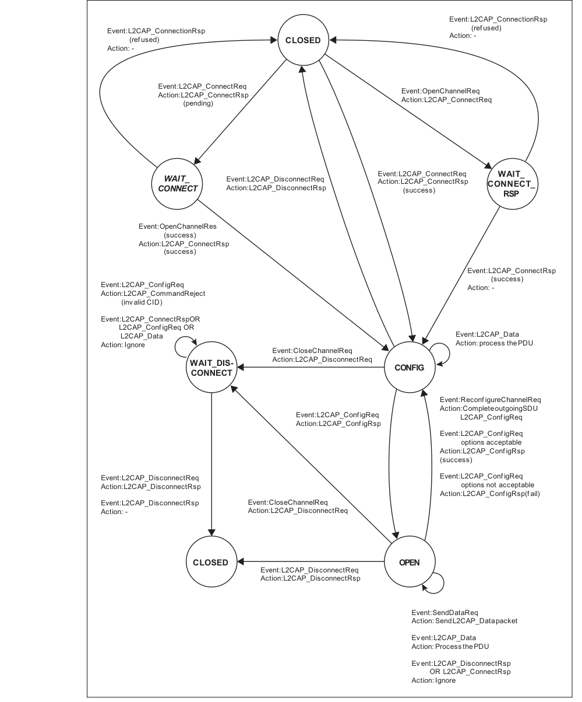

**Figure 6.1:  States and transitions**

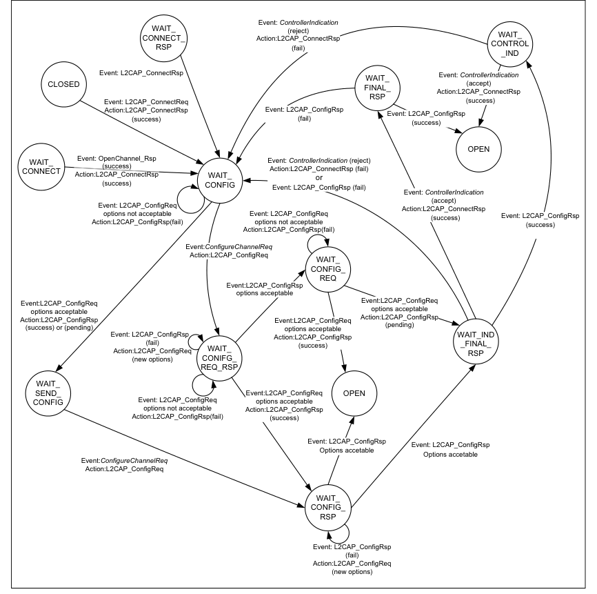

**Figure 6.2:  Configuration states and transitions**

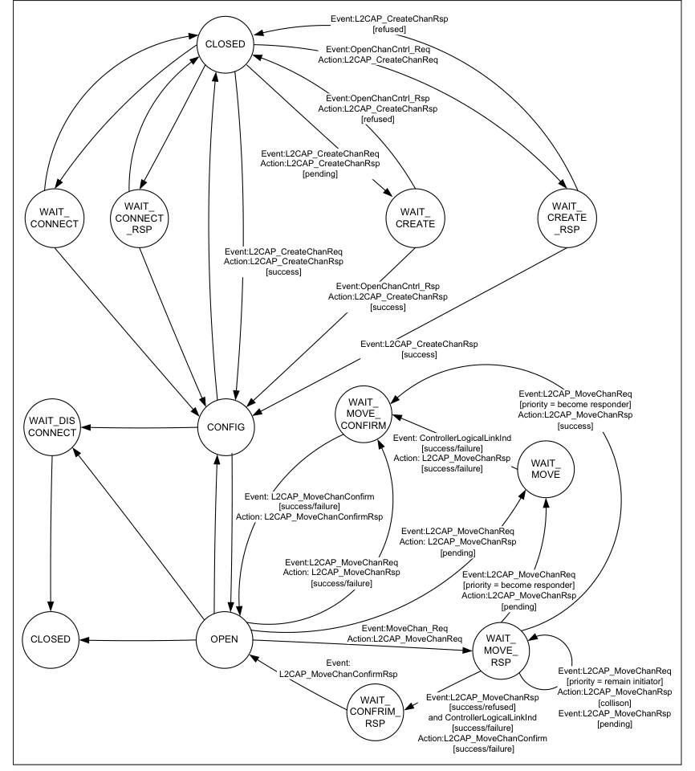

**Figure 6.3:  States and transitions–AMP enabled operation**

Figure 6.3 is based on Figure 6.1. Only the new transitions show event/action labels. Transitions without labels are the same as in Figure 6.1.

## 7  GENERAL PROCEDURES

This section describes the general operation of L2CAP, including the configuration process, the handling and the processing of user data for transportation over the air interface. This section also describes the operation of L2CAP features including the delivery of erroneous packets, the flushing of expired data and operation in connectionless mode, operation collision resolution, aggregation of best effort flow specifications, and prioritizing data over HCI.
Procedures for the flow control and retransmission modes are described in Section 8.

### 7.1   CONFIGURATION PROCESS

Configuration consists of two processes, the Standard process and the Lockstep process. The Lockstep process shall be used if both L2CAP entities support the Extended Flow Specification option otherwise the Standard process shall be used.
For both processes, configuring the channel parameters shall be done independently for both directions. Both configurations may be done in parallel.
Each configuration parameter is one-directional. The configuration parameters describe the non default parameters the device sending a Configuration Request will accept. The configuration request cannot request a change in the parameters the device receiving the request will accept.
If a device needs to establish the value of a configuration parameter the remote device will accept, then it must wait for a configuration request containing that configuration parameter to be sent from the remote device.
The Lockstep process is used when the channel parameters include an Extended Flow Specification option. The Lockstep process can be divided into two phases. In the first phase, each L2CAP entity shall receive an Extended Flow Specification option along with all non-default parameters from its peer L2CAP entity and then present the pair of Extended Flow specifications (local and remote) to its local Controller. In the second phase, each L2CAP entity shall report the result from its local Controller to the peer L2CAP entity. The Lockstep process is described in Section 7.1.3. The Standard process is described in Section 7.1.4.
Both the Lockstep and Standard processes can be abstracted into the initial Request configuration path and a Response configuration path, followed by the reverse direction phase. Reconfiguration follows a similar two-phase process by requiring configuration in both directions.
During a reconfiguration session, all data traffic on the channel should be suspended pending the outcome of the configuration. If an L2CAP entity receives a Configuration Request while it is waiting for a response it shall not block sending the Configuration Response, otherwise the configuration process may deadlock.

#### 7.1.1  Request Path

The Request Path can configure the following:
• requester’s incoming MTU
• requester’s outgoing flush timeout
• requester’s outgoing QoS
• requester’s incoming and outgoing flow and error control information
• requester's incoming and outgoing Frame Check Sequence option
• requester's outgoing QoS using Extended Flow Specification option
• requester's incoming Extended Window size option plus incoming and outgoing frame format.
Table 7.1 defines the configuration options that may be placed in a Configuration Request.

| Parameter | Description |
| --- | --- |
| MTU | Incoming MTU information |
| FlushTO | Outgoing flush timeout1 |
| QoS | Outgoing QoS information1 |
| RFCMode | Incoming and outgoing Retransmission and Flow Control Mode |
| FCS | Incoming and outgoing Frame Check Sequence |
| ExtFlowSpec | Outgoing QoS information1 |
| ExtWindow | Incoming Extended Window size plus incoming and outgoing frame format |

Table 7.1:  Parameters allowed in Request
1. FlushTO, QoS and ExtFlowSpec are considered QoS informa- tion. ExtFlowSpec is used instead of FlushTO and QoS when both devices support ExtFlowSpec.
The state machine for the configuration process is described in Section 6.

#### 7.1.2  Response Path

The Response Path can configure the following:
• responder’s outgoing MTU, that is the remote side’s incoming MTU
• remote side’s flush timeout
• responder’s incoming QoS Flow Specification (remote side’s outgoing QoS Flow Specification)
• responder’s incoming and outgoing Flow and Error Control information
• responder's incoming QoS Extended Flow Specification (remote side's outgoing QoS Flow Specification)
• responder's outgoing Extended Window size.
For the Standard process, if a request-oriented parameter is not present in the Request message (reverts to last agreed value), the remote side may negotiate for a non-default value by including the proposed value in a negative Response message. Table 7.2 defines the configuration options that may be placed in a Configuration Response.

| Parameter | Description |
| --- | --- |
| MTU | Outgoing MTU information |
| FlushTO | Incoming flush timeout 1 |
| QoS | Incoming QoS information1 |
| RFCMode | Incoming and outgoing Retransmission and Flow Control Mode |
| ExtFlowSpec | Incoming QoS information1 |
| ExtWindow | Outgoing Extended Window size |

Table 7.2:  Parameters allowed in Response
1. FlushTO, QoS and ExtFlowSpec are considered QoS informa- tion. ExtFlowSpec is used instead of FlushTO and QoS when both devices support ExtFLowSpec

#### 7.1.3  Lockstep Configuration Process

Configuration Request packets are sent to establish or change the channel parameters including the QoS contract between two L2CAP entities. An Extended Flow Specification option along with any non-default parameters shall be sent in a Configuration Request following the sending or receipt of a Connect Response which accepts an L2CAP Connect Request for the channel being configured. Unlike the Standard process, negotiation involving the sending of multiple Configuration Request packets shall not be performed. In other words, only one Configuration Request packet shall be sent by each L2CAP entity during the Lockstep configuration process. The Lockstep process shall only be
used during channel reconfiguration when an Extended Flow Specification option is present in the Configuration Request packet used for reconfiguration.
The Extended Flow Specification shall be sent for all channels created on AMP-U logical links and shall only be sent for channels created on the ACL-U logical link if both the local and remote L2CAP entities have indicated support for the Extended Flow Specification for BR/EDR in their Extended Features masks. The Extended Features mask shall be obtained via the L2CAP Information Request/Response signaling mechanism (InfoType = 0x0002) prior to the issuance of the L2CAP Configuration Request. If a Configuration Request is sent containing the Extended Flow Specification option then the Quality of Service option and Flush Timeout option shall not be included.
Configuration Response packets shall be sent in reply to Configuration Request packets except when the error condition is covered by a Command Reject response. Although the L2CAP Configuration signaling mechanism allows for the use of wildcards, wildcard values are not supported in the Extended Flow Specification since each parameter represents a property of the traffic in one direction only, and no negotiation is intended to be performed at the L2CAP Configuration level.
The recipient of a Configuration Request shall perform all necessary checks with the Controller to validate that the requested QoS can be granted. In the case of a BR/EDR or BR/EDR/LE Controller the L2CAP layer performs the Controller checks. If HCI is used then the L2CAP entity should check that the requested QoS can be achieved over the HCI transport. In order to perform these checks, the recipient needs to have the QoS parameters for both directions. In order for each side to determine when to perform relevant Controller checks, each side will reply with a result “Pending” (0x0004). If no parameters are sent in the Configuration Response packet with result “Pending” then the parameters sent in the Configuration Request have been accepted without change. This Lockstep procedure results in both L2CAP entities performing the following:
• Receiving a Configuration Request containing the Extended Flow Specification option along with all non-default parameters
• Sending a Configuration Response with any modifications to the Extended Flow Specification option and allowed modifications to non-default parameters (result “Pending”)
• Sending a Configuration Request containing the Extended Flow Specification option along with all non-default parameters
• Receiving a Configuration Response containing any modifications to the Extended Flow Specification option and allowed modifications to non-default parameters (result “Pending”).
The ERTX timer is used when a Configuration Response is received with result “Pending” (see Section 6.2.2).
If a Configuration Response with result “success” is received before a Configuration Response with result “pending” is received the recipient shall disconnect the channel. This is a violation of the Lockstep configuration process.
If a device sends an Extended Flow Specification option in a Configuration Request with service type “Best Effort” and receives a Configuration Request with service type “Guaranteed,” the channel shall be disconnected. If a device sends an Extended Flow Specification in a Configuration Request with type “Guaranteed” and receives a Configuration Request with service type “Best Effort,” the channel shall be disconnected.
If the service type is “Best Effort” then values for certain parameters may be sent in a Configuration Response with result “Pending” to indicate the maximum bandwidth the sender of the Configuration Response is capable to receive. The values sent in a Configuration Response with result “Pending” and service type Best Effort shall be in accordance with Table 7.3.

| Parameter | Changes permitted by responder |
| --- | --- |
| Maximum SDU Size | May decrease only |
| SDU Inter-arrival Time | May increase only |
| Access Latency | None |
| Flush Timeout | None |

Table 7.3:  Permitted parameter in L2CAP Configuration Response for Service Type “Best Effort”
After the Configuration Response is received with result “Pending,” L2CAP may issue the necessary checks with the Controller.
If the Controller cannot support the Extended Flow Specifications with service type “Guaranteed,” then the recipient of the Configuration Request shall send a Configuration Response indicating a result code of “Failure - flow spec rejected” (0x0005). If the Controller indicates that it can support the Extended Flow Specifications, then the recipient of the Configuration Request shall send a Configuration Response with result code of “Success” (0x0000) with no parameters.
If the Result of the Configuration Response is Failure (0x0005) for service type “Guaranteed” then an Extended Flow Specification option may be sent in the Configuration Response. The Extended Flow Specification parameters sent in the Configuration Response may be changed to reflect a QoS level that would be acceptable, but shall only be changed in accordance with Table 7.4.
If an L2CAP Configuration Response is received containing the Extended Flow Specification option with the same values sent earlier, the upper layer shall be notified of the error.

| Parameter | Changes permitted by responder |
| --- | --- |
| Maximum SDU Size | None |
| SDU Inter-arrival Time | None |
| Access Latency | May decrease only |
| Flush Timeout | May decrease only (unless set to 0xFFFFFFFF, in which case no change is permitted) |

Table 7.4:  Permitted parameter changes in L2CAP Configuration Response for Service Type “Guaranteed”

#### 7.1.4  Standard Configuration Process

For the Standard process the following general procedure shall be used for each direction:
1. Local device informs the remote device of the parameters that the local device will accept using a Configuration Request.
2. Remote device responds, agreeing or disagreeing with these values, including the default ones, using a Configuration Response.
3. The local and remote devices repeat steps (1) and (2) until agreement on all parameters is reached.
The decision on the amount of time (or messages) spent configuring the channel parameters before terminating the configuration is left to the implementation, but it shall not last more than 120 seconds.
There are two types of configuration parameters: negotiable and non-negotiable.
Negotiable parameters are those that a remote side receiving a Configuration Request can disagree with by sending a Configuration Response with the Unacceptable Parameters (0x0001) result code, proposing new values that can be accepted. Non-negotiable parameters are only informational and the recipient of a Configuration Request cannot disagree with them but can provide adjustments to the values in a positive Configuration Response. Section 5 identifies each parameter as negotiable or non-negotiable. Note: MTU is non- negotiable but can be rejected if a value lower than the mandated minimum is proposed (See Section 5.1).
The following rules shall be used for parameter negotiation in the Request Path:
1. An L2CAP entity shall send at least one Configuration Request packet as part of initial configuration or reconfiguration. If all default or previously agreed values are acceptable, a Configuration Request packet with no options shall be sent.
2. When an L2CAP entity receives a positive Configuration Response from the remote device it shall consider all configuration parameters explicitly
contained in the Configuration Request along with the default and previously agreed values not explicitly contained in the Configuration Request as accepted by the remote device.
3. When an L2CAP entity receives a negative Configuration Response and sends a new Configuration Request it shall include all the options it sent in the previous Configuration Request with the same values except the negotiable options that were explicitly rejected in the negative Configuration Response which will have new values. Note: The resending of all the options provides backwards compatibility with remote implementations that don’t assume rule 4 when responding.
4. Negotiable options not included in a negative Configuration Response are considered accepted by the remote device. Note: For backwards compatibility if non-negotiable options are included in a negative Configuration Response, they should be processed as if the response was positive.
The following rules shall be used for parameter negotiation in the Response Path:
1. A positive Configuration Response accepts the values of all configuration parameters explicitly contained in the received Configuration Request and the default and previously agreed values not explicitly provided.
2. An L2CAP Entity shall send a negative Configuration Response to reject negotiable parameter values that are unacceptable, be it values explicitly provided in the received Configuration Request or previously agreed or default values. The rejected parameters sent in a negative Configuration Response shall have values that are acceptable to the L2CAP entity sending the negative Configuration Response.
3. All negotiable options being rejected shall be rejected in the same negative Configuration Response.
4. The only options allowed in a negative Configuration Response are the negotiable options being rejected. No wildcards or adjustments to non- negotiable options shall be in a negative Configuration Response.
5. Negotiable options not included in the negative Configuration Response are considered accepted.

### 7.2   FRAGMENTATION AND RECOMBINATION

Fragmentation is the breaking down of PDUs into smaller pieces for delivery from L2CAP to the lower layer. Recombination is the process of reassembling a PDU from fragments delivered up from the lower layer. Fragmentation and Recombination may be applied to any L2CAP PDUs.

#### 7.2.1  Fragmentation of L2CAP PDUs

An L2CAP implementation may fragment any L2CAP PDU for delivery to the lower layers. If L2CAP runs directly over the Controller without HCI, then an implementation may fragment the PDU into multiple Controller packets for transmission over the air. If L2CAP runs above the HCI, then an implementation may send HCI transport sized fragments to the Controller. All L2CAP fragments associated with an L2CAP PDU shall be processed for transmission by the Controller before any other L2CAP PDU for the same logical transport shall be processed.
For example, in the BR/EDR Controller the two LLID bits defined in the first octet of baseband payload (also called the frame header) are used to signal the start and continuation of L2CAP PDUs. LLID shall be 10b for the first segment in an L2CAP PDU and 01b for a continuation segment. An illustration of fragmentation for a BR/EDR Controller is shown in Figure 7.1. An example of how fragmentation might be used in a device with HCI is shown in Figure 7.2.

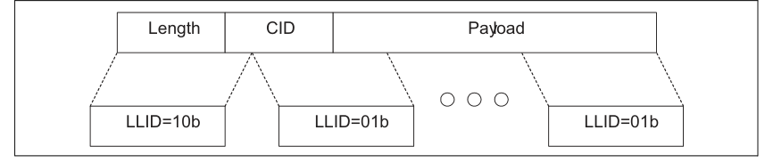

**Figure 7.1:  L2CAP fragmentation in a BR/EDR Controller**

Note: The BR/EDR Link Controller is able to impose a different fragmentation on the PDU by using “start” and “continuation” indications as fragments are translated into baseband packets. Thus, both L2CAP and the BR/EDR Link Controller use the same mechanism to control the size of fragments.

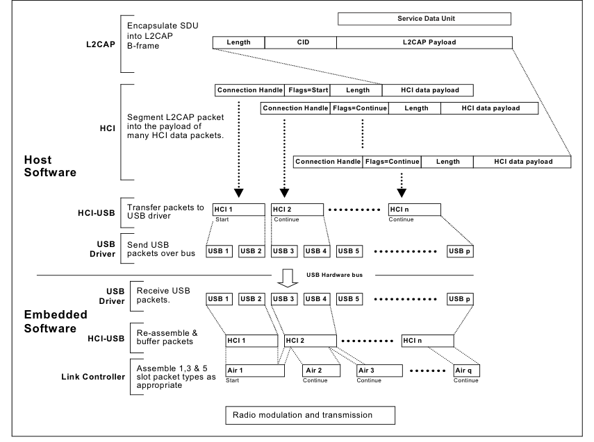

**Figure 7.2:  Example of fragmentation processes in a device with a BR/EDR Controller and USB HCI transport**

#### 7.2.2  Recombination of L2CAP PDUs

Controllers will attempt to deliver packets in sequence and without errors. Recombination of fragments may occur in the Controller but ultimately it is the responsibility of L2CAP to reassemble PDUs and SDUs and to check the length field of the SDUs. As the Controller receives packet fragments, it either signals the L2CAP layer on the arrival of each fragment, or accumulates a number of fragments (before the receive buffer fills up or a timer expires) before passing packets to the L2CAP layer.
An L2CAP implementation shall use the length field in the header of L2CAP PDUs, see Section 3, as a consistency check and shall discard any L2CAP PDUs that fail to match the length field. If channel reliability is not needed, packets with invalid lengths may be silently discarded. For reliable channels using Basic mode, an L2CAP implementation shall indicate to the upper layer that the channel has become unreliable. Reliable channels are defined by having an infinite flush timeout value as specified in Section 5.2. For higher data integrity L2CAP should be operated in the Enhanced Retransmission Mode.

### 7.3   ENCAPSULATION OF SDUs

All SDUs are encapsulated into one or more L2CAP PDUs.
In Basic L2CAP mode, an SDU shall be encapsulated with a minimum of L2CAP protocol elements, resulting in a type of L2CAP PDU called a Basic Information Frame (B-frame).
Segmentation and Reassembly operations are only used in Enhanced Retransmission mode, Streaming mode, Retransmission mode, and Flow Control mode. SDUs may be segmented into a number of smaller packets called SDU segments. Each segment shall be encapsulated with L2CAP protocol elements resulting in an L2CAP PDU called an Information Frame (I- frame).
The maximum size of an SDU segment shall be given by the Maximum PDU Payload Size (MPS). The MPS parameter may be exported using an implementation specific interface to the upper layer.
Note that this specification does not have a normative service interface with the upper layer, nor does it assume any specific buffer management scheme of a Host implementation. Consequently, a reassembly buffer may be part of the upper layer entity. It is assumed that SDU boundaries shall be preserved between peer upper layer entities.

#### 7.3.1  Segmentation of L2CAP SDUs

In Flow Control, Streaming, or Retransmission modes, incoming SDUs may be broken down into segments, which shall then be individually encapsulated with L2CAP protocol elements (header and checksum fields) to form I-frames. I- frames are subject to flow control and may be subject to retransmission procedures. The header carries a 2 bit SAR field that is used to identify whether the I-frame is a 'start', 'end' or 'continuation' packet or whether it carries a complete, unsegmented SDU. Figure 7.3 illustrates segmentation and fragmentation.

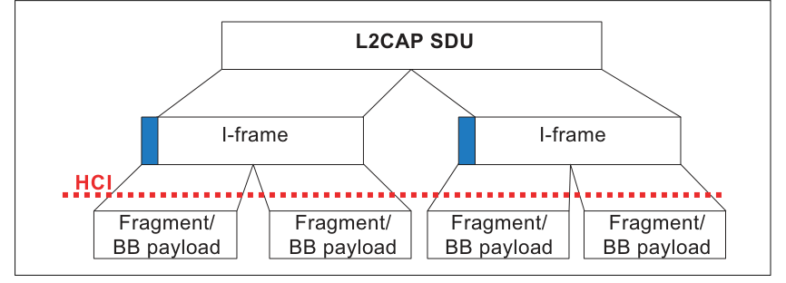

**Figure 7.3:  Segmentation and fragmentation of an SDU in a BR/EDR Controller**

#### 7.3.2  Reassembly of L2CAP SDUs

The receiving side uses the SAR field of incoming 'I-frames' for the reassembly process. The L2CAP SDU length field, present in the “start of SDU” I-frame, is an extra integrity check, and together with the sequence numbers may be used to indicate lost L2CAP SDUs to the application. Figure 7.3 illustrates segmentation and fragmentation.

#### 7.3.3  Segmentation and fragmentation

Figure 7.4 illustrates the use of segmentation and fragmentation operations to transmit a single SDU. Note that while SDUs and L2CAP PDUs are transported in peer-to-peer fashion, the fragment size used by the Fragmentation and Recombination routines is implementation specific and may be different in the sender and the receiver. The over-the-air sequence of packet fragments as created by the sender is common to both devices.

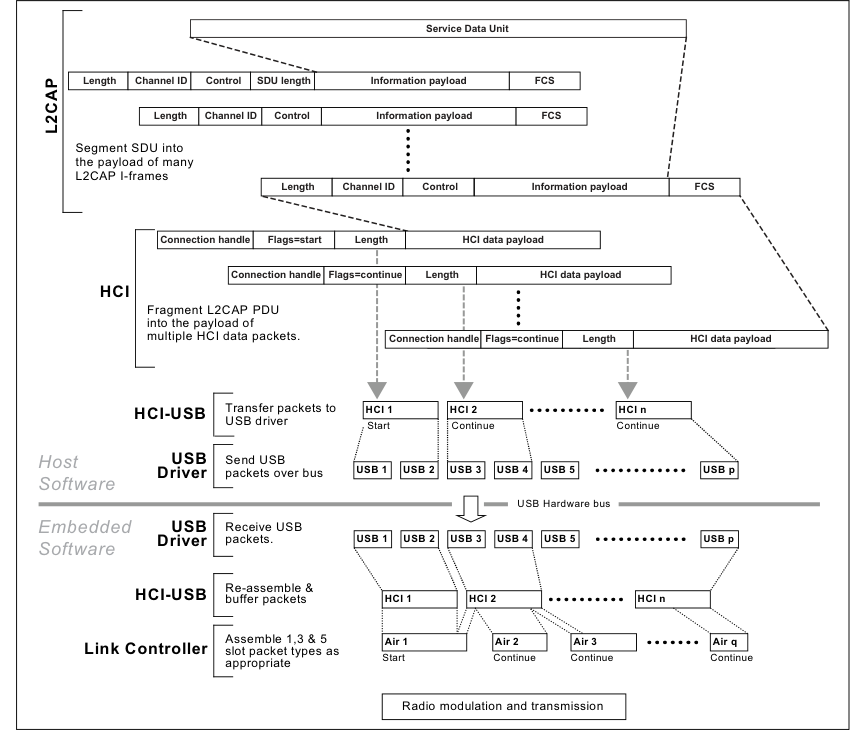

**Figure 7.4:  Example of segmentation and fragment processes in a device with a BR/EDR Controller and USB HCI Transport1**

1. For simplicity, the stripping of any additional HCI and USB specific information fields prior to the creation of the baseband packets (Air_1, Air_2, etc.) is not shown in the figure.

### 7.4   DELIVERY OF ERRONEOUS L2CAP SDUS

Some applications may require corrupted or incomplete L2CAP SDUs to be delivered to the upper layer. If delivery of erroneous L2CAP SDUs is enabled, the receiving side will pass information to the upper layer on which parts of the L2CAP SDU (i.e., which L2CAP frames) have been lost, failed the error check, or passed the error check. If delivery of erroneous L2CAP SDUs is disabled, the receiver shall discard any L2CAP SDU segment with any missing frames or any frames failing the error checks. L2CAP SDUs whose length field does not match the actual frame length shall also be discarded.

### 7.5   OPERATION WITH FLUSHING ON ACL-U LOGICAL LINKS

In the L2CAP configuration using either the Flush Timeout option or the Extended Flow Specification option, the Flush timeout may be set separately per L2CAP channel, but in the BR/EDR baseband, the flush mechanisms operate per ACL logical transport.
When there is more than one L2CAP channel mapped to the same ACL logical transport, the automatic flush time-out does not discriminate between L2CAP channels. The automatic flush time-out also applies to unicast data sent via the L2CAP connectionless channel. The exception is packets marked as non- automatically-flushable via the Packet_Boundary_Flag in the HCI ACL Data Packet (see Section 1.1). The automatic flush time-out flushes a specific automatically-flushable L2CAP PDU. The HCI Flush command flushes all outstanding L2CAP PDUs for the ACL logical transport including L2CAP PDUs marked as non-automatically-flushable. Therefore, care has to be taken when using the Automatic Flush Time-out and the HCI Flush command. The HCI Enhanced Flush command should be used instead.
All packets associated with a reliable connection shall be marked as non- automatically-flushable (if it is mapped to an ACL logical transport with a finite automatic flush time-out) or L2CAP Enhanced Retransmission mode or Retransmission mode shall be used. In Enhanced Retransmission mode or Retransmission mode, loss of flushed L2CAP PDUs on the channel is detected by the L2CAP ARQ mechanism and they are retransmitted. Note that L2CAP Enhanced Retransmission mode or Retransmission mode might be used for other purposes such as the need for a residual error rate that is much smaller than the baseband can deliver. In this situation L2CAP Enhanced Retransmission mode or Retransmission mode and the Non-Flushable Packet Boundary Flag feature can be used at the same time.
If it is desired to send unicast data via the L2CAP connectionless channel which is not subject to automatic flushing, then the data should be marked as non-automatically flushable if it is mapped to an ACL logical transport with a finite automatic flush time-out. Unicast data sent via the L2CAP connectionless channel may be marked flushable.
There is only one automatic flush time-out setting per ACL logical transport. Therefore, all time bounded L2CAP channels on an ACL logical transport with an automatic flush time-out setting should configure the same flush time-out value at the L2CAP level. The flush time-out setting for the ACL logical transport also applies to unicast data sent via the L2CAP connectionless channel which are marked flushable.
If Automatic Flush Time-out is used, then it should be taken into account that it only flushes one L2CAP PDU. If one PDU has timed out and needs flushing, then other automatically-flushable packets on the same logical transport are also likely to need flushing. Therefore, flushing can be handled by the HCI Enhanced Flush command so that all outstanding automatically-flushable L2CAP PDUs are flushed.
When both reliable and isochronous data is to be sent over the same ACL logical transport, an infinite Automatic Flush Time-out can be used. In this case the isochronous data is flushed using the HCI Enhanced Flush command with Packet_Type set to “Automatically-Flushable Only,” thus preserving the reliable data.

### 7.6   CONNECTIONLESS DATA CHANNEL

In addition to connection-oriented channels, L2CAP also provides a connectionless channel. Data sent on the connectionless channel shall only be sent over the BR/EDR radio. The connectionless channel allows broadcast transmissions from the master device to all members of the piconet or unicast transmissions from either a master or slave to a single remote device. Data sent through the connectionless channel is sent in a best-effort manner. The connectionless channel provided by L2CAP has no quality of service.
While L2CAP itself does not provide retransmission for data sent via the connectionless channel, the baseband does provide an ARQ scheme for unicast data (see [Vol 2] Part B, Section 7.6). If a higher degree of reliability is desired for unicast data sent via the connectionless L2CAP channel than is provided by the baseband ARQ scheme then an ARQ scheme should be implemented at a higher layer.
No acknowledgment is provided by the baseband for broadcast transmissions and hence broadcast transmissions sent via the connectionless L2CAP channel are unreliable and hence might or might not reach each member of the piconet.
The receiving L2CAP entity may silently discard data received via the connectionless L2CAP channel if the data packet is addressed to a PSM and no application is registered to receive data on that PSM.
Note that L2CAP does not provide flow control for either connection-oriented L2CAP channels operating in Basic mode or for traffic on the connectionless L2CAP channel. Hence if data received by L2CAP is not accepted by the target
applications in a timely manner, congestion can occur in a receiving L2CAP implementation. For connection-oriented channels, the receiving L2CAP entity may elect to close a channel if the target application for that channel does not accept the data in a timely manner. Since this option is not available for unicast data received via the connectionless L2CAP channel, the receiving L2CAP entity may instead elect to de-register the application receiving the data or to disconnect the underlying physical link. An application shall be notified if it is de-registered. If the underlying physical link is disconnected then all applications utilizing that physical link shall be notified.
Unicast data shall only be sent via the connectionless L2CAP channel to a remote device if the remote device indicates support for Unicast Connectionless Data Reception in the L2CAP Extended Features Mask.1
The L2CAP Extended Features Mask should be retrieved using the L2CAP Information Request signal to determine if Unicast Connectionless Data Reception is supported. Optionally, support for Unicast Connectionless Data Reception can be inferred from information obtained via a SDP or EIR. For example, if a service is found via SDP or EIR that is known to mandate the support of UCD, then it may be assumed that the device indicating support for the service supports Unicast Connectionless Data Reception.
Unicast data sent via the L2CAP connectionless channel are subject to automatic flushing and hence the packet boundary flags should be set appropriately if the Controller supports the Packet Boundary Flag feature. See Section 7.5 for further details. Since the receiving L2CAP entity has no mechanism to enable it to know whether received packets were originally marked as flushable or non-flushable on the transmitting device, the receiving L2CAP entity should treat all unicast packets received via the connectionless L2CAP packet as non-flushable.
If encryption is required for a given profile, then the profile or application shall ensure that authentication is performed and encryption is enabled prior to sending any unicast data on the connectionless L2CAP channel by utilizing Security Mode 4 as defined in GAP ([Vol 3] Part C, Section 5.2.2). There is no mechanism provided in this specification to prevent reception of unencrypted data on the connectionless L2CAP channel. An application which requires received data to be encrypted should ignore any unencrypted data it may receive over the connectionless channel.
Broadcast transmissions to the connectionless channel are sent with the broadcast LT_ADDR and hence may be received by any of the slaves in the piconet. If it is desirable to restrict the reception of the transmitted data to only a subset of the slaves in the piconet, then higher level encryption may be used to support private communication.
1. Note that the Unicast Connectionless Data Reception bit in the L2CAP Extended Features Mask does not in any way indicate support or lack of support for reception of broadcast data on the connectionless L2CAP channel even though both broadcast data and unicast data are sent and received using the same CID (0x0002). For historical reasons, there is no bit to indicate support for sending or receiving of broadcast data on the connectionless L2CAP channel.
The master will not receive transmissions broadcast on the connectionless channel. Therefore, higher layer protocols must loopback any broadcast data traffic being sent to the master device if required.
The connectionless data channel shall not be used with Enhanced Retransmission mode, Retransmission Mode or Flow Control Mode.

### 7.7   OPERATION COLLISION RESOLUTION

When two devices request the same operation by sending a request packet with the same code, a collision can occur. Some operations require collision resolution. The description of each operation in Section 4 will indicate if collision resolution is required. Both devices must know which request will be rejected. The following algorithm shall be used by both devices to determine which request to reject.
1. Set i=0 (representing the least significant octet of the BD_ADDR). 2. Compare the octet[i] of the BD_ADDR of both devices. If the octets are not equal go to step 4. 3. Increment i by 1. Go to step 2. 4. The device with the larger BD_ADDR octet shall reject the request from the other device.

### 7.8   AGGREGATING BEST EFFORT EXTENDED FLOW SPECIFICATIONS

There shall only be one pair of Extended Flow Specifications per logical link and only one “Best Effort” logical link per physical link. Thus, all Best Effort L2CAP channels running over the same physical link are aggregated into one logical link and the Best Effort Flow Specifications describing the traffic for each channel running over an AMP-U logical link shall be aggregated to a single pair of Extended Flow Specifications (one for each direction). The purpose of a Best Effort Flow Specification is to specify the maximum data rate of the data that can be delivered to the Controller from the Host and/or taken from the Controller by the Host in order to help the Controller to not over allocate bandwidth on the physical link. Since L2CAP performs admission control for BR/EDR and BR/EDR/LE Controllers it is not necessary to aggregate Best Effort channels for BR/EDR and BR/EDR/LE Controllers.
The two Extended Flow Specification parameters that are affected by Best Effort are Maximum SDU size and SDU Inter-arrival Time. A data rate is determined by dividing the Maximum SDU size by the SDU Inter-arrival time giving a value in bytes per second. The important value is the data rate and not the Maximum SDU size or SDU Inter-arrival time.
Best Effort aggregation shall occur when performing any of the three operations:
• Configuring a new Best Effort channel
• Disconnecting a Best Effort channel
• Moving a Best Effort a channel
During L2CAP channel configuration, the Extended Flow Specifications are exchanged and each L2CAP entity is allowed to modify the other's flow specification (lower the values). If a Best Effort logical link already exists (meaning there is at least one other Best Effort channel) then the new flow specifications shall be aggregated with the existing Best Effort aggregate before sending it to the Controller. When a Best Effort channel is moved or disconnected a new aggregate shall be created. If the new aggregate is different from the previous aggregate it shall be given to the Controller. The following guidelines are provided for aggregating Best Effort Flow specification parameters. Keep in mind that the data rate is the important value so the description shows how to aggregate data rates.
1. The value 0xFFFF is used for Maximum SDU Size and the value 0xFFFFFFFF is used for SDU Inter-arrival time to indicate that the actual values are unknown and maximum bandwidth is assumed. Therefore, if these values exist in an Extended Flow Specification then the aggregate becomes 0xFFFF and 0xFFFFFFFF for Maximum SDU Size and SDU Inter-arrival time respectively. 2. In general it is assumed that data rates provided by the local applications can be added together. For example if one application indicates a data rate of 100 bytes/s and a second application indicates a data rate of 100 bytes/s then the aggregate data rate from the two applications is 200 bytes/s. This is assumed for both directions. 3. The adjustments (sent in a Configuration Response) made by the remote device to an outgoing flow specification are assumed to be made on behalf of the application. These adjustments reduce the data rate of the outgoing flow specification. The reduced data rates can be added to data rates from other applications. 4. The final data rates shall be converted back into Maximum SDU Size and SDU Inter-arrival time to be passed to the Controller. Controllers may have a maximum PDU size or a “preferred” PDU size. When possible the “preferred” size should be used for the Maximum SDU size and the SDU Inter-arrival time should be set to a value that achieves the desired data rate. If the data rate cannot be achieved by using the “preferred” PDU size then an integer multiple of the preferred PDU size should be used.

### 7.9   PRIORITIZING DATA OVER HCI

In order for guaranteed channels to meet their guarantees, L2CAP should prioritize traffic over the HCI transport in devices that support HCI. Packets for Guaranteed channels should receive higher priority than packets for Best Effort channels.

### 7.10   SUPPORTING EXTENDED FLOW SPECIFICATION FOR BR/EDR AND BR/EDR/LE CONTROLLERS

If both the local L2CAP entity and the remote L2CAP entity indicate support for Extended Flow Specification for BR/EDR in the Extended Feature Mask then all channels created between the two devices shall send an Extended Flow Specification option and shall use the Lockstep configuration procedure. In addition all channels shall use Enhanced Retransmission mode or Streaming mode. If one or both L2CAP entities do not indicate support for Extended Flow Specification for BR/EDR in the Extended Feature Mask then the Lockstep configuration procedure shall not be used and the Extended Flow Specification option shall not be sent for channels created over the ACL-U logical link between the two devices.
The L2CAP entity shall perform admission control for Guaranteed channels during the Lockstep configuration procedure (see Section 7.1.3). Admission control is performed to determine if the requested Guaranteed QoS can be achieved by the BR/EDR or BR/EDR/LE Controller over an ACL-U logical link without compromising existing Guaranteed channels running on the Controller. If HCI is used then the L2CAP entity shall also verify that the QoS can be achieved over the HCI transport.
In performing admission control the L2CAP layer shall reject a Guaranteed QoS request that causes at least one of the following rules to be violated.
1. The total guaranteed data rate in both directions shall not exceed two times the highest Symmetric Max of an ACL-U logical link over the BR/EDR or BR/EDR/LE Controller (see [Vol 2] Part B, Section 6.7). For example for a Basic Rate Controller the highest Symmetric Max Rate is 433.9kb/s (DH5) from [Vol 2] Part B, Table 6.9. Two times that value is 867.8kb/s. 2. The total guaranteed data rate in any one direction shall not exceed the highest Asymmetric Max Rate of an ACL-U logical link (see [Vol 2] Part B, Section 6.7). For example the highest Asymmetric Max Rate for Basic Rate is 723.2kb/s (DH5 packet) from [Vol 2] Part B, Table 6.9.
The data rate of a Guaranteed channel is calculated by dividing the Maximum SDU size in an Extended Flow Specification by the SDU Inter-arrival time. Total guaranteed data rate in both directions is calculated by taking the sum of the data rates in both directions for all existing Guaranteed channels plus the data
rate in both directions of the requested Guaranteed channel (i.e. data rates from the both outgoing and incoming Extended Flow Specifications). Total guaranteed data rate for one direction is calculated by taking the sum of the data rates in one direction for all existing Guaranteed channels plus the data rate in the same direction of the requested Guaranteed channel.
An L2CAP entity should use additional information for admission control that may result in a Guaranteed QoS request being rejected even if none of the rules are violated. This allows the L2CAP entity to account for things such as CQDDR, SCO/eSCO channels, LMP traffic, page scanning, etc.
In order to meet the access latency and/or data rate required by a Guaranteed channel, the L2CAP entity should:
a) Prioritize traffic over the HCI transport in devices that support HCI.
b) Give conformant packets for Guaranteed channels higher priority than packets for Best Effort channels. Packets for Best Effort channels should have higher priority than non-conformant packets for Guaranteed channels. (See Section 5.6 for a discussion of non-conformant and conformant traffic).
c) Utilize the SAR feature to restrict the PDU sizes of Best Effort SDUs so that they do not prevent the Controller from sending the SDUs of the Guaranteed channel within the time periods required by its Extended Flow Specification.
When a channel is reconfigured the Lockstep configuration process is only used when an Extended Flow Specification option is present in the Configuration Request packet as described in Section 7.1.3.

## 8  PROCEDURES FOR FLOW CONTROL AND

RETRANSMISSION
When Enhanced Retransmission mode, Streaming mode, Flow Control mode, or Retransmission mode is used, the procedures defined in this chapter shall be used, including the numbering of information frames, the handling of SDU segmentation and reassembly, and the detection and notification of frames with errors. Retransmission mode and Enhanced Retransmission mode also allow the sender to resend frames with errors on request from the receiver.

### 8.1   INFORMATION RETRIEVAL

Before attempting to configure Enhanced Retransmission mode, Streaming mode, Flow Control mode, or Retransmission mode on a channel, support for the suggested mode shall be verified by performing an information retrieval for the “Extended features supported” information type (0x0002). If the information retrieval is not successful or the “Extended features mask” bit is not set for the wanted mode, the mode shall not be suggested in a configuration request.

### 8.2   FUNCTION OF PDU TYPES FOR FLOW CONTROL AND RETRANSMISSION

Two frame formats are defined for Enhanced Retransmission mode, Streaming Mode, Flow Control Mode, and Retransmission mode (see Section 3.3). The I- frame is used to transport user information instead of the B-frame. The S-frame is used for supervision.

#### 8.2.1  Information frame (I-frame)

I-frames are sequentially numbered frames containing information fields. I- frames also include some of the functionality of RR frames (see below).

#### 8.2.2  Supervisory Frame (S-frame)

The S-frame is used to control the transmission of I-frames. For Retransmission mode and Flow Control mode, the S-frame has two formats: Receiver Ready (RR) and Reject (REJ). A description of how S-frames are used in Enhanced Retransmission mode is given in Section 8.6.1. S-frames are not used in Streaming mode. The following description of S-frames only applies to Retransmission mode and Flow Control mode.

##### 8.2.2.1  Receiver Ready (RR)

The receiver ready (RR) S-frame is used to:
1. Acknowledge I-frames numbered up to and including ReqSeq - 1.
2. Enable or disable retransmission of I-frames by updating the receiver with the current status of the Retransmission Disable Bit. The RR frame has no information field.

##### 8.2.2.2  Reject (REJ)

The reject (REJ) S-frame is used to request retransmission of all I-frames starting with the I-frame with TxSeq equal to ReqSeq specified in the REJ. The value of ReqSeq in the REJ frame acknowledges I-frames numbered up to and including ReqSeq - 1. I-frames that have not been transmitted, shall be transmitted following the retransmitted I-frames.
When a REJ is transmitted, it triggers a REJ Exception condition. A second REJ frame shall not be transmitted until the REJ Exception condition is cleared. The receipt of an I-frame with a TxSeq equal to the ReqSeq of the REJ frame clears the REJ Exception. The REJ Exception condition only applies to traffic in one direction. Note: This means that only valid I-frames can be rejected.

### 8.3   VARIABLES AND SEQUENCE NUMBERS

The sending peer uses the following variables and Sequence numbers:
• TxSeq – the send Sequence number used to sequentially number each new I-frame transmitted.
• NextTxSeq – the Sequence number to be used in the next new I-frame transmitted.
• ExpectedAckSeq – the Sequence number of the next I-frame expected to be acknowledged by the receiving peer.
The receiving peer uses the following variables and Sequence numbers:
• ReqSeq – The Sequence number sent in an acknowledgment frame to request transmission of I-frame with TxSeq = ReqSeq and acknowledge receipt of I-frames up to and including (ReqSeq-1).
• ExpectedTxSeq – the value of TxSeq expected in the next I-frame.
• BufferSeq – When segmented I-frames are buffered this is used to delay acknowledgment of received I-frame so that new I-frame transmissions do not cause buffer overflow.
All variables have the range 0 to 63. Arithmetic operations on state variables (NextTXSeq, ExpectedTxSeq, ExpectedAckSeq, BufferSeq) and sequence numbers (TxSeq, ReqSeq) contained in this document shall be taken modulo 64.
To perform Modulo 64 operation on negative numbers multiples of 64 shall be added to the negative number until the result becomes non-negative.

#### 8.3.1  Sending peer

##### 8.3.1.1  Send sequence number TxSeq

I-frames contain TxSeq, the send sequence number of the I-frame. When an I- frame is first transmitted, TxSeq is set to the value of the send state variable NextTXSeq. TxSeq is not changed if the I-frame is retransmitted.

##### 8.3.1.2  Send state variable NextTXSeq

The CID sent in the information frame is the destination CID and identifies the remote endpoint of the channel. A send state variable NextTxSeq shall be maintained for each remote endpoint. NextTxSeq is the sequence number of the next in-sequence I-frame to be transmitted to that remote endpoint. When the link is created NextTXSeq shall be initialized to 0.
The value of NextTxSeq shall be incremented by 1 after each in-sequence I- frame transmission, and shall not exceed ExpectedAckSeq by more than the maximum number of outstanding I-frames (TxWindow). The value of TxWindow shall be in the range 1 to 32 for Retransmission mode and Flow Control mode. The value of TxWindow shall be in the range of 1 to 63 for Enhanced Retransmission mode.

##### 8.3.1.3  Acknowledge state variable ExpectedAckSeq

The CID sent in the information frame is the destination CID and identifies the remote endpoint of the channel. An acknowledge state variable ExpectedAckSeq shall be maintained for each remote endpoint. ExpectedAckSeq is the sequence number of the next in-sequence I-frame that the remote receiving peer is expected to acknowledge. (ExpectedAckSeq – 1 equals the TxSeq of the last acknowledged I-frame). When the link is created ExpectedAckSeq shall be initialized to 0. Note that if the next acknowledgment acknowledges a single I-frame then its ReqSeq will be expectedAckSeq + 1.
If a valid ReqSeq is received from the peer then ExpectedAckSeq is set to ReqSeq. A valid ReqSeq value is one that is in the range ExpectedAckSeq ≤ ReqSeq ≤ NextTxSeq.
Note: The comparison with NextTXSeq must be ≤ in order to handle the situations where there are no outstanding I-frames.
These inequalities shall be interpreted in the following way: ReqSeq is valid, if and only if (ReqSeq-ExpectedAckSeq) mod 64 ≤ (NextTXSeq- ExpectedAckSeq) mod 64. Furthermore, from the description of NextTXSeq, it can be seen that (NextTXSeq-ExpectedAckSeq) mod 64 ≤ TxWindow.

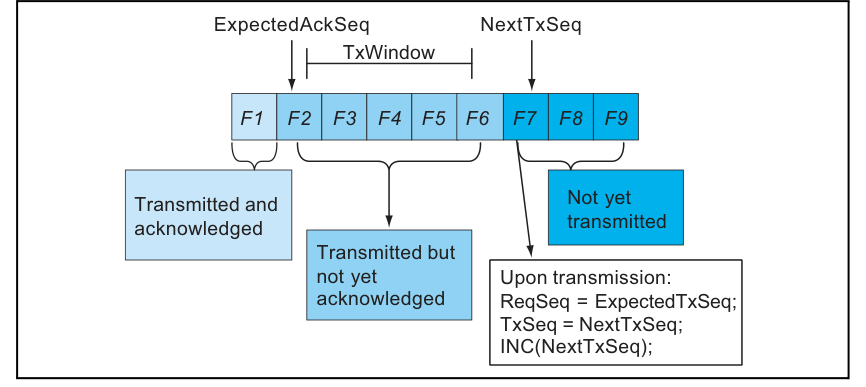

**Figure 8.1:  Example of the transmitter side**

Figure 8.1 shows TxWindow=5, and three frames awaiting transmission. The frame with number F7 may be transmitted when the frame with F2 is acknowledged. When the frame with F7 is transmitted, TxSeq is set to the value of NextTXSeq. After TxSeq has been set, NextTxSeq is incremented.
The sending peer expects to receive legal ReqSeq values, these are in the range ExpectedAckSeq up to and including NextTxSeq. Upon receipt of a ReqSeq value equal to the current NextTxSeq all outstanding I-frames have been acknowledged by the receiver.

#### 8.3.2  Receiving peer

##### 8.3.2.1  Receive sequence number ReqSeq

All I-frames and S-frames contain ReqSeq, the send Sequence number (TxSeq) that the receiving peer requests in the next I-frame.
When an I-frame or an S-frame is transmitted, the value of ReqSeq shall be set to the current value of the receive state variable ExpectedTxSeq or the buffer state variable BufferSeq. The value of ReqSeq shall indicate that the data link layer entity transmitting the ReqSeq has correctly received all I-frames numbered up to and including ReqSeq – 1.
Note: The option to set ReqSeq to BufferSeq instead of ExpectedTxSeq allows the receiver to impose flow control for buffer management or other purposes. In this situation, if BufferSeq<>ExpectedTxSeq, the receiver should also set the retransmission disable bit to 1 to prevent unnecessary retransmissions.

##### 8.3.2.2  Receive state variable, ExpectedTxSeq

Each channel shall have a receive state variable (ExpectedTxSeq). The receive state variable is the sequence number (TxSeq) of the next in-sequence I-frame expected.
The value of the receive state variable shall be the last in-sequence, valid I- frame received.

##### 8.3.2.3  Buffer state variable BufferSeq

Each channel may have an associated BufferSeq. BufferSeq is used to delay acknowledgment of frames until they have been pulled by the upper layers, thus preventing buffer overflow. BufferSeq and ExpectedTxSeq are equal when there is no extra segmentation performed and frames are pushed to the upper layer immediately on reception. When buffer space is scarce, for example when frames reside in the buffer for a period, the receiver may choose to set ReqSeq to BufferSeq instead of ExpectedTxSeq, incrementing BufferSeq as buffer space is released. The windowing mechanism will ensure that transmission is halted when ExpectedTxSeq - BufferSeq is equal to TxWindow.
Note: Owing to the variable size of I-frames, updates of BufferSeq may be based on changes in available buffer space instead of delivery of I-frame contents.
I-frames shall have sequence numbers in the range ExpectedTxSeq ≤ TxSeq < (BufferSeq + TxWindow).
On receipt of an I-frame with TxSeq equal to ExpectedTxSeq, ExpectedTxSeq shall be incremented by 1 regardless of how many I-frames with TxSeq greater than ExpectedTxSeq were previously received.

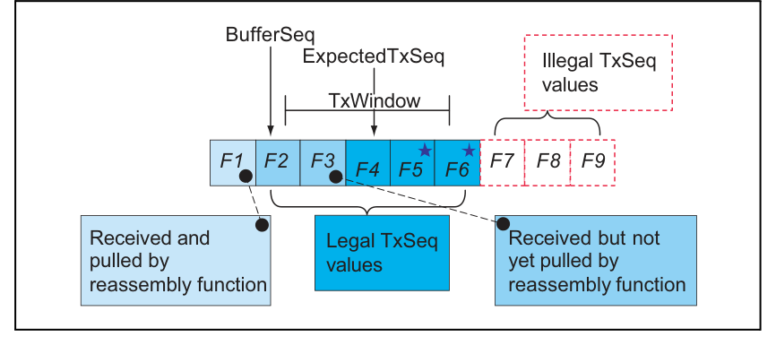

**Figure 8.2:  Example of the receiver side**

Figure 8.2 shows TxWindow=5. F1 is successfully received and pulled by the upper layer. BufferSeq shows that F2 is the next I-frame to be pulled, and ExpectedTxSeq points to the next I-frame expected from the peer. An I-frame with TxSeq equal to 5 has been received thus triggering an SREJ or REJ exception. The star indicates I-frames received but discarded owing to the SREJ or REJ exception. They will be resent as part of the error recovery procedure.
In Figure 8.2 there are several I-frames in a buffer awaiting the SDU reassembly function to pull them and the TxWindow is full. The receiver would usually disable retransmission in Retransmission mode or Flow Control mode by setting the Retransmission Disable Bit to 1 and send an RR back to the sending side. This tells the transmitting peer that there is no point in performing retransmissions. Both sides will send S-frames to make sure the peer entity knows the current value of the Retransmission Disable Bit.

### 8.4   RETRANSMISSION MODE

#### 8.4.1  Transmitting frames

A new I-frame shall only be transmitted when the TxWindow is not full. No I- frames shall be transmitted if the last RetransmissionDisableBit (R) received is set to one.
A previously transmitted I-frame may be retransmitted as a result of an error recovery procedure, even if the TxWindow is full. When an I-frame is retransmitted it shall always be sent with the same TxSeq value used in its initial transmission.
The state of the RetransmissionDisableBit (R) is stored and used along with the state of the RetransmissionTimer to decide the actions when transmitting I- frames. The RetransmissionTimer is running whenever I-frames have been sent but not acknowledged.

##### 8.4.1.1  Last received R was set to zero

If the last R received was set to zero, then I-frames may be transmitted. If there are any I-frames which have been sent and not acknowledged then they shall be retransmitted when the RetransmissionTimer elapses. If the retransmission timer has not elapsed then a retransmission shall not be sent and only new I- frames may be sent.
a) If unacknowledged I-frames have been sent and the RetransmissionTimer has elapsed then an unacknowledged I-
frame shall be retransmitted. The RetransmissionTimer shall be restarted.
b) If unacknowledged I-frames have been sent, the Retransmission timer has not elapsed then a new I-frame shall be sent if one is waiting and no timer action shall be taken.
c) If no unacknowledged I-frames have been sent, and a new I-frame is waiting, then the new I-frame shall be sent, the RetransmissionTimer shall be started and if the Monitor Timer is running, it shall be stopped.
d) If no unacknowledged I-frames have been sent and no new I- frames are waiting to be transmitted, and the RetransmissionTimer is running, then the retransmission timer shall be stopped and the monitor timer shall be started.
The table below summarizes actions when the RetransmissionTimer is in use and R=0.

| Unacknowledged I-frames sent = Retransmission Timer is running | Retrans- mission Timer has elapsed | New I-frames are waiting | Transmit Action | Timer Action |
| --- | --- | --- | --- | --- |
| True | True | True or False | Retransmit un- acknowledged I-frame | Restart Retransmissio Timer |
| True | False | True | Transmit new I-frame | No timer actio |
| True | False | False | No transmit action | No Timer action |
| False | False | True | Transmit new I-frame | Restart Retransmis- sion Timer |
| False | False | False | No Transmit action | If MonitorTime is not running then restart MonitorTimer |

Table 8.1:  Summary of actions when the RetransmissionTimer is in use and R=0
If the RetransmissionTimer is not in use, no unacknowledged I-frames have been sent and no new I-frames are waiting to be transmitted
a) If the MonitorTimer is running and has not elapsed then no transmit action shall be taken and no timer action shall be taken.
b) If the MonitorTimer has elapsed then an S-frame shall be sent and the MonitorTimer shall be restarted.
If any I-frames become available for transmission then the MonitorTimer shall be stopped, the RetransmissionTimer shall be started and the rules for when the RetransmissionTimer is in use shall be applied.
When an I-frame is sent ReqSeq shall be set to ExpectedTxSeq, TxSeq shall be set to NextTxSeq and NextTxSeq shall be incremented by one.

##### 8.4.1.2  Last received R was set to one

If the last R received was set to one, then I-frames shall not be transmitted. The only frames which may be sent are S-frames. An S-frame shall be sent according to the rules below:
a) If the MonitorTimer is running and has not elapsed then no transmit action shall be taken and no timer action shall be taken.
b) If the MonitorTimer has elapsed then an S-frame shall be sent and the MonitorTimer shall be restarted.

#### 8.4.2  Receiving I-frames

Upon receipt of a valid I-frame with TxSeq equal to ExpectedTxSeq, the frame shall be accepted for the SDU reassembly function. ExpectedTxSeq is used by the reassembly function.
The first valid I-frame received after an REJ was sent, with a TxSeq of the received I-frame equal to ReqSeq of the REJ, shall clear the REJ Exception condition.
The ReqSeq shall be processed according to Section 8.4.6.
If a valid I-frame with TxSeq ≠ ExpectedTxSeq is received then an exception condition shall be triggered which is handled according to Section 8.4.7.

#### 8.4.3  I-frames pulled by the SDU reassembly function

When the L2CAP layer has removed one or more I-frames from the buffer, BufferSeq may be incremented in accordance with the amount of buffer space released. If BufferSeq is incremented, an acknowledgment shall be sent to the peer entity.
Note: Since the primary purpose of BufferSeq is to prevent buffer overflow, an implementation may choose to set BufferSeq in accordance with how many new incoming I-frames could be stored rather than how many have been removed.
The acknowledgment may either be an RR or an I-frame. The acknowledgment shall be sent to the peer L2CAP entity with ReqSeq equal to BufferSeq. When there are no I-frames buffered for pulling ExpectedTxSeq is equal to BufferSeq.
If the MonitorTimer is active then it shall be restarted to indicate that a signal has been sent to the peer L2CAP entity.

#### 8.4.4  Sending and receiving acknowledgments

Either the MonitorTimer or the RetransmissionTimer shall be active while in Retransmission Mode. Both timers shall not be active concurrently.

##### 8.4.4.1  Sending acknowledgments

Whenever an L2CAP entity transmits an I-frame or an S-frame, ReqSeq shall be set to ExpectedTxSeq or BufferSeq.

##### 8.4.4.2  Receiving acknowledgments

On receipt of a valid S-frame or I-frame, the ReqSeq contained in the frame shall acknowledge previously transmitted I-frames. ReqSeq acknowledges I- frames with a TxSeq up to and including ReqSeq – 1.
The following rules shall be applied:
1. If the RetransmissionDisableBit changed value from 0 to 1 (stop retransmis- sions) then the receiving entity shall
a) If the RetransmissionTimer is running then stop it and start the MonitorTimer.
b) Store the state of the RetransmissionDisableBit received.
2. If the RetransmissionDisableBit changed value from 1 to 0 (start retransmissions) then the receiving entity shall
a) Store the state of the RetransmissionDisableBit received.
b) If there are any I-frames that have been sent but not acknowledged, then stop the MonitorTimer and start the RetransmissionTimer.
c) Any buffered I-frames shall be transmitted according to Section 8.4.1.
3. If any unacknowledged I-frames were acknowledged by the ReqSeq contained in the frame, and the RetransmissionDisableBit equals 1 (retransmissions stopped), then the receiving entity shall
a) Follow the rules in Section 8.4.1.
4. If any unacknowledged I-frames were acknowledged by the ReqSeq contained in the frame and the RetransmissionDisableBit equals 0 (retransmissions started) then the receiving entity shall
a) If the RetransmissionTimer is running, then stop it.
b) If any unacknowledged I-frames have been sent then the RetransmissionTimer shall be restarted.
c) Follow the rules in Section 8.4.1.
d) If the RetransmissionTimer is not running and the MonitorTimer is not running, then start the MonitorTimer.
On receipt of a valid S-frame or I-frame the ReqSeq contained in the frame shall acknowledge previously transmitted I-frames. ExpectedAckSeq shall be set to ReqSeq to indicate that the I-frames with TxSeq up to and including (ReqSeq - 1) have been acknowledged.

#### 8.4.5  Receiving REJ frames

Upon receipt of a valid REJ frame, where ReqSeq identifies an I-frame not yet acknowledged, the ReqSeq acknowledges I-frames with TxSeq up to and including ReqSeq - 1. Therefore the REJ acknowledges all I-frames before the I-frame it is rejecting.
ExpectedAckSeq shall be set equal to ReqSeq to mark I-frames up to and including ReqSeq - 1 as received.
NextTXSeq shall be set to ReqSeq to cause transmissions of I-frames to resume from the point where TxSeq equals ReqSeq.
If ReqSeq equals ExpectedAckSeq then the REJ frame shall be ignored.

#### 8.4.6  Waiting acknowledgments

A counter, TransmitCounter, counts the number of times an L2CAP PDU has been transmitted. This shall be set to 1 after the first transmission. If the RetransmissionTimer expires the following actions shall be taken:
1. If the TransmitCounter is less than MaxTransmit then:
a) Increment the TransmitCounter
b) Retransmit the last unacknowledged I-frame, according to Section 8.4.1.
2. If the TransmitCounter is equal to MaxTransmit this channel to the peer entity shall be assumed lost. The channel shall move to the CLOSED state and appropriate action shall be taken to report this to the upper layers.

#### 8.4.7  Exception conditions

Exception conditions may occur as the result of physical layer errors or L2CAP procedural errors. The error recovery procedures which are available following the detection of an exception condition at the L2CAP layer in Retransmission Mode are defined in this section.

##### 8.4.7.1  TxSeq Sequence error

A TxSeq sequence error exception condition occurs in the receiver when a valid I-frame is received which contains a TxSeq value which is not equal to the expected value, thus TxSeq is not equal to ExpectedTxSeq.
The TxSeq sequence error may be due to three different causes:
• Duplicated I-frame The duplicated I-frame is identified by a TxSeq in the range BufferSeq to ExpectedTxSeq – 1 (BufferSeq ≤TxSeq<ExpectedTxSeq). The ReqSeq and RetransmissionDisableBit shall be processed according to Section 8.4.4. The Information field shall be discarded since it has already been received.
• Out-of-sequence I-frame The out-of-sequence I-frame is identified by a TxSeq within the legal range. The ReqSeq and RetransmissionDisableBit shall be processed according to Section 8.4.4. A REJ exception is triggered, and an REJ frame with ReqSeq equal to ExpectedTxSeq shall be sent to initiate recovery. The received I-frame shall be discarded.
• Invalid TxSeq An invalid TxSeq value is a value that does not meet either of the above conditions. An I-frame with an invalid TxSeq is likely to have errors in the control field and shall be silently discarded.

##### 8.4.7.2  ReqSeq Sequence error

An ReqSeq sequence error exception condition occurs in the transmitter when a valid S-frame or I-frame is received which contains an invalid ReqSeq value. An invalid ReqSeq is one that is not in the range ExpectedAckSeq ≤ ReqSeq ≤ NextTxSeq.
The L2CAP entity shall close the channel as a consequence of an ReqSeq Sequence error.

##### 8.4.7.3  Timer recovery error

If an L2CAP entity fails to receive an acknowledgment for the last I-frame sent, then it will not detect an out-of-sequence exception condition and therefore will not transmit an REJ frame.
The L2CAP entity that transmitted an unacknowledged I-frame shall, on the expiry of the RetransmissionTimer, take appropriate recovery action as defined in Section 8.4.6.

##### 8.4.7.4  Invalid frame

Any frame received which is invalid (as defined in Section 3.3.6) shall be discarded, and no action shall be taken as a result of that frame.

### 8.5   FLOW CONTROL MODE

When a link is configured to work in flow control mode, the flow control operation is similar to the procedures in retransmission mode, but all operations dealing with CRC errors in received packets are not used. Therefore
• REJ frames shall not be used in Flow Control Mode.
• The RetransmissionDisableBit shall always be set to zero in the transmitter, and shall be ignored in the receiver.
The behavior of flow control mode is specified in this section.
Assuming that the TxWindow size is equal to the buffer space available in the receiver (counted in number of I-frames), in flow control mode the number of unacknowledged frames in the transmitter window is always less than or equal to the number of frames for which space is available in the receiver. Note that a missing frame still occupies a place in the window.

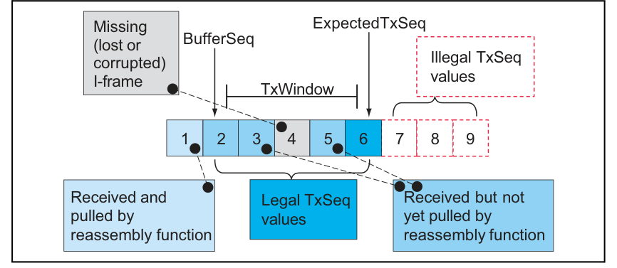

**Figure 8.3:  Overview of the receiver side when operating in flow control mode**

#### 8.5.1  Transmitting I-frames

A new I-frame shall only be transmitted when the TxWindow is not full.
Upon transmission of the I-frame the following actions shall be performed:
• If no unacknowledged I-frames have been sent then the MonitorTimer shall be stopped and the RetransmissionTimer shall be started.
• If any I-frames have been sent and not acknowledged then the RetransmissionTimer remains active and no timer operation is performed.
The control field parameter ReqSeq shall be set to ExpectedTxSeq, TxSeq shall be set to NextTXSeq and NextTXSeq shall be incremented by one.

#### 8.5.2  Receiving I-frames

Upon receipt of a valid I-frame with TxSeq equal to ExpectedTxSeq, the frame shall be made available to the reassembly function. ExpectedTxSeq shall be incremented by one. An acknowledgment shall not be sent until the SDU reassembly function has pulled the I-frame.
Upon receipt of a valid I-frame with an out-of-sequence TxSeq (see Section 8.5.6) all frames with a sequence number less than TxSeq shall be assumed lost and marked as missing. The missing I-frames are in the range from ExpectedTxSeq (the frame that the device was expecting to receive) up to TxSeq-1, (the frame that the device actually received). ExpectedTxSeq shall be set to TxSeq +1. The received I-frame shall be made available for pulling by the reassembly function. The acknowledgment shall not occur until the SDU reassembly function has pulled the I-frame. The ReqSeq shall be processed according to Section 8.5.4.

#### 8.5.3  I-frames pulled by the SDU reassembly function

When the L2CAP layer has removed one or more I-frames from the buffer, BufferSeq may be incremented in accordance with the amount of buffer space released. If BufferSeq is incremented, an acknowledgment shall be sent to the peer entity. If the MonitorTimer is active then it shall be restarted to indicate that a signal has been sent to the peer L2CAP entity.
Note: Since the primary purpose of BufferSeq is to prevent buffer overflow, an implementation may choose to set BufferSeq in accordance with how many new incoming I-frames could be stored rather than how many have been removed.
The acknowledgment may be an RR or an I-frame. The acknowledgment shall be sent to the peer L2CAP entity with ReqSeq equal to BufferSeq. When there is no I-frame buffered for pulling, ExpectedTxSeq is equal to BufferSeq.

#### 8.5.4  Sending and receiving acknowledgments

One of the timers MonitorTimer or RetransmissionTimer shall always be active while in Flow Control mode. Both timers shall never be active concurrently.

##### 8.5.4.1  Sending acknowledgments

Whenever a data link layer entity transmits an I-frame or a S-frame, ReqSeq shall be set to ExpectedTxSeq or BufferSeq.

##### 8.5.4.2  Receiving acknowledgments

On receipt of a valid S-frame or I-frame the ReqSeq contained in the frame shall be used to acknowledge previously transmitted I-frames. ReqSeq acknowledges I-frames with a TxSeq up to and including ReqSeq – 1.
1. If any outstanding I-frames were acknowledged then
a) Stop the RetransmissionTimer
b) If there are still unacknowledged I-frames then restart the RetransmissionTimer, otherwise start the MonitorTimer.
c) Transmit any I-frames awaiting transmission according to Section 8.5.1.
ExpectedAckSeq shall be set to ReqSeq to indicate that the I-frames with TxSeq up to and including ExpectedAckSeq have been acknowledged.

#### 8.5.5  Waiting acknowledgments

If the RetransmissionTimer expires the following actions shall be taken: The I-frame supervised by the RetransmissionTimer shall be considered lost, and ExpectedAckSeq shall be incremented by one.
1. If I-frames are waiting to be sent
a) the RetransmissionTimer is restarted.
b) I-frames awaiting transmission are transmitted according to
Section 8.5.1.
2. If there are no I-frames waiting to be sent
a) If there are still unacknowledged I-frames the RetransmissionTimer is restarted, otherwise the MonitorTimer is started.

#### 8.5.6  Exception conditions

Exception conditions may occur as the result of physical layer errors or L2CAP procedural errors. The error recovery procedures which are available following the detection of an exception condition at the L2CAP layer in flow control only mode are defined in this section.

##### 8.5.6.1  TxSeq Sequence error

A TxSeq sequence error exception condition occurs in the receiver when a valid I-frame is received which contains a TxSeq value which is not equal to the expected value, thus TxSeq is not equal to ExpectedTxSeq.
The TxSeq sequence error may be due to three different causes:
• Duplicated I-frame The duplicated I-frame is identified by a TxSeq in the range BufferSeq to ExpectedTxSeq – 1. The ReqSeq shall be processed according to Section 8.5.4. The Information field shall be discarded since it has already been received.
• Out-of-sequence I-frame The out-of-sequence I-frame is identified by a TxSeq within the legal range ExpectedTxSeq < TxSeq < (BufferSeq + TxWindow). The ReqSeq shall be processed according to Section 8.5.4. The missing I-frame(s) are considered lost and ExpectedTXSeq is set equal to TxSeq+1 as specified in Section 8.5.2. The missing I-frame(s) are reported as lost to the SDU reassembly function.
• Invalid TxSeq An invalid TxSeq value is a value that does not meet either of the above conditions and TxSeq is not equal to ExpectedTxSeq. An I-frame with an invalid TxSeq is likely to have errors in the control field and shall be silently discarded.

##### 8.5.6.2  ReqSeq Sequence error

An ReqSeq sequence error exception condition occurs in the transmitter when a valid S-frame or I-frame is received which contains an invalid ReqSeq value. An invalid ReqSeq is one that is not in the range ExpectedAckSeq ≤ ReqSeq ≤ NextTXSeq.
The L2CAP entity shall close the channel as a consequence of an ReqSeq Sequence error.
An L2CAP entity that fails to receive an acknowledgment for an I-frame shall, on the expiry of the RetransmissionTimer, take appropriate recovery action as defined in Section 8.5.5.

##### 8.5.6.3  Invalid frame

Any frame received that is invalid (as defined in Section 3.3.6) shall be discarded, and no action shall be taken as a result of that frame, unless the receiving L2CAP entity is configured to deliver erroneous frames to the layer above L2CAP. In that case, the data contained in invalid frames may also be added to the receive buffer and made available for pulling from the SDU reassembly function.

### 8.6   ENHANCED RETRANSMISSION MODE

Enhanced Retransmission mode operates as an HDLC balanced data link operational mode. Either L2CAP entity may send frames at any time without receiving explicit permission from the other L2CAP entity. A transmission may contain single or multiple frames and shall be used for I-frame transfer and/or to indicate status change.

#### 8.6.1  Function Of PDU Types

Enhanced Retransmission mode uses I-frames to transfer upper layer information and S-frames for supervision. There are four S-frames defined: Receiver Ready (RR), Reject (REJ), Receiver Not Ready (RNR), and Selective Reject (SREJ). All frames formats in Enhanced Retransmission mode shall use the Enhanced Control Field.

##### 8.6.1.1  Receiver Ready (RR)

The RR frame shall be used by an L2CAP entity to
1. Indicate that it is ready to receive I-frames
2. Acknowledge previously received I-frames numbered up to ReqSeq - 1 inclusive.
An RR with P-bit set to 1 (P=1) is used to indicate the clearance of any busy condition that was initiated by an earlier transmission of an RNR frame by the same L2CAP entity.

##### 8.6.1.2  Reject (REJ)

The REJ frame shall be used by an L2CAP entity to request retransmission of I-frames starting with the frame numbered ReqSeq. I-frames numbered ReqSeq - 1 and below shall be considered acknowledged. Additional I-frames awaiting initial transmission may be transmitted following the retransmitted I- frame(s) up to the TxWindow size of the receiver.
At most only one REJ exception from a given L2CAP entity to another L2CAP entity shall be established at any given time. A REJ frame shall not be transmitted until an earlier REJ exception condition or all earlier SREJ
exception conditions have been cleared. The REJ exception condition shall be cleared upon the receipt of an I-frame with TxSeq equal to the ReqSeq of the REJ frame.
Two L2CAP entities may be in REJ exception conditions with each other at the same time.

##### 8.6.1.3  Receiver Not Ready (RNR)

The RNR frame shall be used by an L2CAP entity to indicate a busy condition (i.e. temporary inability to receive I-frames). I-frames numbered up to ReqSeq - 1 inclusive shall be considered acknowledged. The I-frame numbered ReqSeq and any subsequent I-frames sent shall not be considered acknowledged. The acceptance status of these I-frames shall be indicated in subsequent transfers.

##### 8.6.1.4  Selective Reject (SREJ)

The SREJ frame shall be used by an L2CAP entity to request retransmission of one I-frame. The ReqSeq shall indicate the TxSeq of the earliest I-frame to be retransmitted (not yet reported by a SREJ). If the P-bit is set to 1 then I-frames numbered up to ReqSeq -1 inclusive shall be considered acknowledged. If the P-bit is set to 0 then the ReqSeq field in the SREJ shall not indicate acknowledgment of I-frames.
Each SREJ exception condition shall be cleared upon receipt of an I-frame with TxSeq equal to the ReqSeq sent in the SREJ frame.
An L2CAP entity may transmit one or more SREJ frames with the P=0 before one or more earlier SREJ exception conditions initiated with SREJ(P=0) have been cleared. An L2CAP entity shall not transmit more than one SREJ with P=1 before all earlier SREJ exception conditions have been cleared. A SREJ frame shall not be transmitted if an earlier REJ exception condition has not been cleared. Likewise a REJ frame shall not be transmitted if one or more SREJ exception conditions have not been cleared. Only one I-frame shall be retransmitted in response to receiving a SREJ frame with P=0. Additional I- frames awaiting initial transmission may be transmitted following the retransmission of the specific I-frame requested by SREJ with P=1.

##### 8.6.1.5  Functions of the Poll (P) and Final (F) bits.

P-bit set to 1 shall be used to solicit a response frame with the F-bit set to 1 from the remote L2CAP entity at the earliest respond opportunity. At most only one frame with a P=1 shall be outstanding in a given direction at a given time. Before an L2CAP entity issues another frame with P=1, it shall have received a response frame from the remote L2CAP entity with F=1. If no valid frame is received with F=1 within Monitor time-out period, the frame with P=1 may be retransmitted.
The Final bit shall be used to indicate the frame as a response to a soliciting poll (S-frame with P=1). The frame with F=1 shall not be retransmitted. The Monitor-timeout is not used to monitor lost frames with F=1. Additional frames with F=0 may be transmitted following the frame with F=1.
S-frames shall not be transmitted with both the F-bit and the P-bit set to 1 at the same time.

#### 8.6.2  Rules For Timers

Timers are started upon transmission of a packet. Timers should be started when the corresponding packet leaves the Controller (transmitted or flushed). If the timer is not started when the packet leaves the Controller then it shall be started when the packet is delivered to the Controller. The specific rules for BR/ EDR Controllers, BR/EDR/LE Controllers, and AMP Controllers are described in the following sections.

##### 8.6.2.1  Timer Rules for ACL-U Logical Links

If a flush timeout does not exist on the ACL-U logical link for the channel using Enhanced Retransmission mode then the value for the Retransmission time- out shall be at least two seconds and the value for the Monitor time-out shall be at least twelve seconds.
If a flush timeout exists on the link for Enhanced Retransmission mode then the value for the Retransmission time-out shall be three times the value of flush timeout, subject to a minimum of 1 second and maximum of 2 seconds.
If a flush timeout exists on the link for Enhanced Retransmission mode and both sides of the link are configured to the same flush timeout value then the monitor time-out shall be set to a value at least as large as the Retransmission time-out otherwise the value of the Monitor time-out shall be six times the value of flush timeout, subject to a minimum of the retransmission timeout value and a maximum of 12 seconds.
If an L2CAP entity knows that a specific packet has been flushed instead of transmitted then it may execute proper error recovery procedures immediately.
When configuring a channel over an ACL-U logical link the values sent in a Configuration Request packet for Retransmission timeout and Monitor timeout shall be 0.
Note: If the link has a flush timeout and the Non-Flushable Packet Boundary Flag feature is used to mark the Enhanced Retransmission mode packets as non-flushable then the link does not have a flush timeout with regards to Enhanced Retransmission mode.

##### 8.6.2.2  Timer Rules for AMP Controllers

AMP Controllers can be classified by their behavior as follows:
1. Attempt to send a packet until LSTO disconnects the physical link. 2. Attempt to send a packet until a Controller based retry counter is exceeded whereupon the packet is flushed.
Class 1 AMP Controllers are reliable. They will not lose packets though packets can be lost during a move operation. Class 2 AMP Controllers are not reliable and can lose packets. The Best Effort Flush Timeout field in the AMP Info (see [Vol 2] Part E, Section 7.5.8) can be used to determine the behavior of the Controller (i.e. class 1 or class 2). If the Best Effort Flush Timeout field in the AMP info is 0xFFFFFFFF then the class is 1 otherwise the class is 2. The Best Effort Flush Timeout field indicates the flush timeout that may be set on the Best Effort logical link.
For class 1 AMP Controllers the Retransmission and Monitor timers are not really needed. Packets should not be lost. Packets lost during the move operation will be detected by L2CAP and retransmitted as part of the move operation. Therefore, the Retransmission timeout and Monitor timeout shall be at least the value of the Link supervision timeout set on the link or can be turned off altogether. The values sent in a Configuration Request packet for Retransmission timeout and Monitor timeout shall be 0.
When configuring a channel the AMP-U logical link of a over a class 2 AMP Controller non-0 values for Retransmission timeout and Monitor timeout shall be sent in a Configuration Request packet. The non-0 values specify the “processing” time of received packets. Processing time includes the time it takes for a received packet to be passed from the device's Controller to the L2CAP layer plus the time to be processed by the L2CAP layer and a response submitted back to the Controller. The local device's processing time is used by the remote device in calculating the Retransmission timeout and Monitor timeout it will use. The timeout values that will actually be used by a device shall be sent in a Configuration Response packet.
As with BR/EDR and BR/EDR/LE Controllers, the method used for setting timer values for class 2 AMP Controllers depends on when timers are started. Timers are either started when the packet leaves the Controller or when the packet is delivered to the Controller.
The timeout values used for Class 2 AMP Controllers where timers are started when the packet leaves the Controller shall be at least the values received in the Configuration Request packet from the remote device (remote device's “processing” time).
For Class 2 AMP Controller where timers are started when the packet is delivered to the Controller the following rules shall be used:
1. The local L2CAP Entity shall set a flush timeout on the Best Effort logical link equal to the value provided by the local Controller in the Best Effort Flush Timeout field of AMP info structure. 2. The value of the Retransmission timeout and Monitor Timeout shall be the value of the flush timeout multiplied by three plus the corresponding processing time received in the Configuration Request packet from the remote device.
If an L2CAP entity knows that a specific packet has been flushed instead of transmitted then it may execute proper error recovery procedures immediately.

##### 8.6.2.3  Timer Values used After a Move Operation

When a channel is moved from one Controller to another Controller the timeout values used after the move operation are based on the capabilities of the new Controller. The timeout values shall be set according to the following table:

| Controller | Timeout Values |
| --- | --- |
| BR/EDR and BR/EDR/LE | Retransmission timeout – at least 2 seconds Monitor timeout – at least 12 seconds |
| Class 1 AMP Controller | Retransmission timeout – at least LSTO (or turned off) Monitor timeout – at least LSTO (or turned off) |
| Class 2 AMP Controller where timers are started when packets leave the Con- troller | Retransmission timeout – at least 500ms Monitor timeout – at least 500ms Note: 500ms is the default value for the “processing” time received packets. |
| Class 2 AMP Controller where timers are started when packets are delivered to the Controller | Retransmission timeout – at least (local Controller "Best Effort” Flush Timeout * 3) + 500ms Monitor timeout – at least (local Controller “Best Effort” Flush Timeout * 3) + 500ms Note: 500ms is the default value for the “processing” time received packets |

Table 8.2:  AMP Controller timeout values
When moving to a Class 2 AMP Controller, the Retransmission Timeout and Monitor timeout should be reconfigured after the move operation to get the actual value for the “processing” time of received packets.

#### 8.6.3  General Rules for the State Machine

Enhanced Retransmission mode is specified using a pair of state machines, a Transmitter state machine and a Receiver state machine. The following rules apply to the state machine pair.
1. The state machine pair is informative but described using normative text in order to clearly specify the behavior of the protocol. Designers and imple- menters may choose any design / implementation technique they wish, but it shall behave in a manner identical to the external behavior of the specified state machines.
2. There is a single state machine pair for each active L2CAP channel configured to use Enhanced Retransmission mode.
3. Variables are used to limit the number of states by maintaining the state of particular conditions. The variables are defined in Section 8.6.5.2.
4. For some combinations of Event and Condition, the state tables provide alternative groups of actions. These alternatives are separated by horizontal lines in the Actions and Next State columns. The alternatives are mutually exclusive; selection of an alternate is done based upon (i) local status, (ii) a layer management action, or (iii) an implementation decision. There is no relationship between the order of the alternatives between events, nor is it implied that the same alternative must be selected every time the event occurs.
5. The state tables use timers. Any Start Timer action restarts the specified timer from its initial value, even if the timer is already running. When the timer reaches 0 the appropriate timer expired event is set and the timer stops. The Stop Timer action stops a timer if it is running.
6. Events not recognized in a particular state are assumed to remain pending until any masking flag is modified or a transition is made to a state where they can be recognized.
7. Some state transitions and actions are triggered by internal events (e.g. requests from the upper layer). It is implementation specific how these internal events are realized. They are used for clarity in specifying the state machine. All events including Internal events are described in Section 8.6.5.3.
8. The state machines specify the exact frames to be sent by transmitters but are relaxed on what receivers are allowed to accept as valid. For example there are cases where the transmitter is required to send a frame with P=1. The correct response is a frame with F=1 but in some cases the receiver is allowed to accept a frame with F=0 in addition to F=1.

#### 8.6.4  State Diagram

The state diagram shows the states and the main transitions. Not all events are shown on the state diagram.

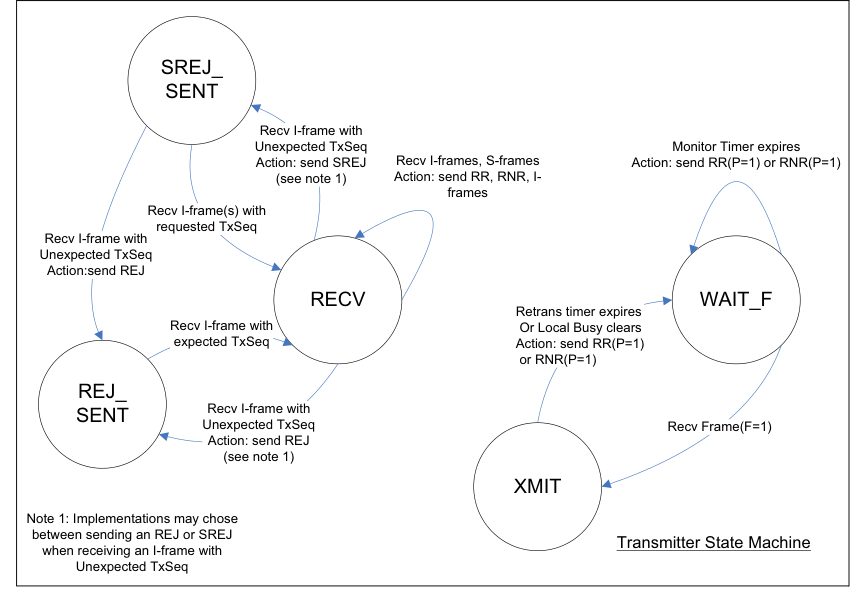

**Figure 8.4:  Receiver state machine**

#### 8.6.5  States Tables

##### 8.6.5.1  State Machines

Enhanced Retransmission mode is described as a pair of state machine. The Receiver state machine handles all received frames while the Transmitter State machine handles all asynchronous events including requests from the upper layer and the expiration of timers.
The Receiver state machine “calls” the Transmitter state machine using the PassToTx action. This shows up in the Transmitter state machine as an event. When the Transmitter state machine is called it runs to completion before returning to the Receiver state machine. Running to completion means that all actions are executed and the Transmitter state is changed to the new state.
The Receiver and Transmitter state machine share variables and timers.

##### 8.6.5.2  States

The following states have been defined to specify the protocol; the actual number of states and naming in a given implementation is outside the scope of this specification:
RECV—This is the main state of the Receiver state machine.
REJ_SENT—The L2CAP entity has sent a REJ frame to cause the remote L2CAP entity to resend I-frame(s). The L2CAP entity is waiting for the I-frame with a TxSeq that matches the ReqSeq sent in the REJ. Whether to send a REJ versus a SREJ is implementation dependent.
SREJ_SENT—The L2CAP entity has sent one or more SREJ frames to cause the remote L2CAP entity to resend missing I-frame(s). The local L2CAP entity is waiting for all requested I-frames to be received. If additional missing I- frames are detected while in SREJ_SENT then additional SREJ frames or a REJ frame can be sent to request those I-frames. Whether to send a SREJ versus a REJ is implementation dependent.
XMIT—This is the main state of the Transmitter state machine.
WAIT_F—Local busy has been cleared or the Retransmission timer has expired and an S-frame with P=1 has been sent. The local L2CAP entity is waiting for a frame with F=1. New I-frames cannot be sent while in the WAIT_F state to prevent the situation where retransmission of I-frames could result in the channel being disconnected.

##### 8.6.5.3  Variables and Timers

Variables are used to limit the number of states and help clarify the state chart tables. Variables can be set to values, evaluated in conditions and compared in conditional statements. They are also used in the action descriptions. Below is a list of the operators, connectives and statements that can be used with variables.

| Operator, connective or statement | Description |
| --- | --- |
| := | Assignment operator. Used to set a variable to a value |
| = | Relational operator "equal" |
| > | Relational operator "greater than" |
| < | Relational operator "less than" |
| ≥ | Relational operator "greater than or equal" |
| ≤ | Relational operator "less than or equal" |
| + | Arithmetic operator "plus" |

Table 8.3:  Operators, connectives and statements used with variables

| Operator, connective or statement | Description |
| --- | --- |
| mod | Modulo operator - returns the remainder of division of one number by another. |
| and | logical connective "and." It returns TRUE if both operands are TRUE otherwise it returns FALSE. |
| or | logical connective "or." It returns TRUE if either of its operand are TRUE otherwise it returns FALSE. |
| if (expression) then { statement } | Conditional Statement. If expression is TRUE then the state- ment is executed otherwise the statement is not executed. Th statement is composed of one or more actions. All the action in the statement are indented under the if … then clause and contained within braces “{ }”. |
| if (expression) then { statement1 } else { statement2 } | Conditional Statement. If expression is TRUE then statement is executed otherwise statement2 is executed. A statement is composed of one or more actions. All the actions in the state- ment1 are indented under the if … then clause and containe within braces “{ }”. All the actions of statement2 are indented under the else clause and contained within braces “{ }”. |

Table 8.3:  Operators, connectives and statements used with variables (Continued)
Enhanced Retransmission mode uses the following variables and sequence numbers described in Section 8.3:
• TxSeq
• NextTxSeq
• ExpectedAckSeq
• ReqSeq
• ExpectedTxSeq
• BufferSeq
In addition to the variables above the following variables and timers are used:
RemoteBusy—when set to TRUE RemoteBusy indicates that the local L2CAP entity has received an RNR from the remote L2CAP entity and considers the remote L2CAP entity as busy. When the remote device is busy it will likely discard I-frames sent to it. The RemoteBusy flag is set to FALSE when the local L2CAP Entity receives an RR, REJ or SREJ. When set to FALSE the local L2CAP entity considers the remote L2CAP entity able to accept I-frames. When the channel is created RemoteBusy shall be set to FALSE.
LocalBusy—when set to TRUE, LocalBusy indicates the local L2CAP entity is busy and will discard received I-frames. When set to FALSE the local L2CAP entity is not busy and is able to receive I-frames. When the channel is created LocalBusy shall be set to FALSE.
UnackedFrames—holds the number of unacknowledged I-frames. When the channel is created UnackedFrames shall be set to 0.
UnackedList—holds the unacknowledged I-frames so they can be retransmitted if necessary. I-frames in the list are accessed via their TxSeq number. For example UnackedList[5] accesses the I-frame with TxSeq 5.
PendingFrames—holds the number of pending I-frames. I-frames passed to L2CAP from the upper layer may be unable to be sent immediately because the remote L2CAP entity's TxWindow is full, is in a busy condition or the local L2CAP is in the incorrect state. When I-frames cannot be sent they are stored in a queue until conditions allow them to be sent. When the channel is created PendingFrames shall be set to 0.
SrejList—is a list of TxSeq values for I-frames that are missing and need to be retransmitted using SREJ. A SREJ has already been sent for each TxSeq on the list. When SrejList is empty it equals 0 (i.e. SrejList = 0). If SrejList is not empty it is greater than 0 (i.e. SrejList > 0).
RetryCount—holds the number of times an S-frame operation is retried. If an operation is tried MaxTransmit times without success the channel shall be closed.
RetryIframes[]—holds a retry counter for each I-frame that is sent within the receiving device's TxWindow. Each time an I-frame is retransmitted the corresponding counter within RetryIframes is incremented. When an attempt to retransmit the I-frame is made and the counter is equal to MaxTransmit then the channel shall be closed.
RNRsent—when set to TRUE it means that the local L2CAP entity has sent an RNR frame. It is used to determine if the L2CAP entity needs to send an RR to the remote L2CAP entity to clear the busy condition. When the channel is created RNRsent shall be set to FALSE.
RejActioned—is used to prohibit a frame with F=1 from causing I-frames already retransmitted in response to a REJ from being retransmitted again. RejActioned is set to TRUE if a received REJ is actioned when a frame sent with P=1 is unanswered. When the channel is created RejActioned shall be set to FALSE.
SrejActioned—is used in conjunction with SrejSaveReqSeq to prohibit a frame with F=1 from causing an I-frame already retransmitted in response to a SREJ from being retransmitted again. SrejActioned is set to TRUE if a received SREJ is actioned when a frame sent with P=1 is unanswered. When the channel is created SrejActioned shall be set to FALSE.
SrejSaveReqSeq—is used to save the ReqSeq of a SREJ frame that causes SrejActioned to be set to TRUE.
SendRej—when set to TRUE it indicates that the local L2CAP entity has determined that a REJ should be sent in the SREJ_SENT state while processing received I-frames. The sending of new SREJ frames is stopped. When the channel is created SendRej shall be set to FALSE.
BufferSeqSrej—is used while in the SREJ_SENT state to keep track of the value to which BufferSeq will be set upon exit of the SREJ_SENT state.
FramesSent—is used to keep track of the number I-frames sent by the Send- Data and Retransmit-I-frames actions.
MaxTxWin—contains the maximum window size plus 1. It is used in TxWindow modulo operations as the divisor and in state table conditions. This value shall be set to 16384 (0x4000) if the Extended Window Size option is used; otherwise it shall be set to 64.
RetransTimer—The Retransmission Timer is used to detect lost I-frames. When the channel is created the RetransTimer shall be off.
MonitorTimer—The Monitor Timer is used to detect lost S-frames. When the channel is created the MonitorTimer shall be off.

##### 8.6.5.4  Events

Data-Request—The upper layer has requested that an SDU be sent. The SDU may need to be broken into multiple I-frames by L2CAP based on the MPS of the remote device and/or the maximum PDU allowed by the HCI or QoS requirements of the system.
Local-Busy-Detected—A local busy condition occurs when the local L2CAP entity is temporarily unable to receive, or unable to continue to receive, I- frames due to internal constraints. For example, the upper layer has not pulled received I-frames and the local L2CAP entity needs to send an acknowledgment to the remote L2CAP entity. The method for handling the detection of local busy is implementation specific. An implementation may wait to send an RNR to see if the busy condition will clear before the remote L2CAP entity's Retransmission timer expires. If the busy condition clears then frames can be acknowledged with an RR or I-frame. If the busy condition does not clear before the remote L2CAP entity's Retransmission timer expires then an RNR shall be sent in response to the RR or RNR poll sent by the remote L2CAP entity. Optionally an implementation may send an RNR as soon as the local busy condition is detected.
Local-Busy-Clear—The local busy condition clears when L2CAP has buffer space to receive more I-frames (i.e. SDU Reassembly function and/or upper layer has pulled I-frames) and if necessary the upper layer has cleared the busy condition.
Recv ReqSeqAndFbit—This is an event generated by the Receiver state machine. It contains the ReqSeq and F-bit value of a received frame. The value of the F-bit can be checked in a condition.
Recv Fbit—This is an event generated by the Receiver state machine. It contains the F-bit value of a received frame. The value of the F-bit can be checked in a condition.
RetransTimer-Expires—The Retransmission Timer has counted to down to 0 and stopped.
MonitorTimer-Expires—The Monitor Timer has counted down to 0 and stopped.
Recv I-frame—Receive an I-frame with any value for the F-bit.
Recv RR, REJ, RNR, SREJ (P=x) or (F=x)—Receive a specific S-frame (RR, REJ, etc.) with a specific value for the P and/or F bit. The F-bit and the P-bit shall not both be set to 1 in a transmitted S-frame so received S-frames with both P and F set to 1 should be ignored. If the P and/or F bit value is not specified in the event then either value is accepted.
Recv RRorRNR—Receive an RR or RNR with any value for the P-bit and F- bit.
Recv REJorSREJ—Receive an REJ or SREJ with any value for the P-bit and F-bit.
Recv frame—This is catch-all for all frames that are not explicitly declared as events in the state table.

##### 8.6.5.5  Conditions

RemoteBusy = TRUE or FALSE—TRUE indicates the remote L2CAP entity is in a busy condition and FALSE indicates the remote L2CAP entity is not busy.
LocalBusy = TRUE or FALSE—TRUE indicates the local L2CAP entity is in a busy condition and FALSE indicates the local L2CAP entity is not busy.
RemWindow-Not-Full—The number of unacknowledged I-frames sent by L2CAP has not yet reached the TxWindow size of the remote L2CAP entity.
RemWindow-Full—The number of unacknowledged I-frames sent by the L2CAP entity has reached the TxWindow size of the remote L2CAP entity. No more I-frames shall be sent until one or more I-frames have been acknowledged.
RNRsent = TRUE or FALSE—TRUE indicates an RNR has been sent while a local busy condition exists. It is set to FALSE when the local busy condition clears.
F = 0 or 1—the F-bit of a received frame is checked. The F-bit of the received frame is available as part of the Recv ReqSeqAndFbit and Recv Fbit events.
RetryIframes[i] < or ≥ MaxTransmit—Compare the appropriate counter in RetryIframes after processing the ReqSeq in the receive frame to determine if it has reached MaxTransmit or not.
RetryCount < or ≥ MaxTransmit—Compare RetryCount to determine if it has reached MaxTransmit or not.
With-Expected-TxSeq—The TxSeq of a received I-frame is equal to ExpectedTxSeq.
With-Valid-ReqSeq—The ReqSeq of the received frame is in the range ExpectedAckSeq ≤ ReqSeq < NextTxSeq.
With-Valid-ReqSeq-Retrans—The ReqSeq of the received frame is in the range ExpectedAckSeq ≤ ReqSeq < NextTxSeq.
With-Valid-F-bit —The F-bit of a received frame is valid if it is 0 or if it is 1 and a frame sent with P=1 by the local L2CAP entity is unanswered (i.e. the local L2CAP entity send a frame with P=1 and has not yet received a frame with F=1 until receiving this one). If the Transmitter state machine is in the WAIT_F state then a frame sent with P=1 is unanswered.
With-unexpected-TxSeq—The TxSeq of the received I-frame is within the TxWindow of the L2CAP entity receiving the I-frame but has a TxSeq “greater” than ExpectedTxSeq where “greater” means later in sequence than ExpectedTxSeq.
With-duplicate-TxSeq—The TxSeq of the received I-frame is within the TxWindow of the L2CAP entity receiving the I-frame but has a TxSeq “less” than ExpectedTxSeq where “less” means earlier in the sequence than ExpectedTxSeq. In other words this is a frame that has already been received.
With-Invalid-TxSeq—The TxSeq of the received I-frame is not within the TxWindow of the L2CAP entity receiving the frame.
With-Invalid-ReqSeq—The ReqSeq of the received frame is not in the range ExpectedAckSeq ≤ ReqSeq < NextTxSeq.
With-Invalid-ReqSeq-Retrans—The ReqSeq of the received frame is not in the range ExpectedAckSeq ≤ ReqSeq < NextTxSeq.
Not-With-Expected-TxSeq—The TxSeq of the received I-frame is within the TxWindow of the L2CAP entity receiving the frame but is not equal to ExpectedTxSeq. It is either unexpected or a duplicate.
With-Expected-TxSeq-Srej—The TxSeq of the received I-frame is equal to the TxSeq at the head of SrejList.
SendRej = TRUE or FALSE—TRUE indicates that a REJ will be sent after all frames requested using SREJ have been received.
SrejList = or > 1—Determine if the number of items in SrejList is equal to or greater than 1.
With-Unexpected-TxSeq-Srej—The TxSeq of the received I-frame is equal to one of the values stored in SrejList but is not the TxSeq at the head. This indicates that one or more I-frames requested using SREJ are missing either because the SREJ was lost or the requested I-frame(s) were lost. Either way the SREJ frames must be resent to retrieve the missing I-frames.
With-duplicate-TxSeq-Srej—The TxSeq of the received I-frame is equal to a TxSeq of one of the saved I-frames indicating it is a duplicate.

##### 8.6.5.6  Actions

Send-Data—This action is executed as a result of a Data-Request event. The number of I-frames sent without being acknowledged shall not exceed the TxWindow size of the receiving L2CAP entity (UnackedFrames is less than or equal to the remote L2CAP entity's TxWindow). Any I-frames that cannot be sent because they would exceed the TxWindow size are queued for later transmission. For each I-frame the following actions shall be carried out:
Send I-frame with TxSeq set to NextTxSeq and ReqSeq set to BufferSeq. UnackedList[NextTxSeq] := I-frame UnackedFrames := UnackedFrames + 1 FramesSent := FramesSent + 1 RetryIframes[NextTxSeq] := 1 NextTxSeq := (NextTxSeq + 1) mod MaxTxWin Start-RetransTimer
Pend-Data—This action is executed as a result of a Data-Request when it is not possible to send I-frames because the window is full, the remote L2CAP entity is in a busy condition or the local L2CAP entity is not in a state where I- frames can be sent (e.g. WAIT_F). The I-frame(s) are queued for later transmission.
Process-ReqSeq—the ReqSeq contained in the received frame shall acknowledge previously transmitted I-frames. ExpectedAckSeq shall be set to ReqSeq to indicate that the I-frames with TxSeq up to and including (ReqSeq—1) have been acknowledged. The acknowledged I-frames shall be removed from UnackedList, the retry counters for each acknowledged frame shall be set to 0 and the number of acknowledged frames shall be subtracted from UnackedFrames so that UnackedFrames shall contain the number of the remaining unacknowledged I-frames. Pending I-frames are now available to be
transmitted by the Send-Ack action. If UnackedFrames equals 0 then Stop- RetransTimer.
Send RR, RNR (P=x) or (F=x)—Send the specified S-frame with the specified value for the P-bit or F-bit. If a value for the P-bit or F-bit is not specified the value shall be 0. For example Send RR(P=1) means send an RR with the P-bit set to 1 and the F-bit set to 0. The ReqSeq field shall be set to BufferSeq. If an RNR is sent, RNRsent shall be set to TRUE.
Send REJ (P =x) or (F=x)—Send a REJ with the specified value for the P-bit or F-bit. The ReqSeq field shall be set to ExpectedTxSeq. If a value for the P- bit or F-bit is not specified the value shall be 0. Note that this will acknowledge previously received I-frames up to ExpectedTxSeq—1 and may allow the remote L2CAP entity to transmit new I-frames. If the local L2CAP entity is not in a position to acknowledge the previously received I-frames it may use SREJ(P=0) or RNR. It may also wait to send the REJ until it is able to acknowledge the I-frames.
Send RRorRNR (P=x) or (F=1)—Send an RR or RNR with the specified value for the P-bit or F-bit based on the value of LocalBusy. If a value for the P-bit or F-bit is not specified the value shall be 0. An RNR shall be sent if LocalBusy equals TRUE. If LocalBusy equals FALSE then an RR shall be sent.
Send IorRRorRNR(F=1)—Send I-frames, an RR or an RNR with the F-bit set to 1. The following algorithm shall be used:
FramesSent:=0 if LocalBusy = TRUE then {
Send RNR(F=1)
}
if RemoteBusy = TRUE and UnackedFrames > 0 then {
Start-RetransTimer
}
RemoteBusy := FALSE
Send-Pending-I-frames(see note)
if LocalBusy = FALSE and FramesSent = 0 then {
Send RR(F=1)
}
Note: The SendIorRRorRNR(F=1) sends frames by invoking other actions. During the execution of SendIorRRorRNR multiple actions may be invoked. The first action invoked shall send the first or only frame with the F-bit set to 1. All other frames sent shall have the F- bit set to 0.
Send SREJ—Send one or more SREJ frames with P=0. For each missing I- frame starting with ExpectedTxSeq up to but not including the TxSeq of the
received I-frame, an SREJ frame is sent with ReqSeq set to the TxSeq of the missing frame. The TxSeq is inserted into the tail of SrejList. For example if ExpectedTxSeq is 3 and the received I-frame has a TxSeq of 5 there are two missing I-frames. An SREJ with ReqSeq 3 is sent followed by an SREJ with ReqSeq 4. TxSeq 3 is inserted first into SrejList followed by TxSeq 4. After all SREJ frames have been sent ExpectedTxSeq shall be set to the TxSeq of the received I-frame + 1 mod MaxTxWin.
Send SREJ(SrejList)—Send one or more SREJ frames with P=0. An I-frame was received that matches one of the TxSeq values in the SrejList but does not match the head of SrejList. This means I-frames requested via SREJ are still missing. For each TxSeq value starting with the head of SrejList and going backwards (i.e., from the head towards the tail) through the SrejList up to but not including the TxSeq of the received frame, an SREJ frame is sent with ReqSeq set to the TxSeq from SrejList. The TxSeq is removed from SrejList and reinserted into the tail of SrejList. Finally, remove the TxSeq of the received frame from the head of the list.
Send SREJ(SrejList-tail)(F=1)—Send a SREJ frame with F=1 and ReqSeq equal to the TxSeq at the tail of SrejList.
Start-RetransTimer—If the Monitor timer is not running then start the Retransmission Timer from its initial value (see Retransmission time-out in Section 5.4). If the Retransmission timer is already running it is restarted from its initial value. If the Monitor timer is running then the Retransmission timer is not started.
Start-MonitorTimer—Start the Monitor Timer from its initial value (see Monitor time-out in Section 5.4). If the timer is already running it is restarted from its initial value.
PassToTx—Pass the ReqSeq and F-bit value of a received frame to the Transmitter state machine. This will show up as a Recv ReqSeqAndFbit event in the Transmitter state machine.
PassToTxFbit—Pass the F-bit value of a received frame to the Transmitter state machine. This will show up as a Recv Fbit event in the Transmitter state machine.
Data-Indication—A received I-frame is passed to the SDU reassembly function. For the purpose of the state machine this operation is completed immediately so the Send_Ack action should be executed as one of the next actions. In some cases the SDU reassembly function cannot accept the I-frame so the I-frame will be stored within the L2CAP Entity consuming a portion of its TxWindow. When the I-frame is pulled by the SDU reassembly function the Send_Ack action should be executed. Before the Send_Ack action is executed BufferSeq is advanced as follows:
BufferSeq := (BufferSeq + 1) mod MaxTxWin
Increment-ExpectedTxSeq—ExpectedTxSeq is incremented as follows:
ExpectedTxSeq := (ExpectedTxSeq + 1) mod MaxTxWin
Stop-RetransTimer—the Retransmission timer is stopped.
Stop-MonitorTimer —the Monitor timer is stopped.
Send-Ack (F=x)—an acknowledgment with the specified value for the F-bit may be sent. Note that this action may occur in an action block with other actions that also send frames. If a frame has already been sent then it is not necessary to send additional frames. If the value for the F-bit is not specified it shall be set to 0. If the value specified is P then the F-bit shall be set equal to the value of the P-bit of the received frame being acknowledged. If more than one frame is sent in the acknowledgment only the first frame shall have an F-bit set to 1. An acknowledgment is an RR, RNR, or pending I-frame(s) (I-frames that have not been transmitted yet). If pending I-frames are available and are allowed to be sent then as many as allowed should be sent as an acknowledgment. Sending an RR or RNR as an acknowledgment for each received I-frame is not required. An implementation may wait to send an RR or RNR until a specific number of I-frames have been received, after a certain period of time has elapsed or some other algorithm. To keep data flowing it is recommended that an acknowledgment be sent before the TxWindow is full. It should also be noted that the maximum size of a remote L2CAP entity's unacknowledged I-frame list may be smaller than the local L2CAP entity's TxWindow. Therefore the local L2CAP entity should not expect the remote L2CAP entity to send enough frames to fill its TxWindow and should acknowledge I-frames accordingly. The following algorithm shall be used when sending an acknowledgment.
if LocalBusy == TRUE then { Send_RNR(F=x) } else if (RemoteBusy == FALSE) and Pending I-frames Exist and RemWindow-Not-Full then { Send-Pending-I-frames (F=x) } else { Send_RR (F=x) }
InitSrej—Initialize the variables used for processing SREJ as follows:
Clear SrejList - (remove all values) SendRej := FALSE BufferSeqSrej := BufferSeq
SaveIframeSrej—Save the received I-frame. Missing I-frame(s) will be retransmitted in response to SREJ frames. Implementations may want to save
the I-frame in its proper sequence order by leaving room for the missing I- frames.
StoreOrIgnore—If the local L2CAP entity has room to store the received I- frame then it may store it otherwise it shall discard it. If the received I-frame is stored, ExpectedTxSeq is advanced as follows:
ExpectedTxSeq := (ExpectedTxSeq + 1) mod MaxTxWin
PbitOutstanding—If the Transmitter state machine of the local L2CAP entity is in the WAIT_F state then return TRUE otherwise return FALSE.
Retransmit-I-frames—All the unacknowledged I-frames starting with the I- frame with TxSeq equal to the ReqSeq field of the received S-frame (REJ or RR) is retransmitted. If the P-bit of the received S-frame is 1 then the F-bit of the first I-frame sent shall be 1. If the P-bit of the received S-frame is 0 then the F-bit of the first I-frame sent shall be 0. The F-bit of all other unacknowledged I- frames sent shall be 0. The retry counter in RetryIframes[] for each retransmitted I-frame is incremented by 1. If a retry counter in RetryIframes[] is equal to MaxTransmit then the channel shall be closed. FramesSent shall be incremented by 1 for each frame sent. If the RetransTimer is not already running then perform the Start-RetransTimer action.
Retransmit-Requested-I-frame—The unacknowledged I-frame with TxSeq equal to the ReqSeq field of the received S-frame (SREJ) is retransmitted. If the P-bit of the received S-frame is 1 then the F-bit of the retransmitted I-frame shall be 1. If the P-bit of the received S-frame is 0 then the F-bit of the retransmitted I-frame shall be 0. The retry counter in RetryIframes[] corresponding to the retransmitted I-frame is incremented by 1. If the RetransTimer is not already running then perform the Start-RetransTimer action.
Send-Pending-I-frames (F=x)—If PbitOutstanding equals FALSE then send all pending I-frames that can be sent without exceeding the receiver's TxWindow using the Send-Data action. If a value for the F-bit is specified then the F-bit of the first I-frame sent shall be set to the specified value and the F-bit of all other I-frames sent shall be set to 0. If no value for the F-bit is specified then all I-frames sent shall have the F-bit set to 0. Pending I-frames are I- frames that have been given to the L2CAP entity by the upper layer but have not yet been transmitted. If one or more I-frames are sent and the RetransTimer is not already running then perform the Start-RetransTimer action.
Close Channel—Close the L2CAP channel as described in Section 4.6.
Ignore—the event may be silently discarded.
PopSrejList—Remove and discard the TxSeq from the head of SrejList.
Data-IndicationSrej—If the received I-frame fills a gap in a sequence of saved I-frames then all the saved I-frames in the sequence are passed to the SDU reassembly function. For the purpose of the state machine this operation is completed immediately. For example if the TxSeq of saved I-frames before receiving an I-frame is 2, 3, 5, 6, 9 and the received I-frame has a TxSeq of 4 then it fills the gap between 3 and 5 so the sequence 2, 3, 4, 5, 6 can be passed to the SDU reassembly function. When the I-frames are actually removed from the L2CAP entity receive buffers either by being processed immediately or when pulled by the SDU reassembly function, BufferSeqSrej is advanced as follows:
BufferSeqSrej := (BufferSeqSrej + 1) mod MaxTxWin

##### 8.6.5.7  XMIT State Table

| Event | Condition | Action | Next Stat |
| --- | --- | --- | --- |
| Data-Request | RemoteBusy = FALSE and RemWindow-Not-Full | Send-Data | XMIT |
| Data-Request | RemoteBusy = TRUE or RemWindow-Full | Pend-Data | XMIT |
| Local-Busy-Detected |  | LocalBusy := TRUE | XMIT |
|  |  | LocalBusy := TRUE Send RNR | XMIT |
| Local-Busy-Clear | RNRsent = TRUE | LocalBusy := FALSE RNRsent := FALSE Send RR(P=1) RetryCount := 1 Stop-RetransTimer Start-MonitorTimer | WAIT F _ |
| Local-Busy-Clear | RNRsent = FALSE | LocalBusy := FALSE RNRsent := FALSE | XMIT |
| Recv ReqSeqAndFbit |  | Process-ReqSeq | XMIT |
| Recv Fbit |  |  | XMIT |
| RetransTimer-Expires |  | Send RRorRNR(P=1) RetryCount := 1 Start-MonitorTimer | WAIT F _ |

Table 8.4:  XMIT state table

##### 8.6.5.8  WAIT_F State Table

| Event | Condition | Action | Next Stat |
| --- | --- | --- | --- |
| Data-Request |  | Pend-Data | WAIT F _ |
| Recv ReqSeqAndFbit | F = 1 | Process-ReqSeq Stop-MonitorTimer If UnackedFrames > 0 then { Start-RetransTimer } | XMIT |
| Recv ReqSeqAndFbit | F = 0 | Process-ReqSeq | WAIT F _ |
| Recv Fbit | F = 1 | Stop-MonitorTimer If UnackedFrames > 0 then { Start-RetransTimer } | XMIT |
| Recv Fbit | F = 0 |  | WAIT F _ |
| MonitorTimer-Expires | RetryCount < Max- Transmit | RetryCount := RetryCount+1 Send RRorRNR(P=1) Start-MonitorTimer | WAIT F _ |
| MonitorTimer-Expires | RetryCount ≥ Max- Transmit | Close Channel |  |

Table 8.5:  WAIT_F State Table

##### 8.6.5.9  RECV State Table

| Event | Condition | Action | Next State |
| --- | --- | --- | --- |
| Recv I-frame (F=0) | With-Expected-TxSeq and With-Valid-ReqSeq and With-Valid-F-bit and LocalBusy = FALSE | Increment-ExpectedTxSeq PassToTx Data-Indication Send-Ack(F=0) | RECV |
| Recv I-frame (F=1) | With-Expected-TxSeq and With-Valid-ReqSeq and With-Valid-F-bit and LocalBusy = FALSE | Increment-ExpectedTxSeq PassToTx Data-Indication If RejActioned = FALSE then { Retransmit-I-frames Send-Pending-I-frames } else { RejActioned := FALSE } Send-Ack(F=0) | RECV |
| Recv I-frame | With-duplicate-TxSeq and With-Valid-ReqSeq and With-Valid-F-bit and LocalBusy = FALSE | PassToTx | RECV |
| Recv I-frame | With-unexpected-TxSeq and With-Valid-ReqSeq and With-Valid-F-bit and LocalBusy = FALSE | PassToTx SendREJ | REJ SEN _ |
|  |  | PassToTx InitSrej SaveIframeSrej SendSREJ | SREJ SE _ |
| Recv I-frame | With-Expected-TxSeq and With-Valid-ReqSeq and With-Valid-F-bit and LocalBusy = TRUE | PassToTx StoreOrIgnore | RECV |
| Recv I-frame | With-Valid-ReqSeq and Not-With Expect- _ ed TxSeq _ and With-Valid-F-bit and LocalBusy = TRUE | PassToTx | RECV |
| Recv RNR (P=0) | With-Valid-ReqSeq and With-Valid-F-bit | RemoteBusy := TRUE PassToTx Stop-RetransTimer | RECV |

Table 8.6:  RECV_State table

| Event | Condition | Action | Next Stat |
| --- | --- | --- | --- |
| Recv RNR (P=1) | With-Valid-ReqSeq and With-Valid-F-bit | RemoteBusy := TRUE PassToTx Stop-RetransTimer Send RRorRNR (F=1) | RECV |
| Recv RR(P=0)(F=0) | With-Valid-ReqSeq and With-Valid-F-bit | PassToTx If RemoteBusy = TRUE and UnackedFrames > 0 then { Start-RetransTimer } RemoteBusy := FALSE Send-Pending-I-frames | RECV |
| Recv RR(F=1) | With-Valid-ReqSeq and With-Valid-F-bit | RemoteBusy := FALSE PassToTx If RejActioned = FALSE then { Retransmit-I-frames } else { RejActioned := FALSE } Send-Pending-I-frames | RECV |
| Recv RR(P=1) | With-Valid-ReqSeq and With-Valid-F-bit | PassToTx Send IorRRorRNR(F=1) | RECV |
| Recv REJ (F=0) | With-Valid-ReqSeq- Retrans and RetryIframes[i] < Max- Transmit and With-Valid-F-bit | RemoteBusy := FALSE PassToTx Retransmit-I-frames Send-Pending-I-frames If PbitOutstanding then { RejActioned := TRUE } | RECV |
| Recv REJ (F=1) | With-Valid-ReqSeq- Retrans and RetryIframes[i] < Max- Transmit and With-Valid-F-bit | RemoteBusy := FALSE PassToTx If RejActioned = FALSE then { Retransmit-I-frames } else { RejActioned :=FALSE } Send-Pending-I-frames ] | RECV |

Table 8.6:  RECV_State table  (Continued)

| Event | Condition | Action | Next State |
| --- | --- | --- | --- |
| Recv SREJ (P=0) (F=0) | With-Valid-ReqSeq- Retrans and RetryIframes[i] < Max- Transmit and With-Valid-F-bit | RemoteBusy := FALSE PassToTxFbit Retransmit-Requested-I-frame If PbitOutstanding then { SrejActioned := TRUE SrejSaveReqSeq = ReqSeq } | RECV |
| Recv SREJ (P=0) (F=1) | With-Valid-ReqSeq- Retrans and RetryIframes[i] < Max- Transmit and With-Valid-F-bit | RemoteBusy := FALSE PassToTxFbit If SrejActioned = TRUE and SrejSaveReqSeq = ReqSeq then { SrejActioned := FALSE } else { Retransmit-Requested-I- frame } | RECV |
| Recv SREJ(P=1) | With-Valid-ReqSeq- Retrans and RetryIframes[i] < Max- Transmit and With-Valid-F-bit | RemoteBusy := FALSE PassToTx Retransmit-Requested-I-frame Send-Pending-I-frames If PbitOutstanding then { SrejActioned = TRUE SrejSaveReqSeq := ReqSeq } | RECV |
| Recv REJ | With-Valid-ReqSeq- Retrans and RetryIframes[i] ≥ Max- Transmit | Close Channel |  |
| RECV SREJ | With-Valid-ReqSeq- Retrans and RetryIframes[i] >= Max- Transmit | Close Channel |  |
| Recv I-frame | (With-Invalid-TxSeq and TxWindow >(MaxTxWin/2) or With-Invalid-ReqSeq | Close Channel |  |
| Recv I-frame | With-Invalid-TxSeq and TxWindow ≤ (MaxTx- Win/2) | Close Channel |  |
|  |  | Ignore | RECV |
| Recv RRorRNR | With-Invalid-ReqSeq | Close Channel |  |

Table 8.6:  RECV_State table  (Continued)

| Event | Condition | Action | Next State |
| --- | --- | --- | --- |
| Recv REJorSREJ | With-Invalid-ReqSeq- Retrans | Close Channel |  |
| Recv frame |  | Ignore | RECV |

Table 8.6:  RECV_State table  (Continued)

##### 8.6.5.10  REJ_SENT State Table

| Event | Condition | Action | Next Stat |
| --- | --- | --- | --- |
| Recv I-frame (F=0) | With-Expected-TxSeq and With-Valid-ReqSeq and With-Valid-F-bit | Increment-ExpectedTxSeq PassToTx Data-Indication Send-Ack (F=0) | RECV |
| Recv I-frame (F=1) | With-Expected-TxSeq and With-Valid-ReqSeq and With-Valid-F-bit | Increment-ExpectedTxSeq PassToTx Data-Indication If RejActioned = FALSE then { Retransmit I-frames Send-Pending-I-frames } else { RejActioned := FALSE } Send-Ack (F=0) | RECV |
| Recv I-frame | With-Unexpected-TxSeq and With-Valid-ReqSeq and With-Valid-F-bit | PassToTx | REJ SEN _ |
| Recv RR (F=1) | With-Valid-ReqSeq and With-Valid-F-bit | RemoteBusy := FALSE PassToTx If RejActioned = FALSE then { Retransmit-I-frames } else { RejActioned := FALSE } Send-Pending-I-frames | REJ SEN _ |

Table 8.7:  REJ_SENT State table

| Event | Condition | Action | Next Stat |
| --- | --- | --- | --- |
| Recv RR (P=0)(F=0) | With-Valid-ReqSeq and With-Valid-F-bit | PassToTx If RemoteBusy = TRUE and UnackedFrames > 0 then { Start-RetransTimer } RemoteBusy := FALSE Send-Ack (F=0) | REJ SEN _ |
| Recv RR (P=1) | With-Valid-ReqSeq and With-Valid-F-bit | PassToTx If RemoteBusy = TRUE and UnackedFrames > 0 then { Start-RetransTimer } RemoteBusy := FALSE Send RR (F=1) | REJ SEN _ |
| Recv RNR (P=1) | With-Valid-ReqSeq and With-Valid-F-bit | RemoteBusy := TRUE PassToTx Send RR (F=1) | REJ SEN _ |
| Recv RNR (P=0) | With-Valid-ReqSeq and With-Valid-F-bit | RemoteBusy := TRUE PassToTx Send RR (F=0) | REJ SEN _ |
| Recv REJ (F=0) | With-Valid-ReqSeq - Retrans and RetryIframes[i] < Max- Transmit and With-Valid-F-bit | RemoteBusy := FALSE PassToTx Retransmit-I-frames Send-Pending-I-frames If PbitOutstanding then { RejActioned := TRUE } | REJ SEN _ |
| Recv REJ (F=1) | With-Valid-ReqSeq - Retrans and RetryIframes[i] < Max- Transmit and With-Valid-F-bit | RemoteBusy := FALSE PassToTx If RejActioned = FALSE then { Retransmit-I-frames } else { RejActioned := FALSE } Send-Pending-I-frames | REJ SEN _ |

Table 8.7:  REJ_SENT State table  (Continued)

| Event | Condition | Action | Next Stat |
| --- | --- | --- | --- |
| Recv SREJ (P=0) (F=0) | With-Valid-ReqSeq- Retrans and RetryIframes[i] < Max- Transmit and With-Valid-F-bit | RemoteBusy := FALSE PassToTxFbit Retransmit-Requested-I-frame If PbitOutstanding then { SrejActioned := TRUE SrejSaveReqSeq := ReqSeq } | REJ SEN _ |
| Recv SREJ (P=0) (F=1) | With-Valid-ReqSeq- Retrans and RetryIframes[i] < Max- Transmit and With-Valid-F-bit | RemoteBusy := FALSE PassToTxFbit If SrejActioned = TRUE and SrejSaveReqSeq = ReqSeq then { SrejActioned := FALSE } else { Retransmit-Requested-I- frame } | REJ SEN _ |
| Recv SREJ (P=1) | With-Valid-ReqSeq- Retrans and RetryIframes[i] < Max- Transmit and With-Valid-F-bit | RemoteBusy := FALSE PassToTx Retransmit-Requested-I- frames Send-Pending-I-frames If PbitOutstanding then { SrejActioned := TRUE SrejSaveReqSeq := ReqSeq } | REJ SEN _ |
| Recv REJ | With-Valid-ReqSeq- Retrans and RetryIframes[i] ≥ Max- Transmit | Close Channel |  |
| Recv SREJ (P=0) | With-Valid-ReqSeq- Retrans and RetryIframes[i] ≥ Max- Transmit | Close Channel |  |
| RECV SREJ (P=1) | With-Valid-ReqSeq- Retrans and RetryIframes[i] ≥ Max- Transmit | Close Channel |  |

Table 8.7:  REJ_SENT State table  (Continued)

| Event | Condition | Action | Next Stat |
| --- | --- | --- | --- |
| Recv I-frame | (With-Invalid-TxSeq and TxWindow > (MaxTx- Win/2)) or With-Invalid-ReqSeq | Close Channel |  |
| Recv RRorRNR | With-Invalid-ReqSeq | Close Channel |  |
| RecvREJorSREJ | With-Invalid-ReqSeq- Retrans | Close Channel |  |
| Recv I-frame | With-Invalid-TxSeq and TxWindow ≤ (MaxTx- Win/2) and With-Valid-ReqSeq | Close Channel |  |
|  |  | Ignore | REJ SEN _ |
| Recv frame |  | Ignore | REJ SEN _ |

Table 8.7:  REJ_SENT State table  (Continued)

##### 8.6.5.11  SREJ_SENT State Table

| Event | Condition | Action | Next State |
| --- | --- | --- | --- |
| Recv I-frame | With-Expected-TxSeq- Srej and With-Valid-ReqSeq and With-Valid-F-bit and SendRej = FALSE and SrejList = 1 | SaveIframeSrej PopSrejList PassToTx Data-IndicatioSrej BufferSeq := BufferSeqSrej Send-Ack (F=0) | RECV |
| Recv I-frame | With-Expected-TxSeq- Srej and With-Valid-ReqSeq and With-Valid-F-bit and SendRej = TRUE and SrejList = 1 | SaveIframeSrej PopSrejList PassToTx Data-IndicationSrej BufferSeq := BufferSeqSrej Send REJ | REJ SENT _ |
| Recv I-frame | With-Expected-TxSeq- Srej and With-Valid-ReqSeq and With-Valid-F-bit and SrejList > 1 | SaveIframeSrej PopSrejList PassToTx Data-IndicationSrej | SREJ SEN _ |
| Recv I-frame | With-Expected-TxSeq and With-Valid-ReqSeq and With-Valid-F-bit | SaveIframeSrej Increment-ExpectedTxSeq PassToTx | SREJ SEN _ |
| Recv I-frame | With-Unexpected- TxSeq and With-Valid-ReqSeq and With-Valid-F-bit and SendRej = FALSE | SaveIframeSrej PassToTx Send SREJ | SREJ SEN _ |
|  |  | PassToTx SendRej := TRUE | SREJ SEN _ |
| Recv I-frame | With-Unexpected- TxSeq and With-Valid-ReqSeq and With-Valid-F-bit and SendRej = TRUE | PassToTx | SREJ SEN _ |
| Recv I-frame | With-Unexpected- TxSeq-Srej and With-Valid-ReqSeq and With-Valid-F-bit | SaveIframeSrej PassToTx Send SREJ(SrejList) | SREJ SEN _ |

Table 8.8:  SREJ_SENT State Table

| Event | Condition | Action | Next State |
| --- | --- | --- | --- |
| Recv I-frame | With-duplicate-TxSeq- Srej and With-Valid-ReqSeq and With-Valid-F-bit | PassToTx | SREJ SEN _ |
| Recv RR(F=1) | With-Valid-ReqSeq and With-Valid-F-bit | RemoteBusy := FALSE PassToTx If RejActioned = FALSE then { Retransmit-I-frames } else { RejActioned := FALSE } Send-Pending-I-frames | SREJ SEN _ |
| Recv RR(P=1) | With-Valid-ReqSeq and With-Valid-F-bit | PassToTx If RemoteBusy = TRUE and UnackedFrames > 0 then { Start-RetransTimer } RemoteBusy := FALSE Send SREJ(SrejList-tail)(F=1) | SREJ SEN _ |
| Recv RR(P=0)(F=0) | With-Valid-ReqSeq and With-Valid-F-bit | PassToTx If RemoteBusy = TRUE and UnackedFrames > 0 then { Start-RetransTimer } RemoteBusy := FALSE Send-Ack(F=0) | SREJ SEN _ |
| Recv RNR(P=1) | With-Valid-ReqSeq and With-Valid-F-bit | RemoteBusy := TRUE PassToTx Send SREJ(SrejList-tail)(F=1) | SREJ SEN _ |
| Recv RNR(P=0) | With-Valid-ReqSeq and With-Valid-F-bit | RemoteBusy := TRUE PassToTx Send RR(F=0) | SREJ SEN _ |
| Recv REJ (F=0) | With-Valid-ReqSeq- Retrans and RetryIframes[i] < Max- Transmit and With-Valid-F-bit | RemoteBusy := FALSE PassToTx Retransmit-I-frames Send-Pending-I-frames If PbitOutstanding then { RejActioned := TRUE } | SREJ SEN _ |

Table 8.8:  SREJ_SENT State Table  (Continued)

| Event | Condition | Action | Next State |
| --- | --- | --- | --- |
| Recv REJ (F=1) | With-Valid-ReqSeq- Retrans and RetryIframes[i] < Max- Transmit and With-Valid-F-bit | RemoteBusy := FALSE PassToTx If RejActioned = FALSE then { Retransmit-I-frames } else { RejActioned := FALSE } Send-Pending-I-frames | SREJ SEN _ |
| Recv SREJ(P=0) (F=0) | With-Valid-ReqSeq- Retrans and RetryIframes[i] < MaxTransmit and With-Valid-F-bit | RemoteBusy := FALSE PassToTxFbit Retransmit-Requested-I-frame If PbitOutstanding then { SrejActioned := TRUE SrejSaveReqSeq = ReqSeq } | SREJ SEN _ |
| Recv SREJ(P=0) (F=1) | With-Valid-ReqSeq- Retrans and RetryIframes[i] < MaxTransmit and With-Valid-F-bit | RemoteBusy := FALSE PassToTxFbit If SrejActioned = TRUE and SrejSaveReqSeq = ReqSeq then { SrejActioned := FALSE } else { Retransmit-Requested-I- frame } | SREJ SEN _ |
| Recv SREJ(P=1) | With-Valid-ReqSeq- Retrans and RetryIframes[i] < MaxTransmit and With-Valid-F-bit | RemoteBusy := FALSE PassToTx Retransmit-Requested-I-frame Send-Pending-I-frames If PbitOutstanding then { SrejActioned := TRUE SrejSaveReqSeq = ReqSeq } | SREJ SEN _ |
| Recv REJ | With-Valid-ReqSeq- Retrans and RetryIframes[i] ≥ MaxTransmit | Close Channel |  |

Table 8.8:  SREJ_SENT State Table  (Continued)

| Event | Condition | Action | Next State |
| --- | --- | --- | --- |
| Recv SREJ(P=0) | With-Valid-ReqSeqRe- trans and RetryIframes[i] ≥ Max- Transmit | Close Channel |  |
| Recv SREJ(P=1) | With-Valid-ReqSeqRe- trans and RetryIframes[i] ≥ Max- Transmit | Close Channel |  |
| Recv I-frame | (With-Invalid-TxSeq and TxWindow > (Max- TxWin/2) or With-Invalid-ReqSeq | Close Channel |  |
| Recv RRor- RNR | With-Invalid-ReqSeq | Close Channel |  |
| Recv REJorSREJ | With-Invalid-ReqSeq- Retrans | Close Channel |  |
| Recv I-frame | With-Invalid-TxSeq and TxWindow ≤ (Max- TxWin/2) | Close Channel |  |
|  |  | Ignore | SREJ SEN _ |
| Recv frame | - | Ignore | SREJ SEN _ |

Table 8.8:  SREJ_SENT State Table  (Continued)

### 8.7   STREAMING MODE

When a link is configured to work in Streaming Mode, the frame format for outgoing data is the same as for Enhanced Retransmission mode but frames are not acknowledged. Therefore
• RR, REJ, RNR and SREJ frames shall not be used in Streaming Mode.
• The F-bit shall always be set to zero in the transmitter, and shall be ignored in the receiver.
• the MonitorTimer and RetransmissionTimer shall not be used in Streaming mode.
A channel configured to work in Streaming mode shall be configured with a finite value for the Flush Timeout on the transmitter.

#### 8.7.1  Transmitting I-frames

When transmitting a new I-frame the control field parameter ReqSeq shall be set to 0, TxSeq shall be set to NextTXSeq and NextTXSeq shall be incremented by one.

#### 8.7.2  Receiving I-frames

Upon receipt of a valid I-frame with TxSeq equal to ExpectedTxSeq, the frame shall be made available to the reassembly function. ExpectedTxSeq shall be incremented by one.
Upon receipt of a valid I-frame with an out-of-sequence TxSeq (see Section 8.7.3.1) all frames with a sequence number less than TxSeq shall be assumed lost and marked as missing. The missing I-frames are in the range from ExpectedTxSeq (the frame that the device was expecting to receive) up to and including TxSeq - 1. ExpectedTxSeq shall be set to TxSeq +1. The received I- frame shall be made available for pulling by the reassembly function. The ReqSeq shall be ignored.
Note: It is possible for a complete window size of I-frames to be missing and thus, no missing I-frames are detected. For example, when a window size of 63 is used this situation occurs when 63 I-frames in a row are missing. If the ability to not detect missing I-frames will cause problems for an application, it is recommended that the Extended Window Size option be used.
If there is no buffer space for the received I-frame an existing I-frame (i.e. the oldest) shall be discarded (flushed) freeing up buffer space for the new I-frame. The discarded I-frame shall be marked as missing.

#### 8.7.3  Exception Conditions

Exception conditions may occur as the result of physical layer errors or L2CAP procedural errors. The error recovery procedures which are available following the detection of an exception condition at the L2CAP layer in Streaming mode are defined in this section.

##### 8.7.3.1  TxSeq Sequence error

A TxSeq sequence error exception condition occurs in the receiver when a valid I-frame is received which contains a TxSeq value which is not equal to the expected value, thus TxSeq is not equal to ExpectedTxSeq.
The out-of-sequence I-frame is identified by a TxSeq that is greater than ExpectedTxSeq (TxSeq > ExpectedTXSeq). The ReqSeq shall be ignored. The missing I-frame(s) are considered lost and ExpectedTXSeq is set equal to TxSeq+1 as specified in Section 8.7.2. The missing I-frame(s) are reported as lost to the SDU reassembly function.

## 9  PROCEDURE FOR AMP CHANNEL CREATION AND

HANDLING
When an AMP is used, the procedures defined in this chapter shall be used. Enhanced Retransmission mode is used on all reliable channels to ensure a reliable move channel operation and to ensure that user traffic with an infinite flush timeout is reliable even for AMPs that do not support infinite flush timeout. Streaming mode is used on all channels configured with a finite flush timeout.

### 9.1   CREATE CHANNEL

Create Channel Request is used to create a new L2CAP channel over a Controller. The channel will have the quality of service specified by a pair of Extended Flow Specifications exchanged during channel configuration. Channels shall only be created over the BR/EDR Controller if both L2CAP entities support Extended Flow Specification for BR/EDR. After configuration each device will have an outgoing (transmit traffic) flow specification and an incoming (received traffic) flow specification. Note: Where Extended Flow Specification for BR/EDR is not supported by one or both L2CAP entities, an L2CAP channel can be established with Connection Request.
All Best Effort channels created over the same AMP Physical link are aggregated over a single AMP Logical link, so if a Best Effort channel is requested over an AMP Physical link where a Best Effort logical link already exists then the Best Effort Extended Flow Specifications are aggregated into one pair of flow specifications and the flow specification of the AMP Logical link is modified using the HCI Flow Spec Modify command (in devices that support HCI). Section 7.8 describes how Best Effort Flow specifications are aggregated. A logical link is created for each Guaranteed channel and one for the first Best Effort channel of the AMP.
All channels created over the same BR/EDR physical link are aggregated over a single logical link. Aggregation of Best Effort Extended Flow Specifications is not necessary for channels created over ACL-U logical links so the term “modify the logical link” in the algorithm descriptions results in “no action” when the logical link is ACL-U. The L2CAP layer should perform admission control for Guaranteed channels created on ACL-U logical links (see Section 7.10 for a description of L2CAP admission control). The term “create a logical link” in the algorithm description refers to L2CAP performing admission control when the logical link is ACL-U.
Basic Algorithm:
1. Extended Flow specifications and other configuration parameters shall be exchanged via the Lockstep Configuration procedure. 2. If the service type of the Extended Flow Specifications are Best Effort (including the case where one is Best Effort and the other is “No Traffic”) then the Best Effort Algorithm shall be used otherwise the Guaranteed Algorithm shall be used. (See Section 5.6 for rules on setting the service type of Extended Flow Specifications).
Best Effort Algorithm:
1. If one or more Best Effort channels already exist for the Controller then Goto step 3 2. Tell the Controller to create a logical link passing the Extended Flow Specifications. Goto step 5 3. Aggregate the Extended Flow Specifications with all the other Best Effort Extended Flow specifications running on the same physical link as described in Section 7.8. 4. Tell the Controller to modify the logical link passing the aggregated Extended Flow Specifications. 5. If the Controller accepts the create/modify request and returns success then complete the L2CAP Configuration with result = success otherwise complete the L2CAP configuration with result = “Failure - flow spec rejected”
Guaranteed Algorithm
1. Tell the Controller to create a logical link passing the Extended Flow Specifications. 2. If the Controller accepts the create request and returns success, complete the L2CAP Configuration with result = success; otherwise, complete the L2CAP configuration with result = “Failure - flow spec rejected.”
If the Controller is a BR/EDR or BR/EDR/LE Controller and the Extended Flow Specification type is Guaranteed then L2CAP should perform admission control by determining if the requested QoS can be achieved by the Controller without compromising existing Guaranteed channels running on the  Controller.
An example of the creation of the first Best Effort channel or a guaranteed channel is shown in Figure 9.1. An example of creation of a subsequent Best Effort channel is shown in Figure 9.2.

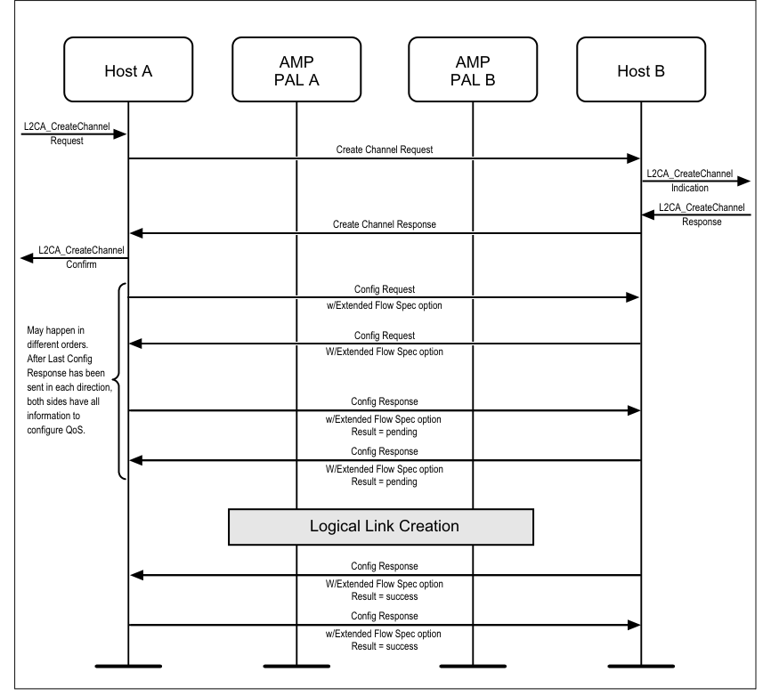

**Figure 9.1:  Creation of First Best Effort L2CAP channel or a Guaranteed L2CAP channel**

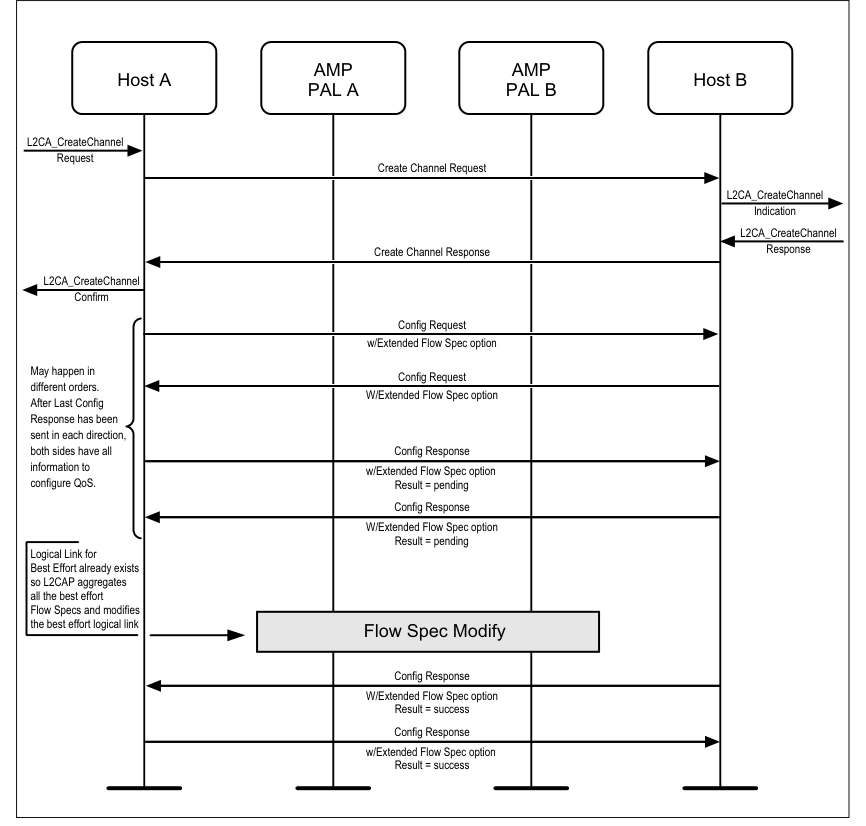

**Figure 9.2:  Creation of Subsequent Best Effort L2CAP channel**

### 9.2   MOVE CHANNEL

Move Channel is used to move an L2CAP channel from one Controller to another. Moving a channel retains the existing channel configuration (MTU, QOS, etc.) and the CID. If reconfiguration is necessary then it may be done after a successful move channel operation. If a channel configured as Best Effort is moved, the Extended Flow Specification aggregate shall be recalculated (see Section 7.8 for the aggregation algorithm) for both the old and new Controllers in cases where an aggregate already exists or where a channel is moved to a Controller with an existing Best Effort channel. If the Extended Flow Specification aggregate are modified for a Controller then a logical link modify operation shall be performed for that Controller.
The two procedures for moving channels are based on the mode configured for the channel. One procedure is used for channels configured with Enhanced
Retransmission mode. Another procedure is used for channels configured with Streaming mode. The procedures are described in the following sections.
Note that the terms such as “logical link create” and “logical link modify” are used in the Move procedures. For AMP Controllers these terms refer to logical link operations (e.g. QoS admission control) performed by the Controller. For BR/EDR and BR/EDR/LE Controllers these terms refer to QoS admission control performed by L2CAP on behalf of the Controller.

#### 9.2.1  Move Channel Protocol Procedure with Enhanced Retransmission Mode

1. When the L2CAP layer on the initiating device receives the L2CA_Move_Channel.request from the upper layer (application) it shall stop sending I-frames and S-frames. It shall continue to listen on the old Controller and follow the procedures in Section 9.2.1.1. The L2CAP layer on the initiating device shall send the Move Channel Request packet over the L2CAP signaling channel to the remote (responding) device. 2. When the L2CAP layer on the responding device receives the Move Channel Request packet it shall stop sending I-frames and S-frames. It shall still listen on the old Controller and follow the procedures in Section 9.2.1.1. It shall send a Move Channel Response packet to the other side. If a logical link must be created or modified (or admission control is required) the Move Channel Response packet shall contain a result code of “pending.” If a logical link does not need to be created or modified and the move operation is allowed then the Move Channel Response packet shall contain a result code of “success.” Otherwise, it shall contain the appropriate “refused” result code. If the response code sent in the Move Channel Response packet is “pending” then the L2CAP layer on the responding device shall attempt to create or modify a logical link on the new Controller for the channel. When the logical link create/modify operation is complete, the L2CAP layer on the responding device shall send a Move Channel Response packet to the other side with the result code indicating the success/failure of the logical link create/modify. 3. When the L2CAP layer on the initiating device receives the Move Channel Response packet it shall check the result code. If the result code in the Move Channel Response packet is “refused” it shall send a Move Channel Confirmation packet with result code “failure” to the other side. If the result code in the Move Channel Response packet is “pending” or “success” the L2CAP layer shall stop listening on the old Controller and attempt to create/modify a logical link on the new Controller for the channel. If the result code in the Move Channel Response packet is “pending” then it shall use the ERTX timer while waiting for a Move Channel Response packet with a “non-pending” result code from the responding device. When the logical link create/ modify operation is complete and the L2CAP layer on the initiating
device has received a Move Channel Response packet from the responding device with a “non-pending” result code, it shall send a Move Channel Confirmation packet to conclude the Move Channel procedure. The result code in the Move Channel Confirmation packet indicates the success/failure of its own logical channel create/modify operation and the result code in the Move Channel Response packet from the responding device. If both are success then the result code sent in the Move Channel Confirmation packet shall be “success” otherwise it shall be “failure.” 4. When the L2CAP layer on the responding device receives the Move Channel Confirmation packet it shall send a Move Channel Confirmation Response and send an L2CA_Move_Channel_Confirm.indication to the upper layer with the result code contained in the Move Channel Confirmation packet. If the result code of the Move Channel Confirmation is success the L2CAP layer on the responding device shall listen on the new Controller if the result code is failure then it shall listen on the old Controller. 5. When the L2CAP layer on the initiating device receives the Move Channel Confirmation response packet it shall send an L2CAP_Move_Channel.confirm to the upper layer with the result code passed in the Move Channel Confirmation packet. If the result code sent in the Move Channel Confirmation packet is success then the L2CAP layer on the initiating device shall send an RR(P=1) on the new Controller and shall start listening on the new Controller. Before sending the RR(P=1) the L2CAP layer on the initiating device may initiate reconfiguration by sending a Configuration Request packet. If the result sent is failure then the L2CAP layer on the initiating device shall send an RR(P=1) on the old Controller and start listening on the old Controller. 6. When the L2CAP layer on the responding device receives the RR(P=1) packet it shall send an I-frame(F=1) with a TxSeq matching the ReqSeq in the RR(P=1) or an RR(F=1) if there are no I-frames to send. If the I-frame is a retransmission and the PDU size used for the new Controller is smaller than the PDU size used for the old Controller, the responding device shall segment the retransmitted I- frame to make it fit in the new PDU size. If the L2CAP layer on the responding device receives a Configuration Request packet before the RR(P=1) it shall perform reconfiguration. When the reconfiguration is complete it shall wait for the RR(P=1). If the L2CAP layer on the responding device desires to perform reconfiguration but receives the RR(P=1) it may send a Configuration Request packet instead of the RR(F=1) or I-frame(F=1) to initiate reconfiguration. After the reconfiguration is complete it shall send the RR(F=1) or I- frame(F=1).
7. When the L2CAP layer on the initiating device receives the I- frame(F=1) or RR(F=1) from the responding device, the move is complete. If it receives a Configuration Request packet before receiving the RR(F=1) or I-frame(F=1) it shall perform reconfiguration. When reconfiguration is complete it shall wait for the RR(F=1) or I-frame(F=1).

##### 9.2.1.1  Enhanced Retransmission Mode Procedures During a Move Operation

1. Stop sending I-frames and S-frames and cancel all timers. Set the transmitter to the XMIT state and clear all retry counters. 2. Clear or reset any SREJ_SENT and REJ_SENT state specific variables including flushing any received out-of-sequence I-frames saved as part of being in the SREJ_SENT state. Set the receiver to the RECV state. 3. Process received I-frames in the RECV state including processing the ReqSeq and passing completed SDUs to the upper layer. Only process the ReqSeq of received S-frames. Do not change state. 4. Ignore all out-of-sequence I-frames keeping note of the TxSeq of the last in-sequence I-frame received. 5. If the initiating device is in a local busy condition then it should wait to send the Move Channel Confirmation packet until the local busy condition has cleared. If the responding device is in a local busy condition then it should send a Move Channel Response packet with result “pending” upon receiving the Move Channel Request packet and wait until the local busy condition is cleared before sending a Move Channel Response packet with a “non-pending” result. 6. The ReqSeq of the RR(P=1) sent by the initiating device shall be set to the TxSeq of the next I-frame after the last in-sequence I-frame received (noted in step 4). The ReqSeq of the RR(F=1) or I- frame(F=1) sent by the responding device shall be set to the TxSeq of the next frame after the last in-sequence I-frame received (noted in step 4). 7. The new Controller or HCI transport may require smaller PDU size than the old Controller. If this is the case then the L2CAP layer shall segment all retransmitted I-frames to fit the new PDU size. 8. After sending the RR(P=1) the initiating device should start the Monitor Timer and go to the WAIT_F state. 9. Timers shall be stopped during channel reconfiguration and restarted when reconfiguration is complete.

#### 9.2.2  Move Channel Protocol Procedure with Streaming Mode (Initiator is Data Source)

1. When the L2CAP layer on the initiating device (data source) receives the L2CA_Move_Channel.request it shall stop sending L2CAP PDUs. The L2CAP layer on the initiating device shall send a Move Channel Request packet over the L2CAP signaling channel to the remote (responding) device. 2. When the L2CAP layer on the responding device receives the Move Channel Request packet it shall still listen on the old Controller for receive frames (timing could be such that packets from the initiating device are still in transit). It shall pass completely received SDUs up to the upper layer. It shall send a Move Channel Response packet to the other side. If a logical link must be created (or admission control is required) the Move Channel Response packet shall contain a result code of “pending.” If a logical link does not need to be created and the move operation is allowed then the Move Channel Response packet shall contain a result code of “success.” Otherwise it shall contain the appropriate “refused” result code. If the response code sent in the Move Channel Response packet is “pending” then the L2CAP layer on the responding device shall attempt to create a logical link on the new Controller for the channel. When the logical link create operation is complete, the L2CAP layer on the responding device shall send a Move Channel Response packet to the other side with the result code indicating the success/failure of the logical link create operation. It shall continue to listen on the old Controller. 3. When the L2CAP layer on the initiating device receives the Move Channel Response packet it shall check the result code. If the result code in the Move Channel Response packet is “refused” it shall send a Move Channel Confirmation packet with result code “failure” to the other side. If the result code in the Move Channel Response packet is “pending” or “success” the L2CAP layer shall attempt to create a logical link on the new Controller for the channel. If the result code in the Move Channel Response packet is “pending” then it shall use the ERTX timer while waiting for a Move Channel Response packet with a “non-pending” result code from the responding device. When the logical link create operation is complete and it has received a Move Channel Response packet from the responding device with a “non- pending” result code it shall send a Move Channel Confirmation packet and wait for a Move Channel Confirmation response packet. The result code in the Move Channel Confirmation indicates the success/failure of its own logical link create operation and the result code in the Move Channel Response packet from the responding device. If both are success then the result code sent in the Move Channel Confirmation shall be success otherwise it shall be failure.
4. When the L2CAP layer on the responding device receives the Move Channel Confirmation packet it shall send a Move Channel Confirmation response packet and send an L2CA_Move_Channel_Confirm.indication to the upper layer with the result code passed in the Move Channel Confirmation packet. If the result code of the Move Channel Confirmation is success it shall listen on the new Controller. If the result code is failure it shall listen on the old Controller. 5. When the L2CAP layer on the initiating device receives the Move Channel Confirmation response packet it shall send an L2CAP_Move_Channel.confirm to the upper layer with the result code passed in the Move Channel Confirmation packet. If the result sent in the Move Channel Confirmation is success then the initiating device shall send I-frames for the channel on the new Controller otherwise it shall send I-frames for the channel on the old Controller.

#### 9.2.3  Move Channel Protocol Procedure with Streaming Mode (Initiator is Data Sink)

1. When the L2CAP layer on initiating device (data sink) receives the L2CAP_Move_Channel.request it shall send a Move Channel Request packet over the L2CAP signaling channel to the remote (responding) device. It shall continue listening on the old Controller. 2. When the L2CAP layer on the responding device receives the Move Channel Request packet it shall stop sending L2CAP PDUs and send a Move Channel Response packet to the other side. If a logical link must be created (or admission control is required) the Move Channel Response packet shall contain a result code of “pending.” If a logical link does not need to be created and the move operation is allowed then the Move Channel Response packet shall contain a result code of “success.” Otherwise it shall contain the appropriate “refused” result code. If the result code sent in the Move Channel Response packet is “pending” then the L2CAP layer on the responding device shall attempt to create a logical link on the new Controller for the channel. When the logical link create operation is complete, the L2CAP layer on the responding device shall send a Move Channel Response packet to the other side with the result code indicating the success/failure of the logical link create. 3. When the L2CAP layer on the initiating device receives the Move Channel Response packet it shall check the result code. If the result code in the Move Channel Response packet is “refused” it shall send a Move Channel Confirmation packet with result code “failure” to the other side. If the result code in the Move Channel Response packet is “pending” or “success” the L2CAP layer shall attempt to create a logical link on the new Controller for the channel. If the result code in the Move Channel Response packet is “pending” then it shall use the ERTX timer while waiting for a Move Channel Response packet with
a “non-pending” result code from the responding device. When the logical link create operation is complete and it has received a Move Channel Response packet from the responding device with a “non- pending” result code it shall send a Move Channel Confirmation packet and wait for a Move Channel Confirmation response packet. The result code in the Move Channel Confirmation indicates the success/failure of its own logical link create operation and the result code in the Move Channel Response packet from the responding device. If both are success then the result code sent in the Move Channel Confirmation shall be success otherwise it shall be failure. If the result sent is success then the initiating device shall listen on the new Controller otherwise it shall listen on the old Controller. 4. When the L2CAP layer on the responding device receives the Move Channel Confirmation packet it shall send a Move Channel Confirmation response packet and send an L2CA_Move_Channel_Confirm.indication to the upper layer. If the result code in the Move Channel Confirmation packet is success it shall send I-frames for the channel on the new Controller. If the result code is failure it shall send I-frames on for the channel the old Controller. 5. When the L2CAP layer on the initiating device receives the Move Channel Confirmation response packet it shall send an L2CA_Move_Channel.confirm to the upper layer with the result code passed in the Move Channel Confirmation packet.
Figure 9.3 and Figure 9.4 show examples of the move operation with Enhanced Retransmission mode active.

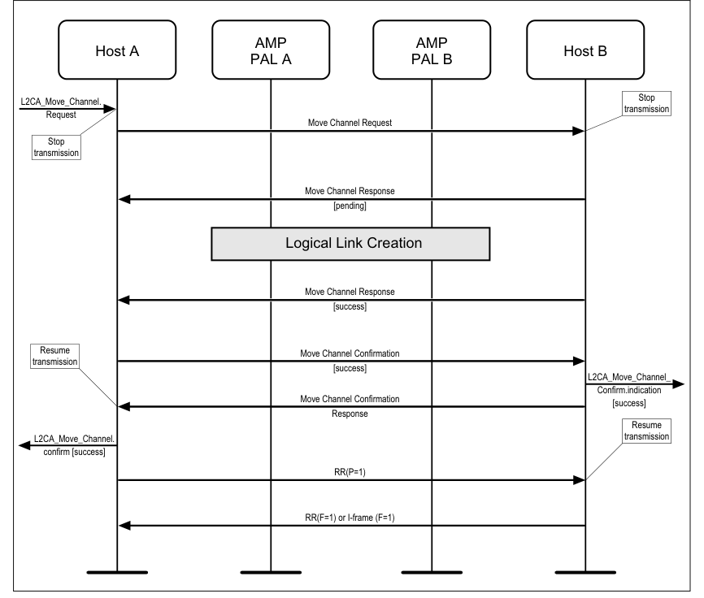

**Figure 9.3:  Move of a Best Effort L2CAP channel Enhanced Retransmission mode enabled to an AMP with no existing best effort logical link or move of any Guaranteed L2CAP channel**

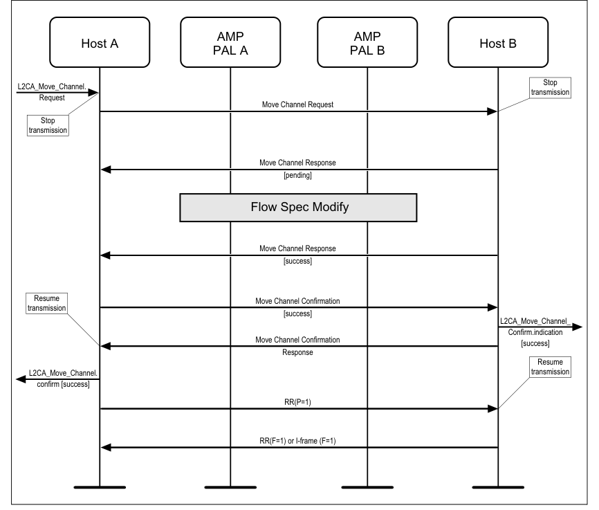

**Figure 9.4:  Move of a Best Effort L2CAP channel with Enhanced Retransmission mode enabled to an AMP where a best effort logical link exists**

### 9.3   DISCONNECT CHANNEL

If a channel configured as Best Effort is disconnected the Extended Flow Specification aggregate shall be recalculated (see Section 7.8 for the aggregation algorithm) unless it is the last or only channel. If this is not the last or only Best Effort channel for the logical link then a logical link modify operation shall be performed otherwise the logical link should be disconnected. The ACL-U logical link between two devices should not be disconnected until all the L2CAP channels running over all logical links between the two devices have been disconnected.

## 10  PROCEDURES FOR CREDIT BASED FLOW CONTROL

### 10.1   LE CREDIT BASED FLOW CONTROL MODE

LE Credit Based Flow Control Mode is used for LE L2CAP connection oriented channels with flow control using a credit based scheme for L2CAP data (i.e. not signaling packets).
The number of credits (LE-frames) that can be received by a device on an L2CAP channel is determined during connection establishment. LE-frames shall only be sent on an L2CAP channel if the device has a credit count greater than zero for that L2CAP channel. For each LE-frame sent the device decreases the credit count for that L2CAP channel by one. The peer device may return credits for an L2CAP channel at any time by sending an LE Flow Control Credit packet. When a credit packet is received by a device it shall increment the credit count for that L2CAP channel by the value of the Credits field in this packet. The number of credits returned for an L2CAP channel may exceed the initial credits provided in the LE Credit Based Connection Request or Response packet. The device sending the LE Flow Control Credit packet shall ensure that the number of credits returned for an L2CAP channel does not cause the credit count to exceed 65535. The device receiving the credit packet shall disconnect the L2CAP channel if the credit count exceeds 65535. The device shall also disconnect the L2CAP channel if it receives an LE-frame on an L2CAP channel from the peer device that has a credit count of zero. If a device receives an LE Flow Control Credit packet with credit value set to zero, the packet shall be ignored. A device shall not send credit values of zero in LE Flow Control Credit packets.
If a connection request is received and there is insufficient authentication between the two devices, the connection shall be rejected with a result value of “Connection refused - insufficient authentication”. If a connection request is received and there is insufficient authorization between the two devices, the connection shall be rejected with a result value of “Connection refused - insufficient authorization”. If a connection request is received and the encryption key size is too short, the connection shall be rejected with a result value of “Connection refused – insufficient encryption key size”.
Note: When encryption is not enabled, the result value “Connection refused – insufficient authentication” does not indicate that MITM protection is required.
APPENDIX A CONFIGURATION MSCs
The examples in this appendix describe a sample of the multiple possible configuration scenarios that might occur.
Figure A.1 illustrates the basic configuration process. In this example, the devices exchange MTU information. All other values are assumed to be default.
Device A
Device B
L2CA
L2CA
LP LP
L2CA_ConfigReq
Option=0x01 [MTU=0x00000100]
L2CAP_ConfigReq
L2CA_ConfigInd
L2CA_ConfigRsp
Result=Success
L2CA_ConfigCfm
L2CAP_ConfigRsp
L2CA_ConfigReq
Option=0x01 [MTU=0x00000200]
L2CA_ConfigInd
L2CAP_ConfigReq
L2CA_ConfigRsp
Result=Success
L2CAP_ConfigRsp
L2CA_ConfigCfm
TIME
Figure A.1:  Basic MTU exchange
Figure A.2 illustrates how two devices interoperate even though one device supports more options than the other does. Device A is an upgraded version. It uses a hypothetically defined option type 0x20 for link-level security. Device B rejects the command using the Configuration Response packet with result ‘unknown parameter’ informing Device A that option 0x20 is not understood. Device A then resends the request omitting option 0x20. Device B notices that it does not need to such a large MTU and accepts the request but includes in the response the MTU option informing Device A that Device B will not send an L2CAP packet with a payload larger than 0x80 octets over this channel. On receipt of the response, Device A could reduce the buffer allocated to hold incoming traffic.
Device A
Device B
L2CA
L2CA LP LP
L2CA_ConfigReq
Option=0x01 [MTU=0x00000100] Option=0x20 [Data=0xFA12D823]
L2CA_ConfigInd
L2CAP_ConfigReq
L2CA_ConfigRsp
Result=Unknown option Option=0x20
L2CA_ConfigCfm
L2CAP_ConfigRsp
L2CA_ConfigReq
Option=0x01 [MTU=0x00000100]
L2CA_ConfigInd
L2CAP_ConfigReq
L2CA_ConfigRsp
Result=Success [MTU=0x00000080]
L2CA_ConfigCfm
L2CAP_ConfigRsp
L2CA_ConfigReq
Option=0x01 [MTU=0x00000200]
L2CA_ConfigInd
L2CAP_ConfigReq
L2CA_ConfigRsp
Result=Success
L2CA_ConfigCfm
L2CAP_ConfigRsp
TIME
Figure A.2:  Dealing with Unknown Options
Figure A.3 illustrates an unsuccessful configuration request. There are two problems described by this example. The first problem is that the configuration request is placed in an L2CAP packet that cannot be accepted by the remote device, due to its size. The remote device informs the sender of this problem using the Command Reject message. Device A then resends the configuration options using two smaller L2CAP_ConfigReq messages.
The second problem is an attempt to configure a channel with an invalid CID. For example device B may have no open connection on that CID (0x01234567 in this example case).
Device A
Device B
L2CA
L2CA LP LP
L2CA_ConfigReq
L2CAP_ConfigReq
ID=0x1234 DCID=0x01234567 Option=0x01 [MTU=0x00000100] Option=0x20 [Data=BIG]
L2CAP_CmdReject
ID=0x1234 Reason=0x0001 (MTU exceeded) Data=0x80
L2CAP_ConfigReq ID=0x1235 DCID=0x01234567 Option=0x01 [MTU=0x00000100] C flag set to 1
L2CA_ConfigCfmNeg
L2CAP_ConfigReq
L2CAP_CmdReject
ID=0x1235 Reason=0x0002 (Invalid CID)
ID=0x1236 DCID=0x01234567 Option=0x20 [Data=BIG]
L2CAP_CmdReject ID=0x1236 Reason=0x0002 (Invalid CID)
TIME
Figure A.3:  Unsuccessful Configuration Request
Core System Package [Host volume]
Part B
PART B: SERVICE DISCOVERY PROTOCOL (SDP) SPECIFICATION
This specification defines a protocol for locating services provided by or available through a Bluetooth device.
CONTENTS

## 1  INTRODUCTION

### 1.1   GENERAL DESCRIPTION

The service discovery protocol (SDP) provides a means for applications to discover which services are available and to determine the characteristics of those available services.

### 1.2   MOTIVATION

Service Discovery in the Bluetooth environment, where the set of services that are available changes dynamically based on the RF proximity of devices in motion, is qualitatively different from service discovery in traditional network- based environments. The service discovery protocol defined in this specification is intended to address the unique characteristics of the Bluetooth environment. See Appendix A, for further information on this topic.

### 1.3   REQUIREMENTS

The following capabilities have been identified as requirements for version 1.0 of the Service Discovery Protocol.
1. SDP shall provide the ability for clients to search for needed services based on specific attributes of those services.
2. SDP shall permit services to be discovered based on the class of service.
3. SDP shall enable browsing of services without a priori knowledge of the specific characteristics of those services.
4. SDP shall provide the means for the discovery of new services that become available when devices enter RF proximity with a client device as well as when a new service is made available on a device that is in RF proximity with the client device.
5. SDP shall provide a mechanism for determining when a service becomes unavailable when devices leave RF proximity with a client device as well as when a service is made unavailable on a device that is in RF proximity with the client device.
6. SDP shall provide for services, classes of services, and attributes of services to be uniquely identified.
7. SDP shall allow a client on one device to discover a service on another device without consulting a third device.
8. SDP should be suitable for use on devices of limited complexity.
9. SDP shall provide a mechanism to incrementally discover information about the services provided by a device. This is intended to minimize the quantity of data that must be exchanged in order to determine that a particular service is not needed by a client.
10.SDP should support the caching of service discovery information by intermediary agents to improve the speed or efficiency of the discovery process.
11.SDP should be transport independent.
12.SDP shall function while using L2CAP as its transport protocol.
13.SDP shall permit the discovery and use of services that provide access to other service discovery protocols.
14.SDP shall support the creation and definition of new services without requiring registration with a central authority.

### 1.4   NON-REQUIREMENTS AND DEFERRED REQUIREMENTS

The Bluetooth SIG recognizes that the following capabilities are related to service discovery. These items are not addressed in SDP version 1.0. However, some may be addressed in future revisions of the specification.
1. SDP 1.0 does not provide access to services. It only provides access to information about services.
2. SDP 1.0 does not provide brokering of services.
3. SDP 1.0 does not provide for negotiation of service parameters.
4. SDP 1.0 does not provide for billing of service use.
5. SDP 1.0 does not provide the means for a client to control or change the operation of a service.
6. SDP 1.0 does not provide an event notification when services, or information about services, become unavailable.
7. SDP 1.0 does not provide an event notification when attributes of services are modified.
8. This specification does not define an application programming interface for SDP.
9. SDP 1.0 does not provide support for service agent functions such as service aggregation or service registration.

### 1.5   CONVENTIONS

#### 1.5.1  Bit And Byte Ordering Conventions

When multiple bit fields are contained in a single byte and represented in a drawing in this specification, the more significant (high-order) bits are shown toward the left and less significant (low-order) bits toward the right.
Multiple-byte fields are drawn with the more significant bytes toward the left and the less significant bytes toward the right. Multiple-byte fields are transferred in network byte order. See Section 4.1.

## 2  OVERVIEW

### 2.1   SDP CLIENT-SERVER ARCHITECTURE

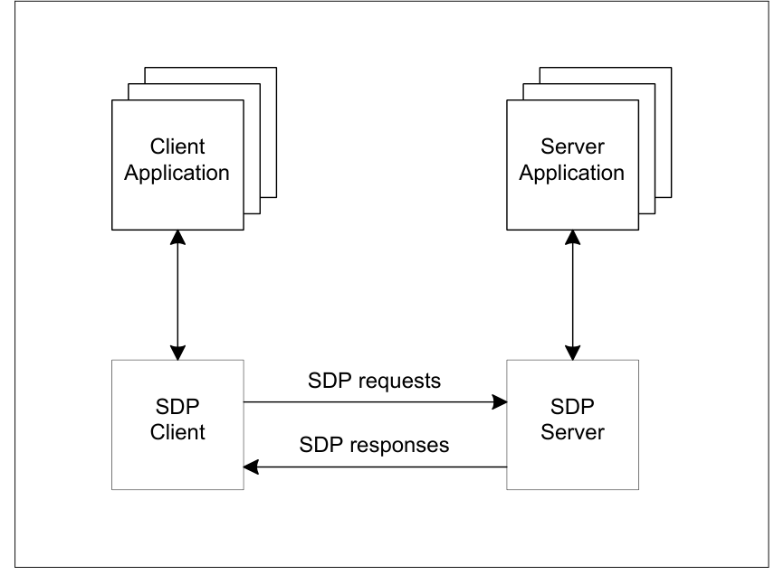

**Figure 2.1:  SDP Client-Server Interaction**

The service discovery mechanism provides the means for client applications to discover the existence of services provided by server applications as well as the attributes of those services. The attributes of a service include the type or class of service offered and the mechanism or protocol information needed to utilize the service.
As far as the Service Discovery Protocol (SDP) is concerned, the configuration shown in Figure 2.1 can  be simplified to that shown in Figure 2.2.

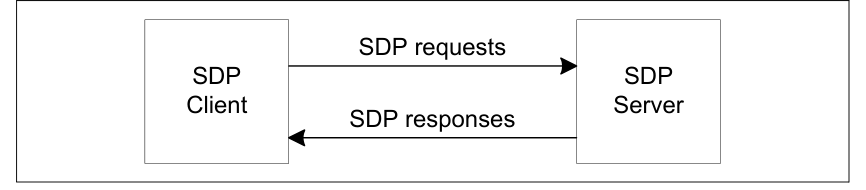

**Figure 2.2:  Simplified SDP Client-Server Interaction**

SDP involves communication between an SDP server and an SDP client. The server maintains a list of service records that describe the characteristics of services associated with the server. Each service record contains information about a single service. A client can retrieve information from a service record maintained by the SDP server by issuing an SDP request.
If the client, or an application associated with the client, decides to use a service, it opens a separate connection to the service provider in order to utilize the service. SDP provides a mechanism for discovering services and their attributes (including associated service access protocols), but it does not provide a mechanism for utilizing those services (such as delivering the service access protocols).
If multiple applications on a device provide services, an SDP server can act on behalf of those service providers to handle requests for information about the services that they provide. Similarly, multiple client applications can utilize an SDP client to query servers on behalf of the client applications.
The set of SDP servers that are available to an SDP client will change dynamically based on the RF proximity of the servers to the client. When a server becomes available, a potential client must be notified by a means other than SDP so that the client can use SDP to query the server about its services. Similarly, when a server leaves proximity or becomes unavailable for any reason, there is no explicit notification via the service discovery protocol. However, the client can use SDP to poll the server and may infer that the server is not available if it no longer responds to requests.
Additional information regarding application interaction with SDP shall be contained in the Bluetooth Service Discovery Profile document.

### 2.2   SERVICE RECORD

A service is any entity that can provide information, perform an action, or control a resource on behalf of another entity. A service may be implemented as software, hardware, or a combination of hardware and software.
All of the information about a service that is maintained by an SDP server is contained within a single service record. The service record shall only be a list of service attributes.

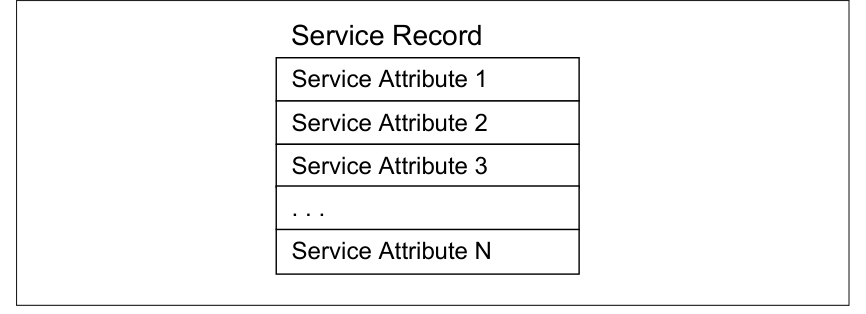

**Figure 2.3:  Service Record**

A service record handle is a 32-bit number that shall uniquely identify each service record within an SDP server. It is important to note that, in general, each handle is unique only within each SDP server. If SDP server S1 and SDP server S2 both contain identical service records (representing the same service), the service record handles used to reference these identical service records are completely independent. The handle used to reference the service on S1 will be meaningless if presented to S2.
The service discovery protocol does not provide a mechanism for notifying clients when service records are added to or removed from an SDP server. While an L2CAP (Logical Link Control and Adaptation Protocol) connection is established to a server, a service record handle acquired from the server shall remain valid unless the service record it represents is removed. If a service is removed from the server, further requests to the server (during the L2CAP connection in which the service record handle was acquired) using the service’s (now stale) record handle shall result in an error response indicating an invalid service record handle. An SDP server shall ensure that no service record handle values are re-used while an L2CAP connection remains established. Service record handles shall remain valid across successive L2CAP connections while the ServiceDatabaseState attribute value remains unchanged. Further, service record handles should remain valid until such time that the corresponding service is permanently removed or changes in an incompatible way. See the ServiceRecordState and ServiceDatabaseState attributes in Section 5.
A device may have a service record with a service record handle of 0x00000000 representing the SDP server itself. This service record contains attributes for the SDP server and the protocol it supports. For example, one of its attributes is the list of SDP protocol versions supported by the server.

### 2.3   SERVICE ATTRIBUTE

Each service attribute describes a single characteristic of a service. Some examples of service attributes are:

| ServiceClassIDList | Identifies the type of service represented by a service record In other words, the list of classes of which the service is an instance |
| --- | --- |
| ServiceID | Uniquely identifies a specific instance of a service |
| ProtocolDescriptorList | Specifies the protocol stack(s) that may be used to utilize a service |
| ProviderName | The textual name of the individual or organization that pro- vides a service |
| IconURL | Specifies a URL that refers to an icon image that may be used to represent a service |
| ServiceName | A text string containing a human-readable name for the ser- vice |
| ServiceDescription | A text string describing the service |

See Section 5.1, for attribute definitions that are common to all service records. Service providers can also define their own service attributes.
A service attribute consists of two components: an attribute ID and an attribute value.

**Figure 2.4:  Service Attribute**

#### 2.3.1  Attribute ID

An attribute ID is a 16-bit unsigned integer that distinguishes each service attribute from other service attributes within a service record. The attribute ID also identifies the semantics of the associated attribute value.
A service class definition specifies each of the attribute IDs for a service class and assigns a meaning to the attribute value associated with each attribute ID. Each attribute ID is defined to be unique only within each service class.
All services belonging to a given service class assign the same meaning to each particular attribute ID. See Section 2.4.
In the Service Discovery Protocol, an attribute ID is represented as a data element. See Section 3.

#### 2.3.2  Attribute Value

The attribute value is a variable length field whose meaning is determined by the attribute ID associated with it and by the service class of the service record in which the attribute is contained. In the Service Discovery Protocol, an attribute value is represented as a data element. (See Section 3.) Generally, any type of data element is permitted as an attribute value, subject to the constraints specified in the service class definition that assigns an attribute ID to the attribute and assigns a meaning to the attribute value. See Section 5, for attribute value examples.

### 2.4   SERVICE CLASS

Each service is an instance of a service class. The service class definition provides the definitions of all attributes contained in service records that represent instances of that class. Each attribute definition specifies the numeric value of the attribute ID, the intended use of the attribute value, and the format of the attribute value. A service record contains attributes that are specific to a service class as well as universal attributes that are common to all services.
Each service class is also assigned a unique identifier. This service class identifier is contained in the attribute value for the ServiceClassIDList attribute, and is represented as a UUID (see Section 2.5.1). Since the format and meanings of many attributes in a service record are dependent on the service class of the service record, the ServiceClassIDList attribute is very important. Its value shall be examined or verified before any class-specific attributes are used. Since all of the attributes in a service record must conform to all of the service’s classes, the service class identifiers contained in the ServiceClassIDList attribute are related. Typically, each service class is a subclass of another class whose identifier is contained in the list. A service subclass definition differs from its superclass in that the subclass contains additional attribute definitions that are specific to the subclass.
When a new service class is defined that is a subclass of an existing service class, the new service class retains all of the attributes defined in its superclass. Additional attributes may be defined that are specific to the new service class. In other words, the mechanism for adding new attributes to some of the instances of an existing service class is to create a new service class that is a subclass of the existing service class.
If a Service Class UUID is exposed in the SDP database of a product, then the product containing the SDP record shall comply with the specification which defines the service corresponding to the UUID.

#### 2.4.1  A Printer Service Class Example

A color postscript printer with duplex capability might conform to 4 ServiceClass definitions and have a ServiceClassIDList with UUIDs (See Section 2.5.1.) representing the following ServiceClasses:
DuplexColorPostscriptPrinterServiceClassID, ColorPostscriptPrinterServiceClassID, PostscriptPrinterServiceClassID, PrinterServiceClassID
Note that this example is only illustrative. This is not necessarily a practical printer class hierarchy.

### 2.5   SEARCHING FOR SERVICES

The Service Search transaction allows a client to retrieve the service record handles for particular service records based on the values of attributes contained within those service records. Once an SDP client has a service record handle, it can request the values of specific attributes.
The capability search for service records based on the values of arbitrary attributes is not provided. Rather, the capability is provided to search only for attributes whose values are Universally Unique Identifiers1 (UUIDs). Important attributes of services that can be used to search for a service are represented as UUIDs.

#### 2.5.1  UUID

A UUID is a universally unique identifier that is guaranteed to be unique across all space and all time. UUIDs can be independently created in a distributed fashion. No central registry of assigned UUIDs is required. A UUID is a 128-bit value.
To reduce the burden of storing and transferring 128-bit UUID values, a range of UUID values has been pre-allocated for assignment to often-used, registered purposes. The first UUID in this pre-allocated range is known as the Bluetooth Base UUID and has the value 00000000-0000-1000-8000- 00805F9B34FB, from the Bluetooth Assigned Numbers document. UUID values in the pre-allocated range have aliases that are represented as 16-bit or 32-bit values. These aliases are often called 16-bit and 32-bit UUIDs, but it is important to note that each actually represents a 128-bit UUID value.
The full 128-bit value of a 16-bit or 32-bit UUID may be computed by a simple arithmetic operation.
1. The format of UUIDs is specified in ITU-T Rec. X.667(10/2012), alternatively known as ISO/IEC 9834-8:2014.
128_bit_value = 16_bit_value * 296 + Bluetooth_Base_UUID
128_bit_value = 32_bit_value * 296 + Bluetooth_Base_UUID
A 16-bit UUID may be converted to 32-bit UUID format by zero-extending the 16-bit value to 32-bits. An equivalent method is to add the 16-bit UUID value to a zero-valued 32-bit UUID.
Note that two 16-bit UUIDs may be compared directly, as may two 32-bit UUIDs or two 128-bit UUIDs. If two UUIDs of differing sizes are to be compared, the shorter UUID must be converted to the longer UUID format before comparison.

#### 2.5.2  Service Search Patterns

A service search pattern is a list of UUIDs used to locate matching service records. A service search pattern matches a service record if each and every UUID in the service search pattern is contained within any of the service record’s attribute values. The UUIDs need not be contained within any specific attributes or in any particular order within the service record. The service search pattern matches if the UUIDs it contains constitute a subset of the UUIDs in the service record’s attribute values. The only time a service search pattern does not match a service record is if the service search pattern contains at least one UUID that is not contained within the service record’s attribute values. Note also that a valid service search pattern must contain at least one UUID.

### 2.6   BROWSING FOR SERVICES

Normally, a client searches for services based on some desired characteristic(s) (represented by a UUID) of the services. However, there are times when it is desirable to discover which types of services are described by an SDP server’s service records without any a priori information about the services. This process of looking for any offered services is termed browsing. In SDP, the mechanism for browsing for services is based on an attribute shared by all service classes. This attribute is called the BrowseGroupList attribute. The value of this attribute contains a list of UUIDs. Each UUID represents a browse group with which a service may be associated for the purpose of browsing.
When a client desires to browse an SDP server’s services, it creates a service search pattern containing the UUID that represents the root browse group. All services that may be browsed at the top level are made members of the root browse group by having the root browse group’s UUID as a value within the BrowseGroupList attribute.
Normally, if an SDP server has relatively few services, all of its services will be placed in the root browse group. However, the services offered by an SDP server may be organized in a browse group hierarchy, by defining additional
browse groups below the root browse group. Each of these additional browse groups is described by a service record with a service class of BrowseGroupDescriptor.
A browse group descriptor service record defines a new browse group by means of its Group ID attribute. In order for a service contained in one of these newly defined browse groups to be browseable, the browse group descriptor service record that defines the new browse group must in turn be browseable. The hierarchy of browseable services that is provided by the use of browse group descriptor service records allows the services contained in an SDP server to be incrementally browsed and is particularly useful when the SDP server contains many service records.

#### 2.6.1  Example Service Browsing Hierarchy

Here is a fictitious service browsing hierarchy that  illuminates the manner in which browse group descriptors are used. Browse group descriptor service records are identified with (G); other service records with (S).

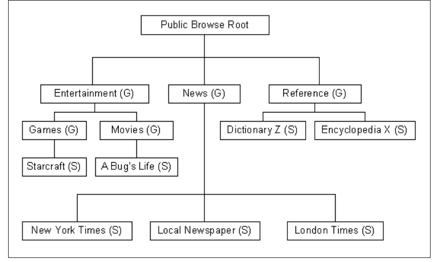

**Figure 2.5:  Service Browsing Hierarchy**

This table shows the services records and service attributes necessary to implement the browse hierarchy.

| Service Name | Service Class | Attribute Name | Attribute Value |
| --- | --- | --- | --- |
| Entertainment | BrowseGroupDescriptor | BrowseGroupList | PublicBrowseRoot |
|  |  | GroupID | EntertainmentID |
| News | BrowseGroupDescriptor | BrowseGroupList | PublicBrowseRoot |
|  |  | GroupID | NewsID |
| Reference | BrowseGroupDescriptor | BrowseGroupList | PublicBrowseRoot |
|  |  | GroupID | ReferenceID |
| Games | BrowseGroupDescriptor | BrowseGroupList | EntertainmentID |
|  |  | GroupID | GamesID |
| Movies | BrowseGroupDescriptor | BrowseGroupList | EntertainmentID |
|  |  | GroupID | MoviesID |
| Starcraft | Video Game Class ID | BrowseGroupList | GamesID |
| A Bug’s Life | Movie Class ID | BrowseGroupList | MovieID |
| Dictionary Z | Dictionary Class ID | BrowseGroupList | ReferenceID |
| Encyclopedia X | Encyclopedia Class ID | BrowseGroupList | ReferenceID |
| New York Times | Newspaper ID | BrowseGroupList | NewspaperID |
| London Times | Newspaper ID | BrowseGroupList | NewspaperID |
| Local Newspaper | Newspaper ID | BrowseGroupList | NewspaperID |

Table 2.1:  Service Browsing Hierarchy

## 3  DATA REPRESENTATION

Attribute values can contain information of various types with arbitrary complexity; thus enabling an attribute list to be generally useful across a wide variety of service classes and environments.
SDP defines a simple mechanism to describe the data contained within an attribute ID, attribute ID range, and attribute value. The primitive construct used is the data element.

### 3.1   DATA ELEMENT

A data element is a typed data representation. It consists of two fields: a header field and a data field. The header field, in turn, is composed of two parts: a type descriptor and a size descriptor. The data is a sequence of bytes whose length is specified in the size descriptor (described in Section 3.3) and whose meaning is (partially) specified by the type descriptor.

### 3.2   DATA ELEMENT TYPE DESCRIPTOR

A data element type is represented as a 5-bit type descriptor. The type descriptor is contained in the most significant (high-order) 5 bits of the first byte of the data element header. The following types have been defined.

| Type Descriptor Value | Valid Size Descriptor Values | Type Description |
| --- | --- | --- |
| 0 | 0 | Nil, the null type |
| 1 | 0, 1, 2, 3, 4 | Unsigned Integer |
| 2 | 0, 1, 2, 3, 4 | Signed twos-complement integer |
| 3 | 1, 2, 4 | UUID, a universally unique identifier |
| 4 | 5, 6, 7 | Text string |
| 5 | 0 | Boolean1 |
| 6 | 5, 6, 7 | Data element sequence, a data element whose data field is a sequence of data elements |
| 7 | 5, 6, 7 | Data element alternative, data element whose data field i a sequence of data elements from which one data ele- ment is to be selected. |
| 8 | 5, 6, 7 | URL, a uniform resource locator |
| Other |  | Reserved for future use |

Table 3.1:  Data Element
1. False is represented by the value 0, and true is represented by the value 1. However, to max- imize interoperability, any non-zero value received must be accepted as representing true.

### 3.3   DATA ELEMENT SIZE DESCRIPTOR

The data element size descriptor is represented as a 3-bit size index followed by 0, 8, 16, or 32 bits. The size index is contained in the least significant (low- order) 3 bits of the first byte of the data element header. The size index is encoded as follows.

| Size Index | Additional bits | Data Size |
| --- | --- | --- |
| 0 | 0 | 1 byte. Exception: if the data element type is nil, the data size is bytes. |
| 1 | 0 | 2 bytes |
| 2 | 0 | 4 bytes |
| 3 | 0 | 8 bytes |
| 4 | 0 | 16 bytes |
| 5 | 8 | The data size is contained in the additional 8 bits, which are inte preted as an unsigned integer. |
| 6 | 16 | The data size is contained in the additional 16 bits, which are interpreted as an unsigned integer. |
| 7 | 32 | The data size is contained in the additional 32 bits, which are interpreted as an unsigned integer. |

Table 3.2:  Data Element Size

### 3.4   DATA ELEMENT EXAMPLES

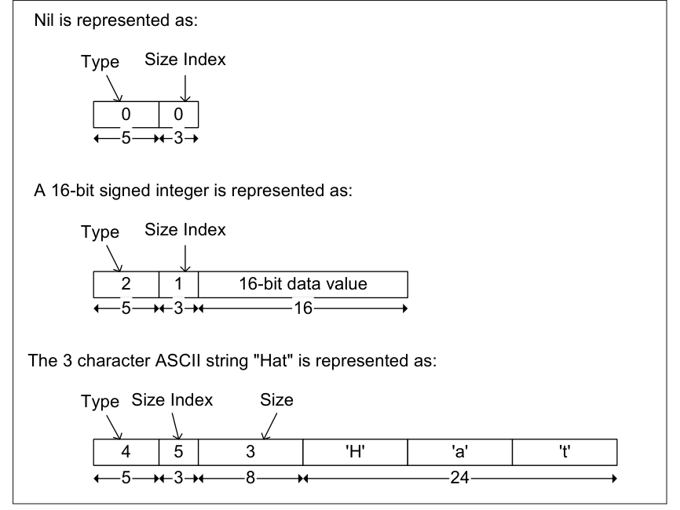

**Figure 3.1:  Data Element**

## 4  PROTOCOL DESCRIPTION

SDP is a simple protocol with minimal requirements on the underlying transport. It can function over a reliable packet transport (or even unreliable, if the client implements timeouts and repeats requests as necessary).
SDP uses a request/response model where each transaction consists of one request protocol data unit (PDU) and one response PDU. In the case where SDP is used with the Bluetooth L2CAP transport protocol, no more than one SDP request PDU per connection to a given SDP server may be outstanding at a given instant. In other words, a client does not issue a further request to a server prior to receiving a response to the current request before issuing another request on the same L2CAP connection. Limiting SDP to sending one unacknowledged request PDU provides a simple form of flow control.
The protocol examples found in Appendix B, could be helpful in understanding the protocol transactions.

### 4.1   TRANSFER BYTE ORDER

The service discovery protocol shall transfer multiple-byte fields in standard network byte order (Big Endian), with more significant (high-order) bytes being transferred before less-significant (low-order) bytes.

### 4.2   PROTOCOL DATA UNIT FORMAT

Every SDP PDU consists of a PDU header followed by PDU-specific parameters. The header contains three fields: a PDU ID, a Transaction ID, and a ParameterLength. Each of these header fields is described here. Parameters may include a continuation state parameter, described below; PDU-specific parameters for each PDU type are described later in separate PDU descriptions.

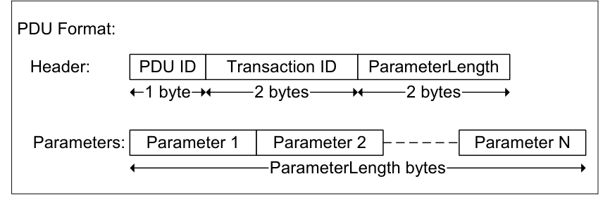

**Figure 4.1:  Protocol Data Unit Format**

PDU ID: Size: 1 Byte

| Value | Parameter Description |
| --- | --- |
| N | The PDU ID field identifies the type of PDU. I.e. its meaning and the specific parameters. |
| 0x00 | Reserved for future use |
| 0x01 | SDP ErrorResponse _ |
| 0x02 | SDP ServiceSearchRequest _ |
| 0x03 | SDP ServiceSearchResponse _ |
| 0x04 | SDP ServiceAttributeRequest _ |
| 0x05 | SDP ServiceAttributeResponse _ |
| 0x06 | SDP ServiceSearchAttributeRequest _ |
| 0x07 | SDP ServiceSearchAttributeResponse _ |
| 0x08-0xFF | Reserved for future use |

TransactionID: Size: 2 Bytes

| Value | Parameter Description |
| --- | --- |
| N | The TransactionID field uniquely identifies request PDUs and is used to match response PDUs to request PDUs. The SDP client can choose any value for a request’s TransactionID provided that it is different from all outstanding requests. The TransactionID value in response PDUs is required to be the same as the request that is being responded to. Range: 0x0000 – 0xFFFF |

ParameterLength: Size: 2 Bytes

| Value | Parameter Description |
| --- | --- |
| N | The ParameterLength field specifies the length (in bytes) of all parame- ters contained in the PDU. Range: 0x0000 – 0xFFFF |

### 4.3   PARTIAL RESPONSES AND CONTINUATION STATE

Some SDP requests may require responses that are larger than can fit in a single response PDU. In this case, the SDP server shall generate a partial response along with a continuation state parameter. The continuation state parameter can be supplied by the client in a subsequent request to retrieve the next portion of the complete response. The continuation state parameter is a variable length field whose first byte contains the number of additional bytes of continuation information in the field. The format of the continuation information is not standardized among SDP servers. Each continuation state parameter is meaningful only to the SDP server that generated it.

**Figure 4.2:  Continuation State Format**

After a client receives a partial response and the accompanying continuation state parameter, it can re-issue the original request (with a new transaction ID) and include the continuation state in the new request indicating to the server that the remainder of the original response is desired. The maximum allowable value of the InfoLength field is 16 (0x10).
Note that, unless otherwise stated in a PDU response specification, an SDP server can split a response at any arbitrary boundary when it generates a partial response. The SDP server may select the boundary based on the contents of the reply, but is not required to do so. Therefore, length fields give the lengths as measured in the complete assembled record, not the length of the fields in the partial segment. When a service record is segmented into partial responses all attribute list values are relative to the complete record, not relevant to the partial record.

### 4.4   ERROR HANDLING

Each transaction consists of a request and a response PDU. Generally, each type of request PDU has a corresponding type of response PDU. However, if the server determines that a request is improperly formatted or for any reason the server cannot respond with the appropriate PDU type, it shall respond with an SDP_ErrorResponse PDU.

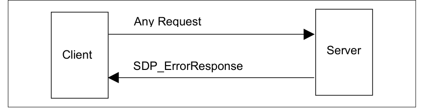

**Figure 4.3:  Error Handling**

#### 4.4.1  SDP_ErrorResponse PDU

| PDU Type | PDU ID | Parameters |
| --- | --- | --- |
| SDP ErrorResponse _ | 0x01 | ErrorCode |

Description:
The SDP server generates this PDU type in response to an improperly formatted request PDU or when the SDP server, for whatever reason, cannot generate an appropriate response PDU.
PDU Parameters:
ErrorCode: Size: 2 Bytes

| Value | Parameter Description |
| --- | --- |
| N | The ErrorCode identifies the reason that an SDP ErrorResponse PDU _ was generated. |
| 0x0000 | Reserved for future use |
| 0x0001 | Invalid/unsupported SDP version |
| 0x0002 | Invalid Service Record Handle |
| 0x0003 | Invalid request syntax |
| 0x0004 | Invalid PDU Size |
| 0x0005 | Invalid Continuation State |
| 0x0006 | Insufficient Resources to satisfy Request |
| 0x0007-0xFFFF | Reserved for future use |

Note: Invalid PDU size should be used, for example, if an incoming request PDU's length is inconsistent with the specification of that request PDU or the length parameter of an incoming request PDU is inconsistent with that request PDU's actual contents.

### 4.5   SERVICESEARCH TRANSACTION

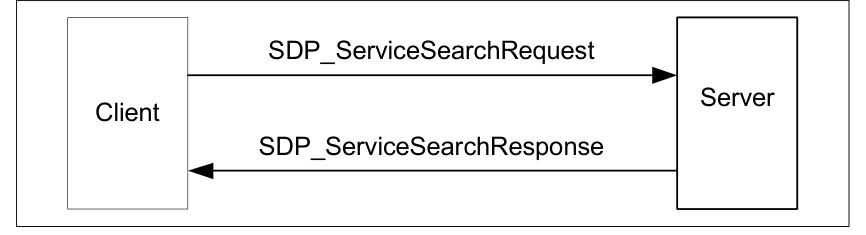

**Figure 4.4:  ServiceSearch Transaction**

#### 4.5.1  SDP_ServiceSearchRequest PDU

| PDU Type | PDU ID | Parameters |
| --- | --- | --- |
| SDP ServiceSearchRequest _ | 0x02 | ServiceSearchPattern, MaximumServiceRecordCount, ContinuationState |

Description:
The SDP client generates an SDP_ServiceSearchRequest to locate service records that match the service search pattern given as the first parameter of the PDU. Upon receipt of this request, the SDP server shall examine its service record data base and return an SDP_ServiceSearchResponse containing the service record handles of service records within its service record database that match the given service search pattern, or an appropriate error response.
Note that no mechanism is provided to request information for all service records. However, see Section 2.6 for a description of a mechanism that permits browsing for non-specific services without a priori knowledge of the services.
PDU Parameters:
ServiceSearchPattern: Size: Varies

| Value | Parameter Description |
| --- | --- |
| Data Element Sequence | The ServiceSearchPattern is a data element sequence where each ele ment in the sequence is a UUID. The sequence shall contain at least one UUID. The maximum number of UUIDs in the sequence is 121. Th list of UUIDs constitutes a service search pattern. |

1.  The value of 12 has been selected as a compromise between the scope of a service search and the size of a search request PDU. It is not expected that more than 12 UUIDs will be useful in a service search pattern.
MaximumServiceRecordCount: Size: 2 Bytes

| Value | Parameter Description |
| --- | --- |
| N | MaximumServiceRecordCount is a 16-bit count specifying the maximu number of service record handles to be returned in the response(s) to this request. The SDP server shall not return more handles than this value specifies. If more than N service records match the request, the SDP server determines which matching service record handles to retur in the response(s). Range: 0x0001-0xFFFF |

ContinuationState: Size: 1 to 17 Bytes

| Value | Parameter Description |
| --- | --- |
| Continuation State | ContinuationState consists of an 8-bit count, N, of the number of byte of continuation state information, followed by the N bytes of continua- tion state information that were returned in a previous response from the server. N is required to be less than or equal to 16. If no continua- tion state is to be provided in the request, N is set to 0. |

#### 4.5.2  SDP_ServiceSearchResponse PDU

| PDU Type | PDU ID | Parameters |
| --- | --- | --- |
| SDP ServiceSearchResponse _ | 0x03 | TotalServiceRecordCount, CurrentServiceRecordCount, ServiceRecordHandleList, ContinuationState |

Description:
The SDP server generates an SDP_ServiceSearchResponse upon receipt of a valid SDP_ServiceSearchRequest. The response contains a list of service record handles for service records that match the service search pattern given in the request. If a partial response is generated, it shall contain an integral number of complete service record handles; a service record handle value shall not be split across multiple PDUs.
PDU Parameters:
TotalServiceRecordCount: Size: 2 Bytes

| Value | Parameter Description |
| --- | --- |
| N | The TotalServiceRecordCount is an integer containing the number of service records that match the requested service search pattern. If no service records match the requested service search pattern, this param eter is set to 0. N should never be larger than the MaximumServiceRe- cordCount value specified in the SDP ServiceSearchRequest. When _ multiple partial responses are used, each partial response contains the same value for TotalServiceRecordCount. Range: 0x0000-0xFFFF |

CurrentServiceRecordCount: Size: 2 Bytes

| Value | Parameter Description |
| --- | --- |
| N | The CurrentServiceRecordCount is an integer indicating the number of service record handles that are contained in the next parameter. If no service records match the requested service search pattern, this param eter is set to 0. N should never be larger than the TotalServiceRecord- Count value specified in the current response. Range: 0x0000-0xFFFF |

ServiceRecordHandleList: Size: (CurrentServiceRecordCount*4) Bytes

| Value | Parameter Description |
| --- | --- |
| List of 32-bit handles | The ServiceRecordHandleList contains a list of service record handles. The number of handles in the list is given in the CurrentServiceRecord- Count parameter. Each of the handles in the list refers to a service record that matches the requested service search pattern. Note that thi list of service record handles does not have the format of a data ele- ment. It contains no header fields, only the 32-bit service record han- dles. |

ContinuationState: Size: 1 to 17 Bytes

| Value | Parameter Description |
| --- | --- |
| Continuation State | ContinuationState consists of an 8-bit count, N, of the number of byte of continuation state information, followed by the N bytes of continua- tion information. If the current response is complete, this parameter consists of a single byte with the value 0. If a partial response is con- tained in the PDU, the ContinuationState parameter may be supplied i a subsequent request to retrieve the remainder of the response. |

### 4.6   SERVICEATTRIBUTE TRANSACTION

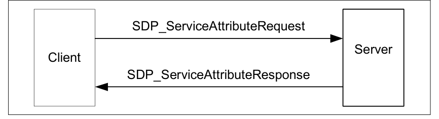

**Figure 4.5:  ServiceAttribute Transaction**

#### 4.6.1  SDP_ServiceAttributeRequest PDU

| PDU Type | PDU ID | Parameters |
| --- | --- | --- |
| SDP ServiceAttributeRequest _ | 0x04 | ServiceRecordHandle, MaximumAttributeByteCount, AttributeIDList, ContinuationState |

Description:
The SDP client generates an SDP_ServiceAttributeRequest to retrieve specified attribute values from a specific service record. The service record handle of the desired service record and a list of desired attribute IDs to be retrieved from that service record are supplied as parameters.
Command Parameters:
ServiceRecordHandle: Size: 4 Bytes

| Value | Parameter Description |
| --- | --- |
| 32-bit handle | The ServiceRecordHandle parameter specifies the service record from which attribute values are to be retrieved. The handle is obtained via a previous SDP ServiceSearch transaction. _ |

MaximumAttributeByteCount: Size: 2 Bytes

| Value | Parameter Description |
| --- | --- |
| N | MaximumAttributeByteCount specifies the maximum number of bytes o attribute data to be returned in the response to this request. The SDP server shall not return more than N bytes of attribute data in the response PDU. If the requested attributes require more than N bytes, the SDP server determines how to segment the list. In this case the cli ent may request each successive segment by issuing a request contai ing the continuation state that was returned in the previous response PDU. Note that in the case where multiple response PDUs are needed to return the attribute data, MaximumAttributeByteCount specifies the maximum size of the portion of the attribute data contained in each response PDU. Range: 0x0007-0xFFFF |

AttributeIDList: Size: Varies

| Value | Parameter Description |
| --- | --- |
| Data Element Sequence | The AttributeIDList is a data element sequence where each element in the list is either an attribute ID or a range of attribute IDs. Each attribut ID is encoded as a 16-bit unsigned integer data element. Each attribut ID range is encoded as a 32-bit unsigned integer data element, where the high order 16 bits are interpreted as the beginning attribute ID of th range and the low order 16 bits are interpreted as the ending attribute I of the range. The attribute IDs contained in the AttributeIDList shall be listed in ascending order without duplication of any attribute ID values. Note that all attributes can be requested by specifying a range of 0x0000-0xFFFF. |

ContinuationState: Size: 1 to 17 Bytes

| Value | Parameter Description |
| --- | --- |
| Continuation State | ContinuationState consists of an 8-bit count, N, of the number of byte of continuation state information, followed by the N bytes of continua- tion state information that were returned in a previous response from the server. N shall be less than or equal to 16. If no continuation state i to be provided in the request, N shall be set to 0. |

#### 4.6.2  SDP_ServiceAttributeResponse PDU

| PDU Type | PDU ID | Parameters |
| --- | --- | --- |
| SDP ServiceAttributeResponse _ | 0x05 | AttributeListByteCount, AttributeList, ContinuationState |

Description:
The SDP server generates an SDP_ServiceAttributeResponse upon receipt of a valid SDP_ServiceAttributeRequest. The response contains a list of attributes (both attribute ID and attribute value) from the requested service record.
PDU Parameters:
AttributeListByteCount: Size: 2 Bytes

| Value | Parameter Description |
| --- | --- |
| N | The AttributeListByteCount contains a count of the number of bytes in the AttributeList parameter. N shall never be larger than the Maximu- mAttributeByteCount value specified in the SDP ServiceAttributeReq- _ uest. Range: 0x0002-0xFFFF |

AttributeList: Size: AttributeListByteCount

| Value | Parameter Description |
| --- | --- |
| Data Element Sequence | The AttributeList is a data element sequence containing attribute IDs and attribute values. The first element in the sequence contains the attr bute ID of the first attribute to be returned. The second element in the sequence contains the corresponding attribute value. Successive pairs of elements in the list contain additional attribute ID and value pairs. Only attributes that have non-null values within the service record and whose attribute IDs were specified in the SDP ServiceAttributeReques _ are contained in the AttributeList. Neither an attribute ID nor an attribut value is placed in the AttributeList for attributes in the service record tha have no value. The attributes are listed in ascending order of attribute ID value. |

ContinuationState: Size: 1 to 17 Bytes

| Value | Parameter Description |
| --- | --- |
| Continuation State | ContinuationState consists of an 8-bit count, N, of the number of byte of continuation state information, followed by the N bytes of continua- tion information. If the current response is complete, this parameter consists of a single byte with the value 0. If a partial response is given the ContinuationState parameter may be supplied in a subsequent request to retrieve the remainder of the response. |

If a partial response is generated, the response may be arbitrarily segmented into multiple PDUs (subject to the constraint imposed by the allowed range of values for the AttributeListByteCount parameter). Attributes in partial responses are not required to be integral.

### 4.7   SERVICESEARCHATTRIBUTE TRANSACTION

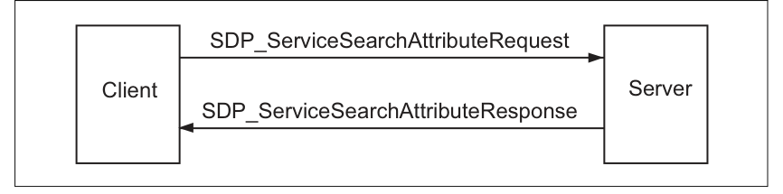

**Figure 4.6:  ServiceSearchAttribute Transaction**

#### 4.7.1  SDP_ServiceSearchAttributeRequest PDU

| PDU Type | PDU ID | Parameters |
| --- | --- | --- |
| SDP ServiceSearchAttributeRequest _ | 0x06 | ServiceSearchPattern, MaximumAttributeByteCount, AttributeIDList, ContinuationState |

Description:
The SDP_ServiceSearchAttributeRequest transaction combines the capabilities of the SDP_ServiceSearchRequest and the SDP_ServiceAttributeRequest into a single request. As parameters, it contains both a service search pattern and a list of attributes to be retrieved from service records that match the service search pattern. The SDP_ServiceSearchAttributeRequest and its response are more complex and can require more bytes than separate SDP_ServiceSearch and SDP_ServiceAttribute transactions. However, using SDP_ServiceSearchAttributeRequest can reduce the total number of SDP transactions, particularly when retrieving multiple service records.
Note that the service record handle for each service record is contained in the ServiceRecordHandle attribute of that service and may be requested along with other attributes.
PDU Parameters:
ServiceSearchPattern: Size: Varies

| Value | Parameter Description |
| --- | --- |
| Data Element Sequence | The ServiceSearchPattern is a data element sequence where each ele ment in the sequence is a UUID. The sequence must contain at least one UUID. The maximum number of UUIDs in the sequence is 121. The list of UUIDs constitutes a service search pattern. |

1. The value of 12 has been selected as a compromise between the scope of a service search and the size of a search request PDU. It is not expected that more than 12 UUIDs will be useful in a service search pattern.
MaximumAttributeByteCount: Size: 2 Bytes

| Value | Parameter Description |
| --- | --- |
| N | MaximumAttributeByteCount specifies the maximum number of bytes o attribute data to be returned in the response to this request. The SDP server shall not return more than N bytes of attribute data in the response PDU. If the requested attributes require more than N bytes, the SDP server determines how to segment the list. In this case the cli- ent may request each successive segment by issuing a request contain ing the continuation state that was returned in the previous response PDU. Note that in the case where multiple response PDUs are needed to return the attribute data, MaximumAttributeByteCount specifies the maximum size of the portion of the attribute data contained in each response PDU. Range: 0x0007-0xFFFF |

AttributeIDList: Size: Varies

| Value | Parameter Description |
| --- | --- |
| Data Element Sequence | The AttributeIDList is a data element sequence where each element in the list is either an attribute ID or a range of attribute IDs. Each attribut ID is encoded as a 16-bit unsigned integer data element. Each attribute ID range is encoded as a 32-bit unsigned integer data element, where the high order 16 bits are interpreted as the beginning attribute ID of th range and the low order 16 bits are interpreted as the ending attribute ID of the range. The attribute IDs contained in the AttributeIDList shall be listed in ascending order without duplication of any attribute ID values. Note that all attributes may be requested by specifying a range of 0x0000-0xFFFF. |

ContinuationState: Size: 1 to 17 Bytes

| Value | Parameter Description |
| --- | --- |
| Continuation State | ContinuationState consists of an 8-bit count, N, of the number of byte of continuation state information, followed by the N bytes of continua- tion state information that were returned in a previous response from the server. N shall be less than or equal to 16. If no continuation state i to be provided in the request, N shall set to 0. |

#### 4.7.2  SDP_ServiceSearchAttributeResponse PDU

| PDU Type | PDU ID | Parameters |
| --- | --- | --- |
| SDP ServiceSearchAttributeResponse _ | 0x07 | AttributeListsByteCount, AttributeLists, ContinuationState |

Description:
The SDP server generates an SDP_ServiceSearchAttributeResponse upon receipt of a valid SDP_ServiceSearchAttributeRequest. The response contains a list of attributes (both attribute ID and attribute value) from the service records that match the requested service search pattern.
PDU Parameters:
AttributeListsByteCount: Size: 2 Bytes

| Value | Parameter Description |
| --- | --- |
| N | The AttributeListsByteCount contains a count of the number of bytes in the AttributeLists parameter. N shall never be larger than the Maximu- mAttributeByteCount value specified in the SDP ServiceSearchAt- _ tributeRequest. Range: 0x0002-0xFFFF |

AttributeLists: Size: Varies

| Value | Parameter Description |
| --- | --- |
| Data Element Sequence | The AttributeLists is a data element sequence where each element in turn is a data element sequence representing an attribute list. Each attr bute list contains attribute IDs and attribute values from one service record. The first element in each attribute list contains the attribute ID o the first attribute to be returned for that service record. The second ele ment in each attribute list contains the corresponding attribute value. Successive pairs of elements in each attribute list contain additional attribute ID and value pairs. Only attributes that have non-null values within the service record and whose attribute IDs were specified in the SDP ServiceSearchAttributeRequest are contained in the AttributeLists _ Neither an attribute ID nor attribute value is placed in AttributeLists for attributes in the service record that have no value. Within each attribut list, the attributes are listed in ascending order of attribute ID value. |

ContinuationState: Size: 1 to 17 Bytes

| Value | Parameter Description |
| --- | --- |
| Continuation State | ContinuationState consists of an 8-bit count, N, of the number of byte of continuation state information, followed by the N bytes of continua tion information. If the current response is complete, this parameter consists of a single byte with the value 0. If a partial response is give the ContinuationState parameter may be supplied in a subsequent request to retrieve the remainder of the response. |

If a partial response is generated, the response may be arbitrarily segmented into multiple PDUs (subject to the constraint imposed by the allowed range of values for the AttributeListByteCount parameter). Attributes in partial responses are not required to be integral.

## 5  SERVICE ATTRIBUTE DEFINITIONS

The service classes and attributes contained in this document are necessarily a partial list of the service classes and attributes supported by SDP. Only service classes that directly support the SDP server are included in this document. Additional service classes will be defined in other documents and possibly in future revisions of this document. Also, it is expected that additional attributes will be discovered that are applicable to a broad set of services; these may be added to the list of Universal attributes in future revisions of this document.

### 5.1   UNIVERSAL ATTRIBUTE DEFINITIONS

Universal attributes are those service attributes whose definitions are common to all service records. Note that this does not mean that every service record contains values for all of these service attributes. However, if a service record has a service attribute with an attribute ID allocated to a universal attribute, the attribute value shall conform to the universal attribute’s definition.
Only two attributes are required to exist in every service record instance. They are the ServiceRecordHandle (attribute ID 0x0000) and the ServiceClassIDList (attribute ID 0x0001). All other service attributes are optional within a service record.

#### 5.1.1  ServiceRecordHandle Attribute

| Attribute Name | Attribute ID | Attribute Value Type |
| --- | --- | --- |
| ServiceRecordHandle | 0x0000 | 32-bit unsigned integer |

Description:
A service record handle is a 32-bit number that uniquely identifies each service record within an SDP server. It is important to note that, in general, each handle is unique only within each SDP server. If SDP server S1 and SDP server S2 both contain identical service records (representing the same service), the service record handles used to reference these identical service records are completely independent. The handle used to reference the service on S1 will, in general, be meaningless if presented to S2. Service record handle values 0x00000001-0x0000FFFF are reserved for future use.

#### 5.1.2  ServiceClassIDList Attribute

| Attribute Name | Attribute ID | Attribute Value Type |
| --- | --- | --- |
| ServiceClassIDList | 0x0001 | Data Element Sequence |

Description:
The ServiceClassIDList attribute consists of a data element sequence in which each data element is a UUID representing the service classes that a given service record conforms to. The UUIDs should be listed in order from the most specific class to the most general class unless otherwise specified by the profile specifications defining the service classes. When profiles are enhanced, any new UUIDs should be added at the end of the ServiceClassIDList (after any existing UUIDs) to minimize interoperability issues with legacy implementations. The ServiceClassIDList shall contain at least one service class UUID.

#### 5.1.3  ServiceRecordState Attribute

| Attribute Name | Attribute ID | Attribute Value Type |
| --- | --- | --- |
| ServiceRecordState | 0x0002 | 32-bit unsigned integer |

Description:
The ServiceRecordState is a 32-bit integer that is used to facilitate caching of Service Attributes. If this attribute is contained in a service record, its value shall be changed when any other attribute value is added to, deleted from or changed within the service record. This permits a client to check the value of this single attribute. If its value has not changed since it was last checked, the client knows that no other attribute values within the service record have changed.

#### 5.1.4  ServiceID Attribute

| Attribute Name | Attribute ID | Attribute Value Type |
| --- | --- | --- |
| ServiceID | 0x0003 | UUID |

Description:
The ServiceID is a UUID that universally and uniquely identifies the service instance described by the service record. This service attribute is particularly useful if the same service is described by service records in more than one SDP server.

#### 5.1.5  ProtocolDescriptorList Attribute

| Attribute Name | Attribute ID | Attribute Value Type |
| --- | --- | --- |
| ProtocolDescriptorList | 0x0004 | Data Element Sequence or Dat Element Alternative |

Description:
The ProtocolDescriptorList attribute describes one or more protocol stacks that can be used to gain access to the service described by the service record.
If the ProtocolDescriptorList describes a single stack, it takes the form of a data element sequence in which each element of the sequence is a protocol descriptor. Each protocol descriptor is, in turn, a data element sequence whose first element is a UUID identifying the protocol and whose successive elements are protocol-specific parameters. Potential protocol-specific parameters are a protocol version number and a connection-port number. The protocol descriptors are listed in order from the lowest layer protocol to the highest layer protocol used to gain access to the service.
If it is possible for more than one kind of protocol stack to be used to gain access to the service, the ProtocolDescriptorList takes the form of a data element alternative where each member is a data element sequence as described in the previous paragraph.
Protocol Descriptors
A protocol descriptor identifies a communications protocol and provides protocol-specific parameters. A protocol descriptor is represented as a data element sequence. The first data element in the sequence shall be the UUID that identifies the protocol. Additional data elements optionally provide protocol-specific information, such as the L2CAP protocol/service multiplexer (PSM) and the RFCOMM server channel number (CN) shown below.
ProtocolDescriptorList Examples
These examples are intended to be illustrative. The parameter formats for each protocol are not defined within this specification.
In the first two examples, it is assumed that a single RFCOMM instance exists on top of the L2CAP layer. In this case, the L2CAP protocol specific information (PSM) points to the single instance of RFCOMM. In the last example, two different and independent RFCOMM instances are available on top of the L2CAP layer. In this case, the L2CAP protocol specific information (PSM) points to a distinct identifier that distinguishes each of the RFCOMM instances. See the L2CAP specification ([Vol 3] Part A, Section 4.2) for the range of allowed PSM values.
IrDA-like printer
( ( L2CAP, PSM=RFCOMM ), ( RFCOMM, CN=1 ), ( PostscriptStream ) )
IP Network Printing
( ( L2CAP, PSM=RFCOMM ), ( RFCOMM, CN=2 ), ( PPP ), ( IP ), ( TCP ), ( IPP ) )
Synchronization Protocol Descriptor Example
( ( L2CAP, PSM=0x1001 ), ( RFCOMM, CN=1 ), ( Obex ), ( vCal ) )
( ( L2CAP, PSM=0x1003 ), ( RFCOMM, CN=1 ), ( Obex ), ( otherSynchronisationApplication ) )

#### 5.1.6  AdditionalProtocolDescriptorList Attribute

| Attribute Name | Attribute ID | Attribute Value Type |
| --- | --- | --- |
| AdditionalProtocolDescriptorList | 0x000D | Data Element Sequence |

Description:
The AdditionalProtocolDescriptorLists attribute contains a sequence of ProtocolDescriptorList-elements. Each element having the same format as the ProtocolDescriptorList described in section 5.1.5. The ordering of the elements is significant and should be specified and fixed in Profiles that make use of this attribute.
The AdditionalProtocolDescriptorLists attribute supports services that require more channels in addition to the service described in Section 5.1.5. If the AdditionalProtocolDescriptorLists attribute is included in a service record, the ProtocolDescriptorList attribute must be included.
AdditionalProtocolDescriptorList Examples
The following is just an illustrative example and is not meant to refer a real specified service or protocols.
Attribute Attribute Value type Attribute Value
ProtocolDescriptorList
ProtocolDescriptor #0DataElementSequence
ProtocolID UUID L2CAP
Param: PSM PSM FooDataProtocol
ProtocolDescriptor #1DataElementSequence
ProtocolID UUID FooDataProtocol
AdditionalProtocolDescriptorLists
ProtocolDescriptorList #0 DataElementSequence
ProtocolDescriptor #0 DataElementSequence
ProtocolID UUID L2CAP
Param: PSM PSM FooControlProtocol
ProtocolDescriptor #1DataElementSequence
ProtocolID UUID FooControlProtocol

#### 5.1.7  BrowseGroupList Attribute

| Attribute Name | Attribute ID | Attribute Value Type |
| --- | --- | --- |
| BrowseGroupList | 0x0005 | Data Element Sequence |

Description:
The BrowseGroupList attribute consists of a data element sequence in which each element is a UUID that represents a browse group to which the service record belongs. The top-level browse group ID, called PublicBrowseRoot and representing the root of the browsing hierarchy, has the value 00001002-0000- 1000-8000-00805F9B34FB (UUID16: 0x1002) from the Bluetooth Assigned Numbers document.

#### 5.1.8  LanguageBaseAttributeIDList Attribute

| Attribute Name | Attribute ID | Attribute Value Type |
| --- | --- | --- |
| LanguageBaseAttributeIDList | 0x0006 | Data Element Sequence |

Description:
In order to support human-readable attributes for multiple natural languages in a single service record, a base attribute ID is assigned for each of the natural languages used in a service record. The human-readable universal attributes are then defined with an attribute ID offset from each of these base values, rather than with an absolute attribute ID.
The LanguageBaseAttributeIDList attribute is a list in which each member contains a language identifier, a character encoding identifier, and a base attribute ID for each of the natural languages used in the service record. The LanguageBaseAttributeIDList attribute consists of a data element sequence in which each element is a 16-bit unsigned integer. The elements are grouped as triplets (threes).
The first element of each triplet contains an identifier representing the natural language. The language is encoded according to ISO 639:1988 (E/F): “Code for the representation of names of languages”.
The second element of each triplet contains an identifier that specifies a character encoding used for the language. Values for character encoding can be found in IANA's database1, and have the values that are referred to as MIBEnum values. The recommended character encoding is UTF-8.
The third element of each triplet contains an attribute ID that serves as the base attribute ID for the natural language in the service record. Different service records within a server may use different base attribute ID values for the same language.
To facilitate the retrieval of human-readable universal attributes in a principal language, the base attribute ID value for the primary language supported by a service record shall be 0x0100. Also, if a LanguageBaseAttributeIDList attribute is contained in a service record, the base attribute ID value contained in its first element shall be 0x0100. If one or more human readable attributes are contained in a service record, the LanguageBaseAttributeIDList attribute should be included in that service record.

#### 5.1.9  ServiceInfoTimeToLive Attribute

| Attribute Name | Attribute ID | Attribute Value Type |
| --- | --- | --- |
| ServiceInfoTimeToLive | 0x0007 | 32-bit unsigned integer |

Description:
The ServiceTimeToLive attribute is a 32-bit integer that contains the number of seconds for which the information in a service record is expected to remain valid and unchanged. This time interval is measured from the time that the attribute value is retrieved from the SDP server. This value does not imply a guarantee that the service record will remain available or unchanged. It is simply a hint that a client can use to determine a suitable polling interval to re- validate the service record contents.
1. See http://www.isi.edu/in-notes/iana/assignments/character-sets

#### 5.1.10  ServiceAvailability Attribute

| Attribute Name | Attribute ID | Attribute Value Type |
| --- | --- | --- |
| ServiceAvailability | 0x0008 | 8-bit unsigned integer |

Description:
The ServiceAvailability attribute is an 8-bit unsigned integer that represents the relative ability of the service to accept additional clients. A value of 0xFF indicates that the service is not currently in use and is thus fully available, while a value of 0x00 means that the service is not accepting new clients. For services that support multiple simultaneous clients, intermediate values indicate the relative availability of the service on a linear scale.
For example, a service that can accept up to 3 clients should provide ServiceAvailability values of 0xFF, 0xAA, 0x55, and 0x00 when 0, 1, 2, and 3 clients, respectively, are utilizing the service. The value 0xAA is approximately (2/3) * 0xFF and represents 2/3 availability, while the value 0x55 is approximately (1/ 3)*0xFF and represents 1/3 availability. Note that the availability value is be approximated as
( 1 - ( current_number_of_clients / maximum_number_of_clients ) ) * 0xFF
When the maximum number of clients is large, this formula must be modified to ensure that ServiceAvailability values of 0x00 and 0xFF are reserved for their defined meanings of unavailability and full availability, respectively.
Note that the maximum number of clients a service can support may vary according to the resources utilized by the service's current clients.
A non-zero value for ServiceAvailability does not guarantee that the service will be available for use. It should be treated as a hint or an approximation of availability status.

#### 5.1.11  BluetoothProfileDescriptorList Attribute

| Attribute Name | Attribute ID | Attribute Value Type |
| --- | --- | --- |
| BluetoothProfileDescriptorList | 0x0009 | Data Element Sequence |

Description:
The BluetoothProfileDescriptorList attribute consists of a data element sequence in which each element is a profile descriptor that contains information about a Bluetooth profile to which the service represented by this service record conforms. Each profile descriptor is a data element sequence whose first element is the UUID assigned to the profile and whose second element is a 16-bit profile version number.
Each version of a profile is assigned a 16-bit unsigned integer profile version number, which consists of two 8-bit fields. The higher-order 8 bits contain the major version number field and the lower-order 8 bits contain the minor version number field. The initial version of each profile has a major version of 1 and a minor version of 0. When upward compatible changes are made to the profile, the minor version number will be incremented. If incompatible changes are made to the profile, the major version number will be incremented.

#### 5.1.12  DocumentationURL Attribute

| Attribute Name | Attribute ID | Attribute Value Type |
| --- | --- | --- |
| DocumentationURL | 0x000A | URL |

Description:
This attribute is a URL which points to documentation on the service described by a service record.

#### 5.1.13  ClientExecutableURL Attribute

| Attribute Name | Attribute ID | Attribute Value Type |
| --- | --- | --- |
| ClientExecutableURL | 0x000B | URL |

Description:
This attribute contains a URL that refers to the location of an application that can be used to utilize the service described by the service record. Since different operating environments require different executable formats, a mechanism has been defined to allow this single attribute to be used to locate an executable that is appropriate for the client device’s operating environment. In the attribute value URL, the first byte with the value 0x2A (ASCII character ‘*’) is to be replaced by the client application with a string representing the desired operating environment before the URL is to be used.
The list of standardized strings representing operating environments is contained in the Bluetooth Assigned Numbers document.
For example, assume that the value of the ClientExecutableURL attribute is http://my.fake/public/*/client.exe. On a device capable of executing SH3 WindowsCE files, this URL would be changed to http://my.fake/public/sh3- microsoft-wince/client.exe. On a device capable of executing Windows 98 binaries, this URL would be changed to http://my.fake/public/i86-microsoft- win98/client.exe.

#### 5.1.14  IconURL Attribute

| Attribute Name | Attribute ID | Attribute Value Type |
| --- | --- | --- |
| IconURL | 0x000C | URL |

Description:
This attribute contains a URL that refers to the location of an icon that can be used to represent the service described by the service record. Since different hardware devices require different icon formats, a mechanism has been defined to allow this single attribute to be used to locate an icon that is appropriate for the client device. In the attribute value URL, the first byte with the value 0x2A (ASCII character ‘*’) is to be replaced by the client application with a string representing the desired icon format before the URL is to be used.
The list of standardized strings representing icon formats is contained in the Bluetooth Assigned Numbers document.
For example, assume that the value of the IconURL attribute is http://my.fake/ public/icons/*. On a device that prefers 24 x 24 icons with 256 colors, this URL would be changed to http://my.fake/public/icons/24x24x8.png. On a device that prefers 10 x 10 monochrome icons, this URL would be changed to http:// my.fake/public/icons/10x10x1.png.

#### 5.1.15  ServiceName Attribute

| Attribute Name | Attribute ID Offset | Attribute Value Type |
| --- | --- | --- |
| ServiceName | 0x0000 | String |

Description:
The ServiceName attribute is a string containing the name of the service represented by a service record. It should be brief and suitable for display with an Icon representing the service. The offset 0x0000 is added to the attribute ID base (contained in the LanguageBaseAttributeIDList attribute) in order to compute the attribute ID for this attribute.

#### 5.1.16  ServiceDescription Attribute

| Attribute Name | Attribute ID Offset | Attribute Value Type |
| --- | --- | --- |
| ServiceDescription | 0x0001 | String |

Description:
This attribute is a string containing a brief description of the service. It should be less than 200 characters in length. The offset 0x0001 is added to the attribute ID base (contained in the LanguageBaseAttributeIDList attribute) in order to compute the attribute ID for this attribute.

#### 5.1.17  ProviderName Attribute

| Attribute Name | Attribute ID Offset | Attribute Value Type |
| --- | --- | --- |
| ProviderName | 0x0002 | String |

Description:
This attribute is a string containing the name of the person or organization providing the service. The offset 0x0002 is added to the attribute ID base (contained in the LanguageBaseAttributeIDList attribute) in order to compute the attribute ID for this attribute.

#### 5.1.18  Reserved Universal Attribute IDs

Attribute IDs in the range of 0x000E – 0x01FF are reserved for use by SDP, if allocated the assigned numbers document will be updated.

### 5.2   SERVICEDISCOVERYSERVER SERVICE CLASS ATTRIBUTE DEFINITIONS

This service class describes service record that contains attributes of the service discovery server itself. The attributes listed in this section are only valid if the ServiceClassIDList attribute contains the ServiceDiscoveryServerServiceClassID. All of the universal attributes may be included in service records of the ServiceDiscoveryServer class.

#### 5.2.1  ServiceRecordHandle Attribute

Described in the universal attribute definition for ServiceRecordHandle.
Value
A 32-bit integer with the value 0x00000000.

#### 5.2.2  ServiceClassIDList Attribute

Described in the universal attribute definition for ServiceClassIDList.
Value
A UUID representing the ServiceDiscoveryServerServiceClassID.

#### 5.2.3  VersionNumberList Attribute

| Attribute Name | Attribute ID | Attribute Value Type |
| --- | --- | --- |
| VersionNumberList | 0x0200 | Data Element Sequence |

Description:
The VersionNumberList is a data element sequence in which each element of the sequence is a version number supported by the SDP server.
A version number is a 16-bit unsigned integer consisting of two fields. The higher-order 8 bits contain the major version number field and the low-order 8 bits contain the minor version number field. The initial version of SDP has a major version of 1 and a minor version of 0. When upward compatible changes are made to the protocol, the minor version number will be incremented. If incompatible changes are made to SDP, the major version number will be incremented. This guarantees that if a client and a server support a common major version number, they can communicate if each uses only features of the specification with a minor version number that is supported by both client and server.

#### 5.2.4  ServiceDatabaseState Attribute

| Attribute Name | Attribute ID | Attribute Value Type |
| --- | --- | --- |
| ServiceDatabaseState | 0x0201 | 32-bit unsigned integer |

Description:
The ServiceDatabaseState is a 32-bit integer that is used to facilitate caching of service records. If this attribute exists, its value shall be changed when any of the other service records are added to or deleted from the server's database. If this value has not changed since the last time a client queried its value, the client knows that a) none of the other service records maintained by the SDP server have been added or deleted; and b) any service record handles acquired from the server are still valid. A client shall query this attribute's value when a connection to the server is established, prior to using any service record handles acquired during a previous connection.
Note that the ServiceDatabaseState attribute does not change when existing service records are modified, including the addition, removal, or modification of service attributes. A service record's ServiceRecordState attribute indicates when that service record is modified.

#### 5.2.5  Reserved Attribute IDs

Attribute IDs in the range of 0x0202-0x02FF are reserved for future use.

### 5.3   BROWSEGROUPDESCRIPTOR SERVICE CLASS ATTRIBUTE DEFINITIONS

This service class describes the ServiceRecord provided for each BrowseGroupDescriptor service offered on a Bluetooth device. The attributes listed in this section are only valid if the ServiceClassIDList attribute contains the BrowseGroupDescriptorServiceClassID. Note that all of the universal attributes may be included in service records of the BrowseGroupDescriptor class.

#### 5.3.1  ServiceClassIDList Attribute

Described in the universal attribute definition for ServiceClassIDList.
Value
A UUID representing the BrowseGroupDescriptorServiceClassID.

#### 5.3.2  GroupID Attribute

| Attribute Name | Attribute ID | Attribute Value Type |
| --- | --- | --- |
| GroupID | 0x0200 | UUID |

Description:
This attribute contains a UUID that can be used to locate services that are members of the browse group that this service record describes.

#### 5.3.3  Reserved Attribute IDs

Attribute IDs in the range of 0x0201-0x02FF are reserved for future use.

## 6  SECURITY

In Security Mode 4, SDP should use no security but may use security (an authenticated or unauthenticated link key with encryption). See [Vol 3] Part C, Section 5.2.2).
APPENDIX A BACKGROUND INFORMATION
A.1  SERVICE DISCOVERY
As computing continues to move to a network-centric model, finding and making use of services that may be available in the network becomes increasingly important. Services can include common ones such as printing, paging, FAXing, and so on, as well as various kinds of information access such as teleconferencing, network bridges and access points, eCommerce facilities, and so on — most any kind of service that a server or service provider might offer. In addition to the need for a standard way of discovering available services, there are other considerations: getting access to the services (finding and obtaining the protocols, access methods, “drivers” and other code necessary to utilize the service), controlling access to the services, advertising the services, choosing among competing services, billing for services, and so on. This problem is widely recognized; many companies, standards bodies and consortia are addressing it at various levels in various ways. Service Location Protocol (SLP), Jini™, and Salutation™, to name just a few, all address some aspect of service discovery.
A.2  BLUETOOTH SERVICE DISCOVERY
Bluetooth Service Discovery Protocol (SDP) addresses service discovery specifically for the Bluetooth environment. It is optimized for the highly dynamic nature of Bluetooth communications. SDP focuses primarily on discovering services available from or through Bluetooth devices. SDP does not define methods for accessing services; once services are discovered with SDP, they can be accessed in various ways, depending upon the service. This might include the use of other service discovery and access mechanisms such as those mentioned above; SDP provides a means for other protocols to be used along with SDP in those environments where this can be beneficial. While SDP can coexist with other service discovery protocols, it does not require them. In Bluetooth environments, services can be discovered using SDP and can be accessed using other protocols defined by Bluetooth.
APPENDIX B EXAMPLE SDP TRANSACTIONS
The following are simple examples of typical SDP transactions. These are meant to be illustrative of SDP flows. The examples do not consider:
• Caching (in a caching system, the SDP client would make use of the ServiceRecordState and ServiceDatabaseState attributes);
• Service availability (if this is of interest, the SDP client should use the ServiceAvailability and/or ServiceTimeToLive attributes);
• SDP versions (the VersionNumberList attribute could be used to determine compatible SDP versions);
• SDP Error Responses (an SDP error response is possible for any SDP request that is in error); and
• Communication connection (the examples assume that an L2CAP connection is established).
The examples are meant to be illustrative of the protocol. The format used is ObjectName[ObjectSizeInBytes] {SubObjectDefinitions}, but this is not meant to illustrate an interface. The ObjectSizeInBytes is the size of the object in decimal. The SubObjectDefinitions (inside of {} characters) are components of the immediately enclosing object. Hexadecimal values shown as lower-case letters, such as for transaction IDs and service handles, are variables (the particular value is not important for the illustration, but each such symbol always represents the same value). Comments are included in this manner: /* comment text */
Numeric values preceded by “0x” are hexadecimal, while those preceded by “0b” are binary. All other numeric values are decimal.
B.1  SDP EXAMPLE 1 – ServiceSearchRequest
The first example is that of an SDP client searching for a generic printing service. The client does not specify a particular type of printing service. In the example, the SDP server has two available printing services. The transaction illustrates:
1. SDP client to SDP server: SDP_ServiceSearchRequest, specifying the PrinterServiceClassID (represented as a DataElement with a 32-bit UUID value of ppp...ppp) as the only element of the ServiceSearchPattern. The PrinterServiceClassID is assumed to be a 32-bit UUID and the data element type for it is illustrated. The TransactionID is illustrated as tttt.
2. SDP server to SDP client: SDP_ServiceSearchResponse, returning handles to two printing services, represented as qqqqqqqq for the first printing service and rrrrrrrr for the second printing service. The Transaction ID is the same value as supplied by the SDP client in the corresponding request (ττττ).
/* Sent from SDP Client to SDP server */ SDP_ServiceSearchRequest[15] { PDUID[1] { 0x02 } TransactionID[2] { 0xtttt } ParameterLength[2] { 0x000A } ServiceSearchPattern[7] { DataElementSequence[7] { 0b00110 0b101 0x05 UUID[5] { /* PrinterServiceClassID */ 0b00011 0b010 0xpppppppp } } } MaximumServiceRecordCount[2] { 0x0003 } ContinuationState[1] { /* no continuation state */ 0x00 } }
/* Sent from SDP server to SDP client */ SDP_ServiceSearchResponse[18] { PDUID[1] { 0x03 } TransactionID[2] { 0xtttt } ParameterLength[2] { 0x000D } TotalServiceRecordCount[2] { 0x0002 } CurrentServiceRecordCount[2] { 0x0002 } ServiceRecordHandleList[8] { /* print service 1 handle */ 0xqqqqqqqq /* print service 2 handle */ 0xrrrrrrrr } ContinuationState[1] { /* no continuation state */
0x00 } }
B.2  SDP EXAMPLE 2 – ServiceAttributeTransaction
The second example continues the first example. In Example 1, the SDP client obtained handles to two printing services. In Example 2, the client uses one of those service handles to obtain the ProtocolDescriptorList attribute for that printing service. The transaction illustrates:
1. SDP client to SDP server: SDP_ServiceAttributeRequest, presenting the previously obtained service handle (the one denoted as qqqqqqqq) and specifying the ProtocolDescriptorList attribute ID (AttributeID 0x0004) as the only attribute requested (other attributes could be retrieved in the same transaction if desired). The TransactionID is illustrated as uuuu to distin- guish it from the TransactionID of Example 1.
2. SDP server to SDP client: SDP_ServiceAttributeResponse, returning the ProtocolDescriptorList for the specified printing service. This protocol stack is assumed to be ( (L2CAP), (RFCOMM, 2), (PostscriptStream) ). The ProtocolDescriptorList is a data element sequence in which each element is, in turn, a data element sequence whose first element is a UUID representing the protocol, and whose subsequent elements are protocol-specific parameters. In this example, one such parameter is included for the RFCOMM protocol, an 8-bit value indicating RFCOMM server channel 2. The Transaction ID is the same value as supplied by the SDP client in the corresponding request (uuuu). The Attributes returned are illustrated as a data element sequence where the protocol descriptors are 32-bit UUIDs and the RFCOMM server channel is a data element with an 8-bit value of 2.
/* Sent from SDP Client to SDP server */ SDP_ServiceAttributeRequest[17] { PDUID[1] { 0x04 } TransactionID[2] { 0xuuuu } ParameterLength[2] { 0x000C } ServiceRecordHandle[4] { 0xqqqqqqqq } MaximumAttributeByteCount[2] { 0x0080 } AttributeIDList[5] { DataElementSequence[5] {
0b00110 0b101 0x03 AttributeID[3] { 0b00001 0b001 0x0004 } } } ContinuationState[1] { /* no continuation state */ 0x00 } }
/* Sent from SDP server to SDP client */ SDP_ServiceAttributeResponse[38] { PDUID[1] { 0x05 } TransactionID[2] { 0xuuuu } ParameterLength[2] { 0x0021 } AttributeListByteCount[2] { 0x001E } AttributeList[30] { DataElementSequence[30] { 0b00110 0b101 0x1C Attribute[28] { AttributeID[3] { 0b00001 0b001 0x0004 } AttributeValue[25] { /* ProtocolDescriptorList */ DataElementSequence[25] { 0b00110 0b101 0x17 /* L2CAP protocol descriptor */ DataElementSequence[7] { 0b00110 0b101 0x05 UUID[5] { /* L2CAP Protocol UUID */ 0b00011 0b010 <32-bit L2CAP UUID> } } /* RFCOMM protocol descriptor */ DataElementSequence[9] { 0b00110 0b101 0x07 UUID[5] { /* RFCOMM Protocol UUID */ 0b00011 0b010 <32-bit RFCOMM UUID> } /* parameter for server 2 */ Uint8[2] { 0b00001 0b000 0x02 } }
/* PostscriptStream protocol descriptor */ DataElementSequence[7] { 0b00110 0b101 0x05 UUID[5] { /* PostscriptStream Protocol UUID */ 0b00011 0b010 <32-bit PostscriptStream UUID> } } } } } } } ContinuationState[1] { /* no continuation state */ 0x00 } }
B.3  SDP EXAMPLE 3 – ServiceSearchAttributeTransaction
The third example is a form of service browsing, although it is not generic browsing in that it does not make use of SDP browse groups. Instead, an SDP client is searching for available Synchronization services that can be presented to the user for selection. The SDP client does not specify a particular type of synchronization service. In the example, the SDP server has three available synchronization services: an address book synchronization service and a calendar synchronization service (both from the same provider), and a second calendar synchronization service from a different provider. The SDP client is retrieving the same attributes for each of these services; namely, the data formats supported for the synchronization service (vCard, vCal, ICal, etc.) and those attributes that are relevant for presenting information to the user about the services. Also assume that the maximum size of a response is 400 bytes. Since the result is larger than this, the SDP client will repeat the request supplying a continuation state parameter to retrieve the remainder of the response. The transaction illustrates:
1. SDP client to SDP server: SDP_ServiceSearchAttributeRequest, specifying the generic SynchronisationServiceClassID (represented as a data element whose 32-bit UUID value is sss...sss) as the only element of the Service- SearchPattern. The SynchronisationServiceClassID is assumed to be a 32- bit UUID. The requested attributes are the ServiceRecordHandle (Attribute ID 0x0000), ServiceClassIDList (AttributeID 0x0001), IconURL (AttributeID 0x000C), ServiceName (AttributeID 0x0100), ServiceDescription (Attribu- teID 0x0101), and ProviderName (AttributeID 0x0102) attributes; as well as the service-specific SupportedDataStores (AttributeID 0x0301). Since the first two attribute IDs (0x0000 and 0x0001) and three other attribute IDs(0x0100, 0x0101, and 0x0102 are consecutive, they are specified as attribute ranges. The TransactionID is illustrated as vvvv to distinguish it from the TransactionIDs of the other Examples.
Note that values in the service record’s primary language are requested for the text attributes (ServiceName, ServiceDescription and ProviderName) so that absolute attribute IDs may be used, rather than adding offsets to a base obtained from the LanguageBaseAttributeIDList attribute.
2. SDP server to SDP client: SDP_ServiceSearchAttributeResponse, returning the specified attributes for each of the three synchronization services. In the example, each ServiceClassIDList is assumed to contain a single element, the generic SynchronisationServiceClassID (a 32-bit UUID represented as sss...sss). Each of the other attributes contain illustrative data in the example (the strings have illustrative text; the icon URLs are illustrative, for each of the respective three synchronization services; and the SupportedDataStore attribute is represented as an unsigned 8-bit integer where 0x01 = vCard2.1, 0x02 = vCard3.0, 0x03 = vCal1.0 and 0x04 = iCal). Note that one of the service records (the third for which data is returned) has no ServiceDescription attribute. The attributes are returned as a data element sequence, where each element is in turn a data element sequence representing a list of attributes. Within each attribute list, the ServiceClassIDList is a data element sequence while the remaining attributes are single data elements. The Transaction ID is the same value as supplied by the SDP client in the corresponding request (0xvvvv). Since the entire result cannot be returned in a single response, a non-null continuation state is returned in this first response.
3. Note that the total length of the initial data element sequence (487 in the example) is indicated in the first response, even though only a portion of this data element sequence (368 bytes in the example, as indicated in the AttributeLists byte count) is returned in the first response. The remainder of this data element sequence is returned in the second response (without an additional data element header).
4. SDP client to SDP server: SDP_ServiceSearchAttributeRequest, with the same parameters as in step 1, except that the continuation state received from the server in step 2 is included as a request parameter. The TransactionID is changed to 0xwww to distinguish it from previous request.
5. SDP server to SDP client: SDP_ServiceSearchAttributeResponse, with the remainder of the result computed in step 2 above. Since all of the remaining result fits in this second response, a null continuation state is included.
/* Part 1 -- Sent from SDP Client to SDP server */ SdpSDP_ServiceSearchAttributeRequest[33] { PDUID[1] { 0x06 } TransactionID[2] { 0xvvvv } ParameterLength[2] { 0x001C
} ServiceSearchPattern[7] { DataElementSequence[7] { 0b00110 0b101 0x05 UUID[5] { /* SynchronisationServiceClassID */ 0b00011 0b010 0xssssssss } } } MaximumAttributeByteCount[2] { 0x0190 } AttributeIDList[18] { DataElementSequence[18] { 0b00110 0b101 0x10 AttributeIDRange[5] { 0b00001 0b010 0x00000001 } AttributeID[3] { 0b00001 0b001 0x000C } AttributeIDRange[5] { 0b00001 0b010 0x01000102 } AttributeID[3] { 0b00001 0b001 0x0301 }    } } ContinuationState[1] { /* no continuation state */ 0x00 } }
/* Part 2 -- Sent from SDP server to SDP client */ SdpSDP_ServiceSearchAttributeResponse[384] { PDUID[1] { 0x07 } TransactionID[2] { 0xvvvv } ParameterLength[2] { 0x017B } AttributeListByteCount[2] { 0x0170 } AttributeLists[368] { DataElementSequence[487] { 0b00110 0b110 0x01E4 DataElementSequence[178] { 0b00110 0b101 0xB0 Attribute[8] { AttributeID[3] { 0b00001 0b001 0x0000
} AttributeValue[5] { /* service record handle */ 0b00001 0b010 0xhhhhhhhh } } Attribute[10] { AttributeID[3] { 0b00001 0b001 0x0001 } AttributeValue[7] { DataElementSequence[7] { 0b00110 0b101 0x05 UUID[5] { /* SynchronisationServiceClassID */ 0b00011 0b010 0xssssssss } } } } Attribute[35] { AttributeID[3] { 0b00001 0b001 0x000C } AttributeValue[32] { /* IconURL; '*' replaced by client application */ 0b01000 0b101 0x1E "http://Synchronisation/icons/*" } } Attribute[22] { AttributeID[3] { 0b00001 0b001 0x0100 } AttributeValue[19] { /* service name */ 0b00100 0b101 0x11 "Address Book Sync" } } Attribute[59] { AttributeID[3] { 0b00001 0b001 0x0101 } AttributeValue[56] { /* service description */ 0b00100 0b101 0x36 "Synchronisation Service for" " vCard Address Book Entries" } } Attribute[37] { AttributeID[3] { 0b00001 0b001 0x0102 } AttributeValue[34] { /* service provider */
0b00100 0b101 0x20 "Synchronisation Specialists Inc." } } Attribute[5] { AttributeID[3] { 0b00001 0b001 0x0301 } AttributeValue[2] { /* Supported Data Store ’phonebook’ */ 0b00001 0b000 0x01 } } } DataElementSequence[175] { 0b00110 0b101 0xAD Attribute[8] { AttributeID[3] { 0b00001 0b001 0x0000 } AttributeValue[5] { /* service record handle */ 0b00001 0b010 0xmmmmmmmm } } Attribute[10] { AttributeID[3] { 0b00001 0b001 0x0001 } AttributeValue[7] { DataElementSequence[7] { 0b00110 0b101 0x05 UUID[5] { /* SynchronisationServiceClassID */ 0b00011 0b010 0xssssssss } } } } Attribute[35] { AttributeID[3] { 0b00001 0b001 0x000C } AttributeValue[32] { /* IconURL; '*' replaced by client application */ 0b01000 0b101 0x1E "http://Synchronisation/icons/*" } } Attribute[21] { AttributeID[3] { 0b00001 0b001 0x0100 } AttributeValue[18] { /* service name */ 0b00100 0b101 0x10 "Appointment Sync"
} } Attribute[57] { AttributeID[3] { 0b00001 0b001 0x0101 } AttributeValue[54] { /* service description */ 0b00100 0b101 0x34 "Synchronisation Service for" " vCal Appointment Entries" } } Attribute[37] { AttributeID[3] { 0b00001 0b001 0x0102 } AttributeValue[34] { /* service provider */ 0b00100 0b101 0x20 "Synchronisation Specialists Inc." } } Attribute[5] { AttributeID[3] { 0b00001 0b001 0x0301 } AttributeValue[2] { /* Supported Data Store ’calendar’ */ 0b00001 0b000 0x03 } } } /* } Data element sequence of attribute lists */ /* is not completed in this PDU. */ } ContinuationState[9] { /* 8 bytes of continuation state */ 0x08 0xzzzzzzzzzzzzzzzz } }
/* Part 3 -- Sent from SDP Client to SDP server */ SdpSDP_ServiceSearchAttributeRequest[41] { PDUID[1] { 0x06 } TransactionID[2] { 0xwwww } ParameterLength[2] { 0x0024 } ServiceSearchPattern[7] { DataElementSequence[7] { 0b00110 0b101 0x05 UUID[5] {
/* SynchronisationServiceClassID */ 0b00011 0b010 0xssssssss } } } MaximumAttributeByteCount[2] { 0x0180 } AttributeIDList[18] { DataElementSequence[18] { 0b00110 0b101 0x10 AttributeIDRange[5] { 0b00001 0b010 0x00000001 } AttributeID[3] { 0b00001 0b001 0x000C } AttributeIDRange[5] { 0b00001 0b010 0x01000102 } AttributeID[3] { 0b00001 0b001 0x0301 } } } ContinuationState[9] { /* same 8 bytes of continuation state */ /* received in part 2 */ 0x08 0xzzzzzzzzzzzzzzzz } }
Part 4 -- Sent from SDP server to SDP client SdpSDP_ServiceSearchAttributeResponse[115] { PDUID[1] { 0x07 } TransactionID[2] { 0xwwww } ParameterLength[2] { 0x006E } AttributeListByteCount[2] { 0x006B } AttributeLists[107] { /* Continuing the data element sequence of */ /* attribute lists begun in Part 2. */ DataElementSequence[107] { 0b00110 0b101 0x69 Attribute[8] { AttributeID[3] { 0b00001 0b001 0x0000 } AttributeValue[5] {
/* service record handle */ 0b00001 0b010 0xffffffff } } Attribute[10] { AttributeID[3] { 0b00001 0b001 0x0001 } AttributeValue[7] { DataElementSequence[7] { 0b00110 0b101 0x05 UUID[5] { /* SynchronisationServiceClassID */ 0b00011 0b010 0xssssssss } } } } Attribute[35] { AttributeID[3] { 0b00001 0b001 0x000C } AttributeValue[32] { /* IconURL; '*' replaced by client application */ 0b01000 0b101 0x1E "http://DevManufacturer/icons/*" } } Attribute[18] { AttributeID[3] { 0b00001 0b001 0x0100 } AttributeValue[15] { /* service name */ 0b00100 0b101 0x0D "Calendar Sync" } } Attribute[29] { AttributeID[3] { 0b00001 0b001 0x0102 } AttributeValue[26] { /* service provider */ 0b00100 0b101 0x18 "Device Manufacturer Inc." } } Attribute[5] { AttributeID[3] { 0b00001 0b001 0x0301 } AttributeValue[2] { /* Supported Data Store ’calendar’ */ 0b00001 0b000 0x03 } }
} /* This completes the data element sequence */ /* of attribute lists begun in Part 2. */ } ContinuationState[1] { /* no continuation state */ 0x00 } }
Core System Package [Host volume]
Part C
PART C: GENERIC ACCESS PROFILE
This profile defines the generic procedures related to discovery of Bluetooth devices (idle mode procedures) and link management aspects of connecting to Bluetooth devices (connecting mode procedures). It also defines procedures related to use of different security levels. In addition, this profile includes common format requirements for parameters accessible on the user interface level.
CONTENTS
FOREWORD
Interoperability between devices from different manufacturers is provided for a specific service and use case, if the devices conform to a Bluetooth SIG- defined profile specification. A profile defines a selection of messages and procedures (generally termed capabilities) from the Bluetooth SIG specifications and gives a description of the air interface for specified service(s) and use case(s).
All defined features are process-mandatory. This means that, if a feature is used, it is used in a specified manner. Whether the provision of a feature is mandatory or optional is stated separately for both sides of the Bluetooth air interface.

## 1  INTRODUCTION

### 1.1   SCOPE

The purpose of the Generic Access Profile is:
To introduce definitions, recommendations and common requirements related to modes and access procedures that are to be used by transport and application profiles.
To describe how devices are to behave in standby and connecting states in order to guarantee that links and channels always can be established between Bluetooth devices, and that multi-profile operation is possible. Special focus is put on discovery, link establishment and security procedures.
To state requirements on user interface aspects, mainly coding schemes and names of procedures and parameters, that are needed to guarantee a satisfactory user experience.
This profile defines three device types based on the supported Core Configurations as defined in [Vol 0] Part B, Section 3.1. The device types are shown in Table 1.1:

| Device Type | Description |
| --- | --- |
| BR/EDR | Devices that support the “Basic Rate” Core Configuration (see [V 0] Part B, Section 4.1) |
| LE only | Devices that support the “Low Energy” Core Configuration (see [Vol 0] Part B, Section 4.4) |
| BR/EDR/LE | Devices that support the “Basic Rate and Low Energy Combined Core Configuration (see [Vol 0] Part B, Section 4.5) |

Table 1.1:  Device Types
The terms physical transport, physical link and physical channel as defined in [Vol 1] Part A, Section 3 are used in this specification.
The requirements for device types are shown in Table 1.2.

| Device Types | Sections |
| --- | --- |
| BR/EDR | 1-8, 12, 15-18 |
| LE-only | 1-3, 9-12, 15-18 |
| BR/EDR/LE | 1-18 |

C1: Mandatory to support only one device type
Table 1.2:   Requirements for device types

### 1.2   SYMBOLS AND CONVENTIONS

#### 1.2.1  Requirement Status Symbols

In this document (especially in the profile requirements tables), the following symbols are used:
‘M’ for mandatory to support (used for capabilities that shall be used in the profile);
’O’ for optional to support (used for capabilities that can be used in the profile);
‘C’ for conditional support (used for capabilities that shall be used in case a certain other capability is supported);
‘E’ for excluded within profile role (used for capabilities that may be supported by the unit but shall never be used in the profile role);
’N/A’ for not applicable (in the given context it is impossible to use this capability).
Some excluded capabilities are capabilities that, according to the relevant Bluetooth specification, are mandatory. These are features that may degrade operation of devices following this profile. Therefore, these features shall never be activated while a unit is operating as a unit within this profile.
In this specification, the word shall is used for mandatory requirements, the word should is used to express recommendations and the word may is used for options.

#### 1.2.2  Signaling diagram conventions

The following arrows are used in diagrams describing procedures:

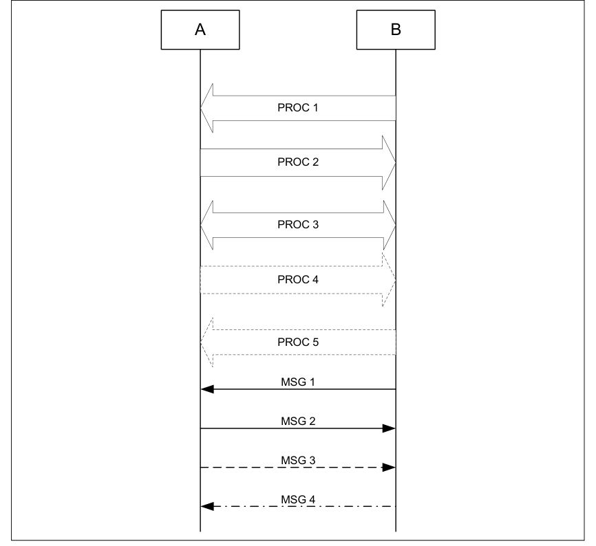

**Figure 1.1:  Arrows used in signaling diagrams**

In Figure 1.1, the following cases are shown: PROC1 is a sub-procedure initiated by B. PROC2 is a sub-procedure initiated by A. PROC3 is a sub- procedure where the initiating side is undefined (may be both A or B). Dashed arrows denote optional steps. PROC4 indicates an optional sub-procedure initiated by A, and PROC5 indicates an optional sub-procedure initiated by B.
MSG1 is a message sent from B to A. MSG2 is a message sent from A to B. MSG3 indicates an optional message from A to B, and MSG4 indicates a conditional message from B to A.

#### 1.2.3  Notation for Timers and Counters

Timers are introduced specific to this profile. To distinguish them from timers used in the Bluetooth protocol specifications and other profiles, these timers are named in the following format: ’TGAP(nnn)’.

#### 1.2.4  Notation for UUIDs

The use of « » (e.g. «Device Name») indicates a Bluetooth SIG-defined UUID.

## 2  PROFILE OVERVIEW

### 2.1   PROFILE STACK

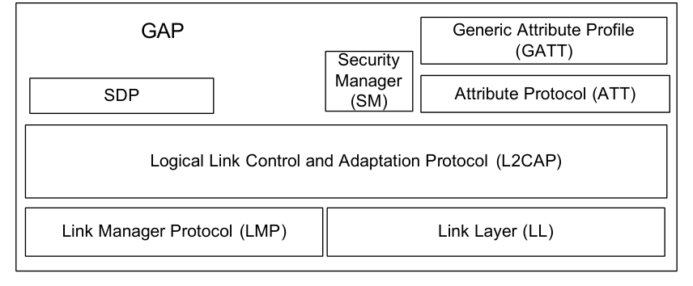

**Figure 2.1:  Relationship of GAP with lower layers of the Bluetooth architecture**

The purpose of this profile is to describe:
• Profile roles
• Discoverability modes and procedures
• Connection modes and procedures
• Security modes and procedures

### 2.2   PROFILE ROLES

#### 2.2.1  Roles when Operating over BR/EDR Physical Transport

In GAP, for describing the Bluetooth communication that occurs between two devices in the BR/EDR GAP role, the generic notation of the A-party (the paging device in case of link establishment, or initiator in case of another procedure on an established link) and the B-party (paged device or acceptor) is used. The A-party is the one that, for a given procedure, initiates device discovery, initiates the establishment of a physical link or initiates a transaction on an existing link.
This profile handles the procedures between two devices related to discovery and connecting (link and connection establishment) for the case where none of the two devices has any link established as well as the case where (at least) one device has a link established (possibly to a third device) before starting the described procedure.

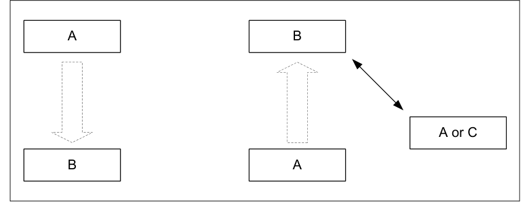

**Figure 2.2:  This profile covers procedures initiated by one device (A) towards another device (B) that may or may not have an existing Bluetooth link active**

The initiator and the acceptor generally operate the generic procedures according to this profile or another profile referring to this profile. If the acceptor operates according to several profiles simultaneously, this profile describes generic mechanisms for how to handle this.

#### 2.2.2  Roles when Operating over an LE Physical Transport

There are four GAP roles defined for devices operating over an LE physical transport:
• Broadcaster
• Observer
• Peripheral
• Central
Table 2.1 defines compliance requirements for Physical Layer and Link Layer functionalities for each GAP role when operating over an LE physical transport.

|  |  | GAP Roles When Operating Over an LE Physical Transport |  |  |  |
| --- | --- | --- | --- | --- | --- |
|  |  | Broadcaster | Observer | Peripheral | Centra |
| Physical Layer functionality: |  |  |  |  |  |
| • Transmitter Characteristics |  | M | O | M | M |
| • Receiver Characteristics |  | O | M | M | M |
| Link Layer functionality: |  |  |  |  |  |
| States: |  |  |  |  |  |
| • Standby State |  | M | M | M | M |
| • Advertising State |  | M | E | M | E |
| • Scanning State |  | E | M | E | M |
| • Initiating State |  | E | E | E | M |
| • Connection State | Slave Role | E | E | M | E |
|  | Master Role | E | E | E | M |
| Advertising event types: |  |  |  |  |  |
| • Connectable and scannable undirected event |  | E | E | M | E |
| • Connectable undirected event |  | E | E | O | E |
| • Connectable directed event |  | E | E | O | E |
| • Non-connectable and non-scanna- ble undirected event |  | M | E | O | E |
| • Non-connectable and non- scannable directed event |  | O | E | O | E |
| • Scannable undirected event |  | O | E | O | E |
| • Scannable directed event |  | O | E | O | E |
| Scanning type: |  |  |  |  |  |
| • Passive scanning |  | E | M | E | O |
| • Active scanning |  | E | O | E | C1 |
| Link Layer control procedures: |  |  |  |  |  |
| • Connection Update procedure |  | E | E | M | M |
| • Channel Map Update procedure |  | E | E | M | M |

Table 2.1:  GAP compliance requirements for Physical Layer and Link Layer functionalities for each GAP role when operating over an LE physical transport

|  | GAP Roles When Operating Over an LE Physical Transport |  |  |  |
| --- | --- | --- | --- | --- |
|  | Broadcaster | Observer | Peripheral | Centr |
| • Encryption procedure | E | E | O | O |
| • Master-initiated Feature Exchange procedure | E | E | M | M |
| • Slave-initiated Feature Exchange procedure | E | E | C2 | C2 |
| • Connection Parameters Request procedure | E | E | O | O |
| • Version Exchange procedure | E | E | M | M |
| • Termination procedure | E | E | M | M |

C1: If passive scanning is supported then active scanning is optional, otherwise active scanning is mandatory.
C2: Mandatory if Connection Parameters Request procedure is supported, otherwise optional.
Table 2.1:  GAP compliance requirements for Physical Layer and Link Layer functionalities for each GAP role when operating over an LE physical transport

##### 2.2.2.1  Broadcaster Role

A device operating in the Broadcaster role is a device that sends advertising events as described in [Vol 6] Part B, Section 4.4.2. A device operating in the Broadcaster role is referred to as a Broadcaster and shall have a transmitter and may have a receiver.

##### 2.2.2.2  Observer Role

A device operating in the Observer role is a device that receives advertising events as described in [Vol 6] Part B, Section 4.4.3. A device operating in the Observer role is referred to as an Observer and shall have a receiver and may have a transmitter.

##### 2.2.2.3  Peripheral Role

Any device that accepts the establishment of an LE active physical link using any of the connection establishment procedures as defined in Section 9 is referred to as being in the Peripheral role. A device operating in the Peripheral role will be in the Slave role in the Link Layer Connection State as described in [Vol 6] Part B, Section 4.5. A device operating in the Peripheral role is referred to as a Peripheral. A Peripheral shall have both a transmitter and a receiver.

##### 2.2.2.4  Central Role

A device that supports the Central role initiates the establishment of an LE active physical link. A device operating in the Central role will be in the Master role in the Link Layer Connection State as described in [Vol 6] Part B, Section 4.5. A device operating in the Central role is referred to as a Central. A Central shall have both a transmitter and a receiver.

##### 2.2.2.5  Concurrent Operation in Multiple GAP Roles

A device may operate in multiple GAP roles concurrently if supported by the Controller. The Host should read the supported Link Layer States and State combinations from the Controller before any procedures or modes are used.

### 2.3   USER REQUIREMENTS AND SCENARIOS

The Bluetooth user should, where expected, be able to connect a Bluetooth device to any other Bluetooth device. Even if the two connected devices don’t share any common application, it should be possible for the user to find this out using basic Bluetooth capabilities. When the two devices do share the same application but are from different manufacturers, the ability to connect them should not be blocked just because manufacturers choose to call basic Bluetooth capabilities by different names on the user interface level or implement basic procedures to be executed in different orders.

### 2.4   PROFILE FUNDAMENTALS

This profile states the requirements on names, values and coding schemes used for names of parameters and procedures experienced on the user interface level.
This profile defines modes of operation that are not service- or profile-specific, but that are generic and can be used by profiles referring to this profile, and by devices implementing multiple profiles.
This profile defines the general procedures that can be used for discovering identities, names and basic capabilities of other Bluetooth devices that are in a mode where they can be discovered. Only procedures where no channel or connection establishment is used are specified.
This profile defines the general procedure for how to create bonds (i.e., dedicated exchange of link keys) between Bluetooth devices.
This profile describes the general procedures that can be used for establishing connections to other Bluetooth devices that are in a mode that allows them to accept connections and service requests.

### 2.5   CONFORMANCE

Bluetooth devices shall conform to this profile to ensure basic interoperability.
Bluetooth devices that conform to another Bluetooth profile may use adaptations of the generic procedures as specified by that other profile. They shall, however, be compatible with devices compliant to this profile at least on the level of the supported generic procedures.
All capabilities indicated as mandatory for this profile shall be supported in the specified manner (process-mandatory). This also applies for all optional and conditional capabilities for which support is indicated. All mandatory capabilities, and optional and conditional capabilities for which support is indicated, are subject to verification as part of the Bluetooth qualification program.

## 3  USER INTERFACE ASPECTS

### 3.1   THE USER INTERFACE LEVEL

In the context of this specification, the user interface level refers to places (such as displays, dialog boxes, manuals, packaging, advertising, etc.) where users of Bluetooth devices encounters names, values and numerical representation of Bluetooth terminology and parameters.
This profile specifies the generic terms that should be used on the user interface level.

### 3.2   REPRESENTATION OF BLUETOOTH PARAMETERS

#### 3.2.1  Bluetooth Device Address (BD_ADDR)

##### 3.2.1.1  Definition

A BD_ADDR is the address used by a Bluetooth device as defined in Section 15.1. It is received from a remote device during the device discovery procedure.

##### 3.2.1.2  Term on user interface level

When the Bluetooth address is referred to on UI level, the term Bluetooth Device Address’ should be used.

##### 3.2.1.3  Representation

On the baseband level the BD_ADDR is represented as 48 bits (see [Vol 2] Part B, Section 1.2). On the Link Layer the public and random device address are represented as 48-bit addresses.
On the UI level the Bluetooth address shall be represented as 12 hexadecimal characters, possibly divided into sub-parts separated by ‘:’ (e.g., ‘000C3E3A4B69’ or ‘00:0C:3E:3A:4B:69’). On the UI level any number shall have the MSB -> LSB (from left to right) ‘natural’ ordering.

#### 3.2.2  Bluetooth Device Name (the user-friendly name)

##### 3.2.2.1  Definition

The Bluetooth device name is the user-friendly name that a Bluetooth device exposes to remote devices. For a device supporting the BR/EDR device type, the name is a character string returned in the LMP_name_res in response to an LMP_name_req. For a device supporting the LE-only device type, the name is a character string held in the Device Name characteristic as defined in Section 12.1.

###### 3.2.2.1.1   Bluetooth Device Name in a Device with BR/EDR/LE Device Type

A BR/EDR/LE device type shall have a single Bluetooth device name which shall be identical irrespective of the physical channel used to perform the name discovery procedure.
For the BR/EDR physical channel the name is received in the LMP_name_res. For the LE physical channel the name can be read from the Device Name characteristic as defined in Section 12.1.
Note: The Device Name Characteristic of the local device can be read by a remote device using ATT over BR/EDR if the local device supports ATT over BR/EDR.

##### 3.2.2.2  Term on user interface level

When the Bluetooth device name is referred to on UI level, the term ‘Bluetooth Device Name’ should be used.

##### 3.2.2.3  Representation

The Bluetooth device name can be up to 248 bytes (see [Vol 2] Part C, Section 4.3.5). It shall be encoded according to UTF-8 (therefore the name entered on the UI level may be restricted to as few as 62 characters if codepoints outside the range U+0000 to U+007F are used).
A device cannot expect that a general remote device is able to handle more than the first 40 characters of the Bluetooth device name. If a remote device has limited display capabilities, it may use only the first 20 characters.

#### 3.2.3  Bluetooth Passkey (Bluetooth PIN)

##### 3.2.3.1  Definition

The Bluetooth passkey may be used to authenticate two Bluetooth devices with each other during the creation of a mutual link key via the pairing procedure. The passkey may be used in the pairing procedures to generate the initial link key.
The PIN may be entered on the UI level but may also be stored in the device; e.g., in the case of a device without sufficient MMI for entering and displaying digits.

##### 3.2.3.2  Terms at user interface level

When the Bluetooth PIN is referred to on UI level, the term ‘Bluetooth Passkey’ should be used.

##### 3.2.3.3  Representation

There are a number of different representations of the Bluetooth passkey. At a high level there are two distinct representations: one used with the Secure Simple Pairing and Security Manager, and another used with legacy pairing (where it is generally referred to as the Bluetooth PIN).
For Secure Simple Pairing and Security Manager, the Bluetooth passkey is a 6- digit numerical value. It is represented as integer value in the range 0x00000000 – 0x000F423F (000000 to 999999). The numeric value may be used as the input to the Authentication Stage 1 for Secure Simple Pairing Passkey Entry (see [Vol 2] Part H, Section 7.2.3), or as the TK value in the Security Manager for the process defined in [Vol 3] Part H, Section 2.3.5.
For legacy pairing (see Section B.2), the Bluetooth PIN has different representations on different levels. PINBB is used on baseband level, and PINUI is used on user interface level. PINBB is the PIN used by [1] for calculating the initialization key during the Pairing Procedure.
PINUI is the character representation of the PIN that is entered on the UI level. The transformation from PINUI to PINBB shall be according to UTF-8. PINBB may be 128 bits (16 bytes).
PIN codes may be up to 16 characters. In order to take advantage of the full level of security all PINs should be 16 characters long. Variable PINs should be composed of alphanumeric characters chosen from within the Unicode range U+0000 to U+007F. If the PIN contains any decimal digits these shall be encoded using the Unicode Basic Latin characters (i.e., U+0030 to U+0039) (Note 1).
For compatibility with devices with numeric keypads, fixed PINs shall be composed of only decimal digits, and variable PINs should be composed of only decimal digits.
If a device supports entry of characters outside the Unicode range U+0000 to U+007F, other Unicode code points may be used (Note 2), except the Halfwidth and Fullwidth Forms (i.e., U+FF00 to U+FFEF) shall not be used (Note 3).
Examples:

| User-entered code | Corresponding PIN [0..length-1] BB (value as a sequence of octets in hexadecimal notation) |
| --- | --- |
| ’0196554200906493’ | length = 16, value = 0x30 0x31 0x39 0x36 0x35 0x35 0x34 0x32 0x30 0x30 0x39 0x30 0x36 0x34 0x39 0x33 |
| ’Børnelitteratur’ | length = 16, value = 0x42 0xC3 0xB8 0x72 0x6e 0x65 0x6c 0x69 0x74 0x74 0x65 0x72 0x61 0x74 0x75 0x72 |

Note 1: This is to prevent interoperability problems since there are decimal digits at other code points (e.g., the Fullwidth digits at code points U+FF10 to U+FF19).
Note 2: Unicode characters outside the Basic Latin range (U+0000 to U+007F) encode to multiple bytes; therefore, when characters outside the Basic Latin range are used the maximum number of characters in the PINUI will be less than 16. The second example illustrates a case where a 15 character string encodes to 16 bytes because the character ø is outside the Basic Latin range and encodes to two bytes (0xC3 0xB8).
Note 3: This is to prevent interoperability problems since the Halfwidth and Fullwidth forms contain alternative variants of ASCII, Katakana, Hangul, punctuation and symbols. All of the characters in the Halfwidth and Fullwidth forms have other related Unicode characters; for example, U+3150 (Hangul Letter AE) can be used instead of U+FFC3 (Halfwidth Hangul Letter AE).

#### 3.2.4  Class of Device

##### 3.2.4.1  Definition

Class of device is a parameter received during the device discovery procedure on the BR/EDR physical transport, indicating the type of device. The Class of Device parameter is only used on BR/EDR and BR/EDR/LE devices using the BR/EDR physical transport.

##### 3.2.4.2  Term on user interface level

The information within the Class of Device parameter should be referred to as ‘Bluetooth Device Class’ (i.e., the major and minor device class fields) and ‘Bluetooth Service Type’ (i.e., the service class field). The terms for the defined Bluetooth Device Types and Bluetooth Service Types are defined in [7].
When using a mix of information found in the Bluetooth Device Class and the Bluetooth Service Type, the term ‘Bluetooth Device Type’ should be used.

##### 3.2.4.3  Representation

The Class of device is a bit field and is defined in [7]. The UI-level representation of the information in the Class of Device is implementation specific.

##### 3.2.4.4  Usage

Some devices provide more than one service and a given service may be provided by different device types. Therefore, the device type does not have a one-to-one relationship with services supported. The major and minor device class field should not be used to determine whether a device supports any specific service(s). It may be used as an indication of devices that are most likely to support desired services before service discovery requests are made, and it may be used to guide the user when selecting among several devices that support the same service.

#### 3.2.5  Appearance Characteristic

##### 3.2.5.1  Definition

The Appearance characteristic contains a  16-bit number that can be mapped to an icon or string that describes the physical representation of the device during the device discovery procedure. It is a characteristic of the GAP service located on the device’s GATT server. See Section 12.2.

##### 3.2.5.2  Usage at user interface level

The Appearance characteristic value should be mapped to an icon or string or something similar that conveys to the user a visual description of the device. This allows the user to determine which device is being discovered purely by visual appearance. If a string is displayed, this string should be translated into the language selected by the user for the device.

##### 3.2.5.3  Representation

The Appearance characteristic value shall be set to one of the 16-bit numbers assigned by the Bluetooth SIG and defined in [Core Specification Supplement], Part A, Section 1.12. The UI-level representation of the Appearance characteristic value is implementation specific.

### 3.3   PAIRING

Pairing over a BR/EDR physical link is defined on LMP level (LMP pairing, see Appendix B.2). Pairing over an LE physical link is defined by the Security Manager specification ([Vol 3] Part H, Section 2.3). Either the user initiates the bonding procedure and enters the passkey with the explicit purpose of creating a bond (and maybe also a secure relationship) between two Bluetooth devices, or the user is requested to enter the passkey during the establishment procedure since the devices did not share a common link key beforehand. In the first case, the user is said to perform “bonding (with entering of passkey)” and in the second case the user is said to “authenticate using the passkey.”

## 4  MODES – BR/EDR PHYSICAL TRANSPORT

| Procedure | Ref. | Support |
| --- | --- | --- |
| Discoverability modes: | 4.1 |  |
| Non-discoverable mode |  | C1 |
| Discoverable mode |  | O |
| Limited discoverable mode |  | C3 |
| General discoverable mode |  | C4 |
| Connectability modes: | 4.2 |  |
| Non-connectable mode |  | O |
| Connectable mode |  | M |
| Bondable modes: | 4.3 |  |
| Non-bondable mode |  | O |
| Bondable mode |  | C2 |
| Synchronizability modes: | 4.4 |  |
| Non-synchronizable mode |  | M |
| Synchronizable mode |  | O |
| C1: If limited discoverable mode is supported, non-discoverable mode is mandatory, otherwise optional. |  |  |
| C2: If the bonding procedure is supported, support for bondable mode is mandatory, otherwise optional. |  |  |
| C3: If Discoverable mode is supported, support for Limited Discoverable mode is manda- tory, otherwise optional. |  |  |
| C4: If Discoverable mode is supported, support for General Discoverable mode is manda- tory, otherwise optional |  |  |

Table 4.1:  Conformance requirements related to modes defined in this section

### 4.1   DISCOVERABILITY MODES

With respect to inquiry, a Bluetooth device shall be either in non-discoverable mode or in a discoverable mode. (The device shall be in one, and only one, discoverability mode at a time.) The two discoverable modes defined here are called limited discoverable mode and general discoverable mode. Inquiry is defined in [Vol 2] Part B, Section 8.4.
When a Bluetooth device is in non-discoverable mode it does not respond to inquiry.
A Bluetooth device is said to be made discoverable, or set into a discoverable mode, when it is in limited discoverable mode or in general discoverable mode. Even when a Bluetooth device is made discoverable, it may be unable to respond to inquiry due to other baseband activity (for example, reserved synchronous slots should have priority over response packets, so that synchronous links may prevent a response from being returned). A Bluetooth device that does not respond to inquiry is called a silent device.
After being made discoverable, the Bluetooth device shall be discoverable for at least TGAP(103).
The speed of discovery is dependent on the configuration of the inquiry scan interval and inquiry scan type of the Bluetooth device. The Host is able to configure these parameters based on trade-offs between power consumption, bandwidth and the desired speed of discovery.

#### 4.1.1  Non-discoverable Mode

##### 4.1.1.1  Definition

When a Bluetooth device is in non-discoverable mode, it shall never enter the INQUIRY_SCAN state.

##### 4.1.1.2  Term on UI-level

Bluetooth device is ‘non-discoverable’ or in ’non-discoverable mode’.

#### 4.1.2  Limited Discoverable Mode

##### 4.1.2.1  Definition

The limited discoverable mode should be used by devices that need to be discoverable only for a limited period of time, during temporary conditions, or for a specific event. The purpose is to respond to a device that makes a limited inquiry (inquiry using the LIAC).
A Bluetooth device should not be in limited discoverable mode for more than TGAP(104). The scanning for the limited inquiry access code can be done either in parallel or in sequence with the scanning of the general inquiry access code. When in limited discoverable mode, one of the following options shall be used.
• Parallel scanning When a Bluetooth device is in limited discoverable mode and when discovery speed is more important than power consumption or bandwidth, it is recommended that the Bluetooth device enter the INQUIRY_SCAN state at least every TGAP(105) and that Interlaced Inquiry scan is used.
If, however, power consumption or bandwidth is important, but not critical, it is recommended that the Bluetooth device enter the INQUIRY_SCAN state at least every TGAP(102) and Interlaced Inquiry scan is used.
When power consumption or bandwidth is critical it is recommended that the Bluetooth device enter the INQUIRY_SCAN state at least every TGAP(102) and Non-interlaced Inquiry scan is used. In all cases the Bluetooth device shall enter the INQUIRY_SCAN state at least once in TGAP(102) and scan for the GIAC and the LIAC for at least TGAP(101).
When either a SCO or eSCO link is in operation, it is recommended to use interlaced scan to significantly decrease the discoverability time.
• Sequential scanning When a Bluetooth device is in limited discoverable mode, it shall enter the INQUIRY_SCAN state at least once in TGAP(102) and scan for the GIAC for at least TGAP(101) and enter the INQUIRY_SCAN state more often than once in TGAP(102) and scan for the LIAC for at least TGAP(101).
If an inquiry message is received when in limited discoverable mode, the entry into the INQUIRY_RESPONSE state takes precedence over the next entries into INQUIRY_SCAN state until the inquiry response is completed.

##### 4.1.2.2  Conditions

When a device is in limited discoverable mode it shall set bit no 13 in the Major Service Class part of the Class of Device/Service field [7].

##### 4.1.2.3  Term on UI-level

Bluetooth device is ‘discoverable’ or in ‘discoverable mode’.

#### 4.1.3  General Discoverable Mode

##### 4.1.3.1  Definition

The general discoverable mode shall be used by devices that need to be discoverable continuously or for no specific condition. The purpose is to respond to a device that makes a general inquiry (inquiry using the GIAC).

##### 4.1.3.2  Conditions

When a Bluetooth device is in general discoverable mode and when discovery speed is more important than power consumption or bandwidth, it is recommended that the Bluetooth device enter the INQUIRY_SCAN state at least every TGAP(105) and that Interlaced Inquiry scan is used.
If, however, power consumption or bandwidth is important, but not critical, it is recommended that the Bluetooth device enter the INQUIRY_SCAN state at least every TGAP(102) and Interlaced Inquiry scan is used.
When power consumption or bandwidth is critical it is recommended that the Bluetooth device enter the INQUIRY_SCAN state at least every TGAP(102) and Non-interlaced Inquiry scan is used.
In all cases the Bluetooth device shall enter the INQUIRY_SCAN state at least once in TGAP(102) and scan for the GIAC for at least TGAP(101).
When either a SCO or eSCO link is in operation, it is recommended to use interlaced scan to significantly decrease the discoverability time.
A device in general discoverable mode shall not respond to a LIAC inquiry.

##### 4.1.3.3  Term on UI-level

Bluetooth device is ‘discoverable’ or in ‘discoverable mode’.

### 4.2   CONNECTABILITY MODES

With respect to paging, a Bluetooth device shall be either in non-connectable mode or connectable mode. Paging is defined in [Vol 2] Part B, Section 8.3.
When a Bluetooth device is in non-connectable mode it does not respond to paging. When a Bluetooth device is in connectable mode it responds to paging.
The speed of connections is dependent on the configuration of the page scan interval and page scan type of the Bluetooth device. The Host is able to configure these parameters based on trade-offs between power consumption, bandwidth and the desired speed of connection.

#### 4.2.1  Non-connectable Mode

##### 4.2.1.1  Definition

When a Bluetooth device is in non-connectable mode it shall never enter the PAGE_SCAN state.

##### 4.2.1.2  Term on UI-level

Bluetooth device is ‘non-connectable’ or in ‘non-connectable mode’.

#### 4.2.2  Connectable Mode

##### 4.2.2.1  Definition

When a Bluetooth device is in connectable mode it shall periodically enter the PAGE_SCAN state. The device makes page scan using the Bluetooth device address, BD_ADDR. Connection speed is a trade-off between power consumption / available bandwidth and speed. The Bluetooth Host is able to make these trade-offs using the Page Scan interval, Page Scan window, and Interlaced Scan parameters.
R0 page scanning should be used when connection speeds are critically important and when the paging device has a very good estimate of the Bluetooth clock. Under these conditions it is possible for paging to complete within two times the page scan window. Because the page scan interval is equal to the page scan window it is not possible for any other traffic to go over the Bluetooth link when using R0 page scanning. In R0 page scanning it is not possible to use interlaced scan. R0 page scanning is the highest power consumption mode of operation.
When connection times are critical but the other device either does not have an estimate of the Bluetooth clock or when the estimate is possibly out of date, it is better to use R1 page scanning with a very short page scan interval, TGAP(106), and Interlaced scan. This configuration is also useful to achieve
nearly the same connection speeds as R0 page scanning but using less power and leaving bandwidth available for other connections. Under these circumstances it is possible for paging to complete within TGAP(106). In this case the Bluetooth device shall page scan for at least TGAP(101).
When connection times are important but not critical enough to sacrifice significant bandwidth and/or power consumption it is recommended to use either TGAP(107) or TGAP(108) for the scanning interval. Using Interlaced scan will reduce the connection time by half but may use twice the power consumption. Under these circumstances it is possible for paging to complete within one or two times the page scanning interval depending on whether Interlaced Scan is used. In this case the Bluetooth device shall page scan for at least TGAP(101).
In all cases the Bluetooth device shall enter the PAGE_SCAN state at least once in TGAP(102) and scan for at least TGAP(101).
The page scan interval, page scan window size, and scan type for the six scenarios are described in Table 4.2:

| Scenario | Page Scan Interval | Page Scan Window | Scan Type |
| --- | --- | --- | --- |
| R0 (1.28s) | T (107) GAP | T (107) GAP | Normal scan |
| Fast R1 (100ms) | T (106) GAP | T (101) GAP | Interlaced scan |
| Medium R1 (1.28s) | T (107) GAP | T (101) GAP | Interlaced scan |
| Slow R1 (1.28s) | T (107) GAP | T (101) GAP | Normal scan |
| Fast R2 (2.56s) | T (108) GAP | T (101) GAP | Interlaced scan |
| Slow R2 (2.56s) | T (108) GAP | T (101) GAP | Normal scan |

Table 4.2:  Page scan parameters for connection speed scenarios
When either a SCO or eSCO link is in operation, it is recommended to use interlaced scan to significantly decrease the connection time.

##### 4.2.2.2  Term on UI-level

Bluetooth device is ‘connectable’ or in ‘connectable mode’.

### 4.3   BONDABLE MODES

With respect to bonding, a Bluetooth device shall be either in non-bondable mode or in bondable mode. In bondable mode the Bluetooth device accepts bonding initiated by the remote device, and in non-bondable mode it does not.

#### 4.3.1  Non-bondable Mode

##### 4.3.1.1  Definition

When a Bluetooth device is in non-bondable mode it shall not accept a pairing request that results in bonding. Devices in non-bondable mode may accept connections that do not request or require bonding.
A device in non-bondable mode shall respond to a received LMP_in_rand with LMP_not_accepted with the reason pairing not allowed.
When both devices support Secure Simple Pairing and the local device is in non-bondable mode, the local Host shall respond to an IO capability request where the Authentication_Requirements parameter requests dedicated bonding or general bonding with a negative response.

##### 4.3.1.2  Term on UI-level

Bluetooth device is ‘non-bondable’ or in ‘non-bondable mode’ or “does not accept bonding”.

#### 4.3.2  Bondable Mode

##### 4.3.2.1  Definition

When a Bluetooth device is in bondable mode, and Secure Simple Pairing is not supported by either the local or remote device, the local device shall respond to a received LMP_in_rand with LMP_accepted (or with LMP_in_rand if it has a fixed PIN).
When both devices support Secure Simple Pairing, the local Host shall respond to a user confirmation request with a positive response.

##### 4.3.2.2  Term on UI-level

Bluetooth device is ‘bondable’ or in ‘bondable mode’ or “accepts bonding”.

### 4.4   SYNCHRONIZABILITY MODES

A Bluetooth device shall be either in non-synchronizable mode or synchronizable mode. The synchronization train procedure is defined in [Vol 2] Part B, Section 2.7.2.
When a Bluetooth device is in synchronizable mode, it transmits timing and frequency information for its active Connectionless Slave Broadcast packets. When a Bluetooth device is non-synchronizable, timing and frequency information is not transmitted.
The Host is able to configure the Synchronization Train interval based on trade-offs between bandwidth, potential interference to other devices, power consumption, and the desired time for a slave to receive a synchronization train packet.

#### 4.4.1  Non-synchronizable Mode

##### 4.4.1.1  Definition

When a Bluetooth device is in non-synchronizable mode it shall never enter the synchronization train substate.

##### 4.4.1.2  Term on UI-level

Bluetooth device is ‘non-synchronizable’ or in ‘non-synchronizable mode’.

#### 4.4.2  Synchronizable Mode

##### 4.4.2.1  Definition

When a Bluetooth device is in synchronizable mode, it shall enter the synchronization train substate using a synchronization train interval of TGAP(Sync_Train_Interval).
After being made synchronizable, the Bluetooth device shall be synchronizable for at least TGAP(Sync_Train_Duration).

## 5  SECURITY ASPECTS – BR/EDR PHYSICAL TRANSPORT

|  | Procedure | Ref. | Support |
| --- | --- | --- | --- |
| 1 | Authentication | 5.1 | M |
| 2 | Security modes | 5.2 |  |
|  | Security mode 1 |  | E |
|  | Security mode 2 |  | O.1 |
|  | Security mode 3 |  | E |
|  | Security mode 4 |  | M |
| O.1: Security Mode 2 may only be used for backwards compatibility when the remote devic does not support Secure Simple Pairing. |  |  |  |

Table 5.1:  Conformance requirements related to the generic authentication procedure and the security modes defined in this section

### 5.1   AUTHENTICATION

#### 5.1.1  Purpose

The generic authentication procedure describes how the LMP-authentication and LMP-pairing procedures are used when authentication is initiated by one Bluetooth device towards another, depending on if a link key exists or not and if pairing is allowed or not.

#### 5.1.2  Term on UI level

‘Bluetooth authentication’.

#### 5.1.3  Procedure

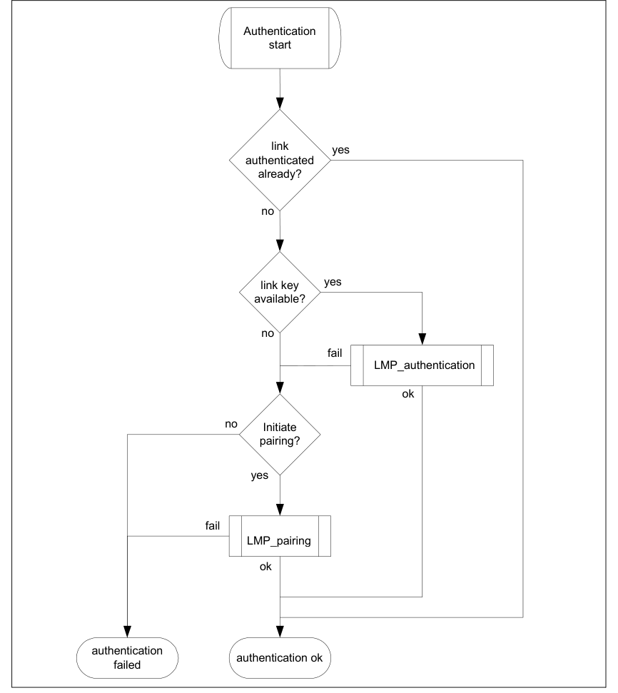

**Figure 5.1:  Definition of the generic authentication procedure**

#### 5.1.4  Conditions

The local device shall initiate authentication after link establishment. The remote device may initiate security during or after link establishment.

### 5.2   SECURITY MODES

The following flow chart provides an overview of the channel establishment procedures.

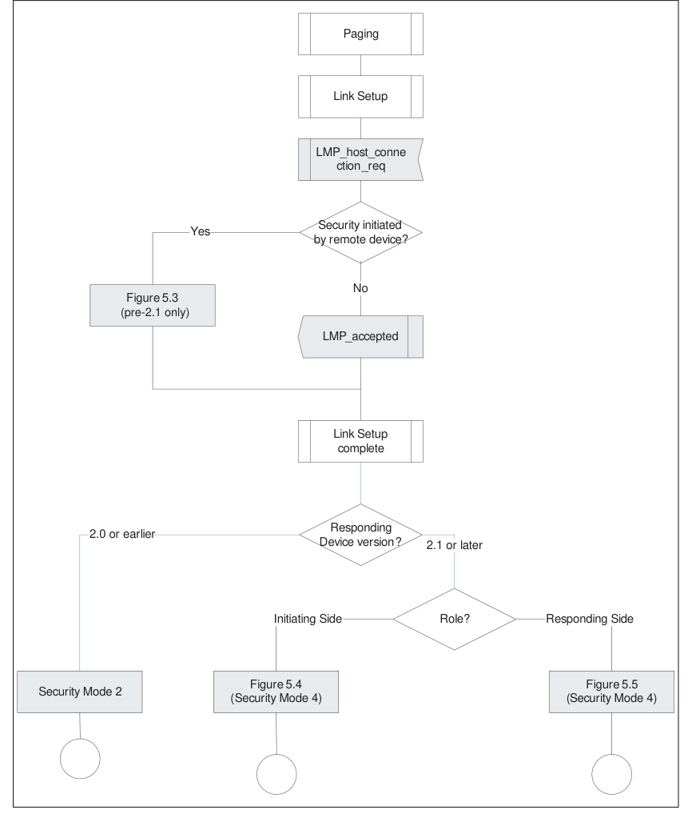

**Figure 5.2:  Channel establishment with security**

A device may support two security modes simultaneously: security mode 2 for backwards compatibility with remote devices that do not support Secure Simple Pairing and security mode 4 for devices that support Secure Simple Pairing.

#### 5.2.1  Legacy Security Modes

Legacy security modes apply to those devices with a Controller or a Host that does not support SSP.

##### 5.2.1.1  Security mode 1 (non-secure)

When a remote Bluetooth device is in security mode 1 it will never initiate any security procedure (i.e., it will never send LMP_au_rand, LMP_in_rand or LMP_encryption_mode_req).

##### 5.2.1.2  Security mode 2 (service level enforced security)

When a remote Bluetooth device is in security mode 2 it will not initiate any security procedure before a channel establishment request (L2CAP_ConnectReq) has been received or a channel establishment procedure has been initiated by itself. (The behavior of a device in security mode 2 is further described in [6].) Whether a security procedure is initiated or not depends on the security requirements of the requested channel or service.
A Bluetooth device in security mode 2 should classify the security requirements of its services using at least the following attributes:
• Authorization required
• Authentication required
• Encryption required
Note: Security mode 1 can be considered (at least from a remote device point of view) as a special case of security mode 2 where no service has registered any security requirements.

##### 5.2.1.3  Security mode 3 (link level enforced security)

When a remote Bluetooth device is in security mode 3 it will initiate security procedures before it sends LMP_setup_complete.
A Bluetooth device in security mode 3 may reject the Host connection request (respond with LMP_not_accepted to the LMP_host_connection_req) based on settings in the Host (e.g., only communication with pre-paired devices allowed).

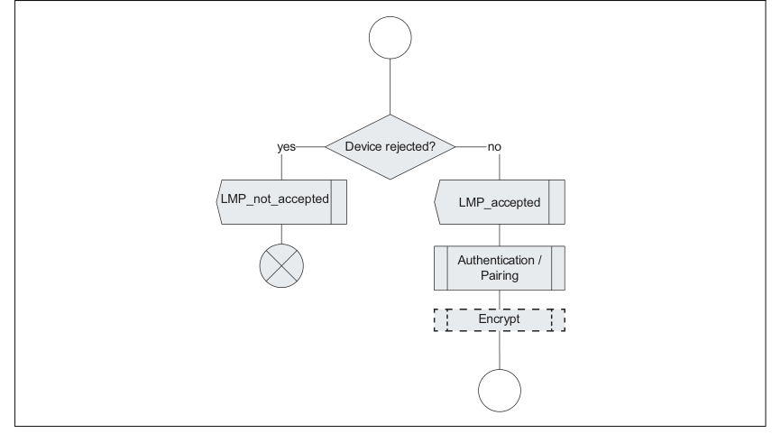

**Figure 5.3:  Security mode 3 with a legacy remote device**

#### 5.2.2   Security Mode 4 (service level enforced security)

A Bluetooth device in security mode 4 shall classify the security requirements of its services using at least the following attributes (in order of decreasing security):
• Authenticated link key required
• Unauthenticated link key required
• Security optional – SDP only. Limited to specific services (see Section 5.2.2.8).
An authenticated link key is a link key where either the numeric comparison, out-of-band, or passkey entry simple pairing association models were used. An authenticated link key has protection against man-in-the-middle (MITM) attacks. To ensure that an authenticated link key is created during the Simple Pairing procedure, the Authentication_Requirements parameter should be set to one of the MITM Protection Required options. An unauthenticated link key is a link key where the just works Secure Simple Pairing association model was used. An unauthenticated link key does not have protection against MITM attacks.
When both devices support Secure Simple Pairing, GAP shall require at least an unauthenticated link key and enabling encryption for all connections except those allowed to have security level 0 (see Section 5.2.2.8). A profile or protocol may define services that require more security (e.g., an authenticated link key) or no security (although unencrypted connections are only allowed when connecting to a service allowed to have security level 0). To allow an unauthenticated link key to be created during the Simple Pairing procedure, the Authentication_Requirements parameter may be set to one of the MITM Protection Not Required options.
When the device is in Bondable Mode, it shall enable Secure Simple Pairing mode prior to entering Connectable Mode or establishing a link.
A Bluetooth device in security mode 4 shall respond to authentication requests during link establishment when the remote device is in security mode 3 for backwards compatibility reasons.
A Bluetooth device in security mode 4 enforces its security requirements before it attempts to access services offered by a remote device and before it grants access to services it offers to remote devices. Service access may occur via L2CAP channels or via channels established by protocols above L2CAP such as RFCOMM.
For services transmitting unicast data over the connectionless L2CAP channel, the transmitting device shall enforce its security requirements prior to sending data. There is no mechanism for a device receiving data via the L2CAP connectionless channel to prevent unencrypted data from being received. Hence, Section 5.2.2.1 addresses unicast connectionless data transmission together with devices initiating connection-oriented channels while Section 5.2.2.2 covers only devices responding to requests for connection-oriented channel establishment but does not cover unicast connectionless data reception.
A device may be in a Secure Connections Only mode. When in Secure Connections Only mode, all services (except those allowed to have Security Mode 4, Level 0) available on the BR/EDR physical transport require Security Mode 4, Level 4. The device shall reject both new outgoing and incoming service level connections when the service requires Security Mode 4, Level 4 and either the physical transport does not support Secure Connections or unauthenticated pairing is being requested. A device operating with a physical transport operating in Secure Connections Only mode may disconnect the ACL connection using error code 0x05 (Authentication Failure) when the physical transport that does not support Secure Connections, tries to access a service that requires Security Mode 4, Level 4. Note: A device may operate several physical transports simultaneously - in this case all physical transports are required to enable Security Connections Only Mode simultaneously.

##### 5.2.2.1  Security for Access to Remote Service (Initiating Side)

When the responding device does not support Secure Simple Pairing, it may disconnect the link while the initiating device is requesting the PIN to be entered by the user. This may occur due to the lack of an L2CAP channel being present for longer than an implementation-specific amount of time (e.g., a few seconds). When this occurs, the initiating device shall allow the user to complete entering the PIN and shall then re-page the remote device and restart the pairing procedure (see [Vol 2] Part C, Section 4.2.2) using the PIN entered.

###### 5.2.2.1.1   Pairing Required for Access to Remote Service

When a Bluetooth device in security mode 4 initiates access to a remote service via a connection-oriented L2CAP channel and a sufficient link-key is not available, the local device shall perform pairing procedures and enable encryption before sending a channel establishment request (L2CAP_ConnectReq or a higher-layer channel establishment request such as that of RFCOMM).
When a Bluetooth device in security mode 4 transmits data to a remote service via the unicast connectionless L2CAP channel and a sufficient link-key is not available, the local device shall perform pairing procedures and enable encryption before transmitting unicast data on the connectionless L2CAP channel.
See Section 5.2.2.8 for details on determining whether or not a link key is sufficient.
If pairing does not succeed, the local device shall not send a channel establishment request. The local device may re-try pairing up to three (3) times. If pairing fails three consecutive times, the local device shall disconnect the ACL link with error code 0x05 - Authentication Failure.
If the link key generated is not at least as good as the expected or required type, the local device shall fail the establishment and may disconnect the ACL link with error code 0x05 - Authentication Failure.

###### 5.2.2.1.2   Authentication Required for Access to Remote Service

When a Bluetooth device in security mode 4 initiates access to a remote service via a connection-oriented L2CAP channel and a sufficient link key is available for the remote device, it shall authenticate the remote device and enable encryption before sending a channel establishment request (L2CAP_ConnectReq or higher a layer-channel establishment request such as that of RFCOMM).
When a Bluetooth device in security mode 4 transmits unicast data to a remote service via the connectionless L2CAP channel and security is required for the application and a sufficient link-key is available then the local device shall
authenticate the remote device and enable encryption before transmitting unicast data on the L2CAP connectionless channel.
See Section 5.2.2.8 for details on determining whether or not a link key is sufficient.
If authentication is required by the service but does not succeed, or if a sufficient link-key is not available, then the local device shall not enable encryption and shall not send a channel establishment request and shall not send any unicast data via the L2CAP connectionless channel for that application. The Host may then notify the user and offer to perform pairing.

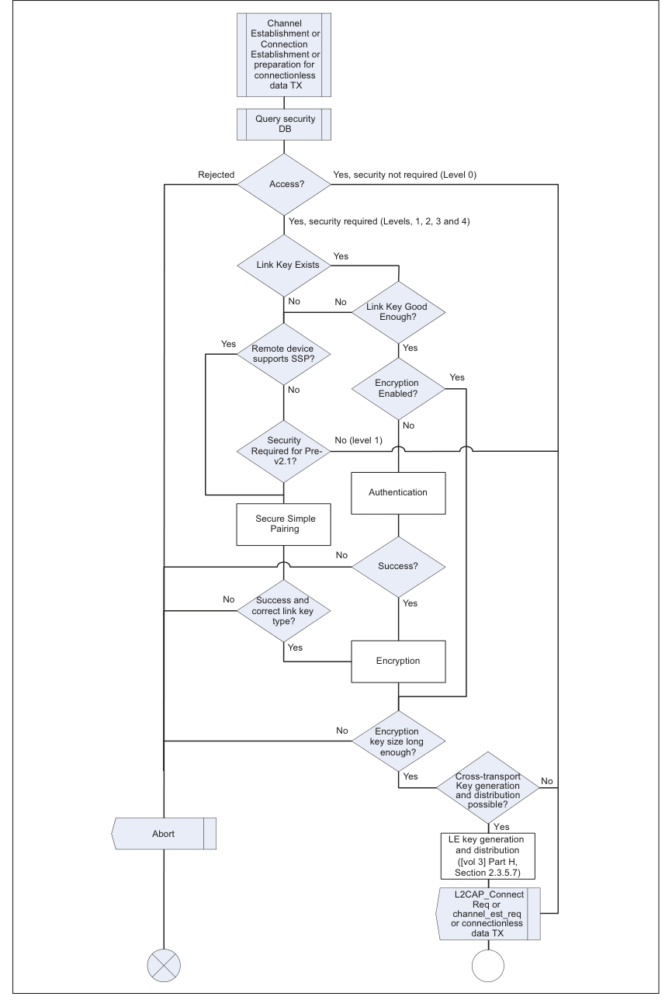

**Figure 5.4:  Channel establishment using security mode 4 for initiating side**

###### 5.2.2.1.3   Cross-transport Key Generation and Distribution

After encryption is enabled and both devices support cross-transport key generation, the master of the BR/EDR transport may perform LE key generation and distribution ([Vol 3] Part H, Section 2.3.5.7).

##### 5.2.2.2  Security for Access to Local Service by Remote Device (Responding Side)

When a remote device attempts to access a service offered by a Bluetooth device that is in security mode 4 and a sufficient link key exists and authentication has not been performed the local device shall authenticate the remote device and enable encryption after the channel establishment request is received but before a channel establishment confirmation (L2CAP_ConnectRsp with result code of 0x0000 or a higher-level channel establishment confirmation such as that of RFCOMM) is sent.
When L2CAP is the channel establishment protocol being used for the requested service, an L2CAP_ConnectRsp signaling packet shall be sent by the responding device containing the result code 0x0001 (connection pending) following receipt of an L2CAP_ConnectReq and prior to initiating security procedures which can result in prompting the local user for input (e.g., pairing using a PIN or Secure Simple Pairing using either the Passkey entry or Numerical Comparison association models). This will stop the L2CAP RTX timer on the remote device (which may be as short as 1 second) and will invoke the ERTX timer on the remote device, which is a minimum duration of 60 seconds.
See [Vol 3] Part A, Section 6.1.7, for additional information on L2CAP RTX and ERTX timers. See also [Vol 3] Part A, Section 4.3 for additional information on the L2CAP_ConnectRsp signaling packet, and the defined result codes.
Higher layer channel establishment protocols should be designed to restrict timeouts to be 30 seconds or longer to allow for user input, or provide mechanisms to dynamically extend timeouts when user input may be required.
If authentication or pairing fails when a remote device is attempting to access a local service, the local device shall send a negative response to the channel establishment request (L2CAP_ConnectReq or channel_est_req) indicating a security issue if possible. If the channel establishment protocol is L2CAP, then the result code 0x0003 (connection refused - security block) shall be sent in the L2CAP_ConnectRsp signal.
If the remote device has indicated support for Secure Simple Pairing, a channel establishment request is received for a service other than SDP, and encryption has not yet been enabled, then the local device shall disconnect the ACL link with error code 0x05 - Authentication Failure.

###### 5.2.2.2.1   Pairing Required for Access to Local Service by Remote Device

When a remote device attempts to access a service offered by a Bluetooth device that is in security mode 4 and pairing is required due to the link key being absent or insufficient, the local device shall perform pairing procedures and enable encryption after the channel establishment request is received and before a channel establishment confirmation (L2CAP_ConnectRsp with result code of 0x0000 or a higher-level channel establishment response such as that of RFCOMM) is sent.
See Section 5.2.2.6 for details on determining whether or not a link key is sufficient.
If pairing does not succeed, then the local device shall not send a channel establishment confirmation. The local device may retry pairing up to three (3) times. If pairing fails three consecutive times, then the local device shall disconnect the ACL link with error code 0x05 - Authentication Failure.
If the link-key generated is not at least as good as the expected or required type, then the local device shall fail the channel establishment and may disconnect the ACL link with error code 0x05 - Authentication Failure.

###### 5.2.2.2.2   Authentication Required for Access to Local Service by Remote

Device
See Section 5.2.2.6 for details on determining whether or not a link key is sufficient.
If authentication does not succeed, then the local device shall not send a channel establishment confirmation. The Host may at this point notify the user and offer to perform pairing.
A Bluetooth device in security mode 4 shall respond to authentication and pairing requests during link establishment when the remote device is in security mode 3 for backwards compatibility reasons. However, authentication of the remote device shall be performed after the receipt of the channel establishment request is received, and before the channel establishment response is sent.

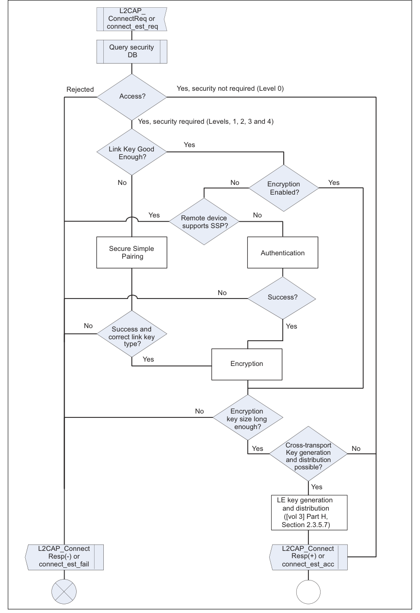

**Figure 5.5:  Channel establishment using security mode 4 for the responding side**

###### 5.2.2.2.3   Cross-transport Key Generation and Distribution

After encryption is enabled and both devices support cross-transport key generation, the master of the BR/EDR transport may perform LE key generation and distribution ([Vol 3] Part H, Section 2.3.5.7).

##### 5.2.2.3  Simple Pairing after Authentication Failure

When both devices support Secure Simple Pairing all non-SDP connections are encrypted regardless of whether security was required or whether the devices are bonded or not. The initial connection between the two devices will result in a link key through Secure Simple Pairing. Depending on whether or not bonding was performed and the security policy of the initiating device, the link key may or may not be stored. When the link key is stored, subsequent connections to the same device will use authentication but this may fail if the remote device has deleted the link key. Table 5.2 defines what shall be done depending on the type of the link key and whether bonding was performed or not.

| Link Key Type | Devices Bonded? | Action to take when Authentication Fails |
| --- | --- | --- |
| Combination | No | Depends on security policy of the device: • Option 1: Automatically initiate pairing • Option 2: Notify user and ask if pairing is ok Option 2 is recommended. |
| Combination | Yes | Notify user of security failure |
| Unauthenticated | No | Depends on security policy of the device: • Option 1: Automatically initiate secure simple pairing • Option 2: Notify user and ask if secure simple pairing is ok. Option 1 is recommended. |
| Unauthenticated | Yes | Notify user of security failure |
| Authenticated | No | Depends on security policy of the device: • Option 1: Automatically initiate secure simple pairing • Option 2: Notify user and ask if secure simple pairing is ok Option 2 is recommended. |
| Authenticated | Yes | Notify user of security failure |

Table 5.2:  Simple Pairing after Authentication Failure
Note that non-bonded authenticated or unauthenticated link keys may be considered disposable by either device and may be deleted at any time.

##### 5.2.2.4  IO Capabilities

Once a connection is established, if the Host determines that security is necessary and both devices support Secure Simple Pairing, the devices perform an IO capability exchange. The purpose of the IO capability exchange is to determine the authentication algorithm used in the Authentication Stage 1 phase of Simple Pairing.
The input and output capabilities are described in Table 5.3:

| Capability | Description |
| --- | --- |
| No input | Device does not have the ability to indicate 'yes' or 'no' |
| Yes / No | Device has at least two buttons that are mapped easily to 'yes' and 'no' or the device has a mechanism whereby the user can indicate either 'yes' or 'no' (see note below). |
| Keyboard | Device has a numeric keyboard that can input the numbers '0' through '9' and a confirmation. Device also has two buttons that can be easily mappe to 'yes' and 'no' or the device has a mechanism whereby the user can indi cate either 'yes' or 'no' (see Note below). |

Table 5.3:  User Input Capabilities
Note: 'yes' could be indicated by pressing a button within a certain time limit otherwise 'no' would be assumed.

| Capability | Description |
| --- | --- |
| No output | Device does not have the ability to display or communicate a 6 digit decimal number |
| Numeric output | Device has the ability to display or communicate a 6 digit dec imal number |

Table 5.4:  User Output Capabilities

##### 5.2.2.5  Mapping of Input / Output Capabilities to IO Capability

The individual input and output capabilities are mapped to a single IO capability which is later used to determine which authentication algorithm will be used.

|  |  | Local Output Capability |  |
| --- | --- | --- | --- |
|  |  | No Output | Numeric Output |
| Local Input Capability | No input | NoInputNoOutput | DisplayOnly |
|  | Yes / No | NoInputNoOutput | DisplayYesNo |
|  | Keyboard | KeyboardOnly | DisplayYesNo |

Table 5.5:  IO Capability mapping
When a device has OOB authentication information from the remote device, it will indicate it in the LMP_IO_Capability_Res PDU. When either device has OOB information, the OOB association model will be used.
The Host may allow the Link Manager to ignore the IO capabilities and use the Numeric Comparison protocol with automatic accept by setting the Authentication_Requirements parameter to one of the MITM Protection Not Required options.

##### 5.2.2.6  IO and OOB Capability Mapping to Authentication Stage 1 Method

Determining which association model to use in Authentication Stage 1 is performed in three steps. First, the devices look at the OOB Authentication Data Present parameter received in the remote IO capabilities. If either device has received OOB authentication data then the OOB association model is used. The event of receiving the OOB information is indicated by a device to its peer in the IO Capability Exchange step of simple pairing.

|  |  | Device A |  |
| --- | --- | --- | --- |
|  |  | Has not received remote OOB authentication data | Has received remote OO authentication table |
| Device B | Has not received remote OOB authentication data | Use the IO capability map- ping table | Use OOB association with ra = 0 rb from OOB |
|  | Has received remote OOB authentication data | Use OOB association with ra from OOB rb = 0 | Use OOB association with ra from OOB rb from OOB |

Table 5.6:  IO and OOB capability mapping
Second, if neither device has received OOB authentication data and if both devices have set the Authentication_Requirements parameter to one of the MITM Protection Not Required options, authentication stage 1 shall function as if both devices set their IO capabilities to DisplayOnly (e.g., Numeric comparison with automatic confirmation on both devices).
Finally, if neither device has received OOB authentication data and if one or both devices have set the Authentication_Requirements parameter to one of the MITM Protection Required options, the IO and OOB capabilities are mapped to the authentication stage 1 method as defined in the following table. A Host that has set the Authentication_Requirements parameter to one of the MITM Protection Required options shall verify that the resulting Link Key is an Authenticated Combination Key (see [Vol 2] Part E, Section 7.7.24). The table also lists whether the combination key results in an authenticated or unauthenticated link key.

|  |  | Device A (Initiator) |  |  |  |
| --- | --- | --- | --- | --- | --- |
|  |  | Display Only | DisplayYesNo | KeyboardOnly | NoInputNoOutp |
| Device B (Responder) | DisplayOnly | Numeric Comparison with auto- matic confir- mation on both devices. Un- authenticated | Numeric Comparison with auto- matic confir- mation on device B only. Un- authenticated | Passkey Entry: Responder Display, Initiator Input. Authenticated | Numeric Comparison with automatic confirmation on both devices. Unauthenticated |
|  | DisplayYes No | Numeric Comparison with auto- matic confir- mation on device A only. | Numeric Comparison: Both Display, Both Confirm. | Passkey Entry: Responder Display, Initiator Input. | Numeric Comparison with automatic confirmation on device A only and Yes/No confirma- tion whether to pair on device B. Device B does no show the confir- mation value. |
|  |  | Un- authenticated | Authenticated | Authenticated | Unauthenticated |
|  | Keyboard Only | Passkey Entry: Initia- tor Display, Responder Input. | Passkey Entry: Initiator Display, Responder Input. | Passkey Entry: Initiator and Responder Input. | Numeric Comparison with automatic confirmation on both devices. |
|  |  | Authenticated | Authenticated | Authenticated | Unauthenticated |
|  | NoInputNo Output | Numeric Comparison with auto- matic confir- mation on both devices. | Numeric Comparison with auto- matic confir- mation on device B only and Yes/No confirmation on whether to pair on device A. Device A does not show the confirma- tion value. | Numeric Comparison with automatic confirmation on both devices. | Numeric Comparison with automatic confirmation on both devices. |
|  |  | Un- authenticated | Un- authenticated | Un- authenticated | Unauthenticated |

Table 5.7:  IO Capability Mapping to Authentication Stage 1
Note: The "DisplayOnly" IO capability only provides unidirectional authentication.

##### 5.2.2.7  Out of Band (OOB)

An out of band mechanism may also be used to communicate discovery information as well as other information related to the pairing process.
The contents of the OOB data block are:
Mandatory contents:
• Length (2 bytes)
• BD_ADDR (6 bytes)
Optional contents:
• Class of Device (3 bytes)
• Simple Pairing Hash C (16 bytes)
• Simple Pairing Randomizer R (16 bytes)
• Local name (variable length)
• Other information
The length field includes all bytes in the OOB data block including the length field itself. The BD_ADDR will be a fixed field in the beginning of the OOB data block. Following the BD_ADDR will be zero or more EIR tag fields containing optional contents. The EIR tag format will be used for the optional contents.

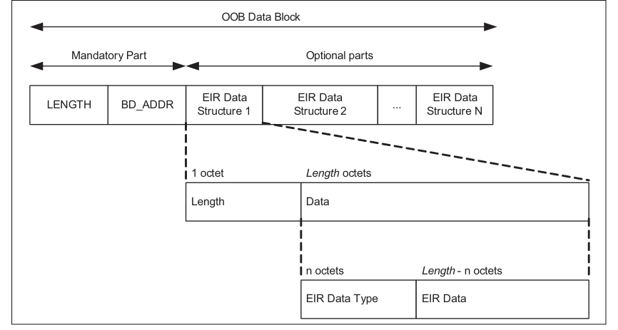

**Figure 5.6:  OOB Data Block Format**

If Simple Pairing fails when one or both devices have OOB Authentication Data present, both devices shall discard the OOB Authentication Data and the device that originally initiated authentication shall re-initiate authentication. Note that although the user may get involved in authentication as defined by the IO capabilities of the two devices, falling back to the in-band association model will prevent deadlock conditions when one or both devices has stale OOB Authentication Data.
There is a MIME type defined for use with the OOB data format. The MIME type can be found from the following link: http://www.iana.org/assignments/ media-types/application/vnd.bluetooth.ep.oob

##### 5.2.2.8  Security Database

A Bluetooth device in security mode 4 shall classify the security requirements of its services using at least the following levels attributes (in order of decreasing security) for use when pairing with remote devices supporting Secure Simple Pairing:
• Level 4, for services with the following attributes or devices in Secure Connections Only Mode:
MITM protection required
128-bit equivalent strength for link and encryption keys required using FIPS approved algorithms (E0 not allowed, SAFER+ not allowed, and P-192 not allowed)
User interaction acceptable
• Level 3, for services with the following attributes:
MITM protection required
Encryption required
User interaction acceptable
• Level 2, for services with the following attributes: MITM protection not required Encryption required
• Level 1, for services with the following attributes:
MITM protection not required Minimal user interaction desired
• Level 0: Service requires the following: MITM protection not required
No encryption required No user interaction required
Security Mode 4 Level 0 shall only be used for:
a) L2CAP fixed signaling channels with CIDs 0x0001, 0x0003, and 0x003F
b) SDP
c) broadcast data sent on the connectionless L2CAP channel (CID 0x0002)
d) services with the combinations of Service Class UUIDs and L2CAP traffic types listed in [Core Specification Supplement], Part C.
The security level required for each service offered should be stored in a secu- rity database that is accessed to determine the type of link key that is required for access to the respective service. The security level required for service data transmitted on an L2CAP connection-oriented channel may differ from the security level required for service data transmitted on another L2CAP connec- tion-oriented channel or on the connectionless L2CAP channel. Table 5.8 shows the type of link key required for each security level for both remote devices that support Secure Simple Pairing (v2.1 + EDR remote devices) and for those that do not (pre-v2.1 + EDR remote devices).

| Security Level Required for Service | Link Key type required for remote devices | Link Key type required for pre-v2.1 remote devices | Comments |
| --- | --- | --- | --- |
| Level 4 • MITM protection required • Encryption required • User interaction acceptable | Authenticated (P-256 based Secure Simple Pairing and Secure Authentication) | NA | Highest Security Only possible when both device support Secure Connections |
| Level 3 • MITM protection required • Encryption required • User interaction acceptable | Authenticated | Combination (16 digit PIN recommended) | High Security |
| Level 2 • MITM protection not necessary • Encryption desired | Unauthenticated | Combination | Medium Security |
| Level 1 • MITM protection not necessary • Encryption not necessary1 • Minimal user interaction desired | Unauthenticated | None | Low Security |

Table 5.8:  Security Level mapping to link key requirements

| Security Level Required for Service | Link Key type required for remote devices | Link Key type required for pre-v2.1 remote devices | Comments |
| --- | --- | --- | --- |
| Level 0 • MITM protection not necessary • Encryption not necessary • No user interaction desired | None | None | Permitted only fo SDP and service data sent via eith L2CAP fixed sig- naling channels o the L2CAP con- nectionless chan nel to PSMs that correspond to se vice class UUIDs which are allowe to utilize Level 0. |

Table 5.8:  Security Level mapping to link key requirements
1. Though encryption is not necessary for the service for Level 1, this specification man- dates the use of encryption when the remote device is v2.1+EDR for all services other than SDP.
An authenticated link key is a link key where either the numeric comparison, out-of-band, or passkey entry simple pairing association models were used. An authenticated link key has protection against MITM attacks. To ensure that an authenticated link key is created during the Simple Pairing procedure, the Authentication_Requirements parameter should be set to one of the MITM Protection Required options.
An unauthenticated link key is a link key where the “Just Works” simple pairing association model was used (see [Vol 1] Part A, Section 5.2.4). An unauthenticated link key does not have protection against MITM attacks. To allow an unauthenticated link key to be created during the Simple Pairing procedure, the Authentication_Requirements parameter may be set to one of the MITM Protection Not Required options.
When both devices support Secure Simple Pairing and at least one device does not support Secure Connections, the strength of the link key is 96 effective bits. When both devices support Secure Connections, the strength of the link key is 128 effective bits. Secure Connections does not change the protection against MITM attacks.
A combination link key is a link key where the v2.0 pairing mechanism was used to generate the link-key (see [Vol 2] Part C, Section 4.2.2.4).
When both devices support Secure Simple Pairing, GAP shall require at least an unauthenticated link key and enable encryption for service traffic sent or received via connection-oriented L2CAP channels. A profile or protocol may define services that require more security (for example, an authenticated link key) or no security in the case of SDP or service traffic sent via the L2CAP connectionless channel for services that do not require security.
When the device is in Bondable Mode, it shall enable Secure Simple Pairing mode prior to entering Connectable Mode or establishing a link.
A Bluetooth device in security mode 4 shall respond to authentication and pairing requests during link establishment when the remote device is in security mode 3 for backwards compatibility reasons. See Section 5.2.1.3 for more information.
The remote Controller's and remote Host's support for Secure Simple Pairing shall be determined by the Link Manager Secure Simple Pairing (Host Support) feature bit.
A previously generated link key is considered “sufficient” if the link key type is of the type required for the service, or of a higher strength. Authenticated link keys are considered higher strength than Unauthenticated or Combination keys. Unauthenticated link keys are considered higher strength than Combination keys.

## 6  IDLE MODE PROCEDURES – BR/EDR PHYSICAL

TRANSPORT
The inquiry and discovery procedures described here are applicable only to the device that initiates them (A). The requirements on the behavior of B is according to the modes specified in Section 4 and to [2].

|  | Procedure | Ref. | Support |
| --- | --- | --- | --- |
| 1 | General inquiry | 6.1 | C1 |
| 2 | Limited inquiry | 6.2 | C1 |
| 3 | Name discovery | 6.3 | O |
| 4 | Device discovery | 6.4 | O |
| 5 | Bonding | 6.5 | O |
| C1: If initiation of bonding is supported, support for at least one inquiry procedure is mand tory, otherwise optional. (Note: Support for LMP-pairing is mandatory [2].) |  |  |  |

### 6.1   GENERAL INQUIRY

#### 6.1.1  Purpose

The purpose of the general inquiry procedure is to provide the initiator with the Bluetooth device address, clock, Class of Device, page scan mode, and extended inquiry response information of general discoverable devices (i.e., devices that are in range with regard to the initiator and are set to scan for inquiry messages with the General Inquiry Access Code). Also devices in limited discoverable mode will be discovered using general inquiry.
The general inquiry should be used by devices that need to discover devices that are made discoverable continuously or for no specific condition.

#### 6.1.2  Term on UI level

‘Bluetooth Device Inquiry’.

#### 6.1.3  Description

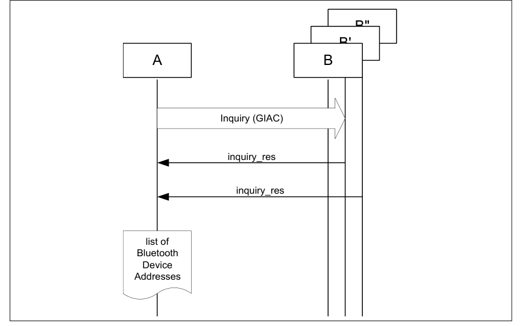

**Figure 6.1:  General inquiry, where B is a device in non-discoverable mode, B´ is a device in limited discoverable mode and B” is a device in general discoverable mode. (Note that all discoverable devices are discovered using general inquiry, independent of which discoverable mode they are in.)**

#### 6.1.4  Conditions

When general inquiry is initiated by a Bluetooth device, the INQUIRY state shall last TGAP(100) or longer, unless the inquirer collects enough responses and determines to abort the INQUIRY state earlier. The Bluetooth device shall perform inquiry using the GIAC.
In order for Device A to receive inquiry responses, the remote devices in range have to be made discoverable (limited or general).

### 6.2   LIMITED INQUIRY

#### 6.2.1  Purpose

The purpose of the limited inquiry procedure is to provide the initiator with the Bluetooth device address, clock, Class of Device, page scan mode, and extended inquiry response information of limited discoverable devices. The latter devices are devices that are in range with regard to the initiator, and may be set to scan for inquiry messages with the Limited Inquiry Access Code, in addition to scanning for inquiry messages with the General Inquiry Access Code.
The limited inquiry should be used by devices that need to discover devices that are made discoverable only for a limited period of time, during temporary conditions or for a specific event. Since it is not guaranteed that the discoverable device scans for the LIAC, the initiating device may choose any inquiry procedure (general or limited). Even if the remote device that is to be discovered is expected to be made limited discoverable (e.g., when a dedicated bonding is to be performed), the limited inquiry should be done in sequence with a general inquiry in such a way that both inquiries are completed within the time the remote device is limited discoverable; i.e., at least TGAP(103).

#### 6.2.2  Term on UI level

’Bluetooth Device Inquiry’.

#### 6.2.3  Description

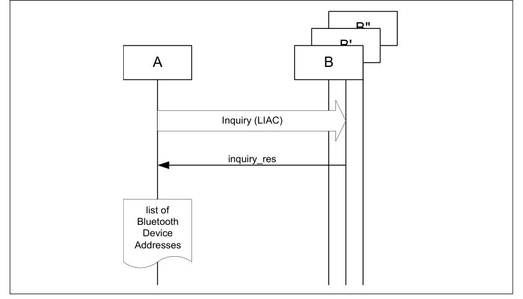

**Figure 6.2:  Limited inquiry where B is a device in non-discoverable mode, B’ is a device in limited discoverable mode and B” is a device in general discoverable mode. (Note that only limited discoverable devices can be discovered using limited inquiry.)**

#### 6.2.4  Conditions

When limited inquiry is initiated by a Bluetooth device, the INQUIRY state shall last TGAP(100) or longer, unless the inquirer collects enough responses and determines to abort the INQUIRY state earlier. The Bluetooth device shall perform inquiry using the LIAC.
In order for Device A to receive inquiry responses, the remote devices in range has to be made limited discoverable.

### 6.3   NAME DISCOVERY

#### 6.3.1  Purpose

The purpose of name discovery is to provide the initiator with the Bluetooth Device Name of connectable devices (i.e., devices in range that will respond to paging).

#### 6.3.2  Term on UI level

’Bluetooth Device Name Discovery’.

#### 6.3.3  Description

##### 6.3.3.1  Name request

Name request is the procedure for retrieving the Bluetooth Device Name from a connectable Bluetooth device. It is not necessary to perform the full link establishment procedure (see 7.1) in order to just to get the name of another device.

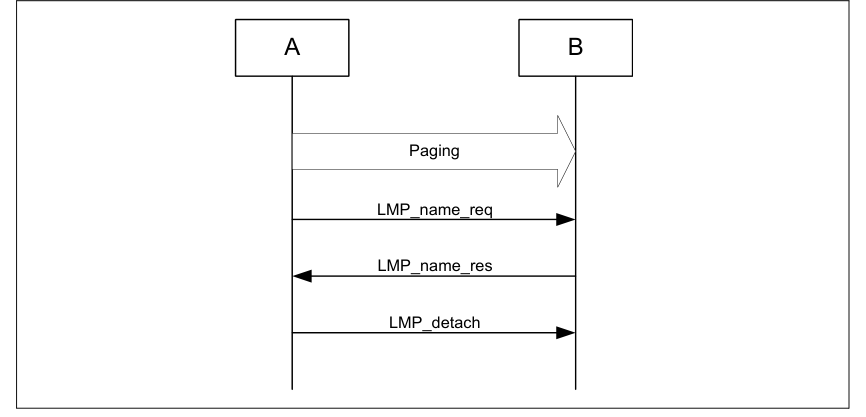

**Figure 6.3:  Name request procedure**

##### 6.3.3.2  Name discovery

Name discovery is the procedure for retrieving the Bluetooth Device Name from connectable Bluetooth devices by performing name request towards known devices (i.e., Bluetooth devices for which the Bluetooth Device Addresses are available).

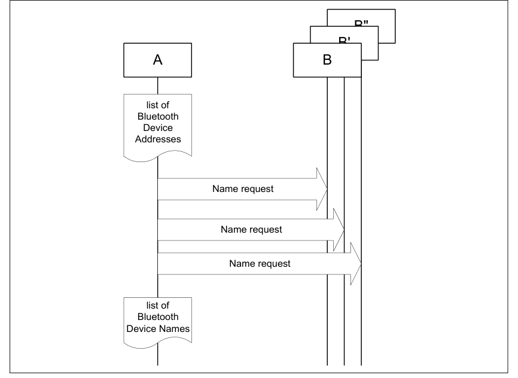

**Figure 6.4:  Name discovery procedure**

#### 6.3.4  Conditions

In the name request procedure, the initiator will use the Device Access Code of the remote device as retrieved immediately beforehand – normally through an inquiry procedure.

### 6.4   DEVICE DISCOVERY

This section only applies to a device of the BR/EDR and BR/EDR/LE device type.

#### 6.4.1  Purpose

The purpose of device discovery is to provide the initiator with the Bluetooth Device Address, clock, Class of Device, used page scan mode, Bluetooth Device Name, and extended inquiry response information of discoverable devices.

#### 6.4.2  Term on UI Level

’Bluetooth Device Discovery’.

#### 6.4.3  Description

During the device discovery procedure, first an inquiry (either general or limited) is performed, and then name discovery is done towards some or all of the devices that responded to the inquiry. If the initiator of the device discovery receives a complete local name or a shortened local name that is considered long enough, via an extended inquiry response from a remote device, the initiator should not do a separate name discovery for that device.

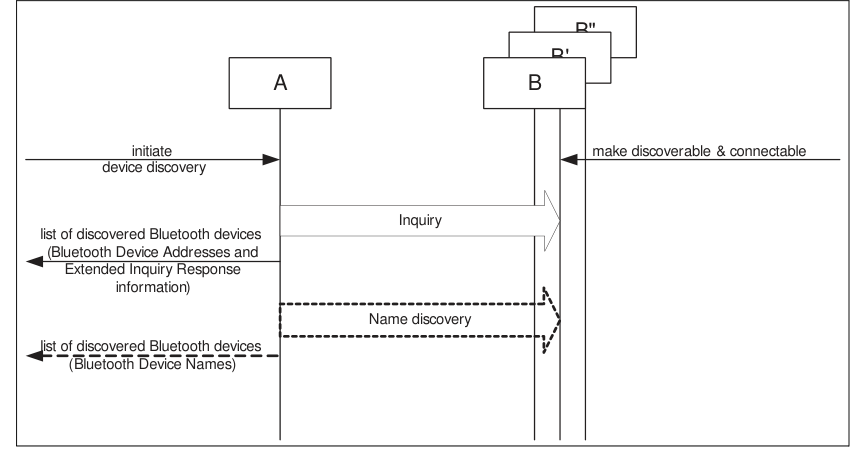

**Figure 6.5:  Device discovery procedure**

#### 6.4.4  Conditions

Conditions for both inquiry (general or limited) and name discovery must be fulfilled (i.e., devices discovered during device discovery must be both discoverable and connectable).

### 6.5   BONDING

#### 6.5.1  Purpose

The purpose of bonding is to create a relation between two Bluetooth devices based on a common link key (a bond). The link key is created and exchanged (pairing) during the bonding procedure and is expected to be stored by both Bluetooth devices, to be used for future authentication. In addition to pairing, the bonding procedure can involve higher-layer initialization procedures.

#### 6.5.2  Term on UI level

’Bluetooth Bonding’.

#### 6.5.3  Description

Two forms of bonding are described in the following sections: General Bonding and Dedicated Bonding.

##### 6.5.3.1  General Bonding

General Bonding refers to the process of performing bonding during connection setup or channel establishment procedures as a precursor to accessing a service.
When the devices that are performing General Bonding both support Secure Simple Pairing, the Authentication_Requirements parameter should be set to MITM Protection Not Required – General Bonding unless the security policy of an available local service requires MITM Protection in which case the Authentication_Requirements parameter shall be set to MITM Protection Required – General Bonding. 'No bonding' is used when the device is performing a Secure Simple Pairing procedure, but does not intend to retain the link key after the physical link is disconnected.

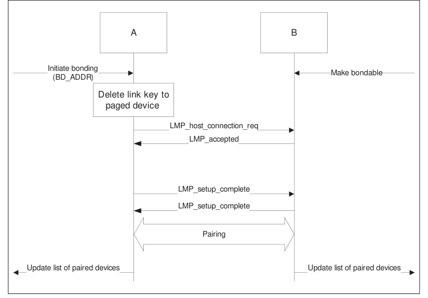

**Figure 6.6:  General description of general bonding as being the link establishment procedure executed under specific conditions on both devices, followed by authentication and an optional higher layer initialization process.**

##### 6.5.3.2  Dedicated Bonding

Dedicated Bonding refers to a procedure wherein one device connects to another only for the purpose of pairing without accessing a particular service. The main difference with dedicated bonding, as compared to a pairing done during link or channel establishment, is that for bonding it is the paging device (A) that must initiate the authentication.
When the devices that are performing Dedicated Bonding both support Secure Simple Pairing, the Authentication_Requirements parameter should be set to MITM Protection Not Required – Dedicated Bonding unless the security policy of an available local service requires MITM Protection in which case the Authentication Required parameter shall be set to MITM Protection Required – Dedicated Bonding. 'No bonding' is used when the device is performing a Secure Simple Pairing procedure, but does not intend to retain the link key after the physical link is disconnected.

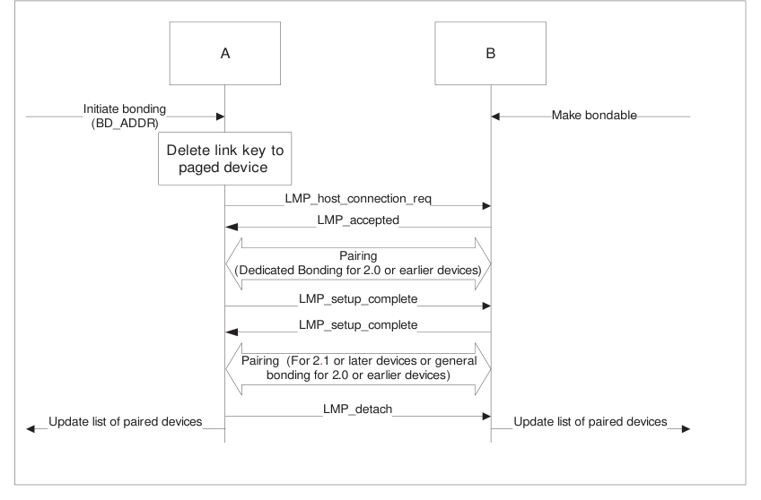

**Figure 6.7:  Dedicated Bonding as performed when the purpose of the procedure is only to create and exchange a link key between two Bluetooth devices**

#### 6.5.4  Conditions

Before bonding can be initiated, the initiating device (A) must know the Device Access Code of the device to pair with. This is normally done by first performing device discovery. A Bluetooth Device that can initiate bonding (A) should use limited inquiry, and a Bluetooth Device that accepts bonding (B) should support the limited discoverable mode.
Bonding is in principle the same as link establishment with the conditions:
• The paged device (B) shall be set into bondable mode. The paging device (A) is assumed to allow pairing since it has initiated the bonding procedure.
• The paging device (the initiator of the bonding procedure, A) shall initiate authentication.
• Before initiating the authentication part of the bonding procedure, the paging device should delete any link key corresponding to a previous bonding with the paged device.

## 7  ESTABLISHMENT PROCEDURES – BR/EDR

PHYSICAL TRANSPORT

|  | Procedure | Ref. | Support in A | Support in B |
| --- | --- | --- | --- | --- |
| 1 | Link establishment | 7.1 | M | M |
| 2 | Channel establishment | 7.2 | O | M |
| 3 | Connection establishment | 7.3 | O | O |
| 4 | Synchronization establishment | 7.5 | O | O |

Table 7.1:  Establishment procedures
The establishment procedures defined here do not include any discovery part. Before establishment procedures are initiated, the information provided during device discovery (in the FHS packet or the extended inquiry response packet of the inquiry response or in the response to a name request or in the synchronization train packet) must be available in the initiating device. This information is:
• The Bluetooth Device Address (BD_ADDR) from which the Device Access Code is generated
• The system clock of the remote device
• The page scan mode used by the remote device for Link establishment.
Additional information provided during device discovery that may be useful for making the decision to initiate an establishment procedure is:
• The Class of device
• The Device name
• The supported Service Classes.

### 7.1   LINK ESTABLISHMENT

#### 7.1.1  Purpose

The purpose of the link establishment procedure is to establish a logical transport (of ACL type) between two Bluetooth devices using procedures from [1] and [2].

#### 7.1.2  Term on UI Level

’Bluetooth link establishment’

#### 7.1.3  Description

In this sub-section, the paging device (A) is in security mode 3. During link establishment, the paging device cannot distinguish if the paged device (B) is in security mode 1, 2 or 4.

##### 7.1.3.1  B in security mode 1, 2, or 4

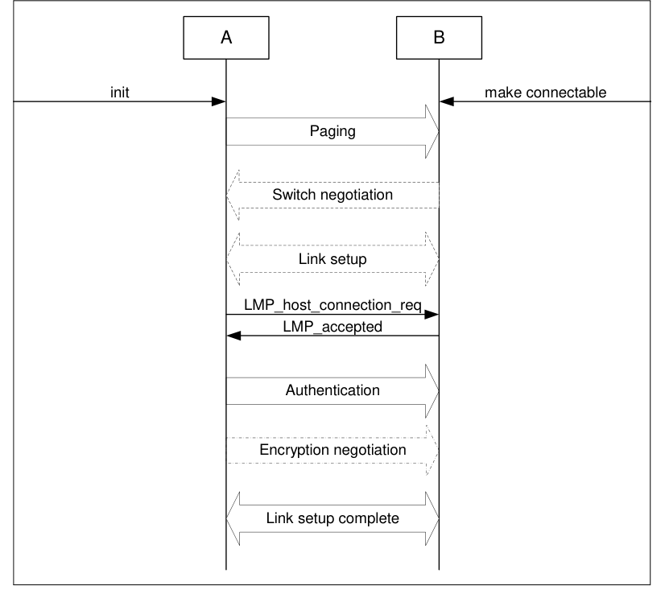

**Figure 7.1:  Link establishment procedure when the paging device (A) is in security mode 3 and the paged device (B) is in security mode 1, 2, or 4**

##### 7.1.3.2  B in security mode 3

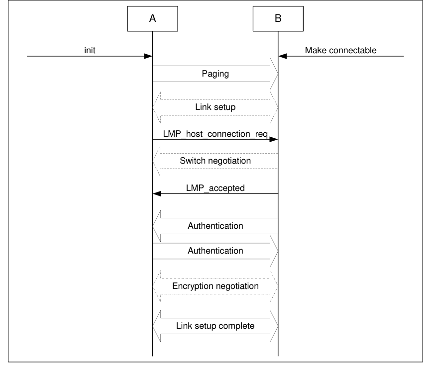

**Figure 7.2:  Link establishment procedure when both the paging device (A) and the paged device (B) are in security mode 3**

#### 7.1.4  Conditions

The paging procedure shall be according to [Vol 2] Part B, Section 8.3 and the paging device should use the Device Access Code and page mode received through a previous inquiry. When paging is completed, a physical link between the two Bluetooth devices is established.
If role switching is needed (normally it is the paged device that has an interest in changing the master/slave roles) it should be done as early as possible after the physical link is established. If the paging device does not accept the switch, the paged device has to consider whether to keep the physical link or not.
Both devices may perform link setup (using LMP procedures that require no interaction with the Host on the remote side). Optional LMP features can be used after having confirmed (using LMP_features_req) that the other device supports the feature.
When the paging device needs to go beyond the link setup phase, it issues a request to be connected to the Host of the remote device. If the paged device is in security mode 3, this is the trigger for initiating authentication.
The paging device shall send LMP_host_connection_req during link establishment (i.e., before channel establishment) and may initiate authentication only after having sent LMP_host_connection_req.
After an authentication has been performed, any of the devices can initiate encryption.
Further link configuration may take place after the LMP_host_connection_req. When both devices are satisfied, they send LMP_setup_complete.
Link establishment is completed when both devices have sent LMP_setup_complete.

### 7.2   CHANNEL ESTABLISHMENT

#### 7.2.1  Purpose

The purpose of the channel establishment procedure is to establish a Bluetooth channel (L2CAP channel) between two Bluetooth devices using [1].

#### 7.2.2  Term on UI level

’Bluetooth channel establishment’.

#### 7.2.3  Description

In this sub-section, the initiator (A) is in security mode 3. During channel establishment, the initiator cannot distinguish if the acceptor (B) is in security mode 1 or 3.

##### 7.2.3.1  B in security mode 2 or 4

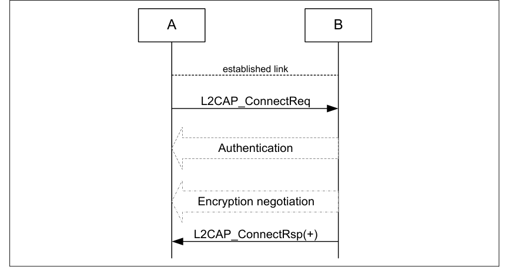

**Figure 7.3:  Channel establishment procedure when the initiator (A) is in security mode 3 and the acceptor (B) is in security mode 2 or 4**

##### 7.2.3.2  B in security mode 1 or 3

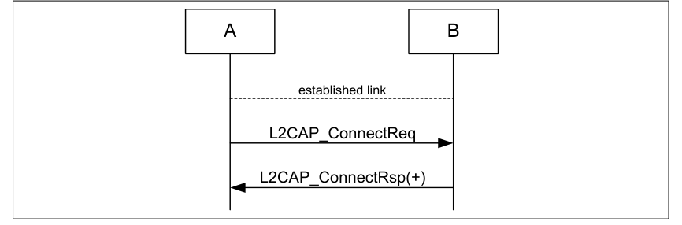

**Figure 7.4:  Channel establishment procedure when the initiator (A) is in security mode 3 and the acceptor (B) is in security mode 1 or 3**

#### 7.2.4  Conditions

Channel establishment starts after link establishment is completed when the initiator sends a channel establishment request (L2CAP_ConnectReq).
Depending on security mode, security procedures may take place after the channel establishment has been initiated.
Channel establishment is completed when the acceptor responds to the channel establishment request (with a positive L2CAP_ConnectRsp).

### 7.3   CONNECTION ESTABLISHMENT

#### 7.3.1  Purpose

The purpose of the connection establishment procedure is to establish a connection between applications on two Bluetooth devices.

#### 7.3.2  Term on UI level

’Bluetooth connection establishment’

#### 7.3.3  Description

In this sub-section, the initiator (A) is in security mode 3. During connection establishment, the initiator cannot distinguish if the acceptor (B) is in security mode 1 or 3.

##### 7.3.3.1  B in security mode 2 or 4

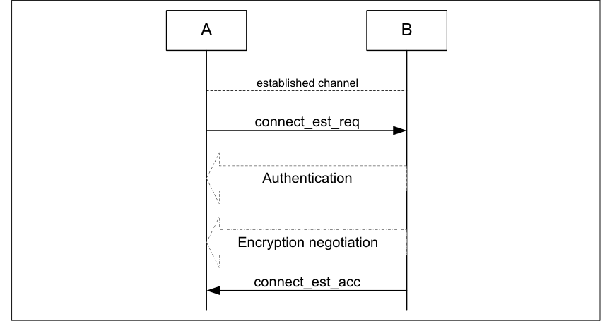

**Figure 7.5:  Connection establishment procedure when the initiator (A) is in security mode 3 and the acceptor (B) is in security mode 2 or 4**

##### 7.3.3.2  B in security mode 1 or 3

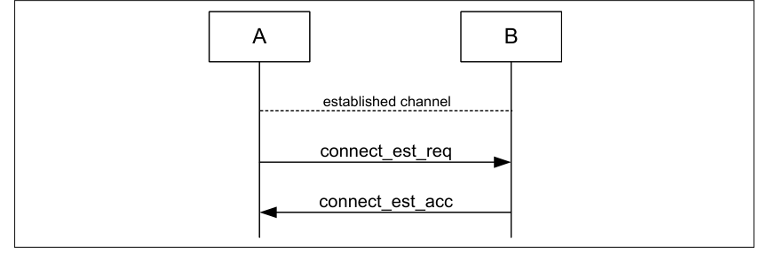

**Figure 7.6:  Connection establishment procedure when the initiator (A) is in security mode 3 and the acceptor (B) is in security mode 1 or 3**

#### 7.3.4  Conditions

Connection establishment starts after channel establishment is completed, when the initiator sends a connection establishment request (’connect_est_req’ is application protocol-dependent). This request may be a TCS SETUP message [4] in the case of a Bluetooth telephony application Cordless Telephony Profile, or initialization of RFCOMM and establishment of DLC [3] in the case of a serial port-based application Serial Port Profile (although neither TCS or RFCOMM use the term ‘connection’ for this).
Connection establishment is completed when the acceptor accepts the connection establishment request (’connect_est_acc’ is application protocol dependent).

### 7.4   ESTABLISHMENT OF ADDITIONAL CONNECTION

When a Bluetooth device has established one connection with another Bluetooth device, it may be available for establishment of:
• A second connection on the same channel, and/or
• A second channel on the same logical link, and/or
• A second physical link.
If the new establishment procedure is to be towards the same device, the security part of the establishment depends on the security modes used. If the new establishment procedure is to be towards a new remote device, the device should behave according to active modes independent of the fact that it already has another physical link established (unless allowed co-incident radio and baseband events have to be handled).

### 7.5   SYNCHRONIZATION ESTABLISHMENT

#### 7.5.1  Purpose

The purpose of the Synchronization Establishment procedure is for a device to receive synchronization train packets using the procedures in [Vol 2] Part B, Section 2.7.3

#### 7.5.2  Term on UI Level

’Bluetooth synchronization establishment’

#### 7.5.3  Description

In Figure 7.7 the receiving device (B) is attempting to receive synchronization train packets from device (A).

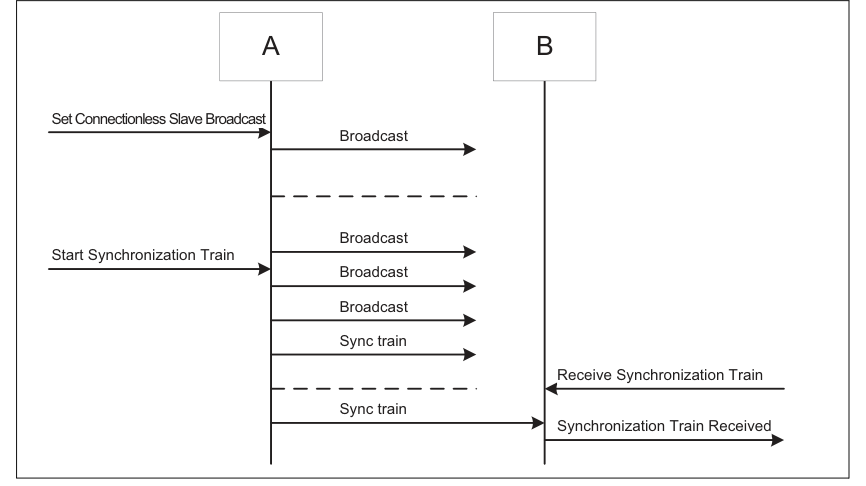

**Figure 7.7:  Synchronization establishment procedure**

#### 7.5.4  Conditions

After receiving a synchronization train packet, the receiving device can listen to and receive profile data sent via Connectionless Slave Broadcast by device A.
Note that devices A and B may go through a separate Link Establishment procedure any time they desire to establish an ACL logical transport between each other. They may also use Connectionless Slave Broadcast procedures with an ACL logical transport already established.
The receiving device shall enter the synchronization scan substate using a scan interval of TGAP(Sync_Scan_Interval) and a scan window of TGAP(Sync_Scan_Window).

## 8  EXTENDED INQUIRY RESPONSE DATA FORMAT

The extended inquiry response data format is shown in Figure 8.1. The data is 240 octets and consists of a significant part and a non-significant part. The significant part contains a sequence of data structures. Each data structure shall have a length field of one octet, which contains the Length value, and a data field of Length octets. The first n octets of the data field contain the extended inquiry response (EIR) data type. The content of the remaining Length - n octets in the data field depends on the value of the EIR data type and is called the EIR data. The non-significant part extends the extended inquiry response to 240 octets and shall contain all-zero octets.

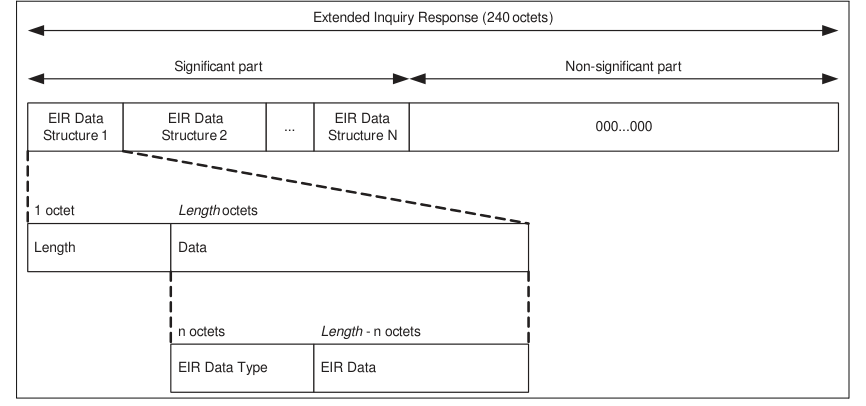

**Figure 8.1:  Extended Inquiry Response data format**

The extended inquiry response data formats and meanings are defined in [Core Specification Supplement], Part A.The extended inquiry response data type values are defined in the Assigned Numbers document.
If the length field is set to zero, then the data field has zero octets. This shall only occur to allow an early termination of the tagged data.
To reduce interference, the Host should try to minimize the amount of EIR data such that the baseband can use a 1-slot or 3-slot EIR packet. This is advantageous because it reduces interference and maximizes the probability that the EIR packet will be received. If applications on a Host provide more than 240 bytes of extended inquiry response data, it is up to the Host to limit it to 240 octets.
The EIR data shall be sent during the inquiry response state. EIR data can contain device name, Tx power level, service class UUIDs, as well as manufacturer’s data, as defined in [Core Specification Supplement], Part A. In selecting the packet type to be used, FEC (DM1 or DM3) should be considered to maximize the range.
The Host shall include the device name in the EIR data according to the following rules:
1. If the device does not have a device name (i.e., 0 octet) and
a) If there is no other data to be sent in the EIR packet, the Host shall send a name tag with zero length and the type field set to indicate that this is the complete name (i.e., total of 2 octets with length = 1).
b) If there is other important data to be sent in the EIR packet and a zero octet name tag will not fit, the Host may avoid sending the name tag.
2. If the device has a device name (greater than 0 octet) and
a) If it is too long be included in the EIR packet (given the choice of packet type and any other data that is being sent), the Host may send a shortened version of the name (even 0 octet) and shall mark the name as 'shortened' to inform the receiver that a remote name request is required obtain the full name if the name is needed.
b) If there are no other data to be sent in the EIR packet (given the choice of packet type selected), the Host shall maximize the length of the device name to be sent, this may be complete or shortened name (e.g., if DM1 packet is chosen and device name characters equates to greater than 15 octets, then Host sends first few characters that equates to 15 octets or less with shortened flag).
Note: It is not necessary to understand each and every EIR data type. If the Host does not understand a given EIR data type value it should just skip over Length octets and look for the next EIR data structure.

## 9  OPERATIONAL MODES AND PROCEDURES – LE

PHYSICAL TRANSPORT
Several different modes and procedures may be performed simultaneously over an LE physical transport. The following modes and procedures are defined for use over an LE physical transport:
• Broadcast mode and observation procedure
• Discovery modes and procedures
• Connection modes and procedures
• Bonding modes and procedures
• Periodic advertising modes and procedure
Each of the above modes and procedures are independent from each other but are closely related since a combination of the modes and procedures are necessary for most devices to communicate with each other. Both the modes and procedures may be entered or executed respectively as a result of direct user action or autonomously by a device.
The Host shall configure the Controller with its local Link Layer feature information as defined in [Vol 6] Part B, Section 4.6 before performing any of the above modes and procedures.
The types of advertising used in these modes and procedures for each of the associated GAP roles are defined in Section 2.2.2 Table 2.1.

### 9.1   BROADCAST MODE AND OBSERVATION PROCEDURE

The broadcast mode and observation procedure allow two devices to communicate in a unidirectional connectionless manner using the advertising events. The requirements for a device operating in a specific GAP role to support the broadcast mode and observation procedure are defined in Table 9.1.

| Broadcast Mode and Observation procedure | Ref. | Broadcaster | Observer |
| --- | --- | --- | --- |
| Broadcast mode | 9.1.1 | M | E |
| Observation procedure | 9.1.2 | E | M |

Table 9.1:  Broadcast mode and Observation procedure Requirements

#### 9.1.1  Broadcast Mode

##### 9.1.1.1  Definition

The broadcast mode provides a method for a device to send connectionless data in advertising events.

##### 9.1.1.2  Conditions

A device in the broadcast mode shall send data using non-connectable advertising events.
A device in the broadcast mode may send non-connectable and non- scannable undirected or non-connectable and non-scannable directed advertising events anonymously by excluding the broadcaster's address.
The advertising data shall be formatted using the Advertising Data (AD) type format as defined in [Core Specification Supplement], Part A, Section 1.3. A device in the broadcast mode shall not set the ‘LE General Discoverable Mode’ flag or the ‘LE Limited Discoverable Mode’ flag in the Flags AD Type as defined in [Core Specification Supplement], Part A, Section 1.3.
Note: All data sent by a device in the broadcast mode is considered unreliable since there is no acknowledgment from any device that may have received the data.
The device may configure and enable multiple independent advertising sets. Each advertising set may have an independent advertising filter policy.

#### 9.1.2  Observation Procedure

##### 9.1.2.1  Definition

The observation procedure provides a method for a device to receive connectionless data from a device that is sending advertising events.

##### 9.1.2.2  Conditions

A device performing the observation procedure may use passive scanning or active scanning to receive advertising events.
A device performing the observation procedure may use active scanning to also receive scan response data sent by any device in the broadcast mode that advertises using scannable advertising events.
When a device performing the observation procedure receives a resolvable private address in the advertising event, the device may resolve the private address by using the resolvable private address resolution procedure as defined in Section 10.8.2.3.
Note: In use cases where a device in the broadcast mode sends dynamic data, the receiving device should disable duplicate filtering capability in the Controller so that the Host receives all advertising packets received by the Controller.

### 9.2   DISCOVERY MODES AND PROCEDURES

All devices shall be in either non-discoverable mode or one of the discoverable modes. A device in the discoverable mode shall be in either the general discoverable mode or the limited discoverable mode. A device in the non- discoverable mode is not discoverable. Devices operating in either the general discoverable mode or the limited discoverable mode can be found by the discovering device. A device that is discovering other devices performs either the limited discovery procedure as defined in Section 9.2.5 or the general discovery procedure as defined in Section 9.2.6.
Some devices may only scan for advertising events using legacy advertising PDUs. It is therefore recommended that devices using advertising events with the extended advertising PDUs also use an advertising set with advertising events that use legacy advertising PDUs.

#### 9.2.1  Requirements

| Discovery modes and procedures | Ref. | Peripheral | Central |
| --- | --- | --- | --- |
| Non-Discoverable mode | 9.2.2 | M | E |
| Limited Discoverable mode | 9.2.3 | O | E |
| General Discoverable mode | 9.2.4 | C1 | E |
| Limited Discovery procedure | 9.2.5 | E | O |
| General Discovery procedure | 9.2.6 | E | M |
| Name Discovery procedure | 9.2.7 | O | O |
| C1: if limited discoverable mode is not supported then general discoverable mode is mandatory, else optional. |  |  |  |

Table 9.2:  Device discovery requirements

#### 9.2.2  Non-Discoverable Mode

##### 9.2.2.1  Description

A device configured in non-discoverable mode will not be discovered by any device that is performing either the general discovery procedure or the limited discovery procedure.

##### 9.2.2.2  Conditions

A device in the non-discoverable mode may send advertising events. If the device sends advertising events, it shall not set the ‘LE General Discoverable Mode’ flag or ‘LE Limited Discoverable Mode’ flag in the Flags AD type (see [Core Specification Supplement], Part A, Section 1.3).
If the device sends advertising events, then it is recommended that the Host configures the Controller as follows:
• The Host should set the advertising filter policy for all advertising sets to either ‘process scan and connection requests only from devices in the White List’ or ‘process scan and connection requests from all devices’.
• The Host should set the advertising intervals as defined in Section 9.3.11.

#### 9.2.3  Limited Discoverable Mode

##### 9.2.3.1  Description

Devices configured in the limited discoverable mode are discoverable for a limited period of time by other devices performing the limited or general device discovery procedure. The limited discoverable mode is typically used when a user performs a specific action to make the device discoverable for a limited period of time.

##### 9.2.3.2  Conditions

While a device is in the Peripheral role the device may support the limited discoverable mode. While a device is only in the Broadcaster, Observer or Central role the device shall not support the limited discoverable mode.
A device in the limited discoverable mode shall send advertising event types with the advertising data including the Flags AD type as defined in [Core Specification Supplement], Part A, Section 1.3 with all the following flags set as described:
• The LE Limited Discoverable Mode flag set to one.
• The LE General Discoverable Mode flag set to zero.
• For a device of the LE-only device type with all the following flags set as described:
a) The ‘BR/EDR Not Supported’ flag to set one.
b) The ‘Simultaneous LE and BR/EDR to Same Device Capable (Controller)’ flag set to zero.
c) The ‘Simultaneous LE and BR/EDR to Same Device Capable (Host)’ flag set to zero.
The advertising data should also include the following AD types to enable a faster connectivity experience:
• TX Power Level AD type defined in [Core Specification Supplement], Part A, Section 1.5.
• Local Name AD type defined in [Core Specification Supplement], Part A, Section 1.2.
• Service UUIDs AD type defined in [Core Specification Supplement], Part A, Section 1.1.
• Slave Connection Interval Range AD type as defined in [Core Specification Supplement], Part A, Section 1.9.
Devices shall remain in the limited discoverable mode no longer than TGAP(lim_adv_timeout).
While a device is in limited discoverable mode the Host configures the Controller as follows:
• The Host shall set the advertising filter policy to ‘process scan and connection requests from all devices’.
• The Host should set the advertising intervals as defined in Section 9.3.11.
The device shall remain in limited discoverable mode until a connection is established or the Host terminates the mode.
If a device is in the limited discoverable mode and in the undirected connectable mode the advertising interval values should be set as defined in Section 9.3.4
A device in the limited discoverable mode shall not set both the LE Limited Discoverable Flag and the LE General Discoverable Flag to one.
Note: Host data used in legacy advertising events that change frequently should be placed in the advertising data and static data should be placed in the scan response data.
Note: The choice of advertising interval is a trade-off between power consumption and device discovery time.
The device may configure and enable multiple independent advertising sets. Each advertising set may have an independent advertising filter policy.

#### 9.2.4  General Discoverable Mode

##### 9.2.4.1  Description

Devices configured in general discoverable mode are intended to be discoverable by devices performing the general discovery procedure. The
general discoverable mode is typically used when the device is intending to be discoverable for a long period of time.

##### 9.2.4.2  Conditions

While a device is in the Peripheral role the device may support the general discoverable mode. While a device is only in the Broadcaster, Observer or Central role the device shall not support the general discoverable mode.
A device in general discoverable mode shall send advertising events with the advertising data including the Flags AD data type as defined in [Core Specification Supplement], Part A, Section 1.3 with all the following flags set as described:
• The LE Limited Discoverable Mode flag set to zero.
• The LE General Discoverable Mode flag set to one.
• For a device of the LE-only device type with all the following flags set as described:
a) The ‘BR/EDR Not Supported’ flag set to one.
b) The ‘Simultaneous LE and BR/EDR to Same Device Capable (Controller)’ flag set to zero.
c) The ‘Simultaneous LE and BR/EDR to Same Device Capable (Host)’ flag set to zero.
The advertising data should also include the following AD types to enable a faster connectivity experience:
• TX Power Level AD type as defined in [Core Specification Supplement], Part A, Section 1.5.
• Local Name AD type as defined in [Core Specification Supplement], Part A, Section 1.2.
• Service UUIDs AD type as defined in [Core Specification Supplement], Part A, Section 1.1.
• Slave Connection Interval Range AD type as defined in [Core Specification Supplement], Part A, Section 1.9.
While a device is in general discoverable mode the Host configures the Controller as follows:
• The Host shall set the advertising filter policy for all advertising sets to ‘process scan and connection requests from all devices’.
• The Host should set the advertising intervals as defined in Section 9.3.11.
The device shall remain in general discoverable mode until a connection is established or the Host terminates the mode.
If a device is in the general discoverable mode and in the directed connectable mode or the non-connectable mode, the advertising interval values should be set as defined in Section 9.3.3.
A device in the general discoverable mode shall not set both the LE Limited Discoverable Flag and the LE General Discoverable Flag to one.
Note: Host data used in legacy advertising events that change frequently should be placed in the advertising data and static data should be placed in the scan response data.
Note: The choice of advertising interval is a trade-off between power consumption and device discovery time.

#### 9.2.5  Limited Discovery Procedure

##### 9.2.5.1  Description

A device performing the limited discovery procedure receives the device address, advertising data and scan response data from devices in the limited discoverable mode only.
.

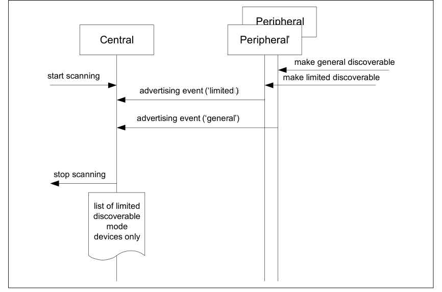

**Figure 9.1:  A Central performing limited discovery procedure discovering Peripherals in the limited discoverable mode**

##### 9.2.5.2  Conditions

While a device is in the Central role the device may support the limited discovery procedure. While a device is only in the Broadcaster, Observer or Peripheral role the device shall not support the limited discovery procedure.
It is recommended that the device scan on all the PHYs it supports.
When a Host performs the limited discovery procedure, the Host configures the Controller as follows:
1. The Host shall set the scanner filter policy to ‘process all advertising packets’.
2. The Host should set the scan interval and scan window as defined in
Section 9.3.11.
3. The Host should configure the Controller to use active scanning.
The Host shall begin scanning for advertising packets and should continue for a minimum of TGAP(lim_disc_scan_min) when scanning on the LE 1M PHY and TGAP(lim_disc_scan_min_coded) when scanning on the LE Coded PHY, unless the Host ends the limited discovery procedure.
The Host shall check for the Flags AD type in the advertising data. If the Flags AD type is present and the LE Limited Discoverable Flag is set to one then the Host shall consider the device as a discovered device, otherwise the advertising data shall be ignored. The Flag AD type is defined in [Core Specification Supplement], Part A, Section 1.3. The advertising data of the discovered device may contain data with other AD types, e.g. Service UUIDs AD type, TX Power Level AD type, Local Name AD type, Slave Connection Interval Range AD type. The Host may use the data in performing any of the connection establishment procedures.
The Host shall ignore the 'Simultaneous LE and BR/EDR to Same Device Capable (Controller)' and 'Simultaneous LE and BR/EDR to Same Device Capable (Host)' bits in the Flags AD type.

#### 9.2.6  General Discovery Procedure

##### 9.2.6.1  Description

A device performing the general discovery procedure receives the device address, advertising data and scan response data from devices in the limited discoverable mode or the general discoverable mode.

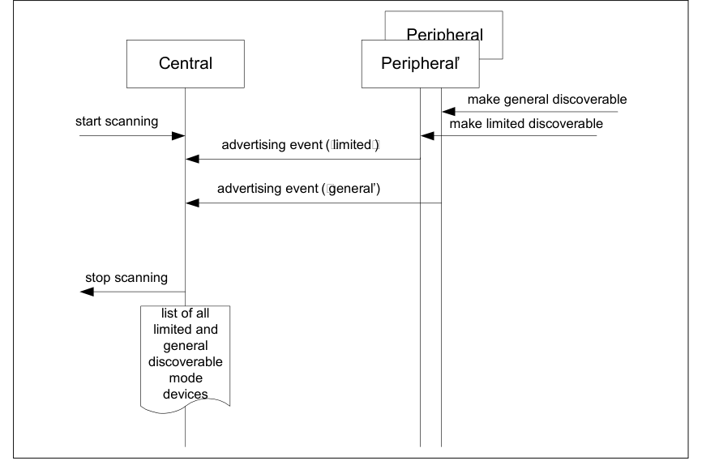

**Figure 9.2:  A Central performing general discovery procedure discovering Peripherals in the limited discoverable mode and general discoverable mode**

##### 9.2.6.2  Conditions

While a device is in the Central role the device shall support the general discovery procedure. While a device is only in the Broadcaster, Observer or Peripheral role the device shall not support the general discovery procedure.
It is recommended that the device scan on all the PHYs it supports.
When a Host performs the general discovery procedure, the Host configures the Controller as follows:
1. The Host shall set the scanner filter policy to ‘process all advertising packets’.
2. The Host should set the scan interval and scan window as defined in
Section 9.3.11.
3. The Host should configure the Controller to use active scanning.
The Host shall begin scanning for advertising packets and should continue for a minimum of TGAP(gen_disc_scan_min) when scanning on the LE 1M PHY and TGAP(gen_disc_scan_min_coded) when scanning on the LE Coded PHY. The procedure may be terminated early by the Host.
The Host shall check for the Flags AD type in the advertising data. If the Flags AD type (see [Core Specification Supplement], Part A, Section 1.3) is present and either the LE General Discoverable Mode flag is set to one or the LE Limited Discoverable Mode flag is set to one then the Host shall consider the device as a
discovered device, otherwise the advertising data shall be ignored. The advertising data of the discovered device may contain data with other AD types, e.g. Service UUIDs AD type, TX Power Level AD type, Local Name AD type, Slave Connection Interval Range AD type. The Host may use the data in performing any of the connection establishment procedures as defined in Section 9.3.
The Host shall ignore the 'Simultaneous LE and BR/EDR to Same Device Capable (Controller)' and 'Simultaneous LE and BR/EDR to Same Device Capable (Host)' bits in the Flags AD type.

#### 9.2.7  Name Discovery Procedure

##### 9.2.7.1  Description

The name discovery procedure is used to obtain the Bluetooth Device Name of a remote connectable device.

##### 9.2.7.2  Conditions

If the complete device name is not acquired while performing either the limited discovery procedure or the general discovery procedure, then the name discovery procedure may be performed.
The name discovery procedure shall be performed as follows:
1. The Host shall establish a connection using one of the connection establish- ment procedures as defined in Section 9.3.
2. The Host shall read the device name characteristic using the GATT procedure Read Using Characteristic UUID [Vol 3] Part G, Section 4.8.2
3. The connection may be terminated after the GATT procedure has completed.

### 9.3   CONNECTION MODES AND PROCEDURES

The connection modes and procedures allow a device to establish a connection to another device.
When devices are connected, the parameters of the connection can be updated with the Connection Parameter Update procedure. The connected device may terminate the connection using the Terminate Connection procedure. The requirements for a device to support the connection modes and procedures are defined in Table 9.3.

#### 9.3.1  Requirements

| Connection Modes and Procedures | Ref. | Peripheral | Central | Broadcaster | Observe |
| --- | --- | --- | --- | --- | --- |
| Non-connectable mode | 9.3.2 | M | E | M | M |
| Directed connectable mode | 9.3.3 | O | E | E | E |
| Undirected connectable mode | 9.3.4 | M | E | E | E |
| Auto connection establish- ment procedure | 9.3.5 | E | O | E | E |
| General connection estab- lishment procedure | 9.3.6 | E | O | E | E |
| Selective connection estab- lishment procedure | 9.3.7 | E | O | E | E |
| Direct connection establish- ment procedure | 9.3.8 | E | M | E | E |
| Connection parameter update procedure | 9.3.9 | O | M | E | E |
| Terminate connection proce- dure | 9.3.10 | M | M | E | E |

Table 9.3:  Connection modes and procedures requirements1
1. Note: Requirements listed in the table above refer to the specific role a device is oper- ating in. Devices supporting multiple roles are required to support the specified modes and procedures for a given role while operating in that role.

#### 9.3.2  Non-Connectable Mode

##### 9.3.2.1  Description

A device in the non-connectable mode shall not allow a connection to be established.

##### 9.3.2.2  Conditions

While a device is in the Peripheral role the device shall support the non- connectable mode. A device in the Broadcaster or Observer role cannot establish a connection, therefore the device is considered to support the non- connectable mode.
A Peripheral device in the non-connectable mode may send non-connectable advertising events. In this case it is recommended that the Host configures the Controller as follows:
• The Host should set the advertising filter policy to either ‘process scan and connection requests only from devices in the White List’ or ‘process scan and connection requests from all devices’.
• The Host should set the advertising intervals as defined in Section 9.3.11.
The device may configure and enable multiple independent advertising sets. Each advertising set may have an independent advertising filter policy.

#### 9.3.3  Directed Connectable Mode

##### 9.3.3.1  Description

A device in the directed connectable mode shall accept a connection request from a known peer device performing the auto connection establishment procedure or the general connection establishment procedure.

##### 9.3.3.2  Conditions

While a device is in the Peripheral role the device may support the directed connectable mode. This mode shall only be used if the device has a known peer device address. While a device is only in the Broadcaster, Observer, or the Central role the device shall not support the direct connectable mode.
A Peripheral device shall send connectable directed advertising events.
The device may configure and enable multiple independent advertising sets. Each advertising set may have an independent advertising filter policy.

#### 9.3.4  Undirected Connectable Mode

##### 9.3.4.1  Description

A device in the undirected connectable mode shall accept a connection request from a device performing the auto connection establishment procedure or the general connection establishment procedure.

##### 9.3.4.2  Conditions

While a device is in the Peripheral role the device shall support the undirected connectable mode. While a device is only in the Broadcaster, Observer, or the Central role the device shall not support the undirected connectable mode.
A Peripheral device should follow the guidelines defined in Section 9.3.11. A Peripheral device shall send either connectable and scannable undirected advertising events or connectable undirected advertising events.
The device may configure and enable multiple independent advertising sets. Each advertising set may have an independent advertising filter policy.

#### 9.3.5  Auto Connection Establishment Procedure

##### 9.3.5.1  Description

The auto connection establishment procedure allows the Host to configure the Controller to autonomously establish a connection with one or more devices in the directed connectable mode or the undirected connectable mode. White Lists in the Controller are used to store device addresses. This procedure uses the initiator White List in the Controller. The Controller autonomously establishes a connection with a device with the device address that matches the address stored in the White List.

##### 9.3.5.2  Conditions

While a device is in the Central role the device may support the auto connection establishment procedure. While a device is only in the Broadcaster, Observer, or Peripheral role the device shall not support the auto connection establishment procedure.

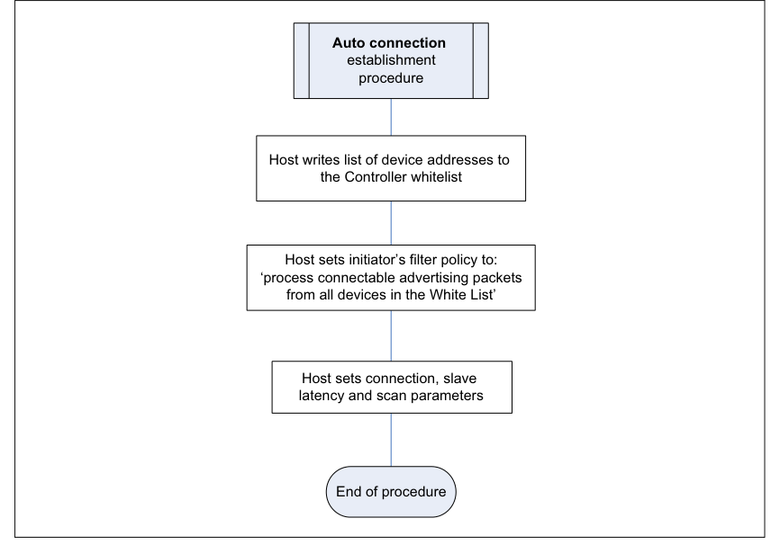

**Figure 9.3:  Flow chart for a device performing the auto connection establishment procedure**

When a Host performs the auto connection establishment procedure, the Host configures the Controller as follows:
1. The Host shall write the list of device addresses that are to be auto con- nected to into the White List.
2. The Host shall set the initiator filter policy to ‘process connectable advertising packets from all devices in the White List’.
3. The Host should set the scan interval and scan window as defined in
Section 9.3.11.
4. The Host should set connection parameters as defined in Section 9.3.12.
This procedure is terminated when a connection is established or when the Host terminates the procedure.

#### 9.3.6  General Connection Establishment Procedure

##### 9.3.6.1  Description

The general connection establishment procedure allows the Host to establish a connection with a set of known peer devices in the directed connectable mode or the undirected connectable mode.

##### 9.3.6.2  Conditions

While a device is in the Central role the device may support the general connection establishment procedure. While a device is only in the Broadcaster, Observer, or Peripheral role the device shall not support the general connection establishment procedure.

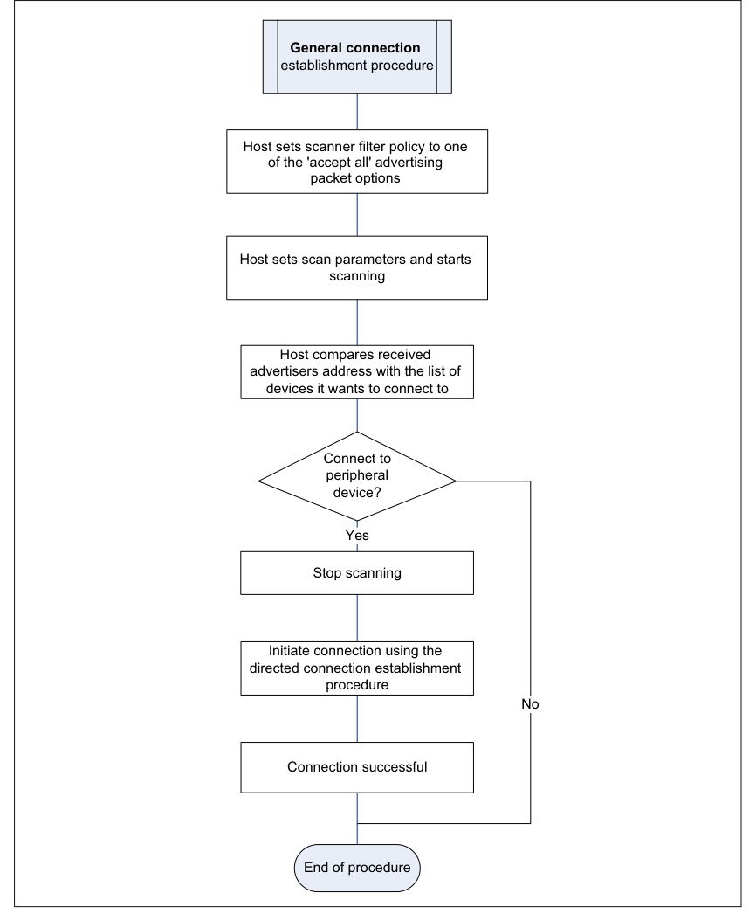

**Figure 9.4:  Flow chart for a device performing the general connection establishment procedure**

When a Host performs the general connection establishment procedure, the Host configures the Controller as follows:
1. The Host shall set the scanner filter policy to one of the ‘accept all’ options as defined in [Vol 2] Part E, Section 7.8.10.
2. The Host should set the scan interval as defined in Section 9.3.11.
3. The Host should set the scan window as defined in Section 9.3.11.
4. The Host shall start scanning.
5. The Host should set connection parameters as defined in Section 9.3.12.
When the Host discovers a device to which the Host may attempt to connect, the Host shall stop the scanning, and initiate a connection using the direct connection establishment procedure.
This procedure is terminated when a connection is established or when the Host terminates the procedure.

#### 9.3.7  Selective Connection Establishment Procedure

##### 9.3.7.1  Description

The selective connection establishment procedure allows the Host to establish a connection with the Host selected connection configuration parameters with a set of devices addresses in the White List.

##### 9.3.7.2  Conditions

While a device is in the Central role the device may support the selective connection establishment procedure. While a device is only in the Broadcaster, Observer, or the Peripheral role the device shall not support the selective connection establishment procedure. Figure 9.5 shows the flow chart for a device performing the selective connection establishment procedure.
When a Host performs the selective connection establishment procedure, the Host configures the Controller as follows:
1. The Host shall write the list of device addresses that are to be selectively connected into the White List.
2. The Host shall set the scanner filter policy to the 'accept only' option as defined in [Vol 2] Part E, Section 7.8.10.
3. The Host should set the scan interval as defined in Section 9.3.11.
4. The Host should set the scan window as defined in Section 9.3.11.
5. The Host shall start active scanning or passive scanning.
When the Host discovers one of the peer devices it is connecting to, the Host shall stop scanning, and initiate a connection using the direct connection establishment procedure with the connection configuration parameters for that peer device.
This procedure is terminated when a connection is established or when the Host terminates the procedure.

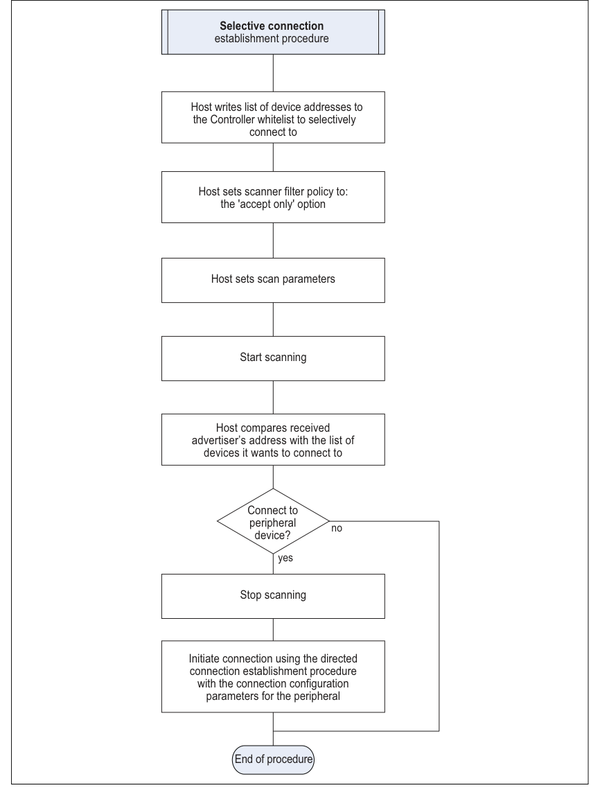

**Figure 9.5:  Flow chart for a device performing the selective connection establishment procedure**

#### 9.3.8  Direct Connection Establishment Procedure

##### 9.3.8.1  Description

The direct connection establishment procedure allows the Host to establish a connection with the Host selected connection configuration parameters with a single peer device.

##### 9.3.8.2  Conditions

While a device is in the Central role the device shall support the direct connection establishment procedure. While a device is only in the Broadcaster, Observer, or the Peripheral role the device shall not support the direct connection establishment procedure.

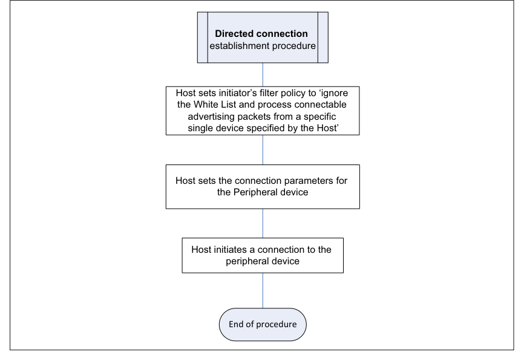

**Figure 9.6:  Flow chart for a device performing the directed connection establishment procedure**

When a Host performs the direct connection establishment procedure, the Host configures the Controller as follows:
1. The Host shall set the initiator filter policy to ‘ignore the White List and pro- cess connectable advertising packets from a specific single device specified by the Host’.
2. The Host shall set the peer address to the device address of the specific single device.
3. The Host should set connection parameters as defined in Section 9.3.12.
4. The Host shall initiate a connection.
This procedure is terminated when a connection is established or when the Host terminates the procedure.

#### 9.3.9  Connection Parameter Update Procedure

##### 9.3.9.1  Description

The connection parameter update procedure allows a Peripheral or Central to update the Link Layer connection parameters of an established connection.

##### 9.3.9.2  Conditions

While a device is in the Central role the device shall support the connection parameter update procedure. While a device is only in the Peripheral role the device may support the connection parameter update procedure. While a device is in the Broadcaster or the Observer role the device shall not support the connection parameter update procedure.
A Central initiating the connection parameter update procedure shall use the Link Layer Connection Update procedure defined in [Vol 6] Part B, Section 5.1.1 with the required connection parameters if either the Central or the Peripheral does not support the Connection Parameters Request Link Layer Control procedure.
If both the Central and Peripheral support the Connection Parameters Request Link Layer control procedure, then the Central or Peripheral initiating the connection parameter update procedure shall use the Connection Parameters Request Link Layer Control procedure defined in [Vol 6] Part B, Section 5.1.7 with the required connection parameters.
If either the Central or the Peripheral does not support the Connection Parameters Request Link Layer Control procedure, then the Peripheral initiating the connection parameter update procedure shall use the L2CAP Connection Parameter Update Request command defined in [Vol 3] Part A, Section 4.20 with the required connection parameters. The Peripheral shall not send an L2CAP Connection Parameter Update Request command within TGAP(conn_param_timeout) of an L2CAP Connection Parameter Update Response being received. When the Central accepts the Peripheral initiated Connection Parameter Update, the Central should initiate the Link Layer Connection Update procedure defined in [Vol 6] Part B, Section 5.1.1 with the required connection parameters within TGAP(conn_param_timeout).
If the requested or updated connection parameters are unacceptable to the Central or Peripheral then it may disconnect the connection with the error code 0x3B (Unacceptable Connection Parameters). Devices should be tolerant of connection parameters given to them by the remote device.

#### 9.3.10  Terminate Connection Procedure

##### 9.3.10.1  Description

The terminate connection procedure allows a Host to terminate the connection with a peer device.

##### 9.3.10.2  Conditions

Centrals and Peripherals shall support the terminate connection procedure. Broadcasters and Observers shall not support the terminate connection procedure.
The Host initiating the terminate connection procedure shall use the Link Layer Termination Procedure defined in [Vol 6] Part B, Section 5.1.6.

#### 9.3.11  Connection Establishment Timing Parameters

##### 9.3.11.1  Description

The connection establishment timing parameters are used during initial connection establishment between a Central and a Peripheral device.
A Central device should use one of the GAP connection establishment procedures to initiate a connection to a Peripheral device in a connectable mode. The procedures and modes that may use these timing parameters are defined in Section 9.3.4 through Section 9.3.8.

##### 9.3.11.2  Conditions

A Central device starting a GAP connection establishment procedure should use the recommended scan interval TGAP(scan_fast_interval) and scan window TGAP(scan_fast_window) for TGAP(scan_fast_period) when scanning on the LE 1M PHY and should use scan interval TGAP(scan_fast_interval_coded) and scan window TGAP(scan_fast_window_coded) for TGAP(scan_fast_period) when scanning on the LE Coded PHY.
A Central device that is background scanning should use the recommended scan interval TGAP(scan_slow_interval1) and scan window TGAP(scan_slow_window1) when scanning on the LE 1M PHY and should use scan interval TGAP(scan_slow_interval1_coded) and scan window TGAP(scan_slow_window1_coded) when scanning on the LE Coded PHY. Alternatively the central may use TGAP(scan_slow_interval2) and scan window TGAP(scan_slow_window2) when scanning on the LE 1M PHY and should use TGAP(scan_slow_interval2_coded) and scan window TGAP(scan_slow_window2_coded) when scanning on the LE Coded PHY.
A Peripheral device entering any of the following GAP Modes should use the recommended advertising interval TGAP(adv_fast_interval1) for TGAP(adv_fast_period) when advertising on the LE 1M PHY and should use TGAP(adv_fast_interval1_coded) for TGAP(adv_fast_period) when advertising on the LE Coded PHY:
• Undirected Connectable Mode
• Limited Discoverable Mode and sending connectable undirected advertising events
• General Discoverable Mode and sending connectable undirected advertising events
• Directed Connectable Mode and sending low duty cycle connectable directed advertising events
A Peripheral device when entering any of the following GAP Modes and sending non-connectable advertising events should use the recommended advertising interval TGAP(adv_fast_interval2) for TGAP(adv_fast_period) when advertising on the LE 1M PHY and should use TGAP(adv_fast_interval2_coded) for TGAP(adv_fast_period) when advertising on the LE Coded PHY:
• Non-Discoverable Mode
• Non-Connectable Mode
• Limited Discoverable Mode
• General Discoverable Mode
A Peripheral device that is background advertising in any GAP Mode other than GAP Directed Connectable Mode with high duty cycle connectable directed advertising events should use the recommended advertising interval TGAP(adv_slow_interval) when advertising on the LE 1M PHY and should use TGAP(adv_slow_interval_coded) when advertising on the LE Coded PHY.
Note: When advertising interval values of less than 100ms are used for non- connectable or scannable undirected advertising in environments where the advertiser can interfere with other devices, it is recommended that steps be taken to minimize the interference. For example, the advertising might be alternately enabled for only a few seconds and disabled for several minutes.

#### 9.3.12  Connection Interval Timing Parameters

##### 9.3.12.1  Description

The connection interval timing parameters are used within a connection. Initial connection interval is used to ensure procedures such as bonding, encryption setup and service discovery are completed quickly. The connection interval should be changed to the Peripheral Preferred Connection Parameters after initiating procedures are complete.

##### 9.3.12.2  Conditions

The Central device should either read the Peripheral Preferred Connection Parameters characteristic (see Section 12.3) or retrieve the parameters from advertising data (see Section 12.3).
The connection interval should be set to TGAP(initial_conn_interval) when establishing a connection on the LE 1M PHY and to TGAP(initial_conn_interval_coded) when establishing a connection on the LE Coded PHY and slave latency should be set to zero. These parameters should be used until the Central device has no further pending actions to perform or until the Peripheral device performs a Connection Parameter Update procedure (see Section 9.3.9).
After the Central device has no further pending actions to perform and the Peripheral device has not initiated any other actions within TGAP(conn_pause_central), then the Central device should invoke the Connection Parameter Update procedure (see Section 9.3.9) and change the connection intervals as defined in the Peripheral Preferred Connection Parameters.
If the Central device does not have the Peripheral Preferred Connection Parameters, then the Central device may choose the connection parameters to be used.
After the Peripheral device has no further pending actions to perform and the Central device has not initiated any other actions within TGAP(conn_pause_central), then the Peripheral device may perform a Connection Parameter Update procedure (see Section 9.3.9). The Peripheral device should not perform a Connection Parameter Update procedure within TGAP(conn_pause_peripheral) after establishing a connection.
At any time a key refresh or encryption setup procedure is required and the current connection interval is greater than TGAP(initial_conn_interval) when connected on the LE 1M PHY or LE 2M PHY or greater than TGAP(initial_conn_interval_coded) when connected on the LE Coded PHY, the key refresh or encryption setup procedure should be preceded with a Connection Parameter Update procedure (see Section 9.3.9). The connection interval should be set to TGAP(initial_conn_interval) when connected on the LE 1M PHY and to LE 2M PHY and TGAP(initial_conn_interval_coded) when connected on the LE Coded PHY and slave latency should be set to zero. This fast connection interval should be maintained until the key refresh or encryption setup procedure is complete. It should then switch to the Peripheral Preferred Connection Parameters.

### 9.4   BONDING MODES AND PROCEDURES

Bonding allows two connected devices to exchange and store security and identity information to create a trusted relationship. The security and identity information as defined in [Vol 3] Part H, Section 2.4.1 is also known as the bonding information. When the devices store the bonding information, it is known as the phrases ‘devices have bonded’ or ‘a bond is created’.
There are two modes for bonding, non-bondable mode and bondable mode. Bonding may only occur between two devices in bondable mode. The requirements for a device to support the bonding modes and procedure are defined in Table 9.4.

#### 9.4.1  Requirements

| Bonding | Ref. | Peripheral | Central |
| --- | --- | --- | --- |
| Non-Bondable mode | 9.4.2 | M | M |
| Bondable mode | 9.4.3 | O | O |
| Bonding procedure | 9.4.4 | O | O |

Table 9.4:  Bonding Compliance Requirements

#### 9.4.2  Non-Bondable Mode

##### 9.4.2.1  Description

A device in the non-bondable mode does not allow a bond to be created with a peer device.

##### 9.4.2.2  Conditions

While a device is in the Peripheral or the Central role the device shall support the non-bondable mode. If a device does not support pairing as defined in the Security Manager section then it is considered to be in non-bondable mode.
If Security Manager pairing is supported, the Host shall set the Bonding_Flags to ‘No Bonding’ as defined in [Vol 3] Part H, Section 3.5.1 and bonding information shall not be exchanged or stored.

#### 9.4.3  Bondable Mode

##### 9.4.3.1  Description

A device in the bondable mode allows a bond to be created with a peer device in the bondable mode.

##### 9.4.3.2  Conditions

The Host shall set the Bonding_Flags to ‘Bonding’ during the pairing procedure.

#### 9.4.4  Bonding Procedure

##### 9.4.4.1  Description

The bonding procedure may be performed when a non-bonded device tries to access a service that requires bonding. The bonding procedure may be performed for the purpose of creating a bond between two devices.

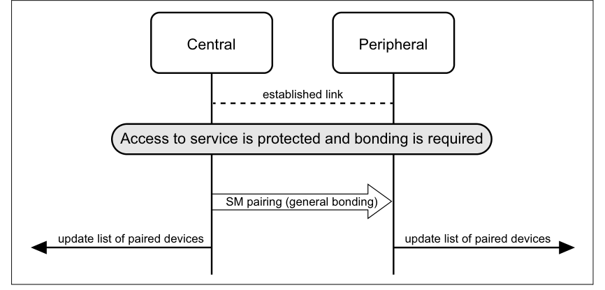

**Figure 9.7:  The Bonding procedure**

##### 9.4.4.2  Conditions

While a device is in the Peripheral or the Central role the device may support the Bonding procedure. While a device is in the Broadcaster or the Observer role the device shall not support the bonding procedure.
The Host of the Central initiates the pairing process as defined in [Vol 3] Part C, Section 2.1 with the Bonding_Flags set to Bonding as defined in [Vol 3] Part H, Section 3.5.1. If the peer device is in the bondable mode, the devices shall exchange and store the bonding information in the security database.
If a device supports the generation of resolvable private addresses as defined in Section 10.8.2.2 and generates a resolvable private address for its local address, it shall send Identity Information with SMP, including a valid IRK. If a device does not generate a resolvable private address for its own address and the Host sends Identity Information with SMP, the Host shall send an all-zero IRK. The Host can abort the pairing procedure if the authentication requirements are not sufficient to distribute the IRK.

### 9.5   PERIODIC ADVERTISING MODES AND PROCEDURE

The periodic advertising modes and procedure allow two or more devices to communicate in a unidirectional connectionless manner using extended advertising events and periodic advertising events.  The requirements for a device operating in a specific GAP role to support periodic advertising synchronizability mode, periodic advertising mode, and periodic advertising synchronization procedure are defined in Table 9.5.

| Mode and Procedures | Ref. | Broadcaster | Observ |
| --- | --- | --- | --- |
| Periodic Advertising Synchronizability mode | 9.5.1 | O | E |
| Periodic Advertising mode | 9.5.2 | C1 | E |
| Periodic Advertising Synchronization Establishment procedure | 9.5.3 | E | O |
| C1: If Periodic Advertising Synchronization mode is supported, Periodic Advertising mode i mandatory; otherwise excluded. |  |  |  |

Table 9.5:  Periodic Advertising modes and Periodic Advertising procedure requirements

#### 9.5.1  Periodic Advertising Synchronizability Mode

##### 9.5.1.1  Definition

The periodic advertising synchronizability mode provides a method for a device to send synchronization information about periodic advertising events.

##### 9.5.1.2  Conditions

A device in the periodic advertising synchronizability mode shall send synchronization information for periodic advertising events in non-connectable and non-scannable extended advertising events.

#### 9.5.2  Periodic Advertising Mode

##### 9.5.2.1  Definition

The periodic advertising mode provides a method for a device to send advertising data at periodic and deterministic intervals.

##### 9.5.2.2  Conditions

A device in the periodic advertising mode shall send periodic advertising events at the interval and using the frequency hopping sequence specified in the periodic advertising synchronization information.

#### 9.5.3  Periodic Advertising Synchronization Establishment Procedure

##### 9.5.3.1  Definition

The periodic advertising synchronization establishment procedure provides a method for a device to receive periodic advertising synchronization information and to synchronize to periodic advertisements.

##### 9.5.3.2  Conditions

A device performing the periodic advertising synchronization establishment procedure shall scan for non-connectable and non-scannable advertising events containing synchronization information for periodic advertising events. When a device receives synchronization information for periodic advertising events, it may listen for periodic advertising events at the intervals and using the frequency hopping sequence specified in the synchronization information contained in the non-connectable and non-scannable extended advertising event.

## 10  SECURITY ASPECTS – LE PHYSICAL TRANSPORT

This section defines the modes and procedures that relate to the security of a connection. The following modes and procedures are defined:
• LE security mode 1
• LE security mode 2
• Authentication procedure
• Authorization procedure
• Connection data signing procedure
• Authenticate signed data procedure
Requirements for a device to support the LE security modes and procedures is shown in Table 10.1.

### 10.1   REQUIREMENTS

| Security Modes and Procedures | Ref. | Broadcaster | Observer | Peripheral | Centra |
| --- | --- | --- | --- | --- | --- |
| LE Security mode 1 | 10.2.1 | E | E | O | O |
| LE Security mode 2 | 10.2.2 | E | E | O | O |
| Authentication procedure | 10.3 | E | E | O | O |
| Authorization procedure | 10.5 | E | E | O | O |
| Connection data signing procedure | 10.4.1 | E | E | O | O |
| Authenticate signed data procedure | 10.4.2 | E | E | O | O |

Table 10.1:  Requirements related to security modes and procedures

### 10.2   LE SECURITY MODES

The security requirements of a device, a service or a service request are expressed in terms of a security mode and security level. Each service or service request may have its own security requirement. The device may also have a security requirement. A physical connection between two devices shall operate in only one security mode.
There are two LE security modes, LE security mode 1 and LE security mode 2.

#### 10.2.1  LE Security Mode 1

LE security mode 1 has the following security levels:
1. No security (No authentication and no encryption)
2. Unauthenticated pairing with encryption
3. Authenticated pairing with encryption
4. Authenticated LE Secure Connections pairing with encryption using a 128- bit strength encryption key.
A connection operating in LE security mode 1 level 2 shall also satisfy the security requirements for LE security mode 1 level 1.
A connection operating in LE security mode 1 level 3 shall also satisfy the security requirements for LE security mode 1 level 2 or LE security mode 1 level 1.
A connection operating in LE security mode 1 level 3 shall also satisfy the security requirements for LE security mode 2.
A connection operating in LE security mode 1 level 4 shall also satisfy the security requirements for LE security mode 1 level 3 or LE security mode 1 level 2 or LE security mode 1 level 1. A connection operating in LE security mode 1 level 4 shall also satisfy the security requirements for LE security mode 2.

#### 10.2.2  LE Security Mode 2

LE security mode 2 has two security levels:
1. Unauthenticated pairing with data signing
2. Authenticated pairing with data signing
LE security mode 2 shall only be used for connection based data signing.
Data signing as defined in Section 10.4 shall not be used when a connection is operating in LE security mode 1 level 2, LE security mode 1 level 3, or LE security mode 1 level 4.

#### 10.2.3  Mixed Security Modes Requirements

If there are requirements for both LE security mode 1 and LE security mode 2 level 2 for a given physical link then LE security mode 1 level 3 shall be used.
If there are requirements for both LE security mode 1 level 3 and LE security mode 2 for a given physical link then LE security mode 1 level 3 shall be used.
If there are requirements for both LE security mode 1 level 2 and LE security mode 2 level 1 for a given physical link then LE security mode 1 level 2 shall be used.
If there are requirements for both LE security mode 1 level 4 and any other security mode or level for a given physical link then LE security mode 1 level 4 shall be used.

#### 10.2.4  Secure Connections Only Mode

A device may be in a Secure Connections Only mode. When in Secure Connections Only mode only security mode 1 level 4 shall be used except for services that only require security mode 1 level 1.
The device shall only accept new outgoing and incoming service level connections for services that require Security Mode 1, Level 4 when the remote device supports LE Secure Connections and authenticated pairing is used.

### 10.3   AUTHENTICATION PROCEDURE

The authentication procedure describes how the required security is established when a device initiates a service request to a remote device and when a device receives a service request from a remote device. The authentication procedure covers LE security mode 1. The authentication procedure shall only be initiated after a connection has been established.
LE security mode 2 pertains to the use of data signing and is covered in Section 10.4.
Authentication in LE security mode 1 is achieved by enabling encryption as defined in Section 10.6. The security of the encryption is impacted by the type of pairing performed. There are two types of pairing: authenticated pairing or unauthenticated pairing. Authenticated pairing involves performing the pairing procedure defined in [Vol 3] Part H, Section 2.1 with the authentication set to ‘MITM protection’. Unauthenticated pairing involves performing the pairing procedure with authentication set to ‘No MITM protection’. Note: In this section, the terms “authenticated pairing” and “unauthenticated pairing” refer to the security method used to perform pairing and are not related to the authentication of previously bonded devices during a reconnection.
Section 10.3.1 specifies the authentication procedure when a device responds to a service request. Section 10.3.2 specifies the authentication procedure when a device initiates a service request.

#### 10.3.1  Responding to a Service Request

In this section the local device is the device responding to a service request made by a remote device. In the L2CAP protocol the local device responds with a connection response to a remote device making a connection request. In GATT, the local device is the GATT server and the remote device is the GATT client.
When a local device receives a service request from a remote device, it shall respond with an error code if the service request is denied. The error code is dependent on whether the current connection is encrypted or not and on the type of pairing that was performed to create the LTK or STK to be used.
When a local device receives a service request from a remote device it shall behave according to the following rules:
• The local device’s security database specifies the security settings required to accept a service request. If no encryption and no data signing are required, the service request shall be accepted. If encryption is required the local device must send an error code as defined in Table 10.2. If no encryption is required, but data signing is required, then the local device behavior is as defined in Section 10.4.
• If neither an LTK nor an STK is available, the service request shall be rejected with the error code “Insufficient Authentication”. Note: When the link is not encrypted, the error code “Insufficient Authentication” does not indicate that MITM protection is required.
• If an LTK or an STK is available and encryption is required (LE security mode 1) but encryption is not enabled, the service request shall be rejected with the error code “Insufficient Encryption”. If the encryption is enabled with insufficient key size then the service request shall be rejected with the error code “Insufficient Encryption Key Size.”
• If an authenticated pairing is required but only an unauthenticated pairing has occurred and the link is currently encrypted, the service request shall be rejected with the error code “Insufficient Authentication.” Note: When unauthenticated pairing has occurred and the link is currently encrypted, the error code “Insufficient Authentication” indicates that MITM protection is required.
• If LE Secure Connections pairing is required but LE legacy pairing has occurred and the link is currently encrypted, the service request shall be rejected with the error code “Insufficient Authentication”.
The local device will respond with the minimum security level required for access to its services. If the local device has no security requirement it should default to the minimum security level that the local device is capable of as defined in pairing phase 1, (see [Vol 3] Part H, Section 2.1).
A local device shall not require an authenticated pairing (MITM) if the localdevice does not support the required IO capabilities or OOB data1.
The local device responds to a service request from a remote device are summarized in Table 10.2.
1.  Note that if an OOB mechanism is used, the level of MITM protection is dependent upon the properties of the OOB communications channel. See [Vol 3] Part H, Section 2.3.5.1 for more information

| Link Encryp- tion State | Local Device’s Access Requirement for Service | Local Device Pairing Status |  |  |  |
| --- | --- | --- | --- | --- | --- |
|  |  | No LTK No STK | Unauthenticated LTK or Unauthenticated STK | Authenticated LTK or Authenticated STK | Authenticat LTK with Secure Connection |
| Unencrypted | None | Request succeeds | Request succeeds | Request succeeds | Request succeeds |
|  | Encryption, No MITM Protection | Error Resp.: Insufficient Authentication | Error Resp.: Insufficient Encryption | Error Resp.: Insufficient Encryption | Error Resp.: Insufficient Encryption |
|  | Encryption, MITM Protection | Error Resp.: Insufficient Authentication | Error Resp.: Insufficient Encryption | Error Resp.: Insufficient Encryption | Error Resp.: Insufficient Encryption |
|  | Encryption, MITM Protec- tion, Secure Connections | Error Resp.: Insufficient Authentication | Error Resp.: Insufficient Encryption | Error Resp.: Insufficient Encryption | Error Resp.: Insufficient Encryption |
| Encrypted | None | N/A (Not possible to be encrypted without LTK) | Request succeeds | Request succeeds | Request succeeds |
|  | Encryption, No MITM Protection |  | Request succeeds | Request succeeds | Request succeeds |
|  | Encryption, MITM Protection |  | Error Resp.: Insufficient Authentication | Request succeeds | Request succeeds |
|  | Encryption, MITM Protec- tion, Secure Connections |  | Error Resp.: Insufficient Authentication | Error Resp.: Insufficient Authentication | Request succeeds |

Table 10.2:  Local device responds to a service request
Figure 10.1 shows how a server handles a service request.

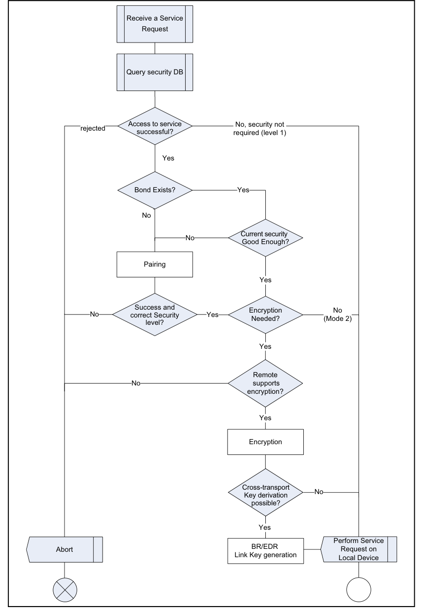

**Figure 10.1:  Flow chart for a local device handling a service request from a remote device**

##### 10.3.1.1  Handling of GATT Indications and Notifications

A client “requests” a server to send indications and notifications by appropriately configuring the server via a Client Characteristic Configuration Descriptor. Since the configuration is persistent across a disconnection and reconnection, security requirements must be checked upon a reconnection before sending indications or notifications. When a server reconnects to a client to send an indication or notification for which security is required, the server shall initiate or request encryption with the client prior to sending an indication or notification. If the client does not have an LTK indicating that the client has lost the bond, enabling encryption will fail.

##### 10.3.1.2  Cross-transport Key Generation

After encryption is enabled, the correct security level has been achieved, and both devices support cross-transport key generation, the both devices may perform BR/EDR link key derivation. Note: If the LTK has an encryption key size that is less than 16 octets (128 bits), the BR/EDR link key is derived before the LTK gets masked.

#### 10.3.2  Initiating a Service Request

In this section the local device is the device initiating a service request to a remote device. In the L2CAP protocol the local device sends the connection request and the remote device sends the connection response. In GATT, the local device is the GATT client and the remote device is the GATT server.
When a local device initiates a service request to a remote device it shall behave according to the following rules:
• The local device’s security database specifies the security required to initiate a service request. If no encryption is required by the local device then the service request may proceed without encryption or pairing.
• If an LTK is not available but encryption is required, the pairing procedure shall be initiated with the local device’s required authentication settings. If the pairing procedure fails then the service request shall be aborted.
Note: When encryption is not enabled, the error code “Insufficient Authentication” does not indicate to the local device that MITM protection is required.
Note: If the local device is a Peripheral then it may send a Slave Initiated Security Request as defined in [Vol 3] Part H, Section 2.4.6.
• If pairing has occurred but the encryption key size is insufficient the pairing procedure shall be executed with the required encryption key size. If the pairing procedure fails then the service request shall be aborted.
• If an LTK is available and encryption is required (LE security mode 1) then encryption shall be enabled before the service request proceeds as defined in Section 10.6. Once encryption is enabled the service request shall
proceed. If encryption fails either the bond no longer exists on the remote device, or the wrong device has been connected. The local device must, after user interaction to confirm the remote device, re-bond, perform service discovery and re-configure the remote device. If the local device had previously determined that the remote device did not have the «Service Changed» characteristic then service discovery may be skipped.
• If an authenticated pairing is required but only an unauthenticated pairing has occurred and the link is currently encrypted, the pairing procedure should be executed with the required authentication settings. If the pairing procedure fails, or an authenticated pairing cannot be performed with the IO capabilities of the local device and remote device, then the service request shall be aborted.
When a bond has been created between two devices, any reconnection should result in the local device enabling or requesting encryption with the remote device before initiating any service request. If a local device does not enable encryption before initiating a service request and relies on the error codes to determine the security requirements, the local device shall not request pairing with MITM protection in response to receiving an “Insufficient Authentication” error code from the remote device while the link is unencrypted. The local device shall only set the MITM protection required flag if the local device itself requires MITM protection.
• If encryption is not enabled at the time of the service request, the error code “Insufficient Authentication” is received, and the local device currently has an LTK, then the encryption procedure should be started (see Section 10.6). If this fails (likely indicating that the remote device has lost the bond and no longer has the LTK) or the local device does not have the correct LTK, then the pairing procedure should be started. IO capabilities are exchanged in pairing phase 1, (see [Vol 3] Part H, Section 2.1) and the security level shall be determined by the device’s IO capabilities and MITM requirements.
• If encryption is not enabled at the time of the service request, the error code “Insufficient Encryption” is received, and the local device currently has an LTK, then the encryption procedure shall be started (see Section 10.6). If starting encryption fails (likely indicating that the remote device has lost the bond and no longer has the LTK) or the local device does not have the correct LTK, then the pairing procedure should be started.
• If LE Secure Connections authenticated pairing is required but the remote device does not support LE Secure Connections, then the service request shall be aborted.
Figure 10.2 shows how a client issues a service request.

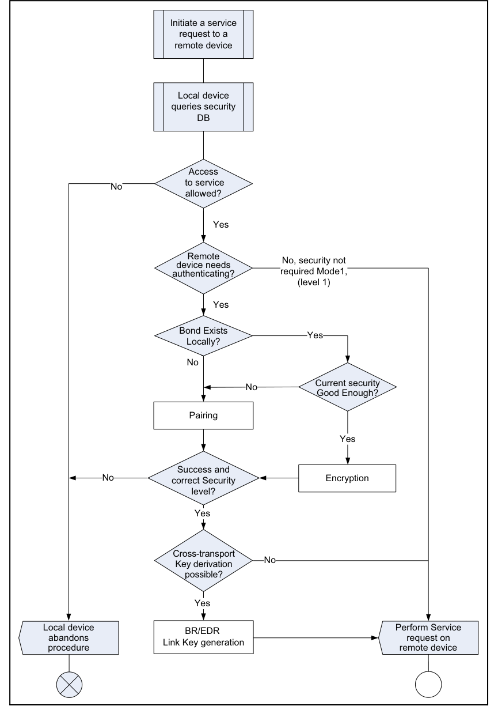

**Figure 10.2:  Flow chart for a local device issuing a service request to a remote device**

##### 10.3.2.1  Cross-transport Key Generation

After encryption is enabled, the correct security level has been achieved, and both devices support cross-transport key generation, the both devices may perform BR/EDR link key derivation. Note: If the LTK has an encryption key size that is less than 16 octets (128 bits), the BR/EDR link key is derived before the LTK gets masked.

### 10.4   DATA SIGNING

The data signing is used for transferring authenticated data between two devices in an unencrypted connection. The data signing method is used by services that require fast connection set up and fast data transfer.
If a service request specifies LE security mode 2, the connection data signing procedure shall be used.

#### 10.4.1  Connection Data Signing Procedure

A device shall generate a new Connection Signature Resolving Key CSRK for each set of peer device(s) to which it sends signed data in connections. CSRK is defined in [Vol 3] Part H, Section 2.4.2.2.
The data shall be formatted using the Signing Algorithm as defined in [Vol 3] Part H, Section 2.4.5 where m is the Data PDU to be signed, k is the CSRK and the SignCounter is the counter value. A Signature is composed of the counter value and the Message Authentication Code (MAC) generated by the Signing Algorithm. The counter value shall be incremented by one for each new Data PDU sent.
The format of signed data is shown in Figure 10.3.

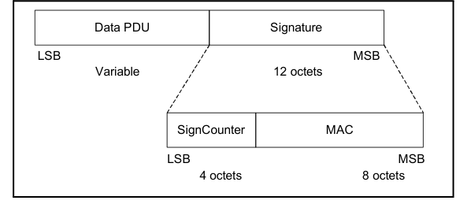

**Figure 10.3:  Generic format of signed data**

#### 10.4.2  Authenticate Signed Data Procedure

If encryption is not required and CSRK is available (LE security mode 2) then the data signing procedure shall be used when making a service request involving a write operation.
Note: The existence of the bond on the server can be determined by successfully enabling encryption with the server using the encryption procedure defined in Section 10.6. A higher layer profile may allow a client to not perform the authentication procedure. Alternatively, a higher layer protocol may signal the client that the signature check has failed due to a lost bond, and the client may then take action to notify the user or attempt to pair again to reestablish the bond.
A device receiving signed data shall authenticate it by performing the Signing Algorithm. The signed data shall be authenticated by performing the Signing Algorithm where m is the Data PDU to be authenticated, k is the stored CSRK and the SignCounter is the received counter value. If the MAC computed by the Signing Algorithm does not match the received MAC, the verification fails and the Host shall ignore the received Data PDU.
Note that since the server does not respond to a Signed Write Command, the higher layer application may or may not be notified of the ignored request. Hence, it is recommended that the server disconnect the link in case the client is a malicious device attempting to mount a security attack.
If the server has no stored CSRK upon receiving a signed write command, it shall ignore the received Data PDU. Note that since the server does not respond to a Signed Write Command, the higher layer application may or may not be notified of the ignored request. Although the disconnection may be an adequate indication to the user that the devices need to be paired, it is recommended that implementers consider providing a more informative indication to the user that the devices need to be paired to establish a CSRK.
If the server receives a request from a client for a write operation that requires a response (i.e. other than a Signed Write Command or Write Command), and encryption is not enabled, then the server shall respond with the error code “Insufficient Authentication”.
If the link is encrypted and the server receives a request from a client for which the server requires data signing but does not require encryption, then the server shall complete the request if it is otherwise valid as the encrypted state of the link is considered to satisfy the signing requirement.
As required by Section 10.2.2, for a given link, signed data is not used at the same time as encryption. Therefore, if the client wishes to test that the server is still bonded, and thus enables encryption, further data transfer must occur without signing, assuming the server does not disconnect the link as recommended above.
If a higher layer determines the bond no longer exists on the server, the client must, after user interaction to confirm the remote device, re-bond, perform service discovery and re-configure the server. If the client had previously determined that the server did not have the «Service Changed» characteristic then service discovery may be skipped.
The receiving device shall protect against a replay attack by comparing the received SignCounter with previously received SignCounter from the same peer device. If the SignCounter was previously used then the receiving device shall ignore the Data PDU.

### 10.5   AUTHORIZATION PROCEDURE

A service may require authorization before allowing access. Authorization is a confirmation by the user to continue with the procedure. Authentication does not necessarily provide authorization. Authorization may be granted by user confirmation after successful authentication.

### 10.6   ENCRYPTION PROCEDURE

A Central may encrypt a connection using the Encryption Session Setup as defined in [Vol 3] Part H, Section 2.4.4 to provide integrity and confidentiality.
A Peripheral may encrypt a connection using the Slave Initiated Security Request as defined in [Vol 3] Part H, Section 2.4.6 to provide integrity and confidentiality.
If the encryption procedure fails and either the Central or Peripheral used a Resolvable Private Address for the connection establishment, then the current Resolvable Private Address(es) shall be immediately discarded and new Resolvable Private Address(es) shall be generated.

### 10.7   PRIVACY FEATURE

The privacy feature provides a level of privacy which makes it more difficult for an attacker to track a device over a period of time. The requirements for a device to support the privacy feature are defined in Table 10.3.

| Privacy Requirements | Ref. | Broadcaster | Observer | Peripheral | Centr |
| --- | --- | --- | --- | --- | --- |
| Privacy feature | 10.7 | O | O | O | O |
| Non-resolvable private address generation proce- dure | 10.8.2.1 | C2 | C4 | O | O |
| Resolvable private address generation procedure | 10.8.2.2 | C3 | C5 | C1 | C1 |
| Resolvable private address resolution procedure | 10.8.2.3 | E | O | C1 | C1 |
| Bondable Mode | 9.4.3 | E | E | C1 | C1 |
| Bonding procedure | 9.4.4 | E | E | C1 | C1 |
| C1: Mandatory if privacy feature is supported, else optional C2: Mandatory if privacy feature is supported and resolvable private address generation procedure is not supported, else optional C3: Mandatory if privacy feature is supported and non-resolvable private address generatio procedure is not supported, else optional C4: Mandatory if privacy feature and active scanning are supported and resolvable private address generation procedure is not supported, else optional C5: Mandatory if privacy feature and active scanning are supported and non-resolvable pr vate address generation procedure is not supported, else optional |  |  |  |  |  |

Table 10.3:  Requirements related to privacy feature
Two modes of privacy exist:
• Device Privacy Mode: When a device is in device privacy mode, it is only concerned about its own privacy. It should accept advertising packets from peer devices that contain their identity addresses as well as their private address, even if the peer device has distributed its IRK. A device shall only use this mode when the Resolvable Private Address Only characteristic is not present in the GAP service of the peer device.
• Network Privacy Mode. When a device is in network privacy mode, it shall not accept advertising packets containing the identity address of peer devices that have distributed their IRK.
A device may use different modes for different peers.
If a device, i.e. Host and Controller, claims support for the privacy feature, the requirements in this section shall be met.
A device may support either Host-based privacy or both Host-based and Controller-based privacy. When a device supports Controller-based privacy, some of the privacy functionality is configured to be performed by the Controller by the Host.
If a device supports Controller-based privacy, the requirements in the following paragraphs shall be met.
• The Host may maintain a resolving list by adding and removing device identities. A device identity consists of the peer’s identity address, and a local and peer’s IRK pair. The local or peer’s IRK shall be an all-zero key, if not applicable for the particular device identity.
• If a peer device provides an all-zero identity address during pairing, the Host shall choose a unique identifier to substitute the peer’s device identity address. The Host shall ensure that all identities provided to the Controller are unique.
• When address resolution is enabled in the Controller, all references to peer devices that are included in the resolving list from Host to the Controller shall be done using the peer’s device identity address. Likewise, all incoming events from the Controller to the Host will use the peer’s device identity, if the peer’s device address has been resolved.
• If the Host wants to be in device privacy mode, it shall so instruct the Controller for each peer in the resolving list.

#### 10.7.1  Privacy Feature in a Peripheral

The privacy-enabled Peripheral shall use a resolvable private address as the advertiser's device address when in connectable mode.
A Peripheral shall use non-resolvable or resolvable private addresses when in non-connectable mode as defined in Section 9.3.2.
If a privacy-enabled Peripheral, that has a stored bond, receives a resolvable private address, the Host may resolve the resolvable private address by performing the ‘resolvable private address resolution procedure’ as defined in Section 10.8.2.3. If the resolution is successful, the Host may accept the connection. If the resolution procedure fails, then the Host shall disconnect with the error code "Authentication failure", or perform the pairing procedure, or perform the authentication procedure as defined in Section 10.3.
The device should not send the device name or unique data in the advertising data that can be used to recognize the device.

##### 10.7.1.1  Privacy Feature in a Peripheral with Controller-based privacy

A privacy-enabled Peripheral shall use either the undirected connectable mode as defined in Section 9.3.4 or directed connectable mode as defined in Section
9.3.3. The directed connectable mode shall only be used if the peer device supports Address Resolution in the Controller.
The Host shall enable resolvable private address generation by enabling it in the Controller and populating the resolving list.
By default, network privacy mode is used when private addresses are resolved and generated by the Controller.

##### 10.7.1.2  Privacy Feature in a Peripheral with Host-based privacy

A privacy-enabled Peripheral should use the undirected connectable mode as defined in Section 9.3.4, to create a connection.
The Host shall generate a resolvable private address using the ‘resolvable private address generation procedure’ as defined in Section 10.8.2.2 or non- resolvable private address procedure as defined in Section 10.8.2.1. The Host shall set a timer equal to TGAP(private_addr_int). The Host shall generate a new resolvable private address or non-resolvable private address when the timer TGAP(private_addr_int) expires.
Note: TGAP(private_addr_int) timer may or may not be run if a Peripheral is not advertising.

#### 10.7.2  Privacy Feature in a Central

The Central shall use a resolvable private address as the initiator's device address.
During active scanning, a privacy enabled Central shall use a non-resolvable or resolvable private address.
If, a privacy-enabled Central, that has a stored bond, receives a resolvable private address, the Host may resolve the resolvable private address by performing the "resolvable private address resolution procedure" as defined in Section 10.8.2.3.

##### 10.7.2.1  Privacy Feature in a Central with Controller-based privacy

A privacy-enabled Central with Address Resolution enabled in the Controller can use any of the connection establishment procedures defined in Section 9.3.
By default, network privacy mode is used when private addresses are resolved and generated by the Controller.

##### 10.7.2.2  Privacy Feature in a Central with Host-based privacy

A privacy-enabled Central should use the general connection establishment procedure defined in Section 9.3.6 to create a connection.
The Host shall generate a resolvable private address using the ‘resolvable private address generation procedure’ as defined in Section 10.8.2.2 or non- resolvable private address procedure as defined in Section 10.8.2.1. The Host shall set a timer equal to TGAP(private_addr_int). The Host shall generate a new resolvable private address or non-resolvable private address when the timer TGAP(private_addr_int) expires.
Note: TGAP(private_addr_int) timer may or may not be run if a Central is not scanning or connected.

#### 10.7.3  Privacy Feature in a Broadcaster

A privacy-enabled Broadcaster shall use the Broadcast mode defined in Section 9.1.1. The Broadcaster shall use either a resolvable private address or non-resolvable private address.
If Address Resolution is not supported or disabled in the Controller, the following applies to the Host: The Host shall generate a resolvable private address using the ‘resolvable private address generation procedure’ as defined in Section 10.8.2.2 or non-resolvable private address procedure as defined in Section 10.8.2.1. The Host shall set a timer to TGAP(private_addr_int). The
Host shall generate a new resolvable private address or non-resolvable private address when the timer TGAP(private_addr_int) expires.
Note: TGAP(private_addr_int) timer may or may not be run if a Broadcaster is not advertising.
The device should not send the device name or unique data in the advertising data which can be used to recognize the device.

#### 10.7.4  Privacy Feature in an Observer

A privacy-enabled Observer shall use the observation procedure defined in Section 9.1.2. During active scanning, a privacy enabled Observer shall use either a resolvable private address or non-resolvable private address.
If Address Resolution is not supported or disabled in the Controller, the following applies to the Host: The Host shall generate a resolvable private address using the ‘resolvable private address generation procedure’ as defined in Section 10.8.2.2 or non-resolvable private address procedure as defined in Section 10.8.2.1. The Host shall set a timer equal to TGAP(private_addr_int). The Host shall generate a new resolvable private address or non-resolvable private address when the timer TGAP(private_addr_int) expires.
Note: TGAP(private_addr_int) timer may or may not be run if an Observer is not scanning.

### 10.8   RANDOM DEVICE ADDRESS

For the purposes of this profile, the random device address may be of either of the following two sub-types:
• Static address
• Private address.
The term random device address refers to both static and private address types.
The transmission of a random device address is optional. A device shall accept the reception of a random device address from a remote device.
The private address may be of either of the following two sub-types:
• Non-resolvable private address
• Resolvable private address
A bonded device shall process a resolvable private address as defined in Section 10.8.2.3 or by establishing a connection and then performing the authentication procedure as defined in Section 10.3. A device that generates a resolvable private address for its local address shall always request to
distribute its IRK value as defined in [Vol 3] Part H, Section 3.6.4 if both sides are bondable, unless keys have been pre-distributed.
After a device has distributed its IRK, it should use resolvable private addresses when establishing a connection with a peer device to which the IRK has been distributed.

#### 10.8.1  Static Address

The Host can generate a static address using the procedure described in [Vol 6] Part B, Section 1.3.2.1.

#### 10.8.2  Private address

The private address may be of either of the following two sub-types:
• Non-resolvable private address
• Resolvable private address

##### 10.8.2.1  Non-Resolvable Private Address Generation Procedure

The Host can generate a non resolvable private address using the procedure described in [Vol 6] Part B, Section 1.3.2.2.

##### 10.8.2.2  Resolvable Private Address Generation Procedure

The Host can generate a resolvable private address where the Host has its IRK using the procedure described in [Vol 6] Part B, Section 1.3.2.2.

##### 10.8.2.3  Resolvable Private Address Resolution Procedure

The Host can resolve a resolvable private address where the Host has the peer device’s IRK or the local device's IRK, using the procedure described in [Vol 6] Part B, Section 1.3.2.3.

## 11  ADVERTISING AND SCAN RESPONSE DATA

FORMAT
The format of Advertising data and Scan Response data is shown in Figure 11.1. The data consists of a significant part and a non-significant part. The significant part contains a sequence of AD structures. Each AD structure shall have a Length field of one octet, which contains the Length value, and a Data field of Length octets. The first octet of the Data field contains the AD type field. The content of the remaining Length - 1 octet in the Data field depends on the value of the AD type field and is called the AD data. The non-significant part extends the Advertising and Scan Response data when necessary and shall contain all-zero octets.

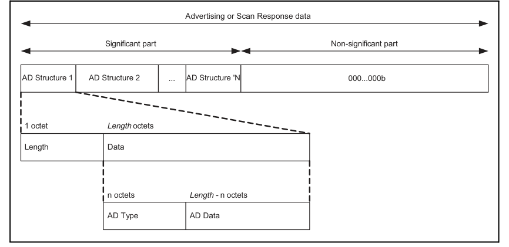

**Figure 11.1:  Advertising and Scan Response data format**

If the Length field is set to zero, then the Data field has zero octets. This shall only occur to allow an early termination of the Advertising or Scan Response data.
Only the significant part of the Advertising or Scan Response data should be sent over the air.
The Advertising and Scan Response data is sent in advertising events. The Advertising Data is placed in the AdvData field of ADV_IND, ADV_NONCONN_IND, ADV_SCAN_IND, AUX_ADV_IND, AUX_CHAIN_IND, and AUX_SYNC_IND packets. The Scan Response data is sent in the ScanRspData field of SCAN_RSP packets or the AdvData field of the AUX_SCAN_RSP packet.  If the complete Advertising or Scan Response data cannot fit in the AUX_ADV_IND or AUX_SCAN_RSP packets, AUX_CHAIN_IND packets are used to send the remaining fragments of the data.
The AD type data formats and meanings are defined in [Core Specification Supplement], Part A. The AD type identifier values are defined in the Assigned Numbers document.

## 12  GAP SERVICE AND CHARACTERISTICS FOR GATT SERVER

The GATT server shall contain the GAP service as defined in the GAP Service Requirements in Table 12.1. A device shall have only one instance of the GAP service in the GATT server. The GAP service is a GATT based service with the service UUID as «GAP Service» defined in the Bluetooth Assigned Numbers document.

|  | BR/EDR GAP Role | LE Broadcaster | LE Observer | LE Peripheral | LE Central |
| --- | --- | --- | --- | --- | --- |
| GAP Service | C1 | E | E | M | M |
| C1: Mandatory for BR/EDR/LE type devices, else optional |  |  |  |  |  |

Table 12.1:  GAP Service Requirements
The characteristics requirements for the GAP service in each of the GAP roles are shown in Table 12.2.

| Characteristics | Ref. | BR/EDR GAP Role | LE Broadcaster | LE Observer | LE Peripheral | LE Centr |
| --- | --- | --- | --- | --- | --- | --- |
| Device Name | 12.1 | C1 | E | E | M | M |
| Appearance | 12.2 | C1 | E | E | M | M |
| Peripheral Preferred Connec- tion Parameters | 12.3 | O | E | E | O | E |
| Central Address Resolution | 12.4 | O | E | E | C3 | C2 |
| Resolvable Private Address Only | 12.5 | O | E | E | C3 | C3 |
| C1: Mandatory for BR/EDR/LE type devices, else optional C2: Mandatory if Link Layer Privacy is supported, otherwise excluded C3: Optional if Link Layer Privacy is supported, otherwise excluded |  |  |  |  |  |  |

Table 12.2:  Requirements related to GAP Service characteristics
A device that supports multiple GAP roles contains all the characteristics to meet the requirements for the supported roles. The device must continue to expose the characteristics when the device is operating in the role in which the characteristics are not valid.

### 12.1   DEVICE NAME CHARACTERISTIC

The Device Name characteristic shall contain the name of the device as an UTF-8 string as defined in Section 3.2.2. When the device is discoverable, the Device Name characteristic value shall be readable without authentication or authorization. When the device is not discoverable, the Device Name Characteristic should not be readable without authentication or authorization. The Device Name characteristic value may be writable. If writable, authentication and authorization may be defined by a higher layer specification or be implementation specific.

| Attribute Handle | Attribute Type | Attribute Value | Attribute Permissions |
| --- | --- | --- | --- |
| 0xMMMM | 0x2A00 – UUID for «Device Name» | Device Name | Readable without authentication or authorization when discoverable. Optionally writable, authentication and authorization may be defined by a higher layer specification or be implementation specific. |

Table 12.3:  Device Name characteristic
The Device Name characteristic value shall be 0 to 248 octets in length. A device shall have only one instance of the Device Name characteristic.

### 12.2   APPEARANCE CHARACTERISTIC

The Appearance characteristic defines the representation of the external appearance of the device. This enables the discovering device to represent the device to the user using an icon, or a string, or similar. The Appearance characteristic value shall be readable without authentication or authorization. The Appearance characteristic value may be writable. If writable, authentication and authorization may be defined by a higher layer specification or be implementation specific.

| Attribute Handle | Attribute Type | Attribute Value | Attribute Permissions |
| --- | --- | --- | --- |
| 0xMMMM | 0x2A01 – UUID for «Appearance» | Appearance | Readable without authentication or authorization. Optionally writable, authentication and autho rization may be defined by a higher layer specification or be implementation specific. |

Table 12.4:  Appearance characteristic
The Appearance characteristic value shall be the enumerated value as defined by Bluetooth Assigned Numbers document. The Appearance characteristic value shall be 2 octets in length. A device shall have only one instance of the Appearance characteristic.

### 12.3   PERIPHERAL PREFERRED CONNECTION PARAMETERS CHARACTERISTIC

The Peripheral Preferred Connection Parameters (PPCP) characteristic contains the preferred connection parameters of the Peripheral.
The Peripheral Preferred Connection Parameters characteristic value shall be readable. Authentication and authorization may be defined by a higher layer specification or be implementation specific.
The Peripheral Preferred Connection Parameters characteristic value shall not be writable.

| Attribute Handle | Attribute Type | Attribute Value | Attribute Permissions |
| --- | --- | --- | --- |
| 0xMMMM | 0x2A04 – UUID for «Peripheral Preferred Connection Parameters» | Peripheral Preferred Connection Parameter | Readable, authentication and authorization may be defined by a higher layer specificatio or be implementation specific Not writable |

Table 12.5:  Peripheral Preferred Connection Parameters characteristic
The Peripheral Preferred Connection Parameters characteristic value shall be 8 octets in length. A device shall have only one instance of the Peripheral Preferred Connection Parameters characteristic.
The preferred connection parameters structured data is defined as follows:

| Name | Size (Octet) | Description |
| --- | --- | --- |
| Minimum connection interval | 2 | Defines minimum value for the connection interval in the following manner: connInterval = Conn Interval Min * 1.25 ms min _ _ Conn Interval Min range: 0x0006 to 0x0C80 _ _ Value of 0xFFFF indicates no specific minimum. Values outside the range (except 0xFFFF) are reserved fo future use. |

Table 12.6:  Format of the preferred connection parameters structured data

| Name | Size (Octet) | Description |
| --- | --- | --- |
| Maximum connection interval | 2 | Defines maximum value for the connection interval in the following manner: connInterval = Conn Interval Max * 1.25 ms max _ _ Conn Interval Max range: 0x0006 to 0x0C80 _ _ Shall be equal to or greater than the Conn Interval Min. _ _ Value of 0xFFFF indicates no specific maximum. Values outside the range (except 0xFFFF) are reserved fo future use. |
| Slave latency | 2 | Defines the slave latency for the connection in number of connection events. Slave latency range: 0x0000 to 0x01F3 Values outside the range are reserved for future use. |
| Connection Supervision timeout multiplier | 2 | Defines the connection supervisor timeout multiplier as a multiple of 10ms. Range: 0xFFFF indicates no specific value requested. Range: 0x000A to 0x0C80 Time = N * 10 ms Time Range: 100 ms to 32 seconds Values outside the range (except 0xFFFF) are reserved fo future use. |

Table 12.6:  Format of the preferred connection parameters structured data

### 12.4   CENTRAL ADDRESS RESOLUTION

The Peripheral shall check if the peer device supports address resolution by reading the Central Address Resolution characteristic before using directed advertisement where the initiator address is set to a Resolvable Private Address (RPA).
The Central Address Resolution characteristic defines whether the device supports privacy with address resolution. See Table 12.7.

| Attribute Handle | Attribute Type | Attribute Value | Attribute Permissions |
| --- | --- | --- | --- |
| 0xMMMM | 0x2AA6 - UUID of «Central Address Resolution» | Central Address Resolution Support | Readable without authentication or autho rization. Not writable. |

Table 12.7:  Central Address Resolution Characteristic
The Central Address Resolution characteristic value shall be 1 octet in length:

## 0 = address resolution is not supported in this device 1 = address resolution is supported in this device 2 – 255 = Reserved for future use

A device shall have only one instance of the Central Address Resolution characteristic. If the Central Address Resolution characteristic is not present, then it shall be assumed that Central Address Resolution is not supported.

### 12.5   RESOLVABLE PRIVATE ADDRESS ONLY

The device shall check if the peer will only use Resolvable Private Addresses (RPAs) after bonding by reading the Resolvable Private Address Only characteristic.
The Resolvable Private Address Only characteristic defines whether the device will only use Resolvable Private Addresses (RPAs) as local addresses. See Table 12.8.

| Attribute Handle | Attribute Type | Attribute Value | Attribute Permission |
| --- | --- | --- | --- |
| 0xMMMM | 0x2AC9 - UUID of «Resolvable Private Address Only» | Resolvable Private Address Only | Readable without authentication or authorization. Not writable. |

Table 12.8:  Resolvable Private Address Only Characteristic
The Resolvable Private Address Only characteristic value shall be 1 octet in length:

## 0 = only Resolvable Private Addresses will be used as local addresses after bonding

## 1 – 255 = Reserved for future use

A device shall have only one instance of the Resolvable Private Address Only characteristic. If the Resolvable Private Address Only characteristic is not present, then it cannot be assumed that only Resolvable Private Addresses will be used over the air.

## 13  BR/EDR/LE OPERATION

This section describes the requirements for devices that support the BR/EDR/ LE device type. The device may support any LE GAP roles allowed by the Controller over the LE physical channel.

| Feature | Ref. | Broadcaster | Observer | Peripheral | Centr |
| --- | --- | --- | --- | --- | --- |
| BR/EDR/LE modes and procedures | 13.1 and 13.2 | O | O | O | O |

Table 13.1:  Requirements for the modes of a BR/EDR/LE device type
A BR/EDR/LE device type that supports the Broadcaster role shall meet the requirements for the Broadcaster role as defined in Section 9.
A BR/EDR/LE device type that supports the Observer role shall meet the requirements for the Observer role as defined in Section 9.
A BR/EDR/LE device type that supports the Peripheral role shall meet the requirements for the Peripheral role as defined in Section 9.
A BR/EDR/LE device type that supports the Central role shall meet the requirements for the Central role as defined in Section 9.

### 13.1   MODES, PROCEDURES AND SECURITY ASPECTS

All modes, procedures and security aspects shall follow the requirements as specified for the physical transport over which they operate. Sections 4, 5, 6 and 7 specify the requirements for the modes, procedures and security aspects for operations performed over the BR/EDR physical transport. Sections 9 and 10 specify the requirements for the modes, procedures and security aspects performed over the LE physical transport. It is optional to support both physical transports simultaneously to the same remote device.

#### 13.1.1  Discoverable Mode Requirements

A device shall expose the capabilities of both physical transports for both Limited and General Discoverable Mode using the advertisement Flag AD Type as follows:
a) The ‘BR/EDR Not Supported’ bit in the Flags AD type shall be set to 0 as defined in [Core Specification Supplement], Part A, Section 1.3.
b) The 'Simultaneous LE and BR/EDR to Same Device Capable (Controller)' and ‘Simultaneous LE and BR/EDR to Same Device Capable (Host)’ bits in the Flags AD type shall be set to 0.
The ‘LE Supported (Controller)’ and ‘LE Supported (Host)’ bits in the LMP features shall be set as defined in [Vol 2] Part C, Section 3.2.

### 13.2   BONDING FOR BR/EDR/LE DEVICE TYPE

The requirements for a device supporting BR/EDR/LE device type are shown in Table 13.2.

| Bonding Requirement | Ref. | Peripheral | Central |
| --- | --- | --- | --- |
| Bonding | 6.5 / 9.4.4 | O | O |

Table 13.2:  Requirements for the bonding of a BR/EDR/LE device type
If the remote device supports the BR/EDR physical transport, the bonding procedures for the BR/EDR physical transport as defined in Section 6.5 shall be used.
If the remote device supports the LE physical transport, the bonding procedures for the LE physical transport as defined in Section 9.4.4 shall be used.

### 13.3   RELATIONSHIP BETWEEN PHYSICAL TRANSPORTS

To determine if both the BR/EDR physical transport and the LE physical transport are established to the same peer device, the device shall use either the public address used on the LE advertising channel or the public address from the BD_ADDR field contained in the SMP Identity Address Information packet ([Vol 3] Part H, Section 3.6.5) if it has been received.

## 14  BR/EDR/LE SECURITY ASPECTS

The requirements for a device supporting BR/EDR/LE device type are shown in Table 14.1.

| Security aspects | Ref. | Peripheral | Central |
| --- | --- | --- | --- |
| Security aspects | 14 | M | M |

Table 14.1:  Requirements for the security aspects of a BR/EDR/LE device type
If the remote device supports the BR/EDR physical transport the security procedures for the BR/EDR physical transport as defined in Section 5 shall be used.
If the remote device supports the LE physical transport the security procedures for the LE physical transport as defined in Section 10 shall be used.
If the LE transport in a BR/EDR/LE device supports Secure Connections, the security procedures in Section 14.1 may also be used.

### 14.1   CROSS-TRANSPORT KEY DERIVATION

If both the local and remote devices support Secure Connections over the BR/ EDR and LE transports, devices may optionally generate keys of identical strength and the same MITM protection for both transports as part of a single pairing procedure.
If both the local and remote devices support Secure Connections over the LE transport but not over the BR/EDR transport, then the devices may optionally generate the BR/EDR keys of identical strength and the same MITM protection as the LE keys as part of the LE pairing procedure.
If Secure Connections pairing occurs first on the LE transport the procedures in [Vol 3] Part H, Section 2.3.5.7 may be used.
If Secure Connections pairing occurs first on the BR/EDR transport the procedures in [Vol 3] Part H, Section 2.3.5.7 may be used.

### 14.2   COLLISION HANDLING

If pairing has been initiated by the local device on the BR/EDR transport, and a pairing request is received from the same remote device on the LE transport, the LE pairing shall be rejected with SMP error code “BR/EDR pairing in progress” (0x0D) if both sides support LE Secure Connections.
If a BR/EDR/LE device supports LE Secure Connections, then it shall initiate pairing on only one transport at a time to the same remote device.

## 15  BLUETOOTH DEVICE REQUIREMENTS

### 15.1   BLUETOOTH DEVICE ADDRESS

All Bluetooth devices shall have a Bluetooth Device Address (BD_ADDR) that uniquely identifies the device to another Bluetooth device. The specific Bluetooth Device Address requirements depend on the type of Bluetooth device.

#### 15.1.1  Bluetooth Device Address Types

##### 15.1.1.1  Public Bluetooth Address

A Bluetooth public address used as the BD_ADDR for the BR/EDR physical channel is defined in [Vol 2] Part B, Section 1.2. A Bluetooth public address used as the BD_ADDR for the LE physical channel is defined in [Vol 6] Part B, Section 1.3.

##### 15.1.1.2  Random Bluetooth Address

A random device address used as the BD_ADDR on the LE physical channel is defined in Section 10.8.

### 15.2   GATT PROFILE REQUIREMENTS

The requirements for supporting a GATT Client or GATT Server are specified in Table 15.1.

|  | BR/EDR GAP Role | LE Broadcaster | LE Observer | LE Peripheral | LE Centra |
| --- | --- | --- | --- | --- | --- |
| GATT Client | O | E | E | O | O |
| GATT Server | C1 | E | E | M | M |
| C1: Mandatory if the GATT profile is supported on the BR/EDR physical transport; otherwise exclud |  |  |  |  |  |

Table 15.1:  Requirements based on GAP Roles Supported

### 15.3   SDP REQUIREMENTS

The requirements for supporting an SDP Client or SDP Server are specified in Table 15.2. There shall be no more than one active SDP server per device.

|  | BR/EDR and BR/EDR/LE Device Type | LE-Only Device Type |
| --- | --- | --- |
| SDP Client | C1 | E |
| SDP Server | C1 or C2 | E |
| C1: Mandatory to support at least one; Optional to support both C2: Mandatory to support if GATT server is supported |  |  |

Table 15.2:  Requirements based on GAP Roles Supported

### 15.4   SDP SERVICE RECORD REQUIREMENT

A BR/EDR or BR/EDR/LE device that supports a GATT server accessible over the BR/EDR physical transport shall publish the SDP record shown below in Table 15.3. The GAP Start Handle shall be set to the attribute handle of the «Generic Attribute Profile» service declaration. The GAP End Handle shall be set to the attribute handle of the last attribute within the «Generic Attribute Profile» service definition group.

| Item | Definition | Type | Value | Statu |
| --- | --- | --- | --- | --- |
| Service Class ID List |  |  |  | M |
| Service Class #0 |  | UUID | «Generic Attribute Profile» | M |
| ProtocolDescriptorList |  |  |  | M |
| Protocol #0 |  | UUID | «L2CAP» | M |
| Parameter #0 for Protocol #0 | PSM | Unit16 | PSM = ATT | M |
| Protocol #1 |  | UUID | «ATT» | M |
| Parameter #0 for Protocol #1 | GAP Start Handle | Uint16 |  | M |
| Parameter #1 for Protocol #1 | GAP End Handle | Uint16 |  | M |
| BrowseGroupList |  |  | PublicBrowseRoot | M |

Table 15.3:  SDP Record for the Generic Access Profile
If a BR/EDR or BR/EDR/LE device supports a GATT-based service on the BR/ EDR transport, the service shall exist in the SDP server and the GATT server.

## 16  DEFINITIONS

In the following, terms written with capital letters refer to states.
Most definitions in this section are BR/EDR specific.

### 16.1   GENERAL DEFINITIONS

Mode . A set of directives that defines how a device will respond to certain events.
Idle . As seen from a remote device, a Bluetooth device is idle, or is in idle mode, when there is no link established between them.
Bond . A relation between two Bluetooth devices defined by creating, exchanging and storing a common link key. The bond is created through the bonding or LMP-pairing procedures.

### 16.2   CONNECTION-RELATED DEFINITIONS

Physical channel . A synchronized Bluetooth baseband-compliant RF hopping sequence.
Piconet . A set of Bluetooth devices sharing the same physical channel defined by the master parameters (clock and BD_ADDR).
Physical link . A Baseband-level connection1 between two devices established using paging. A physical link comprises a sequence of transmission slots on a physical channel alternating between master and slave transmission slots.
ACL link . An asynchronous (packet-switched) connection1 between two devices created on LMP level. Traffic on an ACL link uses ACL packets to be transmitted.
SCO link . A synchronous (circuit-switched) connection1 for reserved bandwidth communications; e.g. voice between two devices, created on the LMP level by reserving slots periodically on a physical channel. Traffic on a SCO link uses SCO packets to be transmitted. SCO links can be established only after an ACL link has first been established.
Link . Shorthand for an ACL link.
PAGE . A baseband state where a device transmits page trains, and processes any eventual responses to the page trains.
1. The term ’connection’ used here is not identical to the definition below. It is used in the absence of a more concise term.
PAGE_SCAN . A baseband state where a device listens for page trains.
Page . The transmission by a device of page trains containing the Device Access Code of the device to which the physical link is requested.
Page scan . The listening by a device for page trains containing its own Device Access Code.
Channel . A logical connection on L2CAP level between two devices serving a single application or higher layer protocol.
Connection . A connection between two peer applications or higher layer protocols mapped onto a channel.
Connecting . A phase in the communication between devices when a connection between them is being established. (Connecting phase follows after the link establishment phase is completed.)
Connect (to service) . The establishment of a connection to a service. If not already done, this includes establishment of a physical link, link and channel as well.

### 16.3   DEVICE-RELATED DEFINITIONS

Discoverable device . A Bluetooth device in range that will respond to an inquiry (normally in addition to responding to page).
Silent device . A Bluetooth device appears as silent to a remote device if it does not respond to inquiries made by the remote device. A device may be silent due to being non-discoverable or due to baseband congestion while being discoverable.
Connectable device . A Bluetooth device in range that will respond to a page.
Trusted device . A paired device that is explicitly marked as trusted.
Paired device . A Bluetooth device with which a link key has been exchanged (either before connection establishment was requested or during connecting phase).
Pre-paired device . A Bluetooth device with which a link key was exchanged, and the link key is stored, before link establishment.
Un-paired device . A Bluetooth device for which there was no exchanged link key available before connection establishment was requested.
Known device . A Bluetooth device for which at least the BD_ADDR is stored.
Un-known device . A Bluetooth device for which no information (BD_ADDR, link key or other) is stored.
Authenticated device . A Bluetooth device whose identity has been verified during the lifetime of the current link, based on the authentication procedure.

### 16.4   PROCEDURE-RELATED DEFINITIONS

Paging. A procedure for establishing a physical link of ACL type on baseband level, consisting of a page action of the initiator and a page scan action of the responding device.
Link establishment . A procedure for establishing a link on LMP level. A link is established when both devices have agreed that LMP setup is completed.
Channel establishment . A procedure for establishing a channel on L2CAP level.
Connection establishment . A procedure for creating a connection mapped onto a channel.
Creation of a trusted relationship . A procedure where the remote device is marked as a trusted device. This includes storing a common link key for future authentication and pairing (if the link key is not available).
Creation of a secure connection.  A procedure of establishing a connection, including authentication and encryption.
Device discovery . A procedure for retrieving the Bluetooth device address, clock, class-of-device field and used page scan mode from discoverable devices.
Name discovery . A procedure for retrieving the user-friendly name (the Bluetooth device name) of a connectable device.
Service discovery . Procedures for querying and browsing for services offered by or through another Bluetooth device.

### 16.5   SECURITY-RELATED DEFINITIONS

Authentication . A generic procedure based on LMP-authentication if a link key exists or on LMP-pairing if no link key exists.
LMP-authentication . An LMP level procedure for verifying the identity of a remote device. The procedure is based on a challenge-response mechanism using a random number, a secret key and the BD_ADDR of the non-initiating device. The secret key used can be a previously exchanged link key.
Authorization . A procedure where a user of a Bluetooth device grants a specific (remote) Bluetooth device access to a specific service. Authorization implies that the identity of the remote device can be verified through authentication.
Authorize . The act of granting a specific Bluetooth device access to a specific service. It may be based upon user confirmation, or given the existence of a trusted relationship.
LMP-pairing . A procedure that authenticates two devices, based on a PIN, and subsequently creates a common link key that can be used as a basis for a trusted relationship or a (single) secure connection. The procedure consists of the steps: creation of an initialization key (based on a random number and a PIN), creation and exchange of a common link key and LMP-authentication based on the common link key.
Bonding . A dedicated procedure for performing the first authentication, where a common link key is created and stored for future use.
Trusting . The marking of a paired device as trusted. Trust marking can be done by the user, or automatically by the device (e.g. when in bondable mode) after a successful pairing.

## 17  REFERENCES

[1] Baseband Specification
[2] Link Manager Protocol
[3] RFCOMM
[4] Telephony Control Specification
[5] Service Discovery Protocol
[6] Security Architecture (white paper)
[7] Bluetooth Assigned Numbers
APPENDIX A (NORMATIVE):
TIMERS AND CONSTANTS
The following timers are required by this profile.

| Timer name | Value | Description | Requirement or Recommendatio |
| --- | --- | --- | --- |
| T (100) GAP | 10.24 s | Time span that a Bluetooth device performs device discovery. | Recommended value |
| T (101) GAP | 10.625 ms | A discoverable Bluetooth device enters INQUIRY S- _ CAN for at least TGAP(101) every TGAP(102). | Required value |
| T (102) GAP | 2.56 s | Maximum time between repeated INQUIRY SCAN _ enterings. | Recommended value |
| T (103) GAP | 30.72 s | Minimum time span that a device is in discoverable mode. | Required value |
| T (104) GAP | 1 min. | Maximum time span that a device is in limited discov- erable mode. | Recommended value |
| T (105) GAP | 100ms | Maximum time between INQUIRY SCAN enterings _ | Recommended value |
| T (106) GAP | 100ms | Maximum time between PAGE SCAN enterings _ | Recommended value |
| T (107) GAP | 1.28s | Maximum time between PAGE SCAN enterings _ (R1 page scan) | Recommended value |
| T (108) GAP | 2.56s | Maximum time between PAGE SCAN enterings _ (R2 page scan) | Recommended value |

Table A.1:  Defined GAP timers  (Sheet 1 of 6)

| Timer name | Value | Description | Requirement or Recommendatio |
| --- | --- | --- | --- |
| T (adv fast GAP _ _ interval1 coded) _ | 90 ms to 180 ms | Minimum to maximum advertising interval in the following GAP Modes on the LE Coded PHY when user initiated: 1. Undirected Connectable Mode 2. Limited Discoverable Mode and sending connectable undirected advertising events 3. General Discoverable Mode and sending connectable undirected advertising events 4. Directed Connectable Mode and sending low duty cycle connectable directed advertising events | Recommended value |
| T (adv fast interval1) GAP _ _ | 30 ms to 60 ms | Minimum to maximum advertising interval in the following GAP Modes on the LE 1M PHY when user initiated: 1. Undirected Connectable Mode 2. Limited Discoverable Mode and sending connectable undirected advertising events 3. General Discoverable Mode and sending connectable undirected advertising events 4. Directed Connectable Mode and sending low duty cycle directed advertising events | Recommended value |

Table A.1:  Defined GAP timers  (Sheet 2 of 6)

| Timer name | Value | Description | Requirement or Recommendatio |
| --- | --- | --- | --- |
| T (adv fast GAP _ _ interval2 coded) _ | 300 ms to 450 ms | Minimum to maximum advertising interval in the following GAP Modes on the LE Coded PHY when user initiated and sending non-connectable advertis- ing events: 1. Non-Discoverable Mode 2. Non-Connectable Mode 3. Limited Discoverable Mode 4. General Discoverable Mode | Recommended value |
| T (adv fast interval2) GAP _ _ | 100 ms to 150 ms | Minimum to maximum advertising interval in the following GAP Modes on the LE 1M PHY when user initiated and sending non- connectable advertising events: 1. Non-Discoverable Mode 2. Non-Connectable Mode 3. Limited Discoverable Mode 4. General Discoverable Mode | Recommended value |
| T (adv fast period) GAP _ _ | 30 s | Minimum time to perform advertising when user initi- ated | Recommended value |
| T (adv slow GAP _ _ interval coded) _ | 3 s to 3.6 s | Minimum to maximum advertisement interval in any discoverable or con- nectable mode when back- ground advertising on the LE Coded PHY | Recommended value |
| T (adv slow interval) GAP _ _ | 1 s to 1.2 s | Minimum to maximum advertisement interval in any discoverable or con- nectable mode when back- ground advertising on the LE 1M PHY | Recommended value |

Table A.1:  Defined GAP timers  (Sheet 3 of 6)

| Timer name | Value | Description | Requirement or Recommendatio |
| --- | --- | --- | --- |
| T (conn param timeout) GAP _ _ | 30 s | Connection parameter update notification timer when performing the con- nection parameter update procedure | Recommended value |
| T (conn pause central) GAP _ _ | 1 s | Central idle timer | Recommended value |
| T (conn pause GAP _ _ peripheral) | 5 s | Minimum time upon con- nection establishment before the peripheral starts a connection update proce- dure | Recommended value |
| T (gen disc GAP _ _ scan min coded) _ _ | 30.72 s | Minimum time to perform scanning when performing the general discovery pro- cedure on the LE Coded PHY | Recommended value |
| T (gen disc scan min) GAP _ _ _ | 10.24 s | Minimum time to perform scanning when performing the general discovery pro- cedure on the LE 1M PHY | Recommended value |
| T (initial conn GAP _ _ interval coded) _ | 90 ms to 150 ms | Minimum to maximum con- nection interval upon any connection establishment on the LE Coded PHY | Recommended value |
| T (initial conn interval) GAP _ _ | 30 ms to 50 ms | Minimum to maximum con- nection interval upon any connection establishment on the LE 1M PHY | Recommended value |
| T (lim adv timeout) GAP _ _ | 180 s | Maximum time to remain advertising when in the lim- ited discoverable mode | Required value |
| T (lim disc GAP _ _ scan int coded) _ _ | 33.75 ms | Scan interval used in the limited discovery proce- dure on the LE Coded PHY | Recommended value |
| T (lim disc scan int) GAP _ _ _ | 11.25 ms | Scan interval used in the limited discovery proce- dure on the LE 1M PHY | Recommended value |
| T (lim disc GAP _ _ scan min coded) _ _ | 30.72 s | Minimum time to perform scanning when performing the limited discovery pro- cedure on the LE Coded PHY | Recommended value |

Table A.1:  Defined GAP timers  (Sheet 4 of 6)

| Timer name | Value | Description | Requirement or Recommendatio |
| --- | --- | --- | --- |
| T (lim disc scan min) GAP _ _ _ | 10.24 s | Minimum time to perform scanning when performing the limited discovery pro- cedure on the LE 1M PHY | Recommended value |
| T (private addr int) GAP _ _ | 15 mins | Minimum time interval between private address change | Recommended value |
| T (scan fast GAP _ _ interval coded) _ | 90 ms to 180 ms | Scan interval in any dis- covery or connection establishment procedure when user initiated on the LE Coded PHY | Recommended value |
| T (scan fast interval) GAP _ _ | 30 ms to 60 ms | Scan interval in any dis- covery or connection establishment procedure when user initiated on the LE 1M PHY | Recommended value |
| T (scan fast period) GAP _ _ | 30.72 s | Minimum time to perform scanning when user initi- ated | Recommended value |
| T (scan fast GAP _ _ window coded) _ | 90 ms | Scan window in any dis- covery or connection establishment procedure when user initiated on the LE Coded PHY | Recommended value |
| T (scan fast window) GAP _ _ | 30 ms | Scan window in any dis- covery or connection establishment procedure when user initiated on the LE 1M PHY | Recommended value |
| T (scan slow GAP _ _ interval1 coded) _ | 3.84 s | Scan interval in any dis- covery or connection establishment procedure when background scan- ning on the LE Coded PHY | Recommended value |
| T (scan slow interval1) GAP _ _ | 1.28 s | Scan interval in any dis- covery or connection establishment procedure when background scan- ning on the LE 1M PHY | Recommended value |
| T (scan slow GAP _ _ interval2 coded) _ | 7.68 s | Scan interval in any dis- covery or connection establishment procedure when background scan- ning on the LE Coded PHY | Recommended value |

Table A.1:  Defined GAP timers  (Sheet 5 of 6)

| Timer name | Value | Description | Requirement or Recommendatio |
| --- | --- | --- | --- |
| T (scan slow interval2) GAP _ _ | 2.56 s | Scan interval in any dis- covery or connection establishment procedure when background scan- ning on the LE 1M PHY | Recommended value |
| T (scan slow GAP _ _ window1 coded) _ | 33.75 ms | Scan window in any dis- covery or connection establishment procedure when background scan- ning on the LE Coded PHY | Recommended value |
| T (scan slow window1) GAP _ _ | 11.25 ms | Scan window in any dis- covery or connection establishment procedure when background scan- ning on the LE 1M PHY | Recommended value |
| T (scan slow GAP _ _ window2 coded) _ | 67.5 ms | Scan window in any dis- covery or connection establishment procedure when background scan- ning on the LE Coded PHY | Recommended value |
| T (scan slow window2) GAP _ _ | 22.5 ms | Scan window in any dis- covery or connection establishment procedure when background scan- ning on the LE 1M PHY | Recommended value |
| T (Sync Scan GAP _ _ Interval) | 320 ms | Interval between the start of adjacent synchroniza- tion scan windows | Recommended value |
| T (Sync Scan GAP _ _ Window) | 91.25 ms | Duration of Synchroniza- tion scan window | Recommended value |
| T (Sync Train GAP _ _ Duration) | 30.72 s | Duration of synchronizability mode | Required value |
| T (Sync Train Interval) GAP _ _ | 80 ms | Interval between Synchro- nization Train events | Recommended value |

Table A.1:  Defined GAP timers  (Sheet 6 of 6)
APPENDIX B (INFORMATIVE): INFORMATION
FLOWS OF RELATED PROCEDURES
B.1  LMP – AUTHENTICATION
The specification of authentication on link level is found in [2].
Verifier (initiator) Claimant
init_authentication
secret key (link key or Kinit)
secret key (link key or Kinit)
Generate random number
lmp_au_rand
Calculate Challenge (random number)
Calculate response
lmp_sres
Compare
result (ok or fail)
Figure B.1:  LMP-authentication as defined by [2]
The secret key used here is an already exchanged link key.
B.2  LMP – PAIRING
The specification of pairing on link level is found in [2].
Verifier (initiator) Claimant
init_pairing
Generate random number
LMP_in_rand
LMP_accepted
PIN
PIN
Calculate Kinit
Calculate Kinit
Create link key
lmp-authentication
Link Key Link Key
Figure B.2:  LMP-pairing as defined in [2]
The PIN used here is PINBB.
The create link key procedure is described in [Vol 2] Part C, Section 4.2.2.4 and [Vol 2] Part H, Section 3.2. In case the link key is based on a combination key, a mutual authentication takes place and shall be performed irrespective of current security mode.
B.3  SERVICE DISCOVERY
The Service Discovery Protocol [5] specifies what PDUs are used over-the-air to inquire about services and service attributes. The procedures for discovery of supported services and capabilities using the Service Discovery Protocol are described in higher layer specifications. This is just an example.
A B
initiate service discovery make connectable
Link establishment
Channel establishment
service discovery session
Channel release
LMP_detach
Figure B.3:  Service discovery procedure
B.4  GENERATING A RESOLVABLE PRIVATE ADDRESS
Generating a resolvable private address is described in Section 10.8.2.2.
B.5  RESOLVING A RESOLVABLE PRIVATE ADDRESS
Resolving a resolvable private address is described in Section 10.8.2.3.
Core System Package [Host volume]
Part D
PART D: TEST SUPPORT
CONTENTS

## 1  TEST METHODOLOGY

This section describes the test modes for hardware and low-level functionality tests of Bluetooth devices.
The BR/EDR test mode supports testing of the Bluetooth transmitter and receiver including transmitter tests (packets with constant bit patterns) and loopback tests. It is intended mainly for certification/compliance testing of the radio and baseband layer, and may also be used for regulatory approval or in- production and after-sales testing.
For AMP, this section describes the AMP test mode for hardware and low-level functionality tests of Bluetooth AMP devices. The AMP test mode provides the ability to control an AMP device using HCI Commands for both MAC conformance testing and PHY transmitter and receiver tests utilising the BR/ EDR connection. The AMP test mode is intended mainly for certification/ compliance testing of the MAC and PHY and may also be used for regulatory approval or in production and after sales testing.

### 1.1   BR/EDR TEST SCENARIOS

A device in BR/EDR test mode shall not support normal operation. For security reasons the BR/EDR test mode is designed such that it offers no benefit to the user. Therefore, no data output or acceptance on a HW or SW interface shall be allowed.

#### 1.1.1  Test Setup

The setup consists of a device under test (DUT) and a tester. Optionally, additional measurement equipment may be used.

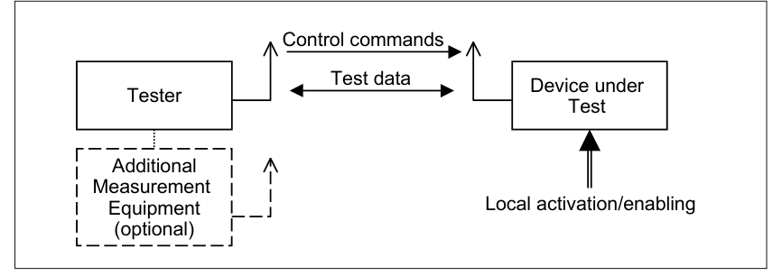

**Figure 1.1:  Setup for Test Mode**

Tester and DUT form a piconet where the tester acts as master and has full control over the test procedure. The DUT acts as slave.
The control is done via the air interface using LMP commands (see [Vol 2] Part C, Section 4.7.3). Hardware interfaces to the DUT may exist, but are not subject to standardization.
The test mode is a special state of the Bluetooth model. For security and type approval reasons, a Bluetooth device in test mode shall not support normal operation. When the DUT leaves the test mode it enters the standby state. After power-off the Bluetooth device shall return to the standby state.

#### 1.1.2  Transmitter Test

The Bluetooth device transmits a constant bit pattern. This pattern is transmitted periodically with packets aligned to the slave TX timing of the piconet formed by tester and DUT. The same test packet is repeated for each transmission.
The transmitter test is started when the master sends the first POLL packet. In non-hopping mode the agreed frequency is used for this POLL packet.
The tester (master) transmits control or POLL packets in the master-to-slave transmission slots. The DUT (slave) shall transmit packets in the following slave-to-master transmission slot. The tester’s polling interval is fixed and defined by the LMP_test_control PDU. The device under test may transmit its burst according to the normal timing even if no packet from the tester was received. In this case, the ARQN bit is shall be set to NAK.
The burst length may exceed the length of a one slot packet. In this case the tester may take the next free master TX slot for polling. The timing is illustrated in Figure 1.2.

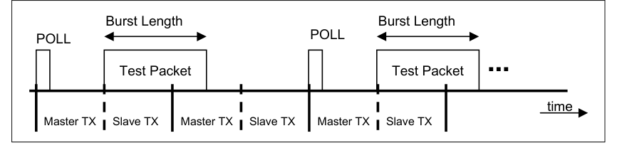

**Figure 1.2:  Timing for Transmitter Test**

##### 1.1.2.1  Packet Format

The test packet is a normal Bluetooth packet, see Figure 1.3. For the payload itself see below.

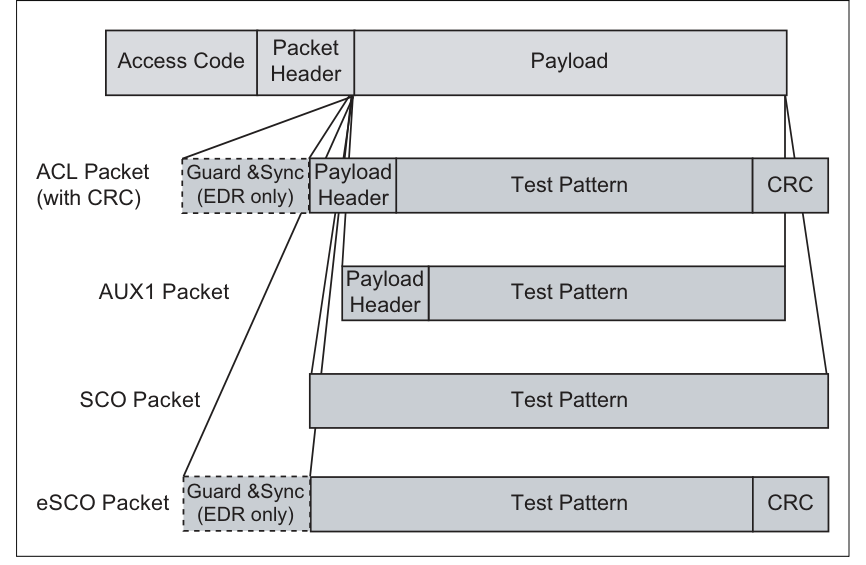

**Figure 1.3:  General Format of TX Packet**

During configuration the tester defines:
• the packet type to be used
• payload length
For the payload length, the restrictions from the baseband specification shall apply (see Section Part B:). In case of ACL, SCO and eSCO packets the payload structure defined in the baseband specification is preserved as well, see Figure 1.3.
For the transmitter test mode, only packets without FEC should be used; i.e. HV3, EV3, EV5, DH1, DH3, DH5, 2-EV3, 2-EV5, 3-EV3, 3-EV5, 2-DH1, 2-DH3, 2-DH5, 3-DH1, 3-DH3, 3-DH5 and AUX1 packets.
In transmitter test mode, the packets exchanged between the tester and the DUT shall not be scrambled with the whitening sequence. Whitening shall be turned off when the DUT has accepted to enter the transmitter test mode, and shall be turned on when the DUT has accepted to exit the transmitter test mode, see Figure 1.4. Implementations shall ensure that retransmissions of the LMP_accepted messages use the same whitening status as used in the original LMP_accepted.

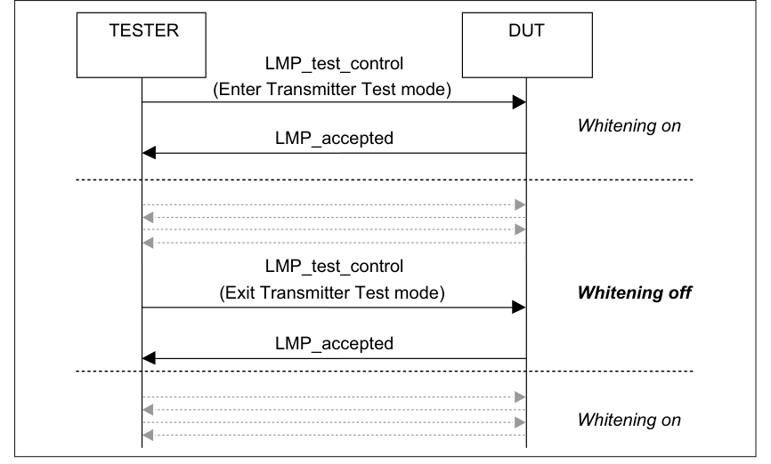

**Figure 1.4:  Use of whitening in Transmitter mode**

##### 1.1.2.2  Pseudorandom Sequence

The same pseudorandom sequence of bits shall be used for each transmission (i.e. the packet is repeated). A PRBS9 sequence is used, see [2] and [3].
The properties of this sequence are as follows (see [3]). The sequence may be generated in a nine-stage shift register whose 5th and 9th stage outputs are added in a modulo-two addition stage (see Figure 1.5), and the result is fed back to the input of the first stage. The sequence begins with the first ONE of 9 consecutive ONEs; i.e. the shift register is initialized with nine ones.
• Number of shift register stages: 9
• Length of pseudo-random sequence: 29-1 = 511 bits
• Longest sequence of zeros: 8 (non-inverted signal)

**Figure 1.5:  Linear Feedback Shift Register for Generation of the PRBS sequence**

##### 1.1.2.3  Control of Transmit Parameters

The following parameters can be set to configure the transmitter test:
1. Bit pattern: • Constant zero • Constant one • Alternating 1010...1
• Alternating 1111 0000 1111 0000...1
• Pseudorandom bit pattern • Transmission off
2. Frequency selection: • Single frequency • Normal hopping
3. TX frequency • k → f := (2402 + k) MHz
4. Default poll period in TDD frames (n * 1.25 ms)
5. Packet Type
6. Length of Test Sequence (user data of packet definition in Section Part B:)

##### 1.1.2.4  Power Control

When the legacy power control mechanism is tested the DUT shall start transmitting at the maximum power and shall reduce/increase its power by one step on every LMP_incr_power_req or LMP_decr_power_req  PDU received. When the enhanced power control mechanism is tested a DUT shall start transmitting at the maximum power and shall reduce/increase its power by one step or go to the maximum power level when a LMP_power_control_req PDU is received.

##### 1.1.2.5  Switch Between Different Frequency Settings

A change in the frequency selection becomes effective when the LMP procedure is completed:
When the tester receives the LMP_accepted it shall then transmit POLL packets containing the ACK for at least 8 slots (4 transmissions). When these transmissions have been completed the tester shall change to the new frequency hop and whitening settings.
After sending LMP_accepted the DUT shall wait for the LC level ACK for the LMP_accepted. When this is received it shall change to the new frequency hop and whitening settings.
1. It is recommended that the sequence starts with a one; but, as this is irrelevant for measure- ments, it is also allowed to start with a zero.
There will be an implementation defined delay after sending the LMP_accepted before the TX or loopback test starts. Testers shall be able to cope with this.
Note: Loss of the LMP_accepted PDU will eventually lead to a loss of frequency synchronization that cannot be recovered. Similar problems occur in normal operation, when the hopping pattern changes.

##### 1.1.2.6  Adaptive Frequency Hopping

Adaptive Frequency Hopping (AFH) shall only be used when the Hopping Mode is set to 79 channels (e.g. Hopping Mode = 1) in the LMP_test_control PDU. If AFH is used, the normal LMP commands and procedures shall be used. When AFH is enabled prior to entering test mode it shall continue to be used with the same parameters if Hopping Mode = 1 until the AFH parameters are changed by the LMP_set_AFH PDU.
The channel classification reporting state shall be retained upon entering or exiting Test Mode. The DUT shall change the channel classification reporting state in Test Mode based on control messages from the tester (LMP_channel_classification_req) and from the Host (HCI Write_AFH_Channel_Classification_Mode).

#### 1.1.3  LoopBack Test

In loopback, the device under test receives normal baseband packets containing payload Accepted from the tester. The received packets shall be decoded in the DUT, and the payload shall be sent back using the same packet type. The return packet shall be sent back in either the slave-to-master transmission slot directly following the transmission of the tester, or it is delayed and sent back in the slave-to-master transmission slot after the next transmission of the tester (see Figure 1.7 to Figure 1.9).
There is no signaling to determine or control the mode. The device behavior shall be fixed or adjusted by other means, and shall not change randomly.
The tester can select, whether whitening is on or off. This setting holds for both uplink and downlink. For switching the whitening status, the same rules as in Section 1.1.2 (Figure 1.4) shall apply.
The following rules apply (for illustration see Figure 1.6):
• If the synch word was not detected, the DUT shall not reply.
• If the header error check (HEC) fails, the DUT shall either reply with a NULL packet with the ARQN bit set to NAK or send nothing.
• If the packet contains an LMP message relating to the control of the test mode this command shall be executed and the packet shall not be returned, though ACK or NAK shall be returned as per the usual procedure. Other LMP commands are ignored and no packet is returned.
• The payload FEC is decoded and the payload shall be encoded again for transmission. This allows testing of the FEC handling. If the pure bit error rate shall be determined the tester chooses a packet type without FEC.
• The CRC shall be evaluated. In the case of a failure, ARQN=NAK shall be returned. The payload shall be returned as received. A new CRC for the return packet shall be calculated for the returned payload regardless of whether the CRC was valid or not.
• If the CRC fails for a packet with a CRC and a payload header, the number of bytes as indicated in the (possibly erroneous) payload header shall be looped back.

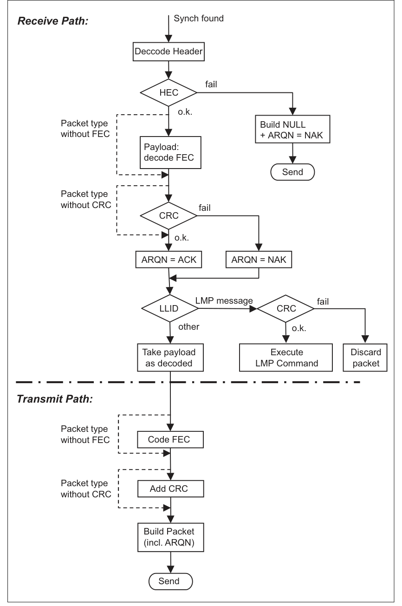

**Figure 1.6:  DUT Packet Handling in Loop Back Test**

The timing for normal and delayed loopback is illustrated in Figure 1.7 to Figure 1.9:

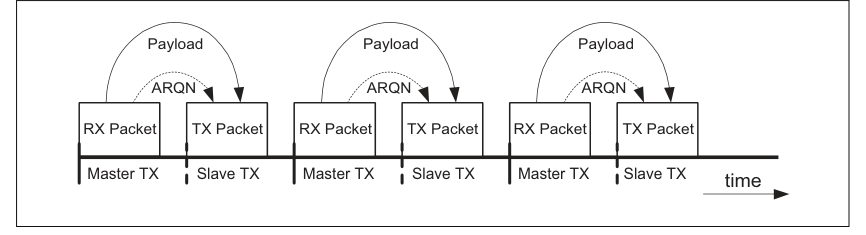

**Figure 1.7:  Payload & ARQN handling in normal loopback.**

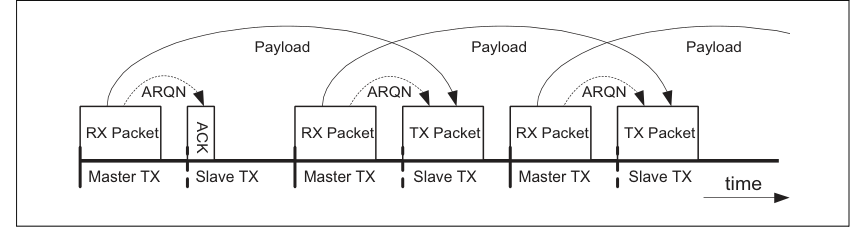

**Figure 1.8:  Payload & ARQN handling in delayed loopback - start.**

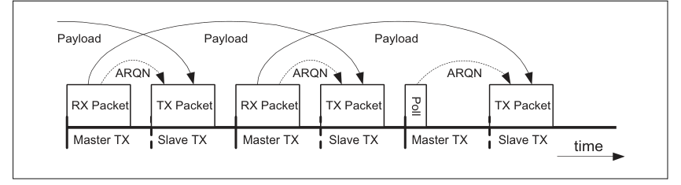

**Figure 1.9:  Payload & ARQN handling in delayed loopback - end.**

The whitening is performed in the same way as it is used in normal active mode.
The following parameters can be set to configure the loop back test:
1. Packet Class1
ACL Packets SCO Packets eSCO Packets ACL Packets without whitening
1. This is included because the packet type numbering is ambiguous.
SCO Packets without whitening eSCO Packets without whitening
2. Frequency Selection Single frequency (independent for RX and TX) Normal hopping
3. Power level: (To be used according radio specification requirements) power control or fixed TX power
The switch of the frequency setting is done exactly as for the transmitter test (see Section 1.1.2.5).

#### 1.1.4  Pause Test

Pause test is used by testers to put the device under test into Pause Test mode from either the loopback or transmitter test modes.
When an LMP_test_control PDU that specifies Pause Test is received the DUT shall stop the current test and enter Pause Test mode. In the case of a transmitter test this means that no more packets shall be transmitted. While in Pause Test mode the DUT shall respond normally to POLL packets (i.e. responds with a NULL packet). The DUT shall also respond normally to all the LMP packets that are allowed in test mode.
When the test scenario is set to Pause Test all the other fields in the LMP_test_control PDU shall be ignored. There shall be no change in hopping scheme or whitening as a result of a request to pause test.

### 1.2   AMP TEST SCENARIOS

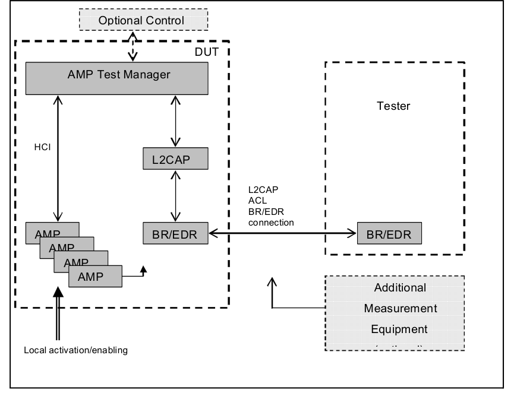

**Figure 1.10:  Test Architecture**

#### 1.2.1  Methodology Overview

To perform PHY tests on an AMP, the DUT shall first have AMP Test Mode enabled locally as required for a BR/EDR Controller using the HCI Enable_Device_Under_Test_Mode command. When this command is received by the AMP Controller it shall enable the AMP to accept HCI Test Commands and when received by the BR/EDR Controller it shall enable the AMP Test Manager to pass HCI commands and events between the tester and the AMP device utilizing the BR/EDR connection. A DUT AMP shall reject all AMP related HCI Test Commands, except HCI_Enable_Device_Under_Test_Mode, until the HCI_Enable_Device_Under_Test_Mode command has been issued by the local Host. Although AMP Test Mode is enabled the AMP shall not enter AMP Test Mode until the HCI_AMP_Test_Command is received.
Note: Enabling test mode with HCI_Enable_Device_Under_Test_Mode command allows the AMP to enter test mode when an HCI_AMP_Test_Command is received.
The local control of an AMP in AMP Test Mode shall be by the AMP Test Manager as shown in Figure 1.10. The AMP Test Manager will receive AMP Test Manager commands and HCI test commands via ACL data packets as
shown in Figure 1.10, using an L2CAP connectionless fixed test channel (channel 0x003F) from a Bluetooth test device. This does not exclude driving the AMP Test Manager directly from an implementation vendor specific interface as shown from the "Optional Control" in Figure 1.10.
The AMP Test Manager commands allow the tester to discover the number and type of AMPs supported and to read their PHY capability support via the AMP Test Manager.
The tester can use HCI commands and HCI Test Commands to control all of the AMPs to perform qualification, IOP testing as well as entering AMP Test Mode to perform AMP PHY tests. The HCI events and responses shall be routed back to the tester via the fixed test channel (0x003F).
If an HCI command is sent to an invalid Controller ID (a Controller not reported in the Discovery Response) the AMP Command Rejected Event shall be returned with an Invalid Controller Id as the reason.
An AMP shall be taken out of AMP Test Mode by the HCI_Reset command. This will reset only the AMP receiving the HCI_Reset.
The AMP Test Manager shall not be enabled to support HCI commands over the fixed test channel (0x003F) unless AMP Test Mode has been enabled locally with the HCI_Enable_Device_Under_Test_Mode command.
The "Optional Control" interface shown in Figure 1.10 is a vendor specific interface that allows local control of the AMP Test Manager when a BR/EDR link is not available.

##### 1.2.1.1  Initiation Example Description

The AMP Test Manager is enabled to receive AMP test commands and HCI commands over the fixed test channel once it has been locally enabled. Using the fixed test channel, the tester shall use the AMP test commands and events to identify the number and type of AMPs available.
When the AMP Test Manager has been enabled and the AMPs identified the Tester shall use the AMP Test Manager to
• Transfer HCI commands and Events to and from the AMPs for qualification and IOP testing.
• Put the AMPs into test mode using HCI AMP test commands and events for AMP PHY testing.

#### 1.2.2  Control and Configuration

Control and configuration of AMP tests shall be performed using two groups of commands/events over the ACL BR/EDR connection on the fixed test channel. The two groups are the AMP Test Manager commands/events which are to the AMP Test Manager and the HCI AMP test commands/events which are routed via the AMP Test Manager between the AMP indicated as part of the message structure and the tester.

| AMP Test Manager com- mands and events | AMP Command Rejected Event |
| --- | --- |
|  | AMP Discover Request Command |
|  | AMP Discover Response Event |
|  | AMP Read PHY Capability Bit Map Request |
|  | AMP Read PHY Capability Bit Map Response Event |
| HCI AMP test commands and events | Read Loopback Mode Command |
|  | Write Loopback Mode Command |
|  | Enable AMP Receiver Reports Command |
|  | AMP Test End Command |
|  | AMP Test Command |
|  | AMP Start Test Event |
|  | AMP Test End Event |
|  | AMP Receiver Report Event |

#### 1.2.3  AMP Test Manager

The AMP Test Manager provides the interface to the AMPs available so that qualification, IOP and PHY testing can be performed using the BR/EDR connection. The AMP Test Manager provides the following services:
1. Identification of the number and type of AMPs available
2. Enumeration of the available AMPs so that they can be communicated to individually 3. Routing of the HCI commands and events between the AMPs and the tester over the ACL BR/EDR connection on the fixed test channel, or the vendor specific interface (that is, a local interface to the AMP Test Manager other than the BR/EDR radio).

#### 1.2.4  Test Commands/Events Format

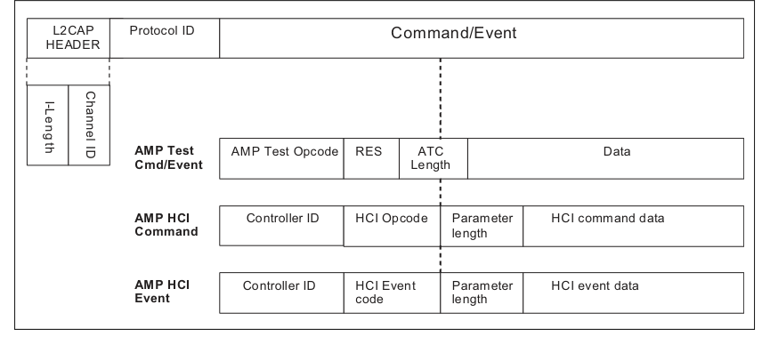

**Figure 1.11:  L2CAP test command/event formats**

The fields shown are:
• L2CAP header (4 octets) This is the Basic L2CAP header with the Channel ID always set to test channel (0x003F). (See section [Vol 3] Part A, Section 3.1) Length (2 octets) Length of the Information payload which includes the Protocol ID and the Command/Event
Channel ID (2 octets) Fixed value of (0x003F)
• Protocol ID (1 octet) This identifies the protocol in the command/event data. The IDs used are an extension of the UART transport packet types.

| Protocol ID | Command/event type |
| --- | --- |
| 0x01 | HCI Command |
| 0x02 | Reserved for future use |
| 0x03 | Reserved for future use |
| 0x04 | HCI Event |
| 0x05 | AMP Test Command |
| 0x06 | AMP Test Event |
| Other | Reserved for future use |

Table 1.1:  L2CAP valid test protocol IDs
• Controller ID (1 octet) Each Controller in a device is assigned a one-octet unique identifier by the local AMP Test Manager. This field determines the destination of the HCI Command or the source of the HCI Event. The Controller ID values shall be in the range of 1 to 255. Controller ID 0 has been reserved for the primary BR/EDR Controller. Note: "Controller" is a generic term which covers both the primary BR/EDR Controller and any AMPs
• ATO (AMP Test Opcode) (1 octet) This is the AMP Test Manager commands or event code as described in Section 1.2.5.
• RFU (1 octet)
• AMP Test Command (ATC) Length (2 octets) This is the number of octets in the data portion of this message
• AMP HCI Commands and Events The format of these packets follow the standard HCI format described in [Vol 2] Part E, after the Controller ID.
Examples

|  | Protocol ID | Command/Event |  |  |  |
| --- | --- | --- | --- | --- | --- |
| AMP Test command | 0x05 | AMP Test Opcode | 0x00 | Length | AMP Test Com- mand |
| AMP Test Event | 0x06 | AMP Test Opcode | 0x00 | Length | AMP Test Event |
| AMP HCI Command | 0x01 | Control- ler ID | HCI Command |  |  |
| AMP HCI Event | 0x04 | Control- ler ID | HCI Event |  |  |

#### 1.2.5  AMP Test Manager Commands/Events

The AMP Test Manager commands are sent to the AMP Test Manager from the tester and the events are from the AMP Test Manager to the tester.
The data fields are:
• AMP Test Opcode (1 octet) Identifies the type of AMP Test Manager command/event.
• RFU (1 octet)
• Amp Test Command (ATC) length (2 octets) Length of the data field of the command/event. This length does not include the AMP Test Opcode, RFU octet or the ATC length.

| AMP Test Opcode | Description |
| --- | --- |
| 0x00 | Reserved for future use |
| 0x01 | AMP Command Rejected Event |
| 0x02 | AMP Discover Request |
| 0x03 | AMP Discover Response Event |
| 0x04 | AMP Read PHY Capability Bit Map Com- mand |
| 0x05 | AMP Read PHY Capability Bit Map Response Event |
| Other | Reserved for future use |

Table 1.2:  AMP Test Opcodes

##### 1.2.5.1  AMP Command Rejected Event

This event shall be sent by the DUT to the tester when a command cannot be accepted. The parameter returned indicates the reason.
Opcode = 0x01 ATC length = 2 RFU = 0 Reason
The data fields are:
• AMP Test Opcode (1 octet) 0x01
• RFU (1 octet)
• ATC length (2 octets) Always set to 0x0002
• Reason (2 octets) See Table 1.3.

| Reason Value | Description |
| --- | --- |
| 0x0000 | Command not recognized |
| 0x0001 | Invalid Controller ID |
| 0x0002 | Invalid Protocol ID |
| Other | Reserved for future use |

Table 1.3:  AMP Command reasons for rejection

##### 1.2.5.2  AMP Discover Request

The tester shall send this command to the AMP Test Manager to obtain the available Controllers and their types.
Opcode = 0x02 ATC length = 0 RFU = 0
The data fields are:
• AMP Test Opcode (1 octet) Shall be set to 0x02
• RFU (1 octet)
• ATC length (2 octet) Shall be set to 0x0000
Events generated
On receipt of the AMP_Discover_Request command the AMP Test Manager shall return the AMP_Discover_Response event.

##### 1.2.5.3  AMP Discover Response Event

When the AMP Test Manager receives an AMP_Discover_Request command it shall reply to the tester with an AMP_Discover_Response event indicating for each Controller the Controller ID and Controller Type. The first Controller ID and Type pair in the response shall be 0 for the BR/EDR primary Controller followed by the available additional Controllers ID and Type pairs.

| Opcode = 0x03 | RFU = 0 | ATC length | Controller list |  |
| --- | --- | --- | --- | --- |
| Controller list |  |  |  |  |
| Controller ID=0 | Controller Type=0 | Additional Contr | oller ID and Type pairs |  |

• AMP Test Opcode (1 octet) Shall be set to 0x03
• RFU (1 octet)
• ATC length (2 octets) ATClength = (Controller ID length + Controller Type length) * number of Controllers
• Controller Types (1 octet) Each type of Controller is assigned a unique one-octet value. These values are defined in Assigned Numbers. A device may have multiple AMPs of the same type.
Note: The AMP Discovery Response shall include the primary BR/EDR Controller as the first Controller ID and Controller Type pair.

##### 1.2.5.4  AMP Read PHY Capability Bit Map Command

To perform AMP PHY tests the tester needs to know the supported PHY capabilities of the DUT. This information shall be provided in the PHY Capability Bit Map. This command shall be sent from the tester to the DUT to request the PHY Capability Bit Map from an AMP with the passed Controller ID.
Opcode = 0x04 ATC length = 1 RFU = 0 Controller ID
The data fields are:
• AMP Test Opcode (1 octet) Always set to 0x04
• RFU (1 octet)
• ATC length (2 octets) Always set to 0x0001
• Controller ID (1 octet) The Controller from which the PHY Capability Bit Map is being requested. This is an invalid request from a BR/EDR Controller and will be rejected with the reason of Invalid Controller ID.

##### 1.2.5.5  AMP Read PHY Capability Bit Map Response Event

When the AMP_Read_PHY_Capability_Bit_Map Command is received by an AMP Test Manager it shall reply with the capability bit map for the AMP indicated if the Controller ID is valid.
• AMP Test Opcode (1 octet) Always set to 0x05
• RFU (1 octet)
• ATC length (2 octets)
The length of the PHY Capabilities Bit Map returned depending on the AMP type.
• Status (1 octet) See Table 1.4.

| Reason Value | Description |
| --- | --- |
| 0x00 | Success |
| 0x01 | Invalid Controller ID |
| Other | Reserved for future use |

Table 1.4:  AMP Read PHY Capability Bit Map status values
Note: If the status is not Success the remaining parameters shall be zero.
• Controller ID (1 octet) This is the Controller ID from which the PHY Capability Bit Map has been sent.
• PHY Capabilities Bit Map See Volume 5 for the PHY Capabilities Bit Map.
Opcode = 0x05 ATC length RFU = 0 Status Controller ID PHY Capabilities Bit Map

### 1.3   REFERENCES

[1] Bluetooth Link Manager Protocol.
[2] CCITT Recommendation O.153 (1992), Basic parameters for the measurement of error performance at bit rates below the primary rate.
[3] ITU-T Recommendation O.150 (1996), General requirements for instrumentation for performance measurements on digital transmission equipment.
[4] Bluetooth Baseband Specification.

## 2  TEST CONTROL INTERFACE (TCI)

This section describes the Bluetooth Test Control Interface (TCI). The TCI provides a uniform method of accessing the upper interface of the implementation being tested. This facilitates the use of a standardized interface on test equipment used for formal Qualification of implementations.

### 2.1   INTRODUCTION

#### 2.1.1  Terms Used

| Conformance testing | Testing according to the applicable procedures given in the Bluetooth Protocol Test Specifications and the Blue- tooth Profile Conformance Test Specification when teste against a test system. |
| --- | --- |
| HCI | Host Controller Interface |
| IUT | Implementation Under Test: An implementation of one or more Bluetooth protocols and profiles which is to be stud ied by testing. This term is used when describing the tes concept for products and components equipped with Blu tooth wireless technology as defined in the PRD. |
| PRD | Bluetooth Qualification Program Reference Document: This document is maintained by the Bluetooth Qualifica- tion Review Board and is the reference to specify the fun tions, organization and processes inside the Bluetooth Qualification program. |
| TCI | Test Control Interface: The interface and protocol used b the test equipment to send and receive messages to an from the upper interface of the IUT. |

#### 2.1.2  Usage of the Interface

For all products and components equipped with Bluetooth wireless technology, conformance testing is used to verify the implemented functionality in the lower layers. Conformance testing of the lowest layers requires an upper tester to test the implementation sufficiently well.
In order to avoid that the tester will have to adapt to each and every product and component equipped with Bluetooth wireless technology, the use of the standardized TCI is mandated. This concept puts some burden upon the manufacturer of the IUT in terms of supplying an adapter providing the necessary conversion from/to the IUT’s specific interface to the TCI. The adapter can consist of hardware, firmware and software. After qualification testing has been performed the TCI may be removed from the product or component equipped with Bluetooth wireless technology. It is the
manufacturer’s option to remove it from the qualified product or component equipped with Bluetooth wireless technology.
The TCI is used when qualifying the implemented functionality of the:
• Baseband layer, BB
• Link Manager layer, LM
If support of the Host Controller Interface is claimed by the manufacturer the TCI is used to qualify it.

### 2.2   TCI CONFIGURATIONS

This section describes the test configurations used when verifying the different Bluetooth requirements. Each layer in the Bluetooth stack is qualified using the procedures described in the layer specific test specification.

#### 2.2.1  Bluetooth RF Requirements

For qualification of the Bluetooth Radio Frequency requirements the defined Test Mode is used, see Section 1.
Similar to TCI, the specific test mode functionality may be removed from the product or component after qualification, at the discretion of the manufacturer.

##### 2.2.1.1  Required interfaces

For RF qualification only the air interface is required, see Figure 2.1. Depending on the physical design of the IUT it might be necessary to temporarily attach an RF connector for executing the RF tests. As stated in Section 1, the Test Mode shall be locally enabled on the IUT for security reasons. The implementation of this local enabling is not subject to standardization.

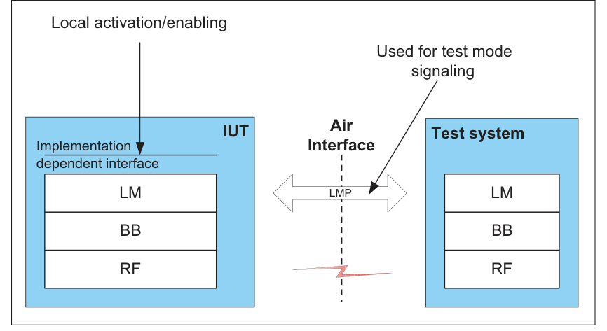

**Figure 2.1:  General test set-up for RF qualification**

#### 2.2.2  Bluetooth Protocol Requirements

Depending on which of the Bluetooth layers BB, LM or HCI are implemented in the product subject to qualification, the amount of testing needed to verify the Bluetooth protocol requirements differs. Also, the TCI used during the qualification is slightly different. The commands and events necessary for qualification are detailed in the test specifications and only those commands indicated in the test cases to be executed need be implemented.
For other protocols in the Bluetooth stack the TCI is not used. An implementation specific user interface is used to interact with the IUT’s upper interface.

##### 2.2.2.1  Required interfaces

For BB, LM and HCI qualification both the air interface of the IUT and the TCI are required. For other protocols both the air interface and the user interface are used as described in the test specification.

#### 2.2.3  Bluetooth Profile Requirements

For each Bluetooth profile for which conformance is claimed, profile qualification testing is performed to verify the Bluetooth profile requirements. With higher layer protocols the TCI is not used during testing. A user interface specific to the implementation is used to interact with the IUT’s upper interface.

##### 2.2.3.1  Required interfaces

For this type of qualification both the air interface and the user interface of the IUT are used as described in the test specification.

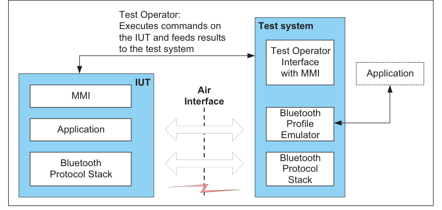

**Figure 2.2:  General test set-up for profile qualification**

### 2.3   TCI CONFIGURATION AND USAGE

This interface is semantically and syntactically identical to the HCI interface described in Section Part E:. The complete HCI interface is not required in the TCI, but the subset of HCI commands and events necessary for verifying the functionality of the IUT. The exact set of commands and events is specified in the test specifications for the layers subject to testing.
It is worth emphasizing again the TCI is an adapter, logically attached to the upper interface of the IUT. As such the TCI adapts the standardized signaling described here to the implementation specific interface of the IUT.

#### 2.3.1  Transport Layers

The method used to convey commands and events between the tester and the IUT’s upper interface can be either physical bearer or “software bearer”.

##### 2.3.1.1  Physical bearer

It is recommended to use one of the transport layers specified for the HCI in Volume 4, Host Controller Interface [Transport Layer]. However, other physical bearers are not excluded and may be provided on test equipment. The use of a physical bearer is required for test cases active in category A. Please see the PRD for the definitions of test case categories. Please see the current active Test Case Reference List for the categorization of specific test cases.

##### 2.3.1.2  Software bearer

There is no physical connection between the tester and the IUT’s upper interface. In this case, the manufacturer of the IUT shall supply test software and hardware that can be operated by a test operator. The operator will receive instructions from the tester and will execute them on the IUT. The “software bearer” shall support the same functionality as if using the TCI with a physical bearer. Use of the “software bearer” shall be agreed upon between the manufacturer of the IUT and the test facility that performs the qualification tests. The test facilities can themselves specify requirements placed on such a “software bearer”. Furthermore, the use of a “software bearer” is restricted to test cases active in one of the three lower categories B, C and D.

#### 2.3.2  Baseband and Link Manager Qualification

For the qualification of the link control part of the Baseband layer and for the Link Manager layer, the TCI is used as the interface between the test system and the upper interface of the IUT. The test system accesses the upper interface of the IUT by sending HCI commands and receiving HCI events from the IUT as described in the HCI specification. The required functionality on the TCI depends on the IUT’s implemented functionality of the BB and LM layers, and therefore which test cases are executed.
A schematic example in Figure 2.3 shows the test configuration for BB and LM qualification of Bluetooth products which do not support HCI, and use a physical bearer for the TCI. In this example the Test Control (TC) Software represents what the manufacturer has to supply with the IUT when using an external test facility for qualification. The function of the TC Software is to adapt the implementation dependent interface to the TCI.

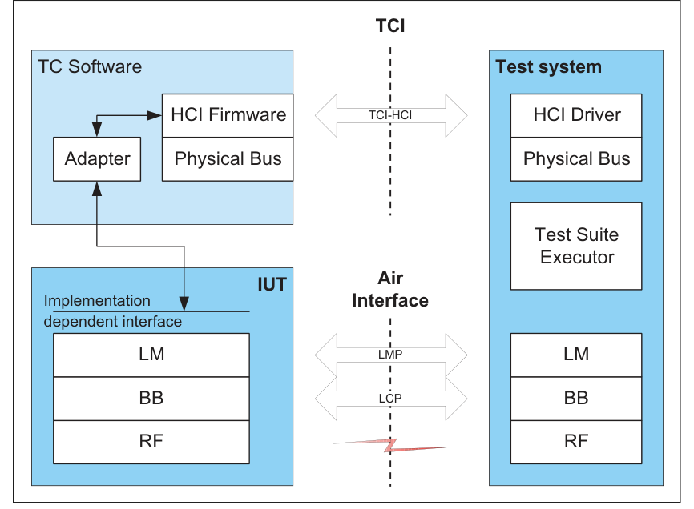

**Figure 2.3:  BB and LM qualification with TCI physical bearer**

Figure 2.4 shows a schematic example of the test configuration for the same Bluetooth product using a “software bearer” for the TCI. Here the function of the Test Control Software is to represent the application that can be controlled by the test operator.

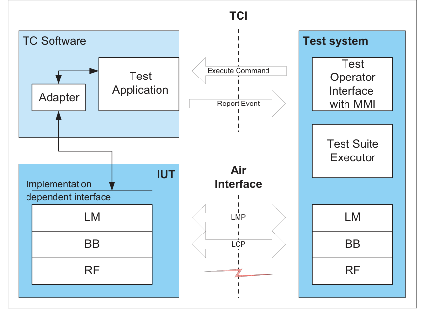

**Figure 2.4:  BB and LM qualification with “software bearer”**

#### 2.3.3  HCI Qualification

The TCI may also be used for HCI signaling verification and qualification. The HCI signaling is only verified if support of the HCI functionality is claimed by the manufacturer.
A schematic example in Figure 2.5 shows the test configuration for HCI qualification of Bluetooth products. As can be seen in the figure the implemented HCI is used as the interface to the tester.

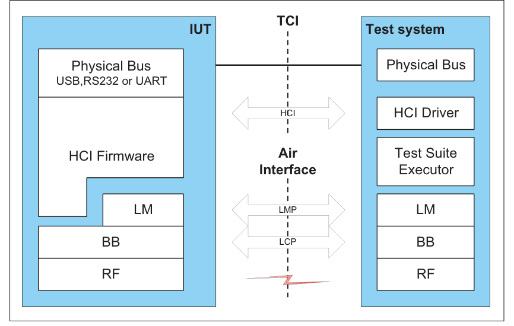

**Figure 2.5:  General test set-up for HCI qualification**

Core System Package [Host volume]
Part E
PART E: AMP MANAGER PROTOCOL SPECIFICATION
This document specifies the changes to the Core specification required to incorporate the AMP Manager Protocol (A2MP) for the Alternate MAC/PHY feature.
CONTENTS

## 1  INTRODUCTION

### 1.1   GENERAL DESCRIPTION

The AMP Manager Protocol (A2MP) provides a means for one device to solicit information regarding AMP capabilities from another device. Each device contains an abstract entity called an AMP Manager which uses the AMP Manager Protocol to communicate with a peer AMP Manager on another device.

## 2  GENERAL OPERATION

### 2.1   BASIC CAPABILITIES

The AMP Manager entity has the following responsibilities and capabilities:
1. Ability to discover remote AMP Managers
2. Ability to discover available Controllers
3. Ability to query remote AMP Controller information
4. Ability to manage AMP physical links
5. Responsible for the creation of dedicated AMP keys
The AMP Manager communicates with the local AMP PAL and communicates with remote AMP Managers using the AMP Manager Protocol over a fixed L2CAP channel. The AMP Manager entity exists within the Bluetooth stack as depicted in Figure 2.1.

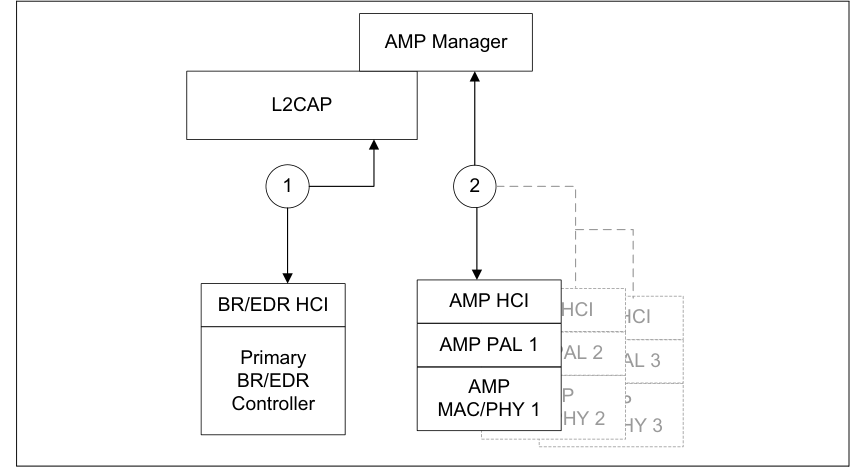

**Figure 2.1:  Overview of the Lower Software Layers**

Figure 2.1 shows the two basic communication paths for the AMP Manager. The AMP Manager uses path 1 via L2CAP and the Primary BR/EDR Controller to first discover remote AMP Managers. The AMP Manager can query for the possibility of available remote AMPs and their capabilities as well as other information. The AMP Managers communicate over the AMP Manager Protocol Channel (A2MP Channel). See Section 2.2 for more information on the A2MP Channel.
After discovering the AMPs supported by the remote device, the AMP Manager uses communication path 2 to manage the physical links between its local AMP(s) and AMPs on remote devices. Note that there can be more than one local AMP and there also may be more than one AMP located on the remote device.

**Figure 2.2:  AMP Manager Peers**

The AMP Manager Protocol is a request / response protocol between two AMP Managers. Requests and responses go in both directions. Either peer can request the same category of information from its corresponding peer.

### 2.2   AMP MANAGER CHANNEL OVER L2CAP

Peer AMP Managers communicate over the A2MP Channel which is an L2CAP fixed channel. The configuration parameters for the AMP Manager channel shall be as shown below. The MTU value shall be any valid value greater than or equal to 670 bytes.

| Parameter | Value |
| --- | --- |
| MTU | ≥ 670 |
| Flush Timeout | 0xFFFF (Infinite) |
| QoS | Best Effort |
| Mode | Enhanced Retransmission Mode |
| FCS Option | 16-bit FCS |

Table 2.1:  AMP Manager Channel configuration parameters
The parameters for the Enhanced Retransmission Mode used on the fixed channel shall be as shown below. The Retransmission Time-out, Monitor Time- out and MPS shall be any valid value that is greater than or equal to the values stated in the following tables.

| Parameter | Value |
| --- | --- |
| TxWindow size | 1 |
| Max Transmit | 0xff |
| Retransmission time-out | ≥ 2 seconds |
| Monitor time-out | ≥ 12 seconds |

Table 2.2:  AMP Manager Channel Enhanced Retransmission Mode parameters

| Parameter | Value |
| --- | --- |
| Maximum PDU size (MPS) | ≥ 670 |
| 16-bit FCS | Enabled |

Table 2.2:  AMP Manager Channel Enhanced Retransmission Mode parameters
The minimum value for both MTU and MPS is 670 bytes. A larger MTU and MPS size can be communicated using the AMP Discover request (see section 3.3) and AMP Discover response (see Section 3.4) packets. The MTU parameter and the Enhanced Retransmission mode MPS parameter are numerically equal to allow an AMP manager to send any A2MP packet using a single L2CAP PDU. A device may segment any A2MP packet into multiple L2CAP PDUs.

### 2.3   USING THE AMP MANAGER PROTOCOL

The following text describes how the AMP Manager Protocol is used to establish an AMP physical link between two devices.

#### 2.3.1  Discovering a Remote AMP Manager

Once an ACL connection is established over the Primary BR/EDR Controller, the local AMP Manager shall examine the L2CAP extended features bits of the remote device to determine if L2CAP fixed channels are supported (see [Vol 3] Part A, Section 4.12). If so, a query for the existence of its peer (AMP Manager) may be made by issuing an Information Request for all available fixed channels.

#### 2.3.2  Discovering Available Controllers on a Remote Device

The next step is to discover the existence and capabilities of the AMP Controllers of the peer. An AMP Discover Request packet can be issued over the AMP Manager Protocol channel for this purpose.
In an AMP Discover Response packet, the peer AMP Manager will return information about its local AMP capabilities in the form of a Controller List. A Controller List is a sequence of Controller ID/Controller Type/Controller Status triples identifying the Controllers that are available for communication.
The Controller List contains a basic top level description of the available peer Controllers and their status. The AMP Manager parses this list for physical radio compatibility. If more information is required about a remote AMP Controller, the local AMP Manager can subsequently issue an AMP Get Info Request packet using the Controller ID retrieved via the AMP Discover exchange. An AMP Get Info Response packet is returned from the peer with AMP Controller Info for the specified AMP Controller. The AMP Controller Info contains information about the AMP Controller that can be used by the Host to determine whether or not to create a physical link to the AMP Controller.

#### 2.3.3  Creation of AMP Physical Links

Once it has been determined that a Bluetooth connection over an AMP is desired, the AMP Manager retrieves the remote AMP Controller's AMP_Assoc structure by issuing an AMP Get AMP Assoc Request packet. It then passes the AMP_Assoc structure received from the remote device to its local AMP PAL and signals it to begin the physical discovery and connection process. In devices that support HCI this is done via the HCI_Create_Physical_Link command followed by the HCI_Write_Remote_AMP_ASSOC command.
Note that the AMP Manager only holds the contents of the AMP_Assoc structure for use in AMP Manager operations. The AMP Manager does not directly attempt to interpret the contents of the AMP_Assoc structure.
The AMP manager is responsible for generating the Physical Link Handle used in the HCI_Create_Physical_Link and HCI_Accept_Physical_Link commands. See section [Vol 2] Part E, Section 5.3.2 for details. When the AMP PAL is ready it will generate an HCI_Channel_Selected event which is a signal to read the local AMP_Assoc structure using the HCI_Read_Local_AMP_ASSOC command.
The AMP Manager shall not create or accept a physical link over an AMP if mutual authentication was not performed or encryption was not enabled over BR/EDR.
When the AMP Manager does not have a dedicated AMP key for the selected Controller type between the two devices and the BR/EDR link key type is not "Debug", the AMP Manager shall call the Secure Simple Pairing h2 function (see [Vol 2] Part H, Section 7.7.5.2) to generate a dedicated AMP key. This dedicated AMP key shall be used during subsequent connections.
If the Bluetooth device supports more than one AMP type, the AMP Manager shall call the h2 function a second time to regenerate Key_GAMP as defined in [Vol 2] Part H, Section 7.7.5.3 before generating a Dedicated AMP link key for a different AMP type.
When the BR/EDR link key type is set to "Debug", the AMP Manager shall use Key_GAMP directly as the key for the AMP regardless of the AMP Type. The key length, key type and the link key itself are passed to the AMP Controller in the HCI_Create_Physical_Link command.
After receiving the HCI_Channel_Selected event and reading the local AMP_Assoc structure the AMP Manager then issues an AMP Create Physical Link Request packet to send the local AMP_Assoc structure to the peer device in order to engage the peer device in the AMP physical link creation.
If the peer accepts the request it issues an HCI_Accept_Physical_Link command to its local AMP and passes the AMP_Assoc structure received in the AMP Create Physical Link Request packet to its local AMP Controller. The
peer responds with an AMP Create Physical Link Response packet to either accept or reject the request to create a physical link.
Both Hosts will receive an HCI_Physical_Link_Complete event indicating the completion of the physical link creation.
On success, the procedure for creation of a logical connection can then commence.

### 2.4   CONTROLLER IDS

Each Controller in a device is assigned a one-octet unique identifier by the local AMP Manager. From the perspective of a remote device, Controller IDs are only valid during the life time of the AMP Manager Protocol channel. The Controller IDs on a remote device become invalid when the A2MP Channel is disconnected. If a local Controller becomes unavailable during the life time of the A2MP channel, the Controller ID may be reclaimed after receiving the AMP Change Response to the AMP Change Notify packets sent to all affected remote AMP Managers. It can then be assigned to any new AMP that is added. The value 0 is reserved for the Primary BR/EDR Controller. Other Controllers in the device shall be assigned values from 1 to 255.
If an AMP Controller becomes unavailable and later becomes available again during the life time of the A2MP Channel, remote AMP Managers shall not assume that the AMP Controller will be assigned the Controller ID that it was previously assigned.

### 2.5   CONTROLLER TYPES

Each type of Controller is assigned a unique one-octet value. These values are defined in Assigned Numbers. A device may have multiple AMPs of the same type.

## 3  PROTOCOL DESCRIPTION

The AMP Manager Protocol defines the procedures and format of the packets used to exchange information between two peer AMP Managers.

### 3.1   PACKET FORMATS

This section describes the packets used in the AMP Manager Protocol. Unless otherwise stated an implementation shall include all specified fields in a packet.
Figure 3.1 displays the general format of all AMP Manager Protocol packets.

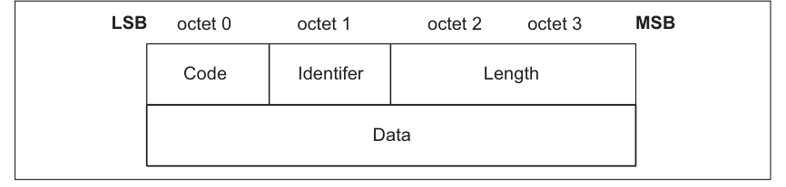

**Figure 3.1:  AMP Manager Protocol Packet Format**

The fields shown are:
• Code (1 octet) The code identifies the type of packet. When an AMP manager receives a packet with an unknown Code field it shall send a Command Reject packet in response. Table 3.1 lists the codes defined by this document. All codes are specified with the most significant bit in the left most position.

| Code | Description |
| --- | --- |
| 0x00 | Reserved for future use |
| 0x01 | AMP Command Reject |
| 0x02 | AMP Discover request |
| 0x03 | AMP Discover response |
| 0x04 | AMP Change notify |
| 0x05 | AMP Change response |
| 0x06 | AMP Get Info request |
| 0x07 | AMP Get Info response |
| 0x08 | AMP Get AMP Assoc request |
| 0x09 | AMP Get AMP Assoc response |

Table 3.1:  Codes

| Code | Description |
| --- | --- |
| 0x0A | AMP Create Physical Link request |
| 0x0B | AMP Create Physical Link response |
| 0x0C | AMP Disconnect Physical Link request |
| 0x0D | AMP Disconnect Physical Link response |
| 0x0E - 0xFF | Reserved for future use |

Table 3.1:  Codes
• Identifier (1 octet) The Identifier field matches responses with requests. The requesting device sets this field and the responding devices uses the same value in the response. For each A2MP channel an AMP manger shall use different identifiers for each request sent (this includes the AMP Change Notify command). Following the original transmission of an identifier in a request, the identifier may be recycled if all other identifiers have subsequently been used.
A response packet with an invalid identifier is discarded. Identifier 0x00 is an illegal identifier and shall never be used in any packet. Table 3.2 shows the valid values for the Identifier field,

| Value | Description |
| --- | --- |
| 0x00 | Invalid |
| 0x01 - 0xFF | Valid |

Table 3.2:  Identifier
• Length (2 octets) The Length field indicates the size in octets of the data field of the packet only, i.e. it does not cover the Code, Identifier and Length fields.
• Data (0 or more octets) The Data field is variable in length. The Code field determines the format of the Data field. The Length field determines the length of the Data field.

### 3.2   AMP COMMAND REJECT (CODE 0x01)

An AMP Manager shall send an AMP Command Reject packet in response to a request packet with an unknown code or when sending the corresponding response is inappropriate. The identifier shall match the identifier of the request packet being rejected. AMP Command Reject packets shall not be sent in response to an unknown response packet.

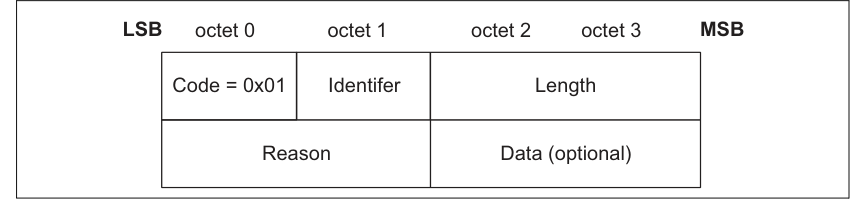

**Figure 3.2:  AMP Command Reject Packet**

The data fields are
• Reason (2 octets) The Reason field describes why the request packet was rejected, and is set to one of the following Reason codes.

| Reason value | Description |
| --- | --- |
| 0x0000 | Command not recognized |
| Other | Reserved for future use |

Table 3.3:  AMP Command Reject reasons
• Data (0 or more octets) The length and content of the Data field depends on the Reason code. If the reason code is 0x0000 "Command not recognized" no Data field is used.

### 3.3   AMP DISCOVER REQUEST (CODE 0x02)

An AMP Manager sends an AMP Discover Request packet to a peer AMP Manager to obtain the list of the available Controllers supported by the peer device.

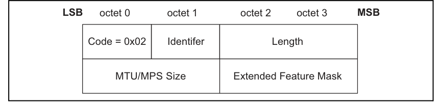

**Figure 3.3:  AMP Discover Request Packet**

The data fields are
• MTU/MPS size (2 octets) The MTU/MPS Size field in the AMP Discover Request packet indicates the MTU/MPS that the sender of the request can receive on the AMP Manager Protocol Channel. The minimum value is 670 (see Section 2.2). An AMP manager shall send the same value for the AMP Manager Protocol Channel MTU/MPS in both AMP Discover Request and AMP Discover Response packets.
• Extended Feature Mask (2 octets) The extended features supported by the AMP Manager are represented by a bit mask. Each feature is represented by a single bit which shall be set to 1 if the feature is supported and set to 0 otherwise. The feature mask is defined in Table 3.4.

| Supported Feature | Octet | Bit |
| --- | --- | --- |
| Reserved for future use | 0 | 0-7 |
| Reserved for future use | 1 | 0-6 |
| Extension Bit | 1 | 7 |

Table 3.4:  A2MP Extended Feature Mask
Bit 7 of Octet 1 of this field is used to extend the A2MP Extended Feature Mask. If the Extension Bit is set then the Extended Feature Mask field is extended by two octets. Each two octet extension includes an Extension Bit that allows a further two octets to be added to the field. Figure 3.4 shows how the Extension Bit (E) can be used to extend the A2MP Extended Feature Mask.

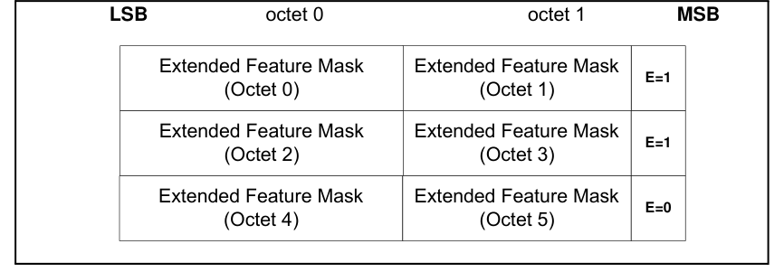

**Figure 3.4:  Example A2MP Extended Feature Mask**

### 3.4   AMP DISCOVER RESPONSE (CODE 0x03)

When an AMP Manager receives an AMP Discover Request packet it shall reply with an AMP Discover Response packet indicating the IDs, types and status of the Controllers that are currently available on the local device. If there is a change in the number or status of supported Controllers after sending an AMP Discover Response packet and before the A2MP Channel is disconnected, the AMP Manager shall send an AMP Change Notify packet to the peer AMP Manager.

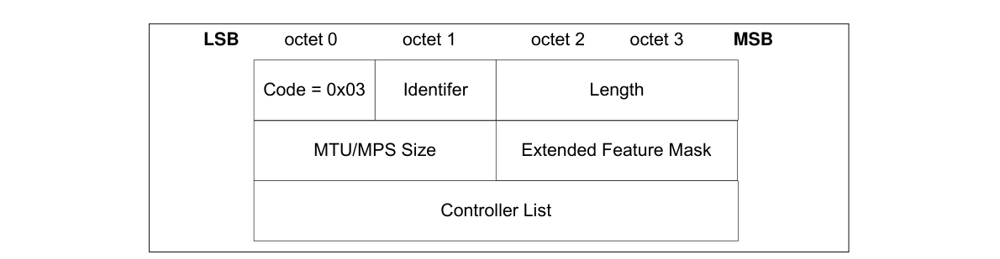

**Figure 3.5:  AMP Discover Response Packet**

The data fields are
• MTU/MPS size (2 octets) The MTU/MPS Size field in the AMP Discover Response packet indicates the MTU/MPS that the sender of the response can receive on the AMP Manager Protocol Channel. The minimum value is 670 (see Section 2.2). An AMP Manager shall send the same value for the AMP Manager Protocol Channel MTU/MPS supported in both AMP Discover Request and AMP Discover Response packets.
• Extended Feature Mask (2 octets) The extended features supported by the AMP Manager are represented by a bit mask. Each feature is represented by a single bit which shall be set to 1
if the feature is supported and set to 0 otherwise. All unknown or unassigned feature bits are reserved for future use. The feature mask is defined in Table 3.4 and Figure 3.4.
• Controller List (3 or more octets) Controller List is variable in length. It consists of 1 or more entries. Each entry is comprised of a Controller ID, a Controller Type and a Controller status. An entry for Controller ID 0x00 (Primary BR/EDR Controller) shall always be sent and shall be the first entry in the Controller List. The Controller Type for this entry shall be set to 0x00 (Primary BR/EDR Controller). The Controller status for this entry shall be set to 0x01 (The AMP Controller can only be used by Bluetooth technology). If the Primary BR/EDR Controller’s Link Manager does not support Secure Simple Pairing, it shall be the only Controller in the Controller List. Figure 3.6 displays the format of the Controller list.

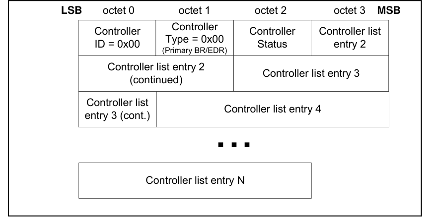

**Figure 3.6:  Controller list format**

• Controller ID (1 octet) The Controller ID uniquely identifies a Controller (see Section 2.4 for more information about Controller IDs).
• Controller Type (1 octet) The Controller Type specifies the type of the Controller. The Controller type values are defined in Assigned Numbers.
• Controller Status (1 octet) The Controller Status field indicates the current status of the AMP. The status information can be used by the receiving device to help decide if it should use the AMP. If multiple AMPs are available the status can also be used by an implementation to determine which would be the optimal AMP to
use. None of the AMP status values indicate that a Physical Link shall not be created to the AMP. If an implementation wishes to ensure it does not receive Create Physical Link Requests for a given AMP then it should remove the associated entry from the Controller list it sends.
Table 3.5 contains the different values of the Controller Status field.

| Value | Parameter Description |
| --- | --- |
| 0x00 | The Controller radio is available but is currently physically powered down. This value should be used if the AMP Controller is present and can be pow- ered up by the AMP Manager. A Controller List entry shall not exist for an AM that is not present or cannot be powered up by the AMP manager. This value indicates that there may be a cost of time and power to use this AMP Controller (i.e., the time taken and power required to power up the AM Controller). These costs are AMP type and AMP implementation dependent. |
| 0x01 | This value indicates that the AMP Controller is only used by the Bluetooth technology and will not be shared with other non-Bluetooth technologies. This value shall only be used if the AMP Controller is powered up. This value does not indicate how much bandwidth is currently free on the AM Controller. |
| 0x02 | The AMP Controller has no capacity available for Bluetooth operation. This value indicates that all of the AMP Controller's bandwidth is currently all cated to servicing a non Bluetooth technology. A device may create a Physical Link to an AMP Controller that has this statu This value shall only be used if the AMP Controller is powered up. |
| 0x03 | The AMP Controller has low capacity available for Bluetooth operation. This value indicates that the majority of the AMP Controller's bandwidth is cu rently allocated to servicing a non Bluetooth technology. An AMP Controller with capacity in the approximate range of 0 < capacity < 30% should indicate this value. This value does not indicate how much of the capacity available for Bluetoot operation is currently being used. This value shall only be used if the AMP Controller is powered up. |
| 0x04 | The AMP Controller has medium capacity available for Bluetooth operation. An AMP Controller with capacity in the approximate range of 30% < capacity 70% should indicate this value. This value does not indicate how much of the capacity available for Bluetoot operation is currently being used. This value shall only be used if the AMP Controller is powered up. |

Table 3.5:  Controller Status

| Value | Parameter Description |
| --- | --- |
| 0x05 | The AMP Controller has high capacity available for Bluetooth operation. This value indicates that the majority of the AMP Controller's bandwidth is cu rently allocated to servicing the Bluetooth technology. An AMP Controller with capacity in the approximate range of 70% < capacity 100% should indicate this value. This value does not indicate how much of the capacity available for Bluetoot operation is currently being used. This value shall only be used if the AMP Controller is powered up. |
| 0x06 | The AMP Controller has full capacity available for Bluetooth operation. This value indicates that while currently the AMP is only being used by Blue- tooth the device allows a different technology to share the radio. This value shall be used as the default Controller Status value for devices th are not capable of determining the available capacity for Bluetooth operation for an AMP Controller. This value does not indicate how much of the capacity available for Bluetoot operation is currently being used. This value shall only be used if the AMP Controller is powered up. |
| Other | Reserved for future use |

Table 3.5:  Controller Status
The available capacity ranges given for values 0x03, 0x04, and 0x05 are only approximate and permit an implementation to not send an AMP Change Notify packet if the current availability is moving frequently from one range to another (e.g., if the current availability is moving between 68% (corresponding to Controller status 0x04) and 72% (corresponding to Controller status 0x05) frequently an implementation is not mandated to send an AMP Change Notify packet every time the value crosses the approximate 70% threshold between the two Controller Status values).

### 3.5   AMP CHANGE NOTIFY (CODE 0x04)

The AMP Change Notify packet indicates to the peer device that something has changed in the list of supported Controllers. An AMP Change Notify packet shall only be sent to a remote AMP Manager if it has previously requested a Controller List via an AMP Discover Request. Examples of when an AMP Change Notify packet is sent is when a new Controller becomes available or one or several Controllers advertised in the previous AMP Discover Response or AMP Change Notify packet become unavailable or if the status of a previously advertised Controller changes. The AMP Change Notify carries the new list of the available Controllers. Based on the changes from the previous Change Notify or Discovery Response, the AMP Manager can identify added or deleted Controllers or Controllers that have changed status.

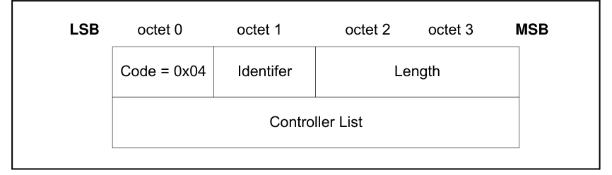

**Figure 3.7:  AMP Change Notify Packet**

• Controller List (3 or more octets) Controller List is variable in length. It consists of 1 or more entries. Each entry is comprised of a Controller ID, a Controller Type and a Controller status (see Section 3.4 for a description of Controller List).

### 3.6   AMP CHANGE RESPONSE (CODE 0x05)

The AMP Change Response packet shall be sent to acknowledge receipt of the AMP Change Notify packet.

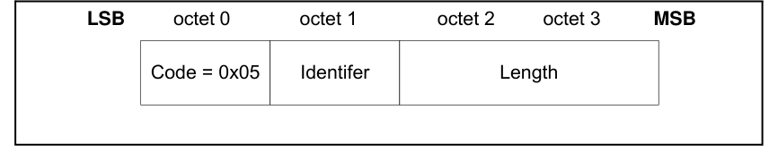

**Figure 3.8:  AMP Change Response Packet**

### 3.7   AMP GET INFO REQUEST (CODE 0x06)

To determine if a physical link should be established to a particular AMP Controller, an AMP Manager may need to obtain further information for a remote AMP Controller. For each Controller ID reported in the AMP Discover Response or AMP Change Notify packet the AMP Manager can query this information by issuing an AMP Get Info Request packet. The exception is Controller ID 0. Information for the Primary BR/EDR radio shall not be obtained with an AMP Get Info Request packet.

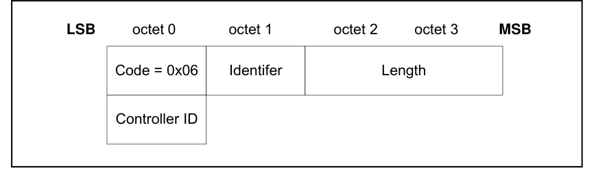

**Figure 3.9:  AMP Get Info Request Packet**

The data fields are
• Controller ID (1 octet) Controller ID is one of the IDs reported in the latest AMP Discover Response, or AMP Change Notify packet received from the peer AMP Manager.

### 3.8   AMP GET INFO RESPONSE (CODE 0x07)

When an AMP Manager receives an AMP Get Info Request packet it shall reply with the AMP Get Info Response packet. This packet carries Controller Information including bandwidth and latency capabilities. The receiver of the AMP Get Info Response packet can assume that the value of all fields shall remain constant while the remote AMP remains active.

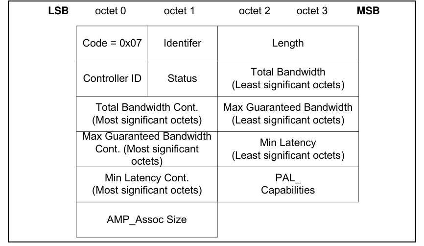

**Figure 3.10:  AMP Get Info Response Packet**

• Controller ID (1 octet) Controller ID is the identifier requested in the AMP Get Info Request.
• Status (1 octet) The Status field indicates the status of the request

| Status Code | Description |
| --- | --- |
| 0x00 | Success |
| 0x01 | Invalid Controller ID |
| Other | Reserved for future use |

Table 3.6:  AMP Get Info Response Status values
An AMP Get Info Response with status of Invalid Controller ID shall be sent by an AMP manager that has received an AMP Get Info Request containing either:
a) A Controller ID that has not been allocated by the AMP manager
b) A Controller ID of 0
If the Status field is set to Invalid Controller ID all subsequent fields in the AMP Get Info Response shall be ignored by the receiver.
• Total Bandwidth (4 octets) The Total Bandwidth field indicates the total data rate in kilobits per second (1000 b/s) that can be achieved by the Controller for applications. This value shall account for any bandwidth limitations of the Host and the HCI transport if present. The Host is responsible for determining these bandwidth limitations.
• Max Guaranteed Bandwidth (4 octets) The Maximum Guaranteed Bandwidth field indicates the maximum data rate in kilobits per second that the AMP can guarantee for a logical channel. Any request made by an application above this level will be rejected. This value shall account for any bandwidth limitations of the Host and the HCI transport if present. The Host is responsible for determining these bandwidth limitations.
• Min Latency (4 octets) The Min Latency field indicates the minimum latency in microseconds that the AMP can guarantee for a logical channel. This value shall account for any latency limitations of the Host and the HCI transport if present. The Host is responsible for determining these latency limitations.
• PAL_Capabilities (2 octets) The PAL_Capabilities field contains the PAL capabilities returned via HCI Read Local AMP Info Command (see [Vol 2] Part E, Section 7.5.8 for more information).
• AMP_Assoc Structure Size (2 octets) The maximum size in octets of the requested AMP's AMP_Assoc structure. The value of the AMP_Assoc Structure Size for a given AMP is determined by the Controller. If an HCI is being used this value can be retrieved by the Host sending the HCI_Read_Local_AMP_Info command to the Controller.

### 3.9   AMP GET AMP ASSOC REQUEST (CODE 0x08)

To establish a physical link to a particular Controller, an AMP Manager needs to obtain the AMP_Assoc structure for the remote Controller. The remote AMP is identified by its Controller ID as reported in the AMP Discover Response or AMP Change Notify packet. AMP Get AMP Assoc Request packet shall not be used to obtain an AMP_Assoc structure for the Primary BR/EDR Controller.

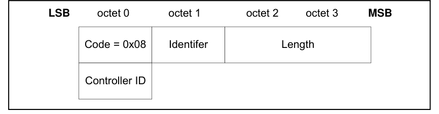

**Figure 3.11:  AMP Get AMP Assoc Request Packet**

The data fields are:
• Controller ID (1 octet) Controller ID is one of the IDs reported in the latest AMP Discover Response or AMP Change Notify packet received from the peer AMP Manager.

### 3.10   AMP GET AMP ASSOC RESPONSE (CODE 0x09)

When an AMP Manager receives an AMP Get AMP Assoc Request packet it shall reply with the AMP Get AMP Assoc Response packet. This packet carries the AMP_Assoc structure. The AMP_Assoc structure is used in creating the physical AMP link. The exact length and format of the AMP_Assoc structure shall be defined in each AMP PAL specification.

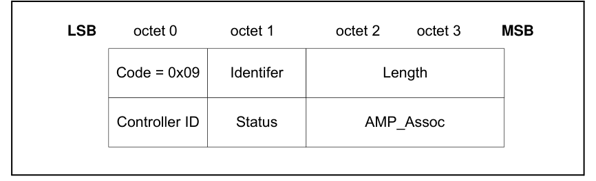

**Figure 3.12:  AMP Get AMP Assoc Response Packet**

The data fields are
• Controller ID (1 octet) Controller ID is the identifier requested in the AMP Get AMP Assoc Request packet.
• Status (1 octet) The Status field indicates the status of the request.

| Status Code | Description |
| --- | --- |
| 0x00 | Success |
| 0x01 | Invalid Controller ID |
| Other | Reserved for future use |

Table 3.7:  AMP Get AMP Assoc Response Status values
An AMP Get AMP Assoc Response packet with status of Invalid Controller ID shall be sent by an AMP manager that has received an AMP Get AMP Assoc Request packet containing either
a) A Controller ID that has not been allocated by the AMP manager
b) A Controller ID of 0
If the Status field is set to Invalid Controller ID (0x01) then the AMP_Assoc structure shall not be included in the Get AMPAssoc Response packet.
• AMP_Assoc structure (from 0 to (A2MP MTU - 6) octets) AMP_Assoc structure is variable in length. The Controller Type of the Controller ID referenced in the AMP Get AMP Assoc Request packet determines the format and the length of the AMP_Assoc structure. The length of the AMP_Assoc structure can be determined by subtracting two from the Length field. The length of the AMP_Assoc structure shall not exceed any previously communicated AMP_Assoc length (the AMP_Assoc length is included in the AMP Get Info Response packet. See Section 3.8).

### 3.11   AMP CREATE PHYSICAL LINK REQUEST (CODE 0x0A)

Establishing an AMP physical link requires signaling between the AMP Managers in order to turn the AMP Controller on, if it is not already turned on, and to provide information to set the required state of the AMP Controller, setup addressing, security, etc. When an AMP Manager receives an AMP Create Physical Link request packet it shall initiate its part of the AMP physical link creation and send the AMP Create Physical Link Response packet. AMP Create Physical Link request shall not be used to establish a physical link to the Primary BR/EDR Controller.
For some AMP Controllers it may be required to send additional information to the peer AMP Manager. This information is packaged in a variable size
AMP_Assoc structure. The exact length and format of the AMP_Assoc structure shall be defined in each AMP PAL specification.

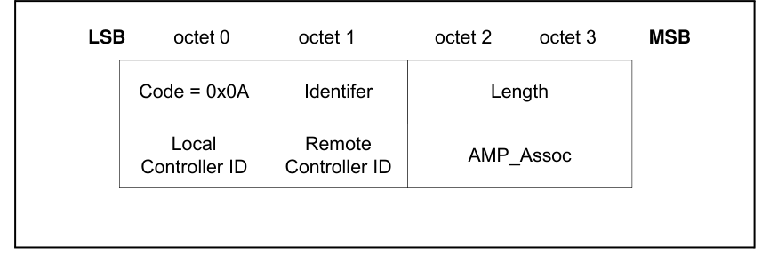

**Figure 3.13:  AMP Create Physical Link Request Packet**

• Local Controller ID (1 octet) Local Controller ID is the ID of the Controller to be used on the device sending the AMP Create Physical Request packet.
• Remote Controller ID (1 octet) The ID of the AMP Controller to use on the device that receives the AMP Create Physical Link Request packet. The sender of the AMP Create Physical Link Request packet obtains the Remote Controller ID from the latest Discover Response, or the Change Notify packet received from the peer AMP Manager.
• AMP_Assoc structure (from 0 to (A2MP MTU - 6) octets) AMP_Assoc structure is variable in length. See section 3.10 for a description of AMP_Assoc structure.

### 3.12   AMP CREATE PHYSICAL LINK RESPONSE (CODE 0x0B)

For each AMP Create Physical Link Request the AMP Manager shall reply with an AMP Create Physical Link Response packet. If the device has sent its own AMP Create Physical Link Request to create a physical link with the same AMP Controller a collision has occurred and one of the requests shall be rejected while the other request shall proceed. The algorithm described in Section 3.15 shall be used to determine which request to reject.
When the AMP Manager receives an AMP Create Physical Link Request packet it shall try to perform the requested actions and send a response identifying the status of the operation.

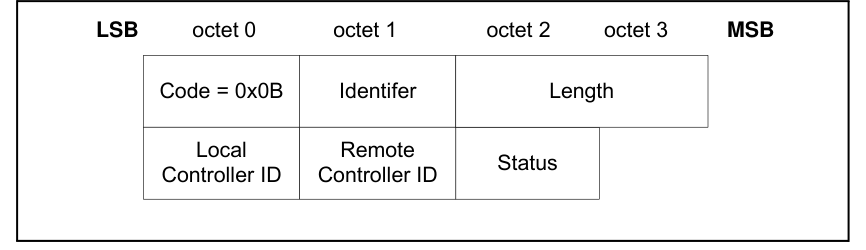

**Figure 3.14:  AMP Create Physical Link Response Packet**

The data fields are
• Local Controller ID (1 octet) This field contains the Controller ID local to the sender of the AMP Create Physical Link Response packet. The ID value is the same as the Remote Controller ID that was in the associated AMP Create Physical Link Request packet.
• Responder Controller ID (1 octet) This field contains the Controller ID used by the receiver of the AMP Create Physical Link Response packet. The ID value is the same as the Local Controller ID that was in the associated AMP Create Physical Link Request packet.
• Status (1 octet) The Status field indicates the result of the request.

| Status Code | Description |
| --- | --- |
| 0x00 | Success - Link creation is started |
| 0x01 | Invalid Controller ID |
| 0x02 | Failed - Unable to start link creation |
| 0x03 | Failed - Collision Occurred |
| 0x04 | Failed - AMP Disconnected Physical Link Request packet received |
| 0x05 | Failed - Physical Link Already Exists |
| 0x06 | Failed - Security violation |
| Other | Reserved for future use |

Table 3.8:  AMP Create Physical Link Response Status values
An AMP Create Physical Link Response with status of Invalid Controller ID shall be sent by an AMP manager that has received an AMP Create Physical Link Request containing either
a) A Controller ID that has not been allocated by the AMP manager
b) A Controller ID of 0
An AMP Create Physical Link Response with status of Failed - Security Violation shall be sent by an AMP manager that has received an AMP Create Physical Link Request without mutual authentication being performed over the BR/EDR Controller and without encryption being enabled on the BR/EDR Controller.

### 3.13   AMP DISCONNECT PHYSICAL LINK REQUEST (CODE 0x0C)

AMP Disconnect Physical Link request is an optional request that can be used by either initiator or responder to either abort the creation of an AMP physical link or disconnect an existing Physical Link.

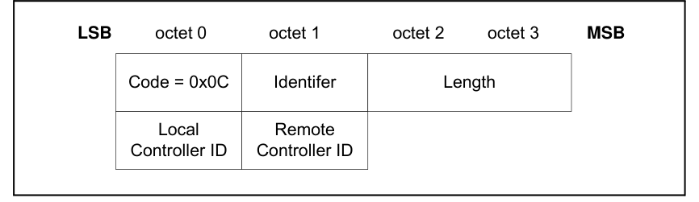

**Figure 3.15:  AMP Disconnect Physical Link Request Packet**

The data fields are:
• Local Controller ID (1 octet) Local Controller ID is the ID of the Controller on the device sending the AMP Disconnect Physical Link Request packet.
• Remote Controller ID (1 octet) The ID of the AMP Controller on the device that receives the AMP Disconnect Physical Link Request packet.

### 3.14   AMP DISCONNECT PHYSICAL LINK RESPONSE (CODE 0x0D)

If an AMP Manager receives an AMP Disconnect Physical Link request packet while creation of a physical link is outstanding, it shall abort the operation. In devices that support HCI the Host may send an HCI_Disconnect_Physical_Link command to cause the Controller to abort the creation of a Physical Link.
If an AMP Disconnect Physical Link request packet is received from a device that has an AMP Create Physical Link request packet outstanding, the receiver shall send both an AMP Create Physical Link Response packet with a status of 'Failed - AMP Disconnected Physical Link Request packet received' and an AMP Disconnect Physical Link response packet with a status of 'Success'.
If an AMP manager receives an AMP Disconnect Physical Link request packet when creation of a physical link is not outstanding and a Physical Link does not exist for the given local and remote AMP IDs it shall send an AMP Disconnect Physical Link Response with a status of 'Failed - No Physical Link exists and no Physical Link creation is in progress'.
The status of 'Invalid Controller ID' shall only be used if the receiver of the AMP Disconnect Request packet does not have an AMP with an ID that matches the Remote Controller ID in the received AMP Disconnect Request packet.

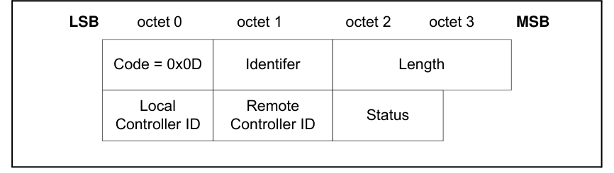

**Figure 3.16:  AMP Disconnect Physical Link Response Packet**

The data fields are:
• Local Controller ID (1 octet) This field contains the Controller ID local to the sender of the AMP Disconnect Physical Link Response packet. The ID value is the same as the Remote Controller ID that was in the associated AMP Disconnect Physical Link Request packet.
• Remote Controller ID (1 octet) This field contains the Controller ID used by the receiver of the AMP Disconnect Physical Link Response packet. The ID value is the same as the Local Controller ID that was in the associated AMP Disconnect Physical Link Request packet.
• Status (1 octet) The Status field indicates the result of the request.

| Status Code | Description |
| --- | --- |
| 0x00 | Success |
| 0x01 | Invalid Controller ID |
| 0x02 | Failed - No Physical Link exists and no Physical Link creation is in prog- ress |
| Other | Reserved for future use |

Table 3.9:  AMP Disconnect Physical Link Response Status values

### 3.15   CREATE PHYSICAL LINK COLLISION RESOLUTION

If two devices simultaneously attempt to create a physical link a collision will occur. In this situation one of the requests shall be cancelled while the other request shall proceed. Both devices must know which request will be rejected. The following algorithm shall be used by both devices to determine which request to reject.
1. Set i=0 (representing the least significant octet of the BD_ADDR).
2. Compare the least significant octet, octet[i] of the BD_ADDR, of both devices. If the octets are not equal go to step 4.
3. Increment i by 1. Go to step 2.
4. The device with the larger BD_ADDR octet shall send an AMP Create Physical Link Response with the Status field set to "Failed - Collision Occurred."

### 3.16   RESPONSE TIMEOUT

The Response Timeout is used to monitor the response to request packets. The exact timeout value is implementation dependent and may be chosen within the range of 15 - 60 seconds. The recommended value is 20 seconds. If a response to a request packet is not received within the Response Timeout then the ACL link shall be disconnected.

### 3.17   UNEXPECTED BR/EDR PHYSICAL LINK DISCONNECT

It is possible that the BR/EDR link between two devices might unexpectedly disconnect (Link Supervision Timeout) while AMP links between the same two devices remain active. This situation is problematic since the BR/EDR link is used for L2CAP and AMP Manager signaling between the two devices.
When the BR/EDR link with a remote device unexpectedly disconnects due to Link Supervision Timeout the AMP manager shall disconnect all AMP physical links to the same remote device.
Core System Package [Host volume]
Part F
PART F: ATTRIBUTE PROTOCOL (ATT)
This specification defines the Attribute Protocol; a protocol for discovering, reading, and writing attributes on a peer device
CONTENTS

## 1  INTRODUCTION

### 1.1   SCOPE

The attribute protocol allows a device referred to as the server to expose a set of attributes and their associated values to a peer device referred to as the client. These attributes exposed by the server can be discovered, read, and written by a client, and can be indicated and notified by the server.

### 1.2   CONFORMANCE

If conformance to this protocol is claimed, all capabilities indicated as mandatory for this protocol shall be supported in the specified manner (process-mandatory). This also applies to all optional and conditional capabilities for which support is indicated. All mandatory capabilities, and optional and conditional capabilities for which support is indicated, are subject to verification as part of the Bluetooth qualification program.

### 1.3   CONVENTIONS

In this specification PDU names appear in italics. Error codes defined in Table 3.3 (see Section 3.4.1.1) appear in « » (e.g. «Attribute Not Found»). Other names such as parameters appear in Roman text.

## 2  PROTOCOL OVERVIEW

The attribute protocol defines two roles; a server role and a client role. It allows a server to expose a set of attributes to a client that are accessible using the attribute protocol.
An attribute is a discrete value that has the following three properties associated with it:
a) attribute type, defined by a UUID
b) attribute handle
c) a set of permissions that are defined by each higher layer specification that utilizes the attribute; these permissions cannot be accessed using the Attribute Protocol.
The attribute type specifies what the attribute represents. Bluetooth SIG defined attribute types are defined in the Bluetooth SIG Assigned Numbers page, and used by an associated higher layer specification. Non-Bluetooth SIG attribute types may also be defined.
The attribute handle uniquely identifies an attribute on a server, allowing a client to reference the attribute in read or write requests; see Section 3.4.4, Section 3.4.5, and Section 3.4.6. It allows a client to uniquely identify the attribute being notified or indicated, see Section 3.4.7. Clients are able to discover the handles of the server’s attributes; see Section 3.4.3. Permissions may be applied to an attribute to prevent applications from obtaining or altering an attribute’s value. An attribute may be defined by a higher layer specification to be readable or writable or both, and may have additional security requirements. For more information, see Section 3.2.5.
A client may send attribute protocol requests to a server, and the server shall respond to all requests that it receives. A device can implement both client and server roles, and both roles can function concurrently in the same device and between the same devices. There shall be only one instance of a server on each Bluetooth device; this implies that the attribute handles shall be identical for all supported bearers. For a given client, the server shall have one set of attributes. The server can support multiple clients. Note: Multiple services may be exposed on a single server by allocating separate ranges of handles for each service. The discovery of these handle ranges is defined by a higher layer specification.
The attribute protocol has notification and indication capabilities that provide an efficient way of sending attribute values to a client without the need for them to be read; see Section 3.3.

## 3  PROTOCOL REQUIREMENTS

### 3.1   INTRODUCTION

Each attribute has an attribute type that identifies, by means of a UUID (Universally Unique IDentifier), what the attribute represents so that a client can understand the attributes exposed by a server. Each attribute has an attribute handle that is used for accessing the attribute on a server, as well as an attribute value.
An attribute value is accessed using its attribute handle. The attribute handles are discovered by a client using attribute protocol PDUs (Protocol Data Unit). Attributes that have the same attribute type may exist more than once in a server. Attributes also have a set of permissions that controls whether they can be read or written, or whether the attribute value shall be sent over an encrypted link. Security aspects of the attribute protocol are defined in Section 4.

### 3.2   BASIC CONCEPTS

#### 3.2.1  Attribute Type

A universally unique identifier (UUID) is used to identify every attribute type. A UUID is considered unique over all space and time. A UUID can be independently created by anybody and distributed or published as required. There is no central registry for UUIDs, as they are based off a unique identifier that is not duplicated. The attribute protocol allows devices to identify attribute types using UUIDs regardless of the local handle used to identify them in a read or write request.
Universal unique identifiers are defined in SDP [Vol 3] Part B, Section 2.5.1.
All 32-bit Attribute UUIDs shall be converted to 128-bit UUIDs when the Attribute UUID is contained in an ATT PDU.

#### 3.2.2  Attribute Handle

An attribute handle is a 16-bit value that is assigned by each server to its own attributes to allow a client to reference those attributes. An attribute handle shall not be reused while an ATT Bearer exists between a client and its server.
Attribute handles on any given server shall have unique, non-zero values. Attributes are ordered by attribute handle.
An attribute handle of value 0x0000 is reserved for future use. An attribute handle of value 0xFFFF is known as the maximum attribute handle.
Note: Attributes can be added or removed while an ATT Bearer is active, however, an attribute that has been removed cannot be replaced by another attribute with the same handle while an ATT Bearer is active.

#### 3.2.3  Attribute Handle Grouping

Grouping is defined by a specific attribute placed at the beginning of a range of other attributes that are grouped with that attribute, as defined by a higher layer specification. Clients can request the first and last handles associated with a group of attributes.

#### 3.2.4  Attribute Value

An attribute value is an octet array that may be either fixed or variable length. For example, it can be a one octet value, or a four octet integer, or a variable length string. An attribute may contain a value that is too large to transmit in a single PDU and can be sent using multiple PDUs. The values that are transmitted are opaque to the attribute protocol. The encoding of these octet arrays is defined by the attribute type.
When transmitting attribute values in a request, a response, a notification or an indication, the attribute value length is not sent in any field of the PDU. The length of a variable length field in the PDU is implicitly given by the length of the packet that carries this PDU. This implies that:
a) only one attribute value can be placed in a single request, response, notification or indication unless the attribute values have lengths known by both the server and client, as defined by the attribute type.
b) This attribute value will always be the only variable length field of a request, response, notification or indication.
c) The bearer protocol (e.g. L2CAP) preserves datagram boundaries.
Note: Some responses include multiple attribute values, for example when client requests multiple attribute reads. For the client to determine the attribute value boundaries, the attribute values must have a fixed size defined by the attribute type.

#### 3.2.5  Attribute Permissions

An attribute has a set of permission values associated with it. The permissions associated with an attribute specifies that it may be read and/or written. The permissions associated with the attribute specifies the security level required for read and/or write access, as well as notification and/or indication. The permissions of a given attribute are defined by a higher layer specification, and are not discoverable using the attribute protocol.
If access to a secure attribute requires an authenticated link, and the client is not already authenticated with the server with sufficient security, then an error response shall be sent with the error code «Insufficient Authentication». When a client receives this error code it may try to authenticate the link, and if the authentication is successful, it can then access the secure attribute.
If access to a secure attribute requires an encrypted link, and the link is not encrypted, then an error response shall be sent with the error code «Insufficient Encryption». When a client receives this error code it may try to encrypt the link and if the encryption is successful, it can then access the secure attribute.
If access to a secure attribute requires an encrypted link, and the link is encrypted but with an encryption key size that is too short for the level of security required, then an error response shall be sent with the error code «Insufficient Encryption Key Size». When a client receives this error code it may try to encrypt the link with a larger key size, and if the encryption is successful, it can then access the secure attribute.
Attribute permissions are a combination of access permissions, encryption permissions, authentication permissions and authorization permissions.
The following access permissions are possible:
• Readable
• Writeable
• Readable and writable
The following encryption permissions are possible:
• Encryption required
• No encryption required
The following authentication permissions are possible:
• Authentication Required
• No Authentication Required
The following authorization permissions are possible:
• Authorization Required
• No Authorization Required
Encryption, authentication, and authorization permissions can have different possibilities; for example, a specific attribute could require a particular kind of authentication or a certain minimum encryption key length. An attribute can have several combinations of permissions that apply; for example, a specific attribute could allow any of the following:
• Read if encrypted (authentication not required)
• Write if authenticated and encrypted
• Read or write if authenticated and authorized (irrespective of encryption)
Access permissions are used by a server to determine if a client can read and/ or write an attribute value.
Authentication permissions are used by a server to determine if an authenticated physical link is required when a client attempts to access an attribute. Authentication permissions are also used by a server to determine if an authenticated physical link is required before sending a notification or indication to a client.
Authorization permissions determine if a client needs to be authorized before accessing an attribute value.

#### 3.2.6  Control-Point Attributes

Attributes that cannot be read, but can only be written, notified or indicated are called control-point attributes. These control-point attributes can be used by higher layers to enable device specific procedures, for example the writing of a command or the indication when a given procedure on a device has completed.

#### 3.2.7  Protocol Methods

The attribute protocol uses methods defined in Section 3.4 to find, read, write, notify, and indicate attributes. A method is categorized as either a command, a request, a response, a notification, an indication, or a confirmation method; see Section 3.3. Some attribute protocol PDUs can also include an Authentication Signature, to allow authentication of the originator of this PDU without requiring encryption. The method and signed bit are known as the opcode.

#### 3.2.8  Exchanging MTU Size

ATT_MTU is defined as the maximum size of any packet sent between a client and a server. A higher layer specification defines the default ATT_MTU value.
The client and server may optionally exchange the maximum size of a packet that can be received using the Exchange MTU Request and Response PDUs. Both devices then use the minimum of these exchanged values for all further communication (see Section 3.4.2).
A device that is acting as a server and client at the same time shall use the same value for Client Rx MTU and Server Rx MTU.
The ATT_MTU value is a per ATT Bearer value. Note: A device with multiple ATT Bearers may have a different ATT_MTU value for each ATT Bearer.

#### 3.2.9  Long Attribute Values

The longest attribute that can be sent in a single packet is (ATT_MTU-1) octets in size. At a minimum, the Attribute Opcode is included in an Attribute PDU.
An attribute value may be defined to be larger than (ATT_MTU-1) octets in size. These attributes are called long attributes.
To read the entire value of an attributes larger than (ATT_MTU-1) octets, the read blob request is used. It is possible to read the first (ATT_MTU-1) octets of a long attribute value using the read request.
To write the entire value of an attribute larger than (ATT_MTU-3) octets, the prepare write request and execute write request is used. It is possible to write the first (ATT_MTU-3) octets of a long attribute value using the write request.
It is not possible to determine if an attribute value is longer than (ATT_MTU-3) octets using this protocol. A higher layer specification will state that a given attribute can have a maximum length larger than (ATT_MTU-3) octets.
The maximum length of an attribute value shall be 512 octets.
Note: The protection of an attribute value changing when reading the value using multiple attribute protocol PDUs is the responsibility of the higher layer.

#### 3.2.10  Atomic Operations

The server shall treat each request or command as an atomic operation that cannot be affected by another client sending a request or command at the same time. If a physical link is disconnected for any reason (user action or loss of the radio link), the value of any modified attribute is the responsibility of the higher layer specification.
Long attributes cannot be read or written in a single atomic operation.

### 3.3   ATTRIBUTE PDU

Attribute PDUs have one of six types:
• Commands—PDUs sent to a server by a client that do not invoke a response.
• Requests—PDUs sent to a server by a client that invoke a response.
• Responses—PDUs sent to a client by a server in response to a request.
• Notifications—Unsolicited PDUs sent to a client by a server that do not invoke a confirmation.
• Indications—Unsolicited PDUs sent to a client by a server that invoke a confirmation.
• Confirmations—PDUs sent to a server by a client to confirm receipt of an indication.
A server shall be able to receive and properly respond to the following requests:
• Find Information Request
• Read Request
Support for all other PDU types in a server can be specified in a higher layer specification, see Section 3.4.8.
If a client sends a request, then the client shall support all possible responses PDUs for that request.
If a server receives a request that it does not support, then the server shall respond with the Error Response with the Error Code «Request Not Supported», with the Attribute Handle In Error set to 0x0000.
If a server receives a command that it does not support, indicated by the Command Flag of the PDU set to one, then the server shall ignore the Command.
If the server receives an invalid request – for example, the PDU is the wrong length – then the server shall respond with the Error Response with the Error Code «Invalid PDU», with the Attribute Handle In Error set to 0x0000.
If a server does not have sufficient resources to process a request, then the server shall respond with the Error Response with the Error Code «Insufficient Resources», with the Attribute Handle In Error set to 0x0000.
If a server cannot process a request because an error was encountered during the processing of this request, then the server shall respond with the Error Response with the Error Code «Unlikely Error», with the Attribute Handle In Error set to 0x0000.

#### 3.3.1  Attribute PDU Format

Attribute PDUs has the following format:

| Name | Size (octets) | Description |
| --- | --- | --- |
| Attribute Opcode | 1 | The attribute PDU operation code bit7: Authentication Signature Flag bit6: Command Flag bit5-0: Method |

Table 3.1:  Format of Attribute PDU

| Name | Size (octets) | Description |
| --- | --- | --- |
| Attribute Parameters | 0 to (ATT MTU - X) _ | The attribute PDU parameters X = 1 if Authentication Signature Flag of the Attribute Opcode is 0 X = 13 if Authentication Signature Flag of th Attribute Opcode is 1 |
| Authentication Signature | 0 or 12 | Optional authentication signature for the Attribute Opcode and Attribute Parameters |

Table 3.1:  Format of Attribute PDU
Multi-octet fields within the attribute protocol shall be sent least significant octet first (little endian) with the exception of the Attribute Value field. The endian- ness of the Attribute Value field is defined by a higher layer specification.
The Attribute Opcode is composed of three fields, the Authentication Signature Flag, the Command Flag, and the Method. The Method is a 6-bit value that determines the format and meaning of the Attribute Parameters.
If the Authentication Signature Flag of the Attribute Opcode is set to one, the Authentication Signature value shall be appended to the end of the attribute PDU, and X is 13. If the Authentication Signature Flag of the Attribute Opcode is set to zero, the Authentication Signature value shall not be appended, and X is 1.
The Authentication Signature field is calculated as defined in Security Manager (see [Vol 3] Part H, Section 2.4.5). This value provides an Authentication Signature for the variable length message (m) consisting of the following values in this order: Attribute Opcode, Attribute Parameters.
An Attribute PDU that includes an Authentication Signature should not be sent on an encrypted link. Note: An encrypted link already includes authentication data on every packet and therefore adding more authentication data is not required.
If the Command Flag of the Attribute Opcode is set to one, the PDU shall be considered to be a Command.
Only the Write Command may include an Authentication Signature.

#### 3.3.2  Sequential Protocol

Many attribute protocol PDUs use a sequential request-response protocol.
Once a client sends a request to a server, that client shall send no other request to the same server until a response PDU has been received.
Indications sent from a server also use a sequential indication-confirmation protocol. No other indications shall be sent to the same client from this server until a confirmation PDU has been received. The client, however, is free to send commands and requests prior to sending a confirmation.
For notifications, which do not have a response PDU, there is no flow control and a notification can be sent at any time.
Commands that do not require a response do not have any flow control. Note: A server can be flooded with commands, and a higher layer specification can define how to prevent this from occurring.
Commands and notifications that are received but cannot be processed, due to buffer overflows or other reasons, shall be discarded. Therefore, those PDUs must be considered to be unreliable.
Note: Flow control for each client and a server is independent.
Note: It is possible for a server to receive a request, send one or more notifications, and then the response to the original request. The flow control of requests is not affected by the transmission of the notifications.
Note: It is possible for a server to receive a request and then a command before responding to the original request. The flow control of requests is not affected by the transmission of commands.
Note: It is possible for a notification from a server to be sent after an indication has been sent but the confirmation has not been received. The flow control of indications is not affected by the transmission of notifications.
Note: It is possible for a client to receive an indication from a server and then send a request or command to that server before sending the confirmation of the original indication.

#### 3.3.3  Transaction

An attribute protocol request and response or indication-confirmation pair is considered a single transaction. A transaction shall always be performed on one ATT Bearer, and shall not be split over multiple ATT Bearers.
On the client, a transaction shall start when the request is sent by the client. A transaction shall complete when the response is received by the client.
On a server, a transaction shall start when a request is received by the server. A transaction shall complete when the response is sent by the server.
On a server, a transaction shall start when an indication is sent by the server. A transaction shall complete when the confirmation is received by the server.
On a client, a transaction shall start when an indication is received by the client. A transaction shall complete when the confirmation is sent by the client.
A transaction not completed within 30 seconds shall time out. Such a transaction shall be considered to have failed and the local higher layers shall
be informed of this failure. No more attribute protocol requests, commands, indications or notifications shall be sent to the target device on this ATT Bearer.
Note: To send another attribute protocol PDU, a new ATT Bearer must be established between these devices. The existing ATT Bearer may need to be disconnected or the bearer terminated before the new ATT Bearer is established.
If the ATT Bearer is disconnected during a transaction, then the transaction shall be considered to be closed, and any values that were being modified on the server will be in an undetermined state, and any queue that was prepared by the client using this ATT Bearer shall be cleared.
Note: Each Prepare Write Request is a separate request and is therefore a separate transaction.
Note: Each Read Blob Request is a separate request and is therefore a separate transaction.

### 3.4   ATTRIBUTE PROTOCOL PDUS

#### 3.4.1  Error Handling

##### 3.4.1.1  Error Response

The Error Response is used to state that a given request cannot be performed, and to provide the reason.
Note: The Write Command does not generate an Error Response.

| Parameter | Size (octets) | Description |
| --- | --- | --- |
| Attribute Opcode | 1 | 0x01 = Error Response |
| Request Opcode In Error | 1 | The request that generated this error response |
| Attribute Handle In Error | 2 | The attribute handle that generated this error response |
| Error Code | 1 | The reason why the request has gener- ated an error response |

Table 3.2:  Format of Error Response
The Request Opcode In Error parameter shall be set to the Attribute Opcode of the request that generated this error.
The Attribute Handle In Error parameter shall be set to the attribute handle in the original request that generated this error. If there was no attribute handle in
the original request or if the request is not supported, then the value 0x0000 shall be used for this field.
The Error Code parameter shall be set to one of the following values:

| Name | Error Code | Description |
| --- | --- | --- |
| Invalid Handle | 0x01 | The attribute handle given was not valid on this server. |
| Read Not Permitted | 0x02 | The attribute cannot be read. |
| Write Not Permitted | 0x03 | The attribute cannot be written. |
| Invalid PDU | 0x04 | The attribute PDU was invalid. |
| Insufficient Authentication | 0x05 | The attribute requires authentication before it can be read or written. |
| Request Not Supported | 0x06 | Attribute server does not support the request received from the client. |
| Invalid Offset | 0x07 | Offset specified was past the end of the attribute. |
| Insufficient Authorization | 0x08 | The attribute requires authorization before it can be read or written. |
| Prepare Queue Full | 0x09 | Too many prepare writes have been queued. |
| Attribute Not Found | 0x0A | No attribute found within the given attri bute handle range. |
| Attribute Not Long | 0x0B | The attribute cannot be read using the Read Blob Request. |
| Insufficient Encryption Key Size | 0x0C | The Encryption Key Size used for encrypting this link is insufficient. |
| Invalid Attribute Value Length | 0x0D | The attribute value length is invalid for the operation. |
| Unlikely Error | 0x0E | The attribute request that was requested has encountered an error that was unlikely, and therefore could not be completed as requested. |
| Insufficient Encryption | 0x0F | The attribute requires encryption before it can be read or written. |
| Unsupported Group Type | 0x10 | The attribute type is not a supported grouping attribute as defined by a higher layer specification. |
| Insufficient Resources | 0x11 | Insufficient Resources to complete the request. |
| Reserved for future use | 0x012 – 0x7F | Reserved for future use. |

Table 3.3:  Error Codes

| Name | Error Code | Description |
| --- | --- | --- |
| Application Error | 0x80-0x9F | Application error code defined by a higher layer specification. |
| Reserved for future use | 0xA0 – 0xDF | Reserved for future use |
| Common Profile and Service Error Codes | 0xE0 – 0xFF | Common profile and service error codes defined in [Core Specification Supplement], Part B. |

Table 3.3:  Error Codes
If an error code is received in the Error Response that is not understood by the client, for example an error code that was reserved for future use that is now being used in a future version of this specification, then the Error Response shall still be considered to state that the given request cannot be performed for an unknown reason.

#### 3.4.2  MTU Exchange

##### 3.4.2.1  Exchange MTU Request

The Exchange MTU Request is used by the client to inform the server of the client’s maximum receive MTU size and request the server to respond with its maximum receive MTU size.

| Parameter | Size (octets) | Description |
| --- | --- | --- |
| Attribute Opcode | 1 | 0x02 = Exchange MTU Request |
| Client Rx MTU | 2 | Client receive MTU size |

Table 3.4:  Format of Exchange MTU Request
The Client Rx MTU shall be greater than or equal to the default ATT_MTU.
This request shall only be sent once during a connection by the client. The Client Rx MTU parameter shall be set to the maximum size of the attribute protocol PDU that the client can receive.

##### 3.4.2.2  Exchange MTU Response

The Exchange MTU Response is sent in reply to a received Exchange MTU Request.

| Parameter | Size (octets) | Description |
| --- | --- | --- |
| Attribute Opcode | 1 | 0x03 = Exchange MTU Response |
| Server Rx MTU | 2 | Attribute server receive MTU size |

Table 3.5:  Format of Exchange MTU Response
The Server Rx MTU shall be greater than or equal to the default ATT_MTU.
The Server Rx MTU parameter shall be set to the maximum size of the attribute protocol PDU that the server can receive.
The server and client shall set ATT_MTU to the minimum of the Client Rx MTU and the Server Rx MTU. The size is the same to ensure that a client can correctly detect the final packet of a long attribute read.
This ATT_MTU value shall be applied in the server after this response has been sent and before any other attribute protocol PDU is sent.
This ATT_MTU value shall be applied in the client after this response has been received and before any other attribute protocol PDU is sent.
If either Client Rx MTU or Service Rx MTU are incorrectly less than the default ATT_MTU, then the ATT_MTU shall not be changed and the ATT_MTU shall be the default ATT_MTU.
If a device is both a client and a server, the following rules shall apply:
1. A device's Exchange MTU Request shall contain the same MTU as the device's Exchange MTU Response (i.e. the MTU shall be symmetric).
2. If MTU is exchanged in one direction, that is sufficient for both directions.
3. It is permitted, (but not necessary - see 2.) to exchange MTU in both directions, but the MTUs shall be the same in each direction (see 1.)
4. If an Attribute Protocol Request is received after the MTU Exchange Request is sent and before the MTU Exchange Response is received, the associated Attribute Protocol Response shall use the default MTU. Figure 3.1 shows an example that is covered by this rule. In this case device A and device B both use the default MTU for the Attribute Protocol Response.
5. Once the MTU Exchange Request has been sent, the initiating device shall not send an Attribute Protocol Indication or Notification until after the MTU Exchange Response has been received. Note: This stops the risk of a cross- over condition where the MTU size is unknown for the Indication or Notification.

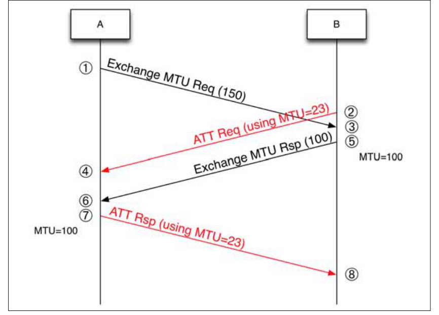

**Figure 3.1:  MTU request and response exchange**

#### 3.4.3  Find Information

##### 3.4.3.1  Find Information Request

The Find Information Request is used to obtain the mapping of attribute handles with their associated types. This allows a client to discover the list of attributes and their types on a server.

| Parameter | Size (octets) | Description |
| --- | --- | --- |
| Attribute Opcode | 1 | 0x04 = Find Information Request |
| Starting Handle | 2 | First requested handle number |
| Ending Handle | 2 | Last requested handle number |

Table 3.6:  Format of Find Information Request
Only attributes with attribute handles between and including the Starting Handle parameter and the Ending Handle parameter will be returned. To read all attributes, the Starting Handle parameter shall be set to 0x0001, and the Ending Handle parameter shall be set to 0xFFFF. The Starting Handle parameter shall be less than or equal to the Ending Handle parameter.
If one or more attributes will be returned, a Find Information Response PDU shall be sent.
If a server receives a Find Information Request with the Starting Handle parameter greater than the Ending Handle parameter or the Starting Handle parameter is 0x0000, an Error Response shall be sent with the «Invalid Handle» error code; the Attribute Handle In Error parameter shall be set to the Starting Handle parameter.
If no attributes will be returned, an Error Response shall be sent with the «Attribute Not Found» error code; the Attribute Handle In Error parameter shall be set to the Starting Handle parameter.
The server shall not respond to the Find Information Request with an Error Response with the «Insufficient Authentication», «Insufficient Authorization», «Insufficient Encryption Key Size» or «Application Error» error code.

##### 3.4.3.2  Find Information Response

The Find Information Response is sent in reply to a received Find Information Request and contains information about this server.

| Parameter | Size (octets) | Description |
| --- | --- | --- |
| Attribute Opcode | 1 | 0x05 = Find Information Response |
| Format | 1 | The format of the information data. |
| Information Data | 4 to (ATT MTU-2) _ | The information data whose format is determined by the Format field |

Table 3.7:  Format of Find Information Response
The Find Information Response shall have complete handle-UUID pairs. Such pairs shall not be split across response packets; this also implies that a handle- UUID pair shall fit into a single response packet. The handle-UUID pairs shall be returned in ascending order of attribute handles.
The Format parameter can contain one of two possible values.

| Name | Format | Description |
| --- | --- | --- |
| Handle(s) and 16-bit Bluetooth UUID(s) | 0x01 | A list of 1 or more handles with their 16-bit Bluetooth UUIDs |
| Handle(s) and 128-bit UUID(s) | 0x02 | A list of 1 or more handles with their 128-bit UUIDs |

Table 3.8:  Format field values
The information data field is comprised of a list of data defined in the tables below depending on the value chosen for the format.

| Handle | 16-bit Bluetooth UUID |
| --- | --- |
| 2 octets | 2 octets |

Table 3.9:  Format 0x01 - handle and 16-bit Bluetooth UUIDs

| Handle | 128-bit UUID |
| --- | --- |
| 2 octets | 16 octets |

Table 3.10:  Format 0x02 - handle and 128-bit UUIDs
Note: If sequential attributes have differing UUID sizes, it may happen that a Find Information Response is not filled with the maximum possible amount of (handle, UUID) pairs. This is because it is not possible to include attributes with differing UUID sizes into a single response packet. In that case, the following attribute would have to be read using another Find Information Request with its starting handle updated.

##### 3.4.3.3  Find By Type Value Request

The Find By Type Value Request is used to obtain the handles of attributes that have a 16-bit UUID attribute type and attribute value.This allows the range of handles associated with a given attribute to be discovered when the attribute type determines the grouping of a set of attributes. Note: Generic Attribute Profile defines grouping of attributes by attribute type.

| Parameter | Size (octets) | Description |
| --- | --- | --- |
| Attribute Opcode | 1 | 0x06 = Find By Type Value Request |
| Starting Handle | 2 | First requested handle number |
| Ending Handle | 2 | Last requested handle number |
| Attribute Type | 2 | 2 octet UUID to find |
| Attribute Value | 0 to (ATT MTU-7) _ | Attribute value to find |

Table 3.11:  Format of Find By Type Value Request
Only attributes with attribute handles between and including the Starting Handle parameter and the Ending Handle parameter that match the requested attribute type and the attribute value that have sufficient permissions to allow reading will be returned. To read all attributes, the Starting Handle parameter shall be set to 0x0001, and the Ending Handle parameter shall be set to 0xFFFF.
If one or more handles will be returned, a Find By Type Value Response PDU shall be sent.
Note: Attribute values will be compared in terms of length and binary representation.
Note: It is not possible to use this request on an attribute that has a value longer than (ATT_MTU-7).
If a server receives a Find By Type Value Request with the Starting Handle parameter greater than the Ending Handle parameter or the Starting Handle parameter is 0x0000, an Error Response shall be sent with the «Invalid Handle» error code. The Attribute Handle In Error parameter shall be set to the Starting Handle parameter.
If no attributes will be returned, an Error Response shall be sent by the server with the error code «Attribute Not Found». The Attribute Handle In Error parameter shall be set to the starting handle.
The server shall not respond to the Find By Type Value Request with an Error Response with the «Insufficient Authentication», «Insufficient Authorization», «Insufficient Encryption Key Size», «Insufficient Encryption» or «Application Error» error code.

##### 3.4.3.4  Find By Type Value Response

The Find By Type Value Response is sent in reply to a received Find By Type Value Request and contains information about this server.

| Parameter | Size (octets) | Description |
| --- | --- | --- |
| Attribute Opcode | 1 | 0x07 = Find By Type Value Respons |
| Handles Information List | 4 to (ATT MTU-1) _ | A list of 1 or more Handle Information |

Table 3.12:  Format of Find By Type Value Response
The Handles Information List field is a list of one or more Handle Informations. The Handles Information field is an attribute handle range as defined in Table 3.13.

| Found Attribute Handle | Group End Handle |
| --- | --- |
| 2 octets | 2 octets |

Table 3.13:  Format of the Handles Information
The Find By Type Value Response shall contain one or more complete Handles Information. Such Handles Information shall not be split across response packets. The Handles Information List is ordered sequentially based on the found attribute handles.
For each handle that matches the attribute type and attribute value in the Find By Type Value Request a Handles Information shall be returned. The Found Attribute Handle shall be set to the handle of the attribute that has the exact attribute type and attribute value from the Find By Type Value Request. If the attribute type in the Find By Type Value Request is a grouping attribute as defined by a higher layer specification, the Group End Handle shall be defined by that higher layer specification. If the attribute type in the Find By Type Value Request is not a grouping attribute as defined by a higher layer specification, the Group End Handle shall be equal to the Found Attribute Handle.
Note: The Group End Handle may be greater than the Ending Handle in the Find By Type Value Request.
If a server receives a Find By Type Value Request, the server shall respond with the Find By Type Value Response containing as many handles for attributes that match the requested attribute type and attribute value that exist in the server that will fit into the maximum PDU size of (ATT_MTU-1).

#### 3.4.4  Reading Attributes

##### 3.4.4.1  Read By Type Request

The Read By Type Request is used to obtain the values of attributes where the attribute type is known but the handle is not known.

| Parameter | Size (octets) | Description |
| --- | --- | --- |
| Attribute Opcode | 1 | 0x08 = Read By Type Request |
| Starting Handle | 2 | First requested handle number |
| Ending Handle | 2 | Last requested handle number |
| Attribute Type | 2 or 16 | 2 or 16 octet UUID |

Table 3.14:  Format of Read By Type Request
Only the attributes with attribute handles between and including the Starting Handle and the Ending Handle with the attribute type that is the same as the Attribute Type given will be returned. To search through all attributes, the starting handle shall be set to 0x0001 and the ending handle shall be set to 0xFFFF.
Note: All attribute types are effectively compared as 128-bit UUIDs, even if a 16-bit UUID is provided in this request or defined for an attribute. See [Vol 3] Part B, Section 2.5.1.
The starting handle shall be less than or equal to the ending handle. If a server receives a Read By Type Request with the Starting Handle parameter greater than the Ending Handle parameter or the Starting Handle parameter is 0x0000, an Error Response shall be sent with the «Invalid Handle» error code; The Attribute Handle In Error parameter shall be set to the Starting Handle parameter.
If no attribute with the given type exists within the handle range, then no attribute handle and value will be returned, and an Error Response shall be sent with the error code «Attribute Not Found». The Attribute Handle In Error parameter shall be set to the starting handle.
The attributes returned shall be the attributes with the lowest handles within the handle range. These are known as the requested attributes.
If the attributes with the requested type within the handle range have attribute values that have the same length, then these attributes can all be read in a single request.
The attribute server shall include as many attributes as possible in the response in order to minimize the number of PDUs required to read attributes of the same type.
Note: If the attributes with the requested type within the handle range have attribute values with different lengths, then multiple Read By Type Requests must be made.
When multiple attributes match, then the rules below shall be applied to each in turn.
• Only attributes that can be read shall be returned in a Read By Type Response.
• If an attribute in the set of requested attributes would cause an Error Response then this attribute cannot be included in a Read By Type Response and the attributes before this attribute shall be returned.
• If the first attribute in the set of requested attributes would cause an Error Response then no other attributes in the requested attributes can be considered.
The server shall respond with a Read By Type Response if the requested attributes have sufficient permissions to allow reading.
If the client has insufficient authorization to read the requested attribute then an Error Response shall be sent with the error code «Insufficient Authorization». The Attribute Handle In Error parameter shall be set to the handle of the attribute causing the error.
If the client has insufficient security to read the requested attribute then an Error Response shall be sent with the error code «Insufficient Authentication». The Attribute Handle In Error parameter shall be set to the handle of the attribute causing the error.
If the client has an insufficient encryption key size to read the requested attribute then an Error Response shall be sent with the error code «Insufficient Encryption Key Size». The Attribute Handle In Error parameter shall be set to the handle of the attribute causing the error.
If the client has not enabled encryption, and encryption is required to read the requested attribute, then an Error Response shall be sent with the error code «Insufficient Encryption». The Attribute Handle In Error parameter shall be set to the handle of the attribute causing the error.
If the requested attribute’s value cannot be read due to permissions then an Error Response shall be sent with the error code «Read Not Permitted». The Attribute Handle In Error parameter shall be set to the handle of the attribute causing the error.
Note: If there are multiple attributes with the requested type within the handle range, and the client would like to get the next attribute with the requested type, it would have to issue another Read By Type Request with its starting handle updated. The client can be sure there are no more such attributes remaining once it gets an Error Response with the error code «Attribute Not Found».

##### 3.4.4.2  Read By Type Response

The Read By Type Response is sent in reply to a received Read By Type Request and contains the handles and values of the attributes that have been read.

| Parameter | Size (octets) | Description |
| --- | --- | --- |
| Attribute Opcode | 1 | 0x09 = Read By Type Response |
| Length | 1 | The size of each attribute handle- value pair |
| Attribute Data List | 2 to (ATT MTU- 2) _ | A list of Attribute Data |

Table 3.15:  Format of Read By Type Response
The Read By Type Response shall contain complete handle-value pairs. Such pairs shall not be split across response packets. The handle-value pairs shall be returned sequentially based on the attribute handle.
The Length parameter shall be set to the size of one attribute handle-value pair.
The maximum length of an attribute handle-value pair is 255 octets, bounded by the Length parameter that is one octet. Therefore, the maximum length of an attribute value returned in this response is (Length – 2) = 253 octets.
The attribute handle-value pairs shall be set to the value of the attributes identified by the attribute type within the handle range within the request. If the attribute value is longer than (ATT_MTU - 4) or 253 octets, whichever is smaller, then the first (ATT_MTU - 4) or 253 octets shall be included in this response.
Note: The Read Blob Request would be used to read the remaining octets of a long attribute value.
The Attribute Data field is comprised of a list of attribute handle and value pairs as defined in Table 3.16.

| Attribute Handle | Attribute Value |
| --- | --- |
| 2 octets | (Length – 2) octets |

Table 3.16:  Format of the Attribute Data

##### 3.4.4.3  Read Request

The Read Request is used to request the server to read the value of an attribute and return its value in a Read Response.

| Parameter | Size (octets) | Description |
| --- | --- | --- |
| Attribute Opcode | 1 | 0x0A = Read Request |
| Attribute Handle | 2 | The handle of the attribute to be read |

Table 3.17:  Format of Read Request
The attribute handle parameter shall be set to a valid handle.
The server shall respond with a Read Response if the handle is valid and the attribute has sufficient permissions to allow reading.
If the client has insufficient authorization to read the requested attribute then an Error Response shall be sent with the error code «Insufficient Authorization».
If the client has insufficient security to read the requested attribute then an Error Response shall be sent with the error code «Insufficient Authentication».
If the client has an insufficient encryption key size to read the requested attribute then an Error Response shall be sent with the error code «Insufficient Encryption Key Size».
If the client has not enabled encryption, and encryption is required to read the requested attribute, then an Error Response shall be sent with the error code «Insufficient Encryption».
If the handle is invalid, then an Error Response shall be sent with the error code «Invalid Handle».
If the attribute value cannot be read due to permissions then an Error Response shall be sent with the error code «Read Not Permitted».

##### 3.4.4.4  Read Response

The read response is sent in reply to a received Read Request and contains the value of the attribute that has been read.

| Parameter | Size (octets) | Description |
| --- | --- | --- |
| Attribute Opcode | 1 | 0x0B = Read Response |
| Attribute Value | 0 to (ATT MTU-1) _ | The value of the attribute with the handle given |

Table 3.18:  Format of Read Response
The attribute value shall be set to the value of the attribute identified by the attribute handle in the request. If the attribute value is longer than (ATT_MTU-1) then the first (ATT_MTU-1) octets shall be included in this response.
Note: The Read Blob Request would be used to read the remaining octets of a long attribute value.

##### 3.4.4.5  Read Blob Request

The Read Blob Request is used to request the server to read part of the value of an attribute at a given offset and return a specific part of the value in a Read Blob Response.

| Parameter | Size (octets) | Description |
| --- | --- | --- |
| Attribute Opcode | 1 | 0x0C = Read Blob Request |
| Attribute Handle | 2 | The handle of the attribute to be read |
| Value Offset | 2 | The offset of the first octet to be read |

Table 3.19:  Format of Read Blob Request
The attribute handle parameter shall be set to a valid handle.
The value offset parameter is based from zero; the first value octet has an offset of zero, the second octet has a value offset of one, etc.
The server shall respond with a Read Blob Response if the handle is valid and the attribute and value offset is not greater than the length of the attribute value and has sufficient permissions to allow reading.
If the client has insufficient authorization to read the requested attribute then an Error Response shall be sent with the error code «Insufficient Authorization».
If the client has insufficient security to read the requested attribute then an Error Response shall be sent with the error code «Insufficient Authentication».
If the client has an insufficient encryption key size to read the requested attribute then an Error Response shall be sent with the error code «Insufficient Encryption Key Size».
If the client has not enabled encryption, and encryption is required to read the requested attribute, then an Error Response shall be sent with the error code «Insufficient Encryption».
If the handle is invalid, then an Error Response shall be sent with the error code «Invalid Handle».
If the attribute value cannot be read due to permissions then an Error Response shall be sent with the error code «Read Not Permitted».
If the value offset of the Read Blob Request is greater than the length of the attribute value, an Error Response shall be sent with the error code «Invalid Offset».
If the attribute value has a fixed length that is less than or equal to (ATT_MTU - 1) octets in length, then an Error Response may be sent with the error code «Attribute Not Long».
If the value offset of the Read Blob Request is equal to the length of the attribute value, then the length of the part attribute value in the response shall be zero.
Note: If the attribute is longer than (ATT_MTU-1) octets, the Read Blob Request is the only way to read the additional octets of a long attribute. The first (ATT_MTU-1) octets may be read using a Read Request, an Handle Value Notification or an Handle Value Indication.
Note: Long attributes may or may not have their length specified by a higher layer specification. If the long attribute has a variable length, the only way to get to the end of it is to read it part by part until the value in the Read Blob Response has a length shorter than (ATT_MTU-1) or an Error Response with the error code «Invalid Offset».
Note: The value of a Long Attribute may change between one Read Blob Request and the next Read Blob Request. A higher layer specification should be aware of this and define appropriate behavior.

##### 3.4.4.6  Read Blob Response

The Read Blob Response is sent in reply to a received Read Blob Request and contains part of the value of the attribute that has been read.

| Parameter | Size (octets) | Description |
| --- | --- | --- |
| Attribute Opcode | 1 | 0x0D = Read Blob Response |
| Part Attribute Value | 0 to (ATT MTU -1) _ | Part of the value of the attribute with the handle given |

Table 3.20:  Format of Read Blob Response
The part attribute value shall be set to part of the value of the attribute identified by the attribute handle and the value offset in the request. If the value offset is equal to the length of the attribute value, then the length of the part attribute value shall be zero. If the attribute value is longer than (Value Offset + ATT_MTU-1) then (ATT_MTU-1) octets from Value Offset shall be included in this response.

##### 3.4.4.7  Read Multiple Request

The Read Multiple Request is used to request the server to read two or more values of a set of attributes and return their values in a Read Multiple Response. Only values that have a known fixed size can be read, with the exception of the last value that can have a variable length. The knowledge of whether attributes have a known fixed size is defined in a higher layer specification.

| Parameter | Size (octets) | Description |
| --- | --- | --- |
| Attribute Opcode | 1 | 0x0E = Read Multiple Request |
| Set Of Handles | 4 to (ATT MTU -1) _ | A set of two or more attribute handles. |

Table 3.21:  Format of Read Multiple Request
The attribute handles in the Set Of Handles parameter shall be valid handles.
The server shall respond with a Read Multiple Response if all the handles are valid and all attributes have sufficient permissions to allow reading.
Note: The attribute values for the attributes in the Set Of Handles parameters do not have to all be the same size.
Note: The attribute handles in the Set Of Handles parameter do not have to be in attribute handle order; they are in the order that the values are required in the response.
If the client has insufficient authorization to read any of the attributes then an Error Response shall be sent with the error code «Insufficient Authorization».
If the client has insufficient security to read any of the attributes then an Error Response shall be sent with the error code «Insufficient Authentication».
If the client has an insufficient encryption key size to read any of the attributes then an Error Response shall be sent with the error code «Insufficient Encryption Key Size».
If the client has not enabled encryption, and encryption is required to read the requested attribute, then an Error Response shall be sent with the error code «Insufficient Encryption».
If any of the handles are invalid, then an Error Response shall be sent with the error code «Invalid Handle».
If any of the attribute values cannot be read due to permissions then an Error Response shall be sent with the error code «Read Not Permitted».
If an Error Response is sent, the Attribute Handle In Error parameter shall be set to the handle of the first attribute causing the error.

##### 3.4.4.8  Read Multiple Response

The read response is sent in reply to a received Read Multiple Request and contains the values of the attributes that have been read.

| Parameter | Size (octets) | Description |
| --- | --- | --- |
| Attribute Opcode | 1 | 0x0F = Read Multiple Response |
| Set Of Values | 0 to (ATT MTU-1) _ | A set of two or more values |

Table 3.22:  Format of Read Multiple Response
The Set Of Values parameter shall be a concatenation of attribute values for each of the attribute handles in the request in the order that they were requested. If the Set Of Values parameter is longer than (ATT_MTU-1) then only the first (ATT_MTU-1) octets shall be included in this response.
Note: A client should not use this request for attributes when the Set Of Values parameter could be (ATT_MTU-1) as it will not be possible to determine if the last attribute value is complete, or if it overflowed.

##### 3.4.4.9  Read by Group Type Request

The Read By Group Type Request is used to obtain the values of attributes where the attribute type is known, the type of a grouping attribute as defined by a higher layer specification, but the handle is not known.

| Parameter | Size (octets) | Description |
| --- | --- | --- |
| Attribute Opcode | 1 | 0x10 = Read By Group Type Reques |
| Starting Handle | 2 | First requested handle number |
| Ending Handle | 2 | Last requested handle number |
| Attribute Group Type | 2 or 16 | 2 or 16 octet UUID |

Table 3.23:  Format of Read By Group Type Request
Only the attributes with attribute handles between and including the Starting Handle and the Ending Handle with the attribute type that is the same as the Attribute Group Type given will be returned. To search through all attributes, the starting handle shall be set to 0x0001 and the ending handle shall be set to 0xFFFF.
Note: All attribute types are effectively compared as 128-bit UUIDs, even if a 16-bit UUID is provided in this request or defined for an attribute. See [Vol 3] Part B, Section 2.5.1.
The starting handle shall be less than or equal to the ending handle. If a server receives a Read By Group Type Request with the Starting Handle parameter greater than the Ending Handle parameter or the Starting Handle parameter is
0x0000, an Error Response shall be sent with the «Invalid Handle» error code; The Attribute Handle In Error parameter shall be set to the Starting Handle parameter.
If the Attribute Group Type is not a supported grouping attribute as defined by a higher layer specification then an Error Response shall be sent with the error code «Unsupported Group Type». The Attribute Handle In Error parameter shall be set to the Starting Handle.
If no attribute with the given type exists within the handle range, then no attribute handle and value will be returned, and an Error Response shall be sent with the error code «Attribute Not Found». The Attribute Handle In Error parameter shall be set to the starting handle.
The attributes returned shall be the attributes with the lowest handles within the handle range. These are known as the requested attributes.
If the attributes with the requested type within the handle range have attribute values that have the same length, then these attributes can all be read in a single request.
The attribute server shall include as many attributes as possible in the response in order to minimize the number of PDUs required to read attributes of the same type.
Note: If the attributes with the requested type within the handle range have attribute values with different lengths, then multiple Read By Group Type Requests must be made.
When multiple attributes match, then the rules below shall be applied to each in turn.
• Only attributes that can be read shall be returned in a Read By Group Type Response.
• If an attribute in the set of requested attributes would cause an Error Response then this attribute cannot be included in a Read By Group Type Response and the attributes before this attribute shall be returned.
• If the first attribute in the set of requested attributes would cause an Error Response then no other attributes in the requested attributes can be considered.
The server shall respond with a Read By Group Type Response if the requested attributes have sufficient permissions to allow reading.
If the client has insufficient authorization to read the requested attribute then an Error Response shall be sent with the error code «Insufficient Authorization». The Attribute Handle In Error parameter shall be set to the handle of the attribute causing the error.
If the client has insufficient security to read the requested attribute then an Error Response shall be sent with the error code «Insufficient Authentication». The Attribute Handle In Error parameter shall be set to the handle of the attribute causing the error.
If the client has an insufficient encryption key size to read the requested attribute then an Error Response shall be sent with the error code «Insufficient Encryption Key Size». The Attribute Handle In Error parameter shall be set to the handle of the attribute causing the error.
If the client has not enabled encryption, and encryption is required to read the requested attribute, then an Error Response shall be sent with the error code «Insufficient Encryption». The Attribute Handle In Error parameter shall be set to the handle of the attribute causing the error.
If the requested attribute’s value cannot be read due to permissions then an Error Response shall be sent with the error code «Read Not Permitted». The Attribute Handle In Error parameter shall be set to the handle of the attribute causing the error.
Note: If there are multiple attributes with the requested type within the handle range, and the client would like to get the next attribute with the requested type, it would have to issue another Read By Group Type Request with its starting handle updated. The client can be sure there are no more such attributes remaining once it gets an Error Response with the error code «Attribute Not Found».

##### 3.4.4.10  Read by Group Type Response

The Read By Group Type Response is sent in reply to a received Read By Group Type Request and contains the handles and values of the attributes that have been read.

| Parameter | Size (octets) | Description |
| --- | --- | --- |
| Attribute Opcode | 1 | 0x11 = Read By Group Type Response |
| Length | 1 | The size of each Attribute Data |
| Attribute Data List | 4 to (ATT MTU- 2) _ | A list of Attribute Data |

Table 3.24:  Format of Read By Group Type Response
The Read By Group Type Response shall contain complete Attribute Data. An Attribute Data shall not be split across response packets. The Attribute Data List is ordered sequentially based on the attribute handles
The Length parameter shall be set to the size of the one Attribute Data.
The maximum length of an Attribute Data is 255 octets, bounded by the Length parameter that is one octet. Therefore, the maximum length of an attribute value returned in this response is (Length – 4) = 251 octets.
The Attribute Data List shall be set to the value of the attributes identified by the attribute type within the handle range within the request. If the attribute value is longer than (ATT_MTU - 6) or 251 octets, whichever is smaller, then the first (ATT_MTU - 6) or 251 octets shall be included in this response.
Note: The Read Blob Request would be used to read the remaining octets of a long attribute value.
The Attribute Data List is comprised of a list of Attribute Data as defined in Table 3.25.

| Attribute Handle | End Group Handle | Attribute Value |
| --- | --- | --- |
| 2 octets | 2 octets | (Length - 4) octets |

Table 3.25:  Format of the Attribute Data

#### 3.4.5  Writing Attributes

##### 3.4.5.1  Write Request

The Write Request is used to request the server to write the value of an attribute and acknowledge that this has been achieved in a Write Response.

| Parameter | Size (octets) | Description |
| --- | --- | --- |
| Attribute Opcode | 1 | 0x12 = Write Request |
| Attribute Handle | 2 | The handle of the attribute to be written |
| Attribute Value | 0 to (ATT MTU-3) _ | The value to be written to the attri bute |

Table 3.26:  Format of Write Request
The Attribute Handle shall be set to a valid handle.
The Attribute Value shall be set to the new value of the attribute.
If the attribute value has a variable length, then the attribute value shall be truncated or lengthened to match the length of the Attribute Value parameter.
Note: If an attribute value has a variable length and if the Attribute Value parameter is of zero length, the attribute value will be fully truncated.
If the attribute value has a fixed length and the Attribute Value parameter length is less than or equal to the length of the attribute value, the octets of the attribute value parameter length shall be written; all other octets in this attribute value shall be unchanged.
The server shall respond with a Write Response if the handle is valid, the attribute has sufficient permissions to allow writing, and the attribute value has a valid size and format, and it is successful in writing the attribute.
If the attribute value has a variable length and the Attribute Value parameter length exceeds the maximum valid length of the attribute value then the server shall respond with an Error Response with the error code «Invalid Attribute Value Length».
If the attribute value has a fixed length and the requested attribute value parameter length is greater than the length of the attribute value then the server shall respond with an Error Response with the error code «Invalid Attribute Value Length».
If the client has insufficient authorization to write the requested attribute then an Error Response shall be sent with the error code «Insufficient Authorization».
If the client has insufficient security to write the requested attribute then an Error Response shall be sent with the error code «Insufficient Authentication».
If the client has an insufficient encryption key size to write the requested attribute then an Error Response shall be sent with the error code «Insufficient Encryption Key Size».
If the client has not enabled encryption, and encryption is required to write the requested attribute, then an Error Response shall be sent with the error code «Insufficient Encryption».
If the handle is invalid, then an Error Response shall be sent with the error code «Invalid Handle».
If the attribute value cannot be written due to permissions then an Error Response shall be sent with the error code «Write Not Permitted».
If the attribute value cannot be written due to an application error then an Error Response shall be sent with an error code defined by a higher layer specification.

##### 3.4.5.2  Write Response

The Write Response is sent in reply to a valid Write Request and acknowledges that the attribute has been successfully written.

| Parameter | Size (octets) | Description |
| --- | --- | --- |
| Attribute Opcode | 1 | 0x13 = Write Response |

Table 3.27:  Format of Write Response
The Write Response shall be sent after the attribute value is written.

##### 3.4.5.3  Write Command

The Write Command is used to request the server to write the value of an attribute, typically into a control-point attribute.

| Parameter | Size (octets) | Description |
| --- | --- | --- |
| Attribute Opcode | 1 | 0x52 = Write Command |
| Attribute Handle | 2 | The handle of the attribute to be set |
| Attribute Value | 0 to (ATT MTU-3) _ | The value of be written to the attr bute |

Table 3.28:  Format of Write Command
The attribute handle parameter shall be set to a valid handle.
The attribute value parameter shall be set to the new value of the attribute.
If the attribute value has a variable length, then the attribute value shall be truncated or lengthened to match the length of the attribute value parameter.
Note: If an attribute value has a variable length and if the attribute value parameter is of zero length, the attribute value will be fully truncated.
If the attribute value has a fixed length and the attribute value parameter length is less than or equal to the length of the attribute value, the octets up to the attribute value parameter length shall be written; all other octets in this attribute value shall be unchanged.
If the attribute value has a variable length and the attribute value parameter length exceeds the maximum valid length of the attribute value then the server shall ignore the command.
If the attribute value has a fixed length and the requested attribute value parameter length is greater than the length of the attribute value then the server shall ignore the command.
No Error Response or Write Response shall be sent in response to this command. If the server cannot write this attribute for any reason the command shall be ignored.

##### 3.4.5.4  Signed Write Command

The Signed Write Command is used to request the server to write the value of an attribute with an authentication signature, typically into a control-point attribute.

| Parameter | Size (Octets) | Description |
| --- | --- | --- |
| Attribute Opcode | 1 | 0xD2 = Signed Write Command |
| Attribute Handle | 2 | The handle of the attribute to be set |
| Attribute Value | 0 to (ATT MTU - 15) _ | The value to be written to the attribut |
| Authentication Signature | 12 | Authentication signature for the Attribute Opcode, Attribute Handle and Attribute Value Parameters |

Table 3.29:  Format of Signed Write Command
The attribute handle parameter shall be set to a valid handle.
The attribute value parameter shall be set to the new value of the attribute.
The attribute signature shall be calculated as defined in Section 3.3.1. For example, if the variable length message m to be signed is ‘D212001337’, SignCounter is 0x00000001 and key is 0x611B64EBFBCD1FD372EC9196DF425E50, then message to be signed (M) by the CMAC function is the octet sequence ‘D21200133701000000’. The padding(M) is 0x0000000137130012D280000000000000, resultant CMAC is 0xF20F903C931E87F159B64F012574B4D0 and Authentication Signature is the octet sequence ‘01000000F1871E933C900FF2’. The final signed message is ‘D21200133701000000F1871E933C900FF2’.
If the attribute value has a variable length, then the attribute value shall be truncated or lengthened to match the length of the attribute value parameter.
Note: If an attribute value has a variable length and if the attribute value parameter is of zero length, the attribute value will be fully truncated.
If the attribute value has a fixed length and the attribute value parameter length is less than or equal to the length of the attribute value, the octets up to the attribute value parameter length shall be written; all other octets in this attribute value shall be unchanged.
If the attribute value has a variable length and the attribute value parameter length exceeds the maximum valid length of the attribute value then the server shall ignore the command.
If the attribute value has a fixed length and the requested attribute value parameter length is greater than the length of the attribute value then the server shall ignore the command.
If the authentication signature verification fails, then the server shall ignore the command.
No Error Response or Write Response shall be sent in response to this command. If the server cannot write this attribute for any reason the command shall be ignored.

#### 3.4.6  Queued Writes

The purpose of queued writes is to queue up writes of values of multiple attributes in a first-in first-out queue and then execute the write on all of them in a single atomic operation.

##### 3.4.6.1  Prepare Write Request

The Prepare Write Request is used to request the server to prepare to write the value of an attribute. The server will respond to this request with a Prepare Write Response, so that the client can verify that the value was received correctly.
A client may send more than one Prepare Write Request to a server, which will queue and send a response for each handle value pair.
A server may limit the number of prepare write requests that it can accept. A higher layer specification should define this limit.
After a Prepare Write Request has been issued, and the response received, any other attribute command or request can be issued from the same client to the same server.
Each client’s queued values are separate; the execution of one queue shall not affect the preparation or execution of any other client’s queued values.
Any actions on attributes that exist in the prepare queue shall proceed as if the prepare queue did not exist, and the prepare queue shall be unaffected by these actions. A subsequent execute write will write the values in the prepare queue even if the value of the attribute has changed since the prepare writes were started.
The attribute protocol makes no determination on the validity of the Part Attribute Value or the Value Offset. A higher layer specification determines the meaning of the data.
Each Prepare Write Request will be queued even if the attribute handle is the same as a previous Prepare Write Request. These will then be executed in the order received, causing multiple writes for this attribute to occur.
If the link is lost while a number of prepared write requests have been queued, the queue will be cleared and no writes will be executed.

| Parameter | Size (octets) | Description |
| --- | --- | --- |
| Attribute Opcode | 1 | 0x16 = Prepare Write Request |
| Attribute Handle | 2 | The handle of the attribute to be written |
| Value Offset | 2 | The offset of the first octet to be written |
| Part Attribute Value | 0 to (ATT MTU-5) _ | The value of the attribute to be wr ten |

Table 3.30:  Format of Prepare Write Request
The Attribute Handle parameter shall be set to a valid handle.
The Value Offset parameter shall be set to the offset of the first octet where the Part Attribute Value parameter is to be written within the attribute value. The Value Offset parameter is based from zero; the first octet has an offset of zero, the second octet has an offset of one, etc.
The server shall respond with a Prepare Write Response if the handle is valid, the attribute has sufficient permissions to allow writing at this time, and the prepare queue has sufficient space.
Note: The Attribute Value validation is done when an Execute Write Request is received. Hence, any Invalid Offset or Invalid Attribute Value Length errors are generated when an Execute Write Request is received.
If the client has insufficient authorization to write the requested attribute then an Error Response shall be sent with the error code «Insufficient Authorization».
If the client has insufficient security to write the requested attribute then an Error Response shall be sent with the error code «Insufficient Authentication».
If the client has an insufficient encryption key size to write the requested attribute then an Error Response shall be sent with the error code «Insufficient Encryption Key Size».
If the client has not enabled encryption, and encryption is required to write the requested attribute, then an Error Response shall be sent with the error code «Insufficient Encryption».
If the server does not have sufficient space to queue this request then an Error Response shall be sent with the error code «Prepare Queue Full».
If the handle is invalid, then an Error Response shall be sent with the error code «Invalid Handle».
If the attribute value cannot be written then an Error Response shall be sent with the error code «Write Not Permitted».
The server shall not change the value of the attribute until an Execute Write Request is received.
If a Prepare Write Request was invalid, and therefore an Error Response has been issued, then this prepared write will be considered to have not been received. All existing prepared writes in the prepare queue shall not be affected by this invalid request.

##### 3.4.6.2  Prepare Write Response

The Prepare Write Response is sent in response to a received Prepare Write Request and acknowledges that the value has been successfully received and placed in the prepare write queue.

| Parameter | Size (octets) | Description |
| --- | --- | --- |
| Attribute Opcode | 1 | 0x17 = Prepare Write Response |
| Attribute Handle | 2 | The handle of the attribute to be written |
| Value Offset | 2 | The offset of the first octet to be written |
| Part Attribute Value | 0 to (ATT MTU-5) _ | The value of the attribute to be wri ten |

Table 3.31:  Format of Prepare Write Response
The attribute handle shall be set to the same value as in the corresponding Prepare Write Request.
The value offset and part attribute value shall be set to the same values as in the corresponding Prepare Write Request.

##### 3.4.6.3  Execute Write Request

The Execute Write Request is used to request the server to write or cancel the write of all the prepared values currently held in the prepare queue from this client. This request shall be handled by the server as an atomic operation.

| Parameter | Size (octets) | Description |
| --- | --- | --- |
| Attribute Opcode | 1 | 0x18 = Execute Write Request |

Table 3.32:  Format of Execute Write Request

| Parameter | Size (octets) | Description |
| --- | --- | --- |
| Flags | 1 | 0x00 – Cancel all prepared writes 0x01 – Immediately write all pend ing prepared values |

Table 3.32:  Format of Execute Write Request
When the flags parameter is set to 0x01, values that were queued by the previous prepare write requests shall be written in the order they were received in the corresponding Prepare Write Request. The queue shall then be cleared, and an Execute Write Response shall be sent.
When the flags parameter is set to 0x00 all pending prepare write values shall be discarded for this client. The queue shall then be cleared, and an Execute Write Response shall be sent.
If there are no pending prepared write values, then no values are written, and an Execute Write Response shall be sent.
If the prepared Attribute Value exceeds the maximum valid length of the attribute value then all pending prepare write values shall be discarded for this client, the queue shall then be cleared, and an Error Response shall be sent with the error code «Invalid Attribute Value Length».
If the prepare Value Offset is greater than the current length of the attribute value then all pending prepare write values shall be discarded for this client, the queue shall be cleared and then an Error Response shall be sent with the «Invalid Offset».
If the prepare write requests cannot be written, due to an application error, the queue shall be cleared and then an Error Response shall be sent with a higher layer specification defined error code. The Attribute Handle In Error parameter shall be set to the attribute handle of the attribute from the prepare queue that caused this application error. The state of the attributes that were to be written from the prepare queue is not defined in this case.

##### 3.4.6.4  Execute Write Response

The Execute Write Response is sent in response to a received Execute Write Request.

| Parameter | Size | Description |
| --- | --- | --- |
| Attribute Opcode | 1 | 0x19 - Execute Write Response |

Table 3.33:  Format of Execute Write Response
The Execute Write Response shall be sent after the attributes are written. In case an action is taken in response to the write, an indication may be used once the action is complete.

#### 3.4.7  Server Initiated

##### 3.4.7.1  Handle Value Notification

A server can send a notification of an attribute’s value at any time.

| Parameter | Size (octets) | Description |
| --- | --- | --- |
| Attribute Opcode | 1 | 0x1B = Handle Value Notification |
| Attribute Handle | 2 | The handle of the attribute |
| Attribute Value | 0 to (ATT MTU-3) _ | The current value of the attribute |

Table 3.34:  Format of Handle Value Notification
The attribute handle shall be set to a valid handle.
The attribute value shall be set to the current value of attribute identified by the attribute handle.
If the attribute value is longer than (ATT_MTU-3) octets, then only the first (ATT_MTU-3) octets of this attributes value can be sent in a notification.
Note: For a client to get a long attribute, it would have to use the Read Blob Request following the receipt of this notification.
If the attribute handle or the attribute value is invalid, then this notification shall be ignored upon reception.

##### 3.4.7.2  Handle Value Indication

A server can send an indication of an attribute’s value.

| Parameter | Size (octets) | Description |
| --- | --- | --- |
| Attribute Opcode | 1 | 0x1D = Handle Value Indication |
| Attribute Handle | 2 | The handle of the attribute |
| Attribute Value | 0 to (ATT MTU-3) _ | The current value of the attribute |

Table 3.35:  Format of Handle Value Indication
The attribute handle shall be set to a valid handle.
The attribute value shall be set to the current value of attribute identified by the attribute handle.
If the attribute value is longer than (ATT_MTU-3) octets, then only the first (ATT_MTU - 3) octets of this attributes value can be sent in an indication.
Note: For a client to get a long attribute, it would have to use the Read Blob Request following the receipt of this indication.
The client shall send a Handle Value Confirmation in response to a Handle Value Indication. No further indications to this client shall occur until the confirmation has been received by the server.
If the attribute handle or the attribute value is invalid, the client shall send a handle value confirmation in response and shall discard the handle and value from the received indication.

##### 3.4.7.3  Handle Value Confirmation

The Handle Value Confirmation is sent in response to a received Handle Value Indication and confirms that the client has received an indication of the given attribute.

| Parameter | Size (octets) | Description |
| --- | --- | --- |
| Attribute Opcode | 1 | 0x1E = Handle Value Confirmatio |

Table 3.36:  Format of Handle Value Confirmation

#### 3.4.8  Attribute Opcode Summary

Table 3.37 gives a summary of the attribute protocol PDUs. .

| Attribute PDU Name | Attribute Opcode | Parameters |
| --- | --- | --- |
| Error Response | 0x01 | Request Opcode in Error, Attribute Handle In Error, Error Code |
| Exchange MTU Request | 0x02 | Client Rx MTU |
| Exchange MTU Response | 0x03 | Server Rx MTU |
| Find Information Request | 0x04 | Starting Handle, Ending Handle |
| Find Information Response | 0x05 | Format, Information Data |
| Find By Type Value Request | 0x06 | Starting Handle, Ending Handle, Attribute Type, Attribute Value |
| Find By Type Value Response | 0x07 | Handles Information List |
| Read By Type Request | 0x08 | Starting Handle, Ending Handle, UUID |
| Read By Type Response | 0x09 | Length, Attribute Data List |
| Read Request | 0x0A | Attribute Handle |
| Read Response | 0x0B | Attribute Value |
| Read Blob Request | 0x0C | Attribute Handle, Value Offset |
| Read Blob Response | 0x0D | Part Attribute Value |
| Read Multiple Request | 0x0E | Handle Set |
| Read Multiple Response | 0x0F | Value Set |
| Read by Group Type Request | 0x10 | Start Handle, Ending Handle, UUID |
| Read by Group Type Response | 0x11 | Length, Attribute Data List |
| Write Request | 0x12 | Attribute Handle, Attribute Value |
| Write Response | 0x13 | - |

Table 3.37:  Attribute Protocol Summary

| Attribute PDU Name | Attribute Opcode | Parameters |
| --- | --- | --- |
| Write Command | 0x52 | Attribute Handle, Attribute Value |
| Prepare Write Request | 0x16 | Attribute Handle, Value Offset, Part Attribute Value |
| Prepare Write Response | 0x17 | Attribute Handle, Value Offset, Part Attribute Value |
| Execute Write Request | 0x18 | Flags |
| Execute Write Response | 0x19 | - |
| Handle Value Notification | 0x1B | Attribute Handle, Attribute Value |
| Handle Value Indication | 0x1D | Attribute Handle, Attribute Value |
| Handle Value Confirmation | 0x1E |  |
| Signed Write Command | 0xD2 | Attribute Handle, Attribute Value, Authentication Signature |

Table 3.37:  Attribute Protocol Summary

#### 3.4.9  Attribute PDU Response Summary

Table 3.38 gives a summary of the Attribute PDU Method responses that are allowed. Each method indicates the method that should be sent as a successful response, and whether an Error Response can be sent in response instead. If an Error Response can be sent, then the table also indicates the Error Codes that are valid within this Error Response for the given method.

| Attribute PDU Method | Successful Response | Error Response Allowed | Error Response Error Codes |
| --- | --- | --- | --- |
| Exchange MTU Request | Exchange MTU Response | Yes | Request Not Supported |
| Find Information Request | Find Information Response | Yes | Invalid Handle, Attribute Not Found |
| Find By Type Value Request | Find By Type Value Response | Yes | Invalid Handle, Request Not Supported, Attribute Not Found |
| Read By Type Request | Read By Type Response | Yes | Invalid Handle, Request Not Supported, Attribute Not Found, Insufficient Authorization, Insufficient Authentication, Insufficient Encryption, Insufficient Encryption Key Size Read Not Permitted, Application Error |
| Read Request | Read Response | Yes | Invalid Handle, Insufficient Authorization, Insufficient Authentication, Insufficient Encryption, Insufficient Encryption Key Size Read Not Permitted, Application Error |

Table 3.38:  Attribute Request and Response Summary

| Attribute PDU Method | Successful Response | Error Response Allowed | Error Response Error Codes |
| --- | --- | --- | --- |
| Read Blob Request | Read Blob Response | Yes | Invalid Handle, Request Not Supported, Insufficient Authorization, Insufficient Authentication, Insufficient Encryption, Insufficient Encryption Key Size Read Not Permitted, Invalid Offset, Attribute Not Long, Application Error |
| Read Multiple Request | Read Multiple Response | Yes | Invalid Handle, Request Not Supported, Insufficient Authorization, Insufficient Authentication, Insufficient Encryption, Insufficient Encryption Key Size Read Not Permitted, Application Error |
| Read by Group Type Request | Read by Group Type Response | Yes | Invalid Handle, Request Not Supported, Attribute Not Found, Insufficient Authorization, Insufficient Authentication, Insufficient Encryption, Insufficient Encryption Key Size Read Not Permitted, Unsupported Group Type, Application Error |
| Write Request | Write Response | Yes | Invalid Handle, Request Not Supported, Insufficient Authorization, Insufficient Authentication, Insufficient Encryption, Insufficient Encryption Key Size Write Not Permitted, Invalid Attribute Value Length, Application Error |

Table 3.38:  Attribute Request and Response Summary

| Attribute PDU Method | Successful Response | Error Response Allowed | Error Response Error Codes |
| --- | --- | --- | --- |
| Write Command | N/A | No |  |
| Signed Write Command | N/A | No |  |
| Prepare Write Request | Prepare Write Response | Yes | Invalid Handle, Request Not Supported, Insufficient Authorization, Insufficient Authentication, Write Not Permitted, Prepare Queue Full, Insufficient Encryption, Insufficient Encryption Key Size Application Error |
| Execute Write Request | Execute Write Response | Yes | Application Error, Invalid Offset, Invalid Attribute Value Length |
| Handle Value Notification | N/A | No |  |
| Handle Value Indication | Handle Value Confirmation | No |  |

Table 3.38:  Attribute Request and Response Summary

## 4  SECURITY CONSIDERATIONS

The attribute protocol can be used to access information that may require both authorization and an authenticated and encrypted physical link before an attribute can be read or written.
If such a request is issued when the client has not been authorized to access this information, the server shall send an Error Response with the error code set to «Insufficient Authorization». The authorization requirements for access to a given attribute are not defined in this specification. Each device implementation will determine how authorization occurs. Authorization procedures are defined in GAP, and may be further refined in a higher layer specification.
If such a request is issued when the physical link is unauthenticated, the server shall send an Error Response with the error code set to «Insufficient Authentication». A client wanting to read or write this attribute can then request that the physical link be authenticated, and once this has been completed, send the request again.
The attribute protocol can be used to notify or indicate the value of an attribute that may require an authenticated and encrypted physical link before an attribute notification or indication is performed. A server wanting to notify or indicate this attribute can then request that the physical link be authenticated, and once this has been completed, send the notification or indication.
The list of attributes that a device supports is not considered private or confidential information, and therefore the Find Information Request shall always be permitted. This implies that an «Insufficient Authorization» or «Insufficient Authentication» error code shall not be used in an Error Response for a Find Information Request.
For example, an attribute value may be allowed to be read by any device, but only written by an authenticated device. An implementation should take this into account, and not assume that just because it can read an attribute’s value, it will also be able to write the value. Similarly, just because an attribute value can be written, does not mean that an attribute value can also be read. Each individual attribute could have different security requirements.
When a client accesses an attribute, the order of checks that are performed on the server will have security implications. A server shall check authentication and authorization requirements before any other check is performed.
Note: For example, if the authentication and authorization requirement checks are not performed first then the size of an attribute could be determined by performing repeated read blob requests on an attribute that a client does not have access to, because either an «Invalid Offset» error code or «Insufficient Authentication» error codes would be returned.
Core System Package [Host volume]
Part G
PART G: GENERIC ATTRIBUTE PROFILE (GATT)
This specification defines the Generic Attribute Profile that describes a service framework using the Attribute Protocol for discovering services, and for reading and writing characteristic values on a peer device.
CONTENTS

## 1  INTRODUCTION

### 1.1   SCOPE

The Generic Attribute Profile (GATT) defines a service framework using the Attribute Protocol. This framework defines procedures and formats of services and their characteristics. The procedures defined include discovering, reading, writing, notifying and indicating characteristics, as well as configuring the broadcast of characteristics.

### 1.2   PROFILE DEPENDENCY

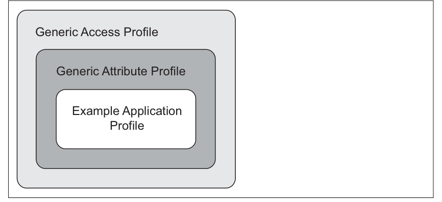

**Figure 1.1:  Profile dependencies**

Figure 1.1 depicts the structure and the dependencies of the profiles. A profile is dependent upon another profile if it re-uses parts of that profile by implicitly or explicitly referencing it.

### 1.3   CONFORMANCE

If conformance to this profile is claimed, all capabilities indicated as mandatory for this profile shall be supported in the specified manner (process-mandatory). This also applies for all optional and conditional capabilities for which support is indicated. All mandatory capabilities, and optional and conditional capabilities for which support is indicated, are subject to verification as part of the Bluetooth qualification program.

### 1.4   BLUETOOTH SPECIFICATION RELEASE COMPATIBILITY

This specification can be used with Bluetooth Core Specification Version 1.2 or later when using the profile on the BR/EDR physical link and Bluetooth Core Specification Version 4.0 or later when using the profile on the LE physical link.

### 1.5   CONVENTIONS

In this specification the use of literal terms such as procedure, PDUs, opcodes or function names appear in italics. Specific names of fields in structures, packets, etc. also appear in italics. The use of « » (e.g. «Primary Service») indicates a UUID or an Attribute Protocol error code (see [Vol 3] Part F, Table 3.3).

## 2  PROFILE OVERVIEW

The GATT profile is designed to be used by an application or another profile, so that a client can communicate with a server. The server contains a number of attributes, and the GATT Profile defines how to use the Attribute Protocol to discover, read, write and obtain indications of these attributes, as well as configuring broadcast of attributes.

### 2.1   PROTOCOL STACK

Figure 2.1 shows the peer protocols used by this profile.

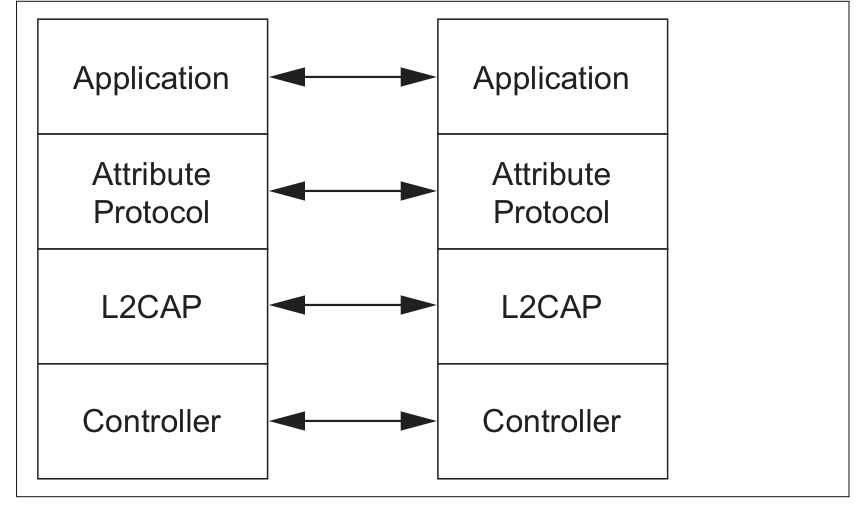

**Figure 2.1:  Protocol model**

### 2.2   CONFIGURATIONS AND ROLES

The following roles are defined for devices that implement this profile:
Client—This is the device that initiates commands and requests towards the server and can receive responses, indications and notifications sent by the server.
Server—This is the device that accepts incoming commands and requests from the client and sends responses, indications and notifications to a client.
Note: The roles are not fixed to the device. The roles are determined when a device initiates a defined procedure, and they are released when the procedure ends.
A device can act in both roles at the same time.
An example of configurations illustrating the roles for this profile is depicted in Figure 2.2.

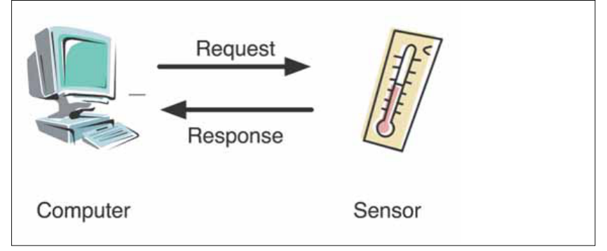

**Figure 2.2:  Examples of configuration**

In Figure 2.2, the computer is the temperature service client and the sensor is the temperature service server. The computer initiates procedures to configure the sensor or to read the sensor values. In this example the sensor provides information about the characteristics the sensor device exposes as part of the temperature service and may permit some characteristics to be written. Also, the sensor responds to read requests with the appropriate values.

### 2.3   USER REQUIREMENTS AND SCENARIOS

The following scenarios are covered by this profile:
• Exchanging configuration
• Discovery of services and characteristics on a device
• Reading a characteristic value
• Writing a characteristic value
• Notification of a characteristic value
• Indication of a characteristic value

### 2.4   PROFILE FUNDAMENTALS

This profile can be used over any physical link, using the Attribute Protocol L2CAP channel, known as the ATT Bearer. Here is a brief summary of lower layer requirements communication between the client and the server.
• An ATT Bearer is established using “Channel Establishment” as defined in Section 6.
• The profile roles are not tied to the Controller master/slave roles.
• On an LE Physical link, use of security features such as authorization, authentication and encryption are optional. On a BR/EDR physical link encryption is mandatory.
• Multi-octet fields within the GATT Profile shall be sent least significant octet first (little endian).

### 2.5   ATTRIBUTE PROTOCOL

The GATT Profile requires the implementation of the Attribute Protocol (ATT) and the required Attribute opcodes indicated in Section 4.2 and Section 4.13.

#### 2.5.1  Overview

The GATT Profile uses the Attribute Protocol to transport data in the form of commands, requests, responses, indications, notifications and confirmations between devices. This data is contained in Attribute Protocol PDUs.

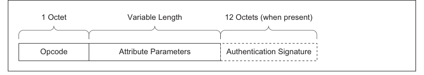

**Figure 2.3:  Attribute Protocol PDU**

The Opcode contains the specific command, request, response, indication, notification or confirmation opcode and a flag for authentication. The Attribute Parameters contain data for the specific command or request or the data returned in a response, indication or notification. The Authentication Signature is optional and is described in [Vol 3] Part H, Section 2.4.5.
Attribute Protocol commands and requests act on values stored in Attributes on the server device. An Attribute is composed of four parts: Attribute Handle, Attribute Type, Attribute Value, and Attribute Permissions. Figure 2.4 shows a logical representation of an Attribute. The actual representation for a given implementation is specific to that implementation.

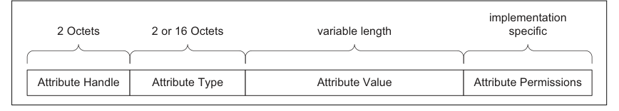

**Figure 2.4:  Logical Attribute Representation**

The Attribute Handle is an index corresponding to a specific Attribute. The Attribute Type is a UUID that describes the Attribute Value. The Attribute Value is the data described by the Attribute Type and indexed by the Attribute Handle. The Attributes are ordered by increasing Attribute Handle values. Attribute Handle values may begin at any value between 0x0001 and 0xFFFF. Although the Attribute Handle values are in increasing order, following Attribute Handle values may differ by more than one. That is to say there may be gaps between successive Attribute Handles. When this specification requires two attribute handles to be adjacent or for one to immediately follow one the other, such gaps are still permitted and shall be ignored.
Attribute Permissions is part of the Attribute that cannot be read from or written to using the Attribute Protocol. It is used by the server to determine whether read or write access is permitted for a given attribute. Attribute Permissions are established by the GATT profile, a higher layer profile or are implementation specific if not specified.

#### 2.5.2  Attribute Caching

Attribute caching is an optimization that allows the client to discover the Attribute information such as Attribute Handles used by the server once and use the same Attribute information across reconnections without rediscovery. Without caching the Attribute information, the client shall rediscover the Attribute information at each reconnection. With caching, time is saved and a significant amount of packets exchanged between the client and server is not required. The Attribute information that shall be cached by a client is the Attribute Handles of all server attributes and the GATT service characteristics values.
Attribute Handles used by the server should not change over time. This means that once an Attribute Handle is discovered by a client the Attribute Handle for that Attribute should not be changed.
Some circumstances may cause servers to change the Attribute Handles used for services, perhaps due to a factory reset or a firmware upgrade procedure being performed. The following is only required on the server if the services on the server can be added, modified or removed. If GATT based services on the server cannot be changed during the usable lifetime of the device, the Service Changed characteristic shall not exist on the server and the client does not need to ever perform service discovery after the initial service discovery for that server.
To support caching when a server supports changes in GATT based services, an indication is sent by the server to clients when a service is added, removed, or modified on the server. A GATT based service is considered modified if the binding of the Attribute Handles to the associated Attributes grouped within a service definition are changed. Any change to the GATT service definition characteristic values other than the Service Changed characteristic value itself shall also be considered a modification.
For clients that have a trusted relationship (i.e. bond) with the server, the attribute cache is valid across connections. For clients with a trusted relationship and not in a connection when a service change occurs, the server shall send an indication when the client reconnects to the server (see Section 7.1). For clients that do not have a trusted relationship with the server, the attribute cache is valid only during the connection. Clients without a trusted relationship shall receive an indication when the service change occurs only during the current connection.
Note: Clients without a trusted relationship must perform service discovery on each connection if the server supports the Service Changed characteristic.
The server shall send a Handle Value Indication containing the range of affected Attribute Handles that shall be considered invalid in the client’s attribute cache. The start Attribute Handle shall be the start Attribute Handle of the service definition containing the change and the end Attribute Handle shall be the last Attribute Handle of the service definition containing the change. The value in the indication is composed of two 16-bit Attribute Handles concatenated to indicate the affected Attribute Handle range.
Note: A server may set the affected Attribute Handle range to 0x0001 to 0xFFFF to indicate to the client to rediscover the entire set of Attribute Handles on the server.
The client, upon receiving a Handle Value Indication containing the range of affected Attribute Handles, shall consider the attribute cache invalid over the affected Attribute Handle range. Any outstanding request transaction shall be considered invalid if the Attribute Handle is contained within the affected Attribute Handle range. The client must perform service discovery before the client uses any service that has an attribute within the affected Attribute Handle range.
Once the server has received the Handle Value Confirmation, the server can consider the client to be aware of the updated Attribute Handles.
The client shall consider the affected Attribute Handle range to be invalid in its attribute cache and perform the discovery procedures to restore the attribute cache. The server shall store service changed information for all bonded devices.

#### 2.5.3  Attribute Grouping

Generic attribute profile defines grouping of attributes for three attribute types: «Primary Service», «Secondary Service» and «Characteristic». A group begins with a declaration, and ends as defined in Section 3.1 for services and Section 3.3 for characteristics. Not all of the grouping attributes can be used in the ATT Read By Group Type Request. The «Primary Service» and «Secondary Service» grouping types may be used in the Read By Group Type Request.
The «Characteristic» grouping type shall not be used in the ATT Read By Group Type Request.

#### 2.5.4  UUIDs

All 16-bit UUIDs shall be contained in exactly 2 octets. All 128-bit UUIDs shall be contained in exactly 16 octets.
All 32-bit UUIDs shall be converted to 128-bit UUIDs when the UUID is contained in an ATT PDU. See [Vol 3] Part B, Section 2.5.1 for the method of conversion.

### 2.6   GATT PROFILE HIERARCHY

#### 2.6.1  Overview

The GATT Profile specifies the structure in which profile data is exchanged. This structure defines basic elements such as services and characteristics, used in a profile. All of the elements are contained by Attributes. Attributes used in the Attribute Protocol are containers that carry this profile data.
The top level of the hierarchy is a profile. A profile is composed of one or more services necessary to fulfill a use case. A service is composed of characteristics or references to other services. Each characteristic contains a value and may contain optional information about the value. The service and characteristic and the components of the characteristic (i.e. value and descriptors) contain the profile data and are all stored in Attributes on the server.

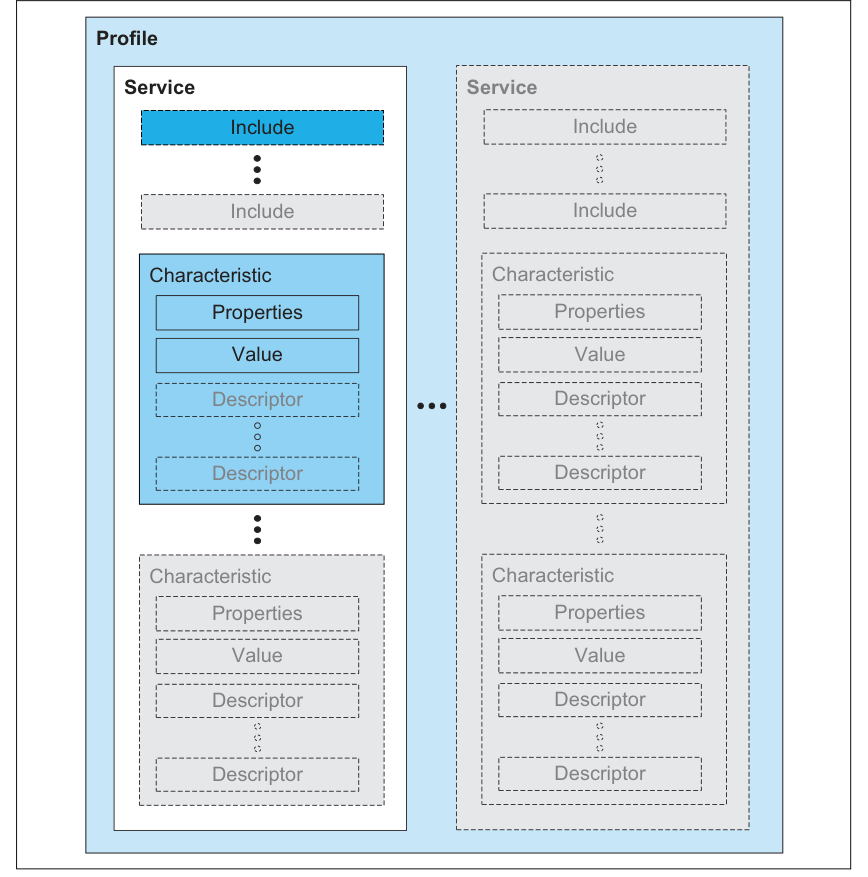

**Figure 2.5:  GATT Profile hierarchy**

#### 2.6.2  Service

A service is a collection of data and associated behaviors to accomplish a particular function or feature. In GATT, a service is defined by its service definition. A service definition may contain referenced services, mandatory characteristics and optional characteristics.
To maintain backward compatibility with earlier clients, later versions of a service definition can only add new referenced services or optional characteristics. Later versions of a service definition are forbidden from changing behaviors from previous versions of the service definition.
There are two types of services: primary service and secondary service. A primary service is a service that exposes the primary usable functionality of this device. A primary service can be included by another service. Primary services can be discovered using Primary Service Discovery procedures. A secondary service is a service that is only intended to be referenced from a primary service or another secondary service or other higher layer specification. A secondary service is only relevant in the context of the entity that references it.
The determination of whether a service is either a primary or secondary service can be mandated by a higher layer specification.
Services may be used in one or more higher layer specifications to fulfill a particular use case.
The service definition is described in Section 3.1.

#### 2.6.3  Included Services

An included service is a method to reference another service definition existing on the server into the service being defined. To include another service, an include definition is used at the beginning of the service definition. When a service definition uses an include definition to reference the included service, the entire included service definition becomes part of the new service definition. This includes all the included services and characteristics of the included service. The included service still exists as an independent service. A service that is included by another service shall not be changed by the act of inclusion or by the including service. There are no limits to the number of include definitions or the depth of nested includes in a service definition.
The include definition is described in Section 3.2.

#### 2.6.4  Characteristic

A characteristic is a value used in a service along with properties and configuration information about how the value is accessed and information about how the value is displayed or represented. In GATT, a characteristic is defined by its characteristic definition. A characteristic definition contains a characteristic declaration, characteristic properties, and a value and may contain descriptors that describe the value or permit configuration of the server with respect to the characteristic.
The characteristic definition is described in Section 3.3.

### 2.7   CONFIGURED BROADCAST

For LE physical links, Configured Broadcast is a method for a client to indicate to a server which Characteristic Value shall be broadcast in the advertising data when the server is executing the broadcast mode procedure. For BR/EDR physical links, Configured Broadcast is not supported.
To configure a Characteristic Value to be broadcast by the server when in broadcast mode, the client sets the broadcast configuration bit described in Section 3.3.3.4. The frequency of the broadcast is part of the service behavior definition.

## 3  SERVICE INTEROPERABILITY REQUIREMENTS

### 3.1   SERVICE DEFINITION

A service definition shall contain a service declaration and may contain include definitions and characteristic definitions. The service definition ends before the next service declaration or after the maximum Attribute Handle is reached. Service definitions appear on the server in an order based on Attribute Handle.
All include definitions and characteristic definitions contained within the service definition are considered to be part of the service. All include definitions shall immediately follow the service declaration and precede any characteristic definitions. A service definition may have zero or more include definitions. All characteristic definitions shall be immediately following the last include definition or in the event of no include definitions, immediately following the service declaration. A service definition may have zero or more characteristic definitions. There is no upper limit for include or characteristic definitions.
A service declaration is an Attribute with the Attribute Type set to the UUID for «Primary Service» or «Secondary Service». The Attribute Value shall be the 16-bit Bluetooth UUID or 128-bit UUID for the service, known as the service UUID. A client shall support the use of both 16-bit and 128-bit UUIDs. A client may ignore any service definition with an unknown service UUID. An unknown service UUID is a UUID for an unsupported service. The Attribute Permissions shall be read-only and shall not require authentication or authorization.
When multiple services exist, services definitions with service declarations using 16-bit Bluetooth UUID should be grouped together (i.e. listed sequentially) and services definitions with service declarations using 128-bit UUID should be grouped together.

| Attribute Handle | Attribute Type | Attribute Value | Attribute Permission |
| --- | --- | --- | --- |
| 0xNNNN | 0x2800 – UUID for «Primary Service» OR 0x2801 for «Secondary Service» | 16-bit Bluetooth UUID or 128-bit UUID for Service | Read Only, No Authenticatio No Authorization |

Table 3.1:  Service Declaration
A device or higher level specification may have multiple service definitions and may have multiple service definitions with the same service UUID.
All Attributes on a Server shall either contain a service declaration or exist within a service definition.
Service definitions contained in a server may appear in any order; a client shall not assume the order of service definitions on a server.

### 3.2   INCLUDE DEFINITION

An include definition shall contain only one include declaration.
The include declaration is an Attribute with the Attribute Type set to the UUID for «Include». The Attribute Value shall be set to the included service Attribute Handle, the End Group Handle, and the service UUID. The Service UUID shall only be present when the UUID is a 16-bit Bluetooth UUID.The Attribute Permissions shall be read only and not require authentication or authorization.

| Attribute Handle | Attribute Type | Attribute Value |  |  | Attribute Permissi |
| --- | --- | --- | --- | --- | --- |
| 0xNNNN | 0x2802 – UUID for «Include» | Included Service Attribute Handle | End Group Handle | Service UUID | Read Only, No Authentication, No Authorization |

Table 3.2:  Include Declaration
A server shall not contain a service definition with an include definition to another service that references the original service. This applies to each of the services the included definition references. This is referred to as a circular reference.
If the client detects a circular reference or detects nested include declarations to a greater level than it expects, it should terminate the ATT Bearer.

### 3.3   CHARACTERISTIC DEFINITION

A characteristic definition shall contain a characteristic declaration, a Characteristic Value declaration and may contain characteristic descriptor declarations. A characteristic definition ends at the start of the next characteristic declaration or service declaration or after the maximum Attribute Handle. Characteristic definitions appear on the server within a service definition in an order based on Attribute Handle.
Each declaration above is contained in a separate Attribute. The two required declarations are the characteristic declaration and the Characteristic Value declaration. The Characteristic Value declaration shall exist immediately following the characteristic declaration. Any optional characteristic descriptor declarations are placed after the Characteristic Value declaration. The order of the optional characteristic descriptor declarations is not significant.
A characteristic definition may be defined to concatenate several Characteristic Values into a single aggregated Characteristic Value. This may be used to optimize read and writes of multiple Characteristic Values through the reading and writing of a single aggregated Characteristic Value. This type of characteristic definition is the same as a normal characteristic definition. The characteristic declaration shall use a characteristic UUID that is unique to the
aggregated characteristic definition. The aggregated characteristic definition may also contain a characteristic aggregate format descriptor that describes the display format of the aggregated Characteristic Value.

#### 3.3.1  Characteristic Declaration

A characteristic declaration is an Attribute with the Attribute Type set to the UUID for «Characteristic» and Attribute Value set to the Characteristic Properties, Characteristic Value Attribute Handle and Characteristic UUID. The Attribute Permissions shall be readable and not require authentication or authorization.
The characteristic declaration Attribute Value shall not change while the server has a trusted relationship with any client.

| Attribute Handle | Attribute Types | Attribute Value |  |  | Attribute Permissions |
| --- | --- | --- | --- | --- | --- |
| 0xNNNN | 0x2803–UUID for «Characteristic» | Charac- teristic Properties | Character- istic Value Attribute Handle | Character- istic UUID | Read Only, No Authentication No Authorization |

Table 3.3:  Characteristic declaration
The Attribute Value of a characteristic declaration is read only.

| Attribute Value | Size | Description |
| --- | --- | --- |
| Characteristic Properties | 1 octets | Bit field of characteristic properties |
| Characteristic Value Handle | 2 octets | Handle of the Attribute containing the value of this characteristic |
| Characteristic UUID | 2 or 16 octets | 16-bit Bluetooth UUID or 128-bit UUID for Cha acteristic Value |

Table 3.4:  Attribute Value Field in characteristic declaration
A service may have multiple characteristic definitions with the same Characteristic UUID.
Within a service definition, some characteristics may be mandatory and those characteristics shall be located after the include declarations and before any optional characteristics within the service definition. A client shall not assume any order of those characteristics that are mandatory or any order of those characteristics that are optional within a service definition. Whenever possible and within the requirements stated earlier, characteristics definitions with characteristic declarations using 16-bit Bluetooth UUIDs should be grouped together (i.e. listed sequentially) and characteristics definitions with characteristic declarations using 128-bit UUIDs should be grouped together.

##### 3.3.1.1  Characteristic Properties

The Characteristic Properties bit field determines how the Characteristic Value can be used, or how the characteristic descriptors (see Section 3.3.3) can be accessed. If the bits defined in Table 3 5 are set, the action described is permitted. Multiple Characteristic Properties can be set.
These bits shall be set according to the procedures allowed for this characteristic, as defined by higher layer specifications, without regard to security requirements.

| Properties | Value | Description |
| --- | --- | --- |
| Broadcast | 0x01 | If set, permits broadcasts of the Characteristic Value using Server Characteristic Configuration Descriptor. If set, the Serve Characteristic Configuration Descriptor shall exist. |
| Read | 0x02 | If set, permits reads of the Characteristic Value using procedure defined in Section 4.8 |
| Write Without Response | 0x04 | If set, permit writes of the Characteristic Value without response using procedures defined in Section 4.9.1. |
| Write | 0x08 | If set, permits writes of the Characteristic Value with response using procedures defined in Section 4.9.3 or Section 4.9.4. |
| Notify | 0x10 | If set, permits notifications of a Characteristic Value without acknowledgment using the procedure defined in Section 4.10. I set, the Client Characteristic Configuration Descriptor shall exis |
| Indicate | 0x20 | If set, permits indications of a Characteristic Value with acknowl edgment using the procedure defined in Section 4.11. If set, the Client Characteristic Configuration Descriptor shall exist. |
| Authenticated Signed Writes | 0x40 | If set, permits signed writes to the Characteristic Value using th procedure defined in Section 4.9.2. |
| Extended Properties | 0x80 | If set, additional characteristic properties are defined in the Cha acteristic Extended Properties Descriptor defined in Section 3.3.3.1. If set, the Characteristic Extended Properties Descripto shall exist. |

Table 3.5:  Characteristic Properties bit field

##### 3.3.1.2  Characteristic Value Attribute Handle

The Characteristic Value Attribute Handle field is the Attribute Handle of the Attribute that contains the Characteristic Value.

##### 3.3.1.3  Characteristic UUID

The Characteristic UUID field is a 16-bit Bluetooth UUID or 128-bit UUID that describes the type of Characteristic Value. A client shall support the use of both 16-bit and 128-bit Characteristic UUIDs. A client may ignore any characteristic
definition with an unknown Characteristic UUID. An unknown characteristic UUID is a UUID for an unsupported characteristic.

#### 3.3.2  Characteristic Value Declaration

The Characteristic Value declaration contains the value of the characteristic. It is the first Attribute after the characteristic declaration. All characteristic definitions shall have a Characteristic Value declaration.
A Characteristic Value declaration is an Attribute with the Attribute Type set to the 16-bit Bluetooth or 128-bit UUID for the Characteristic Value used in the characteristic declaration. The Attribute Value is set to the Characteristic Value. The Attribute Permissions are specified by the service or may be implementation specific if not specified otherwise.

| Attribute Handle | Attribute Type | Attribute Value | Attribute Permission |
| --- | --- | --- | --- |
| 0xNNNN | 0xuuuu – 16-bit Bluetooth UUID or 128-bit UUID for Characteristic UUID | Characteristic Value | Higher layer profile or implementation specif |

Table 3.6:  Characteristic Value declaration

#### 3.3.3  Characteristic Descriptor Declarations

Characteristic descriptors are used to contain related information about the Characteristic Value. The GATT profile defines a standard set of characteristic descriptors that can be used by higher layer profiles. Higher layer profiles may define additional characteristic descriptors that are profile specific. Each characteristic descriptor is identified by the characteristic descriptor UUID. A client shall support the use of both 16-bit and 128-bit characteristic descriptor UUIDs. A client may ignore any characteristic descriptor declaration with an unknown characteristic descriptor UUID. An unknown characteristic descriptor UUID is a UUID for an unsupported characteristic descriptor.
Characteristic descriptors if present within a characteristic definition shall follow the Characteristic Value declaration. The characteristic descriptor declaration may appear in any order within the characteristic definition. The client shall not assume the order in which a characteristic descriptor declaration appears in a characteristic definition following the Characteristic Value declaration.
Characteristic descriptor declaration permissions are defined by a higher layer profile or are implementation specific. A client shall not assume all characteristic descriptor declarations are readable.

##### 3.3.3.1  Characteristic Extended Properties

The Characteristic Extended Properties declaration is a descriptor that defines additional Characteristic Properties. If the Extended Properties bit of the Characteristic Properties is set then this characteristic descriptor shall exist. The characteristic descriptor may occur in any position within the characteristic definition after the Characteristic Value. Only one Characteristic Extended Properties declaration shall exist in a characteristic definition.
The characteristic descriptor is contained in an Attribute and the Attribute Type shall be set to the UUID for «Characteristic Extended Properties» and the Attribute Value shall be the Characteristic Extended Properties Bit Field. The Attribute Permissions shall be readable without authentication and authorization being required.

| Attribute Handle | Attribute Type | Attribute Value | Attribute Permissions |
| --- | --- | --- | --- |
| 0xNNNN | 0x2900 – UUID for «Charac- teristic Extended Properties» | Characteristic Extended Properties Bit Field | Read Only, No Authenticatio No Authorization |

Table 3.7:  Characteristic Extended Properties declaration
The Characteristic Extended Properties bit field describes additional properties on how the Characteristic Value can be used, or how the characteristic descriptors (see Section 3.3.3.3) can be accessed. If the bits defined in Table 3 8 are set, the action described is permitted. Multiple Characteristic Properties can be set.

| Properties | Value | Description |
| --- | --- | --- |
| Reliable Write | 0x0001 | If set, permits reliable writes of the Characteristic Value using the procedure defined in Section 4.9.5 |
| Writable Auxiliaries | 0x0002 | If set, permits writes to the characteristic descriptor defined in Section 3.3.3.2 |
| Reserved for Future Use | 0xFFFC | Reserved for Future Use |

Table 3.8:  Characteristic Extended Properties bit field

##### 3.3.3.2  Characteristic User Description

The Characteristic User Description declaration is an optional characteristic descriptor that defines a UTF-8 string of variable size that is a user textual description of the Characteristic Value. If the Writable Auxiliary bit of the Characteristic Properties is set then this characteristic descriptor can be written. The characteristic descriptor may occur in any position within the characteristic definition after the Characteristic Value. Only one Characteristic User Description declaration shall exist in a characteristic definition.
The characteristic descriptor is contained in an Attribute and the Attribute Type shall be set to the UUID for «Characteristic User Description» and the Attribute Value shall be set to the characteristic user description UTF-8 string. The Attribute Permissions are specified by the profile or may be implementation specific if not specified otherwise.

| Attribute Handle | Attribute Type | Attribute Value | Attribute Permissions |
| --- | --- | --- | --- |
| 0xNNNN | 0x2901 – UUID for «Characteristic User Description» | Characteristic User Description UTF-8 String | Higher layer profile or implementation specifi |

Table 3.9:  Characteristic User Description declaration

##### 3.3.3.3  Client Characteristic Configuration

The Client Characteristic Configuration declaration is an optional characteristic descriptor that defines how the characteristic may be configured by a specific client. The Client Characteristic Configuration descriptor value shall be persistent across connections for bonded devices. The Client Characteristic Configuration descriptor value shall be set to the default value at each connection with non-bonded devices.The characteristic descriptor value is a bit field. When a bit is set, that action shall be enabled, otherwise it will not be used. The Client Characteristic Configuration descriptor may occur in any position within the characteristic definition after the Characteristic Value. Only one Client Characteristic Configuration declaration shall exist in a characteristic definition.
A client may write this configuration descriptor to control the configuration of this characteristic on the server for the client. Each client has its own instantiation of the Client Characteristic Configuration. Reads of the Client Characteristic Configuration only shows the configuration for that client and writes only affect the configuration of that client. Authentication and authorization may be required by the server to write the configuration descriptor. The Client Characteristic Configuration declaration shall be readable and writable.
The characteristic descriptor is contained in an Attribute. The Attribute Type shall be set to the UUID for «Client Characteristic Configuration». The Attribute Value shall be set to the characteristic descriptor value. The Attribute Permissions are specified by the profile or may be implementation specific if not specified otherwise.

| Attribute Handle | Attribute Type | Attribute Value | Attribute Permissions |
| --- | --- | --- | --- |
| 0xNNNN | 0x2902 – UUID for «Client Characteristic Configuration» | Characteristic Configuration Bits | Readable with no authentica- tion or authorization. Writable with authentication and authorization defined by higher layer specification or is implementation specific. |

Table 3.10:  Client Characteristic Configuration declaration
The following Client Characteristic Configuration bits are defined:

| Configuration | Value | Description |
| --- | --- | --- |
| Notification | 0x0001 | The Characteristic Value shall be notified.This value can only be set if the characteristic’s property has the notify bit set. |
| Indication | 0x0002 | The Characteristic Value shall be indicated. This value can onl be set if the characteristic’s property has the indicate bit set. |
| Reserved for Future Use | 0xFFFC | Reserved for future use. |

Table 3.11:  Client Characteristic Configuration bit field definition
The default value for the Client Characteristic Configuration descriptor value shall be 0x0000.
In the case where multiple ATT bearers from the same device are supported by the GATT server, each ATT bearer shall be considered to have a separate GATT client instance. Therefore each GATT client shall have a separate Client Characteristic Configuration.

##### 3.3.3.4  Server Characteristic Configuration

The Server Characteristic Configuration declaration is an optional characteristic descriptor that defines how the characteristic may be configured for the server. The characteristic descriptor value is a bit field. When a bit is set, that action shall be enabled, otherwise it will not be used. The Server Characteristic Configuration descriptor may occur in any position within the characteristic definition after the Characteristic Value. Only one Server Characteristic Configuration declaration shall exist in a characteristic definition. The Server Characteristic Configuration declaration shall be readable and writable.
A client may write this configuration descriptor to control the configuration of this characteristic on the server for all clients. There is a single instantiation of the Server Characteristic Configuration for all clients. Reads of the Server Characteristic Configuration shows the configuration all clients and writes affect the configuration for all clients. Authentication and authorization may be required by the server to write the configuration descriptor.
The characteristic descriptor is contained in an Attribute. The Attribute Type shall be set to the UUID for «Server Characteristic Configuration». The Attribute Value shall be set to the characteristic descriptor value. The Attribute Permissions are specified by the profile or may be implementation specific if not specified otherwise.

| Attribute Handle | Attribute Type | Attribute Value | Attribute Permissions |
| --- | --- | --- | --- |
| 0xNNNN | 0x2903 – UUID for «Server Characteristic Configuration» | Characteristic Configuration Bits | Readable with no authentica tion or authorization. Writable with authentication and authorization defined by higher layer specification or i implementation specific. |

Table 3.12:  Server Characteristic Configuration declaration
The following Server Characteristic Configuration bits are defined:

| Configuration | Value | Description |
| --- | --- | --- |
| Broadcast | 0x0001 | The Characteristic Value shall be broadcast when the server i in the broadcast procedure if advertising data resources are available. This value can only be set if the characteristic’s pro erty has the broadcast bit set. |
| Reserved for Future Use | 0xFFFE | Reserved for future use. |

Table 3.13:  Server Characteristic Configuration bit field definition

##### 3.3.3.5  Characteristic Presentation Format

The Characteristic Presentation Format declaration is an optional characteristic descriptor that defines the format of the Characteristic Value. The characteristic descriptor may occur in any position within the characteristic definition after the Characteristic Value. If more than one Characteristic Presentation Format declarations exist, in a characteristic definition, then a Characteristic Aggregate Format declaration shall exist as part of the characteristic definition.
The characteristic format value is composed of five parts: format, exponent, unit, name space, and description.
The characteristic descriptor is contained in an Attribute. The Attribute Type shall be set to the UUID for «Characteristic Format». The Attribute Value shall be set to the characteristic descriptor value. The Attribute Permissions shall be read only and not require authentication or authorization.

| Attribute Handle | Attribute Type | Attribute Value |  |  |  |  | Attribute Permissions |
| --- | --- | --- | --- | --- | --- | --- | --- |
| 0xNNNN | 0x2904 – UUID for «Characteristic Format» | Format | Exponent | Unit | Name Space | Description | Read only No Authenticatio NO authorization |

Table 3.14:  Characteristic Format declaration
The definition of the Characteristic Presentation Format descriptor Attribute Value field is the following.

| Field Name | Value Size | Description |
| --- | --- | --- |
| Format | 1 octet | Format of the value of this characteristic. |
| Exponent | 1 octet | Exponent field to determine how the value of this characteristic is further formatted. |
| Unit | 2 octets | The unit of this characteristic as defined in [1] |
| Name Space | 1 octet | The name space of the description as defined in [ |
| Description | 2 octets | The description of this characteristic as defined in higher layer profile. |

Table 3.15:  Characteristic Format Value definition

###### 3.3.3.5.1   Bit Ordering

The bit ordering used for the Characteristic Format descriptor shall be little- endian.

###### 3.3.3.5.2   Format

The format field determines how a single value contained in the Characteristic Value is formatted. If a format is not a whole number of octets, then the data shall be stored in the smallest number of octets that can contain the value. The data shall occupy the whole of each octet except the most significant bits of the last octet; all other bits in the last octet shall be reserved for future use.
Signed integers shall use two's-complement representation.
The following format values are defined:

| Format | Short Name | Description | Exponent Value |
| --- | --- | --- | --- |
| 0x00 | rfu | Reserved for Future Use | No |
| 0x01 | boolean | unsigned 1-bit; 0 = false, 1 = true | No |
| 0x02 | 2bit | unsigned 2-bit integer | No |
| 0x03 | nibble | unsigned 4-bit integer | No |
| 0x04 | uint8 | unsigned 8-bit integer | Yes |
| 0x05 | uint12 | unsigned 12-bit integer | Yes |
| 0x06 | uint16 | unsigned 16-bit integer | Yes |
| 0x07 | uint24 | unsigned 24-bit integer | Yes |
| 0x08 | uint32 | unsigned 32-bit integer | Yes |
| 0x09 | uint48 | unsigned 48-bit integer | Yes |
| 0x0A | uint64 | unsigned 64-bit integer | Yes |
| 0x0B | uint128 | unsigned 128-bit integer | Yes |
| 0x0C | sint8 | signed 8-bit integer | Yes |
| 0x0D | sint12 | signed 12-bit integer | Yes |
| 0x0E | sint16 | signed 16-bit integer | Yes |
| 0x0F | sint24 | signed 24-bit integer | Yes |
| 0x10 | sint32 | signed 32-bit integer | Yes |
| 0x11 | sint48 | signed 48-bit integer | Yes |
| 0x12 | sint64 | signed 64-bit integer | Yes |
| 0x13 | sint128 | signed 128-bit integer | Yes |
| 0x14 | float32 | IEEE-754 32-bit floating point | No |
| 0x15 | float64 | IEEE-754 64-bit floating point | No |
| 0x16 | SFLOAT | IEEE-11073 16-bit SFLOAT | No |
| 0x17 | FLOAT | IEEE-11073 32-bit FLOAT | No |

Table 3.16:  Characteristic Format types

| Format | Short Name | Description | Exponent Value |
| --- | --- | --- | --- |
| 0x18 | duint16 | IEEE-20601 format | No |
| 0x19 | utf8s | UTF-8 string | No |
| 0x1A | utf16s | UTF-16 string | No |
| 0x1B | struct | Opaque structure | No |
| 0x1C – 0xFF | rfu | Reserved for Future Use | No |

Table 3.16:  Characteristic Format types
When encoding an IPv4 address, the uint32 Format type shall be used.
When encoding an IPv6 address, the uint128 Format type shall be used.
When encoding a Bluetooth BD_ADDR, the uint48 Format type shall be used.
A duint16 is two uint16 values concatenated together.

###### 3.3.3.5.3   Exponent

The exponent field is used with integer data types to determine how the value is further formatted. The exponent field is only used on integer format types as indicated in the format field in Table 3.16. The exponent field is a two's- complement signed integer.
actual value = Characteristic Value * 10Exponent
As can be seen in the above equation, the actual value is a combination of the Characteristic Value and the value 10 to the power Exponent. This is sometimes known as a fixed point number.
For example, if the Exponent is 2 and the Characteristic Value is 23, the actual value would be 2300.
For example, if the Exponent is -3 and the Characteristic Value is 3892, the actual value would be 3.892.

###### 3.3.3.5.4   Unit

The Unit is a UUID as defined in the Assigned Numbers document [1].

###### 3.3.3.5.5   Name Space

The Name Space field is used to identify the organization as defined in the Assigned Numbers document [1], that is responsible for defining the enumerations for the description field.

###### 3.3.3.5.6   Description

The Description is an enumerated value as defined in the Assigned Numbers document [1] from the organization identified by the Name Space field.

##### 3.3.3.6  Characteristic Aggregate Format

The Characteristic Aggregate Format declaration is an optional characteristic descriptor that defines the format of an aggregated Characteristic Value.
The characteristic descriptor may occur in any position within the characteristic definition after the Characteristic Value. Only one Characteristic Aggregate Format declaration shall exist in a characteristic definition.
The Characteristic Aggregate Format value is composed of a list of Attribute Handles of Characteristic Presentation Format declarations, where each Attribute Handle points to a Characteristic Presentation Format declaration.
The Attribute Permissions shall be read only and not require authentication or authorization.

| Attribute Handle | Attribute Type | Attribute Value | Attribute Permission |
| --- | --- | --- | --- |
| 0xNNNN | 0x2905 – UUID for «Characteristic Aggregate Format» | List of Attribute Handles for the Characteristic Presenta- tion Format Declarations | Read only No authentication No authorization |

Table 3.17:  Characteristic Aggregate Format declaration
The List of Attribute Handles is the concatenation of multiple 16-bit Attribute Handle values into a single Attribute Value. The list shall contain at least two Attribute Handle for Characteristic Presentation Format declarations. The Characteristic Value shall be decomposed by each of the Characteristic Presentation Format declarations pointed to by the Attribute Handles. The order of the Attribute Handles in the list is significant.
If more than one Characteristic Presentation Format declarations exist in a characteristic definition, there shall also be one Characteristic Aggregate Format declaration. The Characteristic Aggregate Format declaration shall include each Characteristic Presentation Format declaration in the characteristic definition in the list of Attribute Handles. Characteristic Presentation Format declarations from other characteristic definitions may also be used.
A Characteristic Aggregate Format declaration may exist without a Characteristic Presentation Format declaration existing in the characteristic definition. The Characteristic Aggregate Format declaration may use Characteristic Presentation Format declarations from other characteristic definitions.

### 3.4   SUMMARY OF GATT PROFILE ATTRIBUTE TYPES

The following table summarizes the Attribute Types defined by the GATT Profile.

| Attribute Type | UUID | Description |
| --- | --- | --- |
| «Primary Service» | 0x2800 | Primary Service Declaration |
| «Secondary Service» | 0x2801 | Secondary Service Declaration |
| «Include» | 0x2802 | Include Declaration |
| «Characteristic» | 0x2803 | Characteristic Declaration |
| «Characteristic Extended Properties» | 0x2900 | Characteristic Extended Properties |
| «Characteristic User Description» | 0x2901 | Characteristic User Description Descriptor |
| «Client Characteristic Configuration» | 0x2902 | Client Characteristic Configuration Descriptor |
| «Server Characteristic Configuration» | 0x2903 | Server Characteristic Configuration Descriptor |
| «Characteristic For- mat» | 0x2904 | Characteristic Format Descriptor |
| «Characteristic Aggre- gate Format» | 0x2905 | Characteristic Aggregate Format Descriptor |

Table 3.18:  Summary of GATT Profile Attribute types

## 4  GATT FEATURE REQUIREMENTS

### 4.1   OVERVIEW

There are 11 features defined in the GATT Profile:
1. Server Configuration 2. Primary Service Discovery 3. Relationship Discovery 4. Characteristic Discovery 5. Characteristic Descriptor Discovery 6. Reading a Characteristic Value
7. Writing a Characteristic Value 8. Notification of a Characteristic Value
9. Indication of a Characteristic Value
10.Reading a Characteristic Descriptor
11.Writing a Characteristic Descriptor
Each of the features is mapped to procedures and sub-procedures. These procedures and sub-procedures describe how the Attribute Protocol is used to accomplish the corresponding feature.

### 4.2   FEATURE SUPPORT AND PROCEDURE MAPPING

The table below maps each feature to the procedures used for that feature, and indicates whether the procedure is optional or mandatory for that feature. The procedures are described in the referenced section.

| Item No. | Feature | Sub-Procedure | Ref. | Support in Client | Support in Serve |
| --- | --- | --- | --- | --- | --- |
| 1 | Server Con- figuration | Exchange MTU | 4.3.1 | O | O |
| 2 | Primary Ser- vice Discov- ery | Discover All Primary Ser- vices | 4.4.1 | O | M |
|  |  | Discover Primary Services By Service UUID | 4.4.2 | O | M |
| 3 | Relationship Discovery | Find Included Services | 4.5.1 | O | M |
| 4 | Characteris- tic Discovery | Discover All Characteristic of a Service | 4.6.1 | O | M |
|  |  | Discover Characteristic by UUID | 4.6.2 | O | M |

Table 4.1:  GATT feature mapping to procedures

| Item No. | Feature | Sub-Procedure | Ref. | Support in Client | Support in Server |
| --- | --- | --- | --- | --- | --- |
| 5 | Characteris- tic Descriptor Discovery | Discover All Characteristic Descriptors | 4.7.1 | O | M |
| 6 | Characteris- tic Value Read | Read Characteristic Value | 4.8.1 | O | M |
|  |  | Read Using Characteristic UUID | 4.8.24.8 .1 | O | M |
|  |  | Read Long Characteristic Values | 4.8.34.8 .2 | O | O |
|  |  | Read Multiple Characteristic Values | 4.8.44.8 .3 | O | O |
| 7 | Characteris- tic Value Write | Write Without Response | 4.9.1 | O | C.1 |
|  |  | Signed Write Without Response | 4.9.2 | O | O |
|  |  | Write Characteristic Value | 4.9.3 | O | C.2 |
|  |  | Write Long Characteristic Values | 4.9.4 | O | O |
|  |  | Characteristic Value Reliable Writes | 4.9.5 | O | O |
| 8 | Characteris- tic Value Noti- fication | Notifications | 4.10.1 | O | O |
| 9 | Characteris- tic Value Indi- cation | Indications | 4.11.1 | M | C3 |
| 10 | Characteris- tic Descriptor Value Read | Read Characteristic Descrip- tors | 4.12.1 | O | O |
|  |  | Read Long Characteristic Descriptors | 4.12.2 | O | O |
| 11 | Characteris- tic Descriptor Value Write | Write Characteristic Descrip- tors | 4.12.3 | O | O |
|  |  | Write Long Characteristic Descriptors | 4.12.4 | O | O |
| C1: Write Without Response is mandatory if Signed Write Without Response is sup- ported otherwise optional C2: Write Characteristic Value is mandatory if Write Long Characteristic Values is sup- ported otherwise optional C3: If Service Changed Characteristic is present, this feature is mandatory, otherwise optional. |  |  |  |  |  |

Table 4.1:  GATT feature mapping to procedures

### 4.3   SERVER CONFIGURATION

This procedure is used by the client to configure the Attribute Protocol. This procedure has only one sub-procedure used to set the MTU sizes.

#### 4.3.1  Exchange MTU

This sub-procedure is used by the client to set the ATT_MTU to the maximum possible value that can be supported by both devices when the client supports a value greater than the default ATT_MTU for the Attribute Protocol. This sub- procedure shall only be initiated once during a connection.
This sub-procedure shall not be used on a BR/EDR physical link since the MTU size is negotiated using L2CAP channel configuration procedures.
The Attribute Protocol Exchange MTU Request is used by this sub-procedure. The Client Rx MTU parameter shall be set to the maximum MTU that this client can receive.
Two possible responses can be sent from the server for the Exchange MTU Request: Exchange MTU Response and Error Response.
Error Response is returned if an error occurred on the server.
The server shall respond to this message with an Exchange MTU Response with the Server Rx MTU parameter set to the maximum MTU that this server can receive.
If the Error Response is sent by the server with the Error Code set to Request Not Supported, the Attribute Opcode is not supported and the default MTU shall be used.
Once the messages have been exchanged, the ATT_MTU shall be set to the minimum of the Client Rx MTU and Server Rx MTU values.

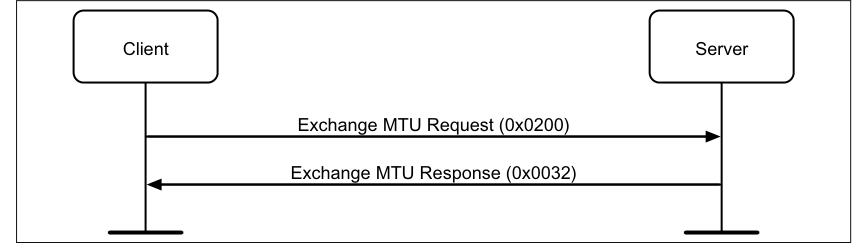

**Figure 4.1:  Exchange MTU**

For example, in Figure 4.1, based on the exchanged ATT_MTU value in the ATT_MTU would be 0x0032.

### 4.4   PRIMARY SERVICE DISCOVERY

This procedure is used by a client to discover primary services on a server. Once the primary services are discovered, additional information about the primary services can be accessed using other procedures, including characteristic discovery and relationship discovery to find other related primary and secondary services.
There are two sub-procedures that can be used for primary service discovery: Discover All Primary Services and Discover Primary Services by Service UUID.

#### 4.4.1  Discover All Primary Services

This sub-procedure is used by a client to discover all the primary services on a server.
The Attribute Protocol Read By Group Type Request shall be used with the Attribute Type parameter set to the UUID for «Primary Service». The Starting Handle shall be set to 0x0001 and the Ending Handle shall be set to 0xFFFF.
Two possible responses can be sent from the server for the Read By Group Type Request: Read By Group Type Response and Error Response.
Error Response is returned if an error occurred on the server.
Read By Group Type Response returns a list of Attribute Handle, End Group Handle, and Attribute Value tuples corresponding to the services supported by the server. Each Attribute Value contained in the response is the Service UUID of a service supported by the server. The Attribute Handle is the handle for the service declaration. The End Group Handle is the handle of the last attribute within the service definition. The End Group Handle of the last service in a device can be 0xFFFF. The Read By Group Type Request shall be called again with the Starting Handle set to one greater than the last End Group Handle in the Read By Group Type Response.
This sub-procedure is complete when the Error Response is received and the Error Code is set to «Attribute Not Found» or when the End Group Handle in the Read by Type Group Response is 0xFFFF.
It is permitted to end the sub-procedure early if a desired primary service is found prior to discovering all the primary services on the server.
Note: The service declaration described in Section 3.1 specifies that the service declaration is readable and requires no authentication or authorization, therefore insufficient authentication or read not permitted errors shall not occur.

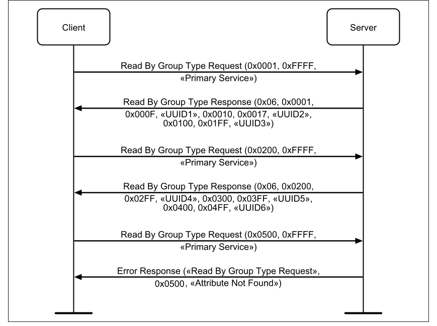

**Figure 4.2:  Discover All Primary Services example**

#### 4.4.2  Discover Primary Service by Service UUID

This sub-procedure is used by a client to discover a specific primary service on a server when only the Service UUID is known. The specific primary service may exist multiple times on a server. The primary service being discovered is identified by the service UUID.
The Attribute Protocol Find By Type Value Request shall be used with the Attribute Type parameter set to the UUID for «Primary Service» and the Attribute Value set to the 16-bit Bluetooth UUID or 128-bit UUID for the specific primary service. The Starting Handle shall be set to 0x0001 and the Ending Handle shall be set to 0xFFFF.
Two possible responses can be sent from the server for the Find By Type Value Request: Find By Type Value Response and Error Response.
Error Response is returned if an error occurred on the server.
Find By Type Value Response returns a list of Attribute Handle ranges. The Attribute Handle range is the starting handle and the ending handle of the service definition. The End Group Handle of the last service in a device can be 0xFFFF. If the Attribute Handle range for the Service UUID being searched is returned and the End Found Handle is not 0xFFFF, the Find By Type Value
Request may be called again with the Starting Handle set to one greater than the last Attribute Handle range in the Find By Type Value Response.
This sub-procedure is complete when the Error Response is received and the Error Code is set to «Attribute Not Found» or when the End Group Handle in the Find By Type Value Response is 0xFFFF.
It is permitted to end the sub-procedure early if a desired primary service is found prior to discovering all the primary services of the specified service UUID supported on the server.
Note: The service declaration described in Section 3.1 specifies that the service declaration is readable and requires no authentication or authorization, therefore insufficient authentication or read not permitted errors shall not occur.

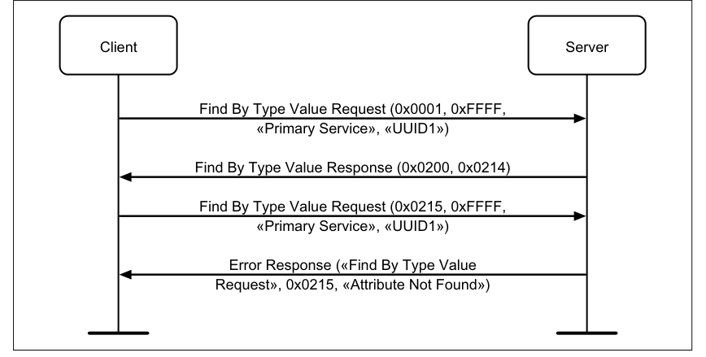

**Figure 4.3:  Discover Primary Service by Service UUID example**

### 4.5   RELATIONSHIP DISCOVERY

This procedure is used by a client to discover service relationships to other services.
There is one sub-procedure that can be used for relationship discovery: Find Included Services.

#### 4.5.1  Find Included Services

This sub-procedure is used by a client to find include service declarations within a service definition on a server. The service specified is identified by the service handle range.
The Attribute Protocol Read By Type Request shall be used with the Attribute Type parameter set to the UUID for «Include» The Starting Handle shall be set to starting handle of the specified service and the Ending Handle shall be set to the ending handle of the specified service. It is permitted to end the sub- procedure early if a desired included service is found prior to discovering all the included services of the specified service supported on the server.
Two possible responses can be sent from the server for the Read By Type Request: Read By Type Response and Error Response.
Error Response is returned if an error occurred on the server.
Read By Type Response returns a set of Attribute Handle and Attribute Value pairs corresponding to the included services in the service definition. Each Attribute Value contained in the response is composed of the Attribute Handle of the included service declaration and the End Group Handle. If the service UUID is a 16-bit Bluetooth UUID it is also returned in the response. The Read By Type Request shall be called again with the Starting Handle set to one greater than the last Attribute Handle in the Read By Type Response.
The sub-procedure is complete when either the Error Response is received with the Error Code set to Attribute Not Found or the Read By Type Response has an Attribute Handle of the included service declaration that is equal to the Ending Handle of the request.
To get the included service UUID when the included service uses a 128-bit UUID, the Read Request is used. The Attribute Handle for the Read Request is the Attribute Handle of the included service.
Note: The include declaration described in Section 3.2 specifies that the include declaration is readable and requires no authentication or authorization, therefore insufficient authentication or read not permitted errors shall not occur.

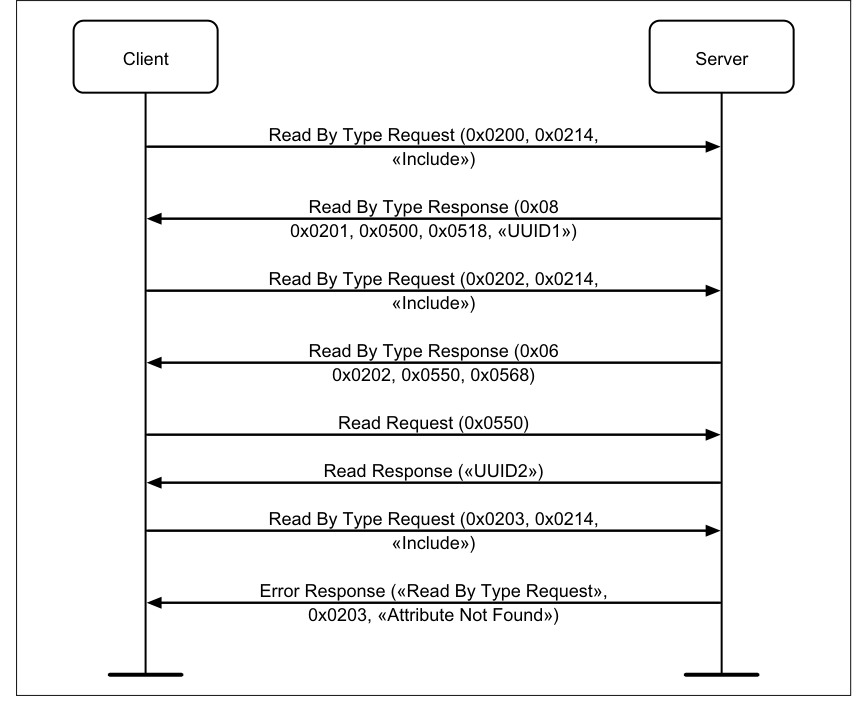

**Figure 4.4:  Find Included Services example**

### 4.6   CHARACTERISTIC DISCOVERY

This procedure is used by a client to discover service characteristics on a server. Once the characteristics are discovered additional information about the characteristics can be discovered or accessed using other procedures.
There are two sub-procedures that can be used for characteristic discovery: Discover All Characteristics of a Service and Discover Characteristics by UUID.

#### 4.6.1  Discover All Characteristics of a Service

This sub-procedure is used by a client to find all the characteristic declarations within a service definition on a server when only the service handle range is known. The service specified is identified by the service handle range.
The Attribute Protocol Read By Type Request shall be used with the Attribute Type parameter set to the UUID for «Characteristic» The Starting Handle shall be set to starting handle of the specified service and the Ending Handle shall be set to the ending handle of the specified service.
Two possible responses can be sent from the server for the Read By Type Request: Read By Type Response and Error Response.
Error Response is returned if an error occurred on the server.
Read By Type Response returns a list of Attribute Handle and Attribute Value pairs corresponding to the characteristics in the service definition. The Attribute Handle is the handle for the characteristic declaration. The Attribute Value is the Characteristic Properties, Characteristic Value Handle and Characteristic UUID. The Read By Type Request shall be called again with the Starting Handle set to one greater than the last Attribute Handle in the Read By Type Response.
The sub-procedure is complete when the Error Response is received and the Error Code is set to Attribute Not Found or the Read By Type Response has an Attribute Handle that is equal to the Ending Handle of the request.
It is permitted to end the sub-procedure early if a desired characteristic is found prior to discovering all the characteristics of the specified service supported on the server.
Note: The characteristic declaration described in Section 3.3 specifies that the characteristic declaration is readable and requires no authentication or authorization, therefore insufficient authentication or read not permitted errors should not occur.

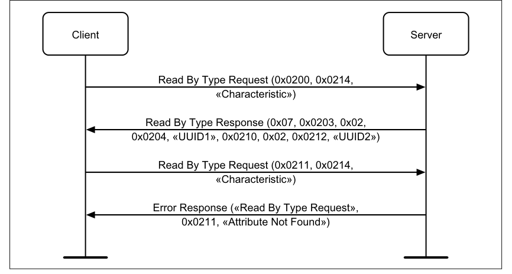

**Figure 4.5:  Discover All Characteristics of a Service example**

Note: In this example «UUID1» and «UUID2» are 16 bits (2 octets). If they were 128 bits (16 octets) then the Read By Type Response data would instead be: 0x15, 0x0203, 0x02, 0x0204, «UUID1», 0x0210, 0x02, 0x0212, «UUID2»

#### 4.6.2  Discover Characteristics by UUID

This sub-procedure is used by a client to discover service characteristics on a server when only the service handle ranges are known and the characteristic UUID is known. The specific service may exist multiple times on a server. The characteristic being discovered is identified by the characteristic UUID.
The Attribute Protocol Read By Type Request is used to perform the beginning of the sub-procedure. The Attribute Type is set to the UUID for «Characteristic» and the Starting Handle and Ending Handle parameters shall be set to the service handle range.
Two possible responses can be sent from the server for the Read By Type Request: Read By Type Response and Error Response.
Error Response is returned if an error occurred on the server.
Read By Type Response returns a list of Attribute Handle and Attribute Value pairs corresponding to the characteristics contained in the handle range provided. Each Attribute Value in the list is the Attribute Value for the characteristic declaration. The Attribute Value contains the characteristic properties, Characteristic Value Handle and characteristic UUID. The Attribute Value for each Attribute Handle and Attribute Value pairs are checked for a matching characteristic UUID. Once found, the sub-procedure continues until the end of the service handle range is exhausted. The Read By Type Request is called again with the Starting Handle set to one greater than the last Attribute Handle in the Read By Type Response.
If the Error Response is sent by the server with the Error Code set to Attribute Not Found, the characteristic does not exist on the server within the handle range provided.
It is permitted to end the sub-procedure early if a desired characteristic is found prior to discovering all the characteristics for the specified service supported on the server.
Note: The characteristic declaration described in Section 3.3 specifies that the characteristic declaration is readable and requires no authentication or authorization, therefore insufficient authentication or read not permitted errors shall not occur.

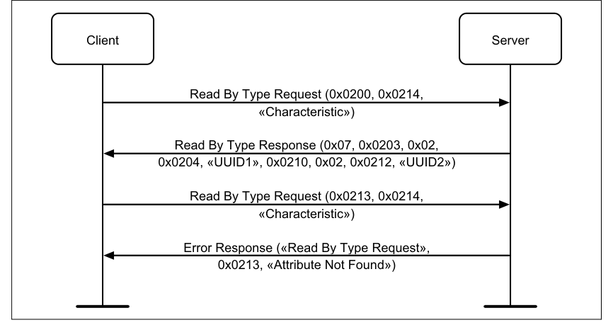

**Figure 4.6:  Discover Characteristics by UUID example**

### 4.7   CHARACTERISTIC DESCRIPTOR DISCOVERY

This procedure is used by a client to discover characteristic descriptors of a characteristic. Once the characteristic descriptors are discovered additional information about the characteristic descriptors can be accessed using other procedures.
There is one sub-procedure that can be used for characteristic descriptor discovery: Discover All Characteristic Descriptors.

#### 4.7.1  Discover All Characteristic Descriptors

This sub-procedure is used by a client to find all the characteristic descriptor’s Attribute Handles and Attribute Types within a characteristic definition when only the characteristic handle range is known. The characteristic specified is identified by the characteristic handle range.
The Attribute Protocol Find Information Request shall be used with the Starting Handle set to the handle of the specified characteristic value + 1 and the Ending Handle set to the ending handle of the specified characteristic.
Two possible responses can be sent from the server for the Find Information Request: Find Information Response and Error Response.
Error Response is returned if an error occurred on the server.
Find Information Response returns a list of Attribute Handle and Attribute Value pairs corresponding to the characteristic descriptors in the characteristic definition. The Attribute Handle is the handle for the characteristic descriptor declaration. The Attribute Value is the Characteristic Descriptor UUID. The
Find Information Request shall be called again with the Starting Handle set to one greater than the last Attribute Handle in the Find Information Response.
The sub-procedure is complete when the Error Response is received and the Error Code is set to Attribute Not Found or the Find Information Response has an Attribute Handle that is equal to the Ending Handle of the request.
It is permitted to end the sub-procedure early if a desired Characteristic Descriptor is found prior to discovering all the characteristic descriptors of the specified characteristic.

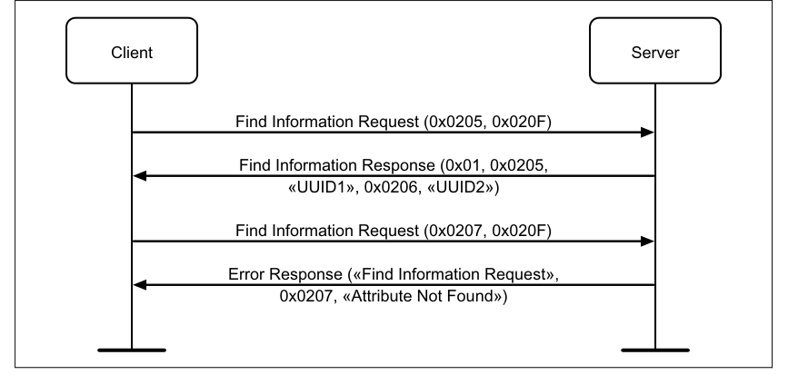

**Figure 4.7:  Discover All Characteristic Descriptors example**

### 4.8   CHARACTERISTIC VALUE READ

This procedure is used to read a Characteristic Value from a server. There are four sub-procedures that can be used to read a Characteristic Value: Read Characteristic Value, Read Using Characteristic UUID, Read Long Characteristic Values, and Read Multiple Characteristic Values.

#### 4.8.1  Read Characteristic Value

This sub-procedure is used to read a Characteristic Value from a server when the client knows the Characteristic Value Handle. The Attribute Protocol Read Request is used with the Attribute Handle parameter set to the Characteristic Value Handle. The Read Response returns the Characteristic Value in the Attribute Value parameter.
The Read Response only contains the complete Characteristic Value if that is less than or equal to (ATT_MTU – 1) octets in length. If the Characteristic Value is greater than (ATT_MTU – 1) octets in length, the Read Response only contains the first portion of the Characteristic Value and the Read Long Characteristic Value procedure may be used if the rest is required.
An Error Response shall be sent by the server in response to the Read Request if insufficient authentication, insufficient authorization, insufficient encryption key size is used by the client, or if a read operation is not permitted on the Characteristic Value. The Error Code parameter is set as specified in the Attribute Protocol.

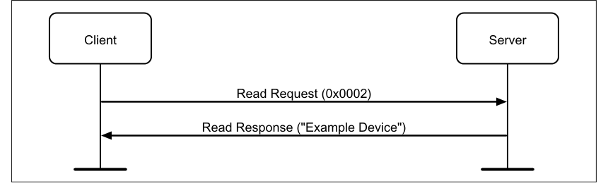

**Figure 4.8:  Read Characteristic Value example**

#### 4.8.2  Read Using Characteristic UUID

This sub-procedure is used to read a Characteristic Value from a server when the client only knows the characteristic UUID and does not know the handle of the characteristic.
The Attribute Protocol Read By Type Request is used to perform the sub- procedure. The Attribute Type is set to the known characteristic UUID and the Starting Handle and Ending Handle parameters shall be set to the range over
which this read is to be performed. This is typically the handle range for the service in which the characteristic belongs.
Two possible responses can be sent from the server for the Read By Type Request: Read By Type Response and Error Response.
Error Response is returned if an error occurred on the server.
Read By Type Response returns a list of Attribute Handle and Attribute Value pairs corresponding to the first characteristics contained in the handle range that will fit into the Read By Type Response PDU. This procedure does not return the complete list of all characteristics with the given characteristic UUID within the range of values. If such an operation is required, then the Discover All Characteristics by UUID sub procedure shall be used.
If the Error Response is sent by the server with the Error Code set to Attribute Not Found, the characteristic does not exist on the server within the handle range provided.

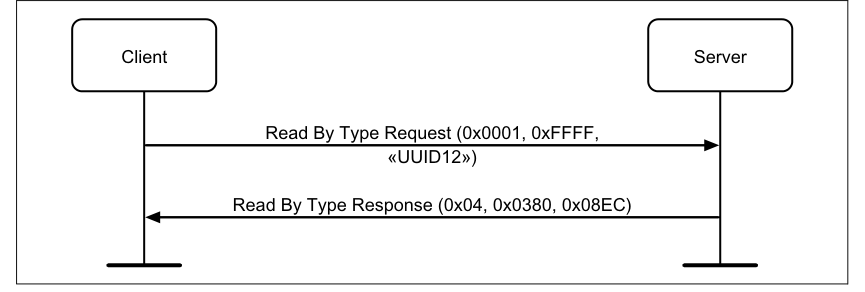

**Figure 4.9:  Read Using Characteristic UUID example**

#### 4.8.3  Read Long Characteristic Values

This sub-procedure is used to read a Characteristic Value from a server when the client knows the Characteristic Value Handle and the length of the Characteristic Value is longer than can be sent in a single Read Response Attribute Protocol message.
The Attribute Protocol Read Blob Request is used to perform this sub- procedure. The Attribute Handle shall be set to the Characteristic Value Handle of the Characteristic Value to be read. The Value Offset parameter shall be the offset within the Characteristic Value to be read. To read the complete Characteristic Value the offset should be set to 0x00 for the first Read Blob Request. The offset for subsequent Read Blob Requests is the next octet that has yet to be read. The Read Blob Request is repeated until the Read Blob Response’s Part Attribute Value parameter is shorter than (ATT_MTU – 1).
For each Read Blob Request a Read Blob Response is received with a portion of the Characteristic Value contained in the Part Attribute Value parameter.
An Error Response shall be sent by the server in response to the Read Blob Request if insufficient authentication, insufficient authorization, insufficient encryption key size is used by the client, or if a read operation is not permitted on the Characteristic Value. The Error Code parameter is set as specified in the Attribute Protocol. If the Characteristic Value is not longer than (ATT_MTU – 1) an Error Response with the Error Code set to Attribute Not Long shall be received on the first Read Blob Request.
Note: The Read Blob Request may be used to read the remainder of an Attribute where the first part was read using a simple Read Request.

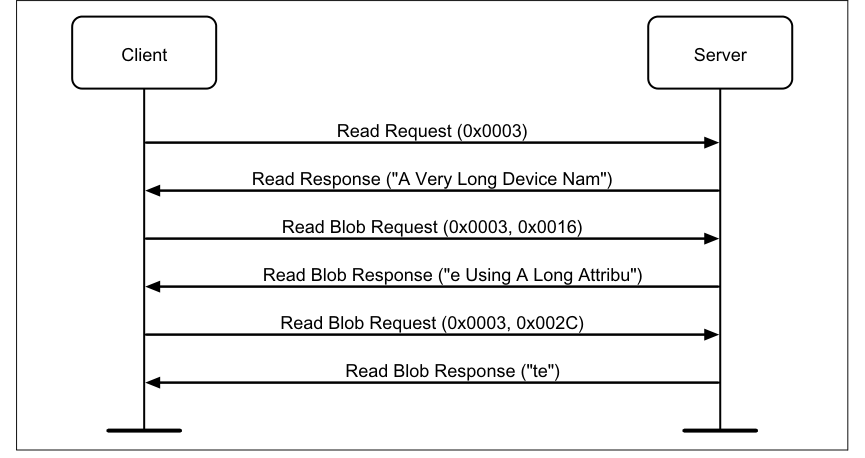

**Figure 4.10:  Read Long Characteristic Values example**

#### 4.8.4  Read Multiple Characteristic Values

This sub-procedure is used to read multiple Characteristic Values from a server when the client knows the Characteristic Value Handles. The Attribute Protocol Read Multiple Requests is used with the Set Of Handles parameter set to the Characteristic Value Handles. The Read Multiple Response returns the Characteristic Values in the Set Of Values parameter.
The Read Multiple Response only contains a set of Characteristic Values that is less than or equal to (ATT_MTU – 1) octets in length. If the Set Of Values is greater than (ATT_MTU – 1) octets in length, only the first (ATT_MTU – 1) octets are included in the response.
Note: A client should not request multiple Characteristic Values when the response’s Set Of Values parameter is equal to (ATT_MTU – 1) octets in length
since it is not possible to determine if the last Characteristic Value was read or additional Characteristic Values exist but were truncated.
An Error Response shall be sent by the server in response to the Read Multiple Request if insufficient authentication, insufficient authorization, insufficient encryption key size is used by the client, or if a read operation is not permitted on any of the Characteristic Values. The Error Code parameter is set as specified in the Attribute Protocol.
Refer to the Attribute Protocol specification for the format of the Set Of Handles and Set Of Values parameter.

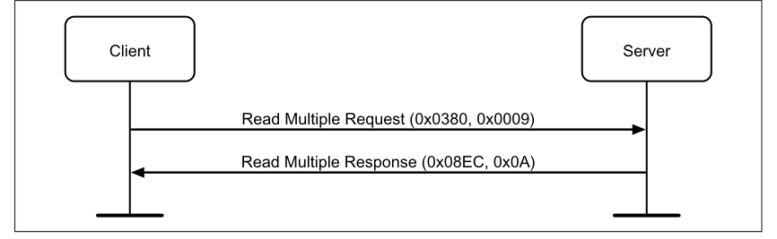

**Figure 4.11:  Read Multiple Characteristic Values example**

### 4.9   CHARACTERISTIC VALUE WRITE

This procedure is used to write a Characteristic Value to a server.
There are five sub-procedures that can be used to write a Characteristic Value: Write Without Response, Signed Write Without Response, Write Characteristic Value, Write Long Characteristic Values and Reliable Writes.

#### 4.9.1  Write Without Response

This sub-procedure is used to write a Characteristic Value to a server when the client knows the Characteristic Value Handle and the client does not need an acknowledgment that the write was successfully performed. This sub- procedure only writes the first (ATT_MTU – 3) octets of a Characteristic Value. This sub-procedure cannot be used to write a long characteristic; instead the Write Long Characteristic Values sub-procedure should be used.
The Attribute Protocol Write Command is used for this sub-procedure. The Attribute Handle parameter shall be set to the Characteristic Value Handle. The Attribute Value parameter shall be set to the new Characteristic Value.
If the Characteristic Value write request is the wrong size, or has an invalid value as defined by the profile, then the write shall not succeed and no error shall be generated by the server.

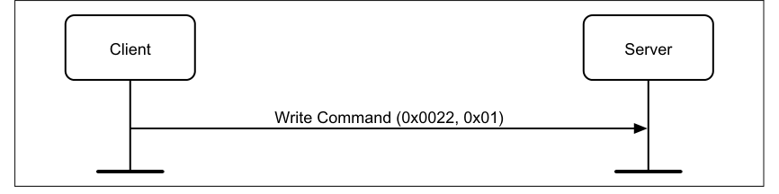

**Figure 4.12:  Write Without Response example**

#### 4.9.2  Signed Write Without Response

This sub-procedure is used to write a Characteristic Value to a server when the client knows the Characteristic Value Handle and the ATT Bearer is not encrypted. This sub-procedure shall only be used if the Characteristic Properties authenticated bit is enabled and the client and server device share a bond as defined in [Vol 3] Part C, Generic Access Profile.
This sub-procedure only writes the first (ATT_MTU – 15) octets of an Attribute Value. This sub-procedure cannot be used to write a long Attribute.
The Attribute Protocol Signed Write Command is used for this sub-procedure. The Attribute Handle parameter shall be set to the Characteristic Value Handle. The Attribute Value parameter shall be set to the new Characteristic Value authenticated by signing the value, as defined in the Security Manager [Vol 3] Part H, Section 2.4.5.
If the authenticated Characteristic Value that is written is the wrong size, has an invalid value as defined by the profile, or the signed value does not authenticate the client, then the write shall not succeed and no error shall be generated by the server.
If a connection is already encrypted with LE security mode 1, level 2 or level 3 as defined in [Vol 3] Part C, Section 10.2 then, a Write Without Response as defined in Section 4.9.1 shall be used instead of a Signed Write Without Response.
Note: On BR/EDR, the ATT Bearer is always encrypted, due to the use of Security Mode 4, therefore this sub-procedure shall not be used.

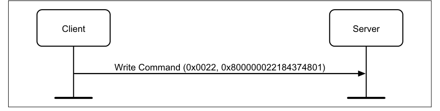

**Figure 4.13:  Signed Write Without Response example**

#### 4.9.3  Write Characteristic Value

This sub-procedure is used to write a Characteristic Value to a server when the client knows the Characteristic Value Handle. This sub-procedure only writes the first (ATT_MTU – 3) octets of a Characteristic Value. This sub-procedure cannot be used to write a long Attribute; instead the Write Long Characteristic Values sub-procedure should be used.
The Attribute Protocol Write Request is used to for this sub-procedure. The Attribute Handle parameter shall be set to the Characteristic Value Handle. The Attribute Value parameter shall be set to the new characteristic.
A Write Response shall be sent by the server if the write of the Characteristic Value succeeded.
An Error Response shall be sent by the server in response to the Write Request if insufficient authentication, insufficient authorization, insufficient encryption key size is used by the client, or if a write operation is not permitted on the Characteristic Value. The Error Code parameter is set as specified in the Attribute Protocol. If the Characteristic Value that is written is the wrong size, or has an invalid value as defined by the profile, then the value shall not be written and an Error Response shall be sent with the Error Code set to Application Error by the server.

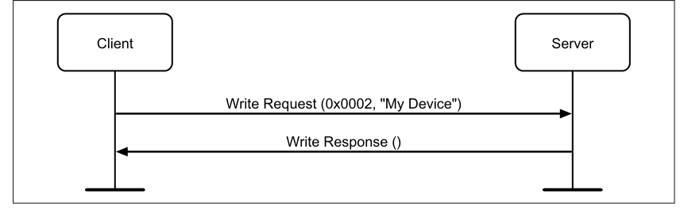

**Figure 4.14:  Write Characteristic Value example**

#### 4.9.4  Write Long Characteristic Values

This sub-procedure is used to write a Characteristic Value to a server when the client knows the Characteristic Value Handle but the length of the Characteristic Value is longer than can be sent in a single Write Request Attribute Protocol message.
The Attribute Protocol Prepare Write Request and Execute Write Request are used to perform this sub-procedure. The Attribute Handle parameter shall be set to the Characteristic Value Handle of the Characteristic Value to be written. The Part Attribute Value parameter shall be set to the part of the Attribute Value that is being written. The Value Offset parameter shall be the offset within the Characteristic Value to be written. To write the complete
Characteristic Value the offset should be set to 0x0000 for the first Prepare Write Request. The offset for subsequent Prepare Write Requests is the next octet that has yet to be written. The Prepare Write Request is repeated until the complete Characteristic Value has been transferred, after which an Executive Write Request is used to write the complete value.
Note: The values in the Prepare Write Response do not need to be verified in this sub-procedure.
An Error Response shall be sent by the server in response to the Prepare Write Request if insufficient authentication, insufficient authorization, insufficient encryption key size is used by the client, or if a write operation is not permitted on the Characteristic Value. The Error Code parameter is set as specified in the Attribute Protocol. If the Attribute Value that is written is the wrong size, or has an invalid value as defined by the profile, then the write shall not succeed and an Error Response shall be sent with the Error Code set to Application Error by the server.

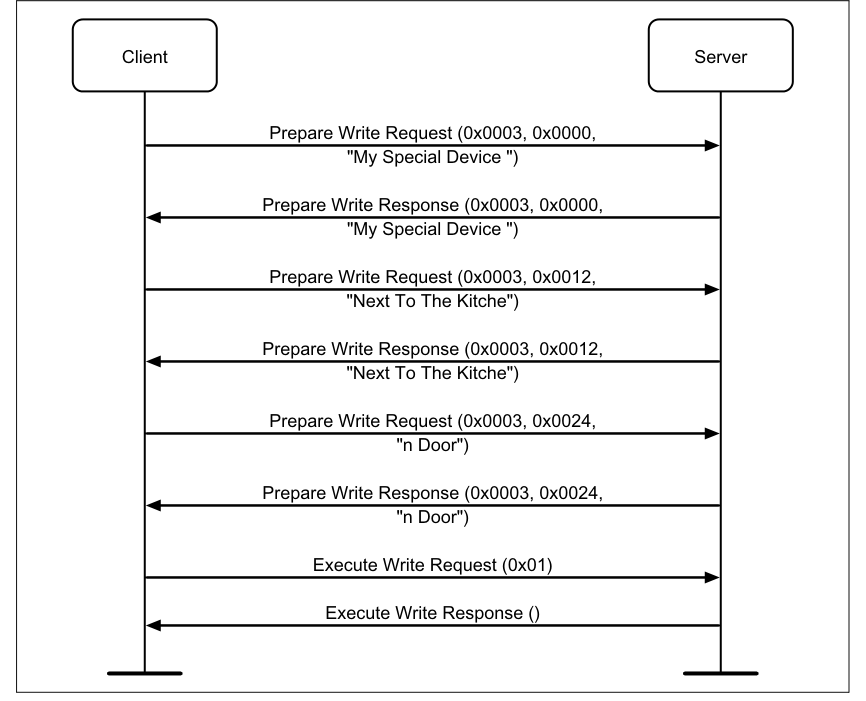

**Figure 4.15:  Write Long Characteristic Values example**

#### 4.9.5  Reliable Writes

This sub-procedure is used to write a Characteristic Value to a server when the client knows the Characteristic Value Handle, and assurance is required that the correct Characteristic Value is going to be written by transferring the Characteristic Value to be written in both directions before the write is performed. This sub-procedure can also be used when multiple values must be written, in order, in a single operation.
The sub-procedure has two phases; the first phase prepares the Characteristic Values to be written. To do this, the client transfers the Characteristic Values to the server. The server checks the validity of the Characteristic Values. The client also checks each Characteristic Value to verify it was correctly received by the server using the server responses. Once this is complete, the second phase performs the execution of all of the prepared Characteristic Value writes on the server from this client.
In the first phase, the Attribute Protocol Prepare Write Request is used. The Attribute Handle shall be set to the Characteristic Value Handle that is to be prepared to write. The Value Offset and Part Attribute Value parameter shall be set to the new Characteristic Value.
There are two possible responses; Prepare Write Response or Error Response.
If the number of prepared write requests exceeds the number of prepared writes supported, then an Error Response with the Error Code set to Prepare Queue Full shall be sent by the server.
An Error Response shall be sent by the server in response to the Prepare Write Request if insufficient authentication, insufficient authorization, insufficient encryption key size is used by the client, or if a write operation is not permitted on the Characteristic Value. The Error Code parameter is set as specified in the Attribute Protocol.
If a Characteristic Value is prepared two or more times during this sub- procedure, then all prepared values are written to the same Characteristic Value in the order that they were prepared.
If a Prepare Write Response is returned, then the Value Offset and Part Attribute Value parameter in the response shall be checked with the Value Offset and Part Attribute Value parameter that was sent in the Prepare Write Request; if they are different, then the value has been corrupted during transmission, and the sub-procedure shall be aborted by sending an Execute Write Request with the Flags parameter set to 0x00 to cancel all prepared writes. The complete sub-procedure may be restarted.
Multiple Prepare Write Requests can be sent by a client, each of which will be queued by the server.
In the second phase, the Attribute Protocol Execute Write Request is used. The Attribute Flags parameter shall be set to 0x01 to immediately write all pending prepared values in the order that they were prepared. The server shall write the prepared writes once it receives this request and shall only send the Execute Write Response once all the prepared values have been successfully written. If the Characteristic Value that is written is the wrong size, or has an invalid value as defined by the profile, then the write shall not succeed, and an Error Response with the Error Code set to Application Error shall be send by the server. The state of the Characteristic Values that were prepared is undefined.

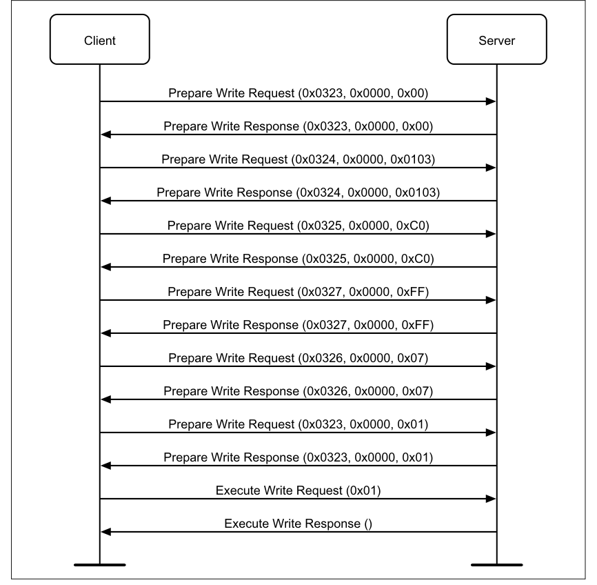

**Figure 4.16:  Reliable Writes example**

### 4.10   CHARACTERISTIC VALUE NOTIFICATION

This procedure is used to notify a client of the value of a Characteristic Value from a server. There is one sub-procedure that can be used to notify a value:
Notifications. Notifications can be configured using the Client Characteristic Configuration descriptor (See Section 3.3.3.3).
A profile defines when to use Notifications.

#### 4.10.1  Notifications

This sub-procedure is used when a server is configured to notify a Characteristic Value to a client without expecting any Attribute Protocol layer acknowledgment that the notification was successfully received.
The Attribute Protocol Handle Value Notification is used to perform this sub- procedure. The Attribute Handle parameter shall be set to the Characteristic Value Handle being notified, and the Attribute Value parameter shall be set to the Characteristic Value.

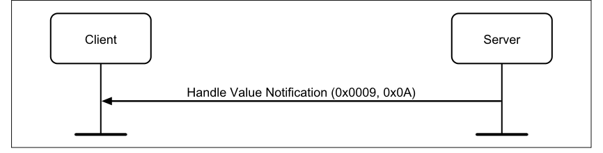

**Figure 4.17:  Notifications example**

### 4.11   CHARACTERISTIC VALUE INDICATIONS

This procedure is used to indicate the Characteristic Value from a server to a client. There is one sub-procedure that can be used to indicate a value: Indications. Indications can be configured using the Client Characteristic Configuration descriptor (See Section 3.3.3.3).
A profile defines when to use Indications.

#### 4.11.1  Indications

This sub-procedure is used when a server is configured to indicate a Characteristic Value to a client and expects an Attribute Protocol layer acknowledgment that the indication was successfully received.
The Attribute Protocol Handle Value Indication is used to perform this sub- procedure. The Attribute Handle parameter shall be set to the Characteristic Value Handle being indicated, and the Attribute Value parameter shall be set to the Characteristic Value. Once the Handle Value Indication is received by the client, the client shall respond with a Handle Value Confirmation.

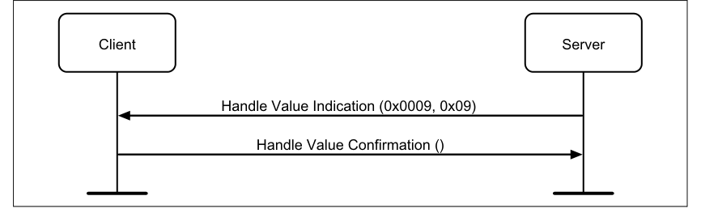

**Figure 4.18:  Indications example**

### 4.12   CHARACTERISTIC DESCRIPTORS

This procedure is used to read and write characteristic descriptors on a server. There are two sub-procedures that can be used to read and write characteristic descriptors: Read Characteristic Descriptors and Write Characteristic Descriptors.

#### 4.12.1  Read Characteristic Descriptors

This sub-procedure is used to read a characteristic descriptor from a server when the client knows the characteristic descriptor declaration’s Attribute handle.
The Attribute Protocol Read Request is used for this sub-procedure. The Read Request is used with the Attribute Handle parameter set to the characteristic descriptor handle. The Read Response returns the characteristic descriptor value in the Attribute Value parameter.
An Error Response shall be sent by the server in response to the Read Request if insufficient authentication, insufficient authorization, insufficient encryption key size is used by the client, or if a read operation is not permitted on the Characteristic Value. The Error Code parameter is set accordingly.

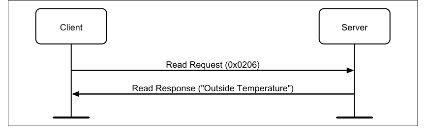

**Figure 4.19:  Read Characteristic Descriptors example**

#### 4.12.2  Read Long Characteristic Descriptors

This sub-procedure is used to read a characteristic descriptor from a server when the client knows the characteristic descriptor declaration’s Attribute handle and the length of the characteristic descriptor declaration is longer than can be sent in a single Read Response Attribute Protocol message.
The Attribute Protocol Read Blob Request is used to perform this sub- procedure. The Attribute Handle parameter shall be set to the characteristic descriptor handle. The Value Offset parameter shall be the offset within the characteristic descriptor to be read. To read the complete characteristic descriptor the offset should be set to 0x00 for the first Read Blob Request. The offset for subsequent Read Blob Requests is the next octet that has yet to be read. The Read Blob Request is repeated until the Read Blob Response’s Part
Attribute Value parameter is zero or an Error Response is sent by the server with the Error Code set to Invalid Offset.
For each Read Blob Request a Read Blob Response is received with a portion of the characteristic descriptor value contained in the Part Attribute Value parameter.
An Error Response shall be sent by the server in response to the Read Blob Request if insufficient authentication, insufficient authorization, insufficient encryption key size is used by the client, or if a read operation is not permitted on the characteristic descriptor. The Error Code parameter is set accordingly.
Note: The Read Blob Request may be used to read the remainder of an characteristic descriptor value where the first part was read using a simple Read Request.

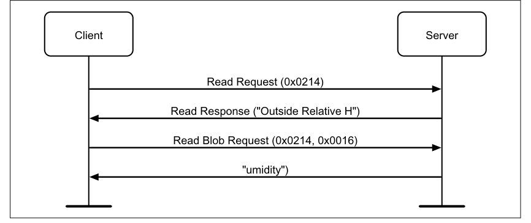

**Figure 4.20:  Read Long Characteristic Descriptors example**

#### 4.12.3  Write Characteristic Descriptors

This sub-procedure is used to write a characteristic descriptor value to a server when the client knows the characteristic descriptor handle.
The Attribute Protocol Write Request is used for this sub-procedure. The Attribute Handle parameter shall be set to the characteristic descriptor handle. The Attribute Value parameter shall be set to the new characteristic descriptor value.
A Write Response shall be sent by the server if the write of the characteristic descriptor value succeeded.
An Error Response shall be sent by the server in response to the Write Request if insufficient authentication, insufficient authorization, insufficient encryption key size is used by the client, or if a write operation is not permitted on the Characteristic Value. The Error Code parameter shall be set as specified in the Attribute Protocol. If the characteristic descriptor value that is
written is the wrong size, or has an invalid value as defined by the profile, or the operation is not permitted at this time then the value shall not be written and an Error Response shall be sent with the Error Code set to Application Error by the server.

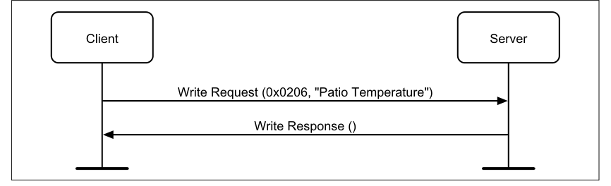

**Figure 4.21:  Write Characteristic Descriptors example**

#### 4.12.4  Write Long Characteristic Descriptors

This sub-procedure is used to write a characteristic descriptor value to a server when the client knows the characteristic descriptor handle but the length of the characteristic descriptor value is longer than can be sent in a single Write Request Attribute Protocol message.
The Attribute Protocol Prepare Write Request and Execute Write Request are used to perform this sub-procedure. The Attribute Handle parameter shall be set to the Characteristic Descriptor Handle of the Characteristic Value to be written. The Part Attribute Value parameter shall be set to the part of the Attribute Value that is being written. The Value Offset parameter shall be the offset within the Characteristic Value to be written. To write the complete Characteristic Value the offset should be set to 0x0000 for the first Prepare Write Request. The offset for subsequent Prepare Write Requests is the next octet that has yet to be written. The Prepare Write Request is repeated until the complete Characteristic Value has been transferred, after which an Executive Write Request is used to write the complete value.
Note: The values in the Prepare Write Response do not need to be verified in this sub-procedure.
An Error Response shall be sent by the server in response to the Prepare Write Request or Executive Write Request if insufficient authentication, insufficient authorization, insufficient encryption key size is used by the client, or if a write operation is not permitted on the Characteristic Value. The Error Code parameter is set as specified in the Attribute Protocol. If the Attribute Value that is written is the wrong size, or has an invalid value as defined by the profile, then the write shall not succeed and an Error Response shall be sent with the Error Code set to Application Error by the server.

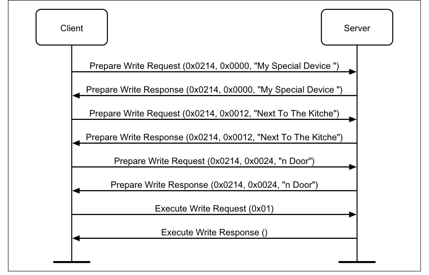

**Figure 4.22:  Write Long Characteristic Descriptors example**

### 4.13   GATT PROCEDURE MAPPING TO ATT PROTOCOL OPCODES

The following table describes the mapping of the ATT protocol opcodes to the GATT procedures and sub-procedures. Only those portions of the ATT protocol requests, responses, notifications or indications necessary to implement the mandatory or supported optional sub-procedures is required.

| Feature | Sub-Procedure | ATT Protocol Opcodes |
| --- | --- | --- |
| Server Configuration | Exchange MTU | Exchange MTU Request Exchange MTU Response Error Response |
| Primary Service Discovery | Discover All Primary Services | Read By Group Type Request Read By Group Type Respons Error Response |
|  | Discover Primary Services By Service UUID | Find By Type Value Request Find By Type Value Response Error Response |
| Relationship Discovery | Find Included Services | Read By Type Request Read By Type Response Error Response |

Table 4.2:  GATT Procedure mapping to ATT protocol opcodes

| Feature | Sub-Procedure | ATT Protocol Opcodes |
| --- | --- | --- |
| Characteristic Discovery | Discover All Characteristic of a Service | Read By Type Request Read By Type Response Error Response |
|  | Discover Characteristic by UUID | Read By Type Request Read By Type Response Error Response |
| Characteristic Descriptor Discovery | Discover All Characteristic Descriptors | Find Information Request Find Information Response Error Response |
| Characteristic Value Read | Read Characteristic Value | Read Request Read Response Error Response |
|  | Read Using Characteristic UUID | Read By Type Request Read By Type Response Error Response |
|  | Read Long Characteristic Values | Read Blob Request Read Blob Response Error Response |
|  | Read Multiple Characteristic Values | Read Multiple Request Read Multiple Response Error Response |
| Characteristic Value Write | Write Without Response | Write Command |
|  | Signed Write Without Response | Write Command |
|  | Write Characteristic Value | Write Request Write Response Error Response |
|  | Write Long Characteristic Values | Prepare Write Request Prepare Write Response Execute Write Request Execute Write Response Error Response |
|  | Characteristic Value Reliable Writes | Prepare Write Request Prepare Write Response Execute Write Request Execute Write Response Error Response |

Table 4.2:  GATT Procedure mapping to ATT protocol opcodes

| Feature | Sub-Procedure | ATT Protocol Opcodes |
| --- | --- | --- |
| Characteristic Value Notification | Notifications | Handle Value Notification |
| Characteristic Value Indication | Indications | Handle Value Indication Handle Value Confirmation |
| Characteristic Descriptor Value Read | Read Characteristic Descriptors | Read Request Read Response Error Response |
|  | Read Long Characteristic Descriptors | Read Blob Request Read Blob Response Error Response |
| Characteristic Descriptor Value Write | Write Characteristic Descriptors | Write Request Write Response Error Response |
|  | Write Long Characteristic Descriptors | Prepare Write Request Prepare Write Response Prepare Write Request Prepare Write Response Error Response |

Table 4.2:  GATT Procedure mapping to ATT protocol opcodes

### 4.14   PROCEDURE TIMEOUTS

GATT procedures are protected from failure with an Attribute Protocol transaction timeout.
If the Attribute Protocol transaction times out, the procedure shall be considered to have failed, and the local higher layer shall be notified. No further GATT procedures shall be performed. A new GATT procedure shall only be performed when a new ATT Bearer has been established.

## 5  L2CAP INTEROPERABILITY REQUIREMENTS

The following default values shall be used by an implementation of this profile. The default values used may be different depending on the physical channel that the Attribute Protocol is being sent over.

### 5.1   BR/EDR L2CAP INTEROPERABILITY REQUIREMENTS

Over BR/EDR, L2CAP connection oriented channels are used to transmit Attribute Protocol PDUs. These channels use the channel establishment procedure from L2CAP using the fixed PSM (see [1]) including the configuration procedure to determine the ATT_MTU. Therefore, the ATT Bearer (or the logical link as referred to in the Attribute Protocol) is, in this case, an established L2CAP connection-oriented channel.

#### 5.1.1  ATT_MTU

At the end of the L2CAP configuration phase, upon transition to the OPEN state, the ATT_MTU for this ATT Bearer shall be set to the minimum of the negotiated Maximum Transmission Unit configuration options.
Note: The minimum ATT_MTU for BR/EDR is 48 octets, as defined by L2CAP in [Vol 3] Part A, Section 5.1.

#### 5.1.2  BR/EDR Channel Requirements

All Attribute Protocol messages sent by GATT over an L2CAP channel are sent using a dynamic channel ID derived by connecting using a fixed PSM. The use of a fixed PSM allows rapid reconnection of the L2CAP channel for Attribute Protocol as a preliminary SDP query is not required.
All packets sent on this L2CAP channel shall be Attribute PDUs.
PDUs shall be reliably sent.
The flow specification for the Attribute Protocol shall be best effort.
If operating in Basic L2CAP mode, the information payload of the L2CAP B- frame shall be a single Attribute PDU.
The channel shall be encrypted. The Key_Type shall be either an Unauthenticated Combination Key or an Authenticated Combination Key.

#### 5.1.3  BR/EDR Channel Establishment Collisions

The L2CAP connection can be initiated by the client or by the server.
Only one BR/EDR L2CAP connection shall be established between a client and a server. If the L2CAP connection already exists, the client or server shall not initiate the connection request.
If both devices open an L2CAP connection simultaneously both channels shall be closed and each device shall wait a random time (not more than 1 second and not less than 100 ms) and then try to open the L2CAP connection again. If it is known which device is the master, that device can re-try at once.

### 5.2   LE L2CAP INTEROPERABILITY REQUIREMENTS

Over LE, the ATT Bearer (or logical link as referred to in the Attribute Protocol) is the Attribute L2CAP fixed channel.
Note: To remove the ATT Bearer, the physical channel has to be disconnected.

#### 5.2.1  ATT_MTU

Both a GATT client and server implementations shall support an ATT_MTU not less than the default value.

| Default Value | Value for LE |
| --- | --- |
| ATT MTU _ | 23 |

Table 5.1:  LE L2CAP ATT_MTU

#### 5.2.2  LE Channel Requirements

All Attribute Protocol messages sent by GATT over an L2CAP logical link are sent using a fixed channel ID. This enables very fast transmission of the Attribute Protocol messages once a Host connection setup is complete. The use of a fixed channel ID also enables the default channel properties to be defined.
L2CAP fixed CID 0x0004 shall be used for the Attribute Protocol. All packets sent on this fixed channel shall be Attribute Protocol PDUs.
The flow specification for the Attribute Protocol shall be best effort.
PDUs shall be reliably sent, and not flushed.
The retransmission and flow control mode for this channel shall be Basic L2CAP mode
The default parameters for the payload of the L2CAP B-frame shall be a single Attribute PDU.

| Parameter | Value |
| --- | --- |
| MTU | 23 |
| Flush Timeout | 0xFFFF (Infinite) |
| QoS | Best Effort |
| Mode | Basic Mode |

Table 5.2:  Attribute Protocol Fixed channel configuration parameters

## 6  GAP INTEROPERABILITY REQUIREMENTS

### 6.1   BR/EDR GAP INTEROPERABILITY REQUIREMENTS

#### 6.1.1  Connection Establishment

To establish an ATT Bearer, the Channel Establishment procedure (as defined in [Vol 3] Part C, Section 7.2) shall be used.
Either device may terminate a link at any time.
No idle mode procedures or modes are defined by this profile.

### 6.2   LE GAP INTEROPERABILITY REQUIREMENTS

#### 6.2.1  Connection Establishment

To establish a link, the Connection Establishment procedure (as defined in [Vol 3] Part C, Section 9.3.5 through Section 9.3.8) shall be used.
Either device may terminate a link at any time.
No idle mode procedures or modes are defined by this profile.

#### 6.2.2  Profile Roles

This profile can be used in the following profile roles (as defined in [Vol 3] Part G):
• Central
• Peripheral

### 6.3   DISCONNECTED EVENTS

#### 6.3.1  Notifications and Indications While Disconnected

If a client has configured the server to send a notification or indication to the client, it shall be configured to allow re-establishment of the connection when it is disconnected.
If the client is disconnected, but intends to become a Central in the connection it shall perform a GAP connection establishment procedure. If the client is disconnected, but intends to become a Peripheral in the connection it shall go into a GAP connectable mode.
A server shall re-establish a connection with a client when an event or trigger operation causes a notification or indication to a client.
If the server is disconnected, but intends to become a Peripheral in the connection it shall go into a GAP connectable mode. If the server is disconnected, but intends to become a Central in the connection it shall perform a GAP connection establishment procedure.
If the server cannot re-establish a connection, then the notification or indication for this event shall be discarded and no further connection re-establishment shall occur, until another event occurs.

## 7  DEFINED GENERIC ATTRIBUTE PROFILE SERVICE

All characteristics defined within this section shall be contained in a primary service with the service UUID set to «GATT Service» as defined in Section 3.1. Only one instance of the GATT service shall be exposed on a GATT server.
Table 7.1 lists characteristics that may be present in the server and the characteristics that may be supported by the client.

| Item No. | Characteristic | Ref. | Support in Client | Support in Server |
| --- | --- | --- | --- | --- |
| 1 | Service Changed | 7.1 | M | C1 |

Table 7.1:  GATT Profile service characteristic support
C1: Mandatory if service definitions on the server can be added, changed or removed; otherwise optional
The assigned UUIDs for these characteristics are defined in [1].

### 7.1   SERVICE CHANGED

The «Service Changed» characteristic is a control-point attribute (as defined in [Vol 3] Part F, Section 3.2.6) that shall be used to indicate to connected devices that services have changed (i.e., added, removed or modified). The characteristic shall be used to indicate to clients that have a trusted relationship (i.e. bond) with the server when GATT based services have changed when they re-connect to the server. See Section 2.5.2.
This Characteristic Value shall be configured to be indicated, using the Client Characteristic Configuration descriptor by a client. Indications caused by changes to the Service Changed Characteristic Value shall be considered lost if the client has not enabled indications in the Client Configuration Characteristic Descriptor.

| Attribute Handle | Attribute Type | Attribute Value |  |  | Attribute Permission |
| --- | --- | --- | --- | --- | --- |
| 0xNNNN | 0x2803 – UUID for «Charac- teristic» | Characteristic Properties = 0x20 | 0xMMMM = Handle of Characteristic Value | 0x2A05 – UUID for «Service Changed» | No Authenticatio No Authorization |

Table 7.2:  Service Changed Characteristic declaration
The Service Changed Characteristic Value is two 16-bit Attribute Handles concatenated together indicating the beginning and ending Attribute Handles affected by an addition, removal, or modification to a GATT-based service on the server. A change to a characteristic value is not considered a modification
of the service. If a change has been made to any of the GATT service definition characteristic values other than the Service Changed characteristic value, the range shall also include the beginning and ending Attribute Handle for the GATT service definition.

| Attribute Handle | Attribute Type | Attribute Value |  | Attribute Permission |
| --- | --- | --- | --- | --- |
| 0xM- MMM | 0x2A05 – UUID for «Service Changed» | 0xuuuu – Start of Affected Attribute Handle Range | 0xuuuu – End of Affected Attribute Handle Range | No Authenticatio No Authorization Not Readable, N Writable |

Table 7.3:  Service Changed Characteristic Value declaration
There is only one instance of the Service Changed characteristic within the GATT service definition. A Service Changed characteristic value shall exist for each client with a trusted relationship.
If the list of GATT based services and the service definitions cannot change for the lifetime of the device then this characteristic shall not exist, otherwise this characteristic shall exist.
If the Service Changed characteristic exists on the server, the Characteristic Value Indication support on the server is mandatory.
The client shall support Characteristic Value Indication of the Service Changed characteristic.
The Service Changed characteristic Attribute Handle on the server shall not change if the server has a trusted relationship with any client.

## 8  SECURITY CONSIDERATIONS

### 8.1   AUTHENTICATION REQUIREMENTS

Authentication in the GATT Profile is applied to each characteristic independently. Authentication requirements are specified in this profile, related higher layer specifications or are implementation specific if not specified otherwise.
The GATT Profile procedures are used to access information that may require the client to be authenticated and have an encrypted connection before a characteristic can be read or written.
If such a request is issued when the physical link is unauthenticated or unencrypted, the server shall send an Error Response. The client wanting to read or write this characteristic can then request that the physical link be authenticated using the GAP authentication procedure, and once this has been completed, send the request again.
The list of services and characteristics that a device supports is not considered private or confidential information, and therefore the Service and Characteristic Discovery procedures shall always be permitted. This implies that an Insufficient Authentication status code shall not be used in an Error Response for a Find Information Request.
Note: A characteristic may be allowed to be read by any device, but only written by an authenticated device. An implementation should take this into account, and not assume that if it can read a Characteristic Value, it will also be able to write the Characteristic Value. Similarly, if a characteristic can be written, it does not mean the characteristic can also be read. Each individual characteristic could have different security properties.
Once sufficient authentication of the client has been established to allow access to one characteristic within a service definition, a server may also allow access to other characteristics within the service definition depending on the higher level or implementation specific requirements.
A server may allow access to most characteristics within a service definition once sufficient authentication has been performed, but restrict access to other characteristics within the same service definition. This may result due to some characteristics requiring stronger authentication requirements than currently enabled.
Once a server has authenticated a client for access to characteristics in one service definition, it may automatically allow access to characteristics in other service definitions.

### 8.2   AUTHORIZATION REQUIREMENTS

Authorization in the GATT Profile is applied to each characteristic independently. Authorization requirements may be specified in this profile, related higher layer specifications or are implementation specific if not specified otherwise.
The GATT Profile can be used to access information that may require authorization before a characteristic can be read or written.
If such a request is issued to a characteristic contained in a service definition that is not authorized, the responder shall send an Error Response with the status code set to Insufficient Authorization.
Once a server has authorized a client for access to characteristics in one group or service definition, it may automatically allow access to characteristics in other service definitions.

## 9  SDP INTEROPERABILITY REQUIREMENTS

A device that supports GATT over BR/EDR shall publish the following SDP record. The GATT Start Handle shall be set to the attribute handle of the «Generic Attribute Profile» service declaration. The GATT End Handle shall be set to the attribute handle of the last attribute within the «Generic Attribute Profile» service definition group.

| Item | Definition | Type | Value | Statu |
| --- | --- | --- | --- | --- |
| Service Class ID List |  |  |  | M |
| Service Class #0 |  | UUID | GATT Service | M |
| Protocol Descriptor List |  |  |  | M |
| Protocol #0 |  | UUID | L2CAP | M |
| Parameter #0 for Protocol #0 | PSM | Uint16 | PSM = ATT | M |
| Protocol #1 |  | UUID | ATT | M |
| Parameter #0 for Protocol #1 | GATT Start Handle | Uint16 |  | M |
| Parameter #1 for Protocol #1 | GATT End Handle | Uint16 |  | M |
| BrowseGroupList |  |  | PublicBrowseRoot | M |

Table 9.1:  SDP Record for the Generic Attribute Profile

## 10  REFERENCES

[1] Assigned Numbers Specification: https://www.bluetooth.org/en-us/specification/assigned-numbers
APPENDIX A EXAMPLE ATTRIBUTE SERVER
ATTRIBUTES
The following table shows an example Server and the Attributes contained on the server.
Note: This example does not necessarily use UUIDs or services defined by the Bluetooth SIG or in adopted profiles.

| Handle | Attribute Type | Attribute Value |
| --- | --- | --- |
| 0x0001 | «Primary Service» | «GAP Service» |
| 0x0004 | «Characteristic» | {0x02, 0x0006, «Device Name»} |
| 0x0006 | «Device Name» | “Example Device” |
| 0x0010 | «Primary Service» | «GATT Service» |
| 0x0011 | «Characteristic» | {0x26, 0x0012, «Service Changed»} |
| 0x0012 | «Service Changed» | 0x0000, 0x0000 |
| 0x0100 | «Primary Service» | «Battery State Service» |
| 0x0106 | «Characteristic» | {0x02, 0x0110, «Battery State»} |
| 0x0110 | «Battery State» | 0x04 |
| 0x0200 | «Primary Service» | «Thermometer Humidity Service» |
| 0x0201 | «Include» | {0x0500, 0x0504, «Manufacturer Service»} |
| 0x0202 | «Include» | {0x0550,0x0568} |
| 0x0203 | «Characteristic» | {0x02, 0x0204, «Temperature»} |
| 0x0204 | «Temperature» | 0x028A |
| 0x0205 | «Characteristic Format» | {0x0E, 0xFE, «degrees Celsius», 0x01, «Outside»} |
| 0x0206 | «Characteristic User Description» | “Outside Temperature” |
| 0x0210 | «Characteristic» | {0x02, 0x0212, «Relative Humidity»} |
| 0x0212 | «Relative Humidity» | 0x27 |
| 0x0213 | «Characteristic Format» | {0x04, 0x00, «Percent», «Bluetooth SIG», «Outside»} |
| 0x0214 | «Characteristic User Description» | “Outside Relative Humidity” |
| 0x0280 | «Primary Service» | «Weight Service» |

Table A.1:  Example Attribute Server Attributes

| Handle | Attribute Type | Attribute Value |
| --- | --- | --- |
| 0x0281 | «Include» | 0x0505, 0x0509, «Manufacturer Service»} |
| 0x0282 | «Characteristic» | {0x02, 0x0283, «Weight kg»} |
| 0x0283 | «Weight kg» | 0x00005582 |
| 0x0284 | «Characteristic Format» | {0x08, 0xFD, «kilogram», «Bluetooth SIG», «Hanging»} |
| 0x0285 | «Characteristic User Description» | “Rucksack Weight” |
| 0x0300 | «Primary Service» | «Position Service» |
| 0x0301 | «Characteristic» | {0x02, 0x0302, «Latitude Longitude»} |
| 0x0302 | «Latitude Longitude» | 0x28BEAFA40B320FCE |
| 0x0304 | «Characteristic» | {0x02, 0x0305, «Latitude Longitude Eleva- tion»} |
| 0x0305 | «Latitude Longitude Ele- vation» | 0x28BEAFA40B320FCE0176 |
| 0x0400 | «Primary Service» | «Alert Service» |
| 0x0401 | «Characteristic» | {0x0E, 0x0402, «Alert Enumeration»} |
| 0x0402 | «Alert Enumeration» | 0x00 |
| 0x0500 | «Secondary Service» | «Manufacturer Service» |
| 0x0501 | «Characteristic» | {0x02, 0x0502, «Manufacturer Name»} |
| 0x0502 | «Manufacturer Name» | “ACME Temperature Sensor” |
| 0x0503 | «Characteristic» | {0x02, 0x0504, «Serial Number»} |
| 0x0504 | «Serial Number» | “237495-3282-A” |
| 0x0505 | «Secondary Service» | «Manufacturer Service» |
| 0x0506 | «Characteristic» | {0x02, 0x0507, «Manufacturer Name»} |
| 0x0507 | «Manufacturer Name» | “ACME Weighing Scales” |
| 0x0508 | «Characteristic» | {0x02, 0x0509, «Serial Number»} |
| 0x0509 | «Serial Number» | “11267-2327A00239” |
| 0x0550 | «Secondary Service» | «Vendor Specific Service» |
| 0x0560 | «Characteristic» | {0x02, 0x0568, «Vendor Specific Type»} |
| 0x0568 | «Vendor Specific Type» | 0x56656E646F72 |

Table A.1:  Example Attribute Server Attributes
As can be seen, the attribute server indicates support for ten services: GAP Service, GATT Service, Battery State Service, Thermometer Humidity Service, Weight Service, Position Service, Alert Service, two Manufacturer Services, and a Vendor Specific Service.
The server contains the following information about each of the services:
• The characteristic containing the name of the device is “Example Device”.
• The characteristic indicating the server supports all the attribute opcodes, and supports two prepared write values.
• The characteristic containing the battery state with a value of 0x04, meaning it is discharging.
• The characteristic containing the outside temperature with a value of 6.5 °C.
• The characteristic containing the outside relative humidity with a value of 39%.
• The characteristic containing the weight hanging off the device with a value of 21.89 kg.
• The characteristic containing the position of this device with the value of 68.3585444 degrees north, 18.7830222 degrees east, with an elevation of 374 meters.
• The characteristic containing the temperature sensor manufacturer with the value of ACME Temperature Sensor.
• The characteristic containing the serial number for the temperature sensor with a value of 237495-3282-A.
• The characteristic containing the weighing sensor is manufacturer with a value of ACME Weight Scales.
• The characteristic containing the serial number for the weighing sensor with a value of 11267-2327A00239.
The device is therefore on the side of the Abisko Turiststation, Norrbottens Län, Sweden, with a battery in good state, measuring a relatively warm day, with low humidity, and a heavy rucksack.
Core System Package [Host volume]
Part H
PART H: SECURITY MANAGER SPECIFICATION
The Security Manager (SM) defines the protocol and behavior to manage pairing, authentication and encryption between LE-only or BR/EDR/LE devices.
CONTENTS

#### 2.2.7 LE Secure Connections Key Generation Function f52303

## 1  INTRODUCTION

### 1.1   SCOPE

The Security Manager defines methods of pairing and key distribution, a protocol for those methods and a security toolbox to be used by those methods and other parts of an LE-only or BR/EDR/LE device.

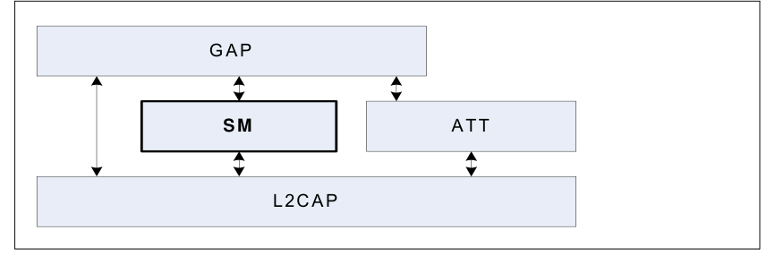

**Figure 1.1:  Relationship of the Security Manager to the rest of the LE Bluetooth architecture**

The document describes master and slave roles in terms of protocol and requirements; these have the same meaning and are mapped to the LE device roles described in [Vol 1] Part A, Section 1.2 or BR/EDR device roles (see [Vol 1] Part A, Section 1.1).

### 1.2   CONVENTIONS

#### 1.2.1  Bit and Byte Ordering Conventions

When multiple bit fields are contained in a single octet and represented in a drawing in this specification, the least significant (low-order) bits are shown toward the left and most significant (high-order) bits toward the right.
Multiple-octet fields are drawn with the least significant octets toward the left and the most significant octets toward the right. Multiple-octet fields shall be transmitted with the least significant octet first.
Multiple-octet values written in hexadecimal notation have the most significant octet towards the left and the least significant octet towards the right, for example if ‘12’ is the most significant octet and ‘34’ is the least significant octet it would be written as 0x1234.

## 2  SECURITY MANAGER

### 2.1   INTRODUCTION

The Security Manager (SM) uses a key distribution approach to perform identity and encryption functionalities in radio communication. This means that each device generates and controls the keys it distributes and no other device affects the generation of these keys. The strength of a key is as strong as the algorithms implemented inside the distributing device.
The security architecture is designed such that memory and processing requirements for a responding device are lower than the memory and processing requirement for an initiating device.
Pairing is performed to establish keys which can then be used to encrypt a link. A transport specific key distribution is then performed to share the keys which can be used to encrypt a link in future reconnections, verify signed data and random address resolution.
Pairing is a three-phase process. The first two phases are always used and may be followed by an optional transport specific key distribution phase (see Figure 2.1):
• Phase 1: Pairing Feature Exchange
• Phase 2 (LE legacy pairing): Short Term Key (STK) Generation
• Phase 2 (LE Secure Connections): Long Term Key (LTK) Generation
• Phase 3: Transport Specific Key Distribution

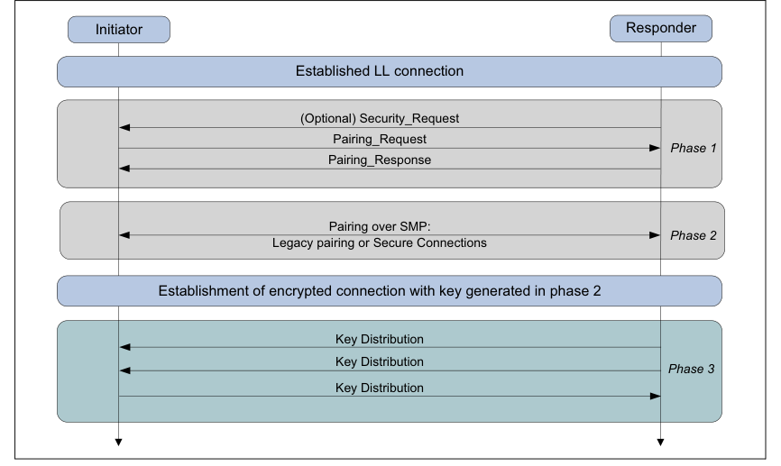

**Figure 2.1:  LE Pairing Phases**

The devices shall first exchange authentication requirements and IO capabilities in the Pairing Feature Exchange to determine which of the following methods shall be used in Phase 2:
• Just Works
• Numeric Comparison (Only for LE Secure Connections)
• Passkey Entry
• Out Of Band (OOB)
Authentication requirements retrieved from the Pairing Feature Exchange also determine whether LE Secure Connections or LE legacy pairing is used.
Optionally, Phase 3 may then be performed to distribute transport specific keys, for example the Identity Resolving Key (IRK) value and Identity Address information. Phase 1 and Phase 3 are identical regardless of the method used in Phase 2.
Phase 3 shall only be performed on a link which is encrypted using:
• The STK generated in Phase 2 when using LE legacy pairing or
• The LTK generated in Phase 2 when using LE Secure Connections or
• The shared Link Key generated using BR/EDR pairing (see Section 2.3.5.7).
Phase 1 and Phase 2 may be performed on a link which is either encrypted or not encrypted.

### 2.2   CRYPTOGRAPHIC TOOLBOX

In order to support random addressing, pairing and other operations SM provides a toolbox of cryptographic functions. The following cryptographic functions are defined:
• ah is used to create a 24-bit hash used in random address creation and resolution.
The following cryptographic functions are defined to support the LE legacy pairing process:
• c1 is used to generate confirm values used during the pairing process.
• s1 is used to generate the STK during the pairing process.
The following cryptographic functions are defined to support the LE Secure Connections pairing process:
• f4 is used to generate confirm values during the pairing process.
• f5 is used to generate the LTK and the MacKey during the pairing process.
• f6 is used to generate the check values during authentication stage 2 in the pairing process.
• g2 is used to generate the 6-digit numeric comparison values during authentication stage 1 in the pairing process.
• h6 is used to generate the LE LTK from a BR/EDR link key derived from Secure Connections and is used to generate the BR/EDR link key from an LE LTK derived from Secure Connections.
• h7 is used to generate intermediate keys while generating the LE LTK from a BR/EDR link key derived from Secure Connections and the BR/EDR link key from an LE LTK derived from Secure Connections.
The building block for the cryptographic functions ah, c1 and s1 is the security function e.
The building block for the cryptographic functions f4, f5, f6, g2, h6, and h7 is the security function AES-CMAC.
Inside the f4, f5, f6, g2, h6, and h7 functions when a multi-octet integer parameter is used as input to AES-CMAC the most significant octet of the integer shall be the first octet of the stream and the least significant octet of the integer shall be the last octet of the stream. The output of AES-CMAC inside these functions is a multi-octet integer where the first octet is MSB and the last octet is LSB of this integer.

#### 2.2.1  Security function e

Security function e generates 128-bit encryptedData from a 128-bit key and 128-bit plaintextData using the AES-128-bit block cypher as defined in FIPS-1971:
encryptedData = e(key, plaintextData)
The most significant octet of key corresponds to key[0], the most significant octet of plaintextData corresponds to in[0] and the most significant octet of encryptedData corresponds to out[0] using the notation specified in FIPS-1971.
Note: The security function e can be implemented in a Host or be implemented using the HCI_LE_Encrypt command (see [Vol 2] Part E, Section 7.8.22).

#### 2.2.2  Random Address Hash function ah

The random address hash function ah is used to generate a hash value that is used in resolvable private addresses, see [Vol 3] Part C, Section 10.8.2.
The following are inputs to the random address hash function ah:
k is 128 bits r is 24 bits padding is 104 bits
r is concatenated with padding to generate r’ which is used as the 128-bit input parameter plaintextData to security function e:
r’ = padding || r
The least significant octet of r becomes the least significant octet of r’ and the most significant octet of padding becomes the most significant octet of r’.
For example, if the 24-bit value r is 0x423456 then r’ is 0x00000000000000000000000000423456.
The output of the random address function ah is:
ah(k, r) = e(k, r’) mod 224
The output of the security function e is then truncated to 24 bits by taking the least significant 24 bits of the output of e as the result of ah.
1. NIST Publication FIPS-197 (http://csrc.nist.gov/publications/fips/fips197/fips-197.pdf)

#### 2.2.3  Confirm value generation function c1 for LE Legacy Pairing

During the LE legacy pairing process confirm values are exchanged. This confirm value generation function c1 is used to generate the confirm values.
The following are inputs to the confirm value generation function c1:
k is 128 bits r is 128 bits pres is 56 bits preq is 56 bits iat is 1 bit ia is 48 bits rat is 1 bit ra is 48 bits padding is 32 bits or 0
iat is concatenated with 7-bits of 0 to create iat’ which is 8 bits in length. iat is the least significant bit of iat’.
rat is concatenated 7-bits of 0 to create rat’ which is 8 bits in length. rat is the least significant bit of rat’.
pres, preq, rat’ and iat’ are concatenated to generate p1 which is XORed with r and used as 128-bit input parameter plaintextData to security function e:
p1 = pres || preq || rat’ || iat’
The octet of iat’ becomes the least significant octet of p1 and the most significant octet of pres becomes the most significant octet of p1.
For example, if the 8-bit iat’ is 0x01, the 8-bit rat’ is 0x00, the 56-bit preq is 0x07071000000101 and the 56 bit pres is 0x05000800000302 then p1 is 0x05000800000302070710000001010001.
ra is concatenated with ia and padding to generate p2 which is XORed with the result of the security function e using p1 as the input parameter plaintextData and is then used as the 128-bit input parameter plaintextData to security function e:
p2 = padding || ia || ra
The least significant octet of ra becomes the least significant octet of p2 and the most significant octet of padding becomes the most significant octet of p2.
For example, if 48-bit ia is 0xA1A2A3A4A5A6 and the 48-bit ra is 0xB1B2B3B4B5B6 then p2 is 0x00000000A1A2A3A4A5A6B1B2B3B4B5B6.
The output of the confirm value generation function c1 is:
c1 (k, r, preq, pres, iat, rat, ia, ra) = e(k, e(k, r XOR p1) XOR p2)
The 128-bit output of the security function e is used as the result of confirm value generation function c1.
For example, if the 128-bit k is 0x00000000000000000000000000000000, the 128-bit value r is 0x5783D52156AD6F0E6388274EC6702EE0, the 128-bit value p1 is 0x05000800000302070710000001010001 and the 128-bit value p2 is 0x00000000A1A2A3A4A5A6B1B2B3B4B5B6 then the 128-bit output from the c1 function is 0x1e1e3fef878988ead2a74dc5bef13b86.

#### 2.2.4  Key generation function s1 for LE Legacy Pairing

The key generation function s1 is used to generate the STK during the LE legacy pairing process.
The following are inputs to the key generation function s1 :
k is 128 bits r1 is 128 bits r2 is 128 bits
The most significant 64-bits of r1 are discarded to generate r1’ and the most significant 64-bits of r2 are discarded to generate r2’.
For example if the 128-bit value r1 is 0x000F0E0D0C0B0A091122334455667788 then r1’ is 0x1122334455667788. If the 128-bit value r2 is 0x010203040506070899AABBCCDDEEFF00 then r2’ is 0x99AABBCCDDEEFF00.
r1’ is concatenated with r2’ to generate r’ which is used as the 128-bit input parameter plaintextData to security function e:
r’ = r1’ || r2’
The least significant octet of r2’ becomes the least significant octet of r’ and the most significant octet of r1’ becomes the most significant octet of r’.
For example, if the 64-bit value r1’ is 0x1122334455667788 and r2’ is 0x99AABBCCDDEEFF00 then r’ is 0x112233445566778899AABBCCDDEEFF00.
The output of the key generation function s1 is:
s1(k, r1, r2) = e(k, r’)
The 128-bit output of the security function e is used as the result of key generation function s1.
For example if the 128-bit value k is
0x00000000000000000000000000000000
and the 128-bit value r' is
0x112233445566778899AABBCCDDEEFF00
then the output from the key generation function s1 is
0x9a1fe1f0e8b0f49b5b4216ae796da062.

#### 2.2.5  Function AES-CMAC

RFC-44931 defines the Cipher-based Message Authentication Code (CMAC) that uses AES-128 as the block cipher function, also known as AES-CMAC.
The inputs to AES-CMAC are:
m is the variable length data to be authenticated k is the 128-bit key
The 128-bit message authentication code (MAC) is generated as follows:2
MAC = AES-CMACk(m)
A device can implement AES functions in the Host or can use the HCI_LE_Encrypt command (see [Vol 2] Part E, Section 7.8.22) in order to use the AES function in the Controller.

#### 2.2.6  LE Secure Connections Confirm Value Generation Function f4

During the LE Secure Connections pairing process, confirm values are exchanged. These confirm values are computed using the confirm value generation function f4.
This confirm value generation function makes use of the MAC function AES- CMACX, with a 128-bit key X.
The inputs to function f4 are:
U is 256 bits
V is 256 bits X is 128 bits
Z is 8 bits
Z is zero (i.e. 8 bits of zeros) for Numeric Comparison and OOB protocol. In the Passkey Entry protocol, the most significant bit of Z is set equal to one and the least significant bit is made up from one bit of the passkey e.g. if the passkey bit is 1, then Z = 0x81 and if the passkey bit is 0, then Z = 0x80.
U, V and Z are concatenated and used as input m to the function AES-CMAC and X is used as the key k.
1.  http://www.ietf.org/rfc/rfc4493.txt 2. RFC4493 uses the notation MAC = AES-CMAC(k,m) where k is the key. This is functionally the same as the notation used in this specification MAC = AES-CMACk(m)
The inputs to f4 are different depending on different association models:

| Numeric Comparison/ Just Works | Out-Of-Band | Passkey Entry |
| --- | --- | --- |
| Ca = f4(PKax, PKbx, Na, 0) Cb = f4(PKbx, PKax, Nb, 0) | Ca = f4(PKax, PKax, ra, 0) Cb = f4(PKbx, PKbx, rb, 0) | Cai = f4(PKax, PKbx, Nai, ra Cbi = f4(PKbx, PKax, Nbi, rb |

Table 2.1:  Inputs to f4 for the different protocols
PKax denotes the x-coordinate of the public key PKa of A. Similarly, PKbx denotes the x-coordinate of the public key PKb of B. Nai is the nonce value of ith round. For each round Nai value is a new 128-bit number. Similarly, rai is a one bit value of the passkey expanded to 8 bits (either 0x80 or 0x81).
Na and Nb are nonces from Devices A and B. ra and rb are random values generated by devices A and B.
The output of the confirm value generation function f4 is as follows:
f4(U, V, X, Z) = AES-CMACX (U || V || Z)
The least significant octet of Z becomes the least significant octet of the AES- CMAC input message m and the most significant octet of U becomes the most significant octet of the AES-CMAC input message m.

#### 2.2.7  LE Secure Connections Key Generation Function f5

The LE Secure Connections key generation function f5 is used to generate derived keying material in order to create the LTK and keys for the commitment function f6 during the LE Secure Connections pairing process.
The definition of this key generation function makes use of the MAC function AES-CMACT with a 128-bit key T.
The inputs to function f5 are:
W is 256 bits N1 is 128 bits
N2 is 128 bits
A1 is 56 bits
A2 is 56 bits
The key (T) is computed as follows:
T = AES-CMACSALT (W)
SALT is the 128-bit value:
0x6C88 8391 AAF5 A538 6037 0BDB 5A60 83BE
Counter, keyID, N1, N2, A1, A2, and Length are concatenated and used as input m to the function AES-CMAC and T is used as the key k. Counter is one octet. Length is two octets.
The string “btle” is mapped into keyID using extended ASCII as follows:
keyID[0] = 0110 0101 keyID[1] = 0110 1100 keyID[2] = 0111 0100 keyID[3] = 0110 0010 keyID    = 0x62746c65
The output of the key generation function f5 is as follows:
f5(W, N1, N2, A1, A2) = AES-CMACT (Counter = 0 || keyID ||N1 || N2|| A1|| A2|| Length = 256)||AES-CMACT (Counter = 1 || keyID || N1 || N2|| A1|| A2 || Length = 256)
The least significant octet of Length becomes the least significant octet of the AES-CMAC input message m and the most significant octet of Counter becomes the most significant octet of the AES-CMAC input message m.
The LTK and MacKey are calculated as:
MacKey || LTK = f5(DHKey, N_master, N_slave, BD_ADDR_master, BD_ADDR_slave)
DHKey is the shared secret Diffie-Hellman key generated during LE Secure Connections pairing phase 2.
N_master is the random number sent by the master to the slave and N_slave is the random number sent by the slave to the master.
BD_ADDR_master is the device address of the master and BD_ADDR_slave is the device address of the slave. The device addresses are the values used during connection setup. The least significant bit in the most significant octet in both BD_ADDR_master and BD_ADDR_slave is set to 1 if the address is a random address and set to 0 if the address is a public address. The 7 most significant bits of the most significant octet in both BD_ADDR_master and BD_ADDR_slave are set to 0.
The LTK is the least significant 128 bits (Counter = 1) of f5. The MacKey (see Section 2.2.8) is the most significant 128 bits (Counter = 0) of f5.
A device can implement Diffie-Hellman key generation in the Host or can use the HCI_LE_Generate_DHKey command (see [Vol 2] Part E, Section 7.8.37) to generate the key in the Controller. Note: When using the HCI_LE_Generate_DHKey command, the device can only pair one remote device at a time.

#### 2.2.8  LE Secure Connections Check Value Generation Function f6

The LE Secure Connections check value generation function f6 is used to generate check values during authentication stage 2 of the LE Secure Connections pairing process.
The definition of the f6 function makes use of the MAC function AES-CMACW with a 128-bit key W.
The inputs to function f6 are:
W is 128 bits N1 is 128 bits N2 is 128 bits R is 128 bits IOcap is 24 bits
A1 is 56 bits
A2 is 56 bits
N1, N2, R, IOcap, A1 and A2 are concatenated and used as input m to the function AES-CMAC and W is used as the key k.
The inputs to f6 are different depending on different association models:

| Numeric Comparison/ Just Works | Out-Of-Band | Passkey Entry |
| --- | --- | --- |
| Ea = f6(MacKey, Na, Nb, 0, IOcapA, A, B) Eb = f6(MacKey, Nb, Na, 0, IOcapB, B, A) | Ea = f6(MacKey, Na, Nb, rb, IOcapA, A, B) Eb = f6(MacKey, Nb, Na, ra, IOcapB, B, A) | Ea = f6(MacKey, Na20, Nb2 rb, IOcapA, A, B) Eb = f6(MacKey, Nb20, Na2 ra, IOcapB, B, A) |

Table 2.2:  Inputs to f6 for the different protocols
MacKey is the 128-bit MSBs of the output of f5.
Na is the random number sent by the master to the slave and Nb is the random number sent by the slave to the master.
IOcapA is the capabilities of the master and IOcapB is the capabilities of the slave. IOcapA and IOcapB are both three octets with the most significant octet as the AuthReq parameter, the middle octet as the OOB data flag and the least significant octet as the IO capability parameter. The AuthReq, OOB data flag and IO capability parameters are present in the Pairing Request and Pairing Response SMP packets.
In Passkey Entry, ra and rb are 6-digit passkey values expressed as a 128-bit integer. For instance, if the 6-digit value of ra is 131313 then
ra = 0x 00 00 00 00 00 00 00 00 00 00 00 00 00 02 00 f1
A is the device address of the master and B is the device address of the slave. The least significant bit in the most significant octet in both A and B is set to 1 if the address is a random address and set to 0 if the address is a public address. The 7 most significant bits of the most significant octet in both A and B are set to 0.
The output of the check value generation function f6 is as follows:
f6(W, N1, N2, R, IOcap, A1, A2) = AES-CMACW (N1 || N2 || R || IOcap || A1 || A2)
The least significant octet of A2 becomes the least significant octet of the AES- CMAC input message m and the most significant octet of N1 becomes the most significant octet of the AES-CMAC input message m.

#### 2.2.9  LE Secure Connections Numeric Comparison Value Generation Function g2

The LE Secure Connections numeric comparison value generation function g2 is used to generate the numeric comparison values during authentication stage 1 of the LE Secure Connections pairing process.
The definition of g2 makes use of the MAC function AES-CMACX with 128-bit key X.
The inputs to function g2 are:
U is 256 bits
V is 256 bits
X is 128 bits
Y is 128 bits
U, V, and Y are concatenated and used as input m to the function AES-CMAC and X is used as the key k.
The output of the numeric comparison value generation function g2 is as follows:
g2(U, V, X, Y) = AES-CMACX(U || V || Y) mod 232
The least significant octet of Y becomes the least significant octet of the AES- CMAC input message m and the most significant octet of U becomes the most significant octet of the AES-CMAC input message m.
The numeric verification value is taken as the six least significant digits of the 32-bit integer g2(PKax, PKbx, Na, Nb) where PKax denotes the x-coordinate of the public key PKa of A and PKbx denotes the x-coordinate of the public key PKb of B. Na and Nb are nonces from devices A and B. The value is then
converted to decimal numeric value. The checksum used for numeric comparison is the least significant six digits.
Compare Value = g2 (U, V, X, Y) mod 106
For example, if output = 0x 01 2e b7 2a then decimal value = 19838762 and the checksum used for numeric comparison is 838762.

#### 2.2.10  Link Key Conversion Function h6

The function h6 is used to convert keys of a given size from one key type to another key type with equivalent strength.
The definition of the h6 function makes use of the hashing function AES- CMACW with 128-bit key W.
The inputs to function h6 are:
W is 128 bits
keyID is 32 bits
keyID is used as input m to the hashing function AES-CMAC and the most significant 128-bits of W are used as the key k (2.2.5).
The output of h6 is as follows:
h6(W, keyID) = AES-CMACW(keyID)

#### 2.2.11  Link Key Conversion Function h7

The function h7 is used to convert keys of a given size from one key type to another key type with equivalent strength.
The definition of the h7 function makes use of the hashing function AES- CMACSALT with 128-bit key SALT.
The inputs to function h7 are:
SALT is 128 bits W is 128 bits
W is used as input m to the hashing function AES-CMAC and SALT is used as the key k (2.2.5).
The output of h7 is as follows:
h7(SALT, W) = AES-CMACSALT(W)

### 2.3   PAIRING METHODS

When pairing is started, the Pairing Feature Exchange shall be initiated by the initiating device. If the responding device does not support pairing or pairing cannot be performed then the responding device shall respond using the Pairing Failed message with the error code “Pairing Not Supported” otherwise it responds with a Pairing Response message.
The Pairing Feature Exchange is used to exchange IO capabilities, OOB authentication data availability, authentication requirements, key size requirements and which transport specific keys to distribute. The IO capabilities, OOB authentication data availability and authentication requirements are used to determine the key generation method used in Phase 2.
All of the LE legacy pairing methods use and generate 2 keys:
1. Temporary Key (TK): a 128-bit temporary key used in the pairing process which is used to generate STK (see Section 2.3.5.5).
2. Short Term Key (STK): a 128-bit temporary key used to encrypt a connection following pairing.
The LE Secure Connections pairing methods use and generate 1 key:
1. Long Term Key (LTK): a 128-bit key used to encrypt the connection following pairing and subsequent connections.
Authentication requirements are set by GAP, (see [Vol 3] Part C, Section 10.3). The authentication requirements include the type of bonding and man-in-the- middle protection (MITM) requirements.
The initiating device indicates to the responding device which transport specific keys it would like to send to the responding device and which keys it would like the responding device to send to the initiator. The responding device replies with the keys that the initiating device shall send and the keys that the responding device shall send. The keys that can be distributed are defined in Section 2.4.3. If the device receives a command with invalid parameters, it shall respond with Pairing Failed command with the error code “Invalid Parameters.”

#### 2.3.1  Security Properties

Security properties provided by SM are classified into the following categories:
• LE Secure Connections pairing
• Authenticated MITM protection
• Unauthenticated no MITM protection
• No security requirements
LE Secure Connections pairing utilizes the P-256 elliptic curve.
In LE legacy pairing, Authenticated man-in-the-middle (MITM) protection is obtained by using the passkey entry pairing method or may be obtained using the out of band pairing method. In LE Secure Connections pairing, Authenticated man-in-the-middle (MITM) protection is obtained by using the passkey entry pairing method or the numeric comparison method or may be obtained using the out of band pairing method. To ensure that Authenticated MITM Protection is generated, the selected Authentication Requirements option must have MITM protection specified.
Unauthenticated no MITM Protection does not have protection against MITM attacks.
For LE Legacy Pairing, none of the pairing methods provide protection against a passive eavesdropper during the pairing process as predictable or easily established values for TK are used. If the pairing information is distributed without an eavesdropper being present then all the pairing methods provide confidentiality.
An initiating device shall maintain a record of the Security Properties for the distributed keys in a security database.
A responding device may maintain a record of the distributed key sizes and Security Properties for the distributed keys in a security database. Depending upon the key generation method and negotiated key size a responding device may have to reduce the key length (see Section 2.3.4) so that the initiator and responder are using identical keys.
Security properties of the key generated in phase 2 under which the keys are distributed shall be stored in the security database.

#### 2.3.2  IO Capabilities

Input and output capabilities of a device are combined to generate its IO capabilities. The input capabilities are described in Table 2.3. The output capabilities are described in Table 2.4.

| Capability | Description |
| --- | --- |
| No input | Device does not have the ability to indicate ‘yes’ or ‘no’ |
| Yes / No | Device has at least two buttons that can be easily mapped to 'yes' and 'no or the device has a mechanism whereby the user can indicate either 'yes or 'no' (see note below). |
| Keyboard | Device has a numeric keyboard that can input the numbers '0' through '9 and a confirmation. Device also has at least two buttons that can be easil mapped to 'yes' and 'no' or the device has a mechanism whereby the use can indicate either 'yes' or 'no' (see note below). |

Table 2.3:  User Input Capabilities
Note: 'yes' could be indicated by pressing a button within a certain time limit otherwise 'no' would be assumed.

| Capability | Description |
| --- | --- |
| No output | Device does not have the ability to display or communicate a 6 digit deci mal number |
| Numeric output | Device has the ability to display or communicate a 6 digit decimal numb |

Table 2.4:  User Output Capabilities
The individual input and output capabilities are mapped to a single IO capability for that device which is used in the pairing feature exchange. The mapping is described in Table 2.5.

|  |  | Local output capacity |  |
| --- | --- | --- | --- |
|  |  | No output | Numeric output |
| Local input capacity | No input | NoInputNoOutput | DisplayOnly |
|  | Yes/No | NoInputNoOutput1 | DisplayYesNo |
|  | Keyboard | KeyboardOnly | KeyboardDisplay |

Table 2.5:  I/O Capabilities Mapping
1. None of the pairing algorithms can use Yes/No input and no output, therefore NoInputNoOutput is used as the resulting IO capability.

#### 2.3.3  OOB Authentication Data

An out of band mechanism may be used to communicate information which is used during the pairing process. The information shall be a sequence of Advertising Data structures (see [Vol 3] Part C, Section 11).
The OOB data flag shall be set if a device has the peer device's out of band authentication data. A device uses the peer device's out of band authentication data to authenticate the peer device. In LE legacy pairing, the out of band method is used if both the devices have the other device's out of band authentication data available. In LE Secure Connections pairing, the out of band method is used if at least one device has the peer device's out of band authentication data available.

#### 2.3.4  Encryption Key Size

Each device shall have maximum and minimum encryption key length parameters which defines the maximum and minimum size of the encryption key allowed in octets. The maximum and minimum encryption key length parameters shall be between 7 octets (56 bits) and 16 octets (128 bits), in 1 octet (8 bit) steps. This is defined by a profile or device application.
The smaller value of the initiating and responding devices maximum encryption key length parameters shall be used as the encryption key size.
Both the initiating and responding devices shall check that the resultant encryption key size is not smaller than the minimum key size parameter for that device and if it is, the device shall send the Pairing Failed command with error code “Encryption Key Size”.
The encryption key size may be stored so it can be checked by any service that has minimum encryption key length requirements.
If a key has an encryption key size that is less than 16 octets (128 bits), it shall be created by masking the appropriate MSBs of the generated key to provide a resulting key that has the agreed encryption key size. The masking shall be done after generation and before being distributed, used or stored. Note: When the BR/EDR link key is being derived from the LTK, the derivation is done before the LTK gets masked.
For example, if a 128-bit encryption key is
0x123456789ABCDEF0123456789ABCDEF0
and it is reduced to 7 octets (56 bits), then the resulting key is
0x0000000000000000003456789ABCDEF0.

#### 2.3.5  Pairing Algorithms

The information exchanged in Phase 1 is used to select which key generation method is used in Phase 2.
When LE legacy pairing is used, the pairing is performed by each device generating a Temporary Key (TK). The method to generate TK depends upon the pairing method chosen using the algorithm described in Section 2.3.5.1. If Just Works is used then TK shall be generated as defined in Section 2.3.5.2. If Passkey Entry is used then TK shall be generated as defined in Section 2.3.5.3. If Out Of Band is used then TK shall be generated as defined in Section 2.3.5.4. The TK value shall be used in the authentication mechanism defined in Section 2.3.5.5 to generate the STK and encrypt the link.

##### 2.3.5.1  Selecting Key Generation Method

If both devices have not set the MITM option in the Authentication Requirements Flags, then the IO capabilities shall be ignored and the Just Works association model shall be used.
In LE legacy pairing, if both devices have Out of Band authentication data, then the Authentication Requirements Flags shall be ignored when selecting the pairing method and the Out of Band pairing method shall be used. Otherwise, the IO capabilities of the device shall be used to determine the pairing method as defined in Table 2.8.
In LE Secure Connections pairing, if one or both devices have out of band authentication data, then the Authentication Requirements Flags shall be ignored when selecting the pairing method and the Out of Band pairing method shall be used. Otherwise, the IO capabilities of the device shall be used to determine the pairing method as defined in Table 2.8.
Table 2.6 defines the STK generation method when at least one of the devices does not support LE Secure Connections.

|  |  | Initiator |  |  |  |
| --- | --- | --- | --- | --- | --- |
|  |  | OOB Set | OOB Not Set | MITM Set | MITM Not Set |
| Responder | OOB Set | Use OOB | Check MITM |  |  |
|  | OOB Not Set | Check MITM | Check MITM |  |  |
|  | MITM Set |  |  | Use IO Capabilities | Use IO Capabilitie |
|  | MITM Not Set |  |  | Use IO Capabilities | Use Just Works |

Table 2.6:  Rules for using Out-of-Band and MITM flags for LE legacy pairing
Table 2.7 defines the LTK generation method when both devices support LE Secure Connections.

|  |  | Initiator |  |  |  |
| --- | --- | --- | --- | --- | --- |
|  |  | OOB Set | OOB Not Set | MITM Set | MITM Not Set |
| Responder | OOB Set | Use OOB | Use OOB |  |  |
|  | OOB Not Set | Use OOB | Check MITM |  |  |
|  | MITM Set |  |  | Use IO Capabilities | Use IO Capabilities |
|  | MITM Not Set |  |  | Use IO Capabilities | Use Just Works |

Table 2.7:  Rules for using Out-of-Band and MITM flags for LE Secure Connections Pairing

|  | Initiator |  |  |  |  |
| --- | --- | --- | --- | --- | --- |
| Responder | DisplayOnly | Display YesNo | Keyboard Only | NoInput NoOutput | Keyboard Display |
| Display Only | Just Works Unauthenti- cated | Just Works Unauthenti- cated | Passkey Entry: responder displays, ini- tiator inputs Authenti- cated | Just Works Unauthenti- cated | Passkey Entry: responder displays, ini tiator inputs Authenti- cated |
| Display YesNo | Just Works Unauthenti- cated | Just Works (For LE Legacy Pairing) Unauthenti- cated | Passkey Entry: responder displays, ini- tiator inputs Authenti- cated | Just Works Unauthenti- cated | Passkey Entry (For LE Legacy Pairing): responder displays, ini tiator inputs Authenti- cated |
|  |  | Numeric Comparison (For LE Secure Con- nections) Authenti- cated |  |  | Numeric Comparison (For LE Secure Con nections) Authenti- cated |

Table 2.8:  Mapping of IO Capabilities to Key Generation Method

|  | Initiator |  |  |  |  |
| --- | --- | --- | --- | --- | --- |
| Responder | DisplayOnly | Display YesNo | Keyboard Only | NoInput NoOutput | Keyboard Display |
| Keyboard Only | Passkey Entry: initia- tor displays, responder inputs Authenti- cated | Passkey Entry: initia- tor displays, responder inputs Authenti- cated | Passkey Entry: initia- tor and responder inputs Authenti- cated | Just Works Unauthenti- cated | Passkey Entry: initia tor displays responder inputs Authenti- cated |
| NoInput NoOutput | Just Works Unauthenti- cated | Just Works Unauthenti- cated | Just Works Unauthenti- cated | Just Works Unauthenti- cated | Just Works Unauthenti cated |
| Keyboard Display | Passkey Entry: initia- tor displays, responder inputs Authenti- cated | Passkey Entry (For LE Legacy Pairing): initiator dis- plays, responder inputs Authenti- cated | Passkey Entry: responder displays, ini- tiator inputs Authenti- cated | Just Works Unauthenti- cated | Passkey Entry (For LE Legacy Pairing): initiator dis plays, responder inputs Authenti- cated |
|  |  | Numeric Comparison (For LE Secure Con- nections) Authenti- cated |  |  | Numeric Compariso (For LE Secure Co nections) Authenti- cated |

Table 2.8:  Mapping of IO Capabilities to Key Generation Method
The generated key will either be an Authenticated or Unauthenticated key. If the out of band authentication method is used and the Out of Band mechanism is known to be secure from eavesdropping the key is assumed to be Authenticated; however, the exact strength depends upon the method used to transfer the out of band information. If the Out of Band method is used and the Out of Band mechanism is not secure from eavesdropping or the level of eavesdropping protection is unknown, the key shall be Unauthenticated. The mapping of IO capabilities to an authenticated or unauthenticated key is described in Table 2.8.
In LE legacy pairing,if the initiating device has Out of Band data and the responding device does not have Out of Band data then the responding device may send the Pairing Failed command with the error code “OOB Not Available” instead of the Pairing Response command.
If the key generation method does not result in a key that provides sufficient security properties then the device shall send the Pairing Failed command with the error code “Authentication Requirements”.

##### 2.3.5.2  LE Legacy Pairing - Just Works

The Just Works STK generation method provides no protection against eavesdroppers or man in the middle attacks during the pairing process. If the attacker is not present during the pairing process then confidentiality can be established by using encryption on a future connection.
Both devices set the TK value used in the authentication mechanism defined in Section 2.3.5.5 to zero.

##### 2.3.5.3  LE Legacy Pairing - Passkey Entry

The Passkey Entry STK generation method uses 6 numeric digits passed out of band by the user between the devices. A 6 digit numeric randomly generated passkey achieves approximately 20 bits of entropy.
If the IO capabilities of a device are DisplayOnly or if Table 2.8 defines that the device displays the passkey, then that device shall display a randomly generated passkey value between 000,000 and 999,999. The display shall ensure that all 6 digits are displayed – including zeros. The other device shall allow the user to input a value between 000,000 and 999,999.
If entry of Passkey in UI fails to occur or is cancelled then the device shall send Pairing Failed command with reason code “Passkey Entry Failed”.
For example, if the user entered passkey is ‘019655’ then TK shall be 0x00000000000000000000000000004CC7.
The passkey Entry method provides protection against active “man-in-the- middle” (MITM) attacks as an active man-in-the-middle will succeed with a probability of 0.000001 on each invocation of the method.
The Passkey Entry STK generation method provides very limited protection against eavesdroppers during the pairing process because of the limited range of possible TK values which STK is dependent upon. If the attacker is not present during the pairing process then confidentiality and authentication can be established by using encryption on a future connection.
The TK value shall then be used in the authentication mechanism defined in Section 2.3.5.5.

##### 2.3.5.4  Out of Band

An out of band mechanism may be used to communicate information to help with device discovery, for example device address, and the 128-bit TK value used in the pairing process. The TK value shall be a 128-bit random number using the requirements for random generation defined in [Vol 2] Part H, Section 2.
If the OOB communication is resistant to MITM attacks, then this association method is also resistant to MITM attacks. Also, in the Out of Band method, the size of authentication parameter (TK) need not be restricted by what the user can comfortably read or type. For that reason, the Out of Band method can be more secure than using the Passkey Entry or Just Works methods. However, both devices need to have matching OOB interfaces.
MITM protection is only provided if an active man-in-the-middle chance of a successful attack has a probability of 0.000001 or less in succeeding.

##### 2.3.5.5  LE Legacy Pairing Phase 2

The initiating device generates a 128-bit random number (Mrand).
The initiating device calculates the 128-bit confirm value (Mconfirm) using the confirm value generation function c1 (see Section 2.2.3) with the input parameter k set to TK, the input parameter r set to Mrand, the input parameter preq set to Pairing Request command as exchanged with the peer device (i.e. without any modifications), the input parameter pres set to the Pairing Response command as exchanged with the peer device (i.e. without any modifications), the input parameter iat set to the initiating device address type, ia set to the initiating device address, rat set to the responding device address type and ra set to the responding device address:
Mconfirm = c1(TK, Mrand, Pairing Request command, Pairing Response command, initiating device address type, initiating device address, responding device address type, responding device address)
Initiating and responding device addresses used for confirmation generation shall be device addresses used during connection setup, see [Vol 3] Part C, Section 9.3
The responding device generates a 128-bit random number (Srand).
The responding device calculates the 128-bit confirm value (Sconfirm) using the confirm value generation function c1 (see Section 2.2.3) with the input parameter k set to TK, the input parameter r set to Srand, the input parameter preq set to Pairing Request command, the input parameter pres set to the Pairing Response command, the input parameter iat set to the initiating device
address type, ia set to the initiating device address, rat set to the responding device address type and ra set to the responding device address:
Sconfirm = c1(TK, Srand, Pairing Request command, Pairing Response command, initiating device address type, initiating device address, responding device address type, responding device address)
The initiating device transmits Mconfirm to the responding device. When the responding device receives Mconfirm it transmits Sconfirm to the initiating device. When the initiating device receives Sconfirm it transmits Mrand to the responding device.
The responding device verifies the Mconfirm value by repeating the calculation the initiating device performed, using the Mrand value received.
If the responding device’s calculated Mconfirm value does not match the received Mconfirm value from the initiating device then the pairing process shall be aborted and the responding device shall send the Pairing Failed command with reason code “Confirm Value Failed”.
If the responding device’s calculated Mconfirm value matches the received Mconfirm value from the initiating device the responding device transmits Srand to the initiating device.
The initiating device verifies the received Sconfirm value by repeating the calculation the responding device performed, using the Srand value received.
If the initiating devices calculated Sconfirm value does not match the received Sconfirm value from the responding device then the pairing process shall be aborted and the initiating device shall send the Pairing Failed command with the reason code “Confirm Value Failed”.
If the initiating device’s calculated Sconfirm value matches the received Sconfirm value from the responding device the initiating device then calculates STK and tells the Controller to enable encryption.
STK is generated using the key generation function s1 defined in Section 2.2.4 with the input parameter k set to TK, the input parameter r1 set to Srand, and the input parameter r2 set to Mrand:
STK = s1(TK, Srand, Mrand)
If the encryption key size is less than 128 bits then the STK shall be masked to the correct key size as described in Section 2.3.4.
The initiator shall use the generated STK to either enable encryption on the link or if encryption has already been enabled, perform the encryption pause procedure (see Section 2.4.4.1).

##### 2.3.5.6  LE Secure Connections Pairing Phase 2

The Long Term Key is generated in LE Secure Connections pairing phase 2.

###### 2.3.5.6.1   Public Key Exchange

Initially, each device generates its own Elliptic Curve Diffie-Hellman (ECDH) public-private key pair (phase 1). The public-private key pair contains a private (secret) key, and a public key. The private keys of devices A and B are denoted as SKa and SKb respectively. The public keys of devices A and B and denoted as PKa and PKb respectively. This key pair needs to be generated only once per device and may be computed in advance of pairing. A device may, at any time, choose to discard its public-private key pair and generate a new one, although there is not a requirement to do so.
Pairing is initiated by the initiating device sending its public key to the receiving device (phase 1a). The responding device replies with its own public key (phase 1b) These public keys are not regarded as secret although they may identify the devices. Note that phases 1a and 1b are the same in all three protocols.

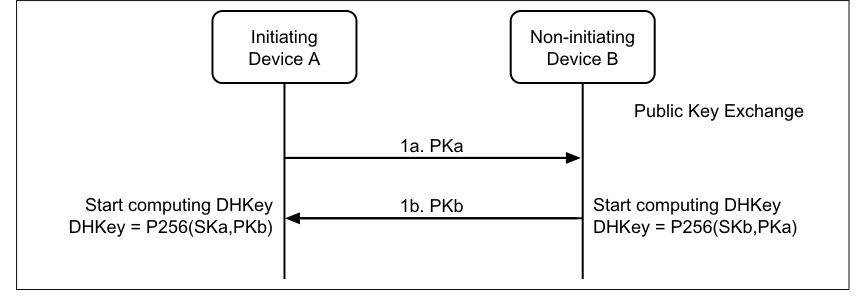

**Figure 2.2:  Public Key Exchange**

After the public keys have been exchanged, the device can then start computing the Diffie-Hellman Key.
When the Security Manager is placed in a Debug mode it shall use the following Diffie-Hellman private / public key pair:
Private key: 3f49f6d4 a3c55f38 74c9b3e3 d2103f50 4aff607b eb40b799 5899b8a6 cd3c1abd
Public key (X): 20b003d2 f297be2c 5e2c83a7 e9f9a5b9 eff49111 acf4fddb cc030148 0e359de6
Public key (Y): dc809c49 652aeb6d 63329abf 5a52155c 766345c2 8fed3024 741c8ed0 1589d28b
Note: Only one side (initiator or responder) needs to set Secure Connections debug mode in order for debug equipment to be able to determine the LTK and, therefore, be able to monitor the encrypted connection.

###### 2.3.5.6.2   Authentication Stage 1 – Just Works or Numeric Comparison

The Numeric Comparison association model will be used during pairing if the MITM bit is set to 1 in the Authentication Requirements in the Pairing Request PDU and/or Pairing Response PDU and both devices have IO capabilities set to either DisplayYesNo or KeyboardDisplay.
The sequence diagram of Authentication Stage 1 for the Just Works or Numeric Comparison protocol from the cryptographic point of view is shown in Figure 2.3.

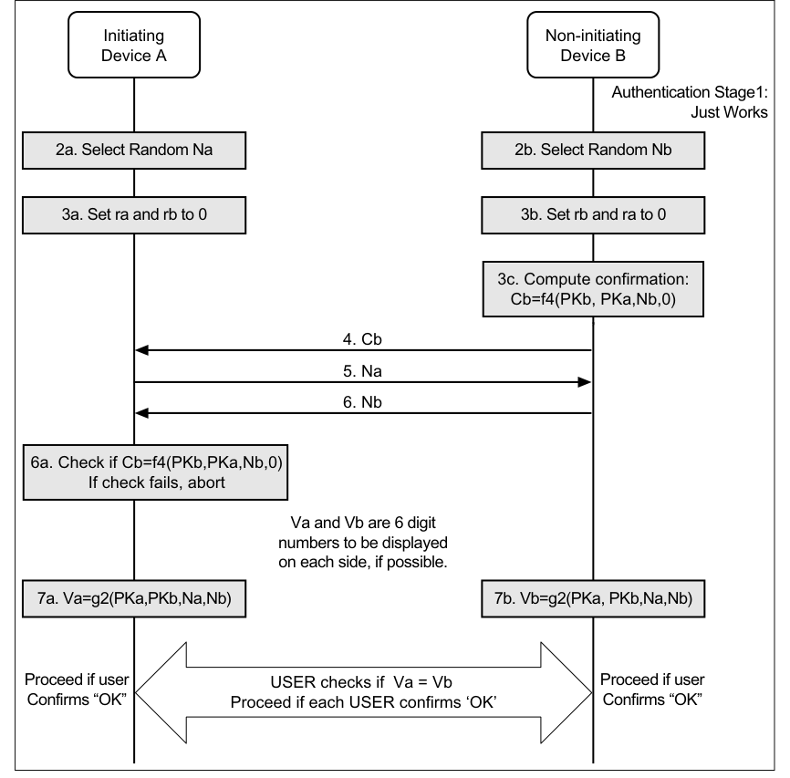

**Figure 2.3:  "Authentication Stage 1: Just Works or Numeric Comparison, LE Secure Connections**

After the public keys have been exchanged, each device selects a pseudo- random 128-bit nonce (step 2). This value is used to prevent replay attacks and must be freshly generated with each instantiation of the pairing protocol. This value should be generated directly from a physical source of randomness or
with a good pseudo-random generator seeded with a random value from a physical source.
Following this the responding device then computes a commitment to the two public keys that have been exchanged and its own nonce value (step 3c). This commitment is computed as a one-way function of these values and is transmitted to the initiating device (step 4). The commitment prevents an attacker from changing these values at a later time.
The initiating and responding devices then exchange their respective nonce values (steps 5 and 6) and the initiating device confirms the commitment (step 6a). A failure at this point indicates the presence of an attacker or other transmission error and causes the protocol to abort. The protocol may be repeated with or without the generation of new public-private key pairs, but new nonces must be generated if the protocol is repeated.
When Just Works is used, the commitment checks (steps 7a and 7b) are not performed and the user is not shown the 6-digit values.
When Numeric Comparison is used, assuming that the commitment check succeeds, the two devices each compute 6-digit confirmation values that are displayed to the user on their respective devices (steps 7a, 7b, and 8). The user is expected to check that these 6-digit values match and to confirm if there is a match. If there is no match, the protocol aborts and, as before, new nonces must be generated if the protocol is to be repeated.
An active MITM must inject its own key material into this process to have any effect other than denial-of-service. A simple MITM attack will result in the two 6- digit display values being different with probability 0.999999. A more sophisticated attack may attempt to engineer the display values to match, but this is thwarted by the commitment sequence. If the attacker first exchanges nonces with the responding device, it must commit to the nonce that it will use with the initiating device before it sees the nonce from the initiating device. If the attacker first exchanges nonces with the initiating device, it must send a nonce to the responding device before seeing the nonce from the responding device. In each case, the attacker must commit to at least the second of its nonces before knowing the second nonce from the legitimate devices. It therefore cannot choose its own nonces in such a way as to cause the display values to match.

###### 2.3.5.6.3   Authentication Stage 1 – Passkey Entry

The Passkey Entry protocol is used when SMP IO capability exchange sequence indicates that Passkey Entry shall be used.
The sequence diagram for Authentication Stage 1 for Passkey Entry from the cryptographic point of view is shown in Figure 2.4.

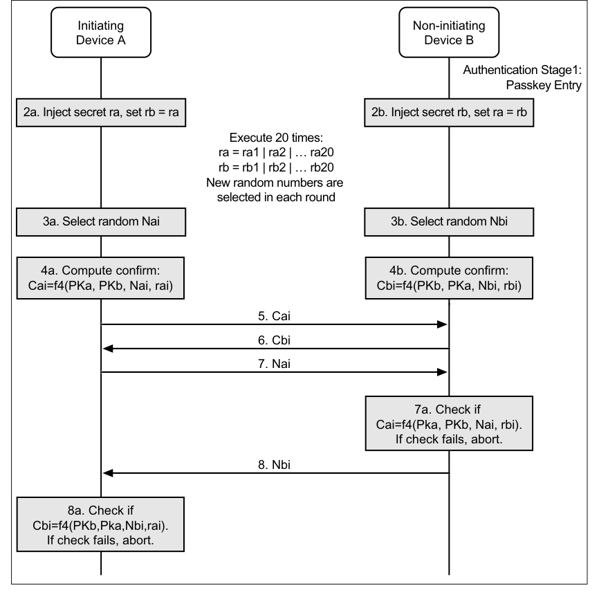

**Figure 2.4:  Authentication Stage 1: Passkey Entry, LE Secure Connections**

The user inputs an identical Passkey into both devices. Alternately, the Passkey may be generated and displayed on one device, and the user then inputs it into the other (step 2). This short shared key will be the basis of the mutual authentication of the devices. Steps 3 through 8 are repeated k times for a k-bit Passkey — e.g., k=20 for a 6-digit Passkey (999999=0xF423F).
In Steps 3-8, each side commits to each bit of the Passkey, using a long nonce (128 bits), and sending the hash of the nonce, the bit of the Passkey, and both
public keys to the other party. The parties then take turns revealing their commitments until the entire Passkey has been mutually disclosed. The first party to reveal a commitment for a given bit of the Passkey effectively reveals that bit of the Passkey in the process, but the other party then has to reveal the corresponding commitment to show the same bit value for that bit of the Passkey, or else the first party will then abort the protocol, after which no more bits of the Passkey are revealed.
This "gradual disclosure" prevents leakage of more than 1 bit of un-guessed Passkey information in the case of a MITM attack. A MITM attacker with only partial knowledge of the Passkey will only receive one incorrectly-guessed bit of the Passkey before the protocol fails. Hence, a MITM attacker who engages first one side, then the other will only gain an advantage of at most two bits over a simple brute-force guesser which succeeds with probability 0.000001.
The long nonce is included in the commitment hash to make it difficult to brute force even after the protocol has failed. The public Diffie-Hellman values are included to tie the Passkey protocol to the original ECDH key exchange, to prevent a MITM from substituting the attacker's public key on both sides of the ECDH exchange in standard MITM fashion.
At the end of this stage, Na is set to Na20 and Nb is set to Nb20 for use in Authentication Stage 2.

###### 2.3.5.6.4   Authentication Stage 1 – Out of Band

The Out-of-Band protocol is used when authentication information has been received by at least one of the devices and indicated in the OOB data flag parameter included in the SMP Pairing Request and SMP Pairing Response PDU. The mode in which the discovery of the peer device is first done in-band and then followed by the transmission of authentication parameters through OOB interface is not supported. The sequence diagram for Authentication Stage 1 for Out of Band from the cryptographic point of view is shown in Figure 2.5.

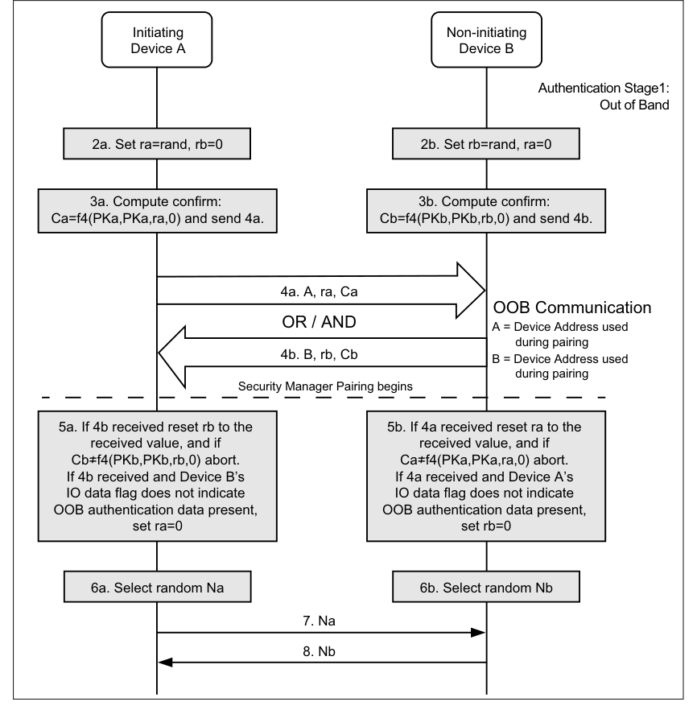

**Figure 2.5:  Authentication Stage 1: Out of Band, LE Secure Connections**

Principle of operation. If both devices can transmit and/or receive data over an out-of-band channel, then mutual authentication will be based on the commitments of the public keys (Ca and Cb) exchanged OOB in Authentication stage 1. If OOB communication is possible only in one direction, then
authentication of the device receiving the OOB communication will be based on that device knowing a random number r sent via OOB. In this case, r must be secret: r can be created afresh every time, or access to the device sending r must be restricted. If r is not sent by a device, it is assumed to be 0 by the device receiving the OOB information in step 4a or 4b.
Roles of A and B. The OOB Authentication Stage 1 protocol is symmetric with respect to the roles of A and B. It does not require that device A always will initiate pairing and it automatically resolves asymmetry in the OOB communication.
Order of steps. The public key exchange must happen before the verification step 5. In the diagram the in-band public key exchange between the devices (step 1) is done before the OOB communication (step 4). But when the pairing is initiated by an OOB interface, public key exchange will happen after the OOB communication (step 1 will be between steps 4 and 5).
Values of ra and rb: Since the direction of the peer's OOB interface cannot be verified before the OOB communication takes place, a device should always generate and if possible transmit through its OOB interface a random number r to the peer. Each device applies the following rules locally to set the values of its own r and the value of the peer's r:
1. Initially, r of the device is set to a random number and r of the peer is set to 0 (step 2).
2. If a device has received OOB, it sets the peer's r value to what was sent by the peer (Step 5).
3. If the remote device's OOB data flag sent in the SMP Pairing Request or SMP Pairing Response is set to “OOB Authentication data not present”, it sets its own r value to 0 (Step 5)

###### 2.3.5.6.5   Authentication Stage 2 and Long Term Key Calculation

The second stage of authentication then confirms that both devices have successfully completed the exchange. This stage is identical in all three protocols.
Each device computes the MacKey and the LTK using the previously exchanged values and the newly derived shared key (step 9). Each device then computes a new confirmation value that includes the previously exchanged values and the newly derived MacKey (step 10a and 10b). The initiating device then transmits its confirmation value, which is checked by the responding device (step 11). If this check fails, it indicates that the initiating device has not confirmed the pairing, and the protocol must be aborted. The responding device then transmits its confirmation value, which is checked by the initiating device (step 12). A failure indicates that the responding device has not confirmed the pairing and the protocol should abort.

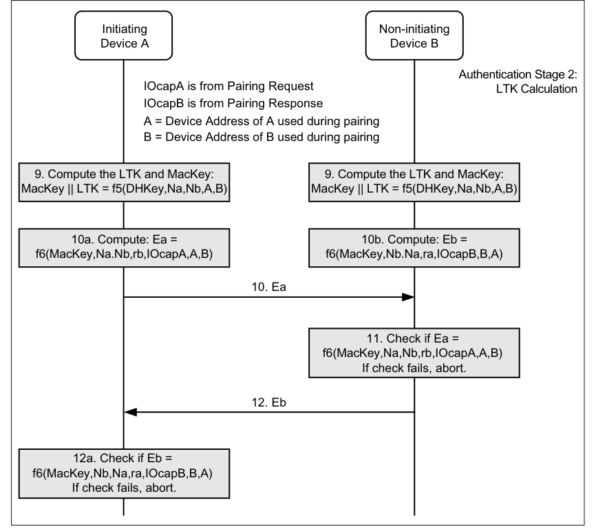

**Figure 2.6:  Authentication Stage 2 and Long Term Key Calculation**

##### 2.3.5.7  Cross-transport Key Derivation

When a pair of BR/EDR/LE devices support Secure Connections on a transport, the devices may optionally generate a key of identical strength for the other transport. There are two sequences:
• If Secure Connections pairing occurs first on the LE transport the procedures in Section 2.4.2.4 may be used.
• If Secure connections pairing occurs first on the BR/EDR transport the procedures in Section 2.4.2.5 may be used.

#### 2.3.6  Repeated Attempts

When a pairing procedure fails a waiting interval shall pass before the verifier will initiate a new Pairing Request command or Security Request command to the same claimant, or before it will respond to a Pairing Request command or Security Request command initiated by a device claiming the same identity as the failed device. For each subsequent failure, the waiting interval shall be increased exponentially. That is, after each failure, the waiting interval before a new attempt can be made, could be for example, twice as long as the waiting interval prior to the previous attempt1. The waiting interval should be limited to a maximum.
The maximum waiting interval depends on the implementation. The waiting time shall exponentially decrease to a minimum when no new failed attempts are made during a certain time period. This procedure prevents an intruder from repeating the pairing procedure with a large number of different keys.
To protect a device's private key, a device should implement a method to prevent an attacker from retrieving useful information about the device's private key using invalid public keys. For this purpose, a device can use one of the following methods:
• Change its private key after three failed attempts from any BD_ADDR and after 10 successful pairings from any BD_ADDR; or after a combination of these such that 3 successful pairings count as one failed pairing; or
• Verify that the received public keys from any BD_ADDR are on the correct curve; or
• Implement elliptic curve point addition and doubling using formulas that are valid only on the correct curve.
1.  Another appropriate integer value larger than 1 may be used.

### 2.4   SECURITY IN BLUETOOTH LOW ENERGY

Security shall be initiated by the Security Manager in the device in the master role. The device in the slave role shall be the responding device. The slave device may request the master device to initiate pairing or other security procedures, see Section 2.4.6.
The slave in the key distribution phase gives keys to the master so a reconnection can be encrypted, its random addresses can be resolved, or the master device can verify signed data from the slave.
The master may also provide keys to the slave device so a reconnection can be encrypted if the roles are reversed, the master’s random addresses can be resolved, or the slave can verify signed data from the master.

#### 2.4.1  Definition of Keys and Values

LE security uses the following keys and values for encryption, signing, and random addressing:
1. Identity Resolving Key (IRK) is a 128-bit key used to generate and resolve random addresses.
2. Connection Signature Resolving Key (CSRK) is a 128-bit key used to sign data and verify signatures on the receiving device.
3. Long Term Key (LTK) is a 128-bit key used to generate the contributory session key for an encrypted connection. Link Layer encryption is described in [Vol 6] Part B, Section 5.1.3.
4. Encrypted Diversifier (EDIV) is a 16-bit stored value used to identify the LTK distributed during LE legacy pairing. A new EDIV is generated each time a unique LTK is distributed.
5. Random Number (Rand) is a 64-bit stored valued used to identify the LTK distributed during LE legacy pairing. A new Rand is generated each time a unique LTK is distributed.

#### 2.4.2  Generation of Distributed Keys

Any method of generation of keys that are being distributed that results in the keys having 128 bits of entropy can be used, as the generation method is not visible outside the slave device (see Section Appendix B). The keys shall not be generated only from information that is distributed to the master device or only from information that is visible outside of the slave device.

##### 2.4.2.1  Generation of IRK

The Identity Resolving Key (IRK) is used for resolvable private address construction (see [Vol 3] Part C, Section 10.8.2). A master that has received IRK from a slave can resolve that slave’s random device addresses. A slave
that has received IRK from a master can resolve that master’s random device addresses. The privacy concept only protects against devices that are not part of the set to which the IRK has been given.
IRK can be assigned, or randomly generated by the device during manufacturing, or some other method could be used. If IRK is randomly generated then the requirements for random generation defined in [Vol 2] Part H, Section 2 shall be used.
The encryption key size does not apply to IRK; therefore, its size does not need to be reduced before distribution.

##### 2.4.2.2  Generation of CSRK

The Connection Signature Resolving Key (CSRK) is used to sign data in a connection. A device that has received CSRK can verify signatures generated by the distributing device. The signature only protects against devices that are not part of the set to which CSRK has been given.
CSRK can be assigned or randomly generated by the device during manufacturing, or some other method could be used. If CSRK is randomly generated then the requirements for random generation defined in [Vol 2] Part H, Section 2 shall be used.
The encryption key size does not apply to CSRK, therefore its size does not need to be reduced before distribution.

##### 2.4.2.3  LE Legacy Pairing - Generation of LTK, EDIV and Rand

Devices which support encryption in the Link Layer Connection State in the Slave Role shall be capable of generating LTK, EDIV, and Rand.
The EDIV and Rand are used by the slave device to establish a previously shared LTK in order to start an encrypted connection with a previously paired master device.
The generated LTK size must not exceed the negotiated encryption key size and its size may need to be reduced (see Section 2.3.4).
New values of LTK, EDIV, and Rand shall be generated each time they are distributed.
The slave device may store the mapping between EDIV, Rand and LTK in a security database so the correct LTK value is used when the master device requests encryption. Depending upon the LTK generation method additional information may be stored, for example the size of the distributed LTK.
The master device may also distribute EDIV, Rand, and LTK to the slave device which can be used to encrypt a reconnection if the device roles are reversed in a future connection.

##### 2.4.2.4  Derivation of BR/EDR Link Key from LE LTK

The LTK from the LE physical transport can be converted to the BR/EDR link key for the BR/EDR transport as follows, using intermediate link key (ILK) as an intermediate value:
If at least one device sets CT2 = 0 then
1. ILK = h6(LTK, “tmp1”) 2. BR/EDR link key = h6(ILK, “lebr”)
If both devices set CT2 = 1 then
1. ILK = h7(SALT, LTK) 2. BR/EDR link key = h6(ILK, “lebr”)
The string “lebr” is mapped into keyID using extended ASCII as follows:
keyID[0] = 0111 0010 keyID[1] = 0110 0010 keyID[2] = 0110 0101 keyID[3] = 0110 1100 keyID    = 0x6c656272
The string “tmp1” is mapped into keyID using extended ASCII as follows:
keyID[0] = 0011 0001 keyID[1] = 0111 0000 keyID[2] = 0110 1101 keyID[3] = 0111 0100 keyID    = 0x746D7031
SALT is defined as follows:
SALT = 0x00000000000000000000000000000000746D7031
Note: If the LTK has an encryption key size that is less than 16 octets (128 bits), the BR/EDR link key is derived before the LTK gets masked.

##### 2.4.2.5  Derivation of LE LTK from BR/EDR Link Key

The BR/EDR Link Key from the BR/EDR physical transport can be converted to the LTK for the LE transport as follows, using intermediate long term key (ILTK) as an intermediate value:
If at least one device sets CT2 = 0 then
1. ILTK = h6(Link Key, “tmp2”) 2. LTK = h6(ILTK, “brle”)
If both devices set CT2 = 1 then
1. ILTK = h7(SALT, Link Key) 2. LTK = h6(ILTK, “brle”)
The string “brle” is mapped into keyID using extended ASCII as follows:
keyID[0] = 0110 0101 keyID[1] = 0110 1100 keyID[2] = 0111 0010 keyID[3] = 0110 0010 keyID    = 0x62726c65
The string “tmp2” is mapped into keyID using extended ASCII as follows:
keyID[0] = 0011 0010 keyID[1] = 0111 0000 keyID[2] = 0110 1101 keyID[3] = 0111 0100 keyID    = 0x746D7032
The SALT is defined as follows:
SALT = 0x00000000000000000000000000000000746D7032

#### 2.4.3  Distribution of Keys

Key distribution for LE Legacy Pairing and LE Secure Connections is described in the following sections.

##### 2.4.3.1  LE Legacy Pairing Key Distribution

The slave may distribute to the master the following keys:
• LTK, EDIV, and Rand
• IRK
• CSRK
The master device may distribute to the slave the following keys:
• LTK, EDIV, and Rand
• IRK
• CSRK
The security properties of the distributed keys shall be set to the security properties of the STK that was used to distribute them. For example if STK has Unauthenticated no MITM Protection security properties then the distributed keys shall have Unauthenticated no MITM Protection security properties.
The link shall be encrypted or re-encrypted using STK generated in Phase 2 (see Section 2.4.4.1) before any keys are distributed.
Note: The distributed EDIV and Rand values are transmitted in clear text by the master device to the slave device during encrypted session setup.
The BD_ADDR that is received in the Identity Address Information command shall only be considered valid once a reconnection has occurred using the BD_ADDR and LTK distributed during that pairing. Once this is successful the BD_ADDR and the distributed keys shall be associated with that device in the security database.
A device may request encrypted session setup to use the LTK, EDIV, and Rand values distributed by the slave device when the key distribution phase has completed; however, this does not provide any additional security benefit. If an attacker has established the distributed LTK value then performing encrypted session setup to use the distributed values does not provide any protection against that attacker.

##### 2.4.3.2  LE Secure Connections Key Distribution

The master and slave may distribute the following keys:
• IRK
• CSRK
The security properties of the distributed keys shall be set to the security properties of the LTK that was used to distribute them. For example if LTK has Unauthenticated no MITM Protection security properties then the distributed keys shall have Unauthenticated no MITM Protection security properties.
The link shall be encrypted or re-encrypted using LTK generated in Phase 2 (see Section 2.4.4.1) before any keys are distributed.
The BD_ADDR that is received in the Identity Address Information command shall only be considered valid once a reconnection has occurred using the BD_ADDR and LTK generated during that pairing. Once this is successful the BD_ADDR and the distributed keys shall be associated with that device in the security database.

#### 2.4.4  Encrypted Session Setup

During the encrypted session setup the master device sends a 16-bit Encrypted Diversifier value, EDIV, and a 64-bit Random Number, Rand, distributed by the slave device during pairing, to the slave device. The master’s Host provides the Link Layer with the Long Term Key to use when setting up the encrypted session. The slave’s Host receives the EDIV and Rand values and provides a Long Term Key to the slave’s Link Layer to use when setting up the encrypted link.
When both devices support LE Secure Connections, the EDIV and Rand are set to zero.

##### 2.4.4.1  Encryption Setup using STK

To distribute LTK and other keys in pairing Phase 3 an encrypted session needs to be established (see Section 2.3.5.5).
The encrypted session is setup using STK generated in Phase 2 (see Section Section 2.3.5.5) as the Long Term Key provided to the Link Layer, (see [Vol 6] Part B, Section 5.1.3.1) EDIV, and Rand values shall be set to zero.
If the link is already encrypted then the encryption pause procedure is performed using STK generated in Phase 2 as the Long Term Key provided to the Link Layer (see [Vol 6] Part B, Section 5.1.3.2). EDIV and Rand values shall be set to zero.

##### 2.4.4.2  Encryption Setup using LTK

The master device must have the security information (LTK, EDIV, and Rand) distributed by the slave device in LE legacy pairing or the LTK generated in LE Secure Connections to setup an encrypted session.
The master initiates the encrypted session using the security information; see [Vol 6] Part B, Section 5.1.3.1. If the link is already encrypted the encryption pause procedure is performed using the security information; see [Vol 6] Part B, Section 5.1.3.2.
In LE legacy pairing, the EDIV and Rand values are used to establish LTK which is used as the Long Term Key on the slave device. If LTK cannot be established from EDIV and Rand values then the slave shall reject the request to encrypt the link and may optionally disconnect the link.
The LTK size must not exceed the negotiated encryption key size and its size may need to be reduced (see Section 2.3.4).
When the security information is stored, subsequent encryption setups may fail if the remote device has deleted the security information. Table 2.9 defines what shall be done depending on the type of the security properties and whether or not bonding was performed when subsequent encryption setup fails.

| Security Properties | Devices Bonded | Action to take when enabling encryption fail |
| --- | --- | --- |
| Unauthenticated, no MITM protection | No | Depends on security policy of the device: • Option 1: Automatically initiate pairing • Option 2: Notify user and ask if pairing is ok. Option 1 is recommended. |
| Unauthenticated, no MITM protection | Yes | Notify user of security failure |
| Authenticated MITM protection | No | Depends on security policy of the device: • Option 1: Automatically initiate pairing • Option 2: Notify user and ask if pairing is ok. Option 2 is recommended. |
| Authenticated MITM protection | Yes | Notify user of security failure |

Table 2.9:  Action after encryption setup failure

#### 2.4.5  Signing Algorithm

An LE device can send signed data without having to establish an encrypted session with a peer device. Data shall be signed using CSRK. A device performing signature verification must have received CSRK from the signing device. The sending device will use its CSRK to sign the transmitted data.
The following are inputs to the signing algorithm:
m is variable length k is 128 bits SignCounter is 32 bits
Signing shall be performed using the algorithm defined in the NIST Special Publication 800-38B (http://csrc.nist.gov/publications/PubsSPs.html) using AES-128 as the block cipher. NIST SP 800-38B defines the message authentication code (MAC) generation function:
MAC = CMAC(K, M, Tlen)
The bit length of the MAC (Tlen) shall be 64 bits. The key used for signature generation (k) shall be set to CSRK.
The message to be signed (M) by the CMAC function is the concatenation of the variable length message to be signed (m) and 4 octet string representing the 32-bit counter value (SignCounter) least significant octet first.
M = m || SignCounter
For example, if data to be signed is the 7 octet sequence ‘3456789ABCDEF1’ and SignCounter is set to 67653874 (0x040850F2) then M is the octet sequence ‘3456789ABCDEF1F2500804’. Examples of CMAC generation using AES-128 as the block cipher are included in NIST Special Publication 800-38B Appendix.
The SignCounter shall be initialized to zero when CSRK is generated and incremented for every message that is signed with a given CSRK.
Note: If a device generates 100,000 signed events a day, a 32-bit counter will wrap after approximately 117 years.
The 64-bit result of the CMAC function is used as the result of the signing algorithm.
To verify a signature a device computes the MAC of a received message and SignCounter and compares it with the received MAC. If the MAC does not match then the signature verification has failed. If the MACs match then the signature verification has succeeded.
The device performing verification should store the last verified SignCounter in the security database and compare it with a received SignCounter to prevent replay attacks. If the received SignCounter is greater than the stored value then the message has not been seen by the local device before and the security database can be updated.

#### 2.4.6  Slave Security Request

The slave device may request security by transmitting a Security Request command to the master. When a master device receives a Security Request command it may encrypt the link, initiate the pairing procedure, or reject the request.
The slave shall not send the Security Request command if the pairing procedure is in progress, or if the encryption procedure is in progress.
The Security Request command includes the required security properties. A security property of MITM protection required shall only be set if the slave’s IO capabilities would allow the Passkey Entry association model to be used or out of band authentication data is available.
The master shall ignore the slave’s Security Request if the master has sent a Pairing Request without receiving a Pairing Response from the slave or if the master has initiated encryption mode setup.
If pairing or encryption mode is not supported or cannot be initiated at the time when the slave’s Security Request Command is received, then the master shall respond with a Pairing Failed Command with the reason set to “Pairing Not Supported.”
After receiving a Security Request, the master shall first check whether it has the required security information to enable encryption; see Section 2.4.4.2. If this information is missing or does not meet the security properties requested by the slave, then the master shall initiate the pairing procedure. If the pairing procedure is successful, the master’s security database is updated with the keys and security properties are distributed during the pairing procedure.
If the master has the required security information to enable encryption and it meets the security properties request by the slave, it shall perform encryption setup using LTK, see Section 2.4.4.2.
Figure 2.7 shows a summary of the actions and decisions that a master shall take when receiving a Security Request.
The slave shall check that any Pairing Request command received from the master after sending a Security Request command contains Authentication Requirements that meet the requested security properties.
If the slave requests a security property that is not Just Works and receives an encryption procedure request after sending a Security Request command then it shall check that any existing Security Information is of sufficient security properties.

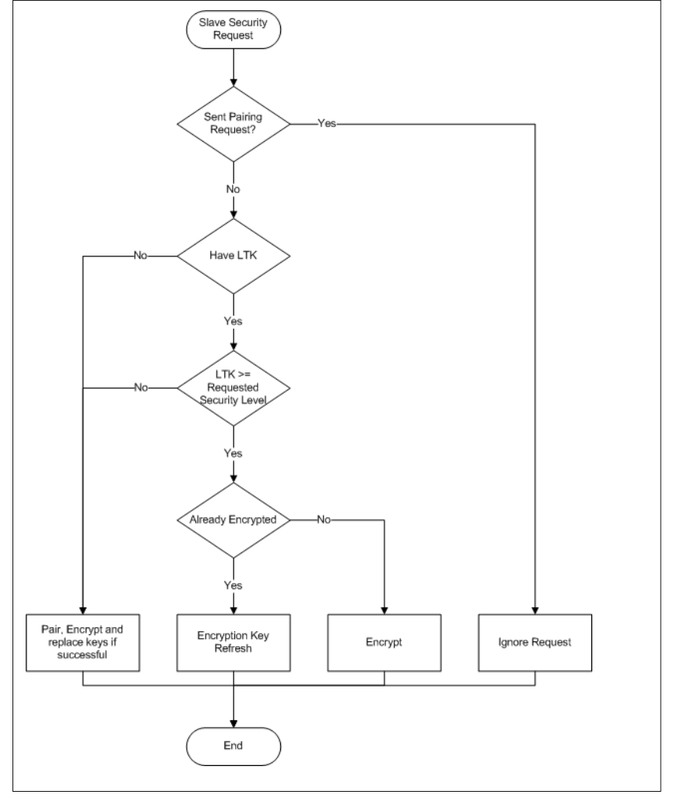

**Figure 2.7:  Master actions after receiving Security Request**

## 3  SECURITY MANAGER PROTOCOL

### 3.1   INTRODUCTION

The Security Manager Protocol (SMP) is used for pairing and transport specific key distribution.

### 3.2   SECURITY MANAGER CHANNEL OVER L2CAP

All SMP commands are sent over the Security Manager Channel which is an L2CAP fixed channel (see [Vol 3] Part A, Section 2.1). The configuration parameters for the Security Manager Channel when LE Secure Connections is not supported shall be as shown below in Table 3.1.

| Parameter | Value |
| --- | --- |
| MTU | 23 |
| Flush Timeout | 0xFFFF (Infinite) |
| QoS | Best Effort |
| Mode | Basic Mode |

Table 3.1:  Security Manager Channel Configuration Parameters without LE Secure Connections
The configuration parameters for the Security Manager Channel when LE Secure Connections is supported shall be as shown below in Table 3.2.

| Parameter | Value |
| --- | --- |
| MTU | 65 |
| Flush Timeout | 0xFFFF (Infinite) |
| QoS | Best Effort |
| Mode | Basic Mode |

Table 3.2:  Security Manager Channel Configuration Parameters with LE Secure Connections

### 3.3   COMMAND FORMAT

The general format for all SMP commands is shown in Figure 3.1.

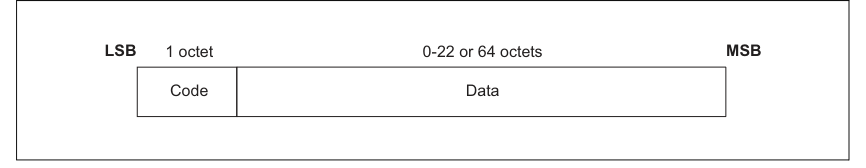

**Figure 3.1:  SMP Command Format**

The following are the fields shown:
• Code (1 octet) The Code field is one octet long and identifies the type of command. Table 3.3 lists the codes defined by this document. If a packet is received with a Code that is reserved for future use it shall be ignored.

| Code | Description | Logical Link Supported |
| --- | --- | --- |
| 0x00 | Reserved for future use |  |
| 0x01 | Pairing Request | LE-U, ACL-U |
| 0x02 | Pairing Response | LE-U, ACL-U |
| 0x03 | Pairing Confirm | LE-U |
| 0x04 | Pairing Random | LE-U |
| 0x05 | Pairing Failed | LE-U, ACL-U |
| 0x06 | Encryption Information | LE-U |
| 0x07 | Master Identification | LE-U |
| 0x08 | Identity Information | LE-U, ACL-U |
| 0x09 | Identity Address Information | LE-U, ACL-U |
| 0x0A | Signing Information | LE-U, ACL-U |
| 0x0B | Security Request | LE-U |
| 0x0C | Pairing Public Key | LE-U |
| 0x0D | Pairing DHKey Check | LE-U |
| 0x0E | Pairing Keypress Notification | LE-U |
| 0x0F – 0xFF | Reserved for future use |  |

Table 3.3:  SMP Command Codes
• Data (0 or more octets) The Data field is variable in length. The Code field determines the format of the Data field.
If a device does not support pairing then it shall respond with a Pairing Failed command with the reason set to “Pairing Not Supported” (see Section 3.5.5) when any command is received. If pairing is supported then all commands shall be supported.

### 3.4   SMP TIMEOUT

To protect the Security Manager protocol from stalling, a Security Manager Timer is used. Upon transmission of the Security Request command or reception of the Security Request command, the Security Manager Timer shall be reset and restarted. Upon transmission of the Pairing Request command or reception of the Pairing Request command, the Security Manager Timer shall be reset and started.
The Security Manager Timer shall be reset when an L2CAP SMP command is queued for transmission.
When a Pairing process completes, the Security Manager Timer shall be stopped.
If the Security Manager Timer reaches 30 seconds, the procedure shall be considered to have failed, and the local higher layer shall be notified. No further SMP commands shall be sent over the L2CAP Security Manager Channel. A new Pairing process shall only be performed when a new physical link has been established.

### 3.5   PAIRING METHODS

The SMP commands defined in this section are used to perform Pairing Feature Exchange and key generation (see Section 2.1).

#### 3.5.1  Pairing Request

The initiator starts the Pairing Feature Exchange by sending a Pairing Request command to the responding device. The Pairing Request command is defined in Figure 3.2.
The rules for handing a collision between a pairing procedure on the LE transport and a pairing procedure on the BR/EDR transport are defined in [Vol 3] Part C, Section 14.2.

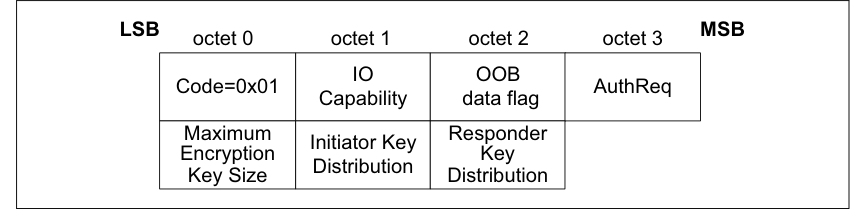

**Figure 3.2:  Pairing Request Packet**

The following data fields are used:
• IO Capability (1 octet) Table 3.4 defines the values which are used when exchanging IO capabilities (see Section 2.3.2).

| Value | Description |
| --- | --- |
| 0x00 | DisplayOnly |
| 0x01 | DisplayYesNo |
| 0x02 | KeyboardOnly |
| 0x03 | NoInputNoOutput |
| 0x04 | KeyboardDisplay |
| 0x05-0xFF | Reserved for future use |

Table 3.4:  IO Capability Values
• OOB data flag (1 octet) Table 3.5 defines the values which are used when indicating whether OOB authentication data is available (see Section 2.3.3).

| Value | Description |
| --- | --- |
| 0x00 | OOB Authentication data not present |
| 0x01 | OOB Authentication data from remote device present |
| 0x02-0xFF | Reserved for future use |

Table 3.5:  OOB Data Present Values
• AuthReq (1 octet) The AuthReq field is a bit field that indicates the requested security properties (see Section 2.3.1) for the STK and LTK and GAP bonding information (see [Vol 3] Part C, Section 9.4).
Figure 3.3 defines the authentication requirements bit field.

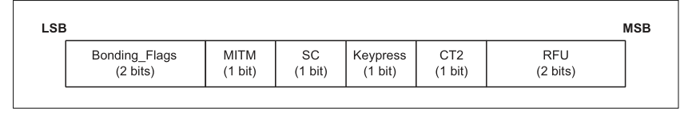

**Figure 3.3:  Authentication Requirements Flags**

The Bonding_Flags field is a 2-bit field that indicates the type of bonding being requested by the initiating device as defined in Table 3.6.

| Bonding Flags _ b b 1 0 | Bonding Type |
| --- | --- |
| 00 | No Bonding |
| 01 | Bonding |
| 10 | Reserved for future use |
| 11 | Reserved for future use |

Table 3.6:  Bonding Flags
The MITM field is a 1-bit flag that is set to one if the device is requesting MITM protection, otherwise it shall be set to 0. A device sets the MITM flag to one to request an Authenticated security property for the STK when using LE legacy pairing and the LTK when using LE Secure Connections.
The SC field is a 1 bit flag. If LE Secure Connections pairing is supported by the device, then the SC field shall be set to 1, otherwise it shall be set to 0. If both devices support LE Secure Connections pairing, then LE Secure Connections pairing shall be used, otherwise LE Legacy pairing shall be used. The keypress field is a 1-bit flag that is used only in the Passkey Entry protocol and is ignored in other protocols. When both sides set that field to one, Keypress notifications shall be generated and sent using SMP Pairing Keypress Notification PDUs. The CT2 field is a 1-bit flag that shall be set to 1 upon transmission to indicate support for the h7 function. See sections 2.4.2.4 and 2.4.2.5.
• Maximum Encryption Key Size (1 octet) This value defines the maximum encryption key size in octets that the device can support. The maximum key size shall be in the range 7 to 16 octets.
• Initiator Key Distribution / Generation (1 octet) The Initiator Key Distribution / Generation field indicates which keys the initiator is requesting to distribute / generate or use during the Transport Specific Key Distribution phase (see Section 2.4.3). The Initiator Key Distribution / Generation field format and usage is defined in Section 3.6.1.
• Responder Key Distribution / Generation (1 octet)
The Responder Key Distribution / Generation field indicates which keys the initiator is requesting the responder to distribute / generate or use during the Transport Specific Key Distribution phase (see Section 2.4.3). The Responder Key Distribution / Generation field format and usage is defined in Section 3.6.1.
If Secure Connections pairing has been initiated over BR/EDR, the following fields of the SM Pairing Request PDU are reserved for future use:
• the IO Capability field,
• the OOB data flag field, and
• all bits in the Auth Req field except the CT2 bit.

#### 3.5.2  Pairing Response

This command is used by the responding device to complete the Pairing Feature Exchange after it has received a Pairing Request command from the initiating device, if the responding device allows pairing. The Pairing Response command is defined in Figure 3.4.
The rules for handing a collision between a pairing procedure on the LE transport and a pairing procedure on the BR/EDR transport are defined in [Vol 3] Part C, Section 14.2.
If a Pairing Request is received over the BR/EDR transport when either cross- transport key derivation/generation is not supported or the BR/EDR transport is not encrypted using a Link Key generated using P256, a Pairing Failed shall be sent with the error code "Cross-transport Key Derivation/Generation not allowed" (0x0E).

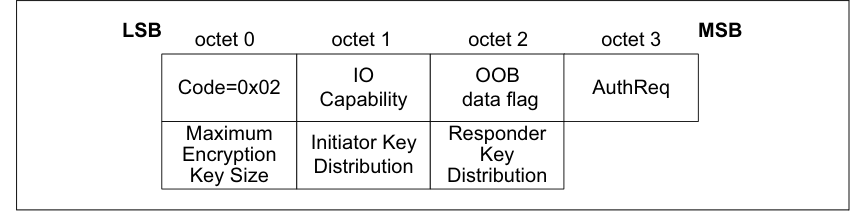

**Figure 3.4:  Pairing Response Packet**

The following data fields are used:
• IO Capability (1 octet) Table 3.4 defines the values which are used when exchanging IO capabilities (see Section 2.3.2).
• OOB data flag (1 octet) Table 3.5 defines the values which are used when indicating whether OOB authentication data is available (see Section 2.3.3).
• AuthReq (1 octet) The AuthReq field is a bit field that indicates the requested security properties (see Section 2.3.1) for the STK or LTK and GAP bonding information (see [Vol 3] Part C, Section 9.4). Figure 3.3 defines the authentication requirements bit field. The Bonding_Flags field is a 2-bit field that indicates the type of bonding being requested by the responding device as defined in Table 3.6. The MITM field is a 1-bit flag that is set to one if the device is requesting MITM protection, otherwise it shall be set to 0. A device sets the MITM flag to one to request an Authenticated security property for the STK when using LE legacy pairing and the LTK when using LE Secure Connections. The SC field is a 1 bit flag. If LE Secure Connections pairing is supported by the device, then the SC field shall be set to 1, otherwise it shall be set to 0. If both devices support LE Secure Connections pairing, then LE Secure Connections pairing shall be used, otherwise LE Legacy pairing shall be used.
The keypress field is a 1-bit flag that is used only in the Passkey Entry protocol and is ignored in other protocols. When both sides set that field to one, Keypress notifications shall be generated and sent using SMP Pairing Keypress Notification PDUs.
The CT2 field is a 1-bit flag that shall be set to 1 upon transmission to indicate support for the h7 function. See Sections 2.4.2.4 and 2.4.2.5.
• Maximum Encryption Key Size (1 octet) This value defines the maximum encryption key size in octets that the device can support. The maximum key size shall be in the range 7 to 16 octets.
• Initiator Key Distribution (1 octet) The Initiator Key Distribution field defines which keys the initiator shall distribute and use during the Transport Specific Key Distribution phase (see Section 2.4.3). The Initiator Key Distribution field format and usage are defined in Section 3.6.1.
• Responder Key Distribution (1 octet) The Responder Key Distribution field defines which keys the responder shall distribute and use during the Transport Specific Key Distribution phase (see Section 2.4.3). The Responder Key Distribution field format and usage are defined in Section 3.6.1.
If Secure Connections pairing has been initiated over BR/EDR, the following fields of the SM Pairing Response PDU are reserved for future use:
• the IO Capability field,
• the OOB data flag field, and
• all bits in the Auth Req field except the CT2 bit.

#### 3.5.3  Pairing Confirm

This is used following a successful Pairing Feature Exchange to start STK Generation for LE legacy pairing and LTK Generation for LE Secure Connections pairing. The Pairing Confirm command is defined in Figure 3.5.
This command is used by both devices to send the confirm value to the peer device, see Section 2.3.5.5 for LE legacy pairing and Section 2.3.5.6 for LE Secure Connections pairing.
The initiating device starts key generation by sending the Pairing Confirm command to the responding device. If the initiating device wants to abort pairing it can transmit a Pairing Failed command instead.
The responding device sends the Pairing Confirm command after it has received a Pairing Confirm command from the initiating device.

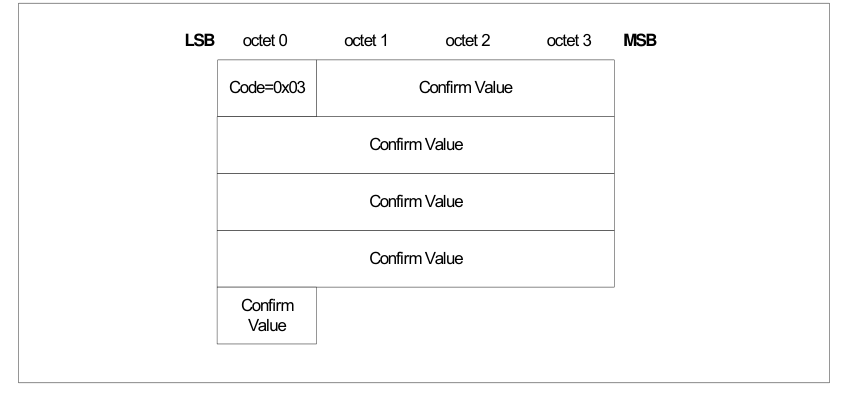

**Figure 3.5:  Pairing Confirm Packet**

The following data field is used:
• Confirm value (16 octets) In LE legacy pairing, the initiating device sends Mconfirm and the responding device sends Sconfirm as defined in Section 2.3.5.5. In LE Secure Connections, Ca and Cb are defined in Section 2.2.6.

#### 3.5.4  Pairing Random

This command is used by the initiating and responding device to send the random number used to calculate the Confirm value sent in the Pairing Confirm command. The Pairing Random command is defined in Figure 3.6.
The initiating device sends a Pairing Random command after it has received a Pairing Confirm command from the responding device.
In LE legacy pairing, the responding device shall send a Pairing Random command after it has received a Pairing Random command from the initiating device if the Confirm value calculated on the responding device matches the Confirm value received from the initiating device. If the calculated Confirm value does not match then the responding device shall respond with the Pairing Failed command.
In LE Secure Connections, the responding device shall send a Pairing Random command after it has received a Pairing Random command from the initiating device. If the calculated Confirm value does not match then the responding device shall respond with the Pairing Failed command.
The initiating device shall encrypt the link using the generated key (STK in LE legacy pairing or LTK in LE Secure Connections) if the Confirm value calculated on the initiating device matches the Confirm value received from the responding device. The successful encryption or re-encryption of the link is the signal to the responding device that key generation has completed successfully. If the calculated Confirm value does not match then the initiating device shall respond with the Pairing Failed command.

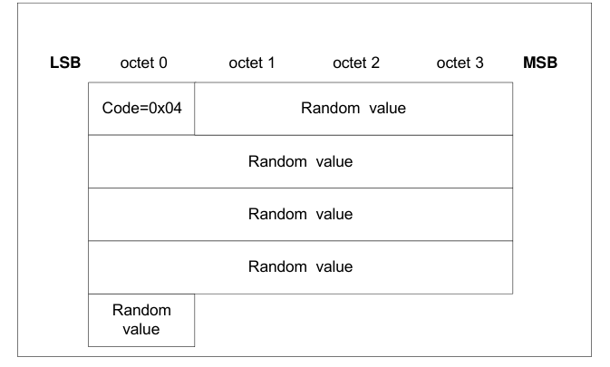

**Figure 3.6:  Pairing Random Packet**

The following are the data fields:
• Random value (16 octets) In LE legacy pairing, the initiating device sends Mrand and the responding device sends Srand as defined in Section 2.3.5.5. In LE Secure Connections, the initiating device sends Na and the responding device sends Nb.

#### 3.5.5  Pairing Failed

This is used when there has been a failure during pairing and reports that the pairing procedure has been stopped and no further communication for the current pairing procedure is to occur. The Pairing Failed command is defined in Figure 3.7.
Any subsequent pairing procedure shall restart from the Pairing Feature Exchange phase.
This command may be sent at any time during the pairing process by either device in response to a message from the remote device.

**Figure 3.7:  Pairing Failed Packet**

The following data field is used:
• Reason (1 octets)
The Reason field indicates why the pairing failed. The reason codes are defined in Table 3.7.

| Value | Name | Description |
| --- | --- | --- |
| 0x00 |  | Reserved for future use |
| 0x01 | Passkey Entry Failed | The user input of passkey failed, for exam ple, the user cancelled the operation |
| 0x02 | OOB Not Available | The OOB data is not available |
| 0x03 | Authentication Requirements | The pairing procedure cannot be per- formed as authentication requirements cannot be met due to IO capabilities of on or both devices |
| 0x04 | Confirm Value Failed | The confirm value does not match the cal culated compare value |
| 0x05 | Pairing Not Supported | Pairing is not supported by the device |
| 0x06 | Encryption Key Size | The resultant encryption key size is insuff cient for the security requirements of this device |
| 0x07 | Command Not Supported | The SMP command received is not sup- ported on this device |

Table 3.7:  Pairing Failed Reason Codes

| Value | Name | Description |
| --- | --- | --- |
| 0x08 | Unspecified Reason | Pairing failed due to an unspecified reaso |
| 0x09 | Repeated Attempts | Pairing or authentication procedure is dis allowed because too little time has elapse since last pairing request or security request |
| 0x0A | Invalid Parameters | The Invalid Parameters error code indicate that the command length is invalid or that parameter is outside of the specified rang |
| 0x0B | DHKey Check Failed | Indicates to the remote device that the DHKey Check value received doesn’t match the one calculated by the local device. |
| 0x0C | Numeric Comparison Failed | Indicates that the confirm values in the numeric comparison protocol do not matc |
| 0x0D | BR/EDR pairing in progress | Indicates that the pairing over the LE transport failed due to a Pairing Reques sent over the BR/EDR transport in prog- ress. |
| 0x0E | Cross-transport Key Deriva- tion/Generation not allowed | Indicates that the BR/EDR Link Key gener ated on the BR/EDR transport cannot be used to derive and distribute keys for the L transport. |
| 0x0F - 0xFF |  | Reserved for future use |

Table 3.7:  Pairing Failed Reason Codes

#### 3.5.6  Pairing Public Key

This message is used to transfer the device’s local public key (X and Y co- ordinates) to the remote device. This message is used by both the initiator and responder. This PDU is only used for Secure Connections.

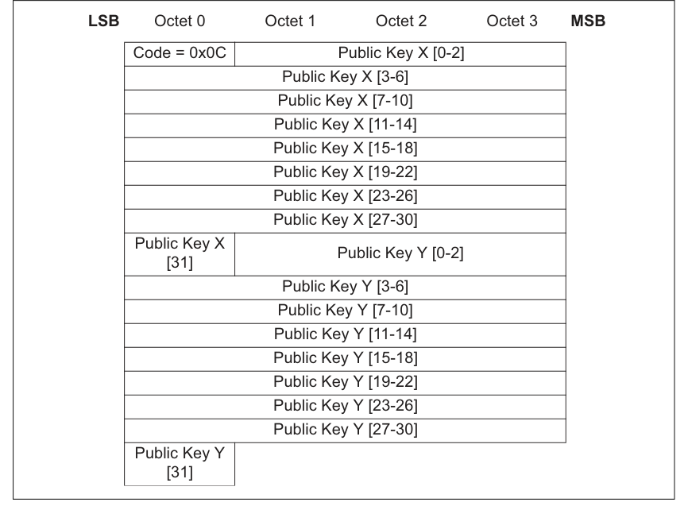

**Figure 3.8:  Pairing Public Key PDU**

#### 3.5.7  Pairing DHKey Check

This message is used to transmit the 128-bit DHKey Check values (Ea/Eb) generated using f6. This message is used by both initiator and responder. This PDU is only used for LE Secure Connections.

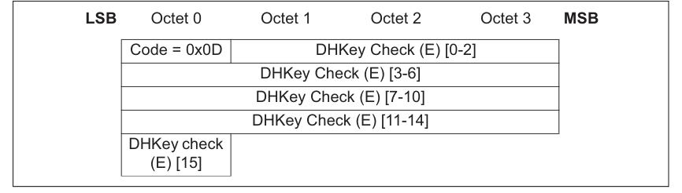

**Figure 3.9:  Pairing DHKey Check PDU**

#### 3.5.8  Keypress Notification

This message is used during the Passkey Entry protocol by a device with KeyboardOnly IO capabilities to inform the remote device when keys have been entered or erased.

**Figure 3.10:  Pairing Keypress Notification PDU**

Notification Type can take one of the following values:

| Value | Parameter Description |
| --- | --- |
| 0 | Passkey entry started |
| 1 | Passkey digit entered |
| 2 | Passkey digit erased |
| 3 | Passkey cleared |
| 4 | Passkey entry completed |
| 5-255 | Reserved for future use |

Table 3.8:  Notification Type

### 3.6   SECURITY IN BLUETOOTH LOW ENERGY

#### 3.6.1  Key Distribution and Generation

Bluetooth low energy devices can distribute keys from the slave to the master and from the master to the slave device. When using LE legacy pairing, the following keys may be distributed from the slave to the master:
• LTK using Encryption Information command
• EDIV and Rand using Master Identification command
• IRK using Identity Information command
• Public device or static random address using Identity Address Information command
• CSRK using Signing Information command
When using LE Secure Connections, the following keys may be distributed from the slave to the master:
• IRK using Identity Information command
• Public device or static random address using Identity Address Information command
• CSRK using Signing Information command
When using LE legacy pairing, the master may distribute to the slave the following key:
• LTK using Encryption Information command
• EDIV and Rand using Master Identification command
• IRK using Identity Information command
• Public device or static random address using Identity Address Information command
• CSRK using Signing Information command
When using LE Secure Connections, the master may distribute to the slave the following key:
• IRK using Identity Information command
• Public device or static random address using Identity Address Information command
• CSRK using Signing Information command
The keys which are to be distributed in the Transport Specific Key Distribution phase are indicated in the Key Distribution field of the Pairing Request and Pairing Response commands see Section 3.5.1 and Section 3.5.2.
The format of the Initiator Key Distribution / Generation field and Responder Key Distribution / Generation field in the Pairing Request and Pairing Response commands for LE is defined in Figure 3.11.

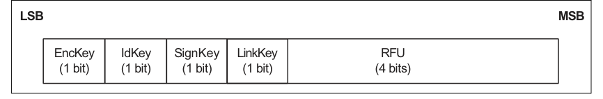

**Figure 3.11:  LE Key Distribution Format**

The Key Distribution / Generation field has the following flags:
• In LE legacy pairing, EncKey is a 1-bit field that is set to one to indicate that the device shall distribute LTK using the Encryption Information command followed by EDIV and Rand using the Master Identification command.
In LE Secure Connections pairing, when SMP is running on the LE transport, then the EncKey field is ignored. EDIV and Rand shall be set to zero and shall not be distributed.
When SMP is running on the BR/EDR transport, the EncKey field is set to one to indicate that the device would like to derive the LTK from the BR/EDR Link Key. When EncKey is set to 1 by both devices in the initiator and responder Key Distribution / Generation fields, the procedures for calculating the LTK from the BR/EDR Link Key shall be used.
• IdKey is a 1-bit field that is set to one to indicate that the device shall distribute IRK using the Identity Information command followed by its public device or static random address using Identity Address Information.
• SignKey is a 1-bit field that is set to one to indicate that the device shall distribute CSRK using the Signing Information command.
• LinkKey is a 1-bit field. When SMP is running on the LE transport, the LinkKey field is set to one to indicate that the device would like to derive the Link Key from the LTK. When LinkKey is set to 1 by both devices in the initiator and responder Key Distribution / Generation fields, the procedures for calculating the BR/EDR link key from the LTK shall be used. Devices not supporting LE Secure Connections shall set this bit to zero and ignore it on reception. When SMP is running on the BR/EDR transport, the LinkKey field is reserved for future use.
The Initiator Key Distribution / Generation field in the Pairing Request command is used by the master to request which keys are distributed or generated by the initiator to the responder. The Responder Key Distribution / Generation field in the Pairing Request command is used by the master to request which keys are distributed or generated by the responder to the initiator. The Initiator Key Distribution / Generation field in the Pairing Response command from the slave defines the keys that shall be distributed or generated by the initiator to the responder. The Responder Key Distribution / Generation field in the Pairing Response command from the slave defines the
keys that shall be distributed or generated by the responder to the initiator. The slave shall not set to one any flag in the Initiator Key Distribution / Generation or Responder Key Distribution / Generation field of the Pairing Response command that the master has set to zero in the Initiator Key Distribution / Generation and Responder Key Distribution / Generation fields of the Pairing Request command.
When using LE legacy pairing, the keys shall be distributed in the following order:
1. LTK by the slave 2. EDIV and Rand by the slave 3. IRK by the slave 4. BD ADDR by the slave 5. CSRK by the slave 6. LTK by the master
7. EDIV and Rand by the master
8. IRK by the master
9. BD_ADDR by the master
10. CSRK by the master
When using LE Secure Connections, the keys shall be distributed in the following order:
1. IRK by the slave
2. BD ADDR by the slave
3. CSRK by the slave
4. IRK by the master
5. BD_ADDR by the master 6. CSRK by the master
If a key is not being distributed then the command to distribute that key shall not be sent.
Note: If a key is not distributed, then the capabilities that use this key will not be available. For example, if a LTK is not distributed from the slave to the master, then the master cannot encrypt a future link with that slave, therefore pairing would have to be performed again.
Note: The initiator should determine the keys needed based on the capabilities that are required by higher layer specifications. For example, if the initiator determines that encryption is required in a future link with that slave, then the initiator must request that slave's LTK is distributed by setting the EncKey bit to one in the Responder Key Distribution / Generation field of the Pairing Request command.
If EncKey, IdKey, and SignKey are set to zero in the Initiator Key Distribution / Generation and Responder Key Distribution / Generation fields, then no keys shall be distributed or generated and the link will be encrypted using the generated STK when using LE legacy pairing and LTK when using LE Secure Connections pairing.
Key distribution is complete in the device sending the final key when it receives the baseband acknowledgment for that key and is complete in the receiving device when it receives the final key being distributed.

#### 3.6.2  Encryption Information

Encryption Information is used in the LE legacy pairing Transport Specific Key Distribution to distribute LTK that is used when encrypting future connections. The Encryption Information command is defined in Figure 3.12.
The Encryption Information command shall only be sent when the link has been encrypted or re-encrypted using the generated STK.

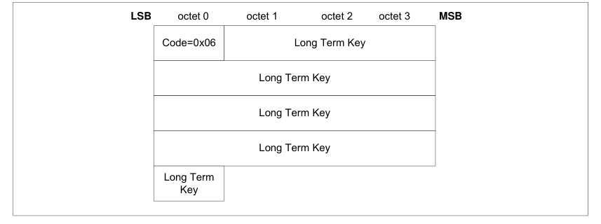

**Figure 3.12:  Encryption Information Packet**

The following is the data field:
• Long Term Key (16 octets) The generated LTK value being distributed, see Section 2.4.2.3.

#### 3.6.3  Master Identification

Master Identification is used in the LE legacy pairing Transport Specific Key Distribution phase to distribute EDIV and Rand which are used when encrypting future connections. The Master Identification command is defined in Figure 3.13.
The Master Identification command shall only be sent when the link has been encrypted or re-encrypted using the generated STK.

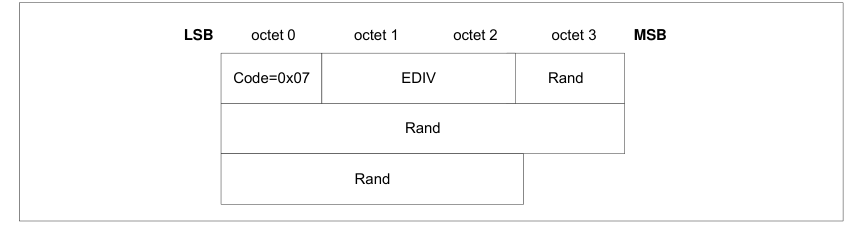

**Figure 3.13:  Master Identification Packet**

The following data fields are used:
• EDIV (2 octets) The EDIV value being distributed (see Section 2.4.2.3).
• Rand (8 octets) 64-bit Rand value being distributed (see Section 2.4.2.3).

#### 3.6.4  Identity Information

Identity Information is used in the Transport Specific Key Distribution phase to distribute the IRK. The Identity Information command is defined in Figure 3.14.
The Identity Information command shall only be sent when the link has been encrypted or re-encrypted using the generated key.

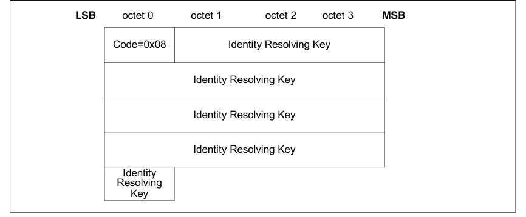

**Figure 3.14:  Identity Information Packet**

The following are the data fields:
• Identity Resolving Key (16 octets) 128-bit IRK value being distributed (see Section 2.4.2.1).
Note: An all zero Identity Resolving Key data field indicates that a device does not have a valid resolvable private address.

#### 3.6.5  Identity Address Information

Identity Address Information is used in the Transport Specific Key Distribution phase to distribute its public device address or static random address. The Identity Address Information command is defined in Figure 3.15.
The Identity Address Information command shall only be sent when the link has been encrypted or re-encrypted using the generated key.

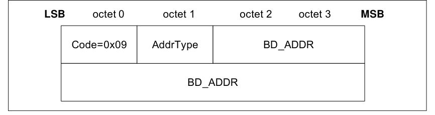

**Figure 3.15:  Identity Address Information Packet**

The data fields are:
• AddrType (1 octet) If BD_ADDR is a public device address, then AddrType shall be set to 0x00. If BD_ADDR is a static random device address then AddrType shall be set to 0x01.
• BD_ADDR (6 octets) This field is set to the distributing device’s public device address or static random address.

#### 3.6.6  Signing Information

Signing Information is used in the Transport Specific Key Distribution to distribute the CSRK which a device uses to sign data. The Signing Information command is defined in Figure 3.16.
The Signing Information command shall only be sent when the link has been encrypted or re-encrypted using the generated key.

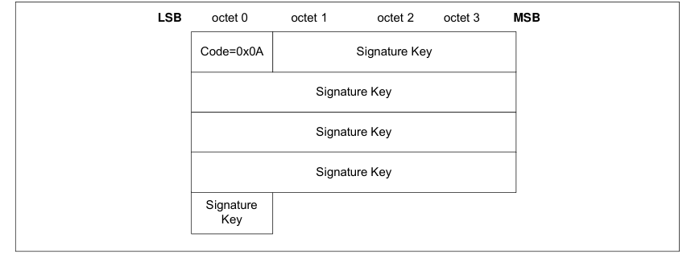

**Figure 3.16:  Signing Information Packet**

The following data field is used:
• Signature Key (16 octets) 128-bit CSRK that is being distributed; see Section 2.4.2.2.

#### 3.6.7  Security Request

The Security Request command is used by the slave to request that the master initiates security with the requested security properties, see Section 2.4.6. The Security Request command is defined in Figure 3.17.

**Figure 3.17:  Security Request Packet**

The following data field is used:
• AuthReq (1 octet) The AuthReq field is a bit field that indicates the requested security properties (see Section 2.3.1) for the STK or LTK and GAP bonding information (see [Vol 3] Part C, Section 9.4).
Figure 3.3 defines the authentication requirements bit field.
The Bonding_Flags field is a 2-bit field that indicates the type of bonding being requested by the responding device as defined in Table 3.6.
The MITM field is a 1-bit flag that is set to one if the device is requesting MITM protection, otherwise it shall be set to 0. A device sets the MITM flag to one to request an Authenticated security property for the STK when using LE legacy pairing and the LTK when using LE Secure Connections.
The SC field is a 1 bit flag. If LE Secure Connections pairing is supported by the device, then the SC field shall be set to 1, otherwise it shall be set to 0. If both devices support LE Secure Connections pairing, then LE Secure Connections pairing shall be used, otherwise LE Legacy pairing shall be used.
The keypress field is a 1-bit flag that is used only in the Passkey Entry protocol and is ignored in other protocols. When both sides set that field to one, Keypress notifications shall be generated and sent using SMP Pairing Keypress Notification PDUs.
APPENDIX A EDIV AND RAND GENERATION
EDIV and Rand are used by the responding device to identify an initiator and recover LTK. This section provides an example of how the distributed EDIV value is a masked version of the real value (DIV) which is used to recover LTK. Other methods can be used that provide equal or higher levels of confidentially for DIV.
A.1  EDIV MASKING
The masking process uses a Diversifier Hiding Key (DHK) which is a 128-bit key that is never distributed.
DHK can be assigned, randomly generated by the device during manufacturing, part of a key hierarchy (see Appendix B, Section B.2.3) or some other method could be used, that results in DHK having 128 bits of entropy. If DHK is randomly generated then the requirements for random generation defined in [Vol 2] Part H, Section 2 shall be used.
If DHK is changed then DIV values cannot be recovered from previously distributed EDIV values.
Section A.1.1 defines a cryptographic function that is used by the responding device when generating EDIV and recovering DIV.
Section A.1.2 describes how a responding device generates an EDIV value to be distributed to an initiating device and Section A.1.3 describes how the responding device recovers DIV from a distributed EDIV value.
A.1.1  DIV Mask generation function dm
DIV is masked before distribution and unmasked during the encryption session setup using the output of the DIV mask generation function dm.
The following are inputs to the DIV mask generation function dm:
k is 128 bits r is 64 bits padding is 64 bits
r is concatenated with padding to generate r’ which is used as the 128-bit input parameter plaintextData to security function e:
r’ = padding || r
The least significant octet of r becomes the least significant octet of r’ and the most significant octet of padding becomes the most significant octet of r’.
For example, if the 64-bit value r is 0x123456789ABCDEF0 then r’ is 0x0000000000000000123456789ABCDEF0.
The output of the DIV mask generation function dm is
dm(k, r) = e(k, r’) mod 216
The output of the security function e is then truncated to 16 bits by taking the least significant 16 bits of the output of e as the result of dm.
A.1.2  EDIV Generation
The responding device generates a 64-bit random value, Rand. The Rand value is used to generate 16-bit Y using the DIV mask generation function dm with the input parameter k set to DHK and the input parameter r set to Rand.
Y = dm(DHK, Rand)
The responding device then masks the DIV value to be distributed by bitwise XORing it with Y to generate EDIV.
EDIV = Y xor DIV
EDIV and Rand are distributed to an initiating device during the transport specific key distribution phase using the Master Identification command.
A.1.3  DIV Recovery
When the responding device receives a request to encrypt a session it calculates Y using the DIV mask generation function dm with the input parameter k set to DHK and the input parameter r set to Rand. The Y value is bitwise XORed with EDIV from the initiator to recover DIV.
DIV = Y xor EDIV
The recovered DIV value can then used to recover LTK which is used to enable encryption on the link.
APPENDIX B KEY MANAGEMENT
The security provided by different methods can vary and care should be taken to ensure that a chosen method is suitable for a device’s requirements.
Section B.1 uses a database for managing the keys. Section B.2 uses a key hierarchy to manage the keys.
B.1  DATABASE LOOKUP
The LTK which is distributed is a 128-bit random number which is stored in a database, using EDIV as an index. There is no direct relationship between LTK and EDIV.
The requirements for random generation defined in [Vol 2] Part H, Section 2 shall be used when generating LTK. This method provides an LTK with 128 bits of entropy.
CSRK, IRK, and other keys shall also be stored in the database. There is no relationship between the keys stored in the database or distributed LTKs, EDIVs, or Rands.
If the example EDIV and Rand generation method described inAppendix A, Section A.1 is used then the database shall be used to store DHK. DIV should be used as the index to recover LTK.
B.2  KEY HIERARCHY
A key hierarchy can be used to generate the keys.
IR
ER
IRK LTK CSRK
Figure B.1:  Example Key Hierarchy
Figure B.1 is an example key hierarchy where LTK and CSRK are generated from a common ER key, and IRK is generated from a common IR key.
1. ER is a 128-bit key generated for each LE device that supports encrypted connections. It is used to generate LTK using EDIV; see Section B.2.2. 2. IR is a 128-bit key generated for each LE device that supports encrypted connections, uses random addresses or signing data. IR is used to generate IRK and CSRK, see Section B.2.3. It can also be used to generate DHK; see Appendix A.
New LTK, EDIV, Rand, and CSRK values shall be generated each time they are distributed. If ER is changed then any previously distributed LTK or CSRK keys will no longer be valid.
The distributed IRK shall be the same for all devices it is distributed to. If IR is changed then any previously distributed IRK keys will no longer be valid.
The distributing device only needs to store IR and ER. LTK, IRK, and CSRK can be regenerated when they are required. This reduces the storage requirements on the distributing device.
Appendix B.2.1 defines an example of the key diversifying function which can be used to generate LTK, IRK, CSRK, and other keys. Other implementations of this function can be used depending upon the exact security requirements of the device.
The NIST Special Publication 800-108 (http://csrc.nist.gov/publications/ PubsSPs.html) defines key derivation functions which could be used instead of the example diversifying function d1.
B.2.1  Diversifying function d1
Diversified keys are generated with function d1. The diversifying function d1 makes use of the security function e.
The following are inputs to diversifying function d1:
k is 128 bits d is 16 bits r is 16 bits padding is 96 bits
d is concatenated with r and padding to generate d’, which is used as the 128- bit input parameter plaintextData to security function e:
d’ = padding || r || d
The least significant octet of d becomes the least significant octet of d’ and the most significant octet of padding becomes the most significant octet of d’.
For example, if the 16-bit value d is 0x1234 and the 16-bit value r is 0xabcd, then d’ is 0x000000000000000000000000abcd1234.
The output diversifying function d1 is:
d1(k, d, r) = e(k, d’)
The 128-bit output of the security function e is used as the result of diversifying function d1.
B.2.2  Generating Keys from ER
ER is used to generate LTK and CSRK. ER can be assigned, randomly generated by the device during manufacturing or some other method could be used, that results in ER having 128 bits of entropy. If ER is randomly generated then the requirements for random generation defined in [Vol 2] Part H, Section 2 shall be used.
The EDIV and Rand generation method described in Appendix A shall be used. LTK is the result of the diversifying function d1 with the ER as the input parameter k, the DIV as the input parameter d, and the value 0 as the input parameter r; see Section B.2.1.
LTK = d1(ER, DIV, 0)
LTK can be recovered from ER and DIV by repeating the calculation when LTK is required.
CSRK is the result of the diversifying function d1 with the ER as the input parameter k, the DIV as the input parameter d, and the value 1 as the input parameter r; see Section B.2.1.
CSRK = d1(ER, DIV, 1)
CSRK can be recovered from ER and DIV by repeating the calculation when CSRK is required.
This method provides an LTK and CSRK with limited amount of entropy because LTK and CSRK are directly related to EDIV and may be less secure than other generation methods.
To reduce the probability of the same LTK or CSRK value being generated, the DIV values must be unique for each CSRK, LTK, EDIV, and Rand set that is distributed.
A method for preventing a malicious device from repeatedly pairing and collecting CSRK, LTK and DIV information, which could be used in a known plain text attack in ER, should be implemented.
Note: The generation of LTK using ER is only applicable when doing LE Legacy Pairing. The generation of CSRK using ER is applicable both when doing LE Legacy Pairing and LE Secure Connections Pairing.
B.2.3  Generating Keys from IR
IR can be used to generate IRK and other required keys. IR can be assigned, randomly generated by the device during manufacturing or some other method could be used, that results in IR having 128 bits of entropy. If IR is randomly generated then the requirements for random generation defined in [Vol 2] Part H, Section 2 shall be used.
IRK is the result of the diversifying function d1 with IR as the input parameter k and the value 1 as the input parameter d and the value 0 as the input parameter r; see Section B.2.1.
IRK = d1(IR, 1, 0)
If the example EDIV and Rand generation method described in Appendix A, Section A.1 is used then DHK can be the result of diversifying function d1 with IR as the input parameter k and the value 3 as the input parameter d and the value 0 as the input parameter r.
DHK = d1(IR, 3, 0)
Other keys can be generated by using different values for k as the input to the diversifying function d1. If the value of k is reused for a given IR then the resulting key will be the same.
Note: The generation of DHK using IR is only applicable when doing LE Legacy Pairing. The generation of IRK using IR is applicable both when doing LE Legacy Pairing and LE Secure Connections Pairing.
APPENDIX C MESSAGE SEQUENCE CHARTS
This section is informative and illustrates only the most common scenarios; it does not cover all possible alternatives. Furthermore, the message sequence charts do not consider errors over the air interface or Host interface.
A flow diagram of pairing is shown in Figure C.1. The process has 4 steps. Step 2 has a number of different options.
6WHS3DLULQJ)HDWXUH([FKDQJH
6WHSD2SWLRQDO6KRUW 7HUP.H\67. *HQHUDWLRQದ-XVW:RUNV
6WHSE2SWLRQDO6KRUW 7HUP.H\67.*HQHUDWLRQ ದ3DVVNH\(QWU\
6WHSF2SWLRQDO6KRUW 7HUP.H\67. *HQHUDWLRQದ22%
6WHS(QFU\SW/LQN8VLQJ*HQHUDWHG67.
6WHS7UDQVSRUW6SHFLILF.H\'LVWULEXWLRQ
Figure C.1:  Pairing Process Overview
Note: In all the MSCs, the Master device is also the Initiating Device and the Slave device is also the Responding (non-Initiating) Device.
C.1  PHASE 1: PAIRING FEATURE EXCHANGE
The master initiates the pairing procedure using Pairing Request command as shown in Figure C.2.
6ODYH 0DVWHU

| 6WHS 0DVWHULQLWLDWHVSDLULQJ |  |
| --- | --- |
|  |  |
| Pairing Request (IO Capability, OOB data flag, AuthReq, Max Enc Key Size, Init Key Distribution, Resp Key Distribution) |  |
|  |  |
| Pairing Response (IO Capability, OOB data flag, AuthReq, Max Enc Key Size, Init Key Distribution, Resp Key Distribution) |  |
|  |  |
| 2 Pairing Method selected from parameters of Pairing Request and Pairing Resp |  |

Figure C.2:  Pairing initiated by master
C.1.1  Slave Security Request – Master Requests Pairing
The slave may request the master initiates security procedures. Figure C.3 shows an example where the slave requests security and the master initiates pairing in response.
6ODYH 0DVWHU

| 6WHS 6ODYHUHTXHVWVVHFXULW\PDVWHULQLWLDWHVSDLULQJ |  |
| --- | --- |
|  |  |
| Security Request (AuthReq) |  |
|  |  |
| Pairing Request (IO Capability, OOB data flag, AuthReq, Max Enc Key Size, Init Key Distribution, Resp Key Distribution) |  |
|  |  |
| Pairing Response (IO Capability, OOB data flag, AuthReq, Max Enc Key Size, Init Key Distribution, Resp Key Distribution) |  |
|  |  |
| LE Legacy Pairing Phase 2 Pairing Method selected from parameters of Pairing Request and Pairing Response |  |

Figure C.3:  Slave security request, master initiated pairing
C.2  PHASE 2: AUTHENTICATING AND ENCRYPTING
After Pairing Feature Exchange has completed a pairing method is selected one of the possible short term key generation sequences are used. This can be Just Works, Passkey Entry or Out of Band pairing method.
C.2.1  LE Legacy Pairing
The following sub-sections include message sequence charts for LE legacy pairing.
C.2.1.1  Legacy Phase 2: Short Term Key Generation – Just Works
After Pairing Feature Exchange has completed a pairing method is selected. Figure C.4 shows the Just Works pairing method.
6ODYH 0DVWHU

| 6WHS -XVW:RUNV3DLULQJ$IWHU3KDVH 3DLULQJ)HDWXUH&KDQJH |  |
| --- | --- |
|  |  |
| ust Works pairing algorithm selected from parameters of Pairing Reques and Pairing Response on Phase 1: Pairing Feature Exchange |  |
| 0UDQG &UHDWH  7. c1(TK, Mrand, Pairing Request command, Sconfirm = c1(TK, Srand, Pairing Request comm ponse command, initiating device address Pairing Response command, initiating device a ing device address, responding device address type, initiating device address, responding devi nding device address) type, responding device address) |  |
| PairingConfirm (Mconfirm) |  |
|  |  |
| PairingConfirm (Sconfirm) |  |
|  |  |
| PairingRandom (Mrand) |  |
| &KHFNIRUFRQILUPYDOX |  |
| PairingRandom (Srand) |  |
| UFRQILUPYDOXHPDWFK |  |
| 67.LVFDOFXODWHGE\UXQQLQJ6ZLWKWKH7.YDOXHDVWKHNH\LQSXW DQGLQLWLDWRUDQGUHVSRQGHUUDQGRPQXPEHUV 67. V 7.6UDQG0UDQG |  |
|  |  |
| /LQNLVWKHQHQFU\SWHGXVLQJ67.6HH>[9VoRlO 6]@ P3aDrUtW D', S6eHcFtWiLoRnQ 6.6 |  |

Figure C.4:  Legacy Just Works Pairing Method
C.2.1.2  Legacy Phase 2: Short Term Key Generation – Passkey Entry
After Pairing Feature Exchange has completed, a pairing method is selected. Figure C.5 shows the Passkey Entry pairing method.
6ODYH 0DVWHU

| 6WHS 3DVVNH\(QWU\3DLULQJ$IWHU3KDVH 3DLULQJ)HDWXUH&KDQJH |  |
| --- | --- |
|  |  |
| sskey Entry pairing algorithm selected from parameters of Pairing Requ and Pairing Response on Phase 1: Pairing Feature Exchange |  |
| 0UDQG &UHDW 8VHULQSXWSDVVNH\ 6HW7. 8VHULQSXW c1(TK, Mrand, Pairing Request command, Sconfirm = c1(TK, Srand, Pairing Request comm ponse command, initiating device address Pairing Response command, initiating device a ing device address, responding device address type, initiating device address, responding devi nding device address) type, responding device address) |  |
| PairingConfirm (Mconfirm) |  |
|  |  |
| PairingConfirm (Sconfirm) |  |
|  |  |
| PairingRandom (Mrand) |  |
| &KHFNIRUFRQILUPYDOX |  |
| PairingRandom (Srand) |  |
| UFRQILUPYDOXHPDWFK |  |
| 67.LVFDOFXODWHGE\UXQQLQJ6ZLWKWKH7.YDOXHDVWKHNH\LQSXW DQGLQLWLDWRUDQGUHVSRQGHUUDQGRPQXPEHUV 67. V 7.6UDQG0UDQG |  |
|  |  |
| /LQNLVWKHQHQFU\SWHGXVLQJ67.6HH>[9VoRlO 6]@ P3aDrUtW D', S6eHcFtWiLoRnQ 6.6 |  |

Figure C.5:  Legacy Passkey Entry Pairing Method
C.2.1.3  Legacy Phase 2: Short Term Key Generation – Out of Band
After Pairing Feature Exchange has completed, a pairing method is selected. Figure C.6 shows the Out of Band pairing method.
6ODYH 0DVWHU

| 6WHS 2XW2I%DQG3DLULQJ$IWHU3KDVH 3DLULQJ)HDWXUH&KDQJH |  |
| --- | --- |
|  |  |
| utof band pairing algorithm selected from parameters of Pairing Reques and Pairing Response on Phase 1: Pairing Feature Exchange |  |
| 0UDQG &UHDW RWKH22%6HFXULW\ 6HW7.WRWKH22% U7.YDOXH 0DQDJHU7 c1(TK, Mrand, Pairing Request command, Sconfirm = c1(TK, Srand, Pairing Request comm ponse command, initiating device address Pairing Response command, initiating device a ing device address, responding device address type, initiating device address, responding devi nding device address) type, responding device address) |  |
| PairingConfirm (Mconfirm) |  |
|  |  |
| PairingConfirm (Sconfirm) |  |
|  |  |
| PairingRandom (Mrand) |  |
| &KHFNIRUFRQILUPYDOX |  |
| PairingRandom (Srand) |  |
| UFRQILUPYDOXHPDWFK |  |
| 67.LVFDOFXODWHGE\UXQQLQJ6ZLWKWKH7.YDOXHDVWKHNH\LQSXW DQGLQLWLDWRUDQGUHVSRQGHUUDQGRPQXPEHUV 67. V 7.6UDQG0UDQG |  |
|  |  |
| /LQNLVWKHQHQFU\SWHGXVLQJ67.6HH>[9VoRlO 6]@ P3aDrUtW D', S6eHcFtWiLoRnQ 6.6 |  |

Figure C.6:  Legacy OOB Pairing Method
C.2.2  LE Secure Connections
The following sub-sections include message sequence charts for LE Secure Connections.
C.2.2.1  Public Key Exchange
In Step 1a and 1b, the two devices exchange public keys. The master sends its public key to the slave followed by slave sending its public key to the master.
6ODYH 0DVWHU

| 6WHSDDQGE 3XEOLF.H\([FKDQJH |  |
| --- | --- |
|  |  |
| Pairing Public Key |  |
|  |  |
| Pairing Public Key |  |

Figure C.7:  Pairing Phase 2 - Public Key Exchange
C.2.2.2  Authentication Stage 1
The following sub-sections include message sequence charts for the success and failure cases in each association model.
C.2.2.2.1  Successful Numeric Comparison (or Just Works)
The numeric comparison step will be done when both devices have output capabilities, or if one of the devices has no input or output capabilities. If both devices have output capabilities, this step requires the displaying of a user confirmation value. This value should be displayed until the end of step 2. If one or both devices do not have output capabilities, the same protocol is used but the Hosts will skip the step asking for the user confirmation.
Note: The sequence for Just Works is identical to that of Numeric Comparison with the exception that the Host will not show the numbers to the user.
6ODYH 0DVWHU

| 6WHS 6HFXUH&RQQHFWLRQV.H\ /7. *HQHUDWLRQ -XVW:RUNVRU1XPHULF&RPSDULVRQ |  |
| --- | --- |
| 1D 3LFN UE  6HWUD &DOF FRQILU |  |
| Pairing Confirm (Cb) |  |
|  |  |
| Pairing Random (Na) |  |
|  |  |
| Pairing Random (Nb) |  |

&KHFN&RQILUPDWLRQ VXFFHVV
&DOFXODWH8VHU &RQILUP9DOXH
&DOFXODWH8VHU &RQILUP9DOXH
7KHVHYDOXHVDUH SUHVHQWHGWRWKHXVHU 8VHU&RQILUPV 9DOXH 6XFFHVV
8VHU&RQILUPV 9DOXH 6XFFHVV
Figure C.8:  Pairing Phase 2, Authentication Stage 1, Successful Numeric Comparison
C.2.2.2.2  Numeric Comparison – Confirm Check failure on the Initiator side
If the Confirm value calculated by the Initiator is not equal to the Commitment value received from the Responder, the Initiator will abort Pairing process by sending Pairing Failed with reason “Confirm Value Failed”.
6ODYH 0DVWHU

| 6WHS 6HFXUH&RQQHFWLRQV.H\ /7. *HQHUDWLRQ -XVW:RUNVRU1XPHULF&RPSDULVRQ |  |
| --- | --- |
| 1D 3LFN UE  6HWUD &DOF FRQILU |  |
| Pairing Confirm (Cb) |  |
|  |  |
| Pairing Random (Na) |  |
|  |  |
| Pairing Random (Nb) |  |
| RQILUPDWLRQ PLVPDWFK |  |
| Pairing Failed (confirm check failure) |  |

Figure C.9:  Pairing Phase 2, Authentication Stage 1, Numeric Comparison – Confirm Check failure on Initiator side
C.2.2.2.3  Numeric Comparison Failure on Initiator Side
If the numeric comparison fails on the initiating side due to the user indicating that the confirmation values do not match, Pairing is terminated.
6ODYH 0DVWHU

| 6WHS 6HFXUH&RQQHFWLRQV.H\ /7. *HQHUDWLRQ -XVW:RUNVRU1XPHULF&RPSDULVRQ |  |
| --- | --- |
| 1D 3LFN UE  6HWUD &DOF FRQILU |  |
| Pairing Confirm (Cb) |  |
|  |  |
| Pairing Random (Na) |  |
|  |  |
| Pairing Random (Nb) |  |
| &RQILUPDWLRQ XFFHVV WH8VHU &DOFXOD 9DOXH &RQILUP 7KHVHYDOXHVDUH SUHVHQWHGWRWKHXVHU RHVQRW 8VHU& 9DOXH 9DO 6XF |  |
| Pairing Failed (Numeric Comparison Failed) |  |

Figure C.10:  Pairing Phase 2, Authentication Stage 1, Numeric Comparison Failure on Initiator Side
C.2.2.2.4  Numeric Comparison Failure on Responding Side
If the numeric comparison fails on the responding side due to the user indicating that the confirmation values do not match, Pairing is terminated.
6ODYH 0DVWHU

| 6WHS 6HFXUH&RQQHFWLRQV.H\ /7. *HQHUDWLRQ -XVW:RUNVRU1XPHULF&RPSDULVRQ |  |
| --- | --- |
| 1D 3LFN UE  6HWUD &DOF FRQILU |  |
| Pairing Confirm (Cb) |  |
|  |  |
| Pairing Random (Na) |  |
|  |  |
| Pairing Random (Nb) |  |
| &RQILUPDWLRQ XFFHVV WH8VHU &DOFXOD 9DOXH &RQILUP 7KHVHYDOXHVDUH SUHVHQWHGWRWKHXVHU RQILUP 8VHU' XH &RQILUP |  |
| Pairing Failed (Numeric Comparison Failed) |  |

Figure C.11:  Pairing Phase 2, Authentication Stage 1, Numeric Comparison Failure on Responding Side
C.2.2.2.5  Successful Passkey Entry
The Passkey Entry step is used in two cases: when one device has numeric input only and the other device has either a display or numeric input capability. In this step, one device display a number to be entered by the other device or the user enters a number on both devices. Key press notification messages are shown during the user input phase.
0DVWHU
6ODYH

|  |  | 6WHS 6HFXUH&RQQHFWLRQV.H\ /7. *HQHUDWLRQ3DVVNH\(QWU\ |  |
| --- | --- | --- | --- |
|  |  | Example Notifications |  |
|  |  |  |  |
|  |  | Pairing Keypress Notification |  |
|  |  |  |  |
|  |  | Pairing Keypress Notification |  |
|  |  |  |  |
|  |  | Repeat 20 times |  |
| 3LFN1 &DO &R &KHFN &RQILUP |  | DUDUE 3LFN1D FXODWH &DOFXO QILUP &RQIL |  |
|  |  | Pairing Confirm (Cai) |  |
|  |  |  |  |
|  |  | Pairing Confirm (Cbi) |  |
|  |  |  |  |
|  |  | Pairing Random (Nai) |  |
|  |  | &KHFN& &RQILUPP |  |
|  |  | Pairing Random (Nbi) |  |
|  |  | &RQILUP PDWFKHV |  |

8VHU ,QSXW
Figure C.12:  Pairing Phase 2, Authentication Stage 1, Successful Passkey Entry
Note: Passkey Entry may prolong pairing experience because of the time required to execute 20 repetitions over SMP.
C.2.2.2.6  Passkey Entry – Confirm Check failure on the Responder side
If during one of the 20 repetitions, the Confirm calculated by the Responder is not equal to the one received from the Initiator, the Responder will abort the Pairing process by sending Pairing Failed with reason “Confirm Value Failed”.
6ODYH 0DVWHU

| 6WHS 6HFXUH&RQQHFWLRQV.H\ /7. *HQHUDWLRQ3DVVNH\(QWU\ |  |
| --- | --- |
| UDUE 3LFN1D XODWH &DOF ILUP &RQ |  |
| Pairing Confirm (Cai) |  |
|  |  |
| Pairing Confirm (Cbi) |  |
|  |  |
| Pairing Random (Nai) |  |
| &KHFN &RQILU QRWP |  |
| Pairing Failed (Confirm Value Failed) |  |

Figure C.13:  Pairing Phase 2, Authentication Stage 1, Passkey Entry – Confirm Check failure on Responder side
C.2.2.2.7  Passkey Entry – Confirm Check failure on the Initiator side
If during one of the 20 repetitions, the Confirm calculated by the Initiator is not equal to the one received from the Responder, the Initiator will abort the Pairing process by sending Pairing Failed with reason “Confirm Value Failed”.
0DVWHU
6ODYH

|  |  | 6WHS 6HFXUH&RQQHFWLRQV.H\ /7. *HQHUDWLRQ3DVVNH\(QWU\ |  |
| --- | --- | --- | --- |
|  |  | Example Notifications |  |
|  |  |  |  |
|  |  | Pairing Keypress Notification |  |
|  |  |  |  |
|  |  | Pairing Keypress Notification |  |
|  |  |  |  |
|  |  | Repeat 20 times |  |
| 3LFN1 &DO &R &KHFN &RQILUP 0 |  | DUDUE 3LFN1D FXODWH &DOFXO QILUP &RQIL |  |
|  |  | Pairing Confirm (Cai) |  |
|  |  |  |  |
|  |  | Pairing Confirm (Cbi) |  |
|  |  |  |  |
|  |  | Pairing Random (Nai) |  |
|  |  | &KHFN& &RQILUPP |  |
|  |  | Pairing Random (Nbi) |  |
|  |  | &RQILUP 'RHVQRW DWFK |  |
|  |  |  |  |
|  |  | Pairing Failed |  |

8VHU ,QSXW
Figure C.14:  Pairing Phase 2, Authentication Stage 1, Passkey Entry – Confirm Check failure on Initiator side
C.2.2.2.8  Passkey Entry Failure on Responding Side
If the passkey entry fails on the responding side, Pairing is terminated.
6ODYH 0DVWHU

| 6WHS 6HFXUH&RQQHFWLRQV.H\ /7. *HQHUDWLRQ3DVVNH\(QWU\ |  |
| --- | --- |
|  |  |
| Pairing Confirm (Ca) |  |
|  |  |
| Pairing Failed (Passkey Entry Failed) |  |

Figure C.15:  Pairing Phase 2, Authentication Stage 1, Passkey Entry Failure on Responding Side
C.2.2.2.9  Passkey Entry Failure on Initiator Side
If the passkey entry fails on the initiating side, Pairing is terminated.
6ODYH 0DVWHU
6WHS6HFXUH&RQQHFWLRQV.H\/7.*HQHUDWLRQ3DVVNH\(QWU\
Pairing Failed (Passkey Entry Failed)
Figure C.16:  Pairing Phase 2, Authentication Stage 1, Passkey Entry Failure on Initiator Side
C.2.2.2.10  Successful Out of Band
The OOB authentication will only be done when at least one device has some OOB information to use. This step requires no user interaction.
6ODYH 0DVWHU

| 6WHS 6HFXUH&RQQHFWLRQ.H\ /7. *HQHUDWLRQ2XWRI%DQG |  |
| --- | --- |
| N&RQILUP &KHFN&R IURP22% UHFHLYHGIUR PPDWFKHV &RQILUPP 1D 3LFN |  |
| Pairing Random (Na) |  |
|  |  |
| Pairing Random (Nb) |  |

Figure C.17:  Pairing Phase 2, Authentication Stage 1, Successful Out of Band
C.2.2.2.11  Out of Band – Confirm Check failure on the Responder side
If the Confirm value received from OOB is not equal to the calculated Confirm value, the Responder will abort the Pairing process by sending Pairing Failed with reason “Confirm Value Failed”.
6ODYH 0DVWHU

| 6WHS 6HFXUH&RQQHFWLRQ.H\ /7. *HQHUDWLRQ2XWRI%DQG |  |
| --- | --- |
| N&RQILUP &KHFN&R IURP22% UHFHLYHGIUR PPDWFKHV &RQILUP1R 1D 3LFN |  |
| Pairing Random (Na) |  |
|  |  |
| Pairing Failed (Confirm Value Failed) |  |

Figure C.18:  Pairing Phase 2, Authentication Stage 1, Out of Band – Confirm Check failure on Responder side
C.2.2.2.12  Out of Band - Confirm Check failure on the Initiating side
If the Confirm value received from OOB is not equal to the calculated Confirm value, the Initiator will abort the Pairing process by sending Pairing Failed with reason "Confirm Value Failed".
6ODYH 0DVWHU
6WHS6HFXUH&RQQHFWLRQ.H\/7.*HQHUDWLRQ2XWRI%DQG
&KHFN&RQILUP UHFHLYHGIURP22% &RQILUP1RPDWFK
&KHFN&RQILUP UHFHLYHGIURP22% &RQILUPPDWFKHV
3LFN1D 3LFN1E
Pairing Failed (Confirm Value Failed)
Figure C.19:  Pairing Phase 2: Authentication Stage 1, Out of Band - Confirm Check failure on Initiator side"
C.2.2.2.13  Out of Band Failure on Initiator side (OOB information not available)
If the initiating side does not have the responder's OOB information, Pairing is terminated.
6ODYH 0DVWHU
6WHS6HFXUH&RQQHFWLRQ.H\/7.*HQHUDWLRQ2XWRI%DQG
Pairing Failed (OOB Not Available)
Figure C.20:  Pairing Phase 2, Authentication Stage 1, Out of Band Failure on Initiator Side
C.2.2.2.14   Out of Band Failure on Responding side (OOB information not available)
If the responding side does not have the initiator's OOB information, Pairing is terminated.
  

| '? % <&"<(@A>%+ |  |
| --- | --- |
|  |  |
|     |  |
|  |  |
|     |  |

Figure C.21:  Pairing Phase 2, Authentication Stage 1, Out of Band Failure on Responding Side
C.2.2.3  Long Term Key Calculation
Once the DHKey generation is complete, the Long Term Key (LTK) is calculated from the DHKey.
6ODYH 0DVWHU
/RQJ7HUP.H\/7.&DOFXODWLRQ
&DOFXODWH /RQJ7HUP .H\/7.
&DOFXODWH /RQJ7HUP .H\/7.
Figure C.22:  Long Term Key Calculation
C.2.2.4  Authentication Stage 2 (DHKey checks)
Once the LTK calculation has completed, the DHKey value generated is checked. If this succeeds, then both devices would have finished displaying information to the user about the process, and therefore the Host can stop displaying this information.
  
1=<B
1=< % *
1=< % *
!
!
B1=< B&B %%(
!
!
B1=< B&B %%(
Figure C.23:  Pairing Phase 2, Authentication Stage 2, DHKey checks
C.3  PHASE 3: TRANSPORT SPECIFIC KEY DISTRIBUTION
After short term key generation and the link has been encrypted, transport specific keys are distributed. Figure C.24 shows an example of all keys and values being distributed by Master and Slave.
6ODYH 0DVWHU

| 6WHS 3KDVH 7UDQVSRUW6SHFLILF.H\'LVWULEXWLRQ $OONH\VDQGYDOXHVGLVWULEXWHGE\6ODYHDQG0DVWHU |  |
| --- | --- |
|  |  |
| REHGLVWULEXWHGLVGHWHUPLQHGE\WKH.H\'LVWULEXWLRQSDUDPHWHUVRI3DLULQJ5H DQG3DLULQJ5HVSRQVHIURP3KDVH 3DLULQJ)HDWXUH([FKDQJH |  |
|  |  |
| Encryption Information (Long Term Key) |  |
|  |  |
| Master Identification (EDIV, Rand) |  |
|  |  |
| Identity Information (Identity Resolving Key) |  |
|  |  |
| Identity Address Information (AddrType, BDADDR) _ |  |
|  |  |
| Signing Information (Signature Key) |  |
|  |  |
| Encryption Information (Long Term Key) |  |
|  |  |
| Master Identification (EDIV, Rand) |  |
|  |  |
| Identity Information (Identity Resolving Key) |  |
|  |  |
| Identity Address Information (AddrType, BDADDR) _ |  |
|  |  |
| Signing Information (Signature Key) |  |

Figure C.24:  Transport Specific Key Distribution
C.4  SECURITY RE-ESTABLISHED USING PREVIOUSLY DISTRIBUTED LTK
Devices may re-establish security using a previously distributed LTK. The master device always initiates the encryption procedures, and therefore there are two possible sequences: master initiated and slave requested.
C.4.1  Master Initiated Security - Master Initiated Link Layer Encryption
The master initiates encryption procedures. There is no SM signaling to enable this; the master initiates Link Layer encryption only. See [Vol 6] Part D, Section 6.6.
C.4.2  Slave Security Request - Master Initiated Link Layer Encryption
The slave may request the master initiates security procedures. Figure C.25 shows an example where the slave requests security and the master initiates Link Layer encryption.
6ODYH 0DVWHU
6WHS6ODYH,QLWLDWHV6HFXULW\0DVWHU,QLWLDWHV/LQN/D\HU(QFU\SWLRQ
Security Request (AuthReq)
/LQNLVHQFU\SWHGXVLQJSUHYLRXVO\GLVWULEXWHG/7. 6HH>9RO@3DUW'6HFWLRQ [Vol 6] Part D, Section 6.6
Figure C.25:  Slave security request, master initiates Link Layer encryption
C.5  FAILURE CONDITIONS
The following sequences show possible failure conditions and their associated signaling.
C.5.1  Pairing Not Supported by Slave
If the slave device does not support pairing or pairing cannot be performed the slave can reject the request from the master. Figure C.26 shows the slave rejecting a Pairing Request command from the master.
  

| -?   %4 |  |
| --- | --- |
|  |  |
|  "#$ % & ' *'# "'+3 # 4  &  56' $#  |  |
|  |  |
|   7 5#&&  7 |  |

Figure C.26:  Slave rejects pairing attempt
C.5.2  Master Rejects Pairing Because of Key Size
During Pairing Feature Exchange the size of the Encryption Key is negotiated. Figure C.27 shows an example where the master terminates the pairing procedure because the resulting key size is not acceptable.
  

| -?   %4 |  |
| --- | --- |
|  |  |
|  "#$ % & ' *'# "'+3 # 4  &  56' $#  |  |
|  |  |
|  $& $ % & ' *'# "'+3 # 4  &  56' $#  |  |
|  |  |
|   74  &  567 |  |

Figure C.27:  Master rejects pairing because of key size
C.5.3  Slave Rejects Pairing Because of Key Size
During Pairing Feature Exchange the size of the Encryption Key is negotiated. Figure C.28 shows an example where the slave terminates the pairing procedure because the resulting key size is not acceptable.
6ODYH 0DVWHU

|  | HS 6ODYHUHMHFWVSDLULQJEHFDXVHWKH(QFU\SWLRQ.H\6L]HLVQRWVXIILFLH |  |
| --- | --- | --- |
|  |  |  |
| Alt | Pairing Request (IO Capability, OOB data flag, AuthReq, Maximum Encryption Key Size, Key Distribution) |  |
|  |  |  |
|  | Pairing Response (IO Capability, OOB data flag, AuthReq, Maximum Encryption Key Size, Key Distribution) |  |
|  |  |  |
|  | Pairing Confirm (Mconfirm) |  |
|  |  |  |
|  | Pairing Failed ("Encryption Key Size") |  |
|  |  |  |
| Alt |  |  |
|  | Pairing Request (IO Capability, OOB data flag, AuthReq, Maximum Encryption Key Size, Key Distribution) |  |
|  |  |  |
|  | Pairing Failed ("Encryption Key Size") |  |
|  |  |  |

Figure C.28:  Slave rejects pairing because of key size
C.5.4  Passkey Entry Failure on Master
During Passkey Entry pairing the user enters a passkey on both devices. Figure C.29 shows an example where the passkey entry fails on the master device.
6ODYH 0DVWHU

| 6WHS 3DVVNH\(QWU\IDLOXUHRQPDVWHU |  |
| --- | --- |
|  |  |
| Pairing Request (IO Capability, OOB data flag, AuthReq, Maximum Encryption Key Size, Key Distribution) |  |
|  |  |
| Pairing Response (IO Capability, OOB data flag, AuthReq, Maximum Encryption Key Size, Key Distribution) |  |
| &UHDW 6HW7. 8VHULQSXW LVQRWHQWHUHG Sconfirm = c1(TK, Srand, Pairing Request comm Pairing Response command, initiating device a type, initiating device address, responding devi type, responding device address) |  |
| Pairing Failed ("Passkey Entry Failed") |  |

Figure C.29:  Passkey Entry failure on master
C.5.5  Passkey Entry Failure on Slave
During Passkey Entry pairing the user enters a passkey on both devices. Figure C.30 shows an example where the passkey entry fails on the slave device.
6ODYH 0DVWHU

| 6WHS 3DVVNH\HQWU\QRWSHUIRUPHGRQ6ODYH |  |
| --- | --- |
|  |  |
| Pairing Request (IO Capability, OOB data flag, AuthReq, Maximum Encryption Key Size, Key Distribution) |  |
|  |  |
| Pairing Response (IO Capability, OOB data flag, AuthReq, Maximum Encryption Key Size, Key Distribution) |  |
| UDQG 8VHULQSXWSDVVNH\ 3DVVNH\LVQRW c1(TK, Mrand, Pairing Request command, ponse command, initiating device address ing device address, responding device address nding device address) |  |
| PairingConfirm (Mconfirm) |  |
|  |  |
| Pairing Failed ("Passkey Entry Failed") |  |

Figure C.30:  Passkey Entry failure on slave
C.5.6  Slave Rejects Master’s Confirm Value
During Passkey Entry pairing the user enters a passkey on both devices. Figure C.31 shows an example where a different passkey is entered on both devices. This sequence could also occur if any of the inputs to c1 (Passkey, Mrand, Srand, Pairing Request command, Pairing Response command, address types or addresses) are incorrect or altered.
6ODYH 0DVWHU

| 6WHS 3DVVNH\HQWU\ZLWKGLIIHUHQWSDVVNH\VHQWHUHGRQHDFKGHYLFH |  |
| --- | --- |
| 0UDQG &UHDW 8VHULQSXWSDVVNH\ 6HW7. 8VHULQSXW c1(TK, Mrand, Pairing Request command, Sconfirm = c1(TK, Srand, Pairing Request comm ponse command, initiating device address Pairing Response command, initiating device a ing device address, responding device address type, initiating device address, responding devi nding device address) type, responding device address) |  |
| PairingConfirm (Mconfirm) |  |
|  |  |
| PairingConfirm (Sconfirm) |  |
|  |  |
| PairingRandom (Mrand) |  |
| &RQILUPYDOXHGRHVQ |  |
| Pairing Failed ("Confirm Value Failed") |  |

Figure C.31:  Different Passkeys entered
C.5.7  Master Rejects Slave’s Confirm Value
During all the pairing methods the master and slave device send random numbers and confirm values. Figure C.32 shows an example where the master device rejects pairing because it cannot verify the confirm value from the slave because any of the inputs to c1 (Passkey, Mrand, Srand, Pairing Request command, Pairing Response command, address types or addresses) are incorrect or altered.
6ODYH 0DVWHU

| 6WHS 6FRQILUPYHULILFDWLRQIDLOXUHRQ0DVWHUGHYLFH |  |
| --- | --- |
| 0UDQG &UHDW 8VHULQSXWSDVVNH\ 6HW7. 8VHULQSXW c1(TK, Mrand, Pairing Request command, Sconfirm = c1(TK, Srand, Pairing Request comm ponse command, initiating device address Pairing Response command, initiating device a ing device address, responding device address type, initiating device address, responding devi nding device address) type, responding device address) |  |
| PairingConfirm (Mconfirm) |  |
|  |  |
| PairingConfirm (Sconfirm) |  |
|  |  |
| PairingRandom (Mrand) |  |
| &KHFNIRUFRQILUPYDOX |  |
| Pairing Random (Srand) |  |

&KHFNIRUFRQILUPYDOXHPDWFK
Pairing Failed ("Confirm Value Failed")
Figure C.32:  Master rejects Sconfirm value from slave
APPENDIX D SAMPLE DATA
In each data set in this section, the bytes are ordered from most significant on the left to least significant on the right. ‘M’ represents the message byte array for which the AES CMAC is calculated.
D.1  AES-CMAC RFC4493 TEST VECTORS
The following test vectors are referenced from RFC4493.
K                     2b7e1516 28aed2a6 abf71588 09cf4f3c Subkey Generation AES_128(key,0)        7df76b0c 1ab899b3 3e42f047 b91b546f K1                    fbeed618 35713366 7c85e08f 7236a8de K2                    f7ddac30 6ae266cc f90bc11e e46d513b
D.1.1  Example 1: Len = 0
M              <empty string> AES_CMAC       bb1d6929 e9593728 7fa37d12 9b756746
D.1.2  Example 2: Len = 16
M              6bc1bee2 2e409f96 e93d7e11 7393172a AES_CMAC       070a16b4 6b4d4144 f79bdd9d d04a287c
D.1.3  Example 3: Len = 40
M0             6bc1bee2 2e409f96 e93d7e11 7393172a M1             ae2d8a57 1e03ac9c 9eb76fac 45af8e51 M2             30c81c46 a35ce411 AES_CMAC       dfa66747 de9ae630 30ca3261 1497c827
D.1.4  Example 4: Len = 64
M0             6bc1bee2 2e409f96 e93d7e11 7393172a M1             ae2d8a57 1e03ac9c 9eb76fac 45af8e51 M2             30c81c46 a35ce411 e5fbc119 1a0a52ef M3             f69f2445 df4f9b17 ad2b417b e66c3710 AES_CMAC       51f0bebf 7e3b9d92 fc497417 79363cfe
D.2  f4 LE SC CONFIRM VALUE GENERATION FUNCTION
U              20b003d2 f297be2c 5e2c83a7 e9f9a5b9 eff49111 acf4fddb cc030148 0e359de6 V              55188b3d 32f6bb9a 900afcfb eed4e72a 59cb9ac2 f19d7cfb 6b4fdd49 f47fc5fd X              d5cb8454 d177733e ffffb2ec 712baeab Z              0x00 M0             20b003d2 f297be2c 5e2c83a7 e9f9a5b9 M1             eff49111 acf4fddb cc030148 0e359de6 M2             55188b3d 32f6bb9a 900afcfb eed4e72a M3             59cb9ac2 f19d7cfb 6b4fdd49 f47fc5fd 00 AES_CMAC       f2c916f1 07a9bd1c f1eda1be a974872d
D.3  f5 LE SC KEY GENERATION FUNCTION
DHKey(W)       ec0234a3 57c8ad05 341010a6 0a397d9b 99796b13 b4f866f1 868d34f3 73bfa698 T              3c128f20 de883288 97624bdb 8dac6989 keyID          62746c65 N1             d5cb8454 d177733e ffffb2ec 712baeab N2             a6e8e7cc 25a75f6e 216583f7 ff3dc4cf A1             00561237 37bfce A2             00a71370 2dcfc1 Length         0100 (LTK) M0             0162746c 65d5cb84 54d17773 3effffb2 M1             ec712bae aba6e8e7 cc25a75f 6e216583 M2             f7ff3dc4 cf005612 3737bfce 00a71370 M3             2dcfc101 00 AES_CMAC       69867911 69d7cd23 980522b5 94750a38 (MacKey) M0             0062746c 65d5cb84 54d17773 3effffb2 M1             ec712bae aba6e8e7 cc25a75f 6e216583 M2             f7ff3dc4 cf005612 3737bfce 00a71370 M3             2dcfc101 00 AES_CMAC       2965f176 a1084a02 fd3f6a20 ce636e20
D.4  f6 LE SC CHECK VALUE GENERATION FUNCTION
N1             d5cb8454 d177733e ffffb2ec 712baeab N2             a6e8e7cc 25a75f6e 216583f7 ff3dc4cf MacKey         2965f176 a1084a02 fd3f6a20 ce636e20 R              12a3343b b453bb54 08da42d2 0c2d0fc8 IOcap          010102 A1             00561237 37bfce A2             00a71370 2dcfc1 M0             d5cb8454 d177733e ffffb2ec 712baeab M1             a6e8e7cc 25a75f6e 216583f7 ff3dc4cf M2             12a3343b b453bb54 08da42d2 0c2d0fc8 M3             01010200 56123737 bfce00a7 13702dcf M4             c1 AES_CMAC       e3c47398 9cd0e8c5 d26c0b09 da958f61
D.5  g2 LE SC NUMERIC COMPARISON GENERATION FUNCTION
U              20b003d2 f297be2c 5e2c83a7 e9f9a5b9 eff49111 acf4fddb cc030148 0e359de6 V              55188b3d 32f6bb9a 900afcfb eed4e72a 59cb9ac2 f19d7cfb 6b4fdd49 f47fc5fd X              d5cb8454 d177733e ffffb2ec 712baeab Y              a6e8e7cc 25a75f6e 216583f7 ff3dc4cf M0             20b003d2 f297be2c 5e2c83a7 e9f9a5b9 M1             eff49111 acf4fddb cc030148 0e359de6 M2             55188b3d 32f6bb9a 900afcfb eed4e72a M3             59cb9ac2 f19d7cfb 6b4fdd49 f47fc5fd M4             a6e8e7cc 25a75f6e 216583f7 ff3dc4cf AES_CMAC       1536d18d e3d20df9 9b7044c1 2f9ed5ba g2             2f9ed5ba
D.6  h6 LE SC LINK KEY CONVERSION FUNCTION
Key            ec0234a3 57c8ad05 341010a6 0a397d9b keyID          6c656272 M              6c656272
AES_CMAC       2d9ae102 e76dc91c e8d3a9e2 80b16399
D.7  ah RANDOM ADDRESS HASH FUNCTIONS
IRK            ec0234a3 57c8ad05 341010a6 0a397d9b prand          00000000 00000000 00000000 00708194 M              00000000 00000000 00000000 00708194 AES_128        159d5fb7 2ebe2311 a48c1bdc c40dfbaa ah             0dfbaa
D.8  h7 LE SC LINK KEY CONVERSION FUNCTION
Key            ec0234a3 57c8ad05 341010a6 0a397d9b SALT           00000000 00000000 00000000 746D7031 AES_CMAC       fb173597 c6a3c0ec d2998c2a 75a57011
D.9  LTK TO LINK KEY CONVERSION USING CT2=1
LTK            368df9bc e3264b58 bd066c33 334fbf64 Link Key       287ad379 dca40253 0a39f1f4 3047b835
D.10  LTK TO LINK KEY CONVERSION USING CT2=0
LTK            368df9bc e3264b58 bd066c33 334fbf64 Link Key       bc1ca4ef 633fc1bd 0d8230af ee388fb0
D.11  LINK KEY TO LTK CONVERSION USING CT2=1
Link Key       05040302 01000908 07060504 03020100 LTK            e85e09eb 5eccb3e2 69418a13 3211bc79
D.12  LINK KEY TO LTK CONVERSION USING CT2=0
Link Key       05040302 01000908 07060504 03020100 LTK            a813fb72 f1a3dfa1 8a2c9a43 f10d0a30
[Transport Layer]
Specification of the Bluetooth  System
®
Specification Volume 4
Covered Core Package Version: 5.0 Publication Date: Dec 06 2016
Revision History
The Revision History is shown in the [Vol 0] Part C, Appendix.
Contributors
The persons who contributed to this specification are listed in the [Vol 0] Part C, Appendix.
Web Site
This specification can also be found on the official Bluetooth web site: https://www.bluetooth.org/en-us/specification/adopted-specifications
Disclaimer and Copyright Notice
Use of this specification is your acknowledgement that you agree to and will comply with the following notices and disclaimers. You are advised to seek appropriate legal, engineering, and other professional advice regarding the use, interpretation, and effect of this specification.
Use of Bluetooth specifications by members of Bluetooth SIG is governed by the membership and other related agreements between Bluetooth SIG and its members, including those agreements posted on Bluetooth SIG’s website located at www.bluetooth.com. Any use of this specification by a member that is not in compliance with the applicable membership and other related agreements is prohibited and, among other things, may result in (i) termination of the applicable agreements and (ii) liability for infringement of the intellectual property rights of Bluetooth SIG and its members.
Use of this specification by anyone who is not a member of Bluetooth SIG is prohibited and is an infringement of the intellectual property rights of Bluetooth SIG and its members. The furnishing of this specification does not grant any license to any intellectual property of Bluetooth SIG or its members. THIS SPECIFICATION IS PROVIDED “AS IS” AND BLUETOOTH SIG, ITS MEMBERS AND THEIR AFFILIATES MAKE NO REPRESENTATIONS OR WARRANTIES AND DISCLAIM ALL WARRANTIES, EXPRESS OR IMPLIED, INCLUDING ANY WARRANTIES OF MERCHANTABILITY, TITLE, NON-INFRINGEMENT, FITNESS FOR ANY PARTICULAR PURPOSE, OR THAT THE CONTENT OF THIS SPECIFICATION IS FREE OF ERRORS. For the avoidance of doubt, Bluetooth SIG has not made any search or investigation as to third parties that may claim rights in or to any specifications or any intellectual property that may be required to implement any specifications and it disclaims any obligation or duty to do so.
TO THE MAXIMUM EXTENT PERMITTED BY APPLICABLE LAW, BLUETOOTH SIG, ITS MEMBERS AND THEIR AFFILIATES DISCLAIM ALL LIABILITY ARISING OUT OF OR RELATING TO USE OF THIS SPECIFICATION AND ANY INFORMATION CONTAINED IN THIS SPECIFICATION, INCLUDING LOST REVENUE, PROFITS, DATA OR PROGRAMS, OR BUSINESS INTERRUPTION, OR FOR SPECIAL, INDIRECT, CONSEQUENTIAL, INCIDENTAL OR PUNITIVE DAMAGES, HOWEVER CAUSED AND REGARDLESS OF THE THEORY OF LIABILITY, AND EVEN IF BLUETOOTH SIG, ITS MEMBERS OR THEIR AFFILIATES HAVE BEEN ADVISED OF THE POSSIBILITY OF THE DAMAGES.
If this specification is a prototyping specification, it is solely for the purpose of developing and using prototypes to verify the prototyping specifications at Bluetooth SIG sponsored IOP events. Prototyping Specifications cannot be used to develop products for sale or distribution and prototypes cannot be qualified for distribution.
Products equipped with Bluetooth wireless technology ("Bluetooth Products") and their combination, operation, use, implementation, and distribution may be subject to regulatory controls under the laws and regulations of numerous countries that regulate products that use wireless non-licensed spectrum. Examples include airline regulations, telecommunications regulations, technology transfer controls and health and safety regulations. You are solely responsible for complying with all applicable laws and regulations and for obtaining any and all required authorizations, permits, or licenses in connection with your use of this specification and development, manufacture, and distribution of Bluetooth Products. Nothing in this specification provides any information or assistance in connection with complying with applicable laws or regulations or obtaining required authorizations, permits, or licenses.
Bluetooth SIG is not required to adopt any specification or portion thereof. If this specification is not the final version adopted by Bluetooth SIG’s Board of Directors, it may not be adopted. Any specification adopted by Bluetooth SIG’s Board of Directors may be withdrawn, replaced, or modified at any time. Bluetooth SIG reserves the right to change or alter final specifications in accordance with its membership and operating agreements.
Copyright © 1999 - 2016. The Bluetooth word mark and logos are owned by Bluetooth SIG, Inc. All copyrights in the Bluetooth Specifications themselves are owned by Ericsson AB, Lenovo (Singapore) Pte. Ltd., Intel Corporation, Microsoft Corporation, Nokia Corporation, Toshiba Corporation and Apple, Inc. Other third-party brands and names are the property of their respective owners.
Part A
PART A: UART TRANSPORT LAYER
This document describes the UART transport layer (between the Host and the Host Controller). HCI command, event, and data packets flow through this layer, but the layer does not decode them.
CONTENTS

## 1  GENERAL

The objective of this HCI UART Transport Layer is to make it possible to use the Bluetooth HCI over a serial interface between two UARTs on the same PCB. The HCI UART Transport Layer assumes that the UART communication is free from line errors.

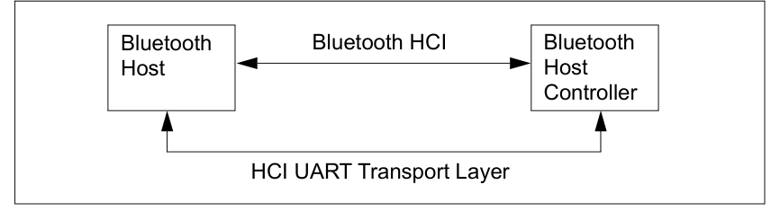

**Figure 1.1:  HCI UART Transport Layer**

## 2  PROTOCOL

There are four kinds of HCI packets that can be sent via the UART Transport Layer; i.e. HCI Command Packet, HCI Event Packet, HCI ACL Data Packet and HCI Synchronous Data Packet (see [Vol 2] Part E, Host Controller Interface Functional Specification). HCI Command Packets can only be sent to the Bluetooth Host Controller, HCI Event Packets can only be sent from the Bluetooth Host Controller, and HCI ACL/Synchronous Data Packets can be sent both to and from the Bluetooth Host Controller.
HCI does not provide the ability to differentiate the four HCI packet types. Therefore, if the HCI packets are sent via a common physical interface, a HCI packet indicator has to be added according to Table 2.1 below.

| HCI packet type | HCI packet indicator |
| --- | --- |
| HCI Command Packet | 0x01 |
| HCI ACL Data Packet | 0x02 |
| HCI Synchronous Data Packet | 0x03 |
| HCI Event Packet | 0x04 |

Table 2.1:  HCI packet indicators
The HCI packet indicator shall be sent immediately before the HCI packet. All four kinds of HCI packets have a length field, which is used to determine how many bytes are expected for the HCI packet. When an entire HCI packet has been received, the next HCI packet indicator is expected for the next HCI packet. Over the UART Transport Layer, only HCI packet indicators followed by HCI packets are allowed.

## 3  RS232 SETTINGS

The HCI UART Transport Layer uses the following settings for RS232:

| Baud rate: | manufacturer-specific |
| --- | --- |
| Number of data bits: | 8 |
| Parity bit: | no parity |
| Stop bit: | 1 stop bit |
| Flow control: | RTS/CTS |
| Flow-off response time: | manufacturer specific |

Table 3.1:  RS232 Settings
Flow control with RTS/CTS is used to prevent temporary UART buffer overrun. It should not be used for flow control of HCI, since HCI has its own flow control mechanisms for HCI commands, HCI events and HCI data.
If CTS is 1, then the Host/Host Controller is allowed to send. If CTS is 0, then the Host/Host Controller is not allowed to send.
The flow-off response time defines the maximum time from setting RTS to 0 until the byte flow actually stops.
The RS232 signals should be connected in a null-modem fashion; i.e. the local TXD should be connected to the remote RXD and the local RTS should be connected to the remote CTS and vice versa.

## 4  ERROR RECOVERY

If the Host or the Host Controller lose synchronization in the communication over RS232, then a reset is needed. A loss of synchronization means that an incorrect HCI packet indicator has been detected, or that the length field in an HCI packet is out of range.
If the UART synchronization is lost in the communication from Host to Host Controller, then the Host Controller shall send a Hardware Error Event to tell the Host about the synchronization error. The Host Controller will then expect to receive an HCI_Reset command from the Host in order to perform a reset. The Host Controller will also use the HCI_Reset command in the byte stream from Host to Host Controller to re-synchronize.
If the UART synchronization is lost in the communication from Host Controller to Host, then the Host shall send the HCI_Reset command in order to reset the Host Controller. The Host shall then re-synchronize by looking for the HCI Command Complete event for the HCI_Reset command in the byte stream from Host Controller to Host.
See [Vol 2] Part E for HCI commands and HCI events in the Bluetooth Specification v1.2 or later.
Part B
PART B: USB TRANSPORT LAYER
This document describes the USB transport layer (between a Host and the Host Controller). HCI commands flow through this layer, but the layer does not decode the commands.
CONTENTS

#### 3.1.3 Composite Bluetooth Primary and AMP Controller... 2421

## 1  OVERVIEW

This document discusses the requirements of the Universal Serial Bus (USB) interface for Bluetooth hardware. Readers should be familiar with USB, USB design issues, Advanced Configuration Power Interface (ACPI), the overall Bluetooth architecture, and the basics of the radio interface.
The reader should also be familiar with the Bluetooth Host Controller Interface.
Referring to Figure 1.1 through Figure 1.3, notice that this document discusses the implementation details of the two-way arrow labeled “USB Function.”

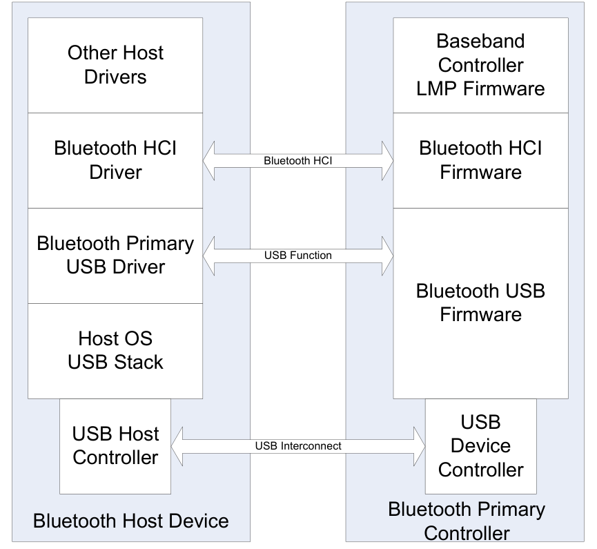

**Figure 1.1:  Relationship between the Host and Bluetooth Primary Controller**

This document also specifies implementation of two other configurations:
• USB-connected AMP Controller (PAL, MAC, PHY)
• USB-connected composite (multifunction) device that combines a Primary Controller and an AMP Controller.

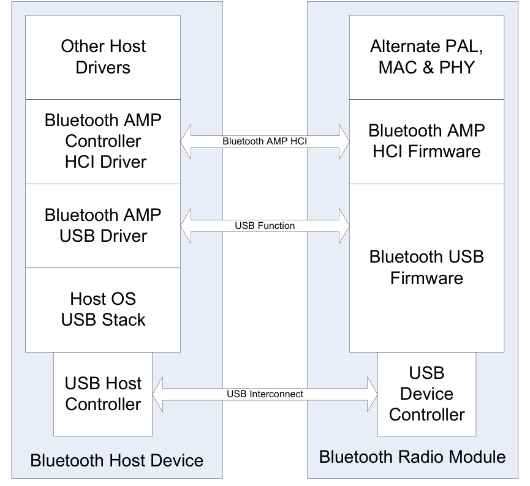

**Figure 1.2:  Relationship between the Host and an AMP Controller**

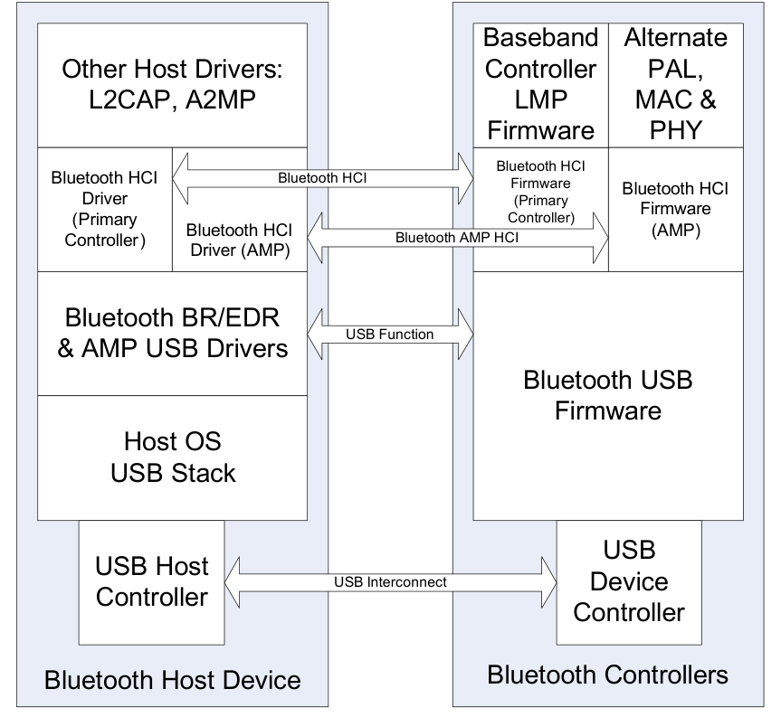

**Figure 1.3:  Relationship between Host and a Composite BR/EDR and AMP Controller**

The USB hardware can be embodied in one of several ways:
1. As a USB dongle (e.g. cabled USB)
2. As a USB module integrated into the product and connected internally via a cable or connector
3. Integrated onto the motherboard of a notebook PC or other device and connected via circuit board traces with standard USB, Inter-Chip USB or High Speed Inter-Chip USB
4. Integrated as a subsystem on a single-chip System-on-Chip (SoC) design connected on-chip as part of a compound device.
Finally, for an overview of the connection that is established between two Bluetooth devices, reference Figure 1.4.

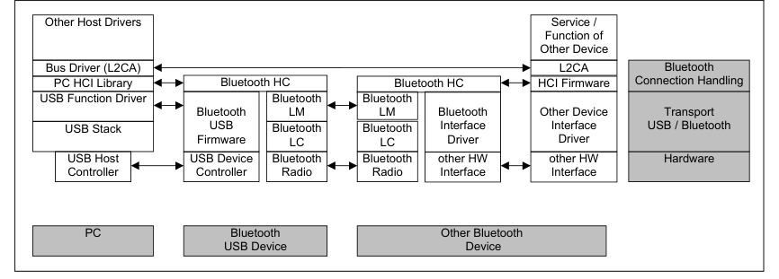

**Figure 1.4:  Flow of data from one Bluetooth device to another**

## 2  USB ENDPOINT EXPECTATIONS

This section outlines specific USB endpoints that are required in order to function properly with the Host. This section assumes a basic familiarity with USB. The endpoint numbers (labeled ‘Suggested Endpoint Address’ below) may be dynamically recognized upon driver initialization – this depends on the implementation.

### 2.1   DESCRIPTOR OVERVIEW

The UniversalSerial Bus is intended for high data rates. USB defines several physical layers, ranging from 1.5 Mb/s to several Gb/s of bus bandwidth. A Bluetooth USB device should provide a USB transport with sufficient bus bandwidth to support the Bluetooth radio transports included in the device.
There are two USB Controller types:
• Primary Controller
• AMP Controller

#### 2.1.1  Primary Controller Descriptors

The Primary Controller configuration consists of two interfaces. The first interface has no alternate settings and contains the bulk and interrupt endpoints. The second interface provides scalable isochronous bandwidth. The recommended configuration for the second interface has four alternate settings that provide different bandwidth. The default interface is empty so that the device is capable of scaling down to zero isochronous bandwidth.
An HCI  packet consisting of an HCI header and HCI data shall be contained in one USB Transfer. A USB  transfer is defined by the USB specification as one or more USB  transactions that contain the data from one IO request. For example, an ACL data packet containing 256 bytes (both HCI header and HCI data) would be sent over the bulk endpoint in one IO request. That IO request will require four 64-byte full speed USB Transactions or a single 256-byte High- speed USB Transaction, and forms a Transfer. If the Maximum Packet Size for the endpoint on which the transfer is sent is 64 bytes, then that IO request will require four 64-byte USB transactions.
The endpoints are spread across two interfaces so that when adjusting isochronous bandwidth consumption (via select interface calls), any pending bulk and/or interrupt transactions do not have to be terminated or resubmitted.
Table 2.1 and the following example calculations illustrate recommended endpoint descriptor parameter values and how they are derived. The maximum packet sizes for control endpoints, interrupt endpoints and bulk endpoints may be any value allowed by the relevant USB core specifications. The maximum packet size for isochronous endpoints must be large enough to accommodate
the maximum average traffic; they may be set to accommodate the largest HCI transfer, subject to the capabilities of the Controller. In Table 2.1, the service interval is assumed to be 1 millisecond, for USB Full Speed (FS) frames.
Examples:
1. For a single 8 kHz audio channel with of 64 kb/s CVSD audio the Host may break HCI data into one USB transfers for each USB frame (e.g. 1 ms); in that case, the max packet size must be at least 11 = 3 octet HCI header + 8 octets of data. To reduce HCI header overhead, a common strategy (see Table 2.2) is to consolidate 3 ms of data into a 27 octet HCI packet of 24 octets of data + 3 octets of HCI header. These HCI packets can be exchanged as a single USB transfer on 3 ms intervals; this requires a max packet size of 27/3 = 9 octets per 1 millisecond USB Full Speed Frame.
2. For two 8 kHz audio channels of 64 kb/s CVSD audio the Host may double the payload size of each HCI packet, which would be 3 octets HCI header + 48 octets of data = 51 octets. Posting these at 3 ms intervals requires 51/3 = 17 octets of maximum packet size.
3. For one 16 kHz audio channel the HCI packets need to be large enough to accommodate single octet (128 kb/s) or 2-octet (256 kb/s) encoding. On 3 ms intervals, these would have to be (48+3)/3 = 17 octets or (96+3)/3 = 33 octets respectively.
4. For one mSBC1 compressed wideband audio channel the HCI packets will be 3 octets of HCI header + 60 octets of data. If the Controller can support a maximum packet size of 63 (or 64) octets, an entire mSBC frame may be exchanged in one USB transaction. If the maximum packet size is smaller than 63 octets, additional latency will be introduced. The USB Host Controller will reserve bandwidth that will only be used when the Bluetooth Host or Controller has data to transfer.
5. For combinations of audio channels, if the max packet size can accommodate the largest HCI packets, there is also sufficient bandwidth for the audio channels that have smaller HCI packets. See example 4 above.
1. For information about modified Sub Band Codec (mSBC), see Hands-Free Profile v1.6 or later
The following table outlines a recommended configuration for a USB Full Speed device.

| Interface Number | Alternate Setting | Suggested Endpoint Address | Endpoint Type | Suggested Max Packet Size | USB Polling Interval/HCI Packe Interval |
| --- | --- | --- | --- | --- | --- |
| HCI Commands |  |  |  |  |  |
| N/A | N/A | 0x00 | Control | 8/16/32/64 | NA |
| HCI Events |  |  |  |  |  |
| 0 | 0 | 0x81 | Interrupt (IN) | 16 | variable |
| ACL Data |  |  |  |  |  |
| 0 | 0 | 0x82 | Bulk (IN) | 32/64 | variable |
| 0 | 0 | 0x02 | Bulk (OUT) | 32/64 | variable |
| No active voice channels (for USB compliance) |  |  |  |  |  |
| 1 | 0 | 0x83 | Isoch (IN) | 0 | NA |
| 1 | 0 | 0x03 | Isoch (OUT) | 0 | NA |
| One 8 kHz voice channel with 8-bit encoding |  |  |  |  |  |
| 1 | 1 | 0x83 | Isoch (IN) | 9 | 1 ms/3 ms |
| 1 | 1 | 0x03 | Isoch (OUT) | 9 | 1 ms/3 ms |
| Two 8 kHz voice channels with 8-bit encoding or one 8 kHz voice channel with 16-bit encoding |  |  |  |  |  |
| 1 | 2 | 0x83 | Isoch (IN) | 17 | 1 ms/3 ms |
| 1 | 2 | 0x03 | Isoch (OUT) | 17 | 1 ms/3ms |
| Three 8 kHz voice channels with 8-bit encoding |  |  |  |  |  |
| 1 | 3 | 0x83 | Isoch (IN) | 25 | 1 ms/3ms |
| 1 | 3 | 0x03 | Isoch (OUT) | 25 | 1 ms/3ms |
| Two 8 kHz voice channels with 16-bit encoding or one 16 kHz voice channel with 16-bit encoding |  |  |  |  |  |
| 1 | 4 | 0x83 | Isoch (IN) | 33 | 1 ms/3 ms |

Table 2.1:  USB Primary firmware interface and endpoint settings

| Interface Number | Alternate Setting | Suggested Endpoint Address | Endpoint Type | Suggested Max Packet Size | USB Polling Interval/HCI Packe Interval |
| --- | --- | --- | --- | --- | --- |
| 1 | 4 | 0x03 | Isoch (OUT) | 33 | 1 ms/3 ms |
| Three 8 kHz voice channels with 16-bit encoding or one 8 kHz voice channel with 16-bit encoding and one 16 kHz voice channel with 16-bit encoding |  |  |  |  |  |
| 1 | 5 | 0x83 | Isoch (IN) | 49 | 1 ms/3 ms |
| 1 | 5 | 0x03 | Isoch (OUT) | 49 | 1 ms/3 ms |
| One mSBC voice channel |  |  |  |  |  |
| 1 | 6 | 0x83 | Isoch (IN) | 63 | 1 ms/7.5 ms |
| 1 | 6 | 0x03 | Isoch (OUT) | 63 | 1 ms/7.5 ms |

Table 2.1:  USB Primary firmware interface and endpoint settings
The following two examples are used to demonstrate the flow of data given the described endpoints.

| Number of voice channels | Duration of voice data | Encoding |
| --- | --- | --- |
| One | 3 ms per IO Request | 8-bit |

| Time (ms) | USB data (header refers to HCI header) (Receive & Send from the Host) | Queued data (read / write) | Time (ms) | Air data | Amount Received/ Sent (ms) |
| --- | --- | --- | --- | --- | --- |
| 0 | Receive 0 bytes Send 9 bytes (3 header, 6 data) | 0 / 6 | 0 | Send 0 | 0 / 0 |
|  |  | 10 / 6 | 0.625 | Receive 10 | 1.25 / 0 |
| 1 | Receive 0 bytes Send 9 bytes (9 bytes HCI data) | 10 / 15 | 1.25 | Send 0 | 1.25 / 0 |
|  |  | 20 / 15 | 1.875 | Receive 10 | 2.50 / 0 |
| 2 | Receive 0 bytes Send 9 bytes (9 bytes HCI data) | 20 / 24 | 2.50 | Send 0 | 2.50 / 0 |
|  |  | 30 / 24 | 3.125 | Receive 10 | 3.75 / 0 |

Table 2.2:  Example USB single-channel voice traffic data flow

| Time (ms) | USB data (header refers to HCI header) (Receive & Send from the Host) | Queued data (read / write) | Time (ms) | Air data | Amount Received/ Sent (ms) |
| --- | --- | --- | --- | --- | --- |
| 3 | Receive 9 bytes (3 header, 6 data) Send 9 bytes (3 header, 6 data) | 24 / 20 | 3.75 | Send 10 | 3.75 / 1.25 |
| 4 | Receive 9 bytes (9 bytes data) Send 9 bytes (9 bytes HCI data) | 25 / 29 | 4.375 | Receive 10 | 5.0 / 1.25 |
| 5 | Receive 9 bytes (9 bytes data) Send 9 bytes (9 bytes HCI data) | 16 / 28 | 5.0 | Send 10 | 5.0 / 2.50 |
|  |  | 26 / 28 | 5.625 | Receive 10 | 6.25 / 2.50 |
| 6 | Receive 9 bytes (3 header, 6 data) Send 9 bytes (3 header, 6 data) | 20 / 24 | 6.25 | Send 10 | 6.25 / 3.75 |
|  |  | 30 / 24 | 6.875 | Receive 10 | 7.5 / 3.75 |
| 7 | Receive 9 bytes (9 bytes data) Send 9 bytes (9 bytes HCI data) | 21 / 23 | 7.5 | Send 10 | 7.5 / 5.0 |
| 8 | Receive 9 bytes (9 bytes data) Send 9 bytes (9 bytes HCI data) | 22 / 32 | 8.125 | Receive 10 | 8.75 / 5.0 |
|  |  | 22 / 22 | 8.75 | Send 10 | 8.75 / 6.25 |
| 9 | Receive 9 bytes (3 header, 6 data) Send 9 bytes (3 header, 6 data) | 26 / 28 | 9.375 | Receive 10 | 10.0 / 6.25 |
| 10 | Receive 9 bytes (9 bytes data) Send 9 bytes (9 bytes HCI data) | 17 / 27 | 10 | Send 10 | 10.0 / 7.5 |
|  |  | 27 / 27 | 10.625 | Receive 10 | 11.25 / 7.5 |
| 11 | Receive 9 bytes (9 bytes data) Send 9 bytes (9 bytes HCI data) | 18 / 26 | 11.25 | Send 10 | 11.25 / 8.7 |

Table 2.2:  Example USB single-channel voice traffic data flow
Convergence is expected because the radio is sending out an average of eight bytes of voice data every one ms and USB is sending eight bytes of voice data every one ms.

| Number of voice channels | Duration of voice data | Encoding |
| --- | --- | --- |
| Two | 3 ms per IO Request | 8-bit |

| Time (ms | USB data (header refers to HCI header) (Receive & Send from the Host) | Queued data (read / write) | Time (ms) | Air data | Amount Received Sent (ms) |
| --- | --- | --- | --- | --- | --- |
| 0 | Receive 0 bytes for Channel #1 Send 17 bytes (3 header, 14 data) for Channel #1 | C1- 0/14 C2- 0/0 | 0 | Send 0 for C1 | C1- 0/0 C2- 0/0 |
|  |  | C1- 20/ 14 C2- 0/0 | 0.625 | Receive 20 for C1 | C1- 2.5/0 C2- 0/0 |
| 1 | Receive 0 bytes for Channel #1 Send 17 bytes (17 bytes HCI data) for Channel #1 | C1- 20/ 31 C2- 0/0 | 1.25 | Send 0 for C2 | C1- 2.5/0 C2- 0/0 |
|  |  | C1- 20/ 31 C2- 20/0 | 1.875 | Receive 20 for C2 | C1- 2.5/0 C2- 2.5/0 |
| 2 | Receive 0 bytes for Channel #1 Send 17 bytes (17 bytes HCI data) for Channel #1 | C1- 20/ 28 C2- 20/0 | 2.50 | Send 20 for C1 | C1- 2.5/2. C2- 2.5/0 |
|  |  | C1- 40/ 28 C2- 0/0 | 3.125 | Receive 20 for C1 | C1- 5.0/2. C2- 2.5/0 |
| 3 | Receive 0 bytes for Channel #2 Send 17 bytes (3 header, 14 data) for Channel #2 | C1- 40/ 28 C2- 20/ 14 | 3.75 | Send 0 for C2 | C1- 5.0/2. C2- 2.5/0 |
| 4 | Receive 0 bytes for Channel #2 Send 17 bytes (17 bytes HCI data) for Channel #2 | C1- 40/ 28 C2- 40/ 31 | 4.375 | Receive 20 for C2 | C1- 5.0/2. C2- 5.0/0 |
| 5 | Receive 0 bytes for Channel #2 Send 17 bytes (17 bytes HCI data) for Channel #2 | C1- 40/8 C2- 40/ 48 | 5.0 | Send 20 for C1 | C1- 5.0/5. C2- 5.0/0 |
|  |  | C1- 60/8 C2- 40/ 48 | 5.625 | Receive 20 for C1 | C1- 7.5/5. C2- 5.0/0 |
| 6 | Receive 17 bytes (3 header, 14 data) for Channel #1 Send 17 bytes (3 header, 14 data) for Channel #1 | C1- 46/ 22 C2- 40/ 28 | 6.25 | Send 20 for C2 | C1- 7.5/5. C2- 5.0/2. |

Table 2.3:  Example USB dual-channel voice traffic data flow

| Time (ms | USB data (header refers to HCI header) (Receive & Send from the Host) | Queued data (read / write) | Time (ms) | Air data | Amount Received Sent (ms |
| --- | --- | --- | --- | --- | --- |
|  |  | C1- 46/ 22 C2- 60/ 28 | 6.875 | Receive 20 for C2 | C1- 7.5/5. C2- 7.5/2. |
| 7 | Receive 17 bytes (17 bytes data) for Channel #1 Send 17 bytes (17 bytes HCI data) for Channel #1 | C1- 29/ 19 C2- 60/ 28 | 7.5 | Send 20 for C1 | C1- 7.5/7. C2- 7.5/2. |
| 8 | Receive 17 bytes (17 bytes data) for Channel #1 Send 17 bytes (17 bytes HCI data) for Channel #1 | C1- 32/ 36 C2- 60/ 28 | 8.125 | Receive 20 for C1 | C1- 10/7. C2- 7.5/2. |
|  |  | C1- 32/ 36 C2- 60/8 | 8.75 | Send 20 for C2 | C1- 10/7. C2- 7.5/5. |
| 9 | Receive 17 bytes (3 header, 14 data) for Channel #2 Send 17 bytes (3 header, 14 data) for Channel #2 | C1- 32/ 36 C2- 54/ 22 | 9.375 | Receive 20 for C2 | C1- 10/7. C2- 10/5. |
| 10 | Receive 17 bytes (17 bytes data) for Channel #2 Send 17 bytes (17 bytes HCI data) for Channel #2 | C1- 32/ 16 C2- 37/ 39 | 10 | Send 20 for C1 | C1- 10/10 C2- 10/5. |
|  |  | C1- 52/ 16 C2- 37/ 39 | 10.625 | Receive 20 for C1 | C1- 12.5/ 10 C2- 10/5. |
| 11 | Receive 17 bytes (17 bytes data) for Channel #2 Send 17 bytes (17 bytes HCI data) for Channel #2 | C1- 52/ 16 C2- 20/ 36 | 11.25 | Send 20 for C2 | C1- 12.5/ 10 C2- 10/7. |

Table 2.3:  Example USB dual-channel voice traffic data flow

#### 2.1.2  AMP Controller Descriptors

The AMP Controller configuration consists of one interface. That interface (interface N - see device descriptors) has no alternate settings and contains the bulk and interrupt endpoints.
An HCI packet, consisting of an HCI header and HCI data, shall be contained in one USB transfer.

| Interface Number | Alternate Setting | Suggested Endpoint Address | Endpoint Type | Suggested Max Packet Size |
| --- | --- | --- | --- | --- |
| HCI Commands |  |  |  |  |
| N/A | N/A | 0x00 | Control | 64 |
| HCI Events |  |  |  |  |
| N | 0 | 0x81 | Interrupt (IN) | 512 |
| AMP Data |  |  |  |  |
| N | 0 | 0x82 | Bulk (IN) | 512 |
| N | 0 | 0x02 | Bulk (OUT) | 512 |

Table 2.4:  USB AMP firmware interface and endpoint settings
NOTE: Endpoint addresses are reported by the device in the Endpoint Descriptors.

### 2.2   CONTROL ENDPOINT EXPECTATIONS

Endpoint 0 is used to configure and control the USB device. Endpoint 0 will also be used to allow the Host to send HCI-specific commands to the Host Controller. HCI Command packets should be sent with the following parameters:
bmRequestType = 0x20 (Host-to-device class request, device as target)
bRequest = 0x00 wValue = 0x00
wIndex = 0x00
Some Host devices on the market set bRequest to 0xE0. Hence, for historical reasons, if the Bluetooth Controller firmware receives a class request over this endpoint, it should treat the packet as an HCI command packet regardless of the value of bRequest, wValue and wIndex.
All HCI Control Packets delivered to Endpoint 0 are addressed in the Setup Data structure (See 9.3 of [2]). This structure contains fields which determine the destination within the device. The bmRequestType can be used to select the Device or the Interface. If Interface is selected, the wIndex parameter must select the Index for the targeted Bluetooth Controller.

#### 2.2.1  Single Function Primary Controller

For a single function Primary Controller, the Host should address HCI command packets to the Device. HCI command packets should be sent with the following parameters:

| Parameter | Value | description |
| --- | --- | --- |
| bmRequestType | 0x20 | Host-to-device class request, device as target |
| bRequest | 0x00 |  |
| wValue | 0x00 |  |
| wIndex | 0x00 |  |

Table 2.5:  HCI command packet addressing for single-function Primary Controllers
Note: For historical reasons, if the Primary Controller firmware receives a packet over this endpoint, it should treat the packet as an HCI command packet regardless of the value of bRequest, wValue and wIndex. Some Host devices set bRequest to 0xE0.

#### 2.2.2  Primary Controller Function in a Composite Device

For a Primary Controller included in a composite (multi-function) device, the Host should address HCI control packets to the Interface of the Primary Controller. HCI command packets should be sent with the following parameters:

| Parameter | Value | description |
| --- | --- | --- |
| bmRequestType | 0x21 | Host-to-Interface class request, interface as target |
| bRequest | 0x00 |  |
| wValue | 0x00 |  |
| wIndex | IF# | This is the actual Interface number within the composite device. |

Table 2.6:  HCI command packet addressing for composite device Primary Controllers
If the Host system driver addresses USB requests containing HCI command packets to the Device (see Section 2.2.1) instead of to the Interface, the device implementation shall recognize these HCI command packets and correctly route them to the Primary Controller function, to ensure correct operation of the Primary Controller function and avoid malfunctions in other functions contained in the composite device.

#### 2.2.3  AMP Controller

For any AMP Controller, either in a single function device or included in a composite device, the Host shall address HCI control packets to the Interface
of the AMP Controller. HCI command packets shall be sent with the following parameters:

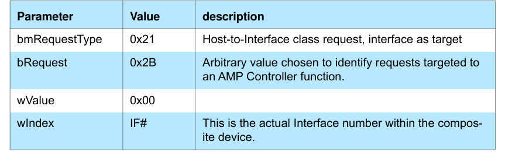

**Figure 2.1:  HCI command packet addressing for single-function AMP Controller**

### 2.3   BULK ENDPOINTS EXPECTATIONS

Data integrity is a critical aspect for ACL data. This, in combination with bandwidth requirements, is the reason for using a bulk endpoint. Multiple 64- byte packets can be shipped per USB Frame (1 millisecond, full speed) or 512- byte packets per USB Microframe (125 microseconds, high-speed), across the bus.
Suggested bulk max packet size is 64 bytes for full-speed, or 512 bytes for high speed.
Bulk has the ability to detect errors and correct them. In order to avoid starvation, a flow control model similar to the shared endpoint model is recommended for the Host Controller.

### 2.4   INTERRUPT ENDPOINT EXPECTATIONS

An interrupt endpoint is necessary to ensure that events are delivered in a predictable and timely manner. Event packets can be sent across USB with a guaranteed latency.
The interrupt endpoint should have an interval of 1 ms (full speed). For a Controller using USB high-speed the interrupt interval may have an interval of 125 microseconds.
The USB software and firmware requires no intimate knowledge of the events passed to the Host Controller.

### 2.5   ISOCHRONOUS ENDPOINTS EXPECTATIONS

These isochronous endpoints transfer synchronous data to and from the Host Controller of the radio.
Time is the critical aspect for this type of data. The USB firmware should transfer the contents of the data to the Host Controllers' synchronous FIFOs. If the FIFOs are full, the data should be overwritten with new data.
These endpoints have a one (1) ms interval, as required by Chapter 9 of the USB Specification, Versions 1.0 and 1.1.
The radio is capable of three (3) 64Kb/s voice channels (and can receive the data coded in different ways – 16-bit linear audio coding is the method that requires the most data). A suggested max packet size for this endpoint would be at least 64 bytes. (It is recommended that max packet sizes be on power of 2 boundaries for optimum throughput.) However, if it is not necessary to support three voice channels with 16-bit coding, 32 bytes could also be considered an acceptable max packet size.

## 3  CLASS CODE

A class code will be used that is specific to all USB Bluetooth devices. This will allow the proper driver stack to load, regardless of which vendor built the device.

### 3.1   BLUETOOTH CODES

The values shown in the following tables shall be used in the Device Descriptor for Bluetooth Controller devices with USB HCI transport.

| Code | Label | Value | Description |
| --- | --- | --- | --- |
| Class | bDeviceClass | 0xE0 | Wireless Controller |
| Subclass | bDeviceSubClass | 0x01 | RF Controller |
| Protocol | bDeviceProtocol | 0x01 | Bluetooth Primary Controller |

Table 3.1:  USB Codes for Primary Controllers

| Code | Label | Value | Description |
| --- | --- | --- | --- |
| Class | bDeviceClass | 0xE0 | Wireless Controller |
| Subclass | bDeviceSubClass | 0x01 | RF Controller |
| Protocol | bDeviceProtocol | 0x04 | Bluetooth AMP Controller |

Table 3.2:  USB Codes for AMP Controllers
These values should also be used in the interface descriptors for the interfaces described in Section 2.1 and as described in the following sections.

#### 3.1.1  Single Function Primary Controller

Set the Class, Subclass, and Protocol values for the Device Descriptor and for each Interface Descriptor which applies to the Primary Controller as defined in Table 3.1.

#### 3.1.2  Single Function AMP Controller

Set the Class, Subclass, and Protocol values for the Device Descriptor and for each Interface Descriptor which applies to the AMP Controller as defined in Table 3.2.

#### 3.1.3  Composite Bluetooth Primary and AMP Controller

Set the Class, Subclass, and Protocol values for the Device Descriptor as defined in the USB Interface Association Descriptor (IAD) ECN.
Set the Class, Subclass, and Protocol values for each Interface Descriptor which applies to the Primary Controller as defined in Table 3.1.

| Code | Label | Value | Description |
| --- | --- | --- | --- |
| Class | bDeviceClass | 0xEF | Miscellaneous |
| Subclass | bDeviceSubClass | 0x02 | Common Class |
| Protocol | bDeviceProtocol | 0x01 | Interface Associa- tion Descriptor |

Table 3.3:   USB Codes for composite devices using IAD
Set the Class, Subclass, and Protocol values for the each Interface Descriptor which applies to the AMP Controller as defined in Table 3.2.

#### 3.1.4  Composite Device Including Bluetooth Primary and AMP Controller

Set the Class, Subclass, and Protocol values for the Device Descriptor to as defined in Table 3.3.
Set the Class, Subclass, and Protocol values for each Interface Descriptor which applies to the Primary Controller as defined in Table 3.1.
Set the Class, Subclass, and Protocol values for the each Interface Descriptor which applies to the AMP Controller as defined in Table 3.2.

## 4  DEVICE FIRMWARE UPGRADE

Firmware upgrade capability is not a required feature. If implemented, the firmware upgrade should be compliant with the “Universal Serial Bus Device Class Specification for Device Firmware Upgrade” (version 1.1 or later) available on the USB Forum web site at http://www.usb.org.

## 5  LIMITATIONS

### 5.1   POWER SPECIFIC LIMITATIONS

Some USB Host Controllers in portable devices will not receive power while the system is in a sleep mode. For example, many PCs do not supply power to the USB port in system power states S3 or S4, as defined in ACPI. Hence, USB wake-up can only occur when the system is in S1 or S2. Furthermore, all connections and state information of the USB Bluetooth Controller will be lost in the system sleep state if power is lost necessitating re-initialization when the device returns to the active state.
Some USB Host Controllers further continually snoop memory when a device is attached to see if there is any work that needs to be done. The snoop is typically performed every 1ms for USB full-speed devices. This prevents the processor from dropping into a low power state known as C3. Because the processor is not able to enter the C3 state, significant power consumption may occur. This is a major concern for battery-powered Hosts such notebook computers. Some Host Controllers are capable of scheduling polling of USB devices at short intervals while snooping the Host's memory much less frequently. Systems with such Host Controllers may be able to greatly increase the percentage of time spent in the C3 state even if Bluetooth connections are maintained.
A feature called Link Power Management is also recommended for implementation by Bluetooth devices. It is described in an ECN (Engineering Change Notice) from the USB Implementers' Forum.

### 5.2   OTHER LIMITATIONS

Data corruption may occur across isochronous endpoints. Endpoints one and two may suffer from data corruption.
USB provides 16-CRC on all data transfers. The USB has a bit error rate of 10-13.
Note that when a dongle is removed from the system, the radio will lose power (assuming this is a bus-powered device). This means that devices will lose connection.

## 6  BLUETOOTH COMPOSITE DEVICE IMPLEMENTATION

A USB Composite contains multiple independent functions. This section describes how to implement Bluetooth functions within a USB Composite device. This may require the use of Interface Association Descriptors (IAD) to aggregate multiple Interfaces. This also requires the Host to address USB requests to the specific Interface (see [1]).

### 6.1   CONFIGURATIONS

There are several ways that Bluetooth Controller functions may be included in a USB composite device:
• Primary Controller and AMP Controller (see Section 6.3)
• Primary Controller in a multi-radio device
• Primary Controller in a device also containing non-radio functions (e.g. memory)
• AMP Controller in a multi-radio device

### 6.2   USING USB INTERFACE ASSOCIATION DESCRIPTORS FOR A PRIMARY CONTROLLER FUNCTION

A Primary Controller ([Vol 1] Part A, Section 2) shall contain at least two interfaces:
• HCI Events and ACL data (3 endpoints)
• HCI SCO data (2 endpoints, multiple alternate settings)
A Primary Controller may also contain
• Device Firmware Upgrade (see [2])
When used in a USB Composite device, a Primary Controller function shall use an IAD descriptor to associate the provided interfaces. The following is an example IAD for a Primary function without Device Firmware Upgrade:
• It would be contained within a Configuration Descriptor set.
• It would be followed by two Interface Descriptors and associated Endpoint Descriptors.

| Offset | Field | Size | Value | Description |
| --- | --- | --- | --- | --- |
| 0 | bLength | 1 | 0x08 | Size of this descriptor in octet |
| 1 | bDescriptorType | 1 | 0x0B | INTERFACE ASSOCIATION DESCRIPTOR |

Table 6.1:  Example Interface Association Descriptor used for a Primary Controller function

| Offset | Field | Size | Value | Description |
| --- | --- | --- | --- | --- |
| 2 | bFirstInterface | 1 | number | Interface number of the first interface associated with this device |
| 3 | bInterfaceCount | 1 | 0x02 | Number of contiguous inter- faces associated with the func- tion |
| 4 | bFunctionClass | 1 | 0xE0 | Wireless Controller |
| 5 | bFunctionSubClass | 1 | 0x01 | RF Controller |
| 6 | bFunctionProtocol | 1 | 0x01 | Bluetooth Primary Controller |
| 7 | iFunction | 1 | Index | Pointer to a name string for thi function, if any is provide |

Table 6.1:  Example Interface Association Descriptor used for a Primary Controller function

### 6.3   COMBINED PRIMARY CONTROLLER FUNCTION AND SINGLE AMP CONTROLLER FUNCTION

An AMP Controller (see Volume 5) shall contain at least one interface:
• HCI Events and ACL Data (3 endpoints)
An AMP Controller may also contain
• Device Firmware Upgrade (see [2])
When used in a USB Composite device, an AMP Controller does not need IAD. If the device contains the Device Firmware Upgrade option as a separate Device function, an IAD is not needed. If the Device Firmware Upgrade option is bundled with the AMP Controller function, then an IAD is needed to bind the two interfaces.
A USB Composite device containing only a Primary Controller and an AMP Controller may include a Configuration Descriptor set with the following structure:

| Offset | Field | Size | Value | Description |
| --- | --- | --- | --- | --- |
| Configuration Descriptor |  |  |  |  |
| 0 | bLength | 1 | 0x09 | Configuration Descriptor size |
| 1 | bDescriptorType | 1 | 0x02 | CONFIGURATION DESCRIPTOR |
| 2 | wTotalLength | 2 |  | Size of the entire bundle |

Table 6.2:  Example Configuration Descriptor used for a composite Primary and AMP Controller device

| Offset | Field | Size | Value | Description |
| --- | --- | --- | --- | --- |
| 4 | bNumInterfaces | 1 | 0x03 | Three Interfaces: IF#1 Primary events & ACL IF#2 Primary SCO or eSCO IF#3 AMP events & ACL |
| 5 | bConfigurationValue | 1 | 0x01 |  |
| 6 | iConfiguration | 1 | Index | Reference to a string describing this. |
| 7 | bmAttributes | 1 |  | Attributes bitmap |
| 8 | MaxPower | 1 | 0xFA | 500 mA (i.e. 0xFA * 2 mA) |
| Interface Association Descriptor |  |  |  |  |
| 0 | bLength | 1 | 0x08 | Interface Association Descriptor size |
| 1 | bDescriptorType | 1 | 0x0B | INTERFACE ASSOCIATION DESCRIPTOR |
| 2 | bFirstInterface | 1 | IF#1 | Interface number of the first interface asso ciated with this device. |
| 3 | bInterfaceCount | 1 | 0x03 | Number of contiguous interfaces associ- ated with the function. |
| 4 | bFunctionClass | 1 | 0xE0 | Wireless Controller |
| 5 | bFunctionSubClass | 1 | 0x01 | RF Controller |
| 6 | bFunctionProtocol | 1 | 0x01 | Bluetooth Primary Controller |
| 7 | iFunction | 1 | Index | Pointer to a name string for this function, if any is provided. |
| Primary Events & ACL Interface |  |  |  |  |
| 0 | bLength | 1 | 0x09 |  |
| 1 | bDescriptorType | 1 | 0x04 | INTERFACE DESCRIPTOR |
| 2 | bInterfaceNumber | 1 | IF#1 | This is the first interface in the device. |
| 3 | bAlternateSetting | 1 | 0x00 | This is the first setting for this interface. |
| 4 | bNumEndpoints | 1 | 0x03 | INT, Bulk OUT (ACL), Bulk IN (ACL) |
| 5 | bFunctionClass | 1 | 0xE0 | Wireless Controller |
| 6 | bFunctionSubClass | 1 | 0x01 | RF Controller |
| 7 | bFunctionProtocol | 1 | 0x01 | Bluetooth Primary Controller |
| 8 | iInterface | 1 | Index | Pointer to a name string for this interface, if any is provided. |
|  | Details omitted | varies |  | INT ENDPOINT DESCRIPTOR |
|  | Details omitted | varies |  | BULK OUT ENDPOINT DESCIPTOR |

Table 6.2:  Example Configuration Descriptor used for a composite Primary and AMP Controller device

| Offset | Field | Size | Value | Description |
| --- | --- | --- | --- | --- |
|  | Details omitted | varies |  | BULK IN ENDPOINT DESCIPTOR |
| Primary Controller SCO Interface |  |  |  |  |
| 0 | bLength | 1 | 0x09 |  |
| 1 | bDescriptorType | 1 | 0x04 | INTERFACE DESCRIPTOR |
| 2 | bInterfaceNumber | 1 | IF#2 | This is the second interface in the device. |
| 3 | bAlternateSetting | 1 | 0x00 | This is the first setting for this interface. |
| 4 | bNumEndpoints | 1 | 0x02 | Isoch OUT (SCO), Isoch IN (SCO) |
| 5 | bFunctionClass | 1 | 0xE0 | Wireless Controller |
| 6 | bFunctionSubClass | 1 | 0x01 | RF Controller |
| 7 | bFunctionProtocol | 1 | 0x01 | Bluetooth Primary Controller |
| 8 | iInterface | 1 | Index | Pointer to a name string for this interface, if any is provided. |
|  | Details omitted | varies |  | ISOCH OUT ENDPOINT DESCRIPTOR |
|  | Details omitted | varies |  | ISOCH IN ENDPOINT DESCRIPTOR |
| AMP Controller: Events & ACL Interface |  |  |  |  |
| 0 | bLength | 1 | 0x09 |  |
| 1 | bDescriptorType | 1 | 0x04 | INTERFACE DESCRIPTOR |
| 2 | bInterfaceNumber | 1 | IF#3 | This is the third interface in the device. |
| 3 | bAlternateSetting | 1 | 0x00 | This is the first setting for this interface. |
| 4 | bNumEndpoints | 1 | 0x03 | INT, Bulk OUT (ACL), Bulk IN (ACL) |
| 5 | bFunctionClass | 1 | 0xE0 | Wireless Controller |
| 6 | bFunctionSubClass | 1 | 0x01 | RF Controller |
| 7 | bFunctionProtocol | 1 | 0x04 | Bluetooth AMP Controller |
| 8 | iInterface | 1 | Index | Pointer to a name string for this interface, if any is provided. |
|  | Details omitted | varies |  | INT ENDPOINT DESCRIPTOR |
|  | Details omitted | varies |  | BULK OUT ENDPOINT DESCIPTOR |
|  | Details omitted | varies |  | BULK IN ENDPOINT DESCIPTOR |

Table 6.2:  Example Configuration Descriptor used for a composite Primary and AMP Controller device

## 7  REFERENCES

[1] USB 2.0, http://www.usb.org/developers/docs/docs, including: 1. Interface Association Descriptors ECN 2. Inter-Chip USB Supplement 1.0 3. High Speed Inter-Chip USB Supplement 1.0 4. Link Power Management 1.0
[2] USB Device Firmware Upgrade 1.1
Part C
PART C: SECURE DIGITAL (SD) TRANSPORT LAYER
This document describes the SD transport layer (between the Host and Controller). HCI command, event and data packets flow through this layer, but the layer does not decode them. The Bluetooth SD Transport layer is defined in a document owned and maintained by the Secure Digital Association. Information regarding that document is described herein.
CONTENTS

## 1  INTRODUCTION

This document discusses the requirements of the Secure Digital (SD) interface for Bluetooth hardware. Readers should be familiar with SD, SD design issues, and the overall Bluetooth architecture. The reader should also be familiar with the Bluetooth Host Controller Interface.
The SD Bluetooth Protocol is documented in the SDIO Card Type-A Specification for Bluetooth, which is owned and maintained by the Secure Digital Association (SDA). The full specification is available to members of the SDA that have signed all appropriate SD NDA and license requirements. The SDA also makes a Non-NDA version available, the Simplified Version of: SDIO Card Type-A Specification for Bluetooth. There are no changes to the SDA document to comply with the requirements of the Bluetooth SIG.

## 2  GOALS

### 2.1   HARDWARE GOALS

The Bluetooth SD transport interface specification is designed to take advantage of both the SD Physical Transport bus and the packet orientation of the Bluetooth HCI protocol. Thus, all data is transferred in blocks as packets. Since the block size used on the SD bus may be smaller than the HCI packet, a segmentation and recombination protocol is defined.
SDIO [2] provides different data rate options, including different bit path widths and clock rates. Systems using SDIO should choose options that provide sufficient bandwidth to support the needs of the Controller, both for device control (HCI commands and events) and for data (ACL, SCO).
The specification supports SDIO-connected Controller:
• Primary Controller
• AMP Controller
• Multifunction Controller incorporating some combination of Primary and AMP Controllers.

### 2.2   SOFTWARE GOALS

The Bluetooth SD transport interface specification is designed for non- embedded solutions. It is assumed that the Host software does not necessarily have a priori knowledge of the SD Bluetooth device.
The interface is not designed for embedded applications where much of the information passed via the interface is known in advance.
The SDA also defines a Bluetooth interface for embedded applications where the Controller contains protocol layers above HCI (RFComm, SDP etc.). This specification is called SDIO Card Type-B Specification for Bluetooth. Information about this specification can be obtained from the SDA:
http://www.sdcard.org.

### 2.3   CONFIGURATION GOALS

The SDIO Card Specification [2] defines SDIO Standard Function Codes in Table 6-4:
0x2 This function supports the SDIO Type-A for Bluetooth standard interface
0x3 This function supports the SDIO Type-B for Bluetooth standard interface
0x9 This function supports the SDIO Type-A for Bluetooth AMP standard interface
The SDIO Card Type-A Specification for Bluetooth [3] specifies how to implement a Primary Controller. Table 2.1 defines Service ID codes to route HCI messages (codes 0x01 - 0x04). An AMP Controller shall conform to [3] except for one Service ID code:

| SDIO Type-A service ID | Primary Controller |
| --- | --- |
| 0x00 | reserved for future use |
| 0x01 | HCI Command Packet |
| 0x02 | ACL Data |
| 0x03 | SCO Data |
| 0x04 | HCI Event Packet |
| 0x05-0xFF | Reserved as per [3] |

Table 2.1:  Bluetooth SDIO Controller Service ID codes

### 2.4   CONFIGURATION FOR MULTIPLE CONTROLLERS

An SDIO device may contain one or more Controllers as defined in [3]. These Controller functions shall conform to the requirements of [2] section 6.12.

## 3  PHYSICAL INTERFACE DOCUMENTS

This specification references the SD SDIO Card Type-A Specification for Bluetooth. This SDA document defines the Bluetooth HCI for all SD devices that support an HCI level interface. Any SD Bluetooth device claiming compliance with the SD Bluetooth Transport must support this interface and additionally adhere to its device type specification, which is set by the Secure Digital Association. The SDIO Card Type-A Specification for Bluetooth document is based on the SDIO Card Specification, which in turn is based on the SD Memory Card Specification: Part 1 Physical Layer Specification. All of these documents are copyrighted by the SDA and are available ONLY to SDA member companies that have signed the appropriate NDA documents with the SDA. As an introduction to the SD Bluetooth Type A specification, the SDA has created ‘Simplified’ versions of each of these documents. The simplified versions do not contain enough information to fully implement a device, however they do contain enough information to convey the structure and intent of the specifications.
Applicable SDA Documents available to members of the SDA:
SD Memory Card Specification: Part 1 Physical Layer Specification
SDIO Card Specification
SDIO Card Type-A Specification for Bluetooth.
Applicable Simplified SDA Documents available to non-members and members of the SDA:
Simplified Version of: SD Memory Card Specification: Part 1 Physical Layer Specification
Simplified Version of: SDIO Card Specification:
Simplified Version of: SDIO Card Type-A Specification for Bluetooth
More information on the Secure Digital Association and the SD specifications can be found at the SDA website at. http://www.sdcard.org.

## 4  COMMUNICATION

### 4.1   OVERVIEW

Figure 4.1 below is a diagram of the communication interface between a Bluetooth SD device and the Bluetooth Host protocol stack. Modifications to this diagram might be needed for operating systems that do not support a miniport model:

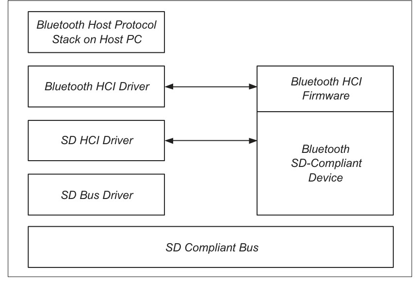

**Figure 4.1:  SD Communication Diagram**

APPENDIX A ACRONYMS AND ABBREVIATIONS

| Acronym | Description |
| --- | --- |
| HCI | Host Controller Interface |
| NDA | Non-Disclosure Agreement |
| OS | Operating System |
| SD | Secure Digital |
| SDA | Secure Digital Association |
| SDIO | Secure Digital Input/Output |
| SDP | Service Discovery Protocol |
| SIG | Special Interest Group |

Table 4.1:  Acronyms and Abbreviations
APPENDIX B RELATED DOCUMENTS
A) Bluetooth Core Specification v1.2 or later.
B) Applicable SDA Documents available to members of the SDA:
[1] B.1) SD Memory Card Specification: Part 1 Physical Layer Specification
[2] B.2) SDIO Card Specification
[3] B.3) SDIO Card Type-A Specification for Bluetooth
[4] B.4) SDIO Card Type-B Specification for Bluetooth
[5] B.5) SDIO Card Physical Test Specification
[6] B.5) SDIO Host Physical Test Specification
[7] B.6) SD Bluetooth Type A Test Specification
These documents are available to members of the SDA in the “Members Only” section of the SDA web site (https://www.sdcard.org/members/). See http://www.sdcard.org/developers/join/ for information on joining the SDA..
C) Applicable Simplified SDA Documents available to non-members and members of the SDA:
C.1) Simplified Version of: SD Memory Card Specification: Part 1 Physical Layer Specification https://www.sdcard.org/downloads/pls/
C.2) Simplified Version of: SDIO Card Specification
https://www.sdcard.org/downloads/pls/
C.3) Simplified Version of: SDIO Card Type-A Specification for Bluetooth
https://www.sdcard.org/downloads/pls/
APPENDIX C TESTS
The SDA has defined formal test procedures for SDIO Type A Bluetooth cards (Controller) and Hosts. It is expected that both Controllers and Hosts will comply with all test requirements set forth by the SDA in accordance with the rules of the SDA. The Bluetooth SIG does not require any formal testing to comply with SIG requirements. The test document names are listed in Appendix B.
C.1  TEST SUITE STRUCTURE
There are two types of tests defined for the HCI SD Transport Layer:
1. Functional Tests 2. Protocol Tests
Tests of both types are defined for both the Host and Controller.
The purpose of the functional tests is to verify that the SD Bluetooth Type A Specification, SDIO Standard and SD Physical Standard have been implemented according to the specifications. These tests and the test environment for these tests are defined in documents provided by the SDA.
The purpose of the protocol tests are to verify that the Bluetooth Controller SD implementation or the Host implementation are according to the SD Bluetooth Type A specification.
The test environment for the protocol tests consists of the tester and the Device Under Test (DUT) as illustrated in Figure C.1 below.
Tester DUT
SD Interface
Figure C.1:  Protocol Test Environment
The tester is typically a PC with an SD interface. The DUT is placed into local loopback mode and standard HCI commands are used to drive the tests. The test results are verified in the tester.
Part D
PART D: THREE-WIRE UART TRANSPORT LAYER
This document describes the Three- Wire UART transport layer (between the Host and Controller). HCI command, event and data packets flow through this layer, but the layer does not decode them.
CONTENTS

## 1  GENERAL

The HCI Three-Wire UART Transport Layer makes it possible to use the Bluetooth HCI over a serial interface between two UARTs. The HCI Three-Wire UART Transport Layer assumes that the UART communication may have bit errors, overrun errors or burst errors. See also Part A, UART Transport Layer.

## 2  OVERVIEW

The HCI Three-Wire UART Transport Layer is a connection based protocol that transports HCI commands, events, ACL and Synchronous packets between the Host and the Controller. Packet construction is in done in two steps. First, it adds a packet header onto the front of every HCI Packet which describes the payload. Second, it frames the packets using a SLIP protocol. Finally, it sends this packet over the UART interface.
The SLIP layer converts an unreliable octet stream into an unreliable packet stream. The SLIP layer places start and end octets around the packet. It then changes all occurrences of the frame start or end octet in the packet to an escaped version.
The packet header describes the contents of the packet, and if this packet needs to be reliably transferred, a way of identifying the packet uniquely, allowing for retransmission of erroneous packets.

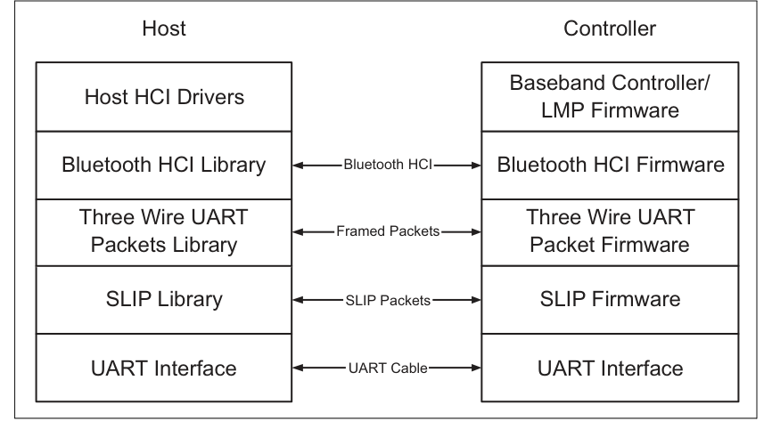

**Figure 2.1:  The Relationship Between the Host and the Controller**

## 3  SLIP LAYER

The SLIP layer places packet framing octets around each packet being transmitted over the Three-Wire UART Transport Layer. This delimits the packets and allows packet boundaries to be detected if the receiver loses synchronization. The SLIP layer is based upon the RFC 1055 Standard [1].

### 3.1   ENCODING A PACKET

The SLIP layer performs octet stuffing on the octets entering the layer so that specific octet codes which may occur in the original data do not occur in the resultant stream.
The SLIP layer places octet 0xC0 at the start and end of every packet it transmits. Any occurrence of 0xC0 in the original packet is changed to the sequence 0xDB 0xDC before being transmitted. Any occurrence of 0xDB in the original packet is changed to the sequence 0xDB 0xDD before being transmitted. These sequences, 0xDB 0xDC and 0xDB 0xDD are SLIP escape sequences. All SLIP escape sequences start with 0xDB. All SLIP escape sequences are listed in Table 3.1.

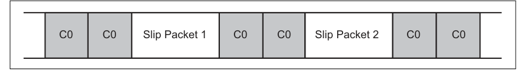

**Figure 3.1:  SLIP Packets with 0xC0 at the Start and End of Each Packet**

### 3.2   DECODING A PACKET

When decoding a SLIP stream, a device will first be in an unknown state, not knowing if it is at the start of a packet or in the middle of a packet. The device must therefore discard all octets until it finds a 0xC0. If the 0xC0 is followed immediately by a second 0xC0, then the device will discard the first 0xC0 as it was presumably the end of the last packet, and the second 0xC0 was the start of the next packet. The device will then be in the decoding packet state. It can then decode the octets directly changing any SLIP escape sequences back into their unencoded form. When the device decodes the 0xC0 at the end of the packet, it will calculate the length of the SLIP packet, and pass the packet data into the packet decoder. The device will then seek the next packet. If the device does not receive an 0xC0 for the start of the next packet, then all octets up to and including the next 0xC0 will be discarded.

| SLIP Escape Sequence | Unencoded form | Notes |
| --- | --- | --- |
| 0xDB 0xDC | 0xC0 |  |
| 0xDB 0xDD | 0xDB |  |
| 0xDB 0xDE | 0x11 | Only valid when OOF Software Flow Control is enabled |
| 0xDB 0xDF | 0x13 | Only valid when OOF Software Flow Control is enabled |

Table 3.1:  SLIP Escape Sequences

## 4  PACKET HEADER

Every packet that is sent over the Three-Wire UART Transport Layer has a packet header. It also has an optional Data Integrity Check at the end of the payload. The Transport Layer does not support packet segmentation and reassembly. Each transport packet will contain at most one higher layer packet.
A packet consists of a Packet Header of 4 octets, a Payload of 0 to 4095 octets, and an optional Data Integrity Check of 2 octets. See Figure 4.1.
The Packet header consists of a Sequence Number of 3 bits, an Acknowledge Number of 3 bits, a Data Integrity Check Present bit, a Reliable Packet bit, a Packet Type of 4 bits, a Payload Length of 12 bits and an 8 bit Header Checksum. See Figure 4.2.

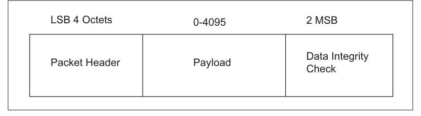

**Figure 4.1:  Packet Format**

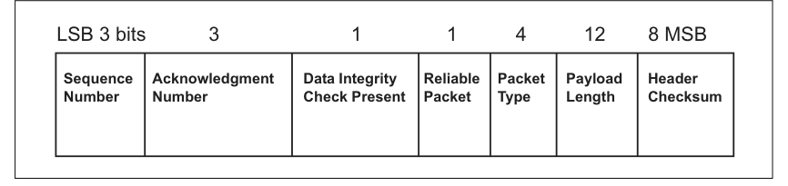

**Figure 4.2:  Packet Header Format**

### 4.1   SEQUENCE NUMBER

For unreliable packets this field will be set to 0 on transmit and ignored on receive.
Each new reliable packet will be assigned a sequence number which will be equal to the sequence number of the previous reliable packet plus one modulo eight. A packet will use the same sequence number each time it is retransmitted.

### 4.2   ACKNOWLEDGE NUMBER

The acknowledge number must be set to the sequence number of the next reliable packet this device expects to receive. See Section 6.4.

### 4.3   DATA INTEGRITY CHECK PRESENT

If a 16 bit CCITT-CRC Data Integrity Check is appended to the end of the payload, this bit shall be set to 1.

### 4.4   RELIABLE PACKET

If this bit it set to 1, then this packet is reliable. This means that the sequence number field is valid, and the receiving end must acknowledge its receipt. If this bit is set to 0, then this packet is unreliable.

### 4.5   PACKET TYPE

There are four kinds of HCI packets that can be sent via the Three-Wire UART Transport Layer; these are HCI Command Packet, HCI Event Packet, HCI ACL Data Packet and HCI Synchronous Data Packet (see “Host Controller Interface Functional Specification” in the Bluetooth Core Specification v1.2 or later). HCI Command Packets can be sent only to the Controller, HCI Event Packets can be sent only from the Controller, and HCI ACL/ Synchronous Data Packets can be sent both to and from the Controller.
HCI packet coding does not provide the ability to differentiate the four HCI packet types. Therefore, the Packet Type field is used to distinguish the different packets. The acceptable values for this Packet Type field are given in Table 4.1.

| HCI Packet Type | Packet Type |
| --- | --- |
| Acknowledgment Packets | 0 |
| HCI Command Packet | 1 |
| HCI ACL Data Packet | 2 |
| HCI Synchronous Data Packet | 3 |
| HCI Event Packet | 4 |
| Reserve | 5-13 |
| Vendor Specific | 14 |
| Link Control Packet | 15 |

Table 4.1:  Three-Wire UART Packet Type
HCI Command Packets, HCI ACL Data Packets and HCI Event Packets are always sent as reliable packets. HCI Synchronous Data Packets are sent as unreliable packets unless HCI Synchronous Flow Control is enabled, in which case they are sent as reliable packets.
In addition to the four HCI packet types, other packet types are defined. One packet type is defined for pure Acknowledgment Packets, and one additional packet type is to support link control. One packet type is made available to vendors for their own use. All other Three-Wire UART Packet Types are reserved for future use.

### 4.6   PAYLOAD LENGTH

The payload length is the number of octets in the payload data. This does not include the length of the packet header, or the length of the optional data integrity check.

### 4.7   PACKET HEADER CHECKSUM

The packet header checksum validates the contents of the packet header against corruption. This is calculated by setting the Packet Header Checksum to a value such that the 2’s complement sum modulo 256 of the four octets of the Packet Header including the Packet Header Checksum is 0xFF.

## 5  DATA INTEGRITY CHECK

The Data Integrity Check field is optional. It can be used to ensure that the packet is valid. The Data Integrity Check field is appended onto the end of the packet. Each octet of the Packet Header and Packet Payload is used to compute the Data Integrity Check.

### 5.1   16 BIT CCITT-CRC

The CRC is defined using the CRC-CCITT generator polynomial
g(D) = D16 + D12 + D5 + 1
(see Figure 5.1)
The CRC shift register is filled with 1s before calculating the CRC for each packet. Octets are fed through the CRC generator least significant bit first.
The most significant parity octet is transmitted first (where the CRC shift register is viewed as shifting from the least significant bit towards the most significant bit). Therefore, the transmission order of the parity octets within the CRC shift register is as follows:
x[8] (first), x[9],..., x[15], x[0], x[1],..., x[7] (last)
where x[15] corresponds to the highest power CRC coefficient and x[0] corresponds to the lowest power coefficient.
The switch S shall be set in position 1 while the data is shifted in. After the last bit has entered the LFSR, the switch shall be set in position 2, and the registers contents shall be read out for transmission.

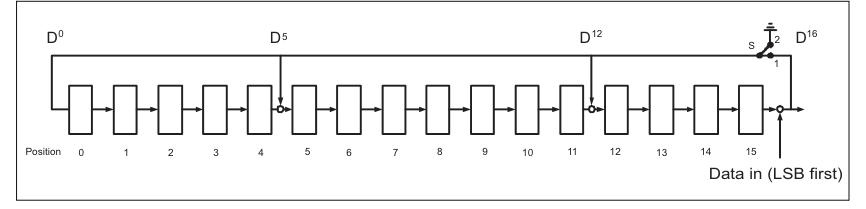

**Figure 5.1:  The LFSR Circuit Generating the CRC**

## 6  RELIABLE PACKETS

To allow the reliable transmission of packets through the transport, a method needs to be defined to recover from packet errors. The Host or Controller can detect a number of different errors in the packet.

### 6.1   HEADER CHECKSUM ERROR

The header of the packet is protected by a Packet Header Checksum. If the 2’s complement sum modulo 256 of the four octets of the header is not 0xFF, then the packet has an unrecoverable error and all information contained in the packet shall be discarded.

### 6.2   SLIP PAYLOAD LENGTH ERROR

The length of the SLIP packet shall be checked against the Packet Payload Length. If the Data Integrity Check Present bit is set to 1, then the SLIP packet length should be 6 + Packet Payload Length. If the Data Integrity Check Present bit is set to 0, then the SLIP packet length should be 4 + Packet Payload Length. If this check fails, then all information contained in the packet shall be discarded. The SLIP packet length is the length of the data received from the SLIP layer after the SLIP framing, and SLIP escape codes have been processed.

### 6.3   DATA INTEGRITY CHECK ERROR

The packet may have a Data Integrity Check at the end of the payload. This is controlled by the Data Integrity Check Present bit in the header. If this is set to 1, then the Data Integrity Check at the end of the payload is checked. If this is different from the value expected, then the packet shall be discarded. If the link is configured to not use data integrity checks, and a packet is received with the Data Integrity Check Present bit set to 1, then the packet shall be discarded.

### 6.4   OUT OF SEQUENCE PACKET ERROR

Each device keeps track of the sequence number it expects to receive next. This will be one more than the sequence number of the last successfully received reliable packet, modulo eight. If a reliable packet is received which has the expected sequence number, then this packet shall be accepted.
If a reliable packet is received which does not have the expected sequence number, then the packet shall be discarded.

### 6.5   ACKNOWLEDGMENT

Whenever a reliable packet is received, an acknowledgment shall be generated.
If a packet is available to be sent, the Acknowledgment Number of that packet shall be updated to the latest expected sequence number.
If a requirement to send an acknowledgment value is pending, but there are no other packets available to be sent, the device can send a pure Acknowledgment Packet. This is an Unreliable Packet, with the Packet Type set to 0, Payload Length set to 0, and the Sequence Number set to 0. The Acknowledge Number must be set correctly.
The maximum number of reliable packets that can be sent without acknowledgment defines the sliding window size of the link. This is configured during link establishment. See Sections 8.6, 8.7 and 8.8.

### 6.6   RESENDING PACKETS

A Reliable Packet shall be resent until it is acknowledged. Devices should refrain from resending packets too quickly to avoid saturating the link with retransmits. See Section 12.1.2.

### 6.7   EXAMPLE RELIABLE PACKET FLOW

Figure 6.1 shows the transmission of reliable packets between two devices. Device A sends a packet with a Sequence Number of 6, and an Acknowledgment Number of 3. Device B receives this packet correctly, so needs to generate an acknowledgment. Device B then sends a packet with Sequence Number 3 with its Acknowledgment Number set to the next expected packet Sequence Number from Device A of 7.

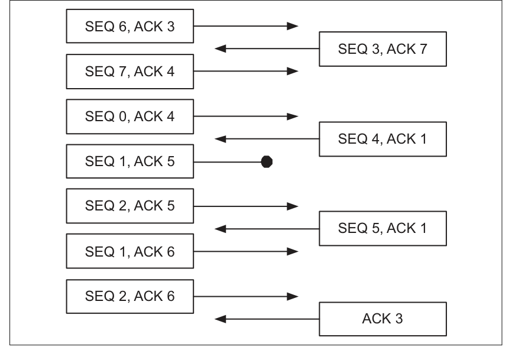

**Figure 6.1:  Message Diagram Showing Transmission of Reliable Packets**

Device A receives a packet with Sequence Number 3 and an Acknowledgment Number of 7. Device A was expecting this sequence number so needs to generate an acknowledgment. The Acknowledgment Number of 7 is one greater than the last Sequence Number that was sent, meaning that this packet was received correctly (see Section 6.6).
Device A sends two packets, Sequence Numbers 7 and 0. Both packets have the Acknowledgment Number of 4, the next sequence number it expects from Device B. Device B receives the first correctly, and increments its next expected sequence number to 0. It then receives the second packet correctly, and increments the next expected sequence number to 1.
Device B sends a packet with Sequence Number 4, and the Acknowledgment Number of 1. This will acknowledge both of the previous two packets sent by Device A.
Device A now sends two more packets, Sequence Numbers 1 and 2. Unfortunately, the first packet is corrupted. Device B receives the first packet, and discovers the error, so discards this packet (see Section 6.1, Section 6.2 or Section 6.3). It must generate an acknowledgment of this erroneously received reliable packet. Device B then receives the second packet. This is received out of sequence, as it is currently expecting Sequence Number 1, but has received Sequence Number 2 (see Section 6.4). Again, it must generate an acknowledgment.
Device B sends another packet with Sequence Number 5. It is still expecting a packet with Sequence Number 1 next, so the Acknowledgment Number is set to 1. Device A receives this, and accepts this packet.
Device A has not had either of its last two packets acknowledged, so it must resend them (see 6.6). It does this, but must update the Acknowledgment Number of the original packets that were sent (see Section 6.5). The Sequence Numbers of these packets must stay the same (see Section 4.1).
Device B receives these packets correctly, and schedules the sending of an acknowledgment. Because Device B doesn’t have any data packets that need to be sent, it sends a pure Acknowledgment Packet (see Section 6.5).

## 7  UNRELIABLE PACKETS

To allow the transmission of unreliable packets through the transport, the following method shall be used.

### 7.1   UNRELIABLE PACKET HEADER

An unreliable packet header always has the Reliable Packet bit set to 0. The sequence number shall be set to 0. The Data Integrity Check Present, Acknowledgment Number, Packet Type, Payload Length and Packet Header Checksum shall all be set the same as a Reliable Packet.

### 7.2   UNRELIABLE PACKET ERROR

If a packet that is marked as unreliable and the packet has an error, then the packet shall be discarded.

## 8  LINK ESTABLISHMENT

Before any packets except Link Control Packets can be sent, the Link Establishment procedure must be performed. This ensures that the sequence numbers are initialized correctly, it also ensures that the two sides are using the same baud rate, allow detection of peer reset, and allows the device to be configured.
Link Establishment is defined by a state machine with three states: Uninitialized, Initialized and Active. When the transport is first started, the link is in the Uninitialized State. There are four messages that are defined: SYNC, SYNC RESPONSE, CONFIG and CONFIG RESPONSE. All four link establishment messages shall be sent with the Data Integrity Present flag set to 0.

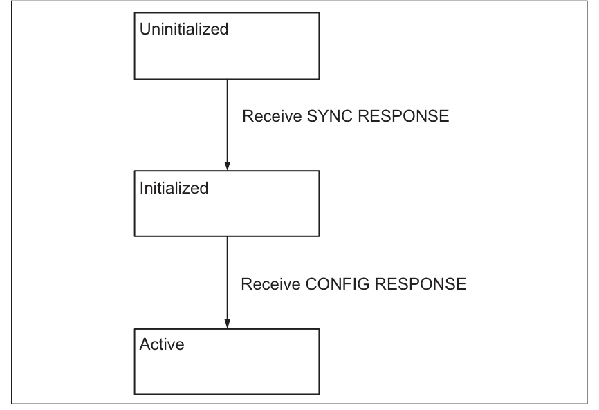

**Figure 8.1:  Link Establishment State Diagram**

### 8.1   UNINITIALIZED STATE

In the Uninitialized State a device periodically1 sends SYNC messages. If a SYNC message is received, the device shall respond with a SYNC RESPONSE message. If a SYNC RESPONSE message is received, the device shall move to the Initialized State. In the Uninitialized State only SYNC and SYNC RESPONSE messages are valid, all other messages that are received must be discarded. If an invalid packet is received, the device shall respond with a SYNC message. The device shall not send any acknowledgment packets in the Uninitialized State2.
In the Uninitialized State the Controller may wait until it receives a SYNC message before sending its first SYNC message. This allows the Host to control when the Controller starts to send data.
The SYNC message can be used for automatic baud rate detection. It is assumed that the Controller shall stay on a single baud rate, while the Host could hunt for the baud rate. Upon receipt of a SYNC RESPONSE message, the Host can assume that the correct baud rate has been detected.

### 8.2   INITIALIZED STATE

In the Initialized State a device periodically sends CONFIG messages. If a SYNC message is received, the device shall respond with a SYNC RESPONSE message. If a CONFIG message is received, the device shall respond with a CONFIG RESPONSE message. If a CONFIG RESPONSE message is received, the device will move to the Active State. All other messages that are received must be ignored.

### 8.3   ACTIVE STATE

In the Active State, a device can transfer higher layer packets through the transport. If a CONFIG message is received, the device shall respond with a CONFIG RESPONSE message. If a CONFIG RESONSE message is received, the device shall discard this message.
If a SYNC message is received while in the Active State, it is assumed that the peer device has reset. The local device should therefore perform a full reset of the upper stack, and start Link Establishment again at the Uninitialized State.
Upon entering the Active State, the first packet sent shall have its SEQ and ACK numbers set to zero.
1. During link establishment, various messages are sent periodically. It is suggested to send 4 messages per second. 2. Any packet that was erroneous would normally be acknowledged, as the recipient does not know if the packet was a reliable packet or not. The recipient cannot do this in the Uninitial- ized State, as it is possible to receive corrupt data while the Uninitialized state.

### 8.4   SYNC MESSAGE

The SYNC message is an unreliable message sent with the Packet Type of 15 and a Payload Length of 2.
The payload is composed of the octet pattern 0x01 0x7E1.

**Figure 8.2:  Sync Message Format**

### 8.5   SYNC RESPONSE MESSAGE

The SYNC RESPONSE message is an unreliable message sent with the Packet Type of 15 and a Payload Length of 2. The payload is composed of the octet pattern 0x02 0x7D.

**Figure 8.3:  Sync Response Message Format**

### 8.6   CONFIG MESSAGE

The CONFIG message is an unreliable message sent with the Packet Type of 15 and a Payload Length of 2 plus the size of the Configuration Field. The payload is composed of the octet pattern 0x03 0xFC and the Configuration Field.

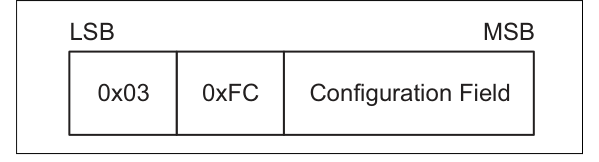

**Figure 8.4:  Configuration Message Format**

1. The second octet for all Link Control Packets equals the least significant 7 bits of the first octet, inverted, with the most significant bit set to ensure even parity.

### 8.7   CONFIG RESPONSE MESSAGE

The CONFIG RESPONSE message is an unreliable message sent with the Packet Type of 15 and a Payload Length of 2 plus the size of the Configuration Field. The payload is composed of the octet pattern 0x04 0x7B and the Configuration Field.

**Figure 8.5:  Configuration Response Message Format**

### 8.8   CONFIGURATION FIELD

The Configuration Field contains the Version Number, Sliding Window Size, the Data Integrity Check Type, and if Out Of Frame (OOF) Software Flow Control is allowed.
The Configuration Field in a CONFIG message sent by the Host determines what the Host can transmit and accept. The Configuration Field in a CONFIG RESPONSE message sent by the Controller determines what the Host and Controller shall transmit and can expect to receive.
The Controller sends CONFIG messages without a Configuration Field. The Host sends CONFIG RESPONSE messages without a Configuration Field.

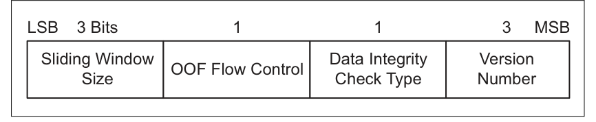

**Figure 8.6:  Configuration Field Detail**

To allow for future extension of the Configuration Field, the size of the message determines the number of significant Configuration Octets in the payload. Future versions of this specification may use extra octets. Any bits that are not included in the message shall be set to 0. Any bits that are not defined are reserved for future use.
A device shall not change the values if sends in the Configuration Field during Link Establishment.

#### 8.8.1  Configuration Messages

The CONFIG – CONFIG RESPONSE message sequence configures the link in both directions. Until a CONFIG RESPONSE message is received only unreliable Link Establishment messages may be sent. Once CONFIG RESPONSE message has been received all other packet types may be sent, and received messages passed up to the Host.
The CONFIG and CONFIG RESPONSE messages contain a set of options for both devices on the link. The Host sends a CONFIG message with the set of options that the Host would like to use. The Controller responds with a CONFIG RESPONSE message with the set of options that the Host and the Controller will use. This means that the Controller is in full control of the set of options that will be used for all messages sent by both the Host and Controller.

#### 8.8.2  Sliding Window Size

This is the maximum number of reliable packets a sender of the CONFIG message can send without requiring an acknowledgment. The value of this field shall be in the range one to seven. The value in the CONFIG RESPONSE message shall be less than or equal to the value in the CONFIG message. For example, the Host may suggest a window size of five in its CONFIG message and the Controller may respond with a value of three in its CONFIG RESPONSE message, but not six or seven. Both devices will then use a maximum sliding window size of three.

#### 8.8.3  Level of Data Integrity Check

The CONFIG message contains a bit field describing the types of Data Integrity Checks the sender is prepared to transmit. The peer will select the one it is prepared to use and send its choice in the CONFIG RESPONSE message.
If data integrity checks are not required, then the Data Integrity Check Present bit shall be set to 0 by the Host and Controller.

| Level of Data Integrity | Parameter Description for CONFIG Message |
| --- | --- |
| 0 | No Data Integrity Check is supported. |
| 1 | 16 bit CCITT-CRC may be used. |

Table 8.1:  Data Integrity Check Type in the CONFIG Message

| Level of Data Integrity | Parameter Description for CONFIG RESPONSE Message |
| --- | --- |
| 0 | No Data Integrity Check must be used. |
| 1 | 16 bit CCITT-CRC may be used. |

Table 8.2:  Data Integrity Check Type in the CONFIG RESPONSE Message

#### 8.8.4  Out of Frame Software Flow Control

By default, the transport uses no flow control except that mandated by the HCI Functional Specification and the flow control achieved by not acknowledging reliable Host messages. If Software Flow Control is to be used, this needs to be negotiated.
The CONFIG message specifies whether the sender of the CONFIG message is prepared to receive Out of Frame Software Flow Control messages. The CONFIG RESPONSE message specifies whether the peer can send Out of Frame Software Flow Control messages. The CONFIG RESPONSE message may have the field set to 1 only if the CONFIG message had it set to 1. (See Section 10.1)

#### 8.8.5  Version Number

The Version Number of this protocol shall determine which facilities are available to be used.
The CONFIG message specifies the Version Number supported by the Host. The CONFIG RESPONSE message specifies the Version Number that shall be used by the Host and Controller when sent by the Controller. The value in the CONFIG RESPONSE message shall be less than or equal to the value in the CONFIG message. The Version Numbers are enumerated in Table 8.3. This specification is version 1.0 (Version Number = 0).

| Version Number | Parameter Description for CONFIG and CONFIG RESPONSE Message |
| --- | --- |
| 0 | Version 1.0 of this Protocol |
| 1-7 | Reserved for future use |

Table 8.3:  Version Number in the CONFIG and CONFIG RESPONSE message

## 9  LOW POWER

After a device is in the Active State, either side of the transport link may wish to enter a low power state. Because recovery from a loss of synchronization is possible, it is allowable to stop listening for incoming packets at any time.
To make the system more responsive after a device has entered a low power state, a system of messages is employed to allow either side to notify the other that they are entering a low power state and to wake a device from that state. These messages are sent as Link Control Packets. It is optional for a device to support the Sleep message. The Wakeup and Woken messages are mandatory.

### 9.1   WAKEUP MESSAGE

The Wakeup message shall be the first message sent whenever the device believes that the other side is asleep. The device shall then repeatedly send the Wakeup message until the Woken message is received. There must be at least a one character gap between the sending of each Wakeup message to allow the UART to resynchronize. The Wakeup message is an unreliable message sent with a Packet Type of 15, and a Payload Length of 2. The payload is composed of the octet pattern 0x05 0xFA. The Wakeup message shall be used after a device has sent a Sleep message. It is mandatory to respond to the Wakeup message.

**Figure 9.1:  Wakeup Message Payload Format**

### 9.2   WOKEN MESSAGE

The Woken message shall be sent whenever a Wakeup message is received even if the receiver is currently not asleep. Upon receiving a Woken message, a device can determine that the other device is not in a low power state and can send and receive data. The Woken message is an unreliable message sent with a Packet Type of 15, and a Payload Length of 2. The payload is composed of the octet pattern 0x06 0xF9.

**Figure 9.2:  Woken Message Payload Format**

### 9.3   SLEEP MESSAGE

A Sleep message can be sent at any time after Link Establishment has finished. It notifies the other side that this device is going into a low power state, and that it may also go to sleep. If a device sends a Sleep message it shall use the Wakeup / Woken message sequence before sending any data. If a device receives a Sleep message, then it should use the Wakeup / Woken message sequence before sending any data. The Sleep message is an unreliable message sent with a Packet Type of 15, and a Payload Length of 2. The payload is composed of the octet pattern 0x07 0x78.
The sending of this message is optional. The receiver of this message need not go to sleep, but cooperating devices may be able to schedule sleeping more effectively with this message.

**Figure 9.3:  Sleep Message Payload Format**

## 10  OUT OF FRAME CONTROL

It is possible to embed information in the SLIP data stream after a SLIP ESCAPE character that can allow for Software Flow Control. This feature is optional and must be negotiated in the Link Establishment configuration messages.

### 10.1   SOFTWARE FLOW CONTROL

If Software Flow Control is enabled, then the standard XON / XOFF (0x11 and 0x13) characters will control the flow of data over the transport. To allow the XON / XOFF characters to be sent in the payload, they shall be escaped as follows: 0x11 shall be changed to 0xDB 0xDE, 0x13 shall be changed to 0xDB DF. This means that the XON / XOFF characters in the data stream are used only by software flow control.
If Software Flow Control is disabled, then the SLIP escape sequences 0xDB 0xDE and 0xDB 0xDF are undefined. In this case, the original octets of 0x11 and 0x13 shall not be changed. Flow control should always be provided by the tunneled protocols, e.g. HCI Flow Control. Flow control is still available using the standard Sequence Number / Acknowledge Number. This can be done by not acknowledging packets until traffic can resume.

## 11  HARDWARE CONFIGURATION

The HCI Three-Wire UART Transport uses the following configurations.

### 11.1   WIRES

There are three wires used by the HCI Three-Wire UART Transport. These are Transmit, Receive, and Ground.

#### 11.1.1  Transmit & Receive

The transmit line from one device shall be connected to the receive line of the other device.

#### 11.1.2  Ground

A common ground reference shall be used.

### 11.2   HARDWARE FLOW

Hardware flow control may be used. The signaling shall be the same as a standard RS232 flow control lines. If used, the signals shall be connected in a null-modem fashion; for example, the local RTS shall be connected to the remote CTS and vice versa.

#### 11.2.1  RTS & CTS

Request to Send indicates to the remote side that the local device is able to accept more data.
Clear to Send indicates if the remote side is able to receive data.
(See ITU.T recommendations V.24 [2] and V.28 [3])

## 12  RECOMMENDED PARAMETERS

### 12.1   TIMING PARAMETERS

Because this transport protocol can be used with a wide variety of baud rates, it is not possible to specify a single timing value. However, it is possible to specify the time based on the baud rate in use. If Tmax is defined as the maximum time in seconds it will take to transmit the largest packet over this transport, Tmax can be expressed as:
Tmax = maximum size of a packet in bits / baud rate
The maximum size of a packet in bits is either the number of bits in a 4095 octet packet (32,760) or less if required in an embedded system or as determined by the Host or Controller1. Thus, at a baud rate of 921,600 and the maximum packet size of 4095 octets, Tmax is: (4095*10) / 921,600 = 44.434ms.

#### 12.1.1  Acknowledgment of Packets

It is not necessary to acknowledge every packet with a pure acknowledgment packet if there is a data packet that will be sent soon. The recommended maximum time before starting to send an acknowledgment is 2 * Tmax.

#### 12.1.2  Resending Reliable Packets

A reliable packet must be resent until it is acknowledged. The recommended time between starting to send the same packet is 3 * Tmax.
1. This can be determined using the HCI_Read_Buffer_Size command.

## 13  REFERENCES

[1] [IETF RFC 1055: Nonstandard for transmission of IP datagrams over serial lines: SLIP – http://www.ietf.org/rfc/rfc1055.txt
[2] ITU Recommendation V.24: List of definitions for interchange circuits between data terminal equipment (DTE) and data circuit-terminating equipment (DCE) – http://www.itu.int/rec/recommendation.asp
[3] ITU Recommendation V.28: Electrical characteristics for unbalanced double-current interchange circuits – http://www.itu.int/rec/ recommendation.asp
Core System Package
[AMP Controller volume]
Specification of the Bluetooth  System
®
Specification Volume 5
Covered Core Package Version: 5.0 Publication Date: Dec 06 2016
Revision History
The Revision History is shown in the [Vol 0] Part C, Appendix.
Contributors
The persons who contributed to this specification are listed in the [Vol 0] Part C, Appendix.
Web Site
This specification can also be found on the official Bluetooth web site: https://www.bluetooth.org/en-us/specification/adopted-specifications
Disclaimer and Copyright Notice
Use of this specification is your acknowledgement that you agree to and will comply with the following notices and disclaimers. You are advised to seek appropriate legal, engineering, and other professional advice regarding the use, interpretation, and effect of this specification.
Use of Bluetooth specifications by members of Bluetooth SIG is governed by the membership and other related agreements between Bluetooth SIG and its members, including those agreements posted on Bluetooth SIG’s website located at www.bluetooth.com. Any use of this specification by a member that is not in compliance with the applicable membership and other related agreements is prohibited and, among other things, may result in (i) termination of the applicable agreements and (ii) liability for infringement of the intellectual property rights of Bluetooth SIG and its members.
Use of this specification by anyone who is not a member of Bluetooth SIG is prohibited and is an infringement of the intellectual property rights of Bluetooth SIG and its members. The furnishing of this specification does not grant any license to any intellectual property of Bluetooth SIG or its members. THIS SPECIFICATION IS PROVIDED “AS IS” AND BLUETOOTH SIG, ITS MEMBERS AND THEIR AFFILIATES MAKE NO REPRESENTATIONS OR WARRANTIES AND DISCLAIM ALL WARRANTIES, EXPRESS OR IMPLIED, INCLUDING ANY WARRANTIES OF MERCHANTABILITY, TITLE, NON-INFRINGEMENT, FITNESS FOR ANY PARTICULAR PURPOSE, OR THAT THE CONTENT OF THIS SPECIFICATION IS FREE OF ERRORS. For the avoidance of doubt, Bluetooth SIG has not made any search or investigation as to third parties that may claim rights in or to any specifications or any intellectual property that may be required to implement any specifications and it disclaims any obligation or duty to do so.
TO THE MAXIMUM EXTENT PERMITTED BY APPLICABLE LAW, BLUETOOTH SIG, ITS MEMBERS AND THEIR AFFILIATES DISCLAIM ALL LIABILITY ARISING OUT OF OR RELATING TO USE OF THIS SPECIFICATION AND ANY INFORMATION CONTAINED IN THIS SPECIFICATION, INCLUDING LOST REVENUE, PROFITS, DATA OR PROGRAMS, OR BUSINESS INTERRUPTION, OR FOR SPECIAL, INDIRECT, CONSEQUENTIAL, INCIDENTAL OR PUNITIVE DAMAGES, HOWEVER CAUSED AND REGARDLESS OF THE THEORY OF LIABILITY, AND EVEN IF BLUETOOTH SIG, ITS MEMBERS OR THEIR AFFILIATES HAVE BEEN ADVISED OF THE POSSIBILITY OF THE DAMAGES.
If this specification is a prototyping specification, it is solely for the purpose of developing and using prototypes to verify the prototyping specifications at Bluetooth SIG sponsored IOP events. Prototyping Specifications cannot be used to develop products for sale or distribution and prototypes cannot be qualified for distribution.
Products equipped with Bluetooth wireless technology ("Bluetooth Products") and their combination, operation, use, implementation, and distribution may be subject to regulatory controls under the laws and regulations of numerous countries that regulate products that use wireless non-licensed spectrum. Examples include airline regulations, telecommunications regulations, technology transfer controls and health and safety regulations. You are solely responsible for complying with all applicable laws and regulations and for obtaining any and all required authorizations, permits, or licenses in connection with your use of this specification and development, manufacture, and distribution of Bluetooth Products. Nothing in this specification provides any information or assistance in connection with complying with applicable laws or regulations or obtaining required authorizations, permits, or licenses.
Bluetooth SIG is not required to adopt any specification or portion thereof. If this specification is not the final version adopted by Bluetooth SIG’s Board of Directors, it may not be adopted. Any specification adopted by Bluetooth SIG’s Board of Directors may be withdrawn, replaced, or modified at any time. Bluetooth SIG reserves the right to change or alter final specifications in accordance with its membership and operating agreements.
Copyright © 1999 - 2016. The Bluetooth word mark and logos are owned by Bluetooth SIG, Inc. All copyrights in the Bluetooth Specifications themselves are owned by Ericsson AB, Lenovo (Singapore) Pte. Ltd., Intel Corporation, Microsoft Corporation, Nokia Corporation, Toshiba Corporation and Apple, Inc. Other third-party brands and names are the property of their respective owners.
Core System Package [AMP Controller volume]
Part A
PART A: 802.11 PROTOCOL ADAPTATION LAYER FUNCTIONAL SPECIFICATION
This document specifies the Protocol Adaptation Layer for the IEEE 802.11 conformant Alternate MAC/PHY.
CONTENTS

## 1  INTRODUCTION

This Part of the Bluetooth Core Specification describes the operation of the Protocol Adaptation Layer (PAL) for a Controller incorporating an 802.11 device compliant with the 2007 edition of the IEEE 802.11 Standard (see [1]) including support for High Throughput (HT) MAC and PHY extensions. In this Part, specific references in [1] will be given by clause number.
The 802.11 PAL defines the protocol state machines, data encapsulation methods, event triggers, and data structures in support of the use of an 802.11 AMP.

### 1.1   ORGANIZATION OF THE 802.11 PAL

To aid understanding of functional descriptions, Figure 1.1 shows the organization of the 802.11 PAL. This structure is informative.

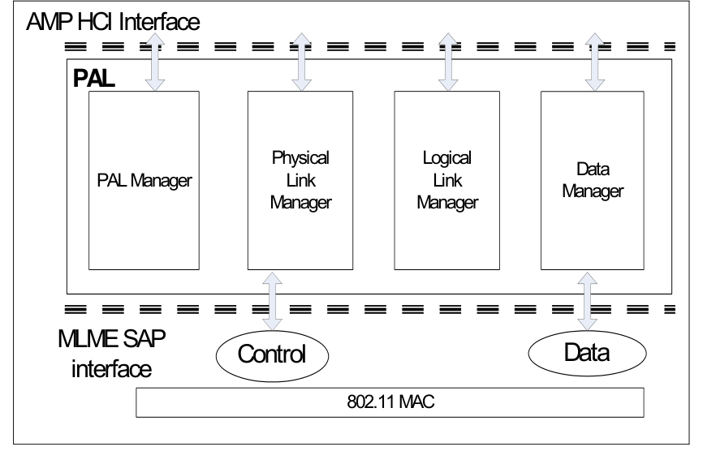

**Figure 1.1:  Internal structure of the 802.11 PAL**

The upper edge of the 802.11 PAL provides a single instance of the logical HCI with AMP functionality. The behavior of the PAL is defined at this interface in terms of logical HCI operations. Implementations may optionally use a physical HCI transport.
For clarity of description, the lower edge of the PAL uses services including those defined in [1] clause 10.3.
The PAL Manager implements operations that are global to the PAL. This includes responding to Host requests for AMP info and PAL version as well as performing PAL reset.
The Physical Link Manager implements operations on physical links. Physical link semantics are defined in Section 3. Supported operations include physical link creation and acceptance, and deletion of physical links. Supported operations at the MAC interface include PHY channel selection and security establishment and maintenance.
The Logical Link Manager implements operations on logical links. Logical link semantics are defined in Section 4. Each logical link exists with respect to a single physical link. Supported operations include creation and deletion of logical links and changes to QoS parameters for those logical links. At the MAC interface this includes the mapping of extended flow specifications to user priorities.
The Data Manager performs operations on data packets and is described in Section 5. Each data packet is associated with exactly one extended flow specification and therefore exactly one logical link. Supported operations include transmit, receive and buffer management operations such as flush events. At the MAC interface this includes interactions with the MAC transmit and receive operations and determination of the next packet to send on any particular link.

## 2  AMP HOST CONTROLLER INTERFACE

A number of elements used in HCI commands and events are defined to be AMP-type specific. This section describes the values to be used for the 802.11 PAL.
Octet ordering conventions for parameters and fields in this section shall be as defined in HCI, [Vol 2] Part E, Section 5.2.

### 2.1   READ LOCAL VERSION INFORMATION COMMAND

Two return parameter values from this HCI command are defined to be AMP- type specific. For the 802.11 PAL they shall be as follows.
PAL _Version Size: 1 Octet

| Value | Parameter Description |
| --- | --- |
| 0xXX | Version of the current PAL in the Controller. See Bluetooth Assigned Numbers. |

PAL_Sub-version: Size: 2 Octets

| Value | Parameter Description |
| --- | --- |
| 0xXXXX | In an 802.11 PAL this value is vendor specific. |

### 2.2   READ LOCAL AMP INFO COMMAND

See [Vol 2] Part E, Section 7.5.7.
There are six return parameters for the Read Local AMP Info command which are 802.11 AMP specific.
Total_Bandwidth: Size: 4 Octets

| Value | Parameter Description |
| --- | --- |
| 0xXXXXXXXX | An upper bound on the total data rate that can be achieved by the AMP fo applications. It accounts for the total bandwidth provided by the HCI tran port. No sustained combination of transmit and receive operations shall exceed this value. This may be used to help in AMP selection and admis sion control. Expressed in kb/s. For testing purposes, the achievable throughput deliverable to applica- tions by an ERP or OFDM PHY shall be assumed to be no more than 30000 kb/s and for the HT PHY shall be assumed to be no more than 50000 kb/s. |

Max_Guaranteed_Bandwidth: Size: 4 Octets

| Value | Parameter Description |
| --- | --- |
| 0xXXXXXXXX | An upper bound on the maximum data rate as seen by the application tha the AMP can guarantee for a logical channel. Any request made by an application above this level would be rejected. It accounts for any band- width limitations of the HCI transport. No sustained combination of trans- mit and receive operations shall exceed this value. This can be used to help in AMP selection and admission control. Expressed in kb/s. The Max Guaranteed Bandwidth parameter value returned shall be no _ _ greater than the Total Bandwidth parameter. This value is not a guarante _ of bandwidth and should be interpreted as an upper bound on the sum o the bandwidths of all active flow specs. |

Min_Latency: Size: 4 Octets

| Value | Parameter Description |
| --- | --- |
| 0xXXXXXXXX | The Min Latency parameter value is the practical lower bound on the se _ vice latency that can be provided by the 802.11 AMP. The lower bound o the service latency is the time from when a frame is issued to the AMP HCI until the MAC starts transmitting the frame with no contention windo back off. This shall be equal to the AMP HCI minimum latency + DIFS + CWmin where the DIFS and CWmin are as given in [1] clause 9.2.10. |

Max_PDU_Size: Size: 4 Octets

| Value | Parameter Description |
| --- | --- |
|  | An upper bound on the size of L2CAP PDU which may be provided for transmission or reception on this AMP. The Host shall not require the AM to transport L2CAP PDUs larger than this value. Expressed in octets. Th Maximum PDU Size parameter described in [[Vol 3] Part A, Section 5.4] for any connection over this AMP should not exceed this value. The Max PDU Size parameter returned shall be Max80211PALPDUSize _ _ |

Controller_Type: Size: 1 Octet

| Value | Parameter Description |
| --- | --- |
| 0x01 | 802.11 AMP |

PAL_Capabilities: Size: 2 Octets

| Value | Parameter Description |
| --- | --- |
| 0xXXXX | Bit 0: "Service Type = Guaranteed" is not supported by PAL = 0 "Service Type = Guaranteed" is supported by PAL = 1 Bits 15-1: Reserved (See L2CAP, [Vol 3] Part A, Section 5.6) |

Bit 0 of the PAL_Capabilities parameter shall be set to 1 if the local 802.11 AMP device is capable of using the Enhanced Distributed Channel Access (EDCA) mechanisms (see [1] clause 9.9.1), otherwise it shall be set to 0.
AMP_ASSOC_Length: Size: 2 Octets

| Value | Parameter Description |
| --- | --- |
| 0xXXXX | AMP ASSOC maximum length for this AMP Controller. _ |

The 802.11 PAL shall set this to Max80211AMPASSOCLen.
Max_Flush_Timeout: Size: 4 Octets

| Value | Parameter Description |
| --- | --- |
| 0xXXXXXXXX | Maximum time period, in microseconds, which the AMP device may use t attempt to transmit a frame on a guaranteed logical link. This value is the sum of the durations of all 802.11 transmission attempts for a given frame It should be chosen with the expectation that the 802.11 MAC may be denied access to the medium for a given transmission attempt. This may be due to interference from collocated radios, or otherwise. If the Controller is configured to retry frames for an unbounded time (ther is no flushing at all), then the PAL shall set this value to 0xFFFFFFFF. |

Best_Effort_Flush_Timeout: Size: 4 Octets

| Value | Parameter Description |
| --- | --- |
| 0xXXXXXXXX | The typical time period, in microseconds, which the AMP device may use to attempt to transmit a frame on a best effort logical link. This value is th sum of the duration of all 802.11 transmission attempts for a given frame It should be chosen with the expectation that the 802.11 MAC is usually able to access the medium for each attempt. The value shall not exceed the value given in Max Flush Timeout. _ _ If the Controller is configured to retry frames for an unbounded time (i.e. there is no flushing at all), then the PAL shall set this value to 0xFFFFFFFF. |

### 2.3   RESET COMMAND

See [Vol 2] Part E, Section 7.3.2.
In addition to setting the HCI parameters to their default values, when the 802.11 PAL receives an AMP HCI_Reset command it shall delete all existing AMP physical links. Note: Non AMP links should not be deleted.

### 2.4   READ FAILED CONTACT COUNTER COMMAND

When the 802.11 PAL receives an HCI Read_Failed_Contact_Counter command it shall return the number of consecutive incidents in which the remote device didn't respond after the flush timeout had expired, and the L2CAP packet that was currently being transmitted was automatically flushed. The Failed Contact Counter is specific to each logical link.

### 2.5   READ LINK QUALITY COMMAND

See [Vol 2] Part E, Section 7.5.3.
The meaning of the Link_Quality parameter in the Read Link Quality command is as shown below.
Link_Quality: Size: 1 Octet

| Value | Parameter Description |
| --- | --- |
| 0xXX | In an 802.11 AMP this unsigned 8-bit value shall be the Link Quality Indi cator value. It shall be 0 if the Link Quality Indicator value is not availabl Range: 0x00 ≤ N ≤ 0xFF |

### 2.6   READ RSSI COMMAND

See [Vol 2] Part E, Section 7.5.4.
The meaning of the RSSI parameter in the Read RSSI command is as shown below.
RSSI: Size: 1 Octet

| Value | Parameter Description |
| --- | --- |
| 0xXX | This value is a signed 8-bit value, and is interpreted as an indication of arriving signal strength at the antenna measured in dBm. The value shall be 0x81 (-127 dBm) if the signal strength indication is no available. |

### 2.7   SHORT RANGE MODE COMMAND

When the Host determines that the AMP peers may have insufficient separation to obtain full AMP throughput, it may enable Short Range Mode in the PAL. The Short Range Mode command may be used by the Host to indicate to the PAL whether or not to operate in Short Range Mode.
When in Short Range Mode, the PAL shall limit to ShortRangeModePowerMax the transmit power in dBm (measured at the antenna) for all 802.11 AMP ERP- OFDM frames transmitted by the device on the given physical link, as necessary to prevent exceeding the maximum input signal level of the peer. If the Host does not enable Short Range Mode or if the Host sets Short Range Mode to disabled, the PAL shall assume it may set the maximum transmit power for the link as it deems appropriate, respecting regulatory limits. If the AMP device is not able to limit its transmit power due to other existing connections then it may use a transmit power greater than ShortRangeModePowerMax in order to preserve those connections.
The meaning of the Short Range Mode parameter of the HCI_Short_Range_Mode command is as follows:
Short Range Mode: Size: 1 Octet

| Value | Parameter Description |
| --- | --- |
| 0xXX | 0x00–Short range mode shall be disabled in the PAL (default) 0x01–Short range mode shall be enabled in the PAL. 0x02...0xFF - Reserved for future use |

When the AMP Controller receives the Short_Range_Mode command, it shall indicate a Command Status event. Later, after the MAC programming is completed, the Controller shall generate a Short_Range_Mode_Change_Completed event. See Section 2.13.

### 2.8   WRITE BEST EFFORT FLUSH TIMEOUT COMMAND

Best_Effort_Flush_Timeout: Size: 4 Octets

| Value | Parameter Description |
| --- | --- |
| 0xXXXXXXXX | 0x00000000–0xFFFFFFFE: Best Effort Flush Timeout value in microsec onds. 0xFFFFFFFF: No Best Effort Flush Timeout used (default) |

### 2.9   READ BEST EFFORT FLUSH TIMEOUT COMMAND

Best_Effort_Flush_Timeout: Size: 4 Octets

| Value | Parameter Description |
| --- | --- |
| 0xXXXXXXXX | 0x00000000–0xFFFFFFFE: Best Effort Flush Timeout value in microsec onds. 0xFFFFFFFF: No Best Effort Flush Timeout used (default) |

### 2.10   PHYSICAL LINK LOSS EARLY WARNING EVENT

Implementation of this event is not required for 802.11 AMPs.

### 2.11   PHYSICAL LINK RECOVERY EVENT

Implementation of this event is not required for 802.11 AMPs.

### 2.12   CHANNEL SELECTED EVENT

See [Vol 2] Part E, Section 7.7.52.
When an HCI Channel Selected event is indicated by the PAL with successful status, it signifies the local 802.11 MAC has been configured to start operating on the selected channel.
Subsequent to the HCI Channel Selected event, the initiating AMP device shall create an AMP_ASSOC containing its MAC address TLV, and with only the selected channel in its PCL and/or PCLv2 TLV (see sections 2.14.4 and 2.14.7). Other TLVs may optionally be included. The Host may obtain this AMP_ASSOC by issuing one or more HCI_Read_Local_AMP_ASSOC commands.

### 2.13   SHORT RANGE MODE CHANGE COMPLETE EVENT

See [Vol 2] Part E, Section 7.7.60.
After the PAL is notified of a change of state in Short Range Mode, it shall program the 802.11 device accordingly, unless the exceptions in Section 2.7 are in effect. When it has finished making such changes to the MAC configuration, or if the PAL has changed the state of the Short Range Mode autonomously, the PAL shall indicate this to the Host by indicating the Short Range Mode Change Complete event. The Short_Range_State parameter identifies the new configuration to the Host.

### 2.14   DATA STRUCTURES

#### 2.14.1  AMP_ASSOC Structure

The AMP_ASSOC is an AMP type specific structure and appears in various HCI commands and events. The AMP_ASSOC structure used by the 802.11 PAL shall be composed of Type-Length-Value (TLV) triplets.
The general format of such a TLV, shown in Table 2.1, shall be a one-octet TypeID field, a two-octet Length field, and a variable length Value field. The length of the Value field in octets shall be exactly equal to the unsigned number represented by the Length field. A TLV with zero in its Length field shall contain no Value field. If an implementation does not have support for a triplet in a received AMP_ASSOC, it shall ignore the triplet and continue processing any remaining triplets.
The Length field is 2 octets in length and shall be ordered in the AMP_ASSOC according to [Vol 2] Part B, Section 6.2. The Value field shall be interpreted as a stream of octets.
The TypeID of 0xFF shall be reserved for use in debugging.

| TypeID | Length | Value |
| --- | --- | --- |
| 1 octet | 2 octets | Variable number of octets |

Table 2.1:  TLV format
The set of defined TypeIDs is given in Table 2.2.

| TypeID codepoint | Description | AMP ASSOC inclusion _ |
| --- | --- | --- |
| 0x00 | Reserved for future use | not applicable |
| 0x01 | MAC Address | Mandatory |
| 0x02 | Preferred Channel List | Mandatory for Responder; Manda- tory for Initiator if last HCI Write Remote AMP Assoc command did not include a PCLv2 (typeID 0x06), else Optional |
| 0x03 | Connected Channel List | Optional |
| 0x04 | 802.11 PAL Capabilities List | Optional |
| 0x05 | 802.11 PAL version | Mandatory |
| 0x06 | Preferred Channel List v2 | Optional if PCL (typeID 0x02) is included in AMP Assoc. else Man- _ datory |
| 0x07 - 0xFE | Reserved for future use | not applicable |

Table 2.2:  Requirements on contents of AMP_Assoc messages

| TypeID codepoint | Description | AMP ASSOC inclusion _ |
| --- | --- | --- |
| 0xFF | Reserved for use in debugging | not applicable |

Table 2.2:  Requirements on contents of AMP_Assoc messages

#### 2.14.2  MAC Address

The PAL shall use the following TLV to report the IEEE MAC address of its local 802.11 MAC. The bit ordering of the address is given in [1] clause 7.1.1.
MAC_Address_TypeID: Size: 1 Octet

| Value | Parameter Description |
| --- | --- |
| 0x01 | MAC Address TypeID |

MAC_Address_Length: Size: 2 Octets

| Value | Parameter Description |
| --- | --- |
| 0x0006 | MAC Address Length |

MAC_Address_Specifier: Size: 6 Octets

| Value | Parameter Description |
| --- | --- |
| 0xXXXXXXXXXXXX | MAC Address specifier |

#### 2.14.3  802.11 PAL Capabilities

The 802.11 PAL Capabilities is a bit field of supported capabilities of the sending device.
802.11_PAL_Capabilities_TypeID: Size: 1 Octet

| Value | Parameter Description |
| --- | --- |
| 0x04 | 802.11 PAL Capabilities TypeID |

802.11_PAL_Capabilities_Length: Size: 2 Octets

| Value | Parameter Description |
| --- | --- |
| 0x0004 | 802.11 PAL Capabilities Length |

802.11_PAL_Capabilities_Specifier: Size: 4 Octets

| Bit format | Parameter Description |
| --- | --- |
| Bit 0 | When set, signifies PAL capable of utilizing received Activity Reports |
| Bit 1 | When set, signifies PAL is capable of utilizing scheduling information received in an Activity Report |

| Bit format | Parameter Description |
| --- | --- |
| Bit 2 | When set, signifies 802.11 MAC and PHY is compliant with HT operation as specified in [1]. |
| Bits 3..31 | Reserved for future use |

The 802.11 PAL Capabilities TLV is optional to include in the AMP_ASSOC. If an 802.11 PAL Capabilities TLV does not appear in an AMP_ASSOC, then the receiver shall interpret this as receiving an 802.11 PAL Capabilities TLV with a Value field containing the default value of all zeros.

#### 2.14.4  Preferred Channel List

The Preferred Channel List (PCL) is a set of channels supported and usable by the sending device. The receiver of the PCL shall interpret the contents of the list with the assumption that the list is arranged in order of most preferred channel to least preferred channel. The format of the list is identical to the 802.11 Country information element, excluding the 802.11 information, element identifier, length, and pad fields. See [1] clause 7.3.2.9.
Preferred_Channel_List_TypeID: Size: 1 Octet

| Value | Parameter Description |
| --- | --- |
| 0x02 | Preferred Channel List TypeID |

Preferred_Channel_List_Length: Size: 2 Octets

| Value | Parameter Description |
| --- | --- |
| 0xXXXX | Length of Preferred Channel List |

Preferred_Channel_List_Specifier: Size: Variable

| Value | Parameter Description |
| --- | --- |
| 0xXX..XX | List of preferred 802.11 channels. See Section 3.2.3 for details. |

The channels are described by table entries in [1], Annex J, tables J-1, J-2, and J-3. For backward compatibility, the Preferred Channel List Specifier shall use table indices in the inclusive range [1-12] to describe US channels, [1-4] to describe EU country channels, and [1-32] to describe Japan channels.

#### 2.14.5  Connected Channel List

The Connected Channel List (CCL) specifies the channels which may currently be in use by the sending device. If multiple channels are listed, the ordering gives no implied preference. The format of the list is the same as the  PCL, see section 2.14.4.
The Connected Channel TLV is optional to include in the AMP_ASSOC. If it is not included, then the receiver shall assume there are no channels which are currently in use by the sending device.
Connected_Channel_List_TypeID: Size: 1 Octet

| Value | Parameter Description |
| --- | --- |
| 0x03 | Connected Channel List TypeID |

Connected_Channel_List_Length: Size: 2 Octets

| Value | Parameter Description |
| --- | --- |
| 0xXXXX | Length of Connected Channel List |

Connected_Channel_List_Specifier: Size: Variable

| Value | Parameter Description |
| --- | --- |
| 0xXXXXXXXX | List of 802.11 channels currently in use by the sending device. See Sec- tion 3.2.3 for details. |

For backward compatibility, the Connected Channel List Specifier shall use table indices in the inclusive range [1-12] to describe US channels, [1-4] to describe EU country channels, and [1-32] to describe Japan channels.

#### 2.14.6  802.11 PAL Version

An AMP endpoint may need to discover the version of the remote PAL. The information in the 802.11 PAL Version TLV shall be composed of the PAL_Version from the HCI_Read_Local_Version_Information command, the Bluetooth SIG Company Identifier (see Assigned Numbers, [4]) for the provider of the PAL, and the PAL_Sub-version from the HCI_Read_Local_Version_Information command. The Company Identifier and PAL Sub-version parameters shall use the octet ordering as given in [Vol 2] Part B, Section 6.2.
802.11_PAL_Version_TypeID: Size: 1 Octet

| Value | Parameter Description |
| --- | --- |
| 0x05 | 802.11 PAL Version TypeID |

802.11_PAL_Version_Length: Size: 2 Octets

| Value | Parameter Description |
| --- | --- |
| 0x0005 | Length of 802.11 PAL Version specifier |

802.11_PAL_Version_Specifier: Size: 1 Octet

| Value | Parameter Description |
| --- | --- |
| 0xXX | PAL Version |

802.11_PAL_Company_Identifier: Size: 2 Octets

| Value | Parameter Description |
| --- | --- |
| 0xXXXX | SIG Company identifier of 802.11 PAL vendor |

802.11_PAL_Sub_Version: Size: 2 Octets

| Value | Parameter Description |
| --- | --- |
| 0xXXXX | PAL Sub-version specifier |

#### 2.14.7  Preferred Channel List v2

The Preferred Channel List v2 (PCLv2) TLV specifies the channels supported and usable by the sending device. The format of the list is identical to the 802.11 Country information element syntax, excluding the 802.11 infor-mation element identifier, length, country string and pad fields. See [1] clause 7.3.2.9. The receiver of a PCLv2 TLV shall interpret the contents of the list with the assumption that the list is arranged in order of most preferred channel to least preferred channel.
The PCLv2 may include channels with 20 MHz width, 40 MHz width, or both. Channels are expressed as triplets of two types: the operating type contains a table index from Table 3.8 below, and the sub-band type contains a channel range. The PCLv2 shall contain at least one operating triplet. Country strings are not used in the PCLv2, so the operating triplet appears directly following the TLV length field. Sub-band triplets may be used to refine the list of chan- nels expressed by the preceding operating triplet.
If a PCLv2 TLV is not included in the AMP Get AMP Assoc Request message from a responder, then the initiating PAL shall not assume that the responder has the ability to interpret PCLv2 TLVs. In this case the initiator shall include a PCL in the AMP_Assoc in the AMP Create Physical Link Request, and the PCLv2 TLV is optional. If an implementation supports PCLv2 TLVs and if it receives a PCLv2 from its peer, then it shall ignore any PCL it receives.
Preferred_Channel_Listv2_TypeID: Size: 1 Octet

| Value | Parameter Description |
| --- | --- |
| 0x06 | Preferred Channel List v2 TypeID |

Preferred_Channel_Listv2_Length: Size: 2 Octets

| Value | Parameter Description |
| --- | --- |
| 0xXXXX | Length of Preferred Channel Listv2. |

Preferred_Channel_Listv2_Specifier: Size: Variable

| Value | Parameter Description |
| --- | --- |
| 0xXXXXXXXX | List of preferred channels, including 40 MHz channels if supported. See Section 3.2.3 for details. |

### 2.15   CONNECTION ACCEPT TIMEOUT CONFIGURATION PARAMETER

See [Vol 2] Part E, Section 6.7.
The default value of the Connection Accept Timeout used by the 802.11 PAL shall be 5 seconds.

### 2.16   ENABLE DEVICE UNDER TEST MODE

If the device under test supports 40 MHz channels, the HCI_Enable_Device_Under_Test_Mode command (see [Vol 2] Part E, Section 7.6.3) change the state of the PAL so that it will always utilize 40 MHz channel widths for connections if 40 MHz operation is supported by the AMP peer.
When an HCI_Read_Local_AMP_Assoc is issued following this command, the AMP ASSOC which is returned shall include at least one channel which is 40 MHz in width in the PCLv2 (see above). When an HCI_Write_Remote_AMP_ASSOC is issued following this command, and if the AMP ASSOC included in that Write_Remote_AMP_ASSOC command contains 40 MHz channels, then the selected channel shall be a 40 MHz channel.
When the Host issues the HCI_Enable_Device_Under_Test_Mode command, the PAL shall advertise or choose 40 MHz channels, depending on its role. When serving as the Initiator, the PAL shall choose one of the 40 MHz channels offered by the Responder. When serving as the Responder, the PAL shall offer at least one 40 MHz channel in its PCLv2.
The described effect of the HCI_Enable_Device_Under_Test_Mode is removed when the Host issues an HCI_Reset command.

## 3  PHYSICAL LINK MANAGER

A physical link joins an initiating device and a responding device. The initiating device is the device on which the HCI_Create_Physical_Link command was issued. The responding device is the one on which the HCI_Accept_Physical_Link command was issued. Physical link creation collisions are resolved at a higher level, by the AMP Manager.
Support for the 802.11 ERP (see clause 19 of [1]) shall be mandatory for 802.11 AMP devices, but other PHY types may be supported. Channels 1 (2412 MHz) through 11 (2462 MHz) shall be supported for interoperability.
A physical link represents a transport between a single local 802.11 AMP device and a single remote device with a matching 802.11 AMP. The AMP may support multiple physical links (representing different remote devices) at one time. There is a unique binding between the 802.11 MAC addresses of the devices and the physical link.
For a physical link to exist in the CONNECTED state the two devices must have established a PTKSA as described in [1] clause 8.4.1.

### 3.1   PHYSICAL LINK STATE MACHINE

#### 3.1.1  General rules

The behavior of the PAL with respect to physical links is described in terms of a finite state machine. The state machine describes the behavior of the PAL for an individual physical link; extension to multiple physical links is outside the scope of this document. The sequence of external stimulus and behavior at the logical HCI shall be as though this state machine is present in the implementation. Similarly, the sequence of stimulus and behavior at the 802.11 radio interface shall be as though this state machine is present in the implementation.

#### 3.1.2  State Diagram

The possible state events and transitions are summarized in this diagram. The diagram itself is Informative.

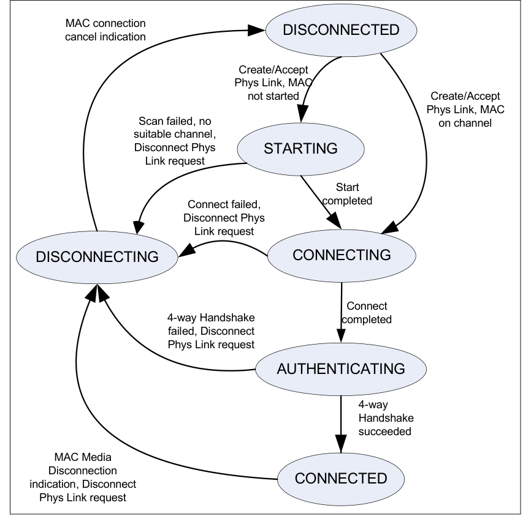

**Figure 3.1:  Physical Link finite state machine diagram**

#### 3.1.3  States

The following states have been defined to clarify the protocol. The states apply to an individual physical link. At power-up or reset, no physical links exist and the state is the DISCONNECTED state.
DISCONNECTED—The physical link is not active, and this is the initial state.
STARTING—Channel has been selected, the MAC is initializing.
CONNECTING—The initiating device waits for messages from the peer device; the responding device commences network connection operations.
AUTHENTICATING—The devices perform the security association process.
CONNECTED—A secure physical link has been established with the remote device.
DISCONNECTING—The PAL waits for the MAC to complete disconnection and return to the initial state.

#### 3.1.4  Events

The following events may cause transitions in the state diagram.
Create/Accept Physical Link—HCI commands from the local Host which affect the state of a physical link.
Connection Accept Timeout—The timeout for this physical link create/accept has expired.
MAC Start Completed—The MAC has started operation on the given channel. This includes beaconing and listening for connections.
MAC Start Failed—The MAC has failed to start on the specified channel for any reason.
MAC Connect Completed—The MAC has completed the process of connecting to a peer in a specified channel.
MAC Connect Failed—The MAC fails to connect on the selected channel for any reason
MAC Media Disconnection Indication—MAC has signaled an existing connection is lost to a remote device.
MAC Connection Cancel Indication—MAC has completed the request to cancel a prior connection.
HCI Disconnect Physical Link Request—The Host has given a disconnect request to the PAL.
4-way Handshake Fails—The establishment of a secure link for this physical link has failed.
4-way Handshake Succeeds—The establishment of a secure link for this physical link has completed successfully.

#### 3.1.5  Conditions

The following conditions are potential qualifiers for actions and state transitions to occur.
MAC not yet started in selected channel—The MAC is not beaconing in any PHY channel, or is beaconing in a different channel than the one specified.
MAC already in selected channel—The MAC is already beaconing in the selected PHY channel.
No suitable channel—No suitable channel can be selected, or the selected channel cannot be joined for any reason.
Device is initiator—Role of device is physical link initiator due to reception of Physical Link Create command.
Device is responder—Role of device is physical link responder due to reception of Physical Link Accept command.

#### 3.1.6  Actions

In some cases, a state transition causes one or more of the following actions to occur. The actions for a state transition shall occur in their entirety before any subsequent state transition occurs, as follows.
Determine selected channel—Using information from the AMP_ASSOC of the remote device and preferences from the local device, select a channel
Set or clear Connection Accept Timeout —Start or stop the timer for the current physical link.
Set or clear NeedPhysLinkCompleteEvent, DiscRequested —Set or clear state variables which control subsequent behavior.
Set or PhysLinkCompleteStatus—Sets command status to be indicated to Host.
Signal MAC to start on channel—Command the MAC to start the process of connection on the specified channel.
Issue MAC connection command—Command the MAC to attempt to connect to the remote device.
Initiate 4-way handshake—Command the authenticator to send the first security message.
Send HCI event—send the indicated HCI event to the local Host.
Cancel MAC connect operation—This physical link no longer needs to be present on this channel. The PAL signals the MAC to delete the connection.
Signal MAC to disconnect peer—Command MAC to send disconnection frame to peer.

#### 3.1.7  DISCONNECTED State

This is the initial state. No timers shall be active.

| Event | Condition | Action | Next State |
| --- | --- | --- | --- |
| HCI Create - _ _ Physical Link _ command | MAC not yet in selected chan- nel | Determine selected channel Request MAC to start on channel Set Connection Accept timeout Set NeedPhysLinkCompleteEvent Set PhysLinkCompleteStatus to 0x00 (no error) | STARTING |
| HCI Create - _ _ Physical Link _ command | MAC already in selected channel | Determine selected channel Send HCI Channel Select event Set Connection Accept Timeout Set NeedPhysLinkCompleteEvent Set PhysLinkCompleteStatus to 0x00 (no error) | CONNECT- ING |
| HCI Create - _ _ Physical Link _ command | No suitable channel | Determine selected channel Send HCI Physical Link Complete event with Status set to No Suitable Channel Found (0x39) | DISCON- NECTED |
| HCI Accept - _ _ Physical Link _ command | MAC not yet in channel | Signal MAC to start on channel Set Connection Accept Timeout Set NeedPhysLinkCompleteEvent Set PhysLinkCompleteStatus to 0x00 (no error) | STARTING |
| HCI Accept - _ _ Physical Link _ command | MAC already in that channel | Set Connection Accept Timeout Issue MAC connection command Set NeedPhysLinkCompleteEvent Set PhysLinkCompleteStatus to 0x00 (no error) | CONNECT- ING |
| HCI Accept - _ _ Physical Link _ command | No suitable channel | Send HCI Physical Link Complete event with Status set to No Suitable Channel Found (0x39) | DISCON- NECTED |

Table 3.1:  DISCONNECTED State event table

#### 3.1.8  STARTING State

This state is used to begin MAC operation, if required.

| Event | Condition | Action | Next State |
| --- | --- | --- | --- |
| Connection Accept Timeout |  | SetPhysLinkCompleteStatus to Connection Accept Time- out (0x10) | DISCONNECTE |
| HCI _ Disconnect _ Physical Link _ command |  | Indicate HCI Disconnection Physical Link Complete event with Status set to Success (0x00) and Reason set to Connection Terminated By Local Host (0x16) Clear Connection Accept Timeout Cancel MAC connect opera- tion Set PhysLinkCompleteSta- tus to Unknown connection identifier (0x02) | DISCONNECTE |
| MAC Start Com- pleted | Device is link originator | Issue HCI Channel Select event | CONNECTING |
| MAC Start Com- pleted | Device is link responder | Issue MAC connection com- mand | CONNECTING |
| MAC Start Failed |  | Clear Connection Accept Timeout Set PhysLinkCompleteSta- tus to MACConnection Failed(0x3F) | DISCONNECTE |

Table 3.2:  STARTING State event table

#### 3.1.9  CONNECTING State

This state is used to cause the devices to start communication with each other, over the 802.11 media.

| Event | Condition | Action | Next State |
| --- | --- | --- | --- |
| Connection Accept Time- out |  | Cancel MAC connect operation Set PhysLinkCompleteStatus to 0x10 (Connection Accept timeout) | DISCONNECTING |
| MAC Connect Completed | Device is responder |  | AUTHENTICATING |
| MAC Connect Completed | Device is initia- tor | Initiate four way handshake | AUTHENTICATING |
| HCI _ Disconnect _ Physical Link command |  | Indicate HCI Disconnection Physical Link Complete event with Status set to Success (0x00) and Reason set to Con- nection Terminated By Local Host (0x16) Set PhysLinkCompleteStatus to Unknown connection identi- fier (0x02) Clear Connection Accept Tim- eout Cancel MAC connect operation | DISCONNECTING |
| MAC Connect Failed |  | Cancel MAC connect operation Set PhysLinkCompleteStatus to MAC Connection Failed (0x3F) | DISCONNECTING |

Table 3.3:  CONNECTING State event table

#### 3.1.10  AUTHENTICATING State

The AUTHENTICATING state is entered when the two devices have established an unsecured connection.
While in the AUTHENTICATING state the two devices shall perform the 802.11 RSN 4-way handshake as described in Section 3.5, establish a PTKSA, and insert key material into the MAC.

| Event | Condition | Action | Next State |
| --- | --- | --- | --- |
| Connection Accept Timeout |  | Set PhysicalLinkCompleteSta- tus to 0x10 (MAC Connection Failed) | DISCONNECTIN |
| HCI _ Disconnect - _ Physical Link command |  | Indicate HCI Disconnection Physical Link Complete event with Status set to Success (0x00) and Reason set to Con- nection Terminated By Local Host (0x16) Set PhysLinkCompleteStatus to Unknown connection identifier (0x02 Clear Connection Accept Time- out Signal MAC to disconnect peer | DISCONNECTIN |
| 4-way Hand- shake Failed |  | Signal MAC to disconnect peer Set PhysLinkCompleteStatus to 0x05 (Authentication failure) Clear Connection Accept Time- out | DISCONNECTIN |
| 4-way Hand- shake Suc- ceeded |  | Send HCI Physical Link Com- plete event with Status set to Success (0x00) Configure MAC with Link Supervision Timeout Clear Connection Accept Time- out Clear NeedPhysLink CompleteEvent | CONNECTED |

Table 3.4:  AUTHENTICATING State event table

#### 3.1.11  CONNECTED State

The CONNECTED state is the operational state for the physical link.

| Event | Condition | Action | Next State |
| --- | --- | --- | --- |
| HCI _ Disconnect _ Physical Link command |  | Indicate HCI Disconnection Physical Link Complete event with Status set to Success (0x00) and Reason set to Con- nection Terminated By Local Host (0x16) Clear Connection Accept Time- out Signal MAC to disconnect peer | DISCONNECTIN |
| MAC Media Dis- connection Indi- cation |  | Indicate HCI Disconnection Logical Link Complete event for each logical link, with Status set to Success (0x00) and Reason set to Connection Terminated by remote Host Cancel MAC connect operation | DISCONNECTIN |

Table 3.5:  CONNECTED State event table

#### 3.1.12  DISCONNECTING State

This is a transit state to the DISCONNECTED state and is used to prevent the PAL from preparing to accept or create new connections while a given connection is being deleted by the PAL and the MAC. The PAL shall exit from this state when the MAC is ready to accept new connections.

| Event | Condition | Action | Next State |
| --- | --- | --- | --- |
| MAC Connection Cancel Indication | PhysLinkCom- pleteEvent is set | Send HCI Physical Link Complete with status set to PhysLinkCompleteStatus | DISCONNECTED |
| MAC Connection Cancel Indication | PhysLinkCom- pleteEvent is clear |  | DISCONNECTED |

Table 3.6:  DISCONNECTING State event table

### 3.2   CHANNEL SELECTION

#### 3.2.1  Overview

Peer to peer networks in 802.11 can incur long connection latency unless there is out of band coordination. Also, one or both of the AMP devices may already be connected to an external network and may therefore need to remain on a given channel. To solve these problems, the data structures and algorithms specified here may be used to provide a coordination service during the creation of the physical link.
An 802.11 channel should be chosen based on up-to-date dynamic information obtained from both AMP peers. The channel selection process is outside the scope of this document but the selected channel shall meet the following criteria:
• The channel shall be legally permitted for use according to local regulatory agencies. If no locale is known, then a common mode configuration shall be used. See Section 3.2.2.
• The channel shall not use a 40 MHz channel width in the 2.4 GHz ISM band.
• If the channel width is 20 MHz, then the channel shall be included in the PCL TLV and in the PCLv2 TLV, if present, in the AMP_ASSOC provided by the initiator in connection establishment.  If the channel width is 40 MHz, then the channel shall be present in the PCLv2 TLV.
• The channel selection process should avoid forcing either AMP device to move its channel.
• The channel selection process should favor channels with least impact on BR/EDR operation.
There may be no suitable channel that the initiating PAL can select or the responding PAL may reject the selected channel. If the selection process cannot identify a channel, then the physical link establishment shall be aborted.
The selected channel is transmitted to the responding AMP manager as a field in the AMP_ASSOC parameter in the AMP Create Physical Link message, and given to the responding PAL via the HCI_Write_Remote_AMP_ASSOC command.

#### 3.2.2  Regulatory

Even though IEEE 802.11 devices operate in unlicensed spectral bands, the unlicensed bands and the limits of allowable behavior in each band are specific to a country and enforced by spectrum regulatory bodies. There is a consistent set of rules for operation in the 2.4 GHz ISM band, as described in the following text.
802.11 AMP equipment providers interpret these rules in independent ways and meet the regulations with independent mechanisms so specification of an algorithm to implement regulatory compliance for all situations is beyond the scope of this document.
If an implementation has knowledge of local regulatory constraints then such an implementation may be able to improve certain characteristics of the AMP link, for example by selecting a 5 GHz channel of operation to provide better performance with the collocated BR/EDR radio.

#### 3.2.3  Specification of Channel Identifiers

Tables specifying regulatory class identifiers, channel frequencies, widths and descriptors are given for three regulatory domains in [1] normative annex J. When using these tables, to resolve all ambiguity of channel identification in construction of a PCL TLV, the country string as specified in [4] and the regulatory class are needed. To support channel descriptions for countries not included in tables J-1, J-2, or J-3, the country string may be distinct from the locale known by the implementation, if any. The country string is only used to select a specific table from the set of tables listed above and is only used in the PCL TLV.
AMP devices may utilize 40 MHz channel width in the 5 GHz UNII band. As described in [1], 40 MHz channels are specified as two adjacent 20 MHz channels, one with a role of the primary channel and the other with a role of the extension channel. The role and relative positioning of the primary and extension channels are given in Table 3.7. The operating index is contained within an operating triplet.

| Operating index | Channel Starting Frequency (GHz) | Channel Spacing (MHz) | Channel Set | Behavior Limits S |
| --- | --- | --- | --- | --- |
| 1 – 80 | NA | RFU | RFU | RFU |
| 81 | 2.407 | 25 | 1, 2, 3, 4, 5, 6, 7, 8, 9, 10, 11, 12, 13 |  |
| 82 | NA | RFU | RFU | RFU |
| 83 | NA | RFU | RFU | RFU |

Table 3.7:  Channel set descriptions for PCLv2

| Operating index | Channel Starting Frequency (GHz) | Channel Spacing (MHz) | Channel Set | Behavior Limits Se |
| --- | --- | --- | --- | --- |
| 84 | NA | RFU | RFU | RFU |
| 85-114 | NA | RFU | RFU | RFU |
| 115 | 5 | 20 | 36, 40, 44, 48 | IndoorOnlyBehavor |
| 116 | 5 | 40 | 36, 44 | IndoorOnlyBehavior PrimaryChannelLow erBehavior |
| 117 | 5 | 40 | 40, 48 | IndoorOnlyBehavior PrimaryChannelUpp erBehavior |
| 118 | 5 | 20 | 52, 56, 60, 64 |  |
| 119 | 5 | 40 | 52, 60 | PrimaryChannelLow erBehavior |
| 120 | 5 | 40 | 56, 64 | PrimaryChannelUpp erBehavor |
| 121 | 5 | 20 | 100, 104, 108, 112, 116, 120, 124, 128, 132, 136, 140 |  |
| 122 | 5 | 40 | 100, 108, 116, 124, 132 | PrimaryChannelLow erBehavior |
| 123 | 5 | 40 | 104, 112, 120, 128, 136 | PrimaryChannelUpp erBehavior |
| 124 | 5 | 20 | 149, 153, 157, 161 | NomadicBehavior |
| 125 | 5 | 20 | 149, 153, 157, 161, 165, 169 | LicenseExemptBeh vior |
| 126 | 5 | 40 | 149, 157 | PrimaryChannelLow erBehavior |
| 127 | 5 | 40 | 153, 161 | PrimaryChannelUpp erBehavior |
| 128-191 | NA | RFU | RFU | RFU |
| 192-253 | NA | Vendor Specific | Vendor Specific | Vendor Specific |

Table 3.7:  Channel set descriptions for PCLv2

| Operating index | Channel Starting Frequency (GHz) | Channel Spacing (MHz) | Channel Set | Behavior Limits S |
| --- | --- | --- | --- | --- |
| 254 | 2.407 | 25 | 1, 2, 3, 4, 5, 6, 7, 8, 9, 10, 11 | Operating index fo Bluetooth, 20 MH operation only |
| 255 | NA | RFU | RFU | RFU |

Table 3.7:  Channel set descriptions for PCLv2
Multiple operating triplets may be given in the same PCL, PCLv2, or CCL TLVs. If sub-band triplets are given then they are to be assumed to modify the nearest preceding operating triplet. Sub-band triplets may be specified in any order, but they must not contain overlapping channel sets, as noted in [1] clause 7.3.2.9.
The PCL may be included in messages containing AMP_ASSOC fields exchanged over the BR/EDR link during construction of the physical link. The PCL shall contain exactly one country string and one or more operating triplets. If the current locale is unknown, then the non-country designator of 'XXX' (see definition of dot11CountryString in [1] normative Annex D) and regulatory class of 254 shall be used. The set of channels preferred when using this designator and regulatory index shall be channels 1 through 11 in the 2.4 GHz ISM band, with channel 1 the most preferred of the set. Supporting examples are given below.
The PCLv2 may be included in messages containing AMP_ASSOC fields exchanged over the BR/EDR link during construction of the physical link. The PCLv2 does not contain a country string. It shall contain one or more operating triplets and zero or more sub-band triplets. Note: For the channel descriptions given in Table 3.7, for a given operating index, not every associated channel may be legal to use in a given locale. It is up to each AMP implementation to maintain compliance with local regulatory rules. If the current locale is unknown, then the PCLv2 shall not be included in any AMP_ASSOC sent over the BR/EDR link.
The PCLv2 is included by the sender to describe both 20 MHz and 40 MHz channels and also contains the same 20 MHz channels as described in the required PCL TLV.  However, the channels in the PCLv2 are specified using operating indices as given in Table 3.7, not the specific regulatory domain identifiers used in the PCL.
The CCL is used to inform the peer of the current channel usage of the sending AMP.

#### 3.2.4  Channel List Examples

In the first example PCL, we assume the device does not know its locale and it prefers operation on channel 1 in the 2.4 GHz ISM band, although operation on channels 2 through 11 is acceptable. The absence of a specific sub-band triplet implies all channels 1 through 11 are acceptable.

| Field | Value | Comments |
| --- | --- | --- |
| Country String | 'XXX’ | Applies to entire table. Signifies non-country (mobile applications). |
| Regulatory Extension Identifier | 201 |  |
| Regulatory Class | 254 | In context of Country String. Signifies 2.4 GHz ISM band channels 1 through 11 unless modified by specific channel list. |
| Coverage Class | 0 | Not used by AMPs. |

Table 3.8:  Simple preferred channel list
In the next example, assume the PAL again does not know its locale, but it prefers operation only on channels 6, 7 and 11, with 11 the most preferred.

| Field | Value | Comments |
| --- | --- | --- |
| Country String | 'XXX’ | Applies to entire table. Signifies non-country (mobile applications) |
| Regulatory Extension Identifier | 201 |  |
| Regulatory Class | 254 | In context of Country String. Signifies 2.4 GHz ISM band channels 1 through 11 unless modified by specific channel list. |
| Coverage Class | 0 | Not used by AMPs. |
| First Channel | 11 | First sub-band triplet |
| Number of channels | 1 |  |
| Maximum transmit power level | 20 |  |
| First Channel | 6 | Second sub-band triplet |
| Number of channels | 2 |  |
| Maximum transmit power level | 20 |  |

Table 3.9:  Preferred channel list with non-contiguous channels
In the next example, assume the PAL knows that it is operating in the US and it has determined that all channels in the 2.4 GHz ISM band and 2 channels of 20 MHz width, 36 and 40, in the 5 GHz U-NII I band should be communicated to the other peer. It is also assumed that the PAL has determined that channels
in the 2.4 GHz band are preferred to the 5 GHz channels. The PAL would use the following PCL.

| Field | Value | Comments |
| --- | --- | --- |
| Country String | 'US’ | Applies to entire table. |
| Regulatory Extension Identifier | 201 | First operating triplet. |
| Regulatory Class | 12 | In context of Country String, specifies chan nels 1 through 11, inclusive, in 2.4 GHZ ISM band. Absence of specific channel list sign fies all channels in this (FCC) regulatory class are available to the AMP. |
| Coverage Class | 0 | Not used by AMPs. |
| Regulatory Extension Identifier | 201 | Second operating triplet. |
| Regulatory Class | 1 | In context of Country String, specifies 20 MHz channel spacing. Presence of subse- quent channel list signifies not all channels in the regulatory class are available to the AMP. |
| Coverage Class | 0 | Not used by AMPS. |
| First channel | 36 | First sub-band triplet. |
| Number of channels | 2 | Channels 36 and 40 are included, with channel 36 more preferred than channel 4 |
| Maximum transmit power level | 20 | Units in context of Country String (dBm, mW, etc). |

Table 3.10:  Mixed band preferred channel list example
In the next example consider the case of a PCL for Canada with 20 MHz channel numbers 36 and 40 and a PCLv2 with 40 MHz channel widths for channel pairs (36, 40) and (44, 48), as well as the 20 MHz channels in the PCL. Assume for this example that Canada uses the same channel descriptions as the US for the channels referenced. A country string of 'US' is used in the PCL in order to indicate we are drawing the channel descriptions from Table J-1 in [1]. The channel descriptor in the PCLv2 for the former channel pair shows that 36 is the primary channel, while the descriptor for the latter pair shows that 48 is the primary channel. The operating indices will be from the set {115, 116}. Note: 2.4 GHz channels are not included at all in this example, implying that only 5 GHz band channels will be used if any connection is made.
The PCL TLV and PCLv2 TLV are shown in the tables 3.11 and 3.12 below. In the PCLv2 TLV the 40 MHz pairs are shown first and the 20 MHz channels follow.

| Field | Value | Comments |
| --- | --- | --- |
| Country String | 'US’ | Applies to entire PCL |
| Regulatory Extension Identifier | 201 | First operating triplet |
| Regulatory Class | 1 | Specifies channels 36 - 48 inclusive, 20 MHz width. Will be further re- stricted by sub-band triplet |
| Coverage Class | 0 | Not used by AMPs |
| First channel | 36 | First sub-band triplet |
| Number of channels | 2 | Denotes channels 36, 40 |
| Transmit power | 20 |  |

Table 3.11:  Example preferred channel list TLV for Canada

| Field | Value | Comments |
| --- | --- | --- |
| Operating Extension Identifier | 201 | First operating triplet |
| Operating index | 116 | Specifies channels 36 and 44, inclusive, are to be considered primary channels with extension channels at the higher adjacent frequencies, i.e. channels 40 and 48 are extension channels. |
| Coverage Class | 0 | Not used by AMPs |
| First Channel | 36 | First sub-band triplet. Specifies 36 is primary and 40 is upper extension. |
| Number of Channels | 1 | There is one 40 MHz channel specified |
| Transmit power | 20 |  |
| Operating Extension Identifier | 201 | Operating triplet for the 20 MHz channels |
| Operating index | 115 | Specifies channels 36 – 48 inclusive, 20 MHz width. |
| Coverage Class | 0 | Not used by AMPs |
| First channel | 36 | Sub-band triplet |
| Number of channels | 2 | Denotes channels 36, 40 |
| Transmit power | 20 |  |

Table 3.12:  PCLv2 example

### 3.3   802.11 LINK CREATION

#### 3.3.1  Starting the AMP Network

After the initiator has selected a channel of operation, the initiating PAL shall instruct the MAC to commence network operation, including beaconing. The 802.11 AMP devices shall use probe responses and/or beacons (respecting regulatory restrictions) to advertise MAC capabilities.
AMP devices shall use beacons to enable effective coexistence with neighboring 802.11 networks. For example, non-AMP devices can discover the existence of AMP networks and such devices can also determine the EDCA characteristics of the network. In regulatory domains where DFS operation is required, an AMP device may need to passively observe the channel to check for radar, as described in [1] clause 11.9, before it may start to beacon. For AMP operation, the maximum beacon period shall be Max80211BeaconPeriod.
The SSID information element for AMP devices shall be of the form 'AMP-xx- xx-xx-xx-xx-xx' (with no null termination and no quotes) where the "x" characters are replaced by the lowercase hexadecimal characters of the MAC address of the local 802.11 device. This is referred to here as the AMP SSID. For example, if the MAC address of a device is 00:01:02:0A:0B:0C, then the AMP SSID would be 'AMP-00-01-02-0a-0b-0c'.
AMP beacons shall be indicated as ESS-style beacons in the capability information field as described in [1] clause 7.3.1.4 and shall include the AMP SSID. Beacons shall be sent with standard beacon channel access semantics as given in [1] clause 11.1.2.1. The contents of the Address2 and Address3 fields for beacons and probe responses shall be the MAC address of the transmitting AMP node. Probe requests sent to AMP peers shall use the MAC address of the intended recipient as the content of the Address1 and Address3 fields. In [1] clause 7.2.3.1 contains the details of the format of 802.11 beacon frames and [1] clause 7.2.3.9 contains the details of the format of 802.11 probe response frames, including a list of the required information elements is specified.

##### 3.3.1.1  HT Operation

The AMP peers shall maintain the HT protection field in the HT operation information element in their beacons according to [1]. When communicating with the initiator, the responder shall use the protection mechanism dictated by the initiator's beacon.
The HT features of Greenfield, Reduced Inter-Frame Space (RIFS), dual Clear to Send (CTS) protection and Phased Coexistence Operation (PCO) shall not be used in AMP links. The respective fields in the 802.11 HT operation information element shall be set to zero in transmitted MMPDUs and ignored in received MMPDUs.
When using a DFS channel, the AMP responder shall monitor the field which indicates Overlapping BSS (OBSS) non-HT stations are present in the HT operation element of the AMP initiator's beacon and adhere to the requirements in [1]. The AMP initiator shall be responsible for setting this field.

#### 3.3.2  Establishing the 802.11 Link

AMP devices may choose to obtain the timebase of their peer through the timestamp field in 802.11 beacons and probe responses. The respective Target Beacon Transmission Time (TBTT) of the peers may be independent and occur at different times with respect to one another. The beacon period of the devices may be different from one another.
AMPs shall use RSN security. RSN security requires the use of 802.11 open authentication as specified in [1] clause 8.2.2.2. The AMP responder shall send the first frame of the 802.11 authentication transaction sequence with transaction ID of 1. Address fields Address1 and Address3 shall contain the initiator's address.The AMP initiator shall respond with an 802.11 authentication frame with transaction ID of 2. Address fields Address2 and Address3 shall contain the initiator's address.
AMPs shall use 802.11 (re)association frames to select features advertised by their peer. The AMP responder shall send an (re)association request frame. Address fields Address1 and Address3 shall contain the initiator's address.
The AMP initiator shall reply with an (re)association response frame. Address fields Address2 and Address3 shall contain the initiator's address. The frame body contents of both the (re)association request and response are given in [1] clause 7.2.3.4 and [1] clause 7.2.3.5, respectively.
After successful 802.11 (re)association, unencrypted security frames may be transmitted on the physical link.

#### 3.3.3  Address Fields of Data Frames

The 802.11 AMP shall support the use of four address field frame format for all data frames after (re)association.
To use data frames with four address fields the AMP shall set the ToDS and FromDS bits in the FrameControl field equal to one. The addresses used for such frames shall be arranged as shown in Table 3.13. Because there is no frame forwarding by AMPs, the RA is the same as the DA and the TA is the same as the SA.

| Field | Value |
| --- | --- |
| Address1 | Receiver Address (RA) |
| Address2 | Transmitter Address (TA) |
| Address3 | Receiver Address (RA) |
| Address4 | Transmitter Address (TA) |

Table 3.13:  Four address frame address fields

#### 3.3.4  Admission Control

AMP devices should respond to probe requests with a probe response.
If Address2 of an 802.11 association request does not match the MAC address from the AMP Assoc received during construction of the current physical link or if the SSID in the association request does not match the AMP SSID of the receiving AMP device, then the receiving AMP device shall not transmit an 802.11 association response with a status code of 0 (success).

### 3.4   PHYSICAL LINK MAINTENANCE

After a physical link is created, an AMP device shall monitor the state of the link and provide an indication of link failure to the Host if no frames are received from the AMP physical link peer for a period of Link Supervision Timeout (LSTO). Correctly decrypted data frames received from the peer shall be evidence of an existing physical link, but this is not true for 802.11 ACK and CTS control frames.
If the PAL has not received a correctly decrypted data frame for a period less than LSTO, then it shall solicit a response from its peer in an attempt to receive the response before the expiration of LSTO. For this purpose, link supervision request/response protocol identifiers are given in Table 5.2 and may be used to construct link supervision data frames. When a PAL receives a data frame with a protocol identifier of Link Supervision Request, it shall reply by transmitting a data frame with a protocol identifier of Link Supervision Reply.

### 3.5   PHYSICAL LINK SECURITY

#### 3.5.1  Obtaining Key Material

The Host provides key material for use with a physical link as the Dedicated_AMP_Link_Key parameter of the HCI_Create_Physical_Link or HCI_Accept_Physical_Link command. See [Vol 2] Part E, Section 5.2 for octet ordering of multi-octet HCI parameter values. The Dedicated_AMP_Link_Key parameter shall be interpreted by the PAL as a 256 bit integer and used directly as a Pairwise Master Key (PMK) by the two devices to create a PTK. Further key material is derived from the PTK.

#### 3.5.2  Creating a PTK

The 802.11 4-way handshake is used to create a PTK from the PMK. See [1] clause 8.5.3.
Entities known as authenticator and supplicant are used to exchange security information in the 802.11 security architecture. Since the responding AMP device receives the 802.11 (re)association response frame, it shall serve the role of supplicant; the initiating AMP device shall serve the role of authenticator. The authenticator sends the first and third messages of the 4- way handshake and the supplicant sends the second and fourth messages. Only a single instance of the 4-way handshake is run by the 802.11 AMP to establish its secure connection.
If a 4-way handshake fails then the PAL physical link state machine shall transition to the DISCONNECTING state as described in Section 3.1.10.
The supported security configurations of the peers are given in the RSN information element in beacons or probe responses exchanged by the AMP devices. The PAL shall enforce the following restrictions:
• UseGroup (00:0F:AC:00), WEP-40 (00:0F:AC:01), TKIP (00:0F:AC:02), and WEP-104 (00:0F:AC:05) shall not be allowed as valid pairwise cipher suites.
• The group cipher shall be CCMP (00:0F:AC:04)
• The only valid AKMP shall be PSK (00:0F:AC:02) or a vendor-specific AKMP.
• The NoPairwise bit (B1) of the RSN Capabilities field shall be set to zero.
• The Management Frame Protection Required (MFPR) bit (B6) of the RSN Capabilities field shall be set to zero. Note: This does not prevent the use of Management Frame Protection.
The supplicant shall ensure a proper intersection of capabilities exists subject to the constraints above. It may also choose a set according to its policy requirements and may terminate a connection attempt if no policy match is
found. Either the supplicant or the authenticator may terminate a connection after AMP Create Physical Link Response is sent by indicating an HCI Physical Link Complete event with an unsuccessful status code.
The AMP key received from the Host may be marked with a Link_Type of debug. If it is, then the local PAL may choose to use the key, or it may choose to refuse to establish the link, according to its own policy. The management of this debug key policy is outside the scope of this document.
The PAL shall use the AMP key as a Pairwise Master Key (PMK) according to the 802.11 key hierarchy described in [1] clause 8.5.1.2 and shall exchange nonces (as part of a 4-way handshake) to add liveness in the derivation of a Pairwise Transient Key (PTK). The PTK shall be derived specifically for a session started by the HCI_Create_Physical_Link_Request command and shall be deleted when the session is terminated by the HCI_Disconnect_Physical_Link command. The construction of the AAD used with CCMP shall include Address4 in the manner illustrated in [1] clause 8.3.3.3.2, Figure 8-17.

#### 3.5.3  Using Encryption

Encryption keys are derived from the PTK and are inserted into the 802.11 MAC after the 4-way handshake has successfully completed. All data frames after this point are encrypted and this state persists until the physical link is deleted.

#### 3.5.4  Refreshing a PTK

The PTKSA, if any, shall be discarded when the physical link to which it applies enters the DISCONNECTED state. At this point the Host may reestablish the connection which will cause the creation of a new PTKSA.
The PTKSA shall be discarded in the event its receive sequence counter becomes exhausted. Since this is a 48 bit counter, this is an unlikely event.
To establish a new PTK, the physical link shall be torn down and re- established.

#### 3.5.5  Transporting Security Handshake Messages

Security handshake messages shall be sent after the physical link is created, but before any logical link is created between the two devices.
The SNAP header composed of the OUI of the Bluetooth SIG as shown in Table 5.1 and the protocol identifier given in Table 5.2 shall be used to distinguish AMP 4-way handshake messages from external security traffic.

### 3.6   PHYSICAL LINK SUPPORT FOR QOS

#### 3.6.1  QoS Advertisement

If an AMP device supports 802.11 EDCA and is configured to use it, then it should indicate this to the Host by setting the Guaranteed_Service_Type_Supported field of the PAL_Capabilities parameter included in the HCI_Read_Local_AMP_Info command.
If QoS is offered by an AMP device, it shall advertise EDCA in beacon and probe response frames by including the EDCA Parameter Set information element, as given in [1] clause 7.3.2.29. Note: The EDCA Parameter Set information element is also included in (re)association response frames. For AMP devices, the use of the EDCA parameter set shall be as follows. The QoS Info field shall be zero. The ACI, AIFSN, and TXOPlimit values of the AC parameter record shall be as given in [1] Table 7-37. The ECWmin and ECWmax values are specific to the 802.11 PHY type and are documented in their appropriate clauses in [1]. The Admission Control Mandatory (ACM) bit should be zero.
The QoS Capability information element is described in [1] clause 7.3.2.35. The QoS Info field (see [1] clause 7.3.1.17) is contained in the QoS Capability information element as well as the first field of the EDCA Parameter Set information element. AMP devices shall not include the QoS Capability information element in beacons or probe responses.
The interpretation of the content of the QoS Info field is different depending on if the enclosing frame is a beacon or probe response, or if it is a (re)association request.

| 802.11 Information element | Frame(s) contained in |
| --- | --- |
| QoS Capability information element | Association Request, Reassociation Request |
| EDCA Parameter Set information element | Beacon, Probe Response, Association Response Reassociation Response |

Table 3.14:  EDCA advertisement and negotiation
The EDCA AC parameters shall not change unless the physical link is torn down and re-established. Therefore the EDCA Parameter Set Update Count subfield of the QoS Info field in beacons and probe responses shall be zero.

#### 3.6.2  Negotiation

To request the use of EDCA on the physical link an AMP device shall include a QoS Capability element in its (re)association request. If the AMP peer rejects the EDCA negotiation then the (re)association response frame shall have no EDCA Parameter Set element included. If the (re)association response frame has a status code of successful and the EDCA Parameter Set element is included, then the link shall be considered to support EDCA.

## 4  LOGICAL LINK MANAGER

A logical link provides a (possibly) bidirectional path for in-order delivery of L2CAP PDUs, with a specified set of traffic characteristics. Each logical link exists with respect to a specific physical link in the CONNECTED state.
A logical link is characterized by a pair of Extended Flow specification parameter sets, as described in [1]. An Extended Flow specification parameter set is referred to simply as a flow spec here.
Each logical link is classified as either Best Effort or Guaranteed. The logical link is known as Best Effort if either of its flow specs indicates Best Effort in its Service Type field. Otherwise, it is known as Guaranteed.
Support for Guaranteed links is optional; the PAL may reject any guaranteed flow spec. If 802.11 QoS (see Section 3.6.1) is not supported by both endpoints, then there is no traffic prioritization in the MAC.

### 4.1   LOGICAL LINK CREATION

Creation of a logical link is initiated by the HCI_Create_Logical_Link or HCI_Accept_Logical_Link command. If the physical link is not in state CONNECTED, the PAL shall send the HCI Logical Link complete event with status set to Command Disallowed (0x0C). The Controller shall indicate successful completion of the logical link creation using the HCI Logical Link Complete event, with Status set to Success (0x00).

#### 4.1.1  Logical Link Handles

When a Logical Link is created or accepted the PAL shall create a Logical Link handle, or logical handle. The logical handle is included in HCI ACL data packets received from the HCI in the Handle field; the PAL may use the logical handle to help it select the egress physical link. If the Host delivers an HCI ACL data packet to the AMP Controller with an invalid Handle field, then the AMP shall discard the ACL data packet and the PAL may indicate a Number of Completed Blocks or Number of Completed Packets event (depending on the configuration of the Flow Control setting) using the Host-supplied logical handle.
When the PAL receives data frames from the MAC, it may use the source address to determine the physical link. It shall place the physical link handle corresponding to that link into the Handle field of the HCI ACL data packet before the packet is indicated to HCI. Note: The PAL is not required to determine a logical handle for frames it receives from the MAC.

#### 4.1.2  Null Traffic Logical Links

Data frames may be discarded if attempted on a No Traffic flow.

#### 4.1.3  Best Effort Logical Links

There is a single logical link used to transport all Best Effort traffic.
If EDCA was successfully negotiated during the physical link creation, the PAL shall map all egress frames marked with the Best Effort logical handle to a UP of either BEUserPrio0 or BEUserPrio1, inclusive. Otherwise, if EDCA is not used, no mapping is required and the UP shall be set to zero by the PAL.

#### 4.1.4  Guaranteed Logical Links

Flow specs requesting guaranteed service may be accepted by the PAL if the physical link was negotiated with 802.11 QoS.
EDCA shall be used by the 802.11 AMP devices if supported and available for use by both devices. The PAL shall provide a priority field associated with each egress 802.11 frame. The priority field is interpreted by the MAC as a User Priority (UP) and is mapped to access category as specified in [1] clause 9.1.3.1.
If the 802.11 link was negotiated with QoS, then on receiving an HCI_Create_Logical_Link or HCI_Accept_Logical_Link command specifying a Guaranteed transmit flowspec the PAL shall use a UP with a value between MinGUserPrio and MaxGUserPrio, inclusive. The determination of precisely which UP to use is outside of the scope of this specification. A flow spec expresses maximum bandwidth as the product of inter-SDU arrival time and maximum SDU size. The PAL may use the specified maximum bandwidth or latency requirements from the flow spec to establish mappings of logical handles to UPs.
If a request for a guaranteed link cannot be mapped to a UP in the range specified above, it may be rejected.
The PAL shall reject all requests to establish a guaranteed logical link with a flow spec expressing a maximum bandwidth which is greater than the Total_Bandwidth parameter of the Read Local AMP Info command minus the sum of the requested maximum bandwidths of all existing guaranteed logical links.
The transmitter shall store the logical channel to UP mapping for application to future frame transmissions. The receiver shall create an HCI ACL data header and insert the physical link handle into the Handle field of the packet before indication to the Host.

### 4.2   LOGICAL LINK UPDATES

The Host may indicate a change of traffic requirements on a logical link by using the HCI_Flow_Spec_Modify command. An HCI_Flow_Spec_Modify command will not change the Service Type of the flow specs for a logical link.
When the PAL receives an HCI_Flow_Spec_Modify command, it should validate that the new flow spec requirements can be met with the available resources. If not, then the PAL should reject the command.

### 4.3   LOGICAL LINK DELETION

The PAL shall rely on upper layers to flush any frames before a logical link is deleted. See explicit flush in Section 5.3. The PAL may choose to re-use the same logical link identifier for new logical links even on the same physical link.
The PAL should recover any allocated QoS resources when the logical link is deleted. In particular, when deallocating resources for a flow spec which expressed a maximum bandwidth, the PAL should subtract that parameter from the total allocated bandwidth.

## 5  DATA MANAGER

### 5.1   ENCAPSULATION

The PAL shall advertise a maximum PDU length of Max80211PALPDUSize octets and each L2CAP PDU is transmitted by the MAC as a single MSDU. The MSDU boundary determines the L2CAP PDU boundary for the receiver.
Before transmission, the PAL shall remove the HCI header, add LLC and SNAP headers and insert an 802.11 MAC header. The LLC/SNAP frame format used by the 802.11 AMP is shown in Table 5.1.

|  | DSAP | SSAP | Control | OUI | Protocol | Frame Body |
| --- | --- | --- | --- | --- | --- | --- |
| Value | 0xAA | 0xAA | 0x03 | 00:19:58 | XX:XX |  |
| Octets | 1 | 1 | 1 | 3 | 2 | 0-1492 |

Table 5.1:  802.11 AMP LLC/SNAP encapsulation
The protocol identifiers shall be as shown in Table 5.2:

| Value | Protocol Description | Logical Link |
| --- | --- | --- |
| 0x0000 | Reserved for future use | N/A |
| 0x0001 | L2CAP ACL data | AMP-U |
| 0x0002 | Activity Report | AMP-C |
| 0x0003 | Security frames | AMP-C |
| 0x0004 | Link supervision request | AMP-C |
| 0x0005 | Link supervision reply | AMP-C |
| 0x0006-0xFFFF | Reserved for future use | N/A |

Table 5.2:  Protocol Identifiers
All 802.11 data frames on the AMP link shall be sent with ToDS and FromDS bits in the Frame Control field both set to one. For a description of the Frame Control field, see [1] clause 7.1.3.1. If QoS was negotiated on the physical link between the peers then the QoS Control field shall be included in the MAC header, otherwise it shall not be included.
The receiving device can determine the physical link identity from the TA of the received frame. The receiving PAL shall decapsulate the frame from 802.11 and into the HCI ACL data encapsulation.

### 5.2   COEXISTENCE AND LOCAL INTERFERENCE

#### 5.2.1  Interference from Collocated Radios

The BR/EDR radio, LE PHY and the ERP of 802.11 AMP operate in the 2.4GHz ISM band and mechanisms are required to help mitigate potential interference. The BR/EDR and LE radio subsystems on an 802.11 AMP capable device should employ AFH to attempt to avoid interference of overlapping transmissions on the medium.
Protocols specified in [1] are designed to mitigate interface from non-collocated radios.
On systems where the devices are collocated such that radio isolation is insufficient to mitigate interference, the use of the shared medium should be time-division multiplexed to ensure only one of the interfering radios will gain access to the medium. In the case of the BR/EDR radio and the 802.11 radio operating in the 2.4GHz band, the PAL should ensure that local high priority BR/EDR traffic such as SCO, eSCO and ACL packets carrying A2DP information have higher priority over potentially interfering local 802.11 AMP packets. The PAL may ensure this prioritization through many ways including employing the methods described in [3] but the exact methods are outside the scope of this document.
Interference can also arise between the 802.11 AMP radio and collocated licensed band radios (LBRs) operating in adjacent bands to the ISM spectrum. Due to 802.11 AMP transmissions, the collocated LBR may be unable to receive transmissions from its peer LBR. Again the use of the medium should be time-division multiplexed to ensure only one of the radios will gain access to the medium at one time. In the case of the 802.11 AMP radio and an LBR, the PAL should ensure that the local LBR packets have higher priority over potentially interfering local 802.11 AMP packets. Although the exact methods are outside the scope of this document, similar collocated radio interference mitigation mechanisms as described above may be used.

#### 5.2.2  Unavailability of Remote Peer

Distributed AMP devices may experience 802.11 performance degradation due to simultaneous BR/EDR activity occurring at one of the AMP peers. Local interference mitigation schemes (see Section 5.2.1) employing time-divided access to the medium will result in the 802.11 radio being periodically unavailable to its peer. The PAL attempting to transmit to a periodically unavailable AMP device may employ techniques to allow its transmissions to consume minimal airtime and power while still achieving acceptable performance for its own transmissions and those of neighboring networks.
When a physical link is created, the PAL shall configure the 802.11 MAC to use RTS/CTS signaling by default. This behavior may be modified by using Activity Reporting as given in Section 5.2.3.

#### 5.2.3  Activity Reports

AMP Activity Reports provide an optional mechanism for the 802.11 PAL to inform its 802.11 AMP peer of events which may result in the 802.11 device being unavailable to receive 802.11 traffic. Activity Reports may also be used to inform a peer of the absence of local interference thereby allowing the remote peer to disable its RTS/CTS signaling.
Examples of simultaneous traffic include, but are not limited to:
1. BR/EDR SCO/eSCO streams
2. 802.11 traffic required to maintain an external 802.11 connection
3. Traffic from other collocated radios such as LBRs in the 2.3 or 2.5 GHz band (including WiMax, LTE, and UMB)
When Activity Reports are used, it is the PAL which is aware of its unavailability which may generate the interference information. The PAL can determine the information to include in the Activity Report through methods including, for example, the PTA model described in [3]. In many systems with collocated radios there are PTA signals between the BR/EDR and 802.11 Controllers which may be used to generate this information.
The information shall be transferred between the communicating 802.11 PALs using a PAL Activity Report PDU encapsulated in an 802.11 data frame. The frame body of the Activity Report PDU following the LLC/SNAP header is shown in Table 5.3. It has a variable length.
Activity Report Size: Variable

| Value | Octets | Description |
| --- | --- | --- |
| ScheduleKnown | 1 | Bit 0: 1 if the sender knows the schedule of interference 0 if the sender does not know the schedule of interferen |
| NumReports | 1 | The number of traffic reports in this PDU |
| StartTime | 4 | The absolute time of the start of possible unavailability o the peer, expressed as the least significant 32 bits of the 802.11 TSF of the transmitter of the PDU. |
| Duration | 4 | Duration of the active phase of the traffic in microsecond |
| Periodicity | 4 | Periodicity of traffic in microseconds. May be zero to ind cate aperiodic traffic. |

Table 5.3:  Activity Report
Processing of received Activity Reports is optional and support for it is advertised in the 802.11 PAL Capabilities field.
The ScheduleKnown field shall indicate to the receiver of the Activity Report whether or not the sender is aware of the schedule of subsequent data traffic.
• If the ScheduleKnown is set to zero, this shall signify the sender is aware of the presence of traffic but not its schedule, and the receiving PAL shall configure the MAC with RTS/CTS signaling for all traffic on the physical link to the sender.
• If the ScheduleKnown is set to one, the sender shall describe the schedule of interference in the subsequent fields; the receiver of the report may either schedule all 802.11 AMP traffic around this schedule, configure the MAC with RTS/CTS signaling, or both.
If a PAL knows there is no interference from collocated radios before or during establishment of a physical link, an Activity Report conveying this state should be sent at the earliest possible opportunity after the physical link is established.
The StartTime, Duration and Periodicity form an Activity Report triplet. The difference between the StartTime and the current TSF of the peer shall be interpreted as a signed 32 bit value. A negative value shall denote a time in the past. The NumReports value indicates the number of Activity Report triplets which follow. The Duration shall specify the amount of time (in microseconds) the PAL is in the mode specified. If the ScheduleKnown field is zero, there shall be no Activity Report triplets and the NumReports field shall be zero. If the Periodicity is non-zero, it shall be a value greater than the Duration.
An Activity Report may be created to describe a burst of interfering traffic by setting ScheduleKnown to one, NumReports to one, StartTime to the time the burst is predicted to start, Duration to the duration of the burst, and Periodicity to zero.
The PAL may inform its peer that interference is no longer present by sending an Activity Report with a ScheduleKnown field set to one, and a NumReports field set to zero. Upon reception of such an Activity Report frame, a receiving PAL may configure the MAC without RTS/CTS signaling.
The PAL may transmit an Activity Report frame periodically in order to correct clock drift between its TSF and the schedule of unavailability caused by the collocated radio. The most recent Activity Report shall supersede all others received.

### 5.3   EXPLICIT FLUSH

Explicit flush may be initiated at the HCI on any logical link by using the HCI_Enhanced_Flush command. Explicit flush discards all data frames for transmit on the indicated logical link.

### 5.4   AUTOMATIC FLUSH

If guaranteed logical links are supported, then automatic flush timeouts shall be supported by the 802.11 PAL.

### 5.5   QUALITY OF SERVICE VIOLATIONS

The PAL may generate a HCI QoS Violation event when it is determined that the parameters of the flow spec are not being met. This may occur for instance when a data packet has been queued for transmission on a Guaranteed logical link for longer than the Access Latency in the flow spec for transmitted traffic on that link. It can also occur when a data packet fails to receive an acknowledgment before the specified flush timeout.

## 6  CONSTANTS

| Name | Value | Units | Description |
| --- | --- | --- | --- |
| Max80211PALPDUSize | 1492 | Octets | Maximum PDU size |
| Max80211AMPASSOCLen | 672 | Octets | Maximum length of AMP AS- _ SOC for this AMP |
| MinGUserPrio | 4 | N/A | Minimum value of user priority for guaranteed link |
| MaxGUserPrio | 7 | N/A | Maximum value of user priority for guaranteed link |
| BEUserPrio0 | 0 | N/A | Best effort User Priority |
| BEUserPrio1 | 3 | N/A | Best effort User Priority |
| Max80211BeaconPeriod | 2000 | milliseconds | Maximum value of AMP dot11BeaconPeriod MIB vari- able |
| ShortRangeModePower- Max | 4 | dBm | Maximum transmit power for ERP-OFDM frames when in Short Range Mode |

Table 6.1:  802.11 PAL Constants

## 7  MESSAGE SEQUENCE CHARTS

The MSCs necessary to show the creation and deletion of physical and logical links can be found in [Vol 2] Part F, Section 4.16, as the sequencing of steps is determined by the logical HCI. However, an overview MSC for AMP physical link creation is given in Figure 7.1.

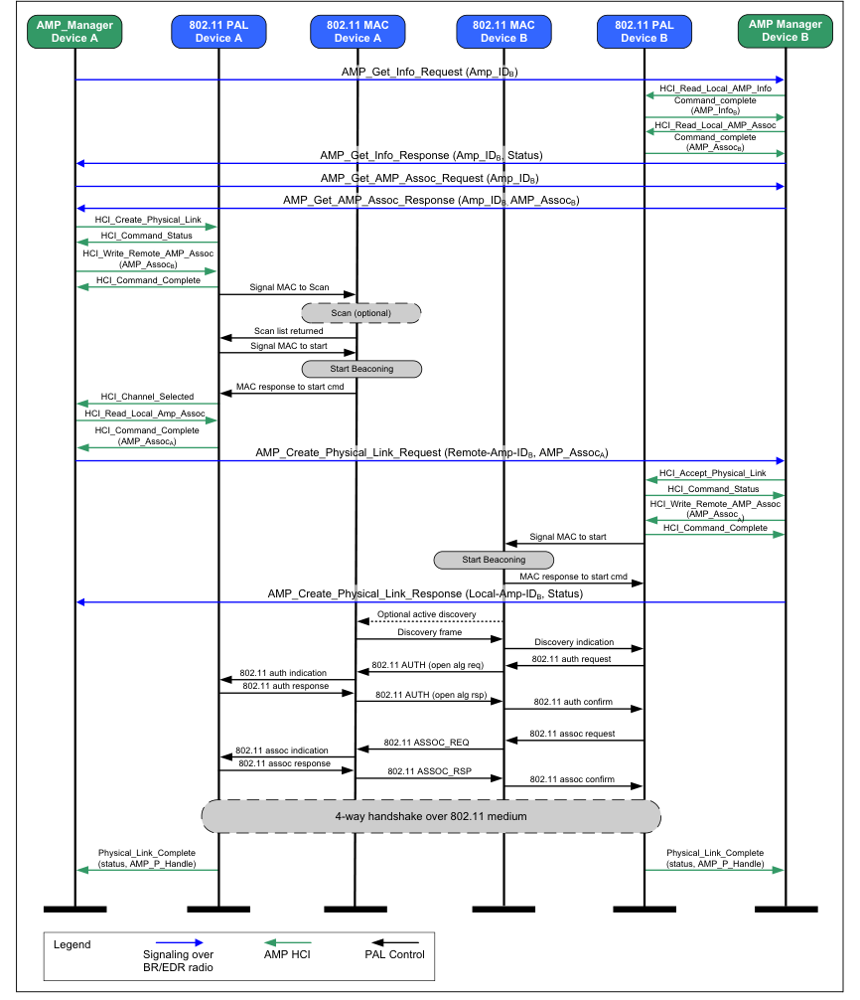

**Figure 7.1:  Overview MSC for physical link create/accept**

## 8  REFERENCES

[1] IEEE 802.11-2007 Standard and the following amendments: Amendment 1 (Radio Resource Measurement), Amendment 2 (Fast BSS Transition), Amendment 3 (3650 MHz - 3700 MHz Operation in US), Amendment 4 (Protected Management Frames), and Amendment 5 (Enhancements for Higher Throughput)
[2] ISO/IEC 3166-2
[3] IEEE 802.15.2 Recommended Practice: Coexistence of WPAN with other wireless devices operating in unlicensed frequency bands
[4] Bluetooth SIG Company Identifiers https://www.bluetooth.org/en-us/ specification/assigned-numbers/company-identifiers
APPENDIX A TEST SUPPORT
This section provides the details of the AMP test commands and events described in [Vol 2] Part E.
A.1  AMP TEST COMMAND

| Command | OCF | Command Parameters | Return Parameter |
| --- | --- | --- | --- |
| HCI AMP Test _ _ | 0x0009 | Test Parameters | Status |

Description:
This command is used to configure and start a test. This command shall be only valid in AMP Test Mode.
When a test scenario has completed or on receiving a HCI_AMP_Test_End command the AMP shall send a HCI AMP Test End event and the AMP returns to an idle state with the RX and TX off.
Test Parameters: Size: 18 octets

| Value | Parameter Description |
| --- | --- |
| 0xXX | Test Scenario 0x01 – Transmit single frames with following parameters 0x02 – Receive frames with following parameters All other values are reserved for future use |
| 0xXX | Preamble 0x00 – ERP-OFDM preamble 0x01 – Short Preamble 0x02 – Long preamble All other values are reserved for future use |
| 0xXX | Payload 0x00 – All Zeros payload 0x01 – All ones payload 0x02 – PRBS9. The PRBS9 sequence is reinitialized for every frame. Each PRBS9 payload is the same. 0x03 – PRBS15. The PRBS15 sequence is reinitialized for every frame. Each PRBS15 payload is the same. All other values are reserved for future use |

| 0xXXXXXX | Country | Channel Descriptor For AMP type 802.11, the channel is com- pletely described by a four-tuple of {Country, Operating Extension Identifier, Regulatory class, Channel number}. The Country identifi is an ISO/IEC-3166 three-octet field and the Extension Identifier is equal to 201. If the locale is unknown to the EUT, then it sh only allow channel numbers as given in Ref [ Clause 18.4.6.2. Valid values are from 1 to 1 All other values are reserved for future use |
| --- | --- | --- |
| 0xC9 | Operating Extension Identifier |  |
| 0xXX | Operating Class |  |
| 0xXX | Channel Number |  |
| 0xXX | Modulation 0x00 – ERP-DSSS 0x01 – ERP-CCK 0x02 – ERP-OFDM 0x03 – ERP-PBCC 0x04 – DSSS-OFDM 0x05 – OFDM All other values are reserved for future use |  |
| 0xXX | Rate (Mb/s) Transmission data rate of PSDU. See Ref [2] Clause 19.8.2 PHY MIB dot11SupportedDataratesTxValues The allowed data rates are dependent on the modulation selected. Ref [ Table 19.1 Clause 19.2 and Clause 17.2.3.3. All other values are reserved for future use |  |
| 0xXXXX | Payload length 1 to 1500. All other values are reserved for future use |  |
| 0xXX | Transmit Power Control (TPC) Valid values are 1 to 8 as defined in the Ref [2] implementation depende All other values are reserved for future use |  |
| 0xXX | Duty Cycle 10 to 99% (default 50%) All other values are reserved for future use |  |
| 0xXXXX | Frame count 1 to 65525 – Number of frames to be transmitted. When the defined fram count has been transmitted the system returns to the idle state and the AMP Test End event is returned to the tester. On receiving the Test End command the AMP returns to idle state. All other values are reserved for future use |  |

0xXX Scramble state
0x00 – OFF
0x01 – ON
All other values are reserved for future use
Return Parameters:
Status: Size: 1 Octet

| Value | Parameter Description |
| --- | --- |
| 0x00 | AMP Test command succeeded |
| 0x01-0xFF | Test command failed. See [Vol 2] Part D, Error Codes. |

Event(s) Generated (unless masked away):
When the AMP receives the HCI_AMP_Test command, the AMP shall send the Command Status event to the AMP Test Manager which shall be routed to the tester.
The HCI AMP Start Test event shall be generated when the HCI_AMP_Test command has completed and the first data is ready to be sent or received.
The HCI Command Complete event shall not be sent by the AMP to indicate that this command has been completed. Instead the HCI AMP Start Test event shall indicate that this command has been completed.
When in a transmitter test scenario and the frames/bursts count have been transmitted the HCI AMP Test End event shall be sent.
A.1.1  Test Scenarios
All AMP Test Mode frames shall be AMP Test Mode data frames.
Single Frame Transmission
When the test scenario is set to transmit single frames the format shall be as defined by the parameters in the rest of the test configuration parameters. The interval between frames shall be as defined by the transmission interval time.

| Transmission interval Transmission interval Frame Frame Frame |  |
| --- | --- |
|  |  |

| Frame | Frame |  |
| --- | --- | --- |
| Frame | Frame | Frame |

Figure A.1:  Single Frame test transmission
The transmissions shall continue until the frame count is reached or a HCI_AMP_Test_End command is received; when a HCI AMP Test End event shall be sent to the tester via the AMP Test Manager.
The requirements of the frames are described in the AMP Test Mode data frame format section.
Receive Frames
When the test scenario is set to receive frames the AMP shall receive the frames defined in the other test scenario parameters and, when AMP receiver reports are configured, return receiver reports as defined to the tester via the AMP Test Manager.
A.1.2  Test Mode Data Frame Format
The frames transmitted in AMP Test Mode are not super frames. All frames shall be Data frames. The format of the frame agrees with the PHY frames in [2] section 19 with non connection AMP Test Mode fixed fields.
Source and Destination Address
When performing the AMP PHY non connection tests these fields are fixed according to the direction of the message. The AMP shall use a fixed address AMP_TEST_ADDRESS and shall expect to receive frames with an AMP_ TESTER_ADDRESS.

| Parameter | Address |
| --- | --- |
| AMP TEST ADDRESS _ _ | 0x5555 (0101010101010101 binary) |
| AMP TESTER ADDRESS _ _ | 0xAAAA (1010101010101010 binary) |

These are fixed addresses for testing purposes only.
The AMP shall transmit frames in the transmit test scenarios with the SrcAddr set to the AMP_TEST_ADDRESS and the DestAddr set to the AMP_ TESTER_ADDRESS.
The AMP shall receive test frames in the receiver test scenarios with the SrcAddr set to AMP_TESTER_ADDRESS and the DestAddr set to the AMP_TEST_ADDRESS.
A.2  AMP START TEST EVENT

| Event | Event Code | Event Parameters |
| --- | --- | --- |
| HCI AMP Start Test _ _ _ | 0x49 | Status Test Scenario |

Description:
The HCI AMP Start Test event shall be generated when the HCI_AMP_Test command has completed and the first data is ready to be sent or received.
Event Parameters:
Status: Size: 1 Octet

| Value | Parameter Description |
| --- | --- |
| 0x00 | Test command succeeded |
| 0x01-0xFF | Test command failed. See [Vol 2] Part D, Error Codes |

Test Scenario: Size: 1 Octet

| Value | Parameter Description |
| --- | --- |
| 0xXX | 0x01 - Transmit single 0x02 – Receive frames All other values are reserved for future use |

A.3  AMP TEST END EVENT

| Event | Event Code | Event Parameters |
| --- | --- | --- |
| HCI AMP Test End _ _ _ | 0x4A | Status Test Scenario |

Description:
The HCI AMP Test End event shall be generated to indicate that the AMP has transmitted or received the number of frames/bursts configured.
If the Receiver reports are enabled an HCI AMP Receiver Report event shall be generated.
Event Parameters:
Status: Size: 1 Octet

| Value | Parameter Description |
| --- | --- |
| 0x00 | AMP Test command succeeded |
| 0x01-0xFF | Test command failed. See [Vol 2] Part D, Error Codes |

Test Scenario: Size: 1 Octet

| Value | Parameter Description |
| --- | --- |
| 0xXX | 0x01 - Transmit single 0x02 – Receive frames All other values are reserved for future use Test Scenario for which the test end event has been generated |

Core System Package [Low Energy
Controller volume]
Specification of the Bluetooth  System
®
Specification Volume 6
Covered Core Package Version: 5.0 Publication Date: Dec 06 2016
Revision History
The Revision History is shown in the [Vol 0] Part C, Appendix.
Contributors
The persons who contributed to this specification are listed in the [Vol 0] Part C, Appendix.
Web Site
This specification can also be found on the official Bluetooth web site: https://www.bluetooth.org/en-us/specification/adopted-specifications
Disclaimer and Copyright Notice
Use of this specification is your acknowledgement that you agree to and will comply with the following notices and disclaimers. You are advised to seek appropriate legal, engineering, and other professional advice regarding the use, interpretation, and effect of this specification.
Use of Bluetooth specifications by members of Bluetooth SIG is governed by the membership and other related agreements between Bluetooth SIG and its members, including those agreements posted on Bluetooth SIG’s website located at www.bluetooth.com. Any use of this specification by a member that is not in compliance with the applicable membership and other related agreements is prohibited and, among other things, may result in (i) termination of the applicable agreements and (ii) liability for infringement of the intellectual property rights of Bluetooth SIG and its members.
Use of this specification by anyone who is not a member of Bluetooth SIG is prohibited and is an infringement of the intellectual property rights of Bluetooth SIG and its members. The furnishing of this specification does not grant any license to any intellectual property of Bluetooth SIG or its members. THIS SPECIFICATION IS PROVIDED “AS IS” AND BLUETOOTH SIG, ITS MEMBERS AND THEIR AFFILIATES MAKE NO REPRESENTATIONS OR WARRANTIES AND DISCLAIM ALL WARRANTIES, EXPRESS OR IMPLIED, INCLUDING ANY WARRANTIES OF MERCHANTABILITY, TITLE, NON-INFRINGEMENT, FITNESS FOR ANY PARTICULAR PURPOSE, OR THAT THE CONTENT OF THIS SPECIFICATION IS FREE OF ERRORS. For the avoidance of doubt, Bluetooth SIG has not made any search or investigation as to third parties that may claim rights in or to any specifications or any intellectual property that may be required to implement any specifications and it disclaims any obligation or duty to do so.
TO THE MAXIMUM EXTENT PERMITTED BY APPLICABLE LAW, BLUETOOTH SIG, ITS MEMBERS AND THEIR AFFILIATES DISCLAIM ALL LIABILITY ARISING OUT OF OR RELATING TO USE OF THIS SPECIFICATION AND ANY INFORMATION CONTAINED IN THIS SPECIFICATION, INCLUDING LOST REVENUE, PROFITS, DATA OR PROGRAMS, OR BUSINESS INTERRUPTION, OR FOR SPECIAL, INDIRECT, CONSEQUENTIAL, INCIDENTAL OR PUNITIVE DAMAGES, HOWEVER CAUSED AND REGARDLESS OF THE THEORY OF LIABILITY, AND EVEN IF BLUETOOTH SIG, ITS MEMBERS OR THEIR AFFILIATES HAVE BEEN ADVISED OF THE POSSIBILITY OF THE DAMAGES.
If this specification is a prototyping specification, it is solely for the purpose of developing and using prototypes to verify the prototyping specifications at Bluetooth SIG sponsored IOP events. Prototyping Specifications cannot be used to develop products for sale or distribution and prototypes cannot be qualified for distribution.
Products equipped with Bluetooth wireless technology ("Bluetooth Products") and their combination, operation, use, implementation, and distribution may be subject to regulatory controls under the laws and regulations of numerous countries that regulate products that use wireless non-licensed spectrum. Examples include airline regulations, telecommunications regulations, technology transfer controls and health and safety regulations. You are solely responsible for complying with all applicable laws and regulations and for obtaining any and all required authorizations, permits, or licenses in connection with your use of this specification and development, manufacture, and distribution of Bluetooth Products. Nothing in this specification provides any information or assistance in connection with complying with applicable laws or regulations or obtaining required authorizations, permits, or licenses.
Bluetooth SIG is not required to adopt any specification or portion thereof. If this specification is not the final version adopted by Bluetooth SIG’s Board of Directors, it may not be adopted. Any specification adopted by Bluetooth SIG’s Board of Directors may be withdrawn, replaced, or modified at any time. Bluetooth SIG reserves the right to change or alter final specifications in accordance with its membership and operating agreements.
Copyright © 1999 - 2016. The Bluetooth word mark and logos are owned by Bluetooth SIG, Inc. All copyrights in the Bluetooth Specifications themselves are owned by Ericsson AB, Lenovo (Singapore) Pte. Ltd., Intel Corporation, Microsoft Corporation, Nokia Corporation, Toshiba Corporation and Apple, Inc. Other third-party brands and names are the property of their respective owners.
Core System Package [Low Energy Controller volume]
Part A
PART A: PHYSICAL LAYER SPECIFICATION
This part of the specification describes the Bluetooth low energy physical layer.
CONTENTS

## 1  SCOPE

Bluetooth Low Energy (LE) devices operate in the unlicensed 2.4 GHz ISM (Industrial Scientific Medical) band. A frequency hopping transceiver is used to combat interference and fading.1
Two modulation schemes are defined. The mandatory modulation scheme (“1 Msym/s modulation”) uses a shaped, binary FM to minimize transceiver complexity. The symbol rate is 1 Msym/s. An optional modulation scheme (“2 Msym/s modulation”) is similar but uses a symbol rate of 2 Msym/s.
The 1 Msym/s modulation supports two PHYs:
• LE 1M, with uncoded data at 1 Mb/s;
• LE Coded, with the Access Address, Coding Indicator, and TERM1 fields of the packet coded at 125 kb/s and the payload coded at either 125 kb/s or 500 kb/s.
A device shall support the LE 1M PHY. Support for the LE Coded PHY is optional.
The 2 Msym/s modulation supports a single PHY:
• LE 2M, with uncoded data at 2 Mb/s
A Time Division Duplex (TDD) scheme is used in both modes. This specification defines the requirements for a Bluetooth radio for the Low Energy radio.
Requirements are defined for two reasons:
• Provide compatibility between radios used in the system
• Define the quality of the system
An LE radio shall have a transmitter or a receiver, or both.
The LE radio shall fulfill the stated requirements for the operating conditions declared by the equipment manufacturer (see Section A.1).
This specification is based on the established regulations for Europe, Japan, North America, Taiwan, South Korea and China. The standard documents listed below are only for information, and are subject to change or revision at any time.
1. Note that the transceiver defined in this Part does not meet the requirements for ‘frequency hopping’ in some governmental regulations. See the Bluetooth Low Energy Regulatory Aspects White Paper for more information.
The Bluetooth SIG maintains regulatory content associated with Bluetooth technology in the 2.4 GHz ISM band, posted at https://www.bluetooth.org/regu- latory/newindex.cfm.
Europe:
Approval Standards: European Telecommunications Standards Institute, ETSI Documents: EN 300 328, EN 300 440, EN 301 489-17
Japan:
Approval Standards: Japanese Radio Law, JRL Documents: Japanese Radio Law: Article 4.3, Article 28, Article 29, Article 38
Radio Equipment Regulations: Article 5, Article 6, Article 7, Article 14, Article 24, Article 9.4, Article 49.20.1.C.2, Article 49.20.1.E.3 Radio Law Enforcement Regulations: Article 6.2, Article 6.4.4.1, Article 7
North America:
Approval Standards: Federal Communications Commission, FCC, USA Documents: CFR47, Part 15: Sections 15.205, 15.209 and 15.247
Approval Standards: Industry Canada, IC, Canada Documents: RSS-210 and RSS139
Taiwan:
Approval Standards: National Communications Commission, NCC Documents: Low Power 0002 (LP0002); Low-power Radio-frequency Devices Technical Regulations
South Korea:
Approval Standards: Korea Communications Commission, KCC Documents: Rules on Radio Equipment 2008-116
China:
Approval Standards: Ministry of Industry and Information Technology, MIIT Documents: MIIT regulation [2002]353

## 2  FREQUENCY BANDS AND CHANNEL

ARRANGEMENT
The LE system operates in the 2.4 GHz ISM band at 2400-2483.5 MHz. The LE system uses 40 RF channels. These RF channels have center frequencies 2402 + k * 2 MHz, where k = 0, ..., 39.

| Regulatory Range | RF Channels |
| --- | --- |
| 2.400-2.4835 GHz | f=2402+k*2 MHz, k=0, … ,39 |

Table 2.1:  Operating frequency bands

## 3  TRANSMITTER CHARACTERISTICS

The requirements stated in this section are given as power levels at the antenna connector of the LE device. If the device does not have a connector, a reference antenna with 0 dBi gain is assumed.
Due to the difficulty in making accurate radiated measurements, systems with an integral antenna should provide a temporary antenna connector during LE PHY qualification testing.
For a transmitter, the output power level at the maximum power setting shall be within the limits defined in Table 3.1.

| Minimum Output Power | Maximum Output Power |
| --- | --- |
| 0.01 mW (-20 dBm) | 100 mW (+20 dBm) |

Table 3.1:  Transmission power
Devices shall not exceed the maximum allowed transmit power levels set by the regulatory bodies that have jurisdiction over the locales in which the device is to be sold or intended to operate. Implementers should be aware that the maximum transmit power level permitted under a given set of regulations might not be the same for all modulation modes.
Note: The maximum output power for LE in v4.0, v4.1, and v4.2 is 10 mW.
Note: Using high transmit power in use cases where short ranges could be encountered may cause the receiver on the remote device to be saturated and result in link failure. Implementers should avoid use of high output power in such scenarios or employ a mechanism for switching between two or more transmit power levels in an attempt to establish, re-establish, or maintain connections.
The output power control of a device may be changed locally, for example to optimize the power consumption or reduce interference to other equipment.
Bluetooth devices may be informatively classified into power classes based on the highest output power the LE PHY supports, as defined in Table 3.2.

| Power Class | Maximum Output Power (P ) max | Minimum Output Power1 |
| --- | --- | --- |
| 1 | 100 mW (+20 dBm) | 10 mW (+10 dBm) |
| 1.5 | 10 mW (+10 dBm) | 0.01 mW (-20 dBm) |
| 2 | 2.5 mW (+4 dBm) | 0.01 mW (-20 dBm) |
| 3 | 1 mW (0 dBm) | 0.01 mW (-20 dBm) |

Table 3.2:  LE PHY power classes
1. Minimum output power at maximum power setting

### 3.1   MODULATION CHARACTERISTICS

The modulation is Gaussian Frequency Shift Keying (GFSK) with a bandwidth- bit period product BT=0.5. The modulation index shall be between 0.45 and 0.55. A binary one shall be represented by a positive frequency deviation, and a binary zero shall be represented by a negative frequency deviation.

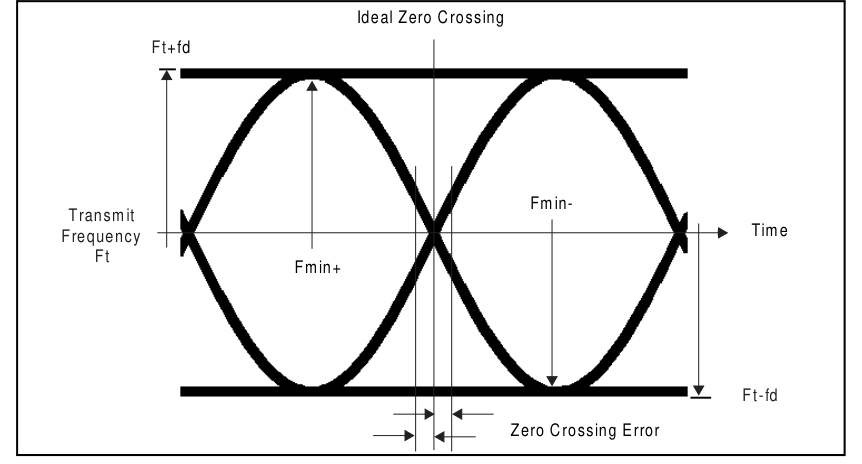

**Figure 3.1:  GFSK parameters definition**

For each transmission the minimum frequency deviation,
Fmin = min { |Fmin+ | , Fmin- }
which corresponds to a 1010 sequence, shall be no smaller than ±80% of the frequency deviation with respect to the transmit frequency, which corresponds to a 00001111 sequence.
The minimum frequency deviation shall never be less than 185 kHz when transmitting at 1 megasymbol per second (Msym/s) symbol rate and never be less than 370 kHz when transmitting at 2 Msym/s symbol rate. The symbol timing accuracy shall be better than ±50 ppm.
The zero crossing error is the time difference between the ideal symbol period and the measured crossing time. This shall be less than ±1/8 of a symbol period.

#### 3.1.1  Stable Modulation Index

An LE device with a transmitter that has a stable modulation index may inform the receiving LE device of this fact through the feature support mechanism (see [Vol 6] Part B, Section 4.6). The modulation index for these transmitters shall be between 0.495 and 0.505. A device shall only state that it has a stable modulation index if that applies to all LE transmitter PHYs it supports.
A transmitter that does not have a stable modulation index is said to have a standard modulation index.

### 3.2   SPURIOUS EMISSIONS

#### 3.2.1  Modulation Spectrum

For products intended to comply with FCC part 15.247 rules, the minimum 6 dB bandwidth of the transmitter spectrum shall be at least 500 kHz using a resolution bandwidth of 100 kHz.

#### 3.2.2  In-band Spurious Emission

An adjacent channel power is specified for channels at least 2 MHz from the carrier when transmitting with1 Msym/s modulation (applies to the LE 1M and LE Coded PHYs) or at least 4 MHz from the carrier when transmitting with 2 Msym/s modulation (applies to the LE 2M PHY). This adjacent channel power is defined as the sum of the measured power in a 1 MHz bandwidth.
The spectrum measurement shall be performed with a 100 kHz resolution bandwidth and an average detector. The device shall transmit on an RF channel with the center frequency M and the adjacent channel power shall be measured on a 1 MHz RF frequency N. The transmitter shall transmit a pseudo random data pattern in the payload throughout the test.

| Frequency offset | Spurious Power |
| --- | --- |
| 2 MHz (\|M-N\| = 2) | -20 dBm |
| 3 MHz or greater (\|M-N\| ≥ 3) | -30 dBm |

Table 3.3:  Transmit Spectrum mask when transmitting with 1 Msym/s modulation

| Frequency offset | Spurious Power |
| --- | --- |
| 4 MHz (\|M-N\| = 4) | -20 dBm |
| 5 MHz (\|M-N\| = 5) | -20 dBm |
| 6 MHz or greater (\|M-N\| ≥ 6) | -30 dBm |

Table 3.4:  Transmit Spectrum mask when transmitting with 2 Msym/s modulation
Exceptions are allowed in up to three bands of 1 MHz width, centered on a frequency which is an integer multiple of 1 MHz. These exceptions shall have an absolute value of -20 dBm or less.

#### 3.2.3  Out-of-band Spurious Emission

The equipment manufacturer is responsible for the ISM out-of-band spurious emissions requirements in the intended countries of sale.

### 3.3   RADIO FREQUENCY TOLERANCE

The deviation of the center frequency during the packet shall not exceed ±150 kHz, including both the initial frequency offset and drift. The frequency drift during any packet shall be less than 50 kHz. The drift rate shall be less than 400 Hz/µs.
The limits on the transmitter center frequency drift within a packet is shown in Table 3.5.

| Parameter | Frequency Drift |
| --- | --- |
| Maximum drift | ±50 kHz |
| Maximum drift rate1 | 400 Hz/μs |

Table 3.5:  Maximum allowable frequency drifts in a packet
1. The maximum drift rate is allowed anywhere in a packet.

## 4  RECEIVER CHARACTERISTICS

The reference sensitivity level referred to in this chapter is -70 dBm. The packet error rate corresponding to the defined bit error ratio (BER) shall be used in all receiver characteristic measurements.

### 4.1   ACTUAL SENSITIVITY LEVEL

The actual sensitivity level is defined as the receiver input level for which the BER specified in Table 4.1 is achieved.

| Maximum Supported Payload Length (bytes) | BER (%) |
| --- | --- |
| ≤ 37 | 0.1 |
| ≥ 38 and ≤ 63 | 0.064 |
| ≥ 64 and ≤ 127 | 0.034 |
| ≥ 128 | 0.017 |

Table 4.1:  Actual sensitivity BER by maximum payload length
The actual sensitivity level of the receiver for a given PHY shall be as specified in Table 4.2. This shall apply with any transmitter compliant to the transmitter specification specified in Section 3 together with any combination of the following allowed parameter variations:
• Initial frequency offset
• Frequency drift
• Symbol rate
• Frequency deviation

| PHY | Sensitivity (dBm) |
| --- | --- |
| LE Uncoded PHYs | ≤ -70 |
| LE Coded PHY with S=2 coding | ≤ -75 |
| LE Coded PHY with S=8 coding | ≤ -82 |

Table 4.2:  Receiver sensitivity for a given PHY

### 4.2   INTERFERENCE PERFORMANCE

The interference performance shall be measured with a wanted signal 3 dB over the reference sensitivity level. If the frequency of an interfering signal is outside of the band 2400-2483.5 MHz, the out-of-band blocking specification (see Section 4.3) shall apply. Both the desired and the interfering signal shall be reference signals as specified in Section 4.6. The BER shall be ≤0.1% for all the signal-to-interference ratios listed in Table 4.3, Table 4.4, Table 4.5, and Table 4.6:

| Frequency of Interference | Ratio |
| --- | --- |
| Co-Channel interference, C/I co-channel | 21 dB |
| Adjacent (1 MHz) interference1, C/I 1 MHz | 15 dB |
| Adjacent (2 MHz) interference1, C/I 2 MHz | -17 dB |
| Adjacent (≥3 MHz) interference1, C/I ≥3 MHz | -27 dB |
| Image frequency interference1 2 3, C/I Image | -9 dB |
| Adjacent (1 MHz) interference to in-band image frequency1, C/I Image±1MHz | -15 dB |

Table 4.3:  Interference performance for LE 1M PHY

| Frequency of Interference | Ratio |
| --- | --- |
| Co-Channel interference, C/I co-channel | 21 dB |
| Adjacent (2 MHz) interference1, C/I 2 MHz | 15 dB |
| Adjacent (4 MHz) interference1, C/I 4 MHz | -17 dB |
| Adjacent (≥6 MHz) interference1, C/I ≥6 MHz | -27 dB |
| Image frequency interference1 2 4, C/I Image | -9 dB |
| Adjacent (2 MHz) interference to in-band image frequency1, C/I Image±2MHz | -15 dB |

Table 4.4:  Interference performance for LE 2M PHY

| Frequency of Interference | Ratio |
| --- | --- |
| Co-Channel interference, C/I co-channel | 12 dB |
| Adjacent (1 MHz) interference1, C/I 1 MHz | 6 dB |
| Adjacent (2 MHz) interference1, C/I 2 MHz | -26 dB |

Table 4.5:  Interference performance for the LE Coded PHY with S=8 coding (125 kb/s data rate)

| Frequency of Interference | Ratio |
| --- | --- |
| Adjacent (≥3 MHz) interference1, C/I ≥3 MHz | -36 dB |
| Image frequency interference1 2 3, C/I Image | -18 dB |
| Adjacent (1 MHz) interference to in-band image frequency1, C/I Image±2MHz | -24 dB |

Table 4.5:  Interference performance for the LE Coded PHY with S=8 coding (125 kb/s data rate)

| Frequency of Interference | Ratio |
| --- | --- |
| Co-Channel interference, C/I co-channel | 17 dB |
| Adjacent (1 MHz) interference1, C/I 1 MHz | 11 dB |
| Adjacent (2 MHz) interference1, C/I 2 MHz | -21 dB |
| Adjacent (≥3 MHz) interference1, C/I ≥3 MHz | -31 dB |
| Image frequency interference1 2 3, C/I Image | -13 dB |
| Adjacent (1 MHz) interference to in-band image frequency1, C/I Image±2MHz | -19 dB |

Table 4.6:  Interference performance for the LE Coded PHY with S=2 coding (500 kb/s data rate)
Notes:
1. If two adjacent frequency specifications from Table 4.3, Table 4.4, Table 4.5, or Table 4.6 (as appropriate) are applicable to the same frequency, the more relaxed specification applies.
2. In-band image frequency.
3. If the image frequency ≠ n*1 MHz, then the image reference frequency is defined as the closest n*1 MHz frequency for integer n.
4. If the image frequency ≠ n*2 MHz, then the image reference frequency is defined as the closest n*2 MHz frequency for integer n.
Any frequencies where the requirements are not met are called spurious response RF channels. Five spurious response RF channels are allowed with a distance of ≥2 MHz from the wanted signal when receiving with 1 Msym/s modulation and a distance of ≥4 MHz when receiving with 2 Msym/s modulation; different spurious response channels are allowed for the two modulation schemes. This excludes the image frequency with both 1 Msym/s and 2 Msym/s modulation, the image frequency ±1MHz with 1 Msym/s modulation, and the image frequency ±2 MHz with 2 Msym/s modulation. On these spurious response RF channels, a relaxed interference requirement C/I = -17 dB shall be met by both 1 Msym/s and 2 Msym/s modulation transmitters.

### 4.3   OUT-OF-BAND BLOCKING

The out-of-band blocking applies to interfering signals outside the band 2400-2483.5 MHz. The out-of-band suppression (or rejection) shall be measured with a wanted signal 3 dB over the reference sensitivity level. The interfering signal shall be a continuous wave signal. The desired signal shall be a reference signal as specified in Section 4.6, with a center frequency of 2426 MHz. The BER shall be ≤ 0.1%. The out-of-band blocking shall fulfill the following requirements:

| Interfering Signal Frequency | Interfering Signal Power Level | Measurement resolution |
| --- | --- | --- |
| 30 MHz – 2000 MHz | -30 dBm | 10 MHz |
| 2003 – 2399 MHz | -35 dBm | 3 MHz |
| 2484 – 2997 MHz | -35 dBm | 3 MHz |
| 3000 MHz – 12.75 GHz | -30 dBm | 25 MHz |

Table 4.7:  Out-of-band suppression (or rejection) requirements
Up to 10 exceptions are permitted, which are dependent upon the given RF channel and are centered at a frequency which is an integer multiple of 1 MHz:
• For at least 7 of these spurious response frequencies, a reduced interference level of at least -50 dBm is allowed in order to achieve the required BER ≤ 0.1%.
• For a maximum of 3 of the spurious response frequencies, the interference level may be lower.

### 4.4   INTERMODULATION CHARACTERISTICS

The actual sensitivity performance, BER ≤ 0.1%, shall be met under the following conditions:
• The wanted signal shall be at a frequency f0 with a power level 6 dB over the reference sensitivity level. The wanted signal shall be a reference signal as specified in Section 4.6.
• A static sine wave signal shall be at a frequency f1 with a power level of -50 dBm.
• An interfering signal shall be at a frequency f2 with a power level of -50 dBm. The interfering signal shall be a reference signal as specified in Section 4.6.
When receiving with 1 Msym/s modulation, frequencies f0, f1 and f2 shall be chosen such that f0 = 2*f1 - f2 and | f2-f1 | = n * 1 MHz, where n can be 3, 4, or 5.
When receiving with 2 Msym/s modulation, frequencies f0, f1 and f2 shall be chosen such that f0 = 2*f1 - f2 and | f2-f1 | = n * 2 MHz, where n can be 3, 4, or 5.
The system shall fulfill at least one of the three alternatives (n=3, 4, or 5); different modulation schemes can use different alternatives.

### 4.5   MAXIMUM USABLE LEVEL

The maximum usable input level the receiver can operate at shall be greater than -10 dBm, and the BER shall be less than or equal to 0.1% at -10 dBm input power. The input signal shall be a reference signal as specified in Section 4.6.

### 4.6   REFERENCE SIGNAL DEFINITION

The reference signal for LE is defined as:
Modulation = GFSK Modulation index = 0.5 ± 1% for standard modulation index, 0.5 ± 0.5% for stable modulation index BT = 0.5 ± 1% Data Bit Rate =
• 1 Mb/s ±1 ppm for the LE 1M PHY
• 2 Mb/s ±1 ppm for the LE 2M PHY
• 125 kb/s ±1 ppm for the LE Coded PHY when using S=8 coding
• 500 kb/s ±1 ppm for the LE Coded PHY when using S=2 coding Modulating Data for wanted signal = PRBS9
Modulating Data for interfering signal = PRBS15
Frequency accuracy better than ±1 ppm

### 4.7   STABLE MODULATION INDEX

An LE device may have a receiver that can take advantage of the fact that the remote device indicates support for the Stable Modulation Index - Transmitter feature (see [Vol 6] Part B, Section 4.6). Such a receiver is said to have stable modulation index support.
APPENDIX A TEST CONDITIONS
A.1  NORMAL OPERATING CONDITIONS (NOC)
A.1.1  Normal Temperature and Air Humidity
The normal operating temperature shall be declared by the product manufacturer. The nominal test temperature shall be within ±10°C of the normal operating temperature.
A.1.2  Nominal Supply Voltage
The nominal test voltage for the equipment under normal test conditions shall be the nominal supply voltage as declared by the product manufacturer.
Core System Package [Low Energy Controller volume]
Part B
PART B: LINK LAYER SPECIFICATION
This part of the specification describes the Bluetooth low energy Link Layer.
CONTENTS

## 1  GENERAL DESCRIPTION

### 1.1   LINK LAYER STATES

The operation of the Link Layer can be described in terms of a state machine with the following five states:
• Standby State
• Advertising State
• Scanning State
• Initiating State
• Connection State
The Link Layer state machine allows only one state to be active at a time. The Link Layer shall have at least one Link Layer state machine that supports one of Advertising State or Scanning State. The Link Layer may have multiple instances of the Link Layer state machine.
The Link Layer in the Standby State does not transmit or receive any packets. The Standby State can be entered from any other state.
The Link Layer in the Advertising State will be transmitting advertising channel packets and possibly listening to and responding to responses triggered by these advertising channel packets. A device in the Advertising State is known as an advertiser. The Advertising State can be entered from the Standby State.
The Link Layer in the Scanning State will be listening for advertising channel packets from devices that are advertising. A device in the Scanning State is known as a scanner. The Scanning State can be entered from the Standby State.
The Link Layer in the Initiating State will be listening for advertising channel packets from a specific device(s) and responding to these packets to initiate a connection with another device. A device in the Initiating State is known as an initiator. The Initiating State can be entered from the Standby State.
The Connection State can be entered either from the Initiating State or the Advertising State. A device in the Connection State is known as being in a connection.
Within the Connection State, two roles are defined:
• Master Role
• Slave Role
When entered from the Initiating State, the Connection State shall be in the Master Role. When entered from the Advertising State, the Connection State shall be in the Slave Role.
The Link Layer in the Master Role will communicate with a device in the Slave Role and defines the timings of transmissions.
The Link Layer in the Slave Role will communicate with a single device in the Master Role.

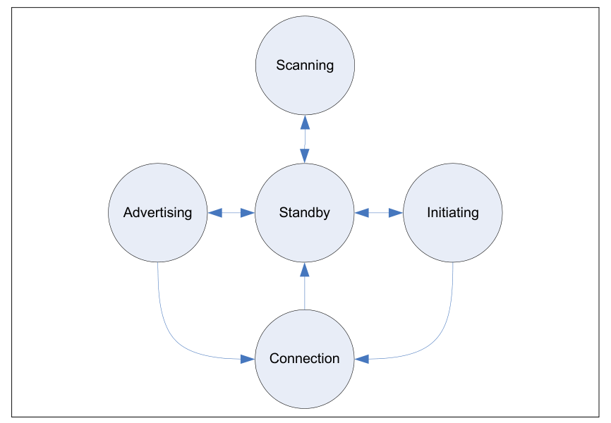

**Figure 1.1:  State diagram of the Link Layer state machine**

#### 1.1.1  Permitted State and Role Combination Restrictions

The Link Layer may optionally support multiple state machines. If it does support multiple state machines, then:
• The Link Layer in the Connection State may operate in the Master Role and Slave Role at the same time.
• The Link Layer in the Connection State operating in the Slave Role may have multiple connections.
• The Link Layer in the Connection State operating in the Master Role may have multiple connections.
• All other combinations of states and roles may also be supported.
• The Link Layer in the Connection State shall have at most one connection to another Link Layer in the Connection State.
A Link Layer implementation is not required to support all the possible state combinations that are allowed by this specification. However, if it supports a state or state combination given in the "combination A" column of Table 1.1, it shall also support the corresponding state or state combination in the "combination B" column.

| Combination A | Combination B |
| --- | --- |
| Initiating plus any combination C of other states | Connection (Master role) plus the same combination C |
| Connection (Master role) plus Initiating plus any combination C of other states | Connection (Master role) to more than one device in the slave role plus the same combination C |
| Connectable or a directed advertising state plus any combination C of other states | Connection (Slave role) plus the same combination C |
| Connection (Slave role) plus Connectable or a directed advertising state plus any combi- nation C of other states | Connection (Slave role) to more than one device in the Master role plus the same combination C |

Table 1.1:  Requirements on supported states and state combinations
In each case, the combination of other states C may be empty. Note that, in the last two rows, "other states" includes other Connectable or directed advertising states.

#### 1.1.2  Devices supporting only some states

Devices supporting only some link layer states or only one of the two roles within the Connection State are not required to support features (including supporting particular PDUs, procedures, data lengths, or HCI commands or particular features of an HCI command) that are only used by a state or mode that the device does not support.

### 1.2   BIT ORDERING

The bit ordering when defining fields within the packet or Protocol Data Unit (PDU) in the Link Layer specification follows the Little Endian format. The following rules apply:
• The Least Significant Bit (LSB) corresponds to b0
• The LSB is the first bit sent over the air
• In illustrations, the LSB is shown on the left side
Furthermore, data fields defined in the Link Layer, such as the PDU header fields, shall be transmitted with the LSB first. For instance, a 3-bit parameter X=3 is sent as:
b0b1b2 = 110
Over the air, 1 is sent first, 1 is sent next, and 0 is sent last. This is shown as 110 in the specification.
Binary field values specified in this specification that follow the format 10101010b (e.g., the advertising channel Access Address in Section 2.1.2) are written with the MSB to the left. There are two basic formats: one for the LE Uncoded PHYs, described in Section 2.1, and one for the LE Coded PHY, described in Section 2.2.
Multi-octet fields, with the exception of the Cyclic Redundancy Check (CRC) and the Message Integrity Check (MIC), shall be transmitted with the least significant octet first. Each octet within multi-octet fields, with the exception of the CRC (see Section 3.1.1), shall be transmitted in LSB first order. For example, the 48-bit addresses in the advertising channel PDUs shall be transmitted with the least significant octet first, followed by the remainder of the five octets in increasing order.
Multi-octet field values specified in this specification (e.g. the CRC initial value in Section 2.3.3.1) are written with the most significant octet to the left; for example in 0x112233445566, the octet 0x11 is the most significant octet.

### 1.3   DEVICE ADDRESS

Devices are identified using a device address. Device addresses may be either a public device address or a random device address. A public device address and a random device address are both 48 bits in length.
A device shall use at least one type of device address and may contain both.
A device's Identity Address is a Public Device Address or Random Static Device Address that it uses in packets it transmits. If a device is using Resolvable Private Addresses, it shall also have an Identity Address.

#### 1.3.1  Public Device Address

The public device address shall be created in accordance with [Vol 2] Part B, Section 1.2, with the exception that the restriction on LAP values does not apply unless the public device address will also be used as a BD_ADDR for a BR/EDR Controller.

#### 1.3.2  Random Device Address

The random device address may be of either of the following two sub-types:
• Static address
• Private address.
The term random device address refers to both static and private address types.
The transmission of a random device address is optional. A device shall accept the reception of a random device address from a remote device.

##### 1.3.2.1  Static Device Address

A static address is a 48-bit randomly generated address and shall meet the following requirements:
• The two most significant bits of the address shall be equal to 1
• At least one bit of the random part of the address shall be 0
• At least one bit of the random part of the address shall be 1
The format of a static address is shown in Figure 1.2.

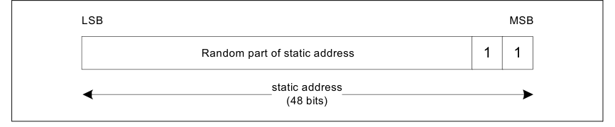

**Figure 1.2:  Format of static address**

A device may choose to initialize its static address to a new value after each power cycle. A device shall not change its static address value once initialized until the device is power cycled.
Note: If the static address of a device is changed, then the address stored in peer devices will not be valid and the ability to reconnect using the old address will be lost.

##### 1.3.2.2  Private Device Address Generation

The private address may be of either of the following two sub-types:
• Non-resolvable private address
• Resolvable private address
To generate a non-resolvable address, the device shall generate a 48-bit address with the following requirements:
• The two most significant bits of the address shall be equal to 0
• At least one bit of the random part of the address shall be 1
• At least one bit of the random part of the address shall be 0
• The address shall not be equal to the public address
The format of a non-resolvable private address is shown in Figure 1.3.

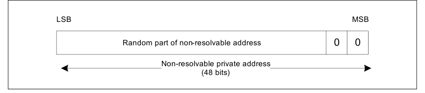

**Figure 1.3:  Format of non-resolvable private address**

To generate a resolvable private address, the device must have either the Local Identity Resolving Key (IRK) or the Peer Identity Resolving Key (IRK). The resolvable private address shall be generated with the IRK and a randomly generated 24-bit number. The random number is known as prand and shall meet the following requirements:
• The two most significant bits of prand shall be equal to 0 and 1 as shown in Figure 1.4
• At least one bit of the random part of prand shall be 0
• At least one bit of the random part of prand shall be 1
The format of the resolvable private address is shown in Figure 1.4.

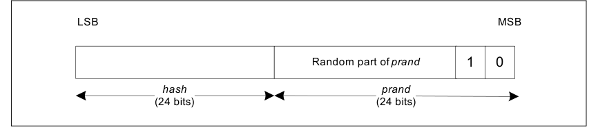

**Figure 1.4:  Format of resolvable private address**

The hash is generated using the random address function ah defined in [Vol 3] Part H, Section 2.2.2 with the input parameter k set to the device’s IRK and the input parameter r set to prand.
hash = ah(IRK, prand)
The prand and hash are concatenated to generate the random address (randomAddress) in the following manner:
randomAddress = hash || prand
The least significant octet of hash becomes the least significant octet of randomAddress and the most significant octet of prand becomes the most significant octet of randomAddress.

##### 1.3.2.3  Private Device Address Resolution

A resolvable private address may be resolved if the corresponding device’s IRK is available using this procedure. If a resolvable private address is resolved, the device can associate this address with the peer device.
The resolvable private address (RPA) is divided into a 24-bit random part (prand) and a 24-bit hash part (hash). The least significant octet of the RPA becomes the least significant octet of hash and the most significant octet of RPA becomes the most significant octet of prand. A localHash value is then generated using the random address hash function ah defined in [Vol 3] Part H, Section 2.2.2 with the input parameter k set to IRK of the known device and the input parameter r set to the prand value extracted from the RPA.
localHash = ah(IRK, prand)
The localHash value is then compared with the hash value extracted from RPA. If the localHash value matches the extracted hash value, then the identity of the peer device has been resolved.
If a device has more than one stored IRK, the device repeats the above procedure for each stored IRK to determine if the received resolvable private address is associated with a stored IRK, until either address resolution is successful for one of the IRKs or all have been tried.
Note: A device that cannot resolve a private address within T_IFS may respond on the reception of the next event.
A non-resolvable private address cannot be resolved.

### 1.4   PHYSICAL CHANNEL

As specified in [Vol 6] Part A, Section 2, 40 RF channels are defined in the 2.4GHz ISM band. These RF channels are allocated into three LE physical channels: advertising, periodic, and data. The advertising physical channel uses all 40 RF channels for discovering devices, initiating a connection and broadcasting data. These RF channels are divided into 3 RF channels, known as the "primary advertising channel", used for initial advertising and all legacy advertising activities, and 37 RF channels, known as the "secondary advertising channel", used for the majority of the communications involved. The data physical channel uses up to 37 (see Section 4.5.8) RF channels for communication between connected devices. Each of these RF channels is allocated a unique channel index (see Section 1.4.1). The periodic physical channel uses the same RF channels as the secondary advertising channel over the advertising physical channel.
Two devices that wish to communicate use a shared physical channel. To achieve this, their transceivers must be tuned to the same RF channel at the same time.
Given that the number of RF channels is limited, and that many Bluetooth devices may be operating independently within the same spatial and temporal area, there is a strong likelihood of two independent Bluetooth devices having their transceivers tuned to the same RF channel, resulting in a physical channel collision. To mitigate the unwanted effects of this collision, each transmission on a physical channel starts with an Access Address that is used as a correlation code by devices tuned to the physical channel. This Access Address is a property of the physical channel. The Access Address is present at the start of every transmitted packet.
The Link Layer uses one physical channel at a given time.
Whenever the Link Layer is synchronized to the timing, frequency, and Access Address of a physical channel, it is said to be 'connected' on the data physical channel or ‘synchronized’ to the periodic physical channel (whether or not it is actively involved in communications over the channel).

#### 1.4.1  Advertising and Data Channel Indices

Table 1.2 shows the mapping from PHY Channel to Channel Index and Channel Type. An ‘●’ in the table below indicates the PHY channel and index are used by the specified channel type.

| RF Channel | RF Center Frequency | Channel Index | Channel Type |  |  |
| --- | --- | --- | --- | --- | --- |
|  |  |  | Data | Primary Advertising | Secondary Advertising |
| 0 | 2402 MHz | 37 |  | ● |  |
| 1 | 2404 MHz | 0 | ● |  | ● |
| 2 | 2406 MHz | 1 | ● |  | ● |
| ... | … | … | … | … | … |
| 11 | 2424 MHz | 10 | ● |  | ● |
| 12 | 2426 MHz | 38 |  | ● |  |
| 13 | 2428 MHz | 11 | ● |  | ● |
| 14 | 2430 MHz | 12 | ● |  | ● |
| ... | … | … | … | … | … |
| 38 | 2478 MHz | 36 | ● |  | ● |
| 39 | 2480 MHz | 39 |  | ● |  |

Table 1.2:  Mapping of PHY Channel to Channel Index and Channel Type

## 2  AIR INTERFACE PACKETS

LE devices shall use the packets as defined in the following sections.

### 2.1   PACKET FORMAT FOR THE LE UNCODED PHYS

The following packet format is defined for the LE Uncoded PHYs (LE 1M and LE 2M) and is used for both advertising channel packets and data channel packets.
This packet format is shown in Figure 2.1. Each packet consists of four mandatory fields. The mandatory fields are Preamble, Access Address, PDU, and CRC.

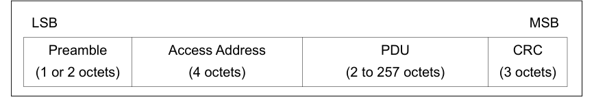

**Figure 2.1:  Link Layer packet format for the LE Uncoded PHYs**

The preamble is 1 octet when transmitting or receiving on the LE 1M PHY and 2 octets when transmitting or receiving on the LE 2M PHY. The Access Address is 4 octets. The PDU range is from 2 to 257 octets. The CRC is 3 octets.
The Preamble is transmitted first, followed by the Access Address, followed by the PDU followed by the CRC. The entire packet is transmitted at the same symbol rate (either 1 Msym/s or 2 Msym/s modulation).
Packets take between 44 and 2120 µs to transmit.

#### 2.1.1  Preamble

All Link Layer packets have a preamble which is used in the receiver to perform frequency synchronization, symbol timing estimation, and Automatic Gain Control (AGC) training. The preamble is a fixed sequence of alternating 0 and 1 bits. For packets transmitted on the LE 1M PHY, the preamble is 8 bits; for packets transmitted on the LE 2M PHY, the preamble is 16 bits. The first bit of the preamble (in transmission order) shall be the same as the LSB of the Access Address. The preamble is shown in Figure 2.2.

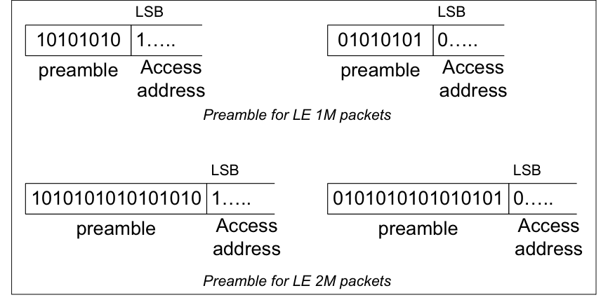

**Figure 2.2:  Preamble**

#### 2.1.2  Access Address

The AUX_SYNC_IND PDU, and any AUX_CHAIN_IND PDUs connected to it, shall use the Access Address (AA) value set in the SyncInfo field (see Section 2.3.4.6) contained in the AUX_ADV_IND PDU that describes the periodic advertising.
The Access Address for all other advertising channel packets shall be 10001110100010011011111011010110b (0x8E89BED6).
It is intended that each Link Layer connection between any two devices and each periodic advertisement has a different Access Address.
The Link Layer in the Initiating State shall generate a new Access Address for each initiating PDU it sends (see Section 2.3.3.1). The Link Layer in the Advertising State shall generate a new Access Address each time that it enables periodic advertising on an advertising set. The address is sent in the SyncInfo field (see Section 2.3.4.6) of PDUs referring to that periodic advertising.
The Access Address shall be a 32-bit value. Each time it needs a new Access Address, the Link Layer shall generate a new random value that meets the following requirements:
• It shall not be the Access Address for any existing Link Layer connection on this device.
• It shall not be the Access Address for any enabled periodic advertising.
• It shall have no more than six consecutive zeros or ones.
• It shall not be the advertising channel packets’ Access Address.
• It shall not be a sequence that differs from the advertising channel packets’ Access Address by only one bit.
• It shall not have all four octets equal.
• It shall have no more than 24 transitions.
• It shall have a minimum of two transitions in the most significant six bits.
The seed for the random number generator shall be from a physical source of entropy and should have at least 20 bits of entropy.
If the random number does not meet the above requirements, new random numbers shall be generated until the requirements are met.
On an implementation that also supports the LE Coded PHY (see Section 2.2, the Access Address shall also meet the following requirements:
• It shall have at least three ones in the least significant 8 bits.
• It shall have no more than eleven transitions in the least significant 16 bits.

#### 2.1.3  PDU

The preamble and Access Address are followed by a PDU. When a packet is transmitted on either the primary or secondary advertising channel, the PDU shall be the Advertising Channel PDU as defined in Section 2.3. When a packet is transmitted on the data physical channel, the PDU shall be the Data Channel PDU as defined in Section 2.4.

#### 2.1.4  CRC

At the end of every Link Layer packet there is a 24-bit CRC. It shall be calculated over the PDU. The CRC polynomial is defined in Section 3.1.1.

### 2.2   PACKET FORMAT FOR THE LE CODED PHY

The following packet format is defined for the LE Coded PHY and is used for both advertising channel packets and data channel packets. This packet format is shown in Figure 2.3. .

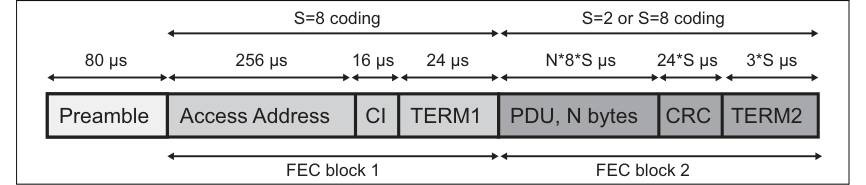

**Figure 2.3:  Link Layer packet format for the LE Coded PHY**

Each packet consists of the Preamble, FEC block 1, and FEC block 2.
The Preamble is not coded.
The FEC block 1 consists of three fields: Access Address, Coding Indicator (CI), and TERM1. These shall use the S=8 coding scheme as defined in Section 3.3.1.
The CI field determines which coding scheme is used for FEC block 2.
The FEC block 2 consists of three fields: PDU, CRC, and TERM2. These shall use either the S=2 or S=8 coding scheme as defined in Section 3.3, depending on the value of the CI field.
The entire packet is transmitted with 1 Msym/s modulation.
Table 2.1 captures the size and duration of the data packet fields.

|  | Fields |  |  |  |  |  |  |
| --- | --- | --- | --- | --- | --- | --- | --- |
|  | Preamble | Access Address | CI | TERM1 | PDU | CRC | TERM |
| Number of Bits | Uncoded | 32 | 2 | 3 | 16 – 2056 | 24 | 3 |
| Duration when using S=8 coding (µs) | 80 | 256 | 16 | 24 | 128 – 16448 | 192 | 24 |
| Duration when using S=2 coding (µs) | 80 | 256 | 16 | 24 | 32 – 4112 | 48 | 6 |

Table 2.1:  LE Coded PHY field sizes and durations in microseconds
Packets take between 462 and 17040 µs to transmit.

#### 2.2.1  Preamble

The Preamble is 80 symbols in length and consists of 10 repetitions of the symbol pattern '00111100' (in transmission order).

#### 2.2.2  Access Address

The Access Address is specified in Section 2.1.2.

#### 2.2.3  Coding Indication

The CI field consists of two bits as defined in Table 2.2.

| CI Field | Meaning |
| --- | --- |
| 00b | FEC Block 2 coded using S=8 |
| 01b | FEC Block 2 coded using S=2 |
| All other values | Reserved for future use |

Table 2.2:  Meaning of CI field

#### 2.2.4  PDU

When a packet is transmitted on either the primary or secondary advertising channel, the PDU shall be the Advertising Channel PDU as defined in Section 2.3. When a packet is transmitted on the data physical channel, the PDU shall be the Data Channel PDU as defined in Section 2.4.

#### 2.2.5  CRC

The CRC is 24 bits in length and the value is calculated over all the PDU bits. The CRC generator polynomial is defined in Section 3.1.1.

#### 2.2.6  TERM1 and TERM2

There is a termination field at the end of each FEC block referred to as TERM1 and TERM2. Each termination field is 3 bits long and forms the termination sequence defined in Section 3.3.1.

### 2.3   ADVERTISING CHANNEL PDU

The advertising channel PDU has a 16-bit header and a variable size payload. Its format is as shown in Figure 2.4. The 16-bit Header field of the advertising channel PDU is as shown in Figure 2.5.

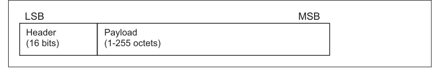

**Figure 2.4:  Advertising channel PDU**

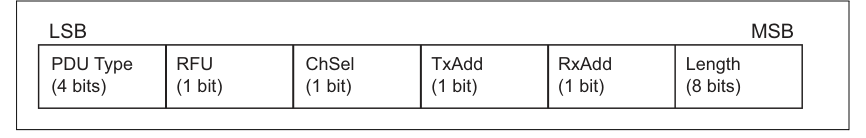

**Figure 2.5:  Advertising channel PDU Header**

The PDU Type field of the advertising channel PDU that is contained in the header indicates the PDU type as defined in Table 2.3. This table also shows which channel and which PHYs the packet may appear on.

| PDU Type | PDU Name | Channel | Permitted PHYs |  |  |
| --- | --- | --- | --- | --- | --- |
|  |  |  | LE 1M | LE 2M | LE Code |
| 0000b | ADV IND _ | Primary Advertising | ● |  |  |
| 0001b | ADV DIRECT IND _ _ | Primary Advertising | ● |  |  |
| 0010b | ADV NONCONN IND _ _ | Primary Advertising | ● |  |  |
| 0011b | SCAN REQ _ | Primary Advertising | ● |  |  |
|  | AUX SCAN REQ _ _ | Secondary Advertising | ● | ● | ● |
| 0100b | SCAN RSP _ | Primary Advertising | ● |  |  |
| 0101b | CONNECT IND _ | Primary Advertising | ● |  |  |
|  | AUX CONNECT REQ _ _ | Secondary Advertising | ● | ● | ● |
| 0110b | ADV SCAN IND _ _ | Primary Advertising | ● |  |  |

Table 2.3:  Advertising channel PDU Header’s PDU Type field encoding

| PDU Type | PDU Name | Channel | Permitted PHYs |  |  |
| --- | --- | --- | --- | --- | --- |
|  |  |  | LE 1M | LE 2M | LE Code |
| 0111b | ADV EXT IND _ _ | Primary Advertising | ● |  | ● |
|  | AUX ADV IND _ _ | Secondary Advertising | ● | ● | ● |
|  | AUX SCAN RSP _ _ | Secondary Advertising | ● | ● | ● |
|  | AUX SYNC IND _ _ | Secondary Advertising | ● | ● | ● |
|  | AUX CHAIN IND _ _ | Secondary Advertising | ● | ● | ● |
| 1000b | AUX CONNECT RSP _ _ | Secondary Advertising | ● | ● | ● |
| All other values | Reserved for Future Use |  |  |  |  |

Table 2.3:  Advertising channel PDU Header’s PDU Type field encoding
Each PDU shall only appear on those PHYs indicated with a bullet ‘●’ and on the Advertising Channel shown in Table 2.3.
The ChSel, TxAdd and RxAdd fields of the advertising channel PDU that are contained in the header contain information specific to the PDU type   defined for each advertising channel PDU separately. If the ChSel, TxAdd or RxAdd fields are not defined as used in a given PDU then they shall be considered Reserved for Future Use.
The Length field of the advertising channel PDU header indicates the payload field length in octets. The valid range of the Length field shall be 1 to 255 octets.
The Payload fields in the advertising channel PDUs are specific to the PDU Type and are defined in Section 2.3.1 through Section 2.3.4. The PDU Types marked as Reserved for future use shall not be sent and shall be ignored upon receipt.
Within advertising channel PDUs, advertising data or scan response data from the Host may be included in the Payload in some PDU Types. The format of this data is defined in [Vol 3] Part C, Section 11.
Some advertising channel PDUs contain an AuxPtr field (see Section 2.3.4.5) which points to a packet containing another advertising channel PDU. In this case, the second packet and PDU are the auxiliary packet and auxiliary PDU of the original PDU, which in turn is the superior packet and superior PDU of the second one. Note that a PDU can only have one auxiliary PDU but more than one superior PDU.
Given a packet, its subordinate set consists of its auxiliary packet, if any, and the subordinate set of the auxiliary packet. A packet without an AuxPtr field has an empty subordinate set.

#### 2.3.1  Advertising PDUs

The following advertising channel PDU Types are called advertising PDUs:
• ADV_IND
• ADV_DIRECT_IND
• ADV_NONCONN_IND
• ADV_SCAN_IND
• ADV_EXT_IND
• AUX_ADV_IND
• AUX_SYNC_IND
• AUX_CHAIN_IND
These PDUs are sent by the Link Layer in the Advertising State and received by a Link Layer in the Scanning State or Initiating State. The ADV_IND, ADV_DIRECT_IND, ADV_NONCONN_IND, and ADV_SCAN_IND PDUs are called “legacy advertising PDUs”. The ADV_EXT_IND, AUX_ADV_IND, AUX_SYNC_IND, and AUX_CHAIN_IND PDUs are called “extended advertising PDUs”. Advertising events using legacy advertising PDUs are called “legacy advertising events”.

##### 2.3.1.1  ADV_IND

The ADV_IND PDU has the Payload as shown in Figure 2.6. The PDU shall be used in connectable and scannable undirected advertising events. The TxAdd in the advertising channel PDU header indicates whether the advertiser’s address in the AdvA field is public (TxAdd = 0) or random (TxAdd = 1). The ChSel field in the advertising channel PDU header shall be set to 1 if the advertiser supports the LE Channel Selection Algorithm #2 feature (see Section 4.5.8.3).

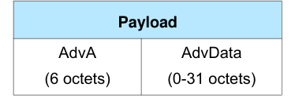

**Figure 2.6:  ADV_IND PDU Payload**

The Payload field consists of AdvA and AdvData fields. The AdvA field shall contain the advertiser’s public or random device address as indicated by TxAdd. The AdvData field may contain Advertising Data from the advertiser’s Host.

##### 2.3.1.2  ADV_DIRECT_IND

The ADV_DIRECT_IND PDU has the Payload as shown in Figure 2.7. The PDU shall be used in connectable directed advertising events. The TxAdd in the advertising channel PDU header indicates whether the advertiser’s address in the AdvA field is public (TxAdd = 0) or random (TxAdd = 1). The RxAdd in the advertising channel PDU header indicates whether the target’s address in the TargetA field is public (RxAdd = 0) or random (RxAdd = 1). The ChSel field in the advertising channel PDU header shall be set to 1 if the advertiser supports the LE Channel Selection Algorithm #2 feature (see Section 4.5.8.3).

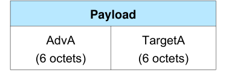

**Figure 2.7:  ADV_DIRECT_IND PDU Payload**

The Payload field consists of AdvA and TargetA fields. The AdvA field shall contain the advertiser’s public or random device address as indicated by TxAdd. The TargetA field is the address of the device to which this PDU is addressed. The TargetA field shall contain the target’s public or random device address as indicated by RxAdd.
Note: This packet does not contain any Host data.

##### 2.3.1.3  ADV_NONCONN_IND

The ADV_NONCONN_IND PDU has the Payload as shown in Figure 2.8. The PDU shall be used in non-connectable and non-scannable undirected advertising events. The TxAdd in the advertising channel PDU header indicates whether the advertiser’s address in the AdvA field is public (TxAdd = 0) or random (TxAdd = 1).

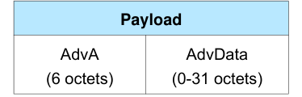

**Figure 2.8:  ADV_NONCONN_IND PDU Payload**

The Payload field consists of AdvA and AdvData fields. The AdvA field shall contain the advertiser’s public or random device address as indicated by TxAdd. The AdvData field may contain Advertising Data from the advertiser’s Host.

##### 2.3.1.4  ADV_SCAN_IND

The ADV_SCAN_IND PDU has the Payload as shown in Figure 2.9. The PDU shall be used in scannable undirected advertising events. The TxAdd in the advertising channel PDU header indicates whether the advertiser’s address in the AdvA field is public (TxAdd = 0) or random (TxAdd = 1).

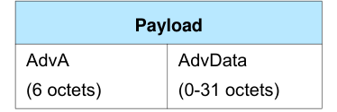

**Figure 2.9:  ADV_SCAN_IND PDU Payload**

The Payload field consists of AdvA and AdvData fields. The AdvA field shall contain the advertiser’s public or random device address as indicated by TxAdd. The AdvData field may contain Advertising Data from the advertiser’s Host.

##### 2.3.1.5  ADV_EXT_IND

The ADV_EXT_IND PDU uses the Common Extended Advertising Payload Format described in Section 2.3.4. The PDU may be used in all advertising events (except connectable and scannable undirected) as indicated by the AdvMode field value. An advertising event using an ADV_EXT_IND PDU is directed if, and only if, either the TargetA field is present or the AuxPtr field is present and points to a PDU where the TargetA field is present.
The Common Extended Advertising Payload Format fields permitted in the ADV_EXT_IND PDU are shown in Table 2.4.

|  |  | Common Extended Advertising Payload Format fields |  |  |  |  |  |  |  |
| --- | --- | --- | --- | --- | --- | --- | --- | --- | --- |
| Event Type | Adv Mode | AdvA | TargetA | ADI | Aux Ptr | Sync Info | Tx Power | ACAD | Ad Dat |
| Non-Connectable and Non-Scannable Undirected without auxiliary packet Non-Connectable and Non-Scannable Undirected with auxiliary packet | 00b 00b | M | X | X | X | X | O | X | X |
|  |  | C1 | X | M | M | X | C1 | X | X |

Table 2.4:  Common Extended Advertising Payload Format fields permitted in the ADV_EXT_IND PDU

|  |  | Common Extended Advertising Payload Format fields |  |  |  |  |  |  |  |
| --- | --- | --- | --- | --- | --- | --- | --- | --- | --- |
| Event Type | Adv Mode | AdvA | TargetA | ADI | Aux Ptr | Sync Info | Tx Power | ACAD | Adv Dat |
| Non-Connectable and Non-Scannable Directed without auxiliary packet | 00b | M | M | X | X | X | O | X | X |
| Non-Connectable and Non-Scannable Directed with auxiliary packet | 00b | C1 | C1 | M | M | X | C1 | X | X |
| Connectable Undirected | 01b | X | X | M | M | X | C1 | X | X |
| Connectable Directed | 01b | X | X | M | M | X | C1 | X | X |
| Scannable Undirected | 10b | X | X | M | M | X | C1 | X | X |
| Scannable Directed | 10b | X | X | M | M | X | C1 | X | X |
| RFU | 11b |  |  |  |  |  |  |  |  |

Table 2.4:  Common Extended Advertising Payload Format fields permitted in the ADV_EXT_IND PDU
For the non-connectable and non-scannable directed and non-connectable and non-scannable undirected event types without ACAD or AdvData, the Controller can choose whether or not to use an auxiliary packet. See Sections 4.4.2.6 and 4.4.2.9.
In all tables (including subsequent sections) describing permitted Common Extended Advertising Payload Format Fields:
M This field is mandatory.
O This field is optional.
X This field is reserved for future use.
C1 This field is optional on the LE 1M PHY and reserved for future use on the LE Coded PHY.
C2 This field is mandatory if the corresponding field in the ADV_EXT_IND PDU is not present, otherwise it is reserved for future use.
C3 This field is mandatory if the corresponding field in the PDU pointing to this PDU is present, otherwise it is reserved for future use.
C4 This field is optional if the corresponding field in the ADV_EXT_IND PDU is not present, otherwise it is reserved for future use.
Fields reserved for future use shall not be present when the packet is sent and shall be ignored when received.
Any auxiliary packet shall be an AUX_ADV_IND packet with the same AdvMode as the ADV_EXT_IND packet.

##### 2.3.1.6  AUX_ADV_IND

The AUX_ADV_IND PDU uses the Common Extended Advertising Payload Format described in Section 2.3.4. The PDU may be used in all advertising events (except connectable and scannable undirected) as indicated by the AdvMode field value.
The AdvMode field indicates the type of advertising event the AUX_ADV_IND packet is being used for.
The Common Extended Advertising Payload Format fields permitted in the AUX_ADV_IND PDU are shown in Table 2.5.
The PHY used for the AUX_ADV_IND shall be specified in the AuxPtr field of the superior PDU. The PHY specified in any AuxPtr field in an AUX_ADV_IND PDU shall be the same as the PHY the PDU was sent on.
The ADI field shall have the same value as the field in the PDU pointing to this PDU. Note: The ADI field can be used to detect collisions.
Any auxiliary PDU shall be an AUX_CHAIN_IND PDU.
The SyncInfo field, when present, shall point to an AUX_SYNC_IND PDU.

|  |  | Common Extended Advertising Payload Format fields |  |  |  |  |  |  |  |
| --- | --- | --- | --- | --- | --- | --- | --- | --- | --- |
| Adv Mode | Event Type | AdvA | TargetA | ADI | Aux Ptr | Sync Info | Tx Power | ACAD | Adv Data |
| 00b | Non-Connectable and Non-Scanna- ble Undirected | C4 | X | M | O | O | O | O | O |
| 00b | Non-Connectable and Non-Scanna- ble Directed | C4 | C2 | M | O | O | O | O | O |
| 01b | Connectable Undirected | M | X | M | X | X | O | O | O |
| 01b | Connectable Directed | M | M | M | X | X | O | O | O |
| 10b | Scannable Undirected | M | X | M | X | X | O | O | X |
| 10b | Scannable Directed | M | M | M | X | X | O | O | X |
| 11b | RFU |  |  |  |  |  |  |  |  |

Table 2.5:  Common Extended Advertising Payload Format fields permitted in the AUX_ADV_IND PDU

##### 2.3.1.7  AUX_SYNC_IND

The AUX_SYNC_IND PDU uses the Common Extended Advertising Payload Format described in Section 2.3.4. The PDU is used in periodic advertising.
The AdvMode field shall be set to 00b.
The Common Extended Advertising Payload Format fields permitted in the AUX_SYNC_IND PDU are shown in Table 2.6.
The PHY used for the AUX_SYNC_IND PDU shall be that specified in Section 4.4.2.12.
Any auxiliary PDU shall be an AUX_CHAIN_IND PDU.

|  |  | Common Extended Advertising Payload Format fields |  |  |  |  |  |  |  |
| --- | --- | --- | --- | --- | --- | --- | --- | --- | --- |
| Adv Mode | Event Type | AdvA | TargetA | ADI | Aux Ptr | Sync Info | Tx Power | ACAD | Adv Data |
| 00b | Non-Connectable and Non-Scanna- ble Undirected or Directed | X | X | X | O | X | O | O | O |
| 01b – 11b | RFU |  |  |  |  |  |  |  |  |

Table 2.6:  Common Extended Advertising Payload Format fields permitted in the AUX_SYNC_IND PDU

##### 2.3.1.8  AUX_CHAIN_IND

The AUX_CHAIN_IND PDU uses the Common Extended Advertising Payload Format described in Section 2.3.4. The PDU is used to hold additional AdvData. Its superior PDU is an AUX_ADV_IND, AUX_SYNC_IND, AUX_SCAN_RSP or another AUX_CHAIN_IND PDU.
The AdvMode field shall be set to 00b.
The Common Extended Advertising Payload Format fields permitted in the AUX_CHAIN_IND PDU are shown in Table 2.7.
The PHY used for the AUX_CHAIN_IND PDU shall be the same as the PHY used for its superior PDU.
The ADI field, when present, shall have the same value as the field in the superior PDU. Note: The ADI field can be used to detect collisions.
Any auxiliary PDU shall be another AUX_CHAIN_IND PDU.

|  |  | Common Extended Advertising Payload Format fields |  |  |  |  |  |  |  |
| --- | --- | --- | --- | --- | --- | --- | --- | --- | --- |
| Adv Mode | Event Type | AdvA | TargetA | ADI | Aux Ptr | Sync Info | Tx Power | ACAD | Adv Data |
| 00b | Chained data | X | X | C3 | O | X | O | X | O |
| 01b – 11b | RFU |  |  |  |  |  |  |  |  |

Table 2.7:  Common Extended Advertising Payload Format fields permitted in the AUX_CHAIN_IND PDU

#### 2.3.2  Scanning PDUs

The following advertising channel PDU types are called scanning PDUs.
• SCAN_REQ
• SCAN_RSP
• AUX_SCAN_REQ
• AUX_SCAN_RSP
The SCAN_REQ and AUX_SCAN_REQ PDUs are called scan request PDUs. The SCAN_RSP and AUX_SCAN_RSP PDUs are called scan response PDUs.
Where these PDUs are used to reply to a scannable advertisement, the PHY used for them shall be the same as the PHY used for the PDU that they reply to.

##### 2.3.2.1  SCAN_REQ and AUX_SCAN_REQ

The SCAN_REQ and AUX_SCAN_REQ PDUs have the Payload as shown in Figure 2.10. The TxAdd in the advertising channel PDU header indicates whether the scanner’s address in the ScanA field is public (TxAdd = 0) or random (TxAdd = 1). The RxAdd in the advertising channel PDU header indicates whether the advertiser’s address in the AdvA field is public (RxAdd = 0) or random (RxAdd = 1).

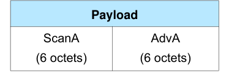

**Figure 2.10:  SCAN_REQ and AUX_SCAN_REQ PDU Payload**

The Payload field consists of ScanA and AdvA fields. The ScanA field shall contain the scanner’s public or random device address as indicated by TxAdd. The AdvA field is the address of the device to which this PDU is addressed.
The AdvA field shall contain the advertiser’s public or random device address as indicated by RxAdd.
Note: These PDUs do not contain any Host Data.

##### 2.3.2.2  SCAN_RSP

The SCAN_RSP PDU has a format as shown in Figure 2.11. The TxAdd in the advertising channel PDU header indicates whether the advertiser’s address in the AdvA field is public (TxAdd = 0) or random (TxAdd = 1). The Length field indicates the size of the payload (AdvA and ScanRspData) in octets.

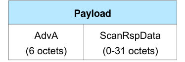

**Figure 2.11:  SCAN_RSP PDU payload**

The Payload field consists of AdvA and ScanRspData fields. The AdvA field shall contain the advertiser’s public or random device address as indicated by TxAdd. The ScanRspData field may contain any data from the advertiser’s Host.

##### 2.3.2.3  AUX_SCAN_RSP

The AUX_SCAN_RSP PDU uses the Common Extended Advertising Payload Format described in Section 2.3.4.
The AdvMode field shall be set to 00b.
The Common Extended Advertising Payload Format fields permitted in the AUX_SCAN_RSP PDU are shown in Table 2.8.
Any auxiliary PDU shall be an AUX_CHAIN_IND PDU.

|  |  | Common Extended Advertising Payload Format fields |  |  |  |  |  |  |  |
| --- | --- | --- | --- | --- | --- | --- | --- | --- | --- |
| Adv Mode | Event Type | AdvA | TargetA | ADI | Aux Ptr | Sync Info | Tx Power | ACAD | Adv Data |
| 00b | Scan response | M | X | X | O | X | O | O | M |
| 01b – 11b | RFU |  |  |  |  |  |  |  |  |

Table 2.8:  Common Extended Advertising Payload Format fields permitted in the AUX_SCAN_RSP PDU

#### 2.3.3  Initiating PDUs

The following advertising channel PDU Types are called initiating PDUs:
• CONNECT_IND
• AUX_CONNECT_REQ
• AUX_CONNECT_RSP
The CONNECT_IND and the AUX_CONNECT_REQ PDUs are sent by the Link Layer in the Initiating State and received by the Link Layer in the Advertising State. The AUX_CONNECT_RSP PDU is sent by the Link Layer in the Advertising State and received by the Link Layer in the Initiating State.
The PHY used for these PDUs shall be the same as the PHY used for the PDU that they reply to.

##### 2.3.3.1  CONNECT_IND and AUX_CONNECT_REQ

The CONNECT_IND and AUX_CONNECT_REQ PDUs have the Payload as shown in Figure 2.12. TxAdd in the advertising channel PDU header indicates whether the initiator’s device address in the InitA field is public (TxAdd = 0) or random (TxAdd = 1). The RxAdd in the advertising channel PDU header indicates whether the advertiser’s device address in the AdvA field is public (RxAdd = 0) or random (RxAdd = 1).
The ChSel field in the CONNECT_IND PDU header shall be set to 1 if the initiator supports the LE Channel Selection Algorithm #2 feature (see Section 4.5.8.3).The ChSel field in the AUX_CONNECT_REQ PDU header is Reserved for Future Use.

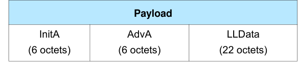

**Figure 2.12:   CONNECT_IND and AUX_CONNECT_REQ PDU payload**

The format of the LLData field is shown in Figure 2.13.

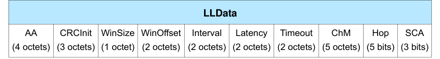

**Figure 2.13:  LLData field structure in CONNECT_IND and AUX_CONNECT_REQ PDU’s payload**

The Payload field consists of InitA, AdvA and LLData fields. The InitA field shall contain the Initiator’s public or random device address as indicated by TxAdd. The AdvA field shall contain the advertiser’s public or random device address as indicated by RxAdd.
The LLData consists of 10 fields:
• The AA field shall contain the Link Layer connection’s Access Address determined by the Link Layer following the rules specified in Section 2.1.2.
• The CRCInit field shall contain the initialization value for the CRC calculation for the Link Layer connection, as defined in Section 3.1.1. It shall be a random value, generated by the Link Layer. The seed for the random number generator shall be from a physical source of entropy and should have at least 20 bits of entropy.
• The WinSize field shall be set to indicate the transmitWindowSize value, as defined in Section 4.5.3 in the following manner: transmitWindowSize = WinSize * 1.25 ms.
• The WinOffset field shall be set to indicate the transmitWindowOffset value, as defined in Section 4.5.3 in the following manner: transmitWindowOffset = WinOffset * 1.25 ms.
• The Interval field shall be set to indicate the connInterval as defined in Section 4.5.1 in the following manner: connInterval = Interval * 1.25 ms.
• The Latency field shall be set to indicate the connSlaveLatency value, as defined in Section 4.5.1 in the following manner: connSlaveLatency = Latency.
• The Timeout field shall be set to indicate the connSupervisionTimeout value, as defined in Section 4.5.2, in the following manner: connSupervisionTimeout = Timeout * 10 ms.
• The ChM field shall contain the channel map indicating Used and Unused data channels. Every channel is represented with a bit positioned as per the data channel index as defined in Section 1.4.1. The LSB represents data channel index 0 and the bit in position 36 represents data channel index 36. A bit value of 0 indicates that the channel is Unused. A bit value of 1 indicates that the channel is Used. The bits in positions 37, 38 and 39 are Reserved for Future Use. Note: When mapping from RF channels to data channel index, care should be taken to remember that there is a gap where advertising channel 38 is placed.
• The Hop field shall be set to indicate the hopIncrement used in the data channel selection algorithm as defined in Section 4.5.8.2. It shall have a random value in the range of 5 to 16.
• The SCA field shall be set to indicate the masterSCA used to determine the worst case Master’s sleep clock accuracy as defined in Section 4.2.2. The value of the SCA field shall be set as defined in Table 2.9.

| SCA | masterSCA |
| --- | --- |
| 0 | 251 ppm to 500 ppm |
| 1 | 151 ppm to 250 ppm |

Table 2.9:  SCA field encoding

| SCA | masterSCA |
| --- | --- |
| 2 | 101 ppm to 150 ppm |
| 3 | 76 ppm to 100 ppm |
| 4 | 51 ppm to 75 ppm |
| 5 | 31 ppm to 50 ppm |
| 6 | 21 ppm to 30 ppm |
| 7 | 0 ppm to 20 ppm |

Table 2.9:  SCA field encoding

##### 2.3.3.2  AUX_CONNECT_RSP

The AUX_CONNECT_RSP PDU uses the Common Extended Advertising Payload Format described in Section 2.3.4.
The AdvMode field shall be set to 00b.
The Common Extended Advertising Payload Format fields permitted in the AUX_CONNECT_RSP PDU are shown in Table 2.10.

|  |  | Common Extended Advertising Payload Format fields |  |  |  |  |  |  |  |
| --- | --- | --- | --- | --- | --- | --- | --- | --- | --- |
| Adv Mode | Event Type | AdvA | TargetA | ADI | Aux Ptr | Sync Info | Tx Power | ACAD | Adv Data |
| 00b | Connection response | M | M | X | X | X | X | X | X |
| 01b – 11b | RFU |  |  |  |  |  |  |  |  |

Table 2.10:  Common Extended Advertising Payload Format fields permitted in the AUX_CONNECT_RSP PDU

#### 2.3.4  Common Extended Advertising Payload Format

The following extended Advertising Channel PDUs share the same Advertising Channel PDU payload format, referred to in this specification as the “Common Extended Advertising Payload Format”:
• ADV_EXT_IND
• AUX_ADV_IND
• AUX_SCAN_RSP
• AUX_SYNC_IND
• AUX_CHAIN_IND
• AUX_CONNECT_RSP
The common extended advertising payload format is shown in Figure 2.14.

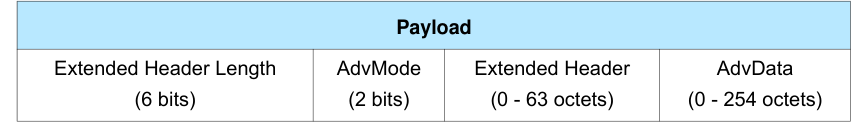

**Figure 2.14:  Common Extended Advertising Payload Format**

The Extended Header Length is a value between 0 and 63 and indicates the size of the variable length Extended Header field.
The AdvMode field indicates the mode of the advertisement. The value of the AdvMode field shall be set as defined in Table 2.11.

| Value | Mode |  |
| --- | --- | --- |
| 00b | Non-connectable | Non-scannable |
| 01b | Connectable | Non-scannable |
| 10b | Non-connectable | Scannable |
| 11b | Reserved for future use |  |

Table 2.11:  AdvMode field encoding
AdvData may contain advertising data from the advertiser’s Host. The maximum size of AdvData depends on the size of the Extended Header. The size of the AdvData can be calculated by subtracting the length of the Extended Header plus one octet from the Length specified in the Advertising channel PDU Header.
The Extended Header field is a variable length header that is present if, and only if, the Extended Header Length field is non-zero. The format of the Extended Header is shown in Figure 2.15.

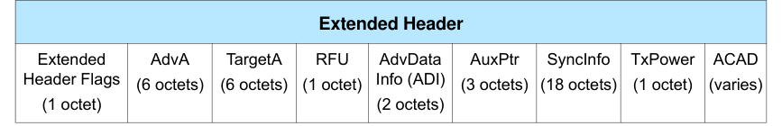

**Figure 2.15:  Extended Header**

The Extended Header Flags bit field definitions are shown in Table 2.12.

| Bit | Extended Header |
| --- | --- |
| 0 | AdvA |
| 1 | TargetA |
| 2 | Reserved for future use |

Table 2.12:  Extended Header Flags

| Bit | Extended Header |
| --- | --- |
| 3 | AdvDataInfo (ADI) |
| 4 | AuxPtr |
| 5 | SyncInfo |
| 6 | TxPower |
| 7 | Reserved for future use |

Table 2.12:  Extended Header Flags
If a flag bit is set to 1, the corresponding Extended Header field is present; otherwise, the corresponding Extended Header field is not present. The Extended Header fields that are present are always in the same order as the flags in the Extended Header flags (i.e., the AdvA field is first if present, then the TargetA field if present, etc.).
Whether an Extended Header flag and corresponding Extended Header field is mandatory, optional, or reserved for future use is dependent on the Advertising Channel PDU in which the extended header is used.

##### 2.3.4.1  AdvA field

When present, the AdvA field is six octets with the format shown in Figure 2.16.

**Figure 2.16:  AdvA field**

The Advertising Address field contains the advertiser’s device address. The TxAdd field of the Advertising Channel PDU Header applies to this value.

##### 2.3.4.2  TargetA field

When present, the TargetA field is six octets with the format shown in Figure 2.17.

**Figure 2.17:  TargetA field**

The Target Address field contains the scanner’s or initiator’s device address to which the advertisement is directed. The RxAdd field of the Advertising Channel PDU Header applies to this value.

##### 2.3.4.3  RFU

<Field and section reserved for a future feature>

##### 2.3.4.4  AdvDataInfo field

When present, the AdvDataInfo (ADI) field is two octets with the format shown in Figure 2.18.

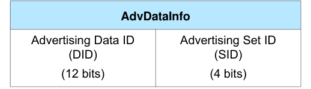

**Figure 2.18:  AdvDataInfo field**

The Advertising Set ID (SID) is set by the advertiser to distinguish between different advertising sets transmitted by this device.
The Advertising Data ID (DID) is set by the advertiser to indicate to the scanner whether it can assume that the data contents in the AdvData are a duplicate of the previous AdvData sent in an earlier packet.

##### 2.3.4.5  AuxPtr field

When present, the AuxPtr field is three octets with the format shown in Figure 2.19.

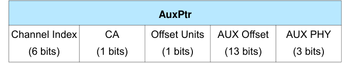

**Figure 2.19:  AuxPtr Field**

The presence of the AuxPtr field indicates that some or all of the advertisement data is in a subsequent auxiliary packet. The contents of the AuxPtr field describe this packet.
The Channel Index field contains the secondary advertising channel index (see Section 1.4.1) used to transmit the auxiliary packet.
The Offset Units field indicates the units used by the Aux Offset Field. The value of the Offset Units field shall be set as defined in Table 2.13.

| Value | Units |
| --- | --- |
| 0 | 30 µs |

Table 2.13:  Offset Units field encoding

| Value | Units |
| --- | --- |
| 1 | 300 µs |

Table 2.13:  Offset Units field encoding
The Aux Offset field contains the time from the start of the packet containing the AuxPtr field to the approximate start of the auxiliary packet. The value of the AUX Offset field is in the unit of time indicated by the Offset Units field; the offset is determined by multiplying the value by the unit. The Aux Offset shall be at least the length of the packet plus T_MAFS (see Section 4.1.2). The Offset Units field shall be set to 0 if the Aux Offset is less than 245,700 µs.The auxiliary packet shall not start any earlier than the Aux Offset and shall start no later than the Aux Offset plus one Offset Unit. This allows the LL to round the Aux Offset to the Offset Unit.

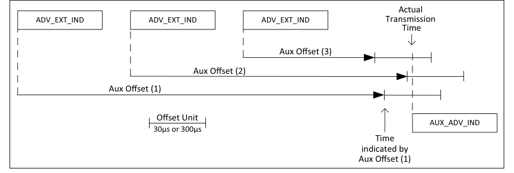

**Figure 2.20:  Aux Offset Transmission Window**

The Aux PHY field indicates the PHY used to transmit the auxiliary packet. The value of the Aux PHY field shall be set as defined in Table 2.14.

| Value | PHY used |
| --- | --- |
| 000b | LE 1M |
| 001b | LE 2M |
| 010b | LE Coded |
| 011b – 111b | Reserved for future use |

Table 2.14:  Aux PHY field encoding
The CA field contains the clock accuracy of the advertiser that will be used between the packet containing this data and the auxiliary packet. The value of the CA field shall be set as defined in Table 2.15.

| CA Value | Advertiser’s Clock Accuracy |
| --- | --- |
| 0 | 51 ppm to 500 ppm |

Table 2.15:  Clock Accuracy field encoding

| CA Value | Advertiser’s Clock Accuracy |
| --- | --- |
| 1 | 0 ppm to 50 ppm |

Table 2.15:  Clock Accuracy field encoding
An AuxPtr field with an Aux Offset of zero is permitted and indicates that no auxiliary packet will be transmitted but the Host advertising data in the current PDU is incomplete (see Section 2.3.4.9); it shall be treated as equivalent to one referring to an AUX_CHAIN_IND PDU that is never received. The remaining fields shall contain valid values.

##### 2.3.4.6  SyncInfo field

When present, the SyncInfo field is 18 octets with the format shown in Figure 2.21.

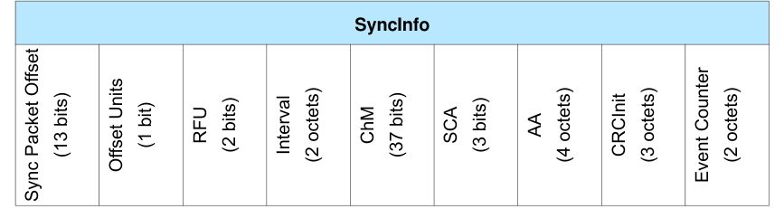

**Figure 2.21:  SyncInfo field**

The presence of the SyncInfo field indicates the presence of a periodic advertisement (using AUX_SYNC_IND PDUs). The contents of the SyncInfo field describe this periodic advertisement.
The Offset Units field indicates the units used by the Sync Packet Offset field. The value of the Offset Units field shall be set as defined in Table 2.16.

| Value | Units |
| --- | --- |
| 0 | 30 µs |
| 1 | 300 µs |

Table 2.16:  Offset Units field encoding
The Sync Packet Offset field contains the time from the start of the AUX_ADV_IND packet containing the SyncInfo field to the start of the AUX_SYNC_IND packet. The value of the Sync Packet Offset field is in the unit of time indicated by the Offset Units field; the actual offset is determined by multiplying the value by the unit. The Offset Units field shall be set to 0 if the Sync Packet Offset is less than 245,700 µs. As illustrated in Figure 2.22, the AUX_ADV_IND packet containing the SyncInfo field shall start no later than the Sync Packet Offset and no earlier than the Sync Packet Offset plus one Offset unit prior to the start of the AUX_SYNC_IND.

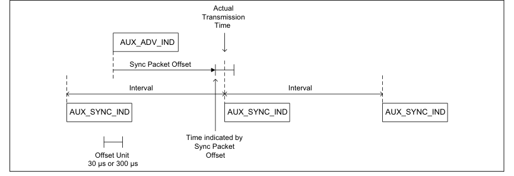

**Figure 2.22:  Sync Packet Offset Transmission Window**

A value of 0 for the Sync Packet Offset indicates that the time to the next AUX_SYNC_IND packet is greater than can be represented.
The Interval field contains the time in 1.25 ms units from the start of one packet of the periodic advertisement to the start of the next packet. The value shall not be less than 6 (7.5 ms).
The ChM field contains the channel map indicating Used and Unused secondary advertising channels. Every channel is represented with a bit positioned as per the data channel index as defined in Section 1.4.1. The LSB represents channel index 0 and the bit in position 36 represents channel index 36. A bit value of 0 indicates that the channel is Unused. A bit value of 1 indicates that the channel is Used.
The AA, CRCInit, and SCA fields have the same meaning as the corresponding fields in the CONNECT_IND PDU (see Section 2.3.3.1).
The Event Counter field contains the value of paEventCounter (see Section 4.4.2.1) that applies to the AUX_SYNC_IND packet that this SyncInfo field describes.

##### 2.3.4.7  TxPower field

When present, the TxPower is one octet with the format shown in Figure 2.23.

**Figure 2.23:  TxPower field**

The Tx Power Level field is the same value defined for the Tx Power Advertising Data type defined in Bluetooth Core Specification Supplement (CSS).

##### 2.3.4.8  ACAD field

The remainder of the extended header forms the Additional Controller Advertising Data (ACAD) field. The length of this field is the Extended Header length minus the sum of the size of the extended header flags (1 octet) and those fields indicated by the flags as present. ACAD cannot be fragmented across multiple advertising data PDUs; it shall always fit inside a single advertising data PDU.
The ACAD field holds data from the advertiser’s Controller or intended to be used by the recipient’s Controller. It uses the same format as the AdvData field in various Advertising Channel PDUs. This format is described in [Vol 3] Part C, Section 11.
The ACAD type formats and meanings are defined in [CSS], Part A, Section 1. The ACAD type identifier values are defined in the Assigned Numbers document.

##### 2.3.4.9  Host Advertising Data

The portion of the PDU after the extended header forms the AdvData field. The length of this field is specified in Section 2.3.4.
The AdvData field holds data from the advertiser’s Host. The format of this data is described in [Vol 3] Part C, Section 11. If the Host does not provide any data, the AdvData field shall be omitted but, for all other purposes in this Part, this shall be treated as if the Host had provided data.
The Controller may support fragmentation of Host Advertising Data. The total amount of Host Advertising Data before fragmentation shall not exceed 1650 octets. When the Link Layer fragments the Host advertising data, the number of fragments and the size of each fragment are chosen by the Controller. The Controller should minimize the number of fragments to ensure more reliability in delivering the entire Host advertising data. The Host may indicate a preference whether the Controller should fragment the Host advertising data, but the Controller may ignore the preference. If the amount of advertising or scan response data to be sent in an extended advertising or scanning PDU plus the Extended Header Length, AdvMode, and Extended Header exceed the maximum Advertising Channel PDU payload (255 octets), the Link Layer shall fragment the Host advertising data.
The Link Layer shall place the multiple fragments in the AdvData field of different PDUs. When Host advertising data is fragmented the first fragment shall be placed in the AUX_ADV_IND, AUX_SYNC_IND or AUX_SCAN_RSP PDU while subsequent fragments shall be placed in AUX_CHAIN_IND PDUs. Each AUX_CHAIN_IND PDU is the auxiliary PDU of the PDU containing the previous fragment; the AUX_CHAIN_IND PDU holding the last fragment shall not have an auxiliary PDU.
If the Link Layer has fragmented the Host advertising data but is subsequently unable to transmit all the fragments, the last fragment that it is able to transmit should contain an AuxPtr field with an Aux Offset of zero so that scanners are aware that the data has been truncated.

### 2.4   DATA CHANNEL PDU

The Data Channel PDU has a 16 bit header, a variable size payload, and may include a Message Integrity Check (MIC) field.
The Data Channel PDU is as shown in Figure 2.24.

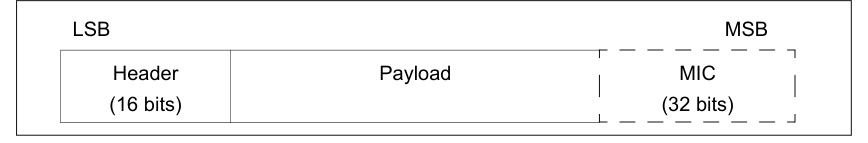

**Figure 2.24:  Data Channel PDU**

The Header field of the Data Channel PDU is as shown in Figure 2.25.

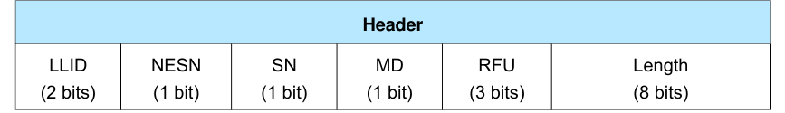

**Figure 2.25:  Data channel PDU header**

The 16 bit Header field consists of 5 fields that are specified in Table 2.17.
The MIC field shall not be included in an un-encrypted Link Layer connection, or in an encrypted Link Layer connection with a data channel PDU with a zero length Payload.
The MIC field shall be included in an encrypted Link Layer connection, with a data channel PDU with a non-zero length Payload and shall be calculated as specified in [Vol 6] Part E, Section 1.
The payload format depends on the LLID field of the Header. If the LLID field is 01b or 10b, the Data Channel PDU Payload field contains an LL Data PDU as defined in Section 2.4.1. If the LLID field is 11b then the Data Channel PDU Payload field contains an LL Control PDU as defined in Section 2.4.2.
The NESN bit of the Header is defined in Section 4.5.9.
The SN bit of the Header is defined in Section 4.5.9.
The MD bit of the Header is defined in Section 4.5.6.
The Length field of the Header indicates the length of the Payload and MIC if included. The length field has the range of 0 to 255 octets. The Payload field shall be less than or equal to 251 octets in length. The MIC is 4 octets in length.

| Field name | Description |
| --- | --- |
| LLID | The LLID indicates whether the packet is an LL Data PDU or an LL Control PDU. 00b = Reserved for future use 01b = LL Data PDU: Continuation fragment of an L2CAP message, or an Empty PDU. 10b = LL Data PDU: Start of an L2CAP message or a complete L2CAP mes- sage with no fragmentation. 11b = LL Control PDU |
| NESN | Next Expected Sequence Number |
| SN | Sequence Number |
| MD | More Data |
| Length | The Length field indicates the size, in octets, of the Payload and MIC, if included. |

Table 2.17:  Data channel PDU Header field

#### 2.4.1  LL Data PDU

An LL Data PDU is a data channel PDU that is used to send L2CAP data. The LLID field in the Header shall be set to either 01b or 10b.
An LL Data PDU with the LLID field in the Header set to 01b, and the Length field set to 00000000b, is known as an Empty PDU. The master’s Link Layer may send an Empty PDU to the slave to allow the slave to respond with any Data Channel PDU, including an Empty PDU.
An LL Data PDU with the LLID field in the Header set to 10b shall not have the Length field set to 00000000b.

#### 2.4.2  LL Control PDU

An LL Control PDU is a Data Channel PDU that is used to control the Link Layer connection.
The LL Control PDU Payload is as shown in Figure 2.26.

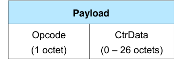

**Figure 2.26:  LL control PDU payload**

An LL Control PDU shall not have the Length field set to 00000000b. All LL Control PDUs have a fixed length, depending on the Opcode.
The Payload field consists of Opcode and CtrData fields.
The Opcode field identifies different types of LL Control PDU, as defined in Table 2.18.
The CtrData field in the LL Control PDU is specified by the Opcode field and is defined in the following subsections.
Except where explicitly stated otherwise, all fields within the CtrData field in an LL Control PDU that hold an integer shall be interpreted as unsigned.

| Opcode | Control PDU Name |
| --- | --- |
| 0x00 | LL CONNECTION UPDATE IND _ _ _ |
| 0x01 | LL CHANNEL MAP IND _ _ _ |
| 0x02 | LL TERMINATE IND _ _ |
| 0x03 | LL ENC REQ _ _ |
| 0x04 | LL ENC RSP _ _ |
| 0x05 | LL START ENC REQ _ _ _ |
| 0x06 | LL START ENC RSP _ _ _ |
| 0x07 | LL UNKNOWN RSP _ _ |
| 0x08 | LL FEATURE REQ _ _ |
| 0x09 | LL FEATURE RSP _ _ |
| 0x0A | LL PAUSE ENC REQ _ _ _ |
| 0x0B | LL PAUSE ENC RSP _ _ _ |
| 0x0C | LL VERSION IND _ _ |

Table 2.18:   LL Control PDU Opcodes

| Opcode | Control PDU Name |
| --- | --- |
| 0x0D | LL REJECT IND _ _ |
| 0x0E | LL SLAVE FEATURE REQ _ _ _ |
| 0x0F | LL CONNECTION PARAM REQ _ _ _ |
| 0x10 | LL CONNECTION PARAM RSP _ _ _ |
| 0x11 | LL REJECT EXT IND _ _ _ |
| 0x12 | LL PING REQ _ _ |
| 0x13 | LL PING RSP _ _ |
| 0x14 | LL LENGTH REQ _ _ |
| 0x15 | LL LENGTH RSP _ _ |
| 0x16 | LL PHY REQ _ _ |
| 0x17 | LL PHY RSP _ _ |
| 0x18 | LL PHY UPDATE IND _ _ _ |
| 0x19 | LL MIN USED CHANNELS IND _ _ _ _ |
| All other values | Reserved for Future Use |

Table 2.18:   LL Control PDU Opcodes
If an LL Control PDU is received that is not used or not supported, the Link Layer shall respond with an LL_UNKNOWN_RSP PDU. The UnknownType field of the LL_UNKNOWN_RSP PDU shall be set to the value of the not used or not supported Opcode.
If an LL Control PDU is received with an invalid Opcode, i.e. the Opcode field is set to a value that is Reserved for Future Use, or with invalid CtrData fields, the Link Layer shall respond with an LL_UNKNOWN_RSP PDU. The UnknownType field of the LL_UNKNOWN_RSP PDU shall be set to the value of the invalid Opcode.

##### 2.4.2.1  LL_CONNECTION_UPDATE_IND

The format of the CtrData field is as shown in Figure 2.27.

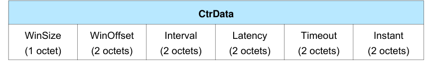

**Figure 2.27:  CtrData field of the LL_CONNECTION_UPDATE_IND PDU**

The LL_CONNECTION_UPDATE_IND CtrData consists of six fields:
• The WinSize field shall be set to indicate the transmitWindowSize value, as defined in Section 4.5.3 in the following manner: transmitWindowSize = WinSize * 1.25 ms.
• The WinOffset field shall be set to indicate the transmitWindowOffset value, as defined in Section 4.5.3, in the following manner: transmitWindowOffset = WinOffset * 1.25 ms.
• The Interval field shall be set to indicate the connInterval value, as defined in Section 4.5.1, in the following manner: connInterval = Interval * 1.25 ms.
• The Latency field shall be set to indicate the connSlaveLatency value, as defined by Section 4.5.1, in the following manner: connSlaveLatency = Latency.
• The Timeout field shall be set to indicate the connSupervisionTimeout value, as defined by Section 4.5.2, in the following manner: connSupervisionTimeout = Timeout * 10 ms.
• The Instant field shall be set to indicate the instant described in Section 5.1.1.

##### 2.4.2.2  LL_CHANNEL_MAP_IND

The format of the CtrData field is shown in Figure 2.28.

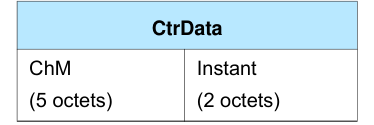

**Figure 2.28:  CtrData field of the LL_CHANNEL_MAP_IND PDU**

The LL_CHANNEL_MAP_IND CtrData consists of two fields:
• The ChM field shall contain the channel map indicating Used and Unused data channels. Every channel is represented with a bit positioned as per the data channel index defined by Section 4.5.8. The format of this field is identical to the ChM field in the CONNECT_IND PDU (see Section 2.3.3.1).
• The Instant field shall be set to indicate the instant described in Section 5.1.2.

##### 2.4.2.3  LL_TERMINATE_IND

The format of the CtrData field is shown in Figure 2.29.

**Figure 2.29:  CtrData field of the LL_TERMINATE_IND PDU**

The LL_TERMINATE_IND CtrData consists of one field:
• The ErrorCode field shall be set to inform the remote device why the connection is about to be terminated. See [Vol 2] Part D, Error Codes for details.

##### 2.4.2.4  LL_ENC_REQ

The format of the CtrData field is shown in Figure 2.30.

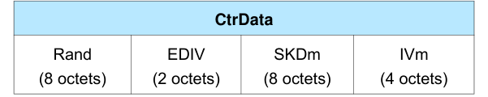

**Figure 2.30:  CtrData field of the LL_ENC_REQ PDU**

The LL_ENC_REQ CtrData consists of four fields:
• The Rand field contains a random number that is provided by the Host and used with EDIV (see [Vol 3] Part H, Section 2.4.4).
• The EDIV field contains the encrypted diversifier.
• The SKDm field contains the master’s portion of the session key diversifier.
• The IVm field contains the master’s portion of the initialization vector.

##### 2.4.2.5  LL_ENC_RSP

The format of the CtrData field is shown in Figure 2.31.

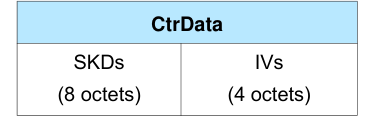

**Figure 2.31:  CtrData field of the LL_ENC_ RSP PDU**

The LL_ENC_RSP CtrData consists of two fields.
• The SKDs field shall contain the slave’s portion of the session key diversifier.
• The IVs field shall contain the slave’s portion of the initialization vector.

##### 2.4.2.6  LL_START_ENC_REQ

The LL_START_ENC_REQ PDU does not have a CtrData field.

##### 2.4.2.7  LL_START_ENC_RSP

The LL_START_ENC_RSP PDU does not have a CtrData field.

##### 2.4.2.8  LL_UNKNOWN_RSP

The format of the CtrData field is shown in Figure 2.32.

**Figure 2.32:  CtrData field of the LL_UNKNOWN_RSP PDU**

The LL_UNKNOWN_RSP CtrData consists of one field:
• UnknownType shall contain the Opcode field value of the received LL Control PDU.

##### 2.4.2.9  LL_FEATURE_REQ

The format of the CtrData field is shown in Figure 2.33.

**Figure 2.33:  CtrData field of the LL_FEATURE_REQ PDU**

The LL_FEATURE_REQ CtrData consists of one field:
• FeatureSet shall contain the set of features supported by the master’s Link Layer.

##### 2.4.2.10  LL_FEATURE_RSP

The format of the CtrData field is shown in Figure 2.34.

**Figure 2.34:  CtrData field of the LL_FEATURE_RSP PDU**

The LL_FEATURE_RSP CtrData consists of one field:
• FeatureSet[0] shall contain a set of features supported by the Link Layers of both the master and slave.
• FeatureSet[1-7] shall contain a set of features supported by the Link Layer that transmits this PDU.

##### 2.4.2.11  LL_PAUSE_ENC_REQ

The LL_PAUSE_ENC_REQ packet does not have a CtrData field.

##### 2.4.2.12  LL_PAUSE_ENC_RSP

The LL_PAUSE_ENC_RSP packet does not have a CtrData field.

##### 2.4.2.13  LL_VERSION_IND

The format of the CtrData field is shown in Figure 2.35.

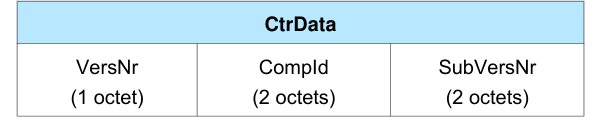

**Figure 2.35:  CtrData field of the LL_VERSION_IND PDU**

The LL_VERSION_IND CtrData consists of three fields:
• VersNr field shall contain the version of the Bluetooth Link Layer specification (see Bluetooth Assigned Numbers).
• CompId field shall contain the company identifier of the manufacturer of the Bluetooth Controller (see Bluetooth Assigned Numbers).
• SubVersNr field shall contain a unique value for each implementation or revision of an implementation of the Bluetooth Controller.

##### 2.4.2.14  LL_REJECT_IND

The format of the CtrData field is shown in Figure 2.36.

**Figure 2.36:  CtrData field of the LL_ REJECT_IND**

ErrorCode shall contain the reason a request was rejected; see [Vol 2] Part D, Error Codes.

##### 2.4.2.15  LL_SLAVE_FEATURE_REQ

The format of the CtrData field is shown in Figure 2.37.

**Figure 2.37:  CtrData field of the LL_SLAVE_FEATURE_REQ PDU**

The LL_SLAVE_FEATURE_REQ CtrData consists of one field:
• FeatureSet shall contain the set of features supported by the slave’s Link Layer.

##### 2.4.2.16  LL_CONNECTION_PARAM_REQ

The format of the CtrData field is shown in Figure 2.38.

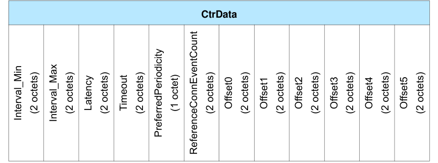

**Figure 2.38:  CtrData field of the LL_CONNECTION_PARAM_REQ PDU**

The LL_CONNECTION_PARAM_REQ CtrData consists of 12 fields:
• The Interval_Min field shall be set to indicate the minimum value of connInterval, as defined in Section 4.5.1, in the following manner: connInterval = Interval_Min * 1.25 ms.
• The Interval_Max field shall be set to indicate the maximum value of connInterval, as defined in Section 4.5.1, in the following manner: connInterval = Interval_Max * 1.25 ms.
• The Latency field shall be set to indicate the connSlaveLatency value, as defined by Section 4.5.1, in the following manner: connSlaveLatency = Latency. Latency is in units of number of connection events.
• The Timeout field shall be set to indicate the connSupervisionTimeout value, as defined by Section 4.5.2, in the following manner: connSupervisionTimeout = Timeout * 10 ms.
• The PreferredPeriodicity field shall be set to indicate a value the connInterval is preferred to be a multiple of. PreferredPeriodicity is in units of 1.25 ms. E.g. if the PreferredPeriodicity is set to 100, it implies that connInterval is preferred to be any multiple of 125 ms. A value of zero means not valid. The PreferredPeriodicity shall be less than or equal to Interval_Max.
• The ReferenceConnEventCount field shall be set to indicate the value of the connEventCounter relative to which all the valid Offset0 to Offset5 fields have been calculated. The ReferenceConnEventCount field shall have a value in the range of 0 to 65535. Note: The ReferenceConnEventCount field is independent of the Instant field in the LL_CONNECTION_UPDATE_IND PDU.
• The Offset0, Offset1, Offset2, Offset3, Offset4, and Offset5 fields shall be set to indicate the possible values of the position of the anchor points of the LE connection with the updated connection parameters relative to the
ReferenceConnEventCount. The Offset0 to Offset5 fields are in units of 1.25 ms and are in decreasing order of preference; that is, Offset0 is the most preferred value, followed by Offset1, and so on. Offset0 to Offset5 shall be less than Interval_Max. A value of 0xFFFF means not valid. Valid Offset0 to Offset5 fields shall contain unique values. Valid fields shall always be before invalid fields.

##### 2.4.2.17  LL_CONNECTION_PARAM_RSP

The format of the LL_CONNECTION_PARAM_RSP PDU is identical to the format of the LL_CONNECTION_PARAM_REQ PDU (see Section 2.4.2.16).

##### 2.4.2.18  LL_REJECT_EXT_IND

The format of the CtrData field is shown in Figure 2.39.

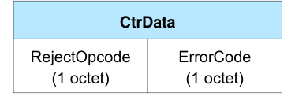

**Figure 2.39:  CtrData field of the LL_REJECT_EXT_IND PDU**

The LL_REJECT_EXT_IND CtrData consists of two fields:
• RejectOpcode shall contain the Opcode field value of the LL Control PDU being rejected.
• ErrorCode shall contain the reason the LL Control PDU was being rejected. See [Vol 2] Part D, Error Codes for a list of error codes and descriptions.
This PDU shall be issued only when the remote Link Layer supports the Extended Reject Indication Link Layer feature (Section 4.6). Otherwise, the LL_REJECT_IND PDU (Section 2.4.2.14) shall be issued instead.

##### 2.4.2.19  LL_PING_REQ

The LL_PING_REQ PDU does not have a CtrData field.

##### 2.4.2.20  LL_PING_RSP

The LL_PING_RSP PDU does not have a CtrData field.

##### 2.4.2.21  LL_LENGTH_REQ and LL_LENGTH_RSP

The format of the CtrData field for both the LL_LENGTH_REQ and LL_LENGTH_RSP PDUs is shown in Figure 2.40.

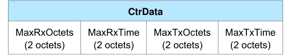

**Figure 2.40:  CtrData field of the LL_LENGTH_REQ and LL_LENGTH_RSP PDUs**

The LL_LENGTH_REQ and LL_LENGTH_RSP CtrData consists of four fields:
• MaxRxOctets shall be set to the sender’s connMaxRxOctets value, as defined in Section 4.5.10. The MaxRxOctets field shall have a value not less than 27 octets.
• MaxRxTime shall be set to the sender’s connMaxRxTime value, as defined in Section 4.5.10. The MaxRxTime field shall have a value not less than 328 microseconds.
• MaxTxOctets shall be set to the sender’s connMaxTxOctets value, as defined in Section 4.5.10. The MaxTxOctets field shall have a value not less than 27 octets.
• MaxTxTime shall be set to the sender’s connMaxTxTime value, as defined in Section 4.5.10. The MaxTxTime field shall have a value not less than 328 microseconds.

##### 2.4.2.22  LL_PHY_REQ and LL_PHY_RSP

The format of the CtrData field for both the LL_PHY_REQ and LL_PHY_RSP PDUs is shown in Figure 2.41.

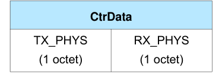

**Figure 2.41:  CtrData field of the LL_PHY_REQ and LL_PHY_RSP PDUs**

The LL_PHY_REQ and LL_PHY_RSP CtrData consists of two fields:
• TX_PHYS shall be set to indicate the transmitter PHYs that the sender prefers to use.
• RX_PHYS shall be set to indicate the receiver PHYs that the sender prefers to use.
These fields each consist of 8 bits as specified in Table 2.19. At least one bit in each field shall be set to 1.

| Bit number | Meaning |
| --- | --- |
| 0 | Sender prefers to use the LE 1M PHY (possibly among others) |
| 1 | Sender prefers to use the LE 2M PHY (possibly among others) |
| 2 | Sender prefers to use the LE Coded PHY (possibly among others) |
| 3–7 | Reserved for future use |

Table 2.19:  PHY field bit meanings

##### 2.4.2.23  LL_PHY_UPDATE_IND

The format of the CtrData field is shown in Figure 2.42.

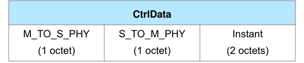

**Figure 2.42:  CtrData field of the LL_PHY_UPDATE_IND PDU**

The LL_PHY_UPDATE_IND CtrData consists of three fields:
• M_TO_S_PHY shall be set to indicate the PHY that shall be used for packets sent from the master to the slave. S_TO_M_PHY shall be set to indicate the PHY that shall be used for packets sent from the slave to the master. These fields each consist of 8 bits as specified in Table 2.20. If a PHY is changing, exactly one bit shall be set to the value 1 in the corresponding field; if a PHY is remaining unchanged, then the corresponding field shall be set to the value 0.
• Instant shall be set to indicate the instant described in Section 5.1.10.
If both the M_TO_S_PHY and S_TO_M_PHY fields are zero then there is no Instant and the Instant field is reserved for future use.

| Bit Number | Meaning |
| --- | --- |
| 0 | The LE 1M PHY shall be used |
| 1 | The LE 2M PHY shall be used |
| 2 | The LE Coded PHY shall be used |
| 3–7 | Reserved for future use |

Table 2.20:  PHY field bit meanings

##### 2.4.2.24  LL_MIN_USED_CHANNELS_IND

The format of the CtrData field is as shown in Figure 2.43.

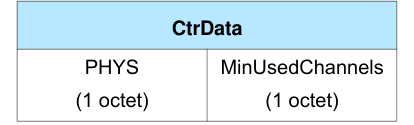

**Figure 2.43:  CtrData field of the LL_MIN_USED_CHANNELS_IND PDU**

The LL_MIN_USED_CHANNELS_IND consists of two fields:
• The PHYS field shall be set to the PHY(s) for which the slave has a minimum number of used channels requirement. The PHYS field consists of 8 bits as specified in Table 2.21. At least one bit in the field shall be set to 1.
• The MinUsedChannels field contains the minimum number of channels to be used on the specified PHY. The MinUsedChannels field shall have a value in the range of 2 to 37 channels.

| Bit Number | Meaning |
| --- | --- |
| 0 | LE 1M PHY |
| 1 | LE 2M PHY |
| 2 | LE Coded PHY |
| 3-7 | Reserved for Future Use |

Table 2.21:  PHY field bit meanings

## 3  BIT STREAM PROCESSING

Bluetooth devices shall use the bit stream processing schemes as defined in the following sections.
Figure 3.1 shows the bit stream processing for PDUs on the LE Uncoded PHYs.

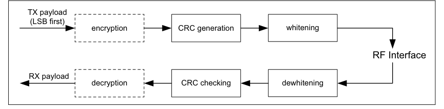

**Figure 3.1:  Payload bit processes for the LE Uncoded PHYs**

Figure 3.2 shows the bit stream processing for PDUs on the LE Coded PHYs.

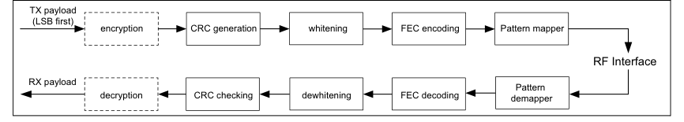

**Figure 3.2:  Bit stream processing for the LE Coded PHYs**

### 3.1   ERROR CHECKING

At packet reception, the Access Address shall be checked first. If the Access Address is incorrect, the packet shall be rejected, otherwise the packet shall be considered received. If the CRC is incorrect, the packet shall be rejected, otherwise the packet shall be considered valid. A packet shall only be processed if the packet is considered valid. A packet with an incorrect CRC may cause a connection event to continue, as specified in Section 4.5.1.

#### 3.1.1  CRC Generation

The CRC shall be calculated on the PDU field in all Link Layer packets. If the PDU is encrypted, then the CRC shall be calculated after encryption of the PDU has been performed.
The CRC polynomial is a 24-bit CRC and all bits in the PDU shall be processed in transmitted order starting from the least significant bit. The polynomial has the form of x24 + x10 + x9 + x6 + x4 + x3 + x + 1. For every Data Channel PDU, the shift register shall be preset with the CRC initialization value set for the Link Layer connection and communicated in the CONNECT_IND PDU. For the
AUX_SYNC_IND PDU and its subordinate set, the shift register shall be preset with the CRCInit value set in the SyncInfo field (see Section 2.3.4.6) contained in the AUX_ADV_IND PDU that describes the periodic advertising. For all other Advertising Channel PDUs, the shift register shall be preset with 0x555555.
Position 0 shall be set as the least significant bit and position 23 shall be set as the most significant bit of the initialization value. The CRC is transmitted most significant bit first, i.e. from position 23 to position 0 (see Section 1.2).
Figure 3.3 shows an example linear feedback shift register (LFSR) to generate the CRC.

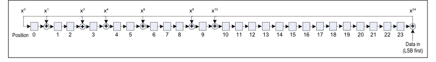

**Figure 3.3:  The LFSR circuit generating the CRC**

### 3.2   DATA WHITENING

Data whitening is used to avoid long sequences of zeros or ones, e.g. 0000000b or 1111111b, in the data bit stream. Whitening shall be applied on the PDU and CRC fields of all Link Layer packets and is performed after the CRC in the transmitter. De-whitening is performed before the CRC in the receiver (see Figure 3.1).
The whitener and de-whitener are defined the same way, using a 7-bit linear feedback shift register with the polynomial x7 + x4 + 1. Before whitening or de- whitening, the shift register is initialized with a sequence that is derived from the channel index (data channel index or advertising channel index) in which the packet is transmitted in the following manner:
• Position 0 is set to one.
• Positions 1 to 6 are set to the channel index of the channel used when transmitting or receiving, from the most significant bit in position 1 to the least significant bit in position 6.
For example, if the channel index = 23 (0x17), the positions would be set as follows:
Position 0 = 1 Position 1 = 0
Position 2 = 1 Position 3 = 0
Position 4 = 1 Position 5 = 1 Position 6 = 1
Figure 3.4 shows an example linear feedback shift register (LFSR) to generate data whitening.

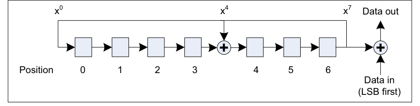

**Figure 3.4:  The LFSR circuit to generate data whitening**

### 3.3   CODING

Coding only applies to the LE Coded PHY.
Coding consists of two processes. Data is first coded by the Forward Error Correction (FEC) convolutional encoder as defined in Section 3.3.1 and then spread by the pattern mapper as defined in Section 3.3.2.

#### 3.3.1  Forward Error Correction Encoder

The convolutional FEC encoder uses a non-systematic, non-recursive rate ½ code with constraint length K=4. The generator polynomials are:
G0(x) = 1 + x + x2 + x3
G1(x) = 1 + x2 + x3
The bit coming from generator polynomial G0 (a0) is transmitted first; the bit coming from generator polynomial G1 (a1) is transmitted second.
The initial state of the convolutional FEC encoder is set to all zeros. An input sequence of three consecutive zeros always brings the convolutional FEC encoder back to its original state. This sequence is known as the termination sequence.
Figure 3.5 illustrates operation of the convolutional FEC encoder. Squares represent bit storage operations and circles represent mod 2 binary additions.

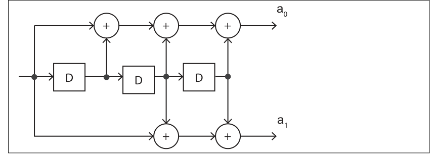

**Figure 3.5:  Convolutional Forward Error Correction Encoder**

#### 3.3.2  Pattern Mapper

The pattern mapper converts each bit from the convolutional FEC encoder into P symbols, where the value of P depends on the coding scheme in use, according to Table 3.1 (the entries in the table are in transmission order):

| Input bit from the convolutional FEC encoder | Output sequence when P=1 (used by S=2) | Output sequence when P=4 (used by S=8) |
| --- | --- | --- |
| 0 | 0 | 0011 |
| 1 | 1 | 1100 |

Table 3.1:  Pattern Mapper inputs and outputs

## 4  AIR INTERFACE PROTOCOL

The air interface protocol consists of the multiple access scheme, device discovery and link layer connection methods.

### 4.1   FRAME SPACE

#### 4.1.1  Inter Frame Space

The time interval between two consecutive packets on the same channel index is called the Inter Frame Space. It is defined as the time from the end of the last bit of the previous packet to the start of the first bit of the subsequent packet. The Inter Frame Space is designated “T_IFS” and shall be 150 µs.

#### 4.1.2  Minimum AUX Frame Space

The minimum time interval between a packet containing an AuxPtr and the auxiliary packet it indicates is called the Minimum AUX Frame Space. It is defined as the minimum time from the end of the last bit of the packet containing the AuxPtr to the start of the auxiliary packet. The Minimum AUX Frame Space is designated “T_MAFS” and shall be 300 µs.
Figure 4.1 illustrates an example where the Minimum AUX Frame Space applies.

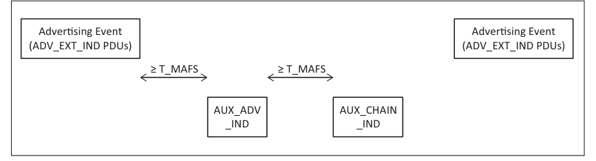

**Figure 4.1:  Example where the Minimum AUX Frame Space applies**

4.2   TIMING REQUIREMENTS The Link Layer shall use one of two possible clock accuracies. During a connection event or advertising event the Link Layer shall use the active clock accuracy; otherwise it shall use the sleep clock accuracy.

#### 4.2.1  Active Clock Accuracy

The average timing of packet transmission during a connection event is determined using the active clock accuracy, with a drift less than or equal to ±50 ppm. All instantaneous timings shall not deviate more than 2 µs from the average timing.
Note: This means that the start of a packet shall be transmitted 150±2 µs after the end of the previous packet.

#### 4.2.2  Sleep Clock Accuracy

The timing of advertising events (see Section 4.4.2.2) and connection events (see Section 4.5.7) is determined using the sleep clock accuracy, with a drift less than or equal to ±500 ppm.
The instantaneous timing of the anchor point (see Section 4.5.7) shall not deviate more than 16 µs from the average timing.
Note: This means that a 1 s connection interval with a total ±1000ppm sleep clock accuracy will give a window widening either side of the anchor point of 1ms plus 16us, assuming that the slave Controller was using its sleep clock for almost the complete connection interval.

#### 4.2.3  Range Delay

Where two devices are more than a few meters apart the time taken for a signal to propagate between them will be significant compared with the Active Clock Accuracy defined in Section 4.2.1. When a device is listening for a packet that might be up to D meters away, it should listen for an extra 2D * 4 ns after the nominal latest time (e.g. T_IFS + 2 µs) that the packet would have been transmitted.
(1/c ~= 3.3 * refractive index ns/m, so 4 ns gives a conservative allowance.)
Figure 4.2 shows the range delays relative to a master packet transmission.

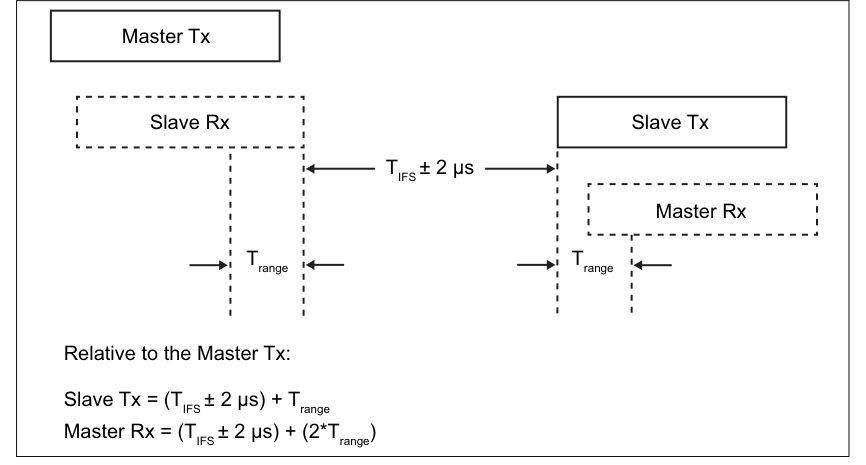

**Figure 4.2:  Range delays relative to a master packet transmission**

### 4.3   LINK LAYER DEVICE FILTERING

The Link Layer may perform device filtering based on the device address of the peer device. Link Layer Device Filtering is used by the Link Layer to minimize the number of devices to which it responds.
A Link Layer shall support Link Layer Device Filtering unless it only supports non-connectable advertising.
The filter policies for the Advertising State, Scanning State and Initiating State are independent of each other. When the Link Layer is in the Advertising State, the advertising filter policy shall be used. When the Link Layer is in the Scanning State, the scanning filter policy shall be used. When the Link Layer is in the Initiating State, the initiator filter policy shall be used. If the Link Layer does not support the Advertising State, Scanning State, or Initiating State, the corresponding filter policy is not required to be supported.

#### 4.3.1  White List

The set of devices that the Link Layer uses for device filtering is called the White List.
A White List contains a set of White List Records used for Link Layer Device Filtering. A White List Record contains both the device address and the device address type (public or random). There is also a special device address type "anonymous"; an entry with this type matches all advertisements sent with no address. All Link Layers supporting Link Layer Device Filtering shall support a White List capable of storing at least one White List Record.
On reset, the White List shall be empty.
The White List is configured by the Host and is used by the Link Layer to filter advertisers, scanners or initiators. This allows the Host to configure the Link Layer to act on a request without awakening the Host.
All the device filter policies shall use the same White List.

#### 4.3.2  Advertising Filter Policy

The advertising filter policy determines how the advertiser’s Link Layer processes scan and/or connection requests.
When the Link Layer is using non-connectable and non-scannable directed advertising events, scannable directed advertising events, and connectable directed advertising events the advertising filter policy shall be ignored. Otherwise the Link Layer shall use one of the following advertising filter policy modes which are configured by the Host:
• The Link Layer shall process scan and connection requests only from devices in the White List.
• The Link Layer shall process scan and connection requests from all devices (i.e. the White List is not in use). This is the default on reset.
• The Link Layer shall process scan requests from all devices and shall only process connection requests from devices that are in the White List.
• The Link Layer shall process connection requests from all devices and shall only process scan requests from devices that are in the White List.
Only one advertising filter policy mode per advertising set shall be supported at a time.

#### 4.3.3  Scanner Filter Policy

The scanner filter policy determines how the scanner’s Link Layer processes advertising packets. The Link Layer shall use one of the following scanner filter policy modes which are configured by the Host:
• The Link Layer shall process advertising packets only from devices in the White List. A connectable directed advertising packet not containing the scanner’s device address shall be ignored.
• The Link Layer shall process all advertising packets (i.e., the White List is not used). A connectable directed advertising packet not containing the scanner’s device address shall be ignored. This is the default on reset.
If the Link Layer supports the Extended Scanner Filter policies, then the following modes shall also be supported:
• The Link Layer shall process advertising packets only from devices in the White List. A connectable directed advertising packet shall not be ignored if the TargetA is the scanner's device address or a resolvable private address.
• The Link Layer shall process all advertising packets (i.e., the White List is not used). A connectable directed advertising packet shall not be ignored if the TargetA is the scanner's device address or a resolvable private address.
Only one scanner filter policy mode shall be supported at a time.

#### 4.3.4  Initiator Filter Policy

The initiator filter policy determines how an initiator’s Link Layer processes advertising packets. The Link Layer shall use one of the following initiator filter policy modes which are configured by the Host:
• The Link Layer shall process connectable advertising packets from all devices in the White List.
• The Link Layer shall ignore the White List and process connectable advertising packets from a specific single device specified by the Host.
If the Link Layer receives a connectable directed advertising packet from an advertiser that is not contained in the White List or the single address specified by the Host, the connectable directed advertising packet shall be ignored.
Only one initiator filter policy mode shall be supported at a time.

### 4.4   NON-CONNECTED STATES

#### 4.4.1  Standby State

The Standby State is the default state in the Link Layer. The Link Layer shall not send or receive packets in the Standby State. The Link Layer may leave the Standby State to enter the Advertising State, Scanning State or Initiator State.

#### 4.4.2  Advertising State

The Link Layer shall enter the Advertising State when directed by the Host. When placed in the Advertising State, the Link Layer shall send advertising PDUs (see Section 2.3.1) in advertising events.
Each advertising event is composed of one or more advertising PDUs sent on used primary advertising channel indices. The advertising event shall be closed after one advertising PDU has been sent on each of the used primary advertising channel indices (see Section 4.4.2.1) or the advertiser may close an advertising event earlier to accommodate other functionality.
The time between two consecutive advertising events is defined in Section 4.4.2.2.
An advertising event can be one of the following types:
• a connectable and scannable undirected event
• a connectable undirected event
• a connectable directed event
• a non-connectable and non-scannable undirected event
• a non-connectable and non-scannable directed event
• a scannable undirected event
• a scannable directed event
The first PDU of each advertising event shall be transmitted in the used primary advertising channel with the lowest advertising channel index.
The advertising event type determines the allowable response PDUs. Table 4.1 specifies the allowable responses for each advertising event.
Connectable and scannable undirected, connectable undirected, and connectable directed events are collectively referred to as connectable events;
the remaining events (non-connectable and non-scannable undirected, non- connectable and non-scannable directed, scannable undirected, and scannable directed) are collectively referred to as non-connectable events. Connectable and scannable undirected, scannable undirected, and scannable directed events are collectively referred to as scannable events; the remaining events (non-connectable and non-scannable undirected, non-connectable and non-scannable directed, connectable undirected, and connectable directed) are collectively referred to as non-scannable events.

|  |  | Allowable response PDUs |  |  |  |
| --- | --- | --- | --- | --- | --- |
| Advertising Event Type | Type of PDU being responded to | SCAN _REQ1 | CONNECT _IND1 | AUX_SCAN _REQ | AUX _CONNECT |
| Connectable and Scannable Undirected Event | ADV IND _ | YES | YES | NO | NO |
| Connectable Undirected Event | ADV EXT IND _ _ | NO | NO | NO | NO |
|  | AUX ADV IND _ _ | NO | NO | NO | YES |
| Connectable Directed Event | ADV DIRECT IND _ _ | NO | YES2 | NO | NO |
|  | ADV EXT IND _ _ | NO | NO | NO | NO |
|  | AUX ADV IND _ _ | NO | NO | NO | YES2 |
| Non-Connectable and Non- Scannable Undirected Event | ADV NONCONN IND _ _ | NO | NO | NO | NO |
|  | ADV EXT IND _ _ | NO | NO | NO | NO |
|  | AUX ADV IND _ _ | NO | NO | NO | NO |
| Non-Connectable and Non- Scannable Directed Event | ADV EXT IND _ _ | NO | NO | NO | NO |
|  | AUX ADV IND _ _ | NO | NO | NO | NO |
| Scannable Undirected Event | ADV SCAN IND _ _ | YES | NO | NO | NO |
|  | ADV EXT IND _ _ | NO | NO | NO | NO |
|  | AUX ADV IND _ _ | NO | NO | YES | NO |
| Scannable Directed Event | ADV EXT IND _ _ | NO | NO | NO | NO |
|  | AUX ADV IND _ _ | NO | NO | YES3 | NO |

Table 4.1:  Advertising event types, PDUs used and allowable response PDUs
1. Not permitted on the LE Coded PHY.
2. Initiators other than the correctly addressed initiator shall not respond.
3. Scanners other than the correctly addressed scanner shall not respond.
If the advertiser receives a PDU for the advertising event that is not explicitly allowed it shall be ignored. If no PDU is received or the received PDU was
ignored, the advertiser shall either send an advertising PDU on the next used primary advertising channel index or close the advertising event.

##### 4.4.2.1  Advertising Channel Index Selection

Advertising events use three predefined primary advertising channels. Primary advertising channel indices are either used or unused.
For AUX_ADV_IND and AUX_CHAIN_IND PDUs, the secondary advertising channel index used in the Channel Index subfield of the AuxPtr field is implementation specific. It is recommended that sufficient channel diversity is used to avoid collisions.
Each periodic advertisement shall have a 16-bit event counter (paEventCounter). The initial value of this counter is implementation specific. The counter shall be incremented by one for each AUX_SYNC_IND PDU; the paEventCounter shall wrap from 0xFFFF to 0x0000. AUX_SYNC_IND PDUs shall use the Channel Selection Algorithm #2 (see Section 4.5.8.3) with this event counter.
The Link Layer shall use the primary and secondary advertising channel indices as specified by the Host, and the used primary and secondary advertising channel indices shall take effect when the Advertising State is entered. The Link Layer need not use all the secondary channels that the Host has marked as "unknown".

##### 4.4.2.2  Advertising Events

Advertising events are defined as one or more advertising PDUs sent on the primary advertising channel beginning with the first used advertising channel index and ending with the last used advertising channel index. The advertising event can be closed early after a CONNECT_IND is received or when a SCAN_RSP is sent. The time between advertising events is the advertising interval.
Advertising packets sent on the secondary advertising channel are not part of the advertising event. Advertising events that use the ADV_EXT_IND PDU may also be part of an extended advertising event. All ADV_EXT_IND PDUs containing an AuxPtr field in the same advertising event shall point to the same AUX_ADV_IND packet.

###### 4.4.2.2.1   Advertising Interval

For all undirected advertising events or connectable directed advertising events used in a low duty cycle mode, the time between the start of two consecutive advertising events (T_advEvent) for the same advertising data set (see Section 4.4.2.10) is computed as follows for each advertising event:
T_advEvent = advInterval + advDelay
The advInterval shall be an integer multiple of 0.625 ms in the range of 20 ms to 10,485.759375 s.
The advDelay is a pseudo-random value with a range of 0 ms to 10 ms generated by the Link Layer for each advertising event.
As illustrated in Figure 4.3, the advertising events are perturbed in time using the advDelay.

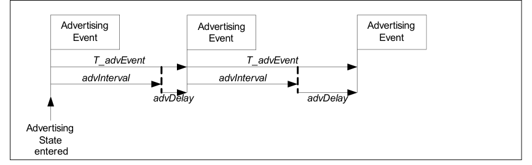

**Figure 4.3:  Advertising events perturbed in time using advDelay**

###### 4.4.2.2.2   Extended Advertising Event

An extended advertising event begins at the start of an advertising event and consists of the PDUs in that advertising event plus their subordinate sets. The extended advertising event ends with the last such PDU.
Multiple extended advertising events may overlap with each other. This can occur when ADV_EXT_IND PDUs containing an AuxPtr field in multiple advertising events point to the same AUX_ADV_IND packet, or when a different advertising event is interposed between the ADV_EXT_IND PDUs and the AUX_ADV_IND PDU.
T_advEvent, advInterval and advDelay have the same meaning as in Section 4.4.2.2.1.
Figure 4.4 illustrates an example of overlapping extended advertising events.

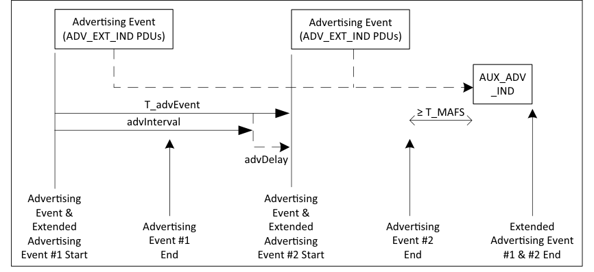

**Figure 4.4:  Example of overlapping extended advertising events**

An auxiliary advertising segment starts with the first AUX_ADV_IND PDU in an extended advertising event and ends at the end of the extended advertising event (an auxiliary advertising segment can belong to more than one extended advertising event). Two auxiliary advertising segments for the same advertising set shall not overlap each other.
Figure 4.5 illustrates an example of auxiliary advertising segments belonging to multiple extended advertising events.

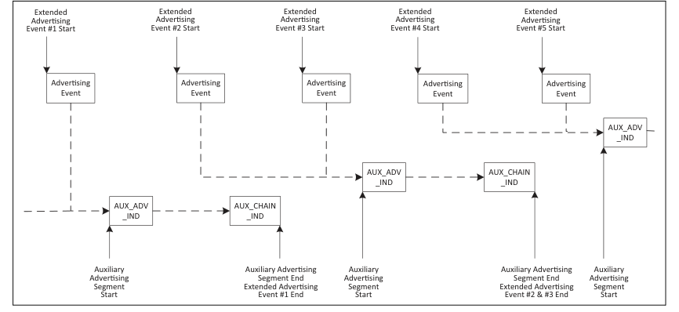

**Figure 4.5:  Example of Auxiliary Advertising Segments**

An advertiser should not space PDUs within the auxiliary advertising set so that two of them would be within the same receive window. If an advertiser transmits a PDU with an AuxPtr field containing an offset of T milliseconds, then it should not start to transmit any other packet on the same RF channel as the auxiliary packet within 2.5*T microseconds of the start of auxiliary packet of the original PDU.

###### 4.4.2.2.3   Periodic Advertising Events

The Periodic Advertising Interval is the interval between the start of two AUX_SYNC_IND PDUs from the same advertising set. The Periodic Advertising Interval shall be an integer multiple of 1.25 ms in the range of 7.5 ms to 81.91875 s.
A periodic advertising event consists of an AUX_SYNC_IND PDU and its subordinate set.

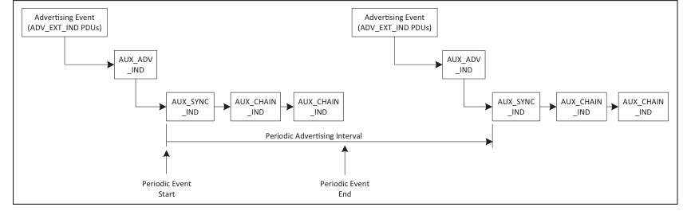

**Figure 4.6:  Example of Periodic Advertising Events from the same Advertising Set**

Two periodic advertising events for the same advertising set shall not overlap each other. The periodic advertising interval shall not change while the periodic advertising is enabled.

##### 4.4.2.3  Connectable and Scannable Undirected Event Type

When the connectable and scannable undirected advertising event type is used, advertising indications (ADV_IND PDUs) are sent by the Link Layer.
The connectable and scannable undirected advertising event type allows a scanner or initiator to respond with either a scan request or connect request. A scanner may send a scan request (SCAN_REQ PDU) to request additional information about the advertiser. An initiator may send a connect request (CONNECT_IND PDU) to request the Link Layer to enter the Connection State.
The Link Layer shall listen on the same primary advertising channel index for requests from scanners or initiators.
If the advertiser receives a SCAN_REQ PDU that contains its device address from a scanner allowed by the advertising filter policy, it shall reply with a SCAN_RSP PDU on the same primary advertising channel index. After the SCAN_RSP PDU is sent, or if the advertising filter policy prohibited processing the SCAN_REQ PDU, the advertiser shall either move to the next used primary advertising channel index to send another ADV_IND PDU, or close the advertising event.
If the advertiser receives a CONNECT_IND PDU that contains its device address, from an initiator allowed by the advertising filter policy, the Link Layer shall exit the Advertising State and transition to the Connection State in the Slave Role as defined in Section 4.5.5. If the advertising filter policy prohibited processing the received CONNECT_IND PDU, the advertiser shall either move to the next used primary advertising channel index to send another ADV_IND PDU, or close the advertising event.
The time between the beginning of two consecutive ADV_IND PDUs within an advertising event shall be less than or equal to 10 ms. The advertising event shall be closed within the advertising interval.
An illustration of an advertising event using all the primary advertising channel indices and in which no SCAN_REQ or CONNECT_IND PDUs are received is shown in Figure 4.7.

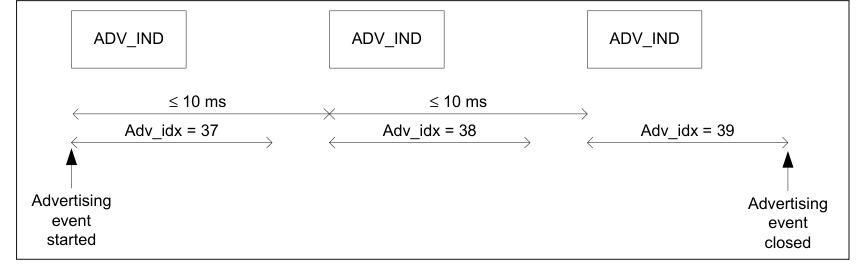

**Figure 4.7:  Connectable and scannable undirected advertising event with only advertising PDUs**

Two illustrations of advertising events using all the primary advertising channel indices during which a SCAN_REQ PDU is received and a SCAN_RSP PDU is sent are shown in Figure 4.8 and in Figure 4.9.

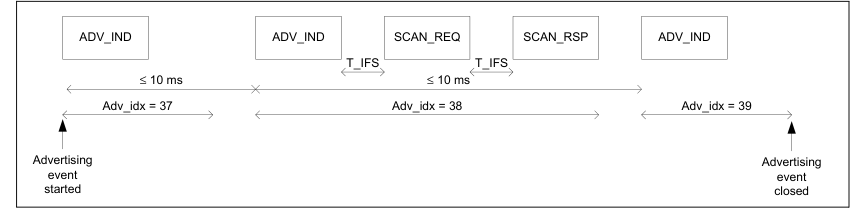

**Figure 4.8:  Connectable and scannable undirected advertising event with SCAN_REQ and SCAN_RSP PDUs in the middle of an advertising event**

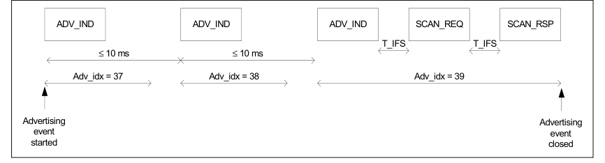

**Figure 4.9:  Connectable and scannable undirected advertising event with SCAN_REQ and SCAN_RSP PDUs at the end of an advertising event**

Figure 4.10 illustrates an advertising event during which a CONNECT_IND PDU is received on the second primary advertising channel index.

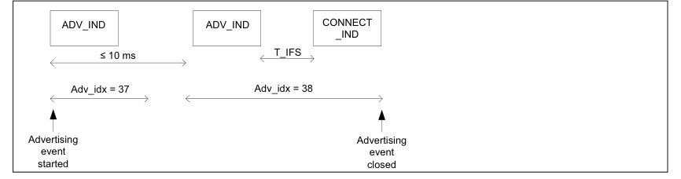

**Figure 4.10:  Connectable and scannable undirected advertising event when a CONNECT_IND PDU is received**

If Link Layer Privacy has been enabled then the requirements in Section 6.2.1 shall also be followed.

##### 4.4.2.4  Connectable Directed Event Type

When the connectable directed advertising event type is used, directed advertising indications are sent by the Link Layer.
The connectable directed advertising event type allows an initiator to respond so that both the advertiser and initiator will enter the Connection State.
The connectable directed advertising event type may use either the ADV_DIRECT_IND PDU (see Sections 4.4.2.4.1 to 4.4.2.4.3) or the ADV_EXT_IND PDU (see Section 4.4.2.4.4). A single connectable directed advertising event shall only use one of these two PDU types.
If Link Layer Privacy has been enabled then the requirements in Section 6.2.2 shall also be followed.

###### 4.4.2.4.1   Connectable Directed Event Type using ADV_DIRECT_IND

This procedure shall not be used when the connectable directed event type is used on the LE Coded PHY.
The connectable directed advertising event type using ADV_DIRECT_IND allows an initiator to respond with a connect request on the primary advertising channel to establish a Link Layer connection.
The ADV_DIRECT_IND PDU contains both the initiator’s device address and the advertiser’s device address. Only the addressed initiator may initiate a Link Layer connection with the advertiser by sending a CONNECT_IND PDU to the advertiser.
After every ADV_DIRECT_IND PDU sent by the advertiser, the advertiser shall listen for CONNECT_IND PDUs on the same primary advertising channel index. Any SCAN_REQ PDUs received shall be ignored.
If the advertiser receives a CONNECT_IND PDU that contains its device address and the initiator device address is contained in the ADV_DIRECT_IND PDU, the Link Layer shall exit the Advertising State and transition to the Connection State in the Slave Role as defined in Section 4.5.5.
Otherwise, the advertiser shall either move to the next used primary advertising channel index to send another ADV_DIRECT_IND PDU, or close the advertising event.
Connectable directed advertising may be either used in a low duty cycle or high duty cycle mode; these are described in the next two sections. Low duty cycle connectable directed advertising is designed for cases where reconnection with a specific device is required, but time is not of the essence or it is not known if the central device is in range or not. High duty cycle connectable directed advertising is designed for cases in which fast Link Layer connection setup is essential (for example, a reconnection). Note that high duty cycle connectable directed advertising is a power and bandwidth intensive advertising scheme that should only be used when fast connection setup is required.

###### 4.4.2.4.2   Low Duty Cycle Connectable Directed Advertising

In low duty cycle connectable directed advertising, the time between the start of two consecutive ADV_DIRECT_IND PDUs within an advertising event shall be less than or equal to 10 ms. The advertising event shall be closed within the advertising interval.
An illustration of an advertising event using all primary advertising channel indices and in which no CONNECT_IND PDUs are received is shown in Figure 4.11.

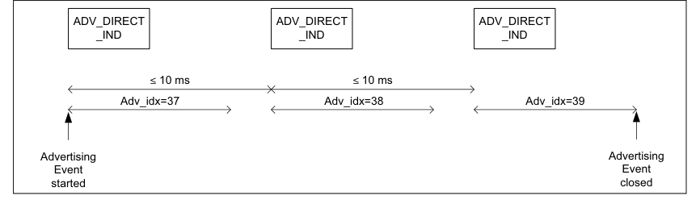

**Figure 4.11:  Low duty cycle connectable directed advertising event with only advertising PDUs**

Figure 4.12 illustrates an advertising event using ADV_DIRECT_IND advertising PDUs during which a CONNECT_IND PDU is received on the second primary advertising channel index.

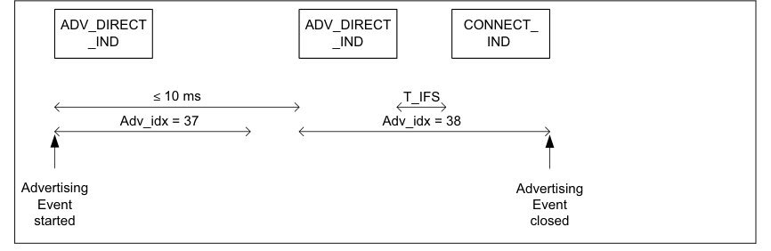

**Figure 4.12:  Low duty cycle connectable directed advertising event during which a CONNECT_IND PDU is received**

###### 4.4.2.4.3   High Duty Cycle Connectable Directed Advertising

In high duty cycle connectable directed advertising mode, the time between the start of two consecutive ADV_DIRECT_IND PDUs sent on the same advertising channel index shall be less than or equal to 3.75 ms.
The Link Layer shall exit the Advertising State no later than 1.28 s after the Advertising State was entered.
A sequence of five ADV_DIRECT_IND PDUs in two advertising events without CONNECT_IND PDUs is shown in Figure 4.13 for the case in which all the primary advertising channels are used.

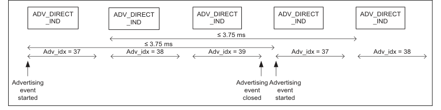

**Figure 4.13:  High duty cycle connectable directed advertising event with only advertising PDUs**

###### 4.4.2.4.4   Connectable Directed Event Type using ADV_EXT_IND

This procedure shall be used when the connectable directed event type is used on the LE Coded PHY.
The connectable directed advertising event type using ADV_EXT_IND allows an initiator to respond with a connect request on the secondary advertising channel to establish a Link Layer connection.
In the ADV_EXT_IND PDU, the AdvMode field shall be set to connectable, the ADI field shall be present, and the PDU shall not contain the AdvA and TargetA fields. The ADV_EXT_IND PDU’s AuxPtr field shall point to an AUX_ADV_IND PDU with the AdvMode field set to connectable; the AdvA, TargetA, and ADI fields shall all be present. The ADI fields in the ADV_EXT_IND PDU and the AUX_ADV_IND PDU shall be the same.
After every AUX_ADV_IND PDU related to this event it sends, the advertiser shall listen for AUX_CONNECT_REQ PDUs on the same secondary advertising channel index. Any AUX_SCAN_REQ PDUs received shall be ignored.
If the advertiser receives an AUX_CONNECT_REQ PDU that contains its device address and the initiator’s device address was contained in the AUX_ADV_IND PDU, it shall reply with an AUX_CONNECT_RSP PDU that contains those addresses on the same secondary advertising channel index. After the AUX_CONNECT_RSP PDU is sent the Link Layer shall exit the Advertising State and transition to the Connection State in the Slave Role as defined in Section 4.5.5. Any AUX_SCAN_REQ PDUs received on the secondary advertising channel shall be ignored.
The time between the start of two consecutive connectable directed ADV_EXT_IND PDUs within an advertising event shall be less than or equal to 10 ms. The advertising event shall be closed within the advertising interval.
The channel index on the secondary channel, SAdv_idx, is contained in the AuxPtr field of the ADV_EXT_IND PDU.
Figure 4.14 shows an advertising event in which no AUX_CONNECT_REQ PDU is received.

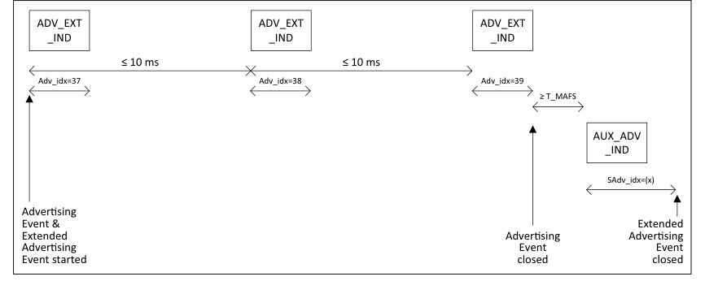

**Figure 4.14:  Connectable directed advertising event using the ADV_EXT_IND PDUs and AUX_ADV_IND PDU containing advertising data**

Figure 4.15 illustrates an advertising event using connectable directed ADV_EXT_IND advertising PDUs during which an AUX_CONNECT_REQ PDU is received on the second secondary advertising channel index.

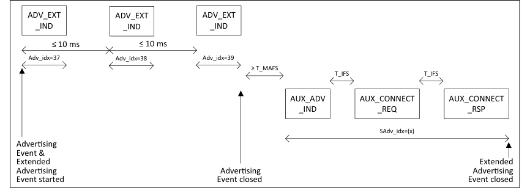

**Figure 4.15:  Connectable directed advertising event using ADV_EXT_IND PDUs and AUX_ADV_IND PDUs containing advertising data with an AUX_CONNECT_REQ PDU**

##### 4.4.2.5  Scannable Undirected Event Type

When the scannable undirected advertising event type is used, scannable undirected advertising indications (ADV_SCAN_IND or scannable undirected ADV_EXT_IND PDUs) are sent by the Link Layer.
A scannable undirected advertising event shall use either ADV_SCAN_IND or scannable undirected ADV_EXT_IND PDUs but not both.
If Link Layer Privacy has been enabled then the requirements in Section 6.2.3 shall also be followed.

###### 4.4.2.5.1   Scannable Undirected Event Type using ADV_SCAN_IND

The scannable undirected event type allows a scanner to respond with a scan request (SCAN_REQ PDU) to request additional information about the advertiser.
The Link Layer shall listen on the same primary advertising channel index for requests from scanners. Any CONNECT_IND PDUs received shall be ignored.
If the advertiser receives a SCAN_REQ PDU that contains its device address from a scanner allowed by the advertising filter policy it shall reply with a SCAN_RSP PDU on the same advertising channel index. After the SCAN_RSP PDU is sent or if the advertising filter policy prohibited processing the SCAN_REQ PDU the advertiser shall either move to the next used primary advertising channel index to send another ADV_SCAN_IND PDU, or close the advertising event.
The time between the beginning of two consecutive ADV_SCAN_IND PDUs within an advertising event shall be less than or equal to 10 ms. The advertising event shall be closed within the advertising interval.
The structure of an advertising event in which no SCAN_REQ PDU was received is shown in Figure 4.16 for the case in which all the primary advertising channels are used.

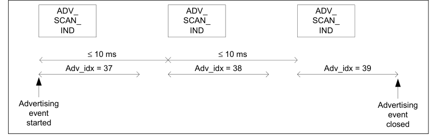

**Figure 4.16:  Scannable undirected advertising event with only advertising PDUs**

Two example advertising events during which a SCAN_REQ PDU is received and a SCAN_RSP PDU is sent are shown in Figure 4.17 and in Figure 4.18 for the case in which all the primary advertising channels are used.

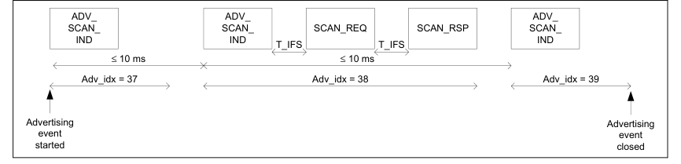

**Figure 4.17:  Scannable undirected advertising event with SCAN_REQ and SCAN_RSP PDUs in the middle of an advertising event**

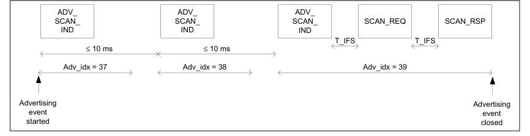

**Figure 4.18:  Scannable undirected advertising event with SCAN_REQ and SCAN_RSP PDUs at the end of an advertising event**

###### 4.4.2.5.2   Scannable Undirected Event Type using ADV_EXT_IND

The scannable undirected event type using the ADV_EXT_IND PDU allows any scanner to respond with a scan request to receive scan response data on the secondary advertising channel.
In the ADV_EXT_IND PDU the AdvMode field shall be set to scannable, the ADI field shall be present, and the PDU shall not contain the AdvA field. The ADV_EXT_IND PDU's AuxPtr field shall point to an AUX_ADV_IND PDU with the AdvMode field set to scannable; the AdvA and ADI fields shall be present. The ADI fields in the ADV_EXT_IND PDU and the AUX_ADV_IND PDU shall be the same. A scanner may send a scan request using the AUX_SCAN_REQ PDU on the same secondary advertising channel index as the received AUX_ADV_IND PDU pointed to by the ADV_EXT_IND PDU.
After every AUX_ADV_IND PDU sent by the advertiser, the advertiser shall listen for AUX_SCAN_REQ PDUs on the same secondary advertising channel index from scanners. Any AUX_CONNECT_REQ PDUs received shall be ignored.
If the advertiser receives an AUX_SCAN_REQ PDU that contains its device address from a scanner allowed by the advertising filter policy, it shall reply with an AUX_SCAN_RSP PDU on the same secondary advertising channel
index prior to the start of the next advertising event. After the AUX_SCAN_RSP PDU is sent, or if the advertising filter policy prohibits processing the AUX_SCAN_REQ PDU, the advertising event shall be closed. Any AUX_CONNECT_REQ PDUs on the secondary advertising channel shall be ignored.
The time between the beginning of two consecutive ADV_EXT_IND PDUs within an advertising event shall be less than or equal to 10 ms. The advertising event shall be closed within the advertising interval.
Figure 4.19 shows an advertising event in which no AUX_SCAN_REQ PDU is received.

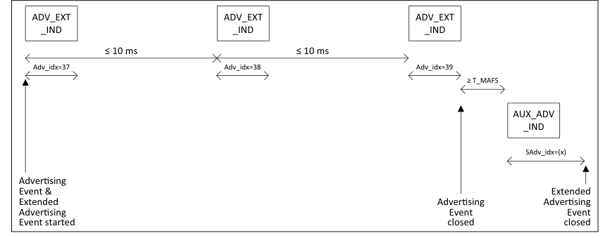

**Figure 4.19:  Scannable undirected advertising event using the ADV_EXT_IND PDUs and AUX_ADV_IND PDU containing advertising data**

An example advertising event during which an AUX_SCAN_REQ PDU is received and an AUX_SCAN_RSP PDU is sent on the secondary advertising channel is shown in Figure 4.20.

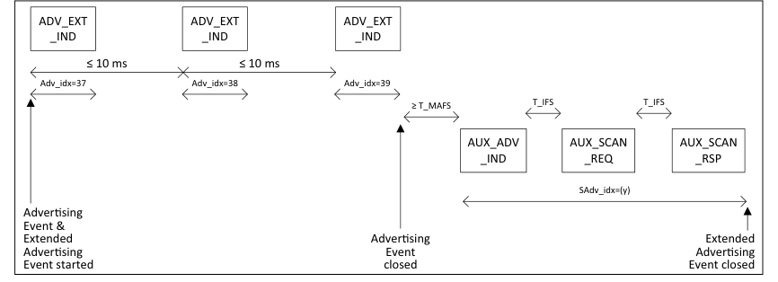

**Figure 4.20:  Scannable undirected advertising event with ADV_EXT_IND and AUX_ADV_IND PDUs with AUX_SCAN_REQ and AUX_SCAN_RSP PDUs on the secondary advertising channel**

##### 4.4.2.6  Non-Connectable and Non-Scannable Undirected Event Type

When the non-connectable and non-scannable undirected advertising event type is used, non-connectable and non-scannable undirected advertising indications (ADV_NONCONN_IND or non-connectable and non-scannable undirected ADV_EXT_IND PDUs) are sent by the Link Layer. The non- connectable and non-scannable undirected advertising event shall use either ADV_NONCONN_IND or non-connectable and non-scannable undirected ADV_EXT_IND PDUs but not both. The ADV_NONCONN_IND PDU shall not be used on the LE Coded PHY.
The non-connectable and non-scannable undirected event type allows a scanner to receive information from the advertiser. This information is contained either in the ADV_NONCONN_IND PDU or in an AUX_ADV_IND PDU pointed to by the AuxPtr field of the ADV_EXT_IND PDU.
The advertiser shall either move to the next used primary advertising channel index or close the advertising event after each ADV_NONCONN_IND or ADV_EXT_IND PDU that is sent. The Link Layer does not listen, and therefore cannot receive any requests from scanners or initiators.
The time between the beginning of two consecutive ADV_NONCONN_IND or ADV_EXT_IND PDUs within an advertising event shall be less than or equal to 10 ms. The advertising event shall be closed within the advertising interval.
If an ADV_EXT_IND PDU is used, the AdvMode shall be set to non- connectable and non-scannable.
If an ADV_EXT_IND PDU is used, the Controller may use an auxiliary packet. It shall use an auxiliary packet if the advertisement includes ACAD or AdvData.
If an ADV_EXT_IND PDU is used without an auxiliary packet, it shall not contain an AuxPtr field and shall contain an AdvA field.
If an ADV_EXT_IND PDU is used with an auxiliary packet, it shall contain an AuxPtr field and an ADI field. Either the ADV_EXT_IND PDU or the AUX_ADV_IND that it points to, but not both, may contain the AdvA field (the AdvA field may be omitted entirely, in which case the advertising is anonymous). In the AUX_ADV_IND PDU the AdvMode shall be set to non- connectable and non-scannable and the ADI field shall be present. The ADI fields in the ADV_EXT_IND PDU and the AUX_ADV_IND PDU shall be the same. On the LE Coded PHY, the ADV_EXT_IND PDU shall not contain an AdvA field.
Note: The Controller can decide which PDU contains the AdvA field and should make this choice based on overall efficient use of the medium.
The TargetA field shall not be present in any PDU.
An illustration of a non-connectable and non-scannable undirected advertising event is shown in Figure 4.21 for the case in which all the primary advertising channels are used.

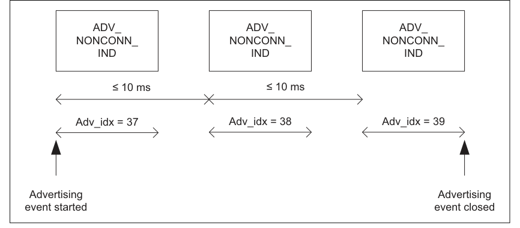

**Figure 4.21:  Non-connectable and non-scannable undirected advertising event using ADV_NONCONN_IND PDUs**

Figure 4.22 shows an example of a non-connectable and non-scannable undirected ADV_EXT_IND PDU.

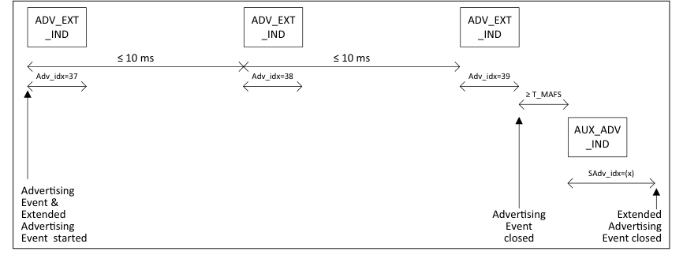

**Figure 4.22:  Non-connectable and non-scannable undirected advertising event using the ADV_EXT_IND PDU**

Figure 4.23 shows an example of a non-connectable and non-scannable undirected ADV_EXT_IND PDU where the Host advertising data is fragmented using the AUX_CHAIN_IND PDU.

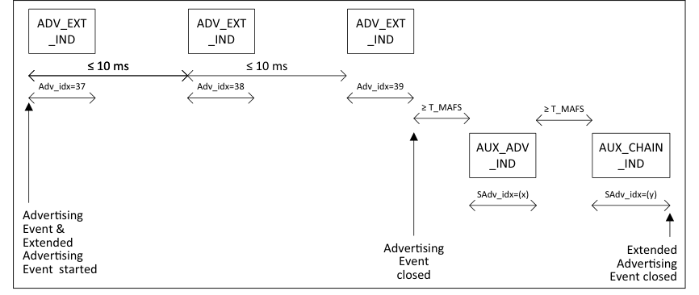

**Figure 4.23:  Non-connectable and non-scannable undirected advertising event using the ADV_EXT_IND PDU with fragmented Host advertising data**

If Link Layer Privacy has been enabled then the requirements in Section 6.2.3 shall also be followed.

##### 4.4.2.7  Connectable Undirected Event Type

The connectable undirected advertising event type using the ADV_EXT_IND PDU allows an initiator to respond with a connect request to establish a link layer connection on the secondary advertising channel.
In the ADV_EXT_IND PDU, the AdvMode field shall be set to connectable, the ADI field shall be present, and the PDU shall not contain the AdvA and TargetA fields. The AuxPtr field shall point to an AUX_ADV_IND PDU with the AdvMode field set to connectable and the AdvA and ADI fields present. The ADI fields in the ADV_EXT_IND PDU and the AUX_ADV_IND PDU shall be the same.
An initiator may send a connect request using the AUX_CONNECT_REQ PDU on the same secondary advertising channel as the AUX_ADV_IND PDU to request the Link Layer to enter the Connection State.
After every AUX_ADV_IND PDU sent related to this event by the advertiser, the advertiser shall listen for AUX_CONNECT_REQ PDUs on the same secondary advertising channel index. Any AUX_SCAN_REQ PDUs received shall be ignored.
If the advertiser receives an AUX_CONNECT_REQ PDU that contains its device address from an initiator allowed by the advertising filter policy it shall reply with an AUX_CONNECT_RSP PDU on the same secondary advertising channel index. After the AUX_CONNECT_RSP PDU is sent the Link Layer shall exit the Advertising State and transition to the Connection State in the Slave Role as defined in Section 4.5.5.
The time between the beginning of two consecutive ADV_EXT_IND PDUs within an advertising event shall be less than or equal to 10 ms. The advertising event shall be closed within the advertising interval.
Figure 4.24 shows an advertising event in which no AUX_CONNECT_REQ PDU is received.

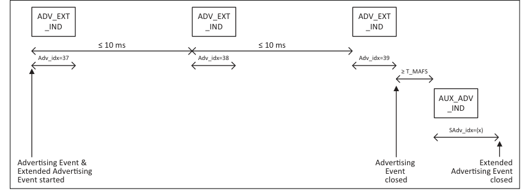

**Figure 4.24:  Connectable undirected advertising event using the ADV_EXT_IND PDUs and AUX_ADV_IND PDU containing advertising data**

Figure 4.25 illustrates an advertising event during which an AUX_CONNECT_REQ PDU is received and an AUX_CONNECT_RSP PDU is sent on the secondary advertising channel index.

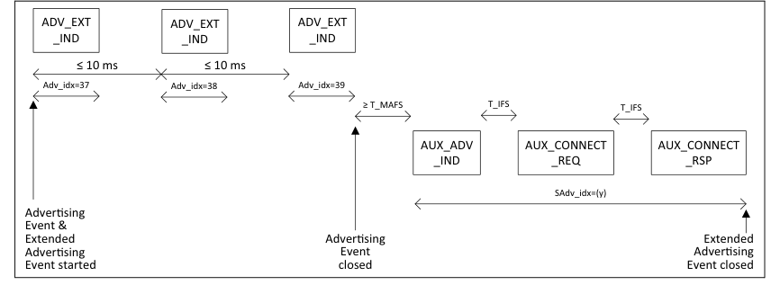

**Figure 4.25:  Connectable undirected advertising using ADV_EXT_IND PDUs when an AUX_CONNECT_REQ PDU is received**

If Link Layer Privacy has been enabled then the requirements in Section 6.2.4 shall also be followed.

##### 4.4.2.8  Scannable Directed Event Type

The scannable directed advertising event type using the ADV_EXT_IND PDU allows a specific scanner to respond with a scan request to receive scan response data on the secondary advertising channel.
In the ADV_EXT_IND PDU the AdvMode field shall be set to scannable, the ADI field shall be present, and the PDU shall not contain the AdvA and TargetA fields. The ADV_EXT_IND PDU’s AuxPtr field shall point to an AUX_ADV_IND PDU with the AdvA, TargetA, and ADI fields all present. The ADI fields in the ADV_EXT_IND PDU and the AUX_ADV_IND PDU shall be the same.
After every AUX_ADV_IND PDU sent, the advertiser shall listen for an AUX_SCAN_REQ PDU on the same secondary advertising channel index from the targeted scanner.
If the advertiser receives an AUX_SCAN_REQ PDU that contains its device address and the scanner’s device address is contained in the AUX_ADV_IND PDU, it shall reply with an AUX_SCAN_RSP PDU on the same secondary advertising channel index prior to the next advertising event. The AUX_SCAN_RSP PDU shall contain the scan response data. AUX_SCAN_REQ PDUs from any other scanner or any AUX_CONNECT_REQ PDUs received shall be ignored.
The time between the beginning of two consecutive ADV_EXT_IND PDUs within an advertising event shall be less than or equal to 10 ms. The advertising event shall be closed within the advertising interval.
See Section 4.4.2.5.2 for a description on how the AUX_SCAN_REQ packet is used in conjunction with the AUX_SCAN_RSP packets on the secondary advertising channel.
If Link Layer Privacy has been enabled then the requirements in Section 6.2.5 shall also be followed.

##### 4.4.2.9  Non-Connectable and Non-Scannable Directed Event Type

The non-connectable and non-scannable directed advertising event type using the ADV_EXT_IND PDU allows an advertiser to send non-connectable and non-scannable directed ADV_EXT_IND PDUs on the primary advertising channel with any advertising data sent on the secondary advertising channel targeted for a specific scanner.
The AdvMode field in the ADV_EXT_IND PDU shall be set to non-connectable and non-scannable.
The Controller shall use an auxiliary packet if the advertisement includes ACAD or AdvData. Otherwise the Controller may use an auxiliary packet.
If an auxiliary packet is not used, the ADV_EXT_IND PDU shall not contain an AuxPtr field and shall contain the AdvA and TargetA fields.
If an auxiliary packet is used, the ADV_EXT_IND PDU shall contain an AuxPtr field and an ADI field. Either the ADV_EXT_IND PDU or the AUX_ADV_IND PDU it points to, but not both, may contain the AdvA  field (the AdvA field may be omitted entirely, in which case the advertising is anonymous). The TargetA field shall be present in either PDU but not both. In the AUX_ADV_IND PDU the AdvMode shall be set to non-connectable and non-scannable and the ADI field shall be present. The ADI fields in the ADV_EXT_IND PDU and the AUX_ADV_IND PDU shall be the same. On the LE Coded PHY, the ADV_EXT_IND PDU shall not contain an AdvA or TargetA field.
Note: The Host cannot specify which PDU contains the AdvA or TargetA field; the Controller should make this choice based on overall efficient use of the medium.
The Link Layer does not listen, and therefore cannot receive any requests from scanners or initiators.
If Link Layer Privacy has been enabled then the requirements in Section 6.2.5 shall also be followed.

##### 4.4.2.10  Advertising Data Sets

The advertiser’s Host may instruct the Link Layer to interleave advertising events. Advertising data belonging together is called an advertising data set. The Link Layer may support multiple advertising data sets, with each set having different advertising parameters such as advertising PDU type, advertising interval, and PHY.
When advertising with the ADV_EXT_IND, AUX_ADV_IND, or AUX_SYNC_IND PDUs, the advertising data set is identified by the Advertising SID subfield of the ADI field. The Link Layer shall set the Advertising SID subfield as directed by the Host.
The scanner may filter advertisements based on the Advertising SID.
The advertising events for each Advertising Data Set are considered a separate instance of the Advertising State and each have their own Advertising Interval (see Section 4.4.2.2.1).
Figure 4.26 illustrates an example of advertising using multiple advertising sets.

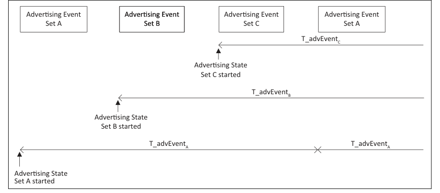

**Figure 4.26:  Multiple advertising data sets example**

On reset, all advertising sets are destroyed.
When an advertising set is created that includes advertising data, the Controller shall guarantee that the set can contain at least 31 octets of advertising data. The guarantee shall no longer apply after the Host first specifies advertising data for that set or creates another advertising set.
When an advertising set is created that is scannable, the Controller shall guarantee that the set can contain at least 31 octets of scan response data. The guarantee shall no longer apply if the set is made non-scannable or after the Host first specifies scan response data for that set or creates another advertising set.

##### 4.4.2.11  Using AdvDataInfo (ADI)

The AdvDataInfo (ADI) field is used to identify advertising sets and duplicate AdvData in either the AUX_ADV_IND or AUX_SCAN_RSP PDUs.  For scannable advertising events using the ADV_EXT_IND PDU, AdvData is not permitted in the AUX_ADV_IND PDU so the ADI only refers to the AdvData contained in the AUX_SCAN_RSP PDU.
The Advertising DID for a given advertising set shall be initialized with a randomly chosen value. Whenever the Host provides new advertising data or scan response data for a given advertising set (whether it is the same as the previous data or not), the Advertising DID shall be updated. The new value shall be a randomly chosen value that is not the same as the previously used value.
Note: Choosing Advertising DID field values randomly reduces the possibility of PDUs from different advertisers containing the same ADI field value.

##### 4.4.2.12  Periodic Advertising

When advertising data is required to be sent regularly at a fixed interval, periodic advertising is used. Periodic advertising consists of advertisements sent at a fixed interval with the advertisement data changing from time to time.
When periodic advertising takes place, the advertiser shall send AUX_SYNC_IND PDUs at regular intervals (the periodic advertising interval - see Section 4.4.2.2.3), which are described in the SyncInfo field of AUX_ADV_IND PDUs. The Periodic Advertising is identified by the AdvDataInfo field of ADV_EXT_IND PDUs that point to AUX_ADV_IND PDUs containing the SyncInfo field. The AUX_SYNC_IND PDUs and the PDUs that point to them shall always be sent on the same PHY. The PHY used shall not change while the periodic advertising is enabled. Advertising pointing to a periodic advertisement shall not be anonymous. Each time that periodic advertising is enabled, the Controller shall transmit at least one AUX_IND_PDU pointing to the first AUX_SYNC_IND PDU of that periodic advertising; after this, there is no requirement whether or when to transmit advertising PDUs pointing to the periodic advertisements.
The Host may send periodic advertising data to the Link Layer. This advertising data is placed by the Link Layer in the periodic AUX_SYNC_IND PDUs and their subordinate sets. The Link Layer shall repeat the last advertising data sent by the Host until it receives new advertising data. The AUX_SYNC_IND PDUs are continuously sent out until the Host directs the Link Layer to terminate the periodic advertising.
When an advertising set is first configured for periodic advertising, the Controller shall guarantee that the set can contain at least 31 octets of advertising data or else shall not allow periodic advertising on that advertising set. The guarantee shall no longer apply after the Host first specifies periodic advertising data for that set or creates another advertising set.
Figure 4.27 illustrates an example of periodic advertising.

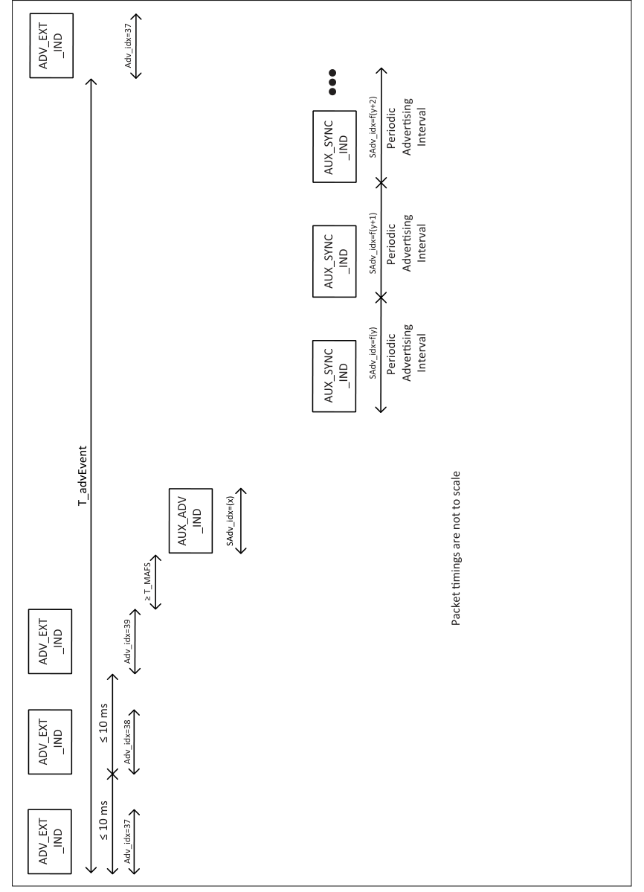

**Figure 4.27:  Example of periodic advertising**

#### 4.4.3  Scanning State

The Link Layer shall enter the Scanning State when directed by the Host. When scanning, the Link Layer shall listen on the primary advertising channel. There are two types of scanning, determined by the Host: passive and active.
There are no strict timing or advertising channel index selection rules for scanning.
During scanning, the Link Layer listens on a primary advertising channel index for the duration of the scan window, scanWindow. The scan interval, scanInterval, is defined as the interval between the start of two consecutive scan windows.
The Link Layer should listen for the complete scanWindow every scanInterval as directed by the Host unless there is a scheduling conflict. In each scan window, the Link Layer should scan on a different primary advertising channel index. The Link Layer shall use all the primary advertising channel indices.
The scanWindow and scanInterval parameters shall be less than 40.96 s. The scanWindow shall be less than or equal to the scanInterval. If the scanWindow and the scanInterval parameters are set to the same value by the Host, the Link Layer should scan continuously.
The scanner filter policy shall apply when receiving an advertising PDU or scanning PDU when scanning.
On receiving a PDU with the AuxPtr field present, the scanner should also listen for the auxiliary PDU it points to (provided that it supports the PHY specified in the AuxPtr field).
When a scanner receives ADV_EXT_IND PDUs that contain an AuxPtr field, it may either always listen for the auxiliary packet or may sometimes skip listening. In the latter case, the following requirements shall apply.
For each Advertising SID value received:
• The Controller shall keep a cache of one or more recent Advertising DID values used by each advertising device (for this purpose, all anonymous advertising is treated as being from a single device different to all real devices) and shall update them whenever a PDU containing an ADI field is received. The Controller may delete any cache entry at any time. The Controller should delete the cache entry relating to an ADV_EXT_IND PDU if it fails to receive that PDU's entire subordinate set.
• The Controller may only skip listening for the auxiliary packet if the cache has an entry specifying the Advertising DID value in the ADI field being used by a device; if the ADV_EXT_IND PDU contains an AdvA field, the entry shall be for that device. Otherwise, the Controller shall not skip listening for the auxiliary packet. The Controller should sometimes listen for the
AUX_ADV_IND PDU in case another advertiser has started using the same Advertising DID value.
If Link Layer Privacy has been enabled then the requirements in Section 6.3 shall also be followed.

##### 4.4.3.1  Passive Scanning

When in passive scanning, the Link Layer will only receive packets; it shall not send any packets.

##### 4.4.3.2  Active Scanning

In active scanning, the Link Layer shall listen for advertising PDUs and, depending on the advertising PDU type, it may request an advertiser to send additional information.
After entering the Scanning State, if the Link Layer receives a scannable PDU (i.e. an ADV_IND, ADV_SCAN_IND, or scannable AUX_ADV_IND PDU) from an advertiser allowed by the scanner filter policy, it shall respond with a scan request PDU and then listen for the scan response PDU. It shall continue to respond to the same advertiser until it has successfully received the scan response PDU. It may then either respond to or ignore subsequent scannable PDUs from the same advertiser. It should ignore them if either they are legacy PDUs or if the Advertising DID field has not changed since the last advertisement from the same advertiser with the same Advertising SID field; it should not ignore them otherwise.
The Link Layer shall only send a SCAN_REQ PDU to an advertiser from which an ADV_IND PDU or ADV_SCAN_IND PDU is received. The Link Layer shall only send an AUX_SCAN_REQ PDU to an advertiser from which a scannable AUX_ADV_IND is received. The Link Layer shall ignore a scannable ADV_EXT_IND or AUX_ADV_IND PDU if the TargetA field is present and it does not match the Link Layer’s device address.
The scanner shall run a backoff procedure to minimize collisions of scan request PDUs from multiple scanners. An example of such a procedure is given in the following paragraphs.
The backoff procedure uses two parameters, backoffCount and upperLimit, to restrict the number of scan request PDUs sent when collisions occur on scan response PDUs. Upon entering the Scanning State, the upperLimit and backoffCount are set to one.
On every received ADV_IND, ADV_SCAN_IND, or scannable AUX_ADV_IND PDU that is allowed by the scanner filter policy and for which a scan request PDU is to be sent, the backoffCount is decremented by one until it reaches the value of zero. The scan request PDU is only sent when backoffCount becomes zero.
After sending a scan request PDU the Link Layer listens for a scan response PDU from that advertiser. If the scan response PDU was not received from that advertiser, it is considered a failure; otherwise it is considered a success. On every two consecutive failures, the upperLimit is doubled until it reaches the value of 256. On every two consecutive successes, the upperLimit is halved until it reaches the value of one. After success or failure of receiving the scan response PDU, the Link Layer sets backoffCount to a new pseudo-random integer between one and upperLimit inclusive.
If a device uses a different backoff algorithm it shall share the medium responsibly.
Two illustrations of advertising events using all the advertising channel indices during which a SCAN_REQ PDU is received and a SCAN_RSP PDU is sent are shown in Figure 4.8 and in Figure 4.9.

##### 4.4.3.3  Advertising Data Sets

The ADV_EXT_IND PDU may contain an ADI field. When the ADI field is present, it can be used to identify advertisement data that belong to the same set. This is specified in the Advertising SID subfield in the ADI. The Advertising SID is set by the Host of the advertiser.

##### 4.4.3.4  Periodic Advertisements

For an AUX_ADV_IND PDU where the SyncInfo field is present the scanner should, when instructed by the Host, listen for the AUX_SYNC_IND PDU specified in the SyncInfo field. The scanner should then continue to listen for AUX_SYNC_IND PDUs on the secondary advertising channel indices specified in Section 4.4.2.1.
Because of sleep clock accuracies (see Section 4.2.2), the scanner should perform the window widening specified in Section 4.5.7, with connection events replaced by packets containing AUX_SYNC_IND PDUs.
If the Sync Packet Offset of the SyncInfo is zero, the scanner should listen for a subsequent advertisement to be able to locate the periodic advertisement.
The Link Layer on the scanner shall report the advertising data received in the periodic advertisements to the Host.
A scanner shall not attempt to synchronize to a periodic advertising set that it is already synchronized to.

##### 4.4.3.5  Advertising Reports

For each non-duplicate advertising or scan response PDU from an advertiser, the Link Layer shall send an advertising report to the Host. However, if the Controller receives an ADV_EXT_IND PDU with an AuxPtr field, it shall delay
the report until after the corresponding AUX_ADV_IND PDU has been received and the report shall combine the information in the PDUs; if the Controller does not listen for or does not receive the AUX_ADV_IND PDU, no report shall be generated. The advertising report shall contain at least the advertiser's device address and advertising data or scan response data if present. The Host may request that duplicate advertising reports are filtered.
Where a received ADV_EXT_IND PDU contains an ADI field, a duplicate advertising report is an advertising report for the same device address where the previous report that contained an ADI value with the same Advertising SID also had the same Advertising DID. For this purpose, all anonymous advertising is treated as being from a single device different to all non- anonymous devices.
Where the ADV_EXT_IND PDU does not contain an ADI field or a legacy PDU was received, a duplicate advertising report is an advertising report for the same device address while the Link Layer stays in the Scanning State.
In either case the actual data may change; advertising data or scan response data is not considered significant when determining duplicate advertising reports.

#### 4.4.4  Initiating State

The Link Layer shall enter the Initiating State when directed by the Host. When initiating, the Link Layer shall listen on the primary advertising channel.
There are no strict timing or advertising channel index selection rules for initiators.
During initiating, the Link Layer listens on a primary advertising channel index for the duration of the scan window, scanWindow. The scan interval, scanInterval, is defined as the interval between the start of two consecutive scan windows.
The Link Layer should listen for the complete scanWindow every scanInterval as directed by the Host unless there is a scheduling conflict. In each scan window, the Link Layer should listen on a different primary advertising channel index. The Link Layer shall use all the primary advertising channel indices.
The scanWindow and scanInterval parameters shall be less than or equal to 40.96 s. The scanWindow shall be less than or equal to the scanInterval. If the scanWindow and the scanInterval parameters are set to the same value by the Host, the Link Layer should listen continuously.
Connection indications or requests in response to a connectable advertisement shall be sent on either the primary or secondary advertising channel depending on which advertising PDU contains an AdvA field. The following sub-sections describe the two procedures.
If Link Layer Privacy has been enabled then the requirements in Section 6.4 shall also be followed.

##### 4.4.4.1  Connect Requests on the Primary Advertising Channel

This procedure shall not be used when establishing a connection on the LE Coded PHY.
If an ADV_IND PDU is received that is allowed by the initiator filter policy, the initiator shall send a CONNECT_IND PDU to the advertiser. If an ADV_DIRECT_IND PDU containing the initiator's Link Layer device address and allowed by the initiator filter policy is received, the initiator shall send a CONNECT_IND PDU to the advertiser; otherwise it shall be ignored.
After sending the CONNECT_IND PDU, the Link Layer shall exit the Initiating State, and shall transition to the Connection State in the Master Role as defined in Section 4.5.4.

##### 4.4.4.2  Connect Requests on the Secondary Advertising Channel

This procedure shall be used when establishing a connection on the LE Coded PHY.
If a connectable ADV_EXT_IND PDU is received, the initiator shall listen for the connectable AUX_ADV_IND on the secondary advertising channel. If a connectable undirected AUX_ADV_IND PDU, or a connectable directed AUX_ADV_IND PDU containing the initiator's Link Layer device address, is received and is allowed by the initiator filter policy, the initiator shall send an AUX_CONNECT_REQ PDU to the advertiser; otherwise, it shall be ignored.
After sending the AUX_CONNECT_REQ PDU, the initiator shall wait for the advertiser to send an AUX_CONNECT_RSP PDU. Once an AUX_CONNECT_RSP PDU is received, the Link Layer shall exit the Initiating State and shall transition to the Connection State in the Master Role as defined in Section 4.5.4. If the initiator does not receive an AUX_CONNECT_RSP PDU from the advertiser, it shall use the back-off algorithm described for SCAN_REQ in Section 4.4.3.2 before responding to the next connectable AUX_ADV_IND PDU.

### 4.5   CONNECTION STATE

The Link Layer enters the Connection State when an initiator sends a CONNECT_IND PDU on the primary advertising channel to an advertiser, an advertiser receives a CONNECT_IND PDU on the primary advertising channel from an initiator, an advertiser sends an AUX_CONNECT_RSP PDU on the secondary advertising channel to an initiator, or an initiator receives an AUX_CONNECT_RSP PDU on the secondary advertising channel from an advertiser.
After entering the Connection State, the connection is considered to be created. The connection is not considered to be established at this point. A connection is only considered to be established once a data channel packet has been received from the peer device. The only difference between a connection that is created and a connection that is established is the Link Layer connection supervision timeout value that is used (see Section 4.5.2).
If the connection is first created using the CONNECT_IND PDU on the primary advertising channel, it shall use the LE 1M PHY in both directions. If the connection is first created on the secondary channel using the AUX_CONNECT_REQ and AUX_CONNECT_RSP PDUs, it shall use the same PHY in both directions as was used for the AUX_CONNECT_REQ and AUX_CONNECT RSP PDU. Either PHY may be changed subsequently using the PHY Update Procedure (Section 5.1.10). When the LE Coded PHY is in use, the coding of each packet is determined by the CI field as defined in Section 2.2.3 and may be different in each direction and in adjacent packets in a given direction.
When two devices are in a connection, the two devices act in different roles. A Link Layer in the Master Role is called a master. A Link Layer in the Slave Role is called a slave. The master controls the timing of a connection event. A connection event is a point of synchronization between the master and the slave. There shall be only one connection, whether or not established, between two LE device addresses. An initiator shall not send a connection request to an advertiser it is already connected to.
If an advertiser receives a connection request from an initiator it is already connected to, it shall ignore that request.
If the initiator sent a CONNECT_IND PDU in response to an ADV_IND or ADV_DIRECT_IND PDU and either or both device’s PDU had the ChSel field set to 0, then Channel Selection Algorithm #1 (see Section 4.5.8.2) shall be used on the connection. Otherwise, Channel Selection Algorithm #2 (see Section 4.5.8.3) shall be used.

#### 4.5.1  Connection Events

The Link Layer in the Connection State shall only transmit Data Channel PDUs (see Section 2.4) in connection events. The master and slave shall determine the data channel index for each connection event as defined in Section 4.5.8. The same data channel index shall be used for all packets in the connection event. Each connection event contains at least one packet sent by the master.
During a connection event, the master and slave alternate sending and receiving packets. The connection event is considered open while both devices continue to send packets. The slave shall always send a packet if it receives a packet from the master regardless of a valid CRC match, except after multiple consecutive invalid CRC matches as specified in Section 4.5.6. The master may send a packet if it receives a packet from the slave regardless of a valid CRC match. The Length field of the Header is assumed to be correct even if the CRC match was invalid. If the master does not receive a packet from the slave, the master shall close the connection event.
The connection event can be closed by either device, as defined in Section 4.5.6.
The timing of connection events is determined by two parameters: connection interval (connInterval), and slave latency (connSlaveLatency).
The start of a connection event is called an anchor point. At the anchor point, a master shall start to transmit a Data Channel PDU to the slave. The start of connection events are spaced regularly with an interval of connInterval and shall not overlap. The master shall ensure that a connection event closes at least T_IFS before the anchor point of the next connection event. The slave listens for the packet sent by its master at the anchor point.
The connInterval shall be a multiple of 1.25 ms in the range of 7.5 ms to 4.0 s. The connInterval is set by the Initiator’s Link Layer in the CONNECT_IND PDU from the range given by the Host.
Slave latency allows a slave to use a reduced number of connection events. The connSlaveLatency parameter defines the number of consecutive connection events that the slave device is not required to listen for the master. The value of connSlaveLatency should not cause a Supervision Timeout (see Section 4.5.2). connSlaveLatency shall be an integer in the range of 0 to ((connSupervisionTimeout / (connInterval*2)) - 1). The connSlaveLatency parameter shall also be less than 500. When connSlaveLatency is set to zero the slave device shall listen at every anchor point. If the slave does not receive a packet from the master after applying slave latency, it should listen at each anchor point and not apply slave latency until it receives a packet from the master.
Both the master and the slave shall have a 16-bit connection event counter (connEventCounter), containing the value connEventCount, for each Link Layer connection. It shall be set to zero on the first connection event sent by
the master of the connection. It shall be incremented by one for each new connection event sent by the master; the connEventCounter shall wrap from 0xFFFF to 0x0000. This counter is used to synchronize Link Layer control procedures.
The slave shall increment connEventCounter for all connection events, even if it is not listening to the master due to slave latency in those events.

#### 4.5.2  Supervision Timeout

A connection can break down due to various reasons such as a device moving out of range, encountering severe interference or a power failure condition. Since this may happen without any prior warning, it is important for both the master and the slave to monitor the status of the connection.
To be able to detect link loss, both the master and the slave shall use a Link Layer connection supervision timer, TLLconnSupervision. Upon reception of a valid packet, the timer shall be reset.
If the Link Layer connection supervision timer reaches 6 * connInterval before the connection is established (see Section 4.5), the connection shall be considered lost. This enables fast termination of connections that fail to establish.
Connection supervision timeout (connSupervisionTimeout) is a parameter that defines the maximum time between two received Data Packet PDUs before the connection is considered lost. The connSupervisionTimeout shall be a multiple of 10 ms in the range of 100 ms to 32.0 s and it shall be larger than (1 + connSlaveLatency) * connInterval * 2.
If at any time in Connection State after the connection has been established and the timer reaches the connSupervisionTimeout value, the connection shall be considered lost.
If the connection is considered lost, the Link Layer shall not send any further packets. The Link Layer exits the Connection State and shall transition to the Standby State. The Host shall be notified of the loss of connection.

#### 4.5.3  Connection Event Transmit Window

To allow the master to efficiently schedule connection events for multiple connections or other activities it may be involved in, the master has the flexibility to schedule the first connection event anchor point at a time of its choosing. The CONNECT_IND and AUX_CONNECT_REQ PDUs include parameters to determine when the master can send its first packet in the Connection State to set the anchor point and when the slave must listen.
The CONNECT_IND and AUX_CONNECT_REQ PDUs include three parameters used to determine the transmit window. The transmit window starts
at transmitWindowDelay + transmitWindowOffset after the end of the packet containing the CONNECT_IND PDU or AUX_CONNECT_REQ PDU, and the transmitWindowSize parameter shall define the size of the transmit window. The connInterval is used in the calculation of the maximum offset and size of the transmit window. The transmitWindowOffset and transmitWindowSize parameters are determined by the Link Layer.
The transmitWindowOffset shall be a multiple of 1.25 ms in the range of 0 ms to connInterval. The transmitWindowSize shall be a multiple of 1.25 ms in the range of 1.25 ms to the lesser of 10 ms and (connInterval - 1.25 ms).
Therefore the start of the first packet will be no earlier than transmitWindowDelay + transmitWindowOffset and no later than transmitWindowDelay + transmitWindowOffset + transmitWindowSize after the end of the packet containing the CONNECT_IND PDU or AUX_CONNECT_REQ PDU.
The value of transmitWindowDelay shall be 1.25 ms when a CONNECT_IND PDU is used, 2.5 ms when an AUX_CONNECT_REQ PDU is used on an LE Uncoded PHY, and 3.75 ms when an AUX_CONNECT_REQ PDU is used on the LE Coded PHY.

#### 4.5.4  Connection Setup – Master Role

After the initiator sends a CONNECT_IND PDU on the primary advertising channel or receives an AUX_CONNECT_RSP PDU on the secondary advertising channel, the Link Layer is in the Connection State in the Master Role. The master shall reset the Link Layer connection supervision timer TLLconnSupervision. The Link Layer shall notify the Host that the connection has been created. The first connection event shall use the data channel index as specified in Section 1.4.1.
The master shall start to send the first packet within the transmit window as defined in Section 4.5.3. It is permitted that the master’s first packet can extend beyond the transmit window.
The first packet sent in the Connection State by the master determines the anchor point for the first connection event, and therefore the timings of all future connection events in this connection.
The second connection event anchor point shall be connInterval after the first connection event anchor point. All the normal connection event transmission rules specified in Section 4.5.1 shall apply.
Two examples of the LL connection setup procedure timing from the master’s perspective are shown in Figure 4.28 and in Figure 4.29.

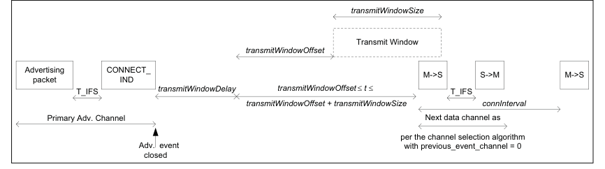

**Figure 4.28:  Master’s view of LL connection setup with CONNECT_IND**

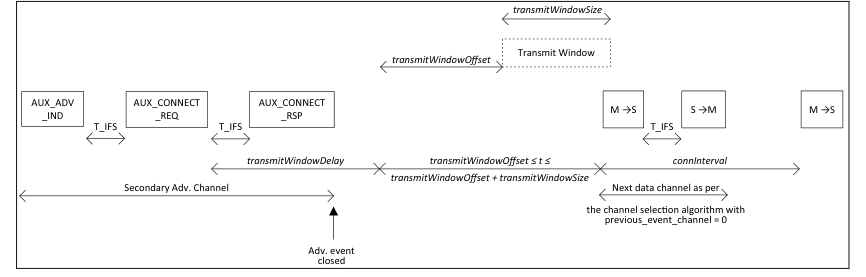

**Figure 4.29:  Master’s view of LL connection setup with AUX_CONNECT_REQ**

#### 4.5.5  Connection Setup – Slave Role

After the advertiser receives a CONNECT_IND PDU on the primary advertising channel or sends an AUX_CONNECT_RSP PDU on the secondary advertising channel, the Link Layer is in the Connection State in the Slave Role. The slave shall reset the Link Layer connection supervision timer TLLconnSupervision. The Link Layer shall notify the Host that the connection has been created. The first connection event shall use the data channel index as specified in Section 1.4.1.
The slave shall start to listen for the first packet within the transmit window as defined in Section 4.5.3. It is permitted that the master’s first packet can extend beyond the transmit window, and therefore the slave must take this into account.
The first packet received, regardless of a valid CRC match (i.e., only the access code matches), in the Connection State by the slave determines the anchor point for the first connection event, and therefore the timings of all future connection events in this connection.
If a packet is not received in a transmit window, the slave shall attempt to receive a packet in a subsequent transmit window. A subsequent transmit window shall start connInterval after the start of the previous transmit window, with the same transmitWindowSize. The data channel index shall be the next
data channel index as specified in Section 1.4.1. The connEventCount shall also be incremented by one.
Two examples of the procedure from the slave’s perspective are shown in Figure 4.30 and in Figure 4.31. In these examples the slave fails to receive any part of the first packet (i.e., connEventCount = 0) from the master and acquires anchor point timing from the second packet (i.e., connEventCount = 1).

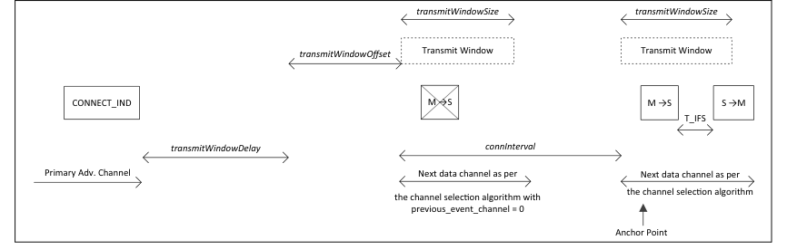

**Figure 4.30:  Slave closing LL connection setup in the second LL connection event with CONNECT_IND**

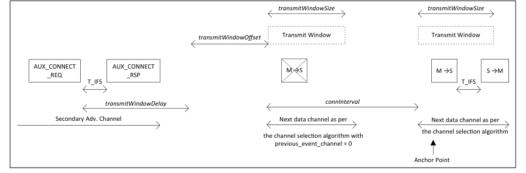

**Figure 4.31:  Slave closing LL connection setup in the second LL connection event with AUX_CONNECT_REQ**

The slave shall be active in every connection event until it receives a packet from the master with the NESN set to one. From then on it may use slave latency as defined in Section 4.5.1.

#### 4.5.6  Closing Connection Events

The MD bit of the Header of the Data Channel PDU is used to indicate that the device has more data to send. If neither device has set the MD bit in their packets, the packet from the slave closes the connection event. If either or both of the devices have set the MD bit, the master may continue the connection event by sending another packet, and the slave should listen after sending its packet. If a packet is not received from the slave by the master, the master will
close the connection event. If a packet is not received from the master by the slave, the slave will close the connection event.
Two consecutive packets received with an invalid CRC match within a connection event shall close the event.
MD bit usage is summarized in Table 4.2.

|  |  | Master |  |
| --- | --- | --- | --- |
|  |  | MD = 0 | MD = 1 |
| Slave | MD = 0 | Master shall not send another packet, closing the connection event. Slave does not need to listen after sending its packet. | Master may continue the connec tion event. Slave should listen after sending its packet. |
|  | MD = 1 | Master may continue the connec- tion event. Slave should listen after sending its packet. | Master may continue the connec tion event. Slave should listen after sending its packet. |

Table 4.2:  MD bit usage for closing connection events

#### 4.5.7  Window Widening

Because of sleep clock accuracies (see Section 4.2.2), there is uncertainty in the slave of the exact timing of the master’s anchor point. Therefore the slave is required to re-synchronize to the master’s anchor point at each connection event where it listens for the master. If the slave receives a packet from the master regardless of a CRC match, the slave shall update its anchor point.
The slave calculates the time when the master will send the first packet of a connection event (slaveExpectedAnchorPoint) taking clock jittering, and in the case of connection setup or a connection parameter update the transmit window, into account. In the absence of more accurate information about the master's clock, the slave shall also use the master’s sleep clock accuracy (masterSCA) from the CONNECT_IND PDU, together with its own sleep clock accuracy (slaveSCA) and the anchor point of the last connection event where it received a packet from the master (timeSinceLastAnchor) to calculate the time it needs to receive.
The increase in listening time is called the window widening. Assuming the clock inaccuracies are purely given in parts per million (ppm), it is calculated as follows:
windowWidening = ((masterSCA + slaveSCA) / 1000000) * timeSinceLastAnchor If the slave has more accurate information about the master's clock, it may select a smaller value for windowWidening.
During connection setup or during a connection parameter update, the slave should listen for windowWidening before the start of the transmit window and until windowWidening after the end of the transmit window for the master's anchor point.
At each subsequent connection event, the slave should listen for windowWidening before the start of the slaveExpectedAnchorPoint and until windowWidening after slaveExpectedAnchorPoint for the master’s anchor point.
The windowWidening shall be smaller than ((connInterval/2) - T_IFS us). If the windowWidening reaches ((connInterval/2) - T_IFS us) in magnitude, the connection should be considered lost.

#### 4.5.8  Data Channel Index Selection

##### 4.5.8.1  Channel Classification

The master’s Link Layer shall classify data channels into used channels (used for the connection) and unused channels (not used for the connection). This is called the channel map. The minimum number of used channels shall be 2.
The Host may provide channel classification information to the Link Layer. The Link Layer may use the information provided by the Host. The slave shall receive the channel map from the master in the CONNECT_IND PDU. If the master changes the channel map it shall notify the slave as specified in Section 5.1.2.

##### 4.5.8.2  Channel Selection Algorithm #1

Channel Selection Algorithm #1 only supports channel selection for connection events.
Channel Selection Algorithm #1 consists of two stages: calculation of the unmapped channel index followed by mapping this index to a data channel index from the set of used channels.
The unmappedChannel and lastUnmappedChannel are the unmapped channel indices of two consecutive connection events. The unmappedChannel is the unmapped channel index for the current connection event. The lastUnmappedChannel is the unmapped channel index of the previous connection event. The lastUnmappedChannel shall be 0 for the first connection event of a connection.
At the start of a connection event, unmappedChannel shall be calculated using the following basic algorithm:
unmappedChannel = (lastUnmappedChannel + hopIncrement) mod 37
When a connection event closes, the lastUnmappedChannel shall be set to the value of the unmappedChannel.
If the unmappedChannel is a used channel according to the channel map, Channel Selection Algorithm #1 shall use the unmappedChannel as the data channel index for the connection event.
If the unmappedChannel is an unused channel according to the channel map, the unmappedChannel shall be re-mapped to one of the used channels in the channel map using the following algorithm:
remappingIndex = unmappedChannel mod numUsedChannels
where numUsedChannels is the number of used channels in the channel map.
A remapping table is built that contains all the used channels in ascending order, indexed from zero. The remappingIndex is then used to select the data channel index for the connection event from the remapping table.
The complete procedure is as shown in Figure 4.32.

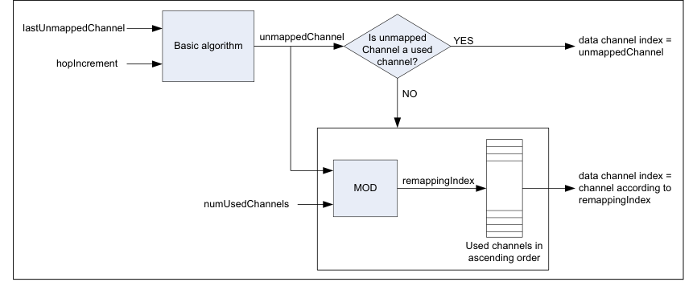

**Figure 4.32:  Block diagram of data Channel Selection Algorithm #1**

##### 4.5.8.3  Channel Selection Algorithm #2

###### 4.5.8.3.1   Overview

Channel Selection Algorithm #2 supports channel selection for connection events and periodic advertising packets.
At the start of an event, which can be a connection event or a periodic advertising packet, the algorithm described here generates an event channel index (which is a data channel index or secondary advertising channel index, as appropriate).
A block diagram of the overall algorithm is shown in Figure 4.33.

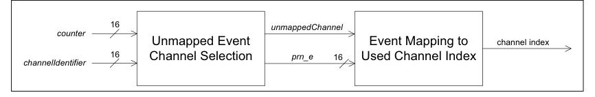

**Figure 4.33:  General block diagram of Channel Selection Algorithm #2**

###### 4.5.8.3.2   Inputs and Basic Components

The algorithm makes use of the following inputs and basic components:
• The 6-bit input N is the number of channels classified as Used channels.
• The 16-bit input channelIdentifier is fixed for any given connection or periodic advertising; it is calculated from the Access Address by: channelIdentifier = (Access Address31-16) XOR (Access Address15-0)
• The 16-bit input counter changes for each event. For data connections it is the connection event counter connEventCounter defined in Section 4.5.1. For periodic advertising it is the event counter paEventCounter defined in Section 4.4.3.4.
The “XOR” operation always refers to a 16-bit bit-wise XOR.
The symbol is used to represent the floor function (the greatest integer less than or equal to the argument).
¬ ¼
The permutation operation consists of separately bit-reversing the lower 8 input bits and upper 8 input bits, as illustrated in Figure 4.34.

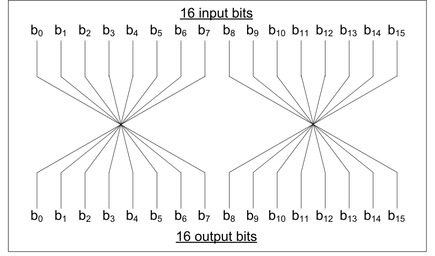

**Figure 4.34:  Permutation operation**

The Multiply, Add, and Modulo (MAM) block performs a multiplication operation, an addition operation, and a modulo operation, as illustrated in Figure 4.35.

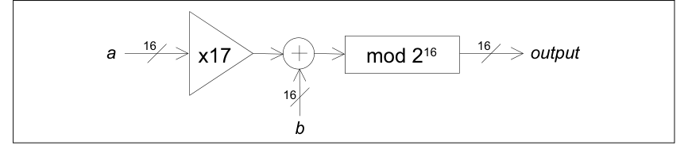

**Figure 4.35:  Multiply, Add, and Modulo block operation**

The output of the MAM operation, given inputs a and b, is:
output = (17 x a + b) mod 216
A remapping table is built that contains all the used channels in ascending order, indexed from zero.

###### 4.5.8.3.3   Unmapped Event Channel Selection

The unmapped event channel selection process consists of two stages. First, the unsigned pseudo-random number prn_e is generated, after which the unmapped channel index unmappedChannel is derived from prn_e.
The first stage shall be as shown in Figure 4.36.

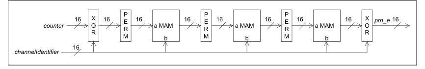

**Figure 4.36:  Event pseudo-random number generation**

unmappedChannel is then calculated as prn_e modulo 37. A block diagram of the overall process is shown in Figure 4.37.

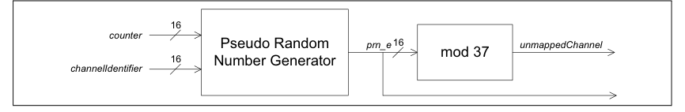

**Figure 4.37:  Unmapped channel selection process**

###### 4.5.8.3.4   Event Mapping to Used Channel Index

If unmappedChannel is the channel index of a used channel according to the channel map, it is used as the channel index for the event. If unmappedChannel is the index of an unused channel according to the channel map, then the channel index for the event is calculated from prn_e and N (the number of used channels) by first calculating the value remappingIndex as:
« ¸ ¹ · ¨ © § 16 2 _ * e prn N ndex remappingi
» «¬
»¼
and then using remappingIndex as an index into the remapping table to obtain the channel index for the event.
The overall process is illustrated in Figure 4.38.

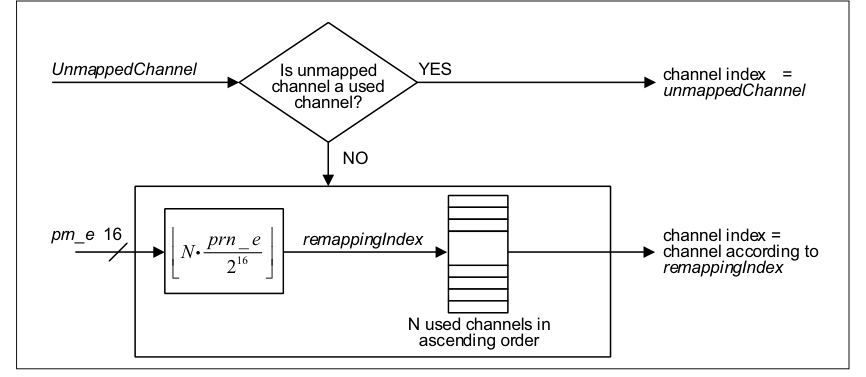

**Figure 4.38:  Event mapping to used channel index process**

#### 4.5.9  Acknowledgment and Flow Control

The Link Layer acknowledgment and flow control scheme shall be used in all Link Layer connections.
For each connection the Link Layer has two parameters, transmitSeqNum and nextExpectedSeqNum, each one bit in size. The transmitSeqNum parameter is used to identify packets sent by the Link Layer. The nextExpectedSeqNum parameter is used by the peer to either acknowledge the last Data Channel PDU sent, or to request resending of the last Data Channel PDU sent.
The transmitSeqNum and nextExpectedSeqNum parameters shall be set to zero upon entering the Connection State.
If the last Data Channel PDU was sent on the LE Coded PHY, the coding scheme (see Section 2.2.3) used when resending may be the same as or different from that used in the last Data Channel PDU. If the instant of a PHY
Update procedure (see Section 5.1.10) occurs while a Data Channel PDU is waiting to be resent, the new PHY shall be used when resending.
A new Data Channel PDU is a Data Channel PDU sent for the first time by the Link Layer. A last Data Channel PDU is a Data Channel PDU that is resent by the Link Layer. When resending a Data Channel PDU, the LLID field, the SN field and the payload of the sent Data Channel PDU shall be equal to those of the last Data Channel PDU sent by the Link Layer.
For each new Data Channel PDU that is sent, the SN bit of the Header shall be set to transmitSeqNum. If a Data Channel PDU is resent, then the SN bit shall not be changed.
Upon reception of a Data Channel PDU, the SN bit shall be compared to nextExpectedSeqNum. If the bits are different, then this is a resent Data Channel PDU, and nextExpectedSeqNum shall not be changed. If the bits are the same, then this is a new Data Channel PDU, and nextExpectedSeqNum may be incremented by one (see Section 4.5.9.1).
When a Data Channel PDU is sent, the NESN bit of the Header shall be set to nextExpectedSeqNum.
Upon receiving a Data Channel PDU, if the NESN bit of that Data Channel PDU is the same as transmitSeqNum, then the last sent Data Channel PDU has not been acknowledged and shall be resent. If the NESN bit of the Data Channel PDU is different from transmitSeqNum, then the last sent Data Channel PDU has been acknowledged, transmitSeqNum shall be incremented by one, and a new Data Channel PDU may be sent.
The above process is illustrated in Figure 4.39.

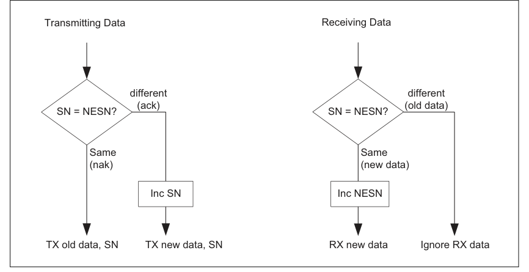

**Figure 4.39:  Transmit and Receive SN and NESN flow diagram**

If a Data Channel PDU is received with an invalid CRC match, nextExpectedSeqNum shall not be changed; this means that the Data Channel PDU will not be acknowledged, causing the peer to resend the Data Channel PDU. Since the received Data Channel PDU has been rejected, the nextExpectedSeqNum from the peer device cannot be trusted, and therefore the last sent Data Channel PDU from this device was not acknowledged and must be retransmitted.
SN, NESN and MD bits shall be used from every received Data Channel PDU which has passed the CRC check. The Data Channel PDU payload shall be ignored on every received Data Channel PDU that has the same SN value as the previously received Data Channel PDU.

##### 4.5.9.1  Flow Control

A Link Layer may fail to update nextExpectedSeqNum for reasons, including, but not limited to, lack of receive buffer space. This will cause the peer to resend the Data Channel PDU at a later time, thus enabling flow control.

#### 4.5.10  Data PDU Length Management

The Controller shall maintain the following global parameters:
• connInitialMaxTxOctets - the value of connMaxTxOctets that the Controller will use for a new connection.
• connInitialMaxTxTime - a value that the Controller will use to determine the value of connMaxTxTime that it will use for a new connection.
• connInitialMaxTxTimeUncoded - the value of connMaxTxTime that the Controller will use for a new connection on an LE Uncoded PHY. The value of connInitialMaxTxTimeUncoded shall be the greater of 328 and the value of connInitialMaxTxTime.
• connInitialMaxTxTimeCoded - the value of connMaxTxTime that the Controller will use for a new connection on the LE Coded PHY. The value of connInitialMaxTxTimeCoded shall be the greater of 2704 and the value of connInitialMaxTxTime.
• supportedMaxTxOctets - the maximum value of connMaxTxOctets that the Controller supports.
• supportedMaxTxTime - the maximum value of connMaxTxTime that the Controller supports.
• supportedMaxRxOctets - the maximum value of connMaxRxOctets that the Controller supports.
• supportedMaxRxTime - the maximum value of connMaxRxTime that the Controller supports.
Note: 2704 µs is derived from the duration of a packet with a 27 octet payload when sent on the LE Coded PHY using S=8 coding.
The Controller shall maintain the following parameters for each connection:
• connMaxTxOctets - the maximum number of octets in the Payload field that the local device will send to the remote device.
• connMaxRxOctets - the maximum number of octets in the Payload field that the local device is able to receive from the remote device.
• connRemoteMaxTxOctets - the maximum number of octets in the Payload field that the remote device will send to the local device.
• connRemoteMaxRxOctets - the maximum number of octets in the Payload field that the remote device is able to receive from the local device.
• connMaxTxTime - the maximum number of microseconds that the local device will take to transmit a PDU to the remote device.
• connMaxRxTime - the maximum number of microseconds that the local device can take to receive a PDU from the remote device.
• connRemoteMaxTxTime - the maximum number of microseconds that the remote device will take to transmit a PDU to the local device.
• connRemoteMaxRxTime - the maximum number of microseconds that the remote device can take to receive a PDU from the local device.
The values of these parameters shall each be within the range given in Table 4.3:

| LE Data Packet Length Extension feature supported | LE Coded PHY feature supported | Parameters with names ending in "Octets" |  | Parameters with name ending in "Time" |  |
| --- | --- | --- | --- | --- | --- |
|  |  | Minimum | Maximum | Minimum | Maximu |
| No | No | 27 | 27 | 328 | 328 |
| Yes | No | 27 | 251 | 328 | 2120 |
| No | Yes | 27 | 27 | 328 | 2704 |
| Yes | Yes | 27 | 251 | 328 | 17040 |

Table 4.3:  Valid ranges for data PDU length management parameters
The following values are derived from the parameters maintained by the Controller:
• connEffectiveMaxTxOctets - the lesser of connMaxTxOctets and connRemoteMaxRxOctets.
• connEffectiveMaxRxOctets - the lesser of connMaxRxOctets and connRemoteMaxTxOctets.
• connEffectiveMaxTxTimeUncoded - the lesser of connMaxTxTime and connRemoteMaxRxTime.
• connIntervalPortionAvailable - the current connInterval for the connection minus C, where: C = (2*T_IFS) + min (connEffectiveMaxRxTime, ((connEffectiveMaxRxOctets * 64) + 976))
Note: 976 µs is the duration of a packet with a zero octet payload when sent on the LE Coded PHY using S=8 coding.
• connEffectiveMaxTxTimeAvailable - the lesser of connEffectiveMaxTxTimeUncoded and connIntervalPortionAvailable.
• connEffectiveMaxTxTimeCoded - the greater of 2704 and connEffectiveMaxTxTimeAvailable.
• connEffectiveMaxTxTime - equal to connEffectiveMaxTxTimeUncoded while the connection is on an LE Uncoded PHY and equal to connEffectiveMaxTxTimeCoded while the connection is on the LE Coded PHY.
• connEffectiveMaxRxTimeUncoded - the lesser of connMaxRxTime and connRemoteMaxTxTime.
• connEffectiveMaxRxTimeCoded - the greater of 2704 and connEffectiveMaxRxTimeUncoded.
• connEffectiveMaxRxTime - equal to connEffectiveMaxRxTimeUncoded while the connection is on an LE Uncoded PHY and equal to connEffectiveMaxRxTimeCoded while the connection is on the LE Coded PHY.
Note: Corresponding octet and time parameters do not have to be mutually consistent. For example, it is permissible for a time parameter to be 2120 µs even though, on some PHYs, the maximum possible time is less.
The Controller shall not change the values of supportedMaxTxOctets, supportedMaxTxTime, supportedMaxRxOctets, and supportedMaxRxTime.
For a new connection:
• connMaxTxOctets shall be set to connInitialMaxTxOctets and connMaxRxOctets shall be chosen by the Controller. If either value is not 27 then the Controller should initiate the Data Length Update Procedure (Section 5.1.9) at the earliest practical opportunity.
• connRemoteMaxTxOctets and connRemoteMaxRxOctets shall be 27.
For a new connection on an LE Uncoded PHY:
• connMaxTxTime shall be set to connInitialMaxTxTimeUncoded and connMaxRxTime shall be chosen by the Controller. If either value is not 328, then the Controller should initiate the Data Length Update Procedure (Section 5.1.9) at the earliest practical opportunity.
• connRemoteMaxTxTime and connRemoteMaxRxTime shall be 328.
For a new connection on the LE Coded PHY:
• connMaxTxTime shall be set to connInitialMaxTxTimeCoded and connMaxRxTime shall be chosen by the Controller. If either value is not
2704, then the Controller should initiate the Data Length Update Procedure (Section 5.1.9) at the earliest practical opportunity.
• connRemoteMaxTxTime and connRemoteMaxRxTime shall be 2704.
The Controller may change the values of connMaxTxOctets, connMaxRxOctets, connMaxTxTime, and connMaxRxTime at any time after entering the Connection State. Whenever it does so, it shall communicate these values to the peer device using the Data Length Update Procedure. The values shall not exceed the values of supportedMaxTxOctets, supportedMaxTxTime, supportedMaxRxOctets, and supportedMaxRxTime respectively.
The Controller shall not transmit packets as part of a connection that have a maximum Payload Length greater than connEffectiveMaxTxOctets or that take more than connEffectiveMaxTxTime microseconds to transmit except during the period where the values of either connEffectiveMaxTxOctets or connEffectiveMaxTxTime are being modified. During that period, the Controller may still have Data Channel PDUs queued for transmission that conformed to the old parameters but violate the new ones. These PDUs remain valid; only PDUs queued after the Data Length Update Procedure is completed are required to conform to the changed parameters. However, a Controller should ensure that it has no Data Channel PDUs queued for transmission when it transmits an LL_LENGTH_REQ or LL_LENGTH_RSP PDU.
If the Controller decreases the value of connMaxRxOctets or connMaxRxTime, it shall not apply the new values until a Data Length Update Procedure (Section 5.1.9) that sends the new value has completed.
The Controller shall notify its Host if any of the parameters connEffectiveMaxTxOctets, connEffectiveMaxRxOctets, connEffectiveMaxTxTime, or connEffectiveMaxRxTime have changed.

### 4.6   FEATURE SUPPORT

The set of features supported by a Link Layer is represented by a bit mask called FeatureSet. The value of FeatureSet shall not change while the Controller has a connection to another device. A peer device may cache information about features that the device supports. The Link Layer may cache information about features that a peer supports during a connection.
Within FeatureSet, a bit set to 0 indicates that the Link Layer Feature is not supported in this Controller; a bit set to 1 indicates that the Link Layer Feature is supported in this Controller.
A Link Layer shall not use a procedure that is not supported by the peer’s Link Layer. A Link Layer shall not transmit a PDU listed in the following subsections unless it supports at least one of the features that requires support for that PDU.
The bit positions for each Link Layer Feature shall be as shown in Table 4.4. This table also shows if these bits are valid between Controllers. If a bit is shown as not valid, using ‘N’, then this bit shall be ignored upon receipt by the peer Controller.

| Bit position | Link Layer Feature | Valid from Controller to Controller |
| --- | --- | --- |
| 0 | LE Encryption | Y |
| 1 | Connection Parameters Request Procedure | Y |
| 2 | Extended Reject Indication | Y |
| 3 | Slave-initiated Features Exchange | Y |
| 4 | LE Ping | N |
| 5 | LE Data Packet Length Extension | Y |
| 6 | LL Privacy | N |
| 7 | Extended Scanner Filter Policies | N |
| 8 | LE 2M PHY | Y |
| 9 | Stable Modulation Index - Transmitter | Y |
| 10 | Stable Modulation Index - Receiver | Y |
| 11 | LE Coded PHY | Y |
| 12 | LE Extended Advertising | N |
| 13 | LE Periodic Advertising | N |
| 14 | Channel Selection Algorithm #2 | Y |
| 15 | LE Power Class 1 | Y |
| 16 | Minimum Number of Used Channels Procedure |  |
| All other values | Reserved for Future Use |  |

Table 4.4:  FeatureSet field’s bit mapping to Controller features

#### 4.6.1  LE Encryption A Controller that supports LE Encryption shall support the following sections within this document:

• LL_ENC_REQ (Section 2.4.2.4)
• LL_ENC_RSP (Section 2.4.2.5)
• LL_START_ENC_REQ (Section 2.4.2.6)
• LL_START_ENC_RSP (Section 2.4.2.7)
• LL_PAUSE_ENC_REQ (Section 2.4.2.11)
• LL_PAUSE_ENC_RSP (Section 2.4.2.12)
• Encryption Start Procedure (Section 5.1.3.1)
• Encryption Pause Procedure (Section 5.1.3.2)

#### 4.6.2  Connection Parameters Request Procedure

A Controller that supports Connection Parameters Request Procedure shall support the following sections within this document:
• LL_REJECT_EXT_IND (Section 2.4.2.18)
• LL_CONNECTION_PARAM_REQ (Section 2.4.2.16)
• LL_CONNECTION_PARAM_RSP (Section 2.4.2.17)
• Connection Parameters Request Procedure (Section 5.1.7)

#### 4.6.3  Extended Reject Indication

A Controller that supports Extended Reject Indication shall support the following sections within this document:
• LL_REJECT_EXT_IND (Section 2.4.2.18)

#### 4.6.4  Slave-initiated Features Exchange

A Controller that supports Slave-initiated Features Exchange shall support the following sections within this document:
• LL_SLAVE_FEATURE_REQ (Section 2.4.2.15)
• LL_FEATURE_RSP (Section 2.4.2.10)

#### 4.6.5  LE Ping

A Controller that supports LE Ping shall support the following sections of this document.
• LL_PING_REQ (Section 2.4.2.19)
• LL_PING_RSP (Section 2.4.2.20)
• LE Ping Procedure (Section 5.1.8)
• LE Authenticated Payload Timeout (Section 5.4)

#### 4.6.6  LE Data Packet Length Extension

A Controller that supports LE Data Packet Length Extension shall support the following sections of this document.
• LL_LENGTH_REQ and LL_LENGTH_RSP (Section 2.4.2.21)
• Data Length Update Procedure (Section 5.1.9)

#### 4.6.7  LL Privacy

A Controller that supports LL Privacy shall support the following sections of this document.
• LL Privacy (Section 6)

#### 4.6.8  Extended Scanner Filter Policies

A Controller that supports Directed Advertising Report shall support the following sections of this document.
• Scanner Filter Policy (Section 4.3.3)

#### 4.6.9  Multiple PHYs

A Controller that supports any PHY other than LE 1M PHY shall support the following sections within this document:
• Transmission and reception using the supported modulation schemes ([Vol 6] Part A, Section 1)
• LL_REJECT_EXT_IND Section 2.4.2.18)
• LL_PHY_REQ (Section 2.4.2.22)
• LL_PHY_RSP (Section 2.4.2.22)
• LL_PHY_UPDATE_IND (Section 2.4.2.23)
• PHY Update Procedure (Section 5.1.10)

##### 4.6.9.1  Symmetric and Asymmetric Connections

A Controller shall support connections using the same PHY in each direction (“symmetric connections”) and may support connections using different PHYs in each direction (“asymmetric connections”).
If a Controller cannot support asymmetric connections then, in the PHY Update Procedure:
• Any LL_PHY_REQ or LL_PHY_RSP PDUs sent shall indicate that it wants a symmetric connection.
• Any LL_PHY_UPDATE_IND PDU sent shall not specify an asymmetric connection.

#### 4.6.10  Stable Modulation Index - Transmitter

A Controller that supports Stable Modulation Index - Transmitter shall support the following section within this document:
• Stable Modulation Index ([Vol 6] Part A, Section 3.1.1)

#### 4.6.11  Stable Modulation Index - Receiver

A Controller that supports Stable Modulation Index - Receiver shall support the following section within this document:
• Stable Modulation Index ([Vol 6] Part A, Section 4.7)

#### 4.6.12  LE Extended Advertising

A Controller that supports LE Extended Advertising shall support reception of an Advertising Channel PDU payload of 255 octets and support the following sections of this document.
• ADV_EXT_IND (Section 2.3.1.5)
• AUX_ADV_IND (Section 2.3.1.6)
• AUX_CHAIN_IND (Section 2.3.1.8)
• AUX_SCAN_REQ (Section 2.3.2.1)
• AUX_SCAN_RSP (Section 2.3.2.3)
• AUX_CONNECT_REQ (Section 2.3.3.1)
• AUX_CONNECT_RSP (Section 2.3.3.2)
• Common Extended Advertising Payload Format (Section 2.3.4)
• Connectable Directed Event Type using ADV_EXT_IND (Section 4.4.2.4.4)
• Scannable Undirected Event Type using ADV_EXT_IND (Section 4.4.2.5.2)
• Connectable Undirected Event Type (Section 4.4.2.7)
• Scannable Directed Event Type (Section 4.4.2.8)
• Non-Connectable and Non-Scannable Directed Event Type (Section 4.4.2.9)
• Advertising Data Sets (Section 4.4.2.10)
• Using AdvDataInfo (ADI) (Section 4.4.2.11)
• Advertising Data Sets (Section 4.4.3.3)
• Connect Requests on the Secondary Advertising Channel (Section 4.4.4.2)
A Controller that supports connections shall also support the Channel Selection Algorithm #2 feature.

#### 4.6.13  LE Periodic Advertising

A Controller that supports LE Periodic Advertising shall support the LE Extended Advertising feature, Channel Selection Algorithm #2 feature, and the following sections of this document.
• AUX_SYNC_IND (Section 2.3.1.7)
• Periodic Advertising (Section 4.4.2.12 and Section 4.4.3.4)

#### 4.6.14  Channel Selection Algorithm #2

A Controller that supports Channel Selection Algorithm #2 shall support the following sections within this document:
• ChSel bit set to 1 (Sections 2.3, 2.3.1.1, 2.3.1.2, and 2.3.3.1)
• Channel Selection Algorithm #2 (Section 4.5.8.3).

#### 4.6.15  Minimum Number of Used Channels Procedure

A Controller that supports the Minimum Number of Used Channels Procedure shall support the following sections of this document:
• LL_MIN_USED_CHANNELS_IND (Section 2.4.2.24)
• Minimum Number Of Used Channels Procedure (Section 5.1.11)

### 4.7   RESOLVING LIST

All Link Layers supporting Link Layer Privacy (see Section 6) shall contain a set of records for local and peer IRK value pairs. These values are known as the Local IRK and the Peer IRK. The Resolving List IRK pairs shall be associated with a public or static device address known as the Identity Address. The Identity Address may be in the White List. All Link Layers supporting Link Layer Privacy shall support a Resolving List capable of storing at least one Resolving List Record.
On reset, the Resolving List shall be empty.
The Resolving List is configured by the Host and is used by the Link Layer to resolve Resolvable Private Addresses used by advertisers, scanners or initiators. This allows the Host to configure the Link Layer to act on a request without awakening the Host.
The White List and filter policies set by the Host are applied to the associated Identity Address once the Resolvable Private Address has been resolved.
If the Host, when populating the resolving list, sets a peer IRK to all zeros, then the peer address used within an advertising channel PDU shall use the peer’s Identity Address, which is provided by the Host.
The Host specifies the privacy mode to be used with each peer identity on the resolving list. If it specifies that device privacy mode is to be used, then the Controller shall accept both the peer's device identity address and a resolvable private address generated by the peer device using its distributed IRK. Otherwise, network privacy mode is used: the Controller shall only accept resolvable private addresses generated by the peer device using its distributed IRK. If the Host has added the peer device to the resolving list with an all-zero peer IRK, the Controller shall only accept the peer's identity address, as defined in Section 6.5.
If the Host, when populating the resolving list, sets a local IRK to all zeros, then any local address used within an advertising channel PDU shall use the local Identity Address, which is provided by the Host.
If the Link Layer is using the Resolving List and the peer device has been resolved, the Address returned to the Host is the peer device’s Identity Address.
If the Link Layer is using the Resolving List and the peer device has been resolved but the encryption fails then the current Resolvable Private Address(es) shall be immediately discarded and new Resolvable Private Address(es) shall be generated.
Note: Encryption may fail when the address was resolved successfully using an incorrect IRK and, therefore, encryption keys on both sides did not match.
When the Controller address resolution is enabled, both peer and local RPAs received by the Link Layer shall be resolved using the Resolving List.

## 5  LINK LAYER CONTROL

The Link Layer Control Protocol (LLCP) is used to control and negotiate aspects of the operation of a connection between two Link Layers. This includes procedures for control of the connection, starting and pausing encryption and other link procedures.
Procedures have specific timeout rules as defined in Section 5.2. The Termination Procedure may be initiated at any time, even if any other Link Layer Control Procedure is currently active. For all other Link Layer Control Procedures, only one Link Layer Control Procedure shall be initiated in the Link Layer at a time per connection per device. A new Link Layer Control Procedure can be initiated only after a previous Link Layer Control Procedure has completed. However, except where prohibited elsewhere in this section, a Link Layer may initiate an LL Control Procedure while responding to a procedure initiated by its peer device.
There are no restrictions on the order that Link Layer Control Procedures are carried out except that no procedure can be started until after entering the Connection State; i.e., no procedure requires a different procedure to be carried out previously.
The prioritization of LL Control PDUs and LL Data PDUs is implementation specific. For example, a Host cannot assume that pending data will be sent when a termination of the link is requested without waiting for those data PDUs to be completed and indicated to the Host.

### 5.1   LINK LAYER CONTROL PROCEDURES

#### 5.1.1  Connection Update Procedure

The Link Layer parameters for a connection (connInterval, connSlaveLatency and connSupervisionTimeout) may be updated after entering the Connection State. The master may initiate the update of the connection parameters by sending an LL_CONNECTION_UPDATE_IND PDU if either the master or slave or both do not support the Connection Parameters Request procedure (Section 5.1.7). The slave shall not send this PDU. The slave may request a change to the connection parameters using the L2CAP LE signaling channel if either the master or the slave or both do not support the Connection Parameters Request procedure (Section 5.1.7). The slave may request a change to the connection parameters using the Connection Parameters Request Procedure if both the master and slave support the Connection Parameters Request procedure.
In order to request a change to the connection parameters, the master shall use the Connection Parameters Request Procedure if both the master and slave support that procedure. If the slave rejects the Connection Parameters
Request Procedure, then the master may update the connection parameters using the Connection Update Procedure.
The Link Layer of the master shall determine the connInterval from the interval range given by the Host (connIntervalmin and connIntervalmax). However, if the current PHY is the LE Coded PHY and the Controller supports the LE Data Packet Length Extension feature, then the new connection interval shall be at least C µs, where:
C = (2*T_IFS) + min (connEffectiveMaxRxTime, ((connEffectiveMaxRxOctets * 64) + 976)) + 2704
Note: 976 µs and 2704 µs are derived from the durations of packets with a zero octet payload and with a 27 octet payload when sent on the LE Coded PHY using S=8 coding.
The Link Layer shall indicate to the Host the selected interval value.
Section 5.5 shall apply to the LL_CONNECTION_UPDATE_IND PDU. When the slave receives such a PDU with the instant in the future, it shall listen to the connection event where connEventCount equals Instant and the connection event before it.
The connection interval used before the instant is known as connIntervalOLD. The connection interval contained in the LL_CONNECTION_UPDATE_IND PDU and used at the instant and after, is known as connIntervalNEW.
The connection slave latency used before the instant is known as connSlaveLatencyOLD. The connection slave latency contained in the LL_CONNECTION_UPDATE_IND PDU and used at the instant and after, is known as connSlaveLatencyNEW.
The connection supervision timeout used before the instant is known as connSupervisionTimeoutOLD. The connection supervision timeout contained in the LL_CONNECTION_UPDATE_IND PDU and used at the instant and after, is known as connSupervisionTimeoutNEW. The connection supervision timer shall be reset at the instant.

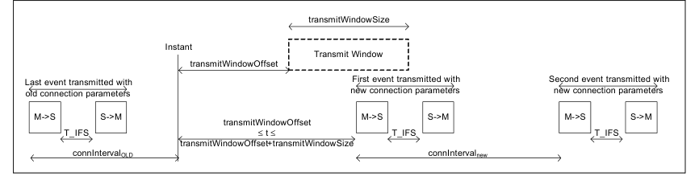

**Figure 5.1:  Connection event timing in the case of connection parameter update**

For example, the interval between the preceding connection event before the instant and the instant will be connIntervalOLD. The interval between the connection event after the instant and the following connection event will be connIntervalNEW.
The master may adjust the anchor point when deciding the timing of the first packet transmitted with new connection parameters. A transmit window is used, as defined in Section 4.5.3. The transmit window starts at connIntervalOLD + transmitWindowOffset after the anchor point of the connection event before the instant. The transmitWindowOffset shall be a multiple of 1.25 ms in the range of 0 ms to connIntervalNEW. The transmitWindowSize shall be a multiple of 1.25 ms in the range of 1.25 ms to the lesser of 10 ms and (connIntervalNEW - 1.25 ms).
The master shall start to send the first packet within the transmit window as defined in Section 4.5.3. It is permitted that the master’s first packet can extend beyond the transmit window.
The first packet sent after the instant by the master determines the new anchor point for the connection events, and therefore the timings of all future connection events in this connection.
The instant occurs after connIntervalOLD and before transmitWindowOffset. All the normal connection event transmission rules specified in Section 4.5.1, shall apply.
At the start of the transmit window, the Link Layer shall reset TLLconnSupervision.
If the Link Layer of the master transmits an LL_CONNECTION_UPDATE_IND PDU autonomously, for example without being requested to by the Host, the Latency and Timeout parameters shall not be changed and shall remain the same as in the last LL_CONNECTION_UPDATE_IND or CONNECT_IND PDU, any of the other parameters (transmitWindowSize, transmitWindowOffset, connInterval, Instant) may be changed within the restrictions given above. Note: Autonomous updates can be used to change the anchor points to allow the master to change the scheduling of the connection due to other activities.
The Link Layer shall notify its Host if any of the three connection parameters have changed. If no connection parameters are changed, the Host would not be notified; this is called an anchor point move.
The procedure is complete when the instant has passed, and the new connection event parameters have been applied.

#### 5.1.2  Channel Map Update Procedure

The Link Layer parameter for channel map (channelMap) may be updated after entering the Connection State. The master can update the channel map by
sending an LL_CHANNEL_MAP_IND PDU. The slave shall not send this PDU. The master Controller can update the channel map without being requested to by the Host.
Section 5.5 shall apply to the LL_CHANNEL_MAP_IND PDU.
The channel map used before the instant is known as channelMapOLD. The channel map contained in the LL_CHANNEL_MAP_IND PDU and used at the instant and after, is known as channelMapNEW.
When connEventCount is equal to the Instant field, the channelMapNEW shall be the current channelMap. The lastUnmappedChannel shall not be reset. If the unmappedChannel is an unused channel, then the channelMapNEW will be used when remapping. The only parameter that changes is the channelMap.
For example:
At connection set-up:
- initial channelMapOLD: 0x1FFFFFFFFF (i.e., all channels enabled)
- initial hopIncrement: 10 (decimal)
An LL_CHANNEL_MAP_IND PDU with the following parameters is then issued:
- Instant: 100 (decimal). Assume that no connection event count wrap- around occurred since the start of the connection.
- channelMapNEW: 0x1FFFFFF7FF (i.e. all channels enabled except channel 11)
Channels used:
- connEventCount 99 --> data channel index 1 (channelMapOLD)
- connEventCount 100 --> data channel index 12 (remapped from 11) (channelMapNEW)
- connEventCount 101 --> data channel index 21 (channelMapNEW)
The procedure is complete when the instant has passed, and the new channel map has been applied.

#### 5.1.3  Encryption Procedure

The Link Layer, upon request from the Host, can enable the encryption of packets after entering the Connection State.
If the connection is not encrypted, the Link Layer shall only use the encryption start procedure.
If the connection is encrypted, the Link Layer shall first use the encryption pause procedure followed by the encryption start procedure.

##### 5.1.3.1  Encryption Start Procedure

To enable encryption, two parameters must be exchanged, IV and SKD. Both are composed of two parts, a master part and a slave part, and exchanged in LL_ENC_REQ and LL_ENC_RSP PDUs. After these are exchanged, and the Host has notified the Link Layer of the Long Term Key to be used on this connection, encryption can be started using a three way handshake, using LL_START_ENC_REQ and LL_START_ENC_RSP PDUs.
To start encryption, the Link Layer of the master shall generate the master’s part of the initialization vector (IVm) and the master’s part of the session key diversifier (SKDm). IVm shall be a 32 bit random number generated by the Link Layer of the master. SKDm shall be a 64 bit random number generated by the Link Layer of the master. Both IVm and SKDm shall be generated using the requirements for random number generation defined in [Vol 2] Part H, Section 2.
The Link Layer of the master shall finalize the sending of the current Data Channel PDU and may finalize the sending of additional Data Channel PDUs queued in the Controller. After these Data Channel PDUs are acknowledged, the Link Layer of the master shall only send Empty PDUs or LL_ENC_REQ, LL_START_ENC_RSP, LL_TERMINATE_IND, LL_REJECT_IND or LL_REJECT_EXT_IND PDUs.
The Link Layer of the master shall then send an LL_ENC_REQ PDU; the Rand and EDIV fields are provided by the Host.
If encryption is not supported by the Link Layer of the slave, the Link Layer of the slave shall send an LL_REJECT_IND or LL_REJECT_EXT_IND PDU with the ErrorCode set to Unsupported Remote Feature / Unsupported LMP Feature (0x1A). The Link Layer of the master receiving the LL_REJECT_IND or LL_REJECT_EXT_IND PDU shall notify the Host. The Link Layer of the master can now send LL Data Packets and LL Control Packets; these packets will not be encrypted. This procedure is complete in the master when the master receives the LL_REJECT_IND or LL_REJECT_EXT_IND PDU from the slave. The procedure is complete in the slave when the acknowledgment for the LL_REJECT_IND or LL_REJECT_EXT_IND PDU is received from the master.
Otherwise, when the Link Layer of the slave receives an LL_ENC_REQ PDU it shall generate the slave’s part of the initialization vector (IVs) and the slave’s part of the session key diversifier (SKDs). IVs shall be a 32 bit random number generated by the Link Layer of the slave. SKDs shall be a 64 bit random number generated by the Link Layer of the slave. Both IVs and SKDs shall be generated using the requirements for random number generation defined in [Vol 2] Part H, Section 2.
The Link Layer of the slave shall finalize the sending of the current Data Channel PDU and may finalize the sending of additional Data Channel PDUs queued in the Controller. After these Data Channel PDUs are acknowledged,
the Link Layer of the slave is only allowed to send Empty PDUs or LL_ENC_RSP, LL_START_ENC_REQ, LL_START_ENC_RSP, LL_TERMINATE_IND, LL_REJECT_IND or LL_REJECT_EXT_IND PDUs.
The Link Layer of the slave shall then send an LL_ENC_RSP PDU. The Link Layer of the slave shall then notify the Host with the Rand and EDIV fields. After having sent the LL_ENC_RSP PDU, the Link Layer of the slave can receive an LL_UNKNOWN_RSP PDU corresponding to a LL Control PDU sent by the slave. The slave should not disconnect the link in this case.
Each Link Layer shall combine the initialization vector parts and session key diversifier parts in the following manner:
SKD = SKDm || SKDs IV = IVm || IVs
The SKDm is concatenated with the SKDs. The least significant octet of SKDm becomes the least significant octet of SKD. The most significant octet of SKDs becomes the most significant octet of SKD.
The IVm is concatenated with the IVs. The least significant octet of IVm becomes the least significant octet of IV. The most significant octet of IVs becomes the most significant octet of IV.
The Long Term Key is provided by the Host to the Link Layer in the master and slave, and one of the following three actions shall occur:
• If this procedure is being performed after a Pause Encryption Procedure, and the Host does not provide a Long Term Key, the slave shall perform the Termination Procedure with the error code PIN or key Missing (0x06).
• If the Host does not provide a Long Term Key, either because the event to the Host was masked out or if the Host indicates that a key is not available, the slave shall either send an LL_REJECT_IND with the ErrorCode set to PIN or key Missing (0x06) or an LL_REJECT_EXT_IND PDU with the RejectOpcode set to "LL_ENC_REQ" and the ErrorCode set to PIN or key Missing (0x06). Upon receiving an LL_REJECT_IND or LL_REJECT_EXT_IND PDU, the Link Layer shall notify the Host. The Link Layer can now send LL Data PDUs and LL Control PDUs; these packets will not be encrypted. This procedure is complete in the master when the master receives the LL_REJECT_IND or LL_REJECT_EXT_IND PDU from the slave. The procedure is completed in the slave when the acknowledgment has been received for the LL_REJECT_IND or LL_REJECT_EXT_IND PDU from the master.
• If the Host does provide a Long Term Key, the Link Layer of the slave shall calculate sessionKey using the encryption engine with LTK as the key, and SKD as the plain text input. The sessionKey parameter shall be set to the output of the encryption engine.
The sessionKey shall be used as the key for the encryption engine for all encrypted packets.
After sessionKey has been calculated, the Link Layer of the slave shall send an LL_START_ENC_REQ PDU. This packet shall be sent unencrypted, and the Link Layer shall be set up to receive an encrypted packet in response.
When the Link Layer of the master receives an LL_START_ENC_REQ PDU it shall send an LL_START_ENC_RSP PDU. This PDU shall be sent encrypted and set up to receive encrypted.
When the Link Layer of the slave receives an LL_START_ENC_RSP PDU it shall transmit an LL_START_ENC_RSP PDU. This packet shall be sent encrypted.
When the Link Layer of the master receives the LL_START_ENC_RSP PDU, the connection is encrypted. The Link Layer can now send LL Data PDUs and LL Control PDUs; these PDUs will be encrypted.
The Link Layers shall notify the Hosts that the connection is encrypted.
The procedure is complete in the master when the master receives the LL_START_ENC_RSP PDU from the slave. The procedure is complete in the slave when the slave receives the LL_START_ENC_RSP PDU from the master.
If at any time during the encryption start procedure, the Link Layer of the master or the slave receives an unexpected Data Channel PDU from the peer Link Layer, it shall immediately exit the Connection State, and shall transition to the Standby State. The Host shall be notified that the link has been disconnected with the error code Connection Terminated Due to MIC Failure (0x3D).

##### 5.1.3.2  Encryption Pause Procedure

To enable a new encryption key to be used without disconnecting the link, encryption must be disabled and then enabled again. During the pause, data PDUs shall not be sent unencrypted to protect the data.
The Link Layer of the master shall finalize the sending of the current Data Channel PDU and may finalize the sending of additional Data Channel PDUs queued in the Controller. After these Data Channel PDUs are acknowledged, the Link Layer of the master shall only send Empty PDUs or LL_PAUSE_ENC_REQ or LL_TERMINATE_IND PDUs.
The Link Layer of the master shall then send an LL_PAUSE_ENC_REQ PDU.
When the Link Layer of the slave receives an LL_PAUSE_ENC_REQ PDU it shall finalize the sending of the current Data Channel PDU and may finalize the sending of additional Data Channel PDUs queued in the Controller. After these
Data Channel PDUs are acknowledged, the Link Layer of the slave is only allowed to send Empty PDUs or LL_PAUSE_ENC_RSP or LL_TERMINATE_IND PDUs.
The Link Layer of the slave shall then send an LL_PAUSE_ENC_RSP PDU. This packet shall be sent encrypted, and Link Layer shall be set up to receive unencrypted.
When the Link Layer of the master receives an LL_PAUSE_ENC_RSP PDU it shall set up to send and receive unencrypted. It shall then send an LL_PAUSE_ENC_RSP PDU to the slave unencrypted.
When the Link Layer of the slave receives an LL_PAUSE_ENC_RSP PDU it shall set up to also send unencrypted.
The encryption start procedure shall now be used to re-enable encryption using a new session key.
If at any time during the encryption pause procedure, the Link Layer of the master or the slave receives an unexpected Data Channel PDU from the peer Link layer, it shall immediately exit the Connection State, and shall transition to the Standby State. The Host shall be notified that the link has been disconnected with the error code Connection Terminated Due to MIC Failure (0x3D).

#### 5.1.4  Feature Exchange Procedure

The Link Layer parameter for the current supported feature set (FeatureSet) may be exchanged after entering the Connection State. Both the master and slave can initiate this procedure.
The FeatureSet information may be cached either during a connection or between connections. A Link Layer should not request this information on every connection if the information has been cached for this device. Cached information for a device from a previous connection is not authoritative and, therefore, an implementation must be able to accept the LL_UNKNOWN_RSP PDU if use of a feature is attempted that is not currently supported or used by the peer.
The FeatureSetM parameter is the feature capabilities of the Link Layer of the master.
The FeatureSetS parameter is the feature capabilities of the Link Layer of the Slave.
The FeatureSetUSED parameter is one octet long and is the logical AND of FeatureSetM[0] and FeatureSetS[0].

##### 5.1.4.1  Master-initiated Feature Exchange Procedure

The master initiates this procedure with an LL_FEATURE_REQ PDU, and the slave responds with an LL_FEATURE_RSP PDU.
When the Link Layer of the master sends an LL_FEATURE_REQ PDU, the FeatureSet field shall be set to FeatureSetM.
When the Link Layer of the slave sends an LL_ FEATURE_RSP PDU, octet 0 of the FeatureSet field shall be set to FeatureSetUSED and the remaining octets shall be set to the corresponding octets of FeatureSetS.
The Link Layer of the master sends an LL_FEATURE_REQ PDU. This can be sent on request from the Host or autonomously.
When the Link Layer of the slave receives an LL_FEATURE_REQ PDU it shall send an LL_FEATURE_RSP PDU.
The procedure is complete when the master receives the LL_FEATURE_RSP PDU from the slave.

##### 5.1.4.2  Slave-initiated Feature Exchange Procedure

The slave initiates this procedure with an LL_SLAVE_FEATURE_REQ PDU, and the master responds with an LL_FEATURE_RSP PDU.
When the Link Layer of the slave sends an LL_SLAVE_FEATURE_REQ PDU, the FeatureSet field shall be set to FeatureSetS.
When the Link Layer of the master sends an LL_FEATURE_RSP PDU, octet 0 of the FeatureSet field shall be set to FeatureSetUSED and the remaining octets shall be set to the corresponding octets of FeatureSetM.
The Link Layer of the slave sends an LL_SLAVE_FEATURE_REQ PDU. This can be sent on request from the Host or autonomously.
When the Link Layer of the master receives an LL_SLAVE_FEATURE_REQ PDU, it shall send an LL_FEATURE_RSP PDU.
If the Link Layer of the slave sends the LL_SLAVE_FEATURE_REQ PDU to a master that does not understand that PDU, then the slave should expect an LL_UNKNOWN_RSP PDU in response. If the LL_SLAVE_FEATURE_REQ PDU was issued as a result of a Host-initiated read remote features procedure (see [Vol 2] Part E, Section 7.8.21), then the Host shall be notified that the read remote features procedure has completed with the ErrorCode set to Unsupported Remote Feature / Unsupported LMP Feature (0x1A).
The procedure is complete when the slave receives the LL_FEATURE_RSP or LL_UNKNOWN_RSP PDU from the master.

#### 5.1.5  Version Exchange

The Link Layer parameters for version information (companyID, subVerNum, linkLayerVer, as defined in Section 2.4.2.13) may be exchanged after entering the Connection State. Either the Link Layer of the master or slave can initiate this procedure by sending an LL_VERSION_IND PDU. This procedure should be used when requested by the Host. This procedure may be initiated autonomously by the Link Layer.
The Link Layer shall only queue for transmission a maximum of one LL_VERSION_IND PDU during a connection.
If the Link Layer receives an LL_VERSION_IND PDU and has not already sent an LL_VERSION_IND then the Link Layer shall send an LL_VERSION_IND PDU to the peer device.
If the Link Layer receives an LL_VERSION_IND PDU and has already sent an LL_VERSION_IND PDU then the Link Layer shall not send another LL_VERSION_IND PDU to the peer device.
The procedure has completed when an LL_VERSION_IND PDU has been received from the peer device.

#### 5.1.6  Termination Procedure

This procedure is used for voluntary termination of a connection while in the Connection State. Voluntary termination occurs when the Host requests the Link Layer to terminate the connection. Either the Link Layer of the master or slave can initiate this procedure by sending an LL_TERMINATE_IND PDU. The termination procedure is not used in the event of the loss of the connection, for example after link supervision timeout or after a procedure timeout.
The Link Layer shall start a timer, Tterminate, when the LL_TERMINATE_IND PDU has been queued for transmission. The initiating Link Layer shall send LL_TERMINATE_IND PDUs until an acknowledgment is received or until the timer, Tterminate, expires, after which it shall exit the Connection State and transition to the Standby State. The initial value for Tterminate shall be set to value of the connSupervisionTimeout.
When the Link Layer receives an LL_TERMINATE_IND PDU it shall send the acknowledgment, exit the Connection State and shall transition to the Standby State.
The procedure has completed when the acknowledgment has been received or the timer, Tterminate, expires.

#### 5.1.7  Connection Parameters Request Procedure

The master or slave may initiate a Connection Parameters Request procedure to request the remote device to have the Link Layer parameters for the connection (connInterval, connSlaveLatency and connSupervisionTimeout) updated any time after entering the Connection State.

##### 5.1.7.1  Issuing an LL_CONNECTION_PARAM_REQ PDU

The Connection Parameters Request procedure is initiated by issuing an LL_CONNECTION_PARAM_REQ PDU. The procedure can be initiated as a result of a Host initiated connection update procedure (see [Vol 2] Part E, Section 7.8.18) or autonomously by the Link Layer (that is, without being requested by the Host).
If the Link Layer of the master or slave sends the LL_CONNECTION_PARAM_REQ PDU to a device that does not understand that PDU, then the device should expect an LL_UNKNOWN_RSP PDU in response. If the LL_CONNECTION_PARAM_REQ PDU was issued by the Link Layer of the slave as a result of a Host initiated connection update procedure, then the Host shall be notified that the connection update procedure has completed with the ErrorCode set to Unsupported Remote Feature / Unsupported LMP Feature (0x1A).
If the Link Layer initiates this procedure as a result of a Host initiated connection update procedure, then the Link Layer:
• Should set the Interval_Min, Interval_Max, Timeout, and Latency fields to the values received from the Host. Note: The Link Layer may modify the values of these fields, for example, because the values received from the Host would prevent the Link Layer from meeting commitments in another piconet.
• May indicate the preferred periodicity by setting the PreferredPeriodicity field to a value other than zero, as described in Section 2.4.2.16.
• May set the Offset0 to Offset5 fields to a value other than 0xFFFF as described in Section 2.4.2.16. If one or more of the Offset0 to Offset5 fields have been set, then: - The ReferenceConnEventCount field shall be set to indicate that at least one of the Offset0 to Offset5 fields is valid. If the ReferenceConnEvent- Count field is set, then it shall always be set to the connEventCount of a connection event that is less than 32767 connection events in the future from the first transmission of the PDU. Note: Retransmissions of the PDU can result in the ReferenceConnEventCount to be up to 32767 events in the past when the PDU is successfully received by the remote device. See Section 5.1.7.3.2 for examples on how to set the ReferenceConnE- ventCount field. - If Interval_Min is not equal to Interval_Max then the PerferredPeriodicity field shall be set to a value other than zero. If Interval_Min is equal to
Interval_Max then the PreferredPeriodicity field may be set to any value and shall be ignored by the recipient.
If the Link Layer initiates this procedure autonomously, then the Latency field shall be set to the current value of connSlaveLatency and the Timeout field (in milliseconds) shall be set to the current value of connSupervisionTimeout. Any of the other fields (Interval_Min, Interval_Max, PreferredPeriodicity, ReferenceConnEventCount and Offset0 to Offset5) may be changed within the restrictions given above.
The Link Layer shall ensure that the parameters in the LL_CONNECTION_PARAM_REQ shall not cause supervision timeout. That is, the Link Layer shall ensure that the Timeout (in milliseconds) is greater than 2* Interval_Max * (Latency + 1).

##### 5.1.7.2  Responding to LL_CONNECTION_PARAM_REQ and LL_CONNECTION_PARAM_RSP PDUs

Upon receiving an LL_CONNECTION_PARAM_REQ PDU:
• The slave shall respond with either an LL_CONNECTION_PARAM_RSP PDU or an LL_REJECT_EXT_IND PDU.
• The master shall respond with either an LL_CONNECTION_UPDATE_IND PDU or an LL_REJECT_EXT_IND PDU.
Upon receiving an LL_CONNECTION_PARAM_RSP PDU, the master shall respond with either an LL_CONNECTION_UPDATE_IND PDU or an LL_REJECT_EXT_IND PDU.
The master shall not send the LL_CONNECTION_PARAM_RSP PDU. The slave shall send an LL_CONNECTION_PARAM_RSP PDU only in response to an LL_CONNECTION_PARAM_REQ PDU.
If the received LL_CONNECTION_PARAM_REQ PDU contains parameters that are not acceptable to the Link Layer, then the Link Layer of the device shall respond to the LL_CONNECTION_PARAM_REQ PDU with one of the following:
• An LL_CONNECTION_PARAM_RSP PDU (if the Link Layer is the slave of the connection) or an LL_CONNECTION_UPDATE_IND PDU (if the Link Layer is the master of the connection) containing alternative parameters.
• An LL_REJECT_EXT_IND PDU with the ErrorCode set to Unsupported LL Parameter Value (0x20).
If the received LL_CONNECTION_PARAM_REQ PDU contains any fields that are out of valid range, then the Link Layer shall reject the LL_CONNECTION_PARAM_REQ PDU by issuing an LL_REJECT_EXT_IND PDU with the ErrorCode set to Invalid LL Parameters (0x1E).
If an LL_REJECT_EXT_IND PDU is sent during the Connection Parameters Request procedure, then the procedure is complete on a device when it receives the LL_REJECT_EXT_IND PDU, and is complete on the device that issued the LL_REJECT_EXT_IND PDU when it receives the acknowledgment for the LL_REJECT_EXT_IND PDU.
If the received LL_CONNECTION_PARAM_REQ PDU requests only a change in the anchor points of the LE connection, then the Link Layer shall not indicate this request to its Host.
If the received LL_CONNECTION_PARAM_REQ PDU requests a change to one or more of connInterval, connSlaveLatency, and connSupervisionTimeout and if the values selected by the Link Layer are, respectively, within the range of the connInterval, the value of connSlaveLatency and the value of connSupervisionTimeout provided by the local Host, then the Link Layer may choose to not indicate this request to its Host and proceed as if the Host has accepted the remote device’s request. Otherwise, if the event to the Host is not masked, then the Link Layer shall first indicate this request to its Host.
If the local Host has not provided the range of connInterval, the value of connSlaveLatency and the value of connSupervisionTimeout to the Link Layer of the slave, then the Link Layer of the slave may indicate the received request to its Host if the event to the Host is not masked.
If the request is being indicated to the Host and the event to the Host is masked, then the Link Layer shall issue an LL_REJECT_EXT_IND PDU with the ErrorCode set to Unsupported Remote Feature / Unsupported LMP Feature (0x1A). Note: The device could have issued the LL_REJECT_EXT_IND PDU temporarily. The initiating device may retry. Note: If the request is not being indicated to the Host, then the event mask is ignored.
If the Host is indicated of the request, it shall either accept or reject this request. If the Host rejects this request, then the device shall issue an LL_REJECT_EXT_IND PDU with the ErrorCode set to a value  provided by the Host. The Host shall only use the error code Unacceptable Connection Parameters (0x3B) in order to reject the request.
If the Host accepts this request or if the request was not indicated to the Host, then:
• The slave shall respond to an LL_CONNECTION_PARAM_REQ PDU with an LL_CONNECTION_PARAM_RSP PDU. The rules for filling in various fields of the LL_CONNECTION_PARAM_RSP PDU are the same as those for filling in various fields of the LL_CONNECTION_PARAM_REQ PDU, as described in Section 5.1.7.1. The rules for handling a received LL_CONNECTION_PARAM_RSP PDU on the Link Layer of the master are identical to the rules for handling a received LL_CONNECTION_PARAM_REQ PDU that are described earlier in this section.
• The master shall respond to an LL_CONNECTION_PARAM_REQ PDU or an LL_CONNECTION_PARAM_RSP PDU with an LL_CONNECTION_UPDATE_IND PDU. The master should try to choose a value of Interval that is a multiple of PreferredPeriodicity if the slave has set the PreferredPeriodicity field of the LL_CONNECTION_PARAM_REQ or LL_CONNECTION_PARAM_RSP PDU. The master should try to pick the values of WinOffset and WinSize such that the timing of the new connection events matches one of the Offset0 to Offset5 fields of the LL_CONNECTION_PARAM_REQ PDU or the LL_CONNECTION_PARAM_RSP PDU sent by the slave. The Instant field of the LL_CONNECTION_UPDATE_IND PDU is set as described in Section 5.1.1.
Once the master issues the LL_CONNECTION_UPDATE_IND PDU, the connection parameters get updated as described in Section 5.1.1.
The procedure is complete when the instant has passed and the new connection event parameters have been applied.

##### 5.1.7.3  Examples

###### 5.1.7.3.1   Slave initiated anchor point move

The following example shows the Link Layer of the slave requesting a change in the anchor points of the LE connection by 3.75ms.
The Link Layer of the slave issues an LL_CONNECTION_PARAM_REQ PDU with the following parameters:
• Interval_Min: connInterval
• Interval_Max: connInterval
• Latency: connSlaveLatency
• Timeout: connSupervisionTimeout
• PreferredPeriodicity: 0
• ReferenceConnEventCount: <any value that is less than 32767 connection events in the future>
• Offset0: 0x0003
• Offset1: 0xFFFF
• Offset2: 0xFFFF
• Offset3: 0xFFFF
• Offset4: 0xFFFF
• Offset5: 0xFFFF
If the Link Layer of the master accepts the slave’s request, then it could respond with an LL_CONNECTION_UPDATE_IND PDU that contains any one
of the following set of parameters. In all the sets, Interval is set to connInterval, Latency is set to connSlaveLatency, Timeout is set to connSupervisionTimeout and Instant is set to any value that is less than 32767 connection events in the future.
• Option 1: the first packet sent after the instant by the master is inside the Transmit Window and 3.75ms from the beginning of the Transmit Window. - 3 ≤ WinSize ≤ 8 - WinOffset: 0
• Option 2: the first packet sent after the instant by the master is inside the Transmit Window and 2.5ms from the beginning of the Transmit Window. - 2 ≤ WinSize ≤ 8 - WinOffset: 1
• Option 3: the first packet sent after the instant by the master is inside the Transmit Window and1.25ms from the beginning of the Transmit Window.
- 1 ≤ WinSize ≤ 8
- WinOffset: 2
• Option 4: the first packet sent after the instant by the master is inside the Transmit Window and 0ms from the beginning of the Transmit Window.
- 1 ≤ WinSize ≤ 8
- WinOffset: 3

###### 5.1.7.3.2   ReferenceConnEventCount

Figure 5.2 and Figure 5.3 show examples of how the ReferenceConnEventCount and the Offset0 to Offset5 fields of the LL_CONNECTION_PARAM_REQ and the LL_CONNECTION_PARAM_RSP PDU can be utilized to indicate the possible position of the anchor points of the connection with the new connection parameters relative to the anchor points of the connection with the old connection parameters. This figure only shows Offset0 (and not Offset1 to Offset5) for simplicity. The figure also shows the Instant where the updated connection parameters are applied. Note that the actual Instant occurs connIntervalOLD after the last connection event transmitted with the old connection parameters whereas the Instant field in the LL_CONNECTION_UPDATE_IND PDU is set to the connEventCount of the connection event transmitted with the old connection parameters.
The ReferenceConnEventCount is set to the connEventCount of the connection event on the old connection parameters such that the start of the very next connection event on the new connection parameters is Offset0 (in milliseconds) away from the start of the ReferenceConnEventCount connection event.
Figure 5.2 shows the case where the Instant is before the ReferenceConnEventCount. Figure 5.3 shows the case where the Instant is after the ReferenceConnEventCount. Imaginary connection events transmitted
with the old connection parameters have been shown beyond the Instant and imaginary connection events transmitted with the new connection parameters have been shown before the Instant.
In Figure 5.2 and Figure 5.3, the time interval, ∆t, between the Instant and the start of the first connection event transmitted with the new connection parameters can be calculated using the following equation:
∆t = (connIntervalNEW - ((Instant - ReferenceConnEventCount) * connIntervalOLD) % connIntervalNEW + offset0) % connIntervalNEW
Note: The case where the ReferenceConnEventCount and Instant are on different sides of the eventCount wraparound point is not shown in the equations above.
Based on the calculated ∆t, the WinOffset and WinSize fields in the LL_CONNECTION_UPDATE_IND PDU could be set accordingly. See Section 5.1.7.3.3 for an example.

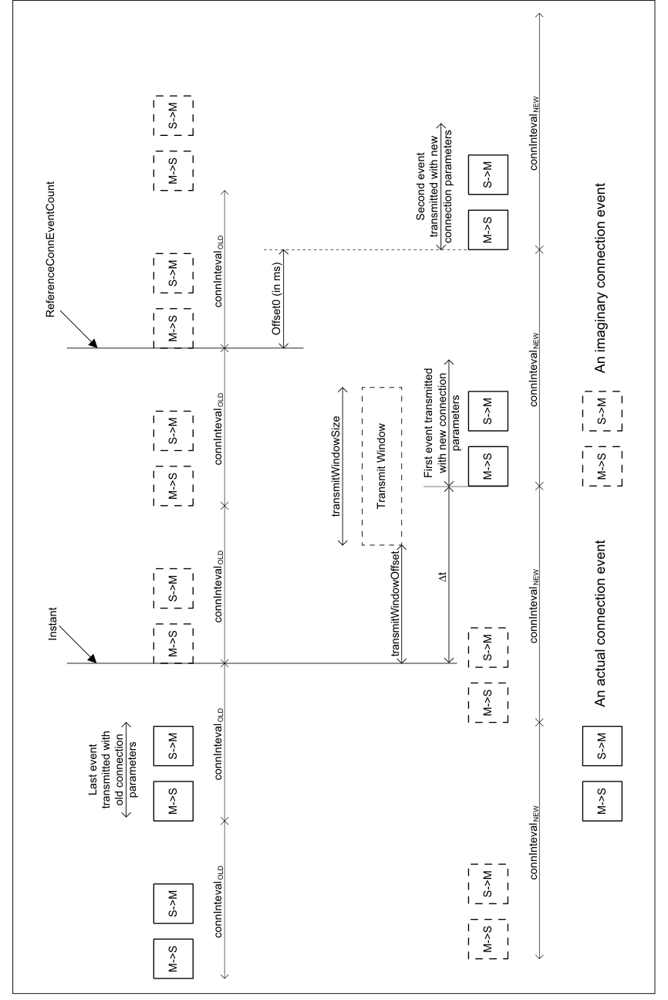

**Figure 5.2:  Utilizing the ReferenceConnEventCount and Offset0 fields to indicate position of the new anchor points – Instant is before the ReferenceConnEventCount**

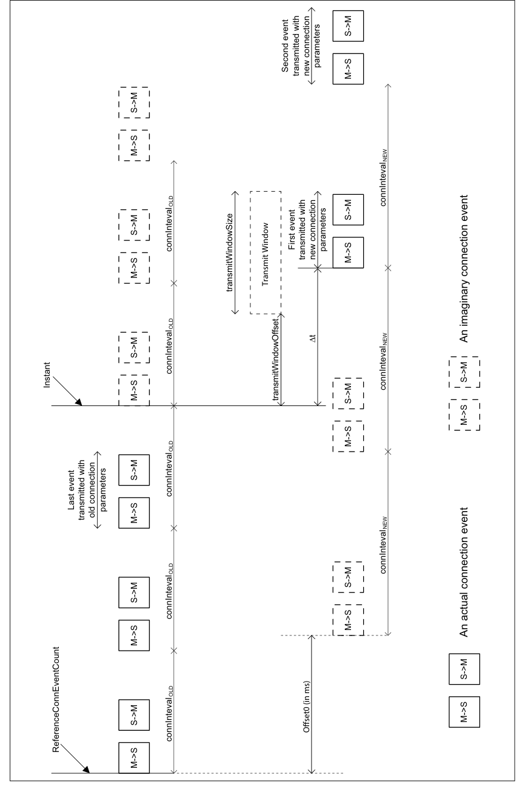

**Figure 5.3:  Utilizing the ReferenceConnEventCount and Offset0 fields to indicate position of the new anchor points – Instant is after the ReferenceConnEventCount**

###### 5.1.7.3.3   Slave initiated interval and anchor point move

The following example shows the Link Layer of the slave requesting a change in both the connection interval (by indicating a PreferredPeriodicity such that PreferredPeriodicity and connIntervalOLD are not integral multiples of one another) and a change in anchor points of the LE connection by 3.75ms with respect to the ReferenceConnEventCount.
In this example, connIntervalOLD is 0x0C (15 ms). The Link Layer of the slave issues an LL_CONNECTION_PARAM_REQ PDU with the following parameters:
• Interval_Min: 0x16
• Interval_Max: 0x20
• Latency: connSlaveLatency
• Timeout: connSupervisionTimeout
• PreferredPeriodicity: 0x0A
• ReferenceConnEventCount: 0x1F00
• Offset0: 0x0003
• Offset1: 0xFFFF
• Offset2: 0xFFFF
• Offset3: 0xFFFF
• Offset4: 0xFFFF
• Offset5: 0xFFFF
If the Link Layer of the master accepts the slave’s request, then it could respond with an LL_CONNECTION_UPDATE_IND PDU that contains any one of the following set of parameters. In all the sets, the new connection interval connIntervalNEW is set to 0x1E (37.5 ms), Latency is set to connSlaveLatency, Timeout is set to connSupervisionTimeout and Instant is set to 0x1F06.
∆t, as described in Section 5.1.7.3.2 is calculated as 21 (26.25 ms).
The WinSize and WinOffset fields in the LL_CONNECTION_UPDATE_IND PDU can contain any of the following example set of parameters:
• Option 1: the first packet sent after the instant by the master is inside the Transmit Window and 3.75 ms from the beginning of the Transmit Window. - 3 ≤ WinSize ≤ 8
- WinOffset: 18
• Option 2: the first packet sent after the instant by the master is inside the Transmit Window and 2.5 ms from the beginning of the Transmit Window.
- 2 ≤ WinSize ≤ 8 - WinOffset: 19
• Option 3: the first packet sent after the instant by the master is inside the Transmit Window and 1.25ms from the beginning of the Transmit Window. - 1 ≤ WinSize ≤ 8 - WinOffset: 20
• Option 4: the first packet sent after the instant by the master is inside the Transmit Window and 0ms from the beginning of the Transmit Window. - 1 ≤ WinSize ≤ 8 - WinOffset: 21

##### 5.1.7.4  Packet Transmit Time Restrictions

This section only applies if the current PHY is the LE Coded PHY and the Controller supports the LE Data Packet Length Extension feature.
After having sent or received an LL_CONNECTION_UPDATE_IND PDU that decreases the connection interval, and until the instant has been reached, the Link Layer shall not transmit a packet that would take longer than connEffectiveMaxTxTime microseconds (see Section 4.5.10) to transmit, calculated using the connection interval that will apply after the instant.
After a slave sends an LL_CONNECTION_PARAM_REQ or LL_CONNECTION_PARAM_RSP PDU where Interval_Min indicates an interval less than the current connection interval, and until it receives an LL_CONNECTION_UPDATE_IND, LL_UNKNOWN_RSP, or LL_REJECT_EXT_IND PDU in response, its link layer shall not transmit a packet that would take longer than connEffectiveMaxTxTime microseconds to transmit, calculated using a connection interval corresponding to the Interval_Min value in the transmitted PDU.
If the value of connEffectiveMaxTxTime changes during the procedure, the above requirements apply to the value at the moment the Data Channel PDU is queued for transmission.
Note: The requirements of this section are in addition to, and do not override, those in Section 4.5.10.
Note: If a Link Layer has any Data Channel PDUs queued for transmission at the start of the procedure or queues any during the procedure, it may need to re-fragment those PDUs in order to meet these requirements.

#### 5.1.8  LE Ping Procedure

The LE Ping procedure, when supported, can be used at the Link Layer to verify presence of the remote Link Layer. The procedure can also be used to verify message integrity on the LE ACL logical transport by forcing the remote device to send an LE ACL packet that contains a valid MIC.
Either the master or the slave Link Layer may initiate this procedure at any time after entering the Connection State by sending an LL_PING_REQ PDU. The responding Link Layer responds with the LL_PING_RSP PDU.
The Link Layer supporting this feature shall send an LL_PING_REQ PDU when the remote device has not sent a packet containing a payload protected by a MIC within the authenticated payload timeout set by the Host ([Vol 2] Part E, Section 7.3.94).
The procedure is completed when either an LL_PING_RSP is received or, in the case the remote device does not support the LE Ping feature, an LL_UNKNOWN_RSP is received with the Unknown type set to LL_PING_REQ.

#### 5.1.9  Data Length Update Procedure

A Controller uses the Data Length Update Procedure to transmit the latest values of the current maximum Receive Data Channel PDU Payload Length and PDU Time (connMaxRxOctets and connMaxRxTime) and the current maximum Transmit Data Channel PDU Payload Length and PDU Time (connMaxTxOctets and connMaxTxTime) to the peer device.
Both the master and slave can initiate this procedure at any time after entering the Connection State by sending an LL_LENGTH_REQ PDU. This procedure shall be initiated by the Link Layer whenever any of these parameters change, whether requested by the Host or autonomously by the Link Layer. However, if this procedure has already been initiated by the remote Controller and the local Controller has not yet responded, it shall use the response to communicate the changes instead of initiating a new procedure.
If the Link Layer receives an LL_LENGTH_REQ, or an LL_LENGTH_RSP PDU that was a response to an LL_LENGTH_REQ PDU, then it shall update its connRemoteMaxTxOctets, connRemoteMaxRxOctets, connRemoteMaxTxTime, and connRemoteMaxRxTime parameters for the connection with the values in the PDU. It shall immediately start using the updated values for all new Data Channel PDUs queued for transmission (including any response as specified in the next paragraph). The length of any Data Channel PDUs that have already been queued for transmission or transmitted at least once shall not be changed.
Note: Because Link Layer PDUs are not required to be processed in real time, it is possible for the local Controller to have queued but not yet transmitted an LL_LENGTH_REQ PDU when it receives an LL_LENGTH_REQ PDU from the peer device. In this situation each device responds as normal; the resulting collision is harmless.
Upon receiving an LL_LENGTH_REQ PDU, the Link Layer shall respond with an LL_LENGTH_RSP PDU containing its own connMaxTxOctets, connMaxRxOctets, connMaxTxTime, and connMaxRxTime values for the
connection (which it may have updated based on the values received, for example so as to allow the remote device to transmit longer packets).
If the peer device does not support the LE Coded PHY feature, then the MaxRxTime and MaxTxTime fields in the LL_LENGTH_REQ and LL_LENGTH_RSP PDUs shall be set to a value less than or equal to 2120 microseconds.
If the Link Layer of the master or slave sends the LL_LENGTH_REQ PDU to a device that does not understand that PDU, then the device should expect an LL_UNKNOWN_RSP PDU in response.
The procedure is completed when the initiating Controller receives either an LL_LENGTH_RSP PDU or, in the case the remote device does not support the LE Data Packet Length Extension feature, an LL_UNKNOWN_RSP PDU with the Unknown type set to LL_LENGTH_REQ.

#### 5.1.10  PHY Update Procedure

The PHY Update Procedure, when supported, is used to change the transmit or receive PHYs, or both. The procedure can be initiated either on a request by the Host or autonomously by the Link Layer. Either the master or the slave may initiate this procedure at any time after entering the Connection State. Link Layer PHY preferences may change during a connection or between connections and, therefore, they should not be cached by the peer device.
When this procedure is initiated by the master, it sends an LL_PHY_REQ PDU. The slave responds with an LL_PHY_RSP PDU. The master then responds to this with an LL_PHY_UPDATE_IND PDU.
When this procedure is initiated by the slave, it sends an LL_PHY_REQ PDU. The master responds with an LL_PHY_UPDATE_IND PDU.
The TX_PHYS and RX_PHYS fields of the LL_PHY_REQ and LL_PHY_RSP PDUs  shall be used to indicate the PHYs that the sending Link Layer prefers to use. If the sender wants a symmetric connection (one where the two PHYs are the same) it should make both fields the same, only specifying a single PHY.
The M_TO_S_PHY and S_TO_M_PHY fields of the LL_PHY_UPDATE_IND PDU shall indicate the PHYs that shall be used after the instant.
If the master initiated the procedure, it shall determine the PHY to use in each direction based on the contents of the LL_PHY_REQ and LL_PHY_RSP PDUs using the following rules:
• the M_TO_S_PHY field of the LL_PHY_UPDATE_IND PDU shall be determined from the master's TX_PHYS field and the slave's RX_PHYS field;
• the S_TO_M_PHY field of the LL_PHY_UPDATE_IND PDU shall be determined from the master's RX_PHYS field and the slave's TX_PHYS field.
In each of those cases the following rules apply:
• if, for at least one PHY, the corresponding bit is set to 1 in both the TX_PHYS and RX_PHYS fields, the master shall select any one of those PHYs for that direction;
• if there is no PHY for which the corresponding bit is set to 1 in both the TX_PHYS and RX_PHYS fields, the master shall not change the PHY for that direction.
If the slave initiated the procedure, the master shall determine the PHY to use in each direction based on the contents of the LL_PHY_REQ PDU sent by the slave using the following rules:
• the M_TO_S_PHY field of the LL_PHY_UPDATE_IND PDU shall be determined from the RX_PHYS field of the slave’s PDU;
• the S_TO_M_PHY field of the LL_PHY_UPDATE_IND PDU shall be determined from the TX_PHYS field of the slave’s PDU.
In each of those cases the following rules apply:
• if, for at least one PHY, the PHY is one that the master prefers to use and the corresponding bit is set to 1 in the relevant field of the slave’s PDU, the master shall select any one of those PHYs for that direction;
• if there is no PHY which the master prefers to use and for which the corresponding bit is set to 1 in the relevant field of the slave’s PDU, the master shall not change the PHY for that direction.
The remainder of this section shall apply irrespective of which device initiated the procedure.
Irrespective of the above rules, the master may leave both directions unchanged. If the slave specified a single PHY in both the TX_PHYS and RX_PHYS fields and both fields are the same, the master shall either select the PHY specified by the slave for both directions or shall leave both directions unchanged.
If either PHY will change, Section 5.5 shall apply to the LL_PHY_UPDATE_IND PDU. Both devices shall use the new PHYs starting at the instant.
If a master or slave sends an LL_PHY_REQ PDU to a device that does not understand that PDU, then the receiving device shall send an LL_UNKNOWN_RSP PDU in response.
The procedure has completed when:
• an LL_UNKNOWN_RSP or LL_REJECT_EXT_IND PDU has been sent or received;
• an LL_PHY_UPDATE_IND PDU indicating that neither PHY will change has been sent or received; or
• the master sends an LL_PHY_UPDATE_IND PDU indicating that at least one PHY will change and the instant has been reached. In this case, the procedure response timeout shall be stopped on the master when it sends that PDU and on the slave when it receives that PDU.
The Controller shall notify the Host of the PHYs now in effect when the PHY Update Procedure completes if either it has resulted in a change of one or both PHYs or if the procedure was initiated by a request from the Host. Otherwise, it shall not notify the Host that the procedure took place.

##### 5.1.10.1  Packet Transmit Time Restrictions

After having sent or received an LL_PHY_UPDATE_IND PDU that changes either PHY, and until the instant has been reached, the Link Layer shall not transmit a packet that would take longer than connEffectiveMaxTxTime microseconds (see Section 4.5.10) to transmit on the PHY that will apply after the instant.
After a slave sends an LL_PHY_REQ PDU, and until it receives an LL_PHY_UPDATE_IND, LL_UNKNOWN_RSP, or LL_REJECT_EXT_IND PDU in response, its link layer shall not transmit a packet that would take longer than connEffectiveMaxTxTime microseconds to transmit on any PHY that appears in the TX_PHYS field of that LL_PHY_REQ PDU.
If a slave responds to the PHY Update Procedure then, during the period starting when it sends the LL_PHY_RSP PDU and ending when it receives the LL_PHY_UPDATE_IND PDU in response, the slave's Link Layer shall not transmit a packet that would take longer than connEffectiveMaxTxTime microseconds to transmit on any PHY that appears in both the TX_PHYS field of its LL_PHY_RSP PDU and the RX_PHYS field of the master's LL_PHY_REQ PDU.
If the value of connEffectiveMaxTxTime changes during the procedure, the above requirements apply to the value at the moment the Data Channel PDU is queued for transmission.
Note: The requirements of this section are in addition to, and do not override, those in Section 4.5.10.
Note: If a Link Layer has any Data Channel PDUs queued for transmission at the start of the procedure or queues any during the procedure, it may need to re-fragment those PDUs in order to obey these requirements.

#### 5.1.11  Minimum Number Of Used Channels Procedure

A Controller uses the Minimum Number Of Used Channels Procedure to request that the peer device uses a minimum number of channels on a given PHY.
The slave can initiate this procedure at any time after entering the Connection State by sending an LL_MIN_USED_CHANNELS_IND PDU. The Master shall not send this PDU.
If the Link Layer receives an LL_MIN_USED_CHANNELS_IND PDU, it should ensure that, whenever the slave-to-master PHY is one of those specified, the connection uses at least the number of channels given in the MinUsedChannels field of the PDU.
The procedure has completed when the Link Layer acknowledgment of the LL_MIN_USED_CHANNELS_IND PDU is sent or received.
If the channel map does not include the minimum number of channels the slave requires for regulatory compliance, the slave must take steps to remain regulatory compliant, which can include disconnecting the link or reducing the output power.

### 5.2   PROCEDURE RESPONSE TIMEOUT

This section specifies procedure timeout rules that shall be applied to all the Link Layer control procedures specified in Section 5.1, except for the Connection Update and Channel Map Update procedures for which there are no timeout rules.
To be able to detect a non-responsive Link Layer Control Procedure, both the master and the slave shall use a procedure response timeout timer, TPRT. Upon the initiation of a procedure, the procedure response timeout timer shall be reset and started.
Each LL Control PDU that is queued for transmission resets the procedure response timeout timer.
When the procedure completes, the procedure response timeout timer shall be stopped.
If the procedure response timeout timer reaches 40 seconds, the connection is considered lost. The Link Layer exits the Connection State and shall transition to the Standby State. The Host shall be notified of the loss of connection.

### 5.3   PROCEDURE COLLISIONS

Since LL Control PDUs are not interpreted in real time, collisions can occur where the Link Layer of the master and the Link Layer of the slave initiate incompatible procedures. Two procedures are incompatible if they both involve an instant. In this situation, the rules in this section shall be followed:
A device shall not initiate a procedure after responding to a PDU that had initiated an incompatible procedure until that procedure is complete.
If device initiates a procedure A and, while that procedure is not complete, receives a PDU from its peer that initiates an incompatible procedure B, then:
• If the peer has already sent at least one PDU as part of procedure A, the device should immediately exit the Connection State and transition to the Standby State.
• Otherwise, if the device is the master, it shall reject the PDU received from the slave by issuing an LL_REJECT_EXT_IND (if supported by both devices) or LL_REJECT_IND (otherwise) PDU. It shall then proceed with procedure A.
• Otherwise (the device is the slave) it shall proceed to handle the master- initiated procedure B and take no further action in the slave-initiated procedure A except processing the rejection from the master.
The Host shall be notified that the link has been disconnected with, or the rejection PDU shall use (as appropriate):
• the error code LMP Error Transaction Collision / LL Procedure Collision (0x23) if procedures A and B are the same procedure;
• the error code LMP Error Transaction Collision / LL Procedure Collision (0x23) if procedure A is the Connection Update Procedure and procedure B is the Connection Parameters Update Procedure;
• the error code Different Transaction Collision (0x2A) otherwise.

### 5.4   LE AUTHENTICATED PAYLOAD TIMEOUT

LE Authenticated Payload Timeout (authenticatedPayloadTO) is a parameter that defines the maximum amount of time in milliseconds allowed between receiving packets containing a valid MIC. The Host can change the value of authenticatedPayloadTO using the HCI_Write_Authenticated_Payload_Timeout Command ([Vol 2] Part E, Section 7.3.94). The default value for authenticatedPayloadTO is 30 seconds.
When the connection is encrypted, a device supporting LE Ping feature shall start the LE Authenticated Payload timer TLE_Authenticated_Payload to monitor the time since the last reception of a packet containing a valid MIC from the remote device. Each device shall reset the timer TLE_Authenticated_Payload upon reception of a packet with a valid MIC.
If at any time in the CONNECTION state the timer TLE_Authenticated_Payload reaches the authenticatedPayloadTO value, the Host shall be notified using the HCI Authenticated Payload Timeout Expired event ([Vol 2] Part E, Section 7.7.75). The TLE_Authenticated_Payload Timer restarts after it is expired.
The timer TLE_Authenticated_Payload shall continue to run during encryption pause procedure.
Whenever the Host sets the authenticatedPayloadTO while the timer TLE_Authenticated_Payload is running, the timer shall be reset.

### 5.5   PROCEDURES WITH INSTANTS

Where a procedure involves a PDU with an Instant field, then the following rules shall apply.
The Instant field shall be used to indicate the connEventCount when the relevant change shall be applied; this is known as the instant for the procedure. The master should allow a minimum of 6 connection events that the slave will be listening for before the instant occurs, considering that the slave may only be listening once every connSlaveLatency events.
When a slave receives such a PDU where (Instant – connEventCount) modulo 65536 is less than 32767 and Instant is not equal to connEventCount, the slave shall listen to all the connection events until it has confirmation that the master has received its acknowledgment of the PDU or connEventCount equals Instant.
When a slave receives such a PDU where (Instant – connEventCount) modulo 65536 is greater than or equal to 32767 (because the instant is in the past), the Link Layer of the slave shall consider the connection to be lost, shall exit the Connection State and transition to the Standby State, and shall notify the Host using the error code Instant Passed (0x28).
Note: The comparison of the connEventCount and the received Instant field is performed using modulo 65536 math (only values from 0 to 65535 are allowed), to handle the situation when the connEventCount field has wrapped.

## 6  PRIVACY

The Link Layer provides Privacy by using Private Addresses (see Section 1.3.2).
If a device is using Resolvable Private Addresses Section 1.3.2.2, it shall also have an Identity Address that is either a Public or Random Static address type.

### 6.1   PRIVATE ADDRESS GENERATION INTERVAL

A private address shall be generated using the Resolvable Private Address Generation (see Section 1.3.2.2).
The Link Layer shall set a timer determined by the Host. A new private address shall be generated when the timer expires. If the Link Layer is reset, a new private address shall be generated and the timer started with any value in the allowed range.
Note: If the private address is generated frequently, connection establishment times may be affected. It is recommended to set the timer to 15 minutes.

### 6.2   PRIVACY IN THE ADVERTISING STATE

Privacy in the advertising state determines how the Link Layer processes Resolvable Private Addresses for advertising events.
The requirements in the following sub-sections apply in addition to those in Section 4.4.2.

#### 6.2.1  Connectable and Scannable Undirected Event Type

The Link Layer may use resolvable private addresses or non-resolvable private addresses for the advertiser’s device address (AdvA field) when entering the Advertising State and using connectable and scannable undirected events.
The AdvA field of the connectable and scannable undirected advertising event PDU is generated using the Local IRK value and the Resolvable Private Address Generation Procedure (see Section 1.3.2.2). If the Host has not provided any Resolving List IRK pairs for the peer to the Link Layer, then the AdvA field shall use a Host-provided address.
When an advertiser receives a connection request that contains a resolvable private address for the initiator’s address (InitA field), the Link Layer shall resolve the private address (see Section 1.3.2.3). The advertising filter policy, where the White List is enabled (see Section 4.3.2), shall determine if the advertiser establishes a connection.
When an advertiser receives a connection request that contains a device identity address for the initiator's address field (InitA field), and if that device is in the Resolving List with a non-zero peer IRK for which the Host has specified device privacy mode, then the advertising filter policy, where the White List is enabled (see Section 4.3.2), shall determine if the advertiser establishes a connection.
When an advertiser receives a scan request that contains a resolvable private address for the scanner’s device address (ScanA field), the Link Layer shall resolve the private address (see Section 1.3.2.3). The advertising filter policy, where the White List is enabled (see Section 4.3.2), shall determine if the advertiser processes the scan request.
When an advertiser receives a scan request that contains a device identity address for the scanner's device address (ScanA field), and if that device is in the Resolving List with a non-zero peer IRK for which  the Host has specified device privacy mode, then the advertising filter policy, where the White List is enabled (see Section 4.3.2), shall determine if the advertiser processes the scan request.
When an advertiser receives a scan or connection request that contains a non- resolvable private address, the advertising filter policy (see Section 4.3.2) shall determine if the advertiser processes the scan or connection request.
If the advertiser processes the scan request, the advertiser’s device address (AdvA field) in the SCAN_RSP PDU shall be the same as the advertiser’s device address (AdvA field) in the SCAN_REQ PDU to which it is responding.

#### 6.2.2  Connectable Directed Event Type

The Link Layer shall use resolvable private addresses for the advertiser’s device address (AdvA field). If an IRK is available in the Link Layer Resolving List for the peer device, then the target’s device address (TargetA field) shall use a resolvable private address. If an IRK is not available in the Link Layer Resolving List or the IRK is set to zero for the peer device, then the target’s device address (TargetA field) shall use the Identity Address when entering the Advertising State and using connectable directed events.
The AdvA field of the connectable directed advertising event PDU is generated using the Local IRK value and the Resolvable Private Address Generation Procedure (see Section 1.3.2.2).
The TargetA field of the connectable directed advertising event PDU is generated using the Peer IRK value and the Resolvable Private Address Generation Procedure (see Section 1.3.2.2). The TargetA field uses the public or static device address of the peer device if no peer IRK is available.
When an advertiser receives a connection request that contains a resolvable private address for the initiator’s address (InitA field), the Link Layer shall resolve the private address (see Section 1.3.2.3).
When an advertiser receives a connection request that contains a device identity address for the initiator's address field (InitA field), and if that device is in the Resolving List with a non-zero peer IRK for which the Host has specified device privacy mode, then the advertising filter policy, where the White List is enabled (see Section 4.3.2), shall determine if the advertiser establishes a connection.

#### 6.2.3  Non-connectable and Non-scannable Undirected and Scannable Undirected Event Types

The Link Layer may use resolvable private addresses or non-resolvable private addresses for the advertiser’s device address (AdvA field) when entering the Advertising State and using the following event types:
• non-connectable and non-scannable undirected event
• scannable undirected event
The AdvA field of the non-connectable and non-scannable undirected advertising event PDU and scannable undirected event PDU are generated using the advertiser’s Local IRK value and the Resolvable Private Address Generation Procedure or Non-Resolvable Private Address Generation Procedure (see Section 1.3.2.2).
When an advertiser receives a scan request that contains a resolvable private address for the scanner’s device address (ScanA field), the Link Layer shall resolve the private address (see Section 1.3.2.3). The advertising filter policy, where the White List is enabled (see Section 4.3.2), shall determine if the advertiser processes the scan request.
When an advertiser receives a scan request that contains a device identity address for the scanner's device address (ScanA field), and if that device is in the Resolving List with a non-zero peer IRK for which the Host has specified device privacy mode, then the advertising filter policy, where the White List is enabled (see Section 4.3.2), shall determine if the advertiser processes the scan request.
When an advertiser receives a scan request that contains a non-resolvable private address, the advertising filter policy (see Section 4.3.2) shall determine if the advertiser processes the scan request.
If the advertiser processes the scan request, the advertiser’s device address (AdvA field) in the scan response PDU shall be the same as the advertiser’s device address (AdvA field) in the scan request PDU to which it is responding.

#### 6.2.4  Connectable Undirected Event Type

The Link Layer may use resolvable private addresses or non-resolvable private addresses for the advertiser’s device address (AdvA field) when entering the Advertising State and using connectable undirected events.
The AdvA field of the connectable undirected advertising event PDU is generated using the Local IRK value and the Resolvable Private Address Generation Procedure (see Section 1.3.2.2). If the Host has not provided any Resolving List IRK pairs for the peer to the Link Layer, then the AdvA field shall use a Host-provided address.
When an advertiser receives a connection request that contains a resolvable private address for the target’s address (TargetA field), the Link Layer shall resolve the private address (see Section 1.3.2.3). The advertising filter policy, where the White List is enabled (see Section 4.3.2), shall determine if the advertiser establishes a connection.
The advertising filter policy (see Section 4.3.2) shall determine if the advertiser processes the connect request if an advertiser receives a connect request that contains a non-resolvable private address.

#### 6.2.5  Non-connectable and Non-scannable Directed and Scannable Directed Event Types

The Link Layer may use resolvable private addresses or non-resolvable private addresses for the advertiser’s device address (AdvA field) when entering the Advertising State and using the following event types:
• non-connectable and non-scannable directed event
• scannable directed event
If an IRK is available in the Link Layer Resolving List for the peer device, then the target’s device address (TargetA field) shall use a resolvable private address. If an IRK is not available in the Link Layer Resolving List or the IRK is set to zero for the peer device, then the target’s device address (TargetA field) shall use the Identity Address when entering the Advertising State and using non-connectable and non-scannable directed and scannable directed events.
The AdvA field of the non-connectable and non-scannable directed advertising event PDU and scannable directed event PDU is generated using the advertiser’s Local IRK value and the Resolvable Private Address Generation Procedure or Non-Resolvable Private Address Generation Procedure (see Section 1.3.2.2).
The TargetA field of the scannable directed advertising event PDU is generated using the Peer IRK value and the Resolvable Private Address Generation Procedure (see Section 1.3.2.2). The TargetA field uses the public or static device address of the peer device if no peer IRK is available.
When an advertiser receives a scan request that contains a resolvable private address for the scanner’s device address (ScanA field), the Link Layer shall resolve the private address (see Section 1.3.2.3).
If the advertiser processes the scan request, the advertiser’s device address (AdvA field) in the AUX_SCAN_RSP PDU shall be the same as the advertiser’s device address (AdvA field) in the AUX_SCAN_REQ PDU to which it is responding.

### 6.3   PRIVACY IN THE SCANNING STATE

The requirements in this section apply in addition to those in Section 4.4.3.
The Link Layer may use resolvable private addresses or non-resolvable private addresses for the scanner’s device address (ScanA field) when entering the Scanning State.
The ScanA field of the scanning PDU is generated using the Resolving List’s Local IRK value and the Resolvable Private Address Generation Procedure (see Section 1.3.2.2), or the address is provided by the Host.
The advertiser’s device address (AdvA field) in the scan request PDU shall be the same as the advertiser’s device address (AdvA field) received in the advertising PDU to which the scanner is responding.
When a scanner receives an advertising event that contains a resolvable private address for the advertiser’s device address (AdvA field), the Link Layer shall resolve the private address (see Section 1.3.2.3). The scanner’s filter policy, where the White List is enabled (see Section 4.3.3), shall determine if the scanner responds with a scan request.
When a scanner receives an advertising packet that contains a device identity address for the advertiser's device address (AdvA field), and if that device is in the Resolving List with a non-zero peer IRK for which the Host has specified device privacy mode, then the scanner's filter policy, where the White List is enabled (see Section 4.3.3), shall determine if the scanner responds with a scan request.
When a scanner receives an advertising event that contains a non-resolvable private address, the scanner’s filter policy (see Section 4.3.3) shall determine if the scanner processes the advertising event.

### 6.4   PRIVACY IN THE INITIATING STATE

The requirements in this section apply in addition to those in Section 4.4.4.
The Link Layer may use resolvable private addresses or an address provided by the Host for the initiator’s device address (InitA field) when in the Initiating state.
When an initiator receives a connectable advertising event that contains a resolvable private address for the advertiser’s address (AdvA field), the Link Layer shall resolve the private address using the Peer IRK values (see Section 1.3.2.3). The initiator’s filter policy (see Section 4.3.4) shall determine if the initiator establishes a connection.
The advertiser’s device address (AdvA field) in the initiating PDU shall be the same as the advertiser’s device address (AdvA field) received in the advertising event PDU to which the initiator is responding.
When an initiator receives a directed connectable advertising event that contains a resolvable private address for the target’s address (TargetA field), the Link Layer shall resolve the private address using the Local IRK values (see Section 1.3.2.3). An initiator that has been instructed by the Host to use Resolvable Private Addresses shall not respond to directed connectable advertising events that contain Public or Static addresses for the target’s address (TargetA field).
When an initiator receives a connectable advertising event that contains a device identity address for the advertiser's device address (AdvA field), and if that device is in the Resolving List with a non-zero peer IRK for which the Host has specified device privacy mode, then the initiator's filter policy, where the White List is enabled (see Section 4.3.4), shall determine if the initiator establishes a connection.
The Link Layer shall use resolvable private addresses for the initiator’s device address (InitA field) when initiating connection establishment with an associated device that exists in the Resolving List. The initiator’s device address (InitA field) in the initiating PDU is generated using the Resolving List Local IRK and the Resolvable Private Address Generation Procedure (see Section 1.3.2.2). The Link Layer should not set the InitA field to the same value as the TargetA field in the received advertising PDU.
The Link Layer shall use the Host-provided address for the initiator’s device address (InitA field) when initiating connection establishment with a device that is not in the Resolving List.

### 6.5   PRIVACY OF THE DEVICE

A private device shall not use its Identity Address in any advertising PDU. The Host may command the Controller to advertise, scan, or initiate a connection using a Resolvable Private Address when the resolving list is enabled. If the local IRK in the resolving list associated with the peer Identity Address is all zeros, the Controller will use the Identity Address. If the peer IRK in the resolving list associated with the peer Identity Address is all zeros, the Controller will accept the Identity Address. If the Host has instructed the Controller to use device privacy mode with a peer Identity Address, the Controller will accept the peer’s Identity Address. This implies that the device's network privacy is violated. To maintain a device’s network privacy, the Host should only populate entries in the Controller’s resolving list with non-zero IRKs and not instruct the Controller to use device privacy mode.
Core System Package [Low Energy Controller volume]
Part C
PART C: SAMPLE DATA
This part of the specification contains sample data for Bluetooth low energy. All sample data are provided for reference purpose only. They can be used to check the behavior of an implementation and avoid misunderstandings.
CONTENTS

## 1  ENCRYPTION SAMPLE DATA

This section contains sample data for the Low Energy encryption process.
The following scenario describes the start of encryption, followed by the transfer of an encrypted data channel data packet in each direction. It describes:
• how the derived values are calculated (fixed values are given in red)
• which HCI command and events are exchanged (given in italic)
• which LL messages are exchanged over the air (given in green).
Note: CRCs are not shown because they depend on a random CRC init value. Scrambling is disabled.
The following parameters are set to the fixed values below:
LTK = 0x4C68384139F574D836BCF34E9DFB01BF (MSO to LSO)
EDIV = 0x2474 (MSO to LSO)
RAND = 0xABCDEF1234567890 (MSO to LSO)
SKDm = 0xACBDCEDFE0F10213 (MSO to LSO)
SKDs = 0x0213243546576879 (MSO to LSO)
IVm = 0xBADCAB24 (MSO to LSO) IVs = 0xDEAFBABE (MSO to LSO)
HCI_LE_Start_Encryption (length 0x1C) – master HCI command Pars (LSO to MSO)    00 08 90 78 56 34 12 ef cd ab 74 24 bf 01 fb 9d 4e f3 bc 36 d8 74 f5 39 41 38 68 4c Handle (2-octet value MSO to LSO) 0x0800 Random (8-octet value MSO to LSO) 0xabcdef1234567890 Encrypted Diversifier (2-octet value MSO to LSO) 0x2474 Long Term Key (16-octet value MSO to LSO) 0x4c68384139f574d836bcf34e9dfb01bf
SKDm (LSO to MSO)    :0x13:0x02:0xF1:0xE0:0xDF:0xCE:0xBD:0xAC:
IVm (LSO to MSO)     :0x24:0xAB:0xDC:0xBA
LL_ENC_REQ 03 17 03 90 78 56 34 12 ef cd ab 74 24 13 02 f1 e0 df ce bd ac 24 ab dc ba Length 0x17 Control Type 0x03 Rand 90 78 56 34 12 ef cd ab EDIV 74 24 SKDm 13 02 f1 e0 df ce bd ac IVm 24 ab dc ba
SKDs (LSO to MSO)    :0x79:0x68:0x57:0x46:0x35:0x24:0x13:0x02:
IVs (LSO to MSO)     :0xBE:0xBA:0xAF:0xDE
LL_ENC_RSP 0b 0d 04 79 68 57 46 35 24 13 02 be ba af de Length 0x0D Control Type 0x04 SKDs 79 68 57 46 35 24 13 02 IVs be ba af de
IV = IVm || IVs IV (LSO to MSO)      :0x24:0xAB:0xDC:0xBA:0xBE:0xBA:0xAF:0xDE HCI_Long_Term_Key_Requested(length 0x0D) – slave event Pars (LSO to MSO)05 01 08 90 78 56 34 12 ef cd ab 74 24 LE_Event_Code 0x05 Handle (2-octet value MSO to LSO) 0x0801 Random (8-octet value MSO to LSO) 0xabcdef1234567890 Encrypted Diversifier (2-octet value MSO to LSO) 0x2474
HCI_LE_Long_Term_Key_Request_Reply (length 0x12) – slave command Pars (LSO to MSO)    01 08 bf 01 fb 9d 4e f3 bc 36 d8 74 f5 39 41 38 68 4c Handle (2-octet value MSO to LSO) 0x0801 Key (16-octet value MSO to LSO) 0x4C68384139F574D836BCF34E9DFB01BF
SKD = SKDm || SKDs SKD (LSO to MSO) :0x13:0x02:0xF1:0xE0:0xDF:0xCE:0xBD:0xAC:0x79:0x68:0x57:0x46:0x35:0x24:0x13:0x02:
SK = Encrypt(LTK, SKD) SK (LSO to MSO) :0x66:0xC6:0xC2:0x27:0x8E:0x3B:0x8E:0x05:0x3E:0x7E:0xA3:0x26:0x52:0x1B:0xAD:0x99:
LL_START_ENC_REQ 07 01 05 Length 0x01 Control Type 0x05
LL_START_ENC_RSP1 0f 05 9f cd a7 f4 48 Length 0x05 Control Type Encrypted:0x9F Clear:0x06 MIC (32-bit value MSO to LSO) 0xCDA7F448 (note that MICs are sent MSO first on the air)
LL_START_ENC_RSP2 07 05 a3 4c 13 a4 15 Length 0x05 Control Type Encrypted:0xA3 Clear:0x06 MIC (32-bit value MSO to LSO) 0x4C13A415
HCI_ACL_Data_Packet Master Host to Controller 00 08 1b 00 17 00 63 64 65 66 67 68 69 6a 6b 6c 6d 6e 6f 70 71 31 32 33 34 35 36 37 38 39 30 Handle (12-bit value MSO to LSO) 0x0800 Data Total Length (16-bit value MSO to LSO) 0x001B (27 dec) Data (LSO to MSO) 17 00 63 64 65 66 67 68 69 6a 6b 6c 6d 6e 6f 70 71 31 32 33 34 35 36 37 38 39 30
LL_DATA1 0e 1f 7a 70 d6 64 15 22 6d f2 6b 17 83 9a 06 04 05 59 6b d6 56 4f 79 6b 5b 9c e6 ff 32 f7 5a 6d 33 Length 0x1F (i.e. 27 + 4 = 31 dec) Data (LSO to MSO)
Clear     17 00 63 64 65 66 67 68 69 6a 6b 6c 6d 6e 6f 70 71 31 32 33 34 35 36 37 38 39 30 Encrypted 7a 70 d6 64 15 22 6d f2 6b 17 83 9a 06 04 05 59 6b d6 56 4f 79 6b 5b 9c e6 ff 32 MIC (32-bit value MSO to LSO)   0xF75A6D33
HCI_ACL_Data_Packet Slave Host to Controller 01 08 1b 00 17 00 37 36 35 34 33 32 31 30 41 42 43 44 45 46 47 48 49 4a 4b 4c 4d 4e 4f 50 51 Handle (12-bit value MSO to LSO) 0x0801 Data Total Length (16-bit value MSO to LSO) 0x001B (27 dec) Data (LSO to MSO) 17 00 37 36 35 34 33 32 31 30 41 42 43 44 45 46 47 48 49 4a 4b 4c 4d 4e 4f 50 51
LL_DATA2 06 1f f3 88 81 e7 bd 94 c9 c3 69 b9 a6 68 46 dd 47 86 aa 8c 39 ce 54 0d 0d ae 3a dc df 89 b9 60 88 Length 0x1F (i.e. 27 + 4 = 31 dec) Data (LSO to MSO) Clear     17 00 37 36 35 34 33 32 31 30 41 42 43 44 45 46 47 48 49 4a 4b 4c 4d 4e 4f 50 51 Encrypted f3 88 81 e7 bd 94 c9 c3 69 b9 a6 68 46 dd 47 86 aa 8c 39 ce 54 0d 0d ae 3a dc df MIC (32-bit value MSO to LSO)   0x89B96088

### 1.1   ENCRYPT COMMAND

HCI_LE_Encrypt (length 0x20) – command Pars (LSO to MSO) bf 01 fb 9d 4e f3 bc 36 d8 74 f5 39 41 38 68 4c 13 02 f1 e0 df ce bd ac 79 68 57 46 35 24 13 02 Key (16-octet value MSO to LSO):            0x4C68384139F574D836BCF34E9DFB01BF Plaintext_Data (16-octet value MSO to LSO): 0x0213243546576879acbdcedfe0f10213
HCI_Command_Complete (length 0x14) – event Pars (LSO to MSO) 02 17 20 00 66 c6 c2 27 8e 3b 8e 05 3e 7e a3 26 52 1b ad 99 Num_HCI_Commands_Packets: 0x02 Command_Opcode (2-octet value MSO to LSO): 0x2017 Status: 0x00 Encrypted_Data (16-octet value MSO to LSO): 0x99ad1b5226a37e3e058e3b8e27c2c666

### 1.2   DERIVATION OF THE MIC AND ENCRYPTED DATA

All B/X/A/S values below follow the notation: LSbyte to MSbyte & msbit to lsbit.
IV = DEAFBABEBADCAB24 SK = 99AD1B5226A37E3E058E3B8E27C2C666
1.START_ENC_RSP1 (packet 0, M --> S) ----------------
B0 = 49000000008024ABDCBABEBAAFDE0001 B1 = 00010300000000000000000000000000 B2 = 06000000000000000000000000000000
X1 = 712eaaaae60603521d245e50786eefe4 X2 = debc43782a022675fca0aa6f0854f1ab X3 = 6399913fede5fa111bdb993bbfb9be06 => MIC = 6399913f
A0 = 01000000008024ABDCBABEBAAFDE0000 A1 = 01000000008024ABDCBABEBAAFDE0001
S0 = ae3e6577f64a8f25408c9c10d53acf8e S1 = 99190d88f4aa1b60b97ecfe6f5fee777
So, encrypted packet payload = 9F encrypted MIC = CDA7F448
Which results in the following packet:
LL_START_ENC_RSP1 - 0f 05 9f cd a7 f4 48 Length: 05 Control Type: Clear:     06 Encrypted: 9f MIC: CD A7 F4 48
2.START_ENC_RSP2 (packet 0, S --> M) ----------------
B0 = 49000000000024ABDCBABEBAAFDE0001 B1 = 00010300000000000000000000000000 B2 = 06000000000000000000000000000000
X1 = ddc86e3094f0c29cf341ef4c2c1e0088 X2 = fe960f5c93fba45a53959842ea8a0c0a X3 = db403db3a32f39156faf6a6b472e1010 => MIC = db403db3
A0 = 01000000000024ABDCBABEBAAFDE0000 A1 = 01000000000024ABDCBABEBAAFDE0001
S0 = 975399a66acdc39124886930d7bca95f S1 = a5add4127b2f43788ddc9cd86b0b89d2
So, encrypted packet payload = A3 encrypted MIC = 4c13a415
Which results in the following packet:
LL_START_ENC_RSP2 07 05 a3 4c 13 a4 15 Length: 05 Control Type: Clear:     06
Encrypted: A3 MIC: 4c 13 a4 15
3. Data packet1 (packet 1, M --> S) ---------------
B0 = 49010000008024ABDCBABEBAAFDE001B B1 = 00010200000000000000000000000000 B2 = 1700636465666768696A6B6C6D6E6F70 B3 = 71313233343536373839300000000000
X1 = 7c688612996de101f3eacb68b443969c X2 = e3f1ef5c30161c0a9ec07274a0757fc8 X3 = e7e346f5b7c8a6072890a60dcf4ec20a X4 = 3db113320b182f9fed635db14cac2df0 => MIC = 3db11332
A0 = 01010000008024ABDCBABEBAAFDE0000 A1 = 01010000008024ABDCBABEBAAFDE0001 A2 = 01010000008024ABDCBABEBAAFDE0002
S0 = caeb7e017296dd2fa9a2ce789179501a S1 = 6d70b50070440a9a027de8f66b6a6a29 S2 = 1ae7647c4d5e6dabdec602404c302341
So, encrypted packet payload =
7A70D66415226DF26B17839A060405596BD6564F796B5B9CE6FF32 encrypted MIC = F75A6D33
which results in the following packet:
LL_DATA1 0E 1F 7A 70 D6 64 15 22 6D F2 6B 17 83 9A 06 04 05 59 6B D6 56 4F 79 6B 5B 9C E6 FF 32 F7 5A 6D 33 Length: 1F Data: Clear:     17 00 63 64 65 66 67 68 69 6a 6b 6c 6d 6e 6f 70 71 31 32 33 34 35 36 37 38 39 30 Encrypted: 7A 70 D6 64 15 22 6D F2 6B 17 83 9A 06 04 05 59 6B D6 56 4F 79 6B 5B 9C E6 FF 32 MIC: F7 5A 6D 33
4. Data packet2 (packet 1, S --> M) ---------------
B0 = 49010000000024ABDCBABEBAAFDE001B B1 = 00010200000000000000000000000000 B2 = 17003736353433323130414243444546 B3 = 4748494A4B4C4D4E4F50510000000000
X1 = 714234d50d6f1da5663be3e78460ad87 X2 = 96df1d97959e6176ac215c7baf90c674 X3 = 6cc52c3dcecdc2fa81eb347887960673 X4 = a776a26be617366496c391e36f6374a1 => MIC = a776a26b
A0 = 01010000000024ABDCBABEBAAFDE0000 A1 = 01010000000024ABDCBABEBAAFDE0001 A2 = 01010000000024ABDCBABEBAAFDE0002
S0 = 2ecfc2e31e01875653c0f306fc7bfb96 S1 = e488b6d188a0faf15889e72a059902c0 S2 = edc470841f4140e0758c8e8f708399bd
So, encrypted packet payload =
F38881E7BD94C9C369B9A66846DD4786AA8C39CE540D0DAE3ADCDF encrypted MIC = 89B96088
Which results in the following packet:
LL_DATA2 06 1F F3 88 81 E7 BD 94 C9 C3 69 B9 A6 68 46 DD 47 86 AA 8C 39 CE 54 0D 0D AE 3A DC DF 89 B9 60 88 Length: 1F Data: Clear:     17 00 37 36 35 34 33 32 31 30 41 42 43 44 45 46 47 48 49 4a 4b 4c 4d 4e 4f 50 51 Encrypted: F3 88 81 E7 BD 94 C9 C3 69 B9 A6 68 46 DD 47 86 AA 8C 39 CE 54 0D 0D AE 3A DC DF
MIC: 89 B9 60 88

## 2  LE CODED PHY SAMPLE DATA

Whenever bits are specified, they are in transmission order irrespective of spacing.

### 2.1   REFERENCE INFORMATION PACKET

The reference packet is described as bytes in transmission order (the leftmost byte in a line is transmitted first). Inside a byte, bits are transmitted LSB first.
Access address: D6 BE 89 8E PDU: 00 03 42 4C 45 CRC: 29 0A CE

### 2.2   FORWARD ERROR CORRECTION ENCODER

This data shows the bits input to and output by the FEC encoder and its internal state.
The encoder state is expressed in octal notation where the LSB represents the rightmost bit store in Figure 3.5 of [Vol 6] Part B, Section 3.3.1. The state specified is that after the bits are output and the shift operations have taken place.
Access address Input: 0   1   1   0   1   0   1   1   0   1   1   1   1   1   0   1 1   0   0   1   0   0   0   1   0   1   1   1   0   0   0   1 State: 0   4   6   3   5   2   5   6   3   5   6   7   7   7   3   5 6   3   1   4   2   1   0   4   2   5   6   7   3   1   0   4 Output: 0 0 1 1 0 1 0 1 1 1 0 1 0 0 1 0 0 1 1 1 1 0 1 0 0 1 0 1 1 0 1 1 1 0 0 1 0 0 0 0 1 0 1 1 1 1 1 1 1 0 0 0 1 0 1 0 1 0 0 0 1 1 1 1
Note to reviewers: this spacing makes it more obvious where the bits come from.
CI
If S=2 If S=8 Input: 1   0 0   0 State: 6   3 2   1 Output: 0 1 0 1 1 0 1 1
TERM1 If S=2 If S=8 Input: 0   0   0 0   0   0 State: 1   0   0 0   0   0 Output: 0 0 1 1 0 0 1 1 0 0 0 0
PDU
Input: 0   0   0   0   0   0   0   0   1   1   0   0   0   0   0   0 0   1   0   0   0   0   1   0   0   0   1   1   0   0   1   0 1   0   1   0   0   0   1   0 State: 0   0   0   0   0   0   0   0   4   6   3   1   0   0   0   0 0   4   2   1   0   0   4   2   1   0   4   6   3   1   4   2
5   2   5   2   1   0   4   2 Output: 0 0 0 0 0 0 0 0 0 0 0 0 0 0 0 0 1 1 0 1 0 1 0 0 1 1 0 0 0 0 0 0 0 0 1 1 1 0 1 1 1 1 0 0 1 1 1 0 1 1 1 1 1 1 0 1 0 1 0 0 0 0 1 0 0 0 0 1 0 0 0 1 1 1 1 1 1 1 1 0 CRC Input: 1   0   0   1   0   1   0   0   0   1   0   1   0   0   0   0 0   1   1   1   0   0   1   1 State: 5   2   1   4   2   5   2   1   0   4   2   5   2   1   0   0 0   4   6   7   3   1   4   6 Output: 0 0 0 1 1 1 0 0 1 0 0 0 0 1 1 1 1 1 1 1 1 0 0 0 0 1 1 1 1 1 0 0 0 0 1 1 0 1 1 0 1 0 0 0 0 0 0 1 TERM2 Input: 0   0   0 State: 3   1   0 Output: 0 1 0 0 1 1

### 2.3   TRANSMITTED SYMBOLS (S=2) Preamble 0011 1100 0011 1100 0011 1100 0011 1100 0011 1100 0011 1100 0011 1100 0011 1100 0011 1100 0011 1100

Access Address 0011 0011 1100 1100 0011 1100 0011 1100 1100 1100 0011 1100 0011 0011 1100 0011 0011 1100 1100 1100 1100 0011 1100 0011 0011 1100 0011 1100 1100 0011 1100 1100 1100 0011 0011 1100 0011 0011 0011 0011 1100 0011 1100 1100 1100 1100 1100 1100 1100 0011 0011 0011 1100 0011 1100 0011 1100 0011 0011 0011 1100 1100 1100 1100
CI 0011 1100 0011 1100
TERM1 0011 0011 1100 1100 0011 0011
PDU 0 0 0 0 0 0 0 0 0 0 0 0 0 0 0 0 1 1 0 1 0 1 0 0 1 1 0 0 0 0 0 0 0 0 1 1 1 0 1 1 1 1 0 0 1 1 1 0 1 1 1 1 1 1 0 1 0 1 0 0 0 0 1 0 0 0 0 1 0 0 0 1 1 1 1 1 1 1 1 0
CRC 0 0 0 1 1 1 0 0 1 0 0 0 0 1 1 1 1 1 1 1 1 0 0 0 0 1 1 1 1 1 0 0 0 0 1 1 0 1 1 0 1 0 0 0 0 0 0 1
TERM2 0 1 0 0 1 1
Total Packet Duration 510 µs
Note: Groupings of 4 bits show the effects of the P=4 pattern mapper.

### 2.4   TRANSMITTED SYMBOLS (S=8) Preamble 0011 1100 0011 1100 0011 1100 0011 1100 0011 1100 0011 1100 0011 1100 0011 1100 0011 1100 0011 1100

Access Address 0011 0011 1100 1100 0011 1100 0011 1100 1100 1100 0011 1100 0011 0011 1100 0011 0011 1100 1100 1100 1100 0011 1100 0011 0011 1100 0011 1100 1100 0011 1100 1100 1100 0011 0011 1100 0011 0011 0011 0011 1100 0011 1100 1100 1100 1100 1100 1100 1100 0011 0011 0011 1100 0011 1100 0011 1100 0011 0011 0011 1100 1100 1100 1100
CI 1100 0011 1100 1100
TERM1 1100 1100 0011 0011 0011 0011
PDU 0011 0011 0011 0011 0011 0011 0011 0011 0011 0011 0011 0011 0011 0011 0011 0011 1100 1100 0011 1100 0011 1100 0011 0011 1100 1100 0011 0011 0011 0011 0011 0011 0011 0011 1100 1100 1100 0011 1100 1100 1100 1100 0011 0011 1100 1100 1100 0011 1100 1100 1100 1100 1100 1100 0011 1100 0011 1100 0011 0011 0011 0011 1100 0011 0011 0011 0011 1100 0011 0011 0011 1100 1100 1100 1100 1100 1100 1100 1100 0011
CRC 0011 0011 0011 1100 1100 1100 0011 0011 1100 0011 0011 0011 0011 1100 1100 1100 1100 1100 1100 1100 1100 0011 0011 0011 0011 1100 1100 1100 1100 1100 0011 0011 0011 0011 1100 1100 0011 1100 1100 0011 1100 0011 0011 0011 0011 0011 0011 1100
TERM2 0011 1100 0011 0011 1100 1100
Total Packet Duration 912 µs
Note: Groupings of 4 bits show the effects of the P=4 pattern mapper.

## 3  LE CHANNEL SELECTION ALGORITHM #2

SAMPLE DATA
This section contains two sets of sample data with different channel maps for the LE Channel Selection Algorithm #2.
The test access address is 0x8E89BED6, meaning the channelIdentifier is 0x305F.

### 3.1   SAMPLE DATA 1 (37 USED CHANNELS)

Channel map [36:0] = 11111_11111111_11111111_11111111_11111111b.

| Counter | 1 | 2 | 3 |
| --- | --- | --- | --- |
| prn e _ | 1685 | 38301 | 27475 |
| unmappedChannel | 20 | 6 | 21 |
| mappedChannel | 20 | 6 | 21 |

### 3.2   SAMPLE DATA 2 (9 USED CHANNELS)

Channel map [36:0] =11110_00000000_11100000_00000110_00000000b.
The remapping table is [9, 10, 21, 22, 23, 33, 34, 35, 36].

| Counter | 6 | 7 | 8 |
| --- | --- | --- | --- |
| prn e _ | 10975 | 5490 | 46970 |
| unmappedChannel | 23 | 14 | 17 |
| mappedChannel | 23 | 9 | 34 |

Core System Package [Low Energy Controller volume]
Part D
PART D: MESSAGE SEQUENCE CHARTS
Examples of message sequence charts showing the interactions of the Host Controller Interface with the Link Layer.
CONTENTS

## 1  INTRODUCTION

This section shows typical interactions between Host Controller Interface (HCI) Commands and Events and the Link Layer (LL). It focuses on the message sequence charts (MSCs) for the procedures specified in “Bluetooth Host Controller Interface Functional Specification” with regard to Link Layer Control Procedures from “Link Layer”. This section illustrates only the most useful scenarios; it does not cover all possible alternatives. Furthermore, the message sequence charts do not consider errors over the air interface or Host interface. In all message sequence charts it is assumed that all events are not masked, so the Host Controller will not filter out any events.
The sequence of messages in these message sequence charts is for illustrative purposes. The messages may be sent in a different order where allowed by the Link Layer or HCI sections. If any of these charts differ with text in the Link Layer or HCI sections, the text in those sections shall be considered normative. This section is informative.

### 1.1   NOTATION

The notation used in the message sequence charts (MSCs) consists of ovals, elongated hexagons, boxes, lines, and arrows. The vertical lines terminated on the top by a shadow box and at the bottom by solid oval indicate a protocol entity that resides in a device. MSCs describe interactions between these entities and states those entities may be in.
The following symbols represent interactions and states:

| Oval | Defines the context for the message sequence chart |
| --- | --- |
| Hexagon | Indicates a condition needed to start the transactions below this hex gon. The location and width of the Hexagon indicates which entity or entities make this decision. |
| Box | Replaces a group of transactions. May indicate a user action, or a pr cedure in the baseband. |
| Dashed Box | Optional group of transactions. |
| Solid Arrow | Represents a message, signal or transaction. Can be used to show Link Layer and HCI traffic. Some baseband packet traffic is also shown. These are prefixed by B followed by either the type of packet, or an indication that there is an ACK signal in a packet. |
| Dashed Arrow | Represents an optional message, signal or transaction. Can be used to show Link Layer and HCI traffic. |

### 1.2   CONTROL FLOW

Some message sequences are split into several charts. These charts are marked in sequence with different step numbers with multiple paths through with optional letters after the step numbers. Numbers indicate normal or required ordering. The letters represent alternative paths. For example, Step 4 is after Step 3, and Step 5a could be executed instead of Step 5b.

### 1.3   EXAMPLE MSC

The protocol entities represented in the example shown in Figure 1.1 illustrate the interactions of two devices named A and B. Note that each device includes a Host and a LL entity in this example. Other MSCs in this section may show the interactions of more than two devices.

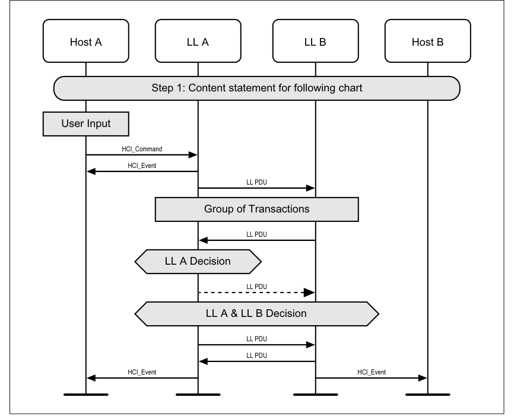

**Figure 1.1:  Example MSC**

## 2  STANDBY STATE

### 2.1   INITIAL SETUP

To perform initial setup of a LE Controller, the following sequence of actions may be required.
First, the Host would wait for the Controller to indicate the number of HCI Command Packets the Host is currently allowed to send using a Command Complete event on a No OPeration command opcode. Then it would reset the Controller to a known state. Then it needs to read the local supported features to check that low energy is supported on this Controller. It would then set the event mask and LE event mask to enable the events that it wants the Controller to generate to the Host. Next, it will check the buffers that are available for data flow, using the Read Buffer Size and LE Read Buffer Size commands. Then it would read the locally supported LE features and select the features that it wishes to use. Finally, it will read the public device address if the Controller has one (see Figure 2.1).

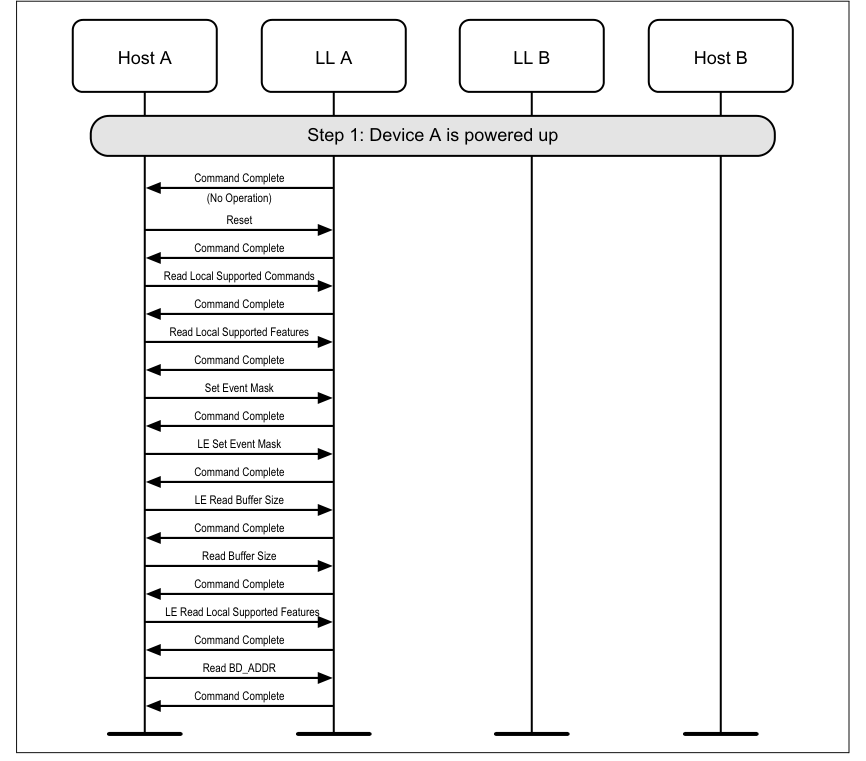

**Figure 2.1:  Initial Setup**

### 2.2   RANDOM DEVICE ADDRESS

A device may use a random device address, but this address has to be configured before being used during advertising, scanning or initiating (see Figure 2.2).

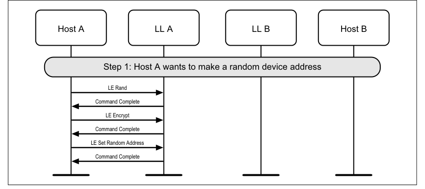

**Figure 2.2:  Random Device Address**

### 2.3   WHITE LISTS

Before advertising, scanning or initiating can use White Lists, the White List may be cleared and devices added in as required (see Figure 2.3).

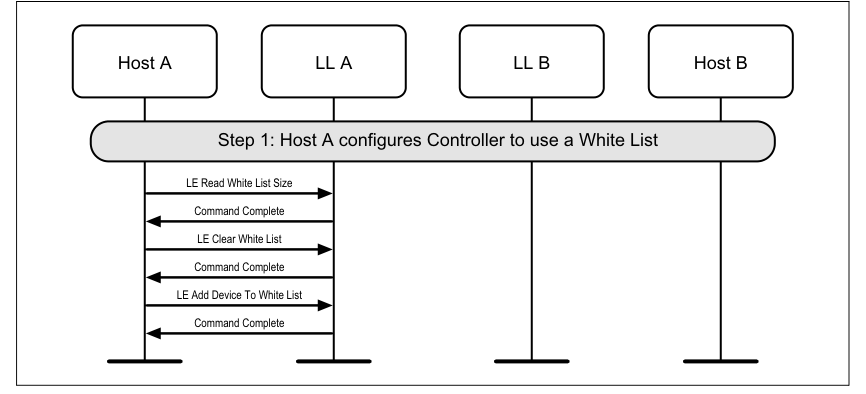

**Figure 2.3:  White Lists**

### 2.4   ADDING IRK TO RESOLVING LIST

Before advertising, scanning or initiating can use resolving lists, the resolving list may be cleared and devices added in as required (see Figure 2.4).

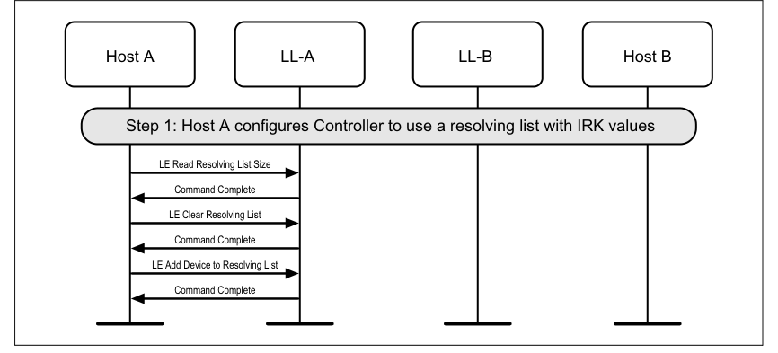

**Figure 2.4:  Resolving Lists**

### 2.5   DEFAULT DATA LENGTH

Before creating a connection, the Host may specify its preferred values for the Controller’s maximum transmission packet size and maximum packet transmission time to be used for new connections. This may be done on either the master or the slave.

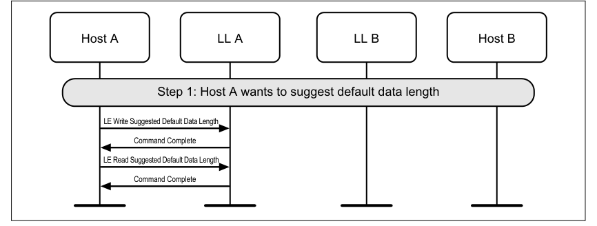

**Figure 2.5:  Default Data Length**

### 2.6   PERIODIC ADVERTISER LIST

The Periodic Advertiser List may be cleared and devices added in as required, before it is made use of (see Figure 2.6).

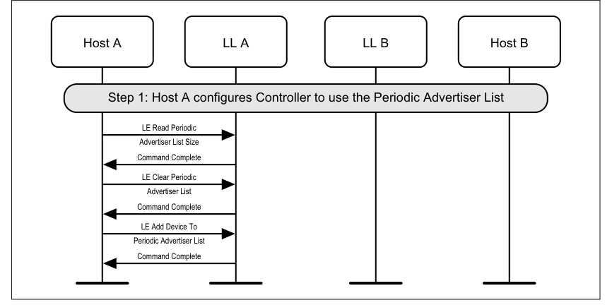

**Figure 2.6:  Periodic Advertiser List**

## 3  ADVERTISING STATE

### 3.1   UNDIRECTED ADVERTISING

A device may enter the Advertising State by enabling advertising. It should also configure the advertising parameters before doing this (see Figure 3.1).

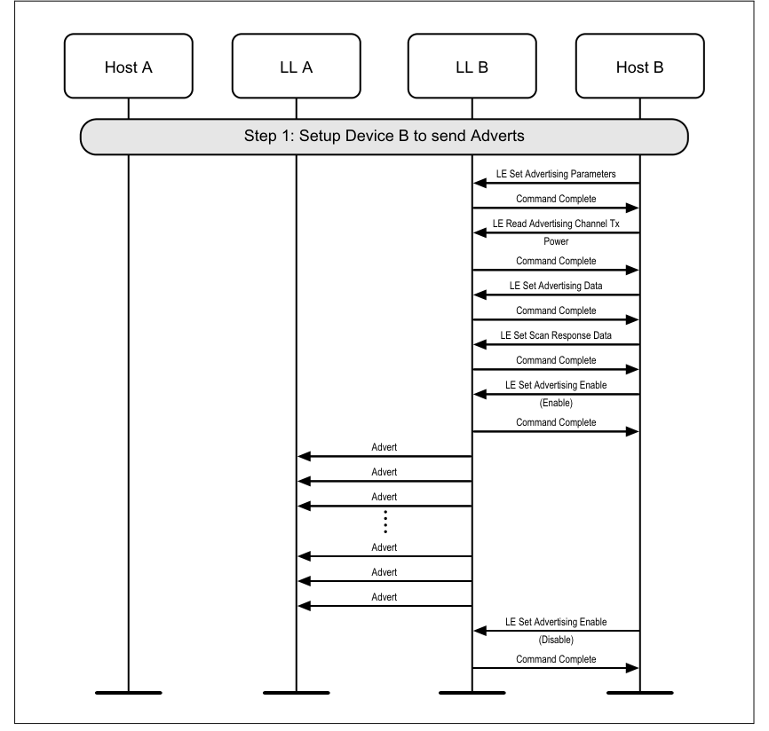

**Figure 3.1:  Undirected Advertising**

### 3.2   DIRECTED ADVERTISING

A device may use directed advertising to allow an initiator to connect to it. High duty cycle directed advertising is time limited in the Controller and therefore this may fail before a connection is created. This example only shows the failure case (see Figure 3.2).

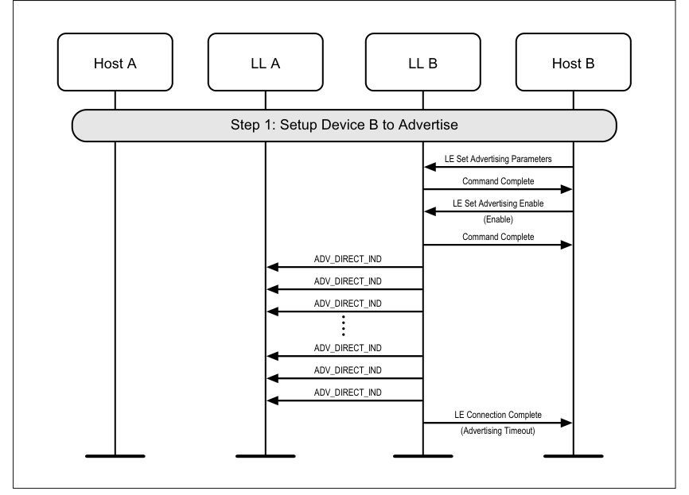

**Figure 3.2:  High Duty Cycle Directed Advertising showing failure case**

Low duty cycle directed advertising must similarly be enabled in order to enter the Advertising State. A device should also configure the advertising parameters before doing this (see Figure 3.3).

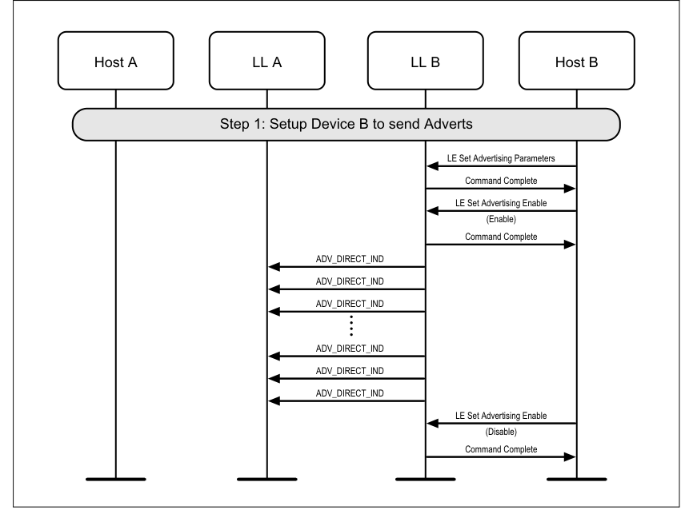

**Figure 3.3:  Low Duty Cycle Directed Advertising**

### 3.3   ADVERTISING USING ADV_EXT_IND

A device may enter the Advertising State by enabling advertising a set. It should also configure the advertising set parameters before doing this (see Figure 3.4).

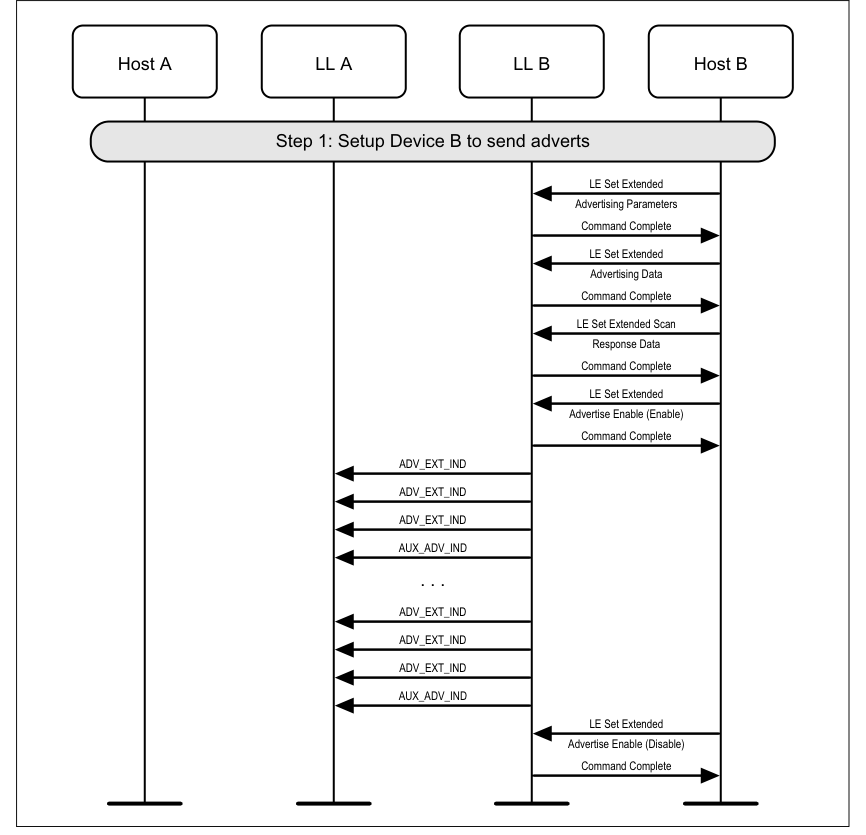

**Figure 3.4:  Advertising using ADV_EXT_IND**

### 3.4   SCAN REQUEST NOTIFICATIONS

A device may enable scan request notifications in an advertising set (see Figure 3.5).

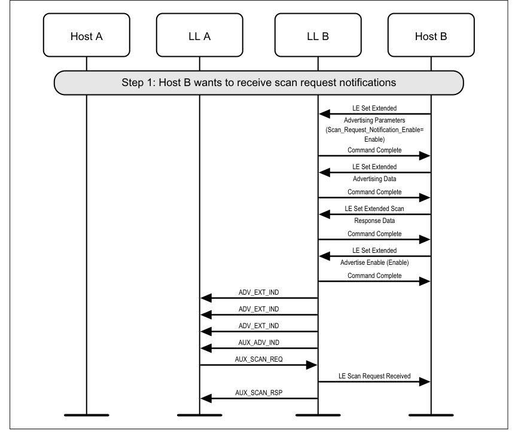

**Figure 3.5:  Scan Request Notifications**

### 3.5   ADVERTISING DURATION ENDED

A device may enter the Advertising State by enabling advertising a set for a limited duration of time (see Figure 3.6).

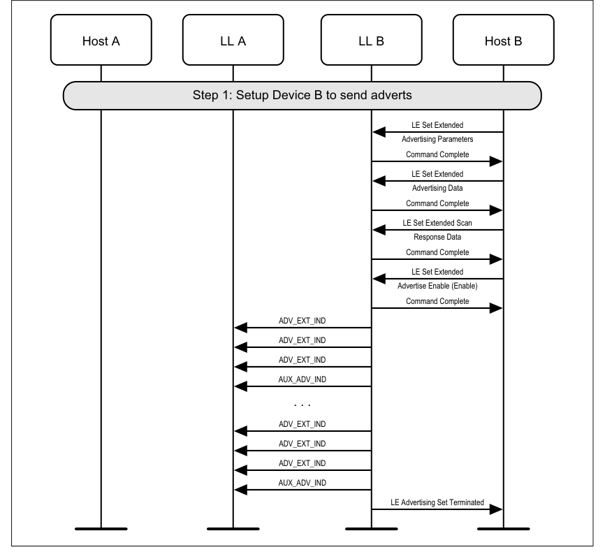

**Figure 3.6:  Advertising Duration Ended**

### 3.6   PERIODIC ADVERTISING

A device may enter the Advertising State by enabling periodic advertising in a set. It should also configure the advertising set parameters before doing this (see Figure 3.7).

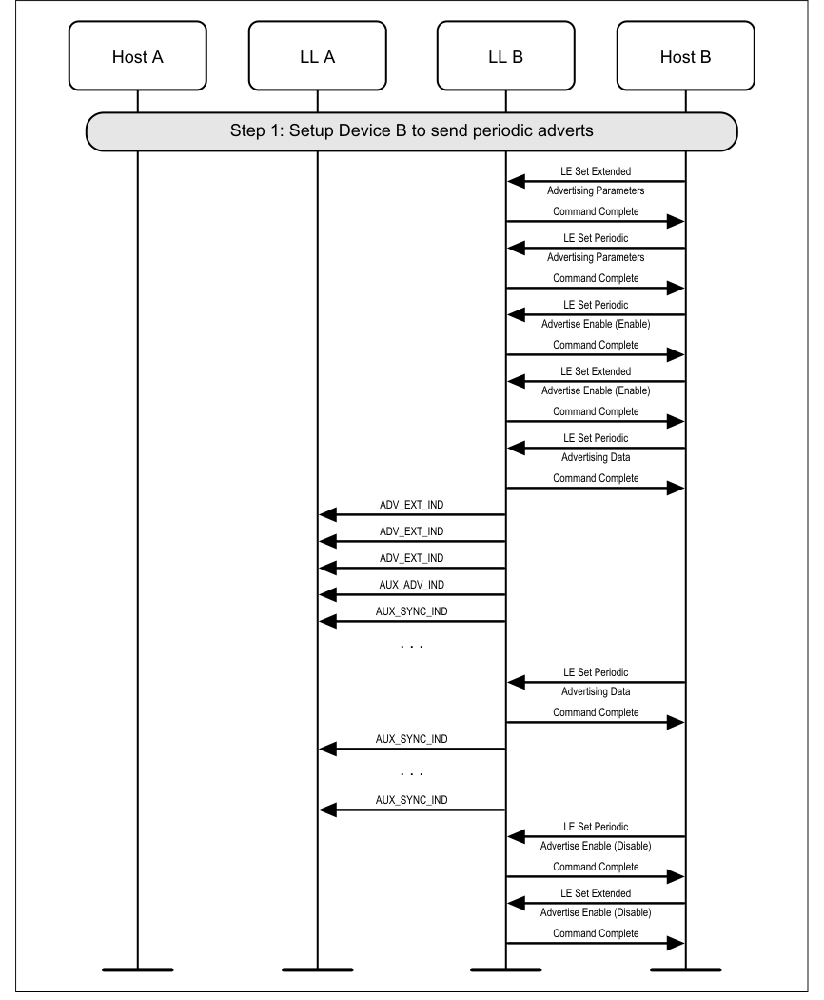

**Figure 3.7:  Periodic Advertising**

## 4  SCANNING STATE

### 4.1   PASSIVE SCANNING

A device can use passive scanning to find advertising devices in the area. This would receive advertising packets from peer devices and report these to the Host (see Figure 4.1).

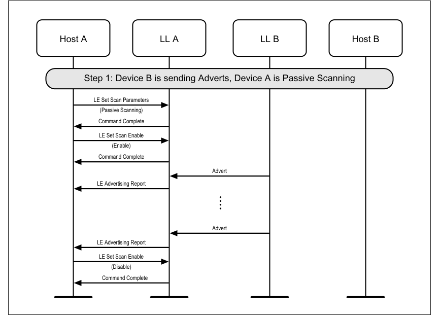

**Figure 4.1:  Passive Scanning**

### 4.2   ACTIVE SCANNING

A device may use active scanning to obtain more information about devices that may be useful to populate a user interface. Active scanning involves more link layer advertising messages (see Figure 4.2).

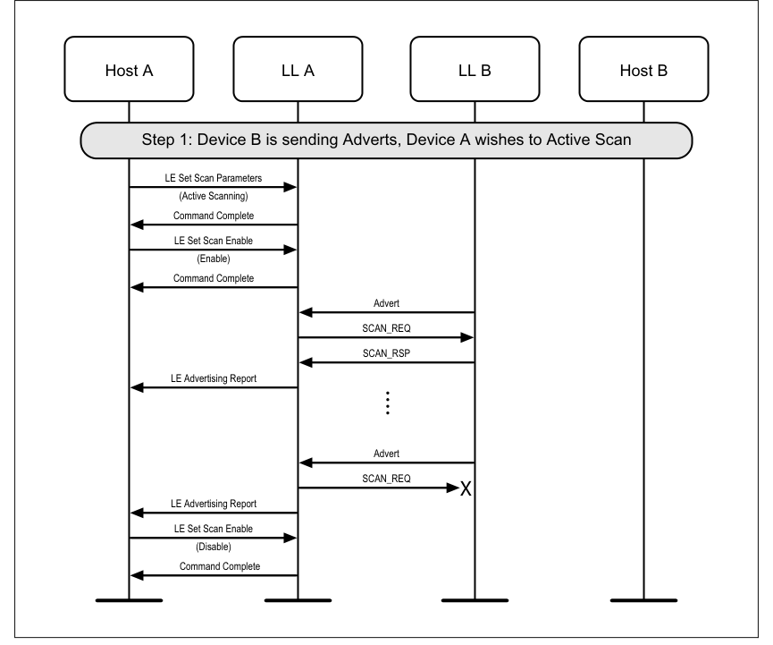

**Figure 4.2:  Active Scanning**

### 4.3   PASSIVE SCANNING FOR DIRECTED ADVERTISEMENTS WITH PRIVACY

If a device does not support Privacy in the Controller, it may choose to forward LE Directed Advertising Report events from devices supporting Privacy without requiring filtering through the Controller Resolving List.

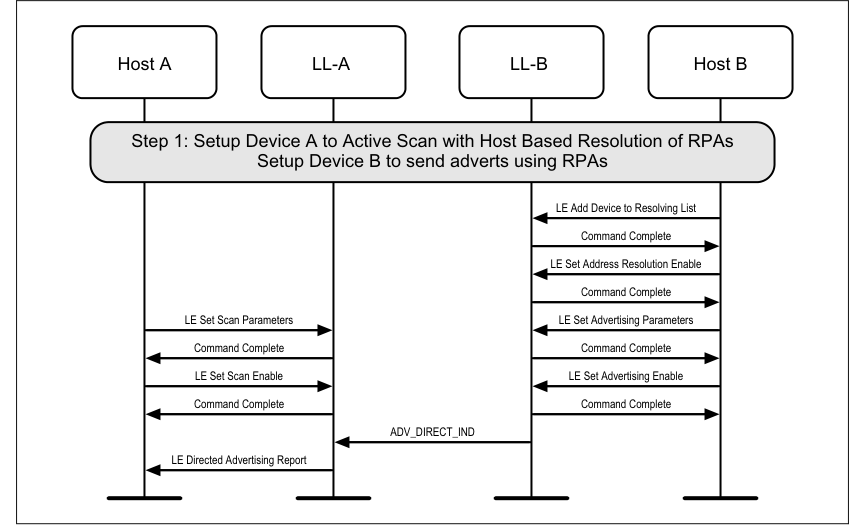

**Figure 4.3:  Directed Advertising with Privacy**

### 4.4   ACTIVE SCANNING WITH PRIVACY

A device may use active scanning to obtain more information about devices that may be useful
to populate a user interface. Privacy may be used during active scanning to make it more
difficult to track either device during active scanning (see Figure 4.4).

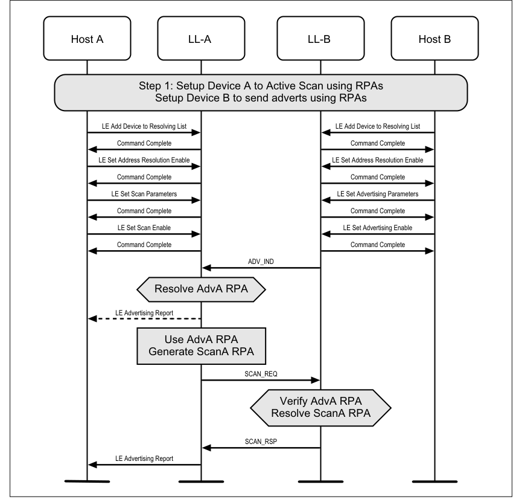

**Figure 4.4:  Active Scanning with Privacy**

### 4.5   ACTIVE SCANNING WITH PRIVACY AND CONTROLLER BASED RESOLVABLE PRIVATE ADDRESS GENERATION

A Controller will periodically update the resolvable private addresses used on both devices if the devices use active scanning and advertising with Privacy. A Host may at anytime retrieve the read from the Controller the current addresses being used (see Figure 4.5).

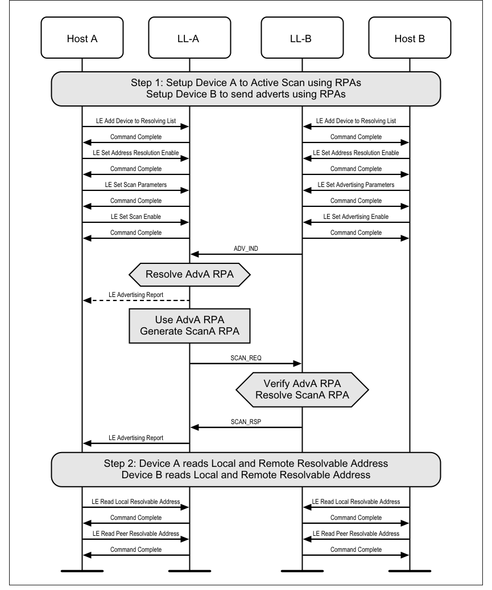

**Figure 4.5:  Retrieving local and remote resolvable address updates from the Controller**

### 4.6   ACTIVE SCANNING ON THE SECONDARY ADVERTISING CHANNEL

A device may use active scanning on the secondary advertising channel in order to obtain more information about devices that may be useful to populate a user interface (see Figure 4.6).

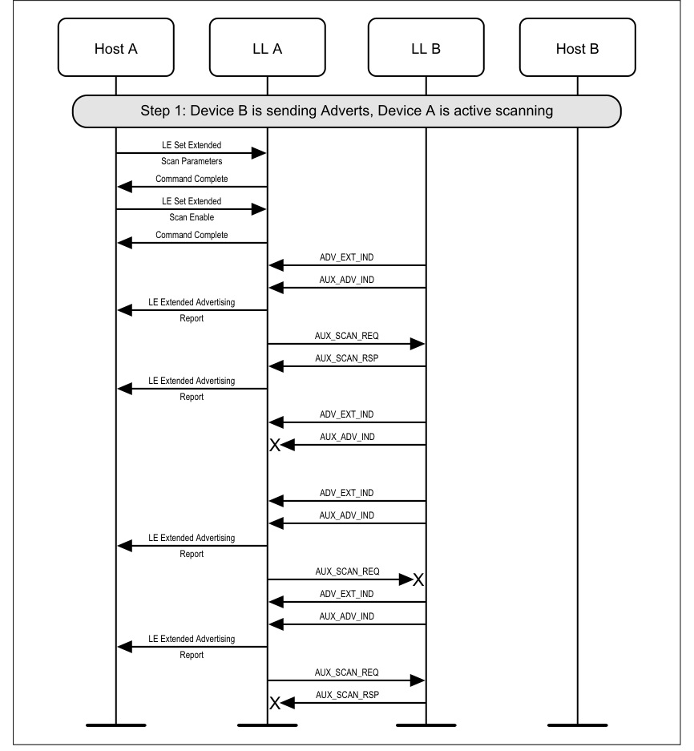

**Figure 4.6:  Extended active scanning on the secondary advertising channel**

### 4.7   SCAN TIMEOUT

A device may scan for a limited duration of time (see Figure 4.7).

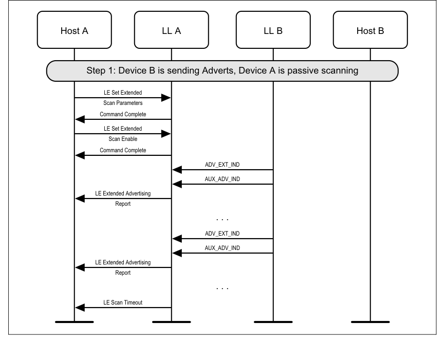

**Figure 4.7:  Scan Timeout**

### 4.8   PERIODIC SCANNING

A device may establish synchronization with a periodic advertiser and report periodic advertising packets to the Host (see Figure 4.8).

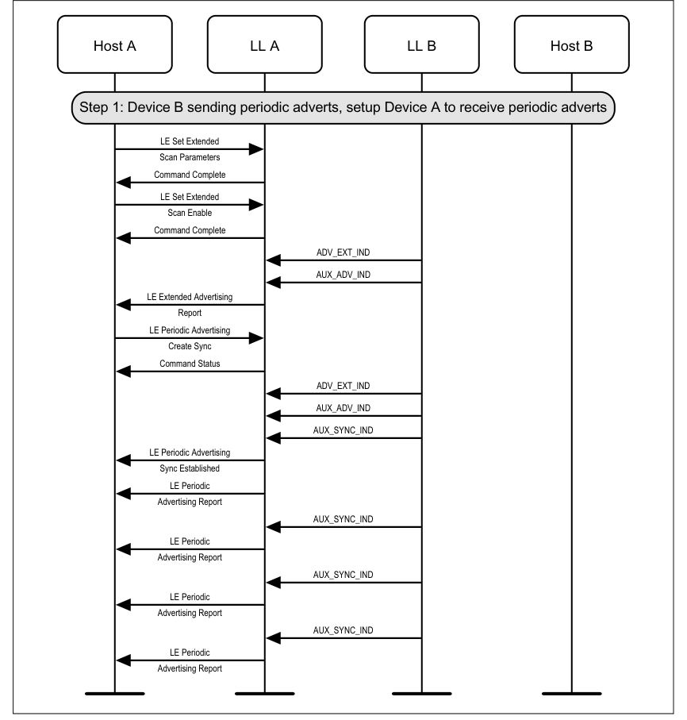

**Figure 4.8:  Periodic Scanning**

### 4.9   PERIODIC SCANNING CANCEL

A device may cancel a pending request to establish synchronization with a periodic advertiser. This example shows an unsuccessful synchronization, followed by cancellation of the synchronization (see Figure 4.9).

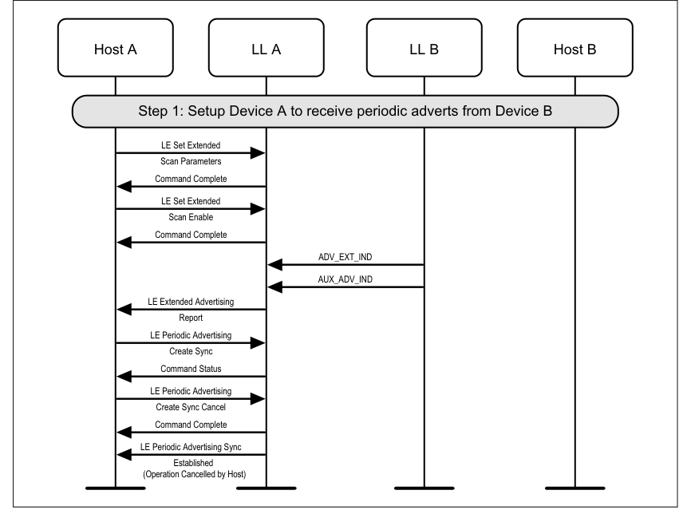

**Figure 4.9:  Periodic Scanning Cancel**

### 4.10   PERIODIC SCANNING TIMEOUT

A device may lose synchronization with a periodic advertiser (see Figure 4.10).

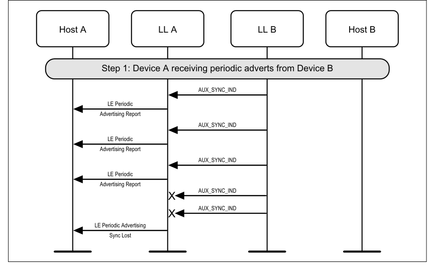

**Figure 4.10:  Periodic Scanning Timeout**

### 4.11   PERIODIC SCANNING TERMINATE

Once synchronized with a periodic advertiser, the Host can terminate the synchronization (see Figure 4.11).

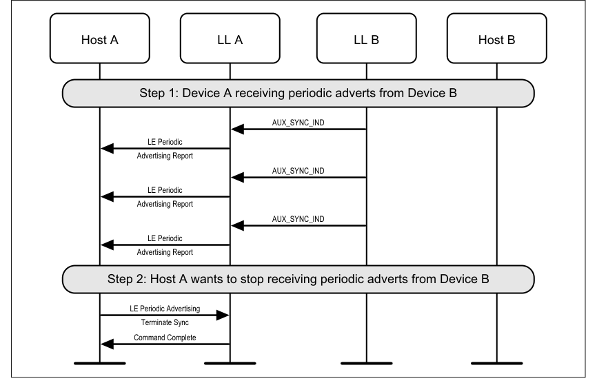

**Figure 4.11:  Periodic Scanning Terminate**

## 5  INITIATING STATE

### 5.1   INITIATING A CONNECTION

A device can initiate a connection to an advertiser. This example shows a successful initiation, resulting in both devices able to send application data (see Figure 5.1).

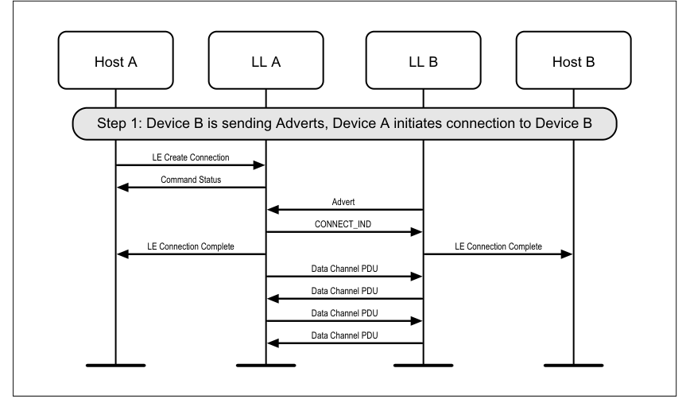

**Figure 5.1:  Initiating a Connection**

### 5.2   CANCELING AN INITIATION

A device can cancel a pending connection creation. This example shows an unsuccessful initiation, followed by a cancellation of the initiation (see Figure 5.2).

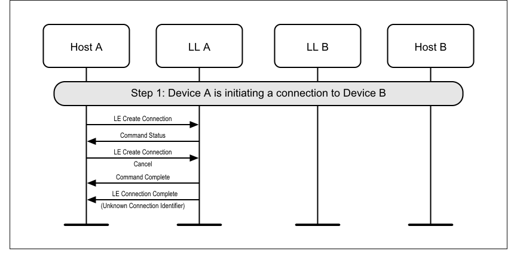

**Figure 5.2:  Canceling an Initiation**

### 5.3   INITIATING A CONNECTION USING UNDIRECTED ADVERTISING WITH PRIVACY

A device can initiate a connection to an advertiser. Privacy may be used during connection initiation to make it more difficult to track either device during connection setup. The example shows a successful initiation, resulting in both devices able to send application data (see Figure 5.3).

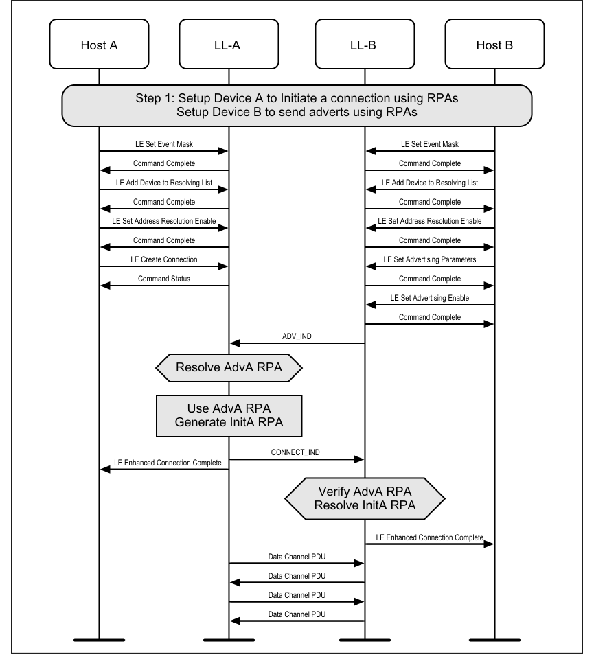

**Figure 5.3:  Initiating a connection using Undirected Advertising with Privacy**

### 5.4   INITIATING A CONNECTION USING DIRECTED ADVERTISING WITH PRIVACY

A device can initiate a connection to an advertiser who is using Directed Advertising. Privacy may be used during connection initiation to make it more difficult to track either device during connection setup as well as target a single initiator. The example shows a successful initiation, resulting in both devices able to send application data (see Figure 5.4).

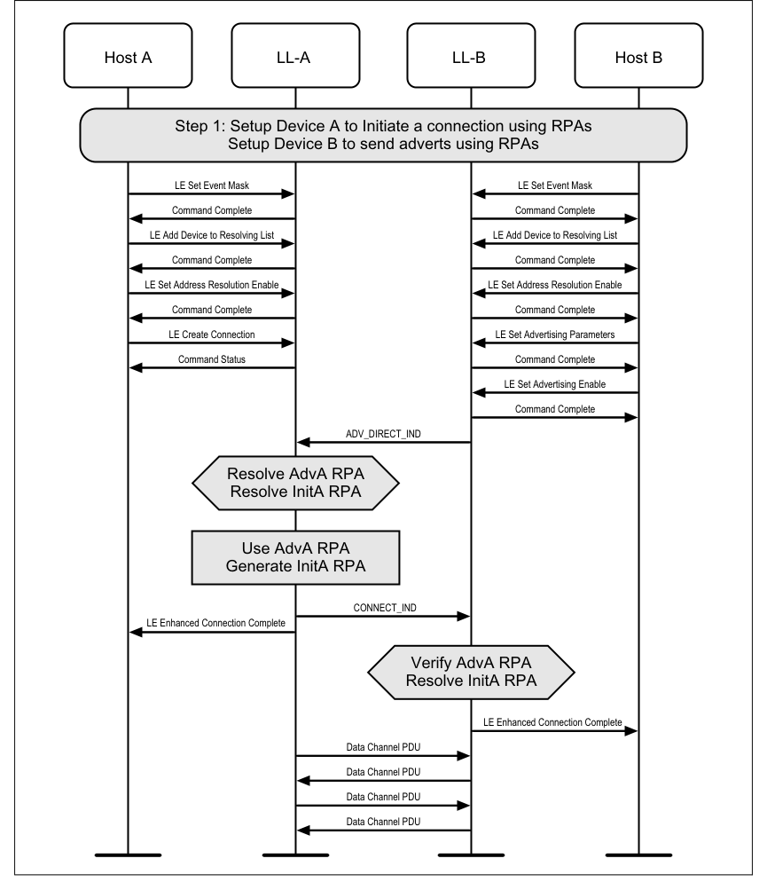

**Figure 5.4:  Initiating a connection using Directed Advertising with Privacy**

### 5.5   INITIATING A CONNECTION THAT FAILS TO ESTABLISH

This example shows an initiation that fails to establish because Device B (the advertiser) fails to respond to the Data Channel PDUs sent by Device A.

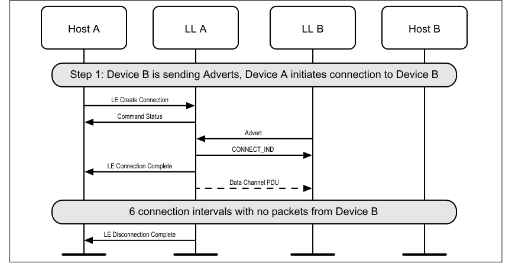

**Figure 5.5:  Initiating a Connection that fails to establish**

Device A may or may not send data channel PDUs in the 6 connection intervals before establishment fails. If it does not do so, Device B is unable to respond.

### 5.6   INITIATING A CONNECTION ON THE SECONDARY ADVERTISING CHANNEL

A device can initiate a connection to an advertiser on the secondary channel. This example shows a successful initiation, resulting in both devices able to send application data (see Figure 5.6).

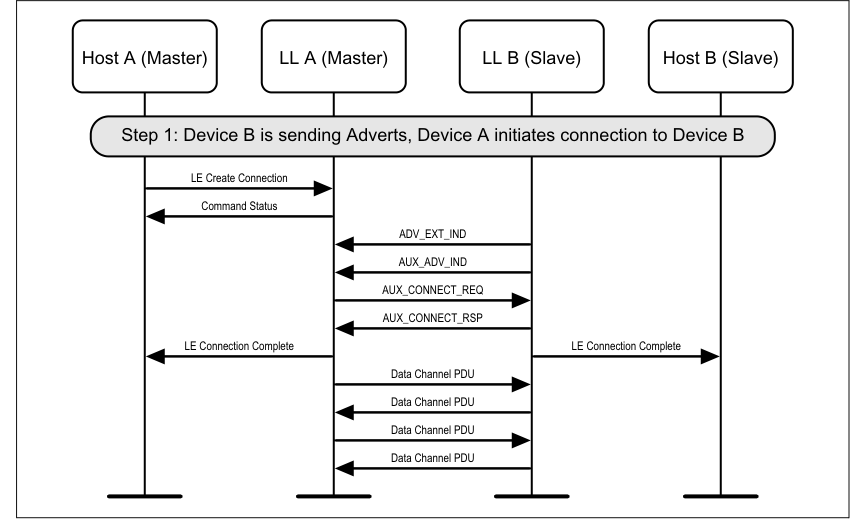

**Figure 5.6:  Initiating a connection on the secondary advertising channel**

### 5.7   INITIATING A CHANNEL SELECTION ALGORITHM #2 CONNECTION

Where a device supports the Channel Selection Algorithm #2 feature, it can initiate a connection which will use Channel Selection Algorithm #2 to an advertiser who has the ChSel field of the advertising channel PDU set to 1. The example shows a successful initiation, resulting in the connection using Channel Selection Algorithm #2.

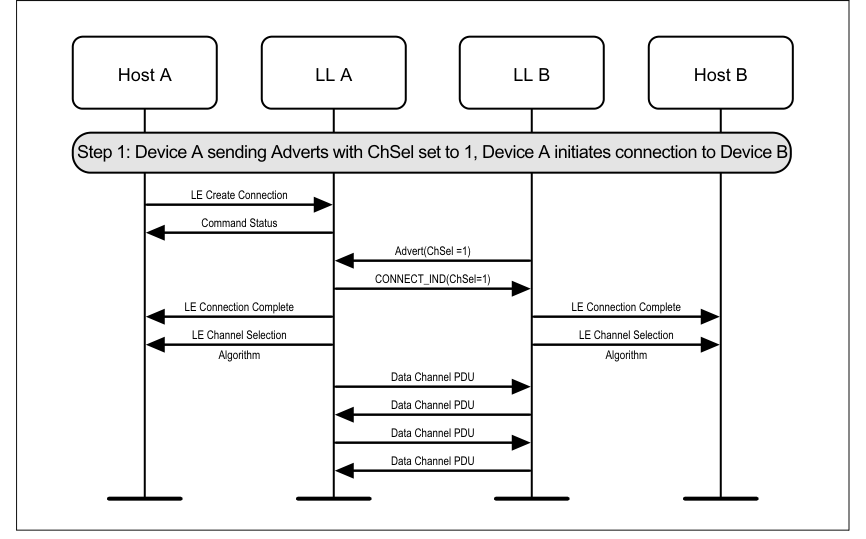

**Figure 5.7:  Initiating a Channel Selection Algorithm #2 Connection**

## 6  CONNECTION STATE

### 6.1   SENDING DATA

Once two devices are in a connection, either device can send data. This example shows both devices sending data, for example when the Attribute Protocol does a read request and a read response is returned (see Figure 6.1).

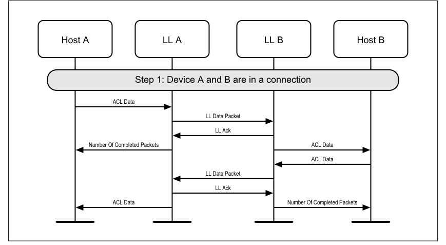

**Figure 6.1:  Sending Data**

### 6.2   CONNECTION UPDATE

The master of the connection may request a connection update using a Link Layer Control Procedure (see Figure 6.2).

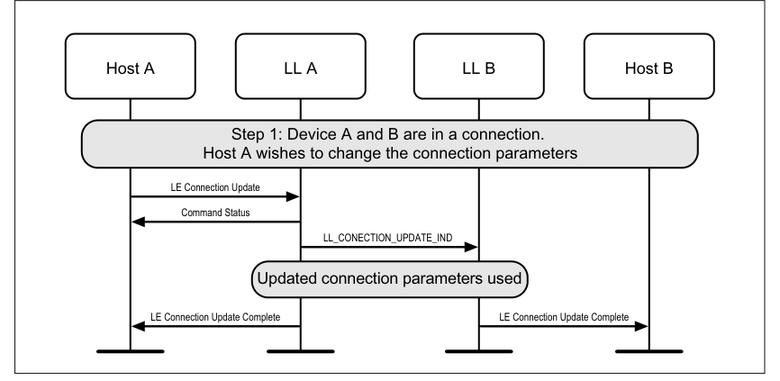

**Figure 6.2:  Connection Update**

### 6.3   CHANNEL MAP UPDATE

The Controller of the master may receive some channel classification data from the Host and then perform the Channel Update Link Layer Control Procedure (see Figure 6.3).

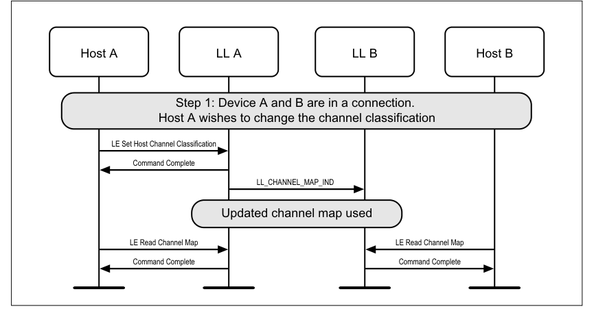

**Figure 6.3:  Channel Map Update**

### 6.4   FEATURES EXCHANGE

Both the master and slave devices can discover the set of features available on the remote device. To achieve this, the Feature Exchange Link Layer Control Procedure is used (see Figure 6.4 and Figure 6.5).

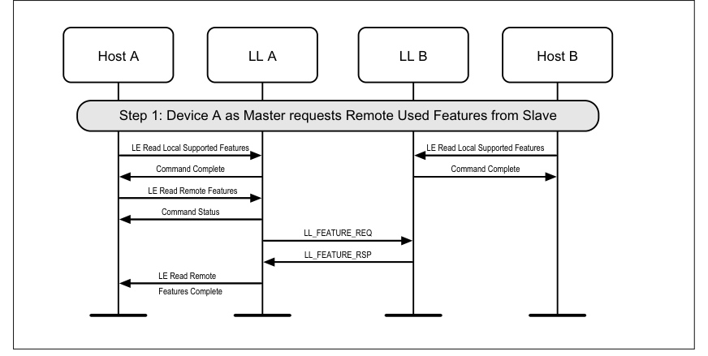

**Figure 6.4:  Master-initiated Features Exchange**

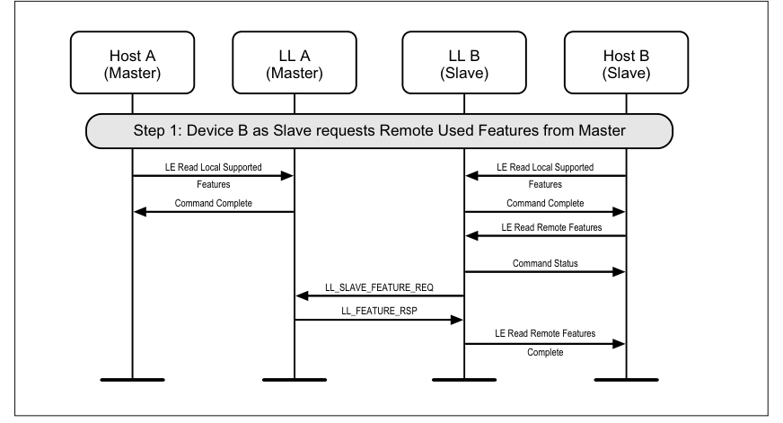

**Figure 6.5:  Slave-initiated Features Exchange**

### 6.5   VERSION EXCHANGE

Either device may perform a version exchange (see Figure 6.6 and Figure 6.7).

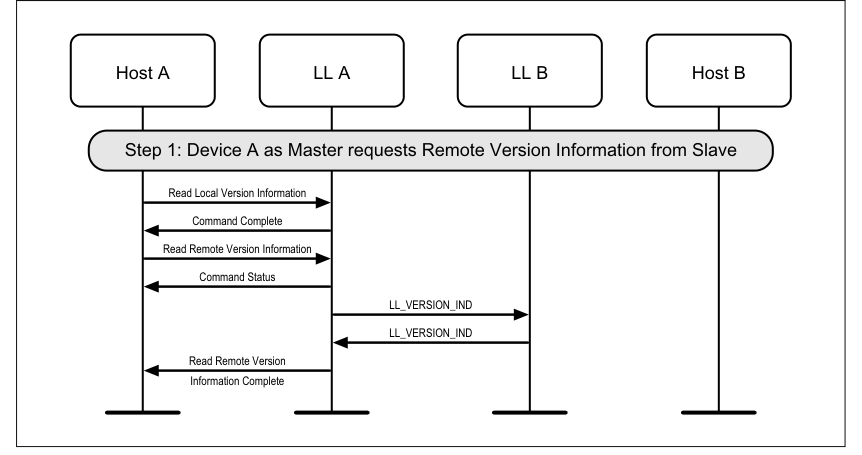

**Figure 6.6:  Version Exchange from Master**

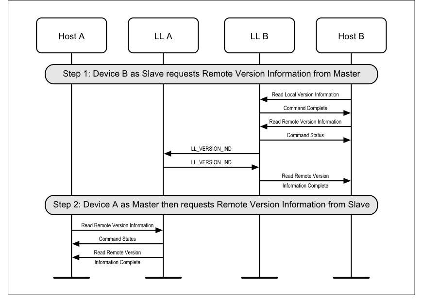

**Figure 6.7:  Version Exchange from Slave**

### 6.6   START ENCRYPTION

If encryption has not been started on a connection, it may be started by the master (see Figure 6.8).

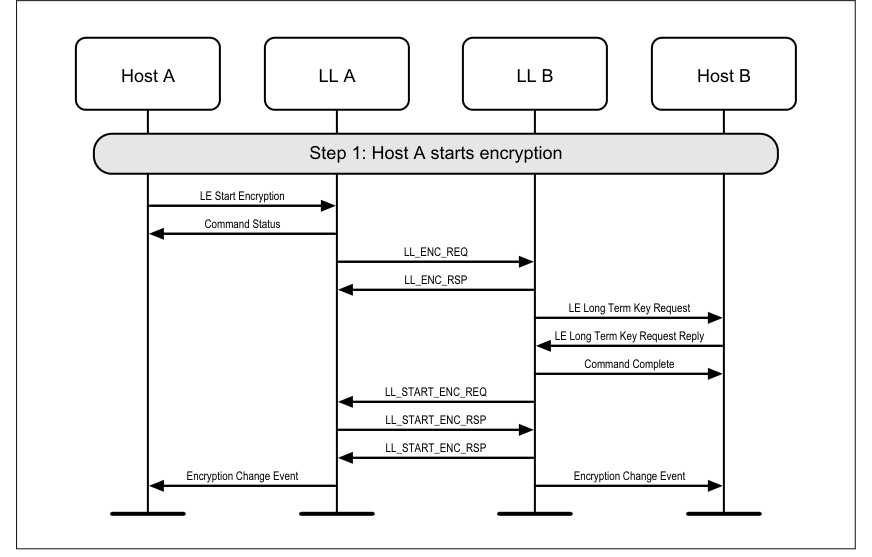

**Figure 6.8:  Start Encryption**

### 6.7   START ENCRYPTION WITHOUT LONG TERM KEY

If encryption has not been started on a connection, it may be started by the master. Figure 6.9 shows the failure case of the slave not having the long term key for the master.

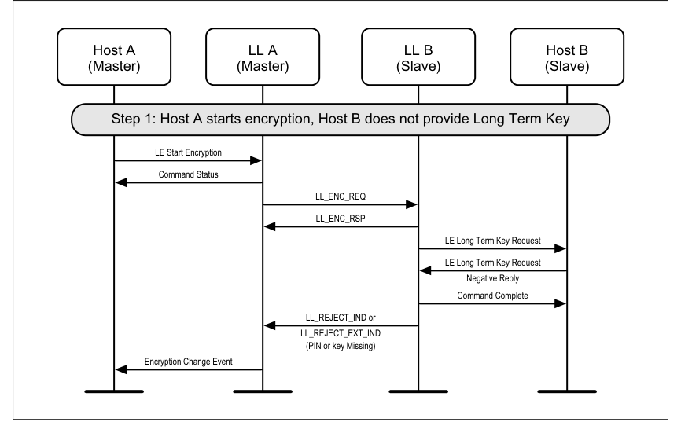

**Figure 6.9:  Start encryption without long-term key**

### 6.8   START ENCRYPTION WITH EVENT MASKED

If encryption has not been started on a connection, it may be started by the master. Figure 6.10 shows the failure case when the slave has masked out the LE Long Term Key Request event.

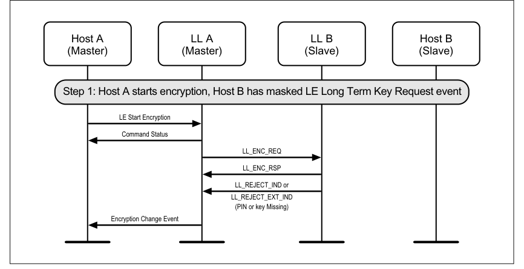

**Figure 6.10:  Start encryption with slave masking out event**

### 6.9   START ENCRYPTION WITHOUT SLAVE SUPPORTING ENCRYPTION

If Encryption has not been started on a connection, it may be started by the master. Figure 6.11 shows the failure case of the slave that does not support the encryption feature.

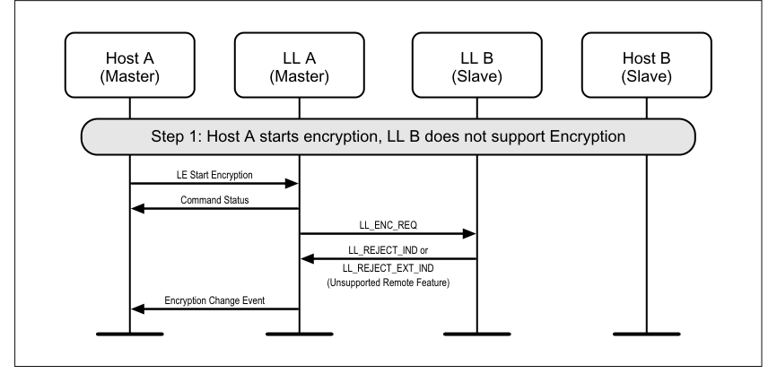

**Figure 6.11:  Start Encryption failure when slave does not support encryption**

### 6.10   RESTART ENCRYPTION

If encryption has already been started on a connection, it may be restarted by the master. This may be required to use a stronger encryption as negotiated by the Security Manager Protocol (see Figure 6.12).

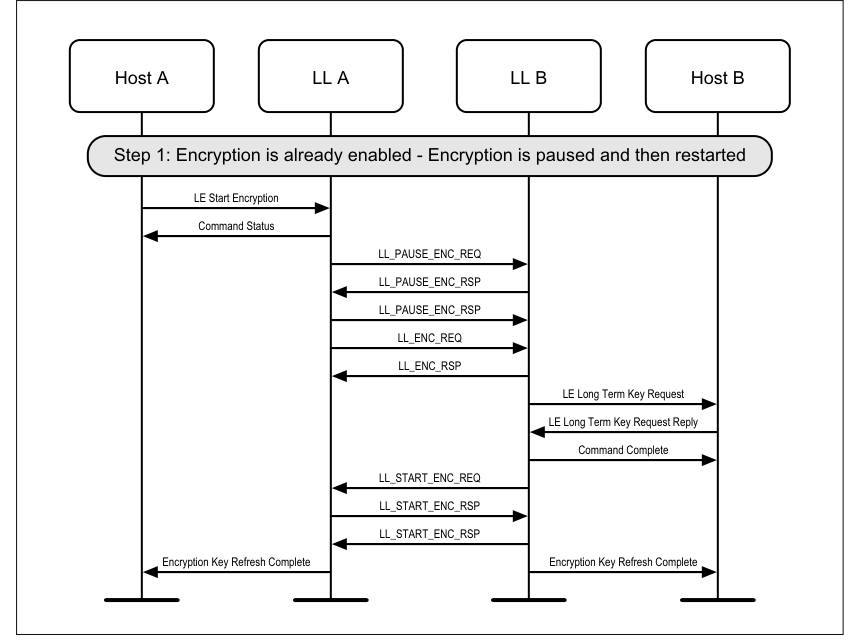

**Figure 6.12:  Restart Encryption**

### 6.11   DISCONNECT

Once a connection has no need to be kept active, the Host can disconnect it. This can be done by either device (see Figure 6.13 and Figure 6.14).

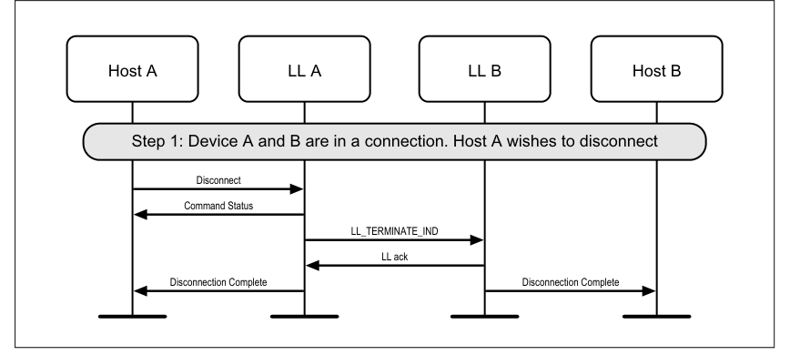

**Figure 6.13:  Disconnect from Master**

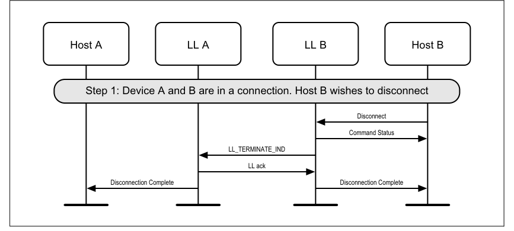

**Figure 6.14:  Disconnect from Slave**

### 6.12   CONNECTION PARAMETERS REQUEST

The master or the slave of the connection may request change in connection parameters using a Link Layer Control Procedure (see Figure 6.15 to Figure 6.22).

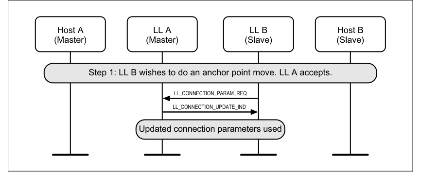

**Figure 6.15:  Slave-initiated Connection Parameters Request procedure – slave requests a change in anchor points, master accepts**

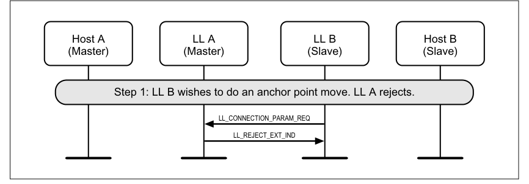

**Figure 6.16:  Slave-initiated Connection Parameters Request procedure – slave requests a change in anchor points, master rejects**

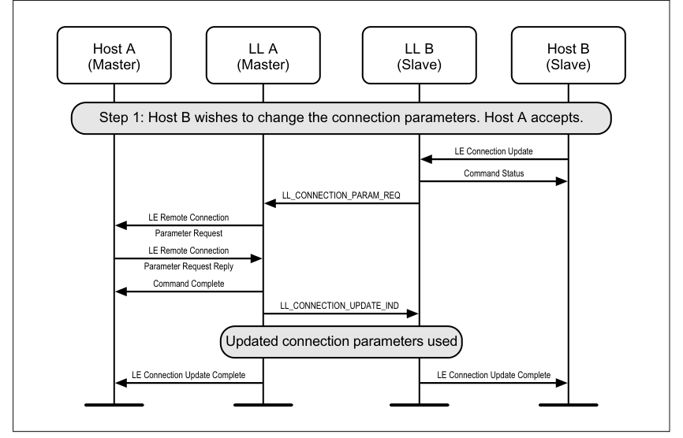

**Figure 6.17:  Slave-initiated Connection Parameters Request procedure – slave requests change in LE connection parameters, master’s Host accepts**

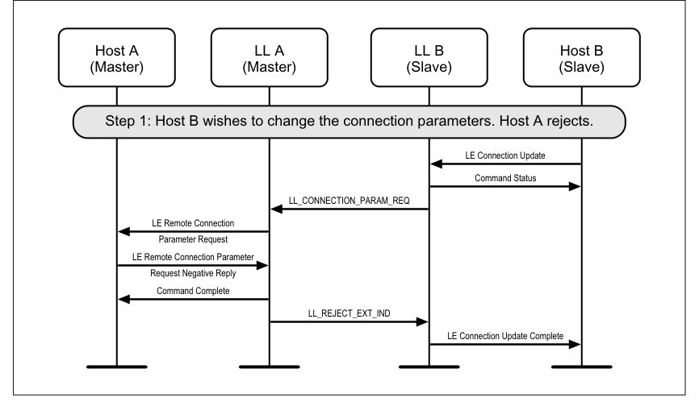

**Figure 6.18:  Slave-initiated Connection Parameters Request procedure – slave requests change in LE connection parameters, master’s Host rejects**

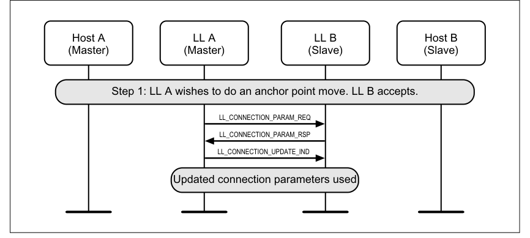

**Figure 6.19:  Master-initiated Connection Parameters Request procedure –master requests a change in anchor points, slave accepts**

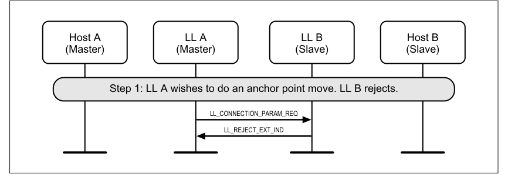

**Figure 6.20:  Master-initiated Connection Parameters Request procedure –master requests a change in anchor points, slave rejects**

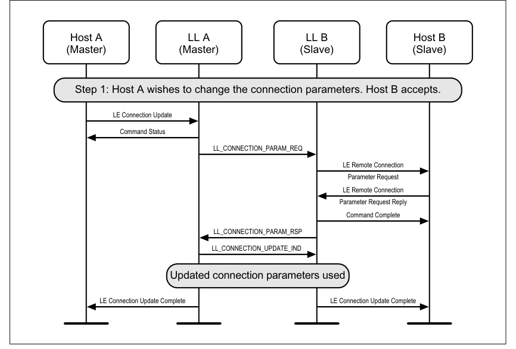

**Figure 6.21:  Master-initiated Connection Parameters Request procedure – master requests change in LE connection parameters, slave’s Host accepts**

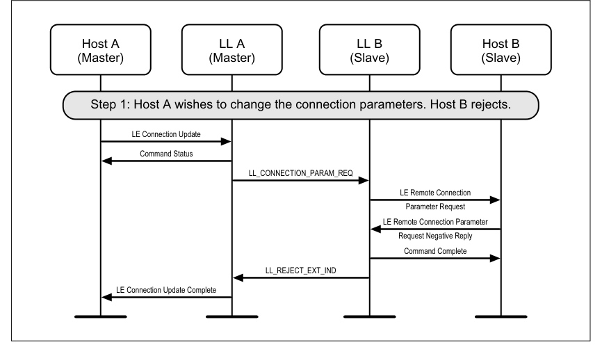

**Figure 6.22:  Master-initiated Connection Parameters Request procedure – master requests change in LE connection parameters, slave’s Host rejects**

### 6.13   LE PING

A Host may use the HCI_Write_Authenticated_Payload_Timeout command to change the maximum interval between packets containing a valid MIC that the link layer will enforce when encryption is used.

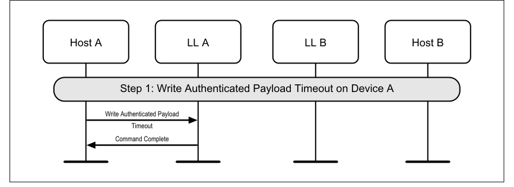

**Figure 6.23:  Set LE Authenticated Payload Timeout**

Either Link Layer can authenticate the remote device using the LE Ping Procedure even if the remote device does not support the LE Ping feature. This procedure can also be used for soliciting a packet from the remote device containing a valid MIC. LL A may be a master or a slave.

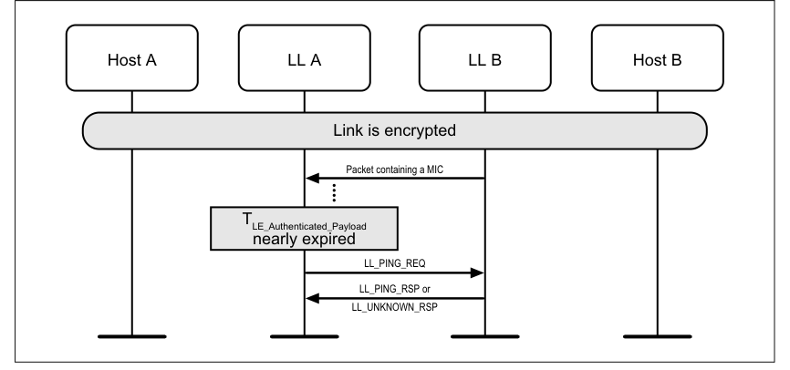

**Figure 6.24:  Successful LE Ping**

When a packet with a valid MIC has not been received within the LE Authenticated Payload Timeout, the Host is notified that the timer has expired.

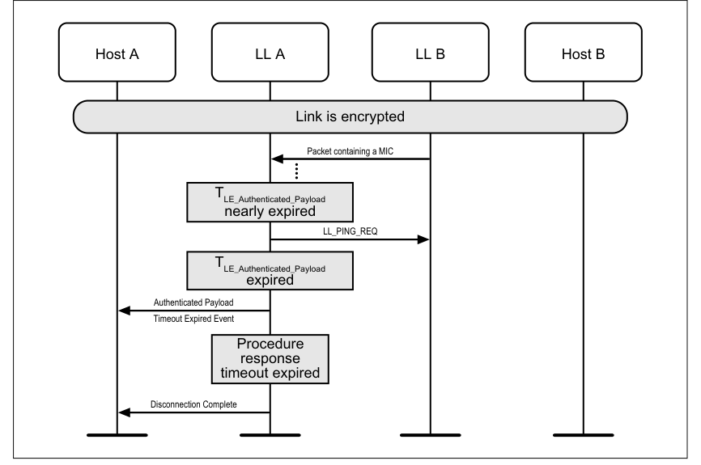

**Figure 6.25:  Unsuccessful LE Ping**

The TLE_Authenticated_Payload Timer gets reset when the Host sets the Authenticated Payload Timeout.

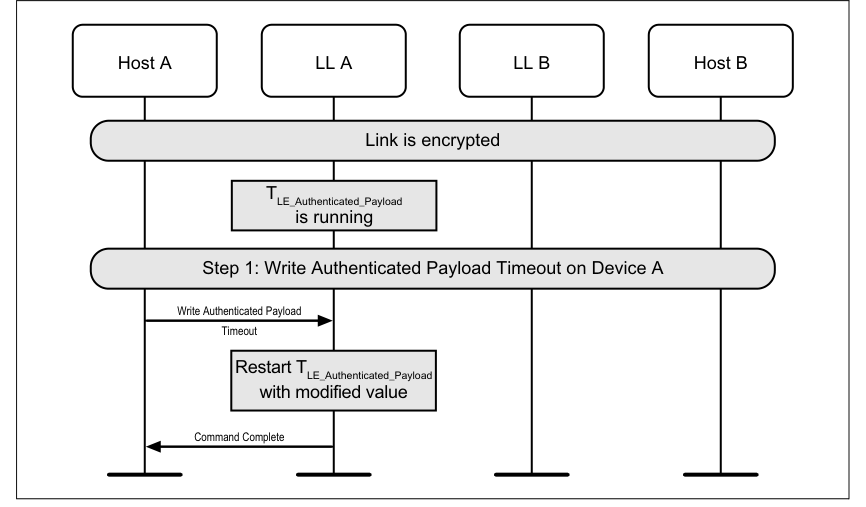

**Figure 6.26:  TLE_Authenticated_Payload Timer reset**

### 6.14   DATA LENGTH UPDATE

Once a connection has been created, the Host may suggest maximum transmission packet size and maximum packet transmission time to be used for the connection. This may be done on either the master or the slave.

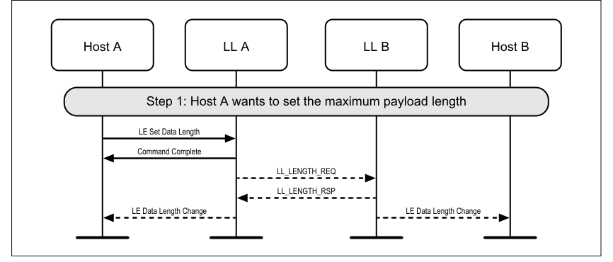

**Figure 6.27:  Data Length Update**

### 6.15   PHY UPDATE

The master or slave of the connection may request a change in the PHY using a Link Layer Control Procedure (see Figure 6.28 to Figure 6.36).

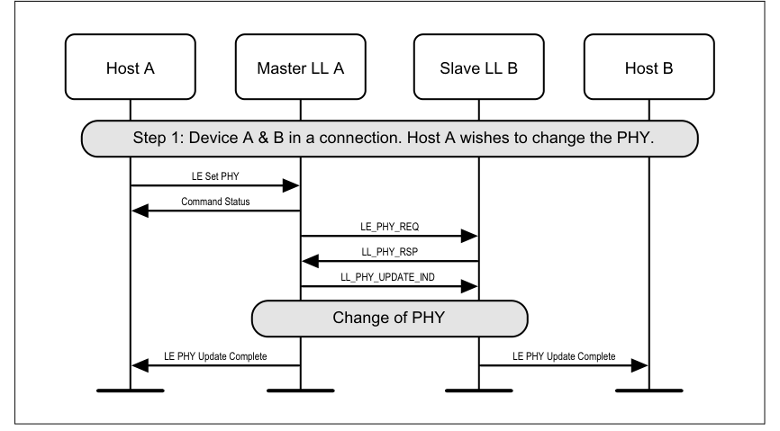

**Figure 6.28:  Master initiated PHY Update procedure – master requests a change of PHY, PHY changed in at least one direction**

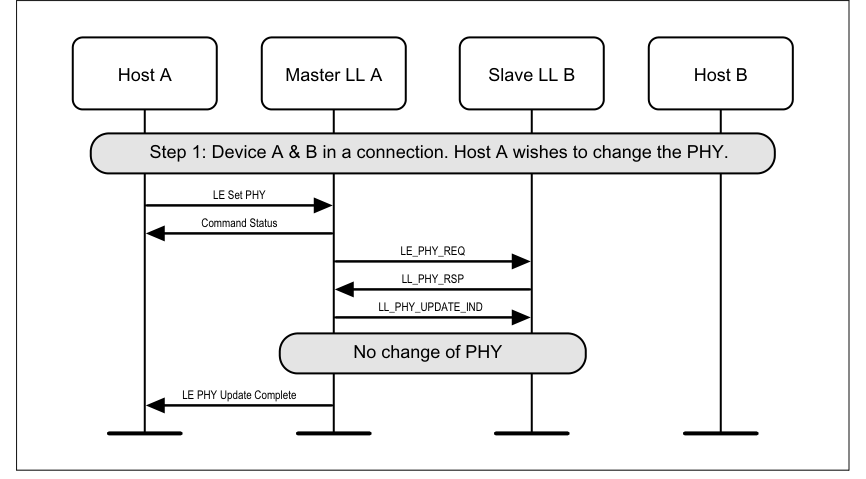

**Figure 6.29:  Master initiated PHY Update procedure, PHY not changed (either because slave doesn't specify PHYs that the master prefers, or because the master concludes that the current PHYs are still best)**

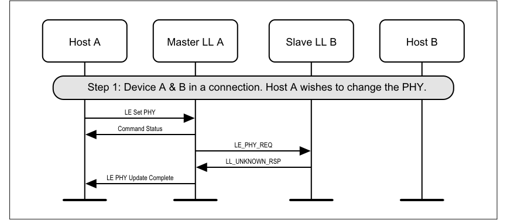

**Figure 6.30:  Master initiated PHY Update procedure – master requests a change of PHY, slave does not support the feature**

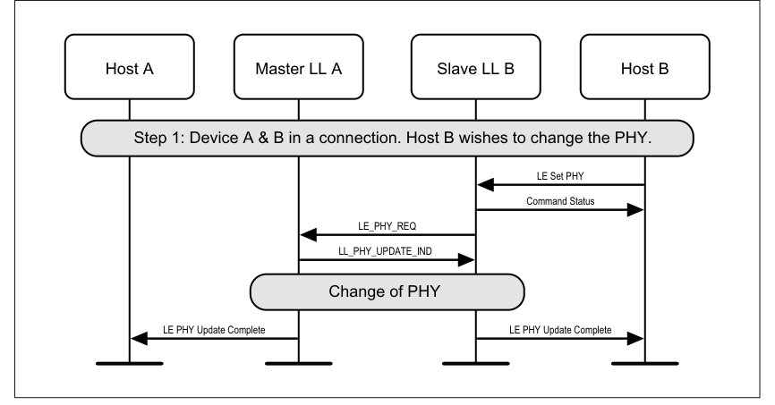

**Figure 6.31:  Slave initiated PHY Update procedure – slave requests a change of PHY, PHY changed in at least one direction**

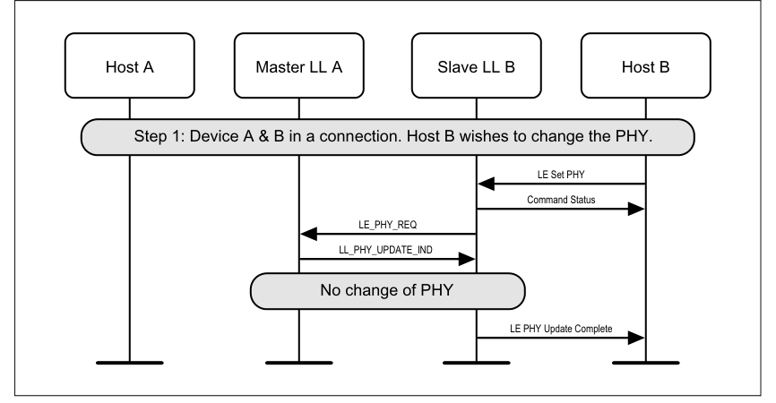

**Figure 6.32:  Slave initiated PHY Update procedure, PHY not changed (either because slave doesn't specify PHYs that the master prefers, or because the master concludes that the current PHYs are still best)**

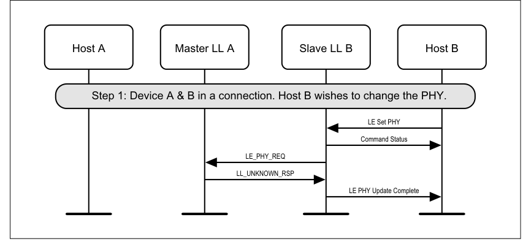

**Figure 6.33:  Slave initiated PHY Update procedure – slave requests a change of PHY, master does not support the feature**

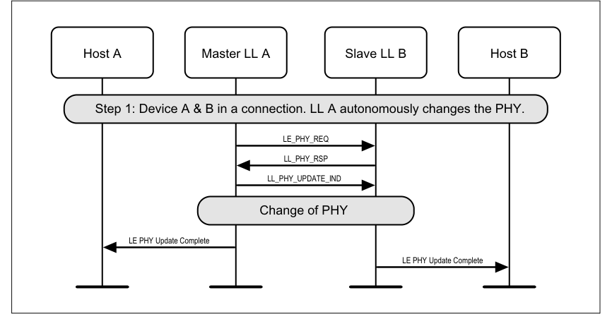

**Figure 6.34:  Autonomous master-initiated PHY Update procedure – master requests a change of PHY, slave accepts, PHY changed in at least one direction**

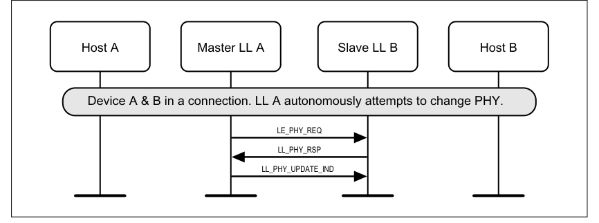

**Figure 6.35:  Autonomous master-initiated PHY Update procedure – master requests a change of PHY, PHY not changed (either because slave doesn't specify PHYs that the master prefers, or because the master concludes that the current PHYs are still best)**

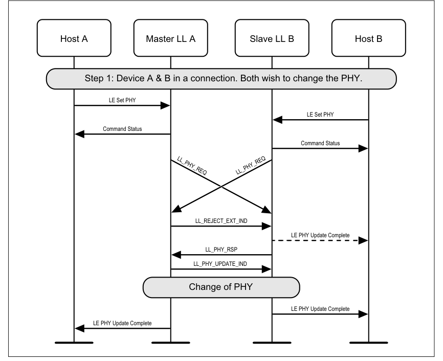

**Figure 6.36:  Master and slave crossover PHY Update procedure – master and slave request a change of PHY concurrently**

### 6.16   MINIMUM NUMBER OF USED CHANNELS REQUEST

Where a slave device supports the Minimum Number of Used Channels procedure, it can request that a certain minimum number of channels be used on the indicated PHY. The example shows a successful request, resulting in a channel map update with the requested minimum number of channels used for the connection.

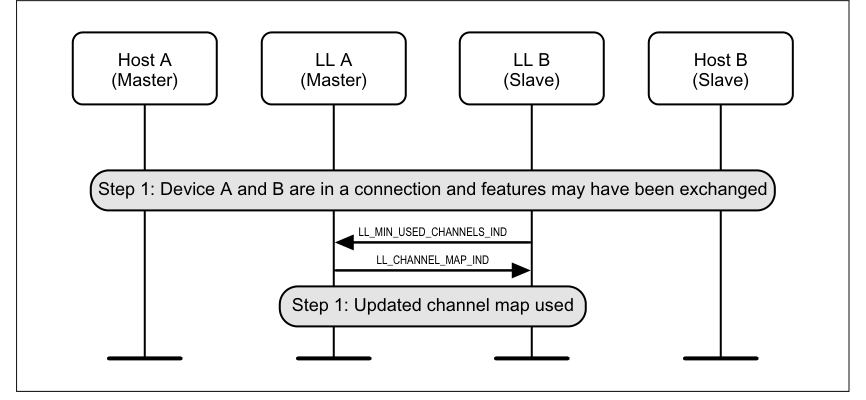

**Figure 6.37:  Requesting minimum number of used channels**

### 6.17   LL PROCEDURE COLLISION

The Link Layers of both the master and slave may initiate the same LL procedure at the same time.

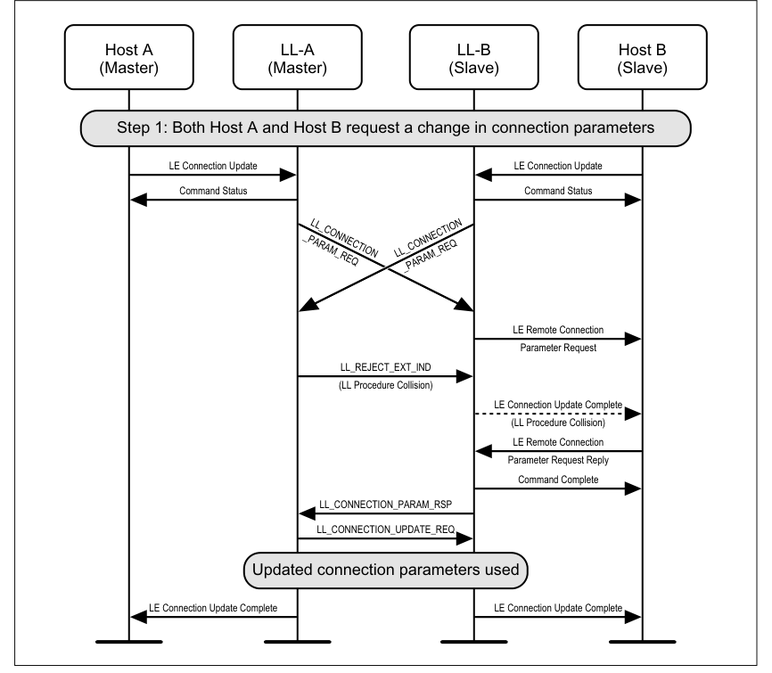

**Figure 6.38:  LL Procedure Collision**

Core System Package [Low Energy Controller volume]
Part E
PART E: LOW ENERGY LINK LAYER SECURITY
This part of the specification describes the Link Layer security for Bluetooth low energy.
CONTENTS

## 1  ENCRYPTION AND AUTHENTICATION OVERVIEW

The Link Layer provides encryption and authentication using Counter with Cipher Block Chaining-Message Authentication Code (CCM) Mode, which shall be implemented consistent with the algorithm as defined in IETF RFC 3610 (http://www.ietf.org/rfc/rfc3610.txt) in conjunction with the AES-128 block cipher as defined in NIST Publication FIPS-197 (http://csrc.nist.gov/ publications/fips/fips197/fips-197.pdf). A description of the CCM algorithm can also be found in the NIST Special Publication 800-38C (http://csrc.nist.gov/publications/PubsSPs.html).
This specification uses the same notation and terminology as the IETF RFC except for the Message Authentication Code (MAC) that in this specification is called the Message Integrity Check (MIC) to avoid confusion with the term Media Access Controller.
CCM has two size parameters, M and L. The Link Layer defines these to be:
• M = 4; indicating that the MIC (authentication field) is 4 octets
• L = 2; indicating that the Length field is 2 octets
CCM requires a new temporal key whenever encryption is started. CCM also requires a unique nonce value for each Data Channel PDU protected by a given temporal key. The CCM nonce shall be 13 octets.
The Link Layer connection may be either encrypted and authenticated or unencrypted and unauthenticated. In an encrypted and authenticated connection, all the Data Channel PDUs with a non-zero length Payload shall be encrypted and authenticated. Authentication is performed by appending a MIC field to the Payload. The MIC shall be calculated over the Data Channel PDU’s Payload field and the first octet of the header ([Vol 6] Part B, Section 2.4) with the NESN, SN and MD bits masked to zero.
Encryption shall be applied to the Data Channel PDU’s Payload field and MIC.
Each new Data Channel PDU with a non-zero length Payload shall be decrypted and authenticated before being sent to the Host or processed by the Link Layer. Authentication is unrelated to Link Layer acknowledgment scheme; authentication does not have to be performed before the packet is acknowledged by the Link Layer.
In the unlikely event of an authentication failure being detected, the connection shall be considered lost. The Link Layer shall not send or receive any further packets on that connection. The Link Layer shall exit the Connection State and transition to the Standby State. The Host shall be notified of the loss of connection due to an authentication failure. The peer Link Layer will detect this loss of connection through the supervision timeout procedure.

## 2  CCM

This section provides the details for using the CCM algorithm. As specified, the CCM algorithm requires the payload and some additional parameters to be formatted into the CCM nonce, counter-mode blocks and encryption blocks. The CCM nonce provides uniqueness to each packet. The counter-mode blocks are used to calculate the MIC. The encryption blocks provide the keystream that is used to encrypt the payload and the MIC of the Data Channel PDU.
Sample data of the blocks (see Section 2.2 and Section 2.3) can be found in [Vol 6] Part C, Section 1 and Section 1.2.

### 2.1   CCM NONCE

The CCM nonce is constructed from a 39-bit packetCounter, 1-bit directionBit and an 8-octet IV (initialization vector). The format of the 13-octet nonce shall be as shown in Table 2.1.

| Octet | Field | Size (octets) | Value | Description |
| --- | --- | --- | --- | --- |
| 0 | Nonce0 | 1 | variable | Octet0 (LSO) of packetCounter |
| 1 | Nonce1 | 1 | variable | Octet1 of packetCounter |
| 2 | Nonce2 | 1 | variable | Octet2 of packetCounter |
| 3 | Nonce3 | 1 | variable | Octet3 of packetCounter |
| 4 | Nonce4 | 1 | variable | Bit 6 – Bit 0: Octet4 (7 most significant bits of packetCounter, with Bit 6 being the most significant bit) Bit7:directionBit |
| 5 | Nonce5 | 1 | variable | Octet0 (LSO) of IV |
| 6 | Nonce6 | 1 | variable | Octet1 of IV |
| 7 | Nonce7 | 1 | variable | Octet2 of IV |
| 8 | Nonce8 | 1 | variable | Octet3 of IV |
| 9 | Nonce9 | 1 | variable | Octet4 of IV |
| 10 | Nonce10 | 1 | variable | Octet5 of IV |
| 11 | Nonce11 | 1 | variable | Octet6 of IV |
| 12 | Nonce12 | 1 | variable | Octet7 (MSO) of IV |

Table 2.1:  CCM nonce format
The Link Layer shall maintain one packetCounter per Role for each connection.
For each connection, the packetCounter shall be set to zero for the first encrypted Data Channel PDU sent during the encryption start procedure. The packetCounter shall then be incremented by one for each new Data Channel PDU that is encrypted. The packetCounter shall not be incremented for retransmissions.
The directionBit shall be set to 1 for Data Channel PDUs sent by the master and set to 0 for Data Channel PDUs sent by the slave.
The IV is common for both Roles of a connection. Whenever encryption is started or restarted, a new 8-octet IV shall be used for each pair of communicating devices. The IV is determined as specified in [Vol 6] Part B, Section 5.1.3.1.

### 2.2   COUNTER MODE BLOCKS

For calculating the MIC, the multiple counter mode blocks are generated according to the CCM specification. These are referred to as blocks B0 – Bn. Table 2.2 defines the format of block B0. Table 2.3 defines the format of block B1 that is devoted to the authentication of the additional authenticated data. Additional B blocks are generated as needed for authentication of the payload.

| Offset (octets) | Field | Size (octets) | Value | Description |
| --- | --- | --- | --- | --- |
| 0 | Flags | 1 | 0x49 | As per the CCM specification |
| 1 | Nonce | 13 | variable | The nonce as described in Table 2. Nonce0 shall have offset 1. Nonce1 shall have offset 13. |
| 14 | Length[MSO] | 1 | 0x00 | The most significant octet of the length of the payload |
| 15 | Length[LSO] | 1 | variable | The least significant octet of the length of the payload |

Table 2.2:  Block B0 format

| Offset | Field | Size (octets) | Value | Description |
| --- | --- | --- | --- | --- |
| 0 | AAD Length[MSO] _ | 1 | 0x00 | The most significant octet of the length of the additional authenticated data |
| 1 | AAD Length[LSO] _ | 1 | 0x01 | The least significant octet of the length of the additional authenticated data |

Table 2.3:  Block B1 format

| Offset | Field | Size (octets) | Value | Description |
| --- | --- | --- | --- | --- |
| 2 | AAD | 1 | variable | The data channel PDU header’s first octet with NESN, SN and MD bits masked to 0 |
| 3 | Padding | 13 | 0x00, 0x00, 0x00, 0x00, 0x00, 0x00, 0x00, 0x00, 0x00, 0x00, 0x00, 0x00, 0x00, 0x00 | These octets are only used pad the block. They are not part of the packet and never transmitted. |

Table 2.3:  Block B1 format

### 2.3   ENCRYPTION BLOCKS

The CCM algorithm uses the Ai blocks to generate keystream that is used to encrypt the MIC and the Data Channel PDU payload. Block A0 is always used to encrypt and decrypt the MIC. Block A1 is always used to encrypt and decrypt the first 16 octets of the Payload. Subsequent blocks are always used to encrypt and decrypt the rest of the Payload as needed.

| Offset (octets) | Field | Size (octets) | Value | Description |
| --- | --- | --- | --- | --- |
| 0 | Flags | 1 | 0x01 | As per the CCM specification |
| 1 | Nonce | 13 | variable | The nonce as described above Nonce0 shall have offset 1. Nonce12 shall have offset 13. |
| 14 | i[MSO] | 1 | variable | The most significant octet of the counter i |
| 15 | i[LSO] | 1 | variable | The least significant octet of the counter i |

Table 2.4:  Block Ai format
Core System Package [Low Energy Controller volume]
Part F
PART F: DIRECT TEST MODE
This part of the specification describes the Direct Test Mode for RF PHY testing of Bluetooth low energy devices.
CONTENTS

## 1  INTRODUCTION

Direct Test Mode is used to control the Device Under Test (DUT) and provides a report back to the Tester.
Direct Test Mode shall be set up using one of two alternate methods:
1. over HCI (as defined in Section 2) or 2. through a 2-wire UART interface (as defined in Section 3)
Each DUT shall implement one of the two Direct Test Mode methods in order to test the Low Energy PHY layer. Figure 1.1 illustrates the alternatives for Direct Test Mode setup.

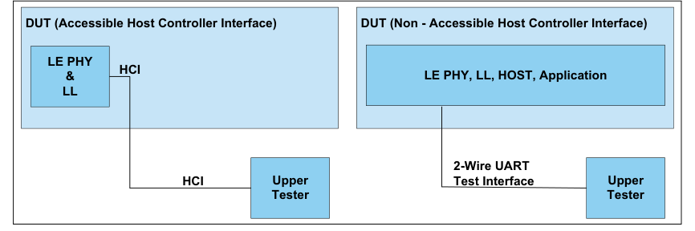

**Figure 1.1:  Setup alternatives for LE Direct Test Mode: Designs with accessible HCI (left) and designs without accessible HCI (right)**

Figure 1.2 illustrates the Bluetooth LE Direct Test Mode setup principle using a 2-wire UART interface.

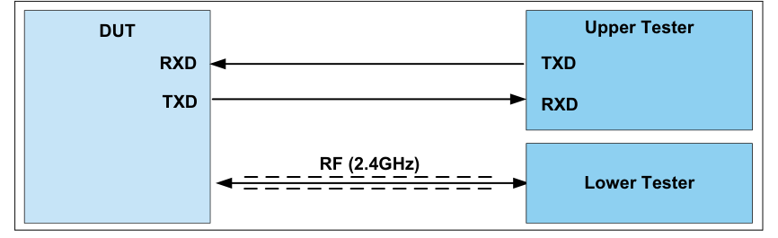

**Figure 1.2:  RF PHY test setup for Direct Test Mode (UART control)**

## 2  LOW ENERGY TEST SCENARIOS

### 2.1   TEST SEQUENCES

These sequences are used as routines and used to control an LE DUT with an accessible HCI or a 2-wire UART interface for RF testing.
The following mapping shall be performed from the RF testing commands to HCI commands and events or 2-wire UART commands and events:

| RF Test Command / Event | HCI Command / Event | 2-wire UART Command / Event |
| --- | --- | --- |
| LE TRANSMITTER TEST _ _ | LE Transmitter Test command or LE Enhanced Transmitter Test command | LE Transmitter Test |
| LE RECEIVER TEST _ _ | LE Receiver Test command or LE Enhanced Receiver Test command | LE Receiver Test |
| LE TEST END _ _ | LE Test End command | LE Test End |
| LE STATUS _ | Command Complete event | LE Test Status |
| LE PACKET REPORT _ _ | Command Complete event | LE Packet Report |

Table 2.1:  Mapping table of HCI / 2-wire Commands/Events
The HCI commands and events used in Direct Test Mode are defined in [Vol 2] Part E, Section 7.8.

### 2.2   MESSAGE SEQUENCE CHARTS

Transmitter Test

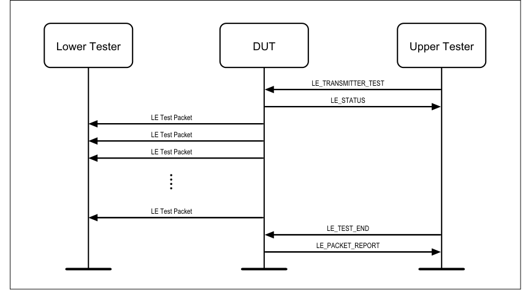

**Figure 2.1:  Transmitter Test MSC**

Receiver Test

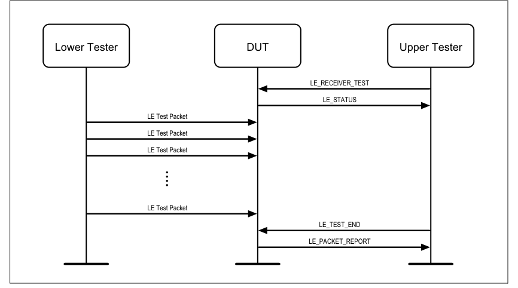

**Figure 2.2:  Receiver Test MSC**

## 3  UART TEST INTERFACE

### 3.1   UART INTERFACE CHARACTERISTICS

The UART interface characteristics shall be set to use the following parameters:
• Baud rate: One of the following shall be supported by the DUT: 1200, 2400, 9600, 14400, 19200, 38400, 57600, 115200
• Number of data bits: 8
• No parity
• 1 stop bit
• No flow control (RTS or CTS)

### 3.2   UART FUNCTIONAL DESCRIPTION

The Upper Tester shall always initiate any a test scenario using the UART interface. The DUT shall respond to the commands from the Upper Tester.
The Upper Tester sends test commands to the DUT. The DUT shall respond with a test status event or packet report event.
The Upper Tester shall not transmit further commands before it receives a response from the DUT. If the Upper Tester does not receive a response from the DUT within the time tTIMEOUT, the Upper Tester shall transmit a reset command (i.e., a test setup command with the control argument set to 0x00) to the DUT and display an appropriate error message. For the reset command, tRESPONSE and tTIMEOUT do not apply.
On reception of a reset command, the DUT shall reset all parameters to their default state.
Definitions
• All Commands and Events consist of 16 bits (2 bytes).
• The most significant bit is bit number 15.
• The least significant bit is bit number 0.
• The most significant byte is from bit 15 to 8.
• The least significant byte is from bit 7 to 0.
• Commands and Events are sent most significant byte (MSB) first, followed by the least significant byte (LSB).

### 3.3   COMMANDS AND EVENTS

#### 3.3.1  Command and Event Behavior

Table 3.1 outlines the set of commands which can be received by the DUT and the corresponding response events that can be transmitted by the DUT.

| Command (DUT RXD) | Event (DUT TXD) |
| --- | --- |
| LE Test Setup _ _ | LE Test Status SUCCESS _ _ LE Test Status FAIL _ _ |
| LE Receiver Test _ _ | LE Test Status SUCCESS _ _ LE Test Status FAIL _ _ |
| LE Transmitter Test _ _ | LE Test Status SUCCESS _ _ LE Test Status FAIL _ _ |
| LE Test End _ _ | LE Packet Report _ _ LE Test Status FAIL _ _ |

Table 3.1:  2-Wire command and event behavior

#### 3.3.2  Commands

Command packet formats are shown in Figure 3.1 and Figure 3.2.

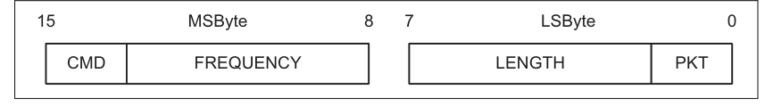

**Figure 3.1:  Command message format for Transmitter Test and Receiver Test commands**

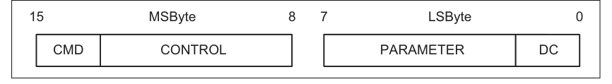

**Figure 3.2:  Command message format for Test Setup and Test End commands**

CMD (command): Size: 2 Bits

| Value b b 1 0 | Parameter Description |
| --- | --- |
| 00 | Test Setup |
| 01 | Receiver Test |
| 10 | Transmitter Test |
| 11 | Test End |

Test Setup Command: Size: 12 Bits

| Control (6 bits) | Parameter (6 bits) | Description |
| --- | --- | --- |
| 0x00 | 0x00 | RESET; the upper 2 bits of the data length for any Transmitter or Receiver commands following are set to 00, the PHY is set to LE 1M, and the receiver assumes the transmitter has a stan dard modulation index |
|  | 0x01 – 0x3F | Reserved for future use |
| 0x01 | 0x00 – 0x03 | Set the upper 2 bits of the data length for any Transmitter or Receiver commands following (to enable a length greater than 0x3F to be used) |
|  | 0x04 – 0x3F | Reserved for future use |
| 0x02 | 0x00 | Reserved for future use |
|  | 0x01 | PHY set to LE 1M |
|  | 0x02 | PHY set to LE 2M |
|  | 0x03 | PHY set to LE Coded; transmitter is to use S=8 data coding |
|  | 0x04 | PHY set to LE Coded; transmitter is to use S=2 data coding |
|  | 0x05 – 0x3F | Reserved for future use |
| 0x03 | 0x00 | Receiver assumes transmitter has a standard modulation index |
|  | 0x01 | Receiver assumes transmitter has a stable modulation index |
|  | 0x02 - 0x3F | Reserved for future use |
| 0x04 | 0x00\ | Read the test case supported features. The Test Status event will return the state of the test case sup ported features as detailed in the Test Status event (Section 3.4.1). |
|  | Any other value | Reserved for future use |

| Control (6 bits) | Parameter (6 bits) | Description |
| --- | --- | --- |
| 0x05 | 0x00 | Read supportedMaxTxOctets (see [Vol 6] Part B, Section 4.5.10) |
|  | 0x01 | Read supportedMaxTxTime (see [Vol 6] Part B, Section 4.5.10) |
|  | 0x02 | Read supportedMaxRxOctets (see [Vol 6] Part B, Section 4.5.10) |
|  | 0x03 | Read supportedMaxRxTime (see [Vol 6] Part B, Section 4.5.10) |
|  | Any other value | Reserved for future use |

Test End Command: Size: 12 Bits

| Control (6 bits) | Parameter (6 bits) | Description |
| --- | --- | --- |
| 0x00 | 0x00 | Test End Command |
| 0x00 | 0x01 – 0x3F | Reserved for future use |
| 0x01 – 0x3F | 0x00 – 0x3F | Reserved for future use |

Transmit and receive commands:
Frequency: Size: 6 Bits

| Value | Parameter Description |
| --- | --- |
| 0x00 – 0x27 | The frequency to be used; a value of N represents a frequency of (2N+2402) MHz (the available range is therefore even MHz values from 2402 to 2480 inclusive) |
| 0x28 – 0x3F | Reserved for future use |

Length: Size: 6 Bits

| Value | Parameter Description |
| --- | --- |
| 0x00 - 0x3F | The lower 6 bits of the packet length in bytes of payload data in each packet (the top two bits are set by the Test Setup command) |

PKT (Packet Type): Size: 2 Bits

| Value b b 1 0 | Parameter Description |
| --- | --- |
| 00 | PRBS9 Packet Payload |
| 01 | 11110000 Packet Payload |
| 10 | 10101010 Packet Payload |
| 11 | On the LE Uncoded PHYs: Vendor Specific On the LE Coded PHY: 11111111 |

### 3.4   EVENTS

There are two types of events sent by the DUT:
1. LE_Test_Status_Event 2. LE_Packet_Report_Event
The event packet format is shown in Figure 3.3. This packet format is used for both Test Status Events and Packet Report Events.

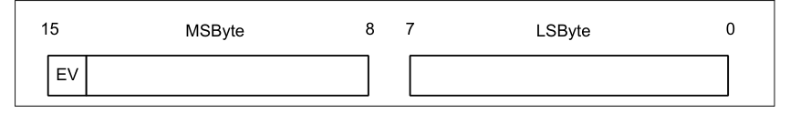

**Figure 3.3:  Event packet format**

EV (Event): Size: 1 Bit

| Value | Parameter Description |
| --- | --- |
| 0 | LE Test Status Event _ _ _ |
| 1 | LE Packet Report Event _ _ _ |

#### 3.4.1  LE_Test_Status_Event

The LE_Test_Status_Event packet format is as shown in Figure 3.4.

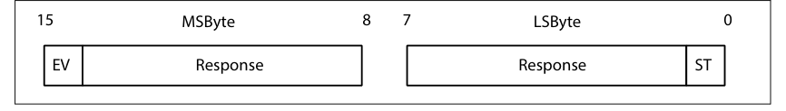

**Figure 3.4:  LE Test Status event**

ST (status): Size: 1 Bit

| Value | Parameter Description |
| --- | --- |
| 0 | Success |
| 1 | Error |

Response1 Size: 14 Bits

| Test Setup command control parameter | Value bits 1 to 142 |  |
| --- | --- | --- |
| 0x04 | Bit 1 | LE Data Packet Length Extension feature supported |
|  | Bit 2 | LE 2M PHY supported |
|  | Bit 3 | Transmitter has a Stable Modulation Index |
|  | Bits 4 to 14 | Reserved for future use |
| 0x05 | Bits 1 to 14 | Maximum transmit or receive time divided by 2 or maximum number of payload octets (depending on the parameter in the original query) that the local Controller supports for transmission of a single Link Layer Data Channel PDU. Range 0x00A4-0x2148 for times or 0x001B- 0x00FF for number of octets (all other values reserved for future use). |
| All other values |  | Reserved for future use |

1 If the event has a status of "Error" or was generated in response to a command other than Test Setup, then this field is Reserved for future use.

## 2 This field is described as having bits 1 to 14 rather than 0 to 13 to avoid confusion.

#### 3.4.2  LE_Packet_Report_Event

The LE_Packet_Report_Event packet format is shown in Figure 3.5. The Packet Count parameter indicates the number of received LE Test Packets. The Packet Count in the Packet Report ending a transmitter test shall be 0.

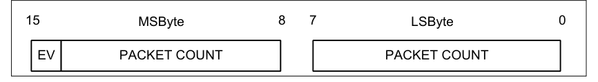

**Figure 3.5:  LE Packet Report event**

PACKET COUNT: Size: 15 Bits

| Value | Parameter Description |
| --- | --- |
| N | N is the number of packets received Range = 0 to 32767. |

Note: The DUT is not responsible for any overflow conditions of the packet counter. That responsibility belongs with the RF PHY Tester or other auxiliary equipment.

### 3.5   TIMING – COMMAND AND EVENT

The timing requirements are as shown in Table 3.2.

| Symbol | Parameter | Min. | Max. Un |
| --- | --- | --- | --- |
| b ERR | Baud rate accuracy |  | ±5 % |
| t MIN | The time between the first and second byte of the command (end of stop bit to start of start bit) | 0 | 5 m |
| t RESPONSE | The time from a DUT receiving a command (end of stop bit) until the DUT responds (start of start bit) | 0 | 50 m |
| t TURNAROUND | The time from when the tester receives a response (end of stop bit) until the tester sends another com- mand (start of start bit) | 5 | - m |
| t TIMEOUT | The time from when a tester sends a command (end of stop bit) until the tester times out (not having received end of the stop bit in the response) | 51 | 100 m |

Table 3.2:  Parameter requirements table for 2-wire UART interface

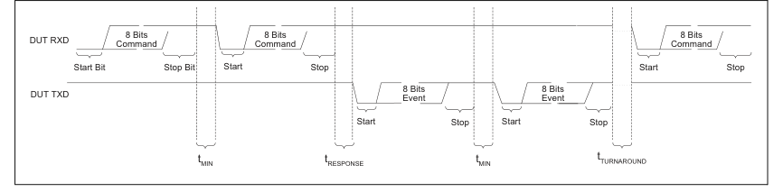

**Figure 3.6:  Command and event timing on 2-wire UART interface**

The commands and events shall be transmitted with two 8-bit bytes with a maximum time between the 2 transmissions. A timeout is required for no response or an invalid response from the DUT.

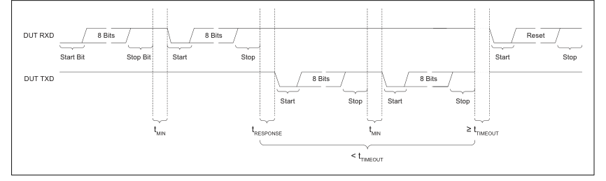

**Figure 3.7:  Command and event timing on 2-wire UART interface showing timeout**

## 4  LE TEST PACKET DEFINITION

### 4.1   LE TEST PACKETS FORMAT

The LE Test packet format for the LE Uncoded PHYs shall be as shown in Figure 4.1. The LE Test packet format for the LE Coded PHY shall be as shown in Figure 4.2. LE test packets are required for LE RF PHY conformance testing using Direct Test Mode.
Depending on the test, the packet payload content may vary.
For the LE Uncoded PHYs, the LE test packet consists of the following fields; preamble (8 bits with the LE 1M PHY or 16 bits with the LE 2M PHY), synchronization word (32 bits), PDU header (8 bits), PDU length (8 bits), payload (0-2040 bits) and CRC (24 bits).

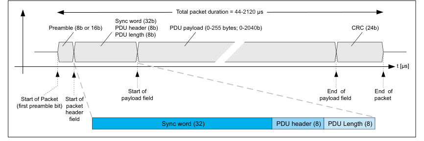

**Figure 4.1:  LE Test packet format for the LE Uncoded PHYs**

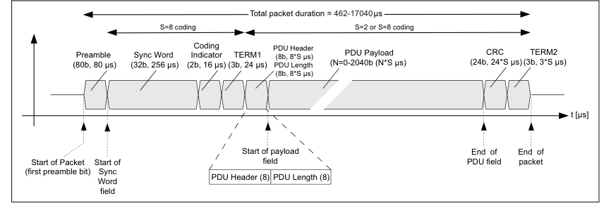

**Figure 4.2:  LE Test packet format for the LE Coded PHY**

#### 4.1.1  Whitening

LE test packets shall not use whitening.

#### 4.1.2  Preamble and Synchronization Word

LE test packets shall have ‘10010100100000100110111010001110’ (in transmission order) as the synchronization word. The preamble for all LE test packets is thus ‘10101010’ (in transmission order) when the device under test is configured for the LE 1M PHY, ‘1010101010101010’ (in transmission order) if the device under test is configured for the LE 2M PHY, and the preamble described in [Vol 6] Part B, Section 2.1.1 if the device under test is configured for the LE Coded PHY.

#### 4.1.3  CRC

The CRC shift register shall be preset with 0x555555 for every LE test packet.

#### 4.1.4  LE Test Packet PDU

The LE test packet PDU consists of an 8-bit header, an 8-bit length field and a variable size payload. Its structure is as shown in Figure 4.3.

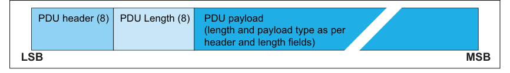

**Figure 4.3:  LE Test packet PDU structure**

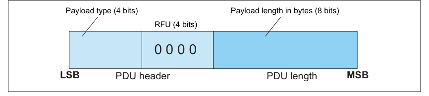

**Figure 4.4:  LE Test packet header and length field structure**

The first four bits of the PDU header field indicate the payload content type as defined in Table 4.1. The length field expresses the payload field length in bytes.
Note: On the LE Coded PHY, this section defines the PDU contents before coding.

| Payload type b b b b 3 2 1 0 | Payload description |
| --- | --- |
| 0000b | PRBS9 sequence ‘11111111100000111101…’ (in transmission order) as described in Section 4.1.5 |
| 0001b | Repeated ‘11110000’ (in transmission order) sequence as described in Section 4.1.5 |
| 0010b | Repeated ‘10101010’ (in transmission order) sequence as described in Section 4.1.5 |
| 0011b | PRBS15 sequence as described in Section 4.1.5 |
| 0100b | Repeated ‘11111111’ (in transmission order) sequence |
| 0101b | Repeated ‘00000000’ (in transmission order) sequence |
| 0110b | Repeated ‘00001111’ (in transmission order) sequence |
| 0111b | Repeated ‘01010101’ (in transmission order) sequence |

Table 4.1:  LE test packet PDU header’s Type field encoding
Example: For LE test packets with 0x0F payload contents (‘11110000’ in transmission order) and with an LE test packet payload length of 37 bytes (296 bits), the LE test packet header and length type field will be ‘1000000010100100’ in transmission order.

#### 4.1.5  LE Test Packet Payload Description

The LE test packet payload content alternatives required for the Bluetooth low energy RF PHY conformance tests are:
PRBS9:
A 9-bit pseudorandom binary sequence used for wanted signal payload con- tent. The PRBS9 sequence repeats itself after the (29 -1 = 511) bit. The PRBS9 sequence may be generated in a nine stage shift register whose 5th and 9th stage outputs are added in a modulo-two addition stage (see Figure 4.5) and the result is fed back to the input of the first stage. The sequence begins with the first ONE of 9 consecutive ONEs (i.e. the shift register is initialized with nine ONEs).

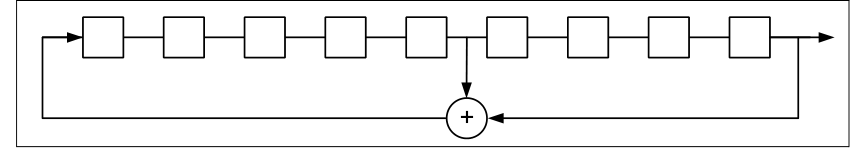

**Figure 4.5:  Linear feedback shift register for generation of the PRBS9 sequence**

The same pseudorandom sequence of bits shall be used for each transmission (i.e. the packet is repeated).
PRBS15:
A 15-bit pseudorandom binary sequence that is used for the interfering signal and can optionally be used for wanted signal payload content. The PRBS15 sequence repeats itself after the (215 -1 = 32767) bit. The PRBS15 sequence may be generated in a fifteen stage shift register whose 14th and 15th stage outputs are added in a modulo-two addition stage (See Figure 4.6) and the result is fed back to the input of the first stage. The sequence begins with the first ONE of 15 consecutive ONEs (i.e., the shift register is initialized with fifteen ONEs).
This PRBS15 definition is consistent with ITU T-REC-01 150-199605-I. SERIES O: SPECIFICATIONS OF MEASURING EQUIPMENT - Equipment for the measurement of digital and analogue/digital parameters.

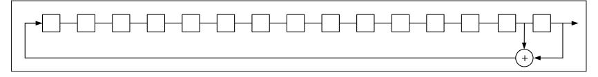

**Figure 4.6:  Linear feedback shift register for generation of the PRBS15 sequence**

The same pseudorandom sequence of bits shall be used for each transmission (i.e. the packet is repeated).
10101010:
Repeated sequence of alternating 1’s and 0’s, starting at the first payload bit and ending at the start of the first bit in the CRC field. This pattern is used to verify the frequency deviation and the Gaussian filtering properties of the trans- mitter modulator.
11110000:
Repeated sequence of alternating 0’s and 1’s in groups of four (i.e. 1111000011110000…), starting at the first payload bit and ending at the start of the first bit in the CRC field. This pattern is used to verify the frequency devia- tion and the Gaussian filtering properties of the transmitter modulator.

#### 4.1.6  LE Test Packet Interval

While in LE direct TX mode, LE test packets shall be transmitted from the EUT with a packet interval I(L) as defined below; see the top half of Figure 4.7 for reference.
While in LE direct RX mode, the nominal packet interval of the LE test packets transmitted from the tester is I(L), but the tester packet interval may be extended to a maximum of T(L) upon change of the dirty transmitter parameter settings and during verification of the EUT PER reporting functionality. See the bottom half of Figure 4.7 for reference.

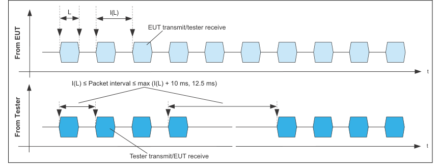

**Figure 4.7:  LE Test packet interval in LE Direct Test Mode**

For an LE Test Packet length of L µs, I(L) = ceil((L + 249) / 625) * 625 µs, where ceil(x) is the smallest integer greater than or equal to x, and T(L) = max (I(L) + 10 ms, 12.5 ms).
Core System Package [Wireless
Coexistence volume]
Specification of the Bluetooth  System
®
Specification Volume 7
Covered Core Package Version: 5.0 Publication Date: Dec 06 2016
Revision History
The Revision History is shown in the [Vol 0] Part C, Appendix.
Contributors
The persons who contributed to this specification are listed in the [Vol 0] Part C, Appendix.
Web Site
This specification can also be found on the official Bluetooth web site: https://www.bluetooth.org/en-us/specification/adopted-specifications
Disclaimer and Copyright Notice
Use of this specification is your acknowledgement that you agree to and will comply with the following notices and disclaimers. You are advised to seek appropriate legal, engineering, and other professional advice regarding the use, interpretation, and effect of this specification.
Use of Bluetooth specifications by members of Bluetooth SIG is governed by the membership and other related agreements between Bluetooth SIG and its members, including those agreements posted on Bluetooth SIG’s website located at www.bluetooth.com. Any use of this specification by a member that is not in compliance with the applicable membership and other related agreements is prohibited and, among other things, may result in (i) termination of the applicable agreements and (ii) liability for infringement of the intellectual property rights of Bluetooth SIG and its members.
Use of this specification by anyone who is not a member of Bluetooth SIG is prohibited and is an infringement of the intellectual property rights of Bluetooth SIG and its members. The furnishing of this specification does not grant any license to any intellectual property of Bluetooth SIG or its members. THIS SPECIFICATION IS PROVIDED “AS IS” AND BLUETOOTH SIG, ITS MEMBERS AND THEIR AFFILIATES MAKE NO REPRESENTATIONS OR WARRANTIES AND DISCLAIM ALL WARRANTIES, EXPRESS OR IMPLIED, INCLUDING ANY WARRANTIES OF MERCHANTABILITY, TITLE, NON-INFRINGEMENT, FITNESS FOR ANY PARTICULAR PURPOSE, OR THAT THE CONTENT OF THIS SPECIFICATION IS FREE OF ERRORS. For the avoidance of doubt, Bluetooth SIG has not made any search or investigation as to third parties that may claim rights in or to any specifications or any intellectual property that may be required to implement any specifications and it disclaims any obligation or duty to do so.
TO THE MAXIMUM EXTENT PERMITTED BY APPLICABLE LAW, BLUETOOTH SIG, ITS MEMBERS AND THEIR AFFILIATES DISCLAIM ALL LIABILITY ARISING OUT OF OR RELATING TO USE OF THIS SPECIFICATION AND ANY INFORMATION CONTAINED IN THIS SPECIFICATION, INCLUDING LOST REVENUE, PROFITS, DATA OR PROGRAMS, OR BUSINESS INTERRUPTION, OR FOR SPECIAL, INDIRECT, CONSEQUENTIAL, INCIDENTAL OR PUNITIVE DAMAGES, HOWEVER CAUSED AND REGARDLESS OF THE THEORY OF LIABILITY, AND EVEN IF BLUETOOTH SIG, ITS MEMBERS OR THEIR AFFILIATES HAVE BEEN ADVISED OF THE POSSIBILITY OF THE DAMAGES.
If this specification is a prototyping specification, it is solely for the purpose of developing and using prototypes to verify the prototyping specifications at Bluetooth SIG sponsored IOP events. Prototyping Specifications cannot be used to develop products for sale or distribution and prototypes cannot be qualified for distribution.
Products equipped with Bluetooth wireless technology ("Bluetooth Products") and their combination, operation, use, implementation, and distribution may be subject to regulatory controls under the laws and regulations of numerous countries that regulate products that use wireless non-licensed spectrum. Examples include airline regulations, telecommunications regulations, technology transfer controls and health and safety regulations. You are solely responsible for complying with all applicable laws and regulations and for obtaining any and all required authorizations, permits, or licenses in connection with your use of this specification and development, manufacture, and distribution of Bluetooth Products. Nothing in this specification provides any information or assistance in connection with complying with applicable laws or regulations or obtaining required authorizations, permits, or licenses.
Bluetooth SIG is not required to adopt any specification or portion thereof. If this specification is not the final version adopted by Bluetooth SIG’s Board of Directors, it may not be adopted. Any specification adopted by Bluetooth SIG’s Board of Directors may be withdrawn, replaced, or modified at any time. Bluetooth SIG reserves the right to change or alter final specifications in accordance with its membership and operating agreements.
Copyright © 1999 - 2016. The Bluetooth word mark and logos are owned by Bluetooth SIG, Inc. All copyrights in the Bluetooth Specifications themselves are owned by Ericsson AB, Lenovo (Singapore) Pte. Ltd., Intel Corporation, Microsoft Corporation, Nokia Corporation, Toshiba Corporation and Apple, Inc. Other third-party brands and names are the property of their respective owners.
Core System Package [Wireless Coexistence volume]
Part A
PART A: MWS COEXISTENCE LOGICAL SIGNALING SPECIFICATION
This part specifies the Mobile Wireless Standards (MWS) coexistence logical interface between the Host Controller and an MWS device.
CONTENTS

## 1  INTRODUCTION

This part of the Bluetooth Core Specification describes the MWS Coexistence Logical Signaling. A Bluetooth Controller may incorporate a real-time transport interface to transport the logical signals defined in this section between the Bluetooth Controller and an MWS device.
Figure 1.1 depicts the signaling and messaging architecture.

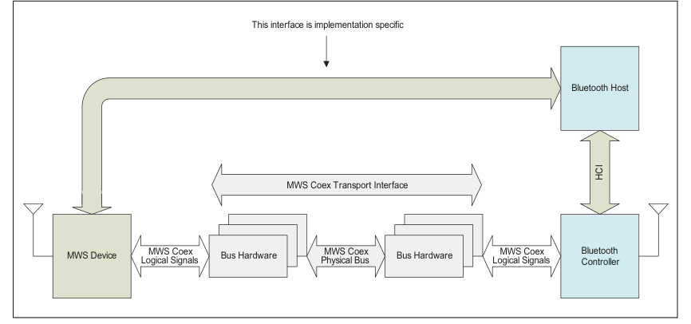

**Figure 1.1:  Coexistence signaling/messaging architecture**

MWS Coexistence logical signaling is designed to enable a standard interface to allow an MWS device and a Bluetooth Controller to exchange information and support cooperative coexistence.
MWS Coexistence logical signaling defines a set of signals between the collocated Bluetooth Controller and MWS device. Those signals carry time critical, real-time information such as the start point of an MWS frame. The coexistence logical signaling architecture also includes a transparent data messaging mechanism to enable passing of information between the MWS device and Bluetooth Controller when such information cannot tolerate the long latency (tens of milliseconds) of the signaling path via the Bluetooth Host.

## 2  LOGICAL INTERFACE

### 2.1   COEXISTENCE SIGNALS

Table 2.1 defines the logical signals. These logical signals assist in time alignment, protecting the MWS device and the Bluetooth Controller from mutual interference, thus maximizing the usability of the Bluetooth radio.

| Name | Direction | Description |
| --- | --- | --- |
| FRAME SYNC _ | MWS → Bluetooth | See Section 2.1.1 |
| MWS RX _ | MWS → Bluetooth | See Section 2.1.2 |
| BLUETOOTH RX PRI _ _ | Bluetooth → MWS | See Section 2.1.3 |
| BLUETOOTH TX ON _ _ | Bluetooth → MWS | See Section 2.1.4 |
| MWS PATTERN _ | MWS → Bluetooth | See Section 2.1.5 |
| MWS TX _ | MWS → Bluetooth | See Section 2.1.6 |
| 802 RX PRI _ _ | Bluetooth → MWS | See Section 2.1.7 |
| 802 TX ON _ _ | Bluetooth → MWS | See Section 2.1.8 |
| MWS INACTIVITY DURATION _ _ | MWS → Bluetooth | See Section 2.1.9 |
| MWS SCAN FREQUENCY _ _ | MWS → Bluetooth | See Section 2.1.10 |

Table 2.1:  Coexistence signals
The first 8 of these (FRAME_SYNC, MWS_RX, BLUETOOTH_RX_PRI, BLUETOOTH_TX_ON, MWS_PATTERN, MWS_TX, 802_RX_PRI, and 802_TX_ON) are also referred to as the "real-time coexistence signals".
Many of the signals have associated parameters, which are configured by the Bluetooth Host using HCI commands. There is no requirement for signals that are used internally to be connected to an external interface, although testing requires external control of the FRAME_SYNC signal. For example, a combo- device that integrates a Bluetooth Controller and an MWS radio together does not need to bring out the coexistence signals.
Section 2.2 provides recommended values for the defined offset and jitter parameters.

#### 2.1.1  FRAME_SYNC

The FRAME_SYNC signal is sent by the MWS device to indicate the time of the beginning of MWS frames according to the MWS network timing. It provides the anchor point for the Bluetooth Controller to properly align Bluetooth transmission and reception activity with the MWS network frame structure. The time when FRAME_SYNC is sent over the transport, adjusted for Ext_Frame_Sync_Assert_Offset, indicates the start time of the first
Period_Duration parameter in the HCI_Set_External_Frame_Configuration command.
The MWS device will inform the Bluetooth Controller about changes to the layout and timing of the MWS frame by issuing new HCI_Set_External_Frame_Configuration commands.

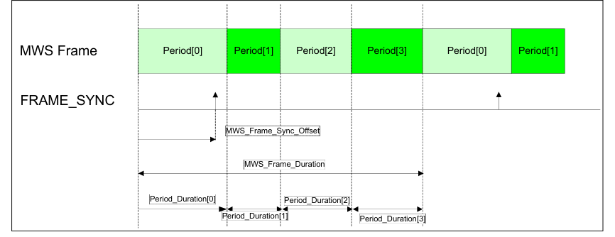

**Figure 2.1:  Illustration of FRAME_SYNC**

#### 2.1.2  MWS_RX

The MWS_RX signal is sent by the MWS device to indicate that an MWS reception is occurring and to request that the Bluetooth Controller cease ongoing transmission and not start a new transmission. The Bluetooth Controller can occasionally disregard the MWS_RX signal for critical transmissions.
The MWS RX signal should be de-asserted at the time an MWS device stops actively receiving. If there are multiple distinct periods of reception within an MWS downlink duration, the signal may stay asserted until the last period has finished receiving.

#### 2.1.3  BLUETOOTH_RX_PRI

The BLUETOOTH_RX_PRI signal is used by the Bluetooth Controller to request that the MWS device cease its transmission and/or refrain from starting a transmission because the Bluetooth Controller is expecting a high priority reception.
The signal should be used minimally by the Bluetooth system so as not to adversely affect the MWS system. There is no guarantee that the MWS device will honor the signal and not transmit or abort an ongoing transmission.

#### 2.1.4  BLUETOOTH_TX_ON

The BLUETOOTH_TX_ON signal is sent by the Bluetooth Controller to indicate that it is actively transmitting.

#### 2.1.5  MWS_PATTERN

The MWS_PATTERN signal is sent by the MWS device to inform the Bluetooth Controller which MWS_PATTERN is in use.
Up to three different MWS_PATTERNs can be selected: 0, 1, and 2. The MWS device may indicate that the MWS_PATTERN has not changed by setting it to 3. The definitions of the patterns are communicated to the Bluetooth Controller using the HCI_Set_MWS_PATTERN_Configuration command. If the pattern is not currently configured, the behaviour is equivalent to setting a pattern that allows unrestricted activity by the Bluetooth Controller.
At the start of each MWS Frame, as defined by the FRAME_SYNC signal plus the MWS_Frame_Sync_Offset, the most recent MWS_PATTERN value takes effect as follows.
• If it is 3, the current pattern continues in use.
• If it is the index of the current pattern, then that pattern is restarted.
• Otherwise the indicated pattern is started.

#### 2.1.6  MWS_TX

The MWS_TX signal is sent by the MWS device to indicate its transmission state.
The signal should be asserted at the beginning of an MWS transmission and de-asserted at the end of a transmission. If there are multiple transmission periods during an uplink frame, the signal may stay asserted until the end of the last transmission period.

#### 2.1.7  802_TX_ON

Bluetooth technology and 802.11 may be collocated and share an interface to coordinate access to the 2.4 GHz ISM band.
The 802_TX_ON is used by the 802.11 device to indicate the state of the 802.11 transmission.
Interference generated by 802.11 to the MWS device will not necessarily be distinguishable from interference created by Bluetooth transmissions.
This signal allows the MWS device to distinguish the interference generated by 802.11 transmissions from the interference generated by the Bluetooth transmissions. The MWS device can use that information to optimize its channel access.

#### 2.1.8  802_RX_PRI

This signal requests that the MWS device stop or refrain from any transmission because the WLAN device collocated with the Bluetooth Controller is expecting a high priority reception.
The signal should be used minimally by the 802.11 system so as not to adversely affect the MWS system. There is no guarantee that the MWS device will honor the signal and not transmit or abort an ongoing transmission.

#### 2.1.9  MWS_INACTIVITY_DURATION

The MWS_INACTIVITY_DURATION signal provides the time duration until the MWS device is active again. Subsequent MWS_INACTIVITY_DURATION signals override previously sent time durations.
MWS_INACTIVITY_DURATION may be set to zero (i.e. cancel), infinite, or a positive finite duration. The transport layer defines the value for infinite duration and the set of finite durations available.

#### 2.1.10  MWS_SCAN_FREQUENCY

The MWS_SCAN_FREQUENCY signal provides an index to a table of RF frequencies during MWS scan operation.
The MWS device signals MWS_SCAN_FREQUENCY if it starts an inter- frequency scan.
Setting MWS_SCAN_FREQUENCY to a non-zero value indicates the start of the MWS scan period. Setting MWS_SCAN_FREQUENCY to zero indicates the end of the scan period.
The Bluetooth Controller should avoid any transmissions that can interfere with the scan while a scan is active. The Bluetooth Controller can occasionally disregard the signal for critical transmissions.

### 2.2   TOLERANCES FOR OFFSETS AND JITTER

This section lists the recommended tolerances for the signal assertion and de- assertion offsets and jitter for those signals. Note: The transmitting side should use a value within the range and the receiving side should accept any value within the range and may accept other values.
An offset is a static advance notification or delay between the real physical event and the time when the corresponding signal is issued.
Jitter is variation in the timing of each signal from ideal timing.
Signals that are turned on and off around a period of time have specified values for both assertion and de-assertion offsets and jitter. Signals that represent a single event at a single instant in time have only assertion offset and jitter timing specified.
All jitter values are given as an unsigned value representing the maximum allowable jitter in positive and negative directions. De-assertion and MWS_Frame_Sync_Assert_Offset may be negative (i.e., signal is asserted before the event) or positive (i.e., signal is asserted after the event). All other assertion signals should be negative (i.e., signal is issued before the event).

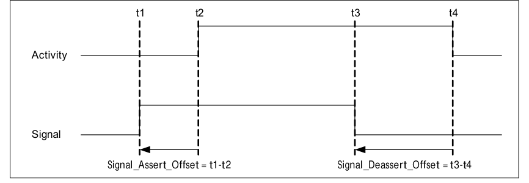

**Figure 2.2:  Signal with negative Assert Offset and negative De-assert Offset**

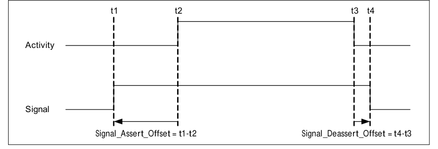

**Figure 2.3:  Signal with negative Assert Offset and positive De-assert Offset**

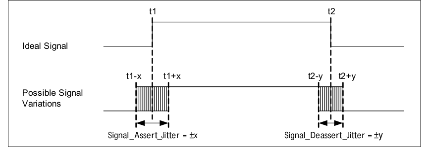

**Figure 2.4:  Signal assertion and de-assertion jitter**

| Parameter | Earliest | Latest |
| --- | --- | --- |
| MWS Frame Sync Assert Offset _ _ _ _ | -Ext Frame Duration _ _ | +Ext Frame Duration _ _ |
| MWS Frame Sync Assert Jitter _ _ _ _ | N/A | ±3 µs |
| MWS Rx Assert Offset _ _ _ | -2 ms | -20 µs |
| MWS Rx Assert Jitter _ _ _ | N/A | ±5 µs |
| MWS Rx Deassert Offset _ _ _ | -2 ms | 0 |
| MWS Rx Deassert Jitter _ _ _ | N/A | ±5 µs |
| MWS Tx Assert Offset _ _ _ | -2 ms | 0 |
| MWS Tx Assert Jitter _ _ _ | N/A | ±5 µs |
| MWS Tx Deassert Offset _ _ _ | -2 ms | 0 |
| MWS Tx Deassert Jitter _ _ _ | N/A | ±5 µs |
| MWS Pattern Assert Offset _ _ _ | 0 | +Ext Frame Duration _ _ |
| MWS Pattern Assert Jitter _ _ _ | N/A | ±5 µs |
| MWS Inactivity Duration Assert Offset _ _ _ _ | 0 | +Ext Frame Duration _ _ |
| MWS Inactivity Duration Assert Jitter _ _ _ _ | N/A | ±5 µs |
| MWS Scan Frequency Assert Offset _ _ _ _ | -2 ms | -20 µs |
| MWS Scan Frequency Assert Jitter _ _ _ _ | N/A | ±5 µs |
| Bluetooth Rx Priority Assert Offset _ _ _ _ | -1 ms | 0 |
| Bluetooth Rx Priority Assert Jitter _ _ _ _ | N/A | ±5 µs |
| Bluetooth Rx Priority Deassert Offset _ _ _ _ | -1 ms | 0 |
| Bluetooth Rx Priority Deassert Jitter _ _ _ _ | N/A | ±5 µs |
| 802 Rx Priority Assert Offset _ _ _ _ | -1 ms | 0 |
| 802 Rx Priority Assert Jitter _ _ _ _ | N/A | ±5 µs |

Table 2.2:  Tolerances for offsets and jitter

| Parameter | Earliest | Latest |
| --- | --- | --- |
| 802 Rx Priority Deassert Offset _ _ _ _ | -1 ms | 0 |
| 802 Rx Priority Deassert Jitter _ _ _ _ | N/A | ±5 µs |
| Bluetooth Tx On Assert Offset _ _ _ _ | -100 µs | 0 |
| Bluetooth Tx On Assert Jitter _ _ _ _ | N/A | ±5 µs |
| Bluetooth Tx On Deassert Offset _ _ _ _ | 0 | 100 µs |
| Bluetooth Tx On Deassert Jitter _ _ _ _ | N/A | ±5 µs |
| 802 Tx On Assert Offset _ _ _ _ | -100 µs | 0 |
| 802 Tx On Assert Jitter _ _ _ _ | N/A | ±5 µs |
| 802 Tx On Deassert Offset _ _ _ _ | 0 | 100 µs |
| 802 Tx On Deassert Jitter _ _ _ _ | N/A | ±5 µs |
| MWS Priority Assert Offset Request _ _ _ _ | -1 ms | -200 µs |

Table 2.2:  Tolerances for offsets and jitter
Core System Package [Wireless Coexistence volume]
Part B
PART B: WIRELESS COEXISTENCE INTERFACE 1 (WCI-1) TRANSPORT SPECIFICATION
This part specifies the MWS Wireless Coexistence Interface 1 (WCI-1) Transport Interface between the Bluetooth Controller and an MWS device.
CONTENTS

## 1  INTRODUCTION

This part of the Bluetooth Core Specification describes the MWS Wireless Coexistence Interface 1 (WCI-1) Transport for a Bluetooth Controller. It provides a half-duplex UART carrying logical signals framed as UART characters. Only the TXD and RXD UART signals are used.
Note: The physical layers for WCI-1 and WCI-2 (See [Vol 7] Part C) differ but the transport layers are identical.

## 2  PHYSICAL LAYER

The WCI-1 physical layer multiplexes the UART TXD and RXD onto a single wire, using drive strengths to resolve contention. The MWS device uses direct drive to transmit its signals, while the Bluetooth Controller uses a pull up / pull down drive to transmit its signals. The configuration is illustrated in Figure 2.1.

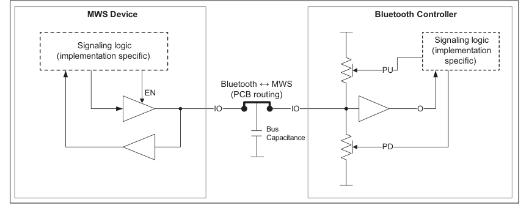

**Figure 2.1:  WCI-1 physical interface**

A high voltage on the wire shall be interpreted as a logical 1 and a low voltage shall be interpreted as a logical 0. The actual voltage levels are vendor specific.
The MWS device output buffer shall be in the high impedance state when it is not transmitting. The Bluetooth Controller shall be in the pulled-up state when it is not transmitting.
The MWS device may transmit at any time, using the waveform illustrated in Figure 2.2.

**Figure 2.2:  UART waveform for MWS-to-Bluetooth signals**

Every MWS-to-Bluetooth message shall be preceded by a preamble, which consists of 5 bits ‘01011’ (in transmission order). The preamble is sent at a baud rate that is at least twice the baud rate of Bluetooth-to-MWS signals1. The nominal drive strength for the preamble should be targeted at no more than 250Ω equivalent output resistance. The Bluetooth Controller shall be able to detect the preamble and go into the reception mode to receive the message
1. The preamble baud rate should be one that is supported by the underlying UART of the Bluetooth device.
that follows. If the Bluetooth Controller detects a preamble while it is transmitting, it shall stop the transmission and go into the reception mode. After completion of the reception, it may retransmit the message that was interrupted.
When the Bluetooth Controller is not in the reception mode, it may transmit a message using the pull up / pull down mechanism. The nominal pull strength should be targeted at 4 kΩ ± 1 kΩ equivalent resistance for both pull up and pull down. The Bluetooth-to-MWS waveform is illustrated in Figure 2.3.

**Figure 2.3:  UART waveform for Bluetooth-to-MWS signals**

### 2.1   PHYSICAL SIGNAL SPECIFICATIONS (INFORMATIVE)

The tables below provide more complete specifications for the physical signals. They are provided as a reference to device makers:

| Symbol | Parameter | Condition | Value |  |
| --- | --- | --- | --- | --- |
|  |  |  | Min | Max |
| V IL | Low level input voltage | V =1.8~2.5V1 DD | -0.5V | 0.2V DD |
| V IH | High level input voltage | V =1.8~2.5V1 DD | 0.8 V DD | V +0.5V DD |
| V OL | Low level output voltage (with extra pull high R ) B | V =1.8~2.5V1 DD R =2.5kΩ B | 0 | 0.1V DD |
| V OH | High level output voltage (with extra pull low R ) B | V =1.8~2.5V1 DD R =2.5kΩ B | 0.9V DD | V DD |
| C IO | Capacitance for I/O |  | -- | 5pF |
| CB | Capacitive load for bus |  | -- | 10pF |
| R ON | Turn on impedance |  |  | 250Ω |
| T R | Rise time (10% to 90% swing time, with extra pull low R and capacitive load B C = C + other IO) L B | R =2.5kΩ B C =15pF L | -- | 50 ns |
| T F | Fall time (90% to 10% swing time, with extra pull high R B and capacitive load C = C L B + other IO) | R =2.5kΩ B C =15pF L | -- | 50 ns |

Table 2.1:  WCI-1 UART physical signal specification for the MWS device

| Symbol | Parameter | Condition | Value |  |
| --- | --- | --- | --- | --- |
|  |  |  | Min | Max |
| F | Frequency |  | (1-1%)*4MHz2 | (1+1%)*4MHz |
| CLK j | Clock jitter |  |  | 1% |

Table 2.1:  WCI-1 UART physical signal specification for the MWS device

| Symbol | Parameter | Condition | Value |  |
| --- | --- | --- | --- | --- |
|  |  |  | Min | Max |
| V IL | Low level input voltage | V =1.8~2.5V1 DD | -0.5V | 0.2V DD |
| V IH | High level input voltage | V =1.8~2.5V1 DD | 0.8V DD | V +0.5V DD |
| V OL | Low level output voltage | V =1.8~2.5V1 DD | 0 | 0.1V DD |
| V OH | High level output voltage | V =1.8~2.5V1 DD | 0.9V DD | V DD |
| C IO | Capacitance for I/O |  | -- | 5 pF |
| CB | Capacitive load for bus |  | -- | 10 pF |
| R P | Pull up/pull down resistance |  | 3kΩ | 5kΩ |
| T R | Rise time (10% to 90% swing time, with capacitive load C = C + other IO) L B | C =15pF L | -- | 220 ns |
| T F | Fall time (90% to 10% swing time, with capacitive load C = C + other IO) L B | C =15pF L | -- | 220 ns |
| F | Frequency |  | (1-1%)*1MHz2 | (1+1%)*1MHz |
| CLK j | Clock jitter |  |  | 1% |

Table 2.2:  WCI-1 UART physical signal specification for the Bluetooth Controller
Notes:
1. The voltage levels are vendor specific. The tables in this section do not cover all possible ranges of voltage for all devices, nor is it required that a single device be able to operate in the full range indicated here.
2. The frequencies are vendor specific.

## 3  TRANSPORT LAYER

The transport layer defines the mapping of the logical coexistence signals (see [Vol 7] Part A) onto the physical transport channel.
The 8-bit UART character is divided into two portions with three bits for the message type indicator and five bits for the message body. The bit with index 0 is the LSB and shall be transmitted first.

| b0 | b1 | b2 | b3 | b4 | b5 | b6 | b7 |
| --- | --- | --- | --- | --- | --- | --- | --- |
| Type[0] | Type[1] | Type[2] | MSG[0] | MSG[1] | MSG[2] | MSG[3] | MSG[4] |

Table 3.1:  Transport layer format

### 3.1   MESSAGE TYPES

This section describes the message formats for the logical coexistence signals. The message types are listed in Table 3.2.

| Message Type Indicator | Direction | Message Type |
| --- | --- | --- |
| 0 | MWS ↔ Bluetooth | Real-time Signal message |
| 1 | MWS ↔ Bluetooth | Transport Control message |
| 2 | MWS ↔ Bluetooth | Transparent Data message |
| 3 | MWS → Bluetooth | MWS Inactivity Duration message |
|  | Bluetooth → MWS | RFU |
| 4 | MWS → Bluetooth | MWS Scan Frequency message |
|  | Bluetooth → MWS | RFU |
| 5 | MWS → Bluetooth | RFU |
|  | Bluetooth → MWS | RFU |
| 6 |  | Vendor specific |
| 7 |  | Vendor specific |

Table 3.2:  Message types
The logical coexistence signals are listed in Table 3.3.

| Signal Name | Description |
| --- | --- |
| FRAME SYNC _ | See [Vol 7] Part A, Section 2.1.1 |

Table 3.3:  Coexistence signals

| Signal Name | Description |
| --- | --- |
| MWS RX _ | See [Vol 7] Part A, Section 2.1.2 |
| BLUETOOTH RX PRI _ _ | See [Vol 7] Part A, Section 2.1.3 |
| BLUETOOTH TX ON _ _ | See [Vol 7] Part A, Section 2.1.4 |
| MWS PATTERN _ | See [Vol 7] Part A, Section 2.1.5 |
| MWS TX _ | See [Vol 7] Part A, Section 2.1.6 |
| 802 TX ON _ _ | See [Vol 7] Part A, Section 2.1.7 |
| 802 RX PRI _ _ | See [Vol 7] Part A, Section 2.1.8 |
| MWS INACTIVITY DURATION _ _ | See [Vol 7] Part A, Section 2.1.9 |
| MWS SCAN FREQUENCY _ _ | See [Vol 7] Part A, Section 2.1.10 |

Table 3.3:  Coexistence signals

#### 3.1.1  Real-time Signal Message (Type 0)

The Real-time Signal message is used to transport the real-time coexistence signals (see [Vol 7] Part A) over the WCI-1 transport interface.
The Real-time Signal message conveys all the real-time coexistence signals in one message. The time reference point for the Real-time Signal message is the end of MSG[4] (i.e. the transition to the STOP bit).
Two Real-time Signal messages are defined, one from the Bluetooth Controller to the MWS device and another from the MWS device to the Bluetooth Controller.

| MSG[0] | MSG[1] | MSG[2] | MSG[3] | MSG[4] |
| --- | --- | --- | --- | --- |
| FRAME SYNC _ | MWS RX _ | MWS TX _ | MWS PATTERN[0] _ | MWS PATTERN[1] _ |

Table 3.4:  Real-time Signal message from MWS device to Bluetooth Controller

| MSG[0] | MSG[1] | MSG[2] | MSG[3] | MSG[4 |
| --- | --- | --- | --- | --- |
| BLUETOOTH RX PRI _ _ | BLUETOOTH TX ON _ _ | 802 RX PRI _ _ | 802 TX ON _ _ | RFU |

Table 3.5:  Real-time Signal message from Bluetooth Controller to MWS device

#### 3.1.2  Transport Control Message (Type 1)

The Transport Control message can request state information from the MWS device’s coexistence interface.

| MSG[0] | MSG[1] | MSG[2] | MSG[3] | MSG[4] |
| --- | --- | --- | --- | --- |
| RESEND REAL TIME _ _ | RFU | RFU | RFU | RFU |

Table 3.6:  Transport Control message

| Signal Name | Description |
| --- | --- |
| RESEND REAL TIME _ _ | This bit is set if a device wants to get a status update of the real- time coexistence signals. The signal is usually used after wake- up from sleep of the transport interface. If the receiving device’s transport interface is awake it shall send a Real-time message with the current status of the real-time coexistence signals within 4 UART character periods. If the signa is not received within 4 UART character periods the device is con sidered asleep. |

Table 3.7:  Transport control signals

#### 3.1.3  Transparent Data Message (Type 2)

The Transparent Data message can be used to exchange non-time critical signals between the MWS device and the Bluetooth Controller. The interface does not guarantee the delivery of a message. Protocol and content of the message are vendor specific.
The least significant nibble of each octet shall be transmitted first.
A least significant nibble shall be discarded if the next nibble is a least significant nibble. A most significant nibble shall only be accepted if the preceding nibble was a least significant nibble.

| MSG[0] | MSG[1] | MSG[2] | MSG[3] | MSG[4] |
| --- | --- | --- | --- | --- |
| NIBBLE POSITION _ | DATA[0] / DATA[4] | DATA[1] / DATA[5] | DATA[2] / DATA[6] | DATA[3] / DATA[7] |

Table 3.8:  Transparent Data message

| Signal Name | Description |
| --- | --- |
| NIBBLE POSITION _ | 0 – Least Significant Nibble 1 – Most Significant Nibble |
| DATA[n]; n = 0..7 | Data bits of the message octet |

Table 3.9:  Transparent data bits

#### 3.1.4  MWS Inactivity Duration Message (Type 3)

The MWS Inactivity Duration message is used to send the MWS_INACTIVITY_DURATION signal from the MWS device to the Bluetooth Controller.
The message is sent at the beginning of an MWS inactivity period.

| MSG[0] | MSG[1] | MSG[2] | MSG[3] | MSG[4] |
| --- | --- | --- | --- | --- |
| DURATION[0] | DURATION[1] | DURATION[2] | DURATION[3] | DURATION[4] |

Table 3.10:  MWS Inactivity Duration message
The MWS Inactivity Duration is encoded in 5 bits. DURATION is unsigned.
When DURATION = 0, MWS_INACTIVITY_DURATION is cancelled. When DURATION = 31, MWS_INACTIVITY_DURATION is infinite. Otherwise, MWS_INACTIVITY_DURATION is given by the formula:
MWS_INACTIVITY_DURATION = DURATION * 5 ms

#### 3.1.5  MWS Scan Frequency Message (Type 4)

The MWS Scan Frequency message is used to send the MWS_SCAN_FREQUENCY signal from the MWS device to the Bluetooth Controller.

| MSG[0] | MSG[1] | MSG[2] | MSG[3] | MSG[4] |
| --- | --- | --- | --- | --- |
| FREQ[0] | FREQ[1] | FREQ[2] | FREQ[3] | FREQ[4] |

Table 3.11:  MWS Scan Frequency message
The MWS Scan Frequency index is encoded in 5 bits. FREQ is unsigned.
Core System Package [Wireless Coexistence volume]
Part C
PART C: WIRELESS COEXISTENCE INTERFACE 2 (WCI-2) TRANSPORT SPECIFICATION
This part specifies the MWS Wireless Coexistence Interface 2 (WCI-2) Transport Interface between the Bluetooth Controller and an MWS device.
CONTENTS

## 1  INTRODUCTION

This part of the Bluetooth Core Specification describes the MWS Wireless Coexistence Interface 2 (WCI-2) Transport Interface for a Bluetooth Controller.
Note: The physical layers for WCI-2 and WCI-1 (see volume 7 part B) differ but the transport layers are identical.

## 2  PHYSICAL LAYER

The WCI-2 Transport is based on a standard full duplex UART carrying logical signals framed as UART characters. Only the TXD and RXD UART signals are used. The interface supports multiple logical channels.
The messaging is based on a standard UART format.

**Figure 2.1:  UART waveform**

The UART signals shall be connected in a null-modem fashion; i.e. the local TXD shall be connected to the remote RXD and vice versa.

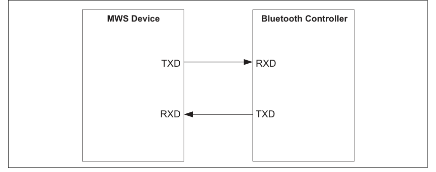

**Figure 2.2:  WCI-2 physical interface**

## 3  TRANSPORT LAYER

The transport layer defines the mapping of the logical signals (see [Vol 7] Part A) onto the physical transport channel.
The 8 bit UART character is divided into two portions with three bits for the message type indicator and five bits for the message body. The bit with index 0 is the LSB and shall be transmitted first.

| b0 | b1 | b2 | b3 | b4 | b5 | b6 | b7 |
| --- | --- | --- | --- | --- | --- | --- | --- |
| Type[0] | Type[1] | Type[2] | MSG[0] | MSG[1] | MSG[2] | MSG[3] | MSG[4] |

Table 3.1:  Transport layer format

### 3.1   MESSAGE TYPES

This section describes the message formats for the logical coexistence signals. The message types are listed in Table 3.2.

| Message Type Indicator | Direction | Message Type |
| --- | --- | --- |
| 0 | MWS ↔ Bluetooth | Real-time Signal message |
| 1 | MWS ↔ Bluetooth | Transport Control message |
| 2 | MWS ↔ Bluetooth | Transparent Data message |
| 3 | MWS → Bluetooth | MWS Inactivity Duration message |
|  | Bluetooth → MWS | RFU |
| 4 | MWS → Bluetooth | MWS Scan Frequency message |
|  | Bluetooth → MWS | RFU |
| 5 | MWS → Bluetooth | RFU |
|  | Bluetooth → MWS | RFU |
| 6 |  | Vendor specific |
| 7 |  | Vendor specific |

Table 3.2:  Message types
The logical coexistence signals are listed in Table 3.3.

| Logical Signal Name | Description |
| --- | --- |
| FRAME SYNC _ | See [Vol 7] Part A, Section 2.1.1 |

Table 3.3:  Coexistence signals

| Logical Signal Name | Description |
| --- | --- |
| MWS RX _ | See [Vol 7] Part A, Section 2.1.2 |
| BLUETOOTH RX PRI _ _ | See [Vol 7] Part A, Section 2.1.3 |
| BLUETOOTH TX ON _ _ | See [Vol 7] Part A, Section 2.1.4 |
| MWS PATTERN _ | See [Vol 7] Part A, Section 2.1.5 |
| MWS TX _ | See [Vol 7] Part A, Section 2.1.6 |
| 802 TX ON _ _ | See [Vol 7] Part A, Section 2.1.7 |
| 802 RX PRI _ _ | See [Vol 7] Part A, Section 2.1.8 |
| MWS INACTIVITY DURATION _ _ | See [Vol 7] Part A, Section 2.1.9 |
| MWS SCAN FREQUENCY _ _ | See [Vol 7] Part A, Section 2.1.10 |

Table 3.3:  Coexistence signals

#### 3.1.1  Real-time Signal Message (Type 0)

The Real-time Signal message is used to transport the real-time coexistence signals (see [Vol 7] Part A) over the WCI-2 transport.
The Real-time Signal message conveys all the real-time coexistence signals  in one message. The time reference point for the Real-time Signal message is the end of MSG[4] (i.e. the transition to the Stop bit).
Two Real-time Signal messages are defined, one from the Bluetooth Controller to the MWS device and another from the MWS device to the Bluetooth Controller.

| MSG[0] | MSG[1] | MSG[2] | MSG[3] | MSG[4] |
| --- | --- | --- | --- | --- |
| FRAME SYNC _ | MWS RX _ | MWS TX _ | MWS PATTERN[0] _ | MWS PATTERN [1] _ |

Table 3.4:  Real-time Signal message from MWS device to Bluetooth Controller

| MSG[0] | MSG[1] | MSG[2] | MSG[3] | MSG[4 |
| --- | --- | --- | --- | --- |
| BLUETOOTH RX PRI _ _ | BLUETOOTH TX ON _ _ | 802 RX PRI _ _ | 802 TX ON _ _ | RFU |

Table 3.5:  Real-time Signal message from Bluetooth Controller to MWS device

#### 3.1.2  Transport Control Message (Type 1)

The Transport Control message can request state information from the MWS device’s coexistence interface.

| MSG[0] | MSG[1] | MSG[2] | MSG[3] | MSG[4] |
| --- | --- | --- | --- | --- |
| RESEND REAL TIME _ _ | RFU | RFU | RFU | RFU |

Table 3.6:  Transport Control message

| Signal Name | Description |
| --- | --- |
| RESEND REAL TIME _ _ | This bit is set if a device wants to get a status update of the real time coexistence signals. The signal is usually used after wake- up from sleep of the transport interface. If the receiving device’s transport interface is awake it shall send a Real-time message with the current status of the real-time coexistence signals within 4 UART character periods. If the sig- nal is not received within 4 UART character periods the device i considered asleep. |

Table 3.7:  Transport control signals

#### 3.1.3  Transparent Data Message (Type 2)

The Transparent Data message can be used to exchange non-time critical messages between the MWS device and the Bluetooth Controller. The interface does not guarantee the delivery of a message. Protocol and content of the message are vendor specific.
The least significant nibble of each octet shall be transmitted first.
A least significant nibble shall be discarded if the next nibble is a least significant nibble. A most significant nibble shall only be accepted if the preceding nibble was a least significant nibble.

| MSG[0] | MSG[1] | MSG[2] | MSG[3] | MSG[4] |
| --- | --- | --- | --- | --- |
| NIBBLE POSITION _ | DATA[0]/ DATA[4] | DATA[1]/ DATA[5] | DATA[2]/ DATA[6] | DATA[3]/ DATA[7] |

Table 3.8:  Transparent Data message

| Signal Name | Description |
| --- | --- |
| NIBBLE POSITION _ | 0 – Least Significant Nibble 1 – Most Significant Nibble |
| DATA[n]; n=0 .. 7 | Data bits of the message octet |

Table 3.9:  Transparent data bits

#### 3.1.4  MWS Inactivity Duration Message (Type 3)

The MWS Inactivity Duration message is used to send the MWS_INACTIVITY_DURATION signal from the MWS device to the Bluetooth Controller.
The message is sent at the beginning of the MWS inactivity period.

| MSG[0] | MSG[1] | MSG[2] | MSG[3] | MSG[4] |
| --- | --- | --- | --- | --- |
| DURATION[0] | DURATION[1] | DURATION[2] | DURATION[3] | DURATION[4] |

Table 3.10:  MWS Inactivity Duration message
The MWS Inactivity Duration is encoded in 5 bits. DURATION is unsigned.
When DURATION = 0, MWS_INACTIVITY_DURATION is cancelled. When DURATION = 31, MWS_INACTIVITY_DURATION is infinite. Otherwise, MWS_INACTIVITY_DURATION is given by the formula:
MWS_INACTIVITY_DURATION = DURATION * 5 ms

#### 3.1.5  MWS Scan Frequency Message (Type 4)

The MWS Scan Frequency message is used to send the MWS_SCAN_FREQUENCY signal from the MWS device to the Bluetooth Controller.

| MSG[0] | MSG[1] | MSG[2] | MSG[3] | MSG[4] |
| --- | --- | --- | --- | --- |
| FREQ[0] | FREQ[1] | FREQ[2] | FREQ[3] | FREQ[4] |

Table 3.11:  MWS Scan Frequency message
The MWS Scan Frequency index is encoded in 5 bits. FREQ is unsigned.
2822
unthinkably connected