# AVRCP v1.6.3

> Source: PDF converted via PyMuPDF.

---

Audio/Video Remote Control Profile
Bluetooth® Profile Specification
▪ Version: v1.6.3
▪ Version Date: 2024-10-01
▪ Prepared By: Audio, Telephony, and Automotive Working Group
Abstract:
This profile defines the requirements for Bluetooth® devices necessary for the support of the Audio/Video Remote Control usage case. The requirements are expressed in terms of end-user services, and by defining the features and procedures that are required for interoperability between Bluetooth devices in the Audio/Video Remote Control usage case.
Version History

|  | Version |  |  | Date |  |  | Comments |  |
| --- | --- | --- | --- | --- | --- | --- | --- | --- |
| v1.6.0 |  |  | 2014-Sep-18 |  |  | Adopted by the Bluetooth SIG Board of Directors. |  |  |
| v1.6.1 |  |  | 2015-Dec-15 |  |  | Adopted by the Bluetooth SIG Board of Directors. |  |  |
| v1.6.2 |  |  | 2019-01-21 |  |  | Adopted by the Bluetooth SIG Board of Directors. |  |  |
| v1.6.3 |  |  | 2024-10-01 |  |  | Adopted by the Bluetooth SIG Board of Directors. For the change history between this version and the previous version, see Section 1.4.3. |  |  |

Version History

|  | Versions |  |  | Changes |  |
| --- | --- | --- | --- | --- | --- |
| v1.6.0 to v1.6.1 |  |  | Incorporated errata 6069 and 6073. |  |  |
| v1.6.1 to v1.6.2 |  |  | Incorporated erratum 7680. |  |  |
| v1.6.2 to v1.6.3 |  |  | Incorporated errata 10214, 13170, 13415, 15773, 15828, 18145, 18309, 18396, 18543, 18790, 23562, and 23746. |  |  |

Acknowledgments

|  | Name |  |  | Company |  |
| --- | --- | --- | --- | --- | --- |
| Alexander Hanke |  |  | Audi |  |  |
| Alicia Courtney |  |  | Broadcom |  |  |
| Ash Kapur |  |  | Broadcom |  |  |
| Rüdiger Mosig |  |  | Berner and Mattner |  |  |
| Gordon Downie |  |  | CSR |  |  |
| David Trainor |  |  | CSR |  |  |
| Souichi Saito |  |  | Denso |  |  |
| Morgan Lindqvist |  |  | Ericsson |  |  |
| Wim Koster |  |  | Ericsson |  |  |
| Rene Kuiken |  |  | Ericsson |  |  |
| Masahiko Nakashima |  |  | Fujitsu |  |  |
| Baskar Subramanian |  |  | Impulsesoft |  |  |
| K.A Srinivasan |  |  | Impulsesoft |  |  |
| Ilya Goldberg |  |  | Matsushita |  |  |
| Tsuyoshi Okada |  |  | Matsushita |  |  |
| Thomas Karlsson |  |  | Mecel |  |  |
| Jurgen Schnitzler |  |  | Nokia |  |  |
| Kalervo Kontola |  |  | Nokia |  |  |
| Martti Niska |  |  | Nokia |  |  |
| Thomas Block |  |  | Nokia |  |  |
| Vesa Lunden |  |  | Nokia |  |  |

|  | Name |  |  | Company |  |
| --- | --- | --- | --- | --- | --- |
| Sebastien Henrio |  |  | Parrot |  |  |
| Thierry Wœlfflé |  |  | Parrot |  |  |
| Erik Schylander |  |  | Philips |  |  |
| Shaun Barrett |  |  | Philips |  |  |
| Christian Bouffioux |  |  | Philips |  |  |
| Geert Knapen |  |  | Philips |  |  |
| Emmanuel Mellery |  |  | Philips |  |  |
| Laurent Meunier |  |  | Philips |  |  |
| Scott Walsh |  |  | Plantronics |  |  |
| John Larkin |  |  | Qualcomm |  |  |
| Dmitri Toropov |  |  | Siemens |  |  |
| Masakazu Hattori |  |  | Sony |  |  |
| Harumi Kawamura |  |  | Sony |  |  |
| Rüdiger Mosig |  |  | Sony |  |  |
| Yoshiyuki Nezu |  |  | Sony |  |  |
| Hiroyasu Noguchi |  |  | Sony |  |  |
| Tomoko Tanaka |  |  | Sony |  |  |
| Atsushi Ichise |  |  | Sony |  |  |
| Wilhelm Hagg |  |  | Sony |  |  |
| Masahiko Seki |  |  | Sony |  |  |
| Dick de Jong |  |  | Sony Ericsson |  |  |
| Patric Lind |  |  | Sony Ericsson |  |  |
| Siân James |  |  | Symbian |  |  |
| Tim Howes |  |  | Symbian |  |  |
| Junko Ami |  |  | Toshiba |  |  |
| Yoshiaki Takabatake |  |  | Toshiba |  |  |
| Ichiro Tomoda |  |  | Toshiba |  |  |
| Makoto Kobayashi |  |  | Toshiba |  |  |
| Shuichi Sakurai |  |  | Toshiba |  |  |
| Makoto Yamashita |  |  | Toshiba |  |  |

Use of this specification is your acknowledgement that you agree to and will comply with the following notices and disclaimers. You are advised to seek appropriate legal, engineering, and other professional advice regarding the use, interpretation, and effect of this specification.
Use of Bluetooth specifications by members of Bluetooth SIG is governed by the membership and other related agreements between Bluetooth SIG and its members, including those agreements posted on Bluetooth SIG’s website located at www.bluetooth.com. Any use of this specification by a member that is not in compliance with the applicable membership and other related agreements is prohibited and, among other things, may result in (i) termination of the applicable agreements and (ii) liability for infringement of the intellectual property rights of Bluetooth SIG and its members. This specification may provide options, because, for example, some products do not implement every portion of the specification. All content within the specification, including notes, appendices, figures, tables, message sequence charts, examples, sample data, and each option identified is intended to be within the bounds of the Scope as defined in the Bluetooth Patent/Copyright License Agreement (“PCLA”). Also, the identification of options for implementing a portion of the specification is intended to provide design flexibility without establishing, for purposes of the PCLA, that any of these options is a “technically reasonable non-infringing alternative.”
Use of this specification by anyone who is not a member of Bluetooth SIG is prohibited and is an infringement of the intellectual property rights of Bluetooth SIG and its members. The furnishing of this specification does not grant any license to any intellectual property of Bluetooth SIG or its members. THIS SPECIFICATION IS PROVIDED “AS IS” AND BLUETOOTH SIG, ITS MEMBERS AND THEIR AFFILIATES MAKE NO REPRESENTATIONS OR WARRANTIES AND DISCLAIM ALL WARRANTIES, EXPRESS OR IMPLIED, INCLUDING ANY WARRANTIES OF MERCHANTABILITY, TITLE, NON- INFRINGEMENT, FITNESS FOR ANY PARTICULAR PURPOSE, OR THAT THE CONTENT OF THIS SPECIFICATION IS FREE OF ERRORS. For the avoidance of doubt, Bluetooth SIG has not made any search or investigation as to third parties that may claim rights in or to any specifications or any intellectual property that may be required to implement any specifications and it disclaims any obligation or duty to do so.
TO THE MAXIMUM EXTENT PERMITTED BY APPLICABLE LAW, BLUETOOTH SIG, ITS MEMBERS AND THEIR AFFILIATES DISCLAIM ALL LIABILITY ARISING OUT OF OR RELATING TO USE OF THIS SPECIFICATION AND ANY INFORMATION CONTAINED IN THIS SPECIFICATION, INCLUDING LOST REVENUE, PROFITS, DATA OR PROGRAMS, OR BUSINESS INTERRUPTION, OR FOR SPECIAL, INDIRECT, CONSEQUENTIAL, INCIDENTAL OR PUNITIVE DAMAGES, HOWEVER CAUSED AND REGARDLESS OF THE THEORY OF LIABILITY, AND EVEN IF BLUETOOTH SIG, ITS MEMBERS OR THEIR AFFILIATES HAVE BEEN ADVISED OF THE POSSIBILITY OF THE DAMAGES.
Products equipped with Bluetooth wireless technology ("Bluetooth Products") and their combination, operation, use, implementation, and distribution may be subject to regulatory controls under the laws and regulations of numerous countries that regulate products that use wireless non-licensed spectrum. Examples include airline regulations, telecommunications regulations, technology transfer controls, and health and safety regulations. You are solely responsible for complying with all applicable laws and regulations and for obtaining any and all required authorizations, permits, or licenses in connection with your use of this specification and development, manufacture, and distribution of Bluetooth Products. Nothing in this specification provides any information or assistance in connection with complying with applicable laws or regulations or obtaining required authorizations, permits, or licenses.
Bluetooth SIG is not required to adopt any specification or portion thereof. If this specification is not the final version adopted by Bluetooth SIG’s Board of Directors, it may not be adopted. Any specification adopted by Bluetooth SIG’s Board of Directors may be withdrawn, replaced, or modified at any time. Bluetooth SIG reserves the right to change or alter final specifications in accordance with its membership and operating agreements.
Copyright © 2014–2024. All copyrights in the Bluetooth Specifications themselves are owned by Apple Inc., Ericsson AB, Intel Corporation, Lenovo (Singapore) Pte. Ltd., Microsoft Corporation, Nokia Corporation, and Toshiba Corporation. The Bluetooth word mark and logos are owned by Bluetooth SIG, Inc. Other third-party brands and names are the property of their respective owners.
Contents

## 1  Introduction

Scope
The Audio/Video Remote Control Profile (AVRCP) defines the features and procedures required in order to ensure interoperability between Bluetooth devices with audio/video control functions in the Audio/Video distribution scenarios. This profile specifies the scope of the AV/C Digital Interface Command Set (AV/C command set, defined by the 1394 Trade Association) to be applied, and it realizes simple implementation and easy operability. This profile adopts the AV/C device model and command format for control messages, and those messages are transported by the Audio/Video Control Transport Protocol (AVCTP). Browsing functionality is provided over a second AVCTP channel, which does not use AV/C. Functionality to transmit images associated to media items (‘Cover Art’) is provided through the protocol defined in the Bluetooth Basic Imaging Profile (BIP) over OBEX protocol.
In this profile, the controller translates the detected user action to the A/V control signal, and then transmits it to a remote Bluetooth device. The functions available for a conventional infrared remote controller can be realized in this profile. In addition to this, the profile uses Bluetooth specific extensions to support transfer of metadata related to content to be transferred between Bluetooth devices. Browsing features are provided to allow a remote controller to navigate the media and control specific media players on the remote target device. The remote control described in this profile is designed specific to A/V control. Other remote control solutions using Bluetooth wireless technology may be applied for general Bluetooth devices including A/V devices.
Note that the Audio/Video Remote Control Profile does not handle the audio/video streaming. Devices that support this profile may support audio/video streaming by also implementing the Advanced Audio Distribution Profile and/or Video Distribution Profile.
Profile dependencies
In Figure 1.1, the structure and dependencies of the Audio/Video Remote Control Profile are depicted. A profile is dependent upon another profile if it re-uses parts of that profile, by implicitly or explicitly referencing it.
As indicated in the figure, the Audio/Video Remote Control Profile is dependent upon the Generic Access Profile. The details regarding the profile are provided in Section 12.
For the Cover Art feature, the Audio/Video Remote Control Profile uses the Generic Imaging Image Pull Feature from the Basic Imaging Profile. The details regarding the profile are provided in Section 13.

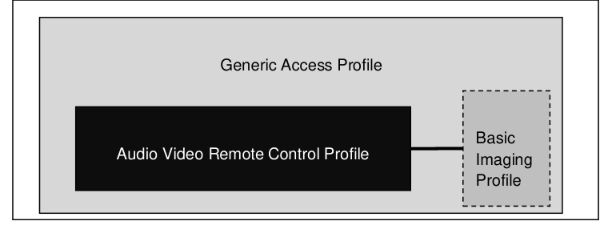

**Figure 1.1: Audio/Video Remote Control Profile dependency**

Symbols and conventions

#### 1.3.1 Requirement status symbols

In this document, the following symbols are used:
‘M’ for mandatory to support (used for capabilities that shall be used in the profile).
‘O’ for optional to support (used for capabilities that may be used in the profile).
‘X’ for excluded (used for capabilities that may be supported by the unit but that shall never be used in the profile).
‘C’ for conditional to support (used for capabilities that shall be used in case a certain other capability is supported).
‘N/A’ for not applicable (in the given context it is impossible to use this capability).
Some excluded capabilities are the ones that, according to the relevant Bluetooth specification, are mandatory. These are features that may degrade the operation of devices following this profile. Even if such features exist, which can occur when the device supports different profiles, they should never be activated while the device is operating within this profile.

#### 1.3.2 Definition

##### 1.3.2.1 RFA

Reserved for Future Additions. Bits with this designation shall be set to zero. Receivers shall ignore these bits.

##### 1.3.2.2 RFD

Reserved for Future Definition. These bit value combinations or bit values are not allowed in the current specification but may be used in future versions. The receiver shall check that unsupported bit value combination is not used.

#### 1.3.3 Conventions

In this profile, protocol signals are exchanged by initiating procedures in communicating devices and by exchanging messages. Signaling diagrams use the conventions of Figure 1.2: Signaling conventions. Both A and B represent devices playing specific roles, as defined in Section 2.2. Specific arrow styles are used in the diagrams to indicate the relevant procedures initiated by the participant devices and the exchanged messages.

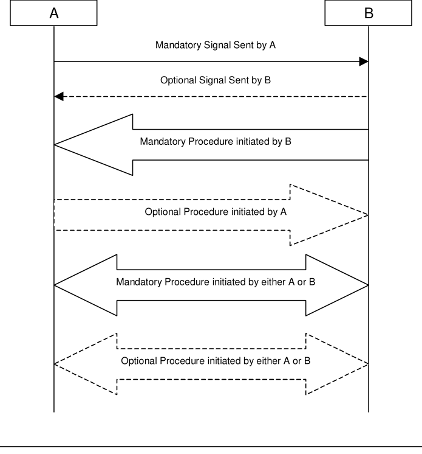

**Figure 1.2: Signaling conventions**

#### 1.3.4 Notation for timers

Timer is introduced, specific to this profile. To distinguish them from timers used in the Bluetooth protocol specifications and other profiles, these timers are named in the following format:
• “Tmmm (nnn)” for timers, where “mmm” specifies the different timers used and “nnn” specifies time in milliseconds.
Change history
This section summarizes changes at a moderate level of detail and should not be considered representative of every change made.

#### 1.4.1 Changes from 1.4 to 1.5

##### 1.4.1.1 General changes • Incorporation of adopted changes to correct various errata. Relevant errata are:

ESR04 (2549, 2685) and ESR05 (2255, 2588, 2572, 2560, 2961, 2932, 2814, 2786, 2763, 2762, 2740, 2720, 2708, 2707, 2698, 2687, 2761, 2688)

#### 1.4.2 Changes from 1.5 to 1.6 • Incorporation of two new features:

- Number of Items: An interface for a Category 1 controller to request and receive the number of items that are in a folder without downloading the list
- Cover Art: Support for transmitting images to media items through the BIP over OBEX protocol
• Incorporation of adopted errata from ESR06: E2715, E3155, E3208, E3294, E3662, E3747, ID 13451, E4121, E4566
• Adoption of errata approved after ESR06 publication : E4977, E5376, E5539.

#### 1.4.3 Changes from v1.6.2 to v1.6.3

|  | Section |  |  | Errata |  |
| --- | --- | --- | --- | --- | --- |
| Front matter |  |  | 18145, 18790 |  |  |
| 1.5.3: Prohibited |  |  | 15773 |  |  |
| 2.3.2.2: Limited Latency |  |  | 15773, 18145 |  |  |
| 2.4: Profile Fundamentals |  |  | 15773 |  |  |
| 2.5: Conformance |  |  | 23746 |  |  |
| 4.1.1: AVCTP connection establishment |  |  | 15773 |  |  |
| 6.4.1: GetCapabilities |  |  | 10214 |  |  |
| 6.5.7: InformDisplayableCharacterSet |  |  | 18145 |  |  |
| 6.7.2: RegisterNotification |  |  | 18145, 18396 |  |  |
| 6.8.1: RequestContinuingResponse |  |  | 18145 |  |  |
| 6.8.2: AbortContinuingResponse |  |  | 18145 |  |  |
| 6.13.2: SetAbsoluteVolume |  |  | 23562 |  |  |
| 6.13.3: Notify Volume Change |  |  | 23562 |  |  |
| 16:Testing |  |  | 18543 |  |  |
| 16: Example of the use of Bluetooth High Speed with Cover Art |  |  | 18145 |  |  |
| 17: References |  |  | 13170, 15773, 18309 |  |  |
| 21: Appendix A: example of latency |  |  | 18145 |  |  |
| 22: Appendix B: example of A/V devices |  |  | 18145 |  |  |
| 23: Appendix C: multiple applications use of AVCTP |  |  | 18145 |  |  |

|  | Section |  |  | Errata |  |
| --- | --- | --- | --- | --- | --- |
| 24: Appendix D: example of commands and responses |  |  | 18145 |  |  |
| 28: Appendix J: list of example MSCs of different AVRCP specific commands |  |  | 18145 |  |  |
| 28:14: Play file on new media player locally on target |  |  | 18396 |  |  |
| 28.17: Browse and Add to Queue |  |  | 15828 |  |  |
| 29: Appendix K: AV/C |  |  | 13415 |  |  |
| 30: UID scheme examples |  |  | 18145 |  |  |

Language

#### 1.5.1 Language conventions

The Bluetooth SIG has established the following conventions for use of the words shall, must, will, should, may, can, is, and note in the development of specifications:

| shall | is required to – used to define requirements |
| --- | --- |
| must | is used to express: a natural consequence of a previously stated mandatory requirement. OR an indisputable statement of fact (one that is always true regardless of the circumstances). |
| will | it is true that – only used in statements of fact |
| should | is recommended that – used to indicate that among several possibilities one is recommended as particularly suitable, but not required |
| may | is permitted to – used to allow options |
| can | is able to – used to relate statements in a causal manner |
| is | is defined as – used to further explain elements that are previously required or allowed |
| note | Used to indicate text that is included for informational purposes only and is not required in order to implement the specification. Each note is clearly designated as a “Note” and set off in a separate paragraph. |

For clarity of the definition of those terms, see Core Specification Volume 1, Part E, Section 1.

#### 1.5.2 Reserved for Future Use

Where a field in a packet, Protocol Data Unit (PDU), or other data structure is described as "Reserved for Future Use" (irrespective of whether in uppercase or lowercase), the device creating the structure shall
set its value to zero unless otherwise specified. Any device receiving or interpreting the structure shall ignore that field; in particular, it shall not reject the structure because of the value of the field.
Where a field, parameter, or other variable object can take a range of values and some values are described as "Reserved for Future Use," a device sending the object shall not set the object to those values. A device receiving an object with such a value should reject it, and any data structure containing it, as being erroneous; however, this does not apply in a context where the object is described as being ignored or it is specified to ignore unrecognized values.
When a field value is a bit field, unassigned bits can be marked as Reserved for Future Use and shall be set to 0. Implementations that receive a message that contains a Reserved for Future Use bit that is set to 1 shall process the message as if that bit was set to 0, except where specified otherwise.
The acronym RFU is equivalent to "Reserved for Future Use."

#### 1.5.3 Prohibited

When a field value is an enumeration, unassigned values can be marked as “Prohibited.” These values shall never be used by an implementation, and any message received that includes a Prohibited value shall be ignored and shall not be processed and shall not be responded to.
Where a field, parameter, or other variable object can take a range of values, and some values are described as “Prohibited,” devices shall not set the object to any of those Prohibited values. A device receiving an object with such a value should reject it, and any data structure containing it, as being erroneous.
“Prohibited” is never abbreviated.
Certain terms that were identified as inappropriate have been replaced. For a list of their original terms and their replacement terms, see the Appropriate Language Mapping Table [17].

## 2 Profile overview

Profile stack

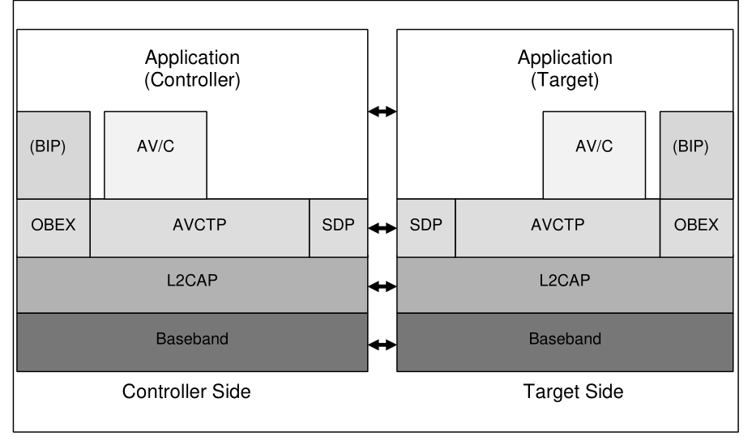

**Figure 2.1: Protocol model**

The Baseband, LMP, and L2CAP are the OSI layer 1 and 2 Bluetooth protocols. AVCTP and BIP define the procedures and messages to be exchanged for controlling A/V devices. SDP is the Bluetooth Service Discovery Protocol [10]. OBEX is the Bluetooth adaptation of IrOBEX and it is the underlying transport protocol for BIP, which is the entity providing functionality to exchange images associated with media. BIP is depicted in parentheses in Figure 2.1 to indicate that some BIP features are reused or redefined for AVRCP but BIP is not utilized as a stand-alone profile. AV/C is the entity responsible for AV/C command- based device control signaling. The application is the AVRCP entity, exchanging control and browsing commands as defined in this specification.
Configuration and roles
For the configuration examples for this profile, refer to the figures shown in Section 2.2.2.

#### 2.2.1 Roles

The following roles are defined for devices that comply with this profile:
• The controller (CT) is a device that initiates a transaction by sending a command frame to a target. Examples for CT are a personal computer, a PDA, a mobile phone, a remote controller or an AV device (such as an in car system, headphone, player/recorder, timer, tuner, monitor etc.).
• The target (TG) is a device that receives a command frame and accordingly generates a response frame. Examples for TG are an audio player/recorder, a video player/recorder, a TV, a tuner, an amplifier or a headphone.

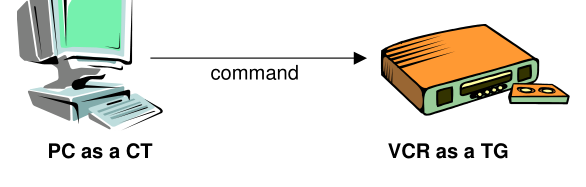

**Figure 2.2: Controller and target**

#### 2.2.2 Categories

This profile ensures interoperability by classifying the A/V functions into four categories.

##### 2.2.2.1 Category 1: player/recorder

Basic operations of a player or a recorder are defined, regardless of the type of media (tape, disc, solid state, etc.) or the type of contents (audio or video, etc.).

##### 2.2.2.2 Category 2: monitor/amplifier

The category 2 is to define basic operations of a video monitor or an audio amplifier.

##### 2.2.2.3 Category 3: tuner

The category 3 defines the basic operation of a video tuner or an audio tuner.

##### 2.2.2.4 Category 4: menu

The basic operations for a menu function are defined in category 4. The method to display menu data is not specified. It may be a display panel of the device itself, or on-screen display (OSD) on an external monitor.
User requirements

#### 2.3.1 Scenarios

User requirements and scenarios for the configuration examples are described in this section.
The usage model of AVRCP is specific in a way that user action manipulates the control, but there is no limitation to perform the features in audio/video devices. AVRCP is capable of manipulating the menu function that is already commonly used for analogue devices for various features such as adjustment of TV brightness or hue, or VCR timer. With this menu function, AVRCP is designed so that any type of feature can be supported.
A user can learn the status information of a device using the display on the body  (LED or LCD) as well as the OSD (On Screen Display) method. Using functionality specified in the profile, the CT may request and be updated about the state of a variety of items on the TG device.

##### 2.3.1.1 Remote control from separate controller

In the configuration shown in Figure 2.3 below, the remote controller is the CT of the transaction. Command frames from the remote controller are sent to the portable disc player as a TG. An audio stream is sent from the portable disc player to the headphone. The headphone simply receives the audio stream and is not involved in the transaction between the remote controller and the portable disc player.
A trigger of the transaction is made by a user from the remote controller, when he/she wishes to control the portable disc player.

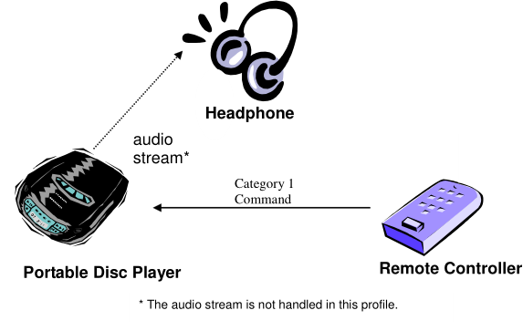

**Figure 2.3: Remote control from separate controller**

##### 2.3.1.2 Remote control from car audio system

In the configuration shown below, the CT is the car audio system and the mobile phone is the TG.
The user browses the available media on the cell phone via the car interface. The user may then perform actions triggering retrieval of media metadata from the phone, and perform other control operations.

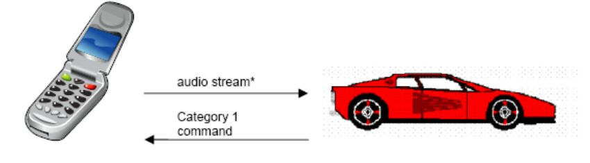

**Figure 2.4: Remote control from car audio system**

##### 2.3.1.3 Remote control and audio stream between two devices

In the configuration shown in Figure 2.5 below, the CT is the headphone and the portable disc player is the TG.
A trigger of the transaction is made by a user from the remote controller that accompanies the headphone, when he/she wishes to control the portable disc player.
audio stream*

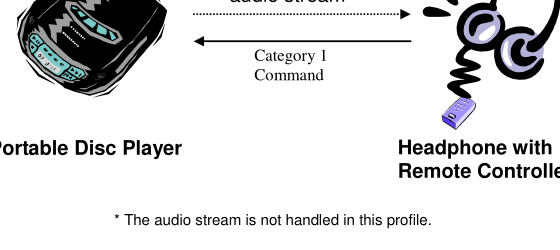

**Figure 2.5: Remote control and audio stream between two devices**

##### 2.3.1.4 Mutual remote control within a piconet

In the configuration shown in Figure 2.6 below, both the headphone and the portable disc player are capable of working as remote controllers.
For example, the portable disc player becomes a CT if it controls the volume of the headphone that becomes a TG. On the other hand, the headphone becomes a CT when it sends a command to start playback or stop playing to the portable disc as a TG.
audio stream*
Category 1 command
Category 2 command
Portable Disc Player
Headphone
* The audio stream is not handled in this profile.

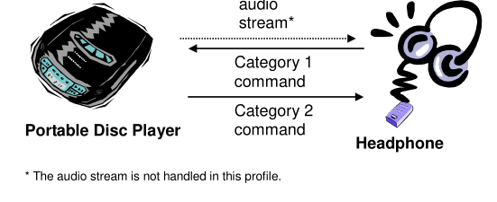

**Figure 2.6: Mutual remote control within a piconet**

##### 2.3.1.5 Remote controller with LCD

In the configuration shown in Figure 2.7 below, the headphone with an LCD remote controller is a CT. It receives media metadata and browsing information by sending commands to the media player which is the TG. The remote controller can have an LCD to present received data to a user.
In the configuration shown in Figure 2.8 below, the carkit with a full display is a CT Category 1. It receives browsing information by sending commands to the mobile device which is the TG. The CT uses the Cover Art feature to retrieve the cover art associated with the browsed or played media items.

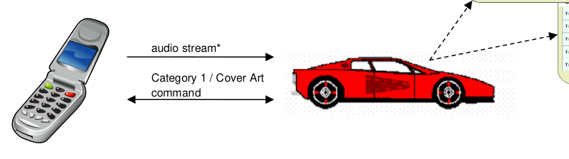

**Figure 2.8: Cover Art from the browsed or played media items**

#### 2.3.2 User expectations

In this section, user expectations and related restrictions of AVRCP are described.
Although a device may implement only AVRCP as shown in Figure 2.3, it is assumed that, in most cases, an A/V distribution profile, for example A2DP or VDP, co-exists in a device. However, the AVRCP implementation shall not depend on the existence of an A/V distribution profile.

##### 2.3.2.1 Configuration

AVRCP is based on the control over point to point connection. For this profile, it is assumed that the use case is active between the two devices. Note that one or more CTs may exist within a piconet. (Refer to Section 2.3.1.4)
A CT may support several target devices, and the detail of control such as target selection is not defined in AVRCP.

##### 2.3.2.2 Limited latency

The responsiveness of remote control operations is an important feature of AVRCP. It is expected that the system reacts in a timely manner in order to avoid uncontrollable situations like system overload by repeated commands.
Latency figures depend on application. Additional information on the desired delay is provided in Appendix A: example of latency.
CT and TG interoperate through L2CAP channel connections. In case the TG is a Central, it is required to poll the Peripherals on a regular basis in order to satisfy the application QoS requirements. It is recommended that the polling rate is approximately 10 Hz.
The discussions below are intended to be for application information only: there are no mandatory usages of the low power modes for AVRCP.
It is assumed that battery powered devices are common in the usage model of AVRCP, in case that CT is a handheld device. The device is recommended to ensure comparable service grade to the existing infrared product range.
Duplex radio systems suffer from higher power consumption compared to the simple infrared transmission controller. To compensate this fundamental drawback, dynamic use of low power modes is recommended especially when only AVRCP is implemented in a device.
Regarding the details of the low power modes, refer to the Specification of the Bluetooth System, Core, Baseband [7], and Link Manager Protocol [9]. Appropriate low power mode strategy partly depends on applications.

##### 2.3.2.4 User action

A user action or media status change triggers most activity in AVRCP. Applications should be designed based on this characteristic. It is possible to design simple automatic operation without a user action; such as a timer function that sends a command to start recording at pre-set time, within this profile.
Profile fundamentals
The profile fundamentals, with which all applications shall comply, are the following.
1. Support for authentication and encryption is mandatory, such that the device can take part in the
corresponding procedures if requested from a peer device.
2. A link shall be established before commands can be initiated or received.
3. There are no fixed Central/Peripheral roles.
4. In this profile, the A/V functions are classified into four categories defined in Section 2.2.2. All devices
that conform to this profile shall support at least one category, and may support several categories.
5. Transfer Octet Order; Packets shall transfer multiple-octet fields in standard network octet order (Big
Endian), with more significant (high-order) octets being transferred before less-significant (low-order) octets.
Conformance Each capability of this specification shall be supported in the specified manner. This specification may provide options for design flexibility, because, for example, some products do not implement every portion of the specification. For each implementation option that is supported, it shall be supported as specified.

## 3 Application layer

This section describes the feature requirements on units complying with the Audio/Video Remote Control Profile.
Feature support
The table below shows the features requirements for this profile. Note that a device may have both CT and TG capabilities. In that case, features for both CT and TG are required.

|  | Feature |  | Support in |  |  | Support in |  |
| --- | --- | --- | --- | --- | --- | --- | --- |
|  |  |  | CT |  |  | TG |  |
| 1. | Connection establishment for control | M |  |  | O |  |  |
| 2. | Connection release for control | M |  |  | M |  |  |
| 3. | Connection establishment for browsing | C9 |  |  | C7 |  |  |
| 4. | Connection release for browsing | C9 |  |  | C10 |  |  |
| 5. | AV/C Info commands | O |  |  | M |  |  |
| 6. | Category 1: Player/Recorder | C3 |  |  | C3 |  |  |
| 7. | Category 2: Monitor/Amplifier | C3 |  |  | C3 |  |  |
| 8. | Category 3: Tuner | C3 |  |  | C3 |  |  |
| 9. | Category 4: Menu | C3 |  |  | C3 |  |  |
| 10. | Capabilities | O |  |  | C1 |  |  |
| 11. | Player Application Settings | O |  |  | O |  |  |
| 12. | Metadata Attributes for Current Media Item | O |  |  | C1 |  |  |
| 13. | Notifications | C2 |  |  | C2 |  |  |
| 14. | Continuation | C2 |  |  | C2 |  |  |
| 15. | Basic Group Navigation | O |  |  | O |  |  |
| 16. | Absolute Volume | C4 |  |  | C4 |  |  |
| 17. | Media Player Selection | O |  |  | C5 |  |  |
| 17.1. | - Supports Multiple Players | O |  |  | O |  |  |
| 18. | Browsing | O |  |  | O |  |  |
| 18.1. | - Database Aware Players | O |  |  | O |  |  |
| 19. | Search | O |  |  | O |  |  |
| 20. | Now Playing | C6 |  |  | C6 |  |  |
| 20.1. | - Playable Folders | O |  |  | O |  |  |
| 21. | Error Response | X |  |  | C8 |  |  |
| 22. | PASSTHROUGH operation supporting press and hold | O |  |  | O |  |  |
| 23. | Cover Art | O |  |  | O |  |  |

Table 3.1: Application layer features
C3 – Mandatory to support at least one Category
C4 – Mandatory if Category 2 supported, Excluded otherwise
C5 – Mandatory if Target supports Category 1 or Category 3, Optional otherwise
C6 – Mandatory if Browsing (item 18) is supported, optional otherwise
C7 – Optional if Category 1 or 3, or Browsing is supported, Excluded otherwise
C8 – Mandatory if any of items 10 – 20.1 are supported, Excluded otherwise
X – Excluded
C9 – Mandatory if Media Player Selection or Browsing is supported, Optional otherwise.
C10 – Mandatory if Category 1 or 3, or Browsing is supported, Optional otherwise.
Features 10 to 15 in Table 3.1 shall be collectively termed as AVRCP Specific AV/C commands in this document.
Features 16 to 21 in Table 3.1 shall be collectively termed as AVRCP Specific Browsing commands in this document.
Feature mapping
The table below maps each feature to the procedures used for that feature. All procedures are mandatory if the feature is supported.

| No. |  |  | Feature |  |  | Procedure |  |  |  | Section |  |
| --- | --- | --- | --- | --- | --- | --- | --- | --- | --- | --- | --- |
|  |  |  |  |  |  |  |  |  |  | No. |  |
| 1. |  |  | Connection establishment for control |  |  | AVCTP Connection establishment |  |  | 4.1.1 |  |  |
|  | 2. |  |  | Connection release for control |  |  | AVCTP Connection release |  |  | 4.1.2 |  |
|  | 3. |  |  | Connection establishment for browsing |  |  | AVCTP Connection establishment |  |  | 4.1.1 |  |
|  | 4. |  |  | Connection release for browsing |  |  | AVCTP Connection release |  |  | 4.1.2 |  |
| 5. |  |  | AV/C INFO command |  |  | Procedure of AV/C command |  |  | 4.1.3 |  |  |
|  | 6. |  |  | Category 1: Player/Recorder |  |  | Procedure of AV/C command |  |  | 4.1.3 |  |
| 7. |  |  | Category 2: Monitor/Amplifier |  |  | Procedure of AV/C command |  |  | 4.1.3 |  |  |
|  | 8. |  |  | Category 3: Tuner |  |  | Procedure of AV/C command |  |  | 4.1.3 |  |
| 9. |  |  | Category 4: Menu |  |  | Procedure of AV/C command |  |  | 4.1.3 |  |  |
| 10. |  |  | Capabilities |  |  |  | Procedure of AVRCP Specific |  | 4.1.5 |  |  |
|  |  |  |  |  |  |  | AV/C commands |  |  |  |  |
| 11. |  |  | Player Application Settings |  |  | Procedure of AVRCP Specific AV/C commands |  |  | 4.1.5 |  |  |
| 12. |  |  |  | Metadata Attributes for Current Media |  |  | Procedure of AVRCP Specific |  | 4.1.5 |  |  |
|  |  |  |  | Item |  |  | AV/C commands |  |  |  |  |
| 13. |  |  | Notifications |  |  | Procedure of AVRCP Specific AV/C commands |  |  | 4.1.5 |  |  |
| 14. |  |  | Continuation |  |  |  | Procedure of AVRCP Specific |  | 4.1.5 |  |  |
|  |  |  |  |  |  |  | AV/C commands |  |  |  |  |

| No. | Feature |  |  | Procedure |  |  |  | Section |  |
| --- | --- | --- | --- | --- | --- | --- | --- | --- | --- |
|  |  |  |  |  |  |  |  | No. |  |
| 15. | Basic Group Navigation |  |  | Procedure of AVRCP Specific AV/C commands |  |  | 4.1.5 |  |  |
| 16. | Absolute Volume |  |  |  | Procedure of AVRCP Specific |  | 4.1.5 |  |  |
|  |  |  |  |  | AV/C commands |  |  |  |  |
| 17. | Media Player Selection |  |  | Procedure of AVRCP Specific AV/C commands Procedure of AVRCP Specific Browsing commands |  |  | 4.1.5 4.1.6 |  |  |
| 17.1. | - Supports Multiple Players |  |  |  | Procedure of AVRCP Specific |  | 4.1.5 4.1.6 |  |  |
|  |  |  |  |  | AV/C commands |  |  |  |  |
|  |  |  |  |  | Procedure of AVRCP Specific |  |  |  |  |
|  |  |  |  |  | Browsing commands |  |  |  |  |
| 18. | Browsing |  |  | Procedure of AVRCP Specific AV/C commands Procedure of AVRCP Specific Browsing commands |  |  | 4.1.5 4.1.6 |  |  |
| 18.1. | - Database Aware Players |  |  |  | Procedure of AVRCP Specific |  | 4.1.5 4.1.6 |  |  |
|  |  |  |  |  | AV/C commands |  |  |  |  |
|  |  |  |  |  | Procedure of AVRCP Specific |  |  |  |  |
|  |  |  |  |  | Browsing commands |  |  |  |  |
| 19. | Search |  |  |  | Procedure of AVRCP Specific |  | 4.1.5 4.1.6 |  |  |
|  |  |  |  |  | AV/C commands |  |  |  |  |
|  |  |  |  |  | Procedure of AVRCP Specific |  |  |  |  |
|  |  |  |  |  | Browsing commands |  |  |  |  |
| 20. | Now Playing |  |  |  | Procedure of AVRCP Specific |  | 4.1.5 4.1.6 |  |  |
|  |  |  |  |  | AV/C commands |  |  |  |  |
|  |  |  |  |  | Procedure of AVRCP Specific |  |  |  |  |
|  |  |  |  |  | Browsing commands |  |  |  |  |
| 20.1. | - Playable Folders |  |  |  | Procedure of AVRCP Specific |  | 4.1.5 4.1.6 |  |  |
|  |  |  |  |  | AV/C commands |  |  |  |  |
|  |  |  |  |  | Procedure of AVRCP Specific |  |  |  |  |
|  |  |  |  |  | Browsing commands |  |  |  |  |
| 21. | Error Response |  |  |  | Procedure of AVRCP Specific |  | 4.1.5 4.1.6 |  |  |
|  |  |  |  |  | AV/C commands |  |  |  |  |
|  |  |  |  |  | Procedure of AVRCP Specific |  |  |  |  |
|  |  |  |  |  | Browsing commands |  |  |  |  |
| 22. |  | PASSTHROUGH operation supporting |  | Procedure of AV/C command | Procedure of AV/C command |  |  | 4.1.3, |  |
|  |  | press and hold |  |  |  |  |  | 4.4.1 |  |
| 23. | Cover Art | Cover Art |  |  | Cover Art procedure and |  | 5.14 | 5.14 |  |
|  |  |  |  |  | commands |  |  |  |  |

Table 3.2: Application layer feature to procedure mapping
The general procedure of AVRCP Specific AV/C commands is described in Section 4.1.5. The general procedure of AVRCP Specific Browsing commands is described in Section 4.1.6.

## 4 Control interoperability requirements

The interoperability requirements for an entity that is compatible with the AVRCP are completely contained in this chapter. The requirements directly relate to the application layer features.
Procedures

#### 4.1.1 AVCTP connection establishment

An L2CAP connection establishment for AVCTP control may be initiated by the CT or by the TG. An internal event or an event generated by a user, such as turning the power on, initiates the connection establishment.
If a browsing channel is supported by both devices, the browsing channel may be established after the control channel. The control channel shall always be established before the browsing channel. It is recommended that the browsing channel is established immediately after the control channel is established to avoid unsatisfactory latency when a browsing command is sent. However, as some use cases involve very occasional use of browsing functionality, devices for which this applies may wish to open the browsing channel on demand to minimize resource usage. The browsing channel shall be configured to use L2CAP Enhanced Retransmission Mode.
If both devices open an AVCTP channel at the same time, both channels shall be closed and each device shall wait a random time (not more than 1 s and not less than 100ms) and then try to open the AVCTP channel again. If it is known which device is the Central, that device can re-try at once.
Note: Only one L2CAP connection for control and one L2CAP connection for browsing (if supported by both devices) shall be established between AVCTP entities. If the connection(s) already exist(s), the CT/TG shall not initiate the connection request.

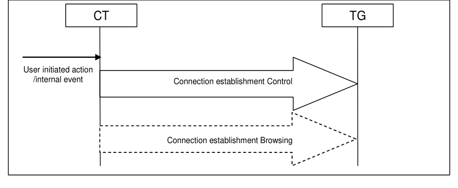

**Figure 4.1: Connection establishment initiated by CT**

CT TG

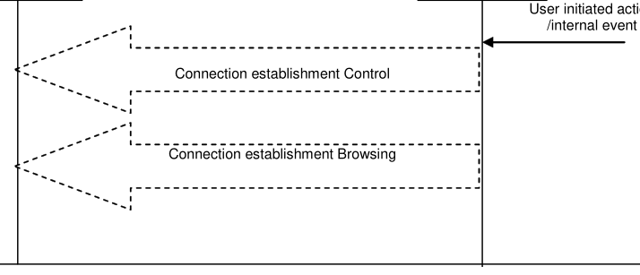

**Figure 4.2: Connection establishment initiated by TG**

CT TG
User initiated action
/internal event
Connection establishment Control
User initiated action
/internal event
Connection establishment Browsing

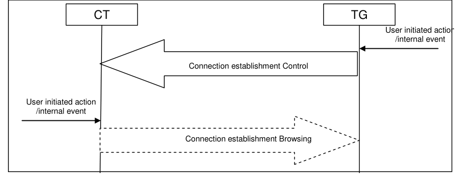

**Figure 4.3: Control channel establishment initiated by TG and browsing channel establishment initiated by CT when needed.**

#### 4.1.2 AVCTP connection release

Release of an L2CAP connection for AVCTP may be initiated by the CT or by the TG. An internal event or an event generated by a user, such as turning the power off, initiates the connection release.
If a browsing channel is present, it shall be released before the control channel. If the browsing channel is no longer required, the browsing channel may be released without releasing the control channel. If the browsing channel has been released, it may be re-established when required as long as the control channel is still present.
CT TG

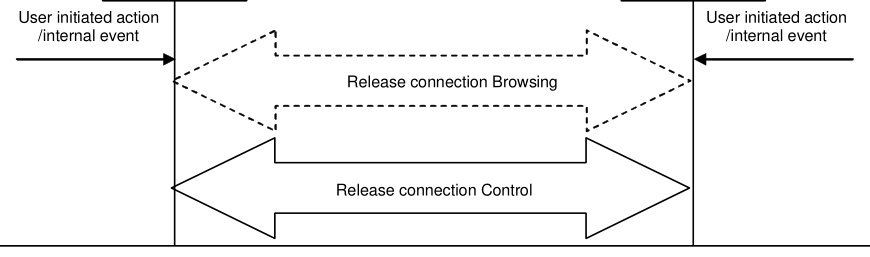

**Figure 4.4: Connection release initiated by CT or TG**

#### 4.1.3 Procedure of AV/C command

Upon an internal or an event generated by a user, the CT shall initiate connection establishment if a connection has not been established by then. Once the connection is established, it can send an AV/C command.
CT TG
User initiated action
/internal event
Connection establishment will be completed at this point at the latest.
Connection establishment
AV/C command
AV/C interim response*
AV/C response**

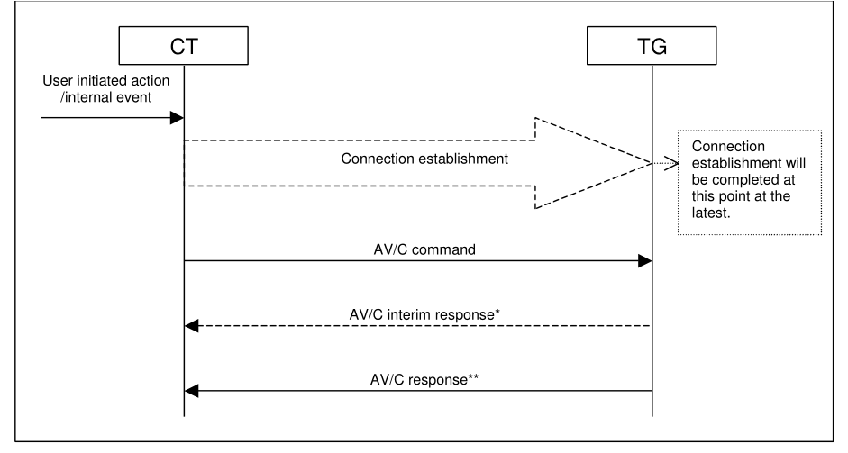

**Figure 4.5: Procedure of AV/C command**

*: AV/C interim response may be returned in response to a VENDOR DEPENDENT command. AV/C interim response shall not be returned for other commands.
**: In some exceptional cases, the TG may not return a response. For details, refer to the AV/C General Specification.

|  |  |  | Command |  |  | CT |  |  | TG |  |  |
| --- | --- | --- | --- | --- | --- | --- | --- | --- | --- | --- | --- |
| 1. |  |  | UNIT INFO |  |  | O |  |  | M |  |  |
|  | 2. |  |  | SUBUNIT INFO |  |  | O |  |  | M |  |
| 3. |  |  | VENDOR DEPENDENT |  |  | C |  |  | C |  |  |
|  | 4. |  |  | PASS THROUGH |  |  | M |  |  | M |  |

Table 4.1: List of possible AV/C commands
C: Mandatory if any of 3.1-10 to 3.1-15 is supported, Optional otherwise
Requirements for CT refer to the ability to send a command.
Requirements for TG refer to the ability to respond to a command.

#### 4.1.4 AV/C command operation

This section describes the operation procedure of AV/C command exchange shown in Figure 4.5 with example. For more information of the AV/C unit/subunit model and AV/C command operation, refer to AV/C General Specification [1] and AV/C Panel Subunit Specification [2]. Version 4.1 in [1] is backwards compatible with version 4.0 in [1], so either version can be used.
The AV/C General Specification covers the AV/C general command and response model, unit/subunit model, and standard unit and subunit commands. An AV/C subunit is an instantiation of a logical entity that is identified within an AV/C unit. An AV/C subunit has a set of coherent functions that the electronic device provides. Functions are defined for each category of devices in its subunit specification (Monitor, Audio, Tape recorder/player, Disc, Tuner, etc.).
The AV/C command set consists of the AV/C General Specification and each subunit command. In the AV/C General Specification, the UNIT INFO command and SUBUNIT INFO command are both mandatory. For subunit commands, the mandatory commands are defined in each subunit specification, and it depends on the device implementation which subunit to support.
The UNIT INFO command is used to obtain information that pertains to the AV/C unit as a whole. The response frame includes information of the vendor ID of the TG and subunit type that best describes the unit. The information of vendor ID may be used to investigate the vendor of TG before using VENDOR DEPENDENT command. For example of subunit type, a VCR device may return the unit_type of the tape recorder/player, even though the VCR has a tuner. In this profile, the panel subunit is the main function. It is also possible that other subunits may be returned if other profiles co-exist in the device.
The SUBUNIT INFO command is used to obtain information about the subunit(s) of an AV/C unit. A device with this profile may support other subunits than the panel subunit if other profiles co-exist in the device, which can be found with the SUBUNIT INFO command. With this command, a typical AV/C controller manipulates AV/C function discovery.
The VENDOR DEPENDENT command permits module vendors to specify their own set of commands and responses for AV/C units or subunits determined by the AV/C address that is contained in the AV/C frame. The vendor dependent commands are used by this specification. Please refer to Section 4.1.5.
One feature of this profile is the remote control performed by the PASS THROUGH command of the Panel subunit. The Panel subunit provides a user-centric model for actuating the controls on a device. The CT controls the Panel subunit according to the user operation using certain CT-dependent manners. The user manipulates the user interface on the display or operates a button, and then the CT sends commands to the panel subunit. In response to these commands, the Panel subunit performs some action(s). Even though there may be several subunits in a TG, the TG shall have only one panel subunit. Unlike many other AV/C subunits, the panel subunit does not directly deal with media streams itself. The main purpose for using a panel subunit is to allow it to translate the incoming user action commands into internal actions, which affect other subunits and/or the unit, and dispatch them to an appropriate subunit or unit inside the TG using the TG-dependent manner. The result of these actions may have an effect on media streams. This profile uses the PASS THROUGH command, which is one of the subunit commands defined in the Panel Subunit Specification. A CT conveys a user operation to a TG by the PASS THROUGH command.

#### 4.1.5 Procedure of AVRCP specific AV/C commands

The procedure of AVRCP specific AV/C commands is an extension of the AV/C Digital Interface Command Set General Specification specified by 1394 Trade Association. It enables more sophisticated control functionality as well as the handling of metadata such as song and artist information.
The extension is implemented by defining VENDOR DEPENDENT and PASS THROUGH commands within the framework of the 1394 specifications. A vendor ID for the Bluetooth SIG is used to differentiate from real vendor specific commands.

#### 4.1.6 Procedure of AVRCP browsing commands

The procedure of AVRCP Browsing commands defines commands to be used directly over AVCTP. AV/C is not used. The AVCTP Browsing Channel shall not use fragmentation. These commands enable the CT to navigate the media on the TG device, then perform operations on a specific media item.

#### 4.1.7 OBEX connection establishment

AVRCP does not place a restriction on when the OBEX L2CAP channel is created.  However, as BIP imaging handles are valid only during the lifetime of a BIP Cover Art connection, an OBEX level connection shall exist before the BIP image handle can be successfully retrieved and the handles retrieved can only be used during that BIP Cover Art connection.
The Cover Art OBEX connection shall be established using a Target Header with the Cover Art UUID as defined in Section 5.14.2.1.

#### 4.1.8 OBEX connection release

AVRCP does not place a restriction on when the OBEX L2CAP channel is closed.  However, when the OBEX level connection is closed, the BIP imaging handles retrieved during that OBEX connection will no longer be valid.
It is strongly recommended that the underlying L2CAP channel is not disconnected when the reason the CT disconnects OBEX is solely to release the image handles. Keeping the underlying L2CAP channel in place during the OBEX disconnect/connect cycle will reduce the latency and the overhead involved in the UIDs changed procedure.
Supported unit commands
The unit commands shown in the following table are used in this profile. For unit commands, the AV/C address field of AV/C command frame shall indicate the value for unit.

| Opcode |  | Support in CT |  |  |  |  | Support in TG |  |  |  | Comments |
| --- | --- | --- | --- | --- | --- | --- | --- | --- | --- | --- | --- |
|  | CONTROL |  | STATUS | NOTIFY |  | CONTROL |  | STATUS | NOTIFY |  |  |
| UNIT INFO | N/A |  | O | N/A |  | N/A |  | M* | N/A |  | Reports unit information |
| SUBUNIT INFO | N/A |  | O | N/A |  | N/A |  | M* | N/A |  | Reports subunit information |

Table 4.2: Supported unit commands
*: These commands shall be supported in AV/C-compliant devices to maintain the compatibility with the existing AV/C implementations.

#### 4.2.1 UNIT INFO command

As defined in the AV/C General Specification, the UNIT INFO status command is used to obtain information that pertains to the unit as a whole. For details of the UNIT INFO command, refer to the AV/C General Specification [1].
In the unit_type field of a response frame, a code for a subunit type that represents the main function of the unit shall be shown. If the unit implements only this profile, it shall return the PANEL subunit in the response frame.
In the company_ID field of a UNIT INFO response frame, the 24-bit unique ID obtained from the IEEE Registration Authority Committee shall be inserted. If the vendor of a TG device does not have the unique ID above, the value 0xFFFFFF may be used.

#### 4.2.2 SUBUNIT INFO command

As defined in the AV/C General Specification, the SUBUNIT INFO status command is used to obtain information about the subunit(s) of a unit. For details of the SUBUNIT INFO command, refer to the AV/C General Specification [1].
If the unit implements this profile, it shall return PANEL subunit in the subunit_type field, and value 0 in the max_subunit_ID field in the response frame.
Supported common unit and subunit commands
The common unit and subunit commands shown in Table 4.3 are used in this profile. For the common unit and subunit command, the AV/C address field of the AV/C command frame shall indicate the value for unit or Panel Subunit if the command is one defined in this profile.

#### 4.3.1 VENDOR DEPENDENT command

The formats of a command frame or a response frame, as well as the compliant usage rules, are as defined in the AV/C General Specification [1].

| Opcode |  | Support in CT |  |  | Support in TG |  |  | Comments |
| --- | --- | --- | --- | --- | --- | --- | --- | --- |
|  | CONTROL |  | STATUS | NOTIFY | CONTROL | STATUS | NOTIFY |  |
| VENDOR DEPENDENT | C |  | C | C | C | C | C | Vendor-dependent commands |

Table 4.3: Vendor Dependent commands
C: Mandatory if any AVRCP specific AV/C command is supported, Optional otherwise
For AVRCP specific AV/C command support, a predefined VENDOR DEPENDENT command is used. The company_ID field of the VENDOR DEPENDENT command shall contain a 24-bit unique ID [0x001958]. This unique Company_ID field shall be used by all AVRCP specific AV/C PDUs. It is assumed that devices that do not support these metadata transfer related features shall return a response of NOT IMPLEMENTED as per AV/C protocol specification [1].
For AVRCP specific AV/C VENDOR DEPENDENT command support, refer to Section 6.3.1.
The VENDOR DEPENDENT commands other than those defined as AVRCP specific AV/C commands shall not be used instead of commands specified in the AVRCP that have the same functionality.
Supported subunit command
The PASS THROUGH command of the Panel subunit is used in this profile. The operation_ids to be used in this profile depend on which A/V function category the device supports. The details of categories are described in Section 4.6 Categories.
For the PASS THROUGH command, the AV/C address field of the AV/C command frame shall indicate the value for Panel Subunit.

| Opcode |  | Support in CT |  |  | Support in TG |  |  | Comments |
| --- | --- | --- | --- | --- | --- | --- | --- | --- |
|  | CONTROL |  | STATUS | NOTIFY | CONTROL | STATUS | NOTIFY |  |
| PASS THROUGH | M* |  | N/A | N/A | M* | N/A | N/A | Used to transfer user operation information from CT to Panel subunit of TG. |

Table 4.4: PASS THROUGH command
M*: Mandatory to support the opcode for PASS THROUGH command. See Section 4.6 for support levels of each operation_ids

#### 4.4.1 PASS THROUGH command

As defined in the AV/C Panel Subunit Specification [2], the PASS THROUGH command is used to transfer user operation information from a CT to Panel subunit on TG. For the details of the PASS THROUGH command, refer to the AV/C Panel Subunit Specification [2].
Attention is particularly drawn to the state_flag which shall be used to convey button press and release, and the timing requirements for button press and release. This facility is required to convey the concept of holding down a button for a period of time. This is described in the AV/C Panel Subunit Specification [2], Section 9.4.
There are AVRCP specific vendor unique PASS THROUGH commands to handle group navigation capability.
AVRCP specific commands
Table 4.5 contains AVRCP specific commands. The command type column specifies the type of the commands. The commands fall into two sets – AV/C VENDOR DEPENDENT commands with a command type that is the AV/C CType and browsing commands. AV/C commands shall be sent on the AVCTP control channel. Browsing commands shall be sent on the AVCTP browsing channel.

| PDU ID |  |  | PDU Name |  |  | Command Type |  |  | CT |  |  | TG |  |  |  | TG Max |  | Section |  |  |
| --- | --- | --- | --- | --- | --- | --- | --- | --- | --- | --- | --- | --- | --- | --- | --- | --- | --- | --- | --- | --- |
|  |  |  |  |  |  |  |  |  |  |  |  |  |  |  |  | Respons |  |  |  |  |
|  |  |  |  |  |  |  |  |  |  |  |  |  |  |  |  | e Time |  |  |  |  |
|  |  |  |  | Capabilities |  |  |  |  |  | O |  |  | C11 |  |  |  |  |  | 6.4 |  |
| 0x10 |  |  | GetCapabilities |  |  | AV/C STATUS |  |  | O |  |  | C11 |  |  | T MTP |  |  | 6.4.1 |  |  |
|  |  |  |  | Player Application Settings |  |  |  |  |  | O |  |  | O |  |  |  |  |  | 6.5 |  |
| 0x11 |  |  | ListPlayerApplicationSettingAttributes |  |  | AV/C STATUS |  |  | C12 |  |  | C12 |  |  | T MTP |  |  | 6.5.1 |  |  |
| 0x12 |  |  | ListPlayerApplicationSettingValues |  |  | AV/C STATUS |  |  | O |  |  | C12 |  |  | T MTP |  |  | 6.5.2 |  |  |
| 0x13 |  |  | GetCurrentPlayerApplicationSettingValue |  |  | AV/C STATUS |  |  | C2 |  |  | C12 |  |  | T MTP |  |  | 6.5.3 |  |  |
| 0x14 |  |  | SetPlayerApplicationSettingValue |  |  | AV/C CONTROL |  |  | C2 |  |  | C12 |  |  | T MTC |  |  | 6.5.4 |  |  |
| 0x15 |  |  | GetPlayerApplicationSettingAttributeText |  |  | AV/C STATUS |  |  | O |  |  | C1 |  |  | T MTP |  |  | 6.5.5 |  |  |
| 0x16 |  |  | GetPlayerApplicationSettingValueText |  |  | AV/C STATUS |  |  | O |  |  | C1 |  |  | T MTP |  |  | 6.5.6 |  |  |
| 0x17 |  |  | InformDisplayableCharacterSet |  |  | AV/C CONTROL |  |  | O |  |  | O |  |  | T MTC |  |  | 6.5.7 |  |  |
| 0x18 |  |  | InformBatteryStatusOfCT |  |  | AV/C CONTROL |  |  | O |  |  | O |  |  | T MTC |  |  | 6.5.8 |  |  |
|  |  |  |  | Metadata Attributes for Current Media |  |  |  |  | O |  |  | C11 |  |  |  |  |  | 6.6 |  |  |
|  |  |  |  | Item |  |  |  |  |  |  |  |  |  |  |  |  |  |  |  |  |
| 0x20 |  |  | GetElementAttributes |  |  | AV/C STATUS |  |  | O |  |  | C11 |  |  | T MTP |  |  | 6.6.1 |  |  |
|  |  |  |  | Notifications |  |  |  |  |  | C16 |  |  | C13 |  |  |  |  |  | 6.7 |  |
| 0x30 |  |  | GetPlayStatus |  |  | AV/C STATUS |  |  | O |  |  | C14 |  |  | T MTP |  |  | 6.7.1 |  |  |
| 0x31 |  |  | RegisterNotification |  |  | AV/C NOTIFY |  |  | C16 |  |  | C13 |  |  | T MTP |  |  | 6.7.2 |  |  |
| 0x31 |  |  | EVENT PLAYBACK STATUS CHANGE _ _ _ D |  |  | AV/C NOTIFY |  |  | O |  |  | C14 |  |  | T MTP |  |  | 6.7.2 |  |  |
| 0x31 |  |  | EVENT TRACK CHANGED _ _ |  |  | AV/C NOTIFY |  |  | O |  |  | C14 |  |  | T MTP |  |  | 6.7.2 |  |  |
| 0x31 |  |  | EVENT TRACK REACHED END _ _ _ |  |  | AV/C NOTIFY |  |  | O |  |  | O |  |  | T MTP |  |  | 6.7.2 |  |  |
| 0x31 |  |  | EVENT TRACK REACHED START _ _ _ |  |  | AV/C NOTIFY |  |  | O |  |  | O |  |  | T MTP |  |  | 6.7.2 |  |  |
| 0x31 |  |  | EVENT PLAYBACK POS CHANGED _ _ _ |  |  | AV/C NOTIFY |  |  | O |  |  | O |  |  | T MTP |  |  | 6.7.2 |  |  |
| 0x31 |  |  | EVENT BATT STATUS CHANGED _ _ _ |  |  | AV/C NOTIFY |  |  | O |  |  | O |  |  | T MTP |  |  | 6.7.2 |  |  |
| 0x31 |  |  | EVENT SYSTEM STATUS CHANGED _ _ _ |  |  | AV/C NOTIFY |  |  | O |  |  | O |  |  | T MTP |  |  | 6.7.2 |  |  |
| 0x31 |  |  | EVENT PLAYER APPLICATION SETT _ _ __ ING CHANGED _ |  |  | AV/C NOTIFY |  |  | O |  |  | O |  |  | T MTP |  |  | 6.7.2 |  |  |
|  |  |  |  | Continuation |  |  |  |  |  | C14 |  |  | C14 |  |  |  |  |  | 6.8 |  |
| 0x40 |  |  | RequestContinuingResponse |  |  | AV/C CONTROL |  |  | C17 |  |  | C17 |  |  | T MTC |  |  | 6.8.1 |  |  |

| PDU ID |  |  | PDU Name |  |  | Command Type |  |  | CT |  |  | TG |  |  |  | TG Max |  | Section |  |  |
| --- | --- | --- | --- | --- | --- | --- | --- | --- | --- | --- | --- | --- | --- | --- | --- | --- | --- | --- | --- | --- |
|  |  |  |  |  |  |  |  |  |  |  |  |  |  |  |  | Respons |  |  |  |  |
|  |  |  |  |  |  |  |  |  |  |  |  |  |  |  |  | e Time |  |  |  |  |
| 0x41 |  |  | AbortContinuingResponse |  |  | AV/C CONTROL |  |  | C17 |  |  | C17 |  |  | T MTC |  |  | 6.8.2 |  |  |
|  |  |  |  | Absolute Volume |  |  |  |  |  | C3 |  |  | C3 |  |  |  |  |  | 6.13 |  |
| 0x50 |  |  | SetAbsoluteVolume |  |  | AV/C CONTROL |  |  | C3 |  |  | C3 |  |  | T MTC |  |  | 6.13.2 |  |  |
| 0x31 |  |  | EVENT VOLUME CHANGED _ _ |  |  | AV/C NOTIFY |  |  | C3 |  |  | C3 |  |  | T MTP |  |  | 6.13.3 |  |  |
|  |  |  |  | MediaPlayerSelection |  |  |  |  |  | O |  |  | C6 |  |  |  |  |  | 6.9 |  |
| 0x60 |  |  | SetAddressedPlayer |  |  | AV/C CONTROL |  |  | O |  |  | C6 |  |  | T MTC |  |  | 6.9.1 |  |  |
| 0x71 |  |  | GetFolderItems(MediaPlayerList) |  |  | Browsing |  |  | C5 |  |  | C6 |  |  |  |  |  | 6.10.4.2 6.10.2.1 |  |  |
| 0x75 |  |  | GetTotalNumberOfItems |  |  | Browsing |  |  | O |  |  | C6 |  |  |  |  |  | 6.10.4.4 |  |  |
| 0x31 |  |  | EVENT ADDRESSED _ _ PLAYER CHANGED _ |  |  | AV/C NOTIFY |  |  | O |  |  | C6 |  |  | T MTP |  |  | 6.9.2 |  |  |
| 0x31 |  |  | EVENT AVAILABLE _ _ PLAYERS CHANGED _ |  |  | AV/C NOTIFY |  |  | O |  |  | C6 |  |  | T MTP |  |  | 6.9.4 |  |  |
|  |  |  |  | Browsing |  |  |  |  |  | O |  |  | O |  |  |  |  |  | 6.10 |  |
| 0x70 |  |  | SetBrowsedPlayer |  |  | Browsing |  |  | C4 |  |  | C4 |  |  |  |  |  | 6.9.3 |  |  |
| 0x71 |  |  | GetFolderItems(Filesystem) |  |  | Browsing |  |  | C4 |  |  | C4 |  |  |  |  |  | 6.10.4.2 |  |  |
| 0x72 |  |  | ChangePath |  |  | Browsing |  |  | C4 |  |  | C4 |  |  |  |  |  | 6.10.4.1 |  |  |
| 0x73 |  |  | GetItemAttributes |  |  | Browsing |  |  | O |  |  | C4 |  |  |  |  |  | 6.10.4.3 |  |  |
| 0x75 |  |  | GetTotalNumberOfItems |  |  | Browsing |  |  | O |  |  | C4 |  |  |  |  |  | 6.10.4.4 |  |  |
| 0x74 |  |  | PlayItem(Filesystem) |  |  | AV/C CONTROL |  |  | C4 |  |  | C4 |  |  | T MTC |  |  | 6.12.1 |  |  |
| 0x31 |  |  | EVENT UIDS CHANGED _ _ |  |  | AV/C NOTIFY |  |  | O |  |  | C7 |  |  | T MTP |  |  | 6.10.3.3 |  |  |
|  |  |  |  | Search |  |  |  |  |  | O |  |  | O |  |  |  |  |  | 6.10.4.4 |  |
| 0x80 |  |  | Search |  |  | Browsing |  |  | C8 |  |  | C8 |  |  |  |  |  | 6.10.4.4 |  |  |
| 0x71 |  |  | GetFolderItems(SearchResultList) |  |  | Browsing |  |  | C8 |  |  | C8 |  |  |  |  |  | 6.10.4.2 |  |  |
| 0x75 |  |  | GetTotalNumberOfItems |  |  | Browsing |  |  | O |  |  | C8 |  |  |  |  |  | 6.10.4.4 |  |  |
| 0x74 |  |  | PlayItem(SearchResultList) |  |  | AV/C CONTROL |  |  | C8 |  |  | C8 |  |  | T MTC |  |  | 6.12.1 |  |  |
|  |  |  |  | NowPlaying |  |  |  |  |  | C9 |  |  | C9 |  |  |  |  |  |  |  |
| 0x71 |  |  | GetFolderItems(NowPlayingList) |  |  | Browsing |  |  | C9 |  |  | C9 |  |  |  |  |  | 6.10.4.2 |  |  |
| 0x75 |  |  | GetTotalNumberOfItems |  |  | Browsing |  |  | O |  |  | C9 |  |  |  |  |  | 6.10.4.4 |  |  |
| 0x74 |  |  | PlayItem(NowPlayingList) |  |  | AV/C CONTROL |  |  | C9 |  |  | C9 |  |  | T MTC |  |  | 6.12.1 |  |  |
| 0x90 |  |  | AddToNowPlaying |  |  | AV/C CONTROL |  |  | O |  |  | O |  |  | T MTC |  |  | 6.12.2 |  |  |
| 0x31 |  |  | EVENT NOW PLAYING _ _ _ CONTENT CHANGED _ |  |  | AV/C NOTIFY |  |  | O |  |  | C9 |  |  | T MTP |  |  | 6.9.5 |  |  |

| PDU ID |  |  | PDU Name |  |  | Command Type |  |  | CT |  |  | TG |  |  |  | TG Max |  | Section |  |  |
| --- | --- | --- | --- | --- | --- | --- | --- | --- | --- | --- | --- | --- | --- | --- | --- | --- | --- | --- | --- | --- |
|  |  |  |  |  |  |  |  |  |  |  |  |  |  |  |  | Respons |  |  |  |  |
|  |  |  |  |  |  |  |  |  |  |  |  |  |  |  |  | e Time |  |  |  |  |
|  |  |  |  | Error Response |  |  |  |  |  | X |  |  | C15 |  |  |  |  |  | 6.15 |  |
| 0xa0 |  |  | General Reject |  |  | Browsing |  |  | X |  |  | C10 |  |  |  |  |  | 6.15.2.1 |  |  |

Table 4.5: AVRCP specific operations
C1 Mandatory if player application setting attribute IDs for menu Extension (Refer to Appendix F) are supported, Optional otherwise
C2 If Player Application Settings are supported, either Get or Set player application settings shall be mandatory, Excluded otherwise
C3 Mandatory if Category 2 is supported, Excluded otherwise
C4 Mandatory if Browsing is supported, Excluded otherwise
C5 Mandatory if Media Player Selection is supported, Excluded otherwise
C6 Mandatory if Target supports Category 1 or Category 3, Optional otherwise
C7 Mandatory if Database Aware Players, Table 3.1 Item 18.1, is supported, Optional otherwise
C8 Mandatory if Search is supported, Excluded otherwise
C9 Mandatory if Browsing (Table 3.1 Item 18) is supported, Optional otherwise
C10 Mandatory if Category 1 or 3, or Browsing is supported, Optional otherwise.
C11 Mandatory if Target supports Category 1, Optional otherwise
C12 Mandatory if PlayerApplicationSettings is supported, Optional otherwise
C13 Mandatory if Category 1 or Category 2 or Category 3 is supported, Optional otherwise
C14 Mandatory if device supports Metadata Attributes for Current Media Item, Optional otherwise
C15 Mandatory if any of items 10 -20.1 of Table 3.1 are supported, Excluded otherwise.
C16 Mandatory if Metadata Attributes for Current Media Item or Absolute Volume is supported, Optional otherwise.
C17 Mandatory to support at least one of these PDUs if device supports Metadata Attributes for Current Media Item, Optional otherwise.
Requirements for CT refer to the ability to send a command.
Requirements for TG refer to the ability to respond to a command. For AV/C commands the AV/C command type of the response PDU shall be per the AV/C specification’s definitions for responses.
For error response PDU, the response parameter is always the error code independent of the response format defined for ACCEPTED PDU response for the corresponding PDU command.
All strings passed in AVRCP specific command PDUs are not null terminated.

| Item |  |  |  | Vendor Unique |  |  |  |  |  | Operation |  |  | AV/C Command |  | CT |  | TG |  | Section |  |  |
| --- | --- | --- | --- | --- | --- | --- | --- | --- | --- | --- | --- | --- | --- | --- | --- | --- | --- | --- | --- | --- | --- |
|  |  |  |  | Operation ID |  |  |  |  |  | Name |  |  | Type |  |  |  |  |  |  |  |  |
| 1 |  |  |  |  |  | Basic Group Navigation |  |  |  |  |  |  |  |  | O |  | O |  | 6.9 |  |  |
|  | 2. |  |  | 0x0000 |  |  | Next Group |  |  |  |  |  | CONTROL |  |  | C1 | C1 |  |  | 6.14.1 |  |
|  | 3. |  |  | 0x0001 |  |  | Previous Group |  |  |  |  |  | CONTROL |  |  | C1 | C1 |  |  | 6.14.2 |  |

Table 4.6: AVRCP Specific vendor unique PASS THROUGH command
C1 Mandatory if Basic Group Navigation Table 3.1, item 15 is supported, Excluded otherwise.
These PASS THROUGH commands shall use Bluetooth SIG registered CompanyId as the opcode with the defined vendor unique operation Id with the PANEL subunit-type. Refer to Section 24.10 for packet structure of command and response.
Requirements for CT refer to the ability to send a command.
Requirements for TG refer to the ability to respond to a command.
Categories
For each category, the mandatory commands for the TG are defined by the operation_ids in the PASS THROUGH command. It is mandatory for the TG to support at least one of the categories.

#### 4.6.1 Support level in TG

The table below is the operation_ids and their support level in TG for each category.
“C1” in the table below means that the command is mandatory if the TG supports Category 1. In the same manner, “C2” means mandatory in Category 2, “C3” in Category 3, and “C4” in Category 4.

| operation id _ |  | Category 1: |  |  | Category 2: |  |  | Category 3: Tuner |  | Category 4: |  |
| --- | --- | --- | --- | --- | --- | --- | --- | --- | --- | --- | --- |
|  |  | Player/Recorder |  |  | Monitor/Amplifier |  |  |  |  | Menu |  |
| select | X |  |  | X |  |  | X |  | C4 |  |  |
| up | X |  |  | X |  |  | X |  | C4 |  |  |
| down | X |  |  | X |  |  | X |  | C4 |  |  |
| left | X |  |  | X |  |  | X |  | C4 |  |  |
| right | X |  |  | X |  |  | X |  | C4 |  |  |
| right-up | X |  |  | X |  |  | X |  | O |  |  |
| right-down | X |  |  | X |  |  | X |  | O |  |  |
| left-up | X |  |  | X |  |  | X |  | O |  |  |
| left-down | X |  |  | X |  |  | X |  | O |  |  |
| root menu | X |  |  | X |  |  | X |  | C4 |  |  |
| setup menu | X |  |  | X |  |  | X |  | O |  |  |
| contents menu | X |  |  | X |  |  | X |  | O |  |  |

| operation id _ |  | Category 1: |  |  | Category 2: |  |  | Category 3: |  |  | Category 4: |  |
| --- | --- | --- | --- | --- | --- | --- | --- | --- | --- | --- | --- | --- |
|  |  | Player/Recorder |  |  | Monitor/Amplifier |  |  | Tuner |  |  | Menu |  |
| favorite menu | X |  |  | X |  |  | X |  |  | O |  |  |
| exit | X |  |  | X |  |  | X |  |  | O |  |  |
| 0 | O |  |  | O |  |  | O |  |  | O |  |  |
| 1 | O |  |  | O |  |  | O |  |  | O |  |  |
| 2 | O |  |  | O |  |  | O |  |  | O |  |  |
| 3 | O |  |  | O |  |  | O |  |  | O |  |  |
| 4 | O |  |  | O |  |  | O |  |  | O |  |  |
| 5 | O |  |  | O |  |  | O |  |  | O |  |  |
| 6 | O |  |  | O |  |  | O |  |  | O |  |  |
| 7 | O |  |  | O |  |  | O |  |  | O |  |  |
| 8 | O |  |  | O |  |  | O |  |  | O |  |  |
| 9 | O |  |  | O |  |  | O |  |  | O |  |  |
| dot | O |  |  | O |  |  | O |  |  | O |  |  |
| enter | O |  |  | O |  |  | O |  |  | O |  |  |
| clear | O |  |  | O |  |  | O |  |  | O |  |  |
| channel up | X |  |  | X |  |  | C3 |  |  | X |  |  |
| channel down | X |  |  | X |  |  | C3 |  |  | X |  |  |
| previous channel | X |  |  | X |  |  | O |  |  | X |  |  |
| sound select | O |  |  | O |  |  | O |  |  | X |  |  |
| input select | O |  |  | O |  |  | O |  |  | X |  |  |
| display information | O |  |  | O |  |  | O |  |  | O |  |  |
| help | O |  |  | O |  |  | O |  |  | O |  |  |
| page up | X |  |  | X |  |  | X |  |  | O |  |  |
| page down | X |  |  | X |  |  | X |  |  | O |  |  |
| power | O |  |  | O |  |  | O |  |  | O |  |  |
| volume up | X |  |  | C2 |  |  | X |  |  | X |  |  |
| volume down | X |  |  | C2 |  |  | X |  |  | X |  |  |
| mute | X |  |  | O |  |  | X |  |  | X |  |  |
| play | C1 |  |  | X |  |  | X |  |  | X |  |  |
| stop | C1 |  |  | X |  |  | X |  |  | X |  |  |
| pause | O |  |  | X |  |  | X |  |  | X |  |  |
| record | O |  |  | X |  |  | X |  |  | X |  |  |
| rewind | O |  |  | X |  |  | X |  |  | X |  |  |
| fast forward | O |  |  | X |  |  | X |  |  | X |  |  |
| eject | O |  |  | X |  |  | X |  |  | X |  |  |

| operation id _ |  | Category 1: |  |  | Category 2: |  |  | Category 3: |  |  | Category 4: |  |
| --- | --- | --- | --- | --- | --- | --- | --- | --- | --- | --- | --- | --- |
|  |  | Player/Recorder |  |  | Monitor/Amplifier |  |  | Tuner |  |  | Menu |  |
| Forward | O |  |  | X |  |  | X |  |  | X |  |  |
| Backward | O |  |  | X |  |  | X |  |  | X |  |  |
| Angle | O |  |  | X |  |  | O |  |  | X |  |  |
| Subpicture | O |  |  | X |  |  | O |  |  | X |  |  |
| F1 | O |  |  | O |  |  | O |  |  | O |  |  |
| F2 | O |  |  | O |  |  | O |  |  | O |  |  |
| F3 | O |  |  | O |  |  | O |  |  | O |  |  |
| F4 | O |  |  | O |  |  | O |  |  | O |  |  |
| F5 | O |  |  | O |  |  | O |  |  | O |  |  |
| vendor unique* | O |  |  | O |  |  | O |  |  | O |  |  |

Table 4.7: Support levels of operation_id in TG
*: The vendor-unique operation_id shall not be used instead of operation_id specified in the PASS THROUGH command that has the same functionality.

#### 4.6.2 Support level in CT

No mandatory command for the CT is defined by the operation_ids in the PASS THROUGH command. However, it is mandatory in CT to support at least one of the operation_ids for each supported category. The category for CT indicates that the CT expects to control a TG supporting the corresponding category. It is mandatory for CT to support at least one of the categories. The table below is the operation_ids and their support level in CT for each category.
“C1” in the table below means that it is mandatory to support at least one of these operation_ids if the CT supports Category 1. In the same manner, “C2” in Category 2, “C3” in Category 3, and “C4” in Category 4.

| operation id _ |  | Category 1: |  |  | Category 2: |  |  | Category 3: |  |  | Category 4: |  |
| --- | --- | --- | --- | --- | --- | --- | --- | --- | --- | --- | --- | --- |
|  |  | Player/Recorder |  |  | Monitor/Amplifier |  |  | Tuner |  |  | Menu |  |
| select | X |  |  | X |  |  | X |  |  | C4 |  |  |
| up | X |  |  | X |  |  | X |  |  | C4 |  |  |
| down | X |  |  | X |  |  | X |  |  | C4 |  |  |
| left | X |  |  | X |  |  | X |  |  | C4 |  |  |
| right | X |  |  | X |  |  | X |  |  | C4 |  |  |
| right-up | X |  |  | X |  |  | X |  |  | C4 |  |  |
| right-down | X |  |  | X |  |  | X |  |  | C4 |  |  |
| left-up | X |  |  | X |  |  | X |  |  | C4 |  |  |
| left-down | X |  |  | X |  |  | X |  |  | C4 |  |  |
| root menu | X |  |  | X |  |  | X |  |  | C4 |  |  |
| setup menu | X |  |  | X |  |  | X |  |  | C4 |  |  |
| contents menu | X |  |  | X |  |  | X |  |  | C4 |  |  |

| operation id _ |  | Category 1: |  |  | Category 2: |  |  | Category 3: |  |  | Category 4: |  |
| --- | --- | --- | --- | --- | --- | --- | --- | --- | --- | --- | --- | --- |
|  |  | Player/Recorder |  |  | Monitor/Amplifier |  |  | Tuner |  |  | Menu |  |
| favorite menu | X |  |  | X |  |  | X |  |  | C4 |  |  |
| exit | X |  |  | X |  |  | X |  |  | C4 |  |  |
| 0 | C1 |  |  | C2 |  |  | C3 |  |  | C4 |  |  |
| 1 | C1 |  |  | C2 |  |  | C3 |  |  | C4 |  |  |
| 2 | C1 |  |  | C2 |  |  | C3 |  |  | C4 |  |  |
| 3 | C1 |  |  | C2 |  |  | C3 |  |  | C4 |  |  |
| 4 | C1 |  |  | C2 |  |  | C3 |  |  | C4 |  |  |
| 5 | C1 |  |  | C2 |  |  | C3 |  |  | C4 |  |  |
| 6 | C1 |  |  | C2 |  |  | C3 |  |  | C4 |  |  |
| 7 | C1 |  |  | C2 |  |  | C3 |  |  | C4 |  |  |
| 8 | C1 |  |  | C2 |  |  | C3 |  |  | C4 |  |  |
| 9 | C1 |  |  | C2 |  |  | C3 |  |  | C4 |  |  |
| dot | C1 |  |  | C2 |  |  | C3 |  |  | C4 |  |  |
| enter | C1 |  |  | C2 |  |  | C3 |  |  | C4 |  |  |
| clear | C1 |  |  | C2 |  |  | C3 |  |  | C4 |  |  |
| channel up | X |  |  | X |  |  | C3 |  |  | X |  |  |
| channel down | X |  |  | X |  |  | C3 |  |  | X |  |  |
| previous channel | X |  |  | X |  |  | C3 |  |  | X |  |  |
| sound select | C1 |  |  | C2 |  |  | C3 |  |  | X |  |  |
| input select | C1 |  |  | C2 |  |  | C3 |  |  | X |  |  |
| display information | C1 |  |  | C2 |  |  | C3 |  |  | C4 |  |  |
| help | C1 |  |  | C2 |  |  | C3 |  |  | C4 |  |  |
| page up | X |  |  | X |  |  | X |  |  | C4 |  |  |
| page down | X |  |  | X |  |  | X |  |  | C4 |  |  |
| power | C1 |  |  | C2 |  |  | C3 |  |  | C4 |  |  |
| volume up | X |  |  | C2 |  |  | X |  |  | X |  |  |
| volume down | X |  |  | C2 |  |  | X |  |  | X |  |  |
| mute | X |  |  | C2 |  |  | X |  |  | X |  |  |
| play | C1 |  |  | X |  |  | X |  |  | X |  |  |
| stop | C1 |  |  | X |  |  | X |  |  | X |  |  |
| pause | C1 |  |  | X |  |  | X |  |  | X |  |  |
| record | C1 |  |  | X |  |  | X |  |  | X |  |  |
| rewind | C1 |  |  | X |  |  | X |  |  | X |  |  |
| fast forward | C1 |  |  | X |  |  | X |  |  | X |  |  |
| Eject | C1 |  |  | X |  |  | X |  |  | X |  |  |

| operation id _ |  | Category 1: |  |  | Category 2: |  |  | Category 3: |  |  | Category 4: |  |
| --- | --- | --- | --- | --- | --- | --- | --- | --- | --- | --- | --- | --- |
|  |  | Player/Recorder |  |  | Monitor/Amplifier |  |  | Tuner |  |  | Menu |  |
| Forward | C1 |  |  | X |  |  | X |  |  | X |  |  |
| backward | C1 |  |  | X |  |  | X |  |  | X |  |  |
| Angle | C1 |  |  | X |  |  | C3 |  |  | X |  |  |
| subpicture | C1 |  |  | X |  |  | C3 |  |  | X |  |  |
| F1 | C1 |  |  | C2 |  |  | C3 |  |  | C4 |  |  |
| F2 | C1 |  |  | C2 |  |  | C3 |  |  | C4 |  |  |
| F3 | C1 |  |  | C2 |  |  | C3 |  |  | C4 |  |  |
| F4 | C1 |  |  | C2 |  |  | C3 |  |  | C4 |  |  |
| F5 | C1 |  |  | C2 |  |  | C3 |  |  | C4 |  |  |
| vendor unique* | C1 |  |  | C2 |  |  | C3 |  |  | C4 |  |  |

Table 4.8: Support levels of operation_id in CT
*: The vendor-unique operation_id shall not be used instead of operation_id specified in the PASS THROUGH command that has the same functionality.

## 5 Protocol concepts

Types of commands
The commands used in AVRCP fall into three main groups described below.

#### 5.1.1 AV/C commands

There exist two sets of AV/C commands in AVRCP. The set of PASSTHROUGH commands, UNIT and SUBUNIT INFO commands are defined in the AV/C specification. There also exists a set of commands, hereafter referred to as AVRCP specific AV/C commands, defined as a Bluetooth SIG Vendor Dependent extension. These commands use the AV/C Vendor Dependent Opcode, and the Vendor Unique PASSTHROUGH operation id. They are sent over the AVCTP control channel.

#### 5.1.2 Browsing commands

The set of browsing commands use the AVCTP browsing channel. AVCTP is used directly, with no AV/C layer. AVCTP fragmentation shall not be applied on the browsing channel. This means that an AVRCP entity can determine from the AVCTP Browsing Channel MTU how much data can be accepted by the peer entity. The sender can then take actions necessary to limit the amount of data sent whilst preserving user experience. For example, when sending a search command to a TG, the CT should limit the search string length which can be input by the user such that the search command will fit within the L2CAP MTU. Some examples of this are shown in Section 28.20 and Section 28.21.

#### 5.1.3 Cover Art commands

The Cover Art commands used in AVRCP are reused or overridden from BIP [13]. The BIP Generic Imaging Image Pull feature is used to provide functionality to allow the CT (acting as the Imaging Initiator) to retrieve images associated with the media on the TG (acting as the Imaging Responder). These commands are used over an OBEX connection.
Capabilities
CT shall have the ability to query the capabilities of TG. The following capabilities can be queried:
1. List of Company IDs supported by TG. For details refer to Section 6.4.
2. List of Event IDs supported by TG. For details refer to Section 6.4 and Section 27.
3. Player Application specific feature bitmask. This is part of the Media Player Item which can be
retrieved by browsing the available media players with the GetFolderItems command in the scope of the Media Player List. For details also refer to Section 6.10.2.1 and Section 24.19.
Target player application settings
Player application settings commands provide a mechanism for CT devices to query player application setting attributes on the TG and to get and set specific setting values for these attributes.
All player application settings are available on the target as an <attribute, value> pair. For each player application attribute there shall be multiple possible values, with one of them being the current set value.
The specification defines pre-defined attributes and values for some of the commonly used player application settings, defined in Appendix F: list of defined player application settings and values of this specification.
The PDUs allow for extensions to the pre-defined attributes and values defined in the target and are accessible to the controller, along with displayable text. This will allow controllers without the semantic understanding of the target’s player application setting to be able to extend their menu by displaying setting related text and provide users with a mechanism to operate on the player application settings.
Each player application setting has a unique AttributeID and the attributes have values that have a ValueID. Target-defined attributes and values have displayable text associated with them for allowing the CT to be able to provide menu extensions to existing media players.
Refer to Section 6.5 for the list of PDUs.
Metadata attributes for current media item
Metadata attributes for the currently playing media element may be retrieved by the CT using the GetElementAttributes command. This allows the CT to request a specific set, or all attributes from the TG. These attributes include such things as title and artist.
Event notifications from target device
The following capabilities are provided as part of event notifications from the target device:
1. CT has the capability to access current play status in addition to media track duration and current
position of the track.
2. Events that can be monitored on the target are:
a. Play status events of the current media track
• Playing
• Paused
• Stopped
• Seek Forward
• Seek Rewind
• Playback position change
b. Track change events
• Change of track
• Start of track
• End of track
c. Device unplugged event, to support target-end external adapters to media devices. d. All player application attributes can be registered as events by the CT. The TG shall notify the CT
on change in value of the corresponding device setting by the local TG device. e. Volume change on the TG device f. Available players changed g. Addressed player changed h. UIDs changed i. Content of Now Playing folder changed
3. CT devices have the capability to provide a NOTIFY AV/C command to the TG, to register for specific
events on the TG.
the current status of the registered event within TMTP from the time of registration.
5. On the occurrence of a registered event, TG device shall send a CHANGED response to the CT with
the current status
6. As per AV/C protocol a NOTIFY command terminates after providing a corresponding CHANGED. It
is recommended that CT devices that need periodic updates on selected events re-register for those events after the receipt of the corresponding CHANGED as they will only receive an update when there is an outstanding NOTIFY to complete.
7. As per AVCTP, there shall be only 16 outstanding transaction labels at any instant of time on each
AVCTP channel. This shall limit the number of events that can be simultaneously registered or pending response to 15.
Continuation
Continuation enables the TG to create responses larger than the maximum AV/C frame size of 512 octets by providing commands to handle a fragmented AVRCP specific AV/C command. The commands include:
• Request for continuation packets
• Abort continuation of current message
The packet type on the PDU response from TG shall indicate whether the PDU is a start packet with additional packets available for CT. The CT can then request for continuation packets using the RequestContinuingResponse command till end of packet is signaled on the PDU packet type.
The CT has the option to abort the current PDU continuation by sending AbortContinuingResponse command at any time after the reception of the first PDU response for the corresponding PDU command. [/E3155]
Note that Continuation is required due to the limit of 512 octets per AV/C frame. Continuation is therefore only necessary for AV/C commands.
Group navigation
Group navigation provides the ability for CT to logically view TG media storage as a flat structure. Groups are logical blocks of media tracks defined by TG. This could be play lists, folders or any other logical structure as deemed fit by TG. By doing this CT shall be able to move to next and previous groups on TG without any knowledge on the media storage mechanism of TG.
Absolute volume
This feature provides volume handling functionality to allow the CT to show a volume level slider or equivalent.
Two commands are provided to allow an absolute volume to be set, and for volume changes to be observed.
The SetAbsoluteVolume command is used to set an absolute volume to be used by the rendering device. This is in addition to the relative volume PASS THROUGH commands. It is expected that the audio sink will perform as the TG for this command.
The RegisterNotification command for the Volume Changed Event is used by the CT to detect when the volume has been changed locally on the TG, or what the actual volume level is following use of relative volume commands.
Media player selection
A device that supports the media source role may contain zero or more media players. For the purposes of this document, a media player is defined as an entity which can fulfill the requirements of this specification. Whether there is a one to one mapping between media player entities as presented over AVRCP and applications on the device is implementation dependent.
There may be a variety of media players, including music players, video players, streaming players, FM radios, mobile TV tuners, etc. To allow media playing to be controlled from a remote device it is possible for that device to select which media player it wants to control the play status for and which player it wishes to navigate the media content of.
The media content available to be played is dependent on what media player is currently selected, for example a radio application may offer a variety of radio stations, whereas an audio media player may offer audio tracks present on local storage.
Functionality is available to allow a CT to view available media players on the TG, select a media player to control and a media player to browse the media content of, and to be notified of changes to the available media players.
The media player selection functionality allows a TG device to support a range of media players with varying functionality. All media player applications on an AVRCP 1.4 TG device may not support the full range of AVRCP 1.4 features even though the Bluetooth AVRCP 1.4 profile implementation is capable of supporting these. For example, a device may have two media player applications, one fully featured application supporting browsing functionality and one which was written to support AVRCP 1.3 which only provides basic control and Metadata access. To allow the CT to make a decision about which player to select the capabilities of each player are published in a Player Feature Bitmask. This is part of the Media Player Item which can be retrieved by browsing the available media players.

#### 5.9.1 Addressed player

The player to which the AV/C Panel Subunit [2] shall route AV/C commands is the addressed player. Browsing commands with the scope Now Playing shall be routed via AVRCP to the Addressed Player.

#### 5.9.2 Browsed player

The player to which AVRCP shall route browsing commands with the scope Virtual Media Player Filesystem or Search is the browsed player. Refer to Section 6.10.1 for more information on scope. The browsed player is an AVRCP concept and is independent of any media browsing which occurs locally on the TG device.
Now Playing
Many media players support the concept of a Now Playing list or Queue. This is effectively a dynamic playlist containing the media items currently scheduled to be played. The order of items in the Now Playing list supplied to the CT should reflect the order they appear on the media player application on the TG.
Although a media player application may not support the concept of a Now Playing list natively, there are a variety of ways in which it could choose to populate the Now Playing list. For example, it could just place the currently playing media item in the Now Playing list, or it could place the contents of the currently playing folder in the Now Playing list.
The Now Playing list may be examined using AVRCP browsing functionality. Items on the Now Playing list may be acted upon similarly to other media items in the virtual media filesystem. In addition, functionality is available to allow items to be added to the Now Playing list.
UID
Media elements are identified within the virtual filesystem by an 8 octet identifier, the UID. This allows individual items to be specified as the target of an operation, for example the PlayItem command takes a UID as a parameter to specify which media element should be played.

#### 5.11.1 UID Counter

The UID Counter allows the CT device to detect updates on the TG device. A TG device that supports the UID Counter shall update the value of the counter on each change to the media database.
Search
The search functionality allows the CT to locate specific media elements on the TG. On the typical target devices it is unlikely that full metadata will be available for all content, either because it is not present as part of the available media data, or because the interface between the Bluetooth stack and the media player does not allow this to be accessed. For this reason, a fully featured search facility offering, for instance, functions such as search within genre or artist, is not available. Instead, only basic search functionality is provided with basic string search.
Advanced search facilities, such as search on artist are not supported. However, equivalent filtering may be possible using search within folder on folders which contain specific types of content, as folders have properties which include the type of content they hold (see Section 6.10.2.2). For example, if the CT navigates to the /Artists/ArtistA folder and searches on string “Track” it should be equivalent to searching for the string “Track” in media element items where the artist is ArtistA, dependent on media player behavior.
Browsing
Browsing functionality allows a CT device to navigate and view media content on the TG. Four different scopes are defined which may each be browsed.

#### 5.13.1 Media Player List

The Media Player List contains available media players. The CT may view and select these as described in Section 5.9.

#### 5.13.2 Virtual Media Filesystem

The Virtual Media Filesystem is a representation of the Media Elements and Folders present on the TG. Having navigated the Virtual Media Filesystem the CT may then choose to operate on a Media Element Item, for example, to play it.
The Search folder contains the results of the last search performed by the CT. The search is performed using the search functionality described in Section 5.12.

#### 5.13.4 Now Playing

The Now Playing folder contains the list of Media Elements that are currently scheduled to be played by the Addressed Player on the TG. This is outlined in more detail in Section 5.10.
Cover Art
A metadata attribute is provided to allow retrieval of cover art. The attribute value is a handle which can be used to retrieve the cover art using functionality defined in the BIP Image Pull feature. The rest of this section describes how the functionality from BIP is used within AVRCP.

#### 5.14.1 Cover Art attribute

The Default Cover Art attribute is retrieved in the same way as the other attributes, using any supported combination of the AVRCP GetItemAttributes, GetFolderItems and GetElementAttributes functions. The BIP Image Handle has the same lifetime as the UID of the item that it is associated with or until the BIP connection is released.

#### 5.14.2 Use of BIP

Some portions of BIP are used as they are described in the BIP specification whilst other portions of BIP are specially adapted for use within AVRCP. Table 5.1 lists all the BIP sections within scope for Cover Art together with their corresponding exclusions when used for Cover Art and their references within the AVRCP specification.

|  | BIP Section |  |  | BIP Exclusions |  |  | AVRCP Reference |  |
| --- | --- | --- | --- | --- | --- | --- | --- | --- |
| 4.3.2 Image Pull Feature |  |  | Text referring to functions not used within AVRCP. Table 4-3 replaced in corresponding AVRCP reference. |  |  | Section 13 |  |  |
| 4.4.1 Storage Formats Support |  |  | None |  |  |  |  |  |
| 4.4.2 Imaging File Formats Support |  |  | None |  |  |  |  |  |
| 4.4.3 Imaging Thumbnail |  |  | Thumbnail parameters |  |  | Section 5.14.2.2 |  |  |
| 4.4.4 Imaging Handles |  |  | Imaging handle persistence |  |  | Section 5.14.2.2 |  |  |
| 4.4.6 XML Headers and Objects |  |  | 4.4.6.1 Images-Listing Object 4.4.6.4 Printer-control Object 4.4.6.5 Monitoring-image Object |  |  | Section 5.14.2.2 (Image - Properties Object and Imaging - Capabilities Object) |  |  |
| 4.4.7 Imaging Descriptors |  |  | 4.4.7.3 Attachment Descriptor |  |  | Section 5.14.2.2 |  |  |
| 4.5 Imaging Functions |  |  | Subsections (Top level chapter text is in scope, subsections are explicitly pulled into scope below) |  |  |  |  |  |

|  | BIP Section |  |  | BIP Exclusions |  |  | AVRCP Reference |  |
| --- | --- | --- | --- | --- | --- | --- | --- | --- |
| 4.5.7 GetImageProperties Function |  |  | None |  |  |  |  |  |
| 4.5.8 GetImage Function |  |  | None |  |  |  |  |  |
| 4.5.9 GetLinkedThumbnail Function |  |  | None |  |  |  |  |  |
| 5 OBEX |  |  | 5.5.1 Primary and Secondary Sessions 5.5.2 Primary Session Establishment 5.5.3 Secondary Session Establishment |  |  | Sections 4.1.7, 4.1.8, and 14 |  |  |

Table 5.1: Usage of BIP

##### 5.14.2.1 Functions used from BIP

AVRCP uses functionality defined in the Generic Imaging Image Pull Feature from BIP.
For Cover Art, the AVRCP CT has the BIP role of Imaging Initiator and the AVRCP TG has the role of Imaging Responder.
The Cover Art OBEX connection (which is created on a different L2CAP channel to that of any existing BIP Imaging Responder), shall be established by setting the Target header parameter to the Cover Art UUID value of 7163DD54-4A7E-11E2-B47C-0050C2490048.

##### 5.14.2.2 Items used from BIP

The use of these items is as defined in the BIP Generic Imaging Image Pull feature unless explicitly stated otherwise in AVRCP.

###### 5.14.2.2.1 Imaging Thumbnail

The Imaging Thumbnail is used by the GetLinkedThumbnail feature. It provides a basic common image format to maximize interoperability. Limited CT devices may decide that this format is sufficient for their needs and therefore support only the GetLinkedThumbnail feature. More sophisticated CT devices can use the GetImage function to negotiate specific image settings.
The imaging thumbnail pixel size is redefined in AVRCP whilst other thumbnail format details are the same as those defined in BIP. The AVRCP thumbnail description is specified as:
• Pixel size: 200x200
• JPEG baseline-compliant
• sRGB as default colour space
• Sampling: YCC422
• One marker segment for each DHT and DQT
• Typical Huffman table
• DCF thumbnail file as file format (i.e., EXIF with the thumbnail container in APP1 empty and the imaging thumbnail as basic main image as defined in [12]).
If the aspect ratio of the original image differs from 1:1, it is left to the TG implementer to decide which method to use to produce the thumbnail (padding, filling, cropping, etc.).

###### 5.14.2.2.2 Imaging Handle

The Imaging Handle is used by the GetImageProperties, GetImage and GetLinkedThumbnail functions. It is retrieved as described in Section 5.14.1.
The BIP imaging handle is unique and persistent over the duration of an OBEX connection. The AVRCP CT shall ensure that the Cover Art OBEX channel is disconnected when UIDs become invalid as the TG may not be able to preserve BIP image handles for longer than the lifetime of the associated element. For a database aware player this is when a UIDs changed notification is received. For a database unaware player this is when a UIDs changed notification is received or when the folder is changed. Refer to Section 4.1.8 for more detail on the handling of the OBEX disconnect and the underlying L2CAP channel.
It is implementation dependent how the BIP image handles are allocated, however the BIP Imaging Responder shall ensure that all handles offered to BIP Imaging Initiators are unique.

###### 5.14.2.2.3 Image Descriptor

The Image Descriptor is used by the GetImage function to specify the properties of the image the Imaging Initiator would like to receive. This behavior allows a CT to specify its needs for Cover Art pictures in terms of encoding, pixel size, byte size, maximum size and transformations towards the TG in accordance with the available sizes/encodings provided in the Image-Properties object.

###### 5.14.2.2.4 Image-Properties object

The Image-Properties object is used by the GetImageProperties  function to retrieve information about the properties of an image. This allows a TG to inform the CT on the available sizes/encodings an image is available in.

## 6 Protocol description

Framing

#### 6.1.1 AV/C commands

The non-Vendor Dependent and non-Vendor Unique AV/C commands are sent using AV/C Digital Interface Command Set General Specification [1] and the AV/C Panel Subunit specification [2] as specified by 1394 Trade Association.

#### 6.1.2 AVRCP specific AV/C commands

All the AVRCP specific AV/C command and response packets are sent using AV/C Digital Interface Command Set General Specification as specified by the 1394 Trade Association [1]. All the AVRCP specific AV/C commands are exchanged using VENDOR DEPENDENT commands and Vendor Unique PASSTHROUGH commands as defined in the 1394 specifications.

#### 6.1.3 AVRCP specific browsing commands

The AVRCP specific browsing commands are sent using the format defined in Section 6.3.2.
Timers
All AV/C transactions shall comply with the following time period unless explicitly specified otherwise. TG shall respond to any AV/C command within a time period of T RCP (100) counting from the moment a command frame is received.
For some AVRCP specific AV/C CONTROL commands, the TG may not be able to complete the request or determine whether it is possible to complete the request within the T RCP (100) allowed. In this case, the TG shall return an initial response code in INTERIM with the expectation that the final response follow later.
For AVRCP specific AV/C commands the following time periods are defined.
TMTC (200) is the time period before which TG shall generate a response frame for CONTROL commands.
TMTP (1000) is the time period before which TG shall generate a response frame for interim response for NOTIFY commands and final response for STATUS commands.
For AVRCP specific browsing commands, a timer is not defined as the time required to complete the operation may be quite variable, however the TG should respond in a timely fashion.
Protocol Data Unit description
There are two PDU formats used in AVRCP. On the Control channel, all commands and responses are AV/C generic PDUs or AVRCP Specific AV/C PDUs as defined in Section 6.3.1. On the Browsing channel, all commands and responses are AVRCP Specific Browsing PDUs as defined in Section 6.3.2. The AVRCP specific commands are listed in Table 4.5. This table specifies whether the command shall be sent on the Control or Browsing channel, and hence what format the commands shall take. Control commands shall only be sent on the Control Channel and Browsing commands shall only be sent on the Browsing channel.
The vendor dependent data field in the vendor dependent command/response frames shall be an AVRCP Specific AV/C PDU.
Every PDU consists of a PDU Identifier, length of all parameters (excluding the parameter length field) and the PDU-specific parameters.

|  | Oct |  |  | MSB (7) |  |  | 6 |  |  | 5 |  |  | 4 |  |  | 3 |  |  | 2 |  |  | 1 |  |  | LSB (0) |  |
| --- | --- | --- | --- | --- | --- | --- | --- | --- | --- | --- | --- | --- | --- | --- | --- | --- | --- | --- | --- | --- | --- | --- | --- | --- | --- | --- |
| 0 |  |  | PDU ID |  |  |  |  |  |  |  |  |  |  |  |  |  |  |  |  |  |  |  |  |  |  |  |
| 1 |  |  | Reserved |  |  |  |  |  |  |  |  |  |  |  |  |  |  |  |  |  | Packet Type |  |  |  |  |  |
| 2-3 |  |  | Parameter Length |  |  |  |  |  |  |  |  |  |  |  |  |  |  |  |  |  |  |  |  |  |  |  |
| 4-n |  |  | Parameter (Number of parameters determined by Parameter Length) |  |  |  |  |  |  |  |  |  |  |  |  |  |  |  |  |  |  |  |  |  |  |  |

Table 6.1: AVRCP specific AV/C PDU format
The PDU fields are briefly described below:
PDU ID: The PDU ID is used to identify the specific command/response with unique identifier for each operation.
Packet Type: The Packet Type field qualifies each packet as either start (Packet Type=01), continue (Packet Type=10), or end packet (Packet Type=11). In the case of a non-fragmented message, this field (Packet Type=00) simply indicates that the message is sent in a single AV/C frame.
The packets are fragmented by the TG so as to be able to accommodate into the 512 octet AV/C packet size restriction. CTs have the flexibility to request continuation packets at their convenience from the TG or abort the continuation request. Note: if the L2CAP MTU is less than 512 octets, AVCTP shall also apply fragmentation to each of the AV/C packets. All response fragments shall have the same PDU ID as the original request.
A TG shall not interleave fragmented PDUs. Once a TG has sent a start fragment it shall only send further fragments of that PDU until that PDU is completed or aborted. If a CT receives a start fragment or non- fragmented AVRCP Specific AV/C message when it already has an incomplete fragment from that TG then the CT shall consider the first PDU aborted. A PASSTHROUGH command may be interleaved in fragmented AVRCP Specific AV/C communication without aborting it.[/E3155].
Parameter Length: The parameter length field specifies the length of all the parameters following the Parameter Length field in Table 6.2. In the case of fragmented packets, all packets shall contain the Parameter Length field. The value of the field in each fragment shall be the length of the parameters contained within that fragment.
Parameter1 …n: These are the parameters for the specific operations performed and are described in sections below.
An example AVRCP Specific AV/C command (GetCapabilities) PDU is shown in Table 6.2.

|  | Oct |  |  | MSB (7) |  |  | 6 | 5 | 4 |  | 3 |  |  | 2 | 1 |  |  | LSB (0) |  |
| --- | --- | --- | --- | --- | --- | --- | --- | --- | --- | --- | --- | --- | --- | --- | --- | --- | --- | --- | --- |
| 0 |  |  | 0x0 |  |  |  |  |  |  | Ctype: 0x1 (STATUS) |  |  |  |  |  |  |  |  |  |
| 1 |  |  | Subunit type:0x9 (PANEL) _ |  |  |  |  |  |  |  |  |  | Subunit ID: 0x0 _ |  |  |  |  |  |  |
| 2 |  |  | Opcode: 0x0 (VENDOR DEPENDENT) |  |  |  |  |  |  |  |  |  |  |  |  |  |  |  |  |
| 3 - 5 |  |  | Company ID: 0x001958, Bluetooth SIG registered CompanyID |  |  |  |  |  |  |  |  |  |  |  |  |  |  |  |  |
| 6 |  |  |  | PDU ID (0x10 - Get Capabilities) |  |  |  |  |  |  |  |  |  |  |  |  |  |  |  |
| 7 |  |  |  | Reserved (0x00) |  |  |  |  |  |  |  |  |  |  | Packet Type (0x0) |  |  |  |  |
| 8 - 9 |  |  |  | Parameter Length (0x0001) |  |  |  |  |  |  |  |  |  |  |  |  |  |  |  |
| 10 |  |  |  | Capability ID (0x1) |  |  |  |  |  |  |  |  |  |  |  |  |  |  |  |

Table 6.2: AVRCP specific AV/C command
The grayed portion in table above indicates the AVRCP Specific AV/C PDU inside an AV/C Vendor dependent command frame.

#### 6.3.2 AVRCP specific browsing commands

Every PDU consists of a PDU Identifier, length of all parameters (excluding the parameter length field) and the PDU-specific parameters. The AVCTP transaction label shall be used to match commands with responses.

|  | Oct |  |  | MSB (7) |  |  | 6 | 5 | 4 |  | 3 |  |  | 2 | 1 |  |  | LSB (0) |  |
| --- | --- | --- | --- | --- | --- | --- | --- | --- | --- | --- | --- | --- | --- | --- | --- | --- | --- | --- | --- |
| 0 |  |  | PDU ID |  |  |  |  |  |  |  |  |  |  |  |  |  |  |  |  |
| 1 - 2 |  |  | Parameter Length |  |  |  |  |  |  |  |  |  |  |  |  |  |  |  |  |
| 3 - n |  |  | Parameters |  |  |  |  |  |  |  |  |  |  |  |  |  |  |  |  |

Table 6.3: Browsing PDU header format
The PDU fields are briefly described in the following paragraphs:
PDU ID: The PDU ID is used to identify the specific command/response with unique identifier for each operation.
Parameter Length: The parameter length field specifies the length of all the parameters following the Parameter Length field in Table 6.3.
Parameter: The value of the parameter is defined by each PDU ID.
A PDU is sent as an AVCTP message. The size of an AVRCP PDU is limited by the L2CAP MTU. Fragmentation shall not be applied on the AVCTP Browsing Channel.
Capabilities PDUs

#### 6.4.1 GetCapabilities

Description:
This primitive gets the capabilities supported by remote device. This is sent by CT to get the capabilities of the peer device.
Command format (GetCapabilities with COMPANY_ID as parameter):

|  | Parameters |  |  | Size (octets) |  |  | Description |  |  | Allowed Values |  |
| --- | --- | --- | --- | --- | --- | --- | --- | --- | --- | --- | --- |
| CapabilityID |  |  | 1 octet |  |  | Specific capability requested. |  |  | See Table 6.5 |  |  |

Table 6.4: GetCapabilities command
Allowed values for GetCapabilities Command:

|  | CapabilityID |  |  | Value |  |
| --- | --- | --- | --- | --- | --- |
| COMPANY ID (0x2) _ |  |  | This requests the list of CompanyID supported by TG. All TG devices are expected to send the Bluetooth SIG CompanyID as defined in Table 6.7 as the first supported CompanyID. |  |  |
| EVENTS SUPPORTED _ (0x3) |  |  | This requests the list of EventIDs supported by the TG. All TG devices are expected to send a minimum of two EventIDs as defined in Table 6.9. |  |  |
| Other values |  |  | Other CapabilityIDs are reserved |  |  |

Table 6.5: GetCapabilities command allowed values
GetCapabilities Response format for COMPANY_ID:

|  | Parameters |  |  | Size (octets) |  |  | Description |  |  | Allowed Values |  |
| --- | --- | --- | --- | --- | --- | --- | --- | --- | --- | --- | --- |
| CapabilityID |  |  | 1 |  |  | Specific capability requested |  |  | COMPANY ID _ |  |  |
| CapabilityCount (n) |  |  | 1 |  |  | Specifies the number of CompanyID returned |  |  | 1-255 |  |  |
| Capability |  |  | 3…3*n |  |  | List of CompanyID |  |  | See Table 6.7 |  |  |

Table 6.6: GetCapabilities response for COMPANY_ID
Allowed Values for GetCapabilities Response for COMPANY_ID:

|  | Capability |  |  | Value |  |
| --- | --- | --- | --- | --- | --- |
| CompanyID |  |  | CompanyID value range as defined in AV/C VENDOR DEPENDENT _ command frame. The first COMPANY ID returned is the Bluetooth SIG’s _ defined Metadata Transfer CompanyID. |  |  |

Each CompanyID is 3 octets long.
Table 6.7: GetCapabilities response for CompanyID allowed values
GetCapabilities Response format for EVENTS_SUPPORTED:

|  | Parameters |  |  | Size (octets) |  |  | Description |  |  | Allowed Values |
| --- | --- | --- | --- | --- | --- | --- | --- | --- | --- | --- |
| CapabilityID |  |  | 1 |  |  | Specific capability requested |  |  | EVENTS SUPPORTED _ |  |
| CapabilityCount (n) |  |  | 1 |  |  | Specifies the number of events supported |  |  | 0-255 |  |
| Capability |  |  | 0…n |  |  | List of EventIDs |  |  | see Table 6.9 |  |

Table 6.8: GetCapabilities response for EVENTS_SUPPORTED
Allowed Values for GetCapabilities Response for EVENTS_SUPPORTED:

|  | Capability |  |  | Value |
| --- | --- | --- | --- | --- |
| EventIDs |  |  | EventIDs defined in Appendix H: list of defined notification events are returned. EventIDs are 1 octet each. |  |

Table 6.9: GetCapabilities response for EVENTS_SUPPORTED allowed values
NOTE: The CT should be aware that the capabilities supported by the TG may be subject to change. This may occur if the application on the TG changes, or the application changes mode, for instance, different functionality may be available when the TG is playing locally stored audio tracks to when it is acting as a radio. How this is handled by the CT is implementation dependent. If the TG application changes to support less functionality, the CT may receive error responses indicating that the function requested is not implemented. The CT may then decide to reissue the GetCapabilities to get the most current capabilities. If the TG application changes to support more features, the CT may be happy to continue using the original set of features supported. If not, it may choose to occasionally poll the TG with a GetCapabilities to determine when further capabilities are available.
Player application settings PDUs
The following PDUs provide the needed functionality for controller devices to access and set attribute value on the target device.

#### 6.5.1 ListPlayerApplicationSettingAttributes

Description:
This primitive request the target device to provide target supported player application setting attributes. The list of reserved player application setting attributes is provided in Appendix F: list of defined player application settings and values. It is expected that a target device may have additional attributes not defined as part of this specification.
Command Format (ListPlayerApplicationSettingAttributes)

| Parameters |  | Size | Description | Allowed Values |
| --- | --- | --- | --- | --- |
|  |  | (octets) |  |  |
| None |  |  |  |  |

Table 6.10: ListPlayerApplicationSettingAttributes command
Response Format (ListPlayerApplicationSettingAttributes)

| Parameters |  | Size |  | Description | Allowed Values |
| --- | --- | --- | --- | --- | --- |
|  |  | (octets) |  |  |  |
| NumPlayerApplication SettingAttributes(N) | 1 |  |  | Number of attributes provided | 0-255 |
| PlayerApplication SettingAttributeID1 | 1 |  |  | Specifies the player application setting attribute ID | See Appendix F: list of defined player application settings and values for the list of player application setting attribute IDs |
| And so on for the number of target defined player application setting attributes (N). |  |  |  |  |  |

Table 6.11: ListPlayerApplicationSettingAttributes response

#### 6.5.2 ListPlayerApplicationSettingValues

Description:
This primitive requests the target device to list the set of possible values for the requested player application setting attribute. The list of reserved player application setting attributes and their values are provided in Appendix F: list of defined player application settings and values. It is expected that a target device may have additional attribute values not defined as part of this specification.
Command Format (ListPlayerApplicationSettingValues)

| Parameters |  | Size (octets) | Description | Allowed Values |
| --- | --- | --- | --- | --- |
| PlayerApplicationSetting AttributeID | 1 |  | Player application setting attribute ID | Player application setting attribute ID as defined in Appendix F: list of defined player application settings and values or received from the target |

Table 6.12: ListPlayerApplicationSettingValues command
Response Format (ListPlayerApplicationSettingValues)

| Parameters |  | Size (octets) | Description | Allowed Values |
| --- | --- | --- | --- | --- |
| NumPlayerApplicationSet tingValues (N) | 1 |  | Number of player application setting values | 1-255 |
| PlayerApplicationSetting ValueID1 | 1 |  | Specifies the player application setting value ID | See Appendix F: list of defined player application |

| Parameters |  | Size |  | Description | Allowed Values |
| --- | --- | --- | --- | --- | --- |
|  |  | (octets) |  |  |  |
|  |  |  |  |  | settings and values for list of reserved player application setting values. Additional values may be provided by the target for the requested player application setting attribute |
| And so on for the number of target defined player application setting values (N). |  |  |  |  |  |

Table 6.13: ListPlayerApplicationSettingValues response

#### 6.5.3 GetCurrentPlayerApplicationSettingValue

This primitive requests the target device to provide the current set values on the target for the provided player application setting attributes list.
Command Format (GetCurrentPlayerApplicationSettingValue)

| Parameters |  | Size |  | Description | Allowed Values |
| --- | --- | --- | --- | --- | --- |
|  |  | (octets) |  |  |  |
| NumPlayerApplicationSet tingAttributeID (N) | 1 |  |  | Number of player application setting attribute for which current set values are requested | 1-255 |
| PlayerApplicationSetting AttributeID1 | 1 |  |  | Player application setting attribute ID for which the corresponding current set value is requested | Valid PlayerApplicationSettingAttrib uteID values received from the target, or defined as part of Appendix F: list of defined player application settings and values |
| And so on for the number of target defined player application setting attributes in the requested order (N). |  |  |  |  |  |

Table 6.14: GetCurrentPlayerApplicationSettingValue command
Response format (GetCurrentPlayerApplicationSettingValue)

| Parameters |  | Size |  | Description | Allowed Values |
| --- | --- | --- | --- | --- | --- |
|  |  | (octets) |  |  |  |
| NumPlayerApplicationSet tingValues (N) | 1 |  |  | Number of player application settings value provided | 1-255 |
| PlayerApplicationSetting AttributeID1 | 1 |  |  | Player application setting attribute ID for which the value is returned | 1-255 |
| PlayerApplicationSetting ValueID1 | 1 |  |  | Currently set player application setting value on the target for the corresponding requested | Valid PlayerApplicationSettingValu eID values received from the target, or defined as part of |

| Parameters |  | Size |  | Description | Allowed Values |
| --- | --- | --- | --- | --- | --- |
|  |  | (octets) |  |  |  |
|  |  |  |  | player application setting attribute ID | Appendix F: list of defined player application settings and values |
| And so on for the number of target defined player application setting values in the requested order (N). |  |  |  |  |  |

Table 6.15: GetCurrentPlayerApplicationSettingValue response

#### 6.5.4 SetPlayerApplicationSettingValue

This primitive requests to set the player application setting list of player application setting values on the target device for the corresponding defined list of PlayerApplicationSettingAttributes.
Command Format (SetPlayerApplicationSettingValue)

| Parameters |  | Size |  | Description | Allowed Values |
| --- | --- | --- | --- | --- | --- |
|  |  | (octets) |  |  |  |
| NumPlayerApplication SettingAttributes (N) | 1 |  |  | Number of player application setting attributes for which the player application setting | 1-255 |
| PlayerApplicationSetting AttributeID1 | 1 |  |  | Player application setting attribute ID for which the value needs to be set | Valid PlayerApplicationSettingAttrib uteID values received from the target, or defined as part of Appendix F: list of defined player application settings and values |
| PlayerApplication SettingValueID1 | 1 |  |  | Player application setting value ID for the corresponding player application setting attribute ID | Valid PlayerApplicationSettingValu eID values received from the target, or defined as part of Appendix F: list of defined player application settings and values |
| And so on for the number of target defined player application setting attributes and their values. |  |  |  |  |  |

Table 6.16: SetPlayerApplicationSettingValue command
Response format (SetPlayerApplicationSettingValue)

| Parameters |  | Size |  | Description | Allowed Values |
| --- | --- | --- | --- | --- | --- |
|  |  | (octets) |  |  |  |
| None |  |  |  |  |  |

Table 6.17: SetPlayerApplicationSettingValue response
NOTE: Setting of a value by CT does not implicitly mean that the setting will take effect on TG. The setting shall take effect after a play command from CT. If currently playing, it is up to the TG to decide when the setting shall take effect. There shall be an error response sent back if there are errors in attribute and/or value. See Section 6.15 for additional details.
This primitive requests the target device to provide supported player application setting attribute displayable text for the provided PlayerApplicationSettingAttributeIDs.
NOTE: This command is expected to be used mainly for extended attributes for menu navigation; for defined attributes the CT provides text for the application. However, to avoid inconsistency between CT and TG provided text, the TG can choose to provide text for defined attributes as well. It is assumed that all pairs used for menu extensions are statically defined by TG.
Command Format (GetPlayerApplicationSettingAttributeText)

| Parameters |  | Size |  | Description | Allowed Values |
| --- | --- | --- | --- | --- | --- |
|  |  | (octets) |  |  |  |
| NumPlayerApplicationSet tingAttributes (N) | 1 |  |  | Number of player application setting attribute IDs for which corresponding string is needed | 1-255 |
| PlayerApplicationSetting AttributeID1 | 1 |  |  | Player application setting attribute ID for which the corresponding attribute displayable text is needed | Valid PlayerApplicationSettingAttrib uteID values received from the target, or defined attributeID as part of Appendix F: list of defined player application settings and values |
| And so on for the number of needed player application setting attribute ID (N) |  |  |  |  |  |

Table 6.18: GetPlayerApplicationSettingAttributeText command
Response format (GetPlayerApplicationSettingAttributeText)

| Parameters |  | Size |  | Description | Allowed Values |
| --- | --- | --- | --- | --- | --- |
|  |  | (octets) |  |  |  |
| NumPlayerApplicationSet tingAttributes (N) | 1 |  |  | Number of attributes provided | 1-255 |
| PlayerApplicationSetting AttributeID1 | 1 |  |  | Specified the player application setting attribute ID for which the displayable text is returned | 1-255 |
| CharacterSetID1 | 2 |  |  | Specifies the character set ID to be displayed on CT | Use MIBenum defined in IANA character set document (Refer to InformDisplayableCharacterS et) |
| PlayerApplicationSetting AttributeStringLength1 (n) | 1 |  |  | Length of the player application setting attribute string | 1-255 |
| PlayerApplicationSetting AttributeString1 | 1-n |  |  | Specifies the player application setting attribute string in specified character set. | Any string encoded in specified character set |

And so on for the number of target defined player application setting attributes in the requested order (N).
Table 6.19: GetPlayerApplicationSettingAttributeText response

#### 6.5.6 GetPlayerApplicationSettingValueText

This primitive request the target device to provide target supported player application setting value displayable text for the provided player application setting attribute values.
NOTE: This command is expected to be used mainly for extended attributes for menu navigation; for defined attributes the CT provides text for the application. However, to avoid inconsistency between CT and TG provided text, the TG can choose to provide text for defined attributes as well. It is assumed that all pairs used for menu extensions are statically defined by TG.
Command Format (GetPlayerApplicationSettingValueText)

| Parameters |  | Size |  | Description | Allowed Values |
| --- | --- | --- | --- | --- | --- |
|  |  | (octets) |  |  |  |
| PlayerApplicationSetting AttributeID | 1 |  |  | Player application setting attribute ID | Player application setting attribute ID as defined in Appendix F: list of defined player application settings and values or received from the target |
| NumPlayerApplicationSet tingValue(N) | 1 |  |  | Number of player application setting values for which corresponding string is needed | 1-255 |
| PlayerApplicationSetting ValueID1 | 1 |  |  | Player application setting value ID for which the corresponding value string is needed | Valid ValueID values received from the target, or defined ValueID as part of Appendix F: list of defined player application settings and values |
| And so on for the number of target defined player application setting values in the requested order (N). |  |  |  |  |  |

Table 6.20: GetPlayerApplicationSettingValueText command
Response format (GetPlayerApplicationSettingValueText)

| Parameters |  | Size |  | Description | Allowed Values |
| --- | --- | --- | --- | --- | --- |
|  |  | (octets) |  |  |  |
| NumPlayerApplicationSet tingValues (N) | 1 |  |  | Number of player application settings value provided | 1-255 |
| PlayerApplicationSetting ValueID1 | 1 |  |  | Player application setting value ID for which the text is returned | 1-255 |
| CharacterSetID1 | 2 |  |  | Specifies the character set ID to be displayed on CT | Refer to Section 6.5.7 for allowed values |

| Parameters |  | Size |  | Description | Allowed Values |
| --- | --- | --- | --- | --- | --- |
|  |  | (octets) |  |  |  |
| PlayerApplicationSetting ValueStringLength1 (n) | 1 |  |  | Length of the player application setting value string | 1-255 |
| PlayerApplicationSetting ValueString1 | 1-n |  |  | Specifies the player application setting value string in specified character set. | Any string encoded in specified character set |
| And so on for the number of target defined player application setting values in the requested order (N). |  |  |  |  |  |

Table 6.21: GetPlayerApplicationSettingValueText response

#### 6.5.7 InformDisplayableCharacterSet

This primitive provides the list of character sets supported by CT to the TG. This shall allow the TG to send responses with strings in any of the character sets supported by CT.
After the TG has received this command, the TG may send a string in any of the character sets that are specified in this command. By default, the TG shall send strings in UTF-8 if it has not received a valid version of this command.
Command Format (InformDisplayableCharacterSet)

| Parameters |  | Size |  | Description | Allowed Values |
| --- | --- | --- | --- | --- | --- |
|  |  | (octets) |  |  |  |
| NumCharacterSet(N) | 1 |  |  | Number of displayable character sets provided | 1-255 |
| CharacterSetID1 | 2 |  |  | Supported Character Set | Refer to note for valid values. |
| The CharacterSetID parameter is present for each supported character set; that is, it should be present N times. |  |  |  |  |  |

Table 6.22: InformDisplayableCharacterSet command
Response format (InformDisplayableCharacterSet)

| Parameters |  | Size |  | Description | Allowed Values |
| --- | --- | --- | --- | --- | --- |
|  |  | (octets) |  |  |  |
| None |  |  |  |  |  |

Table 6.23: InformDisplayableCharacterSet response
Refer to Figure 28.2 in Appendix J: list of example MSCs of different AVRCP specific commands.
Note: If this command is not issued, UTF-8 shall be used for any strings as default character set. It is mandatory for CT to send UTF-8 as one of the supported character set in the PDU parameters.
The CT should send this command before it sends any commands that support multiple character sets as follows:
• GetPlayerApplicationSettingAttributeText
• GetPlayerApplicationSettingValueText
• GetElementAttributes
• SetBrowsedPlayer
• GetFolderItems
• Search
• CharacterSetID parameter in all the above listed PDUs including this PDU is MIBenum value of the character set defined in IANA character set document [11].

#### 6.5.8 InformBatteryStatusOfCT

This command frame is being sent by the CT to TG whenever the CT's battery status has been changed.
Command Format (InformBatteryStatusOfCT)

| Parameters |  | Size |  | Description | Allowed Values |
| --- | --- | --- | --- | --- | --- |
|  |  | (octets) |  |  |  |
| Battery status | 1 |  |  | Battery status | 0x0 – NORMAL – Battery operation is in normal state 0x1 – WARNING - unable to operate soon. Specified when battery going down. 0x2 – CRITICAL – cannot operate any more. Specified when battery going down. 0x3 – EXTERNAL – Connecting to external power supply 0x4 - FULL CHARGE – _ when the device is completely charged. 0x5 – 0xFF - Reserved |

Table 6.24: InformBatteryStatusOfCT command
Response Format (InformBatteryStatusOfCT)

| Parameters |  | Size |  | Description | Allowed Values |
| --- | --- | --- | --- | --- | --- |
|  |  | (octets) |  |  |  |
| None |  |  |  |  |  |

Table 6.25: InformBatteryStatusOfCT response
Media Information PDUs
The Media Information PDUs are used to obtain detailed information on a particular media file like song information including title, album, artist, composer, year, etc.

#### 6.6.1 GetElementAttributes

These primitive requests the TG to provide the attributes of the element specified in the parameter. This shall only be used to retrieve Metadata for the currently playing track from the Addressed Player on the Control channel when GetItemAttributes is not supported. Refer to GetItemAttributes (Section 6.10.4.3) for retrieving Metadata for other items.
Command Format (GetElementAttributes)

| Parameters |  | Size |  | Description | Allowed Values |
| --- | --- | --- | --- | --- | --- |
|  |  | (octets) |  |  |  |
| Identifier | 8 |  |  | Unique identifier to identify an element on TG | PLAYING (0x0): This should return attribute information for the element which is current track in the TG device. All other values other than 0x0 are currently reserved. |
| NumAttributes (N) | 1 |  |  | Number of Attributes provided | If NumAttributes is set to zero, all attribute information shall be returned, else attribute information for the specified attribute IDs shall be returned by the TG |
| AttributeID1 | 4 |  |  | Specifies the attribute ID for the attributes to be retrieved | See Appendix E: list of media attributes for the list of possible attribute IDs. This field is not present if NumAttributes is zero. |
| And so on for each attribute (0…N). |  |  |  |  |  |

Table 6.26: GetElementAttributes command
Response Format (GetElementAttributes):

| Parameters |  | Size |  | Description | Allowed Values |
| --- | --- | --- | --- | --- | --- |
|  |  | (octets) |  |  |  |
| NumAttributes (N) | 1 |  |  | Number of attributes provided | 1-255 |
| AttributeID1 | 4 |  |  | Specifies the attribute ID to be written | See Appendix E: list of media attributes for list of possible attribute IDs |
| CharacterSetID1 | 2 |  |  | Specifies the character set ID to be displayed on CT | Use MIBenum defined in IANA character set document [11] (Refer to InformDisplayableCharacterSet) |
| AttributeValueLength1 (n1) | 2 |  |  | Length of the value of the attribute | 0-65535 (0, if no name is provided) |

| Parameters |  | Size (octets) | Description | Allowed Values |
| --- | --- | --- | --- | --- |
| AttributeValue1 | 0-n1 |  | Attribute Name in specified character set | Any text encoded in specified character set. This field is not present if AttributeValueLength for this Attribute is set to zero. |
| And so on for all the attributes provided (1…N). The set of four parameters AttributeID, CharacterSetID, AttributeValueLength and AttributeValue together are present for each attribute. |  |  |  |  |

Table 6.27: GetElementAttributes response
Notification PDUs
The Notification PDUs are used to obtain synchronous as well as asynchronous updates from the TG based on change of status at the target’s side.
For example, when CT might be interested to know the current status of a media track or when media track gets changed, so that new media information can be displayed on the controller’s display. The CT could do one of i) querying for play status or ii) register with the TG to receive play status notifications. The TG then sends a notification PDU when a status change happens if the CT had registered for that change.

#### 6.7.1 GetPlayStatus

This primitive is used by the CT to get the status of the currently playing media at the TG.
Command Format (GetPlayStatus):

| Parameters |  | Size (octets) | Description | Allowed Values |
| --- | --- | --- | --- | --- |
| None |  |  |  |  |

Table 6.28: GetPlayStatus command
Response Format (GetPlayStatus):

| Parameters |  | Size (octets) | Description | Allowed Values |
| --- | --- | --- | --- | --- |
| SongLength | 4 |  | The total length of the playing song in milliseconds | 0-(232 – 1) |
| SongPosition | 4 |  | The current position of the playing in milliseconds elapsed | 0-(232 – 1) |

| Parameters |  | Size |  | Description | Allowed Values |
| --- | --- | --- | --- | --- | --- |
|  |  | (octets) |  |  |  |
| PlayStatus | 1 |  |  | Current Status of playing | 0x00 : STOPPED 0x01 : PLAYING 0x02 : PAUSED 0x03: FWD SEEK _ 0x04: REV SEEK _ 0xFF : ERROR |

Table 6.29: GetPlayStatus response
Note: If TG does not support SongLength And SongPosition on TG, then TG shall return 0xFFFFFFFF.

#### 6.7.2 RegisterNotification

This primitive registers with the TG to receive notifications asynchronously based on specific events occurring. The initial response to this Notify command shall be an INTERIM response with current status, or a REJECTED/NOT IMPLEMENTED response. This has to take place within TMTP time from receiving the command. The following response shall be a CHANGED response with the updated status, or a REJECT response. This is as per 1394 AV/C protocol specification. A registered notification gets changed on receiving CHANGED event notification. For a new notification, additional NOTIFY command is expected to be sent. Only one EventID shall be used per notification registration.
Refer to Figure 28.4 in Appendix J: list of example MSCs of different AVRCP specific commands.
Command Format (RegisterNotification):

| Parameters |  | Size |  | Description | Allowed Values |
| --- | --- | --- | --- | --- | --- |
|  |  | (octets) |  |  |  |
| EventID | 1 |  |  | Event for which the CT requires notifications | Refer to 27 Appendix H: list of defined notification events |
| Playback interval | 4 |  |  | Specifies the time interval (in seconds) at which the change in playback position will be notified. If the song is being forwarded / rewound, a notification will be received whenever the playback position will change by this value. (Applicable only for EventID EVENT PLAYBACK PO _ _ S CHANGED. _ For other events , value of this parameter is ignored) | 0 < Playback interval |

Table 6.30: RegisterNotification command
Response Data format for EVENT_PLAYBACK_STATUS_CHANGED

|  | Parameters |  |  | Size (octets) |  |  | Description |  |  | Allowed Values |  |
| --- | --- | --- | --- | --- | --- | --- | --- | --- | --- | --- | --- |
| EventID |  |  | 1 |  |  | Specific EventID |  |  | EVENT PLAYBACK STATUS CHA _ _ _ NGED (0x01) |  |  |
| PlayStatus |  |  | 1 |  |  | Indicates the current status of playback |  |  | 0x00: STOPPED 0x01: PLAYING 0x02: PAUSED 0x03: FWD SEEK _ 0x04: REV SEEK _ 0xFF: ERROR |  |  |

Table 6.31: Response EVENT_PLAYBACK_STATUS_CHANGED
Response Data format for EVENT_TRACK_CHANGED

|  | Parameters |  |  | Size (octets) |  |  | Description |  |  | Allowed Values |  |
| --- | --- | --- | --- | --- | --- | --- | --- | --- | --- | --- | --- |
| EventID |  |  | 1 |  |  | Specific EventID |  |  | EVENT TRACK CHANGED (0x02) _ _ |  |  |
| Identifier |  |  | 8 |  |  | Unique Identifier to identify an element on TG, as is used for GetElementAttributes command in case Browsing is not supported and GetItemAttributes command in case Browsing is supported. |  |  | If a track is selected, then return 0x0 in the response. If no track is currently selected, then return 0xFFFFFFFFFFFFFFFF in the INTERIM response. If Browsing is not supported and a track is selected, then return 0x0 in the response. If Browsing is supported, then 0x0 is not allowed. If Browsing is supported and a track is selected, the identifier shall correspond to the currently played media element as listed in the NowPlaying folder. |  |  |

Table 6.32: Response EVENT_TRACK_CHANGED
Response Data format for EVENT_TRACK_REACHED_END

| Parameters |  | Size |  | Description | Allowed Values |
| --- | --- | --- | --- | --- | --- |
|  |  | (octets) |  |  |  |
| EventID | 1 |  |  | Specific EventID | EVENT TRACK REACHED END _ _ _ (0x03) |
| None |  |  |  |  |  |

Table 6.33: Response EVENT_TRACK_REACHED_END
If any action (e.g., GetElementAttributes) is undertaken on the CT as reaction to the EVENT_TRACK_REACHED_END, the CT should register the EVENT_TRACK_REACHED_END again before initiating this action in order to get informed about intermediate changes regarding the track status.
Response Data format for EVENT_TRACK_REACHED_START

| Parameters | Parameters |  | Size |  | Description | Allowed Values |
| --- | --- | --- | --- | --- | --- | --- |
|  |  |  | (octets) |  |  |  |
| EventID |  | 1 |  |  | Specific EventID | EVENT TRACK REACHED START _ _ _ (0x04) |
| None |  |  |  |  |  |  |

Table 6.34: Response EVENT_TRACK_REACHED_START
If any action (e.g., GetElementAttributes) is undertaken on the CT as reaction to the EVENT_TRACK_REACHED_START, the CT should register the EVENT_TRACK_REACHED_START again before initiating this action in order to get informed about intermediate changes regarding the track status.
Response Data format for EVENT_ PLAYBACK_POS_CHANGED

| Parameters | Size (octets) |  | Description | Allowed Values |
| --- | --- | --- | --- | --- |
| EventID | 1 |  | Specific EventID | EVENT PLAYBACK POS CHAN _ _ _ GED (0x05) |
| Playback position | 4 |  | Current playback position in millisecond | If no track currently selected, then return 0xFFFFFFFF in the INTERIM response. |

Table 6.35: Response EVENT_ PLAYBACK_POS_CHANGED
EVENT_PLAYBACK_POS_CHANGED shall be notified in the following conditions:
• TG has reached the registered playback Interval time
• Changed PLAY STATUS
• Changed Current Track
• Reached end or beginning of track
Response Data format for EVENT_BATT_STATUS_CHANGED

| Parameters | Size |  | Description | Allowed Values |
| --- | --- | --- | --- | --- |
|  | (octets) |  |  |  |
| EventID | 1 |  | Specific EventID | EVENT BATT STATUS CHANG _ _ _ ED (0x06) |
| Battery status | 1 |  | Battery status | See Table 6.37 |

Table 6.36: Response EVENT_BATT_STATUS_CHANGED

|  | Battery Status Value |  |  | Description |  |
| --- | --- | --- | --- | --- | --- |
| 0x0 – NORMAL – |  |  | Battery operation is in normal state |  |  |
| 0x1 – WARNING - |  |  | unable to operate soon. Is provided when the battery level is going down. |  |  |
| 0x2 – CRITICAL – |  |  | Cannot operate any more. Is provided when the battery level is going down. |  |  |
| 0x3 – EXTERNAL – |  |  | Plugged to external power supply |  |  |
| 0x4 - FULL CHARGE – _ |  |  | when the device is completely charged from the external power supply |  |  |

Table 6.37: Allowed Values for Battery Status
NOTE: Battery status notification defined in this specification is expected to be deprecated in favor of Attribute profile specification in the future.
Response Data format for EVENT_SYSTEM_STATUS_CHANGED

| Parameters |  | Size |  | Description | Allowed Values |
| --- | --- | --- | --- | --- | --- |
|  |  | (octets) |  |  |  |
| EventID | 1 |  |  | Specific EventID | EVENT SYSTEM STATUS CHA _ _ _ NGED (0x07) |
| SystemStatus | 1 |  |  | Indicates the current System status. | POWER ON (0x00) _ POWER OFF (0x01) _ UNPLUGGED (0x02) |

Table 6.38: Response EVENT_SYSTEM_STATUS_CHANGED
POWER_OFF and UNPLUGGED are used for Bluetooth Accessories which attach to Media Players. In this case, it will happen that Audio Player's power state is "POWER OFF" or Audio Player is detached from Bluetooth Adapter (UNPLUGGED)
Response Data format for EVENT_ PLAYER_APPLICATION_SETTING_CHANGED

| Parameters |  | Size |  | Description | Allowed Values |
| --- | --- | --- | --- | --- | --- |
|  |  | (octets) |  |  |  |
| EventID | 1 |  |  | Specific EventID | EVENT _ PLAYER APPLICATION SETTIN _ _ G CHANGED (0x08) _ |
| NumPlayerApplicationSet tingAttributes(N) | 1 |  |  | Number of player application setting attributes that follow | 1-255 |
| PlayerApplicationSetting AttributeID1 | 1 |  |  | Player application setting attribute ID for which the value is returned | 1-255 |

| Parameters |  | Size |  | Description | Allowed Values |
| --- | --- | --- | --- | --- | --- |
|  |  | (octets) |  |  |  |
| PlayerApplicationSetting ValueID1 | 1 |  |  | Currently set Player Application Setting value on the TG for the above PlayerApplicationSettingA ttributeID. | Valid PlayerApplicationSettingValueID values, or defined as part of Appendix F: list of defined player application settings and values |
| And so on for the number of attributes specified by the NumPlayerApplicationSettingAttributes(N) and their values. Note that as settings may be added or removed, all player application settings are returned to enable the CT to determine which settings have changed. |  |  |  |  |  |

Table 6.39: Response EVENT_ PLAYER_APPLICATION_SETTING_CHANGED
Other notification event response formats are documented with the group of functionality to which they apply.
• Addressed Player Changed, Section 6.9.2
• Available Players Changed, Section 6.9.4
• Now Playing Content Changed, Section 6.9.5
• UIDs Changed, Section 6.10.3.3
• Volume Changed, Section 6.13.3
Continuation PDUs

#### 6.8.1 RequestContinuingResponse

This primitive is used by CT to request for continuing response packets for the sent PDU command that has not completed. This command will be invoked by CT after receiving a response with <Packet Type – Start(01) or Continue(10)>.
Continuation is needed to deal with the 512 byte limit on AV/C frames. Because of this it is only needed on the Control channel. It shall not be used on the Browsing channel.
Command Format (RequestContinuingResponse)

| Parameters |  | Size |  | Description | Allowed Values |
| --- | --- | --- | --- | --- | --- |
|  |  | (octets) |  |  |  |
| ContinuePDU ID _ | 1 |  |  | Target PDU ID for _ continue command | PDU ID _ |

Table 6.40: RequestContinuingResponse command
Response Format (RequestContinuingResponse)
The response for this command is the pending data for the previous command invoked by CT. Refer to Figure 28.5 in Appendix J: list of example MSCs of different AVRCP specific commands and Section 24.8 in Appendix D: example of commands and responses. See also Section 6.3.1.
This primitive is used by CT to abort continuing response. This command will be invoked by CT after receiving a response with <Packet Type – Start(01) or Continue(10)>. Refer to Figure 28.6 in Appendix J: list of example MSCs of different AVRCP specific commands.
Command Format (AbortContinuingResponse)

|  | Parameters |  |  | Size (octets) |  |  | Description |  |  | Allowed Values |  |
| --- | --- | --- | --- | --- | --- | --- | --- | --- | --- | --- | --- |
| ContinueAbort PDU ID _ |  |  | 1 |  |  | Target PDU ID for abort _ continue command |  |  | PDU ID _ |  |  |

Table 6.41: AbortContinuingResponse command
Response Format (AbortContinuingResponse)

|  | Parameters |  |  | Size (octets) |  |  | Description |  |  | Allowed Values |  |
| --- | --- | --- | --- | --- | --- | --- | --- | --- | --- | --- | --- |
| None |  |  |  |  |  |  |  |  |  |  |  |

Table 6.42: AbortContinuingResponse response
Media player selection
The player to which the AV/C Panel Subunit [2] shall route control commands is the addressed player. This may be changed locally on the TG, or by the CT using the SetAddressedPlayer command. When the addressed player changes the TG shall complete all outstanding player dependent notifications. The TG shall ensure it has a default Addressable player to ensure interoperability with any CT which does not use the SetAddressedPlayer command, such as one implementing an earlier version of AVRCP. If no players are available, TG shall return an error response with the error code No Available Players. Note that available means that a player can be accessed via AVRCP with no user interaction locally on the TG. It does not imply that the media player application must be currently running.
The player to which AVRCP shall route browsing commands is the browsed player. The browsed player is an AVRCP concept and is independent of any media browsing which occurs locally on the TG device. This means that there is no notification for the browsed player corresponding to the ADDRESSED_PLAYER_CHANGED notification. However, as UIDs in the virtual Media Player filesystem and the search results (see Section 6.10.3) are scoped to the Browsed Player then when the CT changes the Browsed Player the TG shall complete the EVENT_UIDS_CHANGED notification if it is outstanding.

#### 6.9.1 SetAddressedPlayer

|  | Command |  |  | Command Parameters |  |  | Response Parameters |  |
| --- | --- | --- | --- | --- | --- | --- | --- | --- |
| SetAddressedPlayer |  |  | PlayerId |  |  | Status |  |  |

The Set Addressed Player command is used to inform the TG of which media player the CT wishes to control. Since the TG may also be controlled locally it is recommended that the CT also makes use of Section 6.9.2.
The player is selected by its Player Id.
Positive confirmation of the Set Addressed Player command by the TG indicates the opening of the player has started. Successful completion of the opening is indicated by the TG via the Addressed Player Changed Notification; see Section 6.9.2. Before having received the successful Addressed Player
Changed Notification, the CT should not send any player specific command to the TG. In case the TG receives any player specific command for a player not yet successfully opened, it should reply with Error Code 0x13 (Player Not Addressed).
When the addressed player is changed, whether locally on the TG or explicitly by the CT, the TG shall complete notifications following the mechanism described in Section 6.9.2.
The parameters for the Set Addressed Player command and response are given in Section 6.9.1.1 and Section 6.9.1.2. An example of a SetAddressedPlayer command is given in Section 24.11.

##### 6.9.1.1 Command parameters

Player Id – 2 Octets

|  | Value |  |  | Parameter Description |  |
| --- | --- | --- | --- | --- | --- |
| 0xXXXX |  |  | Unique Media Player Id as defined in Section 6.10.2.1 |  |  |

##### 6.9.1.2 Response parameters

Status – 1 Octet

|  | Value |  |  | Parameter Description |  |
| --- | --- | --- | --- | --- | --- |
| Status as defined in Section 6.15.3 |  |  | The result of the SetAddressedPlayer operation. If an error has occurred then this is the only field present in the response. |  |  |

#### 6.9.2 Addressed Player Changed notification

The Addressed Player Changed notification allows the CT to be informed if the addressed player on the TG is changed.
This is an event which may be used for the Register Notification command described in Section 6.7.2, which is a vendor dependent AV/C Notify. The response format for this event is the Player Id of the addressed player.
The interim response to the Notify shall contain the Player Id of the current addressed player. If the CT registers this Notify before sending a SetAddressedPlayer command the interim response contains the Player Id of the default player on the TG.
The response parameters are given in Section 6.9.2.1. The command parameters are described in Section 6.7.2. It should be noted that the 4 octet playback interval field is present in the command parameters due to the definition of the Register Notification command but is ignored for this event.
An example PDU for this command is given in Section 24.12.

##### 6.9.2.1 Response parameters

Player Id – 2 Octets

|  | Value |  |  | Parameter Description |  |
| --- | --- | --- | --- | --- | --- |
| 0xXXXX |  |  | Unique Media Player Id as defined in Section 6.10.2.1 |  |  |

|  | Value |  |  | Parameter Description |  |
| --- | --- | --- | --- | --- | --- |
| 0xXXXX |  |  | UID Counter as defined in Section 6.10.3 |  |  |

##### 6.9.2.2 Procedure on Addressed Player Changed

On completion of the Addressed Player Changed notification, the TG shall complete all player specific notifications with AV/C C-Type REJECTED with error code Addressed Player Changed. Which notifications are defined as player specific is defined in Table 6.43.

| Notification |  | Completed on Addressed Player |  |
| --- | --- | --- | --- |
|  |  | Changed |  |
| EVENT PLAYBACK STATUS CHANGED _ _ _ | Yes |  |  |
| EVENT TRACK CHANGED _ _ | Yes |  |  |
| EVENT TRACK REACHED END _ _ _ | Yes |  |  |
| EVENT TRACK REACHED START _ _ _ | Yes |  |  |
| EVENT PLAYBACK POS CHANGED _ _ _ | Yes |  |  |
| EVENT BATT STATUS CHANGED _ _ _ | No |  |  |
| EVENT SYSTEM STATUS CHANGED _ _ _ | No |  |  |
| EVENT PLAYER APPLICATION SETTING CHANGED _ _ _ _ | Yes |  |  |
| EVENT AVAILABLE PLAYERS CHANGED _ _ _ | No |  |  |
| EVENT VOLUME CHANGED _ _ | No |  |  |
| EVENT NOW PLAYING CONTENT CHANGED _ _ _ _ | Yes |  |  |
| EVENT UIDS CHANGED _ _ | No |  |  |

Table 6.43 Completion of notifications on addressed player changed

#### 6.9.3 SetBrowsedPlayer

|  | Command |  |  | Command Parameters |  |  | Response Parameters |  |
| --- | --- | --- | --- | --- | --- | --- | --- | --- |
| SetBrowsedPlayer |  |  | PlayerId |  |  | Status, UID Counter, Number of Items, Character Set Id, Folder Depth, Folder Name Size, Folder Name |  |  |

The SetBrowsedPlayer command is used to control to which player browsing commands should be routed. It shall be sent successfully before any other commands are sent on the browsing channel except GetFolderItems in the Media Player List scope. If the browsed player has become unavailable, the SetBrowsedPlayer command shall be sent successfully again before further commands are sent on the browsing channel.
Some players may support browsing only when set as the Addressed Player. This is shown in the player feature bitmask (see Section 6.10.2.1). If a SetBrowsedPlayer command is received by the TG for a
Player Id which does not support browsing while not addressed it shall return the PlayerNotAddressed error in the status field of the response.
The response contains the current browsed path of the player. This is built up through a sequence of name/value pairs as illustrated in the example response in Table 6.44. This example shows a successful switch to a browsed player with the current directory DEF, which is the child of the folder BC, which itself is the child of the root folder A, which is in the root folder. The folder depth of the root folder is 0.
CT implementers should be aware that some legacy implementations will not allow navigation into the root folder and will only permit the CT to navigate to a minimum folder depth of 1. In this example, the names are in UTF-8. As with other commands, the character set shall only be UTF-8 or a character set which the CT has informed the TG it supports, using the InformDisplayableCharacterSet command (Section 6.5.7).
On completion of the Set Browsed Player command, the TG shall complete the EVENT_UIDS_CHANGED notification with AV/C CType rejected if it is outstanding.
MSB LSB

| Status 0x04 | UID Counter – 0x1357 |  |  | Number of Items MSB |  |
| --- | --- | --- | --- | --- | --- |
|  |  |  |  | 0x00 |  |
| Number of Items LSB 0x000005 |  |  | Char Set MSB 0x00 |  |  |
| Char Set LSB 0x6A | Folder Depth 0x03 | Folder Name Length 0x0001 |  |  |  |
| ‘A’ 0x41 | Folder Name Length 0x0002 |  | ‘B’ 0x42 |  |  |
| ‘C’ 0x43 | Folder Name Length 0x0003 |  | ‘D’ 0x44 |  |  |
| ‘E’ 0x45 | ‘F’ 0x46 |  |  |  |  |

Table 6.44 Example set browsed player response PDU

##### 6.9.3.1 Command parameters

Player Id – 2 Octets

|  | Value |  |  | Parameter Description |  |
| --- | --- | --- | --- | --- | --- |
| 0xXXXX |  |  | Unique Media Player Id as defined in Section 6.10.2.1 |  |  |

##### 6.9.3.2 Response parameters

Status – 1 Octet

|  | Value |  |  | Parameter Description |  |
| --- | --- | --- | --- | --- | --- |
| Status as defined in Section 6.15.3 |  |  | The result of the SetBrowsedPlayer operation. If an error has occurred then this is the only field present in the response. |  |  |

UID Counter – 2 Octets

|  | Value |  |  | Parameter Description |  |
| --- | --- | --- | --- | --- | --- |
| 0xXXXX |  |  | UID Counter as defined in Section 6.10.3 |  |  |

|  | Value |  |  | Parameter Description |  |
| --- | --- | --- | --- | --- | --- |
| 0xXXXXXXXX |  |  | If the SetBrowsedPlayer succeeded the number of items in the current folder. If the SetBrowsedPlayer did not succeed the value of this parameter shall be ignored. |  |  |

Character Set Id – 2 Octets

|  | Value |  |  | Parameter Description |  |
| --- | --- | --- | --- | --- | --- |
| 0xXXXX |  |  | Specifies the character set ID to be displayed on CT as defined in IANA character set document, see [11]. |  |  |

Folder Depth – 1 Octet

|  | Value |  |  | Parameter Description |  |
| --- | --- | --- | --- | --- | --- |
| 0xXX |  |  | The number of Folder Name Length/Folder Name pairs which follow |  |  |

###### 6.9.3.2.1 Folder name length/folder name pair

The following two fields together comprise a Folder Name Length/Folder Name pair. They are repeated together Folder Depth times, each pair representing one folder level. The root folder has no name and its folder depth is 0. [/E3294]
Folder Name Length – 2 Octets

|  | Value |  |  | Parameter Description |  |
| --- | --- | --- | --- | --- | --- |
| 0xXXXX |  |  | The length in octets of the folder name which follows. |  |  |

Folder Name – Folder Name Length Octets

|  | Value |  |  | Parameter Description |  |
| --- | --- | --- | --- | --- | --- |
| String of length Folder Name Length octets in character set Character Set. |  |  | The name of this folder |  |  |

#### 6.9.4 Available Players Changed notification

The Available Players Changed notification event allows the CT to be informed if a new player becomes available to be addressed (for instance started, or installed) or if a player ceases to be available.
This is an event which may be used for the Register Notification command described in Section 6.7.2, which is a vendor dependent AV/C Notify. The interim and final responses to the notify shall contain no parameters.
An example PDU for this command is given in Section 24.13.
Note that to view information about available players, such as their status, the Media Player List may be browsed (see Section 6.10.4.2). If the Media Player List is browsed as reaction to the EVENT_AVAILABLE_PLAYERS_CHANGED, the CT should register the EVENT_AVAILABLE_PLAYERS_CHANGED again before browsing the Media Player list in order to get informed about intermediate changes of the available players.
The Now Playing Content Changed notification allows a CT to be informed when the content of the NowPlaying folder for the Addressed Player is changed. The notification should not be completed if only the track has changed or the order of the tracks on the now playing list has changed.
This is an event which may be used for the Register Notification command described in Section 6.7.2, which is a vendor dependent AV/C Notify. The interim and final responses to the notify shall contain no parameters.
An example PDU for this command is given in Section 24.14.
Note that to retrieve the content of the NowPlaying folder, the NowPlaying folder can be browsed (see Section 6.10.4.2). If the NowPlaying folder is browsed as reaction to the EVENT_NOW_PLAYING_CONTENT_CHANGED, the CT should register the EVENT_NOW_PLAYING_CONTENT_CHANGED again before browsing the NowPlaying folder in order to get informed about intermediate changes in that folder.
Media content navigation

#### 6.10.1 Scope

There are four scopes in which media content navigation may take place. Table 6.45 summarizes them and they are described in more detail in the following sections.

|  | Value |  | Valid Browseable |  | Description | Applicable Player |
| --- | --- | --- | --- | --- | --- | --- |
|  |  |  | Items |  |  |  |
|  |  |  | (see section 6.10.2) |  |  |  |
| Media Player List | 0x00 | Media Player Item |  |  | Contains all available media players | None |
| Media Player Virtual Filesystem | 0x01 | Folder Item Media Element Item |  |  | The virtual filesystem containing the media content of the browsed player | Browsed |
| Search | 0x02 | Media Element Item |  |  | The results of a search operation on the browsed player | Browsed |
| Now Playing | 0x03 | Media Element Item |  |  | The Now Playing list (or queue) of the addressed player | Addressed |

Table 6.45: Scopes

##### 6.10.1.1 Media Player list

The Media Player list contains available media players. When the contents of this scope changes, that is a media player is added or removed, any outstanding AvailablePlayerNotification shall be completed.
Once the connection between the TG and the CT has been established, the TG shall not require user interaction to use a feature described in that player’s Player Feature Bitmask when the CT controls the TG. For instance, the TG shall not ask the user if the CT is allowed to perform a search once a connection is established.
If the Addressed Player ceases to be available the procedure for a TG initiated Addressed Player Changed procedure described in Section 6.9.2.2 shall be followed.
If the Browsed Player ceases to be available the TG shall complete all commands which require a selected Browsed Player with an error until the CT selects a new Browsed Player.

##### 6.10.1.2 Media Player virtual media filesystem

The filesystem presented to the CT is a virtual one. The virtual filesystem is hierarchical. Only one virtual filesystem is presented at a time. The player selected as the browsed player is the player whose virtual filesystem is presented.
Each folder in a tree is a group of zero, one or more items. Each item can be either a folder or a media element playable by the player in whose folder tree the element is located. A specific media element can be present at more than one location within the virtual filesystem.
Root
(Audio Media Player)
/songlists
/bands
type: playlists
type: artists
/songlists/Monday
/songlists/Tuesday
type: titles
type: titles
/songlists/Monday/songABC
Figure 6.1 Virtual filesystem example
Folders present in the filesystem have properties that can be discovered by the CT during browsing. These properties specify the content type of the folder (e.g., playlist, album, artist). This allows browsing by type, icon based user interfaces and localization. The total number of items contained in the folder may also be available.
The TG shall only present items in the media filesystem if they are folders or if they are supported media items.
The structure of the filesystem below the level of the media player root is implementation dependent.
The search scope contains the results of the most recently performed search, if they are still valid. For more details on the search scope, refer to Section 6.10.1.3.
Note that some media players do not support search. This can be determined by browsing the Media Player list and retrieving the Media Player Item for the required Media Player. The Player Feature Bitmask (Section 6.10.2.1) includes a bit indicating support for Search.

##### 6.10.1.4 Now Playing

The Now Playing scope contains the items in the Now Playing list, or queue of the addressed media player.
Support of the Now Playing folder is mandatory if Browsing is supported (otherwise it is optional). In the case where the media player does not natively support a Now Playing folder, it may present a folder containing one item, the currently playing media element, as would be returned by a GetElementAttributes command with the now playing UID.
The ordering in which the items in the Now Playing folder are presented over AVRCP shall be the same as they are presented on the local TG user interface.

#### 6.10.2 Browseable items

##### 6.10.2.1 Media player item

There are currently four base types of media player, audio player (for example mp3 player), video player (for example mpeg4 player), broadcasting audio player (for example FM radio) and broadcasting video player (for example DVB-H tuner). These are generic base types into which any player should fall. These are defined in the Bluetooth Assigned Numbers. The types distinguish between players which are liable to need to be controlled in different manners, for example, a pause command may not be accepted on a broadcasting player. These are represented by a bitmask, so a player may fall into more than one of these major types. Note that it is up to each player to advertise itself appropriately for user’s convenience.
To allow further differentiation to be performed subtypes are defined. These are defined in the Bluetooth Assigned numbers. There are two defined subtypes, Audio Book player and Podcast player. Future subtypes may be defined in the Bluetooth Assigned Numbers. These are both subtypes of the audio player type. This field is also a bitmask.
The Play Status field can be used by the CT to learn which players are currently playing without having to switch the Addressed Player between all players to explicitly request each player’s status separately (Note that on some TGs, switching the Addressed Player might result in stopping a player’s audio stream).
Each Player on a TG announces its features to the CT in the PlayerFeatureBitmask. This allows the CT to only offer functions to the user that are available on the current player. Although the SDP record is used to indicate what the AVRCP implementation is capable of supporting this does not mean that all players present on the device have equal capabilities. The Player Feature Bitmask provides finer grained information on the capabilities of a specific player. Because it is player specific it shall be used in preference to the SDP record if the CT requires information about a specific player.
The Advanced Control Player bit indicates that the player supports AVRCP v1.4 or above. For legacy players below AVRCP v1.4, the PlayerFeatureBitmask shall be handled by the underlying Bluetooth stack that routes the commands to the different players. In that case, the feature bits shall be set to reflect the
supported Categories and the CT shall be aware that these capabilities only give a hint of the TG features.
Item Type – 1 Octets

|  | Value |  |  | Parameter Description |  |
| --- | --- | --- | --- | --- | --- |
| 0x01 |  |  | Media Player Item |  |  |

Item Length – 2 Octets

|  | Value |  |  | Parameter Description |  |
| --- | --- | --- | --- | --- | --- |
| 0xXXXX |  |  | Length of media player item in octets, not including Item Type and Item Length fields. |  |  |

Player Id – 2 Octets

|  | Value |  |  | Parameter Description |  |
| --- | --- | --- | --- | --- | --- |
| 0xXXXX |  |  | A unique identifier for this media player. |  |  |

Major Player Type – 1 Octet

|  | Value |  |  | Parameter Description |  |
| --- | --- | --- | --- | --- | --- |
| Bit 0 (0x01) |  |  | Audio |  |  |
| Bit 1 (0x02) |  |  | Video |  |  |
| Bit 2 (0x04) |  |  | Broadcasting Audio |  |  |
| Bit 3 (0x08) |  |  | Broadcasting Video |  |  |
| Bit 4 – 7 |  |  | Reserved (Additional Major PlayerTypes may be defined in Bluetooth Assigned Numbers [6]) |  |  |

Player Sub Type – 4 Octets

|  | Value |  |  | Parameter Description |  |
| --- | --- | --- | --- | --- | --- |
| Bit 0 (0x00000001) |  |  | Audio Book |  |  |
| Bit 1 (0x00000002) |  |  | Podcast |  |  |
| Bit 2 - 31 |  |  | Reserved (Additional Sub Types may be defined in Bluetooth Assigned Numbers [6]) |  |  |

Play Status – 1 Octet

|  | Value |  |  | Parameter Description |  |
| --- | --- | --- | --- | --- | --- |
| 0x00 |  |  | Stopped |  |  |
| 0x01 |  |  | Playing |  |  |
| 0x02 |  |  | Paused |  |  |
| 0x03 |  |  | Fwd Seek |  |  |
| 0x04 |  |  | Rev Seek |  |  |
| 0x05-0xfe |  |  | Reserved |  |  |
| 0xff |  |  | Error |  |  |

|  | No. |  |  | Parameter Description |  |  | Octet |  |  | Bit |  |
| --- | --- | --- | --- | --- | --- | --- | --- | --- | --- | --- | --- |
| 0 |  |  | Select. This PASSTHROUGH command is supported. |  |  | 0 |  |  | 0 |  |  |
| 1 |  |  | Up. This PASSTHROUGH command is supported. |  |  | 0 |  |  | 1 |  |  |
| 2 |  |  | Down. This PASSTHROUGH command is supported. |  |  | 0 |  |  | 2 |  |  |
| 3 |  |  | Left. This PASSTHROUGH command is supported. |  |  | 0 |  |  | 3 |  |  |
| 4 |  |  | Right. This PASSTHROUGH command is supported. |  |  | 0 |  |  | 4 |  |  |
| 5 |  |  | right-up. This PASSTHROUGH command is supported. |  |  | 0 |  |  | 5 |  |  |
| 6 |  |  | right-down. This PASSTHROUGH command is supported. |  |  | 0 |  |  | 6 |  |  |
| 7 |  |  | left-up. This PASSTHROUGH command is supported. |  |  | 0 |  |  | 7 |  |  |
| 8 |  |  | left-down. This PASSTHROUGH command is supported. |  |  | 1 |  |  | 0 |  |  |
| 9 |  |  | root menu. This PASSTHROUGH command is supported. |  |  | 1 |  |  | 1 |  |  |
| 10 |  |  | setup menu. This PASSTHROUGH command is supported. |  |  | 1 |  |  | 2 |  |  |
| 11 |  |  | contents menu. This PASSTHROUGH command is supported. |  |  | 1 |  |  | 3 |  |  |
| 12 |  |  | favorite menu. This PASSTHROUGH command is supported. |  |  | 1 |  |  | 4 |  |  |
| 13 |  |  | Exit. This PASSTHROUGH command is supported. |  |  | 1 |  |  | 5 |  |  |
| 14 |  |  | 0. This PASSTHROUGH command is supported. |  |  | 1 |  |  | 6 |  |  |
| 15 |  |  | 1. This PASSTHROUGH command is supported. |  |  | 1 |  |  | 7 |  |  |
| 16 |  |  | 2. This PASSTHROUGH command is supported. |  |  | 2 |  |  | 0 |  |  |
| 17 |  |  | 3. This PASSTHROUGH command is supported. |  |  | 2 |  |  | 1 |  |  |
| 18 |  |  | 4. This PASSTHROUGH command is supported. |  |  | 2 |  |  | 2 |  |  |
| 19 |  |  | 5. This PASSTHROUGH command is supported. |  |  | 2 |  |  | 3 |  |  |
| 20 |  |  | 6. This PASSTHROUGH command is supported. |  |  | 2 |  |  | 4 |  |  |
| 21 |  |  | 7. This PASSTHROUGH command is supported. |  |  | 2 |  |  | 5 |  |  |
| 22 |  |  | 8. This PASSTHROUGH command is supported. |  |  | 2 |  |  | 6 |  |  |
| 23 |  |  | 9. This PASSTHROUGH command is supported. |  |  | 2 |  |  | 7 |  |  |
| 24 |  |  | Dot. This PASSTHROUGH command is supported. |  |  | 3 |  |  | 0 |  |  |
| 25 |  |  | Enter. This PASSTHROUGH command is supported. |  |  | 3 |  |  | 1 |  |  |
| 26 |  |  | Clear. This PASSTHROUGH command is supported. |  |  | 3 |  |  | 2 |  |  |
| 27 |  |  | channel up. This PASSTHROUGH command is supported. |  |  | 3 |  |  | 3 |  |  |
| 28 |  |  | channel down. This PASSTHROUGH command is supported. |  |  | 3 |  |  | 4 |  |  |
| 29 |  |  | previous channel. This PASSTHROUGH command is supported. |  |  | 3 |  |  | 5 |  |  |
| 30 |  |  | sound select. This PASSTHROUGH command is supported. |  |  | 3 |  |  | 6 |  |  |
| 31 |  |  | input select. This PASSTHROUGH command is supported. |  |  | 3 |  |  | 7 |  |  |
| 32 |  |  | Display information. This PASSTHROUGH command is supported. |  |  | 4 |  |  | 0 |  |  |
| 33 |  |  | Help. This PASSTHROUGH command is supported. |  |  | 4 |  |  | 1 |  |  |
| 34 |  |  | page up. This PASSTHROUGH command is supported. |  |  | 4 |  |  | 2 |  |  |

|  | No. |  |  | Parameter Description |  |  | Octet |  |  | Bit |  |
| --- | --- | --- | --- | --- | --- | --- | --- | --- | --- | --- | --- |
| 35 |  |  | page down. This PASSTHROUGH command is supported. |  |  | 4 |  |  | 3 |  |  |
| 36 |  |  | Power. This PASSTHROUGH command is supported. |  |  | 4 |  |  | 4 |  |  |
| 37 |  |  | volume up. This PASSTHROUGH command is supported. |  |  | 4 |  |  | 5 |  |  |
| 38 |  |  | volume down. This PASSTHROUGH command is supported. |  |  | 4 |  |  | 6 |  |  |
| 39 |  |  | Mute. This PASSTHROUGH command is supported. |  |  | 4 |  |  | 7 |  |  |
| 40 |  |  | Play. This PASSTHROUGH command is supported. |  |  | 5 |  |  | 0 |  |  |
| 41 |  |  | Stop. This PASSTHROUGH command is supported. |  |  | 5 |  |  | 1 |  |  |
| 42 |  |  | Pause. This PASSTHROUGH command is supported. |  |  | 5 |  |  | 2 |  |  |
| 43 |  |  | Record. This PASSTHROUGH command is supported. |  |  | 5 |  |  | 3 |  |  |
| 44 |  |  | Rewind. This PASSTHROUGH command is supported. |  |  | 5 |  |  | 4 |  |  |
| 45 |  |  | fast forward. This PASSTHROUGH command is supported. |  |  | 5 |  |  | 5 |  |  |
| 46 |  |  | Eject. This PASSTHROUGH command is supported. |  |  | 5 |  |  | 6 |  |  |
| 47 |  |  | Forward. This PASSTHROUGH command is supported. |  |  | 5 |  |  | 7 |  |  |
| 48 |  |  | Backward. This PASSTHROUGH command is supported. |  |  | 6 |  |  | 0 |  |  |
| 49 |  |  | Angle. This PASSTHROUGH command is supported. |  |  | 6 |  |  | 1 |  |  |
| 50 |  |  | Subpicture. This PASSTHROUGH command is supported. |  |  | 6 |  |  | 2 |  |  |
| 51 |  |  | F1. This PASSTHROUGH command is supported. |  |  | 6 |  |  | 3 |  |  |
| 52 |  |  | F2. This PASSTHROUGH command is supported. |  |  | 6 |  |  | 4 |  |  |
| 53 |  |  | F3. This PASSTHROUGH command is supported. |  |  | 6 |  |  | 5 |  |  |
| 54 |  |  | F4. This PASSTHROUGH command is supported. |  |  | 6 |  |  | 6 |  |  |
| 55 |  |  | F5. This PASSTHROUGH command is supported. |  |  | 6 |  |  | 7 |  |  |
| 56 |  |  | Vendor unique. This PASSTHROUGH command is supported. |  |  | 7 |  |  | 0 |  |  |
| 57 |  |  | Basic Group Navigation. This overrules the SDP entry as it is set per player7. |  |  | 7 |  |  | 1 |  |  |
| 58 |  |  | Advanced Control Player. This bit is set if the player supports at least AVRCP 1.4. |  |  | 7 |  |  | 2 |  |  |
| 59 |  |  | Browsing. This bit is set if the player supports browsing. |  |  | 7 |  |  | 3 |  |  |
| 60 |  |  | Searching. This bit is set if the player supports searching. |  |  | 7 |  |  | 4 |  |  |
| 61 |  |  | AddToNowPlaying. This bit is set if the player supports the AddToNowPlaying command. |  |  | 7 |  |  | 5 |  |  |
| 62 |  |  | UIDs unique in player browse tree. This bit is set if the player is able to maintain unique UIDs across the player browse tree. |  |  | 7 |  |  | 6 |  |  |
| 63 |  |  | OnlyBrowsableWhenAddressed. This bit is set if the player is only able to be browsed when it is set as the Addressed Player. |  |  | 7 |  |  | 7 |  |  |
| 64 |  |  | OnlySearchableWhenAddressed. This bit is set if the player is only able to be searched when it is set as the Addressed player. |  |  | 8 |  |  | 0 |  |  |
| 65 |  |  | NowPlaying. This bit is set if the player supports the NowPlaying folder. Note that for all players that support browsing this bit shall be set. |  |  | 8 |  |  | 1 |  |  |

|  | No. |  |  | Parameter Description |  |  | Octet |  |  | Bit |  |
| --- | --- | --- | --- | --- | --- | --- | --- | --- | --- | --- | --- |
| 66 |  |  | UIDPersistency. This bit is set if the Player is able to persist UID values between AVRCP Browse Reconnects, see Section 6.10.3.2. |  |  | 8 |  |  | 2 |  |  |
| 67 |  |  | NumberOfItems. This bit is set if the player supports the GetTotalNumberOfItems browsing command. |  |  | 8 |  |  | 3 |  |  |
| 68 |  |  | Cover Art. This bit is set if the player supports Cover Art transfer. |  |  | 8 |  |  | 4 |  |  |
| 69-127 |  |  | Reserved |  |  |  |  |  |  |  |  |

Table 6.46 Player Feature Bitmask
Character Set ID – 2 Octets

|  | Value |  |  | Parameter Description |  |
| --- | --- | --- | --- | --- | --- |
| 0xXXXX |  |  | Specifies the character set ID to be displayed on CT as defined in IANA character set document, see [11]. |  |  |

Displayable Name Length – 2 Octets

|  | Value |  |  | Parameter Description |  |
| --- | --- | --- | --- | --- | --- |
| 0xXXXX |  |  | Length of Displayable Name in octets. The name length shall be limited such that a response to a GetFolderItems containing one media player item fits within the maximum size of AVRCP PDU which can be received by the CT. |  |  |

Displayable Name – Displayable Name Length Octets

|  | Value |  |  | Parameter Description |  |
| --- | --- | --- | --- | --- | --- |
| String |  |  | Displayable name of player |  |  |

##### 6.10.2.2 Folder item

Each folder has a type to indicate what it contains. Examples of this are given in Figure 6.1. Folders of type Titles shall contain media elements only. The Mixed folder type is used for any folder whose type is not known, or is a combination, for example a folder which contains media elements and subfolders. All other folder types contain only folders. It is recommended that the TG assign any folder containing media elements the type Titles if it contains only media elements, or Mixed if it contains both media elements and subfolders.
The Folder Type can be used by the CT to improve user experience, e.g. to display fixed icons for each type to the user.
The allowable values of Folder Type are defined in the Bluetooth Assigned Numbers [6].
Item Type – 1 Octet

|  | Value |  |  | Parameter Description |  |
| --- | --- | --- | --- | --- | --- |
| 0x02 |  |  | Folder Item |  |  |

|  | Value | Parameter Description |  |
| --- | --- | --- | --- |
| 0xXXXX |  | Length of folder item in octets, not including Item Type and Item Length fields. |  |

Folder UID – 8 Octets

|  | Value | Parameter Description |  |
| --- | --- | --- | --- |
| 0xXXXXXXXXXXXXXXXX |  | UID as defined in Section 6.10.3 |  |

Folder Type – 1 Octet

|  | Value | Parameter Description |  |
| --- | --- | --- | --- |
| 0x00 |  | Mixed |  |
| 0x01 |  | Titles |  |
| 0x02 |  | Albums |  |
| 0x03 |  | Artists |  |
| 0x04 |  | Genres |  |
| 0x05 |  | Playlists |  |
| 0x06 |  | Years |  |
| 0x07 – 0xFF |  | Reserved |  |

Is Playable – 1 Octet

|  | Value | Parameter Description |  |
| --- | --- | --- | --- |
| 0x00 |  | The folder cannot be played. This means that the folder UID shall not be passed to either the PlayItem or AddToNowPlaying commands. |  |
| 0x01 |  | The folder can be played. The folder UID may be passed to the PlayItem and AddtoNowPlaying (if supported) commands. The media player behavior on playing a folder should be same as on the local user interface. |  |
| 0x02 - 0xFF |  | Reserved |  |

Character Set ID – 2 Octets

|  | Value | Parameter Description |  |
| --- | --- | --- | --- |
| 0xXXXX |  | Specifies the character set ID to be displayed on CT as defined in IANA character set document, see [11]. |  |

Displayable Name Length – 2 Octets

|  | Value | Parameter Description |  |
| --- | --- | --- | --- |
| 0xXXXX |  | Length of Displayable Name in octets. The name shall be limited such that a response to a GetFolderItems containing one folder item fits within the maximum size of PDU which can be received by the CT. |  |

|  | Value | Parameter Description |  |
| --- | --- | --- | --- |
| String |  | Displayable name of folder |  |

##### 6.10.2.3 Media element item

Each media element is identified by a UID.
The allowable values for Media Type are defined in the Bluetooth Assigned Numbers [6].
Item Type – 1 Octet

|  | Value | Parameter Description |  |
| --- | --- | --- | --- |
| 0x03 |  | Media Element Item |  |

Item Length – 2 Octets

|  | Value | Parameter Description |  |
| --- | --- | --- | --- |
| 0xXXXX |  | Length of media element item in octets, not including Item Type and Item Length fields. |  |

Media Element UID – 8 Octets

|  | Value | Parameter Description |  |
| --- | --- | --- | --- |
| 0xXXXXXXXXXXXXXXXX |  | UID as defined in Section 6.10.3 |  |

Media Type – 1 Octet

|  | Value | Parameter Description |  |
| --- | --- | --- | --- |
| 0x00 |  | Audio |  |
| 0x01 |  | Video |  |
| 0x02-0xFF |  | Reserved |  |

Character Set ID – 2 Octets

|  | Value | Parameter Description |  |
| --- | --- | --- | --- |
| 0xXXXX |  | Specifies the character set ID to be displayed on CT as defined in IANA character set document, see [11]. |  |

Displayable Name Length – 2 Octets

|  | Value | Parameter Description |  |
| --- | --- | --- | --- |
| 0xXXXX |  | Length of Displayable Name in octets. The name shall be limited such that a response to a GetFolderItems containing one media player item fits within the maximum size of PDU which can be received by the CT. |  |

Displayable Name – Displayable Name Length Octets

|  | Value | Parameter Description |  |
| --- | --- | --- | --- |
| String |  | Displayable name of Media Element Item. |  |

|  | Value |  |  | Parameter Description |  |
| --- | --- | --- | --- | --- | --- |
| 0xXX |  |  | The number of attributes included with this media element item |  |  |

Attribute Value Entry – repeated Number of Attributes times

|  | Value |  |  | Parameter Description |  |
| --- | --- | --- | --- | --- | --- |
| An Attribute Value Entry list as defined in Section 6.10.2.3.1 |  |  | The attributes in the list will be controlled by the request that has caused this Media Element Item to be returned. |  |  |

###### 6.10.2.3.1 Attribute Value entry

The following four fields (Attribute ID, Character Set ID, Attribute Value Length and Attribute Value) together comprise an Attribute Value Entry.
Attribute ID – 4 Octets

|  | Value |  |  | Parameter Description |  |
| --- | --- | --- | --- | --- | --- |
| 0xXXXXXXXX |  |  | Attribute ID as defined in Section 25 |  |  |

Character Set ID – 2 Octets

|  | Value |  |  | Parameter Description |  |
| --- | --- | --- | --- | --- | --- |
| 0xXXXX |  |  | Specifies the character set ID to be displayed on CT as defined in IANA character set document, see [11]. |  |  |

Attribute Value Length – 2 Octets

|  | Value |  |  | Parameter Description |  |
| --- | --- | --- | --- | --- | --- |
| 0xXXXX |  |  | Length of the value of this attribute |  |  |

Attribute Value – Attribute Value Length Octets

|  | Value |  |  | Parameter Description |  |
| --- | --- | --- | --- | --- | --- |
| String |  |  | The value of this attribute, in the specified character set |  |  |

#### 6.10.3 UIDs

Media elements are identified within the virtual filesystem by an 8 octet identifier, the UID. The UID shall be unique within a scope with the exception of the Virtual Media Player Filesystem on database unaware media players as described in Section 6.10.3.1. Scope is defined in Section 6.10.1.2.
Within the Virtual Media Player Filesystem, a UID uniquely identifies a Media Element Item. If the same Media Element Item is present at more than one location in the Virtual Media Player Filesystem, then it may have the same UID in each location. Within the Now Playing list, a UID uniquely identifies a Media Element Item. If the same Media Element Item is present at more than one location in the Now Playing list, each instance shall have a different UID.
The value of UID=0x0 is a special value used only to request the metadata for the currently playing media using the GetElementAttributes command and shall not be used for any item in a folder.
The UID shall be used whenever a media element is required to be identified. For example, it may be used in conjunction with the GetItemAttributes command to obtain metadata information about a specific media element, or in combination with ChangePath to change to a specific folder.
The UID scope is limited to one player, even if that player may have unique UIDs across its virtual filesystem. For example, a media element with the UID 1 in the folder hierarchy for player 1 may be a different media element to that with the UID 1 in the folder hierarchy for player 2.
There are two different ways a Media Player on a target may handle the UID, depending on the nature of the Media Player: Database Aware (with UID change detection) and Database Unaware (without UID change detection). UID handling is specific to a player, and different players on the same TG device may behave in different ways. Support for UID change detection is indicated in the media player feature bitmask (see Table 6.46). Database aware players shall maintain a UID counter that is incremented whenever the database changes.

##### 6.10.3.1 Database Unaware Players (without UID change detection)

Some media players may not have the ability to detect when UIDs cease to be valid. For these the scope in the media browsing tree is limited to one folder at a time, that is when the current path is changed all current UIDs cease to be valid. Therefore, the CT shall always update its UID information after each change of path and not rely on any UIDs stored from previous visits to a folder. Database Unaware Players shall always return UIDcounter=0. Database Unaware Players may use the UIDsChangedNotification to indicate changes to the Media Database.

##### 6.10.3.2 Database Aware Players (with UID change detection)

Database Aware players are aware of any change to their Media database. They shall ensure the UID is unique across the entire media browsing tree. Any change to the Media Database shall result in an increase of the UIDcounter and a UIDsChangedNotification.
The unique identifier may persist between AVRCP Browse Reconnects, but is not required to do so. However the TG should try to persist the UIDs for as long as possible and should only change them when there is a change in available media content. The player application on the TG shall announce in its feature bitmask whether it is able to persist UIDs between AVRCP Browse Reconnects. An AVRCP Browse Reconnect occurs whenever the browsed player is switched with the SetBrowsedPlayer command. This may be the result of the CT changing the browsed player, or may be as a result of the underlying AVCTP browsing channel having been released and established again.
The UID counter shall be incremented every time the TG makes an update which invalidates existing UIDs, skipping the value 0. The TG should ensure that the amount by which the counter is incremented is small, to avoid the counter wrapping frequently. The initial value of the UID counter, including the situation when the UID counter is not persisted between AVRCP Browse Reconnects, shall be a random value between 1 and 65535. This reduces the chance of the UID counter incorrectly indicating no change for the players where UID counter is not persisted between AVRCP Browse Reconnects or in case if the TG has been reset to factory settings.
If the TG has a UID counter value not equal to the UID counter value on the CT, then any UIDs cached on the CT are invalid. Any UID dependent information cached on the CT is therefore invalid.
The TG should keep UIDs as persistent as possible to avoid situations such as the CT retrieving a folder listing, and then the UIDs becoming invalid before the CT performs an operation. Only circumstances such as a change of available media (e.g., insertion of memory card) or local error conditions (e.g., out of memory) should cause the TG to regenerate UIDs. The TG should have a sensible strategy to minimize
UID changes in circumstances where there is liable to be a burst of changes to media. For example, if a TG device is to be synchronized with a remote media library it should only update UIDs once the synchronization process is complete.

##### 6.10.3.3 UIDs Changed notification

To enable the CT to detect when the UIDs have changed on the TG it may register a notification for the event EVENT_UIDS_CHANGED.
This is an event which may be used for the Register Notification command described in Section 6.7.2, which is a vendor dependent AV/C Notify.
A database unaware player may accept and complete UIDs changed notifications as it may be able to detect some changes to the available media. However it should be noted that the UID counter value shall always be 0.
Note that to refresh UID information after having received an EVENT_UID_CHANGED, the Media Player Virtual Filesystem may be browsed (see Section 6.10.4.2). If the Media Player Virtual Filesystem is browsed as reaction to the EVENT_UIDS_CHANGED, the CT should register the EVENT_UIDS_CHANGED again before browsing the Media Player Virtual Filesystem in order to get informed about intermediate changes within the filesystem.
The response parameters for this event are defined in Section 6.10.3.3.1. As with all Register Notifications, the response parameters are the same for the Interim and Final responses.
An example PDU for this command is given in Section 24.15.

###### 6.10.3.3.1 Response parameters

UID Counter – 2 Octets

|  | Value |  |  | Parameter Description |  |
| --- | --- | --- | --- | --- | --- |
| 0xXXXX |  |  | The UID Counter of the currently browsed player as defined in Section 6.10.3 |  |  |

#### 6.10.4 Browsing commands

Browsing commands are used to retrieve information about the available browsable items.
Some players may not support browsing of the media player tree or search results unless the Browsed Player is set to the Addressed Player. This is indicated in the player feature bitmask.

##### 6.10.4.1 ChangePath

|  | Command |  |  | Command Parameters |  |  | Response Parameters |  |
| --- | --- | --- | --- | --- | --- | --- | --- | --- |
| ChangePath |  |  | UID Counter, Direction, FolderUID |  |  | Status, Number of Items |  |  |

The ChangePath command is used to navigate the virtual filesystem. This command allows the CT to navigate one level up or down in the virtual filesystem
UID Counter – 2 Octets

|  | Value | Parameter Description |  |
| --- | --- | --- | --- |
| 0xXXXX |  | The UID Counter as defined in Section 6.10.3 |  |

Direction – 1 Octet

|  | Value | Parameter Description |  |
| --- | --- | --- | --- |
| 0x00 |  | Folder Up |  |
| 0x01 |  | Folder Down |  |
| 0x02-0xFF |  | Reserved |  |

Folder UID – 8 Octets

|  | Value | Parameter Description |  |
| --- | --- | --- | --- |
| 0xXXXXXXXXXXXXXXXX |  | The UID of the folder to navigate to. This may be retrieved via a GetFolderItems command. If the navigation command is Folder Up this field is reserved. |  |

###### 6.10.4.1.2 Response parameters

Status – 1 Octet

|  | Value | Parameter Description |  |
| --- | --- | --- | --- |
| Status as defined in Section 6.15.3 |  | The result of the ChangePath operation. If an error has occurred then this is the only field present in the response. |  |

Number of Items – 4 Octets

|  | Value | Parameter Description |  |
| --- | --- | --- | --- |
| 0xXXXXXXXX |  | If the ChangePath succeeded the number of items in the folder which has been changed to (i.e., the new current folder). |  |

##### 6.10.4.2 GetFolderItems

|  | Command |  |  | Command Parameters |  | Response Parameters |  |
| --- | --- | --- | --- | --- | --- | --- | --- |
| GetFolderItems |  |  | Scope, Start Item, End Item, Attribute Count, Attribute List |  | Status, UID Counter, Number of Items, Item List |  |  |

This PDU can be used to retrieve a listing of the contents of a folder. The CT may specify a range of entries to be returned. This means that a CT which can only display a limited number of items can obtain a listing one part at a time as the user scrolls the display. If possible, the returned list should resemble the order used on the local display on the TG, but should list all folder items before media element items to facilitate browsing on the CT.
To allow the CT to request specific Metadata Attributes be returned along with each media element in the folder listing, the command shall include a filter specifying which metadata attributes are requested to be returned by the TG. The TG should provide the available attribute values in the response. The TG is not required to provide a value for all requested attributes.
The CT should not issue a GetFolderItems command to an empty folder. If the TG receives a GetFolderItems command for an empty folder, then the TG shall return the error (= Range Out of Bounds) in the status field of the GetFolderItems response.
In some situations the CT may issue a command where the response with full data would exceed the maximum size of AVRCP PDU, which the CT can handle. In this case the TG should prefer to return complete items. So if four items were requested with three attributes each, then the TG should return as many items as can be returned with full attribute data. If the response containing only one item still exceeds the size which can be handled by the CT, then the TG should return less attributes than are requested.

###### 6.10.4.2.1 Command parameters

Scope – 1 Octet

|  | Value |  |  | Parameter Description |  |
| --- | --- | --- | --- | --- | --- |
| 0xXX |  |  | Scope as defined in Section 6.10.1 |  |  |

Start Item – 4 Octets

|  | Value |  |  | Parameter Description |  |
| --- | --- | --- | --- | --- | --- |
| 0xXXXXXXXX |  |  | The offset within the listing of the item, which should be the first returned item. The first element in the listing is at offset 0. |  |  |

End Item – 4 Octets

|  | Value |  |  | Parameter Description |  |
| --- | --- | --- | --- | --- | --- |
| 0xXXXXXXXX |  |  | The offset within the listing of the item which should be the final returned item. If this is set to a value beyond what is available, the TG shall return items from the provided Start Item index to the index of the final item. If the End Item index is smaller than the Start Item index, the TG shall return an error. If CT requests too many items, TG can respond with a sub-set of the requested items. |  |  |

Attribute Count– 1 Octet

|  | Value |  |  | Parameter Description |  |
| --- | --- | --- | --- | --- | --- |
| 0x00 |  |  | All attributes are requested. There is no following Attribute List. |  |  |
| 0x01-0xFE |  |  | The following Attribute List contains this number of attributes. |  |  |
| 0xFF |  |  | No attributes are requested. There is no following Attribute List. |  |  |

|  | Value |  | Parameter Description |  |
| --- | --- | --- | --- | --- |
| Attribute Count Attributes as defined in Section 25 |  |  | Attributes which are requested to be returned for each item returned. |  |

###### 6.10.4.2.2 Response parameters

Status – 1 Octet

|  | Value |  | Parameter Description |  |
| --- | --- | --- | --- | --- |
| Status as defined in Section 6.15.3 |  |  | The result of the GetFolderItems operation. If an error has occurred, then this is the only field present in the response. |  |

UID Counter – 2 Octets

|  | Value |  | Parameter Description |  |
| --- | --- | --- | --- | --- |
| 0xXXXX |  |  | The UID Counter as defined in Section 6.10.3. |  |

Number of Items - 2 Octets

|  | Value |  | Parameter Description |  |
| --- | --- | --- | --- | --- |
| 0xXXXX |  |  | The number of items returned in this listing. |  |

Item List

|  | Value |  | Parameter Description |  |
| --- | --- | --- | --- | --- |
| Items as defined in Sections 6.10.2.1,6.10.2.2 and 6.10.2.3 |  |  | The attributes returned with each item shall be the supported attributes from the list provided in the attribute list parameter of the request. |  |

##### 6.10.4.3 GetItemAttributes

|  | Command |  |  | Command Parameters |  |  | Response Parameters |  |
| --- | --- | --- | --- | --- | --- | --- | --- | --- |
| GetItemAttributes |  |  | Scope, UID, UID Counter, Number of Attributes, AttributeID list |  |  | Status, Number of Attributes, Attribute Value List |  |  |

The GetItemAttributes command is used to retrieve the metadata attributes for a particular media element item or folder item. The PDU format is similar to that of the GetElementAttributes command, however the GetItemAttributes is sent over the browsing channel to the Browsed Player and is not encapsulated within an AV/C frame.
When the TG supports GetItemAttributes, the CT shall use GetItemAttributes and not GetElementAttributes. To retrieve the Metadata for the currently playing track, the CT should register to receive Track Changed Notifications. This shall then provide the UID of the currently playing track, which can be used in the scope of the Now Playing folder.
Scope – 1 Octet

|  | Value | Parameter Description |  |
| --- | --- | --- | --- |
| Scope as defined in Section 6.10.1 |  | The scope in which the UID of the media element item or folder item is valid. |  |

UID – 8 Octets

|  | Value | Parameter Description |  |
| --- | --- | --- | --- |
| 0xXXXXXXXXXXXXXXXX |  | The UID of the media element item or folder item to return the attributes for as defined in Section 6.10.3. UID 0 shall not be used. |  |

UID Counter – 2 Octets

|  | Value | Parameter Description |  |
| --- | --- | --- | --- |
| 0xXXXX |  | The UID Counter as defined in Section 6.10.3. |  |

Number of Attributes – 1 Octet

|  | Value | Parameter Description |  |
| --- | --- | --- | --- |
| 0xXX |  | The number of attribute IDs in the following Attribute ID list. If this value is zero then all attributes are requested. |  |

Attribute ID – 4 Octets, repeated Number of Attributes times

|  | Value | Parameter Description |  |
| --- | --- | --- | --- |
| 0xXXXXXXXX |  | Attribute ID as defined in Section 25. |  |

###### 6.10.4.3.2 Response Parameters

Status – 1 Octet

|  | Value | Parameter Description |  |
| --- | --- | --- | --- |
| Status as defined in Section 6.15.3 |  | The result of the GetItemAttributes operation. If an error has occurred then this is the only field present in the response. |  |

Number of Attributes – 1 Octet

|  | Value | Parameter Description |  |
| --- | --- | --- | --- |
| 0xXX |  | The number of Attribute Value Entries in the following Attribute Value Entry list. |  |

Attribute Value Entry – repeated Number of Attributes times

|  | Value | Parameter Description |  |
| --- | --- | --- | --- |
| An Attribute Value Entry list as defined in Section 6.10.2.3.1 |  | The requested attributes for which the Media Player is able to determine a value should be included in this list. Although the media player may not include all requested attribute values if they are not available it shall not include values which were not requested. |  |

|  | Command |  |  | Command Parameters |  |  | Response Parameters |  |
| --- | --- | --- | --- | --- | --- | --- | --- | --- |
| GetTotalNumberOfItems |  |  | Scope |  |  | Status, UID Counter, Number of Items |  |  |

This PDU can be used to retrieve the number of items in a folder prior to calling GetFolderItems to retrieve a listing of the contents of a folder. The purpose of the command is to provide both scaling information, and total item count for devices that may not be able to store or display an entire folder content listing.

###### 6.10.4.4.1 Command Parameters

Scope – 1 Octet

|  | Value |  |  | Parameter Description |  |
| --- | --- | --- | --- | --- | --- |
| 0xXX |  |  | Scope as defined in section 6.10.1. |  |  |

###### 6.10.4.4.2 Response Parameters

Status – 1 Octet

|  | Value |  |  | Parameter Description |  |
| --- | --- | --- | --- | --- | --- |
| Status as defined in 6.15.3 |  |  | The result of the GetTotalNumberOfItems operation. If an error has occurred then this is the only field present in the response. |  |  |

UID Counter – 2 Octets

|  | Value |  |  | Parameter Description |  |
| --- | --- | --- | --- | --- | --- |
| 0xXXXX |  |  | The UID Counter as defined in 6.10.3. |  |  |

Number of Items - 4 Octets

|  | Value |  |  | Parameter Description |  |
| --- | --- | --- | --- | --- | --- |
| 0xXXXXXXXX |  |  | The number of items in this folder/scope. |  |  |

Search

|  | Command |  |  | Command Parameters |  |  | Response Parameters |  |
| --- | --- | --- | --- | --- | --- | --- | --- | --- |
| Search |  |  | Character Set, Length, Search String |  |  | Status, UID Counter, Number of Items |  |  |

This provides basic search functionality. Regular expressions shall not be supported. Search string interpretation by the TG should be consistent between the local user interface and AVRCP search.
Searches are performed from the current folder in the Browsed Players virtual filesystem. The search applies to the current folder and all folders below that.
The search result will be presented as a media element item listing, in the same format as listings of folder contents. This enables search results to be segmented as the CT may request specific subsets of the items in the search result listing. Search results are valid until:
• Another search request is performed or
• A UIDs Changed notification response is received
• The Browsed media player is changed
If a CT requests a portion of a search result after that search result has expired on the TG, the TG shall return an error response indicating this.
The folder containing the search result has no defined UID. The CT shall use the GetFolderItems command with the scope set to Search to access the search result. The search result shall contain only media element items, not folder items.
Searching may not be supported by all players. Furthermore, searching may only be possible on some players when they are set as the Addressed Player. Support for search, and whether the player shall be set as addressed for search are indicated in the player feature bitmask. If a Search command is received by the TG for a Player Id which does not support search while not addressed, it shall return the PlayerNotAddressed error in the status field of the response.

#### 6.11.1 Command parameters

Character Set Id – 2 Octets

|  | Value |  |  | Parameter Description |  |
| --- | --- | --- | --- | --- | --- |
| 0x006A |  |  | The value of UTF-8 as defined in IANA character set document, see [11]. |  |  |
| All other values |  |  | Reserved |  |  |

Length – 2 Octets

|  | Value |  |  | Parameter Description |  |
| --- | --- | --- | --- | --- | --- |
| 0xXXXX |  |  | The length of the search string in octets. |  |  |

Search String – Length Octets

|  | Value |  |  | Parameter Description |  |
| --- | --- | --- | --- | --- | --- |
| String |  |  | The string to search on in the specified character set. |  |  |

#### 6.11.2 Response parameters

Status – 1 Octet

|  | Value |  |  | Parameter Description |  |
| --- | --- | --- | --- | --- | --- |
| Status as defined in Section 6.15.3 |  |  | The result of the Search operation. If an error has occurred then this is the only field present in the response. |  |  |

|  | Value | Parameter Description |  |
| --- | --- | --- | --- |
| 0xXXXX |  | The UID Counter as defined in Section 6.10.3. |  |

Number of Items – 4 Octets

|  | Value | Parameter Description |  |
| --- | --- | --- | --- |
| 0xXXXXXXXX |  | The number of media element items found in the search. |  |

Item operation

#### 6.12.1 PlayItem

|  | Command |  |  | Command Parameters |  | Response Parameters |  |
| --- | --- | --- | --- | --- | --- | --- | --- |
| PlayItem |  |  | Scope, UID, UID Counter |  | Status |  |  |

The PlayItem command starts playing an item indicated by the UID. It is routed to the Addressed Player.
If a UIDs_CHANGED event has happened on the TG, but not yet received by the CT, the CT may send PlayItem command with the previous UIDcounter. In this case a failure status shall be returned.
Sending PlayItem to the Addressed Player with the scope of Media Player Virtual Filesystem or Search shall result in the Now Playing folder being invalidated. The old content may not be valid any more or may contain additional items. What is put in the NowPlaying folder depends on both the media player and its state; however the item selected by the PlayItem command shall be included.
Sending PlayItem on an item in the Now Playing item should not change the contents of the Now Playing Folder, the only effect is that the new item is played
The CT shall not send PlayItem with the scope of Media Player List.
The CT may send PlayItem with the UID of a Folder Item if the folder is playable (see Section 6.10.2.2). If a TG receives a PlayItem command with the UID of a type it cannot play it shall return a specific error to indicate this as defined in Section 6.15.3.

##### 6.12.1.1 Command parameters

Scope – 1 Octet

|  | Value | Parameter Description |  |
| --- | --- | --- | --- |
| Scope as defined in Section 6.10.1 |  | The scope in which the UID of the media element item or folder item, if supported, is valid. |  |

UID – 8 Octets

|  | Value | Parameter Description |  |
| --- | --- | --- | --- |
| 0xXXXXXXXXXXXXXXXX |  | The UID of the media element item or folder item, if supported, to be played as defined in Section 6.10.3. |  |

|  | Value | Parameter Description |  |
| --- | --- | --- | --- |
| 0xXXXX |  | The UID Counter as defined in Section 6.10.3. |  |

##### 6.12.1.2 Response parameters

Status – 1 Octet

|  | Value | Parameter Description |  |
| --- | --- | --- | --- |
| Status as defined in Section 6.15.3 |  | The result of the PlayItem operation. |  |

#### 6.12.2 AddToNowPlaying

|  | Command |  |  | Command Parameters |  | Response Parameters |  |
| --- | --- | --- | --- | --- | --- | --- | --- |
| AddToNowPlaying |  |  | Scope, UID, UID Counter |  | Status |  |  |

The AddToNowPlaying command adds an item indicated by the UID to the Now Playing queue.
Sending AddToNowPlaying with the scope of Media Player Virtual Filesystem, NowPlaying or Search shall result in the item being added to the Now Playing folder on media players that support the AddToNowPlaying command.
The CT shall not send an AddToNowPlaying command with the scope set to Media Player List.
If a UIDs_CHANGED event has happened on the TG, but not yet received by the CT, the CT may send an AddToNowPlaying command with the previous UIDcounter. In this case a failure status shall be returned.
The CT may send AddToNowPlaying with the UID of a Folder Item if the folder is playable (see Section 6.10.2.2). The result of this is that the contents of that folder are added to the Now Playing folder, not the folder itself. The Now Playing folder shall not have subfolders. If a TG receives an AddToNowPlaying command with the UID of a type it cannot play it shall return a specific error to indicate this as defined in Section 6.15.3.

##### 6.12.2.1 Command parameters

Scope – 1 Octet

|  | Value | Parameter Description |  |
| --- | --- | --- | --- |
| Scope as defined in Section 6.10.1 |  | The scope in which the UID of the media element item or folder item, if supported, is valid. |  |

UID – 8 Octets

|  | Value | Parameter Description |  |
| --- | --- | --- | --- |
| 0xXXXXXXXXXXXXXXXX |  | The UID of the media element item or folder item, if supported, to be added to the now playing folder as defined in Section 6.10.3. |  |

|  | Value |  |  | Parameter Description |  |
| --- | --- | --- | --- | --- | --- |
| 0xXXXX |  |  | The UID Counter as defined in Section 6.10.3. |  |  |

##### 6.12.2.2 Response parameters

Status – 1 Octet

|  | Value |  |  | Parameter Description |  |
| --- | --- | --- | --- | --- | --- |
| The Status as defined in Section 6.15.3 |  |  | The result of the AddToNowPlaying operation. |  |  |

Volume handling

#### 6.13.1 Absolute Volume

An Absolute Volume is represented in one octet. The top bit (bit 7) is reserved for future addition (RFA). The volume is specified as a percentage of the maximum. The value 0x0 corresponds to 0%. The value 0x7F corresponds to 100%. Scaling should be applied to achieve values between these two. The existence of this scale does not impose any restriction on the granularity of the volume control scale on the TG.

#### 6.13.2 SetAbsoluteVolume

|  | Command |  |  | Command Parameters |  |  | Response Parameters |  |
| --- | --- | --- | --- | --- | --- | --- | --- | --- |
| Set Absolute Volume |  |  | Absolute Volume |  |  | Absolute Volume |  |  |

This command is used to set an absolute volume to be used by the rendering device. This is in addition to the relative volume PASS THROUGH commands. It is expected that the audio sink will perform as the TG for this command.
As this command specifies a percentage rather than an absolute dB level, the CT should exercise caution when sending this command.
It should be noted that this command is intended to alter the rendering volume on the audio sink. It is not intended to alter the volume within the audio stream.
The volume level which has actually been set on the TG is returned in the response.
Note that because the TG and CT will have a different way to display the volume control to the user, the number of discrete volume steps on the CT and TG will frequently be different when changing between 0 percent and 100 percent. Therefore, a TG can return a volume level that is different from the level requested in the command parameters. For example, the TG might have a coarse granularity of volume control and engage a level near the requested level, or the TG might enforce a maximum volume limit based on a device policy, or the TG might be handling a concurrent and conflicting volume change originating from its own device user interface or another CT.
When the volume is changed on the TG by this command, the Volume Change notification shall not be completed.
The Set Absolute Volume command is transported as an AV/C Control command. The command and response parameters are given in Section 6.13.2.1 and Section 6.13.2.2.

##### 6.13.2.1 Command parameters

Absolute Volume – 1 Octet

|  | Value |  |  | Parameter Description |  |
| --- | --- | --- | --- | --- | --- |
| 0xXX |  |  | Absolute Volume as defined in Section 6.13.1. This is the volume which is requested. |  |  |

##### 6.13.2.2 Response parameters

Absolute Volume – 1 Octet

|  | Value |  |  | Parameter Description |  |
| --- | --- | --- | --- | --- | --- |
| 0xXX |  |  | Absolute Volume as defined in Section 6.13.1. This is the volume which has actually been set. |  |  |

#### 6.13.3 Notify Volume Change

This Register Notification event is used by the CT to detect when the volume has been changed locally on the TG, or what the actual volume level is following use of relative volume commands.
Note that if this is being used to detect the result of a relative volume command then if the relative volume command results in no volume change (e.g., the TG is already at maximum volume and receives a volume up command) then there will be no volume change and hence the TG shall not complete an outstanding Volume Change Notification.
The Volume Change Notification shall not be completed when the CT changes the volume remotely with the SetAbsoluteVolume command. It is expected for this command that the audio sink fulfills the TG role.
This is an event which may be used for the Register Notification command described in Section 6.7.2, which is a vendor dependent AV/C Notify.
Note that as specified in Section 6.7.2, after receiving a Volume Change Notification from a TG, the CT must use the Register Notification command again to receive the notification of the next change in the TG volume.
The response parameters for this event are given in Section 6.13.3.1.
An example PDU is given in Section 24.17.

##### 6.13.3.1 Response parameters

Absolute Volume – 1 Octet

|  | Value |  |  | Parameter Description |  |
| --- | --- | --- | --- | --- | --- |
| 0xXX |  |  | Absolute Volume as defined in 6.13.1. This is the current Absolute Volume on the TG. |  |  |

Basic group navigation
Basic group navigation PDUs are defined to support a logical one dimensional group structure of media content on the TG to CT for easier navigation purpose. The definition of groups on the TG is
implementation dependent. The group structure can consist of parts of, or a mix of playlists and artist/album/genre folders, etc. that are used by the media player applications in the TG.
The basic group navigation PDUs have a similar behavior as the Forward and Backward commands, but instead of navigating to the next/previous song they are used to navigate to the first song in the next/previous group.
The Basic Group Navigation PDUs are transported as vendor unique PASS THROUGH commands. The company ID that shall be used is the Bluetooth SIG Vendor ID. The vendor unique data is a two octet field containing the vendor unique operation ID as defined in Table 6.47.
An example PDU is given in 24.10.

|  | Operation |  |  | Operation ID |  |
| --- | --- | --- | --- | --- | --- |
| Next Group |  |  | 0x0000 |  |  |
| Previous Group |  |  | 0x0001 |  |  |

Table 6.47 Vendor Unique Operation IDs

#### 6.14.1 NextGroup

This function is used to move to the first song in the next group.

#### 6.14.2 PreviousGroup

This function is used to move to the first song in the previous group.
Error handling
AVRCP distinguishes error handling for AVRCP Specific AV/C commands and AVRCP Specific Browsing commands. AVRCP Specific AV/C commands make use of the REJECT mechanism from AV/C, described in Section 6.15.1.
AVRCP Specific Browsing commands return a status value in their response to indicate errors. If the original command cannot be parsed the General Reject described in Section 6.15.2.1 shall be returned.

#### 6.15.1 AVRCP specific AV/C commands

If the CT sent a PDU with a nonexistent PDU ID or a PDU containing only one parameter and the TG cannot interpret that parameter, the TG shall return a REJECTED response with Error Status Code. TG may also return a REJECTED response in other situations (see Section 6.15.3).
If the CT sent a PDU with multiple parameters where TG can interpret at least one of the parameters, the TG shall proceed with the ones it can interpret and ignore the others.
Note that the CT can always have complete information which IDs were accepted by TG: For STATUS PDUs the response will contain information for the parameters which were understood. When setting values for Player application settings, if the CT has an outstanding Register Notification for EVENT_PLAYER_APPLICATION_SETTING_CHANGED, then the CHANGED response for this will contain the list of AttributeIDs for which values have been set.
An example of response packet format for REJECTED will be as shown in Table 6.48.

|  | Oct |  |  | MSB (7) |  |  | 6 |  |  | 5 |  |  | 4 |  |  | 3 |  |  | 2 | 1 |  |  | LSB (0) |  |
| --- | --- | --- | --- | --- | --- | --- | --- | --- | --- | --- | --- | --- | --- | --- | --- | --- | --- | --- | --- | --- | --- | --- | --- | --- |
| 0 |  |  | 0x0 |  |  |  |  |  |  |  |  |  |  |  | Response: 0xA(REJECTED) |  |  |  |  |  |  |  |  |  |
| 1 |  |  | Subunit type:0x9 (PANEL) _ |  |  |  |  |  |  |  |  |  |  |  |  |  |  | Subunit ID: 0x0 _ |  |  |  |  |  |  |
| 2 |  |  | Opcode: 0x0 (VENDOR DEPENDENT) |  |  |  |  |  |  |  |  |  |  |  |  |  |  |  |  |  |  |  |  |  |
| 3 – 5 |  |  | Company ID: [Bluetooth SIG specified CompanyID] |  |  |  |  |  |  |  |  |  |  |  |  |  |  |  |  |  |  |  |  |  |
|  | 6 |  |  | PDU ID (of the command for which this response is sent) |  |  |  |  |  |  |  |  |  |  |  |  |  |  |  |  |  |  |  |  |
|  | 7 |  |  | Reserved (0x00) |  |  |  |  |  |  |  |  |  |  |  |  |  |  |  | Packet Type (0x0) |  |  |  |  |
|  | 8 – |  | Parameter Length (0x0001) | Parameter Length (0x0001) |  |  |  |  |  |  |  |  |  |  |  |  |  |  |  |  |  |  |  |  |
|  | 9 |  |  |  |  |  |  |  |  |  |  |  |  |  |  |  |  |  |  |  |  |  |  |  |
|  | 10 |  |  | Error Code (0x02 – Specified parameter not found) |  |  |  |  |  |  |  |  |  |  |  |  |  |  |  |  |  |  |  |  |

Table 6.48: An example of response packet format for REJECTED

#### 6.15.2 AVRCP specific browsing commands

##### 6.15.2.1 GeneralReject

|  | Response |  |  | Command Parameters |  |  | Response Parameters |
| --- | --- | --- | --- | --- | --- | --- | --- |
| General Reject |  |  | Not Applicable |  |  | Reject Reason |  |

The General Reject response is used in situations where the received command cannot be parsed sufficiently to return a command specific response, for example, commands where the PDU Id is not recognized. It shall only be used to reject commands sent on the browsing channel (refer to Table 4.5).
It should be noted that as with all other commands the response can be matched up with the command it refers to by the AVCTP transaction label.

###### 6.15.2.1.1 Response parameters

Reject Reason – 1 Octet

|  | Value |  |  | Parameter Description |  |
| --- | --- | --- | --- | --- | --- |
| Error code as defined in Section 6.15.3 |  |  | The reason for the General Reject |  |  |

#### 6.15.3 Status and error codes

The responses of AVRCP Specific Browsing Commands contain a status field to indicate success/failure and an error status code is added to the AV/C REJECTED response if the TG rejected an AVRCP Specific AV/C command. It is useful for CT to know why the command was rejected by the TG. Table 6.49 shows the status and error codes to be used with both AVRCP Specific Browsing Commands and AVRCP Specific AV/C Commands.

|  | Error/Status Code |  |  | Description |  |  | Valid for Commands |  |
| --- | --- | --- | --- | --- | --- | --- | --- | --- |
| 0x00 |  |  | Invalid command, sent if TG received a PDU that it did not understand. |  |  | All |  |  |
| 0x01 |  |  | Invalid parameter, sent if the TG received a PDU with a parameter ID that it did not understand. This error |  |  | All |  |  |

|  | Error/Status Code |  |  | Description |  |  | Valid for Commands |  |
| --- | --- | --- | --- | --- | --- | --- | --- | --- |
|  |  |  | code applies to the following identifiers: • PDU ID • Capability ID • Event ID • Player Application Setting Attribute ID • Player Application Setting Value ID • Element Attribute ID |  |  |  |  |  |
| 0x02 |  |  | Parameter content error. Sent if the parameter ID is understood, but content is wrong or corrupted. |  |  | All |  |  |
| 0x03 |  |  | Internal Error - sent if there are error conditions not covered by a more specific error code. |  |  | All |  |  |
| 0x04 |  |  | Operation completed without error. This is the status that should be returned if the operation was successful. |  |  | All except where the response CType is AV/C REJECTED |  |  |
| 0x05 |  |  | UID Changed – The UIDs on the device have changed |  |  | All |  |  |
| 0x06 |  |  | Reserved |  |  | All |  |  |
| 0x07 |  |  | Invalid Direction – The Direction parameter is invalid |  |  | Change Path |  |  |
| 0x08 |  |  | Not a Directory – The UID provided does not refer to a folder item |  |  | Change Path |  |  |
| 0x09 |  |  | Does Not Exist – The UID provided does not refer to any currently valid item |  |  | Change Path, PlayItem, AddToNowPlaying, GetItemAttributes |  |  |
| 0x0a |  |  | Invalid Scope – The scope parameter is invalid |  |  | GetFolderItems, PlayItem, AddToNowPlayer, GetItemAttributes, GetTotalNumberOfItems |  |  |
| 0x0b |  |  | Range Out of Bounds – The start of range provided is not valid |  |  | GetFolderItems |  |  |
| 0x0c |  |  | Folder Item is not playable – The UID provided refers to a folder item which cannot be handled by this media player |  |  | Play Item, AddToNowPlaying |  |  |
| 0x0d |  |  | Media in Use – The media is not able to be used for this operation at this time |  |  | PlayItem, AddToNowPlaying |  |  |
| 0x0e |  |  | Now Playing List Full – No more items can be added to the Now Playing List |  |  | AddToNowPlaying |  |  |
| 0x0f |  |  | Search Not Supported – The Browsed Media Player does not support search |  |  | Search |  |  |

|  | Error/Status Code |  |  | Description |  |  | Valid for Commands |  |
| --- | --- | --- | --- | --- | --- | --- | --- | --- |
| 0x10 |  |  | Search in Progress – A search operation is already in progress |  |  | Search |  |  |
| 0x11 |  |  | Invalid Player Id – The specified Player Id does not refer to a valid player |  |  | SetAddressedPlayer, SetBrowsedPlayer |  |  |
| 0x12 |  |  | Player Not Browsable – The Player Id supplied refers to a Media Player which does not support browsing. |  |  | SetBrowsedPlayer |  |  |
| 0x13 |  |  | Player Not Addressed. The Player Id supplied refers to a player which is not currently addressed, and the command is not able to be performed if the player is not set as addressed. |  |  | Search SetBrowsedPlayer |  |  |
| 0x14 |  |  | No valid Search Results – The Search result list does not contain valid entries, e.g. after being invalidated due to change of browsed player |  |  | GetFolderItems |  |  |
| 0x15 |  |  | No available players |  |  | All |  |  |
| 0x16 |  |  | Addressed Player Changed |  |  | Register Notification |  |  |
| 0x17-0xff |  |  | Reserved |  |  | All |  |  |

Table 6.49: List of Error Status Code

## 7 AVCTP interoperability requirements

Transaction labels
On the CT side, it is application-dependent how transaction labels are handled, and therefore it is not defined in this specification. On the TG side, the transaction label received in an AVCTP command frame shall be used as the transaction label returned in the possible corresponding AVCTP response frame. In case several response frames are sent as reaction to one AVCTP command, all response frames shall use the same value of transaction label in the received command frame.
It should be noted that transaction labels are scoped to an AVCTP channel, so an AVRCP specific AV/C command and an AVRCP specific browsing command may be outstanding at the same time with the same transaction label.
Message fragmentation
The support of AVCTP packet fragmentation on the AVCTP control channel is as in Table 7.1. AVCTP fragmentation shall only be applied on the control channel when the AVRCP PDU size exceeds the negotiated L2CAP SDU size.

| Procedure of AV/C Command |  |  |  | Non-Fragmented |  |  |  |  |  | Fragmented AVCTP |  |  |  |  |
| --- | --- | --- | --- | --- | --- | --- | --- | --- | --- | --- | --- | --- | --- | --- |
|  |  |  |  | AVCTP Message |  |  |  |  |  | Message |  |  |  |  |
|  |  |  |  | Support in |  |  | Support in |  |  | Support in |  |  | Support in |  |
|  |  |  |  | CT |  |  | TG |  |  | CT |  |  | TG |  |
| UNIT INFO |  |  | M |  |  | M |  |  | X |  |  | X |  |  |
|  | SUBUNIT INFO |  |  | M |  |  | M |  |  | X |  |  | X |  |
| VENDOR DEPENDENT |  |  | M |  |  | M |  |  | C1 |  |  | C2 |  |  |
|  | PASS THROUGH |  |  | M |  |  | M |  |  | C1 |  |  | C2 |  |

Table 7.1: AVCTP fragmentation
C1, C2:  In case a vendor defines a VENDOR DEPENDENT command or a vendor unique operation_id of
a PASS THROUGH command that is longer than the L2CAP MTU, and if a device implements one, it is M (mandatory) to support the fragmented AVCTP message. If not, it is X (excluded). All AVRCP specific AV/C commands use VENDOR DEPENDENT command and so support for fragmentation is mandatory for AVRCP specific AV/C commands (refer to Table 3.1).
AVCTP fragmentation shall not be used on the AVCTP Browsing Channel.
Profile identifier of AVCTP message information
Refer to Bluetooth Assigned Numbers [6] for the value of the profile Identifier for this profile.
Note: The value of Service Class for CT is “A/V Remote Control Controller” and "A/V Remote Control" for backwards compatibility, while the value for TG is “A/V Remote Control Target”. The value of Profile Identifier is the same for CT and TG, which is “A/V Remote Control”.

## 8 Service discovery interoperability requirements

This profile defines the following service records for the CT and the TG, respectively.
The codes assigned to the mnemonics used in the Value column as well as the codes assigned to the attribute identifiers (if not specifically mentioned in the AttrID column) can be found in the Bluetooth Assigned Numbers document [6].

| Item |  |  | Definition |  |  | Type |  |  | Value |  |  | AttrID | Status |  |  | Default |
| --- | --- | --- | --- | --- | --- | --- | --- | --- | --- | --- | --- | --- | --- | --- | --- | --- |
| Service Class ID List |  |  |  |  |  |  |  |  |  |  |  |  | M |  |  |  |
| Service Class #0 |  |  |  |  |  | UUID |  |  |  | A/V Remote |  |  | M |  |  |  |
|  |  |  |  |  |  |  |  |  |  | Control |  |  |  |  |  |  |
| Service Class #1 |  |  |  |  |  | UUID |  |  |  | A/V Remote |  |  | M |  |  |  |
|  |  |  |  |  |  |  |  |  |  | Control Controller |  |  |  |  |  |  |
| Protocol Descriptor List |  |  |  |  |  |  |  |  |  |  |  |  | M |  |  |  |
|  | Protocol #0 |  |  |  |  |  | UUID |  |  | L2CAP |  |  |  | M |  |  |
| Parameter #0 for Protocol #0 |  |  | PSM |  |  | Uint 16 |  |  | PSM= AVCTP |  |  |  | M |  |  |  |
|  | Protocol #1 |  |  |  |  |  | UUID |  |  | AVCTP |  |  |  | M |  |  |
| Parameter #0 for Protocol #1 |  |  | Version |  |  | Uint 16 |  |  | 0x0104*1 |  |  |  | M |  |  |  |
|  | Additional Protocol |  |  |  |  |  |  |  |  |  |  |  | C1 |  |  |  |
|  | Descriptor List |  |  |  |  |  |  |  |  |  |  |  |  |  |  |  |
| Protocol Descriptor List |  |  |  |  |  |  |  |  |  |  |  |  | C1 |  |  |  |
|  | Protocol #0 |  |  |  |  |  | UUID |  |  | L2CAP |  |  |  | C1 |  |  |
| Parameter #0 for Protocol #0 |  |  | PSM |  |  | Uint 16 |  |  | PSM= AVCTP Browsing _ |  |  |  | C1 |  |  |  |
|  | Protocol #1 |  |  |  |  |  | UUID |  |  | AVCTP |  |  |  | C1 |  |  |
| Parameter #0 for Protocol #1 |  |  | Version |  |  | Uint 16 |  |  | 0x0104*1 |  |  |  | C1 |  |  |  |
| Bluetooth Profile Descriptor List |  |  |  |  |  |  |  |  |  |  |  |  | M |  |  |  |
| Profile #0 |  |  |  |  |  | UUID |  |  | A/V Remote Control |  |  |  | M |  |  |  |
|  | Parameter #0 for |  | Version |  |  | Uint 16 |  |  | 0x0106*2 |  |  |  | M |  |  |  |
|  | Profile #0 |  |  |  |  |  |  |  |  |  |  |  |  |  |  |  |

| Item | Definition |  |  | Type | Value | AttrID | Status | Default |
| --- | --- | --- | --- | --- | --- | --- | --- | --- |
| Supported Features | AVRCP features flags |  |  | Uint 16 | *3 Bit 0 = Category 1 Bit 1 = Category 2 Bit 2 = Category 3 Bit 3 = Category 4 Bit 4-5 = RFA Bit 6 = Supports browsing Bit 7 = Supports Cover Art GetImagePropertie s feature Bit 8 = Supports Cover Art GetImage feature Bit 9 = Supports Cover Art GetLinkedThumbn ail feature Bit 10-15 = RFA The bits for supported features are set to 1. Others are set to 0. |  | M |  |
| Provider Name |  | Displayable |  | String | Provider Name |  | O |  |
|  |  | Text Name |  |  |  |  |  |  |
| Service Name | Displayable Text Name |  |  | String | Service Provider- defined |  | O |  |

Table 8.1: Service record for CT
*1: The value indicates Version 1.4.
*2: The value indicates Version 1.6.
*3: The value indicates the categories of a TG that the CT expects to control. It is not necessary for a CT to have capabilities to initiate all of the mandatory commands of the indicated categories.
C1 – Mandatory if AVRCP features flags Bit 6 Supports browsing is set.

| Item | Definition | Type | Value |  | AttrID | Status | Default |
| --- | --- | --- | --- | --- | --- | --- | --- |
| Service Class ID List |  |  |  |  |  | M |  |
| Service Class #0 |  | UUID | A/V Remote Control Target |  |  | M |  |
| Protocol Descriptor List |  |  |  |  |  | M |  |

| Item |  |  |  |  | Definition |  |  | Type |  |  | Value |  |  | AttrID |  |  | Status |  |  | Default |  |  |
| --- | --- | --- | --- | --- | --- | --- | --- | --- | --- | --- | --- | --- | --- | --- | --- | --- | --- | --- | --- | --- | --- | --- |
|  |  | Protocol #0 |  |  |  |  |  |  | UUID |  |  | L2CAP |  |  |  |  |  | M |  |  |  |  |
| Parameter #0 for Protocol #0 |  |  |  |  | PSM |  |  | Uint 16 |  |  | PSM=AVCTP |  |  |  |  |  | M |  |  |  |  |  |
|  |  | Protocol #1 |  |  |  |  |  |  | UUID |  |  | AVCTP |  |  |  |  |  | M |  |  |  |  |
| Parameter #0 for Protocol #1 |  |  |  |  | Version |  |  | Uint 16 |  |  | 0x0104*1 |  |  |  |  |  | M |  |  |  |  |  |
| A D |  |  | dditional Protocol |  |  |  |  |  |  |  |  |  |  |  |  |  | C1 |  |  |  |  |  |
|  |  |  | escriptor List |  |  |  |  |  |  |  |  |  |  |  |  |  |  |  |  |  |  |  |
| Protocol Descriptor List |  |  |  |  |  |  |  |  |  |  |  |  |  |  |  |  | C1 |  |  |  |  |  |
|  |  |  | Protocol #0 |  |  |  |  |  | UUID |  |  | L2CAP |  |  |  |  |  | C1 |  |  |  |  |
| Parameter #0 for Protocol #0 |  |  |  |  | PSM |  |  | Uint 16 |  |  | PSM= AVCTP Browsing _ |  |  |  |  |  | C1 |  |  |  |  |  |
|  |  |  | Protocol #1 |  |  |  |  |  | UUID |  |  | AVCTP |  |  |  |  |  | C1 |  |  |  |  |
| Parameter #0 for Protocol #1 |  |  |  |  | Version |  |  | Uint 16 |  |  | 0x0104*1 |  |  |  |  |  | C1 |  |  |  |  |  |
|  | Protocol Descriptor |  |  |  |  |  |  |  |  |  |  |  |  |  |  |  | C2 |  |  |  |  |  |
|  | List #1 |  |  |  |  |  |  |  |  |  |  |  |  |  |  |  |  |  |  |  |  |  |
|  | Protocol #0 |  |  |  |  |  |  |  | UUID |  |  | L2CAP |  |  |  |  |  | C2 |  |  |  |  |
| Parameter #0 for Protocol #0 | Parameter #0 for |  |  |  | PSM | PSM |  | Uint 16 | Uint 16 |  |  | Dynamically |  |  |  |  | C2 | C2 |  |  |  |  |
|  | Protocol #0 |  |  |  |  |  |  |  |  |  |  | assigned L2CAP |  |  |  |  |  |  |  |  |  |  |
|  |  |  |  |  |  |  |  |  |  |  |  | PSM on which the |  |  |  |  |  |  |  |  |  |  |
|  |  |  |  |  |  |  |  |  |  |  |  | Cover Art service is |  |  |  |  |  |  |  |  |  |  |
|  |  |  |  |  |  |  |  |  |  |  |  | available |  |  |  |  |  |  |  |  |  |  |
|  | Protocol #1 |  |  |  |  |  |  |  | UUID |  |  | OBEX |  |  |  |  |  | C2 |  |  |  |  |
|  | Bluetooth Profile |  |  |  |  |  |  |  |  |  |  |  |  |  |  |  | M | M |  |  |  |  |
|  | Descriptor List |  |  |  |  |  |  |  |  |  |  |  |  |  |  |  |  |  |  |  |  |  |
| Profile #0 |  |  |  |  |  |  |  | UUID |  |  | A/V Remote Control |  |  |  |  |  | M |  |  |  |  |  |
|  |  |  | Parameter #0 for |  | Version |  |  | Uint 16 |  |  | 0x0106*2 |  |  |  |  |  | M |  |  |  |  |  |
|  |  |  | Profile #0 |  |  |  |  |  |  |  |  |  |  |  |  |  |  |  |  |  |  |  |

| Item | Definition |  |  | Type | Value |  |  | AttrID | Status | Default |
| --- | --- | --- | --- | --- | --- | --- | --- | --- | --- | --- |
| Supported Features | AVRCP features flags |  |  | Uint 16 | *3 Bit 0 = Category 1 Bit 1 = Category 2 Bit 2 = Category 3 Bit 3 = Category 4 Bit 4 = Player Application Settings. Bit 0 should be set for this bit to be set. Bit 5 = Group Navigation. Bit 0 should be set for this bit to be set. Bit 6 = Supports browsing*4 Bit 7 = Supports multiple media player applications Bit 8 = Supports Cover Art Bit 9-15 = RFA The bits for supported features are set to 1. Others are set to 0. |  |  |  | M |  |
| Provider Name |  | Displayable |  | String | Provider Name |  |  |  | O |  |
|  |  | Text Name |  |  |  |  |  |  |  |  |
| Service Name |  | Displayable |  | String |  | Service-provider |  |  | O |  |
|  |  | Text Name |  |  |  | defined |  |  |  |  |

Table 8.2: Service record for TG
*1: The value indicates Version 1.4.
*2: The value indicated Version 1.6.
*3: The value indicates the categories that the TG supports. The TG shall be implemented with all of mandatory commands of the indicated categories.
*4: Bit 6 (Browsing supported) is not set based on category. Bit 6 in the SDP record shall only be set if browsing of the "Media Player Virtual Filesystem" is supported.
C1 If SDP record indicates support for categories 1 or 3, then the SDP record shall contain the Additional Protocol Descriptor List for the browsing channel.
C2 Mandatory if Cover Art is supported.

## 9 L2CAP interoperability requirements

This section defines L2CAP requirements for the AVRCP. Unless otherwise stated in the following sections, L2CAP requirements are as specified in the Core Specification and the Enhanced L2CAP Addendum [14].
The Bluetooth Core Specification and the Enhanced L2CAP Addendum [14] include useful capabilities in the L2CAP Resource Manager which are specified as optional in version 2.1 and earlier. AVRCP however, requires and benefits from some of these features, including: Protocol/channel multiplexing, Segmentation and Reassembly, per-L2CAP-channel flow control, and per-L2CAP channel error control retransmissions. The requirements and implementation details of these beneficial features are discussed throughout this section.
The likely presence of an active Streaming Data Channel for media streaming while AVRCP is in use implies that Browse Channel packets may need to be flushed at the ACL link. When Streaming and Browsing Channels share the same ACL link, flushing can result in temporary loss of a few reliable channel packets, however, Enhanced Retransmission Mode in the Browsing Channel will eventually re- transmit the flushed packets and the Browsing Channel will still maintain reliability.
On the Browsing Channel, marking packets as non-flushable can ensure efficient use of the L2CAP Enhanced Retransmission Mode by preventing unnecessary retransmission overhead. The 2.1 + EDR core specification added a feature called Non-Flushable Packet Boundary Flag for this purpose.
Channel types
In this profile, only connection-oriented channels shall be used. This implies that broadcasts shall not be used in this profile.
In the PSM field of the Connection Request packet, the value for AVCTP defined in the Bluetooth Assigned Numbers document [6] shall be used.
Signaling
AVRCP does not impose any restrictions or requirements on L2CAP signaling.
Configuration options
This section describes the usage of configuration options in AVRCP.

#### 9.3.1 Flush Timeout

The application shall set the appropriate value for responding time to the flush timeout. It is recommended that AVRCP set the L2CAP Flush Timeout to infinite so that AVRCP packets will not be flushed automatically. Using a non-infinite flush timeout is optional in this profile, since the L2CAP transport may support retransmissions.
Remark: For devices which do not support the non-automatically flushable PBF, the flush timeout can be constrained by the ACL channels when the other applications (such as audio/video streaming or file sharing) coexist with AVRCP. For devices supporting the PBF or Retransmission mode, the underlying L2CAP implementation can automatically flush other ACL data, while maintaining robust transfer on the AVRCP channel.
Negotiation of Quality of Service is optional in this profile.

#### 9.3.3 Retransmission and Flow Control

The L2CAP channel underlying the AVCTP browsing channel shall be configured to use Enhanced Retransmission mode. Use of Enhanced Retransmission mode is optional on the L2CAP channel underlying the AVCTP control channel.

#### 9.3.4 Configuration of the Browsing Channel

For the Browsing Channel, Enhanced Retransmission Mode (defined in the Enhanced L2CAP Addendum [14]) is used such that flow control may be applied and such that any lost or corrupted packets will be detected and retransmitted by the retransmission protocol.
• The Browsing Channel shall be configured to use Enhanced Retransmission Mode [14].
• The value of FCS option should be configured to the default value of “FCS”. This means that browsing data which has become corrupted can be detected and allows for the greatest interoperability, as all devices shall support FCS.
• The value for MaxTransmit should be set to be infinite. This ensures consistency between different profiles that are running, by using the baseband timeout to determine if the link is insufficiently reliable.
• Retransmission time-out should be set to a value in the range of 300 - 2000 ms for typical devices. It is desirable that this timer be set to a low value to reduce latency, but not so low that unnecessary retransmissions occur.
• Monitor time-out should be set to a value in the range of 300 - 2000 ms for typical devices. It is desirable that this timer be set to a low value to reduce latency, but not so low that unnecessary retransmissions occur.
Note that Enhanced Retransmission Mode provides per-L2CAP-channel flow control, Segmentation and Reassembly (SAR) and per-L2CAP-channel error control and retransmissions.

##### 9.3.4.1 Maximum Transmission Unit (MTU)

The Core Specification [14] requires that all L2CAP implementations support a minimum MTU size of 48 bytes. AVRCP further constrains this by requiring a minimum MTU of 335 for the AVCTP Browsing Channel. This is because a larger MTU is required to allow a reasonable browsing experience. MTU sizes larger than the minimum MTU for the Browsing Channel will aid with the transmission of larger amounts of application data and so it is recommended to set the MTU as large as possible, for instance 4 kilobytes.

##### 9.3.4.2 Enhanced L2CAP feature requirements summary for Browsing Channel

Table 9.1 provides a summary of supported L2CAP Browsing Channel configuration requirements.

|  | L2CAP Data Channel |  |  | L2CAP |  |  | Support on Browse |  |
| --- | --- | --- | --- | --- | --- | --- | --- | --- |
|  | Configuration Parameter |  |  | Status |  |  | Channel |  |
| Enhanced Retransmission Mode |  |  | O |  |  | M |  |  |
| FCS Option |  |  | O |  |  | O |  |  |

Table 9.1: L2CAP Browsing Channel configuration summary

## 10 Link Manager (LM) interoperability requirements

The procedure for SCO links is excluded. Other than that, there is no change to the requirements as stated in the Link Manager specification itself. (See Section 3 in [9].)

## 11 Link Controller (LC) interoperability requirements

AVRCP imposes no capability requirements beyond those of the core specification.
Class of Device
A device that is active in the CT role shall indicate as follows in the Class of Device field, if it is a stand- alone remote controller.
1. Indicate ‘Peripheral’ as Major Device class
2. Indicate “Remote control” as the Minor Device class
Sniff subrating
The use of sniff subrating is optional in AVRCP. If sniff subrating is supported, is recommended to use a T_Sniff value shorter than TRCP(100) so that responses may be sent within the mandatory timeout.
For devices acting as an AVRCP controller only (see Figure 2.3 above), it is recommended that both CT and TG enable sniff subrating. In this case, the TG should accept sniff subrating and attempt to initiate it if not done by the CT. The minimum access time for the TG may be large, since the TG does not initiate commands. The minimum access time for the CT should be chosen to balance power and latency requirements.

## 12 Generic Access Profile requirements

This section defines the support requirements for the capabilities as defined in the Generic Access Profile [8].
Modes
In addition to the requirements in GAP [8], the requirement in Table 12.1 applies to AVRCP.

|  | Procedure |  |  | Support in CT |  |  | Support in TG |  |  |
| --- | --- | --- | --- | --- | --- | --- | --- | --- | --- |
| 1. | Discoverability modes |  |  |  |  |  |  |  |  |
| 2. |  | General Discoverable Mode |  |  | M |  |  | M |  |

Table 12.1: Modes
Security aspects
There is no change to the requirements as stated in the General Access Profile.
Idle mode procedures
Table 12.2 shows the support status for Idle mode procedures within this profile.

|  | Procedure | Support in CT | Support in TG |
| --- | --- | --- | --- |
| 1. | General inquiry | M | O |
| 2. | Limited inquiry | O | O |
| 3 | Name discovery | O | O |
| 4. | Device discovery | O | O |
| 5. | Bonding | O | O* |

Table 12.2: Supported Idle mode procedures
*: Acceptance of bonding shall be supported. If General inquiry is supported, initiation of bonding shall be supported, otherwise, should be supported.

## 13 BIP interoperability requirements

AVRCP uses the Generic Imaging Image Pull Feature from BIP. Table 4-3 Function Overview for Image Pull in BIP is replaced by Table 13.1 in AVRCP.

| Feature | AVRCP CT (Imaging Initiator) | AVRCP TG (Imaging Responder) |
| --- | --- | --- |
| GetCapabilities | X | X |
| GetImagesList | X | X |
| GetImageProperties | C3 | C2 |
| GetImage | C1 | C2 |
| GetLinkedThumbnail | C1 | C2 |
| GetLinkedAttachment | X | X |
| DeleteImage | X | X |

Table 13.1: Image Pull Functions
C1 Indicates that at least one of those functions is Mandatory if Cover Art is supported.
C2 Indicates that it is Mandatory for this Feature to be supported if Cover Art is supported.
C3 Indicates that it is Optional for this Feature to be supported if Cover Art is supported and Excluded otherwise.
The use of these functions is as defined in BIP unless explicitly stated otherwise in AVRCP.
When BIP functionality is used solely for AVRCP Cover Art the BIP SDP record described in [13] shall not be published. The Cover Art feature never affects the format or values of the BIP SDP record described in [13].
L2CAP channels implementing BIP functionality for AVRCP Cover Art shall be distinct from L2CAP channels implementing BIP functionality in conformance to [13].

## 14 GOEP interoperability requirements

GOEP v2.0 or later [15] shall be used for Cover Art transfer as described in section 5.14. The IrOBEX version used shall be v1.5 or later [16].

## 15 Timers and counters

The timers defined in Table 15.1 are required by AVRCP.

|  | Timer |  | Proposed Value | Description |
| --- | --- | --- | --- | --- |
|  | Name |  |  |  |
| T (100) RCP |  |  | 100 milliseconds | A TG shall return its response frame within 100 milliseconds counting from the receipt of the command frame. |
| T (200) MTC |  |  | 200 milliseconds | A TG shall return its response frame within 200 milliseconds counting from the receipt of the command frame. |
| T MTP (1000) |  |  | 1000 milliseconds | A TG shall return its response frame within 1000 milliseconds counting from the receipt of the command frame. |

Table 15.1: Timers
There are no AVRCP specific counters.

## 16 Example of the use of Bluetooth High Speed with

Cover Art
The term ‘AMP’ in this context refers to ‘Alternative Mac/PHY’ and is related to the Bluetooth High Speed feature introduced in Bluetooth 3.0.
For the CoverArt feature it is recommended to use the High Speed feature for the Cover Art (OBEX) connection in order to provide a good user experience.
When using AMP there can be a high latency to initially bring up the link. An implementation can conceal this delay from the user. This example shows one way this may be done.
1. The CT discovers through SDP that the TG supports AVRCP including Browsing and Cover Art.
2. The CT begins initializing its AMP connection and triggers either creation of the Cover Art (OBEX)
connection on AMP as described in Section 9.1 of [14] or movement of an existing AVRCP Cover Art (OBEX) connection to AMP as described in Section 9.2 of [14].
3. The CT completes connection of the AVRCP control and browsing channels.
4. The CT browses the available players and selects the preferred player. This occurs on BR/EDR as
not much bandwidth is required.
The required connections are established and the CT uses the higher-bandwidth AMP channel for image transfer to facilitate the browsing of the Media Player Virtual Filesystem using Cover Art.

## 17 References

[1] 1394 Trade Association: AV/C Digital Interface Command Set General Specification, Version 4.0 (Document 1999026), https://www.bluetooth.com/specifications/AVC-Digital-Interface-Command- Set-4.0; 1394 Trade Association: AV/C Digital Interface Command Set General Specification, Version 4.1 (Document 2001012), https://www.bluetooth.com/specifications/AVC-Digital-Interface- Command-Set-4.1
[2] 1394 Trade Association: AV/C Panel Subunit Specification, Version 1.1 (Document 2001001), https://www.bluetooth.com/specifications/AVC-Panel-Subunit-1.1
[3] Bluetooth SIG, Specification of the Bluetooth System, Profiles, Version 1.4 or Later, Audio/Video Control Transport Protocol
[4] Bluetooth SIG, Specification of the Bluetooth System, ICS, Version 1.0 or Later, ICS proforma for Audio/Video Remote Control Profile
[5] Bluetooth SIG, Specification of the Bluetooth System, TSS, Version 1.0 or Later, Test Suite Structure (TSS) and Test Procedures (TP) for Audio/Video Remote Control Profile
[6] Bluetooth SIG, Bluetooth Assigned Numbers, https://www.bluetooth.com/specifications/assigned- numbers
[7] Bluetooth Core Specification Version 1.2 or Later, Baseband
[8] Bluetooth Core Specification Version 1.2 or Later, Generic Access Profile
[9] Bluetooth Core Specification Version 1.2 or Later, Link Manager Protocol
[10] Bluetooth Core Specification Version 1.2 or Later, Service Discovery Protocol
[11] IANA, Character Sets, updated 2024-06-06, http://www.iana.org/assignments/character-sets
[12] Graphics Interchange Format, Version 89a (http://www.w3.org/Graphics/GIF/spec-gif89a.txt)
[13] Basic Image Profile Version 1.0 or later
[14] Bluetooth Core Specification Version 3.0 or Later, Logical Link Control and Adaptation Protocol
Specification
[15] Generic Object Exchange Profile v2.0 or later
[16] Infrared Data Association, IrDA Object Exchange Protocol (OBEX) with Published Errata, Version
1.5, https://bluetooth.com/specifications/OBEX15
[17] Bluetooth SIG, Appropriate Language Mapping Table, https://www.bluetooth.com/language-
mapping/Appropriate-Language-Mapping-Table

## 18 List of figures

## 19 List of Tables

## 20 Acronyms and abbreviations

|  | Acronym |  |  | Description |  |
| --- | --- | --- | --- | --- | --- |
| 1394TA |  |  | 1394 Trade Association |  |  |
| A/V |  |  | Audio/Video |  |  |
| AV/C |  |  | The AV/C Digital Interface Command Set |  |  |
| AVCTP |  |  | Audio/Video Control Transport Protocol |  |  |
| AVRCP |  |  | Audio/Video Remote Control Profile |  |  |
| BIP |  |  | Basic Imaging Profile |  |  |
| CT |  |  | Controller |  |  |
| GOEP |  |  | Generic Object Exchange Profile |  |  |
| ICS |  |  | Implementation Conformance Statement |  |  |
| IEEE |  |  | The Institute of Electrical and Electronics Engineers |  |  |
| L2CAP |  |  | Logical Link Control and Adaptation Protocol |  |  |
| LC |  |  | Link Controller |  |  |
| LM |  |  | Link Manager |  |  |
| MTU |  |  | Maximum Transmission Unit |  |  |
| OBEX |  |  | Object Exchange Protocol |  |  |
| PSM |  |  | Protocol/Service Multiplexer |  |  |
| PDU |  |  | Protocol Data Unit |  |  |
| QoS |  |  | Quality of Service |  |  |
| RFA |  |  | Reserved for Future Additions |  |  |
| RFD |  |  | Reserved for Future Definition |  |  |
| SDP |  |  | Service Discovery Protocol |  |  |
| TG |  |  | Target |  |  |
| TP |  |  | Test Purpose |  |  |
| TSS |  |  | Test Suite Structure |  |  |

## 21 Appendix A: example of latency

This section is intended to be information for application only: There are no requirements for the latency.
The value of maximum latency is shown below.
The latency includes the initiation on the sender side up to the start of the requested procedure on the receiving side.

| Application example | From | To | Latency |
| --- | --- | --- | --- |
| Figure 2.3 | Remote Controller | Portable Disc Player | 200 msec |
| Figure 2.5 | Headphone | Portable Disc Player | 200 msec |
| Figure 2.6 | Headphone | Portable Disc Player | 200 msec |
| Figure 2.7 | Headphone with LCD Remote Controller | Portable Disc Player | 100 msec |
| Figure 2.7 | Remote Controller | VCR | 100 msec |

Table 21.1 Example of latency

## 22 Appendix B: example of A/V devices

General functions of A/V devices can be realized by choosing several categories from category 1 to category 4 of TG. The following table shows the possible combination of categories for each function. Note that the table simply presents examples, and does not specify categories that a device shall support.

| Functions |  | Categories |  | Device Examples |
| --- | --- | --- | --- | --- |
|  |  | to Support |  |  |
| Audio player without volume control | 1 |  |  | CD player (component), MD player (component) |
| Audio player with volume control | 1, 2 |  |  | portable disk player |
| Audio receiver | 3 |  |  | tuner (component) |
| Audio receiver | 2, 3 |  |  | portable radio |
| Audio recorder with receiver | 1, 2, 3 |  |  | cassette tape recorder with receiver |
| Audio amplifier | 2 |  |  | amplifier, headphone |
| Video recorder without volume control | 1 |  |  | portable video camera recorder |
| Video recorder with volume control | 1, 2, 3 |  |  | portable VCR with LCD display, TV with VCR |
| Video recorder with receiver | 1, 3 |  |  | VCR, video disk recorder |
| TV | 2, 3 |  |  | TV |
| Video recorder with menu operation | 1, 3, 4 |  |  | VCR with menu control function |
| TV with menu operation | 2, 3, 4 |  |  | TV with menu control function |
| Amplifier with menu operation | 2, 4 |  |  | amplifier with menu control function |
| Video monitor with menu operation | 4 |  |  | video projector with menu control function |

Table 22.1: Category combination examples

## 23 Appendix C: multiple applications use of AVCTP

Every profile based on Audio/Video Control Transport Protocol (AVCTP) uses one or two L2CAP channels. When there are two devices, one simply works as the CT and another simply as the TG; the connection on an L2CAP channel between them can be established or released by an application as the need arises. However, when one of the devices supports several profiles or two roles, the CT and the TG, the operation to release a connection should be manipulated carefully.
For example, even if application ‘A’ wants to discard a connection for control, another application ‘B’ may need the connection kept established. If application ‘A’ releases the connection on its own judgment, and then if application ‘B’ needs to send a command, application ‘B’ shall re-establish another connection for control to send a command, which causes a delay.
A necessary connection to be released by another application can be avoided by implementation. That is, before releasing the connection for control, an application should try to investigate whether other profiles or other role of the same profile in the device uses AVCTP. It is recommended to apply above implementation solution when developing a device that supports both CT and TG, or supports another control profile in addition to AVRCP.

## 24 Appendix D: example of commands and responses

This chapter shows several examples of commands from a CT and responses from a TG exchanged in case a TG supports only AVRCP as its AV control profile. Note that the structures of commands and responses mentioned in this chapter are merely examples, and fields may have different structures or values according to the situations. Refer AV/C General Specification [1] and AV/C Panel Subunit Specification [2].
UNIT INFO command
The frame structure of UNIT INFO command is as shown below.

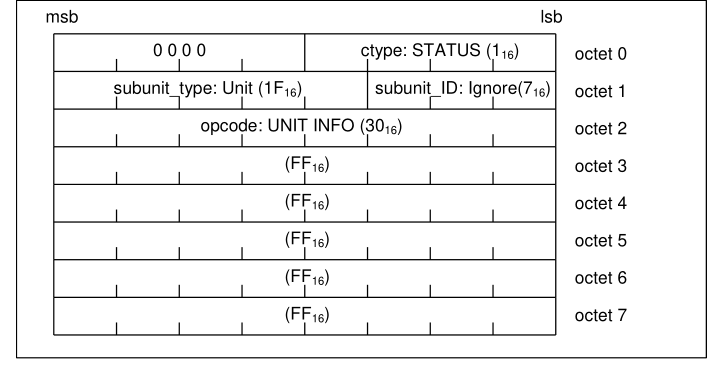

**Figure 24.1: UNIT INFO command frame**

An example of a response returned to above command frame is as follows.
msb
lsb

| 0 0 0 0 | response: STABLE (C ) 16 |  |
| --- | --- | --- |
| subunit type: Unit (1F ) _ 16 |  | subunit ID: Ignore(7 ) _ 16 |
| opcode: UNIT INFO (30 ) 16 |  |  |
| (07 ) 16 |  |  |
| unit type: Panel (9 ) _ 16 |  | Unit: (0 ) 16 |
| company ID (XXXXXX ) _ 16 |  |  |

octet 0
octet 1
octet 2
octet 3
octet 4
octet 5
octet 6
octet 7

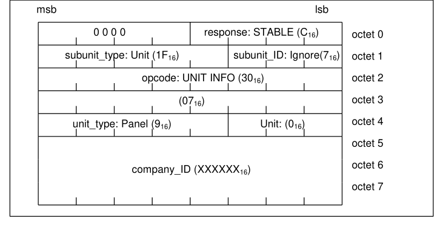

**Figure 24.2: UNIT INFO response frame**

If, in future, a Bluetooth AV control profile that applies AV/C command set is defined, and if a TG supports this AV control profile in addition to AVRCP, it is possible that a TG returns other subunit type than Panel as its unit_type.
SUBUNIT INFO command
The frame structure of SUBUNIT INFO command is as shown below.

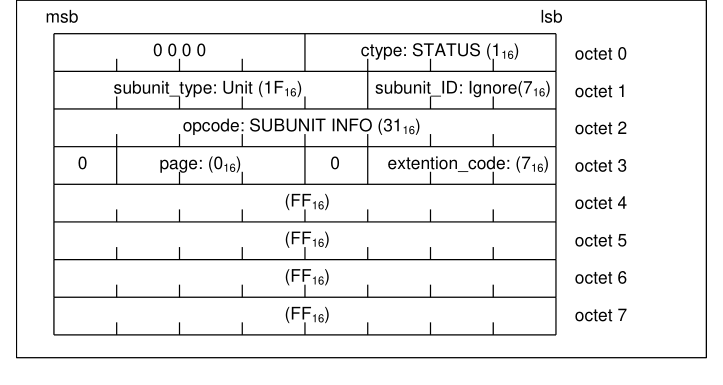

**Figure 24.3: SUBUNIT INFO command frame**

An example of a response returned to above command frame is as follows.
msb
lsb

| 0 0 0 0 | response: STABLE (C ) 16 |
| --- | --- |
| subunit type: Unit (1F ) subunit ID: Ignore(7 ) _ 16 _ 16 opcode: SUBUNIT INFO (31 ) 16 |  |
| 0 page: (0 ) 0 extention code: (7 ) 16 _ 16 subunit type: Panel (9 ) max subunit ID: (0 ) _ 16 _ _ 16 (FF ) 16 (FF ) 16 (FF ) 16 |  |

octet 0
octet 1
octet 2
octet 3
octet 4
octet 5
octet 6
octet 7

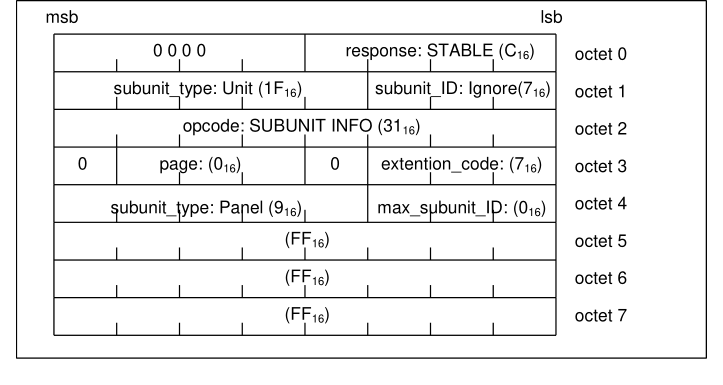

**Figure 24.4: SUBUNIT INFO response frame**

If, in future, a Bluetooth AV control profile that applies AV/C command set is defined, and if a TG supports this AV control profile in addition to AVRCP, the TG returns all of its supporting subunits including Panel in page_data field.
PASS THROUGH command
The PASS THROUGH command is a command sent when a “PLAY” button on a CT is pushed by a user. Its frame structure is as shown below. A CT sends a command frame with its state_flag field in value 0 when a button is pushed, and in value 1 when the button is released.

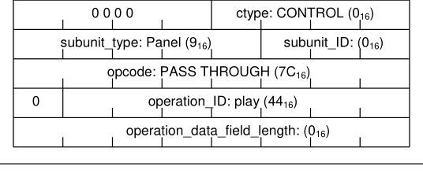

**Figure 24.5: PASS THROUGH command frame**

An example of a response returned to above command frame is as follows.
msb
lsb

| 0 0 0 0 |  | response: ACCEPTED (9 ) 16 |  |
| --- | --- | --- | --- |
| subunit type: Panel (9 ) _ 16 |  |  | subunit ID: (0 ) _ 16 |
| opcode: PASS THROUGH (7C ) 16 |  |  |  |
| 0 | operation ID: play (44 ) _ 16 |  |  |
| operation data field length: (0 ) _ _ _ 16 |  |  |  |

octet 0
octet 1
octet 2
octet 3
octet 4

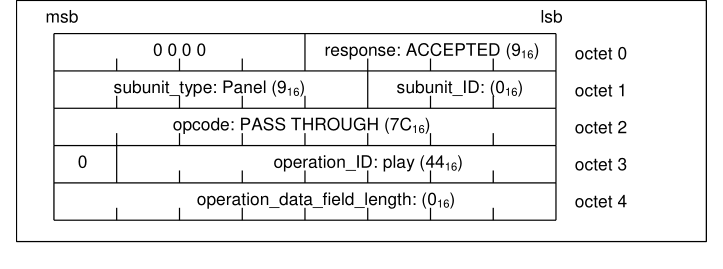

**Figure 24.6: PASS THROUGH response frame**

Get Capability for Company ID
Get Capability command for Company ID

|  | Oct |  |  | MSB (7) |  |  | 6 |  |  | 5 |  |  | 4 |  |  | 3 |  |  | 2 | 1 |  |  | LSB (0) |  |
| --- | --- | --- | --- | --- | --- | --- | --- | --- | --- | --- | --- | --- | --- | --- | --- | --- | --- | --- | --- | --- | --- | --- | --- | --- |
| 0 |  |  | 0x0 |  |  |  |  |  |  |  |  |  |  |  | Ctype: 0x1 (STATUS) |  |  |  |  |  |  |  |  |  |
| 1 |  |  | Subunit type:0x9 (PANEL) _ |  |  |  |  |  |  |  |  |  |  |  |  |  |  | Subunit ID: 0x0 _ |  |  |  |  |  |  |
| 2 |  |  | Opcode: 0x0 (VENDOR DEPENDENT) |  |  |  |  |  |  |  |  |  |  |  |  |  |  |  |  |  |  |  |  |  |
| 3 -5 |  |  | Company ID: Bluetooth SIG registered CompanyID |  |  |  |  |  |  |  |  |  |  |  |  |  |  |  |  |  |  |  |  |  |
|  | 6 |  |  | PDU ID (0x10 - Get Capabilities) |  |  |  |  |  |  |  |  |  |  |  |  |  |  |  |  |  |  |  |  |
|  | 7 |  |  | Reserved (0x00) |  |  |  |  |  |  |  |  |  |  |  |  |  |  |  | Packet Type (0x0) |  |  |  |  |
|  | 8 – |  | Parameter Length (0x0001) | Parameter Length (0x0001) |  |  |  |  |  |  |  |  |  |  |  |  |  |  |  |  |  |  |  |  |
|  | 9 |  |  |  |  |  |  |  |  |  |  |  |  |  |  |  |  |  |  |  |  |  |  |  |
|  | 10 |  |  | Capability ID: 0x2 (CompanyID) |  |  |  |  |  |  |  |  |  |  |  |  |  |  |  |  |  |  |  |  |

Get Capability response for Company ID

|  | Oct |  |  | MSB (7) |  |  | 6 |  |  | 5 |  |  | 4 |  |  | 3 |  |  | 2 | 1 |  |  | LSB (0) |  |
| --- | --- | --- | --- | --- | --- | --- | --- | --- | --- | --- | --- | --- | --- | --- | --- | --- | --- | --- | --- | --- | --- | --- | --- | --- |
| 0 |  |  | 0x0 |  |  |  |  |  |  |  |  |  |  |  | Response: 0xC (STABLE) |  |  |  |  |  |  |  |  |  |
| 1 |  |  | Subunit type: 0x9 (PANEL) _ |  |  |  |  |  |  |  |  |  |  |  |  |  |  | Subunit ID: 0x0 _ |  |  |  |  |  |  |
| 2 |  |  | Opcode: 0x0 (VENDOR DEPENDENT) |  |  |  |  |  |  |  |  |  |  |  |  |  |  |  |  |  |  |  |  |  |
| 3 - 5 |  |  | Company ID: Bluetooth SIG registered CompanyID |  |  |  |  |  |  |  |  |  |  |  |  |  |  |  |  |  |  |  |  |  |

|  | Oct |  |  | MSB (7) |  |  | 6 |  |  | 5 |  |  | 4 |  |  | 3 |  |  | 2 | 1 |  |  | LSB (0) |  |
| --- | --- | --- | --- | --- | --- | --- | --- | --- | --- | --- | --- | --- | --- | --- | --- | --- | --- | --- | --- | --- | --- | --- | --- | --- |
|  | 6 |  |  | PDU ID: 0x10 (Get Capabilities) |  |  |  |  |  |  |  |  |  |  |  |  |  |  |  |  |  |  |  |  |
|  | 7 |  |  | Reserved: 0x00 |  |  |  |  |  |  |  |  |  |  |  |  |  |  |  | Packet Type: 0x0 |  |  |  |  |
|  | 8 - 9 |  |  | Parameter Length: 0x5 |  |  |  |  |  |  |  |  |  |  |  |  |  |  |  |  |  |  |  |  |
|  | 10 |  |  | Capability ID: 0x2 (CompanyID) |  |  |  |  |  |  |  |  |  |  |  |  |  |  |  |  |  |  |  |  |
|  | 11 |  |  | Capability Count: 0x1 |  |  |  |  |  |  |  |  |  |  |  |  |  |  |  |  |  |  |  |  |
|  | 12- |  | Company ID: Bluetooth SIG registered CompanyID | Company ID: Bluetooth SIG registered CompanyID |  |  |  |  |  |  |  |  |  |  |  |  |  |  |  |  |  |  |  |  |
|  | 14 |  |  |  |  |  |  |  |  |  |  |  |  |  |  |  |  |  |  |  |  |  |  |  |

Get Capability for Events
Get Capability command for Events

|  | Oct |  |  | MSB (7) |  |  | 6 |  |  | 5 |  |  | 4 |  |  | 3 |  |  | 2 | 1 |  |  | LSB (0) |  |
| --- | --- | --- | --- | --- | --- | --- | --- | --- | --- | --- | --- | --- | --- | --- | --- | --- | --- | --- | --- | --- | --- | --- | --- | --- |
| 0 |  |  | 0x0 |  |  |  |  |  |  |  |  |  |  |  | Ctype: 0x1 (STATUS) |  |  |  |  |  |  |  |  |  |
| 1 |  |  | Subunit type:0x9 (PANEL) _ |  |  |  |  |  |  |  |  |  |  |  |  |  |  | Subunit ID: 0x0 _ |  |  |  |  |  |  |
| 2 |  |  | Opcode: 0x0 (VENDOR DEPENDENT) |  |  |  |  |  |  |  |  |  |  |  |  |  |  |  |  |  |  |  |  |  |
| 3 -5 |  |  | Company ID: Bluetooth SIG registered CompanyID |  |  |  |  |  |  |  |  |  |  |  |  |  |  |  |  |  |  |  |  |  |
|  | 6 |  |  | PDU ID (0x10 - Get Capabilities) |  |  |  |  |  |  |  |  |  |  |  |  |  |  |  |  |  |  |  |  |
|  | 7 |  |  | Reserved (0x00) |  |  |  |  |  |  |  |  |  |  |  |  |  |  |  | Packet Type (0x0) |  |  |  |  |
|  | 8 – |  | Parameter Length (0x0001) | Parameter Length (0x0001) |  |  |  |  |  |  |  |  |  |  |  |  |  |  |  |  |  |  |  |  |
|  | 9 |  |  |  |  |  |  |  |  |  |  |  |  |  |  |  |  |  |  |  |  |  |  |  |
|  | 10 |  |  | Capability ID: 0x3 (EventsID) |  |  |  |  |  |  |  |  |  |  |  |  |  |  |  |  |  |  |  |  |

Get Capability response for Events

|  | Oct |  |  | MSB (7) |  |  | 6 |  |  | 5 |  |  | 4 |  |  | 3 |  |  | 2 | 1 |  |  | LSB (0) |  |
| --- | --- | --- | --- | --- | --- | --- | --- | --- | --- | --- | --- | --- | --- | --- | --- | --- | --- | --- | --- | --- | --- | --- | --- | --- |
| 0 |  |  | 0x0 |  |  |  |  |  |  |  |  |  |  |  | Response: 0xC (STABLE) |  |  |  |  |  |  |  |  |  |
| 1 |  |  | Subunit type: 0x9 (PANEL) _ |  |  |  |  |  |  |  |  |  |  |  |  |  |  | Subunit ID: 0x0 _ |  |  |  |  |  |  |
| 2 |  |  | Opcode: 0x0 (VENDOR DEPENDENT) |  |  |  |  |  |  |  |  |  |  |  |  |  |  |  |  |  |  |  |  |  |
| 3 - 5 |  |  | Company ID: Bluetooth SIG registered CompanyID |  |  |  |  |  |  |  |  |  |  |  |  |  |  |  |  |  |  |  |  |  |
|  | 6 |  |  | PDU ID: 0x10 (Get Capabilities) |  |  |  |  |  |  |  |  |  |  |  |  |  |  |  |  |  |  |  |  |
|  | 7 |  |  | Reserved: 0x00 |  |  |  |  |  |  |  |  |  |  |  |  |  |  |  | Packet Type: 0x0 |  |  |  |  |
|  | 8 - 9 |  |  | Parameter Length: 0x5 |  |  |  |  |  |  |  |  |  |  |  |  |  |  |  |  |  |  |  |  |
|  | 10 |  |  | Capability ID: 0x3 (EventsID) |  |  |  |  |  |  |  |  |  |  |  |  |  |  |  |  |  |  |  |  |
|  | 11 |  |  | Capability Count: 0x3 |  |  |  |  |  |  |  |  |  |  |  |  |  |  |  |  |  |  |  |  |
|  | 12 |  |  | EventID1: 0x1 (EVENT PLAYBACK STATUS CHANGED) _ _ _ |  |  |  |  |  |  |  |  |  |  |  |  |  |  |  |  |  |  |  |  |
|  | 13 |  |  | EventID2: 0x2 (EVENT TRACK CHANGED) _ _ |  |  |  |  |  |  |  |  |  |  |  |  |  |  |  |  |  |  |  |  |
|  | 14 |  |  | EventID3: 0x8 (EVENT PLAYER APPLICATION SETTING CHANGED) _ _ _ _ |  |  |  |  |  |  |  |  |  |  |  |  |  |  |  |  |  |  |  |  |

List Application Settings Attributes
List Application Settings Attributes command

|  | Oct |  |  | MSB (7) |  |  | 6 |  |  | 5 |  |  | 4 |  |  | 3 |  |  | 2 | 1 |  |  | LSB (0) |  |
| --- | --- | --- | --- | --- | --- | --- | --- | --- | --- | --- | --- | --- | --- | --- | --- | --- | --- | --- | --- | --- | --- | --- | --- | --- |
| 0 |  |  | 0x0 |  |  |  |  |  |  |  |  |  |  |  | Ctype: 0x1 (STATUS) |  |  |  |  |  |  |  |  |  |
| 1 |  |  | Subunit type:0x9 (PANEL) _ |  |  |  |  |  |  |  |  |  |  |  |  |  |  | Subunit ID: 0x0 _ |  |  |  |  |  |  |
| 2 |  |  | Opcode: 0x0 (VENDOR DEPENDENT) |  |  |  |  |  |  |  |  |  |  |  |  |  |  |  |  |  |  |  |  |  |
| 3 - 5 |  |  | Company ID: Bluetooth SIG registered CompanyID |  |  |  |  |  |  |  |  |  |  |  |  |  |  |  |  |  |  |  |  |  |
|  | 6 |  |  | PDU ID (0x11 – ListApplicationSettingAttributes) |  |  |  |  |  |  |  |  |  |  |  |  |  |  |  |  |  |  |  |  |
|  | 7 |  |  | Reserved (0x00) |  |  |  |  |  |  |  |  |  |  |  |  |  |  |  | Packet Type (0x0) |  |  |  |  |
|  | 8 - 9 |  |  | Parameter Length (0x0) |  |  |  |  |  |  |  |  |  |  |  |  |  |  |  |  |  |  |  |  |

List Application Settings Attributes response

|  | Oct |  |  | MSB (7) |  |  | 6 |  |  | 5 |  |  | 4 |  |  | 3 |  |  | 2 | 1 |  |  | LSB (0) |  |
| --- | --- | --- | --- | --- | --- | --- | --- | --- | --- | --- | --- | --- | --- | --- | --- | --- | --- | --- | --- | --- | --- | --- | --- | --- |
| 0 |  |  | 0x0 |  |  |  |  |  |  |  |  |  |  |  | Response: 0xC (STABLE) |  |  |  |  |  |  |  |  |  |
| 1 |  |  | Subunit type: 0x9 (PANEL) _ |  |  |  |  |  |  |  |  |  |  |  |  |  |  | Subunit ID: 0x0 _ |  |  |  |  |  |  |
| 2 |  |  | Opcode: 0x0 (VENDOR DEPENDENT) |  |  |  |  |  |  |  |  |  |  |  |  |  |  |  |  |  |  |  |  |  |
| 3 - 5 |  |  | Company ID: Bluetooth SIG registered CompanyID |  |  |  |  |  |  |  |  |  |  |  |  |  |  |  |  |  |  |  |  |  |
|  | 6 |  |  | PDU ID (0x11 – ListApplicationSettingAttributes) |  |  |  |  |  |  |  |  |  |  |  |  |  |  |  |  |  |  |  |  |
|  | 7 |  |  | Reserved: 0x00 |  |  |  |  |  |  |  |  |  |  |  |  |  |  |  | Packet Type: 0x0 |  |  |  |  |
|  | 8 - 9 |  |  | Parameter Length: 0x3 |  |  |  |  |  |  |  |  |  |  |  |  |  |  |  |  |  |  |  |  |
|  | 10 |  |  | NumPlayerApplicationSettingAttributes: 0x2 |  |  |  |  |  |  |  |  |  |  |  |  |  |  |  |  |  |  |  |  |
|  | 11 |  |  | PlayerApplicationSettingAttributeID1: 0x1 (Equalizer ON/OFF Status) |  |  |  |  |  |  |  |  |  |  |  |  |  |  |  |  |  |  |  |  |
|  | 12 |  |  | PlayerApplicationSettingAttributeID2: 0x3 (Shuffle ON/OFF Status) |  |  |  |  |  |  |  |  |  |  |  |  |  |  |  |  |  |  |  |  |

Registration for Notification of Event Track Changed
Register Notification command

|  | Oct |  |  | MSB (7) | 6 |  |  | 5 |  |  | 4 |  |  | 3 |  |  | 2 | 1 |  | LSB (0) |  |
| --- | --- | --- | --- | --- | --- | --- | --- | --- | --- | --- | --- | --- | --- | --- | --- | --- | --- | --- | --- | --- | --- |
| 0 |  |  | 0x0 |  |  |  |  |  |  |  |  |  | Ctype: 0x3 (NOTIFY) |  |  |  |  |  |  |  |  |
| 1 |  |  | Subunit type:0x9 (PANEL) _ |  |  |  |  |  |  |  |  |  |  |  |  | Subunit ID: 0x0 _ |  |  |  |  |  |
| 2 |  |  | Opcode: 0x0 (VENDOR DEPENDENT) |  |  |  |  |  |  |  |  |  |  |  |  |  |  |  |  |  |  |
| 3 - 5 |  |  | Company ID: Bluetooth SIG registered CompanyID |  |  |  |  |  |  |  |  |  |  |  |  |  |  |  |  |  |  |
|  | 6 |  |  | PDU ID (0x31 – Register Notification) |  |  |  |  |  |  |  |  |  |  |  |  |  |  |  |  |  |
|  | 7 |  |  | Reserved (0x00) |  |  |  |  |  |  |  |  |  |  |  |  |  | Packet Type (0x0) |  |  |  |
|  | 8 - 9 |  |  | Parameter Length (0x5) |  |  |  |  |  |  |  |  |  |  |  |  |  |  |  |  |  |
|  | 10 |  |  | EventID2: 0x2 (EVENT TRACK CHANGED) _ _ |  |  |  |  |  |  |  |  |  |  |  |  |  |  |  |  |  |
|  | 11 |  | Playback interval: 0x0 (Ignored for this event) | Playback interval: 0x0 (Ignored for this event) |  |  |  |  |  |  |  |  |  |  |  |  |  |  |  |  |  |
|  | 14 |  |  |  |  |  |  |  |  |  |  |  |  |  |  |  |  |  |  |  |  |

Register Notification interim response

|  | Oct |  |  | MSB (7) | 6 |  |  | 5 |  |  | 4 |  |  | 3 |  |  | 2 | 1 |  | LSB (0) |  |
| --- | --- | --- | --- | --- | --- | --- | --- | --- | --- | --- | --- | --- | --- | --- | --- | --- | --- | --- | --- | --- | --- |
| 0 |  |  | 0x0 |  |  |  |  |  |  |  |  |  | Response: 0xF (INTERIM) |  |  |  |  |  |  |  |  |
| 1 |  |  | Subunit type: 0x9 (PANEL) _ |  |  |  |  |  |  |  |  |  |  |  |  | Subunit ID: 0x0 _ |  |  |  |  |  |
| 2 |  |  | Opcode: 0x0 (VENDOR DEPENDENT) |  |  |  |  |  |  |  |  |  |  |  |  |  |  |  |  |  |  |
| 3 - 5 |  |  | Company ID: Bluetooth SIG registered CompanyID |  |  |  |  |  |  |  |  |  |  |  |  |  |  |  |  |  |  |
|  | 6 |  |  | PDU ID: 0x31 (Register Notification) |  |  |  |  |  |  |  |  |  |  |  |  |  |  |  |  |  |
|  | 7 |  |  | Reserved: 0x00 |  |  |  |  |  |  |  |  |  |  |  |  |  | Packet Type: 0x0 |  |  |  |
|  | 8 - 9 |  |  | Parameter Length: 0x9 |  |  |  |  |  |  |  |  |  |  |  |  |  |  |  |  |  |
|  | 10 |  |  | EventID2: 0x2 (EVENT TRACK CHANGED) _ _ |  |  |  |  |  |  |  |  |  |  |  |  |  |  |  |  |  |
|  | 11- |  | Identifier: 0xFFFFFFFFFFFFFFFF | Identifier: 0xFFFFFFFFFFFFFFFF |  |  |  |  |  |  |  |  |  |  |  |  |  |  |  |  |  |
|  | 18 |  |  |  |  |  |  |  |  |  |  |  |  |  |  |  |  |  |  |  |  |

Register Notification response

|  | Oct |  |  | MSB (7) | 6 |  |  | 5 |  |  | 4 |  |  | 3 |  |  | 2 | 1 |  | LSB (0) |  |
| --- | --- | --- | --- | --- | --- | --- | --- | --- | --- | --- | --- | --- | --- | --- | --- | --- | --- | --- | --- | --- | --- |
| 0 |  |  | 0x0 |  |  |  |  |  |  |  |  |  | Response: 0xD (CHANGED) |  |  |  |  |  |  |  |  |
| 1 |  |  | Subunit type: 0x9 (PANEL) _ |  |  |  |  |  |  |  |  |  |  |  |  | Subunit ID: 0x0 _ |  |  |  |  |  |
| 2 |  |  | Opcode: 0x0 (VENDOR DEPENDENT) |  |  |  |  |  |  |  |  |  |  |  |  |  |  |  |  |  |  |
| 3 - 5 |  |  | Company ID: Bluetooth SIG registered CompanyID |  |  |  |  |  |  |  |  |  |  |  |  |  |  |  |  |  |  |
|  | 6 |  |  | PDU ID: 0x31 (Register Notification) |  |  |  |  |  |  |  |  |  |  |  |  |  |  |  |  |  |
|  | 7 |  |  | Reserved: 0x00 |  |  |  |  |  |  |  |  |  |  |  |  |  | Packet Type: 0x0 |  |  |  |
|  | 8 - 9 |  |  | Parameter Length: 0x9 |  |  |  |  |  |  |  |  |  |  |  |  |  |  |  |  |  |
|  | 10 |  |  | EventID2: 0x2 (EVENT TRACK CHANGED) _ _ |  |  |  |  |  |  |  |  |  |  |  |  |  |  |  |  |  |
|  | 11- |  | Identifier: 0x0 | Identifier: 0x0 |  |  |  |  |  |  |  |  |  |  |  |  |  |  |  |  |  |
|  | 18 |  |  |  |  |  |  |  |  |  |  |  |  |  |  |  |  |  |  |  |  |

Get Element Attributes
Get Element Attributes command

|  | Oct |  |  | MSB(7) |  |  | 6 |  |  | 5 |  |  | 4 |  |  | 3 |  |  | 2 |  |  | 1 |  |  | LSB(0) |  |
| --- | --- | --- | --- | --- | --- | --- | --- | --- | --- | --- | --- | --- | --- | --- | --- | --- | --- | --- | --- | --- | --- | --- | --- | --- | --- | --- |
| 0 |  |  | 0x0 |  |  |  |  |  |  |  |  |  |  |  | Ctype: 0x1 (STATUS) |  |  |  |  |  |  |  |  |  |  |  |
| 1 |  |  | Subunit type:0x9(PANEL) _ |  |  |  |  |  |  |  |  |  |  |  |  |  |  | Subunit ID: 0x0 _ |  |  |  |  |  |  |  |  |
| 2 |  |  | Opcode: 0x0 (VENDOR DEPENDENT) |  |  |  |  |  |  |  |  |  |  |  |  |  |  |  |  |  |  |  |  |  |  |  |
| 3 - 5 |  |  | Company ID: Bluetooth SIG registered CompanyID |  |  |  |  |  |  |  |  |  |  |  |  |  |  |  |  |  |  |  |  |  |  |  |
|  | 6 |  |  | PDU ID (0x20 – GetElementAttributes) |  |  |  |  |  |  |  |  |  |  |  |  |  |  |  |  |  |  |  |  |  |  |
|  | 7 |  |  | Reserved (0x00) |  |  |  |  |  |  |  |  |  |  |  |  |  |  |  |  |  | Packet Type (0x0) |  |  |  |  |
|  | 8 - 9 |  |  | Parameter Length (0x11) |  |  |  |  |  |  |  |  |  |  |  |  |  |  |  |  |  |  |  |  |  |  |
|  | 10 - 17 |  |  | Identifier: 0x0 (PLAYING) |  |  |  |  |  |  |  |  |  |  |  |  |  |  |  |  |  |  |  |  |  |  |
|  | 18 |  |  | AttributeCount: 0x2 |  |  |  |  |  |  |  |  |  |  |  |  |  |  |  |  |  |  |  |  |  |  |
|  | 19 - 22 |  |  | Attribute1: 0x1 (TitleOfMedia) |  |  |  |  |  |  |  |  |  |  |  |  |  |  |  |  |  |  |  |  |  |  |
|  | 23 - 26 |  |  | Attribute2: 0x7 (Playing Time) |  |  |  |  |  |  |  |  |  |  |  |  |  |  |  |  |  |  |  |  |  |  |

Get Element Attributes response

|  | Oct |  |  | MSB(7) |  |  | 6 |  |  | 5 |  |  | 4 |  |  | 3 |  |  | 2 |  |  | 1 |  |  | LSB(0) |  |
| --- | --- | --- | --- | --- | --- | --- | --- | --- | --- | --- | --- | --- | --- | --- | --- | --- | --- | --- | --- | --- | --- | --- | --- | --- | --- | --- |
| 0 |  |  | 0x0 |  |  |  |  |  |  |  |  |  |  |  | Response: 0xC (STABLE) |  |  |  |  |  |  |  |  |  |  |  |
| 1 |  |  | Subunit type:0x9(PANEL) _ |  |  |  |  |  |  |  |  |  |  |  |  |  |  | Subunit ID: 0x0 _ |  |  |  |  |  |  |  |  |
| 2 |  |  | Opcode: 0x0 (VENDOR DEPENDENT) |  |  |  |  |  |  |  |  |  |  |  |  |  |  |  |  |  |  |  |  |  |  |  |
| 3 - 5 |  |  | Company ID: Bluetooth SIG registered CompanyID |  |  |  |  |  |  |  |  |  |  |  |  |  |  |  |  |  |  |  |  |  |  |  |
|  | 6 |  |  | PDU ID (0x20 – GetElementAttributes) |  |  |  |  |  |  |  |  |  |  |  |  |  |  |  |  |  |  |  |  |  |  |
|  | 7 |  |  | Reserved (0x00) |  |  |  |  |  |  |  |  |  |  |  |  |  |  |  |  |  | Packet Type (0x0) |  |  |  |  |
|  | 8 - 9 |  |  | Parameter Length (0x2A) |  |  |  |  |  |  |  |  |  |  |  |  |  |  |  |  |  |  |  |  |  |  |
|  | 10 |  |  | Number of Attributes (0x2) |  |  |  |  |  |  |  |  |  |  |  |  |  |  |  |  |  |  |  |  |  |  |
|  | 11 - 14 |  |  | Attribute ID 1: 0x1 (TitleOfMedia) |  |  |  |  |  |  |  |  |  |  |  |  |  |  |  |  |  |  |  |  |  |  |
|  | 15 - 16 |  |  | CharacterSetID1: 0x6A (UTF-8) |  |  |  |  |  |  |  |  |  |  |  |  |  |  |  |  |  |  |  |  |  |  |
|  | 17 - 18 |  |  | AttributeValueLength1: 0x13 |  |  |  |  |  |  |  |  |  |  |  |  |  |  |  |  |  |  |  |  |  |  |
|  | 19 - 37 |  |  | AttributeValue1: ‘Give Peace a Chance’ |  |  |  |  |  |  |  |  |  |  |  |  |  |  |  |  |  |  |  |  |  |  |
|  | 38 - 41 |  |  | Attribute ID 2: 0x7 (Playing Time) |  |  |  |  |  |  |  |  |  |  |  |  |  |  |  |  |  |  |  |  |  |  |
|  | 42 - 43 |  |  | CharacterSetID2: 0x6A (UTF-8) |  |  |  |  |  |  |  |  |  |  |  |  |  |  |  |  |  |  |  |  |  |  |
|  | 44 - 45 |  |  | AttributeValueLength2: 0x6 |  |  |  |  |  |  |  |  |  |  |  |  |  |  |  |  |  |  |  |  |  |  |
|  | 46 - 51 |  |  | AttributeValue2: ‘103000’ (= 103000 ms – 103 sec. – 1min43s) |  |  |  |  |  |  |  |  |  |  |  |  |  |  |  |  |  |  |  |  |  |  |

Fragmentation
Initial GetElementAttributes Command

|  | Oct |  |  | MSB (7) |  |  | 6 |  |  | 5 |  |  | 4 |  |  | 3 |  |  | 2 | 1 |  |  | LSB (0) |  |
| --- | --- | --- | --- | --- | --- | --- | --- | --- | --- | --- | --- | --- | --- | --- | --- | --- | --- | --- | --- | --- | --- | --- | --- | --- |
| 0 |  |  | 0x0 |  |  |  |  |  |  |  |  |  |  |  | Ctype: 0x1 (STATUS) |  |  |  |  |  |  |  |  |  |
| 1 |  |  | Subunit type:0x9 (PANEL) _ |  |  |  |  |  |  |  |  |  |  |  |  |  |  | Subunit ID: 0x0 _ |  |  |  |  |  |  |
| 2 |  |  | Opcode: 0x0 (VENDOR DEPENDENT) |  |  |  |  |  |  |  |  |  |  |  |  |  |  |  |  |  |  |  |  |  |
| 3 - 5 |  |  | Company ID: Bluetooth SIG registered CompanyID |  |  |  |  |  |  |  |  |  |  |  |  |  |  |  |  |  |  |  |  |  |
|  | 6 |  |  | PDU ID (0x20 – GetElementAttributes) |  |  |  |  |  |  |  |  |  |  |  |  |  |  |  |  |  |  |  |  |
|  | 7 |  |  | Reserved (0x00) |  |  |  |  |  |  |  |  |  |  |  |  |  |  |  | Packet Type (0x0) |  |  |  |  |
|  | 8 - 9 |  |  | Parameter Length (0x11) |  |  |  |  |  |  |  |  |  |  |  |  |  |  |  |  |  |  |  |  |
|  | 10 - |  | Identifier: 0x0 (PLAYING) | Identifier: 0x0 (PLAYING) |  |  |  |  |  |  |  |  |  |  |  |  |  |  |  |  |  |  |  |  |
|  | 17 |  |  |  |  |  |  |  |  |  |  |  |  |  |  |  |  |  |  |  |  |  |  |  |
|  | 18 |  |  | AttributeCount: 0x2 |  |  |  |  |  |  |  |  |  |  |  |  |  |  |  |  |  |  |  |  |
|  | 19 - |  | Attribute1: 0x1 (TitleOfMedia) | Attribute1: 0x1 (TitleOfMedia) |  |  |  |  |  |  |  |  |  |  |  |  |  |  |  |  |  |  |  |  |
|  | 22 |  |  |  |  |  |  |  |  |  |  |  |  |  |  |  |  |  |  |  |  |  |  |  |
|  | 23 - |  | Attribute2: 0x7 (Playing Time) |  |  |  |  |  |  |  |  |  |  |  |  |  |  |  |  |  |  |  |  |  |
|  | 26 |  |  |  |  |  |  |  |  |  |  |  |  |  |  |  |  |  |  |  |  |  |  |  |

Start Fragment GetElementAttributes Response

|  | Oct |  |  | MSB (7) |  |  | 6 |  |  | 5 |  |  | 4 |  |  | 3 |  |  | 2 | 1 |  |  | LSB (0) |  |
| --- | --- | --- | --- | --- | --- | --- | --- | --- | --- | --- | --- | --- | --- | --- | --- | --- | --- | --- | --- | --- | --- | --- | --- | --- |
| 0 |  |  | 0x0 |  |  |  |  |  |  |  |  |  |  |  | Response: 0xC (STABLE) |  |  |  |  |  |  |  |  |  |
| 1 |  |  | Subunit type:0x9 (PANEL) _ |  |  |  |  |  |  |  |  |  |  |  |  |  |  | Subunit ID: 0x0 _ |  |  |  |  |  |  |
| 2 |  |  | Opcode: 0x0 (VENDOR DEPENDENT) |  |  |  |  |  |  |  |  |  |  |  |  |  |  |  |  |  |  |  |  |  |
| 3 - 5 |  |  | Company ID: Bluetooth SIG registered CompanyID |  |  |  |  |  |  |  |  |  |  |  |  |  |  |  |  |  |  |  |  |  |
|  | 6 |  |  | PDU ID (0x20 – GetElementAttributes) |  |  |  |  |  |  |  |  |  |  |  |  |  |  |  |  |  |  |  |  |
|  | 7 |  |  | Reserved (0x00) |  |  |  |  |  |  |  |  |  |  |  |  |  |  |  | Packet Type (0x1) |  |  |  |  |
|  | 8 - 9 |  |  | Parameter Length (0x1F6) |  |  |  |  |  |  |  |  |  |  |  |  |  |  |  |  |  |  |  |  |
|  | 10 |  |  | Number of Attributes (0x2) |  |  |  |  |  |  |  |  |  |  |  |  |  |  |  |  |  |  |  |  |
|  | 11 - |  | Attribute ID 1: 0x1 (TitleOfMedia) | Attribute ID 1: 0x1 (TitleOfMedia) |  |  |  |  |  |  |  |  |  |  |  |  |  |  |  |  |  |  |  |  |
|  | 14 |  |  |  |  |  |  |  |  |  |  |  |  |  |  |  |  |  |  |  |  |  |  |  |
|  | 15 - |  | CharacterSetID1: 0x6A (UTF-8) |  |  |  |  |  |  |  |  |  |  |  |  |  |  |  |  |  |  |  |  |  |
|  | 16 |  |  |  |  |  |  |  |  |  |  |  |  |  |  |  |  |  |  |  |  |  |  |  |
|  | 17 – |  | AttributeValueLength1: 0x1FA |  |  |  |  |  |  |  |  |  |  |  |  |  |  |  |  |  |  |  |  |  |
|  | 18 |  |  |  |  |  |  |  |  |  |  |  |  |  |  |  |  |  |  |  |  |  |  |  |
|  | 19 - |  | AttributeValue1: First 0x1ED octets |  |  |  |  |  |  |  |  |  |  |  |  |  |  |  |  |  |  |  |  |  |
|  | 51 |  |  |  |  |  |  |  |  |  |  |  |  |  |  |  |  |  |  |  |  |  |  |  |

|  | Oct |  |  | MSB (7) |  |  | 6 |  |  | 5 |  |  | 4 |  |  | 3 |  |  | 2 | 1 |  |  | LSB (0) |  |
| --- | --- | --- | --- | --- | --- | --- | --- | --- | --- | --- | --- | --- | --- | --- | --- | --- | --- | --- | --- | --- | --- | --- | --- | --- |
| 0 |  |  | 0x0 |  |  |  |  |  |  |  |  |  |  |  | Ctype: 0x0 (CONTROL) |  |  |  |  |  |  |  |  |  |
| 1 |  |  | Subunit type:0x9 (PANEL) _ |  |  |  |  |  |  |  |  |  |  |  |  |  |  | Subunit ID: 0x0 _ |  |  |  |  |  |  |
| 2 |  |  | Opcode: 0x0 (VENDOR DEPENDENT) |  |  |  |  |  |  |  |  |  |  |  |  |  |  |  |  |  |  |  |  |  |
| 3 - 5 |  |  | Company ID: Bluetooth SIG registered CompanyID |  |  |  |  |  |  |  |  |  |  |  |  |  |  |  |  |  |  |  |  |  |
|  | 6 |  |  | PDU ID (0x40 – RequestContinuingResponse) |  |  |  |  |  |  |  |  |  |  |  |  |  |  |  |  |  |  |  |  |
|  | 7 |  |  | Reserved (0x00) |  |  |  |  |  |  |  |  |  |  |  |  |  |  |  | Packet Type (0x0) |  |  |  |  |
|  | 8 - 9 |  |  | Parameter Length (0x1) |  |  |  |  |  |  |  |  |  |  |  |  |  |  |  |  |  |  |  |  |
|  | 10 |  |  | PDU ID: 0x20 |  |  |  |  |  |  |  |  |  |  |  |  |  |  |  |  |  |  |  |  |

End Fragment GetElementAttributes Response:

|  | Oct |  |  | MSB (7) |  |  | 6 |  |  | 5 |  |  | 4 |  |  | 3 |  |  | 2 | 1 |  |  | LSB (0) |  |
| --- | --- | --- | --- | --- | --- | --- | --- | --- | --- | --- | --- | --- | --- | --- | --- | --- | --- | --- | --- | --- | --- | --- | --- | --- |
| 0 |  |  | 0x0 |  |  |  |  |  |  |  |  |  |  |  | Response: 0xC (STABLE) |  |  |  |  |  |  |  |  |  |
| 1 |  |  | Subunit type:0x9 (PANEL) _ |  |  |  |  |  |  |  |  |  |  |  |  |  |  | Subunit ID: 0x0 _ |  |  |  |  |  |  |
| 2 |  |  | Opcode: 0x0 (VENDOR DEPENDENT) |  |  |  |  |  |  |  |  |  |  |  |  |  |  |  |  |  |  |  |  |  |
| 3 - 5 |  |  | Company ID: Bluetooth SIG registered CompanyID |  |  |  |  |  |  |  |  |  |  |  |  |  |  |  |  |  |  |  |  |  |
|  | 6 |  |  | PDU ID (0x20 – GetElementAttributes) |  |  |  |  |  |  |  |  |  |  |  |  |  |  |  |  |  |  |  |  |
|  | 7 |  |  | Reserved (0x00) |  |  |  |  |  |  |  |  |  |  |  |  |  |  |  | Packet Type (0x3) |  |  |  |  |
|  | 8 - 9 |  |  | Parameter Length (0x1B) |  |  |  |  |  |  |  |  |  |  |  |  |  |  |  |  |  |  |  |  |
|  | 10 - |  | AttributeValue1: Last 0x0D octets | AttributeValue1: Last 0x0D octets |  |  |  |  |  |  |  |  |  |  |  |  |  |  |  |  |  |  |  |  |
|  | 22 |  |  |  |  |  |  |  |  |  |  |  |  |  |  |  |  |  |  |  |  |  |  |  |
|  | 23 - |  | Attribute ID 2: 0x7 (Playing Time) |  |  |  |  |  |  |  |  |  |  |  |  |  |  |  |  |  |  |  |  |  |
|  | 26 |  |  |  |  |  |  |  |  |  |  |  |  |  |  |  |  |  |  |  |  |  |  |  |
|  | 27 - |  | CharacterSetID2: 0x6A (UTF-8) |  |  |  |  |  |  |  |  |  |  |  |  |  |  |  |  |  |  |  |  |  |
|  | 28 |  |  |  |  |  |  |  |  |  |  |  |  |  |  |  |  |  |  |  |  |  |  |  |
|  | 29 - |  | AttributeValueLength2: 0x6 |  |  |  |  |  |  |  |  |  |  |  |  |  |  |  |  |  |  |  |  |  |
|  | 30 |  |  |  |  |  |  |  |  |  |  |  |  |  |  |  |  |  |  |  |  |  |  |  |
|  | 31 - |  | AttributeValue2: ‘103000’ (= 103000 ms – 103 sec. – 1min43s) |  |  |  |  |  |  |  |  |  |  |  |  |  |  |  |  |  |  |  |  |  |
|  | 36 |  |  |  |  |  |  |  |  |  |  |  |  |  |  |  |  |  |  |  |  |  |  |  |

PASS THROUGH for Group Navigation PASS THROUGH command for Group Navigation

|  | Oct |  |  | MSB (7) |  |  | 6 |  |  | 5 |  |  | 4 |  |  | 3 |  |  | 2 | 1 |  |  | LSB (0) |  |
| --- | --- | --- | --- | --- | --- | --- | --- | --- | --- | --- | --- | --- | --- | --- | --- | --- | --- | --- | --- | --- | --- | --- | --- | --- |
| 0 |  |  | 0x0 |  |  |  |  |  |  |  |  |  |  |  | Ctype: 0x0 (CONTROL) |  |  |  |  |  |  |  |  |  |
| 1 |  |  | Subunit type:0x9 (PANEL) _ |  |  |  |  |  |  |  |  |  |  |  |  |  |  | Subunit ID: 0x0 _ |  |  |  |  |  |  |
| 2 |  |  | Opcode: 0x7C (PASS THROUGH) |  |  |  |  |  |  |  |  |  |  |  |  |  |  |  |  |  |  |  |  |  |
| 3 |  |  | State flag *2 _ |  |  | Operation ID: 0x7E (VENDOR UNIQUE) _ |  |  |  |  |  |  |  |  |  |  |  |  |  |  |  |  |  |  |
| 4 |  |  | Operation data field length: 0x5 _ _ _ |  |  |  |  |  |  |  |  |  |  |  |  |  |  |  |  |  |  |  |  |  |

|  | Oct |  |  | MSB (7) |  |  | 6 |  |  | 5 |  |  | 4 |  |  | 3 |  |  | 2 | 1 |  |  | LSB (0) |  |
| --- | --- | --- | --- | --- | --- | --- | --- | --- | --- | --- | --- | --- | --- | --- | --- | --- | --- | --- | --- | --- | --- | --- | --- | --- |
| 5 - 7 |  |  | Company ID: Bluetooth SIG registered CompanyID |  |  |  |  |  |  |  |  |  |  |  |  |  |  |  |  |  |  |  |  |  |
| 8 - 9 |  |  | Vendor unique operation id _ _ _ |  |  |  |  |  |  |  |  |  |  |  |  |  |  |  |  |  |  |  |  |  |

PASS THROUGH Response for Group Navigation

|  | Oct |  |  | MSB (7) |  |  | 6 |  |  | 5 |  |  | 4 |  |  | 3 |  |  | 2 | 1 |  |  | LSB (0) |  |
| --- | --- | --- | --- | --- | --- | --- | --- | --- | --- | --- | --- | --- | --- | --- | --- | --- | --- | --- | --- | --- | --- | --- | --- | --- |
| 0 |  |  | 0x0 |  |  |  |  |  |  |  |  |  |  |  | Response *1 |  |  |  |  |  |  |  |  |  |
| 1 |  |  | Subunit type:0x9 (PANEL) _ |  |  |  |  |  |  |  |  |  |  |  |  |  |  | Subunit ID: 0x0 _ |  |  |  |  |  |  |
| 2 |  |  | Opcode: 0x7C (PASS THROUGH) |  |  |  |  |  |  |  |  |  |  |  |  |  |  |  |  |  |  |  |  |  |
| 3 |  |  | State flag *2 _ |  |  | Operation ID: 0x7E (VENDOR UNIQUE) _ |  |  |  |  |  |  |  |  |  |  |  |  |  |  |  |  |  |  |
| 4 |  |  | Operation data field length: 0x5 _ _ _ |  |  |  |  |  |  |  |  |  |  |  |  |  |  |  |  |  |  |  |  |  |
| 5 - 7 |  |  | Company ID: Bluetooth SIG registered CompanyID |  |  |  |  |  |  |  |  |  |  |  |  |  |  |  |  |  |  |  |  |  |
| 8 - 9 |  |  | Vendor unique operation id _ _ _ |  |  |  |  |  |  |  |  |  |  |  |  |  |  |  |  |  |  |  |  |  |

*1 0x8(NOT_IMPLEMENTED), 0x9 (ACCEPTED), 0xA (REJECTED)
*2 A CT sends a command frame with its state_flag field in value 0 when a button is pushed and in value 1 when the button is released.
Set Addressed Player
Control command for Set Addressed Player

|  | Oct |  |  | MSB (7) |  |  | 6 |  |  | 5 |  |  | 4 |  |  | 3 |  |  | 2 | 1 |  |  | LSB (0) |  |
| --- | --- | --- | --- | --- | --- | --- | --- | --- | --- | --- | --- | --- | --- | --- | --- | --- | --- | --- | --- | --- | --- | --- | --- | --- |
| 0 |  |  | 0x0 |  |  |  |  |  |  |  |  |  |  |  | Ctype: 0x0 (CONTROL) |  |  |  |  |  |  |  |  |  |
| 1 |  |  | Subunit type:0x9 (PANEL) _ |  |  |  |  |  |  |  |  |  |  |  |  |  |  | Subunit ID: 0x0 _ |  |  |  |  |  |  |
| 2 |  |  | Opcode: 0x0 (VENDOR DEPENDENT) |  |  |  |  |  |  |  |  |  |  |  |  |  |  |  |  |  |  |  |  |  |
| 3 - 5 |  |  | Company ID: Bluetooth SIG registered CompanyID |  |  |  |  |  |  |  |  |  |  |  |  |  |  |  |  |  |  |  |  |  |
|  | 6 |  |  | PDU ID (0x60 – SetAddressedPlayer) |  |  |  |  |  |  |  |  |  |  |  |  |  |  |  |  |  |  |  |  |
|  | 7 |  |  | Reserved (0x00) |  |  |  |  |  |  |  |  |  |  |  |  |  |  |  | Packet Type (0x0) |  |  |  |  |
|  | 8 - 9 |  |  | Parameter Length (0x2) |  |  |  |  |  |  |  |  |  |  |  |  |  |  |  |  |  |  |  |  |
|  | 10 - |  |  |  |  |  |  |  |  |  |  |  |  |  |  |  |  |  |  |  |  |  |  |  |
|  | 11 |  |  | Player Id as defined in Section 6.10.2.1 |  |  |  |  |  |  |  |  |  |  |  |  |  |  |  |  |  |  |  |  |

Response for Set Addressed Player.

|  | Oct |  |  | MSB (7) |  |  | 6 |  |  | 5 |  |  | 4 |  |  | 3 |  |  | 2 | 1 |  |  | LSB (0) |  |
| --- | --- | --- | --- | --- | --- | --- | --- | --- | --- | --- | --- | --- | --- | --- | --- | --- | --- | --- | --- | --- | --- | --- | --- | --- |
| 0 |  |  | 0x0 |  |  |  |  |  |  |  |  |  |  |  | Ctype: 0x9 (Accepted) |  |  |  |  |  |  |  |  |  |
| 1 |  |  | Subunit type:0x9 (PANEL) _ |  |  |  |  |  |  |  |  |  |  |  |  |  |  | Subunit ID: 0x0 _ |  |  |  |  |  |  |
| 2 |  |  | Opcode: 0x0 (VENDOR DEPENDENT) |  |  |  |  |  |  |  |  |  |  |  |  |  |  |  |  |  |  |  |  |  |
| 3 -5 |  |  | Company ID: Bluetooth SIG registered CompanyID |  |  |  |  |  |  |  |  |  |  |  |  |  |  |  |  |  |  |  |  |  |
|  | 6 |  |  | PDU ID (0x60 – SetAddressedPlayer) |  |  |  |  |  |  |  |  |  |  |  |  |  |  |  |  |  |  |  |  |

|  | Oct |  |  | MSB (7) | 6 |  |  | 5 |  |  | 4 |  |  | 3 |  |  | 2 | 1 |  | LSB (0) |  |
| --- | --- | --- | --- | --- | --- | --- | --- | --- | --- | --- | --- | --- | --- | --- | --- | --- | --- | --- | --- | --- | --- |
|  | 7 |  |  | Reserved (0x00) |  |  |  |  |  |  |  |  |  |  |  |  |  | Packet Type (0x0) |  |  |  |
|  | 8 – |  | Parameter Length (0x1) | Parameter Length (0x1) |  |  |  |  |  |  |  |  |  |  |  |  |  |  |  |  |  |
|  | 9 |  |  |  |  |  |  |  |  |  |  |  |  |  |  |  |  |  |  |  |  |
|  | 10 |  |  | Status as defined in Section 6.15.3 |  |  |  |  |  |  |  |  |  |  |  |  |  |  |  |  |  |

Addressed Player Changed Notification
Addressed Player Changed Notification Command.

|  | Oct |  |  | MSB (7) | 6 |  |  | 5 |  |  | 4 |  |  | 3 |  |  | 2 | 1 |  | LSB (0) |  |
| --- | --- | --- | --- | --- | --- | --- | --- | --- | --- | --- | --- | --- | --- | --- | --- | --- | --- | --- | --- | --- | --- |
| 0 |  |  | 0x0 |  |  |  |  |  |  |  |  |  | Ctype: 0x3 (NOTIFY) |  |  |  |  |  |  |  |  |
| 1 |  |  | Subunit type:0x9 (PANEL) _ |  |  |  |  |  |  |  |  |  |  |  |  | Subunit ID: 0x0 _ |  |  |  |  |  |
| 2 |  |  | Opcode: 0x0 (VENDOR DEPENDENT) |  |  |  |  |  |  |  |  |  |  |  |  |  |  |  |  |  |  |
| 3 - 5 |  |  | Company ID: Bluetooth SIG registered CompanyID |  |  |  |  |  |  |  |  |  |  |  |  |  |  |  |  |  |  |
|  | 6 |  |  | PDU ID (0x31 – Register Notification) |  |  |  |  |  |  |  |  |  |  |  |  |  |  |  |  |  |
|  | 7 |  |  | Reserved (0x00) |  |  |  |  |  |  |  |  |  |  |  |  |  | Packet Type (0x0) |  |  |  |
|  | 8 - 9 |  |  | Parameter Length (0x5) |  |  |  |  |  |  |  |  |  |  |  |  |  |  |  |  |  |
|  | 10 |  |  | EventID2: 0xb (EVENT ADDRESSED PLAYER CHANGED) _ _ _ |  |  |  |  |  |  |  |  |  |  |  |  |  |  |  |  |  |
|  | 11 |  | Reserved | Reserved |  |  |  |  |  |  |  |  |  |  |  |  |  |  |  |  |  |
|  | 14 |  |  |  |  |  |  |  |  |  |  |  |  |  |  |  |  |  |  |  |  |

Addressed Player Changed Notification Response.

|  | Oct |  |  | MSB (7) | 6 |  |  | 5 |  |  | 4 |  |  | 3 |  |  | 2 | 1 |  | LSB (0) |  |
| --- | --- | --- | --- | --- | --- | --- | --- | --- | --- | --- | --- | --- | --- | --- | --- | --- | --- | --- | --- | --- | --- |
| 0 |  |  | 0x0 |  |  |  |  |  |  |  |  |  | Response: 0xD (CHANGED) |  |  |  |  |  |  |  |  |
| 1 |  |  | Subunit type: 0x9 (PANEL) _ |  |  |  |  |  |  |  |  |  |  |  |  | Subunit ID: 0x0 _ |  |  |  |  |  |
| 2 |  |  | Opcode: 0x0 (VENDOR DEPENDENT) |  |  |  |  |  |  |  |  |  |  |  |  |  |  |  |  |  |  |
| 3 - 5 |  |  | Company ID: Bluetooth SIG registered CompanyID |  |  |  |  |  |  |  |  |  |  |  |  |  |  |  |  |  |  |
|  | 6 |  |  | PDU ID: 0x31 (Register Notification) |  |  |  |  |  |  |  |  |  |  |  |  |  |  |  |  |  |
|  | 7 |  |  | Reserved: 0x00 |  |  |  |  |  |  |  |  |  |  |  |  |  | Packet Type: 0x0 |  |  |  |
|  | 8 - 9 |  |  | Parameter Length: 0x5 |  |  |  |  |  |  |  |  |  |  |  |  |  |  |  |  |  |
|  | 10 |  |  | EventID2: 0xb (EVENT ADDRESSED PLAYER CHANGED) _ _ _ |  |  |  |  |  |  |  |  |  |  |  |  |  |  |  |  |  |
|  | 11 - |  |  | PlayerId as defined in Section 6.10.2.1 |  |  |  |  |  |  |  |  |  |  |  |  |  |  |  |  |  |
|  | 12 |  |  |  |  |  |  |  |  |  |  |  |  |  |  |  |  |  |  |  |  |
|  | 13 - |  | UID Counter as defined in Section 6.10.3 | UID Counter as defined in Section 6.10.3 |  |  |  |  |  |  |  |  |  |  |  |  |  |  |  |  |  |
|  | 14 |  |  |  |  |  |  |  |  |  |  |  |  |  |  |  |  |  |  |  |  |

Available Players Changed Notification
Available Players Changed Notification Command

|  | Oct |  |  | MSB (7) | 6 |  |  | 5 |  |  | 4 |  |  | 3 |  |  | 2 | 1 |  | LSB (0) |  |
| --- | --- | --- | --- | --- | --- | --- | --- | --- | --- | --- | --- | --- | --- | --- | --- | --- | --- | --- | --- | --- | --- |
| 0 |  |  | 0x0 |  |  |  |  |  |  |  |  |  | Ctype: 0x3 (NOTIFY) |  |  |  |  |  |  |  |  |
| 1 |  |  | Subunit type:0x9 (PANEL) _ |  |  |  |  |  |  |  |  |  |  |  |  | Subunit ID: 0x0 _ |  |  |  |  |  |
| 2 |  |  | Opcode: 0x0 (VENDOR DEPENDENT) |  |  |  |  |  |  |  |  |  |  |  |  |  |  |  |  |  |  |
| 3 - 5 |  |  | Company ID: Bluetooth SIG registered CompanyID |  |  |  |  |  |  |  |  |  |  |  |  |  |  |  |  |  |  |
|  | 6 |  |  | PDU ID (0x31 – Register Notification) |  |  |  |  |  |  |  |  |  |  |  |  |  |  |  |  |  |
|  | 7 |  |  | Reserved (0x00) |  |  |  |  |  |  |  |  |  |  |  |  |  | Packet Type (0x0) |  |  |  |
|  | 8 - 9 |  |  | Parameter Length (0x5) |  |  |  |  |  |  |  |  |  |  |  |  |  |  |  |  |  |
|  | 10 |  |  | EventID2: 0x0a (EVENT AVAILABLE PLAYERS CHANGED) _ _ _ |  |  |  |  |  |  |  |  |  |  |  |  |  |  |  |  |  |
|  | 11 |  | Reserved | Reserved |  |  |  |  |  |  |  |  |  |  |  |  |  |  |  |  |  |
|  | 14 |  |  |  |  |  |  |  |  |  |  |  |  |  |  |  |  |  |  |  |  |

Available Players Changed Notification Response.

|  | Oct |  |  | MSB (7) | 6 |  |  | 5 |  |  | 4 |  |  | 3 |  |  | 2 | 1 |  | LSB (0) |  |
| --- | --- | --- | --- | --- | --- | --- | --- | --- | --- | --- | --- | --- | --- | --- | --- | --- | --- | --- | --- | --- | --- |
| 0 |  |  | 0x0 |  |  |  |  |  |  |  |  |  | Response: 0xD (CHANGED) |  |  |  |  |  |  |  |  |
| 1 |  |  | Subunit type: 0x9 (PANEL) _ |  |  |  |  |  |  |  |  |  |  |  |  | Subunit ID: 0x0 _ |  |  |  |  |  |
| 2 |  |  | Opcode: 0x0 (VENDOR DEPENDENT) |  |  |  |  |  |  |  |  |  |  |  |  |  |  |  |  |  |  |
| 3 - 5 |  |  | Company ID: Bluetooth SIG registered CompanyID |  |  |  |  |  |  |  |  |  |  |  |  |  |  |  |  |  |  |
|  | 6 |  |  | PDU ID: 0x31 (Register Notification) |  |  |  |  |  |  |  |  |  |  |  |  |  |  |  |  |  |
|  | 7 |  |  | Reserved: 0x00 |  |  |  |  |  |  |  |  |  |  |  |  |  | Packet Type: 0x0 |  |  |  |
|  | 8 - 9 |  |  | Parameter Length: 0x1 |  |  |  |  |  |  |  |  |  |  |  |  |  |  |  |  |  |
|  | 10 |  |  | EventID2: 0x0a (EVENT AVAILABLE PLAYERS CHANGED) _ _ _ |  |  |  |  |  |  |  |  |  |  |  |  |  |  |  |  |  |

Now Playing Content Changed Notification
Now Playing Content Changed Notification Command.

|  | Oct |  |  | MSB (7) | 6 |  |  | 5 |  |  | 4 |  |  | 3 |  |  | 2 | 1 |  | LSB (0) |  |
| --- | --- | --- | --- | --- | --- | --- | --- | --- | --- | --- | --- | --- | --- | --- | --- | --- | --- | --- | --- | --- | --- |
| 0 |  |  | 0x0 |  |  |  |  |  |  |  |  |  | Ctype: 0x3 (NOTIFY) |  |  |  |  |  |  |  |  |
| 1 |  |  | Subunit type:0x9 (PANEL) _ |  |  |  |  |  |  |  |  |  |  |  |  | Subunit ID: 0x0 _ |  |  |  |  |  |
| 2 |  |  | Opcode: 0x0 (VENDOR DEPENDENT) |  |  |  |  |  |  |  |  |  |  |  |  |  |  |  |  |  |  |
| 3 - 5 |  |  | Company ID: Bluetooth SIG registered CompanyID |  |  |  |  |  |  |  |  |  |  |  |  |  |  |  |  |  |  |
|  | 6 |  |  | PDU ID (0x31 – Register Notification) |  |  |  |  |  |  |  |  |  |  |  |  |  |  |  |  |  |
|  | 7 |  |  | Reserved (0x00) |  |  |  |  |  |  |  |  |  |  |  |  |  | Packet Type (0x0) |  |  |  |
|  | 8 - 9 |  |  | Parameter Length (0x5) |  |  |  |  |  |  |  |  |  |  |  |  |  |  |  |  |  |

|  | Oct |  |  | MSB (7) | 6 |  |  | 5 |  |  | 4 |  |  | 3 |  |  | 2 | 1 |  | LSB (0) |  |
| --- | --- | --- | --- | --- | --- | --- | --- | --- | --- | --- | --- | --- | --- | --- | --- | --- | --- | --- | --- | --- | --- |
|  | 10 |  |  | EventID: 0x09 (EVENT NOW PLAYING CONTENT CHANGED) _ _ _ _ |  |  |  |  |  |  |  |  |  |  |  |  |  |  |  |  |  |
|  | 11 |  | Reserved | Reserved |  |  |  |  |  |  |  |  |  |  |  |  |  |  |  |  |  |
|  | 14 |  |  |  |  |  |  |  |  |  |  |  |  |  |  |  |  |  |  |  |  |

Now Playing Content Changed Notification Response.

|  | Oct |  |  | MSB (7) | 6 |  |  | 5 |  |  | 4 |  |  | 3 |  |  | 2 | 1 |  | LSB (0) |  |
| --- | --- | --- | --- | --- | --- | --- | --- | --- | --- | --- | --- | --- | --- | --- | --- | --- | --- | --- | --- | --- | --- |
| 0 |  |  | 0x0 |  |  |  |  |  |  |  |  |  | Response: 0xD (CHANGED) |  |  |  |  |  |  |  |  |
| 1 |  |  | Subunit type: 0x9 (PANEL) _ |  |  |  |  |  |  |  |  |  |  |  |  | Subunit ID: 0x0 _ |  |  |  |  |  |
| 2 |  |  | Opcode: 0x0 (VENDOR DEPENDENT) |  |  |  |  |  |  |  |  |  |  |  |  |  |  |  |  |  |  |
| 3 - 5 |  |  | Company ID: Bluetooth SIG registered CompanyID |  |  |  |  |  |  |  |  |  |  |  |  |  |  |  |  |  |  |
|  | 6 |  |  | PDU ID: 0x31 (Register Notification) |  |  |  |  |  |  |  |  |  |  |  |  |  |  |  |  |  |
|  | 7 |  |  | Reserved: 0x00 |  |  |  |  |  |  |  |  |  |  |  |  |  | Packet Type: 0x0 |  |  |  |
|  | 8 - 9 |  |  | Parameter Length: 0x1 |  |  |  |  |  |  |  |  |  |  |  |  |  |  |  |  |  |
|  | 10 |  |  | EventID: 0x09 (EVENT NOW PLAYING CONTENT CHANGED) _ _ _ _ |  |  |  |  |  |  |  |  |  |  |  |  |  |  |  |  |  |

UIDs Changed Notification
UIDs changed notification command.

|  | Oct |  |  | MSB (7) | 6 |  |  | 5 |  |  | 4 |  |  | 3 |  |  | 2 | 1 |  | LSB (0) |  |
| --- | --- | --- | --- | --- | --- | --- | --- | --- | --- | --- | --- | --- | --- | --- | --- | --- | --- | --- | --- | --- | --- |
| 0 |  |  | 0x0 |  |  |  |  |  |  |  |  |  | Ctype: 0x3 (NOTIFY) |  |  |  |  |  |  |  |  |
| 1 |  |  | Subunit type:0x9 (PANEL) _ |  |  |  |  |  |  |  |  |  |  |  |  | Subunit ID: 0x0 _ |  |  |  |  |  |
| 2 |  |  | Opcode: 0x0 (VENDOR DEPENDENT) |  |  |  |  |  |  |  |  |  |  |  |  |  |  |  |  |  |  |
| 3 - 5 |  |  | Company ID: Bluetooth SIG registered CompanyID |  |  |  |  |  |  |  |  |  |  |  |  |  |  |  |  |  |  |
|  | 6 |  |  | PDU ID (0x31 – Register Notification) |  |  |  |  |  |  |  |  |  |  |  |  |  |  |  |  |  |
|  | 7 |  |  | Reserved (0x00) |  |  |  |  |  |  |  |  |  |  |  |  |  | Packet Type (0x0) |  |  |  |
|  | 8 - |  | Parameter Length (0x5) | Parameter Length (0x5) |  |  |  |  |  |  |  |  |  |  |  |  |  |  |  |  |  |
|  | 9 |  |  |  |  |  |  |  |  |  |  |  |  |  |  |  |  |  |  |  |  |
|  | 10 |  |  | EventID: 0x0c (EVENT UIDS CHANGED) _ _ |  |  |  |  |  |  |  |  |  |  |  |  |  |  |  |  |  |
|  | 11 |  | Reserved | Reserved |  |  |  |  |  |  |  |  |  |  |  |  |  |  |  |  |  |
|  | 14 |  |  |  |  |  |  |  |  |  |  |  |  |  |  |  |  |  |  |  |  |

UIDs changed notification response.

|  | Oct |  |  | MSB (7) | 6 |  |  | 5 |  |  | 4 |  |  | 3 |  |  | 2 | 1 |  | LSB (0) |  |
| --- | --- | --- | --- | --- | --- | --- | --- | --- | --- | --- | --- | --- | --- | --- | --- | --- | --- | --- | --- | --- | --- |
| 0 |  |  | 0x0 |  |  |  |  |  |  |  |  |  | Response: 0xD (CHANGED) |  |  |  |  |  |  |  |  |
| 1 |  |  | Subunit type: 0x9 (PANEL) _ |  |  |  |  |  |  |  |  |  |  |  |  | Subunit ID: 0x0 _ |  |  |  |  |  |
| 2 |  |  | Opcode: 0x0 (VENDOR DEPENDENT) |  |  |  |  |  |  |  |  |  |  |  |  |  |  |  |  |  |  |

|  | Oct |  | MSB (7) | 6 |  |  | 5 |  |  | 4 |  |  | 3 |  |  | 2 | 1 |  | LSB (0) |  |
| --- | --- | --- | --- | --- | --- | --- | --- | --- | --- | --- | --- | --- | --- | --- | --- | --- | --- | --- | --- | --- |
| 3 - 5 |  | Company ID: Bluetooth SIG registered CompanyID |  |  |  |  |  |  |  |  |  |  |  |  |  |  |  |  |  |  |
|  | 6 |  | PDU ID: 0x31 (Register Notification) |  |  |  |  |  |  |  |  |  |  |  |  |  |  |  |  |  |
|  | 7 |  | Reserved: 0x00 |  |  |  |  |  |  |  |  |  |  |  |  |  | Packet Type: 0x0 |  |  |  |
|  | 8 - 9 |  | Parameter Length: 0x3 |  |  |  |  |  |  |  |  |  |  |  |  |  |  |  |  |  |
|  | 10 |  | EventID: 0x0c (EVENT UIDS CHANGED) _ _ |  |  |  |  |  |  |  |  |  |  |  |  |  |  |  |  |  |
|  | 11 - 12 | UID Counter as defined in Section 6.10.3 | UID Counter as defined in Section 6.10.3 |  |  |  |  |  |  |  |  |  |  |  |  |  |  |  |  |  |

Set Absolute Volume
Set Absolute Volume Command.

|  | Oct |  | MSB (7) |  | 6 |  |  | 5 |  |  | 4 |  |  | 3 |  |  | 2 | 1 |  | LSB (0) |  |
| --- | --- | --- | --- | --- | --- | --- | --- | --- | --- | --- | --- | --- | --- | --- | --- | --- | --- | --- | --- | --- | --- |
| 0 |  |  | 0x0 |  |  |  |  |  |  |  |  |  | Ctype: 0x0 (CONTROL) |  |  |  |  |  |  |  |  |
| 1 |  |  | Subunit type:0x9 (PANEL) _ |  |  |  |  |  |  |  |  |  |  |  |  | Subunit ID: 0x0 _ |  |  |  |  |  |
| 2 |  |  | Opcode: 0x00 (Vendor Dependent) |  |  |  |  |  |  |  |  |  |  |  |  |  |  |  |  |  |  |
| 3 - 5 |  |  | Company ID: Bluetooth SIG registered CompanyID |  |  |  |  |  |  |  |  |  |  |  |  |  |  |  |  |  |  |
|  | 6 |  | PDU ID: 0x50 (SetAbsoluteVolume) |  |  |  |  |  |  |  |  |  |  |  |  |  |  |  |  |  |  |
|  | 7 |  | Reserved (0x00) |  |  |  |  |  |  |  |  |  |  |  |  |  |  | Packet Type (0x0) |  |  |  |
|  | 8 - 9 |  | Parameter Length (0x1) |  |  |  |  |  |  |  |  |  |  |  |  |  |  |  |  |  |  |
|  | 10 |  | RFD |  | Absolute Volume |  |  |  |  |  |  |  |  |  |  |  |  |  |  |  |  |

Set Absolute Volume Response.

|  | Oct |  | MSB (7) |  | 6 |  |  | 5 |  |  | 4 |  |  | 3 |  |  | 2 | 1 |  | LSB (0) |  |
| --- | --- | --- | --- | --- | --- | --- | --- | --- | --- | --- | --- | --- | --- | --- | --- | --- | --- | --- | --- | --- | --- |
| 0 |  |  | 0x0 |  |  |  |  |  |  |  |  |  | Ctype: 0x9 (ACCEPTED) |  |  |  |  |  |  |  |  |
| 1 |  |  | Subunit type:0x9 (PANEL) _ |  |  |  |  |  |  |  |  |  |  |  |  | Subunit ID: 0x0 _ |  |  |  |  |  |
| 2 |  |  | Opcode: 0x00 (Vendor Dependent) |  |  |  |  |  |  |  |  |  |  |  |  |  |  |  |  |  |  |
| 3 - 5 |  |  | Company ID: Bluetooth SIG registered CompanyID |  |  |  |  |  |  |  |  |  |  |  |  |  |  |  |  |  |  |
|  | 6 |  | PDU ID: 0x50 (SetAbsoluteVolume) |  |  |  |  |  |  |  |  |  |  |  |  |  |  |  |  |  |  |
|  | 7 |  | Reserved (0x00) |  |  |  |  |  |  |  |  |  |  |  |  |  |  | Packet Type (0x0) |  |  |  |
|  | 8 - 9 |  | Parameter Length (0x1) |  |  |  |  |  |  |  |  |  |  |  |  |  |  |  |  |  |  |
|  | 10 |  | RFD |  | Absolute Volume |  |  |  |  |  |  |  |  |  |  |  |  |  |  |  |  |

Volume Changed Notification
Volume Changed Notification Command.

|  | Oct |  | MSB (7) | 6 |  |  | 5 |  |  | 4 |  |  | 3 |  |  | 2 | 1 |  | LSB (0) |  |
| --- | --- | --- | --- | --- | --- | --- | --- | --- | --- | --- | --- | --- | --- | --- | --- | --- | --- | --- | --- | --- |
| 0 |  |  | 0x0 |  |  |  |  |  |  |  |  | Ctype: 0x3 (NOTIFY) |  |  |  |  |  |  |  |  |

|  | Oct |  |  | MSB (7) | 6 |  |  | 5 |  |  | 4 |  |  | 3 |  |  | 2 | 1 |  | LSB (0) |  |
| --- | --- | --- | --- | --- | --- | --- | --- | --- | --- | --- | --- | --- | --- | --- | --- | --- | --- | --- | --- | --- | --- |
| 1 |  |  | Subunit type:0x9 (PANEL) _ |  |  |  |  |  |  |  |  |  |  |  |  | Subunit ID: 0x0 _ |  |  |  |  |  |
| 2 |  |  | Opcode: 0x0 (VENDOR DEPENDENT) |  |  |  |  |  |  |  |  |  |  |  |  |  |  |  |  |  |  |
| 3 - 5 |  |  | Company ID: Bluetooth SIG registered CompanyID |  |  |  |  |  |  |  |  |  |  |  |  |  |  |  |  |  |  |
|  | 6 |  |  | PDU ID (0x31 – Register Notification) |  |  |  |  |  |  |  |  |  |  |  |  |  |  |  |  |  |
|  | 7 |  |  | Reserved (0x00) |  |  |  |  |  |  |  |  |  |  |  |  |  | Packet Type (0x0) |  |  |  |
|  | 8 - 9 |  |  | Parameter Length (0x5) |  |  |  |  |  |  |  |  |  |  |  |  |  |  |  |  |  |
|  | 10 |  |  | EventID: 0x0d (EVENT VOLUME CHANGED) _ _ |  |  |  |  |  |  |  |  |  |  |  |  |  |  |  |  |  |
|  | 11 - |  | Reserved | Reserved |  |  |  |  |  |  |  |  |  |  |  |  |  |  |  |  |  |
|  | 14 |  |  |  |  |  |  |  |  |  |  |  |  |  |  |  |  |  |  |  |  |

Volume Changed Notification Response.

|  | Oct |  |  | MSB (7) |  | 6 |  |  | 5 |  |  | 4 |  |  | 3 |  |  | 2 | 1 |  | LSB (0) |  |
| --- | --- | --- | --- | --- | --- | --- | --- | --- | --- | --- | --- | --- | --- | --- | --- | --- | --- | --- | --- | --- | --- | --- |
| 0 |  |  | 0x0 |  |  |  |  |  |  |  |  |  |  | Response: 0xD (CHANGED) |  |  |  |  |  |  |  |  |
| 1 |  |  | Subunit type: 0x9 (PANEL) _ |  |  |  |  |  |  |  |  |  |  |  |  |  | Subunit ID: 0x0 _ |  |  |  |  |  |
| 2 |  |  | Opcode: 0x0 (VENDOR DEPENDENT) |  |  |  |  |  |  |  |  |  |  |  |  |  |  |  |  |  |  |  |
| 3 - 5 |  |  | Company ID: Bluetooth SIG registered CompanyID |  |  |  |  |  |  |  |  |  |  |  |  |  |  |  |  |  |  |  |
|  | 6 |  |  | PDU ID: 0x31 (Register Notification) |  |  |  |  |  |  |  |  |  |  |  |  |  |  |  |  |  |  |
|  | 7 |  |  | Reserved: 0x00 |  |  |  |  |  |  |  |  |  |  |  |  |  |  | Packet Type: 0x0 |  |  |  |
|  | 8 - 9 |  |  | Parameter Length: 0x2 |  |  |  |  |  |  |  |  |  |  |  |  |  |  |  |  |  |  |
|  | 10 |  |  | EventID2: 0x0d (EVENT VOLUME CHANGED) _ _ |  |  |  |  |  |  |  |  |  |  |  |  |  |  |  |  |  |  |
|  | 11 |  |  | RFD |  | Absolute Volume |  |  |  |  |  |  |  |  |  |  |  |  |  |  |  |  |

Set Browsed Player
Browsing command for Set Browsed Player.

|  | Oct |  |  | MSB (7) | 6 |  |  | 5 |  |  | 4 |  |  | 3 |  |  | 2 | 1 |  | LSB (0) |  |
| --- | --- | --- | --- | --- | --- | --- | --- | --- | --- | --- | --- | --- | --- | --- | --- | --- | --- | --- | --- | --- | --- |
|  | 0 |  |  | PDU ID: 0x70 (SetBrowsedPlayer) |  |  |  |  |  |  |  |  |  |  |  |  |  |  |  |  |  |
|  | 1 - 2 |  |  | Parameter Length : 0x02 |  |  |  |  |  |  |  |  |  |  |  |  |  |  |  |  |  |
|  | 3 - 4 |  |  | Player Id: 0x0001 |  |  |  |  |  |  |  |  |  |  |  |  |  |  |  |  |  |

Response for Set Browsed Player.

|  | Oct |  |  | MSB (7) | 6 |  |  | 5 |  |  | 4 |  |  | 3 |  |  | 2 | 1 |  | LSB (0) |  |
| --- | --- | --- | --- | --- | --- | --- | --- | --- | --- | --- | --- | --- | --- | --- | --- | --- | --- | --- | --- | --- | --- |
|  | 0 |  |  | PDU ID: 0x70 (SetBrowsedPlayer) |  |  |  |  |  |  |  |  |  |  |  |  |  |  |  |  |  |
|  | 1 - 2 |  |  | Parameter Length : 0x16 |  |  |  |  |  |  |  |  |  |  |  |  |  |  |  |  |  |
|  | 3 |  |  | Status: 0x04 (Operation completed without error) |  |  |  |  |  |  |  |  |  |  |  |  |  |  |  |  |  |

|  | Oct |  |  | MSB (7) |  |  | 6 |  |  | 5 |  |  | 4 |  |  | 3 |  |  | 2 |  |  | 1 |  |  | LSB (0) |  |
| --- | --- | --- | --- | --- | --- | --- | --- | --- | --- | --- | --- | --- | --- | --- | --- | --- | --- | --- | --- | --- | --- | --- | --- | --- | --- | --- |
|  | 4 - 5 |  |  | UID Counter: 0x1357 |  |  |  |  |  |  |  |  |  |  |  |  |  |  |  |  |  |  |  |  |  |  |
|  | 6 - 9 |  |  | Number of Items: 0x4 |  |  |  |  |  |  |  |  |  |  |  |  |  |  |  |  |  |  |  |  |  |  |
|  | 10 - |  | Character Set Id: 0x006A (UTF-8) | Character Set Id: 0x006A (UTF-8) |  |  |  |  |  |  |  |  |  |  |  |  |  |  |  |  |  |  |  |  |  |  |
|  | 11 |  |  |  |  |  |  |  |  |  |  |  |  |  |  |  |  |  |  |  |  |  |  |  |  |  |
|  | 12 |  |  | Folder Depth : 0x03 |  |  |  |  |  |  |  |  |  |  |  |  |  |  |  |  |  |  |  |  |  |  |
|  | 13 - |  | Folder Name Length: 0x0001 | Folder Name Length: 0x0001 |  |  |  |  |  |  |  |  |  |  |  |  |  |  |  |  |  |  |  |  |  |  |
|  | 14 |  |  |  |  |  |  |  |  |  |  |  |  |  |  |  |  |  |  |  |  |  |  |  |  |  |
|  | 15 |  |  | Folder Name: ‘A’ (0x41) |  |  |  |  |  |  |  |  |  |  |  |  |  |  |  |  |  |  |  |  |  |  |
|  | 16 - |  | Folder Name Length: 0x0002 | Folder Name Length: 0x0002 |  |  |  |  |  |  |  |  |  |  |  |  |  |  |  |  |  |  |  |  |  |  |
|  | 17 |  |  |  |  |  |  |  |  |  |  |  |  |  |  |  |  |  |  |  |  |  |  |  |  |  |
|  | 18 - |  | Folder Name: ‘BC’ (0x42 0x43) |  |  |  |  |  |  |  |  |  |  |  |  |  |  |  |  |  |  |  |  |  |  |  |
|  | 19 |  |  |  |  |  |  |  |  |  |  |  |  |  |  |  |  |  |  |  |  |  |  |  |  |  |
|  | 20 - |  | Folder Name Length: 0x0003 |  |  |  |  |  |  |  |  |  |  |  |  |  |  |  |  |  |  |  |  |  |  |  |
|  | 21 |  |  |  |  |  |  |  |  |  |  |  |  |  |  |  |  |  |  |  |  |  |  |  |  |  |
|  | 22 - |  | Folder Name: ‘DEF’ (0x44 0x45 0x46) |  |  |  |  |  |  |  |  |  |  |  |  |  |  |  |  |  |  |  |  |  |  |  |
|  | 24 |  |  |  |  |  |  |  |  |  |  |  |  |  |  |  |  |  |  |  |  |  |  |  |  |  |

Get Folder Items
Browsing command for Get Folder Items.(MediaPlayerList)

|  | Oct |  |  | MSB (7) |  |  | 6 |  |  | 5 |  |  | 4 |  |  | 3 |  |  | 2 |  |  | 1 |  |  | LSB (0) |  |
| --- | --- | --- | --- | --- | --- | --- | --- | --- | --- | --- | --- | --- | --- | --- | --- | --- | --- | --- | --- | --- | --- | --- | --- | --- | --- | --- |
|  | 0 |  |  | PDU ID: 0x71 (GetFolderItems) |  |  |  |  |  |  |  |  |  |  |  |  |  |  |  |  |  |  |  |  |  |  |
|  | 1 - 2 |  |  | Parameter Length : 0x000a (10) |  |  |  |  |  |  |  |  |  |  |  |  |  |  |  |  |  |  |  |  |  |  |
|  | 3 |  |  | Scope: 0x00 (Media Player List) |  |  |  |  |  |  |  |  |  |  |  |  |  |  |  |  |  |  |  |  |  |  |
|  | 4 - 7 |  |  | Start Item: 0x00000000 |  |  |  |  |  |  |  |  |  |  |  |  |  |  |  |  |  |  |  |  |  |  |
|  | 8 - |  | End Item: 0x00000002 | End Item: 0x00000002 |  |  |  |  |  |  |  |  |  |  |  |  |  |  |  |  |  |  |  |  |  |  |
|  | 11 |  |  |  |  |  |  |  |  |  |  |  |  |  |  |  |  |  |  |  |  |  |  |  |  |  |
|  | 12 |  |  | AttributeCount: 0x00 |  |  |  |  |  |  |  |  |  |  |  |  |  |  |  |  |  |  |  |  |  |  |
|  | - |  |  | (Attribute ID is omitted) |  |  |  |  |  |  |  |  |  |  |  |  |  |  |  |  |  |  |  |  |  |  |

Response for Get Folder Items.(MediaPlayerList)

|  | Oct |  |  | MSB (7) |  |  | 6 |  |  | 5 |  |  | 4 |  |  | 3 |  |  | 2 |  |  | 1 |  |  | LSB (0) |  |
| --- | --- | --- | --- | --- | --- | --- | --- | --- | --- | --- | --- | --- | --- | --- | --- | --- | --- | --- | --- | --- | --- | --- | --- | --- | --- | --- |
|  | 0 |  |  | PDU ID: 0x71 (GetFolderItems) |  |  |  |  |  |  |  |  |  |  |  |  |  |  |  |  |  |  |  |  |  |  |
|  | 1 - 2 |  |  | Parameter Length : 0x0080 (128) [E5539] superceding [E3208] |  |  |  |  |  |  |  |  |  |  |  |  |  |  |  |  |  |  |  |  |  |  |
|  | 3 |  |  | Status: 0x04 (Operation completed without error) |  |  |  |  |  |  |  |  |  |  |  |  |  |  |  |  |  |  |  |  |  |  |
|  | 4 - 5 |  |  | UID Counter: 0x1357 |  |  |  |  |  |  |  |  |  |  |  |  |  |  |  |  |  |  |  |  |  |  |
|  | 6 - 7 |  |  | Number of Items: 0x0003 |  |  |  |  |  |  |  |  |  |  |  |  |  |  |  |  |  |  |  |  |  |  |

|  | Oct |  |  | MSB (7) |  |  | 6 |  |  | 5 |  |  | 4 |  |  | 3 |  |  | 2 |  |  | 1 |  |  | LSB (0) |  |
| --- | --- | --- | --- | --- | --- | --- | --- | --- | --- | --- | --- | --- | --- | --- | --- | --- | --- | --- | --- | --- | --- | --- | --- | --- | --- | --- |
|  | 8 |  |  | Item Type: 0x01 (Media Player Item) |  |  |  |  |  |  |  |  |  |  |  |  |  |  |  |  |  |  |  |  |  |  |
|  | 9 - |  | Item Length: 0x0027 (39) | Item Length: 0x0027 (39) |  |  |  |  |  |  |  |  |  |  |  |  |  |  |  |  |  |  |  |  |  |  |
|  | 10 |  |  |  |  |  |  |  |  |  |  |  |  |  |  |  |  |  |  |  |  |  |  |  |  |  |
|  | 11 - |  | Player Id: 0x0001 |  |  |  |  |  |  |  |  |  |  |  |  |  |  |  |  |  |  |  |  |  |  |  |
|  | 12 |  |  |  |  |  |  |  |  |  |  |  |  |  |  |  |  |  |  |  |  |  |  |  |  |  |
|  | 13 |  |  | Major Player Type: 0x01 (Audio) |  |  |  |  |  |  |  |  |  |  |  |  |  |  |  |  |  |  |  |  |  |  |
|  | 14 - |  | Player Sub Type: 0x00000000 (None) | Player Sub Type: 0x00000000 (None) |  |  |  |  |  |  |  |  |  |  |  |  |  |  |  |  |  |  |  |  |  |  |
|  | 17 |  |  |  |  |  |  |  |  |  |  |  |  |  |  |  |  |  |  |  |  |  |  |  |  |  |
|  | 18 |  |  | Play Status: 0x00 (Stopped) |  |  |  |  |  |  |  |  |  |  |  |  |  |  |  |  |  |  |  |  |  |  |
| 19 - 34 | 19 - |  |  | Feature Bit Mask: 0x0000000000B701EF02000000000000 (Support Play / Stop / Pause / |  |  |  |  |  |  |  |  |  |  |  |  |  |  |  |  |  |  |  |  |  |  |
|  | 34 |  |  | Rewind / fast forward / Forward / Backward / Vendor Unique / Basic Group Navigation / |  |  |  |  |  |  |  |  |  |  |  |  |  |  |  |  |  |  |  |  |  |  |
|  |  |  |  | Advanced Control Player / Browsing / AddToNowPlaying / UIDs unique / |  |  |  |  |  |  |  |  |  |  |  |  |  |  |  |  |  |  |  |  |  |  |
|  |  |  |  | OnlyBrowsableWhenAddressed / NowPlaying) |  |  |  |  |  |  |  |  |  |  |  |  |  |  |  |  |  |  |  |  |  |  |
|  | 35 - |  | Character Set Id: 0x006A (UTF-8) | Character Set Id: 0x006A (UTF-8) |  |  |  |  |  |  |  |  |  |  |  |  |  |  |  |  |  |  |  |  |  |  |
|  | 36 |  |  |  |  |  |  |  |  |  |  |  |  |  |  |  |  |  |  |  |  |  |  |  |  |  |
|  | 37 - |  | Displayable Name Length: 0x000b (11) |  |  |  |  |  |  |  |  |  |  |  |  |  |  |  |  |  |  |  |  |  |  |  |
|  | 38 |  |  |  |  |  |  |  |  |  |  |  |  |  |  |  |  |  |  |  |  |  |  |  |  |  |
|  | 39 - |  | Displayable Name: ‘Beat Player’ (0x42 0x65 0x61 0x74 0x20 0x50 0x6c 0x61 0x79 0x65 0x72) |  |  |  |  |  |  |  |  |  |  |  |  |  |  |  |  |  |  |  |  |  |  |  |
|  | 49 |  |  |  |  |  |  |  |  |  |  |  |  |  |  |  |  |  |  |  |  |  |  |  |  |  |
|  | 50 |  |  | Item Type: 0x01 (Media Player Item) |  |  |  |  |  |  |  |  |  |  |  |  |  |  |  |  |  |  |  |  |  |  |
|  | 51 - |  | Item Length: 0x0024 (36) | Item Length: 0x0024 (36) |  |  |  |  |  |  |  |  |  |  |  |  |  |  |  |  |  |  |  |  |  |  |
|  | 52 |  |  |  |  |  |  |  |  |  |  |  |  |  |  |  |  |  |  |  |  |  |  |  |  |  |
|  | 53 - |  | Player Id: 0x0002 |  |  |  |  |  |  |  |  |  |  |  |  |  |  |  |  |  |  |  |  |  |  |  |
|  | 54 |  |  |  |  |  |  |  |  |  |  |  |  |  |  |  |  |  |  |  |  |  |  |  |  |  |
|  | 55 |  |  | Major Player Type: 0x02 (Broadcasting Audio) |  |  |  |  |  |  |  |  |  |  |  |  |  |  |  |  |  |  |  |  |  |  |
|  | 56 - |  | Player Sub Type: 0x00000000 (None) | Player Sub Type: 0x00000000 (None) |  |  |  |  |  |  |  |  |  |  |  |  |  |  |  |  |  |  |  |  |  |  |
|  | 59 |  |  |  |  |  |  |  |  |  |  |  |  |  |  |  |  |  |  |  |  |  |  |  |  |  |
|  | 60 |  |  | Play Status: 0x01 (Playing) |  |  |  |  |  |  |  |  |  |  |  |  |  |  |  |  |  |  |  |  |  |  |
|  | 61 - |  |  | Feature Bit Mask: 0x00000038000000040000000000000000 (Support channel up / channel |  |  |  |  |  |  |  |  |  |  |  |  |  |  |  |  |  |  |  |  |  |  |
|  | 76 |  |  | down / previous channel / Advanced Control Player ) |  |  |  |  |  |  |  |  |  |  |  |  |  |  |  |  |  |  |  |  |  |  |
|  | 77 - |  | Character Set Id: 0x006A (UTF-8) | Character Set Id: 0x006A (UTF-8) |  |  |  |  |  |  |  |  |  |  |  |  |  |  |  |  |  |  |  |  |  |  |
|  | 78 |  |  |  |  |  |  |  |  |  |  |  |  |  |  |  |  |  |  |  |  |  |  |  |  |  |
|  | 79 - |  | Displayable Name Length:0x0008 |  |  |  |  |  |  |  |  |  |  |  |  |  |  |  |  |  |  |  |  |  |  |  |
|  | 80 |  |  |  |  |  |  |  |  |  |  |  |  |  |  |  |  |  |  |  |  |  |  |  |  |  |
|  | 81 - |  | Displayable Name: ‘FM Radio’ (0x46 0x4d 0x20 0x52 0x61 0x64 0x69 0x6f) |  |  |  |  |  |  |  |  |  |  |  |  |  |  |  |  |  |  |  |  |  |  |  |
|  | 88 |  |  |  |  |  |  |  |  |  |  |  |  |  |  |  |  |  |  |  |  |  |  |  |  |  |
|  | 89 |  |  | Item Type: 0x01 (Media Player Item) |  |  |  |  |  |  |  |  |  |  |  |  |  |  |  |  |  |  |  |  |  |  |

|  | Oct |  |  | MSB (7) |  |  | 6 |  |  | 5 |  |  | 4 |  |  | 3 |  |  | 2 |  |  | 1 |  |  | LSB (0) |  |
| --- | --- | --- | --- | --- | --- | --- | --- | --- | --- | --- | --- | --- | --- | --- | --- | --- | --- | --- | --- | --- | --- | --- | --- | --- | --- | --- |
|  | 90 - |  | Item Length: 0x0025 (37) | Item Length: 0x0025 (37) |  |  |  |  |  |  |  |  |  |  |  |  |  |  |  |  |  |  |  |  |  |  |
|  | 91 |  |  |  |  |  |  |  |  |  |  |  |  |  |  |  |  |  |  |  |  |  |  |  |  |  |
|  | 92 - |  | Player Id: 0x0003 |  |  |  |  |  |  |  |  |  |  |  |  |  |  |  |  |  |  |  |  |  |  |  |
|  | 93 |  |  |  |  |  |  |  |  |  |  |  |  |  |  |  |  |  |  |  |  |  |  |  |  |  |
|  | 94 |  |  | Major Player Type: 0x01 (Audio) |  |  |  |  |  |  |  |  |  |  |  |  |  |  |  |  |  |  |  |  |  |  |
|  | 95 - |  | Player Sub Type: 0x00000001 (Audio Book) [E5539] | Player Sub Type: 0x00000001 (Audio Book) [E5539] |  |  |  |  |  |  |  |  |  |  |  |  |  |  |  |  |  |  |  |  |  |  |
|  | 98 |  |  |  |  |  |  |  |  |  |  |  |  |  |  |  |  |  |  |  |  |  |  |  |  |  |
|  | [E5 |  |  |  |  |  |  |  |  |  |  |  |  |  |  |  |  |  |  |  |  |  |  |  |  |  |
|  | 539] |  |  |  |  |  |  |  |  |  |  |  |  |  |  |  |  |  |  |  |  |  |  |  |  |  |
|  | 99 |  | Play Status: 0x02 (Paused) |  |  |  |  |  |  |  |  |  |  |  |  |  |  |  |  |  |  |  |  |  |  |  |
|  | [E5 |  |  |  |  |  |  |  |  |  |  |  |  |  |  |  |  |  |  |  |  |  |  |  |  |  |
|  | 539] |  |  |  |  |  |  |  |  |  |  |  |  |  |  |  |  |  |  |  |  |  |  |  |  |  |
|  | 100 |  | Feature Bit Mask: 0x0000000000B701EF02000000000000 (Support Play / Stop / Pause / Rewind / fast forward / Forward / Backward / Vendor Unique / Basic Group Navigation / Advanced Control Player / Browsing / AddToNowPlaying / UIDs unique / OnlyBrowsableWhenAddressed / NowPlaying) |  |  |  |  |  |  |  |  |  |  |  |  |  |  |  |  |  |  |  |  |  |  |  |
|  | - |  |  |  |  |  |  |  |  |  |  |  |  |  |  |  |  |  |  |  |  |  |  |  |  |  |
|  | 115 |  |  |  |  |  |  |  |  |  |  |  |  |  |  |  |  |  |  |  |  |  |  |  |  |  |
|  | [E5 |  |  |  |  |  |  |  |  |  |  |  |  |  |  |  |  |  |  |  |  |  |  |  |  |  |
|  | 539] |  |  |  |  |  |  |  |  |  |  |  |  |  |  |  |  |  |  |  |  |  |  |  |  |  |
|  | 116 |  | Character Set Id: 0x006A (UTF-8) |  |  |  |  |  |  |  |  |  |  |  |  |  |  |  |  |  |  |  |  |  |  |  |
|  | - |  |  |  |  |  |  |  |  |  |  |  |  |  |  |  |  |  |  |  |  |  |  |  |  |  |
|  | 117 |  |  |  |  |  |  |  |  |  |  |  |  |  |  |  |  |  |  |  |  |  |  |  |  |  |
|  | [E5 |  |  |  |  |  |  |  |  |  |  |  |  |  |  |  |  |  |  |  |  |  |  |  |  |  |
|  | 539] |  |  |  |  |  |  |  |  |  |  |  |  |  |  |  |  |  |  |  |  |  |  |  |  |  |
|  | 118 |  | Displayable Name Length: 0x000b (11) [E3208] |  |  |  |  |  |  |  |  |  |  |  |  |  |  |  |  |  |  |  |  |  |  |  |
|  | - |  |  |  |  |  |  |  |  |  |  |  |  |  |  |  |  |  |  |  |  |  |  |  |  |  |
|  | 119 |  |  |  |  |  |  |  |  |  |  |  |  |  |  |  |  |  |  |  |  |  |  |  |  |  |
|  | [E5 |  |  |  |  |  |  |  |  |  |  |  |  |  |  |  |  |  |  |  |  |  |  |  |  |  |
|  | 539] |  |  |  |  |  |  |  |  |  |  |  |  |  |  |  |  |  |  |  |  |  |  |  |  |  |
|  | 120 |  | Displayable Name: ‘Book Reader’ (0x42 0x6f 0x6f 0x6b 0x20 0x52 0x65 0x61 0x64 0x65 0x72) |  |  |  |  |  |  |  |  |  |  |  |  |  |  |  |  |  |  |  |  |  |  |  |
|  | - |  |  |  |  |  |  |  |  |  |  |  |  |  |  |  |  |  |  |  |  |  |  |  |  |  |
|  | 130 |  |  |  |  |  |  |  |  |  |  |  |  |  |  |  |  |  |  |  |  |  |  |  |  |  |
|  | [E5 |  |  |  |  |  |  |  |  |  |  |  |  |  |  |  |  |  |  |  |  |  |  |  |  |  |
|  | 539] |  |  |  |  |  |  |  |  |  |  |  |  |  |  |  |  |  |  |  |  |  |  |  |  |  |

Browsing command for Get Folder Items.(Filesystem)

|  | Oct |  |  | MSB (7) |  |  | 6 |  |  | 5 |  |  | 4 |  |  | 3 |  |  | 2 |  |  | 1 |  |  | LSB (0) |  |
| --- | --- | --- | --- | --- | --- | --- | --- | --- | --- | --- | --- | --- | --- | --- | --- | --- | --- | --- | --- | --- | --- | --- | --- | --- | --- | --- |
|  | 0 |  |  | PDU ID: 0x71 (GetFolderItems) |  |  |  |  |  |  |  |  |  |  |  |  |  |  |  |  |  |  |  |  |  |  |
|  | 1 - 2 |  |  | Parameter Length : 0x0012 (18) |  |  |  |  |  |  |  |  |  |  |  |  |  |  |  |  |  |  |  |  |  |  |
|  | 3 |  |  | Scope: 0x01 (Media Player Virtual Filesystem) |  |  |  |  |  |  |  |  |  |  |  |  |  |  |  |  |  |  |  |  |  |  |
|  | 4 - 7 |  |  | Start Item: 0x00000000 |  |  |  |  |  |  |  |  |  |  |  |  |  |  |  |  |  |  |  |  |  |  |
|  | 8 - |  | End Item: 0x00000001 | End Item: 0x00000001 |  |  |  |  |  |  |  |  |  |  |  |  |  |  |  |  |  |  |  |  |  |  |
|  | 11 |  |  |  |  |  |  |  |  |  |  |  |  |  |  |  |  |  |  |  |  |  |  |  |  |  |

|  | Oct |  |  | MSB (7) |  |  | 6 |  |  | 5 |  |  | 4 |  |  | 3 |  |  | 2 |  |  | 1 |  |  | LSB (0) |  |
| --- | --- | --- | --- | --- | --- | --- | --- | --- | --- | --- | --- | --- | --- | --- | --- | --- | --- | --- | --- | --- | --- | --- | --- | --- | --- | --- |
|  | 12 |  |  | AttributeCount: 0x02 |  |  |  |  |  |  |  |  |  |  |  |  |  |  |  |  |  |  |  |  |  |  |
|  | 13 - |  | Attribute ID: 0x00000001 (Title of the media) | Attribute ID: 0x00000001 (Title of the media) |  |  |  |  |  |  |  |  |  |  |  |  |  |  |  |  |  |  |  |  |  |  |
|  | 16 |  |  |  |  |  |  |  |  |  |  |  |  |  |  |  |  |  |  |  |  |  |  |  |  |  |
|  | 17 - |  | Attribute ID: 0x00000002 (Name of the artist) |  |  |  |  |  |  |  |  |  |  |  |  |  |  |  |  |  |  |  |  |  |  |  |
|  | 20 |  |  |  |  |  |  |  |  |  |  |  |  |  |  |  |  |  |  |  |  |  |  |  |  |  |

Response for Get Folder Items.(Filesystem)

|  | Oct |  |  | MSB (7) |  |  | 6 |  |  | 5 |  |  | 4 |  |  | 3 |  |  | 2 |  |  | 1 |  |  | LSB (0) |  |
| --- | --- | --- | --- | --- | --- | --- | --- | --- | --- | --- | --- | --- | --- | --- | --- | --- | --- | --- | --- | --- | --- | --- | --- | --- | --- | --- |
|  | 0 |  |  | PDU ID: 0x71 (GetFolderItems) |  |  |  |  |  |  |  |  |  |  |  |  |  |  |  |  |  |  |  |  |  |  |
|  | 1 - 2 |  |  | Parameter Length : 0x0057 (87)[/E3208] |  |  |  |  |  |  |  |  |  |  |  |  |  |  |  |  |  |  |  |  |  |  |
|  | 3 |  |  | Status: 0x04 (Operation completed without error) |  |  |  |  |  |  |  |  |  |  |  |  |  |  |  |  |  |  |  |  |  |  |
|  | 4 - 5 |  |  | UID Counter: 0x2468 |  |  |  |  |  |  |  |  |  |  |  |  |  |  |  |  |  |  |  |  |  |  |
|  | 6 - 7 |  |  | Number of Items: 0x0002 |  |  |  |  |  |  |  |  |  |  |  |  |  |  |  |  |  |  |  |  |  |  |
|  | 8 |  |  | Item Type: 0x02 (Folder Item) |  |  |  |  |  |  |  |  |  |  |  |  |  |  |  |  |  |  |  |  |  |  |
|  | 9 - |  | Item Length: 0x0017(23) | Item Length: 0x0017(23) |  |  |  |  |  |  |  |  |  |  |  |  |  |  |  |  |  |  |  |  |  |  |
|  | 10 |  |  |  |  |  |  |  |  |  |  |  |  |  |  |  |  |  |  |  |  |  |  |  |  |  |
|  | 11 - |  | Folder UID: 0x0000000000000005 |  |  |  |  |  |  |  |  |  |  |  |  |  |  |  |  |  |  |  |  |  |  |  |
|  | 18 |  |  |  |  |  |  |  |  |  |  |  |  |  |  |  |  |  |  |  |  |  |  |  |  |  |
|  | 19 |  |  | Folder Type: 0x05 (Playlists) |  |  |  |  |  |  |  |  |  |  |  |  |  |  |  |  |  |  |  |  |  |  |
|  | 20 |  |  | Is Playable: 0x01 (The folder can be played) |  |  |  |  |  |  |  |  |  |  |  |  |  |  |  |  |  |  |  |  |  |  |
|  | 21 - |  | Character Set Id: 0x006A (UTF-8) | Character Set Id: 0x006A (UTF-8) |  |  |  |  |  |  |  |  |  |  |  |  |  |  |  |  |  |  |  |  |  |  |
|  | 22 |  |  |  |  |  |  |  |  |  |  |  |  |  |  |  |  |  |  |  |  |  |  |  |  |  |
|  | 23 - |  | Displayable Name Length: 0x0009 |  |  |  |  |  |  |  |  |  |  |  |  |  |  |  |  |  |  |  |  |  |  |  |
|  | 24 |  |  |  |  |  |  |  |  |  |  |  |  |  |  |  |  |  |  |  |  |  |  |  |  |  |
|  | 25 - |  | Displayable Name:’songlists’ (0x73 0x6f 0x6e 0x67 0x6c 0x69 0x73 0x74 0x73) |  |  |  |  |  |  |  |  |  |  |  |  |  |  |  |  |  |  |  |  |  |  |  |
|  | 33 |  |  |  |  |  |  |  |  |  |  |  |  |  |  |  |  |  |  |  |  |  |  |  |  |  |
|  | 34 |  |  | Item Type: 0x03 (Media Element Item) |  |  |  |  |  |  |  |  |  |  |  |  |  |  |  |  |  |  |  |  |  |  |
|  | 35 - |  | Item Length: 0x0035 (53) | Item Length: 0x0035 (53) |  |  |  |  |  |  |  |  |  |  |  |  |  |  |  |  |  |  |  |  |  |  |
|  | 36 |  |  |  |  |  |  |  |  |  |  |  |  |  |  |  |  |  |  |  |  |  |  |  |  |  |
|  | 37 - |  | Media Element UID: 0x0000000000000007 |  |  |  |  |  |  |  |  |  |  |  |  |  |  |  |  |  |  |  |  |  |  |  |
|  | 44 |  |  |  |  |  |  |  |  |  |  |  |  |  |  |  |  |  |  |  |  |  |  |  |  |  |
|  | 45 |  |  | Media Type: 0x00 (Audio) |  |  |  |  |  |  |  |  |  |  |  |  |  |  |  |  |  |  |  |  |  |  |
|  | 46 - |  | Character Set Id: 0x006A (UTF-8) | Character Set Id: 0x006A (UTF-8) |  |  |  |  |  |  |  |  |  |  |  |  |  |  |  |  |  |  |  |  |  |  |
|  | 47 |  |  |  |  |  |  |  |  |  |  |  |  |  |  |  |  |  |  |  |  |  |  |  |  |  |
|  | 48 - |  | Displayable Name Length: 0x0008 |  |  |  |  |  |  |  |  |  |  |  |  |  |  |  |  |  |  |  |  |  |  |  |
|  | 49 |  |  |  |  |  |  |  |  |  |  |  |  |  |  |  |  |  |  |  |  |  |  |  |  |  |

|  | Oct |  |  | MSB (7) |  |  | 6 |  |  | 5 |  |  | 4 |  |  | 3 |  |  | 2 |  |  | 1 |  |  | LSB (0) |  |
| --- | --- | --- | --- | --- | --- | --- | --- | --- | --- | --- | --- | --- | --- | --- | --- | --- | --- | --- | --- | --- | --- | --- | --- | --- | --- | --- |
|  | 50 - |  | Displayable Name: ‘Tomorrow’ (0x54 0x6f 0x6d 0x6f 0x72 0x72 0x6f 0x77) | Displayable Name: ‘Tomorrow’ (0x54 0x6f 0x6d 0x6f 0x72 0x72 0x6f 0x77) |  |  |  |  |  |  |  |  |  |  |  |  |  |  |  |  |  |  |  |  |  |  |
|  | 57 |  |  |  |  |  |  |  |  |  |  |  |  |  |  |  |  |  |  |  |  |  |  |  |  |  |
|  | 58 |  |  | Number of Attributes: 0x02 |  |  |  |  |  |  |  |  |  |  |  |  |  |  |  |  |  |  |  |  |  |  |
|  | 59 - |  | Attribute ID: 0x00000001 (Title of the media) | Attribute ID: 0x00000001 (Title of the media) |  |  |  |  |  |  |  |  |  |  |  |  |  |  |  |  |  |  |  |  |  |  |
|  | 62 |  |  |  |  |  |  |  |  |  |  |  |  |  |  |  |  |  |  |  |  |  |  |  |  |  |
|  | 63 - |  | Character Set Id: 0x006A (UTF-8) |  |  |  |  |  |  |  |  |  |  |  |  |  |  |  |  |  |  |  |  |  |  |  |
|  | 64 |  |  |  |  |  |  |  |  |  |  |  |  |  |  |  |  |  |  |  |  |  |  |  |  |  |
|  | 65 - |  | Attribute Value Length: 0x0008 |  |  |  |  |  |  |  |  |  |  |  |  |  |  |  |  |  |  |  |  |  |  |  |
|  | 66 |  |  |  |  |  |  |  |  |  |  |  |  |  |  |  |  |  |  |  |  |  |  |  |  |  |
|  | 67 - |  | Attribute Value: ‘Tomorrow’ (0x54 0x6f 0x6d 0x6f 0x72 0x72 0x6f 0x77) |  |  |  |  |  |  |  |  |  |  |  |  |  |  |  |  |  |  |  |  |  |  |  |
|  | 74 |  |  |  |  |  |  |  |  |  |  |  |  |  |  |  |  |  |  |  |  |  |  |  |  |  |
|  | 75 - |  | Attribute ID: 0x00000002 (Name of the artist) |  |  |  |  |  |  |  |  |  |  |  |  |  |  |  |  |  |  |  |  |  |  |  |
|  | 78 |  |  |  |  |  |  |  |  |  |  |  |  |  |  |  |  |  |  |  |  |  |  |  |  |  |
|  | 79 - |  | Character Set Id: 0x006A (UTF-8) |  |  |  |  |  |  |  |  |  |  |  |  |  |  |  |  |  |  |  |  |  |  |  |
|  | 80 |  |  |  |  |  |  |  |  |  |  |  |  |  |  |  |  |  |  |  |  |  |  |  |  |  |
|  | 81 - |  | Attribute Value Length: 0x0007 |  |  |  |  |  |  |  |  |  |  |  |  |  |  |  |  |  |  |  |  |  |  |  |
|  | 82 |  |  |  |  |  |  |  |  |  |  |  |  |  |  |  |  |  |  |  |  |  |  |  |  |  |
|  | 83 - |  | Attribute Value: ‘Foo Bar’ (0x46 0x6f 0x6f 0x20 0x42 0x61 0x72) |  |  |  |  |  |  |  |  |  |  |  |  |  |  |  |  |  |  |  |  |  |  |  |
|  | 89 |  |  |  |  |  |  |  |  |  |  |  |  |  |  |  |  |  |  |  |  |  |  |  |  |  |

ChangePath
Browsing command for ChangePath

|  | Oct |  |  | MSB (7) |  |  | 6 |  |  | 5 |  |  | 4 |  |  | 3 |  |  | 2 |  |  | 1 |  |  | LSB (0) |  |
| --- | --- | --- | --- | --- | --- | --- | --- | --- | --- | --- | --- | --- | --- | --- | --- | --- | --- | --- | --- | --- | --- | --- | --- | --- | --- | --- |
|  | 0 |  |  | PDU ID: 0x72 (ChangePath) |  |  |  |  |  |  |  |  |  |  |  |  |  |  |  |  |  |  |  |  |  |  |
|  | 1 - 2 |  |  | Parameter Length : 0x000B |  |  |  |  |  |  |  |  |  |  |  |  |  |  |  |  |  |  |  |  |  |  |
|  | 3 - 4 |  |  | UID Counter : 0x1234 |  |  |  |  |  |  |  |  |  |  |  |  |  |  |  |  |  |  |  |  |  |  |
|  | 5 |  |  | Direction: 0x01 (Folder Down) |  |  |  |  |  |  |  |  |  |  |  |  |  |  |  |  |  |  |  |  |  |  |
|  | 6 - |  | Folder UID: 0x0000000000000005 | Folder UID: 0x0000000000000005 |  |  |  |  |  |  |  |  |  |  |  |  |  |  |  |  |  |  |  |  |  |  |
|  | 13 |  |  |  |  |  |  |  |  |  |  |  |  |  |  |  |  |  |  |  |  |  |  |  |  |  |

Response for ChangePath

|  | Oct |  |  | MSB (7) |  |  | 6 |  |  | 5 |  |  | 4 |  |  | 3 |  |  | 2 |  |  | 1 |  |  | LSB (0) |  |
| --- | --- | --- | --- | --- | --- | --- | --- | --- | --- | --- | --- | --- | --- | --- | --- | --- | --- | --- | --- | --- | --- | --- | --- | --- | --- | --- |
|  | 0 |  |  | PDU ID: 0x72 (ChangePath) |  |  |  |  |  |  |  |  |  |  |  |  |  |  |  |  |  |  |  |  |  |  |
|  | 1 - 2 |  |  | Parameter Length : 0x0005 |  |  |  |  |  |  |  |  |  |  |  |  |  |  |  |  |  |  |  |  |  |  |
|  | 3 |  |  | Status: 0x04 (Operation completed without error) |  |  |  |  |  |  |  |  |  |  |  |  |  |  |  |  |  |  |  |  |  |  |
|  | 4 - 7 |  |  | Number of Items: 0x00000004 |  |  |  |  |  |  |  |  |  |  |  |  |  |  |  |  |  |  |  |  |  |  |

Get Item Attributes
Browsing command for GetItemAttributes.

|  | Oct |  |  | MSB (7) |  |  | 6 |  |  | 5 |  |  | 4 |  |  | 3 |  |  | 2 |  |  | 1 |  |  | LSB (0) |  |
| --- | --- | --- | --- | --- | --- | --- | --- | --- | --- | --- | --- | --- | --- | --- | --- | --- | --- | --- | --- | --- | --- | --- | --- | --- | --- | --- |
|  | 0 |  |  | PDU ID: 0x73 (GetItemAttributes) |  |  |  |  |  |  |  |  |  |  |  |  |  |  |  |  |  |  |  |  |  |  |
|  | 1 - 2 |  |  | Parameter Length : 0x0018 (24) |  |  |  |  |  |  |  |  |  |  |  |  |  |  |  |  |  |  |  |  |  |  |
|  | 3 |  |  | Scope: 0x03 (Now Playing) |  |  |  |  |  |  |  |  |  |  |  |  |  |  |  |  |  |  |  |  |  |  |
|  | 4 - |  | UID: 0x0000000000000007 | UID: 0x0000000000000007 |  |  |  |  |  |  |  |  |  |  |  |  |  |  |  |  |  |  |  |  |  |  |
|  | 11 |  |  |  |  |  |  |  |  |  |  |  |  |  |  |  |  |  |  |  |  |  |  |  |  |  |
|  | 12 - |  | UID Counter: 0x2468 |  |  |  |  |  |  |  |  |  |  |  |  |  |  |  |  |  |  |  |  |  |  |  |
|  | 13 |  |  |  |  |  |  |  |  |  |  |  |  |  |  |  |  |  |  |  |  |  |  |  |  |  |
|  | 14 |  |  | Number of Attributes: 0x03 |  |  |  |  |  |  |  |  |  |  |  |  |  |  |  |  |  |  |  |  |  |  |
|  | 15 - |  | Attribute ID: 0x00000001 (Title of the media) | Attribute ID: 0x00000001 (Title of the media) |  |  |  |  |  |  |  |  |  |  |  |  |  |  |  |  |  |  |  |  |  |  |
|  | 18 |  |  |  |  |  |  |  |  |  |  |  |  |  |  |  |  |  |  |  |  |  |  |  |  |  |
|  | 19 - |  | Attribute ID: 0x00000002 (Name of the artist) |  |  |  |  |  |  |  |  |  |  |  |  |  |  |  |  |  |  |  |  |  |  |  |
|  | 22 |  |  |  |  |  |  |  |  |  |  |  |  |  |  |  |  |  |  |  |  |  |  |  |  |  |
|  | 23 - |  | Attribute ID: 0x00000004 (Number of the media) |  |  |  |  |  |  |  |  |  |  |  |  |  |  |  |  |  |  |  |  |  |  |  |
|  | 26 |  |  |  |  |  |  |  |  |  |  |  |  |  |  |  |  |  |  |  |  |  |  |  |  |  |

Response for GetItemAttributes

|  | Oct |  |  | MSB (7) |  |  | 6 |  |  | 5 |  |  | 4 |  |  | 3 |  |  | 2 |  |  | 1 |  |  | LSB (0) |  |
| --- | --- | --- | --- | --- | --- | --- | --- | --- | --- | --- | --- | --- | --- | --- | --- | --- | --- | --- | --- | --- | --- | --- | --- | --- | --- | --- |
|  | 0 |  |  | PDU ID: 0x73 (GetItemAttributes) |  |  |  |  |  |  |  |  |  |  |  |  |  |  |  |  |  |  |  |  |  |  |
|  | 1 - 2 |  |  | Parameter Length : 0x002a (42) |  |  |  |  |  |  |  |  |  |  |  |  |  |  |  |  |  |  |  |  |  |  |
|  | 3 |  |  | Status: 0x04 (Operation completed without error) |  |  |  |  |  |  |  |  |  |  |  |  |  |  |  |  |  |  |  |  |  |  |
|  | 4 |  |  | Number of Attributes: 0x03 |  |  |  |  |  |  |  |  |  |  |  |  |  |  |  |  |  |  |  |  |  |  |
|  | 5 - 8 |  |  | Attribute ID: 0x00000001 (Title of the media) |  |  |  |  |  |  |  |  |  |  |  |  |  |  |  |  |  |  |  |  |  |  |
|  | 9 - |  | Character Set Id: 0x006A (UTF-8) | Character Set Id: 0x006A (UTF-8) |  |  |  |  |  |  |  |  |  |  |  |  |  |  |  |  |  |  |  |  |  |  |
|  | 10 |  |  |  |  |  |  |  |  |  |  |  |  |  |  |  |  |  |  |  |  |  |  |  |  |  |
|  | 11 - |  | Attribute Value Length: 0x0008 |  |  |  |  |  |  |  |  |  |  |  |  |  |  |  |  |  |  |  |  |  |  |  |
|  | 12 |  |  |  |  |  |  |  |  |  |  |  |  |  |  |  |  |  |  |  |  |  |  |  |  |  |
|  | 13 - |  | Attribute Value: ‘Tomorrow’ (0x54 0x6f 0x6d 0x6f 0x72 0x72 0x6f 0x77) |  |  |  |  |  |  |  |  |  |  |  |  |  |  |  |  |  |  |  |  |  |  |  |
|  | 20 |  |  |  |  |  |  |  |  |  |  |  |  |  |  |  |  |  |  |  |  |  |  |  |  |  |
|  | 21 - |  | Attribute ID: 0x00000002 (Name of the artist) |  |  |  |  |  |  |  |  |  |  |  |  |  |  |  |  |  |  |  |  |  |  |  |
|  | 24 |  |  |  |  |  |  |  |  |  |  |  |  |  |  |  |  |  |  |  |  |  |  |  |  |  |
|  | 25 - |  | Character Set Id: 0x006A (UTF-8) |  |  |  |  |  |  |  |  |  |  |  |  |  |  |  |  |  |  |  |  |  |  |  |
|  | 26 |  |  |  |  |  |  |  |  |  |  |  |  |  |  |  |  |  |  |  |  |  |  |  |  |  |
|  | 27 - |  | Attribute Value Length: 0x0007 |  |  |  |  |  |  |  |  |  |  |  |  |  |  |  |  |  |  |  |  |  |  |  |
|  | 28 |  |  |  |  |  |  |  |  |  |  |  |  |  |  |  |  |  |  |  |  |  |  |  |  |  |
|  | 29 - |  | Attribute Value: ‘Foo Bar’ (0x46 0x6f 0x6f 0x20 0x42 0x61 0x72) |  |  |  |  |  |  |  |  |  |  |  |  |  |  |  |  |  |  |  |  |  |  |  |
|  | 35 |  |  |  |  |  |  |  |  |  |  |  |  |  |  |  |  |  |  |  |  |  |  |  |  |  |
|  | 36 - |  | Attribute ID: 0x00000004 (Number of the media) |  |  |  |  |  |  |  |  |  |  |  |  |  |  |  |  |  |  |  |  |  |  |  |
|  | 39 |  |  |  |  |  |  |  |  |  |  |  |  |  |  |  |  |  |  |  |  |  |  |  |  |  |

| Oct | MSB (7) |  |  | 6 |  |  | 5 |  |  | 4 |  |  | 3 |  |  | 2 | 1 |  | LSB (0) |
| --- | --- | --- | --- | --- | --- | --- | --- | --- | --- | --- | --- | --- | --- | --- | --- | --- | --- | --- | --- |
| 40 - 41 | Character Set Id: 0x006A (UTF-8) |  |  |  |  |  |  |  |  |  |  |  |  |  |  |  |  |  |  |
| 42 - 43 | Attribute Value Length: 0x01 |  |  |  |  |  |  |  |  |  |  |  |  |  |  |  |  |  |  |
| 44 | Attribute Value: ‘1’ (0x31) |  |  |  |  |  |  |  |  |  |  |  |  |  |  |  |  |  |  |

Search
Browsing command for Search.

| Oct | MSB (7) |  |  | 6 |  |  | 5 |  |  | 4 |  |  | 3 |  |  | 2 | 1 |  | LSB (0) |
| --- | --- | --- | --- | --- | --- | --- | --- | --- | --- | --- | --- | --- | --- | --- | --- | --- | --- | --- | --- |
| 0 | PDU ID: 0x80 (Search) |  |  |  |  |  |  |  |  |  |  |  |  |  |  |  |  |  |  |
| 1 - 2 | Parameter Length : 0x000b (11) |  |  |  |  |  |  |  |  |  |  |  |  |  |  |  |  |  |  |
| 3 - 4 | Character Set Id: 0x006A (UTF-8) |  |  |  |  |  |  |  |  |  |  |  |  |  |  |  |  |  |  |
| 5 - 6 | Length : 0x0007 |  |  |  |  |  |  |  |  |  |  |  |  |  |  |  |  |  |  |
| 7 - 13 | Search String: ‘Country’ (0x43 0x6f 0x75 0x6e 0x74 0x72 0x79) |  |  |  |  |  |  |  |  |  |  |  |  |  |  |  |  |  |  |

Response for Search

| Oct | MSB (7) |  |  | 6 |  |  | 5 |  |  | 4 |  |  | 3 |  |  | 2 |  | 1 |  | LSB (0) |
| --- | --- | --- | --- | --- | --- | --- | --- | --- | --- | --- | --- | --- | --- | --- | --- | --- | --- | --- | --- | --- |
| 0 | PDU ID: 0x80 (Search) |  |  |  |  |  |  |  |  |  |  |  |  |  |  |  |  |  |  |  |
| 1 - 2 | Parameter Length : 0x0007 |  |  |  |  |  |  |  |  |  |  |  |  |  |  |  |  |  |  |  |
| 3 | Status: 0x04 (Operation completed without error) |  |  |  |  |  |  |  |  |  |  |  |  |  |  |  |  |  |  |  |
| 4 - 5 | UID Counter: 0x1357 |  |  |  |  |  |  |  |  |  |  |  |  |  |  |  |  |  |  |  |
| 6 - 9 | Number of Items: 0x00000005 |  |  |  |  |  |  |  |  |  |  |  |  |  |  |  |  |  |  |  |

Play Item
Control command for Play Item.

| Oct | MSB (7) |  |  | 6 |  |  | 5 |  |  | 4 |  |  | 3 |  |  | 2 | 1 |  | LSB (0) |
| --- | --- | --- | --- | --- | --- | --- | --- | --- | --- | --- | --- | --- | --- | --- | --- | --- | --- | --- | --- |
| 0 | 0x0 |  |  |  |  |  |  |  |  |  |  | Ctype: 0x1 (CONTROL) |  |  |  |  |  |  |  |
| 1 | Subunit type:0x9 (PANEL) _ |  |  |  |  |  |  |  |  |  |  |  |  |  | Subunit ID: 0x0 _ |  |  |  |  |
| 2 | Opcode: 0x0 (VENDOR DEPENDENT) |  |  |  |  |  |  |  |  |  |  |  |  |  |  |  |  |  |  |
| 3 - 5 | Company ID: Bluetooth SIG registered CompanyID |  |  |  |  |  |  |  |  |  |  |  |  |  |  |  |  |  |  |
| 6 | PDU ID: 0x74 (PlayItem) |  |  |  |  |  |  |  |  |  |  |  |  |  |  |  |  |  |  |
| 7 | Reserved (0x00) |  |  |  |  |  |  |  |  |  |  |  |  |  |  |  | Packet Type (0x0) |  |  |
| 8 - 9 | Parameter Length: 0x000b (11) |  |  |  |  |  |  |  |  |  |  |  |  |  |  |  |  |  |  |
| 10 | Scope: 0x01 (Media Player Virtual Filesystem) |  |  |  |  |  |  |  |  |  |  |  |  |  |  |  |  |  |  |
| 11 - 18 | UID: 0x0000000000000005 |  |  |  |  |  |  |  |  |  |  |  |  |  |  |  |  |  |  |

|  | Oct |  |  | MSB (7) |  |  | 6 |  |  | 5 |  |  | 4 |  |  | 3 |  |  | 2 | 1 |  |  | LSB (0) |  |
| --- | --- | --- | --- | --- | --- | --- | --- | --- | --- | --- | --- | --- | --- | --- | --- | --- | --- | --- | --- | --- | --- | --- | --- | --- |
|  | 19 - |  | UID Counter: 0x2468 | UID Counter: 0x2468 |  |  |  |  |  |  |  |  |  |  |  |  |  |  |  |  |  |  |  |  |
|  | 20 |  |  |  |  |  |  |  |  |  |  |  |  |  |  |  |  |  |  |  |  |  |  |  |

Response for Play Item

|  | Oct |  |  | MSB (7) |  |  | 6 |  |  | 5 |  |  | 4 |  |  | 3 |  |  | 2 | 1 |  |  | LSB (0) |  |
| --- | --- | --- | --- | --- | --- | --- | --- | --- | --- | --- | --- | --- | --- | --- | --- | --- | --- | --- | --- | --- | --- | --- | --- | --- |
| 0 |  |  | 0x0 |  |  |  |  |  |  |  |  |  |  |  | Ctype: 0x9 (Accepted) |  |  |  |  |  |  |  |  |  |
| 1 |  |  | Subunit type:0x9 (PANEL) _ |  |  |  |  |  |  |  |  |  |  |  |  |  |  | Subunit ID: 0x0 _ |  |  |  |  |  |  |
| 2 |  |  | Opcode: 0x0 (VENDOR DEPENDENT) |  |  |  |  |  |  |  |  |  |  |  |  |  |  |  |  |  |  |  |  |  |
| 3 - 5 |  |  | Company ID: Bluetooth SIG registered CompanyID |  |  |  |  |  |  |  |  |  |  |  |  |  |  |  |  |  |  |  |  |  |
|  | 6 |  |  | PDU ID: 0x74 (PlayItem) |  |  |  |  |  |  |  |  |  |  |  |  |  |  |  |  |  |  |  |  |
|  | 7 |  |  | Reserved (0x00) |  |  |  |  |  |  |  |  |  |  |  |  |  |  |  | Packet Type (0x0) |  |  |  |  |
|  | 8 - 9 |  |  | Parameter Length : 0x0001 |  |  |  |  |  |  |  |  |  |  |  |  |  |  |  |  |  |  |  |  |
|  | 10 |  |  | Status: 0x04 (Operation completed without error) |  |  |  |  |  |  |  |  |  |  |  |  |  |  |  |  |  |  |  |  |

AddToNowPlaying
Control command for AddToNowPlaying.

|  | Oct |  |  | MSB (7) |  |  | 6 |  |  | 5 |  |  | 4 |  |  | 3 |  |  | 2 | 1 |  |  | LSB (0) |  |
| --- | --- | --- | --- | --- | --- | --- | --- | --- | --- | --- | --- | --- | --- | --- | --- | --- | --- | --- | --- | --- | --- | --- | --- | --- |
| 0 |  |  | 0x0 |  |  |  |  |  |  |  |  |  |  |  | Ctype: 0x1 (CONTROL) |  |  |  |  |  |  |  |  |  |
| 1 |  |  | Subunit type:0x9 (PANEL) _ |  |  |  |  |  |  |  |  |  |  |  |  |  |  | Subunit ID: 0x0 _ |  |  |  |  |  |  |
| 2 |  |  | Opcode: 0x0 (VENDOR DEPENDENT) |  |  |  |  |  |  |  |  |  |  |  |  |  |  |  |  |  |  |  |  |  |
| 3 - 5 |  |  | Company ID: Bluetooth SIG registered CompanyID |  |  |  |  |  |  |  |  |  |  |  |  |  |  |  |  |  |  |  |  |  |
|  | 6 |  |  | PDU ID: 0x90 (AddToNowPlaying) |  |  |  |  |  |  |  |  |  |  |  |  |  |  |  |  |  |  |  |  |
|  | 7 |  |  | Reserved (0x00) |  |  |  |  |  |  |  |  |  |  |  |  |  |  |  | Packet Type (0x0) |  |  |  |  |
|  | 8 - 9 |  |  | Parameter Length: 0x000b (11) |  |  |  |  |  |  |  |  |  |  |  |  |  |  |  |  |  |  |  |  |
|  | 10 |  |  | Scope: 0x01 (Media Player Virtual Filesystem) |  |  |  |  |  |  |  |  |  |  |  |  |  |  |  |  |  |  |  |  |
|  | 11 - |  | UID: 0x0000000000000007 | UID: 0x0000000000000007 |  |  |  |  |  |  |  |  |  |  |  |  |  |  |  |  |  |  |  |  |
|  | 18 |  |  |  |  |  |  |  |  |  |  |  |  |  |  |  |  |  |  |  |  |  |  |  |
|  | 19 - |  | UID Counter: 0x2468 |  |  |  |  |  |  |  |  |  |  |  |  |  |  |  |  |  |  |  |  |  |
|  | 20 |  |  |  |  |  |  |  |  |  |  |  |  |  |  |  |  |  |  |  |  |  |  |  |

Response for AddToNowPlaying

|  | Oct |  |  | MSB (7) |  |  | 6 |  |  | 5 |  |  | 4 |  |  | 3 |  |  | 2 | 1 |  |  | LSB (0) |  |
| --- | --- | --- | --- | --- | --- | --- | --- | --- | --- | --- | --- | --- | --- | --- | --- | --- | --- | --- | --- | --- | --- | --- | --- | --- |
| 0 |  |  | 0x0 |  |  |  |  |  |  |  |  |  |  |  | Ctype: 0x9 (Accepted) |  |  |  |  |  |  |  |  |  |
| 1 |  |  | Subunit type:0x9 (PANEL) _ |  |  |  |  |  |  |  |  |  |  |  |  |  |  | Subunit ID: 0x0 _ |  |  |  |  |  |  |
| 2 |  |  | Opcode: 0x0 (VENDOR DEPENDENT) |  |  |  |  |  |  |  |  |  |  |  |  |  |  |  |  |  |  |  |  |  |
| 3 - 5 |  |  | Company ID: Bluetooth SIG registered CompanyID |  |  |  |  |  |  |  |  |  |  |  |  |  |  |  |  |  |  |  |  |  |
|  | 6 |  |  | PDU ID: 0x90 (AddToNowPlaying) |  |  |  |  |  |  |  |  |  |  |  |  |  |  |  |  |  |  |  |  |
|  | 7 |  |  | Reserved (0x00) |  |  |  |  |  |  |  |  |  |  |  |  |  |  |  | Packet Type (0x0) |  |  |  |  |

|  | Oct |  |  | MSB (7) | 6 |  |  | 5 |  |  | 4 |  |  | 3 |  |  | 2 | 1 |  |  | LSB (0) |  |
| --- | --- | --- | --- | --- | --- | --- | --- | --- | --- | --- | --- | --- | --- | --- | --- | --- | --- | --- | --- | --- | --- | --- |
|  | 8 - 9 |  |  | Parameter Length : 0x0001 |  |  |  |  |  |  |  |  |  |  |  |  |  |  |  |  |  |  |
|  | 10 |  |  | Status: 0x04 (Operation completed without error) |  |  |  |  |  |  |  |  |  |  |  |  |  |  |  |  |  |  |

GetTotalNumberOfItems
Command and Response PDUs which may be used in any scope (NowPlayingList, SearchResultList, Virtual FileSystem, MediaPlayerList) to request the Number of Items in the selected folder at the selected scope are defined below. These PDUs are used over the Browsing channel.
Command PDU for GetTotalNumberOfItems – Issued by Browsing Controller (CT) role

|  | Oct |  |  | MSB (7) | 6 |  |  | 5 |  |  | 4 |  |  | 3 |  |  | 2 | 1 |  |  | LSB (0) |  |
| --- | --- | --- | --- | --- | --- | --- | --- | --- | --- | --- | --- | --- | --- | --- | --- | --- | --- | --- | --- | --- | --- | --- |
|  | 0 |  |  | PDU ID: 0x75 (GetTotalNumberOfItems) |  |  |  |  |  |  |  |  |  |  |  |  |  |  |  |  |  |  |
|  | 1 - 2 |  |  | Parameter Length: 0x0001 |  |  |  |  |  |  |  |  |  |  |  |  |  |  |  |  |  |  |
| 3 | 3 |  |  | Scope: (0x00-Media Player List, 0x01-Media Player Virtual FS, 0x02-Search, 0x03-Now |  |  |  |  |  |  |  |  |  |  |  |  |  |  |  |  |  |  |
|  |  |  |  | Playing) |  |  |  |  |  |  |  |  |  |  |  |  |  |  |  |  |  |  |

Response PDU for GetTotalNumberOfItems – Returned by Browsed Target (TG) role

|  | Oct |  |  | MSB (7) | 6 |  |  | 5 |  |  | 4 |  |  | 3 |  |  | 2 | 1 |  |  | LSB (0) |  |
| --- | --- | --- | --- | --- | --- | --- | --- | --- | --- | --- | --- | --- | --- | --- | --- | --- | --- | --- | --- | --- | --- | --- |
|  | 0 |  |  | PDU ID: 0x75 (GetTotalNumberOfItems) |  |  |  |  |  |  |  |  |  |  |  |  |  |  |  |  |  |  |
|  | 1 - 2 |  |  | Parameter Length: 0x0007 |  |  |  |  |  |  |  |  |  |  |  |  |  |  |  |  |  |  |
|  | 3 |  |  | Status |  |  |  |  |  |  |  |  |  |  |  |  |  |  |  |  |  |  |
|  | 4 - 5 |  |  | UID Counter |  |  |  |  |  |  |  |  |  |  |  |  |  |  |  |  |  |  |
|  | 6 - 9 |  |  | Number of Items |  |  |  |  |  |  |  |  |  |  |  |  |  |  |  |  |  |  |

## 25 Appendix E: list of media attributes

The table below provides the list of IDs for Attributes. These IDs are used to uniquely identify media information. Additional information on Media Attributes is available in Bluetooth Assigned Numbers [6].

| Attribute ID | Description | Contents |  | Mandatory/ |  |
| --- | --- | --- | --- | --- | --- |
|  |  |  |  | Optional |  |
| 0x0 | Not Used |  |  |  |  |
| 0x1 | Title | Text field representing the title, song name or content description coded per specified character set. | M |  |  |
| 0x2 | Artist Name | Text field representing artist(s), performer(s) or group coded per specified character set. | O |  |  |
| 0x3 | Album Name | Text field representing the title of the recording (source) from which the audio in the file is taken. | O |  |  |
| 0x4 | Track Number | Numeric ASCII string containing the order number of the audio-file on its original recording. | O |  |  |
| 0x5 | Total Number of Tracks | Numeric ASCII string containing the total number of tracks or elements on the original recording. | O |  |  |
| 0x6 | Genre | Text field representing the category of the composition characterized by a particular style. | O |  |  |
| 0x7 | Playing Time | Numeric ASCII string containing the length of the audio file in milliseconds. (E.g. 02:30 = 150000) | O |  |  |
| 0x8 | Default Cover Art | BIP Image Handle | O |  |  |
| 0x9-0xFFFFFFFF | Reserved for future use |  |  |  |  |

Table 25.1: Attribute IDs
NOTE: If the track title is not available, the TG shall try to identify the track in other ways or send information about the media. If no information is available, an empty string of zero length may be sent.

## 26 Appendix F: list of defined player application

settings and values
The table below provides the list of IDs for player application settings. These IDs are used to uniquely identify and exchange information on player application settings between the TG and the CT. Additional information on Player Application Settings is available in Bluetooth Assigned Numbers [6].

|  | Player |  | Attribute Description | Defined Values | M/O |
| --- | --- | --- | --- | --- | --- |
|  | Application |  |  |  |  |
|  | Setting |  |  |  |  |
|  | Attribute |  |  |  |  |
| 0x00 |  |  | Illegal , Should not be used | None | O |
| 0x01 |  |  | Equalizer ON/OFF status | PlayerApplicationSettingValueID ValueID Description 0x01 OFF 0x02 ON 0x03-0xFF Reserved for future use | O |
| 0x02 |  |  | Repeat Mode status | PlayerApplicationSettingValueID ValueID Description 0x01 OFF 0x02 Single track repeat 0x03 All track repeat 0x04 Group repeat 0x05-0xFF Reserved for future use | O |
| 0x03 |  |  | Shuffle ON/OFF status | PlayerApplicationSettingValueID ValueID Description 0x01 OFF 0x02 All tracks shuffle 0x03 Group shuffle 0x04-0xFF Reserved for future use | O |

|  | ValueID |  | Description |
| --- | --- | --- | --- |
|  |  |  |  |
| 0x01 |  |  | OFF |
| 0x02 |  |  | ON |
| 0x03-0xFF |  |  | Reserved for future use |

|  | ValueID |  | Description |
| --- | --- | --- | --- |
|  |  |  |  |
| 0x01 |  |  | OFF |
| 0x02 |  |  | Single track repeat |
| 0x03 |  |  | All track repeat |
| 0x04 |  |  | Group repeat |
| 0x05-0xFF |  |  | Reserved for future use |

|  | ValueID |  | Description |
| --- | --- | --- | --- |
|  |  |  |  |
| 0x01 |  |  | OFF |
| 0x02 |  |  | All tracks shuffle |
| 0x03 |  |  | Group shuffle |
| 0x04-0xFF |  |  | Reserved for future use |

| 0x04 | Scan ON/OFF status | PlayerApplicationSettingValueID ValueID Description 0x01 OFF 0x02 All tracks scan 0x03 Group scan 0x04-0xFF Reserved for future use | O |
| --- | --- | --- | --- |
| 0x05 – 0x7F | Reserved for future use |  | O |
| 0x80 – 0xFF | Provided for TG driven static media player menu extension by CT |  | O |

|  | ValueID |  | Description |
| --- | --- | --- | --- |
|  |  |  |  |
| 0x01 |  |  | OFF |
| 0x02 |  |  | All tracks scan |
| 0x03 |  |  | Group scan |
| 0x04-0xFF |  |  | Reserved for future use |

Table 26.1: PlayerApplicationSettingAttributeIDs

## 27 Appendix H: list of defined notification events

The table below gives the list of EventIDs defined in this specification to be supported by TG. Additional information on EventIDs is available in Bluetooth Assigned Numbers [6].

| EventID | Description |
| --- | --- |
| EVENT PLAYBACK STATUS CHANGED (0x01) _ _ _ | Change in playback status of the current track. |
| EVENT TRACK CHANGED (0x02) _ _ | Change of current track |
| EVENT TRACK REACHED END (0x03) _ _ _ | Reached end of a track |
| EVENT TRACK REACHED START (0x04) _ _ _ | Reached start of a track |
| EVENT PLAYBACK POS CHANGED (0x05) _ _ _ | Change in playback position. Returned after the specified playback notification change notification interval |
| EVENT BATT STATUS CHANGED (0x06) _ _ _ | Change in battery status |
| EVENT SYSTEM STATUS CHANGED (0x07) _ _ _ | Change in system status |
| EVENT PLAYER APPLICATION SETTING CHANGED _ _ _ _ (0x08) | Change in player application setting |
| EVENT NOW PLAYING CONTENT CHANGED (0x09) _ _ _ _ | The content of the Now Playing list has changed, see Section 6.9.5. |
| EVENT AVAILABLE PLAYERS CHANGED (0x0a) _ _ _ | The available players have changed, see Section 6.9.4. |
| EVENT ADDRESSED PLAYER CHANGED (0x0b) _ _ _ | The Addressed Player has been changed, see Section 6.9.2. |
| EVENT UIDS CHANGED (0x0c) _ _ | The UIDs have changed, see Section 6.10.3.3. |
| EVENT VOLUME CHANGED (0x0d) _ _ | The volume has been changed locally on the TG, see Section 6.13.3. |
| 0x0e-0xFF | Reserved for future use |

## 28 Appendix J: list of example MSCs of different

AVRCP specific commands
MSC for track change event
Below is an example MSC on how to access track information from TG when a track change event occurs due to a PASSTHROUGH command from CT.
CT TG
RegisterNotification command
(TRACK_CHANGED)
RegisterNotification response (INTERIM, TRACK_CHANGED)
User action (FWD Key Press)
PassThrough command (FWD,PRESSED)
PassThrough response (FWD,PRESSED）
User action （FWD Key Release） PassThrough command (FWD,RELEASED)
PassThrough response (FWD,RELEASED)
RegisterNotification response (CHANGED, TRACK_CHANGED)
Internal track change event
RegisterNotification command
(TRACK_CHANGED)
RegisterNotification response (INTERIM, TRACK_CHANGED)
GetElementAttributes command(PLAYING)
GetElementAttributes response
…
Figure 28.1 Example message sequence chart
InformDisplayableCharacterSet

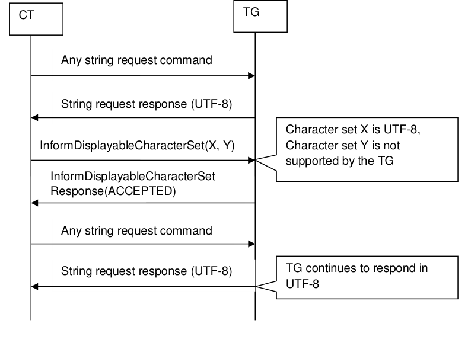

**Figure 28.2: Example of using InformDisplayableCharacterSet where the TG does not support any of the listed character sets other than UTF-8**

| CT |  |  |  |
| --- | --- | --- | --- |
|  |  |  |  |
|  |  | Any string request command |  |
|  | String request response (UTF-8) |  |  |
|  |  |  |  |
|  | InformDisplayableCharacterSet(X, Y) |  |  |
|  | InformDisplayableCharacterSet Response (ACCEPTED) Any string request command |  |  |
|  |  | Any string request command |  |
|  | String request response (Y) |  |  |

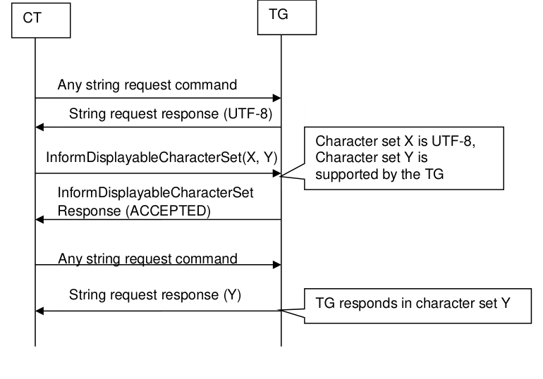

**Figure 28.3: Example of using InformDisplayableCharacterSet where the TG supports at least one of the listed character sets in addition to UTF-8**

RegisterNotification

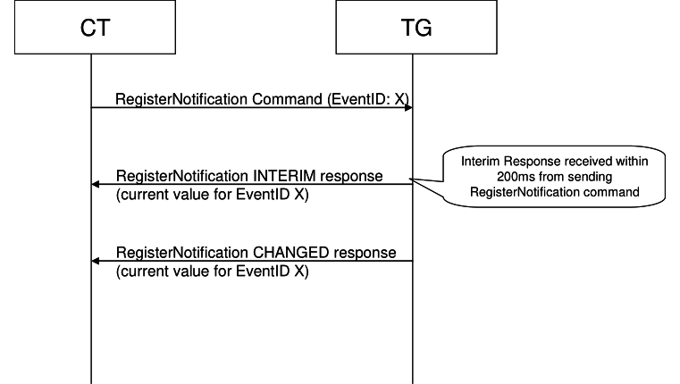

**Figure 28.4: Example of using RegisterNotification**

RequestContinuingResponse
CT TG
VENDOR DEPENDENT command
X command
X command is responded <Packet Type – Startt> VENDOR DEPENDENT response
Request to continue to send a response
(X response )
VENDOR DEPENDENT command
Part where X command is
RequestContinuingResponse
continuously responded <Packet Type - Continue>
VENDOR DEPENDENT response
( X response )
Request to continue to send a response
VENDOR DEPENDENT command
RequestContinuingResponse
Part where X command is
continuously responded <Packet Type - End>
VENDOR DEPENDENT response
( X response )

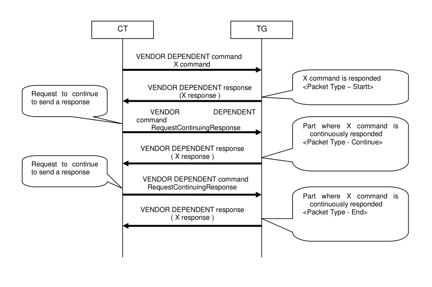

**Figure 28.5: Example of using RequestContinuingResponse**

AbortContinuingResponse

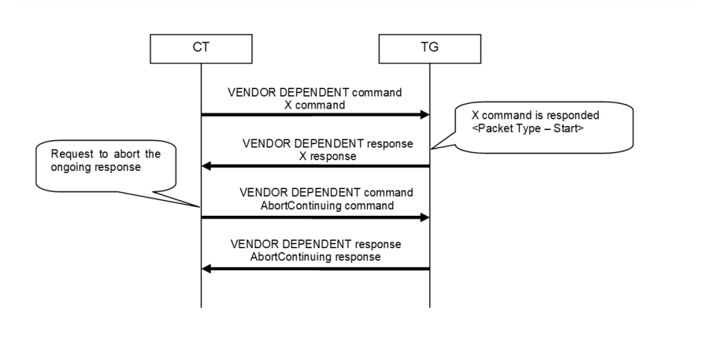

**Figure 28.6: Example of using AbortContinuingResponse**

Play Legacy CT and v1.4 TG
With no directive to send Notifications, TG sends Legacy Response Only.
CT
TG
<AVRCP Established>
Legacy CT does not register for Notifications
Play(Key_Dn
PlayRsp(Accept
Play Default
Play(Key_Up
PlayRsp(Accept
TG Local MP
Default MP under control of TG, and routes Play/Pause/Etc appropriately.
Play(Key_Dn
PlayRsp(Accept
Play New Default
Play(Key_Up
PlayRsp(Accept
Power On (Media Sink)
CT
<AVRCP Established>
TG
Connection initiated by the Sink. Both L2CAP connections are established.
At least one player is registered.
RegisterNotification(AVAILABLE_PLAYERS_CHANGED)
InterimResponse()
RegisterNotification(ADDRESSED_PLAYER_CHANGED)
InterimResponse(currently addressed player)
<GetFolderItems(MediaPlayerList)>
Provide Ids and feature bitmaps for each player
The current player is now known.
InformDisplayableCharSet_Cmd(CharSet)
InformDisplayableCharSet_Rsp
< Get Player Application Settings >
Controller can request and display various application settings.
GetPlayStatus_Cmd
GetPlayStatus_Rsp(Len, Pos, Status)
RegisterNotification(PLAYBACK_STATUS)
InterimResponse(PlaybackStatus)
< Register For Track Events >
Controller can register for various track events.
InformBatteryStatus_Cmd(BatteryStatus)
InformBatteryStatus_Rsp
RegisterNotification(SYSTEM_STATUS)
InterimResponse(SystemStatus)
RegisterNotification(BATTERY_STATUS)
InterimResponse(BatteryStatus)
Power On (Media Source)
CT
<AVRCP Established>
TG
Connection initiated by the Sink. L2CAP connection is established.
…
RegisterNotification(VOLUME_CHANGED)
Source is the controller.
InterimResponse(Volume)
…
Usage of multiple media players discover available media
players and select one
Three Players registered:
“BeatPlayer“
CT
“FM Radio”
TG
Receives a list of three items of type media player.
<AVRCP Established>
GetFolderItems_Cmd(Media Player List)
GetFolderItemsRsp(ListingOfMediaPlayers)
Display list of media players to user.
SetAddressedPlayer(Player ID)
SetAddressedPlayerRsp()
Usage of multiple media players Notification Player Changed
CT
TG
<AVRCP Player is already addressed>
Register to Addressed_Play er_Changed_Ev ent
RegisterNotification (ADDRESSED_PLAYER_CHANGED)
InterimResponse(ADDRESSED_PLAYER_CHANGED)
Addressed Player changed due to action on TG.
ChangedResponse(ADDRESSED_PLAYER_CHANGED, PlayerID)
Register again to Addressed_Play er_Changed_Ev ent
RegisterNotification (ADDRESSED_PLAYER_CHANGED)
InterimResponse(ADDRESSED_PLAYER_CHANGED)
Usage of multiple media players Add Media Player
CT TG
AVRCP session established Notifications registered, e.g.: PLAYBACK_STATUSCHANGED, TRACK_CHANGED
The only available Player is „BeatPlayer“ with PlayerID=0
RegisterNotification(AVAILABLE_PLAYERS_CHANGED)
InterimRsp(AVAILABLE_PLAYERS_CHANGED)
<Browsing and Song Selection>
PlayItem()
...
User starts „MagicPlayer“
(PlayerID=1)
RegisterNotificationRsp(PLAYBACK_STATUSCHANGED, STOPPED)
CT knows it has to look for new Player

| RegisterNotificationRsp(TRACK CHANGED) _ |  |  |
| --- | --- | --- |
| <COMPLETE ALL OTHER PLAYER SPECIFIC EVENTS> RegisterNotificationRsp(AVAILABLE PLAYERS CHANGED) _ _ |  |  |
| RegisterNotification(AVAILABLE PLAYERS CHANGED) _ _ |  |  |
| InterimRsp(AVAILABLE PLAYERS CHANGED) _ _ |  |  |
|  | GetFolderItem(MediaPlayerList) |  |
| <RegisterNotifications (e.g. TRACK CHANGED, PLAYBACK STATUSCHANGED, ...)> _ _ ... gisterNotificationRsp(ADDRESSED PLAYER CHANGED, PlayerID, UIDCounte _ _ |  |  |
| RegisterNotificationRsp(PLAYBACK STATUSCHANGED, PLAYING) _ |  |  |

TG completes all outstanding player
specific events
CT knows name of
new player is MagicPlayerr
User presses PLAY on
Player removed when not active
Current Player is “BeatPlayer”
CT TG <AVRCP session established here>
User want to remove “MagicPlayer”
RegisterNotificationResponse (AVAILABLE_PLAYERS_CHANGED)
CT now removes MagicPlayer from its addressable player list
RegisterNotification (AVAILABLE_PLAYERS_CHANGED)
InterimRsp(AVAILABLE_PLAYERS_CHANGED)
GetFolderItems (Media Player List)
Updated MSC replaces current MSC, which is identical to MSC in 26.13 in AVRCP 1.5
Remove active player
Remove media player which is currently active (remove addressable player)
CT TG
AVRCP session established
SetAddressedPlayer(PlayerId=2, ...)
RegisterNotification(TRACK_CHANGED)
InterimResponse()
RegisterNotification(ADDRESSED_PLAYER_CHANGED)
User removes player PlayerId=2. It is replaced by player PlayerId=1
InterimResponse(PlayerId=2)
This is a recommended
CT can check the existing MPs after
RegisterNotificationResponse(ADDRESSED_PLAYER_CHANGED, PlayerId=1, UIDcounter)
one has been
sequence of
RegisterNotificationResponse(TRACK_CHANGED, REJECTED)
removed
responses
GetFolderItems(MediaPlayerList)
GetFolderItemsRsp(ListMediaPlayers)
SetAddressedPlayer(PlayerId=3, ...)
Updated MSC
Play file on new media player locally on target
TG
CT
Register Addressed_Player_Changed Notification
Addressed_Player_Changed Notification response: Interim
The CT has registered for a PlayerChanged Notification (refer to MSC for startup)
The user locally selects a player and starts playing
Addressed_Player_Changed Notification response:
Player ID 2
Notification response: Rejected
TG completes outstanding player specific notifications
...
Register Player Changed Notification
CT registers for completed notifications
...
Notification response: Interim
...
The CT updates its UI and does anything it usually does for a new track
GetElementAttributes UID 0
GetElementAttributes response: Madonna Ray of
Play file on new media player from CT
CT should not send STOP without user action
CT
TG
<AVRCP Established>
GetFolderItems_Cmd(
GetFolderItemsRsp(
<Browsing and song
SetAddressedPlayerCmd(
Set Player in MP
SetAddressedPlayerRsp(
AddressedPlayerChangedNotification()
Device dependant if previous player continues playing
RegisterAddressedPlayerChangedNotification(
PlayCmd button
PlayRsp button
play note to default MP
PlayCmd button
PlayRsp button
Search and Play
C
TG
<AVRCP Established>
<Browse to desired path>
Search(String)
SearchRsp()
GetFolderItems(SearchResultList)
GetFolderListingRsp(SearchResultList)
PlayItem(UID, SearchResultList)
CT decides to play an item in the list.
TG shall complete outstanding Track Changed, Play Status, and other relevant outstanding notifications.
PlayItemRsp(Success)
Browse and Add to Queue
Current Player is playing from the queue
CT
TG
<Ongoing streaming>
<Browsing and song selection>
AddToNowPlaying(UID, Scope)
NowPlayingContentChangedNotification
Register_NowPlayingContentChangedNotification
NowPlayingContentChangedNotification(Interrim)
Updated Queue is shown
<GetFolderItems(NowPlaying)>
Current Player is playing from the queue
Queue is shown
CT
TG
<Ongoing streaming>
<Browsing and song selection>
<Add to queue>
NowPlayingContentChangedNotification
<GetFolderItems(NowPlaying)>
Updated Queue is shown
RegisterNowPlayingContentChangedNotification
NowPlayingContentChangedNotification(Interrim)
Browse and Play
Current Player is playing from the queue
Queue and current song title is shown
CT
TG
<Ongoing streaming>
Player stops, replaces queue with new item (and context) and starts playing the new queue
<Browsing and song selection>
PlayItem(UID)
PlayStatusChangedNotification(Stopped)
NowPlayingContentChangedNotification
PlayStatusChangedNotification(Playing)
TrackChangedNotification
GetAttributes_Cmd(Metadata)
New queue and new song title is shown
<GetFolderItems(NowPlaying)>
Increase volume locally on target
CT TG
RegisterNotification command
(Volume_Changed)
RegisterNotification response (INTERIM, Event_Volume_Changed, Absolute_volume)
User action (Volume on TG is changed locally)
RegisterNotification response(CHANGED, Event_Volume_Changed, Absolute_volume)
RegisterNotification command
(Volume_Changed)
MSC for Increasing / Decreasing volume locally on target
Get folder items truncation on maximum MTU size
Maximum receivable MTU of CT is (e.g., 2048 bytes)
CT
TG
<AVRCP Established>
Search Result List in this example contains:
<AVRCP Browsing Channel Established>

## 60 Items

Request Items 0 to 99 from SearchResultList (With Attribute Artist Name)
GetFolderItems_Cmd
- DisplNameLen = 40 for all
(SearchResultList,0,99,1,ArtistName)
GetFolderItemsRsp(Items 0-24)
Based on CT MTU of 2048 bytes only 25 complete Items fit in one AVCTP Browsing Response command
Request Next Items 25 to 99 from SearchResultList (With Attribute Artist Name)
GetFolderItems_Cmd
(SearchResultList,25,100,1,ArtistName)
GetFolderItemsRsp(Items 25-49)
Based on CT MTU of 2048 bytes again only 25 complete Items fit in one AVCTP Browsing Response command
…
Get item attributes truncation on maximum MTU size
Maximum receivable MTU of CT is (e.g., 335 bytes)
CT
TG
<AVRCP Established>
<AVRCP Browsing Channel Established>
Request 10 Attributes of Item
All the requested Attributes in this example have a length of 50 bytes
GetItemAttributes_Cmd
(UID, List of 10 Attributes)
Based on CT MTU of 335 only 6 attributes of the item fit in one AVCTP Browsing Response command.
GeItemAttributesRsp(6 Attributes)
CT handles the 4 not received attributes as “Not Available” for the item.
Thus only 6 attributes are put in
Number of Items Preview and Get Folder Items
CT TG
AVRCP Player already addressed

## 10 tracks are in the NowPlayingList: ‚Song1', ‚Song2', … ‚Song10'

Response indicates that 10 items are in the scope
GetTotalNumberOfItems(NowPlayingList)
GetTotalNumberOfItems Response(10)
Display 1st page of 3 songs with 0- 30% scroll bar
GetFolderItems(NowPlayingList, 1-3)
GetFolderItems Response(‚Song1', ‚Song2', ‚Song3')
User pages down
GetFolderItems(NowPlayingList, 4-6)
Display 2nd page of 3 songs with scroll bar showing 30-60%
GetFolderItems Response(‚Song4', ‚Song5', ‚Song6')
Example MSC showing Cover Art retrieval

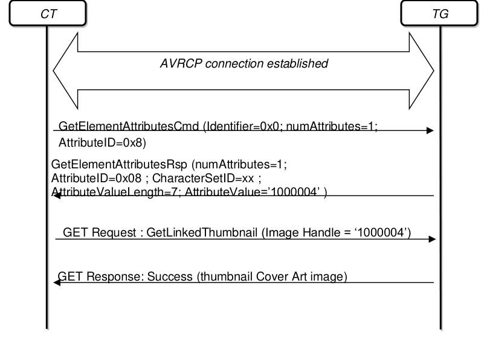

**Figure 28.7:- Example MSC showing Cover Art retrieval**

## 29 Appendix K: AV/C

This appendix summarizes the information contained in the AV/C specification. Refer to the AV/C General specification [1] for more information.
AV/C command and response
AV/C command and response frames are encapsulated within the AVCTP Command/Response Message Information field, as described in AVCTP [3].

#### 29.1.1 AV/C transaction rules

An AV/C transaction consists of one message containing a command frame addressed to the TG and zero or more messages containing a response frame returned to the CT by the TG. The TG is required to generate a response frame within specified time periods.
Note: INTERIM response may be returned in response to other VENDOR DEPENDENT command. INTERIM response shall not be returned for any other commands.
For more detail regulations, refer to the AV/C General Specification [1].

#### 29.1.2 AV/C command frame

An AV/C command frame contains up to 512 octets of data, and it is contained in the AVCTP Command/Response Message Information field. An AV/C command frame has the structure shown below.

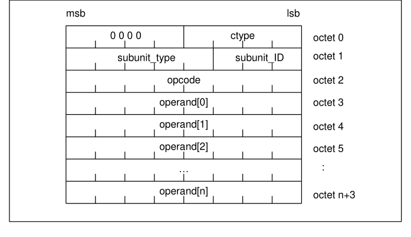

**Figure 29.1: AV/C command frame**

All of the operands are optional and are defined based on the values of ctype, subunit_type, and opcode.

#### 29.1.3 AV/C response frame

An AV/C response frame is contained in the AVCTP Command/Response Message Information field, and it has the structure shown in the figure below.
msb
lsb

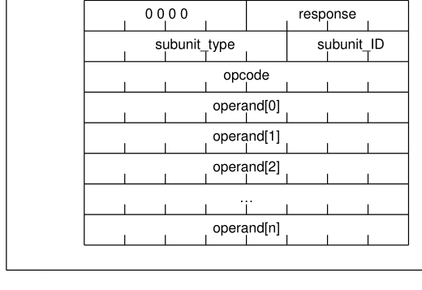

**Figure 29.2: AV/C response frame**

All of the operands are optional and are defined based on the values of ctype, subunit_type, and opcode.

#### 29.1.4 AV/C frame fields

For the fields and code values for AV/C command and response frames listed below, as well as the definition of reserved field and reserved value, refer to the AV/C General Specification.
• Command type codes (ctype)
• Response codes (response)
• AV/C address (subunit_type, subunit_ID)
• Subunit_type and subunit_ID encoding
• Operation (opcode)
• Operands

## 30 UID scheme examples

In order to further illustrate the UID scheme described in Section 6.10.3, this section provides a role based view on the tasks a device has to perform.
Target Device (TG)
Depending on its capabilities, a TG device needs to distinguish with respect to its database management whether it is database-aware or database-unaware, see Section 6.10.3.
Database Unaware Players:
• always use UIDcounter=0
• File removal on TG is detected when CT tries to access that file
• File insertion on TG is detected when CT refreshes the folder information the new file is located under
• May send a UIDs_CHANGED_EVENT in case a change to the media database can be detected in specific situations (e.g. removal of memory card)
Database Aware Players:
• File removal and insertion from/to the database get detected immediately
• TG Increases the UIDcounter
• TG sends UIDs_CHANGED_EVENT to CT
Controller Device (CT)
In order to correctly follow the UID scheme, a CT can simply
• refresh data whenever receiving a UIDs_CHANGED_EVENT or an increased UIDcounter
• Do not cache UIDs for folder-re-browsing when UIDcounter=0
If a CT wants to optimize the AVRCP performance by caching UIDs in between folder changes, it should verify that the player on the TG is database aware (UIDs unique in player browse tree).
If a CT wants to optimize the AVRCP performance by caching UIDs in between AVRCP Browse Reconnects (e.g., after Bluetooth link reconnection), it should verify that the player on the TG is database aware and supports UID Persistency.