# BAP v1.0.2

> Source: PDF converted via PyMuPDF.

---

Basic Audio Profile
Bluetooth® Profile Specification
▪ Version: v1.0.2
▪ Version Date: 2024-10-01
▪ Prepared By: Generic Audio Working Group
Abstract
This profile defines how devices can distribute and/or consume audio using Bluetooth Low Energy (LE) wireless communications.

| Version Number | Date | Comments |
| --- | --- | --- |
| v1.0 | 2021-09-14 | Adopted by the Bluetooth SIG Board of Directors. |
| v1.0.1 | 2022-06-21 | Adopted by the Bluetooth SIG Board of Directors. |
| v1.0.2 | 2024-10-01 | Adopted by the Bluetooth SIG Board of Directors. |

Acknowledgments

| Name | Company |
| --- | --- |
| Jonathan Tanner | Qualcomm Technologies International, Ltd |
| Chris Church | Qualcomm Technologies International, Ltd |
| Robin Heydon | Qualcomm Technologies International, Ltd |
| Nick Hunn | GN Hearing A/S |
| Søren Larsen | Widex |
| Markus Schnell | Fraunhofer IIS |
| Jeff Solum | Starkey |
| Masahiko Seki | Sony |
| Andrew Estrada | Sony |
| Stephan Gehring | Sonova AG |
| Michael Ungstrup | Widex A/S |
| Simon Jonghun Song | LG Electronics, Inc. |
| HJ Lee | LG Electronics, Inc. |
| Bjarne Klemmensen | Oticon A/S |
| Kanji Kerai | Widex A/S |
| Erwin Weinans | Plantronics Inc. |
| Scott Walsh | Plantronics Inc. |
| Georg Dickmann | Sonova AG |
| Peter Liu | Bose Corporation |
| Daniel Sisolak | Bose Corporation |
| Rasmus Abildgren | Bose Corporation |
| Xuemei Ouyang | Intel Corporation |
| Oren Haggai | Intel Corporation |
| Chethan Narayan Tumkur | Intel Corporation |

| Name | Company |
| --- | --- |
| Siegfried Lehmann | Apple |
| Riccardo Cavallari | Sivantos GmbH |
| Marcel Holtmann | Intel Corporation |
| Sam Geeraerts | NXP Semiconductors |
| Anil Kumar Vutukuru | MindTree Limited |
| Luiz Von Dentz | Intel Corporation |
| Himanshu Bhalla | Intel Corporation |
| Andrew Credland | Samsung Electronics Co., Ltd |
| Khaled Elsayed | Synopsys |
| Michael Rougeux | Bose Corporation |
| Tim Reilly | Bose Corporation |
| Ella Chu | Microchip |
| Charlie Lee | Microchip |
| Asbjørn Sæbø | Nordic Semiconductor ASA |
| David Hughes | Broadcom |
| Sherry Smith | Broadcom |
| Łukasz Rymanowski | Codecoup |
| Grzegorz Kołodziejczyk | Codecoup |
| Morteza Rahchamani | Arm |
| Frank Yerrace | Microsoft |
| Dong Jianli | Oppo |
| Yao Wang | Barrot |
| Erik Peterson | Microsoft |

Use of this specification is your acknowledgement that you agree to and will comply with the following notices and disclaimers. You are advised to seek appropriate legal, engineering, and other professional advice regarding the use, interpretation, and effect of this specification.
Use of Bluetooth specifications by members of Bluetooth SIG is governed by the membership and other related agreements between Bluetooth SIG and its members, including those agreements posted on Bluetooth SIG’s website located at www.bluetooth.com. Any use of this specification by a member that is not in compliance with the applicable membership and other related agreements is prohibited and, among other things, may result in (i) termination of the applicable agreements and (ii) liability for infringement of the intellectual property rights of Bluetooth SIG and its members. This specification may provide options, because, for example, some products do not implement every portion of the specification. All content within the specification, including notes, appendices, figures, tables, message sequence charts, examples, sample data, and each option identified is intended to be within the bounds of the Scope as defined in the Bluetooth Patent/Copyright License Agreement (“PCLA”). Also, the identification of options for implementing a portion of the specification is intended to provide design flexibility without establishing, for purposes of the PCLA, that any of these options is a “technically reasonable non-infringing alternative.”
Use of this specification by anyone who is not a member of Bluetooth SIG is prohibited and is an infringement of the intellectual property rights of Bluetooth SIG and its members. The furnishing of this specification does not grant any license to any intellectual property of Bluetooth SIG or its members. THIS SPECIFICATION IS PROVIDED “AS IS” AND BLUETOOTH SIG, ITS MEMBERS AND THEIR AFFILIATES MAKE NO REPRESENTATIONS OR WARRANTIES AND DISCLAIM ALL WARRANTIES, EXPRESS OR IMPLIED, INCLUDING ANY WARRANTIES OF MERCHANTABILITY, TITLE, NON-INFRINGEMENT, FITNESS FOR ANY PARTICULAR PURPOSE, OR THAT THE CONTENT OF THIS SPECIFICATION IS FREE OF ERRORS. For the avoidance of doubt, Bluetooth SIG has not made any search or investigation as to third parties that may claim rights in or to any specifications or any intellectual property that may be required to implement any specifications and it disclaims any obligation or duty to do so.
TO THE MAXIMUM EXTENT PERMITTED BY APPLICABLE LAW, BLUETOOTH SIG, ITS MEMBERS AND THEIR AFFILIATES DISCLAIM ALL LIABILITY ARISING OUT OF OR RELATING TO USE OF THIS SPECIFICATION AND ANY INFORMATION CONTAINED IN THIS SPECIFICATION, INCLUDING LOST REVENUE, PROFITS, DATA OR PROGRAMS, OR BUSINESS INTERRUPTION, OR FOR SPECIAL, INDIRECT, CONSEQUENTIAL, INCIDENTAL OR PUNITIVE DAMAGES, HOWEVER CAUSED AND REGARDLESS OF THE THEORY OF LIABILITY, AND EVEN IF BLUETOOTH SIG, ITS MEMBERS OR THEIR AFFILIATES HAVE BEEN ADVISED OF THE POSSIBILITY OF THE DAMAGES.
Products equipped with Bluetooth wireless technology ("Bluetooth Products") and their combination, operation, use, implementation, and distribution may be subject to regulatory controls under the laws and regulations of numerous countries that regulate products that use wireless non-licensed spectrum. Examples include airline regulations, telecommunications regulations, technology transfer controls, and health and safety regulations. You are solely responsible for complying with all applicable laws and regulations and for obtaining any and all required authorizations, permits, or licenses in connection with your use of this specification and development, manufacture, and distribution of Bluetooth Products. Nothing in this specification provides any information or assistance in connection with complying with applicable laws or regulations or obtaining required authorizations, permits, or licenses..
Bluetooth SIG is not required to adopt any specification or portion thereof. If this specification is not the final version adopted by Bluetooth SIG’s Board of Directors, it may not be adopted. Any specification adopted by Bluetooth SIG’s Board of Directors may be withdrawn, replaced, or modified at any time. Bluetooth SIG reserves the right to change or alter final specifications in accordance with its membership and operating agreements.
Copyright © 2017–2024. All copyrights in the Bluetooth Specifications themselves are owned by Apple Inc., Ericsson AB, Intel Corporation, Lenovo (Singapore) Pte. Ltd., Microsoft Corporation, Nokia Corporation, and Toshiba Corporation. The Bluetooth word mark and logos are owned by Bluetooth SIG, Inc. Other third-party brands and names are the property of their respective owners.
Contents

## 1 Introduction

The Basic Audio Profile (BAP) defines procedures for Audio Stream control by using the Generic Attribute Profile (GATT) and the Generic Access Profile (GAP) for devices that want to use Bluetooth Low Energy (LE) in audio-related scenarios (e.g., sending or receiving unicast audio, or sending or receiving broadcast audio).

### 1.1 Profile dependencies

This profile requires GATT [1], GAP [1], Audio Stream Control Service (ASCS) [4], Published Audio Capabilities Service (PACS) [5], Broadcast Audio Scan Service (BASS) [6], and Link Layer (LL) [1].

### 1.2 Conformance

Each capability of this specification shall be supported in the specified manner. This specification may provide options for design flexibility, because, for example, some products do not implement every portion of the specification. For each implementation option that is supported, it shall be supported as specified.

### 1.3 Bluetooth Core Specification release compatibility

This specification is compatible with the Bluetooth Core Specification, Version 5.2 [1] or later.

### 1.4 Change History

This section summarizes changes at a moderate level of detail and should not be considered representative of every change made.

#### 1.4.1 Changes from v1.0.1 to v1.0.2

| Section | Errata |
| --- | --- |
| 1.2: Conformance | 23760 |
| 3.5.2: Additional Published Audio Capabilities Service requirements | 19105 |
| 3.6.6.1.2: Sink Audio Locations characteristic discovery | 22266 |
| 3.6.6.1.4: Source Audio Locations characteristic discovery | 22266 |
| 3.6.7: Unicast Client audio capability configuration support | 19105, 20442, E23025 |
| 3.7.1: Broadcast Source audio capability configuration support | 19105 |
| 3.7.2.1.1: Broadcast ID _ | 24730 |
| 3.7.2.2: Basic Audio Announcements | 19105, 22215, 24182 |
| 3.8.2: Additional Published Audio Capabilities service requirements | 19105 |
| 3.10.6.2.2: Sink Audio Locations characteristic discovery | 22266 |
| 4.3.2: Codec Specific Configuration LTV requirements _ _ | 22266 |
| 4.3.4: Examples of usage | 22266 |

| Section | Errata |
| --- | --- |
| 4.3.4.1: Mono audio to one Unicast Server | 22266 |
| 4.3.4.2: Stereo audio to one Unicast Server as one multiplexed stream | 22266 |
| 4.3.4.3: Stereo audio to one Unicast Server as two streams | E22266 |
| 4.3.4.4: Stereo audio to two Unicast Servers | 22266 |
| 4.3.4.5: Stereo audio broadcast | 22266 |
| 4.3.4.6: Mono audio broadcast | 22266 |
| 4.3.4.7: Stereo and mono audio broadcast | E22266 |
| 4.4: Multiple-channel LC3 unicast audio | 18619 |
| 4.4.7: Audio Configuration 6(ii) | 18876 |
| 4.4.10: Audio Configuration 8(i) | 18876 |
| 4.4.13: Audio Configuration 9(ii) | 18876, 19289 |
| 4.4.16: Audio Configuration 11(ii) | 18876 |
| 4.5.2: Audio Configuration 13 | 22890 |
| 5.2: Audio capability discovery | 24567 |
| 5.6.2: QoS configuration | 22230, 24038 |
| 5.6.3: Enabling an ASE | 24567, 24038 |
| 5.6.3.1: Audio data path setup | 19105 |
| 5.6.9: CIS establishment requirements | 24567, 24038 |
| 5.6.9.1: CIS establishment requirements for Unicast Server | 24567, 24038 |
| 5.6.9.2: CIS establishment requirements for Unicast Client | 24567, 24038 |
| 6.2.2: Broadcast Audio Stream state transitions | 18877 |
| 6.3: Broadcast Audio Stream configuration | 18849, 19050, 22230 |
| 6.3.3: Broadcast Audio Stream Metadata update | 20483 |
| 6.5.1: Audio capability discovery | 24567 |
| 6.5.4: Adding broadcast sources | 20597 |
| 9.1.1: Peripheral security requirements for Low Energy | 19111 |
| 9.1.2: Central security requirements for Low Energy | 19111, 22754 |
| 11: References | 19296 |

Table 1.1: Errata incorporated in v1.0.2

### 1.5 Language

#### 1.5.1 Language conventions

The Bluetooth SIG has established the following conventions for use of the words shall, must, will, should, may, can, is, and note in the development of specifications:

| shall | is required to – used to define requirements. |
| --- | --- |
| must | is used to express: a natural consequence of a previously stated mandatory requirement. OR an indisputable statement of fact (one that is always true regardless of the circumstan- ces). |
| will | it is true that – only used in statements of fact. |
| should | is recommended that – used to indicate that among several possibilities one is recom- mended as particularly suitable, but not required. |
| may | is permitted to – used to allow options. |
| can | is able to – used to relate statements in a causal manner. |
| is | is defined as – used to further explain elements that are previously required or allowed. |
| note | Used to indicate text that is included for informational purposes only and is not required in order to implement the specification. Each note is clearly designated as a “Note” and set off in a separate paragraph. |

For clarity of the definition of those terms, see Core Specification Volume 1, Part E, Section 1.

#### 1.5.2 Reserved for Future Use

Where a field in a packet, Protocol Data Unit (PDU), or other data structure is described as “Reserved for Future Use” (irrespective of whether in uppercase or lowercase), the device creating the structure shall set its value to zero unless otherwise specified. Any device receiving or interpreting the structure shall ignore that field; in particular, it shall not reject the structure because of the value of the field.
Where a field, parameter, or other variable object can take a range of values, and some values are described as “Reserved for Future Use,” a device sending the object shall not set the object to those values. A device receiving an object with such a value should reject it, and any data structure containing it, as being erroneous; however, this does not apply in a context where the object is described as being ignored or it is specified to ignore unrecognized values.
When a field value is a bit field, unassigned bits can be marked as Reserved for Future Use and shall be set to 0. Implementations that receive a message that contains a Reserved for Future Use bit that is set to 1 shall process the message as if that bit was set to 0, except where specified otherwise.
The acronym RFU is equivalent to Reserved for Future Use.

#### 1.5.3 Prohibited

When a field value is an enumeration, unassigned values can be marked as “Prohibited.” These values shall never be used by an implementation, and any message received that includes a Prohibited value shall be ignored and shall not be processed and shall not be responded to.
Where a field, parameter, or other variable object can take a range of values, and some values are described as “Prohibited,” devices shall not set the object to any of those Prohibited values. A device receiving an object with such a value should reject it, and any data structure containing it, as being erroneous.
“Prohibited” is never abbreviated.

### 1.6 General interpretation rules

The following rules apply throughout this specification unless they are explicitly overridden.

#### 1.6.1 Binary and hexadecimal numbers

Binary numbers are written with a “0b” prefix, so 0b1101 is the same as the decimal number 13.
Hexadecimal numbers are written with a “0x” prefix, so 0x42 is the same as the decimal number 66. The letters “a” to “f” are used to represent the digits 10 to 15, so 0x1A is the same as the decimal number 26. The use of capital letters or lowercase letters in a hexadecimal number is not significant.
Underscore characters placed between the digits of binary or hexadecimal numbers are intended to make the numbers easier to interpret; these underscores do not affect the value. For example, 0b0010_1011 and 0b00101011 both equal the decimal number 43.
Any number not written in one of the above ways is a decimal.

##### 1.6.1.1 Specification of bit values

Some values in the specification are divided into individual bits, each of which has a description. If explicit bit values are not given in a description of individual bits, that description represents the meaning of the bit when the bit is set to a value of 0b1, and the opposite meaning applies when the bit is set to a value of 0b0.
For example, a description of:
Bit 3: 32,000 Hz supported
means the same as:
Bit 3 = 0b1: 32,000 Hz supported
Bit 3 = 0b0: 32,000 Hz not supported

#### 1.6.2 Arrayed parameters

Arrayed parameters are specified by using the following notation: ParameterA[i].
If more than one set of arrayed parameters is specified (e.g., ParameterA[i], ParameterB[i]), then, unless noted otherwise, the order of the parameters shall be: ParameterA[0], ParameterB[0], ParameterA[1], ParameterB[1], ParameterA[2], ParameterB[2], …ParameterA[n], ParameterB[n].

### 1.7 Terminology

Table 1.2 defines terms that are needed to understand features used in this profile. This profile also uses terms that are defined in the Bluetooth Core Specification [1], ASCS [4], PACS [5], and BASS [6].

| Term | Definition |
| --- | --- |
| Additional Controller Adver- tising Data (ACAD) | Defined in Volume 6, Part B, Section 2.3.4.8 in the Bluetooth Core Speci- fication [1] |
| Audio Channel | A flow of audio data, which might be encoded or not, that can be as- signed to a single Audio Location |
| Audio Location | The intended logical spatial rendering location of an Audio Channel with- in a spatial arrangement of loudspeakers or other audio transducers that render audio Audio Location values are defined in Bluetooth Assigned Numbers [2]. |
| Audio Sink | Receives unicast audio data from Audio Sources |
| Audio Source | Transmits unicast audio data to Audio Sinks |
| Audio Stream Endpoint (ASE) | Defined in ASCS [4] |
| ASE identifier (ASE ID) _ | Defined in [4] |
| Bound (CIS) | A CIS is considered bound to an ASE when it is identified in the CIG ID _ and CIS ID parameters of a successful Config QoS operation on the _ ASE, and the ASE is in the QoS Configured, Enabling, Streaming, or Disabling state. |
| Broadcast Audio Source Endpoint (BASE) | Part of Basic Audio Announcement defined in Section 3.7.2.2. Contained in the additional service data portion of the Service Data advertising data (AD) data type and transported using AUX SYNC IND PDUs. Used _ _ to inform scanning devices of codec and other parameters of a Broad- cast Isochronous Group (BIG) transporting one or more broadcast Audio Streams. |
| Broadcast Audio Stream | A unidirectional, connectionless, logical communication channel that transports broadcast audio data flowing from a Broadcast Source |
| Broadcast ID _ | Data that can be used by scanning devices to help find broadcast Audio Streams. Contained in the AdvData field of AUX ADV IND PDUs trans- _ _ mitted by Broadcast Sources |
| Broadcast Isochronous Group (BIG) | Defined in Volume 6, Part B, Section 4.4.6.2 in [1] |
| Broadcast Isochronous Stream (BIS) | Defined in Volume 6, Part B, Section 4.4.6.1 in [1] |
| Broadcast Sink | Receives broadcast audio data from Broadcast Sources |
| Broadcast Source | Transmits broadcast audio data to Broadcast Sinks |

| Term | Definition |
| --- | --- |
| CIG Identifier (CIG ID) _ | Defined in Volume 6, Part B, Section 4.5.14 in [1] |
| CIG Sync Delay _ _ | Defined in Volume 6, Part B, Section 4.5.4.1.1 in [1] |
| CIS Identifier (CIS ID) _ | Defined in Volume 6, Part B, Section 4.5.13.1 in [1] |
| Connected Isochronous Group (CIG) | Defined in Volume 6, Part B, Section 4.5.14 in [1] |
| Connected Isochronous Stream (CIS) | Defined in Volume 6, Part B, Section 4.5.13 in [1] |
| Context Type | Defined in PACS [5] |
| Coupled (CIS) | A CIS is considered coupled to an ASE when it is both bound to the ASE and established. See ASCS [4]. |
| Cross-Transport Key Deri- vation (CTKD) | Defined in Volume 3, Part C, Section 14.1 in [1] |
| Extended advertising (EA) PDUs | Defined in Volume 6, Part B, Section 2.3.1 in [1] |
| Enhanced ATT (EATT) bear- er | An ATT bearer defined in Volume 3, Part F, Section 3.2.11 in [1] that uses the Enhanced Credit Based Flow Control L2CAP channel mode defined in Volume 3, Part A, Section 10.2 in [1] |
| Established (CIS) | As defined in Volume 6, Part B, Section 5.1.15 in the Bluetooth Core Specification [1], a CIS is established by the Central [9] using the Con- nected Isochronous Stream Creation procedure. |
| Generic Access Profile (GAP) | Defined in Volume 3, Part C in [1] |
| Low Energy asynchronous connection (LE ACL) | Defined in Volume 1, Part A, Section 3.5.4.6 in [1] |
| Link Layer (LL) | Defined in Volume 6, Part B in [1] |
| LTV structure | Length-type value formatted data A single-octet Length field includes the length of the Type and Value fields. The Length field is followed by a single-octet Type field. The Type field is followed by a Value field of length (Length-1) octets. |
| Metadata | Data that describes other data. Metadata parameters in this profile and related service specifications consist of LTV structures that provide con- textual or other supplementary information. |
| Packet Loss Concealment (PLC) | A technique used to mask the effects of lost or discarded packets |
| periodic advertising train (PA) | Defined in Volume 6, Part B, Section 4.4.5.1 in [1] |

| Term | Definition |
| --- | --- |
| Periodic Advertising Syn- chronization Transfer (PAST) procedure | Defined in Volume 3, Part C, Section 9.5.4 in [1] |
| Presentation Delay | Timing data intended to assist in the simultaneous rendering of audio data for one or more transducers |
| Published Audio Capability (PAC) record | Defined in [5] |
| Quality of Service (QoS) | Defined in [4] |
| Remote Broadcast Scan- ning | Scanning, on behalf of a Scan Delegator, for EA that point to a PA |
| Scan Offloading | The process of transferring SyncInfo and other data to a Scan Delegator that enables synchronization to a PA |
| Service Data data type | Defined in the Bluetooth Core Specification Supplement (CSS) [3] |
| Service UUID data type | Defined in the Bluetooth Core Specification Supplement (CSS) [3] |
| SyncInfo | Defined in Volume 6, Part B, Section 2.3.4.6 in [1] |
| Unenhanced ATT bearer | An ATT bearer defined in Volume 3, Part F, Section 3.2.11 in [1] that does not use the Enhanced Credit Based Flow Control L2CAP channel mode defined in Volume 3, Part A, Section 10.2 in [1] |
| Unicast Audio Stream | A unidirectional, logical communication channel transporting audio data for one or more Audio Channels from an Audio Source to an Audio Sink For a unicast Audio stream, audio data will either flow towards a Sink ASE exposed on the Unicast Server (server is Audio Sink) or from a Source ASE exposed on the Unicast Server (server is Audio Source). |

Table 1.2: Terminology

## 2 Configuration

### 2.1 Profile and protocol stack

Figure 2.1 shows the profile and protocol stack for BAP.

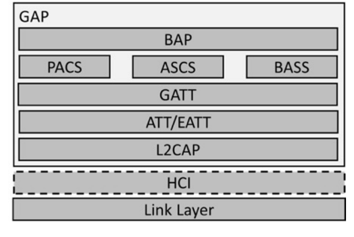

**Figure 2.1: BAP profile and protocol stack**

### 2.2 Profile roles

This profile defines six roles: Unicast Server, Unicast Client, Broadcast Source, Broadcast Sink, Broadcast Assistant, and Scan Delegator.

#### 2.2.1 Unicast roles

Two BAP roles are used for unicast audio: Unicast Server and Unicast Client.

##### 2.2.1.1 Unicast Server

The Unicast Server transmits advertisements that the Unicast Client uses to discover the Unicast Server and to establish connections to the Unicast Server.
The Unicast Server exposes attributes that the Unicast Client uses to discover the Unicast Server’s supported audio capabilities.
The Unicast Server exposes attributes that the Unicast Client uses to discover, configure, and control ASEs exposed by the Unicast Server.
The Unicast Server exposes its current availability to transmit or receive unicast Audio Streams.
The Unicast Server accepts the establishment of CIGs, which may have one or more CISes, used to transport unicast Audio Streams.
The Unicast Server can terminate CISes.

##### 2.2.1.2 Unicast Client

The Unicast Client scans for advertisements to discover Unicast Servers and establishes connections to Unicast Servers.
The Unicast Client discovers the availability of the Unicast Server to transmit or receive unicast Audio Streams.
The Unicast Client discovers and uses attributes exposed by the Unicast Server to determine the Unicast Server’s audio capabilities and audio role support.
The Unicast Client discovers attributes used to configure and control ASEs exposed by the Unicast Server.
The Unicast Client configures and establishes one or more CIGs, which can have one or more CISes used to transport a unicast Audio Stream.
The Unicast Client can terminate CISes.

#### 2.2.2 Broadcast roles

Four BAP roles are used for broadcast audio: Broadcast Source, Broadcast Sink, Broadcast Assistant, and Scan Delegator.

##### 2.2.2.1 Broadcast Source

The Broadcast Source configures and establishes one or more BIGs, each containing one or more BISes that are used to transport broadcast Audio Streams.
The Broadcast Source transmits data that describes broadcast Audio Stream configurations.
The Broadcast Source transmits data that enables devices to discover and receive broadcast Audio Streams.

##### 2.2.2.2 Broadcast Sink

The Broadcast Sink discovers data that describes broadcast Audio Stream configurations.
The Broadcast Sink discovers and receives broadcast Audio Streams.
The Broadcast Sink exposes its audio capabilities.

##### 2.2.2.3 Broadcast Assistant

The Broadcast Assistant discovers the audio capabilities of Broadcast Sinks.
The Broadcast Assistant discovers data that enables devices to discover and receive broadcast Audio Streams.
The Broadcast Assistant discovers data that describes broadcast Audio Stream configurations.
The Broadcast Assistant connects to Scan Delegators and transfers data to Scan Delegators that the Broadcast Assistant has scanned on behalf of the Scan Delegators, including Broadcast_Codes necessary to decrypt encrypted broadcast Audio Streams.
The Broadcast Assistant scans for soliciting Scan Delegators.
The Broadcast Assistant requests Scan Delegators to discover data that describes broadcast Audio Streams and can request Scan Delegators collocated with Broadcast Sinks to receive broadcast Audio Streams.

##### 2.2.2.4 Scan Delegator

The Scan Delegator solicits for Broadcast Assistant devices to perform scanning on behalf of the Scan Delegator.
The Scan Delegator receives transfers of the data that Broadcast Assistants have scanned on behalf of the Scan Delegator, including Broadcast_Codes necessary to decrypt encrypted broadcast Audio Streams.

### 2.3 Profile role and service relationships

The following profile role and service relationships apply:
• The Unicast Server shall be a GATT Server.
• The Unicast Client shall be a GATT Client.
• The Broadcast Source has no GATT role requirement.
• The Broadcast Sink shall be a GATT Server.
• The Broadcast Assistant shall be a GATT Client.
• The Scan Delegator shall be a GATT Server.
Figure 2.2, Figure 2.3, Figure 2.4, and Figure 2.5 show examples of the relationships between the various profile roles (blue boxes) and services (gray boxes).

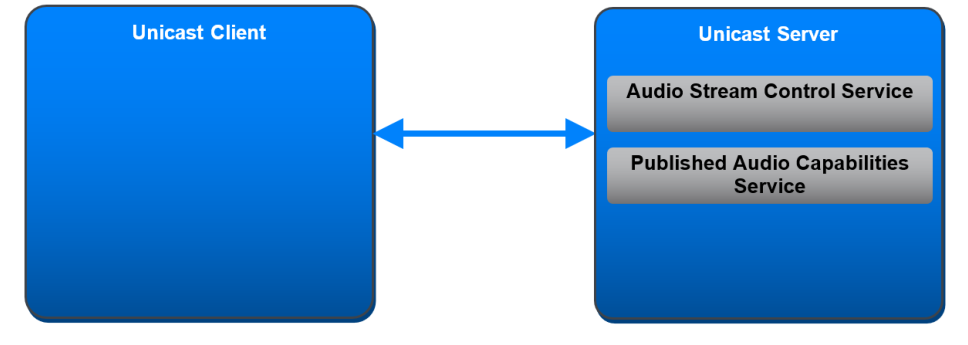

**Figure 2.2: Unicast Client relationship to Unicast Server**

**Figure 2.3: Broadcast Source relationship to Broadcast Sink**

**Figure 2.4: Broadcast Assistant relationship to Broadcast Sink**

**Figure 2.5: Broadcast Assistant relationship to Scan Delegator**

### 2.4 Concurrency limitations and restrictions

A device shall not concurrently occupy the Unicast Client role and Unicast Server role in a connection to a single device because the Unicast Client occupies the LL Central role, and both devices cannot occupy the LL Central role in the same connection, as defined in Volume 6, Part B, Section 1.1.1 in [1].
All other combinations of profile roles may be occupied concurrently by a device. A combination of BAP profile roles on a GATT Server shall have no more than one GATT service defined for the individual profile roles.

### 2.5 Topology limitations and restrictions

GAP roles are described in Volume 3, Part C, Section 2.2.2 in [1].
The Unicast Client shall use the GAP Central role.
The Unicast Server shall use the GAP Peripheral role.
The Broadcast Source shall use the GAP Broadcaster role.
The Broadcast Sink shall use either the GAP Observer role or the GAP Central role when scanning for periodic advertising data that enables devices to discover and receive broadcast Audio Streams and that describes broadcast Audio Stream configuration.
The Broadcast Sink shall use the GAP Observer role when receiving broadcast Audio Streams.
The Broadcast Sink shall use the GAP Peripheral role when exposing its audio capabilities and its availability to receive broadcast Audio Streams.
The Broadcast Assistant shall use either the GAP Observer role or the GAP Central role when scanning for periodic advertising data that enables devices to discover and receive broadcast Audio Streams and that describes broadcast Audio Stream configuration.
The Broadcast Assistant shall use the GAP Central role when discovering connectable Scan Delegators.
The Broadcast Assistant shall use the GAP Central role when establishing connections to Scan Delegators.
The Broadcast Assistant shall use either the GAP Central role or the GAP Peripheral role when transferring data to the Scan Delegator that the Broadcast Assistant has scanned on behalf of the Scan Delegator.
The Broadcast Assistant shall use the GAP Central role or the GAP Peripheral role when determining Broadcast Sink audio capabilities.
The Scan Delegator shall use the GAP Peripheral role when soliciting for Broadcast Assistants to scan on behalf of the Scan Delegator.
The Scan Delegator shall use either the GAP Central role or the GAP Peripheral role when receiving transfers of the data that Broadcast Assistants have scanned on behalf of the Scan Delegator.

### 2.6 Transport dependencies

This profile requires Bluetooth LE.
This profile should operate over transports that offer one Unenhanced Attribute Protocol (ATT) bearer or one or more Enhanced ATT (EATT) bearers for the Unicast Client role, the Unicast Server role, the Broadcast Sink role, the Broadcast Assistant role, and the Scan Delegator role.

## 3 Profile support requirements

Requirements in this section are defined as “Mandatory” (M), “Optional” (O), “Excluded” (X), and “Conditional” (C.n). Conditional requirements (C.n) are listed directly below the table in which they appear.

### 3.1 BAP role support requirements

Table 3.1 defines BAP role support requirements.

| BAP Role | Support |
| --- | --- |
| Unicast Server | C.1 |
| Unicast Client | C.1 |
| Broadcast Source | C.1 |
| Broadcast Sink | C.1 |
| Scan Delegator | C.1, C.2 |
| Broadcast Assistant | C.1 |

Table 3.1: BAP role support requirements
C.1: Mandatory to support at least one BAP role.
C.2: If the Broadcast Sink role is supported, the Scan Delegator role shall be supported.

### 3.2 Service support requirements

Table 3.2 defines dependent service support requirements for the BAP roles that are supported in Table 3.1.

| Service Role | BAP Role | Unicast Server | Unicast Client | Broadcast Source | Broadcast Sink | Scan Delegator | Broadcast Assistant |
| --- | --- | --- | --- | --- | --- | --- | --- |
| ASCS Client |  | X | M | X | X | X | X |
| ASCS Server |  | M | X | X | X | X | X |
| PACS Client |  | X | M | X | X | X | O |
| PACS Server |  | M | X | X | M | X | X |
| BASS Client |  | X | X | X | X | X | M |
| BASS Server |  | X | X | X | X | M | X |

Table 3.2: Service support requirements for BAP roles

### 3.3 Audio role support requirements

Table 3.3 defines audio role support requirements for Unicast Client and the Unicast Server.

| Audio Role | BAP Role | Unicast Server | Unicast Client |
| --- | --- | --- | --- |
| Audio Sink |  | C.1 | C.2 |
| Audio Source |  | C.1 | C.2 |

Table 3.3: Audio role support requirements for the Unicast Client and Unicast Server roles
C.1: Mandatory to support at least one of (Audio Source or Audio Sink) when the Unicast Server role is supported.
C.2: Mandatory to support at least one of (Audio Source or Audio Sink) when the Unicast Client role is supported.

### 3.4 Link Layer feature support requirements

LL feature support is defined in the Bluetooth Core Specification [1], Volume 6, Part B [8].
Table 3.4 defines LL feature support for the BAP roles that are supported in Table 3.1.

| LL Feature | BAP Role | Unicast Server | Unicast Client | Broadcast Source | Broadcast Sink | Scan Dele- gator | Broadcast Assistant |
| --- | --- | --- | --- | --- | --- | --- | --- |
| LE Encryption (Section 4.6.1 [8]) |  | M | M | C.2 | M | M | M |
| LE Extended Advertising (Section 4.6.12 [8]) |  | M | M | M | M | M | M |
| LE Periodic Advertising (Section 4.6.13 [8]) |  | X | X | M | M | M | M |
| PAST Sender (Section 4.6.23 [8]) |  | X | X | X | X | X | O |
| PAST Recipient (Section 4.6.24 [8]) |  | X | X | X | X | O | X |
| Initiating PAST for local PA (Section 5.1.13 [8]) |  | X | X | X | X | X | C.1 |
| Initiating PAST for re- mote PA (Section 5.1.13 [8]) |  | X | X | X | X | X | C.1 |
| CIS Central (Section 4.6.27 [8]) |  | X | M | X | X | X | X |
| CIS Peripheral (Section 4.6.27 [8]) |  | M | X | X | X | X | X |

| LL Feature | BAP Role | Unicast Server | Unicast Client | Broadcast Source | Broadcast Sink | Scan Dele- gator | Broadcast Assistant |
| --- | --- | --- | --- | --- | --- | --- | --- |
| Isochronous Broadcaster (Section 4.6.28 [8]) |  | X | X | M | X | X | X |
| Synchronized Receiver (Section 4.6.29 [8]) |  | X | X | X | M | X | O |
| Encrypting a Broadcast Isochronous Stream (Section 4.4.6.1, 4.4.6.10 [8]) |  | X | X | C.3 | X | X | X |
| Non-Encrypted Broad- cast Isochronous Stream (Section 4.4.6.1 [8]) |  | X | X | C.3 | X | X | X |

Table 3.4: LL feature support requirements
C.1: Mandatory to support at least one of (“Initiating PAST for local PA” or “Initiating PAST for remote PA”) if ”PAST Sender” is supported.
C.2: Mandatory if “Encrypting a Broadcast Audio Stream” is supported, otherwise Optional.
C.3: Mandatory to support at least one of (“Encrypting a Broadcast Audio Stream” or “Non-encrypted Broadcast Audio Stream”) if “Isochronous Broadcaster” is supported, otherwise Excluded.

### 3.5 Unicast Server support requirements

The Unicast Server shall instantiate one Audio Stream Control Service.
The Unicast Server shall instantiate one Published Audio Capabilities Service.

#### 3.5.1 ATT and EATT transport requirements

The Unicast Server shall support a minimum ATT_MTU of 64 octets for one Unenhanced ATT bearer, or for at least one Enhanced ATT bearer if the Unicast Server supports Enhanced ATT bearers.

#### 3.5.2 Additional Published Audio Capabilities Service requirements

This section defines additional requirements for the Unicast Server beyond those defined in PACS [5].
Table 3.5 shows the Mandatory and Optional audio capability support requirements defined by this profile for the Unicast Server.
If the Unicast Server supports the Audio Sink role, the Unicast Server shall support reception and decoding of audio data that is encoded using the settings defined as Mandatory in Table 3.5. The Unicast Server may support reception and decoding of audio data that is encoded using the settings defined as Optional in Table 3.5 or any other settings defined by an implementation or by a higher-layer specification.
If the Unicast Server supports the Audio Sink role, the Unicast Server shall expose all supported audio capability settings for the Audio Sink role in one or more Sink PAC characteristics containing one or more PAC records.
If the Unicast Server supports the Audio Source role, the Unicast Server shall support encoding and transmission of audio data using the settings defined as Mandatory in Table 3.5. The Unicast Server may support encoding and transmission of audio data using the settings defined as Optional in Table 3.5 or any other settings defined by an implementation or a higher-layer specification.
If the Unicast Server supports the Audio Source role, the Unicast Server shall expose all supported audio capability settings for the Audio Source role in one or more Source PAC characteristics containing one or more PAC records.

| g |  | Codec Specific Capabilities (Defined in PACS [5]) _ _ |  |  |  |  |
| --- | --- | --- | --- | --- | --- | --- |
| Codec Capability Settin | Codec_ID | Supported_Sampling_- Frequencies (kHz) Section 4.3.1 | Supported_Frame_- Durations (ms) Section 4.3.1 | Supported_Octets_- per_Codec_Frame (Octets) Section 4.3.1 | Requirement |  |
|  |  |  |  |  | Audio Sink | Audio Source |
| 8 1 _ | LC34 | 8 | 7.5 | 261 (27.734 kbps2) | O | O |
| 8 2 _ | LC34 | 8 | 10 | 301 (24 kbps2) | O | O |
| 16 1 _ | LC34 | 16 | 7.5 | 301 (32 kbps2) | O | O |
| 16 2 _ | LC34 | 16 | 10 | 401 (32 kbps2) | M | M |
| 24 1 _ | LC34 | 24 | 7.5 | 451 (48 kbps2) | O | O |
| 24 2 _ | LC34 | 24 | 10 | 601 (48 kbps2) | M | O |
| 32 1 _ | LC34 | 32 | 7.5 | 601 (64 kbps2) | O | O |
| 32 2 _ | LC34 | 32 | 10 | 801 (64 kbps2) | O | O |
| 441 1 _ | LC34 | 44.1 | 8.1633 | 971 (95.06 kbps2) | O | O |
| 441 2 _ | LC34 | 44.1 | 10.8843 | 1301 (95.55 kbps2) | O | O |
| 48 1 _ | LC34 | 48 | 7.5 | 751 (80 kbps2) | O | O |
| 48 2 _ | LC34 | 48 | 10 | 1001 (80 kbps2) | O | O |
| 48 3 _ | LC34 | 48 | 7.5 | 901 (96 kbps2) | O | O |
| 48 4 _ | LC34 | 48 | 10 | 1201 (96 kbps2) | O | O |
| 48 5 _ | LC34 | 48 | 7.5 | 1171 (124.8 kbps2) | O | O |
| 48 6 _ | LC34 | 48 | 10 | 1551 (124 kbps2) | O | O |

| g |  | Codec Specific Capabilities (Defined in PACS [5]) _ _ |  |  |  |  |
| --- | --- | --- | --- | --- | --- | --- |
| Codec Capability Settin | Codec_ID | Supported_Sampling_- Frequencies (kHz) Section 4.3.1 | Supported_Frame_- Durations (ms) Section 4.3.1 | Supported_Octets_- per_Codec_Frame (Octets) Section 4.3.1 | Requirement |  |
|  |  |  |  |  | Audio Sink | Audio Source |
| 1 The supported range shall include this value. 2 Bit rates are calculated according to Section 3.2.5 in [7]. 3 Effective frame durations. The 44.1 kHz sampling rate results in a deviation from the 7.5 ms/10 ms frame durations that can be exposed using the Supported Frame Durations LTV structure. For _ _ 44.1 kHz/7.5ms the actual frame duration is equivalent to 360 (samples per frame) divided by 44100 (samples per second), which equals 8.16327 ms per frame, and for 44.1 kHz/10 ms the actual frame duration is equal to 480 (samples per frame) divided by 44100 (samples per second), which equals 10.88435 ms per frame. The LC3 [7] codec encodes 97 octets (for 7.5 ms/8.163 ms effective) or 130 octets (for 10 ms/10.884 ms effective) into each SDU, which arrives at the controller every 8.16327 ms or 10.88435 ms. The transmitting device assigns a time offset to each SDU and delivers the time offset _ with each SDU at the receiver, as defined in Volume 6, Part G, Section 3.1 in [1]. Determination of the time offset parameter at the transmitting device is implementation-specific. Compensation for the _ difference between 8.16327 ms and 8.163 ms, and/or compensation between 10.88435 ms and 10.884 ms, is implementation-specific. 4 For LC3, octet 0 of the Codec ID parameter in Table 3.5 contains the value defined for the LC3 _ Coding Format in the Host Controller Interface section of Bluetooth Assigned Numbers [2], and octets 1 to 4 contain 0. The format of the Codec ID field is defined in PACS [5]. _ |  |  |  |  |  |  |

Table 3.5: Unicast Server audio capability support requirements
If the Unicast Server supports vendor-specific codec audio capabilities, the Unicast Server shall use the format defined in Table 3.6 when populating the Codec_ID field in PAC records exposing vendor-specific audio capabilities.

| Parameter | Value |
| --- | --- |
| Codec ID _ | Octet 0: 0xFF = Vendor-specific Coding Format Octet 1–2: Company ID Company ID values are defined in Bluetooth Assigned Numbers [2]. Octet 3–4: Vendor-specific codec ID _ |

Table 3.6: Unicast Server vendor-specific codec audio capability format

##### 3.5.2.1 Audio data Context Type requirements

If the Unicast Server supports the Audio Sink role, the Unicast Server shall support the Context Type value defined as ‘unspecified’ in the Supported_Sink_Contexts field of the Supported Audio Contexts characteristic.
If the Unicast Server supports the Audio Source role, the Unicast Server shall support the Context Type value defined as ‘unspecified’ in the Supported_Source_Contexts field of the Supported Audio Contexts characteristic.

#### 3.5.3 Additional Audio Stream Control Service requirements

This section defines additional requirements for the Unicast Server beyond those requirements defined in ASCS [4].
If the Unicast Server supports the Audio Sink role:
• The Unicast Server shall support receiving multiple Audio Channels if the Unicast Server exposes more than one bit set to 0b1 in the Sink Audio Locations [5] characteristic value.
• If the Unicast Server supports receiving multiple Audio Channels, the Unicast Server shall expose a number of Sink ASE [4] characteristics sufficient to transport audio data for the highest number of supported Audio Channels.
• Support of multiplexing of Audio Channels for a Sink ASE is determined by exposing a value of the Supported_Audio_Channel_Counts (see Section 4.3.1) LTV structure greater than 1 in any Sink PAC [5] characteristic.
- If multiplexing of Audio Channels is not supported, the number of Sink ASEs shall be equal to or greater than the number of bits set to 0b1 in the Sink Audio Locations characteristic value.
- If multiplexing of Audio Channels is supported, the number of Sink ASEs shall be equal to or greater than the number of bits set to 0b1 in the Sink Audio Locations characteristic value divided by the highest number of Audio Channels supported in the Supported_Audio_Channel_Counts LTV.
If the Unicast Server supports the Audio Source role:
• The Unicast Server shall support transmitting multiple Audio Channels if the Unicast Server exposes more than one bit set to 0b1 in the Source Audio Locations [5] characteristic value.
• If the Unicast Server supports transmitting multiple Audio Channels, the Unicast Server shall expose a number of Source ASE [4] characteristics sufficient to transport audio data for the highest number of supported Audio Channels.
• Support of multiplexing of Audio Channels for a Source ASE is determined by exposing a value of the Supported_Audio_Channel_Counts (see Section 4.3.1) LTV structure greater than 1 in any Source PAC [5] characteristic.
- If multiplexing of Audio Channels is not supported, the number of Source ASEs shall be equal to or greater than the number of bits set to 0b1 in the Source Audio Locations characteristic value.
- If multiplexing of Audio Channels is supported, the number of Source ASEs shall be equal to or greater than the number of bits set to 0b1 in the Source Audio Locations characteristic value divided by the highest number of Audio Channels supported in the Supported_Audio_Channel_Counts LTV.
To inform unconnected Unicast Clients that the Unicast Server is connectable and available to receive or transmit audio data for specific Context Type values (see Section 5.4), the Unicast Server shall transmit connectable extended advertising PDUs that contain the Service Data AD data type (see [3]), including additional service data defined in Table 3.7.
A Targeted Announcement (Announcement Type = 0x01) means the Unicast Server is connectable and is requesting a connection.
A General Announcement (Announcement Type = 0x00) means the Unicast Server is connectable but is not requesting a connection.
The AD format shown in Table 3.7 is defined in Volume 3, Part C, Section 11 in [1].

| Field |  | Size (Octets) | Description |
| --- | --- | --- | --- |
| Length |  | 1 | Length of Type and Value fields for AD data type |
| Type: «Service Data - 16-bit UUID» |  | 1 | Defined in Bluetooth Assigned Numbers [2] |
| Value |  | Varies | 2-octet Service UUID followed by additional service data |
|  | Audio Stream Control Service UUID | 2 | Defined in Bluetooth Assigned Numbers [2] |
|  | Announcement Type | 1 | 0x00 = General Announcement 0x01 = Targeted Announcement |
|  | Available Audio Contexts | 4 | Available Audio Contexts characteristic [5] value |
|  | Metadata Length _ | 1 | Length of the Metadata field |
|  | Metadata | Varies | LTV-formatted Metadata Shall exist only if the Metadata Length pa- _ rameter value is ≠ 0x00 |

Table 3.7: Unicast Server AD format when connectable and available to receive or transmit audio data

### 3.6 Unicast Client support requirements

This section defines support requirements for the Unicast Client role.

#### 3.6.1 ATT and EATT transport requirements

The Unicast Client shall support a minimum ATT_MTU of 64 octets for one Unenhanced ATT bearer, or for at least one Enhanced ATT bearer if the Unicast Client supports Enhanced ATT bearers.

#### 3.6.2 Additional GATT sub-procedure requirements

GATT sub-procedure support requirements on Unenhanced ATT bearers required by all GATT clients are defined in Volume 3, Part G, Section 4.2 in [1].
The Unicast Client shall support the additional GATT sub-procedure requirements defined in Table 3.8.
Requirements in this section represent a minimum set of requirements for a client. Other GATT sub- procedures may be used if supported by both the client and the server.

| GATT Sub-Procedure | Requirement |
| --- | --- |
| Exchange MTU | M |
| Discover All Primary Services | C.1 |
| Discover Primary Services by Service UUID | C.1 |
| Discover All Characteristics of a Service | C.2 |
| Discover Characteristic by UUID | C.2 |
| Discover All Characteristic Descriptors | M |
| Read Characteristic Value | M |
| Write Characteristic Value | M |
| Write Without Response | M |
| Write Long Characteristic Values | M |
| Notifications | M |
| Read Characteristic Descriptors | M |
| Write Characteristic Descriptors | M |

Table 3.8: Additional Unicast Client GATT sub-procedure support requirements on Unenhanced ATT bearers
C.1: Mandatory to support at least one Primary Service Discovery procedure.
C.2: Mandatory to support at least one Characteristic Discovery procedure.

#### 3.6.3 Service and characteristic discovery support requirements

The Unicast Client shall support the service and characteristic discovery procedures defined in Table 3.9.

| Procedure |  | Section Reference | Requirement |
| --- | --- | --- | --- |
| Service discovery |  | Section 3.6.5 | M |
|  | Published Audio Capabilities Service discov- ery | Section 3.6.5.1 | M |
|  | Audio Stream Control Service discovery | Section 3.6.5.2 | M |
| Characteristic discovery |  | Section 3.6.6 | M |
|  | Published Audio Capabilities Service charac- teristic discovery | Section 3.6.6.1 | M |
|  | Audio Stream Control Service characteristic discovery | Section 3.6.6.2 | M |

Table 3.9: Unicast Client service and characteristic discovery support requirements

#### 3.6.4 Characteristic support requirements

The Unicast Client characteristic support requirements are defined in Table 3.10.

| Characteristic | Section Reference | Requirement |
| --- | --- | --- |
| Sink PAC | Section 3.6.6.1.1 | C.1 |
| Sink Audio Locations | Section 3.6.6.1.2 | C.1 |
| Source PAC | Section 3.6.6.1.3 | C.2 |
| Source Audio Locations | Section 3.6.6.1.4 | C.2 |
| Supported Audio Contexts | Section 3.6.6.1.5 | M |
| Available Audio Contexts | Section 3.6.6.1.6 | M |
| ASE Control Point | Section 3.6.6.2.1 | M |
| Sink ASE | Section 3.6.6.2.2 | C.1 |
| Source ASE | Section 3.6.6.2.3 | C.2 |

Table 3.10: Unicast Client characteristic support requirements
C.1: Mandatory to support if the Unicast Client supports the Audio Source role, otherwise Excluded.
C.2: Mandatory to support if the Unicast Client supports the Audio Sink role, otherwise Excluded.

#### 3.6.5 Service discovery

This section defines service discovery procedures for the Unicast Client role.

##### 3.6.5.1 Published Audio Capabilities Service discovery

The Unicast Client shall use either the GATT Discover All Primary Services sub-procedure or the GATT Discover Primary Services by Service UUID sub-procedure to discover the Published Audio Capabilities Service.

##### 3.6.5.2 Audio Stream Control Service discovery

The Unicast Client shall use either the GATT Discover All Primary Services sub-procedure or the GATT Discover Primary Services by Service UUID sub-procedure to discover the Audio Stream Control Service.

#### 3.6.6 Characteristic discovery

This section defines characteristic discovery procedures for the Unicast Client.

##### 3.6.6.1 Published Audio Capabilities Service characteristic discovery

The Unicast Client shall use either the GATT Discover All Characteristics of a Service sub-procedure or the GATT Discover Characteristics by Characteristic UUID sub-procedure to discover Published Audio Capabilities Service characteristics.
For each discovered Published Audio Capabilities Service characteristic, if the characteristic properties include support for notifications, the Unicast Client shall use the Discover All Characteristic Descriptors sub-procedure to discover the Client Characteristic Configuration descriptor for that characteristic.
To configure a Published Audio Capabilities Service characteristic for notifications, the Unicast Client shall use the GATT Write Characteristic Descriptors sub-procedure to write to the Client Characteristic Configuration descriptor for that characteristic.

###### 3.6.6.1.1 Sink PAC characteristic discovery

If the Unicast Client supports the Audio Source role, the Unicast Client shall discover all instances of the Sink PAC characteristic.
For each discovered Sink PAC characteristic, if the characteristic properties include support for notifications, the Unicast Client shall configure the Sink PAC characteristic for notifications.

###### 3.6.6.1.2 Sink Audio Locations characteristic discovery

If the Unicast Client supports the Audio Source role, the Unicast Client shall discover the Sink Audio Locations characteristic.
The Unicast Client shall interpret the absence of this characteristic as support for mono audio with no specified Audio Location.
If the Unicast Client discovers the Sink Audio Locations characteristic, and the characteristic properties include support for notifications, the Unicast Client shall configure the Sink Audio Locations characteristic for notifications.

###### 3.6.6.1.3 Source PAC characteristic discovery

If the Unicast Client supports the Audio Sink role, the Unicast Client shall discover all instances of the Source PAC characteristic.
For each discovered Source PAC characteristic, if the characteristic properties include support for notifications, the Unicast Client shall configure the Source PAC characteristic for notifications.

###### 3.6.6.1.4 Source Audio Locations characteristic discovery

If the Unicast Client supports the Audio Sink role, the Unicast Client shall discover the Source Audio Locations characteristic.
The Unicast Client shall interpret the absence of this characteristic as support for mono audio with no specified Audio Location.
If the Unicast Client discovers the Source Audio Locations characteristic, and the characteristic properties include support for notifications, the Unicast Client shall configure the Source Audio Locations characteristic for notifications.

###### 3.6.6.1.5 Supported Audio Contexts characteristic discovery

The Unicast Client shall discover the Supported Audio Contexts characteristic.
If the Unicast Client discovers the Supported Audio Contexts characteristic, and the characteristic properties include support for notifications, the Unicast Client shall configure the Supported Audio Contexts characteristic for notifications.

###### 3.6.6.1.6 Available Audio Contexts characteristic discovery

The Unicast Client shall discover the Available Audio Contexts characteristic.
The Unicast Client shall configure the Available Audio Contexts characteristic for notifications.

##### 3.6.6.2 Audio Stream Control Service characteristic discovery

The Unicast Client shall use either the GATT Discover All Characteristics of a Service sub-procedure or the GATT Discover Characteristics by Characteristic UUID sub-procedure to discover Audio Stream Control Service characteristics.
For each discovered Audio Stream Control Service characteristic, if the characteristic properties include support for notifications, the Unicast Client shall use the Discover All Characteristic Descriptors sub- procedure to discover the Client Characteristic Configuration descriptor for that characteristic.
To configure an Audio Stream Control Service characteristic for notifications, the Unicast Client shall use the GATT Write Characteristic Descriptors sub-procedure to write to the Client Characteristic Configuration descriptor for that characteristic.

###### 3.6.6.2.1 ASE Control Point characteristic discovery

The Unicast Client shall discover the ASE Control Point characteristic.
The Unicast Client shall configure the ASE Control Point characteristic for notifications.

###### 3.6.6.2.2 Sink ASE characteristic discovery

If the Unicast Client supports the Audio Source role, the Unicast Client shall discover all instances of the Sink ASE characteristic.
The Unicast Client shall configure all instances of the Sink ASE characteristic for notifications.

###### 3.6.6.2.3 Source ASE characteristic discovery

If the Unicast Client supports the Audio Sink role, the Unicast Client shall discover all instances of the Source ASE characteristic.
The Unicast Client shall configure all instances of the Source ASE characteristic for notifications.

#### 3.6.7 Unicast Client audio capability configuration support

Table 3.11 shows the Mandatory and Optional audio capability configuration support settings defined by this profile for the Unicast Client.
If the Unicast Client supports the Audio Source role, the Unicast Client shall support encoding and transmission of audio data using the settings defined as Mandatory in the Audio Source Requirement column in Table 3.11 and may support encoding and transmission of audio data using the settings defined as Optional in the Audio Source Requirement column in Table 3.11 or any other settings defined by an implementation or by a higher-layer specification.
If the Unicast Client supports the Audio Sink role, the Unicast Client shall support reception and decoding of audio data encoded using the settings defined as Mandatory in the Audio Sink Requirement column in Table 3.11 and may support reception and decoding of audio data encoded using the settings defined as Optional in the Audio Sink Requirement column in Table 3.11 or any other settings defined by an implementation or by a higher-layer specification.

| g |  | Codec-Specific Configuration (Defined in ASCS [4]) |  |  |  |  |
| --- | --- | --- | --- | --- | --- | --- |
| Codec Configuration Settin | Codec_ID | Sampling_Frequency (kHz) (Section 4.3.2) | Frame_Duration (ms) (Section 4.3.2) | Octets per_Codec_Frame (Octets) (Section 4.3.2) | Requirement |  |
|  |  |  |  |  | Audio Sink | Audio Source |
| 8 1 _ | LC33 | 8 | 7.5 | 26 (27.7341 kbps) | O | O |
| 8 2 _ | LC33 | 8 | 10 | 30 (241 kbps) | O | O |
| 16 1 _ | LC33 | 16 | 7.5 | 30 (321 kbps) | O | O |
| 16 2 _ | LC33 | 16 | 10 | 40 (321 kbps) | M | M |
| 24 1 _ | LC33 | 24 | 7.5 | 45 (481 kbps) | O | O |
| 24 2 _ | LC33 | 24 | 10 | 60 (481 kbps) | O | O |
| 32 1 _ | LC33 | 32 | 7.5 | 60 (641 kbps) | O | O |
| 32 2 _ | LC33 | 32 | 10 | 80 (641 kbps) | O | O |
| 441 1 _ | LC33 | 44.1 | 8.1632 | 97 (95.061 kbps) | O | O |
| 441 2 _ | LC33 | 44.1 | 10.8842 | 130 (95.551 kbps) | O | O |
| 48 1 _ | LC33 | 48 | 7.5 | 75 (801 kbps) | O | O |
| 48 2 _ | LC33 | 48 | 10 | 100 (801 kbps) | O | O |
| 48 3 _ | LC33 | 48 | 7.5 | 90 (961 kbps) | O | O |
| 48 4 _ | LC33 | 48 | 10 | 120 (961 kbps) | O | O |
| 48 5 _ | LC33 | 48 | 7.5 | 117 (124.81 kbps) | O | O |
| 48 6 _ | LC33 | 48 | 10 | 155 (1241 kbps) | O | O |

| g |  | Codec-Specific Configuration (Defined in ASCS [4]) |  |  |  |  |
| --- | --- | --- | --- | --- | --- | --- |
| Codec Configuration Settin | Codec_ID | Sampling_Frequency (kHz) (Section 4.3.2) | Frame_Duration (ms) (Section 4.3.2) | Octets per_Codec_Frame (Octets) (Section 4.3.2) | Requirement |  |
|  |  |  |  |  | Audio Sink | Audio Source |
| 1 Bit rates are calculated according to Section 3.2.5 in [7]. 2 Effective frame durations. The 44.1 kHz sampling rate results in a deviation from the 7.5 ms/10 ms frame durations that can be configured using the Frame Duration LTV structure. For 44.1 kHz/7.5ms _ the actual frame duration is equivalent to 360 (samples per frame) divided by 44100 (samples per second), which equals 8.16327 ms per frame, and for 44.1 kHz/10 ms the actual frame duration is equal to 480 (samples per frame) divided by 44100 (samples per second), which equals 10.88435 ms per frame. The LC3 [7] codec encodes 97 octets (for 7.5 ms/8.163 ms effective) or 130 octets (for 10 ms/10.884 ms effective) into each SDU, which arrives at the controller every 8.16327 ms or 10.88435 ms. The transmitting device assigns a time offset to each SDU and delivers the time offset _ with each SDU at the receiver, as defined in Volume 6, Part G, Section 3.1 in [1]. Determination of the time offset parameter at the transmitting device is implementation-specific. Compensation for the _ difference between 8.16327 ms and 8.163 ms, and/or compensation between 10.88435 ms and 10.884 ms, is implementation-specific. 3 For LC3, octet 0 of the Codec ID parameter in Table 3.11 contains the value defined for the LC3 _ Coding Format in the Host Controller Interface section of Bluetooth Assigned Numbers [2], and octets 1 to 4 contain 0. The format of the Codec ID field is defined in PACS [5]. _ |  |  |  |  |  |  |

Table 3.11: Unicast Client audio capability support requirements

### 3.7 Broadcast Source support requirements

This section defines support requirements for the Broadcast Source role.

#### 3.7.1 Broadcast Source audio capability configuration support

The Broadcast Source shall support encoding and transmission of audio data using the settings defined as Mandatory in Table 3.12. The Broadcast Source may support encoding and transmission of audio data using the settings defined as Optional in Table 3.12 or any other settings defined by an implementation or by a higher-layer specification.

|  |  | Codec-Specific Configuration (see Table 3.16) |  |  |  |
| --- | --- | --- | --- | --- | --- |
| Codec Configuration Setting | Codec_ID | Sampling_Frequency (kHz) (Section 4.3.2) | Frame_Duration (ms) (Section 4.3.2) | Octets per_Codec_Frame (Octets) (Section 4.3.2) | Requirement |
| 8 1 _ | LC33 | 8 | 7.5 | 26 (27.7341 kbps) | O |
| 8 2 _ | LC33 | 8 | 10 | 30 (241 kbps) | O |
| 16 1 _ | LC33 | 16 | 7.5 | 30 (321 kbps) | O |
| 16 2 _ | LC33 | 16 | 10 | 40 (321 kbps) | M |
| 24 1 _ | LC33 | 24 | 7.5 | 45 (481 kbps) | O |
| 24 2 _ | LC33 | 24 | 10 | 60 (481 kbps) | O |
| 32 1 _ | LC33 | 32 | 7.5 | 60 (641 kbps) | O |
| 32 2 _ | LC33 | 32 | 10 | 80 (641 kbps) | O |
| 441 1 _ | LC33 | 44.1 | 8.1632 | 97 (95.061 kbps) | O |
| 441 2 _ | LC33 | 44.1 | 10.8842 | 130 (95.55 kbps) | O |
| 48 1 _ | LC33 | 48 | 7.5 | 75 (801 kbps) | O |
| 48 2 _ | LC33 | 48 | 10 | 100 (801 kbps) | O |
| 48 3 _ | LC33 | 48 | 7.5 | 90 (961 kbps) | O |
| 48 4 _ | LC33 | 48 | 10 | 120 (961 kbps) | O |
| 48 5 _ | LC33 | 48 | 7.5 | 117 (124.81 kbps) | O |
| 48 6 _ | LC33 | 48 | 10 | 155 (1241 kbps) | O |

|  |  | Codec-Specific Configuration (see Table 3.16) |  |  |  |
| --- | --- | --- | --- | --- | --- |
| Codec Configuration Setting | Codec_ID | Sampling_Frequency (kHz) (Section 4.3.2) | Frame_Duration (ms) (Section 4.3.2) | Octets per_Codec_Frame (Octets) (Section 4.3.2) | Requirement |
| 1 Bit rates are calculated according to Section 3.2.5 in [7]. 2 Effective frame durations. The 44.1 kHz sampling rate results in a deviation from the 7.5 ms/10 ms frame durations that can be configured using the Frame Duration LTV structure. For 44.1 kHz/7.5ms _ the actual frame duration is equivalent to 360 (samples per frame) divided by 44100 (samples per second), which equals 8.16327 ms per frame, and for 44.1 kHz/10 ms the actual frame duration is equal to 480 (samples per frame) divided by 44100 (samples per second), which equals 10.88435 ms per frame. The LC3 [7] codec encodes 97 octets (for 7.5 ms/8.163 ms effective) or 130 octets (for 10 ms/10.884 ms effective) into each SDU, which arrives at the controller every 8.16327 ms or 10.88435 ms. The transmitting device assigns a time offset to each SDU and delivers the time offset _ with each SDU at the receiver, as defined in Volume 6, Part G, Section 3.1 in [1]. Determination of the time offset parameter at the transmitting device is implementation-specific. Compensation for the _ difference between 8.16327 ms and 8.163 ms, and/or compensation between 10.88435 ms and 10.884 ms, is implementation-specific. 3 For LC3, octet 0 of the Codec ID parameter in Table 3.12 contains the value defined for the LC3 _ Coding Format in the Host Controller Interface section of Bluetooth Assigned Numbers [2], and octets 1 to 4 contain 0. The format of the Codec ID field is defined in PACS [5]. _ |  |  |  |  |  |

Table 3.12: Broadcast Source audio capability configuration support requirements
The Broadcast Source may support encoding and transmission of audio data encoded using vendor- specific codec audio capability settings. If the Broadcast Source transmits audio data encoded using vendor-specific codec audio capability settings, the Broadcast Source shall use the format defined in Table 3.13 when populating the Codec_ID field.

| Parameter | Value |
| --- | --- |
| Codec ID _ | Octet 0: 0xFF = Vendor-specific Coding Format _ Octet 1–2: Company ID Company ID values are defined in Bluetooth Assigned Numbers [2]. Octet 3–4: Vendor-specific codec ID _ _ |

Table 3.13: Broadcast Source vendor-specific codec audio capability format

#### 3.7.2 Audio announcements

There are two types of audio announcements that are used in this profile for broadcast audio: Broadcast Audio Announcements (defined in Section 3.7.2.1) and Basic Audio Announcements (defined in Section 3.7.2.2).
Broadcast Audio Announcements are used to inform scanning devices that a periodic advertising train (PA), transmitted by the device that transmits the Broadcast Audio Announcement, is associated with a BIG that transports one or more broadcast Audio Streams.
Basic Audio Announcements expose broadcast Audio Stream parameters.

##### 3.7.2.1 Broadcast Audio Announcements

To associate a PA, used to expose broadcast Audio Stream parameters, with a broadcast Audio Stream, the Broadcast Source shall transmit EA PDUs that include the data defined in Table 3.14. Implementations or higher-layer specifications may define additional service data that follows the Broadcast_ID parameter to be included in the EA PDUs transmitted by the Broadcast Source.
The AD data format shown in Table 3.14 is defined in Volume 3, Part C, Section 11 in [1].

| Parameter |  | Size (Octets) | Description |
| --- | --- | --- | --- |
| Length |  | 1 | Length of Type and Value fields for AD data type |
| Type: «Service Data - 16-bit UUID» |  | 1 | Defined in Bluetooth Assigned Numbers [2] |
| Value |  | Varies | 2-octet Service UUID followed by the Broadcast ID and any additional serv- _ ice data |
|  | Broadcast Audio Announcement Service UUID | 2 | Defined in Bluetooth Assigned Numbers [2] |
|  | Broadcast ID _ | 3 | See Section 3.7.2.1.1 |

Table 3.14: Broadcast Source AD format when transmitting Broadcast Audio Announcements

###### 3.7.2.1.1 Broadcast_ID

The Broadcast_ID assigned to a BIG by the Broadcast Source shall not change for the lifetime of that BIG. The Broadcast Source is free to reuse a previously assigned Broadcast_ID after the BIG to which that Broadcast ID had been assigned has been terminated. The Broadcast Source shall not assign the same Broadcast_ID to more than one BIG at a time. The Broadcast_ID, as defined in this section, assists devices that are not using a Filter Accept List to determine the advertising set that points to the BIG of interest because the AUX_ADV_IND AdvData field containing the Broadcast_ID is passed to the Bluetooth Host (assisting a scanning device to identify individual BIGs transmitted by a Broadcast Source).

##### 3.7.2.2 Basic Audio Announcements

The Broadcast Source shall use the parameters defined in Table 3.15 when transmitting periodic advertising PDUs used to expose broadcast Audio Stream parameters.
The parameters in Table 3.15 that follow the Basic Audio Announcement Service UUID are defined as the Broadcast Audio Source Endpoint (BASE) structure.
The AD format shown in Table 3.15 is defined in Volume 3, Part C, Section 11 in [1].
There are three numerically hierarchical levels to the BASE structure and the parameters contained within:
• Level 1: Group level. The BIG is the group.
• Level 2: Subgroup level. A subgroup is a collection of one or more BISes present in the BIG.
• Level 3: BIS level.
Logically, a group contains one or more subgroups, and a subgroup contains one or more BISes.
A subgroup identifies a set of one or more broadcast Audio Streams intended to be decoded and presented simultaneously to a listener. A Broadcast Source organizes BISes that transmit the broadcast Audio Streams into one or more subgroups that can be selected by a user, or selected automatically on behalf of the user. For example, a Broadcast Source should create separate subgroups for separate programs, such as different TV channels, or alternative presentations of the same program, such as alternative languages (e.g., English, Spanish), mixes (e,g., stereo, mono, multichannel), or other alternatives (e.g., dialog-enhanced, director’s commentary). A Broadcast Assistant or Broadcast Sink can use subgroups and the metadata associated with subgroups to populate items in its user interface.
The codec-specific configuration of a BIS is often very similar to other BISes in the same subgroup, but can have some small differences. For example, the codec configuration for all BISes in a subgroup might have the same sample rate and frame size while each BIS transmits a different Audio Channel. The part of the codec-specific configuration that is common for all BISes in a subgroup can be specified in the BASE Level 2 data for that subgroup, and the part of the codec-specific configuration that is unique to a BIS can be specified in the BASE Level 3 data for that BIS. A Broadcast Assistant or Broadcast Sink constructs the complete codec-specific configuration of a BIS according to the rules defined below.
The following rules shall be met when populating the BASE:
• Rule 1: There shall be at least one subgroup.
• Rule 2: There shall be at least one BIS per subgroup.
• Rule 3: Every BIS in the BIG, denoted by its BIS_index value, shall only be present in one subgroup (that is, the sum of Num_BIS[i, j, …n] is equal to the value of the Num_BIS subfield of the BIGInfo field as defined by Volume 6, Part B, Section 4.4.6.3 in [1]).
• Rule 4: Codec_Specific_Configuration parameters shall be present at Level 2 and may be present at Level 3. If an identical Codec_Specific_Configuration parameter value is present at Level 2 and at Level 3, the Codec_Specific_Configuration parameter value at Level 3 shall be treated as the only instance of that Codec_Specific_Configuration parameter value present. Where a Codec_Specific_Configuration parameter value includes length-type-value (LTV) structures, an LTV structure shall be considered an identical parameter to another LTV structure with the same Type field value, and the Value field of the LTV structure at Level 3 shall be treated as the only instance of that Value field that is present.
• Rule 5: Metadata_Length and Metadata parameter values may be changed while a broadcast Audio Stream is in the Streaming state (see Section 6.2.1). Changes to any other parameter values shall not occur while a broadcast Audio Stream is in the Streaming state.

| Level | Parameter | Size (Octets) | Description |
| --- | --- | --- | --- |
|  | Length | 1 | Length of Type and Value fields for AD data type |

| Level | Parameter |  | Size (Octets) | Description |
| --- | --- | --- | --- | --- |
|  | Type: «Service Data - 16-bit UUID» |  | 1 | Defined in Bluetooth Assigned Numbers [2] |
|  | Value |  | Varies | 2-octet Service UUID followed by additional service data |
| 1 |  | Basic Audio Announcement Service UUID | 2 | Defined in Bluetooth Assigned Numbers [2] |
| 1 |  | Presentation Delay _ | 3 | See Section 7 for description. Range: 0x000000 – 0xFFFFFF Units: µs All other values: RFU |
| 1 |  | Num Subgroups _ | 1 | Number of subgroups used to group BISes present in the BIG Shall be at least 1, as defined by Rule 1 |
| 2 |  | Num BIS[i] _ | 1 | Number of BISes in the [ith] subgroup Shall be at least 1, as defined by Rule 2 |
| 2 |  | Codec ID[i] _ | 5 | Codec information for the [ith] subgroup Octet 0: Coding Format Coding Format values are defined in the Host Controller Interface section of Bluetooth As- signed Numbers [2]. Octet 1–2: Company ID Company identifier values are defined in Bluetooth Assigned Numbers [2]. Shall be 0x0000 if octet 0 ≠ 0xFF Octet 3–4: Vendor-specific codec ID _ Shall be 0x0000 if octet 0 ≠ 0xFF |
| 2 |  | Codec Specific - _ _ Configuration Length[i] _ | 1 | Length of the Codec Specific Configuration _ _ for the [ith] subgroup |
| 2 |  | Codec Specific - _ _ Configuration[i] | Varies | Codec-specific configuration parameters for the [ith] subgroup Shall exist only if the Codec Specific - _ _ Configuration Length[i] ≠ 0x00 _ |
| 2 |  | Metadata Length[i] _ | 1 | Length of the Metadata for the [ith] subgroup |

| Level | Parameter |  | Size (Octets) | Description |
| --- | --- | --- | --- | --- |
| 2 |  | Metadata[i] | Varies | Series of LTV structures containing Metadata for the [ith] subgroup Shall exist only if the Metadata Length[i] ≠ _ 0x00 |
| 3 |  | BIS index[i[k]] _ | 1 | BIS index value for the [kth] BIS in the [ith] _ subgroup |
| 3 |  | Codec Specific - _ _ Configuration Length[i[k]] _ | 1 | Length of the Codec Specific Configuration _ _ for the [kth] BIS in the [ith] subgroup |
| 3 |  | Codec Specific - _ _ Configuration[i[k]] | Varies | Codec-specific configuration parameters for the [kth] BIS in the [ith] subgroup Shall exist only if the Codec Specific - _ _ Configuration Length[i[k]] ≠ 0x00 _ |

Table 3.15: Format of BASE used in Basic Audio Announcements
A logical example of a BASE structure is shown in Figure 3.1. In the example in Figure 3.1, the Broadcast Source is a television that transmits a BIG with four BISes, with each BIS representing a different language and Audio Location. There are two subgroups, each with two BISes.
The boxes with a single-line border represent Level 1 parameters, the boxes with a double-line border represent Level 2 parameters, and the boxes with a triple-line border represent Level 3 parameters.
Subgroup[0] has two BISes: BIS_Index[0] (BIS_index 0x01) and BIS_Index[1] (BIS_index 0x02), representing Media, Spanish language, FL, and FR for Subgroup[0].
Subgroup[1] has two BISes: BIS_Index[0] (BIS_index 0x03) and BIS_Index[1] (BIS_index 0x04), representing Media, English language, FL, and FR for Subgroup[1].
The Codec_ID and the Codec_Specific_Configuration (Sampling_Frequency (Section 4.3.2), Frame_Duration (Section 4.3.2), Octets_Per_Codec_Frame (Section 4.3.2)) parameter values at Level 2 apply to the respective subgroups and their respective BISes for which they have been defined.
The Metadata (Streaming_Audio_Contexts [2], Language [2]) parameter values at Level 2 apply to the respective subgroups and their respective BISes for which they have been defined.
The Codec_Specific_Configuration (Audio_Channel_Allocation (Section 4.3.2)) parameter values at Level 3 apply to the specific BIS_index values for which they have been defined in addition to the Codec_Specific_Configuration parameter values defined at Level 2.

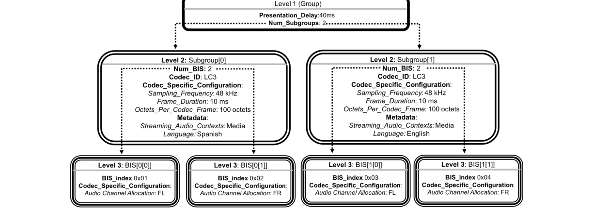

**Figure 3.1: Example BASE logical structure**

The table structure for the example BASE illustrated in Figure 3.1 is shown in Table 3.16.

| Level | Parameter |  | Size (Octets) | Value |
| --- | --- | --- | --- | --- |
|  | Length |  | 1 | Length of Type and Value fields for AD data type: 0x5D = 93 octets |
|  | Type: «Service Data - 16-bit UUID» |  | 1 | Defined in Bluetooth Assigned Numbers [2] |
|  | Value |  | 92 | 2-octet Service UUID followed by additional service data |
|  |  | Basic Audio Announcement Service UUID | 2 | Defined in Bluetooth Assigned Numbers [2] |
| 1 |  | Presentation Delay _ | 3 | 40 ms |
| 1 |  | Num Subgroups _ | 1 | 0x02: 2 Subgroups |
| 2 |  | Num BIS[0] _ | 1 | 0x02: 2 BIS in Subgroup[0] |
| 2 |  | Codec ID[0] _ | 5 | Octet 0: 0x06 = LC3 Coding Format Octet 1–2: 0x0000 Octet 3–4: 0x0000 |
| 2 |  | Codec Specific - _ _ Configuration Length[0] _ | 1 | Length of the Codec Specific Configuration _ _ for Subgroup[0]: 0x0A octets |

| Level | Parameter |  | Size (Octets) | Value |
| --- | --- | --- | --- | --- |
| 2 |  | Codec Specific - _ _ Configuration[0] | 10 | 3 LTV structures for Subgroup[0] defining: LTV 1: Sampling Frequency: 48000 Hz _ LTV 2: Frame Duration: 10 ms _ LTV 3: Octets Per Codec Frame: 100 octets _ _ _ |
| 2 |  | Metadata Length[0] _ | 1 | Length of Subgroup[0] Metadata: 0x09 octets |
| 2 |  | Metadata[0] | 9 | 2 LTV structures for Subgroup[0], defining: LTV 1: Streaming Audio Contexts: Media _ _ LTV 2: Language: Spanish |
| 3 |  | BIS index[0[0]] _ | 1 | 0x01 |
| 3 |  | Codec Specific - _ _ Configuration Length[0[0]] _ | 1 | Length of the Codec Specific Configuration _ _ for BIS index 0x01: 0x06 octets _ |
| 3 |  | Codec Specific - _ _ Configuration[0[0]] | 6 | 1 LTV structure for BIS Index 0x01, defining: _ LTV 1 = Audio Channel Allocation: FL _ _ |
| 3 |  | BIS index[0[1]] _ | 1 | 0x02 |
| 3 |  | Codec Specific - _ _ Configuration Length[0[1]] _ | 1 | Length of the Codec Specific Configuration _ _ for BIS index 0x02: 0x06 octets _ |
| 3 |  | Codec Specific - _ _ Configuration[0[1]] | 6 | 1 LTV structure for BIS Index 0x02, defining: _ LTV 1 = Audio Channel Allocation: FR _ _ |
| 2 |  | Num BIS[1] _ | 1 | 0x02: 2 BIS in Subgroup[1] |
| 2 |  | Codec ID[1] _ | 5 | Octet 0: 0x06 = LC3 Coding Format Octet 1–2: 0x0000 Octet 3–4: 0x0000 |
| 2 |  | Codec Specific - _ _ Configuration Length[1] _ | 1 | Length of the Codec Specific Configuration _ _ for Subgroup[1]: 0x0A octets |
| 2 |  | Codec Specific - _ _ Configuration[1] | 10 | 3 LTV structures for Subgroup[1] defining: LTV 1: Sampling Frequency: 48000 Hz _ LTV 2: Frame Duration: 10 ms _ LTV 3: Octets Per Codec Frame: 100 octets _ _ _ |
| 2 |  | Metadata Length[1] _ | 1 | Length of Subgroup[1] Metadata: 0x09 octets |
| 2 |  | Metadata[1] | 9 | 2 LTV structures for Subgroup[1] defining: LTV 1: Streaming Audio Contexts: Media _ _ LTV 2: Language: English |
| 3 |  | BIS index[1[0]] _ | 1 | 0x03 |

| Level | Parameter |  | Size (Octets) | Value |
| --- | --- | --- | --- | --- |
| 3 |  | Codec Specific - _ _ Configuration Length[1[0]] _ | 1 | Length of the Codec Specific Configuration _ _ for BIS index 0x03: 0x06 octets _ |
| 3 |  | Codec Specific - _ _ Configuration[1[0]] | 6 | 1 LTV structure for BIS Index 0x03, defining: _ LTV 1 = Audio Channel Allocation: FL _ _ |
| 3 |  | BIS index[1[1]] _ | 1 | 0x04 |
| 3 |  | Codec Specific - _ _ Configuration Length[1[1]] _ | 1 | Length of the Codec Specific Configuration _ _ for BIS index 0x04: 6 octets _ |
| 3 |  | Codec Specific - _ _ Configuration[1[1]] | 6 | 1 LTV structure for BIS Index 0x04, defining: _ LTV 1 = Audio Channel Allocation: FR _ _ |

Table 3.16: BASE structure for the logical BASE structure example shown in Figure 3.1

### 3.8 Broadcast Sink support requirements

This section defines support requirements for the Broadcast Sink role.
The Broadcast Sink shall instantiate one Published Audio Capabilities Service.

#### 3.8.1 ATT and EATT transport requirements

The Broadcast Sink shall support a minimum ATT_MTU of 64 octets for one Unenhanced ATT bearer or for at least one Enhanced ATT bearer if the Broadcast Sink supports Enhanced ATT bearers.

#### 3.8.2 Additional Published Audio Capabilities service requirements

This section defines additional requirements for the Broadcast Sink beyond those defined in PACS [5].
The Broadcast Sink shall support reception and decoding of audio data that is encoded using the settings defined as Mandatory in Table 3.17. The Broadcast Sink may support reception and decoding of audio data that is encoded using settings defined as Optional in Table 3.17 or any other settings defined by an implementation or by a higher-layer specification.
The Broadcast Sink shall expose all supported audio capability settings in one or more Sink PAC characteristics containing one or more PAC records.

| g |  | Codec Specific Capabilities (Defined in PACS [5]) _ _ |  |  |  |
| --- | --- | --- | --- | --- | --- |
| Codec Capability Settin | Codec_ID | Supported_Sampling_- Frequencies (kHz) (Section 4.3.1) | Supported_Frame_- Durations (ms) (Section 4.3.1) | Supported_Octets per_Codec_Frame (Octets) (Section 4.3.1) | Requirement |
| 8 1 _ | LC34 | 8 | 7.5 | 261 (27.734 kbps2) | O |
| 8 2 _ | LC34 | 8 | 10 | 301 (24 kbps2) | O |
| 16 1 _ | LC34 | 16 | 7.5 | 301 (32 kbps2) | O |
| 16 2 _ | LC34 | 16 | 10 | 401 (32 kbps2) | M |
| 24 1 _ | LC34 | 24 | 7.5 | 451 (48 kbps2) | O |
| 24 2 _ | LC34 | 24 | 10 | 601 (48 kbps2) | M |
| 32 1 _ | LC34 | 32 | 7.5 | 601 (64 kbps2) | O |
| 32 2 _ | LC34 | 32 | 10 | 801 (64 kbps2) | O |
| 441 1 _ | LC34 | 44.1 | 8.1633 | 971 (95.06 kbps2) | O |
| 441 2 _ | LC34 | 44.1 | 10.8843 | 1301 (95.55 kbps2) | O |
| 48 1 _ | LC34 | 48 | 7.5 | 751 (80 kbps2) | O |
| 48 2 _ | LC34 | 48 | 10 | 1001 (80 kbps2) | O |
| 48 3 _ | LC34 | 48 | 7.5 | 901 (96 kbps2) | O |
| 48 4 _ | LC34 | 48 | 10 | 1201 (96 kbps2) | O |
| 48 5 _ | LC34 | 48 | 7.5 | 1171 (124.8 kbps2) | O |
| 48 6 _ | LC34 | 48 | 10 | 1551 (124 kbps2) | O |

| g |  | Codec Specific Capabilities (Defined in PACS [5]) _ _ |  |  |  |
| --- | --- | --- | --- | --- | --- |
| Codec Capability Settin | Codec_ID | Supported_Sampling_- Frequencies (kHz) (Section 4.3.1) | Supported_Frame_- Durations (ms) (Section 4.3.1) | Supported_Octets per_Codec_Frame (Octets) (Section 4.3.1) | Requirement |
| 1 The supported range shall include this value. 2 Bit rates are calculated according to Section 3.2.5 in [7]. 3 Effective frame durations. The 44.1 kHz sampling rate results in a deviation from the 7.5 ms/10 ms frame durations that can be exposed using the Supported Frame Durations LTV structure. For _ _ 44.1 kHz/7.5ms the actual frame duration is equivalent to 360 (samples per frame) divided by 44100 (samples per second), which equals 8.16327 ms per frame, and for 44.1 kHz/10 ms the actual frame duration is equal to 480 (samples per frame) divided by 44100 (samples per second), which equals 10.88435 ms per frame. The LC3 [7] codec encodes 97 octets (for 7.5 ms/8.163 ms effective) or 130 octets (for 10 ms/10.884 ms effective) into each SDU, which arrives at the controller every 8.16327 ms or 10.88435 ms. The transmitting device assigns a time offset to each SDU and delivers the time offset _ with each SDU at the receiver, as defined in Volume 6, Part G, Section 3.1 in [1]. Determination of the time offset parameter at the transmitting device is implementation-specific. Compensation for the _ difference between 8.16327 ms and 8.163 ms, and/or compensation between 10.88435 ms and 10.884 ms, is implementation-specific. 4 For LC3, octet 0 of the Codec ID parameter in Table 3.17 contains the value defined for the LC3 _ Coding Format in the Host Controller Interface section of Bluetooth Assigned Numbers [2], and octets 1 to 4 contain 0. The format of the Codec ID field is defined in PACS[5]. _ |  |  |  |  |  |

Table 3.17: Broadcast Sink audio capability support requirements
If the Broadcast Sink supports vendor-specific codec audio capabilities, the Broadcast Sink shall use the format defined in Table 3.18 when populating the Codec_ID field in PAC records, exposing vendor- specific audio capabilities.

| Parameter | Value |
| --- | --- |
| Codec ID _ | Octet 0: 0xFF = Vendor-specific Coding Format Octet 1–2: Company ID Company ID values are defined in Bluetooth Assigned Numbers [2]. Octet 3–4: Vendor-specific codec ID _ |

Table 3.18: Broadcast Sink vendor-specific audio codec capability format

##### 3.8.2.1 Audio data Context Type support requirements

The Broadcast Sink shall support the Context Type value defined as ‘unspecified’ in the Supported_Sink_Contexts field of the Supported Audio Contexts characteristic.

### 3.9 Scan Delegator support requirements

The Scan Delegator shall instantiate one Broadcast Audio Scan Service.

#### 3.9.1 ATT and EATT transport requirements

The Scan Delegator shall support a minimum ATT_MTU of 64 octets for one Unenhanced ATT bearer or for at least one Enhanced ATT bearer if the Scan Delegator supports Enhanced ATT bearers.

#### 3.9.2 Additional Broadcast Audio Scan Service requirements

This section defines additional requirements for the Scan Delegator beyond those requirements defined in BASS [6].
If the Scan Delegator implements a Broadcast Sink, then to inform unconnected Broadcast Assistants that the Broadcast Sink collocated with the Scan Delegator is connectable and available to receive audio data, the Scan Delegator shall transmit extended advertising PDUs that contain the Service Data AD data type (see [3]) and the Broadcast Audio Scan Service UUID as defined in Table 3.19.
The AD format shown in Table 3.19 is defined in Volume 3, Part C, Section 11 in [1].

| Parameter |  | Size (Octets) | Description |
| --- | --- | --- | --- |
| Length |  | 0x01 | Length of Type and Value fields for AD data type |
| Type: «Service Data - 16-bit UUID» |  | 0x01 | Defined in Bluetooth Assigned Numbers [2] |
| Value |  | Varies | 2-octet Service UUID followed by additional serv- ice data |
|  | Broadcast Audio Scan Service UUID | 2 | Defined in Bluetooth Assigned Numbers [2] |

Table 3.19: Scan Delegator AD format when connectable and available to receive audio data

### 3.10 Broadcast Assistant support requirements

This section defines support requirements for the Broadcast Assistant role.

#### 3.10.1 ATT and EATT transport requirements

The Broadcast Assistant shall support a minimum ATT_MTU of 64 octets for one Unenhanced ATT bearer or for at least one Enhanced ATT bearer if the Broadcast Assistant supports Enhanced ATT bearers.

#### 3.10.2 Additional GATT sub-procedure requirements

GATT sub-procedure support requirements on Unenhanced ATT bearers required by all GATT clients are defined in Volume 3, Part G, Section 4.2 in [1].
The Broadcast Assistant shall support the additional GATT sub-procedure requirements defined in Table 3.20.
Requirements in this section represent a minimum set of requirements for a client. Other GATT sub- procedures may be used if supported by both the client and the server.

| GATT Sub-Procedure | Requirement |
| --- | --- |
| Exchange MTU | M |
| Discover All Primary Services | C.1 |
| Discover Primary Services by Service UUID | C.1 |
| Discover All Characteristics of a Service | C.2 |
| Discover Characteristic by UUID | C.2 |
| Discover All Characteristic Descriptors | M |
| Read Characteristic Value | M |
| Write Characteristic Value | M |
| Notifications | M |
| Read Characteristic Descriptors | M |
| Write Characteristic Descriptors | M |

Table 3.20: Additional Broadcast Assistant GATT sub-procedure support requirements on Unenhanced ATT bearers
C.1: Mandatory to support at least one Primary Service Discovery procedure.
C.2: Mandatory to support at least one Characteristic Discovery procedure.

#### 3.10.3 Service and characteristic discovery support requirements

The Broadcast Assistant shall support the service and characteristic discovery procedures defined in Table 3.21.

| Procedure |  | Section Reference | Requirement |
| --- | --- | --- | --- |
| Service discovery |  | Section 3.10.5 | M |
|  | Broadcast Audio Scan Service discov- ery | Section 3.10.5.1 | M |
|  | Published Audio Capabilities Service discovery | Section 3.10.5.2 | O |
| Characteristic discovery |  | Section 3.10.6 | M |
|  | Broadcast Audio Scan Service charac- teristic discovery | Section 3.10.6.1 | M |
|  | Published Audio Capabilities Service characteristic discovery | Section 3.10.6.2 | O |

Table 3.21: Broadcast Assistant service and characteristic discovery support requirements

#### 3.10.4 Characteristic support requirements

Table 3.22 defines characteristic support requirements for the Broadcast Assistant role.

| Characteristic | Section Reference | Requirement |
| --- | --- | --- |
| Broadcast Audio Scan Control Point | Section 3.10.6.1.1 | M |
| Broadcast Receive State | Section 3.10.6.1.2 | M |
| Sink PAC | Section 3.10.6.2.1 | O |
| Sink Audio Locations | Section 3.10.6.2.2 | O |

Table 3.22: Broadcast Assistant characteristic support requirements

#### 3.10.5 Service discovery

This section defines service discovery procedures for the Broadcast Assistant role.

##### 3.10.5.1 Broadcast Audio Scan Service discovery

The Broadcast Assistant shall use either the GATT Discover All Primary Services sub-procedure or the GATT Discover Primary Services by Service UUID sub-procedure to discover the Broadcast Audio Scan Service.

##### 3.10.5.2 Published Audio Capabilities Service discovery

The Broadcast Assistant may use either the GATT Discover All Primary Services sub-procedure or the GATT Discover Primary Services by Service UUID sub-procedure to discover the Published Audio Capabilities Service.

#### 3.10.6 Characteristic discovery

This section defines characteristic discovery procedures for the Broadcast Assistant role.

##### 3.10.6.1 Broadcast Audio Scan Service characteristic discovery

The Broadcast Assistant shall use either the GATT Discover All Characteristics of a Service sub- procedure or the GATT Discover Characteristics by Characteristic UUID sub-procedure to discover Broadcast Audio Scan Service characteristics.
For each discovered Broadcast Audio Scan Service characteristic, if the characteristic properties include support for notifications, the Broadcast Assistant shall use the Discover All Characteristic Descriptors sub-procedure to discover the Client Characteristic Configuration descriptor for that characteristic.
To configure a Broadcast Audio Scan Service characteristic for notifications, the Broadcast Assistant shall use the GATT Write Characteristic Descriptors sub-procedure to write to the Client Characteristic Configuration descriptor for that characteristic.

###### 3.10.6.1.1 Broadcast Audio Scan Control Point characteristic discovery

The Broadcast Assistant shall discover the Broadcast Audio Scan Control Point characteristic.

###### 3.10.6.1.2 Broadcast Receive State characteristic discovery

The Broadcast Assistant shall discover all instances of the Broadcast Receive State characteristic.
The Broadcast Assistant shall configure all instances of the Broadcast Receive State characteristic for notifications.

##### 3.10.6.2 Published Audio Capabilities Service characteristic discovery

The Broadcast Assistant may use either the GATT Discover All Characteristics of a Service sub- procedure or the GATT Discover Characteristics by Characteristic UUID sub-procedure to discover Published Audio Capabilities Service characteristics.
For each discovered Published Audio Capabilities Service characteristic in Table 3.22, if the characteristic properties include support for notifications, the Broadcast Assistant may use the Discover All Characteristic Descriptors sub-procedure to discover the Client Characteristic Configuration descriptor for that characteristic.
To configure a Published Audio Capabilities Service characteristic for notifications, the Broadcast Assistant may use the GATT Write Characteristic Descriptors sub-procedure to write to the Client Characteristic Configuration descriptor for that characteristic.

###### 3.10.6.2.1 Sink PAC characteristic discovery

The Broadcast Assistant may discover all instances of the Sink PAC characteristic.
For each discovered Sink PAC characteristic, if the characteristic properties include support for notifications, the Broadcast Assistant may configure the Sink PAC characteristic for notifications.

###### 3.10.6.2.2 Sink Audio Locations characteristic discovery

The Broadcast Assistant may discover the Sink Audio Locations characteristic.
The Broadcast Assistant shall interpret the absence of this characteristic as support for mono audio with no specified Audio Location.
If the Broadcast Assistant has discovered the Sink Audio Locations characteristic, and the characteristic properties include support for notifications, the Broadcast Assistant may configure the Sink Audio Locations characteristic for notifications.

## 4 LC3 codec integration

Requirements in this section are defined as “Mandatory” (M), “Optional” (O), “Excluded” (X), and “Conditional” (C.n). Conditional requirements (C.n) are listed directly below the table in which they appear.
This section defines how to use the Low Complexity Communication Codec (LC3) [7] for encoding and decoding multiple Audio Channels and how to transport LC3-encoded audio data over a unicast or broadcast Audio Stream.

### 4.1 Introduction

LC3 is a single-channel codec. Any stereo or multi-channel coding is supported as defined in Section 3.2.1 in [7].
The LC3 specification does not define a payload or transport format (see Section 2.2 in [7]).
This section defines:
• A packet format for transporting LC3-encoded audio data
• The codec-specific parameter requirements for LC3
• The channel allocation – the mapping between Audio Channels and Audio Locations
An overview showing channel ordering, encoding of multiple Audio Channels, and multiplexing of the data for a five-channel example is shown in Figure 4.1.

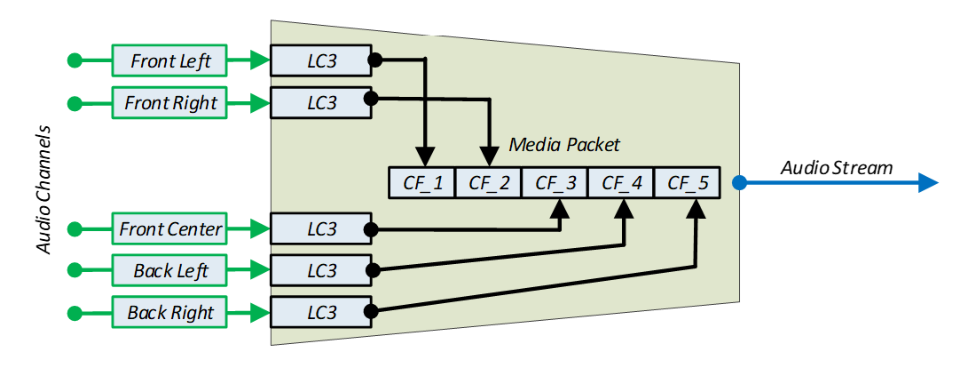

**Figure 4.1: Example encoding of multiple Audio Channels and multiplexing of audio data for five Audio Channels**

### 4.2 LC3 Media Packet format

Figure 4.2 shows the LC3 Media Packet format used for transporting LC3-encoded audio data over an Audio Stream.
When using the LC3 codec, the LC3 Media Packet is transmitted by an Audio Source and/or a Broadcast Source as an individual isochronous SDU (see Volume 4, Part E, Section 7.8.97 in [1] and Volume 6, Part G, Section 1.1 in [1]).
The LC3 Media Packet format has one field: the Payload field containing blocks of codec frames.
The Payload contains one LC3 codec frame per Audio Channel per block for one or more Audio Channels.
The number of LC3 codec frames, m, within a block and their ordering is defined by the Audio_Channel_Allocation LTV structure (see Section 4.3.2). An LC3 Media Packet shall contain one or more blocks of encoded LC3 codec frames, ordered from the lowest to highest Audio_Location bit indices present in the Audio_Channel_Allocation LTV structure bitmap value.
The number of blocks, n, in an LC3 Media Packet Payload field is defined by the Codec_Frame_Blocks_Per_SDU LTV structure (see Section 4.3.2).
This LC3 codec integration section assumes fixed bit-rate encoding.

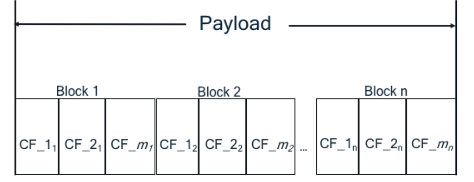

**Figure 4.2: LC3 Media Packet format**

### 4.3 LC3 LTV requirements

Devices using the LC3 codec shall follow the requirements in Section 4.3.1 and Section 4.3.2 and Section 4.3.3.

#### 4.3.1 Codec_Specific_Capabilities LTV requirements

Devices exposing support for the LC3 codec shall follow the requirements in this section when populating the Codec_Specific_Capabilities field in PAC records as defined in [5].
The Supported_Sampling_Frequencies LTV structure defined in Bluetooth Assigned Numbers [2] shall be present in the Codec_Specific_Capabilities field.
The Supported_Frame_Durations LTV structure defined in Bluetooth Assigned Numbers [2] shall be present in the Codec_Specific_Capabilities field.
The Supported_Audio_Channel_Counts LTV structure defined in Bluetooth Assigned Numbers [2] may be present in the Codec_Specific_Capabilities field. The absence of the Supported_Audio_Channel_Counts LTV structure shall be interpreted as equivalent to a Supported_Audio_Channel_Counts value of 0x01 (one Audio Channel supported).
The Supported_Octets_Per_Codec_Frame LTV structure defined in Bluetooth Assigned Numbers [2] shall be present in the Codec_Specific_Capabilities field.
The Supported_Max_Codec_Frames_Per_SDU LTV structure defined in Bluetooth Assigned Numbers [2] may be present in the Codec_Specific_Capabilities field. The absence of the Supported_Max_Codec_Frames_Per_SDU LTV structure shall be interpreted as equivalent to a Supported_Max_Codec_Frames_Per_SDU value of 1 codec frame per Audio Channel per SDU maximum.

#### 4.3.2 Codec_Specific_Configuration LTV requirements

Devices configuring an Audio Stream to use the LC3 codec shall follow the requirements in this section when initiating the Config Codec operation as defined in Section 5.6.1, or when configuring a broadcast Audio Stream, as defined in Section 6.3.
The Sampling_Frequency LTV structure defined in Bluetooth Assigned Numbers [2] shall be present in the Codec_Specific_Configuration field.
The Frame_Duration LTV structure defined in Bluetooth Assigned Numbers [2] shall be present in the Codec_Specific_Configuration field.
To configure one or more audio channels to be rendered at specific Audio Locations (e.g., the channels of a stereo stream), the Audio_Channel_Allocation LTV structure defined in Bluetooth Assigned Numbers [2] shall be present in the Codec_Specific_Configuration field and shall have at least one Audio Location bit set. To configure a single mono audio channel with no specified Audio Location, the Audio_Channel_Allocation LTV shall be omitted from the Codec_Specific_Configuration field. A Unicast Client or a Broadcast Source cannot configure multiple mono channels, or multiple channels having the same Audio Location, or multiple channels where one is mono and others have specific Audio Locations, in a single Unicast Audio Stream or Broadcast Audio Stream.
The Octets_Per_Codec_Frame LTV structure defined in Bluetooth Assigned Numbers [2] shall be present in the Codec_Specific_Configuration field. The Unicast Client and/or the Broadcast Source shall use a value for the Octets_Per_Codec_Frame LTV structure that lies within the Supported_Octets_Per_Codec_Frame value range exposed by the Unicast Server and/or exposed by the Broadcast Sink.
The Codec_Frame_Blocks_Per_SDU LTV structure defined in Bluetooth Assigned Numbers [2] may be present in the Codec_Specific_Configuration field. The absence of the Codec_Frame_Blocks_Per_SDU LTV structure shall be interpreted as equivalent to a Codec_Frame_Blocks_Per_SDU value of 0x01.

#### 4.3.3 Metadata LTV requirements

Devices exposing support for, or using, the LC3 codec may include any Metadata LTV structures defined in Bluetooth Assigned Numbers [2] in the Metadata field.
When exposing support for the LC3 codec in a PAC record, the Preferred_Audio_Context LTV structure defined in Bluetooth Assigned Numbers [2] may be present in the Metadata field. The absence of the Preferred_Audio_Contexts LTV structure in a PAC record means no preference for audio data Context Types are defined in that PAC record.
When using the LC3 codec with unicast or broadcast Audio Streams, the Streaming_Audio_Contexts LTV structure defined in Bluetooth Assigned Numbers [2] may be present in the Metadata field. The absence of the Streaming_Audio_Contexts LTV structure shall be considered equivalent to a Streaming_Audio_Contexts value that includes the bit defined as unspecified set to a value of 0b1 and all other bits set to a value of 0b0.

#### 4.3.4 Examples of usage

The examples in Section 4.3.4.1 to Section 4.3.4.4 show a Unicast Server’s Supported_Audio_Channel_Counts LTV, which is a field in the LC3 Codec_Specific_Capabilities field of a PAC record, and its PACS Sink Audio Locations characteristic. The examples also show a Unicast Client’s use of the Audio_Channel_Allocation LTV, which is a value in the LC3 Codec_Specific_Configuration field of the ASCS Config Codec operation.
The examples in Section 4.3.4.5 to Section 4.3.4.7 show a Broadcast Source’s use of the Codec_Specific_Configuration fields of the BASE structure defined in Section 3.7.2.2. In the examples, the Codec_Frame_Blocks_Per_SDU LTV value in the LC3 Codec_Specific_Configuration is assumed to be 0x01 to indicate there is one block of LC3 frames in the Media Packet Payload as defined in Section 4.2.

##### 4.3.4.1 Mono audio to one Unicast Server

The example in Figure 4.3 shows mono audio configured for transmission to a single Unicast Server.
Unicast Client Audio_Channel_Allocation omitted from Codec_Specific_Configuration parameter of Config Codec Unicast Server Sink PAC, Supported_Audio_Channel_Counts = 0x01 (support for receiving one channel) Sink Audio Locations = 0x00000000 (No specified audio location)

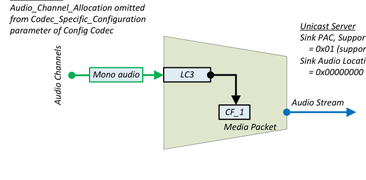

**Figure 4.3: Example mono Audio Stream encoded using LC3**

The Unicast Server sets the Supported_Audio_Channel_Counts value to 0x01 (0b00000001) to indicate support for receiving one channel in a unicast Audio Stream. Note that the Unicast Server can also omit the Supported_Audio_Channel_Counts LTV (which has a default value of 1) to indicate support for receiving one channel, or the Unicast Server can set other bits in the value to indicate support for receiving other channel counts.
This is Audio Configuration 1 described in Section 4.4.1.
The Unicast Server has a Sink Audio Locations characteristic with a value of 0x00000000 (0b00000000000000000000000000000000) to indicate support for receiving only mono audio (no specified Audio Location). Note that the Unicast Server can also omit this characteristic from its PACS service.
In the ASCS Config Codec operation, the Unicast Client omits the Audio_Channel_Allocation LTV from the Codec_Specific_Configuration parameter to configure transmission of a single channel of mono audio (no specified Audio Location), and each block in the LC3 Media Packet contains one frame of mono audio.

##### 4.3.4.2 Stereo audio to one Unicast Server as one multiplexed stream

The example in Figure 4.4. shows stereo audio configured for transmission to one Unicast Server as a single multiplexed unicast Audio Stream.
Unicast Client Audio_Channel_Allocation = 0x00000003 (Front Left, Front Right)
Unicast Server Sink PAC, Supported_Audio_Channel_Counts = 0x03 (support for receiving two channels or one channel) Sink Audio Locations = 0x00000003 (Front Left, Front Right)

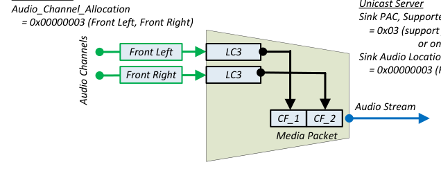

**Figure 4.4: Example stereo Audio Stream encoded using multiplexed LC3 codec frames in a single block**

The Unicast Server sets the Supported_Audio_Channel_Counts value to 0x03 (0b00000011) to indicate support for receiving two channels or one channel in a unicast Audio Stream. Note that the Unicast Server can set other bits in the value to indicate support for receiving other channel counts.
This is Audio Configuration 4 as described in Section 4.4.4.
The Unicast Server has a Sink Audio Location characteristic with a value of 0x00000003 (0b00000000000000000000000000000011) to indicate support for receiving both the Front Left and the Front Right channels of a stereo Audio Stream.
In the ASCS Config Codec operation, the Unicast Client sets the Audio_Channel_Allocation value to 0x00000003 (0b00000000000000000000000000000011) to configure transmission of both the Front Left and the Front Right stereo channels in one stream.
The Audio_Channel_Allocation value has two bits set; therefore, each block in the LC3 Media Packet contains two frames, ordered as follows:
• The Front Left location has the lowest bit index and is transported in the first frame of the LC3 media packet.
• The Front Right location has the next higher bit index and is encoded and transported in the next frame of the LC3 media packet.

##### 4.3.4.3 Stereo audio to one Unicast Server as two streams

The example in Figure 4.5 shows stereo audio configured for transmission to one Unicast Server as two unicast Audio Streams.
Unicast Server Sink PAC, Supported_Audio_Channel_Counts = 0x01 (support for receiving one channel) Sink Audio Locations = 0x00000003 (Front Left, Front Right) Unicast Client Audio_Channel_Allocation = 0x00000001 (Front Left)

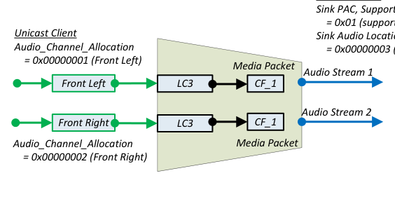

**Figure 4.5: Example stereo Audio Stream encoded using LC3 codec frames in two streams**

The Unicast Server sets the Supported_Audio_Channel_Counts value to 0x01 (0b00000001) to indicate support for receiving one channel in a unicast Audio Stream.
This is Audio Configuration 6(i) described in Section 4.4.6.
The Unicast Server has a Sink Audio Location characteristic with a value of 0x00000003 (0b00000000000000000000000000000011) to indicate support for receiving the Front Left and the Front Right channels.
Using ASCS Config Codec operations, the Unicast Client configures two separate unicast Audio Streams, one for each channel of the stereo audio content. For one stream, the Unicast Client sets the Audio_Channel_Allocation value to 0x00000001 (0b00000000000000000000000000000001) to configure transmission of the Front Left channel in one unicast Audio Stream. For the other stream, the Unicast Client sets the Audio_Channel_Allocation value to 0x00000002 (0b00000000000000000000000000000010) to configure transmission of the Front Right channel in the other unicast Audio Stream.
For each of the streams, the Audio_Channel_Allocation value has one bit set; therefore, each block in the LC3 Media Packet contains one frame.

##### 4.3.4.4 Stereo audio to two Unicast Servers

The example in Figure 4.6 shows stereo audio configured for transmission to two Unicast Servers as two unicast Audio Streams.
Unicast Server 1 Sink PAC, Supported_Audio_Channel_Counts = 0x01 (support for receiving one channel) Sink Audio Locations = 0x00000001 (Front Left)
Unicast Client Audio_Channel_Allocation = 0x00000001 (Front Left)

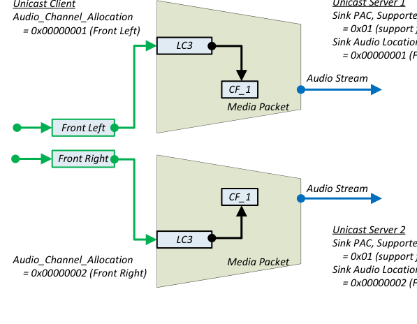

**Figure 4.6: Example stereo Audio Stream configured for two Unicast Servers encoded using LC3**

Each of the two Unicast Servers sets the Supported_Audio_Channel_Counts value to 0x01 (0b00000001) to indicate support for receiving one channel in a unicast Audio Stream. Note that the Unicast Server can also omit the Supported_Audio_Channel_Counts LTV (which has a default value of 1) to indicate support for receiving one channel, or the Unicast Server can set other bits in the value to indicate support for receiving other channel counts.
This is Audio Configuration 6(ii) as described in Section 4.4.7.
One Unicast Server has a Sink Audio Locations characteristic with a value of 0x00000001 (0b00000000000000000000000000000001) to indicate that it can receive the Front Left channel.
The other Unicast Server has a Sink Audio Locations characteristic with a value of 0x00000002 (0b00000000000000000000000000000010) to indicate that it can receive the Front Right channel.
Using ASCS Config Codec operations, the Unicast Client configures two separate unicast Audio Streams, one for each channel of the stereo audio content. For one unicast Audio Stream, the Unicast Client sets the Audio_Channel_Allocation value to 0x00000001 (0b00000000000000000000000000000001) to configure transmission of the Front Left channel. For the other unicast Audio Stream, the Unicast Client sets the Audio_Channel_Allocation value to 0x00000002 (0b00000000000000000000000000000010) to configure transmission of the Front Right channel.
For each of the streams, the Audio_Channel_Allocation value has one bit set; therefore, each block in the LC3 Media Packet contains one frame.

##### 4.3.4.5 Stereo audio broadcast

The example in Figure 4.7 shows the logical layout of a BASE advertised by a Broadcast Source that broadcasts stereo audio as two broadcast Audio Streams.

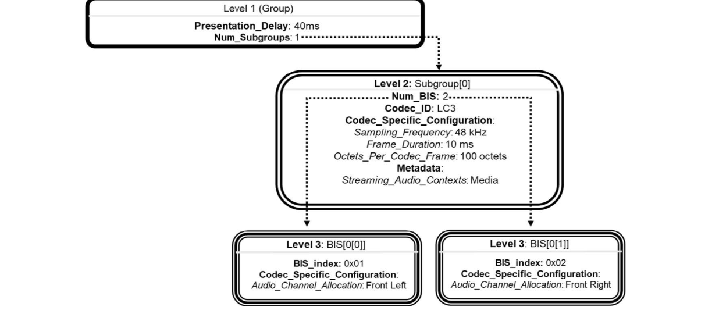

**Figure 4.7: Example BASE structure for stereo audio as two streams**

In this example, there is one subgroup, and the subgroup contains two BISes.
In the Level 2 Codec_Specific_Configuration field for the subgroup, the Broadcast Source sets LC3 codec configuration parameters that are common to both BISes in the subgroup. In the Level 3 Codec_Specific_Configuration for each BIS, the Broadcast Source sets the Audio_Channel_Allocation LTV to configure the channel that is transmitted in the BIS. One BIS is configured as the left channel, and one as the right channel.

##### 4.3.4.6 Mono audio broadcast

The example in Figure 4.8 shows the logical layout of a BASE advertised by a Broadcast Source that broadcasts a single mono broadcast Audio Stream.

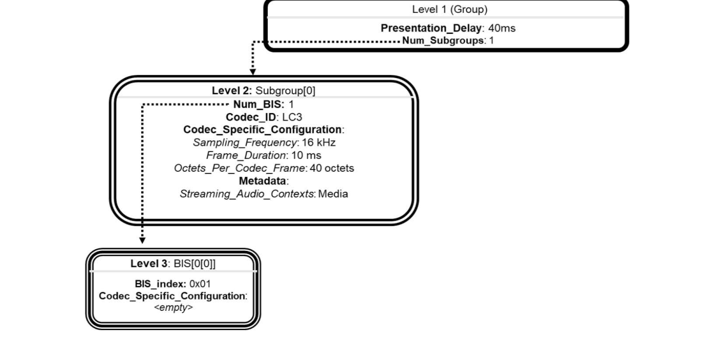

**Figure 4.8: Example BASE structure for mono audio**

In this example, there is one subgroup, and the subgroup contains one BIS.
In the Level 2 Codec_Specific_Configuration field for the subgroup, the Broadcast Source sets the LC3 codec configuration parameters for the BIS. There is only one BIS in the subgroup and there is no need for additional codec configuration parameters in the Level 3 Codec_Specific_Configuration for the BIS. To configure the BIS as a single channel of mono audio (no specific Audio Location), the Broadcast Source omits the Audio_Channel_Allocation LTV from the LC3 Codec_Specific_Configuration parameters.

##### 4.3.4.7 Stereo and mono audio broadcast

The example in Figure 4.9 shows the logical layout of a BASE advertised by a Broadcast Source that broadcasts mono audio and stereo audio.
Level 1 (Group)

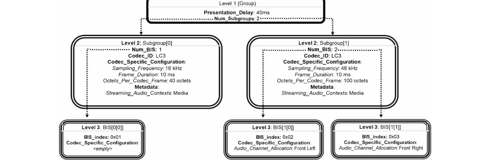

**Figure 4.9: Example BASE structure for concurrent mono and stereo broadcast**

In this example, there are two subgroups. One subgroup is for the mono mix and contains one BIS; the other subgroup is for the stereo mix and contains two BISes.
In the Level 2 Codec_Specific_Configuration field for the mono subgroup, the Broadcast Source sets the LC3 codec configuration parameters for the BIS. There is only one BIS in the subgroup, so there are no additional codec configuration parameters in the Level 3 Codec_Specific_Configuration for the BIS. To configure the BIS as a single channel of mono audio (no specific Audio Location), the Broadcast Source omits the Audio_Channel_Allocation LTV from the LC3 Codec_Specific_Configuration parameters.
In the Level 2 Codec_Specific_Configuration field for the stereo subgroup, the Broadcast Source sets LC3 codec configuration parameters that are common to both BISes in the subgroup. In the Level 3 Codec_Specific_Configuration for each BIS, the Broadcast Source sets the Audio_Channel_Allocation LTV to configure the channel that is transmitted in the BIS. One BIS is configured as the left channel, and one as the right channel.

### 4.4 Multiple-channel LC3 unicast audio

As stated in Section 4.1, LC3 is a single-channel codec. It is possible for the Unicast Client and one or more Unicast Servers to send and receive multiple channels of LC3-encoded audio data in different ways.
The Unicast Server requirements for the number of ASE characteristics exposed are defined in Section 3.5.3.
Table 4.1 shows typical Audio Configurations for unicast devices supporting LC3.
In the Legend column in Table 4.1, a dashed line represents a CIS, which can transport at most two unicast Audio Streams, one in each direction. An arrowhead represents a single Audio Channel that may be assigned to an Audio Location. Arrowheads pointing to the right represent audio data flowing from a Unicast Client towards a Sink ASE on a Unicast Server and arrowheads pointing to the left represent audio data flowing from a Source ASE on a Unicast Server towards a Unicast Client.
In Table 4.1, Audio Configurations in rows suffixed with (ii) use one Unicast Client and two Unicast Servers; all other Audio Configurations in Table 4.1 use one Unicast Client and one Unicast Server. All multiple-channel Audio Configurations with two Sink ASEs and/or two Source ASEs assume Audio
Channels for different Audio Locations being transmitted or received. Transmitting or receiving two Audio Streams containing Audio Channels for the same Audio Location to different Sink ASEs (whether on the same Unicast Server or to two Sink ASEs on different Unicast Servers) or from different Source ASEs (whether on the same Unicast Server or from two Sources ASEs on different Unicast Servers) is not explicitly described in the examples in Section 4.4.1 to Section 4.4.16. Where a box has been greyed-out in Table 4.1, no requirement is defined.

| Audio Config- uration | Legend CS | Num Serv- ers | Sink ASEs | Sou- rce ASEs | Audio Chan- nels per Sink ASE1 | Min Sink Audio Loca- tions per Server 2 | Audio Chan- nels per Source ASE3 | Min Source Audio Loca- tions per Server4 | CISes | Audio Stre- ams |
| --- | --- | --- | --- | --- | --- | --- | --- | --- | --- | --- |
| 1 | --------> | 1 | 1 |  | 1 |  |  |  | 1 | 1 |
| 2 | <-------- | 1 |  | 1 |  |  | 1 |  | 1 | 1 |
| 3 | <-------> | 1 | 1 | 1 | 1 |  | 1 |  | 1 | 2 |
| 4 | ------->> | 1 | 1 |  | 2 | 2 |  |  | 1 | 1 |
| 5 | <----->> | 1 | 1 | 1 | 2 | 2 | 1 |  | 1 | 2 |
| 6(i) | --------> --------> | 1 | 2 |  | 1 | 2 |  |  | 2 | 2 |
| 6(ii) | --------> --------> | 2 | 2 |  | 1 | 1 |  |  | 2 | 2 |
| 7(i) | --------> <-------- | 1 | 1 | 1 | 1 |  | 1 |  | 2 | 2 |
| 7(ii) | --------> <-------- | 2 | 1 | 1 | 1 |  | 1 |  | 2 | 2 |
| 8(i) | --------> <-------> | 1 | 2 | 1 | 1 | 2 | 1 |  | 2 | 3 |
| 8(ii) | --------> <-------> | 2 | 2 | 1 | 1 | 1 | 1 | 1 | 2 | 3 |
| 9(i) | <-------- <-------- | 1 |  | 2 |  |  | 1 | 2 | 2 | 2 |
| 9(ii) | <-------- <-------- | 2 |  | 2 |  |  | 1 | 1 | 2 | 2 |
| 10 | <<------- | 1 |  | 1 |  |  | 2 | 2 | 1 | 1 |

| Audio Config- uration | Legend CS | Num Serv- ers | Sink ASEs | Sou- rce ASEs | Audio Chan- nels per Sink ASE1 | Min Sink Audio Loca- tions per Server 2 | Audio Chan- nels per Source ASE3 | Min Source Audio Loca- tions per Server4 | CISes | Audio Stre- ams |
| --- | --- | --- | --- | --- | --- | --- | --- | --- | --- | --- |
| 11(i) | <-------> <-------> | 1 | 2 | 2 | 1 | 2 | 1 | 2 | 2 | 4 |
| 11(ii) | <-------> <-------> | 2 | 2 | 2 | 1 | 1 | 1 | 1 | 2 | 4 |
| 1 If Audio Channels per Sink ASE > 1, Audio Channel Counts shall be present in a Sink PAC record _ _ and shall support a channel count > 1 2 If Min Sink Audio Locations per server > 1, Sink Audio Locations shall exist and shall support > 1 location by setting > 1 bits to 0b1 in the characteristic value 3 If Audio Channels per Source ASE > 1, Audio Channel Counts shall be present in a Source PAC _ _ record and shall support a channel count > 1 4 If Min Source Audio Locations per server > 1, Source Audio Locations shall exist and shall support > 1 location by setting > 1 bits to 0b1 in the characteristic value |  |  |  |  |  |  |  |  |  |  |

Table 4.1: Unicast LC3 Audio Configurations
Table 4.2 defines the support requirements for the Audio Configurations listed in Table 4.1. For a single Unicast Server in a pair of Unicast Servers, Audio Configurations in Table 4.2 rows suffixed with (ii) represent identical Audio Configurations in other Table 4.2 rows (for example, Audio Configuration 6(ii) from the point of view of a single Unicast Server in a pair of Unicast Servers is identical to Audio Configuration 1) and are greyed-out where the support requirement is already defined in other rows. For the Unicast Client, each row in Table 4.2 defines a unique Audio Configuration implemented as a single CIG.

| Audio | Legend | Num | Requirement |  |  |  |
| --- | --- | --- | --- | --- | --- | --- |
| Configuration | CS | Servers | Unicast Client |  | Unicast Server |  |
|  |  |  | Audio Sink | Audio Source | Audio Sink | Audio Source |
| 1 | --------> | 1 | X | M | M | X |
| 2 | <-------- | 1 | M | X | X | M |
| 3 | <-------> | 1 | C.1 | C.1 | C.1 | C.1 |
| 4 | ------->> | 1 | X | O | C.2 | X |
| 5 | <----->> | 1 | C.3 | C.3 | C.3 | C.3 |
| 6(i) | --------> --------> | 1 | X | M | C.4 | X |

| Audio | Legend | Num | Requirement |  |  |  |
| --- | --- | --- | --- | --- | --- | --- |
| Configuration | CS | Servers | Unicast Client |  | Unicast Server |  |
|  |  |  | Audio Sink | Audio Source | Audio Sink | Audio Source |
| 6(ii) | --------> --------> | 2 | X | M |  |  |
| 7(i) | --------> <-------- | 1 | C.3 | C.3 | C.1 | C.1 |
| 7(ii) | --------> <-------- | 2 | C.1 | C.1 |  |  |
| 8(i) | --------> <-------> | 1 | C.3, C.7 | C.3, C.7 | C.3 | C.3 |
| 8(ii) | --------> <-------> | 2 | C.3, C.8 | C.3, C.8 |  |  |
| 9(i) | <-------- <-------- | 1 | M | X | X | C.6 |
| 9(ii) | <-------- <-------- | 2 | M | X |  |  |
| 10 | <<------- | 1 | O | X | X | C.5 |
| 11(i) | <-------> <-------> | 1 | C.3, C.9 | C.3, C.9 | C.3 | C.3 |
| 11(ii) | <-------> <-------> | 2 | C.3, C.10 | C.3, C.10 |  |  |

Table 4.2: Unicast LC3 Audio Configuration support requirements
C.1: Mandatory if Audio Sink and Audio Source are supported, otherwise excluded.
C.2: Mandatory if the Unicast Server supports Audio Sink and supports more than one Audio Location in Sink Audio Locations and supports an Audio_Channel_Count greater than 1, otherwise excluded.
C.3: Optional if Audio Sink and Audio Source are supported, otherwise excluded.
C.4: Mandatory if the Unicast Server supports Audio Sink and supports more than one Audio Location in Sink Audio Locations, otherwise excluded.
C.5: Mandatory if the Unicast Server supports Audio Source and supports more than one Audio Location in Source Audio Locations and supports an Audio_Channel_Counts greater than 1, otherwise excluded.
C.6: Mandatory if the Unicast Server supports Audio Source and supports more than one Audio Location in Source Audio Locations, otherwise excluded.
C.7: Mandatory to support Audio Configuration 8(i) if Audio Configuration 8(ii) is supported, otherwise excluded.
C.8: Mandatory to support Audio Configuration 8(ii) if Audio Configuration 8(i) is supported, otherwise excluded.
C.9: Mandatory to support Audio Configuration 11(i) if Audio Configuration 11(ii) supported, otherwise excluded.
C.10: Mandatory to support Audio Configuration 11(ii) if Audio Configuration 11(i) supported, otherwise excluded

#### 4.4.1 Audio Configuration 1

Single Audio Channel. One unidirectional CIS. Unicast Server is Audio Sink
Figure 4.10 shows an example of Audio Configuration 1. A Unicast Client in the Audio Source role transmits a single channel of audio data to a Unicast Server in the Audio Sink role using one unidirectional CIS.

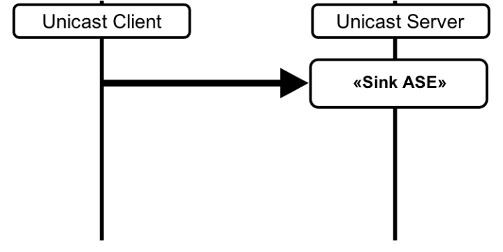

**Figure 4.10: Audio Configuration 1**

The Audio Configuration 1 characteristics, Codec_Specific_Capabilities, and Codec_Specific_Configuration are shown in Table 4.3.

| Parameter |  | Requirement for Audio Configuration |
| --- | --- | --- |
| Sink PAC [5] |  | Mandatory |
|  | Supported Audio Channel Counts (Sec- _ _ _ tion 4.3.1) | Optional If present, any value including bit 0 set to 0b1 |
| Sink Audio Locations [5] |  | Optional If present, any value including at least one bit set to 0b1 |
| Sink ASE [4] |  | Mandatory |

| Parameter |  | Requirement for Audio Configuration |
| --- | --- | --- |
|  | Audio Channel Allocation _ _ (Section 4.3.2) | Optional If present, matching any one bit set to 0b1 in Sink Audio Locations, all other bits set to 0b0 |

Table 4.3: Audio Configuration 1 characteristics, codec capability, and codec configuration requirements

#### 4.4.2 Audio Configuration 2

Single Audio Channel. One unidirectional CIS. Unicast Server is Audio Source.
Figure 4.11 shows an example of Audio Configuration 2. A Unicast Client in the Audio Sink role receives a single channel of audio data from a Unicast Server in the Audio Source role using one unidirectional CIS.

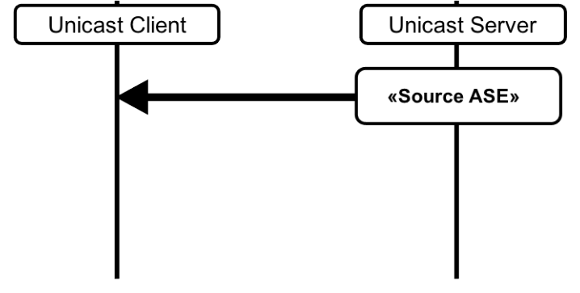

**Figure 4.11: Audio Configuration 2**

The Audio Configuration 2 characteristics, Codec_Specific_Capabilities, and Codec_Specific_Configuration are shown in Table 4.4.

| Parameter |  | Requirement for Audio Configuration |
| --- | --- | --- |
| Source PAC [5] |  | Mandatory |
|  | Supported Audio Channel Counts (Sec- _ _ _ tion 4.3.1) | Optional If present, any value including bit 0 set to 0b1 |
| Source Audio Locations [5] |  | Optional If present, any value including at least one bit set to 0b1 |
| Source ASE [4] |  | Mandatory |
|  | Audio Channel Allocation _ _ (Section 4.3.2) | Optional If present, matching any one bit set to 0b1 in Source Audio Locations, all other bits set to 0b0 |

Table 4.4: Audio Configuration 2 characteristics, codec capability, and codec configuration requirements

#### 4.4.3 Audio Configuration 3

Multiple Audio Channels. One bidirectional CIS. Unicast Server is Audio Sink and Audio Source.
Figure 4.12 shows an example of Audio Configuration 3. A Unicast Client in both the Audio Source and Audio Sink roles transmits a single channel of audio data to, and receives a single channel audio data from, a Unicast Server in the Audio Sink and Audio Source roles using one bidirectional CIS.

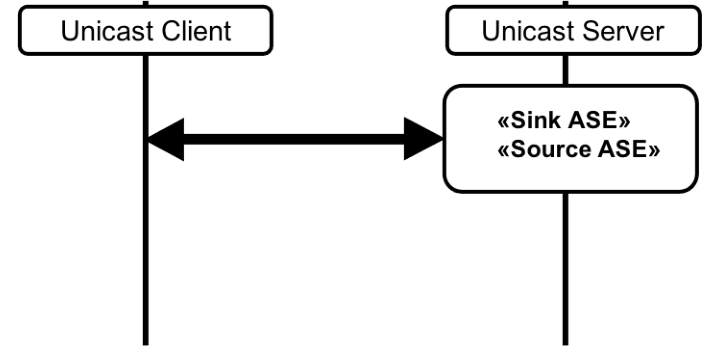

**Figure 4.12: Audio Configuration 3**

The Audio Configuration 3 characteristics, Codec_Specific_Capabilities, and Codec_Specific_Configuration are shown in Table 4.5.

| Parameter |  | Requirement for Audio Configuration |
| --- | --- | --- |
| Sink PAC [5] |  | Mandatory |
|  | Supported Audio Channel Counts (Sec- _ _ _ tion 4.3.1) | Optional If present, any value including bit 0 set to 0b1 |
| Sink Audio Locations [5] |  | Optional If present, any value including at least one bit set to 0b1 |
| Source PAC [5] |  | Mandatory |
|  | Supported Audio Channel Counts (Sec- _ _ _ tion 4.3.1) | Optional If present, any value including bit 0 set to 0b1 |
| Source Audio Locations [5] |  | Optional If present, any value including at least one bit set to 0b1 |
| Sink ASE [4] |  | Mandatory |
|  | Audio Channel Allocation _ _ (Section 4.3.2) | Optional If present, matching any one bit set to 0b1 in Sink Audio Locations, all other bits set to 0b0 |

| Parameter |  | Requirement for Audio Configuration |
| --- | --- | --- |
| Source ASE [4] |  | Mandatory |
|  | Audio Channel Allocation _ _ (Section 4.3.2) | Optional If present, matching any one bit set to 0b1 in Source Audio Locations, all other bits set to 0b0 |

Table 4.5: Audio Configuration 3 characteristics, codec capability, and codec configuration requirements

#### 4.4.4 Audio Configuration 4

Multiple Audio Channels. One unidirectional CIS. Unicast Server is Audio Sink.
Figure 4.13 shows an example of Audio Configuration 4. A Unicast Client in the Audio Source role transmits two channels of audio data to a Unicast Server in the Audio Sink role using one unidirectional CIS.

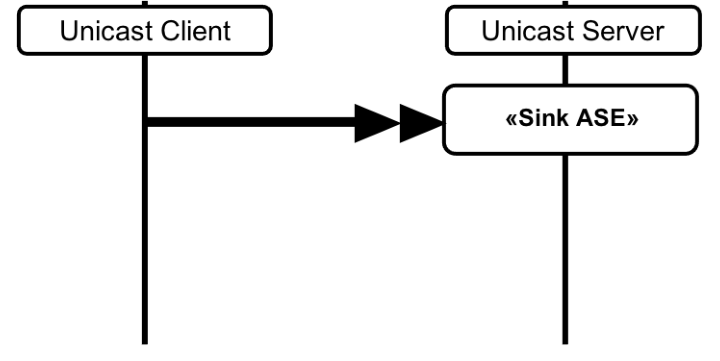

**Figure 4.13: Audio Configuration 4**

The Audio Configuration 4 characteristics, Codec_Specific_Capabilities, and Codec_Specific_Configuration are shown in Table 4.6.

| Parameter |  | Requirement for Audio Configuration |
| --- | --- | --- |
| Sink PAC [5] |  | Mandatory |
|  | Supported Audio Channel Counts (Sec- _ _ _ tion 4.3.1) | Mandatory Any value including bit 1 set to 0b1 |
| Sink Audio Locations [5] |  | Mandatory Any value including at least two bits set to 0b1 |
| Sink ASE [4] |  | Mandatory |

| Parameter |  | Requirement for Audio Configuration |
| --- | --- | --- |
|  | Audio Channel Allocation _ _ (Section 4.3.2) | Mandatory Matching any two bits set to 0b1 in Sink Audio Locations, all other bits set to 0b0 |

Table 4.6: Audio Configuration 4 characteristics, codec capability, and codec configuration requirements

#### 4.4.5 Audio Configuration 5

Multiple Audio Channels. One bidirectional CIS. Unicast Server is Audio Sink and Audio Source.
Figure 4.14 shows an example of Audio Configuration 5. A Unicast Client in both the Audio Source and Audio Sink roles transmits two channels of audio data to, and receives a single channel of audio data from, a Unicast Server in the Audio Sink and Audio Source roles, using one bidirectional CIS.

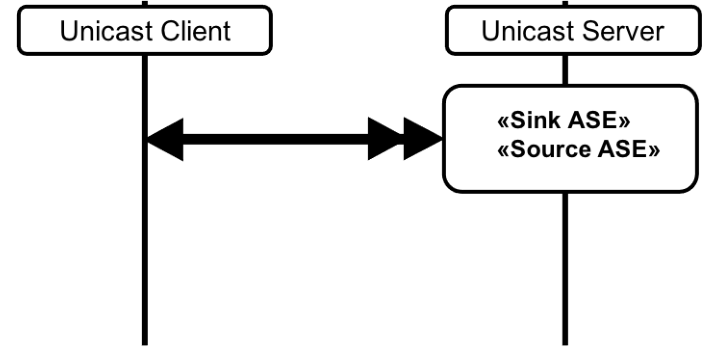

**Figure 4.14: Audio Configuration 5**

The Audio Configuration 5 characteristics, Codec_Specific_Capabilities, and Codec_Specific_Configuration are shown in Table 4.7.

| Parameter |  | Requirement for Audio Configuration |
| --- | --- | --- |
| Sink PAC [5] |  | Mandatory |
|  | Supported Audio Channel Counts (Sec- _ _ _ tion 4.3.1) | Mandatory Any value including bit 1 set to 0b1 |
| Sink Audio Locations [5] |  | Mandatory Any value including at least two bits set to 0b1 |
| Source PAC [5] |  | Mandatory |
|  | Supported Audio Channel Counts (Sec- _ _ _ tion 4.3.1) | Optional If present, any value including bit 0 set to 0b1 |

| Parameter |  | Requirement for Audio Configuration |
| --- | --- | --- |
| Source Audio Locations [5] |  | Optional If present, any value including at least one bit set to 0b1 |
| Sink ASE [4] |  | Mandatory |
|  | Audio Channel Allocation _ _ (Section 4.3.2) | Mandatory Matching any two bits set to 0b1 in Sink Audio Locations, all other bits set to 0b0 |
| Source ASE [4] |  | Mandatory |
|  | Audio Channel Allocation _ _ (Section 4.3.2) | Optional If present, matching any one bit set to 0b1 in Source Audio Locations, all other bits set to 0b0 |

Table 4.7: Audio Configuration 5 characteristics, codec capability, and codec configuration requirements

#### 4.4.6 Audio Configuration 6(i)

Multiple Audio Channels. Two unidirectional CISes. Unicast Server is Audio Sink.
Figure 4.15 shows an example of Audio Configuration 6(i). A Unicast Client in the Audio Source role transmits two channels of audio data to a Unicast Server in the Audio Sink role using two unidirectional CISes.

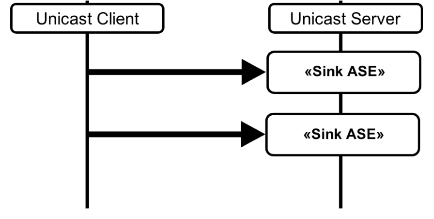

**Figure 4.15: Audio Configuration 6(i)**

The Audio Configuration 6(i) characteristics, Codec_Specific_Capabilities, and Codec_Specific_Configuration are shown in Table 4.8.

| Parameter | Requirement for Audio Configuration |
| --- | --- |
| Sink PAC [5] | Mandatory |

| Parameter |  | Requirement for Audio Configuration |
| --- | --- | --- |
|  | Supported Audio Channel Counts (Sec- _ _ _ tion 4.3.1) | Optional If present, bit 0 set to 0b1, all other bits set to 0b0 |
| Sink Audio Locations |  | Mandatory Any value including at least two bits set to 0b1 |
| Sink ASE [4] 1 |  | Mandatory |
|  | Audio Channel Allocation _ _ (Section 4.3.2) | Mandatory Matching any one bit set to 0b1 in Sink Au- dio Locations AND ≠ Audio Channel Allocation _ _ (Sink ASE 2), all other bits set to 0b0 |
| Sink ASE [4] 2 |  | Mandatory |
|  | Audio Channel Allocation _ _ (Section 4.3.2) | Mandatory Matching any one bit set to 0b1 in Sink Au- dio Locations AND ≠ Audio Channel Allocation _ _ (Sink ASE 1), all other bits set to 0b0 |

Table 4.8: Audio Configuration 6(i) characteristics, codec capability, and codec configuration requirements

#### 4.4.7 Audio Configuration 6(ii)

Multiple Audio Channels. Two unidirectional CISes. Two Unicast Servers. Unicast Server 1 is Audio Sink. Unicast Server 2 is Audio Sink.
Figure 4.16 shows an example of Audio Configuration 6(ii). A Unicast Client in the Audio Source role transmits two channels of audio data to a pair of Unicast Servers, both of which are in the Audio Sink role, using two unidirectional CISes.

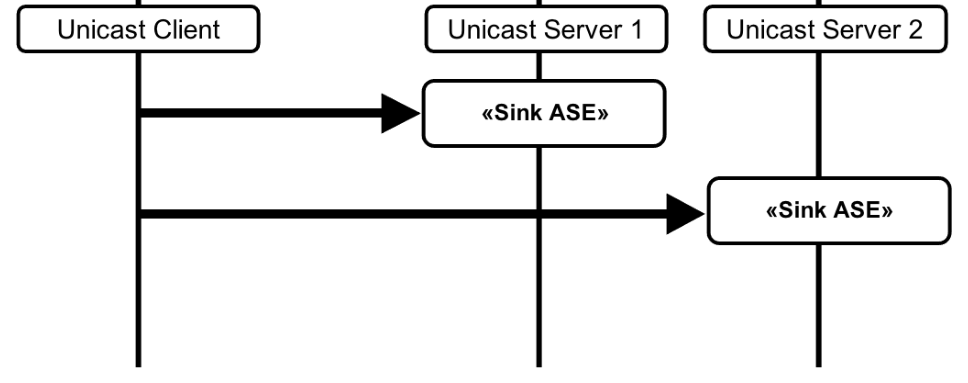

**Figure 4.16: Audio Configuration 6(ii)**

The Audio Configuration 6(ii) characteristics, Codec_Specific_Capabilities, and Codec_Specific_Configuration for Unicast Server 1 are shown in Table 4.9.

| Parameter |  | Requirement for Audio Configuration |
| --- | --- | --- |
| Sink PAC [5] |  | Mandatory |
|  | Supported Audio Channel Counts (Sec- _ _ _ tion 4.3.1) | Optional If present, any value including bit 0 set to 0b1 |
| Sink Audio Locations [5] |  | Mandatory Any value including at least one bit set to 0b1 AND ≠ Sink Audio Locations (Unicast Server 2) |
| Sink ASE [4] |  | Mandatory |
|  | Audio Channel Allocation _ _ (Section 4.3.2) | Mandatory Matching any one bit set to 0b1 in Sink Au- dio Locations AND ≠ Audio Channel Allocation _ _ (Unicast Server 2 Sink ASE), all other bits set to 0b0 |

Table 4.9: Audio Configuration 6(ii) characteristics, codec capability, and codec configuration requirements for Unicast Server 1
The Audio Configuration 6(ii) characteristics, Codec_Specific_Capabilities and Codec_Specific_Configuration for Unicast Server 2 are shown in Table 4.10.

| Parameter |  | Requirement for Audio Configuration |
| --- | --- | --- |
| Sink PAC [5] |  | Mandatory |
|  | Supported Audio Channel Counts (Sec- _ _ _ tion 4.3.1) | Optional If present, any value including bit 0 set to 0b1 |
| Sink Audio Locations [5] |  | Mandatory Any value including at least one bit set to 0b1 AND ≠ Sink Audio Locations (Unicast Server 1) |
| Sink ASE [4] |  | Mandatory |
|  | Audio Channel Allocation _ _ (Section 4.3.2) | Mandatory Matching any one bit set to 0b1 in Sink Au- dio Locations AND ≠ Audio Channel Allocation _ _ (Unicast Server 1 Sink ASE) all other bits set to 0b0 |

Table 4.10: Audio Configuration 6(ii) characteristics, codec capability, and codec configuration requirements for Unicast Server 2

#### 4.4.8 Audio Configuration 7(i)

Multiple Audio Channels. Two unidirectional CISes. Unicast Server is Audio Sink and Audio Source.
Figure 4.17 shows an example of Audio Configuration 7(i). A Unicast Client in the Audio Source and Audio Sink roles transmits a single channel of audio data to, and receives a single channel of audio data from, a Unicast Server in the Audio Sink and Audio Source roles, using two unidirectional CISes.

**Figure 4.17: Audio Configuration 7(i)**

The Audio Configuration 7(i) characteristics, Codec_Specific_Capabilities, and Codec_Specific_Configuration are shown in Table 4.11.

| Parameter |  | Requirement for Audio Configuration |
| --- | --- | --- |
| Sink PAC [5] |  | Mandatory |
|  | Supported Audio Channel Counts (Sec- _ _ _ tion 4.3.1) | Optional If present, any value including bit 0 set to 0b1 |
| Sink Audio Locations [5] |  | Optional If present, any value including at least one bit set to 0b1 |
| Source PAC [5] |  | Mandatory |
|  | Supported Audio Channel Counts (Sec- _ _ _ tion 4.3.1) | Optional If present, any value including bit 0 set to 0b1 |
| Source Audio Locations [5] |  | Optional If present, any value including at least one bit set to 0b1 |
| Sink ASE [4] |  | Mandatory |
|  | Audio Channel Allocation _ _ (Section 4.3.2) | Optional If present, matching any one bit set to 0b1 in Sink Audio Locations, all other bits set to 0b0 |
| Source ASE [4] |  | Mandatory |
|  | Audio Channel Allocation _ _ (Section 4.3.2) | Optional If present, matching any one bit set to 0b1 in Source Audio Locations, all other bits set to 0b0 |

Table 4.11: Audio Configuration 7 characteristics, codec capability, and codec configuration requirements

#### 4.4.9 Audio Configuration 7(ii)

Multiple Audio Channels. Two Unidirectional CISes. Two Unicast Servers. Unicast Server 1 is Audio Sink. Unicast Server 2 is Audio Source.
Figure 4.18 shows an example of Audio Configuration 7(ii). A Unicast Client in the Audio Source and Audio Sink roles transmits a single channel of audio data to a Unicast Server in the Audio Sink role and receives a single channel of audio data from a second Unicast Server in the Audio Source role, using two unidirectional CISes.

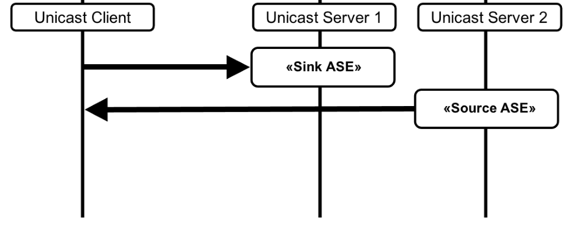

**Figure 4.18: Audio Configuration 7(ii)**

The Audio Configuration 7(ii) characteristics, Codec_Specific_Capabilities, and Codec_Specific_Configuration for Unicast Server 1 are shown in Table 4.12.

| Parameter |  | Requirement for Audio Configuration |
| --- | --- | --- |
| Sink PAC [5] |  | Mandatory |
|  | Supported Audio Channel Counts (Sec- _ _ _ tion 4.3.1) | Optional If present, any value including bit 0 set to 0b1 |
| Sink Audio Locations [5] |  | Optional If present, any value including at least one bit set to 0b1 |
| Sink ASE [4] |  | Mandatory |
|  | Audio Channel Allocation _ _ (Section 4.3.2) | Optional If present, matching any one bit set to 0b1 in Sink Audio Locations, all other bits set to 0b0 |

Table 4.12: Audio Configuration 7(ii) characteristics, codec capability, and codec configuration requirements for Unicast Server 1
The Audio Configuration 7(ii) characteristics, Codec_Specific_Capabilities, and Codec_Specific_Configuration for Unicast Server 2 are shown in Table 4.13.

| Parameter |  | Requirement for Audio Configuration |
| --- | --- | --- |
| Source PAC [5] |  | Mandatory |
|  | Supported Audio Channel Counts (Sec- _ _ _ tion 4.3.1) | Optional If present, any value including bit 0 set to 0b1 |
| Source Audio Locations [5] |  | Optional If present, any value including at least one bit set to 0b1 |
| Source ASE [4] |  | Mandatory |
|  | Audio Channel Allocation _ _ (Section 4.3.2) | Optional If present, matching any one bit set to 0b1 in Source Audio Locations, all other bits set to 0b0 |

Table 4.13: Audio Configuration 7(ii) characteristics, codec capability, and codec configuration requirements for Unicast Server 2

#### 4.4.10 Audio Configuration 8(i)

Multiple Audio Channels. One bidirectional CIS and one unidirectional CIS. Unicast Server is Audio Sink and Audio Source.
Figure 4.19 shows an example of Audio Configuration 8(i). A Unicast Client in the Audio Source and Audio Sink roles transmits two channels of audio data to, and receives a single channel of audio data from, a Unicast Server in the Audio Sink and Audio Source roles, using one unidirectional CIS and one bidirectional CIS.

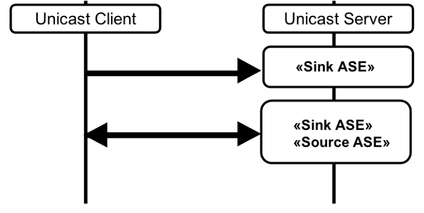

**Figure 4.19: Audio Configuration 8(i)**

The Audio Configuration 8(i) characteristics, Codec_Specific_Capabilities, and Codec_Specific_Configuration are shown in Table 4.14.

| Parameter | Requirement for Audio Configuration |
| --- | --- |
| Sink PAC [5] | Mandatory |

| Parameter |  | Requirement for Audio Configuration |
| --- | --- | --- |
|  | Supported Audio Channel Counts (Sec- _ _ _ tion 4.3.1) | Optional If present, any value including bit 0 set to 0b1 |
| Sink Audio Locations [5] |  | Mandatory Any value including at least two bits set to 0b1 |
| Source PAC [5] |  | Mandatory |
|  | Supported Audio Channel Counts (Sec- _ _ _ tion 4.3.1) | Optional If present, any value including bit 0 set to 0b1 |
| Source Audio Locations [5] |  | Optional If present, any value including at least one bit set to 0b1 |
| Sink ASE [4] 1 |  | Mandatory |
|  | Audio Channel Allocation _ _ (Section 4.3.2) | Mandatory Matching any one bit set to 0b1 in Sink Au- dio Locations AND ≠ Audio Channel Allocation _ _ (Sink ASE 2), all other bits set to 0b0 |
| Sink ASE [4] 2 |  | Mandatory |
|  | Audio Channel Allocation _ _ (Section 4.3.2) | Mandatory Matching any one bit set to 0b1 in Sink Au- dio Locations AND ≠ Audio Channel Allocation _ _ (Sink ASE 1), all other bits set to 0b0 |
| Source ASE [4] |  | Mandatory |
|  | Audio Channel Allocation _ _ (Section 4.3.2) | Optional If present, matching any one bit set to 0b1 in Source Audio Locations, all other bits set to 0b0 |

Table 4.14: Audio Configuration 8 characteristics, codec capability, and codec configuration requirements

#### 4.4.11 Audio Configuration 8(ii)

Multiple Audio Channels. One bidirectional CIS and one unidirectional CIS. Two Unicast Servers. Unicast Server 1 is Audio Sink and Audio Source. Unicast Server 2 is Audio Sink.
Figure 4.20 shows an example of Audio Configuration 8(ii). A Unicast Client in the Audio Source and Audio Sink roles transmits a single channel of audio data to, and receives a single channel of audio data from, a Unicast Server in the Audio Sink and Audio Source roles, using one bidirectional CIS. The Unicast Client also transmits a second channel of audio data to a second Unicast Server in the Audio Sink role, using one unidirectional CIS.

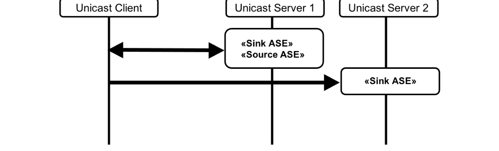

**Figure 4.20: Audio Configuration 8(ii)**

The Audio Configuration 8(ii) characteristics, Codec_Specific_Capabilities, and Codec_Specific_Configuration for Unicast Server 1 are shown in Table 4.15.

| Parameter |  | Requirement for Audio Configuration |
| --- | --- | --- |
| Sink PAC [5] |  | Mandatory |
|  | Supported Audio Channel Counts (Sec- _ _ _ tion 4.3.1) | Optional If present, any value including bit 0 set to 0b1 |
| Sink Audio Locations [5] |  | Mandatory Any value including at least one bit set to 0b1 AND ≠ Sink Audio Locations (Unicast Server 2) |
| Source PAC [5] |  | Mandatory |
|  | Supported Audio Channel Counts (Sec- _ _ _ tion 4.3.1) | Optional If present, any value including bit 0 set to 0b1 |
| Source Audio Locations [5] |  | Optional If present, any value including at least one bit set to 0b1 |
| Sink ASE [4] |  | Mandatory |
|  | Audio Channel Allocation _ _ (Section 4.3.2) | Mandatory Matching any one bit set to 0b1 in Sink Au- dio Locations AND ≠ Audio Channel Allocation _ _ (Unicast Server 2 Sink ASE), all other bits set to 0b0 |
| Source ASE [4] |  | Mandatory |

| Parameter |  | Requirement for Audio Configuration |
| --- | --- | --- |
|  | Audio Channel Allocation _ _ (Section 4.3.2) | Optional If present, matching any one bit set to 0b1 in Source Audio Locations, all other bits set to 0b0 |

Table 4.15: Audio Configuration 8(ii) characteristics, codec capability, and codec configuration requirements for Unicast Server 1
The Audio Configuration 8(ii) characteristics, Codec_Specific_Capabilities, and Codec_Specific_Configuration for Unicast Server 2 are shown in Table 4.16.

| Parameter |  | Requirement for Audio Configuration |
| --- | --- | --- |
| Sink PAC [5] |  | Mandatory |
|  | Supported Audio Channel Counts (Sec- _ _ _ tion 4.3.1) | Optional If present, any value including bit 0 set to 0b1 |
| Sink Audio Locations [5] |  | Mandatory Any value including at least one bit set to 0b1 AND ≠ Sink Audio Locations (Unicast Server 1) |
| Sink ASE [4] |  | Mandatory |
|  | Audio Channel Allocation _ _ (Section 4.3.2) | Mandatory Matching any one bit set to 0b1 in Sink Au- dio Locations AND ≠ Audio Channel Allocation _ _ (Unicast Server 1 Sink ASE), all other bits set to 0b0 |

Table 4.16: Audio Configuration 8(ii) characteristics, codec capability, and codec configuration requirements for Unicast Server 2

#### 4.4.12 Audio Configuration 9(i)

Multiple Audio Channels. Two unidirectional CISes. Unicast Server is Audio Source.
Figure 4.21 shows an example of Audio Configuration 9(i). A Unicast Client in the Audio Sink role receives two channels of audio data from a Unicast Server in the Audio Source role, using two unidirectional CISes.

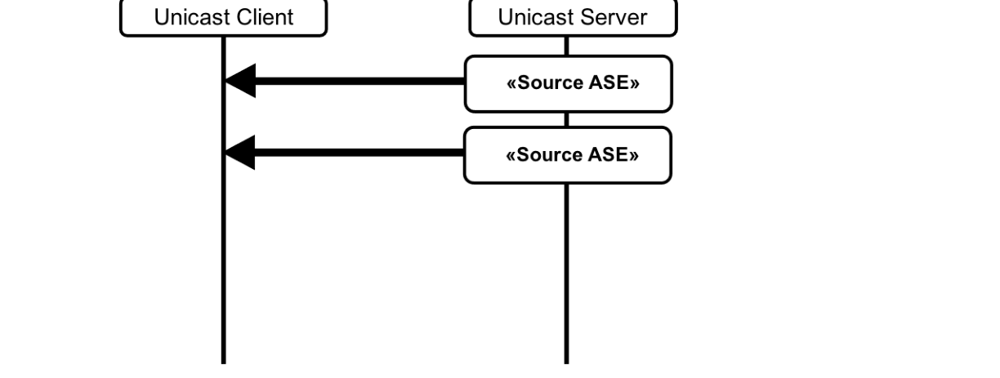

**Figure 4.21: Audio Configuration 9(i)**

The Audio Configuration 9(i) characteristics, Codec_Specific_Capabilities, and Codec_Specific_Configuration are shown in Table 4.17.

| Parameter |  | Requirement for Audio Configuration |
| --- | --- | --- |
| Source PAC [5] |  | Mandatory |
|  | Supported Audio Channel Counts (Sec- _ _ _ tion 4.3.1) | Optional If present, bit 0 set to 0b1, all other bits set to 0b0 |
| Source Audio Locations [5] |  | Mandatory Any value including at least two bits set to 0b1 |
| Source ASE [4] 1 |  | Mandatory |
|  | Audio Channel Allocation _ _ (Section 4.3.2) | Mandatory Matching any one bit set to 0b1 in Source Au- dio Locations AND ≠ Audio Channel Allocation _ _ (Source ASE 2), all other bits set to 0b0 |
| Source ASE [4] 2 |  | Mandatory |
|  | Audio Channel Allocation _ _ (Section 4.3.2) | Mandatory Matching any one bit set to 0b1 in Source Au- dio Locations AND ≠ Audio Channel Allocation _ _ (Source ASE 1), all other bits set to 0b0 |

Table 4.17: Audio Configuration 9(i) characteristics, codec capability, and codec configuration requirements

#### 4.4.13 Audio Configuration 9(ii)

Multiple Audio Channels. Two unidirectional CISes. Two Unicast Servers. Unicast Server 1 is Audio Source. Unicast Server 2 is Audio Source.
Figure 4.22 shows an example of Audio Configuration 9(ii). A Unicast Client in the Audio Sink role receives two channels of audio data from two Unicast Servers, both in the Audio Source role, using two unidirectional CISes.

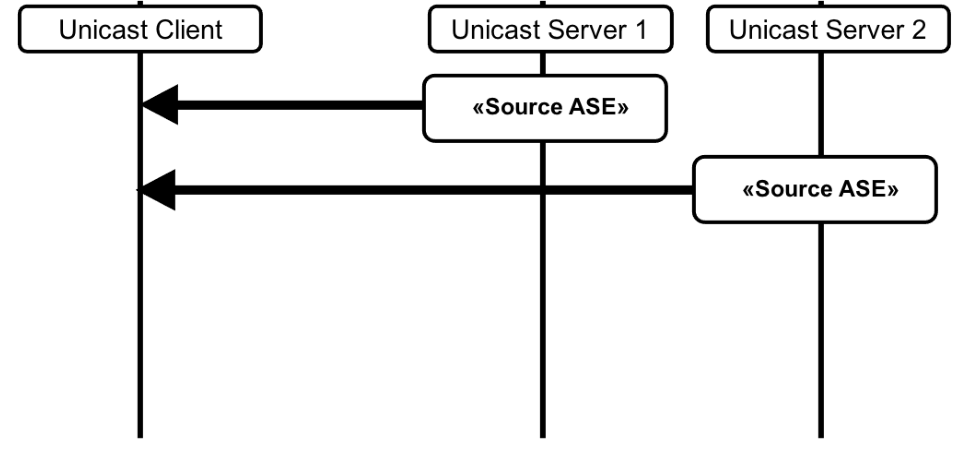

**Figure 4.22: Audio Configuration 9(ii)**

The Audio Configuration 9(ii) characteristics, Codec_Specific_Capabilities, and Codec_Specific_Configuration for Unicast Server 1 are shown in Table 4.18.

| Parameter |  | Requirement for Audio Configuration |
| --- | --- | --- |
| Source PAC [5] |  | Mandatory |
|  | Supported Audio Channel Counts (Sec- _ _ _ tion 4.3.2) | Optional If present, any value including bit 0 set to 0b1 |
| Source Audio Locations [5] |  | Mandatory Any value including at least one bit set to 0b1 AND ≠ Source Audio Locations (Unicast Server 2) |
| Source ASE [4] |  | Mandatory |
|  | Audio Channel Allocation _ _ (Section 4.3.2) | Mandatory Matching any one bit set to 0b1 in Source Au- dio Locations AND ≠ Audio Channel Allocation _ _ (Unicast Server 2 Source ASE), all other bits set to 0b0 |

Table 4.18: Audio Configuration 9(ii) characteristics, codec capability, and codec configuration requirements for Unicast Server 1
The Audio Configuration 9(ii) characteristics, Codec_Specific_Capabilities, and Codec_Specific_Configuration for Unicast Server 2 are shown in Table 4.19.

| Parameter |  | Requirement for Audio Configuration |
| --- | --- | --- |
| Source PAC [5] |  | Mandatory |
|  | Supported Audio Channel Counts (Sec- _ _ _ tion 4.3.1) | Optional If present, any value including bit 0 set to 0b1 |
| Source Audio Locations [5] |  | Mandatory Any value including at least one bit set to 0b1 AND ≠ Source Audio Locations (Unicast Server 1) |
| Source ASE [4] |  | Mandatory |
|  | Audio Channel Allocation _ _ (Section 4.3.2) | Mandatory Matching any one bit set to 0b1 in Source Au- dio Locations AND ≠ Audio Channel Allocation _ _ (Unicast Server 1 Source ASE) all other bits set to 0b0 |

Table 4.19: Audio Configuration 9(ii) characteristics, codec capability, and codec configuration requirements for Unicast Server 2

#### 4.4.14 Audio Configuration 10

Multiple Audio Channels. One unidirectional CIS. Unicast Server is Audio Source.
Figure 4.23 shows an example of Audio Configuration 10. A Unicast Client in the Audio Sink role receives two channels of audio data from a Unicast Server in the Audio Source role, using one unidirectional CIS.

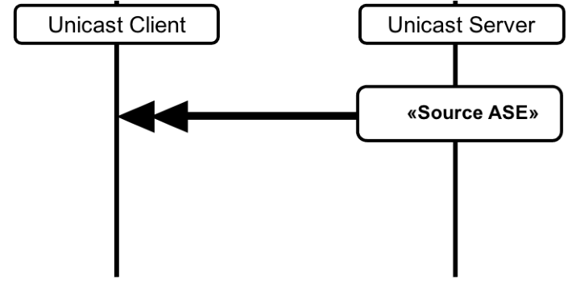

**Figure 4.23: Audio Configuration 10**

The Audio Configuration 10 characteristics, Codec_Specific_Capabilities, and Codec_Specific_Configuration are shown in Table 4.20.

| Parameter |  | Requirement for Audio Configuration |
| --- | --- | --- |
| Source PAC [5] |  | Mandatory |
|  | Supported Audio Channel Counts (Sec- _ _ _ tion 4.3.1) | Mandatory Any value including bit 1 set to 0b1 |
| Source Audio Locations [5] |  | Mandatory Any value including at least two bits set to 0b1 |
| Source ASE [4] |  | Mandatory |
|  | Audio Channel Allocation _ _ (Section 4.3.2) | Mandatory Matching any two bits set to 0b1 in Source Audio Locations, all other bits set to 0b0 |

Table 4.20: Audio Configuration 10 characteristics, codec capability, and codec configuration requirements

#### 4.4.15 Audio Configuration 11(i)

Multiple Audio Channels. Two bidirectional CISes. Unicast Server is Audio Sink and Audio Source.
Figure 4.24 shows an example of Audio Configuration 11(i). A Unicast Client in the Audio Source and Audio Sink roles transmits two channels of audio data to, and receives two channels of audio data from, a Unicast Server in the Audio Sink and Audio Source roles, using two bidirectional CISes.

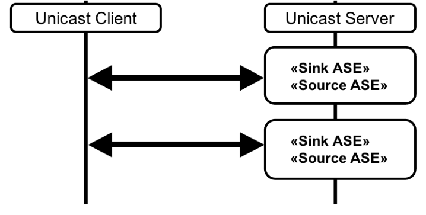

**Figure 4.24: Audio Configuration 11(i)**

The Audio Configuration 11(i) characteristics, Codec_Specific_Capabilities, and Codec_Specific_Configuration that enable Audio Configuration 11(i) are shown in Table 4.21.

| Parameter |  | Requirement for Audio Configuration |
| --- | --- | --- |
| Sink PAC [5] |  | Mandatory |
|  | Supported Audio Channel Counts (Sec- _ _ _ tion 4.3.1) | Optional If present, any value including bit 0 set to 0b1 |

| Parameter |  | Requirement for Audio Configuration |
| --- | --- | --- |
| Sink Audio Locations [5] |  | Mandatory Any value including at least two bits set to 0b1 |
| Source PAC [5] |  | Mandatory |
|  | Supported Audio Channel Counts (Sec- _ _ _ tion 4.3.1) | Optional If present, any value including bit 0 set to 0b1 |
| Source Audio Locations [5] |  | Mandatory Any value including at least two bits set to 0b1 |
| Sink ASE [4] 1 |  | Mandatory |
|  | Audio Channel Allocation _ _ (Section 4.3.2) | Mandatory Matching any one bit set to 0b1 in Sink Au- dio Locations AND ≠ Audio Channel Allocation _ _ (Sink ASE 2), all other bits set to 0b0 |
| Sink ASE [4] 2 |  | Mandatory |
|  | Audio Channel Allocation _ _ (Section 4.3.2) | Mandatory Matching any one bit set to 0b1 in Sink Au- dio Locations AND ≠ Audio Channel Allocation _ _ (Sink ASE 1), all other bits set to 0b0 |
| Source ASE [4] 1 |  | Mandatory |
|  | Audio Channel Allocation _ _ (Section 4.3.2) | Mandatory Matching any one bit set to 0b1 in Source Au- dio Locations AND ≠ Audio Channel Allocation _ _ (Source ASE 2), all other bits set to 0b0 |
| Source ASE [4] 2 |  | Mandatory |
|  | Audio Channel Allocation _ _ (Section 4.3.2) | Mandatory Matching any one bit set to 0b1 in Source Audio Locations AND ≠ Audio Channel Alloca- _ _ tion(Source ASE 1), all other bits set to 0b0 |

Table 4.21: Audio Configuration 11(i) characteristics, codec capability, and codec configuration requirements

#### 4.4.16 Audio Configuration 11(ii)

Multiple Audio Channels. Two bidirectional CISes. Two Unicast Servers. Unicast Server 1 is Audio Sink and Audio Source. Unicast Server 2 is Audio Sink and Audio Source.
Figure 4.25 shows an example of Audio Configuration 11(ii). A Unicast Client in the Audio Source and Audio Sink roles transmits a single channel of audio data to, and receives a single channel of audio data from, a Unicast Server in the Audio Sink and Audio Source roles using one bidirectional CIS. The Unicast Client also transmits a second channel of audio data to, and receives a second channel of audio data from, a second Unicast Server in the Audio Sink role using a second bidirectional CIS.

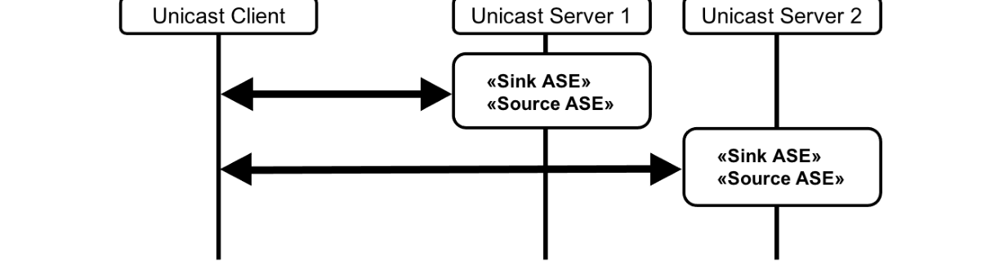

**Figure 4.25: Audio Configuration 11(ii)**

The Audio Configuration 11(ii) characteristics, Codec_Specific_Capabilities, and Codec_Specific_Configuration that enable Audio Configuration 11(ii) for Unicast Server 1 are shown in Table 4.22.

| Parameter |  | Requirement for Audio Configuration |
| --- | --- | --- |
| Sink PAC [5] |  | Mandatory |
|  | Supported Audio Channel Counts (Sec- _ _ _ tion 4.3.1) | Optional If present, any value including bit 0 set to 0b1 |
| Sink Audio Locations [5] |  | Mandatory Any value including at least one bit set to 0b1 AND ≠ Sink Audio Locations (Unicast Server 2) |
| Source PAC [5] |  | Mandatory |
|  | Supported Audio Channel Counts (Sec- _ _ _ tion 4.3.1) | Optional If present, any value including bit 0 set to 0b1 |
| Source Audio Locations [5] |  | Mandatory Any value including at least one bit set to 0b1 AND ≠ Source Audio Locations (Unicast Server 2) |
| Sink ASE [4] |  | Mandatory |
|  | Audio Channel Allocation _ _ (Section 4.3.2) | Mandatory Matching any one bit set to 0b1 in Sink Au- dio Locations AND ≠ Audio Channel Allocation _ _ (Unicast Server 2 Sink ASE), all other bits set to 0b0 |
| Source ASE [4] |  | Mandatory |

| Parameter |  | Requirement for Audio Configuration |
| --- | --- | --- |
|  | Audio Channel Allocation _ _ (Section 4.3.2) | Mandatory Matching any one bit set to 0b1 in Source Au- dio Locations AND ≠ Audio Channel Allocation _ _ (Unicast Server 2 Source ASE), all other bits set to 0b0 |

Table 4.22: Audio Configuration 11(ii) characteristics, codec capability, and codec configuration requirements for Unicast Server 1
The characteristics, Codec_Specific_Capabilities, and Codec_Specific_Configuration that enable Audio Configuration 11(ii) for Unicast Server 2 are shown in Table 4.23.

| Parameter |  | Requirement for Audio Configuration |
| --- | --- | --- |
| Sink PAC [5] |  | Mandatory |
|  | Supported Audio Channel Counts (Sec- _ _ _ tion 4.3.1) | Optional If present, any value including bit 0 set to 0b1 |
| Sink Audio Locations [5] |  | Mandatory Any value including at least one bit set to 0b1 AND ≠ Sink Audio Locations (Unicast Server 1) |
| Source PAC [5] |  | Mandatory |
|  | Supported Audio Channel Counts (Sec- _ _ _ tion 4.3.1) | Optional If present, any value including bit 0 set to 0b1 |
| Source Audio Locations [5] |  | Mandatory Any value including at least one bit set to 0b1 AND ≠ Source Audio Locations (Unicast Server 1) |
| Sink ASE [4] |  | Mandatory |
|  | Audio Channel Allocation _ _ (Section 4.3.2) | Mandatory Matching any one bit set to 0b1 in Sink Au- dio Locations AND ≠ Audio Channel Allocation _ _ (Unicast Server 1 Sink ASE), all other bits set to 0b0 |
| Source ASE [4] |  | Mandatory |
|  | Audio Channel Allocation _ _ (Section 4.3.2) | Mandatory Matching any one bit set to 0b1 in Source Au- dio Locations AND ≠ Audio Channel Allocation _ _ (Unicast Server 1 Source ASE), all other bits set to 0b0 |

Table 4.23: Audio Configuration 11(ii) characteristics, codec capability, and codec configuration requirements for Unicast Server 2

### 4.5 Multiple-channel LC3 broadcast audio

As stated in Section 4.1, LC3 is a single-channel codec. It is possible for the Broadcast Source to send, and for the Broadcast Sink to receive, multiple channels of LC3-encoded audio data in different ways.
Table 4.24 shows typical Audio Configurations for broadcast devices supporting LC3.
In Table 4.24, a line overlain with a trio of curved lines represents a BIS, which can transport at most one broadcast Audio Stream.
An arrowhead represents a single Audio Channel that may be assigned to an Audio Location. Arrowheads pointing to the right represent audio data flowing from a Broadcast Source to zero or more Broadcast Sinks; therefore, the Broadcast Source is assumed to be on the left side of the curved lines and the Broadcast Sink on the right side of the curved lines.

| Audio | Legend | Audio | BISes | Audio | Requirement |  |
| --- | --- | --- | --- | --- | --- | --- |
| Configuratio n |  | Chan- nels1,2 per BIS |  | Streams | Broadcast Source | Broadcast Sink |
| 12 |  | 1 | 1 | 1 | M | M |
| 13 |  | 1 | 2 | 2 | M | C.1 |
| 14 |  | 2 | 1 | 1 | O | C.2 |
| 1 Audio Channel capabilities are exposed by Broadcast Sinks by using the Supported Audio Chan- _ _ nel Counts LTV structure (see Section 4.3.1) for channel counts greater than 1. For channel counts of _ 1, the Supported Audio Channel Counts LTV structure may be omitted as defined in Section 4.3.1. _ _ _ 2 Audio Channel configurations for specified Audio Locations are configured by Broadcast Source by using the Audio Channel Allocation LTV structure (see Section 4.3.2). For single-channel configura- _ _ tions with no specified Audio Location, the Audio Channel Allocation LTV structure shall be omitted as _ _ defined in Section 4.3.2. |  |  |  |  |  |  |

Table 4.24: Broadcast LC3 Audio Configurations and support requirements
C.1: Mandatory if the Broadcast Sink supports more than one Audio Location in Sink Audio Locations
C.2: Mandatory if the Broadcast Sink supports Supported_Audio_Channel_Counts bit 1 (two Audio Channels) and more than one Audio Location in Sink Audio Locations

#### 4.5.1 Audio configuration 12

Single Audio Channel. One BIS.
Figure 4.26 shows an example of Audio Configuration 12. A Broadcast Source transmits a single channel of audio data using one BIS. There may be zero or more Broadcast Sinks.

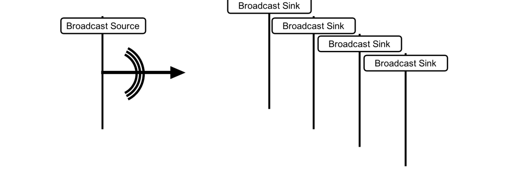

**Figure 4.26: Audio Configuration 12**

The Audio Configuration 12 BASE structure and Codec_Specific_Configuration for the Broadcast Source are shown in Table 4.25.

| Parameter |  | Requirement for Audio Configuration |
| --- | --- | --- |
| Level 2 (Subgroup) or Level 3 (BIS) |  | Mandatory |
|  | Audio Channel Allocation _ _ (Section 4.3.2) | Optional If present, any value including any one bit set to 0b1 and all other bits set to 0b0. |

Table 4.25: Audio Configuration 12 BASE structure and codec configuration requirements for the Broadcast Source
The Audio Configuration 12 characteristics and Codec_Specific_Capability for the Broadcast Sink are shown in Table 4.26.

| Parameter |  | Requirement for Audio Configuration |
| --- | --- | --- |
| Sink PAC [5] |  | Mandatory |
|  | Supported Audio Channel Counts (Sec- _ _ _ tion 4.3.1) | Optional If present, any value including bit 0 set to 0b1 |
| Sink Audio Locations [5] |  | Optional. If Audio Channel Allocation (BIS) is present, _ _ any value including any bit set to 0b1 matching Audio Channel Allocation (BIS) if the Broadcast _ _ Sink wants to render to the assigned Audio Lo- cation. |

Table 4.26: Audio configuration 12: characteristics and codec capability requirements for the Broadcast Sink

#### 4.5.2 Audio configuration 13

Multiple Audio Channels. Two BISes.
Figure 4.27 shows an example of Audio Configuration 13. A Broadcast Source transmits two channels of audio data using two BISes. There may be zero or more Broadcast Sinks.

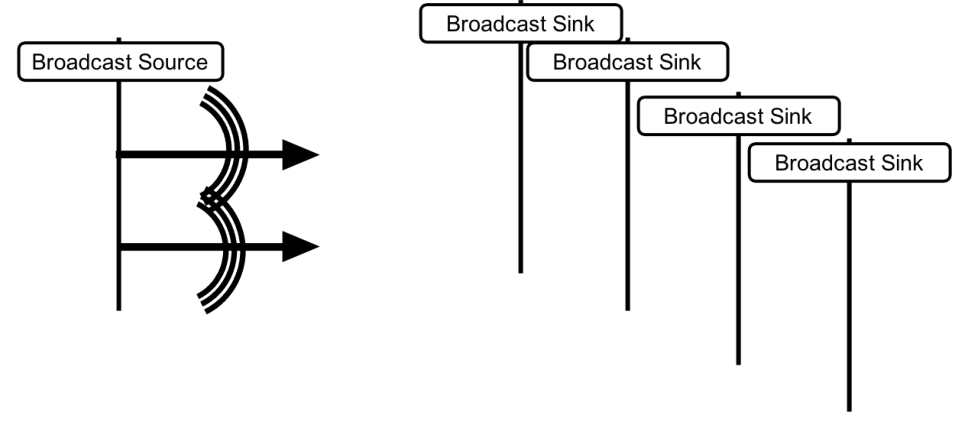

**Figure 4.27: Audio Configuration 13**

The Audio Configuration 13 BASE structure and Codec_Specific_Configuration for the Broadcast Source are shown in Table 4.27.

| Parameter |  | Requirement for Audio Configuration |
| --- | --- | --- |
| Level 3 (BIS 1) |  | Mandatory |
|  | Audio Channel Allocation (Section 4.3.2) _ _ | Mandatory Any value including any one bit set to 0b1 AND ≠ Audio Channel Allocation (BIS 2) and all oth- _ _ er bits set to 0b0. |
| Level 3 (BIS 2) |  | Mandatory |
|  | Audio Channel Allocation (Section 4.3.2) _ _ | Mandatory Any value including any one bit set to 0b1 AND ≠ Audio Channel Allocation (BIS 1) and all oth- _ _ er bits set to 0b0. |

Table 4.27: Audio Configuration 13: BASE structure and codec configuration requirements for the Broadcast Source
The Audio Configuration 13 characteristics and Codec_Specific_Capability for the Broadcast Sink are shown in Table 4.28.

| Parameter |  | Requirement for Audio Configuration |
| --- | --- | --- |
| Sink PAC [5] |  | Mandatory |
|  | Supported Audio Channel Counts (Sec- _ _ _ tion 4.3.1) | Optional If present, any value including bit 0 set to 0b1 E22890 |
| Sink Audio Locations [5] |  | Mandatory. Any value including one bit set to 0b1 match- ing Audio Channel Allocation (BIS 1) OR Au- _ _ dio Channel Allocation (BIS 2). _ _ Or: Any value including two bits set to 0b1 match- ing Audio Channel Allocation (BIS 1) AND Au- _ _ dio Channel Allocation (BIS 2). E22890 _ _ |

Table 4.28: Audio Configuration 13 characteristics and codec capability requirements for the Broadcast Sink

#### 4.5.3 Audio configuration 14

Multiple Audio Channels. One BIS.
Figure 4.28 shows an example of Audio Configuration 14. A Broadcast Source transmits two channels of audio data using one BIS. There may be zero or more Broadcast Sinks.

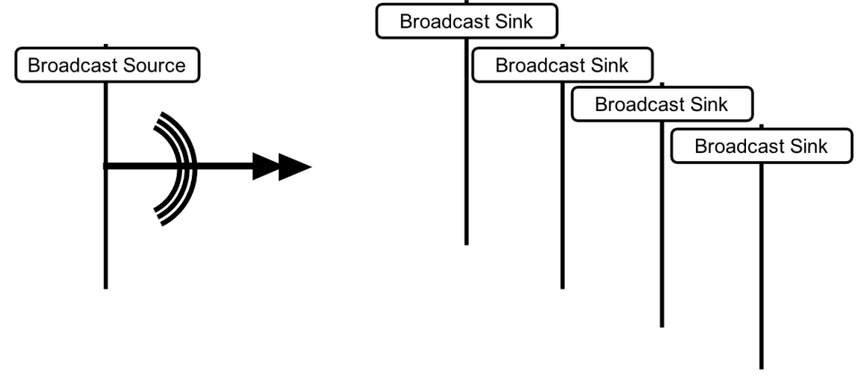

**Figure 4.28: Audio Configuration 14**

The Audio Configuration 14 BASE structure and Codec_Specific_Configuration for the Broadcast Source are shown in Table 4.29.

| Parameter | Requirement for Audio Configuration |
| --- | --- |
| Level 3 (BIS 1) | Mandatory |

| Parameter |  | Requirement for Audio Configuration |
| --- | --- | --- |
|  | Audio Channel Allocation (Section 4.3.2) _ _ | Mandatory Any value including any two bits set to 0b1 and all other bits set to 0b0. |

Table 4.29: Audio Configuration 14 BASE structure and codec configuration requirements for the Broadcast Source
The Audio Configuration 14 characteristics and Codec_Specific_Capability for the Broadcast Sink are shown in Table 4.30.

| Parameter |  | Requirement for Audio Configuration |
| --- | --- | --- |
| Sink PAC [5] |  | Mandatory |
|  | Supported Audio Channel Counts (Sec- _ _ _ tion 4.3.1) | Mandatory Any value including bit 1 set to 0b1 |
| Sink Audio Locations [5] |  | Mandatory Any value including any two bits set to 0b1 matching Audio Channel Allocation (BIS 1) _ _ |

Table 4.30: Audio Configuration 14 characteristics and codec capability requirements for the Broadcast Sink

## 5 Unicast audio streaming procedures

This section defines Unicast Client procedures that are used when communicating with Unicast Servers that support PACS and ASCS.
Unicast audio streaming involves a Unicast Client and one or more Unicast Servers. The Unicast Client configures codec parameters or uses current codec parameters that are exposed by the Unicast Server. The Unicast Client then configures QoS parameters. The Unicast Client enables an ASE and a CIS and may provide Metadata that is used to describe a unicast Audio Stream or for other purposes.
The Audio Role for an ASE is determined by the ASE characteristic UUID. A Sink ASE characteristic means the Unicast Server is in the Audio Sink role for that ASE and the Unicast Client is in the Audio Source role for that ASE. A Source ASE characteristic means the Unicast Server is in the Audio Source role for that ASE and the Unicast Client is in the Audio Sink role for that ASE. As described in Section 2.2 in [6], the term ASE characteristic (or ASE) is used interchangeably for the Sink ASE characteristic (or Sink ASE) and the Source ASE characteristic (or Source ASE) if the description and/or behavior applies equally to both, otherwise the characteristics (or ASEs) are mentioned by name.
When an ASE is in the Enabling state, the device in the Audio Sink role for that ASE determines the transition of the ASE to the Streaming state. The Unicast Client and Unicast Server are not prohibited from transmitting audio data when an ASE is in the Enabling state and a CIS has been established for that ASE, however, there is a risk of lost audio data until the ASE is in the Streaming state because a unicast Audio Stream is not established until the ASE is in the Streaming state.
An ASE is controlled by using the procedures defined in this section.
The Unicast Client support requirements for procedures in this section are defined in Table 5.1.
Requirements in this section are defined as “Mandatory” (M), “Optional” (O), “Excluded” (X), and “Conditional” (C.n). Conditional requirements (C.n) are listed directly below the table in which they appear.

| Procedure |  | Section Reference | Requirement |
| --- | --- | --- | --- |
| Audio role discovery |  | Section 5.1 | M |
| Audio capability discovery |  | Section 5.2 | O |
| ASE ID discovery _ |  | Section 5.3 | M |
| Supported Audio Contexts discovery |  | Section 5.4 | O |
| Available Audio Contexts discovery |  | Section 5.4 | O |
| ASE Control operations |  | Section 5.6 | – |
|  | Codec configuration | Section 5.6.1 | M |
|  | QoS configuration | Section 5.6.2 | M |
|  | Enabling an ASE | Section 5.6.3 | M |
|  | Audio data path setup | Section 5.6.3.1 | M |
|  | Receiver Start Ready | Section 5.6.3.2 | C.1 |

| Procedure |  | Section Reference | Requirement |
| --- | --- | --- | --- |
|  | Updating Metadata | Section 5.6.4 | M |
|  | Disabling an ASE | Section 5.6.5 | M |
|  | Receiver Stop Ready | Section 5.6.5.1 | C.1 |
|  | Releasing an ASE | Section 5.6.6 | M |
|  | Audio data path removal | Section 5.6.6.1 | M |
|  | Released ASEs or LE ACL link loss | Section 5.6.7 | M |
|  | CIS loss | Section 5.6.8 | M |

Table 5.1: Unicast Client procedure support requirements
C.1: Mandatory if the Unicast Client supports the Audio Sink role, otherwise Excluded.

### 5.1 Audio role discovery

Discovery of Sink PAC characteristics (defined in Section 3.6.6.1.1) and/or the Sink Audio Locations characteristic (defined in Section 3.6.6.1.2) and/or Sink ASE characteristics (defined in Section 3.6.6.2.2) informs the Unicast Client that the Unicast Server supports the Audio Sink role.
Discovery of Source PAC characteristics (defined in Section 3.6.6.1.3) and/or the Source Audio Locations characteristic (defined in Section 3.6.6.1.4) and/or Source ASE characteristics (defined in Section 3.6.6.2.3) informs the Unicast Client that the Unicast Server supports the Audio Source role.

### 5.2 Audio capability discovery

Discovery of a Sink PAC characteristic informs the Unicast Client that the Unicast Server is capable of receiving and decoding audio data encoded using the settings defined as Mandatory in Table 3.5.
Discovery of a Source PAC characteristic informs the Unicast Client that the Unicast Server supports transmitting audio data encoded using the settings defined as Mandatory in Table 3.5.
The Unicast Client may read the value of Sink PAC characteristics to discover audio capability settings not defined as Mandatory in Table 3.5 (for example, audio capabilities defined by higher-layer specifications or vendor-specific audio capabilities defined by an implementation) that are supported by the Unicast Server in the Audio Sink role.
The Unicast Client may read the value of the Sink Audio Locations characteristic to determine the Audio Locations (see Section 3.2.1 in [5]) supported by the Unicast Server in the Audio Sink role.
The Unicast Client may read the value of the Source PAC characteristic to discover audio capability settings not defined as Mandatory in Table 3.5 (for example, audio capabilities defined by higher-layer specifications or vendor-specific audio capabilities defined by an implementation) that are supported by the Unicast Server in the Audio Source role.
The Unicast Client may read the value of the Source Audio Locations to determine the Audio Locations (see Section 3.2.1 in [5]) supported by the Unicast Server in the Audio Source role.

### 5.3 ASE_ID discovery

If the Unicast Client supports the Audio Source role, the Unicast Client shall perform ASE_ID discovery by reading all Sink ASE characteristic values exposed by the Unicast Server.
If the Unicast Client supports the Audio Sink role, the Unicast Client shall perform ASE_ID discovery by reading all Source ASE characteristic values exposed by the Unicast Server.

### 5.4 Supported Audio Contexts discovery

The Unicast Client may read the value of the Supported Audio Contexts characteristic to determine the Context Type values (as defined in Bluetooth Assigned Numbers [2]) supported by the Unicast Server.
If the Unicast Client has determined that the Unicast Server does not support transmitting or receiving audio data for specific Context Type values, then the Unicast Client should only attempt to establish a unicast Audio Stream intended for use cases described by such unsupported Context Type values with the Unicast Server for backward-compatibility reasons, and the Unicast Client should change the Context Type to unspecified.
Availability of the Unicast Server is communicated using the Available Audio Contexts characteristic value (see Section 5.5); it would not be possible for the Unicast Server to be available to receive or transmit audio data intended for use cases described by an unsupported Context Type value because the Unicast Server is prohibited from setting any bits in the Available_Sink_Contexts and/or Available_Source_Contexts fields of the Available Audio Contexts characteristic value to 0b1 if the Unicast Server has not set the corresponding bits in the Supported_Sink_Contexts and/or Supported_Source_Contexts fields to a value of 0b1 (see Section 3.5.1 in [5]). When attempting to establish a unicast Audio Stream with the Unicast Server, the Unicast client shall use the procedures in Section 5.6.

### 5.5 Available Audio Contexts discovery

The Unicast Client shall interpret the value of the Available Audio Contexts characteristic as the availability of the Unicast Server to receive or transmit audio data for specific Context Type values that are not currently being received or transmitted by the Unicast Server in a connection with the Unicast Client.
If a bit is set to a value of 0b1 within the Available_Sink_Contexts bitmask, the Unicast Server in the Audio Sink role is available to receive audio data for the Context Type represented by that bit.
If a bit is set to a value of 0b1 within the Available_Source_Contexts bitmask, the Unicast Server in the Audio Source role is available to transmit audio data for the Context Type represented by that bit.
The Unicast Server shall perform the requirements in Section 3.5.3 to inform unconnected Unicast Clients when its availability to transmit or receive audio data for specific Context Type values changes.
When not connected, the Unicast Client may determine whether the Unicast Server is available to receive or transmit audio data for specific Context Type values by scanning for extended advertising PDUs from the Unicast Server that includes additional service data, as defined in Table 3.7. The Unicast Client can determine whether the Unicast Server is transmitting a General Announcement (Announcement Type = 0x00) or a Targeted Announcement (Announcement Type = 0x01).
When not connected, if the Unicast Client has determined that the Unicast Server is transmitting a General Announcement, the Unicast Client should only use the procedures in Section 8 to initiate connection establishment with the Unicast Server if the Unicast Client has audio data to transmit (or
if the Unicast Client intends to receive audio data from the Unicast Server) and if the Context Type values of any intended audio data for reception or transmission match Context Type values that the Unicast Server is available to receive or transmit.
When not connected, if the Unicast Client has determined that the Unicast Server is transmitting a Targeted Announcement, the Unicast Client should use the procedures in Section 8 to initiate connection establishment with the Unicast Server.
The Unicast Server notifies the Available Audio Contexts characteristic value to a connected Unicast Client when its availability to transmit or receive audio data for specific Context Type values changes.
When connected, the Unicast Client may determine whether the Unicast Server is available to receive or transmit audio data for specific Context Type values by reading the Available Audio Contexts characteristic value or by receiving a notification of the Available Audio Contexts characteristic value from the Unicast Server.
When connected, if the Unicast Client has determined that the Unicast Server is available to receive or transmit audio data for specific Context Type values, the Unicast Client may attempt to establish a unicast Audio Stream for use cases described by those Context Type values with the Unicast Server.
When attempting to establish a unicast Audio Stream with the Unicast Server, the Unicast Client shall use the procedures in Section 5.6.
If, when connected, the Unicast Client has determined that the Unicast Server is not available to transmit or receive audio data for specific Context Type values that the Unicast Server supports, then the Unicast Client should not attempt to establish a unicast Audio Stream for use cases described by those Context Type values with the Unicast Server.

### 5.6 ASE Control operations

This section defines how the Unicast Client controls ASEs that are exposed by a Unicast Server.
The ASE_State field of an ASE characteristic value is used to determine the state of an ASE that is exposed by the Unicast Server.
The Unicast Client determines the state of ASEs that are exposed by the Unicast Server during ASE_ID discovery as defined in Section 5.3, after initial connection and bonding as defined in Section 8.
The Unicast Client shall write to the ASE Control Point characteristic by using the opcodes defined in Table 4.6 in [4], including any required parameter values, to initiate ASE Control operations.
ASE Control operations can cause a state transition for an ASE or change the parameter values of an ASE.
Some ASE Control operations are capable of being initiated autonomously by the Unicast Server as defined in Table 3.2 in [4].
Autonomously initiated ASE Control operations are events internal to the server that can cause a state transition for an ASE or change the parameter values of an ASE.
The Unicast Client may initiate ASE Control operations on one or more ASEs at a time, denoted by their ASE_IDs. Each ASE that the Unicast Server exposes is discoverable and configurable by the Unicast Client.
The Unicast Client shall use ASE_ID values exposed by the Unicast Server when the Unicast Client initiates ASE Control operations.
The Unicast Server notifies the ASE Control Point characteristic value in response to ASE Control operations initiated by the Unicast Client.
If any ASE characteristic value is written as a result of an ASE Control operation, the Unicast Server notifies the ASE characteristic value.
If the Unicast Client has not received a notification of the ASE Control Point characteristic value in a period defined by the Unicast Client as representing a reasonable response time from the Unicast Server following an ASE Control operation, the Unicast Client should determine the state of an ASE by reading the value of the ASE characteristic. The minimum time period recommended by this profile for the Unicast Client to consider reasonable to have received a notification of the ASE Control Point characteristic from the Unicast Server is 1 second.
The Unicast Client shall not initiate an ASE Control operation that would cause a state transition that is not specified as a valid state transition in Table 3.2 in [4].

#### 5.6.1 Codec configuration

To submit codec configuration parameters, the Unicast Client shall initiate the Config Codec operation. The Unicast Client shall only initiate the Config Codec operation for an ASE that is in the Idle state, the Codec Configured state, or the QoS Configured state, as defined in Table 3.2 in [4].
When initiating the Config Codec operation for an ASE the Unicast Client shall only submit codec configuration parameters that are supported by the Unicast Server.
The Unicast Server should not reject supported codec configuration parameters for a Config Codec operation initiated by the Unicast Client.
The Unicast Client shall determine the Unicast Server’s preferred QoS range parameter values by receiving a notification of the ASE characteristic value or by reading the ASE characteristic value when the ASE is in the Codec Configured state.
The example in Figure 5.1 shows the Unicast Client initiating the Config Codec operation for two ASEs. ASE_ID[i] represents a Sink ASE and ASE_ID[j] represents a Source ASE. The Unicast Server notifies the ASE Control Point characteristic that contains the success response to the Config Codec operation. The Unicast Server then notifies the two ASE characteristics that have transitioned to the Codec Configured state, exposing the Unicast Server’s codec configuration parameters and preferred QoS range parameters.

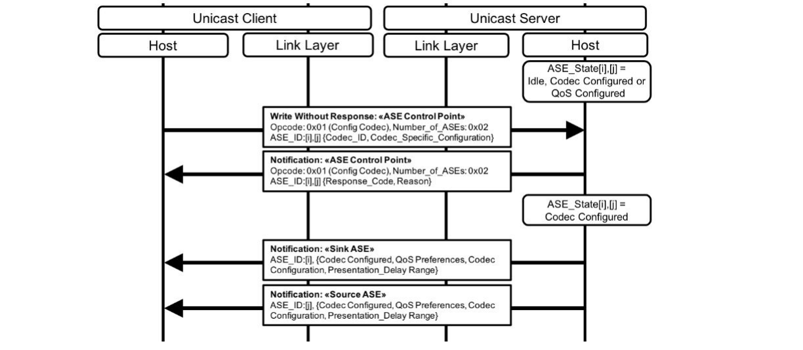

**Figure 5.1: Example Unicast Client-initiated codec configuration for two ASEs**

#### 5.6.2 QoS configuration

To submit QoS configuration parameters the Unicast Client shall initiate the Config QoS operation. The Unicast Client shall only initiate the Config QoS operation for an ASE that is in the Codec Configured state or the QoS configured state, as defined in Table 3.2 in [4].
Table 5.2 shows the Mandatory and Optional QoS configuration support settings defined by this profile for the Unicast Client and the Unicast Server. The Unicast Client and the Unicast Server may support any other QoS configuration settings defined by an implementation or by a higher-layer specification.

| Set Name | Configuration nd Table 3.11) | _Interval (µs) | Framing | _Size (Octets) | sion_Number | _Latency (ms) | on_Delay (µs) | Requirement |  |
| --- | --- | --- | --- | --- | --- | --- | --- | --- | --- |
|  | Codec Capability / Setting (Table 3.5 a | SDU |  | Maximum_SDU | Retransmis | Max_Transport | Presentati | Unicas t Client | Unicas t Server |
| QoS Configuration settings for low latency audio data |  |  |  |  |  |  |  |  |  |

| Set Name | Configuration nd Table 3.11) | _Interval (µs) | Framing | _Size (Octets) | sion_Number | _Latency (ms) | on_Delay (µs) | Requirement |  |
| --- | --- | --- | --- | --- | --- | --- | --- | --- | --- |
|  | Codec Capability / Setting (Table 3.5 a | SDU |  | Maximum_SDU | Retransmis | Max_Transport | Presentati | Unicas t Client | Unicas t Server |
| 8 1 1 _ _ | 8 1 _ | 75001 | un- framed | 262 (27.73 4 kbps3) | 25 | 8 | 400004 | C.1 | C.2 |
| 8 2 1 _ _ | 8 2 _ | 100001 | un- framed | 302 (24 kbps3) | 25 | 10 | 400004 | C.1 | C.2 |
| 16 1 1 _ _ | 16 1 _ | 75001 | un- framed | 302 (32 kbps3) | 25 | 8 | 400004 | C.1 | C.2 |
| 16 2 1 _ _ | 16 2 _ | 100001 | un- framed | 402 (32 kbps3) | 25 | 10 | 400004 | M | M |
| 24 1 1 _ _ | 24 1 _ | 75001 | un- framed | 452 (48 kbps3) | 25 | 8 | 400004 | C.1 | C.2 |
| 24 2 1 _ _ | 24 2 _ | 100001 | un- framed | 602 (48 kbps3) | 25 | 10 | 400004 | C.1 | C.2 |
| 32 1 1 _ _ | 32 1 _ | 75001 | un- framed | 602 (64 kbps3) | 25 | 8 | 400004 | C.1 | C.2 |
| 32 2 1 _ _ | 32 2 _ | 100001 | un- framed | 802 (64 kbps3) | 25 | 10 | 400004 | C.1 | C.2 |
| 441 1 1 _ _ | 441 1 _ | 81636 | framed | 972 (95.06 kbps3) | 55 | 24 | 400004 | C.1 | C.2 |
| 441 2 1 _ _ | 441 2 _ | 108846 | framed | 1302 (95.55 kbps3) | 55 | 31 | 400004 | C.1 | C.2 |
| 48 1 1 _ _ | 48 1 _ | 75001 | un- framed | 752 (80 kbps3) | 55 | 15 | 400004 | C.1 | C.2 |
| 48 2 1 _ _ | 48 2 _ | 100001 | un- framed | 1002 (80 kbps3) | 55 | 20 | 400004 | C.1 | C.2 |

| Set Name | nd Table 3.11) | _Interval (µs) | Framing | _Size (Octets) | sion_Number | _Latency (ms) | on_Delay (µs) | Requirement |  |
| --- | --- | --- | --- | --- | --- | --- | --- | --- | --- |
|  | Codec Capability / Configuration Setting (Table 3.5 a | SDU |  | Maximum_SDU | Retransmis | Max_Transport | Presentati | Unicas t Client | Unicas t Server |
| 48 3 1 _ _ | 48 3 _ | 75001 | un- framed | 902 (96 kbps3) | 55 | 15 | 400004 | C.1 | C.2 |
| 48 4 1 _ _ | 48 4 _ | 100001 | un- framed | 1202 (96 kbps3) | 55 | 20 | 400004 | C.1 | C.2 |
| 48 5 1 _ _ | 48 5 _ | 75001 | un- framed | 1172 (124.8 kbps3) | 55 | 15 | 400004 | C.1 | C.2 |
| 48 6 1 _ _ | 48 6 _ | 100001 | un- framed | 1552 (124 kbps3) | 55 | 20 | 400004 | C.1 | C.2 |
| QoS Configuration settings for high-reliability audio data |  |  |  |  |  |  |  |  |  |
| 8 1 2 _ _ | 8 1 _ | 75001 | un- framed | 262 (27.73 4 kbps3) | 135 | 75 | 400004 | C.1 | C.2 |
| 8 2 2 _ _ | 8 2 _ | 100001 | un- framed | 302 (24 kbps3) | 135 | 95 | 400004 | C.1 | C.2 |
| 16 1 2 _ _ | 16 1 _ | 75001 | un- framed | 302 (32 kbps3) | 135 | 75 | 400004 | C.1 | C.2 |

| Set Name | nd Table 3.11) | _Interval (µs) | Framing | _Size (Octets) | sion_Number | _Latency (ms) | on_Delay (µs) | Requirement |  |
| --- | --- | --- | --- | --- | --- | --- | --- | --- | --- |
|  | Codec Capability / Configuration Setting (Table 3.5 a | SDU |  | Maximum_SDU | Retransmis | Max_Transport | Presentati | Unicas t Client | Unicas t Server |
| 16 2 2 _ _ | 16 2 _ | 100001 | un- framed | 402 (32 kbps3) | 135 | 95 | 400004 | C.1 | C.2 |
| 24 1 2 _ _ | 24 1 _ | 75001 | un- framed | 452 (48 kbps3) | 135 | 75 | 400004 | C.1 | C.2 |
| 24 2 2 _ _ | 24 2 _ | 100001 | un- framed | 602 (48 kbps3) | 135 | 95 | 400004 | C.1 | C.2 |
| 32 1 2 _ _ | 32 1 _ | 75001 | un- framed | 602 (64 kbps3) | 135 | 75 | 400004 | C.1 | C.2 |
| 32 2 2 _ _ | 32 2 _ | 100001 | un- framed | 802 (64 kbps3) | 135 | 95 | 400004 | C.1 | C.2 |
| 441 1 2 _ _ | 441 1 _ | 81636 | framed | 972 (95.06 kbps3) | 135 | 80 | 400004 | C.1 | C.2 |
| 441 2 2 _ _ | 441 2 _ | 108846 | framed | 1302 (95.55 kbps3) | 135 | 85 | 400004 | C.1 | C.2 |
| 48 1 2 _ _ | 48 1 _ | 75001 | un- framed | 752 (80 kbps3) | 135 | 75 | 400004 | C.1 | C.2 |

| Set Name | nd Table 3.11) | _Interval (µs) | Framing | _Size (Octets) | sion_Number | _Latency (ms) | on_Delay (µs) | Requirement |  |
| --- | --- | --- | --- | --- | --- | --- | --- | --- | --- |
|  | Codec Capability / Configuration Setting (Table 3.5 a | SDU |  | Maximum_SDU | Retransmis | Max_Transport | Presentati | Unicas t Client | Unicas t Server |
| 48 2 2 _ _ | 48 2 _ | 100001 | un- framed | 1002 (80 kbps3) | 135 | 95 | 400004 | C.1 | C.2 |
| 48 3 2 _ _ | 48 3 _ | 75001 | un- framed | 902 (96 kbps3) | 135 | 75 | 400004 | C.1 | C.2 |
| 48 4 2 _ _ | 48 4 _ | 100001 | un- framed | 1202 (96 kbps3) | 135 | 100 | 400004 | C.1 | C.2 |
| 48 5 2 _ _ | 48 5 _ | 75001 | un- framed | 1172 (124.8 kbps3) | 135 | 75 | 400004 | C.1 | C.2 |
| 48 6 2 _ _ | 48 6 _ | 100001 | un- framed | 1552 (124 kbps3) | 135 | 100 | 400004 | C.1 | C.2 |

| Set Name | nd Table 3.11) | _Interval (µs) | Framing | _Size (Octets) | sion_Number | _Latency (ms) | on_Delay (µs) | Requirement |  |
| --- | --- | --- | --- | --- | --- | --- | --- | --- | --- |
|  | Codec Capability / Configuration Setting (Table 3.5 a | SDU |  | Maximum_SDU | Retransmis | Max_Transport | Presentati | Unicas t Client | Unicas t Server |
| 1 Nominal. May be adjusted to accommodate audio clock offset and drift. 2 This value shall be multiplied by the number of bits set to a value of 0b1 in Audio Channel Allocation, _ _ if present, and by the number of blocks indicated by the Codec Frame Blocks Per SDU value, if _ _ _ _ present. 3 Bit rates are calculated according to Section 3.2.5 in [7]. 4 For the Unicast Server, the supported Presentation Delay range in the Codec Configured state shall _ include this value when the ASE is a Sink ASE. 5 Retransmission Number values are recommendations to the Controller, which may use different _ values to match desired robustness and/or bandwidth. The Host shall be capable of requesting the values listed. 6 Effective SDU Interval. For 44.1 kHz/7.5ms, the actual SDU Interval is equivalent to 360 (samples _ _ per second) divided by 44100 (Sampling Frequency), which equals 8.16327 ms, and for 44.1 kHz/10 ms the actual frame duration is equal to 480 (samples per second) divided by 44100 (Sampling Frequency), which equals 10.88435. The LC3 [7] codec encodes 97 octets (for 7.5 ms/8.163 ms effective) or 130 octets (for 10 ms/10.884 ms effective) into each SDU, which arrives at the controller every 8.16327 ms or 10.88435 ms. The transmitting device assigns a time offset to each SDU and delivers the time offset _ with each SDU at the receiver, as defined in Volume G, Part 7, Section 3.1 in [1]. Determination of the time offset parameter at the transmitting device is implementation-specific. Compensation for the _ difference between 8.16327 ms and 8.163 ms, and/or compensation between 10.88435 ms and 10.884 ms, is implementation-specific. |  |  |  |  |  |  |  |  |  |

Table 5.2: QoS configuration support setting requirements for the Unicast Client and Unicast Server
C.1: Optional if the Codec Configuration Setting is supported in Table 3.11, otherwise Excluded.
C.2: Optional if the Codec Capability Setting is supported in Table 3.5, otherwise Excluded.
The Unicast Client shall configure a CIS before initiating the Config QoS operation (if HCI is used, by using the LE Set CIG Parameters command, as defined in Volume 4, Part E, Section 7.8.97 in [1]). When configuring a CIS, the Unicast Client should use QoS parameters that correspond to parameters exposed by the Unicast Server for an ASE in the Codec Configured state.
When initiating the Config QoS operation for an ASE, the Unicast Client shall request QoS parameters that the Unicast Client’s Bluetooth controller has accepted during CIS configuration (if HCI is used, the Unicast Client’s shall have received a Command Complete event, as defined in Volume 4, Part E, Section 7.7.14 in [1], with a Status value of 0x00, in response to the LE Set CIG Parameters command).
The Unicast Client shall write all Config QoS operation parameter values for all ASEs being configured within the same CIG with the Unicast server in a single Config QoS operation. If the MTU for the ATT bearer in use when initiating the Config QoS operation is smaller than the length of all required Config QoS operation parameter values for all ASEs being configured within the same CIG with the Unicast Server, the Unicast Client shall use the Write Long Characteristic Values GATT sub-procedure when initiating the Config QoS operation.
The Unicast Client uses the Config QoS operation to bind a CIS, identified by a CIG_ID and CIS_ID, to an ASE. The CIS remains bound to the ASE while the ASE is in the QoS Configured, Enabling, Streaming, or Disabling state.
The Unicast Client shall not bind a CIS to more than one Sink ASE. The Unicast Client shall not bind a CIS to more than one Source ASE. The Unicast Client may bind a CIS to one Sink ASE and one Source ASE for a bidirectional CIS that carries audio data for both the Sink ASE and the Source ASE.
The Unicast Client shall request a Presentation_Delay (see Section 7) parameter value for an ASE that lies within the Unicast Server’s supported range for that ASE, defined by Presentation_Delay_Min and Presentation_Delay_Max and the Unicast Client should request a Presentation_Delay parameter value that lies within the Unicast Server’s preferred range for that ASE, defined by Preferred_Presentation_Delay_Min and Preferred_Presentation_Delay_Max (see Table 4.3 in [4]).
The Unicast Client shall not request Unframed ISOAL PDUs if the Unicast Server has indicated no support for Unframed ISOAL PDUs, otherwise the Unicast Client may request Unframed ISOAL PDUs.
The Unicast Client shall request a Max_Transport_Latency parameter value for an ASE that is no greater than the Max_Transport_Latency field value exposed by the Unicast Server for that ASE (see Section 7).
The example in Figure 5.2 shows the Unicast Client initiating the Config QoS operation for the two ASEs, ASE_ID[i] and ASE_ID[j], from the example in Figure 5.1. The Unicast Client has determined the Unicast Server’s preferred QoS parameter range for each ASE and sent the LE Set CIG Parameters command to its Bluetooth Controller to configure a bidirectional CIS, and the Unicast Client has received a successful Command Complete event. Both ASEs are configured with the same CIG_ID and CIS_ID values. The Unicast Server notifies the ASE Control Point characteristic that contains the success response to the Config QoS operation. The Unicast Server then notifies the two ASE characteristics that have transitioned to the QoS Configured state.

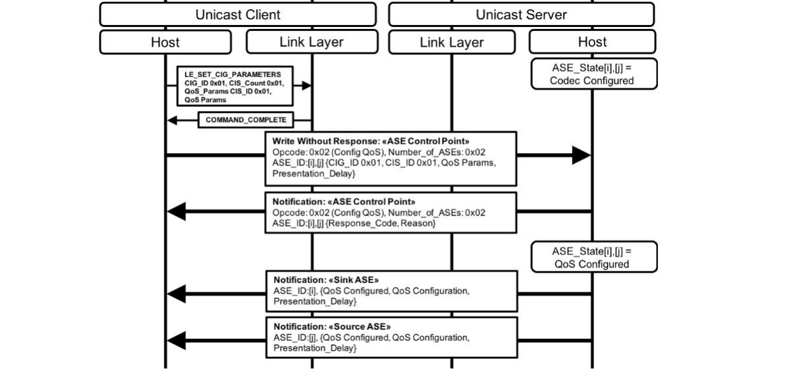

**Figure 5.2: Example Unicast Client initiated QoS configuration for two ASEs**

See Section 5.6.9 for CIS establishment requirements for ASEs that are in the QoS Configured state.

#### 5.6.3 Enabling an ASE

To enable an ASE, the Unicast Client shall initiate the Enable operation. The Unicast Client shall only initiate the Enable operation for an ASE that is in the QoS Configured state, as defined in Table 3.2 in [4].
The Unicast Client may write any LTV structures for the Metadata parameter as defined by this profile (see Section 4.3.3) or defined by higher-layer specifications when initiating the Enable operation.
When initiating the Enable operation for an ASE, the Unicast Client may include the Streaming_Audio_Contexts LTV structure (see Section 4.3.2) in the Metadata parameter for that ASE to inform the Unicast Server that any unicast Audio Stream established for that ASE is intended for use cases described by the Context Type values of any bits set to 0b1 in the Streaming_Audio_Contexts value.
The Streaming_Audio_Contexts value for an ASE shall not be changed by the Unicast Server except when accepting an Enable operation written by the Unicast Client or when accepting an Update Metadata operation (see Section 5.6.4) written by the Unicast Client.
The Unicast Server exposes the Context Type values for which the Unicast Server supports transmitting audio data or receiving audio data, as defined in Section 5.4.
The Unicast Server exposes the Context Type values for which the Unicast Server is currently available to transmit audio data or receive audio data, as defined in Section 5.5.
If the Unicast Client is in the Audio Source role for an ASE, the Unicast Client should write a Streaming_Audio_Contexts value that corresponds to one or more Context Type values for which the
Unicast Server supports receiving audio data and for which the Unicast Server is available to receive audio data.
If the Unicast Client is in the Audio Sink role for an ASE, the Unicast Client should write a Streaming_Audio_Contexts value that corresponds to one or more Context Type values for which the Unicast Server supports transmitting audio data and for which the Unicast Server is available to transmit audio data.
If the Streaming_Audio_Contexts value corresponds to one or more Context Type values that the Unicast Server is available for, as defined in Section 5.5, then the Unicast Server should not reject the Enable operation for an ASE based on the Streaming_Audio_Contexts value that the Unicast Client writes for that ASE.
The example in Figure 5.3 shows the Unicast Client initiating the Enable operation for the two ASEs from the example in Figure 5.2. The Unicast Client writes the Streaming_Audio_Contexts LTV structure to the Metadata parameter value, with only the ‘unspecified’ bit set to 0b1. The Unicast Client has not yet attempted to establish the previously configured CIS with the Unicast Server. The Unicast Server notifies the ASE Control Point characteristic that contains the success response to the Unicast Client. The Unicast Server then notifies the ASE characteristics for the two ASEs that have transitioned to the Enabling state.

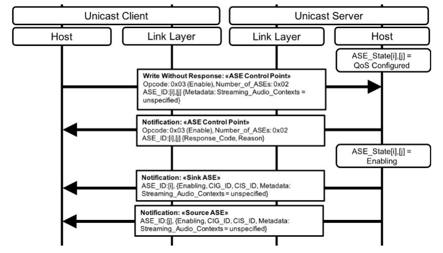

**Figure 5.3: Example Unicast Client-initiated Enable operation for two ASEs**

See Section 5.6.9 for CIS establishment requirements for ASEs that are in the Enabling state.
The example in Figure 5.4 shows the Unicast Client establishing a single bidirectional CIS for the two ASEs, ASE_ID[i] and ASE_ID[j], from the example in Figure 5.3 (some messages from the example in Figure 5.3 have been included in light grey text to aid understanding). The Unicast Client is Audio Source for ASE_ID[i] and the Unicast Server is Audio Sink. The Unicast Client is Audio Sink for ASE_ID[j] and the Unicast Server is Audio Source. Both devices set up their respective audio data paths as defined in Section 5.6.3.1 after CIS establishment completes.

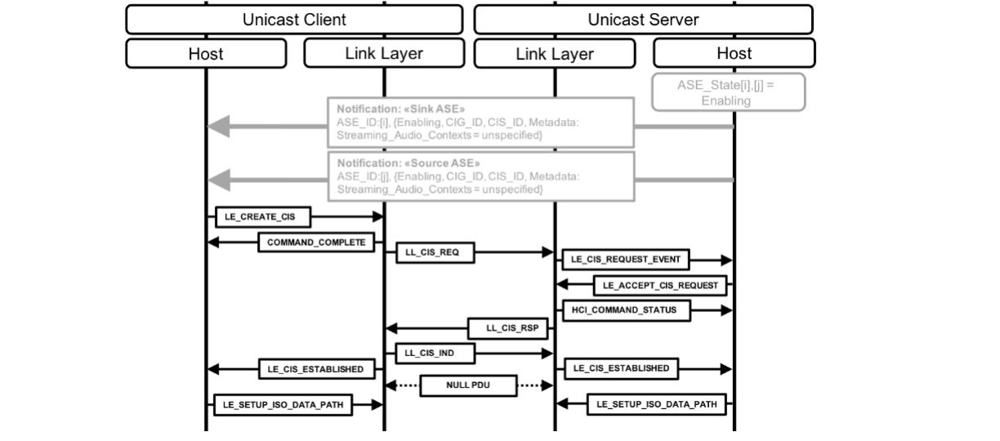

**Figure 5.4: Example Unicast Client-initiated CIS establishment followed by audio data path setup on both devices**

See Section 5.6.9 for CIS establishment requirements for ASEs that are in the Enabling state.

##### 5.6.3.1 Audio data path setup

In this section, HCI level parameters are given as a reference. On systems not incorporating HCI, equivalent values for audio data path setup parameters shall be used.
If HCI is used when setting up their respective audio data paths, and if the codec in use resides in the Bluetooth Controller of the device using the LE Setup ISO Data Path command defined in Volume 4, Part E, Section 7.8.109 in [1], the Unicast Client and/or Unicast Server shall:
• Write the LE Setup ISO Data Path command Codec_ID parameter with the value of the Codec_ID field exposed by the Unicast Server in the Codec Configured state for the ASE.
• Write the LE Setup ISO Data Path command Codec_Configuration_Length parameter with the value of the Codec_Specific_Configuration_Length field exposed by the Unicast Server in the Codec Configured state for the ASE.
• Write the LE Setup ISO Data Path command Codec_Configuration parameter with the value of the Codec_Specific_Configuration field exposed by the Unicast Server in the Codec Configured state for the ASE.
If HCI is used when setting up their respective audio data paths, and if the codec in use resides in the Bluetooth Host of the device using the LE Setup ISO Data Path command, the Unicast Client and/or Unicast Server shall:
• Write the LE Setup ISO Data Path command Codec_Configuration_Length parameter with the value 0x00.
• Write octet 0 (Coding Format) of the LE Setup ISO Data Path command Codec_ID parameter with the value 0x03 (Transparent).

##### 5.6.3.2 Receiver Start Ready (unicast Audio Stream establishment)

The Receiver Start Ready operation for an ASE in the Enabling state, as defined in Table 3.2 in [4], informs an Audio Source that the Audio Sink is ready to consume audio data transmitted by the Audio Source.
Successful completion of the Receiver Start Ready operation for an ASE completes the establishment of a unicast Audio Stream for that ASE.
The device in the Audio Sink role for an ASE shall not initiate the Receiver Start Ready operation for that ASE until its local controller has indicated that CIS establishment for that ASE has succeeded. If CIS establishment for that ASE has failed, the Unicast Client should attempt to establish the CIS again. The number of repeated attempts to establish the CIS is left to the implementation unless defined by higher-layer specifications.
If a CIS has been established for an ASE, the device in the Audio Sink role for that ASE shall be tolerant of reception of zero length SDUs.
If a Source ASE is in the Enabling state, the Unicast Client shall initiate the Receiver Start Ready operation for that ASE when the Unicast Client is ready to consume audio data transmitted from that ASE by the Unicast Server.
If a Source ASE is in the Enabling state, the Unicast Server should not transmit audio data for that ASE until the Unicast Server transitions the ASE to the Streaming state.
If a Sink ASE is in the Enabling state, the Unicast Server shall autonomously initiate the Receiver Start Ready operation for that ASE when the Unicast Server is ready to consume audio data transmitted for that ASE by the Unicast Client.
If a Sink ASE is in the Enabling state, the Unicast Client should not transmit audio data for that ASE until the Unicast Server transitions the ASE to the Streaming state.
If an ASE is in the Streaming state, the device in the Audio Source role shall set up its internal audio data path as defined in Section 5.6.3.1 if its internal audio data path has not already been set up.
The example in Figure 5.5 shows the Unicast Server autonomously initiating the Receiver Start Ready operation for ASE_ID[i] after its internal audio data path setup completed, which occurred after CIS establishment succeeded as shown in the example in Figure 5.4 (some messages from the example in Figure 5.4 have been included in light grey text to aid understanding). ASE_ID[i] transitions to the Streaming state, and the Unicast Server notifies the Sink ASE characteristic to the Unicast Client. When the Unicast Client initiates the Receiver Start Ready operation for ASE_ID[j], the Unicast Server notifies the ASE Control Point characteristic that contains the success response, then ASE_ID[j] transitions to the Streaming state, and the Unicast Server notifies the Source ASE characteristic to the Unicast Client. Two unicast Audio Streams have now been established, and both devices are ready to transmit and receive audio.

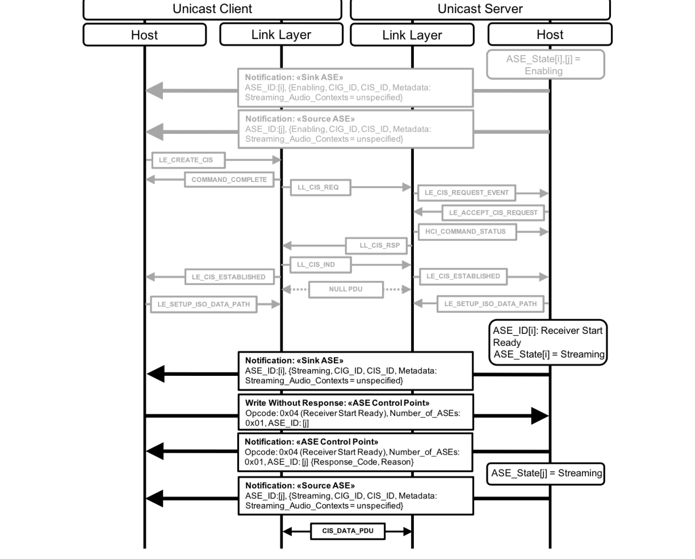

**Figure 5.5: Receiver Start Ready operation – Unicast Server autonomously initiates the Receiver Start Ready operation for the Sink ASE and the Unicast Client initiates the Receiver Start Ready operation for the Source ASE**

#### 5.6.4 Updating unicast Audio Stream Metadata

To submit Metadata parameters for an ASE that has successfully completed the Enable operation, the Unicast Client shall initiate the Update Metadata operation. The Unicast Client shall only initiate the Update Metadata operation for an ASE in the Enabling state or the Streaming state, as defined in Table 3.2 in [4].
When initiating the Update Metadata operation for an ASE, the Unicast Client may include the Streaming_Audio_Contexts LTV structure in the Metadata parameter for that ASE to inform the Unicast
Server that any unicast Audio Stream established for that ASE is intended for use cases described by the Context Type values of any bits set to 0b1 in the Streaming_Audio_Contexts value.
The Unicast Client may write any other LTV structures for the Metadata parameter as defined by this profile (see Section 4.3.3) or by higher-layer specifications when initiating the Update Metadata operation for an ASE.
If the Unicast Client is in the Audio Source role for an ASE, the Unicast Client should write a Streaming_Audio_Contexts value for that ASE that corresponds to one or more Context Type values for which the Unicast Server supports receiving audio data and for which the Unicast Server is available to receive audio data.
If the Unicast Client is in the Audio Sink role for an ASE, the Unicast Client should write a Streaming_Audio_Contexts value for that ASE that corresponds to one or more Context Type values for which the Unicast Server supports transmitting audio data and for which the Unicast Server is available to transmit audio data.
If the Streaming_Audio_Contexts value corresponds to one or more Context Type values that the Unicast Server supports (and is available for) for transmitting and/or receiving audio data, then the Unicast Server should not reject the Update Metadata operation for an ASE based on the Streaming_Audio_Contexts value that the Unicast Client writes for that ASE.
The Streaming_Audio_Contexts value for an ASE shall not be changed by the Unicast Server except when accepting an Update Metadata operation written by the Unicast Client or when accepting an Enable operation (see Section 5.6.3) written by the Unicast Client.
The example in Figure 5.6 shows the Unicast Client initiating the Update Metadata operation for the two ASEs from the example in Figure 5.5 (some messages from the example in Figure 5.5 have been included in light grey text to aid understanding). The Unicast Client is providing Context Type values for the two unicast Audio Streams established for ASE_ID[i] and ASE_ID[j] respectively that have changed from unspecified to conversational. The ASEs remain in the Streaming State. The Unicast Server notifies the ASE Control Point characteristic that contains the success response for the two ASEs. The Unicast Server then notifies the ASE characteristics with their updated values to the Unicast Client.

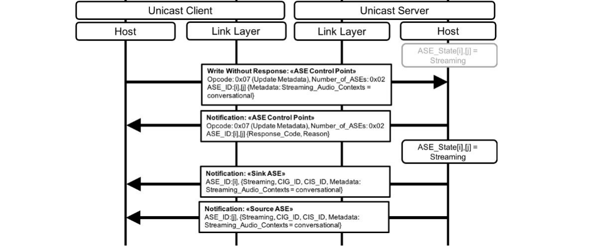

**Figure 5.6: Unicast Client initiates the Update Metadata operation for two ASEs**

#### 5.6.5 Disabling an ASE

To disable an ASE the Unicast Client shall initiate the Disable operation. The Unicast Client shall only initiate the Disable operation for an ASE that is in the Enabling state or the Streaming state, as defined in Table 3.2 in [4].
The example in Figure 5.7 shows the Unicast Client initiating the Disable operation for the two ASEs from the example in Figure 5.6 (some messages from the example in Figure 5.6 have been included in light grey text to aid understanding). The Unicast Server notifies the ASE Control Point characteristic containing the success response for the two ASEs to the Unicast Client, then notifies the Sink ASE characteristic for the Sink ASE that has transitioned to the QoS Configured state, then notifies the Source ASE characteristic for the Source ASE that has transitioned to the Disabling state.

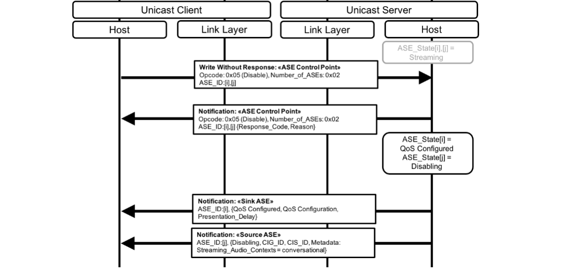

**Figure 5.7: Example Unicast Client-initiated Disable operation for two ASEs**

If a Source ASE is in the Disabling state, and/or if a Sink ASE is in the QoS Configured state, the Unicast Client or the Unicast Server may terminate a CIS established for that ASE by following the Connected Isochronous Stream Terminate procedure defined in Volume 3, Part C, Section 9.3.15 in [1]. Termination of the CIS is not required.
Termination of a bidirectional CIS should not occur if an ASE configured with the CIS_ID for that CIS is in the Enabling state or the Streaming state.

##### 5.6.5.1 Receiver Stop Ready

The Receiver Stop Ready operation for a Source ASE in the Disabling state, as defined in Table 3.2 in [4], informs an Audio Source that the Audio Sink is ready to stop consuming audio data transmitted by the Audio Source.
Successful completion of the Receiver Stop Ready operation for a Source ASE in the Disabling state completes the disconnection of a unicast Audio Stream for that Source ASE but does not require termination of a CIS established for the Source ASE.
If a Source ASE is in the Disabling state, the Unicast Client shall initiate the Receiver Stop Ready operation when the Unicast Client is ready to stop consuming audio data transmitted for that ASE by the Unicast Server. The Unicast Server in the Audio Source role should not stop transmitting audio data for a Source ASE in the Disabling state until the Unicast Server transitions the ASE to the QoS Configured state.
The example in Figure 5.8 shows the Unicast Client initiating the Receiver Stop Ready operation when it is ready to stop receiving audio for ASE_ID[j] from the example in Figure 5.7 (some messages from the example in Figure 5.7 have been included in light grey text to aid understanding) and to transition the ASE to the QoS Configured state. The Unicast Server notifies the ASE Control Point characteristic that
contains the success response, then ASE_ID[j] transitions to the QoS Configured state, and the Unicast Server notifies the Source ASE characteristic to the Unicast Client. The CIS established for ASE_ID[i] and ASE_ID[j] remains established, however the unicast Audio Streams that were previously established for ASE_ID[i] and ASE_ID[j] have now been disconnected.

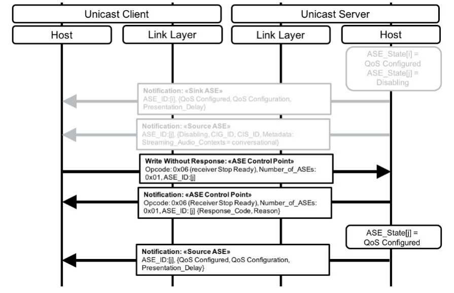

**Figure 5.8: Receiver Stop Ready operation – Unicast Client initiates the Receiver Stop Ready operation for the Source ASE**

If the Receiver Stop Ready operation has completed successfully for a Source ASE, the Unicast Client or the Unicast Server may terminate a CIS established for that Source ASE by following the Connected Isochronous Stream Terminate procedure defined in Volume 3, Part C, Section 9.3.15 in [1]. Termination of the CIS is not required.
Termination of a bidirectional CIS should not occur if an ASE configured with the CIS_ID for that CIS is in the Enabling state or the Streaming state.
The Unicast Client and Unicast Server should remove any internal audio data paths that have been set up for an ASE as defined in Section 5.6.6.1 before terminating the CIS.

#### 5.6.6 Releasing an ASE

To release an ASE and all resources associated with that ASE, the Unicast Client shall initiate the Release operation. The Unicast Client shall only initiate the Release operation for an ASE that is in the Codec Configured state, the QoS Configured state, the Enabling state, the Disabling state, or the Streaming state, as defined in Table 3.2 in [4].
The Unicast Client should not initiate the Release operation for an ASE that is in the Enabling state or the Streaming state if the CIS_ID and CIG_ID parameters are identical to other ASEs exposed by the Unicast Server that are in the Enabling state or the Streaming state; the Unicast Client should instead disable the ASE.
If the Unicast Client initiates the Release operation for an ASE, the Unicast Client and Unicast Server should remove any internal audio data paths that have been set up for the ASE as defined in Section 5.6.6.1. The Unicast Client shall terminate any CIS established for that ASE by following the Connected Isochronous Stream Terminate procedure defined in Volume 3, Part C, Section 9.3.15 in [1], when the Unicast Client has determined that the ASE is in the Releasing state.
The Unicast Server shall terminate a CIS established by the Unicast Client for an ASE if the Unicast Server has autonomously initiated the Release operation for that ASE by following the Connected Isochronous Stream Terminate procedure defined in Volume 3, Part C, Section 9.3.15 in [1]. The Unicast Client and Unicast Server should remove any internal audio data paths that have been set up for the ASE that is in the Releasing state, as defined in Section 5.6.6.1, before terminating the CIS.
The example in Figure 5.9 shows the Unicast Client initiating the Release operation for the two ASEs from the example in Figure 5.8 (some messages from the example in Figure 5.8 have been included in light grey text to aid understanding). The Unicast Server notifies the ASE Control Point characteristic containing the success response to the Unicast Client. The Unicast Server transitions both ASEs to the Releasing state and notifies both ASE characteristics to the Unicast Client. Both devices remove their respective audio data paths, and the Unicast Client terminates the CIS.

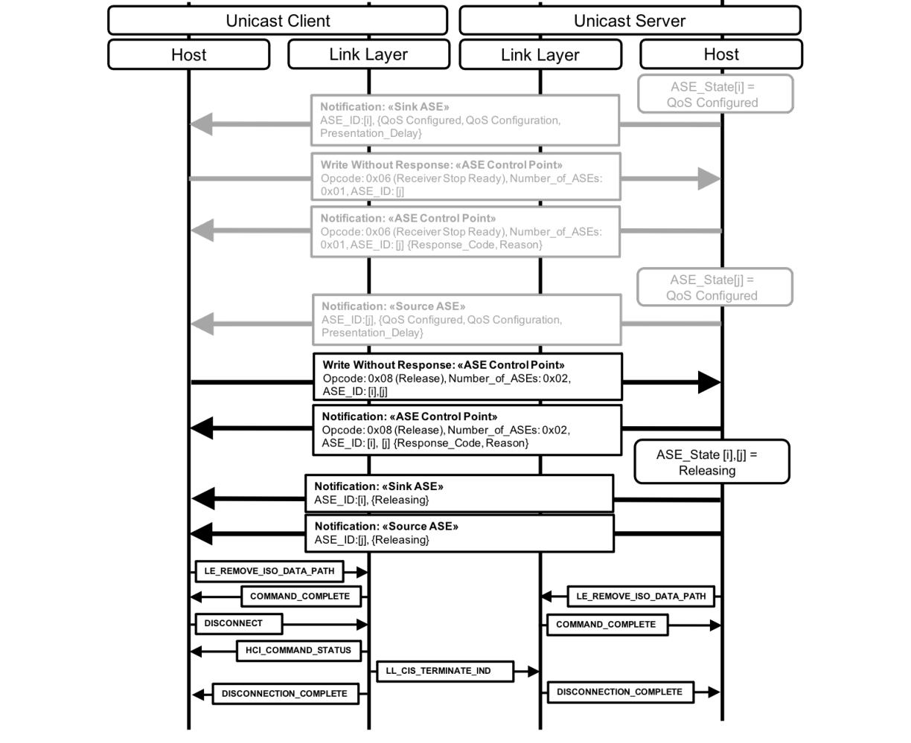

**Figure 5.9: Example Unicast Client-initiated Release operation for two ASEs; both devices remove their internal audio data paths following the release of the ASEs and finally, the CIS is terminated by the Unicast Client**

##### 5.6.6.1 Audio data path removal

The Unicast Client and Unicast server may remove any internal audio data path set up with their respective Bluetooth Controllers (if HCI is used, by using the LE Remove ISO Data Path command defined in Volume 4, Part E, Section 7.8.110 in [1]).
If a CIS being terminated is intended to be re-established with the same audio data path parameters, the LE Remove ISO Data Path command should not be performed.

#### 5.6.7 Released ASEs or LE ACL link loss

As defined in Section 5.9 in [4], if an ASE is in the Releasing state because the Unicast Server has detected link loss of an LE ACL for an ASE in any state, or if an ASE is in the Releasing state after completion of the Release operation, the Unicast Server autonomously initiates the Released operation to transition the ASE to either the Codec Configured state or the Idle state. The decision on which state to transition the ASE to is left to the Unicast Server implementation unless otherwise defined by higher-layer specifications.
When the Unicast Server transitions the ASE to the Codec Configured state, the Unicast Server chooses whether to expose the codec configuration parameters that had previously been exposed or whether to expose other codec configuration parameters of the Unicast Server’s choosing. The observed behavior from the Unicast Client viewpoint would be the same as if the Unicast Server had autonomously initiated the Config Codec operation.
The example in Figure 5.10 shows the Unicast Server autonomously initiating the Released operation for the two ASEs from the example in Figure 5.9 (some messages from the example in Figure 5.9 have been included in light grey text to aid understanding). The Unicast Server decides to transition the two ASEs to Codec Configured state. The codec configuration parameters and QoS preferences are exposed in each of the ASE characteristics, and the Unicast Server notifies both ASE characteristics to the Unicast Client.

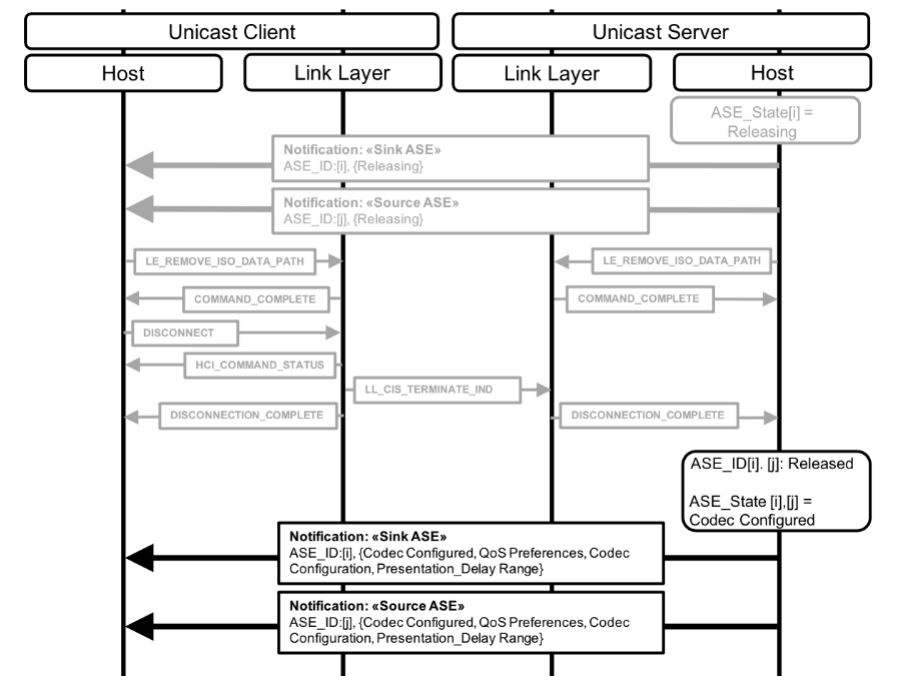

**Figure 5.10: Unicast Server autonomously initiated Release operation for two ASEs and their subsequent transition to Codec Configured state**

The example in Figure 5.11 shows the Unicast Server autonomously initiating the Released operation for the two ASEs from the example in Figure 5.9 (some messages from the example in Figure 5.9 have
been included in light grey text to aid understanding). The Unicast Server in the example in Figure 5.11 decides to transition only ASE_ID[i], for which the Unicast Server is in the Audio Sink role, to the Codec Configured state, assuming the Unicast Client might prefer the codec configuration it had written previously. The Unicast Server transitions ASE_ID[j] to the Idle state. The Unicast Server notifies both ASE characteristics to the Unicast Client.

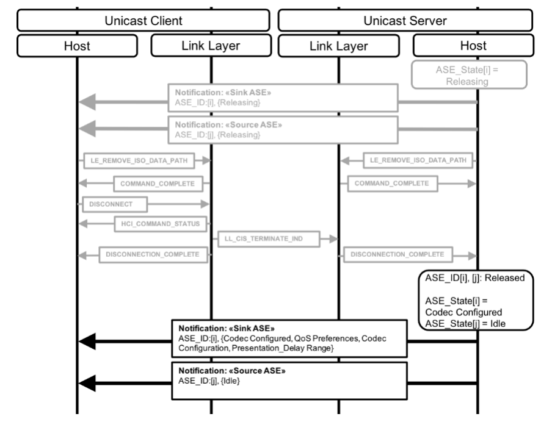

**Figure 5.11: Unicast Server autonomously initiated Released operation for two ASEs and subsequent transition of the Sink ASE to Codec Configured state and the Source ASE to Idle state**

The example in Figure 5.12 shows an LE ACL link loss situation for the two ASEs from the example in Figure 5.6 (after the Update Metadata operation with both ASEs in the Streaming state). The Unicast Server detects that the LE ACL has been lost and immediately transitions both ASEs to Releasing state and initiates the Released operation for both ASEs. The Unicast Server decides to transition both ASEs to Codec Configured state, assuming the Unicast Client might want to reestablish the LE ACL and unicast Audio Streams that were lost when the link was lost, and exposes the previously configured codec parameters, and exposes its preferred QoS parameters for both ASEs. The Unicast Server cannot notify either ASE characteristic to the Unicast Client because the LE ACL has been lost (the Unicast Server would notify both ASEs to the Unicast Client upon reconnection).

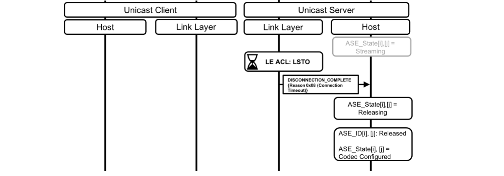

**Figure 5.12: Unicast Server autonomously initiated Released operation for two ASEs following LE ACL link loss; both ASEs transition to the Codec Configured state**

#### 5.6.8 CIS loss

As defined in Section 3.2 in [4], when the Unicast Server detects loss of a CIS for an ASE in the Streaming or the Disabling state, the Unicast Server transitions the ASE to the QoS Configured state.
The example in Figure 5.13 shows a CIS loss situation for the two ASEs from the example in Figure 5.6. The Unicast Server detects that the CIS for ASE_ID[i] and ASE[j] has been lost and immediately transitions both ASEs to the QoS Configured state. The Unicast Server then notifies both ASE characteristics to the Unicast Client.

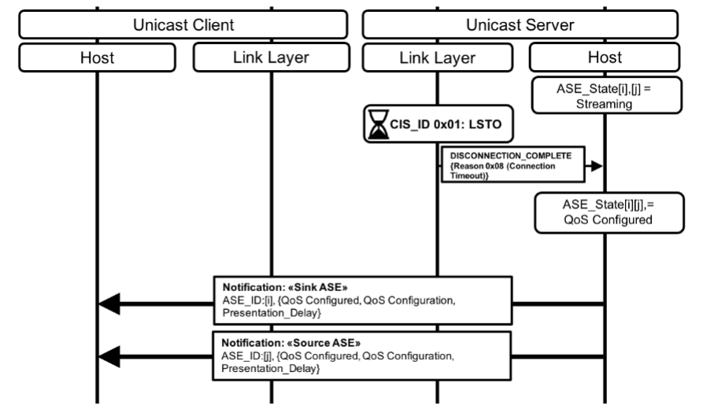

**Figure 5.13: Unicast Server detects CIS loss for a Sink ASE and a Source ASE**

#### 5.6.9 CIS establishment requirements

This section defines Unicast Client requirements for requesting a CIS and Unicast Server requirements for accepting a CIS.
If a CIS is coupled (i.e., bound and established) to an ASE, the device in the Audio Sink role for that ASE shall be tolerant of reception of zero length SDUs.

##### 5.6.9.1 CIS establishment requirements for Unicast Server

Table 5.3 defines the requirements for the Unicast Server to accept a CIS request when the CIS is bound to a Source ASE or a Sink ASE, or both a Source and Sink ASE, and the ASEs are in the states identified in the table. The Unicast Server uses the Connected Isochronous Stream Peripheral Establishment procedure defined in Volume 3, Part C, Section 9.3.14 in [1].

| Source ASE | Sink ASE | Enabling State | QoS Configured state | Not bound1 |
| --- | --- | --- | --- | --- |
| Enabling state |  | M3 | M3 | M |
| QoS Configured state |  | M3 | O3 | O |
| Not bound2 |  | M | O | X |

Table 5.3: Requirements for the Unicast Server to accept a CIS request from a Unicast Client

## 1 The CIS is not bound to a Sink ASE.

## 2 The CIS is not bound to a Source ASE.

## 3 The CIS is bound to both a Source and a Sink ASE and is bidirectional.

##### 5.6.9.2 CIS establishment requirements for Unicast Client

Table 5.4 defines the requirements for the Unicast Client to request a CIS when the CIS is bound to a Source ASE or a Sink ASE, or both a Source ASE and a Sink ASE, and the ASEs are in the states identified in the table. The Unicast Client uses the Connected Isochronous Stream Central Establishment procedure defined in Volume 3, Part C, Section 9.3.13 in [1], if the CIS is not already established.

| Source ASE | Sink ASE | Enabling State | QoS Configured State | Not Bound 1 |
| --- | --- | --- | --- | --- |
| Enabling state |  | M3 | M3 | M |
| QoS Configured state |  | M3 | O3,4 | O4 |
| Not bound2 |  | M | O4 | X |

Table 5.4: Requirements for the Unicast Client to request a CIS, when the CIS is not already established

## 1 The CIS is not bound to a Sink ASE.

## 2 The CIS is not bound to a Source ASE.

## 3 The CIS is bound to both a Source ASE and a Sink ASE and is bidirectional.

## 4 Note the Unicast Server can reject the CIS request. See Section 5.6.9.1.

## 6 Broadcast audio streaming procedures

Requirements in this section are defined as “Mandatory” (M), “Optional” (O), “Excluded” (X), and “Conditional” (C.n). Conditional statements (C.n) are listed directly below the table in which they appear.
Broadcast audio streaming involves a Broadcast Source and zero or more Broadcast Sinks, Broadcast Assistants, and Scan Delegators.
The Broadcast Source support requirements for procedures in this section are defined in Table 6.1.

| Procedure | Section Reference | Requirement |
| --- | --- | --- |
| Broadcast Audio Stream state management | Section 6.2 | M |
| Broadcast Audio Stream configuration | Section 6.3 | M |
| Broadcast Audio Stream reconfiguration | Section 6.3.1 | O |
| Broadcast Audio Stream establishment | Section 6.3.2 | M |
| Broadcast Audio Stream Metadata update | Section 6.3.3 | O |
| Broadcast Audio Stream disable | Section 6.3.3 | M |
| Broadcast Audio Stream release | Section 6.3.5 | M |

Table 6.1: Broadcast Source procedure support requirements

### 6.1 Broadcast Audio Streams and advertising PDUs

Broadcast Audio Streams are transmitted by Broadcast Sources and are transported using BISes within a BIG. When transmitting broadcast Audio Streams, Broadcast Sources also transmit EA PDUs and PA PDUs. The relationship between superior and auxiliary advertising PDUs is defined in Vol 6, Part B, Section 2.3 in [1]. An example representation of the different packets that are transmitted by Broadcast Sources is shown in Figure 6.1.

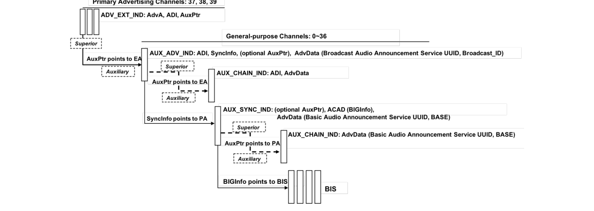

**Figure 6.1: EA, PA, and BIS packets and their relationships as transmitted by Broadcast Sources**

#### 6.1.1 Extended advertising

The EA transmitted by a Broadcast Source consists of ADV_EXT_IND PDUs (defined in Volume 6, Part B, Section 2.3.1.5 in [1]), auxiliary AUX_ADV_IND PDUs (defined in Volume 6, Part B, Section 2.3.1.6 in [1]), and optional auxiliary AUX_CHAIN_IND PDUs (defined in Volume 6, Part B, Section 2.3.1.8 in [1]). EA PDUs contain an Extended Header Field as defined in Vol 6, Part B, Section 2.3.4 in [1].
The ADV_EXT_IND PDU Extended Header field contains an AuxPtr field that contains data that enables synchronization to auxiliary AUX_ADV_IND PDUs. The ADV_EXT_IND PDU AuxPtr field points to the AUX_ADV_IND.
The AUX_ADV_IND PDU Extended Header field contains a SyncInfo field that contains data that enables synchronization to a PA. The AUX_ADV_IND PDU SyncInfo field points to the PA.
The AUX_ADV_IND PDU contains an AdvData field that contains the Service Data AD data type. The Service Data AD data type contains the Broadcast Audio Announcement Service UUID defined in Section 3.7.2.1 and the Broadcast_ID defined in Section 3.7.2.1.1. The Broadcast Audio Announcement Service UUID associates the PA being pointed to with a BIG that contains one or more BISes used to transport broadcast Audio Streams. The Broadcast_ID assists scanning devices that are not using a Filter Accept List [9] to determine that the EA points to the PA that points to the BIG of interest.
If AUX_CHAIN_IND PDUs are used, the AUX_ADV_IND PDU Extended Header field contains an AuxPtr field that contains data that enables synchronization to auxiliary AUX_CHAIN_IND PDUs. The AUX_ADV_IND PDU AuxPtr field points to one or more AUX_CHAIN_IND PDUs. AUX_CHAIN_IND PDUs are used at the discretion of the Bluetooth Controller.
The ADV_EXT_IND PDUs and their auxiliary AUX_ADV_IND PDUs, including any auxiliary AUX_CHAIN_IND PDUs present, form an advertising set. The advertising set has an Advertising Set ID, SID, as defined in Vol 6, Part B, Section 2.3.4.4 in [1], The SID value is carried in the SID subfield of the ADI field of the Extended Header field of ADV_EXT_IND PDUs and AUX_ADV_IND PDUs and, if used, AUX_CHAIN_IND PDUs.

#### 6.1.2 Periodic advertising

The PA transmitted by a Broadcast Source consists of AUX_SYNC_IND PDUs (defined in Volume 6, Part B, Section 2.3.1.7 in [1]) and optional auxiliary AUX_CHAIN_IND PDUs (defined in Volume 6, Part B, Section 2.3.1.8 in [1]). PA PDUs contain an Extended Header Field as defined in Vol 6, Part B, Section 2.3.4 in [1].
If AUX_CHAIN_IND PDUs are used, the superior AUX_SYNC_IND PDUs Extended Header field contains an AuxPtr field that contains data that enables synchronization to auxiliary AUX_CHAIN_IND PDUs. The AUX_SYNC_IND PDU AuxPtr field points to one or more AUX_CHAIN_IND PDUs. AUX_CHAIN_IND PDUs are used at the discretion of the Bluetooth controller.
The AUX_SYNC_IND PDU and/or AUX_CHAIN_IND PDU may carry an AdvData field that contains the Service Data AD data type. If present, the Service Data AD data type contains the Basic Audio Announcement Service UUID, followed by the BASE configuration that describes one or more broadcast Audio Streams, defined in Section 3.7.2.2.
The AUX_SYNC_IND PDU Extended Header field and/or AUX_CHAIN_IND PDU Extended Header field may carry an ACAD field that contains the BIGInfo (defined in Volume 6, Part B, Section 4.4.6.11 in [1]). The BIGInfo data enables synchronization to a BIG that contains one or more BISes used to transport broadcast Audio Streams. The BIGInfo therefore provides information that enables reception of a broadcast Audio Stream. The BIGInfo points to the BIG.

#### 6.1.3 Device address recommendations for Broadcast Sources

As described in Section 6.1, broadcast Audio Stream transmission also involves the transmission of advertising PDUs. The device address of a Broadcast Source is carried in the Advertiser address (AdvA) field of the Extended Header field of ADV_EXT_IND PDUs as shown in Figure 6.2 (the AdvData field of the AUX_ADV_IND PDUs that contain the Broadcast_ID, and optional AUX_CHAIN_IND PDUs have been omitted for clarity). All advertising PDUs in the advertising set carry the ADI field which contains the Advertising Set Identifier, SID.

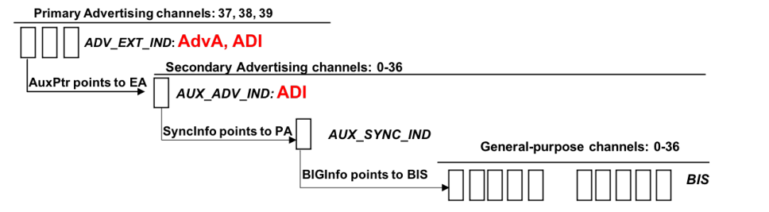

**Figure 6.2: Broadcast Source AdvA and ADI in ADV_EXT_IND PDUs**

If a Broadcast Source changes the device address used as the AdvA for an advertising set that points to a BIG (that is, advertising PDUs consisting of EA that point to PA that point to a BIG) then devices (Broadcast Assistants and/or Scan Delegator/Broadcast Sinks) that had used the previous AdvA when synchronizing to a PA and/or BIG, and had subsequently lost or otherwise stopped synchronization with the PA and/or BIG, might take a long time to re-synchronize because only the SID data in the ADV_EXT_IND PDUs would match that used with the previous AdvA. The SID data is 4 bits long and remains constant in the ADV_EXT_IND PDU for the lifetime of the BIG (until the BIG is terminated). There might be multiple independent BIGs being transmitted by nearby Broadcast Sources which might have
allocated the same value for the SID in their respective advertising sets. This could lead to Broadcast Assistants and/or Scan Delegators/Broadcast Sinks synchronizing to multiple different advertising sets that are using the same SID before finding the advertising set that points to the BIG of interest. The Broadcast_ID, defined in Section 3.7.2.1.1, assists devices that are not using a Filter Accept List to determine the advertising set that points to the BIG of interest because the AUX_ADV_IND AdvData field containing the Broadcast_ID is passed to the Bluetooth Host.
For devices using a Filter Accept List, taking a long time to re-synchronize to a PA and/or BIG of interest is likely to lead to poor user experience. Consequently, this profile makes the following recommendations for the Broadcast Source device address when transmitting advertising sets that are used to point to a BIG:
1. The Broadcast Source should not change the device address, AdvA, in use for an advertising set that points to a BIG for the lifetime of that BIG.
2. If using a random device address, the Broadcast Source should use a non-resolvable private address.
3. The Broadcast Source should only use a resolvable private address if the Broadcast Source uses a collocated Broadcast Assistant to communicate with all Scan Delegators/Broadcast Sinks of interest.
• When the Broadcast Source is aware that all Scan Delegators/Broadcast Sinks of interest have discovered the EA and PA, the Broadcast Source should disable the EA when the broadcast Audio Stream is in the Streaming state (see Section 6.2.1).

### 6.2 Broadcast Audio Stream state management

Control of a broadcast Audio Stream is described in terms of a broadcast Audio Stream state machine and its transitions on the Broadcast Source.

#### 6.2.1 Broadcast Audio Stream states

The broadcast Audio Stream state machine allows a Broadcast Source to communicate to zero or more Broadcast Sinks and/or zero or more Broadcast Assistants in a unidirectional connectionless manner. The Broadcast Source communicates using Basic Audio Announcements in the form of the BASE structure (see Section 3.7.2).
The broadcast Audio Stream is transmitted by the Broadcast Source.
Figure 6.3 shows the broadcast Audio Stream state machine.

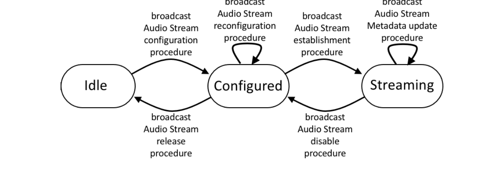

**Figure 6.3: The broadcast Audio Stream state machine**

The states of the broadcast Audio Stream state machine are shown in Table 6.2.

| State | Description |
| --- | --- |
| Idle | No broadcast Audio Stream is being transmitted. |
| Config- ured | The Broadcast Source has configured its controller for the broadcast Audio Stream using implementation-specific information or information provided by a higher-layer specification. The Broadcast Source transmits EA that contains Broadcast Audio Announcements (Sec- tion 3.7.2.1), which associate PA with broadcast Audio Streams. The Broadcast Source transmits PA that contains Basic Audio Announcements (Sec- tion 3.7.2.2). The PA shall not carry the BIGInfo data that is required for devices to synchronize to BIGs and their respective BISes. No audio data packets shall be sent in a BIG when the broadcast Audio Stream state machine is in the Configured state. |
| Streaming | The broadcast Audio Stream is established on the Broadcast Source. The Broadcast Source transmits EA that contains Broadcast Audio Announcements (Sec- tion 3.7.2.1), which associate PA with broadcast Audio Streams, and the Broadcast ID _ (Section 3.7.2.1.1) that assists devices not using a Filter Accept List to determine the EA that points to the PA that points to the BIG of interest. Continuous transmission of the EA is not required. The Broadcast Source transmits PA that contains Basic Audio Announcements (Sec- tion 3.7.2.2). Continuous transmission of the PA is not required. When the PA is transmitted, the PA shall carry the BIGInfo data required to synchronize to BIGs and their BISes, and to receive broadcast Audio Streams. The Broadcast Source may transmit control parameters in control packets within the BIG, as defined in Volume 6, Part B, Section 2.6.3 in [1]. |

Table 6.2: Broadcast Audio Stream states

#### 6.2.2 Broadcast Audio Stream state transitions

Table 6.3 lists the broadcast Audio Stream state machine transitions.
State transitions not shown in Table 6.3 are invalid state transitions and shall not occur.

| Current State | Procedure | Next State |
| --- | --- | --- |
| Idle | Broadcast Audio Stream configuration procedure | Configured |
| Configured | Broadcast Audio Stream establishment procedure | Streaming |
| Streaming | Broadcast Audio Stream disable procedure | Configured |
| Streaming | Broadcast Audio Stream Metadata update procedure | Streaming |
| Configured | Broadcast Audio Stream release procedure | Idle |
| Configured | Broadcast Audio Stream reconfiguration procedure | Configured |

Table 6.3: Broadcast Audio Stream state machine transitions

### 6.3 Broadcast Audio Stream configuration

The Broadcast Source shall configure a broadcast Audio Stream with codec and other configuration parameters and Metadata, as defined by the BASE (see Section 3.7.2).
The Broadcast Source may write any LTV structures for the Metadata parameter as defined by this profile (see Section 4.3.3) or defined by higher-layer specifications when configuring a broadcast Audio Stream.
The Broadcast Source may include the Streaming_Audio_Contexts LTV structure in the Metadata parameter for a broadcast Audio Stream to inform Broadcast Sinks that the broadcast Audio Stream is intended for use cases described by the Context Type values of any bits set to 0b1 in the Streaming_Audio_Contexts value.
Table 6.4 shows the Mandatory broadcast Audio Stream configuration support settings defined by this profile for the Broadcast Source (encoding and transmission of the broadcast Audio Stream) and the Broadcast Sink (reception and decoding of the broadcast Audio Stream). The Broadcast Source and the Broadcast Sink may support any other broadcast Audio Stream configuration settings defined by an implementation or by a higher-layer specification.
HCI level parameters are given as a reference. On systems not incorporating HCI, except where a parameter is designated as a recommendation in the footnotes in Table 6.4, equivalent values for LL level (BIG) broadcast Audio Stream configuration parameters shall be used.

| Set Name | nd Table 3.17) | _Interval (µs) | Framing | _SDU (Octets) | RTN | _Latency (ms) | on_Delay (µs) | Requirement |  |
| --- | --- | --- | --- | --- | --- | --- | --- | --- | --- |
|  | Codec Capability / Configuration Setting (Table 3.12 a | SDU |  | Max |  | Max_Transport | Presentati | Broadcast Source | Broadcast Sink |
| Broadcast Audio Stream configuration settings for low latency audio data |  |  |  |  |  |  |  |  |  |
| 8 1 1 _ _ | 8 1 _ | 75001 | un- framed | 262 (27.734 kbps3) | 25 | 8 | 400004 | C.1 | C.3 |
| 8 2 1 _ _ | 8 2 _ | 100001 | un- framed | 302 (24 kbps3) | 25 | 10 | 400004 | C.1 | C.3 |
| 16 1 1 _ _ | 16 1 _ | 75001 | un- framed | 302 (32 kbps3) | 25 | 8 | 400004 | C.1 | C.3 |
| 16 2 1 _ _ | 16 2 _ | 100001 | un- framed | 402 (32 kbps3) | 25 | 10 | 400004 | M | M |
| 24 1 1 _ _ | 24 1 _ | 75001 | un- framed | 452 (48 kbps3) | 25 | 8 | 400004 | C.1 | C.3 |
| 24 2 1 _ _ | 24 2 _ | 100001 | un- framed | 602 (48 kbps3) | 25 | 10 | 400004 | C.2 | M |
| 32 1 1 _ _ | 32 1 _ | 75001 | un- framed | 602 (64 kbps3) | 25 | 8 | 400004 | C.1 | C.3 |
| 32 2 1 _ _ | 32 2 _ | 100001 | un- framed | 802 (64 kbps3) | 25 | 10 | 400004 | C.1 | C.3 |

| Set Name | nd Table 3.17) | _Interval (µs) | Framing | _SDU (Octets) | RTN | _Latency (ms) | on_Delay (µs) | Requirement |  |
| --- | --- | --- | --- | --- | --- | --- | --- | --- | --- |
|  | Codec Capability / Configuration Setting (Table 3.12 a | SDU |  | Max |  | Max_Transport | Presentati | Broadcast Source | Broadcast Sink |
| 441 1 1 _ _ | 441 1 _ | 81636 | framed | 972 (95.06 kbps3) | 45 | 24 | 400004 | C.1 | C.3 |
| 441 2 1 _ _ | 441 2 _ | 108846 | framed | 1302 (95.55 kbps3) | 45 | 31 | 400004 | C.1 | C.3 |
| 48 1 1 _ _ | 48 1 _ | 75001 | un- framed | 752 (80 kbps3) | 45 | 15 | 400004 | C.1 | C.3 |
| 48 2 1 _ _ | 48 2 _ | 100001 | un- framed | 1002 (80 kbps3) | 45 | 20 | 400004 | C.1 | C.3 |
| 48 3 1 _ _ | 48 3 _ | 75001 | un- framed | 902 (96 kbps3) | 45 | 15 | 400004 | C.1 | C.3 |
| 48 4 1 _ _ | 48 4 _ | 100001 | un- framed | 1202 (96 kbps3) | 45 | 20 | 400004 | C.1 | C.3 |
| 48 5 1 _ _ | 48 5 _ | 75001 | un- framed | 1172 (124.8 kbps3) | 45 | 15 | 400004 | C.1 | C.3 |
| 48 6 1 _ _ | 48 6 _ | 100001 | un- framed | 1552 (124 kbps3) | 45 | 20 | 400004 | C.1 | C.3 |

| Set Name | nd Table 3.17) | _Interval (µs) | Framing | _SDU (Octets) | RTN | _Latency (ms) | on_Delay (µs) | Requirement |  |
| --- | --- | --- | --- | --- | --- | --- | --- | --- | --- |
|  | Codec Capability / Configuration Setting (Table 3.12 a | SDU |  | Max |  | Max_Transport | Presentati | Broadcast Source | Broadcast Sink |
| Broadcast Audio Stream configuration settings for high-reliability audio data |  |  |  |  |  |  |  |  |  |
| 8 1 2 _ _ | 8 1 _ | 75001 | un- framed | 262 (27.734 kbps3) | 45 | 45 | 400004 | C.1 | C.3 |
| 8 2 2 _ _ | 8 2 _ | 100001 | un- framed | 302 (24 kbps3) | 45 | 60 | 400004 | C.1 | C.3 |
| 16 1 2 _ _ | 16 1 _ | 75001 | un- framed | 302 (32 kbps3) | 45 | 45 | 400004 | C.1 | C.3 |
| 16 2 2 _ _ | 16 2 _ | 100001 | un- framed | 402 (32 kbps3) | 45 | 60 | 400004 | M | M |
| 24 1 2 _ _ | 24 1 _ | 75001 | un- framed | 452 (48 kbps3) | 45 | 45 | 400004 | C.1 | C.3 |
| 24 2 2 _ _ | 24 2 _ | 100001 | un- framed | 602 (48 kbps3) | 45 | 60 | 400004 | C.2 | M |
| 32 1 2 _ _ | 32 1 _ | 75001 | un- framed | 602 (64 kbps3) | 45 | 45 | 400004 | C.1 | C.3 |
| 32 2 2 _ _ | 32 2 _ | 100001 | un- framed | 802 (64 kbps3) | 45 | 60 | 400004 | C.1 | C.3 |

| Set Name | nd Table 3.17) | _Interval (µs) | Framing | _SDU (Octets) | RTN | _Latency (ms) | on_Delay (µs) | Requirement |  |
| --- | --- | --- | --- | --- | --- | --- | --- | --- | --- |
|  | Codec Capability / Configuration Setting (Table 3.12 a | SDU |  | Max |  | Max_Transport | Presentati | Broadcast Source | Broadcast Sink |
| 441 1 2 _ _ | 441 1 _ | 81636 | framed | 972 (95.06 kbps3) | 45 | 54 | 400004 | C.1 | C.3 |
| 441 2 2 _ _ | 441 2 _ | 108846 | framed | 1302 (95.55 kbps3) | 45 | 60 | 400004 | C.1 | C.3 |
| 48 1 2 _ _ | 48 1 _ | 75001 | un- framed | 752 (80 kbps3) | 45 | 50 | 400004 | C.1 | C.3 |
| 48 2 2 _ _ | 48 2 _ | 100001 | un- framed | 1002 (80 kbps3) | 45 | 65 | 400004 | C.1 | C.3 |
| 48 3 2 _ _ | 48 3 _ | 75001 | un- framed | 902 (96 kbps3) | 45 | 50 | 400004 | C.1 | C.3 |
| 48 4 2 _ _ | 48 4 _ | 100001 | un- framed | 1202 (96 kbps3) | 45 | 65 | 400004 | C.1 | C.3 |
| 48 5 2 _ _ | 48 5 _ | 75001 | un- framed | 1172 (124.8 kbps3) | 45 | 50 | 400004 | C.1 | C.3 |
| 48 6 2 _ _ | 48 6 _ | 100001 | un- framed | 1552 (124 kbps3) | 45 | 65 | 400004 | C.1 | C.3 |

| Set Name | nd Table 3.17) | _Interval (µs) | Framing | _SDU (Octets) | RTN | _Latency (ms) | on_Delay (µs) | Requirement |  |
| --- | --- | --- | --- | --- | --- | --- | --- | --- | --- |
|  | Codec Capability / Configuration Setting (Table 3.12 a | SDU |  | Max |  | Max_Transport | Presentati | Broadcast Source | Broadcast Sink |
| 1 Nominal. May be adjusted to accommodate audio clock offset and drift. 2 This value shall be multiplied by the number of bits set to a value of 0b1 in Audio Channel Allocation, _ _ if present, and by the number of blocks indicated by the Codec Frame Blocks Per SDU value, if _ _ _ _ present. 3 Bit rates are calculated according to Section 3.2.5 in [7]. 4 Applies to Broadcast Sink only (the Broadcast Sink shall be capable of rendering audio no later than 40ms after the SDU Synchronization reference – see Section 7.1.1). 5 RTN values are recommendations to the Controller, which may use different values in order to match desired robustness and/or bandwidth. The Host shall be capable of requesting the values listed. 6 Effective SDU Interval. For 44.1 kHz/7.5ms the actual SDU Interval is equivalent to 360 (samples per _ _ second) divided by 44100 (Sampling Frequency), which equals 8.16327 ms, and for 44.1 kHz/10 ms the actual SDU Interval is equal to 480 (samples per second) divided by 44100 (Sampling Frequency), _ which equals 10.88435. The LC3 [7] codec encodes 97 octets (for 7.5 ms/8.163 ms effective) or 130 octets (for 10 ms/10.884 ms effective) into each SDU, which arrives at the controller every 8.16327 ms or 10.88435 ms. The transmitting device assigns a time offset to each SDU and delivers the time offset _ with each SDU at the receiver, as defined in Volume G, Part 7, Section 3.1 in [1]. Determination of the time offset parameter at the transmitting device is implementation-specific. Compensation for the _ difference between 8.16327 ms and 8.163 ms, and/or compensation between 10.88435 ms and 10.884 ms, is implementation-specific. |  |  |  |  |  |  |  |  |  |

Table 6.4: Broadcast Audio Stream configuration support requirements for the Broadcast Source and Broadcast Sink
C.1: Optional to support if the Codec Configuration Setting is supported in Table 3.12, otherwise Excluded.
C.2: Mandatory to support if the Codec Configuration Setting is supported in Table 3.12, otherwise Excluded.
C.3: Optional to support if the Codec Capability Setting is supported in Table 3.17, otherwise Excluded.
To maximize the number of Broadcast Sinks capable of decoding a broadcast Audio Stream transmitted by the Broadcast Source, the Broadcast Source should include at least one broadcast Audio Stream, encoded using a codec configuration that corresponds to either of the mandatory settings defined in Table 3.17.
Recommended LL configuration parameters for some broadcast Audio Stream configurations from Table 6.4 are shown in Table 6.5.

| Set Name (Table 6.4) | Recommen- dation | LL parameter | ISO - _ Interval | BN | NSE | IRC | PTO | Num _ BIS | RTN (actual) |
| --- | --- | --- | --- | --- | --- | --- | --- | --- | --- |
| 48 2 2 _ _ | 11 |  | 30 ms | 3 | 9 | 2 | 1 | 1 or 2 | 2 |
| 48 2 2 _ _ | 22 |  | 10 ms | 1 | 5 | 1 | 1 | 1 or 2 | 4 |
| 48 2 2 _ _ | 33 |  | 20ms | 2 | 8 | 2 | 1 | 1 or 2 | 3 |
| 1 Optimized for coexistence with Wi-Fi and with Bluetooth devices operating at 7.5ms schedules 2 Optimized for Bluetooth link quality where no Wi-Fi coexistence is assumed necessary 3 Optimized for balanced Bluetooth link quality and Wi-Fi coexistence |  |  |  |  |  |  |  |  |  |

Table 6.5: Recommended LL parameters for broadcast Audio Stream configuration
After configuring the BASE, the Broadcast Source shall enter the Broadcast mode defined in Volume 3, Part C, Section 9.1.1 in [1] to set up EAs.
The Broadcast Source shall then enter the Periodic Advertising mode defined in Volume 3, Part C, Section 9.5.2 in [1] and transmit the configured BASE information in the AdvData field of AUX_SYNC_IND and/or AUX_CHAIN_IND PDUs.
The Broadcast Source shall then enter the Periodic Advertising Synchronizability mode defined in Volume 3, Part C, Section 9.5.1 in [1] and transmit the PA synchronization information in the SyncInfo field of the Extended Header field of AUX_ADV_IND PDUs. When transmitting the AUX_ADV_IND PDUs, the Broadcast Source shall also include the Service Data AD data type in the AdvData field of the AUX_ADV_IND PDUs. The 16-bit Service UUID shall be the Broadcast Audio Announcement Service UUID, which is used to associate the PA with a broadcast Audio Stream, and the additional service data shall include the Broadcast_ID, as defined in Table 3.14.
Figure 6.4 shows an example of a Broadcast Source configuring a broadcast Audio Stream.

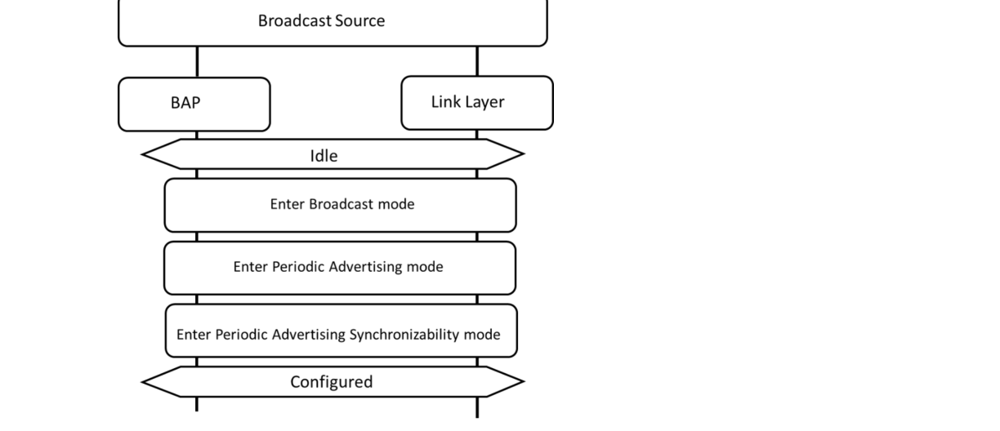

**Figure 6.4: Broadcast Audio Stream configuration**

#### 6.3.1 Broadcast Audio Stream reconfiguration

While a broadcast Audio Stream is in the Configured state, the Broadcast Source may at any time reconfigure the broadcast Audio Steam.
The Broadcast Source may write any LTV structures for the Metadata parameter as defined by this profile (see Section 4.3.3) or defined by higher-layer specifications when reconfiguring a broadcast Audio Stream.
The Broadcast Source may include the Streaming_Audio_Contexts LTV structure in the Metadata parameter for a broadcast Audio Stream to inform Broadcast Sinks that the broadcast Audio Stream is intended for use cases described by the Context Type values of any bits set to a value of 0b1 in the Streaming_Audio_Contexts value.
The Broadcast Source shall update the BASE configuration, as described in Section 3.7.2, with new parameters representing the new configuration.

#### 6.3.2 Broadcast Audio Stream establishment

The Broadcast Source shall start or resume broadcast Audio Stream transmission by establishing the broadcast Audio Stream, which transitions the broadcast Audio Stream from the Configured state to the Streaming state (see Section 6.2.1).
To establish a broadcast Audio Stream, the Broadcast Source shall first enter the Broadcast Isochronous Broadcasting mode defined in Volume 3, Part C, Section 9.6.2 in [1]. The Broadcast Source shall then enter the Broadcast Isochronous Synchronizability mode defined in Volume 3, Part C, Section 9.6.1 in [1] and transmit the broadcast Audio Stream synchronization information (BIGInfo) in the ACAD field of the Extended Header field of AUX_SYNC_IND PDUs in the PA.
The Broadcast Source shall then complete establishment of the broadcast Audio Stream by setting up the audio data path (if HCI is used, by using the LE Setup ISO Data Path command defined in Volume 4, Part E, Section 7.8.109 in [1]) if the audio data path has not already been set up.
Figure 6.5 shows an example of a Broadcast Source establishing a broadcast Audio Stream.

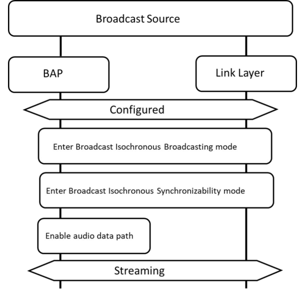

**Figure 6.5: Broadcast Audio Stream establishment**

#### 6.3.3 Broadcast Audio Stream Metadata update

While a broadcast Audio Stream is in the Streaming state, the Broadcast Source may update the Metadata associated with the broadcast Audio Streams in a subgroup by updating any Metadata parameters in the BASE configuration, as described in Section 3.7.2.
The Broadcast Source may write any LTV structures for the Metadata parameter as defined by this profile (see Section 4.3.3) or defined by higher-layer specifications when updating any Metadata for broadcast Audio Streams in a subgroup.
The Broadcast Source may include the Streaming_Audio_Contexts LTV structure in the Metadata parameter for a broadcast Audio Stream to inform Broadcast Sinks that the broadcast Audio Stream is intended for use cases described by the Context Type values of any bits set to a value of 0b1 in the Streaming_Audio_Contexts value.
The Broadcast Source shall not update any parameters in the BASE configuration other than the Metadata_Length and/or Metadata parameters while a broadcast Audio Stream is in the Streaming state.

#### 6.3.4 Broadcast Audio Stream disable

To disable a broadcast Audio Stream and to transition it to the Configured state from the Streaming state, the Broadcast Source shall use the Broadcast Isochronous Terminate procedure defined in Volume 3, Part C, Section 9.6.5 in [1].
The Broadcast Source may maintain the broadcast Audio Stream in Configured state, continuing to transmit PA containing Basic Audio Announcements, allowing an application to recommence audio transmission at any time.
Figure 6.6 shows an example of a Broadcast Source disabling a broadcast Audio Stream.

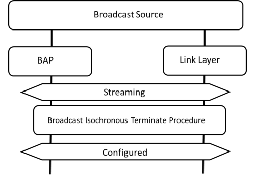

**Figure 6.6: Disabling a broadcast Audio Stream**

#### 6.3.5 Broadcast Audio Stream release

The Broadcast Source shall release a broadcast Audio Stream by terminating the Periodic Advertising mode and shall transition the broadcast Audio Stream from the Configured state to the Idle state.
Figure 6.7 shows an example of a Broadcast Source releasing a broadcast Audio Stream.

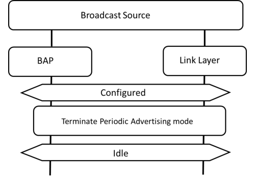

**Figure 6.7: Releasing a broadcast Audio Stream**

### 6.4 Basic Audio Announcement discovery

Basic Audio Announcements containing broadcast audio streaming parameters are transmitted by Broadcast Sources (the BASE configuration – see Section 3.7.2) and shall be discovered by Broadcast Sinks and/or by Broadcast Assistants by using the Observation Procedure in Volume 3, Part C, Section 9.1.2 in [1] to discover the following:
• EA containing the Service Data AD data type containing the Broadcast Audio Announcement Service UUID and the Broadcast_ID formatted as defined in Table 3.14, and any additional service data.
• SyncInfo data that enables synchronization to the PA associated with broadcast Audio Streams.
The PA contains the Service Data AD data type and contains the Basic Audio Announcement Service UUID and the BASE configuration. The PA may contain synchronization information (BIGInfo) that enables synchronization to the broadcast Audio Stream in the ACAD field of the Extended Header field of AUX_SYNC_IND PDUs.
The Broadcast Sink or the Broadcast Assistant shall synchronize to the PA using the Periodic Advertising Synchronization Establishment procedure defined in Volume 3, Part C, Section 9.5.3 in [1].
Figure 6.8 shows an example of Basic Audio Announcement discovery by a Broadcast Sink or a Broadcast Assistant.

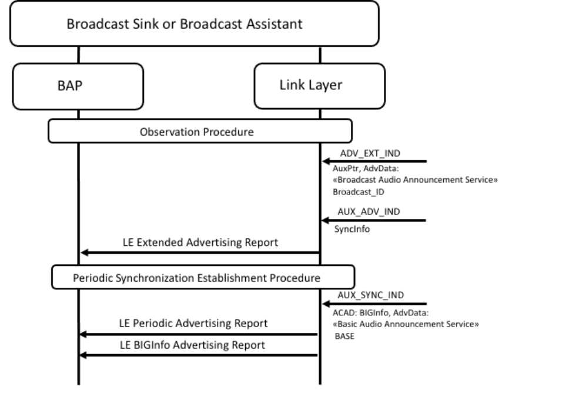

**Figure 6.8: Basic Audio Announcement discovery**

### 6.5 Broadcast Assistant procedures

This section describes how a Broadcast Assistant can discover audio capabilities of Broadcast Sinks collocated with Scan Delegators, and how a Broadcast Assistant can initiate Broadcast Audio Scan Control Point [6] operations with a Scan Delegator.
A Scan Delegator may be a standalone device or may be collocated with a Broadcast Sink, as defined in Table 3.1.
A Broadcast Assistant may be a standalone device or may be collocated with a Broadcast Source, as defined in Table 3.1.
Broadcast Sinks can scan for EA and can synchronize to PA and to BIS transmitted by Broadcast Sources. Scanning for EA can represent a significant portion of the power budget for a device with limited battery capacity.
Scan Delegators can solicit for Broadcast Assistants to scan on behalf of the Scan Delegator for the EA. This helps reduce the need to scan by the Scan Delegator and therefore reduce power consumption on the Scan Delegator; this process is called Remote Broadcast Scanning.
Scan Delegators can receive information from Broadcast Assistants that describes BIS, including decryption keys necessary to decrypt encrypted BISes, known as Broadcast_Codes and defined in Volume 3, Part C, Section 3.2.6.1 in [1].
Scan Delegators can receive transfers of SyncInfo data from Broadcast Assistants; this process is called Scan Offloading and uses the Periodic Advertising Sync Transfer (PAST) procedure defined in Volume 3, Part C, Section 9.5.4 in [1].
During Scan Offloading, the Scan Delegator receives the SyncInfo data in LL_PERIODIC_SYNC_IND PDUs. The LL_PERIODIC_SYNC_IND PDU is defined in Volume 6, Part B, Section 2.4.2.27 in [1]. Scan Delegators can use the SyncInfo data to synchronize to a PA and discover any BASE configuration describing the broadcast Audio Stream or BIGInfo data carried in the PA that allows the Broadcast Sink collocated with the Scan Delegator to then synchronize to the BIS that transports the broadcast Audio Stream.
When a Broadcast Assistant is collocated with a Broadcast Source, it is possible to use the Broadcast Audio Scan Service to communicate information about broadcast Audio Streams transmitted by the collocated Broadcast Source and information about broadcast Audio Streams transmitted by other Broadcast Sources.
The Broadcast Assistant can request the Scan Delegator to add, update, or remove information about broadcast Audio Streams by writing values defined in [6] to the Broadcast Audio Scan Control Point characteristic.
The Broadcast Assistant can determine which broadcast Audio Streams the Scan Delegator is aware of by reading exposed Broadcast Receive State characteristic values or by receiving notifications of Broadcast Receive State characteristic values.
The Broadcast Assistant support requirements for procedures in this section are defined in Table 6.6.

| Procedure | Section Reference | Requirement |
| --- | --- | --- |
| Audio capability discovery | Section 6.5.1 | O |

| Procedure |  | Section Reference | Requirement |
| --- | --- | --- | --- |
| Solicitation requests |  | Section 6.5.2 | M |
| Broadcast Audio Scan Control Point opera- tions |  | – | – |
|  | Remote broadcast scanning | Section 6.5.3 | O |
|  | Adding broadcast sources | Section 6.5.4 | O |
|  | Modifying broadcast sources | Section 6.5.5 | O |
|  | SyncInfo transfers | Section 6.5.6 | O |
|  | Setting Broadcast Codes _ | Section 6.5.7 | M |
|  | Removing broadcast sources | Section 6.5.8 | O |

Table 6.6: Broadcast Assistant procedure support requirements

#### 6.5.1 Audio Capability Discovery

Discovery of a Sink PAC characteristic informs the Broadcast Assistant that the Broadcast Sink collocated with the Scan Delegator is capable of receiving and decoding audio data encoded using the settings defined as Mandatory in Table 3.17.
The Broadcast Assistant may read the value of Sink PAC characteristics to discover audio capability settings not defined as Mandatory in Table 3.17 (for example, audio capabilities defined by higher-layer specifications or vendor-specific audio capabilities defined by an implementation) that are supported by the Broadcast Sink collocated with the Scan Delegator.
The Broadcast Assistant may read the value of the Sink Audio Locations characteristic to determine the Audio Locations (see Section 3.2.1 in [5]) supported by the Broadcast Sink collocated with the Scan Delegator.

#### 6.5.2 Solicitation requests

A solicitation request is sent by the Scan Delegator using extended advertising PDUs.
To discover solicitation requests from Scan Delegators, the Broadcast Assistant may scan for extended advertisements containing advertising data that contains the Service Data AD data type and the Broadcast Audio Scan Service UUID as defined in Table 3.19.
The example in Figure 6.9 shows a Scan Delegator soliciting for Broadcast Assistants. In this example, the Scan Delegator implements a collocated Broadcast Sink.

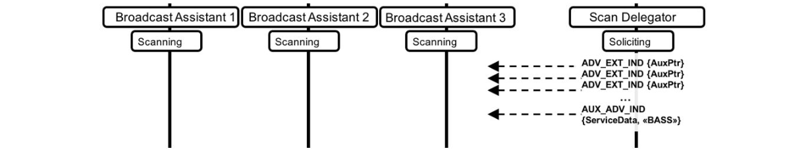

**Figure 6.9: Scan Delegator soliciting for Broadcast Assistants**

The Broadcast Assistant may determine whether a Broadcast Sink collocated with the Scan Delegator is capable of decoding a broadcast Audio Stream transported by a BIS by performing the procedure in Section 6.5.1 or by receiving notifications of Sink PAC characteristics exposed by the Broadcast Sink.
The Broadcast Assistant may determine whether a Broadcast Sink collocated with the Scan Delegator is capable of rendering a broadcast Audio Stream to a specified location by performing the procedure in Section 6.5.1 or by receiving notifications of the Sink Audio Locations characteristic and comparing the value to the Audio_Channel_Allocation (see Section 4.3.3) LTV structure, if present, in the BASE transmitted by the Broadcast Source.
The example in Figure 6.10 shows a Broadcast Assistant determining the audio capabilities of the Broadcast Sink collocated with the Scan Delegator from the example in Figure 6.9. Note that the PDUs exchanged over the air interface have been condensed in the example in Figure 6.10 to provide a summary of procedures and their outcomes.

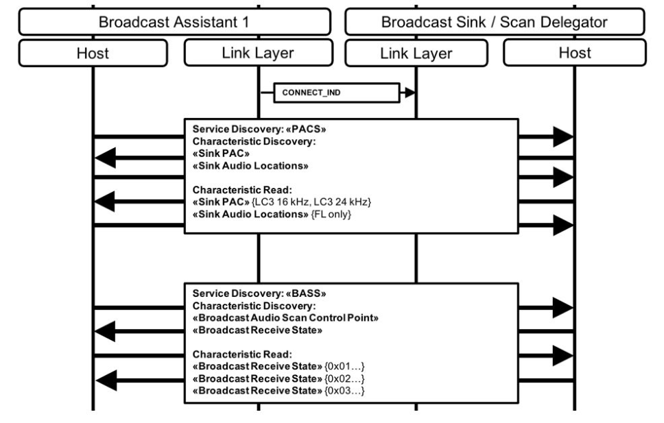

**Figure 6.10: Broadcast Assistant discovers Broadcast Sink audio capabilities**

#### 6.5.3 Remote broadcast scanning

The Broadcast Assistant may initiate the Remote Scan Started operation to inform the Scan Delegator that the Broadcast Assistant is scanning for broadcast Audio Streams on the Scan Delegator’s behalf.
The Broadcast Assistant may initiate the Remote Scan Stopped operation to inform the Scan Delegator that the Broadcast Assistant is not scanning for broadcast Audio Streams on the Scan Delegator’s behalf.
The example in Figure 6.11 shows the Broadcast Assistant from the example in Figure 6.10, informing the Scan Delegator that the Broadcast Assistant is scanning for broadcast Audio Streams on the Scan Delegator’s behalf. The Scan Delegator might choose to adjust its own scanning behavior when it is aware a Broadcast Assistant is scanning on its behalf, or it might continue to scan on its own if it had been scanning; the behavior is left to the implementation.

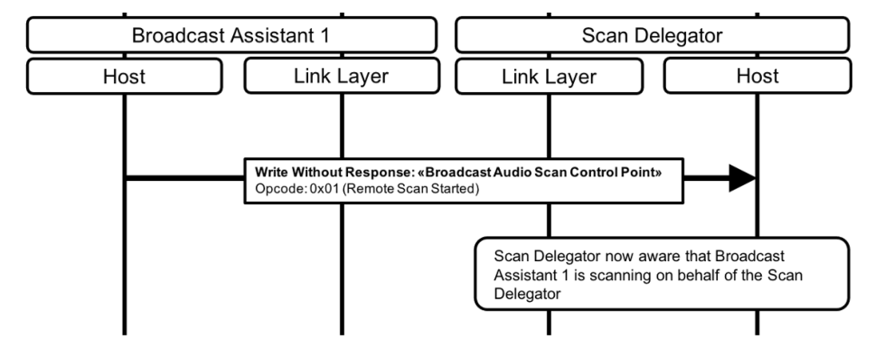

**Figure 6.11: Broadcast Assistant is remote scanning, informs Scan Delegator**

The example in Figure 6.12 shows the Broadcast Assistant from the example in Figure 6.11 discovering two separate Broadcast Sources from different devices. The Broadcast Assistant in this example discovers the EA first, then the PA, including the BASE that contains Metadata. The Metadata from one of the Broadcast Sources contains the Streaming_Audio_Contexts LTV structure with the bit for Media set to a value of 0b1.

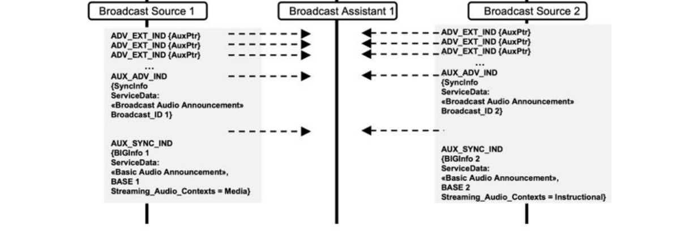

**Figure 6.12: Broadcast Assistant discovers different Broadcast Sources during Remote Scanning**

#### 6.5.4 Adding broadcast sources

The Broadcast Assistant may initiate the Add Source operation.
The Broadcast Assistant should determine the Scan Delegator’s current list of known sources by reading or being notified of all Broadcast Receive State characteristic values exposed by the Scan Delegator.
The Broadcast Assistant shall not initiate the Add Source operation if the operation would result in duplicate values for the combined Source_Address_Type, Source_Adv_SID, and Broadcast_ID fields of any Broadcast Receive State characteristic exposed by the Scan Delegator.
The Broadcast Assistant should not initiate the Add Source operation if the Broadcast Assistant has not determined that the Broadcast Sink collocated with Scan Delegator is capable of decoding at least one broadcast Audio Stream transmitted by the Broadcast Source.
The Broadcast Assistant shall write values for the Advertising_Address_Type, Advertiser_Address, Advertising_SID, Broadcast_ID, PA_Sync, PA_Interval, and Num_Subgroups parameters when initiating the Add Source operation. If the Broadcast Assistant writes a nonzero value for the Num_Subgroups parameter when initiating the Add Source operation, the Broadcast Assistant shall also write values for the BIS_Sync[i], Metadata_Length[i], and Metadata[i] parameters for each subgroup.
When writing the Metadata_Length[i] and Metadata[i] parameter values, the Broadcast Assistant determines which Metadata to include when initiating the Add Source operation.
The arrayed parameters in the Add Source operation represent the subgroups in the BASE that describes the BIG as defined in Section 3.7.2.2.
The Advertising_Address_Type parameter, Advertiser_Address parameter, and Advertising_SID parameter are defined in Volume 4, Part E, Section 7.8.67 in [1].
If the Broadcast Assistant is collocated with the Broadcast Source:
• If the AdvA field in the ADV_EXT_IND PDUs transmitted by the Broadcast Source contains an RPA, the Broadcast Assistant should write the Advertiser_Address parameter with the RPA transmitted by the Broadcast Source when initiating the Add Source operation.
If the Broadcast Assistant is not collocated with the Broadcast Source:
• If the Broadcast Assistant receives an LE_Extended_Advertising_Report_Event, as defined in Volume 4, Part E, Section 7.7.65.13 in [1], from its Bluetooth Controller with Address_Type = 0x02 or 0x03, the Broadcast Assistant should either use the LE_Read_Peer_RPA command defined in Volume 4, Part E, Section 7.8.42 in [1] or some other method to retrieve an RPA for the Broadcast Source.
- If the Broadcast Assistant retrieves an RPA for the Broadcast Source, the Broadcast Assistant should write the Advertiser_Address parameter with the retrieved RPA when initiating the Add Source operation.
- If the Broadcast Assistant does not retrieve an RPA for the Broadcast Source, the Broadcast Assistant should write an Advertiser_Address of all zeros.
• If the Broadcast Assistant does not receive an LE_Extended_Advertising_Report_Event with Address_Type = 0x02 or 0x03, the Broadcast Assistant shall write the Advertising_Address parameter with the value of the AdvA field in the ADV_EXT_IND PDUs transmitted by the Broadcast Source when initiating the Add Source operation.
The Broadcast Assistant shall not write a value of 0b1 to any BIS_Sync parameter BIS_index value for more than one subgroup except if the Broadcast Assistant writes a value of 0xFFFFFFFF (no preference) to the BIS_Sync parameter for each of those subgroups.
If the Broadcast Assistant writes a value of 0x01 (Synchronize to PA – PAST available) for the PA_Sync parameter when initiating the Add Source operation, the Broadcast Assistant shall follow the procedure in Section 6.5.6. The Broadcast Assistant shall only write a value of 0x01 for the PA_Sync parameter if the Broadcast Assistant supports the PAST procedure defined in Volume 3, Part C, Section 9.5.4 in [1].
If the Broadcast Assistant writes a value of 0x02 (Synchronize to PA – PAST not available) for the PA_Sync parameter when initiating the Add Source operation, the Broadcast Assistant may follow the procedure in Section 6.5.6.
The example in Figure 6.13 shows the Broadcast Assistant initiating the Add Source operation with the Scan Delegator. The Broadcast Assistant writes information for the Broadcast Source from the example in Figure 6.12 that is transmitting audio for the Media use case. The Broadcast Assistant requests the Scan Delegator to synchronize to the PA transmitted by the Broadcast Source and then to synchronize to BIS_index 0x01 transmitted by the Broadcast Source.

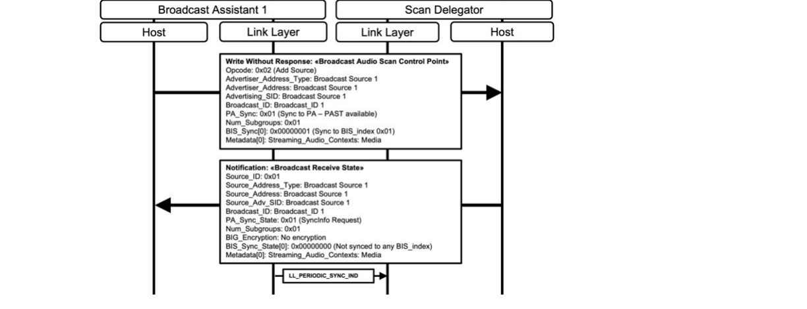

**Figure 6.13: Broadcast Assistant initiates Add Source operation**

The BIS_Sync parameter may be written with 0x00000000 or 0xFFFFFFFF at any time, with any other nonzero value prohibited unless the PA_Sync parameter = 0x01 or 0x02 when initiating the Add Source operation.

#### 6.5.5 Modifying broadcast sources

The Broadcast Assistant may initiate the Modify Source operation.
The Broadcast Assistant shall write values for the Source_ID, PA_Sync, PA_Interval, and Num_Subgroups parameters when initiating the Modify Source operation. If the Broadcast Assistant writes a nonzero value for the Num_Subgroups parameter when initiating the Modify Source operation, the Broadcast Assistant shall write values for the BIS_Sync[i], Metadata_Length[i], and Metadata_Length[i] parameters for each subgroup.
When writing the Metadata_Length[i] and Metadata[i] parameter values, the Broadcast Assistant determines which Metadata to include when initiating the Modify Source operation.
The arrayed parameters in the Modify Source operation represent the subgroups in the BASE that describes the BIG as defined in Section 3.7.2.2.
The Broadcast Assistant shall not write a value of 0b1 to any BIS_Sync parameter BIS_index value for more than one subgroup except if the Broadcast Assistant writes a value of 0xFFFFFFFF (no preference) to the BIS_Sync parameter for each of those subgroups.
The Broadcast Assistant should not request the Scan Delegator to synchronize to a BIS if the Broadcast Assistant has not determined that the Broadcast Sink collocated with the Scan Delegator is capable of decoding the broadcast Audio Stream transported by the BIS.
If the Broadcast Assistant writes a value of 0x01 (Synchronize to PA – PAST available) to the PA_Sync field when initiating the Modify Source operation, the Broadcast Assistant shall follow the procedure in Section 6.5.6 if the Broadcast Assistant has not already followed the procedure in Section 6.5.6. The Broadcast Assistant shall only write a value of 0x01 to the PA_Sync field if the Broadcast Assistant supports the PAST procedure defined in Volume 3, Part C, Section 9.5.4 in [1].
If the Broadcast Assistant writes a value of 0x02 (Synchronize to PA – PAST not available) to the PA_Sync field when initiating the Modify Source operation, the Broadcast Assistant may follow the procedure in Section 6.5.6.

#### 6.5.6 SyncInfo transfers (scan offloading)

Scan Offloading is performed by a Broadcast Assistant by using the PAST procedure defined in Volume 3, Part C, Section 9.5.4 in [1] to transfer the SyncInfo data that is then used by a Broadcast Sink collocated with the Scan Delegator to synchronize to the PA that is associated with a BIG.
The Broadcast Assistant may determine that the Scan Delegator is requesting a transfer of SyncInfo data by receiving a notification of the Broadcast Receive State characteristic value or by reading the Broadcast Receive State characteristic value that contains a value of 0x01 (SyncInfo Request) in the PA_Sync_State field.
The Broadcast Assistant shall not transfer SyncInfo data to the Scan Delegator until the Broadcast Assistant has determined that the Scan Delegator has exposed a value of 0x01 (SyncInfo Request) in the PA_Sync_State field of the Broadcast Receive State characteristic.
If the Broadcast Assistant has requested the Scan Delegator to synchronize to a PA by writing a value of 0x01 (Synchronize to PA – PAST available), the Broadcast Assistant shall, upon determining that the Scan Delegator is requesting a transfer of SyncInfo data, transfer SyncInfo data to the Scan Delegator using the PAST procedure. The PAST procedure is complete when the Broadcast Assistant has sent an LL_PERIODIC_SYNC_IND PDU to the Scan Delegator.
If the Broadcast Assistant has requested the Scan Delegator to synchronize to a PA by writing a value of 0x02 (Synchronize to PA – PAST not available), and if the Broadcast Assistant supports the PAST procedure, the Broadcast Assistant may, upon determining that the Scan Delegator is requesting a transfer of SyncInfo data, transfer SyncInfo data to the Scan Delegator using the PAST procedure. The PAST procedure is complete when the Broadcast Assistant has sent an LL_PERIODIC_SYNC_IND PDU to the Scan Delegator.
If the Broadcast Assistant has not requested the Scan Delegator to synchronize to a PA, and if the Broadcast Assistant supports the PAST procedure, the Broadcast Assistant may, upon determining that the Scan Delegator is requesting a transfer of SyncInfo data, transfer SyncInfo data to the Scan Delegator using the PAST procedure. The PAST procedure is complete when the Broadcast Assistant has sent an LL_PERIODIC_SYNC_IND PDU to the Scan Delegator.
When initiating the PAST procedure, the default Broadcast Assistant behavior shall be to write an LL_PERIODIC_SYNC_IND PDU AdvA parameter value that matches the AdvA field of the ADV_EXT_IND PDUs transmitted by the Broadcast Source for the advertising set identified by the Broadcast Receive State characteristic used to request a transfer of SyncInfo data. The Broadcast Assistant shall only write an LL_PERIODIC_SYNC_IND PDU AdvA parameter value that does not match the ADV_EXT_IND PDU AdvA field, or that does not match the Source_Address field for that Broadcast Receive State characteristic if:
• The Broadcast Assistant is aware the AdvA parameter value in the ADV_EXT_IND PDUs for that advertising set has been changed by the Broadcast Source, and/or:
• The AdvA value the Broadcast Assistant wishes to use in the LL_PERIODIC_SYNC_IND PDU is derived from the same IRK used to generate both the Resolvable Private Address corresponding to the AdvA parameter value of the ADV_EXT_IND PDU transmitted by the Broadcast Source and the Resolvable Private Address corresponding to the Source_Address field of the Broadcast Receive State characteristic.
The Broadcast Source should follow the device address recommendations in Section 6.1.3 when transmitting an advertising set that points to a BIG.
If using HCI to initiate the PAST procedure, the Broadcast Assistant shall write the 2-octet Service_Data parameter value with the applicable value defined in Table 6.7 when using the LE Periodic Advertising Sync Transfer command as defined in Volume 4, Part E, Section 7.8.89 in [1].
When initiating the PAST procedure, the Broadcast Assistant shall write the 2-octet ID field of the LL_PERIODIC_SYNC_IND PDU CtrData field with the applicable value defined in Table 6.7.

| Octet 0 | Octet 1 |
| --- | --- |
| Bit 0: AdvA in PAST matches AdvA in ADV EXT IND _ _ 0b0 = Yes, 0b1 = No/Don’t know Bit 1: AdvA in PAST matches Source Address _ 0b0 = Yes, 0b1 = No/Don’t know All other values: RFU | Source ID _ |

Table 6.7: Broadcast Assistant Service_Data and ID requirements when initiating the PAST procedure
The example in Figure 6.14 shows the Scan Delegator requesting a transfer of SyncInfo data from the Broadcast Assistant that initiated the Add Source operation in the example in Figure 6.13. The Scan Delegator notifies the Broadcast Receive State characteristic to the Broadcast Assistant with a value of 0x01 (SyncInfo Request) for the PA_Sync_State field. The Broadcast Assistant then performs Scan Offloading by initiating the PAST procedure to transfer the SyncInfo data that the Broadcast Assistant had previously discovered.

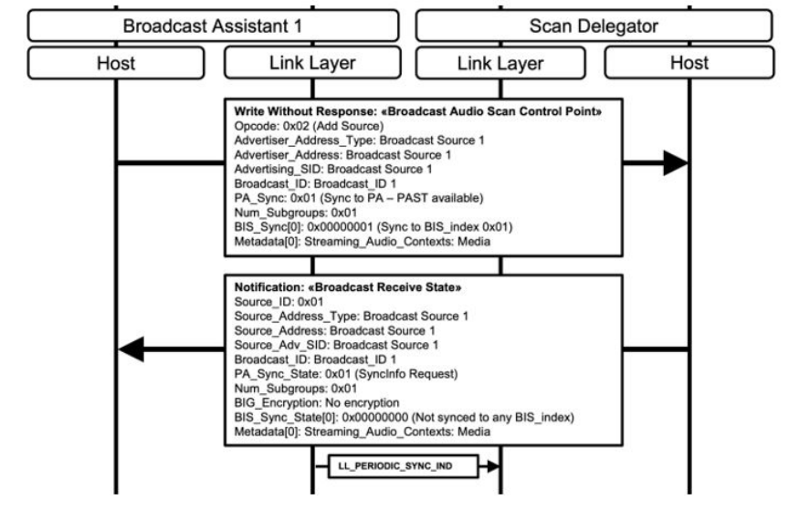

**Figure 6.14: Broadcast Assistant receives SyncInfo request, then performs Scan Offloading**

#### 6.5.7 Setting Broadcast_Codes

The Broadcast Assistant may determine that the Scan Delegator requires a Broadcast_Code to decrypt a broadcast Audio Stream by receiving a notification of the Broadcast Receive State characteristic value or by reading the Broadcast Receive State characteristic value that contains a value of 0x01 (Broadcast_Code required) in the BIG_Encryption field, or by other means.
The Broadcast Assistant may determine that the Scan Delegator has received an incorrect Broadcast_Code by receiving a notification of the Broadcast Receive State characteristic value or by reading the Broadcast Receive State characteristic value that contains a value of 0x03 (Bad_Code) in the BIG_Encryption field and the 16-octet value that the Scan Delegator has detected is not the correct Broadcast_Code.
The example in Figure 6.15 shows the Scan Delegator notifying the Broadcast Receive State characteristic to the Broadcast Assistant after receiving SyncInfo data from the Broadcast Assistant in the example in Figure 6.14 (some messages from the example in Figure 6.14 have been included in light grey text to aid understanding). The Broadcast Sink collocated with the Scan Delegator has synchronized to the PA transmitted by the Broadcast Source and determined (by the length of the BIGInfo field) that the BIG is encrypted. The Broadcast Receive State characteristic notification includes a value of 0x01 (Broadcast_Code Required) for the BIG_Encryption field, which allows the Broadcast Assistant to determine that the Broadcast Sink collocated with the Scan Delegator requires a Broadcast_Code to decrypt the BIG.

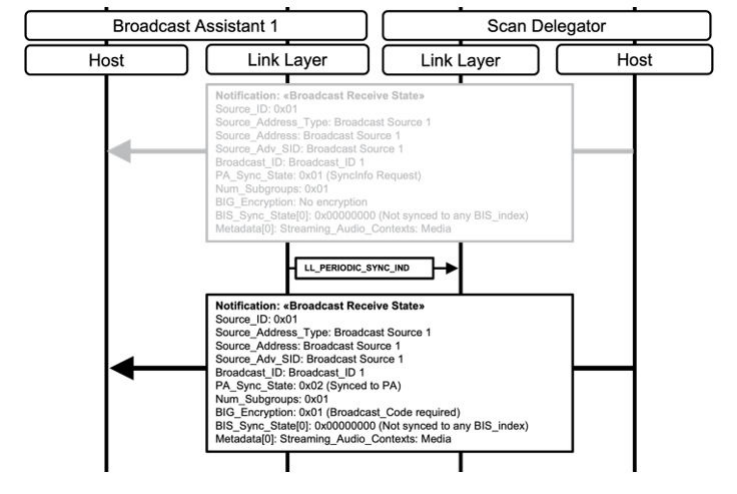

**Figure 6.15: Scan Delegator is synced to PA, sends Broadcast_Code request to Broadcast Assistant**

If the Broadcast Assistant has determined that the Scan Delegator requires a Broadcast_Code or that the Scan Delegator has detected an incorrect Broadcast_Code, the Broadcast Assistant may initiate the Set Broadcast_Code operation to provide the Scan Delegator with the Broadcast_Code necessary to decrypt the broadcast Audio Stream.
If the Broadcast Assistant implements a collocated Scan Delegator, it is possible to request, as the Scan Delegator, a Broadcast_Code from a separate Broadcast Assistant, and then to provide, as the Broadcast Assistant, any Broadcast_Code received to a separate Scan Delegator.
The example in Figure 6.16 shows the Broadcast Assistant from the example in Figure 6.15, using a collocated Scan Delegator to retrieve a Broadcast_Code from the Broadcast Source that the Broadcast Assistant had previously discovered (some messages from the example in Figure 6.15 have been included in light grey text to aid understanding). The Broadcast Source implements a collocated Broadcast Assistant. The Broadcast Assistant sends the Broadcast_Code to the Scan Delegator that is collocated with the Broadcast Assistant from the example in Figure 6.15. The Broadcast Assistant then sends the Broadcast_Code to the Scan Delegator from the example in Figure 6.15.

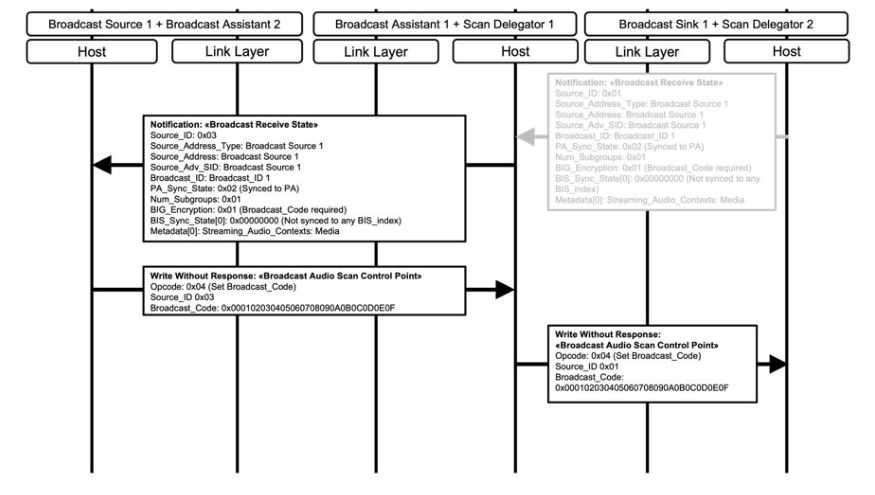

**Figure 6.16: Broadcast Assistant 1 with collocated Scan Delegator 1 retrieves Broadcast_Code from Broadcast Assistant 2 with collocated Broadcast Source 1 and sends Broadcast_Code to Scan Delegator 2 collocated with Broadcast Sink**

#### 6.5.8 Removing sources

The Broadcast Assistant shall initiate the Remove Source operation only if the Broadcast Assistant has determined that the Scan Delegator collocated with the Broadcast Sink is not synchronized to a PA and/or a BIS, as defined by the values of the PA_Sync_State field and/or the BIS_Sync_State[i] field for the Broadcast Receive State characteristic, which contains the Source_ID that the Broadcast Assistant intends to use in the Remove Source operation.

### 6.6 Broadcast Audio Stream synchronization

The Broadcast Sink may use a collocated Scan Delegator to receive SyncInfo data from a Broadcast Assistant by using the PAST procedure defined in Section 6.5.6. The PA transports data (BIGInfo) that enables synchronization to a broadcast Audio Stream. Alternatively, the Broadcast Sink may follow the procedure defined in Section 6.4 to synchronize to a PA and receive the BIGInfo data.
The Broadcast Sink or Scan Delegator determines whether the associated broadcast Audio Stream is currently available for synchronization by detecting the presence or absence of the BIGInfo field in the ACAD field of the Extended Header field of periodic advertising AUX_SYNC_IND PDUs.
The Broadcast Sink or Scan Delegator determines the configuration of the codec and associated information by reading the BASE information transported in the AdvData field of periodic advertising AUX_SYNC_IND and/or AUX_CHAIN_IND PDUs.
If the broadcast Audio Stream is available, the Broadcast Sink may use the Broadcast Isochronous Synchronization Establishment procedure defined in Volume 3, Part C, Section 9.6.3 in [1] to synchronize to the broadcast Audio Stream.
If the broadcast Audio Stream is not available, the Broadcast Sink or Scan Delegator may choose to remain synchronized to the PA in case the broadcast Audio Stream becomes available at a later time.
Figure 6.17 shows an example of a Broadcast Sink synchronizing to a broadcast Audio Stream.

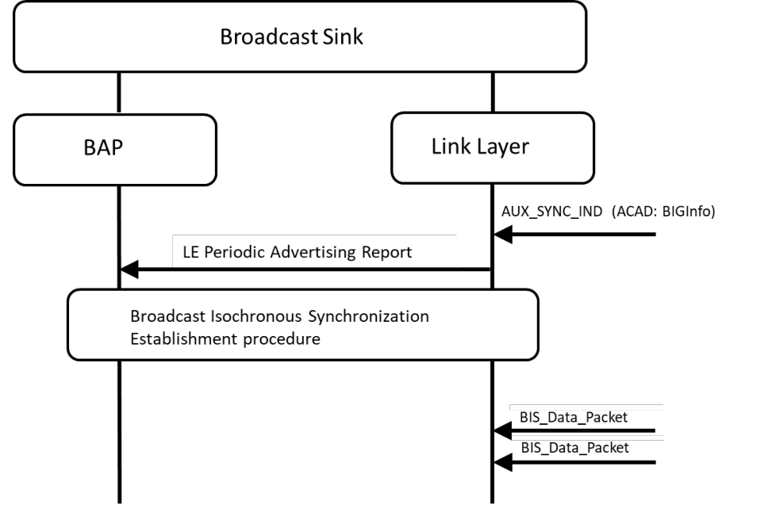

**Figure 6.17: Broadcast Audio Stream synchronization**

## 7 Presentation delay and total system delay

This section describes how implementations can use the Presentation_Delay parameter and its contribution towards the total system latency in devices implementing an applicable BAP role.

### 7.1 Presentation_Delay

Presentation_Delay is designed to assist the synchronization of audio data where more than one device is transmitting audio data and/or when more than one device is receiving audio data.
In unicast applications, audio data can be transferred in both directions. The Unicast Client’s Bluetooth Controller sets a separate SDU Synchronization Reference (defined in Volume 6, Part G, Section 3.2 in [1]) for each Unicast Server in the Audio Source role and/or each Unicast Server in the Audio Sink role.
The Unicast Client sets the same Presentation_Delay parameter value for all ASEs of the same direction (all Sink ASEs or all Source ASEs) in each CIG, as described in Section 7.1.3.
In broadcast applications, to synchronize the presentation of multiple BISs in a BIG, the Broadcast Source sets the Presentation_Delay parameter value in the BASE (see Section 6.3) to a value that is expected to be within the range of capabilities of all Broadcast Sinks expected to synchronize to any BIS in that BIG.
Presentation_Delay is applied only to the Unicast Server and/or to the Broadcast Sink.
The value of the Presentation_Delay parameter includes any implementation-specific delays in the Unicast Server and/or Broadcast Sink, such as processing time for internal transports, codec processing, ADC/DAC delays, application-specific audio processing, etc. A Unicast Server that implements its codec within its Bluetooth Controller shall ensure that the values exposed for the Presentation_Delay_Min and Presentation_Delay_Max fields accommodate the values of the Min_Controller_Delay and Max_Controller_Delay parameters as defined in Volume 4, Part E, Section 7.4.11 in [1].
Presentation refers to the time at which the audio signal passes through an electroacoustic transducer to or from the user, or the time at which the audio signal passes through an interface to another system external to the Bluetooth system on a device.
As some aspects of Presentation_Delay are frequency dependent, the Presentation_Delay parameter value is determined using a frequency of 1000 Hz.

#### 7.1.1 Presentation_Delay for audio data reception by a Unicast Server and/or Broadcast Sink

For reception of a frame of audio data by a Unicast Server in the Audio Sink role or by a Broadcast Sink, the Presentation_Delay parameter value is the time period between the SDU Synchronization Reference and the start of presentation of that frame of audio data, as shown in the example in Figure 7.1.

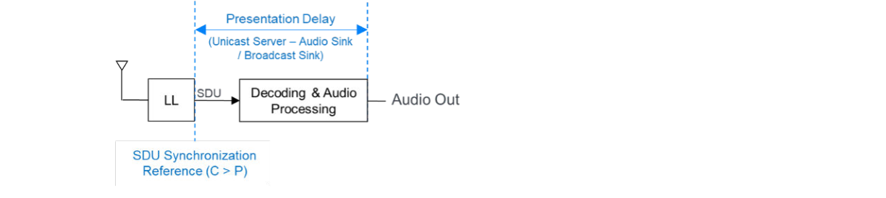

**Figure 7.1: Presentation_Delay from the perspective of a Unicast Server in the Audio Sink role or the Broadcast Sink**

#### 7.1.2 Presentation_Delay for audio data transmission by a Unicast Server

For transmission of a frame of audio data by a Unicast Server in the Audio Source Role, the Presentation_Delay parameter value defines the length of period between the start of acquisition of a frame of audio data and the SDU Synchronization Reference as shown in the example in Figure 7.2.

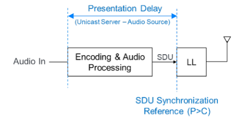

**Figure 7.2: Presentation_Delay from the perspective of a Unicast Server in the Audio Source role**

#### 7.1.3 Selection of the Presentation_Delay_Min and Presentation_Delay_Max parameter values

A Unicast Server exposes a Presentation_Delay_Min value and a Presentation_Delay_Max value in the Additional_ASE_Parameters field for an ASE when that ASE is in the Codec Configured state (see Table 4.3 in [4]). The Presentation_Delay_Min and Presentation_Delay field values exposed by a Unicast Server for a Sink ASE are independent of any Presentation_Delay_Min and Presentation_Delay_Max field values exposed by that Unicast Server for a Source ASE.
When the Unicast Client has determined the supported Presentation_Delay_Min and Presentation_Delay_Max field values respectively exposed by a group of one or more Unicast Servers, the Unicast Client shall set a single Presentation_Delay parameter value for all ASEs where the Unicast Server is in the Audio Sink role (all Sink ASEs), and shall set a single Presentation_Delay parameter value for all ASEs where the Unicast Server in the Audio Source role (all Source ASEs) when performing the QoS configuration procedure defined in Section 5.6.2.
For all ASEs where a Unicast Server is in the Audio Sink role (all Sink ASEs), and for all ASEs where a Unicast Server is in the Audio Source role (all Source ASEs), the Presentation_Delay parameter values requested by the Unicast Client with each Unicast Server shall be:
• No lower than the greatest value of Presentation_Delay_Min that the Unicast Servers have respectively exposed in the Codec Configured state for that ASE.
• No greater than the lowest value of Presentation_Delay_Max that the Unicast Servers have respectively exposed in the Codec Configured state for that ASE.

### 7.2 Total system delay

The total system delay is the sum of three elements:
• An implementation-specific audio processing time at the Unicast Client or the Broadcast Source.
• A Transport_Latency between the device transmitting the audio data and the device receiving the audio data.
• A Presentation_Delay at the Unicast Server or the Broadcast Sink.
The implementation-specific audio processing time at the Unicast Client or Broadcast Source is the time for all audio processing, which includes the processing time for internal transport, codec processing, ADC/ DAC delays, application specific audio processing, etc.
The Transport_Latency is the actual latency of transmitting payloads between devices, as defined in Volume 6, Part G, Section 3.2 in [1].
Figure 7.3 shows an example of the total system delay for a pair of synchronized unicast Audio Streams transmitted from a Unicast Client in the Audio Source role to two Unicast Servers in the Audio Sink role.

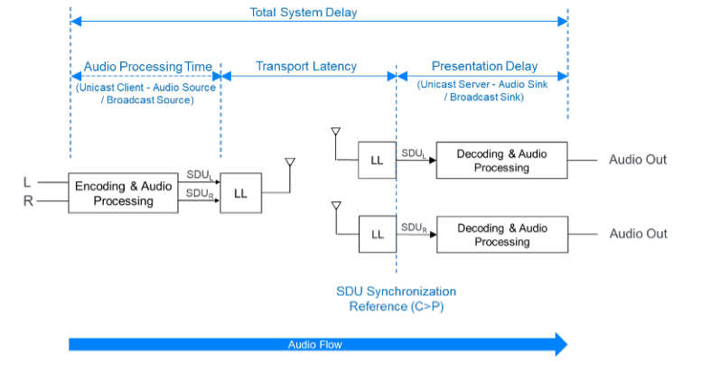

**Figure 7.3: Example of a Unicast Client transmitting one unicast Audio Stream to each one of two Unicast Servers in the Audio Sink role; in this example, the boxes marked as LL include the ISOAL layer**

Figure 7.4 shows an example of the total system delay for a pair of synchronized unicast Audio Streams transmitted from two Unicast Servers in the Audio Source role to a Unicast Client in the Audio Sink role.

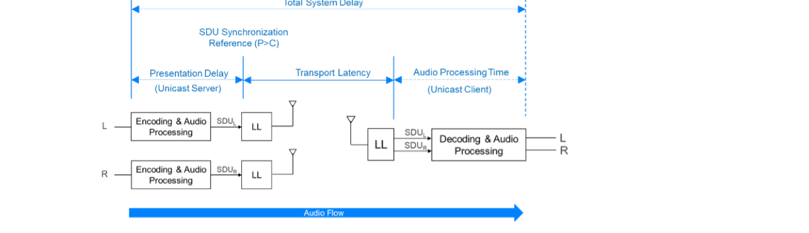

**Figure 7.4: Example of two Unicast Servers in the Audio Source role transmitting synchronized Audio Streams to a Unicast Client in the Audio Sink role; in this example, the boxes marked as LL include the ISOAL layer**

#### 7.2.1 Selection of the Max_Transport_Latency parameter value

A Unicast Server exposes a Max_Transport_Latency value in the Additional_ASE_Parameters field for an ASE when that ASE is in the Codec Configured state (see Table 4.3 in [4]). The Max_Transport_Latency value exposed by a Unicast Server for a Sink ASE is independent of any Max_Transport_Latency value exposed by that Unicast Server for a Source ASE.
When the Unicast Client has determined the Max_Transport_Latency values respectively exposed by a group of one or more Unicast Servers, the Unicast Client shall set a single Max_Transport_Latency parameter value for all ASEs where the Unicast Server is in the Audio Sink role (all Sink ASEs), and shall set a single Max_Transport_Latency parameter value for all ASEs where the Unicast Server in the Audio Source role (all Source ASEs) when performing the QoS configuration procedure defined in Section 5.6.2.
For all ASEs where a Unicast Server is in the Audio Sink role (all Sink ASEs), the Max_Transport_Latency parameter value requested by the Unicast Client with each Unicast Server shall be no greater than the lowest value of Max_Transport_Latency that the Unicast Servers have respectively exposed in the Codec Configured state for those Sink ASEs.
For all ASEs where a Unicast Server is in the Audio Source role (all Source ASEs), the Max_Transport_Latency parameter value requested by the Unicast Client with each Unicast Server shall be no greater than the lowest value of Max_Transport_Latency that the Unicast Servers have respectively exposed in the Codec Configured state for those Source ASEs.

## 8 Generic Access Profile requirements

### 8.1 Generic Access Profile requirements for Low Energy

This section describes the device discovery and LE ACL connection establishment procedures that are used by a client and a server. These procedures are described in terms of the following roles:
• Peripheral role (defined in Volume 3, Part C, Section 2.2.2 in [1]), which maps to the Unicast Server and/or the Broadcast Sink and/or the Scan Delegator role
• Central role (defined in Volume 3, Part C, Section 2.2.2 in [1]), which maps to the Unicast Client and/or the Broadcast Assistant role

#### 8.1.1 Peripheral connection establishment

##### 8.1.1.1 Connection procedure to non-bonded devices

The connection procedure to non-bonded devices is used for device discovery and connection establishment when the Peripheral accepts a connection from a Central to which it is not bonded. The connection procedure to non-bonded devices is triggered by user interaction, for example, activating a device by inserting a battery or pushing buttons. To inform the Central that the Peripheral is available for connection establishment for audio-related scenarios, the Peripheral shall enter one of the following GAP discoverable modes:
• Limited Discoverable mode (as defined in Volume 3, Part C, Section 9.2.3 in [1])
• General Discoverable mode (as defined in Volume 3, Part C, Section 9.2.4 in [1])
The Peripheral shall transmit extended advertising PDUs and, unless otherwise defined by higher layer specifications, should include the following AD data types:
• Flags AD data type (as defined in Part A, Section 1.3 in [3])
• Service UUID AD data type (as defined in Part A, Section 1.1 in [3]) containing the ASCS [4] UUID if ASCS is supported over LE, and/or the BASS [6] UUID if BASS is supported over LE, and the PACS [5] UUID if PACS is supported over LE
If the Peripheral is in a GAP Discoverable mode over both the LE transport and the Basic Rate/Enhanced Data Rate (BR/EDR) transport (as defined in Section 8.2.1) and the Peripheral does not support Cross Transport Key Derivation (CTKD) over BR/EDR to derive an LE Long-Term Key (LTK), then the advertising set that exposes the discoverable mode over LE shall use the public Advertising Address type and shall set the value of the Advertising Address to the BD_ADDR that is used over BR/EDR.
If the Peripheral is in a GAP Discoverable mode over both the LE transport and the BR/EDR transport (as defined in Section 8.2.1) and the Peripheral supports CTKD over BR/EDR to derive an LE LTK, then the Peripheral may use a random device address in the advertising set that exposes the discoverable mode over LE.
The Peripheral should advertise using the parameters in Table 8.1. The advertising interval values in the first row attempt a quicker connection setup. If a connection is not established within 30 seconds from the start of this procedure and the device continues to advertise, the device should change its advertising interval to the values in the second row of Table 8.1 to reduce its power consumption.

| Advertising Purpose | Parameter | Advertising Interval Value |
| --- | --- | --- |
| Quicker connection setup | Advertising Interval | 20 ms to 30 ms |
| Reduced power | Advertising Interval | 150 ms |

Table 8.1: Recommended advertising interval values
The advertising interval and advertising duration should be configured with consideration for user expectations of connection establishment time. The Peripheral should only request its preferred connection parameters after service discovery, bonding, and encryption setup is complete. The Peripheral can request a change in the connection parameters to parameters that better suit the user scenario (see Table 8.3 and Table 8.4) by using the Connection Parameter Update procedure defined in Volume 3, Part C, Section 9.3.9 in [1].
If the Peripheral enters the Limited Discoverable mode, and a connection is not established within 180 seconds of the Peripheral entering the Limited Discoverable mode, the Peripheral shall exit the Limited Discoverable mode, as required by the TGAP(lim_adv_timeout) value in Volume 3, Part C, Appendix A, Table A.1 in [1].

##### 8.1.1.2 Connection procedure to bonded devices

The connection procedure to bonded devices is used by a Peripheral device in the Connectable mode only if the Peripheral has previously bonded with the Central device when using the connection procedure to non-bonded devices defined in Section 8.1.1.1.
When available for a connection to a bonded device, a Peripheral shall enter one of the following GAP connectable modes:
• Directed Connectable mode (as defined in Volume 3, Part C, Section 9.3.3 in [1])
• Undirected Connectable mode (as defined in Volume 3, Part C, Section 9.3.4 in [1])
The Peripheral should use the advertising filter policy that was configured when bonded using the connection procedure to non-bonded devices in Section 8.1.1.1, unless the Peripheral is in the Directed Connectable mode.
The Peripheral should use the advertising interval values shown in Table 8.1.
The advertising interval and advertising duration should be configured with consideration for user expectations of connection establishment time (see Table 8.1).
The Peripheral shall accept any valid values for connection interval and connection latency set by the Central until service discovery and encryption setup is complete. After the connection setup is complete, the Peripheral may request a change to the preferred connection parameters to parameters that better suit the user scenario (see Table 8.3 and Table 8.4) by using the GAP Connection Parameter Update procedure as defined in Volume 3, Part C, Section 9.3.9 in [1].
If a connection is not established within a time limit defined by the Peripheral, the Peripheral may exit the GAP connectable mode.

##### 8.1.1.3 Link loss reconnection procedure

When a connection is terminated because of link loss, a Peripheral should attempt to reconnect to the Central by using the procedures described in Section 8.1.1.1 or Section 8.1.1.2.

#### 8.1.2 Central connection establishment

##### 8.1.2.1 Device discovery

To discover one or more Peripherals, the Central shall use either of the following GAP discovery procedures:
• Limited Discovery procedure (as defined in Volume 3, Part C, Section 9.2.5 in [1])
• General Discovery procedure (as defined in Volume 3, Part C, Section 9.2.6 in [1])

##### 8.1.2.2 Connection procedure to non-bonded devices

The connection procedure to non-bonded devices is used for connection establishment when the Central connects to a Peripheral to which it is not bonded. For example, a conference phone (Central) may allow a user to connect a smartphone (Peripheral) as a remote microphone. This procedure can be initiated by user interaction.
A Central may use one of the following GAP connection establishment procedures based on its connectivity requirements:
• Auto Connection Establishment procedure (as defined in Volume 3 Part C, Section 9.3.5 in [1]). The Central may use the Auto Connection Establishment procedure when it requires a connection to one or more Peripheral devices. The Auto Connection Establishment procedure will automatically connect to a Peripheral in the Filter Accept List.
• General Connection Establishment procedure (as defined in Volume 3, Part C, Section 9.3.6 in [1]). The Central may use the General Connection Establishment procedure when it requires a connection to one or more Peripheral devices. The General Connection Establishment procedure allows a Central to connect to a Peripheral discovered during a scan without using the Filter Accept List.
• Selective Connection Establishment procedure (as defined in Volume 3, Part C, Section 9.3.7 in [1]). The Central may use the Selective Connection Establishment procedure when it requires a connection to one or more Peripheral devices. The Selective Connection Establishment procedure allows a Central to connect to a Peripheral that is discovered during a scan while using the Filter Accept List.
• Direct Connection Establishment procedure (as defined in Volume 3, Part C, Section 9.3.8 in [1]). The Central may use the Direct Connection Establishment procedure when it requires a connection to a single Peripheral.
To enable the Central’s Bluetooth Host to filter Peripheral devices based on the Announcement Type (as defined in Section 3.5.3), the Central should use the General Connection Establishment procedure to connect to the Peripheral.
A Central should use the scan interval and scan window values shown in Table 8.2. For the first 30 seconds after scanning starts, the Central should use the first scan window/scan interval pair to attempt a quicker connection setup. However, if a connection is not established within the first 30 seconds, the Central should switch to one of the other scan window/scan interval options, as defined in Table 8.2, to reduce power consumption. A Central with fewer power consumption restrictions might prefer to continuously scan for devices.

| Scanning Purpose | Parameter | Scan Interval Value |
| --- | --- | --- |
| Quicker connection setup | Scan Interval | 30 ms to 60 ms |
|  | Scan Window | 30 ms |
| Reduced power | Scan Interval | 1.28 s |
|  | Scan Window | 11.25 ms |

Table 8.2: Recommended scan interval and scan window values
A scan interval of 60 ms should be used when the Central is supporting other operations to provide a 50% scan duty cycle instead of a 100% scan duty cycle.

##### 8.1.2.3 Connection procedure to bonded devices

The connection procedure to bonded devices is used after the Central has bonded with the Peripheral by using the connection procedure to non-bonded devices in Section 8.1.2.2 and a connection has been initiated.
A Central may use one of the following GAP connection establishment procedures based on its connectivity requirements:
• Auto Connection Establishment procedure (see Volume 3, Part C, Section 9.3.5 in [1]). The Central may use the Auto Connection Establishment procedure when it requires a connection to one or more Peripheral devices. This procedure will automatically connect to a Peripheral in the Filter Accept List.
• General Connection Establishment procedure (see Volume 3, Part C, Section 9.3.6 in [1]). The Central may use the General Connection Establishment procedure when it requires a connection to one or more Peripheral devices. The General Connection Establishment procedure allows a Central to connect to a Peripheral discovered during a scan without using the Filter Accept List.
• Selective Connection Establishment procedure (see Volume 3, Part C, Section 9.3.7 in [1]). The Central may use the Selective Connection Establishment procedure when it requires a connection to one or more Peripheral devices. This procedure allows a Central to connect to a Peripheral discovered during a scan while using the Filter Accept List.
• Direct Connection Establishment procedure (see Volume 3, Part C, Section 9.3.8 in [1]). The Central may use the Direct Connection Establishment procedure when it requires a connection to a single Peripheral.
To enable the Central’s Bluetooth Host to filter Peripheral devices based on the Announcement Type defined in Section 3.5.3, the Central should use the General Connection Establishment procedure to connect to the Peripheral.
The Central should use the scan interval and scan window values shown in Table 8.2. For the first 30 seconds, the Central should use the first scan window/scan interval values to attempt a short connection. However, if a connection is not established within the first 30 seconds, the Central should switch to the other scan window/scan interval options shown in Table 8.2 to reduce power consumption.
The Central should use a scan window and scan interval suitable to its connection establishment time and its power consumption restrictions. Increasing the scan window decreases the typical connection establishment time but increases the power consumption.
The scan interval and scan window should be configured with consideration for user expectations of connection establishment time.
The Central shall start encryption after each connection creation to verify the status of the bond. If encryption fails upon connection establishment (i.e., the bond no longer exists), the Central should, after user interaction, re-bond, perform service discovery (unless the Central had previously determined that the Peripheral did not have the «Service Changed» characteristic), and reconfigure the Peripheral before using any of the services referenced by this profile in case the configuration was altered or lost.

##### 8.1.2.4 Link loss reconnection procedure

When a connection is terminated because of link loss, a Central should attempt to reconnect to the Peripheral by using any of the GAP connection establishment procedures described in Section 8.1.2.2 or Section 8.1.2.3.

##### 8.1.2.5 Connection interval

To avoid the service discovery and encryption setup taking too long, the Central should use the short connection intervals defined in Table 8.3 in the connection request.

| Parameter | Value |
| --- | --- |
| Minimum Connection Interval | 7.5 ms or 10 ms |
| Maximum Connection Interval | 30 ms |

Table 8.3: Recommended short connection interval values
When a unicast Audio Stream setup is required, the connection parameters should first be updated to use the minimum and maximum connection interval values listed in Table 8.3 for as long as low latency communication using the LE ACL is required. After that, the connection interval should switch to either the relaxed connection interval values listed in Table 8.4 or to the preferred connection parameters, as decided by the Peripheral by using the GAP Connection Parameter Update procedure defined in Volume 3, Part C, Section 9.3.9 in [1].

| Parameter | Value |
| --- | --- |
| Range for relaxed Connection Interval | 50 to 70 ms |

Table 8.4: Recommended range for relaxed connection interval values

### 8.2 Generic Access Profile requirements for BR/EDR

This section describes the GAP requirements for BR/EDR/LE devices that may be used by a client and a server over the BR/EDR transport.
Requirements in this section are defined as “Mandatory” (M), “Optional” (O), “Excluded” (X), and “Conditional” (C.n). Conditional statements (C.n) are listed directly below the table in which they appear.

#### 8.2.1 Modes

Modes are defined in Volume 3, Part C, Section 4 in [1].
If the Unicast Server, the Broadcast Sink, or the Scan Delegator is a BR/EDR/LE device, the Limited Discoverable mode or the General Discoverable mode shall be supported.
If the Unicast Server, the Broadcast Sink, or the Scan Delegator is a BR/EDR/LE device and is in either the Limited Discoverable mode or the General Discoverable mode, the device shall also be in a discoverable mode over the LE transport.
Bondable mode shall be supported.
Table 8.5 shows the support requirements for GAP modes for BR/EDR/LE devices.

| Mode | Unicast Server | Unicast Client | Broadcast Sink | Scan Delegator | Broadcast Assistant |
| --- | --- | --- | --- | --- | --- |
| Limited Discoverable mode | C.1 | X | C.1 | C.1 | X |
| General Discoverable mode | C.1 | X | C.1 | C.1 | X |
| Bondable mode | M | M | M | M | M |

Table 8.5: GAP BR/EDR Mode support requirements
C.1: Mandatory to support at least one of the Limited Discoverable mode or the General Discoverable mode.

#### 8.2.2 Idle mode procedures

Idle mode procedures are defined in Volume 3, Part C, Section 6 in [1].
If the Unicast Client or the Broadcast Assistant is a BR/EDR/LE device, the General Inquiry procedure shall be supported, and the Limited Inquiry procedure may be supported.
The General Bonding procedure shall be supported.
Table 8.6 shows the support requirements for GAP Idle Mode procedures for BR/EDR/LE devices.

| Idle Mode Procedure | Unicast Server | Unicast Client | Broadcast Sink | Scan Delegator | Broadcast Assistant |
| --- | --- | --- | --- | --- | --- |
| General Inquiry | X | M | X | X | M |
| Limited Inquiry | X | O | X | X | O |
| General Bonding | M | M | M | M | M |

Table 8.6: GAP BR/EDR Idle Mode procedure support requirements

#### 8.2.3 Device discovery

BR/EDR/LE devices implementing either of the profile roles in Table 3.1 shall set the value of the Class of Device (CoD) [2] field Major Service Class bit 14 to 0b1.
If a BR/EDR/LE device implementing either of the Unicast Server, the Broadcast Sink, or the Scan Delegator roles is in a GAP Discoverable mode defined in Volume 3, Part C, Section 4 in [1] then, unless
otherwise defined by higher layer specifications, any extended inquiry response (EIR) data sent by the device should include the following EIR data type:
• Service UUID EIR data type (as defined in Part A, Section 1.1 in [3]) containing the ASCS [2] UUID if ASCS is supported over BR/EDR, and/or the BASS [6] UUID if BASS is supported over BR/EDR, and optionally the PACS [5] UUID if PACS is supported over BR/EDR

## 9 Security requirements

This section describes the security requirements for devices implementing the profile roles defined in Table 3.1.

### 9.1 Security requirements for Low Energy

This section describes the security requirements for the Low Energy transport in terms of the following GAP roles:
• Central
• Peripheral
• Broadcaster
• Observer
The security requirements for all characteristics defined in ASCS [4], PACS [5], and BASS [6] shall be Security Mode 1 Level 2, defined in Volume 3, Part C, Section 10.2.1 in [1].
Access to all characteristics defined in ASCS [4], PACS [5], and BASS [6] shall require an encryption key with at least 128 bits of entropy, derived from any of the following:
• LE Secure Connections
• BR/EDR Secure Connections; if CTKD is used
• Out-of-band (OOB) method
The Privacy feature, as defined in Volume 3, Part C, Section 10.7 in [1], should be used if the device is in the Central or Peripheral role; however devices in the Broadcaster role should follow the recommendations in Section 6.1.3.

#### 9.1.1 Peripheral security requirements for Low Energy

The Peripheral shall support bondable mode defined in Volume 3, Part C, Section 9.4.3 in [1].
The Peripheral shall support the bonding procedure defined in Volume 3, Part C, Section 9.4.4 in [1].
The Peripheral shall support LE Security Mode 1 Level 2 and may support LE Security Mode 1 Level 3 and may support LE Security Mode 1 Level 4.
If the Peripheral is a BR/EDR/LE device the Peripheral device shall support CTKD to derive a BR/EDR link key as part of the LE pairing procedure.
If the Peripheral is using the Privacy feature, the Peripheral shall distribute its Identity Address (IA) and Identity Resolving Key (IRK).

#### 9.1.2 Central security requirements for Low Energy

The Central shall support bondable mode defined in Volume 3, Part C, Section 9.4.3 in [1].
The Central shall support the bonding procedure defined in Volume 3, Part C, Section 9.4.4 in [1].
The Central shall support LE Security Mode 1 Level 2 and may support LE Security Mode 1 Level 3 and may support LE Security Mode 1 Level 4. The Central should accept the LE Security mode and Security Level combination that is requested by the Peripheral.
If the Central is a BR/EDR/LE device, the Central shall support CTKD to derive a BR/EDR link key and should use CTKD to derive a BR/EDR link key as part of the LE pairing procedure, to help avoid a poor user experience of requiring to pair a second time.
If the Central is using the Privacy feature, the Central shall distribute its IA and IRK.

#### 9.1.3 Broadcaster security requirements for Low Energy

If the Broadcaster supports the Broadcast Source role (see Table 3.1), the Broadcaster shall support LE Security Mode 3 Level 1.
If the Broadcaster supports the Broadcast Source role, and if the Broadcast Source supports the Encrypting a Broadcast Isochronous Stream feature in Table 3.4, the Broadcaster shall support LE Security Mode 3 Level 2 and may support LE Security Mode 3 Level 3.

#### 9.1.4 Observer security requirements for Low Energy

If the Observer supports the Broadcast Sink role (see Table 3.1), the Observer shall support LE Security Mode 3 Level 1 and LE Security Mode 3 Level 2 and may support LE Security Mode 3 Level 3.

### 9.2 Security requirements for BR/EDR

This section describes the security requirements for the BR/EDR transport.
The security requirements for all characteristics defined in ASCS [4], PACS [5], and BASS [6] shall be Security Mode 4 Level 2, defined in Volume 3, Part C, Section 5.2.2.8 in [1]).
Access to all characteristics defined in ASCS [4], PACS [5], and BASS [6] shall require an encryption key with at least 128 bits of entropy, derived from any of the following:
• BR/EDR Secure Connections
• LE Secure Connections, if CTKD is used
• OOB method
If a BR/EDR/LE device uses CTKD to derive an LE LTK as part of the BR/EDR pairing procedure and the device supports the Privacy feature, then the device shall distribute its IA and IRK.

## 10 Acronyms and abbreviations

| Acronym/Abbreviation | Meaning |
| --- | --- |
| ACAD | Additional Controller Advertising Data |
| AD | advertising data |
| AdvA | Advertiser address |
| ASCS | Audio Stream Control Service |
| ASE | Audio Stream Endpoint |
| ATT | Attribute Protocol |
| BAP | Basic Audio Profile |
| BASE | Broadcast Audio Source Endpoint |
| BIG | Broadcast Isochronous Group |
| BIS | Broadcast Isochronous Stream |
| BASS | Broadcast Audio Scan Service |
| BR/EDR | Basic Rate/Enhanced Data Rate |
| CIG | Connected Isochronous Group |
| CIS | Connected Isochronous Stream |
| CoD | Class of Device |
| CTKD | Cross-Transport Key Derivation |
| EA | extended advertising |
| EATT | Enhanced ATT |
| EIR | extended inquiry response |
| GAP | Generic Access Profile |
| GATT | Generic Attribute Profile |
| HCI | Host Controller Interface |
| IA | Identity Address |
| IRK | Identity Resolving Key |
| LC3 | Low Complexity Communication Codec |
| LE | Low Energy |
| LE ACL | Low Energy asynchronous connection |
| LL | Link Layer |

| Acronym/Abbreviation | Meaning |
| --- | --- |
| LTK | Long Term Key |
| LTV | length-type-value |
| OOB | out-of-band |
| PA | periodic advertising train |
| PAC | Published Audio Capability |
| PACS | Published Audio Capabilities Service |
| PAST | Periodic Advertising Sync Transfer |
| PDU | Protocol Data Unit |
| QoS | Quality of Service |
| RFU | Reserved for Future Use |
| SDU | Service Data Unit |
| UI | user interface |
| UUID | universally unique identifier |

Table 10.1: Acronyms and abbreviations

## 11 References

[1] Bluetooth Core Specification, Version 5.2 or later
[2] Bluetooth Assigned Numbers, https://www.bluetooth.com/specifications/assigned-numbers
[3] Bluetooth Core Specification Supplement, Version 11 or later
[4] Audio Stream Control Service Specification, Version 1.0 or later
[5] Published Audio Capabilities Service Specification, Version 1.0 or later
[6] Broadcast Audio Scan Service Specification, Version 1.0 or later
[7] Low Complexity Communication Codec, Version 1.0 or later
[8] Bluetooth Core Specification, Version 5.2 or later, Volume 6, Part B: Link Layer Specification
[9] Appropriate Language Mapping Tables, https://www.bluetooth.com/language-mapping/Appropriate- Language-Mapping-Table