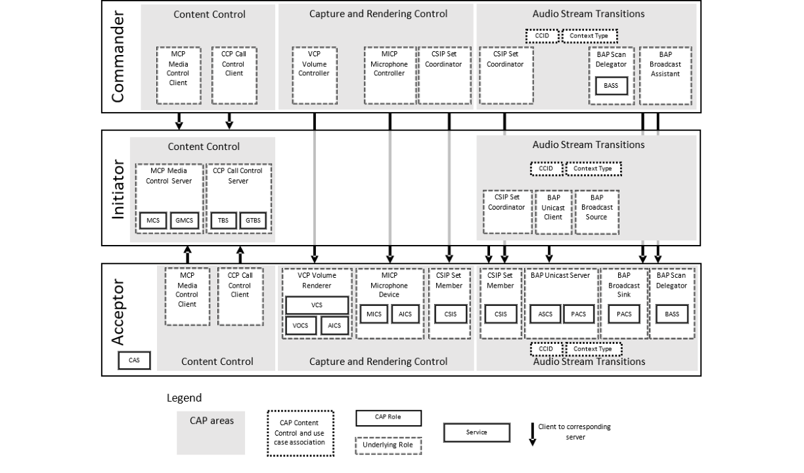

# CAP v1.0.1

> Source: PDF converted via PyMuPDF.

---

Common Audio Profile
Bluetooth® Profile Specification
▪ Version: v1.0.1
▪ Version Date: 2025-02-11
▪ Prepared By: General Audio Working Group
Abstract
Common Audio Profile (CAP) specifies procedures to start, update, and stop unicast and broadcast Audio Streams on individual or groups of devices using procedures in the Basic Audio Profile (BAP). This profile specifies procedures to control volume and device input on groups of devices using procedures in the Volume Control Profile (VCP) and the Microphone Control Profile (MICP). This profile specification also refers to the Common Audio Service (CAS).

| Version Number | Date | Comments |
| --- | --- | --- |
| v1.0 | 2022-03-22 | Adopted by the Bluetooth SIG Board of Directors. |
| v1.0.1 | 2025-02-11 | Adopted by the Bluetooth SIG Board of Directors. |

Acknowledgments

| Name | Company |
| --- | --- |
| Andrew Estrada | Sony Corporation |
| Masahiko Seki | Sony Corporation |
| Akio Tanaka | Sony Corporation |
| Himanshu Bhalla | Intel Corporation |
| Oren Haggai | Intel Corporation |
| Rasmus Abildgren | Bose Corporation |
| Daniel Sisolak | Bose Corporation |
| Tim Reilly | Bose Corporation |
| Michael Rougeux | Bose Corporation |
| Nick Hunn | GN Hearing A/S |
| Chris Church | Qualcomm Technologies International, Ltd |
| Jeff Solum | Starkey Hearing Technologies |
| Georg Dickmann | Sonova AG |
| Frank Yerrace | Microsoft Corporation |
| Asbjørn Sæbø | Nordic Semiconductor ASA |
| Scott Walsh | Plantronics Inc. |
| Bjarne Klemmensen | Demant A/S |
| Jonathan Tanner | Qualcomm Technologies International, Ltd |
| Riccardo Cavallari | WS Audiology |
| Kanji Kerai | WS Audiology |
| Sherry Smith | Broadcom |
| Siegfried Lehmann | Apple |
| Charlie Lenahan | Cloud2GND |

Use of this specification is your acknowledgement that you agree to and will comply with the following notices and disclaimers. You are advised to seek appropriate legal, engineering, and other professional advice regarding the use, interpretation, and effect of this specification.
Use of Bluetooth specifications by members of Bluetooth SIG is governed by the membership and other related agreements between Bluetooth SIG and its members, including those agreements posted on Bluetooth SIG’s website located at www.bluetooth.com. Any use of this specification by a member that is not in compliance with the applicable membership and other related agreements is prohibited and, among other things, may result in (i) termination of the applicable agreements and (ii) liability for infringement of the intellectual property rights of Bluetooth SIG and its members. This specification may provide options, because, for example, some products do not implement every portion of the specification. All content within the specification, including notes, appendices, figures, tables, message sequence charts, examples, sample data, and each option identified is intended to be within the bounds of the Scope as defined in the Bluetooth Patent/Copyright License Agreement (“PCLA”). Also, the identification of options for implementing a portion of the specification is intended to provide design flexibility without establishing, for purposes of the PCLA, that any of these options is a “technically reasonable non-infringing alternative.”
Use of this specification by anyone who is not a member of Bluetooth SIG is prohibited and is an infringement of the intellectual property rights of Bluetooth SIG and its members. The furnishing of this specification does not grant any license to any intellectual property of Bluetooth SIG or its members. THIS SPECIFICATION IS PROVIDED “AS IS” AND BLUETOOTH SIG, ITS MEMBERS AND THEIR AFFILIATES MAKE NO REPRESENTATIONS OR WARRANTIES AND DISCLAIM ALL WARRANTIES, EXPRESS OR IMPLIED, INCLUDING ANY WARRANTIES OF MERCHANTABILITY, TITLE, NON-INFRINGEMENT, FITNESS FOR ANY PARTICULAR PURPOSE, OR THAT THE CONTENT OF THIS SPECIFICATION IS FREE OF ERRORS. For the avoidance of doubt, Bluetooth SIG has not made any search or investigation as to third parties that may claim rights in or to any specifications or any intellectual property that may be required to implement any specifications and it disclaims any obligation or duty to do so.
TO THE MAXIMUM EXTENT PERMITTED BY APPLICABLE LAW, BLUETOOTH SIG, ITS MEMBERS AND THEIR AFFILIATES DISCLAIM ALL LIABILITY ARISING OUT OF OR RELATING TO USE OF THIS SPECIFICATION AND ANY INFORMATION CONTAINED IN THIS SPECIFICATION, INCLUDING LOST REVENUE, PROFITS, DATA OR PROGRAMS, OR BUSINESS INTERRUPTION, OR FOR SPECIAL, INDIRECT, CONSEQUENTIAL, INCIDENTAL OR PUNITIVE DAMAGES, HOWEVER CAUSED AND REGARDLESS OF THE THEORY OF LIABILITY, AND EVEN IF BLUETOOTH SIG, ITS MEMBERS OR THEIR AFFILIATES HAVE BEEN ADVISED OF THE POSSIBILITY OF THE DAMAGES.
Products equipped with Bluetooth wireless technology ("Bluetooth Products") and their combination, operation, use, implementation, and distribution may be subject to regulatory controls under the laws and regulations of numerous countries that regulate products that use wireless non-licensed spectrum. Examples include airline regulations, telecommunications regulations, technology transfer controls, and health and safety regulations. You are solely responsible for complying with all applicable laws and regulations and for obtaining any and all required authorizations, permits, or licenses in connection with your use of this specification and development, manufacture, and distribution of Bluetooth Products. Nothing in this specification provides any information or assistance in connection with complying with applicable laws or regulations or obtaining required authorizations, permits, or licenses.
Bluetooth SIG is not required to adopt any specification or portion thereof. If this specification is not the final version adopted by Bluetooth SIG’s Board of Directors, it may not be adopted. Any specification adopted by Bluetooth SIG’s Board of Directors may be withdrawn, replaced, or modified at any time. Bluetooth SIG reserves the right to change or alter final specifications in accordance with its membership and operating agreements.
Copyright © 2016–2025. All copyrights in the Bluetooth Specifications themselves are owned by Apple Inc., Ericsson AB, Intel Corporation, Google LLC, Lenovo (Singapore) Pte. Ltd., Microsoft Corporation, Nokia Corporation, and Toshiba Corporation. The Bluetooth word mark and logos are owned by Bluetooth SIG, Inc. Other third-party brands and names are the property of their respective owners.
Contents

## 1 Introduction

CAP specifies roles, requirements, and procedures to:
• Associate Context Type values, defined in the Bluetooth Assigned Numbers [12], with unicast and broadcast Audio Streams
• Associate Content Control service instances, as represented by Content Control Identifiers (CCIDs) as defined in the GATT Specification Supplement (GSS) [10], with unicast and broadcast Audio Streams
• Operate on one device or a group of devices for transition control of unicast and broadcast Audio Streams as well as for Capture and Render Control such as Volume Control

### 1.1 Conformance

Each capability of this specification shall be supported in the specified manner. This specification may provide options for design flexibility, because, for example, some products do not implement every portion of the specification. For each implementation option that is supported, it shall be supported as specified.

### 1.2 Profile dependencies

This profile requires:
• Basic Audio Profile (BAP) [2]
• Volume Control Profile (VCP) [4]
• Microphone Control Profile (MICP) [6]
• Coordinated Set Identification Profile (CSIP) [7]
• Media Control Profile (MCP) [13]
• Call Control Profile (CCP) [14]

### 1.3 Bluetooth Core Specification release compatibility

This specification is compatible with the Bluetooth Core Specification, Version 5.2 [3] or later.

### 1.4 Change History

This section summarizes changes at a moderate level of detail and should not be considered representative of every change made.

#### 1.4.1 Changes from v1.0 to v.1.0.1

| Section | Errata |
| --- | --- |
| 1.1: Conformance | 23780 |
| 1.3: Bluetooth Core Specification release compatibility | 26552 |
| 2.1.1: Acceptor | 23964 |
| 2.1.2: Initiator | 23964 |

| Section | Errata |
| --- | --- |
| 2.1.3: Commander | 23964 |
| 4: Acceptor role requirements | 24511 |
| 7.3: CAP procedures | 19214 |
| 7.3.1.1: Introduction | 18922 |
| 7.3.1.2.6: Setting Context Type and CCID Value Metadata | 19271 |
| 7.3.1.5: Broadcast Audio Start procedure | 25020 |
| 7.3.2.6: Change Microphone Gain Setting procedure | 24906 |
| 7.5: Single Acceptor distributed over multiple devices | 23221 |
| 7.5.1: Battery Service | 23221 |
| 8.1.1: CAP Announcement | 25591 |
| 8.1.2: Connection procedure for non-bonded devices | 18858, 24712, 25591, 26530 |
| 8.1.3: Connection procedure for bonded devices | 18858, 24712, 24713, 26530 |
| 8.1.4: Link loss reconnection procedure | 24713 |
| 8.1.5: Idle connection | 24713 |
| 8.1.7: Connectable mode | 24712, 24713 |
| 8.2.2: Connection procedures | 18935 |
| 8.2.2.1: Connection procedure for non-bonded devices when in INA mode | 18936, 18937 |
| 8.2.2.2: Connection procedure for non-bonded devices when in RAP mode | 18937, 24713 |
| 8.2.2.3: Connection procedure for bonded devices when in INAP mode | 18937 |
| 8.2.2.4: Connection procedure for bonded devices when in RAP mode | 18936, 18937 |
| 8.2.3: Link loss reconnection procedure | 24713 |
| 8.2.4: Idle Connection Establishment procedure | 24713 |
| 8.2.5: Multi-bond considerations | 24713 |
| 8.3.3: Device discovery | 18934 |
| 9.2: Security requirements for BR/EDR | 26553 |
| 11: References | 19298, 23221, 26552 |

Table 1.1: Errata incorporated in v1.0.1

### 1.5 Language

#### 1.5.1 Language conventions

The Bluetooth SIG has established the following conventions for use of the words shall, must, will, should, may, can, and note in the development of specifications:

| shall | is required to – used to define requirements. |
| --- | --- |
| must | is used to express: a natural consequence of a previously stated mandatory requirement. OR an indisputable statement of fact (one that is always true regardless of the circumstan- ces). |
| will | it is true that – only used in statements of fact. |
| should | is recommended that – used to indicate that among several possibilities one is recom- mended as particularly suitable, but not required. |
| may | is permitted to – used to allow options. |
| can | is able to – used to relate statements in a causal manner. |
| note | Text that calls attention to a particular point, requirement, or implication or reminds the reader of a previously mentioned point. It is useful for clarifying text to which the reader ought to pay special attention. It shall not include requirements. A note begins with “Note:” and is set off in a separate paragraph. When interpreting the text, the relevant requirement shall take precedence over the clarification. |

If there is a discrepancy between the information in a figure and the information in other text of the specification, the text prevails. Figures are visual aids including diagrams, message sequence charts (MSCs), tables, examples, sample data, and images. When specification content shows one of many alternatives to satisfy specification requirements, the alternative shown is not intended to limit implementation options. Other acceptable alternatives to satisfy specification requirements may also be possible.

#### 1.5.2 Reserved for Future Use

Where a field in a packet, Protocol Data Unit (PDU), or other data structure is described as “Reserved for Future Use” (irrespective of whether in uppercase or lowercase), the device creating the structure shall set its value to zero unless otherwise specified. Any device receiving or interpreting the structure shall ignore that field; in particular, it shall not reject the structure because of the value of the field.
Where a field, parameter, or other variable object can take a range of values, and some values are described as “Reserved for Future Use,” a device sending the object shall not set the object to those values. A device receiving an object with such a value should reject it, and any data structure containing it, as being erroneous; however, this does not apply in a context where the object is described as being ignored or it is specified to ignore unrecognized values.
When a field value is a bit field, unassigned bits can be marked as Reserved for Future Use and shall be set to 0. Implementations that receive a message that contains a Reserved for Future Use bit that is set to 1 shall process the message as if that bit was set to 0, except where specified otherwise.
The acronym RFU is equivalent to Reserved for Future Use.

#### 1.5.3 Prohibited

When a field value is an enumeration, unassigned values can be marked as “Prohibited.” These values shall never be used by an implementation, and any message received that includes a Prohibited value shall be ignored and shall not be processed and shall not be responded to.
Where a field, parameter, or other variable object can take a range of values, and some values are described as “Prohibited,” devices shall not set the object to any of those Prohibited values. A device receiving an object with such a value should reject it, and any data structure containing it, as being erroneous.
“Prohibited” is never abbreviated.

#### 1.5.4 Terminology

Table 1.2 lists terms that are needed to understand features used in this profile.

| Term | Definition |
| --- | --- |
| Audio Configuration | Defined in BAP [2] |
| Audio Location | Defined in BAP [2] |
| Audio Stream | Defined in [2] |
| Audio Stream Transitions | Defined in Section 2.2 |
| Audio Stream Endpoint (ASE) | Defined in Audio Stream Control Service (ASCS) [11] |
| Broadcast Audio Source Endpoint (BASE) | Defined in [2] |
| broadcast Audio Stream | Defined in [2] |
| Broadcast Isochronous Group (BIG) | Defined in Volume 6, Part B, Section 4.4.6.2 in the Bluetooth Core Specification [3] |
| Broadcast Isochronous Stream (BIS) | Defined in Volume 6, Part B, Section 4.4.6.1 in [3] |
| Capture and Rendering Control | Defined in Section 2.2 |
| Central role | Defined in Volume 3, Part C, Section 2.2.2.4 in [3] |
| CIG Identifier (CIG ID) _ | Defined in Volume 6, Part B, Section 4.5.14 in [3] |
| Connected Isochronous Group (CIG) | Defined in Volume 6, Part B, Section 4.5.14 in [3] |
| Connected Isochronous Stream (CIS) | Defined in Volume 6, Part B, Section 4.5.13 in [3] |
| Content Control service | A service that either controls or provides status information on an audio-related feature. Examples are TBS and MCS. Content Control services reside on Content Control servers and are used by Content Control clients. |
| Context Type | Defined in the Published Audio Capabilities Service (PACS) [9] |

| Term | Definition |
| --- | --- |
| Coordinated Set | Defined in CSIP [7] |
| Cross-Transport Key Derivation (CTKD) | Defined in Volume 3, Part C, Section 14.1 in [3] |
| Generic Access Profile (GAP) | Defined in Volume 3, Part C in [3] |
| Immediate Need for Audio related Pe- ripheral (INAP) mode | Defined in Section 8.2.2 |
| LTV structure | Defined in Section 1.6 in [2] |
| modes | Defined in Volume 3, Part C, Section 4 in [3] |
| Peripheral role | Defined in Volume 3, Part C, Section 2.2.2.3 in [3] |
| Privacy feature | Defined in Volume 3, Part C, Section 10.7 in [3] |
| Published Audio Capability (PAC) re- cord | Defined in [9] |
| Quality of Service (QoS) | Defined in [11] |
| Ready for Audio related Peripheral (RAP) mode | Defined in Section 8.2.2 |
| unicast Audio Stream | Defined in [2] |

Table 1.2: Terminology

## 2 Configuration

### 2.1 Roles

CAP defines the roles of Acceptor, Initiator, and Commander.

#### 2.1.1 Acceptor

An Acceptor is a Peripheral that renders audio received from an Initiator and/or transmits audio to an Initiator. Examples of devices that implement the Acceptor role include headsets, earbuds, hearing aids, microphones, and loudspeakers.
In detail, an Acceptor:
• Can transmit and receive unicast Audio Streams
• Can expose Audio Stream Endpoints (ASEs)
• Can receive broadcast Audio Streams
• Signals availability and support for different use cases as described by Context Type values
• Receives context on the intended use case of unicast or broadcast Audio Streams as described by Context Type values
• Receives information on the association of unicast or broadcast Audio Streams with Content Control services through CCID values
• Can scan for broadcast Audio Streams
• Can delegate scanning for broadcast Audio Streams to a Commander
• Can request and receive a Broadcast_Code
• Can receive requests from a Commander to start or stop reception of broadcast Audio Streams
• Can receive requests from a Commander to mute and set the volume of audio that the Acceptor is rendering
• Can receive requests from a Commander to mute and set the signal level of its microphone
• Can host CCP and MCP clients

#### 2.1.2 Initiator

An Initiator is the counterpart of the Acceptor. The Initiator is a Central that initiates audio streaming with one or multiple Acceptors where audio is streamed between the Initiator and Acceptors. Examples of devices that implement the Initiator role include phones, personal computers, media players, televisions, and infrastructure equipment.
In detail, an Initiator:
• Can transmit and receive unicast Audio Streams
• Can transmit broadcast Audio Streams
• Starts, updates, or ends unicast Audio Streams with one or more Acceptors
• Starts, updates, or ends broadcast Audio Streams
• Provides Broadcast_Codes for encrypted broadcast Audio Streams
• Provides context on the intended use case of unicast or broadcast Audio Streams as described by a Context Type value
• Can host CCP and MCP servers that can be associated with Audio Streams through CCID values
• Can coordinate a set of Acceptors and discover Acceptors that are members of a Coordinated Set

#### 2.1.3 Commander

A Commander initiates controlling functions around audio such as volume control, start/stop of a media player, or control of phone calls. Devices having the Initiator role or Acceptor role may also implement a collocated Commander role, but the Commander role can also be a stand-alone device. An example of a stand-alone device that implements the Commander role includes a remote control used to adjust the volume of a pair of hearing aids. An example of a device that implements the Initiator role with a collocated Commander role includes a phone used to adjust the volume of a pair of hearing aids.
In detail, a Commander:
• Can scan for broadcast Audio Streams and their associated Metadata on behalf of an Acceptor
• Can obtain codec configurations, CCID values, and Context Type values associated with broadcast Audio Streams
• Can request and receive a Broadcast_Code
• Can provide a Broadcast_Code associated with broadcast Audio Streams to Acceptors
• Can request Acceptors to start or stop reception of broadcast Audio Streams transmitted by an Initiator and provide information on their use case as described by Context Type values
• Can control the mute state and/or the volume of the audio rendered by Acceptors
• Can control the mute state and/or signal level of a microphone on Acceptors
• Can coordinate a set of Acceptors and discover Acceptors that are members of a Coordinated Set

### 2.2 Role/profile-service relationships

CAP is a profile and operates within the following areas:
• Capture and Rendering Control: Control of audio input and volume on sets of Acceptors
• Audio Stream Transitions: Starting, updating, and stopping unicast and broadcast Audio Streams on sets of devices
• Content Control: Control of Content
For Capture and Rendering Control, CAP uses VCP [4], MICP [6], and CSIP [7].
For Audio Stream Transitions, CAP uses BAP [2] and CSIP [7].
For Content Control, CAP uses MCP [13] and CCP [14].
The relationships between the roles are shown in Figure 2.1.

**Figure 2.1: Example of the relationship between services and profile roles; the CSIP/CSIS profiles/services implementation is shared between Capture and Rendering Control and Audio Stream Transitions, but is depicted as two identical roles**

### 2.3 Concurrency limitations/restrictions

This profile does not impose additional concurrency limitations or restrictions for the Initiator, Acceptor, or Commander roles beyond those specified in the profiles used. A device can implement multiple roles concurrently.

### 2.4 Topology limitations/restrictions

GAP roles are described in Volume 3, Part C, Section 2.2.2 in [3].
An Acceptor that operates in the BAP Unicast Server role, BAP Broadcast Sink role, or BAP Scan Delegator role shall follow the topology requirements described in Section 2.5 in [2].
An Acceptor that operates in the VCP Volume Renderer role, MICP Microphone Device role, or CCP Call Control Client role shall use the GAP Peripheral role.
An Acceptor that operates in the CSIP Set Member role shall follow the topology requirements described in Section 2.4 in [7].
An Initiator that operates in the BAP Unicast Client role, BAP Broadcast Source role, or BAP Broadcast Assistant role shall follow the topology requirements described in Section 2.5 in [2].
An Initiator that operates in the CCP Call Control Server role or MCP Media Control Server role shall use the GAP Central role.
An Initiator that operates in the CSIP Set Coordinator role shall follow the topology requirements described in Section 2.4 in [7].
A Commander that operates in the BAP Broadcast Assistant role or the BAP Scan Delegator role shall follow the topology requirements described in Section 2.5 in [2].
A Commander that operates in the VCP Volume Controller role or MICP Microphone Controller role shall use the GAP Central role.
A Commander that operates in the CCP Call Control Client role or the MCP Media Control Client role shall use the GAP Peripheral role.
A Commander that operates in the CSIP Set Coordinator role shall follow the topology requirements described in Section 2.4 in [7].
Table 2.1 summarizes these requirements.
When a device supports multiple collocated roles, it shall honor multiple GAP roles concurrently. When a connection is formed between two devices implementing compatible CAP roles, then the connection can be used to perform any CAP procedure unless a lower-layer profile imposes a specific topology.

| Component | GAP Role | Reference |
| --- | --- | --- |
| BAP Unicast Client | GAP Central | Section 2.5 in [2] |
| BAP Unicast Server | GAP Peripheral | Section 2.5 in [2] |
| BAP Broadcast Source | GAP Broadcaster | Section 2.5 in [2] |
| BAP Broadcast Sink | GAP Peripheral GAP Observer | Section 2.5 in [2] |
| BAP Broadcast Assistant | GAP Central GAP Observer | Section 2.5 in [2] |
| BAP Scan Delegator | GAP Peripheral | Section 2.5 in [2] |
| VCP Volume Controller | GAP Central | N/A |
| VCP Volume Renderer | GAP Peripheral | N/A |
| MICP Microphone Controller | GAP Central | N/A |
| MICP Microphone Device | GAP Peripheral | N/A |
| CCP Call Control Server | GAP Central | N/A |
| CCP Call Control Client | GAP Peripheral | N/A |
| MCP Media Control Server | GAP Central | N/A |
| MCP Media Control Client | GAP Peripheral | N/A |

| Component | GAP Role | Reference |
| --- | --- | --- |
| CSIP Set Coordinator | GAP Central | Section 2.4 in [7] |
| CSIP Set Member | GAP Peripheral | Section 2.4 in [7] |

Table 2.1: GAP role requirements for the different components on devices implementing CAP roles

### 2.5 Transport dependencies

This profile requires Bluetooth Low Energy (LE).

## 3 Profile support role requirements

Table 3.1 lists the support requirements for each CAP role. CAP defines requirements and procedures for each CAP role. A device may implement any combination of the CAP roles.
Requirements in this section are defined as "Mandatory" (M), "Optional" (O), "Excluded" (X) (do not use or claim support in this context), or "Conditional" (C.n). Conditional statements (C.n) are listed directly below the table in which they appear.

| Component | Role |  |  |
| --- | --- | --- | --- |
|  | Acceptor | Initiator | Commander |
| BAP Unicast Client | X | C.1 | X |
| BAP Unicast Server | C.2 | X | X |
| BAP Broadcast Source | X | C.1 | X |
| BAP Broadcast Sink | C.2 | X | X |
| BAP Broadcast Assistant | X | X | C.6, C.4 |
| BAP Scan Delegator | C.3 | X | C.6 |
| VCP Volume Controller | X | X | C.6 |
| VCP Volume Renderer | O | X | X |
| MICP Microphone Controller | X | X | C.6 |
| MICP Microphone Device | O | X | X |
| CCP Call Control Server | X | O | X |
| CCP Call Control Client | O | X | C.6 |
| MCP Media Control Server | X | O | X |
| MCP Media Control Client | O | X | C.6 |
| CSIP Set Coordinator | X | C.5 | C.8 |
| CSIP Set Member | C.7 | X | X |

Table 3.1: Support requirements for each profile role. A device may implement multiple roles concurrently
C.1: Mandatory for an Initiator to support at least one of BAP Unicast Client or BAP Broadcast Source.
C.2: Mandatory for an Acceptor to support at least one of BAP Unicast Server or BAP Broadcast Sink.
C.3: Mandatory if BAP Broadcast Sink is supported, otherwise Excluded.
C.4: Mandatory if BAP Scan Delegator is supported, otherwise Optional.
C.5: Mandatory if BAP Unicast Client is supported, otherwise Excluded.
C.6: Mandatory for a Commander to support at least one of BAP Broadcast Assistant, BAP Scan Delegator, VCP Volume Controller, MICP Microphone Controller, CCP Call Control Client, or MCP Media Control Client.
C.7: Mandatory if part of a Coordinated Set, otherwise Excluded.
C.8: Mandatory for a Commander that supports at least one of BAP Broadcast Assistant, BAP Scan Delegator, VCP Volume Controller, or MICP Microphone Controller, otherwise Excluded.

## 4 Acceptor role requirements

This section describes the role requirements for the Acceptor role.
Table 4.1 shows the procedure requirement for the Acceptor role.
Requirements in this section are defined as “Mandatory” (M), “Optional” (O), “Excluded” (X), and “Conditional” (C.n). Conditional statements (C.n) are listed directly below the table in which they appear.

| Procedure | Section Reference | Requirement |
| --- | --- | --- |
| Audio Stream Transition | Section 7.3.1 | – |
| • Unicast Audio Start | Section 7.3.1.2 | C.1 |
| • Unicast Audio Update | Section 7.3.1.3 | C.1 |
| • Unicast Audio Stop | Section 7.3.1.4 | C.1 |
| • Broadcast Audio Reception Start | Section 7.3.1.8 | C.2 |
| • Broadcast Audio Reception Stop | Section 7.3.1.9 | C.2 |
| • Unicast to Broadcast Audio Handover | Section 7.3.1.10 | C.3 |
| • Broadcast to Unicast Audio Handover | Section 7.3.1.11 | C.3 |
| • Distribute Broadcast Code _ | Section 7.3.1.12 | C.2 |
| Capture and Rendering Control | Section 7.3.2 | – |
| • Change Volume | Section 7.3.2.2 | C.4 |
| • Change Volume Offset | Section 7.3.2.3 | C.5 |
| • Change Volume Mute State | Section 7.3.2.4 | C.4 |
| • Microphone Mute State | Section 7.3.2.5 | C.6 |
| • Change Microphone Gain Setting | Section 7.3.2.6 | C.7 |
| Content Control | Section 7.3.3 | – |
| • Find Content Control Service | Section 7.3.3.2 | O |

Table 4.1: Acceptor procedure support requirements
C.1: Mandatory if the Acceptor supports BAP Unicast Server, otherwise Excluded.
C.2: Mandatory if the Acceptor supports BAP Broadcast Sink and BAP Scan Delegator, otherwise Excluded.
C.3 Optional if the Acceptor supports BAP Unicast Server, BAP Broadcast Sink, and BAP Scan Delegator, otherwise Excluded.
C.4: Mandatory if the Acceptor supports VCP Volume Renderer, otherwise Excluded.
C.5: Optional if the Acceptor supports VCP Volume Renderer, otherwise Excluded.
C.6: Mandatory if the Acceptor supports MICP Microphone Device, otherwise Excluded.
C.7: Optional if the Acceptor supports MICP Microphone Device, otherwise Excluded.
Table 4.2 shows the service requirements for the Acceptor role in addition to those required by underlying profiles.

| Service | Acceptor |
| --- | --- |
| Common Audio Service (CAS) [1] | M |

Table 4.2: Acceptor service requirements

### 4.1 GATT sub-procedure requirements

CAP does not require any additional GATT sub-procedures other than those required by underlying profiles.

### 4.2 Service discovery

CAP does not require any additional procedures for service discovery other than those required by underlying profiles.

### 4.3 Characteristic discovery

CAP does not require any additional characteristic discovery procedures other than those required by underlying profiles.

### 4.4 Additional profile requirements

This section lists requirements in addition to those required by underlying profiles.

#### 4.4.1 Coordinated Sets of Acceptors

An Acceptor participating in a Coordinated Set of Acceptors shall implement the role of a CSIP [7] Set Member.
Multiple Acceptors that are part of a Coordinated Set share the same Set Identity Resolving Key (SIRK) as specified in CSIP [7].
The Coordinated Set identified by the CSIS instance included by the CAS [1] instance shall only include members that are Acceptors.
With respect to the Acceptor role, the device can be a member of only one Coordinated Set. An Acceptor that is a member of a Coordinated Set shall include the CSIS instance used by the CAP Acceptor role as an included service in the CAS [1] instance.
Table 4.3 shows the additional CSIS characteristic requirements for Acceptors that implement the role of a CSIP Set Member.

| Characteristic Name | Requirement |
| --- | --- |
| Rank | M |
| Size | M |

Table 4.3: Additional CSIS characteristic requirements established by CAP

#### 4.4.2 Server-initiated BAP Update Metadata operation

An Acceptor that operates in the role of a BAP Unicast Server shall not change a CCID_List value by initiating a BAP Update Metadata operation, or by any other means except when accepting a BAP Enable operation written by an Initiator, or when accepting a BAP Update Metadata operation written by an Initiator that includes a CCID_List value (see Section 5.6.3 in [2]).

#### 4.4.3 Determining ringtone status

Table 4.4 defines additional profile requirements for Acceptors implementing the CCP Call Control Client role.

| Profile Requirement | Section Reference | Supported in Acceptor |
| --- | --- | --- |
| Read Status Flags procedure | Section 4.4.11 in [14] | M |

Table 4.4: Additional CCP Procedure role requirements for an Acceptor supporting the CCP Call Control Client role

## 5 Initiator role requirements

This section describes the role requirements for an Initiator.
Table 5.1 defines the procedure requirements for the Initiator role.
Requirements in this section are defined as “Mandatory” (M), “Optional” (O), “Excluded” (X), and “Conditional” (C.n). Conditional statements (C.n) are listed directly below the table in which they appear.

| Procedure | Section Reference | Requirement |
| --- | --- | --- |
| Audio Stream Transition | Section 7.3.1 | – |
| • Unicast Audio Start | Section 7.3.1.2 | C.1 |
| • Unicast Audio Update | Section 7.3.1.3 | C.3 |
| • Unicast Audio Stop | Section 7.3.1.4 | C.1 |
| • Broadcast Audio Start | Section 7.3.1.5 | C.2 |
| • Broadcast Audio Update | Section 7.3.1.6 | C.4 |
| • Broadcast Audio Stop | Section 7.3.1.7 | C.2 |
| • Unicast to Broadcast Audio Handover | Section 7.3.1.10 | C.5 |
| • Broadcast to Unicast Audio Handover | Section 7.3.1.11 | C.6 |

Table 5.1: Initiator procedure support requirements
C.1: Mandatory if the Initiator supports BAP Unicast Client, otherwise Excluded.
C.2: Mandatory if the Initiator supports BAP Broadcast Source, otherwise Excluded.
C.3: Mandatory if the Initiator supports changing the Context Type and/or updating the CCID values on a unicast Audio Stream, otherwise Excluded.
C.4: Mandatory if the Initiator supports changing the Context Type and/or updating the CCID values on a broadcast Audio Stream, otherwise Excluded.
C.5: Optional if the Initiator device hosts a colocated Commander that supports the Broadcast Audio Reception Start procedure, otherwise Excluded.
C.6: Optional if the Initiator device hosts a colocated Commander that supports the Broadcast Audio Reception Stop procedure, otherwise Excluded.

### 5.1 GATT sub-procedure requirements

CAP does not require any additional GATT sub-procedures other than those required by the underlying profiles.

### 5.2 Service discovery

In addition to the requirements for service discovery required by underlying profiles, CAP also requires the following for service discovery for Initiators that implement the BAP Unicast Client role:
• An Initiator shall use either the GATT Discover All Primary Services sub-procedure or the GATT Discover Primary Services by Service UUID sub-procedure to discover the Common Audio Service (CAS) [1].
• An Initiator shall use GATT Find Included Services sub-procedure to discover if CAS includes an instance of the Coordinated Set Identification Service (CSIS) [8]. If CAS includes an instance of CSIS, the Initiator shall use this instance in the context of CAP.

### 5.3 Characteristic discovery

CAP does not require any additional characteristic discovery procedures other than those required by underlying profiles.

### 5.4 Additional profile requirements

Table 5.2 defines additional profile requirements for Initiators implementing the BAP Unicast Client role.

| Profile Requirement | Section Reference | Supported in Initiator |
| --- | --- | --- |
| Supported Audio Contexts discovery procedure | Section 5.4 in [2] | M |
| Available Audio Contexts discovery procedure | Section 5.5 in [2] | M |

Table 5.2: Additional BAP Procedure support requirements for an Initiator supporting the BAP Unicast Client role
For an Initiator implementing the CSIP Set Coordinator role, there are no additional CSIP procedures mandated by CAP.
Table 5.3 defines additional profile requirements for Initiators implementing the BAP Broadcast Source role.

| Profile Requirement | Section Reference | Supported in Initiator |
| --- | --- | --- |
| Broadcast Audio Stream Metadata update | Section 6.3.3 in [2] | C.1 |

Table 5.3: Additional BAP Procedure support requirements for an Initiator supporting the BAP Broadcast Source role
C.1: Mandatory if the Initiator supports changing any Metadata field in BASE [2], otherwise Excluded.

### 5.5 Using Coordinated Sets

An Initiator shall follow the requirements specified in Section 7.4 when operating on an Acceptor that is a member of a Coordinated Set.

## 6 Commander role requirements

This section describes the role requirements for a Commander.
Table 6.1 shows the procedure requirement for the Commander role.
Requirements in this section are defined as “Mandatory” (M), “Optional” (O), “Excluded” (X), and “Conditional” (C.n). Conditional statements (C.n) are listed directly below the table in which they appear.

| Procedure | Section | Support in Commander |
| --- | --- | --- |
| Audio Stream Transition | Section 7.3.1 | – |
| • Broadcast Audio Reception Start | Section 7.3.1.8 | C.1 |
| • Broadcast Audio Reception Stop | Section 7.3.1.9 | C.1 |
| • Unicast to Broadcast Audio Handover | Section 7.3.1.10 | C.2 |
| • Broadcast to Unicast Audio Handover | Section 7.3.1.11 | C.3 |
| • Distribute Broadcast Code _ | Section 7.3.1.12 | C.8 |
| Capture and Rendering Control | Section 7.3.2 | – |
| • Change Volume | Section 7.3.2.2 | C.4 |
| • Change Volume Offset | Section 7.3.2.3 | C.5 |
| • Change Volume Mute State | Section 7.3.2.4 | C.4 |
| • Microphone Mute State | Section 7.3.2.5 | C.7 |
| • Change Microphone Gain Setting | Section 7.3.2.6 | C.6 |
| Content Control | Section 7.3.3 | – |
| • Find Content Control Service | Section 7.3.3.2 | O |

Table 6.1: Commander procedure support requirements
C.1: Mandatory if the Commander supports BAP Broadcast Assistant, otherwise Excluded.
C.2: Optional if the Commander supports BAP Broadcast Assistant and the Commander device hosts a colocated Initiator that supports the BAP Unicast Client and the BAP Broadcast Source, otherwise Excluded.
C.3: Optional if the Commander device hosts a colocated Initiator that supports the BAP Unicast Client and the BAP Broadcast Source, otherwise Excluded.
C.4: Mandatory if the Commander supports VCP Volume Controller, otherwise Excluded.
C.5: Optional if the Commander supports VCP Volume Controller, otherwise Excluded.
C.6: Mandatory if the Commander supports MICP Microphone Controller, otherwise Excluded.
C.7: Optional if the Microphone Mute State procedure is supported, otherwise Excluded.
C.8: Optional if the Commander supports BAP Broadcast Assistant, otherwise Excluded.
Table 6.2 shows the service requirements for the Commander role in addition to those required by underlying profiles.

| Service | Commander |
| --- | --- |
| Common Audio Service (CAS) [1] | C.1 |

Table 6.2: Commander service requirements
C.1: Mandatory if the Commander device transmits CAP Announcements (see Section 8.1.1), otherwise Excluded.

### 6.1 GATT sub-procedure requirements

CAP does not require any additional GATT sub-procedures other than those required by underlying profiles.

### 6.2 Service discovery

In addition to any requirements from underlying profiles, CAP also requires the following for service discovery:
• A Commander shall use either the GATT Discover All Primary Services sub-procedure or the GATT Discover Primary Services by Service UUID sub-procedure to discover the CAS.
• A Commander shall use the GATT Find Included Services sub-procedure to discover if CAS includes an instance of CSIS. If CAS includes an instance of CSIS, the Commander shall use this instance in the context of CAP.

### 6.3 Characteristic discovery

CAP does not require any additional characteristic discovery other than those required by underlying profiles.

### 6.4 Additional profile requirements

Table 6.3 defines additional profile requirements for Commanders implementing the BAP Broadcast Assistant role.

| Profile Requirement | Section Reference | Supported in Commander |
| --- | --- | --- |
| (Broadcast) Audio capability discovery procedure | Section 6.5.1 in [2] | M |
| Adding broadcast sources procedure | Section 6.5.4 in [2] | M |
| Modifying broadcast sources procedure | Section 6.5.5 in [2] | O |
| Removing broadcast sources procedure | Section 6.5.8 in [2] | M |

Table 6.3: Additional BAP procedure support requirements for a Commander supporting the BAP Broadcast Assistant role
Table 6.4 defines additional profile requirements for Commanders implementing the VCP Volume Controller role.

| Profile Requirement | Section Reference | Supported in Commander |
| --- | --- | --- |
| VCP Set Absolute Volume sub-procedure | Section 4.4.1.6.5 in [4] | M |
| VCP Mute sub-procedure | Section 4.4.1.6.7 in [4] | M |
| VCP Unmute sub-procedure | Section 4.4.1.6.6 in [4] | M |
| VCP Set Volume Offset | Section 4.4.2.6.1 in [4] | O |

Table 6.4: Additional VCP procedure support requirements for a Commander supporting the VCP Volume Controller role
Table 6.5 defines additional profile requirements for Commanders implementing the MICP Microphone Controller role.

| Profile Requirement | Section Reference | Supported in Commander |
| --- | --- | --- |
| MICS Set Mute sub-procedure | Section 4.4.3 in [6] | M |
| AICS Set Gain Setting sub-procedure | Section 4.5.7.1 in [6] | C.1 |

Table 6.5: Additional MICP procedure support requirements for a Commander supporting the MICP Microphone Controller role
C.1: Mandatory if the Change Microphone Gain Setting procedure (see Section 7.3.2.6) is supported, otherwise Excluded.

### 6.5 Using Coordinated Sets

A Commander shall follow the requirements specified in Section 7.4 when operating on an Acceptor that is a member of a Coordinated Set.

## 7 Common profile requirements

This section specifies requirements for all implementations that support CAP. The following actions are specified by CAP:
• Assigning Context Type values to Audio Streams
• Associating Content Control service instances to Audio Streams using CCID values
• Checking an Acceptor’s availability for unicast use cases
• Checking Acceptors for support of Audio Locations
• Identifying Acceptors that are members of a Coordinated Set, and coordinating Audio Stream Transition and Capture and Rendering Control procedures among those set members
• Handling the transition between different use cases that reuse the same Audio Stream
• Handling unicast Audio Streams between an Initiator and multiple ASEs on one or more Acceptors
• Handling reception of broadcast Audio Streams within the same BIG on multiple devices
• Handling handover between unicast Audio Streams and broadcast Audio Streams and vice versa

### 7.1 Context Type

Context Type values (see Bluetooth Assigned Numbers [12]) such as Conversational, Ringtone, Instructional, and Media describe the current use case of Audio Streams. Context Type values are bits within a bitfield. If multiple Context Type values are set, the associated Audio Stream simultaneously serves multiple use cases and can be a mixture of multiple sources of audio. Audio Streams shall have at least one Context Type Value set.
Initiators associate Context Type values with Audio Streams to inform Acceptors about the current use case of those Audio Streams.
The selection of Context Type values that best match a use case is described in the Sections 7.1.1 and 7.1.2.
Based on the Context Type values, Acceptors can implement policies to prioritize among different use cases, as well as signal their availability for new or updated unicast use cases to Initiators. For example, an Acceptor can prioritize a phone call from one Initiator over a media stream from another Initiator. The Initiators determine an Acceptor’s availability for unicast use cases using the BAP Available Audio Contexts discovery procedure (see Section 5.5 in [2]).
CAP does not define how to mix audio from different entities on an Initiator that uses a single Audio Stream for multiple use cases. Consequently, it is left to implementations to combine multiple Context Type values as needed to simultaneously associate a single Audio Stream with multiple use cases.
An Acceptor can associate a Published Audio Capability (PAC) record with Context Type values, using the Preferred_Audio_Contexts Metadata Length-Type-Value (LTV) structure (see Bluetooth Assigned Numbers [12]) in the PAC record’s Metadata field, to express a preference for a PAC record to be used for Audio Streams associated with the given Context Type values. For PAC records using the LC3 codec, the Preferred_Audio_Contexts Metadata LTV structure is defined in Section 4.3.3 in BAP [2].
Acceptors can provide an Initiator with information about their preference for participation in a specific use case described by a Context Type value by setting individual bits in their Supported Audio Contexts characteristics and Available Audio Contexts characteristics (defined in Sections 3.5 and 3.6 in PACS [9]).
Table 7.1 shows how these settings are interpreted by an Initiator reading the characteristics and applying the rules of the Unicast Audio Start procedure (see Section 7.3.1.2.1) or Unicast Audio Update procedure (see Section 7.3.1.3.1).

| Supported Audio Contexts | Available Audio Contexts | Interpretation for Initiator | Comment |
| --- | --- | --- | --- |
| 0b0 | 0b0 | Audio Stream Context Type value may be replaced with «Unspecified» if the bit representing «Unspecified» in Available Audio Contexts is set to 0b1 | – |
| 0b0 | 0b1 | N/A | Not allowed [9] |
| 0b1 | 0b0 | Initiator shall not establish a unicast Au- dio Stream with this Context Type value | – |
| 0b1 | 0b1 | Initiator may establish a unicast Audio Stream with this Context Type value | – |

Table 7.1: Meaning of settings for the individual bits of the Supported and Available Context Type characteristic
By using the appropriate combination of settings, an Acceptor can signal whether an Initiator may establish an Audio Stream with a Context Type value, may replace the Context Type value with the value «Unspecified» and try to use that, or shall not proceed with that Context Type value.

#### 7.1.1 Available Audio Contexts

Available Audio Contexts is a characteristic defined in Section 3.5 in PACS [9].
An Acceptor that is available to receive unicast audio data should include the Context Type value of «Unspecified» in the Sink_Available_Contexts field of its Available Audio Contexts characteristic.
An Acceptor that is available to transmit unicast audio data should include the Context Type value of «Unspecified» in the Source_Available_Contexts field of its Available Audio Contexts characteristic.
Context availability of an Acceptor only applies to unicast audio data not currently being received or transmitted by the Acceptor as specified in Section 5.5 in [2]. Therefore, an Initiator should not terminate an Audio Stream in response to a change from available to unavailable in an Acceptor's context availability.

#### 7.1.2 Streaming Audio Contexts

Streaming_Audio_Contexts is a Metadata LTV structure defined in Bluetooth Assigned Numbers [12] that describes the current use case context for a unicast or broadcast Audio Stream.
Section 7.1.2.1 specifies requirements for the Streaming_Audio_Contexts of Audio Streams associated with an instance of the Media Control Service (MCS) or Generic Media Control Service (GMCS) identified by the Content Control Identifier (CCID) values in the CCID_List LTV structure in the Audio Stream’s Metadata as described in Section 7.2.
Section 7.1.2.2 specifies requirements for the Streaming_Audio_Contexts of Audio Streams associated with an instance of the Telephone Bearer Service (TBS) or Generic Telephone Bearer Service (GTBS) identified by the CCID_List LTV structure in the Audio Stream’s Metadata as defined in Section 7.2.
An Initiator acting in the role of Audio Source, Audio Sink, or Broadcast Source as defined in BAP [2] should set the Context Type values of a unicast or broadcast Audio Stream not associated with MCS or TBS to values that best match the intended use case unless otherwise specified by a higher- layer specification. The Context Type values in Bluetooth Assigned Numbers [12] contain a description demonstrating the meaning of each Context Type value.
When the use case context of an Audio Stream changes, an Initiator should update the value of Streaming_Audio_Contexts using the Unicast Audio Update procedure in Section 7.3.1.3 or the Broadcast Audio Update procedure in Section 7.3.1.6.
An Initiator can include the Streaming_Audio_Contexts Metadata LTV in Basic Audio Announcements while the broadcast Audio Stream is in the Configured or Streaming state (see Section 6.2.1 in [2]).

##### 7.1.2.1 Mapping of Context Type values to MCS or GMCS states

When transmitting a unicast or broadcast Audio Stream carrying audio content controlled by an instance of MCS or GMCS, an Initiator should associate the Audio Stream with a Context Type value according to the MCS or GMCS state as listed in Table 7.2.

| MCS or GMCS State | Context Type Value |
| --- | --- |
| Playing (0x01) | «Media» defined in [12] |
| Paused (0x02) | «Media» |
| Seeking (0x03) | «Media» |
| Any other state | Not applicable |

Table 7.2: Mapping of Context Type values to MCS or GMCS states
When in Paused or Seeking state, and not transmitting any MCS or GMCS related audio, an Initiator should remove the «Media» Context Type value from the Streaming Audio Contexts Metadata associated with the established Audio Streams or terminate the Audio Streams to allow the Acceptor to prioritize Audio Streams from other sources.

##### 7.1.2.2 Mapping of Context Type values to TBS or GTBS states

When transmitting a unicast or broadcast Audio Stream carrying audio content associated with an instance of TBS or GTBS, an Initiator should associate the Audio Stream with the Context Type value according to the TBS or GTBS Call State as listed in Table 7.3.

| TBS or GTBS Call State | Context Type Value |
| --- | --- |
| Incoming (0x00) | «Ringtone» |
| Dialing (0x01) | «Sound effects» |
| Alerting (0x02) | «Ringtone» |
| Active (0x03) | «Conversational» |

| TBS or GTBS Call State | Context Type Value |
| --- | --- |
| Locally Held (0x04) | «Conversational» |
| Remotely Held (0x05) |  |
| Locally and Remotely Held (0x06) |  |
| Any other state | Undefined by this document |

Table 7.3: Mapping of Context Type values to TBS or GTBS states for Audio Streams transmitted by an Initiator
When receiving a unicast Audio Stream carrying audio content associated with an instance of TBS or GTBS, an Initiator should associate the Audio Stream with the Context Type value of «Conversational» as defined in [12].

##### 7.1.2.3 TBS/GTBS Ringtone

There are two types of ringtones:
• Inband: A ringtone transferred over an Audio Stream from the Initiator to the Acceptor
• Out-of-band: A ringtone generated locally on the Acceptor
If the TBS or GTBS Call State is Incoming with the Status Flags characteristic Bit 0 set to 1 (inband ringtone-enabled), and the Acceptor supports and is available for the «Ringtone» Context Type value, then the Initiator shall provide the inband ringtone in an Audio Stream to that Acceptor.
If the Acceptor implements the CCP Call Control Client role, the Acceptor shall configure the TBS or GTBS Call State characteristic for notifications. If the TBS or GTBS Call State is Incoming, the Acceptor implements the CCP Call Control Client role, and the Acceptor is not indicating availability for «Ringtone» in its Available Audio Contexts, then the Acceptor should generate an out-of-band ringtone.
If the Acceptor implements the CCP Call Control Client role, the Acceptor shall configure the TBS or GTBS Status Flags characteristic for notifications.
If the TBS or GTBS Call State is Incoming, the Acceptor implements the CCP Call Control Client role, and the TBS or GTBS Status Flags characteristic has Bit 0 set to 0 (inband ringtone-disabled), then the Acceptor should generate an out-of-band ringtone.
This information is summarized in Table 7.4.

| TBS Call State | TBS Status Flags Bit 0 | Acceptor Available for «Ringtone» | Ringtone Presented |
| --- | --- | --- | --- |
| Incoming | Inband ringtone-enabled | Yes | Inband |
| Incoming | N/A | No | Out-of-band |
| Incoming | Inband ringtone-disabled | N/A | Out-of-band |

Table 7.4: Summary of ringtone type

### 7.2 Content Control Identifier

#### 7.2.1 Introduction

A Content Control service is a service that either controls or provides status information on an audio- related feature. Examples are TBS and MCS. Content Control services reside on Content Control servers and are used by Content Control clients.
The Content Control Identifier is a unique identifier value (the CCID value). The CCID value identifies a Content Control service and is unique for that service instance across all instances of Content Control services on a device. A Content Control service instance instantiates the CCID characteristic. The CCID characteristic is defined in GSS [10].
When an Audio Stream carries content controlled by a Content Control service, the Initiator shall include the CCID value in a list of CCID values in an Audio Stream’s Metadata to inform Acceptors (unicast or broadcast) or Commanders (broadcast) about the association of that Audio Stream with one or multiple Content Control service instances. The list is a CCID_List LTV structure defined in Bluetooth Assigned Numbers [12].
The CCID value enables an Acceptor or a Commander with a connection to an Initiator to use the Find Content Control Service procedure (see Section 7.3.3) to find the Content Control service instance on the Initiator that controls the application associated with that Audio Stream.

#### 7.2.2 CCID_List

The CCID_List LTV structure is used as part of the information supplied by the Initiator in the Metadata field associated with the Audio Streams during the Setting Context Type and CCID values Metadata step of the Unicast Audio Start procedure (see Section 7.3.1.2.6), the Updating Context Type and CCID Value Metadata of the Unicast Audio Update procedure (see Section 7.3.1.3.2), Setting Context Type and CCID values Metadata step of the Broadcast Audio Start procedure (see Section 7.3.1.5.1), or the Updating Context Type and CCID Value Metadata of the Broadcast Audio Update procedure (see Section 7.3.1.6.1).
The format of the CCID_List LTV structure is defined in Bluetooth Assigned Numbers [12].

#### 7.2.3 CCID_List change

An Initiator shall use the Unicast Audio Update procedure (see Section 7.3.1.3.2) or Broadcast Audio Update procedure (see Section 7.3.1.6.1) when changes occur to the CCID_List.

### 7.3 CAP procedures

This section defines CAP procedures, which can operate on one or more Acceptors. These procedures are divided into Audio Stream Transition procedures (see Section 7.3.1), Capture and Rendering Control procedures (see Section 7.3.2), and the Find Content Control Service procedure (see Section 7.3.3).
All Audio Stream Transition procedures can operate on a set of Acceptors such that the Acceptors within the set appear to act, from a user perspective, as a coordinated entity. These procedures do not need a connection between the Acceptors. A set of Acceptors may be a Coordinated Set identified by the procedures in Section 7.4, or it may be an ad-hoc set where the members are determined by the implementation. Before performing any Audio Stream Transition procedures on a Coordinated Set of Acceptors, the CAP procedure preamble (see Section 7.4.2) shall be performed.
All CAP procedures that use a connection shall use the LE ACL.
If the procedure uses more than one Acceptor and the connection to any Acceptor fails to be established, or any Acceptor fails to respond, then the procedure may continue on the remaining connected Acceptors. The device executing the procedure should choose streaming parameters that will accommodate the later addition of any missing Acceptor. The device executing a procedure should keep scanning for the missing Acceptors and include them in the execution of the procedure at a later time, catching up on steps missed so far.
BAP procedures underlying these CAP procedures may result in errors that will result in different states existing on one or more Acceptors in a set. If this happens, the client device may continue with the procedure (except when stated otherwise) on Acceptors that have not reported errors and should try to recover the Acceptors that had reported errors at a later time.

#### 7.3.1 Audio Stream Transition procedures

##### 7.3.1.1 Introduction

Initiators use a set of procedures to start, update, or stop unicast or broadcast Audio Streams. These procedures are listed in Table 7.5.

| Procedure | Section Reference |
| --- | --- |
| Unicast Audio Start | Section 7.3.1.2 |
| Unicast Audio Update | Section 7.3.1.3 |
| Unicast Audio Stop | Section 7.3.1.4 |
| Broadcast Audio Start | Section 7.3.1.5 |
| Broadcast Audio Update | Section 7.3.1.6 |
| Broadcast Audio Stop | Section 7.3.1.7 |

Table 7.5: List of CAP procedures used by Initiators to start, update, or stop unicast or broadcast Audio Streams
The starting procedures start unicast or broadcast Audio Streams and associate them with Context Type and CCID values. The updating procedures update the Context Type and CCID values during the lifetime of an Audio Stream as its usage changes. The Stop procedures terminate the lifetime of the Audio Stream.
Commanders use a second set of procedures to start or stop reception of broadcast Audio Streams by Acceptors. These procedures are listed in Table 7.6.

| Procedure | Section Reference |
| --- | --- |
| Broadcast Audio Reception Start | Section 7.3.1.8 |
| Broadcast Audio Reception Stop | Section 7.3.1.9 |

Table 7.6: List of CAP procedures used by Commanders to start or stop reception of broadcast Audio Streams
Commanders may distribute the Broadcast_Code to Acceptors or Commanders without starting the reception of a broadcast Audio Stream using the procedure listed in Table 7.7.

| Procedure | Section Reference |
| --- | --- |
| Distribute Broadcast Code _ | Section 7.3.1.12 |

Table 7.7: CAP procedure used by Commanders to distribute the Broadcast_Code

##### 7.3.1.2 Unicast Audio Start procedure

An Initiator acting in the role of BAP Unicast Client uses this procedure to start one or more unicast Audio Streams.
An Initiator shall associate a unicast Audio Stream with one or more Context Type values by including the Streaming_Audio_Contexts Metadata LTV structure in the Metadata for the ASE of the unicast Audio Stream. If more than one unicast Audio Stream is required for the intended use case, for example, in the case of a Coordinated Set (see Section 7.4), the Initiator shall associate those unicast Audio Streams with identical Context Type values, unless one or more of the Acceptors does not support one or more of the Context Type values for the use case (see Section 7.3.1.2.1).
When the audio data of the intended Audio Streams is controlled by one or more Content Control services, the Initiator shall associate those unicast Audio Streams with the CCID values of the Content Control services by including the CCID_List LTV structure in the Metadata for the ASE for the unicast Audio Stream. The Initiator shall associate identical CCID values with all of those unicast Audio Streams.
To perform this procedure, the Initiator shall first execute the steps in Sections 7.3.2.1 through 7.3.2.4. Then, to complete this procedure, the Initiator shall execute the steps in Section 7.3.1.2.5, the steps in Section 7.3.1.2.6, and then the steps in Section 7.3.1.2.7.

###### 7.3.1.2.1 Matching up use case with Acceptor availability

An Initiator shall discover availability for the Context Type values of its intended use cases and intended directions of the unicast Audio Stream by using the BAP Available Audio Contexts discovery procedure (see Section 5.5 in [2]) for all Acceptors in the set.
If an Acceptor’s Available Audio Contexts Characteristic value includes the Context Type values of the intended use case(s), the Initiator may continue to determine the audio capabilities as described in Section 7.3.1.2.2.
If an Acceptor does not support one or more of the Context Type values for the use case as determined by the BAP Supported Audio Contexts discovery procedure (see Section 5.4 in [2]), then the Initiator may replace these with the «Unspecified» Context Type value, resulting in a new set of Context Type values for the use case. The Initiator may then proceed with the Unicast Audio Start procedure on that Acceptor. If the Acceptor supports every Context Type value of the use case but is not available for all Context Type values of the use case for the intended unicast Audio Stream directions, then the Initiator shall not proceed with this procedure on that Acceptor.
If an Acceptor is only available for a subset of the Context Type values of the intended use case, the Initiator may remove the audio data that is associated with those unavailable Context Type values from the Audio Stream, then restart the Unicast Audio Start procedure.
An Initiator should not proceed with this procedure if any of the connected Acceptors in the set are not available for all Context Type values of the intended use case and for the intended unicast Audio Stream directions.

###### 7.3.1.2.2 Determining audio capabilities

An Initiator shall discover the audio capabilities of all connected Acceptors in a set by using either the BAP Unicast Audio Capability discovery procedure (see Section 5.2 in [2]), or by knowing mandatory
capabilities imposed by higher-layer specifications. The Initiator shall compare the capabilities of the Acceptors to the requirements of the intended unicast Audio Stream, and the Initiator shall only proceed if all connected Acceptors in the set can support the required capabilities.

###### 7.3.1.2.3 Use of Audio Location

If an Initiator intends to send or receive unicast Audio Streams for one or more specific Audio Locations (e.g., when the Initiator intends to include the Audio_Channel_Allocation LTV structure (see Section 4.3.2 in [2]) in the codec configuration when using the LC3 codec), then the Initiator shall discover the supported Sink and/or Source Audio Locations (see Sections 3.2.1 and 3.4.1 in [9]) of the Acceptors in the set by using the BAP Unicast Audio Capability discovery procedure (see Section 5.2 in [2]). The Initiator should only proceed if the Acceptors support the Audio Locations for the intended unicast Audio Stream directions.
If an Acceptor changes its supported Audio Location values during the Unicast Audio Start procedure, then the procedure might fail.

###### 7.3.1.2.4 Use of preferred capabilities

For each unicast Audio Stream direction, an Initiator should determine if the Acceptors expose any PAC records containing the Preferred_Audio_Contexts Metadata LTV structure defined in Bluetooth Assigned Numbers [12], with Context Type values matching the Context Type values of the intended use case. If at least one PAC record is found to be preferred for the unicast Audio Stream’s use case, then the Initiator should use a codec configuration preferred by that PAC record. If the Initiator discovers multiple preferred PAC records for an intended use case, then it may use any one of them as the codec configuration.
If the set of Acceptors’ preferred PAC records are incompatible with each other for an intended use case, the Initiator may use a codec configuration that is supported by all of the Acceptors in the set and matches the use case.

###### 7.3.1.2.5 Single Connected Isochronous Group

An Initiator shall use the same Connected Isochronous Group Identifier (CIG_ID) value on all ASEs in the same direction in the set of Acceptors when performing the BAP Unicast QoS configuration procedure (see Section 5.6.2 in [2]).
An Initiator shall align the rendering point of the unicast Audio Stream so that the Audio Streams on all Acceptors in the set are synchronized. The Initiator shall align the rendering point by using the Presentation_Delay parameter value (see Section 7.1 in [2]).

###### 7.3.1.2.6 Setting Context Type and CCID Value Metadata

For each ASE subject to this procedure, an Initiator shall set the value within the Streaming_Audio_Contexts Metadata LTV structure to the Context Type values as defined in Section 7.1.2 when performing the BAP Unicast Enabling an ASE procedure (see Section 5.6.3 in [2]).
If an Acceptor is not available for the requested set of Context Type values, then it shall return a Response_Code of “Rejected Metadata” (see Section 5 in [11]) and set the Reason to the value of the Type identifier of the Streaming_Audio_Contexts Metadata LTV structure (see the Bluetooth Assigned Numbers [12]). If the Audio Stream is associated with one or more Content Control services, then the Initiator shall, for each ASE subject to this procedure, populate the Metadata parameter with the CCID_List LTV structure and set the list entries to the CCID values of the Content Control services when performing the BAP Unicast Enabling an ASE procedure (see Section 5.6.3 in [2]). The order of the CCID values in the list is not significant.
If an Acceptor’s availability changes as a result of accepting the Audio Stream, the Acceptor will update its Available Audio Contexts characteristic value (see Section 3.5.1 in PACS [9]) when the BAP Unicast Enabling an ASE procedure is successfully completed.
An Initiator shall not Disable or Release an ASE in the Enabling state or the Streaming state because an Acceptor removed a Context Type from its Availability if that Context Type is associated with that ASE.
An Acceptor can terminate an Audio Stream at any time, including when it becomes unavailable for currently streaming Context Type values.

###### 7.3.1.2.7 Starting transmission and reception of audio data

An Initiator should wait for all Sink ASEs to be used for the intended use case to transition to the Streaming state before sending audio data on any of the associated unicast Audio Streams. The waiting time is implementation specific.
The Initiator should produce Audio Streams containing channels matching the Audio Locations of the ASEs that are in the Streaming state. This can involve downmixing or upmixing the original source.

##### 7.3.1.3 Unicast Audio Update procedure

An Initiator acting in the BAP Unicast Client role uses this procedure to change the Context Type values and/or CCID values associated with one or more unicast Audio Streams. The value of the Streaming Audio Contexts LTV must have at least one bit set (see Section 7.1). To perform this procedure, the Initiator shall execute Sections 7.3.1.3.1 and 7.3.1.3.2 in order.
This procedure shall only be used if the BAP Audio Configuration (Source/Sink PAC, Source/Sink ASE, and if present, Source/Sink Audio Location; see Section 4.4 in [2] for examples) remains the same on the Acceptor involved in the new use case. Otherwise, the Unicast Audio Stop procedure (Section 7.3.1.4) and the Unicast Audio Start procedure (Section 7.3.1.2) shall be used.
If the new use case can reuse some of the ASEs that are currently in the Streaming state, this procedure shall be used to update these ASEs. The Initiator shall Release or Disable any ASE that are no longer used, using the Unicast Audio Stop procedure (Section 7.3.1.4). Any ASE that needs to be added to the reused ASEs shall be configured using the Unicast Audio Start procedure (Section 7.3.1.2).

###### 7.3.1.3.1 Matching up use case with Acceptor availability

An Initiator shall discover availability for the Context Type values of the intended use case and intended directions of the unicast Audio Stream by using the BAP Available Audio Contexts discovery procedure (see Section 5.5 in [2]) on all Acceptors in a set.
If an Acceptor’s Available Audio Contexts characteristic value includes the Context Type values of the intended use case(s), then the Initiator may continue to update the Metadata as described in Section 7.3.1.3.2.
If an Acceptor does not support one or more of the Context Type values for the use case (as determined by the BAP Supported Audio Contexts discovery procedure; see Section 5.4 in [2]), then the Initiator may replace these with the «Unspecified» Context Type value, resulting in a new set of Context Type values for the use case.
If an Acceptor supports every Context Type value of the use case but is not available for all Context Type values of the use case for the intended unicast Audio Stream directions, then the Initiator shall not proceed with this procedure on that Acceptor.
If an Acceptor is only available for a subset of the Context Type values of the intended use case, the Initiator may remove the audio data that is associated with those unavailable Context Type values from the Audio Stream, then restart the Unicast Audio Update procedure.
An Initiator should not proceed with this procedure if any of the connected Acceptors in the set is not available for all Context Type values of the intended use case and for the intended unicast Audio Stream directions.

###### 7.3.1.3.2 Updating Context Type and CCID Value Metadata

An Initiator shall perform the BAP Unicast Updating Metadata procedure (see Section 5.6.4 in [2]) to update Context Type and CCID value Metadata on all ASEs that are currently in the Streaming state and that will be reused for the intended use case.
When performing the BAP Updating Metadata procedure, the Initiator shall set the value within the Streaming_Audio_Contexts Metadata LTV structure to the Context Type values as defined in Section 7.1.2.
If an Acceptor is not available for the requested set of Context Type values, then it shall return a response code of ”Rejected Metadata” (see Section 5 in [11]) and set the Reason to the value of the Type identifier of Streaming_Audio_Contexts Metadata LTV structure (see the Bluetooth Assigned Numbers [12]).
When performing the BAP Unicast Updating Metadata procedure, the Initiator shall populate the Metadata parameter of the ASE with the CCID_List LTV structure, containing CCID values defined in Section 7.2.1. The Acceptor shall update the CCID_List LTV structure of the affected ASE if the CCID_List changes as a result of accepting the Audio Stream.
Neither an Initiator nor an Acceptor shall send audio data on Audio Streams associated with the new Context Type values unless the BAP Unicast Updating Metadata procedure on the respective ASEs has successfully completed.
When the BAP Unicast Updating Metadata procedure is successfully completed, the Acceptors update their Available Audio Contexts characteristic as described in Section 3.5.1 in [9]. The update might not result in any change in the Available Audio Contexts characteristic.
An Acceptor may update the Available Audio Contexts characteristic at any time. If the Acceptor becomes unavailable for one or more Context Type values currently associated with the Audio Stream, then the Initiator shall not terminate the Audio Stream for this reason.
An Acceptor can terminate an Audio Stream at any time, including when the Acceptor becomes unavailable for currently streaming Context Type values.

##### 7.3.1.4 Unicast Audio Stop procedure

An Initiator acting in the role of BAP Unicast Client uses this procedure to stop one or more unicast Audio Streams.
An Initiator shall execute the BAP Unicast ASE Control operation - Disabling an ASE (see Section 5.6.5 in [2]) or the BAP Unicast ASE Control operation - Releasing an ASE (see Section 5.6.6 in [2]) on all ASEs in the use case in the Enabling or Streaming state.
On entering a QoS Configured, Codec Configured, or Idle state of an ASE, Acceptors will update their Available Audio Contexts characteristic (see Section 3.5.1 in [9]). The update might not result in any change in the Available Audio Contexts characteristic.
When an ASE enters a QoS Configured state, if the Acceptor intends to terminate the CIS, then the Acceptor should wait for an implementation-defined time before autonomously initiating the Connected Isochronous Stream Terminate procedure defined in Volume 3, Part C, Section 9.3.15 in [3]. This implementation-defined wait time can reduce the time to transition between Streaming states if the underlying CIS can be reused.
If an Acceptor becomes unavailable for the previously assigned Context Type values or the Acceptor runs out of resources, then it may autonomously initiate the Release operation and the Connected Isochronous Stream Terminate procedure. When the Acceptor has initiated the Release operation, then the Initiator should only try to restart the Unicast Start Procedure if requested via a user interaction.

##### 7.3.1.5 Broadcast Audio Start procedure

An Initiator, acting in the role of BAP Broadcast Source, uses this procedure to start one or multiple broadcast Audio Streams. The Initiator uses the BAP Broadcast Audio Stream Configuration procedure (see Section 6.3 in [2]) or BAP Broadcast Audio Stream Reconfiguration procedure (see Section 6.3.1 in [2]), followed by the BAP Broadcast Audio Stream Establishment procedure (see Section 6.3.2 in [2]) to bring the broadcast Audio Streams of the use case into the Streaming state.
If a Commander does not receive a notification showing successful synchronization from all Acceptors in a coordinated set after an implementation-specific time, it should inform the user of the issue and take action as directed by the user.

###### 7.3.1.5.1 Setting Context Type and CCID values Metadata

When performing the BAP Broadcast Audio Stream Configuration procedure (see Section 6.3 in [2]) or the BAP Broadcast Audio Stream Reconfiguration procedure (see Section 6.3.1 in [2]), the Initiator shall set the value within the Streaming_Audio_Contexts Metadata LTV structure to the Context Type values as defined in Section 7.1.2.
An Initiator shall write a Streaming_Audio_Contexts Metadata LTV structure containing the applicable Context Type values to the Metadata parameters of the BASE for every subgroup.
When performing the BAP Broadcast Audio Stream Configuration procedure (see Section 6.3 in [2]) or the BAP Broadcast Audio Stream Reconfiguration procedure (see Section 6.3.1 in [2]) and the broadcast Audio Stream is carrying content associated with a Content Control service instance as defined in Section 7.2.1, the Initiator shall populate the Metadata parameter of the BASE with the CCID_List LTV structure and set the list entries to the values of the CCIDs as defined in Section 7.2.1. The Initiator shall write a CCID_List LTV structure containing the applicable CCID values to the Metadata parameters of the BASE for every applicable subgroup.

##### 7.3.1.6 Broadcast Audio Update procedure

An Initiator, acting in the role of BAP Broadcast Source, uses this procedure to update the Context Type values and/or CCID values associated with one or multiple broadcast Audio Streams.
This procedure shall only be used if the BAP Audio Configuration remains unchanged in the new use case. Otherwise, the Broadcast Audio Stop procedure (Section 7.3.1.7) and the Broadcast Audio Start procedure (Section 7.3.1.5) shall be used.

###### 7.3.1.6.1 Updating Context Type and CCID Value Metadata

When performing the BAP Broadcast Audio Stream Metadata update procedure (see Section 6.3.3 in [2]), an Initiator shall set the value within the Streaming_Audio_Contexts Metadata LTV structure to the Context Type values as defined in Section 7.1.2.
An Initiator shall write the updated Streaming_Audio_Contexts Metadata LTV structure containing the applicable Context Type values to the Metadata parameters of the BASE for every subgroup.
An Initiator shall update the CCID_List LTV structure in the Metadata parameters of the BASE, representing the broadcast Audio Streams being updated, with the CCID values defined in Section 7.2.1.
An Initiator shall write a CCID_List LTV structure containing the applicable CCID values to the Metadata parameters of the BASE for every subgroup. If one or multiple broadcast Audio Streams are no longer associated with any CCID values, then the Initiator shall remove any CCID_List LTV structures from the applicable Metadata parameters of the BASE for every applicable subgroup.

##### 7.3.1.7 Broadcast Audio Stop procedure

An Initiator, acting in the BAP Broadcast Source role, uses the Broadcast Audio Stop procedure to stop broadcasting its Audio Streams. The Initiator shall use the BAP Broadcast Audio Stream disable procedure (see Section 6.3.4 in [2]) to bring the broadcast Audio Stream to the Configured State.
When the broadcast Audio Streams have entered Configured State, if the Initiator does not intend to restart the broadcast Audio Stream the Initiator should perform the BAP Broadcast Audio Stream release procedure (see Section 6.3.5 in [2]) to bring the broadcast Audio Streams to the Idle State. Otherwise, the Initiator should not perform the BAP Broadcast Audio Stream release procedure.

##### 7.3.1.8 Broadcast Audio Reception Start procedure

A Commander acting in the BAP Broadcast Assistant role uses this procedure to start the reception of broadcast Audio Streams by one or more Acceptors. If the Commander is not collocated with the Initiator acting in the BAP Broadcast Source role of the broadcast Audio Stream, and the broadcast Audio Stream is encrypted, then the Commander shall also be acting in the BAP Broadcast Scan Delegator role. To perform this procedure, the Commander shall execute Sections 7.3.1.8.1 through 7.3.1.8.3, with the step in Section 7.3.1.8.3 executed as the final step.

###### 7.3.1.8.1 Determining capabilities

A Commander shall determine the audio capabilities of all connected Acceptors in the set by using either the BAP Broadcast Audio Capability discovery procedure (see Section 6.5.1 in [2]) or by knowledge of mandatory capabilities imposed by a lower- or higher-layer specification, comparing these to the requirements of the intended Audio Stream, and only proceeding if all Acceptors in the set’s capabilities can support the required capabilities.

###### 7.3.1.8.2 Use of Audio Location

If a Commander intends to request reception of broadcast Audio Streams for one or more specific Audio Locations (e.g., when using the LC3 codec and the Audio_Channel_Allocation LTV structure is present (see Section 4.3.2 in [2]), then the Commander shall discover the supported Sink Audio Locations (see Section 3.2.1 in [9]) of the Acceptors in the set by using the BAP Broadcast Audio Capability discovery procedure (see Section 6.5.1 in [2]). The Commander should only proceed if the Acceptors support the Audio Locations for the intended broadcast Audio Stream.
If an Acceptor changes its supported Audio Location values during the Broadcast Audio Start procedure, then the procedure may fail.

###### 7.3.1.8.3 Synchronization and setting Metadata

A Commander shall perform the BAP Adding broadcast sources or BAP Modifying broadcast sources procedures (see Sections 6.5.4 and 6.5.5 in [2]) requesting synchronization to one or more BISes on all Acceptors in the set.
If a Streaming_Audio_Contexts Metadata LTV structure exists for a subgroup in the BASE transmitted by the Broadcast Source, a Commander shall include that Streaming_Audio_Contexts Metadata LTV structure in the BAP Adding broadcast source procedure or BAP Modifying broadcast source procedure for that subgroup. The Commander may include other Metadata transmitted by the Broadcast Source. The Commander may also include any other Metadata at the Commander's discretion. If the broadcast Audio Stream is encrypted, the Commander should perform the BAP Set Broadcast_Code procedure (see Section 6.5.7 in [2]).
When provided with the Streaming_Audio_Contexts Metadata LTV structure, an Acceptor may reject the synchronization request because of its internal availability of the Context Type. In this case, the Acceptor will not update the Broadcast Audio Scan Service (BASS) Broadcast Receive State characteristic.
Start of reception can affect an Acceptor’s availability for unicast Audio Streams. In this case, the Acceptor will update its Available Audio Contexts characteristic (see Section 3.5.1 in [9]) and its advertisement data.

##### 7.3.1.9 Broadcast Audio Reception Stop procedure

A Commander acting in the BAP Broadcast Assistant role uses this procedure to stop the reception of broadcast Audio Streams by Acceptors.
On all Acceptors in the set, the Commander shall perform the BAP Modifying broadcast sources procedure (see Section 6.5.5 in [2]), writing 0b0 to the BIS_index field of the BIS_Sync parameter for each BIS from which the Commander wants the Acceptor to stop reception. The Commander may then perform the BAP Removing broadcast sources procedure (see Section 6.5.8 in [2]).
Ending audio reception can affect an Acceptor’s availability for unicast streams. In this case, the Acceptor will update its Available Audio Contexts characteristic (see Section 3.5.1 in [9]) and its advertisement data.

##### 7.3.1.10 Unicast to Broadcast Audio Handover procedure

A device with collocated Initiator and Commander uses this procedure to transition one or more unicast Audio Streams to broadcast Audio Streams of the same direction for the same use case on all Acceptors in the set that are currently receiving the unicast Audio Streams. The procedure shall apply to all CISes within the CIG that is carrying an Audio Stream from the Initiator to the Acceptor. The consequent behavior of any unicast Audio Streams from Acceptor to Initiator is implementation specific.
To perform the transition, the Initiator shall use the Broadcast Audio Start procedure (Section 7.3.1.5) to start the broadcast Audio Stream. The Initiator shall set the value within the Streaming_Audio_Contexts Metadata LTV structure to the same Context Type values associated with the unicast Audio Stream. The Initiator shall set the list entries in the CCID_List LTV structure to the same CCID values associated with the unicast Audio Stream.
The Commander shall then use the Broadcast Audio Reception Start procedure to start the reception of the broadcast Audio Stream on the Acceptors.
An Initiator may stop the unicast Audio Stream before performing the Broadcast Audio Start procedure by using the Unicast Audio Stop procedure (see Section 7.3.1.4). An example is if the Initiator does not have the resources to concurrently run both the unicast Audio Stream and the broadcast Audio Stream.
An Acceptor may initiate the BAP Release operation and the Link Layer Connected Isochronous Stream Terminate procedure on the unicast Audio Stream before confirming to the Commander via the BIS_Sync State in the BASS Broadcast Receive State characteristic (see Section 3.2 in [16]) the synchronization
of the broadcast Audio Stream. An example is if the Acceptor does not have the resources to have the unicast Audio Stream and the broadcast Audio Stream running concurrently.
An Initiator or Acceptor may stop the unicast Audio Stream when the Commander has detected that all Acceptors have synchronized to the broadcast Audio Stream by reading their BIS_Sync_State.
A device with a collocated Initiator and Commander should align the rendering point of the broadcast Audio Stream with the unicast Audio Stream so that the Audio Streams remain synchronized.
A device should use the same Bluetooth device identity (see Volume 1, Part A, Section 5.4.5 in [3]) for the Initiator role transmitting the unicast Audio Stream and the Initiator role transmitting the broadcast Audio Stream.

##### 7.3.1.11 Broadcast to Unicast Audio Handover procedure

A device with a collocated Initiator and Commander uses this procedure to transition a broadcast Audio Stream to a unicast Audio Stream on Acceptors that are currently receiving the broadcast Audio Stream.
The Initiator shall use the Unicast Audio Start procedure (see Section 7.3.1.2) to start one or more unicast Audio Streams. The Initiator shall set the value within the Streaming_Audio_Contexts Metadata LTV structure of the unicast Audio Streams to the same Context Type values associated with the broadcast Audio Stream. The Initiator shall set the list entries in the CCID_List LTV structure to the same CCID values associated with the broadcast Audio Stream from which the Initiator is transitioning.
The device should use the same Bluetooth device identity (See Volume 1, Part A, Section 5.4.5 in [3]) for the Initiator role transmitting the unicast Audio Stream and the Initiator role transmitting the broadcast Audio Stream.
An Initiator may stop the broadcast Audio Stream using the Broadcast Audio Stop procedure (see Section 7.3.1.7) before starting the unicast Audio Stream. An example would be if the Initiator does not have the resources to have the unicast Audio Stream and the broadcast Audio Stream running concurrently for the time of the transition.
Before performing the Broadcast Audio Stop procedure, the Commander may request that Acceptors stop the reception of the broadcast Audio Stream using the Broadcast Audio Reception Stop procedure (see Section 7.3.1.9).
An Acceptor may indicate to the Commander that it is no longer synchronized to the broadcast Audio Stream before accepting the unicast Audio Stream. An example is if the Acceptor does not have the resources to have the unicast Audio Stream and the broadcast Audio Stream running concurrently.
A Commander may stop the broadcast Audio Stream when the Initiator is informed that all of the ASEs for the unicast Audio Streams are in the Streaming state.
The device with a collocated Initiator and Commander should align the rendering point of the unicast Audio Stream with the broadcast Audio Stream so the Audio Streams remain synchronized.

##### 7.3.1.12 Distribute Broadcast_Code procedure

A Commander acting in the BAP Broadcast Assistant role uses this procedure to distribute a broadcast Audio Stream’s Broadcast_Code to a set of Acceptors or another Commander (referred to as the target Commander). The Commander may be colocated with an Initiator.
On all Acceptors in the set or on the target Commander, the Commander shall first perform the steps in Section 7.3.1.12.1 followed by those in Section 7.3.1.12.2.

###### 7.3.1.12.1 Adding a Source and Setting Metadata

If the Broadcast Source does not already exist in a Broadcast Receive State characteristic, the Commander shall perform the BAP Adding broadcast sources procedure (see Section 6.5.4 in [2]) requesting to add the Broadcast Source requiring the Broadcast_Code to all Acceptors in the set or the target Commander.
If a Streaming_Audio_Contexts Metadata LTV structure exists for a subgroup in the BASE transmitted by the Broadcast Source, a Commander shall include that Streaming_Audio_Contexts Metadata LTV structure in the BAP Adding broadcast source procedure for that subgroup. The Commander may include other Metadata transmitted by the Broadcast Source. The Commander may also include any other Metadata at the Commander's discretion.

###### 7.3.1.12.2 Providing the Broadcast_Code

The Commander shall perform the BAP Setting Broadcast_Codes procedure (see Section 6.5.7 in [2]), on all Acceptors in the set or on the target Commander by initiating the Set Broadcast_Code operation to provide the BAP Scan Delegator on the Acceptors or the Commander with the Broadcast_Code.

#### 7.3.2 Capture and Rendering Control procedures

##### 7.3.2.1 Introduction

The Capture and Rendering Control procedures apply to a set of Acceptors that are identified as members of the same Coordinated Set. If the Commander is operating on multiple Coordinated Sets, the procedures are executed per set. The procedures are listed in Table 7.8.

| Procedure | Section Reference |
| --- | --- |
| Change Volume | Section 7.3.2.2 |
| Change Volume Offset | Section 7.3.2.3 |
| Change Volume Mute State | Section 7.3.2.4 |
| Microphone Mute State | Section 7.3.2.5 |
| Change Microphone Gain Setting | Section 7.3.2.6 |

Table 7.8: List of CAP procedures used by Commanders to control volume, microphone, and mute state on Acceptors

##### 7.3.2.2 Change Volume procedure

A Commander acting in the VCP Volume Controller role [4] uses this procedure to change the volume level on the Acceptors of the Coordinated Set acting in the VCP Volume Renderer role.
A Commander shall use the VCP Set Absolute Volume sub-procedure (see Section 4.4.1.6.5 in [4]) on all Acceptors of the Coordinated Set when changing the volume.
A Commander shall change the volume exposed by Volume Control Service (VCS) [5] to the same value on all Acceptors in a Coordinated Set when performing the Change Volume procedure.
If a Commander is notified about a change in volume exposed by VCS on one of the Acceptors in the Coordinated Set, then the Commander shall change the volume to the same value on other Acceptors in the Coordinated Sets.
Other Commanders might also synchronize the volume state between the Acceptors in the Coordinated Set.

##### 7.3.2.3 Change Volume Offset procedure

A Commander acting in the VCP Volume Controller role [4] uses this procedure to change the volume offset relative to the volume level set by the Change Volume procedure (see Section 7.3.2.2) on one or more of the Acceptors of the Coordinated Set acting in the VCP Volume Renderer role.
A Commander shall change the volume exposed by VOCS [15] on any Acceptor in a Coordinated Set when performing the Change Volume Offset procedure.
A Commander shall use the VCP Set Volume Offset sub-procedure (see Section 4.4.2.6.1 in [4]) on any Acceptor of the Coordinated Set when changing the volume offset.

##### 7.3.2.4 Change Volume Mute State procedure

A Commander acting in the VCP Volume Controller role [4] uses this procedure to change the (Volume) mute state on the Acceptors of the Coordinated Set acting in the VCP Volume Renderer role.
A Commander shall use the VCP Mute/Unmute sub-procedure (see Sections 4.4.1.6.7 and 4.4.1.6.6 in [4]) on all Acceptors in the Coordinated Set when changing the (Volume) mute state.
A Commander shall change the (Volume) mute state exposed by VCS to the same value on all Acceptors in a Coordinated Set when performing the Change Output Mute State procedure.
If the Commander is notified about a change in (Volume) mute state exposed by VCS on one of the Acceptors in the Coordinated Set, then the Commander shall change the (Volume) mute state to the same value on other Acceptors in the Coordinated Sets.
Multiple Commanders may attempt to synchronize the (Volume) mute state of the Acceptors in the Coordinated Set.
A Commander should synchronize the local (Volume) mute state of a higher-layer application and (Volume) mute state exposed by an Acceptor.

##### 7.3.2.5 Microphone Mute State procedure

A Commander acting in the MICP Microphone Controller role uses this procedure to change the (Microphone) mute state exposed by Microphone Control Service (MICS) on multiple Acceptors in a Coordinated Set in the MICP Microphone Device role.
A Commander shall use the MICS Set Mute sub-procedure (see Section 4.4.3 in [6]) on all Acceptors when changing the (Microphone) mute state.
A Commander shall change the (Microphone) mute state exposed by MICS to the same state on all Acceptors in the Coordinated Set when changing the mute state.
If the Commander is notified about a change in a (Microphone) mute state on one of the Acceptors, then it shall change the other participating (Microphone) mute states to the same value.
Other Commanders might also synchronize the (Microphone) mute state between the Acceptors.
A Commander should synchronize the local microphone mute state of a higher-layer application and (Microphone) mute state exposed by the Acceptors.

##### 7.3.2.6 Change Microphone Gain Setting procedure

A Commander acting in the MICP Microphone Controller role uses this procedure to change the gain setting on inputs of the same input type on Acceptors in the Coordinated Set when a common adjustment on the gain is required.
A Commander shall check if the Acceptors are exposing an Audio Input Control Service (AICS) instance before performing this procedure. If multiple instances of AICS are instantiated, it is up to the implementation to determine which instance to use.
A Commander shall use the Set Gain Setting AICS sub-procedure (see Section 4.5.7.1 in [6]) on all Acceptors when changing the input gain setting.

#### 7.3.3 Content Control procedure

##### 7.3.3.1 Introduction

The Content Control procedure is used by Acceptors and Commanders in relation with Content Control on the Initiator. The procedure is listed in Table 7.9.

| Procedure | Section Reference |
| --- | --- |
| Find Content Control Service | Section 7.3.3.2 |

Table 7.9: CAP procedure used by Acceptors and Commanders in relation with Content Control

##### 7.3.3.2 Find Content Control Service procedure

The Find Content Control Service procedure is used by the Acceptor or Commander to discover which Content Control service instance a CCID value relates to.
Before performing this procedure, the Acceptor or Commander shall have performed either the GATT Discover All Primary Services or the Discover Primary Services By Service UUID sub-procedure (see Volume 3, Part G, Section 4.4 in [3]).
To perform the Find Content Control Service procedure, the Acceptor or Commander shall have discovered all instances of the CCID Characteristic. The Acceptor or Commander shall then read the value of the CCID Characteristics and compare these to the CCID value of the search. The CCID value of the search could be obtained from the CCID_List. Given the uniqueness of the CCID value, if the value of the CCID characteristic is equal to the CCID value of the search, the Acceptor or Commander can then determine the Content Control service instance to be the one including that CCID Characteristic declaration.

### 7.4 Coordinated Set usage

#### 7.4.1 Coordinated Set Member Discovery procedure

An Acceptor acting in the CSIP Set Member role has a CSIS instance that is included by the CAS. The CSIS instance included by CAS identifies the Coordinated Set that the Acceptor is a member of with respect to CAP and its procedures.
A Commander or Initiator acting in the CSIP Set Coordinator role shall use the Coordinated Set Discovery procedure (see Section 4.6.1 in [7]) to identify if an Acceptor is a member of a Coordinated Set. If a Commander or an Initiator discovers a CSIS instance included by CAS, then the Acceptor can be
considered a member of a Coordinated Set with respect to CAP. The Commander or Initiator shall use this CSIS instance for the CAP procedures. If the Acceptor is a member of a Coordinated Set, then the Commander or Initiator shall identify the remaining members of the Coordinated Set by using the Set Members Discovery procedure (see Section 4.6.2 in [7]).

#### 7.4.2 CAP procedure preamble

If a Commander or Initiator intends to perform a CAP procedure on a Coordinated Set of Acceptors regardless of whether the Commander or Initiator is bonded with the Acceptors, then the Commander or Initiator shall perform the CAP procedure according to the CSIP Ordered Access procedure (see Section 4.6.5 in [7]).

### 7.5 Single Acceptor distributed over multiple devices

A single Acceptor can represent several physical devices. Such an Acceptor shall only have one device identity and one physical connection with a device in the Commander role or the Initiator role.

#### 7.5.1 Battery Service

A single Acceptor representing multiple physical devices can expose multiple batteries via multiple instances of the Battery Service [17]. If multiple instances of the Battery Service are present on the Acceptor, each Battery Level characteristic must include a Characteristic Presentation Format descriptor as defined in section 3.1.2.1 in [17].
If the Acceptor represents only two physical devices, the Acceptor should use the Characteristic Presentation Format descriptor value Left or Right [12]. If the Acceptor represents multiple physical devices, the Acceptor should use the Characteristic Presentation Format descriptor value matching the intended Audio Location bit position. For example, if the Battery Level characteristic represents the battery of a speaker assigned the Front Center Audio Location, the Characteristic Presentation Format descriptor Description field value should be set to Third.

## 8 Connection establishment procedures

This section describes requirements for device discovery and LE ACL connection establishment procedures for devices implementing the CAP roles of Initiator, Acceptor, and Commander, in addition to the requirements specified in [2], [4], [6], [7], [13], and [14]. See Section 2.4 for topology restrictions related to the CAP roles. These procedures are described in terms of the following Core roles:
• Peripheral role (defined in Volume 3, Part C, Section 2.2.2 in [3])
• Central role (defined in Volume 3, Part C, Section 2.2.2 in [3])

### 8.1 Peripheral connection establishment for Low Energy transport

Sections 8.1.1 through 8.1.7 describe connection establishment procedures for devices in the GAP Peripheral role in addition to the connection establishment procedures defined in [2], [4], [6], [7], [13], and [14].

#### 8.1.1 CAP Announcement

Peripherals that do not implement the BAP Unicast Server role will not send BAP Announcements. This includes Acceptors that implement only the BAP Broadcast Sink role and the BAP Scan Delegator role, or Commanders. CAP Announcements are introduced to enable these devices with the ability to request connection establishment via the same connection procedures for Centrals introduced in Section 8.2.2.
To inform an unconnected Central that the Peripheral is connectable, a Peripheral not in Bondable mode shall transmit connectable extended advertising PDUs that contain the Service Data AD data type (see [3]), including additional service data defined in Table 8.1. A Peripheral in Bondable mode may transmit connectable extended advertising PDUs that contain the Service Data AD data type (see [3]), including additional service data defined in Table 8.1.
A CAP Targeted Announcement (Announcement Type = 0x01) means that the Peripheral is connectable and is requesting a connection from the Central.
A CAP General Announcement (Announcement Type = 0x00) means that the Peripheral is connectable but is not requesting a connection.
The AD format shown in Table 8.1 is defined in Volume 3, Part C, Section 11 in [3].

| Field |  | Size (Octets) | Description |
| --- | --- | --- | --- |
| Length |  | 1 | Length of Type and Value fields for AD data type |
| Type: «Service Data - 16-bit UUID» |  | 1 | Defined in Bluetooth Assigned Numbers [12] |
| Value |  | 3 | 2-octet Service UUID followed by additional serv- ice data |
|  | Common Audio Service UUID | 2 | Defined in Bluetooth Assigned Numbers [12] |
|  | Announcement Type | 1 | 0x00 = General Announcement 0x01 = Targeted Announcement |

Table 8.1: CAP Announcement

#### 8.1.2 Connection procedure for non-bonded devices

A device operating in the BAP Unicast Server role may transmit BAP Targeted Announcements or BAP General Announcements as described in Section 3.5.3 in [2].
A device operating as any of the roles in Table 8.2 should transmit CAP General Announcements or CAP Targeted Announcements as described in Section 8.1.1.
If the Peripheral does not transmit CAP General Announcements or CAP Targeted Announcements, then it should, unless otherwise defined by higher-layer specifications, include the following AD data type:
• Service UUID AD data type (as defined in Part A, Section 1.1 in [3]) containing the CAS [1] UUID.
Note that a device operating as a BAP Unicast Server concurrently with any of the roles in Table 8.2 may transmit BAP General Announcements or BAP Targeted Announcements in addition to CAP General Announcements or CAP Targeted Announcements.
A device shall use only one Advertising Set for BAP/CAP General Announcements.
For more information, see Section 8.1.7.

| Applicable Roles When Executing Connection Procedure for Bonded or Non-Bonded Devices | Corresponding Roles |
| --- | --- |
| BAP Scan Delegator | BAP Broadcast Assistant |
| VCP Volume Renderer | VCP Volume Controller |
| MICP Microphone Device | MICP Microphone Controller |
| CCP Call Control Client | CCP Call Control Server |
| MCP Media Control Client | MCP Media Control Server |

Table 8.2: Roles that require transmission of CAP General Announcements or CAP Targeted Announcements when executing a connection procedure for either bonded or non-bonded devices

#### 8.1.3 Connection procedure for bonded devices

A device operating in the BAP Unicast Server role will transmit BAP Targeted Announcements or BAP General Announcements as described in Section 3.5.3 in [2].
A device operating as any of the roles in Table 8.2 shall transmit CAP General Announcements or CAP Targeted Announcements as described in Section 8.1.1.
Note that a device operating as a BAP Unicast Server concurrently with any of the roles in Table 8.2 transmits BAP General Announcements or BAP Targeted Announcements in addition to CAP General Announcements or CAP Targeted Announcements.
A device in undirected advertisement mode shall use only one Advertising Set ID (SID) for the BAP/CAP General Announcements. The device shall not change the SID used for the General Announcements unless the device is power-cycled. The device should not change the SID used for the General Announcements for the lifetime of a bond.
Note that if the Peripheral changes the SID used to transport the BAP/CAP General Announcement (including changes that occur when the device is power-cycled), the Central device might lose the ability to observe the BAP/CAP Targeted Announcements.
A device in undirected advertisement mode shall use only one Advertising Set ID (SID) for the BAP/CAP Targeted Announcements. A device in directed advertisement mode shall use only one SID for the Targeted Announcements towards a specific Central. The device shall not change the SID used for the BAP/CAP Targeted Announcements in the advertisement mode unless the device is power-cycled. The device should not change the SID used for the BAP/CAP Targeted Announcements for the lifetime of the bond.
Note that if the Peripheral changes the SID used to transport the BAP/CAP Targeted Announcement (including changes that occur when the device is power-cycled), the ability of the Central device to observe the availability of the Peripheral may be lost.
The Advertising Set ID (SID) used for BAP/CAP General Announcements may be identical to the SID used for BAP/CAP Targeted Announcements.
The above requirements and recommendations for Advertising Set ID allow Central devices to use the Advertising Data ID of the Advertising Set to efficiently detect whether announcements or announcement payloads from a Peripheral device have changed. The advertisement data for these Advertising Sets should not include data that changes frequently.
The advertisement data of the Advertising Set used for BAP/CAP General Announcements may be different from the advertisement data of the Advertising Set used for BAP/CAP Targeted Announcements.
For more information, see Section 8.1.7.
Note: A Peripheral can send BAP Targeted Announcements and CAP General Announcements, or CAP Targeted Announcements and BAP General Announcements in the same advertising PDU.

#### 8.1.4 Link loss reconnection procedure

When a connection is terminated because of link loss, a Peripheral should request reconnection with the bonded Central by executing the procedure described in Section 8.1.3 transmitting Targeted Announcements in directed connectable advertising events with the Quick connection setup parameters defined in BAP Table 8.1. If the advertisement contains a BAP Targeted Announcement, the Available Audio Contexts fields should all be set to zero to allow the Central to reconnect to the Peripheral without the Peripheral requesting a new audio session.
To inform a Central of its availability, the Peripheral can send BAP General Announcements with the Available Audio Contexts field set to the Peripheral’s available use cases concurrently with sending BAP Targeted Announcements with Available Audio Contexts fields all set to zero. See BAP section 3.5.3.
If a connection is not established within a time limit defined by the Peripheral, the Peripheral may change to the Connection Procedure for Bonded devices in Section 8.1.3. The advertising parameters should be set to the Reduced Power parameters defined in BAP Table 8.1. The Peripheral should use the advertising mode according to Table 8.3.

#### 8.1.5 Idle connection

An Idle connection is a connection without a current attempt to stream audio or immediate use of audio-related services.
A disconnected Peripheral can establish an idle connection to a bonded Central. To establish an idle connection to a Central, the Peripheral shall use the Connection Procedure to Bonded devices in Section 8.1.3 using Targeted Announcement using the Quick connection setup parameters defined
in BAP Table 8.1. The Peripheral should use the advertising mode according to Table 8.3. If the advertisement contains BAP Targeted Announcements, the Available Audio Contexts fields shall all be set to zero to allow the Central to connect to the Peripheral without the Peripheral immediately requesting a new audio session. Note that while sending Targeted Announcements to establish a connection, the Peripheral may send BAP General Announcements with different available context type values.
A Peripheral should remain connected when idle. A Peripheral can disconnect, depending on the Peripheral’s requirements for relevant metrics like resources, energy consumption, reconnection latency, schedule, and availability towards other Centrals. A Peripheral can assign different weights to these metrics for different Centrals. A Peripheral that performs a termination of the connection will do this after an implementation-specific time of inactivity.
Note that the Peripheral can at any time after the connection establishment request an Audio Session via a Content Control client, even when the connection is established with the intention not to request an Audio Session immediately. The Peripheral can at any time after the connection establishment indicate new availability via a change in the value of the Available Audio Contexts characteristic (See Section 3.5 in [9]).

#### 8.1.6 Multi-bond considerations

A Peripheral that is bonded to multiple Central devices and has no preference as to which of the multiple Central devices establishes a connection should send connectable undirected advertisement events (see Volume 6, Part B, Section 4.4.2.7 in [3]) using the guidance in Section 8.1.7.
A Peripheral that is bonded to multiple Central devices and has a preference as to which of the multiple Central devices establishes a connection should send connectable directed advertisement events (see Volume 6, Part B, Section 4.4.2.4 in [3]) using the guidance in Section 8.1.7.

#### 8.1.7 Connectable mode

When a Peripheral is in Connectable mode, it shall use either Undirected Connectable mode or Directed Connectable mode, depending on its intention and the type of announcement it transmits as described in Table 8.3.

| Announcement | Connectable Mode |  |
| --- | --- | --- |
| Type | Undirected Connectable | Directed Connectable |
| General | The Peripheral should use the Undirec- ted Connectable mode and (CAP/BAP) General Announcement type if it is avail- able for any Central that enters INAP mode (see Section 8.2.2) to connect. | The Peripheral should only use the Di- rected Connectable mode and (CAP/ BAP) General Announcement type, where the Peripheral is only interested in connection from a specific Central (e.g., if it only has a single bond). |

| Announcement | Connectable Mode |  |
| --- | --- | --- |
| Type | Undirected Connectable | Directed Connectable |
| Targeted | The Peripheral should use the Undirec- ted Connectable mode and (CAP/BAP) Targeted Announcement type if it has an immediate need for a Central to enter INAP mode (see Section 8.2.2) to con- nect. For BAP Targeted Announcements, only Initiators that can support one of the use cases for which the Acceptor is available should connect. Note that if the Peripheral is within the range of multiple Centrals, the Periph- eral might see multiple connection at- tempts at the same time. | The Peripheral should use the Directed Connectable mode and (CAP/BAP) Tar- geted Announcement type if it has an immediate need for a specific Central to enter INAP mode to connect (e.g., if the user wants to start a use case that re- quires an Audio Stream from a specific Initiator). The Peripheral should use the Direc- ted Connectable mode and Targeted Announcement type in case of link loss reconnection. |

Table 8.3: Use of connectable modes and CAP/BAP Announcement types
A Peripheral should transmit BAP/CAP Targeted Announcements only for a limited time; the time is implementation-specific.
Devices can use both CAP and BAP Announcements, either separately or together, depending on the circumstances. Table 8.4 illustrates the potential combinations and shows when each are appropriate.

| BAP Announce- | CAP Announcement Type |  |  |
| --- | --- | --- | --- |
| ment Type | General | Targeted | None |
| General | A device operating in the BAP Unicast Server role and any of the roles listed in Table 8.2 and is avail- able for any Central that enters INAP mode. E.g., a Peripheral that is in idle mode | A device operating in the BAP Unicast Server role and any of the roles listed in Table 8.2 and is in an immediate need for any Central operating in the BAP Unicast Client role to perform a connection. E.g., a Peripheral that so- licitates a Broadcast As- sistant or a MCP Server to connect | A device operating only in the BAP Unicast Server role and is available for any Central to enter INAP mode that operates in the BAP Unicast Client role. See more in section 3.5.3 in [2]. E.g., a Peripheral that is available for a Unicast connection and is not of- fering volume control or broadcast capabilities |

| BAP Announce- | CAP Announcement Type |  |  |
| --- | --- | --- | --- |
| ment Type | General | Targeted | None |
| Targeted | A device operating in the BAP Unicast Server role and any of the roles listed in Table 8.2 and is in an immediate need for any Central operating in any of corresponding roles listed in Table 8.2 to perform a connection. E.g., a Peripheral that so- licitates a Unicast connec- tion | A device operating in the BAP Unicast Server role and any of the roles lis- ted in Table 8.2 and is in an immediate need for any Central operating in the Initiator or Command- er role to connect. E.g., a Peripheral that so- licitates an Audio Session like media streaming | A device operating only in the BAP Unicast Server role and is in an immedi- ate need for any Central operating in the BAP Uni- cast Client role to connect. See more in section 3.5.3 in [2]. E.g., a Peripheral that so- licitates a Unicast connec- tion and is not offering vol- ume control |
| None | A device operating in any of the roles listed in Ta- ble 8.2 and are available for any Central that enters INAP mode and operate in any of the corresponding roles listed in Table 8.2. E.g., a Peripheral that is available for a Command- er to setup a broadcast, without the ability to re- ceive a Unicast connec- tion | A device operating in any of the roles listed in Ta- ble 8.2 and are in an im- mediate need for a Cen- tral to enters INAP mode that operate in any of the corresponding roles listed in Table 8.2. E.g., a Peripheral that so- licitates a connection to adjust volume without the ability to receive a Unicast connection | N/A |

Table 8.4: Example of a Peripheral's use of the BAP and CAP Announcement types

### 8.2 Central connection establishment for Low Energy transport

Sections 8.2.1 through 8.2.4 describe the connection establishment procedures for devices in the GAP Central role in addition to the connection establishment procedures defined in [2], [4], [6], [7], [13], and [14].

#### 8.2.1 Device discovery

To discover one or more Peripherals, the Central shall use either one of the following GAP discovery procedures:
• Limited Discovery procedure (defined in Volume 3, Part C, Section 9.2.5 in [3])
• General Discovery procedure (defined in Volume 3, Part C, Section 9.2.6 in [3])

#### 8.2.2 Connection procedures

An Initiator or Commander that implements the Central role can operate in the following modes:
• Immediate Need for Audio related Peripheral (INAP) mode
• Ready for Audio related Peripheral (RAP) mode
A Central operates in INAP mode when it is seeking to establish an Audio Stream with one or more Acceptors or is establishing a connection with a Commander. Examples of reasons to be in INAP mode include a user action on the Initiator or a user action on a Commander device resulting in a request for an Acceptor to synchronize to an Audio Stream.
A Central operates in RAP mode when it has no immediate need to establish an Audio Stream to an Acceptor. The Central should connect to an Acceptor that is transmitting BAP Targeted Announcements if containing an audio context that the Initiator can provide, or to an Acceptor or Commander that is transmitting CAP Targeted Announcements.
Table 8.5 shows when connections are formed depending on roles, mode of operation, and announcement types.

| Role | Mode | BAP General Announcement | BAP Targeted Announcement | CAP General Announcement | CAP Targeted Announcement |
| --- | --- | --- | --- | --- | --- |
| BAP | INAP | Connect1 | Connect2 | N/A | N/A |
| Unicast Client | RAP | N/A | Connect2 | N/A | N/A |
| BAP | INAP | Connect1 | Connect2 | Connect | Connect |
| Unicast Client + any oth- er | RAP | N/A3 | Connect2 | N/A3 | Connect |
| Any oth- | INAP | N/A | N/A | Connect | Connect |
| er | RAP | N/A | N/A | N/A | Connect |

1Connection should only be established if the context availability in the BAP Announcement is compatible with what the BAP Unicast Client can offer.
2Connection should only be established if the context availability in the BAP Announcement is compatible with what the BAP Unicast Client can offer or if the context availability is set to zero and the Peripheral sends Targeted Announcements.
3If any of the Targeted Announcements indicates Connect, the Central should initiate the connection establishment procedure.
Table 8.5: Central connection establishment responses to CAP and BAP Announcements
Depending on the mode of operation, a Central should use the Scan Interval and Scan Window values shown in Table 8.6.
Note that the announcements in Table 8.5 can be present in any order in an advertisement.

| Mode | Parameter | Scan Interval Value |
| --- | --- | --- |
| INAP | Scan Interval | 30 ms to 60 ms |
|  | Scan Window | 30 ms |

| Mode | Parameter | Scan Interval Value |
| --- | --- | --- |
| RAP | Scan Interval | 1.28 s |
|  | Scan Window | 11.25 ms |

Table 8.6: Recommended scan interval and scan window values for INAP and RAP mode

##### 8.2.2.1 Connection procedure for non-bonded devices when in INAP mode

If a Central operates in the BAP Unicast Client role, then the Central will use the BAP Connection procedure to non-bonded devices described in Section 8.1.2.2 in [2].
If a Central operates in the BAP Broadcast Assistant role, the Central shall use the BAP Connection procedure to non-bonded devices described in Section 8.1.2.2 in [2]. Within this procedure, the Central should use the GAP General Connection Establishment procedure. The Central should proceed to the GAP Direct Connection Establishment procedure (defined in Volume 3, Part C, Section 9.3.8 in [3]) part of the GAP General Connection Establishment procedure if the discovered Peripheral is transmitting CAP Announcements or if the BASS UUID is listed as a Service UUID in either the «Incomplete List of 16-bit Service Class UUIDs» or the «Complete List of 16-bit Service Class UUIDs».
If a Central operates in the VCP Volume Controller role, MICP Microphone Controller role, CCP Call Control Server role, or the MCP Media Control Server role, then the Central should use the GAP General Connection Establishment procedure defined in Volume 3, Part C, Section 9.3.6 in [3]. Within this procedure, the Central should proceed to the GAP Direct Connection Establishment procedure (defined in Volume 3, Part C, Section 9.3.8 in [3]) part of the GAP General Connection Establishment procedure if the discovered Peripheral is transmitting CAP Announcements.
When operating in INAP mode, a Central that operates in the BAP Unicast Client role or BAP Broadcast Assistant role should use the scan parameters for the Quicker connection setup as defined in Table 8.2 in [2]. A Central that operates in the VCP Volume Controller role, MICP Microphone Controller role, CCP Call Control Server role, or MCP Media Control Server role should use the scan parameters for the INAP mode as defined in Table 8.6. The Central may enable duplicate filtering for more efficient scanning.
A Central shall perform the Coordinated Set Member Discovery procedure (see Section 7.4.1) to discover and eventually connect to other Peripherals of the Coordinated Set.

##### 8.2.2.2 Connection procedure for non-bonded devices when in RAP mode

If a Central operates in the BAP Unicast Client role, then the Central will use the BAP Connection procedure to non-bonded devices (see Section 8.1.2.2 in [2]). Within this procedure, the Central should use the GAP General Connection Establishment procedure.
The Central should only proceed to the GAP Direct Connection Establishment procedure (defined in Volume 3, Part C, Section 9.3.8 in [3]) part of the GAP General Connection Establishment procedure if the discovered Peripheral is transmitting BAP Targeted Announcements and the Central can offer a use case matching any of the available Context Type values included in the BAP Targeted Announcement or if requested by the user. If non available Context Type values are set, the Peripheral will not start an Audio Session via a Content Control client immediately after connection establishment.
If a Central operates in the BAP Broadcast Assistant role, then the Central will use the BAP Connection procedure to non-bonded devices (see Section 8.1.2.2 in [2]). Within this procedure, the Central should use the GAP General Connection Establishment procedure.
The Central should proceed to the GAP Direct Connection Establishment procedure (as defined in Volume 3, Part C, Section 9.3.8 in [3]) part of the GAP General Connection Establishment procedure if the discovered Peripheral is transmitting CAP Targeted Announcements.
If a Central operates in the VCP Volume Controller role, MICP Microphone Controller role, CCP Call Control Server role, or MCP Media Control Server role, then the Central should use the GAP General Connection Establishment procedure defined in Volume 3, Part C, Section 9.3.6 in [3]. The Central should proceed to the GAP Direct Connection Establishment procedure (defined in Volume 3, Part C, Section 9.3.8 in [3]) part of the GAP General Connection Establishment procedure if the discovered Peripheral is transmitting CAP Targeted Announcements.
Note that a Central may operate simultaneously in both the BAP Unicast Client role and another role. In this case, the Central should proceed to the GAP Direct Connection Establishment procedure (defined in Volume 3, Part C, Section 9.3.8 in [3]) for both BAP Targeted Announcements and CAP Targeted Announcements.
When operating in RAP mode, a Central that operates in the BAP Unicast Client role or BAP Broadcast Assistant role may use the scan parameters for the Reduced power as defined in Table 8.2 in [2]. A Central that operates in the VCP Volume Controller role, MICP Microphone Controller role, CCP Call Control Server role, or MCP Media Control Server role should use the scan parameters for the RAP mode as defined in Table 8.6. The Central may enable duplicate filtering for more efficient scanning.
If the Peripheral is a member of a Coordinated Set with respect to CAP, then the Central shall perform the Coordinated Set Member Discovery procedure (see Section 7.4.1) to discover and connect to other Peripherals of the Coordinated Set.

##### 8.2.2.3 Connection procedure for bonded devices when in INAP mode

If a Central operates in the BAP Unicast Client role, then the Central will use the BAP Connection procedure to bonded devices described in Section 8.1.2.3 in [2].
If a Central operates in the BAP Broadcast Assistant role, the Central shall use the BAP Connection procedure to bonded devices described in Section 8.1.2.3 in [2]. Within this procedure, the Central should use the GAP General Connection Establishment procedure. The Central should proceed to the GAP Direct Connection Establishment procedure (defined in Volume 3, Part C, Section 9.3.8 in [3]) part of the GAP General Connection Establishment procedure if the discovered Peripheral is transmitting CAP Announcements or if the BASS UUID is listed as a Service UUID in either the «Incomplete List of 16-bit Service Class UUIDs» or the «Complete List of 16-bit Service Class UUIDs».
If a Central operates in the VCP Volume Controller role, MICP Microphone Controller role, CCP Call Control Server role, or MCP Media Control Server role, then the Central should use the GAP General Connection Establishment procedure defined in Volume 3, Part C, Section 9.3.6 in [3]. Within this procedure, the Central should proceed to the GAP Direct Connection Establishment procedure (defined in Volume 3, Part C, Section 9.3.8 in [3]) part of the GAP General Connection Establishment procedure if the discovered Peripheral is transmitting CAP Announcements.
When operating in INAP mode, a Central that operates in the BAP Unicast Client role or BAP Broadcast Assistant role should use the scan parameters for the Quicker connection setup as defined in Table 8.2 in [2]. A Central that operates in the VCP Volume Controller role, MICP Microphone Controller role, CCP Call Control Server role, or MCP Media Control Server role should use the scan parameters for the INAP mode as defined in Table 8.6. The Central may enable duplicate filtering for more efficient scanning.
A Central may use information collected while in RAP mode to select the Peripherals in range that have signaled availability for the intended use case when using the Connection procedure.

##### 8.2.2.4 Connection procedure for bonded devices when in RAP mode

If a Central operates in the BAP Unicast Client role, then the Central will use the BAP Connection procedure to bonded devices (see Section 8.1.2.3 in [2]). Within this procedure, the Central should use the GAP General Connection Establishment procedure.
The Central should only proceed to the GAP Direct Connection Establishment procedure (defined in Volume 3, Part C, Section 9.3.8 in [3]) part of the GAP General Connection Establishment procedure if the discovered Peripheral is transmitting BAP Targeted Announcements and the Central can offer a use case matching any of the available Context Type values included in the BAP Targeted Announcement.
If a Central operates in the BAP Broadcast Assistant role, then the Central will use the BAP Connection procedure to bonded devices (see Section 8.1.2.3 in [2]). Within this procedure, the Central should use the GAP General Connection Establishment procedure.
The Central should proceed to the GAP Direct Connection Establishment procedure (defined in Volume 3, Part C, Section 9.3.8 in [3]) part of the GAP General Connection Establishment procedure if the discovered Peripheral is transmitting CAP Targeted Announcements.
If a Central operates in the VCP Volume Controller role, MICP Microphone Controller role, CCP Call Control Server role, or MCP Media Control Server role, then the Central should use the GAP General Connection Establishment procedure (defined in Volume 3, Part C, Section 9.3.6 in [3]). The Central should proceed to the GAP Direct Connection Establishment procedure (defined in Volume 3, Part C, Section 9.3.8 in [3]) part of the GAP General Connection Establishment procedure if the discovered Peripheral is transmitting CAP Targeted Announcements.
Note that a Central may operate simultaneously in both the BAP Unicast Client role and another role. In this case, the Central should proceed to the GAP Direct Connection Establishment procedure (defined in Volume 3, Part C, Section 9.3.8 in [3]) for both BAP Targeted Announcements and CAP Targeted Announcements.
When operating in RAP mode, a Central that operates in the BAP Unicast Client role or BAP Broadcast Assistant role may use the scan parameters for the Reduced power as defined in Table 8.2 in [2]. A Central that operates in the VCP Volume Controller role, MICP Microphone Controller role, CCP Call Control Server role, or MCP Media Control Server role should use the scan parameters for the RAP mode as defined in Table 8.6. The Central may enable duplicate filtering for more efficient scanning.

#### 8.2.3 Link loss reconnection procedure

When a connection is terminated because of link loss, a Central should attempt to reconnect to the Peripheral by using the procedures defined in Section 8.2.2.1 or Section 8.2.2.3. When the connection establishment has occurred immediately after a non-graceful disconnect, the Central should reinitiate the previous Audio Session if possible.

#### 8.2.4 Idle Connection Establishment procedure

This procedure establishes an idle connection between the Central and Peripheral. The idle connection allows a future subsequent use case to start more quickly or with less user action on the Central to establish the connection. A Central that would accept idle connections should enter RAP mode and use the procedure in Section 8.2.2.4. In addition to the requirements of the procedure in Section 8.2.2.4, the Central should, when it receives a BAP Targeted Announcement where the Available Audio Contexts fields are all set to zero, continue to the GAP Direct Connection Establishment procedure (defined in Volume 3, Part C, Section 9.3.8 in [3]) part of the GAP General Connection Establishment procedure in order to establish the connection.

#### 8.2.5 Multi-bond considerations

Sections 8.2.2.3 and 8.2.2.4 in this specification describe how a Central establishes connections with one or more bonded Peripherals. When in INAP mode, a Central may discover more bonded Acceptors than necessary to achieve the intended use case. How the Central device decides which set to connect is implementation-specific or may be defined by a higher-layer specification.
When in RAP mode, it is possible for a Central to receive Targeted Announcements from multiple bonded Peripherals before starting to establish connections with any of them. For example, users might select “play” from multiple earbud Peripherals (in a Coordinated Set) that are currently not connected to any media player Central. In response, the earbud Peripherals each start transmitting BAP/CAP Targeted Announcements. If a Central device receives the Targeted Announcements from multiple Peripherals and, in the case of BAP Targeted Announcements, the Central device can support the use case indicated with the Context type included, it is implementation-specific for the Central device to decide which Peripheral, if any, to connect to.
When a Central connects to a Peripheral that is a member of a Coordinated Set transmitting BAP Targeted Announcements, it shall transition into INAP mode and use the Connection procedure for bonded devices (see Section 8.2.2.3) to connect to the remaining Peripherals of the Coordinated Set.

### 8.3 Connection Establishment for BR/EDR/LE devices using BR/EDR

This section describes requirements for Connection Establishment for BR/EDR/LE devices in addition to the requirements defined in Section 8.2 in [2].
It also describes the Generic Access Profile (GAP) requirements for BR/EDR/LE devices that may be used by a client and a server over the Basic Rate/Enhanced Data Rate (BR/EDR) transport.
Requirements in this section are defined as “Mandatory” (M), “Optional” (O), “Excluded” (X), and “Conditional” (C.n). Conditional statements (C.n) are listed directly below the table in which they appear.

#### 8.3.1 Modes

Modes are defined in Volume 3, Part C, Section 4 in [3].
If an Acceptor is a BR/EDR/LE device, then the Limited Discoverable mode or the General Discoverable mode shall be supported.
If a Commander is a BR/EDR/LE device and also supports the BAP Scan Delegator role, then the Limited Discoverable mode or the General Discoverable mode shall be supported.
Bondable mode shall be supported.
Table 8.7 shows the support requirements for GAP modes for BR/EDR/LE devices.

| Mode | Initiator | Acceptor | Commander |
| --- | --- | --- | --- |
| Limited Discoverable | X | C.1 | C.2 |
| General Discoverable | X | C.1 | C.2 |
| Bondable | M | M | M |

Table 8.7: GAP BR/EDR Mode support requirements
C.1: Mandatory to support at least one of the Limited Discoverable mode or the General Discoverable mode.
C.2: Mandatory to support at least one of the Limited Discoverable mode or the General Discoverable mode if the BAP Scan Delegator role is also supported, otherwise Excluded.

#### 8.3.2 Idle mode procedures

Idle mode procedures are defined in Volume 3, Part C, Section 6 in [3].
If the Initiator or the Commander is a BR/EDR/LE device, then the General Inquiry procedure shall be supported and the Limited Inquiry procedure may be supported.
The General Bonding procedure shall be supported.
Table 8.8 shows the support requirements for GAP idle mode procedures for BR/EDR/LE devices.

| Idle Mode Procedure | Initiator | Acceptor | Commander |
| --- | --- | --- | --- |
| General Inquiry | M | X | M |
| Limited Inquiry | O | X | O |
| General Bonding | M | M | M |

Table 8.8: GAP BR/EDR idle mode procedure support requirements

#### 8.3.3 Device discovery

As defined in [2], [4], [6], [13], and [14], BR/EDR/LE devices must set the value of the Class of Device (CoD) Major Service Class bit 14 to 0b1.
If a BR/EDR/LE device implementing the Acceptor role is a member of a coordinated set and is in a GAP Discoverable mode defined in Volume 3, Part C, Section 4 in [3], then unless otherwise defined by higher-layer specifications, any extended inquiry response (EIR) data sent by the device should include the following EIR data type:
• «Incomplete List of 16-bit Service Class UUIDs» data type or «Complete List of 16-bit Service Class UUIDs» (defined in Assigned numbers [12]) containing the CAS [1] UUID if CAS is supported over BR/EDR

## 9 Security requirements

This section describes the security requirements for devices implementing the profile roles defined in Section 2.1.

### 9.1 Security requirements for Low Energy

This section describes the security requirements for the LE transport in terms of the following GAP roles:
• Central
• Peripheral
• Broadcaster
• Observer
The security requirements for all characteristics defined by underlying profiles shall be Security Mode 1 Level 2, defined in Volume 3, Part C, Section 10.2.1 in [3].
Access to all characteristics defined by underlying profiles shall require an encryption key with at least 128 bits of entropy, derived from any of the following:
• LE Secure Connections
• Basic Rate/Enhanced Data Rate (BR/EDR) Secure Connections, if Cross-Transport Key Derivation (CTKD) is used
• Out-of-band (OOB) method
The Privacy feature, as defined in Volume 3, Part C, Section 10.7 in [3], should be used.

#### 9.1.1 Peripheral security requirements for Low Energy

CAP does not require any further security requirements for the Peripheral than the requirement listed in Section 9.1.1 in [2].

#### 9.1.2 Central security requirements for Low Energy

CAP does not require any further security requirements for the Central than the requirement listed in Section 9.1.2 in [2].

#### 9.1.3 Broadcaster security requirements for Low Energy

CAP does not require any further security requirements for the Broadcaster than the requirement listed in Section 9.1.3 in [2].

#### 9.1.4 Observer security requirements for Low Energy

CAP does not require any further security requirements for the Observer than the requirement listed in Section 9.1.4 in [2].

### 9.2 Security requirements for BR/EDR

This section describes the security requirements for the BR/EDR transport.
The security requirements for all characteristics defined by underlying profiles shall be Security Mode 4 Level 2 (defined in Volume 3, Part C, Section 5.2.2.8 in [3]) or higher if a stronger requirement is inherited from underlying profiles.
Access to all characteristics defined by underlying profiles shall require an encryption key with at least 128 bits of entropy, derived from any of the following:
• BR/EDR Secure Connections
• LE Secure Connections (if CTKD is used)
• OOB method
If a BR/EDR/LE device uses CTKD to derive an LE Long Term Key (LTK) as part of the BR/EDR pairing procedure and the device supports the Privacy feature, then the device shall distribute its IA and IRK.

## 10 Acronyms and abbreviations

| Acronym/Abbreviation | Meaning |
| --- | --- |
| ACL | Asynchronous connection-oriented logical transport |
| AD | advertising data |
| AICS | Audio Input Control Service |
| ASCS | Audio Stream Control Service |
| ASE | Audio Stream Endpoint |
| BAP | Basic Audio Profile |
| BASE | Broadcast Audio Source Endpoint |
| BASS | Broadcast Audio Scan Service |
| BIG | Broadcast Isochronous Group |
| BIS | Broadcast Isochronous Stream |
| BR/EDR | Basic Rate/Enhanced Data Rate |
| CAP | Common Audio Profile |
| CAS | Common Audio Service |
| CCID | Content Control Identifier |
| CCP | Call Control Profile |
| CIG | Connected Isochronous Group |
| CIG ID _ | Connected Isochronous Group Identifier |
| CIS | Connected Isochronous Stream |
| CoD | Class of Device |
| CSIP | Coordinated Set Identification Profile |
| CSIS | Coordinated Set Identification Service |
| CTKD | Cross-Transport Key Derivation |
| EIR | extended inquiry response |
| GAP | Generic Access Profile |
| GATT | Generic Attribute Profile |
| GMCS | Generic Media Control Service |
| GSS | GATT Specification Supplement |
| GTBS | Generic Telephone Bearer Service |

| Acronym/Abbreviation | Meaning |
| --- | --- |
| IA | Identity Address |
| INAP | Immediate Need for Audio related Peripheral |
| IRK | Identity Resolving Key |
| LC3 | Low Complexity Communication Codec |
| LE | Low Energy |
| LE ACL | Low Energy Asynchronous connection-oriented logical transport |
| LTV | Length-Type-Value |
| MCP | Media Control Profile |
| MCS | Media Control Service |
| MICP | Microphone Control Profile |
| MICS | Microphone Control Service |
| MSC | message sequence chart |
| OOB | out-of-band |
| PAC | Published Audio Capability |
| PACS | Published Audio Capabilities Service |
| PDU | Protocol Data Unit |
| QoS | Quality of Service |
| RAP | Ready for Audio related Peripheral |
| RFU | Reserved for Future Use |
| SID | Advertising Set ID |
| SIRK | Set Identity Resolving Key |
| TBS | Telephone Bearer Service |
| UUID | universally unique identifier |
| VCP | Volume Control Profile |
| VCS | Volume Control Service |
| VOCS | Volume Offset Control Service |

Table 10.1: Acronyms and abbreviations

## 11 References

[1] Common Audio Service, Version 1.0 or later
[2] Basic Audio Profile Specification, Version 1.0.1 or later
[3] Bluetooth Core Specification (amended), Version 5.2 or later
[4] Volume Control Profile Specification, Version 1.0 or later
[5] Volume Control Service Specification, Version 1.0 or later
[6] Microphone Control Profile Specification, Version 1.0 or later
[7] Coordinated Set Identification Profile Specification, Version 1.0.1 or later
[8] Coordinated Set Identification Service Specification, Version 1.0.1 or later
[9] Published Audio Capabilities Service Specification, Version 1.0.1 or later
[10] GATT Specification Supplement, https://www.bluetooth.com/specifications/gss
[11] Audio Stream Control Service Specification, Version 1.0 or later
[12] Bluetooth Assigned Numbers, https://www.bluetooth.com/specifications/assigned-numbers
[13] Media Control Profile Specification, Version 1.0 or later
[14] Call Control Profile Specification, Version 1.0 or later
[15] Volume Offset Control Service Specification, Version 1.0 or later
[16] Broadcast Audio Scan Service Specification, Version 1.0 or later
[17] Battery Service Specification, Version 1.0 or later