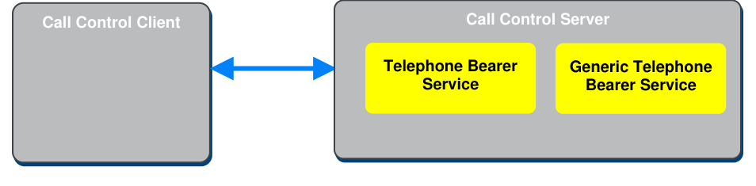

# CCP v1.0

> Source: PDF converted via PyMuPDF.

---

Call Control Profile
Bluetooth® Profile Specification
▪ Revision: v1.0
▪ Revision Date: 2021-03-09
▪ Group Prepared By: Generic Audio Working Group
Abstract:
This profile defines the roles and procedures that are used to interact with a remote device that implements the Generic Telephone Bearer Service (GTBS), and optionally and additionally, the Telephone Bearer Service (TBS).
Revision History

|  | Revision Number |  |  | Date |  |  | Comments |  |
| --- | --- | --- | --- | --- | --- | --- | --- | --- |
| v1.0 |  |  | 2021-03-09 |  |  | Adopted by the Bluetooth SIG Board of Directors. |  |  |

Contributors

|  | Name |  |  | Company |  |
| --- | --- | --- | --- | --- | --- |
| Tim Reilly |  |  | Bose Corporation |  |  |
| Robin Heydon |  |  | Qualcomm, Inc. |  |  |
| Chris Church |  |  | Qualcomm, Inc. |  |  |
| Joel Linsky |  |  | Qualcomm, Inc. |  |  |
| Michael Rougeux |  |  | Bose Corporation |  |  |
| Jonathan Tanner |  |  | Qualcomm, Inc. |  |  |
| Andrew Estrada |  |  | Sony Corporation |  |  |
| Marcel Holtmann |  |  | Intel Corporation |  |  |
| Nick Hunn |  |  | GN Resound |  |  |
| Scott Walsh |  |  | Plantronics, Inc. |  |  |
| Luiz Von Dentz |  |  | Intel Corporation |  |  |
| Georg Dickmann |  |  | Sonova AG |  |  |
| Masahiko Seki |  |  | Sony Corporation |  |  |
| Oren Haggai |  |  | Intel Corporation |  |  |
| Rasmus Abildgren |  |  | Bose Corporation |  |  |
| Leif-Alexandre Aschehoug |  |  | Nordic Semiconductor ASA |  |  |
| Frank Yerrace |  |  | Microsoft Corporation |  |  |

Use of this specification is your acknowledgement that you agree to and will comply with the following notices and disclaimers. You are advised to seek appropriate legal, engineering, and other professional advice regarding the use, interpretation, and effect of this specification.
Use of Bluetooth specifications by members of Bluetooth SIG is governed by the membership and other related agreements between Bluetooth SIG and its members, including those agreements posted on Bluetooth SIG’s website located at www.bluetooth.com. Any use of this specification by a member that is not in compliance with the applicable membership and other related agreements is prohibited and, among other things, may result in (i) termination of the applicable agreements and (ii) liability for infringement of the intellectual property rights of Bluetooth SIG and its members. This specification may provide options, because, for example, some products do not implement every portion of the specification. Each option identified in the specification is intended to be within the bounds of the Scope as defined in the Bluetooth Patent/Copyright License Agreement (“PCLA”).  Also, the identification of options for implementing a portion of the specification is intended to provide design flexibility without establishing, for purposes of the PCLA, that any of these options is a “technically reasonable non-infringing alternative.”
Use of this specification by anyone who is not a member of Bluetooth SIG is prohibited and is an infringement of the intellectual property rights of Bluetooth SIG and its members. The furnishing of this specification does not grant any license to any intellectual property of Bluetooth SIG or its members. THIS SPECIFICATION IS PROVIDED “AS IS” AND BLUETOOTH SIG, ITS MEMBERS AND THEIR AFFILIATES MAKE NO REPRESENTATIONS OR WARRANTIES AND DISCLAIM ALL WARRANTIES, EXPRESS OR IMPLIED, INCLUDING ANY WARRANTIES OF MERCHANTABILITY, TITLE, NON- INFRINGEMENT, FITNESS FOR ANY PARTICULAR PURPOSE, OR THAT THE CONTENT OF THIS SPECIFICATION IS FREE OF ERRORS. For the avoidance of doubt, Bluetooth SIG has not made any search or investigation as to third parties that may claim rights in or to any specifications or any intellectual property that may be required to implement any specifications and it disclaims any obligation or duty to do so.
TO THE MAXIMUM EXTENT PERMITTED BY APPLICABLE LAW, BLUETOOTH SIG, ITS MEMBERS AND THEIR AFFILIATES DISCLAIM ALL LIABILITY ARISING OUT OF OR RELATING TO USE OF THIS SPECIFICATION AND ANY INFORMATION CONTAINED IN THIS SPECIFICATION, INCLUDING LOST REVENUE, PROFITS, DATA OR PROGRAMS, OR BUSINESS INTERRUPTION, OR FOR SPECIAL, INDIRECT, CONSEQUENTIAL, INCIDENTAL OR PUNITIVE DAMAGES, HOWEVER CAUSED AND REGARDLESS OF THE THEORY OF LIABILITY, AND EVEN IF BLUETOOTH SIG, ITS MEMBERS OR THEIR AFFILIATES HAVE BEEN ADVISED OF THE POSSIBILITY OF THE DAMAGES.
Products equipped with Bluetooth wireless technology ("Bluetooth Products") and their combination, operation, use, implementation, and distribution may be subject to regulatory controls under the laws and regulations of numerous countries that regulate products that use wireless non-licensed spectrum. Examples include airline regulations, telecommunications regulations, technology transfer controls, and health and safety regulations. You are solely responsible for complying with all applicable laws and regulations and for obtaining any and all required authorizations, permits, or licenses in connection with your use of this specification and development, manufacture, and distribution of Bluetooth Products. Nothing in this specification provides any information or assistance in connection with complying with applicable laws or regulations or obtaining required authorizations, permits, or licenses.
Bluetooth SIG is not required to adopt any specification or portion thereof. If this specification is not the final version adopted by Bluetooth SIG’s Board of Directors, it may not be adopted. Any specification adopted by Bluetooth SIG’s Board of Directors may be withdrawn, replaced, or modified at any time. Bluetooth SIG reserves the right to change or alter final specifications in accordance with its membership and operating agreements.
Copyright © 2018–2021. All copyrights in the Bluetooth Specifications themselves are owned by Apple Inc., Ericsson AB, Intel Corporation, Lenovo (Singapore) Pte. Ltd., Microsoft Corporation, Nokia Corporation, and Toshiba Corporation. The Bluetooth word mark and logos are owned by Bluetooth SIG, Inc. Other third-party brands and names are the property of their respective owners.
Contents

## 1 Introduction

This profile defines the roles and procedures that are used to interact with a remote device that implements the Generic Telephone Bearer Service (GTBS) and/or the Telephone Bearer Service (TBS).

### 1.1 Profile dependencies

This profile requires the Generic Attribute Profile (GATT).

### 1.2 Conformance

If conformance to this specification is claimed, all capabilities indicated as mandatory for this specification shall be supported in the specified manner (process-mandatory). This also applies for all optional and conditional capabilities for which support is indicated.

### 1.3 Bluetooth Core Specification release compatibility

This specification is compatible with the Bluetooth Core Specification version 5.2 or later [1].

### 1.4 Language

#### 1.4.1 Language conventions

The Bluetooth SIG has established the following conventions for use of the words shall, must, will, should, may, can, is, and note in the development of specifications:

| shall | is required to – used to define requirements. |
| --- | --- |
| must | is used to express: a natural consequence of a previously stated mandatory requirement. OR an indisputable statement of fact (one that is always true regardless of the circumstances). |
| will | it is true that – only used in statements of fact. |
| should | is recommended that – used to indicate that among several possibilities one is recommended as particularly suitable, but not required. |
| may | is permitted to – used to allow options. |
| can | is able to – used to relate statements in a causal manner. |
| is | is defined as – used to further explain elements that are previously required or allowed. |
| note | Used to indicate text that is included for informational purposes only and is not required in order to implement the specification. Each note is clearly designated as a “Note” and set off in a separate paragraph. |

For clarity of the definition of those terms, see Core Specification Volume 1, Part E, Section 1.
1.4.2 Reserved for Future Use Where a field in a packet, Protocol Data Unit (PDU), or other data structure is described as "Reserved for Future Use" (irrespective of whether in uppercase or lowercase), the device creating the structure shall
set its value to zero unless otherwise specified. Any device receiving or interpreting the structure shall ignore that field; in particular, it shall not reject the structure because of the value of the field.
Where a field, parameter, or other variable object can take a range of values, and some values are described as "Reserved for Future Use," a device sending the object shall not set the object to those values. A device receiving an object with such a value should reject it, and any data structure containing it, as being erroneous; however, this does not apply in a context where the object is described as being ignored or it is specified to ignore unrecognized values.
When a field value is a bit field, unassigned bits can be marked as Reserved for Future Use and shall be set to 0. Implementations that receive a message that contains a Reserved for Future Use bit that is set to 1 shall process the message as if that bit was set to 0, except where specified otherwise.
The acronym RFU is equivalent to Reserved for Future Use.
1.4.3 Prohibited When a field value is an enumeration, unassigned values can be marked as “Prohibited.” These values shall never be used by an implementation, and any message received that includes a Prohibited value shall be ignored and shall not be processed and shall not be responded to.
Where a field, parameter, or other variable object can take a range of values, and some values are described as “Prohibited,” devices shall not set the object to any of those Prohibited values. A device receiving an object with such a value should reject it, and any data structure containing it, as being erroneous.
“Prohibited” is never abbreviated.

### 1.5 Terminology Table 1.1 defines terms that are useful when using this profile.

| Term | Definition |
| --- | --- |
| Caller ID | Defined in [2] |
| Client | Defined in [2] |
| Local | Defined in [2] |
| Local Hold | Defined in [2] |
| Local Retrieve | Defined in [2] |
| Remote | Defined in [2] |
| Server | Defined in [2] |

Table 1.1: Terminology

## 2 Configuration

### 2.1 Roles

This specification defines two roles: the Call Control Server role and the Call Control Client role.
The Call Control Server role resides on devices that can handle calls on one or more telephone call bearers such as cell phones or tablets. The Call Control Client resides on devices that can make requests to the server to make, receive, and manage calls. Examples of devices that support a Call Control Client are headsets and speakers that have microphones, or devices like a watch that might not have a speaker or microphone but can manage telephony calls.
The Call Control Server shall be a GATT Server.
The Call Control Client shall be a GATT Client.

### 2.2 Role/service relationships

Figure 2.1 shows the relationship between services and profile roles, where the profile roles are represented by gray boxes and the services are represented by yellow boxes. Within the Call Control Server, there can be zero or multiple instances of TBS and there is a single, mandatory instance of GTBS.

**Figure 2.1: Relationship between services and profile roles**

Call Control Clients can access TBS, GTBS, or both on a Call Control Server. A lightweight Call Control Client implementation that does not need to access and control all capabilities of each individual TBS on a Call Control Server can use GTBS and have a single point of access for call control activities. Richer Call Control Client implementations that require more control over telephony functions can access and control each TBS individually if exposed by the Call Control Server.
For detailed descriptions of the characteristics referenced in this profile, see TBS [2].

### 2.3 Concurrency limitations or restrictions

There are no concurrency limitations or restrictions for the Call Control Client or Call Control Server imposed by this profile.

### 2.4 Topology limitations or restrictions

There are no topology limitations or restrictions.
The Generic Access Profile (GAP) roles for the Call Control Server and Call Control Client should be defined by a higher-layer specification.

### 2.5 Transport dependencies

There are no transport restrictions imposed by this profile specification. However, a higher-layer specification may impose additional requirements.
Commands with GATT are considered unreliable when used with an unenhanced attribute protocol (ATT) bearer as stated in Volume 3, Part F, Section 3.3.2 in [1]. Therefore, if the unenhanced ATT bearer is used, buffer overflows can occur.

## 3 Call Control Server role requirements

The Call Control Server may instantiate zero or more instances of TBS and shall instantiate a single GTBS, as shown in Table 3.1.
Requirements in this section are defined as “Mandatory” (M), “Optional” (O), “Excluded” (X), and “Conditional” (C.n). Conditional statements (C.n) are listed directly below the table in which they appear.

| Service | Call Control Server |
| --- | --- |
| Telephone Bearer Service | O |
| Generic Telephone Bearer Service | M |

Table 3.1: Service requirements for the Call Control Server

## 4 Call Control Client role requirements

This section lists the Call Control Client role requirements in Table 4.1. A higher-layer profile may specify additional profile role requirements.
Requirements in this section are defined as “Mandatory” (M), “Optional” (O), “Excluded” (X), and “Conditional” (C.n). Conditional statements (C.n) are listed directly below the table in which they appear.

|  | Profile Requirement | Section | Support in Call Control Client |
| --- | --- | --- | --- |
| 1 | GATT sub-procedures | 4.1 | M |
| 2 | Service Discovery | 4.2 | M |
| 3 | Characteristic Discovery | 4.3 | M |
| 4 | Call Control Client procedures | 4.4 | M |

Table 4.1: Profile requirements for the Call Control Client

### 4.1 GATT sub-procedures

Requirements in this section represent a minimum set of requirements for a Call Control Client. Other GATT sub-procedures may be used if supported by both the client and server.
Table 4.2 summarizes additional GATT sub-procedure requirements beyond those required by all GATT clients.

|  | GATT Sub-Procedure | GATT Sub-Procedure | Call Control Client Requirements |
| --- | --- | --- | --- |
| 1 | Discover All Primary Services |  | C.1 |
| 2 | Discover Primary Services by Service UUID |  | C.2 |
| 3 | Find Included Services |  | O |
| 4 | Discover All Characteristics of a Service |  | C.3 |
| 5 | Discover Characteristics by UUID |  | C.4 |
| 6 | Discover All Characteristic Descriptors |  | M |
| 7 | Notifications |  | M |
| 8 | Read Characteristic Value |  | M |
| 9 | Read Long Characteristic Values |  | M |
| 10 | Write Characteristic Value |  | C.5 |

|  | GATT Sub-Procedure | Call Control Client Requirements |
| --- | --- | --- |
| 11 | Write Without Response | C.5 |
| 12 | Read Characteristic Descriptors | M |
| 13 | Write Characteristic Descriptors | M |

Table 4.2: Additional GATT sub-procedure requirements
C.1: Mandatory if the Discover Primary Services by Service UUID sub-procedure is not supported, otherwise Optional.
C.2: Mandatory if the Discover All Primary Services sub-procedure is not supported, otherwise Optional.
C.3: Mandatory if the Discover Characteristics by UUID sub-procedure is not supported, otherwise Optional.
C.4: Mandatory if the Discover All Characteristics of a Service sub-procedure is not supported, otherwise Optional.
C.5: Mandatory to support at least one.
If the client receives a Value Changed During Read Long ATT application error code while performing a Read Long Characteristic Values sub-procedure, the parts of the value read during the Read Long Values Characteristic sub-procedure are no longer valid. The client should restart a Characteristic Value Read procedure to read the new value. When performing the Read Long Characteristic Value sub-procedure, the client shall start with a value offset of 0.

### 4.2 Service Discovery

To discover GTBS, the Call Control Client shall use either the GATT Discover All Primary Services sub- procedure or the GATT Discover Primary Services by Service UUID sub-procedure.
To discover the instances of TBS, the Call Control Client shall use either the GATT Discover All Primary Services sub-procedure or the GATT Discover Primary Services by Service UUID sub-procedure.

### 4.3 Characteristic Discovery

As required by GATT, the Call Control Client shall be tolerant of additional optional characteristics in the service records of services that are used with this profile.
If a characteristic that can be indicated or notified is discovered, the Call Control Client shall also discover the associated Client Characteristic Configuration descriptor.

### 4.4 Call Control Client procedures

This section defines procedures that are used to enable TBS and GTBS features. The procedures describe common user scenarios and how to implement specified sequences to support these scenarios.
This profile does not restrict the mentioned services (see Table 3.1) from being used in other ways; a higher-layer profile may define additional procedures. However, if a procedure requirement for the client listed in Table 4.3 is supported, then the procedure shall be implemented by applying the requirements provided in this profile specification.

| Procedures | Reference |  | Call Control |  |
| --- | --- | --- | --- | --- |
|  |  |  | Client |  |
|  |  |  | Requirement |  |
| Read Bearer Provider Name | 4.4.1 | O |  |  |
| Read Bearer UCI | 4.4.2 | O |  |  |
| Read Bearer Technology | 4.4.3 | O |  |  |
| Read Bearer URI Schemes Supported List | 4.4.4 | O |  |  |
| Read Bearer Signal Strength | 4.4.5 | O |  |  |
| Read Bearer Signal Strength Reporting Interval | 4.4.6 | O |  |  |
| Set Bearer Signal Strength Reporting Interval | 4.4.7 | O |  |  |
| Read Bearer List Current Calls | 4.4.8 | O |  |  |
| Read Content Control ID | 4.4.9 | O |  |  |
| Read Incoming Call Target Bearer URI | 4.4.10 | O |  |  |
| Read Status Flags | 4.4.11 | O |  |  |
| Read Call State | 4.4.12 | M |  |  |
| Call Control Point Procedures | 4.4.13 | – |  |  |
| • Answer Incoming Call | 4.4.13.1 | O |  |  |
| • Terminate Call | 4.4.13.2 | O |  |  |
| • Move Call To Local Hold | 4.4.13.3 | O |  |  |
| • Move Locally Held Call To Active Call | 4.4.13.4 | O |  |  |
| • Move Locally And Remotely Held Call To Remotely Held Call | 4.4.13.5 | O |  |  |
| • Originate Call | 4.4.13.6 | O |  |  |
| • Join Calls | 4.4.13.7 | O |  |  |
| Read Call Control Point Optional Opcodes | 4.4.14 | O |  |  |
| Read Incoming Call | 4.4.15 | O |  |  |
| Read Call Friendly Name | 4.4.16 | O |  |  |

Table 4.3: Procedure requirements for the Call Control Client
When the Call Control Client uses any of the read procedures in this section or handles a Characteristic Notification, it shall take suitable actions to maintain correct operation if either the Uniform Resource
Identifier (URI) or Friendly Name is being Withheld for one or more reasons as indicated by the Call_Flags field of the Call State characteristic. If the Withheld by Server bit is set, it can be because of a security policy configuration on the Server, which requires a higher level of authentication.

#### 4.4.1 Read Bearer Provider Name procedure

The Read Bearer Provider Name procedure is used by a Call Control Client to discover the bearer provider name on a Call Control Server.
The Call Control Client shall read the characteristic value of the Bearer Provider Name characteristic. The Bearer Provider Name characteristic is described in [2].
The Call Control Client may configure notifications of the Bearer Provider Name characteristic (enabling notification by using the Client Characteristic Configuration descriptor), so that the Call Control Client can be alerted if the current bearer provider name changes. This name change can happen, for example, when cellular devices roam between networks.
If the Bearer Provider Name characteristic value is greater than (ATT_MTU-3) octets in length, the Characteristic Value Notification contains the first (ATT_MTU-3) octets of the characteristic value, and the Read Long Characteristic Value procedure can be used if the rest of the characteristic value is required.

#### 4.4.2 Read Bearer UCI procedure

The Read Bearer UCI procedure is used by a Call Control Client to discover the bearer Uniform Caller Identifier (UCI) on a Call Control Server.
The Call Control Client shall read the characteristic value of the Bearer UCI characteristic. The Bearer UCI characteristic is described in [2].

#### 4.4.3 Read Bearer Technology procedure

The Read Bearer Technology procedure is used by a Call Control Client to discover the bearer technology on a Call Control Server.
The Call Control Client shall read the characteristic value of the Bearer Technology characteristic. The Bearer Technology characteristic is described in [2].
The Call Control Client may configure notifications of the Bearer Technology characteristic (enabling notification by using the Client Characteristic Configuration descriptor), so that the Call Control Client can be alerted if the bearer technology changes.

#### 4.4.4 Read Bearer URI Schemes Supported List procedure

The Read Bearer URI Schemes Supported List procedure is used by a Call Control Client to discover the list of URI schemes that is supported by the bearer on a Call Control Server.
The Call Control Client shall read the characteristic value of the Bearer URI Schemes Supported List characteristic. The Bearer URI Schemes Supported List characteristic is described in [2].
The Call Control Client may configure notifications of the Bearer URI Schemes Supported List characteristic (enabling notification by using the Client Characteristic Configuration descriptor), so that the Call Control Client can be alerted if the URI schemes list changes.
If the Bearer URI Schemes Supported List characteristic value is greater than (ATT_MTU-3) octets in length, the Handle Value notification contains the first (ATT_MTU-3) octets of the characteristic value, and the Read Long Characteristic Value procedure can be used if the rest of the characteristic value is required.

#### 4.4.5 Read Bearer Signal Strength procedure

The Read Bearer Signal Strength procedure is used by a Call Control Client to discover the bearer signal strength on a Call Control Server.
If the Bearer Signal Strength characteristic is exposed by the Call Control Server, the Call Control Client shall read the characteristic value of the Bearer Signal Strength characteristic. The Bearer Signal Strength characteristic is described in [2].
The Call Control Client may configure notifications of the Bearer Signal Strength characteristic (enabling notification by using the Client Characteristic Configuration descriptor), so that the Call Control Client can be alerted if the signal strength changes. The frequency of notifying the characteristic is controlled by the value of the Bearer Signal Strength Reporting Interval characteristic. If the client does not want to receive notifications when the signal strength changes, then this characteristic shall not be configured for notifications.

#### 4.4.6 Read Bearer Signal Strength Reporting Interval procedure

The Read Bearer Signal Strength Reporting Interval procedure is used by a Call Control Client to discover the Bearer Signal Strength Reporting Interval on a Call Control Server.
If the Bearer Signal Strength Reporting Interval characteristic is exposed by the Call Control Server, the Call Control Client shall read the characteristic value of the Bearer Signal Strength Reporting Interval characteristic. The Bearer Signal Strength Reporting Interval characteristic is described in [2].

#### 4.4.7 Set Bearer Signal Strength Reporting Interval procedure

The Set Bearer Signal Strength Reporting Interval procedure is used by a Call Control Client to set the signal strength reporting interval on a Call Control Server, which defines how frequently the signal strength is reported to the client.
The Call Control Client shall write the characteristic value of the Bearer Signal Strength Reporting Interval characteristic with the reporting interval expressed in seconds. The Bearer Signal Strength Reporting Interval characteristic is described in [2].
The value that is written to this characteristic controls the behavior of the reporting of the signal strength through the Bearer Signal Strength characteristic.

#### 4.4.8 Read Bearer List Current Calls procedure

The Read Bearer List Current Calls procedure is used by a Call Control Client to discover the Bearer List Current Calls on a Call Control Server.
The Call Control Client shall read the characteristic value of the Bearer List Current Calls characteristic. The Bearer List Current Calls characteristic is described in [2].
The Call Control Client may configure notifications of the Bearer List Current Calls characteristic (enabling notification by using the Client Characteristic Configuration descriptor), so that the Call Control Client can be alerted if the Bearer List Current Calls changes.
If the Bearer List Current Calls characteristic value is greater than (ATT_MTU-3) octets in length, the Handle Value notification contains the first (ATT_MTU-3) octets of the characteristic value, and the Read Long Characteristic Value procedure can be used if the rest of the characteristic value is required.

#### 4.4.9 Read Content Control ID procedure

The Read Content Control ID procedure is used by a Call Control Client to discover the Content Control ID (CCID) on a Call Control Server.
The Call Control Client shall read the characteristic value of the CCID characteristic. The CCID characteristic is described in [2].

#### 4.4.10 Read Incoming Call Target Bearer URI procedure

The Read Incoming Call Target Bearer URI procedure is used by a Call Control Client to discover the incoming call target bearer URI on a Call Control Server.
If the Incoming Call Target Bearer URI characteristic is exposed by the Call Control Server, the Call Control Client shall read the characteristic value of the Incoming Call Target Bearer URI characteristic. The Incoming Call Target Bearer URI characteristic is described in [2].
The Call Control Client may configure notifications of the Incoming Call Target Bearer URI characteristic (i.e., via the Client Characteristic Configuration descriptor), so that the Call Control Client can be alerted if the Incoming Call Target Bearer URI changes.
If the Incoming Call Target Bearer URI characteristic value is greater than (ATT_MTU-3) octets in length, the Handle Value notification contains the first (ATT_MTU-3) octets of the characteristic value, and the Read Long Characteristic Value procedure can be used if the rest of the characteristic value is required.

#### 4.4.11 Read Status Flags procedure

The Read Status Flags procedure is used by a Call Control Client to discover the Status Flags characteristic on a Call Control Server.
The Call Control Client shall read the characteristic value of the Status Flags characteristic. The Status Flags characteristic is described in [2].
The Call Control Client may configure notifications of the Status Flags characteristic (enabling notification by using the Client Characteristic Configuration descriptor), so that the Call Control Client can be alerted if the Status Flags characteristic changes.

#### 4.4.12 Read Call State procedure

The Read Call State procedure is used by a Call Control Client to discover the Call State for all active calls on a Call Control Server.
The Call Control Client shall read the characteristic value of the Call State characteristic. The Call State characteristic is described in [2].
The Call Control Client may configure notifications of the Call State characteristic (i.e., via the Client Characteristic Configuration descriptor), so that the Call Control Client can be alerted if the call state changes.
If the Call State characteristic value is greater than (ATT_MTU-3) octets in length, the Handle Value notification contains the first (ATT_MTU-3) octets of the characteristic value, and the Read Long Characteristic Value procedure can be used if the rest of the characteristic value is required.

#### 4.4.13 Call Control Point procedures

The sub-procedures defined in the following sub-sections act on the Call Control Point that is exposed by the Call Control Server.
The Call Control Client may configure notifications of the Call Control Point Notification characteristic (via enabling notification by using the Client Characteristic Configuration descriptor), so that the Call Control Client can be alerted with the response to a Call Control Point write.

##### 4.4.13.1 Answer Incoming Call sub-procedure

The Answer Incoming Call sub-procedure is used by a Call Control Client to answer an incoming call and make the call active on a Call Control Server.
The Call Control Client shall write the characteristic value of the Call Control Point characteristic with the Accept opcode and the Call_Index field of the incoming call. The Call Control Point characteristic and Call_Index field are described in [2].

##### 4.4.13.2 Terminate Call sub-procedure

The Terminate Call sub-procedure is used by a Call Control Client to end a call that is in any state on a Call Control Server.
The Call Control Client shall write the characteristic value of the Call Control Point characteristic with the Terminate opcode and the Call_Index field of the call to be terminated. The Call Control Point characteristic and Call_Index field are described in [2].

##### 4.4.13.3 Move Call To Local Hold sub-procedure

The Move Call To Local Hold sub-procedure is used by a Call Control Client to place an active call or an alerting call on local hold on a Call Control Server.
The Call Control Client shall write the characteristic value of the Call Control Point characteristic with the Local Hold opcode and the Call_Index field of the call to be moved to locally held. The Call Control Point characteristic and Call_Index field are described in [2].

##### 4.4.13.4 Move Locally Held Call To Active Call sub-procedure

The Move Locally Held Call To Active Call sub-procedure is used by a Call Control Client to move a call that is being locally held to an active call on a Call Control Server.
The Call Control Client shall write the characteristic value of the Call Control Point characteristic with the Local Retrieve opcode and the Call_Index field of the call to be retrieved. The Call Control Point characteristic and Call_Index field are described in [2].

##### 4.4.13.5 Move Locally And Remotely Held Call To Remotely Held Call sub-procedure

The Move Locally And Remotely Held Call To Remotely Held Call sub-procedure is used by a Call Control Client to move a call that is being locally and remotely held to a remotely held call on a Call Control Server.
The Call Control Client shall write the characteristic value of the Call Control Point characteristic with the Local Retrieve opcode and the Call_Index field of the call to be retrieved. The Call Control Point characteristic and Call_Index field are described in [2].

##### 4.4.13.6 Originate Call sub-procedure

The Originate Call sub-procedure is used by a Call Control Client to make an outgoing call on a Call Control Server.
The Call Control Client shall write the characteristic value of the Call Control Point characteristic with the Originate opcode and the desired outgoing URI. The Call Control Point characteristic and Call_Index field are described in [2].

##### 4.4.13.7 Join Calls sub-procedure

The Join Calls sub-procedure is used by a Call Control Client to join multiple calls on the Call Control Server.
The Call Control Client shall write the characteristic value of the Call Control Point characteristic with the Join opcode and a list of all calls to be joined. The list of Call_Index fields provided in the Join opcode write shall not include any Call_Index fields with the Call State of Incoming.
The Call Control Point characteristic, Call_State field, and Call_Index field are described in [2].

#### 4.4.14 Read Call Control Point Optional Opcodes procedure

The Read Call Control Point Optional Opcodes procedure is used by a Call Control Client to discover the opcodes that are optionally supported for the Call Control Point on a Call Control Server.
The Call Control Client shall read the characteristic value of the Call Control Point Optional Opcodes characteristic. The Call Control Point Optional Opcodes characteristic is described in [2].

#### 4.4.15 Read Incoming Call sub-procedure

The Read Incoming Call sub-procedure is used by a Call Control Client to discover the Incoming Call information on a Call Control Server.
The Call Control Client shall read the characteristic value of the Incoming Call characteristic. The Incoming Call characteristic is described in [2].
The Call Control Client may configure notifications of the Incoming Call characteristic (enabling notification by using the Client Characteristic Configuration descriptor), so that the Call Control Client can be alerted when an Incoming Call is available.
If the Incoming Call characteristic value is greater than (ATT_MTU-3) octets in length, the Handle Value notification contains the first (ATT_MTU-3) octets of the characteristic value, and the Read Long Characteristic Value procedure can be used if the rest of the characteristic value is required.

#### 4.4.16 Read Call Friendly Name sub-procedure

The Read Call Friendly Name sub-procedure is used by a Call Control Client to discover the Call Friendly Name information on a Call Control Server.
If the Call Friendly Name characteristic is exposed by the Call Control Server, the Call Control Client shall read the characteristic value of the Call Friendly Name characteristic. The Call Friendly Name characteristic is described in [2].
The Call Control Client may configure notifications of the Call Friendly Name characteristic (enabling notification by using the Client Characteristic Configuration descriptor), so that the Call Control Client can be alerted when a Call Friendly Name is available.
If the Call Friendly Name characteristic value is greater than (ATT_MTU-3) octets in length, the Handle Value notification contains the first (ATT_MTU-3) octets of the characteristic value, and the Read Long Characteristic Value procedure can be used if the rest of the characteristic value is required.

### 4.5 Call Control Client Receipt of Notifications

TBS and GTBS support characteristics that are Notify only. The Call Control Client shall configure the notifications (enabling notification by using the Client Characteristic Configuration descriptor) of TBS or GTBS. The Call Control Client shall be able to receive multiple notifications of the TBS or GTBS characteristics from the Call Control Server.

#### 4.5.1 Termination Reason notification

The Call Control Client shall control the configuration of notifications (enabling notification by using the Client Characteristic Configuration descriptor) of the Termination Reason characteristic of TBS or GTBS.

## 5 Security considerations

This section describes the security requirements for devices implementing the profile roles defined in Section 2.1. Unless otherwise stated in this specification, the behavior of TBS and GTBS is identical. Table 5.1 captures the security requirements for the Call Control Server and Call Control Client.

|  | Security Requirement |  | Call Control Client |  | Section |  | Call Control Server |  | Section |
| --- | --- | --- | --- | --- | --- | --- | --- | --- | --- |
|  |  |  | Requirements |  |  |  | Requirements |  |  |
| 1 | Security Mode 1 Level 1 (SM1 L1) | X |  |  | 5.1.1 | X |  |  | 5.1, 5.1.2 |
| 2 | Security Mode 1 Level 2 (SM1 L2) | O |  |  | 5.1.1 | C.2 |  |  | 5.1, 5.1.2 |
| 3 | Security Mode 1 Level 3 (SM1 L3) | O |  |  | 5.1.1 | C.2 |  |  | 5.1, 5.1.2 |
| 4 | Security Mode 1 Level 4 (SM1 L4) | O |  |  | 5.1.1 | C.2 |  |  | 5.1, 5.1.2 |
| 5 | 128b Key Entropy | C.1 |  |  | 5.1.1 | C.1 |  |  | 5.1, 5.1.2 |

Table 5.1: Security requirements for Call Control Client and Call Control Server
C.1: Mandatory if SM1 L2 or SM1 L3 is supported, otherwise not applicable
C.2: Mandatory to support at least one of SM1 L2 or SM1 L3 or SM1 L4

### 5.1 Security Requirements for Low Energy

This section describes the security requirements for the Bluetooth Low Energy (LE) transport in terms of the Call Control Client role and the Call Control Server role.
The security requirements for all characteristics defined in the TBS specification [2] shall satisfy Security Mode 1 Level 2, defined in Volume 3, Part C, Section 10.2.1 in [1].
Access to all characteristics defined in the Call Control Service shall require an encryption key with at least 128 bits of entropy, derived from either:
• LE Secure Connections
• If cross-transport key derivation is used, from BR/EDR Secure Connections
• An out-of-band (OOB) method
Link Layer Privacy, defined in Volume 6, Part B, Section 6 in [1], should be used.

#### 5.1.1 Call Control Client security requirements for Low Energy

The Call Control Client shall support bondable mode, defined in Volume 3, Part C, Section 9.4.3 in [1].
The Call Control Client shall support the bonding procedure defined in Volume 3, Part C, Section 9.4.4 in [1].
The Call Control Client should accept the LE Security Mode and LE Security Level combination that is requested by the Call Control Server.
The Call Control Client should only use the Security Manager (SM) Peripheral [5] Security Request procedure, defined in Volume 3, Part H, Section 2.4.6 in [1], to inform the Call Control Server of its security requirements if the Call Control Client has bonded with the Call Control Server.
If the Call Control Client is a BR/EDR/LE device, it should support and use cross-transport key derivation, defined in Volume 3, Part C, Section 14.1 in [1].

#### 5.1.2 Call Control Server security requirements for Low Energy

The Call Control Server shall support bondable mode defined in Volume 3, Part C, Section 9.4.3 in [1].
The Call Control Server shall support the bonding procedure defined in Volume 3, Part C, Section 9.4.4 in [1].
The Call Control Server shall only accept the LE Security Mode and LE Security Level combination requested by the Call Control Client if that combination satisfies the security requirements implemented by the Call Control Server for access to characteristics defined in TBS [2].
If the Call Control Server is a BR/EDR/LE device, it should support and use cross-transport key derivation, defined in Volume 3, Part C, Section 14.1 in [1].
The Call Control Server may request the Authorization procedure to be performed before allowing a client to access TBS. See Volume 3, Part C, Section 10.5 in [1].

### 5.2 Security requirements for BR/EDR

This section describes the security requirements for the BR/EDR transport.
The Call Control Server security requirements for all characteristics defined in TBS shall be Security Mode 4 Level 2, defined in Volume 3, Part C, Section 5.2.2.8 in [1].
Access by a Call Control Client to all characteristics defined in TBS shall require an encryption key with at least 128 bits of entropy, derived from either:
• BR/EDR Secure Connections
• If cross-transport key derivation is used, from LE Secure Connections
• An OOB method
In a connection, the devices should bond.
The device initiating the connection should initiate bonding. Acceptance of bonding should be supported by the device accepting the connection request.

## 6 Generic Access Profile requirements

Requirements in this section are defined as “Mandatory” (M), “Optional” (O), “Excluded” (X), and “Conditional” (C.n). Conditional statements (C.n) are listed directly below the table in which they appear.

### 6.1 Generic Access Profile requirements for Low Energy

This section describes the device discovery and LE Asynchronous Control Link (ACL) connection establishment procedures that are used by a client and a server. These procedures are described in terms of the following roles:
• Peripheral role (defined in Volume 3, Part C, Section 2.2.2 in [1])
• Central role (defined in Volume 3, Part C, Section 2.2.2 in [1])

#### 6.1.1 Peripheral connection establishment

##### 6.1.1.1 Connection procedure to non-bonded devices

The connection procedure to non-bonded devices is used for device discovery and connection establishment when the Peripheral accepts a connection from a Central to which it is not bonded. The connection procedure to non-bonded devices is triggered by user interaction, for example, activating a device by inserting a battery or pushing buttons. To inform the Central that the Peripheral is available for connection establishment, the Peripheral enters one of the following GAP discoverable modes:
• Limited Discoverable mode (as defined in Volume 3, Part C, Section 9.2.3 in [1])
• General Discoverable mode (as defined in Volume 3, Part C, Section 9.2.4 in [1])
The Peripheral shall transmit extended advertising PDUs and, unless otherwise defined by higher-layer specifications, should include the following AD data types:
• Flags Advertising Data (AD) data type (as defined in Part A, Section 1.3 in [3])
• If the Peripheral is in the Call Control Server role and supports TBS and/or GTBS over LE, the Service UUID AD data type (as defined in Part A, Section 1.1 in [3]) containing the TBS and/or the GTBS UUID, as described in [2].
If the Peripheral is a BR/EDR/LE device and is also in a discoverable mode over the BR/EDR transport as defined in Section 6.2.1 and if the Peripheral wants to assist scanning devices to represent the Peripheral as a single device at the scanning device’s User Interface (UI), the Peripheral should use its Public Device Address when transmitting extended advertising PDUs as part of the connection procedure to non-bonded devices.

##### 6.1.1.2 Connection procedure to bonded devices

The connection procedure to bonded devices is used by a Peripheral device in the Connectable mode only if the Peripheral has previously bonded with the Central device when using the connection procedure to non-bonded devices defined in Section 6.1.1.1.
When available for a connection to a bonded device, a Peripheral enters one of the following GAP connectable modes:
• Directed Connectable mode (as defined in Volume 3, Part C, Section 9.3.3 in [1])
• Undirected Connectable mode (as defined in Volume 3, Part C, Section 9.3.4 in [1])
The Peripheral should use the advertising filter policy that was configured when bonded using the connection procedure to non-bonded devices in Section 6.1.1.1, unless the Peripheral is in the Directed Connectable mode.

##### 6.1.1.3 Link loss reconnection procedure

When a connection is terminated because of link loss, a Peripheral should attempt to reconnect to the Central by using the procedures described in Section 6.1.1.1 or Section 6.1.1.2.

#### 6.1.2 Central connection establishment

##### 6.1.2.1 Device discovery

To discover one or more Peripherals, the Central must use either of the following GAP discovery procedures:
• Limited Discovery procedure (as defined in Volume 3, Part C, Section 9.2.5 in [1])
• General Discovery procedure (as defined in Volume 3, Part C, Section 9.2.6 in [1])

##### 6.1.2.2 Connection procedure

A Central must use one of the following GAP connection establishment procedures based on its connectivity requirements:
• Auto Connection Establishment procedure (as defined in Volume 3 Part C, Section 9.3.5 in [1])
• General Connection Establishment procedure (as defined in Volume 3, Part C, Section 9.3.6 in [1])
• Selective Connection Establishment procedure (as defined in Volume 3, Part C, Section 9.3.7 in [1])
• Direct Connection Establishment procedure (as defined in Volume 3, Part C, Section 9.3.8 in [1])

##### 6.1.2.3 Link loss reconnection procedure

When a connection is terminated because of link loss, a Central should attempt to reconnect to the Peripheral by using any of the GAP connection establishment procedures described in Section 6.1.2.2.

##### 6.1.2.4 Connection interval

The connection interval can affect the latency of Call Control Client procedures. Therefore, to reduce the latency when acting as a Call Control Client, a connection interval should be selected in the range provided in Table 6.1.

| Parameter | Value |
| --- | --- |
| Range for Connection Interval | 10 to 30 milliseconds |

Table 6.1: Recommended range for connection interval values

### 6.2 Generic Access Profile requirements for BR/EDR

This section describes the GAP requirements for BR/EDR.

#### 6.2.1 Modes

Modes are defined in Volume 3, Part C, Section 4 in [1].
Bondable mode should be supported.
Table 6.2 shows the support requirements for GAP modes for BR/EDR devices.

| Mode | Support in Call Control Client | Support in Call Control Server |
| --- | --- | --- |
| General Discoverable mode | C.1 | O |
| Limited Discoverable mode | C.1 | O |
| Bondable mode | O | O |

Table 6.2: GAP BR/EDR mode support requirements
C.1: Mandatory to support at least one of Limited Discoverable mode or General Discoverable mode

#### 6.2.2 Idle Mode procedures

Idle Mode procedures are defined in Volume 3, Part C, Section 6 in [1].
The General Bonding procedure should be supported.
Table 6.3 shows the requirements for GAP Idle Mode procedures for BR/EDR devices.

| Procedure | Support in Call Control Client | Support in Call Control Server |
| --- | --- | --- |
| General Inquiry | O | M |
| Limited Inquiry | O | O |
| General Bonding | O | O |

Table 6.3: GAP BR/EDR Idle Mode procedure support requirements

#### 6.2.3 Device discovery

BR/EDR/LE devices implementing either of the Call Control Client or Call Control Server roles shall set the value of the Class of Device (CoD) field Major Service Class bit 14 to 1, as defined in [4].
If a BR/EDR/LE device implementing the Call Control Server role is in a GAP Discoverable mode defined in Volume 3, Part C, Section 4 in [1], then unless otherwise defined by higher-layer specifications, any extended inquiry response (EIR) data sent by the device should include the following EIR data type:
• If the Call Control Server supports TBS over BR/EDR, the Service UUID EIR data type containing the TBS UUID as described in [2]
• If the Call Control Server supports GTBS over BR/EDR, the Service UUID EIR data type containing the GTBS UUID, as described in [2]

## 7 Acronyms and abbreviations

Acronym/Abbreviation Meaning
ACL Asynchronous Connectionless
AD Advertising Data
ATT Attribute Protocol
BR/EDR Basic Rate/Enhanced Data Rate
CCID Content Control ID
GAP Generic Access Profile
GATT Generic Attribute Profile
GTBS Generic Telephone Bearer Service
LE Low Energy
MTU Minimum Transmission Unit
OOB out-of-band
PDU Protocol Data Unit
RFU Reserved for Future Use
SDP Service Discovery Protocol
SM Security Manager
TBS Telephone Bearer Service
UCI Uniform Caller Identifier
UI user interface
URI Uniform Resource Identifier
UUID universally unique identifier
Table 7.1: Acronyms and abbreviations

## 8 References

[1] Bluetooth Core Specification, Version 5.2 or later
[2] Telephone Bearer Service Specification
[3] Bluetooth Core Specification Supplement, Version 9 or later
[4] Bluetooth SIG Assigned Numbers, https://www.bluetooth.com/specifications/assigned-numbers
[5] Appropriate Language Mapping Table, https://www.bluetooth.com/language-mapping/Appropriate- Language-Mapping-Table