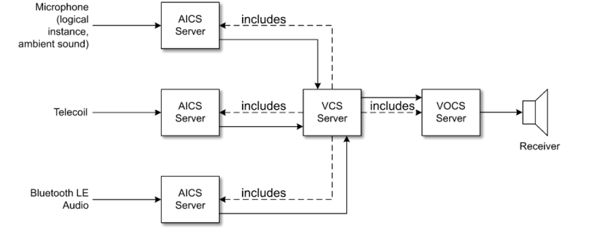

# HAP v1.0.1

> Source: PDF converted via PyMuPDF.

---

Hearing Access Profile
Bluetooth® Profile Specification
▪ Version: v1.0.1
▪ Version Date: 2024-10-01
▪ Prepared By: Hearing Aid Working Group
Abstract
This profile defines the requirements for Bluetooth devices necessary for interoperability within the hearing aid ecosystem. It specifies behaviors related to audio streaming and remote control of the hearing aid using the Bluetooth Low Energy Audio (LE Audio) framework.

| Version Number | Date | Comments |
| --- | --- | --- |
| v1.0 | 2022-06-07 | Adopted by the Bluetooth SIG Board of Directors. |
| v1.0.1 | 2024-10-01 | Adopted by the Bluetooth SIG Board of Directors. |

Acknowledgments

| Name | Company |
| --- | --- |
| Bjarne Klemmensen | Demant A/S |
| Nick Hunn | GN Hearing A/S |
| Niel Warren | Google |
| Oren Haggai | Intel |
| Sam Geeraerts | NXP Semiconductors |
| Georg Dickmann | Sonova AG |
| Andrew Estrada | Sony Corporation |
| Jeff Solum | Starkey |
| Khaled Elsayed | Synopsys |
| Riccardo Cavallari | WS Audiology Denmark A/S |
| Kanji Kerai | WS Audiology Denmark A/S |

Use of this specification is your acknowledgement that you agree to and will comply with the following notices and disclaimers. You are advised to seek appropriate legal, engineering, and other professional advice regarding the use, interpretation, and effect of this specification.
Use of Bluetooth specifications by members of Bluetooth SIG is governed by the membership and other related agreements between Bluetooth SIG and its members, including those agreements posted on Bluetooth SIG’s website located at www.bluetooth.com. Any use of this specification by a member that is not in compliance with the applicable membership and other related agreements is prohibited and, among other things, may result in (i) termination of the applicable agreements and (ii) liability for infringement of the intellectual property rights of Bluetooth SIG and its members. This specification may provide options, because, for example, some products do not implement every portion of the specification. All content within the specification, including notes, appendices, figures, tables, message sequence charts, examples, sample data, and each option identified is intended to be within the bounds of the Scope as defined in the Bluetooth Patent/Copyright License Agreement (“PCLA”). Also, the identification of options for implementing a portion of the specification is intended to provide design flexibility without establishing, for purposes of the PCLA, that any of these options is a “technically reasonable non-infringing alternative.”
Use of this specification by anyone who is not a member of Bluetooth SIG is prohibited and is an infringement of the intellectual property rights of Bluetooth SIG and its members. The furnishing of this specification does not grant any license to any intellectual property of Bluetooth SIG or its members. THIS SPECIFICATION IS PROVIDED “AS IS” AND BLUETOOTH SIG, ITS MEMBERS AND THEIR AFFILIATES MAKE NO REPRESENTATIONS OR WARRANTIES AND DISCLAIM ALL WARRANTIES, EXPRESS OR IMPLIED, INCLUDING ANY WARRANTIES OF MERCHANTABILITY, TITLE, NON-INFRINGEMENT, FITNESS FOR ANY PARTICULAR PURPOSE, OR THAT THE CONTENT OF THIS SPECIFICATION IS FREE OF ERRORS. For the avoidance of doubt, Bluetooth SIG has not made any search or investigation as to third parties that may claim rights in or to any specifications or any intellectual property that may be required to implement any specifications and it disclaims any obligation or duty to do so.
TO THE MAXIMUM EXTENT PERMITTED BY APPLICABLE LAW, BLUETOOTH SIG, ITS MEMBERS AND THEIR AFFILIATES DISCLAIM ALL LIABILITY ARISING OUT OF OR RELATING TO USE OF THIS SPECIFICATION AND ANY INFORMATION CONTAINED IN THIS SPECIFICATION, INCLUDING LOST REVENUE, PROFITS, DATA OR PROGRAMS, OR BUSINESS INTERRUPTION, OR FOR SPECIAL, INDIRECT, CONSEQUENTIAL, INCIDENTAL OR PUNITIVE DAMAGES, HOWEVER CAUSED AND REGARDLESS OF THE THEORY OF LIABILITY, AND EVEN IF BLUETOOTH SIG, ITS MEMBERS OR THEIR AFFILIATES HAVE BEEN ADVISED OF THE POSSIBILITY OF THE DAMAGES.
Products equipped with Bluetooth wireless technology ("Bluetooth Products") and their combination, operation, use, implementation, and distribution may be subject to regulatory controls under the laws and regulations of numerous countries that regulate products that use wireless non-licensed spectrum. Examples include airline regulations, telecommunications regulations, technology transfer controls, and health and safety regulations. You are solely responsible for complying with all applicable laws and regulations and for obtaining any and all required authorizations, permits, or licenses in connection with your use of this specification and development, manufacture, and distribution of Bluetooth Products. Nothing in this specification provides any information or assistance in connection with complying with applicable laws or regulations or obtaining required authorizations, permits, or licenses.
Bluetooth SIG is not required to adopt any specification or portion thereof. If this specification is not the final version adopted by Bluetooth SIG’s Board of Directors, it may not be adopted. Any specification adopted by Bluetooth SIG’s Board of Directors may be withdrawn, replaced, or modified at any time. Bluetooth SIG reserves the right to change or alter final specifications in accordance with its membership and operating agreements.
Copyright © 2016–2024. All copyrights in the Bluetooth Specifications themselves are owned by Apple Inc., Ericsson AB, Intel Corporation, Lenovo (Singapore) Pte. Ltd., Microsoft Corporation, Nokia Corporation, and Toshiba Corporation. The Bluetooth word mark and logos are owned by Bluetooth SIG, Inc. Other third-party brands and names are the property of their respective owners.
Contents

## 1 Introduction

The purpose of the Hearing Access Profile (HAP) is to define the requirements for an interoperable experience for users of hearing aids and complementary products in the hearing aid ecosystem that use Bluetooth Low Energy (LE) Audio technology with the Isochronous Channels feature.
To accomplish this, the HAP mandates requirements for products within the hearing aid ecosystem.
Wherever a reference to a hearing aid is made, that term covers:
• A single hearing aid, rendering a single audio channel
• A pair of hearing aids (also called a Binaural Hearing Aid Set) supporting individual left and right audio channels
• A hearing aid that uses a single Bluetooth link but provides separate left and right audio outputs to the user
A single hearing aid always contains one or more external microphones to detect external sound. This specification does not distinguish between one or more external microphones within a hearing aid. All external microphones that are present are collectively described as a single entity within the single hearing aid. In a Binaural Hearing Aid Set, an implementation can decide to expose the availability of a microphone from one hearing aid or both hearing aids to send the user’s voice to the peer device (e.g., smartphone, laptop, etc.) during a call. How the two hearing aids agree on which microphone to expose to the peer device in this scenario is not defined by this specification.

### 1.1 Profile dependencies

This profile requires the Common Audio Profile (CAP) [4], Basic Audio Profile (BAP) [3], Volume Control Profile (VCP) [11], Microphone Control Profile (MICP) [12], Coordinated Set Identification Profile (CSIP) [6], Call Control Profile (CCP) [13], and the Generic Attribute Profile (GATT) [1].

### 1.2 Conformance

Each capability of this specification shall be supported in the specified manner. This specification may provide options for design flexibility, because, for example, some products do not implement every portion of the specification. For each implementation option that is supported, it shall be supported as specified.

### 1.3 Bluetooth Core Specification release compatibility

This profile requires Bluetooth Core Specification 5.2 [1] or later for the Hearing Aid (HA), Hearing Aid Unicast Client (HAUC) and Hearing Aid Remote Controller (HARC) roles (see Sections 3, 4, and 5). If the Immediate Alert Client (IAC) role (see Section 6) is the only HAP role implemented on a device, this profile requires Bluetooth Core Specification 4.2 [9] or later.

### 1.4 Change History

This section summarizes changes at a moderate level of detail and should not be considered representative of every change made.

#### 1.4.1 Changes from v1.0 to v1.0.1

| Section | Errata |
| --- | --- |
| 1.2: Conformance | E23815 |
| 2.2: Role/profile relationships | E19220 |
| 3.6: CSIP Set Member role requirements | E23132 |

Table 1.1: Errata incorporated in v1.0.1

### 1.5 Language

#### 1.5.1 Language conventions

The Bluetooth SIG has established the following conventions for use of the words shall, must, will, should, may, can, and note in the development of specifications:

| shall | is required to – used to define requirements. |
| --- | --- |
| must | is used to express: a natural consequence of a previously stated mandatory requirement. OR an indisputable statement of fact (one that is always true regardless of the circumstan- ces). |
| will | it is true that – only used in statements of fact. |
| should | is recommended that – used to indicate that among several possibilities one is recom- mended as particularly suitable, but not required. |
| may | is permitted to – used to allow options. |
| can | is able to – used to relate statements in a causal manner. |
| note | Text that calls attention to a particular point, requirement, or implication or reminds the reader of a previously mentioned point. It is useful for clarifying text to which the reader ought to pay special attention. It shall not include requirements. A note begins with “Note:” and is set off in a separate paragraph. When interpreting the text, the relevant requirement shall take precedence over the clarification. |

If there is a discrepancy between the information in a figure and the information in other text of the specification, the text prevails. Figures are visual aids including diagrams, message sequence charts (MSCs), tables, examples, sample data, and images. When specification content shows one of many alternatives to satisfy specification requirements, the alternative shown is not intended to limit implementation options. Other acceptable alternatives to satisfy specification requirements may also be possible.

#### 1.5.2 Reserved for Future Use

Where a field in a packet, Protocol Data Unit (PDU), or other data structure is described as "Reserved for Future Use" (irrespective of whether in uppercase or lowercase), the device creating the structure shall set its value to zero unless otherwise specified. Any device receiving or interpreting the structure shall ignore that field; in particular, it shall not reject the structure because of the value of the field.
Where a field, parameter, or other variable object can take a range of values, and some values are described as "Reserved for Future Use," a device sending the object shall not set the object to those values. A device receiving an object with such a value should reject it, and any data structure containing it, as being erroneous; however, this does not apply in a context where the object is described as being ignored or it is specified to ignore unrecognized values.
When a field value is a bit field, unassigned bits can be marked as Reserved for Future Use and shall be set to 0. Implementations that receive a message that contains a Reserved for Future Use bit that is set to 1 shall process the message as if that bit was set to 0, except where specified otherwise.
The acronym RFU is equivalent to Reserved for Future Use.

#### 1.5.3 Prohibited

When a field value is an enumeration, unassigned values can be marked as “Prohibited.” These values shall never be used by an implementation, and any message received that includes a Prohibited value shall be ignored and shall not be processed and shall not be responded to.
Where a field, parameter, or other variable object can take a range of values, and some values are described as “Prohibited,” devices shall not set the object to any of those Prohibited values. A device receiving an object with such a value should reject it, and any data structure containing it, as being erroneous.
“Prohibited” is never abbreviated.

### 1.6 General interpretation rules

The interpretation rules defined in Section 1.5 of [3] apply throughout this specification.

### 1.7 Terminology

Table 1.2 defines terms that are needed to understand features used in this specification.

| Term | Definition |
| --- | --- |
| Active preset | Defined in Hearing Access Service (see [5]) |
| Active preset record | Defined in [5] |
| Banded Hearing Aid | Defined in [5] |
| Binaural Hearing Aid Set | Defined in [5] |
| Monaural Hearing Aid | Defined in [5] |
| Preset record | Defined in [5] |

Table 1.2: Terminology

## 2 Configuration

HAP specifies configurations and settings of parameters and procedures that are defined in lower-level specifications.
HAP specifies the following:
• HAP profile roles
• Procedures used with the Hearing Access Service (HAS)
• Requirements imposed on the other LE Audio profiles supported by HAP for interoperability purposes

### 2.1 Roles

HAP defines the following profile roles:
• Hearing Aid (HA). The HA role is implemented in a hearing aid. An HA can be a Monaural Hearing Aid, a Banded Hearing Aid, or a member of a Binaural Hearing Aid Set.
• Hearing Aid Unicast Client (HAUC). The HAUC role is implemented in a device capable of sending and optionally receiving unicast audio data to/from a hearing aid in the HA role. Examples of devices implementing the HAUC role are smartphones, tablets, laptops, personal microphones, music players, and voice recognition gateways.
• Hearing Aid Remote Controller (HARC). The HARC role is implemented in a device that controls volume levels of the different audio sources (e.g., ambient sound, telecoil, audio streams), mute state of a microphone, and presets of a hearing aid in the HA role. The HARC may also implement the functionalities required to assist an HA in synchronizing to a broadcast audio stream. This role can be implemented on remote controllers but may also coexist with the HAUC role on devices such as smartphones and tablets that wish to control the functionalities of the HA. If the HARC is the only HAP role implemented on a device, that device may not support the LE Isochronous Channels features defined in [1].
• Immediate Alert Client (IAC). A device implements the IAC role to capture the attention of the HA wearer. Examples of devices implementing the IAC role are smartphones, tablets, laptops, and home appliances.
This profile does not specify a role for transmitting broadcast audio streams using the LE Isochronous Channels feature, because there are no additional requirements beyond BAP and CAP.

### 2.2 Role/profile relationships

Table 2.1 shows the conformance requirements for HAP roles with CAP roles.
All IAC profile requirements are specified in Section 6.

| CAP Role | HAP Roles |  |  |
| --- | --- | --- | --- |
|  | HA | HAUC | HARC |
| Initiator | X | M | X |
| Acceptor | M | X | X |
| Commander | X | X | M |

Table 2.1: Conformance requirements for HAP roles with CAP roles
Table 2.2 shows the conformance requirements for HAP roles with other LE Audio profile roles. A dash in a table cell indicates that HAP makes no change to the requirement as specified in CAP. All other cells indicate requirements that are in addition to what is specified in CAP.

| LE Audio Profile Role | HAP Roles |  |  |
| --- | --- | --- | --- |
|  | HA | HAUC | HARC |
| BAP Unicast Client | – | M | – |
| BAP Unicast Server | M | – | – |
| BAP Broadcast Sink | M | – | – |
| VCP Volume Controller | – | – | M |
| VCP Volume Renderer | M | – | – |
| MICP Microphone Controller | – | – | O |
| MICP Microphone Device | C.2 | – | – |
| CCP Call Control Client | O | X | X |
| CCP Call Control Server | X | O | X |
| CSIP Set Coordinator | – | M | M |
| CSIP Set Member | C.1 | – | – |
| HAS Client1 | X | X | M |
| HAS Server | M | X | X |

1HAS Client and HAS Server refer to the GATT Client and GATT Server of the HAS, respectively. HAS Client behavior is specified in Section 5; HAS Server behavior is specified in [5].
Table 2.2: Conformance requirements for HAP roles with other LE Audio profiles’ roles
C.1: Mandatory if the HA is capable of being part of a Binaural Hearing Aid Set; otherwise Excluded.
C.2: Mandatory if the HA supports the BAP Audio Source role (see Section 3.7); otherwise Excluded.
Additional requirements for the LE Audio profile roles in Table 2.2 are specified in Sections 3 to 5 for each HAP role. If a role is not mentioned in these sections, it means that the HAP does not specify additional requirements beyond the mandatory requirements specified in the corresponding profile specification.

### 2.3 Concurrency limitations/restrictions

This profile does not impose limitations/restrictions on any combination of roles that may be concurrently occupied by a device.

### 2.4 Topology limitations/restrictions

This profile does not impose additional topology limitation/restrictions beyond those defined by other profiles implemented on a device and referenced here.

### 2.5 Transport dependencies

This profile shall operate over an LE transport only.

## 3 Hearing Aid role requirements

The service requirements for the HA role are defined in the profiles mentioned in Table 2.2. Section 3 specifies additional requirements beyond those defined in the profile specifications referenced by this profile.

### 3.1 Feature support

An HA may optionally support the following feature:
• Volume Balance. Volume balance means that different volume levels may be applied to left and right hearing aids. Volume balance and volume settings handled by VCP are generally independent of any audiological settings, which are manufacturer specific.

### 3.2 Requirements for Low Energy transport

This section describes requirements for the Low Energy transport.
The HA shall support the LE 2M PHY (Physical Layer).
To improve the performance of the mandatory LC3 codec at a 10 ms frame duration over a transport interval of 7.5 ms, an HA shall support the parameters in Table 3.1 when accepting the establishment of a Connected Isochronous Stream (CIS) or synchronizing to a Broadcast Isochronous Stream (BIS).
An HA may support LC3 codec configurations with a 7.5 ms frame duration.
If the HA supports the BAP Audio Source role (see Section 3.7), and the HA has accepted the establishment of a CIS configured with the parameters shown in Table 3.1, then the HA shall support sending unsegmented Service Data Units (SDUs) to prevent an undesirable increase of the frame loss rate (i.e., the HA sends one SDU in a given PDU).

| Parameter | Value |
| --- | --- |
| Flush Timeout (FT) (unicast) | 1 |
| Pre-Transmission Offset (PTO) (broadcast) | 0 |
| Max PDU C To P [7] (unicast), _ _ _ _ Max PDU P To C [7] (unicast), _ _ _ _ | >= Maximum size of an SDU that contains one LC3 Media Packet (see Section 4.2 in [3]) with codec frames at 10 ms frame duration plus 5 octets of framed ISOAL header |
| Max PDU (broadcast) _ | >= Maximum size of an SDU that contains one LC3 Media Packet with codec frames at 10 ms frame duration plus 5 oc- tets of framed ISOAL header |
| Framing | Framed |
| BN | 1 |

Table 3.1: Required parameters for unsegmented, framed Isochronous Adaptation Layer (ISOAL) support
The HA shall support accepting the establishment of a CIS and synchronizing to a BIS with the parameters in Table 3.2.

| Parameter | Value |
| --- | --- |
| Flush Timeout (FT) (unicast) | 1 |
| Pre-Transmission Offset (PTO) (broadcast) | 0 |
| Max PDU C To P (unicast), _ _ _ _ Max PDU P To C (unicast), _ _ _ _ | >= Maximum size of an SDU that contains one LC3 Media Packet with codec frames at 10 ms frame duration |
| Max PDU (broadcast) _ | >= Maximum size of an SDU that contains one LC3 Media Packet with codec frames at 10 ms frame duration |
| Framing | Unframed |
| BN | 1 |

Table 3.2: Required parameters for unframed ISOAL support
The maximum SDU size referred to in Table 3.1 and Table 3.2 is equal to the maximum size of the LC3 Media Packet that is supported by the HA (see Section 4.2 in [3]), and is calculated as:
Supported_Max_Codec_Frames_Per_SDU * (octets 2–3 of Supported_Octets_Per_Codec_Frame).
Supported_Max_Codec_Frames_Per_SDU and Supported_Octets_Per_Codec_Frame are the values of the LTV structures defined in Bluetooth Assigned Numbers [2] and exposed in PAC (Published Audio Capabilities) records.

### 3.3 Service UUIDs AD Type

If the HA is in one of the Generic Access Profile (GAP) discoverable modes, the HA shall include the Hearing Access Service Universally Unique Identifier (UUID) defined in [2] in the Service UUID Advertising Data (AD) Type field of the advertising data or scan response data.
If the HA is in one of the GAP connectable modes and is using a resolvable private address, the HA shall not include the Hearing Access Service UUID in the Service UUID AD type field of the advertising data or scan response.

### 3.4 Appearance AD Type

If the HA is in one of the GAP discoverable modes, the HA may include the value of the Appearance characteristic in its advertising data or scan response data for an enhanced user experience.
If the HA is in one of the GAP connectable modes and is using a resolvable private address, the HA shall not include the value of the Appearance characteristic in its advertising data or scan response data.

### 3.5 Hearing Access Service requirements

#### 3.5.1 HAS requirements

The HA shall instantiate one and only one instance of the HAS (see [5]).

#### 3.5.2 Battery Service requirements

If the HA is equipped with one or more batteries, the HA should instantiate the Battery Service (BAS) (see [8]).

#### 3.5.3 Immediate Alert Service requirements

The HA may instantiate one instance of the Immediate Alert Service (IAS) (see [10]).
When the value “High Alert” is written to the Alert Level characteristic, the HA shall alert the hearing aid wearer by using an appropriate audio alert.
When the value “Mild Alert” is written to the Alert Level characteristic, the HA should alert the hearing aid wearer by using an appropriate audio alert.
The duration of the alert is implementation specific.

### 3.6 CSIP Set Member role requirements

If the HA is part of a Binaural Hearing Aid Set, the HA shall satisfy the following requirements:
• The HA shall instantiate an instance of Coordinated Set Identification Service (CSIS),
• The HA shall support the Coordinated Set Size characteristic.

### 3.7 BAP Unicast Server role requirements

This section specifies additional mandatory requirements beyond those specified by BAP.
The HA shall support the BAP Audio Sink role.
The HA may support the BAP Audio Source role. By supporting the BAP Audio Source role, the HA can stream audio to the HAUC. In a Binaural Hearing Aid Set of two hearing aids, zero, one or both hearing aids may support this feature. When both hearing aids support this feature and audio streaming from the HA to the HAUC is required, the HAUC can decide to use both or only one of the hearing aids as a BAP Audio Source.
If the HA supports the BAP Audio Source role, the HA shall support the BAP Audio Source and BAP Audio Sink role concurrently and shall support the establishment of a bidirectional CIS with a HAUC.
If the HA is part of a Binaural Hearing Aid Set, the HA shall set at least one of the Front Left bit or the Front Right bit to a value of 0b1 in the Sink Audio Locations characteristic value as defined in [2].
A Banded Hearing Aid in the HA role shall set both the Front Left and the Front Right bits to the value of 0b1 in the Sink Audio Locations characteristic value.
This specification does not define any requirements for setting or define any behavior associated with the audio location bits that may be set in the Source Audio Locations characteristic that is included by a device implementing the HA role.
The HA shall support the Audio Capability Settings defined as mandatory for the Unicast Server role in Table 3.5 of BAP (see [3]). In addition, the HA shall support the corresponding mandatory Quality of Service (QoS) configuration requirements for the Unicast Server role specified in Table 5.2 of BAP (see [3]).
The HA should set to 0b1 at least the bits representing ‘Conversational’, ‘Media’, and ‘Live’ Context Types in the Supported_Sink_Contexts field of the Supported Audio Contexts characteristic in Published Audio
Capabilities Service (PACS), in addition to the ‘Unspecified’ Context Type mandated by BAP. The values of Context Types are defined in [2].
The HA shall support a Presentation Delay range in the Codec Configured state that includes the value of 20ms, in addition to the requirement specified in Table 5.2 of [3].

### 3.8 BAP Broadcast Sink role requirements

The HA shall be capable of rendering audio streams that use a mandatory LC3 configuration from Table 3.11 of BAP no later than 20ms after the SDU Synchronization reference (see Section 7.1.1 of [3]).

### 3.9 Volume Renderer role requirements

This section specifies additional mandatory requirements beyond those specified by VCP.
The Volume Control Service (VCS) is used to expose the volume level of the audio at the hearing aid speaker (also known as the receiver in hearing aid terminology). How the Volume State characteristic affects the internal volume control of a hearing aid is implementation specific. It could act as the overall volume control or it could operate on other volume levels as well; for example, it could control only the volume level of a received audio stream.
An HA may instantiate one or more instances of Audio Input Control Service (AICS) to expose control of the gain of its inputs to a Volume Controller.
For example, if an HA intends to expose the volume level of the sound captured by its microphone, the volume level of the sound captured by an IEC 60118-4 compliant audio-frequency induction loop, (commonly known as a telecoil), and the volume level of Audio Streams as defined in [3], then it will instantiate three instances of AICS with the value of the Audio Input Description characteristics set to Microphone, Telecoil, and Bluetooth LE Audio, respectively. This example is depicted in Figure 3.1 where solid lines represent audio flow and dashed lines represent GATT include definitions between services.
If the HA supports the Volume Balance feature (see Section 3.1) and the HA is part of a Binaural Hearing Aid Set, the HA shall instantiate one instance of Volume Offset Control Service (VOCS).
If the HA supports the Volume Balance feature (see Section 3.1) and the HA is a Banded Hearing Aid, the HA shall instantiate two instances of VOCS.

**Figure 3.1: Example of VCS, AICS, and VOCS in an HA**

### 3.10 MICP Device role requirements

If the HA supports the BAP Audio Source role (see Section 3.7), the HA shall expose one instance of the Microphone Input Control Service (MICS), and optionally one instance of AICS, to enable the peer device in the MICP Microphone Controller role to mute/unmute the microphone that picks up the user’s voice.
The HA may expose an instance of MICS and an instance of AICS to control the capture of ambient sound.

## 4 Hearing Aid Unicast Client role requirements

Section 4 specifies additional requirements beyond those defined in the profile specifications referenced by this profile in Table 2.2.

### 4.1 Requirements for Low Energy transport

This section describes requirements for the Low Energy transport.
The HAUC shall support the LE 2M PHY.
To provide interoperability with a device in the HA role that does not support an LC3 codec configuration with a 7.5 ms frame duration, a device in the HAUC role shall support establishing an isochronous stream with the parameters listed in Table 4.1. These parameters make it possible to avoid segmentation of SDUs and avoid an undesirable increase of the frame loss rate.
According to the Bluetooth Core Specification v5.2 [1], it is possible to avoid segmentation when framed ISOAL is used for unicast or broadcast Audio Streams by setting an appropriate Max_PDU value. The maximum value for Max_PDU is the maximum payload size of an Isochronous Physical Channel PDU that is 251 octets (see Volume 6, Part B, Section 2.6 in [1]).

| Parameter | Value |
| --- | --- |
| Flush Timeout (FT) | 1 |
| Max PDU C To P (unicast), _ _ _ _ Max PDU P To C (unicast) _ _ _ _ | >= Maximum size of an SDU that contains one LC3 Media Pack- et (see Section 4.2 in [3]) with codec frames at 10 ms frame duration plus 5 octets of framed ISOAL header |
| Framing | Framed |
| BN | 1 |

Table 4.1: Required parameters for unsegmented, framed ISOAL support
The maximum SDU size referred to in Table 4.1 is equal to the maximum size of the LC3 Media Packet (see Section 4.2 in [3]) that is supported by the HAUC, and can be calculated as
(Octets_Per_Codec_Frame * (number of bits set to a value of 0b1 in Audio_Channel_Allocation) * Codec_Frame_Blocks_Per_SDU).
Octets_Per_Codec_Frame, Audio_Channel_Allocation, and Codec_Frame_Blocks_Per_SDU are the values of the LTV structures defined in Bluetooth Assigned Numbers [2].

### 4.2 Service discovery

The HAUC shall perform Primary Service Discovery on the HA by using either the GATT Discover All Primary Services sub-procedure or the GATT Discover Primary Services by Service UUID sub-procedure.
The HAUC shall discover the Hearing Access Service.

### 4.3 BAP Unicast Client role requirements

This section specifies additional mandatory requirements beyond those specified by BAP.
The HAUC shall support the BAP Audio Source role.
The HAUC shall support the Codec Configuration Settings defined as mandatory for the Unicast Client role in Table 3.11 of BAP (see [3]) and the corresponding mandatory QoS configuration requirements for the Unicast Client role specified in Table 5.2 of BAP (see [3]).
The HAUC shall support establishing two unicast Audio Streams: one for the Front Left Audio Location and one for the Front Right Audio Location (i.e., a CIG with two unidirectional CISes). Each Audio Stream transports one Audio Channel from the HAUC to each of the two HAs of a Binaural Hearing Aid Set, or to a Banded Hearing Aid.
Note: The HAUC can optionally support sending two Audio Channels in one unicast Audio Stream as specified in BAP (see Section 4 in [3]).
If the HAUC supports the CCP Call Control Server role, it shall support at least one bidirectional CIS and the BAP Audio Sink role. The HAUC should use a bidirectional CIS instead of two CISes in opposite directions to optimize bandwidth usage and power consumption.

## 5 Hearing Aid Remote Controller role requirements

Section 5 specifies additional requirements beyond those defined in the profile specifications referenced by this profile in Table 2.2.

### 5.1 Requirements for Low Energy transport

This section describes the requirements when using this profile over the Low Energy transport.
The HARC shall support the LE 2M PHY.

### 5.2 Service discovery requirements

The HARC shall discover the Hearing Access Service.

### 5.3 Characteristic discovery

The HAS characteristic discovery requirements are listed in Table 5.1.

| Characteristic | Discovery requirement for HARC |
| --- | --- |
| Hearing Aid Features | C.2 |
| Hearing Aid Preset Control Point | C.1 |
| Active Preset Index | O |

Table 5.1: Characteristic discovery requirements for HARC
C.1: Mandatory if the HARC supports the Active Preset Index characteristic; otherwise Optional.
C.2: Mandatory if the HARC supports the Preset Control Point characteristic; otherwise Excluded.

### 5.4 Hearing Aid Features characteristic requirements

If the HARC supports the Hearing Aid Features characteristic and if the HA supports notifications of this characteristic, then the HARC shall register for notifications.

### 5.5 Hearing Aid Preset Control Point characteristic requirements

If the HARC supports the Preset Control Point characteristic and the Read Preset procedure and an enhanced ATT bearer exists between the client and the server, then the HARC shall register for indications and may register for notifications of this characteristic.
If the HARC supports the Preset Control Point characteristic and the Read Preset procedure and only the unenhanced ATT bearer exists between the client and the server, then the HARC shall register for indications of this characteristic.
The procedures specified in this section are used by a HARC to control the presets on an HA.
An HA may not support all opcodes of the Hearing Aid Preset Control Point characteristic. The HARC shall read the Hearing Aid Features characteristic to determine which opcodes are supported (see [5]).
If the HARC supports the Preset Control Point characteristic, the HARC shall satisfy the support requirements for the HAP procedure listed in Table 5.2.

| Procedure | Reference | Requirement for HARC |
| --- | --- | --- |
| Read Presets Request procedure | Section 5.5.1 | C.1 |
| Preset Changed procedure | Section 5.5.2 | C.1 |
| Write Preset Name procedure | Section 5.5.3 | O |
| Set Active Preset procedure | Section 5.5.4 | C.3 |
| Set Next Preset procedure | Section 5.5.5 | C.3 |
| Set Previous Preset procedure | Section 5.5.6 | C.3 |
| Set Active Preset – Synchronized Locally procedure | Section 5.5.7 | C.4 |
| Set Next Preset – Synchronized Locally procedure | Section 5.5.8 | C.5 |
| Set Previous Preset – Synchronized Locally procedure | Section 5.5.9 | C.6 |

Table 5.2: Procedure support requirements for HARC
C.1: Mandatory if the HARC supports the Set Active Preset procedure OR Write Preset Name procedure; otherwise Optional.
C.2: Mandatory if the HARC supports the Active Preset Index characteristic; otherwise Optional.
C.3: Mandatory for the HARC to support at least one of these procedures.
C.4: Mandatory if the HARC supports the Set Active Preset procedure; otherwise Excluded.
C.5: Mandatory if the HARC supports the Set Next Preset procedure; otherwise Excluded.
C.6: Mandatory if the HARC supports the Set Previous Preset procedure; otherwise Excluded.
Before executing the Write Preset Name procedure, the Set Active Preset procedure, or the Set Active Preset – Synchronized Locally procedure, the HARC shall execute the Read Presets Request procedure to read the preset records exposed by the server or use the most recent cached value of the list of preset records.
If the HARC supports the Read Presets Request procedure, then the HARC shall support an ATT_MTU value no less than 49.
When a procedure from Table 5.2 is composed of more than one ATT PDU exchange, the HARC shall consider the procedure as failed if the ATT bearer is terminated before all the ATT PDUs have been exchanged, or if the HA is unresponsive for an application-defined amount of time. When a procedure from Table 5.2 fails, the HARC may try again to execute the procedure after an application-defined amount of time.
If only one HA of a Binaural Hearing Aid Set is available at the time the HARC intends to execute any of the procedures in Table 5.2, except for Write Preset Name procedure, the HARC should execute the procedure with the available HA. An HARC can consider an HA as available when one of the following statements is true:
• The HARC and the HA are connected.
• The HARC and the HA are not connected, the HA is advertising in one of the GAP Connectable modes, and the HA is in range of the HARC.
The HARC shall not execute the Write Preset Name procedure when only one HA of the Binaural Hearing Aid Set is available.
The two HAs of a Binaural Hearing Aid Set may expose different preset records. In this case, the Independent Presets flag will be set to 0b1, and the HARC will control the presets on the two HAs independently, as defined in Sections 5.5.3 to 5.5.6.

#### 5.5.1 Read Presets Request procedure

The Read Presets Request procedure is used to read a variable number of preset records exposed by the server.
To execute the Read Presets Request procedure, the HARC shall write the Read Presets Request opcode to the Hearing Aid Preset Control Point characteristic, followed by a StartIndex and a NumPresets value which defines the number of records to be read.
The HARC will receive a Write Response followed by one or more notifications or indications of the Hearing Aid Preset Control Point characteristic with the Read Preset Response opcode. Each of these notifications or indications that the HARC receives contains one preset record. If the isLast characteristic is set to 0x01, the HARC shall then consider the Read Presets Request procedure complete.

#### 5.5.2 Preset Changed procedure

An HA indicates support for changes to the list of preset records by setting the Dynamic Presets field of the Hearing Aid Features characteristic to 0b1. The HA will inform the HARC about any change using the Preset Changed opcode (see [5]).

#### 5.5.3 Write Preset Name procedure

The Write Preset Name procedure is used to assign a human-readable name to one of the writable preset records exposed by the HA.
To execute the Write Preset Name procedure, the HARC shall write the Write Preset Name opcode, followed by the Index parameter and the Name parameter to the Hearing Aid Preset Control Point characteristic.
The HARC shall execute this procedure with both HAs that are part of a Binaural Hearing Aid Set if the Independent Presets flag is set to 0b0, and the HARC shall use the same parameter values during both executions.

#### 5.5.4 Set Active Preset procedure

The Set Active Preset procedure is used to instruct the HA to change the active preset to another preset among those exposed in the list of preset records.
To execute the Set Active Preset procedure, the HARC shall write the Set Active Preset opcode followed by the Index parameter to the Hearing Aid Preset Control Point characteristic.
The HARC shall not set the Index parameter to the Index of a preset record that has the isAvailable field set to 0b0 (the preset is unavailable), or to an Index value that is not supported by the HA.
The HARC shall execute this procedure with both HAs that are part of a Binaural Hearing Aid Set if the Independent Presets flag is set to 0b0, and the HARC shall use the same parameter values during both executions.

#### 5.5.5 Set Next Preset procedure

The Set Next Preset procedure is used to instruct the HA to change the active preset to the next preset from the list of preset records. If the active preset is the last in the list of preset records, this procedure sets the active preset to the first entry of the list of preset records.
To execute the Set Next Preset procedure, the HARC shall write the Set Next Preset opcode to the Hearing Aid Preset Control Point characteristic.
The HARC shall execute this procedure with both HAs that are part of a Binaural Hearing Aid Set if the Independent Presets flag is set to 0b0, and the HARC shall use the same parameter values during both executions.

#### 5.5.6 Set Previous Preset procedure

The Set Previous Preset procedure is used to instruct the HA to change the active preset to the previous preset from the list of preset records. If the active preset is the first in the list of preset records, this procedure sets the active preset to the last entry of the list of preset records.
To execute the Set Previous Preset procedure, the HARC shall write the Set Previous Preset opcode to the Hearing Aid Preset Control Point characteristic.
The HARC shall execute this procedure with both HAs that are part of a Binaural Hearing Aid Set if the Independent Presets flag is set to 0b0, and the HARC shall use the same parameter values during both executions.

#### 5.5.7 Set Active Preset – Synchronized Locally procedure

The Set Active Preset – Synchronized Locally procedure is used to instruct a member of the Binaural Hearing Aid Set to change the active preset to another preset among those exposed in the list of preset records.
To execute the Set Active Preset – Synchronized Locally procedure, the HARC shall write the Set Active Preset – Synchronized Locally opcode followed by the Index parameter to the Hearing Aid Preset Control Point characteristic. The HARC shall execute this procedure with only one member of the Binaural Hearing Aid Set.
The HARC shall not execute this procedure with an HA that has the Preset Synchronization Support field of the Hearing Aid Features characteristic set to 0b0.

#### 5.5.8 Set Next Preset – Synchronized Locally procedure

The Set Next Preset – Synchronized Locally procedure is used to instruct one member of the Binaural Hearing Aid Set to change the active preset to the next preset from the list of preset records. If the active preset is the last in the list of preset records, this procedure sets the active preset to the first entry of the list of preset records.
To execute the Set Next Preset – Synchronized Locally procedure, the HARC shall write the Set Next Preset – Synchronized Locally opcode to the Hearing Aid Preset Control Point characteristic. The HARC shall execute this procedure with only one member of the Binaural Hearing Aid Set.
The HARC shall not execute this procedure with an HA that has the Preset Synchronization Support field of the Hearing Aid Features characteristic set to 0b0 (i.e., Preset Synchronization is not supported).

#### 5.5.9 Set Previous Preset – Synchronized Locally procedure

The Set Previous Preset – Synchronized Locally procedure is used to instruct one member of the Binaural Hearing Aid Set to change the active preset to the previous preset from the list of preset records. If the active preset is the first in the list of preset records, this procedure sets the active preset to the last entry of the list of preset records.
To execute the Set Previous Preset – Synchronized Locally procedure, the HARC shall write the Set Previous Preset – Synchronized Locally opcode to the Hearing Aid Preset Control Point characteristic. The HARC shall execute this procedure with only one member of the Binaural Hearing Aid Set.
The HARC shall not execute this procedure with an HA that has the Preset Synchronization Support field of the Hearing Aid Features characteristic set to 0b0 (i.e., Preset Synchronization is not supported).

### 5.6 Active Preset Index characteristic requirements

If the HARC supports the Active Preset Index characteristic, then the HARC shall register for notifications of this characteristic.
The HARC may use the Read Presets Request procedure to retrieve the name of the active preset after reading the Active Preset Index characteristic or receiving a notification of the Active Preset Index characteristic.

## 6 Immediate Alert Client role requirements

### 6.1 Service discovery

The IAC shall perform primary service discovery on the HA by using either the GATT Discover All Primary Services sub-procedure or the GATT Discover Primary Services by Service UUID sub-procedure to discover the Immediate Alert Service.

### 6.2 Characteristic discovery

The IAC shall use either the GATT Discover All Characteristics of a Service sub-procedure or the GATT Discover Characteristics by UUID sub-procedure to discover the Alert Level characteristic.

### 6.3 Alert Level characteristic

If a device supports the IAC role and supports the HAUC role, and the HAUC fails to set up audio streams because of the non-availability of the HA for a particular Context Type value, as described in Section 7.3.1.2.1 of CAP (see [4]), the IAC should send an appropriate level of alert to the HA by writing a “Mild Alert” or “High Alert” value to the Alert Level characteristic to gain the attention of the hearing aid wearer.
A device that supports the IAC role and the HAUC role and the CCP Client role should inform an HA that does not support the CCP Client role of an incoming call by writing a “Mild Alert” or “High Alert” value to the Alert Level characteristic to gain the attention of the hearing aid wearer. The hearing aid wearer can then accept the incoming call on the HAUC device.
When the IAC role is implemented on a device that does not support the HAUC role, the IAC should send an appropriate level of alert to the HA by writing a “Mild Alert” or “High Alert” value to the Alert Level characteristic to gain the attention of the hearing aid wearer. For example, a doorbell that does not support audio streaming can connect and write “High Alert” to the Alert Level characteristic.

## 7 Connection establishment procedures

The connection establishment procedures for the HA, HAUC, and HARC roles are defined in CAP [4].
The IAC shall use the connection establishment procedures specified in GAP (see Volume 3, Part C, Section 9 in [9]).
HAUC and HARC shall use the discovery procedures defined in CSIP for the Set Coordinator role to discover Binaural Hearing Aid Set members.

## 8 Security considerations

### 8.1 HA security considerations for Low Energy

The security requirements for all characteristics specified by HAS and IAS shall be set to LE Security Mode 1 Level 2 (see Volume 3, Part C, Section 10.2.1 in [1]).
Access to all characteristics defined in HAS and IAS shall require an encryption key with at least 128 bits of entropy, derived from any of the following:
• LE Secure Connections
• BR/EDR Secure Connections (if Cross-Transport Key Derivation is used)
• Out of Band method
Other security requirements are specified in the profile specifications referred to in Table 2.2 for the HA role.

### 8.2 HAUC security considerations for Low Energy

Security requirements are specified in the profile specifications referred to in Table 2.2 for the HAUC role.

### 8.3 HARC security considerations for Low Energy

Security requirements are specified in the profile specifications referred to in Table 2.2 for the HARC role.

### 8.4 IAC security considerations for Low Energy

The IAC shall support Bondable mode, defined in Volume 3, Part C, Section 9.4.3 in [9].
The IAC should support the Bonding procedure defined in Volume 3, Part C, Section 9.4.4 in [9].
The IAC should accept the LE Security mode and the LE Security Level combination that is requested by the HA.
If the IAC is using Privacy, the IAC shall distribute its Identity Address and Identity Resolving Key (IRK) [9].

## 9 Acronyms and abbreviations

| Acronym/Abbreviation | Meaning |
| --- | --- |
| AICS | Audio Input Control Service |
| BAP | Basic Audio Profile |
| CAP | Common Audio Profile |
| CCP | Call Control Profile |
| CSIP | Coordinated Set Identification Profile |
| CSIS | Coordinated Set Identification Service |
| GAP | Generic Access Profile |
| HA | Hearing Aid (the profile role) |
| HAP | Hearing Access Profile |
| HARC | Hearing Aid Remote Controller |
| HAS | Hearing Access Service |
| HAUC | Hearing Aid Unicast Client |
| IAC | Immediate Alert Client |
| IAS | Immediate Alert Service |
| LC3 | Low Complexity Communication Codec |
| MICP | Microphone Control Profile |
| PAC | Published Audio Capabilities |
| PACS | Published Audio Capabilities Service |
| UUID | Universally Unique Identifier |
| VCP | Volume Control Profile |
| VCS | Volume Control Service |
| VOCS | Volume Offset Control Service |

Table 9.1: Acronyms and abbreviations

## 10 References

[1] Bluetooth Core Specification, Version 5.2 or later
[2] Bluetooth SIG Assigned Numbers, https://www.bluetooth.com/specifications/assigned-numbers/
[3] Basic Audio Profile Specification, Version 1 or later
[4] Common Audio Profile Specification, Version 1 or later
[5] Hearing Access Service Specification, Version 1 or later
[6] Coordinated Set Identification Profile Specification, Version 1 or later
[7] Appropriate Language Mapping Table, https://www.bluetooth.com/language-mapping/Appropriate- Language-Mapping-Table
[8] Battery Service Specification, Version 1 or later
[9] Bluetooth Core Specification, Version 4.2 or later
[10] Immediate Alert Service Specification, Version 1 or later
[11] Volume Control Profile Specification, Version 1 or later
[12] Microphone Control Profile Specification, Version 1 or later
[13] Call Control Profile Specification, Version 1 or later
[14] Published Audio Capabilities Service Specification, Version 1 or later