# HFP v1.10

> Source: PDF converted via PyMuPDF.

---

Hands-Free Profile
Bluetooth® Profile Specification
▪ Version: v1.10
▪ Version Date: 2025-12-15
▪ Prepared By: Audio, Telephony, and Automotive Working Group
Abstract
The Hands-Free Profile (HFP) specification defines a set of functions such that a Mobile Phone can be used in conjunction with a Hands-Free device (e.g., installed in the car or represented by a wearable device such as a headset), with a Bluetooth Link providing a wireless means for both remote control of the Mobile Phone by the Hands-Free device and voice connections between the Mobile Phone and the Hands-Free device.

| Version Number | Date | Comments |
| --- | --- | --- |
| v1.7.0 | 18 Sept 2014 | Adopted by the Bluetooth SIG BoD |
| v1.7.1 | 15 Dec 2015 | Adopted by the Bluetooth SIG BoD |
| v1.7.2 | 2019-01-21 | Adopted by the Bluetooth SIG Board of Directors |
| v1.8 | 2020-04-14 | Adopted by the Bluetooth SIG Board of Directors. |
| v1.9 | 2023-09-12 | Adopted by the Bluetooth SIG Board of Directors. |
| v1.10 | 2025-12-15 | Adopted by the Bluetooth SIG Board of Directors. |

Acknowledgments

| Name | Company |
| --- | --- |
| Aaron Weinfield | Denso |
| Basam Masri | Denso |
| Don Liechty | Extended Systems |
| Stephen Raxter | UL Verification Services Inc. |
| Vartika Agarwal | Motorola |
| Leonard Hinds | Motorola |
| Burch Seymour | Motorola / Continental Automotive Systems |
| Stephane Bouet | Nissan |
| Jamie McHardy | Nokia |
| Jurgen Schnitzler | Nokia |
| Guillaume Poujade | Parrot |
| Dmitri Toropov | Siemens |
| Erwin Weinans | Sony Ericsson |
| Tim Reilly | Stonestreet One |
| Akira Miyajima | Toyota |
| Ryan Bruner | Visteon |
| Scott Walsh | Plantronics |
| Patrick Clauberg | Nokia |
| Neil MacMullen | CSR |
| Michael Buntscheck | BMS |
| Florencio Ceballos | Visteon |

| Name | Company |
| --- | --- |
| Bill Bernard | Visteon |
| Thomas Carmody | CSR |
| Morgan Lindqvist | Ericsson |
| Ilya Goldberg | Matsushita Electric Industrial |
| Tsuyoshi Okada | Matsushita Electric Industrial |
| Kalervo Kontola | Nokia |
| Antonio Salloum | Philips |
| Rudiger Mosig | Berner & Mattner (B&M) |
| Patric Lind | Sony Ericsson |
| Makoto Kobayashi | Toshiba |
| James Dent | Nokia |
| Jiny Bradshaw | CSR |
| Perumal Jayamani | Qualcomm |
| Sumit Sanyal | Broadcom |
| Jeremy Stark | CSR |
| Eric Rasmussen | GN Netcom |
| Fridjof Goebel | Daimler |
| Robert Zopf | Broadcom |
| Michael Russell | Motorola |
| Josselin de la Broise | Parrot / Marvell |
| Doron M. Elliott | Ford Motor Company |
| Kyle Penri-Williams | Parrot |
| Denis Kenzior | Intel |
| Norman Geilhardt | Expleo |
| Jonas Svedberg | Ericsson AB |
| Sophia Feil | Expleo Germany GmbH |
| Maximilian Krammer | Expleo Germany GmbH |
| Alex Tschekalinskij | Fraunhofer Institute for Integrated Circuits IIS |
| Markus Schnell | Fraunhofer Institute for Integrated Circuits IIS |
| Siegfried Lehmann | Apple Inc. |

| Name | Company |
| --- | --- |
| Atef Kort | Expleo Germany GmbH |
| Chris Church | Qualcomm Technologies, Inc. |

Use of this specification is your acknowledgement that you agree to and will comply with the following notices and disclaimers. You are advised to seek appropriate legal, engineering, and other professional advice regarding the use, interpretation, and effect of this specification.
Use of Bluetooth specifications by members of Bluetooth SIG is governed by the membership and other related agreements between Bluetooth SIG and its members, including those agreements posted on Bluetooth SIG’s website located at www.bluetooth.com. Any use of this specification by a member that is not in compliance with the applicable membership and other related agreements is prohibited and, among other things, may result in (i) termination of the applicable agreements and (ii) liability for infringement of the intellectual property rights of Bluetooth SIG and its members. This specification may provide options, because, for example, some products do not implement every portion of the specification. All content within the specification, including notes, appendices, figures, tables, message sequence charts, examples, sample data, and each option identified is intended to be within the bounds of the Scope as defined in the Bluetooth Patent/Copyright License Agreement (“PCLA”). Also, the identification of options for implementing a portion of the specification is intended to provide design flexibility without establishing, for purposes of the PCLA, that any of these options is a “technically reasonable non-infringing alternative.”
Use of this specification by anyone who is not a member of Bluetooth SIG is prohibited and is an infringement of the intellectual property rights of Bluetooth SIG and its members. The furnishing of this specification does not grant any license to any intellectual property of Bluetooth SIG or its members. THIS SPECIFICATION IS PROVIDED “AS IS” AND BLUETOOTH SIG, ITS MEMBERS AND THEIR AFFILIATES MAKE NO REPRESENTATIONS OR WARRANTIES AND DISCLAIM ALL WARRANTIES, EXPRESS OR IMPLIED, INCLUDING ANY WARRANTIES OF MERCHANTABILITY, TITLE, NON-INFRINGEMENT, FITNESS FOR ANY PARTICULAR PURPOSE, OR THAT THE CONTENT OF THIS SPECIFICATION IS FREE OF ERRORS. For the avoidance of doubt, Bluetooth SIG has not made any search or investigation as to third parties that may claim rights in or to any specifications or any intellectual property that may be required to implement any specifications and it disclaims any obligation or duty to do so.
TO THE MAXIMUM EXTENT PERMITTED BY APPLICABLE LAW, BLUETOOTH SIG, ITS MEMBERS AND THEIR AFFILIATES DISCLAIM ALL LIABILITY ARISING OUT OF OR RELATING TO USE OF THIS SPECIFICATION AND ANY INFORMATION CONTAINED IN THIS SPECIFICATION, INCLUDING LOST REVENUE, PROFITS, DATA OR PROGRAMS, OR BUSINESS INTERRUPTION, OR FOR SPECIAL, INDIRECT, CONSEQUENTIAL, INCIDENTAL OR PUNITIVE DAMAGES, HOWEVER CAUSED AND REGARDLESS OF THE THEORY OF LIABILITY, AND EVEN IF BLUETOOTH SIG, ITS MEMBERS OR THEIR AFFILIATES HAVE BEEN ADVISED OF THE POSSIBILITY OF THE DAMAGES.
Products equipped with Bluetooth wireless technology ("Bluetooth Products") and their combination, operation, use, implementation, and distribution may be subject to regulatory controls under the laws and regulations of numerous countries that regulate products that use wireless non-licensed spectrum. Examples include airline regulations, telecommunications regulations, technology transfer controls, and health and safety regulations. You are solely responsible for complying with all applicable laws and regulations and for obtaining any and all required authorizations, permits, or licenses in connection with your use of this specification and development, manufacture, and distribution of Bluetooth Products. Nothing in this specification provides any information or assistance in connection with complying with applicable laws or regulations or obtaining required authorizations, permits, or licenses.
Bluetooth SIG is not required to adopt any specification or portion thereof. If this specification is not the final version adopted by Bluetooth SIG’s Board of Directors, it may not be adopted. Any specification adopted by Bluetooth SIG’s Board of Directors may be withdrawn, replaced, or modified at any time. Bluetooth SIG reserves the right to change or alter final specifications in accordance with its membership and operating agreements.
Copyright © 1999–2025. All copyrights in the Bluetooth Specifications themselves are owned by Apple Inc., Ericsson AB, Intel Corporation, Google LLC, Lenovo (Singapore) Pte. Ltd., Microsoft Corporation, Nokia Corporation, and Toshiba Corporation. The Bluetooth word mark and logos are owned by Bluetooth SIG, Inc. Other third-party brands and names are the property of their respective owners.
Contents

## 1 Introduction

### 1.1 Scope

This document defines the protocols and procedures that shall be used by devices implementing the Hands-Free Profile. The most common examples of such devices are in-car Hands-Free units used together with cellular phones, or wearable wireless headsets.
The profile defines how two devices supporting the Hands-Free Profile shall interact with each other on a point-to-point basis.
An implementation of the Hands-Free Profile typically enables a headset, or an embedded hands-free unit to connect, wirelessly, to a cellular phone for the purposes of acting as the cellular phone’s audio input and output mechanism and allowing typical telephony functions to be performed without access to the actual phone.

### 1.2 Profile Dependencies

In Figure 1.1, the Bluetooth profile structure and the dependencies of the profiles are depicted. A profile is dependent upon another profile if it re-uses parts of that profile, by explicitly referencing it. Dependency is illustrated in Figure 1.1.

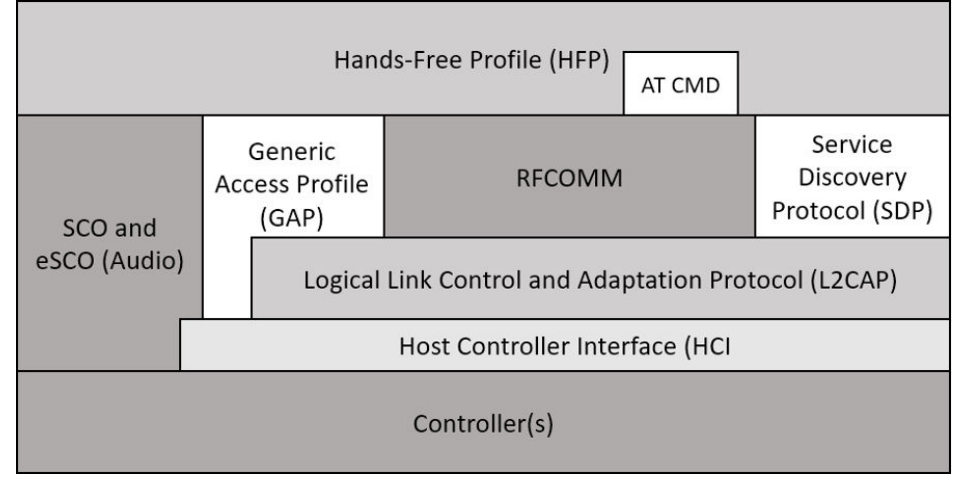

**Figure 1.1: Bluetooth Profiles**

As indicated in Figure 1.1, the Hands-Free Profile is dependent upon both RFCOMM [4] and the Generic Access Profile (Volume 3, Part C in [1]). Details are provided in Section 6 (RFCOMM) and Section 7 (Generic Access Profile).

### 1.3 Symbols and Conventions

#### 1.3.1 Requirement Status Symbols

In this document, the following symbols are used:
• "M" for mandatory to support
• "O" for optional to support
• "X" for excluded (used for capabilities that may be supported by the device, but the Hands-Free Profile shall not use these capabilities)
• "C" for conditional to support
• "N/A" for not applicable (in the given context this capability is not defined)
Some capabilities or features (identified as “X”), mandated according to the relevant Bluetooth specifications, are excluded with respect to this profile because they might degrade the operation of devices in the particular use case. Therefore, features or capabilities labeled “X” shall never be activated while operating in a use case where they are labeled as such.

#### 1.3.2 Naming Conventions

In this document, the following naming conventions are used:
Where “Core Specification” is said it refers to the Bluetooth Core Specification Version 4.2 or later adopted by the Bluetooth SIG.
Where “LMP link” is said, it means a Link Manager (LM) level link over which only Link Manager Protocol (LMP) commands are conveyed.
Where “RFCOMM connection” is said, it means the presence of an emulated serial port as specified in [4].
• Where “Service Level Connection” is said, it means a synchronized high-level protocol connection involving a portion of the protocol stack. In this specific case, it refers to the presence of a RFCOMM connection, and assumes that the HF (Hands-Free unit) has synchronized itself to the state of the AG (Audio Gateway) using the specified Service Level Connection initialization procedure.
• Where “Service Level Connection initialization” is said, it means the execution of the set of AT commands and responses specified by the profile necessary to synchronize the state of the HF with that of the AG.
• Where “Service Level Connection establishment” is said, it means the combined process of establishing the RFCOMM connection, as well as the necessary device synchronization using Service Level Connection initialization.
• Where “Synchronous Connection” is said, it means a SCO or eSCO logical link intended for supporting a full duplex Audio Connection.
• Where “Audio Connection” is said, it means a Synchronous Connection including the means to provide a complete audio path between two devices assuming roles within this profile.
• Where “Codec Connection” is said, it means a Synchronous Connection established after profile level negotiation of Codec and related configuration.
• Where “Wideband Speech Connection” is said, it means a Codec Connection where the media being transported consists of encoded frames derived from speech (or other audio) sampled at 16 kHz.
The format of the media transported over the Synchronous Connection shall be negotiated during the establishment of the Codec Connection.
• Where “mSBC” or “Modified SBC” is said, it means a modified version of the A2DP SBC codec that is used as the mandatory codec for Wideband Speech Connections. Section 6.7.4 contains a complete definition of the modifications which comprise mSBC.
• Where “Super Wideband Speech Connection” is stated, it means a Codec Connection where the media being transported consists of encoded frames derived from speech (or other audio) sampled at 32 kHz. The format of the media transported over the Synchronous Connection shall be negotiated during the establishment of the Codec Connection.
• Where “LC3-SWB” is stated, it means the LC3 codec that is used as the mandatory codec for Super Wideband Speech Connections. The complete definition of the codec can be found in the LC3 Specification [10].
• Where “incoming call” is said, it means a call connection in the direction “Phone Network=>AG”, such that it is initiated by the Network to which the AG is attached.
• Where ‘outgoing call’ is said, it means a call connection in the direction ”AG=>Phone Network”, such that it is initiated by the AG towards the Network to which it is attached.
• Where ‘legacy device’ is said, it means a device that is compatible with an earlier version, v0.96, v1.0 or v1.5, of this specification; see Section 6.3.2.

#### 1.3.3 Signaling Diagram Conventions

Figure 1.2 shows conventions used to describe procedures in signaling diagrams.

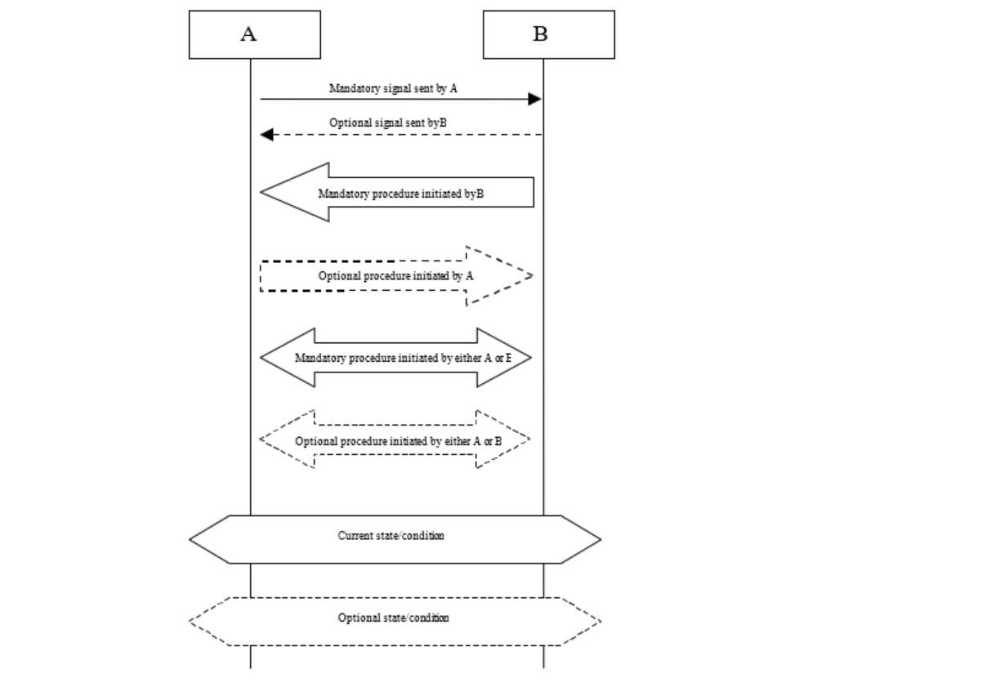

**Figure 1.2: Conventions used in signaling diagrams**

### 1.4 Change History

This section summarizes changes at a moderate level of detail and should not be considered representative of every change made.

#### 1.4.1 Changes from v1.0 to v1.5

##### 1.4.1.1 New and updated features

The following features were added or modified:
• Respond and Hold
• Subscriber Number Information
• Enhanced Call Status
• Enhanced Call Controls

##### 1.4.1.2 Errata incorporated from v1.0 to v1.5

The following errata were incorporated: 13, 261, 317, 549, 550, 575, 586, 635, 706, 731, 746, 819, 820, 821, 822, and 823.

#### 1.4.2 Changes from v1.5 to v1.6

##### 1.4.2.1 New and updated features

The following features were added or modified:
• Wideband Speech Codec
• Codec Negotiation
• Individual Indicator Activation

##### 1.4.2.2 Errata incorporated in v1.6

The following errata were incorporated: 913, 1859, 1868, 1872, 1878, 1934, 1958, 1989, 2037, 2043, 2144, 2146, 2209, 2211, 2259, 2276, 2286, 2459, 2484, 2713, 2716, 2742, 2855, 3090, 3152, 3688, 3816, and 3910.

#### 1.4.3 Changes from v1.6 to v1.7

##### 1.4.3.1 New and updated features

The following feature was added or modified:
• HF Indicators

##### 1.4.3.2 Errata incorporated in v1.7

The following errata were incorporated: 4718, 4893, 5213, 5336, 5806, and 8739.

#### 1.4.4 Changes from v1.7 to v1.7.1

##### 1.4.4.1 Errata incorporated in v1.7.1

The following erratum was incorporated: 6105.

#### 1.4.5 Changes from v1.7.1 to v1.7.2

##### 1.4.5.1 Errata incorporated in v1.7.2

The following errata were incorporated: 6544, 6628, 6835, 8620, 9009, 9034, 9089, 9119, 9122, 9123, 9127, 9158, 9168, 9169, 9170, 9174, 9203, 9204, and 10424.

#### 1.4.6 Changes from v1.7.2 to v1.8

##### 1.4.6.1 New and updated features

The following feature was added or modified:
• Enhanced Voice Recognition Activation

##### 1.4.6.2 Errata incorporated in v1.8

The following erratum was incorporated: 11729.

#### 1.4.7 Changes from v1.8 to v1.9

##### 1.4.7.1 New and updated features

The following feature was added or modified:
• Super Wideband Speech

##### 1.4.7.2 Errata incorporated in v1.9

The following errata were incorporated: 10219, 11949, 14688, 14799, 16208, 17053, 17611, 17784, 17920, 17962, 18317, 18423, 18424, 18464, 18696, 18697, 18704, 20366, 20445, 20633, 22160, 22304, 22577, 22765, 22827, 23412, 23641, 23652, and 23728.

#### 1.4.8 Changes from v1.9 to v1.10

##### 1.4.8.1 New and updated features

| Feature Name | Description | Location |
| --- | --- | --- |
| Call Forwarding | Allows HF unit to recognize call forwarding. | Sections 3, 4.2.1.3, 4.10, 4.34, 4.35.3, 4.35.4, 4.35.4, 4.36 (new), 5.2, 5.3, 9 |
| Call Duration Information | Transmits the actual call duration of an active or held call from the AG device to the HF unit. | Sections 3, 4.37 (new), 5.3 |

Table 1.1: New and/or updated features

##### 1.4.8.2 Removed features

No features were removed in this version.

##### 1.4.8.3 Errata incorporated in v1.10

| Section | Errata |
| --- | --- |
| Front matter | 28033, 28406 |
| 1.3.2: Naming Conventions | 24187, 28261 |
| 1.4.2.1: New and updated features | 28261 |
| 1.4.7.1: New and updated features | 28261 |
| 2.3: User Requirements and Scenarios | 28261 |
| 3: Application Layer | 28261 |
| 4.11.3: Codec Connection Setup | 28261 |

| Section | Errata |
| --- | --- |
| 4.11.4: Available codecs updating | 28261 |
| 4.25: Voice Recognition Activation / Enhanced Voice Recognition Activation | 28268 |
| 4.26: Enhanced Voice Recognition Activation with textual representation | 24353 |
| 4.31: Subscriber Number Information | 24192 |
| 4.34: Indicators Activation and Deactivation | 28257 |
| 5.2: AT Capabilities Re-Used from GSM 07.07 and 3GPP 27.007 | 26772, 28261 |
| 5.3: Bluetooth Defined AT Capabilities | 26772, 28261 |
| 6.3: SDP Interoperability Requirements | 28261 |
| 6.6: Baseband Interoperability Requirements | 28261 |
| 6.7: Codec Interoperability Requirements | 28261 |
| 6.7.1.2: Negotiation of eSCO Configuration Parameters | 28261 |
| 6.7.4: mSBC coding | 28261 |
| 6.7.6: LC3-SWB coding | 28261 |
| 6.8: Speech Quality Recommendations | 28261 |
| 6.8.1: Packet Loss Concealment (PLC) | 28261 |
| 6.8.2: Signal Levels | 28261 |
| 8: References | 28034 |
| 9: List of Acronyms and Abbreviations | 28261 |
| 10.3.1: Frame header _ | 28261 |
| 13.1: Audio levels | 28261 |
| 13.2.1: Bluetooth Send Sensitivity Frequency Response | 28261 |
| 13.2.2: Bluetooth Receive Sensitivity Frequency Response | 28261 |
| 14.4: Handling of eSCO 16-bit CRC | 25913 |

Table 1.2: Errata incorporated in v1.10

### 1.5 Language

#### 1.5.1 Language conventions

In the development of a specification, the Bluetooth SIG has established the following conventions for use of the terms “shall”, "mandatory", “shall not”, “should”, “should not”, “may”, "optional", “must”, and “can”. In this Bluetooth specification, the terms in Table 1.3 have the specific meanings given in that table, irrespective of other meanings that exist.

| Term | Definition |
| --- | --- |
| shall or mandatory | —used to express what is required by the specification and is to be implemented exactly as written without deviation |
| shall not | —used to express what is forbidden by the specification |
| should or may or optional | —not mandatory. Used to express either: 1. what is recommended by the specification without forbidding anything ("should") 2. what is permissible within the limits of the specification ("may" or "optional") |
| should not | —used to indicate that something is discouraged but not forbidden by the specification |
| must | —used to indicate either: 1. an indisputable statement of fact that is always true regardless of the circumstances 2. an implication or natural consequence if a separately-stated requirement is followed |
| can | —used to express a statement of possibility or capability |

Table 1.3: Language conventions terms and definitions

##### 1.5.1.1 Implementation alternatives

When specification content indicates that there are multiple alternatives to satisfy specification requirements, if one alternative is explained or illustrated in an example it is not intended to limit other alternatives that the specification requirements permit.

##### 1.5.1.2 Discrepancies

It is the goal of Bluetooth SIG that specifications are clear, unambiguous, and do not contain discrepancies. However, members can report any perceived discrepancy by filing an erratum and can request a test case waiver as appropriate.
Certain terms used in this specification have been updated and are no longer used by Bluetooth SIG. For a list of terms that have been updated and their replacement terms, see the Appropriate Language Mapping Tables [11].

#### 1.5.2 Reserved for Future Use

Where a field in a packet, Protocol Data Unit (PDU), or other data structure is described as "Reserved for Future Use" (irrespective of whether in uppercase or lowercase), the device creating the structure shall set its value to zero unless otherwise specified. Any device receiving or interpreting the structure shall ignore that field; in particular, it shall not reject the structure because of the value of the field.
Where a field, parameter, or other variable object can take a range of values, and some values are described as "Reserved for Future Use," a device sending the object shall not set the object to those values. A device receiving an object with such a value should reject it, and any data structure containing it, as being erroneous; however, this does not apply in a context where the object is described as being ignored or it is specified to ignore unrecognized values.
When a field value is a bit field, unassigned bits can be marked as Reserved for Future Use and shall be set to 0. Implementations that receive a message that contains a Reserved for Future Use bit that is set to 1 shall process the message as if that bit was set to 0, except where specified otherwise.
The acronym RFU is equivalent to Reserved for Future Use.

#### 1.5.3 Prohibited

When a field value is an enumeration, unassigned values can be marked as “Prohibited.” These values shall never be used by an implementation, and any message received that includes a Prohibited value shall be ignored and shall not be processed and shall not be responded to.
Where a field, parameter, or other variable object can take a range of values, and some values are described as “Prohibited,” devices shall not set the object to any of those Prohibited values. A device receiving an object with such a value should reject it, and any data structure containing it, as being erroneous.
“Prohibited” is never abbreviated.

## 2 Profile Overview

### 2.1 Protocol Stack

Figure 2.1 shows the protocols and entities used in this profile.

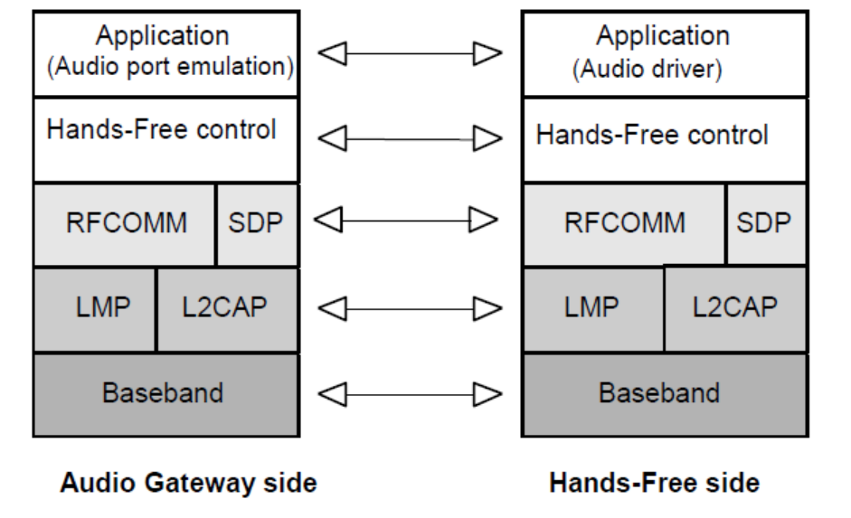

**Figure 2.1: Protocol stack**

The Baseband, LMP and L2CAP are the OSI layer 1 and 2 Bluetooth protocols. RFCOMM is the Bluetooth serial port emulation entity. SDP is the Bluetooth Service Discovery Protocol. See [1] for more details on these topics.
Hands-Free control is the entity responsible for Hands-Free unit specific control signaling; this signaling is AT command based.
Although not shown in the model above, it is assumed by this profile that Hands-Free Control has access to some lower layer procedures (for example, Synchronous Connection establishment).
The audio port emulation layer shown in Figure 2.1 is the entity emulating the audio port on the Audio Gateway, and the audio driver is the driver software in the Hands-Free unit.

### 2.2 Configuration and Roles

Figure 2.2 shows typical configurations of devices for which the Hands-Free Profile is applicable:

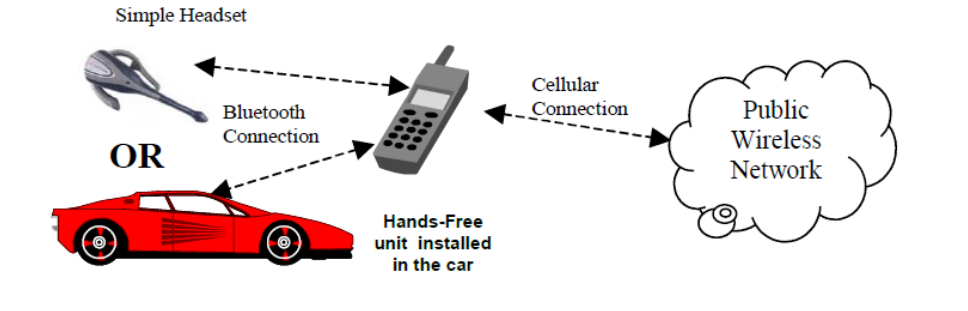

**Figure 2.2: Typical Hands-Free Use**

The following roles are defined for this profile:
Audio Gateway (AG) – This is the device that is the gateway of the audio, both for input and output. Typical devices acting as Audio Gateways are cellular phones.
Hands-Free unit (HF) – This is the device acting as the Audio Gateway’s remote audio input and output mechanism. It also provides some remote control means.
These terms are used in the rest of this document to designate these roles.

### 2.3 User Requirements and Scenarios

The following rules apply to this profile:
a. The profile states the mandatory and optional features when the “Hands-Free Profile” is active in the Audio Gateway and the Hands-Free unit.
b. The profile mandates the usage of CVSD (see Volume 2, Part B, Section 9 in 1) for transmission of audio (over the Bluetooth link). The resulting audio is monophonic, with a quality that, under normal circumstances, does not have perceived audio degradation.
c. Between the Hands-Free unit and the Audio Gateway, only one Audio Connection per Service Level Connection at a time is supported.
d. Both the Audio Gateway and the Hands-Free unit may initiate Audio Connection establishment and release. Valid speech data shall exist on the Synchronous Connection in both directions after the Audio Connection is established. Since it is only the AG that knows if Wideband Speech or Super Wideband Speech should be used, it should always be the AG that establishes the Synchronous Connection with the required codec.
e. Whenever an “Audio Connection” exists, a related “Service Level Connection” shall also exist.
f. The presence of a “Service Level Connection” shall not imply that an “Audio Connection” exists. Releasing a “Service Level Connection” shall also release any existing “Audio Connection” related to it.

### 2.4 Profile Fundamentals

If an LMP link is not already established between the Hands-Free unit and the Audio Gateway, the LMP link shall be set up before any other procedure is performed.
There are no fixed Central or Peripheral roles in the profile.
The Audio Gateway and Hands-Free unit provide serial port emulation. For the serial port emulation, RFCOMM (see [4]) is used. The serial port emulation is used to transport the user data including modem control signals and AT command from the Hands-Free unit to the Audio Gateway. The AT commands are parsed by the Audio Gateway and responses are sent to the Hands-Free unit via the Bluetooth serial port connection.

### 2.5 Conformance

Each capability of this specification shall be supported in the specified manner. This specification may provide options for design flexibility, because, for example, some products do not implement every portion of the specification. For each implementation option that is supported, it shall be supported as specified.

## 3 Application Layer

This section describes the feature requirements for units complying with HFP.
Table 3.1 shows the feature requirements for this profile.

|  | Feature | Support in HF | Support in AG |
| --- | --- | --- | --- |
| 1. | Connection management | M | M |
| 2. | Phone status information | M(note 1) | M |
| 3. | Audio Connection handling | M | M |
| 4 | Accept an incoming voice call | M | M |
| 5. | Reject an incoming voice call | M | O |
| 6. | Terminate a call | M | M |
| 7. | Audio Connection transfer during an ongoing call | M | M |
| 8. | Place a call with the phone number supplied by the HF | O | M |
| 9. | Place a call using memory dialing | O | M |
| 10. | Place a call to the last number dialed | O | M |
| 11. | Call waiting notification | O | M |
| 12. | Three-way calling | O(note 2) | O(note 3) |
| 13. | Calling Line Identification (CLI) | O | M |
| 14. | Echo canceling (EC) and noise reduction (NR) | O | O |
| 15. | Voice recognition activation | O | O |
| 16. | Attach a Phone number for a voice tag | O | O |
| 17. | Ability to transmit DTMF codes | O | M |
| 18. | Remote audio volume control | O | O |
| 19. | Respond and Hold | O | O |
| 20. | Subscriber Number Information | O | M |
| 21a. | Enhanced Call Status | O | M |
| 21b. | Enhanced Call Controls | O | O |
| 22. | Individual Indicator Activation | O | M |
| 23. | Wideband Speech | O | O |
| 24. | Codec Negotiation | O(note 4) | O(note 4) |

|  | Feature | Support in HF | Support in AG |
| --- | --- | --- | --- |
| 25. | HF Indicators | O | O |
| 26. | Super Wideband Speech | O | O |
| 27. | Call Forwarding Feature | O | O |
| 28. | Call Duration Information | O | O |
| Note 1: The HF shall support at least the two indicators "service" and "call". Note 2: If "Three-way calling" is supported by the HF, it shall support AT+CHLD values 1 and 2. The HF may additionally support AT+CHLD values 0, 3, and 4. Note 3: If "Three-way calling" is supported by the AG, it shall support AT+CHLD values 1 and 2. The AG may additionally support AT+CHLD values 0, 3, and 4. Note 4: If Wideband Speech or Super Wideband Speech is supported, Codec Negotiation shall also be supported. |  |  |  |

Table 3.1: Application layer procedures
Table 3.2 maps each feature to the procedures used for that feature. All procedures are mandatory if the feature is supported.

|  | Feature | Procedure | Ref. |
| --- | --- | --- | --- |
| 1. | Connection manage- | Service Level Connection establishment | 4.2 |
|  | ment | Service Level Connection release | 4.3 |
| 2. | Phone status informa- tion | Transfer of Registration Status Transfer of Signal Strength Indication Transfer of Roaming Status Indication Transfer of Battery Level Indication Query of Operator Selection Extended Audio Gateway Error Codes Transfer of Call, Call Setup and Call Held Status | 4.4 4.5 4.6 4.7 4.8 4.9 4.10 |
| 3. | Audio Connection han- dling | Audio Connection set up Audio Connection release Codec Connection setup | 4.11 4.12 |
| 4. | Accept an incoming voice call | Answer an incoming call | 4.13 |
| 5. | Reject an incoming voice call | Reject an incoming call | 4.14 |
| 6. | Terminate a call | Terminate a call process | 4.15 |

|  | Feature | Procedure | Ref. |
| --- | --- | --- | --- |
| 7. | Audio Connection transfer during an on- going call | Audio Connection transfer towards the HF Audio Connection transfer towards the AG | 4.16 4.17 |
| 8. | Place a call with the phone number sup- plied by the HF | Place a call with the phone number sup- plied by the HF | 4.18 |
| 9. | Place a call using memory dialing | Memory dialing from the HF | 4.19 |
| 10. | Place a call to the last number dialed | Last number re-dial from the HF | 4.20 |
| 11. | Call waiting notification | Call waiting notification activation | 4.21 |
| 12. | Three-way calling | Three-way call handling | 4.22 |
| 13. | Calling Line Identifica- tion (CLI) | Calling Line Identification (CLI) notifica- tion | 4.23 |
| 14. | Echo canceling (EC) and noise reduction (NR) | HF requests turning off the AG’s EC and NR | 4.24 |
| 15. | Voice recognition acti- vation | (Enhanced) Voice recognition activation | 4.25, 4.26 |
| 16. | Attach a phone number for a voice tag | Attach a voice tag to a phone number | 4.27 |
| 17. | Ability to transmit DTMF codes | Transmit DTMF code | 4.28 |
| 18. | Remote audio volume control | Remote audio volume control Volume level synchronization | 4.29 |
| 19. | Response and Hold | Query response and hold status Put an incoming call on hold from HF Put an incoming call on hold from AG Accept a held incoming call from HF Accept a held incoming call from AG Reject a held incoming call from HF Reject a held incoming call from AG Held incoming call terminated by caller | 4.30 4.30 4.30 4.30 4.30 4.30 4.30 4.30 |
| 20. | Subscriber Number In- formation | Subscriber Number Information | 4.31 |
| 21a. | Enhanced Call Status | Query Call List | 4.32 |

|  | Feature | Procedure | Ref. |
| --- | --- | --- | --- |
| 21b. | Enhanced Call Control | Release Specified Call Private Consult Mode | 4.33 4.33 |
| 22. | Individual Indicator Ac- tivation | Indicators Activation and Deactivation | 4.34 |
| 23. | Wideband Speech | Wideband Speech | 10 11 12 |
| 24. | Codec Negotiation | Codec Negotiation | 4.11 |
| 25. | HF Indicators | HF Indicators | 4.35 |
| 26. | Super Wideband Speech | Super Wideband Speech | Appendix E |
| 27. | Call Forwarding Fea- ture | Call Forwarding Feature | 4.36 |
| 28. | Call Duration Informa- tion | Transfer call duration information be- tween AG and HF | 4.37 |

Table 3.2: Application layer feature to procedure mapping
Table 3.3 shows the codec requirements for this profile.

|  | Codec | Support in HF | Support in AG |
| --- | --- | --- | --- |
| 1. | CVSD | M | M |
| 2. | mSBC | C.1 | C.1 |
| 3. | LC3-SWB | C.2 | C.2 |
| C.1: Mandatory if Wideband Speech is supported, or excluded otherwise C.2: Mandatory if Super Wideband Speech is supported, or excluded otherwise |  |  |  |

Table 3.3: Requirements on supported codecs
Table 3.4 shows a summary of the mapping of codec requirements on link features for this profile.

|  | Feature | Support in HF | Support in AG |
| --- | --- | --- | --- |
| 1. | D0 – CVSD on SCO link (HV1) | M | M |
| 2. | D1 – CVSD on SCO link (HV3) | M | M |
| 3. | S1 – CVSD eSCO link (EV3) | M | M |
| 4. | S2 – CVSD on EDR eSCO link (2-EV3) | M | M |

|  | Feature | Support in HF | Support in AG |
| --- | --- | --- | --- |
| 5. | S3 – CVSD on EDR eSCO link (2-EV3) | M | M |
| 6. | S4 – CVSD on EDR eSCO link (2-EV3) | M | M |
| 7. | T1 – mSBC on eSCO link (EV3) | C1 | C1 |
| 8. | T2 – mSBC on EDR eSCO link (2-EV3) | C1 | C1 |
| 9. | T1 – LC3-SWB on eSCO link (EV3) | C2 | C2 |
| 10. | T2 – LC3-SWB on EDR eSCO link (2-EV3) | C2 | C2 |
| C1: Mandatory if Wideband Speech is supported, excluded otherwise C2: Mandatory if Super Wideband Speech is supported, excluded otherwise |  |  |  |

Table 3.4: Codec to link feature mapping

## 4 Hands-Free Control Interoperability Requirements

### 4.1 Introduction

The interoperability requirements for the Hands-Free Control entity are completely contained in this section. Sections 4.2 through 4.29 specify the requirements for the procedures directly related to the application layer features.
The procedures listed in this section are primarily based on the use of a minimum set of AT commands as the control protocol. Section 5 specifies these AT commands and their result codes.
Section 4.2 specifies how Service Level Connections are handled in general and specifically states how the layers beneath the Hands-Free Control entity are used to establish and release a Service Level Connection.

### 4.2 Service Level Connection Establishment

Upon a user action or an internal event, either the HF or the AG may initiate a Service Level Connection establishment procedure.
A Service Level Connection establishment requires the existence of a RFCOMM connection, that is, a RFCOMM data link channel between the HF and the AG.
Both the HF and the AG may initiate the RFCOMM connection establishment. If there is no RFCOMM session between the AG and the HF, the initiating device shall first initialize RFCOMM.
The RFCOMM connection establishment shall be performed as described in Generic Access Profile (Volume 3, Part C, Section 7.3 in [1]) and Section 6.1.1.

#### 4.2.1 Service Level Connection Initialization

When an RFCOMM connection has been established, the Service Level Connection Initialization procedure shall be executed.

##### 4.2.1.1 Supported features exchange

First, in the initialization procedure, the HF shall send the AT+BRSF=<HF supported features> command to the AG to both notify the AG of the supported features in the HF, as well as to retrieve the supported features in the AG using the +BRSF result code.1

##### 4.2.1.2 Codec Negotiation

Secondly, in the initialization procedure, if the HF supports the Codec Negotiation feature, it shall check if the AT+BRSF command response from the AG has indicated that it supports the Codec Negotiation feature. If both the HF and AG do support the Codec Negotiation feature then the HF shall send the AT+BAC=<HF available codecs> command to the AG to notify the AG of the available codecs in the HF.2

##### 4.2.1.3 AG Indicators

After having retrieved the supported features in the AG, the HF shall determine which indicators are supported by the AG, as well as the ordering of the supported indicators. This is because, according
1Audio Gateways supporting the 0.96 version of Hands-Free Profile will return ERROR as a response to AT+BRSF 2Legacy devices shall not indicate support for the Codec Negotiation feature
to the 3GPP 27.007 specification [2], the AG may support additional indicators not provided for by the Hands-Free Profile, and because the ordering of the indicators is implementation specific. The HF uses the AT+CIND=? Test command to retrieve information about the supported indicators and their ordering.
Once the HF has the necessary supported indicator and ordering information, it shall retrieve the current status of the indicators in the AG using the AT+CIND? Read command.
After having retrieved the status of the indicators in the AG, the HF shall then enable the "Indicators status update" function in the AG by issuing the AT+CMER command, to which the AG shall respond with OK. As a result, the AG shall send the +CIEV unsolicited result code with the corresponding indicator value whenever a change in service, call forwarding, call, or call setup status occurs. When an update is required for both the call and call setup indicators, the AG shall send the +CIEV unsolicited result code for the call indicator before sending the +CIEV unsolicited result code for the call setup indicator. The HF shall use the information provided by the +CIEV code to update its own internal and/or external indications.
Once the "Indicators status update" function has been enabled, the AG shall keep the function enabled until either the AT+CMER command is issued to disable it, or the current Service Level Connection between the AG and the HF is dropped for any reason.
After the HF has enabled the “Indicators status update” function in the AG, and if the “Call waiting and 3-way calling” bit was set in the supported features bitmap by both the HF and the AG, the HF shall issue the AT+CHLD=? test command to retrieve the information about how the call hold and multiparty services are supported in the AG. The HF shall not issue the AT+CHLD=? test command in case either the HF or the AG does not support the "Three-way calling" feature.

##### 4.2.1.4 HF Indicators

If the HF supports the HF indicator feature, it shall check the +BRSF response to see if the AG also supports the HF Indicator feature.
If both the HF and AG support the HF Indicator feature, then the HF shall send the AT+BIND=<HF supported HF indicators> command to the AG to notify the AG of the supported indicators’ assigned numbers in the HF. The AG shall respond with OK.
After having provided the AG with the HF indicators it supports, the HF shall send the AT+BIND=? to request HF indicators supported by the AG. The AG shall reply with the +BIND response listing all HF indicators that it supports followed by an OK.
Once the HF receives the supported HF indicators list from the AG, the HF shall send the AT+BIND? command to determine which HF indicators are enabled. The AG shall respond with one or more +BIND responses. The AG shall terminate the list with OK. (See Section 4.35.3).
From this point onwards, the HF may send the AT+BIEV command with the corresponding HF indicator value whenever a change in value occurs of an enabled HF indicator.
The AG may enable or disable the notification of any HF indicator at any time by using the +BIND unsolicited response (See Section 4.35.4).

##### 4.2.1.5 Completion of Service Level Connection Initialization

The HF shall consider the Service Level Connection fully initialized, and thereby established, in either of the following cases:
• After the HF has successfully retrieved information about HF indicators currently enabled by the AG using the AT+BIND? command, if and only if the “HF indicators” bit was set in the HF supported features bitmap and the AG supported features bitmap as exchanged via +BRSF command.
• After the HF has successfully retrieved information about how call hold and multiparty services are supported in the AG using the AT+CHLD command, if and only if the “Call waiting and 3-way calling” bit was set in the SupportedFeatures attribute of the SDP records for both HF and AG. This case shall apply when the “HF Indicators” bit is not set in the supported features bitmap for either the HF or the AG as exchanged via +BRSF command.
• After the HF has successfully enabled the “Indicator status update” using the AT+CMER command. This case shall apply when the “Call waiting and 3-way calling” bit is not set in the SupportedFeatures attribute of the SDP records for either the HF or the AG, and when the “HF Indicators” bit is not set in the supported features bitmap for either the HF or the AG as exchanged via +BRSF command.
If the HF receives an indication from the AG that a call is currently active, the HF may determine if an unanswered call is currently on hold by querying the Response and Hold state of the AG (see Section 4.30.1).
The AG shall consider the Service Level Connection to be fully initialized, and thereby established, in either of the following cases:
• After the AG has successfully responded with information about which HF indicators are enabled on the AG using +BIND as well as responded OK, if and only if the “HF Indicators” bit was set in the HF supported features bitmap and the AG supported features bitmap as exchanged via +BRSF command.
• After that the AG has successfully responded with information about how call hold and multiparty services are supported in the AG using +CHLD as well as responded OK, if and only if the “Call waiting and 3-way calling” bit was set in the SupportedFeatures of the SDP attribute for both HF and AG. This case shall apply when the “HF Indicators” bit is not set in the supported features bitmap for either the HF or the AG as exchanged via +BRSF command.
• After the AG has successfully responded with OK to the AT+CMER command (to enable the “Indicator status update” function.) This case shall apply when the “Call waiting and 3-way calling” bit is not set in the supported features bitmap for either the HF or the AG, and when the “HF Indicators” bit is not set in the supported features bitmap for either the HF or the AG as exchanged via +BRSF command.
See Section 5 for more information on the AT+CIND, AT+CMER, AT+CHLD, AT+BAC and AT+BRSF commands and the +CIEV unsolicited result code.

##### 4.2.1.6 Service Level Connection Diagram

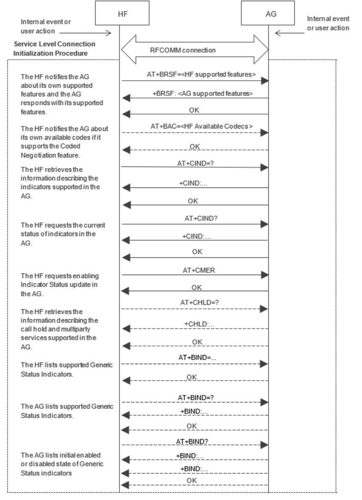

**Figure 4.1: Service Level Connection establishment**

#### 4.2.2 Link Loss Recovery

This section addresses the link loss recovery from an HF. The HF may reconnect with the AG whenever there is loss of Bluetooth link.
When a Service Level Connection is disconnected due to explicit termination at one end (using the "Service connection release" as described in Section 4.3), then both devices (AG and HF) shall wait for an explicit user action before an attempt is made to re-establish the Service Level Connection.
If the HF determines that the Service Level Connection was disconnected due to a link supervision timeout, then the HF may execute the "Service Level Connection establishment" procedure as described in Section 4.2 to establish a new Service Level Connection to the AG. Following a link loss due to link supervision timeout, the HF shall not assume that the service level connection state from the previous connection is valid (such as Call Status, Service Status).

### 4.3 Service Level Connection Release

This section describes the procedure for releasing a Service Level Connection.
The disconnection of a Service Level Connection shall result in the immediate removal of the corresponding RFCOMM data link channel between the HF and the AG. Also, an existing audio connection has to be removed as a consequence of the removal of the Service Level Connection. The removal of the L2CAP and link layers is optional.
An established Service Level Connection shall be released using a “Service Level Connection removal” procedure.
• Either the HF or AG shall initiate the “Service Level Connection release” procedure due to an explicit user request.
• The “Service Level Connection release” procedure shall be initiated if the Bluetooth functionality is disabled in either the HF or AG.
• The “Service Level Connection release” procedure may be initiated if an “Audio Connection transfer towards the AG”, as stated in Section 4.17, is performed during an ongoing call in the AG. In the case that the Service Level Connection is removed, the AG shall attempt to re-establish the Service Level Connection once the call is dropped.
As a precondition for this procedure, an ongoing Service Level Connection between the AG and the HF shall exist.

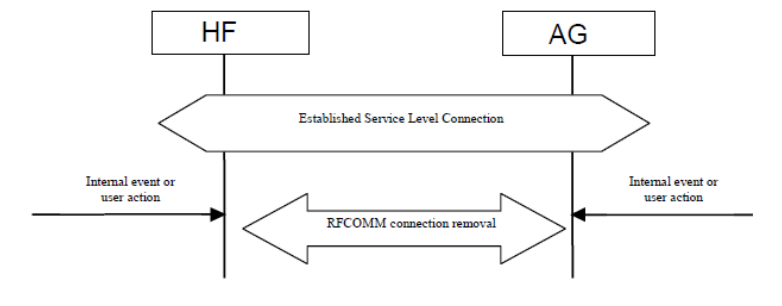

**Figure 4.2: Service Level Connection removal**

### 4.4 Transfer of Registration Status

The AT+CMER command, as described in Section 5, enables the “Registration status update” function in the AG.
The AT+BIA command, as described in Section 5.3, allows the HF to deactivate/reactivate individual indicators.
When the CMER function is enabled and the registration status indicator has not been deactivated by the AT+BIA command, the AG shall send the +CIEV unsolicited result code with the corresponding service indicator and value whenever the AG's registration status changes. The HF shall be capable of interpreting the information provided by the +CIEV result code to determine the service availability status as listed in Section 5.2.
If the CMER function is disabled or the indicator has been deactivated by the AT+BIA command, the AG shall not send the unsolicited result code.

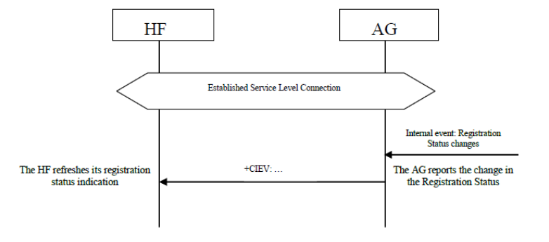

**Figure 4.3: Typical Registration Status update**

### 4.5 Transfer of Signal Strength Indication

The AT+CMER command, as described in Section 5, enables the “Signal strength Indication” function in the AG.
The AT+BIA command, as described in Section 5.3, allows the HF to deactivate/reactivate individual indicators.
When the CMER function is enabled and the indicator has not been deactivated by the AT+BIA command, the AG shall send the +CIEV unsolicited result code with the corresponding signal strength indicator and value whenever the AG's signal strength changes. The HF shall be capable of interpreting the information provided by the +CIEV result code to determine the signal strength as listed in Section 5.2.
If the CMER function is disabled or the indicator has been deactivated by the AT+BIA command, the AG shall not send the unsolicited result code.

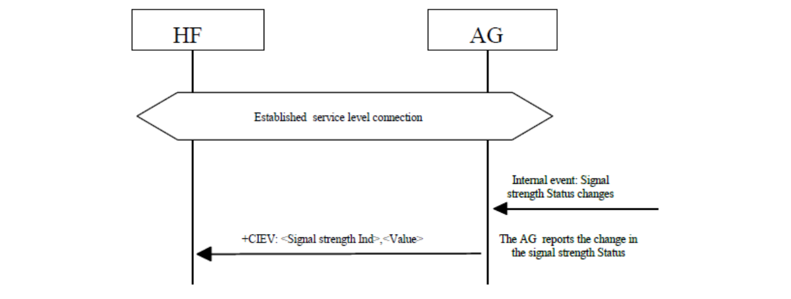

**Figure 4.4: Transfer of Signal strength indication**

As a result, the AG shall send the +CIEV unsolicited result code with the corresponding signal strength value whenever its signal strength changes.

### 4.6 Transfer of Roaming Status Indication

The AT+CMER command, as described in Section 5, enables the “Roaming Status Indication” function in the AG.
The AT+BIA command, as described in Section 5.3, allows the HF to deactivate/reactivate individual indicators.
When the CMER function is enabled and the indicator has not been deactivated by the AT+BIA command, the AG shall send the +CIEV unsolicited result code with the corresponding roaming status indicator and value whenever the AG's roaming status changes. The HF shall be capable of interpreting the information provided by the +CIEV result code to determine the roaming status as listed in Section 5.2.
If the CMER function is disabled or the indicator has been deactivated by the AT+BIA command, the AG shall not send the unsolicited result code.

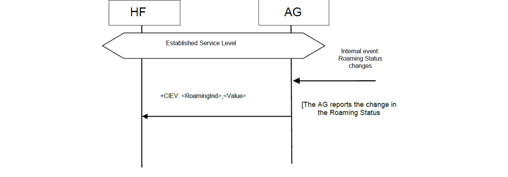

**Figure 4.5: Transfer of Roaming Status Indication**

### 4.7 Transfer of Battery Level Indication of AG

The AT+CMER command, as described in Section 5 enables the “Battery Level Indication” function in the AG.
The AT+BIA command, as described in Section 5.3, allows the HF to deactivate/reactivate individual indicators.
When the CMER function is enabled and the indicator has not been deactivated by the AT+BIA command, the AG shall send the +CIEV unsolicited result code with the corresponding battery level indicator and value whenever the AG's battery level changes. The HF shall be capable of interpreting the information provided by the +CIEV result code to determine the battery level as listed in Section 5.2.
If the CMER function is disabled or the indicator has been deactivated by the AT+BIA command, the AG shall not send the unsolicited result code.

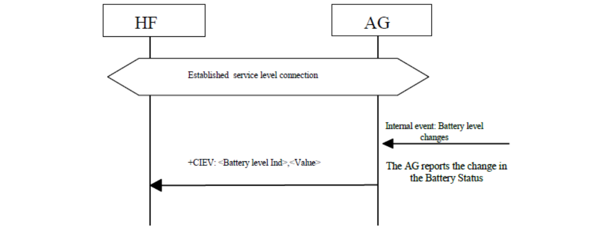

**Figure 4.6: Transfer of Battery level indication**

### 4.8 Query Operator Selection

The HF shall execute this procedure to find out the name of the currently selected Network operator by AG.
The following precondition applies for this procedure:
• An ongoing connection between the AG and the HF shall exist. If this connection did not exist, the AG shall establish a connection using “Service Level Connection set up” procedure described in Section 4.2.

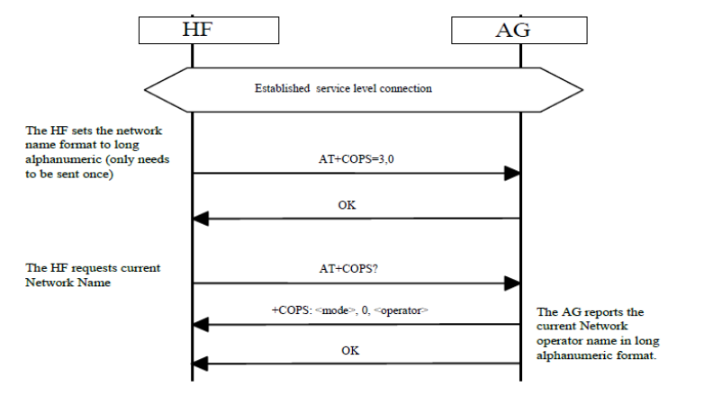

**Figure 4.7: Query currently selected Network operator**

• HF shall send AT+COPS=3,0 command to set name format to long alphanumeric. Long alphanumeric is defined as a maximum of 16 characters. The value of 3 as the first parameter indicates that this command is only affecting the format parameter (the second parameter). The second parameter, 0, is the value required to set the format to “long alphanumeric.”
• Upon an internal event or user-initiated action, HF shall send the AT+COPS? (Read) command to find the currently selected operator.
• AG shall respond with +COPS response indicating the currently selected operator. If no operator is selected, <format> and <operator> are omitted.

### 4.9 Report Extended Audio Gateway Error Results Code

The HF shall execute this procedure to enable/disable Extended Audio Gateway Error result codes in the AG.
The following precondition applies for this procedure:
• An ongoing connection between the AG and the HF shall exist. If this connection did not exist, the AG shall establish a connection using “Service Level Connection set up” procedure described in Section 4.2.

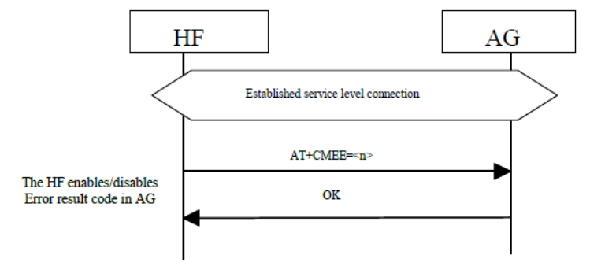

**Figure 4.8: Enable/Disable AG Error result code**

• The HF shall issue the AT+CMEE command to enable/disable the “Extended Audio Gateway Error Result Code” in the AG. The parameter <n> controls the activation/deactivation of the “Extended Error result code” notification.
• Whenever there is an error relating to the functionality of the AG as a result of AT command, the AG shall send +CME ERROR: <err> response to the HF.

### 4.10 Transfer of Call, Call Setup, and Held Call Status

The AT+CMER command, as described in Section 5, enables the “Call Status indicators update” function in the AG.
The AT+BIA command, as described in Section 5.3, allows the HF to deactivate/reactivate individual indicators. The AT+BIA command shall have no effect on the Call, Call Setup, or Held Call indicators. These indicators cannot be deactivated using the AT+BIA command.
When the CMER function is enabled, the AG shall issue a +CIEV unsolicited result code with the corresponding call indicator and value whenever the AG's current call status changes. Likewise, the AG
shall issue a +CIEV unsolicited result code with the corresponding callsetup indicator and value whenever the AG's current call setup status changes. The AG shall also issue a +CIEV unsolicited result code with corresponding callheld indicator and value whenever the AG’s current held call status changes.
If the CMER function is disabled, the AG shall not send the unsolicited result code.
The HF shall be capable of interpreting the information provided by the +CIEV result code to determine the call status as listed in Section 5.2.
Furthermore, the HF may also be capable of interpreting the optional callsetup state information provided by the +CIEV result code as listed in Section 5.2.
The HF shall be able to accept unknown indicators provided by the +CIEV result code. The HF may ignore unknown indicators provided by the +CIEV result code.
Note: Although the HF is required to parse the +CIEV result codes, the HF is not required to provide User Interface indicators for the +CIEV result codes.

#### 4.10.1 Transfer of Call Status

Upon the change in status of any call in the AG, the AG shall execute this procedure to advise the HF of the current call status changes. The values for the call indicator are:

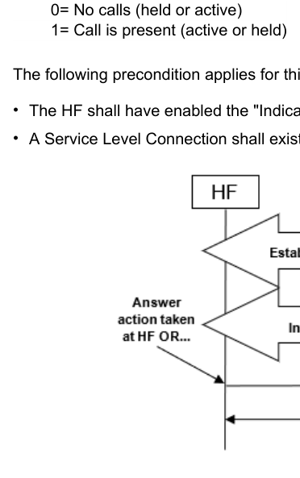

**Figure 4.9: Call Status: Incoming call answered**

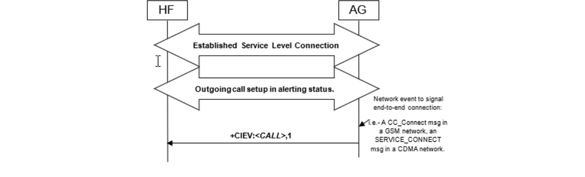

**Figure 4.10: Call Status: Outgoing call**

Consequently, upon the release of any call that places the AG in a state where there is no call present on the AG, either by the AG, a network event, or actions by the HF, the AG shall issue a +CIEV unsolicited result code with the call indicator value of “0”.

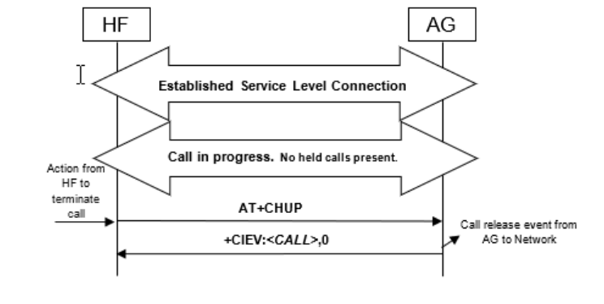

**Figure 4.11: Call Status: Call Release from HF**

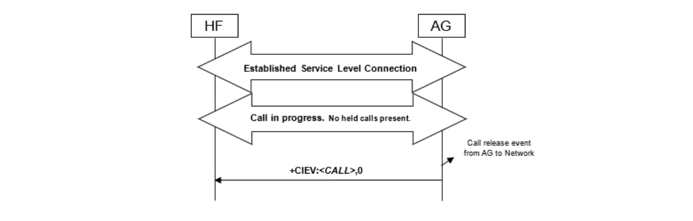

**Figure 4.12: Call Status: Call Release from AG**

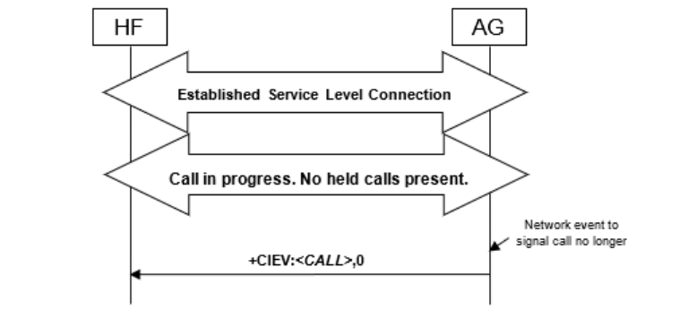

**Figure 4.13: Call Status: Call Release from Network**

#### 4.10.2 Transfer of Callsetup Status

Upon the change in AG's callsetup status, the AG shall execute this procedure to advise the HF of the current callsetup status changes. The values for the callsetup indicator are:
0= No call setup in progress.
1= Incoming call setup in progress.
2= Outgoing call setup in dialing state.
3= Outgoing call setup in alerting state.
The following precondition applies for this procedure:
• The HF shall have enabled the "Indicators status update" in the AG.
• A Service Level Connection shall exist between the AG and HF devices.

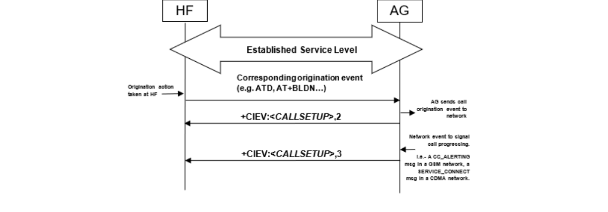

**Figure 4.14: Callsetup Status: Outgoing**

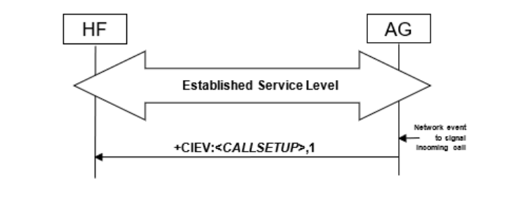

**Figure 4.15: Callsetup Status: Incoming (See Section 4.13, 4.14)**

Once the AG has been advised via whatever applicable network function, that a call has reached an end-to-end connected status, the callsetup indicator shall be reset indicating that no call setup procedures are in progress.

#### 4.10.3 Indication of Status for Held Calls

Upon the change in status of any call on hold in the AG, the AG shall execute this procedure to advise the HF of the held call status. The values for the callheld indicator are:
0= No calls held
1= Call is placed on hold or active/held calls swapped
(The AG has both an active AND a held call)
2= Call on hold, no active call
The following precondition applies for this procedure:
• The HF shall have enabled the Call Status Indicators function in the AG.
• A Service Level Connection shall exist between the AG and HF devices.
Whenever an active call is placed on hold such that the AG now has both an active and held call or the active/held call positions swapped by a request from the HF or by action on the AG, the AG shall issue a +CIEV unsolicited result code with the callheld indicator value of “1”.

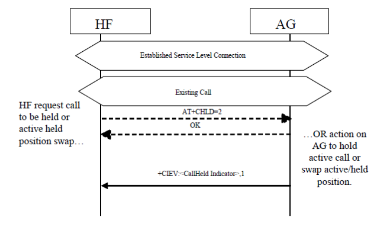

**Figure 4.16: Call Held or Active/Held Position Swap**

Consequently, upon the release of any call on hold by the HF, the AG or by network event, or actions by the HF or AG to retrieve a held call, the AG shall issue a +CIEV unsolicited result code with the callheld indicator value of “0”.

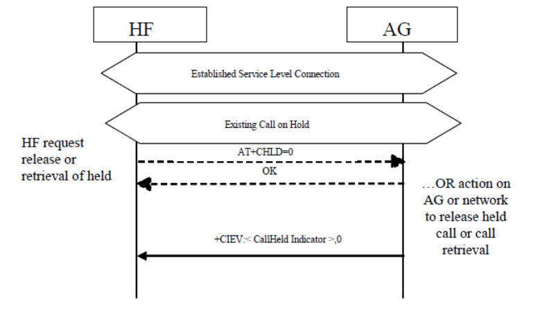

**Figure 4.17: Held Call Release**

If a call is still on hold when an active call is terminated or a single active call is put on hold, the AG shall issue a +CIEV unsolicited result code with the callheld indicator value of “2”.

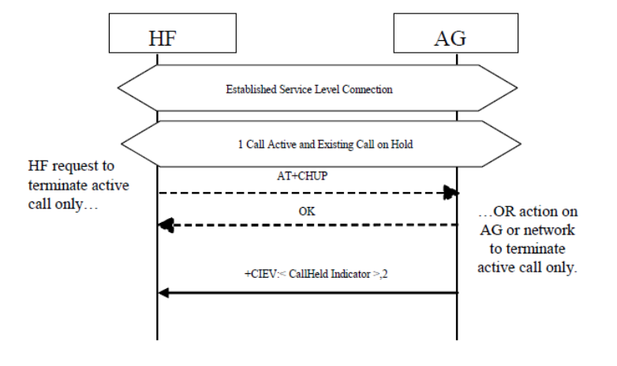

**Figure 4.18: Active Call Terminated/Call Remains Held**

### 4.11 Audio Connection Setup

Upon user action or an internal event, either the HF or the AG may initiate the establishment of an audio connection as needed. Further internal actions may be needed by the HF or the AG to internally route, modify sample rate, frame and/or sample alignment of the audio paths. More formally stated, the requirements for audio connection setup are:
• The HF shall be capable of initiating an audio connection during a call process.
• The HF may be capable of initiating an audio connection while no call is in process.
• The AG shall be capable of initiating an audio connection during a call process.
• The AG may be capable of initiating an audio connection while no call is in process.
Incoming call audio handling is further described in Section 4.12.
Outgoing call audio handling is further described in Sections 4.17, 4.18, and 4.19.
An Audio Connection set up procedure always means the establishment of a Synchronous Connection and it is always associated with an existing Service Level Connection.
In principle, setting up an Audio Connection by using the procedure described in this section is not necessarily related to any call process.
As a precondition for this procedure, an ongoing Service Level Connection between the AG and the HF shall exist. If this connection does not exist, the initiator of the procedure shall autonomously establish the Service Level Connection using the proper procedure as described in Section 4.2.
Both the initiator and the acceptor shall notify the presence of the new Audio Connection.

#### 4.11.1 Audio Connection Setup by AG

When the AG is to setup an Audio Connection, it shall initiate the Codec Connection establishment procedure if the Service Level Negotiation indicated that both sides support this feature.

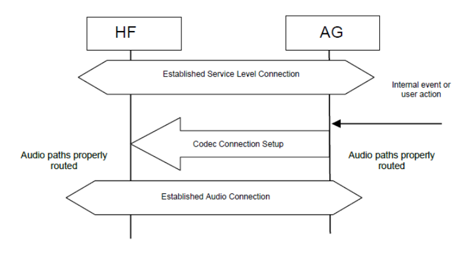

**Figure 4.19: Procedure for Establishment of Audio Connection from AG**

#### 4.11.2 Audio Connection Setup by HF

For all HF initiated audio connection establishments for which both sides support the Codec Negotiation feature, the HF shall trigger the AG to establish a Codec Connection. This is necessary because only the AG knows about the codec selection and settings of the network.

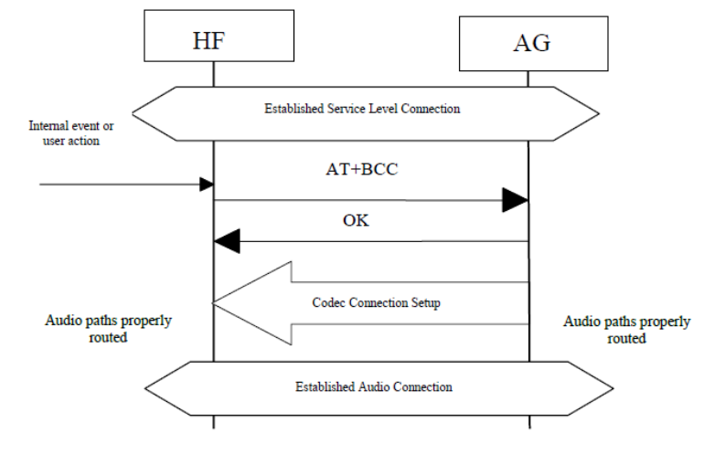

**Figure 4.20: Procedure for Establishment of Audio Connection from HF**

When the HF triggers the establishment of the Codec Connection it shall send the AT command AT+BCC to the AG. The AG shall respond with OK if it will start the Codec Connection procedure, and with ERROR if it cannot start the Codec Connection procedure.
After the AG has sent the OK response, the AG shall initiate the Codec Connection Setup procedure.
The type of Synchronous Connection that is established in this procedure and the settings used for it are dependent on the format of the media that is going to be transported over the connection and can be found in the Sections 4.2.1 and 6.7.2.

#### 4.11.3 Codec Connection Setup

Upon user action or an internal event, either the HF or the AG may initiate the establishment of a Codec Connection Setup procedure, whenever necessary. Further internal actions may be needed by the HF or the AG to internally route, modify sample rate, frame and/or sample alignment of the audio paths.
Although the Audio Connection may be triggered by either the AG or the HF, the Codec Connection and the Synchronous Connection shall always be established by the AG (unless one of the devices is a legacy device).
The AG shall initiate a Codec Connection only if the HF has indicated support for the Codec Negotiation feature and has sent at least one AT+BAC on the current service level connection. When selecting which codec to use for a codec connection, the AG shall use the information on codecs available in the HF as provided in the most recently received AT+BAC.
The AG shall inform the HF which codec ID will be used before establishing the Synchronous Connection. If a codec has been successfully selected at least once on the current service level connection, the AG does not need to inform the HF about which codec to use unless a change of codec is required for the next synchronous connection. If the HF has sent an additional AT+BAC after the completion of the Service Level Connection procedure, there may be a need to re-select the codec.

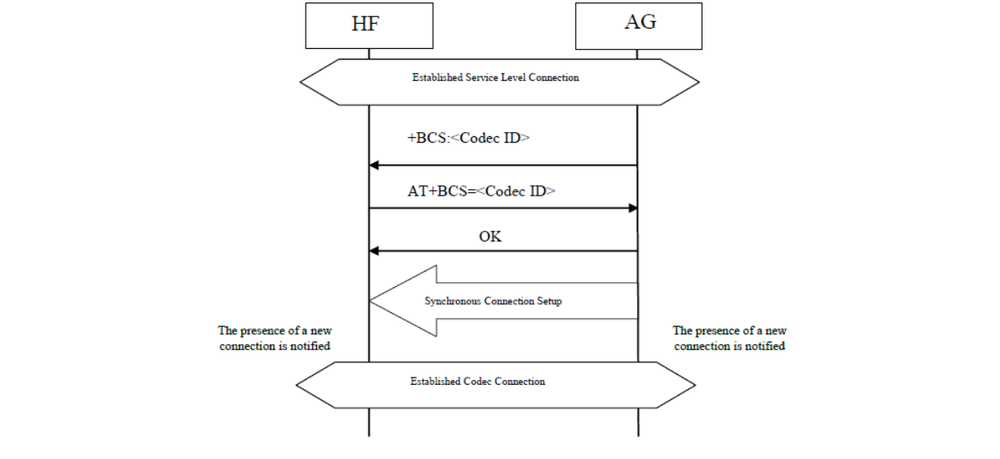

**Figure 4.21: Procedure for the Establishment of Codec Connection**

The AG shall send a +BCS=<Codec ID> unsolicited response to the HF. The HF shall then respond to the incoming unsolicited response with the AT command AT+BCS=<Codec ID>. The ID shall be the same as in the unsolicited response code as long as the ID is supported. If the received ID is not available, the HF shall respond with AT+BAC with its available codecs.
The AG shall always respond with OK if the ID received in AT+BCS is the same as the one sent, and with ERROR otherwise. If no AT+BCS is received, but instead an AT+BAC is received after sending +BCS, the procedure shall end but may be restarted by the AG after re-selecting codec ID based on the information in the just received AT+BAC.
After sending the OK response, the AG shall open the Synchronous Connection with the settings that are determined by the ID. The HF shall be ready to accept the synchronous connection establishment as soon as it has sent the AT commands AT+BCS=<Codec ID>.
After the Synchronous Connection has been established, the Codec Connection is established. The selection of codec with the +BCS command is in effect for this connection as well as subsequent Codec Connections.
If the Codec Connection establishment procedure fails before a Synchronous Connection has been established, the Codec Connection establishment procedure shall be re-started before any Synchronous Connection is established.
If an (e)SCO link cannot be established according to the parameters required for the selected codec (e.g., basebands negotiation fails for a link with re-transmission although a wideband or super wideband codec has been selected), the Codec Connection establishment procedure shall be re-started by the AG with the purpose of selecting a codec that can be used. The mandatory narrow band codec (CVSD) shall be used before the AG gives up trying to establish a Codec Connection.
The type settings for the Synchronous Connection that is established in this procedure are dependent on the format of the media that is going to be transported over the audio connection and can be found in the Section 6.7.2.

#### 4.11.4 Available codecs updating

Any time on an established service level connection for which both sides support the Codec Negotiation Feature, the HF may send AT+BAC to inform the AG about dynamic changes in the set of available codecs, which does not mandate the closing of any existing audio connection. If the AG has started the Codec Connection Setup procedure, AT+BAC shall be sent by the HF in response to the +BCS unsolicited response from the AG when the selected codec has become unavailable.
If the last selected codec becomes unavailable, the HF shall send AT+BAC to the AG to prompt the AG to re-select a codec before the next Codec Connection set-up and AG shall send the +BCS unsolicited response before starting establishment of a Synchronous Connection.
The mandatory narrow band codec shall always be listed in the AT+BAC command. Hence, the AT+BAC shall never be an empty list; this provides a fallback option that is always available to setup an Audio Connection.
If the mandatory wideband codec or the mandatory super wideband codec is supported, it shall also always be listed in the AT+BAC commands unless support for Wideband Speech or Super Wideband Speech has become temporarily unavailable. If the HF has previously indicated in its AT+BAC command that it supports Wideband Speech or Super Wideband Speech, then the AG shall interpret this as temporary suspension of Wideband Speech or Super Wideband Speech support respectively until the HF sends the next AT+BAC command. If the mandatory Wideband Speech codec is not included in the AT+BAC command, then no other Wideband Speech codec shall be included. If the mandatory Super Wideband Speech codec is not included in the AT+BAC command, then no other Super Wideband Speech codec shall be included.

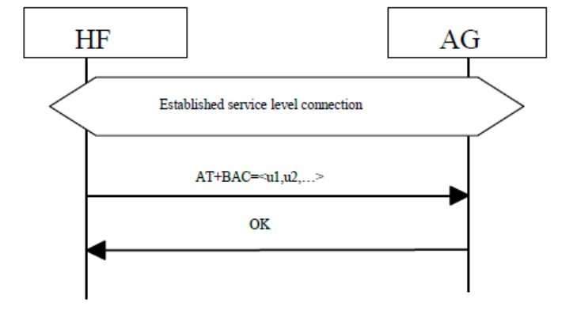

**Figure 4.22: Procedure for updating the list of available codecs**

#### 4.11.5 Codec re-negotiation

When the AG establishes an Audio Connection, it will decide what codec to use based upon the list of available codecs communicated during the most recent AT+BAC command exchange. The selected Bluetooth codec shall then be used throughout the ongoing Synchronous Connection irrespective of any
changes on the connection at the AG or HF side. To change the selected Bluetooth codec, the AG may initiate a Codec Connection Setup procedure. The newly selected codec as a result of this codec re-negotiation shall be used for the next Audio Connection.

### 4.12 Audio Connection Release

Upon a user action or an internal event, either the HF or the AG may release an existing Audio Connection. More formally stated, the requirements for audio connection release are:
• The HF shall be capable of releasing an audio connection during a call process.
• If the HF has the ability to set up an audio connection with no call in process, the HF shall be capable of releasing the audio connection while no call is in process.
• The AG shall be capable of releasing an audio connection during a call process.
• If the AG has the ability to set up an audio connection with no call in process, the AG shall be capable of releasing the audio connection while no call is in process.
As a precondition for this procedure, an ongoing Audio Connection between the AG and the HF shall exist.
An Audio Connection release always means the disconnection of its corresponding Synchronous Connection.
When the audio connection is released, the audio path shall be routed to the AG.3

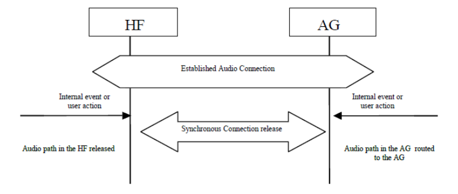

**Figure 4.23: Audio Connection release**

### 4.13 Answer an Incoming Call

Upon an incoming call, the AG shall send a sequence of unsolicited RING alerts to the HF. The RING alert shall be repeated for as long as the call acceptance is pending, or until the incoming call is interrupted for any reason.
The HF shall produce a local alerting in reaction to the RING.
If the AG's SDP record (or +BRSF message) indicates "In-band ring tone" is supported, the AG shall send in-band ring tones unless subsequently changed using procedures defined in Section 4.13.4.
3In principle, removing an Audio Connection by using the procedure described in this section is not necessarily related to any call process
The AG may abort the incoming call when necessary. It shall then stop sending the RING alert to the HF.

#### 4.13.1 Answer Incoming Call from the HF – In-Band Ringing

Optionally, the AG may provide an in-band ring tone.
This case is described in Figure 4.24 below and implies as a precondition that an ongoing Service Level Connection between the AG and the HF shall exist. If this connection does not exist, the AG shall autonomously establish the Service Level Connection using the proper procedure as described in Section 4.2.
As the figure below shows, if an in-band ring tone is used, the AG shall send the ring tone to the HF via the established Audio Connection.

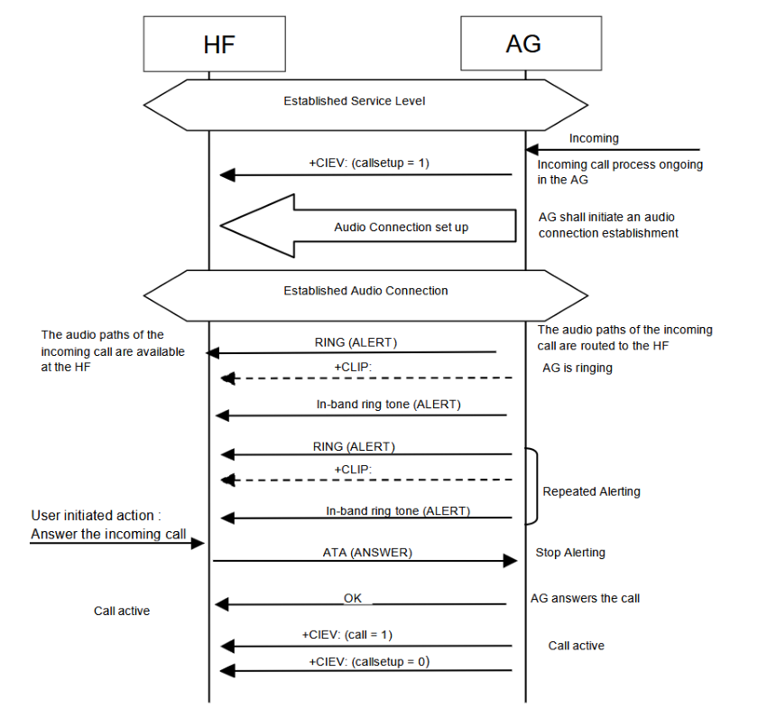

**Figure 4.24: Answer an incoming call from the HF – in-band ring tone**

The user accepts the incoming voice call by using the proper means provided by the HF. The HF shall then send the ATA command (see Section 5) to the AG. The AG shall then begin the procedure for accepting the incoming call.
If the normal incoming call procedure is interrupted for any reason, the AG shall issue the +CIEV result code, with the value indicating (callsetup=0) to notify the HF of this condition (see also Section 4.14.2).

#### 4.13.2 Answer Incoming Call from the HF – No In-Band Ringing

As a precondition, an ongoing Service Level Connection between the AG and the HF shall exist. If this connection does not exist, the AG shall autonomously establish the Service Level Connection using the proper procedure as described in Section 4.2.
As the figure below shows, if no in-band ring tone is used and an Audio Connection does not exist, the AG shall set up the Audio Connection and route the audio paths to the HF upon answering the call.

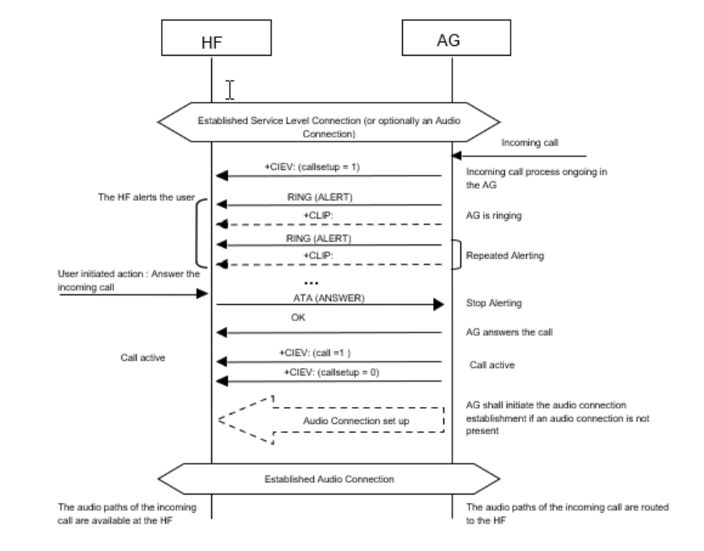

**Figure 4.25: Answer an incoming call from the HF – no in-band ring tone**

The user accepts the incoming voice call by using the proper means provided by the HF. The HF shall then send the ATA command (see Section 5) to the AG, and the AG shall start the procedure for accepting the incoming call and establishing the Audio Connection if an Audio Connection does not exist (refer to Section 4.10.1).
If the normal incoming call procedure is interrupted for any reason, the AG shall issue the +CIEV result code, with the value indicating (callsetup=0) to notify the HF of this condition (see also Section 4.14.2).

#### 4.13.3 Answer Incoming Call from the AG

The following preconditions apply for this procedure:
• As a precondition for this procedure, an ongoing Service Level Connection between the AG and the HF shall exist.
• The AG shall alert the HF using either of the two procedures described in Sections 4.13.1 and 4.13.2.
• The HF shall alert the user.

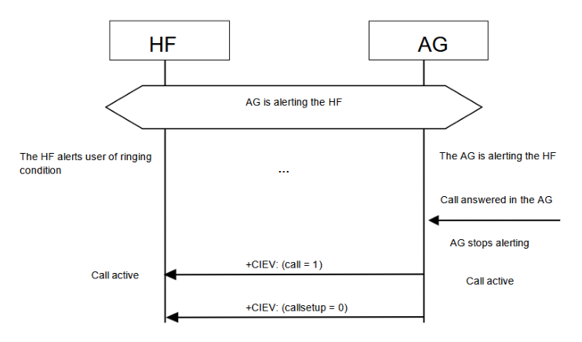

**Figure 4.26: Answer an incoming call from the AG**

The user accepts the incoming call by using the proper means provided by the AG.
If the normal incoming call procedure is interrupted for any reason, the AG shall issue the +CIEV result code, with the value indicating (callsetup=0) to notify the HF of this condition (see also Section 4.14.2).

#### 4.13.4 Change the In-Band Ring Tone Setting

The SDP record entry “In-band ring tone” of the “SupportedFeatures” record (see Table 6.6) informs the HF if the AG is capable of sending an in-band ring tone or not. If the AG is capable of sending an in-band ring tone, it shall send the in-band ring tone by default. The AG may subsequently change this setting.
If the AG wants to change the in-band ring tone setting during an ongoing service level connection, it shall use the unsolicited result code +BSIR (Bluetooth Set In-band Ring tone) to notify the HF about the change. See Figure 4.27 for details.
See Section 5 for more information on the +BSIR unsolicited result code.
The in-band ring tone setting may be changed several times during a Service Level Connection.
As a precondition for this procedure, an ongoing Service Level Connection between the AG and the HF shall exist. If this connection does not exist, the AG shall autonomously establish the Service Level Connection using the proper procedure as described in Section 4.2.

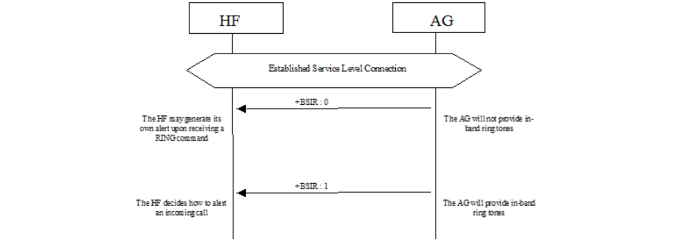

**Figure 4.27: Change of the in-band ring tone setting initiated by the AG**

If the HF does not want to use the AG’s in-band ring tone, it may mute the Audio Connection after it has received +CIEV:(callsetup=1). The HF shall un-mute the Audio Connection upon receiving the +CIEV: (callsetup=0) indication.

### 4.14 Reject an Incoming Call

In case of an incoming call, the AG shall alert the HF by either one of the two procedures described in Sections 4.13.1 and 4.13.2.
Instead of answering the call, the user may reject the incoming call process by user action at the HF or the AG. These two procedures are described in the following sections.

#### 4.14.1 Reject an Incoming Call from the HF

As a precondition to this procedure, the AG shall alert the HF using either of the two procedures described in Sections 4.13.1 and 4.13.2.
The user rejects the incoming call by using the User Interface on the Hands-Free unit. The HF shall then send the AT+CHUP command (see Section 5) to the AG. This may happen at any time during the procedures described in Sections 4.13.1 and 4.13.2.
The AG shall then cease alerting the HF of the incoming call and send the OK indication followed by the +CIEV result code, with the value indicating (callsetup=0).

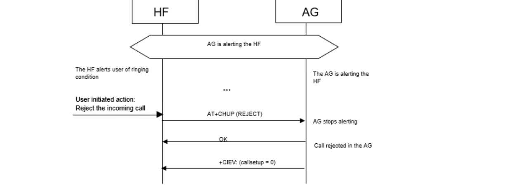

**Figure 4.28: Reject an incoming call from the HF**

#### 4.14.2 Rejection/Interruption of an Incoming Call in the AG

As a precondition to this procedure, the AG shall alert the HF using either of the two procedures described in Sections 4.13.1 and 4.13.2.
The user rejects the incoming call by using the User Interface on the AG. Alternatively, the incoming call process may be interrupted in the AG for any other reason.
As a consequence of this, the AG shall send the +CIEV result code, with the value indicating (callsetup=0). The HF shall then stop alerting the user.
This may happen at any time during the procedures described in Sections 4.13.1 and 4.13.2.

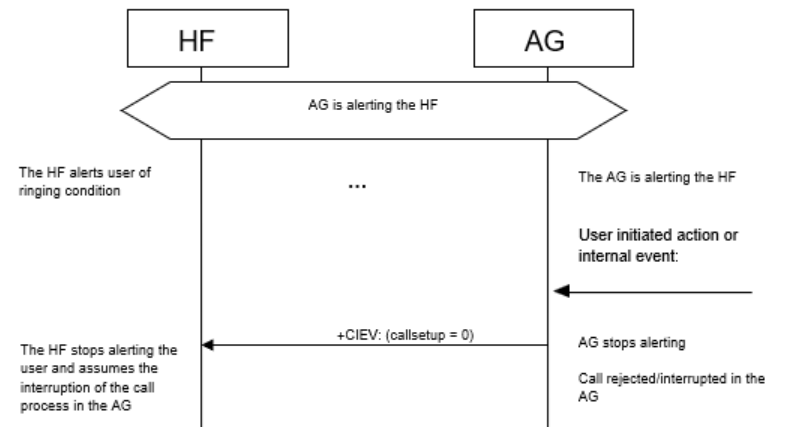

**Figure 4.29: Rejection/interruption of an incoming call in the AG**

### 4.15 Terminate a Call Process

An ongoing call process may be terminated by either the HF or the AG, by means of a user action or any other event.

#### 4.15.1 Terminate a Call Process from the HF

The following preconditions apply for this procedure:
• An ongoing Service Level Connection between the AG and the HF shall exist. If this connection does not exist, the HF shall autonomously establish the Service Level Connection using the proper procedure as described in Section 4.2.
• A call-related process is ongoing in the AG.
Although not required for the call termination process, an Audio Connection is typically present between the HF and AG.

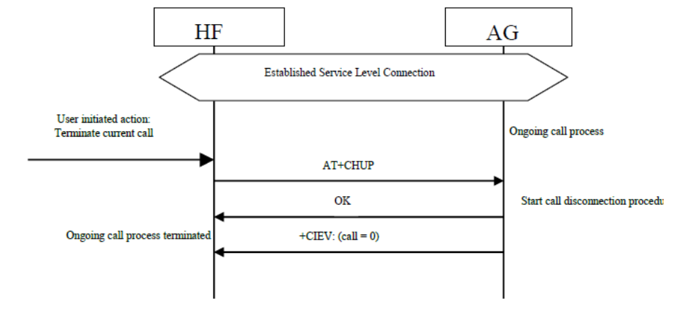

**Figure 4.30: Terminate ongoing call - HF initiated**

The user may abort the ongoing call process using whatever means provided by the Hands-Free unit. The HF shall send AT+CHUP command (see Section 5) to the AG, and the AG shall then start the procedure to terminate or interrupt the current call procedure. The AG shall then send the OK indication followed by the +CIEV result code, with the value indicating (call=0).
Performing a similar procedure, the AT+CHUP command described above may also be used for interrupting a normal outgoing call set-up process.

#### 4.15.2 Terminate a Call Process from the AG

The following preconditions apply for this procedure:
• An ongoing Service Level Connection between the AG and the HF shall exist. If this connection does not exist, the AG shall autonomously establish the Service Level Connection using the proper procedure as described in Section 4.2.
• A call related process is ongoing in the AG.

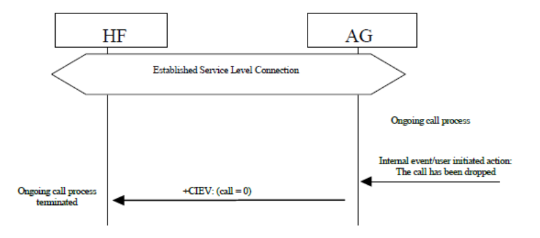

**Figure 4.31: Terminate ongoing call - AG initiated**

This procedure is fully applicable for cases in which an ongoing call process is interrupted in the AG for any reason.
In this case, the AG shall send the +CIEV result code, with the value indicating (call=0).

### 4.16 Audio Connection Transfer towards the HF

The audio paths of an ongoing call may be transferred from the AG to the HF. This procedure represents a particular case of an “Audio Connection set up” procedure, as described in Section 4.11.
The call connection transfer from the AG to the HF is initiated by user action either on the HF or on the AG. This shall result in either the HF or the AG, respectively, initiating an “Audio Connection set up” procedure with the audio paths of the current call being routed to the HF.
This procedure is only applicable if there is no current Audio Connection established between the HF and the AG. In fact, if the Audio Connection already exists, this procedure is not necessary because the audio path of the AG is assumed to be already routed towards the HF.
The following preconditions apply for this procedure:
• An ongoing Service Level Connection between the AG and the HF shall exist. If this connection does not exist, the initiator of the “Audio Connection transfer towards the HF” procedure shall autonomously establish the Service Level Connection using the proper procedure as described in Section 4.2.
• An ongoing call exists in the AG, with the audio paths routed to the AG means.

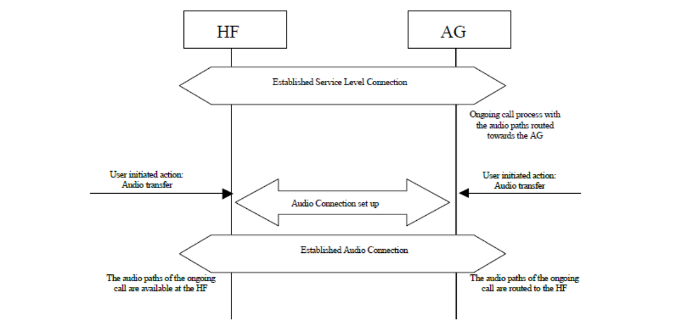

**Figure 4.32: Audio Connection transfer to the HF**

### 4.17 Audio Connection Transfer towards the AG

The audio paths of an ongoing call may be transferred from the HF to the AG. This procedure represents a particular case of an “Audio Connection release” procedure, as described in Section 4.12.
The call connection transfer from the HF to the AG is initiated by a user action in the HF or due to an internal event or user action on the AG side. This results in an “Audio Connection release” procedure being initiated either by the HF or the AG respectively, with the current call kept and its audio paths routed to the AG.
If, as a consequence of an HF initiated “Audio Connection transfer towards the AG” procedure, the existing Service Level Connection is autonomously removed by the AG, the AG shall attempt to re‑establish the Service Level Connection once the current call ends.
As a precondition for this procedure, an ongoing call process shall exist in the AG. The audio paths of the ongoing call shall be available in the HF via an Audio Connection established between the AG and the HF.

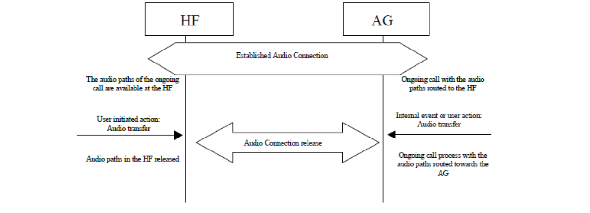

**Figure 4.33: Audio Connection transfer to the AG**

### 4.18 Place a Call with the Phone Number Supplied by the HF

The HF may initiate outgoing voice calls by providing the destination phone number to the AG. To start the call set-up, the HF shall initiate the Service Level Connection establishment (if necessary) and send a proper ATDdd…dd; command to the AG. The AG shall then start the call establishment procedure using the phone number received from the HF and issues the +CIEV result code, with the value (callsetup=2) to notify the HF that the call set-up has been successfully initiated.
See Section 5 for more information on the ATDdd…dd; command.
As a precondition for this procedure, an ongoing Service Level Connection between the AG and the HF shall exist. If this connection does not exist, the HF shall autonomously establish the Service Level Connection using the proper procedure as described in Section 4.2.
If an Audio Connection is not established, the AG shall establish the proper Audio Connection and route the audio paths of the outgoing call to the HF immediately following the commencement of the ongoing call set up procedure.
Once the AG is informed that the alerting of the remote party has begun, the AG shall issue the +CIEV result code, with the value indicating (callsetup=3). If the wireless network does not provide the AG of an indication of alerting the remote party, the AG may not send this indication.
Upon call connection the AG shall send the +CIEV result code, with the value indicating (call=1).
If the normal outgoing call establishment procedure is interrupted for any reason, the AG shall issue the +CIEV result code, with the value indicating (callsetup=0), to notify the HF of this condition (see Section 4.15.2).
If the AG supports the “Three-way calling” feature and if a call is already ongoing in the AG, performing this procedure shall result in a new call being placed to a third party with the current ongoing call put on hold. For details on how to handle multiparty calls refer to Section 4.22.2.

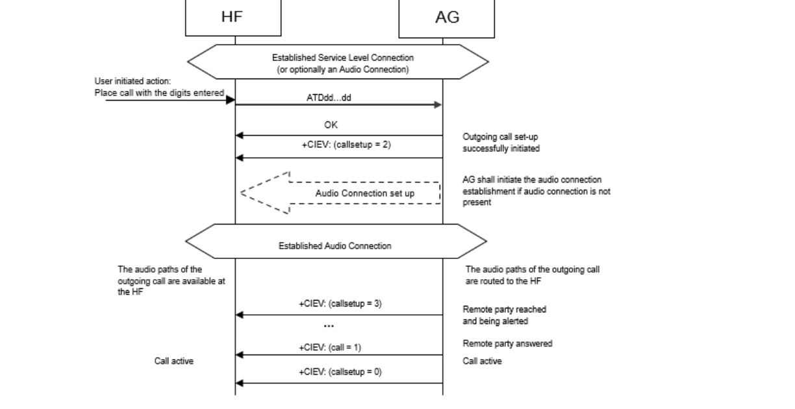

**Figure 4.34: Place an outgoing voice call with the digits entered in the HF**

### 4.19 Memory Dialing from the HF

The HF may initiate outgoing voice calls using the memory dialing feature of the AG. To start the call set-up, the HF shall initiate the Service Level Connection establishment (if necessary) and send an ATD>Nan…; command to the AG. The AG shall then start the call establishment procedure using the phone number stored in the AG memory location given by Nan…; and issue the +CIEV result code, with the value (callsetup=2) to notify the HF that the call set-up has been successfully initiated.
See Section 5 for more information on the ATD>Nan… command.
As a precondition for this procedure, an ongoing Service Level Connection between the AG and the HF shall exist. If this connection does not exist, the HF shall autonomously establish the Service Level Connection using the proper procedure as described in Section 4.2.
If an Audio Connection is not established, the AG shall establish the proper Audio Connection and route the audio paths of the outgoing call to the HF immediately following the commencement of the ongoing call set up procedure.
Once alerting of the remote party begins, the AG shall issue the +CIEV result code, with the value indicating (callsetup=3).
Upon call connection the AG shall send the +CIEV result code, with the value indicating (call=1).
If the normal outgoing call establishment procedure is interrupted for any reason, the AG shall issue the +CIEV result code, with the value indicating (callsetup=0), to notify the HF of this condition (see Section 4.15.2).
If the AG supports the “Three-way calling” feature and if a call is already ongoing in the AG, performing this procedure shall result in a new call being placed to a third party with the current ongoing call put on hold. For details on how to handle multiparty calls refer to Section 4.22.2.
If there is no number stored for the memory location given by the HF, the AG shall respond with ERROR.

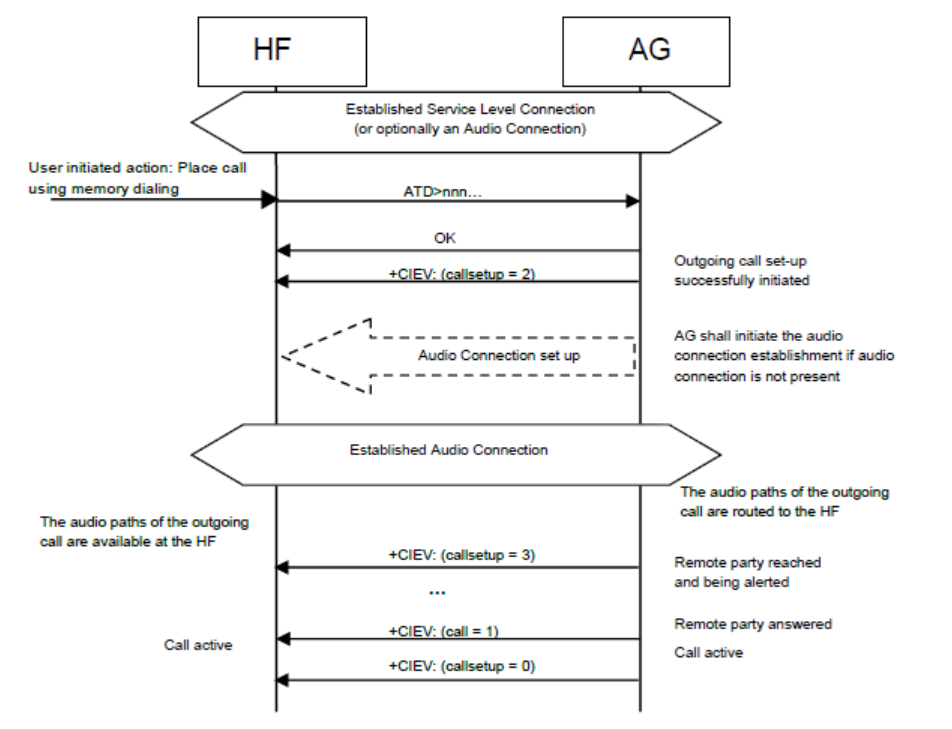

**Figure 4.35: Place an outgoing voice call using memory dialing**

### 4.20 Last Number Re-Dial from the HF

The HF may initiate outgoing voice calls by recalling the last number dialed by the AG. To start the call set-up, the HF shall initiate the Service Level Connection establishment (if necessary) and send an AT+BLDN command to the AG. The AG shall then start the call establishment procedure using the last phone number dialed by the AG, and issues the +CIEV result code, with the value (callsetup=2), to notify the HF that the call set-up has been successfully initiated.
See Section 5 for more information on the AT+BLDN command.
As a precondition for this procedure, an ongoing Service Level Connection between the AG and the HF shall exist. If this connection does not exist, the HF shall autonomously establish the Service Level Connection using the proper procedure as described in Section 4.2.
If an Audio Connection is not established, the AG shall establish the proper Audio Connection and route the audio paths of the outgoing call to the HF immediately following the commencement of the ongoing call set-up procedure.
Once alerting of the remote party begins, the AG shall issue the +CIEV result code, with the value indicating (callsetup=3).
Upon call connection the AG shall send the +CIEV result code, with the value indicating (call=1).
If the normal outgoing call establishment procedure is interrupted for any reason, the AG shall issue the +CIEV result code, with the value indicating (callsetup=0), to notify the HF of this condition (see Section 4.15.2).
If the AG supports the “Three-way calling” feature and if a call is already ongoing in the AG, performing this procedure shall result in a new call being placed to a third party with the current ongoing call put on hold. For details on how to handle multiparty calls refer to Section 4.22.2.
If there is no number stored for the memory location given by the HF, the AG shall respond with ERROR.

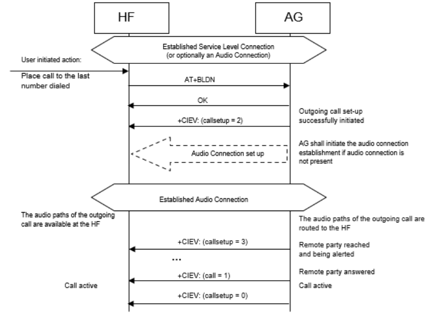

**Figure 4.36: Place an outgoing voice call with the last number dialed**

### 4.21 Call Waiting Notification Activation

The HF may issue the AT+CCWA command to enable the “Call Waiting notification” function in the AG. Once the “Call Waiting notification” is enabled, the AG shall send the corresponding +CCWA unsolicited result code to the HF whenever an incoming call is waiting during an ongoing call. It is always assumed that the “call waiting” service is already active in the network.
Once the HF issues the AT+CCWA command, the AG shall respond with OK. It shall then keep the “Call Waiting notification” enabled until either the AT+CCWA command is issued to disable “Call Waiting notification,” or the current Service Level Connection between the AG and the HF is dropped for any reason.
See Section 5 for more information on the AT+CCWA command.
As a precondition for this procedure, an ongoing Service Level Connection between the AG and the HF shall exist. If this connection does not exist, the HF shall autonomously establish the Service Level Connection using the proper procedure as described in Section 4.2.

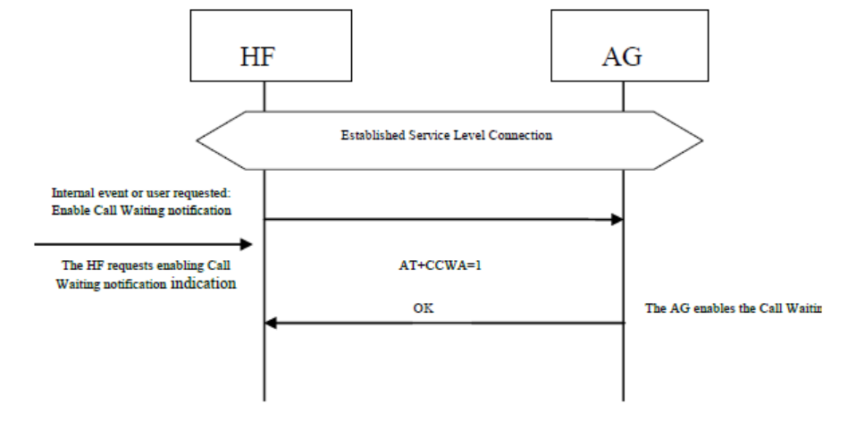

**Figure 4.37: Activation of Call waiting notification**

### 4.22 Three-Way Call Handling

Proper management of several concurrent calls shall be accomplished by performing the procedures described in [2] but with some limitations stated in this specification. For more details, refer to Section 5.
The HF device cannot always assume that the "call hold and/or multiparty" services are available in the network. If the AG determines that a requested action by the HF device cannot be performed due to the inability of the network to support that feature or lack of subscriber subscription, the AG shall return a +CME error.
There are two +CME ERROR codes that are used to indicate network related failure reasons to the HF:
• 30 - No Network Service. Indicates that an AT+CHLD command cannot be implemented due to network limitations.
• 31 - Network Timeout. Indicates that an AT+CHLD command cannot be implemented due to network problems.
In general, when the user deals with multiple concurrent calls, the HF shall issue the corresponding AT+CHLD command as a result of user actions. This command allows the control of multiple concurrent calls and provides means for holding calls, releasing calls, switching between two calls, and adding a call to a multiparty conference.
When this feature is supported, the HF and AG are only mandated to implement the “basic Three-Way calling” commands AT+CHLD = 1 and 2.
This section covers two cases. In one case, the third party call is received in the AG, and notification is sent to the HF via a Call Waiting notification. In the second case, the third party call is placed from the HF.
See Section 5 for more information on the AT+CHLD command.
The following preconditions apply for these procedures:
• As a precondition for this procedure, an ongoing Service Level Connection between the AG and the HF shall exist. If this connection does not exist, the initiator of the procedure shall autonomously establish the Service Level Connection using the proper procedure as described in Section 4.2.
• An ongoing call in the AG shall exist.

#### 4.22.1 Three-Way Calling—Call Waiting Notification

In addition to the two previously stated preconditions, the Call Waiting notification to the HF shall already be enabled in the AG (that is, the procedure stated in Section 4.21 has been performed).

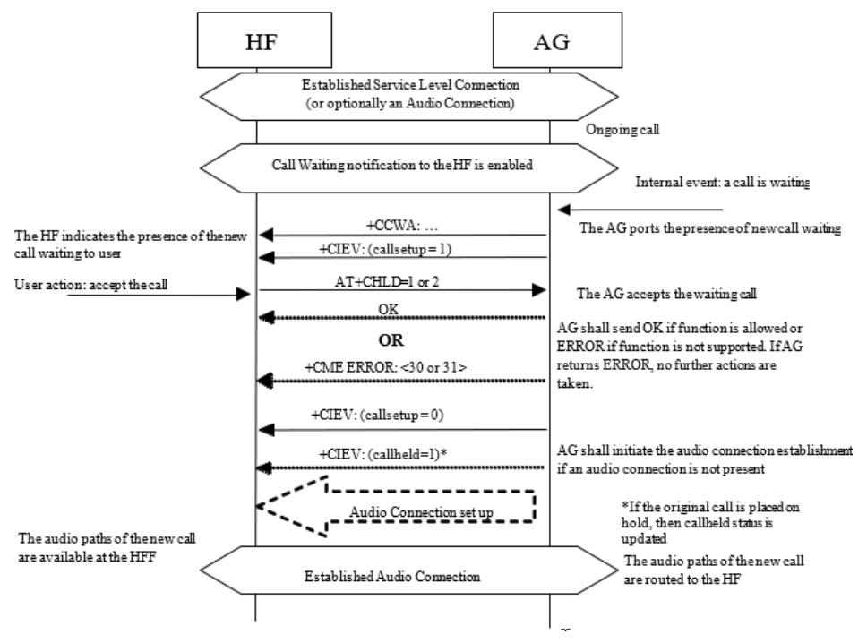

**Figure 4.38: Typical Call Waiting indication followed by HF possible response**

If the AG receives a third party call, it shall send the call waiting notification +CCWA and +CIEV result code, with the value indicating (callsetup=1), to the HF.
If the user rejects the call at the HF, the HF shall send the AT+CHLD command with parameter 0 to the AG. The AG shall then reject the call and respond with OK, and issue the +CIEV result code with the value indicating (callsetup=0).
If the user accepts the call at the HF, the HF shall send the AT+CHLD with parameter 1 or 2 to the AG. The HF cannot cause the waiting call to be added as a conference call via a single AT+CHLD command; but if this is desired the HF can achieve this by first issuing an AT+CHLD=2 command, and then issuing an AT+CHLD=3 command. The AG shall then accept the waiting call and respond with OK, and issue the +CIEV result code with the value indicating (callsetup=0). If the HF elects to send AT+CHLD=2 (placing the original call on hold), then the AG shall send the +CIEV result code with the value indicating a held call (callheld=1).
Optionally, the HF may then use the AT+CHLD command, in order to change the status of the held and active calls.
If the normal incoming call procedure is interrupted for any reason, the AG shall issue the +CIEV result code, with the value indicating (callsetup=0), to notify the HF of this condition (see Section 4.14.2).

#### 4.22.2 Three-Way Calls – Third Party Call Placed from the HF

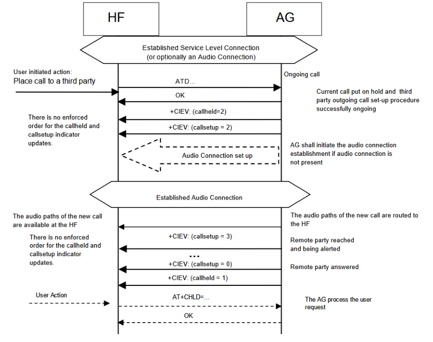

**Figure 4.39: Three-way call handling when the third party call is placed from the HF**

If a third party call is placed from the HF using the ATD command, the AG shall send the OK indication and two +CIEV result codes, one with the value indicating (callsetup=2), and one with the value indicating (callheld=2) to the HF. It is permissible for the AG to send these two +CIEV result codes in either order as
the timing of events in the AG may differ between implementations and network types. If the remote party is reached and alerted, the AG shall issue the +CIEV result code with the value indicating (callsetup=3). If the wireless network does not provide the AG of an indication of alerting the remote party, the AG may not send this indication.
If the remote party answers the call, the AG shall issue the +CIEV result codes with the values indicating (callsetup=0) and (callheld=1). As before, there is no enforced order to these two +CIEV result codes.
Optionally, the HF may then use the AT+CHLD command in order to change the status of the held and active calls. If the AT+CHLD command results in the change in a held call status the AG shall provide the status indication using the +CIEV result code with the value indicating the call held status (callheld=<0,1,2>).
If the normal outgoing call procedure is interrupted for any reason, the AG shall issue the +CIEV result code, with the value indicating (callsetup=0), to notify the HF of this condition (see Section 4.15.2). The AG shall then update the callheld status to indicate the change of status of the original (held) call based upon one of the two following scenarios:
• The AG may choose to leave the original call on hold. In this case, the AG shall issue the +CIEV result code with the value indicating (call held=2).
• Alternatively the AG may autonomously retrieve the held call, thus changing the status and shall send the +CIEV indicator (call held=0).
In either case, the +CIEV response code (call=1) shall remain unchanged.

### 4.23 Calling Line Identification (CLI) Notification

The HF may issue the AT+CLIP command to enable the “Calling Line Identification notification” function in the AG.
If the calling subscriber number information is available from the network, the AG shall issue the +CLIP unsolicited result code just after every RING indication when the HF is alerted in an incoming call. See Section 4.13 for more details.
Once the HF issues the AT+CLIP command, the AG shall respond with OK. The AG shall then keep the “Calling Line Identification notification” enabled until either the AT+CLIP command is issued by the HF to disable it, or the current Service Level Connection between the AG and the HF is dropped for any reason.
See Section 5 for more information on the AT+CLIP command.
As a precondition for this procedure, an ongoing Service Level Connection between the AG and the HF shall exist. If this connection does not exist, the HF shall autonomously establish the Service Level Connection using the proper procedure as described in Section 4.2.

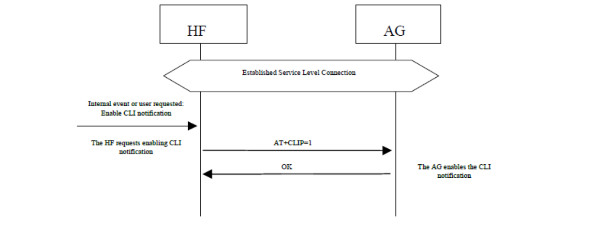

**Figure 4.40: Activation of CLI notification**

### 4.24 The HF Requests Turning off the AG’s EC and NR

The HF may disable the echo canceling and noise reduction functions resident in the AG via the AT+NREC command.
If the HF supports embedded EC and/or NR functions, it shall support the AT+NREC command as described in the procedures in this section. Moreover, if the HF has these functions enabled, it shall perform this procedure before any Audio Connection between the HF and the AG is established.
By default, if the AG supports its own embedded echo canceling and/or noise reduction functions, it shall have them activated until the AT+NREC command is received. From then on, and until the current Service Level Connection between the AG and HF is dropped for any reason, the AG shall disable these functions every time an Audio Connection between the HF and the AG is used for audio routing.
If the AG does not support any echo canceling and noise reduction functions, it shall respond with the ERROR indicator on reception of the AT+NREC command.
See Section 5 for more information on the AT+NREC command.
As a precondition for this procedure, an ongoing Service Level Connection between the AG and the HF shall exist. If this connection does not exist, the HF shall autonomously establish the Service Level Connection using the proper procedure as described in Section 4.2.

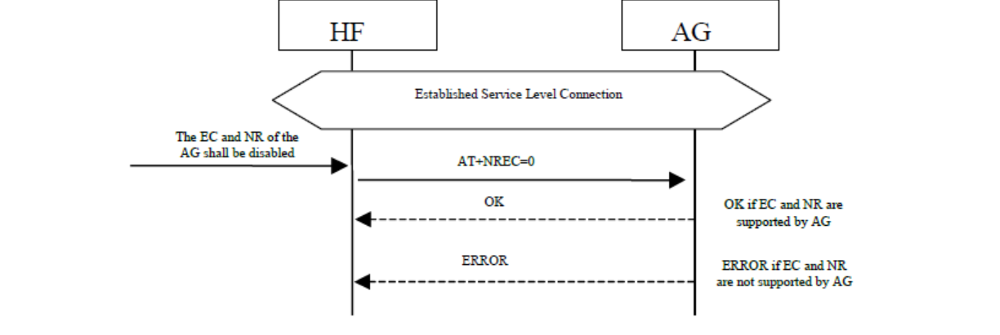

**Figure 4.41: NR and EC functions available in the AG**

The HF sends the AT+NREC command and AG confirms with either OK or ERROR indication.

### 4.25 Voice Recognition Activation / Enhanced Voice Recognition Activation

The HF, via the AT+BVRA command, or the AG autonomously, may activate/deactivate the voice recognition function resident in the AG. The Enhanced Voice Recognition Status and Voice Recognition Text features enhance the use of the AT+BVRA command. This is described in detail in Section 5.3. Beyond the audio routing and voice recognition activation capabilities, the rest of the voice recognition functionality is implementation dependent.
Whenever the AG supports a voice recognition function, it shall support the AT+BVRA command as described in the procedures in this section.
If the HF issues the AT+BVRA command, the AG shall respond with the OK result code if it supports voice recognition, then initiate an Audio Connection to the HF (if the Audio Connection does not already exist) and begin the voice input sequence.
If the AG does not support voice recognition, the AG shall respond with the ERROR indication.
When the voice recognition function is activated from the AG, it shall inform the HF via the +BVRA: 1 unsolicited result code and the AG shall initiate an Audio Connection to the HF (if the Audio Connection does not already exist) and begin the voice input sequence.
Once activated, depending upon the voice recognition implementation, the AG shall then keep the voice recognition function enabled:
• For the duration of time supported by the implementation (“momentary on” voice recognition implementation). In this case, the AG shall notify the HF by sending a +BVRA: 0 unsolicited result code.
• Or until the AT+BVRA command is issued to disable voice recognition from the HF.
• Or until the current Service Level Connection between the AG and the HF is dropped for any reason.
See Section 5 for more information on the AT+BVRA command and the +BVRA result code.
If the Enhanced Voice Recognition Status or Voice Recognition Text features are supported, the AT+BVRA command is extended with the value 2. The value 2 shall only be used if both the AG and the HF support the Enhanced Voice Recognition Status feature. The value 2 indicates that the HF is ready to accept audio when the Audio Connection is first established.
The HF may send the value 2 during an ongoing VR (Voice Recognition) session to terminate audio output from the AG (if there is any) and prepare the AG for new audio input.
The syntax of the +BVRA command is extended with <vrecstate> and <textualRepresentation>.
For example, <vrecstate> of 5 (b101) means that the AG is listening to the audio input and processing at the same time.
Examples that build on one another for textual representation:
1. +BVRA: 1,1,12AA,1,1,“Message 1 from Janina”: A new text is sent from the AG to the HF. The AG now has the text:
12AA: Message 1 from Janina
2. +BVRA: 1,1,12AB,1,1,“Message 2 from Melissa”: A new text is sent from the AG to the HF with a new <textID>. The AG now has the text:
12AA: Message 1 from Janina
12AB: Message 2 from Melissa
3. +BVRA: 1,1,12AB,1,2 ,“Message 3 from Melissa”: A new text is sent from the AG to the HF with the same <textID> as example 2. Since the textID is the same as in example 2 and the operation is replace, the text from example 2 is replaced by the new text. So the AG now has the texts:
12AA: Message 1 from Janina
12AB: Message 3 from Melissa
4. +BVRA: 1,1,12AB,1,3,“ with new stuff”: A new text is sent from the AG to the HF and gets attached to the old text. Since the textID is the same as in example 3 and the operation is append, the new text is appended to the text from example 3. The AG now has the texts:
12AA: Message 1 from Janina
12AB: Message 3 from Melissa with new stuff
For more information, refer to Section 5.3.
A precondition for these procedures is that an ongoing Service Level Connection between the AG and the HF shall exist. If this connection does not exist, the initiator of the procedure shall autonomously establish the Service Level Connection using the proper procedure as described in Section 4.2.

#### 4.25.1 Voice Recognition Activation – HF Initiated

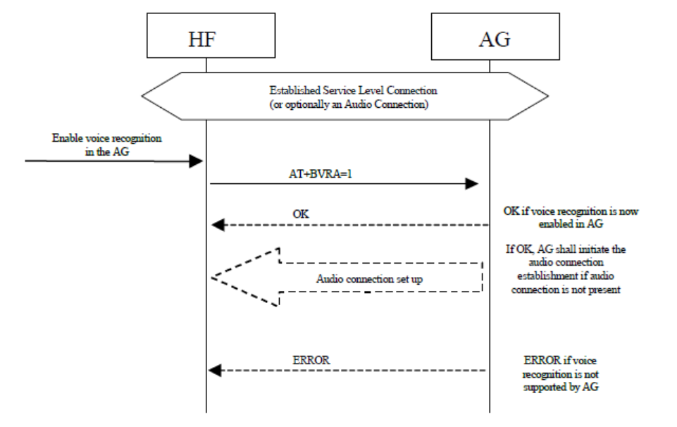

**Figure 4.42: Voice recognition activation – HF initiated**

#### 4.25.2 Voice Recognition Activation – AG Initiated

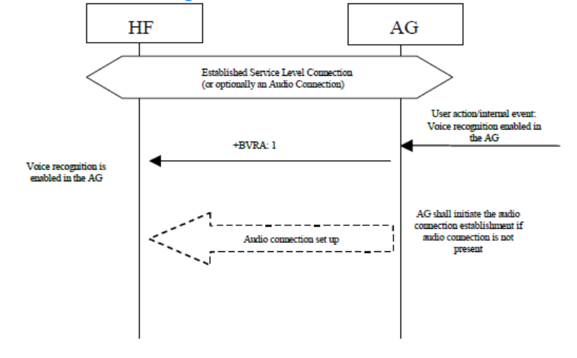

**Figure 4.43: Voice recognition activation – AG initiated**

#### 4.25.3 Voice Recognition Deactivation

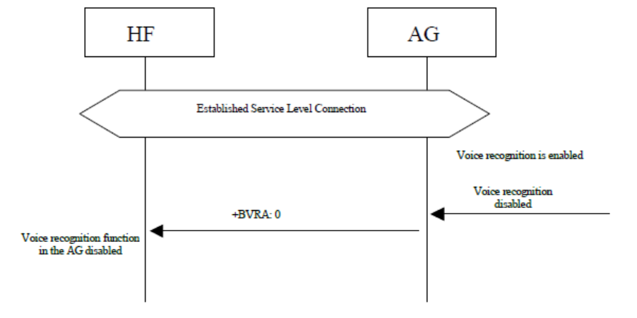

**Figure 4.44: Voice recognition deactivation – “momentary on” approach**

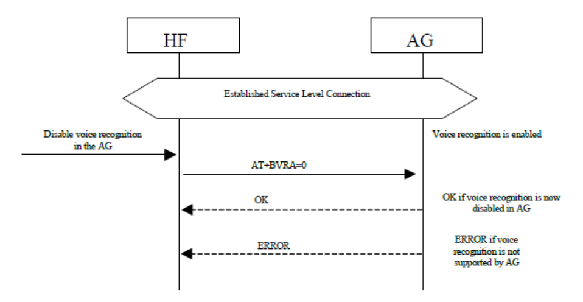

**Figure 4.45: Voice recognition deactivation from the HF**

#### 4.25.4 Enhanced Voice Recognition Activation session

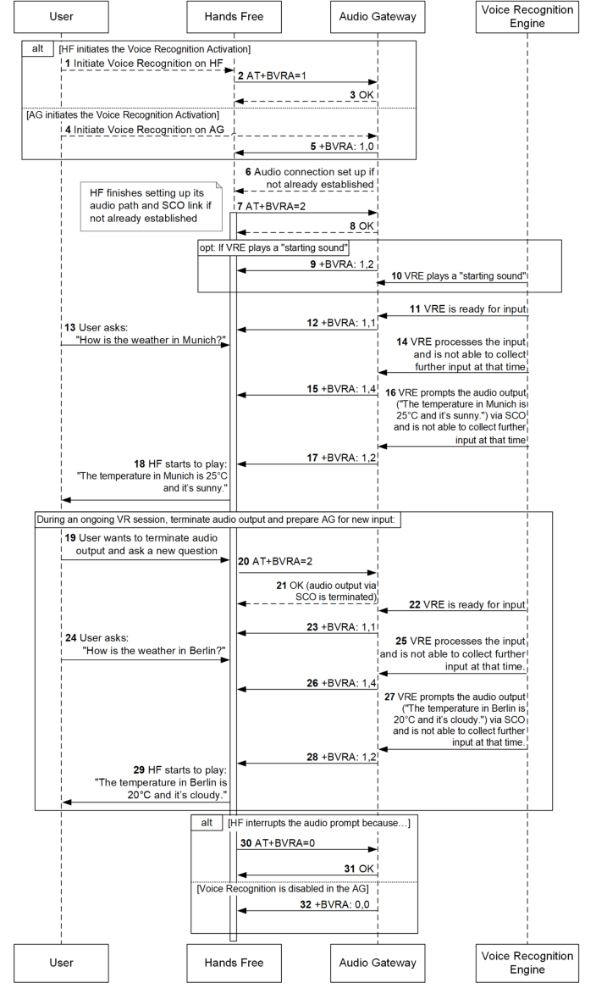

**Figure 4.46: Example sequence diagram of an Enhanced Voice Recognition Activation sessionE24353**

### 4.26 Enhanced Voice Recognition Activation with textual representation

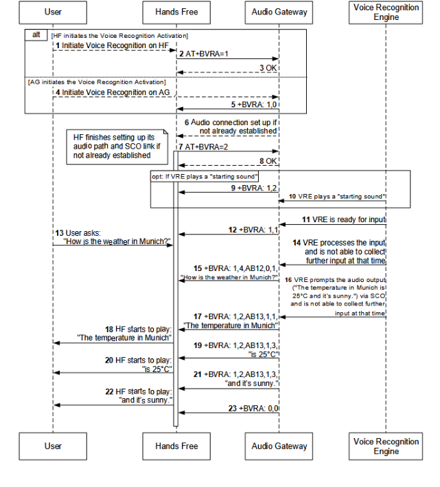

**Figure 4.47: Example sequence diagram with textual representation**

### 4.27 Attach a Phone Number for a Voice Tag

This procedure is applicable to HFs supporting internal voice recognition functionality. It provides a means to read numbers from the AG for the purpose of creating a unique voice tag and storing the number and its linked voice tag in the HF’s memory. The HF may then use its internal Voice Recognition to dial the linked phone numbers when a voice tag is recognized by using the procedure “Place a call with the phone number supplied by the HF” described in Section 4.18.
Upon an internal event or user action, the HF may request a phone number from the AG by issuing the AT+BINP=1 command. Depending on the current status of the AG, it may either accept or reject this request.
If the AG accepts the request, it shall obtain a phone number and send the phone number back to the HF by issuing the +BINP response.
If the AG rejects the request from the HF, it shall issue the ERROR result code to indicate this circumstance to the HF.
When this procedure is executed multiple times (to retrieve multiple AG phone numbers to be linked to voice tags), it is the responsibility of the AG to provide the next phone number to be passed to the HF each time the procedure is executed.
See Section 5 for more information on the AT+BINP command and the +BINP response.
As a precondition for this procedure, an ongoing Service Level Connection between the AG and the HF shall exist. If this connection does not exist, the HF shall autonomously establish the Service Level Connection using the proper procedure as described in Section 4.2.

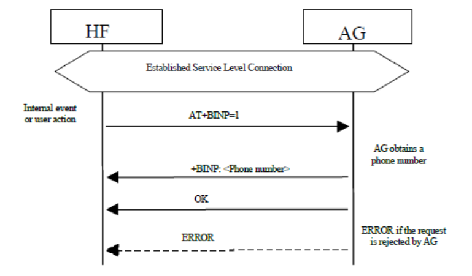

**Figure 4.48: Request phone number to the AG**

### 4.28 Transmit DTMF Codes

During an ongoing call, the HF transmits the AT+VTS command to instruct the AG to transmit a specific DTMF code to its network connection.
See Section 5 for more information on the AT+VTS command.
The following preconditions apply for this procedure:
• An ongoing Service Level Connection between the AG and the HF shall exist. If this connection does not exist, the HF shall autonomously establish the Service Level Connection using the proper procedure as described in Section 4.2.
• An ongoing call in the AG exists.

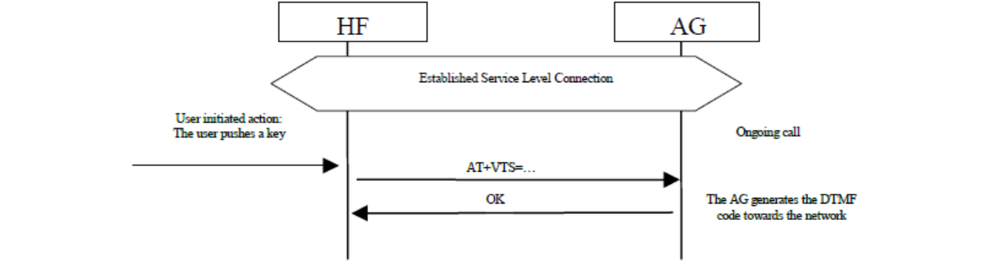

**Figure 4.49: Transmit DTMF code**

### 4.29 Remote Audio Volume Control

#### 4.29.1 Audio Volume Control

This procedure enables the user to modify the speaker volume and microphone gain of the HF from the AG.
The AG may control the gain of the microphone and speaker of the HF by sending the unsolicited result codes +VGM and +VGS respectively. There is no limit in the amount and order of result codes.
If the remote audio volume control feature is supported in the HF device, it shall support at least remote control of the speaker volume.
As a precondition for this procedure, an ongoing Service Level Connection between the AG and the HF shall exist. If this connection does not exist, the AG shall autonomously establish the Service Level Connection using the proper procedure as described in Section 4.2.
An audio connection is not a necessary precondition for this feature.

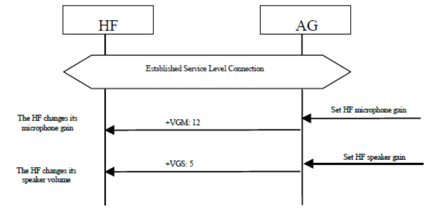

**Figure 4.50: Typical example of audio volume control**

Both the speaker and microphone gains are represented as parameter to the +VGS and +VGM, on a scale from 0 to 15. The values are absolute values, and relate to a particular (implementation dependent) volume level controlled by the HF.
See Section 5 for more information on these commands and unsolicited result codes.

#### 4.29.2 Volume Level Synchronization

This procedure allows the HF to inform the AG of the current gain settings corresponding to the HF’s speaker volume and microphone gain.
On Service Level Connection establishment, the HF shall always inform the AG of its current gain settings by using the AT commands AT+VGS and AT+VGM.
If local means are implemented on the HF to control the gain settings, the HF shall also use the AT commands AT+VGS and AT+VGM to permanently update the AG of changes in these gain settings.
In all cases, the gain settings shall be kept stored, at both sides, for the duration of the current Service Level Connection. Moreover, if the Service Level Connection is released as a consequence of an HF initiated “Audio Connection transfer towards the AG” as stated in Section 4.17, the HF shall also keep the gain settings and re-store them when the Service Level Connection is re-established.
The HF shall support speaker gain synchronization when it supports remote speaker gain control.
The HF shall support microphone gain synchronization when it supports remote microphone gain control.
As a precondition for this procedure, an ongoing Service Level Connection between the AG and the HF shall exist. If this connection does not exist, the HF shall autonomously establish the Service Level Connection using the proper procedure as described in Section 4.2.

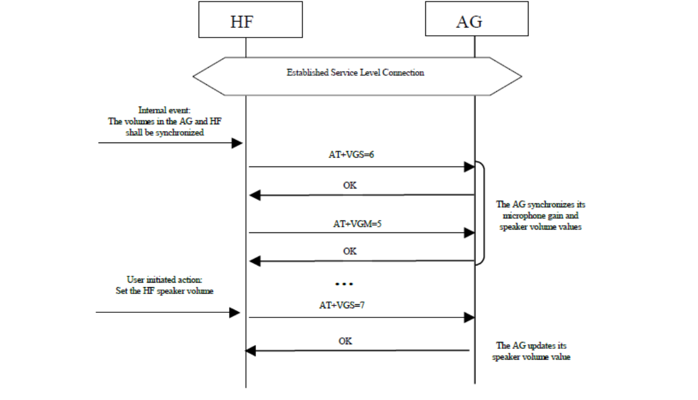

**Figure 4.51: Typical example of volume level synchronization**

See Section 5 for more information on these commands and unsolicited result codes.

### 4.30 Response and Hold

This procedure allows the user to put an incoming call on hold and then accept or reject the call from the HF or AG. This feature is specific to the limited markets where PDC and CDMA networks support this function.

#### 4.30.1 Query Response and Hold Status

The HF shall execute this procedure to query the status of the “Response and Hold” state of the AG.

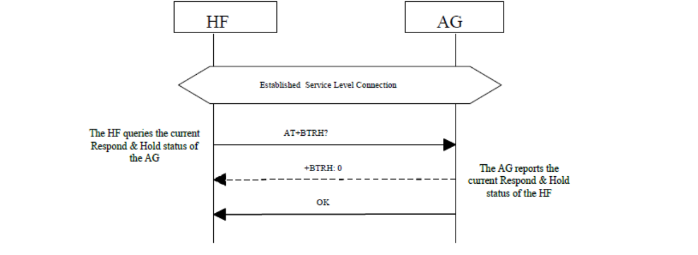

**Figure 4.52: Query Response and Hold State of AG**

• The HF shall issue AT+BTRH? command to query the current “Response and Hold” state of the AG.
• If the AG is currently in any of the Response and Hold states, then the AG shall send a +BTRH: Response with the parameter set to 0. If the AG is not in the Response and Hold states, then no response shall be sent.
• The AG shall send OK response to signal completion of the AT+BTRH? command.

#### 4.30.2 Put an Incoming Call on Hold from HF

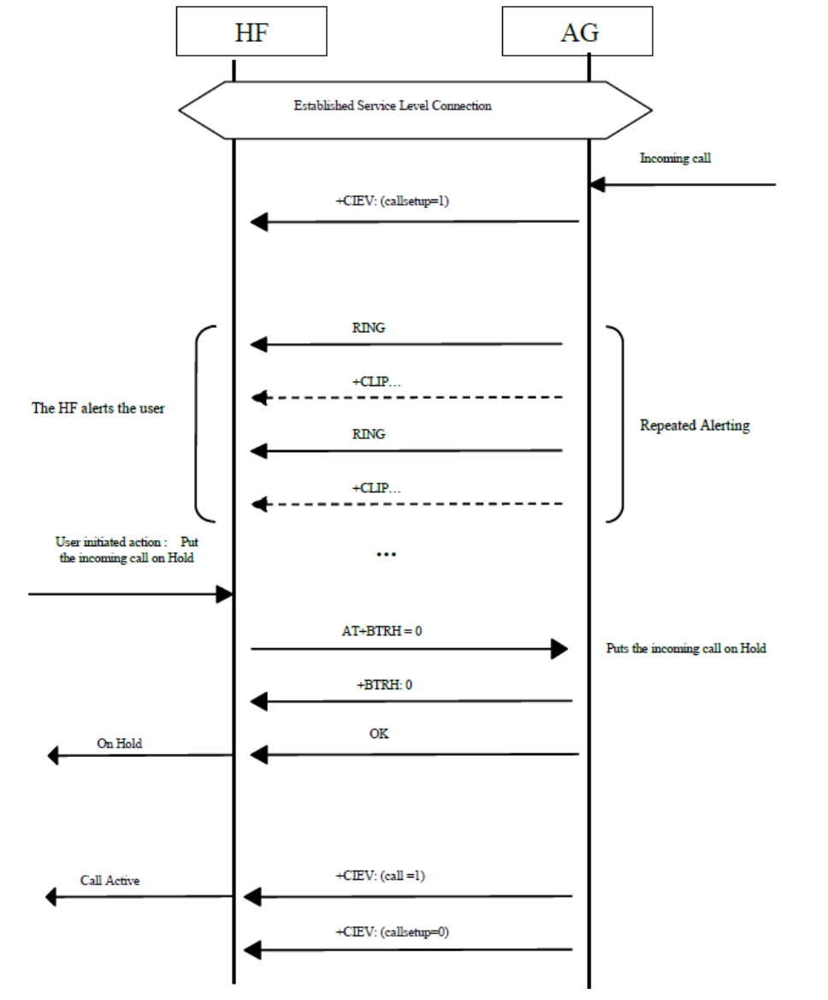

**Figure 4.53: Put an incoming call on Hold from HF**

• As a precondition to this procedure, the AG shall not have an active call or a call on hold.
• The AG shall send a sequence of unsolicited RING alerts to the HF. The RING alert shall be repeated until the HF accepts the incoming call or until the incoming call is interrupted for any reason.
• If the HF has enabled the Calling Line Identification [CLI], the AG shall send a +CLIP Response to HF.
• The user may put the incoming voice call on hold by using the proper means provided by the HF. The HF shall then send the AT+BTRH command with the parameter <n> set to 0. The AG shall then begin the procedure for putting the incoming call on hold.
• The AG shall send +BTRH Response with the parameter set to 0 as soon as the incoming call is put on hold.
• The +CIEV: (callheld = 2) message shall not be sent when a call is held via the AT+BTRH=0 message.
• The AG shall send the +CIEV Response with the call status set to 1.
• The AG shall send the +CIEV Response with the callsetup status set to 0.

#### 4.30.3 Put an Incoming Call on Hold from AG

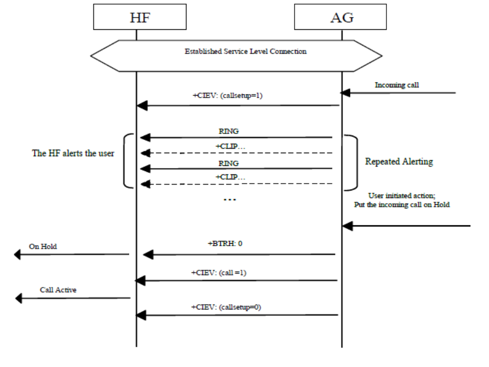

**Figure 4.54: Put an incoming call on Hold from AG**

As a precondition to this procedure, the AG shall not have an active call or a call on hold.
• The AG shall send a sequence of unsolicited RING alerts to the HF. The RING alert shall be repeated until the HF accepts the incoming call or until the incoming call is interrupted for any reason.
• If the HF has enabled the Calling Line Identification [CLI], the AG shall send a +CLIP Response to the HF.
• The user may put the incoming voice call on hold by using the proper means provided by the AG unit. The AG shall then send +BTRH Response with the parameter <n> set to 0 to indicate that the incoming call is on hold.
• The +CIEV: (callheld = 2) message shall NOT be sent by the audio gateway when it holds a call via the response and hold method.
• Depending on whether in-band ringing is enabled or disabled, there may or may not be a synchronous connection established between the HF and AG. The synchronous connection state (enabled or disabled) shall not be changed when an incoming call is placed on hold.
• The AG shall send the +CIEV Response with the call status set to 1.
• The AG shall send the +CIEV Response with the callsetup status set to 0.

#### 4.30.4 Accept a Held Incoming Call from HF

The following additional precondition applies to this procedure:
• An incoming call was put on hold.

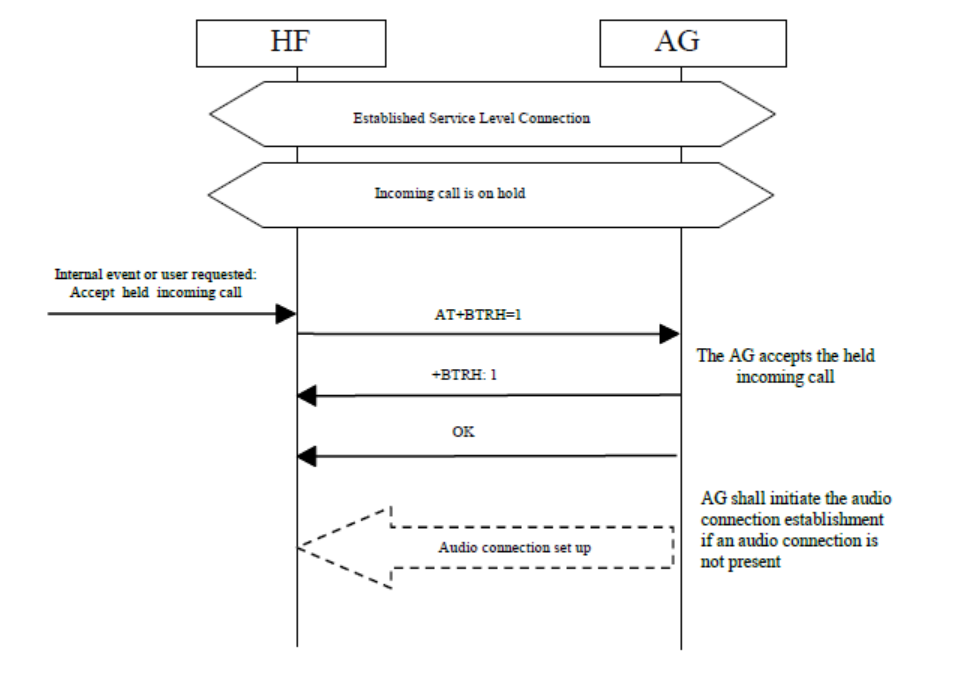

**Figure 4.55: Accept a held incoming call from HF**

• The user may accept the incoming voice call on hold by using the proper means provided by the HF. The HF shall then send the AT+BTRH command with the parameter <n> set to 1. The AG shall then begin the procedure for accepting the incoming call that was put on hold.
• The AG shall then send +BTRH Response with the parameter <n> set to 1 to notify HF that the held incoming call was accepted.
• The AG shall start the procedure for establishing the audio connection and route the audio paths to the HF only if the audio connection was not established.

#### 4.30.5 Accept a Held Incoming Call from AG

The following additional precondition applies to this procedure:
• An incoming call was put on hold.

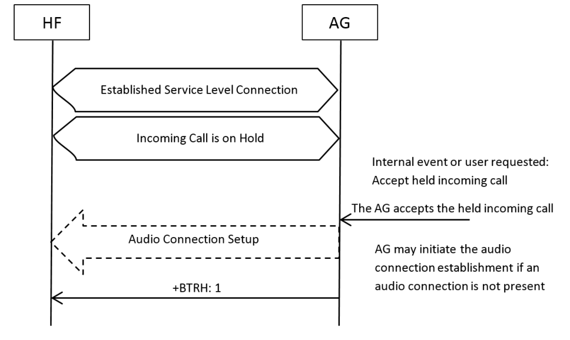

**Figure 4.56: Accept a held incoming call from AG**

• The user may accept the incoming voice call on hold by using the proper means provided by the AG unit. The AG shall then send +BTRH Response with the parameter <n> set to 1 to notify the HF that the held incoming call was accepted.

#### 4.30.6 Reject a Held Incoming Call from HF

The following additional precondition applies to this procedure:
• An incoming call was put on hold.

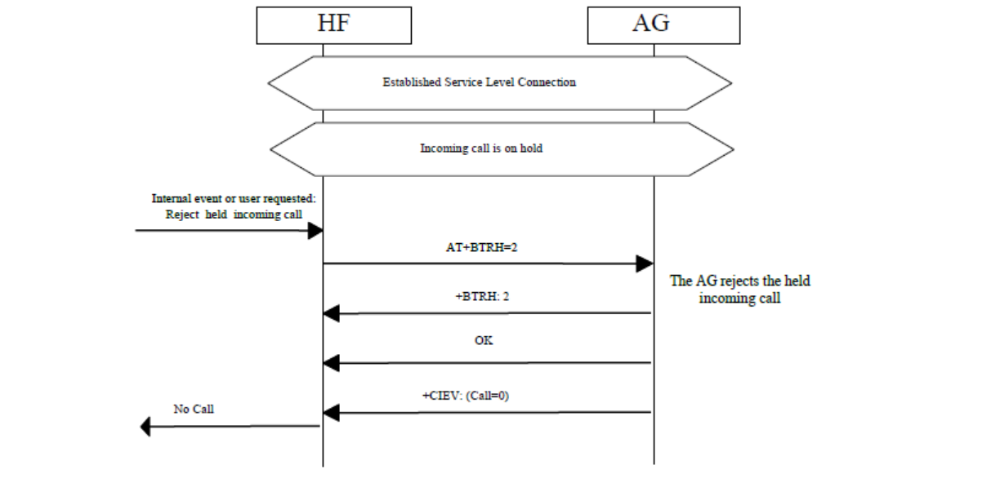

**Figure 4.57: Reject a held incoming call from HF**

• The user may reject the incoming voice call on hold by using the proper means provided by the HF. Either of the following two sequences shall be permissible by the HF and AG:
- The HF may send the AT+BTRH command with the parameter <n> set to 2. The AG shall then begin the procedure for rejecting the incoming call that was put on hold. The AG shall send +BTRH Response with the parameter <n> set to 2 to notify the HF that the held incoming call was rejected.
- The HF may send the AT+CHUP command to reject the held incoming call. The AG shall reject the held call and send the OK indication to the HF.
• The AG shall send the +CIEV Response with the call status set to 0.

#### 4.30.7 Reject a Held Incoming Call from AG

The following additional precondition applies to this procedure:
• An incoming call was put on hold.

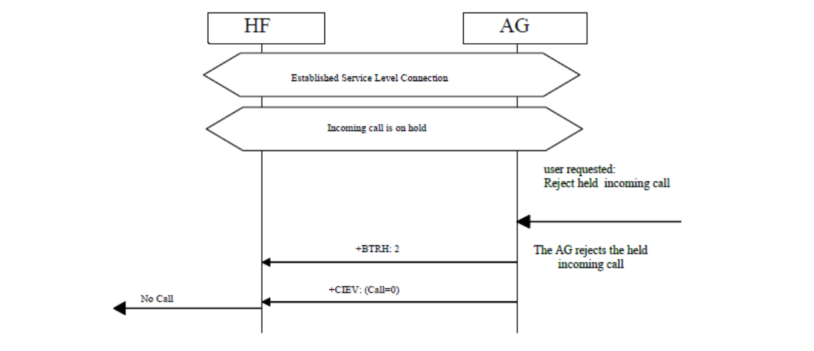

**Figure 4.58: Reject a held incoming call from AG**

The user may reject the incoming voice call on hold by using the proper means provided by the AG unit. The AG shall then send +BTRH Response with the parameter <n> set to 2 to notify HF that the held incoming call was rejected.
• The AG shall also send the +CIEV Response with the call status parameter set to 0 to indicate that the AG is currently not in a call.

#### 4.30.8 Held Incoming Call Terminated by Caller

The following additional precondition applies to this procedure:
• An incoming call was put on hold.

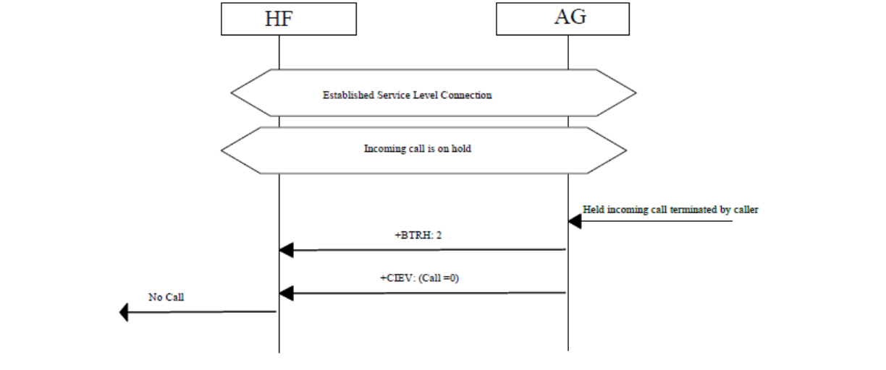

**Figure 4.59: Held incoming call terminated by caller**

• The caller may terminate the held incoming call. The AG shall then send +BTRH Response with the parameter <n> set to 2 to notify the HF that the held incoming call was terminated.
• The AG shall send the +CIEV Response with the Call status parameter set to 0 to indicate that the AG is currently not in a call.

### 4.31 Subscriber Number Information

This procedure allows HF to query the AG subscriber number.

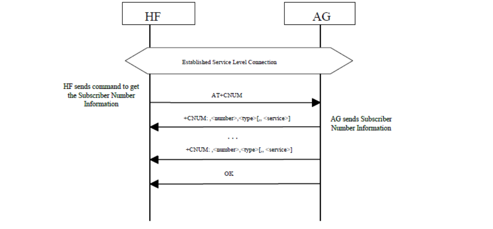

**Figure 4.60: Query Subscriber Number Information of AG**

This procedure illustrates AG response to the query of an empty subscriber number.

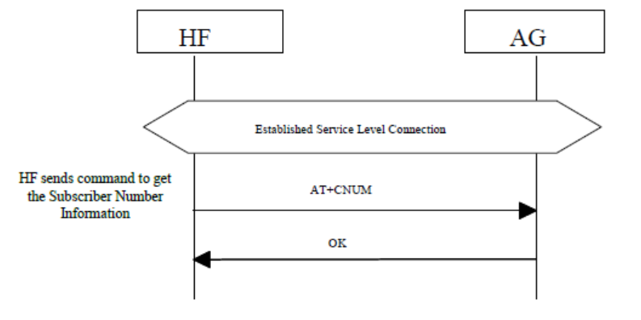

**Figure 4.61: Empty Subscriber Number Information from AG**

The following precondition applies for this procedure:
• An ongoing Service Level Connection between the HF and AG shall exist. If this connection does not exist, the HF shall establish a connection using the “Service Level Connection set up” procedure described in Section 4.2.
• The HF shall send the AT+CNUM command to query the AG subscriber number information.
• If the subscriber number information is available, the AG shall respond with the +CNUM response. If multiple numbers are available, the AG shall send a separate +CNUM response for each available number.
• The AG shall signal the completion of the AT+CNUM action command with an OK response. The OK will follow zero or more occurrences of the +CNUM response. (See Figure 4.60 and Figure 4.61).

### 4.32 Enhanced Call Status Mechanisms

#### 4.32.1 Query List of Current Calls in AG

The HF shall execute this procedure to query the list of current calls in AG.
The following precondition applies for this procedure:
• A Service Level Connection exists between the AG and HF devices. If no current Service Level Connection exists, the HF shall first initiate one.

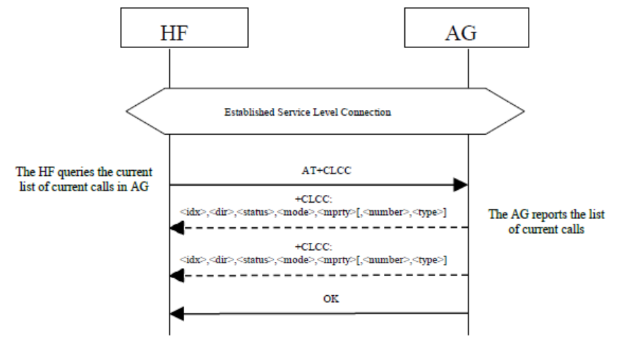

**Figure 4.62: Query List of Current Calls**

• HF shall find out the list of current calls in AG by sending the AT+CLCC command.
• If the command succeeds and if there is an outgoing (Mobile Originated) or an incoming (Mobile Terminated) call in AG, AG shall send a +CLCC response with appropriate parameters filled in to HF.
• If there are no calls available, no +CLCC response is sent to HF.
• The AG shall always send OK response to HF.

### 4.33 Enhanced Call Control Mechanisms

As stated earlier, the Enhanced Call Control mechanism is simply an extension of the current AT+CHLD command. These extensions are defined as additional arguments to the AT+CHLD command. The new arguments for this command include an index of a specific call as indicated in the +CLCC response.

#### 4.33.1 Release Specified Call Index

The HF shall execute this procedure to release a specific call in the AG.
The following precondition applies for this procedure:
• A Service Level Connection exists between the AG and HF devices. If no current Service Level Connection exists, the HF shall first initiate one.

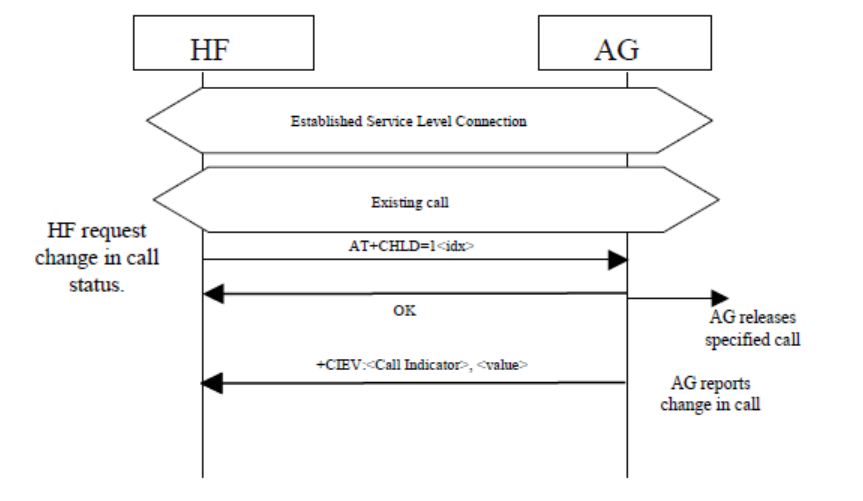

**Figure 4.63: Release Specified Active Call**

• The HF shall send the AT+CHLD=1<idx> command to release a specific active call.
• The AG shall release the specified call.
If there is a change in the call status, the AG shall report the change in call status. If there is a change in the held call status, the AG shall report the change in call held status.
If the index (<idx>) is not valid, the AG shall report the proper error code.

#### 4.33.2 Private Consultation Mode

The HF shall execute this procedure to place all parties of a multiparty call on hold with the exception of the specified call.
The following precondition applies for this procedure:
• A Service Level Connection exists between the AG and HF devices. If no current Service Level Connection exists, the HF shall first initiate one.
• Existing multiparty call is active in AG.

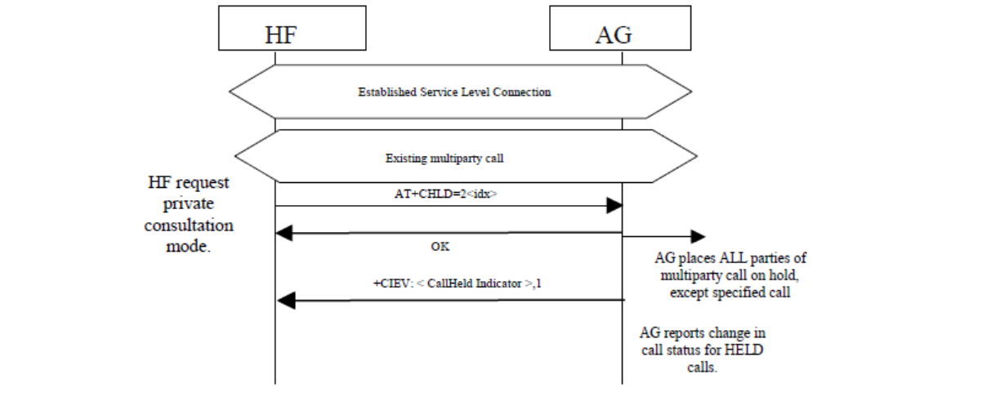

**Figure 4.64: Request Private Consultation Mode**

• HF shall send the AT+CHLD=2<idx> command to request private consultation mode.
• AG shall place all other parties of call on hold.
• AG shall report the change in status of the held parties.
• If the index (<idx>) is not valid, the AG shall respond with the proper error code.

### 4.34 Indicators Activation and Deactivation

The HF shall execute this procedure to change the subset of indicators that shall be sent by the AG.
The following preconditions apply for this procedure:
• An ongoing Service Level Connection between the AG and the HF shall exist. If this connection does not exist, the HF shall autonomously establish the Service Level Connection using the proper procedure as described in Section 4.2.

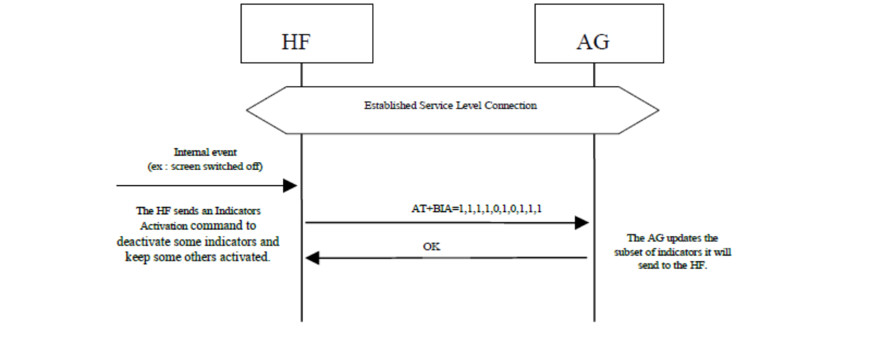

**Figure 4.65: Request Activation / Deactivation of Indicators example**

Figure 4.65 does not imply a mandatory order for CIND fields, nor does it imply a mandatory set of CIND indicator fields.
The HF shall issue the AT+BIA command if it needs to change the activated/deactivated status of indicators in the AG.
The AG shall send the OK result code to the HF after processing a correctly formatted command.
The AG shall send the ERROR result code to the HF if the command is incorrectly formatted.
Following the successful processing of an AT+BIA command, the AG shall not send the indicators that are deactivated.
The AG shall send the activated indicators response only if the event reporting is enabled.
The effect of the AT+BIA command shall persist during the current Service Level Connection only. When a Service Level Connection is terminated and a new Service Level Connection is established, all indicators are activated by default.
It is valid to send the AT+BIA command while the event reporting is disabled. If the event reporting is enabled before the Service Level Connection is terminated, the AG shall send only the indicators that were activated by the most recently processed AT+BIA command.
If the event reporting (CMER) is disabled and then re-enabled, the AG shall send only the indicators that were activated by the most recently processed AT+BIA command, or all indicators in the case where no AT+BIA was sent by the HF.
The AT+BIA command has no impact on the response to the “AT+CIND?” read command (see Section 5.2).
A restriction to the AT+BIA command applies to the indicators call, call status, call forwarding, and held call. The AG shall always consider these indicators activated, even if the HF requests their deactivation.
It is mandatory for the AG to support the AT+BIA command.
It is optional for the HF device to support the AT+BIA command.
It is optional for the HF device to use the AT+BIA command.
See Section 5.2 for more information on the AT+CMER (event reporting) command.

### 4.35 HF Indicators

The HF Indicator feature is used to allow a Hands-Free device to notify the values of certain HF indicators to an Audio Gateway. The HF may share information such as Battery Level or Enhanced Driver Safety on/off using this feature.
As described in Section 4.2.1, the devices shall determine if the HF Indicators feature is supported by verifying the remote’s BRSF bits.

#### 4.35.1 Transfer of HF Supported HF Indicators

During the Service Level Connection Establishment procedure (see Section 4.2.1), the HF shall send to the AG a list of supported HF indicators. These shall be represented using the appropriate 16- bit assigned number for each as apportioned within the Assigned Numbers [8] web page on https:// www.bluetooth.com/specifications/assigned-numbers/. The HF shall not send any assigned numbers that have not been defined by the Bluetooth SIG.

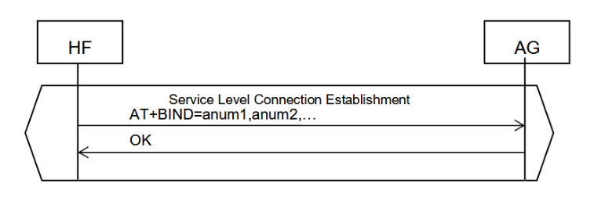

**Figure 4.66: HF sends its list of supported HF Indicators**

#### 4.35.2 Transfer of the AG Supported HF Indicators

Once the HF has sent its list of supported HF indicators, it shall determine which indicators are supported by the AG. The HF shall send the AT+BIND=? command to the AG. The AG shall respond with +BIND indicating which HF indicator(s) are supported by the AG.

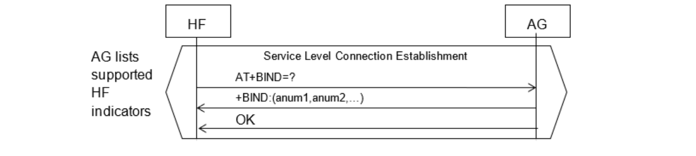

**Figure 4.67: AG lists support for HF Indicators**

#### 4.35.3 Transfer of Enabled HF Indicators from the AG to the HF

Once the HF has determined which HF Indicators are supported by the AG, as described in Section 4.35.2 the HF shall determine which HF Indicators the AG is enabling to receive by sending the AT+BIND? command. The AG shall then send one or more +BIND: anum,state response with the assigned number and state (0= disabled/1= enabled) of each supported HF indicator followed by an OK.

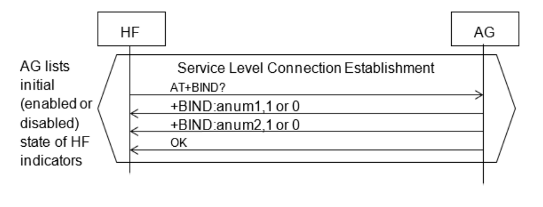

**Figure 4.68: AG lists enabled / disabled state of each HF Indicator**

#### 4.35.4 Activation / Deactivation of the AG’s supported HF Indicators

The AG may change the enabled/disabled state of any of the HF Indicators supported by the HF. To change the state, the AG shall send an unsolicited +BIND: anum,state response code. Whenever the HF receives an unsolicited +BIND indication from the AG that changes the state of a particular HF indicator from disabled to enabled, the HF should send the current state of that indicator to the AG using the +BIEV command (see Section 4.35.5). Sending the current state of the indicators synchronizes the states of HF indicators between devices.

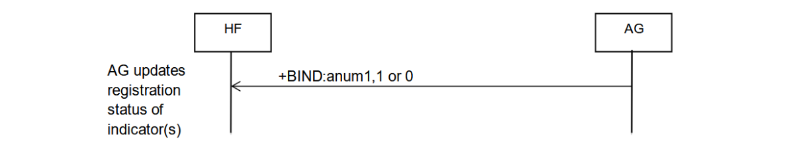

**Figure 4.69: HF Indicator is set to enabled or disabled**

#### 4.35.5 Transfer of HF Indicator Values

When situational conditions change within the HF, the HF shall notify the AG of the change in value using the AT+BIEV=anum, value command. The AG shall then acknowledge the receipt of the value updates with an OK. If the AG does not support the indicator being reported by the HF or if it is disabled, the AG shall return an ERROR response code.
The assigned number and their associated values are defined by the Bluetooth SIG within the Assigned Numbers [8] web page.

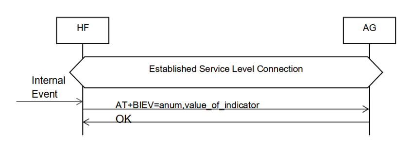

**Figure 4.70: Value of HF Indicator is updated**

The HF should provide HF Indicator value updates only for those that have been set as enabled by the AG. The AG shall respond with an ERROR response code if it receives updates for disabled or unknown HF indicators or receives values that are out of bounds.

### 4.36 Call Forwarding Feature

The Call Forwarding Feature is used to enable an HF device to control the call forwarding service in the AG. This shall be accomplished by the procedure described in Section 7.11 in [2].
The HF shall execute this procedure to query and change the call forwarding status on the AG. The AT+CCFC command supports registration, erasure, activation, deactivation, and status query; see Section 7.11 in [2].
The AT+BIA command, as described in Section 5.3, allows the HF to deactivate/reactivate individual indicators. The AT+BIA command shall have no effect on the callfwd indicator.
The following preconditions apply for this procedure:
• A Service Level Connection shall exist between the AG and HF devices. If no current Service Level Connection exists, the HF shall first initiate one.
• The AG shall have declared support for the callfwd indicator in response to the AT+CIND=? test command and has therefore indicated support for the Call Forwarding feature.
• If the value of the callfwd indicator is 1, i.e., call forwarding is “enabled”, the HF shall query the call forwarding status for call forwarding <reason> 0-3. See Section 5.2 for details on the <reason> value.
• The forwarded-to <number> shall be registered with the provider before call forwarding is enabled with this <number>. To register the forwarded-to <number>, see the procedure later in this section and see Section 5.2 for details on the <number> value.
The following procedures use the AT+CCFC command:
• To retrieve a list of the supported call forwarding <reason>, the HF shall issue AT+CCFC=?. The AG shall respond with a +CCFC result code with a list of supported <reason>s.
• To query the call forwarding status for a given <reason>, the HF shall issue the AT+CCFC command with the <mode> value set to 2. See Section 5.2 for details on the <reason> value. The AG shall respond with a +CCFC result code to indicate the current status, i.e., 0 (not active) or 1 (active). To query the status for each <reason>, the HF shall use this procedure for every supported <reason> repetitively. If the HF issues the AT+CCFC command with the <mode> value set to 2 and the <reason> value set to 4 (for all call forwarding) or 5 (all conditional forwarding), the AG shall respond with +CME ERROR: 3 – operation not allowed.
• To register the forwarded-to telephone number for a given <reason> with the provider, the HF shall send the AT+CCFC command with <mode>=3, the selected <reason>, and the forwarded-to <number>. This procedure must be executed in order to change the value of the <number> parameter for a given <reason>.
• To change the call forwarding status for a given <reason> with a registered call forwarding number, the HF shall send the AT+CCFC command with <mode>=0 (disable) or 1 (enable) and the selected <reason>.
• To change the number of seconds before a call is forwarded, the HF shall send the AT+CCFC command with <mode>=1 and the elected <reason>, and change the <time> parameter accordingly.
The AG shall always send an OK response to the HF if it can successfully execute the command. If the AG cannot execute the command, the AG shall respond with the ERROR response code.
The AG shall send a +CIEV response with the call forwarding status indicator set to 2 to report changes in the parameters of the +CCFC result code. For additional information on the AT+CCFC command, see [13].
Figure 4.71 is an example of the AG reporting a change and the HF querying the status.

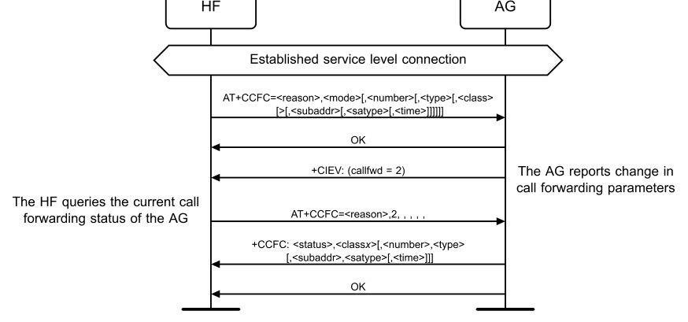

**Figure 4.71: Change and query call forwarding status**

### 4.37 Call Duration Information

The HF may issue the AT+BCDI command to retrieve call duration information about active or held calls. The HF shall use this procedure to synchronize the duration of a call between the HF and the AG.
The following preconditions apply for this procedure:
• An ongoing Service Level Connection between the AG and the HF shall exist. If this connection does not exist, the HF shall autonomously establish the Service Level Connection using the proper procedure as described in Section 4.2.
• The AG shall have declared support for the Call Duration Information feature in the +BRSF result code.
If the HF and the AG support the Call Duration Information feature, and the corresponding +CLCC response from the AG indicates that there is a call in any given call status (e.g., active or on hold), the HF may send the AT+BCDI request after sending the AT+CLCC command.
The AG shall respond to the AT+BCDI request with zero or more +BCDI result codes depending on the number of calls listed as active or held in the +CLCC response. The <idx> parameter of the +BCDI result code shall be set to the same value as the <idx> parameter of the referring +CLCC command to distinguish between calls.
Note: Multiparty calls are not listed with a separate index through the +CLCC result code.
If the +CLCC result code indicates that there is an active multiparty call, the AG may send an additional +BCDI result code using index “0” to transfer the call duration of the multiparty call as indicated on the AG to the HF.
The AG shall always send an OK at the end of the response to the HF.
The HF shall request the call duration as described above once after Service Level Connection Establishment. In that way the call duration of preexisting calls will be synchronized between the AG and the HF.
The HF shall send the AT+BCDI request whenever the AG indicates a change of the call or callheld indicator status via the +CIEV result code, excluding the termination of a call, i.e., if the value for the call
indicator is 0. The HF should only send a new AT+BCDI request if the AG indicates that there is a call in progress, or on hold. If the AG receives an AT+BCDI command even though there is no active call on the AG (e.g., if the call is terminated before the AG receives the request issued by the HF), no +BCDI response shall be returned to the HF.
Figure 4.72 shows the exchange of call duration information between the HF and the AG using the AT+BCDI command in a case where the AG has two ongoing calls.

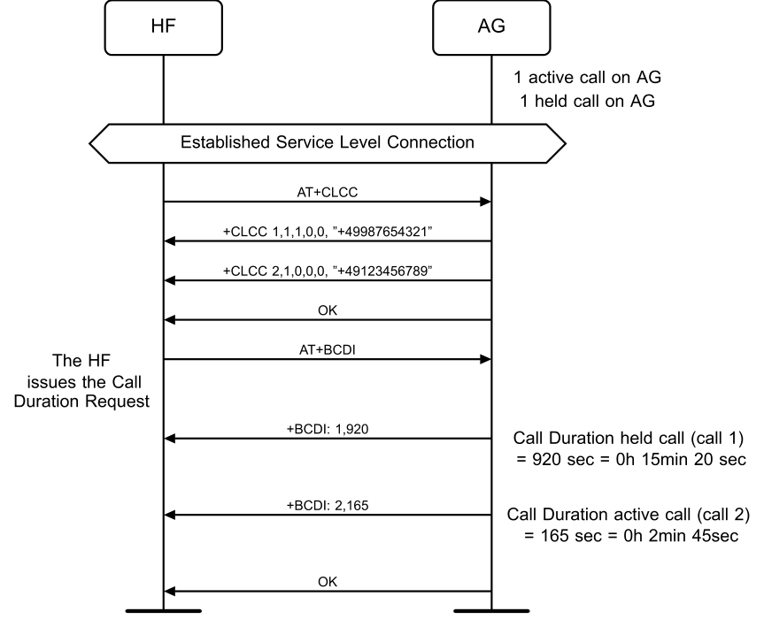

**Figure 4.72: Query of the Call Duration Information**

## 5 AT Command and Results Codes

### 5.1 General

For the exchange of the commands and unsolicited results codes, the format, syntax and procedures of 3GPP 27.007 [2] shall be taken as reference. The following rules specifically apply for the HFP specification:
• Only one command (or unsolicited result code) per command line needs to be expected.
• The AG, by default, shall not echo the command characters.
• The AG shall always transmit result codes using verbose format.
• The characters below shall be used for AT commands and result codes formatting:
<cr> corresponds to the carriage return (0/13) as stated in [5].
<lf> corresponds to the line feed (0/10) as stated in [5].
• The format of an AT command from the HF to the AG shall be:
<AT command><cr>
• The format of the OK code from the AG to the HF shall be:
<cr><If>OK<cr><If>
• The format of the generic ERROR code from the AG to the HF shall be:
<cr><If>ERROR<cr><If>
• The format of an unsolicited result code from the AG to the HF shall be:
<cr><lf><result code><cr><lf>
The Hands-Free Profile uses a subset of AT commands and result codes from existing standards; these are listed in Section 5.2. Section 5.3 lists the new Bluetooth defined AT commands and result codes not re-used from any existing standard.
In general, the AG shall use the OK code, as described in Section 5.2, for acknowledgement of the proper execution of a command and respond with the proper error indication to any unknown command received from the HF.
It is mandatory for the AG to properly respond to any error condition and for the HF to properly process the corresponding error indication code received from the AG. The code ERROR, as described in Section 5.2, shall be used as error indication for this purpose.
The HF shall always ignore any unknown or unexpected indication code received from the AG for AT commands defined in this specification. Handling of AT commands not defined in this specification is left to the implementation. The only exception is the case in which the AG issues a “Mobile Equipment Error” indication using the +CME ERROR: result code (see [2]). In this case, the HF shall interpret this result code in the same way as if it was a generic ERROR code.
As a general rule, when an AT command or result code of this specification is implemented, support for the associated parameters described in this specification, and all their corresponding possible values, shall be considered mandatory unless otherwise explicitly stated in each particular case.

### 5.2 AT Capabilities Re-Used from GSM 07.07 and 3GPP 27.007

The re-used AT commands and unsolicited result codes for implementing the functionality described in this specification are listed below:
• ATA
Standard call answer AT command. See Annex G in [2].
• ATDdd…dd;
Standard AT command intended for placing a call to a phone number. Only voice calls are covered in this specification. See Section 6.2 in [2].
• ATD>nnn...;
Extension of the standard ATD command, intended for memory dialing. Only voice calls are covered in this specification. See Section 6.3 in [2].
• ERROR
Standard error indication code. It shall be issued on detection of any syntax, format or procedure error condition. The “Mobile Equipment Error” report code “+CME ERROR:” is covered below. See Annex B in [2].
• OK
Standard acknowledgement to the execution of a command. See Annex B in [2].
• NO CARRIER, BUSY, NO ANSWER, DELAYED, REMOVED FROM THE NETWORK
Extended response indication codes for AT commands. These codes shall be issued from the AG to the HF as responses to AT commands from the HF to the AG or from the AG as unsolicited result codes. These are in addition to the +CME ERROR: responses.
• RING
Standard “incoming call” indication. See Annex B in [2].
• AT+CCFC
Standard call forwarding number and conditions command. See Section 7.11 in [2].
The AT+CCFC=? test command is used to get the list of supported reasons for call forwarding.
The AG shall reply to the AT+CCFC=? test command with the +CCFC: (list of supported <reason>s. (See Section 7.11 in [2], "Call forwarding number and conditions +CCFC".)
AT command syntax:
AT+CCFC=<reason>,<mode>[,<number>[,<type>[,<class>[,<subaddr>[,<satype>[,<time>]]]]]]
• +CCFC
Standard call forwarding number and conditions query result code. See Section 7.11 in [2] with deviations from the referenced section noted later in this section. The AG responds to the AT+CCFC command with this result code, if the HF sets <mode> to 2.
Result code syntax:
+CCFC: <status>,<classx>[,<number>,<type>[,<subaddr>,<satype>[,<time>]]]
Defined values
- <reason>: integer type

## 0 unconditional

## 1 mobile busy

## 2 no reply

## 3 not reachable

## 4 all call forwarding (refer to 3GPP TS 22.082 [13] and 3GPP TS 22.030 [12])

## 5 all conditional call forwarding (refer to 3GPP TS 22.082 [13] and 3GPP TS 22.030 [12])

- <mode>: integer type

## 0 disable

## 1 enable

## 2 query status

## 3 registration

## 4 erasure

- <number>: Quoted string containing the phone number in the format specified by <type> of
forwarding address
- <type>: The <type> field specifies the format of the phone number provided (refer to
3GPP TS 24.008 [14] subclause 10.5.4.7)
- <subaddr>: Not used within this specification. Field shall be left empty and all entered entries
shall be ignored if not empty.
- <satype>: Not used within this specification. Field shall be left empty and all entered entries
shall be ignored if not empty.
- <classx>: Not used within this specification. Field shall be left empty and all entered entries
shall be ignored if not empty.
- <time>: integer type
1...30 when "no reply", "all call forwarding", or "all conditional call forwarding" is enabled or queried. This gives the time in seconds to wait before the call is forwarded, default value 20.
- <status>: integer type

## 0 not active

## 1 active

• AT+CCWA
Standard “Call Waiting notification” AT command. Within the AT+CCWA=[<n>[,<mode>[,<class>]]]command, only enabling/disabling of the Call Waiting notification unsolicited result code +CCWA , using the <n> parameter, is covered in this specification. See Section 7.12 in [2].
• +CCWA
Standard “Call Waiting notification” unsolicited result code.
In the +CCWA result code only <number> and <type> parameters are covered in this specification.
The <number> parameter shall be a text string and shall always be contained within double-quotes.
The <type> field specifies the format of the phone number provided, and can be one of the following values:
values 128-143: The phone number format may be a national or international format, and may contain prefix and/or escape digits. No changes on the number presentation are required.
values 144-159: The phone number format is an international number, including the country code prefix. If the plus sign ("+") is not included as part of the number and shall be added by the AG as needed.
values 160-175: National number. No prefix nor escape digits included.
See Section 7.12 in [2].
AT+CHLD
Standard call hold and multiparty handling AT command. In the AT+CHLD=<n> command, this specification only covers values for <n> of 0, 1, 1<idx>, 2, 2<idx>, 3 and 4, where:
- 0 = Releases all held calls or sets User Determined User Busy (UDUB) for a waiting call.
- 1 = Releases all active calls (if any exist) and accepts the other (held or waiting) call.
- 1<idx> = Releases call with specified index (<idx>).
- 2 = Places all active calls (if any exist) on hold and accepts the other (held or waiting) call.
- 2<idx> = Request private consultation mode with specified call (<idx>). (Place all calls on hold EXCEPT the call indicated by <idx>.)
- 3 = Adds a held call to the conversation.
- 4 = Connects the two calls and disconnects the subscriber from both calls (Explicit Call Transfer). Support for this value and its associated functionality is optional for the HF.
- Where both a held and a waiting call exist, the above procedures shall apply to the waiting call (i.e., not to the held call) in conflicting situation.
See Section 7.13 in [2] and Section 4.5.5.1 in [6] for details.
The test command AT+CHLD=? may be used for retrieving information about the call hold and multiparty services available in the AG (see Section 4.2.1).
• AT+CHUP
Standard hang-up AT command. Execution command causes the AG to terminate the currently active call. This command shall have no impact on the state of a held call except in the use of rejecting a call placed on hold by the Respond and Hold feature as defined in Section 4.30.6.
See Section 6.5 in [2].
AT+CHUP is also used as the command to reject any incoming call prior to answer.
• AT+CIND
Standard indicator update AT command. Only read command AT+CIND? and test command AT+CIND=? are required in this specification.
The AT+CIND? read command is used to get current status of the AG indicators.
The AG shall return all the indicators listed in the AT+CIND=? command.
The deactivation of any indicator(s) using AT+BIA command shall have no effect on the AG’s response to the AT+CIND? read command.
The AT+CIND=? test command is used to retrieve the mapping between each indicator supported by the AG and its corresponding range and order index. It shall be issued at least once before any other command related to these indicators (AT+CIND? or AT+CMER) is used.
The Hands Free Profile specification limits the number of indicators returned by the AG to a maximum of 20.
The following indicators are covered in this specification:
- service: Service availability indication, where:
<value>=0 implies no service. No Home/Roam network available.
<value>=1 implies presence of service. Home/Roam network available.
- call: Standard call status indicator, where:
<value>=0 means there are no calls in progress
<value>=1 means at least one call is in progress
- callsetup: Bluetooth proprietary call set up status indicator4. Support for this indicator is optional for the HF. When supported, this indicator shall be used in conjunction with, and as an extension of the standard call indicator. Possible values are as follows:
<value>=0 means not currently in call set up.
<value>=1 means an incoming call process ongoing.
<value>=2 means an outgoing call set up is ongoing.
<value>=3 means remote party being alerted in an outgoing call.
See Section 8.9 in [2].
- callheld: Bluetooth proprietary call hold status indicator. Support for this indicator is mandatory for the AG, optional for the HF. Possible values are as follows:
0= No calls held
1= Call is placed on hold or active/held calls swapped
(The AG has both an active AND a held call)
2= Call on hold, no active call
- signal: Signal Strength indicator, where:
<value>= ranges from 0 to 5
- roam: Roaming status indicator, where:
<value>=0 means roaming is not active
<value>=1 means a roaming is active
- battchg: Battery Charge indicator of AG, where:
<value>=ranges from 0 to 5
- callfwd: Call forwarding status indicator, where:
<value>=0 means that call forwarding is disabled
<value>=1 means that call forwarding is enabled
<value>=2 means that one or more values except <status> have changed in the parameters of the +CCFC result code (see Section 4.36)
• +CIND
Standard list of current phone indicators. See Section 8.9 in [2].
• AT+CLCC
Standard list current calls command. See Section 7.18 in [2].
4This status indicator is not defined in the GSM 07.07 specification
• +CLCC
Standard list current calls result code. See Section 7.18 in [2].
Supported parameters are as follows:
- idx= The numbering (starting with 1) of the call given by the sequence of setting up or receiving the calls (active, held or waiting) as seen by the served subscriber. Calls hold their number until they are released. New calls take the lowest available number.
- dir= 0 (outgoing), 1 (incoming)
- status=
◦0 = Active
◦1 = Held
◦2 = Dialing (outgoing calls only)
◦3 = Alerting (outgoing calls only)
◦4 = Incoming (incoming calls only)
◦5 = Waiting (incoming calls only)
◦6 = Call held by Response and Hold
- mode= 0 (Voice), 1 (Data), 2 (FAX)
- mpty=
◦0 - this call is NOT a member of a multi-party (conference) call
◦1 - this call IS a member of a multi-party (conference) call
- number (optional) = The <number> parameter shall be a text string and shall always be contained within double quotes.
- type (optional) = The <type> parameter specifies the format of the phone number provided. The <type> field can be one of the following values:
◦values 128 to 143: The phone number format may be a national or international format and may contain prefix and/or escape digits. No changes to the number presentation are required.
◦values 144 to 159: The phone number format is an international number format, including the country code prefix. If the plus sign (“+”) is not included as part of the number, the plus sign (“+”) shall be added by the AG as needed.
◦values 160 to 175: The phone number format is a national number format. No prefix nor escape digits are included.
If the <number> parameter is not provided, the <type> parameter shall be excluded.
• AT+COPS
The AT+COPS=3,0 shall be sent by the HF to the AG prior to sending the AT+COPS? command. AT+COPS=3,0 sets the format of the network operator string to the long format alphanumeric.
The AT+COPS? command is used for reading network operator. This profile shall only support the "reading" of the name of the network operator. The response to this command from the AG shall return a +COPS:<mode>,<format>,<operator> where:
<mode> contains the current mode and provides no information with regard to the name of the operator.
<format> specifies the format of the <operator> parameter string, and shall always be 0 for this specification.
<operator> specifies a quoted string in alphanumeric format representing the name of the network operator. This string shall not exceed 16 characters. See Section 7.3 in [2].
• AT+CMEE
Standard AT command used to enable the use of result code +CME ERROR: <err> as an indication of an error relating to the functionality of the AG.
The set command AT+CMEE=1 is covered in this specification.
• +CME ERROR
This is the Extended Audio Gateway Error Result Code response. Format of the response is: +CME ERROR: <err>. The format of <err> shall be numeric in this specification. The possible values for <err> covered in this specification are described below. These error codes may be provided instead of the standard ERROR response code to provide additional information to the HF. The ERROR response code is still allowed while using the Extended Audio Gateway Error Result Codes.
+CME ERROR: 0 – AG failure
+CME ERROR: 1 – no connection to phone
+CME ERROR: 3 – operation not allowed
+CME ERROR: 4 – operation not supported
+CME ERROR: 5 – PH-SIM PIN required
+CME ERROR: 10 – SIM not inserted
+CME ERROR: 11 – SIM PIN required
+CME ERROR: 12 – SIM PUK required
+CME ERROR: 13 – SIM failure
+CME ERROR: 14 – SIM busy
+CME ERROR: 16 – incorrect password
+CME ERROR: 17 – SIM PIN2 required
+CME ERROR: 18 – SIM PUK2 required
+CME ERROR: 20 – memory full
+CME ERROR: 21 – invalid index
+CME ERROR: 23 – memory failure
+CME ERROR: 24 – text string too long
+CME ERROR: 25 – invalid characters in text string
+CME ERROR: 26 – dial string too long
+CME ERROR: 27 – invalid characters in dial string
+CME ERROR: 30 – no network service
+CME ERROR: 31 - network Timeout.
+CME ERROR: 32 – network not allowed – Emergency calls only
• AT+CLIP
Standard “Calling Line Identification notification” activation AT command. It enables/disables the Calling Line Identification notification unsolicited result code +CLIP. See Section 7.6 in [2].
• +CLIP
Standard “Calling Line Identification notification” unsolicited result code.
In the +CLIP: <number>, type> [,<subaddr>,<satype> [,[<alpha>] [,<CLI validity>]]] result code. Only <number> and <type> parameters are covered in this specification.
The <number> parameter shall be a text string and shall always be contained within double-quotes.
The <type> field specifies the format of the phone number provided, and can be one of the following values:
- values 128-143: The phone number format may be a national or international format, and may contain prefix and/or escape digits. No changes on the number presentation are required.
- values 144-159: The phone number format is an international number, including the country code prefix. If the plus sign ("+") is not included as part of the number and shall be added by the AG as needed.
- values 160-175: National number. No prefix nor escape digits included.
- See Section 7.11 in [2].
• AT+CMER
Standard event reporting activation/deactivation AT command.
In the AT+CMER=[<mode>[,<keyp>[,<disp>[,<ind> [,<bfr>]]]]] command, only the <mode>, and <ind> parameters are relevant for this specification. Only their values <mode>=(3) and <ind>=(0,1) are covered in this specification. See Section 8.10 in [2].
The following examples show how the AT+CMER command may be used for activating or deactivating the “indicator events reporting” result code:
AT+CMER=3,0,0,1 activates “indicator events reporting”.
AT+CMER=3,0,0,0 deactivates “indicator events reporting”.
• +CIEV
Standard “indicator events reporting” unsolicited result code.
In the +CIEV: <ind>,<value> result code, only the indicators stated in the AT+CIND command above are relevant for this specification where:
- <ind>: Order index of the indicator within the list retrieved from the AG with the AT+CIND=? command. The first element of the list shall have <ind>=1.
- <value>: current status of the indicator.
If the HF receives any unknown indicator or value, it shall ignore it.
See Section 8.10 in [2].
• AT+VTS
Standard DTMF generation AT command. Only the AT+VTS=<DTMF> command format is covered in this specification.
See Annex C.2.11 in [2].
• AT+CNUM
Syntax:
AT+CNUM       (Retrieve Subscriber Number Information)
AT+CNUM=?    (Test Subscriber Number Information – Not Implemented)
Description:
Command issued by HF for the “Subscriber Number Information” feature in the AG.
Only the action command AT+CNUM format is used.
• +CNUM
Syntax:
+CNUM: [<alpha>],<number>, <type>,[<speed> ,<service>] (Response for AT+CNUM)
Description:
Standard Response used for sending the “Subscriber Number Information” from AG to HF. In the +CNUM: [<alpha>], <number>, <type>, [<speed>, <service>] result code, only the <number>, <type> and <service> parameters are relevant for this specification. The AG shall send the +CNUM: response for the AT+CNUM from the HF.
Values:
- <number>: Quoted string containing the phone number in the format specified by <type>.
- <type> field specifies the format of the phone number provided, and can be one of the following values:
- values 128-143: The phone number format may be a national or international format, and may contain prefix and/or escape digits. No changes on the number presentation are required.
- values 144-159: The phone number format is an international number, including the country code prefix. If the plus sign ("+") is not included as part of the number and shall be added by the AG as needed.
- values 160-175: National number. No prefix nor escape digits included.
- <service>: Indicates which service this phone number relates to. Shall be either 4 (voice) or 5 (fax).
Example:
+CNUM: ,"5551212",129,,4
See section 7.1 in [2].

### 5.3 Bluetooth Defined AT Capabilities

The GSM 07.07 [2] format and syntax rules shall be taken as the reference for these commands.
The new Bluetooth specific AT capabilities are listed below:
• AT+BIA (Bluetooth Indicators Activation)
Syntax: AT+BIA=[[<indrep 1>][,[<indrep 2>][,…[,[<indrep n>]]]]]]
Description:
Activates or deactivates the indicators individually. The mapping of the indicators is given by the “AT+CIND=?” test command (see Section 5.2).
<indrep x>: reporting state of the indicator x. 1 to activate, 0 to deactivate.
If an indicator state is omitted between commas, the current reporting state of that indicator shall not change. For example, if the HF sends the command “AT+BIA=,1,,0” only the second and fourth indicators may be affected. The reporting state of indicators one and three shall remain unchanged.
If the AG supports more indicators than the number of indicator-reporting-states provided by the
HF, the AG shall maintain the current reporting states of those indicators. For example, if the AG supports five indicators and the HF sends the command “AT+BIA=1,0,1“ then only the first three AG indicators may be affected by the command.
Call, Call Setup, Call Forwarding, and Held Call indicators have been defined as mandatory indicators. This implies that whatever the reporting state the HF gives, these indicators shall always be kept activated by the AG.
The AG shall gracefully ignore any excess parameter(s) at the end.
The AG shall silently ignore a request to deactivate a mandatory indicator.
The previous three points allow the HF to activate or deactivate all the indicators, except the mandatory ones, by using a fixed string.
For example, if the maximum indicator count is 20:
All indicators can be set to active by using the fixed string:
AT+BIA=1,1,1,1,1,1,1,1,1,1,1,1,1,1,1,1,1,1,1,1
and to inactive (except for the always active ones) by using:
AT+BIA=0,0,0,0,0,0,0,0,0,0,0,0,0,0,0,0,0,0,0,0
The actual number of allowed indicators is defined by the AT+CIND command.
• AT+BINP (Bluetooth INPut)
Syntax: AT+BINP=<datarequest>
Expected response: +BINP: <dataresp1>…<datarespn>
Description:
Command used for requesting some specific data input from the AG.  5 On reception of this command the AG shall perform the proper actions such that the requested information is sent back to the HF using the +BINP response.
The type of data the HF shall expect in the <dataresp> parameter returned by the AG depends on the information requested in each case.
Only support for execution command is mandated. Neither the read nor test commands are mandatory.
Values:
<datarequest>: 1, where
1 = Phone number corresponding to the last voice tag recorded in the HF. <dataresp1..n>: Data parameters returned by the AG. Their contents depend on the value of the
5AT+BINP was created with future extensibility in mind. While the Hands-Free Profile only specifies a <datarequest> value of 1 (i.e., phone number), future profiles may choose to add values for <datarequest> to support the retrieval of additional data from the AG.
<datarequest> parameter as follows:
<datarequest> value        <dataresp> parameters

## 1                          <Phone number>:

Phone number string (max. 32 digits). The format (type of address) of the phone number string shall conform with the rules stated in  [5], sub-clause 10.5.4.7, for a value (in integer format) of the type of address octet of 145, if dialing string includes international access code character “+”, and for a value of 129 otherwise.
• AT+BLDN (Bluetooth Last Dialed Number)
Syntax: AT+BLDN
Description:
Command used for calling the last phone number dialed. On reception of this command, the AG shall set up a voice call to the last phone number dialed.
Only support for execution command is mandated. Neither the read nor test commands are mandatory.
• AT+BVRA (Bluetooth Voice Recognition Activation)
Syntax: AT+BVRA=<vrec>
Description:
Enables/disables the voice recognition function in the AG. If the Enhanced Voice Recognition Status feature is supported, this command is used to indicate to the AG that the HF is ready to render audio output.
Only support for execution command is mandated. Neither the read nor test commands are mandatory. If the Enhanced Voice Recognition Status feature is supported, the AG shall only transmit audio to the HF if the AG has previously received AT+BVRA=2 from the HF and an eSCO link has been established.
The value 2 shall only be used if both the AG and the HF support the Enhanced Voice Recognition Status feature.
Values:
<vrec>: 0, 1, or 2, entered as integer values, where

## 0 =

•   Disable Voice recognition in the AG.
•   If the Enhanced Voice Recognition Status feature is supported, this value terminates the current VR session.
•   If the Enhanced Voice Recognition Status feature is supported, this value may also be used to refuse the +BVRA=1 request from the AG to start a new VR session.

## 1 = Enable voice recognition in the AG.

2 = This value shall only be used if both the AG and the HF support the Enhanced Voice Recognition Status feature. This value indicates that the HF is ready to accept audio when the Audio Connection is first established. The HF shall only send this value if the eSCO link has been established.
The HF may send this value during an ongoing VR session to terminate audio output from the AG (if there is any) and prepare the AG for new audio input.
• +BVRA (Bluetooth Voice Recognition Activation)
Syntax: +BVRA: <vrect>[,<vrecstate>][,<textualRepresentation>]
Description:
Unsolicited result code used to notify the HF when the voice recognition function in the AG is activated/deactivated autonomously from the AG. If the Enhanced Voice Recognition Status feature is supported, then this value is also used to indicate state changes in the AG´s voice recognition engine.
The unsolicited +BVRA: 1 result code shall not be sent by the AG to the HF if the corresponding voice recognition activation has been initiated by the HF. Likewise, the unsolicited +BVRA: 0 result code shall not be sent by the AG to the HF if the corresponding voice recognition deactivation has been initiated by the HF, regardless of which side initiated the voice recognition activation.
If the Enhanced Voice Recognition Status feature is supported, the AG shall only transmit audio to the HF if the AG has previously received AT+BVRA=2 from the HF and an eSCO link has been established.
Values:
<vrect>: 0, entered as integer value, where

## 0 = Voice recognition is disabled in the AG

## 1 = Voice recognition is enabled in the AG

<vrecstate>:
Bitmask that reflects the current state of the voice recognition engine on the AG. When there is no active voice recognition session, Bit 0 shall be set to 0. If Bit 0 is set to 0, all other bits shall be set to 0.
The <vrecstate> shall be present if both the AG and HF support the Enhanced Voice Recognition Status feature; otherwise, it shall not be present.

| Bit | Description |
| --- | --- |
| 0 | If value of this bit is 1, the AG is ready to accept audio input |
| 1 | If value of this bit is 1, the AG is sending audio to the HF |
| 2 | If value of this bit is 1, the AG is processing the audio input |

<textualRepresentation>: <textID>,<textType>,<textOperation>,<string>
The textualRepresentation shall only be present if both the AG and HF support the Voice Recognition Text feature.
<textID>: Unique ID of the current text as a hexadecimal string (a maximum of 4 characters in length, but less than 4 characters in length is valid). TextID shall change if the textType has changed. Each textID value shall be unique for a VR session. TextID values shall not be valid across VR sessions.
<textType>: ID of the textType from the following list:

| ID | Description |
| --- | --- |
| 0 | Text recognized by the AG from the audio input provided by the HF |
| 1 | Text of the audio output from the AG |
| 2 | Text of the audio output from the AG that contains a question |
| 3 | Text of the audio output from the AG that contains an error description |
| 4–31 | Reserved for future use |

<textOperation>: ID of the operation of the text

| ID | Description |
| --- | --- |
| 0 | Reserved for future use |
| 1 | NewText: Indicates that a new text started. Shall be used when the textID changes |
| 2 | Replace: Replace any existing text with the same textID and same text Type |
| 3 | Append: Attach new text to existing text and keep the same textID and same text Type |
| 4–31 | Reserved for future use |

<string>: The <string> parameter shall be a UTF-8 text string and shall always be contained within double quotes. The length of the string depends on the implementation.
The following example of a +BVRA command contains a textual representation of the sentence “Message to Melissa.” In the example, the state of the voice recognition engine accepts further audio input, the textID is 12AB, the textType is ‘recognized text from audio input’ and the operation is ‘NewText’:
+BVRA: 1,1,12AB,0,1,“Message to Melissa”
• AT+BRSF (Bluetooth Retrieve Supported Features)
Syntax: AT+BRSF=<HF supported features bitmap>
Description:
Notifies the AG of the supported features available in the HF, and requests information about the supported features in the AG. The supported features shall be represented as a decimal value.
Values:
<HF supported features bitmap>: a decimal numeric string, which represents the value of a 32 bit unsigned integer. The 32 bit unsigned integer represents a bitmap of the supported features in the HF as follows:

| Bit | Feature |
| --- | --- |
| 0 | EC and/or NR function |
| 1 | Three-way calling |
| 2 | CLI presentation capability |
| 3 | Voice recognition activation |
| 4 | Remote audio volume control |
| 5 | Enhanced call status |
| 6 | Enhanced call control |
| 7 | Codec Negotiation |
| 8 | HF Indicators |
| 9 | eSCO S4 Settings Supported |
| 10 | Enhanced Voice Recognition Status |
| 11 | Voice Recognition Text |
| 12-31 | Reserved for future use |

The reserved bits (12-31) shall be initialized to Zero.
• +BRSF (Bluetooth Retrieve Supported Features)
Syntax: +BRSF: <AG supported features bitmap>
Description:
Result code sent by the AG in response to the AT+BRSF command, used to notify the HF what features are supported in the AG. The supported features shall be represented as a decimal value.
Values:
<AG supported features bitmap>: a decimal numeric string, which represents the value of a 32 bit unsigned integer. The 32 bit unsigned integer represents a bitmap of the supported features in the AG as follows:

| Bit | Feature |
| --- | --- |
| 0 | Three-way calling |
| 1 | EC and/or NR function |
| 2 | Voice recognition function |
| 3 | In-band ring tone capability |
| 4 | Attach a phone number for a voice tag |
| 5 | Ability to reject a call |

| Bit | Feature |
| --- | --- |
| 6 | Enhanced call status |
| 7 | Enhanced call control |
| 8 | Extended Error Result Codes |
| 9 | Codec Negotiation |
| 10 | HF Indicators |
| 11 | eSCO S4 Settings Supported |
| 12 | Enhanced Voice Recognition Status |
| 13 | Voice Recognition Text |
| 14 | Call Duration Information |
| 15-31 | Reserved for future use |

The reserved bits (15-31) shall be initialized to Zero.
• AT+NREC (Noise Reduction and Echo Canceling)
Syntax: AT+NREC=<nrec>
Description:
Command issued to disable any Echo Canceling and Noise Reduction functions embedded in the AG.
Only support for execution command is mandated. Neither the read nor test commands are mandatory.
Values:
<nrec>: 0, entered as integer value, where

## 0 = Disable EC/NR in the AG

• AT+VGM (Gain of Microphone)
Syntax: AT+VGM=<gain>
Description:
Command issued by the HF to report its current microphone gain level setting to the AG. <gain> is a decimal numeric constant, relating to a particular (implementation dependent) volume level controlled by the HF. This command does not change the microphone gain of the AG; it simply indicates the current value of the microphone gain in the HF.
Only support for execution command is mandated. Neither the read nor test commands are mandatory.
Values:
<gain>: 0 -15, entered as integer values, where

## 0 = Minimum gain

## 15 = Maximum gain

• AT+VGS (Gain of Speaker)
Syntax: AT+VGS=<;gain>
Description:
Command issued by the HF to report its current speaker gain level setting to the AG. <gain> is a decimal numeric constant, relating to a particular (implementation dependent) volume level controlled by the HF. This command does not change the speaker gain of the AG; it simply indicates the current value of the speaker volume in the HF.
Only support for execution command is mandated. Neither the read nor test commands are mandatory.
Values:
<gain>: 0 -15, entered as integer values, where

## 0 = Minimum gain

## 15 = Maximum gain

• +VGM (Gain of Microphone)
Syntax: +VGM:<gain>
Description:
Unsolicited result code issued by the AG to set the microphone gain of the HF. <gain> is a decimal numeric constant, relating to a particular (implementation dependent) volume level controlled by the HF.
Due to the small inconsistency between the GSM standard [2]) and the current Headset Profile specification ([3]), the HF shall also accept the “=” symbol, in place of “:”, as a valid separator for this unsolicited result code.
Values:
<gain>: 0 -15, integer values, where

## 0 = Minimum gain

## 15 = Maximum gain

• +VGS (Gain of Speaker)
Syntax: +VGS:<gain>
Description:
Unsolicited result code issued by the AG to set the speaker gain of the HF. <gain> is a decimal numeric constant, relating to a particular (implementation dependent) volume level controlled by the HF.
Due to the small inconsistency between the GSM 07.07 standard ([2]) and the current Headset
Profile specification [3]), the HF shall also accept the “=” symbol, in place of “:”, as valid separator for this unsolicited result code.
Values:
<gain>: 0 -15, integer values, where

## 0 = Minimum gain

## 15 = Maximum gain

• +BSIR (Bluetooth Setting of In-band Ring tone)
Syntax: +BSIR: <bsir>
Description:
Unsolicited result code issued by the AG to indicate to the HF that the in-band ring tone setting has been locally changed. The HF may react accordingly by changing its own alert method.
Values:
<bsir>: 0 = the AG provides no in-band ring tone

## 1 = the AG provides an in-band ring tone

• AT+BTRH (Bluetooth Response and Hold Feature)
Syntax:
AT+BTRH=<n> (Set command)
AT+BTRH?     (Read Current Status)
Description:
Command issued by the HF for the “Response and Hold” feature in the AG.
This specification defines the use of the set and read command. The AT+BTRH? command shall be used by the HF to query the current “Response and Hold” state of the AG.
Values:
<n>: 0, 1, 2 entered as integer values, where

## 0 = Put Incoming call on hold

## 1 = Accept a held incoming call

## 2 = Reject a held incoming call

• +BTRH (Bluetooth Response and Hold Feature)
Syntax: +BTRH: <n>         (Response for AT+BTRH)
Description:
Result code used to notify the HF whenever the incoming call is either put on hold or accepted or rejected. The AG shall also respond back with this response for the AT+BTRH? command from the HF.
Values:
<n>: 0,1,2 entered as integer value, where

## 0 = Incoming call is put on hold in the AG

## 1 = Held incoming call is accepted in the AG

## 2 = Held incoming call is rejected in the AG

• AT+BCC (Bluetooth Codec Connection)
Syntax: AT+BCC
Description:
This command is used by the HF to request the AG to start the Codec Connection procedure.
• AT+BCS (Bluetooth Codec Selection)
Syntax: AT+BCS= <u> (u is a Codec ID)
Description:
This command confirms the codec to the remote device (AG), and implicitly also which synchronization protocol, will be used on the synchronous connection.
If no value is included, the command is invalid.
Values:
<u>: All possible Codec IDs, see definition of AT+BAC.
• +BCS (Bluetooth Codec Selection)
Syntax: +BCS: <u> (u is a codec ID)
Description:
This command informs the codec to the remote device (HF), and implicitly also which synchronization protocol, will be used on the synchronous connection.
Values:
<u>: All possible Codec IDs, see definition of AT+BAC.
• AT+BAC (Bluetooth Available Codecs)
Syntax: AT+BAC= [<u1>[,<u2>[,...[,<un>]]]]   (u1,u2, ..., un are a codec IDs)
Description:
This command informs the remote device (AG) about what codecs (see Table 3.3) the HF supports.
The Codec ID for the mandatory narrow band codec (CVSD) shall always be included.
If Wideband Speech is supported, then the mandatory codec (mSBC) shall be included unless it is temporarily unavailable.
If Super Wideband Speech is supported, then the mandatory codec (LC3-SWB) shall be included unless it is temporarily unavailable.
Any speech codecs may be included in this list as long as the respective mandatory codecs are also included.
Values:
<u>: All possible Codec IDs. Codec IDs shall be transferred as string representations of decimal numbers. The format of the Codec IDs is 8 bit aliases that are defined in Section 11 (Appendix B: Codec IDs). For a single codec with ID=12 and the mandatory default codecs (1, 2 and 3), the command:
AT+BAC=1,2,3,12
is sent.
• AT+BIND (Bluetooth HF Indicators Feature)
Syntax:
AT+BIND= <a>,<b>,<c>,...,<n>   (List HF supported indicators)
AT+BIND=? (Read AG supported indicators)
AT+BIND? (Read AG enabled/disabled status of indicators)
Description:
This command enables the HF to notify the AG which HF to AG indicators are supported. The indicators may be enabled or disabled.
The AT+BIND commands shall not be used unless both AG and HF BRSF bits for the ‘HF Indicators’ feature are set to one.
Values:
<a> ... <n>: 0-65535, entered as decimal unsigned integer values without leading zeros, referencing an HF indicator assigned number. Values are defined on the Bluetooth SIG Assigned Numbers [8] web page. The maximum number of indicator assigned numbers in the request shall be 20.
• +BIND (Bluetooth HF Indicators Feature)
Syntax:
+BIND: (<a>,<b>,<c>,...,<n>)     (Response to AT+BIND=?)
+BIND: <a>,<state> (Unsolicited or Response to AT+BIND?)
Description:
This response enables the AG to notify the HF which HF indicators are supported and their state, enabled or disabled.
The +BIND responses shall not be used unless both AG and HF BRSF bits for the ‘HF Indicators’
feature are set to one.
When responding to the AT+BIND? command, the AG shall send one or more +BIND responses followed by OK to terminate the list.
Values:
<a> ... <n>: 0-65535, entered as decimal unsigned integer values without leading zeros, referencing an HF indicator assigned number. Values are defined on the Bluetooth SIG Assigned Numbers [8] web page. The maximum amount of indicator assigned numbers in the request shall be 20.
<state>: 0-1, entered as integer values, where

## 0 = Indicator is disabled, no value changes shall be sent for this indicator

## 1 = Indicator is enabled, value changes may be sent for this indicator

• AT+BIEV (Bluetooth HF Indicators Feature)
Syntax:
AT+BIEV= <assigned number>,<value>    (Update value of indicator)
Description:
This command enables the HF to send updated values of the enabled HF indicators to the AG.
The AT+BIEV command shall not be used unless both AG and HF BRSF bits for the ‘HF Indicators’ feature are set to one.
Values:
<assigned number>: 0-65535, entered as a decimal unsigned integer without leading zeros, referencing an HF indicator assigned number. Values are defined on the Bluetooth SIG Assigned Numbers [8] web page.
<value> 0 to 4,294,967,295, entered as a decimal unsigned integer without leading zeros. The meaning of the value depends of the <assigned number> and is defined on the Bluetooth SIG Assigned Numbers [8] web page.
• AT+BCDI (Bluetooth Call Duration Information)
Syntax: AT+BCDI
Description:
A command to retrieve the call duration of current calls. This command may be executed whenever the +CLCC response code indicates an ongoing call in the AG or the +CIEV unsolicited result code indicates a change in a call status (e.g., active or on hold), excluding the termination of a call.
• +BCDI
Syntax: +BCDI:<idx>,<time>
Description:
Result code to the AT+BCDI command carrying the call duration information.
Values:
<idx>  = integer value,
Option 1: Numbering of the call (starting with 1). The numbering shall always be the same as the numbering listed in the +CLCC command. Consequently, the HF can only interpret the +BCDI result code correctly if it requested the latest +CLCC response with the <idx> of each active call.
Option 2: <idx> = 0. This value is used to identify the call duration of a multiparty call. See Section 4.37 for details.
<time> = actual call duration time in seconds starting at 0. The value transmitted shall be equivalent to the value presented to the user on the AG.

## 6 RFCOMM

This profile requires compliance to RFCOMM [4]. The following subsections together with the associated sub-clauses defines the requirements with regard to this profile in addition to the requirements as defined in RFCOMM.

### 6.1 RFCOMM Interoperability Requirements

For the RFCOMM layer, the following requirements apply.
For the Hands-Free Profile, as defined in Section 4.2, both the AG and the HF may initiate RFCOMM connection establishment (see Section 6.1.1). Therefore, for the purposes of reading RFCOMM [4], both the AG and the HF may assume the role of RFCOMM Initiator.
The AG and the HF shall support the RFCOMM Initiator role as defined in Section 9 in [4].
The AG and the HF shall support the RFCOMM Acceptor role, defined in HFP as the device that accepts the establishment of the RFCOMM multiplexer control channel on DLCI0 as defined in Section 5.2.1 in [4].
The AG and the HF shall support the RFCOMM Client role as defined in Section 9 in [4].
The AG and the HF shall support the RFCOMM Server role as defined in Section 9 in [4].
Table 6.1 summarizes the additional requirements for RFCOMM procedure support beyond those defined in RFCOMM [4].

| Procedure (see Section 5.2.1 in [4]) | RFCOMM Initiator | RFCOMM Acceptor | RFCOMM Client | RFCOMM Server |
| --- | --- | --- | --- | --- |
| Initialize RFCOMM session | M | X | X | X |
| Respond to RFCOMM session initialization | X | M | X | X |
| Establish DLC | X | X | M | X |
| Respond to DLC establishment | X | X | X | M |

Table 6.1: Additional RFCOMM support requirements

#### 6.1.1 RFCOMM connection establishment

RFCOMM connection establishment means the RFCOMM multiplexer start-up procedure defined in Section 5.2.1 in [4], which describes the establishment of the RFCOMM multiplexer control channel on DLCI0. The device establishing the RFCOMM connection shall first discover the SDP service record as defined in Table 6.3 for the HF and/or in Table 6.5 for the AG to discover the RFCOMM server channel number exposed by the peer device.
The device establishing the RFCOMM connection shall then initiate the L2CAP channel establishment procedure as defined in Section 6.2.1 and shall then perform the RFCOMM multiplexer start-up procedure. When the RFCOMM connection has been established, the device shall proceed to the Service Level Connection Establishment procedure defined in Section 4.2 to establish a Service Level Connection on the RFCOMM server channel discovered during SDP service record discovery.

### 6.2 L2CAP Interoperability Requirements

For the L2CAP layer, Table 6.2 defines the additional support requirements to those defined in RFCOMM [4].

| Procedure | HF requirement | AG requirement |
| --- | --- | --- |
| Data Channel Initiator | M | M |
| Data Channel Acceptor | M | M |

Table 6.2: Additional L2CAP support requirements

#### 6.2.1 L2CAP channel establishment procedure

The device establishing the RFCOMM connection as defined in Section 6.1.1 shall send an L2CAP Connection Request and shall set the value of the PSM field to the value for RFCOMM as defined in the Bluetooth Assigned Numbers [8].

### 6.3 SDP Interoperability Requirements

The following service records are defined for the Hands-Free Profile. There is one service record applicable to the Hands-Free unit and another for the Audio Gateway.
The attribute “SupportedFeatures” states the features supported in each device. This attribute is not encoded as a data element sequence; it is simply a 16-bit unsigned integer. The set of features supported in each case is bit-wise defined in this attribute on a yes/no basis. The mapping between the features and their corresponding bits within the attribute is listed below in Table 6.4 for the HF and in Table 6.6 for the AG. If a device indicates support for a feature, then it shall support that feature in the manner specified by this Profile.
The codes assigned to the mnemonics used in the Value column, as well as the codes assigned to the attribute identifiers (if not specifically mentioned in the AttrID column), are listed in the Bluetooth Assigned Numbers [8] web page.
The values of the “SupportedFeatures” bitmap given in Table 6.4 shall be the same as the values of the Bits 0 to 4 of the AT-command AT+BRSF (see Section 5.3).

| Item |  |  | Definition | Type | Value | Status | Default |
| --- | --- | --- | --- | --- | --- | --- | --- |
| ServiceClassIDList |  |  |  |  |  | M |  |
|  | ServiceClass0 |  |  | UUID | Hands-Free | M |  |
|  | ServiceClass1 |  |  | UUID | Generic Audio | M |  |
| ProtocolDescriptorList |  |  |  |  |  | M |  |
|  | Protocol0 |  |  | UUID | L2CAP | M |  |
|  | Protocol1 |  |  | UUID | RFCOMM | M |  |
|  |  | ProtocolSpecificParame- ter0 | Server Channel | Uint8 | N=server channel # | M |  |

| Item |  |  | Definition | Type | Value | Status | Default |
| --- | --- | --- | --- | --- | --- | --- | --- |
| BluetoothProfileDescriptorList |  |  |  |  |  | M |  |
|  | Profile0 |  | Supported Pro- files | UUID | Hands-Free | M | Hands-Free |
|  |  | Param0 | Profile Version | Uint16 | 0x01096 | M |  |
| ServiceName |  |  | Displayable Text name | String | Service-pro- vider defined | O | “Hands-Free unit” |
| SupportedFeatures |  |  | Features sup- ported | Uint16 | Device de- pendent | M | 0x0000 |

6Indicating version HFP 1.9
Table 6.3: Service Record for the HF

| Bit position (0=LSB) | Feature | Default in HF |
| --- | --- | --- |
| 0 | EC and/or NR function (yes/no, 1 = yes, 0 = no) | 0 |
| 1 | Call waiting or three-way calling(yes/no, 1 = yes, 0 = no) | 0 |
| 2 | CLI presentation capability (yes/no, 1 = yes, 0 = no) | 0 |
| 3 | Voice recognition activation (yes/no, 1= yes, 0 = no) | 0 |
| 4 | Remote audio volume control (yes/no, 1 = yes, 0 = no) | 0 |
| 5 | Wideband Speech (yes/no, 1 = yes, 0 = no) | 0 |
| 6 | Enhanced Voice Recognition Status (yes/no, 1 = yes, 0 = no) | 0 |
| 7 | Voice Recognition Text (yes/no, 1 = yes, 0 = no) | 0 |
| 8 | Super Wideband Speech (yes/no, 1 = yes, 0 = no) | 0 |

Table 6.4: “SupportedFeatures” attribute bit mapping for the HF
The "Network" attribute states if the AG has the capability to reject incoming calls7. This attribute is not encoded as a data element sequence; it is simply an 8-bit unsigned integer. The information given in the “Network” attribute shall be the same as the information given in Bit 5 of the unsolicited result code +BRSF (see Section 5.3). An attribute value of 0x00 is translated to a bit value of 0; an attribute value of 0x01 is translated to a bit value of 1.
The values of the “SupportedFeatures” bitmap given in Table 6.6 shall be the same as the values of the Bits 0 to 4 of the unsolicited result code +BRSF (see Section 5.3).
7In previous versions of the Hands-Free Profile, the attribute values were called "GSM like" and "others"

| Item |  |  | Definition | Type | Value | Status | Default |
| --- | --- | --- | --- | --- | --- | --- | --- |
| ServiceClassIDList |  |  |  |  |  | M |  |
|  | ServiceClass0 |  |  | UUID | AG Hands- Free | M |  |
|  | ServiceClass1 |  |  | UUID | Generic Audio | M |  |
| ProtocolDescriptorList |  |  |  |  |  | M |  |
|  | Protocol0 |  |  | UUID | L2CAP | M |  |
|  | Protocol1 |  |  | UUID | RFCOMM | M |  |
|  |  | ProtocolSpecificParame- ter0 | Server Channel | Uint8 | N=server channel # | M |  |
| BluetoothProfileDescriptorList |  |  |  |  |  | M |  |
|  | Profile0 |  | Supported Pro- files | UUID | Hands-Free | M | Hands-Free |
|  |  | Param0 | Profile Version | Uint16 | 0x01098 | M |  |
| ServiceName |  |  | Display-able Text name | String | Service-pro- vider defined | O | “Voice gate- way” |
| Network |  |  |  | Uint8 | 0x01 – Ability to reject a call 0x00 – No ability to reject a call | M |  |
| SupportedFeatures |  |  | Features sup- ported | Uint16 | Device de- pendent | M | 0x0009 |

8Indicating version HFP 1.9
Table 6.5: Service Record for the AG

| Bit position (0=LSB) | Feature | Default in AG |
| --- | --- | --- |
| 0 | Three-way calling (yes/no, 1 = yes, 0 = no) | 1 |
| 1 | EC and/or NR function (yes/no, 1 = yes, 0 = no) | 0 |
| 2 | Voice recognition function (yes/no, 1 = yes, 0 = no) | 0 |
| 3 | In-band ring tone capability (yes/no, 1 = yes, 0 = no) | 1 |
| 4 | Attach a phone number for a voice tag (yes/no, 1 = yes, 0 = no) | 0 |
| 5 | Wideband Speech (yes/no, 1 = yes, 0 = no) | 0 |
| 6 | Enhanced Voice Recognition Status (yes/no, 1 = yes, 0 = no) | 0 |

| Bit position (0=LSB) | Feature | Default in AG |
| --- | --- | --- |
| 7 | Voice Recognition Text (yes/no, 1 = yes, 0 = no) | 0 |
| 8 | Super Wideband Speech (yes/no, 1 = yes, 0 = no) | 0 |

Table 6.6: “SupportedFeatures” attribute bit mapping for the AG

#### 6.3.1 Interaction with Hands-Free Profile Rev 0.96 Implementations

HF implementations, which are according to the Hands-Free Profile specification Rev. 0.96, will not send the AT+BRSF command. Likewise, AG implementations, which are according to the Hands-Free Profile specification Rev. 0.96, will not be able to respond to AT+BRSF with the +BRSF unsolicited result code. Instead, they will respond with ERROR.
In order to retrieve the “SupportedFeatures” information from an HF, which does not send AT+BRSF, Service Discovery should be used by the AG implementation. Whenever the “SupportedFeatures” attribute is not present in the HF service record, or if the AG does not perform the Service Discovery procedure, default values as stated in Table 6.4 shall be assumed.
In order to retrieve the “SupportedFeatures” and “Network” information from an AG, which does not send +BRSF, Service Discovery should be used by the HF implementation. Whenever the “SupportedFeatures” attribute is not present in the AG service record, or if the HF does not perform the Service Discovery procedure, default values as stated in Table 6.6 shall be assumed.

#### 6.3.2 Interaction with HFP 0.96, 1.0 and HFP 1.5 implementations

HF implementations that comply with the Hands-Free Profile specification Rev. 0.96,1.0 or 1.5, shall not indicate support for the Codec Negotiation feature and shall neither send the AT+BAC command nor the AT+BCC command to trigger an audio connection establishment by the AG.
AG implementations that comply with the Hands-Free Profile specification Rev. 0.96,1.0 or 1.5, shall not indicate support for the Codec Negotiation feature and shall neither send the +BCS unsolicited response to the HF.
For backward compatibility, HFP Rev. “x.y” implementations shall be able to handle establishment of synchronous connections according to Hands-Free Profile specification Rev. 1.0 or 1.5.
• The HF shall be able to accept establishment of a synchronous connection from an HFP 1.0 or 1.5 AG.
• The AG shall be able to initiate establishment of a synchronous connection to an HFP 1.0 or 1.5 HF.

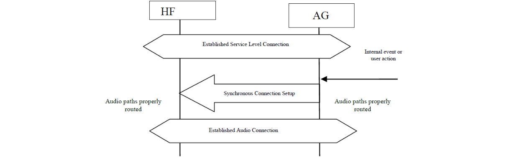

**Figure 6.1: Procedure for Establishment of an Audio Connection from AG**

The HF shall be able to initiate establishment of a synchronous connection to an HFP 1.0 or 1.5 AG.
The AG shall be able to accept establishment of a synchronous connection from an HFP 1.0 or 1.5 HF.

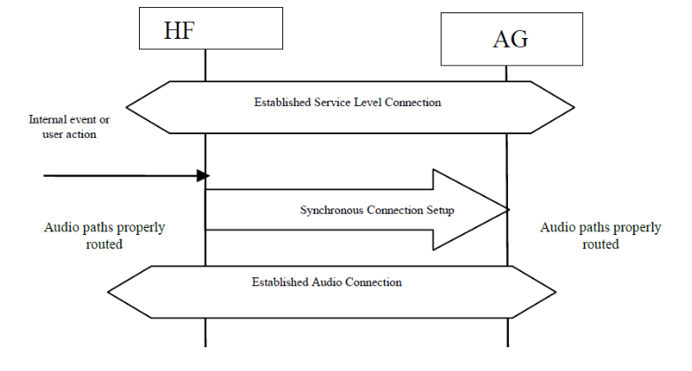

**Figure 6.2: Procedure for Establishment of an Audio Connection from HF**

### 6.4 Link Manager (LM) Interoperability Requirements

This profile requires support for encryption as defined in the Link Manager Protocol specification in Volume 2, Part C, Section 3.5 in [1].
Additionally this profile mandates that both the AG and HF devices shall support synchronous logical transports, subject to the requirements in Section 6.6.

### 6.5 Link Control (LC) Interoperability Requirements

Table 6.7 shows the Link Controller (See Volume 2, Part B, Section 8 in [1]) interoperability requirements for HFP.

|  | Capability | Support in AG | Support in HF |
| --- | --- | --- | --- |
| 1. | Inquiry |  | O |
| 2. | Inquiry scan | O |  |
| 7 | Voice CODEC |  |  |
| C | CVSD | M | M |

Table 6.7: Link Controller requirements

#### 6.5.1 Class of Device

A device implementing the HF role of HFP shall set the "Audio" bit in the Service Class field. Optionally, if the HF intends to be discovered as a "Hands-Free", it may use the following values in the Class of Device field:
1. Indicate "Audio" as Major Device class.
2. Indicate “Hands-Free” as the Minor Device class.
An inquiring AG may use this information to filter the inquiry responses.

### 6.6 Baseband Interoperability Requirements

The eSCO link and the air mode “Transparent Data” shall be supported if Wideband Speech or Super Wideband Speech is supported and are optional otherwise.
Erroneous data delivery may be used for Wideband Speech only if core version 2.1 or higher is supported.

| Item | Capability | Status |
| --- | --- | --- |
| 1.1.3/3 | Support of eSCO link | M |
| 1.1.7/4 | Transparent data | C1 |
| 1.1.8/2 | Erroneous data delivery | C2 |

Table 6.8: Baseband Requirements
C1: Mandatory if Wideband Speech or Super Wideband Speech is supported, or optional otherwise.
C2: Optional if core version 2.1 or higher is supported, or excluded otherwise

### 6.7 Codec Interoperability Requirements

Table 6.9 shows supported Mandatory and Optional codecs in this profile.

| Codec Type | Support | Ref |
| --- | --- | --- |
| CVSD | M | 6.7.3 |
| mSBC | C1 | 6.7.4 |

| Codec Type | Support | Ref |
| --- | --- | --- |
| LC3-SWB | C2 | 6.7.6 |

Table 6.9: Supported codecs
C1: Mandatory if Wideband Speech is supported or excluded otherwise.
C2: Mandatory if Super Wideband Speech is supported or excluded otherwise

#### 6.7.1 Synchronous Connection Interoperability Requirements

##### 6.7.1.1 Selection of Synchronous Transport

The device starting the request for a Synchronous Connection is known as the Initiator and the device receiving the request is known as the Responder. The Responder may accept or reject a request for a logical transport
To select the type of synchronous transport (eSCO or SCO) to use, devices shall adhere to the following logic:
• If eSCO is supported by the responder, the synchronous connection shall first be attempted on an eSCO logical transport. See section 6.7.1.2.
• If eSCO is unavailable for use (e.g., not supported by the Responder or link establishment fails), and SCO is not currently forbidden because a BR/EDR secure connection is being used, the Initiator shall open a SCO logical connection. See section 6.7.1.3.

##### 6.7.1.2 Negotiation of eSCO Configuration Parameters

In this section, HCI level parameters are given as a reference. On systems not incorporating HCI, equivalent values for LMP level eSCO connection parameters TeSCO, WeSCO and packet length that correspond to those HCI parameters shall be used. The following requirements apply to the support and use of eSCO logical transports and are based on parameter sets S1-S4 and T1-T2:
• The Initiator’s request for an eSCO transport may involve any configuration parameters matching the bidirectional throughput requirements of the voice codec (see Section 6.5). If an HCI is supported on this device, the request for setting up a synchronous connection may include single or multiple packet types masked within the same request.
• The Responder may choose to accept or reject the request from the Initiator. It may reject the request for an eSCO transport, or may accept it with parameters that do not match the requested parameters. In this case, the Initiator may retry the Synchronous Connection setup with different configuration parameters.
• It is recommended to use the S4 or T2 settings when BR/EDR Secure Connections is in use, when using complicated topologies, or when a device wants to improve coexistence with other wireless technologies.
• If the request for S4, S3 or T2 has failed and the Initiator needs to employ a time-division based solution to MWS Coexistence, the Initiator should make its best efforts to reconfigure its MWS radio so that it no longer needs to employ a time-division based solution to MWS Coexistence. For example, an AG might have the opportunity to change the cellular frequency band it is using in order to allow the MWS Coexistence features to be turned off for the duration of the synchronous connection.
• A device shall accept to use the S4 or T2 settings when requested by the remote device. Devices supporting only 1.7.1 or earlier versions of this profile might refuse the S4 setting, in which case the initiating device should request the S3 setting.
• If a request for an eSCO logical transport fails, the Initiator shall not abandon the setup of an eSCO transport without having requested eSCO using the “safe settings” specified in the following table:

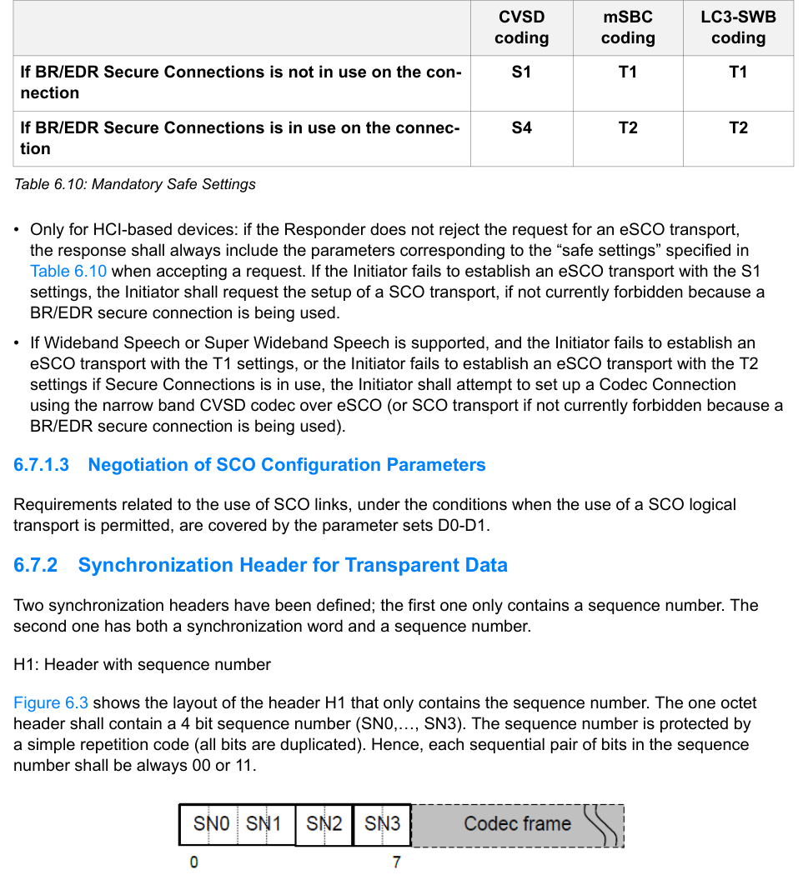

**Figure 6.3: One octet frame synchronization H1 header**

When using the Erroneous data delivery feature, the sequence number in the H1 header shall always be different from 0. The reason is that the Erroneous data delivery feature sets 0 for payload data octets corresponding to missing (e)SCO packets.
H2: Header with synchronization word and sequence number
Figure 6.4 shows the layout of the header H2 that contains both the synchronization word and the sequence number. The two octet header shall contain a 12 bit synchronization word and a 2 bit sequence number (SN0, SN1). The latter is protected by a simple repetition code (both bits are duplicated). Hence, each pair of bits in the sequence number shall be always 00 or 11.

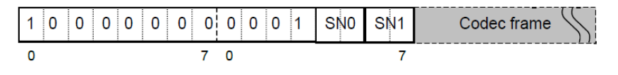

**Figure 6.4: Two octet frame synchronization H2 header**

It should be noted that when the transparent data transport is used, any alignment of the coded audio stream frames (codec frames and synchronization word) with eSCO packet boundaries is left up to the implementation. The use of the synchronization header enables unaligned codec audio frames to be recovered by the receiving side. To successfully render audio, the receiving side shall not assume the location of the synchronization header within the eSCO packets. The receiving side shall be capable of rendering received audio.

#### 6.7.3 CVSD coding

Table 6.11 defines SCO configuration parameter sets D0 and D1 for usage of CVSD coding.

| SCO parameter set | D0 | D1 |
| --- | --- | --- |
| Packet type | HV1 | HV3 |
| Transmit/Receive Bandwidth | 8000 | 8000 |
| Voice Setting (air coding) _ | CVSD | CVSD |
| Max Latency _ | 0x0004 (4 ms) | 0x0005 (5 ms) |
| Retransmission Effort _ | 0x00 or 0xFF | 0x00 or 0xFF |

Table 6.11: SCO synchronous connections (HCI Reference parameters)
Table 6.12 defines eSCO configuration parameter sets S1, S2, S3 and S4 for usage of CVSD coding.

| eSCO parameter set | S1 | S2 | S3 | S4 |
| --- | --- | --- | --- | --- |
| Packet type | EV3 | 2-EV3 | 2-EV3 | 2-EV3 |
| Transmit/Receive Bandwidth | 8000 | 8000 | 8000 | 8000 |
| Voice Setting (air coding) _ | CVSD | CVSD | CVSD | CVSD |
| Max Latency _ | 0x0007 (7 ms) | 0x0007 (7 ms) | 0x000A (10ms) | 0x000C (12ms) |
| Retransmission Effort _ | 0x01 | 0x01 | 0x01 | 0x02 |

Table 6.12: eSCO synchronous connections (HCI Reference parameters)

#### 6.7.4 mSBC coding

Support for a modified version of the SBC codec (hereafter called mSBC) is mandatory if Wideband Speech is supported in this profile. The original SBC codec is specified in A2DP [7]. The modifications to SBC that constitute mSBC are specified in Appendix A of this profile.
The various mandatory and optional settings for this codec are specified in the tables below.
Support for the following mSBC configuration is mandatory if Wideband Speech is supported.

| Parameter | Value |
| --- | --- |
| Channel mode | Mono |
| Sampling rate | 16 kHz |
| Allocation method | Loudness |
| Subbands | 8 |
| Blocklength | 15 |
| Bitpool | 26 |

Table 6.13: mSBC mandatory parameter set
An mSBC frame shall have the synchronization header H2 before every frame. The H2 header allows the receiver to know if one or more radio link packets are dropped.
Wideband Speech, when using the mSBC codec, shall only use the eSCO transport. The eSCO T1 setting below shall be supported.

| eSCO parameter set | T1 | T2 |
| --- | --- | --- |
| Packet type | EV3 | 2-EV3 |
| Transmit/Receive Bandwidth | 8000 | 8000 |
| Voice Setting (air coding) _ | Transparent Data | Transparent Data |
| Max Latency _ | 8 ms | 13 ms |
| Retransmission Effort _ | 0x02 | 0x02 |

Table 6.14: eSCO parameters for a Wideband Speech connection using the mSBC codec or a Super Wideband Speech connection using the LC3-SWB codec.

#### 6.7.5 Codec vs Link Parameter Negotiation

The Codec Negotiation procedure defined in this profile determines which codec to use when establishing an audio connection. This procedure is not used to negotiate the link parameters used with the selected codec. The link parameters are negotiated by the link managers using the link manager protocol.
The recommended link parameters are:
• For CVSD: S4 is preferred over S3, S3 is preferred over S2, S2 is preferred over S1, S1 is preferred over D1 and D1 is preferred over D0. The decision to use S4 may also be based on implementation- specific coexistence use cases.
• For mSBC: T2 is preferred over T1.
• For LC3-SWB: T2 is preferred over T1.

#### 6.7.6 LC3-SWB coding

Support for the LC3-SWB codec is mandatory if Super Wideband Speech is supported in this profile. The codec is specified in the LC3 Specification [10]. The AG and the HF shall implement both the encoder and decoder of the LC3-SWB codec.
The settings for LC3-SWB are specified in Table 6.14 and Table 6.15.
Support for the configuration shown in Table 6.15 is mandatory if Super Wideband Speech is supported.

| Parameter | Value |
| --- | --- |
| Channel mode | Mono |
| Sampling rate | 32 kHz |
| Frame duration | 7.5 ms |
| Byte count per codec frame (excluding H2 header) | 58 |
| Resulting bit rate (excluding H2 header) | 61867 bits/s |

Table 6.15: LC3-SWB mandatory parameter set
See Section 3.2.5 in [10] for the relation between the values of bit rate and the byte count.
An LC3-SWB frame shall have the synchronization header H2 before every frame. The 2-byte H2 header enables the receiver to determine if one or more radio link packets are dropped.
Super Wideband Speech, when using LC3-SWB, shall use only the eSCO transport. The eSCO T1 setting shown in Table 6.14 shall be supported.

### 6.8 Speech Quality Recommendations

The introduction of Wideband Speech and Super Wideband Speech to the HFP profile allows for increased end-customer satisfaction in terms of perceived speech quality. Super Wideband Speech corresponds to the maximum audio bandwidth provided in 5G voice services and provided by many over-the-top (OTT) voice services. The available codec with the highest audio quality should be used. For example, Super Wideband Speech is preferred over Wideband Speech, and Wideband Speech is preferred over narrow band speech connections.

#### 6.8.1 Packet Loss Concealment (PLC)

It is strongly recommended that some form of PLC should be implemented on the receiving ends of compressed audio (such as mSBC and LC3-SWB) to reduce synthesized audio artifacts during degraded channel conditions.
For mSBC, the example PLC algorithm provided in Appendix C may be used. The speech quality of this example PLC under typical packet loss conditions is considered satisfactory. If implementations choose to modify or implement an alternate PLC scheme, the performance of any such alternate PLC should meet or exceed the performance of the example PLC provided in Appendix C.
The LC3 specification [10] also provides an example PLC algorithm that may be used with Super Wideband Speech (see Appendix B in [10]).

#### 6.8.2 Signal Levels

Full swing at the 16 bit linear PCM interface to the codecs in this profile specification is defined to be 3 dBm0. This definition applies to devices that support narrow band, Wideband Speech, and Super Wideband Speech.
Further details on recommended audio levels are specified in Appendix D, Section 13.1.
Recommended specifications for send and receive frequency masks are provided in Appendix D, Section 13.2.

## 7 Generic Access Profile

This section defines the support requirements for the capabilities as defined in the “Generic Access Profile” of the Core Specification.

### 7.1 Modes

Table 7.1 shows the support status for GAP Modes in this profile.

| Procedure | Support in HF |
| --- | --- |
| General discoverable mode | M |
| Procedure | Support in AG |
| Pairable mode | M |

Table 7.1: Modes

### 7.2 Security Aspects

Baseband authentication and encryption is optional for both the Hands-Free unit and the Audio Gateway. If both devices support authentication and encryption, the application on either device may require its use. However, if Secure Connections is supported by both devices, its use is mandated by the Bluetooth Core 4.1 Specification (or later).
A Hands-Free unit may be able to use the services of the Audio Gateway without the creation of a secure connection. It is implementation specific whether the Hands-Free unit provides or supports security enforcement for the user.
Whenever baseband authentication or encryption is used, the two devices shall create a secure connection using the GAP authentication procedure as described in Generic Access Profile (Volume 3, Part C, Section 5.1 in [1]). This procedure may include entering a Bluetooth PIN code or passkey and creation of proper link keys. If Simple Secure Pairing is not in use and when the UI of the Hands-Free unit is limited, a fixed Bluetooth PIN code may be used during the GAP authentication procedure.
If Secure Connections is used, the Authenticated Payload Timeout should be less than or equal to 10s. The disconnection behavior following a timeout is implementation specific.

### 7.3 Idle Mode Procedures

Table 7.2 shows the support status for Idle mode procedures within this profile.

| Procedure | Support in AG |
| --- | --- |
| Initiation of general inquiry | M |
| Initiation of general bonding | O |
| Initiation of dedicated bonding | O |

Table 7.2: Idle mode procedures

## 8 References

[1] Bluetooth Core Specification (amended), Version 4.2 or later
[2] 3GPP 27.007 v6.8.0 now supersedes and replaces ETS 300 916, “Digital cellular telecommunications system (Phase 2+); AT command set for GSM Mobile Equipment (ME) (GSM 07.07 version 7.5.0),” http://www.3gpp.org/ftp/Specs/html-info/27007.htm
[3] Headset Profile Specification, Version 1.2 or later
[4] RFCOMM with TS 07.10 Specification, Version 1.2 or later
[5] ISO/IEC 646:1991: "Information technology – ISO 7-bit coded character set for information interchange," Edition 3, 1991, https://www.iso.org/standard/4777.html
[6] ETSI TS 123 041, version 15.2.0, "Digital cellular telecommunication system (Phase 2+) (GSM)," June 2018, https://www.etsi.org/deliver/etsi_ts/123000_123099/123041/15.02.00_60/ ts_123041v150200p.pdf
[7] Advanced Audio Distribution Profile Specification, Version 1.2 or later
[8] Bluetooth Assigned Numbers, https://www.bluetooth.com/specifications/assigned-numbers
[9] D. Goodman, et al., “Waveform substitution techniques for recovering missing speech segments in packet voice communications”, IEEE Transactions on Acoustics, Speech and Signal Processing, December 1986, pp. 1440 - 1448, https://ieeexplore.ieee.org/document/1164984
[10] Low Complexity Communication Codec Specification, Version 1.0 or later
[11] Appropriate Language Mapping Tables, https://www.bluetooth.com/language-mapping/Appropriate- Language-Mapping-Table
[12] 3GPP, TS 22.030, Version 16: "Man-Machine Interface (MMI) of the User Equipment (UE)," July 2020, https://portal.3gpp.org/desktopmodules/Specifications/SpecificationDetails.aspx? specificationId=570
[13] 3GPP, TS 22.082, Version 16: "Call Forwarding (CF) Supplementary Services," July 2020, https:// portal.3gpp.org/desktopmodules/Specifications/SpecificationDetails.aspx?specificationId=591
[14] 3GPP, TS 24.008, Version 17.5: "Mobile Radio Interface Layer 3 specification,” December 2021, https://portal.3gpp.org/desktopmodules/Specifications/SpecificationDetails.aspx? specificationId=1015

## 9 List of Acronyms and Abbreviations

| Abbreviation or Acronym | Meaning |
| --- | --- |
| AG | Audio Gateway |
| AT | Attention |
| BTR | Bluetooth Reference Point |
| BVRA | Bluetooth Voice Recognition Activation |
| CLI | Calling Line Identification |
| CODEC | COder DECoder |
| CVSD | Continuously Variable Slope Delta modulation |
| DTMF | Dual Tone Multi-Frequency |
| EC | Echo Cancellation |
| EDR | Enhanced Data Rate |
| eSCO | Extended Synchronous Connection Oriented |
| GAP | Generic Access Profile |
| GSM | Global System for Mobile communication |
| HF | Hands-Free unit |
| L2CAP | Logical Link Control and Adaptation Protocol |
| LC3 | Low Complexity Communication Codec |
| LMP | Link Manager Protocol |
| mSBC | Modified Sub Band Codec |
| NR | Noise Reduction |
| OSI | Open System Interconnection |
| OTT | Over-the-top |
| PCM | Pulse Code Modulation |
| PLC | Packet Loss Concealment |
| PIN | Personal Identification Number |
| POI | Point Of Interconnection |
| RFCOMM | Serial port transport protocol over L2CAP |
| SBC | Sub Band Codec |

| Abbreviation or Acronym | Meaning |
| --- | --- |
| SCO | Synchronous Connection Oriented |
| SDP | Service Discovery Protocol |
| SWB | Super Wideband |
| UI | User Interface |
| UUID | Universally Unique Identifier |
| VR | Voice Recognition |

## 10 Appendix A: Technical Specification of mSBC

### 10.1 Introduction

This appendix describes the changes to the SBC codec defined in A2DP [7] standard which comprises the Modified SBC codec. The changes to the A2DP SBC are limited to the frame header syntax and semantics. All other parts of the SBC definition remain un-modified.

#### 10.1.1 Mnemonics

The following mnemonics are defined to describe the different data types used in the coded bit-stream.

| Mnemonic | Description |
| --- | --- |
| Char8 | Character of 8 bits |
| UiMsbf | Unsigned integer, Most significant bit first |
| SiMsbf | Signed integer, Most significant bit first |
| BsMsbf | Bit-stream, Most significant bit first |
| PCM | Pulse Code Modulation |
| Na | Not available |

Table 10.1: Mnemonics

### 10.2 Syntax

| Syntax | No. of bits | Mnemonic |
| --- | --- | --- |
| audio frame() _ { frame header() _ scale factors() _ audio samples() _ padding() } |  |  |

Table 10.2: Syntax of mSBC speech frame
Note: The syntax of the mSBC speech frame is not changed from the original SBC definition in A2DP [7].

| Syntax | No. of bits | Mnemonic |
| --- | --- | --- |
| frame header() _ { Syncword Reserved for future use crc check _ } | 8 16 8 | BsMsbf UiMsbf UiMsbf |

Table 10.3: Syntax of mSBC frame header

### 10.3 Semantics

#### 10.3.1 Frame_header

syncword -- The 8 bit string %10101101 or $AD.
The syncword is different from that specified for the SBC in A2DP specifications so that implementations may use this is an additional indication that the encoded stream is meant to contain Wideband Speech.
Codec ID – The following table represents the values of the various mSBC parameters that correspond to the values specified in the Codec ID field.

| 8 bit Codec | Mandatory | mSBC Parameters |  |  |  |  |  |
| --- | --- | --- | --- | --- | --- | --- | --- |
| ID | Or Optional | Channel Mode | Sampling rate | Allocation method | Subbands | Block length | Bitpool |
| 0x02 | M | Mono | 16 kHz | loudness | 8 | 15 | 26 |

Table 10.4: Mapping of Codec Ids to mSBC parameters
The interpretation of the mSBC parameters as specified in Table 10.4 is identical to that specified in SBC definition in A2DP [7].

#### 10.3.2 Padding

The all zero 8 bit string %00000000 or $00 shall be used for padding.

## 11 Appendix B: Codec IDs

The following table specifies the mapping of the codecs to their respective Codec Ids.

| Codec Type | Codec ID | Ref. |
| --- | --- | --- |
| CVSD | 0x01 | 6.7.3 |
| mSBC | 0x02 | 6.7.4 |
| LC3-SWB | 0x03 | 6.7.6 |
| Other optional codecs may be added here | Reserved | Reserved |

Table 11.1: Mapping of codec types to Codec IDs

## 12 Appendix C: Example PLC Implementation

This appendix describes a packet loss concealment (PLC) method based on the paper by D. Goodman, et al. [9] and adapted for use with mSBC.

### 12.1 Baseline Packet Loss Concealment

A baseline packet loss concealment algorithm based on the techniques presented in [1] is discussed. This baseline PLC is a generic PCM-based system and makes no assumptions on mSBC. Its integration into mSBC to form a reference PLC for mSBC is described in a later section.
The following subsections describe the techniques used in the baseline PLC algorithm.

#### 12.1.1 Waveform Substitution Based On Pattern Matching

The technique in Section IV “Waveform Substitution Based on Pattern Matching” of [1] is used to construct an estimate of the waveform in missing packets. This algorithm searches a history buffer of previously received samples to find a packet-worth of samples to replace the missing packet. The selection is based on constructing a template of M samples immediately preceding the missing packet and scanning a search window of N samples in the history buffer to find the M samples that best match the template. It then uses as a replacement packet the L samples that follow the best match. The pattern matching criterion used is the cross-correlation similar to that in equation (4) of the paper except the denominator contains a square root as in the standard definition of cross-correlation. The implementation follows the recommendations of the paper and uses a template of 4ms (M=64) and a search window of 16ms (N=256). A frame size of 7.5ms (L=120) was used corresponding to the frame size of the default mSBC configuration.

#### 12.1.2 Overlap-Add

As described in Section III of the paper, in order to reduce the audible distortion caused by discontinuities at the boundaries between correct packets and substitution packets, it is important to “merge” the two waveforms by way of an overlap-add procedure. The example PLC follows the recommendation of the paper and uses a raised-cosine weighting with a merge duration of 1ms (16 samples). The paper adds 1ms of delay in order to merge at the boundary between the last correct packet and the substitution packet. However, the example PLC avoids this added delay by using the partial signal contained in the mSBC decoder memory. This will be described in more detail in Section 12.2.1. At the boundary between the first correct packet, after packet loss, and the substitution packet, the paper extends the substitution waveform 1ms into the correct packet in order to perform the merge. The example PLC follows a similar method except that the substitution waveform is further extended to allow for the mSBC decoder signal to re-\converge after packet loss. This is also described later.

#### 12.1.3 Amplitude Matching

Section B of the paper describes a procedure to adjust the amplitude of the substitution packet to match that of the preceding packet. The example PLC implements this approach with the mean-absolute-value measure of packet amplitude.

### 12.2 Integration of PLC with mSBC

The PLC described in the paper was designed for PCM without any considerations for integration with a codec such as mSBC. The main issue with mSBC as far as integration of a PLC is the response of the sub-band filters in the mSBC decoder. The integration is described in the next sub-sections.

#### 12.2.1 Merging in the First Substitution Frame – Avoiding Delay

As previously mentioned, the paper performs a merge between the last correct packet and the substitution packet by introducing a 1ms delay. This delay is avoided in the example PLC by taking advantage of the signal embedded in the mSBC decode sub-band filter memory. In the first substitution frame, the mSBC decoder is fed a bit-stream corresponding to an all-zero input signal. The output of decoder is then used to merge with the substitution waveform using a 1ms raised-cosine weighting as described in the paper. This procedure also has the advantage of setting the decoder memory to zero.

#### 12.2.2 Reconvergence of the mSBC Decoder in the First Correct Packet After Packet Loss

The delay caused by the sub-band filters in the mSBC decoder means that when the first correct packet after packet loss is decoded, there will be a period of time before the output reconverges to the desired decoder output. Since the decoder memory is essentially reset to zero by the procedure described in Section 12.2.1, the decoder output will ramp up from zero as it reconverges. The substitution waveform is extended into the first correct packet after packet loss by an amount equal to this reconvergence time and used as output. Once the decoder output has sufficiently reconverged, the substitution waveform is merged with the decoder output using a 1 ms raised-cosine weighting. The reconvergence time used was experimentally tuned to 36 samples (2.25ms).

### 12.3 API Description

This section describes the API for the example PLC for mSBC.

#### 12.3.1 Memory Allocation

The calling application allocates memory for the PLC memory structure.
The structure is defined in the file sbcplc.h and is shown below:
/* PLC State Information */
struct PLC_State
{
short hist[LHIST+FS+SBCRT+OLAL];
short bestlag;
int   nbf;
};
The main test program can allocate the space by simply declaring a variable as below:
struct PLC_State plc_state;

#### 12.3.2 Initialization

The calling application initializes the PLC memory that was allocated as described in Section 12.3.1. The initialization function is called once before processing begins. The initialization function is:
void InitPLC(struct PLC_State *plc_state)
and is found in sbcplc.c.
The calling program should include sbcplc.h containing the header:
#include "sbcplc.h"
and should call the initialization function:
InitPLC(&plc_state);

#### 12.3.3 Good Frame Processing

If a good frame is received, the frame should be decoded by mSBC. The output PCM samples from the mSBC decoder are then passed to the function:
void PLC_good_frame(struct PLC_State *plc_state, short *in, short *out)
where:
struct PLC_State *plc_state the PLC memory block
short *in Pointer to the array of samples from the mSBC decoder containing the PCM samples of the good decoded frame.
short *out Pointer to the array of samples processed by PLC_good_frame().
The calling application owns the memory pointed to by *in and *out.
• The size of these arrays should be no smaller than the frame size.
• The samples pointed to by *out are the final output samples.

#### 12.3.4 Bad Frame Processing

If a frame is lost, the calling application does the following:
Call the mSBC decoder with channel indices representing an all-zero input PCM signal. This is further described in Section 12.3.5
Call the mSBC PLC function
void PLC_bad_frame(struct PLC_State *plc_state, short *ZIRbuf, short *out)
where:
struct PLC_State *plc_state the PLC memory block.
short *ZIRbuf the zero input response of the mSBC decoder from step 1) of length equal to the frame size.
short *out pointer to the buffer where the PLC will write the concealment samples for the current lost frame.

#### 12.3.5 SBC Decoder Zero-Input Response

At time of receiving the first bad frame, the mSBC decoder filter banks contain data from previous good frames, called signal memory. This signal memory can be extracted by calling the mSBC decoder with a bit-stream that represents an all-zero PCM signal. The resulting signal is termed the Zero-Input Response (ZIR) of the mSBC decoder. The example PLC requires this signal as part of its input.
The indices representing the all-zero signal can be obtained offline and stored. The indices are then used as input to the decoder every time a frame is lost.
To obtain the indices, use an all-zero PCM signal as input to the encoder, and capture the indices. Store these indices and use them as described above.
The zero input bit stream for the default mSBC configuration is pre-computed and provided below:
#if FS==120  /* Frame Size of 120 samples #define FSIDX        57             /* Frame Size Indexes*/ #define NROFBLK      15             /* NumbeR OF BLocKs*/ #define CHMODE       0              /* CHannel MODE 0=mono, 1=dual, 2=stereo, 3=joint */ #define ALLOCMETHOD  0              /* bit ALLOCation METHOD 0=loudness, 1=SNR */ #define NROFSB       8              /* NumbeR OF SubBands */ #define BITPOOL      26             /* BITPOOL size */ #endif short indices0[] = {0xad, 0x0, 0x0, 0xc5, 0x0, 0x0, 0x0, 0x0, 0x77, 0x6d, 0xb6, 0xdd, 0xdb, 0x6d, 0xb7, 0x76, 0xdb, 0x6d, 0xdd, 0xb6, 0xdb, 0x77, 0x6d, 0xb6, 0xdd, 0xdb, 0x6d, 0xb7, 0x76, 0xdb, 0x6d, 0xdd, 0xb6, 0xdb, 0x77, 0x6d, 0xb6, 0xdd, 0xdb, 0x6d, 0xb7, 0x76, 0xdb, 0x6d, 0xdd, 0xb6, 0xdb, 0x77, 0x6d, 0xb6, 0xdd, 0xdb, 0x6d, 0xb7, 0x76, 0xdb, 0x6c};

#### 12.3.6 Bad Frame Calling Example

In the case of a bad frame, using the above example data, the calling application would do the following:
SBCdecode( indices0, ZIRbuf); PLC_bad_frame(plc_state, ZIRbuf, outbuf);
The application would then use the contents of outbuf for playback.

### 12.4 Source Code (ANSI C)

#### 12.4.1 Source code for file – sbcplc.h

/******************************************************** SBC Example PLC ANSI-C Source Code File: sbcplc.h ********************************************************/ #ifndef SBCPLC_H #define SBCPLC_H #define FS        120 /* Frame Size */
#define N         256 /* 16ms - Window Length for pattern matching */ #define M         64 /* 4ms - Template for matching */ #define LHIST     (N+FS-1) /* Length of history buffer required */ #define SBCRT     36 /* SBC Reconvergence Time (samples) */ #define OLAL      16 /* OverLap-Add Length (samples) */
/* PLC State Information */ struct PLC_State { short hist[LHIST+FS+SBCRT+OLAL]; short bestlag; int nbf; };
/* Prototypes */ void InitPLC(struct PLC_State *plc_state); void PLC_bad_frame(struct PLC_State *plc_state, short *ZIRbuf, short *out); void PLC_good_frame(struct PLC_State *plc_state, short *in, short *out);
#endif /* SBCPLC_H */

#### 12.4.2 Source code for the file – sbcplc.c

/************************************************************* SBC Example PLC ANSI-C Source Code File: sbcplc.c *************************************************************/ #include <math.h> //#include "sbc.h" #include "sbcplc.h" /* Local Function Prototypes */ float CrossCorrelation(short *x, short *y); int PatternMatch(short *y); float AmplitudeMatch(short *y, short bestmatch);
/* Raised COSine table for OLA */ float rcos[OLAL] = {0.99148655f,0.96623611f,0.92510857f,0.86950446f, 0.80131732f,0.72286918f,0.63683150f,0.54613418f, 0.45386582f,0.36316850f,0.27713082f,0.19868268f, 0.13049554f,0.07489143f,0.03376389f,0.00851345f}; + /**************************************************************************** * Function: InitPLC() * * Purpose: Perform PLC initialization of memory vectors. * * Inputs: *plc_state - pointer to PLC state memory * * Outputs: *plc_state - initialized memory. * * Date: 03-18-2009
****************************************************************************/ void InitPLC(struct PLC_State *plc_state) { int i;
plc_state->nbf=0; plc_state->bestlag=0; for (i=0;i<LHIST+SBCRT;i++) plc_state->hist[i] = 0; } /*********************************************************** * Function: PLC_bad_frame() * * Purpose: Perform bad frame processing. * * Inputs:  *plc_state - pointer to PLC state memory *     *ZIRbuf    - pointer to the ZIR response of the SBC decoder * * Outputs: *out  - pointer to the output samples * * Date: 03-18-2009 ************************************************************/ void PLC_bad_frame(struct PLC_State *plc_state, short *ZIRbuf, short *out) { int i; float val; float sf;
plc_state->nbf++;
sf=1.0f; i=0; if (plc_state->nbf==1) { /* Perform pattern matching to find where to replicate */ plc_state->bestlag = PatternMatch(plc_state->hist); plc_state->bestlag += M; /* the replication begins after the template match */
/* Compute Scale Factor to Match Amplitude of Substitution Packet to that of Preceding Packet */ sf = AmplitudeMatch(plc_state->hist, plc_state->bestlag);
for (i=0;i<OLAL;i++) { val = ZIRbuf[i]*rcos[i] + sf*plc_state->hist[plc_state- >bestlag+i]*rcos[OLAL-i-1]; if (val > 32767.0) val= 32767.0; if (val < -32768.0) val=-32768.0; plc_state->hist[LHIST+i] = (short)val; } for (;i<FS;i++) { val = sf*plc_state->hist[plc_state->bestlag+i]; if (val > 32767.0) val= 32767.0; if (val < -32768.0) val=-32768.0; plc_state->hist[LHIST+i] = (short)val;
} for (;i<FS+OLAL;i++) { val = sf*plc_state->hist[plc_state->bestlag+i]*rcos[i-FS]+plc_state- >hist[plc_state->bestlag+i]*rcos[OLAL-1-i+FS]; if (val > 32767.0) val= 32767.0; if (val < -32768.0) val=-32768.0; plc_state->hist[LHIST+i] = (short)val; } for (;i<FS+SBCRT+OLAL;i++) plc_state->hist[LHIST+i] = plc_state->hist[plc_state->bestlag+i]; } else { for (;i<FS;i++) plc_state->hist[LHIST+i] = plc_state->hist[plc_state->bestlag+i]; for (;i<FS+SBCRT+OLAL;i++) plc_state->hist[LHIST+i] = plc_state->hist[plc_state->bestlag+i]; }
for (i=0;i<FS;i++) out[i] = plc_state->hist[LHIST+i];
/* shift the history buffer */ for (i=0;i<LHIST+SBCRT+OLAL;i++) plc_state->hist[i] = plc_state->hist[i+FS]; } /**************************************************************************** * Function: PLC_good_frame() * * Purpose: Perform good frame processing. Most of the time, this function * just updates history buffers and passes the input to the output, * but in the first good frame after frame loss, it must conceal the * received signal as it reconverges with the true output. * * Inputs:  *plc_state - pointer to PLC state memory *     *in    - pointer to the input vector * * Outputs: *out - pointer to the output samples * Date: 03-18-2009
****************************************************************************/ void PLC_good_frame(struct PLC_State *plc_state, short *in, short *out) { int i;
i=0; if (plc_state->nbf>0) { for (i=0;i<SBCRT;i++) out[i] = plc_state->hist[LHIST+i]; for (;i<SBCRT+OLAL;i++)
out[i] = (short)(plc_state->hist[LHIST+i]*rcos[i-SBCRT] + in[i]*rcos[OLAL-1-i+SBCRT]); } for (;i<FS;i++) out[i] = in[i];
/*Copy the output to the history buffer */ for (i=0;i<FS;i++) plc_state->hist[LHIST+i] = out[i]; /* shift the history buffer */ for (i=0;i<LHIST;i++) plc_state->hist[i] = plc_state->hist[i+FS];
plc_state->nbf=0; } /**************************************************************************** * Function: CrossCorrelation() * * Purpose: Compute the cross correlation according to Eq. (4) of Goodman *     paper, except that the true correlation is used. His formula *     seems to be incorrect. * * Inputs:  *x    - pointer to x input vector *    *y     - pointer to y input vector * * Outputs: Cn    - return value containing the cross-correlation of x and y * * Date: 03-18-2009 ****************************************************************************/ float CrossCorrelation(short *x, short *y) { int   m; float num; float den; float Cn; float x2, y2;
num=0; den=0;
x2=0.0; y2=0.0; for (m=0;m<M;m++) { num+=((float)x[m])*y[m]; x2+=((float)x[m])*x[m]; y2+=((float)y[m])*y[m]; } den = (float)sqrt(x2*y2);
Cn = num/den; return(Cn);
}
/**************************************************************************** * Function: PatternMatch() * * Purpose: Perform pattern matching to find the match of template with the * history buffer according to Section B of Goodman paper. * * Inputs:  *y : pointer to history buffer * * Outputs: return(int): the lag corresponding to the best match. The lag is * with respect to the beginning of the history buffer. * * Date: 03-18-2009
****************************************************************************/ int PatternMatch(short *y) { int n; float maxCn; float Cn; int   bestmatch; maxCn=-999999.0; /* large negative number */ bestmatch=0; for (n=0;n<N;n++) { Cn = CrossCorrelation(&y[LHIST-M] /* x */, &y[n]); if (Cn>maxCn) { bestmatch=n; maxCn = Cn; } } return(bestmatch); }
/**************************************************************************** * Function: AmplitudeMatch() * * Purpose: Perform amplitude matching using mean-absolute-value according *     to Goodman paper. * * Inputs:  *y : pointer to history buffer *     bestmatch : value of the lag to the best match * * Outputs: return(float): scale factor * * Date: 03-19-2009
****************************************************************************/ float AmplitudeMatch(short *y, short bestmatch)
{ int   i; float sumx; float sumy; float sf;
sumx = 0.0; sumy = 0.000001f; for (i=0;i<FS;i++) { sumx += abs(y[LHIST-FS+i]); sumy += abs(y[bestmatch+i]); } sf = sumx/sumy;
/* This is not in the paper, but limit the scaling factor to something reasonable to avoid creating artifacts */ if (sf<0.75f) sf=0.75f; if (sf>1.2f) sf=1.2f; return(sf); }

## 13 Appendix D: Quality Metrics

### 13.1 Audio levels

The Bluetooth Core Specification (Volume 2, Part B, Section 9, Audio) describes the CVSD codec for voice on the Bluetooth air interface. The Core Specification also provides general audio recommendations for narrowband voice. This appendix provides recommendations for the Wideband Speech update of the Hands-Free Profile, and for the Super Wideband Speech update of the Hands-Free Profile.
For both CVSD (narrow band) and the Wideband Speech codecs, the full scale sine wave PCM data should meet the network level of +3dBm0 as previously specified for the CVSD codec.
For Super Wideband Speech codecs, a full scale 6427 Hz sine wave PCM data signal should meet the network level of +3dBm0 as previously specified for the CVSD codec. Note that for lower bitrates, the LC3 utilizes a Long-Term Post Filter (LTPF) which may amplify the signal. The frequency 6427 Hz minimizes this effect.
The AG manufacturer should adjust the gain from the Bluetooth Reference Point (BTR) to the cellular network, as shown in the core specification. The HF is responsible to adjust the speech signal to the BTR, as shown in the core specification, to enable nominal speech level of -21dbm0 in the networks at given nominal sound pressure level of -4.7 dBPa at the mouth reference point of the HF as described in ITU-T P.1100.
dBm0: absolute power level in dBm referred to a point of zero relative level (0 dBr point)
A possible test setup is described in Figure 13.1.

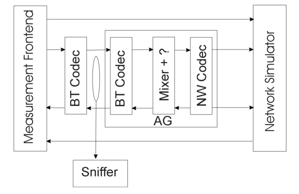

**Figure 13.1: Example setup for audio level testing**

The gain from BTR to the network and the gain from the network to the BTR should be adjusted for both signal processing modes: either on the phone (AG) or on the hands-free (HF) device after confirming the AT+NREC=0 command. When the signal processing is confirmed to be disabled on the AG, a sine signal can be used to verify the gain between the BTR and the network. When the active signal processing for Echo Cancellation and Noise Reduction are performed on the AG, a sine signal can lead to wrong results and a speech like signal, like P.50 (artificial voice), should be used. A Network simulator is
highly recommended during testing because of the unknown status of gain and signal processing in real networks.

### 13.2 Bluetooth Sensitivity Frequency Responses

#### 13.2.1 Bluetooth Send Sensitivity Frequency Response

The send sensitivity frequency response is measured from BTR to POI (reference speech codec of the system simulator, output).
The tolerance mask for the send sensitivity frequency response is enumerated in the Table below, the mask is drawn by straight lines between the breaking points on a logarithmic (frequency) - linear (dB sensitivity) scale.

| Frequency (Hz) | Upper Limit | Lower Limit |
| --- | --- | --- |
| 200 5000 12500 14100 (14100 = 12500 +0.1*32000/2) 16000 | 0 0 0 0 0 | -2 -2 -4 -5 no lower limit at the Nyquist frequency |
| All sensitivity values for Super Wideband Mask values are expressed in dB on an arbitrary scale. |  |  |

| Frequency (Hz) | Upper Limit | Lower Limit |
| --- | --- | --- |
| 100 6 200 7 000 | 0 0 0 | -2 -2 -3 |
| All sensitivity values for Wideband Mask are expressed in dB on an arbitrary scale. |  |  |

| Frequency (Hz) | Upper Limit | Lower Limit |
| --- | --- | --- |
| 200 3 100 3 400 | 0 0 0 | -2 -2 -3 |
| All sensitivity values for Narrow Band Mask are expressed in dB on an arbitrary scale. Narrow band stops at 3400 Hz. |  |  |

Table 13.1: Tolerance Mask for the Bluetooth Send Sensitivity Frequency Response

#### 13.2.2 Bluetooth Receive Sensitivity Frequency Response

The receive sensitivity frequency response is measured from the electrical reference point (input of the system simulators, POI) to the Bluetooth reference interface.
The tolerance mask for the receive sensitivity frequency response is shown in the Table below, the mask is drawn by straight lines between the breaking points on a logarithmic (frequency) - linear (dB sensitivity) scale.

| Frequency (Hz) | Upper Limit | Lower Limit |
| --- | --- | --- |
| 200 5000 12500 14100 (14100 = 12500 +0.1*32000/2) 16000 | 0 0 0 0 0 | -2 -2 -4 -5 no lower limit at the Nyquist frequency |
| All sensitivity values for Super Wideband Mask values are expressed in dB on an arbitrary scale. |  |  |

| Frequency (Hz) | Upper Limit | Lower Limit |
| --- | --- | --- |
| 100 6 200 7 000 | 0 0 0 | -2 -2 -3 |
| All sensitivity values for Wideband Mask are expressed in dB on an arbitrary scale. |  |  |

| Frequency (Hz) | Upper Limit | Lower Limit |
| --- | --- | --- |
| 200 3 100 3 400 | 0 0 0 | -2 -2 -3 |
| All sensitivity values for Narrow Band Mask are expressed in dB on an arbitrary scale. Narrow band stops at 3400 Hz. |  |  |

Table 13.2: Tolerance Mask for the Receive Sensitivity Frequency Response

## 14 Appendix E: Technical Specification of LC3-SWB

### 14.1 Introduction

This appendix describes the additions for defining the LC3-SWB codec. The additions are limited to LC3-Codec ID and the LC3 parameter setup. All other parts of the LC3 definition remain unmodified.

### 14.2 Codec ID definition

LC3-SWB does not employ any additional frame header compared to mSBC.
Table 14.1 represents the values of the LC3-SWB parameters that correspond to the values specified in the Codec ID field. The Codec ID is used with the AT+BCS command, see Section 4.11.3.

| 8 bit | Mandatory | LC3 Parameters |  |  |  |  |  |
| --- | --- | --- | --- | --- | --- | --- | --- |
| Codec ID | or Optional | Channel mode | Sampling rate | byte count _ | Bit depth, bits per audio sample | Frame duration | Header type |
| 0x03 | M | Mono | 32 kHz | 58 | 16 | 7.5 ms | H2 |

Table 14.1: Mapping of LC3-SWB Codec ID to LC3 parameters

### 14.3 Padding

LC3-SWB does not employ any padding.

### 14.4 Handling of eSCO 16-bit CRC

If the erroneous data reporting feature (Volume 2, Part B in [1]) for the HCI Synchronous Data packets is supported, lost data shall be indicated in the Packet Status flag.