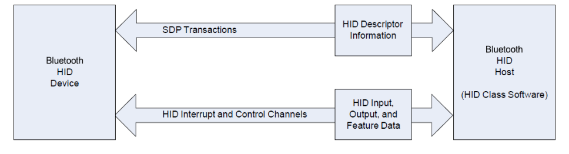
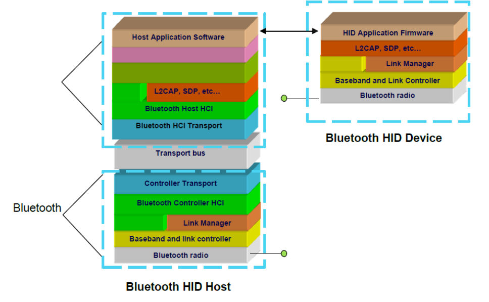
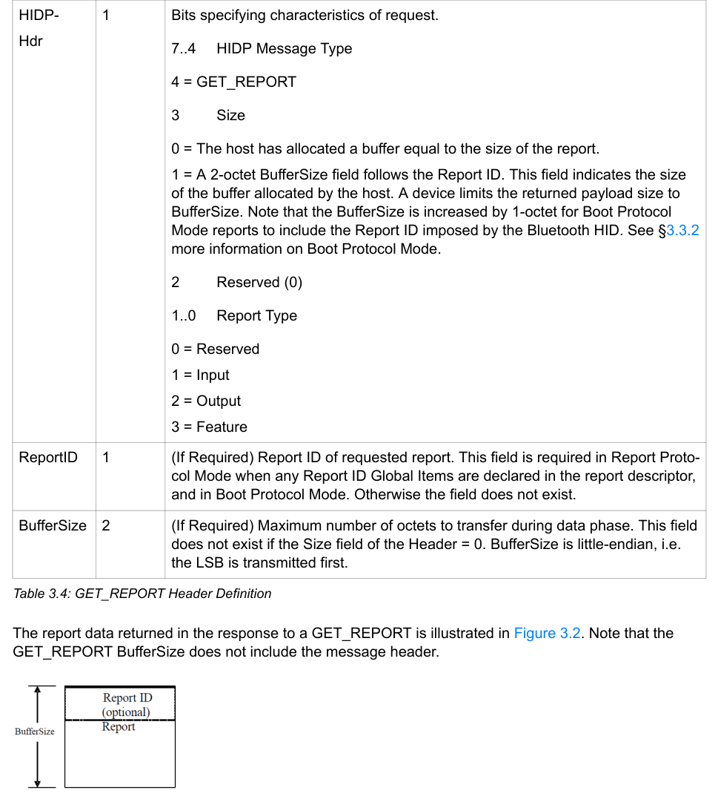
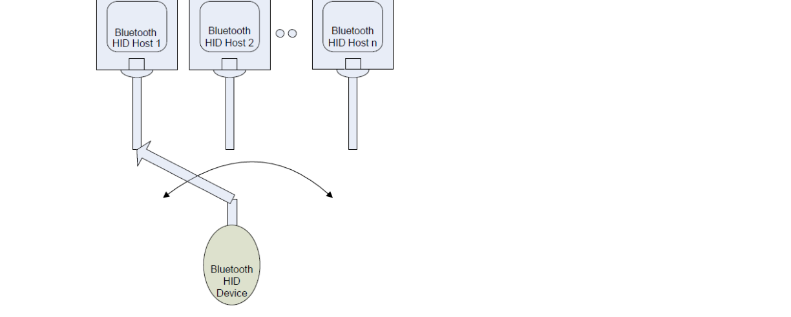
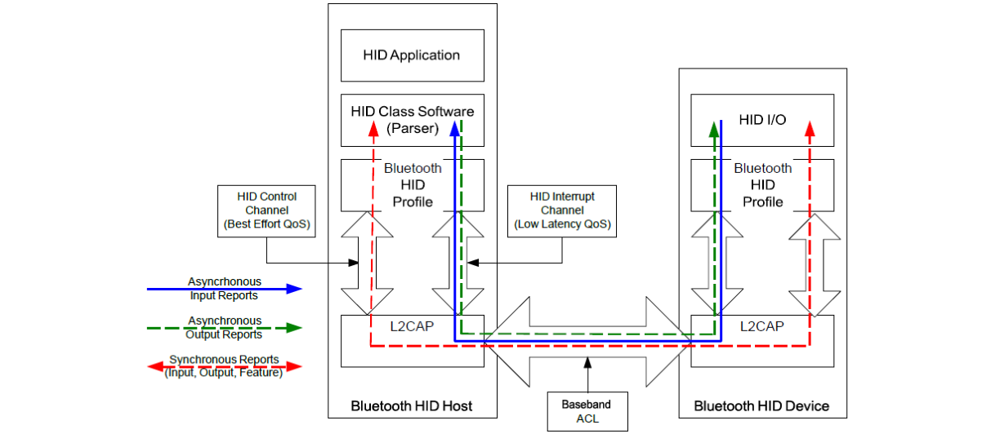
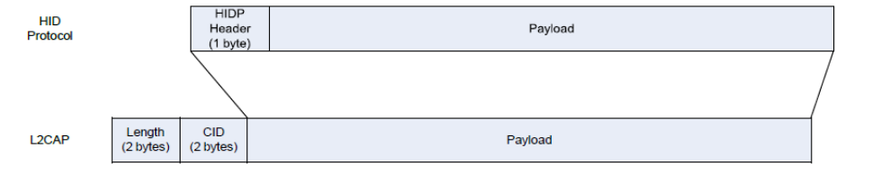
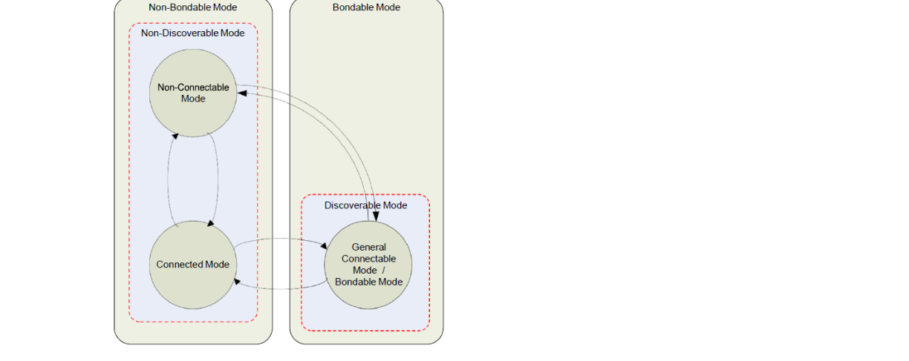
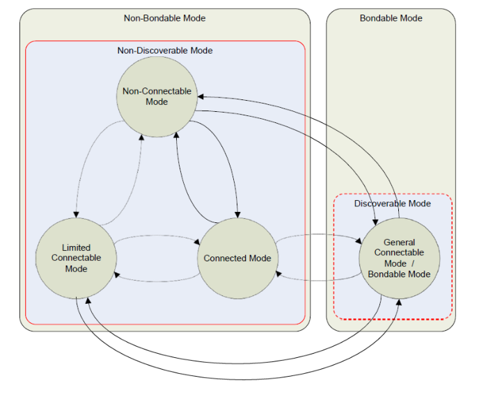

# HID v1.1.2

> Source: PDF converted via PyMuPDF.

---

Human Interface Device Profile
Bluetooth® Profile Specification
▪ Version: v1.1.2
▪ Version Date: 2025-11-03
▪ Prepared By: HID WG
Abstract
This profile defines how devices with Bluetooth wireless communications can use the HID Specification initially to discover the feature set of a Bluetooth HID device, and then communicate with the Bluetooth HID device. This profile further defines how a device with Bluetooth wireless communications can support HID services over the Bluetooth protocol stack using the Logical Link Control and Adaptation Protocol (L2CAP) layer.

| Version | Date | Comments |
| --- | --- | --- |
| V10 | 2003-05-22 | Adopted by the Bluetooth SIG Board of Directors. |
| V09 | 2011-05-10 | Adopted as a Prototyping Specification |
| V11 | 2012-02-21 | Adopted by the Bluetooth SIG Board of Directors |
| v1.1.1 | 2015-12-15 | Adopted by the Bluetooth SIG BoD |
| v1.1.2 | 2025-11-03 | Adopted by the Bluetooth SIG Board of Directors. |

Acknowledgments

| Name | Company |
| --- | --- |
| Robert Hulvey | Broadcom Corporation |
| Kevin Marquess | Broadcom Corporation |
| Jennifer Bray | Cambridge Silicon Radio |
| Peter Flittner | Cambridge Silicon Radio |
| Chris Hubball | Cambridge Silicon Radio |
| Ken Steck | Cambridge Silicon Radio |
| Drew Harrington | Cypress Semiconductor |
| Fred Jaccard | Cypress Semiconductor |
| Kelvin Klusendorf | Cypress Semiconductor |
| Steve McGowan | Intel Corporation |
| Venkat Yellapeddy | Intel Corporation |
| Xavier Boniface | Logitech |
| Berni Joss | Logitech |
| Roland Meyer | Logitech |
| Rene Sommer | Logitech |
| Pierre Chênes | Logitech |
| Jacques Chassot | Logitech |
| Randy Aull | Microsoft Corporation |
| Fred Bhesania | Microsoft Corporation |
| Chris Dreher | Microsoft Corporation |
| Shirin Ebrahimi-Taghizadeh | Microsoft Corporation |
| Peter Hauser | Microsoft Corporation |

| Name | Company |
| --- | --- |
| Doron Holan | Microsoft Corporation |
| Terry Lipscomb | Microsoft Corporation |
| Craig Ranta | Microsoft Corporation |
| Jay Senior | Microsoft Corporation |
| Nathan C. Sherman | Microsoft Corporation |
| Raymond Chiu | Motorola |
| Kanji Kerai | Nokia |
| Jyrki Hoisko | Nokia |
| Curtis Stevens | Phoenix Technologies |
| Chris Church | Qualcomm Technologies International, Ltd |
| John Milios | Semtech |
| Katsuhiro Kinoshita | Toshiba Corporation |
| Akihiko Sukigawa | Toshiba Corporation |
| Junko Ami | Toshiba Corporation |

Use of this specification is your acknowledgement that you agree to and will comply with the following notices and disclaimers. You are advised to seek appropriate legal, engineering, and other professional advice regarding the use, interpretation, and effect of this specification.
Use of Bluetooth specifications by members of Bluetooth SIG is governed by the membership and other related agreements between Bluetooth SIG and its members, including those agreements posted on Bluetooth SIG’s website located at www.bluetooth.com. Any use of this specification by a member that is not in compliance with the applicable membership and other related agreements is prohibited and, among other things, may result in (i) termination of the applicable agreements and (ii) liability for infringement of the intellectual property rights of Bluetooth SIG and its members. This specification may provide options, because, for example, some products do not implement every portion of the specification. All content within the specification, including notes, appendices, figures, tables, message sequence charts, examples, sample data, and each option identified is intended to be within the bounds of the Scope as defined in the Bluetooth Patent/Copyright License Agreement (“PCLA”). Also, the identification of options for implementing a portion of the specification is intended to provide design flexibility without establishing, for purposes of the PCLA, that any of these options is a “technically reasonable non-infringing alternative.”
Use of this specification by anyone who is not a member of Bluetooth SIG is prohibited and is an infringement of the intellectual property rights of Bluetooth SIG and its members. The furnishing of this specification does not grant any license to any intellectual property of Bluetooth SIG or its members. THIS SPECIFICATION IS PROVIDED “AS IS” AND BLUETOOTH SIG, ITS MEMBERS AND THEIR AFFILIATES MAKE NO REPRESENTATIONS OR WARRANTIES AND DISCLAIM ALL WARRANTIES, EXPRESS OR IMPLIED, INCLUDING ANY WARRANTIES OF MERCHANTABILITY, TITLE, NON-INFRINGEMENT, FITNESS FOR ANY PARTICULAR PURPOSE, OR THAT THE CONTENT OF THIS SPECIFICATION IS FREE OF ERRORS. For the avoidance of doubt, Bluetooth SIG has not made any search or investigation as to third parties that may claim rights in or to any specifications or any intellectual property that may be required to implement any specifications and it disclaims any obligation or duty to do so.
TO THE MAXIMUM EXTENT PERMITTED BY APPLICABLE LAW, BLUETOOTH SIG, ITS MEMBERS AND THEIR AFFILIATES DISCLAIM ALL LIABILITY ARISING OUT OF OR RELATING TO USE OF THIS SPECIFICATION AND ANY INFORMATION CONTAINED IN THIS SPECIFICATION, INCLUDING LOST REVENUE, PROFITS, DATA OR PROGRAMS, OR BUSINESS INTERRUPTION, OR FOR SPECIAL, INDIRECT, CONSEQUENTIAL, INCIDENTAL OR PUNITIVE DAMAGES, HOWEVER CAUSED AND REGARDLESS OF THE THEORY OF LIABILITY, AND EVEN IF BLUETOOTH SIG, ITS MEMBERS OR THEIR AFFILIATES HAVE BEEN ADVISED OF THE POSSIBILITY OF THE DAMAGES.
Products equipped with Bluetooth wireless technology ("Bluetooth Products") and their combination, operation, use, implementation, and distribution may be subject to regulatory controls under the laws and regulations of numerous countries that regulate products that use wireless non-licensed spectrum. Examples include airline regulations, telecommunications regulations, technology transfer controls, and health and safety regulations. You are solely responsible for complying with all applicable laws and regulations and for obtaining any and all required authorizations, permits, or licenses in connection with your use of this specification and development, manufacture, and distribution of Bluetooth Products. Nothing in this specification provides any information or assistance in connection with complying with applicable laws or regulations or obtaining required authorizations, permits, or licenses.
Bluetooth SIG is not required to adopt any specification or portion thereof. If this specification is not the final version adopted by Bluetooth SIG’s Board of Directors, it may not be adopted. Any specification adopted by Bluetooth SIG’s Board of Directors may be withdrawn, replaced, or modified at any time. Bluetooth SIG reserves the right to change or alter final specifications in accordance with its membership and operating agreements.
Copyright © 2001–2025. All copyrights in the Bluetooth Specifications themselves are owned by Apple Inc., Ericsson AB, Intel Corporation, Google LLC, Lenovo (Singapore) Pte. Ltd., Microsoft Corporation, Nokia Corporation, and Toshiba Corporation. The Bluetooth word mark and logos are owned by Bluetooth SIG, Inc. Other third-party brands and names are the property of their respective owners.
Contents
Document Terminology
The Bluetooth SIG has adopted Section 13.1 of the IEEE Standards Style Manual, which dictates use of the words ``shall’’, ``should’’, ``may’’, and ``can’’ in the development of documentation, as follows:
• The word shall is used to indicate mandatory requirements strictly to be followed in order to conform to the standard and from which no deviation is permitted (shall equals is required to).
• The use of the word must is deprecated and shall not be used when stating mandatory requirements; must is used only to describe unavoidable situations.
• The use of the word will is deprecated and shall not be used when stating mandatory requirements; will is only used in statements of fact.
• The word should is used to indicate that among several possibilities one is recommended as particularly suitable, without mentioning or excluding others; or that a certain course of action is preferred but not necessarily required; or that (in the negative form) a certain course of action is deprecated but not prohibited (should equals is recommended that).
• The word may is used to indicate a course of action permissible within the limits of the standard (may equals is permitted).
• The word can is used for statements of possibility and capability, whether material, physical, or causal (can equals is able to).
Certain terms that were identified as inappropriate have been replaced. For a list of their original terms and their replacement terms, see the Appropriate Language Mapping Table [10].
References
It is recommended to use the latest version of the Core Specification.
[1] USB Implementers Forum, Inc. (USB-IF), “Universal Serial Bus (USB) 2.0 Specification”, June 2025, https://www.usb.org/document-library/usb-20-specification
[2] USB Implementers Forum, Inc. (USB-IF), "Universal Serial Bus (USB) HID Usage Tables", January 2025, https://usb.org/document-library/hid-usage-tables-16
[3] USB Implementers Forum, Inc. (USB-IF), "Device Class Definition for Human Interface Devices (USB HID Specification), Version 1.11", May 2001, https://www.usb.org/document-library/device- class-definition-hid-111
[4] Bluetooth Core Specification (amended), Version 4.2 or later
[5] Bluetooth Assigned Numbers, https://www.bluetooth.com/specifications/assigned-numbers
[6] Microsoft, Language Identifiers, January 2021, https://learn.microsoft.com/en-us/windows/win32/ intl/language-identifiers
[7] The Unicode Consortium, "The Unicode Standard", Version 5.0 or later, https://www.unicode.org/ versions/enumeratedversions.html
[8] Device Identification Profile, Version 1.3 or later
[9] Simplifying the Bluetooth® Human Interface Device Profile to Add Bluetooth Keyboard and Mouse Input Capability to Resource-Limited Devices White Paper, Version 1.0
[10] Bluetooth SIG, Appropriate Language Mapping Table, https://www.bluetooth.com/language- mapping/Appropriate-Language-Mapping-Table
Figures

**Figure 2.1: How Descriptors and Data are transferred from the HID Class Device**

**Figure 2.2: Typical Bluetooth HID Software Stacks**

**Figure 3.1: Bluetooth HID Protocol Message Header Octet (HIDP-Hdr)**

**Figure 3.2: Report data returned by GET_REPORT**

**Figure 4.1: Bluetooth HID device with Multiple Virtual Cable**

**Figure 5.1: Report Types and L2CAP Channel Mapping**

**Figure 5.2: Layer Encapsulation for Bluetooth HID**

**Figure 5.3: Recommended Mode Transitions for Bondable HID Devices**

**Figure 5.4: Recommended Mode Transitions for Bondable HID Devices with HIDNormallyConnectable set to TRUE**

Figure A.1: Bluetooth HID Virtual Cable Setup Flow Diagram
Figure A.2: Bluetooth HID device Initiated Reconnection Flow Diagram
Figure A.3: Bluetooth HID Host Initiated Reconnection Flow Diagram
Figure A.4: Bluetooth HID Disconnect (Device or Host Initiated) Flow Diagram
Figure A.5: Bluetooth HID Service Setup Flow Diagram
Figure E.1: Remote Control Configurations
Figure G.1: Example Power State Diagram for Bluetooth HID devices using Sniff Mode
Figure G.2: Connection Re-Establishment when Lost
Tables
Table 3.1: Bluetooth HID Protocol Message Type Codes
Table 3.2: HANDSHAKE Parameter Definition
Table 3.3: HID_CONTROL Parameter Definition
Table 3.4: GET_REPORT Header Definition
Table 3.5: SET_REPORT Header Definition
Table 3.6: GET_PROTOCOL Parameter Definition
Table 3.7: GET_PROTOCOL Data Definition
Table 3.8: SET_PROTOCOL Parameter Definition
Table 3.9: GET_IDLE Parameter Definition
Table 3.10: GET_IDLE DATA Payload Definition
Table 3.11: SET_IDLE Parameter Definition
Table 3.12: DATA Parameter Definition
Table 3.13: DATC Parameter Definition
Table 3.14: Bluetooth HID Protocol Control Transfer Types
Table 3.15: Bluetooth HID Boot Reports
Table 5.1: Link Manager Compatibility
Table 5.2: Link Control Compatibility
Table 5.3: SDP Entry for HID Service
Table 5.4: Minor Device Class bits 7-6 for Peripheral Major Class
Table 5.5: Minor Device Class bits 5-2 for Peripheral Major Class
Table 5.6: Descriptor Type Codes
Table 5.7: Host and HID Paging Behavior as a Function of Related Bluetooth HID device SDP Declarations
Table 5.8: Recommended Authentication_Requirements Responses from Bluetooth HID devices
Table 5.9: Virtual Cable Persistent Storage Behavior for Legacy Bluetooth HID Hosts and Devices
Table D.1: HID Mouse Configuration Settings
Table D.2: HID Keyboard Configuration Settings
Table D.3: HID Force Feedback Joystick Configuration Settings
Table H.1: Latency Worksheet
Table I.1: Example Service Record for Bluetooth HID Mouse
Table I.2: ATM Service Record Excerpt for Multilingual Strings

## 1 Introduction

The Human Interface Device (HID) Profile Specification defines the protocols, procedures, and features to be used by Bluetooth HID devices and Bluetooth HID Hosts:
• A Bluetooth HID device is a device providing the service of human or other data input and output to and from a Bluetooth HID Host. Examples of Bluetooth HID devices are keyboards, mice, joysticks, gamepads, remote controls, and also voltmeters and temperature sensors.
• A Bluetooth HID Host is a device using or requesting the services of a Bluetooth HID device. Examples would be a personal computer, handheld computer, gaming console, industrial machine, or data-recording device.
This specification incorporates significant portions of the USB (Universal Serial Bus) Device Class Definition for Human Interface Devices (HID) [3] in order to leverage the existing support for USB HID devices present in many computing devices.
This document specifies an adaptation of the USB HID Specification to operate over a Bluetooth wireless link, with the goal of creating wireless human interface devices that are interoperable, are easy to set-up and use, have performance comparable to wired devices, and that provide good consumer value.

### 1.1 User Scenarios

The following are some brief descriptions of scenarios in which end-users currently use or might use the Bluetooth HID Profile.

#### 1.1.1 Desktop Computing Scenario

In the traditional desktop computer scenario, use of Bluetooth wireless computer peripherals frees the desktop from multiple cables and allows input devices to be operated further from the desktop and in positions that are more comfortable. Users are able to switch between multiple input devices without plugging and unplugging cables. Users are also able to control different computers or host devices at different times with a single Bluetooth HID device without concern for connecting cables. The security implemented by Bluetooth keyboards provides protection from eavesdropping of sensitive data passing over the Bluetooth link such as passwords, credit card information, etc. Use of Bluetooth provides improved range and reliability over many types of wireless links currently used in these products.

#### 1.1.2 Living Room Scenario

Bluetooth HID devices with Bluetooth wireless technology are being used in multiplayer gaming. The users are no longer tethered to the gaming machine and can be seated casually within a standard sized living room. A game controller with Bluetooth technology can also provide audio input and output which improves the realism of the game and enables wireless chat and voice commands.
Interactive TV, Media Center TV, and PC-based satellite receiver type devices designed for the living room are also able to take advantage of Bluetooth HID input devices. Bluetooth HID keyboards and pointing devices will provide a superior user experience to the existing infrared wireless keyboards. Bluetooth HID devices do not require line-of- sight alignment with the receiver and the two-way capability allows remote displays and user feedback devices. Class 1 Bluetooth HID devices are available which enable a user to remotely browse and play music with whole-house coverage.

#### 1.1.3 Conference Room Scenario

A pointing device enabled with Bluetooth wireless technology allows the presenter in a conference room to control the presentation on a video screen from 10 meters away or more without the need to be near the host or the projection device. The device need not be designed for operation on a flat surface. Today many such devices use infrared controllers which are limited to line-of-sight usage. Still other devices use proprietary wireless technology. A Bluetooth HID device with the Bluetooth wireless technology standardizes connections for these types of devices.

#### 1.1.4 Remote Monitoring Scenario

Battery powered monitoring devices with Bluetooth wireless technology provides many benefits to the end user. Some examples of these devices include temperature sensors, remote thermostats, security devices, pressure sensors, voltmeters, etc. By using Bluetooth wireless technology and the HID standard, monitoring systems can be installed quickly without running new wires to each of the installed sensors. The low power modes provided by Bluetooth wireless technology will provide long battery life for the remote transmitters. With Bluetooth wireless technology and the HID standard, it is possible for the host to remotely control and receive data from these types of devices in a standardized way.

#### 1.1.5 Mobile Phones Scenario

Mobile phones are increasingly being used in ways that are similar to the way in which PCs are used. Some usages include writing emails, and other forms of complex text entry. To accomplish such tasks, users may prefer fully functional keyboards over the alphanumeric keypads already present on the mobile phone. Modern mobile phones often implement USB and/or Bluetooth HID Class software thus enabling users to connect USB or Bluetooth keyboards. Furthermore, since in the future many mobile phones will be used with larger screens or external monitors, pointing devices may also be useful.
In some applications, a user may wish to use a mobile phone’s integrated pointing device to control the cursor on the PC once synchronized via Bluetooth. In this application, instead of serving as a Bluetooth HID Host, the mobile phone actually serves as a Bluetooth HID device with pointing device capabilities.

#### 1.1.6 Example Applications

Existing and potential Bluetooth HID devices enabled with Bluetooth wireless technology include:
• Keyboards, keypads, and keyboards with integrating pointing devices such as trackballs or touchpads
• Trackballs, mice, and other pointing devices
• Game controllers such as gamepads, joysticks, steering wheels, throttles, rudder pedals, data gloves, etc., some including force feedback actuators, motion detectors, and/or accelerometers
• Front-panel controls; for example, knobs, switches, buttons, and sliders
• Controls that might be found on telephones
• Remote controls for consumer electronics devices and universal remote controls
• Simple alphanumeric and bit-mapped remote displays
• Bar code or RFID scanners
• Mobile phones which may interface with Bluetooth HID devices or which may act as Bluetooth HID devices themselves
• Devices that may not require human interaction but provide data in a similar format to HID class devices; for example, thermometers, voltmeters, pressure sensors, security sensors, etc.
These applications are listed for reference only. Some applications may be subject to third party intellectual property rights.

### 1.2 Profile Objectives

Ease of Use: Bluetooth HID devices should be easy for consumers to configure out of the box. This profile will give examples of configuration of Bluetooth peripherals.
Performance: Bluetooth HID devices should have latency and throughput similar to wired USB input devices, and provide superior performance to most other types of proprietary wireless input devices. This specification gives some guidelines for achieving the best performance but does not require a certain performance as this is up to the manufacturer.
Battery life: It is desirable for Bluetooth HID devices to achieve battery life comparable with existing wireless human input devices.

### 1.3 Profile Conformance

Each capability of this specification shall be supported in the specified manner. This specification may provide options for design flexibility, because, for example, some products do not implement every portion of the specification. For each implementation option that is supported, it shall be supported as specified.

### 1.4 Definitions

3rd Party Application – Application software which is added or installed by an end-user to run on top of a Bluetooth HID Host stack.
ACL – Asynchronous Connection-oriented Link. A type of data link supported by the Bluetooth baseband. All connection-oriented data communication defined in this profile occurs over ACL links.
Baseband Connection – A baseband connection exists between two Bluetooth devices as defined in the Bluetooth Core Specification [4].
BIOS – Basic Input/Output System. Low-level firmware present on most PC platforms that typically implements self-test and configuration when the PC is first powered on.
Bluetooth Controller - As defined in the Bluetooth Core Specification [4], the Bluetooth Controller is comprised of the hardware and software components below the HCI transport, and includes the baseband, link manager, link controller and radio.
Bluetooth Device – A device which includes both a Bluetooth Controller and a Bluetooth Host stack as defined in the Bluetooth Core Specification [4].
Bluetooth HID device – A Bluetooth HID service role enabling devices to provide human or other data input and output to and from a Bluetooth HID Host. Examples of Bluetooth HID devices are mice, joysticks, gamepads, keyboards, and remote controls. Devices such as phones, telemetry devices, voltmeters and temperature sensors may also provide Bluetooth HID device services. This term is also used to refer to a device which offers the Bluetooth HID device service.
Bluetooth HID Host – A Bluetooth HID service role enabling a device to utilize services provided by Bluetooth HID devices. Examples of Bluetooth HID Hosts are PCs, cell phones, PDAs, consumer electronics equipment and game consoles. This term is also used to refer to a device which offers the Bluetooth HID Host service.
Bluetooth Host – As defined in the Bluetooth Core Specification [4], the Bluetooth Host is comprised of the hardware and software components above the HCI transport, and includes L2CAP, SDP, GAP, and profiles (e.g. HID and Device ID) and applications.
Bonded – Two devices are bonded when they have performed the pairing process and each has stored the other device’s Bluetooth address and the common link key for future use.
Boot Protocol Mode Only Bluetooth HID Host – A Bluetooth HID Host that implements only the Boot Protocol Mode capability outlined in this specification.
HID – Human Interface Device. This term is commonly used to refer both to the USB data reporting protocol for Human Interface Devices, and to the devices themselves. This document, when referring to the devices themselves, uses "Bluetooth HID device" or "Bluetooth HID Host.” When referring to the protocol, this document uses "Bluetooth HID Specification."
Bluetooth HID Connection – A Bluetooth HID connection is considered to exist when HID L2CAP interrupt and Control channels are open between a Bluetooth HID device and a Bluetooth HID Host.
Bluetooth HID Keyboard – A Bluetooth HID device with a HIDDeviceSubclass SDP attribute indicating Keyboard or Combo Keyboard/Pointing. See section 5.3.4.3.
Bluetooth HID Pointing Device – A Bluetooth HID device with a HIDDeviceSubclass SDP attribute indicating Pointing Device or Combo Keyboard/Pointing. See section 5.3.4.3.
Connectable – A device is said to be connectable if page-scan is enabled and the device allows the creation of an ACL link.
Discoverable – A device is said to be discoverable if inquiry scan is enabled allowing the device to be discovered by another device performing the inquiry procedure.
eSCO – Extended Synchronous Connection Oriented. A type of data link supported by the Bluetooth baseband. eSCO links are not utilized by this profile, but may operate concurrently with this profile on either a Bluetooth HID Host or Bluetooth HID device.
General Bluetooth HID Host - A host which is designed to support a wide variety of Bluetooth HID devices and which supports the addition of applications to support new devices.
L2CAP – Logical Link Control and Adaptation Protocol. The Bluetooth communications layer in the host which multiplexes logical channels onto a single baseband connection between two Bluetooth devices.
Legacy Bluetooth HID devices – Bluetooth HID devices qualified to the Bluetooth HID Profile Specification 1.0 or prior.
Legacy Bluetooth HID Hosts – Bluetooth HID Hosts qualified to the Bluetooth HID Profile Specification 1.0 or prior.
Limited Bluetooth HID Host – A host which is designed to support a limited set of specific Bluetooth HID devices. Boot Mode Only Hosts are also a type of Limited Bluetooth HID Host.
Limited Connectable Mode – Mode in which a Bluetooth device is performing page- scan and is hence connectable but is not discoverable, not pairable and not bondable.
Pairable – A device is said to be pairable if it is in a state in which it will allow a remote device to initiate and complete pairing with it.
Pairing - The process of establishing a link key between two Bluetooth devices. In most HID usage models the Bluetooth HID Host normally initiates pairing.
Passkey – A 6-digit number either typed or compared by the user and used during the Secure Simple Pairing process as defined in the Bluetooth Core Specification [4].
PIN – Personal Identification Number. Also referred to as the Bluetooth passcode at the user interface.
PSM – Protocol/Service Multiplexer. A protocol identifier used by the L2CAP layer to support multiple protocols.
QoS – Quality of Service. A general term that refers to the ability of a data channel to provide guaranteed data bandwidth and/or latency to a device or service.
SCO – Synchronous Connection Oriented. A type of data link supported by the Bluetooth baseband. SCO links are not utilized by this profile, but may operate concurrently with this profile on either a Bluetooth HID Host or Bluetooth HID device.
SDP – Service Discovery Protocol.
USB – Universal Serial Bus.
Virtual Cable – The Virtual Cable defines the relationship between a Bluetooth HID device and a particular Bluetooth HID Host. A Bluetooth HID device may support multiple Virtual Cables, though only one Virtual Cable may be connected at any given time. When a Bluetooth HID device is Virtually Cabled and connected to a given Bluetooth HID Host, data flows exclusively between the Bluetooth HID device and the currently connected Bluetooth HID Host.

### 1.5 Bluetooth HID Profile Change History

#### 1.5.1 Changes from v1.0 to v1.1

• General Changes
- Extensive re-organization to reduce repeated requirements and improve readability
- Improved consistency with IEEE Standards Style Manual guidelines for requirement
- Requirement to support Core Specification 2.1 + EDR or later
• New Features
- Explicit guidance on use of Secure Simple Pairing introduced in the Bluetooth Core Specification 2.1 + EDR
- Formal support for Sniff Subrating introduced in the Bluetooth Core Specification 2.1 + EDR including new HID SDP attributes:
◦HIDSSRHostMaxLatency
◦HIDSSRHostMinTimeout
- Recommendations for using Extended Inquiry Response (EIR) introduced in the Bluetooth Core Specification 2.1 + EDR
- Introduction of Limited Host and General Host types
• Deprecated Features
- SET_IDLE and GET_IDLE HID protocol requests
- HID-specific Segmentation and Reassembly1
- The following HID_CONTROL requests:
◦NOP
◦HARD_RESET
◦SOFT_RESET
- The following SDP attributes:
◦HIDDeviceReleaseNumber
◦HIDSDPDisable
◦HIDProfileVersion

#### 1.5.2 Changes from v.1.1.1 to v1.1.2

| Section | Errata |
| --- | --- |
| Global/Several Parts | 23462, 27927 |
| Document Terminology | 15796 |
| References | 15796, 23462 |
| 1.3: Profile Conformance | 23821 |
| 1.4: Definitions | 27927 |
| 4.2: Quality of Service | 15796, 27927 |
| 4.5.3 Multiple Virtual Cable Management | 28229 |
| 5.1.1: Role Usage | 15796 |
| 5.1.3: Page Scan Mode Support | 15796 |
| 5.1.6: Timeouts | 15796 |
| 5.1.8: Support of Low Power Link Modes | 15796 |
| 5.1.8.2: Optimizing Unsniff Responses | 15796 |
| 5.1.8.5.2: Sniff Mode Timeout Recommendations | 27927 |
| 5.1.10: Extended Inquiry Response | 27927 |
| 5.1.12: Bluetooth HID Baseband and Link Manager Compatibility Require- ments | 15796, 23462, 27927 |
| 5.2.3.2: Bluetooth HID Host QoS Usage | 27927 |
| 5.2.5: Flow Control | 23462, 27927 |
| 5.2.7: Flush Timeout | 27927 |

1Removal of the HID Segmentation and Reassembly feature is technically a break from backward compatibility with the HID Profile 1.0. However, it has been found that most Bluetooth HID Hosts conforming to the HID Profile 1.0 did not support the Segmentation and Reassembly feature. Hence, removing the feature is expected to improve interoperability. See also section 3.2.3.

| Section | Errata |
| --- | --- |
| 5.3.3: SDP Attribute Summary | 22802, 23462, 24716, 28229 |
| 5.3.4.11: HIDRemoteWake | 15796 |
| 5.3.4.17: Attribute ID Range for Strings | 9318 |
| 5.4.3.1: General Security Requirements and Recommendations | 27927 |
| 5.4.3.3.2: Security Modes | 27927 |
| 5.4.3.4.2: Security Modes | 27927 |
| A.2: Bluetooth HID device Initiatied Reconnection | 15796 |
| E.1.1: Remote as Peripheral with System Controller | 15796 |
| E.1.2: Remote as Piconet Central | 15796 |
| G.1: Power State Diagram for Bluetooth HID using Sniff Mode | 15796 |
| G.3: Behavior when Bluetooth HID Host Connection Lost | 15796 |
| H.1.3: Report Rate | 15796 |
| H.2.1: Remote Controls | 15796 |

Table 1.1: Errata incorporated in v1.1.2

## 2 Bluetooth HID Profile Architecture

This section provides an architectural overview of the Bluetooth HID Profile. It provides background information on USB HID as well as explanations for important high level concepts in the Bluetooth HID Profile.

### 2.1 Introduction to the USB and Bluetooth HID Specifications

This document defines an adaptation of the USB Device Class Definition for Human Interface Devices (HID) [3] for use over a Bluetooth wireless link. Concepts from the USB Specification [1] are used but may not be explained in this document. The USB Specification [1] and USB HID Specifications [2] and [3] are recommended pre-reading for understanding the content of this document. See the References section at the beginning of this document.
Though the HID class was originally targeted at human interface devices, the HID Specification is very useful for any application that requires low-latency input-output operations to an external interface.
The Universal Serial Bus Specification [1] defines the powerful concept of a “device class”. Devices that have similar reporting characteristics are grouped together into a “device class”. Instead of requiring a separate software driver for each new type of computer peripheral device, a single class driver is provided for each device class. The “HID class” is one such group, and these devices further have the capability to describe themselves to the class driver, e.g., what types of data they can send and exactly how they report data. This enables future devices to be developed without the need to modify the host software.
Though defined by specifications released by the USB Implementers Forum, Inc., the USB HID protocols are not specific to USB or any other type of physical data transport. It is the intention of this document to describe how to use the USB HID protocols over the Bluetooth wireless communications system, allowing manufacturers of input devices to produce high performance, interoperable, and secure wireless input devices.
Information about a HID device is stored in segments of its non-volatile memory called descriptors. For USB devices, device and interface descriptors identify a device as belonging to one of a finite number of classes. The HID class is the primary focus of this document. Other types of device classes described by USB specifications include display, audio, communication, and data storage.
Report descriptors describe a set of reports and items within reports. The descriptors also describe the range of permissible values for and the meaning of each data item within the reports. By examining the report descriptor of a HID Device, the HID Class software is able to determine the size and composition of data reports from the HID Class device.
Physical descriptor sets are optional descriptors that provide information about the part or parts of the human body used to activate the controls on a device.
“Application collections” are collections of reports that may be defined and associated with general application types, for example a mouse pointer, a keyboard, a game controller, etc. Collections enable report data to be routed to appropriate applications. For example, a game application may request to have report data which are part of a joystick or game controller collection routed to it to control the position of an on-screen virtual tank. Likewise, an operating system with a graphical user interface may request to have reports which are part of pointer collections and keyboard collections routed to it.
For Bluetooth HIDs, the Service Discovery Protocol (SDP) records serve a similar purpose to the device and interface descriptors used by USB. Service records identify the services which Bluetooth devices provide. HID service records identify whether a device supports the Bluetooth HID device service role,
the Bluetooth HID Host service role, or both. The HID service record of a Bluetooth HID device contains the report descriptor for the device and optionally may contain a physical descriptor. The formats for the report and physical descriptors are identical to that used for USB. Figure 2.1 illustrates the flow of descriptor and report information in the Bluetooth HID system.

**Figure 2.1: How Descriptors and Data are transferred from the HID Class Device**

#### 2.1.1 HID Reports

Bluetooth HID devices support three report types: Input, Output, and Feature. Input and Output reports typically contain low latency information. Input reports are generated by the Bluetooth HID device and sent to the Bluetooth HID Host. Output reports are generated by the Bluetooth HID Host and sent to the Bluetooth HID device. Feature reports are bi-directional, and typically contain information that is not intended to be seen or generated by the user, and hence is not time-critical. A Bluetooth HID device shall contain at least one report type in its report descriptor.
Two logical channels are created between the Bluetooth HID device and Bluetooth HID Host: the Control channel and the Interrupt Channel. Reports may be carried on either the Interrupt channel or the Control channel. Report data carried on the Interrupt channel is sent without a request and is not acknowledged and these transfers are referred to as “asynchronous reports”. Report data transferred on the Control channel is always initiated by a SET_REPORT or GET_REPORT request (see sections 3.1.2.3 and 3.1.2.4) and these transfers are referred to as “synchronous reports”.

##### 2.1.1.1 Input Reports

Input reports provide low-latency delivery information from the Bluetooth HID device to the Bluetooth HID Host. For instance, a mouse would use Input reports to send changes in position to the Bluetooth HID Host.
A Bluetooth HID device should send an input reports asynchronously whenever one or more fields in the report change. A Bluetooth HID Host may request the current state of an input report using the GET_REPORT request (see section 3.1.2.3).

##### 2.1.1.2 Output Reports

Output reports provide low latency delivery of information from the Bluetooth HID Host to the Bluetooth HID device. For instance, a Bluetooth HID Host would use Output reports to trigger force-feedback effects on a Bluetooth HID force-feedback gamepad.
Output reports may be sent synchronously using the SET_REPORT request (see section 3.1.2.4) or asynchronously over the Interrupt channel.

##### 2.1.1.3 Feature Reports

Feature Reports can carry application-specific data and initialization information that is not time-critical. For instance, a Bluetooth HID device may use Feature reports to adjust coordinate scaling parameters, enable Bluetooth HID device options, or determine current device state.
Feature reports are always transferred synchronously using GET_REPORT or SET_REPORT requests (see sections 3.1.2.3 and 3.1.2.4).

#### 2.1.2 HID Report Modes

The USB HID Specification [3] defines two protocols for sending and receiving reports, called Report Protocol and Boot Protocol. Report Protocol is designed to support all HID devices and capabilities, while Boot Protocol supports only a small pre-defined set of report formats.
Note that Report Protocol and Boot Protocol are protocols for the creation and parsing of reports, and should not be confused with the Bluetooth HID Protocol which is used to transfer reports between Bluetooth HID Hosts and Bluetooth HID devices. To help avoid confusion with the term “Bluetooth HID Protocol”, this specification will use the term “Report Protocol Mode” to refer to the state in which a Bluetooth HID Host or Bluetooth HID device sends or receives reports using the Report Protocol, and will use the term “Boot Protocol Mode” to refer to the state in which a Bluetooth HID Host or Bluetooth HID device sends or receives reports using the Boot Protocol.
Bluetooth HID Hosts shall implement at least one of the Boot Protocol or the Report Protocol, but may implement both.
All Bluetooth HID devices shall implement the Report Protocol. Boot Protocol shall be supported by any Bluetooth HID device for which either bit 6 or 7 is set in the HIDDeviceSubclass attribute in the HID SDP record. Note that if the Class of Device indicates a Major Class of “Peripheral” then the Class of Device Minor Class field and the value of the HIDDeviceSubclass attribute shall be equal (see 5.3.4.3). The Class of Device information may be obtained by the Inquiry procedure described in [4].

##### 2.1.2.1 Report Protocol Mode

Report Protocol Mode is the default mode for all Bluetooth HID devices. To implement the Report Protocol, a Bluetooth HID Host typically contains a HID report descriptor parser to interpret the report descriptor stored in the SDP records of the Bluetooth HID device.

##### 2.1.2.2 Boot Protocol Mode

Boot Protocol Mode was originally defined by USB HID Specification [3] to simplify the design of PC BIOSs. However, it has proved useful for a variety of products with small, embedded operating systems. A host which only supports Bluetooth HID devices in Boot Protocol Mode does not require a HID report descriptor parser. For more information on how to implement Boot Protocol Mode in a Bluetooth HID device and Host please refer section 3.3 and to the Simplifying the Bluetooth® Human Interface Device Profile to Add Bluetooth Keyboard and Mouse Input Capability to Resource-Limited Devices White Paper [9].

### 2.2 Bluetooth HID Software Stacks

Below is an illustration of the typical software layers that reside in the Bluetooth HID Host and the Bluetooth HID device. In this example, the Bluetooth HID Host is a personal computer (PC) and has the upper layers of the Bluetooth software running on its native processor. The PC is connected to a Bluetooth Controller via an HCI transport bus such as USB. The hardware and software layers above the HCI transport together form the Bluetooth Host, as defined in the Bluetooth Core Specification [4].
To enable a low-cost implementation, the Bluetooth HID device in this example has the Bluetooth Host and Bluetooth Controller functions running on the same CPU.
Other implementations are possible.

**Figure 2.2: Typical Bluetooth HID Software Stacks**

### 2.3 Association

Wireless Human Input Devices by their nature normally require some configuration to associate them with a particular host. Wired devices form this association with the host by virtue of a direct electrical connection. For this reason wireless devices may require more configuration steps to setup than wired devices.
Initiating the out-of-the-box Bluetooth HID Connection should be as simple as practical. A dedicated CONNECT pushbutton or other simple user action should be used to initiate the Bluetooth HID Connection and Configuration by placing the Bluetooth HID device into Limited Discoverable Mode. The Bluetooth HID Host should prompt the user to press the CONNECT button (or other simple action), and then should discover the device’s address automatically using the Inquiry procedure. See Appendix C for initial connection establishment examples.

### 2.4 Virtual Cables

Wired USB HID devices are physically limited to providing input to one host at a time. The Bluetooth HID Profile provides a similar concept known as a Virtual Cable.
See section 2.5 for additional details on the Virtual Cable feature.

## 3 Bluetooth HID Protocol

The Bluetooth HID Protocol (HIDP) operates over the Bluetooth L2CAP layer and is an adaptation of the USB HID Protocol. The USB HID specification [3] defines Control and Interrupt channels which are mapped to USB Control and Interrupt pipes. This profile defines analogous logical channels which are mapped to L2CAP channels. See section 5.2 for details on how the L2CAP channels are opened and configured.

### 3.1 Bluetooth HID Protocol Messages

The Bluetooth HID Protocol consists of transfers which are comprised of a sequence of one or more Bluetooth HID Protocol messages. Some transfers may be initiated by either the Bluetooth HID Host or the Bluetooth HID device, while others are exclusively initiated by either the Bluetooth HID Host or the Bluetooth HID device.
Bluetooth HID Hosts and Bluetooth HID devices shall not send a Bluetooth HID Protocol Message that is larger than the L2CAP Maximum Transmission Unit (MTU) negotiated for the L2CAP channel that is used to carry the Message. Bluetooth HID Hosts and Bluetooth HID devices should ignore any Messages that exceed the negotiated MTU or which are longer than the expected length. See section 5.2.3 for detailed information on L2CAP requirements.

#### 3.1.1 Bluetooth HID Protocol Message Header

All HIDP Messages between a Bluetooth HID device and a Bluetooth HID Host are preceded by a 1-octet Bluetooth HID Protocol Header (HIDP-Hdr). The HIDP-Hdr is divided into two 4-bit fields: the HIDP Message type and a Parameter. The Parameter is dependent on the HIDP Message type.

**Figure 3.1: Bluetooth HID Protocol Message Header Octet (HIDP-Hdr)**

The following table lists the supported HIDP Message types:

| Hex | Message Type | Sent By | Message Length (Octets) |
| --- | --- | --- | --- |
| 0 | HANDSHAKE | Device | 1 |
| 1 | HID CONTROL _ | Device and Host | 1 |
| 2-3 | Reserved | N/A |  |
| 4 | GET REPORT _ | Host | 1 to 4 |
| 5 | SET REPORT _ | Host | 1 + Report data payload |
| 6 | GET PROTOCOL _ | Host | 1 |

| Hex | Message Type | Sent By | Message Length (Octets) |
| --- | --- | --- | --- |
| 7 | SET PROTOCOL _ | Host | 1 |
| 8 | GET IDLE [DEPRECATED] _ | Host | 1 |
| 9 | SET IDLE [DEPRECATED] _ | Host | 2 |
| A | DATA | Device and Host | 1 + Report data payload |
| B | DATC [DEPRECATED] | Device and Host | 1 + Continuation of report data payload |
| C-F | Reserved | N/A |  |

Table 3.1: Bluetooth HID Protocol Message Type Codes
GET_IDLE and SET_IDLE are deprecated Bluetooth HID commands. Bluetooth HID Host implementations conforming to this specification shall not send GET_IDLE and should not send SET_IDLE. Keyboards may support GET_IDLE and SET_IDLE as described in sections 3.1.2.7 and 3.1.2.8.
The DATC message type is deprecated. Bluetooth HID Hosts and Bluetooth HID devices shall not send the DATC message type.

#### 3.1.2 HIDP Message Type Descriptions

The following sections define the Messages that make up the Bluetooth HID protocol (HIDP).
Reserved fields shall be set to 0 when written and ignored when read.

##### 3.1.2.1 HANDSHAKE

This message shall be used by a Bluetooth HID device to acknowledge:
• SET_REPORT, SET_IDLE and SET_PROTOCOL requests
• GET_REPORT, GET_PROTOCOL and GET_IDLE requests if an error is detected in the parameters of the initial request
• a request with an unsupported message type
The Parameter field identifies the result of the handshake.
The HANDSHAKE message shall only be sent by a Bluetooth HID device on the Control channel. The HANDSHAKE message shall not be sent on the Interrupt channel, and shall not be sent by a Bluetooth HID Host.

| Field | Size (Octets) | Description |
| --- | --- | --- |
| HIDP- Hdr | 1 | Bits specifying characteristics of request. 7..4 HIDP Message Type 0 = HANDSHAKE 3..0 Result Code 0x0 = SUCCESSFUL. This code is used to acknowledge requests. A device that has correctly received SET REPORT, SET IDLE or SET PROTOCOL payload _ _ _ transmits an acknowledgment to the host. 0x1 = NOT READY. This code indicates that a device is too busy to accept data. _ The Bluetooth HID Host should retransmit the data the next time it communicates with the device. 0x2 = ERR INVALID REPORT ID. Invalid report ID transmitted. _ _ _ 0x3 = ERR UNSUPPORTED REQUEST. The device does not support the request. _ _ This result code shall be used if the HIDP message type is unsupported. 0x4 = ERR INVALID PARAMETER. A parameter value is out of range or inappro- _ _ priate for the request. 0x5-0xD = Reserved 0xE = ERR UNKNOWN. Device could not identify the error condition. _ 0xF = ERR FATAL. Restart is essential to resume functionality. _ |

Table 3.2: HANDSHAKE Parameter Definition
A Bluetooth HID device shall return an ERR_UNSUPPORTED_REQUEST result code if a reserved message type is received.
A Bluetooth HID device shall parse all fields in a Request. If a Bluetooth HID device detects a field with a value that is out of range or inappropriate for the request, then an ERR_INVALID_PARAMETER result code shall be returned.

##### 3.1.2.2 HID_CONTROL

The HID_CONTROL request is used to request a major state change in a Bluetooth HID device. If the Bluetooth HID device receives a HID Control Operation request and the Control Operation request specified in bits [3:0] is unsupported, the Bluetooth HID device shall ignore the request.

| Field | Size (Octets) | Description |
| --- | --- | --- |
| HIDP- Hdr | 1 | Bits specifying characteristics of request. 7..4 HIDP Message Type 1 = HID CONTROL _ 3..0 Control Operation 0 = NOP: [DEPRECATED]: No Operation. 1 = HARD RESET [DEPRECATED]: Device performs Power On System Test _ (POST) then initializes all internal variables and initiates normal operations. 2 = SOFT RESET [DEPRECATED]: Device initializes all internal variables and _ initiates normal operations. 3 = SUSPEND: Go to reduced power mode. 4 = EXIT SUSPEND: Exit reduced power mode. _ 5 = VIRTUAL CABLE UNPLUG _ _ 6-15 = Reserved |

Table 3.3: HID_CONTROL Parameter Definition

###### 3.1.2.2.1 HARD_RESET and SOFT_RESET [DEPRECATED]

The HARD_RESET and SOFT_RESET Control Operations are deprecated. Bluetooth HID Hosts should not send these control operations to a Bluetooth HID device in normal operation, but they may be used for testing or vendor-specific purposes. Bluetooth HID devices may implement support for these control operations for backwards compatibility or testing purposes.
The Hard and Soft Reset Control Operations allow a Bluetooth HID Host to force a Bluetooth HID device to re-initialize all internal variables. These features are useful if problems are detected with a Bluetooth HID device and other recovery procedures have failed.

###### 3.1.2.2.2 SUSPEND and EXIT_SUSPEND

The Suspend Control Operation allows the Bluetooth HID Host to explicitly inform the Bluetooth HID device that normal performance is no longer required and that it may power down logic that is not required to wake up the system. The radio subsystem of the Bluetooth HID device may remain powered- up with enough functionality to wake up the powered-down HID-specific logic if an EXIT_SUSPEND control command is received. A Bluetooth HID device which receives a SUSPEND control signal may optionally disconnect from the Bluetooth HID Host. See Section 5.3.4.11 for more information on the wake up features of Bluetooth HID devices. When an event occurs that requires the Bluetooth HID device to wake up the system, the Bluetooth HID device shall automatically reconnect to the Bluetooth HID Host if it is disconnected or send a report to the Bluetooth HID Host if it is already connected. If, after a vendor-defined period, the Bluetooth HID device is unable to reconnect to the system, the Bluetooth HID device may re-enter suspend mode. If the Bluetooth HID Host exits suspend mode, then it shall send an EXIT_SUSPEND Control Operation request to any connected Bluetooth HID devices.
For example, a mouse may use the SUSPEND Control Operation request to turn off its LEDs to save power, requiring the user to press a button to wake up the system. A keyboard may lower the frequency that it scans its keys.

###### 3.1.2.2.3 VIRTUAL_CABLE_UNPLUG

A HID_CONTROL message with a parameter of VIRTUAL_CABLE_UNPLUG may be sent by the Bluetooth HID Host to the Bluetooth HID device or by the Bluetooth HID device to the Bluetooth HID Host. If Virtual Cable Unplug is sent by a Bluetooth HID device or Bluetooth HID Host, then the sender shall destroy or invalidate all Bluetooth bonding and Virtual Cable information that was previously stored in persistent memory for the device to which the VIRTUAL_CABLE_UNPLUG request was sent. If Virtual Cable Unplug is received by a Bluetooth HID device or Bluetooth HID Host, then the recipient shall destroy or invalidate all Bluetooth bonding and Virtual Cable information that was previously stored in persistent memory for the device which sent the VIRTUAL_CABLE_UNPLUG request. The recipient shall not send a HANDSHAKE message but shall acknowledge this command by sending back an L2CAP Disconnect Request signal for the Interrupt channel. After the Interrupt channel has closed, the recipient of the VIRTUAL_CABLE_UNPLUG shall then send an L2CAP Disconnect Request signal for the Control channel. If there are no other profiles using the ACL connection then the recipient of the VIRTUAL_CABLE_UNPLUG should then disconnect the ACL connection. The recipient should discard any control transfers which are pending at the time of the receipt of the VIRTUAL_CABLE_UNPLUG.
A HID_CONTROL message with a parameter of VIRTUAL_CABLE_UNPLUG is the only HID_CONTROL message a Bluetooth HID device may send to a Bluetooth HID Host. A Bluetooth HID Host shall ignore all other HID_CONTROL messages sent by Bluetooth HID devices.

###### 3.1.2.2.4 NOP [DEPRECATED]

The NOP Control Operation is deprecated. Bluetooth HID Hosts should not send this control operation to a Bluetooth HID device during normal operation, but it may be used for testing or vendor-specific purposes. Bluetooth HID devices may implement support for this control operations for backwards compatibility or testing purposes.
The NOP Control Operation is a do-nothing function that can be used to exercise the communications path for diagnostics, debug, and test.

##### 3.1.2.3 GET_REPORT

This message is used by the Bluetooth HID Host to request the transfer of a HID report from the Bluetooth HID device. Upon receipt of this message, the Bluetooth HID device shall return a DATA payload on the Control channel containing the requested report. If the size of the report plus the DATA header equals or exceeds the MTU, then the Bluetooth HID device shall return a HANDSHAKE packet with ERR_INVALID_PARAMETER as the result code.
The type of the report desired (Input, Output, or Feature) is defined in the parameter field of the HIDP-Hdr octet. A GET_REPORT request sent on the Control channel to retrieve an Input report shall return the instantaneous state of the fields in the report. It does not affect Input reports queued for the Interrupt channel, and an Input report queued for the Interrupt channel may in fact be stale in relation to the report returned in the GET_REPORT response.
Retrieval of an Output report shall return a copy of the last report that was received by the Bluetooth HID device from the Bluetooth HID Host. If no report has been received, then a Bluetooth HID device shall return the default values for the Output report items.
Retrieval of a Feature report shall return default values or the instantaneous state of the fields, whichever is appropriate.
Polling Bluetooth HID devices using the GET_REPORT transfer is costly in terms of time and overhead, and should be avoided whenever possible. The GET_REPORT transfer is typically only used by applications to determine the initial state of a Bluetooth HID device. If the state of a report changes frequently, then the report should be reported over the more efficient Interrupt channel.
The size of a GET_REPORT message may vary from 1 to 4 octets. The HIDP-Hdr octet is always the first octet of the message.
In Report Protocol Mode, if Report ID Global Items (see the USB HID Specification [3]) are declared in the report descriptor then the Report Type and the ReportID identify the desired report, and a 1-octet ReportID field shall immediately follow the GET_REPORT Request octet. If no Report ID global items are declared in the report descriptor and the Bluetooth HID device is in Report Protocol Mode the Report Type field is sufficient to identify the desired report and a ReportID field shall not follow the GET_REPORT Request octet.
In Boot Protocol Mode, there is no report descriptor, but the reports do have Report IDs as defined in Section 3.3.2 and thus do require the ReportID field of the GET_REPORT Request octet.
Through the SDP or through parsing the report descriptor, the Bluetooth HID Host knows the sizes of all reports in Report Protocol Mode, where a “report” includes the report data and, if declared or if using Boot Protocol Mode, a Report ID and can allocate buffer size appropriately.
In order to allow for Boot Protocol Mode Only Hosts which provide only the minimum MTU of 48 octets, Bluetooth HID devices shall not send Boot Protocol Mode Protocol reports longer than 46 octets, including the Report ID.2
Under some circumstances, a Bluetooth HID Host may require only a portion of a report. In this case, the Size bit will be set in the Request octet indicating that a 2-octet BufferSize field has been added to the GET_REPORT header. Bluetooth HID devices shall never return more than a BufferSize payload to the Bluetooth HID Host, where the “payload” is comprised of typically a Report ID and the report data. The DATA header is not included in the BufferSize. The Report ID shall precede report data if Report IDs are declared in the report descriptor or if using Boot Protocol Mode. Otherwise Report IDs shall not be present in GET_REPORT payloads.
If a ReportID field exists, the BufferSize field shall follow it; otherwise, the BufferSize field shall immediately follow the GET_REPORT HIDP_Hdr octet.
2Although Boot Protocol Mode reports may be extended, at the time of this writing it is believed that no legacy Bluetooth HID Device Boot Mode Reports exceed 9 octets.

| Field | Size (Octets) | Description |
| --- | --- | --- |
| HIDP- Hdr | 1 | Bits specifying characteristics of request. 7..4 HIDP Message Type 4 = GET REPORT _ 3 Size 0 = The host has allocated a buffer equal to the size of the report. 1 = A 2-octet BufferSize field follows the Report ID. This field indicates the size of the buffer allocated by the host. A device limits the returned payload size to BufferSize. Note that the BufferSize is increased by 1-octet for Boot Protocol Mode reports to include the Report ID imposed by the Bluetooth HID. See §3.3.2 more information on Boot Protocol Mode. 2 Reserved (0) 1..0 Report Type 0 = Reserved 1 = Input 2 = Output 3 = Feature |
| ReportID | 1 | (If Required) Report ID of requested report. This field is required in Report Proto- col Mode when any Report ID Global Items are declared in the report descriptor, and in Boot Protocol Mode. Otherwise the field does not exist. |
| BufferSize | 2 | (If Required) Maximum number of octets to transfer during data phase. This field does not exist if the Size field of the Header = 0. BufferSize is little-endian, i.e. the LSB is transmitted first. |

**Figure 3.2: Report data returned by GET_REPORT**

General Bluetooth HID Host implementations shall support the addition of 3rd party HID application software (see 4.1.1for more information) and shall support GET_REPORT and provide a means for applications to send GET_REPORT to Bluetooth HID devices. Bluetooth HID Host support for GET_REPORT is otherwise optional.
All Bluetooth HID devices shall support GET_REPORT.

##### 3.1.2.4 SET_REPORT

This message type is used by a Bluetooth HID Host to initiate the transfer of a report to a Bluetooth HID device. Only one report can be sent per SET_REPORT transfer.
If, for a given report, the size of the Report Data Payload plus the SET_REPORT message header equals or exceeds the MTU, then the Bluetooth HID Host shall not send the report in a SET_REPORT. The type of the report (Input, Output, or Feature) is defined in the parameter field of the HIDP-Hdr octet.
In Report Protocol Mode, if Report IDs are declared in the report descriptor for the specified report type, then a 1-octet Report ID shall be the first octet of the Report Data Payload.
In Boot Protocol Mode, there is no report descriptor, but the reports do have Report IDs as defined in Section 2.1.2.2 and thus do require a 1-octet Report ID as the first octet of the Report Data Payload.
The L2CAP Length field shall be set to the size of the HIDP message, and shall not exceed the negotiated L2CAP MTU for the channel used to send the HIDP message. A Bluetooth HID device shall be capable of receiving the full size of all reports that it declares.
The Bluetooth HID Host shall send complete reports.
In Report Protocol Mode, for reports wherein the received size is not equal to the report size declared in the report descriptor, Bluetooth HID devices shall return a HANDSHAKE message with the result code field set to ERR_INVALID_PARAMETER for CONTROL transfers or ignore the report for Interrupt transfers.
In Boot Protocol Mode, Bluetooth HID devices may ignore any additional data that are appended to a Boot Protocol Report, but for any reports that are shorter than the defined Boot Protocol Reports, the Bluetooth HID device shall return a HANDSHAKE message with the result code field set to ERR_INVALID_PARAMETER for CONTROL transfers or ignore the report for Interrupt transfers.
General Bluetooth HID Host implementations shall support the addition of 3rd party HID application software (see 4.1.1 for more information) and shall support SET_REPORT for feature reports and provide a means for applications to send SET_REPORT for feature reports to Bluetooth HID devices. Bluetooth HID Host support for SET_REPORT is otherwise optional.
A Bluetooth HID device which declares output or feature reports in its report descriptor shall support SET_REPORT.

| Field | Size (Octets) | Description |
| --- | --- | --- |
| HIDP-Hdr | 1 | Bits specifying characteristics of request. 7..4 HIDP Message Type 5 = SET REPORT _ 3..2 Reserved (0) 1..0 Report Type 0 = Reserved 1 = Input 2 = Output 3 = Feature |
| Report Data Payload | N | Report data for the device. |

Table 3.5: SET_REPORT Header Definition

##### 3.1.2.5 GET_PROTOCOL

This code is used to retrieve the Protocol Mode of the Bluetooth HID device. The Bluetooth HID device responds with a single octet DATA payload that indicates the current Protocol Mode. The format of the GET_PROTOCOL DATA payload is defined in Table 3.6.
A Bluetooth HID device shall support GET_PROTOCOL if the attribute HIDBootDevice is declared TRUE in its SDP record. If a Bluetooth HID device does not support GET_PROTOCOL it shall return a HANDSHAKE message indicating an unsupported request.

| Field | Size (Octets) | Description |
| --- | --- | --- |
| HIDP-Hdr | 1 | Bits specifying characteristics of request. 7..4 HIDP Message Type 6 = GET PROTOCOL _ 3..0 Reserved (0) |

Table 3.6: GET_PROTOCOL Parameter Definition

| Field | Size (Octets) | Description |
| --- | --- | --- |
| Get Protocol DA- TA payload | 1 | Bits specifying characteristics of Get Protocol response payload. 7..1 Reserved (0) 0 Protocol Mode 0 = Boot Protocol Mode 1 = Report Protocol Mode |

Table 3.7: GET_PROTOCOL Data Definition

##### 3.1.2.6 SET_PROTOCOL

This code is used to set Protocol Mode on the Bluetooth HID device. Protocol Modes are defined for keyboards and mice. When using Boot Protocol Mode, a Bluetooth HID Host is not required to include a HID report descriptor parser because the Bluetooth HID device only transmits or receives reports in a predefined format. See the USB HID Specification [3] for a description of the Boot Protocol Mode. The default Protocol Mode for Bluetooth HID device is Report Protocol Mode.
A Bluetooth HID device shall support SET_PROTOCOL if the HIDBootDevice attribute is declared TRUE in its SDP record. If a Bluetooth HID device does not support SET_PROTOCOL it shall return a HANDSHAKE message indicating an unsupported request.
The Parameter field identifies the target protocol. See Table 3.8.

| Field | Size (Octets) | Description |
| --- | --- | --- |
| HIDP-Hdr | 1 | Bits specifying characteristics of request. 7..4 HIDP Message Type 7 = SET PROTOCOL _ 3..1 Reserved (0) 0 Protocol Mode 0 = Boot Protocol Mode 1 = Report Protocol Mode |

Table 3.8: SET_PROTOCOL Parameter Definition

##### 3.1.2.7 GET_IDLE [DEPRECATED]

GET_IDLE is deprecated and shall not be sent by Bluetooth HID Hosts.
GET_IDLE was used to retrieve the current Idle setting of a Bluetooth HID device and is deprecated. Bluetooth HID devices receiving GET_IDLE shall respond with a HANDSHAKE message with result code of ERR_UNSUPPORTED_REQUEST. The parameter information in the following table is provided only for historical reference.

| Field | Size (Octets) | Description |
| --- | --- | --- |
| HIDP-Hdr | 1 | Bits specifying characteristics of request. 7..4 HIDP Message Type 8 = GET IDLE _ 3..0 Reserved (0) |

Table 3.9: GET_IDLE Parameter Definition

| Field | Size (Octets) | Description |
| --- | --- | --- |
| Get Idle DATA payload | 1 | Last idle rate value received in a SET IDLE command since the _ Bluetooth HID connection was opened or 0x00 if no SET IDLE _ command has been received since the Bluetooth HID connection was opened. When 0 (zero), the Idle Rate is infinite. The device will inhibit Idle reporting forever, only reporting when a change is detected in the report data. When the Idle Rate is non-zero, then a fixed duration is used. The duration will be linearly related to the value, with the LSB being weighted as 4 milliseconds. This provides a range of values from 0.004 to 1.020 seconds, with a 4 millisecond resolution. If the Idle Rate is less than the specified Interrupt channel latency, then reports are generated at the Interrupt channel latency rate. If the given time duration elapses with no change in report data, then a single report will be generated by the endpoint and report inhibition will begin anew using the previous duration. |

Table 3.10: GET_IDLE DATA Payload Definition

##### 3.1.2.8 SET_IDLE [DEPRECATED]

SET_IDLE is deprecated and should not be sent by Bluetooth HID Hosts. If a Bluetooth HID Host sends SET_IDLE, it shall only send it with an Idle Rate parameter value of 0. This may be done to ensure that legacy Bluetooth HID devices turn off their repeat function.
SET_IDLE was used to set a specific Idle rate of a Bluetooth HID device and is deprecated.
NOTE: Though SET_IDLE was originally intended to enable HID keyboards (both Bluetooth and USB) to provide key auto-repeat functionality for simple HID host devices, this function is not provided by the Bluetooth HID Profile. Key auto-repeat functionality must be provided by host software if desired.

| Field | Size (Octets) | Description |
| --- | --- | --- |
| HIDP-Hdr | 1 | Bits specifying characteristics of request. 7..4 HIDP Message Type 9 = SET IDLE _ 3..0 Reserved (0) |

| Field | Size (Octets) | Description |
| --- | --- | --- |
| Idle Rate | 1 | When 0 (zero), the Idle Rate is infinite. The device will inhibit Idle reporting forever, only reporting when a change is detected in the report data. Historically, when the Idle Rate was non-zero, then a fixed duration was used. The duration was linearly related to the value, with the LSB being weighted as 4 milliseconds. This provided a range of val- ues from 0.004 to 1.020 seconds, with a 4 millisecond resolution. If the Idle Rate was less than the specified Interrupt channel latency, then reports were generated at the Interrupt channel latency rate. If the given time duration elapsed with no change in report data, then a single report was to be generated by the endpoint and report inhibition to begin anew using the previous duration. |

Table 3.11: SET_IDLE Parameter Definition

##### 3.1.2.9 DATA

This DATA message type identifies a HID payload. All DATA payloads on the Interrupt channel that flow from the Bluetooth HID device to the Bluetooth HID Host are part of Input Reports. All DATA payloads on the Interrupt channel that flow from the Bluetooth HID Host to the Bluetooth HID device are part of Output Reports. The L2CAP Length field identifies the size of the DATA payload (including the 1-octet HIDP header).
The message type field of DATA messages on the Control channel shall be set to Other for responses to Get Idle or Get Protocol requests, and Input, Output, or Feature, for GET_REPORT requests.
A DATA transfer has no associated HANDSHAKE response on the Interrupt channel.
DATA transfers shall be supported by Bluetooth HID Hosts and Bluetooth HID devices. The DATA header has the following encoding:

| Field | Size (Octets) | Description |
| --- | --- | --- |
| HIDP-Hdr | 1 | Bits specifying characteristics of request. 7..4 HIDP Message Type 10 = DATA 10 3..2 Reserved (0) 1..0 Report Type 0 = Other 1 = Input 2 = Output 3 = Feature |
| Report data pay- load | N | Report data for the device. |

Table 3.12: DATA Parameter Definition

##### 3.1.2.10 DATC [DEPRECATED]

NOTE: The DATC message type is deprecated. The DATC message type was used as part of HID Segmentation and Reassembly feature supported in the Bluetooth Profile v1.0. However, many Bluetooth HID Hosts and Bluetooth HID devices implemented to the Bluetooth HID Profile v1.0 did not implement Segmentation and Reassembly, and hence Bluetooth HID Hosts and Bluetooth HID devices implemented to this profile shall not send a DATC message type to ensure backwards compatibility.
Data Continuation: This code identifies the continuation of a HID payload that equaled or exceeded the negotiated MTU. DATC payloads may be sent on the Interrupt or Control channels. The L2CAP Length field identifies the size of the DATC payload (including the DATC header). If a report is too long to fit into the initial DATA or SET_REPORT message containing the report data, then one or more DATC payloads shall be used to transfer the remainder of the report. See Section 3.2.3 for more information on the handling of large payloads.
DATC payloads may only follow SET_REPORT or DATA messages. A “Short” (L2CAP Length field less than the MTU) DATC message indicates the last message of a payload.
Bluetooth HID Hosts that support Report Protocol Mode shall support DATC transfers on the Interrupt channel and Control channel. Support for DATC transfers is optional for Boot Protocol Mode Only Bluetooth HID Hosts.
Bluetooth HID devices which declare output or feature reports which cannot be completely transferred from the Bluetooth HID Host in a SET_REPORT message or DATA message when the negotiated MTU size is 48 octets shall support reception of DATC messages.
Bluetooth HID devices which declare input or feature reports which cannot be completely transferred to the Bluetooth HID Host in a DATA message when the negotiated MTU size is 48 octets shall support transmission of DATC messages.
The DATC Transaction Header has the following encoding:

| Field | Size (Octets) | Description |
| --- | --- | --- |
| HIDP-Hdr | 1 | Bits specifying characteristics of request. 7..4 HIDP Message Type 11 = DATC 10 3..2 Reserved (0) 1..0 Report Type 0 = Other 1 = Input 2 = Output 3 = Feature |
| Report data pay- load | N | Additional report data for the device. |

Table 3.13: DATC Parameter Definition

### 3.2 Transfers

HID Protocol transfers are formed by a sequence of one or more HID Protocol messages. Transfers occur on either the Control channel or the Interrupt channel. The following sections define the types of transfers allowed on each channel type.
Reports may be carried on either the Interrupt channel or the Control channel. Report data carried on the Interrupt channel is sent without a request and is not acknowledged and these transfers are referred to as “asynchronous reports”. Report data transferred on the Control channel is always initiated by a SET_REPORT or GET_REPORT request and these transfers are referred to as “synchronous reports”.
When in Report Protocol Mode, a report shall be ignored if the length of the received report data does not exactly match the length expected based on the report descriptor, or if the Report ID field (if present) is unrecognized. When in Boot Protocol Mode, a report shall be ignored if the length of the received report data is less than the length expected based on the implicit report descriptor, or if the length of the received report data is greater than 46 octets (including the Report ID), or if the Report ID field is unrecognized.

#### 3.2.1 Control Channel Transfers

Control channel transfers are always initiated by the Bluetooth HID Host with the exception of a HID_CONTROL transfer for a VIRTUAL_CABLE_UNPLUG. There are two types of Control channel transfers:
• Acknowledged
• Unacknowledged

| Transfer Type | Acknowledged |
| --- | --- |
| HID CONTROL _ | No |
| GET REPORT _ | Implicit by DATA(or HANDSHAKE if error) |
| SET REPORT _ | By HANDSHAKE |
| GET PROTOCOL _ | Implicit by DATA (or HANDSHAKE if error) |
| SET PROTOCOL _ | By HANDSHAKE |
| GET IDLE [DEPRECATED] _ | Implicit by DATA (or HANDSHAKE if error) |
| SET IDLE [DEPRECATED] _ | By HANDSHAKE |

Table 3.14: Bluetooth HID Protocol Control Transfer Types
Acknowledged Control channel transfers consist of a request message to the Bluetooth HID device followed by data to or from the Bluetooth HID device. Transfers which transfer data from the Bluetooth HID Host to the Bluetooth HID device are acknowledged by a HANDSHAKE message from the Bluetooth HID device. Transfers which transfer data from the Bluetooth HID device to the Bluetooth HID Host are acknowledged implicitly by the transferred data (DATAmessages) or, in the case of an error, by a HANDSHAKE message.
A Bluetooth HID Host shall not have more than one Control channel transfer simultaneously outstanding to a given Bluetooth HID device. An exception is that a Bluetooth HID Host or Bluetooth HID device may send a HID_CONTROL message that specifies VIRTUAL_CABLE_UNPLUG event irrespective of whether another Control channel transfer is in progress. See Section 3.2.1.3 for more information.

##### 3.2.1.1 Control Channel GET_*

Control GET_* request, retrieves information from the Bluetooth HID device.
When a Bluetooth HID device receives a GET_* request, the device shall return a DATA message. If the GET_* payload exceeds the MTU then the Bluetooth HID device shall send a HANDSHAKE message with a result code of ERR_INVALID_PARAMETER. The DATA message is interpreted as a SUCCESSFUL HANDSHAKE message for the GET_* request (a physical HANDSHAKE message is not returned by the Bluetooth HID device except to indicate an error condition).
The Bluetooth HID device shall return an ERR_* HANDSHAKE message if a problem is detected or a NOT_READY HANDSHAKE message if there is no data available. The Bluetooth HID Host may retry the GET_* request if a NOT_READY HANDSHAKE message is received. The Bluetooth HID device shall return an ERR_INVALID_REPORT_ID message if the Report ID in the GET_* request does not match a Report ID declared by the Bluetooth HID device in its report descriptor.

##### 3.2.1.2 Control Channel SET_*

A Control SET_* request sends information to the Bluetooth HID device.
If the SET_* payload exceeds the MTU then the Bluetooth HID Host shall not transmit the report.
Following the reception of the SET_* message the Bluetooth HID device shall return a HANDSHAKE message with result code of SUCCESSFUL if no errors were detected.
The Bluetooth HID device shall return an ERR_* HANDSHAKE message if a problem was detected or a NOT_READY HANDSHAKE message if the Bluetooth HID device was not ready to accept data. The Bluetooth HID Host may retry the SET_* request if a NOT_READY HANDSHAKE message is received. The Bluetooth HID device shall return an ERR_INVALID_REPORT_ID message if the Report ID in the SET_* request does not match a Report ID declared by the Bluetooth HID device in its report descriptor.

##### 3.2.1.3 HID_CONTROL

A HID_CONTROL request does not generate a HANDSHAKE response.

#### 3.2.2 Interrupt Channel Transfers

The Interrupt Channel carries asynchronous, low-latency data. DATA messages are the only HIDP Message types transmitted or received on the Interrupt channel.

##### 3.2.2.1 Interrupt IN

Interrupt IN data transfers consist of a DATA message from the Bluetooth HID device on the Interrupt channel.
The Bluetooth HID device can transmit Interrupt channel messages to the Bluetooth HID Host at any time.
If the Bluetooth HID Host receives an input report on the Interrupt channel which is shorter than indicated in the length field in the L2CAP header, the report shall be ignored.
If, for a given report, the Interrupt IN payload would cause the MTU to be exceeded then the Bluetooth HID device shall not transmit the report.

##### 3.2.2.2 Interrupt OUT

To minimize latency, the Bluetooth HID device always accepts interrupt OUT data. Interrupt OUT data is a DATA message from the Bluetooth HID Host on the Interrupt channel.
The Bluetooth HID Host can transmit Interrupt channel messages to the Bluetooth HID device at any time.
If the Bluetooth HID device cannot receive the Interrupt OUT data at the maximum data rate then new data may overwrite old data; this is an implementation decision. The QoS parameters negotiated during L2CAP channel configuration may be used to throttle the Interrupt OUT Data to prevent this situation.
If an output report is received by the Bluetooth HID device on the Interrupt channel which is shorter than indicated in the length field of the L2CAP header, the Bluetooth HID device shall ignore the report.
If, for a given report, the Interrupt OUT payload would cause the MTU to be exceeded then the Bluetooth HID Host shall not transmit the report.

#### 3.2.3 Bluetooth HID Segmentation and Reassembly [DEPRECATED]

Bluetooth HID Segmentation and Reassembly is deprecated and shall not be used by Bluetooth HID Hosts or Bluetooth HID devices. If segmentation and reassembly is required for payloads that will not fit into the L2CAP MTU, the segmentation and reassembly capability of L2CAP Enhanced Retransmission Mode should be used.
Bluetooth HID Segmentation and Reassembly (BH-SAR) is a set of procedures for transferring “Large Payloads.” A “Large Payload” is any HID protocol payload that is larger than or equal to maximum size, defined as (MTU – 1) octets. Note that 1 is subtracted to account for the 1-octet Bluetooth HID Protocol Message header (See Section 3.1.1). To minimize the need for BH-SAR an MTU size of at least one octet larger than the largest Report generated by the Bluetooth HID device should be negotiated.
To transmit a Large Payload, the sending side is expected to send an initial MTU size DATA or SET_REPORT message that identifies the Transaction Type (SET_REPORT or DATA), followed by one or more DATC messages. The DATC messages will continue to be MTU size until the last DATC message, which is “Short” (less than MTU size). If the Large Payload size plus overhead equals a multiple of MTU-sized payloads, then an additional empty (“Short”) DATC message shall be sent to mark the completion of the Large Payload. The minimum DATC packet size is 1 octet (only contains the DATC header and no data).
The receiving side will assume that MTU-sized payloads are components of a Large Payload and concatenate them. The terminating “Short” payload will be concatenated to the previously received MTU- sized payloads and marks the end of the Large Payload.
The Large Payload will then be passed to higher-level software layers for processing.
If a report defined by a Bluetooth HID device is larger than the negotiated MTU, then the Bluetooth HID device shall support BH-SAR. General Bluetooth HID Hosts shall support transmission and reception using BH-SAR since HID report sizes can be as large as 64K octets3 and because Bluetooth HID devices can choose to use a smaller MTU size than the one for which the Bluetooth HID Host indicates support. A Limited Bluetooth HID Host shall support BH-SAR if it supports a Bluetooth HID device that generates payloads greater than the negotiated MTU size.
3Note that some platforms may limit the size of L2CAP payloads to shorter than 65535 octets. For example, on some PC platforms the maximum USB transfer size supported is 4096 octets and hence L2CAP payloads are limited to 4096 minus the header size (4092 octets for an L2CAP B-frame).
BH-SAR does not require the Bluetooth HID Host or Bluetooth HID device to have an amount of RAM equal to the largest possible HID protocol payload size. The large payloads may be assembled or decoded in real-time as messages are received. To determine whether BH-SAR is necessary on the Bluetooth HID Host side, the Bluetooth HID software evaluates the MTU negotiated for the L2CAP channel.
Boot Protocol Mode Only Bluetooth HID Hosts are not required to support BH-SAR because all defined Boot Protocol reports are smaller than the minimum MTU. Such hosts shall ignore all packets from Bluetooth HID devices that do not implement the Boot Protocol Mode or packets with size exceeding the 48 octet minimum MTU (see Section 3.3 for limitations on Boot Mode Protocol report size).

##### 3.2.3.1 Segmentation [DEPRECATED]

The BH-SAR module shall segment payloads into messages equal to the L2CAP layer’s negotiated MTU limit, except for the last message in a set which shall be less than the L2CAP layer’s negotiated MTU limit. If the size of the last HID protocol message is equal to the MTU then an extra DATC message without a payload shall be sent after the last packet which contains a payload. This implies that the HID payload field has a limit of (MTU – 1) octets. The first segment is always a DATA or SET_REPORT packet and all subsequent segments will be DATC packets. The length defined by the report descriptor for the report will identify the total HID protocol payload size not including any DATA, DATC or SET_REPORT headers.

##### 3.2.3.2 Reassembly [DEPRECATED]

If the length of an L2CAP payload received by the BH-SAR module equals the channel’s MTU for that direction, for a SET_* request or DATA packet, subsequent DATC packets should be expected to follow. Per the segmentation rules in the previous section (3.2.3.1), the last DATC packet to be concatenated is expected to have a length less than the MTU.

### 3.3 Bluetooth HID Boot Protocol Requirements

When in Boot Protocol Mode, a HID report descriptor parser is not required because fixed report descriptors defined in the USB HID Specification [3] define the reports generated by the respective devices. Boot Protocol is currently only defined for keyboards and mice. Boot Protocol simplifies a BIOS (or embedded application) design by eliminating the need for a HID report descriptor parser, but it limits the functionality of a keyboard to a basic IBM PC® Extended Keyboard-compatible layout and a mouse to a simple 3 button, 2-axis design.

#### 3.3.1 Bluetooth HID Host Boot Protocol Requirements

Bluetooth HID Hosts that implement the Boot Protocol exclusively are called “Boot Protocol Mode Only Bluetooth HID Hosts”. The Simplifying the Bluetooth® Human Interface Device Profile to Add Bluetooth Keyboard and Mouse Input Capability to Resource-Limited Devices White Paper [9] contains additional guidance on implementing Boot Protocol Mode Only Bluetooth HID Hosts.
The USB HID Specification [3] defines two “Boot Protocol” report descriptors. One report is defined for keyboards and another report is defined for pointing devices. Support for Boot Protocol features and commands are optional for Bluetooth HID Hosts.
All Boot Protocol Mode Only Bluetooth HID Hosts shall support at least one of the special “Boot Protocol Mode” reports outlined in the USB HID Specification [3]. Bluetooth HID Hosts receiving Boot Protocol reports should ignore any appended data in Boot Protocol reports.
Bluetooth HID Host software that does not support a HID report descriptor parser may retrieve one or more of the following pieces of information to determine if the Bluetooth HID device supports Boot Protocol Mode
• the HIDDeviceSubclass SDP attribute value
• the HIDBootDevice SDP attribute value
• Class of Device field from the FHS packet (obtainable via Inquiry)
A Boot Protocol Mode Only Bluetooth HID Host may avoid including an SDP client by performing the following sequence:
• The Bluetooth HID Host shall open the Control channel (PSM = 0x0011)
• The Bluetooth HID Host shall issue the SET_PROTOCOL command to select the Boot protocol.
- If the Bluetooth HID device rejects the command, then it may be assumed that the Bluetooth HID device does not support the Boot Protocol and the connection may be detached.
- If the Bluetooth HID device accepts the command, then it may be assumed that the Bluetooth HID device supports the Boot Protocol.
◦If the Bluetooth HID device supports the Boot Protocol, then the Bluetooth HID Host may determine whether or not the Bluetooth HID device supports the keyboard boot protocol by issuing a GET_REPORT with Report ID = 1.
◦If the Bluetooth HID device supports the Boot Protocol, then the Bluetooth HID Host may determine whether or not the Bluetooth HID device supports the mouse boot protocol by issuing a GET_REPORT with Report ID = 2.
◦If the Bluetooth HID Host supports both mice and keyboards then it might not send any GET_REPORT.
After the Bluetooth HID Host has established a HID Control channel with a Bluetooth HID device that has been determined to support the Boot Protocol Mode, but before the HID Interrupt Channel is established, the Bluetooth HID Host shall issue a SET_PROTOCOL request to place the Bluetooth HID device into Boot Protocol Mode if it has not already done so as part of the above sequence. See the Simplifying the Bluetooth® Human Interface Device Profile to Add Bluetooth Keyboard and Mouse Input Capability to Resource-Limited Devices White Paper [9] for additional information.
Sending SET_PROTOCOL to select the Boot Protocol Mode prior to opening the HID Interrupt Channel ensures that asynchronous reports are not sent in Report Protocol Mode. This may be significant for devices such as keyboards or remote controls where events that cause reconnect are important to the host application, and may be lost.
When in Boot Protocol Mode, all reports sent by a Bluetooth HID Host to a Bluetooth HID device with a SET_REPORT command or asynchronously over the HID Interrupt Channel shall include the Report ID.

#### 3.3.2 Bluetooth HID device Boot Protocol Requirements

All Bluetooth HID device implementations that support Bluetooth HID pointing device or HID keyboard functionality shall also support HID Boot Protocol for the mouse or keyboard respectively.
Bits 6 and 7 of the HIDDeviceSubclass SDP attribute are used to indicate to a Bluetooth HID Host whether a Bluetooth HID device supports Boot Protocol Mode and which type; HID keyboard, HID mouse, or a composite of both.
Bluetooth HID devices that support Boot Protocol shall also advertise the HIDBootDevice and HIDReconnectInitiate attributes with a value of TRUE in the SDP record and shall support the
SET_PROTOCOL and GET_PROTOCOL HID control commands. HIDBootDevice may seem redundant but is necessary in case future fixed format reports are defined in addition to the mouse and keyboard formats.
There is a distinction between a USB standard boot report (as defined in the USB HID Specification [3]) and a Bluetooth Boot Protocol report. Bluetooth HID Boot Protocol devices require a 1-octet Report ID prepended to the standard HID Boot Protocol report. Bluetooth HID Boot Protocol keyboard reports are 9 octets (1-octet Report ID + standard 8-octet keyboard boot report), and mouse boot reports are 4 octets (1-octet Report ID + standard 3-octet mouse boot report). The USB standard boot report portion of each of these Bluetooth boot reports shall conform to the format defined by the respective Boot Report descriptor in the USB HID Specification, Appendix B [3] in order for the data to be correctly interpreted. The keyboard usages and pointing device button and XY axis usages shall conform to the assignments in the USB HID specification [3].
All reports sent by a Bluetooth HID device in Boot Protocol Mode in response to a GET_REPORT command or sent asynchronously over the HID Interrupt Channel shall include the Report ID.

| Device | Report ID | Report Size |
| --- | --- | --- |
| Reserved | 0 | N/A |
| Keyboard | 1 | 9 Octets |
| Mouse | 2 | 4 Octets |
| Reserved | 3-255 | N/A |

Table 3.15: Bluetooth HID Boot Reports
Bluetooth HID devices may append additional data to Boot Protocol reports. However, the first octets of Boot Protocol reports shall conform to the format defined by the Boot report descriptors in the USB HID Specification [3], Section 4.3, specified by the bInterfaceProtocol octet, including the Bluetooth-specific prepended Report ID. Allowing appended data simplifies Bluetooth HID device design by allowing implementations in which the same report is generated by the Bluetooth HID device, whether it is in Report or Boot Protocol mode, as the appended data might be for additional Report Mode functions on the device that are defined in the report descriptor.
Bluetooth HID devices that append data to Boot Protocol Reports shall restrict the size of the extended reports to a maximum of 46 octets, including the Report ID. 46 octets is the minimum L2CAP MTU (48 octets) minus two octets. This prevents the need for a Bluetooth HID Host operating in Boot Protocol Mode to have an MTU of greater than 48 octets. Note that the USB HID Specification restricts Boot Protocol Reports to 8 octets, including any appended data.
If a SET_PROTOCOL command has not been received by the Bluetooth HID device prior to the HID Interrupt Channel being opened, then the default report mode shall be Report Protocol Mode. A Bluetooth HID device in Boot Protocol Mode shall only send reports which conform to one of the defined Boot Protocol Mode formats (with any optional appended data). Likewise, a Bluetooth HID device in Report Protocol Mode shall only send reports that conform to the formats defined in the Report Descriptor contained in the HID service record advertised in SDP.
See Section 5.3.4.12 for more information about the HIDBootDevice attribute.

## 4 Bluetooth HID System Requirements & Recommendations

### 4.1 HID Class Software Support on Bluetooth HID Hosts

HID Host applications should be developed to work with a HID Device independently of the communications bus that connects them. HID Host applications should adhere to the standard HID client rules for the particular platform and operating system in question.
Hosts with existing support for the USB HID Specification should supply software above L2CAP which generates and decodes the necessary packet header and L2CAP requests for running the HID Specification over a Bluetooth data channel. The software should provide the means for applications to establish and terminate HID connections to a Bluetooth HID device. Similarly, it should allow Bluetooth HID devices to establish and terminate HID connections to the Bluetooth HID Host application after initial pairing is complete.

#### 4.1.1 General Bluetooth HID Hosts

To be classified as a General Bluetooth HID Host, a Bluetooth HID Host shall expose an interface by which 3rd party applications can perform the functions in the list below. 3rd party application software is software which is added or installed by the end-user on a Bluetooth HID Host and which interacts with Bluetooth HID devices.
• Send GET_REPORT for any Report ID
• Send SET_REPORT for any Report ID representing a feature report
• Send asynchronous input and output reports
• Receive asynchronous input and output reports
• Retrieve the attributes of the HID SDP service record including the report descriptor
• Retrieve the Device ID SDP service record
• Notify the application when a specified Bluetooth HID device reconnects
• Initiate a reconnection to a Bluetooth HID device (NOTE: this will generally only succeed to devices which expose the HIDNormallyConnectable SDP attribute with a value of TRUE.)
General Bluetooth HID Hosts shall further provide an interface which supports establishing a Bluetooth HID Connection to any Bluetooth HID device. This implies that the General Bluetooth HID Host shall provide at least some user interface means in which it does not perform filtering of devices based upon such characteristics as the Bluetooth device name, the Class of Device field or information in the Device ID service record such as the Vendor ID and/or Product ID. For example, a General Bluetooth HID Host may offer a pairing “wizard” to pair with specific types of devices, but only if it also offers a separate “wizard” or other interface which allows pairing of any type of Bluetooth HID device.
A General Bluetooth HID Host shall implement an SDP client and shall support the HID Report Protocol.

#### 4.1.2 Limited Bluetooth HID Hosts

A Limited Bluetooth HID Host may be implemented to work with only specific types of Bluetooth HID devices. Limited Bluetooth HID Hosts may filter the Bluetooth HID devices which are displayed during device discovery. Such filtering may be performed using such characteristics as the Bluetooth device
name, the Class of Device field or information in the Device ID service record such as the Vendor ID and/or Product ID.
Boot Protocol Mode Only Hosts are a special class of Limited Bluetooth HID Host which support only Bluetooth HID devices that support the Boot Protocol Mode. See sections 2.1.2.2 and 3.3.1 for additional information.
A Limited Bluetooth HID Host may avoid the need to implement an SDP client by opening the HID L2CAP Control channel with PSM 0x0011. If opening the channel fails, it can be assumed that the remote device is not a Bluetooth HID device. The Limited Bluetooth HID Host may and should use other characteristics such as the Bluetooth device name, Class of Device or Device ID service record to identify devices to which it will attempt to connect. Boot Protocol Mode Only Hosts should use the approach described in section 3.3.1 if an SDP client is not implemented.
Limited Bluetooth HID Hosts shall support at least one of the types of reports listed below:
• Synchronous Input report (requested with GET_REPORT)
• Asynchronous Input report (sent over the Interrupt channel)
• Synchronous Output report (sent with SET_REPORT)
• Asynchronous Output report (sent over the Interrupt channel)
• Feature report retrieved using GET_REPORT
• Feature report send using SET_REPORT
A Limited Bluetooth HID Host supporting the boot-mode protocol shall support asynchronous Input reports sent over the Interrupt channel by a supported Bluetooth HID device (a keyboard, a pointing device or both).

### 4.2 Quality of Service

For a given HID connection, when both the Bluetooth HID Host and Bluetooth HID device conform to the Bluetooth Core Specification [4], as is required by this specification, QoS is determined by the Sniff Subrating parameters alone.
For devices conforming to Bluetooth Core Specifications prior to v2.1+EDR, QoS is determined by Sniff parameters together with the L2CAP QoS configuration. Some controllers will poll a remote Peripheral device in Sniff mode on every Sniff interval, effectively setting Tpoll equal to Tsniff regardless of the QoS parameters. Other controllers require that the QoS parameters be adjusted to cause Tpoll to be set equal Tsniff.
It should be noted that controllers in the Central role are not strictly required to poll a Peripheral within an interval of Tpoll and/orTsniff even when QoS is configured and/or Sniff mode is enabled. The relative priority of the various activities that may be competing for the use of a given Bluetooth radio may vary from one solution to another. Such activities may include SCO or eSCO traffic, other connections in Sniff mode, page scanning, paging, inquiry scanning, and inquiry.
Bluetooth HID devices wishing to request a specific level of performance from a Bluetooth HID Host which also conforms to this specification should do so by using the Sniff or Sniff Subrating modes with appropriate parameters. To maximize the probability of achieving the expected performance, Sniff Subrating should be enabled when the Bluetooth HID Host supports it.
Bluetooth HID devices may negotiate appropriate QoS parameters for the HID Interrupt and HID Control channels if Sniff Subrating mode cannot be entered or is not used in the specific device implementation,
or if the Bluetooth HID Host does not support Sniff Subrating. Generally, requesting QoS parameters corresponding to a “Guaranteed” service type are requested for the HID Interrupt channel.
Sniff subrating parameters will override any QoS settings for the device once Sniff Subrating has been enabled.

### 4.3 Power Management

To meet market requirements, it is desirable to design Bluetooth HID devices to maximize battery life without compromising latency or the user experience. Most Bluetooth HID devices are battery powered. It is desirable to enable Bluetooth HID devices to have battery life comparable to devices employing competing wireless technologies.
The Bluetooth HID device is responsible for its power management. Power management in Bluetooth HID is accomplished through the use of Sniff, Sniff Subrating, and Disconnections/Reconnections. By using these tools, the implementer can optimize the performance and battery life of the device for the target application. For examples on the trade-offs between Latency and Sniff interval, please see Appendix J.
The Bluetooth HID Host should not actively power manage the Bluetooth HID device, with the possible exception of notifying the Bluetooth HID devices when the power state of the Bluetooth HID Host changes. This would require knowledge of the features and usage model of every specific Bluetooth HID device which is connected, which is contrary to the design of the Bluetooth HID Profile; that is, to use shared HID Class software for a wide variety of Human Interface Devices. However, a Bluetooth HID Host may notify the Bluetooth HID devices that it uses of power state changes in the system (e.g., standby, sleep, suspend) so that the Bluetooth HID devices may manage their power consumption accordingly.

#### 4.3.1 Low Battery Notifications

Battery-powered Bluetooth HID devices may utilize the available HID controls in HID reports to inform the Bluetooth HID Host of a low battery condition. There are standard usages available for power status and battery reporting in the HID Specification; see USB HID Usage Tables [2], Generic Device Controls page.

### 4.4 Latency and Performance

It is desirable for Bluetooth HID devices to have actual and user-perceived response time (latency) and throughput (bandwidth) that is equal to wired low-speed USB devices.
See Appendix H for examples of how Bluetooth HID devices and Bluetooth HID Hosts can optimize their settings for applications that require latency and performance optimizations.

### 4.5 Virtual Cables

Bluetooth HID devices may support a feature called a Virtual Cable which emulates the experience provided by a physical cable between a wired HID device and a host. The Virtual Cable may be “plugged” and “unplugged” similar to a physical cable, and like a physical cable, it allows data to flow to only one host device at a time.
A Bluetooth HID device which supports the Virtual Cable feature shall:
• declare the HIDVirtualCable attribute with a value of TRUE
• not establish a Bluetooth HID Connection with more than one Bluetooth HID Host
• not allow Bluetooth HID Connections from Bluetooth HID Hosts to which it is not virtually cabled unless the Bluetooth HID device is in Discoverable Mode
• declare at least one of the HIDReconnectInitiate and HIDNormallyConnectable SDP attributes with a value of TRUE
When a Virtual Cable is established between a Bluetooth HID device and a Bluetooth HID Host, the Virtual Cable information shall be recorded in persistent memory4 in the Bluetooth HID Host and the Bluetooth HID device (see Table 5.9 in Section 5.4.3.5). General Bluetooth HID Hosts shall support persistent storage of Virtual Cable information.
When a Virtual Cable exists between a Bluetooth HID device and a Bluetooth HID Host and one device reconnects to the other, the device to which the reconnection is made shall automatically accept the connection without further user action.
See Section 5.4.3.5 for details on the security implications of Virtual Cables.

#### 4.5.1 Virtual Cable Establishment

If the HIDVirtualCable SDP attribute is set to TRUE, then a Virtual Cable is considered to be established after both the HID Control and HID Interrupt L2CAP channels have been opened.
A Bluetooth HID device shall provide some means of placing it into a mode in which it is Discoverable, Connectable and Pairable. This mode may be enabled by the user through a CONNECT button press or other user action and/or during initialization to allow Bluetooth HID Host-initiated pairing. The time for which the device is connectable should be limited, but should also be long enough (>30 seconds is recommended) to ensure that the user has time to perform discovery, connection and pairing.

#### 4.5.2 Unplugging a Virtual Cable

If a Virtual Cable is unplugged via a HID control Virtual Unplug command, then both the Bluetooth HID device and Bluetooth HID Host shall destroy or invalidate all Bluetooth bonding and Virtual Cable information that was previously stored in persistent memory for the respective Virtually Cabled devices and hosts. Refer to sections 3.1.2.2 and 3.2.1.3 for more information regarding the Virtual Cable Unplug Bluetooth HID control command.
L2CAP or ACL disconnections shall NOT be interpreted as a Virtual Cable Unplug event.

#### 4.5.3 Multiple Virtual Cable Management

Typically, a Bluetooth HID DEVICE is a personal device that is used with one Bluetooth HID Host at a time. Though a Bluetooth HID DEVICE may support multiple Virtual Cables, a Bluetooth HID DEVICE which is virtually cabled to a Bluetooth HID Host shall not have a Bluetooth HID Connection with more than one Bluetooth HID Host at a time.
The following figure illustrates the relationship between the Bluetooth HID DEVICE and its respective Virtual Cables.
4Examples of persistent memory include storage to electrically erasable read-only memory (EEPROM), flash memory or magnetic storage such as a hard-disk. For some devices, it may be acceptable for the storage to persist only as long as power is applied to the device. For example, a shared projector might allow a mouse to be virtually cabled to it as long as the projector remains powered, but forget the pairing once power is removed from the projector or the projector is reset. However, the projector shall be capable of storing the virtual cable information as long as power remains applied and a reset is not performed so that the mouse is able to disconnect during periods of inactivity and reconnect upon user activity.

**Figure 4.1: Bluetooth HID device with Multiple Virtual Cable**

Switching between Virtual Cables can be accomplished through several methods which may include:
• If only one Virtually Cabled host is available, the corresponding Virtual Cable is used.
• The user may select a Virtual Cable by using a switch and/or menu option.
• A physical control (i.e., button or switch) may be used to select between Virtually Cabled hosts.
• The absence of the selected Virtually Cabled host may trigger a scan for other available Virtually Cabled hosts.

## 5 Core Specification Dependencies

### 5.1 Bluetooth HID Baseband and LMP Dependencies

This section describes the Baseband and Link Manager Protocol requirements for Bluetooth HID devices and Bluetooth HID Hosts.

#### 5.1.1 Central / Peripheral Role Usage

There are no mandated Central/Peripheral roles. However, a Bluetooth HID device should typically be a Peripheral while a Bluetooth HID Host should typically be a Central. This will in general alleviate the need for the Bluetooth HID Host radio to multiplex between piconets.
Although the recommendation that Bluetooth HID devices be Peripherals in the Bluetooth link may be viewed as increasing the power consumption due to the fact that Peripherals are required by the Core Specification to listen for a poll when in active mode, various power-saving mechanisms are provided in the Bluetooth core layer (e.g. Sniff mode and Sniff Subrating) to implement a power-efficient Bluetooth HID device as a Peripheral. Implementing a Bluetooth HID device as a Central is not prohibited and may be more power efficient in some cases; see Appendices E.1.2 and H.2.1.
Automatic reconnection procedures also allow a Bluetooth HID device to function as a Central during the connection re-establishment process. Bluetooth HID devices should allow role switches to enable the Bluetooth HID Host to manage or prevent creation of a scatternet condition. See Section 5.4.2 for additional details about the connectability.

#### 5.1.2 Page Mode Support

A Bluetooth HID Host requesting a connection to a Bluetooth HID device shall perform a sufficiently long paging sequence to accommodate the page scan mode identified in the FHS response to the host's initial inquiry and also any synchronous connections present on the host. For more information on page scan modes please refer to the Bluetooth Core Specification [4].

#### 5.1.3 Page Scan Mode Support

Bluetooth HID Hosts that support device-initiated reconnections should use page scan mode R1. If the Bluetooth HID Host has no active HID connections, the Bluetooth HID Host should use page scan mode R0 unless a different page scanning mode is warranted to conserve power. In both cases, interlaced page scanning mode should be used.
Bluetooth HID Hosts that function as Peripherals of Bluetooth HID remote controls which initiate the connection as Centrals should support the appropriate Bluetooth page scan mode which corresponds to the desired remote control response time.

#### 5.1.4 Connection Termination and Re-Establishment

The responsibility for re-establishing a terminated connection is determined by the HIDReconnectInitiate and HIDNormallyConnectable attributes in SDP. See sections 5.3.4.6 and 5.3.4.14.
For connection rules please refer to Section 5.4.2.

#### 5.1.5 Failed Reconnection

If the Bluetooth HID Host or Bluetooth HID device attempts reconnection after a link loss, either side may time-out and discontinue attempts to reconnect after 30 seconds (typical). Manual user intervention is acceptable to reinitiate the reconnection process after the retry timeout period has expired.

#### 5.1.6 Timeouts

Disconnections due to link supervision timeouts can be generated by the baseband due to sustained interference or an out-of-range condition. It is the responsibility of the Bluetooth HID Host to set the supervision timeout during the HID Service setup sequence. A default timeout of 2 seconds is recommended for a Bluetooth HID device if the SDP attribute HIDSupervisionTimeout is not declared by the device (see Section 5.3.4.13).
The Bluetooth Core Specification [4] requires that the default Link Supervision Timeout be set to 20 seconds immediately upon establishing a baseband connection or after a role switch. The Link Supervision Timeout may only be changed by the link Central. In a typical usage scenario, the Bluetooth HID device will page the host, and a role switch operation will occur shortly after the connection. Hence, the Bluetooth HID Host software should change the Link Supervision Timeout from the default shortly after any event which indicates that the Bluetooth HID device has become a Peripheral (i.e. either a Role Change HCI event or a Connection Complete HCI event in which the Bluetooth HID device is connected as a Peripheral).
The Bluetooth HID Host should use the HIDSupervisionTimeout SDP attribute as a guide for setting an appropriate supervision timeout for the device. However, the Bluetooth HID Host may need to use a different timeout if other profiles are also supported by the Bluetooth HID device and used simultaneously with the Bluetooth HID service.
If a disconnection occurs due to a link supervision timeout, then the Bluetooth HID Host should notify applications so that they can determine whether or not to retransmit or to discard any HID profile traffic which may have been buffered for transmission at the time of the disconnection.

#### 5.1.7 Packet Types

Bluetooth HID Hosts shall support packet types as required by the Bluetooth Core Specification [4] (ID, DM1, POLL, NULL, and FHS). Support for all other ACL packet types is optional. Care should be taken to ensure that the LMP feature bits match the supported packet types. The Bluetooth HID Profile does not make use of SCO links.
It is recommended that the most frequently transmitted reports be restricted in size to 12 octets or less, including the Report ID field. This enables the reports to be sent in a single DM1 packet which has a maximum payload size of 17 octets. The L2CAP header and Bluetooth HID Transaction Header (see section 3.1.1) together consume 5 octets, leaving 12 octets for the report data. This reduces latency and allows more Bluetooth HID devices to be supported. Furthermore, the DM1 packet provides forward error correction (FEC) and is the most robust packet defined by the Bluetooth Core Specification [4]. Hence, using DM1 maximizes range and reliability.

#### 5.1.8 Support of Low Power Link Modes

Sniff mode requests from the Bluetooth HID Host shall be supported by all Bluetooth HID devices that remain connected for longer than 30 seconds and which do not request Sniff mode. Sniff mode requests from the Bluetooth HID device shall be supported by Limited Bluetooth HID Hosts supporting boot mode and by all General Bluetooth HID hosts. Bluetooth HID Hosts should always accept Peripheral-initiated requests for Sniff mode.
In order not to adversely impact the performance of Bluetooth HID devices in terms of latency or battery life, Bluetooth HID Hosts should accept the Sniff interval that the device initially requests.
Bluetooth HID devices should also request Sniff intervals which are multiples of 6 slots in order to co-exist with typical SCO and eSCO traffic.
Some Bluetooth HID devices may need to co-exist with another collocated radio such as Wi-Fi or a cellular radio which might result in mutual interference, or may interoperate with a Bluetooth HID Host that may need to co-exist with another collocated radio. For example, it is anticipated that some Bluetooth radios may need to operate near 4G cellular radios (e.g. WiMax and LTE) which often operate on frames which are 5ms in duration. Hence, Bluetooth HID devices which are intended to primarily interoperate with such devices should request Sniff intervals which are multiples of 8 slots.
Bluetooth HID Hosts should not negotiate a change to the Sniff interval unless the Bluetooth HID Host is also supporting SCO or eSCO traffic, or it is necessary for the Bluetooth controller in the Bluetooth HID Host to co-exist with another collocated radio such as Wi-Fi or a cellular radio.
In order to allow a Bluetooth HID Host or Bluetooth HID device to adjust the Sniff interval to interleave with other traffic being supported by the Bluetooth HID Host or Bluetooth HID device, Bluetooth HID devices and Bluetooth HID Hosts requesting Sniff mode with a peer HID shall allow the peer device to negotiate the Sniff interval to any of the following:
• The next highest integer multiple of 6 slots greater than what the device originally requested, unless the requested interval is already a multiple of 6 slots.
• The next lower integer multiple of 6 slots less than what the device originally requested, unless the requested interval is already a multiple of 6 slots or the next lower integer multiple is 0.
• The next highest integer multiple of 8 slots greater than what the device originally requested, unless the requested interval is already a multiple of 8 slots.
• The next lower integer multiple of 8 slots less than what the device originally requested, unless the requested interval is already a multiple of 8 slots or the next lower integer multiple is 0.
If the Bluetooth HID Host negotiates the requested Sniff interval, it should negotiate to a lower Sniff interval rather than a higher one. If a Bluetooth HID device requests Sniff mode, then General Bluetooth HID Hosts and Boot Mode Only HID Hosts shall not attempt to negotiate the Sniff interval to values that do not satisfy the above bullets.
Bluetooth HID Hosts that have accepted a Sniff request from a Bluetooth HID device shall not Unsniff the connection except when necessary to accommodate other traffic on the Bluetooth radio or for co- existence with other collocated radios.
Response time to Unsniff should be no more than one Sniff interval when no SCO collisions occur. Bluetooth HID Hosts may Unsniff the link to achieve higher throughput when sending data to the Bluetooth HID device.
Because Sniff Subrating support is required if Sniff is implemented, the Bluetooth HID device and Bluetooth HID Host do not need to Unsniff the link in order to establish new Sniff parameters to save power or to reduce latency. Instead, Sniff Subrating enables further power saving through the Sniff Subrate and Sniff mode timeout.
The Bluetooth HID device may use one or more Sniff timeout slots to send the LMP traffic required to change Sniff setting while still enabling data to be delivered to the Bluetooth HID Host.

##### 5.1.8.1 Sniff Mode

Battery life is a key product-differentiating feature for wireless human interface devices. Bluetooth HID devices should use Sniff Subrating to substantially reduce the average power consumption with a corresponding increase in battery life. Sniff subrating mode shall be supported by all Bluetooth HID Hosts and Bluetooth HID devices that support Sniff.
Sniff mode provides a way of balancing device latency with power consumption with fine degrees of adjustment. A Bluetooth HID device may request various Sniff intervals to reduce its radio duty cycle and thus its power consumption according to any user model of operation that is appropriate. In some cases, the normal link operating mode can be Sniff mode, since with a short Sniff interval the Bluetooth HID device may still be able to transmit data fast enough to meet the latency and data reporting requirements of the application.
Due to the default Bluetooth clock accuracy specifications (+/- 250 ppm drift and +/- 10us jitter for low-power modes including Sniff mode), it is necessary for link controller implementations used in HID implementations utilizing low-power modes to support widening of the receive window (as proposed in the Baseband section of the Bluetooth Core Specification [4]) to compensate for clock drift and jitter on both the local and remote side as the beacon interval is increased. Bluetooth HID devices and Bluetooth HID Hosts that support Sniff shall support widening of the receive window.
Sniff periods shorter than 12.5 ms may influence the performance of other devices in the piconet as they may interfere with standard page scan modes.

##### 5.1.8.2 Optimizing Unsniff Responses

The Bluetooth Core Specification [4] does not provide for time-bounded responses to Unsniff commands. For example, if the Bluetooth controller that is part of the Bluetooth HID Host or the Bluetooth HID device is supporting one or more SCO links, the response time may be significant.
Changing Sniff intervals requires a transition to active mode and back to Sniff mode. Since the LMP_unsniff_req by the Peripheral will use a Sniff anchor point, and the Central LMP_unsniff will use the following slot, up to three Sniff intervals may elapse before any data can be sent to the Bluetooth HID Host. Designers should take this latency into account, and may want to use the first available Sniff slot after an event to send the event data, rather than the LMP_unsniff_req.
Implementers may also wish to increase the number of timeout slots to accommodate the additional LMP traffic associated with the Unsniff command. This has been shown to reduce latencies in some implementations.

##### 5.1.8.3 Bluetooth HID Host Changing of Sniff Parameters

Although both Bluetooth HID devices and Bluetooth HID Hosts are allowed to change Sniff mode parameters in the Bluetooth Core Specification [4], Bluetooth HID Hosts should not change the Sniff parameters. It is the responsibility of each Bluetooth HID device to manage the Sniff parameters for a given Bluetooth HID Connection. The Bluetooth HID Host might set parameters that reduce the Bluetooth HID device performance as intended by the manufacturer, or that may render the Bluetooth HID device inoperable. Changing of parameters by the Bluetooth HID Host could be desirable when the Bluetooth HID Host operating state is changed (e.g., put into suspend or standby by a timer or by the user) or when the Bluetooth HID Host wishes to transfer large amounts of data to the Bluetooth HID device.

##### 5.1.8.4 Power and Latency Tradeoffs

The intervals in the Sniff mode can be adjusted to provide a tradeoff between power consumption and latency of the first event that transitions the device into active mode. This is implementation-specific
and depends on the usage model and available power of the particular device. See Appendix G for implementation examples.

##### 5.1.8.5 Sniff Subrating

Once a Bluetooth HID device has successfully negotiated Sniff and obtained a Tsniff value, then it should utilize Sniff Subrating to further reduce power consumption while maintaining latency requirements.
Typically, a Bluetooth HID device will request Sniff mode after both the HID Control and HID Interrupt L2CAP channels have been opened. To avoid renegotiation of the Sniff Subrating parameters after entering Sniff mode, Bluetooth HID Hosts should configure Sniff Subrating parameters before allowing the HID Interrupt L2CAP channel to open, and Bluetooth HID devices should configure Sniff Subrating parameters before initiating Sniff mode. For Bluetooth HID devices and Bluetooth HID Hosts which use HCI to communicate to a Bluetooth controller, this is done with the Sniff Subrating HCI command.

###### 5.1.8.5.1 HIDSSRHostMaxLatency and HIDSSRHostMinTimeout

Since Bluetooth HID Hosts are typically designed to handle multiple types of Bluetooth HID devices with various capabilities, the Bluetooth HID device implementation often has more knowledge about its individual latency requirements than the Bluetooth HID Host. The HCI and LMP layers do not provide a mechanism to enable a Bluetooth HID device to adequately communicate its latency needs to the Bluetooth HID Host, particularly for data traffic being sent from the Bluetooth HID Host to the Bluetooth HID device. Thus the HIDSSRHostMaxLatency and HIDSSRHostMinTimeout attributes are provided via SDP.
If either the HIDSSRHostMaxLatency or HIDSSRHostMinTimeout attribute is included in the SDP record of the Bluetooth HID device and the Bluetooth HID Host initiates Sniff Subrating with the Bluetooth HID device, then the Bluetooth HID Host shall initiate Sniff Subrating using the parameters specified in the attributes. The value of the HIDSSRHostMaxLatency attribute shall be used for the Maximum_Latency parameter. The value of the HIDSSRHostMinTimeout attribute shall be used for the Minimum_Remote_Timeout parameter.
If no Sniff Subrating parameters are configured via the HCI Sniff Subrating command, an HCI compliant controller is required to use a value of zero for the MaxLatency parameter which effectively renders Sniff Subrating equivalent to Sniff mode. This can significantly increase power consumption for some Bluetooth HID devices. Hence, the Bluetooth HID Host should send the HCI Sniff Subrating command even if the HIDSSRHostMaxLatency or HIDSSRHostMinTimeout values are not present in the Bluetooth HID device.
If the HIDSSRHostMaxLatency attribute is not present, it is recommended that the Bluetooth HID Host use a value of one half or one third of the link supervision timeout for the Max_Latency parameter but should generally restrict the maximum latency to no more than 500 ms. This value is chosen as a reasonable trade-off between link stability and power consumption.
If the HIDSSRHostMinTimeout attribute is not present, the Bluetooth HID Host should use a value greater than or equal to one sniff interval for the minimum sniff mode timeout if the sniff_timeout value is 0. If the sniff_timeout value is 1 or more, then the Bluetooth HID Host may set the minimum sniff mode timeout to 0. The Bluetooth HID Host should generally not allow both the sniff_timeout and minimum sniff mode timeout value to be set to 0 for the same link as the Bluetooth HID device will then typically not have an opportunity to transmit a baseband acknowledgement after receiving a packet from the host until after a duration set by the Maximum_Latency requested by the Bluetooth HID Host.

###### 5.1.8.5.2 Sniff Mode Timeout Recommendations

A separate Sniff mode timeout applies to each direction of data traffic. In a given direction, the Sniff mode timeout used by the transmitting device for transmitted data should equal the Sniff mode timeout assumed
by the receiving device for received data. The timeout value used by a receiving device is expected to be the maximum of the min_sniff_mode_timeout parameter value received via an LMP_sniff_subrating_req or LMP_sniff_subrating_res PDU and the Minimum_Local_Timeout parameter received from the local host via the Sniff Subrating HCI command.
A given device will not know whether the Sniff mode timeout used by a remote device equals the timeout value sent via LMP or the timeout value is set to a higher value via the Minimum_Local_Timeout parameter of a Sniff Subrating command issued on the remote device. As a result, the transmitting device might try to transmit during Sniff anchor points when the receiving device is not listening. Similarly, a receiving device might try to listen on Sniff anchor points when the transmitting device will not transmit. In both cases, power consumption is increased yet potentially no benefit will be realized.
Hence, both Bluetooth HID devices and Bluetooth HID Hosts which utilize an HCI interface and issue the Sniff Subrating HCI command should set the Minimum_Local_Timeout parameter value to zero. This ensures that the Sniff mode timeout used by the controller is controlled by the min_sniff_mode_timeout parameter received via LMP from the peer device.

#### 5.1.9 Inquiry

Hosts performing Inquiry for Bluetooth HID devices that are Limited Discoverable may use the General Inquiry Access Code (GIAC) or Limited Inquiry Access Code (LIAC). Bluetooth HID devices should support Limited Discoverable Mode as defined by the Generic Access Profile [4]. See section 5.4.1.

#### 5.1.10 Extended Inquiry Response

Bluetooth HID devices may leverage the Extended Inquiry Response (EIR) to facilitate the device selection process upon general discovery, especially when in the presence of other discoverable devices.
The following are EIR tags which may be of benefit to some Bluetooth HID applications:
• Device Name (see Bluetooth Core Specification [4])
• Device ID information (see Device ID v1.3 [8] or later)
• Service record UUIDs (see Bluetooth Core Specification [4])

#### 5.1.11 Adaptive Frequency Hopping

If both the Bluetooth HID Host and Bluetooth HID device support Adaptive Frequency Hopping (AFH), the AFH features should be used as they improve the performance in the presence of RF interference.

#### 5.1.12 Bluetooth HID Baseband and Link Manager Compatibility Requirements

In order to support any potential host, all Bluetooth HID devices shall support the requirements specified in the table below.

|  | Link Manager Procedure | Support in Host | Support in Device |
| --- | --- | --- | --- |
| 1 | Initiate Authentication before LMP setup complete _ _ | O | O |
| 2 | Initiate Authentication after Connec- tion Completed | C1 | C1 |
| 3 | Role switch | O | C2 |

|  | Link Manager Procedure | Support in Host | Support in Device |
| --- | --- | --- | --- |
| 4 | Sniff mode | C3 | C3 |
| 5 | Sniff Subrating | C3 | C3 |

Table 5.1: Link Manager Compatibility
"M" Mandatory to support (used for capabilities that shall be used in the profile);
"O" Optional to support (used for capabilities that may be used in the profile);
"C" Conditional support (used for capabilities that shall be used in case a certain other capability is supported);
"X" Excluded (used for capabilities that may be supported by the unit but are not expected to be used in the profile);
"N/A" Not applicable (in the given context it is impossible to use this capability).
C1 Mandatory to support if bonding is supported or HIDVirtualCable is set to TRUE
C2 Mandatory if HIDReconnectInitiate is set to TRUE
C3 Mandatory for General HID Hosts, Boot Mode Hosts and HID Devices which stay connected for longer than 30 seconds.

#### 5.1.13 Link Control Compatibility Requirements

This table provides a list of the Link Control layer procedures that are required for Bluetooth HID Host and Bluetooth HID device. This includes support for various packet types, inquiry modes, and paging modes.

| Capability |  | Support in Bluetooth HID Host | Support in Bluetooth HID device |
| --- | --- | --- | --- |
| Inquiry |  | M | O |
| Inquiry scan |  | X | M |
| Paging |  | M | C2 |
| Extended Inquiry Response |  | O | O |
| Page scan | Type R0 | C1 | C3 |
|  | Type R1 | C1 | C3 |
|  | Type R2 | C1 | C3 |

Table 5.2: Link Control Compatibility
M Mandatory to support (used for capabilities that shall be used in the profile);
O Optional to support (used for capabilities that may be used in the profile);
"X" Excluded (used for capabilities that may be supported by the unit but not expected to be used in the profile);
"N/A" Not applicable (in the given context it is impossible to use this capability).
C1 One of these three modes shall be supported by host.
C2 Mandatory to support if HIDReconnectInitiate is set to TRUE.
C3 One of these three modes shall be supported if inquiry scan is supported.

#### 5.1.14 Class of Device

The Class of Device information may be obtained via the Inquiry process. For devices that support only the Bluetooth HID Profile, the Major Device Class field of the CoD shall be set to Peripheral. For Bluetooth HID devices with a CoD with Major Device Class of Peripheral, the Minor Device Class field of the CoD shall be equal to the HIDDeviceSubclass attribute value. See section 5.3.4.3 for additional information related to the Class of Device.

### 5.2 L2CAP

This profile mandates the use of L2CAP connection-oriented channels for carrying Bluetooth HID Protocol traffic. See section 3 for details on the Bluetooth HID Protocol.
This profile defines the use of two L2CAP channels, the HID Control channel and the HID Interrupt channel. These channels are opened using fixed Protocol/Service Multiplexer (PSM) values defined in the Bluetooth Assigned Numbers document [5]. After opening the channels, L2CAP will have assigned Channel IDs (CIDs) to identify the Bluetooth HID channels. See the Bluetooth Core Specification “Logical Link Control and Adaptation Protocol Specification” [4] for more information on channels, CIDs, and local endpoints.
The Control channel shall be set to the Best Effort service type. Low latency data is carried on the Interrupt channel, so the service type should be set to Guaranteed to ensure Quality of Service. However, if a Bluetooth HID device does not declare any Input or Output reports, the Interrupt channel may be set to the No Traffic Service type in the respective direction. Refer to Appendix D.

#### 5.2.1 Bluetooth HID L2CAP Architecture

The Bluetooth HID Host side provides software to translate between the HID Class Software and Bluetooth stacks. On the Bluetooth HID device side, a generic HID Services module provides the services required by any Bluetooth HID implementation. The HID Services module communicates over the L2CAP interfaces and provides the Bluetooth functionality such as authentication, flow control, packetization of the Bluetooth HID device commands.
Bluetooth HID devices use the L2CAP services defined by the Bluetooth Core Specification [4]. In particular Bluetooth HID devices take advantage of the logical connections that L2CAP provides.

**Figure 5.1: Report Types and L2CAP Channel Mapping**

Figure 5.1 shows how the Input and Output reports are routed over the low-latency L2CAP Interrupt channel and how the bidirectional Feature reports are carried on the best-effort L2CAP Control channel. L2CAP routes all reports on a single baseband ACL channel. Note that the Interrupt channel carries Input reports from the Bluetooth HID device to the Bluetooth HID Host, and Output reports from the Bluetooth HID Host to the Bluetooth HID device.

#### 5.2.2 Bluetooth HID Connection Establishment

The Bluetooth HID Connection is considered established after both the Bluetooth HID Control and Bluetooth HID Interrupt L2CAP channels are opened. The Bluetooth HID Control channel shall be initiated first and once open the Bluetooth HID control commands may be sent. The Bluetooth HID Control channel should be configured before the Interrupt channel. The Bluetooth HID Channels shall be closed in reverse order (i.e. Interrupt then Control).
NOTE: Devices may simply disconnect their baseband connections without closing the Interrupt and Control channels first. In the event that this occurs, both Interrupt and Control channels are considered to be “closed”.
A Bluetooth HID Host or Bluetooth HID device shall always open both the control and Interrupt channels. The Interrupt channel may be open but idle if there are no Input or Output reports declared in the report descriptor.
A Bluetooth HID Host or Bluetooth HID device shall open the Control channel first, then the Interrupt channel. The Bluetooth HID Host may send Control channel commands once the Control channel has been successfully opened. The Interrupt channel need not be established in order to send Control channel commands.
A Bluetooth HID Host or Bluetooth HID device shall always complete the disconnection of the Interrupt channel before disconnecting the Control channel. However, a Bluetooth HID Host or Bluetooth HID
device may terminate the connection at the baseband level without first disconnecting both the interrupt and control L2CAP channels. In this case, the L2CAP interrupt and Control channels shall be treated as having been closed simultaneously.
Note that the rules defined by the HIDSDPDisable attribute (Section 5.3.4.9) also affect the opening of the Control and Interrupt channels.

#### 5.2.3 Bluetooth HID Host L2CAP Requirements

##### 5.2.3.1 Bluetooth HID Host MTU Usage

The implementation of L2CAP on a Bluetooth HID Host operating in Report Protocol Mode shall use an MTU (Maximum Transmission Unit) value of 672 octets or greater.
The implementation of L2CAP on a Bluetooth HID Host operating in Boot Protocol Mode shall use an MTU value of 48 octets or greater.
In all cases, the L2CAP on the Bluetooth HID Host shall meet the default minimum MTU of 48 octets required by the Bluetooth Core Specification [4] for both the Control and Interrupt channels.

##### 5.2.3.2 Bluetooth HID Host QoS Usage

Bluetooth HID Hosts shall support Bluetooth Core Specification, Version 4.2 or later [4]. Sniff subrating should be used by Bluetooth HID devices as it provides more deterministic behavior and hence more efficient dynamic power management than Sniff mode alone.
Sniff subrating parameters will override any QoS settings for the device once Sniff Subrating has been negotiated. However, in order to support Bluetooth HID devices conforming to Bluetooth Core Specifications prior to v2.1+EDR, Bluetooth HID Hosts shall support L2CAP QoS and be able to perform QoS negotiation with Bluetooth HID devices during L2CAP channel configuration.
Bluetooth HID protocol traffic has a mixture of QoS requirements. Input and Output reports are typically defined for data with high priority and low latency requirements, while HID commands and Feature reports are used for support the background control data. Different L2CAP channels can be assigned different QoS parameters. Thus, the traffic types are separated into two L2CAP channels in order to assign different QoS levels. Because of their real-time requirements, Input and Output reports should be sent on the Interrupt L2CAP channel configured to have the Guaranteed QoS service type, while protocol commands and Feature reports shall be sent on the Control channel configured to have the Best Effort QoS service type.
NOTE: For Bluetooth Core Specifications through the v2.1+EDR revision: L2CAP allows negotiating QoS parameters for each channel ID, but the HCI interface allows only one QoS setting to be used for each connection handle. At the time of the adoption of this profile, it is not possible to prioritize Interrupt channel traffic over Control channel traffic within the Host Controller. However, separate channels are maintained in this specification to facilitate migration to future specifications which may provide a mechanism to individually prioritize L2CAP channels on a single ACL link.

#### 5.2.4 Bluetooth HID device L2CAP Requirements

##### 5.2.4.1 Bluetooth HID device MTU Usage

The implementation of L2CAP on the Bluetooth HID device shall support a receive MTU which is large enough to accommodate the largest report (input, output or feature) defined in the Bluetooth HID device’s report descriptor. This means the MTU on both the interrupt and Control channels shall be large enough
to accommodate the largest packet possible, either a SET_REPORT on the Control channel or DATA on the Interrupt channel, including all overheads such as the transaction header and report ID.
In all cases, the L2CAP on the Bluetooth HID device shall meet the default minimum MTU of 48 octets required by the Bluetooth Core Specification [4] for both the Control and Interrupt channels.

##### 5.2.4.2 Bluetooth HID device QoS Usage

Bluetooth HID devices should use the Sniff Subrating mode to ensure a minimum Quality of Service in terms of bandwidth and latency. Refer to the Sniff Subrating example in Appendix J.
Likewise, in order to be interoperable with Bluetooth HID Hosts conforming to Bluetooth Core Specifications prior to v2.1+EDR, Bluetooth HID devices should request appropriate QoS parameters from the Bluetooth HID Host during L2CAP channel configuration.
If a Bluetooth HID device supports Sniff and QoS is requested with “Guaranteed” or “Best Effort” service type for the Interrupt channel, the Bluetooth HID device shall set the Access Latency QoS parameter at L2CAP to be less than or equal to the minimum Sniff interval and the Controller of the Bluetooth HID device shall send the LMP_quality_of_service_req PDU to the Controller of the Bluetooth HID Host with the poll interval parameter set less than or equal to the Access Latency requested. This implies that the host stack on the Bluetooth HID device will send the HCI_Flow_Specification or HCI_QoS_Setup command to its Controller, if an HCI- compliant Controller is being used.
Note that Sniff Subrating parameters will override any QoS settings for the device once Sniff Subrating has been negotiated.
For an example of L2CAP QoS parameters, see Appendix D.
A Bluetooth HID device conforming to a core specification prior to v2.1+EDR typically declares the latency that it wishes to see on the Interrupt channel when in active mode through L2CAP Interrupt channel configuration and/or by Sniff mode and Sniff Subrating parameters.
Input transfers are optional. If a Bluetooth HID device does not need to inform the Bluetooth HID Host of asynchronous events, then Input reports do not need to be declared, however the Interrupt channel shall be opened (as an unused channel) to simplify the initialization process and, if Sniff Subrating is not supported by the Bluetooth HID Host or Device, the QoS service type should be set to No Traffic. Note that QoS settings will likely be ignored if Sniff Subrating is in use between the Bluetooth HID Host and Bluetooth HID device.
The Bluetooth HID device declares the latency that it wishes to see on the Interrupt channel when in active mode through L2CAP Interrupt channel configuration. The Bluetooth HID device declares the maximum rate at which it can accept consecutive Output transfers, and the Bluetooth HID Host shall not generate transfers which exceed this rate.
Output transfers are optional; if a Bluetooth HID Host does not need to send low latency events to a Bluetooth HID device, then Output reports do not need to be declared.
However, the Interrupt channel shall be opened (as an unused channel) to simplify the initialization process and, if Sniff Subrating is not supported by the Bluetooth HID Host or Device, the QoS service type should be set to No Traffic. Note that QoS settings will likely be ignored if Sniff Subrating is in use between the Bluetooth HID Host and Bluetooth HID device.

##### 5.2.4.3 L2CAP Encapsulation of HID Protocol Messages

Figure 5.2 illustrates how HIDP packets are encapsulated by the Bluetooth L2CAP layer.
A Bluetooth HID device or Host adds a 1-octet Bluetooth HID Protocol Packet Header (HIDP-Hdr) to the HID payload.
L2CAP adds another layer of encapsulation, defined by the Bluetooth Core Specification [4].

**Figure 5.2: Layer Encapsulation for Bluetooth HID**

##### 5.2.4.4 Channel Usage

The following relationship exists between reports and channels:
• Feature reports shall be transferred on the Control channel, and are always synchronous.
• Asynchronous Input and Output reports shall be transferred on the Interrupt channel.
• Synchronous Input and Output reports shall be transferred on the Control channel. Length (2 bytes)
See Figure 5.1 in section 5.2.1 for a diagram illustrating the flow of report types.

#### 5.2.5 Flow Control

Flow control is not required by the Bluetooth HID profile. Most Bluetooth HID devices do not require flow control support. However, if flow control is required, the flow control mechanisms provided by L2CAP defined in the Bluetooth Core Specification [4] should be used.

#### 5.2.6 Timeouts

At the L2CAP level, the only error that can occur is an LMP_supervision_timeout, which can occur on either the request by the Bluetooth HID Host or the response by the Bluetooth HID device. In either case, the Bluetooth HID Host will receive a response of either a baseband timeout message from its stack or a Handshake payload from the Bluetooth HID device. The timeout can be due to sustained interference, an out-of- range condition, or the responder has been turned off. If a timeout occurs, the connection to the Bluetooth HID device is lost. Upon reconnection, the Bluetooth HID Host should restore the data state of the device and reissue the timed out request (unless otherwise aborted by system software).
Default supervisory timeouts are typically 30 seconds. The default supervision timeout should be set to 2 seconds if the HIDSupervisionTimeout attribute is not used. See Section 5.3.4.13 of this document and Section C:3.24 of the Bluetooth Core Specification [4] for more information. It is the responsibility of the Bluetooth HID Host to set the supervision timeout during the HID Service setup sequence.

#### 5.2.7 Flush Timeout

The L2CAP Flush timeout parameter should be set to 0xFFFF (infinite). If the L2CAP implementation used beneath the HID Profile implementation enables the automatic flush timeout on the controller, issues an HCI Flush command, or otherwise causes data to be flushed at the baseband level, then all Bluetooth HID related data packets sent to the controller via HCI should be submitted with the packet boundary flag set to indicate that the packets are non-flushable. If data is submitted to the controller via a means other
than HCI, then the data should be marked as non-flushable and not flushed as long as the baseband connection is maintained. See the Bluetooth Core Specification [4] for information on the non-flushable packet boundary flag option.

### 5.3 Service Discovery Protocol (SDP)

To retrieve the service records in support of this profile, the SDP client entity in the Bluetooth HID Host connects and interacts with the SDP server entity in the Bluetooth HID device via SDP and L2CAP. See the L2CAP and SDP sections in the Bluetooth Core Specification [4] for additional information.

#### 5.3.1 Bluetooth HID Host SDP Requirements

A General Bluetooth HID Host shall implement an SDP client. If the Class of Device field in the FHS packet does not correspond to a Peripheral major class then the HIDBootDevice or HIDDeviceSubclass attribute value may be used to determine if the Bluetooth HID device supports boot mode. If the Boot Protocol Mode Only Bluetooth HID Host performs an inquiry for only keyboards or only pointing devices, but not both, then the HIDDeviceSubclass attribute value may be used. Optionally, the approach described in section 3.3.1 may be used to determine if a Bluetooth HID device supports Boot Mode.
Any unrecognized sequences or attributes returned by a Bluetooth HID device shall be ignored.

#### 5.3.2 Bluetooth HID device SDP Requirements

Bluetooth HID devices shall implement a Bluetooth SDP server with a database containing at least the mandatory HID service attributes defined in Table 5.3 and SDP attributes required by the Bluetooth Core Specification [4]. Bluetooth HID devices shall also implement the Device Identification Profile [8].
Bluetooth HID devices which are in Discoverable mode shall not exit Discoverable mode after an SDP connection has been opened and closed unless the Discoverable mode timeout has expired.

#### 5.3.3 SDP Attribute Summary

The following table summarizes the SDP attributes for Bluetooth HID devices.

| Item | Definition | Type5 | Value | Status6 | Attribute ID |
| --- | --- | --- | --- | --- | --- |
| Service Class ID List |  |  |  | M | 0x0001 |
| Service Class 0 | HID | UUID | 0x1124 (HID De- vice Service) [5] | M |  |
| Protocol Descriptor List |  |  |  | M | 0x0004 |
| Protocol Descriptor #0 |  | data ele- ment se- quence |  | M |  |
| Protocol ID | L2CAP | UUID | 0x0100 (L2CAP) [5] | M |  |
| Parameter #0 | PSM | Uint16 | HID Control | M |  |
| Protocol Descriptor #1 |  | data ele- ment se- quence |  | M |  |

| Item | Definition | Type5 | Value | Status6 | Attribute ID |
| --- | --- | --- | --- | --- | --- |
| ProtocolID | HID | UUID | 0x0011 (HID Pro- tocol) [5] | M |  |
| AdditionalProtocol DescriptorLists |  |  |  | M | 0x000d |
| ProtocolDescriptorList#0 |  | data ele- ment se- quence |  | M |  |
| ProtocolDescriptor#0 |  | data ele- ment se- quence |  |  |  |
| ProtocolID | L2CAP | UUID | 0x0100 (L2CAP) [5] | M |  |
| Parameter#0 | PSM | Uint16 | HID Interrupt | M |  |
| ProtocolDescriptor#1 |  | data ele- ment se- quence |  | M |  |
| ProtocolID | HID | UUID | 0x0011 (HID Pro- tocol) [5] | M |  |
| Service Name | Displayable Text name | Data-Ele- ment/ String | ‘XYZ Wireless Device’, Note 2 | O | 0x0100, Note 1, Note 2 |
| Service Description | Displayable Text name | Text String | ‘HID Widget’, Note 2 | O | 0x0101, Note 1, Note 2 |
| Provider Name | Displayable Text name | Text String | 'XYZ Company’, Note 2 | O | 0x0102, Note 1, Note 2 |
| BluetoothProfile DescriptorList |  |  |  | M | 0x0009 |
| Profile 0 |  | UUID | 0x1124 (HID Pro- file) [5] | M |  |
| Parameter for Profile 0 | Version | uint16 | 0x0101, Note 3 | M |  |
| LanguageBaseAttributeIDList |  | Data Ele- ment/ Se- quence | Define Primary (and alternate) language | M | 0x0006 |
| HIDParserVersion | 5.3.4.2 | uint16 | 0x0111, Note 4 | M | 0x0201 |
| HIDDeviceSubclass | 5.3.4.3 | uint8 | See Bluetooth As- signed Numbers [5] | M | 0x0202 |

| Item | Definition | Type5 | Value | Status6 | Attribute ID |
| --- | --- | --- | --- | --- | --- |
| HIDCountryCode | 5.3.4.4 | uint8 | See Section 6.2.1 of the USB HID Specification [3] | M | 0x0203 |
| HIDVirtualCable | 5.3.4.5 | Bool (8) | TRUE/FALSE | M | 0x0204 |
| HIDReconnectInitiate | 0 | Bool (8) | TRUE/FALSE | M | 0x0205 |
| HIDDescriptorList | 5.3.4.7 | Sequence |  | M | 0x0206 |
| HIDLANGIDBaseList | 5.3.4.8 | Sequence |  | M | 0x0207 |
| HIDBatteryPower | 5.3.4.10 | Bool (8) | TRUE/FALSE | O | 0x0209 |
| HIDRemoteWake | 5.3.4.11 | Bool (8) | TRUE/FALSE | O | 0x020A |
| HIDSupervisionTimeout | 5.3.4.13 | uint16 | See text | O | 0x020C |
| HIDNormallyConnectable | 5.3.4.14 | Bool (8) | TRUE/FALSE | O | 0x020D |
| HIDBootDevice | 5.3.4.12 | Boolean | TRUE/FALSE | M | 0x020E |
| HIDSSRHostMaxLatency | 5.3.4.15 | uint16 | See text | O | 0x020F |
| HIDSSRHostMinTimeout | 5.3.4.16 | uint 16 | See text | O | 0x0210 |

Table 5.3: SDP Entry for HID Service
Notes
Defined in Bluetooth Assigned Numbers [5].
1. For natural language support for all “displayable” text string attributes, an offset has to be added to the LanguageBaseAttributeIDList value for the selected language (see the SDP Specification in [4] for details).
2. The Service Name, Service Description and Provider Name attribute values suggested here are merely examples; a service-provider may define more descriptive names and descriptions for their device.
3. Indicating version 1.1
4. Indicating version 1.11.
5. Notation: uint = Unsigned Integer, 8 = 8-bit, 16 = 16-bit, Bool = Boolean, Array = array of specified data type.
6. M = Mandatory; O = Optional

#### 5.3.4 Bluetooth HID SDP Attributes

##### 5.3.4.1 HIDDeviceReleaseNumber [DEPRECATED]

| Attribute Name | Attribute ID | Attribute Value Type |
| --- | --- | --- |
| HIDDeviceReleaseNumber | 0x0200 | 16-bit unsigned integer |

Description
This attribute is deprecated and should not be used for new designs as it is redundant with the Device Identification Profile Specification [8] “Version Attribute”.
If this attribute is included, it shall be identical to the value of the Version Attribute included in the Device Identification Profile service record. Bluetooth HID Hosts conforming to this specification should not use this value.

##### 5.3.4.2 HIDParserVersion

| Attribute Name | Attribute ID | Attribute Value Type |
| --- | --- | --- |
| HIDParserVersion | 0x0201 | 16-bit unsigned integer |

Description
Each version of a profile is assigned a 16-bit unsigned integer version number of the base USB HID Specification [3] that the Bluetooth HID device was designed to. The value of the field is 0xJJMN for version JJ.M.N (JJ – major version number, M – minor version number, N – sub-minor version number); e.g., version 2.1.3 is represented with value 0x0213 and version 2.0.0 is represented with a value of 0x0200.

##### 5.3.4.3 HIDDeviceSubclass

| Attribute Name | Attribute ID | Attribute Value Type |
| --- | --- | --- |
| HIDDeviceSubclass | 0x0202 | 8-bit unsigned integer |

Description
The HIDDeviceSubclass attribute is an 8-bit integer which identifies the type of Bluetooth HID device (e.g. keyboard, mouse, joystick, gamepad, remote control, sensing device, etc.). Bits 7-2 of the HIDDeviceSubclass contain a 6 bit Minor Device Class value (defined in the Bluetooth Assigned Numbers [5]). Bits 1 and 0 shall be set to zero.
For Bluetooth HID devices with a CoD with Major Device Class of Peripheral, the Minor Device Class field of the CoD shall be equal to the HIDDeviceSubclass attribute value.
Keyboards and pointing devices shall support Boot Protocol Mode operation. In Boot Protocol Mode, a Bluetooth HID device presents a fixed set of reports, thus making a HID report descriptor parser unnecessary. See 3.3 for more information about boot devices.

| 7 | 6 | Minor Device Class bit no of CoD |
| --- | --- | --- |
| 0 | 0 | Not Keyboard / Not Pointing Device |
| 0 | 1 | Keyboard |
| 1 | 0 | Pointing device |
| 1 | 1 | Combo keyboard/pointing device |

Table 5.4: Minor Device Class bits 7-6 for Peripheral Major Class
Bits 6 and 7 independently specify mouse, keyboard or combo mouse/keyboard devices. These may both be set to indicate a hybrid keyboard/pointing device, and may also be combined with the lower bits to identify a multifunctional device.

| 5 | 4 | 3 | 2 | Minor Device Class bit no of CoD |
| --- | --- | --- | --- | --- |
| 0 | 0 | 0 | 0 | Uncategorized device |
| 0 | 0 | 0 | 1 | Joystick |
| 0 | 0 | 1 | 0 | Gamepad |
| 0 | 0 | 1 | 1 | Remote control |
| 0 | 1 | 0 | 0 | Sensing device |
| 0 | 1 | 0 | 1 | Digitizer tablet |
| 0 | 1 | 1 | 0 | Card Reader (e.g. SIM Card Reader) |
| X | X | X | X | All other values reserved |

Table 5.5: Minor Device Class bits 5-2 for Peripheral Major Class

##### 5.3.4.4 HIDCountryCode

| Attribute Name | Attribute ID | Attribute Value Type |
| --- | --- | --- |
| HIDCountryCode | 0x0203 | 8-bit unsigned integer |

Description
The HIDCountryCode attribute is an 8-bit integer, which identifies which country the hardware is localized for. Most hardware is not localized and thus this value would be zero (0). However, keyboards may use the field to indicate the language of the key caps. Bluetooth HID devices are not required to place a value other than zero in this field, but some operating environments may require this information. The valid country codes are listed in the USB HID Specification [3].

##### 5.3.4.5 HIDVirtualCable

| Attribute Name | Attribute ID | Attribute Value Type |
| --- | --- | --- |
| HIDVirtualCable | 0x0204 | 8-bit Boolean |

Description
The HIDVirtualCable attribute is a Boolean value, which indicates whether the Bluetooth HID device supports Virtual Cables as described in Sections 2.4 and 4.5.

##### 5.3.4.6 HIDReconnectInitiate

| Attribute Name | Attribute ID | Attribute Value Type |
| --- | --- | --- |
| HIDReconnectInitiate | 0x0205 | 8-bit Boolean |

Description
The HIDReconnectInitiate attribute is a Boolean value, which indicates whether or not the Bluetooth HID device initiates the reconnection process. Bluetooth HID devices that have this attribute TRUE shall be capable of entering Page mode to automatically reconnect to the Bluetooth HID Host if the connection is dropped.
A Bluetooth HID device which declares the HIDReconnectInitiate attribute with a value of TRUE may wait until it has data to deliver before initiating a reconnect. This characteristic is referred to as “data driven reconnection”.
A Bluetooth HID device shall not immediately reconnect if the connection is dropped at the explicit request of the Bluetooth Host Device (via LMP_detach or disconnection of the HID L2CAP channels) unless the device generates new data, for example due to user activity.
A Bluetooth HID device which declares the HIDBootDevice attribute with a value of TRUE shall also set the HIDReconnectInitiate attribute to TRUE. See section 5.3.4.12.

##### 5.3.4.7 HIDDescriptorList

| Attribute Name | Attribute ID | Attribute Value Type |
| --- | --- | --- |
| HIDDescriptorList | 0x0206 | Data element sequence |

Description
The HIDDescriptorList data element sequence performs the function of the HID Descriptor that is defined in Section 6.2 of the USB HID Specification [3]. The HIDDescriptorList identifies the descriptors associated with the Bluetooth HID device. Currently there are two types defined: Report and Physical. The other pertinent fields supplied by the HID Descriptor specification, release level and country code, are handled by the HIDParserVersion and HIDCountryCode attributes, respectively.
The HIDDescriptorList is a data element sequence that consists of one or more HIDDescriptors. A HIDDescriptor is a data element sequence containing, minimally, a pair of elements. For compatibility with future versions of the HID profile, addition elements found in a HIDDescriptor shall be ignored.
The first element of the HIDDescriptor, called the ClassDescriptorType, identifies the type of the HID class descriptor found in the second element. The ClassDescriptorType element is identical to the bDescriptorType part of the USB HID descriptor. See Section 7.1 “Standard Requests” of the USB HID Specification [3] for a table of Class Descriptor Type constants. The USB HID Specification limits the range of values for Class Descriptor Types to values between 0x21 to 0x2F. For Bluetooth HID devices the values outside this range (0x00-0x20 and 0x30-0xFF) are reserved.
Note that in Bluetooth implementations, the HID class descriptor type (0x21) is not defined. The HID class descriptor information is supplied by the HIDDescriptorList, HIDParserVersion, and HIDCountryCode attributes. The ClassDescriptorType element contains a single octet, unsigned value (Data Element Type = Unsigned Integer (1), Data Element Size = 1 octet (0)).

| Value | Descriptor Type |
| --- | --- |
| 0-0x21 | Reserved |
| 0x22 | Report |

| Value | Descriptor Type |
| --- | --- |
| 0x23 | Physical |
| 0x24-0Xff | Reserved |

Table 5.6: Descriptor Type Codes
The second element, called ClassDescriptorData, is a octet array that contains the descriptor identified by the first element. Descriptors are 8-bit unsigned arrays (Data Element Type = Text String (4), Data Element Size = array (5, 6, or 7)).

##### 5.3.4.8 HIDLANGIDBaseList

| Attribute Name | Attribute ID | Attribute Value Type |
| --- | --- | --- |
| HIDLANGIDBaseList | 0x0207 | Data element sequence |

Description
The HIDLANGIDBaseList attribute allows Bluetooth strings to be mapped to HID LANGID and string indices. It also allows the definition of HID-related strings that are not defined by Bluetooth.
In order to support human-readable attributes for multiple languages in a single service record, a base attribute ID is assigned for each of the HID languages used in a service record. The human-readable universal attributes are then defined with an attribute ID offset from each of these base values, rather than with an absolute attribute ID.
This HID profile-specific attribute shall be implemented by all Bluetooth HID devices and works the same way as the LanguageBaseAttributeIDList attribute.
The HIDLANGIDBaseList is a data element sequence that consists of one or more HIDLANGIDBases. A HIDLANGIDBase is a data element sequence containing, minimally, two elements for each of the languages used in the service record: a language identifier (LANGID) and a base attribute ID. For compatibility with future versions of the HID profile, additional elements found in a HIDLANGIDBase shall be ignored.
The first element, called the HIDLANGID, contains an identifier representing the natural language ID. The language is encoded according to standard language identifiers (see [6]).
The second element, called the HIDLanguageBase, contains an attribute ID that serves as the base attribute ID for the natural language in the service record. Different service records within a server may use different base attribute ID values for the same language.
The value of the HIDLanguageBase element serves as the base attribute ID for the natural language in the service record. Different service records within a server may use different base attribute ID values for the same language.
To facilitate the retrieval of human-readable universal attributes in a principal language, the base attribute ID value for the primary language supported by a service record shall be 0x0100. The HIDLanguageBase attribute ID value contained in its first element pair shall also be 0x0100.
A Bluetooth HID device shall include the LanguageBaseAttributeIDList attribute in its HID service record.
The MIB Enum5 value (second element) in the LanguageBaseAttributeIDList identifies the character set for the respective language. UTF-8 encoding as defined in the Unicode Standard [7] shall be used.
NOTE: The USB HID Specification [3] reserves string index 0 to provide a list of the LANGIDs supported by a Bluetooth HID device. The Bluetooth Core Specification [4] reserves the string at offset 0 for the Service Name, so the Bluetooth HID Host must reconstruct the HID LANGID string (0) from the information in the HIDLANGIDBaseList attribute.

##### 5.3.4.9 HIDSDPDisable [DEPRECATED]

| Attribute Name | Attribute ID | Attribute Value Type |
| --- | --- | --- |
| HIDSDPDisable | 0x0208 | 8-bit Boolean |

Description
This attribute is deprecated and shall not be present in a Bluetooth HID device conforming to this specification. If this attribute is not present in a Bluetooth HID device, a Bluetooth HID Host may then assume that the Bluetooth HID device supports opening the SDP, Control and Interrupt channels at the same time. The below description is kept for backwards compatibility reasons. A Bluetooth HID Host conforming to this specification shall not open the SDP channel at the same time as the HID Interrupt or HID Control channels if it either finds the HIDSDPDisable attribute set to TRUE or if it does not attempt to read the HIDSDPDisable attribute.
The HIDSDPDisable attribute is a Boolean value, which indicates whether connection to the SDP channel and Control or Interrupt channels are mutually exclusive. This feature supports Bluetooth HID devices that have minimal resources, and multiplex those resources between servicing the initialization (SDP) and runtime (Control and Interrupt) channels.
If the HIDSDPDisable attribute is TRUE, the Bluetooth HID Host shall issue an L2CAP_DisconnectReq primitive to the SDP channel of the Bluetooth HID device, and await a successful L2CAP_DisconnectRsp from the Bluetooth HID device, before attempting to open either the Control or the Interrupt channel. If after opening the Control and Interrupt channels the Bluetooth HID Host decides that it wants to access SDP information on the Bluetooth HID device, then the Bluetooth HID Host shall first close both the Control and Interrupt channels before opening the SDP channel.
If the HIDSDPDisable attribute is TRUE, then a Bluetooth HID device shall reject L2CAP_ConnectReq commands to open the SDP channel, if the Control or Interrupt channel are open. It shall also reject L2CAP_ConnectReq commands to open Control or Interrupt channels, if the SDP channel is open.
If the HIDSDPDisable attribute is FALSE (or not declared), then the SDP, Control, and Interrupt channels can be open at the same time.
Vendors should assess possible conflicts associated with implementing this feature in multi-function Bluetooth HID devices.
5IANA Management Information Base Enumeration Value,
http://www.iana.org/assignments/character-sets

##### 5.3.4.10 HIDBatteryPower

| Attribute Name | Attribute ID | Attribute Value Type |
| --- | --- | --- |
| HIDBatteryPower | 0x0209 | 8-bit Boolean |

Description
The HIDBatteryPower attribute is a Boolean value, which indicates whether the Bluetooth HID device is battery-powered (and requires careful power management) or has some other source of power that requires minimal management.
If the HIDBatteryPower attribute is FALSE (or not declared), then the Bluetooth HID device is provided with a continuous power source; i.e., plugged in to the wall.

##### 5.3.4.11 HIDRemoteWake

| Attribute Name | Attribute ID | Attribute Value Type |
| --- | --- | --- |
| HIDRemoteWake | 0x020A | 8-bit Boolean |

Description
The HIDRemoteWake attribute is a Boolean value, which indicates whether the Bluetooth HID device is designed to be capable of providing a wake-up signal to a Bluetooth HID Host. When a Bluetooth HID Host system enters a suspend (or standby) state, this flag is used to determine whether the Bluetooth HID Host may include this Bluetooth HID device in the set of Bluetooth HID devices that can wake it up. A mouse or keyboard is a typical example of Bluetooth HID devices which are expected to be capable of waking a host system.
If the HIDRemoteWake attribute is FALSE (or not declared), then the Bluetooth HID Host system may exclude the Bluetooth HID device from the set of Bluetooth HID devices that can wake it up. If no Bluetooth HID devices declare the Remote Wake flag TRUE, and the radio is not configured to allow other Bluetooth devices to wake the system, then the Bluetooth HID Host system may completely shut down the radio while suspended.
The Bluetooth HID Host may notify a Bluetooth HID device that is capable of wake-up and that is entering a suspended state by issuing a Suspend Control Operation request (see Section 3.1.2.2). This allows the Bluetooth HID device to shut down any circuitry not required to wake up the Bluetooth HID Host.
There are no specific requirements for a Bluetooth HID device in suspend mode. A Bluetooth HID device may remain connected when in suspend mode, but should use a low power mode like Sniff mode or Sniff Subrating (see sections 5.1.8.1 and 5.1.8.5). Optionally, if the Bluetooth HID device declares the HIDReconnectInitiate attribute with a value of TRUE then it may disconnect itself from the Bluetooth HID Host while in suspend mode or the Bluetooth HID Host may disconnect the Bluetooth HID device.
When an event occurs that requires the Bluetooth HID device to wake up the system, the Bluetooth HID device shall be capable of reconnecting to the Bluetooth HID Host. If, after a vendor-defined period, the Bluetooth HID device is unable to reconnect to the system it may re-enter suspend mode. If the Bluetooth HID Host decides to exit suspend mode, then it shall send an Exit Suspend Control Operation request to any connected Bluetooth HID devices.
There are several ways for a Bluetooth HID device to be “suspended” and then wake up a system. Some require no special features for the Bluetooth HID device.
Sniff Mode
The Bluetooth HID device may be placed into Sniff mode with a long interval between Sniff anchor points. While the Bluetooth HID device is in Sniff mode, it shall use the Central transmission to remain synchronized with the Central. When an event occurs that requires the Bluetooth HID device to wake up the system, the Bluetooth HID device may attempt to Unsniff the link in the next available slot; i.e., when the user touches a button on the mouse to wake up the system.
Data Driven Reconnect
If the HIDReconnectInitiate attribute (see Section 5.3.4.6) is TRUE, then the Bluetooth HID Host may drop the connection to the Bluetooth HID device while it is suspended and periodically enter Page Scan mode to allow the Bluetooth HID device to reconnect due to a wake up event. The period between Page Scans depends on the startup latency requirements of the Bluetooth HID Host. If the HIDReconnectInitiate attribute is FALSE, then the Sniff mode method discussed above should be used to wake up the Bluetooth HID Host.

##### 5.3.4.12 HIDBootDevice

| Attribute Name | Attribute ID | Attribute Value Type |
| --- | --- | --- |
| HIDBootDevice | 0x020E | 8-bit Boolean |

HIDBootDevice is an 8-bit Boolean value that when TRUE indicates whether the Bluetooth HID device supports Boot Protocol mode and by inference the Set_Protocol and Get_Protocol commands. This attribute shall be included in the HID service record and is present in case future fixed format reports are defined that cannot be represented in the Class of Device field in the Bluetooth FHS packet.
A Bluetooth HID device which declares the HIDBootDevice attribute with a value of TRUE shall also set the HIDReconnectInitiate and HIDVirtualCable attributes to TRUE. See section 5.3.4.6.

##### 5.3.4.13 HIDSupervisionTimeout

| Attribute Name | Attribute ID | Attribute Value Type |
| --- | --- | --- |
| HIDSupervisionTimeout | 0x020C | 16-bit unsigned integer |

Description
The HIDSupervisionTimeout is a 16-bit value which indicates the Bluetooth HID device vendor’s recommended baseband Link Supervision Timeout value in slots. The Bluetooth HID Host can use this value to override the default HID supervision timeout setting. This attribute is optional for the Bluetooth HID device and Bluetooth HID Host. If it is not declared by the Bluetooth HID device, the Bluetooth HID Host should set the timeout to a value of 2 seconds. The Bluetooth HID device shall not request a Sniff interval or Sniff Subrating maximum latency value which exceeds the value of the HIDSupervisionTimeout attribute.
Since it is optional for Bluetooth HID Hosts to utilize this SDP value, Bluetooth HID devices which wish to utilize long interval Sniff mode shall verify that the Bluetooth HID Host has set the timeout to a value that is less than the desired Sniff interval before requesting Sniff mode. The command HCI_Read_Link_Supervision_Timeout can be used by the Bluetooth HID device to read the timeout value set by the host, or the timeout change may be reported via the Link Supervision Timeout Changed event. Note that the Bluetooth Core Specification [4] disallows requesting a Sniff interval greater than or equal to the Link Supervision Timeout value.
In the case of a compound Bluetooth HID device where multiple profiles share the same ACL connection, the manufacturer should not create SDP records with conflicting supervision timeout values. In the case of a conflict, generally the Bluetooth HID Host should use the shortest timeout.

##### 5.3.4.14 HIDNormallyConnectable

| Attribute Name | Attribute ID | Attribute Value Type |
| --- | --- | --- |
| HIDNormallyConnectable | 0x020D | 8-bit Boolean |

Description
HIDNormallyConnectable is an optional Boolean attribute that specifies whether or not a Bluetooth HID device is normally in Page Scan mode when no connection is active. If the Bluetooth HID device declares this attribute and sets it to TRUE, it shall remain connectable in order to respond to a page from the Bluetooth HID Host. If the Bluetooth HID device does not declare this attribute or declares this attribute FALSE, it may completely shut down its Bluetooth radio when there is no active connection. This attribute may be used with HIDReconnectInitiate for a Bluetooth HID device to achieve minimum power consumption when no active connection is present.
NOTE: Bluetooth HID devices that implement this attribute may remain connectable for a limited time after a user-initiated event (such as pressing a button). Using such a strategy ensures that the Bluetooth HID device will be connectable only when needed and will conserve power under those conditions where it is not needed.

##### 1.1.1.1 HIDProfileVersion [DEPRECATED]

| Attribute Name | Attribute ID | Attribute Value Type |
| --- | --- | --- |
| HIDProfileVersion | 0x020B | 16-bit unsigned integer |

Description
This attribute is deprecated and should not be included in the HID SDP service record as it is redundant with the version number included in the BluetoothProfileDescriptorList, Bluetooth HID Hosts conforming to this specification shall not use this value.
If the HIDProfileVersion number is included in the HID service record, it shall be identical in value to the second element in the BluetoothProfileDescriptorList attribute.
The HIDProfileVersion and the version number in the BluetoothProfileDescriptorList should not be used to determine any profile functional behavior. Functional behavior of the profile should be determined based upon other indications such as LMP feature bits or other SDP attributes.

##### 5.3.4.15 HIDSSRHostMaxLatency

| Attribute Name | Attribute ID | Attribute Value Type |
| --- | --- | --- |
| HIDSSRHostMaxLatency | 0x020F | 16-bit unsigned integer |

Description
This parameter is used to inform the Bluetooth HID Host that the Bluetooth HID device supports Sniff Subrating AND requires that the Bluetooth HID Host send a Sniff Subrating request to the Bluetooth
HID device with a Maximum Remote Latency setting if set in the HIDSSRHostMaxLatency attribute. This setting is usually used in a Bluetooth HID device that supports features which require data to be sent with a well-controlled latency from the Bluetooth HID Host to the Bluetooth HID device. The units of this attribute are baseband slots (625μs), identical to the units used in the HCI Sniff Subrating command.

##### 5.3.4.16 HIDSSRHostMinTimeout

| Attribute Name | Attribute ID | Attribute Value Type |
| --- | --- | --- |
| HIDSSRHostMinTimeout | 0x0210 | 16-bit unsigned integer |

Description
This parameter is used to inform the Bluetooth HID Host that the Bluetooth HID device supports Sniff Subrating AND requires that the Bluetooth HID Host send a Sniff Subrating request to the Bluetooth HID device with a Minimum Timeout setting if set in the HIDSSRHostMinTimeout attribute. This setting is usually used in a Bluetooth HID device that supports features which require data to be sent with a well-controlled latency from the Bluetooth HID Host to the Bluetooth HID device. The units of this attribute are baseband slots (625μs), identical to the units used in the HCI Sniff Subrating command.

##### 5.3.4.17 Attribute ID Range for Strings

The attribute IDs in the range 0x0400 - 0xFFFF may be used for universal SDP string attributes (see [4]) and HID language strings. See Appendix I.4 for examples.

### 5.4 Generic Access Profile

This section contains recommendations and requirements for Bluetooth HID devices related to discoverability, connectability and security.

#### 5.4.1 Discoverability

If the Bluetooth HID device is made discoverable manually for a time-limited period, then it shall use Limited Discoverable Mode (refer to the GAP specification [4]). For example, Bluetooth HID devices such as mice and keyboards are normally made discoverable through user interaction such as a CONNECT button press. However, Bluetooth HID devices can also include industrial devices such as remote sensors and measuring devices, which might need to be available for public use or for multiple Bluetooth HID Hosts. Such Bluetooth HID devices can be located in hard-to-access areas and require a button press or power cycle to initiate Limited Discoverable mode is not practical. In these cases General Discoverable mode may be used.
To improve out-of-the-box user experience for consumer devices, Bluetooth HID devices should become discoverable, connectable and pairable when batteries are first installed and remain discoverable until they are first paired with a Bluetooth HID Host, with a timeout period.
In general, Bluetooth HID devices and Hosts should support bonding. However, for some types of devices bonding may not be desired. For example, a publicly available device such as a projector might allow a temporary pairing (not bonded) with a pointing device or keyboard.
For Bluetooth HID devices that support bonding, the device should be non-bondable and non-pairable when the device is not in a discoverable mode. If a device is discoverable through an out-of-band means (e.g. NFC) it may be bondable even if not discoverable via the Bluetooth inquiry mechanism.

**Figure 5.3: Recommended Mode Transitions for Bondable HID Devices with HIDNormallyConnectable set to FALSE**

**Figure 5.4: Recommended Mode Transitions for Bondable HID Devices with HIDNormallyConnectable set to TRUE**

#### 5.4.2 Connectability

If the HIDNormallyConnectable SDP attribute is TRUE, the Bluetooth HID device shall stay in Page Scan mode when no active connection is present. If this attribute is FALSE, the Bluetooth HID device may shut down completely when no active connection is present.
If the Bluetooth HID Host cannot contact the Bluetooth HID device during the initialization sequence, and if the SDP attribute HIDReconnectInitiate is TRUE, Bluetooth HID devices may page the Bluetooth HID Host to restore the connection. This will help avoid creating the situation where the Bluetooth HID Host is constantly paging devices that have gone out of range (possibly forever) and using up bandwidth in the piconet. See Section 5.3.4.6 for a complete description of the HIDReconnectInitiate attribute.
It may take several seconds to reestablish the connection, depending on the page and page scan modes used, and the presence of any synchronous connections. The resultant latency may be annoying to the user. Interlaced page scanning should be used to minimize reconnection time.
The HIDNormallyConnectable (see section 5.3.4.14) SDP attribute may be set to FALSE to avoid the power consumption of continuously remaining in Page Scan mode. In this case the Bluetooth HID Host is the participant that remains in Page Scan mode to be ready to accept a connection request from the Bluetooth HID device. See 5.3.4.14 for a complete description of the HIDNormallyConnectable attribute.
If the HIDVirtualCable (see section 5.3.4.5) SDP attribute is set to TRUE (i.e. the device supports Virtual Cables), then at least one of the HIDReconnectInitiate and HIDNormallyConnectable SDP attributes shall be set to TRUE. If the HIDReconnectInitiate (see section 5.3.4.6) SDP attribute is set to TRUE then the HIDVirtualCable SDP attribute shall be set to TRUE.

| HIDReconnectInitiate | HIDNormallyConnectable | Host action | HID action | Note |
| --- | --- | --- | --- | --- |
| FALSE | FALSE | Nothing | Nothing | Device and host are not required to automatically restore connection. HIDVirtualCable shall be FALSE in this case. |
| FALSE | TRUE | Page | Page Scan | Bluetooth HID Host re- stores connection. |
| TRUE | FALSE | Page scan | Page | Bluetooth HID device re- stores connection. HIDVirtualCable shall be TRUE. Bluetooth HID device shall support role switch. |
| TRUE | TRUE | Page and Page scan | Page and Page scan | Bluetooth HID device shall attempt to restore the lost connection, but Bluetooth HID Host may also restore the connection. HIDVirtualCable shall be TRUE. Bluetooth HID device shall support role switch. |

Table 5.7: Host and HID Paging Behavior as a Function of Related Bluetooth HID device SDP Declarations
The following rules apply in the event the Bluetooth connection is terminated for any reason:
• If both HIDReconnectInitiate and HIDNormallyConnectable are FALSE, then user action is necessary to reconnect.
• If HIDReconnectInitiate is TRUE and HIDNormallyConnectable is FALSE, then the Bluetooth HID device is responsible for connection re-establishment and the Bluetooth HID Host shall enter page scan mode if it has created a Virtual Cable with the device, the device is disconnected and the Bluetooth HID Host is powered on.
• If HIDReconnectInitiate is FALSE and HIDNormallyConnectable is TRUE, then the Bluetooth HID Host is responsible for connection re-establishment and the Bluetooth HID device shall enter page scan mode.
• If HIDReconnectInitiate is TRUE and HIDNormallyConnectable is also TRUE, then the Bluetooth HID device shall attempt to restore the lost connection, but the Bluetooth HID Host may also restore the connection after a Bluetooth connection loss. The Bluetooth HID Host shall enter page scan mode.
Furthermore, the following is implied when HIDReconnectInitiate is TRUE:
• The Bluetooth HID devices should use the SDP attribute HIDSupervisionTimeout as described in Section 5.3.4.13 to achieve additional responsiveness in connection reestablishment.
• Role switch shall be supported. (See Table 5.1.)
• The Bluetooth HID Host should always be in page scan mode when not connected and may be paged by a Bluetooth HID device, regardless of the other SDP settings.
In the event of a Bluetooth HID device-initiated reconnection of a Virtually Cabled device, the Bluetooth HID device pages the Bluetooth HID Host and establishes the baseband connection. The Bluetooth HID device may then perform a role switch after baseband connection establishment. The Bluetooth HID device may then re-open the HID Control and HID Interrupt L2CAP channels. The Bluetooth HID device may also authenticate the Bluetooth HID Host.
A Boot Protocol Mode Only Bluetooth HID Host may not read the HIDReconnectInitiate and HIDNormallyConnectable flags. Therefore, Boot Protocol Mode Only Bluetooth HID Hosts should assume that HIDReconnectInitiate is TRUE and should remain in Page Scan mode to enable Bluetooth HID device reconnections.
Bluetooth HID devices conforming to this specification are required to set HIDReconnectInitiate to TRUE if HIDBootDevice is set to TRUE (see sections 5.3.4.6 and 5.3.4.12), but this might not be the case for Bluetooth HID devices conforming to earlier versions of the HID Profile.
General Bluetooth HID Host implementations support the addition of 3rd party HID application software and shall provide a means by which the application can request the following:
• Reconnection to Bluetooth HID devices which declare the HIDNormallyConnectable attribute with a value of TRUE
• Disconnection from a connected Bluetooth HID device

#### 5.4.3 Bluetooth HID Security

##### 5.4.3.1 General Security Requirements and Recommendations

Bluetooth HID devices and Bluetooth HID Hosts shall be compliant to the Bluetooth Core Specification and hence are required to support:
• Secure Simple Pairing
• Legacy Pairing (for backwards compatibility)
• Encryption
• Authentication
• Security Mode 4
NOTE: In some countries, import, export, or use of a device which employs cryptographic algorithms may require a license or may be prohibited. Such restrictions may vary depending on the application of the algorithm, key lengths used, etc. Please consult the Bluetooth SIG regulatory group database for country-specific information on encryption laws affecting Bluetooth devices.

##### 5.4.3.2 Bonding

It should not be possible to perform pairing or bonding to any Bluetooth HID Host or Device without physical access to both the Bluetooth HID Host and Bluetooth HID device.
Bluetooth HID Hosts and Bluetooth HID devices that support bonding shall provide some form of non- volatile memory in which to store the 128-bit link keys and the corresponding BD_ADDRs, as well as the type of each link-key (authenticated, unauthenticated, or combination).
For examples of security usage during Bluetooth HID connection establishment, refer to Appendix C.

##### 5.4.3.3 Bluetooth HID device Security

###### 5.4.3.3.1 Pairing and Bonding

Bluetooth HID devices should only be discoverable and bondable for a limited time, and hence should use Limited Discoverable Mode.
If a Bluetooth HID Host attempts to bond with a Bluetooth HID device that is in Bondable Mode and the Bluetooth HID device has already stored the maximum number of link keys, the Bluetooth HID device should accept the bond and overwrite one of the old link keys. The preferred method for the Bluetooth HID device to choose the key to overwrite is a Least Recently Used (LRU) algorithm. See Appendix B.
Bluetooth HID devices that support bonding shall provide a means of unbonding other than the Virtual Cable Unplug control command. It shall also be possible to unbond a Bluetooth HID device with or without the presence of the other party, in order to resolve an erroneous bonding situation. Unbonding of the Bluetooth HID device with a specific Bluetooth HID Host may require bonding the device to one or more different Bluetooth HID Hosts.
Bluetooth HID devices that do not initiate pairing and bonding should respond to the IO capabilities request with a response containing an Authentication_Requirements value that is consistent with the Authentication_Requirements value sent by the Bluetooth HID Host. Table 5.8 lists the recommended responses by a Bluetooth HID device given the Authentication_Requirements value sent by the Bluetooth HID Host.

| Authentication Requirements _ value received from Host | Recommended Responses from Device |
| --- | --- |
| 0x00 – MITM Protection Not Required – No Bonding | 0x00 or 0x01 |
| 0x01 – MITM Protection Required – No Bonding | 0x00 or 0x01 |

| Authentication Requirements _ value received from Host | Recommended Responses from Device |
| --- | --- |
| 0x02 – MITM Protection Not Required – Dedicated Bonding | 0x02 or 0x03 (0x00 or 0x01 may also be used) |
| 0x03 – MITM Protection Required – Dedicated Bonding | 0x02 or 0x03 (0x00 or 0x01 may also be used) |
| 0x04 – MITM Protection Not Required – General Bonding | 0x04 or 0x05 (0x00 or 0x01 may also be used) |
| 0x05 – MITM Protection Required – General Bonding | 0x04 or 0x05 (0x00 or 0x01 may also be used) |

Table 5.8: Recommended Authentication_Requirements Responses from Bluetooth HID devices
Bluetooth HID devices which provide a user interface to initiate pairing and bonding may connect immediately to the HID service allowing user input to begin. According to Security Mode 4 requirements, in this case initial pairing will occur during the setup of the HID Control L2CAP channel. Hence, the Bluetooth HID device should typically specify “MITM Protection not Required – General Bonding” or “MITM Protection Required – General Bonding” for the Authentication_Requirements. These options indicate to the remote device that the MITM protection requirement is determined based only on the security requirements of the service being connected.
The user interfaces of some Bluetooth host stacks allow bonding with a remote device and configuring all services of a device without connecting to a specific service. This is known as Dedicated Bonding. When performing Dedicated Bonding, Bluetooth HID Hosts should specify “MITM Protection not Required – Dedicated Bonding” or “MITM Protection Required – Dedicated Bonding” for the Authentication_Requirements. These options indicate to the remote device that the local MITM protection requirement is determined based on all services provided by the local device and that the remote device should determine its MITM protection requirement based on all services it provides.
Some Bluetooth HID devices may allow pairing while not allowing bonding. Examples may include Bluetooth HID devices that are used with Bluetooth HID Hosts such as kiosks, payment terminals, projectors, or other devices which are available for public use. Such Bluetooth HID devices should specify “MITM Protection not Required – No Bonding” or “MITM Protection Required – No Bonding” for the Authentication_Requirements. If either the Bluetooth HID Host or Bluetooth HID device specifies a “No Bonding” option for Authentication_Requirements (value 0x00 or 0x01), then the Bluetooth HID device is not required to store the link key for future use.

###### 5.4.3.3.2 Security Modes

Bluetooth HID devices shall use Security Mode 4 when interoperating with Bluetooth HID Hosts that are compliant to the Bluetooth Core Specification [4].
If the Bluetooth HID device requires Man-in-the-Middle protection (MITM) for the HID Profile, then the Bluetooth HID device shall indicate to the Bluetooth HID Host via either the LMP_io_capabilities_req PDU or the LMP_io_capabilities_res PDU that MITM protection is required.
Bluetooth HID keyboards should by default allow pairing using the Just Works association model such that no user interaction is required beyond discovering the device and confirming the pairing (see appendix section C.2 for examples). Secure Simple Pairing together with Bluetooth encryption provide very strong protection against passive eavesdropping without requiring the user to enter a Passkey or PIN. However, in some environments additional protection against active MITM attacks may be required.
Hence Bluetooth HID keyboards and other Bluetooth HID devices that can be used to input or output sensitive information should provide the user with a mechanism to force the use of MITM protection.
WARNING: Even when using one of the association models that provides MITM protection, implementers should carefully analyze the interaction of the Bluetooth HID Host and Bluetooth HID device to ensure that subtle MITM attacks are not possible. For example, many Bluetooth HID Keyboards do not have LEDs or other means of output. Such keyboards do not readily provide a means for the user to determine whether the keyboard is in Passkey Entry mode. Unless the user is provided with a means to ensure that the keyboard is in a Passkey Entry mode, a MITM attacker could pair with the Bluetooth HID keyboard using the Just Works association model, but then initiate pairing with the Bluetooth HID Host using the Passkey Entry model. The MITM attacker may then use keystrokes transmitted from the Bluetooth HID Keyboard to successfully complete the Passkey Entry pairing with the Bluetooth HID Host.
To prevent such attacks, Bluetooth HID Keyboards which allow the Just Works association model shall be implemented to also provide some means of allowing the user to either force the Bluetooth HID Keyboard to require MITM protection and/or to provide positive confirmation to the user that the Bluetooth HID Keyboard is in Passkey Entry mode. Some example mechanisms follow:
• For a Bluetooth HID Keyboard or Keypad which has a “Connect” button to initiate Discoverable Mode, and in cases where no additional hardware cost is desirable, it is recommended that the Bluetooth HID Keyboard be implemented to require MITM protection when Discoverable Mode is entered by holding down the “Enter” key (both the standard “Enter” key as well as the numeric pad “Enter” key should be accepted) while pressing the “Connect” button.
• Alternatively or in addition to the above, a Bluetooth HID device may contain a physical switch to allow the user to select whether the keyboard requires MITM protection during Secure Simple Pairing.
• An indicator such as an LED may be used on the Bluetooth HID device to indicate to the user when in Passkey Entry Mode. Such an LED may be used in conjunction with either of the above two methods.
A Bluetooth HID device may also be implemented to always require MITM protection during pairing.
Bluetooth HID Keyboards shall specify one of the following IO capabilities:
• KeyboardOnly
• DisplayYesNo
Most Bluetooth HID Keyboard Devices are not capable of displaying six numeric digits and should thus respond with the KeyboardOnly IO capabilities response. If a Bluetooth HID Keyboard Device has a display capable of displaying the six numeric digits of the Passkey, it may use the DisplayYesNo IO capabilities response.
A Bluetooth HID device such as a mouse which has no display capability and no ability to allow the user to enter a numeric Passkey should respond with the NoInputNoOutput IO capabilities response. Note that this implies that the device is not capable of pairing with MITM protection, and can only support the Just Works association model.
Refer to the Bluetooth Core Specification for details on the IO capabilities response for Secure Simple Pairing.

###### 5.4.3.3.3 Backwards Compatibility

The following are requirements and recommendations for Bluetooth HID devices when interoperating with Bluetooth HID Hosts that are compliant to Bluetooth Core Specification versions prior to v2.1+EDR:
• Bluetooth HID devices that wish to implement a minimum level of security should use a default passcode “0000” (four ASCII zeros) when authentication is requested. Bluetooth HID devices with numeric keys may allow a variable passcode to be used.
• Bluetooth HID devices in Discoverable Mode should allow the HID Control channel and HID Interrupt Channel to be opened without encryption. Many Bluetooth HID Host stacks compliant to Bluetooth Core Specifications prior to v2.1 + EDR expect this behavior from Bluetooth HID keyboards as it enables the Bluetooth HID keyboard to send Security Code Character notifications (see the Generic Device Controls page in the USB HID Usage Tables [2]) while the user types the passcode. A Bluetooth HID keyboard that is implemented to require the use of encryption may be implemented such that it does not send any keystroke information other than Security Code Character notifications until pairing is completed.
• If encryption and pairing are supported by the Bluetooth HID device, then they shall be supported both before and after HID connection establishment.
• If the Bluetooth HID device is bonded to a Bluetooth HID Host:
- If encryption is not already enabled, the Bluetooth HID device shall enable encryption with the Bluetooth HID Host before sending an L2CAP Connect Request to open the HID L2CAP Control channel and before sending an L2CAP Connect Response with a result code of “Connection Successful” (0x0000) after an L2CAP Connect Request is received. Note that this implies that authentication shall also be performed prior to enabling encryption.
- If the Bluetooth HID Host responds to an LMP_au_rand with an LMP_sres containing an incorrect response or with LMP_not_accepted, this indicates that the Bluetooth HID Host has an incorrect link key or does not have a link-key, respectively, and the Bluetooth HID device shall not automatically initiate pairing, and shall disconnect the link.
• A Bluetooth HID device shall stop and re-start encryption at least once for every Bluetooth Clock Rollover period (about 23.3 hours) during the existence of a given connection. This will cause a new encryption key to be generated.
• When interoperating with Bluetooth HID Hosts that are compliant to earlier versions of the Bluetooth Core Specification, Bluetooth HID keyboards, keypads, and other Bluetooth HID devices that transmit identification, passwords, biometric data or other sensitive information shall support Security Mode 2 or Security Mode 3. All other Bluetooth HID devices may use Security Mode 1, Security Mode 2 or Security Mode 3 when interoperating with Bluetooth HID Hosts that are compliant to versions of the Bluetooth Core Specification prior to v2.1+EDR.

##### 5.4.3.4 Bluetooth HID Host Security

###### 5.4.3.4.1 Pairing and Bonding

Bluetooth HID Hosts generally perform discovery and initiate bonding with Bluetooth HID devices.
If a Bluetooth HID Host attempts to bond with a Bluetooth HID device that is in Bondable Mode and the Bluetooth HID Host has already stored the maximum number of keys, the Bluetooth HID Host should accept the bond and overwrite one of the old keys. The preferred method for the Bluetooth HID Host to choose the key to overwrite is a Least Recently Used (LRU) algorithm. See Appendix B.
Bluetooth HID Hosts that support bonding shall provide a means of unbonding other than the Virtual Cable Unplug control command. It shall also be possible to unbond a Bluetooth HID Host with or without the presence of the other party in order to resolve an erroneous bonding situation.
Bluetooth HID Hosts connecting a Bluetooth HID Keyboard or Mouse normally will connect immediately to the HID service allowing user input to begin. According to Security Mode 4 requirements, initial pairing will occur during the setup of the HID Control L2CAP channel. Hence, the Bluetooth HID Host should
typically specify “MITM Protection not Required – General Bonding” or “MITM Protection Required – General Bonding” for the Authentication_Requirements. These options indicate to the remote device that the MITM protection requirement is determined based only on the security requirements of the service being connected.
The user interfaces of some Bluetooth host stacks allow bonding with a remote device and configuring all services of a device without connecting to a specific service. This is known as Dedicated Bonding. When performing Dedicated Bonding, Bluetooth HID Hosts should specify “MITM Protection not Required – Dedicated Bonding” or “MITM Protection Required – Dedicated Bonding” for the Authentication_Requirements. These options indicate to the remote device that the local MITM protection requirement is determined based on all services provided by the local device and that the remote device should determine its MITM requirement based on all services it provides.
Some Bluetooth HID Hosts may allow pairing while not allowing bonding. Examples may include kiosks, payment terminals, projectors or other devices which are available for public use. Such Bluetooth HID Hosts should specify “MITM Protection not Required – No Bonding” or “MITM Protection Required – No Bonding” for the Authentication_Requirements. If either the Bluetooth HID Host or Bluetooth HID device specifies a “No Bonding” option for Authentication_Requirements (value 0x00 or 0x01), then the Bluetooth HID Host is not required to store the link key for future use.

###### 5.4.3.4.2 Security Modes

Bluetooth HID Hosts shall use Security Mode 4 when interoperating with Bluetooth HID devices that are compliant to the Bluetooth Core Specification [4].
If the Bluetooth HID Host requires Man-in-the-Middle protection (MITM) for the HID Profile, then the Bluetooth HID Host shall indicate to the Bluetooth HID device via either the LMP_io_capability_req PDU or the LMP_io_capabilities_res PDU that MITM protection is required and shall specify one of the following IO capabilities:
• KeyboardOnly
• DisplayOnly
• DisplayYesNo
Refer to the Bluetooth Core Specification for details on the IO capabilities response for Secure Simple Pairing.
A Bluetooth HID Host device such as a PC or mobile phone is typically capable of displaying six numeric digits and should thus respond with the DisplayYesNo IO capabilities response. If a Bluetooth HID Host such as a PC has no keyboard or other means of numeric input at the time of pairing it should respond with the DisplayOnly IO capabilities response. Hence, for example, a new PC which has never been paired with a keyboard may respond with the DisplayOnly IO capabilities until after the first pairing with a Bluetooth HID Keyboard, but then may respond with the DisplayYesNo IO capabilities response as long as a Bluetooth HID Keyboard is still bonded with the PC.

###### 5.4.3.4.3 Backwards Compatibility

The following are requirements and recommendations for Bluetooth HID Hosts when interoperating with Bluetooth HID devices that are compliant to Bluetooth Core Specification versions prior to v2.1+EDR:
• Bluetooth HID Hosts which have a user interface capable of supporting PIN Entry (e.g. the user can discover a Bluetooth HID device and begin the pairing process, and a PIN can be displayed) shall support Security Mode 2 or Security Mode 3. An option to allow the user to use Security Mode 1 may be offered.
• A Bluetooth HID Host which does not have such a user interface or is in a mode in which a user interface cannot be provided to support PIN entry may use Security Mode 1. If the Bluetooth HID Host later transitions to a mode in which PIN entry is possible, the Bluetooth HID Host should force the device to be re-paired using a PIN before further operation is allowed.
• If the Bluetooth HID Host is bonded to a Bluetooth HID device:
- If encryption is not already enabled, the Bluetooth HID Host shall enable encryption with the Bluetooth HID device before sending an L2CAP Connect Request to open the HID L2CAP Control channel and before sending an L2CAP Connect Response with a result code of “Connection Successful” (0x0000) after an L2CAP Connect Request is received. Note that this implies that authentication shall also be performed prior to enabling encryption.
- If the Bluetooth HID device responds to an LMP_au_rand with an LMP_sres containing an incorrect response or with LMP_not_accepted, this indicates that the Bluetooth HID device has an incorrect link key or does not have a link-key, respectively, and the Bluetooth HID Host shall not automatically initiate pairing, and shall disconnect the link.
• A Bluetooth HID Host shall stop and re-start encryption at least once for every Bluetooth Clock Rollover period (about 23.3 hours) during the existence of a given connection. This will cause a new encryption key to be generated.

###### 5.4.3.4.4 Security Considerations for Sensitive Information

Bluetooth HID devices may be used to input or receive data such as passwords, credit card numbers, biometric data or other sensitive information. Since the Bluetooth v2.1 + EDR and later Core Specifications require use of the Secure Simple Pairing feature and require enabling encryption, a high degree of protection against passive eavesdropping is provided even when the Just Works association model is used. In applications where a very high degree of security and protection against “man-in-the- middle” attacks are desired, the Bluetooth HID Host should request MITM protection during the pairing process for any Bluetooth HID device that can be used to enter sensitive information. However, it is recommended that the Just Works association model be used wherever possible to simplify the user experience and that MITM protection only be required for use cases where active attacks (such as a “man in the middle” attack) are a concern.
Bluetooth HID Hosts which require MITM protection for input of sensitive information can examine the report descriptor of Bluetooth HID devices to determine whether or not the device is capable of being used to enter the sensitive information. Similar criteria may be used when the Bluetooth HID Host interoperates with a Bluetooth HID device that is compliant to a Bluetooth Core Specification version prior to v2.1+EDR in order to determine if security should be required.
For example, a Bluetooth HID Host which accepts sensitive information from Bluetooth HID devices may be implemented to only accept sensitive information from reports that are contained in a top-level application collection of “Generic Desktop Keyboard” or “Generic Desktop Keypad”. Furthermore, such a Bluetooth HID Host may require MITM protection when pairing with any Bluetooth HID device with a Bluetooth HID report descriptor that contains a top-level application collection of “Generic Desktop Keyboard” or “Generic Desktop Keypad” which in turn contains any of the following sets of usage codes:
• The set of all usage codes on the Keyboard Usage Page 0x07 in the range 0x04 (‘A’) to 0x1D (‘Z’) inclusive
• The set of all usage codes on the Keyboard Usage Page 0x07 in the range 0x1E (‘1’) to 0x27 (‘0’) inclusive
• The set of all usage codes on the Keyboard Usage Page 0x07 in the range 0x59 (‘Numpad 1’) to 0x62 (‘Numpad 0’) inclusive.
A General Bluetooth HID Host shall not rely on the CoD or HIDDeviceSubclass of a Bluetooth HID device to determine security requirements for the Bluetooth HID device.
Note that reports in other top-level collections could be used to enter sensitive information. Where a high degree of security is desired, if a Bluetooth HID Host accepts sensitive data from another top-level collection type, it should likewise check whether collections of that type contain reports that would enable the device to be used to enter the sensitive data in order to decide whether or not MITM protection will be requested during pairing.
For example, a top-level collection with the Phone application usage may contain reports with numeric key usages from the Telephony Device Page which could be used to enter a credit card number or numeric password. If a report exists in such a collection which contains the set of usage codes from 0xB0 (Phone Key 0) to 0xB9 (Phone Key 9), the Bluetooth HID Host should request MITM protection for that Bluetooth HID device if the Bluetooth HID Host allows it to be used to input sensitive information and a high degree of security is required for the application.
If the Bluetooth HID Host interoperates with a Bluetooth HID device compliant to a Bluetooth Core Specification version prior to v2.1+EDR and MITM protection is desired for an application, then a PIN of 16 numeric digits should be used.

##### 5.4.3.5 Virtual Cables and Bluetooth HID Security

It is important to distinguish the difference between the term Virtual Cable and the more general Bluetooth terms pairing and bonding. Pairing is the process of creating a common link-key between two devices, which can be either a transient or semipermanent relationship. If the resultant link keys generated from the pairing process are stored for later re-use, a semi-permanent relationship is established, and the devices are then bonded. If a Virtual Cable is established between a Bluetooth HID device and a Bluetooth HID Host and a link key is created and stored, then the Bluetooth HID devices will be bonded by definition, implying that the Bluetooth HID device stores both the link key and Bluetooth device address (BD_ADDR) of the Bluetooth HID Host in persistent memory. If a link key is not created the Bluetooth HID device stores only the BD_ADDR of the Bluetooth HID Host.
NOTE: Bluetooth HID Hosts and Devices adhering to this specification are required to support Secure Simple Pairing. Hence, when creating a Bluetooth HID connection with another Bluetooth HID Host or Device which supports Secure Simple Pairing, a link key will always be created and encryption will always be used, and hence bonding always occurs for Virtually Cabled connections. The following table describes the behavior when pairing with a Legacy Bluetooth HID Host or Legacy Bluetooth HID device.

| Condition | SDPVirtualCable | Encryption | Comment |
| --- | --- | --- | --- |
| Not Virtually Cabled Security Disabled | FALSE | No | BD ADDR not stored _ Link-key not stored |
| Not Virtually Cabled Security Enabled | FALSE | Yes | Not recommended See also section 5.4.2 |
| Virtually Cabled Se- curity Disabled | TRUE | No | BD ADDR stored _ Example: Pointing devices |

| Condition | SDPVirtualCable | Encryption | Comment |
| --- | --- | --- | --- |
| Virtually Cabled Se- curity Enabled | TRUE | Yes | Bonded (BD ADDR & link key stor- _ ed) Example: Keyboards |

Table 5.9: Virtual Cable Persistent Storage Behavior for Legacy Bluetooth HID Hosts and Devices
Appendix A. Example Signaling Flows
A.1 Bluetooth HID Virtual Cable Setup Flow
The user presses the CONNECT button on the Bluetooth HID device to put it into discoverable and connectable mode. Any Bluetooth HID Host may now discover the Bluetooth HID device and get access to its SDP server and HID services.
Figure A.1: Bluetooth HID Virtual Cable Setup Flow Diagram
See section A.5 for details on the HID service setup process.
NOTE: Only when the HIDVirtualCable SDP attribute is TRUE will this process yield a Virtual Cable in both the Bluetooth HID Host and Bluetooth HID device.
A.2 Bluetooth HID device Initiated Reconnection
The Bluetooth HID device that has its HIDReconnectInitiate bit set to TRUE will try to reconnect to the Bluetooth HID Host when there is a reconnection trigger event (e.g. user activity or other stimulus). The Bluetooth HID device will page the Bluetooth HID Host and create an ACL connection. The Bluetooth HID Host will accept the connection request and request a role switch though the device may also request a role switch or remain the Central of the link. The standard Bluetooth HID connection process will then follow with the Control channel then the Interrupt Channel being opened.
Figure A.2: Bluetooth HID device Initiated Reconnection Flow Diagram
A.3 Bluetooth HID Host Initiated Reconnection
The Bluetooth HID Host may reconnect to a Bluetooth HID device that has its attribute HIDNormallyConnectable set to TRUE by paging it. In this case, the Bluetooth HID device will be in page scan mode and will accept a connection request from a Bluetooth HID Host.
Figure A.3: Bluetooth HID Host Initiated Reconnection Flow Diagram
A.4 Bluetooth HID Disconnect (device or host initiated)
The Bluetooth HID channels can be disconnected and the physical connection terminated by pressing the Bluetooth HID device CONNECT or ON/OFF button. This may trigger either a Bluetooth HID Disconnect event (or a Virtual Cable Unplug event depending on the implementation). In the event of a Bluetooth HID Disconnect, the initiator first disconnects the Bluetooth HID Interrupt channel, then the Bluetooth HID Control channel.
Figure A.4: Bluetooth HID Disconnect (Device or Host Initiated) Flow Diagram
A.5 Bluetooth HID Service Setup
Once an ACL link between Bluetooth HID Host and Bluetooth HID device has been established, the L2CAP Interrupt and Control channels must be opened. The Bluetooth HID Host may open an L2CAP SDP channel to retrieve the SDP record information from the SDP server. The Bluetooth HID Host may also require security setup (authentication, encryption) before or after SDP connection setup.
Figure A.5: Bluetooth HID Service Setup Flow Diagram
Appendix B. Example Device and Host Information Storage
The Bluetooth HID device or Host may add, re-order or re-prioritize the list of Bluetooth HID devices and Hosts and their associated information (including link keys) in non- volatile memory each time a new Bluetooth HID Host or Device has been authenticated.
Some schemes may associated the highest priority with the most recent Bluetooth HID Host. If a new Bluetooth HID Host is added to the list, the lowest priority Bluetooth HID Host will be dropped from the list as the new Bluetooth HID Host is added to the top.
a. Persistent Storage of Virtually Cabled and Known Bluetooth HID devices.
b. Disconnecting a Virtual Cable.
c. Create a Virtual Cable to an unknown Bluetooth HID device (may require security setup).
d. Re-establishing a Virtual Cable to a known Bluetooth HID device.
Appendix C. Bluetooth Connection Management Examples
C.1 Bluetooth HID Pairing Examples
This section provides examples of the steps a first-time user would expect to carry out to pair a Bluetooth HID keyboard with a PC. The following steps would in general be followed:
• Power-up: User removes keyboard from box and installs batteries.
• Make Bluetooth Keyboard Discoverable: This is typically accomplished by the user pressing a “CONNECT” or similar button on the keyboard. Some devices may also become discoverable when batteries are inserted. The Bluetooth HID Host may prompt the user to make the desired device discoverable.
• Discovery: User places the Bluetooth HID Host in a mode in which it discovers and reports new Bluetooth HID devices. This could be invoked by resetting the Bluetooth HID Host. Alternatively, vendor-supplied software supplied in the box may initiate this mode, or the Bluetooth HID Host may simply perform a periodic device discovery by default. The Bluetooth HID Hosf may also have a button which can be used to cause it to initiate an Inquiry,
• Device Selection: Bluetooth HID Host displays message indicating that at least one Bluetooth device has been found. A list of all devices found may be displayed and the user may be allowed to select a device from the list. Optionally, the Bluetooth HID Host may auto-select a device with which to pair. Auto-selection may be done using a number of factors such as the Limited Discoverable Mode bit in the Class of Device field or the RSSI value, both of which can be returned in an Inquiry result over HCI.
• Pairing: This step may vary depending on the security requirements of the two devices being paired and whether or not Secure Simple Pairing is mutually supported. Some common scenarios are given here:
- Secure Simple Pairing with Just Works Association Model: If both the Bluetooth HID device and Bluetooth HID Host support Secure Simple Pairing and neither device requires man-in-the-middle protection for use of the HID service, then the Just Works association model will be used. If the device was auto- selected in the previous step, the user should be given a chance to confirm the desire to pair with the auto-selected device at this stage. Confirmation may be performed by requesting the user to press “Enter” on the keyboard, for example. If an explicit device selection occurred in the previous step, then no further confirmation is necessary, but a confirmation may still be performed to ensure that the desired device was selected.
- Secure Simple Pairing with Passkey Entry Association Model: If both the Bluetooth HID device and Bluetooth HID Host support Secure Simple Pairing and at least one of the devices requires man-in-the-middle protection for use of the HID service, but they keyboard does not have a display, then the Passkey Entry association model will typically be used. In this model, the PC will display a Passkey consisting of 6 numeric digits and should request that the user type the Passkey on the keyboard and press the Enter key to complete the pairing.
- Secure Simple Pairing with Numeric Comparison Association Model: If both the Bluetooth HID device and Bluetooth HID Host support Secure Simple Pairing and at least one of the devices requires man-in-the-middle protection for use of the HID service, and the keyboard has a display, then the Numerical Comparison association model will typically be used. In this model, both the PC and the keyboard will display a Passkey consisting of 6 numeric digits and should request that the user confirm that the Passkeys match one another.
- Legacy Pairing: If either the Bluetooth HID device or Bluetooth HID Host does not support Secure Simple Pairing, then legacy PIN-based pairing is required for a keyboard. The Bluetooth HID Host should display a randomly generated numeric PIN and request that the user type in the PIN on the keyboard followed by pressing the Enter key.
Following these steps, the Bluetooth keyboard is ready for use.
NOTE: Keyboards have no knowledge of what is printed on the key-tops and send a scan code to the host which then interprets the code differently depending on what language setting is in effect. When the Bluetooth PIN is entered during legacy pairing or a six-digit Passkey is entered during Secure Simple Pairing, the PIN or Passkey digits are not transmitted to the Bluetooth HID host. Instead, the keyboard must assume a key-top configuration. A safe assumption for manufacturers of multi-language keyboards is that the number keys and the enter key are consistent between languages. A Bluetooth HID Host supporting the Passkey Entry association model will only generate passkeys consisting of exactly six numeric digits. When using legacy PIN- based pairing, a Bluetooth HID Host with no alternate means of user input should only ask for a numeric PIN for keyboards. A keyboard implementation should ignore the shift key when accepting numeric digits for the PIN or Passkey entry since for some language settings (e.g. French) the shift key must be pressed in order to type the numeric digits.
C.2 Virtual Cable Management Example
Below is an example of the sequence of events that a Bluetooth HID Host and Bluetooth HID device may execute to manage the Virtual Cable state. These examples assume a CONNECT button exists on the Bluetooth HID device that can be used to manage plugging and unplugging. This is only an example and other methods are also valid.
Removing a Bluetooth HID device:
• User action on Bluetooth HID device side: The user presses the “CONNECT” button on the Bluetooth HID device to place the Bluetooth HID device in Limited Discoverable Mode. The Virtual Cable is only unplugged once a new Virtual Cable has been established with a Bluetooth HID Host. If no new Virtual Cable is created, the Limited Discoverable Mode stops after a timeout period and the Virtual Cable is not modified.
• (alternative) User action on Bluetooth HID device side: The user presses the “CONNECT” button on the Bluetooth HID device to place the Bluetooth HID device in limited discoverable mode. The Virtual Cable is immediately unplugged and the device remains in a Not Virtually Cabled state after the limited discoverable period has expired.
• (alternative) User action on the Bluetooth HID Host side: The user selects a menu option which “removes” the Bluetooth HID device by sending a Virtual Cable Unplug command. The device closes the Interrupt and Control channels and the baseband link or simply disconnects and may become discoverable.
NOTE: Unplugged Bluetooth HID devices may require user intervention to become discoverable and to establish a new connection.
Adding a Bluetooth HID device:
• User action on Bluetooth HID Host side: The user initiates a Discover Devices dialog to perform a limited inquiry. An Add New Device button is available on the Discover Devices dialog. The user selects the desired Bluetooth HID device from a list of devices in range.
• Create and setup connection, including security if applicable. The Bluetooth HID device and Bluetooth HID Host will exchange and store link information in persistent memory.
• A Virtual Cable connection is established if the HIDVirtualCable attribute is TRUE, both the Control and Interrupt channels have exchanged their L2CAP connection requests and responses, and their L2CAP connections have been configured in both directions.
• In case of a link loss, either side of the Virtual Cable may try to restore the connection. The Bluetooth HID device contains the SDP attribute HIDReconnectInitiate set to TRUE if it wishes to initiate the reconnection after link loss. HIDReconnectInitiate identifies which side enters Page Scan versus Page mode. If a Bluetooth HID device declares the HIDNormallyConnectable attribute as TRUE, this indicates it will normally be in Page Scan mode regardless of whether it wishes to initiate the reconnection or not.
• The Bluetooth HID Host informs the user about the status of plugged and connected Bluetooth HID devices.
Appendix D. Example Flow Spec Settings
This appendix contains examples of parameter values that could be used for the L2CAP Flow Specification configured for the Control and Interrupt channels.
D.1 Example Mouse Flow Spec Settings
Table D.1 is an example of the L2CAP Configuration Request parameters that would be specified for a mouse. This mouse sends 3-octet Input reports over its Interrupt channel at a 100 Hz rate, generating 300 Octets/second bursts of real-time coordinates to the Bluetooth HID Host on the Interrupt channel. No traffic is sent on the Interrupt channel from the Bluetooth HID Host to the mouse. The Control channel is used for an occasional command to change modes in the mouse.
The Token Bucket size is set to 4 octets (includes header). This value allows higher- level software to decide what to do with subsequent mouse data if a packet is delayed for more than the Latency period. For instance, since mice report relative coordinates, the higher-level software may sum the coordinate values of backed-up reports until it is able to post another report to the L2CAP layer.
Device to Host

| Parameter | Control channel Values |  | Interrupt Channel Values |  |
| --- | --- | --- | --- | --- |
|  | Device to Host | Host to Device | Device to Host | Host to Device |
| Service Type | Best Effort | Best Effort | Guaranteed | No Traffic |
| Token Rate | Don’t care | Don’t care | 300 Octets/sec. | None specified |
| Token Bucket Size | Don’t care | Don’t care | 4 Octets | None needed |
| Peak Bandwidth | Don’t care | Don’t care | 300 Octets/sec. | Unknown |
| Latency | Don’t care | Don’t care | 10ms – 100 Hz polling rate | Don’t care |
| Delay Variation | Don’t care | Don’t care | 10ms | Don’t care |
| OutFlushTO | Infinite retries | Infinite retries | Infinite retries | Infinite retries |
| InMTU | 48 Octets | 672 Octets | 48 Octets | 672 Octets |

Table D.1: HID Mouse Configuration Settings
D.2 Example Keyboard Flow Spec Settings
Table D.2 is an example of the L2CAP Configuration Request parameters that would be specified for a keyboard. A keyboard sends up to 900 Octets/second of low latency keystroke information to the Bluetooth HID Host on the Interrupt channel. The Interrupt channel is also used by the Bluetooth HID Host to update the LEDs on the keyboard. The Control channel is used for an occasional command to change modes in the keyboard.

| Parameter | Control channel Values |  | Interrupt Channel Values |  |
| --- | --- | --- | --- | --- |
|  | Device to Host | Host to Device | Device to Host | Host to Device |
| Service Type | Best Effort | Best Effort | Guaranteed | Guaranteed |
| Token Rate | 800 Octets/sec. | 800 Octets/sec. | 900 Octets/sec. | 200 Octets/sec. |
| Token Bucket Size | 8 Octets | 8 Octets | 9 Octets | 2 Octets |
| Peak Bandwidth | Unknown | Unknown | 900 Octets/sec. | 200 Octets/sec. |
| Latency | Don’t care | Don’t care | 10 ms – 100 Hz polling rate | Don’t care |
| Delay Variation | Don’t care | Don’t care | 10 ms | Don’t care |
| OutFlushTO | Infinite retries | Infinite retries | Infinite retries* | Infinite retries* |
| InMTU | 48 Octets | 672 Octets | 48 Octets | 672 Octets |

Table D.2: HID Keyboard Configuration Settings
* Recommended until Flush function fixed in Bluetooth core spec to be ACL link specific
D.3 Example Force-Feedback Joystick Flow Spec Settings
Table D.3 is an example of the L2CAP Configuration Request parameters that would be specified for a force feedback joystick. A force feedback joystick sends up to 600 Octets/second of low latency coordinates to the Bluetooth HID Host on the Interrupt channel, and the Bluetooth HID Host sends up to 1600 Octets/second of low latency force feedback effect commands to the joystick. The Control channel is used for an occasional command to change modes and update parameters in the force feedback joystick.

| Parameter | Control channel Values |  |  | ues |
| --- | --- | --- | --- | --- |
|  | Device to Host | Host to Device | Device to Host | Host to Device |
| Service Type | Best Effort | Best Effort | Guaranteed Guaranteed |  |
| Token Rate | 1500 Octets/sec. | 1500 Octets/sec. | 600 Octets/sec. 1600 Octets/sec. |  |
| Token Bucket Size | 15 Octets | 15 Octets | 6 Octets 16 Octets |  |
| Peak Bandwidth | Unknown | Unknown | 600 Octets/sec. 1600 Octets/sec. |  |
| Latency | Don’t care | Don’t care | 10 ms 10 ms |  |
| Delay Variation | Don’t care | Don’t care | 10 ms 10 ms |  |
| OutFlushTO | Infinite retries | Infinite retries | Infinite retries* Infinite retries* |  |
| InMTU | 48 Octets | 672 Octets | 48 Octets 672 Octets |  |

Table D.3: HID Force Feedback Joystick Configuration Settings
* Recommended until Flush function fixed in Bluetooth core spec to be ACL link specific
Appendix E. Bluetooth HID device Examples
E.1 Bluetooth HID Remote Controls
E.1.1 Remote as Peripheral with System Controller
In a system of Bluetooth HID devices with one Central controller that is not a remote control, the remote should operate as a Peripheral. One such example would be a PC as piconet Central controlling several Bluetooth HID devices and a remote control operating as one of the Peripherals, or an A/V home theatre receiver as the Central controller in a system with the Bluetooth remote as a Peripheral device.
E.1.2 Remote as Piconet Central
For a universal remote control Bluetooth HID device that is implemented with the HID Specification, it is advantageous from a battery life standpoint to create a connection when there is button activity, transfer the data, and disconnect after a suitable timeout. In this case, the remote control must be the Central of the piconet in order to initiate the connection. This method of operation is desirable because of the very small amount of information and the very small duty cycle of operation relative to other types of Bluetooth HID devices makes it very inefficient to operate as a Peripheral (and be constantly polled). The Peripheral devices should be in a page scan mode that is consistent with the response times desired.
Figure E.1: Remote Control Configurations
Appendix F. Bluetooth HID Keyboard Default States
Upon the creation of a new Virtual Cable, the Bluetooth HID device should initialize to its default state. Once Virtually Cabled and connected, the Bluetooth HID device’s state may change as managed by the user and/or Bluetooth HID Host. Some of these changes may persist through disconnections and reconnections, others may be reset upon each reconnection with the Virtually Cabled host. In either case, once the Virtual Cable data are cleared, the Bluetooth HID device restores its default settings. The state of a keyboard normally consists of the state of the Caps Lock, Num Lock, and Scroll Lock indicators, and its protocol settings (normal or Boot Protocol). These settings are restored to the “off” condition when the Virtual Cable data are cleared and/or established and are managed by the Bluetooth HID Host thereafter.
As an example, consider a keyboard with standard CAPS LOCK, SCROLL LOCK, and NUM LOCK LEDs and a localized F-LOCK state. The Bluetooth HID Host has turned on the keyboard’s CAPS LOCK LED and then the connection times out because of an out- of-range condition. When the connection is re-established, the keyboard will have turned off all LEDs, including the CAPS LOCK LED (default data state) though it will have retained the state of the F-LOCK key. The Bluetooth HID Host will then restore the data state keyboard LEDs by turning on the CAPS LOCK LED. Since the F-LOCK is retained in persistent memory locally on the keyboard, the Bluetooth HID Host will not need to adjust the F-LOCK setting. This example also addresses the case where the user has replaced the batteries and the Bluetooth HID device lost its last known state.
Appendix G. Bluetooth HID Power Management Examples
G.1 Power State Diagram for Bluetooth HID using Sniff Mode
Figure G.1 shows an example usage of Bluetooth power saving modes in a pointing device when Sniff mode is used. This example applies to Bluetooth HID devices when used with Bluetooth HID Hosts that do not support Sniff Subrating or when the Bluetooth HID device itself does not support Sniff Subrating. Seven states have been defined which have decreasing levels of power consumption but also decreased responsiveness (latency) to user input. This is only an example and implementers may define more or fewer power management states as the user model dictates.
“Busy” state: In this state, the Bluetooth HID Host is actively polling the Bluetooth HID device for data at a rate near 80 polls/second, or about once every 20 slot times. Continued user activity (motion or button presses) keeps the Bluetooth HID device in Busy state. If there has been no activity for a predefined amount of time (determined by user model), the Bluetooth HID device transitions to Idle Active state.
“Busy Active” state: This is a brief return of the connection to active mode to renegotiate the Sniff interval to the Busy state interval time. After negotiation of the Sniff interval, the connection enters the Busy state.
“Idle Active” state: This is a brief return of the connection to active mode to negotiate the Sniff intervals to the idle interval time. After negotiation of the Sniff interval, the connection enters the Idle state.
“Idle” state: The Peripheral requests the Central to enter Sniff mode with a Sniff interval which is chosen based on desired and average power consumption. In this example, the Sniff interval is 100 ms. The Bluetooth HID device can wake up immediately after an event and may have to wait up to 100 ms to transmit its data to the host, and therefore should have enough buffer space to store 100 ms of events. If an event occurs, the Peripheral enters the Busy Active state. If there is no further activity for a longer period, the Bluetooth HID device transitions to Suspend state.
“Suspend Active” state: This is a brief return of the connection to active mode to renegotiate the Sniff interval to the Suspend state interval time. After negotiation of the Sniff interval, the connection enters the Suspend state.
“Suspend” state: Sniff mode with a longer beacon interval can be used for a lower power state called Suspend. In this state, any activity detected will result in the Bluetooth HID device requesting to transition back to the Busy Active state. As long as the Central continues transmitting (meaning the Bluetooth HID Host is not turned off) the Bluetooth HID device will remain in this mode. If link loss occurs due to the Bluetooth HID Host being turned off without warning, or the Bluetooth HID Host moving out of range, the Lost Link state will be entered. Lost Link state may be entered from any other state.
“Lost Link” state: In order to re-establish a connection with the Bluetooth HID Host when the Bluetooth HID Host is reset, it may periodically listen by way of entering Page Scan mode, or alternatively page the Bluetooth HID Host when an event occurs. Page Scan mode R1 should be used as it requires the lowest power and is extremely low duty cycle. This places a requirement on the Bluetooth HID Host for Page mode support (see Section 5.1.1). Connection re-establishment may take up to 2.56 seconds or more if the host is supporting synchronous connections.
Note: Another lower power, but higher latency option for the Lost Link and Suspend states is to disconnect the link and wake up and page the Bluetooth HID Host when activity is detected.
Figure G.1: Example Power State Diagram for Bluetooth HID devices using Sniff Mode
G.2 Minimum Duty Cycle in Suspend Mode
Page scan mode R1 specifies that the Bluetooth HID device need only listen for a page by the Bluetooth HID Host once every 1.28 seconds. Since a minimal standard page scan takes about 11.25 ms, the active device duty cycle only needs to be 0.88 percent. Suspend mode can also be implemented with a long interval Sniff mode, or with no radio activity at all if the Bluetooth HID device is able to page the Bluetooth HID Host and re-establish the connection when it has data to send. In this case the HIDReconnectInitiate SDP bit value is set to TRUE.
G.3 Behavior when Bluetooth HID Host Connection Lost
If a Bluetooth HID device has explicitly marked itself as Virtually Cabled and has set attribute HIDReconnectInitiate, it pages the Bluetooth HID device address of the last Bluetooth HID Host that it was connected to and paired with when it needs to transmit data, and no Bluetooth HID Host connection is present. If the Bluetooth HID Host responds, the Bluetooth HID device may initiate a role switch and reconnect the L2CAP channels. If the Bluetooth HID Host does not respond, the Bluetooth HID device repeats the process until a timeout value is reached or until the next input occurs. See Figure G.2 for a state diagram of desired behavior when the connection is lost.
Figure G.2: Connection Re-Establishment when Lost
Appendix H. Latency and Performance Optimization
H.1 Gaming and Pointing Device Examples
H.1.1 Input Latency
The Bluetooth RF link, software stack implementation, and Bluetooth HID Host connection setup parameters should add minimal latency, beyond a wired low or full- speed USB link, between a user button press or action and the action being available to the application program.
H.1.2 Output Latency
The Bluetooth RF link, software stack implementation, and Bluetooth HID Host connection setup parameters should add minimal latency, beyond a wired low- or full- speed USB link, between an application program sending an output command, and the output command being received by the Human Interface Device (e.g., force feedback or display commands).
H.1.3 Report Rate
The recommended data report rate for Bluetooth HID pointing devices and gaming devices is 80 data reports per second. The transmission of a Bluetooth HID profile data report will typically use two slots (1.25 ms) on a piconet, one for the Central poll and one for the Peripheral response. The designer should therefore be aware that a Bluetooth HID device reporting at 80 per second will use 1/10 of the piconet bandwidth.
H.2 Other Bluetooth HID device Examples
H.2.1 Remote Controls
Bluetooth HID devices developed as remote controls for other devices will also have latencies defined by what type of device is being controlled, but will generally be slower than pointing or gaming devices. Since remote controls may function as Centrals after configuration, report rate is not an issue and instead it is the time for paging and connection establishment that will determine the response time, as well as the page scan mode of the device being controlled.
H.2.2 Remote Monitoring Bluetooth HID devices
The latency and report rate requirements for remote monitoring Bluetooth HID devices (e.g., voltmeters, pressure sensors, etc.) are highly dependent on the application for which they were designed. A barometer, for example, need not send readings more often than every few minutes. A voltmeter may send data reports hundreds of times per second in order to catch a transient condition. It is up to the application and device to determine the appropriate latency and report rate in these cases on a device-by-device basis. Using the Sniff mode interval setting, it is possible for such Bluetooth HID devices to describe to the Bluetooth HID Host the report rate that they require.
H.2.3 Other Bluetooth HID devices
Other types of Bluetooth HID devices not mentioned here may implement any report rate desired which is adequate for their function. It is recommended that the report rate be kept less than 80 reports per second in order to preserve bandwidth in the Bluetooth piconet.
H.3 Latency Worksheet
The following worksheet is provided to assist designers in accounting for all the latencies through a system with a Bluetooth HID device. The typical values are examples only and not intended to reflect an actual implementation.
Latency Source                                                                                           Typical          Actual Value             Value

## 1   Button or control interrupt response latency in HID firmware                        20 us

## 2   Time to read value from control or button (with maturation)                          1.5 ms

## 3   Time to packetize data in HID report format                                                  30 us

## 4   Latency through Bluetooth transport, protocol stack, and host                      1 ms controller interface (x2)

## 5   Latency through host HID Class software                                                      1 ms

## 6   Application latency (application poll rate)                                                       10 ms

## 7   Video output latency due to video frame rate (1/frame rate)                          16.7 ms

## 8   Total latency                                                                                                    30.25 ms

Table H.1: Latency Worksheet
Appendix I. SDP Transaction Examples
This is an example for a Bluetooth HID mouse with the following database description. The Bluetooth HID mouse has the following features:
• Provides strings for only one language, English
• Provides Service Name, Service Description, and Provider Name Strings
• Supports the Boot Protocol Mode
• Reports mouse coordinates every 10 ms.
• Supports Virtual Connections
• Will initiate a reconnection if a connection is lost
• Supports 3 buttons and 2 axes
• Battery powered
• Considers itself a “Remote Wakeup” Bluetooth HID device
• Generates a single 3-octet Input report

| Attribute ID | Attribute Value | Description |
| --- | --- | --- |
| ServiceRecordHandle 0x0000 | 0x0A 0x00010002 | uint32 service record handle |
| ServiceClassIDList | 0x35 0x03 | data element sequence, 3 octets |
| 0x0001 | 0x19 0x1124 | uuid16 HID, Note 1 |
| ProtocolDescriptorList 0x0004 | 0x35 0x0D | data element sequence, 10 octets |
| Sequence | 0x35 0x06 | data element seq. for L2CAP descriptor |
| Element 0 | 0x19 0x0100 | uuid16 L2CAP |
| Element 1 | 0x09 0x0011 | uint16 PSM for Bluetooth HID Control channel |
| Sequence | 0x35 0x03 | data element seq. for HID descriptor |
| Element 0 | 0x19 0x0011 | uuid16 HID, Note 1 |
| LanguageBaseAttributeIDList 0x0006 | 0x35 0x09 | data element sequence, 9 octets |
| Element 0 | 0x09 0x656E | uint16 “en” (English) |
| Element 1 | 0x09 0x006A | uint16 UTF-8 encoding |
| Element 2 | 0x09 0x0100 | uint16 PrimaryLanguageBaseID |

| Attribute ID | Attribute Value | Description |
| --- | --- | --- |
| BluetoothProfileDescriptorList 0x0009 | 0x35 0x08 | data element sequence, 8 octets |
| Sequence | 0x35 0x06 | data element sequence, 6 octets |
| Element 0 | 0x19 0x1124 | uuid16 HID, Note 1 |
| Element 1 | 0x09 0x0101 | uint16 version number (v1.1) |
| AdditionalProtocolDescriptorLists 0x000D | 0x35 0x0C | Data element sequence, 12 octets |
| Protocol Descriptor List 0 | 0x35 0x0A | data element sequence, 10 octets |
| Protocol 0 | 0x35 0x03 | data element seq. for L2CAP descriptor |
| Protocol UUID | 0x19 0x0100 | uuid16 L2CAP |
| Protocol 1 | 0x35 0x03 | data element seq. for HID descriptor |
| Protocol UUID | 0x19 0x0011 | uuid16 HID, Note 1 |
| ServiceName | 0x25 0x09 | text string, 9 octets |
| 0x0100 + 0x0000 | “XYZ Mouse” |  |
| ServiceDescription | 0x25 0x11 | text string, 17 octets |
| 0x0100 + 0x0001 | “Three button Mouse” |  |
| ProviderName | 0x25 0x0B | text string, 11 octets |
| 0x0100 + 0x0002 | “XYZ Company” |  |
| HIDParserVersion 0x0201 | 0x09 0x0111 | Uint16, Version of core USB HID Specification [3] to which the device was designed. See Sec- tion 5.3.4.2. |
| HIDDeviceSubclass 0x0202 | 0x08 0x80 | Uint8, Mouse that supports Boot Protocol Mode. See Section 5.3.4.3. |
| HIDCountryCode 0x0203 | 0x08 0x21 | Uint8, USA. See Section 5.3.4.4. |
| HIDVirtualCable 0x0204 | 0x28 0x01 | Boolean8, Virtual Connection supported. See Section 5.3.4.5 |
| HIDReconnectInitiate 0x0205 | 0x28 0x01 | Boolean8, Automatic reconnection supported. See Section 5.3.4.6. |

| Attribute ID | Attribute Value | Description |
| --- | --- | --- |
| HIDDescriptorList 0x0206 | 0x35 0x38 | Data element sequence, 56 octets. See Sec- tion 5.3.4.7. |
| HID Class Descriptor | 0x35 0x36 | data element sequence, 54 octets |
| Element 0 | 0x08 0x22 | Type = Report Descriptor |
| Element 1 | 0x25 0x32 | Text String, 50 Octet Report Descriptor |
|  | 0x05 0x01 0x09 0x02 0xA1 0x01 0x09 0x01 0xA1 0x00 0x05 0x01 0x09 0x30 0x09 0x31 0x15 0x81 0x25 0x7F 0x75 0x08 0x95 0x02 0x81 0x06 0xC0 0x05 0x09 0x19 0x01 0x29 0x03 0x15 0x00 0x25 0x01 0x95 0x03 0x75 0x01 0x81 0x02 0x95 0x01 0x75 0x05 0x81 0x03 0xC0 | USAGE PAGE (Generic Desktop) _ USAGE (Mouse) COLLECTION (Application) USAGE (Pointer) COLLECTION (Physical) USAGE PAGE (Generic Desktop) _ USAGE (X) USAGE (Y) LOGICAL MINIMUM (-127) _ LOGICAL MAXIMUM (127) _ REPORT SIZE (8) _ REPORT COUNT (2) _ INPUT (Data,Var,Rel) END COLLECTION _ USAGE PAGE (Button) _ USAGE MINIMUM (Button 1) _ USAGE MAXIMUM (Button 3) _ LOGICAL MINIMUM (0) _ LOGICAL MAXIMUM (1) _ REPORT COUNT (3) _ REPORT SIZE (1) _ INPUT (Data,Var,Abs) REPORT COUNT (1) _ REPORT SIZE (5) _ INPUT (Cnst,Var,Abs) END COLLECTION _ |
| HIDLANGIDBaseList 0x0207 | 0x35 0x08 | data element sequence, 8 octets. HID LANG- ID to Bluetooth language mapping. See Sec- tion 5.3.4.8. |

| Attribute ID | Attribute Value | Description |
| --- | --- | --- |
| HID LANGID Base | 0x35 0x06 | data element sequence, 6 octets |
| Element 0 | 0x09 0x0409 | Language = English (United States) |
| Element 1 | 0x09 0x0100 | Bluetooth String Offset |
| HIDBatteryPower 0x0209 | 0x28 0x01 | Boolean8. The mouse is battery powered. See Section 5.3.4.10. |
| HIDRemoteWake 0x020A | 0x28 0x01 | Boolean8. The mouse is capable of initiating a remote wake-up. See Section 5.3.4.11. |
| HIDBootDevice 0x20E | 0x28 0x01 | Boolean8. The mouse declares itself a boot de- vice. See Section 5.3.4.12. |

1. Defined in the Assigned Numbers [5].
Note: The HID report descriptor defined in Table I.1is an example "Report" mode version of a mouse report descriptor, and it is intentionally not the same as the mouse "Boot" descriptor. The "Boot" mode mouse and keyboard report descriptors are defined in appendix B of the USB HID specification [3].
Table I.1: Example Service Record for Bluetooth HID Mouse
I.1 Example 1: ServiceSearchRequest
The first example is that of an SDP client searching for a Bluetooth HID device that supports the HID profile. In the example, the SDP server indicates that it has a HID service available. The transaction illustrates:
1. SDP client to SDP server: SDP_ServiceSearchRequest, specifying the only element of the ServiceSearchPattern. The TransactionID is illustrated as tttt.
2. SDP server to SDP client: SDP_ServiceSearchResponse, returning handles the HID service, represented as qqqqqqqq. The Transaction ID is the same value as supplied by the SDP client in the corresponding request ().
/* Sent from SDP Client to SDP server */ SDP_ServiceSearchRequest15 { PDUID1 { 0x02 } TransactionID2 { 0xtttt } ParameterLength2 {
0x0008 } ServiceSearchPattern5 { DataElementSequence5 { 0b00110 0b101 0x03 UUID3 { /* HIDClassID */ 0b00011 0b001 0x1124 } } } MaximumServiceRecordCount2 { 0x0003 } ContinuationState1 { /* no continuation state */ 0x00 } }
/* Sent from SDP server to SDP client */ SDP_ServiceSearchResponse18 { PDUID1 { 0x03 } TransactionID2 { 0xtttt } ParameterLength2 { 0x0009 } TotalServiceRecordCount2 { 0x0001 } CurrentServiceRecordCount2 { 0x0001 } ServiceRecordHandleList4 { /* HID service 1 handle */ 0xqqqqqqqq
} ContinuationState1 { /* no continuation state */ 0x00 } } }
I.2 Example 2: Service Attribute Transaction
The second example continues the first example. In Example 1, the SDP client obtained handles a HID service. In Example 2, the client uses one of the returned service handles to obtain the ProtocolDescriptorList attribute for the HID service. The transaction illustrates:
1. SDP client to SDP server: SDP_ServiceAttributeRequest, presenting the previously obtained service handle (the one denoted as qqqqqqqq) and specifying the ProtocolDescriptorList attribute ID (AttributeID 0x0004) as the only attribute requested (other attributes could be retrieved in the same transaction if desired). The TransactionID is illustrated as uuuu to distinguish it from the TransactionID of Example 1.
2. SDP server to SDP client: SDP_ServiceAttributeResponse, returning the ProtocolDescriptorList for the HID service. This protocol stack is assumed to be ((L2CAP,PSM), (HID)). The ProtocolDescriptorList is a data element sequence in which each element is, in turn, a data element sequence whose first element is a UUID representing the protocol, and whose subsequent elements are protocol- specific parameters. In this example, one such parameter is included for the L2CAP protocol. The Transaction ID is the same value as supplied by the SDP client in the corresponding request (uuuu). The Attributes returned are illustrated as a data element sequence where the protocol descriptors are 32-bit UUIDs.
/* Sent from SDP Client to SDP server */ SDP_ServiceAttributeRequest17 { PDUID1 { 0x04 } TransactionID2 { 0xuuuu } ParameterLength2 { 0x000C } ServiceRecordHandle4 { 0xqqqqqqqq } MaximumAttributeByteCount2 { 0x0080 } AttributeIDList5
{ DataElementSequence5 { 0b00110 0b101 0x03 AttributeID3 { 0b00001 0b001 0x0004 } } } ContinuationState1 { /* no continuation state */ 0x00 } }
/* Sent from SDP server to SDP client */ SDP_ServiceAttributeResponse38 { PDUID1 { 0x05 } TransactionID2 { 0xuuuu } ParameterLength2 { 0x0017 } AttributeListByteCount2 { 0x0014 } AttributeList20 { DataElementSequence20 { 0b00110 0b101 0x12
Attribute18 { AttributeID3 { 0b00001 0b001 0x0004 } AttributeValue15 { /* ProtocolDescriptorList */ DataElementSequence15 { 0b00110 0b101 0x0D
/* L2CAP protocol descriptor */ DataElementSequence8 { 0b00110 0b101 0x06 UUID3 { /* L2CAP Protocol UUID */ 0b00011 0b001 0x0100 } PSM3 { /* PSM used for BT-HID Control channel */ 0b00001 0b001 0x0011 } } /* HID Specification descriptor */ DataElementSequence5 { 0b00110 0b101 0x03 UUID3 { /* HID Specification UUID */ 0b00011 0b001 0x0011 } } } } } } } ContinuationState1 { /* no continuation state */ 0x00 } }
I.3 Example 3: ServiceSearchAttributeTransaction
The third example is a form of service browsing, although it is not generic browsing in that it does not make use of SDP browse groups. Instead, an SDP client is searching for specific HID attributes.
The transaction illustrates:
Part 1:
SDP client to SDP server: SDP_ServiceSearchAttributeRequest, specifying the generic HIDServiceClassID as the only element of the ServiceSearchPattern. The requested attributes are the ServiceRecordHandle (attribute ID 0x0000), ServiceClassIDList (attribute ID 0x0001), LanguageBaseAttributeIDList (attribute ID 0x0006), ServiceName (attribute ID 0x0100), ServiceDescription (attribute ID 0x0101), and ProviderName (attribute ID 0x0102) attributes; as well as several service-specific attributes (attribute ID 0x0200 through 0x020C). Since the first two attribute IDs (0x0000 and 0x0001), the three string attribute IDs (0x0100, 0x0101, and 0x0102) and the service-
specific attributes are consecutive, they are specified as attribute ranges. The TransactionID is illustrated as vvvv to distinguish it from the TransactionIDs of the other Examples.
Note that values in the service record’s primary language are requested for the text attributes (ServiceName, ServiceDescription and ProviderName) so that absolute attribute IDs may be used, rather than adding offsets to a base obtained from the LanguageBaseAttributeIDList attribute.
Part 2:
SDP server to SDP client: SDP_ServiceSearchAttributeResponse, returning the specified attributes for the HID service. Each of the attributes contains illustrative data in the example. The attributes are returned as a data element sequence, where each element is in turn a data element sequence representing a list of attributes. Within each attribute list, the ServiceClassIDList is a data element sequence while the remaining attributes are single data elements. The Transaction ID is the same value as supplied by the SDP client in the corresponding request (0xvvvv). Since the entire result cannot be returned in a single response, a non-null continuation state is returned in this first response.
/* Part 1 -- Sent from SDP Client to SDP server */ SdpSDP_ServiceSearchAttributeRequest33 { PDUID1 { 0x06 } TransactionID2 { 0xvvvv } ParameterLength2 { 0x001C } ServiceSearchPattern5 { DataElementSequence5 { 0b00110 0b101 0x03 UUID3 { /* HIDServiceClassID */ 0b00011 0b010 0x1124 } } } MaximumAttributeByteCount2 { 0x0190 } AttributeIDList20 { DataElementSequence20 {
0b00110 0b101 0x12 AttributeIDRange5 { 0b00001 0b010 0x00000001 } AttributeID3 { 0b00001 0b001 0x0006 } AttributeIDRange5 { 0b00001 0b010 0x01000102 } AttributeIDRange5 { 0b00001 0b010 0x0200020C } } } ContinuationState1 { /* no continuation state */ 0x00 } }
/* Part 2 -- Sent from SDP server to SDP client */ SdpSDP_ServiceSearchAttributeResponse384 { PDUID1 { 0x07 } TransactionID2 { 0xvvvv } ParameterLength2 { 0x00DB } AttributeListByteCount2 { 0x00D8 } AttributeLists222 { DataElementSequence216 { 0b00110 0b101 0xD6 DataElementSequence214 {
0b00110 0b101 0xD4
Attribute8 { AttributeID3 { 0b00001 0b001 0x0000 } AttributeValue5 { /* service record handle */ 0b00001 0b010 0xhhhhhhhh } }
Attribute8 { AttributeID3 { 0b00001 0b001 0x0001 } AttributeValue5 { DataElementSequence5 { 0b00110 0b101 0x03 UUID3 { /* HIDServiceClassID */ 0b00011 0b010 0x1124 } } } }
Attribute14 { AttributeID3 { /* LanguageBaseAttributeIDList */ 0b00001 0b001 0x0006 } AttributeValue11 { DataElementSequence11 { 0b00110 0b101 0x09 Element03 { /* Natural Language Code = English */ 0b00001 0b001 0x656E }
Element13 { /* Character Encoding = UTF-8 */ 0b00001 0b001 0x006A } Element23 { /* String Base = 0x0100 */ 0b00001 0b001 0x0100 } } } }
Attribute14 { AttributeID3 { 0b00001 0b001 0x0100 } AttributeValue11 { /* service name */ 0b00100 0b101 0x09 "XYZ Mouse" } }
Attribute23 { AttributeID3 { 0b00001 0b001 0x0101 } AttributeValue20 { /* service description */ 0b00100 0b101 0x12 "Three button mouse" } }
Attribute16 { AttributeID3 { 0b00001 0b001 0x0102 } AttributeValue13 { /* service provider */ 0b00100 0b101 0x0B
"XYZ Company" } }
Attribute6 { AttributeID3 { 0b00001 0b001 0x0201 } AttributeValue3 { /* HID Parser Version = 1.11 */ 0b00001 0b001 0x0111 } }
Attribute5 { AttributeID3 { 0b00001 0b001 0x0202 } AttributeValue2 { /* HID Subclass = Boot Mouse */ 0b00001 0b000 0x80 } }
Attribute5 { AttributeID3 { 0b00001 0b001 0x0203 } AttributeValue2 { /* HID Country Code = USA */ 0b00001 0b000 0x21 } }
Attribute5 { AttributeID3 { 0b00001 0b001 0x0204 } AttributeValue2 { /* HID Virtual Cable = TRUE */
0b00001 0b000 0x01 } }
Attribute5 { AttributeID3 { 0b00001 0b001 0x0205 } AttributeValue2 { /* HID Reconnect Initiate = TRUE */ 0b00001 0b000 0x01 } }
Attribute61 { AttributeID3 { /* HID Descriptor List */ 0b00001 0b001 0x0206 } AttributeValue58 { DataElementSequence58 { 0b00110 0b101 0x38 /* HID Class Descriptor */ DataElementSequence56 { 0b00110 0b101 0x36 Element02 { /* Class Descriptor Type = Report */ 0b00001 0b000 0x21 } Element152 { /* Class Descriptor Data Array = Mouse Report Descriptor */ 0b00100 0b101 0x32 0x05, 0x01, 0x09, 0x02, 0xa1, 0x01, 0x09, 0x01, 0xa1, 0x00, 0x05, 0x01, 0x09, 0x30, 0x09, 0x31, 0x15, 0x81, 0x25, 0x7f, 0x75, 0x08, 0x95, 0x02, 0x81, 0x06, 0xc0, 0x05, 0x09, 0x19, 0x01, 0x29, 0x03, 0x15, 0x00, 0x25, 0x01, 0x95, 0x03, 0x75, 0x01, 0x81, 0x02, 0x95, 0x01, 0x75, 0x05, 0x81, 0x03, 0xc0 } } }
} }
Attribute13 { AttributeID3 { /* HID LANGID Base List */ 0b00001 0b001 0x0207 } AttributeValue10 { DataElementSequence10 { 0b00110 0b101 0x08 /* HID LANGID Base */ DataElementSequence8 { 0b00110 0b101 0x06 Element03 { /* Natural Language Code = English (United States) */ 0b00001 0b001 0x0409 } Element23 { /* String Base = 0x0100 */ 0b00001 0b001 0x0100 } } } } } Attribute5 { AttributeID3 { 0b00001 0b001 0x0208 } AttributeValue2 { /* HID SDP Disable = FALSE */ 0b00001 0b000 0x00 } }
Attribute5 { AttributeID3 { 0b00001 0b001 0x0209 }
AttributeValue2 { /* HID Battery Power = TRUE */ 0b00001 0b000 0x01 } }
Attribute5 { AttributeID3 { 0b00001 0b001 0x020A } AttributeValue2 { /* HID Remote Wakeup = TRUE */ 0b00001 0b000 0x01 } } } } } ContinuationState1 { /* no continuation state */ 0x00 } }
I.4 Example String Attributes
Assume for this example that the device is an ATM with a HID interface that defines 5 strings in 3 languages: English, German, and Italian. The first two strings are the Service Name and the Provider Name. The next 3 strings are “HID strings”, referenced in the HID report descriptor. Each HID string uses a string index defined in the report descriptor as the offset from the language attribute ID "base" in the LanguageBaseAttributeIDList. This example device has 3 strings associated with dedicated buttons: “Cancel Transaction”, “Another Transaction”, and “Accept Transaction”.
The Attribute ID bases for the respective languages are defined as follows:
• English Base Attribute ID = 0x0100 (Primary)
• Italian Base Attribute ID = 0x0400
• German Base Attribute ID= 0x0500
The format of the LanguageBaseAttributeIDList is defined in the Bluetooth Core Specification [4] (see Part E: Section 5.1.7).
Below is an excerpt of the Service Record for the device.

| Attribute ID | Attribute Value | Description |
| --- | --- | --- |
| LanguageBaseAttributeIDList 0x0006 | 0x35 0x1B | data element sequence, 27 octets |
| Element 0 | 0x09 0x656E | uint16 “en” (English) |
| Element 1 | 0x09 0x006A | uint16 UTF-8 encoding |
| Element 2 | 0x09 0x0100 | uint16 PrimaryLanguageBaseID |
| Element 0 | 0x09 0x6974 | uint16 “it” (Italian) |
| Element 1 | 0x09 0x006A | uint16 UTF-8 encoding |
| Element 2 | 0x09 0x0400 | uint16 PrimaryLanguageBaseID |
| Element 0 | 0x09 0x6465 | uint16 “de” (German) |
| Element 1 | 0x09 0006A | uint16 UTF-8 encoding |
| Element 2 | 0x09 0x0500 | uint16 PrimaryLanguageBaseID |
| HIDLANGIDBaseList 0x0207 | 0x35 0x18 | data element sequence, 24 octets. HID LANGID to Bluetooth language mapping. See Section 5.3.4.8. |
| HID LANGID Base | 0x35 0x06 | data element sequence, 6 octets |
| Element 0 | 0x09 0x409 | Language = English (United States) |
| Element 1 | 0x09 0x0100 | Bluetooth String Offset |
| HID LANGID Base | 0x35 0x06 | data element sequence, 6 octets |
| Element 0 | 0x09 0x0410 | Language = Italian (Standard) |
| Element 1 | 0x09 0x0400 | Bluetooth String Offset |
| HID LANGID Base | 0x35 0x06 | data element sequence, 6 octets |
| Element 0 | 0x09 0x0407 | Language = German (Standard) |
| Element 1 | 0x09 0x0500 | Bluetooth String Offset |
| English Strings, Base = 0x0100 |  |  |
| ServiceName | 0x25 0x22 | text string, 34 octets |
| 0x0100 + 0x0000 | “XYZ Automatic Transac- tion Machine” |  |
| Provider Name | 0x25 0x0B | text string, 11 octets |
| 0x0100 + 0x0002 | “XYZ Company” |  |
| HID String (3) | 0x25 0x12 | text string, 18 octets |
| 0x0100 + 0x0003 | “Cancel Transaction” |  |

| Attribute ID | Attribute Value | Description |
| --- | --- | --- |
| HID String (4) | 0x25 0x13 | text string, 19 octets |
| 0x0100 + 0x0004 | “Another Transaction” |  |
| HID String (5) | 0x25 0x12 | text string, 18 octets |
| 0x0100 + 0x0005 | “Accept Transaction” |  |
| Italian Strings, Base = 0x0400 |  |  |
| ServiceName | 0x25 0x26 | text string, 38 octets |
| 0x0400 + 0x0000 | “XYZ Macchina Automati- ca Di Transazione” |  |
| Provider Name | 0x25 0x0B | text string, 11 octets |
| 0x0400 + 0x0002 | “XYZ Company” |  |
| HID String (3) | 0x25 0x18 | text string, 24 octets |
| 0x0400 + 0x0003 | “Annullare La Transa- zione” |  |
| HID String (4) | 0x25 0x15 | text string, 21 octets |
| 0x0400 + 0x0004 | “Un' Altra Transazione” |  |
| HID String (5) | 0x25 0x18 | text string, 24 octets |
| 0x0400 + 0x0005 | “Accettare La Transa- zione” |  |
| German Strings, Base = 0x0500 |  |  |
| ServiceName | 0x25 0x0C | text string, 12 octets |
| 0x0500 + 0x0000 | “XYZ Bankomat” |  |
| Provider Name | 0x25 0x0B | text string, 11 octets |
| 0x0500 + 0x0002 | “XYZ Company” |  |
| HID String (3) | 0x25 0x13 | text string, 19 octets |
| 0x0500 + 0x0003 | “Transaktion Beenden” |  |
| HID String (4) | 0x25 0x12 | text string, 18 octets |
| 0x0500 + 0x0004 | “Andere Transaktion” |  |
| HID String (5) | 0x25 0x14 | text string, 20 octets |
| 0x0500 + 0x0005 | “Transaktion Annehmen” |  |

Table I.2: ATM Service Record Excerpt for Multilingual Strings
Appendix J. Sniff Subrating Example
In order to achieve an effective compromise between latency and power consumption levels between a Bluetooth HID Mouse and Bluetooth HID Host, Sniff subrating parameters should be carefully chosen. Parameters may vary significantly among different implementations and will be dependent upon the architecture and features of a given Bluetooth HID device. Bluetooth HID devices may contain subsystems such as a tracking engine (optical), scroll-wheel, or other interfaces which may affect the choice of parameters.
Generally, the base Sniff interval will be chosen to optimize performance during peak user activity. Sniff subrating provides a mechanism whereby the Bluetooth HID Host may reclaim unused bandwidth for communication with other Bluetooth devices while still allowing the Bluetooth HID device to transmit new data within a given maximum latency.
Example Sniff subrating parameters that a Bluetooth HID Mouse might request are as follows:
• Base Sniff interval: 18 slots (11.25ms)
NOTE: Sniff intervals that are a multiple of 6-slots are recommended to best operate in piconets also occupied by SCO devices, and intervals which are multiples of 8- slots may be desirable for co-existence with co-located radios such as WiMax or LTE.
• Maximum_Latency: 72 slots (45ms)
NOTE: This is only an example; some Bluetooth HID devices require shorter maximum transmission latencies than others.
• Minimum_Remote_Timeout: 18 slots (11.25ms)
• Minimum_Local_Timeout: 0 slots (0ms)
Some example values for the HIDSSRHostMaxLatency and HID SSRHostMinTimeout values for the Bluetooth HID Mouse are as follows:
• HIDSSRMaxLatency: 792 slots (495ms)
• HIDSSRMinTimeout: 18 slots (11.25ms)
Example Sniff subrating parameters that a Bluetooth HID Host might request in response to the Bluetooth HID Mouse settings above are as follows:
• Base Sniff interval: 18 slots(11.25ms)
• Maximum_Latency: 792 slots (495ms) ⇐read from HIDSSRHostMaxLatency
• Minimum_Remote_Timeout: 18 slots (11.25ms) ⇐read from HIDSSRHostMinTimeout
• Minimum_Local_Timeout: 0 slots (0ms)
With the incorporation of these settings, once data is received by the Bluetooth HID Host, the Bluetooth HID Host must poll the Bluetooth HID device at intervals of 11.25ms until the Bluetooth HID Host’s Sniff mode timeout expires. If the Bluetooth HID device does not transmit to the Bluetooth HID Host within 11.25ms, then the Bluetooth HID Host may fall back to polling the Bluetooth HID device at 45ms intervals. The Bluetooth HID device may choose not to transmit if it has no data, but the Bluetooth HID device must listen for the Bluetooth HID Host’s poll at least once per 495ms. Hence, the Bluetooth HID Mouse may show up at any 45ms * k < 495ms, where k is an integer and may range from 1 to 11 for max of 495ms. If
user activity occurs with the mouse such as movement or a button is pressed, then the mouse will be able to deliver this information to the Bluetooth HID Host within 45ms (assuming no interference).