# MAP v1.4.3-3

> Source: PDF converted via PyMuPDF.

---

Message Access Profile
Bluetooth® Profile Specification
▪ Version: v1.4.3
▪ Version Date: 2025-02-11
▪ Prepared By: Audio, Telephony, and Automotive Working Group
Abstract:
The Message Access Profile (MAP) specification defines a set of features and procedures to exchange messages between devices. It is especially tailored for the automotive hands-free use case where an onboard terminal device (typically a Car-Kit installed in a car) takes advantage of the messaging capability of a communication device (typically a mobile phone). This profile can however also be used for other use cases that require the exchange of messages between two devices.
Version History

|  | Version History |  |  | Date |  |  | Comments |  |
| --- | --- | --- | --- | --- | --- | --- | --- | --- |
| v1.4 |  |  | 2017-06-27 |  |  | Adopted by the Bluetooth SIG Board of Directors. |  |  |
| v1.4.1 |  |  | 2019-01-21 |  |  | Adopted by the Bluetooth SIG Board of Directors. |  |  |
| v1.4.2 |  |  | 2019-08-13 |  |  | Adopted by the Bluetooth SIG Board of Directors. |  |  |
| v1.4.3 |  |  | 2025-02-11 |  |  | Adopted by the Bluetooth SIG Board of Directors. |  |  |

Acknowledgments

|  | Name |  |  | Company |  |
| --- | --- | --- | --- | --- | --- |
| Michael Buntscheck |  |  | Berner & Mattner Systemtechnik GmbH |  |  |
| Holger Lenz |  |  | Berner & Mattner Systemtechnik GmbH |  |  |
| Joachim Mertz |  |  | Berner & Mattner Systemtechnik GmbH |  |  |
| Rüdiger Mosig |  |  | Berner & Mattner Systemtechnik GmbH |  |  |
| Dominik Sollfrank |  |  | Berner & Mattner Systemtechnik GmbH |  |  |
| Norman Geilhardt |  |  | Berner & Mattner Systemtechnik GmbH |  |  |
| Olivia Bellamou-Huet |  |  | Berner & Mattner Systemtechnik GmbH |  |  |
| Cory Cater |  |  | BlackBerry Limited |  |  |
| Rob Hulvey |  |  | Broadcom Corporation |  |  |
| David Hughes |  |  | Broadcom Corporation |  |  |
| Jiawei Chen |  |  | Broadcom Corporation |  |  |
| Burch Seymour |  |  | Continental Automotive Systems |  |  |
| Thomas Carmody |  |  | Qualcomm, Inc. |  |  |
| Meshach Rajsingh |  |  | Qualcomm, Inc. |  |  |
| Stefan Hohl |  |  | Daimler AG |  |  |
| Souichi Saito |  |  | Denso Corporation |  |  |
| Don Liechty |  |  | Sybase CIS |  |  |
| Dietmar Heinzelmann |  |  | Harman Becker |  |  |
| Hari Karunai |  |  | Harman International |  |  |
| Brent Kitchen |  |  | iAnywhere Solutions Inc. |  |  |

|  | Name |  |  | Company |  |
| --- | --- | --- | --- | --- | --- |
| Denis Kenzior |  |  | Intel Corporation |  |  |
| Chen Penggang |  |  | IVT Wireless Limited |  |  |
| Thomas Karlsson |  |  | Mecel AB |  |  |
| Anil Vutukuru |  |  | MindTree Limited |  |  |
| John Barr |  |  | Motorola |  |  |
| Michael Carter |  |  | Motorola |  |  |
| Leonard Hinds |  |  | Motorola |  |  |
| Tony Mansour |  |  | Motorola |  |  |
| Lois She |  |  | Motorola |  |  |
| Andrew Tzakis |  |  | Motorola |  |  |
| Venki Vajja |  |  | Motorola |  |  |
| Stephen Raxter |  |  | National Analysis Center, Inc. |  |  |
| Stephane Bouet |  |  | Nissan Motor Co., Ltd. |  |  |
| Jamie McHardy |  |  | Nokia Corporation |  |  |
| Jurgen Schnitzler |  |  | Nokia Corporation |  |  |
| Brian Tracy |  |  | Nokia Corporation |  |  |
| Patrick Clauberg |  |  | Novero |  |  |
| Erik Berrio |  |  | OpenSynergy GmbH |  |  |
| Kevin Hendrix |  |  | OpenSynergy GmbH |  |  |
| Jay Perumal |  |  | Qualcomm, Inc. |  |  |
| Mesh Davaraj |  |  | Qualcomm, Inc. |  |  |
| Josselin de la Broise |  |  | Parrot S.A. |  |  |
| Kyle Penri-Williams |  |  | Parrot S.A. |  |  |
| Scott Walsh |  |  | Plantronics Inc. |  |  |
| Terry Bourk |  |  | RF Micro Devices |  |  |
| Kim Schulz |  |  | Samsung Electronics Co., Ltd. |  |  |
| Casper Bonde |  |  | Samsung Electronics Co., Ltd. |  |  |

|  | Name |  |  | Company |  |
| --- | --- | --- | --- | --- | --- |
| Trine Borgbjerg Jensen |  |  | Samsung Electronics Co., Ltd. |  |  |
| Erwin Weinans |  |  | Sony Ericsson |  |  |
| Tim Reilly |  |  | Stonestreet One, LLC |  |  |
| Tim Howes |  |  | Symbian |  |  |
| Amir Yassur |  |  | Texas Instruments Incorporated |  |  |
| Kentaro Nagahama |  |  | Toshiba Corporation |  |  |
| Robert Maling |  |  | Toyota Motor Corporation |  |  |
| Akira Miyajima |  |  | Toyota Motor Corporation |  |  |
| Ryan Bruner |  |  | Visteon Corporation |  |  |

Use of this specification is your acknowledgement that you agree to and will comply with the following notices and disclaimers. You are advised to seek appropriate legal, engineering, and other professional advice regarding the use, interpretation, and effect of this specification.
Use of Bluetooth specifications by members of Bluetooth SIG is governed by the membership and other related agreements between Bluetooth SIG and its members, including those agreements posted on Bluetooth SIG’s website located at www.bluetooth.com. Any use of this specification by a member that is not in compliance with the applicable membership and other related agreements is prohibited and, among other things, may result in (i) termination of the applicable agreements and (ii) liability for infringement of the intellectual property rights of Bluetooth SIG and its members. This specification may provide options, because, for example, some products do not implement every portion of the specification. All content within the specification, including notes, appendices, figures, tables, message sequence charts, examples, sample data, and each option identified is intended to be within the bounds of the Scope as defined in the Bluetooth Patent/Copyright License Agreement (“PCLA”). Also, the identification of options for implementing a portion of the specification is intended to provide design flexibility without establishing, for purposes of the PCLA, that any of these options is a “technically reasonable non-infringing alternative.”
Use of this specification by anyone who is not a member of Bluetooth SIG is prohibited and is an infringement of the intellectual property rights of Bluetooth SIG and its members. The furnishing of this specification does not grant any license to any intellectual property of Bluetooth SIG or its members. THIS SPECIFICATION IS PROVIDED “AS IS” AND BLUETOOTH SIG, ITS MEMBERS AND THEIR AFFILIATES MAKE NO REPRESENTATIONS OR WARRANTIES AND DISCLAIM ALL WARRANTIES, EXPRESS OR IMPLIED, INCLUDING ANY WARRANTIES OF MERCHANTABILITY, TITLE, NON- INFRINGEMENT, FITNESS FOR ANY PARTICULAR PURPOSE, OR THAT THE CONTENT OF THIS SPECIFICATION IS FREE OF ERRORS. For the avoidance of doubt, Bluetooth SIG has not made any search or investigation as to third parties that may claim rights in or to any specifications or any intellectual property that may be required to implement any specifications and it disclaims any obligation or duty to do so.
TO THE MAXIMUM EXTENT PERMITTED BY APPLICABLE LAW, BLUETOOTH SIG, ITS MEMBERS AND THEIR AFFILIATES DISCLAIM ALL LIABILITY ARISING OUT OF OR RELATING TO USE OF THIS SPECIFICATION AND ANY INFORMATION CONTAINED IN THIS SPECIFICATION, INCLUDING LOST REVENUE, PROFITS, DATA OR PROGRAMS, OR BUSINESS INTERRUPTION, OR FOR SPECIAL, INDIRECT, CONSEQUENTIAL, INCIDENTAL OR PUNITIVE DAMAGES, HOWEVER CAUSED AND REGARDLESS OF THE THEORY OF LIABILITY, AND EVEN IF BLUETOOTH SIG, ITS MEMBERS OR THEIR AFFILIATES HAVE BEEN ADVISED OF THE POSSIBILITY OF THE DAMAGES.
Products equipped with Bluetooth wireless technology ("Bluetooth Products") and their combination, operation, use, implementation, and distribution may be subject to regulatory controls under the laws and regulations of numerous countries that regulate products that use wireless non-licensed spectrum. Examples include airline regulations, telecommunications regulations, technology transfer controls, and health and safety regulations. You are solely responsible for complying with all applicable laws and regulations and for obtaining any and all required authorizations, permits, or licenses in connection with your use of this specification and development, manufacture, and distribution of Bluetooth Products. Nothing in this specification provides any information or assistance in connection with complying with applicable laws or regulations or obtaining required authorizations, permits, or licenses.
Bluetooth SIG is not required to adopt any specification or portion thereof. If this specification is not the final version adopted by Bluetooth SIG’s Board of Directors, it may not be adopted. Any specification adopted by Bluetooth SIG’s Board of Directors may be withdrawn, replaced, or modified at any time. Bluetooth SIG reserves the right to change or alter final specifications in accordance with its membership and operating agreements.
Copyright © 2004–2025. All copyrights in the Bluetooth Specifications themselves are owned by Apple Inc., Ericsson AB, Intel Corporation, Google LLC, Lenovo (Singapore) Pte. Ltd., Microsoft Corporation, Nokia Corporation, and Toshiba Corporation. The Bluetooth word mark and logos are owned by Bluetooth SIG, Inc. Other third-party brands and names are the property of their respective owners.
Contents

## 1  Introduction

Scope
Mobile messaging is becoming increasingly important. Across the globe, record traffic growth in established messaging markets combined with a number of newer emerging markets caused a volume growth of mobile messaging far beyond anticipated levels. The rapid development of the smartphone market underlines the increasing importance of mobile messaging and therefore the provision of a profile to address messaging use cases.
The Message Access Profile (MAP) defines the features and procedures that shall be used by devices that exchange message objects. It is based on a Client-Server interaction model where the Client initiates the transactions.
In general, MAP can be used to combine the messaging capabilities of a messaging server device and the user interface capabilities of a client device for notifying, browsing, reading, deleting, generating, and sending messages.
For instance, the Message Access Profile can be used in the following use cases:
• Access a mobile phone in the car by using the car’s display or audio system to avoid cumbersome handling of the mobile phone while driving, providing acoustical announcements of email or SMS reception and Text2Speech output of messages, etc.
• Provide message access to a mobile messaging device using any available PC or notebook to leverage the superior display and input capabilities of the computer.
• Enable messaging to any stationary or mobile devices with IO capability (e.g., TVs, message panels, digital picture frames, eBooks, pagers, portable navigation systems, or wearable Bluetooth devices).
In all use cases mentioned above, the messaging client uses the messaging server's capabilities to access a remote network and its message repository; thus, the technical requirements for the client can be very restricted.
This MAP version supports message types such as SMS, MMS, email, and instant messages (IM) to and from cellular or other networks. Future versions may additionally support other message types, such as cell-broadcast messages, and may add further functionality.
Profile Dependencies
Interoperability between devices from different manufacturers is provided for a specific service and usage model if the devices conform to a Bluetooth SIG defined profile specification. A profile defines a selection of messages and procedures (generally termed capabilities) from the Bluetooth SIG specifications and gives an unambiguous description of the air interface for specified service(s) and usage model(s).
A profile is dependent upon another profile if it reuses parts of that profile by explicitly referencing it. The Bluetooth profile structure and the dependencies of MAP are depicted in Figure 1.1. A profile has dependencies on the adjoined profile(s).

| Message Access Profile (MAP) | Phonebook Access Referencing Profile Contacts (PBAP) v1.2 or later | Phonebook Access Profile (PBAP) v1.2 or later |
| --- | --- | --- |
| Generic Object Exchange Profile (GOEP) Serial Port Profile (SPP) (only for GOEP 1.1) Generic Access Profile (GAP) |  |  |

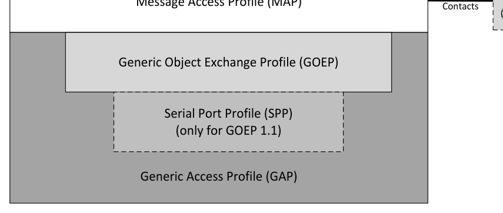

**Figure 1.1: Bluetooth Profiles**

As indicated in Figure 1.1, the Message Access Profile is dependent upon the Generic Object Exchange Profile [2], the Serial Port Profile [11], and the Generic Access Profile (see Volume 3, Part C in [1]). The Serial Port Profile is required when interacting with GOEP 1.1 devices.
This profile is designed to share contact information with a collocated implementation of the Phone Book Access Profile (PBAP) v1.2 or later [18]. Full contact details of a sender, receiver, or Instant Messaging conversation participant may be shared. The interface between this profile and PBAP is implementation dependent and not defined here.
Symbols and Conventions

#### 1.3.1 Requirements Status Symbols

For the feature definition tables in Section 4, the following symbols are used:
• "M" for mandatory to support
• "O" for optional to support
• "X" for excluded (used for capabilities that may be supported by the unit but shall never be used in this use case)
• "C" for conditional to support
• "N/A" for not applicable (in the given context it is impossible to use this capability)
Some excluded capabilities are mandatory, according to the relevant Bluetooth specification. These are features that may degrade operation of devices in this use case. Therefore, these features shall never be activated while a unit is operating as a unit within this use case.

#### 1.3.2 Signaling Diagram Conventions

The signaling diagrams in this specification are examples only. Within the diagrams, the following conventions are used to describe procedures:

|  |  |  |  |  |
| --- | --- | --- | --- | --- |
| A |  | B |  |  |
|  |  |  |  |  |
|  | Current state/condition |  |  |  |
|  |  |  |  |  |
|  | Optional state/condition |  |  |  |
|  |  |  |  |  |

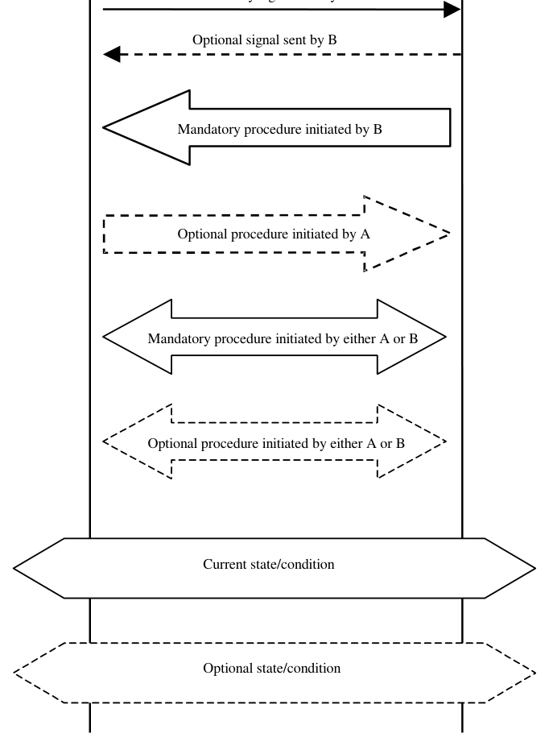

**Figure 1.2: Conventions used in signaling diagrams**

Change History
This section summarizes changes at a moderate level of detail and should not be considered representative of every change made.

#### 1.4.1 Changes from v1.4.2 to v1.4.3

|  | Section |  |  | Errata |  |
| --- | --- | --- | --- | --- | --- |
| Front matter |  |  | 18776, 18791 |  |  |
| 1.3.2: Signaling Diagram Conventions |  |  | 18776 |  |  |
| 2.6: Conformance |  |  | 23840 |  |  |
| 3.1.6.2: Messages-Listing Object (x-bt/MAP-msg- listing): Version 1.1 |  |  | 11797 |  |  |
| 6.3.3: OBEX Error Codes |  |  | 18776 |  |  |
| 11: References |  |  | 22347 |  |  |

Language

#### 1.5.1 Language conventions

The Bluetooth SIG has established the following conventions for use of the words shall, must, will, should, may, can, is, and note in the development of specifications:

| shall | is required to – used to define requirements. |
| --- | --- |
| must | is used to express: a natural consequence of a previously stated mandatory requirement. OR an indisputable statement of fact (one that is always true regardless of the circumstances). |
| will | it is true that – only used in statements of fact. |
| should | is recommended that – used to indicate that among several possibilities one is recommended as particularly suitable, but not required. |
| may | is permitted to – used to allow options. |
| can | is able to – used to relate statements in a causal manner. |
| is | is defined as – used to further explain elements that are previously required or allowed. |
| note | Used to indicate text that is included for informational purposes only and is not required in order to implement the specification. Each note is clearly designated as a “Note” and set off in a separate paragraph. |

For clarity of the definition of those terms, see Core Specification Volume 1, Part E, Section 1.

#### 1.5.2 Reserved for Future Use

Where a field in a packet, Protocol Data Unit (PDU), or other data structure is described as "Reserved for Future Use" (irrespective of whether in uppercase or lowercase), the device creating the structure shall set its value to zero unless otherwise specified. Any device receiving or interpreting the structure shall ignore that field; in particular, it shall not reject the structure because of the value of the field.
Where a field, parameter, or other variable object can take a range of values, and some values are described as "Reserved for Future Use," a device sending the object shall not set the object to those values. A device receiving an object with such a value should reject it, and any data structure containing it, as being erroneous; however, this does not apply in a context where the object is described as being ignored or it is specified to ignore unrecognized values.
When a field value is a bit field, unassigned bits can be marked as Reserved for Future Use and shall be set to 0. Implementations that receive a message that contains a Reserved for Future Use bit that is set to 1 shall process the message as if that bit was set to 0, except where specified otherwise.
The acronym RFU is equivalent to Reserved for Future Use.

#### 1.5.3 Prohibited

When a field value is an enumeration, unassigned values can be marked as “Prohibited.” These values shall never be used by an implementation, and any message received that includes a Prohibited value shall be ignored and shall not be processed and shall not be responded to.
Where a field, parameter, or other variable object can take a range of values, and some values are described as “Prohibited,” devices shall not set the object to any of those Prohibited values. A device receiving an object with such a value should reject it, and any data structure containing it, as being erroneous.
“Prohibited” is never abbreviated.

## 2 Profile Overview

Profile Stack
Figure 2.1 shows the protocols and entities used in this profile:

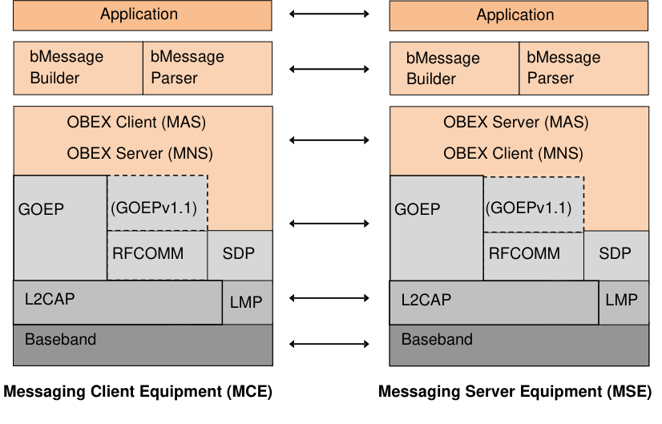

**Figure 2.1: Protocol model for transport of bMessages**

MAS = Message Access service, MNS = Message Notification service (see Section 5.10); bMessages are application objects used by MAP for message transport (see Section 3).
The L2CAP interoperability requirements are defined in GOEP v2.0 or later [2]. The MAP v1.2 profile requires backwards compatibility with previous versions of MAP that were based on GOEP v1.1. The procedures for backward compatibility defined in Section 6.2 of GOEP v2.0 or later shall be used. All the underlying MAP OBEX connections (MAS and MNS) between two devices shall use a single version of GOEP at the time. When OBEX over RFCOMM is used (GOEP v1.1), then only a subset of features shall be used. Support for either GOEP v1.1 and/or GOEP v2.0 or later is advertised in the SDP entries.
Configuration and Roles
The following roles are defined for this profile:
• Message Server Equipment (MSE) – is the device that provides the message repository engine (i.e., has the ability to provide a client unit with messages that are stored in this device and notifications of changes in its message repository).
• Message Client Equipment (MCE) – is the device that uses the message repository engine of the MSE for browsing and displaying existing messages and to upload messages created on the MCE to the MSE.
These terms are used in the rest of this document to designate these roles.
The figures below show typical configurations of devices for which the Message Access Profile is applicable:
• Hands-Free Configuration:
In Figure 2.2, the Hands-Free unit in the car receives/sends messages from/to a mobile phone, which provides capabilities both for network access and message repository (Hands-Free Use Case).
• PC Use Case:
Figure 2.3 shows a configuration with a PC acting as a MAP client such that the user is able to use its PC as an IO device for the messages stored in the cellular phone.
In any case, the mobile phone acts as the MSE, whereas the other devices are having the MCE role.

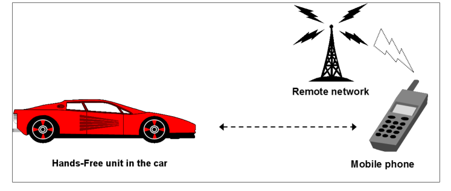

**Figure 2.2: Message Access Profile applied to the Hands-Free use case**

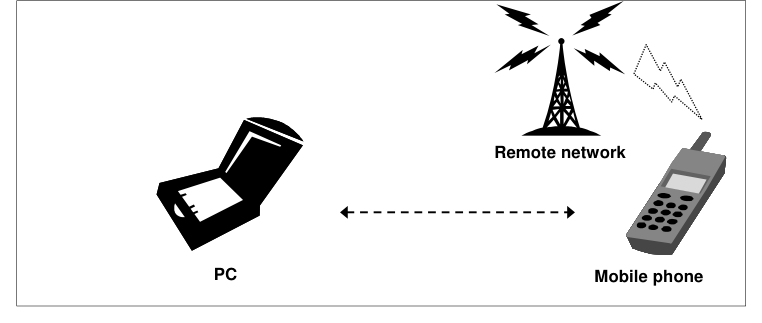

**Figure 2.3: Message Access Profile used by a PC to send/receive messages via a mobile phone**

This MAP version does not consider the configuration where the MSE is in a SIM Access Profile (SAP) session with the MCE and the network access functionality is on the MCE side. This SAP use case will be covered by a dedicated whitepaper.
Message Types
The following message types are supported by this profile:
• EMAIL: emails on RFC5322 or MIME type basis
• SMS: short messages for cellular or other networks [8], [10]
• MMS: 3GPP MMS messages [9]
• IM: Instant Messages on MIME type basis (see Section 3.1.3.2)
These terms are used in the rest of this document to designate these roles.
Profile Fundamentals
The MCE device shall use the services of the MSE device only after successfully creating a secure connection. This includes exchanging security initialization messages, creating link keys, and enabling encryption. Security mode 2 or 3 shall be supported for devices implementing the Bluetooth 2.0+EDR or earlier specifications. Security mode 4 shall be supported for devices implementing the Bluetooth 2.1+EDR or later specifications.
Either the MSE or MCE may initiate bonding. At a minimum, the MSE shall support Inquiry and Paging and the MCE shall support Inquiry Scan and Page Scan in order to initiate bonding. Either device can initiate the link establishment.
Only the MCE can start a MAP session on OBEX level (OBEX services MAS and MNS, see also Section 4.6).
Bluetooth Security
The two devices shall create a secure connection using the GAP authentication procedure as described in the Generic Access Profile (see Volume 3, Part C in [1]). This procedure shall include alternatively entering a Bluetooth Passkey code for legacy devices or Secure Simple Pairing and will include creation of link keys. For the first case, a fixed passkey may also be used during the GAP bonding procedure.
The Message Access Profile mandates the use of several Bluetooth security features:
• Bonding: The MCE and MSE shall be bonded before setting up a Message Access Profile connection. Security Mode 4 shall be used if supported by both MSE and MCE. Each of the four association models of Secure Simple Pairing may be used (see Volume 1, Part A, Section 5 and Volume 2, Part H, Section 7 in [1]), where it is recommended to use authenticated link keys (i.e., using the association models 'Numeric Comparison', 'Out Of Band', or 'Passkey Entry').
For legacy devices, either security mode 2 or 3 shall be used for the Message Access Profile connection.
• Encryption: The link between MCE and MSE shall be encrypted using Bluetooth encryption.
• Bluetooth Passkey: When using security mode 2 or 3, the MCE and MSE shall prohibit the use of a zero-length Bluetooth passkey.
• Link keys: Combination keys shall be used for Message Access Profile connections.
• Encryption key length: The length of the encryption key should be at least 64 bits. For increased security, use of the maximum length allowed given regional regulation is encouraged.
Conformance
Each capability of this specification shall be supported in the specified manner. This specification may provide options for design flexibility, because, for example, some products do not implement every portion of the specification. For each implementation option that is supported, it shall be supported as specified.

## 3 Application Layer

Message Access Profile Objects and Formats

#### 3.1.1 Handle

When exchanging message listings or message objects, the MCE and MSE shall use locally unique identifiers, called handles, to identify individual messages. The MSE device shall assign a handle to each message. The handle shall be a 64 bit unsigned integer whose value is defined by the MSE.
Each handle shall be locally unique across all messages on the MSE. This means that the handle, when presented to the MCE, shall unambiguously identify one and only one message. If an MCE is connected to two MSEs, it is responsible for keeping track of the handles per MSE, as in such case two identical handles may exist each in a different context.
If the MSE supports the features ‘Database Identifier’ and ‘Persistent Message Handles’ (see Section 4):
- The message handles shall be persistent across connections for a given value of the database identification property.
- Previously assigned message handles shall only be reused when the database identification property has been regenerated.
- If the unique handles are reused, a new value of the database identification property shall be generated. More information about the database identification property can be found in Section 3.1.14.
If ‘Database Identifier’ and ‘Persistent Message Handles’ features are not supported by the MSE, then each handle shall be valid during the entire duration of a MAP session. After the end of a MAP session (e.g., initiated by the user or caused by a link loss), the handle is not guaranteed to be valid anymore. Thus, an MCE shall not reuse a handle obtained in a previous MAP session.
A MAP session starts by establishing a Message Access service connection. The duration of the MAP session shall be defined as the time during which at least one Message Access Service connection or Message Notification Service connection is ongoing (see also MAP OBEX definitions in Section 6.1).

#### 3.1.2 Character Set

The character set used for the attributes of the Message Access Profile objects bMessage, Folder-Listing, Messages-Listing, and Event-Report (see Sections 3.1.3, 3.1.5, 3.1.6, and 3.1.7) shall be UTF-8.
Special charset and encoding conventions are defined for the bMessage-parameter <bmessage-body- content> containing the message object itself (see Section 3.1.3).

#### 3.1.3 Message Format (x-bt/message)

The MCE and MSE shall only send messages in the format of the lowest message format version stated in the MapSupportedFeatures bits by the devices.
The MCE shall ignore all unknown attributes and values of a message object.

##### 3.1.3.1 Message Format (x-bt/message): Version 1.0

Exchanged messages shall use the bMessage format. The bMessage object encapsulates the delivered message objects and additionally provides a suitable set of properties with helpful information. The
general encoding characteristics as defined for vCards in Section 2 of [4] shall be applied. The formal BNF definition of the bMessage format is as follows:
<bmessage-object>::= {
"BEGIN:BMSG" <CRLF> <bmessage-property> [<bmessage-originator>]? <bmessage-envelope> "END:BMSG" <CRLF> } <bmessage-property>::=<bmessage-version-property>
<bmessage-readstatus-property> <bmessage-type-property> <bmessage-folder-property> <bmessage-version-property>::="VERSION:"
<common-digit>*"."<common-digit>* <CRLF> <bmessage-readstatus-property>::="STATUS:" 'readstatus' <CRLF> <bmessage-type-property>::="TYPE:" 'type' <CRLF> <bmessage-folder-property>::="FOLDER:" 'foldername' <CRLF> <bmessage-originator>::= <vcard> <CRLF> <bmessage-envelope> ::= {
"BEGIN:BENV" <CRLF> [<bmessage-recipient>]* <bmessage-envelope> | <bmessage-content> "END:BENV" <CRLF> } <bmessage-recipient> ::= <vcard> <CRLF> <bmessage-content>::= {
"BEGIN:BBODY"<CRLF> [<bmessage-body-part-ID> <CRLF>] <bmessage-body-property> <bmessage-body-content>* <CRLF> "END:BBODY"<CRLF> } <bmessage-body-part-ID>::="PARTID:" 'Part-ID' <bmessage-body-property>::=[<bmessage-body-encoding-property>]
[<bmessage-body-charset-property>] [<bmessage-body-language-property>] <bmessage-body-content-length-property> <bmessage-body-encoding-property>::="ENCODING:"'encoding' <CRLF> <bmessage-body-charset-property>::="CHARSET:"'charset' <CRLF> <bmessage-body-language-property>::="LANGUAGE:"'language' <CRLF> <bmessage-body-content-length-property>::=
"LENGTH:" <common-digit>* <CRLF>
<bmessage-body-content>::={
"BEGIN:MSG"<CRLF> 'message'<CRLF> "END:MSG"<CRLF> }
bmessage-version-property:
The value for this property shall be "VERSION:1.0 <CRLF>", which is the present bMessage version 1.0.
bmessage-originator:
This property includes a vCard identifying the originator (i.e., the original sender of the message (see also definition of 'vCard' property below)).
For an email, the following rules shall apply:
- If the ‘Sender:’ field is provided:
› This property shall contain the information pertaining to the ‘Sender:’ field.
› If additional fields such as ‘From:’ and/or ‘Reply-To:’ are provided, these shall be included in the body-content.
- If the ‘Sender:’ field is not provided:
› This property shall contain the information pertaining to the ‘From:’ field.
› If an additional field such as ‘Reply-To:’ is provided, this shall be included in the body- content.
bmessage-recipient:
This property includes a vCard identifying the recipient of the messages (see also definition of 'vCard' property below).
In the case of an email, all the recipients in the MIME 'to:' field shall have their own bmessage-recipient property. When sending a message, the MSE shall also parse the MIME 'cc:' and 'bcc:' fields and apply the correct behavior for those recipients as defined in 5322 [14].
bmessage-readstatus-property:
The property value shall be either "READ" or "UNREAD", indicating whether a message has been read or not by the MCE. During a MAP session, the MCE shall be responsible for setting this status (see Sections 4.2 and 5.7). An MSE shall not change this status during a MAP session without initiation by the user or a connected MCE device. The initial status when starting a MAP session is 'read' if the message has already been read on the MSE.
bmessage-type-property:
The property value shall be one of the following:
• "EMAIL" for emails on RFC5322 or MIME type basis
• "SMS_GSM" for GSM short messages [8]
• "SMS_CDMA" for CDMA short messages [10]
• "MMS" for 3GPP MMS messages [9]
This is the folder name including the path where the bMessage is located in. Any folder within the MSE folder structure may be used for this property as described in Section 3.1.3.2 (e.g., "telecom/msg/inbox"). This property shall be restricted to 512 bytes. If the path and folder description exceeds this length, the name of the addressed folder and the highest possible folder layers above shall be delivered. If the bMessage is used for an upload (PushMessage function, see Section 5.8), the MCE should send an empty bmessage-folder-property and the MSE should discard this property to avoid redundancy with the ‘name’ header’ of the PushMessage function.
bmessage-body-part-ID:
This property shall be used if and only if the content of the related message cannot be delivered completely within one <bmessage-content> object (i.e., in case of a fragmented email). The part-ID of the first <bmessage-content> object shall be 0; the following <bmessage-content> objects shall have a part- ID incremented by 1 each. The range of this value shall be 0 to 65535 accordingly, restricting the number of fractions to this maximum.
bmessage-body-charset-property:
This is the character set used by the message object contained by <bmessage-body-content>. This property shall be used only if the message contains textual content. For detailed requirements, see description of the <bmessage-body-content property> below.
bmessage-body-encoding-property:
This is the encoding used by the message object contained by <bmessage-body-content>. The property shall have one of the following values:
• Email/MMS [6], [9]: "8BIT" (for 8-Bit Clean encoding).
• GSM-SMS [13]: "G-7BIT" (GSM 7 bit Default Alphabet), "G-7BITEXT" (GSM 7 bit Alphabet with national language extension), "G-UCS2", and "G-8BIT".
• CDMA-SMS [12]: "C-8BIT" (Octet, unspecified), "C-EPM" (Extended Protocol Message), "C-7ASCII (7-bit ASCII), "C-IA5" (IA5), "C-UNICODE" (UNICODE), "C-SJIS" (Shift-JIS), "C-KOREAN" (Korean), "C-LATINHEB” (Latin/Hebrew), and “C-LATIN” (Latin).
For detailed requirements, see description of the <bmessage-body-content> property below.
bmessage-body-language-property:
This is the language of the message. This property may be used if the message includes textual content. The property shall have one of the following values:
• GSM-SMS [13]: " TURKISH", " SPANISH", "PORTUGUESE", "UNKNOWN"
• CDMA-SMS [12]: "ENGLISH", "FRENCH", "SPANISH", "JAPANESE", "KOREAN", "CHINESE", "HEBREW", "UNKNOWN"
The allowed properties for a vCard [4], [5] in a bMessage shall be the following:
For version 2.1:
VERSION, N, TEL, EMAIL (VERSION and N shall be included, TEL and EMAIL may be used)
For version 3.0:
VERSION, N, FN, TEL, EMAIL (VERSION, N, and FN shall be included; TEL and EMAIL may be used)
Furthermore, the 'recipient' attribute of bMessages delivered by the MCE to the MSE for sending shall include:
• The EMAIL property in case of an email.
• The TEL property in case of an SMS.
• Exactly one of these properties in case of an MMS.
All the other vCard properties shall not be used. The properties may be empty if not known (e.g., N/FN in case of an SMS).
bmessage-envelope:
The maximum level of <bmessage-envelope> encapsulation shall be three. If the message originally received by the MSE has more than three encapsulation levels, the MSE shall deliver the upper three levels (i.e., the most recent ones).

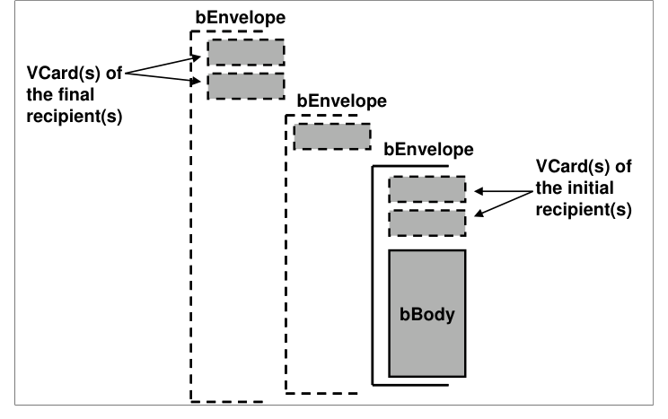

**Figure 3.1: bEnvelopes encapsulation in a bMessage**

This is the overall length of the related <bmessage-body-content> objects(s) in bytes, where the length counting starts with the "B" of the first occurrence of "BEGIN:MSG" and ends with the <CRLF> of the last occurrence of "END:MSG"<CRLF>.
bmessage-body-content:
The <bmessage-body-content> shall be constructed according to the type of message contained therein as indicated by the mandatory <bmessage-type-property>. The conversion shall be done by the MSE according to the following requirements:
• When generating a bMessage, all occurrences of <CRLF>'END:MSG' in a <bmessage-body-content> after any encoding or encapsulation shall be replaced by <CRLF>'/END:MSG'; occurrences of <CRLF>'/END:MSG' shall be replaced by <CRLF>'//END:MSG'; and so on. Adding an escape character shall increase the LENGTH field by 1. Similarly, when parsing a <bmessage-body-content>, all occurrences of <CRLF>'/END:MSG' shall have a '/' removed before any further decoding or processing.
• If the message is an MMS (bMessage-type "MMS"):
- If the bMessage is uploaded from the MCE to the MSE, the <bmessage-body-content> shall be formatted as an email specified in RFC5322 [14] and MIME RFC2045-RFC2047 [6].
- If the message is downloaded by the MCE from the MSE, the original MMS message shall be converted into email format following the RFC4356 specification before being used as <bmessage-body-content>.
- Furthermore, for the <bmessage-body-content>, the requirements described hereunder for the bMessage-type "EMAIL" shall be applied.
• If the message is an email (bMessage-type "EMAIL") or an MMS converted to email format as described above (bMessage-type "MMS"):
- The <bmessage-body-content> contains the message formatted as specified in RFC5322 and MIME RFC2045-RFC2047.
- The message object contained in <bmessage-body-content> shall be coded using the following rules:
› If the message or (in case of a multipart-message) a part of the message includes textual content (MIME type/subtype = text/xxx), the contained message text shall be coded in UTF-8 charset:
▪ The related <bmessage-body-charset-property> shall be "UTF-8".
▪ If the bMessage is downloaded from the MSE to the MCE, the MSE shall transcode the included text to UTF-8 charset before delivery.
▪ If the bMessage is uploaded from the MCE to the MSE, the MSE may transcode the text of the message from UTF-8 to any charset required (e.g., before sending to the network).
▪ If the bMessage is uploaded from the MCE to the MSE, the MSE must add the "From" attribute of the included email (if it is not present in the email) before sending it. This situation may occur if the MCE does not know this email address.”
› If the message or (in case of a multipart-message) all parts of the message include only non- textual content (MIME type/subtype other than text/…)
▪ The related <bmessage-body-charset-property> shall not be used.
› In any case, the encoding method used for the <bmessage-body-content> shall be 8-Bit:
▪ No other encoding methods (e.g., QuotedPrintable or Base64) shall be used.
▪ Accordingly, the only authorized value of the related <bmessage-body-encoding- property> shall be "8BIT".
▪ If the bMessage is downloaded from the MSE to the MCE, the MSE shall transcode it to 8-Bit encoding before it is delivered.
▪ If the bMessage is uploaded from the MCE to the MSE, the MSE may transcode the message encoding from 8-Bit encoding to any encoding required (e.g., before sending to the network).
- If the original message is a GSM-SMS or a CDMA-SMS (bMessage-types "SMS_GSM" or "SMS_CDMA"):
› Only SMS related to the following two SMS-PDUs [8], [10], [16] shall be used by MAP:
▪ SMS-Deliver PDUs received from the network
▪ SMS-Submit PDUs for submission to the network
› Two kinds of formats for the <bmessage-body-content> are supported for the transmission of bMessages between MCE and MSE. The MSE shall support both formats; the MCE may choose either of these formats (see also definitions of functions getMessage and pushMessage in Section 4.6):
1. <bmessage-body-content> includes the text of the SMS coded in UTF-8:
- This kind of bMessage coding may be used when the transmitted message includes textual content (e.g., 7-bit or UCS-2 encoding for GSM). It shall not be used if the message includes only binary content.
- The bMessage shall contain exactly one <bmessage-body-content> object, which includes a text string with the message text coded in UTF-8 charset.
- Accordingly, the related <bmessage-body-charset-property> shall be "UTF-8".
- The <bmessage-body-encoding-property> shall not be used.
- If the bMessage is downloaded from the MSE to the MCE, the MSE shall transcode the textual parts of the related SMS-Deliver PDU to UTF-8 charset before delivery.
- If the bMessage is uploaded from the MCE to the MSE for sending, the MSE shall use the UTF-8 coded text in <bmessage-body-content> and the other parameters delivered by the related <bmessage-object> to produce an SMS-Submit PDU or concatenated SMS PDUs (if the delivered text is too long).
2. SMS PDU object in <bmessage-body-content>:
- This kind of bMessage coding shall be used for SMS with binary content and may be used for SMS with textual content. The <bmessage-body-charset-property> shall not be used.
- In case of a non-concatenated SMS (single PDU), the bMessage shall contain exactly one <bmessage-body-content> object, which includes the SMS PDU.
- In the case of GSM-SMS where a GSM 04.11 [16] SC address is followed by a GSM 03.40 [8] TPDU in hexadecimal format, MSE/MCE converts each octet of the Transfer Layer Protocol data unit into a two-character, IRA [17] encoded, hexadecimal number (e.g., octet with decimal value 42 is presented to TE as a two- character hexadecimal value, 2A. The IRA encodings are decimal 50 and 65 or hexadecimal 32 and 41).
- In the case of CDMA-SMS where a 3GPP2 C.S0015-0 [10] Transport Layer Message is in hexadecimal format, MSE/MCE converts each octet of the Transfer Layer Protocol data unit into a two-character, IRA [17] encoded, hexadecimal number (e.g., octet with decimal value 42 is presented to TE as a two-character hexadecimal value, 2A. The IRA encodings are decimal 50 and 65 or hexadecimal 32 and 41).
- In the case of a concatenated SMS (multiple PDU), the bMessage shall contain several <bmessage-body-content> objects, each with a PDU of the concatenated SMS. If the bMessage is uploaded from the MCE to the MSE for sending, the MCE shall order the contained <bmessage-body-content> objects as required for sending. If the bMessage is downloaded by the MCE from the MSE, the MSE shall order the contained <bmessage-body-content> objects in the same way like the SMS PDUs of the original concatenated SMS.
BEGIN:BMSG VERSION:1.0 STATUS:UNREAD TYPE:EMAIL FOLDER:TELECOM/MSG/INBOX BEGIN:VCARD VERSION:2.1 N:Mat EMAIL:ma@abc.edu END:VCARD BEGIN:BENV BEGIN:VCARD VERSION:2.1 N:Tanaka EMAIL:tanaka@def.edu END:VCARD BEGIN:BENV BEGIN:VCARD VERSION:2.1 N:Laurent EMAIL:laurent@ghi.edu END:VCARD BEGIN:BBODY ENCODING:8BIT LENGTH:125 BEGIN:MSG Date: 20 Jun 96 Subject: Fish From: tanaka@def.edu To: laurent@ghi.edu Let's go fishing! BR, Mat END:MSG END:BBODY END:BENV END:BENV END:BMSG
Below is an example of a bMessage embedded with a native SMS-Deliver PDU containing the message “Let’s go fishing!”.
BEGIN:BMSG VERSION:1.0 STATUS:UNREAD TYPE:SMS_GSM FOLDER:TELECOM/MSG/INBOX BEGIN:VCARD VERSION:2.1 N:Joachim TEL:00498912345678 END:VCARD BEGIN:BENV BEGIN:BBODY ENCODING:G-7BIT LENGTH: 96 BEGIN:MSG 0191000E9100949821436587000011303231 12928211CC32FD34079DDF20737A8E4EBBCF21 END:MSG END:BBODY END:BENV END:BMSG

##### 3.1.3.2 Message Format (x-bt/message): Version 1.1

Support for ‘Message Format Version 1.1’ is advertised in the MapSupportedFeatures bits (see Sections 7.1.1, 7.1.2, and 6.4.1). To support backward compatibility, none of the additional attribute names and values shall be included in a bMessage that is sent to an MCE or MSE device that does not advertise support for ‘Message format Version 1.1’ in its MapSupportedFeatures bits.
The MSE shall not return messages of type ’IM’ if the MCE does not claim support for ‘Message Format Version 1.1’ in its MapSupportedFeatures bits.
If the ‘Message Format Version 1.1’ MapSupportedFeatures bit is set on the MCE and MSE device, then the bMessage object shall be defined according to the following DTD (Document Type Definition [15]):
"BEGIN:BMSG" <CRLF> <bmessage-property> [<bmessage-originator>]? <bmessage-envelope> "END:BMSG" <CRLF> } <bmessage-property>::=<bmessage-version-property>
<bmessage-readstatus-property> <bmessage-type-property> <bmessage-folder-property> <bmessage-extendeddata-property> <bmessage-version-property>::="VERSION:"
<common-digit>*"."<common-digit>* <CRLF> <bmessage-readstatus-property>::="STATUS:" 'readstatus' <CRLF> <bmessage-type-property>::="TYPE:" 'type' <CRLF> <bmessage-folder-property>::="FOLDER:" 'foldername' <CRLF> <bmessage-extendeddata-property>::="EXTENDEDDATA:" 'extendeddata' <CRLF> <bmessage-originator>::= <vcard> <CRLF> <bmessage-envelope> ::= {
"BEGIN:BENV" <CRLF> [<bmessage-recipient>]* <bmessage-envelope> | <bmessage-content> "END:BENV" <CRLF> } <bmessage-recipient> ::= <vcard> <CRLF> <bmessage-content>::= {
"BEGIN:BBODY"<CRLF> [<bmessage-body-part-ID> <CRLF>] <bmessage-body-property> <bmessage-body-content>* <CRLF> "END:BBODY"<CRLF> } <bmessage-body-part-ID>::="PARTID:" 'Part-ID' <bmessage-body-property>::=[<bmessage-body-encoding-property>]
[<bmessage-body-charset-property>] [<bmessage-body-language-property>] <bmessage-body-content-length-property> <bmessage-body-encoding-property>::="ENCODING:"'encoding' <CRLF> <bmessage-body-charset-property>::="CHARSET:"'charset' <CRLF> <bmessage-body-language-property>::="LANGUAGE:"'language' <CRLF> <bmessage-body-content-length-property>::= "LENGTH:" <common-digit>* <CRLF> <bmessage-body-content>::={
"BEGIN:MSG"<CRLF> 'message'<CRLF> "END:MSG"<CRLF> }
The conventions of ‘Message Format Version 1.0’ apply to ‘Message Format Version 1.1’ (see Section 3.1.3). The rest of this section defines only the additions to ‘Message Format Version 1.1’.
bmessage-version-property:
The value for this property shall be "VERSION:1.1<CRLF>" if the MSE and MCE support the feature ‘Message Format Version 1.1’.
bmessage-type-property:
- ’IM’ for instant messages on MIME type basis.
The property value ‘IM’ shall only be used if the MSE and MCE support the ‘Message Format Version 1.1’ feature.
vCard:
- The following properties are additionally allowed:
› X-BT-UID: A 128-bit value as a 32-character ASCII hexadecimal string that uniquely identifies a contact in the Phonebook Access Profile main phonebook.
› X-BT-UCI: Contains a reference that allows a client application on the MSE to identify a user.
For additional details about the definition of these properties, please refer to the Phonebook Access Profile v1.2 or later [18].
bMessage-extendeddata-property:
- The extended data of a message may be anything that is somehow linked with a message (i.e., someone liked a message, gave +1, number of followers, etc.). The format shall comply with the definition in Section 3.1.13.
bmessage-body-encoding-property:
- For IM: [6] "8BIT" (for 8-Bit Clean encoding).
bmessage-body-content:
- If the message is an instant message (bMessage-type "IM"):
› The same rules as for an email (bMessage-type “EMAIL”) apply. Please refer to Section 3.1.3.
› The values of “From” and “To” shall be equivalent to the UCI identifier in the vCard of the message.
BEGIN:BMSG VERSION:1.1 STATUS:UNREAD TYPE:IM FOLDER:TELECOM/MSG/INBOX EXTENDEDDATA:0:3; BEGIN:VCARD VERSION:2.1 N:L;Marry X-BT-UCI:whateverapp:497654321@s.whateverapp.net END:VCARD BEGIN:BENV BEGIN:VCARD VERSION:2.1 N:S.;Alois X-BT-UCI:whateverapp:4912345@s.whateverapp.net END:VCARD BEGIN:BBODY ENCODING:8BIT LENGTH: BEGIN:MSG Date: Fri, 1 Aug 2014 01:29:12 +01:00 From: whateverapp:497654321@s.whateverapp.net To: whateverapp:4912345@s.whateverapp.net Content-Type: text/plain; Happy birthday END:MSG END:BBODY END:BENV END:BMSG

#### 3.1.4 Folders Structure

Figure 3.2 is an example of the folder architecture that the MSE presents to the MCE. This folder structure is only the representation used by MAP. The folder structure does not necessarily have to exist in the same way on the MSE device.
a' inbox
b' root telecom msg outbox
sent
deleted
m' draft
a
n

**Figure 3.2: MAP virtual folder structure**

The following folders shall be present at the MSE's message repository representation (bold characters in Figure 3.2):
• telecom/msg/inbox: This folder shall contain all the messages that have been received by the MSE, at least during the period of the current MAP session, and which have not been shifted to other folders on the MSE device This folder shall be called 'Inbox' folder hereinafter.
• telecom/msg/sent: This folder shall contain messages that were successfully sent to the network by the MSE, at least during the period of the current MAP session. In particular, these messages have been queued in the 'Outbox' folder before sending and are shifted by the MSE to this folder after transmission. This folder shall be called 'Sent' folder hereinafter.
• telecom/msg/deleted: This folder shall contain the messages that have been deleted on the MSE, at least during the period of the current MAP session. This folder shall be called 'Deleted' folder hereinafter.
The following folder shall be present if and only if the MSE device has the capability to transmit messages to a remote network. In particular, it shall be present also during temporal disturbances of the transmission process (e.g., by network problems).
• telecom/msg/outbox: This folder shall contain all the messages that are queued for transmission by the MSE, at least during the period of the current MAP session. This folder shall be called 'Outbox' folder hereinafter. In particular, the MCE shall only upload messages for sending to this folder. If a message has been transmitted to the network, it shall be shifted by the MSE to the 'Sent' folder (sending success). If a message cannot be sent for any reason, these messages shall remain in the 'Outbox' folder.
The telecom/msg/draft folder is the repository for messages that have not been sent and may require further editing. If a comparable folder is present on the MSE, it shall be presented to the MCE and its name shall be ‘Draft’.
If folders have a real representation on the MSE device, the folders presented by the MAP-MSE should contain (if possible) the same messages as in the real folder structure (e.g., the Sent folder) as long as this recommendation does not conflict with mandatory requirements.
If the MSE device owns more than one message repository (e.g., several email accounts), it may present these multiple message repositories by multiple MAS Instances (see also Sections 3.1.7.2 and 6.5).

#### 3.1.5 Folder-Listing Object (x-obex/folder-listing)

The Folder-Listing object is defined in Section 9.1 of [7] and shall be encoded in UTF-8. In the context of the MAP profile, the Folder-Listing object shall not contain message entries. It shall only contain folder entries located in the current folder level.
The devices shall ignore all unknown attributes and values of a 'Folder-Listing' object.

#### 3.1.6 Messages-Listing Object (x-bt/MAP-msg-listing)

The Messages-Listing object is an XML object and shall be encoded in UTF-8.
The MCE and MSE shall only send messages in the format of the lowest message format version, which is stated in the MAPSupportedFeatures bits by both devices. For example, if the MSE supports version 1.1 and the MCE supports only version 1.0, only the message in version 1.0 shall be sent. Only when both the MSE and MCE states support message format version 1.1, then messages shall be sent in format version 1.1.
The entries of the Messages-Listing object shall be sorted by the value of the "datetime" parameter (see below). Sort order shall be in descending order, with the newest message being transferred first.
The devices shall ignore all unknown attributes and values of a 'Messages-Listing' object.
The Messages-Listing object is defined according to the following DTD (Document Type Definition) [15]:
<!DTD for the MAP Messages-Listing Object--> <!DOCTYPE MAP-msg-listing [ <!ELEMENT MAP-msg-listing ( msg )* > <!ATTLIST MAP-msg-listing version CDATA #FIXED "1.0"> <!ELEMENT msg EMPTY> <!ATTLIST msg handle CDATA #REQUIRED subject CDATA #REQUIRED datetime CDATA #REQUIRED sender_name CDATA #IMPLIED sender_addressing CDATA #IMPLIED replyto_addressing CDATA #IMPLIED recipient_name CDATA #IMPLIED recipient_addressing CDATA #REQUIRED type CDATA #REQUIRED size CDATA #REQUIRED text (yes|no) "no" reception_status CDATA #REQUIRED attachment_size CDATA #REQUIRED priority (yes|no) "no" read (yes|no) "no" sent (yes|no) "no" protected (yes|no) "no" > ]>
where the parameters shall be used as described below:
• "handle" is the message handle in hexadecimal representation with up to 16 digits; leading zero digits may be used so the MCE shall accept both handles with and without leading zeros (e.g.,"00000012345678AB" or "12345678AB").
• "subject" is the summary of the message. This parameter shall not exceed 256 bytes. The content of this parameter is left to the implementer's decision. Typically, in case the original message has a title, the subject should contain the title of the original message. If the original message does not have any title, the implementer may use the first words of the message as "subject" value. The subject may be a blank string ("").
• "datetime" is the timestamp of the message in format "YYYYMMDDTHHMMSS" as defined for the OBEX "time" header in Section 2.2 of [7]. Local Time time basis and 24 hours representation shall be used. If the message in the MSE internal repository does not have a 4-digit year representation, the MSE shall complete it to 4 digits in a suitable way. If the sending time is included in the message, it shall be used for this parameter; otherwise the reception time of the MSE shall be used.
If the feature “UTC Offset Timestamp Format” is supported by the MSE and MCE, then the timestamp shall comply with the format defined in Section 3.1.10.
• "sender_name" is the name of the sender of the message when it is known by the MSE device. This parameter shall not exceed 256 bytes and shall be truncated to the first 255 bytes if required. If a sender name is included in the original message, the MSE shall use this information for the content of
this attribute; otherwise the content of this parameter is left to the implementer's decision (e.g., the MSE may use a phonebook entry for "sender_name").
• "sender_addressing" is the addressing information of the sender. In the case of an email, this is the sender's email address ("From:" field). In the case of an SMS, this is the sender's phone number in canonical form (Section 2.4.1 of [4]). In the case of an MMS, this is the senders email address or phone number. This parameter shall not exceed 256 bytes. If the sender address of the original message is longer than 256 bytes, it shall be truncated to the first 256 bytes. If the sender is not known (e.g., in case of a suppressed sender address), this parameter may be left empty.
• "replyto_addressing" is the address information for replies to the sender. This parameter shall be used only for emails to deliver the sender's reply-to email address ("Reply-To:" field). This parameter shall not exceed 256 bytes. If the reply-to address of the original message is longer than 256 bytes, it shall be truncated to the first 256 bytes. If the reply-to address is not present in the email, this parameter shall be left empty.
• "recipient_name" is the name of the recipient of the message when it is known by the MSE device. This parameter shall not exceed 256 bytes and shall be truncated to the first 256 bytes if required.
• "recipient_addressing" is the addressing information of the recipient. In the case of an email, this is the recipient's email address or a list of email addresses, each delimited by ";" (ASCII x3B). In the case of an SMS, this is the recipient's phone number in canonical form (Section 2.4.1 of [4]). In the case of an MMS, this is the recipient's email address or phone number. This parameter shall not exceed 256 bytes. If the recipient is not known (e.g., in case of a draft message), this parameter may be left empty. If the recipient address of the original message is longer than 256 bytes, it shall be truncated to the first 256 bytes.
• "type" gives the type of the message. The following types are supported by the present profile:
"EMAIL": e-mail RFC5322 or MIME RFC2045-47 type basis
"SMS_GSM": GSM short message
"SMS_CDMA": CDMA short message
"MMS": 3GPP MMS
At least one of these types shall be supported by the MSE.
• "reception_status": Gives the status of reception of the message. The parameter shall have one of the values:
"complete": Complete message has been received by the MSE
"fractioned": Only a part of the message has been received by the MSE (e.g., fractioned email of push-service)
"notification": Only a notification of the message has been received by the MSE
• "size": The overall size in bytes of the original message as received from the network. The MCE implementation has to take into account that the size of the message delivered in a bMessage may be different from this size due to transcoding effects (see Section 3.1.3).
• "attachment_size": The overall size of the attachments in bytes. Value = 0 indicates that the message has no attachments.
• "text": Value "yes" indicates the original message or (in case of multipart-messages) that a part of the message includes textual content; "no" indicates that the message has no textual content, only binary.
• "read": Value "yes" indicates that the message has already been read on the MSE; "no" indicates that the message has not yet been read (see also bmessage-readstatus-property in Section 3.1.3).
• "sent": Value "yes" indicates that the message has already been sent to the recipient; "no" indicates that the message has not yet been sent.
• "protected": Value "yes" indicates that the message or a part of the message (e.g., attachment) is protected by a DRM scheme; "no" indicates that the message is not protected by DRM.
• "priority": Value "yes" indicates that the message is of high priority; "no" indicates that the message is not of high priority.
The parameters above shall not occur in the Messages-Listing object if its delivery is suppressed actively by the parameter-mask attribute in the GetMessagesListing function (see Section 5.5). In particular, Messages-Listing parameters marked as REQUIRED in the DTD above may be masked out.
Example of Messages-Listing object:
<MAP-msg-listing version = "1.0"> <msg handle = "20000100001" subject = "Hello" datetime = "20071213T130510" sender_name = "Jamie" sender_addressing = "+1-987- 6543210" recipient_addressing = "+1-0123-456789" type = "SMS_GSM" size = "256" attachment_size = "0" priority = "no" read = "yes" sent = "no" protected = "no"/> <msg handle = "20000100002" subject = "Guten Tag" datetime = "20071214T092200" sender_name = "Dmitri" sender_addressing = "8765432109" recipient_addressing = "+49-9012-345678" type = "SMS_GSM" size = "512" attachment_size = "3000" priority = "no" read = "no" sent = "yes" protected = "no"/> <msg handle = "20000100003" subject = "Ohayougozaimasu" datetime = "20071215T134326" sender_name = "Andy" sender_addressing = "+49-7654- 321098" recipient_addressing = "+49-89-01234567" type = "SMS_GSM" size = "256" attachment_size = "0" priority = "no" read = "yes" sent = "no" protected = "no"/> <msg handle = "20000100000" subject = "Bonjour" datetime = "20071215T171204" sender_name = "Marc" sender_addressing = "marc@carworkinggroup.bluetooth" recipient_addressing = "burch@carworkinggroup.bluetooth" type = "EMAIL" size = "1032" attachment_size = "0" priority = "yes" read = "yes" sent = "no" protected = "yes"/> </MAP-msg-listing>

##### 3.1.6.2 Messages-Listing Object (x-bt/MAP-msg-listing): Version 1.1

Support for ‘Messages-Listing Format Version 1.1’ is advertised in the MapSupportedFeatures bits. To support backward compatibility, none of the additional attribute names and values shall be included in a Messages-Listing Object that is sent to an MCE device that does not advertise support for ‘Messages- Listing Format Version 1.1’ in its MapSupportedFeatures bits.
The MSE shall not include messages of type ’IM’ if the MCE does not claim support for ‘Message Format Version 1.1’ and ‘Messages-Listing Format Version 1.1’ in its MapSupportedFeatures bits.
If the ‘Messages-Listing Format Version 1.1’ MapSupportedFeatures bit is set on the MCE and MSE device, then the Messages-Listing Object shall be defined according to the following DTD (Document Type Definition) [15]:
<!DTD for the MAP Messages-Listing Object--> <!DOCTYPE MAP-msg-listing [ <!ELEMENT MAP-msg-listing ( msg )* > <!ATTLIST MAP-msg-listing version CDATA #FIXED "1.1"> <!ELEMENT msg EMPTY> <!ATTLIST msg handle CDATA #REQUIRED subject CDATA #REQUIRED datetime CDATA #REQUIRED sender_name CDATA #IMPLIED sender_addressing CDATA #IMPLIED replyto_addressing CDATA #IMPLIED recipient_name CDATA #IMPLIED recipient_addressing CDATA #REQUIRED type CDATA #REQUIRED size CDATA #REQUIRED text (yes|no) "no" reception_status CDATA #REQUIRED attachment_size CDATA #REQUIRED priority (yes|no) "no" read (yes|no) "no" sent (yes|no) "no" protected (yes|no) "no" delivery_status CDATA #IMPLIED conversation_id CDATA #IMPLIED conversation_name CDATA #IMPLIED direction CDATA #IMPLIED attachment_mime_types CDATA #IMPLIED > ]>
The attribute rules described in Messages-Listing Object Version 1.0 (see Section 3.1.6) apply as well as the following additional parameters and values:
• "type":
› ’IM’: Instant Message
• "datetime": If the feature ‘UTC Offset Timestamp Format’ is supported, the timestamp shall comply with the format specified in Section 3.1.10. If the feature is not supported, the timestamp shall comply with the datetime definition in Section 3.1.6.
• “sender_addressing”: In the case of an instant message, this is the sender’s UCI identifier (“From:” field).
• “recipient_addressing”: In the case of an instant message, this is the recipient’s UCI identifier or a list of UCI identifiers, each delimited by “;” (ASCII x3B). If the UCI contains the delimiter character, it shall be escaped by a “\” character (ASCII x5C).
• "delivery_status": Provides the status of delivery of the message. If the MSE generally has no knowledge about the delivery status, this parameter shall be “unknown”. The parameter shall have one of the following values:
› “delivered”: The complete message has been delivered to the recipient. This is the final status of a message and corresponds to the event DeliverySuccess.
› “sent”: The complete message has been sent from the MSE to the remote network. This status corresponds to the event SendingSuccess.
› “unknown”: This value shall be used if the MSE has no knowledge about the delivery status of the message.
• “conversation_id”: The identification of the conversation. The format shall comply with the format defined in Section 3.1.16. The conversation_id corresponds to an id of a Conversation-Listing (see Section 3.1.9).
• “conversation_name”: The human readable name of the conversation. This parameter shall not exceed 256 bytes including escape sequences. If the conversation has no name, this parameter shall be empty (“”).
If the parameter "type" with the value "IM" (Instant Message) will be used, then the "conversation_id" type is mandatory.
• “direction”: This attribute shall indicate the direction of the message. The direction shall have one of the following values:
› “incoming”: For all incoming messages.
› ”outgoing”: For all messages that are currently in the process of being sent and all messages that have been successfully sent.
› ”outgoingdraft”: For all outgoing draft messages.
› ”outgoingpending”: For all messages including messages that have been attempted to be sent but have failed.
If the parameter "type" with the value "IM" (Instant Message) will be used, then the "direction" type is mandatory.
• attachment_mime_types: The MIME type (see [6]) of the attachment(s). If there are multiple attachments, the MIME types shall be separated by a comma “,”. If there is no attachment, this parameter shall be empty (“”).
Below is an example of a Messages-Listing object to be used when the connected MCE supports ‘Extended Messages-Listing 1.1’.
<MAP-msg-listing version="1.1"> <msg handle="20000100001" subject="Welcome Clara Nicole” datetime="20140706T095000-0400" sender_name="Max" sender_addressing="4924689753@s.whateverapp.net" recipient_addressing="" type="IM" size="256" attachment_size="0" priority="no" read="no" sent="no" protected="no" conversation_id=”E1E2E3E4F1F2F3F4A1A2A3A4B1B2B3B4” direction=”incoming” /> <msg handle = "20000100002" subject= "What’s the progress Max?" datetime="20140705T092200+0100" sender_name="Jonas" sender_addressing="4913579864@s.whateverapp.net" recipient_addressing = "" type="IM" size="512" attachment_size="8671724" priority="no" read="yes" sent="yes" protected="no" conversation_id=”E1E2E3E4F1F2F3F4A1A2A3A4B1B2B3B4” direction=”incoming” attachment_mime_types=”video/mpeg”/> </MAP-msg-listing>

#### 3.1.7 MAP-Event-Report Object

The MAP-Event-Report object is an XML object including the description of exactly one event. The MAP- Event-Report object shall be encoded in UTF-8.
The MCE shall ignore all unknown attributes and values of a 'MAP-Event-Report' object.
Depending on the MAP-Event-Report version and the Event type, a different set of attributes shall be included in the Event-Report. Table 3.1 illustrates the attributes that shall be included in a specific event type and the attributes that shall be contained in the different versions of a MAP-Event-Report. MAP- Event-Report Version 1.2 may contain all the attributes from MAP-Event-Report Version 1.1, and MAP- Event-Report Version 1.1 may contain all the attributes from MAP-Event-Report Version 1.0.
To support backward compatibility, none of the additional attribute names and values shall be included in a MAP-Event-Report that is sent to an MCE device that does not advertise support for “Extended Event Reports 1.1” or “Extended Event Reports 1.2” in its MapSupportedFeatures bits.

|  |  |  | MAP-Event-Report Version 1.0 |  |  |  |  |  |  |  |  |  |  |  |  |  |  |  |  |  | 1.1 |  | 1.2 |  |  |  |  |  |  |  |  |  |
| --- | --- | --- | --- | --- | --- | --- | --- | --- | --- | --- | --- | --- | --- | --- | --- | --- | --- | --- | --- | --- | --- | --- | --- | --- | --- | --- | --- | --- | --- | --- | --- | --- |
| Event types⇒ Attribute |  |  | NewMessage |  | DeliverySuccess |  | SendingSuccess |  | DeliveryFailure |  | SendingFailure |  | MemoryFull |  | MemoryAvailable |  | MessageDeleted |  | MessageShift |  | ReadStatusChanged |  | MessageRemoved |  | MessageExtendedData-Changed |  | ParticipantPresence-Changed |  | ParticipantChatState-Changed |  | ConversationChanged |  |
|  | type |  | ✓ |  | ✓ |  | ✓ |  | ✓ |  | ✓ |  | ✓ |  | ✓ |  | ✓ |  | ✓ |  | ✓ |  | ✓ |  | ✓ |  | ✓ |  | ✓ |  | ✓ |  |
|  | handle |  | ✓ |  | ✓ |  | ✓ |  | ✓ |  | ✓ |  |  |  |  |  | ✓ |  | ✓ |  | ✓ |  | ✓ |  | ✓ |  |  |  |  |  |  |  |
|  | folder |  | ✓ |  | ✓ |  | ✓ |  | ✓ |  | ✓ |  |  |  |  |  | ✓ |  | ✓ |  | ✓ |  | ✓ |  | ✓ |  |  |  |  |  |  |  |

|  |  |  | MAP-Event-Report Version 1.0 |  |  |  |  |  |  |  |  |  |  |  |  |  |  |  |  |  | 1.1 |  | 1.2 |  |  |  |  |  |  |  |  |  |
| --- | --- | --- | --- | --- | --- | --- | --- | --- | --- | --- | --- | --- | --- | --- | --- | --- | --- | --- | --- | --- | --- | --- | --- | --- | --- | --- | --- | --- | --- | --- | --- | --- |
| Event types⇒ Attribute |  |  | NewMessage |  | DeliverySuccess |  | SendingSuccess |  | DeliveryFailure |  | SendingFailure |  | MemoryFull |  | MemoryAvailable |  | MessageDeleted |  | MessageShift |  | ReadStatusChanged |  | MessageRemoved |  | MessageExtendedData-Changed |  | ParticipantPresence-Changed |  | ParticipantChatState-Changed |  | ConversationChanged |  |
|  | old folder _ |  |  |  |  |  |  |  |  |  |  |  |  |  |  |  |  |  | ✓ |  |  |  |  |  |  |  |  |  |  |  |  |  |
|  | msg type _ |  | ✓ |  | ✓ |  | ✓ |  | ✓ |  | ✓ |  |  |  |  |  | ✓ |  | ✓ |  | ✓ |  | ✓ |  | ✓ |  |  |  |  |  |  |  |
|  | datetime |  | ✓ |  |  |  |  |  |  |  |  |  |  |  |  |  |  |  |  |  |  |  |  |  | ✓ |  |  |  |  |  |  |  |
|  | subject |  | ✓ |  |  |  |  |  |  |  |  |  |  |  |  |  |  |  |  |  |  |  |  |  |  |  |  |  |  |  |  |  |
|  | sender name _ |  | ✓ |  |  |  |  |  |  |  |  |  |  |  |  |  |  |  |  |  |  |  |  |  | ✓ |  | ✓ |  | ✓ |  |  |  |
|  | priority |  | ✓ |  |  |  |  |  |  |  |  |  |  |  |  |  |  |  |  |  |  |  |  |  |  |  |  |  |  |  |  |  |
|  | conversation name _ |  | ✓ |  | ✓ |  | ✓ |  | ✓ |  |  |  |  |  |  |  | ✓ |  | ✓ |  | ✓ |  | ✓ |  | ✓ |  | ✓ |  | ✓ |  | ✓ |  |
|  | conversation id _ |  | ✓ |  | ✓ |  | ✓ |  | ✓ |  | ✓ |  |  |  |  |  | ✓ |  | ✓ |  | ✓ |  | ✓ |  | ✓ |  | ✓ |  | ✓ |  | ✓ |  |
|  | presence availability _ |  |  |  |  |  |  |  |  |  |  |  |  |  |  |  |  |  |  |  |  |  |  |  |  |  | ✓ |  |  |  | ✓ |  |
|  | presence text _ |  |  |  |  |  |  |  |  |  |  |  |  |  |  |  |  |  |  |  |  |  |  |  |  |  | ✓ |  |  |  | ✓ |  |
|  | last activity _ |  |  |  |  |  |  |  |  |  |  |  |  |  |  |  |  |  |  |  |  |  |  |  |  |  | ✓ |  | ✓ |  | ✓ |  |
|  | chat state _ |  |  |  |  |  |  |  |  |  |  |  |  |  |  |  |  |  |  |  |  |  |  |  |  |  |  |  | ✓ |  | ✓ |  |
|  | read status _ |  | ✓ |  |  |  |  |  |  |  |  |  |  |  |  |  |  |  |  |  | ✓ |  |  |  |  |  |  |  |  |  |  |  |
|  | extended data _ |  |  |  |  |  |  |  |  |  |  |  |  |  |  |  |  |  |  |  |  |  |  |  | ✓ |  |  |  |  |  |  |  |
|  | participant uci _ |  | ✓ |  |  |  |  |  |  |  |  |  |  |  |  |  |  |  |  |  |  |  |  |  | ✓ |  | ✓ |  | ✓ |  | ✓ |  |
|  | contact uid _ |  | ✓ |  |  |  |  |  |  |  |  |  |  |  |  |  |  |  |  |  |  |  |  |  | ✓ |  | ✓ |  | ✓ |  | ✓ |  |

Table 3.1: Attributes in Event reports
The following parameters and values shall apply:
• type: The first column of Table 3.2 shows the MAP-Event-Report version in which the value was introduced.

|  | MAP-Event- |  | Value | Description |
| --- | --- | --- | --- | --- |
|  | Report Version |  |  |  |
| 1.0 |  |  | NewMessage | Indicates that a new message has been received by the MSE device. This event type shall also be used if a new message is created locally (drafts, outbox, etc.) or if it replaces an old one on the MSE (e.g., a Replace-SMS [8]). In this last case, the MSE shall send the NewMessage, including the same handle as used for the replaced message where the readstatus- property of the related bMessage object shall be set to "UNREAD". For concatenated SMS, the MSE shall send a 'NewMessage' event notification when it has received the final part (see also Section 4.1). |
|  |  |  | DeliverySuccess | Indicates that a message has been successfully delivered to its intended recipient. |
|  |  |  | SendingSuccess | Indicates that a message has been successfully sent to a remote network. |
|  |  |  | DeliveryFailure | Indicates that the delivery of a message to its intended recipient failed. This event type shall not be applied for emails. It should be reported not more than once for a message. |
|  |  |  | SendingFailure | Indicates that sending the message to the remote network failed. The MSE may send this several times for one message if the 'Retry' application parameter of the PushMessage function (see Section 5.8) has been set to 'ON' by the MCE (i.e., each time the MSE's delivery to the network has failed). |
|  |  |  | MemoryFull | Indicates that the memory of the MSE device is full and will not allow any new arriving messages to be received and stored. This event should be sent if the memory becomes full during the MAP session and at the setup of the MNS connection if the memory is already full. |
|  |  |  | MemoryAvailable | Indicates that the memory of the MSE device is ready again to receive new messages. This event shall be sent only if there was a "MemoryFull" event before. |

|  | MAP-Event- |  | Value | Description |
| --- | --- | --- | --- | --- |
|  | Report Version |  |  |  |
|  |  |  | MessageDeleted | Indicates that a message has been deleted from the reported folder on the MSE and has therefore been shifted to the 'Deleted' folder. For an irrevocable deletion of a message, please use the event type “MessageRemoved”. |
|  |  |  | MessageShift | Indicates that a message has been shifted on the MSE from one folder (indicated by the "old folder" parameter) to another _ folder (indicated by the "folder" parameter). |
| 1.1 |  |  | ReadStatusChanged | Indicates that the 'read' status of a message (see Section 3.1.6) has been changed on the MSE. |
| 1.2 |  |  | MessageExtendedDataChanged | Indicates that the extended data of a message has changed. See Section 3.1.13 for more details. |
|  |  |  | MessageRemoved | Indicates that a message has been irrevocably removed from the reported folder. |
|  |  |  | ConversationChanged | Indicates that contact information from a participant (uci, display name, last _ activity, x bt uid, name, see Section _ _ 3.1.9) was updated or that a participant has joined, left, or been deleted from a specific conversation. On any completion of changes apart from presence and chat state changes to a participant or the addition or removal of a participant from a conversation, the MSE shall send this event type. |
|  |  |  | ParticipantPresenceChanged | This value shall be supported if the ‘Participant Presence Change Reporting’ feature is supported by the MCE and MSE. Indicates the change of the presence of a specific participant. When the presence of an instant messaging participant (including the owner) changes, the MSE shall send this event type. |

|  | MAP-Event- |  | Value | Description |
| --- | --- | --- | --- | --- |
|  | Report Version |  |  |  |
|  |  |  | ParticipantChatStateChanged | This value shall be supported if the ‘Participant Chat State Change Reporting’ feature is supported by the MCE and MSE. Indicates the change of the chat state of a specific participant in a specific conversation. When the chat state or the last activity of an instant messaging participant (including the owner) changes, the MSE shall send this event type. |

Table 3.2: Event-Report type values
• handle:
› Is the handle of the message that the "type" indication refers to.
› For a NewMessage event, "handle" is the handle that was assigned by the MSE device to the newly received message.
› For a DeliverySuccess, a SendingSuccess, a DeliveryFailure, or a SendingFailure, "handle" is the handle of the message that was successfully or unsuccessfully delivered or sent.
› "handle" is not used when the event "type" is "MemoryFull", MemoryAvailable", “ParticipantPresenceChanged, “ParticipantChatStateChanged”, or “ConversationChanged”.
• folder:
› Shall be the name of the folder including the path in which the corresponding message has been filed by the MSE (e.g., "TELECOM/MSG/INBOX", see also Section 3.1.4).
› In the case of the event type “MessageDeleted” or “MessageRemoved”, the folder should be the name of the folder including the path from which the message has been deleted from.
› This parameter shall be restricted to 512 bytes.
› If the path and folder description exceeds this length, the name of the addressed folder and the highest possible folder layers above shall be delivered.
› The "folder" parameter shall not be used when the event "type" is "MemoryFull", "MemoryAvailable", “ConversationChanged”, “ParticipantPresenceChanged”, or “ParticipantChatStateChanged”.
• old_folder:
› Shall be used only in the case of a message shift (MessageShift event type) to indicate the folder on the MSE from which the message has been shifted out.
› The same formatting conventions as for the "folder" parameter shall be fulfilled.
• msg_type:
› Provides the type of the message.
› "msg_type" is not used when the event "type" is "MemoryFull", "MemoryAvailable", “ConversationChanged”, “ParticipantPresenceChanged”, or “ParticipantChatStateChanged”.
› The following message types are supported. The first column of Table 3.3 shows the MAP- Event-Report version in which the types were introduced.

|  | MAP-Event-Report |  | Value | Description |
| --- | --- | --- | --- | --- |
|  | Version |  |  |  |
| 1.0 |  |  | EMAIL | e-mail RFC5322 or MIME type basis |
|  |  |  | SMS GSM _ | GSM short message |
|  |  |  | SMS CDMA _ | CDMA short message |
|  |  |  | MMS | 3GPP MMS |
| 1.2 |  |  | IM | Instant Message on MIME type basis |

Table 3.3: Event-Report msg_type values
• datetime:
› Shall be used only if the event “type” is “NewMessage” or “MessageExtendedDataChanged”.
› This attribute is the timestamp of the message in format "YYYYMMDDTHHMMSS" as defined for the OBEX "time" header in Section 2.2 of the IrDA OBEX Specification Version 1.5 [7].
› Local Time time basis and 24 hours representation shall be used.
› If the message in the MSE internal repository does not have a 4-digit year representation, the MSE shall extend it to 4 digits in a suitable way.
› If the sending time is included in the message, it shall be used for this attribute; otherwise the reception time of the MSE shall be used.
› If the MSE and MCE support the feature “UTC Offset Timestamp Format”, the format shall apply to the format definition in Section 3.1.10.
• subject:
› Shall be used only if the event “type” is “NewMessage”.
› This attribute is the summary of the message.
› This parameter shall not exceed 256 bytes, including escape sequences.
› The content of this parameter is left to the implementer's decision. Typically, in the case where the original message has a title, the subject should contain the title of the original message.
› If the original message does not have a title, the implementer may use the first words of the message as the "subject" value.
› The subject may be a blank string ("").
• sender_name:
› Shall be used only if the event “type” is “NewMessage”, “MessageExtendedDataChanged”, “ParticipantPresenceChanged”, or “ParticipantChatStateChanged”. This attribute is the name of the sender of the message when it is known by the MSE device.
› If the event “type” is “ParticipantPresenceChanged” or “ParticipantChatStateChanged”, then this attribute shall be the name of the participant for whom the chat state or presence changed.
› This parameter shall not exceed 256 bytes, including escape sequences.
› If a sender name is included in the original message, the MSE shall use this information for the content of this attribute; otherwise the content of this parameter is left to the implementer's decision (e.g., the MSE may use a phonebook entry as the "sender_name").
• priority:
› Shall be used only in the case of a new message event. Value "yes" indicates that the message is of high priority; "no" indicates that the message is not of high priority.
• conversation_name:
› Shall not be used when the event "type" is “MemoryFull” or “MemoryAvailable”.
› This attribute contains the human readable name of the conversation. If the conversation has no name, this parameter shall be empty (“”).
› This parameter shall not exceed 256 bytes, including escape sequences.
• conversation_id:
› Shall not be used when the event "type" is “MemoryFull” or “MemoryAvailable”.
› If this attribute is not present in the event-report and the “type” is “ParticipantChatStateChanged” or “ParticipantPresenceChanged”, the chat state shall be regarded as conversation independent.
› The unique identification of the conversation. The format shall comply with the format defined in Section 3.1.16.
• presence_availability:
› Shall be used only if the event “type” is “ConversationChanged” (only if it indicates an addition or removal of a participant) or “ParticipantPresenceChanged”.
› This attribute contains the Presence Availability in the format defined in Section 3.1.11.
• presence_text:
› Shall be used only if the event “type” is “ConversationChanged” (only if it indicates an addition or removal of a participant) or “ParticipantPresenceChanged”.
› This attribute contains the Presence Text in the format defined in Section 3.1.11.
• last_activity:
› Shall be used only if the event “type” is “ConversationChanged”, “ParticipantChatStateChanged”, or “ParticipantPresenceChanged”.
› This attribute contains the timestamp of the last activity of the participant in the format defined in Section 3.1.10.
• chat_state:
› Shall be used only if the event “type” is “ConversationChanged” (only if it indicates an addition or removal of a participant) or “ParticipantChatStateChanged”.
› This attribute contains the Chat state in the format defined in Section 3.1.12.
• read_status:
› Shall be used only if the event “type” is “NewMessage” or “ReadStatusChanged”.
› This attribute contains the read-status of the message.
› The value shall be “yes” if the read-status is read.
› The value shall be “no” if the read-status is unread.
› If the MSE has no knowledge about the read-status, the attribute shall not be present.
• extended_data:
› Shall be used only if the event “type” is “MessageExtendedDataChanged”.
› This attribute contains the message extended data in the format defined in Section 3.1.13.
• participant_uci:
› Shall be used only if the event “type” is “NewMessage”, “ConversationChanged”, “MessageExtendedDataChanged”, “ParticipantPresenceChanged”, or “ParticipantChatStateChanged” event.
› This attribute shall contain the sender’s participant UCI according to the participant list of a conversation (see Section 3.1.9). This may also be the UCI of the owner.
› If for some reason the MSE has no knowledge about the UCI of the sender, this attribute shall not be present.
› If this attribute is present in the event type “ConversationChanged”, the participant was either added or removed from the conversation.
• contact_uid:
› Shall be used only if the event “type” is “NewMessage”, “ConversationChanged”, “MessageExtendedDataChanged”, “ParticipantPresenceChanged”, or “ParticipantChatStateChanged” event.
› This attribute shall contain the sender’s contact UID according to the participant list of a conversation (see Section 3.1.9). If for some reason the MSE has no knowledge about the UID of the sender, this attribute shall not be present.
› If this attribute is present in the event type “ConversationChanged”, the participant with this UID was either added or removed from the conversation.

##### 3.1.7.1 Legacy MAP-Event-Report: Version 1.0

The MAP-Event-Report object Version 1.0 is an XML defined according to the following DTD (Document Type Definition) [15]:
<!DTD for the OBEX MAP-Event-Report object--> <!DOCTYPE MAP-event-report [ <!ELEMENT MAP-event-report ( event ) > <!ATTLIST MAP-event-report version CDATA #FIXED "1.0"> <!ELEMENT event EMPTY> <!ATTLIST event type CDATA #REQUIRED handle CDATA #IMPLIED folder CDATA #IMPLIED old_folder CDATA #IMPLIED msg_type CDATA #IMPLIED > ]>
The values of the attributes are described in Section 3.1.7.
Below is an example of a Message Event object to be used when the connected MCE does not support Extended Event Reports.
<MAP-event-report version = "1.0"> <event type = "NewMessage" handle = "12345678" folder = "TELECOM/MSG/INBOX" msg_type = "SMS_CDMA" /> </MAP-event-report>

##### 3.1.7.2 Extended MAP-Event-Report: Version 1.1

Support for Extended Event Reports 1.1 is advertised in the MapSupportedFeatures bits. To support backward compatibility, none of the additional attribute names and values shall be included in a MAP- Event-Report that is sent to an MCE device that does not advertise support for “Extended Event Reports 1.1” in its MapSupportedFeatures bits.
The MCE shall ignore all unknown attributes and values of a 'MAP-Event-Report' object.
If the ‘Extended Event Reports 1.1’ MapSupportedFeatures bit is set, then the MAP-Event-Report object shall be an XML defined according to the following DTD (Document Type Definition) [15]:

|  | <!DTD for the OBEX MAP-Event-Report object--> <!DOCTYPE MAP-event- |  |
| --- | --- | --- |
|  | report [ |  |
|  | <!ELEMENT MAP-event-report ( event ) > |  |
|  | <!ATTLIST MAP-event-report version CDATA #FIXED "1.1"> |  |
|  | <!ELEMENT event EMPTY> |  |
|  | <!ATTLIST event |  |
|  | type CDATA #REQUIRED |  |
|  | handle CDATA #IMPLIED |  |
|  | folder CDATA #IMPLIED |  |
|  | old folder CDATA #IMPLIED |  |
|  | _ msg type CDATA #IMPLIED |  |
|  | _ datetime CDATA #IMPLIED |  |
|  | subject CDATA #IMPLIED |  |
|  | sender name CDATA #IMPLIED |  |
|  | _ priority CDATA #IMPLIED |  |
|  | > |  |
|  | ]> |  |

The values of the attributes are described in section 3.1.7.
Below is an example of Message Event object to be used when the connected MCE supports MAP event Reports 1.1.

|  | <MAP-event-report version = "1.1"> |  |
| --- | --- | --- |
|  | <event type = "NewMessage" handle = "12345678" folder ="TELECOM/MSG/INBOX" |  |
|  | msg type = "SMS CDMA" subject = "Hello" datetime = "20110221T130510" _ _ |  |
|  | sender name = "Jamie" priority = "yes" /> _ |  |
|  | </MAP-event-report> |  |

##### 3.1.7.3 Extended MAP-Event-Report: Version 1.2

Support for Extended Event Reports 1.2 is advertised in the MapSupportedFeatures bits.
The MCE shall ignore all unknown attributes and values of a 'MAP-Event-Report' object.
If at least one of the features, ‘Participant Presence Change Reporting’ or ‘Participant Chat State Change Notification’ is supported by the MSE and MCE, then ‘Extended Event Reports 1.2’ shall be used (see Section 4).
If the ‘Extended Event Reports 1.2’ MapSupportedFeatures bit is set, then the MAP-Event-Report object shall be an XML defined according to the following DTD (Document Type Definition) [15]:

|  | <!DTD for the OBEX MAP-Event-Report object--> <!DOCTYPE MAP-event- |  |
| --- | --- | --- |
|  | report [ |  |
|  | <!ELEMENT MAP-event-report ( event ) > |  |
|  | <!ATTLIST MAP-event-report version CDATA #FIXED "1.2"> |  |
|  | <!ELEMENT event EMPTY> |  |
|  | <!ATTLIST event |  |
|  | type CDATA #REQUIRED |  |
|  | handle CDATA #IMPLIED |  |
|  | folder CDATA #IMPLIED |  |
|  | old folder CDATA #IMPLIED _ |  |
|  | msg type CDATA #IMPLIED _ |  |
|  | datetime CDATA #IMPLIED |  |
|  | subject CDATA #IMPLIED |  |
|  | sender name CDATA #IMPLIED _ |  |
|  | priority CDATA #IMPLIED |  |
|  | conversation name CDATA #IMPLIED _ |  |
|  | conversation id CDATA #IMPLIED _ |  |
|  | presence availability CDATA #IMPLIED _ |  |
|  | presence text CDATA #IMPLIED _ |  |
|  | last activity CDATA #IMPLIED _ |  |
|  | chat state CDATA #IMPLIED _ |  |
|  | read status (yes\|no) "no" #IMPLIED _ |  |
|  | participant uci CDATA #IMPLIED _ |  |
|  | extended data CDATA #IMPLIED _ |  |
|  | contact uid CDATA #IMPLIED _ |  |
|  | > |  |
|  | ]> |  |

The values of the attributes are described in Section 3.1.7.
Below is an example of a Message Event object to be used when the connected MCE supports MAP Event Reports 1.2. The event was sent because the participant with the UCI 4916579564@s.whateverapp.net was added or removed from the conversation.

|  | <MAP-event-report version = "1.2"> |  |
| --- | --- | --- |
|  | <event type = "ConversationChanged" msg type="IM" sender name="Mads" _ _ |  |
|  | conversation name=”friends” _ |  |
|  | conversation id=”A1A2A3A4B1B2B3B4C1C2C3C4D1D2D3D4” _ |  |
|  | participant uci=”4916579864@s.whateverapp.net”/> _ |  |
|  | </MAP-event-report> |  |

#### 3.1.8 MSE Instances

MAP MSE devices may present one or several MAS Instances to the MCE, each providing the overall MAP MSE Server functionality. For each MAS Instance, there shall be exactly one MAS-Server SDP record (see also Section 6.5) and an MCE can access each MAS Instance by a dedicated OBEX connection. Figure 3.3 gives an example about a potential configuration:

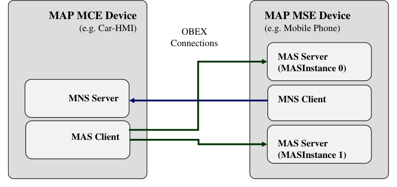

**Figure 3.3: Example for two MAS Instances and its connections**

The following requirements have to be considered:
• MSE device
- MAP is capable of differentiating between Email, SMS, and MMS in one MAS Instance, so an MSE device (taking into consideration the recommendations below) should present its messages by one MAS Instance to minimize the number of OBEX connections required. This MAS Instance shall at least include the SMS and MMS repository of the MSE device if these message types are supported and may also include emails. For this MAS Instance, the value of the related SDP record attribute ‘MASInstanceID’ shall be 0. The MSE device may present its email repository by an additional MAS Instance.
- If an MSE device provides more than one email-account, it should present additional MAS Instance(s) for each of these email accounts to enable the MCE differentiation of the email messages of particular accounts.
- If an MSE device provides more than one subscriber number (e.g., two active SIM cards), it should present additional MAS Instance(s) for each of these subscriber numbers to enable the MCE a differentiation of the SMS/MMS messages of particular subscriber numbers.
- The SDP record attribute ‘ServiceName’ should enable an easy recognition of the related message repository on the MSE device by the user. Nevertheless, as the SDP records may be accessible without pairing, the ‘ServiceName’ should not expose any personal information (e.g., a complete phone number or email address with respect to privacy protection).
- The MSE device shall enable a simultaneous and independent OBEX connection to all provided MAS instances.
- To enable the MCE to re-connect to a once selected MAS-Instance without user interaction, an MSE-Device should keep the MASInstanceIDs in the SDP record constant (see section 7.1.1) and should not change it for different MAP sessions. If a MAS Instance is changed or removed (e.g., related message account deleted), the MSE device should not reuse this MASInstanceID until the maximum ID-number (255) has been reached. In the latter case, the MSE should restart numbering the MASInstanceID from 0, using the smallest available free number.
- For the same reason, the MSE Device should not change the ServiceName for different MAP sessions as long as the user does not change the account name on the MSE.
• MCE device
- An MCE may connect via OBEX to one, several, or all MAS Instances of an MSE device.
- Depending on the implementation, this connection may be automated or may require user interaction. In particular, the MCE may connect without user interaction if:
› there is only one MAS Instance,
› the MCE connects generally to all MAS Instances (e.g., in the case of a watch as a 'Notification Client' signaling all incoming messages), and
› the MCE connection is done based on the message type presented by the SDP record attribute 'SupportedMessageTypes' (e.g., connect to (all) SMS repository(ies)).
- If the MCE cannot select a MAS Instance automatically, the MCE may present a list of the MAS ServiceNames for selection to the user in an appropriate way.

#### 3.1.9 Conversation Listing Object (x-bt/MAP-convo-listing): Version 1.0

Support for ‘Conversation listing’ is advertised in the MapSupportedFeatures bits.
The Conversation-Listing-objects shall be encoded in UTF-8.
The entries of the Conversation-Listing object shall be sorted by the value of the ‘last_activity’ parameter (see below). Sort order shall be in descending order, with the newest message transferred first.
The devices shall ignore all unknown attributes and values of a 'Conversation-Listing' object.
The Conversation-Listing object is defined according to the following DTD (Document Type Definition) [15]:
<!DTD for the MAP Conversation-Listing Object-->
<!DOCTYPE MAP-convo-listing [ <!ELEMENT MAP-convo-listing ( conversation )* > <!ATTLIST MAP-convo-listing version CDATA #FIXED "1.0" > <!ELEMENT conversation (participant)* >
<!ELEMENT conversation EMPTY>
<!ATTLIST conversation id CDATA #REQUIRED name CDATA #REQUIRED last_activity CDATA #IMPLIED read_status (yes|no) "no" #IMPLIED version_counter CDATA #IMPLIED summary CDATA #IMPLIED >
<!ELEMENT participant EMPTY>
<!ATTLIST participant uci CDATA #REQUIRED display_name CDATA #REQUIRED chat_state CDATA #IMPLIED last activity CDATA #IMPLIED x_bt_uid CDATA #IMPLIED name CDATA #IMPLIED presence_availability CDATA #IMPLIED presence_text CDATA #IMPLIED priority CDATA #IMPLIED > ]>
The attributes of a conversation shall comply with the following conventions:
• “id”: The unique identification of the conversation. The format shall comply with the format defined in Section 3.1.6.
• “name”: The name of the conversation. If the conversation has no name, this parameter shall be empty.
• “last_activity”: The datetime of the last activity in this conversation. The format shall comply with the definition in Section 3.1.10. The attribute shall be empty if the last activity of the conversation is unknown.
• “read_status”: The read-status of the conversation. The attribute shall have one of the values ”yes” or “no”, where “yes indicates that the conversation has already been read on the MSE. The attribute shall be empty if the read-status is generally unknown.
• “version_counter”: The Conversation Version Counter is used to determine if something in the conversation has changed. For more details, please refer to Section 3.1.15. The attribute shall be present if the ‘Conversation Version Counters’ feature is supported by the MCE and MSE.
• “summary": The summary of the conversation. This parameter shall not exceed 256 bytes. The content of this parameter is left to the implementer’s decision. Typically it should contain the content of the most recent message. If there is no summary of the conversation, the attribute shall be empty.
The attributes of a conversation participant shall comply with the following conventions:
• “uci”: The value shall be a reference that allows a participant to be uniquely identified by the client associated with this MAS instance (example: 4986925814@s.whateverapp.net).
• “display_name”: The name of the participant as it is intended to be displayed. The name might be different in specific conversations.
• “chat_state”: The current chat state of this participant. The format shall comply with the definition in Section 3.1.12.
• “last_activity”: The datetime of last activity in this participant. The format shall comply with the definition in Section 3.1.10.
• “x_bt_uid”: The globally unique 128-bit identifier of the PBAP contact that corresponds to this participant. This attribute shall be present if the feature ‘PBAP Contact Cross Reference’ is supported by the MSE and MCE and if a corresponding PBAP contact exists.
• “name”: The full formatted name (FN in vCard) of the participant. The attribute shall be empty if there is no full name available for the participant.
• “presence_availability”: The current availability of the conversation participant. The value of the attribute shall comply with the definition in Section 3.1.11. If there is no presence status for that participant, the attribute shall be empty.
• “presence_text”: The user-defined status of the conversation participant. The value of the attribute shall comply with the definition in Section 3.1.11. If there is no user-defined status for that participant, the attribute shall be empty.
• “priority”: The priority of the participant as an integer. This may be a value between 0 and 100, where the value 50 represents the “neutral” priority and 0 represents the lowest priority. The priority of the participant shall be 50 if the priority of the participant is unknown.

|  | <MAP-convo-listing version = "1.0"> |  |
| --- | --- | --- |
|  | <conversation id=”E1E2E3E4F1F2F3F4A1A2A3A4B1B2B3B4” name=”Beergarden |  |
|  | Connection” last activity=”20140612T105430+0100” read status=”no” _ _ |  |
|  | version counter=”A1A1B2B2C3C3D4D5E5E6F6F7A7A8B8B”> _ |  |
|  | <participant uci=”4986925814@s.whateverapp.net” display name=”Tien” _ |  |
|  | chat state=”3” last activity=”20140612T105430+0100”/> _ _ |  |
|  | <participant uci=”4912345678@s.whateverapp.net” display name=”Jonas” _ |  |
|  | chat state=”5” last activity=”20140610T115130+0100”/> _ _ |  |
|  | <participant uci=”4913579864@s.whateverapp.net” display name=”Max” _ |  |
|  | chat state=”2” last activity=”20140608T225435+0100”/> _ _ |  |
|  | <participant uci=”4924689753@s.whateverapp.net” display name=”Nils” _ |  |
|  | chat state=”0” last activity=”20140612T092320+0100”/> _ _ |  |
|  | <participant uci=”4923568910@s.whateverapp.net” display name=”Alex” _ |  |
|  | chat state=”4” last activity=”20140612T104110+0100”/> _ _ |  |
|  | </conversation> |  |
|  | <conversation id=”C1C2C3C4D1D2D3D4E1E2E3E4F1F2F3F4” name=”” |  |
|  | last activity=”20140801T012900+0100” read status=”yes” _ _ |  |
|  | version counter=”0A0A1B1B2C2C3D3D4E4E5F5F6A6A7B7B”> _ |  |
|  | <participant uci=”malo@email.de” display name=”Mari” chat state=”2” _ _ |  |
|  | last activity=”20140801T012900+0100” x bt uid=” _ _ _ |  |
|  | A1A2A3A4B1B2C1C2D1D2E1E2E3E4F1F2”/> |  |
|  | </conversation> |  |
|  | <conversation id=”F1F2F3F4E1E2E3E4D1D2D3D4C1C2C3C4” name=”family” |  |
|  | last activity=”20140925T133700+0100” read status=”yes” _ _ |  |
|  | version counter=”1A1A2B2B3C3C4D4D5E5E6F6F7A7A8B8B”> _ |  |
|  | <participant uci=”malo@email.de” display name=”Mari” chat state=”2” _ _ |  |
|  | last activity=”20140801T012900+0100” x bt uid=” _ _ _ |  |
|  | A1A2A3A4B1B2C1C2D1D2E1E2E3E4F1F2” name=”Mareike Loh” |  |
|  | presence availability=”2” presence text=”Wow it’s hot today” _ _ |  |
|  | priority=”100”/> |  |
|  | <participant uci=”alois.s@august.de” display name=”Lil Al” chat state=”1” _ _ |  |
|  | last activity=”20140801T012800+0100” x bt uid=” _ _ _ |  |
|  | A1A2A3A4B1B2C1C2D1D2E1E2E3E4F1F2” name=”Alois S.” presence availability=”0” _ |  |
|  | presence text=”On my way” priority=”100”/> _ |  |
|  | </conversation> |  |
|  | </MAP-convo-listing> |  |

#### 3.1.10 Timestamps

If the feature ‘UTC Offset Timestamp Format’ is supported, then all timestamps of this MAS instance shall comply with the following format:
- “YYYYMMDDTHHMMSS±HHMM”, where time is local with its UTC offset as specified in ISO 8601 [19].
If the feature ‘UTC Offset Timestamp Format’ is not supported, then timestamps of this MAS instance shall be in the format “YYYYMMDDTHHMMSS”, with local time basis and 24 hours representation as defined in the OBEX “time” header in Section 2.2 of [7].

#### 3.1.11 Presence

The presence of a participant consists of two elements:
- Presence Availability: An unsigned 8-bit value (0-255) from a defined list of possible availability states on the MAP assigned numbers page.
- Presence Text: A user-defined string that contains a description of the current status of the user. It shall be a UTF-8 string with a maximum length of 256 characters.
The MCE shall assume the value 0 (Unknown) when receiving unspecified values.

#### 3.1.12 Chat State

The chat state of a participant is a description of how the participant is currently engaged in chatting. Mostly the chat state information is only valid for one specific conversation.
The chat state is an unsigned 8-bit value (0-255) from a defined list of possible chat states on the MAP assigned numbers page.
The MCE shall assume the value 0 (Unknown) when receiving unspecified values.
3.1.13 Message Extended Data The extended data of a message may be anything that is somehow linked with a message (i.e., someone liked a message, gave +1, number of followers, etc.) The format of the MessageExtendedData shall comply with following format:
- [{ExtendedDataType}:{ExtendedDataValue};]*
The ExtendedDataType and ExtendedDataValue can be found on the MAP assigned numbers page.
The MCE shall ignore unknown ExtendedDataType values it receives.
The following is an example of a message extended data with 54 Facebook likes:
0:54;
The following is an example of multiple extended data in one field (18 Facebook likes, 486 Twitter retweets, 11 Google +1s):
0:18;2:486;3:11;

#### 3.1.14 Database Identifier

If the ‘Database Identifier’ feature is supported by the MSE, it shall generate and store a unique Database Identifier. This identifier is a 128-bit value.
The generation of the Database Identifier is implementation-dependent; however, the Database Identifier should be unique and not reused throughout the lifetime of the server.
This identifier shall be re-generated:
- Every time the database is entirely reset (e.g., after a factory restore, security wipe, or important software update)
- When a ‘Conversation-Listing Version Counter’ rolls over or starts over. This does not apply if the ‘Conversation listing’ feature is not supported.
- When a ‘Conversation Version Counter’ rolls over or starts over. This does not apply if the ‘Conversation listing’ feature is not supported.
- When a ‘Folder Version Counter’ rolls over or starts over.
- When a ‘Contact X-BT-UID’ is reused.
Database Identifiers are necessary to detect if a Version Counter from a previous session can still be used with the current database. If the database had to be reset for a reason, the client will be able to detect this by comparing the Database Identifier of the current session with the one retrieved during a previous session.
A value of 0 for the Database Identifier signifies that the Version Counters are not persistent on the server and that the client should not use these values for caching. Servers using a Database Identifier of 0 or regenerating one at each connection will not benefit from the resulting performance and improved user experience.

#### 3.1.15 Version Counters

The ‘Conversation-Listing Version Counter’, ‘Conversation Version Counter’, and ‘Folder Version Counter’ are used to detect if something has changed. The counters shall be 16 bytes with possible values from 0 to (2128-1)
• Conversation-Listing Version Counter: The version counter shall increment on every completion of changes to the following properties of a conversation (id, name, last_activity, read_status, and summary) in the Conversation-Listing as well as on insertion or removal of conversations. The counter shall not increment on insertion or removal of participants to a conversation nor on changes to attributes of a participant.
• Conversation Version Counter: The version counter shall increment on every completion of changes to the following properties in the Conversation (id, name, last_activity, read_status, and summary) as well as on insertion or removal of conversation participants and messages to that conversation. The counter shall not increment on changes of attributes of a conversation participant.
• Folder Version Counter: The version counter shall increment on every completion of changes to any of the properties in the messages in the selected folder as well as on insertion or removal of messages.
All counters shall not increment if there is no change to the content.
If for some reason any of the counters rolls over or starts over, a new value of the Database Identifier shall be generated. More information can be found on the Database Identifier in Section 3.1.14.
The ‘Conversation-Listing Version Counter’ and ‘Conversation Version Counter’ shall be supported if support for the ‘Conversation Version Counters’ feature is claimed.
The ‘Folder Version Counter’ shall be supported if support for the ‘Folder Version Counter’ feature is claimed.

#### 3.1.16 Conversation ID

Each conversation shall have a unique identification of the conversation. The format shall be:
- A 128 bit value that uniquely identifies a conversation within a single MAS instance, represented by a 32 character ASCII hexadecimal string.

## 4 Message Access Profile Feature

The current profile is composed of several sub-features. For a device to comply with this specification, it shall observe the following implementation requirements table:

|  | Feature |  |  | Support by the MCE |  |  | Support by the MSE |  |
| --- | --- | --- | --- | --- | --- | --- | --- | --- |
| Notification |  |  | C.1 |  |  | M |  |  |
| Browsing |  |  | C.1 |  |  | M |  |  |
| Uploading |  |  | O |  |  | M |  |  |
| Delete |  |  | O |  |  | M |  |  |
| Notification Registration |  |  | C.2 |  |  | M |  |  |
| Instance Information |  |  | O |  |  | M |  |  |
| Extended MAP-Event-Report 1.1 |  |  | C.2 |  |  | M |  |  |
| Extended MAP-Event-Report 1.2 |  |  | O |  |  | M |  |  |
| Message Format Version 1.1 |  |  | O |  |  | M |  |  |
| Messages-Listing Format Version 1.1 |  |  | M |  |  | M |  |  |
| Persistent Message Handles |  |  | O |  |  | O |  |  |
| Database Identifier |  |  | C.3 |  |  | C.3 |  |  |
| Folder Version Counter |  |  | O |  |  | O |  |  |
| Conversation Version Counters |  |  | C.4 |  |  | C.4 |  |  |
| Participant Presence Change Notification |  |  | O |  |  | O |  |  |
| Participant Chat State Change Notification |  |  | O |  |  | O |  |  |
| Notification Filtering |  |  | O |  |  | M |  |  |
| UTC Offset Timestamp Format |  |  | O |  |  | M |  |  |
| Conversation listing |  |  | O |  |  | O |  |  |
| Owner status |  |  | O |  |  | O |  |  |
| Message Forwarding |  |  | O |  |  | O |  |  |

Table 4.1: MAP features
C.1: The MCE shall support at least one of these features.
C.2: Mandatory to support IF ‘Notification’ feature is supported; otherwise Not Applicable (N/A).
C.3: Mandatory to support IF ‘Persistent Message Handles’ OR ‘Folder Version Counter’ feature is supported; otherwise Optional.
C.4: Optional to support IF ‘Conversation listing’ is supported; otherwise Excluded.
Both uploading messages to the MSE and sending messages through the MSE use the Uploading feature. In the case of sending messages through the MSE, the messages shall be uploaded into the 'Outbox' folder of the MSE. In the case of uploading messages to the MSE, the messages shall not be uploaded into the 'Outbox' folder of the MSE, but any other folder is permitted.
Notifying the MCE of the arrival of a new message and sending messages through the MSE are using the Notification feature. In the case of sending messages through the MSE, the MCE shall get a notification when the messages have been sent to the network and thus have been shifted by the MSE from the 'Outbox' to the 'Sent' folder.
Notification Feature
If support for the Notification feature is claimed by the MCE, this feature allows the MSE to send event reports to the MCE (e.g., message arrival notifications):

|  | Feature |  |  | Support by the MCE |  |  | Support by the MSE |  |
| --- | --- | --- | --- | --- | --- | --- | --- | --- |
| SendEvent |  |  | M |  |  | M |  |  |
| SetNotificationFilter |  |  | C.1 |  |  | C.1 |  |  |

Table 4.2: Notification Feature Support
C.1: Mandatory to support IF the “Notification Filtering” feature is supported; otherwise Excluded.
The MSE shall notify the MCE about any change of a Messages-Listing of any folder on the MSE side if it has not been initiated by the MCE itself. For example, if the user deletes a message on the MSE-device directly, this requires a message deletion notification for the related folder, whereas if the user deletes a message via the MCE, no notification shall be sent.
In the case of a message reception from the network, the MSE shall send the related notification of a message arrival only if the MSE has received a complete message. (e.g., last part of a concatenated SMS). Since some push email services only push a fraction of the email to the email client (e.g., email header), the MSE may, for emails, send the notification after receiving only a fraction.
The mode of the Notification may be configured by the MCE using the Notification Registration feature (see Section 4.5). The default mode for the Notification is "off" (i.e., the notification is inactive at the MSE if the MAP session has been started). If the MNS connection is terminated by either device, then the message notification mode shall be set to default mode on MSE (i.e. the notification is inactive).
The NotificationFilter allows to dynamically adjust the need for specific event reports. Please refer to Section 5.14 for additional information.
A function sequence for the Notification feature is illustrated in Figure 4.1 (see also Section 4.6 for definitions of related functions):

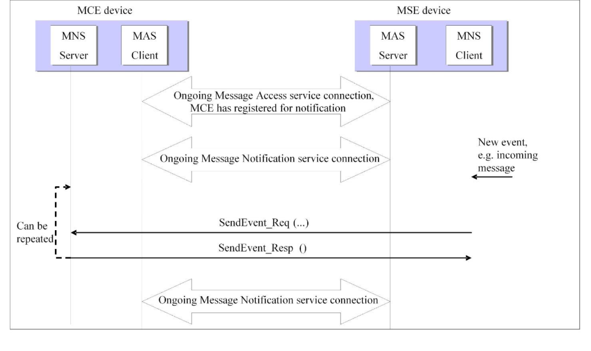

**Figure 4.1: Sequence for the Message Notification feature**

Browsing Feature
This feature allows the MCE to browse messages on the MSE and to retrieve individual messages from the MSE.

|  | Function |  |  | Support by the MCE |  |  | Support by the MSE |  |
| --- | --- | --- | --- | --- | --- | --- | --- | --- |
| UpdateInbox |  |  | O |  |  | M |  |  |
| SetFolder |  |  | M |  |  | M |  |  |
| GetFolderListing |  |  | M |  |  | M |  |  |
| GetMessagesListing |  |  | M |  |  | M |  |  |
| GetMessage |  |  | O |  |  | M |  |  |
| SetMessageStatus |  |  | O |  |  | M |  |  |
| GetConversationListing |  |  | C.1 |  |  | C.2 |  |  |

Table 4.3: Browsing Feature Support
C.1: Mandatory to support IF the bit for the feature “Conversation listing” is set in the MapSupportedFeatures of the MCE; otherwise Excluded.
C.2: Mandatory to support IF the bit for the feature “Conversation listing” is set in the MapSupportedFeatures of the MSE; otherwise Excluded.
A typical function sequence for the Browsing feature is illustrated in Figure 4.2 (see also Section 4.6 for definitions of related functions):

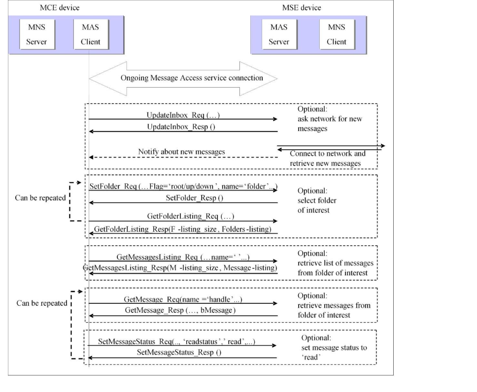

**Figure 4.2: Typical sequence for the Browsing feature**

In the case of a 'GetMessage' applied on a notification-message (e.g., MMS-Notification or email Notification), the MSE shall not deliver the notification-message but shall retrieve the corresponding
message from the network and deliver it with the same message handle as used before for the message- notification. The required sequence is shown in Figure 4.3:

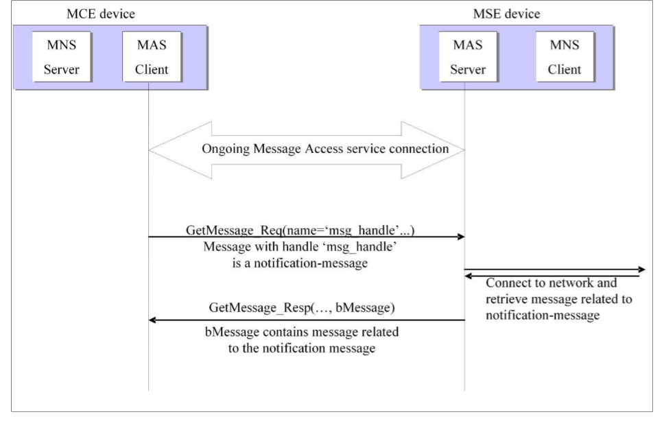

**Figure 4.3: Typical sequence for ‘GetMessage’ applied on a notification-message**

In the case of a 'GetMessage' applied on a message which is not stored completely on the MSE (e.g., in case of a fragmented email as used by some Push-Mail services), the content of the related message cannot be delivered completely within one 'GetMessage' response. In this case, several
requests/responses have to be performed (see also section 5.6). The required sequence is shown in Figure 4.4:

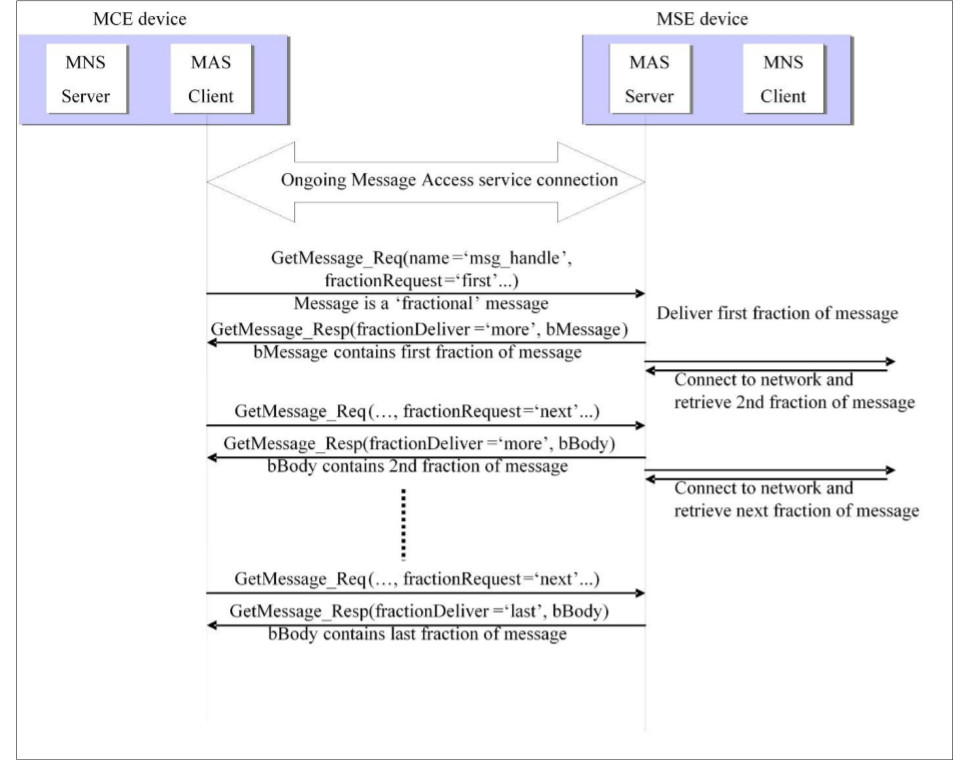

**Figure 4.4: Typical sequence for 'GetMessage' applied on a fractional message**

A function sequence to retrieve a Conversation-Listing is shown in Figure 4.5. The optional and conditional application parameters of the function are not shown in the sequence.

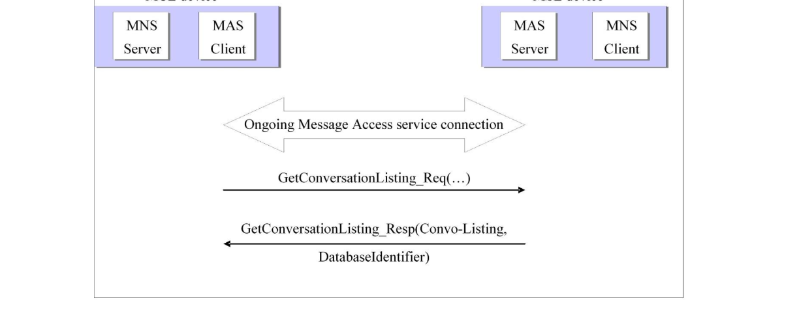

**Figure 4.5: Sequence for retrieving a Conversation-Listing**

Uploading Feature
This feature allows uploading messages from the MCE to the MSE. This feature is used to realize both scenario 3 and 5 (see Section 2.3). However, the MSE may implement policies that disable the sending of messages to the remote network, making sending messages through the MSE impossible to realize.
The feature additionally allows to change the presence and chat state of the owner.

|  | Function |  |  | Support by the MCE |  |  | Support by the MSE |  |
| --- | --- | --- | --- | --- | --- | --- | --- | --- |
| SetFolder |  |  | M |  |  | M |  |  |
| GetFolderListing |  |  | M |  |  | M |  |  |
| PushMessage |  |  | M |  |  | M |  |  |
| GetOwnerStatus |  |  | C.1 |  |  | C.2 |  |  |
| SetOwnerStatus |  |  | C.1 |  |  | C.2 |  |  |

Table 4.4: Uploading Feature Support
C.1: Mandatory to support IF the bit for the feature “Owner Status” is set in the MapSupportedFeatures of the MCE; otherwise Excluded.
C.2: Mandatory to support IF the bit for the feature “Owner Status” is set in the MapSupportedFeatures of the MSE; otherwise Excluded.
A function sequence for the Message Uploading feature is illustrated in Figure 4.6 (see also Section 4.6 for definitions of related functions):

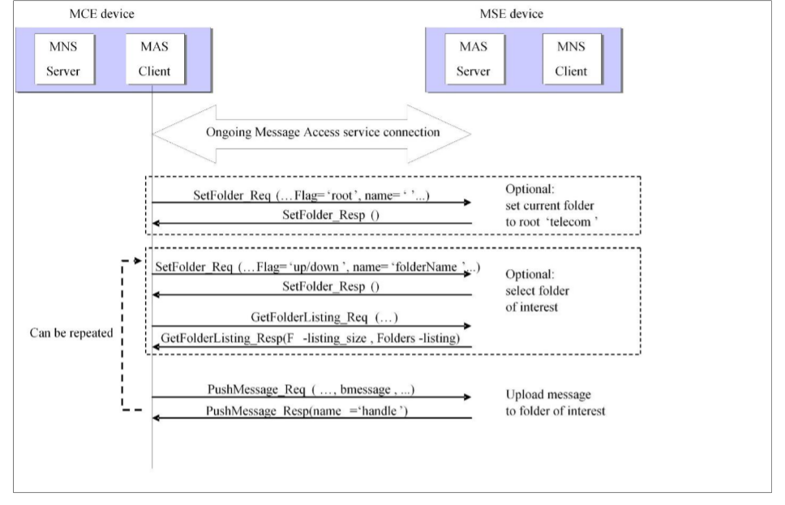

**Figure 4.6: Sequence for the Message Uploading feature**

An exemplary function sequence for a request to change the PresenceAvailability and PresenceText is shown in Figure 4.7:

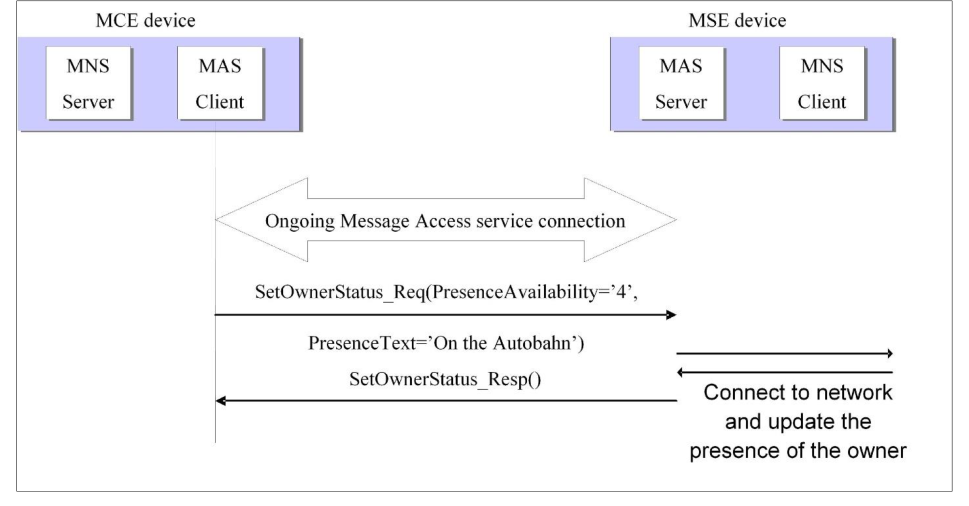

**Figure 4.7: Sequence for the Set Owner Status function**

Delete Feature
This feature allows the MCE to delete messages on the MSE's message repository.

|  | Function |  |  | Support by the MCE |  |  | Support by the MSE |  |
| --- | --- | --- | --- | --- | --- | --- | --- | --- |
| SetMessageStatus |  |  | M |  |  | M |  |  |

Table 4.5: Delete Feature Support
The MSE shall send a ‘MessageDeleted’ event if a message was deleted or a ‘MessageRemoved’ event if a message was irrevocably removed on the MSE using the Event Notification Feature in 4.1 if not declared otherwise by the NotificationFilter 5.14.
A function sequence for the Delete feature is illustrated in Figure 4.8 (see also Section 4.6 for definitions of related functions):

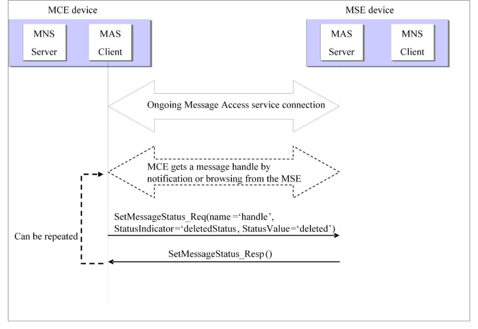

**Figure 4.8: Notification Registration Feature**

Notification Registration Feature
If support for the MAP Notification-Registration feature is claimed by the MSE, this feature allows the MCE to set the Notification mode on the MSE side to:
• "Off", if no notification required
• "On", if notification required (MNS OBEX connection)

|  | Function |  |  | Support by the MCE |  |  | Support by the MSE |  |
| --- | --- | --- | --- | --- | --- | --- | --- | --- |
| SetNotificationRegistration |  |  | M |  |  | M |  |  |

Table 4.6: Notification Registration Feature Support
A function sequence for the Notification-Registration feature is illustrated in Figure 4.9 (see also Section 4.6 for definitions of related functions):

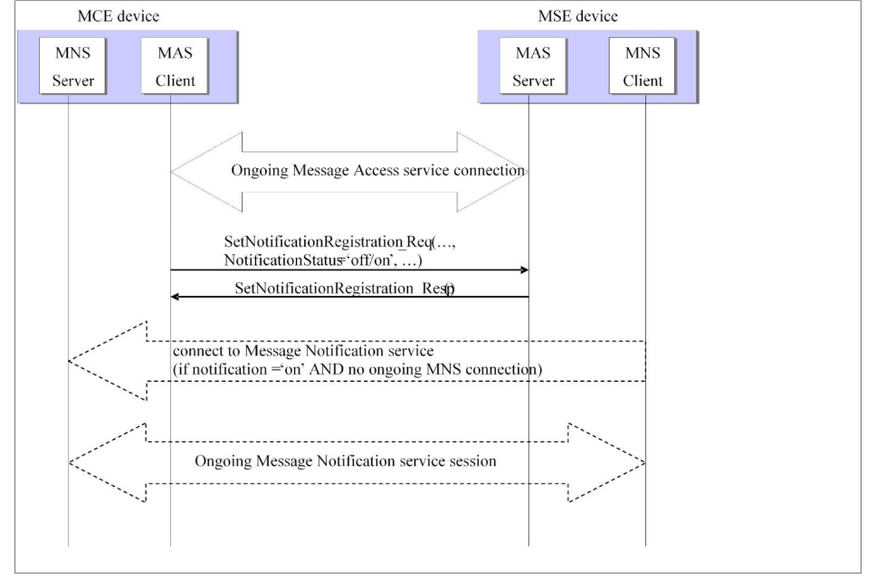

**Figure 4.9: Sequence for the Notification Registration feature**

The MCE has to perform the NotificationRegistration as described in Figure 4.9 using a MAS connection for each MAS Instance it requires notifications from. However, the MSE shall initiate a Message Notification Service connection only if there is no ongoing Message Notification Service connection with the MCE as there shall be only one MNS connection for all MAS Instances (see also Section 3.1.7.2). The MSE shall terminate the Message Notification Service connection when the MCE sets the SetNotificationRegistration to OFF for all connected MAS instances.
Instance Information Feature
If support for the MAP Instance Information feature is claimed by the MSE, this feature allows the MCE to get additional information about any advertised instance.
This includes the MASInstanceInformation string. This text field contains user-readable information about a given MAS Instance. Since this is exchanged over an encrypted link, it may contain additional information compared to the name in the SDP record (See “ServiceName” in Section 7.1.1).
The Instance Information Feature of a MAS may be used to retrieve information about other given MAS Instances advertised by the server in its SDP records.

| Function |  | S | upport by the MCE |  |  | Support by the MSE |  |
| --- | --- | --- | --- | --- | --- | --- | --- |
| GetMASInstanceInformation |  | O |  |  | M |  |  |

Table 4.7: Instance Information Feature Support
A function sequence for the Instance Information feature is illustrated in Figure 4.10 (see also Section 5 for definitions of related functions):
MCE device
MSE device

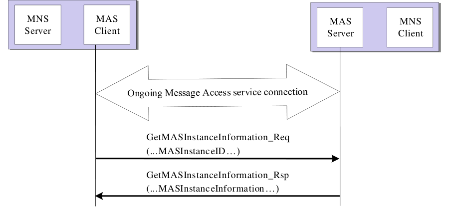

**Figure 4.10: Sequence for the Instance Information feature**

Message Forwarding
This feature allows the MCE to forward messages that reside on the MSE directly to other recipients without the need to download and reupload potential attachment(s) to the MCE. The MCE may prepend text to the existing one or modify/replace existing text content of the original message.

| Function |  |  | Support by the MCE | Support by the MSE |  |
| --- | --- | --- | --- | --- | --- |
| PushMessage |  | M |  | M |  |

Table 4.8: Message Forwarding Feature Support
A function sequence for the Message Forwarding feature is illustrated in Figure 4.11 and Figure 4.12. See also Section 5.8 for the definition of the PushMessage function.

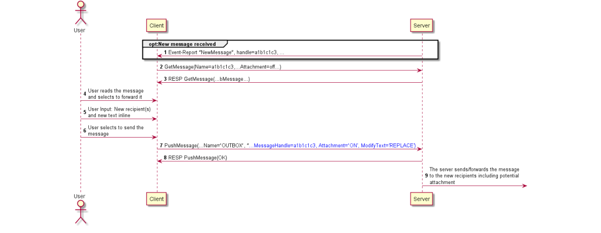

**Figure 4.11: Example sequence for forwarding/sending a message without downloading attachments to the MCE**

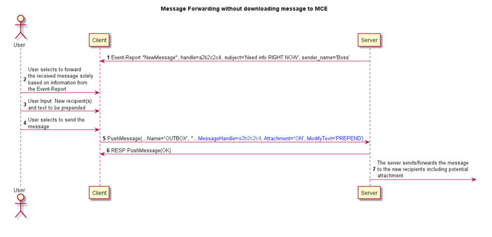

**Figure 4.12: Example sequence for forwarding a message without downloading the message to the MCE**

## 5 Message Access Profile Functions

SendEvent Function
If the MCE supports the Message Notification feature and the MCE has registered itself at the MSE for Notification, the MSE shall use the SendEvent function to notify the MCE on events affecting the messages listings within the MSE's folders structure (e.g., the arrival of new messages).
In the case where the MSE has accepted messages for sending to the network from the MCE (using the Message Uploading feature), the MSE shall notify the MCE of the sending status of these messages using the SendEvent function.
The request is formatted as shown in Table 5.1:

|  | Field/Header |  |  | Name |  |  | Value |  |  | Status |  |
| --- | --- | --- | --- | --- | --- | --- | --- | --- | --- | --- | --- |
| Field Field |  |  | Opcode Packet Length |  |  | PUT (0x02 OR 0x82) Varies |  |  | M M |  |  |
| Header Header Header Header Header |  |  | Connection ID Single Response Mode Type Application Parameters -MASInstanceID Body/End of Body |  |  | Varies 0x01 “x-bt/MAP-event-report” Varies MAP-Event-Report object |  |  | M C.1 M M M |  |  |

Table 5.1: SendEvent Request Format
C.1: Mandatory in the first packet IF GOEP 2.0 or later is used; otherwise Excluded.
The response is formatted as shown in Table 5.2:

|  | Field/Header |  |  | Name |  |  | Value |  |  | Status |  |
| --- | --- | --- | --- | --- | --- | --- | --- | --- | --- | --- | --- |
| Field Field |  |  | Response Code Packet Length |  |  | 0x90 OR 0xA0 OR Error Code Varies |  |  | M M |  |  |
| Header Header |  |  | Single Response Mode Single Response Mode Param |  |  | 0x01 0x01 |  |  | C.1 C.2 |  |  |

Table 5.2: SendEvent Response Format
C.1: The Single Response Mode header is Mandatory IF:
- GOEP 2.0 or later is used, AND
- an SRM header has been received in the previous PUT request, AND
- the response code is success (0x90 OR 0xA0);
otherwise Excluded.
C.2: The Single Response Mode Param header is Optional IF Single Response Mode is used; otherwise Excluded.

#### 5.1.1 Connection ID

The type header shall be used to indicate the connection ID received during the connection establishment in order to signal the recipient of the request which OBEX connection this request belongs to.

#### 5.1.2 Type

The type header shall be used to indicate the type of object to be transmitted:
<x-bt/MAP-event-report> MAP-Event-Report object

#### 5.1.3 Application parameters

For further details, see Section 6.3.1.

##### 5.1.3.1 MASInstanceID

This header shall be used by the MSE to indicate the corresponding ‘MASInstanceID’ of the MAS Instance (see Sections 3.1.7.2 and 7.1). As only one MNS service connection can be established from the MSE device to the MCE, this parameter is required by the MCE to determine for which MAS Instance this event is delivered. For further details, see Section 6.3.1.

#### 5.1.4 Body/EndOfBody

These headers shall contain the MAP-event-report object that is sent by the MSE device.
SetNotificationRegistration Function
If the MCE supports the Message Notification feature, the MCE shall use this function to register itself for being notified of the arrival of new messages.
The request is formatted as shown in Table 5.3:

|  | Field/Header |  |  | Name |  |  | Value |  |  | Status |  |
| --- | --- | --- | --- | --- | --- | --- | --- | --- | --- | --- | --- |
| Field Field |  |  | Opcode Packet Length |  |  | PUT (0x02 OR 0x82) Varies |  |  | M M |  |  |
| Header Header Header Header |  |  | Connection ID Type Application Parameters -NotificationStatus Body/End of Body |  |  | Varies “x-bt/MAP-NotificationRegistration” On/Off Filler-byte 0x30 |  |  | M M M M |  |  |

Table 5.3: SetNotificationRegistration Request Format

|  | Field/Header |  |  | Name |  |  | Value |  |  | Status |  |
| --- | --- | --- | --- | --- | --- | --- | --- | --- | --- | --- | --- |
| Field Field |  |  | Response Code Packet Length |  |  | 0x90 OR 0xA0 OR Error Code Varies |  |  | M M |  |  |

Table 5.4: SetNotificationRegistration Response Format

#### 5.2.1 Connection ID

See Section 5.1.1.

#### 5.2.2 Type

The type header shall be used to indicate the type of object to be transmitted:
<x-bt/MAP-NotificationRegistration>

#### 5.2.3 Application Parameters

For further details, see Section 6.3.1.

##### 5.2.3.1 NotificationStatus

The MCE shall indicate the request for being notified by incoming message events using this parameter. The header shall have either of the values:
- "Off", meaning no notification required
- "On", meaning the notification service (MNS) connection shall be established
For further details, see Section 6.3.1.

#### 5.2.4 Body/EndOfBody

To avoid a PUT with an empty body leading to a 'delete', these headers contain a filler byte. The value of this byte shall be set to 0x30 (="0").
SetFolder Function
If supported, the MCE shall use this function to navigate the folders of the MSE.

|  | Field/Header |  |  | Name |  |  | Value |  |  | Status |  |
| --- | --- | --- | --- | --- | --- | --- | --- | --- | --- | --- | --- |
| Field Field Field Field Header Header |  |  | Opcode Packet Length Flags Constant Connection ID Name |  |  | SETPATH (0x85) Varies Up/Down/Root Reserved (0) Varies Name of the folder |  |  | M M M M M O |  |  |

Table 5.5: SetFolder Request Format
The response is formatted as shown in Table 5.6:

|  | Field/Header |  |  | Name |  |  | Value |  |  | Status |  |
| --- | --- | --- | --- | --- | --- | --- | --- | --- | --- | --- | --- |
| Field Field |  |  | Response Code Packet Length |  |  | 0xA0 OR Error Code 3 |  |  | M M |  |  |

Table 5.6: SetFolder Response Format

#### 5.3.1 Connection ID

See Section 5.1.1.

#### 5.3.2 Flags and Name

These headers shall be used to indicate the folder to be navigated to. Note that the OBEX SetPath Command is the basis for the SetFolder function, where Flags is the third byte of the OBEX request (Section 3.3.6 of [7]). OBEX SetPath only allows for setting the current folder to the root, parent, or a child folder.
For example, in order to set the current folder to "msg", it is necessary to apply SetPath twice: the first is necessary to change into "telecom", and the second is necessary to change into "msg".
The usage of the OBEX Flags and Name header is summarized in Table 5.7:

|  |  |  |  | Go back to root |  |  | Go down 1 level |  |  | Go up 1 level |  |
| --- | --- | --- | --- | --- | --- | --- | --- | --- | --- | --- | --- |
| Flags / Bit 0: |  |  | 0 |  |  | 0 |  |  | 1 |  |  |
|  | Bit 1 (*): |  |  | 1 |  |  | 1 |  |  | 1 |  |
| Bit 2~7: |  |  | 0 |  |  | 0 |  |  | 0 |  |  |
| Name header |  |  | Mandatory empty |  |  | Mandatory Name of child folder |  |  |  | Optional: |  |
|  |  |  |  |  |  |  |  |  |  | Name of child folder, |  |
|  |  |  |  |  |  |  |  |  |  | omitted, or empty. |  |

|  |  |  |  | Go back to root |  |  | Go down 1 level |  |  | Go up 1 level |  |
| --- | --- | --- | --- | --- | --- | --- | --- | --- | --- | --- | --- |
| Flags / Bit 0: |  |  | 0 |  |  | 0 |  |  | 1 |  |  |
|  | Bit 1 (*): |  |  | 1 |  |  | 1 |  |  | 1 |  |
| Description |  |  | Reset to the root directory |  |  | Go down one level into this directory name, relative to the current directory |  |  | When name is not present or empty: Go to parent directory (equivalent to “cd ..” on some systems). When name is present: Go up one level before applying name (equivalent to "cd ../name" on some systems). |  |  |

Table 5.7: Usage of OBEX Flags and Name header
(*) The creation of new directories on the MSE is not a feature of MAP, so the MCE shall set Bit1=1.
GetFolderListing Function
If supported, the MCE shall use this function to retrieve the Folder-Listing object from the current folder of the MSE.
The request is formatted as shown in Table 5.8:

|  | Field/Header |  |  | Name |  |  | Value |  |  | Status |  |
| --- | --- | --- | --- | --- | --- | --- | --- | --- | --- | --- | --- |
| Field Field |  |  | Opcode Packet Length |  |  | GET (0x03 OR 0x83) Varies |  |  | M M |  |  |
| Header Header Header Header Header |  |  | Connection ID Single Response Mode Single Response Mode Param Type Application Parameters - MaxListCount - ListStartOffset |  |  | Varies 0x01 0x01 “x-obex/folder-listing” Varies Varies |  |  | M C.1 C.2 M O O |  |  |

Table 5.8: GetFolderListing Request Format
C.1: The Single Response Mode header is Mandatory in the first packet IF GOEP 2.0 or later is used; otherwise Excluded.
C.2: The Single Response Mode Param header is Optional IF Single Response Mode is used; otherwise Excluded.

|  | Field/Header |  |  | Name |  |  | Value |  |  | Status |  |
| --- | --- | --- | --- | --- | --- | --- | --- | --- | --- | --- | --- |
| Field Field |  |  | Response Code Packet Length |  |  | 0x90 OR 0xA0 OR Error Code Varies |  |  | M M |  |  |
| Header Header Header Header |  |  | Single Response Mode Single Response Mode Param Application Parameters - FolderListingSize Body/End of Body |  |  | 0x01 0x01 Varies Folder-Listing object |  |  | C.1 C.2 C.3 C.4 |  |  |

Table 5.9: GetFolderListing Response Format
C.1: The Single Response Mode header is Mandatory IF:
- GOEP 2.0 or later is used, AND
- an SRM header has been received in the previous GET request, AND
- the response code is success (0x90 OR 0xA0);
otherwise Excluded.
C.2: The Single Response Mode Param header is Optional IF Single Response Mode is used; otherwise Excluded.
C.3: Mandatory IF the response code is success (0x90 OR 0xA0) AND the request contained MaxListCount = 0; otherwise Excluded.
C.4: Mandatory IF the response code is success (0x90 OR 0xA0) AND the request did not contain MaxListCount = 0; otherwise Excluded.

#### 5.4.1 Connection ID

See Section 5.1.1.

#### 5.4.2 Type

The type header shall be used to indicate the type of object to be received.
<x-obex/folder-listing>     Folder-Listing object.

#### 5.4.3 Application Parameters

For further details, see Section 6.3.1.

##### 5.4.3.1 MaxListCount

This header may be used to indicate the maximum number of folders listed in the <x-obex/folder-listing> object. The maximum number of entries shall be 1024 if this header is not specified.
This header may be used to indicate the offset of the first entry of the returned Folder-Listing object compared to the first entry of the Folder-Listing object that would be returned if the ListStartOffset parameter was not specified in the request. For example, if ListStartOffset is 5, then the first five listing entries are not delivered. The offset shall be 0 if this header is not specified.

##### 5.4.3.3 FolderListingSize

This application parameter shall be used in the response if the value of MaxListCount in the request is 0. In this case, the parameter shall report the actual number of accessible folders in the current folder of the MSE. If MaxListCount = 0, the MSE shall ignore all other application parameters that may be present in the request. The response shall not contain any Body header.

#### 5.4.4 Body/EndOfBody

If the request gas been successful, these headers shall contain the <x-obex/folder-listing> object that is sent by the MSE device.
GetMessagesListing Function
If supported, the MCE shall use this function to retrieve Messages-Listing objects from the MSE.
The request is formatted as shown in Table 5.10:

|  | Field/Header |  |  | Name |  |  | Value |  |  | Status |  |
| --- | --- | --- | --- | --- | --- | --- | --- | --- | --- | --- | --- |
| Field Field |  |  | Opcode Packet Length |  |  | GET (0x03 OR 0x83) Varies |  |  | M M |  |  |

|  | Field/Header |  |  | Name |  |  | Value |  |  | Status |  |
| --- | --- | --- | --- | --- | --- | --- | --- | --- | --- | --- | --- |
|  | Header |  |  | Connection ID |  |  | Varies |  |  | M |  |
|  | Header |  |  | Single Response Mode |  |  | 0x01 |  |  | C.1 |  |
|  | Header |  |  | Single Response Mode Param |  |  | 0x01 |  |  | C.2 |  |
|  | Header |  |  | Type |  |  | “x-bt/MAP-msg-listing” |  |  | M |  |
|  | Header |  |  | Name |  |  | Name of the folder |  |  | M |  |
|  | Header |  |  | Application Parameters |  |  |  |  |  |  |  |
|  |  |  |  | - MaxListCount |  |  | Varies |  |  | O |  |
|  |  |  |  | - ListStartOffset |  |  | Varies |  |  | O |  |
|  |  |  |  | - SubjectLength |  |  | Varies |  |  | O |  |
|  |  |  |  | - ParameterMask |  |  | Varies |  |  | O |  |
|  |  |  |  | - FilterMessageType |  |  | Varies |  |  | O |  |
|  |  |  |  | - FilterPeriodBegin |  |  | Varies |  |  | O |  |
|  |  |  |  | - FilterPeriodEnd |  |  | Varies |  |  | O |  |
|  |  |  |  | - FilterReadStatus |  |  | Varies |  |  | O |  |
|  |  |  |  | - FilterRecipient |  |  | Varies |  |  | O |  |
|  |  |  |  | - FilterOriginator |  |  | Varies |  |  | O |  |
|  |  |  |  | - FilterPriority |  |  | Varies |  |  | O |  |
|  |  |  |  | - ConversationID |  |  | Varies |  |  | O |  |
|  |  |  |  | - FilterMessageHandle |  |  | Varies |  |  | O |  |

Table 5.10: GetMessageListing Request Format
C.1: The Single Response Mode header is Mandatory in the first packet IF GOEP 2.0 or later is used; otherwise Excluded.
C.2: The Single Response Mode Param header is Optional IF Single Response Mode is used; otherwise Excluded.

|  | Field/Header |  |  | Name |  |  | Value |  |  | Status |  |
| --- | --- | --- | --- | --- | --- | --- | --- | --- | --- | --- | --- |
| Field Field |  |  | Response Code Packet Length |  |  | 0x90 OR 0xA0 OR Error Code Varies |  |  | M M |  |  |
|  | Header |  |  | Single Response Mode |  |  | 0x01 |  |  | C.1 |  |
|  | Header |  |  | Single Response Mode Param |  |  | 0x01 |  |  | C.2 |  |
|  | Header |  |  | Application Parameters |  |  |  |  |  |  |  |
|  |  |  |  | - NewMessage |  |  | Varies |  |  | C.3 |  |
|  |  |  |  | - MSETime |  |  | Varies |  |  | C.3 |  |
|  |  |  |  | - ListingSize |  |  | Varies |  |  | C.3 |  |
|  |  |  |  | - DatabaseIdentifier |  |  | Varies |  |  | C.4 |  |
|  |  |  |  | - FolderVersionCounter |  |  | Varies |  |  | C.5 |  |
|  | Header |  |  | End of Body |  |  | Messages-Listing object |  |  | C.3 |  |

Table 5.11: GetMessageListing Response Format
C.1: The Single Response Mode header is Mandatory IF:
- GOEP 2.0 or later is used, AND
- an SRM header has been received in the previous GET request, AND
- the response code is success (0x90 OR 0xA0);
otherwise Excluded.
C.2: The Single Response Mode Param header is Optional IF Single Response Mode is used; otherwise Excluded.
C.3: Mandatory IF the response code is success (0x90 OR 0xA0); otherwise Excluded.
C.4: Mandatory IF ‘Database Identifier’ is supported; otherwise Optional.
C.5: Mandatory IF ‘Folder Version Counter’ is supported and ConversationID is not present in the request; otherwise Optional.

#### 5.5.1 Connection ID

See Section 5.1.1.

#### 5.5.2 Name

This property shall be used to indicate the folder from which the Messages-Listing object is to be retrieved. The property shall be empty in case the desired listing is that of the current folder or shall be the name of a child folder (this may be any folder from the <x-obex/folder-listing> object). Thus, the value shall not include any path information.

#### 5.5.3 Type

The type header shall be used to indicate the type of object to be retrieved:
<x-bt/MAP-msg-listing>      Messages-Listing object

#### 5.5.4 Application Parameters

For further details, see Section 6.3.1.

##### 5.5.4.1 MaxListCount

This header may be used to indicate the maximum number of messages listed in the Messages-Listing object. The number of messages in the list shall not exceed the limit specified by this parameter. The maximum number of entries shall be 1024 if this header is not specified. The MessageListing object shall contain MaxListCount entries if enough entries exist, starting from ListStartOffset. For example, a request with 'ListStartOffset' = 0 and 'MaxListCount'=100 delivers the 100 most recent messages in chronological descending order.
If 'MaxListCount'=0 is in the request, the MSE shall respond with the headers "NewMessage, MSETime”, "ListingSize", “DatabaseIdentifier”, and “FolderVersionCounter" only (see descriptions of these headers below) and shall not deliver a Messages-Listing object.

##### 5.5.4.2 ListStartOffset

This header may be used to indicate the offset of the first entry of the returned MessagesListing object. For example, if ListStartOffset is 5, then the first five messages are not delivered. The offset shall be 0 if this header is not specified.

##### 5.5.4.3 SubjectLength

This header may be used to indicate the maximum string-length of the "subject" parameter in the entries of the Messages-Listing object. The value range shall be 1–255.

##### 5.5.4.4 ParameterMask

This header may be used to indicate the parameters contained in the requested Messages-Listing objects. The MCE can use this header to receive only the relevant content of the requested Messages- Listing objects.
If this header is not specified or carries the value 0, the MSE shall return all parameters of the Messages- Listing object DTD (see Section 3.1.6) labeled as "REQUIRED" and may return all other attributes. The message handle shall always be present.

| Bit 0 | subject |
| --- | --- |
| Bit 1 | datetime |
| Bit 2 | sender name _ |
| Bit 3 | sender addressing _ |
| Bit 4 | recipient name _ |

| Bit 5 | recipient addressing _ |
| --- | --- |
| Bit 6 | type |
| Bit 7 | size |
| Bit 8 | reception status _ |
| Bit 9 | text |
| Bit 10 | attachment size _ |
| Bit 11 | priority |
| Bit 12 | read |
| Bit 13 | sent |
| Bit 14 | protected |
| Bit 15 | replyto addressing _ |
| Bit 16 | delivery status _ |
| Bit 17 | conversation id _ |
| Bit 18 | conversation name _ |
| Bit 19 | direction |
| Bit 20 | attachment mime _ |
| Bits 21–31 | Reserved for Future Use |

Table 5.12: Bits definition
Bit i=1 indicates that the parameter related to Bit i shall be present in the requested Messages-Listing. The reserved bits shall be set to 0 by MCE and discarded by MSE.
Annotation Filtering (attributes below): The filter operations related to the filter parameters listed below shall be used as AND filtering, so the messages returned in the MessagesListing object have to fulfill all filter conditions defined in the request. If list-segmentation with MaxListCount/ListStartOffset is requested in combination with filter-operations, then the filter-operations shall be applied first. The segmentation shall subsequently be applied onto the filtering result, which shall be a message-list sorted chronologically in descending order.

##### 5.5.4.5 FilterMessageType

This application parameter may be used to filter the messages that are returned in the Messages-Listing object by message type.
These application parameters may be used to filter the messages that are returned in the Messages- Listing object by delivery date.
If the feature ‘UTC Offset Timestamp Format’ is supported, then the two parameters shall be formatted in accordance to Section 3.1.10. If the feature ‘UTC Offset Timestamp Format’ is not supported, then the two parameters shall be formatted in "YYYYMMDDTHHMMSS" as defined for the OBEX "time" header in Section 2.2 of [7] (Local Time time basis). If "FilterPeriodBegin" is not specified, the returned message listing shall include the messages older than "FilterPeriodEnd". If "FilterPeriodEnd" is not specified, the returned message listing shall include the messages from "FilterPeriodBegin" to current time.
If both parameters are not specified, no messages shall be filtered out by these parameters.
If the value of "FilterPeriodBegin" is larger than the value of "FilterPeriodEnd", no messages shall be delivered.

##### 5.5.4.7 FilterReadStatus

This application parameter may be used to filter the messages that are returned in the MessagesListing object by read-status. The parameter shall have a value of "read", "unread", or "no-filtering".

##### 5.5.4.8 FilterRecipient

This application parameter may be used to filter the messages that are returned in the Messages-Listing object by message-recipient. A related bMessage shall be included in the listing if the delivered FilterRecipient string matches a sub-string of one of the vCard attributes "N", "TEL", and "EMAIL" of at least one <bmessage-recipient> contained by this message. This parameter shall not be used if the MCE intends to select messages with any recipient. The text string in this application parameter shall be coded in UTF-8.

##### 5.5.4.9 FilterOriginator

This application parameter may be used to filter the messages that are returned in the Messages-Listing object by message-originator. A related bMessage shall be included in the listing if the delivered FilterOriginator string matches a sub-string of one of the vCard attributes "N", "TEL", and "EMAIL" of the <bmessage-originator> contained by this message. This parameter shall not be used if the MCE intends to select messages with any originator. The text string in this application parameter shall be coded in UTF-8.

##### 5.5.4.10 FilterPriority

This application parameter may be used to filter the messages that are returned in the Messages-Listing object by priority. The parameter shall have a value of "high", "non-high", or "no-filtering".

##### 5.5.4.11 NewMessage

If the request has been successful, the MSE shall use this parameter to indicate the presence of unread messages in the listing using this parameter. The parameter shall have a value of "Off" (meaning no unread messages) or "On" (meaning unread messages are present). For further details, see Section 6.3.1.

##### 5.5.4.12 MSETime

If the request has been successful, this application parameter shall be used in the response to report the Local Time basis of the MSE and its UTC offset, so the MCE is supported in interpreting the timestamps
of the messages listing entries. The format shall be "YYYYMMDDTHHMMSS±hhmm" (e.g., for Central European Time (CET), the offset is UTC+1h, so the delivered value is "YYYYMMDDTHHMMSS+0100" where "YYYYMMDDTHHMMSS" is the current CET timestamp of the MSE). If the MSE device has no information about the current UTC time, the offset value shall not be delivered, so the delivered parameter is "YYYYMMDDTHHMMSS". For further details, see Section 6.3.1.

##### 5.5.4.13 ListingSize

If the request has been successful, this application parameter shall be used in the response to report the number of accessible messages in the corresponding folder fulfilling the filter parameters (if present) as described above. If MaxListCount = 0, the MSE shall ignore the request-parameters "ListStartOffset", "SubjectLength", and "ParameterMask". In this case, the response shall not contain the Body header with the <x-bt/msg-listing> object.

##### 5.5.4.14 Database Identifier

See Section 3.1.14.

##### 5.5.4.15 ConversationID

This application parameter may be used to filter the messages that are returned in the MessagesListing object by conversation IDs.
If this application parameter holds a value, the MessageListing object in the response shall contain all messages with this specific conversation ID from all available folders. In the MessageListing object of the response, the direction attribute shall reflect the direction of that message (see Section 3.1.6).
If this application parameter holds a value, the name header shall not hold a value and shall be ignored by the MSE.

##### 5.5.4.16 FolderVersionCounter

This application parameter shall only be returned if all of the conditions are fulfilled:
• The ‘Folder Version Counter’ MSE and MCE feature bits are both set, AND
• the request contained ‘MaxListCount=0’, AND
• the request did not contain ConversationID, AND
• the request has been successful.
The application parameter is used to detect if something has changed in the selected virtual folder. The folder version counter shall increment on every completion of changes to any of the properties in the messages in the selected folder as well as on insertion or removal of entries. The counter shall not increment if there is no change to the content and shall not take filtering into account.
If for some reason the ‘Folder Version Counter’ rolls over or starts over, a new value of the Database Identifier shall be generated. More information can be found on the Database Identifier in Section 3.1.14.

##### 5.5.4.17 FilterMessageHandle

This application parameter may be used to filter the messages that are returned in the MessagesListing object by a message handle.
If this application parameter holds a value, the MessageListing object in the response shall contain only the messages with this specific message handle. In the MessageListing object in the response, the direction attribute shall reflect the direction of that message (see Section 3.1.6.1).
If this application parameter holds a value, all other application parameters aside from ParameterMask and SubjectLength shall not be present.
If this application parameter holds a value, the name header shall not hold a value and shall be ignored by the MSE. The MSE shall consider the whole message repository to be independent of the current selected folder.

#### 5.5.5 Body/EndOfBody

If the request has been successful, these headers shall contain the <x-bt/msg-listing> object that is sent by the MSE device. If MaxListCount = 0 in the request, this parameter shall not be present in the response.
GetMessage Function
This function retrieves a specific message from the MSE device. The request is formatted as shown in Table 5.13:

|  | Field/Header |  |  | Name |  |  | Value |  |  | Status |  |
| --- | --- | --- | --- | --- | --- | --- | --- | --- | --- | --- | --- |
| Field Field |  |  | Opcode Packet Length |  |  | GET (0x03 OR 0x83) Varies |  |  | M M |  |  |
|  | Header |  |  | Connection ID |  |  | Varies |  |  | M |  |
|  | Header |  |  | Single Response Mode |  |  | 0x01 |  |  | C.1 |  |
|  | Header |  |  | Single Response Mode Param |  |  | 0x01 |  |  | C.2 |  |
|  | Header |  |  | Name |  |  | Message Handle |  |  | M |  |
|  | Header |  |  | Type |  |  | “x-bt/message” |  |  | M |  |
|  | Header |  |  | Application Parameters |  |  |  |  |  |  |  |
|  |  |  |  | - Attachment |  |  | Varies |  |  | M |  |
|  |  |  |  | - Charset |  |  | Varies |  |  | M |  |
|  |  |  |  | - FractionRequest |  |  | Varies |  |  | O |  |

Table 5.13: GetMessage Request Format
C.1: The Single Response Mode header is Mandatory in the first packet IF GOEP 2.0 or later is used; otherwise Excluded.
C.2: The Single Response Mode Param header is Optional IF Single Response Mode is used; otherwise Excluded.

|  | Field/Header |  |  | Name |  |  | Value |  |  | Status |  |
| --- | --- | --- | --- | --- | --- | --- | --- | --- | --- | --- | --- |
| Field Field |  |  | Response Code Packet Length |  |  | 0x90 OR 0xA0 OR Error Code Varies |  |  | M M |  |  |
|  | Header |  |  | Single Response Mode |  |  | 0x01 |  |  | C.1 |  |
|  | Header |  |  | Single Response Mode Param |  |  | 0x01 |  |  | C.2 |  |
|  | Header |  |  | Application Parameters |  |  |  |  |  |  |  |
|  |  |  |  | - FractionDeliver |  |  | Varies |  |  | C.3 |  |
|  | Header |  |  | Body/End of Body |  |  | bMessage object |  |  | C.4 |  |

Table 5.14: GetMessage Response Format
C.1: The Single Response Mode header is Mandatory IF:
- GOEP 2.0 or later is used, AND
- an SRM header has been received in the previous GET request, AND
- the response code is success (0x90 OR 0xA0);
otherwise Excluded.
C.2: The Single Response Mode Param header is Optional IF Single Response Mode is used; otherwise Excluded.
C.3: This parameter shall be present only IF the request has been successful and the 'Fraction Request' parameter has been present in the request, otherwise Excluded.
C.4: Mandatory IF the response code is success (0x90 OR 0xA0); otherwise Excluded.

#### 5.6.1 Connection ID

See Section 5.1.1.

#### 5.6.2 Name

The Name header shall be used to indicate the handle of the message to be retrieved. The handle shall be represented by a null-terminated Unicode text string with 16 hexadecimal digits.

#### 5.6.3 Type

The type header shall be used to indicate the type of object to be retrieved. The value shall be set to the following setting:
<x-bt/message>    bMessage object

#### 5.6.4 Application parameters

For more details, see Section 6.3.1.
This application parameter shall be used to determine the transcoding of the textual parts of the delivered bMessage-content as described in Section 3.1.3. The value shall be either
• <native> if the message object shall be delivered without transcoding
• <UTF-8> if the message text shall be transcoded to UTF-8 by the before delivery
As described in Section 3.1.3, the following requirements shall be fulfilled:
• If the message is an email, MMS, or IM, the only value shall be <UTF-8>, as textual parts of these message types shall always be transcoded. The MSE shall reject a request with value <native> in this case.
• If the message is an SMS, both values are possible:
- <native> initiates the delivery of the overall SMS PDU embedded in the bMessage object without any transcoding.
- <UTF-8> initiates the delivery of the textual part of the SMS only, transcoded to UTF-8. The MSE shall reject a request with value <UTF-8> if the message does not include textual content

##### 5.6.4.2 Attachment

This application parameter shall be used if the attachment(s) (if any) of a message is to be included in the bMessage object returned by the MSE. The value of this parameter is "Off" (no attachments) or "On" (attachments to be delivered).
The following applies:
- Parameter “Off” (no attachments): The MSE shall remove any element with a MIME type different than “text/…” from the bMessage body content before sending the bMessage body in the response.
- Parameter “On” (attachments to be delivered): The MSE shall send the body of the bMessage including any MIME type in the response.

##### 5.6.4.3 FractionRequest

This application parameter may be used if the message is a fractioned email as applied for some push- email services (see also Section 3.1.6 "reception_status") and shall not be used otherwise. In this case, several requests are required to retrieve the overall bMessage object. The value shall be either:
• <first> when the first email fraction of the message object shall be delivered. This value shall be used by the MCE in its first GetMessage request on a particular bMessage.
• <next> when the email fraction following the fraction of the previous GetMessage request shall be delivered by the MSE.
The response of the MSE on a request with value <first> shall deliver a bMessage with all parameters as defined in Section 3.1.3 with exactly one bBody object containing the first fraction of the email.
The response of the MSE on a request with value <next> shall deliver only a bBody object as defined in Section 3.1.3 containing the next fraction of the email.
If the message affected is a fractioned email but this application parameter is not present in the request, the MSE shall load the overall message from the network and deliver the message completely.
To give the best user experience, an MCE should always use the FractionRequest with the value <first> for messages with "reception_status" different from "complete". This is to avoid fetching unneeded data from the network. The user should manually trigger any further download of the message.
The MCE should be aware that a request using the <next> value can fail for messages that cannot be directly concatenated after a download of the next part (e.g., if it leads to changes of the message parts already transferred). It is recommended to do a getMessage(FractionRequest) with the value <first> for the first part of the message, and a getMessage() with no FractionRequest value to get the entire message.

##### 5.6.4.4 FractionDeliver

This application parameter shall be present if the 'Fraction Request' parameter has been present in the related GetMessage request and shall not be used otherwise. The value shall be one of the following:
• <more> when an email fraction is delivered and there are other fractions following this one.
• <last> when the last email fraction of the message object is delivered.

#### 5.6.5 Body/EndOfBody

If the request has been successful, these headers shall contain the body of the bMessage that is returned by the MSE device (see x-bt/message defined in Section 3.1.3). The message may be in its original form, or it may have been stripped of all its attachments, depending on the value of the application parameter "Attachment" in the request.
In the case of a request on a fractioned email with 'Fraction Request' value <next> (see above), this header shall return a bBody object only (see x-bt/message defined in Section 3.1.3).
SetMessageStatus Function
The function allows the MCE to modify the status of a message on the MSE.
The request is formatted as shown in Table 5.15:

|  | Field/Header |  |  | Name |  |  | Value |  |  | Status |  |
| --- | --- | --- | --- | --- | --- | --- | --- | --- | --- | --- | --- |
| Field Field |  |  | Opcode Packet Length |  |  | PUT (0x02 OR 0x82) Varies |  |  | M M |  |  |

|  | Field/Header |  |  | Name |  |  | Value |  |  | Status |  |
| --- | --- | --- | --- | --- | --- | --- | --- | --- | --- | --- | --- |
|  | Header |  |  | Connection ID |  |  | Varies |  |  | M |  |
|  | Header |  |  | Name |  |  | Message Handle |  |  | M |  |
|  | Header |  |  | Type |  |  | “x-bt/messageStatus” |  |  | M |  |
|  | Header |  |  | Application Parameters |  |  |  |  |  |  |  |
|  |  |  |  | - StatusIndicator |  |  | Varies |  |  | M |  |
|  |  |  |  | - StatusValue |  |  | Varies |  |  | M |  |
|  |  |  |  | - ExtendedData |  |  | Varies |  |  | O |  |
|  | Header |  |  | End of Body |  |  | Filler-byte 0x30 |  |  | M |  |

Table 5.15: SetMessageStatus Request Format
The response is formatted as shown in Table 5.16:

|  | Field/Header |  |  | Name |  |  | Value |  |  | Status |  |
| --- | --- | --- | --- | --- | --- | --- | --- | --- | --- | --- | --- |
| Field Field |  |  | Response Code Packet Length |  |  | 0x90 OR 0xA0 OR Error Code Varies |  |  | M M |  |  |

Table 5.16: SetMessageStatus Response Format

#### 5.7.1 Connection ID

See Section 5.1.1.

#### 5.7.2 Name

The Name header shall contain the handle of the message, whose status shall be modified. The handle shall be represented by a null-terminated Unicode text string with 16 hexadecimal digits.

#### 5.7.3 Type

The type header shall be used to indicate the type of object to be sent.
<x-bt/messageStatus>

#### 5.7.4 Application Parameters

For more details, see Section 6.3.1.
This header shall be used to indicate which status information is to be modified. The parameter value shall be one of the following:
- "readStatus" for the Read status
- "deletedStatus" for the Deleted status
- “SetExtendedData” for Extended Message Data

##### 5.7.4.2 StatusValue

This header shall be used to indicate the new value of the status indicator to be modified. The parameter shall have one of the values depending on the StatusIndicator:
- "yes" (=read) or "no" (=unread) for the "readStatus" indicator
- "yes" (=deleted) or "no" (=undeleted) for the "deletedStatus" indicator
Changing the status of a message can initiate actions on the MSE. The following rules shall be applied after the modification:
- Messages in any MSE folder whose deletedStatus have been set from "no" (non-deleted) to "yes" (deleted) shall be shifted by the MSE to the "Deleted" folder.
- Messages in the 'Deleted' folder whose deletedStatus have been set from "yes" (deleted) to "no" (un-deleted) shall be shifted by the MSE to the "Inbox" folder. The MSE device may then shift the message to the folder in which the message was originally located before the delete and send a message shift event.

##### 5.7.4.3 ExtendedData

The new value of the extended data. Please refer to Section 3.1.13 for additional information.
This application parameter shall only be present if the extendedData of a message shall be changed on the MSE and the StatusIndicator application parameter contains the value “SetExtendedData”.

#### 5.7.5 Body/EndOfBody

To avoid PUT with empty Body leading to a 'delete' of the related message, these headers shall contain a filler byte. The value of this byte shall be set to 0x30 (="0").
PushMessage Function
This function allows an MCE to push a message to a folder or conversation of the MSE.
When this function is used to add a Message object to a conversation:
- a preceding SetFolder operation is not required;
- the storing of the message on the MSE is implementation specific.

|  | Field/Header |  |  | Name |  |  | Value |  |  | Status |  |
| --- | --- | --- | --- | --- | --- | --- | --- | --- | --- | --- | --- |
| Field Field |  |  | Opcode Packet Length |  |  | PUT (0x02 OR 0x82) Varies |  |  | M M |  |  |
|  | Header |  |  | Connection ID |  |  | Varies |  |  | M |  |
|  | Header |  |  | Single Response Mode |  |  | 0x01 |  |  | C.1 |  |
|  | Header |  |  | Type |  |  | “x-bt/message” |  |  | M |  |
|  | Header |  |  | Name |  |  | Name of the Folder |  |  | M |  |
|  | Header |  |  | Application Parameters |  |  |  |  |  |  |  |
|  |  |  |  | - Transparent |  |  | Varies |  |  | O |  |
|  |  |  |  | - Retry |  |  | Varies |  |  | O |  |
|  |  |  |  | - Charset |  |  | Varies |  |  | M |  |
|  |  |  |  | - ConversationID |  |  | Varies |  |  | O |  |
|  |  |  |  | - Message Handle |  |  | Varies |  |  | C.2 |  |
|  |  |  |  | - Attachment |  |  | Varies |  |  | C.3 |  |
|  |  |  |  | - ModifyText |  |  | Varies |  |  | C.3 |  |
|  | Header |  |  | End of Body |  |  | bMessage |  |  | M |  |

Table 5.17: PushMessage Request Format
C.1: The Single Response Mode header is Mandatory in the first packet IF GOEP 2.0 or later is used; otherwise Excluded.
C.2: This application parameter is Optional IF the feature ‘Message Forwarding’ is supported by both the MSE and MCE, which are communicating with one another; otherwise Excluded.
C.3: These application parameters are Mandatory IF the application parameter MessageHandle is present in the request; otherwise Excluded.
The response is formatted as shown in Table 5.18:

|  | Field/Header |  |  | Name |  |  | Value |  |  | Status |  |
| --- | --- | --- | --- | --- | --- | --- | --- | --- | --- | --- | --- |
| Field Field |  |  | Response Code Packet Length |  |  | 0x90 OR 0xA0 OR Error Code Varies |  |  | M M |  |  |
|  | Header |  |  | Single Response Mode |  |  | 0x01 |  |  | C.1 |  |
|  | Header |  |  | Single Response Mode Param |  |  | 0x01 |  |  | O |  |
|  | Header |  |  | Name |  |  | Handle |  |  | C.2 |  |

-  GOEP 2.0 or later is used, AND
-  an SRM header has been received in the previous PUT request, AND
-  the response code is success (0x90 OR 0xA0);
otherwise Excluded.
C.2: Mandatory IF the response code is success (0x90 OR 0xA0); otherwise Excluded.

#### 5.8.1 Connection ID

See Section 5.1.1.

#### 5.8.2 Name

In a request, this property shall be used to indicate the folder to which the Message object is to be pushed.
This property shall be:
- empty if the desired listing is that of the current folder or if the Message object is being added to a conversation OR
- the name of a child folder.
Thus, the value shall not include any path information.
In a response, the Name header shall be used to contain the handle that was assigned by the MSE device to the message that was pushed by the MCE device. The handle shall be represented by a null- terminated Unicode text string with 16 hexadecimal digits.

#### 5.8.3 Type

The type header shall be used to indicate the type of the pushed object.
<x-bt/message>        bMessage object

#### 5.8.4 Application parameters

For more details, see Section 6.3.1.

##### 5.8.4.1 Transparent

This parameter may be used to indicate to the MSE that no copy of the message shall be kept in the 'Sent' folder after the message was sent. This is especially useful for telematics applications (e.g., frequent sending of car's speed and position for traffic measurements (floating car data)). This application parameter is optional. The value of this parameter is "OFF" (keep messages in 'Sent' folder) or "ON" (don't keep messages in 'Sent' folder). If this parameter is not defined in the request, the MSE shall use "OFF" as the default value.

##### 5.8.4.2 Retry

This parameter may be used to indicate whether successive attempts at sending the message shall be carried out in case the cellular network is not accessible when the message is sent from the MCE to the outbox of the MSE. This application parameter is optional. The value of this parameter is "OFF" (don not retry) or "ON" (retry). If this parameter is not defined in the request, the MSE shall use "ON" as the default value.
This application parameter shall be used to determine the transcoding of the textual parts of the delivered bMessage-content as described in Section 3.1.3. The value shall be set to one of the following:
• <native> if the message object shall be delivered without transcoding (e.g., an SMS-Submit PDU).
• <UTF-8> if the message text shall be transcoded to UTF-8 by the MSE before delivery.
As described in Section 3.1.3, the following requirements shall be fulfilled:
• If the message is an email or MMS, the only value shall be <UTF-8>, as textual parts of these message types shall be always transcoded. The MSE shall reject a request with value <native> in this case.
• If the message is an SMS, both values are possible:
- <native> indicates the overall SMS PDU is embedded in the bMessage object without any transcoding.
- <UTF-8> indicates the bMessage includes the textual part of the SMS only, transcoded to UTF-8. The MSE shall reject a request with value <UTF-8> if the message does not include textual content.

##### 5.8.4.4 ConversationID

This application parameter may be used to push a message to a specific conversation instead of sending the message to the recipients contained in the bMessage vCards.
The value of this application parameter shall be the conversation ID of the conversation to which the message is added.
If this application parameter is present:
- the MSE shall ignore the recipients included in the bMessage and add the message to the conversation with the stated conversation ID AND
- the Name header shall be ignored by the MSE.
If this application parameter is not present, it is up to the MSE implementation if a new conversation is created or if the message is added to an existing conversation with the same recipients as contained in the bMessage.

##### 5.8.4.5 Message Handle

This Application Parameter shall contain the message handle of the original message that shall be sent/forwarded.

##### 5.8.4.6 Attachment

This Application Parameter shall be used to indicate if the attachment(s) of the original message on the MSE shall be attached when forwarding it.
The value of this parameter is one of the following:
- “OFF” if the original email shall be forwarded without attachment(s).
- “ON” if the original email shall be forwarded with attachment(s).

##### 5.8.4.7 ModifyText

This Application Parameter shall be used to indicate if the MSE shall prepend or replace the textual content of the original bMessage with the bMessage in the Body.
The value of this parameter shall be one of the following:
- “REPLACE” if the MSE shall replace the textual content of the original message with the message in the Body header. This is the case if the MCE modified the original text (e.g., inline editing) or the original text shall be sent.
- “PREPEND” if the MSE shall prepend the textual content of the message in the Body header to the original message, (e.g., “FYI” above the original message). The Body header of the request shall contain a bMessage with only the textual content that shall be prepended. The MSE shall prepend the text in the Body header to the original text of the message.
This application parameter shall be included if the MessageHandle application parameter is present.

#### 5.8.5 Body/EndOfBody

These headers shall contain the body of the bMessage that is delivered to the MSE device. If the textual parts of the message are coded in UTF-8, the MSE shall transcode it to the required format as described in Section 3.1.3.
In the case of a forwarded message (MessageHandle application parameter is present), the body shall contain text to be prepended or the text of the original message including modifications according to the Application Parameter ModifyText.
UpdateInbox Function
This function allows the MCE to initiate an update of the MSE's inbox (i.e., the MSE shall contact the network (e.g., its mailbox) to retrieve new messages if available).
The request is formatted as shown in Table 5.19:

|  | Field/Header |  |  | Name |  |  | Value |  |  | Status |  |
| --- | --- | --- | --- | --- | --- | --- | --- | --- | --- | --- | --- |
| Field Field |  |  | Opcode Packet Length |  |  | PUT (0x02 OR 0x82) Varies |  |  | M M |  |  |
|  | Header |  |  | Connection ID |  |  | Varies |  |  | M |  |
|  | Header |  |  | Type |  |  | “x-bt/MAP-messageUpdate” |  |  | M |  |
|  | Header |  |  | Body/End of Body |  |  | Filler-byte 0x30 |  |  | M |  |

Table 5.19: UpdateInbox Request Format

|  | Field/Header |  |  | Name |  |  | Value |  |  | Status |  |
| --- | --- | --- | --- | --- | --- | --- | --- | --- | --- | --- | --- |
| Field Field |  |  | Response Code Packet Length |  |  | 0x90 OR 0xA0 OR Error Code Varies |  |  | M M |  |  |

Table 5.20: UpdateInbox Response Format
If the MSE does not allow the polling of its mailbox, it shall answer with a 'Not implemented' error response (see Section 6.3.3).

#### 5.9.1 Connection ID

See Section 5.1.1.

#### 5.9.2 Type

The type header shall be used to indicate the type of object to be sent.
<x-bt/MAP-messageUpdate>    virtual object containing a filler byte 0x30 (="0")

#### 5.9.3 Body/EndOfBody

To avoid PUT with empty Body leading to a 'delete' of the related message, these headers shall contain a filler byte. The value of this byte shall be set to 0x30.
GetMASInstanceInformation Function
This function may be used by the MCE to retrieve user-readable information about the MAS Instances provided by the MSE.
The request is formatted as shown in Table 5.21:

|  | Field/Header |  |  | Name |  |  | Value |  |  | Status |  |
| --- | --- | --- | --- | --- | --- | --- | --- | --- | --- | --- | --- |
| Field Field |  |  | Opcode Packet Length |  |  | GET (0x03 OR 0x83) Varies |  |  | M M |  |  |
|  | Header |  |  | Connection ID |  |  | Varies |  |  | M |  |
|  | Header |  |  | Single Response Mode |  |  | 0x01 |  |  | C.1 |  |
|  | Header |  |  | Single Response Mode Param |  |  | 0x01 |  |  | C.2 |  |
|  | Header |  |  | Type |  |  | “x-bt/MASInstanceInformation” |  |  | M |  |
|  | Header |  |  | Application Parameters |  |  |  |  |  |  |  |
|  |  |  |  | - MASInstanceID |  |  | Varies |  |  | M |  |

Table 5.21: GetMASInstanceInformation Request Format
C.1: The Single Response Mode header is Mandatory IF GOEP 2.0 or later is used; otherwise Excluded.
C.2: The Single Response Mode Param header is Optional IF Single Response Mode is used; otherwise Excluded.
The response is formatted as shown in Table 5.22:

|  | Field/Header |  |  | Name |  |  | Value |  |  | Status |  |
| --- | --- | --- | --- | --- | --- | --- | --- | --- | --- | --- | --- |
| Field Field |  |  | Response Code Packet Length |  |  | 0x90 OR 0xA0 OR Error Code Varies |  |  | M M |  |  |
|  | Header |  |  | Single Response Mode |  |  | 0x01 |  |  | C.1 |  |
|  | Header |  |  | Single Response Mode Param |  |  | 0x01 |  |  | C.2 |  |
|  | Header |  |  | Application Parameters |  |  |  |  |  |  |  |
|  |  |  |  | - OwnerUCI |  |  | Varies |  |  | C.4 |  |
|  | Header |  |  | Body/End of Body |  |  | MASInstanceInformation |  |  | C.3 |  |

Table 5.22: GetMASInstanceInformation Response Format
C.1: The Single Response Mode header is Mandatory IF:
- GOEP 2.0 is used, AND
- an SRM header has been received in the previous GET request, AND
- the response code is success (0x90 OR 0xA0);
otherwise Excluded.
C.2: The Single Response Mode Param header is Optional IF Single Response Mode is used; otherwise Excluded.
C.3: The Body or End of Body header is Mandatory IF the response code is success (0x90 OR 0xA0); otherwise Excluded.
C.4: The OwnerUCI Application Parameter is Mandatory IF the MAS Instance represents an account that is used by MAP and PBAP; otherwise Excluded.

#### 5.10.1 Connection ID

See Section 5.1.1.

#### 5.10.2 Type

The type header shall be used to indicate the type of information to be retrieved:
<x-bt/MASInstanceInformation>

#### 5.10.3 Body

MASInstanceInformation is a string with the requested user-readable information of the MAS-instance. It shall be represented by a null-terminated UTF8 encoded text string of at most 200 bytes (including null- termination).
If the requested MAS-instance represents an Instant Messaging Server or a mixed message type instance, this string shall include the user-readable representation of the Instant Messaging UCI according to the assigned numbers UCI list [3].

#### 5.10.4 Application Parameters

For more details, see Section 6.3.1.

##### 5.10.4.1 MASInstanceID:

The identifier of the MAS-instance for which the information is requested.

##### 5.10.4.2 OwnerUCI

The UCI of the MAS-instance for which the information is requested.
Example:
lync:x.why@whatever.com
SetOwnerStatus function
This function allows an MCE to change the Presence, Chat State, or Last Activity of the owner on the MSE.
The MCE shall not send a request for this function if the ‘Owner status’ bit in the MapSupportedFeatures of the MSE is not set.
The request is formatted as shown in Table 5.23:

|  | Field/Header |  |  | Name |  |  | Value |  |  | Status |  |
| --- | --- | --- | --- | --- | --- | --- | --- | --- | --- | --- | --- |
| Field Field |  |  | Opcode Packet Length |  |  | PUT (0x02 OR 0x82) Varies |  |  | M M |  |  |

|  | Field/Header |  |  | Name |  |  | Value |  |  | Status |  |
| --- | --- | --- | --- | --- | --- | --- | --- | --- | --- | --- | --- |
|  | Header |  |  | Connection ID |  |  | Varies |  |  | M |  |
|  | Header |  |  | Single Response Mode |  |  | 0x01 |  |  | C.1 |  |
|  | Header |  |  | Single Response Mode Param |  |  | 0x01 |  |  | C.2 |  |
|  | Header |  |  | Type |  |  | “x-bt/ownerStatus” |  |  | M |  |
|  | Header |  |  | Application Parameters |  |  |  |  |  |  |  |
|  |  |  |  | - PresenceAvailability |  |  | Varies |  |  | C.3 |  |
|  |  |  |  | - PresenceText |  |  | Varies |  |  | C.3 |  |
|  |  |  |  | - LastActivity |  |  | Varies |  |  | C.3 |  |
|  |  |  |  | - ChatState |  |  | Varies |  |  | C.3 |  |
|  |  |  |  | - ConversationID |  |  | Varies |  |  | C.3 |  |
|  | Header |  |  | End of Body |  |  | Filler-byte 0x30 |  |  | M |  |

Table 5.23: SetOwnerStatus Request Format
C.1: The Single Response Mode header is Optional in the first packet IF GOEP 2.0 or later is used; otherwise Excluded.
C.2: The Single Response Mode Param header is Optional IF Single Response Mode is used; otherwise Excluded.
C.3: At least one of the Application Parameters shall be present in the request.
The response is formatted as shown in Table 5.24:

|  | Field/Header |  |  | Name |  |  | Value |  |  | Status |  |
| --- | --- | --- | --- | --- | --- | --- | --- | --- | --- | --- | --- |
| Field Field |  |  | Response Code Packet Length |  |  | 0x90 OR 0xA0 OR Error Code Varies |  |  | M M |  |  |
|  | Header |  |  | Single Response Mode |  |  | 0x01 |  |  | C.1 |  |
|  | Header |  |  | Single Response Mode Param |  |  | 0x01 |  |  | C.2 |  |

Table 5.24: SetOwnerStatus Response Format
C.1: The Single Response Mode header is Mandatory IF:
- GOEP 2.0 or later is used, AND
- an SRM header has been received in the previous GET request, AND
- the response code is success (0x90 OR 0xA0);
otherwise Excluded.
C.2: The Single Response Mode Param header is Optional IF Single Response Mode is used; otherwise Excluded.

#### 5.11.1 ConnectionID

See Section 5.1.1.

#### 5.11.2 Type

The type header shall be used to indicate the type of content to be changed. In this function, its content shall be:
<x-bt/ownerStatus> for the participant information including the owner’s instant messaging presence.

#### 5.11.3 Application Parameters

For more details, see Section 6.3.1.

##### 5.11.3.1 PresenceAvailability

This header may be used to indicate the presence availability of the owner. The value shall be one of the values defined in Section 3.1.11.
5.11.3.2 PresenceText This header may be used to indicate the presence text of the owner. The value shall be a string that complies with the definition in Section 3.1.11.

##### 5.11.3.3 LastActivity

This header may be used to indicate the datetime of the owner’s last activity. The value shall comply with the definition in Section 3.1.10.

##### 5.11.3.4 ChatState

This header may be used to indicate the chat state of the owner. The value shall be one of the values defined in Section 3.1.12.

##### 5.11.3.5 ConversationID

This header may be used to indicate a specific conversation for which the chat state of the owner should change. If this header is not present in the request, the chat state should be regarded as a conversation that is independent of the chat state of the owner. Please refer to Section 3.1.16 for the format of the Conversation ID.
If the ConversationID is unknown to the MSE or the MSE is not able to handle the ConversationID for other reasons, the MSE shall answer with a ‘Not Found’ error response (see Section 6.3.3). In that case, the MSE shall dismiss all changes from the request.
GetOwnerStatus Function
This function allows an MCE to request the Presence, Chat State, or Last Activity of the owner on the MSE.
The MCE shall not send a request for this function if the ‘Owner status’ bit in the MapSupportedFeatures of the MSE is not set.

|  | Field/Header |  |  | Name |  |  | Value |  | Status |  |
| --- | --- | --- | --- | --- | --- | --- | --- | --- | --- | --- |
| Field Field |  |  | Opcode Packet Length |  |  | GET (0x03 OR 0x83) Varies |  | M M |  |  |
|  | Header |  |  | Connection ID |  |  | Varies |  | M |  |
|  | Header |  |  | Single Response Mode |  |  | 0x01 |  | C.1 |  |
|  | Header |  |  | Single Response Mode Param |  |  | 0x01 |  | C.2 |  |
|  | Header |  |  | Type |  |  | “x-bt/ownerStatus” |  | M |  |
|  | Header |  |  | Application Parameters |  |  |  |  |  |  |
|  |  |  |  | - ConversationID |  |  | Varies |  | O |  |

Table 5.25: GetOwnerStatus Request Format
C.1: The Single Response Mode header is Optional in the first packet IF GOEP 2.0 or later is used; otherwise Excluded.
C.2: The Single Response Mode Param header is Optional IF Single Response Mode is used; otherwise Excluded.
The response is formatted as shown in Table 5.26:

|  | Field/Header |  |  | Name |  |  | Value |  | Status |  |
| --- | --- | --- | --- | --- | --- | --- | --- | --- | --- | --- |
| Field Field |  |  | Response Code Packet Length |  |  | 0x90 OR 0xA0 OR Error Code Varies |  |  | M M |  |
|  | Header |  |  | Single Response Mode |  |  | 0x01 |  | C.1 |  |
|  | Header |  |  | Single Response Mode Param |  |  | 0x01 |  | C.2 |  |
|  | Header |  |  | Application Parameters |  |  |  |  |  |  |
|  |  |  |  | - PresenceAvailability |  |  | Varies |  | M |  |
|  |  |  |  | - PresenceText |  |  | Varies |  | M |  |
|  |  |  |  | - LastActivity |  |  | Varies |  | C.3 |  |
|  |  |  |  | - ChatState |  |  | Varies |  | C.4 |  |
|  | Header |  |  | End of Body |  |  | empty |  | M |  |

Table 5.26: GetOwnerStatus Response Format
C.1: The Single Response Mode header is Mandatory IF:
- GOEP 2.0 or later is used, AND
- the response code is success (0x90 OR 0xA0);
otherwise Excluded.
C.2: The Single Response Mode Param header is Optional IF Single Response Mode is used; otherwise Excluded.
C.3: The LastActivity application parameters is Mandatory IF the request contained the ConversationID application parameters AND the MSE has knowledge about the LastActivity; otherwise Optional.
C.4: The ChatState application parameters is Mandatory IF the request contained the ConversationID application parameters; otherwise Optional.

#### 5.12.1 Connection ID

See Section 5.1.1.

#### 5.12.2 Type

The type header shall be used to indicate the type of the content to be requested. In this function, its content shall be: <x-bt/ownerStatus> for the participant information including the owner’s instant messaging presence.

#### 5.12.3 Application Parameters

For more details, see Section 6.3.1.

##### 5.12.3.1 ConversationID

This header may be used to request the owner status for a specific conversation. If this header is not present in the request, the chat state shall be regarded as a conversation that independent of the chat state of the owner. Please refer to Section 3.1.16 for the format of the Conversation ID.
If the ConversationID is unknown to the MSE or the MSE is not able to handle the ConversationID for other reasons, the MSE shall answer with a ‘Not Found’ error response (see Section 6.3.3). In that case, the response shall not contain any headers.

##### 5.12.3.2 PresenceAvailability

This header shall contain the presence availability of the owner. The value shall be one of the values defined in Section 3.1.11.

##### 5.12.3.3 PresenceText

This header shall contain the presence text of the owner. The value shall be a string that complies with the definition in Section 3.1.11. If there is no user-defined status or it is unknown, the value shall be empty.

##### 5.12.3.4 LastActivity

This header shall contain the datetime of the owner’s last activity. The value shall comply with the definition in Section 3.1.10.

##### 5.12.3.5 ChatState

This header shall contain the chat state of the owner. The value shall be one of the values defined in Section 3.1.12.
GetConversationListing function
If supported, the MCE shall use this function to retrieve Conversation-Listing objects (see Section 3.1.9) from the MSE. The MCE shall not send a request for this function if the ‘Conversation listing’ bit in the MapSupportedFeatures of the MSE is not set.
The Conversation-Listing object in the response shall contain all conversations according to the filter options independent of the current selected folder.
The request is formatted as shown in Table 5.27:

|  | Field/Header |  |  | Name |  |  | Value |  |  | Status |  |
| --- | --- | --- | --- | --- | --- | --- | --- | --- | --- | --- | --- |
| Field Field |  |  | Opcode Packet Length |  |  | GET (0x03 OR 0x83) Varies |  |  | M M |  |  |
|  | Header |  |  | Connection ID |  |  | Varies |  |  | M |  |
|  | Header |  |  | Single Response Mode |  |  | 0x01 |  |  | C.1 |  |
|  | Header |  |  | Single Response Mode Param |  |  | 0x01 |  |  | C.2 |  |
|  | Header |  |  | Type |  |  | “x-bt/MAP-convo-listing” |  |  | M |  |
|  | Header |  |  | Application Parameters |  |  |  |  |  |  |  |
|  |  |  |  | - MaxListCount |  |  | Varies |  |  | O |  |
|  |  |  |  | - ListStartOffset |  |  | Varies |  |  | O |  |
|  |  |  |  | - FilterLastActivityBegin |  |  | Varies |  |  | O |  |
|  |  |  |  | - FilterLastActivityEnd |  |  | Varies |  |  | O |  |
|  |  |  |  | - FilterReadStatus |  |  | Varies |  |  | O |  |
|  |  |  |  | - FilterRecipient |  |  | Varies |  |  | O |  |
|  |  |  |  | - ConversationID |  |  | Varies |  |  | O |  |
|  |  |  |  | - ConvParameterMask |  |  | Varies |  |  | O |  |

Table 5.27: GetConversationListing Request Format
C.1: The Single Response Mode header is Mandatory in the first packet IF GOEP 2.0 or later is used; otherwise Excluded.
C.2: The Single Response Mode Param header is Optional IF Single Response Mode is used; otherwise Excluded.

|  | Field/Header |  |  | Name |  |  | Value |  |  | Status |  |
| --- | --- | --- | --- | --- | --- | --- | --- | --- | --- | --- | --- |
| Field Field |  |  | Response Code Packet Length |  |  | 0x90 OR 0xA0 OR Error Code Varies |  |  | M M |  |  |
|  | Header |  |  | Single Response Mode |  |  | 0x01 |  |  | C.1 |  |
|  | Header |  |  | Single Response Mode Param |  |  | 0x01 |  |  | C.2 |  |
|  | Header |  |  | Application Parameters |  |  |  |  |  |  |  |
|  |  |  |  | - ConversationListingVersionCounter |  |  | Varies |  |  | C.5 |  |
|  |  |  |  | - ListingSize |  |  | Varies |  |  | C.3 |  |
|  |  |  |  | - DatabaseIdentifier |  |  | Varies |  |  | M |  |
|  |  |  |  | - MSETime |  |  | Varies |  |  | C.4 |  |
| Header | Header |  | End of Body | End of Body |  |  | Conversation-Listing |  | C.3 | C.3 |  |
|  |  |  |  |  |  |  | object |  |  |  |  |

Table 5.28: GetConversationListing Response Format
C.1: The Single Response Mode header is Mandatory IF:
- GOEP 2.0 or later is used, AND
- an SRM header has been received in the previous GET request, AND
- the response code is success (0x90 OR 0xA0);
otherwise Excluded.
C.2: The Single Response Mode Param header is Optional IF Single Response Mode is used; otherwise Excluded.
C.3: Mandatory IF the response code is success (0x90 OR 0xA0); otherwise Excluded.
C.4: Mandatory IF the response code is success (0x90 OR 0xA0) AND the “UTC Offset Timestamp Format” is not supported by either the MSE or MCE; otherwise Excluded.
C.5: Mandatory IF:
- the response code is success (0x90 OR 0xA0), AND
- the “ConversationListingVersionCounter” is supported by the MSE and MCE, AND
- MaxListCount=0 in the request;
otherwise Excluded.

#### 5.13.1 Connection ID

See Section 5.1.1.

#### 5.13.2 Type

The type header shall be used to indicate the type of object to be retrieved:
<x-bt/MAP-convo-listing> for Conversation-Listing object

#### 5.13.3 Application Parameters

For more details, see Section 6.3.1.

##### 5.13.3.1 MaxListCount

This header may be used to indicate the maximum number of conversations listed in the conversation- Listing object. The number of conversations in the list shall not exceed the limit specified by this parameter. The ConversationListing object shall contain MaxListCount entries if enough entries exist, starting from ListStartOffset. For example, a request with 'ListStartOffset'=0 and 'MaxListCount'=100 delivers the 100 most recent conversations in chronological descending order.
If 'MaxListCount'=0 in the request, the MSE shall respond with the headers “ConversationListingVersionCounter”, "ListingSize", “DatabaseIdentifier”, and, if the feature “UTC Offset Timestamp Format” is not supported, “MSETime” only (see description of these headers below) and shall not deliver a Conversation-Listing object.

##### 5.13.3.2 ListStartOffset

This header may be used to indicate the offset of the first entry of the returned Conversation-Listing object. For example, if ListStartOffset is 5, then the first five conversations are not delivered. The offset shall be 0 if this header is not specified.

##### 5.13.3.3 FilterLastActivityBegin and FilterLastActivityEnd

These application parameters may be used to filter the conversations that are returned in the Conversation-Listing object by LastActivity.
The two parameters shall comply with the definition in Section 3.1.10. If "FilterLastActivityBegin" is not specified, the returned Conversation-Listing shall include the conversations older than "FilterLastActivityEnd". If "FilterLastActivityEnd" is not specified, the returned Conversation-Listing shall include the messages from "FilterLastActivityBegin" to current time.
If both parameters are not specified, no conversations shall be filtered out by these parameters.
If the value of “FilterLastActivityBegin” is larger than the value of “FilterLastActivityEnd”, no conversations shall be delivered.

##### 5.13.3.4 FilterReadStatus

This application parameter may be used to filter the conversations that are returned in the Conversation- Listing object by readstatus. The parameter shall have one of the values defined in the Application Parameters in Section 6.3.1.

##### 5.13.3.5 FilterRecipient

This application parameter may be used to filter the conversations that are returned in the Conversation- Listing object by conversation-recipient. A related conversation shall be included in the listing if the delivered FilterRecipient string matches a sub-string of participant element attributes, id, or name of at
least one <participant> contained by this conversation. The text string in this application parameter shall be coded in UTF-8.
The matching routine is implementation specific but it shall be flexible in regards to interpreting the text string.

##### 5.13.3.6 ConversationListingVersionCounter

The MSE shall return the ConversationListingVersionCounter application parameters in successful responses, if and only if the ‘Conversation Version Counters’ MSE and MCE feature bits are both set and MaxListCount=0 is in the request.
The application parameter is used to detect if something has changed in the Conversation-Listing. Please refer to Section 3.1.15 for additional information.

##### 5.13.3.7 ListingSize

If the request has been successful, this application parameter shall be used in the response to report the number of conversations in the Conversation-Listing and (if present) the filter parameters as described above. If MaxListCount = 0, the MSE shall ignore the request-parameters "ListStartOffset". In this case, the response shall not contain the Body header with the <x-bt/MAP-convo-listing> object.

##### 5.13.3.8 DatabaseIdentifier

See Section 3.1.14.

##### 5.13.3.9 ConversationID

This application parameter may be used to filter the messages that are returned in the Conversation- Listing object by a conversation ID.
If this application parameter holds a value, the Conversation-Listing object in the response shall contain only the conversation with this specific conversation ID.

##### 5.13.3.10 ConvParameterMask

This application parameter may be used to indicate the parameters contained in the requested Conversation-Listing objects. The MCE can use this header to receive only the relevant content of the requested Conversation-Listing objects.
If this application parameter is not specified or carries the value 0, the MSE shall return all parameters of the Conversation-Listing object DTD (see Section 3.1.9) labeled as “REQUIRED” and may return all other attributes. The conversation id shall always be present.

|  | Bit |  |  | Parameter |  |
| --- | --- | --- | --- | --- | --- |
| 0 |  |  | Conversation name |  |  |
| 1 |  |  | Conversation last activity _ |  |  |
| 2 |  |  | Conversation read status _ |  |  |
| 3 |  |  | Conversation version counter _ |  |  |
| 4 |  |  | Conversation summary |  |  |

|  | Bit |  |  | Parameter |  |
| --- | --- | --- | --- | --- | --- |
| 5 |  |  | Participants |  |  |
| 6 |  |  | Participant uci |  |  |
| 7 |  |  | Participant display name _ |  |  |
| 8 |  |  | Participant chat state _ |  |  |
| 9 |  |  | Participant last activity _ |  |  |
| 10 |  |  | Participant x bt uid _ _ |  |  |
| 11 |  |  | Participant name |  |  |
| 12 |  |  | Participant presence availability _ |  |  |
| 13 |  |  | Participant presence text _ |  |  |
| 14 |  |  | Participant priority |  |  |
| 15–31 |  |  | Reserved for Future Use |  |  |

Table 5.29: ConvParameterMask bits
Bit i=1 indicates that the parameter related to Bit i shall be present in the requested Conversation-Listing. The reserved bits shall be set to 0 by the MCE and discarded by the MSE.
If Bit 5 has the value 0, the Conversation-Listing in the response shall not contain any participant element and therefore the Bits 6–14 do not have any impact.
If Bit 5 has the value 1, then at least one of the Bits 6–14 shall also have the value 1.
If any of the Bits 6–14 has the value 1, Bit 5 shall have the value 1.
Annotation Filtering (attributes above): The filter operations related to the filter parameters listed above (Section 5.13.3.x) shall be used as AND filtering, so the conversations returned in the Conversation- Listing object have to fulfill all filter conditions defined in the request.

##### 5.13.3.11 MSETime

If the request has been successful and the “UTC Offset Timestamp Format” is not supported, this application parameter shall be used in the response to report the Local Time basis of the MSE and its UTC offset, so the MCE is supported in interpreting the timestamps of the conversation listing entries. The format shall be "YYYYMMDDTHHMMSS±hhmm" (e.g., for Central European Time (CET) during summer, the offset is UTC+1h so the delivered value is "YYYYMMDDTHHMMSS+0100", where "YYYYMMDDTHHMMSS" is the current CET timestamp of the MSE). If the MSE device is unaware of the current UTC time, the offset value shall not be delivered, so the delivered parameter is "YYYYMMDDTHHMMSS". For more details, see Section 6.3.1.
SetNotificationFilter Function
If the MCE supports the Messages Notification and Notification Filtering features, the MCE may use this function to specify which notifications to receive from the MSE. If this function is not used, then all events will be sent to the MCE when notification registration is On.
This function can be sent multiple times when the MCE and MSE have established a Message Access Service. The change shall take effect immediately as long as there is an active message notification service (MNS) connection between MCE and MSE. If notification service is OFF, the change shall take effect when it is turned back ON using the SetNotificationRegistration function (Section 5.2).
The request is formatted as shown in Table 5.30:

|  | Field/Header | Name |  | Value |  |  | Status |  |
| --- | --- | --- | --- | --- | --- | --- | --- | --- |
| Field Field |  | Opcode Packet Length |  | PUT (0x02 OR 0x82) Varies |  | M M |  |  |
|  | Header | Connection ID |  | Varies |  |  | M |  |
|  | Header | Single Response Mode |  | 0x01 |  |  | C.1 |  |
|  | Header | Single Response Mode Param |  | 0x01 |  |  | C.2 |  |
|  | Header | Type |  | “x-bt/MAP-notification-filter” |  |  | M |  |
|  | Header | Application Parameters |  |  |  |  |  |  |
|  |  | - NotificationFilterMask |  | Varies |  |  | M |  |
|  | Header | End of Body |  | Filler-byte 0x30 |  |  | M |  |

Table 5.30: SetNotificationFilter Request Format
C.1: The Single Response Mode header is Optional in the first packet IF GOEP 2.0 or later is used; otherwise Excluded.
C.2: The Single Response Mode Param header is Optional IF Single Response Mode is used; otherwise Excluded.
The response is formatted as shown in Table 5.31:

|  | Field/Header | Name |  | Value |  |  | Status |  |
| --- | --- | --- | --- | --- | --- | --- | --- | --- |
| Field Field |  | Response Code Packet Length | 0x90 OR 0xA0 OR Error Code Varies |  |  | M M |  |  |
|  | Header | Single Response Mode |  | 0x01 |  |  | C.1 |  |
|  | Header | Single Response Mode Param |  | 0x01 |  |  | C.2 |  |

Table 5.31: SetNotificationFilter Response Format
- GOEP 2.0 or later is used, AND
- an SRM header has been received in the previous GET request, AND
- the response code is success (0x90 OR 0xA0);
otherwise Excluded.
C.2: The Single Response Mode Param header is Optional IF Single Response Mode is used; otherwise Excluded.

#### 5.14.1 Connection ID

See Section 5.1.1.

#### 5.14.2 Type

The type header shall be used to indicate the type of object to be transmitted:
<x-bt/MAP-notification-filter>

#### 5.14.3 Application Parameters

For more details, see Section 6.3.1.

##### 5.14.3.1 NotificationFilterMask

This header is used to indicate which notifications the MCE wants from the MSE when notifications are turned “on” or “off”.

| Bit | Event |
| --- | --- |
| Bit 0 | NewMessage |
| Bit 1 | MessageDeleted |
| Bit 2 | MessageShift |
| Bit 3 | SendingSuccess |
| Bit 4 | SendingFailure |
| Bit 5 | DeliverySuccess |
| Bit 6 | DeliveryFailure |
| Bit 7 | MemoryFull |
| Bit 8 | MemoryAvailable |
| Bit 9 | ReadStatusChanged |
| Bit 10 | ConversationChanged |
| Bit 11 | ParticipantPresenceChanged |

| Bit | Event |
| --- | --- |
| Bit 12 | ParticipantChatStateChanged |
| Bit 13 | MessageExtendedDataChanged |
| Bit 14 | MessageRemoved |
| Bits 15–31 | Reserved for Future Use |

Table 5.32: NotificationFilterMask bits
Bit i=0 indicates that the MSE shall not send the notification related to bit i for the current MAS.

## 6 OBEX Services

OBEX Services Definition
This profile is based on GOEP [2] and makes use of the IrOBEX specification [7]. Within the scope of MAP, the following OBEX services are defined: the Message Access service (MAS) and the Message Notification Service (MNS).
The Message Access service is an OBEX service by which the MCE acts as an OBEX Client and connects to an MSE that acts as an OBEX Server.
The Message Notification service is an OBEX service by which the MSE acts as an OBEX Client and connects to the MCE that acts as an OBEX Server.
The MAP features are using the above defined OBEX services in the following way:

|  | Feature | OBEX Service |  |
| --- | --- | --- | --- |
| Message Notification |  | Message Notification Service |  |
| Message Browsing |  | Message Access Service |  |
| Message Uploading |  | Message Access Service |  |
| Message Delete |  | Message Access Service |  |
| Notification Registration |  | Message Access Service |  |

Table 6.1: OBEX Services corresponding to the MAP features
See details in Section 6.5.
OBEX Operations Used
The following tables list the OBEX operations required by the Message Access Profile.

#### 6.2.1 Message Access Service:

OBEX operations supported in a Message Access Service connection:

| OBEX operation | Ability to send ( Client ) |  |  | Ability to respond ( Server ) |  |
| --- | --- | --- | --- | --- | --- |
|  | MCE |  |  | MSE |  |
| Connect | M |  | M |  |  |
| Disconnect | M |  | M |  |  |
| Put | O |  | M |  |  |
| Get | M |  | M |  |  |

| OBEX operation |  | Ability to send ( Client ) |  |  | Ability to respond ( Server ) |  |
| --- | --- | --- | --- | --- | --- | --- |
|  |  | MCE |  |  | MSE |  |
| Abort | M |  |  | M |  |  |
| SetPath | M |  |  | M |  |  |

Table 6.2: OBEX Operations- MAS
All other OBEX operations are excluded from this specification and shall not be used.

#### 6.2.2 Message Notification Service:

OBEX operations supported in the Message Notification Service connection:

| OBEX operation |  | Ability to send ( Client ) |  |  | Ability to respond ( Server ) |  |
| --- | --- | --- | --- | --- | --- | --- |
|  |  | MSE |  |  | MCE |  |
| Connect | M |  |  | M |  |  |
| Disconnect | M |  |  | M |  |  |
| Put | M |  |  | M |  |  |
| Abort | M |  |  | M |  |  |

Table 6.3: OBEX Operations- MNS
All other OBEX operations are excluded from this specification and shall not be used.
OBEX Headers
Table 6.4 lists the OBEX headers required by the Message Access Profile. Any other headers listed in GOEP should not be used in this profile.

|  | OBEX Header |  |  | MCE |  |  | MSE |  |
| --- | --- | --- | --- | --- | --- | --- | --- | --- |
| Name |  |  | M |  |  | M |  |  |
| Type |  |  | M |  |  | M |  |  |
| Body |  |  | M |  |  | M |  |  |
| End of Body |  |  | M |  |  | M |  |  |
| Target |  |  | M |  |  | M |  |  |
| Who |  |  | M |  |  | M |  |  |
| Connection ID |  |  | M |  |  | M |  |  |
| Application Parameters |  |  | M |  |  | M |  |  |
| Single Response Mode |  |  | M |  |  | M |  |  |

|  | OBEX Header |  |  | MCE |  |  | MSE |  |
| --- | --- | --- | --- | --- | --- | --- | --- | --- |
| Single Response Mode Parameters Receive |  |  | M |  |  | M |  |  |
| Single Response Mode Parameters Send |  |  | O |  |  | O |  |  |

Table 6.4: OBEX Headers
Note that the profile does not exclude the headers that are not listed in Table 6.4. Some implementations may choose to support additional headers that enable added value services. Therefore, unknown or unsupported, headers shall always be skipped and ignored.

|  | OBEX Target header UUID |  | Target header UUID value |
| --- | --- | --- | --- |
|  | values used for the OBEX |  |  |
|  | services MAS and MNS |  |  |
| MAS |  |  | bb582b40-420c-11db-b0de-0800200c9a66 |
| MNS |  |  | bb582b41-420c-11db-b0de-0800200c9a66 |

Table 6.5: OBEX Target header UUID values

#### 6.3.1 Application Parameters Header

The tag IDs used in the Application Parameters header are listed in Table 6.6.

| Value |  | Tag |  | Length | Possible Values |
| --- | --- | --- | --- | --- | --- |
|  |  | ID |  |  |  |
| MaxListCount | 0x01 |  |  | 2 bytes | 0x0000 to 0xFFFF |
| ListStartOffset | 0x02 |  |  | 2 byte | 0x0000 to 0xFFFF |
| FilterMessageType | 0x03 |  |  | 1 byte | Bit mask: 0b000XXXX1 = "SMS GSM" _ 0b000XXX1X = "SMS CDMA" _ 0b000XX1XX = "EMAIL" 0b000X1XXX = "MMS" 0b0001XXXX = “IM” All other values: Reserved for Future Use Where 0 = "no filtering, get this type" 1 = "filter out this type" |
| FilterPeriodBegin | 0x04 |  |  | variable | String with Begin of filter period. See Section 5.5.4 |
| EndFilterPeriodEnd | 0x05 |  |  | variable | String with End of filter period. See Section 5.5.4 |
| FilterReadStatus | 0x06 |  |  | 1 byte | Bit mask: 0b00000001 = get unread messages only |

| Value |  | Tag |  | Length | Possible Values |
| --- | --- | --- | --- | --- | --- |
|  |  | ID |  |  |  |
|  |  |  |  |  | 0b00000010 = get read messages only 0b00000000 = no-filtering, get both read and unread messages; all other values: undefined |
| FilterRecipient | 0x07 |  |  | variable | Text (UTF-8) wildcards "*" may be used if required |
| FilterOriginator | 0x08 |  |  | variable | Text (UTF-8), wildcards "*" may be used if required |
| FilterPriority | 0x09 |  |  | 1 byte | Bit mask: 0b00000000 = no-filtering 0b00000001 = get high priority messages only 0b00000010 = get non-high priority messages only; all other values: undefined |
| Attachment | 0x0A |  |  | 1 byte | 0b1 = "ON" 0b0 = "OFF" |
| Transparent | 0x0B |  |  | 1 byte | 0b1 = "ON" 0b0 = "OFF" |
| Retry | 0x0C |  |  | 1 byte | 0b1 = "ON" 0b0 = "OFF" |
| NewMessage | 0x0D |  |  | 1 byte | 0b1 = "ON" 0b0 = "OFF" |
| NotificationStatus | 0x0E |  |  | 1 byte | 0b1 = "ON" 0b0 = "OFF" |
| MASInstanceID | 0x0F |  |  | 1 byte | 0 to 255 |
| ParameterMask | 0x10 |  |  | 4 bytes | Bit mask, settings see Section 5.5.4 |
| FolderListingSize | 0x11 |  |  | 2 bytes | 0x0000 to 0xFFFF |
| ListingSize | 0x12 |  |  | 2 bytes | 0x0000 to 0xFFFF |
| SubjectLength | 0x13 |  |  | 1 byte | 1 to 255 |
| Charset | 0x14 |  |  | 1 byte | 0 = "native" 1 = "UTF-8" |

| Value |  | Tag |  | Length | Possible Values |
| --- | --- | --- | --- | --- | --- |
|  |  | ID |  |  |  |
| FractionRequest | 0x15 |  |  | 1 byte | 0 = "first" 1 = "next" |
| FractionDeliver | 0x16 |  |  | 1 byte | 0 = "more" 1 = "last" |
| StatusIndicator | 0x17 |  |  | 1 byte | 0 = "readStatus" 1 = "deletedStatus" 2 = “setExtendedData” |
| StatusValue | 0x18 |  |  | 1 byte | 1 = "yes" 0 = "no" |
| MSETime | 0x19 |  |  | variable | String with current time basis and UTC-offset of the MSE. See Section 5.5.4 |
| DatabaseIdentifier | 0x1A |  |  | variable (max 32 bytes) | 128-bit value in hex string format |
| Conversation- ListingVersionCounter | 0x1B |  |  | variable (max 32 bytes) | 128-bit value in hex string format |
| PresenceAvailability | 0x1C |  |  | 1 byte | 0 to 255 |
| PresenceText | 0x1D |  |  | variable | Text UTF-8 |
| LastActivity | 0x1E |  |  | variable | Text UTF-8 |
| FilterLastActivityBegin | 0x1F |  |  | Variable | Text UTF-8 |
| FilterLastActivityEnd | 0x20 |  |  | Variable | Text UTF-8 |
| ChatState | 0x21 |  |  | 1 byte | 0 to 255 |
| ConversationID | 0x22 |  |  | variable (max 32 bytes) | 128-bit value in hex string format |
| FolderVersionCounter | 0x23 |  |  | variable (max. 32 bytes) | 128-bit value in hex string format |
| FilterMessageHandle | 0x24 |  |  | variable | 64-bit value in hex string format |
| NotificationFilterMask | 0x25 |  |  | 4 bytes | Bit mask settings, see Section 5.14.3.1 |
| ConvParameterMask | 0x26 |  |  | 4 bytes | Bit mask settings, see Section 5.13.3.10 |
| OwnerUCI | 0x27 |  |  | variable | Text UTF-8 |

| Value |  | Tag |  | Length | Possible Values |
| --- | --- | --- | --- | --- | --- |
|  |  | ID |  |  |  |
| ExtendedData | 0x28 |  |  | variable | Text UTF-8 |
| MapSupportedFeatures | 0x29 |  |  | 4 bytes | Bit 0 = Notification Registration Feature Bit 1 = Notification Feature Bit 2 = Browsing Feature Bit 3 = Uploading Feature Bit 4 = Delete Feature Bit 5 = Instance Information Feature Bit 6 = Extended Event Report 1.1 Bit 7 = Event Report Version 1.2 Bit 8 = Message Format Version 1.1 Bit 9 = Messages-Listing Format Version 1.1 Bit 10 = Persistent Message Handles Bit 11 = Database Identifier Bit 12 = Folder Version Counter Bit 13 = Conversation Version Counters Bit 14 = Participant Presence Change Notification Bit 15 = Participant Chat State Change Notification Bit 16 = PBAP Contact Cross Reference Bit 17 = Notification Filtering Bit 18 = UTC Offset Timestamp Format Bit 19 = Reserved Bit 20 = Conversation listing Bit 21 = Owner status Bits 22 to 31 = Reserved for Future Use1 0F |
| MessageHandle | 0x2A |  |  | variable | 64-bit value in hex string format |
| ModifyText | 0x2B |  |  | 1byte | 0 = “REPLACE” 1 = “PREPEND” |

Table 6.6: Tag IDs
All of the Application Parameter header values use big-endian byte ordering.

## 1 Reserved bits shall be set to 0 and ignored on reception.

#### 6.3.2 OBEX Headers in Multi-Packet Responses

In the case of multi-packet responses, there is a need to specify which packet contains the headers to be returned to the MCE or to the MSE. Although the IrOBEX specification does not impose any restrictions in this area, the following rules shall be used in the Message Access Profile to encourage interoperability:
• In the case of a multi-packet PUT response (i.e., the object being transported is large enough to require several packets), the headers, except SRM and SRMP, shall be placed in the last packet or respectively in the last packets if one packet is not sufficient for the headers. All intermediate response packets shall contain only the Continue response code or (when necessary) one of the error codes. Note that if the OBEX Partial Content response code is used, it shall be issued in the last response packet after the object has been completely received.
• In the case of multi-packet Get response (i.e., the object being transported is large enough to require several packets), all the headers other than the body header shall be placed in the first packet. If the first packet has enough room to include a portion of the object body, then the first packet shall end with the body header that carries this portion of object; otherwise, the object shall be transferred in subsequent packets.

#### 6.3.3 OBEX Error Codes

Message Access Service
Table 6.7 summarizes the error codes for the Message Access Service to be provided by the MSE and recognized by the MCE:

| Error Code | OBEX Client (MCE) (interprets the Error Codes) |  | OBEX |  | Meaning in the Message Access Profile |
| --- | --- | --- | --- | --- | --- |
|  |  |  | Server |  |  |
|  |  |  | (MSE) |  |  |
|  |  |  | (informs of |  |  |
|  |  |  | Errors) |  |  |
| Bad Request | M* | M |  |  | Function not recognized or ill-formatted |
| Not implemented | M* | M |  |  | Function recognized but not supported |
| Unauthorized | M* | O |  |  | Exists in operations with actual exchange of an object in the body header (either in the request or the response) and indicates that the function was recognized and well formatted, but that the object to be handled was protected and access was not authorized (either temporarily or permanently). |
| Precondition Failed | M* | M |  |  | The function was recognized and well- formatted but there was a problem with one of the request's parameter values. |
| Not Found | M* | M |  |  | The function was recognized and well- formatted and all the parameters are proper, but the bMessage handle or the message folder could not be found. |

| Error Code | OBEX Client (MCE) (interprets the Error Codes) |  | OBEX |  | Meaning in the Message Access Profile |
| --- | --- | --- | --- | --- | --- |
|  |  |  | Server |  |  |
|  |  |  | (MSE) |  |  |
|  |  |  | (informs of |  |  |
|  |  |  | Errors) |  |  |
| Not Acceptable | M* | O |  |  | The request was recognized and well formatted and all the parameter values are permitted, but a problem with a parameter value indicated a request that could not be met by the Server. |
| Service Unavailable | M* | M |  |  | The function was recognized and well formatted and was normally executable, but a system condition prevented it from being performed. It could be that the message folders could not be accessed when the MSE was involved in a call. Another example would be when the MCE sent a message to the Outbox of the MSE, but the cellular service was not available. |
| Forbidden | M* | O |  |  | Function was recognized and correctly formatted but was temporarily barred. |

Table 6.7: Error Codes
* Indicates that the Client shall recognize this response code as an error code.
On the MCE side, the entire response code listed above must be recognized as error codes; how to handle these error codes is left to the implementer's discretion.
Message Notification Service
Table 6.8 summarizes the error codes for the Message Notification Service to be provided by the MSE and recognized by the MCE:

| Error Code |  | OBEX Client |  |  | OBEX Server |  | Meaning in the Message Notification Service |
| --- | --- | --- | --- | --- | --- | --- | --- |
|  |  | (MSE) |  |  | (MCE) |  |  |
|  |  | (interprets the |  |  | (informs of |  |  |
|  |  | Error Codes) |  |  | Errors) |  |  |
| Bad Request | M* |  |  | M |  |  | Function not recognized or ill-formatted. |
| Not implemented | M* |  |  | M |  |  | Function recognized but not supported. |
| Unauthorized | M* |  |  | O |  |  | Exists in operations with actual exchange of an object in the body header (either in the request or the response) and indicates that the function was recognized and well formatted, but that the object to be handled is protected and access was not authorized (either temporarily or permanently). |
| Precondition Failed | M* |  |  | M |  |  | The function was recognized and well- formatted but there was a problem with one of the request's parameter values. |

| Error Code |  | OBEX Client |  |  | OBEX Server |  | Meaning in the Message Notification Service |
| --- | --- | --- | --- | --- | --- | --- | --- |
|  |  | (MSE) |  |  | (MCE) |  |  |
|  |  | (interprets the |  |  | (informs of |  |  |
|  |  | Error Codes) |  |  | Errors) |  |  |
| Not Acceptable | M* |  |  | O |  |  | The request was recognized and well formatted and all the parameter values are permitted, but a problem with a parameter value indicated a request that could not be met by the Server. |
| Service Unavailable | M* |  |  | O |  |  | The function was recognized and well formatted and is normally executable, but a system condition prevented it from being performed. It could be that the event report could not be delivered due to resource problems of the MCE. |
| Forbidden | M* |  |  | O |  |  | Function was recognized and correctly formatted but was temporarily barred. |

Table 6.8: Error Codes MAS
* Indicates that the Client shall recognize this response code as an error code.
On the MSE side, the entire response code listed above shall be recognized as error codes; how to handle these error codes is left to the implementer's discretion.
Support for response codes (indicated in Table 6.7 and Table 6.8 as optional) is recommended because they provide the MCE with a better indication of the nature of an error, which permits better error reporting. The "x complements y" relationship between response codes is illustrated in Figure 6.1:

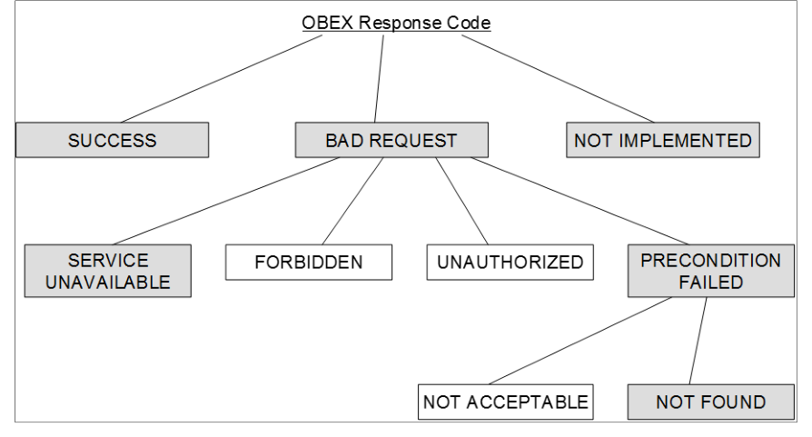

**Figure 6.1: OBEX Response Codes**

When multi-packet responses are used, response codes must be returned as early as possible, preferably in the first response packet. In some cases (e.g., Service Unavailable), it is possible that an
error condition may not arise until the operation is underway, in which case it is acceptable to return a response code in a packet other than the first one.
Initializing a MAP session
OBEX connections in MAP shall always be initiated by the MCE device. However, the connection initialization sequence to be used depends on the features that are to be used during the course of the MAP session:
The initialization sequence that applies to applications that use only the MSE's Message Access Service is described in Section 6.4.2.
For applications that use both the Message Access Service of the MSE and the Message Notification Service of the MCE, the initialization sequence that applies is described in Section 6.4.3.
For applications that use only the Message Notification Service of the MCE, the initialization sequence is that described in Section 6.4.4.

#### 6.4.1 Message Access Service OBEX Connection

See Section 5.4 in the Bluetooth Generic Object Exchange Profile specification for a description of OBEX connection establishment without authentication.
The OBEX connect request for a MAS is formatted as shown in Table 6.9:

|  | Field/Header |  |  | Name |  |  | Value |  |  | Status |  |
| --- | --- | --- | --- | --- | --- | --- | --- | --- | --- | --- | --- |
| Field Field |  |  | Opcode Packet Length |  |  | 0x80 Varies |  |  | M M |  |  |
|  | Field |  |  | OBEX Version Number |  |  | Varies |  |  | M |  |
|  | Field |  |  | Flags |  |  | 0x00 |  |  | M |  |
|  | Field |  |  | Maximum Packet Length |  |  | Varies |  |  | M |  |
| Header | Header |  | Target | Target |  |  | bb582b40-420c-11db- |  | M | M |  |
|  |  |  |  |  |  |  | b0de-0800200c9a66 |  |  |  |  |
| Header |  |  |  | Application Parameters |  |  |  |  |  | M |  |
|  |  |  |  | MapSupportedFeatures |  |  | Varies |  |  | C.1 |  |

Table 6.9: OBEX Connect Request Format
C.1: Mandatory IF the MSE advertises Bit 19 (MapSupportedFeatures in connect request) in its MapSupportedFeatures attribute in its SDP record, otherwise Excluded. Backwards compatibility: If the MapSupportedFeatures parameter is not present, then the MSE should check the MCE’s SDP record for this information before connecting the notification channel.

|  | Field/Header |  |  | Name |  |  | Value |  |  | Status |  |
| --- | --- | --- | --- | --- | --- | --- | --- | --- | --- | --- | --- |
| Field Field |  |  | Response Code Packet Length |  |  | 0xA0 OR Error Code Varies |  |  | M M |  |  |
|  | Field |  |  | OBEX Version Number |  |  | Varies |  |  | M |  |
|  | Field |  |  | Flags |  |  | 0x00 |  |  | M |  |
|  | Field |  |  | Maximum Packet Length |  |  | Varies |  |  | M |  |
| Header | Header |  | Who | Who |  |  | bb582b40-420c-11db-b0de- |  | M | M |  |
|  |  |  |  |  |  |  | 0800200c9a66 |  |  |  |  |
|  | Header |  |  | Connection ID |  |  |  |  |  | M |  |

Table 6.10: OBEX Connect Response Format

#### 6.4.2 Initialization sequence for a MAP session that uses only the Message

Access Service

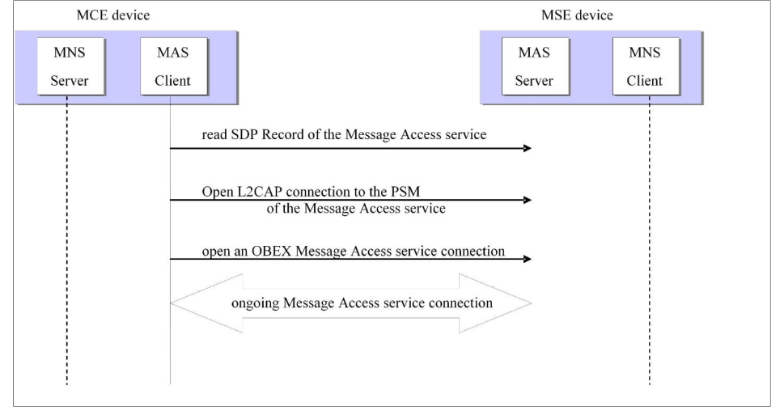

**Figure 6.2: Establishment of MAP session (usage of Message Access Service only)**

The establishment of a Message Access Service connection is done in accordance with [2] with the MCE as Client and the MSE as Server.
For the UUID value to be used for the Target header, see Section 6.3.

#### 6.4.3 Initialization sequence for a MAP session that uses both the Message

Access service and the Message Notification Service

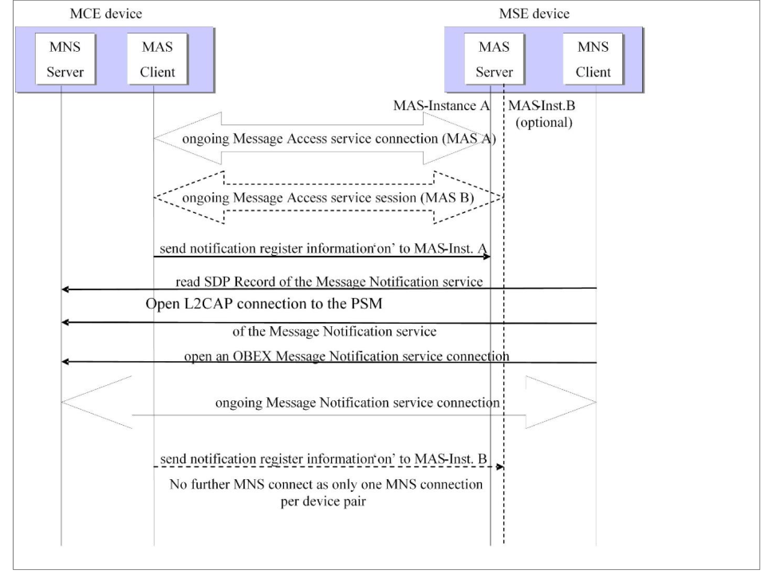

**Figure 6.3: Establishment of MAP session (usage of Message Access Service and Message Notification Service)**

The establishment of a Message Notification Service connection is done in accordance with [7] with the MCE as OBEX Server and the MSE as OBEX Client. For the UUID values to be used for the Target header, see Section 6.3. The establishment of a Message Notification connection requires the previous establishment of a Message Access Service connection as described in Section 6.4.2.
The MCE device may establish one MAS connection for each MAS Instance provided by the MSE device, while the MSE shall establish only one MNS connection (see also Section 4.5). The MNS connection shall be established by the first SetNotificationRegistration set to ON during a MAP session. Respectively, when the MNS connection is established, all following SetNotificationRegistration set to ON by any MAS- Instance will cause no further MNS connection.

#### 6.4.4 Initialization sequence for a MAP session that uses only the Message

Notification service

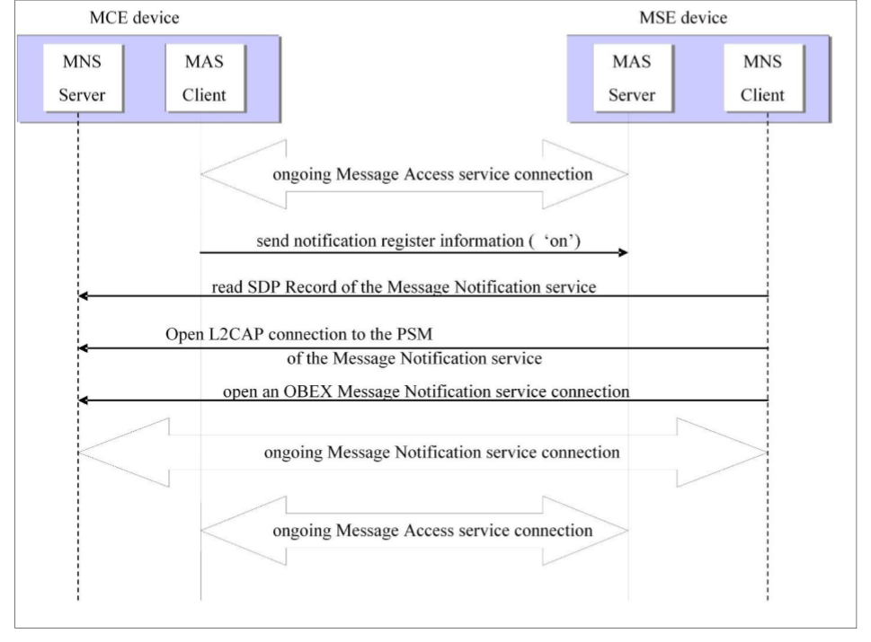

**Figure 6.4: Establishment of MAP session (usage of Message Notification Service only)**

The establishment of a Message Notification connection is done in accordance with [7] with the MCE as OBEX Server and the MSE as OBEX Client.
The Message Access connection shall be active before the establishment of the Message Notification connection, but only the MAS Notification-Registration feature is required for this use case. If the Message Access connection is disconnected after Message Notification connection establishment, this will automatically indicate a MAS Notification-Deregistration for this MAS instance. For the UUID values to be used for the Target header, see Section 6.3.
The establishment of a Message Notification connection requires the previous establishment of a Message Access Service connection as described in Section 6.4.2 to allow the MCE to register for a notification (see SetNotificationRegistration function, Section 5.2).

#### 6.4.5 Terminating a Message Access or Message Notification service connection

The termination of a Message Access or a Message Notification service connection is done in accordance with [2].

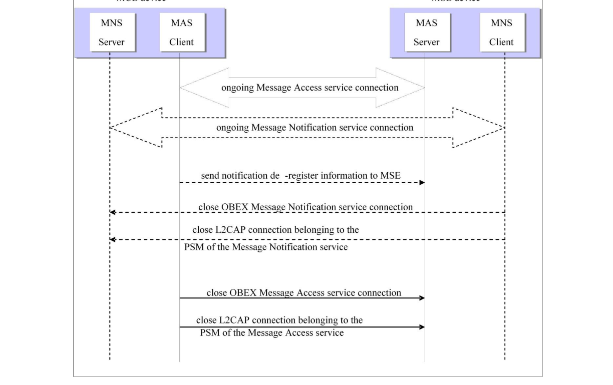

**Figure 6.5: Termination of a MAP session (usage of Message Access and optional Message Notification Service)**

The termination of multiple MAS connections (MCE connected to several MAS instances) and an ongoing Message Notification service is described in Figure 6.6. The MSE shall terminate the MNS service if the MCE has de-registered the MNS for all MAS-instances OR has terminated the MAS connections for all MAS-instances.

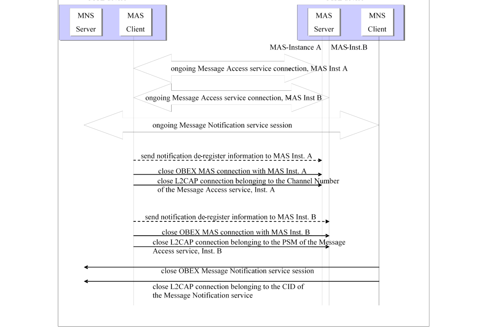

**Figure 6.6: Termination of a MAP session with connections to multiple MAS instances and established Message Notification Service**

#### 6.4.6 Authentication

OBEX authentication shall not be used within MAP to avoid redundancy with the authentication on link level (see also Section 2.5).
Reliable Sessions
OBEX Reliable Sessions shall not be used within this profile.

## 7 Service Discovery

SDP Interoperability Requirements
The following service records are defined for the Message Access Profile. There shall be one service record per MCE device (Message Notification Service, server role), and on the MSE device, there shall be one for each MAS instance (Message Access Service, server role, see also Section 3.1.7.2). Up to 12 MAS Instances may be supported by an MSE device.
If an MCE requires connection to several MAS Instances, it has to establish separate MAS connections to each of these MAS Instances where it shall use dedicated OBEX channels for the particular MAS connections. The MCE can differentiate the particular MAS Instances by its SDP Service record attributes ServiceName and MASInstanceID. Both values shall be unique for all SDP records of an MSE device. The value range of the MASInstanceID shall be 0–255 (see Section 7.1.1).

#### 7.1.1 SDP Record for the Message Access Service on the MSE Device

For MAP SDP UUID values, please refer to the Bluetooth Assigned Numbers section of the Bluetooth SIG website [3].

|  | Item |  |  | Definition |  |  | Type |  |  | Value |  |  | AttrID |  |  | Status |  |  | Default |  |
| --- | --- | --- | --- | --- | --- | --- | --- | --- | --- | --- | --- | --- | --- | --- | --- | --- | --- | --- | --- | --- |
|  | ServiceClassID List |  |  |  |  |  |  |  |  |  |  | See [3] | See |  | M | M |  |  |  |  |
|  |  |  |  |  |  |  |  |  |  |  |  |  | [3] |  |  |  |  |  |  |  |
|  |  |  |  |  |  |  |  |  |  |  |  |  |  |  |  |  |  |  |  |  |
| ServiceClass #0 | ServiceClass #0 |  |  |  |  | UUID |  |  |  | Message Access |  |  |  |  | M |  |  |  |  |  |
|  |  |  |  |  |  |  |  |  |  | Server |  |  |  |  |  |  |  |  |  |  |
| Protocol Descriptor List |  |  |  |  |  |  |  |  |  |  |  |  | See |  | M |  |  |  |  |  |
|  |  |  |  |  |  |  |  |  |  |  |  |  | [3] |  |  |  |  |  |  |  |
|  | Protocol #0 |  |  |  |  |  | UUID |  |  | L2CAP |  |  |  |  |  | M |  |  |  |  |
|  | Protocol #1 |  |  |  |  |  | UUID |  |  | RFCOMM |  |  |  |  |  | M |  |  |  |  |
| Param #0 | Param #0 |  |  | Channel |  | uint8 | uint8 |  | N= Channel number | N= Channel number |  |  |  |  | M | M |  |  |  |  |
|  |  |  |  | number |  |  |  |  |  |  |  |  |  |  |  |  |  |  |  |  |
|  | Protocol #2 |  |  |  |  |  | UUID |  |  | OBEX |  |  |  |  |  | M |  |  |  |  |
| ServiceName | ServiceName |  | Displayable text name | Displayable |  | String | String |  | Service-provider defined | Service-provider |  | See [3] | See |  | M | M |  |  | "MAP |  |
|  |  |  |  | text name |  |  |  |  |  | defined |  |  | [3] |  |  |  |  |  | MAS- |  |
|  |  |  |  |  |  |  |  |  |  |  |  |  |  |  |  |  |  |  |  |  |
|  |  |  |  |  |  |  |  |  |  |  |  |  |  |  |  |  |  |  | name" |  |
|  | Bluetooth Profile |  |  |  |  |  |  |  |  |  |  |  | See |  | M |  |  |  |  |  |
|  | Descriptor List |  |  |  |  |  |  |  |  |  |  |  | [3] |  |  |  |  |  |  |  |
| Profile #0 | Profile #0 |  |  | Supported |  | UUID |  |  |  | Message Access |  |  |  |  | M |  |  |  |  |  |
|  |  |  |  | Profiles |  |  |  |  |  | Profile |  |  |  |  |  |  |  |  |  |  |
| Param #0 |  |  |  | Profile |  | uint16 |  |  | v1.4 | v1.4 |  |  |  |  | M |  |  | 0x0104 |  |  |
|  |  |  |  | Version |  |  |  |  |  |  |  |  |  |  |  |  |  |  |  |  |

|  | Item |  |  | Definition |  |  | Type |  |  | Value |  |  | AttrID |  |  | Status |  |  | Default |  |
| --- | --- | --- | --- | --- | --- | --- | --- | --- | --- | --- | --- | --- | --- | --- | --- | --- | --- | --- | --- | --- |
| GoepL2CapPsm | GoepL2CapPsm |  | L2CAP PSM | L2CAP PSM |  | uint16 | uint16 |  | Varies | Varies |  |  | See |  | M | M |  |  |  |  |
|  |  |  |  |  |  |  |  |  |  |  |  |  | [3] |  |  |  |  |  |  |  |
|  | MASInstanceID |  |  |  |  |  | uint8 |  |  |  |  |  |  |  |  | M |  |  |  |  |
|  | SupportedMessageTypes |  |  |  |  |  | uint8 |  |  | Bit 0 = EMAIL |  |  |  |  |  | M |  |  |  |  |
|  |  |  |  |  |  |  |  |  |  | Bit 1 = SMS GSM _ |  |  |  |  |  |  |  |  |  |  |
|  |  |  |  |  |  |  |  |  |  | Bit 2 = SMS CDMA _ |  |  |  |  |  |  |  |  |  |  |
|  |  |  |  |  |  |  |  |  |  | Bit 3 = MMS |  |  |  |  |  |  |  |  |  |  |
|  |  |  |  |  |  |  |  |  |  | Bit 4 = IM |  |  |  |  |  |  |  |  |  |  |
|  |  |  |  |  |  |  |  |  |  | Bit 5–7 = Reserved for |  |  |  |  |  |  |  |  |  |  |
|  |  |  |  |  |  |  |  |  |  | Future Use |  |  |  |  |  |  |  |  |  |  |
| MapSupportedFeatures1 |  |  |  |  |  | uint32 |  |  |  | Bit 0 = Notification |  |  | See |  | M |  |  |  |  |  |
|  |  |  |  |  |  |  |  |  |  | Registration Feature |  |  | [3] |  |  |  |  |  |  |  |
|  |  |  |  |  |  |  |  |  |  | Bit 1 = Notification |  |  |  |  |  |  |  |  |  |  |
|  |  |  |  |  |  |  |  |  |  | Feature |  |  |  |  |  |  |  |  |  |  |
|  |  |  |  |  |  |  |  |  |  | Bit 2 = Browsing |  |  |  |  |  |  |  |  |  |  |
|  |  |  |  |  |  |  |  |  |  | Feature |  |  |  |  |  |  |  |  |  |  |
|  |  |  |  |  |  |  |  |  |  | Bit 3 = Uploading |  |  |  |  |  |  |  |  |  |  |
|  |  |  |  |  |  |  |  |  |  | Feature |  |  |  |  |  |  |  |  |  |  |
|  |  |  |  |  |  |  |  |  |  | Bit 4 = Delete Feature |  |  |  |  |  |  |  |  |  |  |
|  |  |  |  |  |  |  |  |  |  | Bit 5 = Instance |  |  |  |  |  |  |  |  |  |  |
|  |  |  |  |  |  |  |  |  |  | Information Feature |  |  |  |  |  |  |  |  |  |  |
|  |  |  |  |  |  |  |  |  |  | Bit 6 = Extended Event |  |  |  |  |  |  |  |  |  |  |
|  |  |  |  |  |  |  |  |  |  | Report 1.1 |  |  |  |  |  |  |  |  |  |  |
|  |  |  |  |  |  |  |  |  |  | Bit 7 = Event Report |  |  |  |  |  |  |  |  |  |  |
|  |  |  |  |  |  |  |  |  |  | Version 1.2 |  |  |  |  |  |  |  |  |  |  |
|  |  |  |  |  |  |  |  |  |  | Bit 8 = Message |  |  |  |  |  |  |  |  |  |  |
|  |  |  |  |  |  |  |  |  |  | Format Version 1.1 |  |  |  |  |  |  |  |  |  |  |
|  |  |  |  |  |  |  |  |  |  | Bit 9 = Messages- |  |  |  |  |  |  |  |  |  |  |
|  |  |  |  |  |  |  |  |  |  | Listing Format Version |  |  |  |  |  |  |  |  |  |  |
|  |  |  |  |  |  |  |  |  |  | 1.1 |  |  |  |  |  |  |  |  |  |  |
|  |  |  |  |  |  |  |  |  |  | Bit 10 = Persistent |  |  |  |  |  |  |  |  |  |  |
|  |  |  |  |  |  |  |  |  |  | Message Handles |  |  |  |  |  |  |  |  |  |  |
|  |  |  |  |  |  |  |  |  |  | Bit 11 = Database |  |  |  |  |  |  |  |  |  |  |
|  |  |  |  |  |  |  |  |  |  | Identifier |  |  |  |  |  |  |  |  |  |  |
|  |  |  |  |  |  |  |  |  |  | Bit 12 = Folder Version |  |  |  |  |  |  |  |  |  |  |
|  |  |  |  |  |  |  |  |  |  | Counter |  |  |  |  |  |  |  |  |  |  |
|  |  |  |  |  |  |  |  |  |  | Bit 13 = Conversation |  |  |  |  |  |  |  |  |  |  |
|  |  |  |  |  |  |  |  |  |  | Version Counters |  |  |  |  |  |  |  |  |  |  |
|  |  |  |  |  |  |  |  |  |  | Bit 14 = Participant |  |  |  |  |  |  |  |  |  |  |
|  |  |  |  |  |  |  |  |  |  | Presence Change |  |  |  |  |  |  |  |  |  |  |
|  |  |  |  |  |  |  |  |  |  | Notification |  |  |  |  |  |  |  |  |  |  |
|  |  |  |  |  |  |  |  |  |  | Bit 15 = Participant |  |  |  |  |  |  |  |  |  |  |

| Item | Definition | Type | Value |  |  | AttrID | Status |  | Default |
| --- | --- | --- | --- | --- | --- | --- | --- | --- | --- |
|  |  |  | Chat State Change |  |  |  |  |  |  |
|  |  |  | Notification |  |  |  |  |  |  |
|  |  |  | Bit 16 = PBAP Contact |  |  |  |  |  |  |
|  |  |  | Cross Reference |  |  |  |  |  |  |
|  |  |  | Bit 17 = Notification |  |  |  |  |  |  |
|  |  |  | Filtering |  |  |  |  |  |  |
|  |  |  | Bit 18 = UTC Offset |  |  |  |  |  |  |
|  |  |  | Timestamp Format |  |  |  |  |  |  |
|  |  |  | Bit 19 = |  |  |  |  |  |  |
|  |  |  | MapSupportedFeatures |  |  |  |  |  |  |
|  |  |  | in Connect Request |  |  |  |  |  |  |
|  |  |  | Bit 20 = Conversation |  |  |  |  |  |  |
|  |  |  | listing |  |  |  |  |  |  |
|  |  |  | Bit 21 = Owner Status |  |  |  |  |  |  |
|  |  |  | Bit 22 = Message |  |  |  |  |  |  |
|  |  |  | Forwarding |  |  |  |  |  |  |
|  |  |  | Bit 23–31 = Reserved |  |  |  |  |  |  |
|  |  |  | for Future Use2 |  |  |  |  |  |  |
|  |  |  |  |  |  |  |  |  |  |

Table 7.1: SDP Record for the Message Access Service on the MSE Device

## 1 Backwards compatibility: If the MapSupportedFeatures attribute is not present, 0x0000001F shall be assumed for a remote MSE.

2 Based on the features from Table 4.1, the associated bit shall be set to 1 if supported; 0 if not. Bit 19 (MapSupportedFeatures in Connect Request) shall be set to 1. Reserved bits shall be set to 0 and ignored by the MCE as future versions might use them.
The MAS SDP record shall still be retrievable when a MAP session is ongoing.

#### 7.1.2 SDP record for the Message Notification service on the MCE device

| Item | Definition | Type | Value |  |  | AttrID | Status |  | Default |
| --- | --- | --- | --- | --- | --- | --- | --- | --- | --- |
| ServiceClassID List |  |  |  |  |  | See [3] | M |  |  |
|  |  |  |  |  |  |  |  |  |  |
| ServiceClass #0 |  | UUID | Message Notification Server |  |  |  | M |  |  |
|  |  |  |  |  |  |  |  |  |  |
| Protocol Descriptor List |  |  |  |  |  | See [3] | M |  |  |
|  |  |  |  |  |  |  |  |  |  |
| Protocol #0 |  | UUID | L2CAP |  |  |  | M |  |  |
|  |  |  |  |  |  |  |  |  |  |
| Protocol #1 |  | UUID | RFCOMM |  |  |  | M |  |  |
|  |  |  |  |  |  |  |  |  |  |
| Param #0 | Channel number | uint8 | N= Channel number |  |  |  | M |  |  |
|  |  |  |  |  |  |  |  |  |  |
| Protocol #2 |  | UUID | OBEX |  |  |  | M |  |  |
|  |  |  |  |  |  |  |  |  |  |
| ServiceName | Displayable text name | String | Service-provider defined |  | See [3] |  | M |  | "MAP |
|  |  |  |  |  |  |  |  |  | MNS- |
|  |  |  |  |  |  |  |  |  | name" |
| Bluetooth Profile Descriptor List |  |  |  |  |  |  | M |  |  |
|  |  |  |  |  |  |  |  |  |  |

|  | Item |  |  | Definition |  |  | Type |  |  | Value |  |  | AttrID |  |  | Status |  |  | Default |
| --- | --- | --- | --- | --- | --- | --- | --- | --- | --- | --- | --- | --- | --- | --- | --- | --- | --- | --- | --- |
| Profile #0 | Profile #0 |  |  | Supported |  | UUID | UUID |  |  | Message Access |  | See [3] | See [3] |  | M | M |  |  |  |
|  |  |  |  | profiles |  |  |  |  |  | Profile |  |  |  |  |  |  |  |  |  |
| Param #0 |  |  |  | Profile |  | uint16 |  |  | v1.4 | v1.4 |  |  |  |  | M |  |  | 0x0104 | x0104 |
|  |  |  |  | version |  |  |  |  |  |  |  |  |  |  |  |  |  |  |  |
| GoepL2CapPsm |  |  | L2CAP PSM |  |  | uint16 |  |  | Varies |  |  | See [3] |  |  | M |  |  |  |  |
| MapSupportedFeatures1 |  |  |  |  |  | uint32 |  |  |  | Bit 0 = Notification |  | See [3] |  |  | M |  |  |  |  |
|  |  |  |  |  |  |  |  |  |  | Registration Feature |  |  |  |  |  |  |  |  |  |
|  |  |  |  |  |  |  |  |  |  | Bit 1 = Notification |  |  |  |  |  |  |  |  |  |
|  |  |  |  |  |  |  |  |  |  | Feature |  |  |  |  |  |  |  |  |  |
|  |  |  |  |  |  |  |  |  |  | Bit 2 = Browsing |  |  |  |  |  |  |  |  |  |
|  |  |  |  |  |  |  |  |  |  | Feature |  |  |  |  |  |  |  |  |  |
|  |  |  |  |  |  |  |  |  |  | Bit 3 = Uploading |  |  |  |  |  |  |  |  |  |
|  |  |  |  |  |  |  |  |  |  | Feature |  |  |  |  |  |  |  |  |  |
|  |  |  |  |  |  |  |  |  |  | Bit 4 = Delete Feature |  |  |  |  |  |  |  |  |  |
|  |  |  |  |  |  |  |  |  |  | Bit 5 = Instance |  |  |  |  |  |  |  |  |  |
|  |  |  |  |  |  |  |  |  |  | Information Feature |  |  |  |  |  |  |  |  |  |
|  |  |  |  |  |  |  |  |  |  | Bit 6 = Extended |  |  |  |  |  |  |  |  |  |
|  |  |  |  |  |  |  |  |  |  | Event Report 1.1 |  |  |  |  |  |  |  |  |  |
|  |  |  |  |  |  |  |  |  |  | Bit 7 = Event Report |  |  |  |  |  |  |  |  |  |
|  |  |  |  |  |  |  |  |  |  | Version 1.2 |  |  |  |  |  |  |  |  |  |
|  |  |  |  |  |  |  |  |  |  | Bit 8 = Message |  |  |  |  |  |  |  |  |  |
|  |  |  |  |  |  |  |  |  |  | Format Version 1.1 |  |  |  |  |  |  |  |  |  |
|  |  |  |  |  |  |  |  |  |  | Bit 9 = Messages- |  |  |  |  |  |  |  |  |  |
|  |  |  |  |  |  |  |  |  |  | Listing Format |  |  |  |  |  |  |  |  |  |
|  |  |  |  |  |  |  |  |  |  | Version 1.1 |  |  |  |  |  |  |  |  |  |
|  |  |  |  |  |  |  |  |  |  | Bit 10 = Persistent |  |  |  |  |  |  |  |  |  |
|  |  |  |  |  |  |  |  |  |  | Message Handles |  |  |  |  |  |  |  |  |  |
|  |  |  |  |  |  |  |  |  |  | Bit 11 = Database |  |  |  |  |  |  |  |  |  |
|  |  |  |  |  |  |  |  |  |  | Identifier |  |  |  |  |  |  |  |  |  |
|  |  |  |  |  |  |  |  |  |  | Bit 12 = Folder |  |  |  |  |  |  |  |  |  |
|  |  |  |  |  |  |  |  |  |  | Version Counter |  |  |  |  |  |  |  |  |  |
|  |  |  |  |  |  |  |  |  |  | Bit 13 = Conversation |  |  |  |  |  |  |  |  |  |
|  |  |  |  |  |  |  |  |  |  | Version Counters |  |  |  |  |  |  |  |  |  |
|  |  |  |  |  |  |  |  |  |  | Bit 14 = Participant |  |  |  |  |  |  |  |  |  |
|  |  |  |  |  |  |  |  |  |  | Presence Change |  |  |  |  |  |  |  |  |  |
|  |  |  |  |  |  |  |  |  |  | Notification |  |  |  |  |  |  |  |  |  |
|  |  |  |  |  |  |  |  |  |  | Bit 15 = Participant |  |  |  |  |  |  |  |  |  |
|  |  |  |  |  |  |  |  |  |  | Chat State Change |  |  |  |  |  |  |  |  |  |
|  |  |  |  |  |  |  |  |  |  | Notification |  |  |  |  |  |  |  |  |  |
|  |  |  |  |  |  |  |  |  |  | Bit 16 = PBAP |  |  |  |  |  |  |  |  |  |
|  |  |  |  |  |  |  |  |  |  | Contact Cross |  |  |  |  |  |  |  |  |  |
|  |  |  |  |  |  |  |  |  |  | Reference |  |  |  |  |  |  |  |  |  |
|  |  |  |  |  |  |  |  |  |  | Bit 17 = Notification |  |  |  |  |  |  |  |  |  |
|  |  |  |  |  |  |  |  |  |  | Filtering |  |  |  |  |  |  |  |  |  |
|  |  |  |  |  |  |  |  |  |  | Bit 18 = UTC Offset |  |  |  |  |  |  |  |  |  |
|  |  |  |  |  |  |  |  |  |  | Timestamp Format |  |  |  |  |  |  |  |  |  |
|  |  |  |  |  |  |  |  |  |  | Bit 19 = Reserved |  |  |  |  |  |  |  |  |  |

| Item |  |  | Definition |  |  | Type |  |  | Value |  |  | AttrID |  |  | Status |  |  | Default |
| --- | --- | --- | --- | --- | --- | --- | --- | --- | --- | --- | --- | --- | --- | --- | --- | --- | --- | --- |
|  |  |  |  |  |  |  |  |  | Bit 20 = Conversation |  |  |  |  |  |  |  |  |  |
|  |  |  |  |  |  |  |  |  | listing |  |  |  |  |  |  |  |  |  |
|  |  |  |  |  |  |  |  |  | Bit 21 = Owner status |  |  |  |  |  |  |  |  |  |
|  |  |  |  |  |  |  |  |  | Bit 22 = Message |  |  |  |  |  |  |  |  |  |
|  |  |  |  |  |  |  |  |  | Forwarding |  |  |  |  |  |  |  |  |  |
|  |  |  |  |  |  |  |  |  | Bit 23–31 = Reserved |  |  |  |  |  |  |  |  |  |
|  |  |  |  |  |  |  |  |  | for Future Use2 |  |  |  |  |  |  |  |  |  |

Table 7.2: SDP Record for the Message Notification Service on the MCE Device

## 1 Backwards compatibility: If the MapSupportedFeatures attribute is not present, 0x0000001F shall be assumed for a remote MCE.

2 Based on the features from the associated bit shall be set to 1 if supported; 0 if not. Reserved bits shall be set to 0 and ignored by the MSE as future versions might use them.
If MNS is supported, the MNS SDP record shall still be retrievable when a MAP session is ongoing.
For MAP SDP UUID values, please refer to the Bluetooth Assigned Numbers section of the Bluetooth website [3].
Link Manager (LM) Interoperability Requirements
For the Link Manager layer, there are no additions to the requirements as stated in Volume 2, Part C in the Core Specification [1].
Link Control (LC) Interoperability Requirements
The specification allows both MCE and MSE to support Inquiry and Inquiry scan. It is mandatory for the MSE to support Inquiry and the MCE to support Inquiry scan. It is optional for the MSE to support Inquiry Scan and for the MCE to support Inquiry, though this support is strongly recommended.

| Capability |  |  | Support in MSE |  |  | Support in MCE |  |
| --- | --- | --- | --- | --- | --- | --- | --- |
| Inquiry |  | M |  |  | O |  |  |
| Inquiry scan |  |  | O |  |  | M |  |

Table 7.3: LC capabilities

#### 7.3.1 Class of Device/Service Field

There is no obvious correlation between the Class of Device/Service Field and the support for the Message Access Profile. Many types of devices might implement the Message Access Profile.

## 8 Generic Access Profile

This profile requires compliance with the Generic Access Profile (GAP).
This section defines the support requirements for the capabilities as defined in the "Generic Access Profile" (see Volume 3, Part C in [1]). All “Mandatory,” “Optional,” “Excluded,” and “Conditional” properties are inherited from GAP. This section lists only those properties that differ from the requirements in GAP.
Modes
Table 8.1 shows the differences in the support status for GAP Modes in this profile.

|  |  |  |  | Procedure |  |  | Support in MCE |  |  | Support in MSE |  |
| --- | --- | --- | --- | --- | --- | --- | --- | --- | --- | --- | --- |
| 1 |  |  | Discoverability modes General discoverable mode |  |  | M |  |  | M |  |  |
| 2 |  |  | Pairing modes Pairable mode |  |  | M |  |  | M |  |  |

Table 8.1: GAP Modes
Security Aspects
There is no change to the requirements as stated in the General Access Profile (see Volume 3, Part C in [1]).
Idle Mode Procedures
Table 8.2 shows the differences in the support status for the GAP Idle Mode procedures within this profile:

|  |  |  |  | Procedure |  |  | Support in MCE |  |  | Support in MSE |  |
| --- | --- | --- | --- | --- | --- | --- | --- | --- | --- | --- | --- |
| 1 |  |  | General inquiry |  |  | O |  |  | M |  |  |
| 2 |  |  | Limited inquiry |  |  | O |  |  | O |  |  |

Table 8.2: Idle Mode procedures

## 9 GOEP Interoperability Requirements

This section defines the requirements to interoperate with different versions of GOEP.
The MCE-MAS and MSE-MNS clients shall implement GOEP v2.0 or later and follow the GOEP SDP Interoperability Requirements to determine the version of GOEP on the MSE-MAS and MCE-MNS servers.
Table 9.1 shows which GOEP version is used between devices implementing different transports of this profile:

| MCE | MSE |  | SDP ‘L2CAP PSM’ and |  |  | Only SDP ‘RFCOMM |  |
| --- | --- | --- | --- | --- | --- | --- | --- |
|  |  |  | ‘RFCOMM Channel |  |  | Channel number’ is |  |
|  |  |  | number’ are advertised |  |  | advertised |  |
| SDP ‘L2CAP PSM’ and ‘RFCOMM Channel number’ are advertised |  | GOEP v2.0 or later (IrOBEX v1.5 over L2CAP) |  |  | GOEP v1.1 (IrOBEX v1.2 over RFCOMM) |  |  |
| Only SDP ‘RFCOMM Channel number’ is advertised |  | GOEP v1.1 (IrOBEX v1.2 over RFCOMM) |  |  | GOEP v1.1 (IrOBEX v1.2 over RFCOMM) |  |  |

Table 9.1: GOEP Versions Usage depending on Transport Implementation
When GOEP v2.0 or later is used, RFCOMM shall not be used to convey OBEX. When GOEP v1.1 is used, L2CAP shall not directly be used as a transport layer for OBEX, and features from IrOBEX later than v1.2 shall not be used.

## 10 List of Acronyms and Abbreviations

Abbreviation or Acronym Meaning
3GPP 3rd Generation Partnership Project
AMP Alternate MAC-PHY
bMessage Bluetooth Message Format
CDMA Code Division Multiple Access
CID OBEX Connection Identifier
EDR Enhanced Data Rate
EMAIL Electronic mail
GAP Generic Access Profile
GOEP Generic Object Exchange Profile
GSM Global System for Mobile communication
HFP Hands-Free Profile
IO Input/Output
IM Instant Messaging
L2CAP Logical Link Control and Adaptation Protocol
LM Link Manager
LMP Link Manager Protocol
LMP Link A Link Manager (LM) level link over which only Link Manager Protocol (LMP) commands are conveyed
MAP Message Access Profile
MAS Message Access Service
MCE Message Client Equipment
MIME Multipurpose Internet Mail Extension
MMS Multimedia Message Service
MNS Message Notification Service
MSE Message Server Equipment
MSISDN Mobile Subscriber Integrated Services Digital Network number (also appears as "Mobile Station International ISDN number”)
OBEX Object Exchange
PBAP Phonebook Access Profile
PSM Protocol/Service Multiplexer
RFCOMM Serial Port Transport Protocol Over L2CAP
SDP Service Discovery Protocol
SMS Short Message Service
SRM Single Response Mode: OBEX enhancement to improve throughput of large objects.
Abbreviation or Acronym Meaning
SRMP Single Response Mode Parameters
TE Terminal Equipment
UCI Unique Client/Caller Identifier
UUID Universally Unique Identifier

## 11 References

[1] Bluetooth Core Specification (amended) Version 4.2 or later
[2] Generic Object Exchange Profile Specification, Version 1.1 or later
[3] Bluetooth SIG Assigned Numbers,
https://www.bluetooth.com/specifications/assigned-numbers
[4] vCard The Electronic Business Card, version 2.1, September 18th
[5] vCard Format Specification, IETF, Network Working Group, RFC 6350, August 2011, https://tools.ietf.org/html/rfc6350
[6] Multipurpose Internet Mail Extensions (MIME):
RFC 2045 Part 1: Format of Internet Message Bodies, https://tools.ietf.org/html/rfc2045
RFC 2046 Part 2: Media Types, https://tools.ietf.org/html/rfc2046
RFC 2047,Part 3: Message Header Extensions for Non-ASCII Text, https://tools.ietf.org/html/rfc2047
[7] IrDA Object Exchange Protocol OBEX™ with Published Errata, Version 1.5, August 2009, iAnywhere Solutions, Inc. and Microsoft Corporation
[8] Technical Specification 3rd Generation Partnership Project; Technical Specification Group Terminals; Technical realization of the Short Message Service (SMS), 3GPP TS 23.040 V8.20.0 (2008-06)
[9] Technical Specification 3rd Generation Partnership Project; Technical Specification Group Terminals; Technical realization of the Multimedia Messaging Service (MMS), 3GPP TS 23.140 V7.0.0 (2008-03)
[10] TIA/EIA-637-A, Short Message Service, 3GPP2 C.S0015-0
[11] Serial Port Profile Specification, Version 1.2 or later
[12] Administration of Parameter Value Assignments for cdma2000 Spread Spectrum Standards, Release A (TSB58-A), 3GPP2 C.R1001-A 2.0
[13] 3rd Generation Partnership Project, Technical Specification Group Core Network and Terminals; Alphabets and language-specific information (Release 8), 3GPP TS 23.038 V8.1.0 (2008-06)
[14] RFC 5322, Internet Message Format, https://tools.ietf.org/html/rfc5322
[15] Extensible Markup Language (XML) 1.0 (Fifth Edition) W3C Recommendation 26 November 2008, https://www.w3.org/TR/xml/
[16] Technical Specification 3rd Generation Partnership Project; Technical realization of the Short Message Service (SMS): 3GPP TS 04.11 version 7.1.0 (2000-09)
[17] International Reference Alphabet (IRA) (formerly International Alphabet No. 5 or IA5)—Information Technology 7-Bit Coded Character Set for Information Interchange, recommendation T.50,International Telegraph and Telephone Consultative Committee, September, 1992
[18] Phone Book Access Profile Specification, Version 1.1.1 or later
[19] ISO 8601, https://www.iso.org/iso-8601-date-and-time-format.html