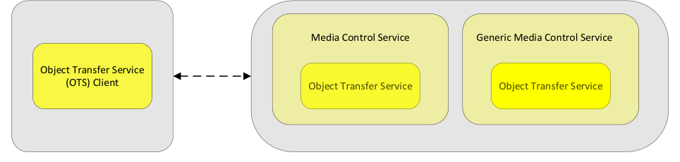

# MCP v1.0

> Source: PDF converted via PyMuPDF.

---

Media Control Profile
Bluetooth® Profile Specification
▪ Revision: v1.0
▪ Revision Date: 2021-03-09
▪ Group Prepared By: Generic Audio Working Group
Abstract:
The Media Control Profile provides the ability for a client to control and interact with media players on a peer device.
Revision History

|  | Revision Number |  |  | Date |  |  | Comments |  |
| --- | --- | --- | --- | --- | --- | --- | --- | --- |
| v1.0 |  |  | 2021-03-09 |  |  | Adopted by the Bluetooth SIG Board of Directors. |  |  |

Contributors

|  | Name |  |  | Company |  |
| --- | --- | --- | --- | --- | --- |
| Robin Heydon |  |  | Qualcomm |  |  |
| Tim Reilly |  |  | Bose |  |  |
| Michael Rougeux |  |  | Bose |  |  |
| Chris Church |  |  | Qualcomm |  |  |
| Joel Linsky |  |  | Qualcomm |  |  |
| Bjarne Klemmensen |  |  | Oticon |  |  |
| Marcel Holtmann |  |  | Intel |  |  |
| Nick Hunn |  |  | GNResound |  |  |
| Georg Dickmann |  |  | Sonova |  |  |
| Asbjørn Sæbø |  |  | Nordic Semiconductor |  |  |
| Masahiko Seki |  |  | Sony |  |  |
| Daniel Sisolak |  |  | Bose |  |  |
| Andrew Estrada |  |  | Sony |  |  |
| Scott Walsh |  |  | Poly |  |  |
| Rasmus Abildgren |  |  | Bose |  |  |
| Frank Yerrace |  |  | Microsoft |  |  |
| Nick D’Amato |  |  | Sonos |  |  |
| Luiz Von Dentz |  |  | Intel |  |  |
| Oren Haggai |  |  | Intel |  |  |

Use of this specification is your acknowledgement that you agree to and will comply with the following notices and disclaimers. You are advised to seek appropriate legal, engineering, and other professional advice regarding the use, interpretation, and effect of this specification.
Use of Bluetooth specifications by members of Bluetooth SIG is governed by the membership and other related agreements between Bluetooth SIG and its members, including those agreements posted on Bluetooth SIG’s website located at www.bluetooth.com. Any use of this specification by a member that is not in compliance with the applicable membership and other related agreements is prohibited and, among other things, may result in (i) termination of the applicable agreements and (ii) liability for infringement of the intellectual property rights of Bluetooth SIG and its members. This specification may provide options, because, for example, some products do not implement every portion of the specification. Each option identified in the specification is intended to be within the bounds of the Scope as defined in the Bluetooth Patent/Copyright License Agreement (“PCLA”). Also, the identification of options for implementing a portion of the specification is intended to provide design flexibility without establishing, for purposes of the PCLA, that any of these options is a “technically reasonable non-infringing alternative.”
Use of this specification by anyone who is not a member of Bluetooth SIG is prohibited and is an infringement of the intellectual property rights of Bluetooth SIG and its members. The furnishing of this specification does not grant any license to any intellectual property of Bluetooth SIG or its members. THIS SPECIFICATION IS PROVIDED “AS IS” AND BLUETOOTH SIG, ITS MEMBERS AND THEIR AFFILIATES MAKE NO REPRESENTATIONS OR WARRANTIES AND DISCLAIM ALL WARRANTIES, EXPRESS OR IMPLIED, INCLUDING ANY WARRANTIES OF MERCHANTABILITY, TITLE, NON- INFRINGEMENT, FITNESS FOR ANY PARTICULAR PURPOSE, OR THAT THE CONTENT OF THIS SPECIFICATION IS FREE OF ERRORS. For the avoidance of doubt, Bluetooth SIG has not made any search or investigation as to third parties that may claim rights in or to any specifications or any intellectual property that may be required to implement any specifications and it disclaims any obligation or duty to do so.
TO THE MAXIMUM EXTENT PERMITTED BY APPLICABLE LAW, BLUETOOTH SIG, ITS MEMBERS AND THEIR AFFILIATES DISCLAIM ALL LIABILITY ARISING OUT OF OR RELATING TO USE OF THIS SPECIFICATION AND ANY INFORMATION CONTAINED IN THIS SPECIFICATION, INCLUDING LOST REVENUE, PROFITS, DATA OR PROGRAMS, OR BUSINESS INTERRUPTION, OR FOR SPECIAL, INDIRECT, CONSEQUENTIAL, INCIDENTAL OR PUNITIVE DAMAGES, HOWEVER CAUSED AND REGARDLESS OF THE THEORY OF LIABILITY, AND EVEN IF BLUETOOTH SIG, ITS MEMBERS OR THEIR AFFILIATES HAVE BEEN ADVISED OF THE POSSIBILITY OF THE DAMAGES.
Products equipped with Bluetooth wireless technology ("Bluetooth Products") and their combination, operation, use, implementation, and distribution may be subject to regulatory controls under the laws and regulations of numerous countries that regulate products that use wireless non-licensed spectrum. Examples include airline regulations, telecommunications regulations, technology transfer controls, and health and safety regulations. You are solely responsible for complying with all applicable laws and regulations and for obtaining any and all required authorizations, permits, or licenses in connection with your use of this specification and development, manufacture, and distribution of Bluetooth Products. Nothing in this specification provides any information or assistance in connection with complying with applicable laws or regulations or obtaining required authorizations, permits, or licenses.
Bluetooth SIG is not required to adopt any specification or portion thereof. If this specification is not the final version adopted by Bluetooth SIG’s Board of Directors, it may not be adopted. Any specification adopted by Bluetooth SIG’s Board of Directors may be withdrawn, replaced, or modified at any time. Bluetooth SIG reserves the right to change or alter final specifications in accordance with its membership and operating agreements.
Copyright © 2018–2021. All copyrights in the Bluetooth Specifications themselves are owned by Apple Inc., Ericsson AB, Intel Corporation, Lenovo (Singapore) Pte. Ltd., Microsoft Corporation, Nokia Corporation, and Toshiba Corporation. The Bluetooth word mark and logos are owned by Bluetooth SIG, Inc. Other third-party brands and names are the property of their respective owners.
Contents

## 1 Introduction

The Media Control Profile (MCP) defines the roles and procedures used to interact with a remote device that implements the Media Control Service (MCS) and/or the Generic Media Control Service (GMCS) [4].

### 1.1 Profile dependencies

This profile requires the Generic Attribute Profile (GATT) (Volume 3, Part G in the Bluetooth Core Specification [3]) and optionally the Object Transfer Profile (OTP) [2].

### 1.2 Conformance

If conformance to this specification is claimed, all capabilities indicated as mandatory for this specification shall be supported in the specified manner (process-mandatory). This also applies for all optional and conditional capabilities for which support is indicated.

### 1.3 Bluetooth Core Specification release compatibility

This specification is compatible with the Bluetooth Core Specification Version 4.2 or later [3].

### 1.4 Language

#### 1.4.1 Language conventions

The Bluetooth SIG has established the following conventions for use of the words shall, must, will, should, may, can, is, and note in the development of specifications:

| shall | is required to – used to define requirements. |
| --- | --- |
| must | is used to express: a natural consequence of a previously stated mandatory requirement. OR an indisputable statement of fact (one that is always true regardless of the circumstances). |
| will | it is true that – only used in statements of fact. |
| should | is recommended that – used to indicate that among several possibilities one is recommended as particularly suitable, but not required. |
| may | is permitted to – used to allow options. |
| can | is able to – used to relate statements in a causal manner. |
| is | is defined as – used to further explain elements that are previously required or allowed. |
| note | Used to indicate text that is included for informational purposes only and is not required in order to implement the specification. Each note is clearly designated as a “Note” and set off in a separate paragraph. |

For clarity of the definition of those terms, see Core Specification Volume 1, Part E, Section 1.
1.4.2 Reserved for Future Use Where a field in a packet, Protocol Data Unit (PDU), or other data structure is described as "Reserved for Future Use" (irrespective of whether in uppercase or lowercase), the device creating the structure shall
set its value to zero unless otherwise specified. Any device receiving or interpreting the structure shall ignore that field; in particular, it shall not reject the structure because of the value of the field.
Where a field, parameter, or other variable object can take a range of values, and some values are described as "Reserved for Future Use," a device sending the object shall not set the object to those values. A device receiving an object with such a value should reject it, and any data structure containing it, as being erroneous; however, this does not apply in a context where the object is described as being ignored or it is specified to ignore unrecognized values.
When a field value is a bit field, unassigned bits can be marked as Reserved for Future Use and shall be set to 0. Implementations that receive a message that contains a Reserved for Future Use bit that is set to 1 shall process the message as if that bit was set to 0, except where specified otherwise.
The acronym RFU is equivalent to Reserved for Future Use.
1.4.3 Prohibited When a field value is an enumeration, unassigned values can be marked as “Prohibited.” These values shall never be used by an implementation, and any message received that includes a Prohibited value shall be ignored and shall not be processed and shall not be responded to.
Where a field, parameter, or other variable object can take a range of values, and some values are described as “Prohibited,” devices shall not set the object to any of those Prohibited values. A device receiving an object with such a value should reject it, and any data structure containing it, as being erroneous.
“Prohibited” is never abbreviated.

## 2 Configuration

### 2.1 Roles

This specification defines two roles: Media Control Client and Media Control Server.
The Media Control Server is the device that interacts with a Media Control Client for the management of media tracks and conveys the various states and settings to the Media Control Client. The Media Control Client is the device that initiates playing and pausing, determines playing order, and collects search results from the Media Control Server.
The Media Control Server shall be a GATT Server.
The Media Control Client shall be a GATT Client.

### 2.2 Role/service relationships

Figure 2.1 shows the relationship between the service and profile roles.
The profile roles are represented by gray boxes and the service roles are represented by yellow boxes.
Media Control Client Media Control Server

**Figure 2.1: Relationship between the service and profile roles**

A Media Control Server shall instantiate zero or more MCS and a single GMCS and may instantiate the Object Transfer Service and use the Object Server role defined in the Object Transfer Profile.
A Media Control Client may use the Object Client role defined in the Object Transfer Profile.

### 2.3 Concurrency limitations/restrictions

There are no concurrency limitations or restrictions for the Media Control Client or Media Control Server imposed by this profile. A Concurrency feature is specified in Section 1.12 of the Object Transfer Service [1].

### 2.4 Topology limitations/restrictions

There are no topology limitations or restrictions of this specification when used with either the LE transport or the Basic Rate/Enhanced Data Rate (BR/EDR) transport.
2.5 Transport dependencies There are no transport dependencies imposed by this profile specification. However, a higher-layer specification may impose additional requirements.

## 3 Media Control Server role requirements

The Media Control Server shall instantiate zero or more MCS and a single GMCS. The Media Control Server can instantiate one Object Transfer Service for each MCS that is instantiated and for the single GMCS. Each Object Transfer Service shall be declared as a «Secondary Service» and shall be included from the instance of the MCS or GMCS that it is associated with.
Requirements in this section are defined as “Mandatory” (M), “Optional” (O), “Excluded” (X), and “Conditional” (C.n). Conditional statements (C.n) are listed directly below the table in which they appear.

| Service | Media Control Service |
| --- | --- |
| Media Control Service | O |
| Generic Media Control Service | M |
| Object Transfer Service | C.1 |

Table 3.1: Service requirements for the Media Control Server
C.1: Mandatory if Read Media Player Icon Information, Read Current Track Segments Object Information, Read Current Track Object Information, Write Current Track Object ID, Read Next Track Object Information, Write Next Track Object ID, Track Discovery – Discover by Group Object, Write Current Group Object ID, Read Parent Group Object Information, or Search procedures are supported, otherwise Optional.
If an MCS or GMCS has an included Object Transfer Service (OTS [1]), the OTS shall support the optional characteristics in Table 3.2 and the features in Table 3.3.

| Optional Characteristic in OTS | Mandatory Support in MCP |
| --- | --- |
| Object ID | M |
| Object List Control Point | M |
| Object Changed | M |

Table 3.2: Optional characteristic in OTS, Mandatory in MCP

| Optional Feature in OTS | Mandatory Support in MCP |
| --- | --- |
| OACP Read Op Code | M |
| OLCP Go To Op Code | M |

Table 3.3: Optional feature in OTS, Mandatory in MCP
If the Media Player Icon Object ID characteristic is supported by the Media Control Server, the Media Control Server shall expose a Media Player Icon Object Type object with the corresponding Object ID within the included Object Transfer Service.
If the Current Track Segments Object ID characteristic is supported by the Media Control Server, the Media Control Server shall expose a Track Segments Type object with the corresponding Object ID within the included Object Transfer Service.
If the Current Track Object ID characteristic is supported by the Media Control Server, the Media Control Server shall expose a Track Type object with the corresponding Object ID within the included Object Transfer Service.
If the Next Track Object ID characteristic is supported by the Media Control Server, the Media Control Server shall expose a Track Type object with the corresponding Object ID within the included Object Transfer Service.
If the Current Group Object ID characteristic is supported by the Media Control Server, the Media Control Server shall expose a Group Type object with the corresponding Object ID within the included Object Transfer Service.
If the Parent Group Object ID characteristic is supported by the Media Control Server, the Media Control Server shall expose a Group Type object with the corresponding Object ID within the included Object Transfer Service.
If the Search Results Object ID characteristic is supported by the Media Control Server, the Media Control Server shall expose a Group Type object with the corresponding Object ID within the included Object Transfer Service.

## 4 Media Control Client role requirements

This section describes the Media Control Client role requirements. A higher-layer profile may specify additional profile role requirements.
Requirements in this section are defined as “Mandatory” (M), “Optional” (O), “Excluded” (X), and “Conditional” (C.n). Conditional statements (C.n) are listed directly below the table in which they appear.

| Profile Requirement | Section | Support in Volume Controller |
| --- | --- | --- |
| GATT sub-procedures | 4.1 | M |
| Service Discovery | 4.3 | M |
| Characteristic Discovery | 4.4 | M |
| Media Control Client procedures | 4.5 | M |

Table 4.1: Profile requirements for the Call Control Client

### 4.1 GATT sub-procedure requirements

Requirements in this section represent a minimum set of requirements for a Media Control client. Other GATT sub-procedures may be used if supported by both the client and server.
Table 4.2 summarizes additional GATT sub-procedure requirements beyond those required by all GATT clients.

| GATT Sub-Procedure | GATT Sub-Procedure | Volume Controller Requirements |
| --- | --- | --- |
| Discover All Primary Services |  | C.1 |
| Discover Primary Services by Service UUID |  | C.2 |
| Find Included Services |  | O |
| Discover All Characteristics of a Service |  | C.3 |
| Discover Characteristics by UUID |  | C.4 |
| Discover All Characteristic Descriptors |  | M |
| Notifications |  | M |
| Read Characteristic Value |  | M |
| Write Characteristic Value |  | C.5 |

| GATT Sub-Procedure | Volume Controller Requirements |
| --- | --- |
| Write Without Response | C.5 |
| Read Characteristic Descriptors | M |
| Write Characteristic Descriptors | M |

Table 4.2: Additional GATT sub-procedure requirements
C.1: Mandatory if the Discover Primary Services by Service UUID sub-procedure is not supported, otherwise Optional.
C.2: Mandatory if the Discover All Primary Services sub-procedure is not supported, otherwise Optional.
C.3: Mandatory if the Discover Characteristics by UUID sub-procedure is not supported, otherwise Optional.
C.4: Mandatory if the Discover All Characteristics of a Service sub-procedure is not supported, otherwise Optional.
C.5: Mandatory to support at least one of the Write Characteristic Value or Write Without Response GATT sub- procedures.

### 4.2 Object Transfer Service Profile Dependencies

The Media Control Client may implement the requirements of the Object Transfer Client as defined in the Object Transfer Profile.
The Object Transfer Profile client role shall support the Object Transfer Profile optional procedures listed in Table 4.3.

| Optional Procedure in OTP | Mandatory Support in MCP |
| --- | --- |
| Object Discovery – Discover All Objects | M |
| Select Object – Select by Object ID | M |
| Read Object – Read Object Contents | M |

Table 4.3: Optional procedure in OTP, mandatory in MCP

### 4.3 Service discovery

The Media Control Client shall use the GATT Service Discovery to discover the MCS and GMCS.
The Media Control Client shall perform primary service discovery by using either the GATT Discover All Primary Services sub-procedure or the GATT Discover Primary Services by Service UUID sub-procedure.
The Media Control Client may perform included service discovery by using the GATT Find Included Services sub-procedure to discover the Object Transfer Service.

### 4.4 Characteristic discovery

As required by GATT, the Media Control Client shall accept additional optional characteristics in the service records of services used with this profile.
Where a characteristic is discovered that can be indicated or notified, the Media Control Client shall also discover the associated Client Characteristic Configuration descriptor.

### 4.5 Media Control Client procedures

The generic procedures defined in this section provide standardized methods of using the features of the MCS and GMCS in specified sequences to satisfy common use cases. The MCS and GMCS may be used in other ways, and a higher-layer profile may define such additional procedures. However, wherever a procedure listed in Table 4.4 is supported, the implementation of the procedure shall conform to the requirements of this profile specification.
When writing to MCS characteristics, the client should use the GATT Write Without Response sub- procedure.
Requirements in this section are defined as “Mandatory” (M), “Optional” (O), “Excluded” (X), and “Conditional” (C.n). Conditional statements (C.n) are listed directly below the table in which they appear.
Table 4.4 shows procedure requirements for this profile.

| Procedure | Reference | Requirement |
| --- | --- | --- |
| Read Media Information | 4.5.1 | M |
| Read Media Player Icon Object Information | 4.5.2 | O |
| Read Track Title | 4.5.3 | O |
| Read Track Duration | 4.5.4 | O |
| Read Track Position | 4.5.5 | O |
| Set Absolute Track Position | 4.5.6 | O |
| Set Relative Track Position | 4.5.7 | O |
| Read Playback Speed | 4.5.8 | O |
| Set Playback Speed | 4.5.9 | O |
| Read Seeking Speed | 4.5.10 | O |
| Read Current Track Segments Object Information | 4.5.11 | O |
| Read Current Track Object Information | 4.5.12 | O |
| Set Current Track Object ID | 4.5.13 | O |
| Read Next Track Object Information | 4.5.14 | O |
| Set Next Track Object ID | 4.5.15 | O |
| Track Discovery – Discover by Current Group Object ID | 4.5.16 | O |
| Set Current Group Object ID | 4.5.17 | O |

| Procedure | Reference | Requirement |
| --- | --- | --- |
| Read Parent Group Object Information | 4.5.18 | O |
| Read Playing Order | 4.5.19 | O |
| Set Playing Order | 4.5.20 | O |
| Read Playing Order Supported | 4.5.21 | O |
| Read Media State | 4.5.22 | O |
| Play Current Track | 4.5.23 | O |
| Pause Current Track | 4.5.24 | O |
| Fast Forward Fast Rewind | 4.5.25 | O |
| Stop Current Track | 4.5.26 | O |
| Move to Previous Segment | 4.5.27 | O |
| Move to Next Segment | 4.5.28 | O |
| Move to First Segment | 4.5.29 | O |
| Move to Last Segment | 4.5.30 | O |
| Move to Segment Number | 4.5.31 | O |
| Move to Previous Track | 4.5.32 | O |
| Move to Next Track | 4.5.33 | O |
| Move to First Track | 4.5.34 | O |
| Move to Last Track | 4.5.35 | O |
| Move to Track Number | 4.5.36 | O |
| Move to Previous Group | 4.5.37 | O |
| Move to Next Group | 4.5.38 | O |
| Move to First Group | 4.5.39 | O |
| Move to Last Group | 4.5.40 | O |
| Move to Group Number | 4.5.41 | O |
| Read Media Control Point Opcodes Supported | 4.5.42 | O |

| Procedure | Reference | Requirement |
| --- | --- | --- |
| Search | 4.5.43 | O |
| Read Content Control ID | 4.5.44 | O |

Table 4.4: Procedure requirements for the Media Control Client

#### 4.5.1 Read Media Information procedure

The Read Media Information procedure is used by a Media Control Client to discover the media player information on a Media Control Server.
The Media Control Client shall read the characteristic value of the Media Player Name characteristic.
For the Generic Media Control Service, the Media Control Client may configure notifications of the Media Player Name characteristic (e.g., via the Client Characteristic Configuration descriptor) so that the client can be alerted if the current selected media player changes. If the Media Player Name characteristic value is greater than (ATT_MTU-3) octets in length, the Characteristic Value Notification contains the first (ATT_MTU-3) octets of the characteristic value, and the Read Long Characteristic Value procedure can be used if the rest of the characteristic value is required.
When the Media Player Name characteristic is notified, the client should read characteristics such as Media Player Icon Object ID, Media Player Icon URL, and other characteristics that could have changed because of the Media Player Name change.
If the Media Player Icon URL characteristic is exposed by the Media Control Server, the Media Control Client may read the characteristic value of the Media Player Icon URL characteristic. The Media Player Icon URL characteristic value can be used to obtain the associated icon for this media player via the internet.

#### 4.5.2 Read Media Player Icon Object Information procedure

The Read Media Player Icon Object Information procedure is used by a Media Control Client to discover the media player icon as an object in the included Object Transfer Service.
If the Media Player Icon Object ID characteristic is exposed by the Media Control Server, the Media Control Client may read the characteristic value of the Media Player Icon Object ID. The Media Player Icon Object ID characteristic value can be used as an Object ID in the included Object Transfer Service to obtain the associated icon for this media player.

#### 4.5.3 Read Track Title procedure

The Read Track Title procedure is used by a Media Control Client to discover the current track information on a Media Control Server.
The Media Control Client shall read the characteristic value of the Track Title.
The Media Control Client may configure notifications of the Track Title characteristic (e.g., via the Client Characteristic Configuration descriptor) so that the client can be alerted if the current track title changes. If the Track Title characteristic value is greater than (ATT_MTU-3) octets in length, the Characteristic Value Notification contains the first (ATT_MTU-3) octets of the characteristic value, and the Read Long Characteristic Value procedure can be used if the rest of the characteristic value is required.

#### 4.5.4 Read Track Duration procedure

The Read Track Duration procedure is used by a Media Control Client to discover the current track duration on a Media Control Server.
The Media Control Client shall read the characteristic value of the Track Duration characteristic.

#### 4.5.5 Read Track Position procedure

The Read Track Position procedure is used by a Media Control Client to discover the current track position on a Media Control Server.
The Media Control Client shall read the characteristic value of the Track Position characteristic.
The Media Control Client may configure notifications of the Track Position characteristic (e.g., via the Client Characteristic Configuration descriptor) so that the client can be alerted if the current track position changes. The Track Position characteristic is not notified to the client when the Track Position is changing because of playing the track.

#### 4.5.6 Set Absolute Track Position procedure

The Set Absolute Track Position procedure is used by a Media Control Client to set the current track position on a Media Control Server to an absolute position.
The Media Control Client shall write the characteristic value of the Track Position characteristic with the desired value.

#### 4.5.7 Set Relative Track Position procedure

The Set Relative Track Position procedure is used by a Media Control Client to set the current track position on a Media Control Server to a position relative to the current track position.
The Media Control Client shall write the characteristic value of the Media Control Point characteristic by using the Move Relative opcode and the parameter set to the relative time of the move.
The Media Control Server may notify the Track Position characteristic after the characteristic has been written.

#### 4.5.8 Read Playback Speed procedure

The Read Playback Speed procedure is used by a Media Control Client to discover the current playback speed of the current track on a Media Control Server.
If the Playback Speed characteristic is exposed by the Media Control Server, the Media Control Client shall read the characteristic value of the Playback Speed characteristic.

#### 4.5.9 Set Playback Speed procedure

The Set Playback Speed procedure is used by a Media Control Client to set the playback speed of the current track on a Media Control Server.
The Media Control Client shall write the characteristic value of the Playback Speed characteristic with the proposed new playback speed.

#### 4.5.10 Read Seeking Speed procedure

The Read Seeking Speed procedure is used by a Media Control Client to discover the current track seeking speed on a Media Control Server.
If the Seeking Speed characteristic is exposed by the Media Control Server, the Media Control Client shall read the characteristic value of the Seeking Speed.

#### 4.5.11 Read Current Track Segments Object Information procedure

The Read Current Track Segments Object Information procedure is used by a Media Control Client to discover the track segments as an object in the included Object Transfer Service.
If the Current Track Segments Object ID characteristic is exposed by the Media Control Server, the Media Control Client shall read the characteristic value of the Current Track Segments Object ID characteristic. The Current Track Segments Object ID characteristic value can be used as an Object ID in the included Object Transfer Service to obtain the track segments information.

#### 4.5.12 Read Current Track Object Information procedure

The Read Current Track Object Information procedure is used by a Media Control Client to discover the current track as an object in the included Object Transfer Service.
If the Current Track Object ID characteristic is exposed by the Media Control Server, the Media Control Client shall read the characteristic value of the Current Track Object ID characteristic. The Current Track Object ID characteristic value can be used as an Object ID in the included Object Transfer Service to obtain the current track information.

#### 4.5.13 Set Current Track Object ID procedure

The Set Current Track Object ID procedure is used by a Media Control Client to set the current track on a Media Control Server to a track identified by an Object ID.
The Media Control Client shall write the characteristic value of the Current Track Object ID characteristic with the proposed Object ID.

#### 4.5.14 Read Next Track Object Information procedure

The Read Next Track Object Information procedure is used by a Media Control Client to discover the next track as an object in the included Object Transfer Service.
If the Next Track Object ID characteristic is exposed by the Media Control Server, the Media Control Client shall read the characteristic value of the Next Track Object ID characteristic. The Next Track Object ID characteristic value can be used as an Object ID in the included Object Transfer Service to obtain the next track information.

#### 4.5.15 Set Next Track Object ID procedure

The Set Next Track Object ID procedure is used by a Media Control Client to set the next track on a Media Control Server to a track identified by an Object ID.
The Media Control Client shall write the characteristic value of the Next Track Object ID characteristic with the proposed Object ID.

#### 4.5.16 Track Discovery – Discover by Current Group Object ID procedure

The Track Discovery – Discover by Current Group Object ID procedure is used by a Media Control Client to discover the tracks that are part of the current group object.
If the Current Group Object ID characteristic is exposed by the Media Control Server, the Media Control Client shall read the characteristic value of the Current Group Object ID characteristic. Using the Current Group Object ID characteristic value as an Object ID, the Media Control Client shall then use the Read Object procedure defined in the Object Transfer Profile to read the contents of the group object contained within the Current Group Object. Each Object Record in the group object is a track or sub-group that is contained within the group. Each of the Object IDs of these Object Records can be used to read additional information about that track or sub-group, such as the name of the track or album artwork.

#### 4.5.17 Set Current Group Object ID procedure

The Set Current Group Object ID procedure is used by a Media Control Client to set the current group on a Media Control Server to a group identified by an Object ID.
The Media Control Client shall write the characteristic value of the Current Group Object ID characteristic with the proposed Object ID.

#### 4.5.18 Read Parent Group Object Information procedure

The Read Parent Group Object Information procedure is used by a Media Control Client to discover the parent group as an object in the included Object Transfer Service.
If the Parent Group Object ID characteristic is exposed by the Media Control Server, the Media Control Client shall read the characteristic value of the Parent Group Object ID characteristic. The Parent Group Object ID characteristic value can be used as an Object ID in the included Object Transfer Service to obtain the parent group information.

#### 4.5.19 Read Playing Order procedure

The Read Playing Order procedure is used by a Media Control Client to control the playing order on a Media Control Server.
If the Playing Order characteristic is exposed by the Media Control Server, the Media Control Client shall read the characteristic value of the Playing Order characteristic.

#### 4.5.20 Set Playing Order procedure

The Set Playing Order procedure is used by a Media Control Client to control the playing order on a Media Control Server.
If the Playing Order characteristic is exposed by the Media Control Server, the Media Control Client shall write the characteristic value of the Playing Order characteristic with the desired playing order.
The Media Control Client should perform the Read Playing Order Supported procedure to retrieve the playing orders supported by the server and should only write a value to the Playing Order characteristic that results in a playing order that is supported by the server.

#### 4.5.21 Read Playing Order Supported procedure

The Read Playing Order Supported procedure is used by a Media Control Client to discover the different playing orders supported on a Media Control Server.
If the Playing Order Supported characteristic is exposed by the Media Control Server, the Media Control Client shall read the characteristic value of the Playing Order Supported characteristic.

#### 4.5.22 Read Media State procedure

The Read Media State procedure is used by a Media Control Client to discover the Media State for the Media Control Server.
The Media Control Client shall read the characteristic value of the Media State characteristic. The Media State characteristic is described in [4]. The Media Control Client may configure notifications of the Media State characteristic (i.e., via the Client Characteristic Configuration descriptor), so that the Media Control Client can be alerted if the media state changes.

#### 4.5.23 Play Current Track procedure

The Play Current Track procedure is used by a Media Control Client to start playing the current track on a Media Control Server.
The Media Control Client shall write the Play opcode to the Media Control Point characteristic on the server.

#### 4.5.24 Pause Current Track procedure

The Pause Current Track procedure is used by a Media Control Client to pause the playing of the current track on a Media Control Server.
The Media Control Client shall write the Pause opcode to the Media Control Point characteristic on the server.

#### 4.5.25 Fast Forward Fast Rewind procedure

The Fast Forward Fast Rewind procedure is used by a Media Control Client to fast forward or fast rewind the current track on a Media Control Server.
The Media Control Client shall write the Fast Forward opcode or the Fast Rewind opcode to the Media Control Point characteristic.

#### 4.5.26 Stop Current Track procedure

The Stop Current Track procedure is used by a Media Control Client to stop the playing of the current track on a Media Control Server.
The Media Control Client shall write the Stop opcode to the Media Control Point characteristic.

#### 4.5.27 Move to Previous Segment procedure

The Move to Previous Segment procedure is used by a Media Control Client to move to the previous segment within the current track on a Media Control Server.
The Media Control Client shall write the Previous Segment opcode to the Media Control Point characteristic.

#### 4.5.28 Move to Next Segment procedure

The Move to Next Segment procedure is used by a Media Control Client to move to the next segment within the current track on a Media Control Server.
The Media Control Client shall write the Next Segment opcode to the Media Control Point characteristic.

#### 4.5.29 Move to First Segment procedure

The Move to First Segment procedure is used by a Media Control Client to move to the first segment within the current track on a Media Control Server.
The Media Control Client shall write the First Segment opcode to the Media Control Point characteristic.

#### 4.5.30 Move to Last Segment procedure

The Move to Last Segment procedure is used by a Media Control Client to move to the last segment within the current track on a Media Control Server.
The Media Control Client shall write the Last Segment opcode to the Media Control Point characteristic.

#### 4.5.31 Move to Segment Number procedure

The Move to Segment Number procedure is used by a Media Control Client to move to the nth segment within the current track on a Media Control Server.
The Media Control Client shall write the Goto Segment opcode with the parameter set to the required segment number to the Media Control Point characteristic.

#### 4.5.32 Move to Previous Track procedure

The Move to Previous Track procedure is used by a Media Control Client to move to the previous track on a Media Control Server.
The Media Control Client shall write the Previous Track opcode to the Media Control Point characteristic.

#### 4.5.33 Move to Next Track procedure

The Move to Next Track procedure is used by a Media Control Client to move to the next track on a Media Control Server.
The Media Control Client shall write the Next Track opcode to the Media Control Point characteristic.
The Media Control Server may notify the Track Title, Current Track Object ID, Next Track Object ID, Track Duration, and Track Position characteristics after the Media Control Point characteristic has been written if the current track changes.

#### 4.5.34 Move to First Track procedure

The Move to First Track procedure is used by a Media Control Client to move to the first track within the current group on a Media Control Server.
The Media Control Client shall write the First Track opcode to the Media Control Point characteristic.

#### 4.5.35 Move to Last Track procedure

The Move to Last Track procedure is used by a Media Control Client to move to the last track within the current group on a Media Control Server.
The Media Control Client shall write the Last Track opcode to the Media Control Point characteristic.

#### 4.5.36 Move to Track Number procedure

The Move to Track Number procedure is used by a Media Control Client to move to the nth track within the current group on a Media Control Server.
The Media Control Client shall write the Goto Track opcode with the parameter set to the required track number to the Media Control Point characteristic.

#### 4.5.37 Move to Previous Group procedure

The Move to Previous Group procedure is used by a Media Control Client to move to the previous group on a Media Control Server.
The Media Control Client shall write the Previous Group opcode to the Media Control Point characteristic.

#### 4.5.38 Move to Next Group procedure

The Move to Next Group procedure is used by a Media Control Client to move to the next group on a Media Control Server.
The Media Control Client shall write the Next Group opcode to the Media Control Point characteristic.

#### 4.5.39 Move to First Group procedure

The Move to First Group procedure is used by a Media Control Client to move to the first group on a Media Control Server.
The Media Control Client shall write the First Group opcode to the Media Control Point characteristic.

#### 4.5.40 Move to Last Group procedure

The Move to Last Group procedure is used by a Media Control Client to move to the last group on a Media Control Server.
The Media Control Client shall write the Last Group opcode to the Media Control Point characteristic.

#### 4.5.41 Move to Group Number procedure

The Move to Group Number procedure is used by a Media Control Client to move to the nth group on a Media Control Server.
The Media Control Client shall write the Goto Group opcode with the parameter set to the required group number to the Media Control Point characteristic.

#### 4.5.42 Read Media Control Point Opcodes Supported procedure

The Read Media Control Point Opcodes Supported procedure is used by a Media Control Client to discover the Media Control Point opcodes supported by the Media Control Server.
The Media Control Client shall read the characteristic value of the Media Control Point Opcodes Supported characteristic.
The Media Control Client may configure notifications of the Media Control Point Opcodes Supported characteristic (e.g., via the Client Characteristic Configuration descriptor) so that the client can be alerted if the opcodes that are supported change.

#### 4.5.43 Search procedure

The Search procedure is used by a Media Control Client to perform a search of all the media on a Media Control Server.
If the Search Control Point characteristic is exposed by the Media Control Server, the Media Control Client shall write the characteristic value of the Search Control Point characteristic. If notifications are enabled, the Media Control Client receives a notification of the Search Results Object ID characteristic when the search is completed. The Media Control Client shall then use the Read Object procedure defined in the Object Transfer Profile to read the contents of the search results contained within that object.

#### 4.5.44 Read Content Control ID procedure

The Read Content Control ID procedure is used by a Media Control Client to read the Content Control ID (CCID) from a Media Control Server to identify an instance of the Media Control Service to be used by a higher-layer profile.
The Media Control Client shall read the characteristic value of the CCID characteristic.

### 4.6 Media Control Client receipt of notifications

The Media Control Service supports characteristics that are Notify only. The MCS also supports control point characteristics whose notifications provide result codes. The Media Control Client shall be able to receive multiple notifications of the MCS characteristics from the Media Control Server.

#### 4.6.1 Track Changed notification

The Media Control Client shall configure the notifications (e.g., via the Client Characteristic Configuration descriptor) of the Track Changed characteristic of the MCS.

#### 4.6.2 Media Control Point notification

The Media Control Client shall configure the notifications (e.g., via the Client Characteristic Configuration descriptor) of the Media Control Point characteristic of the MCS.

#### 4.6.3 Search Control Point notification

The Media Control Client shall configure the notifications (e.g., via the Client Characteristic Configuration descriptor) of the Search Control Point characteristic of the MCS.

#### 4.6.4 Object Changed indication

The Media Control Client shall configure the indications (e.g., via the Client Characteristic Configuration descriptor) of the Object Changed characteristic of the OTS.

## 5 Security considerations

This section describes the security requirements for devices implementing the profile roles defined in Section 2.1. Table 5.1 captures the security requirements for the Media Control Server and Media Control Client.
Requirements in this section are defined as “Mandatory” (M), “Optional” (O), “Excluded” (X), and “Conditional” (C.n). Conditional statements (C.n) are listed directly below the table in which they appear.

|  | Security Requirement |  | Media Control |  | Ref | Media Control Server Requirements | Ref |
| --- | --- | --- | --- | --- | --- | --- | --- |
|  |  |  | Client |  |  |  |  |
|  |  |  | Requirements |  |  |  |  |
| 1 | Security Mode 1 Level 1 (SM1 L1) | X |  |  | 5.1.1 | X | 5.1, 5.1.2 |
| 2 | Security Mode 1 Level 2 (SM1 L2) | O |  |  | 5.1.1 | C.2 | 5.1, 5.1.2 |
| 3 | Security Mode 1 Level 3 (SM1 L3) | O |  |  | 5.1.1 | C.2 | 5.1, 5.1.2 |
| 4 | Security Mode 1 Level 4 (SM1 L4) | O |  |  | 5.1.1 | C.2 | 5.1, 5.1.2 |
| 5 | 128b Key Entropy | C.1 |  |  | 5.1.1 | C.1 | 5.1, 5.1.2 |

Table 5.1: Security requirements for Media Control Client and Media Control Server
C.1: Mandatory if SM1 L2 or SM1 L3 is supported, otherwise not applicable.
C.2: Mandatory to support at least one of SM1 L2 or SM1 L3 or SM1 L4.

### 5.1 Security Requirements for Low Energy

This section describes the security requirements for the Bluetooth Low Energy (LE) transport in terms of the Media Control Client role and the Media Control Server role.
The security requirements for all characteristics defined in the Media Control Service shall satisfy Security Mode 1 Level 2, defined in Volume 3, Part C, Section 10.2.1 in [3].
Access to all characteristics defined in the Media Control Service shall require an encryption key with at least 128 bits of entropy, derived from either:
• LE Secure Connections
• If cross-transport key derivation is used, from BR/EDR Secure Connections
• Out-of-band (OOB) method
Link Layer Privacy, defined in Volume 6, Part B, Section 6 in [3], should be used.

#### 5.1.1 Media Control Client security requirements for Low Energy

The Media Control Client shall support the bondable mode defined in Volume 3, Part C, Section 9.4.3 in [3].
The Media Control Client shall support the bonding procedure defined in Volume 3, Part C, Section 9.4.4 in [3].
The Media Control Client should accept the LE Security Mode and LE Security Level combination that is requested by the Media Control Server.
The Media Control Client should only use the Security Manager (SM) Peripheral [5] Security Request procedure, defined in Volume 3, Part H, Section 2.4.6 in [3], to inform the Media Control Server of its security requirements if the Media Control Client has bonded with the Media Control Server.
If the Media Control Client is a BR/EDR/LE device, the client shall support and use cross-transport key derivation, defined in Volume 3, Part C, Section 14.1 in [3].

#### 5.1.2 Media Control Server security requirements for Low Energy

The Media Control Server shall support the bondable mode defined in Volume 3, Part C, Section 9.4.3 in [3].
The Media Control Server shall support the bonding procedure defined in Volume 3, Part C, Section 9.4.4 in [3].
The Media Control Server shall only accept the LE Security Mode and the LE Security Level combination requested by the Media Control Client if that combination satisfies the security requirements implemented by the Media Control Server for access to characteristics defined in MCS [4].
If the Media Control Server is a BR/EDR/LE device, it should support and use cross-transport key derivation, defined in Volume 3, Part C, Section 14.1 in [3].

### 5.2 Security requirements for BR/EDR

This section describes the security requirements for the BR/EDR transport.
The Media Control Server security requirements for all characteristics defined in the Media Control Service shall be Security Mode 4 Level 2, defined in Volume 3, Part C, Section 5.2.2.8 in [3].
Access to all characteristics defined in the Media Control Service shall require an encryption key with at least 128 bits of entropy, derived from either:
• BR/EDR Secure Connections
• If cross-transport key derivation is used, from LE Secure Connections
• OOB method
In a connection, the devices should bond.
The device initiating the connection should initiate bonding.  Acceptance of bonding should be supported by the device accepting the connection request.

## 6  Generic Access Profile requirements

Requirements in this section are defined as “Mandatory” (M), “Optional” (O), “Excluded” (X), and “Conditional” (C.n). Conditional statements (C.n) are listed directly below the table in which they appear.

### 6.1 Generic Access Profile requirements for Low Energy

This section describes the device discovery and LE Asynchronous Connectionless Link (ACL) connection establishment procedures that are used by a client and a server. These procedures are described in terms of the following roles:
• Peripheral role (defined in Volume 3, Part C, Section 2.2.2 in [3])
• Central role (defined in Volume 3, Part C, Section 2.2.2 in [3])

#### 6.1.1 Peripheral connection establishment

##### 6.1.1.1 Connection procedure to non-bonded devices

The connection procedure to non-bonded devices is used for device discovery and connection establishment when the Peripheral accepts a connection from a Central to which it is not bonded. The connection procedure to non-bonded devices is triggered by user interaction, for example, activating a device by inserting a battery or pushing buttons. To inform the Central that the Peripheral is available for connection establishment, the Peripheral enters one of the following GAP discoverable modes:
• Limited Discoverable mode (as defined in Volume 3, Part C, Section 9.2.3 in [3])
• General Discoverable mode (as defined in Volume 3, Part C, Section 9.2.4 in [3])
The Peripheral shall transmit extended advertising PDUs and, unless otherwise defined by higher-layer specifications, should include the following Advertising Data (AD) types:
• Flags Advertising Data (AD) type (as defined in Part A, Section 1.3 in [7])
• If the Peripheral is in the Media Control Server role and supports MCS and/or GMCS over LE, the Service UUID AD data type (as defined in Part A, Section 1.1 in [7]) containing the MCS UUID and/or the GMCS UUID, as described in [4].
If the Peripheral is a BR/EDR/LE device and is also in a discoverable mode over the BR/EDR transport as defined in Section 6.2.1, and if the Peripheral wants to assist scanning devices to represent the Peripheral as a single device at the scanning device’s user interface (UI), the Peripheral should use its Public Device Address when transmitting extended advertising PDUs as part of the connection procedure to non-bonded devices.

##### 6.1.1.2 Connection procedure to bonded devices

The connection procedure to bonded devices is used by a Peripheral device in the Connectable mode only if the Peripheral has previously bonded with the Central device when using the connection procedure to non-bonded devices defined in Section 6.1.1.1.
When available for a connection to a bonded device, a Peripheral enters one of the following GAP connectable modes:
• Directed Connectable mode (as defined in Volume 3, Part C, Section 9.3.3 in [3])
• Undirected Connectable mode (as defined in Volume 3, Part C, Section 9.3.4 in [3])
The Peripheral should use the advertising filter policy that was configured when bonded using the connection procedure to non-bonded devices in Section 6.1.1.1, unless the Peripheral is in the Directed Connectable mode.

##### 6.1.1.3 Link loss reconnection procedure

When a connection is terminated because of link loss, a Peripheral should attempt to reconnect to the Central by using the procedures described in Section 6.1.1.1 or Section 6.1.1.2.

#### 6.1.2 Central connection establishment

##### 6.1.2.1 Device discovery

To discover one or more Peripherals, the Central must use either of the following GAP discovery procedures:
• Limited Discovery procedure (as defined in Volume 3, Part C, Section 9.2.5 in [3])
• General Discovery procedure (as defined in Volume 3, Part C, Section 9.2.6 in [3])

##### 6.1.2.2 Connection procedure

A Central must use one of the following GAP connection establishment procedures based on its connectivity requirements:
• Auto Connection Establishment procedure (as defined in Volume 3, Part C, Section 9.3.5 in [3])
• General Connection Establishment procedure (as defined in Volume 3, Part C, Section 9.3.6 in [3])
• Selective Connection Establishment procedure (as defined in Volume 3, Part C, Section 9.3.7 in [3])
• Direct Connection Establishment procedure (as defined in Volume 3, Part C, Section 9.3.8 in [3])

##### 6.1.2.3 Link loss reconnection procedure

When a connection is terminated because of link loss, a Central should attempt to reconnect to the Peripheral by using any of the GAP connection establishment procedures described in Section 6.1.2.2.

##### 6.1.2.4 Connection interval

The connection interval can affect the latency of Media Control Client procedures. Therefore, to reduce the latency when acting as a Media Control Client, a connection interval should be selected in the range provided in Table 6.1.

|  | Parameter |  |  | Value |  |
| --- | --- | --- | --- | --- | --- |
| Range for Connection Interval |  |  | 10 to 30 milliseconds |  |  |

Table 6.1: Recommended range for connection interval values

### 6.2 Generic Access Profile requirements for BR/EDR

This section describes the GAP requirements for BR/EDR.

#### 6.2.1 Modes

Modes are defined in Volume 3, Part C, Section 4 in [3].
Bondable mode should be supported.
Table 6.2 shows the support requirements for GAP modes for BR/EDR devices.

| Mode |  | Support in Media Control |  |  | Support in Media Control |  |
| --- | --- | --- | --- | --- | --- | --- |
|  |  | Client |  |  | Server |  |
| General Discoverable mode | C.1 |  |  | O |  |  |
| Limited Discoverable mode | C.1 |  |  | O |  |  |
| Bondable mode | O |  |  | O |  |  |

Table 6.2: GAP BR/EDR mode support requirements
C.1: Mandatory to support at least one of Limited Discoverable mode or General Discoverable mode.

#### 6.2.2 Idle Mode procedures

Idle Mode procedures are defined in Volume 3, Part C, Section 6 in [3].
The General Bonding procedure should be supported.
Table 6.3 shows the requirements for GAP Idle Mode procedures for BR/EDR devices.

| Procedure |  | Support in Media Control |  |  | Support in Media Control |  |
| --- | --- | --- | --- | --- | --- | --- |
|  |  | Client |  |  | Server |  |
| General Inquiry | O |  |  | M |  |  |
| Limited Inquiry | O |  |  | O |  |  |
| General Bonding | O |  |  | O |  |  |

Table 6.3: GAP BR/EDR Idle Mode procedure support requirements

#### 6.2.3 Device discovery

BR/EDR/LE devices implementing either the Media Control Client or Media Control Server roles shall set the value of the Class of Device (CoD) field Major Service Class bit 14 to 1, as defined in [6].
If a BR/EDR/LE device implementing the Media Control Server role is in a GAP Discoverable mode defined in Volume 3, Part C, Section 4 in [3], then unless otherwise defined by higher-layer specifications, any extended inquiry response (EIR) data sent by the device should include the following EIR data type:
• If the Media Control Server supports MCS and/or GMCS over BR/EDR, the Service UUID EIR data type containing the MCS UUID and/or the GMCS UUID, as described in [4].

## 7 Acronyms and Abbreviations

Acronym/Abbreviation Meaning
ACL Asynchronous Connectionless
AD Advertising Data
BR/EDR Basic Rate/Enhanced Data Rate
CCID Content Control ID
CoD Class of Device
EIR extended inquiry response
GAP Generic Access Profile
GATT Generic Attribute Profile
GMCS Generic Media Control Service
LE Low Energy
MCP Media Control Profile
MCS Media Control Service
OTP Object Transfer Profile
OTS Object Transfer Service
PDU Protocol Data Unit
RFU Reserved for Future Use
UI user interface
UUID universally unique identifier
Table 7.1: Acronyms and abbreviations

## 8 References

[1] Object Transfer Service Specification
[2] Object Transfer Profile Specification
[3] Bluetooth Core Specification, Version 4.2 or later
[4] Media Control Service Specification
[5] Appropriate Language Mapping Table, https://www.bluetooth.com/language-mapping/Appropriate- Language-Mapping-Table
[6] Bluetooth SIG Assigned Numbers, https://www.bluetooth.com/specifications/assigned-numbers
[7] Bluetooth Core Specification Supplement (CSS), Version 9 or later