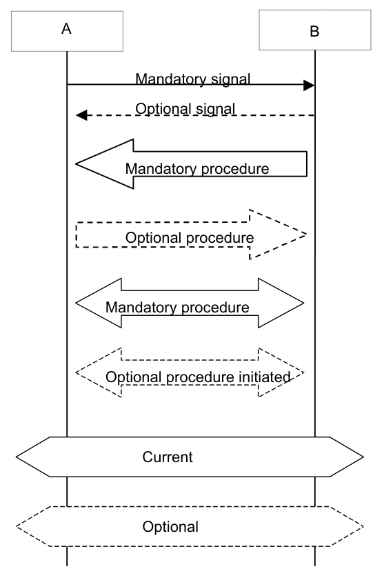
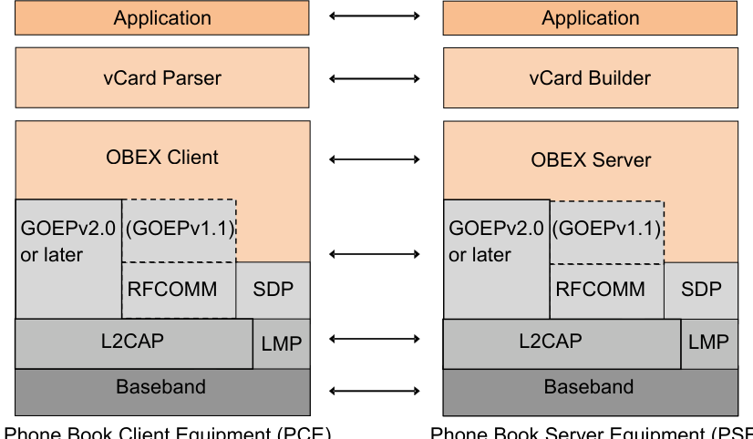
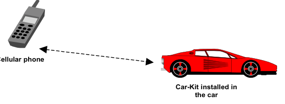
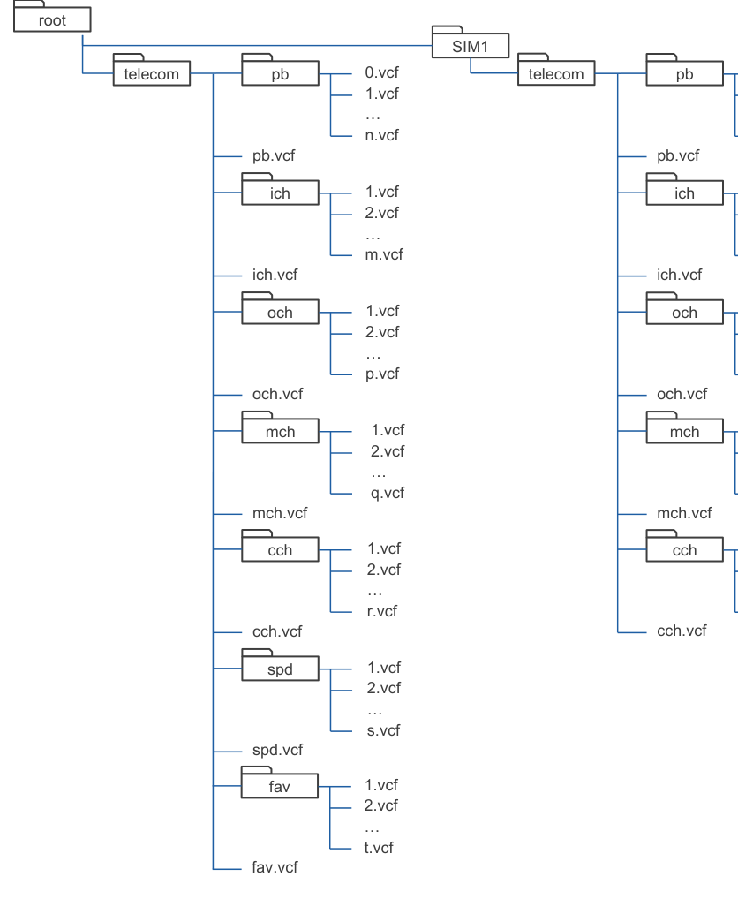
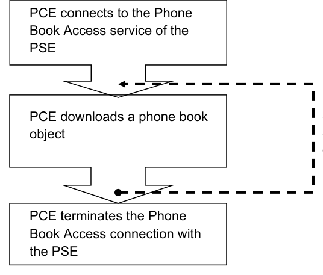
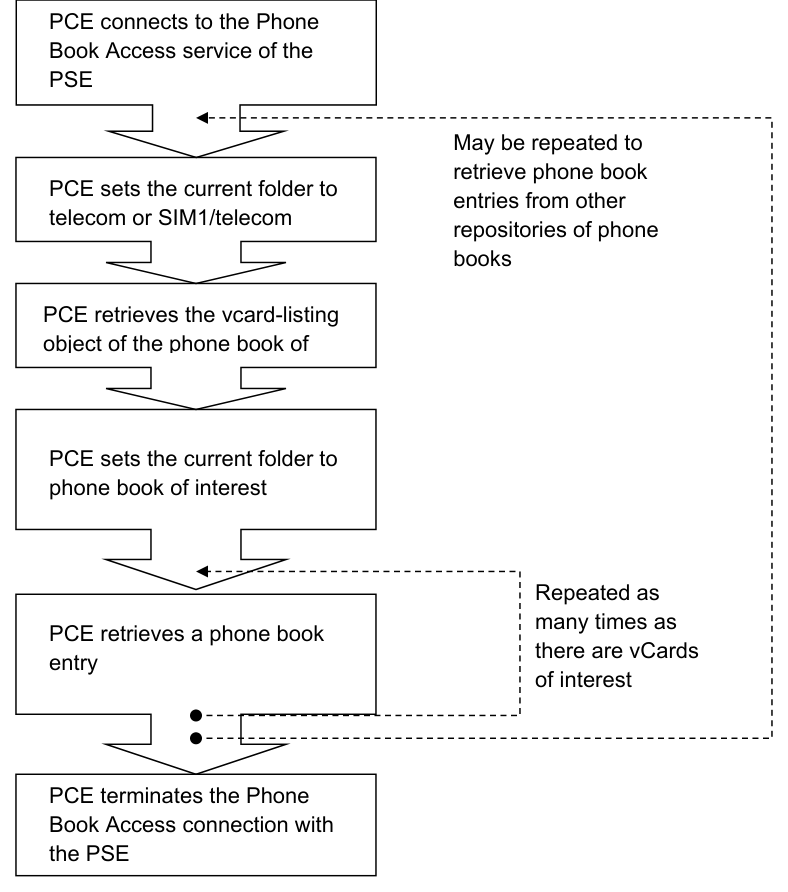
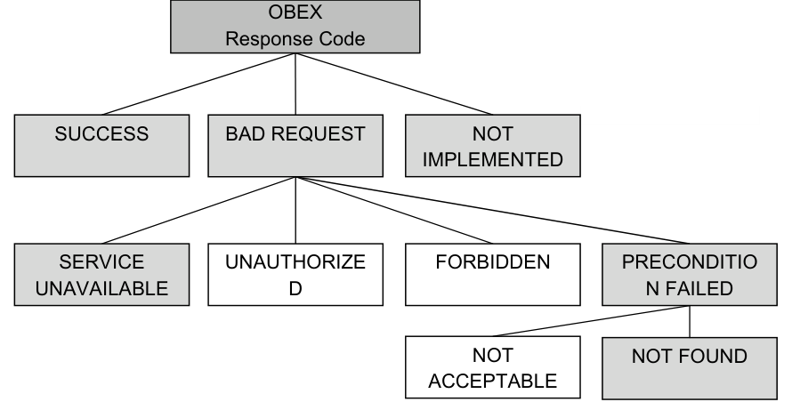

# PBAP v1.2.3

> Source: PDF converted via PyMuPDF.

---

Phone Book Access
Bluetooth® Profile Specification
 Revision: v1.2.3
 Revision Date: 2019-01-21
 Group Prepared By: Audio, Telephony, and Automotive Working Group
 Feedback Email: ata-main@bluetooth.org
Abstract: The Phone Book Access Profile (PBAP) specification defines the procedures and protocols to exchange Phone Book objects between devices. It is especially tailored for the automotive Hands-Free use case where an onboard terminal device (typically a Car-Kit installed in the car) retrieves Phone Book objects from a mobile device (typically a mobile phone or an embedded phone). This profile may also be used by any client device that requires access to Phone Book objects stored in a server device.
Revision History

|  | Revision Number | Date |  |  | Comments |  |
| --- | --- | --- | --- | --- | --- | --- |
| v1.2.0 |  | 2013-11-05 |  | Adopted by the Bluetooth SIG Board of Directors |  |  |
| v1.2.1 |  | 2015-12-15 |  | Adopted by the Bluetooth SIG Board of Directors |  |  |
| v1.2.3 |  | 2019-01-21 |  | Adopted by the Bluetooth SIG Board of Directors |  |  |

Version History

|  | Versions | Changes |  |
| --- | --- | --- | --- |
| v1.2.0 to v1.2.1 |  | Incorporated erratum E6220. |  |
| v1.2.1 to v1.2.2 |  | PBAP v1.2.2 was not adopted. ATA WG and BARB agreed to skip version number 1.2.2 to avoid version numbering conflicts related to errata E7799 and E8539, filed against PBAP v1.2.0 and v1.2.1, respectively. |  |
| v1.2.1 to v1.2.3 |  | Incorporated errata E6492, E6503, E6819, E6820, E6877, E7799, and E8539. |  |

Contributors

|  | Name |  |  | Company |  |
| --- | --- | --- | --- | --- | --- |
| Dominik SOLLFRANK |  |  | Berner & Mattner |  |  |
| Burch SEYMOUR |  |  | Continental Automotive Systems |  |  |
| Souichi SAITO |  |  | Denso |  |  |
| Don LIECHTY |  |  | Extended Systems |  |  |
| Stephen RAXTER |  |  | National Analysis Center |  |  |
| Michael CARTER |  |  | Motorola |  |  |
| Leonard HINDS |  |  | Motorola |  |  |
| Tony MANSOUR |  |  | Motorola |  |  |
| Stephane BOUET |  |  | Nissan |  |  |
| Patrick CLAUBERG |  |  | Nokia |  |  |
| Jamie MCHARDY |  |  | Nokia |  |  |
| Jurgen SCHNITZLER |  |  | Nokia |  |  |
| Brian TRACY |  |  | Nokia |  |  |
| Nicolas BESNARD |  |  | Parrot |  |  |
| Kyle PENRI-WILLIAMS |  |  | Parrot |  |  |
| Guillaume POUJADE |  |  | Parrot |  |  |
| Scott WALSH |  |  | Plantronics |  |  |
| Terry BOURK |  |  | Qualcomm |  |  |

|  | Name |  |  | Company |  |
| --- | --- | --- | --- | --- | --- |
| Dmitri TOROPOV |  |  | Siemens |  |  |
| Erwin WEINANS |  |  | Sony Ericsson |  |  |
| Tim REILLY |  |  | Stonestreet One |  |  |
| Kentaro NAGAHAMA |  |  | Toshiba |  |  |
| Robert MALING |  |  | Toyota |  |  |
| Akira MIYAJIMA |  |  | Toyota |  |  |
| Ryan BRUNER |  |  | Visteon |  |  |

Use of this specification is your acknowledgement that you agree to and will comply with the following notices and disclaimers. You are advised to seek appropriate legal, engineering, and other professional advice regarding the use, interpretation, and effect of this specification.
Use of Bluetooth specifications by members of Bluetooth SIG is governed by the membership and other related agreements between Bluetooth SIG and its members, including those agreements posted on Bluetooth SIG’s website located at www.bluetooth.com. Any use of this specification by a member that is not in compliance with the applicable membership and other related agreements is prohibited and, among other things, may result in (i) termination of the applicable agreements and (ii) liability for infringement of the intellectual property rights of Bluetooth SIG and its members.
Use of this specification by anyone who is not a member of Bluetooth SIG is prohibited and is an infringement of the intellectual property rights of Bluetooth SIG and its members. The furnishing of this specification does not grant any license to any intellectual property of Bluetooth SIG or its members. THIS SPECIFICATION IS PROVIDED “AS IS” AND BLUETOOTH SIG, ITS MEMBERS AND THEIR AFFILIATES MAKE NO REPRESENTATIONS OR WARRANTIES AND DISCLAIM ALL WARRANTIES, EXPRESS OR IMPLIED, INCLUDING ANY WARRANTIES OF MERCHANTABILITY, TITLE, NON- INFRINGEMENT, FITNESS FOR ANY PARTICULAR PURPOSE, OR THAT THE CONTENT OF THIS SPECIFICATION IS FREE OF ERRORS. For the avoidance of doubt, Bluetooth SIG has not made any search or investigation as to third parties that may claim rights in or to any specifications or any intellectual property that may be required to implement any specifications and it disclaims any obligation or duty to do so.
TO THE MAXIMUM EXTENT PERMITTED BY APPLICABLE LAW, BLUETOOTH SIG, ITS MEMBERS AND THEIR AFFILIATES DISCLAIM ALL LIABILITY ARISING OUT OF OR RELATING TO USE OF THIS SPECIFICATION AND ANY INFORMATION CONTAINED IN THIS SPECIFICATION, INCLUDING LOST REVENUE, PROFITS, DATA OR PROGRAMS, OR BUSINESS INTERRUPTION, OR FOR SPECIAL, INDIRECT, CONSEQUENTIAL, INCIDENTAL OR PUNITIVE DAMAGES, HOWEVER CAUSED AND REGARDLESS OF THE THEORY OF LIABILITY, AND EVEN IF BLUETOOTH SIG, ITS MEMBERS OR THEIR AFFILIATES HAVE BEEN ADVISED OF THE POSSIBILITY OF THE DAMAGES.
If this specification is a prototyping specification, it is solely for the purpose of developing and using prototypes to verify the prototyping specifications at Bluetooth SIG sponsored IOP events. Prototyping Specifications cannot be used to develop products for sale or distribution and prototypes cannot be qualified for distribution.
Products equipped with Bluetooth wireless technology ("Bluetooth Products") and their combination, operation, use, implementation, and distribution may be subject to regulatory controls under the laws and regulations of numerous countries that regulate products that use wireless non-licensed spectrum. Examples include airline regulations, telecommunications regulations, technology transfer controls and health and safety regulations. You are solely responsible for complying with all applicable laws and regulations and for obtaining any and all required authorizations, permits, or licenses in connection with your use of this specification and development, manufacture, and distribution of Bluetooth Products. Nothing in this specification provides any information or assistance in connection with complying with applicable laws or regulations or obtaining required authorizations, permits, or licenses.
Bluetooth SIG is not required to adopt any specification or portion thereof. If this specification is not the final version adopted by Bluetooth SIG’s Board of Directors, it may not be adopted. Any specification adopted by Bluetooth SIG’s Board of Directors may be withdrawn, replaced, or modified at any time. Bluetooth SIG reserves the right to change or alter final specifications in accordance with its membership and operating agreements.
Copyright © 2004–2019. All copyrights in the Bluetooth Specifications themselves are owned by Apple Inc., Ericsson AB, Intel Corporation, Lenovo (Singapore) Pte. Ltd., Microsoft Corporation, Nokia Corporation, and Toshiba Corporation. The Bluetooth word mark and logos are owned by Bluetooth SIG, Inc. Other third-party brands and names are the property of their respective owners.
Contents
Foreword
Interoperability between devices from different manufacturers is provided for a specific service and usage model if the devices conform to a Bluetooth-SIG defined profile specification. A profile defines a selection of messages and procedures (generally termed capabilities) from the Bluetooth SIG specifications and gives an unambiguous description of the air interface for specified service(s) and usage model(s).
All defined features are process-mandatory. This means that if a feature is used, it is used in a specified manner. Whether the provision of a feature is mandatory or optional is stated separately for both the Client role and the Server role.

## 1 Introduction

1.1 Scope The Phone Book Access Profile (PBAP) defines the protocols and procedures that shall be used by devices for the retrieval of phone book objects. It is based on a Client-Server interaction model where the Client device pulls phone book objects from the Server device.
This profile is especially tailored for the Hands-Free usage case (i.e., implemented in combination with the “Hands-Free Profile” or the “SIM Access Profile”). It provides numerous capabilities that allow for advanced handling of phone book objects, as needed in the car environment. In particular, it is much richer than the Object Push Profile ( that could be used to push vCard formatted phone book entry from one device to another).
This profile can also be applied to other usage cases where a Client device is to pull phone book objects from a Server device.
Note however that this profile only allows for the consultation of phone book objects (read-only). It is not possible to alter the content of the original phone book object (read/write).
1.2 Profile dependencies A profile is dependent upon another profile if it re-uses parts of that profile, by explicitly referencing it. A profile has dependencies on the profile(s) in which it is contained – directly and indirectly.
Phone Book Access Profile is dependent upon the Generic Object Exchange Profile, the Serial Port Profile and the Generic Access Profile.

### 1.3 Symbols and conventions

#### 1.3.1 Requirement status symbols In this document, the following symbols are used:

"M" for mandatory to support
"O" for optional to support
"X" for excluded (used for capabilities that may be supported by the unit but shall never be used in this use case)
"C" for conditional to support
"N/A" for not applicable (in the given context it is impossible to use this capability)
Some excluded capabilities are capabilities that, according to the relevant Bluetooth specification, are mandatory. These are features that may degrade operation of devices in this use case. Therefore, these features shall never be activated while a unit is operating as a unit within this use case.
1.3.2 Signaling diagram conventions The signaling diagrams in this specification are informative only. Within the diagrams, the following conventions are used to describe procedures:

**Figure 1.1: Conventions used in signaling diagrams**

### 1.4 Phone Book Access Profile change history

#### 1.4.1 Changes from V1.0 to v1.1 • Updates related to the Bluetooth 2.1 Core Specification, noticeably related to security.

#### 1.4.2 Changes from V1.1 to v1.1.1 • Applied the Errata Service Release (ESR) 06 as well as erratum 5192.

#### 1.4.3 Changes from V1.1.1 to v1.2 • Added GOEP 2.0 (OBEX over L2CAP and Single Response Mode) Support

• Added Folder Version Counters
• Added vCard Selecting
• Added Enhanced Missed Calls ( New Missed Calls counter for combined call history and reset command)
• Added Unique Caller Identifier (UCI) support
• Added Contact Unique Identifiers (UID) for cross-referencing between folders
• Added a Contact Image Default Format

### 1.5 Language

1.5.1 Language conventions The Bluetooth SIG has established the following conventions for use of the words shall, must, will, should, may, can, is, and note in the development of specifications:

| shall | is required to – used to define requirements. |
| --- | --- |
| must | is used to express: a natural consequence of a previously stated mandatory requirement. OR an indisputable statement of fact (one that is always true regardless of the circumstances). |
| will | it is true that – only used in statements of fact. |
| should | is recommended that – used to indicate that among several possibilities one is recommended as particularly suitable, but not required. |
| may | is permitted to – used to allow options. |
| can | is able to – used to relate statements in a causal manner. |
| is | is defined as – used to further explain elements that are previously required or allowed. |
| note | Used to indicate text that is included for informational purposes only and is not required in order to implement the specification. Each note is clearly designated as a “Note” and set off in a separate paragraph. |

For clarity of the definition of those terms, see Core Specification Volume 1, Part E, Section 1.
1.5.2 Reserved for Future Use Where a field in a packet, Protocol Data Unit (PDU), or other data structure is described as "Reserved for Future Use" (irrespective of whether in uppercase or lowercase), the device creating the structure shall set its value to zero unless otherwise specified. Any device receiving
or interpreting the structure shall ignore that field; in particular, it shall not reject the structure because of the value of the field.
Where a field, parameter, or other variable object can take a range of values, and some values are described as "Reserved for Future Use," a device sending the object shall not set the object to those values. A device receiving an object with such a value should reject it, and any data structure containing it, as being erroneous; however, this does not apply in a context where the object is described as being ignored or it is specified to ignore unrecognized values.
When a field value is a bit field, unassigned bits can be marked as Reserved for Future Use and shall be set to 0. Implementations that receive a message that contains a Reserved for Future Use bit that is set to 1 shall process the message as if that bit was set to 0, except where specified otherwise.
The acronym RFU is equivalent to Reserved for Future Use.
1.5.3 Prohibited When a field value is an enumeration, unassigned values can be marked as “Prohibited.” These values shall never be used by an implementation, and any message received that includes a Prohibited value shall be ignored and shall not be processed and shall not be responded to.
Where a field, parameter, or other variable object can take a range of values, and some values are described as “Prohibited,” devices shall not set the object to any of those Prohibited values. A device receiving an object with such a value should reject it, and any data structure containing it, as being erroneous.
“Prohibited” is never abbreviated.

## 2 Profile overview

### 2.1 Profile stack Figure 2.1 shows the protocols and entities used in this profile.

Phone Book Client Equipment (PCE)
Phone Book Server Equipment (PSE)

**Figure 2.1: Profile stack**

The Baseband, LMP and L2CAP are the physical and data link layers of the Bluetooth protocols. RFCOMM is the Bluetooth serial port emulation entity. SDP is the Bluetooth Service Discovery Protocol. See [13] for more details on these topics.
Compatibility to the current Bluetooth Core specification 1.2 and later (see [13]) is mandated.
The PBAP session is defined as the underlying OBEX connection between the client and the server opened with the PBAP Target UUID [See section 6.4].
The L2CAP interoperability requirements are defined in GOEP v2.0 or later [15]. The PBAP v1.2 profile requires backwards compatibility with previous versions of PBAP which were based on GOEP v1.1. The procedures for backward compatibility defined in section 6.2 of GOEP v2.0 or later shall be used. When OBEX over RFCOMM is used (GOEP v1.1), then only a subset of features shall be used. Support for either GOEP1.1 and GOEP2.0 (or later) is advertised in the SDP entries.

### 2.2 Configuration and roles The figure below shows a typical configuration of devices for which the Phone Book Access Profile is applicable:

**Figure 2.2: Phone Book Access Profile applied to the Hands-Free use case**

The following roles are defined for this profile:
Phone Book Server Equipment (PSE) – This is the device that contains the source phone book objects.
Phone Book Client Equipment (PCE) – This is the device that retrieves phone book objects from the Server Equipment.
These terms are used in the rest of this document to designate these roles.
For the Hands-Free use case, a typical configuration would be a mobile phone as PSE and a Hands-Free car kit as PCE.

### 2.3 User requirements and scenarios The following are some of the main scenarios that are covered by this profile:

The PCE to access the list of phone book entries stored in the PSE
The PCE to download one or several phone book entries from the PSE
The PCE to access the call histories stored in the PSE
The PCE to access the Subscriber number information stored in the PSE
2.4 Profile fundamentals The Phone Book Client Equipment may be able to use the services of the Phone Book Server Equipment only after a successful creation of a secure connection. Before a Phone Book Client Equipment may use the services of Phone Book Server Equipment for the first time, the two devices shall bond. Initialization includes exchanging security initialization messages, creation of link keys, encryption, and service discovery.
Either the PSE or PCE may initiate bonding. As a minimum the PSE shall support Inquiry in order to initiate bonding. Both PSE and PCE shall support Inquiry Scan Mode in order to accept bonding.
2.5 Bluetooth security The two devices shall create a secure connection using the authentication procedure described in the Generic Access Profile.The Phone Book Access Profile mandates the use of several Bluetooth security features:
Bonding – The PCE and PSE shall be bonded before setting up a Phone Book Access Profile connection.. When using security mode 4, an unauthenticated link key1 may be used.
Encryption - The link between PCE and PSE shall be encrypted using Bluetooth encryption.
Bluetooth Passkey – The passkey, when required, shall be as described in the GAP section of the relevant Bluetooth Core Specification.
Furthermore, the following issues are mandated for devices complying with the Phone Book Access Profile:
Link keys – Combination keys shall be used for Phone Book Access Profile connections.
Encryption key length - The length of the encryption key shall be at least 56 bits. For increased security, use of the maximum length allowed given regional regulation is encouraged.
User confirmation - The PSE user shall have to confirm at least the first Phone Book Access Profile connection from each new PCE.
2.6 Conformance If conformance to this profile is claimed all capabilities indicated as mandatory for this profile shall be supported in the specified manner (process mandatory). This also applies for all optional and conditional capabilities for which support is indicated. All mandatory, optional and conditional capabilities, for which support is indicated, are subject to verification as part of the Bluetooth certification program.
2.7 Backwards compatibility Backwards compatibility between different versions of the specification is enabled by using feature bits in the newer versions to advertise support for a certain feature, function or parameter.
The only exception to this mechanism is GOEP where the presence of a GoepL2capPsm attribute in the PSE’s SDP records determines which version of GOEP to use.
Profile versions should never be used by devices to determine if a feature can be used or not.
1 This corresponds to the “Just Works” association mode described in the Secure Simple Pairing section of the Bluetooth Core Specification 2.1+EDR.

## 3 Application layer

### 3.1 Phone Book Access Profile objects and formats

3.1.1 Phone book repositories There might be several repositories for phone book objects. A typical example is that of a GSM mobile phone where one phone book is stored locally in the phone’s memory and another phone book is stored on the phone’s SIM card.

#### 3.1.2 Phone book objects There are seven types of phone book objects:

• The main phone book object (pb) corresponds to the user phone book of the current repository. In case the PSE is a mobile phone, pb is the content of the contact list stored in the phone, whereas for a SIM, it is the contact list stored in the SIM Card.
• The Incoming Calls History object (ich) corresponds to a list of the M most recently received calls. The number of entries in this list, M, is dependent on the implementation of the connected device.
• The Outgoing Calls History object (och) corresponds to a list of the P most recently made calls. The number of entries in this list, P, is dependent on the implementation of the connected device.
• The Missed Calls History object (mch) corresponds to a list of the Q most recently missed calls. The number of entries in this list, Q, is dependent on the implementation of the connected device.
• The Combined Calls History object (cch) corresponds to the combination of ich, och and mch. The number of entries in the list, R, is dependent on the implementation of the connected device.
• The Speed-Dial object (spd) corresponds to the list of S speed dial entries on the PSE. The number of entries in this list, S, is dependent on the implementation of the connected devices.
• The Favorite Contacts object (fav) corresponds to a list of T favorites on the PSE. The number of entries in this list, T, is dependent on the implementation of the connected devices.
More information on pb, ich, och and mch can be found in the IrMC specification [13]. The cch, spd and fav objects are extensions to IrMC specific to the present profile.

#### 3.1.3 Phone book object representations Each phone book object has 2 representations:

• File representation:
In this representation, the phone book object is represented as one single file that contains all of the corresponding phone book entries. This representation corresponds to the IrMC [13] level 2 information exchange.
• Folder representation:
In this representation, the phone book object is presented as a virtual folder that contains the corresponding phone book entries, each being represented as an individual file. This representation corresponds to the IrMC [13] level 3 information exchange.
Note that the folder representation of fav, spd, ich, och, mch and cch are extensions to IrMC.

#### 3.1.4 Phone book entries format Each individual entry in a phone book object is presented under the vCard format.

The PSE shall support both vCard 2.1 and vCard 3.0 versions and deliver the Entries to the PCE under the format version that is requested by the PCE.
Whatever the vCard format requested, the character set used to encode vCard property content shall be UTF-8.
Whenever the CHARSET property parameter is used in a vCard to override default character set, UTF-8 is the only accepted value for this parameter in this profile.
3.1.4.1 Call history extension The time of each call found in och, ich, mch and cch folder, can be shown using the IrMC [13] defined X-IRMC-CALL-DATETIME property that extends the vCard specification. This attribute can be used in combination with three newly created property parameters:
• MISSED
• RECEIVED
• DIALED
The timestamp shall be in local time (the time the server device would display to the user, which is normally the correct time for the location adjusted for time zone and DST).
For instance, a call that was missed on March 20th, 2005 at 10 am would be stamped:
For vCard 2.1:
X-IRMC-CALL-DATETIME;MISSED:20050320T100000
For vCard 3.0:
X-IRMC-CALL-DATETIME;TYPE=MISSED:20050320T100000
It is strongly recommended to use this property parameter whenever possible. They are especially useful in vCards that are retrieved from the cch folder ( see Section 3.1.2 ).
Note that it is legal to use this property with no data; i.e.,
X-IRMC-CALL-DATETIME;MISSED:
This scenario may occur if the device did not have the time/date set when the call was received. The phone number would be recorded but no date/time could be attached to it. It may be added to the vCard as the cch log needs it to indicate the type of call that the record identifies.
3.1.4.2 Speed dial extension For the speed dial extension, a new vCard property that holds a string representing the key associated with a specific contact. (e.g., "5","A","ALT","SPACE","F1"…) is introduced.
The entries of this folder shall contain the new vCard property X-BT-SPEEDDIALKEY. This property contains a string that represents the key to be pressed for speed dialing this entry. The vCard X-BT-SPEEDDIALKEY shall only be contained in vCard objects of the Speed Dial objects.
Speed Dial vCard Example:
BEGIN:VCARD VERSION:2.1 FN:Jean Dupont N:Dupont;Jean ADR;WORK; QUOTED-PRINTABLE:;Paris 75010;91 Rue du Faubourg Saint-Martin TEL;CELL;PREF:+1234 56789 EMAIL;INTERNET:jean.dupont@example.com X-BT-SPEEDDIALKEY:F1 END:VCARD
Handle values (xxxxxxxx.vcf) in the vCardListing of this object are independent of those used in other folders and shall be in ascending order.
Every vCards in this 'spd' object shall contain contact information if available but only one single number or X-BT-UCI per entry.
3.1.4.3 Favorites extension Only complete contacts shall be listed in this folder. Handle values (xxxxxxxx.vcf) are independent of those used in other folders and shall be in ascending order.
The vCards of this folder object may contain the vCard property X-BT-SPEEDDIALKEY. This property contains a string that represents the key or sequence to be pressed for speed dialing this entry.
3.1.4.4 The vCard property X-BT-UID Each contact in the main phone book objects (/telecom/pb/, /telecom/pb.vcf, /SIM1/telecom/pb/ and /SIM1/telecom/pb.vcf) shall have a unique identifier if and only if the “X-BT-UID vCard Property" PSE and PCE feature bits are both set. This identifier shall be included in the extended vCard property X-BT-UID respecting the following hexadecimal format.
Contact unique identifiers (X-BT-UIDs) are a unique 128-bit value transmitted as a 32-character ASCII hexadecimal string. Only numeric 0-9 and upper case A-F characters shall be used.
Format Example:
A1A2A3A4B1B2C1C2D1D2E1E2E3E4E5E6
Contact X-BT-UIDs shall be persistent across connections for a given value of the database identification property. Devices shall not reuse previously assigned X-BT-UIDs for new contact entries as long as the value of the database identification property has not been re-generated.
If for some reason the unique identifiers roll over or start over, a new value of the database identifier shall be generated. More information on the Database Identifier can be found in section 5.1.4.10.
Main phone book vCard Example:
BEGIN:VCARD VERSION:2.1 FN:Jean Dupont N:Dupont;Jean ADR;WORK;QUOTED-PRINTABLE:;Paris 75010;91 Rue du Faubourg Saint- Martin TEL;CELL;PREF:+1234 56789 EMAIL;INTERNET:jean.dupont@example.com X-BT-UID:A1A2A3A4B1B2C1C2D1D2E1E2E3E4E5E6 END:VCARD
The PSE should link the contacts from the main database to the entries of the mch, och, ich, cch, fav and spd, wherever possible. How the objects are linked is implementation specific. If referencing the contacts is supported, the “Contact Referencing’ feature bit shall be set.
To reference a contact, entries of the mch, och, ich, cch, fav and spd objects shall use the vCard property named ‘X-BT-UID’  to specify the unique identifier (X-BT-UID) of the linked contact. The hexadecimal format is defined above.
Referencing vCard Example:
BEGIN:VCARD VERSION:2.1 N:Dupont;Jean TEL;CELL:+1234 56789 X-BT-UID:A1A2A3A4B1B2C1C2D1D2E1E2E3E4E5E6 X-IRMC-CALL-DATETIME;MISSED:20050320T100000 END:VCARD
If a contact in the phone book is deleted, the call history, speed dial, or favorite entries shall either not reference this contact anymore (call history) or be removed as well (favorites/speed dial). If the contact is changed (e.g., a number is changed), previously linked X-BT-UIDs shall be updated accordingly (removed, reassigned or unchanged).
The X-BT-UID property shall not have property-parameters.
3.1.4.5 The vCard X-BT-UCI property Each contact in the main phone book objects (/telecom/pb/, /telecom/pb.vcf, /SIM1/telecom/pb/ and /SIM1/telecom/pb.vcf) may contain one or more Uniform Caller Identifier (X-BT-UCI) vCard properties if the PCE’s and PSE’s ‘X-BT-UCI vCard Property’ feature bits are both set.
In this case the Call Logs (mch, cch, etc.) shall contain either:
- A single TEL property OR
- A single X-BT-UCI property and an empty TEL property
The purpose of the X-BT-UCI vCard Property is to contain a reference, which allows that user to be identified by a VoIP Client (e.g., Skype, Facetime, etc).
X-BT-UCI vCard Example:
BEGIN:VCARD VERSION:2.1 FN:Jean Dupont N:Dupont;Jean ADR;WORK;QUOTED-PRINTABLE:;Paris 75010;91 Rue du Faubourg Saint- Martin TEL;CELL;PREF:+1234 56789 EMAIL;INTERNET:jean.dupont@example.com X-BT-UCI;WORK:lync:jean.dupont@example.com X-BT-UCI:skype:jean18061977 X-BT-UCI:skype:jeand_private1815 END:VCARD
The format of X-BT-UCI is simply a two-part token.
- X-BT-UCI:{client}:{user_id}
{client} is the name of the VoIP client associated with this X-BT-UCI. This string shall be five (5) characters or less.
{user_id} is the user name associated with this client.
Both {client} and {user_id} are alphanumeric strings. Whitespace and non-printing characters are not allowed and shall be stripped by a receiving device.
The list of possible values for {client} is enumerated in the assigned numbers section of the Bluetooth website. [8]
The X-BT-UCI property may the same types as the TEL field. (e.g., X-BT- UCI;TYPE=WORK:skype:jean18061815 for vCard version 3.0)

#### 3.1.5 PBAP virtual folders structure Phone book information is organized under the virtual folders architecture described in Figure 3.1.

**Figure 3.1: PBAP virtual folders architecture**

3.1.5.1 Handles All of the vCards of the PSE are identified by their handle (<handle.vcf>). A handle is 32 bit value, represented as up to 8 hexadecimal digits.
The present profile has been developed on the assumption that the handles are not modified during the lifespan of a given PBAP session i.e. that the internal index and the actual content of each vCard does not change. If for some reason the implementation allows for handle
modifications (including possibly deletion operations) during an active PBAP session, it shall support either of the following 2 behaviors:
Error reporting: If any of the handles are modified/deleted during an active PBAP session, then the PSE shall return Error "Precondition failed" to all read requests until the PCE has updated the vCard-listing.
Change tracking: The PSE shall keep track of all changes made to any handles during the active PBAP session.
3.1.5.2 Local phone books: PB and SIM1 The local phone book information is located under the telecom folder. When the PSE also contains a SIM card, SIM card phone book information shall be located under the SIM1/telecom/ folder.
There is no limit to the number of entries a phone book can contain.
The handle 0.vcf in the pb folder is reserved for the owner card. This handle shall always exist and its associated card shall be returned when requested. The 0.vcf vCard shall contain at least the mobile number of the PSE, whenever the PSE has the knowledge of this number. When the owner card is not known, handle 0.vcf can reference an empty vCard, or a vCard that contains the mobile number of the PSE (if available)
The vCards located in the pb folder shall be in ascending order by handle number. When the vCard-listing object for pb is requested, the default order shall be in ascending order by handle number (see Section 3.1.6).
The vcf files located directly under the “telecom” and/or ”SIM1/telecom” folders contain all of the vCards of the corresponding phone book object and can be used to retrieve the entire object in one operation (see section 4.2, Phone Book Download feature).
3.1.5.3 Call histories The handle of each call history vCard is specific to the folder in which it appears. For instance, if the same number/contact can be found in both the och and ich folders, each handle  is independent of the other and may, or may not, have the same value.`
There is no limit to the number of entries a phone book can contain.
Here is an example where the same number can be found in several call histories:

| Ich folder | Handle | Och folder | Handle |
| --- | --- | --- | --- |
| +33642084141 – 02/18/2005 16:00 | 1.vcf | +4425724268 – 02/15/2005 17:30 | 1.vcf |
| +4425724268 – 02/18/2005 15:00 | 2.vcf | +33149046174 – 02/15/2005 17:00 | 2.vcf |
|  |  | +33642084141 – 02/14/2005 09:00 | 3.vcf |

The handles should be attributed in the PSE in such a way that once sorted by increasing handles; the most recent call event in the listed folder has the handle 1.vcf. The order is therefore chronological.
As opposed to the Local Phone Books, the Call Histories shall use dynamic handles that shall be updated in real time as calls are received and made.
Neither searching nor sorting call histories folders is mandatory to support on the PSE. Specific search or sort request from the PCE should be replied with a vCard listing in chronological order.
If the number of a call history entry can be linked to a local PSE phone book entry (in pb or SIM1), the PSE should provide the contact information available in that corresponding phone book entry when the call history entry is retrieved. However, the returned call history entry shall contain one single TEL attribute only. This TEL attribute shall describe the phone number that was used for that call.
If the number could not be linked to a locally present PSE phone book entry, then the call history object shall contain properties VERSION, N ( in that case, N would be an empty property ), FN for a vCard 3.0 only ( in that case, FN would be an empty property ), TEL if requested, and X-IRMC-CALL-DATETIME if requested and supported.
3.1.6 vCard-listing object (x-bt/vcard-listing) The vCard-listing object is an XML object and is encoded in UTF-8 by default. The default character set may be omitted.
The vCard-Listing object is defined according to the following DTD:
<!DTD for the PBAP vCard-Listing Object--> <!ELEMENT vcard-listing ( card )* > <!ATTLIST vcard-listing version CDATA #FIXED “1.0”> <!ELEMENT card EMPTY> <!ATTLIST card handle CDATA #REQUIRED name CDATA #IMPLIED >
Example of vCard listing object:
<?xml version=“1.0”?> <!DOCTYPE vcard-listing SYSTEM “vcard-listing.dtd”>
<vCard-listing version=“1.0”> <card handle = ”0.vcf” name = ”Miyajima;Andy”/> <card handle = ”1.vcf” name = ”Poujade;Guillaume”/> <card handle = ”2.vcf” name = ”Hung;Scott”/> <card handle = ”3.vcf” name = ”Afonso;Arthur”/> <card handle = ”6.vcf” name = ”McHardy;Jamie”/> <card handle = ”7.vcf” name = ”Toropov;Dmitri”/> <card handle = ”10.vcf” name = ”Weinans;Erwin”/> </vCard-listing>
3.1.6.1 Name property format The name property of the vCard-listing DTD has the same definition as the name property of a vCard - i.e., the N property. Therefore, the format to be used is the property structure “LastName;FirstName;MiddleName;Prefix;Suffix”
Regardless of the native structure used internally for storing name information, all PSEs shall be able to format the name information of the name property of the vCard-listing object according to one of the following methods:
- The PSE provides all the information in the LastName field of the name property and the other fields are empty.
- The internal name structure maps directly into the “LastName; FirstName; MiddleName;Prefix;Suffix” structure of the name property and no conversion is required. Some fields may be empty.
- From its native structure, the PSE constructs a new representation of the name information that fits into the “LastName; FirstName; MiddleName;Prefix;Suffix” structure of the name property. Some fields may be empty.
In the case of the vCard-listing of one of the calls history phonebook objects, and when a call history entry cannot be linked to a local entry in the main phonebook object of the PSE, the PSE may return the phone number corresponding to the call history entry as a string in the name property.
3.1.6.2 Default contact image format for the vCard PHOTO property The vCard-property PHOTO enables the transfer of contact images. If an image is present and the ‘Default Contact Image Format’ bit is set in the PSE’s PbapSupportedFeatures :
• The image pixel-size shall be at most 300 pixels wide and 300 pixels high and its file size shall not exceed 50kbyte.
• Contact images shall use JPEG compression and encode data in the vCard PHOTO property using base64.
• Other compression and encoding algorithms shall not be used for the PHOTO property.

## 4 Phone Book Access features

4.1 Phone Book Access Profile features The current profile is composed of two features. For a device to comply with this specification, it shall observe the following implementation requirements table:

|  | Feature |  |  | Support by the PCE |  |  | Support by the PSE |  |
| --- | --- | --- | --- | --- | --- | --- | --- | --- |
| Download |  |  | C1 |  |  | M |  |  |
| Browsing |  |  | C1 |  |  | M |  |  |
| Database Identifier |  |  | C3 |  |  | M |  |  |
| Folder Version Counters |  |  | O |  |  | M |  |  |
| vCard Selecting |  |  | O |  |  | M |  |  |
| Enhanced Missed Calls |  |  | O |  |  | O |  |  |
| X-BT-UCI vCard Property |  |  | O |  |  | O |  |  |
| X-BT-UID vCard Property |  |  | O |  |  | O |  |  |
| Referencing Contacts |  |  | C2 |  |  | C2 |  |  |
| Contact Image Default Format |  |  | X |  |  | M |  |  |

C2: Optional if ‘X-BT-UID vCard Property’ is supported, Excluded otherwise
C3: Mandatory if ‘Folder Version Counters’ or ‘X-BT-UID vCard Property ‘ is supported, Otherwise Optional.
The tables in Sections 4.2 and 4.3 map each feature to the functions used for that feature. The columns indicate the level of support required for each function.
4.2 Phone Book Download feature This feature is used to download the entire content of a phone book object. It is especially designed for devices with relatively large storage capacity that are typically attempting to download and locally store the entire phone book.
Note that this feature is very basic. In particular, phone book entries are delivered in ascending index order only. No sorting is possible.

|  |  |  |  | Function |  |  | Support by the PCE |  |  | Support by the PSE |  |
| --- | --- | --- | --- | --- | --- | --- | --- | --- | --- | --- | --- |
| Phone book Download feature |  |  | PullPhonebook |  |  | M |  |  | M |  |  |

The PullPhonebook function is used to download the phone book object of interest.
A typical function sequence for the Phone Book Download feature is illustrated in Figure 4.1:

**Figure 4.1: Phone Book Download sequence**

### 4.3 Phone Book Browsing feature This feature is especially suitable for applications where there is a need to scroll the phone book.

|  | Function |  | Support by the |  | Support by the PSE |
| --- | --- | --- | --- | --- | --- |
|  |  |  | PCE |  |  |
| Phone Book Browsing Feature | SetPhonebook | M |  |  | M |
|  | PullvCardListing | M |  |  | M |
|  | PullvCardEntry | M |  |  | M |

The SetPhonebook function allows for the PCE to select the phone book object of interest.
The PullvCardListing function allows for the PCE to retrieve a list that represents the content of a given phone book object. The list can be tailored so that it contains only the entries of interest and/or is sorted in the order of interest.
The PullvCardEntry function is used by the PCE to retrieve an individual entry from the phone book object of interest.
A typical function sequence for the Phone Book Browsing feature is illustrated in Figure 4.2:

**Figure 4.2: Phone Book Browsing sequence**

## 5 Phone Book Access Profile functions

5.1 PullPhoneBook function This function retrieves an entire phone book object from the object exchange server. The Pull Phone Book function is typically used from the root folder. However, when an implementation is using both phone book downloading and phone book browsing services, Pull Phone Book can be used from whichever virtual folder the PSE is currently set to.
The request is formatted as follows:

|  | Field/Header |  |  | Name |  |  | Value |  |  | Status |  |
| --- | --- | --- | --- | --- | --- | --- | --- | --- | --- | --- | --- |
| Field Opcode GET (0x03 or 0x83) M Field Packet Length Varies M |  |  |  |  |  |  |  |  |  |  |  |
|  | Header |  |  | Connection ID |  |  | Varies |  |  | M |  |
|  | Header |  |  | Single Response Mode |  |  | 0x01 |  |  | C1 |  |
|  | Header |  |  | Single Response Mode Param |  |  | 0x01 |  |  | C2 |  |
|  | Header |  |  | Name |  |  | Object name (*.vcf) |  |  | M |  |
|  | Header |  |  | Type |  |  | “x-bt/phonebook” |  |  | M |  |
| Header | Header |  |  | Application Parameters |  |  |  |  |  |  |  |
|  |  |  |  | - PropertySelector |  |  | Varies |  |  | O |  |
|  |  |  |  | - Format |  |  | Varies |  |  | O |  |
|  |  |  |  | - MaxListCount |  |  | Varies |  |  | O |  |
|  |  |  |  | - ListStartOffset |  |  | Varies |  |  | O |  |
|  |  |  |  | - ResetNewMissedCalls |  |  | Varies |  |  | C3 |  |
|  |  |  |  | - vCardSelector |  |  | Varies |  |  | C4 |  |
|  |  |  |  | - vCardSelectorOperator |  |  | Varies |  |  | C5 |  |

C2: The Single Response Mode Param header is optional if Single Response Mode is used, else excluded (X).
C3: Optional (O) if “Enhanced Missed Calls” feature bit is set in the PSE’s SDP record, else excluded (X).
C4: Optional (O) if “vCard Selecting” feature bit is set in the PSE’s SDP record, else excluded (X).
C5: Optional (O) if vCardSelector application parameter is present else, excluded
The vCard objects in the response shall only contain the attributes as indicated using the Attribute Selector parameter and shall be presented using the Format as indicated using the Format parameter.
The response shall only contain vCard objects that comply with the vCardSelector parameter.
The response is formatted as follows:

|  | Field/Header |  |  | Name |  |  | Value |  |  | Status |  |
| --- | --- | --- | --- | --- | --- | --- | --- | --- | --- | --- | --- |
| Field Response Code 0x90 or 0xA0 or Error Code M Field Packet Length Varies M |  |  |  |  |  |  |  |  |  |  |  |

|  | Field/Header |  |  | Name |  |  | Value |  |  | Status |  |
| --- | --- | --- | --- | --- | --- | --- | --- | --- | --- | --- | --- |
|  | Header |  |  | Single Response Mode |  |  | 0x01 |  |  | C1 |  |
|  | Header |  |  | Single Response Mode Param |  |  | 0x01 |  |  | C2 |  |
| Header | Header |  |  | Application Parameters |  |  |  |  |  |  |  |
|  |  |  |  | - PhonebookSize |  |  | Varies |  |  | C3 |  |
|  |  |  |  | - NewMissedCalls |  |  | Varies |  |  | C4 |  |
|  |  |  |  | - PrimaryFolderVersion |  |  | Varies |  |  | C5 |  |
|  |  |  |  | - SecondaryFolderVersion |  |  | Varies |  |  | C5 |  |
|  |  |  |  | - DatabaseIdentifier |  |  | Varies |  |  | C6 |  |
|  | Header |  |  | Body/End of Body |  |  | vCard object(s) |  |  | C7 |  |

- the response code is success (0x90 or 0xA0) AND
- GOEP2.0 or later is used AND
- a SRM header has been received in the previous GET request.
else it is excluded (X).
C2: The Single Response Mode Param header is optional if Single Response Mode is used else excluded (X).
C3: This parameter is mandatory (M) if:
- the response code is success (0x90 or 0xA0) AND
- ‘MaxListCount' parameter is present in the request with a value of 0
else it is excluded (X).
C4: This parameter is mandatory (M) if:
- the response code is success (0x90 or 0xA0) AND
- the ‘Name’ in the request is ‘mch.vcf’ if the “Enhanced Missed Calls” PSE or PCE feature bits are not set AND
- the ‘Name’ in the request is ‘mch.vcf’ or ‘cch.vcf’ if the “Enhanced Missed Calls” PSE and PCE feature bits are set
else it is excluded (X).
C5: These parameters are mandatory (M) if:
- the response code is success (0x90 or 0xA0) AND
- the “Folder Version Counters” PSE and PCE feature bits are set
else it is excluded (X).
C6: This parameters is mandatory (M) if:
- the response code is success (0x90 or 0xA0) AND
- the “Database Version” PSE and PCE feature bits are set
else it is excluded (X).
C7: The body is mandatory (M) if:
- the response code is success (0x90 or 0xA0) AND
- ‘MaxListCount' parameter is present in the request with a value different of 0
else it is excluded (X).
The vCard object to be returned in the Body header contains the file representation of the phone book object of interest.
5.1.1 Connection ID The connection ID received during the connection establishment shall be used to identify the connection. See the OBEX specification for details about the usage of the Connection ID header.
5.1.2 Name The Name header shall contain the absolute path in the virtual folders architecture of the PSE, appended with the name of the file representation of one of the Phone Book Objects.
Example: telecom/pb.vcf or SIM1/telecom/pb.vcf for the main phone book objects.
5.1.3 Type The type header shall be used to indicate the type of object to be received. In this function its content shall be: <x-bt/phonebook> for phone book objects.
5.1.4 Application Parameters header This header is an extendable header to be specified by the application above the OBEX layer. The TagID of the different parameters are described in Section 6.2.1.
Refer to [10], [11], and [12] for the complete specification of the vCard formats.
5.1.4.1 PropertySelector {PropertyMask (64-bit value)} This header is used to indicate the properties contained in the requested vCard objects. The PCE can use this header to receive only the desired content of the requested vCard(s). All properties of the vCard shall be returned if this header is not specified or contains all zeroes.
Mandatory properties for vCard 2.1 are VERSION ,N and TEL.
Mandatory properties for vCard 3.0 are VERSION, N, FN and TEL.
Mandatory here means that the PSE shall always return the properties VERSION, N and TEL for a vCard 2.1 or VERSION, N, FN and TEL for a vCard 3.0.
If the entry does not have any TEL information, an empty TEL property will be included.
With the exception of the above properties, the properties that are requested by the PCE can be ignored by the PSE in case the PSE doesn’t support them. However, all the properties that are indeed supported by the PSE shall be returned if their value is not NULL. For instance, if the PSE supports EMAIL and TITLE (in addition to the mandatory VERSION, N and TEL in case of vCard 2.1) and the PCE requests the EMAIL and BDAY properties, the PSE shall include the EMAIL property in the vCard objects that are returned to the PCE whenever the EMAIL property’s value is not NULL.
The PSE shall not return any other properties than those requested by the PCE.
In the case of multiple instances of the same property (for instance when more than 1 telephone number is present in a phone book entry), all of the instances shall be returned by the PSE.

| bit 0 | VERSION | vCard Version |
| --- | --- | --- |
| Bit 1 FN Formatted Name |  |  |
| bit 2 | N | Structured Presentation of Name |
| bit 3 PHOTO Associated Image or Photo |  |  |
| bit 4 | BDAY | Birthday |
| bit 5 ADR Delivery Address |  |  |
| bit 6 | LABEL | Delivery |
| bit 7 TEL Telephone Number |  |  |
| bit 8 | EMAIL | Electronic Mail Address |
| bit 9 MAILER Electronic Mail |  |  |
| bit 10 | TZ | Time Zone |
| bit 11 GEO Geographic Position |  |  |
| bit 12 | TITLE | Job |
| bit 13 ROLE Role within the Organization |  |  |
| bit 14 | LOGO | Organization Logo |
| bit 15 AGENT vCard of Person Representing |  |  |
| bit 16 | ORG | Name of Organization |
| bit 17 NOTE Comments |  |  |
| bit 18 | REV | Revision |
| bit 19 SOUND Pronunciation of Name |  |  |
| bit 20 | URL | Uniform Resource Locator |
| bit 21 UID Unique ID |  |  |
| bit 22 | KEY | Public Encryption Key |
| bit 23 NICKNAME Nickname |  |  |
| bit 24 | CATEGORIES | Categories |
| bit 25 PROID Product ID |  |  |
| bit 26 | CLASS | Class information |
| bit 27 SORT-STRING String used for sorting operations |  |  |
| bit 28 | X-IRMC-CALL-DATETIME | Time stamp |
| Bit 29 X-BT-SPEEDDIALKEY Speed-dial shortcut Bit 30 X-BT-UCI Uniform Caller Identifier Bit 31 X-BT-UID Bluetooth Contact Unique Identifier bit 32~38 Reserved for future use |  |  |
| bit 39 | Proprietary Filter | Indicates the usage of a proprietary filter |
| bit 40 ~ 63 Reserved for proprietary filter usage |  |  |

Bit = 1 indicates that the value shall be present in the requested vCard if available.
The reserved bits shall be set to 0 and ignored on reception.
Bit 39 is used to indicate the presence of a proprietary PropertyMask. A proprietary PropertyMask is a mask that describes the requirements of the PCE for proprietary vCard attributes. Proprietary vCard attributes are vendor specific. For the proprietary PropertyMask to be properly used, it is necessary that the PCE identify the PSE as being a device that uses the same set of proprietary vCard attributes.
5.1.4.2 Format { vCard2.1 | vCard3.0 } This header is used to indicate the requested format (vCard 2.1 or 3.0) to be returned in the operation. The format vCard 2.1 shall be the default format if this header is not specified.
5.1.4.3 MaxListCount This header is used to indicate the maximum number of entries of the <x-bt/phonebook> object that the PCE can handle. The value 65535 means that the number of entries is not restricted. The maximum number of entries shall be 65,535 if this header is not specified.
MaxListCount = 0 signifies to the PSE that the PCE wants to know the number of used indexes in the phone book of interest.
When MaxListCount = 0, the PSE shall ignore all other application parameters in the request except for ResetNewMissedCalls, vCardSelector and vCardSelectorOperator. The response shall include the PhonebookSize application parameter (see Section 5.1.4.5). The response shall not contain any Body header.
5.1.4.4 ListStartOffset This header shall be used to indicate the offset of the first entry of the <x-bt/phonebook> object compared to the first entry of the Phonebook object that would be returned if the ListStartOffset parameter was not specified in the request. The offset shall be 0 if this header is not specified.
5.1.4.5 PhonebookSize This application parameter is used in the response when the value of MaxListCount in the request is 0. It shall contain the number of indexes in the phone book of interest that are actually used (i.e., indexes that correspond to non-NULL entries). If a vCardSelector is present in the request, then the result shall contain the number of items that satisfy the selector’s criteria.
5.1.4.6 NewMissedCalls This application parameter shall be used in the response when the phone book object is mch. It shall indicate the number of undismissed missed calls on the PSE at the point of the request. This value is the same for mch and cch objects.
If both the PCE’s and the PSE’s “Enhanced Missed Calls” feature bits are set, then the application parameter shall also be returned when the phonebook object is cch.
5.1.4.7 vCardSelector The vCardSelector and vCardSelectorOperator application parameters may be sent only if the PCE’s and PSE’s “vCard Selecting’ feature bits are both set.
This application parameter is used to filter for vCards that contain the requested vCard properties. The PCE can use this header to receive only vCards in which the requested set of vCard properties is not null. All vCards shall be returned if this header is not specified or contains all zeros.
If the PSE does not support any of the requested headers, it shall return an empty phone book object.
The PSE shall only return vCards that contain any (OR logic) or all (AND logic) the requested properties with a non-Null value. In the case of multiple instances of the same property (for instance when more than one email address is present in a phone book entry), at least one of the instances needs to hold a value in order for the vCard to be returned.
This function uses the PropertyMask described in Table 5.1. A bit value of 1 indicates that this property shall hold a value in order for the vCard to be returned.
The application parameter vCardSelectorOperator defines the logical operation of the evaluation of the result if more than one property is requested [section 5.1.4.8]. If the application parameter vCardSelectorOperator is available in the request, it shall be evaluated. Otherwise the default value of 0 (OR logic) shall be used for evaluation
5.1.4.8 vCardSelectorOperator The application parameter vCardSelectorOperator shall only be used in the request together with the application parameter vCardSelector.
The vCardSelectorOperator determines which logic shall be used when multiple bits of the vCardSelector application parameter are set. A bit value of 0 indicates that (OR) logic shall be used, a bit value of 1 indicates that AND logic shall be used.
If the vCardSelectorOperator is not present a value of 0 (OR) logic shall be used.
5.1.4.9 Folder Version The PSE shall return the PrimaryFolderVersion and SecondaryFolderVersion application parameters in successful responses, if and only if the “Folder Version Counters” PSE and PCE feature bits are both set.
These two application parameters are used to detect if something has changed in a phonebook folder:
• The primary folder version counter shall increment on every completion of changes to any of the properties in the vCards as well as on insertion or removal of entries.
• The secondary folder version counter shall only increment on every completion of changes to the vCard’s N, FN, TEL, EMAIL, MAILER, ADR, X-BT-UCI properties as well as on insertion or removal of entries.
Both counters shall not increment if there is no change to the content.
The Phone Book, Favorites and Speed-Dial folders (pb, fav, spd) shall have both counters.
For persistency of the counters, please refer to section 5.1.4.10.
The Call History folders (ich, och, mch, cch) shall only have a primary version counter.
Hence, if an update affects multiple repositories, the counter(s) of each repository will be incremented accordingly.
If for some reason the ‘folder version counters’ roll over or start over, a new value of the database identifier shall be generated. More information on the Database Identifier can be found in section 5.1.4.10.
5.1.4.10 Database Identifier The PSE shall return the DatabaseIdentifier application parameter containing the unique database identifier of the PSE (described below) in successful responses, if and only if the “Database Identifier” PSE and PCE feature bits are both set.
Each PSE shall generate and store a unique database identifier. This identifier is a 128-bit value.
The generation of this identifier is implementation-dependent but, regardless of the method used, the PSE shall ensure that it is very unlikely that any value assigned to the identifier is used more than once throughout the lifetime of the server.
This identifier shall be re-generated:
- Every time the database is entirely reset, for example after a factory restore, security wipe or important software update.
- When a “Folder Version Counter” rolls over or starts over
- When a “Contact X-BT-UID” rolls over or starts over
Database Identifiers are necessary to detect if Contact X-BT-UIDs or Folder Version Counter from a previous session can still be used with the current database. If the database had to be reset for any reason, the client will be able to detect this by comparing the Database Identifier of the current session with the one retrieved during a previous session.
A value of 0 for the Database Identifier signifies that the Folder Version Counters and Contact X-BT-UIDs are not persistent on the server and that the client should not use these values for caching. Servers using a Database Identifier of 0 or regenerating one at each connection will not benefit from the resulting performance and user experience improvements.
This implies that Folder Version Counters (primary folder version counter and secondary folder version counter, see section 5.1.4.9) and Contact X-BT-UIDs shall be persistent on the server if the Database Identifier has a value different to 0.
5.1.4.11 ResetNewMissedCalls This application parameter may be used in the request to reset the missed call counter on the PSE if the PCE’s and PSE’s ‘Enhanced Missed Calls’ feature bits are both set
This application parameter shall only be used for the folders mch and cch. The PSE shall ignore this application parameter for objects other than mch and cch.
If the value of this application parameter is set to 1, the number of missed calls shall be reset and the previous value shall be returned in the NewMissedCalls applications parameter.
Other values than 1 shall be ignored.

#### 5.1.5 Single Response Mode Single Response Mode is mandatory for the PullPhoneBook function if GOEP 2.0 or later is being used:

• The PCE shall include a single response mode enabled header in the first packet of the request.
• The PSE shall include a single response mode enabled header in successful response.
Support for single response mode parameter (SRMP) is optional.

### 5.2 SetPhoneBook function This function sets the current folder in the virtual folder architecture.

The request is formatted as follows:

|  | Field/Header |  |  | Name |  |  | Value |  |  | Status |  |
| --- | --- | --- | --- | --- | --- | --- | --- | --- | --- | --- | --- |
| Field Opcode SETPATH (0x85) M Field Packet Length Varies M Field Flags Up/Down/Root M Field Constant Reserved (0) M |  |  |  |  |  |  |  |  |  |  |  |
|  | Header |  |  | Connection ID |  |  | Varies |  |  | M |  |
|  | Header |  |  | Name |  |  | Name of the folder |  |  | O |  |

The response is formatted as follows:

|  | Field/Header |  |  | Name |  |  | Value |  |  | Status |  |
| --- | --- | --- | --- | --- | --- | --- | --- | --- | --- | --- | --- |
| Field Response Code 0xA0 or Error Code M Field Packet Length 3 M |  |  |  |  |  |  |  |  |  |  |  |

Note that the OBEX SetPath Command (the basis for the SetPhoneBook function) allows only for setting the current folder to the root, parent or a child folder. For example in order to set the current phone book folder to "pb", from the root, it is necessary to apply SetPath twice: the first is necessary to change into "telecom" and the second is necessary to change into "pb".
The usage of the flags and Name header is summarized hereunder:

|  | Go back to root | Go down 1 level | Go up 1 level |
| --- | --- | --- | --- |
| Flags / bit 0 : | 0 | 0 | 1 |
| bit 1 : | 1 | 1 | 1 |
| bit 2~7 : | 0 | 0 | 0 |
| Name header: | empty | name of the child folder | optional |

### 5.3 PullvCardListing function This function retrieves the PSE’s Phonebook-listing object.

The request is formatted as follows:

|  | Field/Header |  | Name |  |  | Value |  |  | Status |  |
| --- | --- | --- | --- | --- | --- | --- | --- | --- | --- | --- |
| Field Opcode GET (0x03 or 0x83) M Field Packet Length Varies M |  |  |  |  |  |  |  |  |  |  |
|  | Header |  | Connection ID |  |  | Varies |  |  | M |  |
|  | Header |  | Single Response Mode |  |  | 0x01 |  |  | C1 |  |
|  | Header |  | Single Response Mode Param |  |  | 0x01 |  |  | C2 |  |
|  | Header |  | Name |  |  | Name of the folder |  |  | M |  |
|  | Header |  | Type |  |  | “x-bt/vcard-listing” |  |  | M |  |
| Header | Header |  | Application Parameters |  |  |  |  |  |  |  |
|  |  |  | - Order |  |  | Varies |  |  | O |  |
|  |  |  | - SearchValue |  |  | Varies |  |  | O |  |
|  |  |  | - SearchProperty |  |  | Varies |  |  | C3 |  |
|  |  |  | - MaxListCount |  |  | Varies |  |  | O |  |
|  |  |  | - ListStartOffset |  |  | Varies |  |  | O |  |
|  |  |  | - ResetNewMissedCalls |  |  | Varies |  |  | C4 |  |
|  |  |  | - vCardSelector |  |  | Varies |  |  | C5 |  |
|  |  |  | - vCardSelectorOperator |  |  | Varies |  |  | C6 |  |

C2: The Single Response Mode Param header is optional if Single Response Mode is used else excluded (X).
C3: The SearchProperty header is mandatory if the SearchValue header is included else excluded (X).
C4: Optional (O) if “Enhanced Missed Calls” feature bit is set in the PSE’s SDP record else excluded (X).
C5: Optional (O) if “vCard Selecting” feature bit is set in the PSE’s SDP record else excluded (X).
C6: Optional (O) if the vCardSelector header is included else excluded (X).
The response is formatted as follows:

|  | Field/Header |  | Name |  |  | Value |  |  | Status |  |
| --- | --- | --- | --- | --- | --- | --- | --- | --- | --- | --- |
| Field Response Code 0x90 or 0xA0 or Error Code M Field Packet Length Varies M |  |  |  |  |  |  |  |  |  |  |
|  | Header |  | Single Response Mode |  |  | 0x01 |  |  | C1 |  |

|  | Field/Header |  |  | Name |  |  | Value |  |  | Status |  |
| --- | --- | --- | --- | --- | --- | --- | --- | --- | --- | --- | --- |
|  | Header |  |  | Single Response Mode Param |  |  | 0x01 |  |  | C2 |  |
| Header | Header |  |  | Application Parameters |  |  |  |  |  |  |  |
|  |  |  |  | - PhonebookSize |  |  | Varies |  |  | C3 |  |
|  |  |  |  | - NewMissedCalls |  |  | Varies |  |  | C4 |  |
|  |  |  |  | - PrimaryFolderVersion |  |  | Varies |  |  | C5 |  |
|  |  |  |  | - SecondaryFolderVersion |  |  | Varies |  |  | C5 |  |
|  |  |  |  | - DatabaseIdentifier |  |  | Varies |  |  | C6 |  |
|  | Header |  |  | Body/End of Body |  |  | vCard Listing object |  |  | C7 |  |

- the response code is success (0x90 or 0xA0) AND
- GOEP2.0 or later is used AND
- a SRM header has been received in the previous GET request.
else it is excluded (X).
C2: The Single Response Mode Param header is optional if Single Response Mode is used else excluded (X).
C3: This parameter is mandatory (M) if:
- the response code is success (0x90 or 0xA0) AND
- ‘MaxListCount' parameter is present in the request with a value of 0
else it is excluded (X).
C4: This parameter is mandatory (M) if:
- the response code is success (0x90 or 0xA0) AND
- ( the ‘Name’ in the request is ‘mch.vcf’ if the “CCH Missed Calls” PSE or PCE feature bits are not set OR
- the ‘Name’ in the request is ‘mch.vcf’ or ‘cch.vcf’ if the “CCH Missed Calls” PSE and PCE feature bits are set )
else it is excluded (X).
C5: These parameters are mandatory (M) if:
- the response code is success (0x90 or 0xA0) AND
- the “Folder Version Counters” PSE and PCE feature bits are set
else it is excluded (X).
C6: This parameters is mandatory (M) if:
- the response code is success (0x90 or 0xA0) AND
- the “Database Identifier” PSE and PCE feature bits are set
else it is excluded (X).
C7: The body is mandatory (M) if:
- the response code is success (0x90 or 0xA0) AND
- ‘MaxListCount' parameter is not present in the request or has a value different of 0
else it is excluded (X).
The vCard handles in the vCard-listing object shall be ordered as directed in the Order parameter. Only vCards matching the vCardSelector and vCardSelectorOperator criteria and the SearchValue for the property as indicated in the SearchProperty shall be contained in the listing object. The vCard-listing object shall contain up to MaxListCount vCard entries, starting with an offset as indicated using the ListStartOffset parameter.

#### 5.3.1 Connection ID The connection ID header, received during the connection establishment shall be used to identify the connection.

5.3.2 Type The type header shall be used to indicate the type of object to be received. In this function its content shall be: <x-bt/vcard-listing> for phone book folder listing object.
5.3.3 Name This header specifies the name of the folder to be retrieved. The value shall not include any path information, since the PullvCardListing function uses relative paths. An empty name header may be sent to retrieve the vCard Listing object of the current folder. However, it is illegal to issue a PullvCardListing request with an empty name header from the ‘telecom/’ folder. Any such request should be responded to with a "Not Found" error message..

#### 5.3.4 Application parameters

5.3.4.1 Order { Alphabetical | Indexed | Phonetical } This header is used to indicate to the Server which sorting order shall be used for the <x- bt/vcard-listing> listing object. The ordering shall always be ascending.
Alphabetical order: The sorting operation should be based on the N property of the selected folder entries. Sorting may be performed on LastName, then FirstName, then MiddleName; but other sorting algorithms may be used. In particular, it is possible for the PSE to apply the same algorithm as the one it uses for the sorting function of its native user interface. It is recommended to perform the sorting operation after conversion of the Name property into UTF- 8.
Indexed order: The vCards are ordered by increasing handle order.
Phonetically ordered: The sorting algorithm should be based on the Sound property. Note that sorting on the Sound property makes sense only when the Sound property values of the phonebook objects on the PSE are in textual form. It is recommended to perform the sorting operation after conversion of the Sound property into UTF-8.
If this application parameter is not specified, the default order is “Indexed”.
5.3.4.2 SearchProperty {Name | Number | Sound } This header shall be used to indicate to the Server which vCard property the search operation shall be carried out on. If this header is not specified, the search shall be performed on the “Name” property.
Note that searching on the Sound property makes sense only when the Sound property values of the phonebook objects on the PSE are in textual form.
5.3.4.3 SearchValue {<text string>} This header shall be used to indicate to the Server, which vCards shall be contained in the <x- bt/vcard-listing> listing object. The vCard is listed only if the <text string> matches the value of the property indicated using the SearchProperty. All the vCards shall be returned if this header is not specified.
The UTF-8 character set shall be used for <text string> in this header.
The matching routine is implementation specific.
5.3.4.4 MaxListCount This header shall be used to indicate the maximum number of entries of the <x-bt/vcard- listing> listing object. The value 65,535 means that the number of entries is not restricted. The maximum number of entries shall be 65,535 if this header is not specified.
MaxListCount=0 signifies to the PSE that the PCE is requesting the number of indexes in the phone book of interest that are actually used (i.e. indexes that correspond to non-NULL entries).
When MaxListCount = 0, the PSE shall ignore all other application parameters that are present in the request except for ResetNewMissedCalls, vCardSelector and vCardSelectorOperator. The response shall include the PhonebookSize application parameter (see Section 5.3.4.6). The response shall not contain a Body header. Support for MaxListCount = 0 is mandatory for the PSE, but can be optionally issued by the PCE.
5.3.4.5 ListStartOffset This header shall be used to indicate the offset of the first entry of the <x-bt/vcard-listing> listing object compared to the first entry of the vcard-listing object that would be returned if the MaxListCount parameter was not specified in the request. The offset shall be 0 if this header is not specified.

##### 5.3.4.6 PhonebookSize For the description of this header see section 5.1.4.5.

##### 5.3.4.7 NewMissedCalls For the description of this header see section 5.1.4.6.

##### 5.3.4.8 vCardSelector For the description of this header see section 5.1.4.7.

##### 5.3.4.9 vCardSelectorOperator For the description of this header see section 5.1.4.8.

##### 5.3.4.10 Folder Version For the description of this header see section 5.1.4.9.

##### 5.3.4.11 Database Identifier For the description of this header see section 5.1.4.10.

##### 5.3.4.12 ResetNewMissedCalls For the description of this header see section 5.1.4.11.

#### 5.3.5 Single Response Mode For the description of this header see section 5.1.5.

### 5.4 PullvCardEntry Function This function retrieves a specific vCard from the object exchange server.

The request is formatted as follows:

|  | Field/Header |  |  | Name | Value |  |  | Status |  |
| --- | --- | --- | --- | --- | --- | --- | --- | --- | --- |
| Field Opcode GET (0x03 or 0x83) M Field Packet Length Varies M |  |  |  |  |  |  |  |  |  |
|  | Header |  |  | Connection ID | Varies |  |  | M |  |
|  | Header |  |  | Single Response Mode | 0x01 |  |  | C1 |  |
|  | Header |  |  | Single Response Mode Param | 0x01 |  |  | C2 |  |
| Header | Header |  | Name |  | Object name (*.vcf) or X-BT-UID (X-BT-UID:*) |  | M | M |  |
|  | Header |  |  | Type | “x-bt/vcard” |  |  | M |  |
| Header | Header |  |  | Application Parameters - PropertySelector - Format | Varies Varies |  |  |  |  |
|  |  |  |  |  |  |  |  | O |  |
|  |  |  |  |  |  |  |  | O |  |

C2: The Single Response Mode Param header is optional if Single Response Mode is used else excluded (X).
The vCards shall only contain the properties as indicated using the PropertySelector parameter and shall be presented using the Format as indicated using the Format parameter.
The response is formatted as follows:

|  | Field/Header |  |  | Name | Value |  |  | Status |  |
| --- | --- | --- | --- | --- | --- | --- | --- | --- | --- |
| Field Response Code 0x90 or 0xA0 or Error Code M Field Packet Length Varies M |  |  |  |  |  |  |  |  |  |
|  | Header |  |  | Single Response Mode | 0x01 |  |  | C1 |  |
|  | Header |  |  | Single Response Mode Param | 0x01 |  |  | C2 |  |
| Header | Header |  |  | Application Parameters - DatabaseIdentifier | Varies |  |  |  |  |
|  |  |  |  |  |  |  |  | C3 |  |
|  | Header |  |  | Body/End of Body | vCard object |  |  | C4 |  |

- the response code is success (0x90 or 0xA0) AND
- GOEP2.0 or later is used AND
- a SRM header has been received in the previous GET request.
else it is excluded (X).
C2: The Single Response Mode Param header is optional if Single Response Mode is used else excluded (X).
C3: This parameters is mandatory (M) if:
- the response code is success (0x90 or 0xA0) AND
- the “Database Version” PSE and PCE feature bits are set else it is excluded (X).
C4: The body is mandatory (M) if the response code is success (0x90 or 0xA0).
5.4.1 Connection ID The Connection ID header, received during the connection establishment shall be used to identify the connection. See the OBEX specification for details about the usage of the Connection ID header.
5.4.2 Name The Name header shall be used to indicate the name or, if supported, the X-BT-UID of the object to be retrieved. No path information shall be included since the PullvCardEntry function uses relative path information when the value is a name.
If the “X-BT-UIDs vCard Property” PCE and PSE feature bits are set, the value of this header may have the format ‘X-BT-UID:XXXXXXXXXXXXXXXXXXXXXXXXXXXXXXXX’, (See section 3.1.4.4. In this case the PSE shall return the corresponding vCard whether the client is in the vCard’s folder or not.
If the vCard with the given X-BT-UID or name could not be found, the function shall return the error ‘NOT FOUND’.
5.4.3 Type The Type header shall be used to indicate the type of object to be received. In this function its content shall be: <x-bt/vcard> for Generic vCard object.

#### 5.4.4 Application parameters Refer to [9], [10], [11] for the complete specification of the vCard formats.

##### 5.4.4.1 PropertySelector {PropertyMask (64-bit value)} For the description of this header see section 5.1.4.1.

##### 5.4.4.2 Format { vCard2.1 | vCard3.0 } For the description of this header, see section 5.1.4.2.

##### 5.4.4.3 Database Identifier For the description of this header, see section 5.1.4.10.

#### 5.4.5 Single Response Mode For the description of this feature, see section 5.1.5.

## 6 OBEX

### 6.1 OBEX operations used Table 6.1 lists the OBEX operations required by the Phone Book Access Profile.

| OBEX operation |  | Ability to send |  |  | Ability to respond |  |
| --- | --- | --- | --- | --- | --- | --- |
|  |  | PCE |  |  | PSE |  |
| Connect | M |  |  | M |  |  |
| Disconnect | M |  |  | M |  |  |
| Get | M |  |  | M |  |  |
| Abort | O |  |  | M |  |  |
| SetPath | C1 |  |  | M |  |  |

C1: support required only if the phone book Browsing feature is implemented.

### 6.2 OBEX headers Table 6.2 lists the OBEX headers required by the Phone Book Access Profile.

|  | OBEX header |  |  | PCE |  |  | PSE |  |
| --- | --- | --- | --- | --- | --- | --- | --- | --- |
| Name |  |  | M |  |  | M |  |  |
| Type |  |  | M |  |  | M |  |  |
| Body |  |  | M |  |  | M |  |  |
| End of Body |  |  | M |  |  | M |  |  |
| Target |  |  | M |  |  | M* |  |  |
| Who |  |  | M* |  |  | M |  |  |
| Connection ID |  |  | M |  |  | M |  |  |
| Authentication Challenge |  |  | M |  |  | M |  |  |
| Authentication Response |  |  | M |  |  | M |  |  |
| Application Parameters |  |  | M |  |  | M |  |  |

* Ability to parse only (ability to send is not required).
Note that the profile does not exclude the headers that are not listed in Table 6.2. Some implementations might choose to use additional headers to enable added value services. Therefore unknown or unsupported headers shall always be ignored.
6.2.1 Application Parameters header The tag IDs used in the Application Parameters header are listed below. All of the Application Parameter header values us77777e big-endian byte ordering.

|  | Value |  |  | Tag ID |  |  | Length |  |  | Possible Values |  |
| --- | --- | --- | --- | --- | --- | --- | --- | --- | --- | --- | --- |
| Order |  |  | 0x01 |  |  | 1 byte |  |  | 0x00 = indexed 0x01 = alphanumeric |  |  |

|  | Value |  |  | Tag ID |  |  | Length |  |  | Possible Values |  |
| --- | --- | --- | --- | --- | --- | --- | --- | --- | --- | --- | --- |
|  |  |  |  |  |  |  |  |  | 0x02 = phonetic |  |  |
| SearchValue |  |  | 0x02 |  |  | variable |  |  | Text |  |  |
| SearchProperty |  |  | 0x03 |  |  | 1 byte |  |  | 0x00= Name 0x01= Number 0x02= Sound |  |  |
| MaxListCount |  |  | 0x04 |  |  | 2 bytes |  |  | 0x0000 to 0xFFFF |  |  |
| ListStartOffset |  |  | 0x05 |  |  | 2 bytes |  |  | 0x0000 to 0xFFFF |  |  |
| PropertySelector |  |  | 0x06 |  |  | 8 bytes |  |  | 64 bits mask |  |  |
| Format |  |  | 0x07 |  |  | 1 byte |  |  | 0x00 = 2.1 0x01 = 3.0 |  |  |
| PhonebookSize |  |  | 0x08 |  |  | 2 bytes |  |  | 0x0000 to 0xFFFF |  |  |
| NewMissedCalls |  |  | 0x09 |  |  | 1 byte |  |  | 0x00 to 0xFF |  |  |
| PrimaryFolderVersion |  |  | 0x0A |  |  | 16 bytes |  |  | 0 to (2128 – 1) |  |  |
| SecondaryFolderVersion |  |  | 0x0B |  |  | 16 bytes |  |  | 0 to (2128 – 1) |  |  |
| vCardSelector |  |  | 0x0C |  |  | 8 bytes |  |  | 64 bits mask |  |  |
| DatabaseIdentifier |  |  | 0x0D |  |  | 16 bytes |  |  | 0 to (2128 – 1) |  |  |
| vCardSelectorOperator |  |  | 0x0E |  |  | 1 byte |  |  | 0x00 = OR 0x01 = AND |  |  |
| ResetNewMissedCalls |  |  | 0x0F |  |  | 1 byte |  |  | 0x01 = Reset |  |  |
| PbapSupportedFeatures |  |  | 0x10 |  |  | 4 bytes |  |  | Bit 0 = Download Bit 1 = Browsing Bit 2 = Database Identifier Bit 3 = Folder Version Counters Bit 4 = vCard Selecting Bit 5 = Enhanced Missed Calls Bit 6 = X-BT-UCI vCard Property Bit 7 = X-BT-UID vCard Property Bit 8 = Contact Referencing Bit 9 = Default Contact Image Format Bit 10 ~ 31 Reserved1 |  |  |

## 1 Reserved bits shall be set to 0 and ignored on reception.

6.2.2 OBEX headers in multi-packet responses In the case of multi-packet responses, to encourage interoperability, the Phone Book Access Profile requires that all of the headers other than the BODY header shall be placed in the first packet. The object body is sent on the subsequent packets, but can start from the first packet if there is room left in that packet and the request phase of the GET operation is complete (i.e. the GET packet had the final bit set).
In case of a multi-packet request, all OBEX request messages shall be sent as one OBEX packet containing all of the headers. I.e. OBEX GET with opcode 0x83 shall always be used. OBEX GET with opcode 0x03 shall never be used.

#### 6.2.3 OBEX error codes The only mandatory error codes for the PSE are:

• Bad Request. • Not implemented. • Not Found • Service unavailable
However, the PSE can use all of the error codes listed in Table 6.4 to provide a more detailed error report to the PCE:

| Error Code |  | PCE |  |  | PSE |  | Meaning in the Phone Book Access Profile |
| --- | --- | --- | --- | --- | --- | --- | --- |
|  |  | (interprets the |  |  | (informs of |  |  |
|  |  | Error Codes) |  |  | Errors) |  |  |
| Bad Request | M* |  |  | M |  |  | Function not recognized or ill-formatted |
| Not implemented | M* |  |  | M |  |  | Function recognized but not supported |
| Unauthorized | M* |  |  | O |  |  | In operations with actual exchange of an object in the body header (either in the request or the response), indicates that the function was recognized, but that the object to be handled is protected and access is not authorized (either temporarily or permanently). |
| Precondition Failed | M* |  |  | C1 |  |  | The function was recognized but there is a problem with one of the request’s parameter values |
| Not Found | M* |  |  | M |  |  | The function was recognized and all the parameters are proper, but the vCard handle or the phone book object could not be found. |
| Not Acceptable | M* |  |  | O |  |  | The request is recognized and all the parameter values are legal, but there is a problem with a parameter value that indicates a request that cannot be met by the Server. |
| Service unavailable | M* |  |  | M |  |  | The function was recognized and is normally executable, but a system condition prevents it |

| Error Code |  | PCE |  |  | PSE |  | Meaning in the Phone Book Access Profile |
| --- | --- | --- | --- | --- | --- | --- | --- |
|  |  | (interprets the |  |  | (informs of |  |  |
|  |  | Error Codes) |  |  | Errors) |  |  |
|  |  |  |  |  |  |  | from being performed. It could be for instance that the phone book object is unavailable when the PSE is engaged in a call. |
| Forbidden | M* |  |  | O |  |  | Function recognized and correctly formatted but temporarily barred |

* Indicates that the Client shall recognize this response code as an error code.
C1 Indicates that the error code is mandatory if the PSE does not support the change tracking mechanism described in Section 3.1.5.1
On the PCE side, all of the response codes listed above should be recognized as error codes; how to handle these error codes is left to the implementer’s discretion.
Support for response codes other than Bad Request, Not Implemented, Service unavailable and Not found is optional. It is recommended, however, that as many response codes as possible should be supported because they are more informative and give the PCE a better indication of the nature of an error. This permits better error reporting. The other OBEX error codes shall not be used.
Any attempt to perform an OBEX PUT, ACTION or SESSION operation during the lifetime of the PBAP session shall be rejected with Bad Request returned as the error code.
The relationship between response codes is illustrated in Figure 6.1:
OBEX Response Code

**Figure 6.1: Logical tree of the PBAP error codes**

The response codes in gray shall be supported by the PSE. The response codes in white are optional for the PCE to support. “Precondition Failed” is conditionally mandatory.
When multi-packet responses are used, response codes must be returned as early as possible, preferably in the first response packet. In some cases – for example, Service Unavailable – it is possible that an error condition will not arise until the operation is underway, in which case a response code maybe returned in a packet other than the first one.

### 6.3 Initializing OBEX The initialization procedure is defined in Section 5.3 in [7].

Support for the OBEX authentication is mandatory, including support for OBEX user IDs as described in the IrOBEX specification, Section 3.5.2.2. Implementations conforming to this specification shall not send the first OBEX authentication request. It is solely supported for backwards compatibility with legacy PBAP devices.
Note that 2 devices with fixed OBEX PIN codes cannot be expected to connect if OBEX authentication is used.
When OBEX authentication is used, it is recommended to use alphanumerical PIN codes. However, depending on the application, numeric PIN codes may be used.
The OBEX authentication can be
• mutual, with the first authentication requested by the PSE
• mutual, with the first authentication requested by the PCE
• one way, with the PSE authenticating the PCE.
6.4 Establishing an OBEX session See Section 5.4 in the Bluetooth Generic Object Exchange Profile specification for a description of OBEX connection establishment without authentication.
The use of the Target header is mandatory in the Phone Book Access Profile. The UUID below shall be used in the Target header:
796135f0-f0c5-11d8-0966-0800200c9a66
The OBEX connect request is formatted as follows:

|  | Field/Header |  |  | Name |  |  | Value |  |  | Status |  |
| --- | --- | --- | --- | --- | --- | --- | --- | --- | --- | --- | --- |
| Field Opcode 0x80 M Field Packet Length Varies M |  |  |  |  |  |  |  |  |  |  |  |
|  | Field |  |  | OBEX Version Number |  |  | Varies |  |  | M |  |
|  | Field |  |  | Flags |  |  | 0x00 |  |  | M |  |
|  | Field |  |  | Maximum Packet Length |  |  | Varies |  |  | M |  |

| Header |  |  | Target |  |  |  | 796135f0-f0c5-11d8-0966- |  | M |  |  |
| --- | --- | --- | --- | --- | --- | --- | --- | --- | --- | --- | --- |
|  |  |  |  |  |  |  | 0800200c9a66 |  |  |  |  |
|  | Header |  |  | Authentication Challenge |  |  |  |  |  | C1 |  |
|  | Header |  |  | Authentication Response |  |  |  |  |  | C2 |  |
| Header | Header |  |  | Application Parameters |  |  |  |  |  | M |  |
|  |  |  |  | PbapSupportedFeatures |  |  | Varies |  |  | C3 |  |

C2: Mandatory if previous packet from remote contained an Authentication Challenge, else excluded.
C3: Mandatory if the PSE advertises a PbapSupportedFeatures attribute in its SDP record, else excluded. Backwards compatibility: If the PbapSupportedFeatures parameter is not present 0x00000003 shall be assumed for a remote PCE.
The OBEX connect response is formatted as follows:

|  | Field/Header |  |  | Name |  |  | Value |  |  | Status |  |
| --- | --- | --- | --- | --- | --- | --- | --- | --- | --- | --- | --- |
| Field Response Code 0xA0 or Error Code M Field Packet Length Varies M |  |  |  |  |  |  |  |  |  |  |  |
|  | Field |  |  | OBEX Version Number |  |  | Varies |  |  | M |  |
|  | Field |  |  | Flags |  |  | 0x00 |  |  | M |  |
|  | Field |  |  | Maximum Packet Length |  |  | Varies |  |  | M |  |
| Header | Header |  | Who | Who |  |  | 796135f0-f0c5-11d8-0966- |  | M | M |  |
|  |  |  |  |  |  |  | 0800200c9a66 |  |  |  |  |
|  | Header |  |  | Connection ID |  |  |  |  |  | M |  |
|  | Header |  |  | Authentication Challenge |  |  |  |  |  | C1 |  |
|  | Header |  |  | Authentication Response |  |  |  |  |  | C2 |  |

C2: Mandatory if previous packet from remote contained an Authentication Challenge, else excluded.
6.5 Terminate an OBEX session The session can be terminated by the PCE by issuing a DISCONNECT command. When the OBEX session is terminated and the RFComm channel used for that session is not used by any other service, the RFComm channel shall be terminated, as described in [7].
The PSE may also terminate the OBEX session; this is done in an indirect way, by closing the RFComm channel used for the OBEX session. The PCE shall be able to properly sustain such termination of the RFComm session.

## 7 Service discovery

7.1 SDP interoperability requirements The following service records are defined for the Phone Book Access Profile. There is one service record applicable to the PCE and another for the PSE.

#### 7.1.1 SDP record for the PCE device

| Item |  |  |  |  | Definition |  |  | Type |  |  | Value |  |  | Status |  |  | Default |
| --- | --- | --- | --- | --- | --- | --- | --- | --- | --- | --- | --- | --- | --- | --- | --- | --- | --- |
| ServiceClassID List |  |  |  |  |  |  |  |  |  |  |  |  |  | M |  |  |  |
|  | ServiceClass #0 | ServiceClass #0 |  |  |  |  | UUID | UUID |  |  | Phonebook Access |  | M | M |  |  |  |
|  |  |  |  |  |  |  |  |  |  |  | Client |  |  |  |  |  |  |
|  |  |  |  | Displayable text name |  |  | String |  |  | Service-provider defined | Service-provider defined |  | M |  |  |  | "Phonebook |
|  |  |  |  |  |  |  |  |  |  |  |  |  |  |  |  |  | Access |
|  |  |  |  |  |  |  |  |  |  |  |  |  |  |  |  |  | PCE” |
| Bluetooth Profile Descriptor List |  |  |  |  |  |  |  |  |  |  |  |  | M |  |  |  |  |
|  | Profile #0 |  |  |  | Supported |  | UUID |  |  |  | Phonebook Access |  | M |  |  |  |  |
|  |  |  |  |  | profiles |  |  |  |  |  | Profile |  |  |  |  |  |  |
| Param #0 |  |  |  | Profile version |  |  | Uint16 |  |  | V1.2 |  |  | M |  |  | 0x0102 |  |

This SDP record can be used in a multi-profiles environment. For example, when a device A that supports, among other profiles, the PBAP PSE role attempts to pair with a device B that supports a multitude of profiles (including PBAP PCE role), device A might want to inform its user that device B might request PBAP services and seek user agreement before allowing for link keys to be created and stored.

#### 7.1.2 SDP record for the PSE device

| Item |  |  |  |  | Definition |  |  | Type |  |  | Value |  |  | Status |  |  | Default |
| --- | --- | --- | --- | --- | --- | --- | --- | --- | --- | --- | --- | --- | --- | --- | --- | --- | --- |
| ServiceClassID List |  |  |  |  |  |  |  |  |  |  |  |  |  | M |  |  |  |
|  | ServiceClass #0 |  |  |  |  |  | UUID |  |  |  | Phonebook Access |  | M | M |  |  |  |
|  |  |  |  |  |  |  |  |  |  |  | Server |  |  |  |  |  |  |
| Protocol Descriptor List |  |  |  |  |  |  |  |  |  |  |  |  | M |  |  |  |  |
|  |  |  |  |  |  |  |  |  |  |  |  |  |  |  |  |  |  |
|  | Protocol #0 | Protocol #0 |  |  |  |  | UUID |  |  | L2CAP |  |  |  | M |  |  |  |
|  | Protocol #1 |  |  |  |  |  | UUID |  |  | RFCOMM |  |  |  | M |  |  |  |
|  | Param #0 |  |  | RFCOMM SCN |  |  | Uint8 |  |  | N= Channel number |  |  |  | M |  |  |  |
|  | Protocol #2 |  |  |  |  |  | UUID |  |  | OBEX |  |  |  | M |  |  |  |
|  |  |  |  | Displayable text name |  |  | String |  |  | Service-provider defined |  |  | M | M |  |  | "Phonebook |
|  |  |  |  |  |  |  |  |  |  |  |  |  |  |  |  |  | Access PSE” |

| Item |  |  |  |  | Definition |  |  | Type |  |  | Value |  |  | Status |  |  | Default |
| --- | --- | --- | --- | --- | --- | --- | --- | --- | --- | --- | --- | --- | --- | --- | --- | --- | --- |
| Bluetooth Profile Descriptor |  |  |  |  |  |  |  |  |  |  |  |  | M | M |  |  |  |
| List |  |  |  |  |  |  |  |  |  |  |  |  |  |  |  |  |  |
|  | Profile #0 | Profile #0 |  |  | Supported |  | UUID |  |  |  | Phonebook Access |  | M |  |  |  |  |
|  |  |  |  |  | profiles |  |  |  |  |  | Profile |  |  |  |  |  |  |
|  | Param #0 |  |  | Profile version | Profile version |  | Uint16 |  |  | V1.2 | V1.2 |  |  | M |  | 0x0102 | 0x0102 |
|  |  |  |  | L2Cap PSM |  |  | Uint16 |  |  | Varies |  |  |  | M |  |  |  |
| Supported Repositories |  |  |  |  |  |  | Uint8 |  |  | Bit 0 = Local Phonebook Bit 1 = SIM card Bit 2 = Speed dial Bit 3 = Favorites Bit 4~7 reserved for future use2 |  |  | M |  |  |  |  |
| PbapSupportedFeatures1 |  |  |  |  |  |  | Uint32 |  |  |  | Bit 0 = Download |  | M |  |  |  |  |
|  |  |  |  |  |  |  |  |  |  |  | Bit 1 = Browsing |  |  |  |  |  |  |
|  |  |  |  |  |  |  |  |  |  |  | Bit 2 = Database |  |  |  |  |  |  |
|  |  |  |  |  |  |  |  |  |  |  | Identifier |  |  |  |  |  |  |
|  |  |  |  |  |  |  |  |  |  |  | Bit 3 = Folder Version |  |  |  |  |  |  |
|  |  |  |  |  |  |  |  |  |  |  | Counters |  |  |  |  |  |  |
|  |  |  |  |  |  |  |  |  |  |  | Bit 4 = vCard Selecting |  |  |  |  |  |  |
|  |  |  |  |  |  |  |  |  |  |  | Bit 5 = Enhanced |  |  |  |  |  |  |
|  |  |  |  |  |  |  |  |  |  |  | Missed Calls |  |  |  |  |  |  |
|  |  |  |  |  |  |  |  |  |  |  | Bit 6 = X-BT-UCI vCard |  |  |  |  |  |  |
|  |  |  |  |  |  |  |  |  |  |  | Property |  |  |  |  |  |  |
|  |  |  |  |  |  |  |  |  |  |  | Bit 7 = X-BT-UID vCard |  |  |  |  |  |  |
|  |  |  |  |  |  |  |  |  |  |  | Property |  |  |  |  |  |  |
|  |  |  |  |  |  |  |  |  |  |  | Bit 8 = Contact |  |  |  |  |  |  |
|  |  |  |  |  |  |  |  |  |  |  | Referencing |  |  |  |  |  |  |
|  |  |  |  |  |  |  |  |  |  |  | Bit 9 = Default Contact |  |  |  |  |  |  |
|  |  |  |  |  |  |  |  |  |  |  | Image Format |  |  |  |  |  |  |
|  |  |  |  |  |  |  |  |  |  |  | Bit 10 ~ 31 Reserved2 |  |  |  |  |  |  |

## 2 Reserved bits shall be set to 0 and ignored on reception.

7.1.3 Class of Device/Service Field There is no obvious correlation between the Class of Device/Service Field and the support for the Phone Book Access Profile since it is expected that many different types of devices will implement the Phone Book Access Profile.
When the PSE role of the Phone Book Access Profile is activated on a Bluetooth device, the Object Transfer Bit should be set in the device’s Class of Device field (as defined in [13]) and a PSE service record shall be registered in the device’s service discovery database.

## 8 Generic Access Profile

This profile requires compliance to the Generic Access Profile.
This section defines the support requirements for the capabilities as defined in the “Generic Access Profile”.

### 8.1 Modes Table 8.1 shows the support status for GAP Modes in this profile.

|  |  |  |  | Procedure |  |  | Support in PCE |  |  | Support in PSE |  |
| --- | --- | --- | --- | --- | --- | --- | --- | --- | --- | --- | --- |
| 1 |  |  | Discoverability modes |  |  |  |  |  |  |  |  |
|  |  |  | Non-discoverable mode |  |  | O |  |  | O |  |  |
|  |  |  | Limited discoverable mode |  |  | O |  |  | O |  |  |
|  |  |  | General discoverable mode |  |  | M |  |  | M |  |  |
| 2 |  |  | Connectability modes |  |  |  |  |  |  |  |  |
|  |  |  | Non-connectable mode |  |  | N/A |  |  | N/A |  |  |
|  |  |  | Connectable mode |  |  | O |  |  | M |  |  |
| 3 |  |  | Pairing modes |  |  |  |  |  |  |  |  |
|  |  |  | Non-pairable mode |  |  | O |  |  | O |  |  |
|  |  |  | Pairable mode |  |  | M |  |  | M |  |  |

### 8.2 Security aspects Authentication is mandatory for this profile.

Encryption is mandatory for this profile.
Authentication and encryption shall be implemented according to the applicable GAP specification. Thus implementations conforming to core specification 2.1+EDR, or later, shall use security mode 4. Since authentication is always mandatory, security mode 1 shall never be used with any implementations of this profile.

#### 8.2.1 Idle mode procedures Table 8.2 shows the support status for Idle mode procedures within this profile:

|  |  |  |  | Procedure |  |  | Support in PCE |  |  | Support in PSE |  |
| --- | --- | --- | --- | --- | --- | --- | --- | --- | --- | --- | --- |
| 1 |  |  | General inquiry |  |  | O |  |  | M |  |  |
| 2 |  |  | Limited inquiry |  |  | O |  |  | O |  |  |
| 3 |  |  | Name discovery |  |  | O |  |  | O |  |  |
| 4 |  |  | Device discovery |  |  | O |  |  | O |  |  |
| 5 |  |  | Bonding |  |  | M |  |  | M |  |  |

#### 8.2.2 Bonding The PSE shall support the initiation of bonding, and the PCE shall accept bonding.

## 9 GOEP interoperability requirements

This section defines the requirements to interoperate with different versions of GOEP.
The Phone Book Client Equipment (PCE) shall implement GOEP v2.0 or later, and follow the GOEP SDP Interoperability Requirements as described in [7] to determine the version of GOEP on the Phone Book Server Equipment (PSE).
The following table shows which GOEP version will be used between devices implementing different transports of this profile:

|  | SDP ‘L2CAP PSM’ and |  |
| --- | --- | --- |
|  |  | Only SDP ‘RFCOMM |
| PSE |  |  |
|  | ‘RFCOMM Channel number’ are | Channel number’ is advertised |
| PCE | advertised |  |
|  |  |  |
| SDP ‘L2CAP PSM’ and ‘RFCOMM Channel number’ are advertised | GOEP v2.0 or later (IrOBEX v1.5 over L2CAP) | GOEP v1.1 (IrOBEX v1.2 over RFCOMM) |
| Only SDP ‘RFCOMM Channel number’ is advertised | GOEP v1.1 (IrOBEX v1.2 over RFCOMM) | GOEP v1.1 (IrOBEX v1.2 over RFCOMM) |

When GOEP v2.0 or later is used, RFCOMM shall not be used to convey OBEX. When GOEP v1.1 is used, L2CAP shall not directly be used as transport layer for OBEX; and features from IrOBEX later than v1.2 shall not be used.

## 10 References

[1] Bluetooth Specification [vol2]; Core System Package [controller volume]; Part B Baseband Specification.
[2] Bluetooth Specification [vol2]; Core System Package [controller volume]; Part C Link Manager Protocol.
[3] Bluetooth Specification [vol2]; Core System Package [controller volume]; Part E Host Controller Interface function Specification.
[4] Bluetooth Specification [vol3]; Core System Package [host volume]; Part A Logical Link Control and Adaptation Protocol specification
[5] Bluetooth Specification [vol3]; Core System Package [host volume]; Part B Service Discovery Protocol specification
[6] Bluetooth Specification [vol3]; Core System Package [host volume]; Part C Generic Access Profile specification
[7] Specification of the Bluetooth System, Bluetooth Generic Object Exchange Profile specification
[8] Specification of Bluetooth System, assigned numbers https://www.bluetooth.org/foundry/assignnumb/document/assigned_numbers
[9] IrDA Object Exchange Protocol OBEX™ with Published Errata, Version 1.5, August 2009, iAnywhere Solutions, Inc., Extended Systems, and Microsoft Corporation
[10] VCard The Electronic Business Card, version 2.1, September 18th
[11] A MIME Content-Type for Directory Information, IETF, Network Working Group, RFC 2425, September 1998
[12] vCard MIME Directory Profile, IETF, Network Working Group, RFC 2426, September 1998
[13] Specification for Ir Mobile Communication (IrMC) version 1.1 with Errata, Infrared Data Association, October 24th, 2000.
[14] Specification of the Bluetooth System: Covered Core Package version: 2.1 + EDR, 26 July 2007
[15] Generic Object Exchange Profile, Version 2.0 or later