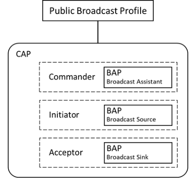
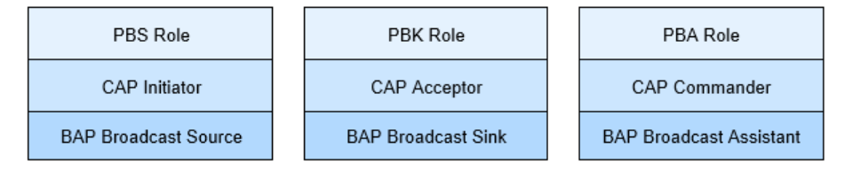

# PBP v1.0.2

> Source: PDF converted via PyMuPDF.

---

Public Broadcast Profile
Bluetooth® Profile Specification
▪ Version: v1.0.2
▪ Version Date: 2025-11-03
▪ Prepared By: Audio, Telephony, and Automotive Working Group
Abstract
The Public Broadcast Profile (PBP) defines how a Broadcast Source can use extended advertising data (AD) to signal that it is transmitting broadcast Audio Streams that can be discovered and rendered by Broadcast Sinks that support commonly used audio configurations.

| Version Number | Date | Comments |
| --- | --- | --- |
| v1.0 | 2022-07-05 | Adopted by the Bluetooth SIG Board of Directors. |
| v1.0.1 | 2024-10-01 | Adopted by the Bluetooth SIG Board of Directors. |
| v1.0.2 | 2025-11-03 | Adopted by the Bluetooth SIG Board of Directors. |

Acknowledgments

| Name | Company |
| --- | --- |
| Rasmus Abildgren | Bose Corporation |
| Bjarne Klemmensen | Demant A/S |
| Kanji Kerai | Meta Platforms, Inc. |
| Nick Hunn | GN Hearing A/S |
| Oren Haggai | Intel Corporation |
| HJ Lee | LG Electronics, Inc. |
| Jin-Kwon Lim | LG Electronics, Inc. |
| Frank Yerrace | Microsoft Corporation |
| Scott Walsh | Plantronics |
| Chris Church | Qualcomm Technologies International, Ltd |
| Jonathan Tanner | Qualcomm Technologies International, Ltd |
| Riccardo Cavallari | Sivantos GmbH |
| Georg Dickmann | Sonova AG |
| Andrew Estrada | Sony Corporation |
| Masahiko Seki | Sony Corporation |
| Jeff Solum | Starkey Hearing Technologies |

Use of this specification is your acknowledgement that you agree to and will comply with the following notices and disclaimers. You are advised to seek appropriate legal, engineering, and other professional advice regarding the use, interpretation, and effect of this specification.
Use of Bluetooth specifications by members of Bluetooth SIG is governed by the membership and other related agreements between Bluetooth SIG and its members, including those agreements posted on Bluetooth SIG’s website located at www.bluetooth.com. Any use of this specification by a member that is not in compliance with the applicable membership and other related agreements is prohibited and, among other things, may result in (i) termination of the applicable agreements and (ii) liability for infringement of the intellectual property rights of Bluetooth SIG and its members. This specification may provide options, because, for example, some products do not implement every portion of the specification. All content within the specification, including notes, appendices, figures, tables, message sequence charts, examples, sample data, and each option identified is intended to be within the bounds of the Scope as defined in the Bluetooth Patent/Copyright License Agreement (“PCLA”). Also, the identification of options for implementing a portion of the specification is intended to provide design flexibility without establishing, for purposes of the PCLA, that any of these options is a “technically reasonable non-infringing alternative.”
Use of this specification by anyone who is not a member of Bluetooth SIG is prohibited and is an infringement of the intellectual property rights of Bluetooth SIG and its members. The furnishing of this specification does not grant any license to any intellectual property of Bluetooth SIG or its members.THIS SPECIFICATION IS PROVIDED “AS IS” AND BLUETOOTH SIG, ITS MEMBERS AND THEIR AFFILIATES MAKE NO REPRESENTATIONS OR WARRANTIES AND DISCLAIM ALL WARRANTIES, EXPRESS OR IMPLIED, INCLUDING ANY WARRANTIES OF MERCHANTABILITY, TITLE, NON-INFRINGEMENT, FITNESS FOR ANY PARTICULAR PURPOSE, OR THAT THE CONTENT OF THIS SPECIFICATION IS FREE OF ERRORS. For the avoidance of doubt, Bluetooth SIG has not made any search or investigation as to third parties that may claim rights in or to any specifications or any intellectual property that may be required to implement any specifications and it disclaims any obligation or duty to do so.
TO THE MAXIMUM EXTENT PERMITTED BY APPLICABLE LAW, BLUETOOTH SIG, ITS MEMBERS AND THEIR AFFILIATES DISCLAIM ALL LIABILITY ARISING OUT OF OR RELATING TO USE OF THIS SPECIFICATION AND ANY INFORMATION CONTAINED IN THIS SPECIFICATION, INCLUDING LOST REVENUE, PROFITS, DATA OR PROGRAMS, OR BUSINESS INTERRUPTION, OR FOR SPECIAL, INDIRECT, CONSEQUENTIAL, INCIDENTAL OR PUNITIVE DAMAGES, HOWEVER CAUSED AND REGARDLESS OF THE THEORY OF LIABILITY, AND EVEN IF BLUETOOTH SIG, ITS MEMBERS OR THEIR AFFILIATES HAVE BEEN ADVISED OF THE POSSIBILITY OF THE DAMAGES.
Products equipped with Bluetooth wireless technology ("Bluetooth Products") and their combination, operation, use, implementation, and distribution may be subject to regulatory controls under the laws and regulations of numerous countries that regulate products that use wireless non-licensed spectrum. Examples include airline regulations, telecommunications regulations, technology transfer controls, and health and safety regulations. You are solely responsible for complying with all applicable laws and regulations and for obtaining any and all required authorizations, permits, or licenses in connection with your use of this specification and development, manufacture, and distribution of Bluetooth Products. Nothing in this specification provides any information or assistance in connection with complying with applicable laws or regulations or obtaining required authorizations, permits, or licenses.
Bluetooth SIG is not required to adopt any specification or portion thereof. If this specification is not the final version adopted by Bluetooth SIG’s Board of Directors, it may not be adopted. Any specification adopted by Bluetooth SIG’s Board of Directors may be withdrawn, replaced, or modified at any time. Bluetooth SIG reserves the right to change or alter final specifications in accordance with its membership and operating agreements.
Copyright © 2016–2025. All copyrights in the Bluetooth Specifications themselves are owned by Apple Inc., Ericsson AB, Intel Corporation, Google LLC, Lenovo (Singapore) Pte. Ltd., Microsoft Corporation, Nokia Corporation, and Toshiba Corporation. The Bluetooth word mark and logos are owned by Bluetooth SIG, Inc. Other third-party brands and names are the property of their respective owners.
Contents

## 1 Introduction

Many of the use cases for broadcast audio relate to public infrastructure and sound reinforcement applications, and use audio-frequency inductive loops, commonly known as telecoil or T-coil. These use cases include publicly accessible TVs (in bars, gyms, clinics, airports, and shops), as well as installations in conference centers, theatres, and mass transport vehicles. While telecoil functionality is limited to hearing aids, the higher audio quality and general accessibility of broadcast Audio Streams that use Bluetooth Low Energy (LE) Audio are expected to provide a new and enhanced user experience for everyone. The Basic Audio Profile (BAP) [3] and Common Audio Profile (CAP) [4] describe how a device can advertise and transmit broadcast Audio Streams. To support interoperability, certain broadcast Audio Stream configurations are defined as Mandatory for a Broadcast Sink in Table 6.4 in [3]. Other, higher-quality broadcast Audio Stream configurations are also defined in Table 6.4 in [3], which are collectively defined as a group of High Quality Public Broadcast Audio configurations in this specification.
However, scanning devices cannot determine the broadcast Audio Stream configuration a Broadcast Source is transmitting from the presence of the Broadcast Audio Announcement Service UUID in an extended advertisement. To determine the codec configurations, the receiver must synchronize to the periodic advertisements to obtain the information from the Broadcast Audio Source Endpoint (BASE) data as defined in [3].
Therefore, to enable a faster, more efficient discovery of Broadcast Sources that are transmitting audio with commonly used codec configurations, the Public Broadcast Profile (PBP) defines a Public Broadcast Announcement that a Broadcast Source can include in an extended advertisement to indicate that a Broadcast Source is transmitting at least one of the following:
• A broadcast Audio Stream with a configuration that every BAP Broadcast Sink can receive and decode (Standard Quality Public Broadcast Audio)
• A broadcast Audio Stream that uses a High Quality Public Broadcast Audio Stream configuration
The Public Broadcast Announcement also indicates whether the broadcast Audio Streams in the Broadcast Isochronous Group (BIG) are encrypted or not. If the Public Broadcast Announcement indicates that the broadcast Audio Streams are encrypted, a Broadcast Sink must use a Broadcast_Code to decrypt them.

### 1.1 Change History

This section summarizes changes at a moderate level of detail and should not be considered representative of every change made.

#### 1.1.1 Changes from v1.0 to v1.0.1

| Section | Errata |
| --- | --- |
| 1: Introduction | E24733 |
| 1.4: Conformance | E23860 |
| 2.1: Roles | E24733 |
| 2.2: Role and profile dependencies | E24733 |
| 3: Role requirements | E24733 |

| Section | Errata |
| --- | --- |
| 3.1: Profile role support requirements | E24733 |
| 3.2.1: Broadcast Audio Stream transmission start/stop | E24733 |
| 3.3.1: Broadcast Audio Stream reception start/stop | E24733 |
| 3.4.1: Broadcast Audio Stream reception start/stop | E24733 |
| 5: Advertising data and LTV metadata structures | E23389 |
| 5.2: Broadcast Name metadata LTV Structure _ | E23389 |
| 5.3: Audio Active State metadata LTV Structure _ _ | E23389 |
| 5.4: Broadcast Audio Immediate Rendering Flag LTV Structure _ _ _ _ | E23389 |

Table 1.1: Errata incorporated in v1.0.1

#### 1.1.2 Changes from v1.0.1 to v1.0.2

| Section | Errata |
| --- | --- |
| 3.1: Profile role support requirements | 28233 |
| 3.5: Link Layer feature support requirements | 23131 |
| 4: Public Broadcast Announcement | 24782, 27095, 28233 |
| 5.1.1: Format | 24424 |
| 8: References | 28233 |

Table 1.2: Errata incorporated in v1.0.2

### 1.2 Language

#### 1.2.1 Language conventions

The Bluetooth SIG has established the following conventions for use of the words shall, must, will, should, may, can, and note in the development of specifications:

| shall | is required to – used to define requirements. |
| --- | --- |
| must | is used to express: a natural consequence of a previously stated mandatory requirement. OR an indisputable statement of fact (one that is always true regardless of the circumstan- ces). |
| will | it is true that – only used in statements of fact. |
| should | is recommended that – used to indicate that among several possibilities one is recom- mended as particularly suitable, but not required. |

| may | is permitted to – used to allow options. |
| --- | --- |
| can | is able to – used to relate statements in a causal manner. |
| note | Text that calls attention to a particular point, requirement, or implication or reminds the reader of a previously mentioned point. It is useful for clarifying text to which the reader ought to pay special attention. It shall not include requirements. A note begins with “Note:” and is set off in a separate paragraph. When interpreting the text, the relevant requirement shall take precedence over the clarification. |

If there is a discrepancy between the information in a figure and the information in other text of the specification, the text prevails. Figures are visual aids including diagrams, message sequence charts (MSCs), tables, examples, sample data, and images. When specification content shows one of many alternatives to satisfy specification requirements, the alternative shown is not intended to limit implementation options. Other acceptable alternatives to satisfy specification requirements may also be possible.

#### 1.2.2 Reserved for Future Use

Where a field in a packet, Protocol Data Unit (PDU), or other data structure is described as "Reserved for Future Use" (irrespective of whether in uppercase or lowercase), the device creating the structure shall set its value to zero unless otherwise specified. Any device receiving or interpreting the structure shall ignore that field; in particular, it shall not reject the structure because of the value of the field.
Where a field, parameter, or other variable object can take a range of values, and some values are described as "Reserved for Future Use," a device sending the object shall not set the object to those values. A device receiving an object with such a value should reject it, and any data structure containing it, as being erroneous; however, this does not apply in a context where the object is described as being ignored or it is specified to ignore unrecognized values.
When a field value is a bit field, unassigned bits can be marked as Reserved for Future Use and shall be set to 0. Implementations that receive a message that contains a Reserved for Future Use bit that is set to 1 shall process the message as if that bit was set to 0, except where specified otherwise.
The acronym RFU is equivalent to Reserved for Future Use.

#### 1.2.3 Prohibited

When a field value is an enumeration, unassigned values can be marked as “Prohibited.” These values shall never be used by an implementation, and any message received that includes a Prohibited value shall be ignored and shall not be processed and shall not be responded to.
Where a field, parameter, or other variable object can take a range of values, and some values are described as “Prohibited,” devices shall not set the object to any of those Prohibited values. A device receiving an object with such a value should reject it, and any data structure containing it, as being erroneous.
“Prohibited” is never abbreviated.

### 1.3 Table requirements

Requirements are defined as "Mandatory" (M), "Optional" (O), "Excluded" (X), “Not Applicable” (N/A), or "Conditional" (C.n). Conditional statements (C.n) are listed directly below the table in which they appear.

### 1.4 Conformance

Each capability of this specification shall be supported in the specified manner. This specification may provide options for design flexibility, because, for example, some products do not implement every portion of the specification. For each implementation option that is supported, it shall be supported as specified.

## 2 Configuration

### 2.1 Roles

This section identifies the profile roles and provides a description for each of them:
• Public Broadcast Source (PBS): Broadcasts, and announces the availability of, broadcast audio. Typical devices implementing the PBS role include PCs, TVs, microphones, public infrastructure transmitters, and smartphones.
• Public Broadcast Sink (PBK): Renders the broadcast audio transmitted by the PBS. Typical devices implementing the PBK role include hearing aids, earbuds, headphones, and speakers.
• Public Broadcast Assistant (PBA): Controls the reception of a broadcast Audio Stream that is associated with a Public Broadcast Announcement. Typical devices implementing the PBA role include smartphones, smart watches, and TVs.

### 2.2 Role and profile dependencies

This profile uses procedures defined in CAP [4] for broadcast Audio Streams. As shown in Figure 2.1 , this profile extends only the Broadcast part of CAP.

**Figure 2.1: Public Broadcast Profile hierarchy**

Figure 2.1 shows the individual relationship between the PBP, CAP, and BAP roles.

**Figure 2.2: Public Broadcast Profile relationship to CAP and BAP roles**

The Public Broadcast Source (PBS) implements the CAP Initiator role defined in [4] and mandates support for the BAP Broadcast Source role defined in [3].
The Public Broadcast Sink (PBK) implements the CAP Acceptor role defined in [4] and mandates support for the BAP Broadcast Sink role defined in [3].
The Public Broadcast Assistant (PBA) implements the CAP Commander role defined in [4] and mandates the BAP Broadcast Assistant role defined in [3].

### 2.3 Concurrency limitations/restrictions

No concurrency limitations or restrictions are imposed by this profile.

### 2.4 Topology limitations/restrictions

The topology of this profile is applicable only to broadcast Audio Streams as defined in [3].

### 2.5 Bluetooth specification release compatibility

This specification is compatible with the Bluetooth Core Specification, version 5.2 [1] or later.

## 3 Role requirements

The requirements for the three roles defined in this profile are defined in this section.

### 3.1 Profile role support requirements

Devices that implement this profile shall implement profile roles as specified in Table 3.1.

| Profile Role | Requirement |
| --- | --- |
| Public Broadcast Source (PBS) | C.1 |
| Public Broadcast Sink (PBK) | C.1 |
| Public Broadcast Assistant (PBA) | C.1 |

Table 3.1: Role requirements for devices implementing PBP
C.1:               Mandatory to support at least one of these roles.
An implementation can support concurrent roles.
PBP uses the CAP [4] roles of Initiator, Acceptor, and Commander.
Table 3.2 lists the CAP role support requirements for each PBP role.
In Table 3.2 , Table 3.3, and Table 3.4, a dash in a cell of one of these tables indicates that PBP makes no change to the requirement as specified in CAP. All other cells indicate requirements that are in addition to the requirements specified in CAP, except as noted.

| PBP Roles | CAP Roles |  |  |
| --- | --- | --- | --- |
|  | Initiator | Acceptor | Commander |
| PBS | M | – | – |
| PBK | – | M | – |
| PBA | – | – | M |

Table 3.2: Mapping of PBP roles to CAP roles
Table 3.3 lists the BAP Broadcast role requirements for each PBP role.

| PBP Roles | BAP Broadcast Source | BAP Broadcast Sink | BAP Broadcast Assistant | BAP Scan Delegator |
| --- | --- | --- | --- | --- |
| PBS | M | – | – | – |
| PBK | – | M | – | M1 |
| PBA | – | – | M | O1 |
| 1 These requirements are restated from BAP. |  |  |  |  |

Table 3.3: Mapping of PBP roles to BAP Broadcast roles

### 3.2 Public Broadcast Source

A PBS shall follow the requirements in Section 4.2 when transmitting Public Broadcast Announcements.
When transmitting Public Broadcast Announcements in the AdvData field of AUX_ADV_IND PDUs, the PBS shall also transmit Basic Audio Announcements in the AdvData field of AUX_SYNC_IND and/or AUX_CHAIN_IND PDUs as defined in Section 3.7.2.2 in [3].
When populating AdvData, a PBS should include the Appearance Value AD Type with a value that identifies the audio source as a type of device or venue (defined in Bluetooth Assigned Numbers [2]).

#### 3.2.1 Broadcast Audio Stream transmission start/stop

A PBS must support the CAP Initiator and BAP Broadcast Source roles for transmitting broadcast Audio Streams as specified in Table 3.2 and Table 3.3, respectively.

#### 3.2.2 Metadata

A PBS should include the Program_Info length-type-value (LTV) structure metadata (defined in Bluetooth Assigned Numbers [2]) to help users determine which broadcast Audio Stream to select when populating the BASE (as defined in Section 3.7.2.1 in [3]).

### 3.3 Public Broadcast Sink

A PBK may perform the BAP Basic Audio Announcement discovery (as defined in Section 6.4 in [3]) to discover the presence of a Public Broadcast Announcement.

#### 3.3.1 Broadcast Audio Stream reception start/stop

A PBK must support the CAP Acceptor and BAP Broadcast Sink roles as specified in Table 3.2 and Table 3.3, respectively. It must support the BAP Scan Delegator as specified in Table 3.1 in [4].

### 3.4 Public Broadcast Assistant

A PBA may perform the BAP Basic Audio Announcement discovery (as defined in Section 6.4 in [3]) to discover the presence of a Public Broadcast Announcement.

#### 3.4.1 Broadcast Audio Stream reception start/stop

A PBA must support the CAP Commander and the BAP Broadcast Assistant roles as specified in Table 3.2 and Table 3.2, respectively.

### 3.5 Link Layer feature support requirements

Table 3.4 lists Link Layer (LL) feature support requirements for the PBP roles.

| PBP Role | PBS | PBK | PBA |
| --- | --- | --- | --- |
| LE 2M PHY | – | M | M |

Table 3.4: LL feature support requirements

## 4 Public Broadcast Announcement

Table 4.1 defines the format of the Public Broadcast Announcement.
If a PBS transmits the Public Broadcast Announcement, then the PBS shall also transmit the Broadcast_Name AD Type (see Section 5.1). If a PBS transmits the Public Broadcast Announcement, then the PBS shall transmit both the Public Broadcast Announcement and the Broadcast_Name AD Type in the same extended advertisement data as the BAP Broadcast Audio Announcement.
A PBK or PBA shall receive the Public Broadcast Announcement.

| Parameter |  | Size (Octets) | Description |  |
| --- | --- | --- | --- | --- |
| Length |  | 1 | Length of Type and Value fields for AD data type |  |
| Type: «Service Data» |  | 1 | Defined in Bluetooth Assigned Numbers [2] |  |
| Value |  | Varies | 2-octet Service UUID followed by additional service data |  |
|  | Public Broadcast Announce- ment Service UUID | 2 | Defined in Bluetooth Assigned Numbers [2] |  |
|  | Public Broadcast Announce- | 1 | Bitfield |  |
|  | ment features |  | Bit 0 | Encryption (see Section 4.1) 0b0 = Broadcast Streams are not encrypted 0b1 = Broadcast Streams are encrypted and require a Broadcast Code _ |
|  |  |  | Bit 1 | Standard Quality Public Broadcast Audio (Section 4.2) 0b0 = Audio configuration not present 1 0b1 = Audio configuration present 1 |
|  |  |  | Bit 2 | High Quality Public Broadcast Audio (Sec- tion 4.3) 0b0 = Audio configuration not present 1 0b1 = Audio configuration present 1 |
|  |  |  | Bits 3–7 | RFU |
|  | Metadata Length _ | 1 | Length of the Metadata field |  |
|  | Metadata | Varies | LTV-formatted Metadata Shall exist only if the Metadata Length parameter value is _ ≠ 0x00 |  |
| 1 The presence of an audio configuration does not mean that audio data is being broadcast. The Broadcast Source may be in either the Configured or Streaming State. See Table 6.3 in [3]. |  |  |  |  |

Table 4.1: Broadcast Source advertising data format for the Public Broadcast Announcement

### 4.1 Encryption of the BIG

If a PBS transmits the Public Broadcast Announcement with bit 0 of the Public Broadcast Announcement features field set to a value of 0b0 (to show Broadcast streams are not encrypted), the PBS shall not encrypt the BIG. If a PBS transmits the Public Broadcast Announcement with bit 0 of the Public Broadcast Announcement features field set to a value of 0b1 (to show Broadcast streams are encrypted and require a Broadcast_Code), the PBS shall encrypt the BIG. Either all streams in a BIG are encrypted, using the same Broadcast_Code, or none are encrypted. See Volume 4, Part E, Section 7.8.103 of [1].

### 4.2 Standard Quality Public Broadcast Audio

Standard Quality Public Broadcast Audio in this specification means broadcast Audio Streams configured with a broadcast Audio Stream configuration setting defined as Mandatory for a Broadcast Sink in Table 6.4 in [3].
If a PBS transmits the Public Broadcast Announcement with bit 1 of the Public Broadcast Announcement features field set to a value of 0b1 (to show Standard Quality Public Broadcast Audio), the advertising set used to transmit the Public Broadcast Announcement points to a BIG, which shall include at least one broadcast Audio Stream configuration defined as Mandatory for a Broadcast Sink in Table 6.4 in [3].

### 4.3 High Quality Public Broadcast Audio

High Quality Public Broadcast Audio in this specification means broadcast Audio Streams configured with any one of the broadcast Audio Stream configuration settings listed in Table 4.2.
Broadcast Audio Stream Configuration Set Name (from Table 6.4 in [3])
48_1_1
48_2_1
48_3_1
48_4_1
48_5_1
48_6_1
48_1_2
48_2_2
48_3_2
48_4_2
48_5_2
48_6_2
Table 4.2: BAP broadcast Audio Stream configuration setting requirements for High Quality Public Broadcast Audio
If a PBS transmits the Public Broadcast Announcement with bit 2 of the Public Broadcast Announcement features field set to a value of 0b1 (to show High Quality Public Broadcast Audio), the advertising set used to transmit the Public Broadcast Announcement points to a BIG, which shall include at least one broadcast Audio Stream configuration setting listed in Table 4.2.

## 5 Advertising data and LTV metadata structures

This section describes the advertising data for PBP and associated metadata structures.

### 5.1 Broadcast_Name Data AD Type

The Broadcast_Name AD Type allows an Isochronous Broadcaster to assign a human-readable string to a BIG. An Isochronous Broadcaster can disambiguate multiple BIGs by assigning distinct names to each BIG.
The Broadcast_Name string can be used by a user interface on a scanning device that displays information on the available broadcast sources.
Multiple Isochronous Broadcasters can assign a common Broadcast_Name to BIGs that are transmitting the same data, allowing a scanning device to identify alternative Isochronous Broadcasters providing the same data.

#### 5.1.1 Format

The format for the Broadcast_Name AD Type is a UTF-8 encoded string containing a minimum of 4 and a maximum of 32 octets. The resulting string shall be human-readable. For backward compatibility, a scanning device shall be prepared to receive a string of up to 128 octets.

| Data Type | Description |
| --- | --- |
| «Broadcast Name» _ | UTF-8 encoded string. Length: Min 4, Max 32. |
| Examples: Broadcast Name = Gate 3 _ UTF-8 encoding: 0x47 0x61 0x74 0x65 0x20 0x33 Broadcast Name = Lou’s Cafe _ UTF-8 encoding: 0x4c 0x6f 0x75 0x27 0x73 0x20 0x43 0x61 0x66 0x65 Broadcast Name = Auracast Room:2A _ _ UTF-8 encoding: 0x41 0x75 0x72 0x61 0x63 0x61 0x73 0x74 0x5f 0x52 0x6f 0x6f 0x6d 0x3a 0x32 0x41 |  |

Table 5.1: Format of the Broadcast_Name AD Type

### 5.2 Broadcast_Name metadata LTV structure

The Broadcast_Name LTV structure is defined in Assigned Numbers. It provides a means to write the human-readable contents of the Broadcast_Name AD Type string to characteristics that support LTV structured metadata, such as allowing Public Broadcast Assistants to transfer this data to Public Broadcast Sinks.

### 5.3 Audio_Active_State metadata LTV structure

The Audio_Active_State LTV structure is defined in Assigned Numbers. It assists Broadcast Sinks and/or Broadcast Assistants to optimize their resources by informing them whether a broadcast Audio Stream currently contains audio data or not.
The Audio_Active_State LTV structure can be used in the Public Broadcast Announcement, where it relates to all BISes within a BIG.  Alternatively, it can be used in the BASE structure (as defined in Section 3.7.2.1 in [3]), where it is used to reflect the state of all BISes in a subgroup.

### 5.4 Broadcast_Audio_Immediate_Rendering_Flag LTV structure

The Broadcast_Audio_Immediate_Rendering_Flag LTV structure is defined in Assigned Numbers. When the PBS sets this flag, the PBK may render audio at the earliest possible time, as opposed to rendering at the time signified by the value of the Presentation_Delay parameter contained in the BASE structure. It may be used in the Public Broadcast Announcement or in the BASE. Broadcast Sinks that are members of a Coordinated Set should only act on this flag if all members of that Coordinated Set can render the audio at the same time.

## 6 Security considerations

PBP does not include any further security requirements for the Public Broadcast role beyond those listed in Section 9.1.3 in [3].

## 7 Acronyms and abbreviations

| Acronym/Abbreviation | Meaning |
| --- | --- |
| AD | advertising data |
| BAP | Basic Audio Profile |
| BASE | Broadcast Audio Source Endpoint |
| BIG | Broadcast Isochronous Group |
| CAP | Common Audio Profile |
| LE | Low Energy (as in Bluetooth Low Energy) |
| LTV | length-type-value |
| PBA | Public Broadcast Assistant |
| PBK | Public Broadcast Sink |
| PBP | Public Broadcast Profile |
| PBS | Public Broadcast Source |
| PDU | Protocol Data Unit |
| RFU | Reserved for future use |
| UUID | universally unique identifier |

Table 7.1: Acronyms and abbreviations

## 8 References

[1] Bluetooth Core Specification (amended), Version 5.2 or later
[2] Bluetooth SIG Assigned Numbers, https://www.bluetooth.com/specifications/assigned-numbers
[3] Basic Audio Profile, Version 1.0.1 or later
[4] Common Audio Profile, Version 1.0 or later