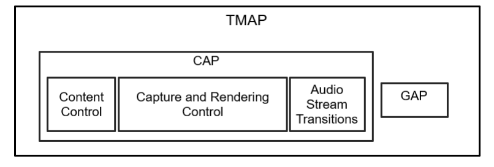
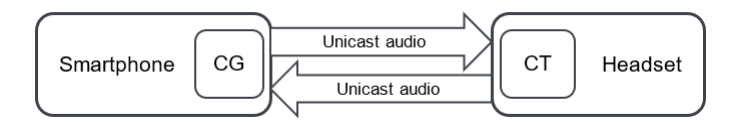
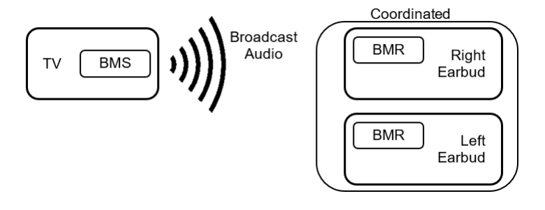
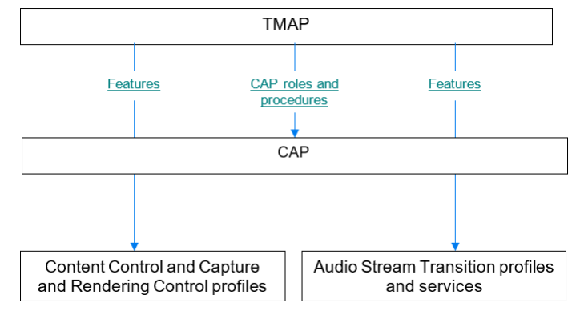

# TMAP v1.0.1-1

> Source: PDF converted via PyMuPDF.

---

Telephony and Media Audio Profile
Bluetooth® Profile Specification
▪ Version: v1.0.1
▪ Version Date: 2025-02-11
▪ Prepared By: Audio, Telephony, and Automotive Working Group
Abstract
This profile defines the set of Bluetooth features collectively referred to as the Telephony and Media Audio Profile (TMAP). This profile enables these features by specifying interoperable configurations of the lower-level audio services and profiles.

| Version Number | Date | Comments |
| --- | --- | --- |
| v1.0 | 2022-06-11 | Adopted by the Bluetooth SIG Board of Directors. |
| v1.0.1 | 2025-02-11 | Adopted by the Bluetooth SIG Board of Directors. |

Acknowledgments

| Name | Company |
| --- | --- |
| Andrew Estrada | Sony Corporation |
| Masahiko Seki | Sony Corporation |
| Akio Tanaka | Sony Corporation |
| Masahiro Shimizu | Sony Corporation |
| Haruhiko Kaneko | Sony Corporation |
| Hidetoshi Kurihara | Sony Corporation |
| Harpreet Narula | Cirrus Logic |
| Oren Haggai | Intel Corporation |
| Taeyoung Song | LG Electronics |
| Scott Walsh | Plantronics |
| Chris Church | Qualcomm Technologies International, Ltd |
| Jonathan Tanner | Qualcomm Technologies International, Ltd |
| Markus Schnell | Fraunhofer IIS |
| Peter Liu | Bose Corporation |
| Chris White | Dolby Laboratories, Inc. |
| Bjarne Klemmensen | Demant A/S |
| Rasmus Abildgren | Bose Corporation |
| Nick Hunn | GN Hearing A/S |

Use of this specification is your acknowledgement that you agree to and will comply with the following notices and disclaimers. You are advised to seek appropriate legal, engineering, and other professional advice regarding the use, interpretation, and effect of this specification.
Use of Bluetooth specifications by members of Bluetooth SIG is governed by the membership and other related agreements between Bluetooth SIG and its members, including those agreements posted on Bluetooth SIG’s website located at www.bluetooth.com. Any use of this specification by a member that is not in compliance with the applicable membership and other related agreements is prohibited and, among other things, may result in (i) termination of the applicable agreements and (ii) liability for infringement of the intellectual property rights of Bluetooth SIG and its members. This specification may provide options, because, for example, some products do not implement every portion of the specification. All content within the specification, including notes, appendices, figures, tables, message sequence charts, examples, sample data, and each option identified is intended to be within the bounds of the Scope as defined in the Bluetooth Patent/Copyright License Agreement (“PCLA”). Also, the identification of options for implementing a portion of the specification is intended to provide design flexibility without establishing, for purposes of the PCLA, that any of these options is a “technically reasonable non-infringing alternative.”
Use of this specification by anyone who is not a member of Bluetooth SIG is prohibited and is an infringement of the intellectual property rights of Bluetooth SIG and its members. The furnishing of this specification does not grant any license to any intellectual property of Bluetooth SIG or its members. THIS SPECIFICATION IS PROVIDED “AS IS” AND BLUETOOTH SIG, ITS MEMBERS AND THEIR AFFILIATES MAKE NO REPRESENTATIONS OR WARRANTIES AND DISCLAIM ALL WARRANTIES, EXPRESS OR IMPLIED, INCLUDING ANY WARRANTIES OF MERCHANTABILITY, TITLE, NON-INFRINGEMENT, FITNESS FOR ANY PARTICULAR PURPOSE, OR THAT THE CONTENT OF THIS SPECIFICATION IS FREE OF ERRORS. For the avoidance of doubt, Bluetooth SIG has not made any search or investigation as to third parties that may claim rights in or to any specifications or any intellectual property that may be required to implement any specifications and it disclaims any obligation or duty to do so.
TO THE MAXIMUM EXTENT PERMITTED BY APPLICABLE LAW, BLUETOOTH SIG, ITS MEMBERS AND THEIR AFFILIATES DISCLAIM ALL LIABILITY ARISING OUT OF OR RELATING TO USE OF THIS SPECIFICATION AND ANY INFORMATION CONTAINED IN THIS SPECIFICATION, INCLUDING LOST REVENUE, PROFITS, DATA OR PROGRAMS, OR BUSINESS INTERRUPTION, OR FOR SPECIAL, INDIRECT, CONSEQUENTIAL, INCIDENTAL OR PUNITIVE DAMAGES, HOWEVER CAUSED AND REGARDLESS OF THE THEORY OF LIABILITY, AND EVEN IF BLUETOOTH SIG, ITS MEMBERS OR THEIR AFFILIATES HAVE BEEN ADVISED OF THE POSSIBILITY OF THE DAMAGES.
Products equipped with Bluetooth wireless technology ("Bluetooth Products") and their combination, operation, use, implementation, and distribution may be subject to regulatory controls under the laws and regulations of numerous countries that regulate products that use wireless non-licensed spectrum. Examples include airline regulations, telecommunications regulations, technology transfer controls, and health and safety regulations. You are solely responsible for complying with all applicable laws and regulations and for obtaining any and all required authorizations, permits, or licenses in connection with your use of this specification and development, manufacture, and distribution of Bluetooth Products. Nothing in this specification provides any information or assistance in connection with complying with applicable laws or regulations or obtaining required authorizations, permits, or licenses.
Bluetooth SIG is not required to adopt any specification or portion thereof. If this specification is not the final version adopted by Bluetooth SIG’s Board of Directors, it may not be adopted. Any specification adopted by Bluetooth SIG’s Board of Directors may be withdrawn, replaced, or modified at any time. Bluetooth SIG reserves the right to change or alter final specifications in accordance with its membership and operating agreements.
Copyright © 2017–2025. All copyrights in the Bluetooth Specifications themselves are owned by Apple Inc., Ericsson AB, Intel Corporation, Google LLC, Lenovo (Singapore) Pte. Ltd., Microsoft Corporation, Nokia Corporation, and Toshiba Corporation. The Bluetooth word mark and logos are owned by Bluetooth SIG, Inc. Other third-party brands and names are the property of their respective owners.
Contents

## 1 Introduction

This profile establishes configuration settings of underlying audio-related specifications to allow manufacturers to deliver interoperable conversational, streaming, and broadcast audio user experiences in a wide variety of telephony and media products. This includes products such as headsets, TVs, smartphones, personal computers, headphones, earbuds, wireless speakers, and wireless microphones.

### 1.1 Change History

This section summarizes changes at a moderate level of detail and should not be considered representative of every change made.

#### 1.1.1 Changes from v1.0 to v1.0.1

| Section | Errata |
| --- | --- |
| 1.4: Conformance | 23873 |
| 3.5.1.1: Unicast audio capability support | 25928 |
| 3.5.1.4.1: Config Codec operation parameters | 25919 |
| 3.5.2.1: Broadcast audio capability support | 25928 |
| 6: References | 19311 |

Table 1.1: Errata incorporated in v1.0.1

### 1.2 Language

#### 1.2.1 Language conventions

The Bluetooth SIG has established the following conventions for use of the words shall, must, will, should, may, can, and note in the development of specifications:

| shall | is required to – used to define requirements. |
| --- | --- |
| must | is used to express: a natural consequence of a previously stated mandatory requirement. OR an indisputable statement of fact (one that is always true regardless of the circumstan- ces). |
| will | it is true that – only used in statements of fact. |
| should | is recommended that – used to indicate that among several possibilities one is recom- mended as particularly suitable, but not required. |
| may | is permitted to – used to allow options. |

| can | is able to – used to relate statements in a causal manner. |
| --- | --- |
| note | Text that calls attention to a particular point, requirement, or implication or reminds the reader of a previously mentioned point. It is useful for clarifying text to which the reader ought to pay special attention. It shall not include requirements. A note begins with “Note:” and is set off in a separate paragraph. When interpreting the text, the relevant requirement shall take precedence over the clarification. |

If there is a discrepancy between the information in a figure and the information in other text of the specification, the text prevails. Figures are visual aids including diagrams, message sequence charts (MSCs), tables, examples, sample data, and images. When specification content shows one of many alternatives to satisfy specification requirements, the alternative shown is not intended to limit implementation options. Other acceptable alternatives to satisfy specification requirements may also be possible.

#### 1.2.2 Reserved for Future Use

Where a field in a packet, Protocol Data Unit (PDU), or other data structure is described as "Reserved for Future Use" (irrespective of whether in uppercase or lowercase), the device creating the structure shall set its value to zero unless otherwise specified. Any device receiving or interpreting the structure shall ignore that field; in particular, it shall not reject the structure because of the value of the field.
Where a field, parameter, or other variable object can take a range of values, and some values are described as "Reserved for Future Use," a device sending the object shall not set the object to those values. A device receiving an object with such a value should reject it, and any data structure containing it, as being erroneous; however, this does not apply in a context where the object is described as being ignored or it is specified to ignore unrecognized values.
When a field value is a bit field, unassigned bits can be marked as Reserved for Future Use and shall be set to 0. Implementations that receive a message that contains a Reserved for Future Use bit that is set to 1 shall process the message as if that bit was set to 0, except where specified otherwise.
The acronym RFU is equivalent to Reserved for Future Use.

#### 1.2.3 Prohibited

When a field value is an enumeration, unassigned values can be marked as “Prohibited.” These values shall never be used by an implementation, and any message received that includes a Prohibited value shall be ignored and shall not be processed and shall not be responded to.
Where a field, parameter, or other variable object can take a range of values, and some values are described as “Prohibited,” devices shall not set the object to any of those Prohibited values. A device receiving an object with such a value should reject it, and any data structure containing it, as being erroneous.
“Prohibited” is never abbreviated.

### 1.3 Table requirements

Requirements are defined as "Mandatory" (M), "Optional" (O), "Excluded" (X), “Not Applicable” (N/A), or "Conditional" (C.n). Conditional statements (C.n) are listed directly below the table in which they appear.

### 1.4 Conformance

Each capability of this specification shall be supported in the specified manner. This specification may provide options for design flexibility, because, for example, some products do not implement every portion of the specification. For each implementation option that is supported, it shall be supported as specified.

### 1.5 Terminology

Table 1.2 lists terms that are needed to understand features used in this specification. Table 1.2 includes definitions from this and other specifications.

| Term | Definition |
| --- | --- |
| Application Profile | Defined in Volume 1, Part A, Section 6.3 in the Bluetooth Core Specification [8] |
| Audio Channel | Defined in Basic Audio Profile (BAP) [4] |
| Audio Configuration | Defined in [4] |
| Audio Location | Defined in [4] |
| Audio Stream | Refers to unicast Audio Stream [4] and/or broadcast Audio Stream [4] |
| broadcast Audio Stream | Defined in [4] |
| Broadcast Sink | Defined in [4] |
| Broadcast Source | Defined in [4] |
| Call Control Client | Defined in Call Control Profile (CCP) [6] |
| Call Control Server | Defined in [6] |
| Call Gateway (CG) | TMAP profile role; see definition in Section 2.2 |
| Call Terminal (CT) | TMAP profile role; see definition in Section 2.2 |
| Capture and Rendering Control | Defined in Common Audio Profile (CAP) [11] |
| Connected Isochronous Group (CIG) | Defined in Volume 6, Part B, Section 4.5.141 in [8] |
| Content Control | Refers to a category that includes the following profiles and serv- ices: • Media Control Profile (MCP) [7] • Media Control Service (MCS) and Generic Media Control Service (GMCS) [13] • CCP [6] • Telephone Bearer Service (TBS) and Generic Telephone Bearer Service (GTBS) [14] |
| cross-transport key derivation (CTKD) | Defined in Volume 3, Part C, Section 14.1 in [8] |

| Term | Definition |
| --- | --- |
| Media Control Client | Defined in [7] |
| Media Control Server | Defined in [7] |
| Published Audio Capability (PAC) | Defined in Published Audio Capabilities Service (PACS) [2] |
| Set Coordinator | Defined in Coordinated Set Identification Profile (CSIP) [9] |
| Set Member | Defined in [9] |
| TMA Client | A device supporting TMAP that implements the Generic Attribute Profile (GATT) Client role |
| TMA Server | A device supporting TMAP that implements the GATT Server role |
| Unicast Audio Stream | Defined in [4] |
| Unicast Client | Defined in [4] |
| Unicast Media Receiver (UMR) | TMAP profile role; see definition in Section 2.2 |
| Unicast Media Sender (UMS) | TMAP profile role; see definition in Section 2.2 |
| Unicast Server | Defined in [4] |
| Volume Controller | Defined in Volume Control Profile [5] |
| Volume Renderer | Defined in [5] |

Table 1.2: Terminology

## 2 Profile overview

### 2.1 Profile and protocol stack

The hierarchy diagram in Figure 2.1 shows the Telephony and Media Audio Profile (TMAP) as an Application Profile. The objective of a Bluetooth Low Energy (LE) Audio Application Profile is to enable wireless audio products that achieve application interoperability. TMAP specifies configurations and settings of parameters and procedures that are defined in lower-level specifications. TMAP does not define new procedures or protocols.

**Figure 2.1: TMAP profile and dependencies**

TMAP specifies the following:
• TMAP profile roles
• CAP interoperability requirements
• BAP [4] interoperability requirements
• Required BAP parameters, such as codec and Quality of Service (QoS) settings
The following sets of profiles and services fall under each of the boxes shown in Figure 2.1:
• Content Control:
- Media Control Profile (MCP) [7]
- Media Control Service (MCS) and Generic Media Control Service (GMCS) [13]
- Call Control Profile (CCP) [6]
- Telephone Bearer Service (TBS) and Generic Telephone Bearer Service (GTBS) [14]
• Capture and Rendering Control:
- Volume Control Profile (VCP) [5]
- Volume Control Service (VCS) [15]
• Audio Stream Transitions:
- Basic Audio Profile (BAP) [4]
- Broadcast Audio Scan Service (BASS) [16]
- BASS is listed here for completeness. TMAP specifies no additional requirements for the BASS Server (Scan Delegator) or the BASS Client (BAP Broadcast Assistant).
- Published Audio Capabilities Service (PACS) [2]
- Audio Stream Control Service (ASCS) [1]
- Coordinated Set Identification Profile (CSIP) [9]
- Coordinated Set Identification Service (CSIS) [17]

### 2.2 Roles

TMAP defines the following profile roles (see Section 3 for more details on the required features per role):
• The Call Gateway (CG) role is defined for telephony or VoIP applications. The CG device has the connection to the call network infrastructure. Typical devices implementing the CG role include smartphones, laptops, tablets, and PCs.
• The Call Terminal (CT) role is defined for headset type devices in telephony or VoIP applications. Typical devices implementing the CT role include wireless headsets, speakers, and microphones that participate in conversational audio.
• The Unicast Media Sender (UMS) role is defined for devices that send media audio content in one or more Unicast Audio Streams. Typical devices implementing the UMS role include smartphones, media players, TVs, laptops, tablets, and PCs.
• The Unicast Media Receiver (UMR) role is defined for devices that receive media audio content from a source device in one or more Unicast Audio Streams. Typical devices implementing the UMR role include headphones, earbuds, and wireless speakers.
• The Broadcast Media Sender (BMS) role is defined for devices that send media audio content to any number of receiving devices. Typical devices implementing the BMS role include smartphones, media players, TVs, laptops, tablets, and PCs.
• The Broadcast Media Receiver (BMR) role is defined for devices that receive media audio content from a source device in a broadcast Audio Stream. Typical devices implementing the BMR role include headphones, earbuds, and speakers. A smartphone may also support this role to receive broadcast Audio Streams from a BMS.
Figure 2.2, Figure 2.3, and Figure 2.4 illustrate some example implementations that use these roles.

**Figure 2.2: Example of smartphone and headset implementations that use the profile roles**

**Figure 2.3: Example of a media player and stereo earbuds that use the profile roles**

**Figure 2.4: Example of a TV and stereo earbuds that use the profile roles**

Each of the TMAP roles supports transmitting or receiving audio. TMAP does not define any role for devices that do not stream audio but limit themselves to the control of audio. See Appendix A for more example implementations that use the profile roles.

### 2.3 Profile dependencies

This profile includes requirements from, and in some cases adds additional requirements to, the Generic Access Profile (GAP) [8], the Media Control Profile (MCP) [7], the Call Control Profile (CCP) [6], the Coordinated Set Identification Profile (CSIP) [9], the Volume Control Profile (VCP) [5], the Basic Audio Profile (BAP) [4], and the Common Audio Profile (CAP) [11].

### 2.4 Bluetooth Core Specification release compatibility

This specification is compatible with Bluetooth Core Specification, Version 5.2 and later [8].

## 3 Profile requirements

TMAP defines a set of profile roles that specify CAP roles and procedures along with content control and Audio Stream features specified by lower layer specifications. A TMAP role that supports a CAP role inherits the requirements specified for that CAP role. TMAP in some cases elevates those requirements from Optional to Mandatory. TMAP implementations can support and use optional inherited requirements whether or not they are directly mentioned in the TMAP specification.
Figure 3.1 illustrates the relationship between TMAP and the Generic Audio blocks.

**Figure 3.1: TMAP uses profile roles and procedures from CAP**

This specification is applicable to a wide range of products from a full-featured smartphone to a simple speaker with no UI at all.
The Telephony and Media Audio Service (TMAS) allows TMAP devices to discover other TMAP devices (see Section 4).

### 3.1 Profile role support requirements

Devices that implement this profile shall implement profile roles as specified in Table 3.1.

| Profile Role | Requirement |
| --- | --- |
| Call Gateway (CG) | C.1 |
| Call Terminal (CT) | C.1 |
| Unicast Media Sender (UMS) | C.1 |
| Unicast Media Receiver (UMR) | C.1 |
| Broadcast Media Sender (BMS) | C.1 |
| Broadcast Media Receiver (BMR) | C.1, C.2 |

Table 3.1: Role requirements for devices implementing TMAP
C.1: Mandatory to support at least one of these roles.
C.2: Mandatory to support this role if UMR is supported, otherwise Optional.
An implementation can support concurrent roles.
TMAP uses the CAP [11] roles of Initiator, Acceptor, and Commander.
Table 3.2 lists the CAP role support requirements for each TMAP role.

| TMAP Roles | CAP Roles |  |  |
| --- | --- | --- | --- |
|  | Initiator | Acceptor | Commander |
| CG | M | X | M |
| CT | X | M | O |
| UMS | M | X | M |
| UMR | X | M | O |
| BMS | M | X | O |
| BMR | X | M | O |

Table 3.2: Mapping of TMAP roles to CAP roles
Table 3.3, Table 3.4, and Table 3.5 list the detailed component requirements for each TMAP role. A dash in a cell of one of these tables indicates that TMAP makes no change to the requirement as specified in CAP. All other cells indicate requirements that are in addition to the requirements specified in CAP.

|  | CAP Components Related to Audio Streams |  |  |  |  |  |  |  |
| --- | --- | --- | --- | --- | --- | --- | --- | --- |
| TMAP Roles | CSIP Set Coordinator | CSIP Set Member | BAP Broadcast Source | BAP Broadcast Sink | BAP Unicast Client |  | BAP Unicast Server |  |
|  |  |  |  |  | BAP Audio Source Role | BAP Audio Sink Role | BAP Audio Sink Role | BAP Audio Source Role |
| CG | – | – | – | – | M | M | – | – |
| CT | – | – | – | – | – | – | C.1 | C.1 |
| UMS | – | – | – | – | M | – | – | – |
| UMR | – | – | – | – | – | – | M | – |
| BMS | – | – | M | – | – | – | – | – |
| BMR | – | – | – | M | – | – | – | – |

Table 3.3: Mapping of TMAP roles to CAP components related to Audio Streams
C.1: Mandatory to support at least one of these roles.

| TMAP Roles | CAP Components Related to Capture and Rendering Control |  |
| --- | --- | --- |
|  | VCP Controller | VCP Renderer |
| CG | M | – |
| CT | – | C.1 |
| UMS | M | – |
| UMR | – | M |
| BMS | – | – |
| BMR | – | M |

Table 3.4: Mapping of TMAP roles to CAP components related to Capture and Rendering Control
C.1: Mandatory to support this role if the BAP Unicast Server is acting as an Audio Sink as defined in BAP, otherwise Excluded.

| TMAP Roles | Content Control Components |  |  |  |
| --- | --- | --- | --- | --- |
|  | MCP Client | MCP Server | CCP Client | CCP Server |
| CG | X | – | X | M |
| CT | X | – | – | – |
| UMS | X | M | X | X |
| UMR | – | – | X | – |
| BMS | X | – | X | X |
| BMR | – | – | X | – |

Table 3.5: Mapping of TMAP roles to Content Control components

### 3.2 Link Layer feature support requirements

Table 3.6 lists Link Layer (LL) feature support requirements for the TMAP roles.

| TMAP Role | CG | CT | UMS | UMR | BMS | BMR |
| --- | --- | --- | --- | --- | --- | --- |
| LE 2M PHY | M | M | M | M | M | M |

Table 3.6: LL feature support requirements

### 3.3 HCI feature support requirement

When using Host Controller Interface (HCI) ISO data packets, a Time_Stamp field shall be included, as described in Volume 4, Part E, Section 5.4.5 in [8]. Volume 6, Part G, Section 3.3 in [8] explains how the Time_Stamp field is used to determine the reference time of each received Service Data Unit (SDU).

### 3.4 Device discovery and connection establishment while in bondable mode

TMAP adopts the device discovery and connection establishment recommendations as specified by CAP and BAP. TMAP adds the following requirements to those specified by CAP and BAP:
• The extended advertising should include the Appearance AD type (see Part A, Section 1.12 in the Core Specification Supplement (CSS) [12]). The Appearance value should reflect the external appearance of the device.
• The extended advertising should include the Service Data AD type (see Part A, Section 1.11 in [12]), along with the service data shown in Table 3.7.

| Field | Size (Octets) | Description |
| --- | --- | --- |
| Length | 1 | Length of Type and Value fields for AD data type |
| Type: «Service Data - 16-bit UUID» | 1 | Defined in Bluetooth Assigned Numbers [10] |
| Value | 4 | 2-octet service UUID followed by additional service data |
| TMAS UUID | 2 | Defined in Bluetooth Assigned Numbers [10] |
| TMAP Role characteristic val- ue | 2 | 2-octet bitmap defined in Section 4.7.1.1 |

Table 3.7: Format for advertising the TMAP Role characteristic value

### 3.5 Audio Stream Transitions

#### 3.5.1 Requirements for Unicast roles

This section specifies additional requirements for the BAP Unicast Client and BAP Unicast Server beyond those defined in BAP, ASCS, and PACS.

##### 3.5.1.1 Unicast audio capability support

Table 3.8 lists the required Codec_Specific_Capabilities for the CT role. Codec_Specific_Capabilities is a parameter in the Source PAC and Sink PAC characteristics as defined in [2]. The CT that supports the BAP Audio Source role shall include in its Source PAC characteristic the settings defined as Mandatory in Table 3.8 and shall support encoding and transmission of audio data using the settings defined as Mandatory in Table 3.8. The CT that supports the BAP Audio Sink role shall include in its Sink PAC characteristic the settings defined as Mandatory in Table 3.8 and shall support reception and decoding of audio data using the settings defined as Mandatory in Table 3.8.
Devices supporting the CT role and the BAP Audio Sink role shall include the “Conversational” Context Type value [10] in their Supported_Sink_Contexts field. Devices supporting the CT role and the BAP Audio Source role shall include the “Conversational” Context Type value [10] in their Supported_Source_Contexts field.
If the CG role is transmitting a unicast Audio Stream carrying audio content associated with an instance of TBS or GTBS, and the TBS or GTBS instance is in the Active Call State, then the CG role shall use the Context Type value [10] defined for the Active Call State in Table 7.3 in [11] in the
Streaming_Audio_Contexts LTV structure in the Metadata parameter when enabling a Sink Audio Stream Endpoint (ASE).
If the CG role is receiving a unicast Audio Stream carrying audio content associated with an instance of TBS or GTBS, then the CG role shall use the “Conversational” Context Type value [10] in the Streaming_Audio_Contexts LTV structure in the Metadata parameter when enabling a Source Audio Stream Endpoint (ASE).

| Codec Capability Settings (See Section 3.5.2 in [4]) | Requirement |
| --- | --- |
| 16 1 _ | M |
| 32 1 _ | M |
| 32 2 _ | M |

Table 3.8: Additional audio capability support requirements for the CT role
Table 3.9 lists the required Codec_Specific_Capabilities for the UMR role. The UMR shall include in its Sink PAC characteristic the settings defined as Mandatory in Table 3.9 and shall support reception and decoding of audio data using the settings defined as Mandatory in Table 3.9.
Devices supporting the UMR role shall include the “Media” Context Type value [10] in their Supported_Sink_Contexts field.
If the UMS role is transmitting a unicast Audio Stream carrying audio content associated with an instance of MCS or GMCS, and the MCS or GMCS instance is in the Playing State, then the UMS role shall use the Context Type value [10] defined for the Playing State in Table 7.2 in [11] in the Streaming_Audio_Contexts LTV structure in the Metadata parameter when enabling a Sink Audio Stream Endpoint (ASE).

| Codec Capability Settings (See Section 3.5.2 in [4]) | Requirement |
| --- | --- |
| 48 1 _ | M |
| 48 2 _ | M |
| 48 3 _ | M |
| 48 4 _ | M |
| 48 5 _ | M |
| 48 6 _ | M |

Table 3.9: Additional audio capability support requirements for the UMR role

##### 3.5.1.2 Audio Locations

Table 3.10 defines requirements for the Sink Audio Locations characteristic and the Source Audio Locations characteristic in addition to requirements specified by the BAP Unicast Client and BAP Unicast Server roles (see Section 3.6.4 in [4]). A dash in a cell of this table indicates that TMAP makes no change to the requirement as specified in BAP or PACS.

| Characteristic | Requirement |  |  |
| --- | --- | --- | --- |
|  | CG | UMS | UMR |
| Sink Audio Locations | M | M | M |
| Source Audio Locations | M | – | – |

Table 3.10: Additional Sink Audio Locations characteristic and Source Audio Locations characteristic requirements

###### 3.5.1.2.1 Sink Audio Locations values

Sink Audio Locations values are defined in Bluetooth SIG Assigned Numbers [10]. This profile specifies requirements only for bit 1 and bit 0 of the 4-octet Audio Locations bitfield.
Table 3.11 lists requirements for the UMR role. TMAP specifies no requirements for bits other than bit 1 and bit 0. Unless a lower-level specification establishes requirements for other bits, the UMR is free to configure those bits as needed.

| Sink Audio Locations Value (bit 1 and bit 0 only) | Description | Requirement |
| --- | --- | --- |
|  |  | UMR |
| 0b01 | Front Left | C.1 |
| 0b10 | Front Right | C.1 |
| 0b11 | Front Right and Front Left | C.1 |

Table 3.11: Sink Audio Locations values requirements for the UMR role
C.1: Shall support one of the 0b01, 0b10, or 0b11 Sink Audio Locations.

##### 3.5.1.3 ASE characteristics

A CT device that supports the BAP Audio Sink role shall include at least one Sink Audio Stream Endpoint (ASE) characteristic as defined in ASCS [1]. A CT device that supports the BAP Audio Source role shall include at least one Source ASE characteristic. A CT capable of bidirectional audio shall include at least one Sink ASE characteristic and one Source ASE characteristic.
A device that supports UMR shall include at least one Sink ASE characteristic.
A UMR that supports Sink Audio Locations (bit 1 and bit 0) = 0b11 and exposes at least 2 Sink ASE characteristics shall support, through configuration of two Sink ASEs, receiving and decoding audio data with left and right Audio Channels each transmitted in a separate Unicast Audio Stream where both Unicast Audio Streams are synchronized in a single CIG.

##### 3.5.1.4 ASE control point configuration

###### 3.5.1.4.1 Config Codec operation parameters

The Config Codec operation is defined by ASCS [1]. Table 3.12 lists recommended values for Target_Latency to use during the Config Codec operation.

| TMAP Role | Recommended value for Target Latency (See Section 5.1 of [1]) |
| --- | --- |
| CG | 0x02 (Target balanced latency and reliability) |
| UMS | 0x03 (Target high reliability) |

Table 3.12: Recommended Target_Latency values
Table 3.13 lists the additional Config Codec operation parameter value support requirement for the CG role when configuring a Sink ASE or a Source ASE.

| Codec Configuration Setting (See Section 3.6.7 in [4]) | Requirement |
| --- | --- |
| 32 2 _ | M |

Table 3.13: Additional Config Codec operation parameter value requirement for the CG role
Table 3.14 lists the Config Codec operation value support requirements for the UMS role when configuring a Sink ASE. See [4] for the requirements for other values like 48_1, 48_3, and 48_5.

| Codec Configuration Setting (See Section 3.6.7 in [4]) | Requirement |
| --- | --- |
| 48 2 _ | M |
| 48 4 _ | C.1 |
| 48 6 _ | C.1 |

Table 3.14: Additional Config Codec operation parameter value requirements for the UMS role
C.1: Shall support at least one of the 48_4 or 48_6 Codec Configuration Settings.
Table 3.15 lists the Audio_Channel_Allocation parameter value support requirements for the CG and UMS roles. The Audio_Channel_Allocation parameter is defined in Section 4.3.2 in BAP [4].

| Audio Location Value in the | Description | Requirement |  |
| --- | --- | --- | --- |
| Audio Channel Allocation LTV (Bit 1 and _ _ Bit 0 Only) |  | CG | UMS |
| 0b01 | Front Left | O | M |
| 0b10 | Front Right | O | M |
| 0b11 | Front Right and Front Left | C.1 | C.2 |

Table 3.15: Audio_Channel_Allocation values required for the CG and UMS roles
C.1: Mandatory if Audio Configuration 5 in Table 3.17 is supported, otherwise Excluded.
C.2: Mandatory if Audio Configuration 4 in Table 4.1 in BAP [4] is supported, otherwise Excluded.

###### 3.5.1.4.2 Config QoS operation parameters

The Config QoS operation is defined by ASCS [1] and includes QoS Configuration settings. This section lists requirements for QoS Configuration settings in addition to those specified by BAP [4].
For each 16 kHz or 32 kHz Codec Configuration setting in Table 3.12 or Table 3.11 in BAP [4] that the CG supports, the CG shall support the corresponding QoS Configuration settings for low latency audio data from Table 5.2 in BAP [4].
For each 16 kHz or 32 kHz Codec Capability setting in Table 3.8 or Table 3.5 in BAP [4] that the CT supports, the CT shall support the corresponding QoS Configuration settings for low latency audio data from Table 5.2 in BAP [4].
For each 48 kHz or 44.1 kHz Codec Configuration setting in Table 3.13 or Table 3.11 in BAP [4] that the UMS supports, the UMS shall support the corresponding low latency and high reliability QoS Configuration settings from Table 5.2 in BAP [4].
For each 48 kHz or 44.1 kHz Codec Capability setting in Table 3.9 or Table 3.5 in BAP [4] that the UMR supports, the UMR shall support the corresponding low latency and high reliability QoS Configuration settings from Table 5.2 in BAP [4]. Table 3.16 lists recommended LL configuration parameters for some Unicast QoS configurations.

| Set Name (See Section 5.6.2 in | Recommendation | LL Parameter |  |  |  |  |  |
| --- | --- | --- | --- | --- | --- | --- | --- |
| [4]) |  | ISO Interval _ | BN | NSE | FT | Num CIS _ | RTN |
| 48 2 2 _ _ | 11 | 10ms | 1 | 4 | 6 | 2 | 23 |
| 48 2 2 _ _ | 22 | 20ms | 2 | 8 | 4 | 2 | 27 |
| 48 2 2 _ _ | 33 | 30ms | 3 | 12 | 2 | 2 | 15 |
| 1 Optimized for link reliability and latency 2 Optimized for balanced reliability and latency 3 Optimized for coexistence with Wi-Fi |  |  |  |  |  |  |  |

Table 3.16: Recommended LL parameters for Unicast QoS configurations
The retransmission number (RTN) value is defined in Volume 4, Part E, Section 7.8.97 of the Bluetooth Core Specification [8]. The RTN value is interpreted here as the maximum number of subevents available for the first PDU (CIS payload number 0) to be retransmitted up to the last subevent where that payload reaches its flush point. The RTN value can be derived from the equations in Volume 6, Part B, Section 4.5.13.5 of [8] as follows.
cisPayloadCounter = 0
cisPayloadCounter mod BN = 0
U = NSE – floor (NSE ÷ BN) x (BN – 1)
U is the number of subevents after which the flush point occurs. The maximum number of subevents available for the first PDU is therefore:
NSE x (FT-1) + U
= NSE x (FT-1) + NSE – floor (NSE ÷ BN) x (BN – 1)
= NSE x FT – floor (NSE ÷ BN) x (BN – 1)
To calculate the maximum number of subevents available for the first PDU to be retransmitted, the maximum number of subevents available for the first PDU is subtracted by 1 as shown below. The first subevent is used for transmission, not retransmission.
RTN = NSE x FT – floor (NSE ÷ BN) x (BN – 1) - 1
The Row 1 parameters in Table 3.16 were determined from listening tests in congested environments (including the Shinjuku train station). The testers found that the parameters shown delivered the best audio robustness and latency. The Row 2 and 3 parameters in Table 3.16 were derived from the results in Row 1. Row 3 provides more contiguous available radio time for non-Bluetooth traffic and therefore should be better for Wi-Fi coexistence at the cost of slightly longer Bluetooth audio latency. Row 2 is a compromise between Row 1 and Row 3. These considerations are consistent with Table 6.5 in BAP [4].

##### 3.5.1.5 Requirements for CAP Unicast procedures

Each TMAP role must support certain CAP roles (see Table 3.2 and Table 3.3). In turn, the CAP specification requires each CAP role to support certain Unicast Audio Stream Transition procedures, which are specified in CAP [11]. CAP roles inherit Audio Configuration requirements from BAP [4].
This section uses the Audio Configurations defined in Table 4.1 in BAP [4]. Using those definitions, Table 3.17 lists the Audio Configuration support requirements, in addition to those specified in BAP [4], for each unicast TMAP role within the following CAP procedures:
• Unicast Audio Starting
• Unicast Audio Updating
• Unicast Audio Ending
A dash in the CT column of Table 3.17 indicates that TMAP makes no change to the requirements specified in BAP [4]. In this section, concurrent streams means that multiple ASEs are in the streaming state at the same time. As a consequence of the CIG_ID requirement in Section 7.3.1.2.5 of CAP [11], multiple ASEs in the same direction for an Audio Configuration must use the same CIG_ID value.

| Configuration |  |  | # of CT | TMAP Role Requirement |  |
| --- | --- | --- | --- | --- | --- |
| Label | Audio Configuration from [4] | Legend CG CT | Devices | CG | CT |
| A | 3 | CG CT | 1 | M | – |
| B | 7 (ii) | CG CT CT | 2 | M | – |
| C | 8 (ii) | CG CT CT | 2 | M | – |
| D | 8 (i) | CG CT CT | 1 | M | C.1 |

| Configuration |  |  | # of CT | TMAP Role Requirement |  |
| --- | --- | --- | --- | --- | --- |
| Label | Audio Configuration from [4] | Legend CG CT | Devices | CG | CT |
| E | 5 | CG CT | 1 | O | C.2 |
| F | 11 (i) | CG CT | 1 | O | C.2 |
| G | 11 (ii) | CG CT CT | 2 | O | – |

Table 3.17: CG and CT requirements for number of concurrent Unicast Audio Streams, channels, and devices to be supported in CAP Unicast Audio Stream Transition procedures
C.1: Mandatory if both the BAP Audio Sink and BAP Audio Source roles are supported and the CT device can present two or more audio outputs to the end user, otherwise Excluded.
C.2: Optional if both the BAP Audio Sink and BAP Audio Source roles are supported and the CT device can present two or more audio outputs to the end user, otherwise Excluded.
To help enable a consistent user experience when a CG is communicating with a single CT, when the CG has a single channel (e.g., mono voice) of audio data to send to a single CT that is not a member of a coordinated set, and that supports both the Front Left and Front Right Audio Locations, (i.e., at least two Sink ASEs comprising Label D or Label F as defined in Table 3.17), and does not support an Audio_Channel_Counts value greater than 1, then the CG shall attempt to configure the CT using Label D or using Label F. If the CT is successfully configured using Label D or Label F (i.e., the Audio_Channel_Allocation is configured for the Front Left Audio Location on one Sink ASE and the Audio_Channel_Allocation is configured for the Front Right Sink Audio Location on the other Sink ASE), then the CG shall transmit the single channel of audio data to each configured ASE in the CT.
If a CG that does not support Label F discovers a CT exposing a set of ASE characteristics corresponding to Label F, then the CG shall be able to configure the CT using Label D. If a CG that does not support Label G discovers a pair of CTs exposing a set of ASE characteristics corresponding to Label G, then the CG shall be able to configure the pair of CTs using Label C.
If an Initiator device configures a CT device with an Audio Configuration in Table 3.17 that the CT device supports, then the CT device shall support concurrent streams on the multiple ASEs involved in the supported Audio Configuration using the CT device’s supported codec capability settings in Table 3.8 and the CT device’s supported QoS configuration settings in Section 3.5.1.4.2. A CG device supporting an Audio Configuration in Table 3.17 shall support concurrent streams on the multiple ASEs involved in the supported Audio Configuration using the CG device’s supported codec configuration setting in Table 3.13 and the CG device’s supported QoS configuration settings in Section 3.5.1.4.2.
To help enable a consistent user experience when a UMS is communicating with a single UMR, when the UMS has a single channel (e.g., mono music) of audio data to send to a single UMR that is not a member of a coordinated set, and that supports both the Front Left and Front Right Audio Locations as defined in Table 3.11, (i.e., at least two Sink ASEs comprising Audio Configuration 6 (i) in Table 4.1 in BAP [4]), and does not support an Audio_Channel_Counts value greater than 1, then the UMS shall attempt to configure the UMR using Audio Configuration 6(i). If the UMR is successfully configured using Audio Configuration 6(i) (i.e., the Audio_Channel_Allocation is configured for the Front Left Audio Location on one Sink ASE and the Audio_Channel_Allocation is configured for the Front Right Sink Audio Location
on the other Sink ASE), then the UMS shall transmit the single channel of audio data to each configured ASE in the UMR.
If a UMR device supports Audio Configuration 6 (i) in Table 4.1 in BAP [4] and an Initiator device configures the UMR with Audio Configuration 6(i), then the UMR device shall support concurrent streams on the multiple ASEs using the UMR device’s supported codec capability settings in Table 3.9 and the UMR device’s supported QoS configuration settings in Section 3.5.1.4.2. A UMS device shall support concurrent streams on the multiple ASEs involved in Audio Configuration 6(i) and 6(ii) in Table 4.1 in BAP [4] using the UMS device’s supported codec configuration settings in Table 3.14 and the UMS device’s supported QoS configuration settings in Section 3.5.1.4.2.

#### 3.5.2 Requirements for BAP Broadcast roles

This section specifies requirements for the BMS and BMR roles in addition to those defined in BAP [4].

##### 3.5.2.1 Broadcast audio capability support

Table 3.18 shows the Codec Capability Setting requirements defined for the BMR role in addition to those required by the BAP Broadcast Sink role.
The BMR shall expose at least one Sink PAC characteristic containing a PAC record that includes audio capability settings defined as Mandatory in Table 3.18 shows the Codec Configuration Setting requirements defined for the BMS role in addition to those required by the BAP Broadcast Source role.
Devices supporting the BMR role shall include the “Media” Context Type value [10] in their Supported_Sink_Contexts field.
If the BMS role is transmitting a broadcast Audio Stream carrying audio content associated with an instance of MCS or GMCS, and the MCS or GMCS instance is in the Playing State, then the BMS role shall use the Context Type value [10] defined for the Playing State in Table 7.2 in [11] in the Streaming_Audio_Contexts LTV structure in the Metadata parameter in the BASE.

| Codec Configuration Setting for the BMS role (See Section 3.7.1 in [4]) | Requirement |  |
| --- | --- | --- |
| Codec Capability Setting for the BMR role (See Section 3.8.2 in [4]) | BMS | BMR |
| 48 1 _ | M | M |
| 48 2 _ | M | M |
| 48 3 _ | C.2 | M |
| 48 4 _ | C.1 | M |
| 48 5 _ | C.2 | M |
| 48 6 _ | C.1 | M |

Table 3.18: Codec setting requirements for the BMS and BMR roles
C.1: The BMS shall support at least one of the 48_4 or 48_6 Codec Capability Settings.
C.2: The BMS shall support at least one of the 48_3 or 48_5 Codec Capability Settings.

##### 3.5.2.2 Broadcast configuration settings

Table 3.19 lists the Audio_Channel_Allocation value requirements for the BMS role. The Audio_Channel_Allocation parameter is defined in Section 4.3.2 in [4].

| Audio Location Value in the Audio Channel Allocation LTV (Bit 1 and Bit 0 Only) _ _ | Description | Support Requirement |
| --- | --- | --- |
|  |  | BMS |
| 0b01 | Front Left | M |
| 0b10 | Front Right | M |
| 0b11 | Front Right and Front Left | O |

Table 3.19: Audio_Channel_Allocation values required for the BMS role
Table 3.20 lists the Sink_Audio_Locations characteristic value requirements for the BMR role. The Sink_Audio_Locations characteristic is defined in Section 3.2 in [2].

| Audio Location Value in the Sink Audio Locations _ _ | Description | Requirement |
| --- | --- | --- |
| Characteristic (Bit 1 and Bit 0 Only) |  | BMR |
| 0b01 | Front Left | C.1 |
| 0b10 | Front Right | C.1 |
| 0b11 | Front Right and Front Left | C.1 |

Table 3.20: Sink_Audio_Locations values required for the BMR role
C.1: Mandatory to support at least one of the 0b01, 0b10, or 0b11 Audio Location values in bit 1 and bit 0 of the Sink_Audio_Locations characteristic.

##### 3.5.2.3 Broadcast stream settings

This section lists requirements for broadcast Audio Stream configuration settings in addition to those specified in Section 6.3 of BAP [4].
For each 48 kHz or 44.1 kHz Codec Configuration setting in Table 3.18 or Table 3.12 in BAP [4] that the BMS supports, the BMS shall support the corresponding low latency and high reliability broadcast Audio Stream configuration settings from Table 6.4 in BAP [4].
For each 48 kHz or 44.1 kHz Codec Capability setting in Table 3.18 or Table 3.17 in BAP [4] that the BMR supports, the BMR shall support the corresponding low latency and high reliability broadcast Audio Stream configuration settings from Table 6.4 in BAP [4].
The BMR shall support rendering broadcast Audio Streams configured with a Presentation_Delay of 20 ms to 40 ms (as defined in BAP [4]). See the sync requirements in Section 3.7.

##### 3.5.2.4 Requirements for CAP Broadcast procedures

TMAP requires each TMAP role to support certain CAP roles (see Table 3.2 and Table 3.3). In turn, the CAP specification requires each CAP role to support certain broadcast Audio Stream Transition procedures.
Section 4.5 in BAP [4] specifies the Audio Configuration support requirements for each broadcast TMAP role within the following CAP procedures:
• Broadcast Audio Starting
• Broadcast Audio Updating
• Broadcast Audio Ending
If a BMR or BMS device supports Audio Configuration 13 in Table 4.24 in BAP [4], the device shall support simultaneous streaming on each Broadcast Isochronous Stream (BIS) in the supported Audio Configuration using the BMR device’s supported Codec Capability settings in Table 3.17 or the BMS device’s supported Codec Configuration settings in Table 3.18, and that device’s supported QoS configuration settings in Section 3.5.2.3.

##### 3.5.2.5 Requirements for CAP Handover procedures

Devices that support both UMS and BMS roles shall support the following CAP procedures in all supported Audio Configurations:
• Unicast to Broadcast Audio Handover procedure
• Broadcast to Unicast Audio Handover procedure

#### 3.5.3 Security considerations with coordination

Devices that implement the CSIP Set Member role should request LE Security Mode 1 Level 3. If this is not possible because of limited UI capability, then devices that implement the CSIP Set Coordinator role should request user permission when establishing audio with multiple devices.

### 3.6 Content control

Requirements for support of content control components are established in Table 3.5 for each of the TMAP roles. This section establishes any content control requirements that are in addition to requirements specified in the associated content control specifications.

#### 3.6.1 MCP Server role

Table 3.21 lists the opcode support requirements for the Media Control Point characteristic in addition to those specified in MCP [7]. These requirements apply to MCS (if supported) and GMCS.

| Opcode | Name | Requirement |
| --- | --- | --- |
| 0x01 | Play | M |
| 0x02 | Pause | M |

Table 3.21: Requirements for the Media Control Point characteristic opcodes

#### 3.6.2 CCP Server role

This profile adds no additional requirements to TBS and/or GTBS for devices that implement the CCP Server role.

### 3.7 Multi-stream synchronization

This profile requires synchronized audio across multiple devices even when those devices have no direct connection to each other.
The following cases establish requirements for UMR and BMR roles. In each of these cases, the point of synchronization is defined as the point at which audio is presented to the end user. All synchronization requirements in this section shall use a single 1 kHz tone.
Case 1: Multiple UMR or CT audio sink devices each with a single ASE:
In this case, each UMR or CT device contains a single Sink ASE characteristic streaming with an established Connected Isochronous Stream (CIS), where all such CISes are part of a single CIG. Examples of this case include a set of untethered earbuds and a set of untethered speakers. (Untethered refers to devices that have no wired connection between each other.) This profile is primarily focused on the stereo use case involving two CISes in the same CIG, where one CIS carries the left Audio Channel and the other CIS carries the right Audio Channel.
Synchronization requirement: Each UMR device shall render the audio from its CIS to within +/- 100 µs static and +/- 25 µs of jitter of each of the other multiple UMR devices. Each CT device shall render the audio from its CIS to within +/- 100 µs static and +/- 25 µs of jitter of each of the other multiple CT devices receiving CISes from the same CIG.
Case 2: A single UMR or CT audio sink device with multiple ASEs:
In this case, the single UMR or CT device contains multiple Sink ASE characteristics. Each of those Sink ASE characteristics is in the streaming state with an established CIS, where all such CISes are part of a single CIG. Examples of this case include banded headphones and stereo soundbars involving two CISs in the same CIG, where one CIS carries the left Audio Channel and the other CIS carries the right Audio Channel.
Synchronization requirement: The UMR device shall render the audio from each CIS to within +/- 100 µs static and +/- 25 µs of jitter of all other of the multiple CIS Audio Streams. The CT device shall render the audio from each CIS to within +/- 100 µs static and +/- 25 µs of jitter of all other of the multiple CIS Audio Streams.
Case 3: Multiple UMR or CT audio sink devices, some with single ASEs and some with multiple ASEs:
This case includes multiple Sink ASE characteristics in the streaming state with established CISes that are all part of the same CIG. This specification specifies no synchronization requirements for this case.
Case 4: Multiple CIGs:
This case includes multiple Sink ASE characteristics in the streaming state with established CISes that are part of different CIGs. This specification specifies no synchronization requirements for this case.
Case 5: Multiple BMR devices, each synchronized to a single BIS:
This case involves multiple BISes within a single Broadcast Isochronous Group (BIG). Each BMR is synchronized to a single BIS carrying a single channel of audio. Examples of this case include groups
of untethered earbuds and untethered speakers. A typical example would be two BISes, where one BIS carries a single left channel and the other carries a single right channel of audio.
Synchronization requirement: Each BMR device shall render its audio to within +/- 100 µs static and +/- 25 µs of jitter of all the other BMR devices.
Case 6: A single BMR device synchronized to multiple BISes:
In this case, the single BMR device is synchronized to multiple broadcast Audio Streams. Each of those Audio Streams is a BIS, where all such BISes are part of a single BIG. Examples of this case include banded headphones and stereo soundbars, where one BIS carries the left channel audio and another BIS carries the right channel audio.
Synchronization requirement: The BMR device shall render the audio from each BIS within a BIG to within +/- 100 µs static and +/- 25 µs of jitter of all the other BIS Audio Streams.
Case 7: Multiple BMR devices, some synchronized to a single BIS and some synchronized to multiple BISes:
In this case, all BISes are part of the same BIG. An example of this case would be banded headphones and untethered earbuds all receiving BISes that are part of the same BIG.
Synchronization requirement: No special requirement. Individual devices will fall under Case 5 or Case 6.
Case 8: Multiple BIGs:
This case includes multiple BIGs. An example of this case would be one pair of banded headphones synchronized to a broadcast Audio Stream and a second pair synchronized to a completely different broadcast Audio Stream that is part of a different BIG. This case is not addressed in this profile.

### 3.8 TMAS requirements

Section 4 specifies the Telephony and Media Audio Service (TMAS) to allow any GATT Client to discover support for TMAP.
Devices supporting CG, CT, UMS, UMR, and/or BMR roles shall implement the GATT Server role and instantiate one and only one TMAS. This is referred to as the TMA Server.
BMS-only devices are not required by TMAP to implement the GATT Server role. Any BMS device that does implement the GATT Server role shall instantiate one and only one TMAS.
A device supporting TMAP may implement the GATT Client role. This is referred to as the TMA Client.

#### 3.8.1 TMA Client requirements

##### 3.8.1.1 Service discovery

The TMA Client shall use GATT Service Discovery to discover the TMAS.
The TMA Client shall perform primary service discovery by using the GATT Discover All Primary Services sub-procedure or the GATT Discover Primary Services by Service UUID sub-procedure.

##### 3.8.1.2 Characteristic discovery

As required by GATT, the TMA Client shall be tolerant of additional or optional characteristics in the service records of the TMAS.
The TMA Client shall perform the GATT Discover All Characteristics of a Service sub‑procedure or the GATT Discover Characteristics by UUID sub-procedure to discover the characteristics of the TMAS.

##### 3.8.1.3 Additional GATT sub-procedure requirements

GATT sub-procedure support requirements required by all GATT Clients are defined in Volume 3, Part G, Section 4.2 in [8].
The TMA Client shall support the additional GATT sub-procedure requirements defined in Table 3.22.

| GATT Sub-Procedure | Requirement |
| --- | --- |
| Discover All Primary Services | C.1 |
| Discover Primary Services by Service UUID | C.1 |
| Discover All Characteristics of a Service | C.2 |
| Discover Characteristic by UUID | C.2 |
| Read Characteristic Value | M |

Table 3.22: Additional TMA Client GATT sub-procedure support requirements
C.1: Mandatory to support at least one Primary Service Discovery procedure.
C.2: Mandatory to support at least one Characteristic Discovery procedure.

## 4 Telephony and Media Audio Service

The Telephony and Media Audio Service (TMAS) defines a characteristic to enable discovery of supported TMAP profile roles.

### 4.1 Service dependencies

TMAS does not depend on any other services.

### 4.2 Bluetooth Core Specification release compatibility

TMAS is compatible with any version of the Bluetooth Core Specification that has not been deprecated or withdrawn.

### 4.3 Transport dependencies

TMAS uses GATT and therefore has no additional transport dependencies.

### 4.4 Byte transmission order

All characteristics used with TMAS shall be transmitted with the least significant octet (LSO) first (i.e., little endian).

### 4.5 GATT sub-procedure requirements

Requirements in this section represent a minimum set of requirements for the TMA Server. Other GATT sub-procedures may be used if supported by both Client and Server.
Table 4.1 summarizes the additional GATT sub-procedure requirement beyond those required by all GATT Servers.

| GATT Sub-Procedure | Requirement |
| --- | --- |
| Read Characteristic Value | M |

Table 4.1: GATT sub-procedure requirements

### 4.6 Declaration

TMAS shall be instantiated as a «Primary Service» and can be included by other services. The service UUID shall be set to «Telephony and Media Audio Service» as defined in [10].

### 4.7 Service characteristic

This section defines the characteristic requirements. Table 4.2 defines the TMAS characteristic.

| Characteristic Name | Requirement | Mandatory Properties | Optional Properties | Security Permissions |
| --- | --- | --- | --- | --- |
| TMAP Role | M | Read | None | None |

Table 4.2: TMAS characteristic

#### 4.7.1 TMAP Role

The TMAP Role characteristic exposes the TMAP role(s) supported by the TMA Server.

##### 4.7.1.1 Characteristic format

The characteristic format is defined in Table 4.3.

| Parameter | Size (octets) | Description |
| --- | --- | --- |
| Role | 2 | Bitmap of supported TMAP roles |

Table 4.3: Format of the TMAP Role characteristic

##### 4.7.1.2 Characteristic behavior

The TMAP Role characteristic returns its associated value when it is read by a TMA Client that uses the GATT Read Characteristic Value sub-procedure or the GATT Read Using Characteristic UUID sub- procedure.
Table 4.4 lists the bit locations for the TMAP Role characteristic.

| Bit | Description |
| --- | --- |
| Bit 0 | Call Gateway (CG) 0 = Server does not support CG 1 = Server supports CG |
| Bit 1 | Call Terminal (CT) 0 = Server does not support CT 1 = Server supports CT |
| Bit 2 | Unicast Media Sender (UMS) 0 = Server does not support UMS 1 = Server supports UMS |
| Bit 3 | Unicast Media Receiver (UMR) 0 = Server does not support UMR 1 = Server supports UMR |
| Bit 4 | Broadcast Media Sender (BMS) 0 = Server does not support BMS 1 = Server supports BMS |
| Bit 5 | Broadcast Media Receiver (BMR) 0 = Server does not support BMR 1 = Server supports BMR |
| Bit 6-15 | RFU |

Table 4.4: Bit location definitions for the TMAP Role characteristic

### 4.8 TMAS security requirements

The security requirements for all characteristics specified by TMAS shall be Security Mode 1 Level 1 defined in Volume 3, Part C, Section 10.2.1 in [8]. Other characteristics defined by lower layer profiles require higher levels of security. Therefore, the TMA Server shall allow the TMA Client access to the TMAS characteristics prior to encrypting the link.
The Privacy feature, as defined in Volume 3, Part C, Section 10.7 in [8], should be used.

#### 4.8.1 TMA Client security requirements for Low Energy

The TMA Client should support bondable mode defined in Volume 3, Part C, Section 9.4.3 in [8].
The TMA Client should support the bonding procedure defined in Volume 3, Part C, Section 9.4.4 in [8].
The TMA Client shall support LE Security Mode 1 Level 1.

#### 4.8.2 TMA Server security requirements for Low Energy

The TMA Server should support bondable mode defined in Volume 3, Part C, Section 9.4.3 in [8].
The TMA Server should support the bonding procedure defined in Volume 3, Part C, Section 9.4.4 in [8].
The TMA Server shall support LE Security Mode 1 Level 1 and may support LE Security Mode 1 Level 3. The TMA Client should accept the LE Security Mode and LE Security Level combination that is requested by the TMA Server.

#### 4.8.3 Security considerations for BR/EDR

When TMAS is supported over Basic Rate/Enhanced Data Rate (BR/EDR), the security requirements for all characteristics defined in TMAS shall be Security Mode 4 Level 0, defined in Volume 3, Part C, Section 5.2.2.8 in [8].

### 4.9 SDP interoperability

If TMAS is exposed over BR/EDR, then it shall have the following Service Discovery Protocol (SDP) record shown in Table 4.5.

| Item | Definition | Type | Value | Status |
| --- | --- | --- | --- | --- |
| Service Class ID List | – | – | – | M |
| Service Class #0 | – | UUID | «Telephony and Media Audio Service» | M |
| Protocol Descriptor List | – | – | – | M |
| Protocol #0 | – | UUID | Logical Link Control and Adapta- tion Protocol (L2CAP) | M |
| Parameter #0 for Protocol #0 | Protocol/Service Multiplexer (PSM) | Uint16 | PSM = ATT | M |
| Parameter #1 for Protocol #0 | PSM | Uint16 | PSM = Enhanced Attribute Pro- tocol (EATT) | O |

| Item | Definition | Type | Value | Status |
| --- | --- | --- | --- | --- |
| Protocol #1 | – | UUID | ATT | M |
| Protocol #2 | – | UUID | EATT | C.1 |
| BrowseGroupList | – | – | PublicBrowseRoot* | M |

Table 4.5: Table 4.5: SDP record
C.1: Mandatory to support this item if EATT is supported, otherwise Excluded.
* PublicBrowseRoot shall be present; however, other browse UUIDs may also be included in the list.

## 5 Acronyms and abbreviations

| Acronym/Abbreviation | Meaning |
| --- | --- |
| AD | advertising data |
| ASCS | Audio Stream Control Service |
| ASE | Audio Stream Endpoint |
| ATT | Attribute Protocol |
| BAP | Basic Audio Profile |
| BIG | Broadcast Isochronous Group |
| BIS | Broadcast Isochronous Stream |
| BMR | Broadcast Media Receiver |
| BMS | Broadcast Media Sender |
| BR/EDR | Basic Rate/Enhanced Data Rate |
| CAP | Common Audio Profile |
| CCP | Call Control Profile |
| CG | Call Gateway |
| CIG | Connected Isochronous Group |
| CIS | Connected Isochronous Stream |
| CSS | Core Specification Supplement |
| CSIP | Coordinated Set Identification Profile |
| CSIS | Coordinated Set Identification Service |
| CT | Call Terminal |
| CTKD | cross-transport key derivation |
| EATT | Enhanced Attribute Protocol |
| GAP | Generic Access Profile |
| GATT | Generic Attribute Profile |
| GTBS | Generic Telephone Bearer Service |
| GMCS | Generic Media Control Service |
| HCI | Host Controller Interface |
| L2CAP | Logical Link Control and Adaptation Protocol |
| LL | Link Layer |

| Acronym/Abbreviation | Meaning |
| --- | --- |
| LSO | least significant octet |
| MCP | Media Control Profile |
| MCS | Media Control Service |
| PAC | Published Audio Capability |
| PACS | Published Audio Capabilities Service |
| PDU | Protocol Data Unit |
| PHY | physical layer |
| PSM | Protocol/Service Multiplexer |
| QoS | Quality of Service |
| RFU | Reserved for Future Use |
| RTN | retransmission number |
| SDP | Service Discovery Protocol |
| SDU | Service Data Unit |
| TBS | Telephone Bearer Service |
| TMA | Telephony and Media Audio |
| TMAP | Telephony and Media Audio Profile |
| TMAS | Telephony and Media Audio Service |
| UMR | Unicast Media Receiver |
| UMS | Unicast Media Sender |
| UUID | universally unique identifier |
| VCP | Volume Control Profile |
| VCS | Volume Control Service |

Table 5.1: Acronyms and abbreviations

## 6 References

[1] Audio Stream Control Service Specification, Version 1.0 or later
[2] Published Audio Capabilities Service Specification, Version 1.0.1 or later
[3] Low Complexity Communication Codec Specification, Version 1.0 or later
[4] Basic Audio Profile Specification, Version 1.0.1 or later
[5] Volume Control Profile Specification, Version 1.0 or later
[6] Call Control Profile Specification, Version 1.0 or later
[7] Media Control Profile Specification, Version 1.0 or later
[8] Bluetooth Core Specification (amended) Version 5.2 or later
[9] Coordinated Set Identification Profile Specification, Version 1.0.1 or later
[10] Bluetooth SIG Assigned Numbers, https://www.bluetooth.com/specifications/assigned-numbers/
[11] Common Audio Profile Specification, Version 1.0 or later
[12] Bluetooth Core Specification Supplement, Version 12 or later
[13] Media Control Service Specification, Version 1.0 or later
[14] Telephone Bearer Service Specification, Version 1.0 or later
[15] Volume Control Service Specification, Version 1.0 or later
[16] Broadcast Audio Scan Service Specification, Version 1.0 or later
[17] Coordinated Set Identification Service Specification, Version 1.0.1 or later
Appendix A. Sample TMAP implementations
Table A.1 lists a few sample implementations and how they would typically adopt the TMAP roles to deliver desired audio experiences. See Section 2.2 for a summary explanation of each TMAP role.

| Sample Implementations | Call Gateway (CG) | Call Terminal (CT) | Unicast Media Sender (UMS) | Unicast Media Receiver (UMR) | Broadcast Media Sender (BMS) | Broadcast Media Receiver (BMR) | Comments |
| --- | --- | --- | --- | --- | --- | --- | --- |
| Smartphone | ✓ | – | ✓ | – | ✓ | – | Acts as a CG, me- dia player, and broad- caster. |
| Headset | – | ✓ | – | – | – | – | Acts as a bidirectional CT. |
| Earbuds | – | ✓ | – | ✓ | – | ✓ | Act as a bidirection- al CT, media receiver, and broadcast receiv- er. |
| Wireless speaker | – | ✓ | – | ✓ | – | ✓ | Acts as a CT, media receiver, and broad- cast receiver. |
| Wireless micro- phone (Unicast Server) | – | ✓ | – | – | – | – | Acts as a CT for voice. |
| TV | – | – | ✓ | – | ✓ | – | Acts as a media sender and a broad- cast sender. |
| Media player | – | – | ✓ | – | ✓ | – | Acts as a media sender and a broad- cast sender. |
| PC/laptop | ✓ | – | ✓ | – | ✓ | – | Acts as a CG, media player, and broadcast sender. |

Table A.1: Typical profile roles for sample implementations; a check mark means that the implementation supports the indicated role
Figure A.1 shows an example implementation with TMAP roles and supporting underlying profile roles.
Figure A.1: Example of a smartphone / media player and stereo earbuds that use the profile roles and the GATT- based profile roles