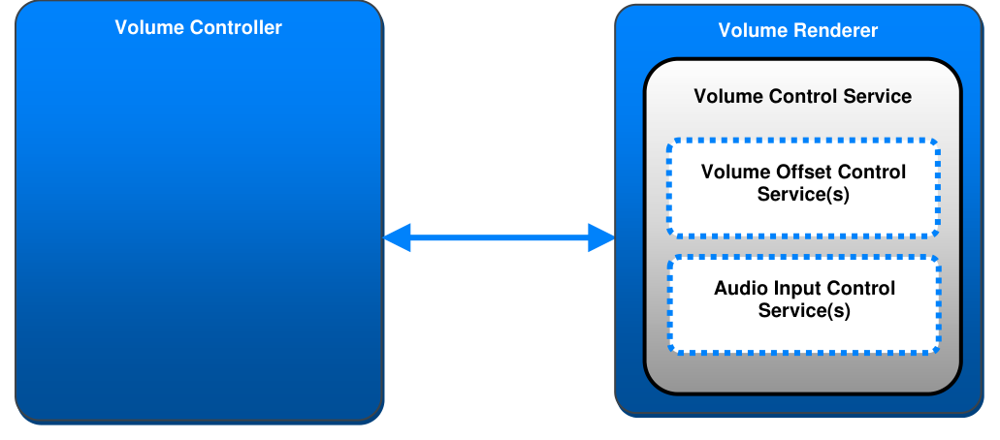
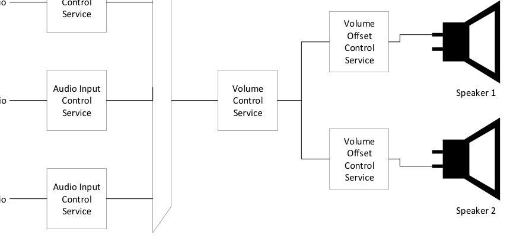
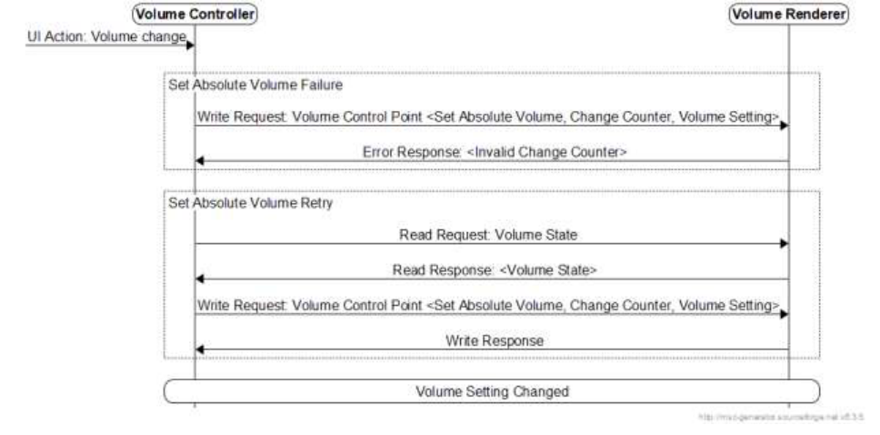

# VCP v1.0

> Source: PDF converted via PyMuPDF.

---

Volume Control Profile
Bluetooth® Profile Specification
▪ Revision: v1.0
▪ Revision Date: 2020-12-15
▪ Group Prepared By: Generic Audio Working Group
Abstract:
This profile enables a device to adjust the volume of audio devices that expose the Volume Control Service.
Revision History

| Revision Number | Date | Comments |
| --- | --- | --- |
| v1.0 | 2020-12-15 | Adopted by the Bluetooth SIG Board of Directors. |

Contributors

| Name | Company |
| --- | --- |
| Michael Rougeux | Bose Corporation |
| Siegfried Lehmann | Apple, Inc. |
| Tim Reilly | Bose Corporation |
| Robin Heydon | Qualcomm, Inc. |
| Asbjørn Sæbø | Nordic Semiconductor ASA |
| Georg Dickmann | Sonova AG |
| Masahiko Seki | Sony Corporation |
| Daniel Sisolak | Bose Corporation |
| Oren Haggai | Intel Corporation |
| Frank Yerrace | Microsoft Corporation |

Use of this specification is your acknowledgement that you agree to and will comply with the following notices and disclaimers. You are advised to seek appropriate legal, engineering, and other professional advice regarding the use, interpretation, and effect of this specification.
Use of Bluetooth specifications by members of Bluetooth SIG is governed by the membership and other related agreements between Bluetooth SIG and its members, including those agreements posted on Bluetooth SIG’s website located at www.bluetooth.com. Any use of this specification by a member that is not in compliance with the applicable membership and other related agreements is prohibited and, among other things, may result in (i) termination of the applicable agreements and (ii) liability for infringement of the intellectual property rights of Bluetooth SIG and its members. This specification may provide options, because, for example, some products do not implement every portion of the specification. Each option identified in the specification is intended to be within the bounds of the Scope as defined in the Bluetooth Patent/Copyright License Agreement (“PCLA”). Also, the identification of options for implementing a portion of the specification is intended to provide design flexibility without establishing, for purposes of the PCLA, that any of these options is a “technically reasonable non-infringing alternative.”
Use of this specification by anyone who is not a member of Bluetooth SIG is prohibited and is an infringement of the intellectual property rights of Bluetooth SIG and its members. The furnishing of this specification does not grant any license to any intellectual property of Bluetooth SIG or its members. THIS SPECIFICATION IS PROVIDED “AS IS” AND BLUETOOTH SIG, ITS MEMBERS AND THEIR AFFILIATES MAKE NO REPRESENTATIONS OR WARRANTIES AND DISCLAIM ALL WARRANTIES, EXPRESS OR IMPLIED, INCLUDING ANY WARRANTIES OF MERCHANTABILITY, TITLE, NON- INFRINGEMENT, FITNESS FOR ANY PARTICULAR PURPOSE, OR THAT THE CONTENT OF THIS SPECIFICATION IS FREE OF ERRORS. For the avoidance of doubt, Bluetooth SIG has not made any search or investigation as to third parties that may claim rights in or to any specifications or any intellectual property that may be required to implement any specifications and it disclaims any obligation or duty to do so.
TO THE MAXIMUM EXTENT PERMITTED BY APPLICABLE LAW, BLUETOOTH SIG, ITS MEMBERS AND THEIR AFFILIATES DISCLAIM ALL LIABILITY ARISING OUT OF OR RELATING TO USE OF THIS SPECIFICATION AND ANY INFORMATION CONTAINED IN THIS SPECIFICATION, INCLUDING LOST REVENUE, PROFITS, DATA OR PROGRAMS, OR BUSINESS INTERRUPTION, OR FOR SPECIAL, INDIRECT, CONSEQUENTIAL, INCIDENTAL OR PUNITIVE DAMAGES, HOWEVER CAUSED AND REGARDLESS OF THE THEORY OF LIABILITY, AND EVEN IF BLUETOOTH SIG, ITS MEMBERS OR THEIR AFFILIATES HAVE BEEN ADVISED OF THE POSSIBILITY OF THE DAMAGES.
Products equipped with Bluetooth wireless technology ("Bluetooth Products") and their combination, operation, use, implementation, and distribution may be subject to regulatory controls under the laws and regulations of numerous countries that regulate products that use wireless non-licensed spectrum. Examples include airline regulations, telecommunications regulations, technology transfer controls, and health and safety regulations. You are solely responsible for complying with all applicable laws and regulations and for obtaining any and all required authorizations, permits, or licenses in connection with your use of this specification and development, manufacture, and distribution of Bluetooth Products. Nothing in this specification provides any information or assistance in connection with complying with applicable laws or regulations or obtaining required authorizations, permits, or licenses.
Bluetooth SIG is not required to adopt any specification or portion thereof. If this specification is not the final version adopted by Bluetooth SIG’s Board of Directors, it may not be adopted. Any specification adopted by Bluetooth SIG’s Board of Directors may be withdrawn, replaced, or modified at any time. Bluetooth SIG reserves the right to change or alter final specifications in accordance with its membership and operating agreements.
Copyright © 2018–2020. All copyrights in the Bluetooth Specifications themselves are owned by Apple Inc., Ericsson AB, Intel Corporation, Lenovo (Singapore) Pte. Ltd., Microsoft Corporation, Nokia Corporation, and Toshiba Corporation. The Bluetooth word mark and logos are owned by Bluetooth SIG, Inc. Other third-party brands and names are the property of their respective owners.
Contents

## 1 Introduction

This profile enables a device to control the audio volume of a device that exposes the Volume Control Service (VCS) [2] and to obtain the volume status of that device. This profile also describes the procedures used to control and obtain the status of the Volume Offset Control Service (VOCS) [3] and Audio Input Control Service (AICS) [4].

### 1.1 Profile dependencies

This profile requires the Generic Attribute Profile (GATT).

### 1.2 Conformance

If conformance to this specification is claimed, all capabilities indicated as mandatory for this specification shall be supported in the specified manner (process-mandatory). This also applies for all optional and conditional capabilities for which support is indicated.

### 1.3 Bluetooth Core Specification release compatibility

This specification is compatible with any version of the Bluetooth Core Specification [1] that includes the GATT.

### 1.4 Language

#### 1.4.1 Language conventions

The Bluetooth SIG has established the following conventions for use of the words shall, must, will, should, may, can, is, and note in the development of specifications:

| shall | is required to – used to define requirements. |
| --- | --- |
| must | is used to express: a natural consequence of a previously stated mandatory requirement. OR an indisputable statement of fact (one that is always true regardless of the circumstances). |
| will | it is true that – only used in statements of fact. |
| should | is recommended that – used to indicate that among several possibilities one is recommended as particularly suitable, but not required. |
| may | is permitted to – used to allow options. |
| can | is able to – used to relate statements in a causal manner. |
| is | is defined as – used to further explain elements that are previously required or allowed. |
| note | Used to indicate text that is included for informational purposes only and is not required in order to implement the specification. Each note is clearly designated as a “Note” and set off in a separate paragraph. |

For clarity of the definition of those terms, see Core Specification Volume 1, Part E, Section 1.
1.4.2 Reserved for Future Use Where a field in a packet, Protocol Data Unit (PDU), or other data structure is described as "Reserved for Future Use" (irrespective of whether in uppercase or lowercase), the device creating the structure shall set its value to zero unless otherwise specified. Any device receiving or interpreting the structure shall ignore that field; in particular, it shall not reject the structure because of the value of the field.
Where a field, parameter, or other variable object can take a range of values, and some values are described as "Reserved for Future Use," a device sending the object shall not set the object to those values. A device receiving an object with such a value should reject it, and any data structure containing it, as being erroneous; however, this does not apply in a context where the object is described as being ignored or it is specified to ignore unrecognized values.
When a field value is a bit field, unassigned bits can be marked as Reserved for Future Use and shall be set to 0. Implementations that receive a message that contains a Reserved for Future Use bit that is set to 1 shall process the message as if that bit was set to 0, except where specified otherwise.
The acronym RFU is equivalent to Reserved for Future Use.
1.4.3 Prohibited When a field value is an enumeration, unassigned values can be marked as “Prohibited.” These values shall never be used by an implementation, and any message received that includes a Prohibited value shall be ignored and shall not be processed and shall not be responded to.
Where a field, parameter, or other variable object can take a range of values, and some values are described as “Prohibited,” devices shall not set the object to any of those Prohibited values. A device receiving an object with such a value should reject it, and any data structure containing it, as being erroneous.
“Prohibited” is never abbreviated.

## 2 Configuration

### 2.1 Roles

This profile defines two roles: The Volume Renderer role and the Volume Controller role. The Volume Renderer is the device that receives one or more audio inputs and exhibits control over an audio output device. The Volume Controller is the device that controls the volume and related state of this audio.
• The Volume Renderer shall be a GATT server.
• The Volume Controller shall be a GATT client.

### 2.2 Role/service relationships

Figure 2.1 shows the relationships between services and the profile roles.

**Figure 2.1: Example of relationship between services and profile roles**

A Volume Renderer instantiates VCS [2] and, optionally, one or more instances of VOCS [3] and/or one or more instances of AICS [4] as included services.

### 2.3 Topology

An example device topology for a Volume Renderer using VCS and several included instances of VOCS and AICS is shown in Figure 2.2.
Audio Input
Bluetooth Audio
Control Service

**Figure 2.2: Example of Volume Renderer topology**

### 2.4 Concurrency limitations/restrictions

There are no concurrency limitations or restrictions imposed by this profile.

## 3 Volume Renderer role requirements

This section describes the Volume Renderer profile role requirements in Table 3.1.
The Volume Renderer shall support the GATT server role and instantiate VCS [2] and may instantiate zero or more instances of VOCS and/or zero or more instances of AICS.
Requirements in this section are defined as “Mandatory” (M), “Optional” (O), “Excluded” (X), and “Conditional” (C.n). Conditional statements (C.n) are listed directly below the table in which they appear.

|  | Service | Volume Renderer |
| --- | --- | --- |
| 1 | Volume Control Service | M |
| 2 | Volume Offset Control Service | O |
| 3 | Audio Input Control Service | O |

Table 3.1: Volume Renderer role requirements

## 4 Volume Controller role requirements

This section describes the Volume Controller profile role requirements in Table 4.1. A higher-layer profile may specify additional profile role requirements.
Requirements in this section are defined as “Mandatory” (M), “Optional” (O), “Excluded” (X), and “Conditional” (C.n). Conditional statements (C.n) are listed directly below the table in which they appear.

|  | Profile Requirement | Section | Support in Volume Controller |
| --- | --- | --- | --- |
| 1 | GATT sub-procedures | 4.1 | M |
| 2 | Service Discovery | 4.2 | M |
| 3 | Characteristic Discovery | 4.3 | M |
| 4 | Volume Control Service procedures | 4.4 | M |
| 5 | Volume Offset Control Service procedures | 4.4.2 | O |
| 6 | Audio Input Control Service procedures | 4.4.3 | O |

Table 4.1: Profile requirements for the Volume Controller

### 4.1 GATT sub-procedure requirements

Requirements in this section represent a minimum set of requirements for a Volume Controller (client). Other GATT sub-procedures may be used if supported by both the client and server.
Table 4.2 summarizes additional GATT sub-procedure requirements beyond those required by all GATT clients.

|  | GATT Sub-Procedure | GATT Sub-Procedure | Volume Controller Requirements |
| --- | --- | --- | --- |
| 1 | Discover All Primary Services |  | C.1 |
| 2 | Discover Primary Services by Service UUID |  | C.2 |
| 3 | Find Included Services |  | O |
| 4 | Discover All Characteristics of a Service |  | C.3 |
| 5 | Discover Characteristics by UUID |  | C.4 |
| 6 | Discover All Characteristic Descriptors |  | M |
| 7 | Notifications |  | M |
| 8 | Read Characteristic Value |  | M |
| 9 | Write Characteristic Value |  | M |

|  | GATT Sub-Procedure | Volume Controller Requirements |
| --- | --- | --- |
| 10 | Read Characteristic Descriptors | M |
| 11 | Write Characteristic Descriptors | M |

Table 4.2: Additional GATT sub-procedure requirements
C.1: Mandatory if the Discover Primary Services by Service UUID sub-procedure is not supported, otherwise Optional.
C.2: Mandatory if the Discover All Primary Services sub-procedure is not supported, otherwise Optional.
C.3: Mandatory if the Discover Characteristics by UUID sub-procedure is not supported, otherwise Optional.
C.4: Mandatory if the Discover All Characteristics of a Service sub-procedure is not supported, otherwise Optional.

### 4.2 Service discovery

The Volume Controller shall use GATT Service Discovery to discover VCS.
The Volume Controller shall perform Primary Service Discovery by using either the GATT Discover All Primary Services sub-procedure or the GATT Discover Primary Services by Service UUID sub-procedure.
The Volume Controller may perform Relationship Discovery using the GATT Find Included Services sub- procedure to discover instances of VOCS and/or AICS.

### 4.3 Characteristic discovery

As required by GATT, the Volume Controller shall be tolerant of additional or optional characteristics in the service records of VCS, VOCS, and AICS.
The Volume Controller shall perform the GATT Discover All Characteristics of a Service sub-procedure or the GATT Discover Characteristics by UUID sub-procedure to discover the characteristics of VCS.
The Volume Controller shall perform the GATT Discover All Characteristic Descriptors sub-procedure to discover the Client Characteristic Configuration descriptors of VCS.
The Volume Controller may perform the GATT Discover All Characteristics of a Service sub-procedure or the GATT Discover Characteristics by UUID sub-procedure to discover the characteristics of instances of VOCS and/or AICS.
The Volume Controller may perform the GATT Discover All Characteristic Descriptors sub-procedure to discover the Client Characteristic Configuration descriptors of instances of VOCS and/or AICS.
The profile requirements to discover characteristics also apply to discovering the client Characteristic Configuration descriptors.

#### 4.3.1 Volume Control Service characteristic discovery

Table 4.3 describes the VCS characteristic discovery requirements for the Volume Controller role. A higher-layer profile may specify additional characteristic discovery requirements.

|  | Characteristic | Discovery Requirements for Volume Controller |
| --- | --- | --- |
| 1 | Volume State | M |
| 2 | Volume Control Point | M |
| 3 | Volume Flags | O |

Table 4.3: VCS characteristic discovery requirements

#### 4.3.2 Volume Offset Control Service characteristic discovery

Table 4.4 describes the VOCS characteristic discovery requirements for the Volume Controller role. A higher-layer profile may specify additional characteristic discovery requirements.

|  | Characteristic | Discovery Requirements for Volume Controller |
| --- | --- | --- |
| 1 | Volume Offset State | C.1 |
| 2 | Audio Location | O |
| 3 | Volume Offset Control Point | O |
| 4 | Audio Output Description | O |

Table 4.4: VOCS characteristic discovery requirements
C.1: Mandatory if VOCS procedures are supported, otherwise Optional.

#### 4.3.3 Audio Input Control Service characteristic discovery

Table 4.5 describes the AICS characteristic discovery requirements for the Volume Controller role. A higher-layer profile may specify additional characteristic discovery requirements.

|  | Characteristic | Discovery Requirements for Volume Controller |
| --- | --- | --- |
| 1 | Audio Input State | C.1 |
| 2 | Gain Setting Properties | C.1 |
| 3 | Audio Input Type | O |
| 4 | Audio Input Status | O |
| 5 | Audio Input Control Point | O |
| 6 | Audio Input Description | O |

Table 4.5: AICS characteristic discovery requirements
C.1: Mandatory if AICS procedures are supported, otherwise Optional.

### 4.4 Volume Controller procedures

This section describes the procedures used by the Volume Controller for volume control, volume offset control, and audio input control.

#### 4.4.1 Volume Control procedures

This section describes the mandatory and optional Volume Controller procedures that are used with VCS characteristics.
Table 4.6 summarizes the Volume Control sub-procedure requirements. A higher-layer profile may specify additional sub-procedure requirements.

|  | Volume Control Sub-Procedure | Volume Controller Requirements |
| --- | --- | --- |
| 1 | Configure Volume State Notifications | M |
| 2 | Read Volume State | M |
| 3 | Configure Volume Flags Notifications | O |
| 4 | Read Volume Flags | O |
| 5 | Set Initial Volume | C.1 |
| 6 | Set Absolute Volume | C.2 |
| 7 | Relative Volume Down | C.3 |
| 8 | Relative Volume Up | C.4 |
| 9 | Unmute/Relative Volume Down | C.5 |
| 10 | Unmute/Relative Volume Up | C.6 |
| 11 | Mute | O |
| 12 | Unmute | O |

Table 4.6: Additional VCS sub-procedure requirements
C.1: Optional if both Read Volume Flags and Set Absolute Volume sub-procedures are supported, otherwise Excluded.
C.2: Mandatory if none of the Relative Volume Down, Relative Volume Up, Unmute/Relative Volume Down, or Unmute/Relative Volume Up sub-procedures are supported, otherwise Optional.
C.3: Mandatory if the Relative Volume Up sub-procedure is supported, otherwise Optional.
C.4: Mandatory if the Relative Volume Down sub-procedure is supported, otherwise Optional.
C.5: Mandatory if the Unmute/Relative Volume Up sub-procedure is supported, otherwise Optional.
C.6: Mandatory if the Unmute/Relative Volume Down sub-procedure is supported, otherwise Optional.

##### 4.4.1.1 Configure Volume State Notifications sub-procedure

The Configure Volume State Notifications sub-procedure is used to subscribe or unsubscribe to notifications of changes to the Volume State of the Volume Renderer.
The Volume Controller shall configure notifications of the Volume State characteristic value of the Volume Renderer.

##### 4.4.1.2 Read Volume State sub-procedure

The Read Volume State sub-procedure is used to retrieve the Volume State characteristic value of the Volume Renderer.
The Volume Controller shall read the Volume State characteristic value of VCS.

##### 4.4.1.3 Configure Volume Flags Notifications sub-procedure

The Configure Volume Flags Notifications sub-procedure is used to subscribe or unsubscribe to notifications of changes to the Volume Flags value of the Volume Renderer.
If the characteristic property of the Volume Flags characteristic of the Volume Renderer includes support for notifications, the Volume Controller shall configure notifications of the Volume Flags characteristic value of the Volume Renderer.

##### 4.4.1.4 Read Volume Flags sub-procedure

The Read Volume Flags sub-procedure is used to retrieve the service flags of the Volume Renderer.
The Volume Controller shall read the Volume Flags characteristic value of VCS.

##### 4.4.1.5 Set Initial Volume sub-procedure

The Set Initial Volume sub-procedure is used to set the initial volume upon connection to a Volume Renderer.
The Volume Controller shall retrieve the Volume Flags characteristic value of VCS either by receiving a notification of the Volume Flags characteristic value or reading the Volume Flags characteristic value.
If the Volume_Setting_Persisted field is set to Reset Volume Setting in the Volume Flags characteristic value, the Volume Controller shall use the Set Absolute Volume sub-procedure to set the initial volume.
If the Volume_Setting_Persisted bit is set to User Set Volume Setting in the Volume Flags characteristic value, the Volume Controller shall retrieve the Volume_Setting field of the Volume State characteristic value by using either the Read Volume State sub-procedure or by receiving a notification of the Volume State characteristic value.

##### 4.4.1.6 Volume Control Point sub-procedures

The VCS Volume Control Point procedures require the client to provide the value of the Change_Counter field of the Volume State characteristic value. Providing the Change_Counter field is a method of synchronization between any client and the server, where the loss of synchronization could result in unexpected behavior.
For each Volume Control Point sub-procedure, the Volume Controller shall retrieve the Change_Counter field of the Volume State characteristic value using the Volume State Notifications or Read Volume State sub-procedure. The Volume Controller shall then use this value as the Change_Counter parameter of the subsequent write to the Volume Control Point characteristic value.
If the server’s current value of the Change_Counter field differs from the client’s Change_Counter parameter, the Volume Renderer rejects the command by sending an ATT Error Response with an error code set to the Application Error Code 0x80 (Invalid Change Counter).
In this case, the Volume Controller may retry the sub-procedure using a more recently read or notified value of the Change_Counter field. An example of this scenario is shown in Figure 4.1.

**Figure 4.1: Example of a Set Absolute Volume failure and retry**

###### 4.4.1.6.1 Relative Volume Down sub-procedure

The Relative Volume Down sub-procedure decreases the Volume_Setting field of the Volume Renderer by a decrement that is pre-determined by the Volume Renderer.
The Volume Controller shall write the value format to the Volume Control Point characteristic value of the Volume Renderer: Opcode parameter with the value of the Relative Volume Down opcode, followed by the Change_Counter parameter, as shown in Table 4.7.

| Parameter 1 | Parameter 2 |
| --- | --- |
| Opcode | Change Counter _ |

Table 4.7: Volume Control Point value for the Relative Volume Down sub-procedure
The Change_Counter parameter is used as described in Section 4.4.1.6.

###### 4.4.1.6.2 Relative Volume Up sub-procedure

The Relative Volume Up sub-procedure increases the Volume_Setting field of the Volume Renderer by an increment that is pre-determined by the Volume Renderer.
The Volume Controller shall write the value format to the Volume Control Point characteristic value of the Volume Renderer: Opcode parameter with the value of the Relative Volume Up opcode, followed by the Change_Counter parameter, as shown in Table 4.8.

| Parameter 1 | Parameter 2 |
| --- | --- |
| Opcode | Change Counter _ |

Table 4.8: Volume Control Point value for the Relative Volume Up sub-procedure
The Change_Counter parameter is used as described in Section 4.4.1.6.

###### 4.4.1.6.3 Unmute/Relative Volume Down sub-procedure

The Unmute/Relative Volume Down sub-procedure decreases the Volume_Setting field of the Volume Renderer by a decrement that is pre-determined by the Volume Renderer and sets the Mute field value of the Volume State characteristic value to Not Muted.
The Volume Controller shall write the value format to the Volume Control Point characteristic value of the Volume Renderer: Opcode parameter with the value of the Unmute/Relative Volume Down opcode, followed by the Change_Counter parameter, as shown in Table 4.9.

| Parameter 1 | Parameter 2 |
| --- | --- |
| Opcode | Change Counter _ |

Table 4.9: Volume Control Point value for the Unmute/Relative Volume Down sub-procedure
The Change_Counter parameter is used as described in Section 4.4.1.6.
This sub-procedure controls the single mute point for the entire device. To control the mute of individual inputs, the Volume Controller shall use the Audio Input Control procedures in Section 4.4.3.

###### 4.4.1.6.4 Unmute/Relative Volume Up sub-procedure

The Unmute/Relative Volume Up sub-procedure increases the Volume_Setting field of the Volume Renderer by an increment that is pre-determined by the Volume Renderer and sets the Mute field value of the Volume State characteristic value Not Muted.
The Volume Controller shall write the value format to the Volume Control Point characteristic value of the Volume Renderer: Opcode parameter with the value of the Unmute/Relative Volume Up opcode, followed by the Change_Counter parameter, as shown in Table 4.10.

| Parameter 1 | Parameter 2 |
| --- | --- |
| Opcode | Change Counter _ |

Table 4.10: Volume Control Point value for the Unmute/Relative Volume Up sub-procedure
The Change_Counter parameter is used as described in Section 4.4.1.6.
This sub-procedure controls the single mute point for the entire device. To control the mute of individual inputs, the Volume Controller shall use the Audio Input Control procedures in Section 4.4.3.

###### 4.4.1.6.5 Set Absolute Volume sub-procedure

The Set Absolute Volume sub-procedure is used to change the absolute volume setting of the Volume Renderer.
The Volume Controller shall write the value format to the Volume Control Point characteristic value of the Volume Renderer: Opcode parameter with the value of the Set Absolute Volume opcode, followed by the Change_Counter parameter, followed by the new Volume_Setting parameter, as shown in Table 4.11.

| Parameter 1 | Parameter 2 | Parameter 3 |
| --- | --- | --- |
| Opcode | Change Counter _ | Volume Setting _ |

Table 4.11: Volume Control Point value for the Set Absolute Volume sub-procedure
The Change_Counter parameter is used as described in Section 4.4.1.6.

###### 4.4.1.6.6 Unmute sub-procedure

The Unmute sub-procedure sets the Mute field value to Not Muted.
The Volume Controller shall write the value format to the Volume Control Point characteristic value of the Volume Renderer: Opcode parameter with the value of the Unmute opcode, followed by the Change_Counter parameter, as shown in Table 4.12.

| Parameter 1 | Parameter 2 |
| --- | --- |
| Opcode | Change Counter _ |

Table 4.12: Volume Control Point value for the Unmute sub-procedure
The Change_Counter parameter is used as described in Section 4.4.1.6.
This sub-procedure controls the single mute point for the entire device. To control the mute of individual inputs, the Volume Controller shall use the Audio Input Control procedures in Section 4.4.3.

###### 4.4.1.6.7 Mute sub-procedure

The Mute sub-procedure sets the Mute field value to Muted.
The Volume Controller shall write the value format to the Volume Control Point characteristic value of the Volume Renderer: Opcode parameter with the value of the Mute opcode, followed by the Change_Counter parameter, as shown in Table 4.13.

| Parameter 1 | Parameter 2 |
| --- | --- |
| Opcode | Change Counter _ |

Table 4.13: Volume Control Point value for the Mute sub-procedure
The Change_Counter parameter is used as described in Section 4.4.1.6.
This sub-procedure controls the single mute point for the entire device. To control the mute of individual inputs, the Volume Controller shall use the Audio Input Control procedures in Section 4.4.3.

#### 4.4.2 Volume Offset Control procedures

This section describes the optional Volume Controller procedures used with the VOCS characteristics. The procedures provided by this service are used to set a value for the volume offset of one or more audio outputs to implement features such as balance for left and right, fade for front and back, etc.
Table 4.14 summarizes additional Volume Offset Control sub-procedure requirements. A higher-layer profile may specify additional sub-procedure requirements.

|  | Volume Offset Control Sub-Procedure | Volume Controller Requirements |
| --- | --- | --- |
| 1 | Configure Volume Offset State Notifications | C.1 |
| 2 | Read Volume Offset State | C.1 |
| 3 | Configure Audio Location Notifications | O |
| 4 | Read Audio Location | O |
| 5 | Set Audio Location | O |
| 6 | Set Volume Offset | O |
| 7 | Configure Audio Output Description Notifications | O |
| 8 | Read Audio Output Description | O |
| 9 | Set Audio Output Description | O |

Table 4.14: Additional VOCS sub-procedure requirements
C.1: Mandatory if VOCS procedures are supported.

##### 4.4.2.1 Configure Volume Offset State Notifications sub-procedure

The Configure Volume Offset State Notifications sub-procedure is used to subscribe or unsubscribe to notifications of changes to the Volume Offset State characteristic value.
The Volume Controller shall configure notifications of the Volume Offset State characteristic value of the Volume Renderer.

##### 4.4.2.2 Read Volume Offset State sub-procedure

The Read Volume Offset State sub-procedure is used to retrieve the Volume Offset State characteristic value.
The Volume Controller shall read the Volume Offset State characteristic value of VOCS.

##### 4.4.2.3 Configure Audio Location Notifications sub-procedure

The Configure Audio Location Notifications sub-procedure is used to subscribe or unsubscribe to notifications of changes to the location of a Volume Renderer’s audio output.
The Volume Controller shall configure notifications of the Audio Location characteristic value of the Volume Renderer.

##### 4.4.2.4 Read Audio Location sub-procedure

The Read Audio Location sub-procedure is used to retrieve the location of a Volume Renderer’s audio output.
The Volume Controller shall read the Audio Location characteristic value of VOCS.
The Set Audio Location sub-procedure is used to change the location of a Volume Renderer’s audio output.
The Volume Controller shall write the location value to the Audio Location characteristic value of the Volume Renderer.

##### 4.4.2.6 Volume Offset Control Point sub-procedures

The VOCS Volume Offset Control Point procedures require the client to provide the value of the Change_Counter field of the Volume Offset State characteristic value. Providing the Change_Counter field is a method of synchronization between any client and the server, where the loss of synchronization could result in unexpected behavior.
For each Volume Offset Control Point sub-procedure, the Volume Controller shall retrieve the Change_Counter field of the Volume Offset State characteristic value using the Volume Offset State Notifications or Read Volume Offset State sub-procedure. The Volume Controller shall then use this value as the Change_Counter parameter of the subsequent write to the Volume Control Point characteristic value.
If the server’s current value of the Change_Counter field differs from the client’s Change_Counter parameter, the Volume Renderer rejects the command by sending an ATT Error Response with an error code set to the Application Error Code 0x80 (Invalid Change Counter).
In this case, the Volume Controller may retry the sub-procedure using a more recently read or notified value of the Change_Counter field.

###### 4.4.2.6.1 Set Volume Offset sub-procedure

The Set Volume Offset sub-procedure is used to change the Volume_Offset field of the Volume Renderer.
The Volume Controller shall write the value format to the Volume Offset Control Point characteristic value of the Volume Renderer: Opcode parameter with the value of the Set Volume Offset opcode, followed by the Change_Counter parameter, followed by the new Volume_Offset parameter, as shown in Table 4.15.

| Parameter 1 | Parameter 2 | Parameter 3 |
| --- | --- | --- |
| Opcode | Change Counter _ | Volume Offset _ |

Table 4.15: Volume Offset Control Point value for the Set Volume Offset sub-procedure
The Change_Counter parameter is used as described in Section 4.4.1.6.

##### 4.4.2.7 Configure Audio Output Description Notifications sub-procedure

The Configure Audio Output Description Notifications sub-procedure is used to subscribe or unsubscribe to notifications of changes to the description of a Volume Renderer’s audio output.
The Volume Controller shall configure notifications of the Audio Output Description characteristic value of the Volume Renderer.
The Read Audio Output Description sub-procedure is used to retrieve the description of a Volume Renderer’s audio output.
The Volume Controller shall read the Audio Output Description characteristic value of VOCS.

##### 4.4.2.9 Set Audio Output Description sub-procedure

The Set Audio Output Description sub-procedure is used to change the description of a Volume Renderer’s audio output.
The Volume Controller shall write the description value to the Audio Output Description characteristic value of the Volume Renderer.

#### 4.4.3 Audio Input Control Service procedures

This section describes the optional Volume Controller procedures that are used with AICS. These procedures allow a mechanism for controlling the input level of a Volume Renderer’s audio inputs.
Table 4.16 summarizes additional AICS sub-procedure requirements. A higher-layer profile may specify additional sub-procedure requirements.

|  | AICS Sub-Procedure | Volume Controller Requirements |
| --- | --- | --- |
| 1 | Configure Audio Input State Notifications | C.1 |
| 2 | Read Audio Input State | C.1 |
| 3 | Read Gain Setting Properties | O |
| 4 | Read Audio Input Type | O |
| 5 | Configure Audio Input Status Notifications | O |
| 6 | Read Audio Input Status | O |
| 7 | Set Gain Setting | O |
| 8 | Mute | O |
| 9 | Unmute | O |
| 10 | Set Manual Gain Mode | O |
| 11 | Set Automatic Gain Mode | O |
| 12 | Configure Audio Input Description Notifications | O |
| 13 | Read Audio Input Description | O |
| 14 | Set Audio Input Description | O |

Table 4.16: Additional AICS sub-procedure requirements
C.1: Mandatory if AICS procedures are supported.
The Volume Controller may use the sub-procedures in this section to read, enable/disable notifications, and control the gain setting or mute state of a Volume Renderer’s audio input.

##### 4.4.3.1 Configure Audio Input State Notifications sub-procedure

The Configure Audio Input State Notifications sub-procedure is used to subscribe or unsubscribe to notifications of changes to the Audio Input State characteristic value of a Volume Renderer.
The Volume Controller shall configure notifications of the Audio Input State characteristic value of the Volume Renderer.

##### 4.4.3.2 Read Audio Input State sub-procedure

The Read Audio Input State sub-procedure is used to retrieve the Audio Input State characteristic value of a Volume Renderer.
The Volume Controller shall read the Audio Input State characteristic value of AICS.

##### 4.4.3.3 Read Gain Setting Properties sub-procedure

The Read Gain Setting Properties sub-procedure is used to retrieve the Gain Setting Properties characteristic value of a Volume Renderer, which contains the units and the minimum and maximum allowable values of the Gain_Setting field value.
The Volume Controller shall read the Gain Setting Properties characteristic value of AICS.

##### 4.4.3.4 Read Audio Input Type sub-procedure

The Read Audio Input Type sub-procedure is used to retrieve the type of a Volume Renderer’s audio input.
The Volume Controller shall read the Audio Input Type characteristic value of AICS.

##### 4.4.3.5 Configure Audio Input Status Notifications sub-procedure

The Configure Audio Input Status Notifications sub-procedure is used to subscribe or unsubscribe to notifications of changes to the Audio Input Status characteristic value of a Volume Renderer.
The Volume Controller shall configure notifications of the Audio Input Status characteristic value of the Volume Renderer.

##### 4.4.3.6 Read Audio Input Status sub-procedure

The Read Audio Input Status sub-procedure is used to retrieve the status of a Volume Renderer’s audio input.
The Volume Controller shall read the Audio Input Status characteristic value of AICS.

##### 4.4.3.7 Audio Input Control Point sub-procedures

The AICS Audio Input Control Point sub-procedures require the client to provide the value of the Change_Counter field of the Audio Input State characteristic value. Providing the Change_Counter field is a method of synchronization between any client and the server, where the loss of synchronization could result in unexpected behavior.
For each Audio Input Control Point sub-procedure, the Volume Controller shall first retrieve the Change_Counter field of the Audio Input State characteristic value using the Configure Audio Input State Notifications or Read Audio Input State sub-procedure. The Volume Controller shall then use this value as the Change_Counter parameter of the subsequent write to the Audio Input Control Point characteristic.
If the server’s current value of the Change_Counter field differs from the client’s Change_Counter parameter, the Volume Renderer rejects the command by sending an ATT Error Response with an error code set to the Application Error Code 0x80 (Invalid Change Counter).
In this case, the Volume Controller may retry the sub-procedure using a more recently read or notified value of the Change_Counter field.

###### 4.4.3.7.1 Set Gain Setting sub-procedure

The Set Gain Setting sub-procedure is used to change the gain setting of the Volume Renderer.
If the Gain_Mode field’s value is set to Automatic, then the Volume Controller shall not perform this procedure.
The Volume Controller shall write the value format to the Audio Input Control Point characteristic value of the Volume Renderer: Opcode parameter with the value of the Set Gain Setting opcode, followed by the Change_Counter parameter, followed by the new Gain_Setting parameter, as shown in Table 4.17.

| Parameter 1 | Parameter 2 | Parameter 3 |
| --- | --- | --- |
| Opcode | Change Counter _ | Gain Setting _ |

Table 4.17: Audio Input Control Point value for the Set Gain Setting sub-procedure
The Change_Counter parameter is used as described in Section 4.4.1.6.

###### 4.4.3.7.2 Unmute sub-procedure

The Unmute sub-procedure sets the Mute field value to Not Muted.
The Volume Controller shall write the value format to the Audio Input Control Point characteristic value of the Volume Renderer: Opcode parameter with the value of the Unmute opcode, followed by the Change_Counter parameter, as shown in Table 4.18.

| Parameter 1 | Parameter 2 |
| --- | --- |
| Opcode | Change Counter _ |

Table 4.18: Audio Input Control Point value for the Unmute sub-procedure
The Change_Counter parameter is used as described in Section 4.4.1.6.

###### 4.4.3.7.3 Mute sub-procedure

The Mute sub-procedure sets the Mute field value to Muted.
The Volume Controller shall write the value format to the Audio Input Control Point characteristic value of the Volume Renderer: Opcode parameter with the value of the Mute opcode, followed by the Change_Counter parameter, as shown in Table 4.19.

| Parameter 1 | Parameter 2 |
| --- | --- |
| Opcode | Change Counter _ |

Table 4.19: Audio Input Control Point value for the Mute sub-procedure
The Change_Counter parameter is used as described in Section 4.4.1.6.

###### 4.4.3.7.4 Set Manual Gain Mode sub-procedure

The Set Manual Gain Mode sub-procedure sets the Gain_Mode field value to Manual.
If the Gain_Mode field of the Audio Input State characteristic value has the value Automatic Only or Manual Only, then the Volume Controller shall not perform the Set Manual Gain Mode sub-procedure.
The Volume Controller shall write the value format to the Audio Input Control Point characteristic value of the Volume Renderer: Opcode parameter with the value of the Set Manual Gain Mode opcode, followed by the Change_Counter parameter, as shown in Table 4.20.

| Parameter 1 | Parameter 2 |
| --- | --- |
| Opcode | Change Counter _ |

Table 4.20: Audio Input Control Point value for the Set Manual Gain Mode sub-procedure
The Change_Counter parameter is used as described in Section 4.4.1.6.

###### 4.4.3.7.5 Set Automatic Gain Mode sub-procedure

The Set Automatic Gain Mode sub-procedure sets the Gain_Mode field value to Automatic.
If the Gain_Mode field of the Audio Input State characteristic value has the value Automatic Only or Manual Only, then the Volume Controller shall not perform the Set Automatic Gain Mode sub-procedure.
The Volume Controller shall write the value format to the Audio Input Control Point characteristic value of the Volume Renderer: Opcode parameter with the value of the Set Automatic Gain Mode opcode, followed by the Change_Counter parameter, as shown in Table 4.21.

| Parameter 1 | Parameter 2 |
| --- | --- |
| Opcode | Change Counter _ |

Table 4.21: Audio Input Control Point value for the Set Automatic Gain Mode sub-procedure
The Change_Counter parameter is used as described in Section 4.4.1.6.

##### 4.4.3.8 Configure Audio Input Description Notifications sub-procedure

The Configure Audio Input Description Notifications sub-procedure is used to subscribe or unsubscribe to notifications of changes to the Audio Input Description characteristic value of the Volume Renderer.
The Volume Controller shall configure notifications of the Audio Input Description characteristic value of the Volume Renderer.
The Read Audio Input Description sub-procedure is used to retrieve the description of a Volume Renderer’s audio input.
The Volume Controller shall read the Audio Input Description characteristic value of AICS.

##### 4.4.3.10 Set Audio Input Description sub-procedure

The Set Audio Input Description sub-procedure is used to change the description of a Volume Renderer’s audio input.
The Volume Controller shall write the description value to the Audio Input Description characteristic value of the Volume Renderer.

## 5 Security considerations

This section describes the security requirements for devices that implement the profile roles defined in this specification.

### 5.1 Security requirements for Low Energy

This section describes the security requirements for the Bluetooth Low Energy (LE) transport in terms of the Volume Controller role and the Volume Renderer role.
The Volume Renderer security requirements for all characteristics defined in VCS [2], VOCS [3], and AICS [4] shall be Security Mode 1 Level 2, defined in Volume 3, Part C, Section 10.2.1 in [1].
Access by a Volume Controller to all characteristics defined in VCS [2], VOCS [3], and AICS [4] shall require an encryption key with at least 128 bits of entropy, derived from any of the following:
• LE Secure Connections
• BR/EDR Secure Connections (if cross-transport key derivation is used)
• Out-of-Band (OOB) method
Privacy, as defined in Volume 3, Part C, Section 10.7 in [1], should be used.

#### 5.1.1 Volume Controller security requirements for Low Energy

The Volume Controller should support Bondable mode, defined in Volume 3, Part C, Section 9.4.3 in [1].
The Volume Controller should support the bonding procedure defined in Volume 3, Part C, Section 9.4.4 in [1].
The Volume Controller should accept the LE Security Mode and LE Security Level combination that is requested by the Volume Renderer.
If the Volume Controller is a BR/EDR/LE device, the Volume Controller shall use cross-transport key derivation, as defined in Volume 3, Part C, Section 14 in [1].
If the Volume Controller is using Privacy, the Volume Controller shall distribute its Identity Address (IA) and Identity Resolution Key (IRK) [1].

#### 5.1.2 Volume Renderer security requirements for Low Energy

The Volume Renderer should support Bondable mode defined in Volume 3, Part C, Section 9.4.3 in [1].
The Volume Renderer should support the bonding procedure defined in Volume 3, Part C, Section 9.4.4 in [1].
The Volume Renderer should accept the LE Security Mode and LE Security Level combination that is requested by the Volume Controller.
If the Volume Renderer is a BR/EDR/LE device, the Volume Renderer shall use cross-transport key derivation, as defined in Volume 3, Part C, Section 14 in [1].

### 5.2 Security requirements for BR/EDR

This section describes the security requirements for the BR/EDR transport.
The Volume Renderer security requirements for all characteristics defined in VCS [2], VOCS [3], and AICS [4] shall be Security Mode 4 Level 2, as defined in Volume 3, Part C, Section 5.2.2.8 in [1].
Access by a Volume Controller to all characteristics defined in VCS [2], VOCS [3], and AICS [4] shall require an encryption key with at least 128 bits of entropy derived from any of the following:
• BR/EDR Secure Connections
• LE Secure Connections (if cross-transport key derivation is used)
• OOB method
BR/EDR/LE devices shall use cross-transport key derivation, as defined in Volume 3, Part C, Section 14 in [1] and if Privacy is in use, BR/EDR/LE devices shall distribute their IAs and IRKs.

## 6 Generic Access Profile requirements

Requirements in this section are defined as “Mandatory” (M), “Optional” (O), “Excluded” (X), and “Conditional” (C.n). Conditional statements (C.n) are listed directly below the table in which they appear.

### 6.1 Generic Access Profile requirements for Low Energy

This section describes the device discovery and LE ACL connection establishment procedures that are used by a Volume Controller and a Volume Renderer. These procedures are described in terms of the following roles:
• Peripheral role (defined in Volume 3, Part C, Section 2.2.2 in [1])
• Central role (defined in Volume 3, Part C, Section 2.2.2 in [1])

#### 6.1.1 Peripheral connection establishment

##### 6.1.1.1 Connection procedure to non-bonded devices

The connection procedure to non-bonded devices is used for device discovery and connection establishment when the Peripheral accepts a connection from a Central to which it is not bonded. The connection procedure to non-bonded devices is triggered by user interaction, for example, activating a device by inserting a battery or pushing buttons. To inform the Central that the Peripheral is available for connection establishment, the Peripheral enters one of the following GAP discoverable modes:
• Limited Discoverable mode (as defined in Volume 3, Part C, Section 9.2.3 in [1])
• General Discoverable mode (as defined in Volume 3, Part C, Section 9.2.4 in [1])
The Peripheral shall transmit extended advertising PDUs and, unless otherwise defined by higher-layer specifications, should include the following Advertising Data (AD) data types:
• Flags AD data type (as defined in Part A, Section 1.3 in [5])
• If the Peripheral is in the Volume Renderer role and supports VCS over LE, the Service UUID AD data type (as defined in Part A, Section 1.1 in [5]) containing the VCS [2] UUID
If the Peripheral is a BR/EDR/LE device and is also in a discoverable mode over the BR/EDR transport as defined in Section 6.2.1,6.2.2 and if the Peripheral wants to assist scanning devices to represent the Peripheral as a single device at the scanning device’s user interface (UI), the Peripheral should use its Public Device Address when transmitting extended advertising PDUs as part of the connection procedure to non-bonded devices.

##### 6.1.1.2 Connection procedure to bonded devices

The connection procedure to bonded devices is used by a Peripheral device in the Connectable mode only if the Peripheral has previously bonded with the Central device when using the connection procedure to non-bonded devices defined in Section 6.1.1.1.
When available for a connection to a bonded device, a Peripheral enters one of the following GAP connectable modes:
• Directed Connectable mode (as defined in Volume 3, Part C, Section 9.3.3 in [1])
• Undirected Connectable mode (as defined in Volume 3, Part C, Section 9.3.4 in [1])
The Peripheral should use the advertising filter policy that was configured when bonded using the connection procedure to non-bonded devices in Section 6.1.1.1, unless the Peripheral is in the Directed Connectable mode.

##### 6.1.1.3 Link loss reconnection procedure

When a connection is terminated because of link loss, a Peripheral should attempt to reconnect to the Central by using the procedure described in Section 6.1.1.1 or Section 6.1.1.2.

#### 6.1.2 Central connection establishment

##### 6.1.2.1 Device discovery

To discover one or more Peripherals, the Central uses either of the following GAP discovery procedures:
• Limited Discovery procedure (as defined in Volume 3, Part C, Section 9.2.5 in [1])
• General Discovery procedure (as defined in Volume 3, Part C, Section 9.2.6 in [1])

##### 6.1.2.2 Connection procedure

A Central uses one of the following GAP connection establishment procedures based on its connectivity requirements:
• Auto Connection Establishment procedure (as defined in Volume 3, Part C, Section 9.3.5 in [1])
• General Connection Establishment procedure (as defined in Volume 3, Part C, Section 9.3.6 in [1])
• Selective Connection Establishment procedure (as defined in Volume 3, Part C, Section 9.3.7 in [1])
• Direct Connection Establishment procedure (as defined in Volume 3, Part C, Section 9.3.8 in [1])

##### 6.1.2.3 Link loss reconnection procedure

When a connection is terminated because of link loss, a Central should attempt to reconnect to the Peripheral by using any of the GAP connection establishment procedures described in Section 6.1.2.2.

##### 6.1.2.4 Connection interval

The connection interval can affect the latency of Volume Controller procedures. Therefore, to reduce the latency when acting as a Volume Controller, a connection interval should be selected in the range provided in Table 6.1.

|  | Parameter |  |  | Value |  |
| --- | --- | --- | --- | --- | --- |
| Range for Connection Interval |  |  | 10 to 30 milliseconds |  |  |

Table 6.1: Recommended range for connection interval values

### 6.2 Generic Access Profile requirements for BR/EDR

This section describes the GAP requirements for BR/EDR.

#### 6.2.1 Modes

Modes are defined in Volume 3, Part C, Section 4 in [1].
Bondable mode should be supported.

| Mode | Support in Volume Renderer | Support in Volume Controller |
| --- | --- | --- |
| General Discoverable mode | C.1 | O |
| Limited Discoverable mode | C.1 | O |
| Bondable mode | O | O |

Table 6.2: GAP BR/EDR mode support requirements
C.1: Mandatory to support at least one of Limited Discoverable mode or General Discoverable mode.

#### 6.2.2 Idle Mode procedures

Idle Mode procedures are defined in Volume 3, Part C, Section 6 in [1].
The General Bonding procedure should be supported.
Table 6.3 shows the requirements for GAP Idle Mode procedures for BR/EDR devices.

| Procedure | Support in Volume Renderer | Support in Volume Controller |
| --- | --- | --- |
| General Inquiry | O | M |
| Limited Inquiry | O | O |
| General Bonding | O | O |

Table 6.3: GAP BR/EDR Idle Mode procedure support requirements

#### 6.2.3 Device discovery

BR/EDR/LE devices implementing either the Volume Controller or Volume Renderer roles shall set the value of the Class of Device (CoD) [6] field Major Service Class bit 14 to 1.
If a BR/EDR/LE device implementing the Volume Renderer role is in a GAP Discoverable mode defined in Volume 3, Part C, Section 4 in [1], then unless otherwise defined by higher-layer specifications, any extended inquiry response (EIR) data sent by the device should include the following EIR data type:
• If the Volume Renderer supports VCS over BR/EDR, the Service UUID EIR data type containing the VCS [2] UUID

## 7 Acronyms and abbreviations

Acronym/Abbreviation Meaning
ACL Asynchronous Connection-oriented [logical transport]
AD Advertising Data
AICS Audio Input Control Service
ATT Attribute Protocol
BR/EDR Basic Rate/Enhanced Data Rate
CoD Class of Device
EIR extended inquiry response
GAP General Access Profile
GATT Generic Attribute Profile
IA Identity Address
IRK Identity Resolution Key
LE Low Energy
OOB Out-of-Band
PDU Protocol Data Unit
RFU Reserved for Future Use
UUID universally unique identifier
UI user interface
VCS Volume Control Service
VOCS Volume Offset Control Service
Table 7.1: Acronyms and abbreviations

## 8 References

[1] Bluetooth Core Specification, Version 5.2 or later
[2] Bluetooth Volume Control Service Specification
[3] Bluetooth Volume Offset Control Service Specification
[4] Bluetooth Audio Input Control Service Specification
[5] Bluetooth Core Specification Supplement, Version 9 or later
[6] Bluetooth SIG Assigned Numbers, https://www.bluetooth.com/specifications/assigned-numbers/