# 80211MP.TS.p7

> Source: PDF converted via PyMuPDF.

---

### 802.11 MAC/PHY (80211MP)

Bluetooth® Test Suite
▪ Revision: 80211MP.TS.p7 ▪ Revision Date: 2024-07-01 ▪ Prepared By: BTI ▪ Published during TCRL: TCRL.2024-1
This document, regardless of its title or content, is not a Bluetooth Specification as defined in the Bluetooth Patent/Copyright License Agreement (“PCLA”) and Bluetooth Trademark License Agreement. Use of this document by members of Bluetooth SIG is governed by the membership and other related agreements between Bluetooth SIG Inc. (“Bluetooth SIG”) and its members, including the PCLA and other agreements posted on Bluetooth SIG’s website located at www.bluetooth.com.
THIS DOCUMENT IS PROVIDED “AS IS” AND BLUETOOTH SIG, ITS MEMBERS, AND THEIR AFFILIATES MAKE NO REPRESENTATIONS OR WARRANTIES AND DISCLAIM ALL WARRANTIES, EXPRESS OR IMPLIED, INCLUDING ANY WARRANTY OF MERCHANTABILITY, TITLE, NON-INFRINGEMENT, FITNESS FOR ANY PARTICULAR PURPOSE, THAT THE CONTENT OF THIS DOCUMENT IS FREE OF ERRORS.
TO THE EXTENT NOT PROHIBITED BY LAW, BLUETOOTH SIG, ITS MEMBERS, AND THEIR AFFILIATES DISCLAIM ALL LIABILITY ARISING OUT OF OR RELATING TO USE OF THIS DOCUMENT AND ANY INFORMATION CONTAINED IN THIS DOCUMENT, INCLUDING LOST REVENUE, PROFITS, DATA OR PROGRAMS, OR BUSINESS INTERRUPTION, OR FOR SPECIAL, INDIRECT, CONSEQUENTIAL, INCIDENTAL OR PUNITIVE DAMAGES, HOWEVER CAUSED AND REGARDLESS OF THE THEORY OF LIABILITY, AND EVEN IF BLUETOOTH SIG, ITS MEMBERS, OR THEIR AFFILIATES HAVE BEEN ADVISED OF THE POSSIBILITY OF SUCH DAMAGES.
This document is proprietary to Bluetooth SIG. This document may contain or cover subject matter that is intellectual property of Bluetooth SIG and its members. The furnishing of this document does not grant any license to any intellectual property of Bluetooth SIG or its members.
This document is subject to change without notice.
Copyright © 2009–2024 by Bluetooth SIG, Inc. The Bluetooth word mark and logos are owned by Bluetooth SIG, Inc. Other third-party brands and names are the property of their respective owners.
Contents

## 1 Scope

This Bluetooth document contains the Test Suite Structure (TSS) and test cases to test the implementation of the Bluetooth 802.11 MAC/PHY specification with the objective to provide a high probability of air interface interoperability between the tested implementation and other manufacturers’ Bluetooth devices.

## 2 References, definitions, and abbreviations

### 2.1 References

This document incorporates provisions from other publications by dated or undated reference. These references are cited at the appropriate places in the text, and the publications are listed hereinafter. Additional definitions and abbreviations can be found in [1], [2], and [5].
[1] Test Strategy and Terminology Overview
[2] Specification of the Bluetooth System, Core System Package, Version 3.0+HS, Volume 5, Part A;

### 802.11 PAL Specification

[3] ICS Proforma for 802.11 PAL
[4] Specification of the Bluetooth System, Core System Package, Version 3.0+HS, Volume 2, Part E;
HCI Specification
[5] IEEE 802.11-2007 Standard and Amendment 1
[6] UNH-IOL 802.11 Base STA MAC Test Suite v3.2
http://www.iol.unh.edu/services/testing/wireless/testsuites/
[7] UNH-IOL 802.11 Base AP MAC Test Suite v3.4
http://www.iol.unh.edu/services/testing/wireless/testsuites/
[8] Specification of the Bluetooth System, Core System Package, Version 4.1 or later, Volume 5, Part A;

### 802.11 PAL Specification

[9] ICS Proforma for 802.11 MAC/PHY

### 2.2 Definitions

In this Bluetooth document, the definitions from [1], [2], and [5] apply.
Mathematical conventions used in this document comply with the definitions given in [1].

### 2.3 Abbreviations

In this Bluetooth document, the definitions, acronyms, and abbreviations from [1], [2], and [5].

|  | Acronyms and abbreviations |  |  | Definition |  |
| --- | --- | --- | --- | --- | --- |
| PAL |  |  | Protocol Adaption Layer |  |  |
| PLH |  |  | Physical Link Handle |  |  |
| PLH2 |  |  | Second Physical Link Handle |  |  |
| UP |  |  | User Priority |  |  |

Table 2.1: Acronyms and abbreviations

## 3 Test Suite Structure (TSS)

### 3.1 Test Strategy

The test objectives are to verify the functionality of the 802.11 MAC and PHY layers within a Bluetooth Host and enable interoperability between Bluetooth Hosts on different devices. The testing approach covers mandatory and optional requirements in the specification and matches these to the support of the IUT as described in the ICS. Any defined test herein is applicable to the IUT if the ICS logical expression defined in the Test Case Mapping Table (TCMT) evaluates to true.
The test equipment provides an implementation of the Radio Controller and the parts of the Host needed to perform the test cases defined in this Test Suite. A Lower Tester acts as the IUT’s peer device and interacts with the IUT over-the-air interface. The configuration, including the IUT, needs to implement similar capabilities to communicate with the test equipment. For some test cases, it is necessary to stimulate the IUT from an Upper Tester. In practice, this could be implemented as a special test interface, a Man Machine Interface (MMI), or another interface supported by the IUT.
This Test Suite contains Valid Behavior (BV) tests complemented with Invalid Behavior (BI) tests where required. The test coverage mirrored in the Test Suite Structure is the result of a process that started with catalogued specification requirements that were logically grouped and assessed for testability enabling coverage in defined test purposes.

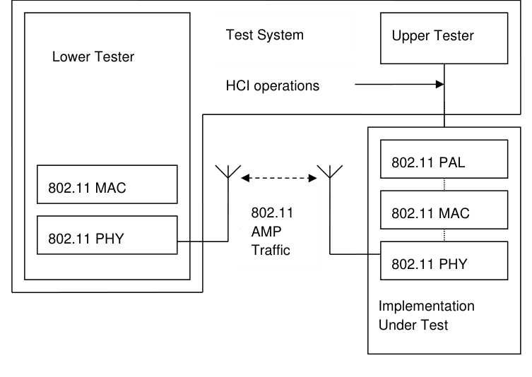

**Figure 3.1: Test system architecture**

### 3.2 Test groups

The test groups are organized into three levels. The first level defines the protocol groups representing the protocol services. The second level separates the protocol services in functional modules. The last level in each branch contains the standard ISO subgroups Valid Behavior (BV) and Invalid Behavior (BI).

#### 3.2.1 Protocol groups

The protocol group identifies the kind of test for 802.11 Protocol Adaptation Layer test cases:

##### 3.2.1.1 MAC/PHY

• Acknowledgement and Duration (AD)
• Null Data frame processing (ND)
• RTS/CTS signaling (RC)
• Deauthentication (DEAU)
• Defragmentation (DF)
• Authentication Frame Processing (AFP)
• Association Response Processing (ARSP)
• Association Request (AREQ)
• Duplication Detection (DUP)
• CTS-to-Self (CS)
• Multi rate support (MRS)
• General Frame Processing (GFP)
• Disassociation Processing (DAP)
• Recovery and Retry Processing (RT)

#### 3.2.2 Test subgroups

##### 3.2.2.1 Valid Behavior (BV) tests

This subgroup provides testing to verify that the IUT reacts in conformity with the Bluetooth Core Specification, after receipt or exchange of valid Protocol Data Units (PDUs). Valid PDUs and HCI events and commands mean that the exchange of messages and the content of the exchanged messages are considered as valid.

##### 3.2.2.2 Invalid Behavior (BI) tests

This subgroup provides testing to verify that the IUT reacts in conformity with the Bluetooth Core Specification, after receipt of a syntactically or semantically invalid PDU and HCI events and commands.

## 4 Test cases (TC)

### 4.1 Introduction

#### 4.1.1 Test case identification conventions

Test cases are assigned unique identifiers per the conventions in [1]. The convention used here is: <spec abbreviation>/<IUT role>/<class>/<feat>/<func>/<subfunc>/<cap>/<xx>-<nn>-<y>.

|  | Identifier Abbreviation |  |  | Spec Identifier <spec abbreviation> |  |
| --- | --- | --- | --- | --- | --- |
| 80211MP |  |  | 802.11 MAC/PHY Spec |  |  |
|  | Identifier Abbreviation |  |  | Feature Identifier <feat> |  |
| AD |  |  | Acknowledgement and Duration |  |  |
| AFP |  |  | Authentication Frame Processing |  |  |
| AREQ |  |  | Association Request |  |  |
| ARSP |  |  | Association Response Processing |  |  |
| CS |  |  | CTS-to-Self |  |  |
| DAP |  |  | Disassociation Processing |  |  |
| DEAU |  |  | Deauthentication |  |  |
| DF |  |  | Defragmentation |  |  |
| DUP |  |  | Duplication Detection |  |  |
| GFP |  |  | General Frame Processing |  |  |
| IEP |  |  | Information element processing |  |  |
| MRS |  |  | Multi rate support |  |  |
| ND |  |  | Null Data frame processing |  |  |
| RC |  |  | RTS/CTS signaling |  |  |
| RT |  |  | Recovery and Retry Processing |  |  |

Table 4.1: 802.11MP TC feature naming conventions

#### 4.1.2 Conformance

When conformance is claimed for a particular specification, all capabilities are to be supported in the specified manner. The mandated tests from this Test Suite depend on the capabilities to which conformance is claimed.
The Bluetooth Qualification Program may employ tests to verify implementation robustness. The level of implementation robustness that is verified varies from one specification to another and may be revised for cause based on interoperability issues found in the market.
Such tests may verify:
• That claimed capabilities may be used in any order and any number of repetitions not excluded by the specification
• That capabilities enabled by the implementations are sustained over durations expected by the use case
• That the implementation gracefully handles any quantity of data expected by the use case
• That in cases where more than one valid interpretation of the specification exists, the implementation complies with at least one interpretation and gracefully handles other interpretations
• That the implementation is immune to attempted security exploits
A single execution of each of the required tests is required to constitute a Pass verdict. However, it is noted that to provide a foundation for interoperability, it is necessary that a qualified implementation consistently and repeatedly pass any of the applicable tests.
In any case, where a member finds an issue with the test plan generated by the Bluetooth SIG qualification tool, with the test case as described in the Test Suite, or with the test system utilized, the member is required to notify the responsible party via an erratum request such that the issue may be addressed.

#### 4.1.3 Pass/Fail verdict conventions

Each test case has an Expected Outcome section. The IUT is granted the Pass verdict when all the detailed pass criteria conditions within the Expected Outcome section are met.
The convention in this Test Suite is that, unless there is a specific set of fail conditions outlined in the test case, the IUT fails the test case as soon as one of the pass criteria conditions cannot be met. If this occurs, then the outcome of the test is a Fail verdict.

#### 4.1.4 Lower Layer Assumptions

In the MSCs in this document, there are certain 802.11 frames which may occur outside the scope of any particular test. These include, but are not limited to, probe requests, probe responses, data frame retransmissions, and action frames. The presence of these frames is not used to affect the Pass or Fail verdict of any test, unless specifically stated as such.
The 802.11 AMP device may support the simultaneous use of multiple protocols. However, this document assumes the IUT is not actively participating in any operations other than those described herein.

#### 4.1.5 Initialization

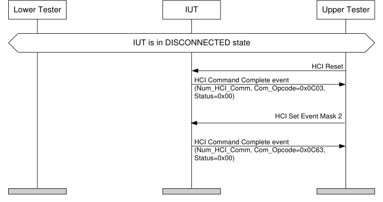

**Figure 4.1: Initialization**

### 4.2 Preambles

##### 4.2.1.1 Physical Link Initiated by IUT Preamble

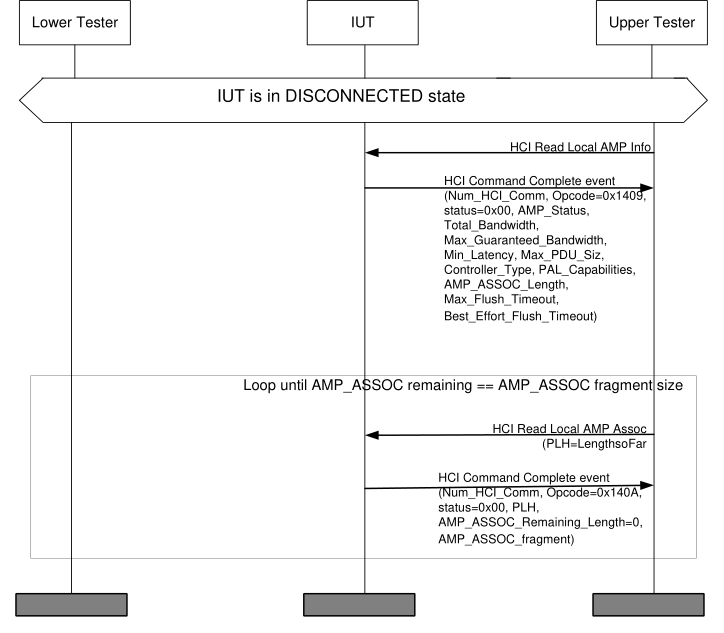

**Figure 4.2: Physical Link Initiated by IUT Preamble**

Lower Tester Upper Tester

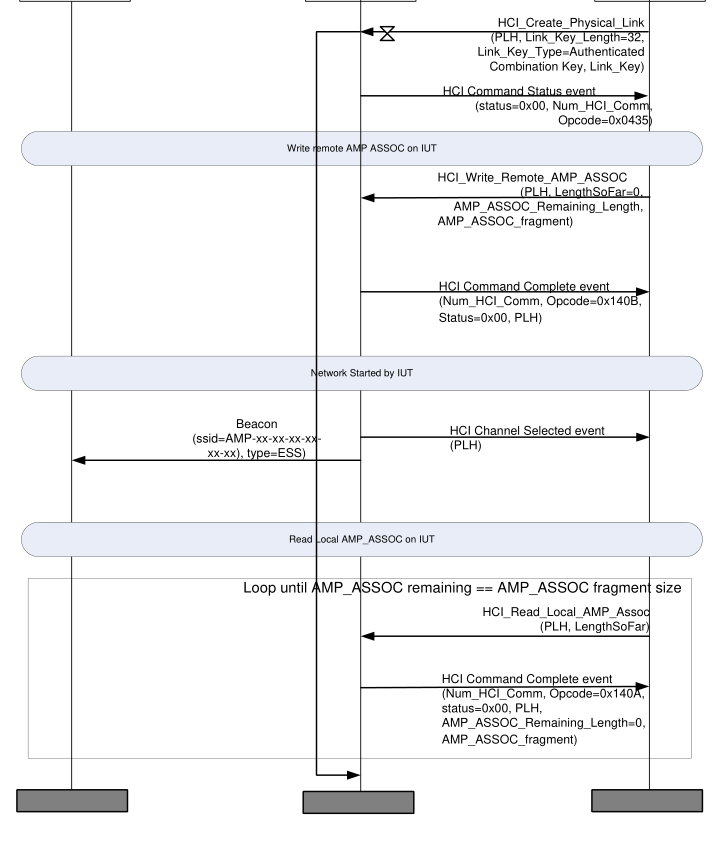

**Figure 4.3: Physical Link Initiated by IUT Preamble**

Lower Tester Upper Tester
IUT

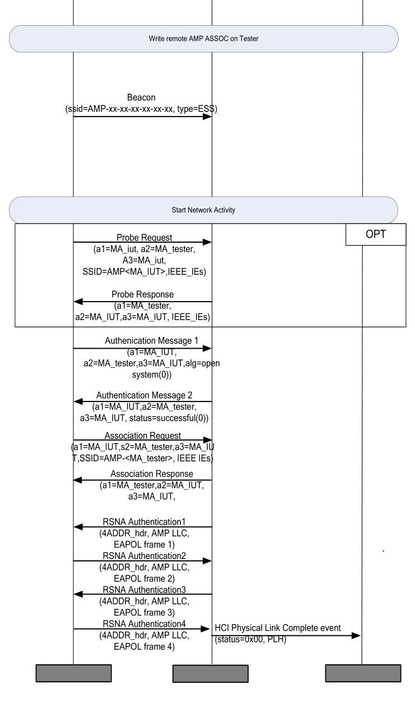

**Figure 4.4: Physical Link Initiated by IUT Preamble**

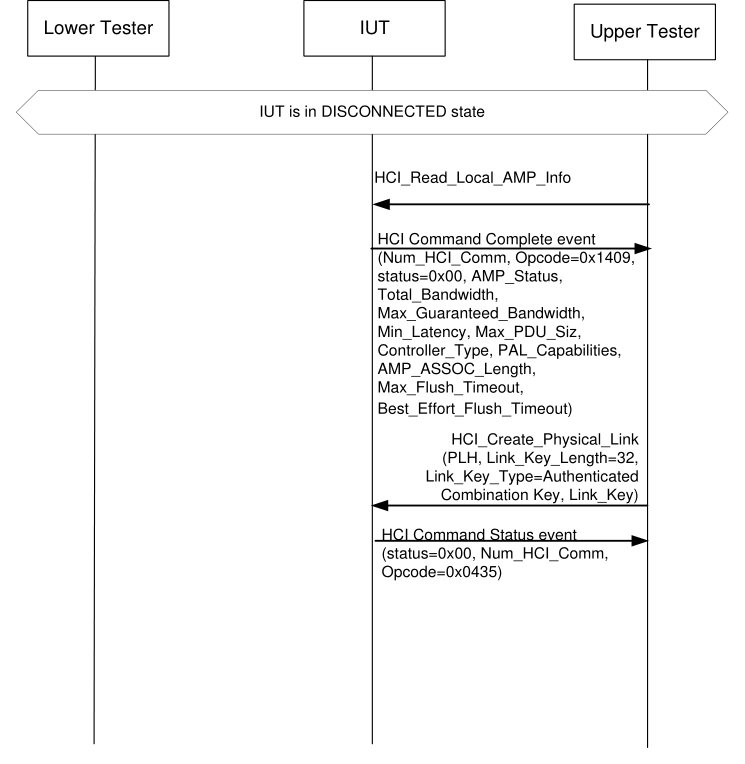

**Figure 4.5: Preamble for establishment of Logical Link initiated by IUT**

| Lower Tester IUT Upper Tester Write remote AMP ASSOC on IUT Loop until AMP ASSOC remaining == AMP ASSOC fragment size _ HCI Write Rem_ote AMP ASSOC _ _ _ _ (PLH, LengthSoFar, AMP ASSOC Remaining Length, _ _ _ AMP ASSOC fragment) _ _ HCI Command Complete event (Num HCI Comm, Opcode=0x140B, _ _ Status=0x00, PLH) Network Started by IUT HCI Channel Selected event (PLH) Beacon (ssid=AMP-xx-xx-xx-xx-xx-xx (note 1), type=ESS) Read Local AMP ASSOC on IUT _ Loop until AMP ASSOC remaining == AMP ASSOC fragment size _ _ HCI Read Local AMP Assoc _ _ _ _ (PLH, LengthSoFar) HCI Command Complete event (Num HCI Comm, Opcode=0x140A, _ _ status=0x00, PLH, AMP ASSOC Remaining Length=0, _ _ _ AMP ASSOC fragment) _ _ Beacon (ssid=AMP-xx-xx-xx-xx-xx-xx, type=ESS) Networks started |  |  |  | Upper Tester |  |
| --- | --- | --- | --- | --- | --- |
|  |  |  |  |  |  |
|  |  | Write remote AM | P ASSOC on IUT |  |  |
|  |  |  |  |  |  |
|  |  | Loop until AMP ASSOC re _ | maining == AMP ASSOC fragme HCI Write Rem_ote AMP ASSOC _ _ _ _ (PLH, LengthSoFar, AMP ASSOC Remaining Length, _ _ _ AMP ASSOC fragment) _ _ HCI Command Complete event (Num HCI Comm, Opcode=0x140B, _ _ Status=0x00, PLH) |  | nt size |
|  |  | Network St IUT Beacon (ssid=AMP-xx-xx-xx-xx-xx-xx (note 1) type=ESS) | arted by HCI Channel Selected event (PLH) , |  | t size |
|  |  | Read Local AMP _ | ASSOC on IUT |  |  |
|  |  | Loop until AMP ASSOC rem _ | aining == AMP ASSOC fragmen _ HCI Read Local AMP Assoc _ _ _ _ (PLH, LengthSoFar) HCI Command Complete event (Num HCI Comm, Opcode=0x140A, _ _ status=0x00, PLH, AMP ASSOC Remaining Length=0, _ _ _ AMP ASSOC fragment) _ _ |  |  |
|  |  | Beacon (ssid=AMP-xx-xx-xx-xx-xx-xx, type=ESS) |  |  |  |
|  |  | Networks started |  |  |  |
|  |  |  |  |  |  |

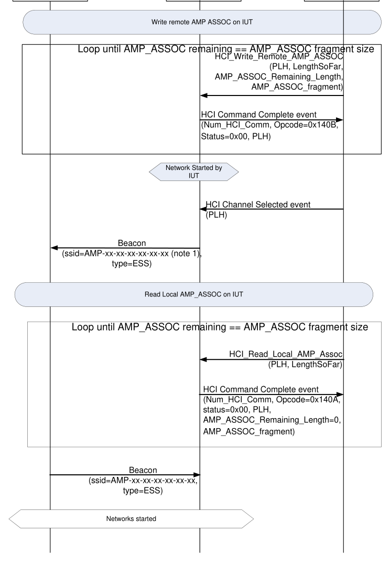

**Figure 4.6: Preamble for establishment of Logical Link initiated by IUT**

| Lower Tester IUT Upper Tester Probe Request OPT (a1=MA iut, a2=MA tester, _ _ A3=MA iut, _ SSID=AMP<MA IUT>,IEEE IEs) _ _ Probe Response (a1=MA tester, _ a2=MA IUT,a3=MA IUT, IEEE IEs) _ _ _ Authenication Message 1 (a1=MA IUT, _ a2=MA tester,a3=MA IUT,alg=ope _ _ n system(0)) Authentication Message 2 (a1=MA IUT,a2=MA tester, _ _ a3=MA IUT, status=successful(0)) _ Association Request (a1=MA IUT,s2=MA tester,a3=MA _ _ IUT,SSID=AMP-<MA tester>, _ _ IEEE IEs) Association Response (a1=MA tester,a2=MA IUT, a3=MA IUT, _ _ _ RSNA Authentication1 (4ADDR hdr, AMP LLC, _ EAPOL frame 1) RSNA Authentication2 (4ADDR hdr, AMP LLC, _ EAPOL frame 2) RSNA Authentication3 (4ADDR hdr, AMP LLC, _ EAPOL frame 3) RSNA Authentication4 (4ADDR hdr, AMP LLC, HCI Physical Link Complete event _ EAPOL frame 4) (status=0x00, PLH) Physical Link Connected ALT HCI Create Logical Link _ _ _ (PLH, TX BE FS, RX BE FS) _ _ _ _ HCI Create Logical Link _ _ _ (PLH, TX GU FS, RX GU FS) _ _ _ _ HCI Command Status event (status=0x00, Num HCI Comm, _ _ Opcode=0x0438) IUT selects Logical Link Handle and maps Logical Link to Upper Tester HCI Logical Link Complete event (status=0x00, PLH, LLH) |  |  |  |  |  |  |
| --- | --- | --- | --- | --- | --- | --- |
|  |  | Probe Request (a1=MA iut, a2=MA tester, _ _ A3=MA iut, _ SSID=AMP<MA IUT>,IEEE IEs) _ _ Probe Response (a1=MA tester, _ a2=MA IUT,a3=MA IUT, IEEE IEs) _ _ _ |  |  | OPT |  |
|  |  |  |  |  |  |  |
|  |  | Authenication Message 1 (a1=MA IUT, _ a2=MA tester,a3=MA IUT,alg=ope _ _ n system(0)) Authentication Message 2 (a1=MA IUT,a2=MA tester, _ _ a3=MA IUT, status=successful(0)) _ Association Request (a1=MA IUT,s2=MA tester,a3=MA _ _ IUT,SSID=AMP-<MA tester>, _ _ IEEE IEs) Association Response (a1=MA tester,a2=MA IUT, a3=MA I _ _ _ RSNA Authentication1 (4ADDR hdr, AMP LLC, _ EAPOL frame 1) RSNA Authentication2 (4ADDR hdr, AMP LLC, _ EAPOL frame 2) RSNA Authentication3 (4ADDR hdr, AMP LLC, _ EAPOL frame 3) RSNA Authentication4 (4ADDR hdr, AMP LLC, _ EAPOL frame 4) | UT, HCI Physical Link Complete event (status=0x00, PLH) |  |  |  |
|  |  |  | Physical Link Connected |  |  |  |
|  |  |  |  |  |  |  |
|  |  |  | HCI Create Logical Link _ _ _ (PLH, TX BE FS, RX BE FS) _ _ _ _ |  | ALT | ALT |
|  |  |  | HCI Create Logical Link _ _ _ (PLH, TX GU FS, RX GU FS) |  |  |  |
|  |  |  |  |  |  |  |

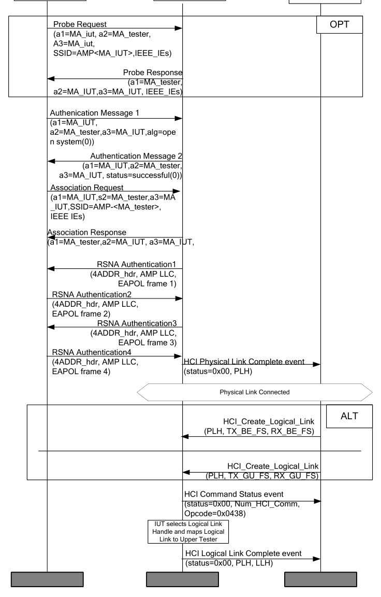

**Figure 4.7: Preamble for establishment of Logical Link initiated by IUT**

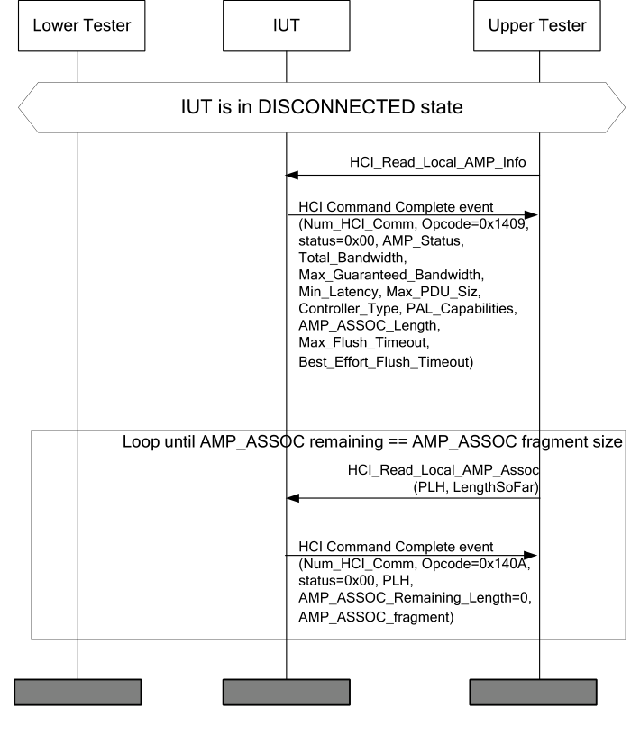

**Figure 4.8: Preamble for Reading Local AMP Info and Local AMP ASSOC**

##### 4.2.1.4 Preamble for Establishing 2 Physical Links with a best effort logical link on each

Run 4.2.1.2 using the BE logical link option before this procedure.
When executing the following procedure, the tester uses a different MAC address in the AMP_ASSOC and in the address fields of 802.11 headers to that used in preamble 4.2.1.2.

| Lower Tester |  |  |  |  |  |  |  |
| --- | --- | --- | --- | --- | --- | --- | --- |
|  |  |  |  |  |  |  |  |
|  | Physical Link initiated |  |  | by IUT Preamble |  |  |  |
|  | Write remote AMP |  |  | HCI Create Physical Link _ _ _ (PLH2, Link Key Length, _ _ Link Key Type, Link Key) _ _ _ HCI Command Status event (status=0x00, Num HCI Comm, _ _ Opcode=0x0435) ASSOC on IUT (note 1) |  |  |  |
|  |  |  |  |  |  |  |  |
|  |  |  | te AMP |  |  |  |  |
|  |  |  |  |  |  |  |  |
|  |  |  |  | LOOP remaining length > fragment l _ _ |  |  | enth |
|  |  |  |  | HCI Write Remote AMP ASSOC _ _ _ _ (PLH2, LengthSoFar=0, AMP ASSOC Remaining Length, _ _ _ AMP ASSOC fragment) _ _ HCI Command Complete event (Num HCI Comm, Opcode=0x140B, _ _ Status=0x00, PLH2) |  |  |  |
|  |  |  |  | HCI Channel Selected event (PLH2) |  |  |  |
|  |  |  |  | LOOP remaining length > fragment _ _ HCI Read Local AMP Assoc _ _ _ _ (PLH2, length so far =0) HCI Command Complete event (Num HCI Comm, OpCode=0x140A, _ _ status=0x02, PLH2, AMP Assoc Remaining Length, _ _ _ AMP Assoc Fragment) _ _ | LOOP remaining length > fragment _ _ |  | lenth |
|  |  |  |  |  |  |  |  |
|  |  |  |  |  |  |  |  |
|  | Probe Request |  |  | O |  | O | PT |
|  | (a1=MA iut, a2=MA tester, _ _ A3=MA iut, _ SSID=AMP<MA IUT>,IEEE IEs _ _ Probe Res (a1=MA t _ a2=MA IUT,a3=MA IUT, IEEE _ _ |  |  |  |  |  |  |
|  |  |  |  |  |  |  |  |
|  |  |  | ester, IEs) _ |  |  |  |  |
|  | Authenication Message 1 |  | =ope e 2 |  |  |  |  |
|  | (a1=MA IUT, _ a2=MA tester,a3=MA IUT,alg _ _ n system(0)) Authentication Messag (a1=MA IUT,a2=MA test _ _ a3=MA IUT, status=successful( _ Association Request |  |  |  |  |  |  |
|  |  |  | er, 0)) =MA , ponse |  |  |  |  |
|  | (a1=MA IUT,s2=MA tester,a3 _ _ IUT,SSID=AMP-<MA tester> _ _ IEEE IEs) Association Res (a1=MA tester,a2=MA IUT, a3=M _ _ RSNA Authentication1 (4ADDR hdr, AMP LLC, _ EAPOL frame 1) RSNA Authentication2 |  |  |  |  |  |  |
|  |  |  | A IUT, _ |  |  |  |  |
|  |  |  |  |  |  |  |  |
|  | (4ADDR hdr, AMP LLC, _ EAPOL frame 2) RSNA Authentication3 (4ADDR hdr, AMP LLC, _ EAPOL frame 3) RSNA Authentication4 |  |  |  |  |  |  |
|  |  |  |  |  |  |  |  |

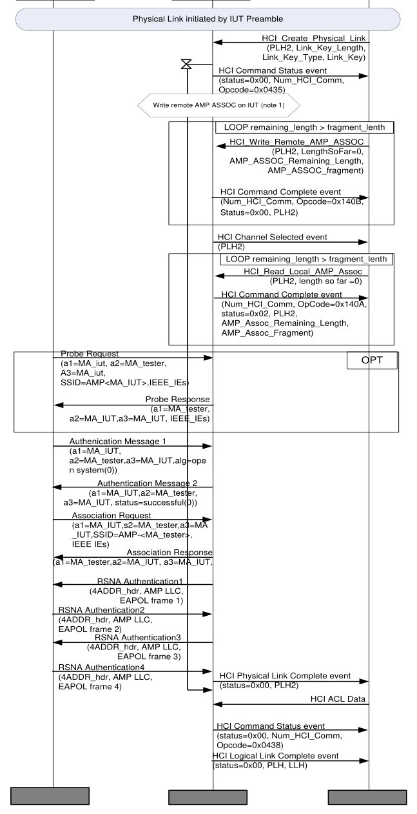

**Figure 4.9: Preamble for Establishing 2 Physical Links with a best effort logical link on each**

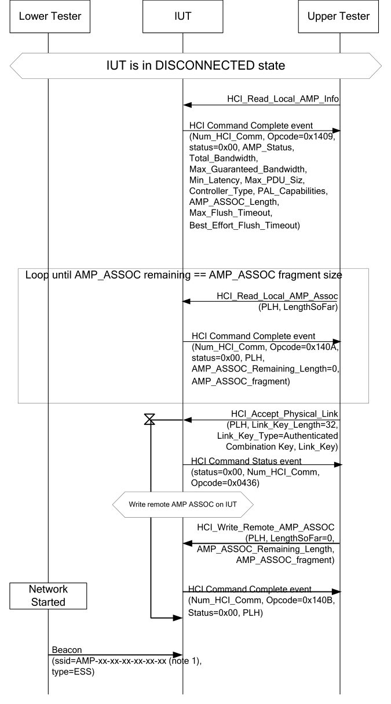

**Figure 4.10: Accept Physical Link and create best effort logical link preamble**

Lower Tester IUT
Upper Tester

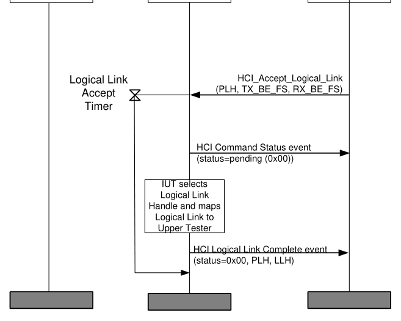

**Figure 4.11: Accept Physical Link and create best effort logical link preamble**

Lower Tester IUT
Upper Tester

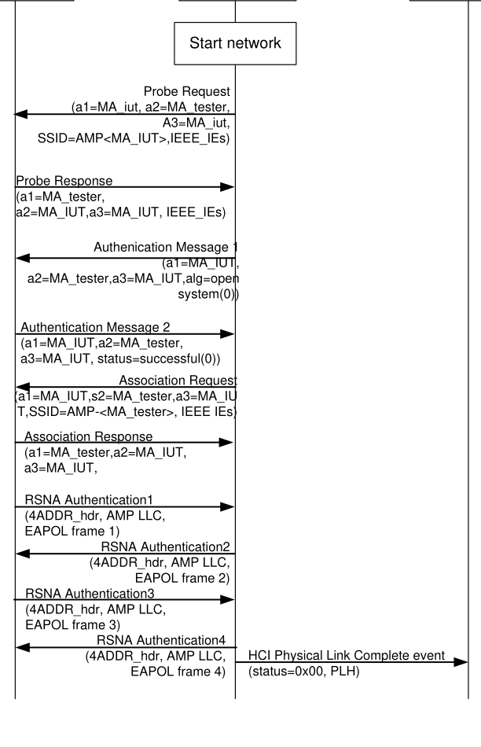

**Figure 4.12: Accept Physical Link and create best effort logical link preamble**

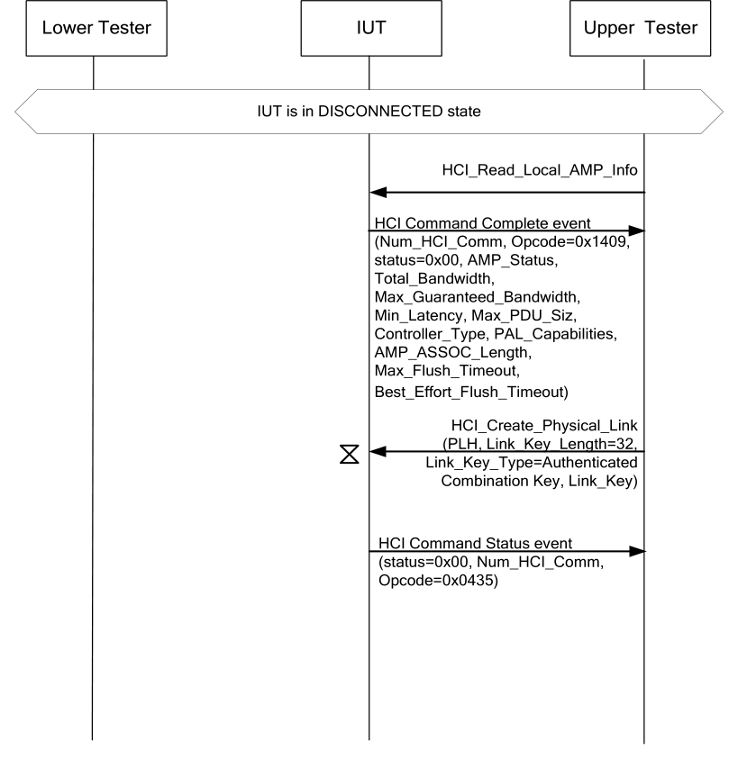

**Figure 4.13: Accept Physical Link and create best effort logical link preamble**

| Lower Tester IUT Upper Tester Write remote AMP ASSOC on IUT Loop until AMP ASSOC remaining == AMP ASSOC fragment size _ _ HCI Write Remote AMP ASSOC (PLH, LengthSoFar, AMP ASSOC Remainling Len _ _ _ gth, AMP ASSOC Fragment) _ _ HCI Command Complete event (Num HCI Comm, Opcode=0x140B, _ _ Status=0x00, PLH) Network Started by IUT HCI Channel Selected event (PLH) Beacon (ssid=AMP-xx-xx-xx-xx-xx-xx (note 1), type=ESS) Read Local AMP ASSOC on IUT _ Loop until AMP ASSOC remaining == AMP ASSOC fragment size _ _ HCI Read Local AMP Assoc _ _ _ _ (PLH, LengthSoFar) HCI Command Complete event (Num HCI Comm, Opcode=0x140A, _ _ status=0x00, PLH, AMP ASSOC Remaining Length=0, _ _ _ AMP ASSOC fragment) _ _ Beacon (ssid=AMP-xx-xx-xx-xx-xx-xx, type=ESS) Networks started |  |  |  |  | Upper Tester |  |
| --- | --- | --- | --- | --- | --- | --- |
|  |  |  |  |  |  |  |
|  |  |  | Write remote A | MP ASSOC on IUT |  |  |
|  |  |  |  |  |  |  |
|  |  |  | Loop until AMP ASSOC remaining == _ | AMP ASSOC fragment size _ HCI Write Remote AMP ASSOC (PLH, LengthSoFar, AMP ASSOC Remainling Len _ _ _ gth, AMP ASSOC Fragment) _ _ HCI Command Complete event (Num HCI Comm, Opcode=0x140B, _ _ Status=0x00, PLH) |  |  |
|  |  |  | Netwo Beacon ssid=AMP-xx-xx-xx-xx-xx-xx (note 1), type=ESS) | rk Started by IUT HCI Channel Selected event (PLH) |  |  |
|  |  |  | Read Local A | MP ASSOC on IUT _ |  |  |
|  |  |  |  |  |  |  |
|  |  |  | Loop until AMP ASSOC remaining = _ | = AMP ASSOC fragment size _ HCI Read Local AMP Assoc _ _ _ _ (PLH, LengthSoFar) HCI Command Complete event (Num HCI Comm, Opcode=0x140A, _ _ status=0x00, PLH, AMP ASSOC Remaining Length=0, _ _ _ AMP ASSOC fragment) _ _ |  |  |
|  |  |  | Beacon (ssid=AMP-xx-xx-xx-xx-xx-xx, type=ESS) |  |  |  |
|  |  |  | Networks started |  |  |  |
|  |  |  |  |  |  |  |

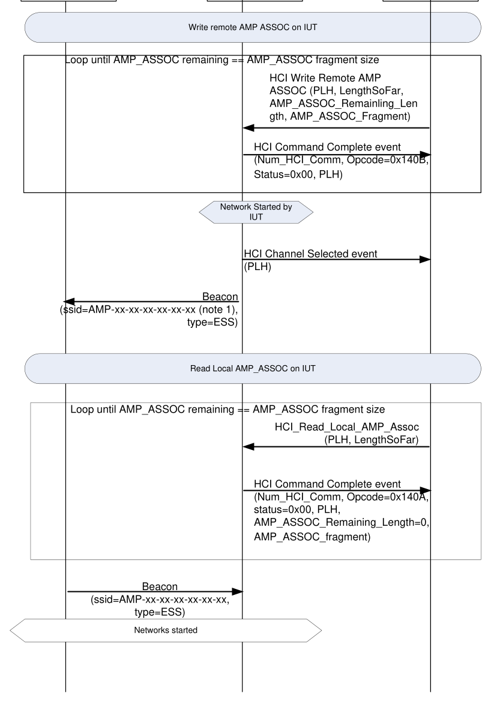

**Figure 4.14: Accept Physical Link and create best effort logical link preamble**

Lower Tester IUT Upper Tester

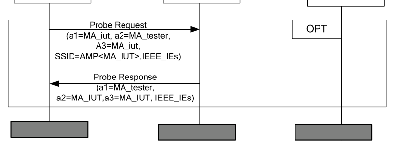

**Figure 4.15: Accept Physical Link and create best effort logical link preamble**

| Lower Tester |  |  |  |  |  | Upper Tester |  |
| --- | --- | --- | --- | --- | --- | --- | --- |
| Loop |  |  |  |  |  |  | length |
|  |  | IUT is in DISC |  |  | ONNECTED state |  |  |
|  |  |  |  |  | HCI Read Local-AMP Info _ _ _ HCI Command Complete event (Num HCI Comm, Opcode=0x1409, _ _ status=0x00, AMP Status, _ Total Bandwidth, _ Max Guaranteed Bandwidth, _ _ Min Latency, Max PDU Siz, _ _ _ Controller Type, PAL Capabilities, _ _ AMP ASSOC Length, _ _ Max Flush Timeout, _ _ Best Effort Flush Timeout) _ _ _ |  |  |
|  | Loop | until AMP ASSOC remainin _ |  |  | g == AMP ASSOC fragment size _ HCI Read Local AMP Assoc _ _ _ _ (PLH, LengthSoFar) HCI Command Complete event (Num HCI Comm, Opcode=0x140A, _ _ status=0x00, PLH, AMP ASSOC Remaining Length=0, _ _ _ AMP ASSOC fragment) _ _ |  |  |
|  |  | Write remote AMP A work rted Beacon (ssid=AMP-xx-xx-xx-xx-xx-xx (note 1), type=ESS) |  |  | HCI Accept Physical Link _ _ _ (PLH, Link Key Length=32, _ _ Link Key Type=Authenticated _ _ Combination Key, Link Key) _ HCI Command Status event (status=0x00, Num HCI Comm, _ _ Opcode=0x0436) SSOC on IUT |  |  |
|  |  |  |  |  |  |  |  |
|  |  |  |  | te AMP A |  |  |  |
|  |  |  |  |  | LOOP remaining length > fragment _ _ |  | length |
|  |  |  |  |  | HCI Write Remote AMP ASSOC _ _ _ _ (PLH, LengthSoFar=0, AMP ASSOC Remaining Length, _ _ _ AMP ASSOC fragment) _ _ HCI Command Complete event (Num HCI Comm, Opcode=0x140B, _ _ Status=0x00, PLH) |  |  |
| Net Sta |  | work rted |  |  |  |  |  |
|  |  |  |  |  |  |  |  |
|  |  |  |  |  |  |  |  |

| Lower Tester |  |  |  |  |  | Upper Tester |  |
| --- | --- | --- | --- | --- | --- | --- | --- |
| Loop |  |  |  |  |  |  | length |
|  |  | IUT is in DISC |  |  | ONNECTED state |  |  |
|  |  |  |  |  | HCI ACL Data HCI Command Complete event (Num HCI Comm, Opcode=0x1409, _ _ status=0x00, AMP Status, _ Total Bandwidth, _ Max Guaranteed Bandwidth, _ _ Min Latency, Max PDU Siz, _ _ _ Controller Type, PAL Capabilities, _ _ AMP ASSOC Length, _ _ Max Flush Timeout, _ _ Best Effort Flush Timeout) _ _ _ |  |  |
|  | Loop | until AMP ASSOC remainin _ |  |  | g == AMP ASSOC fragment size _ HCI HCL Data HCI Command Complete event (Num HCI Comm, Opcode=0x140A, _ _ status=0x00, PLH, AMP ASSOC Remaining Length=0, _ _ _ AMP ASSOC fragment) _ _ |  |  |
|  |  | Write remote AMP A work rted Beacon (ssid=AMP-xx-xx-xx-xx-xx-xx (note 1), type=ESS) |  |  | HCI ACL Data HCI Command Status event (status=0x00, Num HCI Comm, _ _ Opcode=0x0436) SSOC on IUT |  |  |
|  |  |  |  |  |  |  |  |
|  |  |  |  | AMP A |  |  |  |
|  |  |  |  |  | LOOP remaining length > fragment _ _ HCI ACL Data HCI Command Complete event (Num HCI Comm, Opcode=0x140B, _ _ Status=0x00, PLH) |  | length |
| Net Sta |  | work rted |  |  |  |  |  |
|  |  |  |  |  |  |  |  |
|  |  |  |  |  |  |  |  |

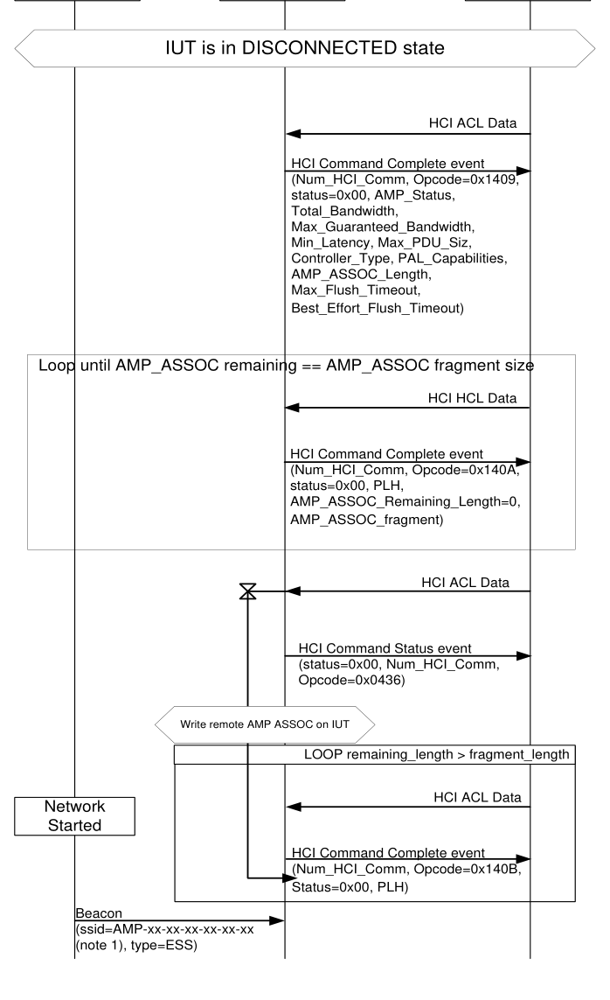

**Figure 4.17: Discover and accept network preamble**

Lower Tester IUT Upper Tester

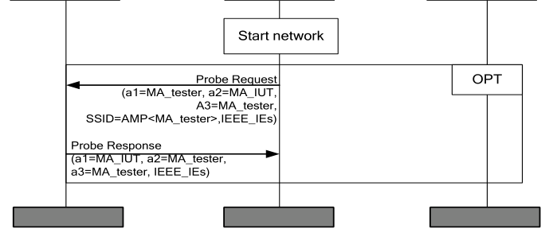

**Figure 4.18: Discover and accept network preamble**

### 4.3 Stimulus Frames

Some tests require specialized frame headers or frame content to be used by the Lower Tester as stimulus to trigger certain activity (or non-activity) by the IUT. Table 5.2 lists such frames.

|  | Frame label |  |  | Frame type |  |  | Description |  |
| --- | --- | --- | --- | --- | --- | --- | --- | --- |
| Frame1 |  |  | MSDU |  |  | Header: Valid 4-address frame, A1 = MA IUT, A2 = MA LT, _ _ Sequence number = N Payload: Valid LLC with PAL SNAP, ACL data header, L2CAP header, incrementing data 0x00…0xFF, up to the maximum frame length. |  |  |
| Frame2 |  |  | MPDU |  |  | Header: Valid 4-address frame, A1 = MA IUT, A2 = MA LT, MoreFrag _ _ = 1, Sequence number = N, FragmentNumber = 0 Payload: Valid LLC with PAL SNAP, ACL data header, L2CAP header, incrementing data 0x00..0xFF, to fill a fragment of 750 octets |  |  |
| Frame3 |  |  | MPDU |  |  | Header: Valid 4-address frame, A1 = MA IUT, A2 = MA LT, MoreFrag _ _ = 0, Sequence number = N, FragmentNumber = 1 Payload: Incrementing data 0x00.0xFF, to fill a fragment of 750 octets |  |  |
| Frame4 |  |  | MSDU |  |  | Header: Valid 4-address frame, A1 = MA IUT, A2 = MA LT _ _ Payload: Valid LLC with PAL SNAP, ACL data header, L2CAP header, incrementing data 0x00…0xFF, up to the maximum frame length. FCS is invalid. |  |  |
| Frame5 |  |  | CTS-to-Self |  |  | Header: Valid control frame, A1 = MA LT, duration field set to 32767 _ |  |  |
| Frame6 |  |  | MSDU |  |  | Header: Valid 4-address frame, A1 = MA IUT, A2 = (MA IUT \| _ _ MA LT) _ Payload: Valid LLC with PAL SNAP, ACL data header, L2CAP header, incrementing data 0x00…0xFF, up to the maximum frame length. |  |  |
| Frame7 |  |  | MPDU |  |  | Header: Valid 4-address frame, A1 = MA IUT, A2 = MA LT. Frame _ _ type is Data, subtype is Null Data. Frame control protocol type is 1. Payload: None. |  |  |
| Frame8 |  |  | MPDU |  |  | Header: Valid 4-address frame, A1 = MA IUT, A2 = MA LT. Frame _ _ type is Data, subtype is Null Data. Frame control protocol field is 0. Frame control protected bit is 0. Frame control ToDS bit is 0. All other bits in frame control field are set to 1. Payload: None. Valid FCS. |  |  |

|  | Frame label |  |  | Frame type |  |  | Description |  |
| --- | --- | --- | --- | --- | --- | --- | --- | --- |
| Frame9 |  |  | MPDU |  |  | Header: Valid 4-address frame, A1 = MA IUT, A2 = MA LT. Frame _ _ type is Data, subtype is Null Data. Payload: None. FCS is invalid. |  |  |
| Frame10 |  |  | MPDU |  |  | Header: Valid 4-address frame, A1 = MA IUT, A2 = MA LT. Frame _ _ type is Data, subtype is Null Data. Frame Control field: Zero bits: Order, Protected, PM, Retry, MoreFrag, Protocol One bits: MoreData, FromDS, ToDS Payload: None. Valid FCS. |  |  |
| Frame11 |  |  | MPDU |  |  | Header: Valid 4-address frame, A1 = MA IUT, A2 = MA LT. Frame _ _ type is Data, subtype is Null Data. Frame Control field: Zero bits: Order, Protected, MoreData, PM, MoreFrag, Protocol One bits: Retry, FromDS, ToDS Payload: None. Valid FCS. |  |  |
| Frame12 |  |  | MPDU |  |  | Header: Valid 4-address frame, A1 = MA IUT, A2 = MA LT. Frame _ _ type is Data, subtype is Null Data. Frame Control field: Zero bits: Order, Protected, MoreData, PM, Retry, MoreFrag, Protocol One bits: FromDS, ToDS Payload: None. Valid FCS. |  |  |
| Frame13 |  |  | MPDU |  |  | Header: Valid 4-address frame, A1 = MA IUT, A2 = MA LT. Frame _ _ type is Data, subtype is Null Data. Frame Control field: Zero bits: Order, Protected, PM, MoreFrag, Protocol One bits: MoreData, Retry, FromDS, ToDS Payload: None. Valid FCS. |  |  |
| Frame14 |  |  | MPDU |  |  | Header: Valid 4-address frame, A1 = MA IUT, A2 = MA LT. Frame _ _ type is Data, subtype is Null Data. Frame Control field: Zero bits: Order, Protected, PM, Retry, Protocol One bits: MoreData, MoreFrag, FromDS, ToDS Payload: None. Valid FCS. |  |  |
| Frame15 |  |  | MPDU |  |  | Header: Valid 4-address frame, A1 = MA IUT, A2 = MA LT. Frame _ _ type is Data, subtype is Null Data. Frame Control field: Zero bits: Order, Protected, MoreData, PM, Protocol One bits: Retry, MoreFrag, FromDS, ToDS Payload: None. Valid FCS. |  |  |
| Frame16 |  |  | MPDU |  |  | Header: Valid 4-address frame, A1 = MA IUT, A2 = MA LT. Frame _ _ type is Data, subtype is Null Data. Frame Control field: Zero bits: Order, Protected, MoreData, PM, Retry, Protocol One bits: MoreFrag, FromDS, ToDS Payload: None. Valid FCS. |  |  |

|  | Frame label |  |  | Frame type |  |  | Description |  |
| --- | --- | --- | --- | --- | --- | --- | --- | --- |
| Frame17 |  |  | MPDU |  |  | Header: Valid 4-address frame, A1 = MA IUT, A2 = MA LT. Frame _ _ type is Data, subtype is Null Data. Frame Control field: Zero bits: Order, Protected, PM, Protocol One bits:, MoreData, Retry, MoreFrag, FromDS, ToDS Payload: None. Valid FCS. |  |  |
| Frame18 |  |  | MPDU |  |  | Header: Deauthentication Management Frame, A1 = MA IUT, _ A2=MA LT, A3=MA LT _ _ Frame Control field: 0. Valid FCS |  |  |
| Frame19 |  |  | MPDU |  |  | Header: Deauthentication Management Frame, A1 = MA IUT, _ A2=MA LT, A3=MA LT _ _ Frame Control field: 0. Invalid FCS |  |  |
| Frame20 |  |  | MPDU |  |  | Header: Deauthentication Management Frame, A1 = FF:FF:FF:FF:FF:FF, A2=MA LT, A3=MA LT _ _ Frame Control field: 0. Valid FCS |  |  |
| Frame21 |  |  |  |  |  | Header: Deauthentication Management Frame, A1 = MA IUT, _ A2=MA LT, A3=MA IUT _ _ Frame Control field: 0. Valid FCS |  |  |
| Frame22 |  |  | MSDU |  |  | Header: Valid 4-address frame, A1 = MA IUT, A2 = MA LT. Frame _ _ Control Protocol Version is 1, Frame type is Data, subtype is Data+CF-ACK Payload: 255 bytes set to values 0x00 through 0xFF. |  |  |
| Frame23 |  |  | MPDU |  |  | Header: Control Frame with 2 addresses, A1=MA IUT, A2=MA LT, _ _ Frame Control Type=01, Subtype=0111 |  |  |
| Frame24 |  |  | MPDU |  |  | Header: Control Frame with 3 addresses, A1=MA IUT, A2=MA LT, _ _ A3=MA IUT, Frame Control Type=01, Subtype=0111 _ |  |  |
| Frame25 |  |  | MPDU |  |  | 802.11 Beacon frame with A1=ff:ff:ff:ff:ff:ff. A2=MA LT, A3=MA LT, _ _ bits 5 through 15 of the Capability Information field set to 1. |  |  |
| Frame26 |  |  | MPDU |  |  | 802.11 Beacon frame with A1=ff:ff:ff:ff:ff:ff. A2=MA LT, A3=MA LT, no _ _ supported rates in the Supported Rates and in the Extended Supported Rates information elements. |  |  |
| Frame27 |  |  | MSDU |  |  | 802.11 QoS data frame (frame control is set to 0x0208). A1 and A3=MA IUT, A2 and A4=MA LT. _ _ Payload: 0 bytes |  |  |
| Frame28 |  |  | MSDU |  |  | 802.11 data frame with FromDS bit set to 0, A1= MA IUT, A2=MA LT _ _ and A3 field is set to a MAC address that is neither MA IUT nor _ MA LT. _ Payload: 500 bytes set to AMP LLC first and then counting up from _ 0x00. |  |  |
| Frame29 |  |  | MSDU |  |  | 802.11 data frame with, A1 and A3=MA IUT, A2 and A4 =MA LT. The _ _ Order bit in the Frame Control field is set to 1. Payload: 500 bytes set to AMP LLC first and then counting up from _ 0x00. |  |  |

|  | Frame label |  |  | Frame type |  |  | Description |  |
| --- | --- | --- | --- | --- | --- | --- | --- | --- |
| Frame30 |  |  | MSDU |  |  | 802.11 data frame with, A1 and A3=MA IUT, A2 and A4 =MA LT. _ _ ToDS and FromDS bits are set to 1. Payload: 60 bytes set to AMP LLC first and then counting up from _ 0x00. |  |  |
| Frame31 |  |  | MPDU |  |  | 802.11 management frame with Subtype in Frame Control field set to 0110. Payload: 0 Bytes |  |  |
| Frame32 |  |  | MPDU |  |  | 802.11 management frame with Subtype in Frame Control field set to 0110. Payload: 255 bytes set to values 0x00 through 0xFF |  |  |
| Frame33 |  |  | MPDU |  |  | 802.11 management frame with Subtype in Frame Control field set to 0111. Payload: 0 Bytes |  |  |
| Frame34 |  |  | MPDU |  |  | 802.11 management frame with Subtype in Frame Control field set to 0111. Payload: 255 bytes set to values 0x00 through 0xFF |  |  |
| Frame35 |  |  | MPDU |  |  | 802.11 management frame with Subtype in Frame Control field set to 1101. Payload: 0 Bytes |  |  |
| Frame36 |  |  | MPDU |  |  | 802.11 management frame with Subtype in Frame Control field set to 1101. Payload: 255 bytes set to values 0x00 through 0xFF |  |  |
| Frame37 |  |  | MPDU |  |  | 802.11 management frame with Subtype in Frame Control field set to 1110. Payload: 0 Bytes |  |  |
| Frame38 |  |  | MPDU |  |  | 802.11 management frame with Subtype in Frame Control field set to 1110. Payload: 255 bytes set to values 0x00 through 0xFF |  |  |
| Frame39 |  |  | MPDU |  |  | 802.11 management frame with Subtype in Frame Control field set to 1111. Payload: 0 Bytes |  |  |
| Frame40 |  |  | MPDU |  |  | 802.11 management frame with Subtype in Frame Control field set to 1111. Payload: 255 bytes set to values 0x00 through 0xFF |  |  |
| Frame41 |  |  | MSDU |  |  | 802.11 data frame with Subtype in Frame Control field set to 1101. A1 and A3=MA IUT, A2 and A4 =MA LT. ToDS and FromDS bits are set _ _ to 1. Payload: 2 Bytes both set to 0 |  |  |
| Frame42 |  |  | MSDU |  |  | 802.11 data frame with Subtype in Frame Control field set to 1100. A1 and A3=MA IUT, A2 and A4 =MA LT. ToDS and FromDS bits are set _ _ to 1. Payload: 2 Bytes both set to 0 |  |  |
| Frame43 |  |  | MPDU |  |  | 802.11 frame with Type in Frame Control field set to 11 and Subtype in Frame Control field set to one of (0000, 0001, 0010, 0100, 1000, and 1111). Payload: 0 Bytes |  |  |

|  | Frame label |  |  | Frame type |  |  | Description |  |
| --- | --- | --- | --- | --- | --- | --- | --- | --- |
| Frame44 |  |  | MPDU |  |  | 802.11 frame with Type in Frame Control field set to 11 and Subtype in Frame Control field set to one of (0000, 0001, 0010, 0100, 1000, and 1111). Payload: 255 bytes set to values 0x00 through 0xFF |  |  |
| Frame45 |  |  | MSDU |  |  | 802.11 data frame A1 and A3=MA IUT, A2 and A4 =MA LT. ToDS _ _ and FromDS bits are set to 1. Payload: 2000 Bytes set to AMP LLC first and then counting up from _ 0x00. |  |  |
| Frame 46 |  |  | MSDU |  |  | 802.11 data frame with Subtype in Frame Control field set to 1000. A1 and A3=MA IUT, A2 and A4 =MA LT. ToDS is set to 0 and FromDS _ _ bits is set to 1. Payload: 255 bytes set to values 0x00 through 0xFF |  |  |
| Frame 47 |  |  | MSDU |  |  | 802.11 data frame with Subtype in Frame Control field set to 1000. A1 and A3=MA IUT, A2 and A4 =MA LT. ToDS is set to 1 and FromDS _ _ bits is set to 0. Payload: 255 bytes set to values 0x00 through 0xFF |  |  |
| Frame 48 |  |  | MPDU |  |  | 802.11 Probe Request where the SSID information element has a length greater than 32 bytes. |  |  |
| Frame49 |  |  | MPDU |  |  | 802.11 Probe Request where the SSID information element has a length greater than 32 bytes. |  |  |
| Frame50 |  |  | MSDU |  |  | Header: Valid 4-address frame, A1 = MA IUT, A2 = MA LT _ _ Payload: 1500 Bytes set to Valid LLC with PAL SNAP, ACL data header, L2CAP header, incrementing data 0x00…0xFF, for the rest of the length. |  |  |
| Frame51 |  |  | MSDU |  |  | Header: Valid 4-address frame, A1 = MA IUT, A2 = MA LT _ _ Payload: 500 Bytes set to Valid LLC with PAL SNAP, ACL data header, L2CAP header, incrementing data 0x00…0xFF, for the rest of the length. |  |  |
| Frame52 |  |  | MMPDU |  |  | Header: Association Response Management Frame, A1 = MA IUT, _ A2=MA LT, A3=MA LT _ _ Payload : Capability, AID, Supported Rates, Extended Supported Rates |  |  |
| Frame53 |  |  | MMPDU |  |  | Header: Association Response Management Frame, A1 = MA IUT, _ A2=MA LT, A3=MA LT _ _ Payload : Capability, Status, AID, Supported Rates, Extended Supported Rates, Reserved IE (254 255 0x00…0xFF), Reserved IE (255 255 0x00…0xFF) |  |  |
| Frame54 |  |  | MMPDU |  |  | Header: Association Response Management Frame, A1 = MA IUT, _ A2=MA LT, A3=MA LT _ _ Payload : Capability, Status, AID, Supported Rates, Supported Rates (repeated), Extended Supported Rates |  |  |
| Frame55 |  |  | MMPDU |  |  | Header: Association Response Management Frame, A1 = MA IUT, _ A2=MA LT, A3=MA LT _ _ Payload : Capability, Status, AID, Extended Supported Rates |  |  |
| Frame56 |  |  | MMPDU |  |  | Header: Association Response Management Frame, A1 = MA IUT, _ A2=MA LT, A3=MA LT _ _ Payload : Capability, Status, AID, Supported Rates, Extended Supported Rates (50 9 0x02 0x04 0x0c 0x12 0x18 0x30 0x48 0x60 0x6c) |  |  |

|  | Frame label |  |  | Frame type |  |  | Description |  |
| --- | --- | --- | --- | --- | --- | --- | --- | --- |
| Frame57 |  |  | MMPDU |  |  | Header: Association Request Management Frame, A1 = MA IUT, _ A2=MA LT, A3=MA IUT _ _ Payload : Capability, SSID, Supported Rates, Extended Supported Rates, RSN |  |  |
| Frame58 |  |  | MMPDU |  |  | Header: Association Request Management Frame, A1 = MA IUT, _ A2=MA LT, A3=MA IUT _ _ Payload : Capability, SSID, Listen Interval, Supported Rates, Extended Supported Rates, RSN, Reserved IE (254 255 0x00…0xFF), Reserved IE (255 255 0x00…0xFF) |  |  |
| Frame59 |  |  | MMPDU |  |  | Header: Association Request Management Frame, A1 = MA IUT, _ A2=MA LT, A3=MA IUT _ _ Payload : Capability, SSID, Listen Interval, Supported Rates, Extended Supported Rates (50 9 0x02 0x04 0x0c 0x12 0x18 0x30 0x48 0x60 0x6c), RSN |  |  |
| Frame60 |  |  | MMPDU |  |  | Header: Association Request Management Frame, A1 = MA IUT, _ A2=MA LT, A3=MA IUT _ _ Payload : Capability, SSID, Listen Interval, Supported Rates (4 0), Extended Supported Rates, RSN |  |  |
| Frame61 |  |  | MMPDU |  |  | Header: Association Request Management Frame, A1 = MA IUT, _ A2=MA LT, A3=MA IUT _ _ Payload : Capability, SSID, Listen Interval, Supported Rates (4 0), Extended Supported Rates, RSN Invalid FCS |  |  |
| Frame62 |  |  | MSDU |  |  | Header: Valid 4-address frame, A1 = MA IUT, A2 = MA LT, Retry = 1, _ _ Sequence number = N Payload: Valid LLC with PAL SNAP, ACL data header, L2CAP header, incrementing data 0x00…0xFF, up to the maximum frame length. |  |  |
| Frame63 |  |  | MSDU |  |  | Header: Valid 4-address frame, A1 = MA IUT, A2 = MA LT _ _ Payload: Valid LLC with PAL SNAP, ACL data header, L2CAP header, incrementing data 0x00…0xFF, up to 750 octets, incrementing data 0x00…0xFF up to maximum frame length (i.e., the concatenation of the data from Frame 2 and Frame 3) |  |  |
| Frame64 |  |  | MPDU |  |  | Header: Valid 4-address frame, A1 = MA IUT, A2 = MA LT, MoreFrag _ _ = 0, Sequence number = N, FragmentNumber = 1 Payload: Decrementing data 0xFF..0x00, to fill a fragment of 750 octets |  |  |
| Frame65 |  |  | MSDU |  |  | Header: Valid 4-address frame, A1 = MA IUT, A2 = MA LT, Retry = 1, _ _ Sequence number = N + 1 Payload: Valid LLC with PAL SNAP, ACL data header, L2CAP header, incrementing data 0x00…0xFF, up to the maximum frame length. |  |  |
| Frame66 |  |  | MPDU |  |  | Header: Valid 4-address frame, A1 = MA IUT, A2 = MA LT, MoreFrag _ _ = 0, Retry = 1, Sequence number = N, FragmentNumber = 1 Payload: Incrementing data 0x00..0xFF, to fill a fragment of 750 octets |  |  |
| Frame67 |  |  | MSDU |  |  | Header: Valid 4-address frame, A1 = MA IUT, A2 = MA LT2, Retry = _ _ 1, Sequence number = N Payload: Valid LLC with PAL SNAP, ACL data header, L2CAP header, incrementing data 0x00…0xFF, up to the maximum frame length. |  |  |

|  | Frame label |  |  | Frame type |  |  | Description |  |
| --- | --- | --- | --- | --- | --- | --- | --- | --- |
| Frame68 |  |  | MSDU |  |  | Header: Valid 4-address frame, A1 = MA IUT, A2 = MA LT2, Retry = _ _ 1, Sequence number = N + 1 Payload: Valid LLC with PAL SNAP, ACL data header, L2CAP header, incrementing data 0x00…0xFF, up to the maximum frame length. |  |  |
| Frame69 |  |  | MSDU |  |  | Header: Valid 4-address frame, A1 = MA IUT, A2 = MA LT2, _ _ Sequence number = N + 1 Payload: Valid LLC with PAL SNAP, ACL data header, L2CAP header, incrementing data 0x00…0xFF, up to the maximum frame length. |  |  |
| Frame 70 |  |  | MMPDU |  |  | Header: Disassociation Management Frame, A1 = MA IUT, A2 = _ MA LT, A3 = MA IUT _ _ |  |  |
| Frame 71 |  |  | MMPDU |  |  | Header: Disassociation Management Frame, A1 = MA IUT, A2 = _ MA LT, A3 = MA IUT Invalid FCS _ _ |  |  |
| Frame 72 |  |  | MSDU |  |  | Header: A1 = MA LT, A2 = MA IUT _ _ Payload: Valid LLC with PAL SNAP, ACL data header, L2CAP header, incrementing data 0x00…0xFF, up to the maximum frame length. |  |  |

Table 4.2: Specialized frame headers

## 5 MAC-PHY Testing

### 5.1 Acknowledgement and Duration (AD)

This section describes tests relating to 802.11 acknowledgement and duration fields.
80211MP/AD/BV-01-C [Duration field zero]
• Test Purpose
Verify that the IUT generates 802.11 Acknowledgement control frames at the proper time and with the proper contents.
• Reference
[6] Test 1.1.9
• Initial Condition
- The preamble in Section 4.2.1.2 has been completed.
• Test Procedure

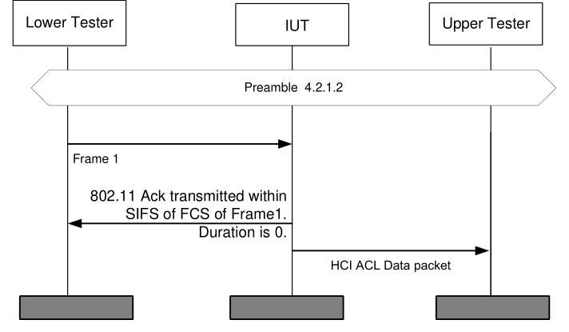

**Figure 5.1: 80211MP/AD/BV-01-C [Duration field zero]**

• Expected Outcome
Pass verdict
An 802.11 Acknowledgement control frame should be generated SIFS after the FCS of Frame1 arrives at the IUT.
The ACK frame has a Duration field with a value of zero (0).
• Test Purpose
Send a stream of 802.11 fragments to the IUT and ensure that the 802.11 Acknowledgement frames are formatted correctly.
• Reference
[6] Test 1.1.9
• Initial Condition
- The preamble in Section 4.2.1.2 has been completed.
• Test Procedure

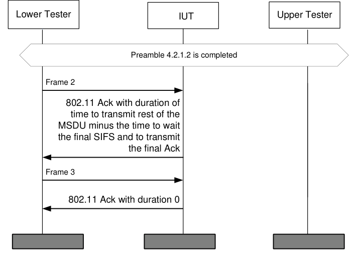

**Figure 5.2: 80211MP/AD/BV-02-C [Duration field non-zero]**

• Expected Outcome
Pass verdict
An 802.11 Acknowledgement control frame is generated SIFS after the FCS of each of the fragments received by the IUT.
The ACK frame following Frame2 has a non-zero Duration field equal to the time to transmit the data frame, minus the time to transit the ACK frame and to wait for SIFS, with fractional time rounded up to the nearest microsecond.
The ACK frame following Frame3 has a Duration field set to zero.
• Test Purpose
Send fragments preceded by a CTS-to-self frame with a large duration. Ensure that ACK duration fields are correctly set.
• Reference
[6] Test 1.1.9
• Initial Condition
- The preamble in Section 4.2.1.2 has been completed.
• Test Procedure

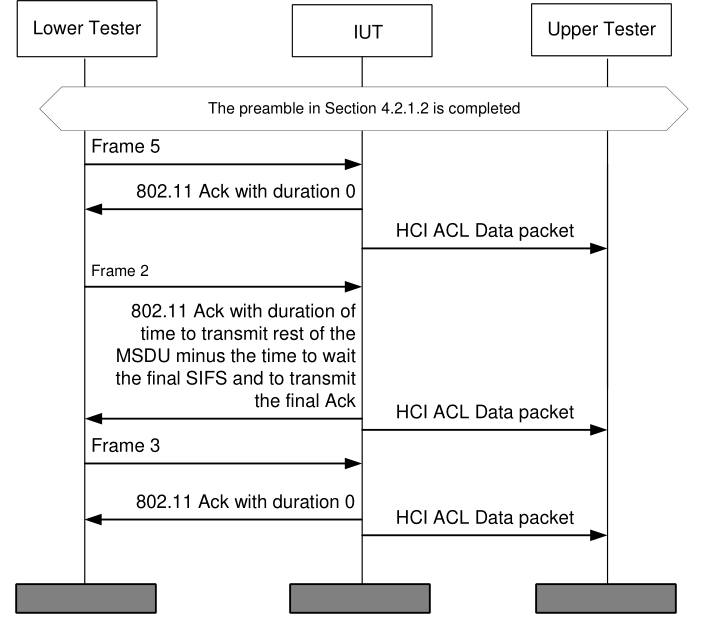

**Figure 5.3: 80211MP/AD/BV-03-C [Large duration value]**

• Expected Outcome
Pass verdict
The IUT generates an ACK frame in response to both fragments.
The first ACK contains a duration corresponding to the time until the second ACK should be received. This is the airtime of the data phase of the second fragment, plus SIFS, plus the time to transmit the second ACK.
The second ACK contains a duration field of zero.
• Test Purpose
Send frames with valid and invalid FCS fields to the IUT and ensure that there are no ACK frames sent in response to frames with invalid FCS.
• Reference
[6] Test 1.1.9
• Initial Condition
- The preamble in Section 4.2.1.2 has been completed.
• Test Procedure

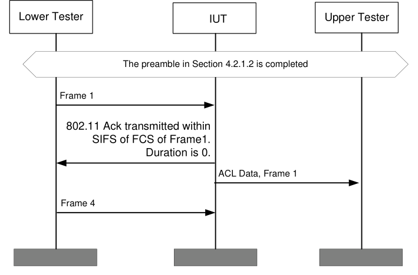

**Figure 5.4: 80211MP/AD/BI-01-C [FCS validation]**

• Expected Outcome
Pass verdict
An 802.11 Acknowledgement control frame is generated SIFS after the FCS each time Frame1 is received by the IUT. The ACK frame has a Duration field set to zero.
There are no responses from the IUT to any of the Frame4 frames.
• Test Purpose
Send frames using a TA which is not the same TA as the AMP peer.
• Reference
[6] Test 1.1.9
• Initial Condition
- The preamble in Section 4.2.1.2 has been completed.
• Test Procedure

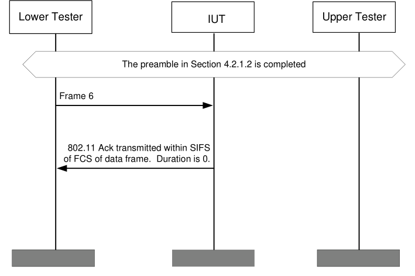

**Figure 5.5: 80211MP/AD/BI-02-C [Non-authenticated source]**

• Expected Outcome
Pass verdict
The IUT transmits an ACK frame at a time SIFS after the FCS field of the Frame6 is received. The Duration field is zero. The IUT may generate an 802.11 deauthentication and/or 802.11 disassociation frame in response to the unauthenticated link supervision request frame.

### 5.2 Null data frame processing (ND)

This section describes testing related to null data frames.
80211MP/ND/BV-01-C [Process properly formatted null data frames]
• Test Purpose
Verify that the IUT can properly process null data frames.
• Reference
[6] Test case 1.1.2
[7] Test case 1.1.2
• Initial Condition
- The preamble in Section 4.2.1.1 has been completed.
• Test Procedure

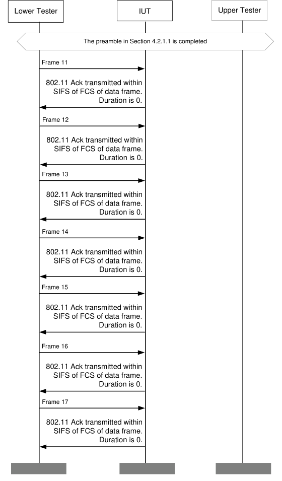

**Figure 5.6: 80211MP/ND/BV-01-C [Process properly formatted null data frames]**

• Expected Outcome
Pass verdict
The IUT transmits an ACK frame in response to each of the stimulus frames.
• Test Purpose
Verify that the IUT ignores improperly formed null data frames.
• Reference
[6] Test case 1.1.2
[7] Test case 1.1.2
• Initial Condition
- The preamble in Section 4.2.1.1 has been completed.
• Test Procedure

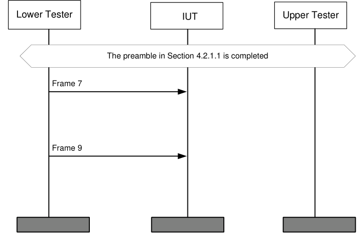

**Figure 5.7: 80211MP/ND/BI-01-C [Reject improperly formatted null data frames]**

• Expected Outcome
Pass verdict
The IUT does not transmit an ACK frame in response to any of the stimulus frames.

### 5.3 RTS/CTS signaling (RC)

This section describes testing related to RTS/CTS signaling and proper duration values therein.
80211MP/RC/BV-01-C [RTS/CTS with proper duration in CTS]
• Test Purpose
Verify that the IUT is able to receive and respond to RTS/CTS protected frames, regardless of whether it uses RTS/CTS signaling for its own data frames.
• References
[6] Test 1.2.2
• Initial Condition
- The preamble in Section 4.2.1.1 has been completed.
• Test Procedure

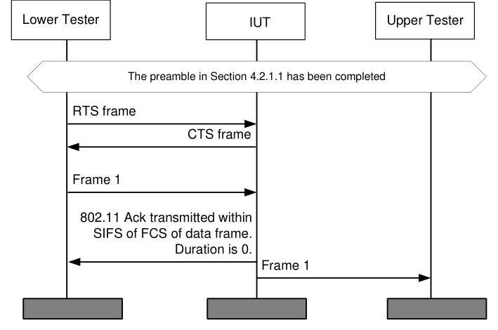

**Figure 5.8: 80211MP/RC/BV-01-C [RTS/CTS with proper duration in CTS]**

• Expected Outcome
Pass verdict
Verify that Frame1 is indicated to the Upper Tester.

### 5.4 Defragmentation Tests (DF)

80211MP/DF/BV-01-C [Receive fragmented frames]
• Test Purpose
Verify that the IUT defragments received fragmented frames correctly.
• Reference
[6] Test 1.1.10
[7] Test 1.1.10
• Initial Condition
- The preamble in Section 4.2.1.5 has been completed.
• Test Procedure

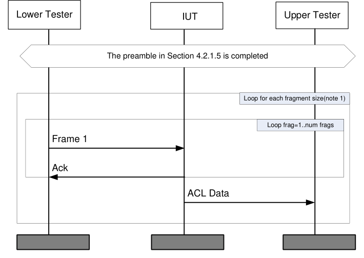

**Figure 5.9: 80211MP/DF/BV-01-C [Receive fragmented frames]**

Frame1 is defined in Table 4.2. Note 1: After the MSDU has been transmitted at a given fragment size, increment the fragment size by 100 bytes and repeat until the fragment size is greater than or equal to the total length of Frame1.
• Expected Outcome
Pass verdict
On reception of each complete MSDU an ACL data packet is sent from the IUT to the Upper Tester.
The frame received by the Upper Tester contains the same content as was sent by the Lower Tester, after the 802.11 and PAL headers have been removed and an ACL header added.

### 5.5 Authentication Frame Processing (AFP)

80211MP/AFP/BI-01-C [Authentication frames with failure status code]
• Test Purpose
Verify that the IUT handles authentication request frames and responds appropriately.
• Reference
[6] Test 1.1.4
• Initial Condition
- The preamble in Section 4.2.1.6 has been completed.
• Test Procedure

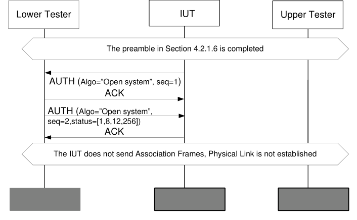

**Figure 5.10: 80211MP/AFP/BI-01-C [Authentication frames with failure status code]**

1. The 802.11 traffic is monitored by a sniffer. 2. Repeat test with Status code 1,8,12 and 256.
• Expected Outcome
Pass verdict
The IUT does not respond with Association frame and Physical link between the IUT and the Lower Tester is not established. Verify that the IUT does not cause a “blue screen” or hang.
80211MP/AFP/BI-02-C [Authentication Frame Processing – invalid transaction sequence number]
• Test Purpose
Verify that the IUT handles receipt of authentication frames with invalid transaction sequence number and does not have a system failure.
• Reference
[6] Test 1.1.4
• Initial Condition
- The preamble in Section 4.2.1.7 has been completed.
• Test Procedure

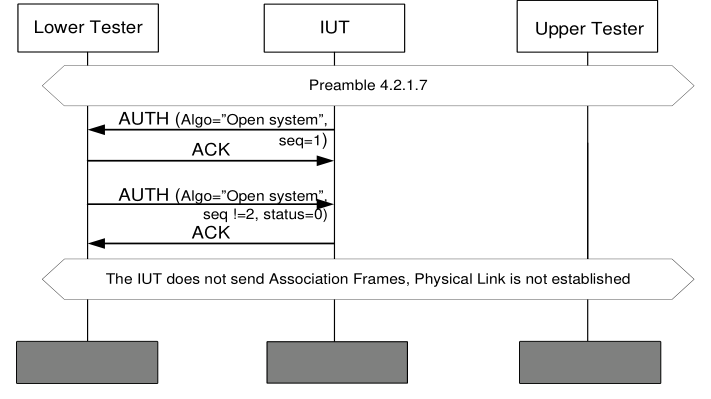

**Figure 5.11: 80211MP/AFP/BI-02-C [Authentication Frame Processing – invalid transaction sequence number]**

The 802.11 traffic is monitored by a sniffer.
• Expected Outcome
Pass verdict
The IUT does not respond with Association frame and Physical link between the IUT and TS is not established. Verify that the IUT does not cause a “blue screen” or hang.
• Test Purpose
Verify that the IUT handles authentication request frames and responds appropriately.
• Reference
[6] Test 1.1.4
• Initial Condition
- The preamble in Section 4.2.1.7 has been completed.
• Test Procedure

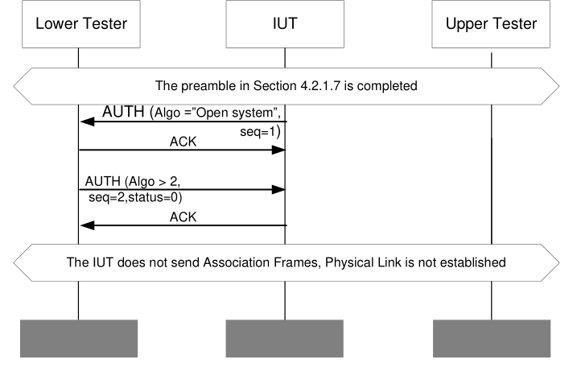

**Figure 5.12: 80211MP/AFP/BI-03-C [Authentication frames with invalid algorithm number]**

The 802.11 traffic is monitored by a sniffer.
• Expected Outcome
Pass verdict
The IUT does not respond with Association frame and Physical link between the IUT and TS is not established. Verify that the IUT does not cause a “blue screen” or hang.

### 5.6 Association Response testing (ARSP)

Tests the processing of association responses.
80211MP/ARSP/BI-01-C [Association responses with status values other than successful]
• Test Purpose
Verify that the IUT is able to correctly process association responses with status values other than “successful”.
• Reference
[6] Test 1.1.5
• Initial Condition
- The preamble in Section 4.2.1.7 has been completed.
• Test Procedure

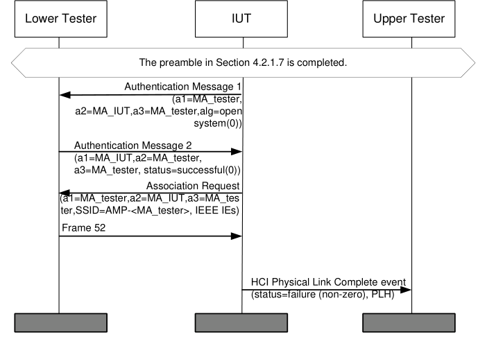

**Figure 5.13: 80211MP/ARSP/BI-01-C [Association responses with status values other than successful]**

The IUT attempts to associate. The Lower Tester responds with Frame 52 defined in Table 4.2.
Repeat test with Status code 1,12 and 256.
• Expected Outcome
Pass verdict
The IUT sends an HCI Physical Link Complete event with failure status (i.e., a non-zero HCI error code).
• Test Purpose
Verify that the IUT is able to correctly process association responses containing unrecognized information elements.
• Reference
[6] Test 1.1.5
• Initial Condition
- The preamble in Section 4.2.1.7 has been completed.
• Test Procedure

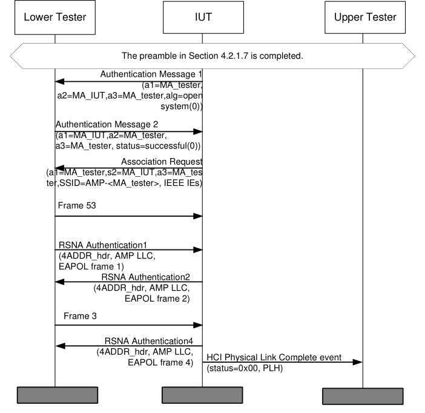

**Figure 5.14: 80211MP/ARSP/BI-02-C [Unrecognized payload of Association Response frames]**

The IUT attempts to associate. The Lower Tester responds with Frame 53 defined in Table 4.2.
• Expected Outcome
Pass verdict
An HCI Physical Link Complete event with status of 0x00 is sent to the Upper Tester from the IUT.
• Test Purpose
Verify that the IUT is able to correctly process association responses with duplicate valid information elements.
• Reference
[6] Test 1.1.5
• Initial Condition
- The preamble in Section 4.2.1.7 has been completed.
• Test Procedure

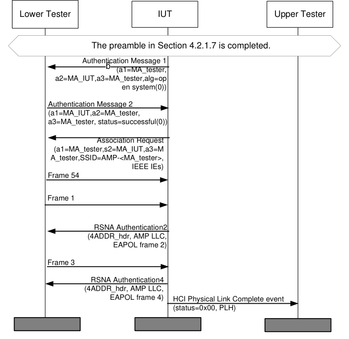

**Figure 5.15: 80211MP/ARSP/BI-03-C [Duplicate valid info elements in Assoc Response]**

The IUT attempts to associate. The Lower Tester responds with Frame 54 defined in Table 4.2.
• Expected Outcome
Pass verdict
An HCI Physical Link Complete event with status of 0x00 is sent to the Upper Tester from the IUT.
• Test Purpose
Verify that the IUT is able to correctly process association responses with a missing supported rates information element.
• Reference
[6] Test 1.1.5
• Initial Condition
- The preamble in Section 4.2.1.7 has been completed.
• Test Procedure

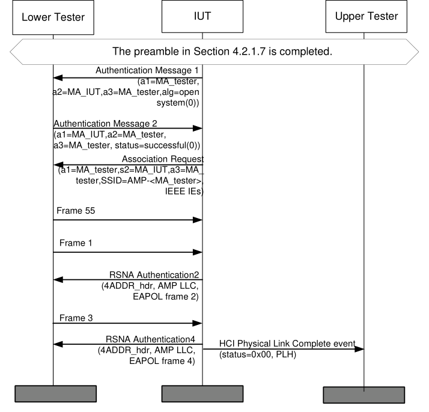

**Figure 5.16: 80211MP/ARSP/BI-04-C [Missing supported rates IE in Association Response]**

The IUT attempts to associate. The Lower Tester responds with Frame 55 defined in Table 4.2.
• Expected Outcome
Pass verdict
An HCI Physical Link Complete event with status of 0x00 is sent to the Upper Tester from the IUT.
80211MP/ARSP/BI-05-C [Association response with more than eight rates in the supported rates IE]
• Test Purpose
Verify that the IUT is able to handle association responses with more than eight rates in the supported rates information element.
• Reference
[6] Test 1.1.5
• Initial Condition
- The preamble in Section 4.2.1.7 has been completed.
• Test Procedure

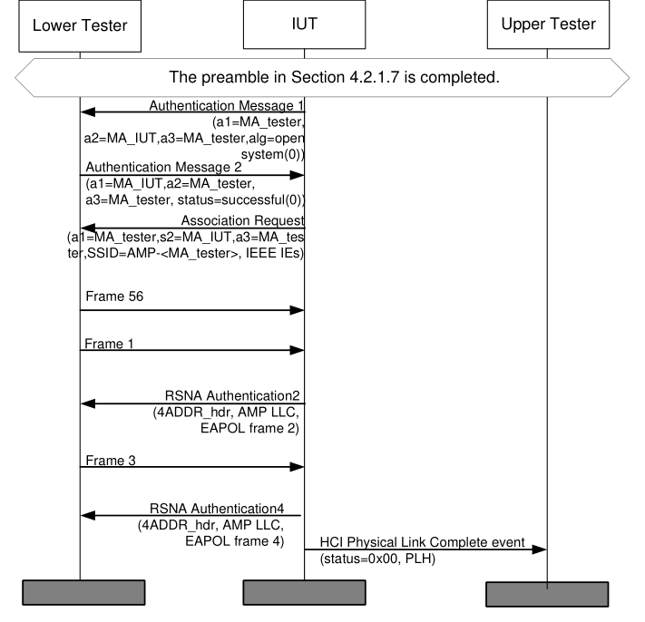

**Figure 5.17: 80211MP/ARSP/BI-05-C [Association response with more than eight rates in the supported rates IE]**

The IUT attempts to associate. The Lower Tester responds with Frame 56 defined in Table 4.2.
• Expected Outcome
Pass verdict
An HCI Physical Link Complete event with status of 0x00 is sent to the Upper Tester from the IUT.

### 5.7 Association Request Processing (AREQ)

80211MP/AREQ/BV-01-C [Association request processing]
• Test Purpose
Verify that the IUT properly handles received association request frames and generates association responses properly.
• Reference
[7] Test 1.1.5
• Initial Condition
- The preamble in Section 4.2.1.6 has been completed.
• Test Procedure

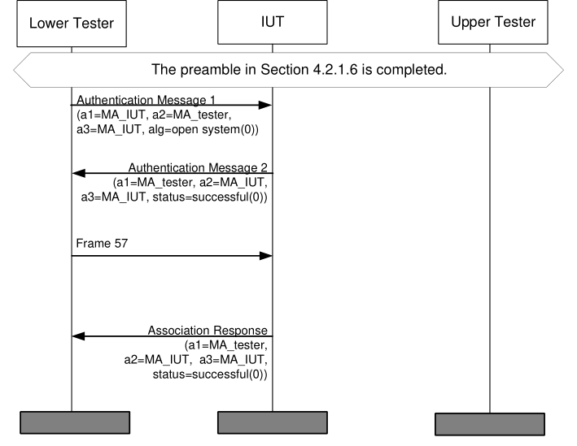

**Figure 5.18: 80211MP/AREQ/BV-01-C [Association request processing]**

The IUT attempts to associate. The Lower Tester responds with Frame 57 defined in Table 4.2.
Repeat test with listen interval 2, 3, 4, and 5.
• Expected Outcome
Pass verdict
The IUT sends association response with status code of 0 (success).
• Test Purpose
Verify that the IUT properly handles received association request frames and generates association responses properly.
• Reference
[7] Test 1.1.5
• Initial Condition
- The preamble in Section 4.2.1.6 has been completed.
• Test Procedure

**Figure 5.19: 80211MP/AREQ/BV-02-C [Generate association responses]**

The Lower Tester attempts to associate by sending Frame 58 defined in Table 4.2.
• Expected Outcome
Pass verdict
The IUT sends association response with status code of 0 (success).
• Test Purpose
Verify that the IUT properly handles received association request frames and generates association responses properly.
• Reference
[7] Test 1.1.5
• Initial Condition
- The preamble in Section 4.2.1.6 has been completed.
• Test Procedure

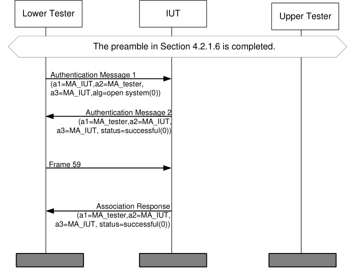

**Figure 5.20: 80211MP/AREQ/BV-03-C [Assoc request with more than eight rates in supported rates IE]**

The Lower Tester attempts to associate by sending Frame 59 defined in Table 4.2.
• Expected Outcome
Pass verdict
The IUT sends association response with status code of 0 (success).
• Test Purpose
Verify that the IUT properly handles received association request frames with no rates encoded in supported rates information element and generates association responses properly.
• Reference
[7] Test 1.1.5
• Initial Condition
- The preamble in Section 4.2.1.6 has been completed.
• Test Procedure

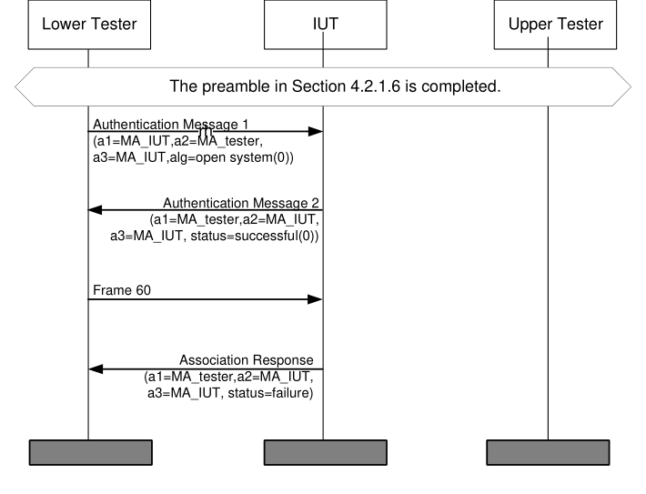

**Figure 5.21: 80211MP/AREQ/BI-01-C [Assoc request with no rates in supported rates IE]**

The Lower Tester attempts to associate by sending Frame 60 defined in Table 4.2.
• Expected Outcome
Pass verdict
The IUT sends association response with status code indicating failure.
• Test Purpose
Verify that the IUT ignores erroneous association requests.
• Reference
[7] Test 1.1.5
• Initial Condition
- The preamble in Section 4.2.1.6 has been completed.
• Test Procedure

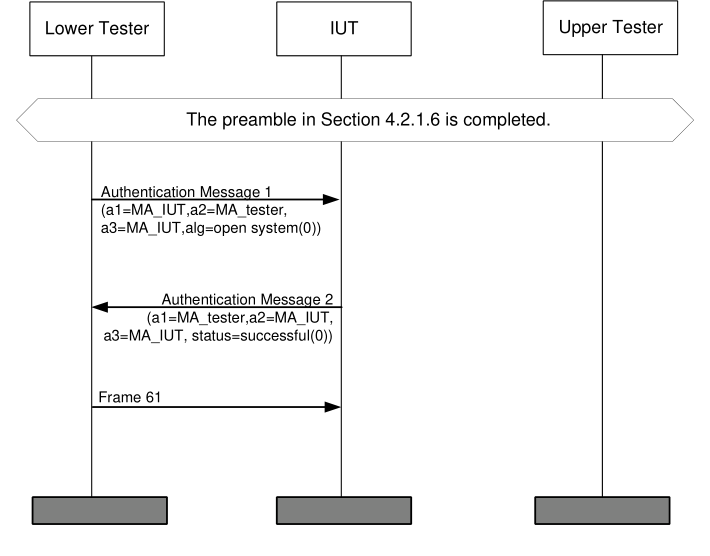

**Figure 5.22: 80211MP/AREQ/BI-02-C [Assoc request with invalid FCS]**

• Expected Outcome
Pass verdict
The IUT does not ACK frame and does not send association response.

### 5.8 Duplicate Frame processing (DUP)

80211MP/DUP/BV-01-C [Filtering of retried frames]
• Test Purpose
Verify that the IUT properly detects and filters duplicate frames.
• Reference
[6] Test 1.1.11
• Initial Condition
- The preamble in Section 4.2.1.5 has been completed.
• Test Procedure

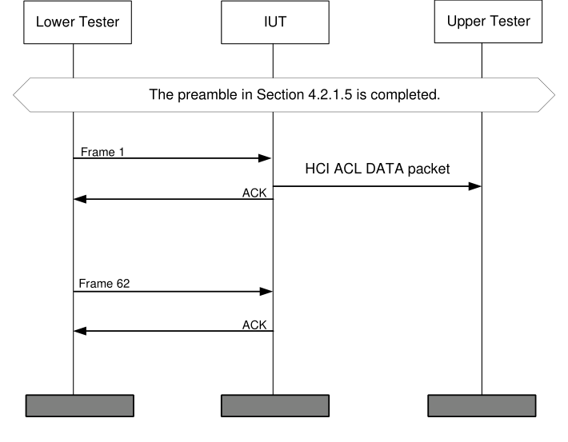

**Figure 5.23: 80211MP/DUP/BV-01-C [Filtering of retried frames]**

The Lower Tester sends Frame 1 followed by Frame 62.
• Expected Outcome
Pass verdict
The IUT ACKs Frame 1.
The IUT indicates received Frame 1 to the Upper Tester.
The IUT ACKs Frame 62.
The IUT does not indicate received Frame 62 to the Upper Tester.
• Test Purpose
Verify that the IUT properly detects and filters incomplete frame fragments.
• Reference
[6] Test 1.1.11
• Initial Condition
- The preamble in Section 4.2.1.5 has been completed.
• Test Procedure

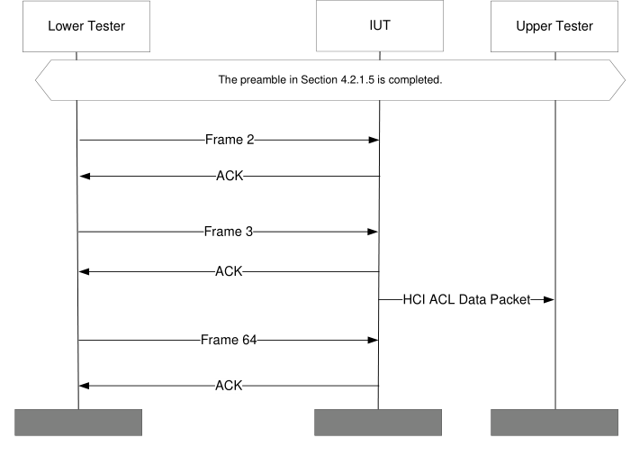

**Figure 5.24: 80211MP/DUP/BV-02-C [Process fragments from two sets]**

The Lower Tester sends Frame 2 followed by Frame 3 followed by Frame 64.
• Expected Outcome
Pass verdict
The IUT ACKs Frame 2.
The IUT does not indicate received Frame 2 to the Upper Tester.
The IUT ACKs Frame 3.
The IUT indicates received defragmented Frame 63 to the Upper Tester.
The IUT ACKs Frame 64.
The IUT does not indicate received Frame 64 (or any MSDU) to the Upper Tester.
• Test Purpose
Verify that the IUT correctly receives subsequent frames with retry bit set.
• Reference
[6] Test 1.1.11
• Initial Condition
- The preamble in Section 4.2.1.5 has been completed.
• Test Procedure

**Figure 5.25: 80211MP/DUP/BV-03-C [Wrap of sequence number field]**

The Lower Tester sends Frame 1 followed by Frame 65.
• Expected Outcome
Pass verdict
The IUT ACKs Frame 1.
The IUT indicates received Frame 1 to the Upper Tester.
The IUT ACKs Frame 65.
The IUT indicates received Frame 65 to the Upper Tester.
• Test Purpose
Verify that the IUT properly processes two consecutive frames with same sequence number and no retry bit set.
• Reference
[6] Test 1.1.11
• Initial Condition
- The preamble in Section 4.2.1.5 has been completed.
• Test Procedure

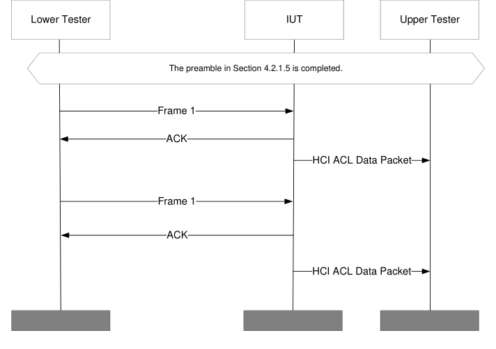

**Figure 5.26: 80211MP/DUP/BV-04-C [Processing of independent, identical frames]**

The Lower Tester sends Frame 1 twice.
• Expected Outcome
Pass verdict
The IUT ACKs Frame 1.
The IUT indicates received Frame 1 to the Upper Tester.
The IUT ACKs the second instance of Frame 1.
The IUT indicates received Frame 1 to the Upper Tester.
• Test Purpose
Verify that the IUT properly receives retransmissions of missing MPDUs.
• Reference
[6] Test 1.1.11
• Initial Condition
- The preamble in Section 4.2.1.5 has been completed.
• Test Procedure

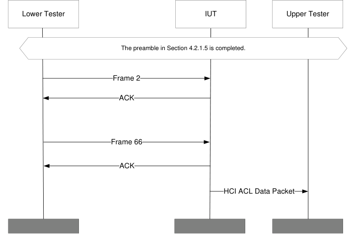

**Figure 5.27: 80211MP/DUP/BV-05-C [Process fragments with retry bit set]**

The Lower Tester sends Frame 2 followed by Frame 66.
• Expected Outcome
Pass verdict
The IUT ACKs Frame 2.
The IUT does not indicate received Frame 2 to the Upper Tester.
The IUT ACKs Frame 66.
The IUT indicates received defragmented Frame 63 to the Upper Tester.
• Test Purpose
Verify that the IUT properly handles sequence numbers in distinct traffic streams.
• Reference
[7] Test 1.1.13
• Initial Condition
- The preamble in Section 4.2.1.4 has been completed.
• Test Procedure

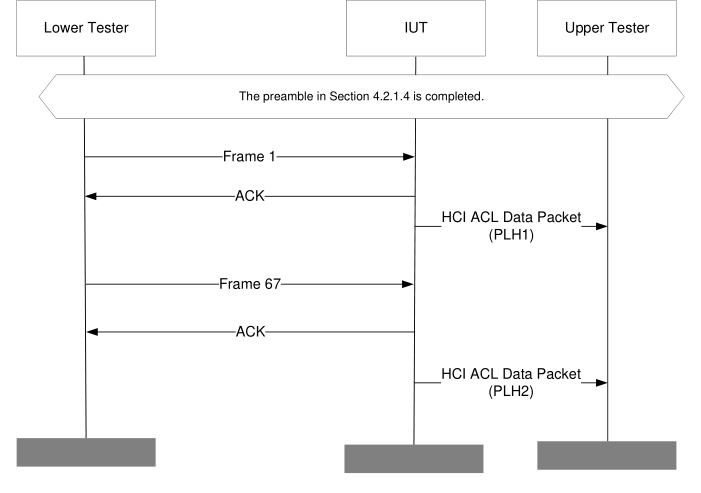

**Figure 5.28: 80211MP/DUP/BV-06-C [MSDUs with distinct TA fields]**

The Lower Tester sends Frame 1 followed by Frame 67.
• Expected Outcome
Pass verdict
The IUT ACKs Frame 1.
The IUT indicates received Frame 1 to the Upper Tester.
The IUT ACKs Frame 67.
The IUT indicates received Frame 67 to the Upper Tester.
80211MP/DUP/BV-07-C [MSDUs with different TA and sequence number field and retry bit]
• Test Purpose
Verify that the IUT properly handles sequence numbers and retry bit in distinct traffic streams.
• Reference
[7] Test 1.1.13
• Initial Condition
- The preamble in 4.2.1.4 has been completed.
• Test Procedure

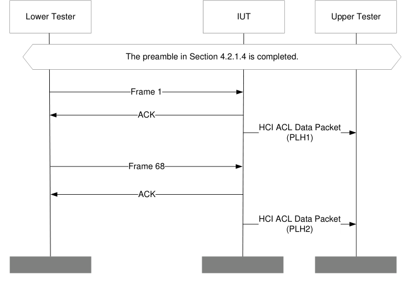

**Figure 5.29: 80211MP/DUP/BV-07-C [MSDUs with different TA and sequence number field and retry bit]**

The Lower Tester sends Frame 1 followed by Frame 68.
• Expected Outcome
Pass verdict
The IUT ACKs Frame 1.
The IUT indicates received Frame 1 to the Upper Tester.
The IUT ACKs Frame 68.
The IUT indicates received Frame 68 to the Upper Tester.

### 5.9 CTS to Self (CS)

80211MP/CS/BV-01-C [CTS-to-self Recognition]
• Test Purpose
Verify that the IUT will delay transmission of data frames based on CTS-to-Self frame reception.
• Reference
[7] Test 1.1.12
• Initial Condition
- The preamble in Section 4.2.1.2 has been completed.
• Test Procedure

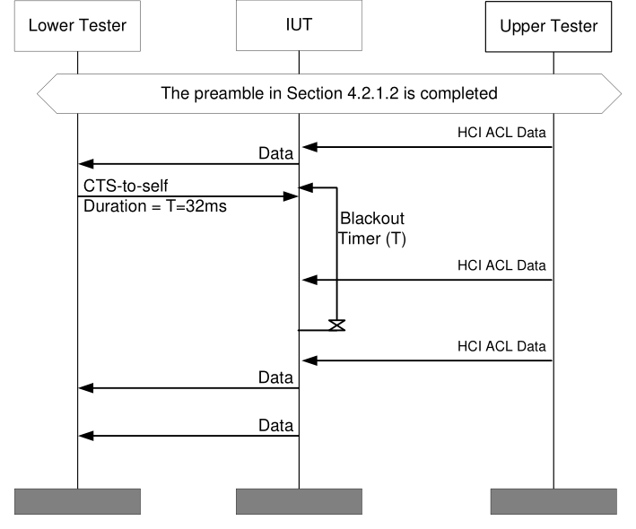

**Figure 5.30: 80211MP/CS/BV-01-C [CTS-to-self Recognition]**

The AMP HCI ACL Data Packets are sent to the IUT at a rate much greater than CTS-to-Self Duration, in order to queue frames during the blackout period.
The 802.11 traffic is monitored by a sniffer with a good timing precision. The transmission of the CTS- to-Self packet from the Lower Tester will be noted using the sniffer’s time base. The transmission of the next 802.11 packet from the IUT will be noted using the sniffer’s time base.
• Expected Outcome
Pass verdict
Using an 802.11 packet sniffer check that the IUT does not transmit an 802.11 Data Frame within 32 ms duration after the sniffer records the transmission of the CTS-to-self frame by the Lower Tester.

### 5.10 Multi-rate support (MRS)

80211MP/MRS/BV-01-C [Multi-rate support]
• Test Purpose
Verify that the IUT correctly receives all PHY-mandatory and supported rates.
• Reference
[6] Test 1.2.4
• Initial Condition
- The preamble in Section 4.2.1.2 has been completed.
• Test Procedure

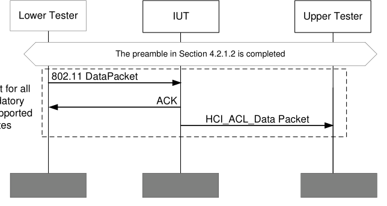

**Figure 5.31: 80211MP/MRS/BV-01-C [Multi-rate support]**

1. Mandatory rates are 1, 2, 5.5, 11, 6, 12, and 24 Mbps. 2. Supported rates for the implementation are given in the PAL ICS. 3. The 802.11 traffic is monitored by a sniffer.
• Expected Outcome
Pass verdict
The IUT should ACK all packets received at mandatory and supported rates.
The IUT should indicate to HCI the ACL Data frame to the Upper Tester that a packet was received.

### 5.11 General Data Frame Processing (GFP)

Verify that the IUT responds as expected in the following test cases.
80211MP/GFP/BI-01-C [IUT receives an 802.11 data frame with invalid Protocol Version]
• Test Purpose
Verify that the IUT receives an 802.11 MSDU with a Frame Control field Protocol Version greater than 0 and does not transmit an ACK in response.
• References
[6] Test 1.1.1 Part a
• Initial Condition
- The preamble in Section 4.2.1.5 has been completed.
• Test Procedure

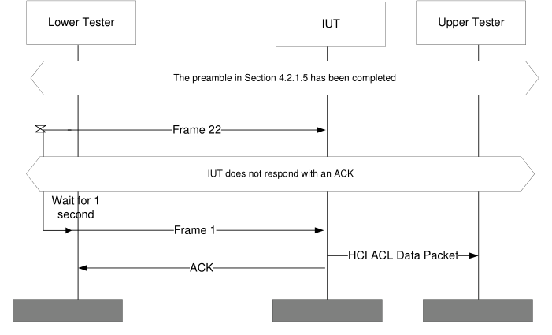

**Figure 5.32: 80211MP/GFP/BI-01-C [IUT receives an 802.11 data frame with invalid Protocol Version]**

• Expected Outcome
Pass verdict
In response to Frame 22, the IUT does not respond with an ACK. There is no corresponding HCI ACL Data Packet indication at the Upper Tester.
After the one second wait, when the Lower Tester sends Frame 1 to the IUT, the IUT responds with an ACK. In addition, there is an HCI ACL Data Packet indication at the Upper Tester.
80211MP/GFP/BI-02-C [IUT receives an 802.11 control frame of reserved subtype, one with and one without an address-3 field]
• Test Purpose
Verify that the IUT receives an 802.11 control frame with a subtype field in the Frame Control field set to a reserved value and does not generate an ACK in response.
• Reference
[6] Test 1.1.1 Part a
• Initial Condition:
- The preamble in Section 4.2.1.5 has been completed.
• Test Procedure

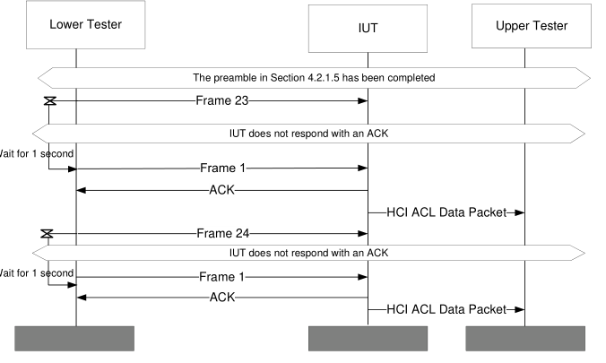

**Figure 5.33: 80211MP/GFP/BI-02-C [IUT receives an 802.11 control frame of reserved subtype, one with and one without an address-3 field]**

• Expected Outcome
Pass verdict
In response to Frame 23, the IUT does not respond with an ACK. There is no corresponding HCI ACL Data Packet indication at the Upper Tester.
After the one second wait, when the Lower Tester sends the first Frame 1 to the IUT, the IUT responds with an ACK. In addition, there is an HCI ACL Data Packet indication at the Upper Tester.
In response to Frame 24, the IUT does not respond with an ACK. There is no corresponding HCI ACL Data Packet indication at the Upper Tester.
After the one second wait, when the Lower Tester sends the second Frame 1 to the IUT, the IUT responds with an ACK. In addition, there is an HCI ACL Data Packet indication at the Upper Tester.
80211MP/GFP/BI-03-C [IUT receives an 802.11 Beacon with no supported rates in Supported Rates/Extended Supported Rates IE (invalid beacon frame)]
• Test Purpose
Verify that the IUT receives an invalid 802.11 beacon while already connected and is subsequently able to successfully receive data.
• Reference
[6] Test 1.1.1 Part a
• Initial Condition
- The preamble in Section 4.2.1.5 has been completed.
• Test Procedure

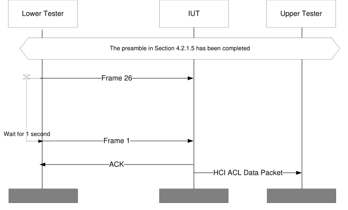

**Figure 5.34: 80211MP/GFP/BI-03-C [IUT receives an 802.11 Beacon with no supported rates in Supported Rates/Extended Supported Rates IE (invalid beacon frame)]**

• Expected Outcome
Pass verdict
There is no HCI ACL Data Packet indication at the Upper Tester corresponding to Frame 26.
After the one second wait, when the Lower Tester sends Frame 1 to the IUT, the IUT responds with an ACK. In addition, there is an HCI ACL Data Packet indication at the Upper Tester.
80211MP/GFP/BI-05-C [IUT receives 802.11 Management and Data frames from the Lower Tester where Subtype field is set to a reserved value]
• Test Purpose
Verify that the IUT receives the reserved frame from the Lower Tester and responds back with an acknowledgement.
• Reference
[6] Test 1.1.1 Part b
• Initial Condition
- The preamble in Section 4.2.1.5 has been completed.
• Test Procedure
For each frame, Frame 31 through Frame 34, and Frame 37 through Frame 41:
1. Send the frame from the Lower Tester. 2. Observe the medium. 3. The Lower Tester waits for a second. 4. The Lower Tester sends Frame 1 to the IUT. 5. Observe the medium.

**Figure 5.35: 80211MP/GFP/BI-05-C [IUT receives 802.11 Management and Data frames from the Lower Tester where Subtype field is set to a reserved value]**

• Expected Outcome
Pass verdict
In response to each of the stimulus frames (Frame 31 through Frame 34 and Frame 37 through Frame 41), the IUT responds with an ACK. There is not a corresponding HCI ACL Data Packet indication at the Upper Tester.
After the one second wait, when the Lower Tester sends Frame 1 to the IUT, the IUT responds with an ACK. In addition, there is an HCI ACL Data Packet indication at the Upper Tester.
• Test Purpose
Verify that the IUT receives reserved 802.11 frames from the Lower Tester and continues to function without system failure. The IUT may or may not respond with an acknowledgement.
• Reference
[6] Test 1.1.1 Part C
• Initial Condition
- The preamble in Section 4.2.1.5 has been completed.
• Test Procedure

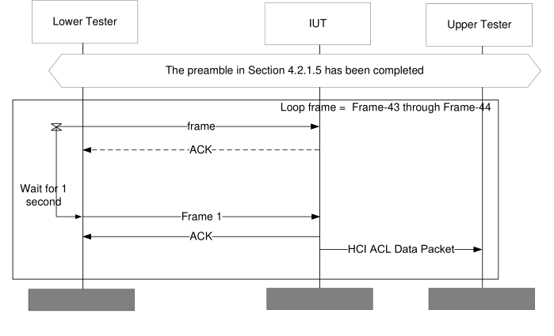

**Figure 5.36: 80211MP/GFP/BI-06-C [IUT receives reserved 802.11 frames from the Lower Tester]**

• Expected Outcome
Pass verdict
In response to each of the stimulus frames (Frame 43 and Frame 44), the IUT may respond with an ACK. There is not corresponding HCI ACL Data Packet indication at the Upper Tester.
After the one second wait, when the Lower Tester sends Frame 1 to the IUT, the IUT responds with an ACK. In addition, there is an HCI ACL Data Packet indication at the Upper Tester.
80211MP/GFP/BI-07-C [IUT receives a Probe Request from the Lower Tester, where the Probe Request includes an SSID element with a length that is greater than 32-bytes]
• Test Purpose
Verify that the IUT can receive a malformed Probe Request from the Lower Tester and continue to function without system failure.
• Reference
[7] Test 1.1.1 Part b
• Initial Condition
- The preamble in Section 4.2.1.2 has been completed.
• Test Procedure
1. Send Frame 49 from the Lower Tester. 2. Observe the medium. 3. The Lower Tester waits for a second then the Lower Tester sends Frame 1 to the IUT. 4. Observe the medium.

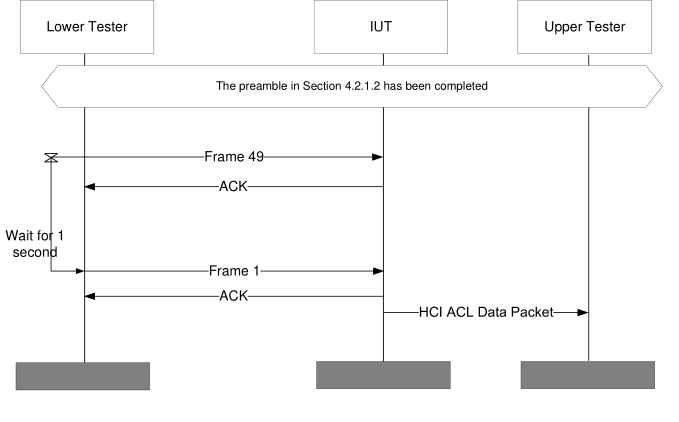

**Figure 5.37: 80211MP/GFP/BI-07-C [IUT receives a Probe Request from the Lower Tester, where the Probe Request includes an SSID element with a length that is greater than 32-bytes]**

• Expected Outcome
Pass verdict
In response to Frame 49, the IUT responds with an ACK. There is no corresponding HCI ACL Data Packet indication at the Upper Tester.
After the one second wait, when the Lower Tester sends Frame 1 to the IUT, the IUT responds with an ACK. In addition, there is an HCI ACL Data Packet indication at the Upper Tester.
80211MP/GFP/BV-01-C [IUT receives an 802.11 Beacon with bits 5 through 15 set to 1 in the Capability Information field]
• Test Purpose
Verify that the IUT receives an 802.11 beacon and does not respond with an ACK.
• Reference
[6] Test 1.1.1 Part a
• Initial Condition
- The preamble in Section 4.2.1.5 has been completed.
• Test Procedure

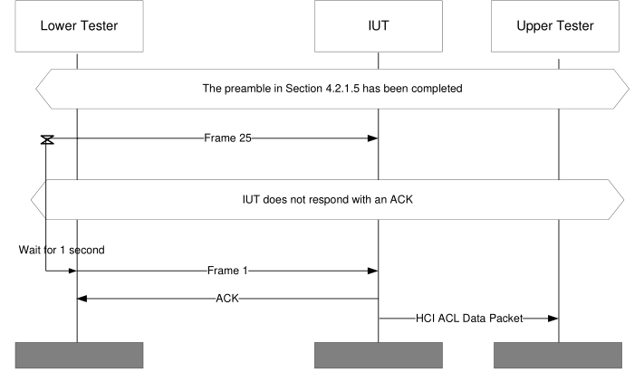

**Figure 5.38: 80211MP/GFP/BV-01-C [IUT receives an 802.11 Beacon with bits 5 through 15 set to 1 in the Capability Information field]**

• Expected Outcome
Pass verdict
In response to Frame 25, the IUT does not respond with an ACK. There is no corresponding HCI ACL Data Packet indication at the Upper Tester.
After the one second wait, when the Lower Tester sends Frame 1 to the IUT, the IUT responds with an ACK. In addition, there is an HCI ACL Data Packet indication at the Upper Tester.
80211MP/GFP/BV-02-C [IUT receives an 802.11 data frame where the Subtype in Frame Control set to 0x08 and the frame has a zero byte payload]
• Test Purpose
Verify that the IUT receives an 802.11 QoS data frame and responds with an ACK.
• Reference
[6] Test 1.1.1 Part b
• Initial Condition
- The preamble in Section 4.2.1.5 has been completed.
• Test Procedure

**Figure 5.39: 80211MP/GFP/BV-02-C [IUT receives an 802.11 data frame where the Subtype in Frame Control set to 0x08 and the frame has a zero byte payload]**

• Expected Outcome
Pass verdict
In response to Frame 27, the IUT responds with an ACK. There is no corresponding HCI ACL Data Packet indication at the Upper Tester.
After the one second wait, when the Lower Tester sends Frame 1 to the IUT, the IUT responds with an ACK. In addition, there is an HCI ACL Data Packet indication at the Upper Tester.
80211MP/GFP/BV-03-C [IUT receives an 802.11 data frame from the Lower Tester with the Order bit in the Frame Control field set to 1]
• Test Purpose
Verify that the IUT acknowledges the data frame it receives from the Lower Tester and a corresponding HCI ACL Data Packet indication is forwarded to the Upper Tester.
• Reference
[6] Test 1.1.1 Part b
• Initial Condition
- The preamble in Section 4.2.1.5 has been completed.
• Test Procedure

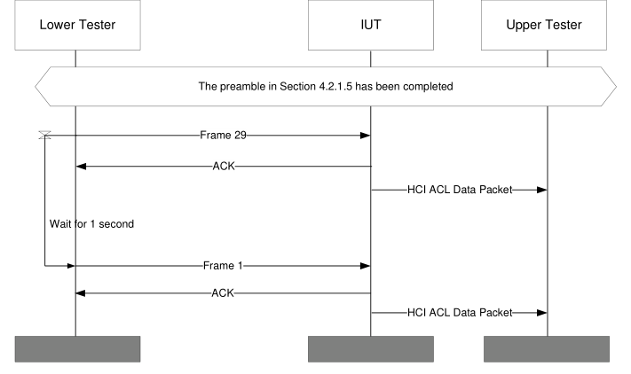

**Figure 5.40: 80211MP/GFP/BV-03-C [IUT receives an 802.11 data frame from the Lower Tester with the Order bit in the Frame Control field set to 1]**

• Expected Outcome
Pass verdict
In response to Frame 29, the IUT responds with an ACK, there is a corresponding HCI ACL Data Packet indication at the Upper Tester.
After the one second wait, when the Lower Tester sends Frame 1 to the IUT, the IUT responds with an ACK. In addition, there is an HCI ACL Data Packet indication at the Upper Tester.
80211MP/GFP/BV-04-C [IUT receives an 802.11 data frame from the Lower Tester with a payload length less than 64 bytes]
• Test Purpose
Verify that the IUT receives the 802.11 data frame from the Lower Tester and responds with an acknowledgement. In addition, verify that the Upper Tester receives a corresponding HCI ACL Data Packet indication.
• Reference
[6] Test 1.1.1 Part b
• Initial Condition
- The preamble in Section 4.2.1.5 has been completed.
• Test Procedure

**Figure 5.41: 80211MP/GFP/BV-04-C [IUT receives an 802.11 data frame from the Lower Tester with a payload length less than 64 bytes]**

• Expected Outcome
Pass verdict
In response to Frame 30, the IUT responds with an ACK, there is a corresponding HCI ACL Data Packet indication at the Upper Tester.
After the one second wait, when the Lower Tester sends Frame 1 to the IUT, the IUT responds with an ACK. In addition, there is an HCI ACL Data Packet indication at the Upper Tester.
80211MP/GFP/BV-05-C [IUT receives an 802.11 data packet from the Lower Tester with a payload larger than the fragmentation threshold]
• Test Purpose
Verify that the IUT can receive fragments of an 802.11 data frame with a payload larger than the fragmentation threshold and acknowledge each received fragment(s).
• Reference
[6] Test 1.1.1 Part b
• Initial Condition
- The preamble in Section 4.2.1.5 has been completed.
• Test Procedure

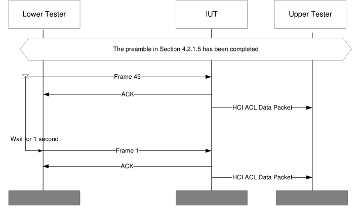

**Figure 5.42: 80211MP/GFP/BV-05-C [IUT receives an 802.11 data packet from the Lower Tester with a payload larger than the fragmentation threshold]**

• Expected Outcome
Pass verdict
In response to each fragment of the stimulus Frame 45, the IUT responds with an ACK. There is one HCI ACL Data Packet indication at the Upper Tester, when all the fragments corresponding to Frame 45 are received by the IUT.
After the one second wait, when the Lower Tester sends Frame 1 to the IUT, the IUT responds with an ACK. In addition, there is an HCI ACL Data Packet indication at the Upper Tester.

### 5.12 Deauthentication tests (DEAU)

80211MP/DEAU/BV-01-C [Acceptor Receives Deauthentication with selected reason codes]
• Test Purpose
Verify that the IUT destroys logical and physical links when a deauthentication frame is received with any reason code.
• References
[6] Test 1.1.3 Part a
• Initial Condition
- The preamble in Section 4.2.1.5 has been completed.
• Test Procedure

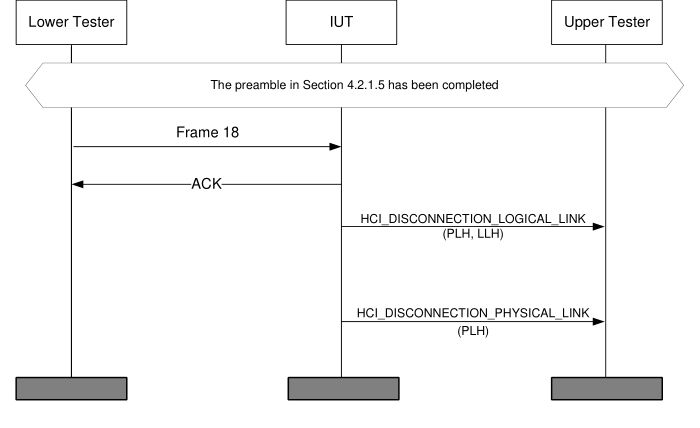

**Figure 5.43: 80211MP/DEAU/BV-01-C [Acceptor Receives Deauthentication with selected reason codes]**

The Lower Tester sends an 802.11 deauthentication frame to the IUT.
The above procedure is repeated for each reason code in the set {0, 1, 2, 3, 6, 7, 13, 14, 15, 17, 18, 20, 23, 24, 36, 37, 38, 39, 45} inserted into the deauthentication frame.
• Expected Outcome
Pass verdict
For each iteration of the test, verify the following:
On reception of Frame18 the IUT sends an HCI_DISCONNECTION_LOGICAL_LINK event and an HCI_DISCONNECTION_PHYSICAL_LINK event to the Upper Tester.
80211MP/DEAU/BV-02-C [Acceptor Receives Deauthentication sent to broadcast address]
• Test Purpose
Verify that the IUT accepts and tears down the Physical link when it receives a deauthentication frame sent to the broadcast MAC address.
• References
[6] Test 1.1.1 Part b
• Initial Condition
- The preamble specified in Section 4.2.1.5 has been completed.
• Test Procedure

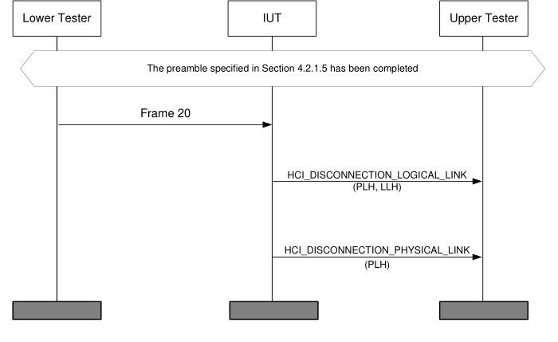

**Figure 5.44: 80211MP/DEAU/BV-02-C [Acceptor Receives Deauthentication sent to broadcast address]**

• Expected Outcome
Pass verdict
On reception of the deauthentication frame the IUT sends a HCI_DISCONNECTION_LOGICAL_LINK event and a HCI_DISCONNECTION_PHYSICAL_LINK event to the Upper Tester.
• Test Purpose
Verify that the IUT as initiator accepts and tears down the Physical link when it receives a deauthentication frame.
• Reference
[6] Test 1.1.3
• Initial Condition
- The preamble specified in Section 4.2.1.2 has been completed.
• Test Procedure

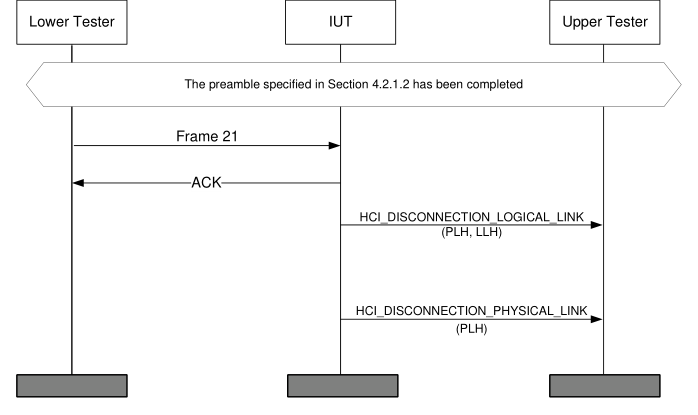

**Figure 5.45: 80211MP/DEAU/BV-03-C [Link Initiator Receives Deauthentication]**

The Lower Tester sends a Frame 21 to the IUT with the Reason code = 1.
• Expected Outcome
Pass verdict
On reception of the deauthentication frame the IUT sends an HCI_DISCONNECTION_LOGICAL_LINK event and HCI_DISCONNECTION_PHYSICAL_LINK event to the Upper Tester.
• Test Purpose
Verify that the IUT ignores and does not acknowledge an 802.11 deauthentication frame with an invalid FCS.
• Reference
[6] Test 1.1.3 Part c
• Initial Condition
- The preamble specified in Section 4.2.1.5 has been completed.
• Test Procedure

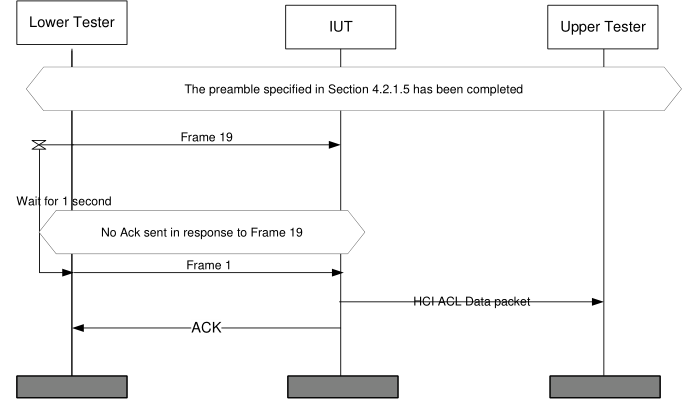

**Figure 5.46: 80211MP/DEAU/BI-01-C [Reject Deauthentication with invalid FCS]**

• Expected Outcome
Pass verdict
On reception of Frame19 the IUT does not send an 802.11 ACK to the Lower Tester within 1 second.
On reception of Frame 1, the IUT sends an 802.11 ACK to the Lower Tester and sends an ACL data packet to the Upper Tester.
• Test Purpose
Verify that the IUT destroys logical and physical links when a deauthentication frame is received with an invalid reason.
• Reference
[6] Test 1.1.3 Part a
• Initial Condition
- The preamble specified in Section 4.2.1.5 has been completed.
• Test Procedure

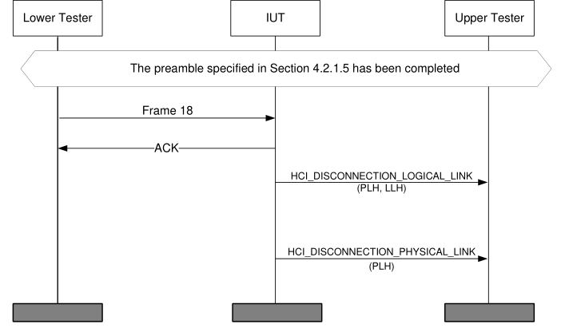

**Figure 5.47: 80211MP/DEAU/BI-02-C [Acceptor Receives Deauthentication with reserved reason]**

The Lower Tester sends Frame18 to the IUT with a reason code of 0.
• Expected Outcome
Pass verdict
After reception of Frame 18 the IUT sends a HCI_DISCONNECTION_LOGICAL_LINK event and HCI_DISCONNECTION_PHYSICAL_LINK event to the Upper Tester.

### 5.13 Disassociation Processing (DAP)

80211MP/DAP/BV-01-C [IUT receives a valid disassociation frame]
• Test Purpose
Verify that the IUT receives a disassociation from the Lower Tester and stops transmitting data frames to the Lower Tester.
• Reference
[6] Test 1.1.6 Part A
• Initial Condition
- The preamble specified in Section 4.2.1.2 has been completed.
• Test Procedure
The Lower Tester sends a set of disassociation frames to the IUT, with one of the set of reason codes listed below.
Observe the medium.

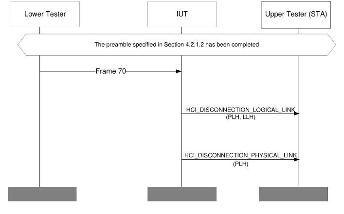

**Figure 5.48: 80211MP/DAP/BV-01-C [IUT receives a valid disassociation frame]**

The above procedure is repeated for each reason code in the set {4, 8, 10, 11, 34, 255}.
• Expected Outcome
Pass verdict
The IUT does not indicate any ACL data frames to the Upper Tester, irrespective of the reason code received in the disassociation frame from the Lower Tester, after the disassociation frame is received.
The IUT generates a Disconnection Logical Link Complete event for each logical link and a Disconnection Physical Link Complete event.
• Test Purpose
Verify that the IUT receives a disassociation frame from the Lower Tester with an invalid FCS and ignores it.
• Reference
[6] Test 1.1.6 Part a
• Initial Condition
- The preamble specified in Section 4.2.1.2 has been completed.
• Test Procedure
The Lower Tester sends a disassociation frame with an invalid FCS to the IUT.
The Upper Tester sends an ACL data frame after invalid disassociation frame is sent and the IUT is able to send it to the Lower Tester.
Observe the medium.

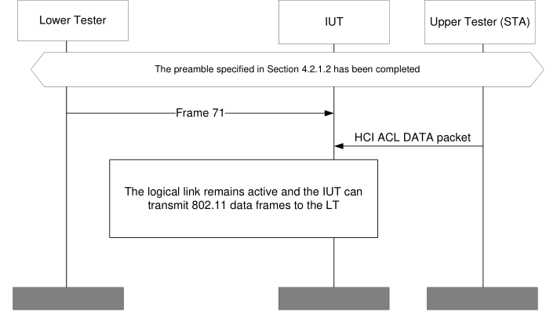

**Figure 5.49: 80211MP/DAP/BI-01-C [IUT receives a Disassociation frame with incorrect FCS]**

• Expected Outcome
Pass verdict
The IUT ignores the received disassociation frame with invalid FCS.
The IUT is able to send ACL data frames after the invalid disassociation frame is received.
The IUT does not generate a disconnection event to the Upper Tester.

### 5.14 Recovery Procedure and Retransmit Limits (RT)

80211MP/RT/BV-01-C [IUT Retransmit RTS frame dot11ShortRetryLimit times]
• Test Purpose
Verify that the IUT retransmits an RTS frame at least once when the Lower Tester does not respond with a corresponding CTS frame.
• Reference
[6] Test 1.2.1
• Initial Condition
- The preamble specified in Section 4.2.1.2 has been completed.
• Test Procedure
The Upper Tester sends Frame 1.
The Lower Tester does not respond to the RTS frame(s) it receives from the IUT.
Observe the medium.

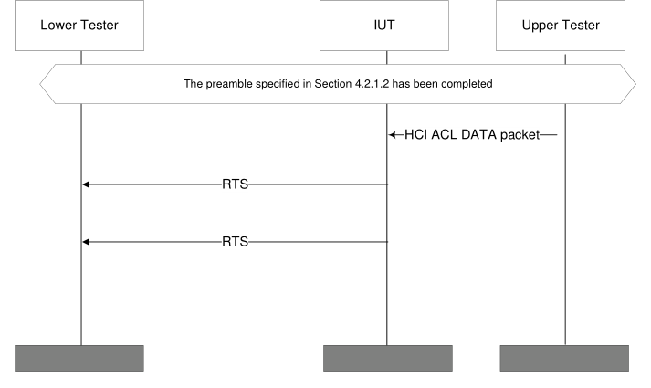

**Figure 5.50: 80211MP/RT/BV-01-C [IUT Retransmit RTS frame dot11ShortRetryLimit times]**

• Expected Outcome
Pass verdict
The IUT retransmits the RTS frame at least once.
The IUT does not transmit Frame 1 because no CTS is received.
• Test Purpose
Verify that the IUT retransmits an unacknowledged 802.11 data frame at least once.
• Reference
[6] Test 1.2.1 Part b
• Initial Condition
- The preamble in Section 4.2.1.5 has been completed.
• Test Procedure
The Upper Tester sends ACL_HCI DATA Packet to the IUT.
When the IUT sends an 802.11 RTS to the Lower Tester, the Lower Tester responds with an 802.11 CTS frame.
When the IUT sends Frame 1 to the Lower Tester, the Lower Tester does not respond with an 802.11 ACK frame.
Observe the medium.

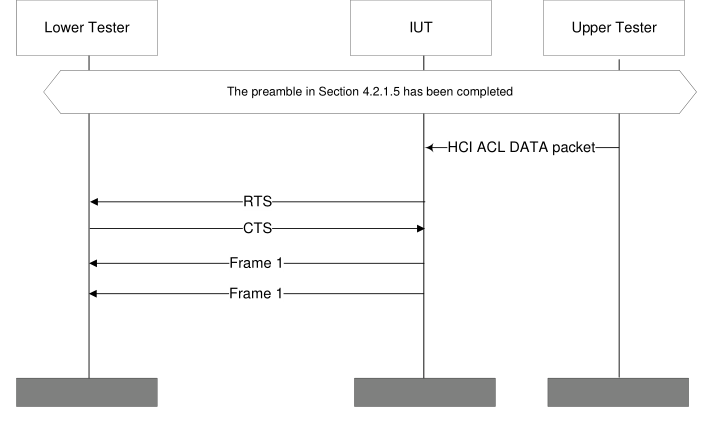

**Figure 5.51: 80211MP/RT/BV-02-C [Retransmit unacknowledged long data frame]**

• Expected Outcome
Pass verdict
The IUT performs an 802.11 RTS/CTS handshake with the Lower Tester.
The IUT retransmits Frame 1 at least once.
• Test Purpose
Verify that the IUT retransmits an unacknowledged short 802.11 data frame at least once.
• Reference
[6] Test 1.2.1 Part c
• Initial Condition
- The preamble in Section 4.2.1.5 has been completed.
- The Lower Tester sends an Activity Report indicating no interference in order that the IUT may turn off RTS signaling.
• Test Procedure
1. The Upper Tester sends Frame 1 to IUT. 2. The Lower Tester does not respond with an 802.11 ACK to Frame 1 it received from the IUT. 3. Observe the medium.

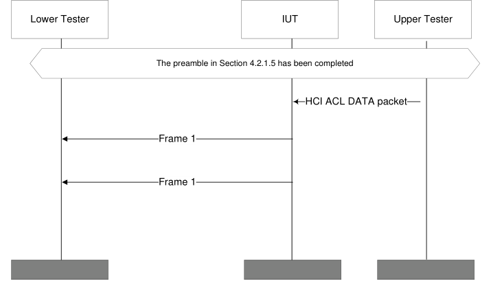

**Figure 5.52: 80211MP/RT/BV-03-C [IUT retransmits unacknowledged short data frame]**

• Expected Outcome
Pass verdict
The IUT retransmits Frame 1 at least once.

## 6 Test case mapping

The Test Case Mapping Table (TCMT) maps test cases to specific capabilities in the ICS. The IUT is tested in all roles for which support is declared in the ICS document.
The columns for the TCMT are defined as follows:
Item: Contains a logical expression based on specific entries from the associated ICS document. Contains a logical expression (using the operators AND, OR, NOT as needed) based on specific entries from the applicable ICS document(s). The entries are in the form of y/x references, where y corresponds to the table number and x corresponds to the feature number as defined in the ICS document for 802.11 MAC/PHY (80211MP) [9].
Feature: A brief, informal description of the feature being tested.
Test Case(s): The applicable test case identifiers are required for Bluetooth Qualification if the corresponding y/x references defined in the Item column are supported. Further details about the function of the TCMT are elaborated in [1].
For the purpose and structure of the ICS/IXIT, refer to [1].

|  | Item |  |  | Feature |  |  | Test Case(s) |  |
| --- | --- | --- | --- | --- | --- | --- | --- | --- |
| 80211MP 1/1 |  |  | Acknowledgement and Duration |  |  | 80211MP/AD/BV-01-C 80211MP/AD/BV-02-C 80211MP/AD/BI-01-C 80211MP/AD/BV-03-C 80211MP/AD/BI-02-C |  |  |
| 80211MP 1/2 |  |  | Null data frame processing |  |  | 80211MP/ND/BI-01-C 80211MP/ND/BV-01-C |  |  |
| 80211MP 1/3 |  |  | RTS/CTS signaling |  |  | 80211MP/RC/BV-01-C |  |  |
| 80211MP 1/4 |  |  | Defragmentation Tests |  |  | 80211MP/DF/BV-01-C |  |  |
| 80211MP 1/5 |  |  | Authentication Frame Processing |  |  | 80211MP/AFP/BI-01-C 80211MP/AFP/BI-02-C 80211MP/AFP/BI-03-C |  |  |
| 80211MP 1/6 |  |  | Association Response testing |  |  | 80211MP/ARSP/BI-01-C 80211MP/ARSP/BI-02-C 80211MP/ARSP/BI-03-C 80211MP/ARSP/BI-04-C 80211MP/ARSP/BI-05-C |  |  |
| 80211MP 1/7 |  |  | Association Request Processing (AREQ) |  |  | 80211MP/AREQ/BV-01-C 80211MP/AREQ/BV-02-C 80211MP/AREQ/BV-03-C 80211MP/AREQ/BI-01-C 80211MP/AREQ/BI-02-C |  |  |
| 80211MP 1/8 |  |  | Duplicate Frame processing |  |  | 80211MP/DUP/BV-01-C 80211MP/DUP/BV-02-C 80211MP/DUP/BV-03-C 80211MP/DUP/BV-04-C 80211MP/DUP/BV-05-C 80211MP/DUP/BV-06-C 80211MP/DUP/BV-07-C |  |  |

|  | Item |  |  | Feature |  |  | Test Case(s) |  |
| --- | --- | --- | --- | --- | --- | --- | --- | --- |
| 80211MP 1/9 |  |  | CTS to Self (CS) |  |  | 80211MP/CS/BV-01-C |  |  |
| 80211MP 1/10 |  |  | Multi-rate support (MRS) |  |  | 80211MP/MRS/BV-01-C |  |  |
| 80211MP 1/11 |  |  | General Data Frame Processing (GFP) |  |  | 80211MP/GFP/BI-01-C 80211MP/GFP/BI-02-C 80211MP/GFP/BV-01-C 80211MP/GFP/BI-03-C 80211MP/GFP/BV-02-C 80211MP/GFP/BV-03-C 80211MP/GFP/BV-04-C 80211MP/GFP/BI-05-C 80211MP/GFP/BI-06-C 80211MP/GFP/BV-05-C 80211MP/GFP/BI-07-C |  |  |
| 80211MP 1/12 |  |  | De-authentication tests (DEAU) |  |  | 80211MP/DEAU/BV-01-C 80211MP/DEAU/BV-02-C 80211MP/DEAU/BV-03-C 80211MP/DEAU/BI-01-C 80211MP/DEAU/BI-02-C |  |  |
| 80211MP 1/13 |  |  | Disassociation Processing |  |  | 80211MP/DAP/BV-01-C 80211MP/DAP/BI-01-C |  |  |
| 80211MP 1/14 |  |  | Recovery Procedure and Retransmit Limits |  |  | 80211MP/RT/BV-01-C 80211MP/RT/BV-02-C 80211MP/RT/BV-03-C |  |  |

Table 6.1: Test case mapping

## 7 Revision history and acknowledgments

Revision History

|  | Publication |  |  | Revision |  | Date |  |  | Comments |  |  |
| --- | --- | --- | --- | --- | --- | --- | --- | --- | --- | --- | --- |
|  | Number |  |  | Number |  |  |  |  |  |  |  |
|  | 0 |  |  | 4.0.0 |  |  | 2011-07-15 |  |  | Prepare for publication. |  |
|  |  |  | 4.1.0r01 | 4.1.0r01 |  | 2013-11-11 | 2013-11-11 |  |  | Updated revision to 4.1.0 |  |
|  |  |  |  |  |  |  |  |  |  | Updated references to include version 4.1 |  |
|  |  |  |  |  |  |  |  |  |  | Updated top sheet to include version 4.1 |  |
|  |  |  |  |  |  |  |  |  |  | Removed N/A Sections |  |
|  | 1 |  |  | 4.1.0 |  |  | 2013-12-03 |  |  | Prepare for Publication |  |
|  |  |  |  | 4.2.0r00 |  |  | 2014-11-24 |  |  | Revved version to align with Core 4.2 release |  |
|  |  |  |  | 4.2.0r01 |  |  | 2014-12-03 |  |  | Template conversion |  |
|  | 2 |  |  | 4.2.0 |  |  | 2014-12-05 |  |  | Prepared for TCRL 2014-2 publication |  |
|  |  |  | 5.0.0r00 | 5.0.0r00 |  | 2016-10-20 | 2016-10-20 |  |  | Converted to new Test Case ID conventions as |  |
|  |  |  |  |  |  |  |  |  |  | defined in TSTO v4.1 |  |
| 3 |  |  | 5.0.0 |  |  | 2016-12-13 |  |  |  | Approved by BTI. Prepared for TCRL 2016-2 |  |
|  |  |  |  |  |  |  |  |  |  | publication. |  |
|  |  |  | 5.1.0r00 |  |  | 2018-11-13 |  |  |  | Updated template. Revved version to align with |  |
|  |  |  |  |  |  |  |  |  |  | Core 5.1 release. |  |
| 4 |  |  | 5.1.0 |  |  | 2018-12-07 |  |  |  | Approved by BTI. Prepared for TCRL 2018-2 |  |
|  |  |  |  |  |  |  |  |  |  | publication. |  |
|  |  |  | p5r00 |  |  | 2019-11-27 |  |  |  | Updated document naming convention and template |  |
|  |  |  |  |  |  |  |  |  |  | items, moving Revision History and Contributors |  |
|  |  |  |  |  |  |  |  |  |  | tables to the bottom of the document, updating |  |
|  |  |  |  |  |  |  |  |  |  | Disclaimer text and Confidentiality markings to align |  |
|  |  |  |  |  |  |  |  |  |  | with latest Documentation Marking Requirements, and |  |
|  |  |  |  |  |  |  |  |  |  | making minor editorial fixes. |  |
| 5 |  |  | p5 |  |  | 2020-01-07 |  |  |  | Approved by BTI on 2019-12-22. Prepared for TCRL |  |
|  |  |  |  |  |  |  |  |  |  | 2019-2 publication. |  |
|  |  |  | p6r00–r02 |  |  | 2023-04-03 – 2023-05-22 |  |  |  | TSE 22977 (rating 1): Per E22504, updated “DUT” to |  |
|  |  |  |  |  |  |  |  |  |  | “IUT” in the MSCs for 80211MP/AFP/BI-01-C, |  |
|  |  |  |  |  |  |  |  |  |  | 80211MP/AFP/BI-02-C, and 80211MP/AFP/BI-03-C. |  |
|  |  |  |  |  |  |  |  |  |  | Editorials to align the document with the latest TS |  |
|  |  |  |  |  |  |  |  |  |  | template conventions and DNMD guidance. |  |
| 6 |  |  | p6 |  |  | 2023-06-29 |  |  |  | Approved by BTI on 2023-06-05. Prepared for |  |
|  |  |  |  |  |  |  |  |  |  | TCRL 2023-1 publication. |  |
|  |  |  | p7r00 |  |  | 2023-09-12 |  |  |  | TSE 24025 (rating 1): Updated the layer abbreviation |  |
|  |  |  |  |  |  |  |  |  |  | in the file name and throughout the TCMT to align with |  |
|  |  |  |  |  |  |  |  |  |  | current conventions. |  |
| 7 |  |  | p7 |  |  | 2024-07-01 |  |  |  | Approved by BTI on 2024-05-22. Prepared for TCRL |  |
|  |  |  |  |  |  |  |  |  |  | 2024-1 publication. |  |

Acknowledgments

|  | Name |  |  | Company |  |
| --- | --- | --- | --- | --- | --- |
|  | Kevin Hayes (editor) |  |  | Atheros |  |
|  | Jimmy Salame |  |  | Bluetooth SIG, Inc. |  |

|  | Name |  |  | Company |  |
| --- | --- | --- | --- | --- | --- |
|  | Ray Hayes |  |  | Broadcom |  |
|  | Nick Jackson |  |  | CSR |  |
|  | Ganesh Venkatsan |  |  | Intel |  |
|  | Raja Banarjea |  |  | Marvell |  |
