# 80211PAL.TS.p13

> Source: PDF converted via PyMuPDF.

---

### 802.11 Protocol Adaptation Layer (80211PAL)

Bluetooth® Test Suite
▪ Revision: 80211PAL.TS.p13 ▪ Revision Date: 2024-07-01 ▪ Prepared By: BTI ▪ Published during TCRL: TCRL.2024-1
This document, regardless of its title or content, is not a Bluetooth Specification as defined in the Bluetooth Patent/Copyright License Agreement (“PCLA”) and Bluetooth Trademark License Agreement. Use of this document by members of Bluetooth SIG is governed by the membership and other related agreements between Bluetooth SIG Inc. (“Bluetooth SIG”) and its members, including the PCLA and other agreements posted on Bluetooth SIG’s website located at www.bluetooth.com.
THIS DOCUMENT IS PROVIDED “AS IS” AND BLUETOOTH SIG, ITS MEMBERS, AND THEIR AFFILIATES MAKE NO REPRESENTATIONS OR WARRANTIES AND DISCLAIM ALL WARRANTIES, EXPRESS OR IMPLIED, INCLUDING ANY WARRANTY OF MERCHANTABILITY, TITLE, NON-INFRINGEMENT, FITNESS FOR ANY PARTICULAR PURPOSE, THAT THE CONTENT OF THIS DOCUMENT IS FREE OF ERRORS.
TO THE EXTENT NOT PROHIBITED BY LAW, BLUETOOTH SIG, ITS MEMBERS, AND THEIR AFFILIATES DISCLAIM ALL LIABILITY ARISING OUT OF OR RELATING TO USE OF THIS DOCUMENT AND ANY INFORMATION CONTAINED IN THIS DOCUMENT, INCLUDING LOST REVENUE, PROFITS, DATA OR PROGRAMS, OR BUSINESS INTERRUPTION, OR FOR SPECIAL, INDIRECT, CONSEQUENTIAL, INCIDENTAL OR PUNITIVE DAMAGES, HOWEVER CAUSED AND REGARDLESS OF THE THEORY OF LIABILITY, AND EVEN IF BLUETOOTH SIG, ITS MEMBERS, OR THEIR AFFILIATES HAVE BEEN ADVISED OF THE POSSIBILITY OF SUCH DAMAGES.
This document is proprietary to Bluetooth SIG. This document may contain or cover subject matter that is intellectual property of Bluetooth SIG and its members. The furnishing of this document does not grant any license to any intellectual property of Bluetooth SIG or its members.
This document is subject to change without notice.
Copyright © 2010–2024 by Bluetooth SIG, Inc. The Bluetooth word mark and logos are owned by Bluetooth SIG, Inc. Other third-party brands and names are the property of their respective owners.
Contents

## 1 Scope

This Bluetooth document contains the Test Suite Structure (TSS) and test cases to test the implementation of the Bluetooth 802.11 PAL Specification with the objective to provide a high probability of air interface interoperability between the tested implementation and other manufacturers’ Bluetooth devices.

## 2 References, definitions, and abbreviations

### 2.1 References

This document incorporates provisions from other publications by dated or undated reference. These references are cited at the appropriate places in the text, and the publications are listed hereinafter. Additional definitions and abbreviations can be found in [1], [2], and [5].
[1] Test Strategy and Terminology Overview
[2] Bluetooth Core Specification, Version 3.0 + HS, Volume 5, Part A (802.11 PAL)
[3] ICS Proforma for 802.11 PAL
[4] Bluetooth Core Specification, Version 3.0 + HS, Volume 2, Part E (HCI)
[5] IEE 802.11-2007 Standard and Amendments 1 through 5

### 2.2 Definitions

In this Bluetooth document, the definitions from [1], [2], and [5] apply.

### 2.3 Acronyms and abbreviations

In this Bluetooth document, the definitions, acronyms, and abbreviations from [1], [2], and [5] apply.

|  | Acronyms and abbreviations |  |  | Definition |  |
| --- | --- | --- | --- | --- | --- |
| EDCA |  |  | Enhanced Distributed Channel Access |  |  |

Table 2.1: Acronyms and abbreviations

## 3 Test Suite Structure (TSS)

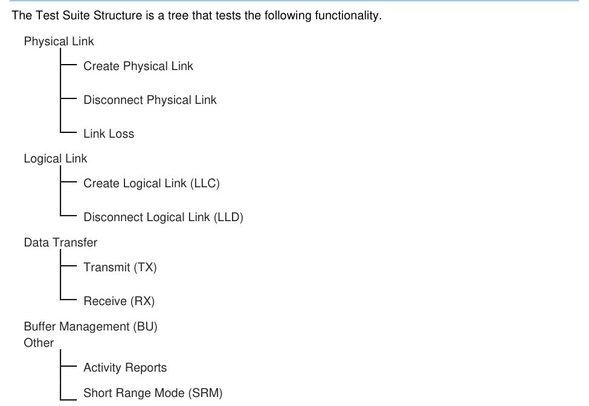

**Figure 3.1: TSS for 802.11 PAL**

### 3.1 Test Strategy

The test objectives are to verify the functionality of the 802.11 PAL Specification within a Bluetooth Host and enable interoperability between Bluetooth Hosts on different devices. The testing approach covers mandatory and optional requirements in the specification and matches these to the support of the IUT as described in the ICS. Any defined test herein is applicable to the IUT if the ICS logical expression defined in the Test Case Mapping Table (TCMT) evaluates to true.
The test equipment provides an implementation of the Radio Controller and the parts of the Host needed to perform the test cases defined in this Test Suite. A Lower Tester acts as the IUT’s peer device and interacts with the IUT over-the-air interface. The configuration, including the IUT, needs to implement similar capabilities to communicate with the test equipment. For some test cases, it is necessary to stimulate the IUT from an Upper Tester. In practice, this could be implemented as a special test interface, a Man Machine Interface (MMI), or another interface supported by the IUT.
Verification that the MAC complies with [5] is outside of the scope of this specification except where a specific behavior is specified in [2]. For this reason, the test inputs are specified in terms of HCI commands and events at the top of the PAL in the tester and the IUT. In addition, behavior in the 802.11 media is observed to verify compliance with [2].
This Test Suite contains Valid Behavior (BV) tests complemented with Invalid Behavior (BI) tests where required. The test coverage mirrored in the Test Suite Structure is the result of a process that started with catalogued specification requirements that were logically grouped and assessed for testability enabling coverage in defined test purposes.

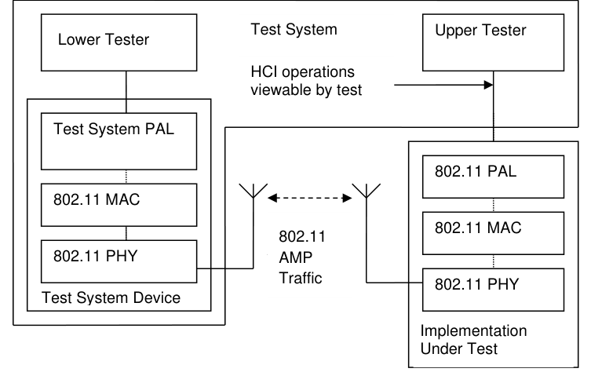

**Figure 3.2: Test system architecture for 802.11 PAL**

### 3.2 Test groups

The test groups are organized in three levels. The first level defines the protocol groups representing the protocol services. The second level separates the protocol services in functional modules. The last level in each branch contains the standard ISO subgroups Valid Behavior (BV) and Invalid Behavior (BI).

#### 3.2.1 Protocol groups

The protocol group identifies the kind of test for 802.11 Protocol Adaptation Layer test cases:
• Discovery/Status (DI) - AMP Information (AI) - AMP ASSOC (AA) - AMP Status (ST) • Physical Link (PL) - Physical link Creation (PLC) - Physical Link Disconnect (PLD) - Physical Link Supervision (PLS) • Logical Link (LL) - Logical Link Creation (LLC) - Logical Link Disconnect (LLD) • Data Transfer (DA) - Best effort data transfer (BE) - Guaranteed Data Transfer (GU) - Buffer Management (BU) • Other - Activity Reports (AR) - Short Range Mode (SRM)

#### 3.2.2 Test subgroups

##### 3.2.2.1 Valid Behavior (BV) tests

This subgroup provides testing to verify that the IUT reacts in conformity with the Bluetooth Core Specification, after receipt or exchange of valid Protocol Data Units (PDUs). Valid PDUs and HCI events and commands mean that the exchange of messages and the content of the exchanged messages are considered as valid.

##### 3.2.2.2 Invalid Behavior (BI) tests

This subgroup provides testing to verify that the IUT reacts in conformity with the Bluetooth Core Specification, after receipt of a syntactically or semantically invalid PDU and HCI events and commands.

## 4 Test cases (TC)

### 4.1 Introduction

#### 4.1.1 Test case identification conventions

Test cases are assigned unique identifiers per the conventions in [1]. The convention used here is: <spec abbreviation>/<IUT role>/<class>/<feat>/<func>/<subfunc>/<cap>/<xx>-<nn>-<y>.

|  | Identifier Abbreviation |  |  | Spec Identifier <spec abbreviation> |  |
| --- | --- | --- | --- | --- | --- |
| 80211PAL |  |  | 802.11 PAL Spec |  |  |
|  | Identifier Abbreviation |  |  | Feature Identifier <feat> |  |
| DA |  |  | Data Transfer |  |  |
| DI |  |  | Discovery |  |  |
| EX |  |  | Exceptions |  |  |
| LL |  |  | Logical Link Tests |  |  |
| PL |  |  | Physical Link Tests |  |  |

Table 4.1: 802.11 PAL TC feature naming conventions

#### 4.1.2 Conformance

When conformance is claimed for a particular specification, all capabilities are to be supported in the specified manner. The mandated tests from this Test Suite depend on the capabilities to which conformance is claimed.
The Bluetooth Qualification Program may employ tests to verify implementation robustness. The level of implementation robustness that is verified varies from one specification to another and may be revised for cause based on interoperability issues found in the market.
Such tests may verify:
• That claimed capabilities may be used in any order and any number of repetitions not excluded by the specification
• That capabilities enabled by the implementations are sustained over durations expected by the use case
• That the implementation gracefully handles any quantity of data expected by the use case
• That in cases where more than one valid interpretation of the specification exists, the implementation complies with at least one interpretation and gracefully handles other interpretations
• That the implementation is immune to attempted security exploits
A single execution of each of the required tests is required to constitute a Pass verdict. However, it is noted that to provide a foundation for interoperability, it is necessary that a qualified implementation consistently and repeatedly pass any of the applicable tests.
In any case, where a member finds an issue with the test plan generated by the Bluetooth SIG qualification tool, with the test case as described in the Test Suite, or with the test system utilized, the member is required to notify the responsible party via an erratum request such that the issue may be addressed.

#### 4.1.3 Pass/Fail verdict conventions

Each test case has an Expected Outcome section. The IUT is granted the Pass verdict when all the detailed pass criteria conditions within the Expected Outcome section are met.
The convention in this Test Suite is that, unless there is a specific set of fail conditions outlined in the test case, the IUT fails the test case as soon as one of the pass criteria conditions cannot be met. If this occurs, then the outcome of the test is a Fail verdict.

#### 4.1.4 Lower layer assumptions

For conformance testing of the 802.11 PAL layer, it is necessary to utilize a MAC and PHY in conformance with [5].
In the MSCs in this document, certain 802.11 frames may occur outside the scope of any particular test. These include, but are not limited to, probe requests, probe responses, data frame retransmissions, and action frames. The presence of these frames is not to be used to affect the Pass or Fail Verdict of any test.
The 802.11 AMP device may support the simultaneous use of multiple protocols. However, this document assumes the IUT is not actively participating in any operations other than those described herein.

#### 4.1.5 Initialization

The following sequence is executed prior to all tests and before any applicable preamble.

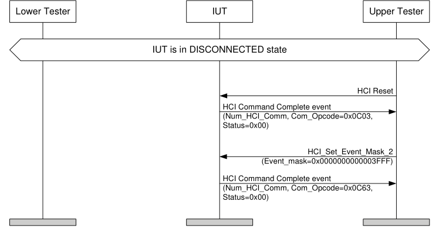

**Figure 4.1: Initialization**

#### 4.1.6 Preambles

##### 4.1.6.1 Physical Link Initiated by IUT Preamble

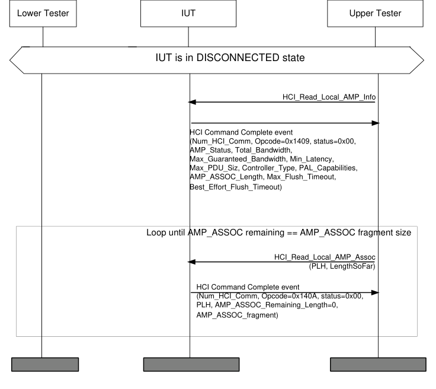

**Figure 4.2: Physical Link Initiated by IUT Preamble**

Upper Tester IUT Lower Tester
Tester

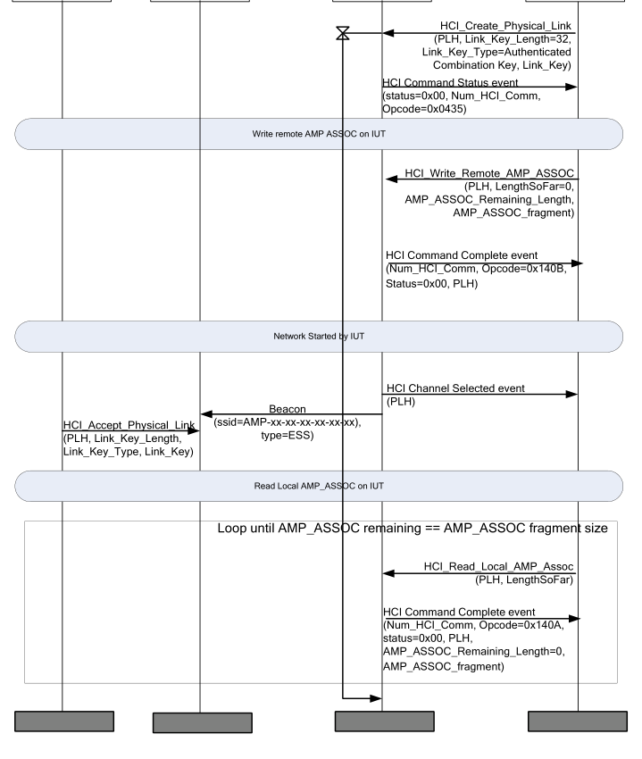

**Figure 4.3: Physical Link Initiated by IUT Preamble**

| Device in Lower Tester IUT Upper Tester Tester Write remote AMP ASSOC on Tester HCI Write Remote AMP _ _ _ ASSOC _ (PLH, LengthSoFar=0, AMP ASSOC Remainin _ _ g Length, _ AMP ASSOC fragment) _ _ HCI Command Complete event (Num _HCI _Comm, Beacon Opcode=0x140B, (ssid=AMP-xx-xx-xx-xx-xx-xx, Status=0x00, PLH) type=ESS) Start Network Activity Probe Request OPT (a1=MA iut, a2=MA tester, _ _ A3=MA iut, _ SSID=AMP<MA IUT>,IEEE IEs) _ _ Probe Response (a1=MA tester, _ a2=MA IUT,a3=MA IUT, IEEE IEs) _ _ _ Authenication Message 1 (a1=MA IUT, _ a2=MA tester,a3=MA IUT,alg=open _ _ system(0)) Authentication Message 2 (a1=MA tester,a2=MA IUT, _ _ a3=MA IUT, status=successful(0)) _ Association Request (a1=MA IUT,s2=MA tester,a3=MA IU _ _ _ T,SSID=AMP-<MA IUT>, IEEE IEs) _ Association Response (a1=MA tester,a2=MA IUT, _ _ a3=MA IUT, _ RSNA Authentication1 (4ADDR hdr, AMP LLC, _ EAPOL frame 1) RSNA Authentication2 (4ADDR hdr, AMP LLC, _ EAPOL frame 2) RSNA Authentication3 (4ADDR hdr, AMP LLC, _ EAPOL frame 3) RSNA Authentication4 (4ADDR hdr, AMP LLC, HCI Physical Link Complete event EAP_ OL frame 4) (status=0x00, PLH) | Upper Tester |  |  |
| --- | --- | --- | --- |
|  |  |  |  |
|  |  | O | PT |

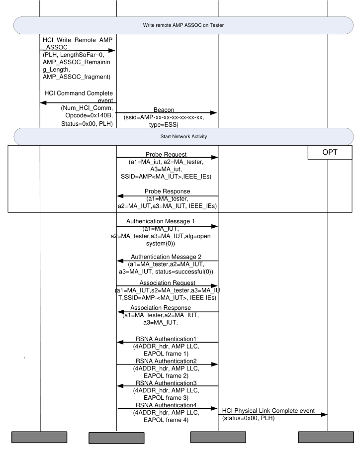

**Figure 4.4: Physical Link Initiated by IUT Preamble**

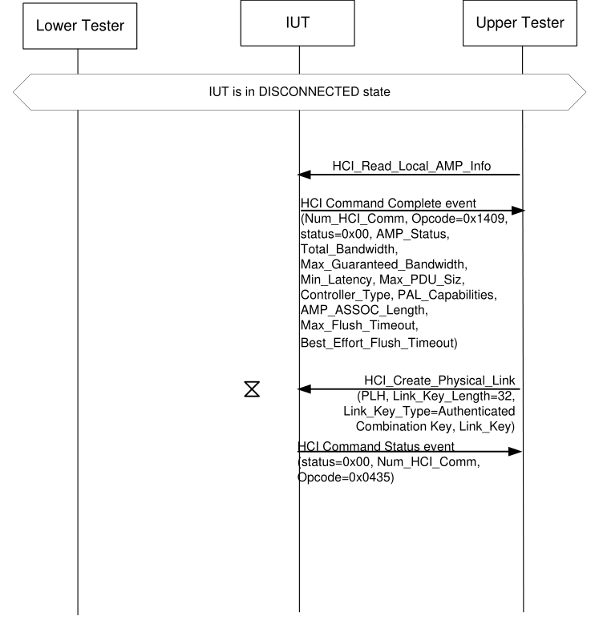

**Figure 4.5: Preamble for establishment of Logical Link initiated by IUT**

| Lower Tester IUT Upper Tester Write remote AMP ASSOC on IUT Loop until AMP ASSOC remaining == AMP ASSOC fragment size _ _ HCI Write Remote AMP ASSOC _ _ _ _ (PLH, LengthSoFar, AMP ASSOC Remaining Length, _ _ _ AMP ASSOC fragment) _ _ HCI Command Complete event (Num HCI Comm, Opcode=0x140B, _ _ Status=0x00, PLH) Network Started by IUT HCI Channel Selected event (PLH) Beacon (ssid=AMP-xx-xx-xx-xx-xx-xx, type=ESS) Read Local AMP ASSOC on IUT _ Loop until AMP ASSOC remaining == AMP ASSOC fragment size _ _ HCI Read Local AMP Assoc _ _ _ _ (PLH, LengthSoFar) HCI Command Complete event (Num HCI Comm, Opcode=0x140A, _ _ status=0x00, PLH, AMP ASSOC Remaining Length=0, _ _ _ AMP ASSOC fragment) _ _ Beacon (ssid=AMP-xx-xx-xx-xx-xx-xx, type=ESS) Networks started |  |  |  | Upper Tester |  |
| --- | --- | --- | --- | --- | --- |
|  |  |  |  |  |  |
|  |  | Write remote AM | P ASSOC on IUT |  |  |
|  |  |  |  |  |  |
|  | Loop | until AMP ASSOC remaining _ | == AMP ASSOC fragment size _ HCI Write Remote AMP ASSOC _ _ _ _ (PLH, LengthSoFar, AMP ASSOC Remaining Length, _ _ _ AMP ASSOC fragment) _ _ HCI Command Complete event (Num HCI Comm, Opcode=0x140B, _ _ Status=0x00, PLH) |  |  |
|  |  | Network S IU Beacon (ssid=AMP-xx-xx-xx-xx-xx-xx, type=ESS) | tarted by T HCI Channel Selected event (PLH) |  |  |
|  |  | Read Local AMP | ASSOC on IUT _ |  |  |
|  |  |  |  |  |  |
|  | Loop | until AMP ASSOC remaining _ | == AMP ASSOC fragment size _ HCI Read Local AMP Assoc _ _ _ _ (PLH, LengthSoFar) HCI Command Complete event (Num HCI Comm, Opcode=0x140A, _ _ status=0x00, PLH, AMP ASSOC Remaining Length=0, _ _ _ AMP ASSOC fragment) _ _ |  |  |
|  |  | Beacon (ssid=AMP-xx-xx-xx-xx-xx-xx, type=ESS) |  |  |  |
|  |  | Networks started |  |  |  |
|  |  |  |  |  |  |

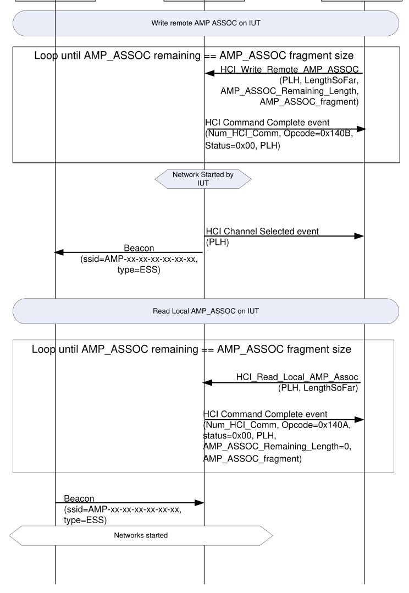

**Figure 4.6: Preamble for establishment of Logical Link initiated by IUT**

Upper Tester IUT Lower Tester

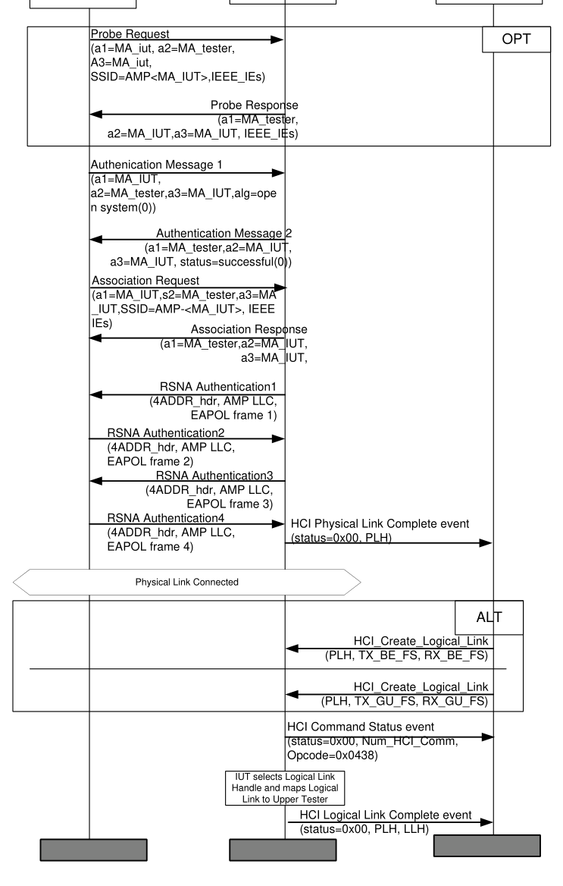

**Figure 4.7: Preamble for establishment of Logical Link initiated by IUT**

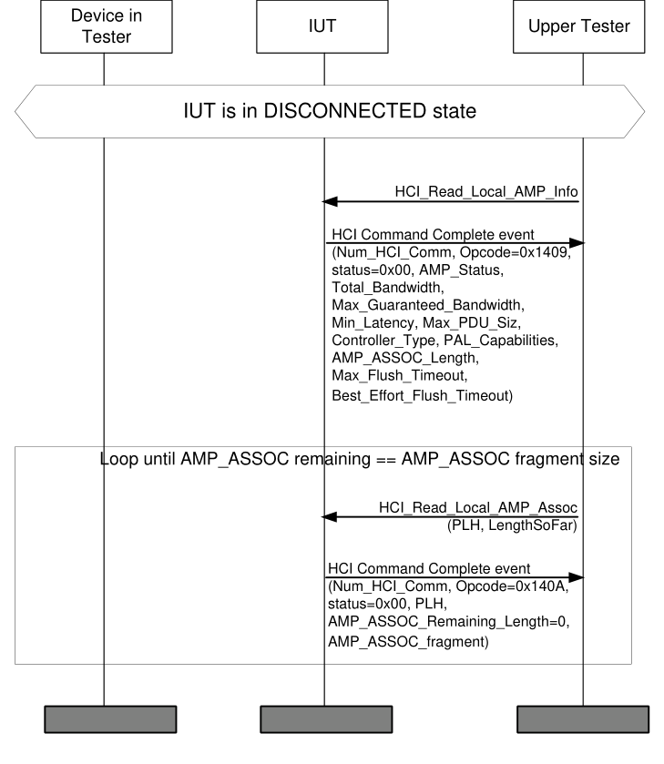

**Figure 4.8: Preamble for Reading Local AMP Info and Local AMP ASSOC**

##### 4.1.6.4 Preamble for Establishing 2 Physical Links with a best effort logical link on each

Run 4.1.6.2 using the BE logical link option before this procedure.
When executing the following procedure, the tester uses a different MAC address in the AMP_ASSOC and in the address fields of 802.11 headers to that used in preamble 4.1.6.2.

| Lower Tester IUT Upper Tester Physical Link initiated by IUT Preamble HCI Create Physical Link _ _ _ (PLH2, Link Key Length, Link Key Type, _ _ _ _ Link Key) _ HCI Command Status event (status=0x00, Num HCI Comm, _ _ Opcode=0x0435) Write remote AMP ASSOC on IUT (note 1) LOOP remaining length > fragment lenth _ _ HCI Write Remote AMP ASSOC _ _ _ _ (PLH2, LengthSoFar=0, AMP ASSOC Remaining Length, _ _ _ AMP ASSOC fragment) _ _ HCI Command Complete event (Num HCI Comm, Opcode=0x140B, _ _ Status=0x00, PLH2) HCI Channel Selected event (PLH2) LOOP remaining length > fragment lenth _ _ HCI Read Local AMP Assoc _ _ _ _ (PLH2, length so far =0) HCI Command Complete event (Num HCI Comm, OpCode=0x140A, _ _ status=0x02, PLH2, AMP Assoc Remaining Length, _ _ _ AMP Assoc Fragment) _ _ Probe Request OPT (a1=MA iut, a2=MA tester, _ _ A3=MA iut, _ SSID=AMP<MA IUT>,IEEE IEs) _ _ Probe Response (a1=MA tester, a2=MA IUT,a3=MA IUT, _ _ _ IEEE IEs) _ Authenication Message 1 (a1=MA IUT, _ a2=MA tester,a3=MA IUT,alg=open _ _ system(0)) Authentication Message 2 (a1=MA tester,a2=MA IUT, a3=MA IUT, _ _ _ status=successful(0)) Association Request (a1=MA IUT,s2=MA tester,a3=MA IUT _ _ _ ,SSID=AMP-<MA IUT>, IEEE IEs) _ Association Response (a1=MA tester,a2=MA IUT, a3=MA IUT, _ _ _ RSNA Authentication1 (4ADDR hdr, AMP LLC, EAPOL _ frame 1) RSNA Authentication2 (4ADDR hdr, AMP LLC, _ EAPOL frame 2) RSNA Authentication3 (4ADDR hdr, _ AMP LLC, EAPOL frame 3) RSNA Authentication4 HCI Physical Link Complete event (4ADDR hdr, AMP LLC, EAPOL _ (status=0x00, PLH2) frame 4) HCI Create Logical Link _ _ _ (PLH, TX BE FS, RX BE FS) _ _ _ _ HCI Command Status event (status=0x00, Num HCI Comm, _ _ Opcode=0x0438) HCI Logical Link Complete event (status=0x00, PLH, LLH) |  |  |  |  | Upper Tester |  |  |
| --- | --- | --- | --- | --- | --- | --- | --- |
|  | Physical Link initiated |  |  | by IUT Preamble |  |  |  |
|  | Write remote AMP A ( |  |  | HCI Create Physical Link _ _ _ (PLH2, Link Key Length, Link Key Type, _ _ _ _ Link Key) _ HCI Command Status event (status=0x00, Num HCI Comm, _ _ Opcode=0x0435) SSOC on IUT (note 1) |  |  |  |
|  |  |  |  |  |  |  |  |
|  |  |  | te AMP A |  |  |  |  |
|  |  |  |  |  |  |  |  |
|  |  |  | ( | LOOP remaining length > fragment lent _ _ |  |  | h |
|  |  |  |  | HCI Write Remote AMP ASSOC _ _ _ _ (PLH2, LengthSoFar=0, AMP ASSOC Remaining Length, _ _ _ AMP ASSOC fragment) _ _ HCI Command Complete event Num HCI Comm, Opcode=0x140B, _ _ Status=0x00, PLH2) |  |  |  |
|  |  |  |  | HCI Channel Selected event (PLH2) |  |  |  |
|  |  |  |  | LOOP remaining length > fragment len _ _ |  |  | th |
|  |  |  |  | HCI Read Local AMP Assoc _ _ _ _ (PLH2, length so far =0) HCI Command Complete event (Num HCI Comm, OpCode=0x140A, _ _ status=0x02, PLH2, AMP Assoc Remaining Length, _ _ _ AMP Assoc Fragment) _ _ |  |  |  |
|  |  |  |  |  |  |  |  |
|  | Probe Request |  | ponse IUT, _ IEs) _ | OPT |  | OPT |  |
|  | (a1=MA iut, a2=MA tester, _ _ A3=MA iut, _ SSID=AMP<MA IUT>,IEEE IEs) _ _ Probe Res (a1=MA tester, a2=MA IUT,a3=MA _ _ IEEE |  |  |  |  |  |  |
|  |  |  |  |  |  |  |  |
|  | Authenication Message 1 |  | n sage 2 |  |  |  |  |
|  | (a1=MA IUT, _ a2=MA tester,a3=MA IUT,alg=ope _ _ system(0)) Authentication Mes (a1=MA tester,a2=MA IUT, a3=M _ _ status=succes Association Request |  |  |  |  |  |  |
|  |  |  | A IUT, _ sful(0)) UT espons |  |  |  |  |
|  | (a1=MA IUT,s2=MA tester,a3=MA I _ _ _ ,SSID=AMP-<MA IUT>, IEEE IEs) _ Association R (a1=MA tester,a2=MA IUT, a3= _ _ RSNA Authentica (4ADDR hdr, AMP LLC, E _ fra RSNA Authentication2 |  |  |  |  |  |  |
|  |  |  | MA IU _ tion1 |  |  |  |  |
|  |  |  | APOL me 1) R hdr, |  |  |  |  |
|  | (4ADDR hdr, AMP LLC, _ EAPOL frame 2) RSNA Authentication3 (4ADD AMP LLC, EAPOL fra RSNA Authentication4 |  |  |  |  |  |  |
|  |  |  |  |  |  |  |  |

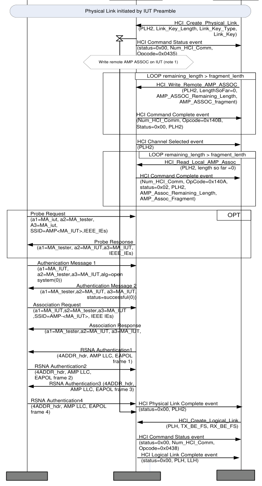

**Figure 4.9: Preamble for Establishing 2 Physical Links with a best effort logical link on each**

Run 4.1.6.2 using the BE logical link option before this procedure.

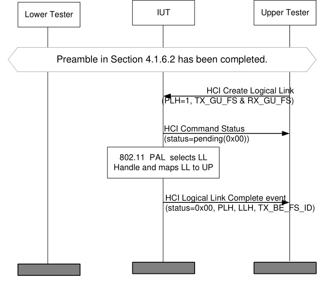

**Figure 4.10: Preamble for establishing a physical link with a best effort and guaranteed logical link**

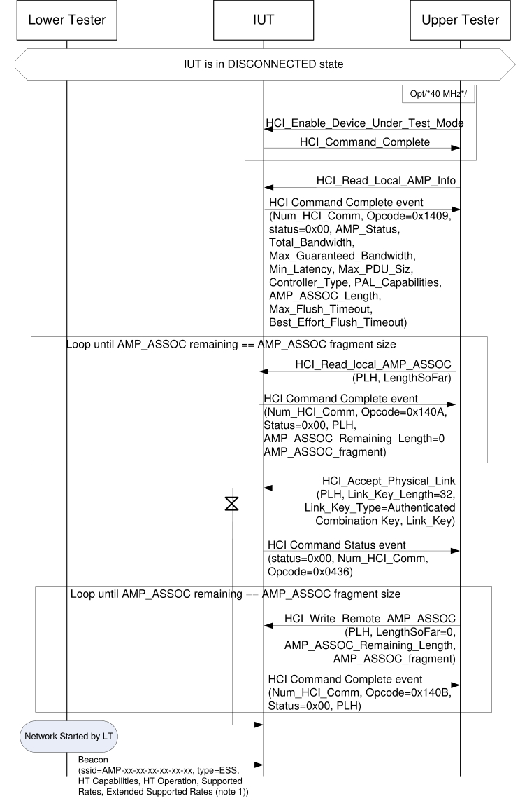

**Figure 4.11: Preamble for Starting an HT Physical and Logical Link**

Upper Tester IUT Lower Tester

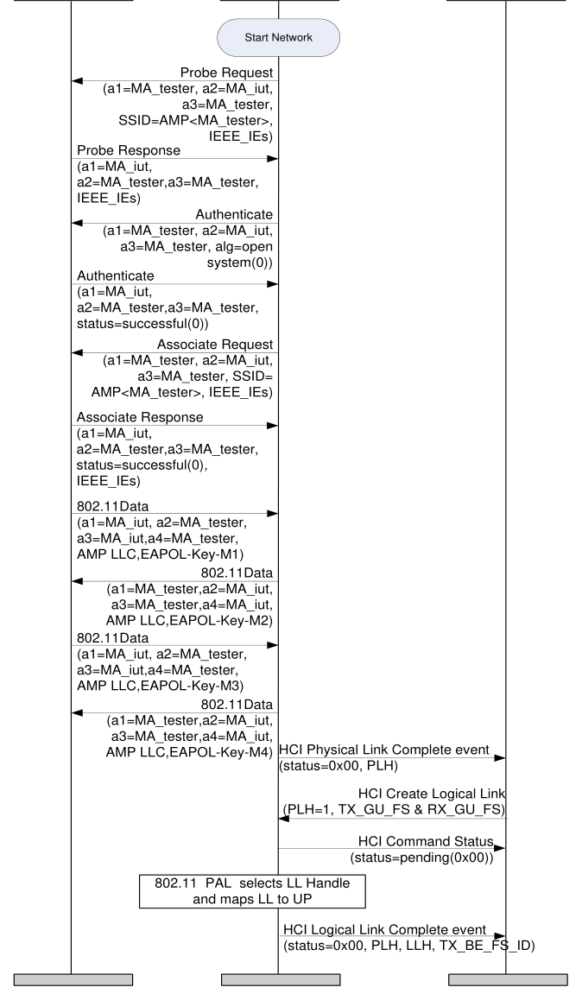

**Figure 4.12: Preamble for Starting an HT Physical and Logical Link**

Note 1: Include 11n rate in BSSBasicRateSet.

### 4.2 Discovery Tests (DI)

#### 4.2.1 AMP Information

80211PAL/DI/AI/BV-01-C [Read local AMP info]
• Test Purpose
Verify that the IUT returns valid local AMP info when requested.
• Reference
[2] 2.2
• Initial Condition
- The IUT is initialized (see Section 4.1.5) and in the DISCONNECTED state.
• Test Procedure

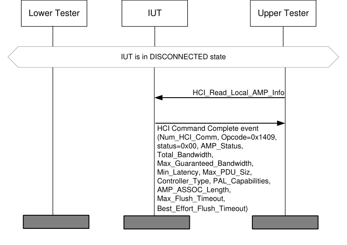

**Figure 4.13: 80211PAL/DI/AI/BV-01-C [Read local AMP info]**

• Expected Outcome
Pass verdict
The Upper Tester receives HCI command complete event from the IUT.
Verify that the Controller_Type return parameter is of type 802.11 (0x01).
Validate individual parameters returned in the command complete event. The parameters returned contain the following:
- Status: 0x00 (success).
- Total Bandwidth: Does not exceed the technology maximum application throughput. For this document this is deemed to be 30000 kbps.
- Max Guaranteed Bandwidth: A value less than or equal to Total Bandwidth.
- Max PDU Size: Is Max80211PALPDUSize as defined in [2].
- Controller type: 802.11 (0x01).
- PAL Capabilities: If ICS Item 7 (Guaranteed Logical Links) is declared then bit 0 =1 else bit 0 = 0. All other bits are 0.
- AMP Assoc Length: Max80211AMPASSOCLen as defined in [2].
- Max Flush Timeout: Any value 0 to 4294967295.
- Best Effort Flush Timeout: Any value 0 to 4294967295.
80211PAL/DI/AI/BV-02-C [Read Local AMP Info on HT device, guaranteed logical links not supported]
• Test Purpose
Verify that the IUT returns valid local AMP info when requested.
• Reference
[2] 2.2
• Initial Condition
- The IUT is initialized (see Section 4.1.5) and in the DISCONNECTED state.
• Test Procedure

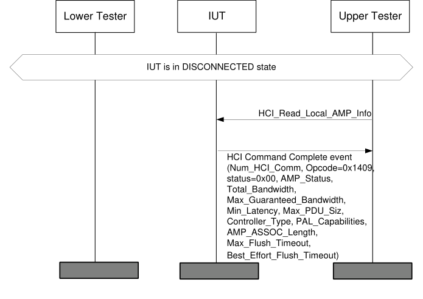

**Figure 4.14: 80211PAL/DI/AI/BV-02-C [Read Local AMP Info on HT device, guaranteed logical links not supported]**

• Expected Outcome
Pass verdict
The Upper Tester receives HCI command complete event from the IUT.
Verify that the Controller_Type return parameter is of type 802.11 (0x01).
Validate individual parameters returned in the command complete event. The parameters returned contain the following:
- Status: 0x00 (success).
- Total Bandwidth: Does not exceed the technology maximum application throughput. For the HT PHY this is 50000 kbps.
- Max Guaranteed Bandwidth: A value less than or equal to Total Bandwidth.
- Min Latency: A value >= AIFS[n] +CWmin.
- AIFS[n] and CWmin values are defined in [5].
- Max PDU Size: Is Max80211PALPDUSize as defined in [2].
- Controller type: 802.11 (0x01).
- PAL Capabilities: All bits are 0.
- AMP Assoc Length: Max80211AMPASSOCLen as defined in [2].
- Max Flush Timeout: Any value 0 to 4294967295.
- Best Effort Flush Timeout: Any value 0 to 4294967295.
80211PAL/DI/AI/BV-03-C [Read Local AMP Info on HT device, guaranteed logical links supported]
• Test Purpose
Verify that the IUT returns valid local AMP info when requested.
• Reference
[2] 2.2
• Initial Condition
- The IUT is initialized (see Section 4.1.5) and in the DISCONNECTED state.
• Test Procedure

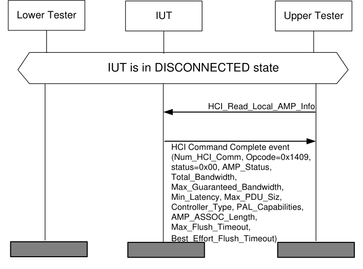

**Figure 4.15: 80211PAL/DI/AI/BV-03-C [Read Local AMP Info on HT device, guaranteed logical links supported]**

• Expected Outcome
Pass verdict
The Upper Tester receives HCI command complete event from the IUT.
Verify that the Controller_Type return parameter is of type 802.11 (0x01).
Validate individual parameters returned in the command complete event. The parameters returned contain the following:
- Status: 0x00 (success).
- Total Bandwidth: Does not exceed the technology maximum application throughput. For the HT PHY this is 50000 kbps.
- Max Guaranteed Bandwidth: A value less than or equal to Total Bandwidth.
- Min Latency: A value >= AIFS[n] +CWmin.
- AIFS[n] and CWmin values are defined in [5].
- Max PDU Size: Is Max80211PALPDUSize as defined in [2].
- Controller type: 802.11 (0x01).
- PAL Capabilities: Bit 0 is 1. All other bits are 0.
- AMP Assoc Length: Max80211AMPASSOCLen as defined in [2].
- Max Flush Timeout: Any value 0 to 4294967295.
- Best Effort Flush Timeout: Any value 0 to 4294967295.

#### 4.2.2 AMP ASSOC

80211PAL/DI/AA/BV-01-C [Read local AMP ASSOC, no Physical Link]
• Test Purpose
Verify that valid results are returned in response to the IUT issuing an HCI Read Local AMP ASSOC command.
• Reference
[2] 2.14.1
[4] 7.5.9
• Initial Condition
- The IUT is initialized (see Section 4.1.5) and in the DISCONNECTED state.
• Test Procedure

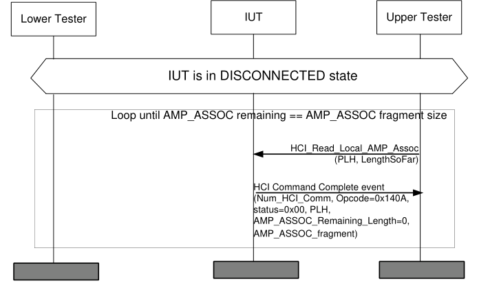

**Figure 4.16: 80211PAL/DI/AA/BV-01-C [Read local AMP ASSOC, no Physical Link]**

• Test Condition
The LengthSoFar parameter starts at 0 and increments by the previous ASSOC fragment size on each iteration.
• Expected Outcome
Pass verdict
Command complete event(s) contain the complete AMP_ASSOC.
Acceptable data fields in the AMP_ASSOC are those defined in 2.10 of [2].
The AMP_ASSOC contains the mandatory parameters:
- MAC Address: Matches the MAC address of the IUT.
- Preferred channel list: Contains at least one channel from 1 to 13 according to the format specified in [2], Section 3.2.3. May contain multiple channels.
- The PAL version TLV contain a PAL version value of 0x01.
AMP_ASSOC may also contain the following optional fields:
- Connected channel list: may contain at least one channel from 1 to 13 according to the format specified in [2], section 3.2.3. May contain multiple channels.
- 802.11 PAL Capabilities: Support of activity reporting and scheduling match the declaration in the ICS.
If ICS Item 6 (Activity Reports) is declared, bit 0 is 1, else bit 0 is 0.
If ICS Item 7 (Activity Report Scheduling) is declared, bit 1 must be 1 else bit 1 must be 0.
80211PAL/DI/AA/BV-02-C [Write Remote AMP ASSOC]
• Test Purpose
Write Remote AMP ASSOC command is properly accepted by IUT.
• Reference
[1] 2.10.1
[4] 7.5.10
• Initial Condition
- The IUT is initialized and in the DISCONNECTED state. The local AMP Info and local AMP_ASSOC have been read using the preamble in Section 4.1.6.3.
• Test Procedure

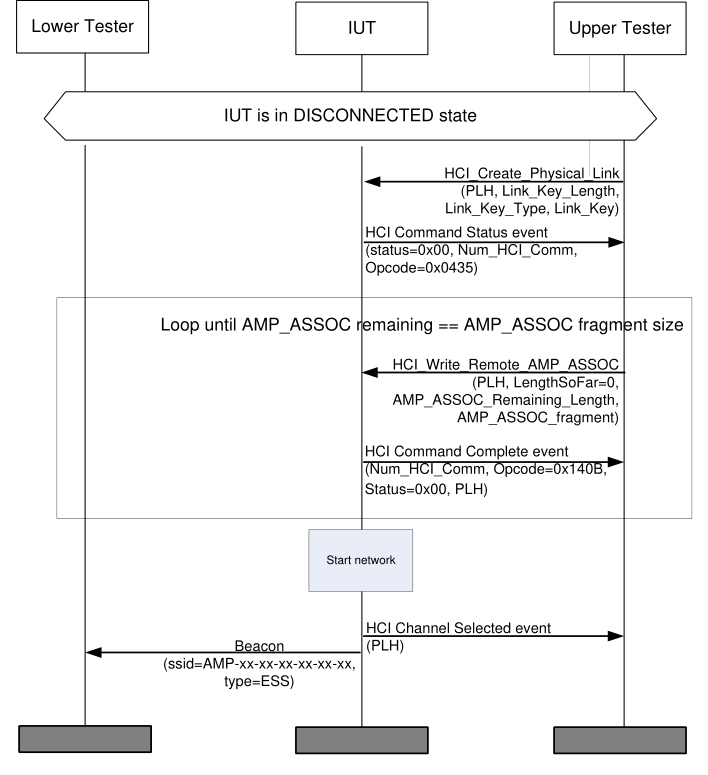

**Figure 4.17: 80211PAL/DI/AA/BV-02-C [Write Remote AMP ASSOC]**

The AMP_ASSOC_fragment parameter in the HCI Write Remote AMP ASSOC command contains only the mandatory TLVs specified below. The AMP_ASSOC contains the mandatory parameters:
- MAC Address: Matches the MAC address of the Lower Tester.
- Preferred channel list: Contains channel from 1 to 11 according to the format specified in [2], Section 3.2.3.
- PAL Version with a version of 0x01.
• Expected Outcome
Pass verdict
Command complete event in response to HCI Write Remote AMP ASSOC has a status of 0x00.
HCI Channel Selected event contains the Physical Link Handle value from the HCI Create Physical Link command
Beacons are received with:
- SSID set to 'AMP-xx-xx-xx-xx-xx-xx' (with no null termination and no quotes) where the "x" characters are replaced by the lowercase hexadecimal characters of the MAC address of the IUT.
- EDCA parameter set presence is consistent with QoS support option. RSNA information element is present.
- Capability Information field with ESS subfield set to 1 and IBSS subfield set to 0.
80211PAL/DI/AA/BI-01-C [Write remote AMP ASSOC, unsupported IE token]
• Test Purpose
Verify that the IUT ignores an unsupported IE from a remote device in an AMP ASSOC.
• Reference
[1] 2.10.1
[4] 7.5.10
• Initial Condition
- The IUT is initialized and in the DISCONNECTED state. The local AMP Info and local AMP_ASSOC have been read using the preamble in Section 4.1.6.3.
• Test Procedure

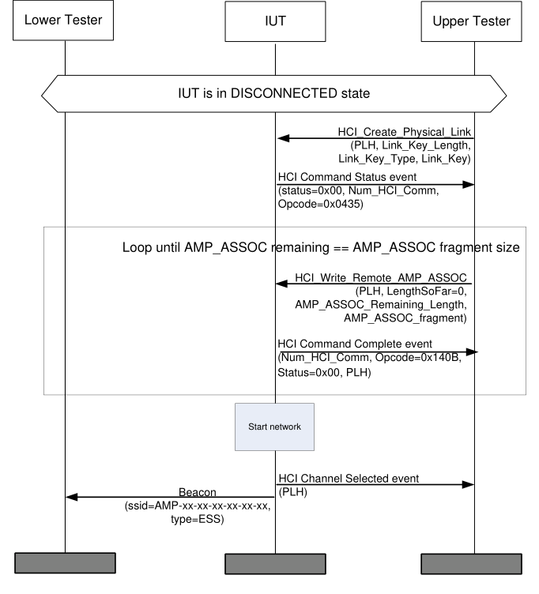

**Figure 4.18: 80211PAL/DI/AA/BI-01-C [Write remote AMP ASSOC, unsupported IE token]**

The AMP_ASSOC_fragment parameter in the HCI Write Remote AMP ASSOC command contains an invalid TLV formatted as given below. This TLV is the first TLV in the list of otherwise valid TLVs in the AMP_ASSOC.

|  | Tag |  |  | Length |  |  | Value |  |
| --- | --- | --- | --- | --- | --- | --- | --- | --- |
| Any reserved value for the PAL version under test |  |  | 0x10 |  |  | 000102030405060708090A0B0C0D0E0F |  |  |

• Expected Outcome
Pass verdict
Command complete event in response to the HCI Write Remote AMP ASSOC command has a status of 0x00.
HCI Channel Selected event contains the Physical Link Handle value from the HCI Create Physical Link command.
Beacons are received with:
- SSID set to ‘AMP-xx-xx-xx-xx-xx-xx’ (with no null termination and no quotes) where the “x” characters are replaced by the lowercase hexadecimal characters of the MAC address of the IUT.
- EDCA parameter set presence is consistent with QoS support option. RSNA information element is present.
- Capability Information field with ESS subfield set to 1 and IBSS subfield set to 0.
80211PAL/DI/AA/BI-02-C [Read local AMP ASSOC, invalid physical link]
• Test Purpose
Verify that the IUT rejects a valid HCI Read Local AMP ASSOC issued by the IUT for an invalid Physical_Link_Handle.
• Reference
[4] 7.5.9
• Initial Condition
- The IUT is initialized and in the DISCONNECTED state. The local AMP Info and local AMP_ASSOC have been read using the preamble in Section 4.1.6.3.
• Test Procedure

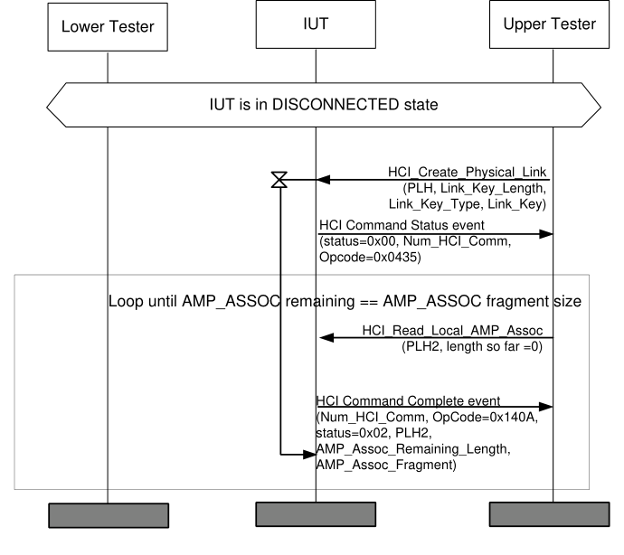

**Figure 4.19: 80211PAL/DI/AA/BI-02-C [Read local AMP ASSOC, invalid physical link]**

• Test Condition
PLH2 is distinct from PLH and is not to be 0.
• Expected Outcome
Pass verdict
Status field in HCI Command Complete event contains error code 0x02 for Unknown Connection Identifier.
80211PAL/DI/AA/BI-03-C [Write remote AMP ASSOC, invalid length of TLV]
• Test Purpose
Verify that the IUT rejects Write_Remote_AMP_ASSOC with invalid length of one its TLVs.
• Reference
[2] 2.14.1
[4] 7.5.9
• Initial Condition
- The IUT is in the DISCONNECTED state. The local AMP Info and local AMP_ASSOC have been read using the preamble in Section 4.1.6.3.
• Test Procedure

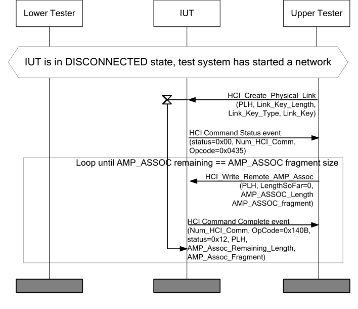

**Figure 4.20: 80211PAL/DI/AA/BI-03-C [Write remote AMP ASSOC, invalid length of TLV]**

The Upper Tester creates a TLV with the following format:

|  | Tag |  | Length |  |  | Value |  |
| --- | --- | --- | --- | --- | --- | --- | --- |
| 0x01 (MAC address) |  | 7 |  |  | 00010203040506 |  |  |

This TLV is used as the MAC address TLV in the AMP_ASSOC parameter in the HCI Write Remote AMP ASSOC command.
• Expected Outcome
Pass verdict
Status field contains Error Code 0x12 (Invalid HCI Command Parameters).
80211PAL/DI/AA/BV-03-C [Read Local AMP ASSOC, Activity Reports declared]
• Test Purpose
Verify that valid results are returned in response to the IUT issuing an HCI Read Local AMP ASSOC command.
• Reference
[2] 2.14.1
[4] 7.5.9
• Initial Condition
• Test Procedure

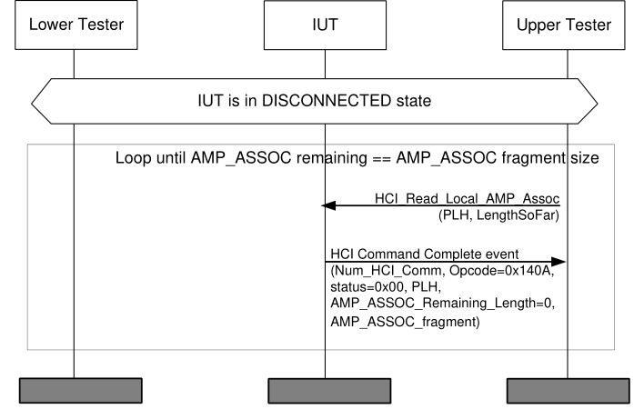

**Figure 4.21: 80211PAL/DI/AA/BV-03-C [Read Local AMP ASSOC, Activity Reports declared]**

• Test Condition
The LengthSoFar parameter starts at 0 and increments by the previous ASSOC fragment size on each iteration.
• Expected Outcome
Pass verdict
Command complete event(s) contain the complete AMP_ASSOC.
Acceptable data fields in the AMP_ASSOC are those defined in 2.10 of [2].
The AMP_ASSOC contains the mandatory parameters:
- MAC Address: Matches the MAC address of the IUT.
- Preferred channel list TLV: Contains at least one channel according to the format specified in [2], Section 3.2.3. May contain multiple channels.
- The PAL version TLV contains a PAL version value of 0x01.
- 802.11 PAL Capabilities: Bit 0 is 1.
AMP_ASSOC may also contain the following optional fields:
- Connected channel list: may contain at least one channel according to the format specified in [2], section 3.2.3. May contain multiple channels.
80211PAL/DI/AA/BV-04-C [Read Local AMP ASSOC, Activity Report Scheduling supported]
• Test Purpose
Verify that valid results are returned in response to the IUT issuing an HCI Read Local AMP ASSOC command.
• Reference
[2] 2.14.1
[4] 7.5.9
• Initial Condition
- The IUT is initialized and in the DISCONNECTED state (see Section 4.1.5).
• Test Procedure

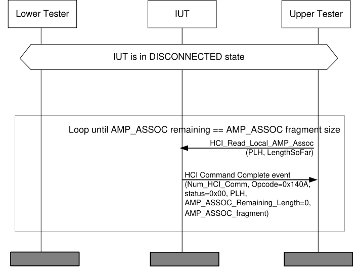

**Figure 4.22: 80211PAL/DI/AA/BV-04-C [Read Local AMP ASSOC, Activity Report Scheduling supported]**

• Test Condition
The LengthSoFar parameter starts at 0 and increments by the previous ASSOC fragment size on each iteration.
• Expected Outcome
Pass verdict
Command complete event(s) contain the complete AMP_ASSOC.
Acceptable data fields in the AMP_ASSOC are those defined in 2.10 of [2].
The AMP_ASSOC contains the mandatory parameters:
- MAC Address: Matches the MAC address of the IUT.
- Preferred channel list TLV: Contains at least one channel according to the format specified in [2], Section 3.2.3. May contain multiple channels.
- The PAL version TLV contains a PAL version value of 0x01.
- 802.11 PAL Capabilities: Bit 1 is 1.
- Connected channel list: may contain at least one channel according to the format specified in [2], section 3.2.3. May contain multiple channels.
80211PAL/DI/AA/BV-05-C [Read Local AMP ASSOC on HT, 40 MHz channel generation]
• Test Purpose
Verify that valid results are returned in response to the IUT issuing an HCI Read Local AMP ASSOC command.
• Reference
[2] 2.14.1
[4] 7.5.9
• Initial Condition
- The IUT is initialized and in the DISCONNECTED state (see Section 4.1.5).
• Test Procedure

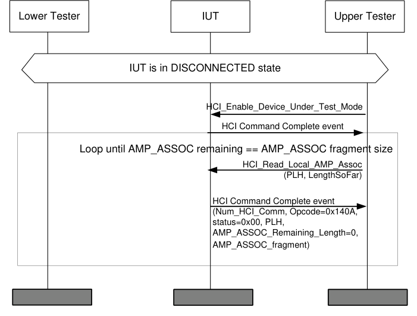

**Figure 4.23: 80211PAL/DI/AA/BV-05-C [Read Local AMP ASSOC on HT, 40 MHz channel generation]**

• Test Condition
The LengthSoFar parameter starts at 0 and increments by the previous ASSOC fragment size on each iteration.
• Expected Outcome
Pass verdict
Command complete event(s) contain the complete AMP_ASSOC.
Acceptable data fields in the AMP_ASSOC are those defined in Section 2.10 of [2].
- MAC Address: Matches the MAC address of the IUT.
- Preferred channel list v2 TLV: Contains at least one 40 MHz channel in 5 GHz according to the format specified in [2], Section 3.2.3. May contain multiple channels.
- 802.11 PAL Capabilities: bit 2 must be set to 1.
- The PAL version TLV contains a PAL version value of 0x01.
AMP_ASSOC may also contain the following optional fields:
- Connected channel list: may contain at least one channel according to the format specified in [2], section 3.2.3. May contain multiple channels.
80211PAL/DI/AA/BV-06-C [Write Remote AMP ASSOC, 40 MHz channel parsing]
• Test Purpose
When configured with the Enable Device Under Test Mode and presented with a PCLv2 with at least one 40 MHz channel, verify that the IUT initiator selects a 40 MHz channel.
• Reference
[1] 2.10.1
[4] 7.5.10
• Initial Condition
- The IUT is initialized and in the DISCONNECTED state. The local AMP Info and local AMP_ASSOC have been read using the preamble in Section 4.1.6.3.
• Test Procedure

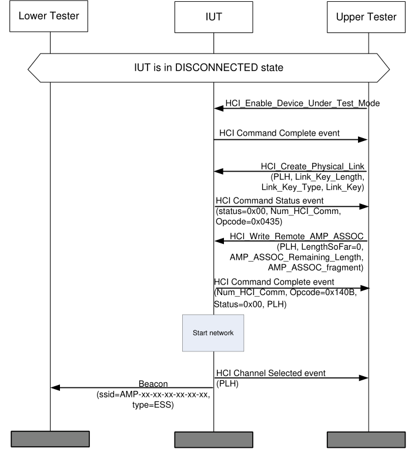

**Figure 4.24: 80211PAL/DI/AA/BV-06-C [Write Remote AMP ASSOC, 40 MHz channel parsing]**

• Test Condition
The AMP_ASSOC parameter in the HCI Write Remote AMP ASSOC command contains the TLVs specified below:
- MAC Address: Matches the MAC address of the IUT.
- Preferred channel list v2 in the Write Remote AMP ASSOC from the Upper Tester contains at least one 40 MHz channel. The Operating Class is 116.
- PAL Version with a version of 0x01.
• Expected Outcome
Pass verdict
Command complete event in response to HCI Write Remote AMP ASSOC has a status of 0x00.
HCI Channel Selected event contains the Physical Link Handle value from the HCI Create Physical Link command.
- SSID set to ‘AMP-xx-xx-xx-xx-xx-xx’ (with no null termination and no quotes) where the “x” characters are replaced by the lowercase hexadecimal characters of the MAC address of the IUT.
- EDCA parameter set and RSNA information element are included in beacons and probe responses.
- Capability Information field with ESS subfield set to 1 and IBSS subfield set to 0.
- Beacon appears on one of the channels, 36 or 44, in Operating Class 116.
- HT Capability and HT Operation elements are included in beacons and Supported Channel Width subfield is set to 1.

#### 4.2.3 AMP Status

80211PAL/DI/ST/BV-01-C [Read Link Quality]
• Test Purpose
Verify that the IUT returns a valid link quality in response to the Upper Tester issuing an HCI Read Link Quality command.
• Reference
[2] 2.5
[4] 7.5.3
• Initial Condition
- Physical Link and logical link established by IUT preamble (see Section 4.1.6.2).
• Test Procedure

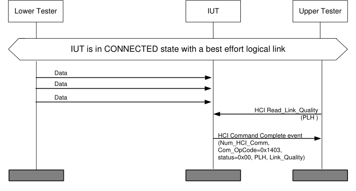

**Figure 4.25: 80211PAL/DI/ST/BV-01-C [Read Link Quality]**

The Lower Tester sends data packets to IUT.
• Expected Outcome
Pass verdict
In the HCI Command Complete event, Status = 0x00, the Handle is the same as the HCI Read Link Quality command and the Link_Quality return parameter contains any value from 0x00 – 0xFF.

### 4.3 Physical Link Tests (PL)

This section tests the creation and deletion of physical links.

#### 4.3.1 Create Physical Links

80211PAL/PL/PLC/BV-01-C [Initiate Physical Link]
• Test Purpose
Verify that the IUT can establish a physical link.
• Reference
[2] 3.1, 3.3.1, 3.3.2
[4] 7.1.37
• Initial Condition
- The IUT is in the DISCONNECTED state. The local AMP Info and local AMP_ASSOC have been read using the preamble in Section 4.1.6.3.
• Test Procedure

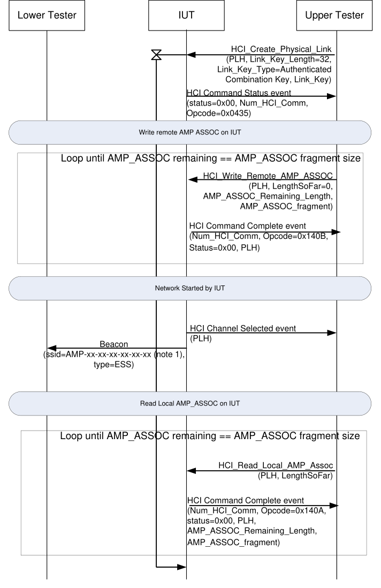

**Figure 4.26: 80211PAL/PL/PLC/BV-01-C [Initiate Physical Link] – MSC Page 1 of 2**

Device in
Upper Tester IUT
Tester

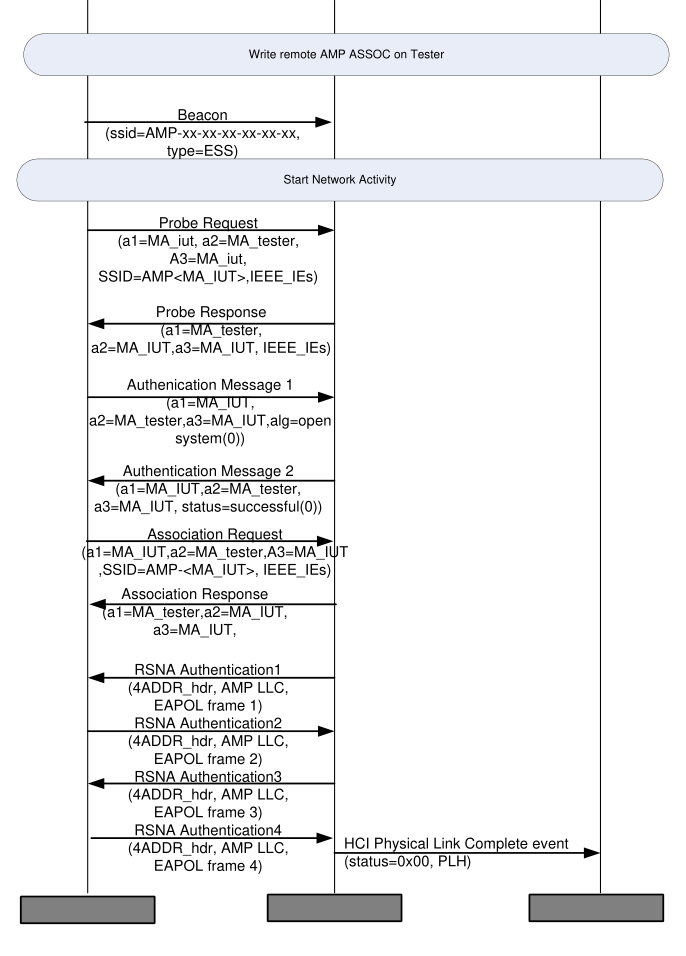

**Figure 4.27: 80211PAL/PL/PLC/BV-01-C [Initiate Physical Link] – MSC Page 2 of 2**

Other 802.11 MAC frames such as data retransmissions, RTS/CTS control frames, Probe Request, and Probe Response may be sent during the connection process. 802.11 Acknowledgements and NULL data frames are not shown in the MSC above.
• Expected Outcome
Pass verdict
The IUT reports the same Physical Link Handle in the HCI Channel Selected event and HCI Physical Link Complete event as was given in the HCI Create Physical Link command.
After sending the HCI Channel Selected event, the IUT correctly reports the selected channel in the HCI Command Complete Event following the HCI Read Local AMP ASSOC command.
A physical link is successfully created, indicated by an HCI Physical Link Complete event with status code of 0x00 being sent to the Upper Tester from the IUT.
80211PAL/PL/PLC/BV-02-C [Accept Physical Link]
• Test Purpose
Verify that the IUT can accept a physical link initiated from a peer and fully establish the physical link.
• Reference
[2] 3.1, 3.3.1, 3.3.2
[4] 7.1.38
• Initial Condition
- The IUT is initialized (see Section 4.1.5) and in the DISCONNECTED state.
• Test Procedure

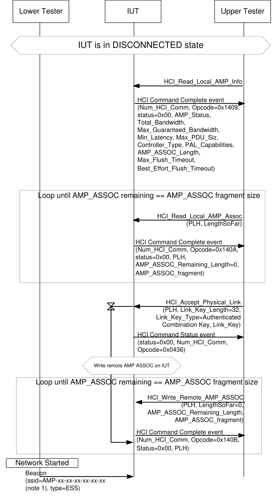

**Figure 4.28: 80211PAL/PL/PLC/BV-02-C [Accept Physical Link] – MSC Page 1 of 2**

Upper Tester IUT Lower Tester

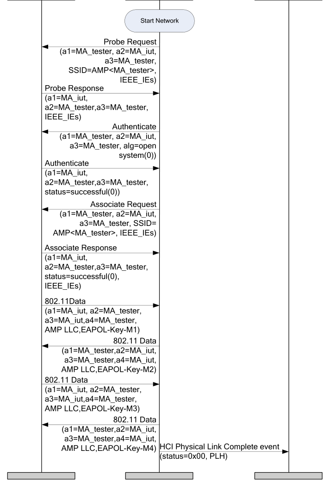

**Figure 4.29: 80211PAL/PL/PLC/BV-02-C [Accept Physical Link] – MSC Page 2 of 2**

Other 802.11 MAC frames such as data retransmissions, RTS/CTS control frames, Probe Request, and Probe Response may be sent during the connection process. 802.11 Acknowledgements and NULL data frames are not shown in the MSC above.
• Expected Outcome
Pass verdict
The IUT reports the same Physical Link Handle as the one used in the Accept Physical Link command in all generated events containing a Physical Link Handle return parameter.
An HCI Physical Link Complete event with status of 0x00 is sent to the Upper Tester from the IUT.

### 802.11 messages are generated by the IUT as shown in the test procedures.

80211PAL/PL/PLC/BV-03-C [Initiate physical link, connection accept timeout]
• Test Purpose
Verify that the IUT returns an HCI Create Physical Link complete with failure event.
• Reference
[2] 3.1, 3.3.1, 3.3.2
• Initial Condition
- The IUT is in the DISCONNECTED state as defined in Section 3.1 Physical Link State Machine of [2].
• Test Procedure

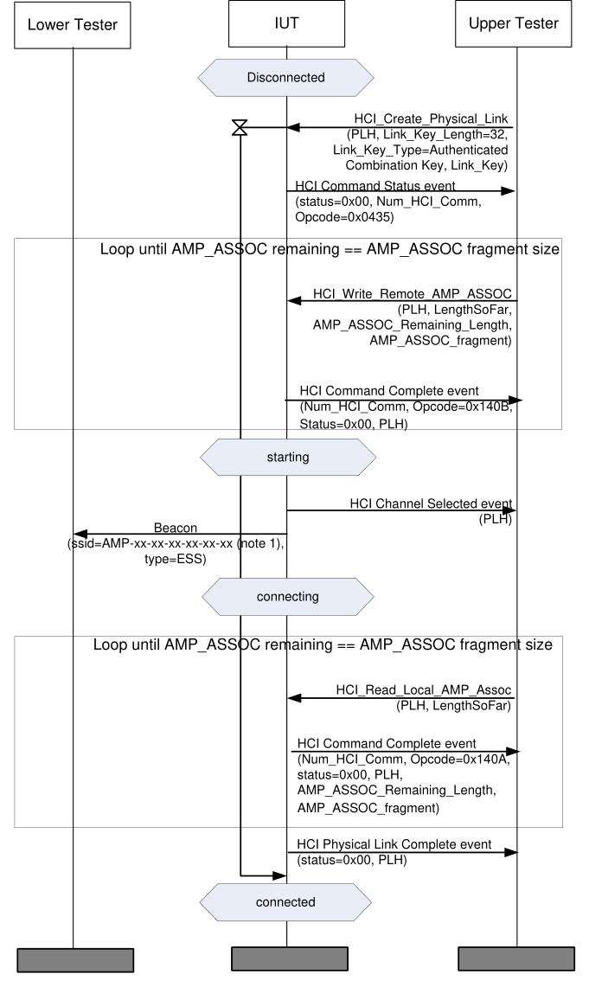

**Figure 4.30: 80211PAL/PL/PLC/BV-03-C [Initiate physical link, connection accept timeout]**

• Expected Outcome
Pass verdict
The IUT reports the same Physical Link Handle used in the HCI Create Physical Link Command in all generated events containing a physical link handle return parameter.
After sending the HCI Channel Selected event, the IUT correctly formats the selected channel in the AMP_ASSOC in the HCI Command Complete event following the HCI Read Local AMP ASSOC command.
The physical link creation fails due to no connection attempt from the Lower Tester. After the connection accept timeout period expires, an HCI Physical Link Complete event with status=0x10 (Connection Accept Timeout) is sent from the IUT to the Upper Tester.
80211PAL/PL/PLC/BV-04-C [Initiate physical link, no compatible channels]
• Test Purpose
Verify that the IUT returns an HCI Create Physical Link Complete event with failure when there are no common usable channels between the peers.
• Reference
[2] 3.1, 3.3.1, 3.3.2
• Initial Condition
- The IUT is in the DISCONNECTED state. The local AMP Info and local AMP_ASSOC have been read using the preamble in Section 4.1.6.3.
• Test Procedure

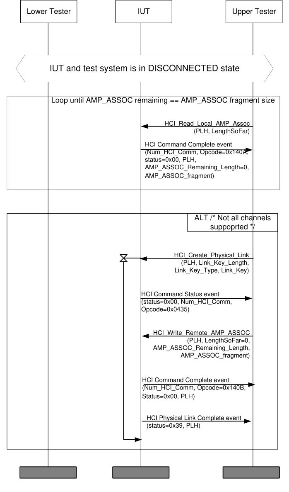

**Figure 4.31: 80211PAL/PL/PLC/BV-04-C [Initiate physical link, no compatible channels]**

The Write Remote AMP ASSOC has a channel that is NOT in the local AMP ASSOC. The Upper Tester should have an inverse channel from local AMP ASSOC.
The IUT reports the same Physical Link Handle in the HCI Physical Link Complete event which was used in the HCI Create Physical Link command.
After the HCI Write_Remote_AMP_ASSOC command, IUT rejects the physical link as there are no compatible channels with an HCI Physical Link Complete event with status=0x39 (Connection Rejected Due to No Suitable Channel Found) ) or 0x0D (DISCONNECTED State).
80211PAL/PL/PLC/BV-05-C [Create Physical Link, second physical link]
• Test Purpose
Verify that the IUT can create a second physical link on the same 802.11 channel.
• Reference
[2] 3.1, 3.3.1, 3.3.2
• Initial Condition
- The IUT has completed the procedure outlined in Section 4.1.5.
• Test Procedure

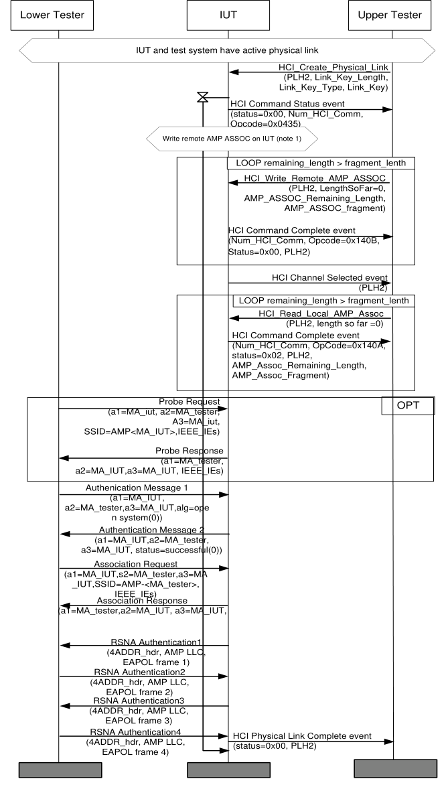

**Figure 4.32: 80211PAL/PL/PLC/BV-05-C [Create Physical Link, second physical link]**

Note 1: The AMP ASSOC given to the IUT in the HCI Write_Remote_AMP_ASSOC command contains a preferred channel list containing only the channel of the first physical link. It contains a MAC address different from that of the first physical link.
• Expected Outcome
Pass verdict
The IUT uses the same Physical Link Handle used in the second HCI Create Physical Link command
in the HCI Channel Selected event and HCI Physical Link Complete event.
The IUT sends the HCI Command Status event in response to the HCI Create Physical Link
command prior to the connection accept timeout.
After sending the HCI Channel Selected event, the IUT reports the selected channel in the HCI
Command Complete Event following the HCI Read Local AMP ASSOC.
The IUT returns HCI Physical Link Complete event with a status parameter of success prior to the
expiration of the connection accept timeout.
80211PAL/PL/PLC/BI-01-C [Reject physical link from other AMP devices]
• Test Purpose
Verify that the IUT does not accept a physical link from an AMP device that was not specified in the remote AMP ASSOC exchange.
• Reference
[2] 3.3.4
• Initial Condition
- The IUT is in the DISCONNECTED state. The local AMP Info and local AMP_ASSOC have been read using the preamble in Section 4.1.6.3.
- The following TLVs are used in the AMP_ASSOC parameter to the HCI Write Remote AMP ASSOC command.

|  | Type |  |  | Length |  |  | Value |  |
| --- | --- | --- | --- | --- | --- | --- | --- | --- |
| 0x01 – MAC address |  |  | 6 |  |  | Any address not matching the address of Lower Tester |  |  |
| 0x02 – Preferred channel list |  |  | 6 |  |  | {‘XXX’, 201, 254, 0} |  |  |

• Test Procedure

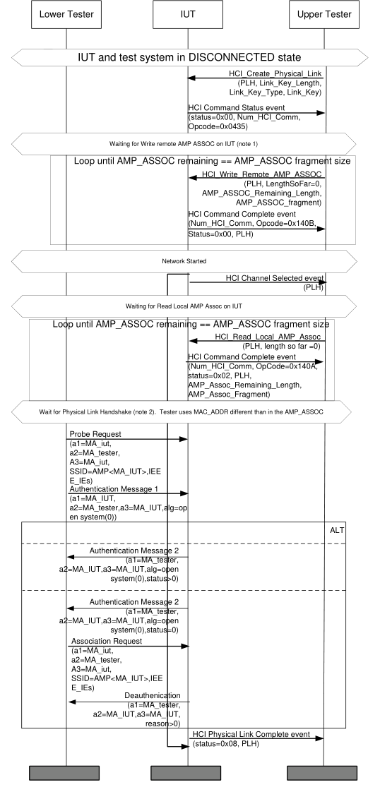

**Figure 4.33: 80211PAL/PL/PLC/BI-01-C [Reject physical link from other AMP devices]**

Note 1: The peer MAC address in the AMP ASSOC is different from that of the Lower Tester MAC.
Note 2: This is the 802.11 message sequence as defined in 80211PAL/PL/PLC/BV-01-C but with the Rx address in the messages from the tester different to that in the write remote AMP ASSOC to the IUT.
• Expected Outcome
Pass verdict
The IUT reports the same Physical Link Handle in the HCI Physical Link Complete event which was
used in the HCI Create Physical Link command.
After sending the HCI Channel Selected event, the IUT reports a selected channel that is common to
the Preferred Channel list of the local and remote AMP_ASSOCs.
The IUT sends an HCI Physical Link Complete event with status of 0x10 (Connection Accept
Timeout).
• Notes
The IUT may not generate responses to 802.11 authentication frame.
80211PAL/PL/PLC/BV-06-C [Initiate Physical link on HT device]
• Test Purpose
Verify that the initiating IUT can establish a physical link when it is an HT capable device and the responding device is an HT capable device.
• Reference
[2] 3.1, 3.3.1, 3.3.2
[4] 7.1.37
• Initial Condition
- The IUT is in the DISCONNECTED state. The local AMP Info and local AMP_ASSOC have been read using the preamble in Section 4.1.6.3.
• Test Procedure

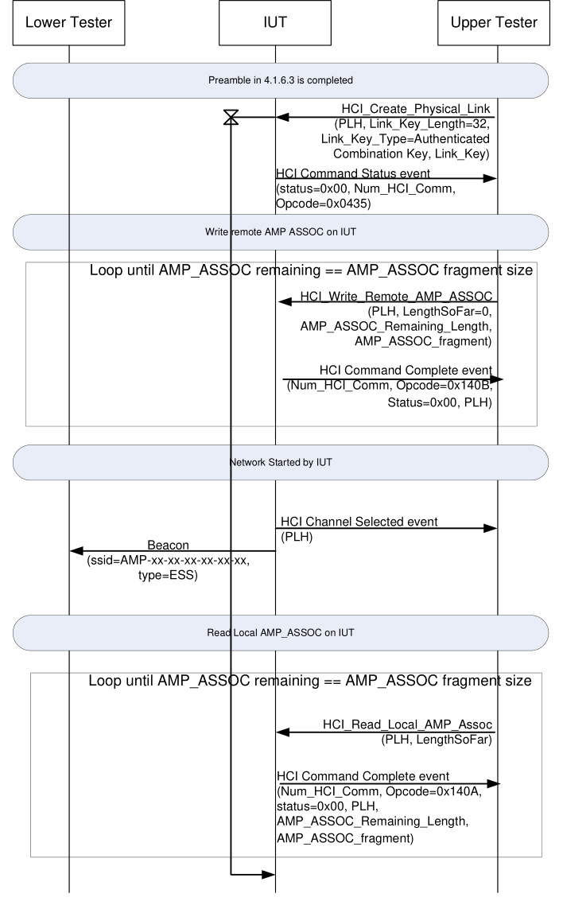

**Figure 4.34: 80211PAL/PL/PLC/BV-06-C [Initiate Physical link on HT device] – MSC Page 1 of 2**

Lower Tester
Upper Tester IUT

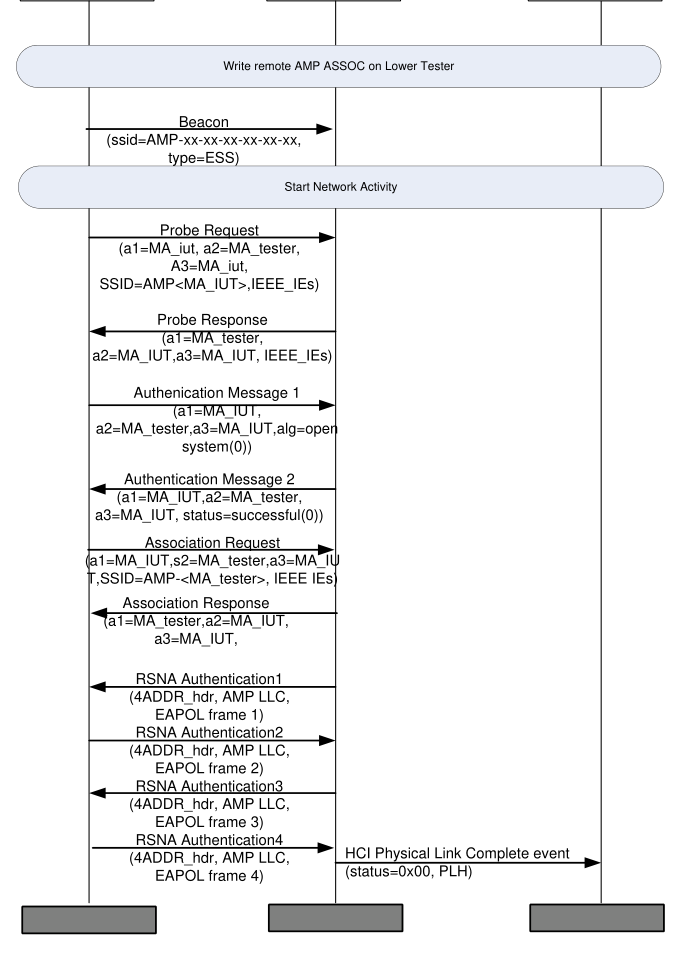

**Figure 4.35: 80211PAL/PL/PLC/BV-06-C [Initiate Physical link on HT device] – MSC Page 2 of 2**

Other 802.11 MAC frames such as data retransmissions, RTS/CTS control frames, Probe Request and Probe Response may be sent during the connection process. 802.11 Acknowledgements and NULL data frames are not shown in the MSC above.
• Test Condition
The Lower Tester responds as an HT capable device.
• Expected Outcome
Pass verdict
The IUT reports the same Physical Link Handle in all generated HCI events as the handle parameter contained in the HCI Create Physical Link command.
A physical link is successfully created, indicated by an HCI Physical Link Complete event with status code of 0x00 being sent to the Upper Tester from the IUT.
The HT Capabilities and HT Operation elements are included in the IUT’s beacon and association response frames.
Both the HT-Greenfield subfield and the PCO subfield within the HT Capabilities element are set to 0, and RIFS Mode subfield within the HT Operation element is set to 0.
80211PAL/PL/PLC/BV-07-C [Initiate Physical link on HT device with 40 MHz channels]
• Test Purpose
Verify that the Initiating IUT can establish a physical link when it is a 40 MHz HT capable device and the responding device is a 40 MHz HT capable device.
• Reference
[2] 2.16, 3.1, 3.3.1, 3.3.2
[4] 7.1.37
• Initial Condition
- The IUT is in the DISCONNECTED state. The local AMP Info and local AMP_ASSOC have been read using the preamble in Section 4.1.6.3.
• Test Procedure

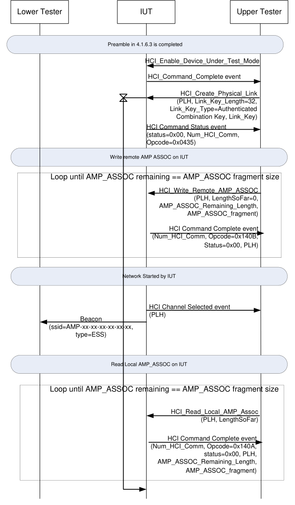

**Figure 4.36: 80211PAL/PL/PLC/BV-07-C [Initiate Physical link on HT device with 40 MHz channels] – MSC Page 1 of 2**

Lower Tester
Upper Tester IUT

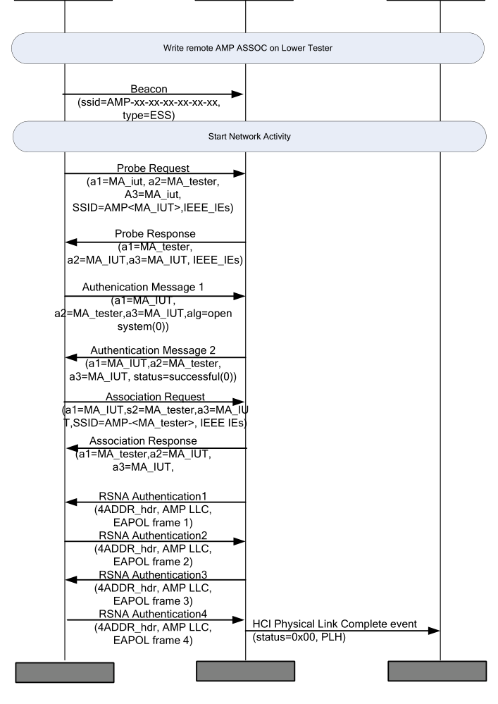

**Figure 4.37: 80211PAL/PL/PLC/BV-07-C [Initiate Physical link on HT device with 40 MHz channels] – MSC Page 2 of 2**

Other 802.11 MAC frames such as data retransmissions, RTS/CTS control frames, Probe Request and Probe Response may be sent during the connection process. 802.11 Acknowledgements and NULL data frames are not shown in the MSC above.
• Test Condition
Remote AMP ASSOC from the Lower Tester contains only 40 MHz channels in its PCLv2 TLV.
• Expected Outcome
Pass verdict
The IUT reports the same Physical Link Handle in the HCI Channel Selected event and HCI Physical Link Complete event as was given in the HCI Create Physical Link command.
The HT Capabilities and the HT Operation elements are included in the IUT’s beacon, probe response, and association response frames. Within the HT Capabilities element, the Supported Channel Width subfield is set to 1.
Selected primary channel as given in the HCI Read Local AMP ASSOC is a channel that is adjacent to a channel suitable for use as an extension channel in 40 MHz transmissions.
A physical link is successfully created, indicated by an HCI Physical Link Complete event with status code of 0x00 being sent to the Upper Tester from the IUT.
80211PAL/PL/PLC/BV-08-C [Accept Physical link on HT device]
• Test Purpose
Verify that the Responder IUT can establish a physical link when it is an HT capable device and the Initiator is an HT capable device.
• Reference
[2] 3.1, 3.3.1, 3.3.2
[4] 7.1.38
• Initial Condition
- The IUT is initialized (see Section 4.1.5) and in the DISCONNECTED state.
• Test Procedure

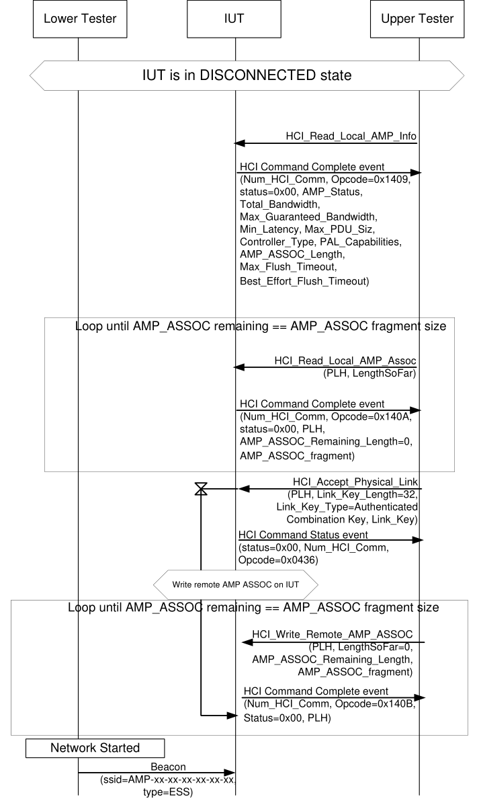

**Figure 4.38: 80211PAL/PL/PLC/BV-08-C [Accept Physical link on HT device] – MSC Page 1 of 2**

Upper Tester IUT Lower Tester

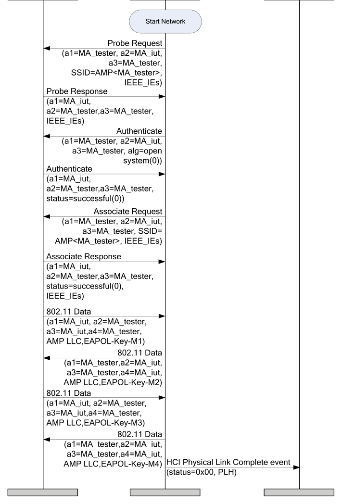

**Figure 4.39: 80211PAL/PL/PLC/BV-08-C [Accept Physical link on HT device] – MSC Page 2 of 2**

Other 802.11 MAC frames such as data retransmissions, RTS/CTS control frames, Probe Request and Probe Response may be sent during the connection process. 802.11 Acknowledgements and NULL data frames are not shown in the MSC above.
• Expected Outcome
Pass verdict
The IUT reports the same Physical Link Handle in the HCI Physical Link Complete event as was given in the HCI Create Physical Link command.
The HT Capability IE is included in the IUT responder’s beacons and association request.
Both the HT-Greenfield subfield and the PCO subfield in the HT Capabilities element are set to 0.
An HCI Physical Link Complete event with status of 0x00 is sent to the Upper Tester from the IUT.
80211PAL/PL/PLC/BV-09-C [Accept Physical link on HT device with 40 MHz channel]
• Test Purpose
Verify that the Responder IUT can establish a physical link when it is a 40 MHz HT capable device and the Initiator is a 40 MHz HT capable device.
• Reference
[2] 2.16, 3.1, 3.3.1, 3.3.2
[4] 7.1.38
• Initial Condition
- The IUT is initialized (see Section 4.1.5) and in the DISCONNECTED state.
• Test Procedure

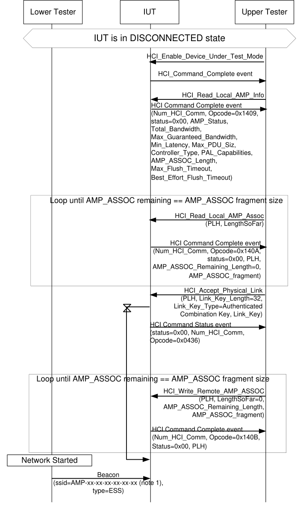

**Figure 4.40: 80211PAL/PL/PLC/BV-09-C [Accept Physical link on HT device with 40 MHz channel] – MSC Page 1 of 2**

Lower Tester
Upper Tester IUT

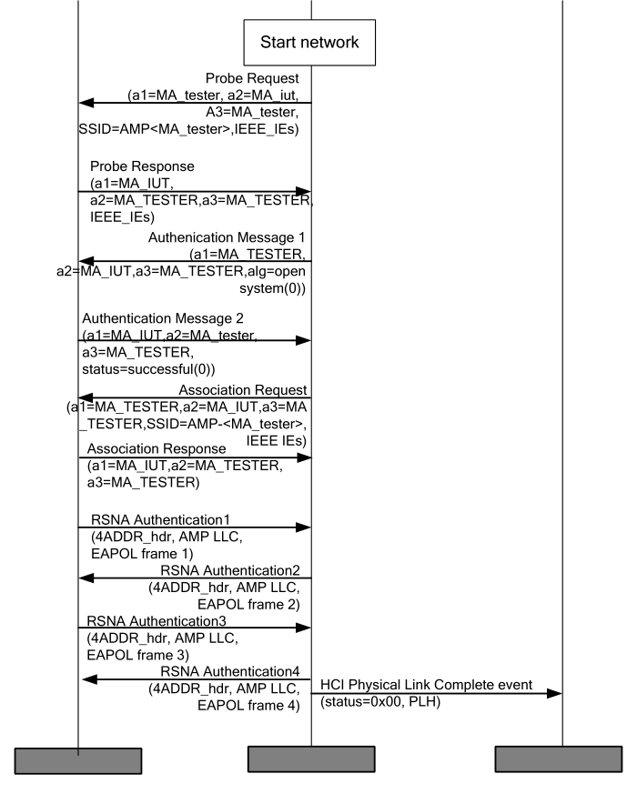

**Figure 4.41: 80211PAL/PL/PLC/BV-09-C [Accept Physical link on HT device with 40 MHz channel] – MSC Page 2 of 2**

Other 802.11 MAC frames such as data retransmissions, RTS/CTS control frames, Probe Request, and Probe Response may be sent during the connection process. 802.11 Acknowledgements and NULL data frames are not shown in the MSC above.
• Test Condition
The Lower Tester includes a 40 MHz channel in the remote AMP_ASSOC written to the responding IUT after the HCI_Accept_Physical_Link command.
• Expected Outcome
Pass verdict
The IUT reports the same Physical Link Handle in the HCI Physical Link Complete event as was given in the HCI Accept Physical Link command.
The HT Capability IE is included in the IUT responder’s beacons and association request. The Supported Channel Width subfield of the HT Capability IE is set to 1.
An HCI Physical Link Complete event with status of 0x00 is sent to the Upper Tester from the IUT.
80211PAL/PL/PLC/BV-10-C [Initiate Physical link on HT device with non-HT responder]
• Test Purpose
Verify that a non-HT link is successfully created when an HT initiator IUT and non-HT responder attempt to establish a connection.
• Reference
[2] 3.1, 3.3.1, 3.3.2
[4] 7.1.37
• Initial Condition
- The IUT is in the DISCONNECTED state. The local AMP Info and local AMP_ASSOC have been read using the preamble in Section 4.1.6.3.
• Test Procedure

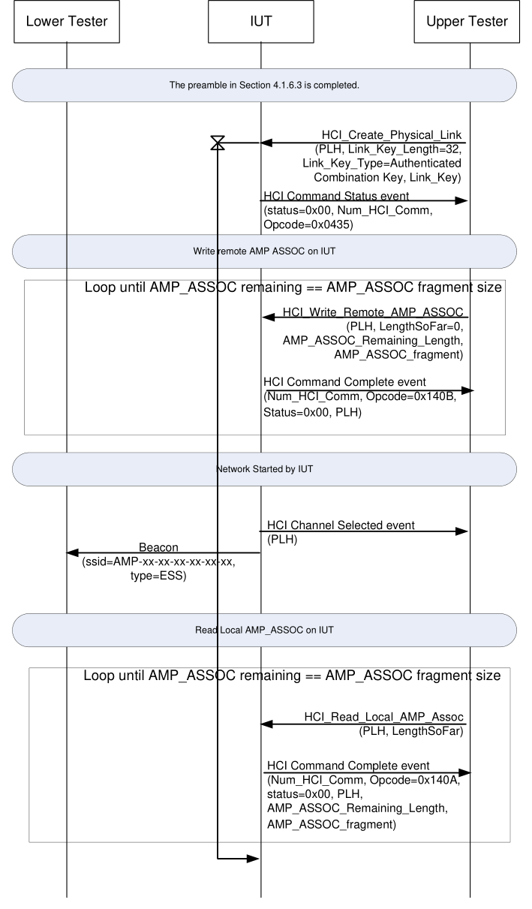

**Figure 4.42: 80211PAL/PL/PLC/BV-10-C [Initiate Physical link on HT device with non-HT responder] – MSC Page 1 of 2**

Lower Tester
Upper Tester IUT

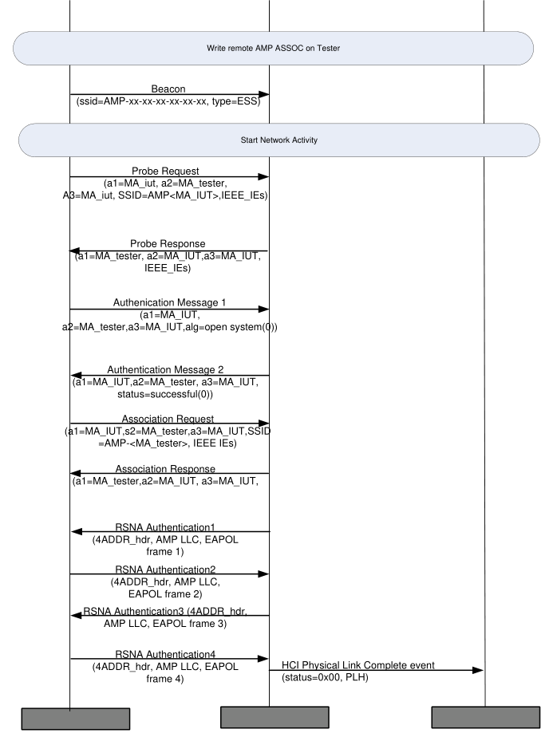

**Figure 4.43: 80211PAL/PL/PLC/BV-10-C [Initiate Physical link on HT device with non-HT responder] – MSC Page 2 of 2**

Other 802.11 MAC frames such as data retransmissions, RTS/CTS control frames, Probe Request, and Probe Response may be sent during the connection process. 802.11 Acknowledgements and NULL data frames are not shown in the MSC above.
• Test Condition
The Lower Tester does not include HT elements in its association request.
• Expected Outcome
Pass verdict
The IUT reports the same Physical Link Handle in the HCI Channel Selected event and HCI Physical Link Complete event as was given in the HCI Create Physical Link command.
When generating the HCI Command Complete event in response to the HCI Read Local AMP ASSOC command following the HCI Channel Selected event, the 802.11 PAL Capability TLV must have the HT Capability field (bit 2) set to 1.
A physical link is successfully created, indicated by an HCI Physical Link Complete event with status code of 0x00 being sent to the Upper Tester from the IUT.
80211PAL/PL/PLC/BV-11-C [Accept Physical link on HT device with non-HT initiator]
• Test Purpose
Verify that a non-HT link is successfully created when a non-HT initiator and HT responder IUT attempt to establish a connection.
• Reference
[2] 3.1, 3.3.1, 3.3.2
[4] 7.1.38
• Initial Condition
- The IUT is initialized (see Section 4.1.5) and in the DISCONNECTED state.
• Test Procedure

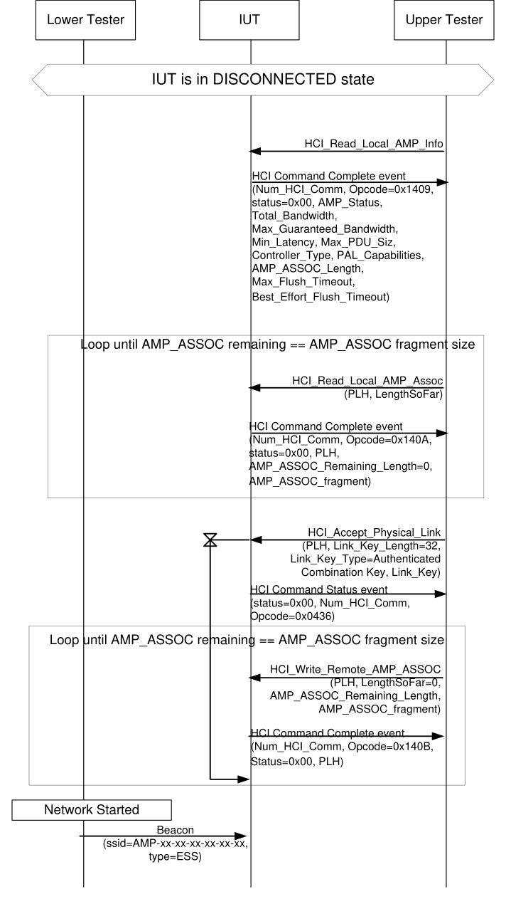

**Figure 4.44: 80211PAL/PL/PLC/BV-11-C [Accept Physical link on HT device with non-HT initiator] – MSC Page 1 of 2**

Upper Tester IUT Lower Tester

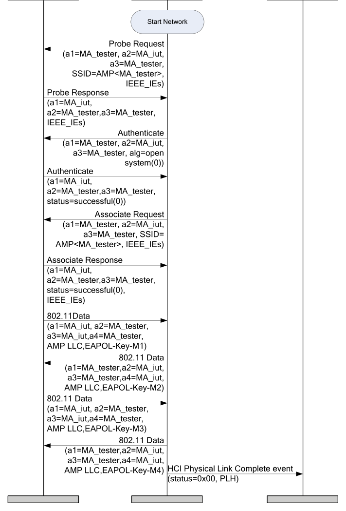

**Figure 4.45: 80211PAL/PL/PLC/BV-11-C [Accept Physical link on HT device with non-HT initiator] – MSC Page 2 of 2**

Other 802.11 MAC frames such as data retransmissions, RTS/CTS control frames, Probe Request, and Probe Response may be sent during the connection process. 802.11 Acknowledgements and NULL data frames are not shown in the MSC above.
• Expected Outcome
Pass verdict
In the HCI Command Complete event following the HCI Read Local AMP Info, the Total_Bandwidth parameter should be 50000.
In the HCI Command Complete event following the HCI Read Local AMP ASSOC, in the 802.11_PAL_Capabilities TLV, the HT Capability field (bit 2) must be set to 1.
An HCI Physical Link Complete event with status of 0x00 is sent to the Upper Tester from the IUT.

#### 4.3.2 Disconnect Physical Link

80211PAL/PL/PLD/BV-01-C [Disconnect physical link]
• Test Purpose
Verify that the IUT can disconnect an existing Physical Link. Verify that after disconnecting, the IUT is not beaconing.
• Reference
[2] 3.1.11
[4] 7.1.39
• Initial Condition
- The IUT has established a physical link using the preamble in Section 4.1.6.1.
• Test Procedure

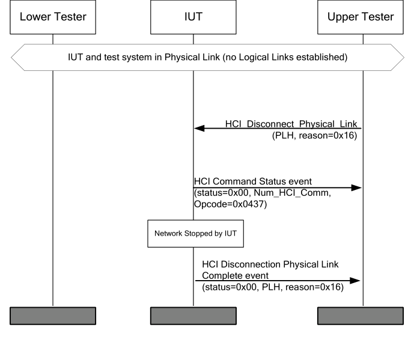

**Figure 4.46: 80211PAL/PL/PLD/BV-01-C [Disconnect physical link]**

• Expected Outcome
Pass verdict
The IUT sends HCI Disconnection Physical Link Complete event to the Upper Tester with status=0x00 and Reason=0x16 (Connection Terminated by Local Host).
The IUT stops beaconing within 5 sec of receiving the HCI Disconnect Physical Link command.
80211PAL/PL/PLD/BI-01-C [Disconnect physical link, invalid link handle]
• Test Purpose
Verify that the IUT rejects a HCI Disconnect Physical Link command containing an invalid Physical Link Handle. A physical link exists with a different Physical Link Handle.
• Reference
[2] 3.1.11
[4] 7.1.6
• Initial Condition
- The IUT has established a physical link using the preamble in Section 4.1.5. The IUT has only one physical connection.
• Test Procedure

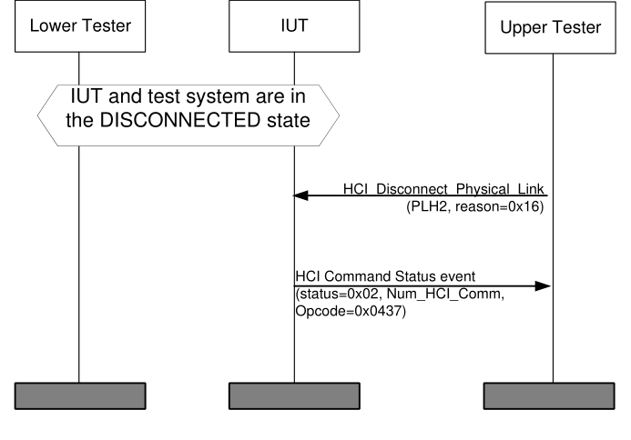

**Figure 4.47: 80211PAL/PL/PLD/BI-01-C [Disconnect physical link, invalid link handle]**

• Expected Outcome
Pass verdict
The IUT continues beaconing.
The IUT returns HCI Command Status event with error code 0x02 (Unknown Connection Identifier).

#### 4.3.3 Physical Link Supervision

80211PAL/PL/PLS/BV-01-C [Respond to Link Supervision Request]
• Test Purpose
Verify that the IUT responds to a Link Supervision request from a link peer.
• Reference
[2] 3.4
• Initial Condition
- A physical link exists between the Lower Tester and IUT using the procedure specified in Section 4.1.6.1.
• Test Procedure

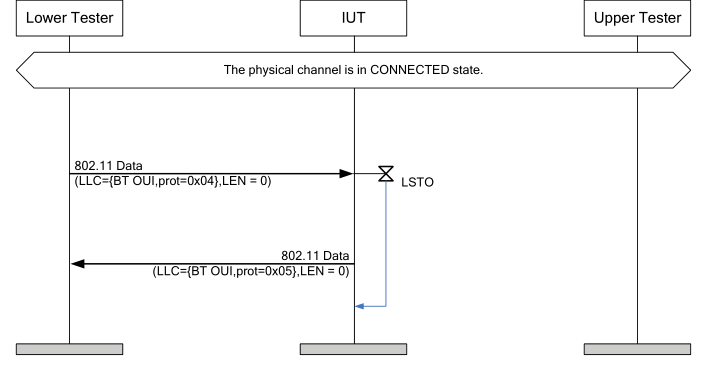

**Figure 4.48: 80211PAL/PL/PLS/BV-01-C [Respond to Link Supervision Request]**

• Expected Outcome
Pass verdict
After receiving a Link Supervision timeout request from the Lower Tester, the IUT generates a Link Supervision within LSTO.
80211PAL/PL/PLS/BV-02-C [Generate Link Supervision Request]
• Test Purpose
Verify that the IUT generates a Link Supervision request before timing out a Physical Link.
• Reference
[2] 3.4
• Initial Condition
- The IUT has established a physical link and best effort logical link using the preamble in Section 4.1.6.
• Test Procedure

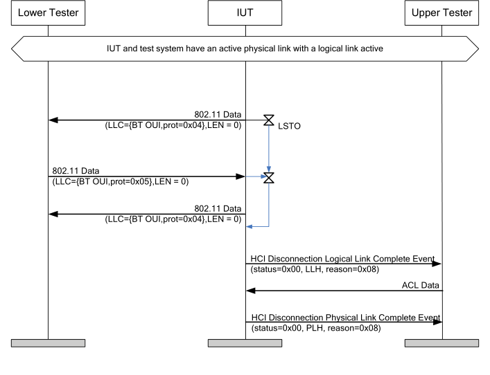

**Figure 4.49: 80211PAL/PL/PLS/BV-02-C [Generate Link Supervision Request]**

The Lower Tester transmits beacons with a period less than LSTO.
The Lower Tester responds to the first Link Supervision Request from the IUT.
The Lower Tester ignores further Link Supervision Request from the IUT.
The IUT may transmit any number greater than 1 Link Supervision Requests.
• Expected Outcome
Pass verdict
The IUT generates a Link Supervision request before LSTO expires.
On receiving a Link Supervision response, the IUT restarts its LSTO timer.
Before the LSTO expires for the second time the IUT issues another Link Supervision request.
After failing to receive a Link Supervision response before LSTO expires, the IUT sends HCI Disconnection Logical Link Complete event followed by HCI Disconnection Physical Link Complete event to the host.

### 4.4 Logical Link Tests (LL)

This section verifies that the IUT logical link behavior conforms to the specification. Various flowspecs are used in this section; they are as follows.
• TX_BE_FS TX best effort flowspec
(id=1,service_type=BE(0x01), max_SDU=0xffffffff, SDU interarrival time=0xffffffff,Access latency=0xffffffff, flush timeout=0xffffffff)
• RX_BE_FS RX best effort flowspec
(id=2,service_type=BE(0x01),max_SDU=0xffffffff, SDU interarrival time=0xffffffff,Access latency=0xffffffff, flush timeout=0xffffffff)
• TX_GU_FS TX guaranteed latency flowspec
(id=3,service_type=Guaranteed(0x02), max_SDU=1492, SDU interarrival time=0xffffffff,Access latency=10000, flush timeout=10000)
• RX_GU_FS RX guaranteed latency flowspec
(id=1,service_type=Guaranteed(0x02),max_SDU=0xffffffff, SDU interarrival time=0xffffffff,Access latency=10000, flush timeout=10000)
• TX_BE_AGG_FS TX aggregated best effort flowspec
(id=4,service_type=BE(0x01), max_SDU=1492, SDU interarrival time=0xffffffff,Access latency=0xffffffff, flush timeout=0xffffffff)
• RX_BE_AGG_FS RX aggregated best effort flowspec
(id=4,service_type=BE(0x01), max_SDU=1492, SDU interarrival time=0xffffffff,Access latency=0xffffffff, flush timeout=0xffffffff)
• TX_GU_BW_FS TX guaranteed bandwidth flowspec
(id=4, service_type=Guaranteed(0x02), max_SDU=1492, SDU_interarrival_time=100, Access_latency=0xffffffff, flush_timeout=0xffffffff)
• RX_GU_BW_FS RX guaranteed bandwidth flowspec
(id=4, service_type=Guaranteed(0x02), max_SDU=1492, SDU_interarrival_time=100, Access_latency=0xffffffff, flush_timeout=0xffffffff)

#### 4.4.1 Create Logical Link

80211PAL/LL/LLC/BV-01-C [Initiate logical link setup of best effort logical link]
• Test Purpose
Verify that the IUT can establish a best effort logical link.
• Reference
[2] 4.1.1, 4.1.3
[4] 7.1.40
• Initial Condition
- The IUT is in the CONNECTED state. The IUT runs the preamble in Section 4.1.6.1.
• Test Procedure

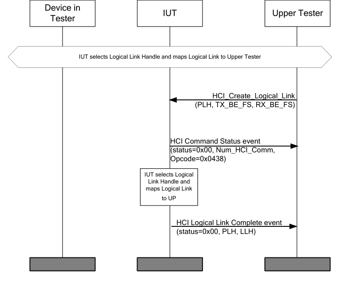

**Figure 4.50: 80211PAL/LL/LLC/BV-01-C [Initiate logical link setup of best effort logical link]**

• Expected Outcome
Pass verdict
The IUT sends an HCI Command Status event with status = 0x00 (pending) to the Upper Tester after the HCI Create Logical Link command.
The IUT sends an HCI Logical Link Complete event to the Upper Tester before Logical Link Accept Timeout occurs. The HCI Logical Link Complete event has the following parameters:
- Status = 0x00 (success)
- PLH matching that specified in the HCI Create Logical Link command
- TX_FS_ID matching the flowspec ID in TX_BE_FS
80211PAL/LL/LLC/BV-02-C [Accept logical link setup of best effort logical link]
• Test Purpose
Verify that the IUT can accept a best effort logical link.
• Reference
[2] 4.1.1, 4.1.3
[4] 7.1.41
• Initial Condition
- The IUT is in the CONNECTED state. The IUT runs the preamble in Section 4.1.6.1.
• Test Procedure

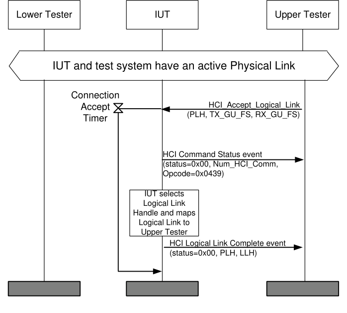

**Figure 4.51: 80211PAL/LL/LLC/BV-02-C [Accept logical link setup of best effort logical link]**

• Expected Outcome
Pass verdict
The IUT sends an HCI Command Status event with status = 0x00 (pending) to the Upper Tester after the HCI Accept Logical Link command.
The IUT sends an HCI Logical Link Complete event to the Upper Tester before Logical Link Accept Timeout occurs. The HCI Logical Link Complete event has the following parameters:
- Status = 0x00 (success)
- PLH matching that specified in the HCI Create Logical Link command
- TX_FS_ID matching the flowspec ID in TX_BE_FS
80211PAL/LL/LLC/BV-03-C [Initiate guaranteed logical link]
• Test Purpose
Verify that the IUT can establish a guaranteed logical link for a QoS enabled physical link.
• Reference
[2] 4.1.1, 4.1.4
[4] 7.1.40
• Initial Condition
- The IUT is in the CONNECTED state with a Best Effort logical link. No other Logical Links have been set up.
• Test Procedure
The Upper Tester starts a timer when the HCI Create Logical Link command is sent to the IUT. Timeout value is larger than the Logical Link Accept Timeout period.

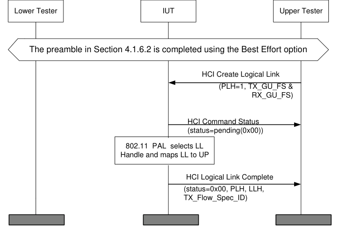

**Figure 4.52: 80211PAL/LL/LLC/BV-03-C [Initiate guaranteed logical link]**

• Expected Outcome
Pass verdict
The IUT sends an HCI Command Status event with status = 0x00 (pending) to the Upper Tester after the HCI Create Logical Link command.
The IUT sends an HCI Logical Link Complete event to the Upper Tester before expiration of the Logical Link Accept Timeout. The HCI Logical Link Complete event has the following parameters:
- Status = 0x00 (success)
- PLH matching that specified in the HCI Create Logical Link command
- TX_FS_ID matching the flowspec ID in TX_GU_FS
80211PAL/LL/LLC/BV-04-C [Create logical link, accept guaranteed logical link]
• Test Purpose
Verify that the IUT can accept a guaranteed logical link for a QoS enabled physical link.
• Reference
[2] 4.1.1, 4.1.4, 6
[4] 7.1.41
• Initial Condition
- The IUT is in the CONNECTED state. The physical link was established with QoS.
- No other Logical Links have been set up.
• Test Procedure
The IUT executes preamble described in Section 4.1.6.1.
The Upper Tester starts a timer when the HCI Create Logical Link command is sent to the IUT. Timeout value is larger than the Logical Link Accept Timeout period.

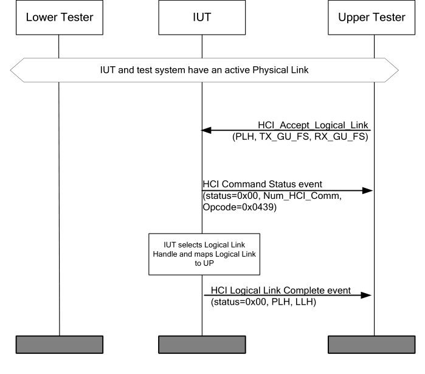

**Figure 4.53: 80211PAL/LL/LLC/BV-04-C [Create logical link, accept guaranteed logical link]**

• Expected Outcome
Pass verdict
The IUT sends an HCI Command Status event with status = 0x00 (pending) to the Upper Tester after the HCI Create Logical Link command.
The IUT sends an HCI Logical Link Complete event with (success) to the Upper Tester before expiration of the Logical Link Accept Timeout. The HCI Logical Link Complete event has the following parameters:
- Status = 0x00 (success)
- PLH matching that specified in the HCI Create Logical Link command
- TX_FS_ID matching the flowspec ID in TX_BE_FS
• Test Purpose
Verify that the cancel logical link command is accepted or rejected, and that the logical link is in a state consistent with the result.
• Reference
[2] 4.1.1, 4.1.3, 6
[4] 7.1.43
• Initial Condition
- Physical Link Initiated by IUT preamble (see Section 4.1.6.1).
- No other Logical Links have been set up.
• Test Procedure
The tester attempts to cancel a logical link during its creation.
There are two possible options for the test procedure to complete depending on whether the IUT receives the Cancel Logical Link command before or after it sends the Logical Link Complete event for the preceding Create Logical Link command.
Upper Tester IUT Lower Tester

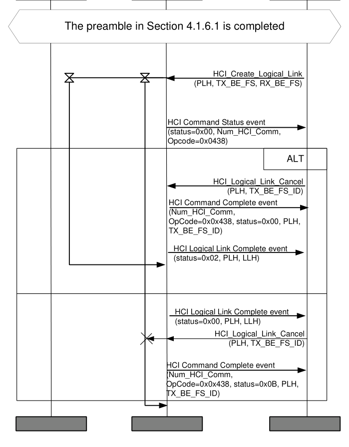

**Figure 4.54: 80211PAL/LL/LLC/BV-05-C [Create Logical Link, Cancel Logical link]**

• Expected Outcome
Pass verdict
The IUT sends an HCI Command Status event with status = 0x00 (pending) to the Upper Tester after the HCI Create Logical Link command.
Option 1: IUT Sends an HCI Command Complete event for the Logical Link Cancel command with status = 0x00 (success) followed by an HCI Logical Link Completion event with status = 0x02 (“Unknown Connection Identifier”).
The IUT returns an HCI Logical Link Complete event with status = 0x02 (Unknown Connection Identifier).
Option 2: On completion of the Logical Link creation process, the IUT sends an HCI Logical Link Complete event with status = 0x00 (success) to the Upper Tester.
Following this the IUT sends a Command Complete event for the Logical Link Cancel command with status indicating “ACL Connection Already Exists”
The IUT sends at least one 802.11 AMP data frame according to the format indicated above.
80211PAL/LL/LLC/BV-06-C [Logical link, modify flow spec]
• Test Purpose
Verify that the IUT accepts HCI modify flow spec modify command.
• Reference
[2] 4.2
[4] 7.1.44
• Initial Condition
- IUT is configured according to preamble in Section 4.1.6.2.
• Test Procedure

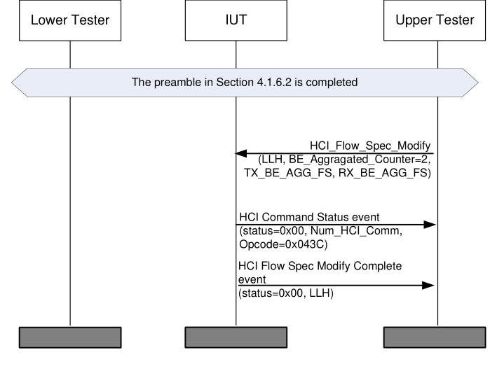

**Figure 4.55: 80211PAL/LL/LLC/BV-06-C [Logical link, modify flow spec]**

• Test Condition
The required bandwidth specified in the updated flowspecs is less than the Total_Bandwidth parameter of the local AMP info.
• Expected Outcome
Pass verdict
The logical link is successfully updated with the new flowspec. An HCI Command Status event with status = 0x00 (success) is returned in response to the HCI Flow Spec Modify command.
An HCI Flow Spec Modify Complete event with status = 0x00 (success) is returned.
80211PAL/LL/LLC/BV-07-C [Create Logical link, multiple logical link]
• Test Purpose
Verify that a guaranteed logical link can be created on IUT when a BE link already exists.
• Reference
[2] 4.1
[4] 7.1.40
• Initial Condition
- The IUT is configured according to preamble in Section 4.1.6.2.
• Test Procedure

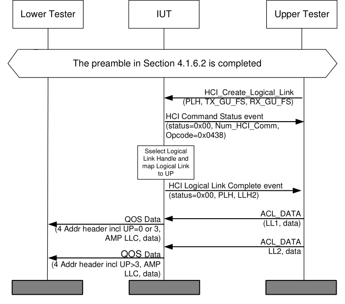

**Figure 4.56: 80211PAL/LL/LLC/BV-07-C [Create Logical link, multiple logical link]**

• Test Condition
The required bandwidth specified in the second flowspec is less than the Total_Bandwidth parameter of the local AMP info.
• Expected Outcome
Pass verdict
An HCI Command Status event with status = 0x00 (pending) is sent by the IUT in response to the HCI Create Logical Link command from the Upper Tester.
An HCI Logical Link Complete event with status = 0x00 (success) and a logical_link_handle different from that of the existing best effort link is received by the Upper Tester. Two data packets are transmitted on the 802.11 media, on using a best effort UP and the other using a higher UP.
80211PAL/LL/LLC/BI-01-C [Create Logical Link, Nonexistent physical link]
• Test Purpose
Verify that an attempt to create a logical link on a nonexistent physical link is rejected.
• Reference
[2] 4.1
[4] 7.1.40
• Initial Condition
- The IUT is initialized (see Section 4.1.5) and in the DISCONNECTED state.
• Test Procedure

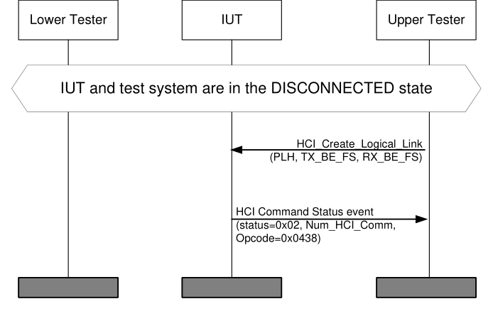

**Figure 4.57: 80211PAL/LL/LLC/BI-01-C [Create Logical Link, Nonexistent physical link]**

• Expected Outcome
Pass verdict
The IUT sends an HCI Command Status event with status = 0x02 (Unknown Connection Identifier) in response to the HCI Create Logical Link command.
• Test Purpose
Verify that an attempt to create a logical link on a physical link that has not yet connected is rejected.
• Reference
[2] 7.1.40
[4] 4.1
• Initial Condition
- The IUT is in the DISCONNECTED state. The local AMP Info and local AMP_ASSOC have been read using the preamble in Section 4.1.6.3.
• Test Procedure

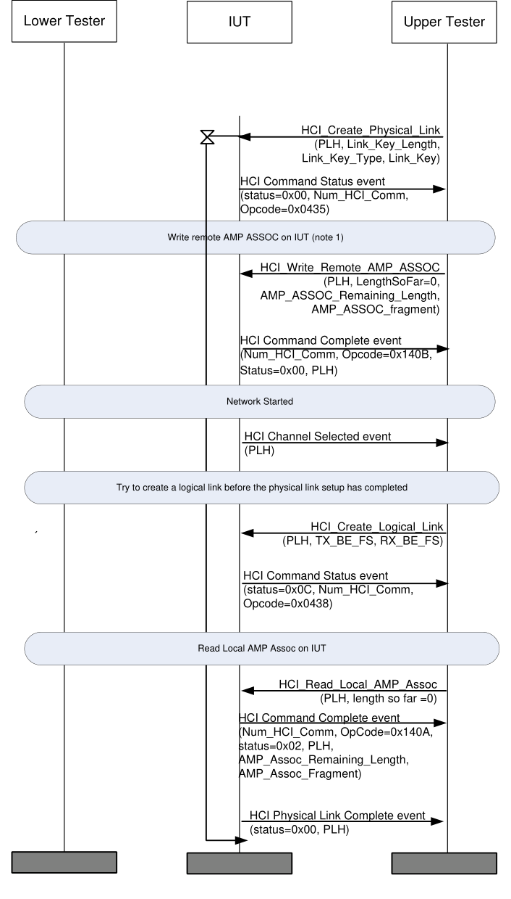

**Figure 4.58: 80211PAL/LL/LLC/BI-02-C [Create logical link, Physical link connection in progress]**

• Expected Outcome
Pass verdict
An HCI Command Status with status = 0x0c (Command disallowed) is received by the Upper Tester in response to the HCI Create Logical Link command.
An HCI Physical Link Complete event is returned with a status of 0x00 (success).
80211PAL/LL/LLC/BI-03-C [Create logical link, max bandwidth exceeded]
• Test Purpose
Verify that an attempt to create a logical link on a physical link that exceeds maximum bandwidth is rejected.
• Reference
[2] 4.1.4
• Initial Condition
- The IUT is configured according to preamble in Section 4.1.6.1.
• Test Procedure

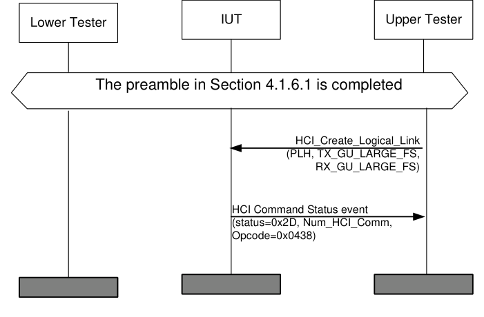

**Figure 4.59: 80211PAL/LL/LLC/BI-03-C [Create logical link, max bandwidth exceeded]**

• Test Condition
The requested bandwidth in the TX_GU_BW_FS is greater than the Maximum_Guaranteed_Bandwidth parameter from the HCI Read Local AMP Info command.
• Expected Outcome
Pass verdict
The IUT returns an HCI Command Status event with status = 0x2D (QoS Rejected) in response to the HCI Create Logical Link command.

#### 4.4.2 Disconnect Logical Link

80211PAL/LL/LLD/BV-01-C [Disconnect logical link]
• Test Purpose
Verify deletion of a logical link.
• Reference
[2] 4.3
[4] 7.1.42
• Initial Condition
- The IUT is configured according to preamble in Section 4.1.6.2.
• Test Procedure

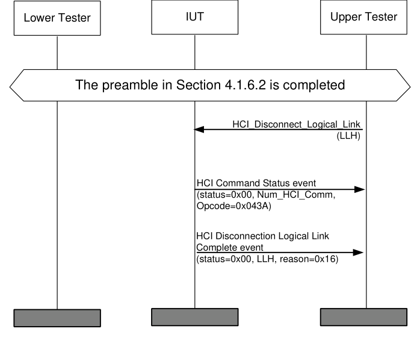

**Figure 4.60: 80211PAL/LL/LLD/BV-01-C [Disconnect logical link]**

Note 1: This is the logical link handle of the preexisting logical link.
• Expected Outcome
Pass verdict
The IUT sends a Command Status event with status = 0x00 (pending) to the Upper Tester in response to the HCI Disconnect Logical Link command.
The IUT sends an HCI Disconnection Logical Link Complete event with status = 0x00 (success) and reason = 0x16 (Connection Terminated by Local Host) to the Upper Tester.
• Test Purpose
Verify that deletion of a guaranteed logical link while a BE logical link also exists does not interfere with the BE logical link.
• Reference
[2] 4.3
[4] 7.1.42
• Initial Condition
- The IUT is configured according to preamble in Section 4.1.6.5.
• Test Procedure

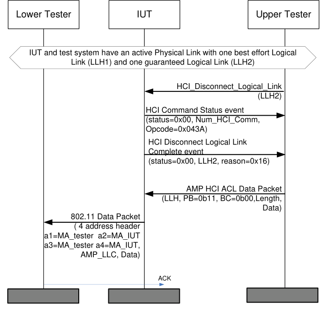

**Figure 4.61: 80211PAL/LL/LLD/BV-02-C [Disconnect logical link, multiple logical Links]**

Note 1: The LLH is the handle of the pre-existing guaranteed logical link.
• Expected Outcome
Pass verdict
The IUT sends an HCI Command Status event with status = 0x00 (pending) to the Upper Tester in response to the HCI Disconnect Logical Link command.
The IUT sends an HCI Disconnection Logical Link Complete event with status = 0x00 (success) and reason = 0x16 (Connection Terminated by Local Host) with the Guaranteed Logical Link Handle to the Upper Tester.
The Upper Tester sends an ACL data frame using the logical link handle of the BE link and it is correctly received by the Lower Tester.
80211PAL/LL/LLD/BI-01-C [Disconnect logical link, invalid link handle]
• Test Purpose
Verify that the IUT rejects a request to delete a nonexistent logical link.
• Reference
[2] 3.1.11
[4] 7.1.42
• Initial Condition
- The IUT is in the CONNECTED state and configured according to preamble in Section 4.1.6.2.
• Test Procedure

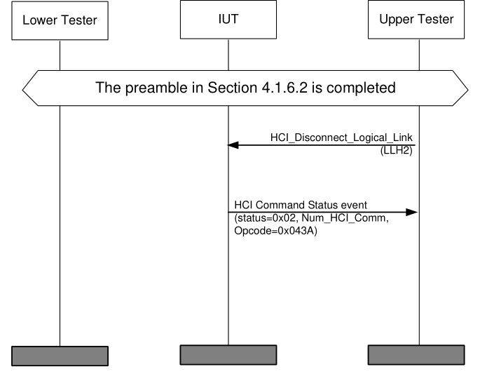

**Figure 4.62: 80211PAL/LL/LLD/BI-01-C [Disconnect logical link, invalid link handle]**

The Upper Tester sends an HCI Disconnect Logical Link command to the IUT with an invalid logical link handle such that the handle does not match the handle of the extant logical link.
• Expected Outcome
Pass verdict
The IUT returns an HCI Command Status event with status = 0x02 (Unknown Connection Identifier) to the Upper Tester in response to the HCI Disconnect Logical Link command.

### 4.5 Data Transfer Tests (DAT)

#### 4.5.1 Transmit Tests

For all data tests, a payload of 100 bytes is used, which has the following byte pattern: {00, 01, 02, 03… 99}.
80211PAL/DA/TX/BV-01-C [Data Transfer – send predefined BE packet, Guaranteed Service not supported]
• Test Purpose
Data transmit test with one predefined data packet using BE flow spec and with no Guaranteed Service support on physical link.
• Reference
[2] 5.1
[4] 5.4.2
• Initial Condition
- The IUT is in the CONNECTED state with a best effort logical link is established, as in Section 4.1.6.2.
• Test Procedure

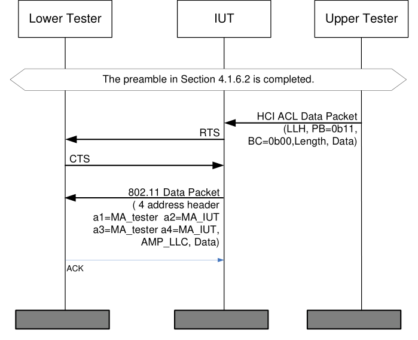

**Figure 4.63: 80211PAL/DA/TX/BV-01-C [Data Transfer – send predefined BE packet, Guaranteed Service not supported]**

Note 1: The LLH is that returned when the best effort logical link was created.
The Upper Tester sends a HCL Data Packet to IUT with the handle set to the logical link handle of the best effort logical link with the pattern described in [2] Section 5.1.
The IUT initiates an 802.11 RTS/CTS handshake before transferring the data packet.
The data and length received at the Lower Tester match the description in [2] Section 5.1.
The IUT transmits the payload using a 4-addr frame with no QoS Control field.
The IUT transmits the 802.11 data frame prepended with an LLC-SNAP header as described in [2] Section 5.1.
The IUT protects the data frame with the key for the physical link.
80211PAL/DA/TX/BV-02-C [Data transfer, transmit on guaranteed logical channel, QoS supported]
• Test Purpose
Verify that data transmitted on a guaranteed logical link is transmitted with a correct user priority while a BE link also exists.
• Reference
[2] 5.1
[4] 5.4.2
• Initial Condition
- A best effort logical link and a guaranteed logical link are created as in Section 4.1.6.2.
• Test Procedure

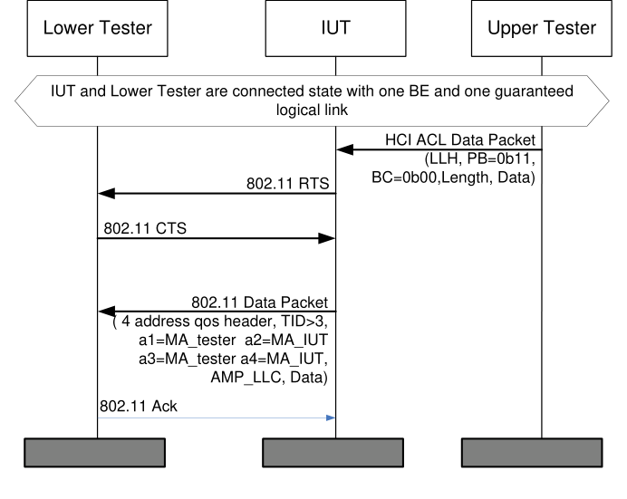

**Figure 4.64: 80211PAL/DA/TX/BV-02-C [Data transfer, transmit on guaranteed logical channel, QoS supported]**

Note 1: The LLH is that returned when the guaranteed logical link was created.
The Upper Tester sends an ACL Data Packet to IUT with the handle set to the logical link handle of the guaranteed logical link.
Pass verdict
The IUT initiates an 802.11 RTS/CTS handshake before transferring the data packet.
The data and length received by the Lower Tester matches the format described in [2] Section 5.5.1.
The IUT transmits the payload using a 4-addr frame containing a QoS Control field. The TID of the QoS Control Field is greater than 3, to denote higher quality of service.
The IUT transmits the data frame preceded with LLC-SNAP header as described in [2] Section 5.1.
The IUT protects the data frame with the key for the physical link.
80211PAL/DA/TX/BV-03-C [Data transfer, multiple physical link]
• Test Purpose
Verify that the IUT transmits data to the correct peer when there are multiple physical links.
• Reference
[2] 5.1
[4] 5.4.2
• Initial Condition
- Execute the preamble specified in Section 4.1.6.4.
- Best effort logical link is created on each of the physical links.
• Test Procedure

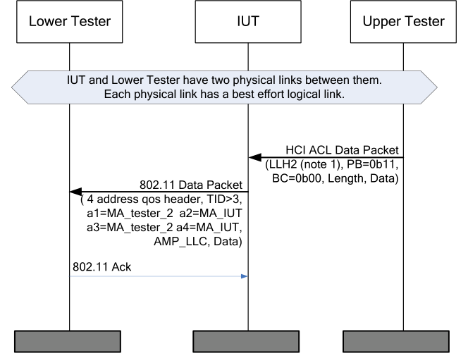

**Figure 4.65: 80211PAL/DA/TX/BV-03-C [Data transfer, multiple physical link]**

Note 1: The LLH_2 is that returned when the best effort logical link was created for the second physical link.
The Upper Tester sends a HCL Data Packet to IUT with the handle set to the logical link handle of the best effort logical link for the second physical connection.
• Expected Outcome
Pass verdict
The data packets are transmitted with the correct destination MAC address.
The data and length received the Lower Tester match the predefined data frame content in [2] Section 5.1.
The IUT transmits the data frame preceded with LLC-SNAP header as described in [2] Section 5.1.
The IUT protects the data frame with the key for the second physical link.
80211PAL/DA/TX/BI-01-C [Data transfer, invalid logical link]
• Test Purpose
Verify that the IUT drops a packet sent with an invalid logical link handle.
• Reference
[2] 5.1
[4] 5.4.2
• Initial Condition
- The IUT is in the CONNECTED state with a best effort logical link is established, as in Section 4.1.6.2.
• Test Procedure

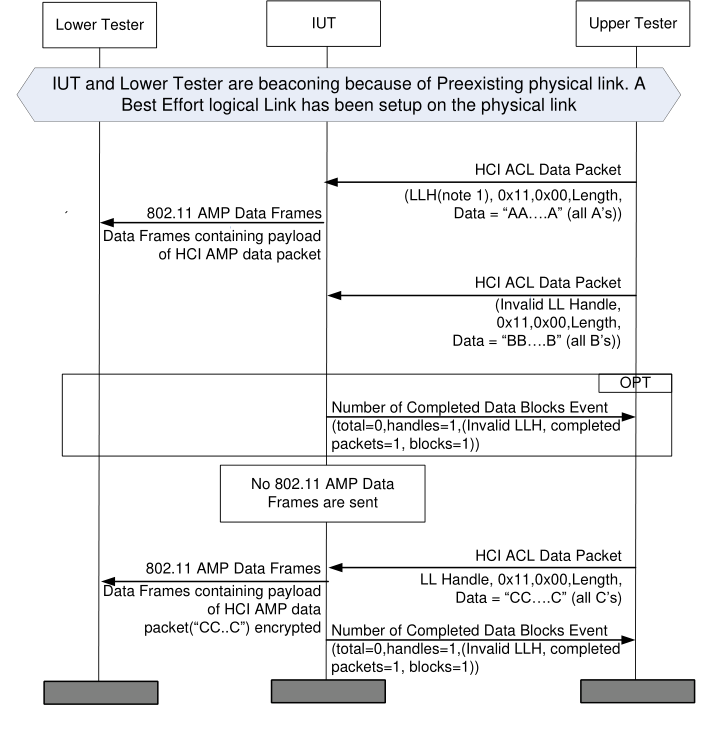

**Figure 4.66: 80211PAL/DA/TX/BI-01-C [Data transfer, invalid logical link]**

Note 1: The LLH is that returned when the best effort logical link was created.
• Expected Outcome
Pass verdict
No part of the payload of the second HCI ACL Data packet containing the invalid logical link handle is transmitted over 802.11 AMP data frames to the Lower Tester. The following packet containing sent with the “CC…C” payload is received by the receiver correctly.
80211PAL/DA/TX/BV-04-C [Data Transfer, transmit from HT device]
• Test Purpose
Verify that an HT-capable IUT transmits data correctly when connected to another HT device.
• Reference
[2] 3.3, 3.6, 5.1
[4] 5.4.2
• Initial Condition
• Test Procedure

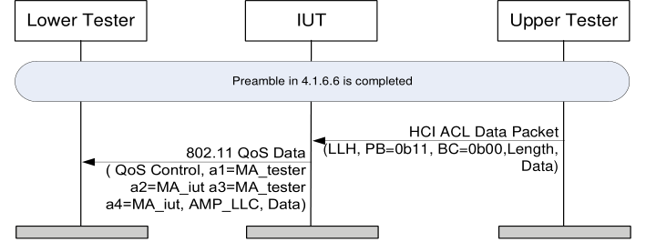

**Figure 4.67: 80211PAL/DA/TX/BV-04-C [Data Transfer, transmit from HT device]**

Once the Lower Tester and the IUT have successfully established a logical link, the Upper Tester sends an ACL Data Packet to IUT with the handle set to the logical link handle of the logical link. The packet should be sent to the Lower Tester.
Pass verdict
All data are sent using IEEE802.11 QoS Data Frames with 4 address fields.
The data and length received by the Lower Tester matches the format described in [2] Section 5.5.1.
The IUT transmits the data frame preceded with LLC-SNAP header as described in [2] Section 5.1.
The IUT protects the data frame with the key for the physical link.
• Notes
Other 802.11 MAC frames are sent during the connection process such as RTS/CTS control frames, 802.11 Acknowledgements, and ADDBA Request/ ADDBA Response may be sent after association. These frames are not shown in the MSC above.
80211PAL/DA/TX/BV-05-C [Data Transfer transmit from HT device, with 40MHz Channel]
• Test Purpose
Verify that an HT-capable IUT transmits data correctly when associated to another HT device, using 40 MHz channel width.
• Reference
[2] 2.16, 3.3, 3.6, 5.1
[4] 5.4.2
• Initial Condition
- The Lower Tester starts an HT Logical Link, using the procedure defined in Section 4.1.6.6. The EDUTM command is used to cause the IUT to use 40 MHz channel width.
• Test Procedure

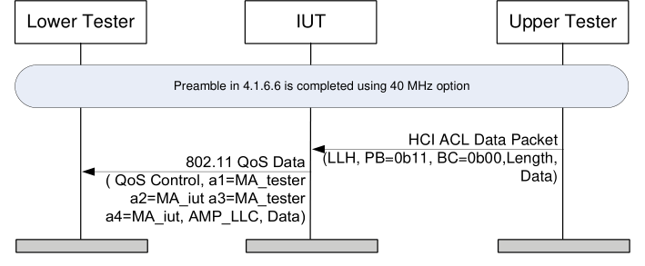

**Figure 4.68: 80211PAL/DA/TX/BV-05-C [Data Transfer transmit from HT device, with 40MHz Channel]**

Pass verdict
The data and length received by the Lower Tester matches the format described in [2] Section 5.5.1.
The IUT transmits the payload using a 4-addr frame containing a QoS Control field. The frame is sent using 40 MHz channel width.
The IUT transmits the data frame preceded with LLC-SNAP header as described in [2] Section 5.1.
The IUT protects the data frame with the key for the physical link.
• Notes
Other 802.11 frames may be exchanged, such as ADDBA Request/ ADDBA Response frames

#### 4.5.2 Data Receive Tests

80211PAL/DA/RX/BV-01-C [Data transfer, receive predefined best effort packet, Guaranteed Service not supported]
• Test Purpose
Verify that the IUT receives data and passes it to the HCI interface with the correct physical link handle.
• Reference
[2] 5.1
[4] 5.4.2
• Initial Condition
- A best effort logical link is established using the preamble in Section 4.1.6.2.
• Test Procedure

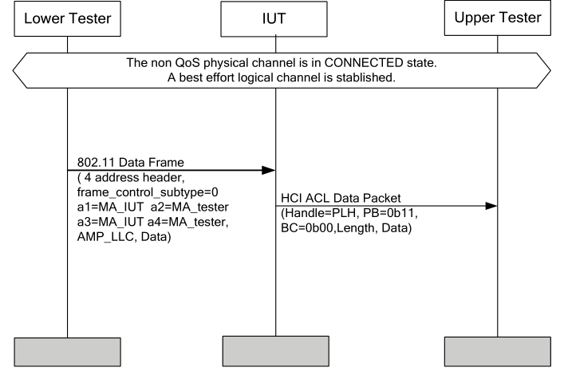

**Figure 4.69: 80211PAL/DA/RX/BV-01-C [Data transfer, receive predefined best effort packet, Guaranteed Service not supported]**

• Expected Outcome
Pass verdict
The data and the length received by the Upper Tester matches the data and the length transmitted from the Lower Tester minus the AMP_LLC plus the HCI header. The link handle in the indicated ACL data frame is the physical link handle created in the preamble.
80211PAL/DA/RX/BV-02-C [Data transfer, receive guaranteed data, Guaranteed Service supported]
• Test Purpose
Verify that data received on a guaranteed link is received correctly and sent to the HCI of the IUT.
• Reference
[2] 5.1
[4] 5.4.2
• Initial Condition
- A guaranteed logical link is established using the preamble in Section 4.1.6.2.
• Test Procedure
Upper Tester IUT Device in

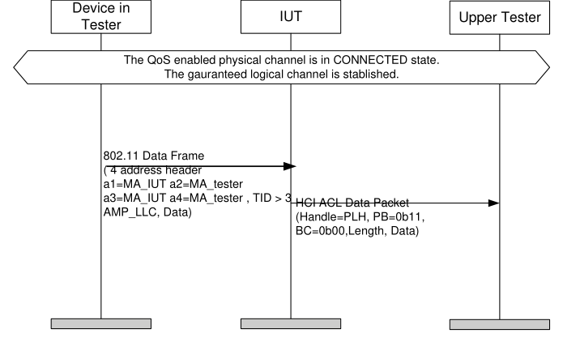

**Figure 4.70: 80211PAL/DA/RX/BV-02-C [Data transfer, receive guaranteed data, Guaranteed Service supported]**

• Expected Outcome
Pass verdict
The data and the length received by the Upper Tester matches the data and the length transmitted from the Lower Tester. The link handle in the indicated ACL data frame is the physical link handle created in the preamble.
80211PAL/DA/RX/BV-03-C [Data Transfer, best effort data reception, Guaranteed Service supported]
• Test Purpose
Verify that data is received on a best effort logical link when Guaranteed Service Type is supported on link.
• Reference
[2] 5.1
[4] 5.4.2
• Initial Condition
- A best effort logical link and a guaranteed logical link are created as according to the preamble in Section 4.1.6.5.
• Test Procedure

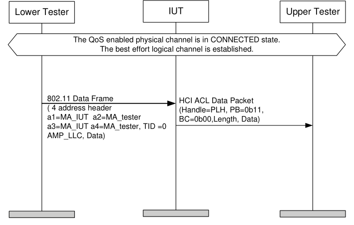

**Figure 4.71: 80211PAL/DA/RX/BV-03-C [Data Transfer, best effort data reception, Guaranteed Service supported]**

The Lower Tester sends a data frame with TID subfield of the QoS Control field of the header to 0 or 3.
• Expected Outcome
Pass verdict
The data and the length received by the Upper Tester matches the data and the length transmitted from the Lower Tester.
80211PAL/DA/RX/BV-04-C [Date transfer, receive data, multiple physical links]
• Test Purpose
Verify that data received on a second physical link is received correctly and sent to the HCI of the IUT with the correct physical link handle.
• Reference
[2] 5.1
[4] 5.4.2
• Initial Condition
- Two physical links (A and B) are established with the Lower Tester with a BE logical link over each physical link, using preamble 4.1.6.4.
• Test Procedure

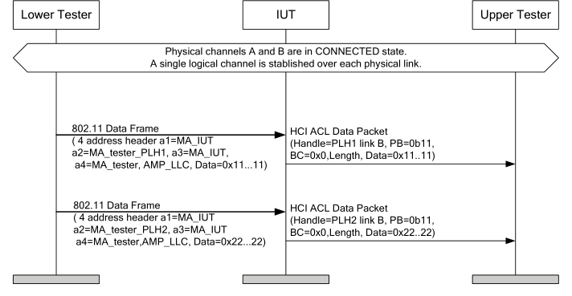

**Figure 4.72: 80211PAL/DA/RX/BV-04-C [Date transfer, receive data, multiple physical links]**

The Lower Tester sends a data frame using its local MAC address for Physical Link 1 and another using its local MAC Address for Physical Link 2.
It is not necessary to monitor or verify 802.11 control frames in this test.
• Expected Outcome
Pass verdict
A data packet is received on with a handle set to PLH1, the data matches that sent by the Lower Tester using its Physical Link 1 MAC address.
A data packet is received on with a handle set to PLH2, the data matches that sent by the Lower Tester using its Physical Link 2 MAC address.
80211PAL/DA/RX/BV-05-C [Data Transfer, receive from HT device]
• Test Purpose
Verify that an HT-capable IUT receives data and passes it to the HCI interface with the correct physical link handle when associated to another HT device.
• Reference
[2] 3.3, 3.6, 5.1
[4] 5.4.2
• Initial Condition
- The Lower Tester starts a logical link, using the procedure defined in Section 4.1.6.6.
• Test Procedure

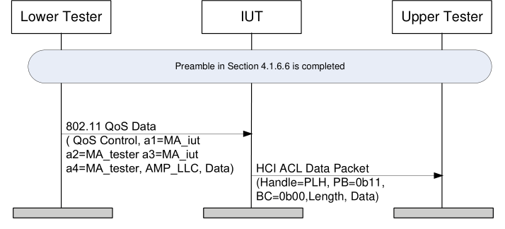

**Figure 4.73: 80211PAL/DA/RX/BV-05-C [Data Transfer, receive from HT device]**

Once the Lower tester and the IUT have successfully established a logical link, the Lower Tester sends a QoS Data frame.
Pass verdict
All data are sent using IEEE802.11 QoS Data Frames with 4 address fields.
The data and the length received by the Upper Tester matches the data and the length transmitted from the Lower Tester minus the AMP_LLC plus the HCI header. The link handle in the indicated ACL data frame is the physical link handle created in the preamble.
80211PAL/DA/RX/BV-06-C [Data Transfer, receive from HT device, using 40MHz Channel]
• Test Purpose
Verify that an HT-capable IUT receives data correctly and passes it to the HCI interface with the correct physical link handle when associated to another HT device, using 40MHz channel.
• Reference
[2] 2.16, 3.3, 3.6, 5.1
[4] 5.4.2
• Initial Condition
- The Lower Tester starts a logical link, using the procedure defined in Section 4.1.6.6 with the 40 MHz option. The Lower Tester advertises its channel width capability (20/40 MHz) in the Supported Channel Width subfield of the HT Capabilities element, and its PCLv2 contains only 40 MHz channels.
• Test Procedure

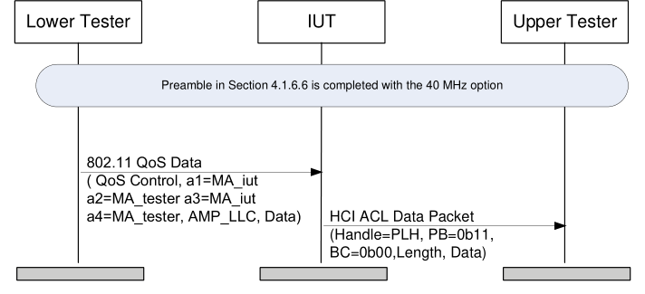

**Figure 4.74: 80211PAL/DA/RX/BV-06-C [Data Transfer, receive from HT device, using 40MHz Channel]**

Once the Lower tester and the IUT have successfully established a logical link, the Lower Tester sends a QoS Data frame, using a 40MHz Channel.
Pass verdict
The data and the length received by the Upper Tester matches the data and the length transmitted from the Lower Tester minus the AMP_LLC plus the HCI header. The link handle in the indicated ACL data frame is the physical link handle created in the preamble.

#### 4.5.3 Data Buffer Management Tests

80211PAL/DA/BU/BV-01-C [Data Transfer, Data Flush]
• Test Purpose
Verify that the flush command is accepted.
• Reference
[2] 5.3
[4] 7.3.66
• Initial Condition
- A Physical and best effort logical link is created using the preamble specified in Section 4.1.6.2. The Lower tester is prevented from transmitting 802.11 ACKs.
• Test Procedure

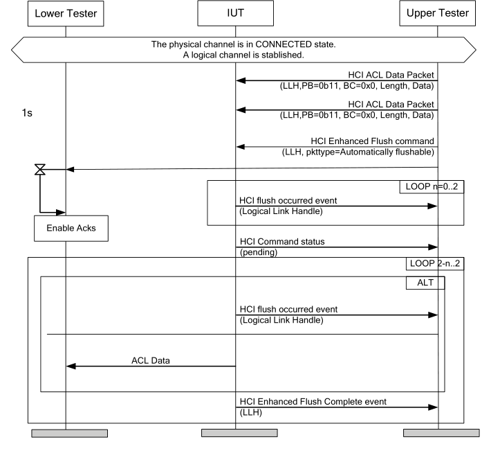

**Figure 4.75: 80211PAL/DA/BU/BV-01-C [Data Transfer, Data Flush]**

After the physical and logical links are established, the Lower Tester does not transmit 802.11 Ack control frames.
The Upper Tester sends two data packets.
The Upper Tester sends the HCI flush command immediately.
After a delay of 1 second the Lower Tester enables MAC Acks.
• Expected Outcome
Pass verdict
The IUT may send an HCI Data Flush Event to the Upper Tester before it sends the command status.
The IUT generates a HCI Command status event with status of 0 (pending) followed by two minus the number of flush events received before the HCI Command Status HCI Flush Occurred Events to the Upper Tester or 802.11 data PDUs to the Lower Tester in any combination.
The IUT transmits an HCI Enhanced Flush Complete event to the Upper Tester.
No 802.11 data PDUs are transmitted on the media after the HCI Enhanced Flush Complete event is sent.
• Notes
Both ACL Data packets may get dropped before the HCI Enhanced Flush Command is received by the IUT. In this case, no Flush Occurred event is indicated.
• Test Purpose
Verify that the transmit packet is discarded after flush timeout expiry.
• Reference
[2] 5.4
[4] 6.18
• Initial Condition
- A guaranteed logical link is established using the preamble specified in Section 4.1.6.2.
• Test Procedure

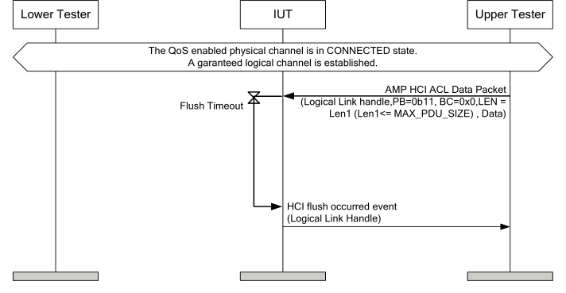

**Figure 4.76: 80211PAL/DA/BU/BV-02-C [Flush Timeout]**

The Lower Tester is configured to disable its ability to transmit 802.11 Ack control frames.
The Upper Tester sends a HCI ACL data packet to IUT.
• Expected Outcome
Pass verdict
An HCI flush occurred event is received.
The Data packet is not sent to the Lower Tester.
• Notes
The time before the HCI Flush Occurred event is indicated will vary according to the configuration of the 802.11 MAC.
80211PAL/DA/BU/BV-03-C [Read Data Block Size Command]
• Test Purpose
Verify that the Read Data Block Size command returns the block size and that when data is transferred the ’number of completed packets’ and ’number of completed blocks’ fields of the HCI Number Of Completed Data Blocks Events account for each competed packet.
• Reference
[4] 7.4.7
• Initial Condition
- Physical and best effort logical link have been set up using the preamble specified in Section 4.1.6.2.
• Test Procedure

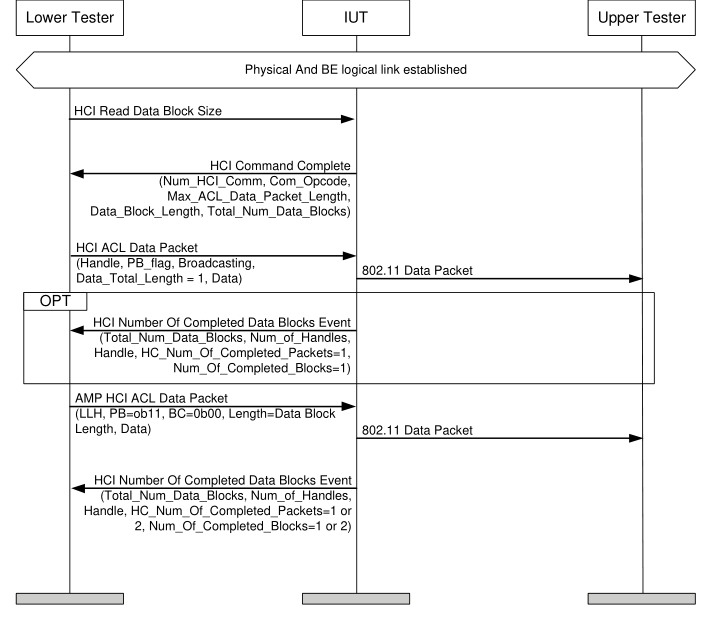

**Figure 4.77: 80211PAL/DA/BU/BV-03-C [Read Data Block Size Command]**

• Expected Outcome
Pass verdict
The sum of the values in Num_Of_Completed_Packets field of the HCI Number of Completed Data Blocks Events sent to the Upper Tester from the IUT is 2.
The sum of the values in Num_Of_Completed_Packets field of the HCI Number of Completed Data Blocks Events sent to the Upper Tester from the IUT is 2.

#### 4.5.4 Other

80211PAL/OT/AR/BV-01-C [Receive traffic report]
• Test Purpose
Verify that the IUT accepts Activity Report with Schedule Known set to 0x0 and enables RTS/CTS.
• Reference
[2] 5.2.3
• Initial Condition
- The IUT has completed the procedure in Section 4.1.6.2.
• Test Procedure

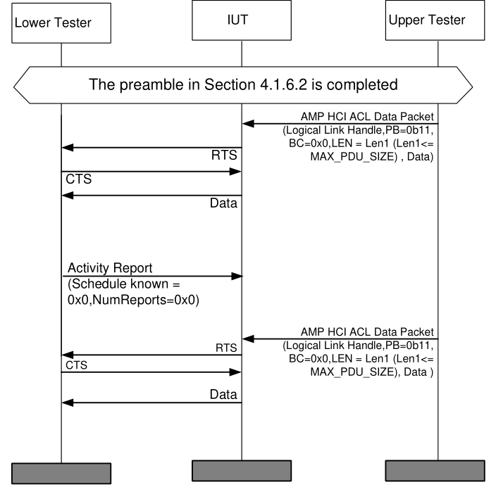

**Figure 4.78: 80211PAL/OT/AR/BV-01-C [Receive traffic report]**

Pass verdict
The IUT receives activity report.
The Upper Tester sends ACL Data frame to IUT.
The IUT transmits 802.11 frames with RTS/CTS signaling.
• Test Purpose
Verify that schedule of interference in Activity Report is used appropriately.
• Reference
[2] 5.2.3
• Initial Condition
- The IUT has completed the procedure in Section 4.1.6.2 to create a BE logical link.
• Test Procedure

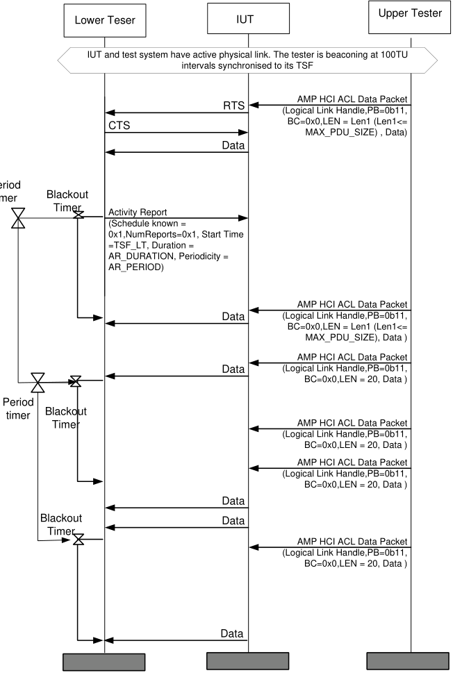

**Figure 4.79: 80211PAL/OT/AR/BV-02-C [Schedule using Activity Report]**

- Start_time = Current value of the TSF timer at the Lower Tester
- AR_DURATION = 20 ms
- AR_PERIOD = 50 ms
HCI ACL Data Packets are sent to the IUT at a rate greater than AR_DURATION/2. The test is run for at least 10 times AR_PERIOD. The number of ACL data frames sent to the IUT in the test is not important. The same number of packets is received at the Lower Tester.
The 802.11 traffic is monitored by a sniffer with a good timing precision. The offset from the Lower Tester’s TSF timer and the sniffers timer are used to calculate the transmission time of the 802.11 data frames from the IUT in terms of the TSF in the Lower Tester. This offset may be calculated by the difference between the timestamp on captured beacons from the Lower Tester and the TSF value contained therein.
• Expected Outcome
Pass verdict
No packets are transmitted by the IUT whilst the blackout timer is running on the Lower Tester.
80211PAL/OT/SRM/BV-01-C [Short Range Mode]
• Test Purpose
Verify that the IUT accepts Short Range Mode command from the host.
• Reference
None
• Initial Condition
- Physical Link Initiated by IUT preamble (see Section 4.1.6.2).
• Test Procedure

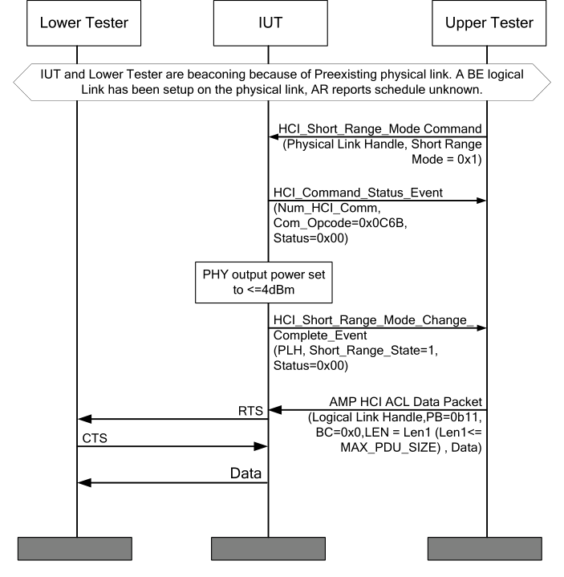

**Figure 4.80: 80211PAL/OT/SRM/BV-01-C [Short Range Mode]**

• Expected Outcome
Pass verdict
Verify that the Upper Tester receives both an HCI_Command_Status_Event and a Short_Range_Mode_Change_Complete_Event in response to the HCI Short Range Mode command.
The IUT transmits OFDM data packets with transmit power less than or equal to +4 dBm.
• Notes
It is possible that the IUT may transmit only frames with non OFDM modulation.

## 5 Test case mapping

The Test Case Mapping Table (TCMT) maps test cases to specific requirements in the ICS. The IUT is tested in all roles for which support is declared in the ICS document.
The columns for the TCMT are defined as follows:
Item: Contains a logical expression based on specific entries from the associated ICS document. Contains a logical expression (using the operators AND, OR, NOT as needed) based on specific entries from the applicable ICS document(s). The entries are in the form of y/x references, where y corresponds to the table number and x corresponds to the feature number as defined in the ICS document for 802.11 PAL [3].
Feature: A brief, informal description of the feature being tested.
Test Case(s): The applicable test case identifiers are required for Bluetooth Qualification if the corresponding y/x references defined in the Item column are supported. Further details about the function of the TCMT are elaborated in [1].
For the purpose and structure of the ICS/IXIT, refer to [1].

|  | Item |  |  | Feature |  |  | Test Case(s) |  |
| --- | --- | --- | --- | --- | --- | --- | --- | --- |
| 80211PAL 1/1 |  |  | Discovery |  |  | 80211PAL/DI/AI/BV-01-C 80211PAL/DI/AA/BV-01-C 80211PAL/DI/AA/BV-02-C 80211PAL/DI/AA/BI-01-C 80211PAL/DI/AA/BI-02-C 80211PAL/DI/ST/BV-01-C 80211PAL/DI/AA/BI-03-C |  |  |
| 80211PAL 1/1 AND 80211PAL 1/5 |  |  | Discovery - Receipt of Activity Reports |  |  | 80211PAL/DI/AA/BV-03-C |  |  |
| 80211PAL 1/1 AND 80211PAL 1/6 |  |  | Discovery - Scheduling using Activity Reports |  |  | 80211PAL/DI/AA/BV-04-C |  |  |
| 80211PAL 1/2 |  |  | Physical Links |  |  | 80211PAL/PL/PLC/BI-01-C 80211PAL/PL/PLC/BV-01-C 80211PAL/PL/PLC/BV-02-C 80211PAL/PL/PLC/BV-03-C 80211PAL/PL/PLC/BV-04-C 80211PAL/PL/PLD/BV-01-C 80211PAL/PL/PLD/BI-01-C 80211PAL/PL/PLS/BV-01-C 80211PAL/PL/PLS/BV-02-C |  |  |
| 80211PAL 1/3 |  |  | Best Effort Logical Links |  |  | 80211PAL/LL/LLC/BV-01-C 80211PAL/LL/LLC/BV-02-C 80211PAL/LL/LLC/BV-05-C 80211PAL/LL/LLC/BV-06-C 80211PAL/LL/LLC/BI-01-C 80211PAL/LL/LLC/BI-02-C 80211PAL/LL/LLD/BV-01-C 80211PAL/LL/LLD/BI-01-C |  |  |

|  | Item |  |  | Feature |  |  | Test Case(s) |  |
| --- | --- | --- | --- | --- | --- | --- | --- | --- |
| 80211PAL 1/4 |  |  | Data Transfer |  |  | 80211PAL/DA/TX/BV-01-C 80211PAL/DA/TX/BI-01-C 80211PAL/DA/RX/BV-01-C 80211PAL/DA/BU/BV-01-C 80211PAL/DA/BU/BV-03-C |  |  |
| 80211PAL 2/1 |  |  | Multiple Physical Links |  |  | 80211PAL/PL/PLC/BV-05-C 80211PAL/DA/TX/BV-03-C 80211PAL/DA/RX/BV-04-C |  |  |
| 80211PAL 1/5 |  |  | Receipt of Activity Reports |  |  | 80211PAL/OT/AR/BV-01-C |  |  |
| 80211PAL 1/6 |  |  | Scheduling Using Activity Reports |  |  | 80211PAL/OT/AR/BV-02-C |  |  |
| 80211PAL 1/7 |  |  | Guaranteed Logical Links |  |  | 80211PAL/DA/TX/BV-02-C 80211PAL/DA/RX/BV-02-C 80211PAL/DA/RX/BV-03-C 80211PAL/LL/LLC/BV-07-C 80211PAL/LL/LLD/BV-02-C 80211PAL/LL/LLC/BI-03-C 80211PAL/DA/BU/BV-02-C 80211PAL/LL/LLC/BV-03-C 80211PAL/LL/LLC/BV-04-C |  |  |
| 80211PAL 1/11 |  |  | Short Range Mode |  |  | 80211PAL/OT/SRM/BV-01-C |  |  |
| 80211PAL 1/9 AND NOT 80211PAL 1/7 |  |  | HT Capable |  |  | 80211PAL/DI/AI/BV-02-C |  |  |
| 80211PAL 1/7 AND 80211PAL 1/9 |  |  | HT Capable |  |  | 80211PAL/DI/AI/BV-03-C |  |  |
| 80211PAL 1/9 |  |  | HT Capable |  |  | 80211PAL/PL/PLC/BV-06-C 80211PAL/PL/PLC/BV-08-C 80211PAL/PL/PLC/BV-10-C 80211PAL/PL/PLC/BV-11-C 80211PAL/DA/TX/BV-04-C 80211PAL/DA/RX/BV-05-C |  |  |
| 80211PAL 1/8 AND 80211PAL 1/9 AND 80211PAL 1/10 |  |  | 5 GHz Capable, 40 MHz Capable |  |  | 80211PAL/DI/AA/BV-05-C 80211PAL/DI/AA/BV-06-C 80211PAL/PL/PLC/BV-07-C 80211PAL/PL/PLC/BV-09-C 80211PAL/DA/TX/BV-05-C 80211PAL/DA/RX/BV-06-C |  |  |

Table 5.1: Test case mapping

## 6 Revision history and acknowledgments

Revision History

|  | Publication |  |  | Revision |  | Date |  |  | Comments |  |  |
| --- | --- | --- | --- | --- | --- | --- | --- | --- | --- | --- | --- |
|  | Number |  |  | Number |  |  |  |  |  |  |  |
| 0 | 0 |  | 4.0.1r0 | 4.0.1r0 |  | 2010-01-18 |  |  |  | TSE 3249: TP/PL/PLC/BV-02-C: MSC: change Probe |  |
|  |  |  |  |  |  |  |  |  |  | Request from IUT to Tester. |  |
|  |  |  |  |  |  |  |  |  |  | TSE 3254: Add note to TSE DA/TX/BI-01-C |  |
|  |  |  |  |  |  |  |  |  |  | TSE 3255: TP/DA/TX/BV-01-C: Correct referenced |  |
|  |  |  |  |  |  |  |  |  |  | document sections. |  |
|  |  |  |  |  |  |  |  |  |  | TSE 4080: TCMT: correct duplicate TP/PL/PLC/BV- |  |
|  |  |  |  |  |  |  |  |  |  | 02-C |  |
|  | 1 |  |  | 4.0.2 |  |  | 2011-07-18 |  |  | Prepare for publication. |  |
|  |  |  | 4.0.3r0 - 4.0.3r10 | 4.0.3r0 - |  | 2011-01-25- 2011-12-15 | 2011-01-25- |  |  | Input reviewer comments: |  |
|  |  |  |  | 4.0.3r10 |  |  | 2011-12-15 |  |  | TSE 3348 TP/DI/AI/BV-01-C: Pass Verdict |  |
|  |  |  |  |  |  |  |  |  |  | TSE 3349 TP/PL/PLC/BI-01-C: Pass Verdict |  |
|  |  |  |  |  |  |  |  |  |  | Added support for HT tests. Added such tests to |  |
|  |  |  |  |  |  |  |  |  |  | TCMT section. Corrected address fields in several |  |
|  |  |  |  |  |  |  |  |  |  | MSCs. Added iteration loop to several MSCs for |  |
|  |  |  |  |  |  |  |  |  |  | reading AMP ASSOCs. Removed Device in Tester |  |
|  |  |  |  |  |  |  |  |  |  | from all MSCs. Corrected references to preambles. |  |
|  |  |  |  |  |  |  |  |  |  | Used uniform language in the HT test descriptions. |  |
|  |  |  |  |  |  |  |  |  |  | Split out a category of tests in TCMT according to if |  |
|  |  |  |  |  |  |  |  |  |  | they use Guaranteed links or not. |  |
|  |  |  |  |  |  |  |  |  |  | Removed HT Operation element from association |  |
|  |  |  |  |  |  |  |  |  |  | request whether or not the responder uses HT. |  |
|  |  |  |  |  |  |  |  |  |  | Added checks for prohibited features in |  |
|  |  |  |  |  |  |  |  |  |  | TP/PL/PLC/BV-0{6,8}-C. |  |
|  |  |  |  |  |  |  |  |  |  | Updated TCMT to match ICS.r06. |  |
|  |  |  |  |  |  |  |  |  |  | Changed Pass Verdict in test cases using Accept |  |
|  |  |  |  |  |  |  |  |  |  | Physical Link to remove requirement to use HCI |  |
|  |  |  |  |  |  |  |  |  |  | Channel Selected event since it is in fact prohibited in |  |
|  |  |  |  |  |  |  |  |  |  | that scenario. Discussed in TSE 2956. |  |
|  |  |  |  |  |  |  |  |  |  | Removed TP/PL/PLC/BV-12-C since TP/PL/PLC/BV- |  |
|  |  |  |  |  |  |  |  |  |  | 11-C already results in the same Pass Criteria. |  |
|  |  |  |  |  |  |  |  |  |  | Corrected reference to ICS in TP/DA/TX/BV-03-C per |  |
|  |  |  |  |  |  |  |  |  |  | comment from BTI. |  |
|  | 2 |  |  | 4.0.3 |  |  | 2011-12-27 |  |  | Adopted by the Bluetooth SIG Board of Directors |  |
|  |  |  | 4.0.4r0 | 4.0.4r0 |  | 2012-02-07 | 2012-02-07 |  |  | Incorporated TSEs from pre-CSA2 version: |  |
|  |  |  |  |  |  |  |  |  |  | TSE 2956: TP/PL/PLC/BV-02-C: Pass Verdict |  |
|  |  |  |  |  |  |  |  |  |  | TSE 2958: TP/PL/PLC/BV-04-C: Add code to pass |  |
|  |  |  |  |  |  |  |  |  |  | criteria, updated MSC |  |
|  |  |  |  |  |  |  |  |  |  | TSE 3248; TP/PL/PLC/BV-01-C: correct MSC |  |
|  |  |  |  |  |  |  |  |  |  | TSE 3584: TP/LL/LLC/BV-03-C MSC&TCMT; |  |
|  |  |  |  |  |  |  |  |  |  | TP/LL/LLC/BV-04-C: TCMT |  |
|  |  |  |  |  |  |  |  |  |  | TSE 3586: TP/OT/SRM/BV-01-C, TP/DA/BU/BV-01- |  |
|  |  |  |  |  |  |  |  |  |  | C: Corrections and additions to TCMT |  |
|  |  |  |  |  |  |  |  |  |  | TSE 4072: TP/DI/AA/BV-02-C: Update test procedure |  |
|  |  |  |  |  |  |  |  |  |  | TSE 4074: TP/LL/LLC/BV-06-C: Update MSC |  |
|  |  |  |  |  |  |  |  |  |  | TSE 4075: TP/LL/LLC/BV-06-C: Fix reference section |  |
|  |  |  |  |  |  |  |  |  |  | in preamble |  |

|  | Publication |  |  | Revision |  | Date |  |  | Comments |  |  |
| --- | --- | --- | --- | --- | --- | --- | --- | --- | --- | --- | --- |
|  | Number |  |  | Number |  |  |  |  |  |  |  |
|  |  |  |  |  |  |  |  |  |  | TSE 4076: TP/LL/LLC/BV-02-C: Update MSC |  |
|  |  |  |  |  |  |  |  |  |  | TSE 4077: TP/PL/PLC/BI-01-C: Update MSC |  |
|  |  |  |  |  |  |  |  |  |  | TSE 4078: TP/LL/LLC/BV-01-C, TP/LL/LLC/BV-04-C, |  |
|  |  |  |  |  |  |  |  |  |  | TP/LL/LLC/BI-03-C, TP/PL/PLD/BV-01-C, |  |
|  |  |  |  |  |  |  |  |  |  | TP/LL/LLC/BV-02-C |  |
|  |  |  |  |  |  |  |  |  |  | TSE 4110: TP/OT/SRM/BV-01-C: Update MSC |  |
|  |  |  |  |  |  |  |  |  |  | TSE 4138: TP/DI/ST/BV-01-C: Change OpCode |  |
|  |  |  |  |  |  |  |  |  |  | parameter in MSC. |  |
|  | 3 |  |  | 4.0.4 |  |  | 2012-03-30 |  |  | Prepare for publication. |  |
|  |  |  | 4.0.5r0 | 4.0.5r0 |  | 2012-05-18 | 2012-05-18 |  |  | TSE 4653: TCMT updates for TP/DI/AA/BV-03-C, |  |
|  |  |  |  |  |  |  |  |  |  | TP/DI/AA/BV-04-C |  |
|  | 4 |  |  | 4.0.5 |  |  | 2012-07-24 |  |  | Prepare for publication. |  |
|  |  |  | 4.0.6r1 | 4.0.6r1 |  | 2012-10-01 | 2012-10-01 |  |  | TSE 4946: Removed TP/DA/BU/BV-02-C from the |  |
|  |  |  |  |  |  |  |  |  |  | Data Transfer in the TCMT. |  |
|  | 5 |  |  | 4.0.6 |  |  | 2012-11-08 |  |  | Prepare for Publication. |  |
|  |  |  |  | 4.0.7rT |  |  | 2013-10-07 |  |  | Template Conversion |  |
|  |  |  | 4.1.0r01 | 4.1.0r01 |  | 2013-10-07 | 2013-10-07 |  |  | TSE 5312: Updated MSC in TP/DI/AA/BV-03-C and |  |
|  |  |  |  |  |  |  |  |  |  | TP/DI/AA/BV-04-C to remove |  |
|  |  |  |  |  |  |  |  |  |  | “HCI Enable Device Under Test Mode” _ _ _ _ _ |  |
|  | 6 |  |  | 4.1.0 |  |  | 2013-12-03 |  |  | Prepare for Publication |  |
|  |  |  |  | 4.2.0r00 |  |  | 2014-11-24 |  |  | Revved version to align with Core 4.2 release. |  |
|  | 7 |  |  | 4.2.0 |  |  | 2014-12-03 |  |  | Prepared for TCRL 2014-2 publication |  |
|  |  |  | 5.0.0r00 | 5.0.0r00 |  | 2016-10-20 | 2016-10-20 |  |  | Converted to new Test Case ID conventions as |  |
|  |  |  |  |  |  |  |  |  |  | defined in TSTO v4.1 |  |
| 8 |  |  | 5.0.0 |  |  | 2016-12-13 |  |  |  | Approved by BTI. Prepared for TCRL 2016-2 |  |
|  |  |  |  |  |  |  |  |  |  | publication. |  |
|  |  |  | 5.0.1r00 |  |  | 2017-10-09 |  |  |  | TSE 9885: Corrected capitalization of “Error Code” |  |
|  |  |  |  |  |  |  |  |  |  | (global change). |  |
| 9 |  |  | 5.0.1 |  |  | 2017-12-07 |  |  |  | Approved by BTI. Prepared for TCRL 2017-2 |  |
|  |  |  |  |  |  |  |  |  |  | publication. |  |
|  |  |  | 5.1.0r00 |  |  | 2018-11-13 |  |  |  | Updated template. Revved version to align with Core |  |
|  |  |  |  |  |  |  |  |  |  | 5.1 release. |  |
| 10 |  |  | 5.1.0 |  |  | 2018-12-07 |  |  |  | Approved by BTI. Prepared for TCRL 2018-2 |  |
|  |  |  |  |  |  |  |  |  |  | publication. |  |
|  |  |  | p11r00 |  |  | 2019-11-27 |  |  |  | Updated document naming convention and template |  |
|  |  |  |  |  |  |  |  |  |  | items, moving Revision History and Contributors |  |
|  |  |  |  |  |  |  |  |  |  | tables to the bottom of the document, updating |  |
|  |  |  |  |  |  |  |  |  |  | Disclaimer text and Confidentiality markings to align |  |
|  |  |  |  |  |  |  |  |  |  | with latest Documentation Marking Requirements, and |  |
|  |  |  |  |  |  |  |  |  |  | making minor editorial fixes. |  |
| 11 |  |  | p11 |  |  | 2020-01-07 |  |  |  | Approved by BTI on 2019-12-22. Prepared for TCRL |  |
|  |  |  |  |  |  |  |  |  |  | 2019-2 publication. |  |
|  |  |  | p12r00–r01 |  |  | 2023-04-04 – 2023-05-23 |  |  |  | TSE 22978 (rating 1): Per E22504, changed instances |  |
|  |  |  |  |  |  |  |  |  |  | of “DUT” to “IUT” in the MSC for |  |
|  |  |  |  |  |  |  |  |  |  | 80211PAL/DA/RX/BV-03-C. |  |
|  |  |  |  |  |  |  |  |  |  | Editorials to align the document with the latest TS |  |
|  |  |  |  |  |  |  |  |  |  | template conventions and DNMD guidance. |  |

|  | Publication |  |  | Revision |  | Date | Comments |  |  |
| --- | --- | --- | --- | --- | --- | --- | --- | --- | --- |
|  | Number |  |  | Number |  |  |  |  |  |
| 12 | 12 |  | p12 | p12 |  | 2023-06-29 |  | Approved by BTI on 2023-06-05. Prepared for |  |
|  |  |  |  |  |  |  |  | TCRL 2023-1 publication. |  |
|  |  |  | p12ed2r00 |  |  | 2023-08-07 |  | TSE 23171 (rating 1): Added an abbreviation table to |  |
|  |  |  |  |  |  |  |  | Section 2.3 to define EDCA. |  |
|  |  |  | p12 edition 2 |  |  | 2023-08-28 |  | Approved by BTI on 2023-08-24. Prepared for |  |
|  |  |  |  |  |  |  |  | edition 2 publication. |  |
|  |  |  | p13r00 |  |  | 2023-09-12 |  | TSE 24026 (rating 1): Updated the layer name in the |  |
|  |  |  |  |  |  |  |  | title and updated the layer abbreviation in the file |  |
|  |  |  |  |  |  |  |  | name and throughout the TCMT to align with current |  |
|  |  |  |  |  |  |  |  | conventions. |  |
| 13 |  |  | p13 |  |  | 2024-07-01 |  | Approved by BTI on 2024-05-22. Prepared for TCRL |  |
|  |  |  |  |  |  |  |  | 2024-1 publication. |  |

Acknowledgments

|  | Name |  |  | Company |  |
| --- | --- | --- | --- | --- | --- |
|  | Chris Hansen |  |  | Broadcom |  |
|  | Raymond Hayes |  |  | Broadcom |  |
|  | Francoise Bannister |  |  | CSR |  |
|  | Nick Jackson |  |  | CSR |  |
|  | Chris Hansen |  |  | Intel |  |
|  | Raja Banerjea |  |  | Marvell |  |
|  | Shailendra Govardhan |  |  | Marvell |  |
|  | Quinton Yuan |  |  | Marvell |  |
|  | Ana Donezar Ibanez |  |  | Parrot |  |
|  | Kevin Hayes (technical editor) |  |  | Qualcomm Atheros |  |
|  | Joel Linsky |  |  | Qualcomm Atheros |  |
|  | Prerepa (Dham) Viswanadham |  |  | Qualcomm Atheros |  |
|  | Yossi Peeri |  |  | TI |  |
|  | Amir Yassur |  |  | TI |  |
