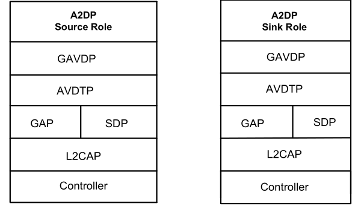
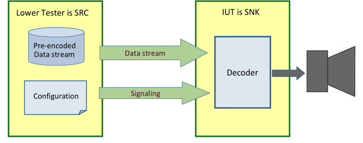
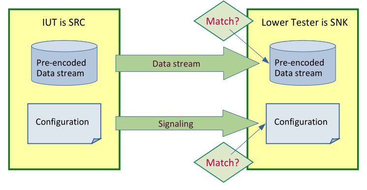
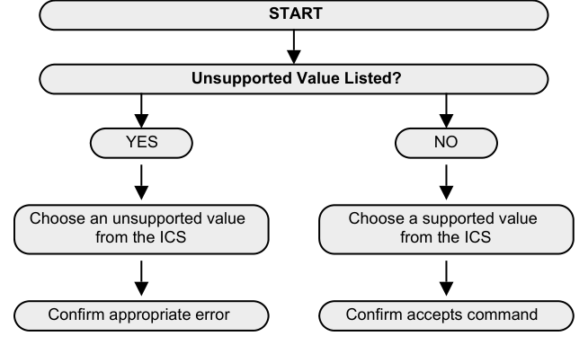
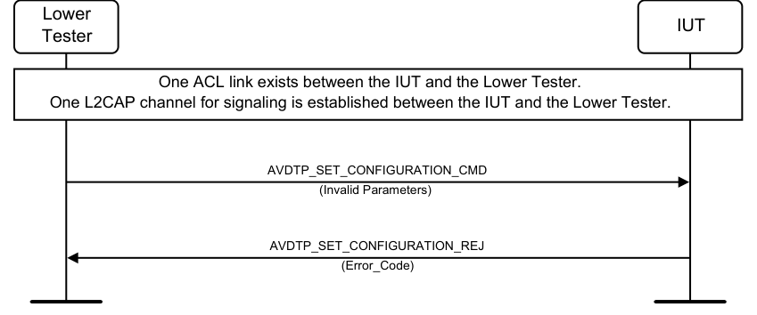
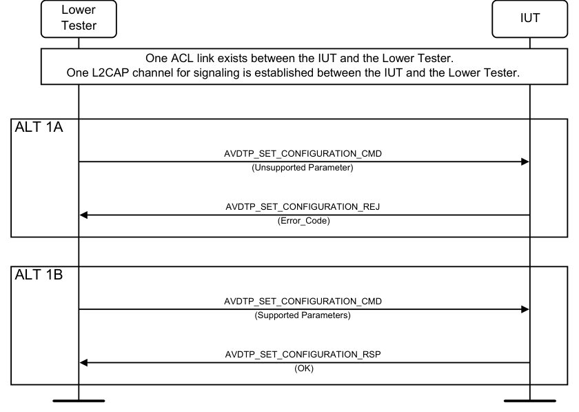
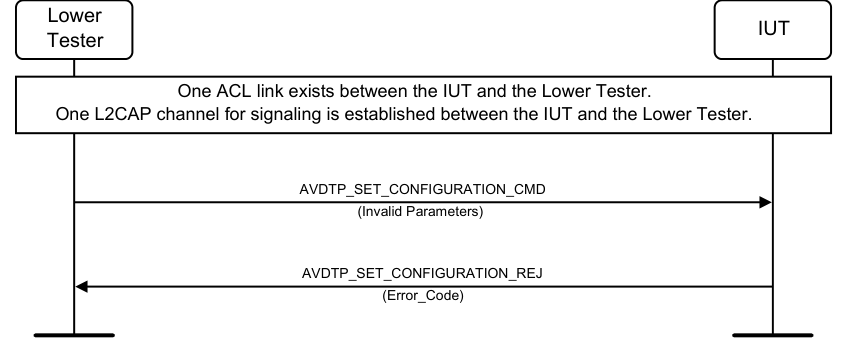

# A2DP.TS.p23

> Source: PDF converted via PyMuPDF.

---

Advanced Audio Distribution Profile (A2DP)
Bluetooth® Test Suite
▪ Revision: A2DP.TS.p23 ▪ Revision Date: 2025-11-04 ▪ Prepared By: BTI ▪ Published during TCRL: TCRL.pkg101
This document, regardless of its title or content, is not a Bluetooth Specification as defined in the Bluetooth Patent/Copyright License Agreement (“PCLA”) and Bluetooth Trademark License Agreement. Use of this document by members of Bluetooth SIG is governed by the membership and other related agreements between Bluetooth SIG Inc. (“Bluetooth SIG”) and its members, including the PCLA and other agreements posted on Bluetooth SIG’s website located at www.bluetooth.com.
THIS DOCUMENT IS PROVIDED “AS IS” AND BLUETOOTH SIG, ITS MEMBERS, AND THEIR AFFILIATES MAKE NO REPRESENTATIONS OR WARRANTIES AND DISCLAIM ALL WARRANTIES, EXPRESS OR IMPLIED, INCLUDING ANY WARRANTY OF MERCHANTABILITY, TITLE, NON-INFRINGEMENT, FITNESS FOR ANY PARTICULAR PURPOSE, THAT THE CONTENT OF THIS DOCUMENT IS FREE OF ERRORS.
TO THE EXTENT NOT PROHIBITED BY LAW, BLUETOOTH SIG, ITS MEMBERS, AND THEIR AFFILIATES DISCLAIM ALL LIABILITY ARISING OUT OF OR RELATING TO USE OF THIS DOCUMENT AND ANY INFORMATION CONTAINED IN THIS DOCUMENT, INCLUDING LOST REVENUE, PROFITS, DATA OR PROGRAMS, OR BUSINESS INTERRUPTION, OR FOR SPECIAL, INDIRECT, CONSEQUENTIAL, INCIDENTAL OR PUNITIVE DAMAGES, HOWEVER CAUSED AND REGARDLESS OF THE THEORY OF LIABILITY, AND EVEN IF BLUETOOTH SIG, ITS MEMBERS, OR THEIR AFFILIATES HAVE BEEN ADVISED OF THE POSSIBILITY OF SUCH DAMAGES.
This document is proprietary to Bluetooth SIG. This document may contain or cover subject matter that is intellectual property of Bluetooth SIG and its members. The furnishing of this document does not grant any license to any intellectual property of Bluetooth SIG or its members.
This document is subject to change without notice.
Copyright © 2001–2025 by Bluetooth SIG, Inc. The Bluetooth word mark and logos are owned by Bluetooth SIG, Inc. Other third-party brands and names are the property of their respective owners.
Contents

## 1 Scope

This Bluetooth document contains the Test Suite Structure (TSS) and test cases to test the implementation of the Bluetooth Advanced Audio Distribution Profile (A2DP) Specification [2] with the objective to provide a high probability of air interface interoperability between the tested implementation and other manufacturers’ Bluetooth devices.

## 2 References, definitions, and abbreviations

### 2.1 References

This document incorporates provisions from other publications by dated or undated reference. These references are cited at the appropriate places in the text, and the publications are listed hereinafter. Additional definitions and abbreviations can be found in [10].
[1] Bluetooth SIG, Specification of the Bluetooth System, Version 2.0 or later
[2] Advanced Audio Distribution Profile (A2DP) Specification, Version 1.0 or later
[3] Generic Audio/Video Distribution Profile (GAVDP) Specification
[4] ICS for Advanced Audio Distribution Profile, A2DP.ICS
[5] Test Suite for Generic Audio/Video Distribution Profile, GAVDP.TS
[6] Conformance Test Bitstreams, Reference Implementation of SBC, Delay Reporting test video, and MPEG AAC test bitstreams: https://www.bluetooth.org/docman/handlers/DownloadDoc.ashx?doc_id=545454
[7] Rec. ITU-R BS.1116-3, “METHODS FOR THE SUBJECTIVE ASSESSMENT OF SMALL IMPAIRMENTS IN AUDIO SYSTEMS INCLUDING MULTICHANNEL SOUND SYSTEMS”, 2015
[8] Rec. ITU-R BS.1387-2, “Method for objective measurements of perceived audio quality”, May 2023, https://www.itu.int/rec/R-REC-BS.1387-2-202305-I
[9] Rec. ITU-R BS.1534-3, “Method for the subjective assessment of intermediate quality level of coding system (MUSHRA)”, 2015
[10] Test Strategy and Terminology Overview
[11] Advanced Audio Distribution Profile (A2DP) Specification, Version 1.4 or later
[12] Audio/Video Distribution Transport Protocol (AVDTP) Specification
[13] SDP Test Suite, SDP.TS

### 2.2 Definitions

In this Bluetooth document, the definitions from [1], [2], [3], [10], [11], and [12] apply.

### 2.3 Acronyms and abbreviations

In this Bluetooth document, the definitions, acronyms, and abbreviations from [1], [2], [3], [10], [11], and [12] apply.

## 3 Test Suite Structure (TSS)

### 3.1 Overview

A2DP requires the presence of GAP, SDP, and AVDTP, as illustrated in Figure 3.1.

**Figure 3.1: A2DP test models**

### 3.2 Test Strategy

The test objectives are to verify the functionality of A2DP within a Bluetooth Host and enable interoperability between Bluetooth Hosts on different devices. The testing approach covers mandatory and optional requirements in the specification and matches these to the support of the IUT as described in the ICS. Any defined test herein is applicable to the IUT if the ICS logical expression defined in the Test Case Mapping Table (TCMT) evaluates to true.
The test equipment provides an implementation of the Radio Controller and the parts of the Host needed to perform the test cases defined in this Test Suite. A Lower Tester acts as the IUT’s peer device and interacts with the IUT over-the-air interface. The configuration, including the IUT, needs to implement similar capabilities to communicate with the test equipment. For some test cases, it is necessary to stimulate the IUT from an Upper Tester. In practice, this could be implemented as a special test interface, a Man Machine Interface (MMI), or another interface supported by the IUT.
This Test Suite contains Valid Behavior (BV) tests complemented with Invalid Behavior (BI) tests where required. The test coverage mirrored in the Test Suite Structure is the result of a process that started with catalogued specification requirements that were logically grouped and assessed for testability enabling coverage in defined test purposes.

#### 3.2.1 Testing of the SBC codec

This section provides the details to support the verification of the SBC codec in compliance with Appendix B and Appendix D in [2].
The SBC Encoder tests in Section 4.9 utilize the reference executables described in Section 3.2.2 and the details provided in Section 3.2.3.
The SBC Decoder tests in Section 4.8 utilize the reference executables described in Section 3.2.2 and the details provided in Section 3.2.4.
Each bitstream in [6] meets the syntactic and semantic requirements specified in the SBC specification document. This section describes a set of semantic tests to be performed on bitstreams.
In the description of the semantic tests, it is assumed that the tested bitstream contains no errors due to transmission or other causes. For each test, the conditions to be satisfied are given.
Note that applying these tests requires parsing of the bitstream to the appropriate levels, which in some cases goes as far as the subband samples recovery.

###### 3.2.1.1.1 crc_check

The crc_check field contains the calculation result as defined in the SBC specification.

###### 3.2.1.1.2 RFU

This bit is reserved for future use, and it contains the value 0.

###### 3.2.1.1.3 audio_samples[blk][ch][sb]

Only valid codes are permitted to be used for this field. This means that the all ‘1’s code is not permitted to occur.

###### 3.2.1.1.4 padding_bit

These padding bits have the value 0.

###### 3.2.1.1.5 bitpool

The combination of the values in the frame_header and the bitpool fields cannot result in a bit rate higher than 320 kbps for mono streams and 512 kbps for stereo streams. Furthermore, the value of the bitpool field is not permitted to exceed 16 * nrof_subbands for the MONO and DUAL_CHANNEL channel configurations and 32 * nrof_subbands for the STEREO and JOINT channel configurations.

#### 3.2.2 Reference SBC Encoder and Decoder

Reference executables for the Win32 platform are available for both the encoder and the decoder of the SBC codec. In this section, the usage of these programs is explained. By typing ‘sbc_encoder –h’ and ‘sbc_decoder –h’, the usage can also be displayed.
The SBC codec can operate at four sampling frequencies: 16 kHz, 32 kHz, 44.1 kHz, and 48 kHz. The sampling frequency is obtained from the encoder input file that needs to be in one of the following formats: aiff, sun/next, or wave.

##### 3.2.2.1 Reference SBC Encoder Version 1.5

Usage: sbc_encoder [-jsv] [-lblk_len] [-nsubbands] [-p] [-rrate] [-ooutputfile] inputfile
[-s] use the stereo mode for stereo signals
[-v] verbose mode
[-j] enables the use of joint coding for stereo signals
[-lblk_len] specifies the APCM block length, out of [4, 8, 12, 16]
[-nsubbands] specifies the number of subbands, out of [4, 8]
[-p] a simple psycho acoustic model is used (preferred)
[-rrate] specifies the bit rate in bps
inputfile specifies the audio input file, the major audio formats are supported
Example: sbc_encoder -j -n8 -l16 –p –r279000 -ofile.sbc file.wav

##### 3.2.2.2 Reference SBC Decoder Version 1.5

Usage: sbc_decoder [-v] [-ooutputfile] [-pstartpos] inputfile
[-v] verbose mode
[-pstartpos] startpos specifies the byte offset to start with decoding
[-ooutputfile] specifies the name of the audio output file
inputfile specifies the name of the bitstream input file
Example: sbc_decoder -ofile.sbc_dec file.sbc
Note: When a VBR bitstream is decoded by this reference decoder and if verbose mode is used, then only the value of the first bitpool parameter and its corresponding bit rate are shown.

#### 3.2.3 SBC Encoder testing

##### 3.2.3.1 Test procedures for SBC Encoder

The SBC encoder must satisfy the following:
• Its output is compliant with SBC bitstream syntax.
• At least one of the following encoder quality criteria is passed:
- The subjective quality (measured by standardized way or by objective testing methods; see [7], [8]) is equivalent to or better than that of the reference encoder.
- The test will pass the procedure described in Section 3.2.3.1.3.

###### 3.2.3.1.1 Input Sound Samples

The SBC encoder must satisfy the following:
• To test SBC encoders, a number of test input sound samples are supplied through [6]. Their details are listed in Table 3.1: Test audio samples for encoder testing.
• Supplied samples cover mono and stereo signals and are provided for sampling frequencies of 16 kHz, 32 kHz, 44.1 kHz, and 48 kHz. The test set includes samples containing speech, music, and synthetic signals.

|  | Audio sample |  | 01 | 02 | 03 | 04 | 05 | 06 | 07 | 08 | 09 | 10 | 11 |
| --- | --- | --- | --- | --- | --- | --- | --- | --- | --- | --- | --- | --- | --- |
|  | (sbc enc test xx) _ _ _ |  |  |  |  |  |  |  |  |  |  |  |  |
|  | Sampling frequency (kHz) |  | 16 | 16 | 16 | 32 | 32 | 44.1 | 44.1 | 48 | 48 | 44.1 | 48 |
|  | Number of channels: |  | 1 | 1 | 2 | 1 | 2 | 1 | 2 | 1 | 2 | 2 | 1 |
|  | Content: |  | S | M | M | M | M | M | M | M | M | Si | B |
|  | M=Music |  |  |  |  |  |  |  |  |  |  |  |  |
|  | S=Speech |  |  |  |  |  |  |  |  |  |  |  |  |
|  | B=Block wave sweep |  |  |  |  |  |  |  |  |  |  |  |  |
|  | Si=Sine wave sweep |  |  |  |  |  |  |  |  |  |  |  |  |

Table 3.1: Test audio samples for encoder testing

###### 3.2.3.1.2.1 Mandatory settings

The A2DP specification defines both mandatory and optional features for SBC encoder implementation. All mandatory SBC encoder features are tested according to Table 3.2. That means eight tests have to be executed for the mandatory settings.

|  | Sampling |  |  | Channel |  |  | Block |  | Subbands |  | Allocation |  | Audio Sample |
| --- | --- | --- | --- | --- | --- | --- | --- | --- | --- | --- | --- | --- | --- |
|  | frequency (kHz) |  |  | Mode |  |  | Length |  |  |  | Method |  |  |
| C1 |  |  | Mono |  |  | 4 |  |  | 8 | Loudness |  |  | 6 if C1 = 44.1 kHz 8 if C1 = 48 kHz |
| C1 |  |  | Mono |  |  | 8 |  |  | 8 | Loudness |  |  | 6 if C1 = 44.1 kHz 8 if C1 = 48 kHz |
| C1 |  |  | Mono |  |  | 12 |  |  | 8 | Loudness |  |  | 6 if C1 = 44.1 kHz 8 if C1 = 48 kHz |
| C1 |  |  | Mono |  |  | 16 |  |  | 8 | Loudness |  |  | 6 if C1 = 44.1 kHz 8 if C1 = 48 kHz |
| C1 |  |  | C2 |  |  | 4 |  |  | 8 | Loudness |  |  | 7 if C1 = 44.1 kHz 9 if C1 = 48 kHz |
| C1 |  |  | C2 |  |  | 8 |  |  | 8 | Loudness |  |  | 7 if C1 = 44.1 kHz 9 if C1 = 48 kHz |
| C1 |  |  | C2 |  |  | 12 |  |  | 8 | Loudness |  |  | 7 if C1 = 44.1 kHz 9 if C1 = 48 kHz |
| C1 |  |  | C2 |  |  | 16 |  |  | 8 | Loudness |  |  | 7 if C1 = 44.1 kHz 9 if C1 = 48 kHz |
| C1: one of 44.1 kHz or 48 kHz |  |  |  |  |  |  |  |  |  |  |  |  |  |
| C2: one of Dual Channel, Stereo, or Joint stereo |  |  |  |  |  |  |  |  |  |  |  |  |  |

Table 3.2: Mandatory SBC parameters for encoder testing

###### 3.2.3.1.2.2 Optional settings

Because the features of an SBC encoder should be independent of each other, it is necessary to test at least all supported features once in one of the test cases.
For every supported sampling frequency, at least four test cases should be executed. For example, if 16 kHz sampling rate is supported, a possible optional encoder test would be as shown in Table 3.3.

|  |  |  |  | SBC Encoder Configuration |  |  |  |  |  |  |  |  |  |  |  |  |  |  |  |  |  |  |  |  |  |
| --- | --- | --- | --- | --- | --- | --- | --- | --- | --- | --- | --- | --- | --- | --- | --- | --- | --- | --- | --- | --- | --- | --- | --- | --- | --- |
|  | Test Case |  |  | Channel Mode |  |  |  |  |  | Block Length |  |  |  |  |  | Subbands |  |  |  | Method |  |  |  | Bitpool value |  |
|  |  |  | M |  | D | S | J |  | 4 |  | 8 | 12 | 16 |  | 4 |  | 8 |  | S |  | L |  |  |  |  |
|  | 13 |  | X |  |  |  |  |  | X |  |  |  |  |  | X |  |  |  | X |  |  |  | 20 |  |  |
|  | 18 |  |  |  | X |  |  |  |  |  | X |  |  |  |  |  | X |  |  |  | X |  | 40 |  |  |
|  | 39 |  |  |  |  | X |  |  |  |  |  | X |  |  | X |  |  |  |  |  | X |  | 36 |  |  |
|  | 60 |  |  |  |  |  | X |  |  |  |  |  | X |  |  |  | X |  | X |  |  |  | 72 |  |  |

Table 3.3: Example tests for optional encoder settings for 16 kHz sampling frequency
Note: The bitpool value is a suggested value. If the encoder does not support this, it should select the nearest value. Note: For Channel Mode, the short notations apply: M: Mono, D: Dual Channel, S: Stereo, J: Joint Stereo. For Method, the short notations apply: S: SNR, L: Loudness.
For other optional sampling frequencies, other combinations covering the supported features should be tested. That means that an encoder supporting all optional and mandatory settings should be tested with 8 + 4*4 = 24 settings.

###### 3.2.3.1.2.3 Possible combination for encoder settings

Table 3.4–Table 3.7 show all possible SBC encoder settings.
Table 3.4 includes the settings when applying a 16 kHz sampling frequency.
Table 3.5 includes the settings when applying a 32 kHz sampling frequency.
Table 3.6 includes the settings when applying a 44.1 kHz sampling frequency.
Table 3.7 includes the settings when applying a 48 kHz sampling frequency.
The bitpool value is not listed there since the bitpool value cannot be fixed in the test cases. Recommended values for the bitpool are as follows:
• For a sampling frequency of 16 kHz: - mode=mono or dual channel: bitpool = 5 * Subbands - mode=stereo or joint stereo: bitpool = 9 * Subbands • For sampling frequencies other than 16 kHz: - mode=mono or dual channel: bitpool = 4 * Subbands - mode=stereo or joint stereo: bitpool = 7 * Subbands
If the encoder does not support the recommended value, it should be tested with the nearest value.
Table 3.4 shows the encoder settings for the optional test cases for 16 kHz sampling frequency. Only the supported settings are tested. In mono case, audio sample 01 is used; in stereo case, audio sample 03.

|  |  |  |  | SBC Encoder Configuration |  |  |  |  |  |  |  |  |  |  |  |  |  |  |  |  |  |  |  |  |  |  |  |  |  |  |  |  |  |  |  |  |  |  |  |  |  |
| --- | --- | --- | --- | --- | --- | --- | --- | --- | --- | --- | --- | --- | --- | --- | --- | --- | --- | --- | --- | --- | --- | --- | --- | --- | --- | --- | --- | --- | --- | --- | --- | --- | --- | --- | --- | --- | --- | --- | --- | --- | --- |
|  | Test |  |  | Sampling |  | Channel Mode |  |  |  |  |  |  |  |  |  |  |  | Block Length |  |  |  |  |  |  |  |  |  |  |  | Subbands |  |  |  |  |  | Method | Method |  |  |  |  |
|  | Case |  |  | Frequency (kHz) |  |  |  |  |  |  |  |  |  |  |  |  |  |  |  |  |  |  |  |  |  |  |  |  |  |  |  |  |  |  |  |  |  |  |  |  |  |
|  |  |  |  | 16 |  |  | M |  |  | D |  |  | S |  |  | J |  |  | 4 |  |  | 8 |  |  | 12 |  |  | 16 |  |  | 4 |  |  | 8 |  |  | S |  |  | L |  |
|  | 1 |  | x |  |  | x |  |  |  |  |  |  |  |  |  |  |  | x |  |  |  |  |  |  |  |  |  |  |  |  |  |  | x |  |  |  |  |  | x |  |  |
|  | 2 |  | x |  |  | x |  |  |  |  |  |  |  |  |  |  |  |  |  |  | x |  |  |  |  |  |  |  |  |  |  |  | x |  |  |  |  |  | x |  |  |
|  | 3 |  | x |  |  | x |  |  |  |  |  |  |  |  |  |  |  |  |  |  |  |  |  | x |  |  |  |  |  |  |  |  | x |  |  |  |  |  | x |  |  |
|  | 4 |  | x |  |  | x |  |  |  |  |  |  |  |  |  |  |  |  |  |  |  |  |  |  |  |  | x |  |  |  |  |  | x |  |  |  |  |  | x |  |  |
|  | 5 |  | x |  |  | x |  |  |  |  |  |  |  |  |  |  |  | x |  |  |  |  |  |  |  |  |  |  |  | x |  |  |  |  |  |  |  |  | x |  |  |
|  | 6 |  | x |  |  | x |  |  |  |  |  |  |  |  |  |  |  |  |  |  | x |  |  |  |  |  |  |  |  | x |  |  |  |  |  |  |  |  | x |  |  |
|  | 7 |  | x |  |  | x |  |  |  |  |  |  |  |  |  |  |  |  |  |  |  |  |  | x |  |  |  |  |  | x |  |  |  |  |  |  |  |  | x |  |  |
|  | 8 |  | x |  |  | x |  |  |  |  |  |  |  |  |  |  |  |  |  |  |  |  |  |  |  |  | x |  |  | x |  |  |  |  |  |  |  |  | x |  |  |
|  | 9 |  | x |  |  | x |  |  |  |  |  |  |  |  |  |  |  | x |  |  |  |  |  |  |  |  |  |  |  |  |  |  | x |  |  | x |  |  |  |  |  |
|  | 10 |  | x |  |  | x |  |  |  |  |  |  |  |  |  |  |  |  |  |  | x |  |  |  |  |  |  |  |  |  |  |  | x |  |  | x |  |  |  |  |  |
|  | 11 |  | x |  |  | x |  |  |  |  |  |  |  |  |  |  |  |  |  |  |  |  |  | x |  |  |  |  |  |  |  |  | x |  |  | x |  |  |  |  |  |
|  | 12 |  | x |  |  | x |  |  |  |  |  |  |  |  |  |  |  |  |  |  |  |  |  |  |  |  | x |  |  |  |  |  | x |  |  | x |  |  |  |  |  |
|  | 13 |  | x |  |  | x |  |  |  |  |  |  |  |  |  |  |  | x |  |  |  |  |  |  |  |  |  |  |  | x |  |  |  |  |  | x |  |  |  |  |  |
|  | 14 |  | x |  |  | x |  |  |  |  |  |  |  |  |  |  |  |  |  |  | x |  |  |  |  |  |  |  |  | x |  |  |  |  |  | x |  |  |  |  |  |
|  | 15 |  | x |  |  | x |  |  |  |  |  |  |  |  |  |  |  |  |  |  |  |  |  | x |  |  |  |  |  | x |  |  |  |  |  | x |  |  |  |  |  |
|  | 16 |  | x |  |  | x |  |  |  |  |  |  |  |  |  |  |  |  |  |  |  |  |  |  |  |  | x |  |  | x |  |  |  |  |  | x |  |  |  |  |  |
|  | 17 |  | x |  |  |  |  |  | x |  |  |  |  |  |  |  |  | x |  |  |  |  |  |  |  |  |  |  |  |  |  |  | x |  |  |  |  |  | x |  |  |
|  | 18 |  | x |  |  |  |  |  | x |  |  |  |  |  |  |  |  |  |  |  | x |  |  |  |  |  |  |  |  |  |  |  | x |  |  |  |  |  | x |  |  |

|  |  |  |  | SBC Encoder Configuration |  |  |  |  |  |  |  |  |  |  |  |  |  |  |  |  |  |  |  |  |  |  |  |  |  |  |  |  |  |  |  |  |  |  |  |  |  |
| --- | --- | --- | --- | --- | --- | --- | --- | --- | --- | --- | --- | --- | --- | --- | --- | --- | --- | --- | --- | --- | --- | --- | --- | --- | --- | --- | --- | --- | --- | --- | --- | --- | --- | --- | --- | --- | --- | --- | --- | --- | --- |
|  | Test |  |  | Sampling |  | Channel Mode |  |  |  |  |  |  |  |  |  |  |  | Block Length |  |  |  |  |  |  |  |  |  |  |  | Subbands |  |  |  |  |  | Method | Method |  |  |  |  |
|  | Case |  |  | Frequency (kHz) |  |  |  |  |  |  |  |  |  |  |  |  |  |  |  |  |  |  |  |  |  |  |  |  |  |  |  |  |  |  |  |  |  |  |  |  |  |
|  |  |  |  | 16 |  |  | M |  |  | D |  |  | S |  |  | J |  |  | 4 |  |  | 8 |  |  | 12 |  |  | 16 |  |  | 4 |  |  | 8 |  |  | S |  |  | L |  |
|  | 19 |  | x |  |  |  |  |  | x |  |  |  |  |  |  |  |  |  |  |  |  |  |  | x |  |  |  |  |  |  |  |  | x |  |  |  |  |  | x |  |  |
|  | 20 |  | x |  |  |  |  |  | x |  |  |  |  |  |  |  |  |  |  |  |  |  |  |  |  |  | x |  |  |  |  |  | x |  |  |  |  |  | x |  |  |
|  | 21 |  | x |  |  |  |  |  | x |  |  |  |  |  |  |  |  | x |  |  |  |  |  |  |  |  |  |  |  | x |  |  |  |  |  |  |  |  | x |  |  |
|  | 22 |  | x |  |  |  |  |  | x |  |  |  |  |  |  |  |  |  |  |  | x |  |  |  |  |  |  |  |  | x |  |  |  |  |  |  |  |  | x |  |  |
|  | 23 |  | x |  |  |  |  |  | x |  |  |  |  |  |  |  |  |  |  |  |  |  |  | x |  |  |  |  |  | x |  |  |  |  |  |  |  |  | x |  |  |
|  | 24 |  | x |  |  |  |  |  | x |  |  |  |  |  |  |  |  |  |  |  |  |  |  |  |  |  | x |  |  | x |  |  |  |  |  |  |  |  | x |  |  |
|  | 25 |  | x |  |  |  |  |  | x |  |  |  |  |  |  |  |  | x |  |  |  |  |  |  |  |  |  |  |  |  |  |  | x |  |  | x |  |  |  |  |  |
|  | 26 |  | x |  |  |  |  |  | x |  |  |  |  |  |  |  |  |  |  |  | x |  |  |  |  |  |  |  |  |  |  |  | x |  |  | x |  |  |  |  |  |
|  | 27 |  | x |  |  |  |  |  | x |  |  |  |  |  |  |  |  |  |  |  |  |  |  | x |  |  |  |  |  |  |  |  | x |  |  | x |  |  |  |  |  |
|  | 28 |  | x |  |  |  |  |  | x |  |  |  |  |  |  |  |  |  |  |  |  |  |  |  |  |  | x |  |  |  |  |  | x |  |  | x |  |  |  |  |  |
|  | 29 |  | x |  |  |  |  |  | x |  |  |  |  |  |  |  |  | x |  |  |  |  |  |  |  |  |  |  |  | x |  |  |  |  |  | x |  |  |  |  |  |
|  | 30 |  | x |  |  |  |  |  | x |  |  |  |  |  |  |  |  |  |  |  | x |  |  |  |  |  |  |  |  | x |  |  |  |  |  | x |  |  |  |  |  |
|  | 31 |  | x |  |  |  |  |  | x |  |  |  |  |  |  |  |  |  |  |  |  |  |  | x |  |  |  |  |  | x |  |  |  |  |  | x |  |  |  |  |  |
|  | 32 |  | x |  |  |  |  |  | x |  |  |  |  |  |  |  |  |  |  |  |  |  |  |  |  |  | x |  |  | x |  |  |  |  |  | x |  |  |  |  |  |
|  | 33 |  | x |  |  |  |  |  |  |  |  | x |  |  |  |  |  | x |  |  |  |  |  |  |  |  |  |  |  |  |  |  | x |  |  |  |  |  | x |  |  |
|  | 34 |  | x |  |  |  |  |  |  |  |  | x |  |  |  |  |  |  |  |  | x |  |  |  |  |  |  |  |  |  |  |  | x |  |  |  |  |  | x |  |  |
|  | 35 |  | x |  |  |  |  |  |  |  |  | x |  |  |  |  |  |  |  |  |  |  |  | x |  |  |  |  |  |  |  |  | x |  |  |  |  |  | x |  |  |
|  | 36 |  | x |  |  |  |  |  |  |  |  | x |  |  |  |  |  |  |  |  |  |  |  |  |  |  | x |  |  |  |  |  | x |  |  |  |  |  | x |  |  |
|  | 37 |  | x |  |  |  |  |  |  |  |  | x |  |  |  |  |  | x |  |  |  |  |  |  |  |  |  |  |  | x |  |  |  |  |  |  |  |  | x |  |  |
|  | 38 |  | x |  |  |  |  |  |  |  |  | x |  |  |  |  |  |  |  |  | x |  |  |  |  |  |  |  |  | x |  |  |  |  |  |  |  |  | x |  |  |
|  | 39 |  | x |  |  |  |  |  |  |  |  | x |  |  |  |  |  |  |  |  |  |  |  | x |  |  |  |  |  | x |  |  |  |  |  |  |  |  | x |  |  |
|  | 40 |  | x |  |  |  |  |  |  |  |  | x |  |  |  |  |  |  |  |  |  |  |  |  |  |  | x |  |  | x |  |  |  |  |  |  |  |  | x |  |  |
|  | 41 |  | x |  |  |  |  |  |  |  |  | x |  |  |  |  |  | x |  |  |  |  |  |  |  |  |  |  |  |  |  |  | x |  |  | x |  |  |  |  |  |
|  | 42 |  | x |  |  |  |  |  |  |  |  | x |  |  |  |  |  |  |  |  | x |  |  |  |  |  |  |  |  |  |  |  | x |  |  | x |  |  |  |  |  |
|  | 43 |  | x |  |  |  |  |  |  |  |  | x |  |  |  |  |  |  |  |  |  |  |  | x |  |  |  |  |  |  |  |  | x |  |  | x |  |  |  |  |  |
|  | 44 |  | x |  |  |  |  |  |  |  |  | x |  |  |  |  |  |  |  |  |  |  |  |  |  |  | x |  |  |  |  |  | x |  |  | x |  |  |  |  |  |
|  | 45 |  | x |  |  |  |  |  |  |  |  | x |  |  |  |  |  | x |  |  |  |  |  |  |  |  |  |  |  | x |  |  |  |  |  | x |  |  |  |  |  |
|  | 46 |  | x |  |  |  |  |  |  |  |  | x |  |  |  |  |  |  |  |  | x |  |  |  |  |  |  |  |  | x |  |  |  |  |  | x |  |  |  |  |  |
|  | 47 |  | x |  |  |  |  |  |  |  |  | x |  |  |  |  |  |  |  |  |  |  |  | x |  |  |  |  |  | x |  |  |  |  |  | x |  |  |  |  |  |
|  | 48 |  | x |  |  |  |  |  |  |  |  | x |  |  |  |  |  |  |  |  |  |  |  |  |  |  | x |  |  | x |  |  |  |  |  | x |  |  |  |  |  |
|  | 49 |  | x |  |  |  |  |  |  |  |  |  |  |  | x |  |  | x |  |  |  |  |  |  |  |  |  |  |  |  |  |  | x |  |  |  |  |  | x |  |  |
|  | 50 |  | x |  |  |  |  |  |  |  |  |  |  |  | x |  |  |  |  |  | x |  |  |  |  |  |  |  |  |  |  |  | x |  |  |  |  |  | x |  |  |
|  | 51 |  | x |  |  |  |  |  |  |  |  |  |  |  | x |  |  |  |  |  |  |  |  | x |  |  |  |  |  |  |  |  | x |  |  |  |  |  | x |  |  |
|  | 52 |  | x |  |  |  |  |  |  |  |  |  |  |  | x |  |  |  |  |  |  |  |  |  |  |  | x |  |  |  |  |  | x |  |  |  |  |  | x |  |  |
|  | 53 |  | x |  |  |  |  |  |  |  |  |  |  |  | x |  |  | x |  |  |  |  |  |  |  |  |  |  |  | x |  |  |  |  |  |  |  |  | x |  |  |
|  | 54 |  | x |  |  |  |  |  |  |  |  |  |  |  | x |  |  |  |  |  | x |  |  |  |  |  |  |  |  | x |  |  |  |  |  |  |  |  | x |  |  |
|  | 55 |  | x |  |  |  |  |  |  |  |  |  |  |  | x |  |  |  |  |  |  |  |  | x |  |  |  |  |  | x |  |  |  |  |  |  |  |  | x |  |  |
|  | 56 |  | x |  |  |  |  |  |  |  |  |  |  |  | x |  |  |  |  |  |  |  |  |  |  |  | x |  |  | x |  |  |  |  |  |  |  |  | x |  |  |
|  | 57 |  | x |  |  |  |  |  |  |  |  |  |  |  | x |  |  | x |  |  |  |  |  |  |  |  |  |  |  |  |  |  | x |  |  | x |  |  |  |  |  |
|  | 58 |  | x |  |  |  |  |  |  |  |  |  |  |  | x |  |  |  |  |  | x |  |  |  |  |  |  |  |  |  |  |  | x |  |  | x |  |  |  |  |  |

|  |  |  |  | SBC Encoder Configuration |  |  |  |  |  |  |  |  |  |  |  |  |  |  |  |  |  |  |  |  |  |  |  |  |  |  |  |  |  |  |  |  |  |  |  |  |  |
| --- | --- | --- | --- | --- | --- | --- | --- | --- | --- | --- | --- | --- | --- | --- | --- | --- | --- | --- | --- | --- | --- | --- | --- | --- | --- | --- | --- | --- | --- | --- | --- | --- | --- | --- | --- | --- | --- | --- | --- | --- | --- |
|  | Test |  |  | Sampling |  | Channel Mode |  |  |  |  |  |  |  |  |  |  |  | Block Length |  |  |  |  |  |  |  |  |  |  |  | Subbands |  |  |  |  |  | Method | Method |  |  |  |  |
|  | Case |  |  | Frequency (kHz) |  |  |  |  |  |  |  |  |  |  |  |  |  |  |  |  |  |  |  |  |  |  |  |  |  |  |  |  |  |  |  |  |  |  |  |  |  |
|  |  |  |  | 16 |  |  | M |  |  | D |  |  | S |  |  | J |  |  | 4 |  |  | 8 |  |  | 12 |  |  | 16 |  |  | 4 |  |  | 8 |  |  | S |  |  | L |  |
|  | 59 |  | x |  |  |  |  |  |  |  |  |  |  |  | x |  |  |  |  |  |  |  |  | x |  |  |  |  |  |  |  |  | x |  |  | x |  |  |  |  |  |
|  | 60 |  | x |  |  |  |  |  |  |  |  |  |  |  | x |  |  |  |  |  |  |  |  |  |  |  | x |  |  |  |  |  | x |  |  | x |  |  |  |  |  |
|  | 61 |  | x |  |  |  |  |  |  |  |  |  |  |  | x |  |  | x |  |  |  |  |  |  |  |  |  |  |  | x |  |  |  |  |  | x |  |  |  |  |  |
|  | 62 |  | x |  |  |  |  |  |  |  |  |  |  |  | x |  |  |  |  |  | x |  |  |  |  |  |  |  |  | x |  |  |  |  |  | x |  |  |  |  |  |
|  | 63 |  | x |  |  |  |  |  |  |  |  |  |  |  | x |  |  |  |  |  |  |  |  | x |  |  |  |  |  | x |  |  |  |  |  | x |  |  |  |  |  |
|  | 64 |  | x |  |  |  |  |  |  |  |  |  |  |  | x |  |  |  |  |  |  |  |  |  |  |  | x |  |  | x |  |  |  |  |  | x |  |  |  |  |  |

Table 3.4: Optional SBC parameters for encoder testing for 16 kHz sampling frequency
Table 3.5 shows the encoder settings for the optional test cases for 32 kHz sampling frequency. Only the supported settings are tested. In mono case, audio sample 04 is used; in stereo case, audio sample 05.

|  |  |  |  | SBC Encoder Configuration |  |  |  |  |  |  |  |  |  |  |  |  |  |  |  |  |  |  |  |  |  |  |  |  |  |  |  |  |  |  |  |  |  |  |  |  |  |
| --- | --- | --- | --- | --- | --- | --- | --- | --- | --- | --- | --- | --- | --- | --- | --- | --- | --- | --- | --- | --- | --- | --- | --- | --- | --- | --- | --- | --- | --- | --- | --- | --- | --- | --- | --- | --- | --- | --- | --- | --- | --- |
|  | Test |  |  | Sampling |  | Channel Mode |  |  |  |  |  |  |  |  |  |  |  | Block Length |  |  |  |  |  |  |  |  |  |  |  | Subbands |  |  |  |  |  | Method |  |  |  |  |  |
|  | Case |  |  | Frequency (kHz) |  |  | Channel Mode |  |  |  |  |  |  |  |  |  |  |  | Block Length |  |  |  |  |  |  |  |  |  |  |  | Subbands |  |  |  |  |  | Method |  |  |  |  |
|  |  |  |  | 32 |  |  | M |  |  | D |  |  | S |  |  | J |  |  | 4 |  |  | 8 |  |  | 12 |  |  | 16 |  |  | 4 |  |  | 8 |  |  | S |  |  | L |  |
|  | 65 |  | x |  |  | x |  |  |  |  |  |  |  |  |  |  |  | x |  |  |  |  |  |  |  |  |  |  |  |  |  |  | x |  |  |  |  |  | x |  |  |
|  | 66 |  | x |  |  | x |  |  |  |  |  |  |  |  |  |  |  |  |  |  | x |  |  |  |  |  |  |  |  |  |  |  | x |  |  |  |  |  | x |  |  |
|  | 67 |  | x |  |  | x |  |  |  |  |  |  |  |  |  |  |  |  |  |  |  |  |  | x |  |  |  |  |  |  |  |  | x |  |  |  |  |  | x |  |  |
|  | 68 |  | x |  |  | x |  |  |  |  |  |  |  |  |  |  |  |  |  |  |  |  |  |  |  |  | x |  |  |  |  |  | x |  |  |  |  |  | x |  |  |
|  | 69 |  | x |  |  | x |  |  |  |  |  |  |  |  |  |  |  | x |  |  |  |  |  |  |  |  |  |  |  | x |  |  |  |  |  |  |  |  | x |  |  |
|  | 70 |  | x |  |  | x |  |  |  |  |  |  |  |  |  |  |  |  |  |  | x |  |  |  |  |  |  |  |  | x |  |  |  |  |  |  |  |  | x |  |  |
|  | 71 |  | x |  |  | x |  |  |  |  |  |  |  |  |  |  |  |  |  |  |  |  |  | x |  |  |  |  |  | x |  |  |  |  |  |  |  |  | x |  |  |
|  | 72 |  | x |  |  | x |  |  |  |  |  |  |  |  |  |  |  |  |  |  |  |  |  |  |  |  | x |  |  | x |  |  |  |  |  |  |  |  | x |  |  |
|  | 73 |  | x |  |  | x |  |  |  |  |  |  |  |  |  |  |  | x |  |  |  |  |  |  |  |  |  |  |  |  |  |  | x |  |  | x |  |  |  |  |  |
|  | 74 |  | x |  |  | x |  |  |  |  |  |  |  |  |  |  |  |  |  |  | x |  |  |  |  |  |  |  |  |  |  |  | x |  |  | x |  |  |  |  |  |
|  | 75 |  | x |  |  | x |  |  |  |  |  |  |  |  |  |  |  |  |  |  |  |  |  | x |  |  |  |  |  |  |  |  | x |  |  | x |  |  |  |  |  |
|  | 76 |  | x |  |  | x |  |  |  |  |  |  |  |  |  |  |  |  |  |  |  |  |  |  |  |  | x |  |  |  |  |  | x |  |  | x |  |  |  |  |  |
|  | 77 |  | x |  |  | x |  |  |  |  |  |  |  |  |  |  |  | x |  |  |  |  |  |  |  |  |  |  |  | x |  |  |  |  |  | x |  |  |  |  |  |
|  | 78 |  | x |  |  | x |  |  |  |  |  |  |  |  |  |  |  |  |  |  | x |  |  |  |  |  |  |  |  | x |  |  |  |  |  | x |  |  |  |  |  |
|  | 79 |  | x |  |  | x |  |  |  |  |  |  |  |  |  |  |  |  |  |  |  |  |  | x |  |  |  |  |  | x |  |  |  |  |  | x |  |  |  |  |  |
|  | 80 |  | x |  |  | x |  |  |  |  |  |  |  |  |  |  |  |  |  |  |  |  |  |  |  |  | x |  |  | x |  |  |  |  |  | x |  |  |  |  |  |
|  | 81 |  | x |  |  |  |  |  | x |  |  |  |  |  |  |  |  | x |  |  |  |  |  |  |  |  |  |  |  |  |  |  | x |  |  |  |  |  | x |  |  |
|  | 82 |  | x |  |  |  |  |  | x |  |  |  |  |  |  |  |  |  |  |  | x |  |  |  |  |  |  |  |  |  |  |  | x |  |  |  |  |  | x |  |  |
|  | 83 |  | x |  |  |  |  |  | x |  |  |  |  |  |  |  |  |  |  |  |  |  |  | x |  |  |  |  |  |  |  |  | x |  |  |  |  |  | x |  |  |
|  | 84 |  | x |  |  |  |  |  | x |  |  |  |  |  |  |  |  |  |  |  |  |  |  |  |  |  | x |  |  |  |  |  | x |  |  |  |  |  | x |  |  |
|  | 85 |  | x |  |  |  |  |  | x |  |  |  |  |  |  |  |  | x |  |  |  |  |  |  |  |  |  |  |  | x |  |  |  |  |  |  |  |  | x |  |  |
|  | 86 |  | x |  |  |  |  |  | x |  |  |  |  |  |  |  |  |  |  |  | x |  |  |  |  |  |  |  |  | x |  |  |  |  |  |  |  |  | x |  |  |
|  | 87 |  | x |  |  |  |  |  | x |  |  |  |  |  |  |  |  |  |  |  |  |  |  | x |  |  |  |  |  | x |  |  |  |  |  |  |  |  | x |  |  |
|  | 88 |  | x |  |  |  |  |  | x |  |  |  |  |  |  |  |  |  |  |  |  |  |  |  |  |  | x |  |  | x |  |  |  |  |  |  |  |  | x |  |  |
|  | 89 |  | x |  |  |  |  |  | x |  |  |  |  |  |  |  |  | x |  |  |  |  |  |  |  |  |  |  |  |  |  |  | x |  |  | x |  |  |  |  |  |
|  | 90 |  | x |  |  |  |  |  | x |  |  |  |  |  |  |  |  |  |  |  | x |  |  |  |  |  |  |  |  |  |  |  | x |  |  | x |  |  |  |  |  |

|  |  |  |  | SBC Encoder Configuration |  |  |  |  |  |  |  |  |  |  |  |  |  |  |  |  |  |  |  |  |  |  |  |  |  |  |  |  |  |  |  |  |  |  |  |  |  |
| --- | --- | --- | --- | --- | --- | --- | --- | --- | --- | --- | --- | --- | --- | --- | --- | --- | --- | --- | --- | --- | --- | --- | --- | --- | --- | --- | --- | --- | --- | --- | --- | --- | --- | --- | --- | --- | --- | --- | --- | --- | --- |
|  | Test |  |  | Sampling |  | Channel Mode |  |  |  |  |  |  |  |  |  |  |  | Block Length |  |  |  |  |  |  |  |  |  |  |  | Subbands |  |  |  |  |  | Method |  |  |  |  |  |
|  | Case |  |  | Frequency (kHz) |  |  | Channel Mode |  |  |  |  |  |  |  |  |  |  |  | Block Length |  |  |  |  |  |  |  |  |  |  |  | Subbands |  |  |  |  |  | Method |  |  |  |  |
|  |  |  |  | 32 |  |  | M |  |  | D |  |  | S |  |  | J |  |  | 4 |  |  | 8 |  |  | 12 |  |  | 16 |  |  | 4 |  |  | 8 |  |  | S |  |  | L |  |
|  | 91 |  | x |  |  |  |  |  | x |  |  |  |  |  |  |  |  |  |  |  |  |  |  | x |  |  |  |  |  |  |  |  | x |  |  | x |  |  |  |  |  |
|  | 92 |  | x |  |  |  |  |  | x |  |  |  |  |  |  |  |  |  |  |  |  |  |  |  |  |  | x |  |  |  |  |  | x |  |  | x |  |  |  |  |  |
|  | 93 |  | x |  |  |  |  |  | x |  |  |  |  |  |  |  |  | x |  |  |  |  |  |  |  |  |  |  |  | x |  |  |  |  |  | x |  |  |  |  |  |
|  | 94 |  | x |  |  |  |  |  | x |  |  |  |  |  |  |  |  |  |  |  | x |  |  |  |  |  |  |  |  | x |  |  |  |  |  | x |  |  |  |  |  |
|  | 95 |  | x |  |  |  |  |  | x |  |  |  |  |  |  |  |  |  |  |  |  |  |  | x |  |  |  |  |  | x |  |  |  |  |  | x |  |  |  |  |  |
|  | 96 |  | x |  |  |  |  |  | x |  |  |  |  |  |  |  |  |  |  |  |  |  |  |  |  |  | x |  |  | x |  |  |  |  |  | x |  |  |  |  |  |
|  | 97 |  | x |  |  |  |  |  |  |  |  | x |  |  |  |  |  | x |  |  |  |  |  |  |  |  |  |  |  |  |  |  | x |  |  |  |  |  | x |  |  |
|  | 98 |  | x |  |  |  |  |  |  |  |  | x |  |  |  |  |  |  |  |  | x |  |  |  |  |  |  |  |  |  |  |  | x |  |  |  |  |  | x |  |  |
|  | 99 |  | x |  |  |  |  |  |  |  |  | x |  |  |  |  |  |  |  |  |  |  |  | x |  |  |  |  |  |  |  |  | x |  |  |  |  |  | x |  |  |
|  | 100 |  | x |  |  |  |  |  |  |  |  | x |  |  |  |  |  |  |  |  |  |  |  |  |  |  | x |  |  |  |  |  | x |  |  |  |  |  | x |  |  |
|  | 101 |  | x |  |  |  |  |  |  |  |  | x |  |  |  |  |  | x |  |  |  |  |  |  |  |  |  |  |  | x |  |  |  |  |  |  |  |  | x |  |  |
|  | 102 |  | x |  |  |  |  |  |  |  |  | x |  |  |  |  |  |  |  |  | x |  |  |  |  |  |  |  |  | x |  |  |  |  |  |  |  |  | x |  |  |
|  | 103 |  | x |  |  |  |  |  |  |  |  | x |  |  |  |  |  |  |  |  |  |  |  | x |  |  |  |  |  | x |  |  |  |  |  |  |  |  | x |  |  |
|  | 104 |  | x |  |  |  |  |  |  |  |  | x |  |  |  |  |  |  |  |  |  |  |  |  |  |  | x |  |  | x |  |  |  |  |  |  |  |  | x |  |  |
|  | 105 |  | x |  |  |  |  |  |  |  |  | x |  |  |  |  |  | x |  |  |  |  |  |  |  |  |  |  |  |  |  |  | x |  |  | x |  |  |  |  |  |
|  | 106 |  | x |  |  |  |  |  |  |  |  | x |  |  |  |  |  |  |  |  | x |  |  |  |  |  |  |  |  |  |  |  | x |  |  | x |  |  |  |  |  |
|  | 107 |  | x |  |  |  |  |  |  |  |  | x |  |  |  |  |  |  |  |  |  |  |  | x |  |  |  |  |  |  |  |  | x |  |  | x |  |  |  |  |  |
|  | 108 |  | x |  |  |  |  |  |  |  |  | x |  |  |  |  |  |  |  |  |  |  |  |  |  |  | x |  |  |  |  |  | x |  |  | x |  |  |  |  |  |
|  | 109 |  | x |  |  |  |  |  |  |  |  | x |  |  |  |  |  | x |  |  |  |  |  |  |  |  |  |  |  | x |  |  |  |  |  | x |  |  |  |  |  |
|  | 110 |  | x |  |  |  |  |  |  |  |  | x |  |  |  |  |  |  |  |  | x |  |  |  |  |  |  |  |  | x |  |  |  |  |  | x |  |  |  |  |  |
|  | 111 |  | x |  |  |  |  |  |  |  |  | x |  |  |  |  |  |  |  |  |  |  |  | x |  |  |  |  |  | x |  |  |  |  |  | x |  |  |  |  |  |
|  | 112 |  | x |  |  |  |  |  |  |  |  | x |  |  |  |  |  |  |  |  |  |  |  |  |  |  | x |  |  | x |  |  |  |  |  | x |  |  |  |  |  |
|  | 113 |  | x |  |  |  |  |  |  |  |  |  |  |  | x |  |  | x |  |  |  |  |  |  |  |  |  |  |  |  |  |  | x |  |  |  |  |  | x |  |  |
|  | 114 |  | x |  |  |  |  |  |  |  |  |  |  |  | x |  |  |  |  |  | x |  |  |  |  |  |  |  |  |  |  |  | x |  |  |  |  |  | x |  |  |
|  | 115 |  | x |  |  |  |  |  |  |  |  |  |  |  | x |  |  |  |  |  |  |  |  | x |  |  |  |  |  |  |  |  | x |  |  |  |  |  | x |  |  |
|  | 116 |  | x |  |  |  |  |  |  |  |  |  |  |  | x |  |  |  |  |  |  |  |  |  |  |  | x |  |  |  |  |  | x |  |  |  |  |  | x |  |  |
|  | 117 |  | x |  |  |  |  |  |  |  |  |  |  |  | x |  |  | x |  |  |  |  |  |  |  |  |  |  |  | x |  |  |  |  |  |  |  |  | x |  |  |
|  | 118 |  | x |  |  |  |  |  |  |  |  |  |  |  | x |  |  |  |  |  | x |  |  |  |  |  |  |  |  | x |  |  |  |  |  |  |  |  | x |  |  |
|  | 119 |  | x |  |  |  |  |  |  |  |  |  |  |  | x |  |  |  |  |  |  |  |  | x |  |  |  |  |  | x |  |  |  |  |  |  |  |  | x |  |  |
|  | 120 |  | x |  |  |  |  |  |  |  |  |  |  |  | x |  |  |  |  |  |  |  |  |  |  |  | x |  |  | x |  |  |  |  |  |  |  |  | x |  |  |
|  | 121 |  | x |  |  |  |  |  |  |  |  |  |  |  | x |  |  | x |  |  |  |  |  |  |  |  |  |  |  |  |  |  | x |  |  | x |  |  |  |  |  |
|  | 122 |  | x |  |  |  |  |  |  |  |  |  |  |  | x |  |  |  |  |  | x |  |  |  |  |  |  |  |  |  |  |  | x |  |  | x |  |  |  |  |  |
|  | 123 |  | x |  |  |  |  |  |  |  |  |  |  |  | x |  |  |  |  |  |  |  |  | x |  |  |  |  |  |  |  |  | x |  |  | x |  |  |  |  |  |
|  | 124 |  | x |  |  |  |  |  |  |  |  |  |  |  | x |  |  |  |  |  |  |  |  |  |  |  | x |  |  |  |  |  | x |  |  | x |  |  |  |  |  |
|  | 125 |  | x |  |  |  |  |  |  |  |  |  |  |  | x |  |  | x |  |  |  |  |  |  |  |  |  |  |  | x |  |  |  |  |  | x |  |  |  |  |  |
|  | 126 |  | x |  |  |  |  |  |  |  |  |  |  |  | x |  |  |  |  |  | x |  |  |  |  |  |  |  |  | x |  |  |  |  |  | x |  |  |  |  |  |
|  | 127 |  | x |  |  |  |  |  |  |  |  |  |  |  | x |  |  |  |  |  |  |  |  | x |  |  |  |  |  | x |  |  |  |  |  | x |  |  |  |  |  |
|  | 128 |  | x |  |  |  |  |  |  |  |  |  |  |  | x |  |  |  |  |  |  |  |  |  |  |  | x |  |  | x |  |  |  |  |  | x |  |  |  |  |  |

Table 3.5: Optional SBC parameters for encoder testing for 32 kHz sampling frequency
Table 3.6 shows the encoder settings for the optional test cases for 44.1 kHz sampling frequency. Only the supported settings are tested. In mono case, audio sample 06 is used; in stereo case, audio sample 07. Settings tested for the mandatory part are not repeated in the optional testing part.

|  |  |  |  | SBC Encoder Configuration |  |  |  |  |  |  |  |  |  |  |  |  |  |  |  |  |  |  |  |  |  |  |  |  |  |  |  |  |  |  |  |  |  |  |  |  |  |
| --- | --- | --- | --- | --- | --- | --- | --- | --- | --- | --- | --- | --- | --- | --- | --- | --- | --- | --- | --- | --- | --- | --- | --- | --- | --- | --- | --- | --- | --- | --- | --- | --- | --- | --- | --- | --- | --- | --- | --- | --- | --- |
|  | Test |  |  | Sampling |  | Channel Mode |  |  |  |  |  |  |  |  |  |  |  | Block Length |  |  |  |  |  |  |  |  |  |  |  | Subbands |  |  |  |  |  | Method |  |  |  |  |  |
|  | Case |  |  | Frequency (kHz) |  |  | Channel Mode |  |  |  |  |  |  |  |  |  |  |  | Block Length |  |  |  |  |  |  |  |  |  |  |  | Subbands |  |  |  |  |  | Method |  |  |  |  |
|  |  |  |  | 44.1 |  |  | M |  |  | D |  |  | S |  |  | J |  |  | 4 |  |  | 8 |  |  | 12 |  |  | 16 |  |  | 4 |  |  | 8 |  |  | S |  |  | L |  |
|  | 129 |  | x |  |  | x |  |  |  |  |  |  |  |  |  |  |  | x |  |  |  |  |  |  |  |  |  |  |  |  |  |  | x |  |  |  |  |  | x |  |  |
|  | 130 |  | x |  |  | x |  |  |  |  |  |  |  |  |  |  |  |  |  |  | X |  |  |  |  |  |  |  |  |  |  |  | x |  |  |  |  |  | x |  |  |
|  | 131 |  | x |  |  | x |  |  |  |  |  |  |  |  |  |  |  |  |  |  |  |  |  | x |  |  |  |  |  |  |  |  | x |  |  |  |  |  | x |  |  |
|  | 132 |  | x |  |  | x |  |  |  |  |  |  |  |  |  |  |  |  |  |  |  |  |  |  |  |  | x |  |  |  |  |  | x |  |  |  |  |  | x |  |  |
|  | 133 |  | x |  |  | x |  |  |  |  |  |  |  |  |  |  |  | x |  |  |  |  |  |  |  |  |  |  |  | x |  |  |  |  |  |  |  |  | x |  |  |
|  | 134 |  | x |  |  | x |  |  |  |  |  |  |  |  |  |  |  |  |  |  | x |  |  |  |  |  |  |  |  | x |  |  |  |  |  |  |  |  | x |  |  |
|  | 135 |  | x |  |  | x |  |  |  |  |  |  |  |  |  |  |  |  |  |  |  |  |  | x |  |  |  |  |  | x |  |  |  |  |  |  |  |  | x |  |  |
|  | 136 |  | x |  |  | x |  |  |  |  |  |  |  |  |  |  |  |  |  |  |  |  |  |  |  |  | x |  |  | x |  |  |  |  |  |  |  |  | x |  |  |
|  | 137 |  | x |  |  | x |  |  |  |  |  |  |  |  |  |  |  | x |  |  |  |  |  |  |  |  |  |  |  |  |  |  | x |  |  | x |  |  |  |  |  |
|  | 138 |  | x |  |  | x |  |  |  |  |  |  |  |  |  |  |  |  |  |  | x |  |  |  |  |  |  |  |  |  |  |  | x |  |  | x |  |  |  |  |  |
|  | 139 |  | x |  |  | x |  |  |  |  |  |  |  |  |  |  |  |  |  |  |  |  |  | x |  |  |  |  |  |  |  |  | x |  |  | x |  |  |  |  |  |
|  | 140 |  | x |  |  | x |  |  |  |  |  |  |  |  |  |  |  |  |  |  |  |  |  |  |  |  | x |  |  |  |  |  | x |  |  | x |  |  |  |  |  |
|  | 141 |  | x |  |  | x |  |  |  |  |  |  |  |  |  |  |  | x |  |  |  |  |  |  |  |  |  |  |  | x |  |  |  |  |  | x |  |  |  |  |  |
|  | 142 |  | x |  |  | x |  |  |  |  |  |  |  |  |  |  |  |  |  |  | x |  |  |  |  |  |  |  |  | x |  |  |  |  |  | x |  |  |  |  |  |
|  | 143 |  | x |  |  | x |  |  |  |  |  |  |  |  |  |  |  |  |  |  |  |  |  | x |  |  |  |  |  | x |  |  |  |  |  | x |  |  |  |  |  |
|  | 144 |  | x |  |  | x |  |  |  |  |  |  |  |  |  |  |  |  |  |  |  |  |  |  |  |  | x |  |  | x |  |  |  |  |  | x |  |  |  |  |  |
|  | 145 |  | x |  |  |  |  |  | x |  |  |  |  |  |  |  |  | x |  |  |  |  |  |  |  |  |  |  |  |  |  |  | x |  |  |  |  |  | x |  |  |
|  | 146 |  | x |  |  |  |  |  | x |  |  |  |  |  |  |  |  |  |  |  | x |  |  |  |  |  |  |  |  |  |  |  | x |  |  |  |  |  | x |  |  |
|  | 147 |  | x |  |  |  |  |  | x |  |  |  |  |  |  |  |  |  |  |  |  |  |  | x |  |  |  |  |  |  |  |  | x |  |  |  |  |  | x |  |  |
|  | 148 |  | x |  |  |  |  |  | x |  |  |  |  |  |  |  |  |  |  |  |  |  |  |  |  |  | x |  |  |  |  |  | x |  |  |  |  |  | x |  |  |
|  | 149 |  | x |  |  |  |  |  | x |  |  |  |  |  |  |  |  | x |  |  |  |  |  |  |  |  |  |  |  | x |  |  |  |  |  |  |  |  | x |  |  |
|  | 150 |  | x |  |  |  |  |  | x |  |  |  |  |  |  |  |  |  |  |  | x |  |  |  |  |  |  |  |  | x |  |  |  |  |  |  |  |  | x |  |  |
|  | 151 |  | x |  |  |  |  |  | x |  |  |  |  |  |  |  |  |  |  |  |  |  |  | x |  |  |  |  |  | x |  |  |  |  |  |  |  |  | x |  |  |
|  | 152 |  | x |  |  |  |  |  | x |  |  |  |  |  |  |  |  |  |  |  |  |  |  |  |  |  | x |  |  | x |  |  |  |  |  |  |  |  | x |  |  |
|  | 153 |  | x |  |  |  |  |  | x |  |  |  |  |  |  |  |  | x |  |  |  |  |  |  |  |  |  |  |  |  |  |  | x |  |  | x |  |  |  |  |  |
|  | 154 |  | x |  |  |  |  |  | x |  |  |  |  |  |  |  |  |  |  |  | x |  |  |  |  |  |  |  |  |  |  |  | x |  |  | x |  |  |  |  |  |
|  | 155 |  | x |  |  |  |  |  | x |  |  |  |  |  |  |  |  |  |  |  |  |  |  | x |  |  |  |  |  |  |  |  | x |  |  | x |  |  |  |  |  |
|  | 156 |  | x |  |  |  |  |  | x |  |  |  |  |  |  |  |  |  |  |  |  |  |  |  |  |  | x |  |  |  |  |  | x |  |  | x |  |  |  |  |  |
|  | 157 |  | x |  |  |  |  |  | x |  |  |  |  |  |  |  |  | x |  |  |  |  |  |  |  |  |  |  |  | x |  |  |  |  |  | x |  |  |  |  |  |
|  | 158 |  | x |  |  |  |  |  | x |  |  |  |  |  |  |  |  |  |  |  | x |  |  |  |  |  |  |  |  | x |  |  |  |  |  | x |  |  |  |  |  |
|  | 159 |  | x |  |  |  |  |  | x |  |  |  |  |  |  |  |  |  |  |  |  |  |  | x |  |  |  |  |  | x |  |  |  |  |  | x |  |  |  |  |  |
|  | 160 |  | x |  |  |  |  |  | x |  |  |  |  |  |  |  |  |  |  |  |  |  |  |  |  |  | x |  |  | x |  |  |  |  |  | x |  |  |  |  |  |
|  | 161 |  | x |  |  |  |  |  |  |  |  | x |  |  |  |  |  | x |  |  |  |  |  |  |  |  |  |  |  |  |  |  | x |  |  |  |  |  | x |  |  |
|  | 162 |  | x |  |  |  |  |  |  |  |  | x |  |  |  |  |  |  |  |  | x |  |  |  |  |  |  |  |  |  |  |  | x |  |  |  |  |  | x |  |  |
|  | 163 |  | x |  |  |  |  |  |  |  |  | x |  |  |  |  |  |  |  |  |  |  |  | x |  |  |  |  |  |  |  |  | x |  |  |  |  |  | x |  |  |
|  | 164 |  | x |  |  |  |  |  |  |  |  | x |  |  |  |  |  |  |  |  |  |  |  |  |  |  | x |  |  |  |  |  | x |  |  |  |  |  | x |  |  |
|  | 165 |  | x |  |  |  |  |  |  |  |  | x |  |  |  |  |  | x |  |  |  |  |  |  |  |  |  |  |  | x |  |  |  |  |  |  |  |  | x |  |  |

|  |  |  |  | SBC Encoder Configuration |  |  |  |  |  |  |  |  |  |  |  |  |  |  |  |  |  |  |  |  |  |  |  |  |  |  |  |  |  |  |  |  |  |  |  |  |  |
| --- | --- | --- | --- | --- | --- | --- | --- | --- | --- | --- | --- | --- | --- | --- | --- | --- | --- | --- | --- | --- | --- | --- | --- | --- | --- | --- | --- | --- | --- | --- | --- | --- | --- | --- | --- | --- | --- | --- | --- | --- | --- |
|  | Test |  |  | Sampling |  | Channel Mode |  |  |  |  |  |  |  |  |  |  |  | Block Length |  |  |  |  |  |  |  |  |  |  |  | Subbands |  |  |  |  |  | Method |  |  |  |  |  |
|  | Case |  |  | Frequency (kHz) |  |  | Channel Mode |  |  |  |  |  |  |  |  |  |  |  | Block Length |  |  |  |  |  |  |  |  |  |  |  | Subbands |  |  |  |  |  | Method |  |  |  |  |
|  |  |  |  | 44.1 |  |  | M |  |  | D |  |  | S |  |  | J |  |  | 4 |  |  | 8 |  |  | 12 |  |  | 16 |  |  | 4 |  |  | 8 |  |  | S |  |  | L |  |
|  | 166 |  | x |  |  |  |  |  |  |  |  | x |  |  |  |  |  |  |  |  | x |  |  |  |  |  |  |  |  | x |  |  |  |  |  |  |  |  | x |  |  |
|  | 167 |  | x |  |  |  |  |  |  |  |  | x |  |  |  |  |  |  |  |  |  |  |  | x |  |  |  |  |  | x |  |  |  |  |  |  |  |  | x |  |  |
|  | 168 |  | x |  |  |  |  |  |  |  |  | x |  |  |  |  |  |  |  |  |  |  |  |  |  |  | x |  |  | x |  |  |  |  |  |  |  |  | x |  |  |
|  | 169 |  | x |  |  |  |  |  |  |  |  | x |  |  |  |  |  | x |  |  |  |  |  |  |  |  |  |  |  |  |  |  | x |  |  | x |  |  |  |  |  |
|  | 170 |  | x |  |  |  |  |  |  |  |  | x |  |  |  |  |  |  |  |  | x |  |  |  |  |  |  |  |  |  |  |  | x |  |  | x |  |  |  |  |  |
|  | 171 |  | x |  |  |  |  |  |  |  |  | x |  |  |  |  |  |  |  |  |  |  |  | x |  |  |  |  |  |  |  |  | x |  |  | x |  |  |  |  |  |
|  | 172 |  | x |  |  |  |  |  |  |  |  | x |  |  |  |  |  |  |  |  |  |  |  |  |  |  | x |  |  |  |  |  | x |  |  | x |  |  |  |  |  |
|  | 173 |  | x |  |  |  |  |  |  |  |  | x |  |  |  |  |  | x |  |  |  |  |  |  |  |  |  |  |  | x |  |  |  |  |  | x |  |  |  |  |  |
|  | 174 |  | x |  |  |  |  |  |  |  |  | x |  |  |  |  |  |  |  |  | x |  |  |  |  |  |  |  |  | x |  |  |  |  |  | x |  |  |  |  |  |
|  | 175 |  | x |  |  |  |  |  |  |  |  | x |  |  |  |  |  |  |  |  |  |  |  | x |  |  |  |  |  | x |  |  |  |  |  | x |  |  |  |  |  |
|  | 176 |  | x |  |  |  |  |  |  |  |  | x |  |  |  |  |  |  |  |  |  |  |  |  |  |  | x |  |  | x |  |  |  |  |  | x |  |  |  |  |  |
|  | 177 |  | x |  |  |  |  |  |  |  |  |  |  |  | x |  |  | x |  |  |  |  |  |  |  |  |  |  |  |  |  |  | x |  |  |  |  |  | x |  |  |
|  | 178 |  | x |  |  |  |  |  |  |  |  |  |  |  | x |  |  |  |  |  | x |  |  |  |  |  |  |  |  |  |  |  | x |  |  |  |  |  | x |  |  |
|  | 179 |  | x |  |  |  |  |  |  |  |  |  |  |  | x |  |  |  |  |  |  |  |  | x |  |  |  |  |  |  |  |  | x |  |  |  |  |  | x |  |  |
|  | 180 |  | x |  |  |  |  |  |  |  |  |  |  |  | x |  |  |  |  |  |  |  |  |  |  |  | x |  |  |  |  |  | x |  |  |  |  |  | x |  |  |
|  | 181 |  | x |  |  |  |  |  |  |  |  |  |  |  | x |  |  | x |  |  |  |  |  |  |  |  |  |  |  | x |  |  |  |  |  |  |  |  | x |  |  |
|  | 182 |  | x |  |  |  |  |  |  |  |  |  |  |  | x |  |  |  |  |  | x |  |  |  |  |  |  |  |  | x |  |  |  |  |  |  |  |  | x |  |  |
|  | 183 |  | x |  |  |  |  |  |  |  |  |  |  |  | x |  |  |  |  |  |  |  |  | x |  |  |  |  |  | x |  |  |  |  |  |  |  |  | x |  |  |
|  | 184 |  | x |  |  |  |  |  |  |  |  |  |  |  | x |  |  |  |  |  |  |  |  |  |  |  | x |  |  | x |  |  |  |  |  |  |  |  | x |  |  |
|  | 185 |  | x |  |  |  |  |  |  |  |  |  |  |  | x |  |  | x |  |  |  |  |  |  |  |  |  |  |  |  |  |  | x |  |  | x |  |  |  |  |  |
|  | 186 |  | x |  |  |  |  |  |  |  |  |  |  |  | x |  |  |  |  |  | x |  |  |  |  |  |  |  |  |  |  |  | x |  |  | x |  |  |  |  |  |
|  | 187 |  | x |  |  |  |  |  |  |  |  |  |  |  | x |  |  |  |  |  |  |  |  | x |  |  |  |  |  |  |  |  | x |  |  | x |  |  |  |  |  |
|  | 188 |  | x |  |  |  |  |  |  |  |  |  |  |  | x |  |  |  |  |  |  |  |  |  |  |  | x |  |  |  |  |  | x |  |  | x |  |  |  |  |  |
|  | 189 |  | x |  |  |  |  |  |  |  |  |  |  |  | x |  |  | x |  |  |  |  |  |  |  |  |  |  |  | x |  |  |  |  |  | x |  |  |  |  |  |
|  | 190 |  | x |  |  |  |  |  |  |  |  |  |  |  | x |  |  |  |  |  | x |  |  |  |  |  |  |  |  | x |  |  |  |  |  | x |  |  |  |  |  |
|  | 191 |  | x |  |  |  |  |  |  |  |  |  |  |  | x |  |  |  |  |  |  |  |  | x |  |  |  |  |  | x |  |  |  |  |  | x |  |  |  |  |  |
|  | 192 |  | x |  |  |  |  |  |  |  |  |  |  |  | x |  |  |  |  |  |  |  |  |  |  |  | x |  |  | x |  |  |  |  |  | x |  |  |  |  |  |

Table 3.6: Optional SBC parameters for encoder testing for 44.1 kHz sampling frequency
Table 3.7 shows the encoder settings for the optional test cases for 48 kHz sampling frequency. Only the supported settings are tested. In mono case, audio sample 08 is used; in stereo case, audio sample 09. Settings tested for the mandatory part are not repeated in the optional testing part.

|  |  |  |  | SBC Encoder Configuration |  |  |  |  |  |  |  |  |  |  |  |  |  |  |  |  |  |  |  |  |  |  |  |  |  |  |  |  |  |  |  |  |  |  |  |  |  |
| --- | --- | --- | --- | --- | --- | --- | --- | --- | --- | --- | --- | --- | --- | --- | --- | --- | --- | --- | --- | --- | --- | --- | --- | --- | --- | --- | --- | --- | --- | --- | --- | --- | --- | --- | --- | --- | --- | --- | --- | --- | --- |
|  | Test |  |  | Sampling |  | Channel Mode |  |  |  |  |  |  |  |  |  |  |  | Block Length |  |  |  |  |  |  |  |  |  |  |  | Subbands |  |  |  |  |  | Method |  |  |  |  |  |
|  | Case |  |  | Frequency (kHz) |  |  | Channel Mode |  |  |  |  |  |  |  |  |  |  |  | Block Length |  |  |  |  |  |  |  |  |  |  |  | Subbands |  |  |  |  |  | Method |  |  |  |  |
|  |  |  |  | 48 |  |  | M |  |  | D |  |  | S |  |  | J |  |  | 4 |  |  | 8 |  |  | 12 |  |  | 16 |  |  | 4 |  |  | 8 |  |  | S |  |  | L |  |
|  | 193 |  | x |  |  | x |  |  |  |  |  |  |  |  |  |  |  | x |  |  |  |  |  |  |  |  |  |  |  |  |  |  | x |  |  |  |  |  | x |  |  |
|  | 194 |  | x |  |  | x |  |  |  |  |  |  |  |  |  |  |  |  |  |  | x |  |  |  |  |  |  |  |  |  |  |  | x |  |  |  |  |  | x |  |  |
|  | 195 |  | x |  |  | x |  |  |  |  |  |  |  |  |  |  |  |  |  |  |  |  |  | x |  |  |  |  |  |  |  |  | x |  |  |  |  |  | x |  |  |
|  | 196 |  | x |  |  | x |  |  |  |  |  |  |  |  |  |  |  |  |  |  |  |  |  |  |  |  | x |  |  |  |  |  | x |  |  |  |  |  | x |  |  |

|  |  |  |  | SBC Encoder Configuration |  |  |  |  |  |  |  |  |  |  |  |  |  |  |  |  |  |  |  |  |  |  |  |  |  |  |  |  |  |  |  |  |  |  |  |  |  |
| --- | --- | --- | --- | --- | --- | --- | --- | --- | --- | --- | --- | --- | --- | --- | --- | --- | --- | --- | --- | --- | --- | --- | --- | --- | --- | --- | --- | --- | --- | --- | --- | --- | --- | --- | --- | --- | --- | --- | --- | --- | --- |
|  | Test |  |  | Sampling |  | Channel Mode |  |  |  |  |  |  |  |  |  |  |  | Block Length |  |  |  |  |  |  |  |  |  |  |  | Subbands |  |  |  |  |  | Method |  |  |  |  |  |
|  | Case |  |  | Frequency (kHz) |  |  | Channel Mode |  |  |  |  |  |  |  |  |  |  |  | Block Length |  |  |  |  |  |  |  |  |  |  |  | Subbands |  |  |  |  |  | Method |  |  |  |  |
|  |  |  |  | 48 |  |  | M |  |  | D |  |  | S |  |  | J |  |  | 4 |  |  | 8 |  |  | 12 |  |  | 16 |  |  | 4 |  |  | 8 |  |  | S |  |  | L |  |
|  | 197 |  | x |  |  | x |  |  |  |  |  |  |  |  |  |  |  | x |  |  |  |  |  |  |  |  |  |  |  | x |  |  |  |  |  |  |  |  | x |  |  |
|  | 198 |  | x |  |  | x |  |  |  |  |  |  |  |  |  |  |  |  |  |  | x |  |  |  |  |  |  |  |  | x |  |  |  |  |  |  |  |  | x |  |  |
|  | 199 |  | x |  |  | x |  |  |  |  |  |  |  |  |  |  |  |  |  |  |  |  |  | x |  |  |  |  |  | x |  |  |  |  |  |  |  |  | x |  |  |
|  | 200 |  | x |  |  | x |  |  |  |  |  |  |  |  |  |  |  |  |  |  |  |  |  |  |  |  | x |  |  | x |  |  |  |  |  |  |  |  | x |  |  |
|  | 201 |  | x |  |  | x |  |  |  |  |  |  |  |  |  |  |  | x |  |  |  |  |  |  |  |  |  |  |  |  |  |  | x |  |  | x |  |  |  |  |  |
|  | 202 |  | x |  |  | x |  |  |  |  |  |  |  |  |  |  |  |  |  |  | x |  |  |  |  |  |  |  |  |  |  |  | x |  |  | x |  |  |  |  |  |
|  | 203 |  | x |  |  | x |  |  |  |  |  |  |  |  |  |  |  |  |  |  |  |  |  | x |  |  |  |  |  |  |  |  | x |  |  | x |  |  |  |  |  |
|  | 204 |  | x |  |  | x |  |  |  |  |  |  |  |  |  |  |  |  |  |  |  |  |  |  |  |  | x |  |  |  |  |  | x |  |  | x |  |  |  |  |  |
|  | 205 |  | x |  |  | x |  |  |  |  |  |  |  |  |  |  |  | x |  |  |  |  |  |  |  |  |  |  |  | x |  |  |  |  |  | x |  |  |  |  |  |
|  | 206 |  | x |  |  | x |  |  |  |  |  |  |  |  |  |  |  |  |  |  | x |  |  |  |  |  |  |  |  | x |  |  |  |  |  | x |  |  |  |  |  |
|  | 207 |  | x |  |  | x |  |  |  |  |  |  |  |  |  |  |  |  |  |  |  |  |  | x |  |  |  |  |  | x |  |  |  |  |  | x |  |  |  |  |  |
|  | 208 |  | x |  |  | x |  |  |  |  |  |  |  |  |  |  |  |  |  |  |  |  |  |  |  |  | x |  |  | x |  |  |  |  |  | x |  |  |  |  |  |
|  | 209 |  | x |  |  |  |  |  | x |  |  |  |  |  |  |  |  | x |  |  |  |  |  |  |  |  |  |  |  |  |  |  | x |  |  |  |  |  | x |  |  |
|  | 210 |  | x |  |  |  |  |  | x |  |  |  |  |  |  |  |  |  |  |  | x |  |  |  |  |  |  |  |  |  |  |  | x |  |  |  |  |  | x |  |  |
|  | 211 |  | x |  |  |  |  |  | x |  |  |  |  |  |  |  |  |  |  |  |  |  |  | x |  |  |  |  |  |  |  |  | x |  |  |  |  |  | x |  |  |
|  | 212 |  | x |  |  |  |  |  | x |  |  |  |  |  |  |  |  |  |  |  |  |  |  |  |  |  | x |  |  |  |  |  | x |  |  |  |  |  | x |  |  |
|  | 213 |  | x |  |  |  |  |  | x |  |  |  |  |  |  |  |  | x |  |  |  |  |  |  |  |  |  |  |  | x |  |  |  |  |  |  |  |  | x |  |  |
|  | 214 |  | x |  |  |  |  |  | x |  |  |  |  |  |  |  |  |  |  |  | x |  |  |  |  |  |  |  |  | x |  |  |  |  |  |  |  |  | x |  |  |
|  | 215 |  | x |  |  |  |  |  | x |  |  |  |  |  |  |  |  |  |  |  |  |  |  | x |  |  |  |  |  | x |  |  |  |  |  |  |  |  | x |  |  |
|  | 216 |  | x |  |  |  |  |  | x |  |  |  |  |  |  |  |  |  |  |  |  |  |  |  |  |  | x |  |  | x |  |  |  |  |  |  |  |  | x |  |  |
|  | 217 |  | x |  |  |  |  |  | x |  |  |  |  |  |  |  |  | x |  |  |  |  |  |  |  |  |  |  |  |  |  |  | x |  |  | x |  |  |  |  |  |
|  | 218 |  | x |  |  |  |  |  | x |  |  |  |  |  |  |  |  |  |  |  | x |  |  |  |  |  |  |  |  |  |  |  | x |  |  | x |  |  |  |  |  |
|  | 219 |  | x |  |  |  |  |  | x |  |  |  |  |  |  |  |  |  |  |  |  |  |  | x |  |  |  |  |  |  |  |  | x |  |  | x |  |  |  |  |  |
|  | 220 |  | x |  |  |  |  |  | x |  |  |  |  |  |  |  |  |  |  |  |  |  |  |  |  |  | x |  |  |  |  |  | x |  |  | x |  |  |  |  |  |
|  | 221 |  | x |  |  |  |  |  | x |  |  |  |  |  |  |  |  | x |  |  |  |  |  |  |  |  |  |  |  | x |  |  |  |  |  | x |  |  |  |  |  |
|  | 222 |  | x |  |  |  |  |  | x |  |  |  |  |  |  |  |  |  |  |  | x |  |  |  |  |  |  |  |  | x |  |  |  |  |  | x |  |  |  |  |  |
|  | 223 |  | x |  |  |  |  |  | x |  |  |  |  |  |  |  |  |  |  |  |  |  |  | x |  |  |  |  |  | x |  |  |  |  |  | x |  |  |  |  |  |
|  | 224 |  | x |  |  |  |  |  | x |  |  |  |  |  |  |  |  |  |  |  |  |  |  |  |  |  | x |  |  | x |  |  |  |  |  | x |  |  |  |  |  |
|  | 225 |  | x |  |  |  |  |  |  |  |  | x |  |  |  |  |  | x |  |  |  |  |  |  |  |  |  |  |  |  |  |  | x |  |  |  |  |  | x |  |  |
|  | 226 |  | x |  |  |  |  |  |  |  |  | x |  |  |  |  |  |  |  |  | x |  |  |  |  |  |  |  |  |  |  |  | x |  |  |  |  |  | x |  |  |
|  | 227 |  | x |  |  |  |  |  |  |  |  | x |  |  |  |  |  |  |  |  |  |  |  | x |  |  |  |  |  |  |  |  | x |  |  |  |  |  | x |  |  |
|  | 228 |  | x |  |  |  |  |  |  |  |  | x |  |  |  |  |  |  |  |  |  |  |  |  |  |  | x |  |  |  |  |  | x |  |  |  |  |  | x |  |  |
|  | 229 |  | x |  |  |  |  |  |  |  |  | x |  |  |  |  |  | x |  |  |  |  |  |  |  |  |  |  |  | x |  |  |  |  |  |  |  |  | x |  |  |
|  | 230 |  | x |  |  |  |  |  |  |  |  | x |  |  |  |  |  |  |  |  | x |  |  |  |  |  |  |  |  | x |  |  |  |  |  |  |  |  | x |  |  |
|  | 231 |  | x |  |  |  |  |  |  |  |  | x |  |  |  |  |  |  |  |  |  |  |  | x |  |  |  |  |  | x |  |  |  |  |  |  |  |  | x |  |  |
|  | 232 |  | x |  |  |  |  |  |  |  |  | x |  |  |  |  |  |  |  |  |  |  |  |  |  |  | x |  |  | x |  |  |  |  |  |  |  |  | x |  |  |
|  | 233 |  | x |  |  |  |  |  |  |  |  | x |  |  |  |  |  | x |  |  |  |  |  |  |  |  |  |  |  |  |  |  | x |  |  | x |  |  |  |  |  |
|  | 234 |  | x |  |  |  |  |  |  |  |  | x |  |  |  |  |  |  |  |  | x |  |  |  |  |  |  |  |  |  |  |  | x |  |  | x |  |  |  |  |  |
|  | 235 |  | x |  |  |  |  |  |  |  |  | x |  |  |  |  |  |  |  |  |  |  |  | x |  |  |  |  |  |  |  |  | x |  |  | x |  |  |  |  |  |
|  | 236 |  | x |  |  |  |  |  |  |  |  | x |  |  |  |  |  |  |  |  |  |  |  |  |  |  | x |  |  |  |  |  | x |  |  | x |  |  |  |  |  |

|  |  |  |  | SBC Encoder Configuration |  |  |  |  |  |  |  |  |  |  |  |  |  |  |  |  |  |  |  |  |  |  |  |  |  |  |  |  |  |  |  |  |  |  |  |  |  |
| --- | --- | --- | --- | --- | --- | --- | --- | --- | --- | --- | --- | --- | --- | --- | --- | --- | --- | --- | --- | --- | --- | --- | --- | --- | --- | --- | --- | --- | --- | --- | --- | --- | --- | --- | --- | --- | --- | --- | --- | --- | --- |
|  | Test |  |  | Sampling |  | Channel Mode |  |  |  |  |  |  |  |  |  |  |  | Block Length |  |  |  |  |  |  |  |  |  |  |  | Subbands |  |  |  |  |  | Method |  |  |  |  |  |
|  | Case |  |  | Frequency (kHz) |  |  | Channel Mode |  |  |  |  |  |  |  |  |  |  |  | Block Length |  |  |  |  |  |  |  |  |  |  |  | Subbands |  |  |  |  |  | Method |  |  |  |  |
|  |  |  |  | 48 |  |  | M |  |  | D |  |  | S |  |  | J |  |  | 4 |  |  | 8 |  |  | 12 |  |  | 16 |  |  | 4 |  |  | 8 |  |  | S |  |  | L |  |
|  | 237 |  | x |  |  |  |  |  |  |  |  | x |  |  |  |  |  | x |  |  |  |  |  |  |  |  |  |  |  | x |  |  |  |  |  | x |  |  |  |  |  |
|  | 238 |  | x |  |  |  |  |  |  |  |  | x |  |  |  |  |  |  |  |  | x |  |  |  |  |  |  |  |  | x |  |  |  |  |  | x |  |  |  |  |  |
|  | 239 |  | x |  |  |  |  |  |  |  |  | x |  |  |  |  |  |  |  |  |  |  |  | x |  |  |  |  |  | x |  |  |  |  |  | x |  |  |  |  |  |
|  | 240 |  | x |  |  |  |  |  |  |  |  | x |  |  |  |  |  |  |  |  |  |  |  |  |  |  | x |  |  | x |  |  |  |  |  | x |  |  |  |  |  |
|  | 241 |  | x |  |  |  |  |  |  |  |  |  |  |  | x |  |  | x |  |  |  |  |  |  |  |  |  |  |  |  |  |  | x |  |  |  |  |  | x |  |  |
|  | 242 |  | x |  |  |  |  |  |  |  |  |  |  |  | x |  |  |  |  |  | x |  |  |  |  |  |  |  |  |  |  |  | x |  |  |  |  |  | x |  |  |
|  | 243 |  | x |  |  |  |  |  |  |  |  |  |  |  | x |  |  |  |  |  |  |  |  | x |  |  |  |  |  |  |  |  | x |  |  |  |  |  | x |  |  |
|  | 244 |  | x |  |  |  |  |  |  |  |  |  |  |  | x |  |  |  |  |  |  |  |  |  |  |  | x |  |  |  |  |  | x |  |  |  |  |  | x |  |  |
|  | 245 |  | x |  |  |  |  |  |  |  |  |  |  |  | x |  |  | x |  |  |  |  |  |  |  |  |  |  |  | x |  |  |  |  |  |  |  |  | x |  |  |
|  | 246 |  | x |  |  |  |  |  |  |  |  |  |  |  | x |  |  |  |  |  | x |  |  |  |  |  |  |  |  | x |  |  |  |  |  |  |  |  | x |  |  |
|  | 247 |  | x |  |  |  |  |  |  |  |  |  |  |  | x |  |  |  |  |  |  |  |  | x |  |  |  |  |  | x |  |  |  |  |  |  |  |  | x |  |  |
|  | 248 |  | x |  |  |  |  |  |  |  |  |  |  |  | x |  |  |  |  |  |  |  |  |  |  |  | x |  |  | x |  |  |  |  |  |  |  |  | x |  |  |
|  | 249 |  | x |  |  |  |  |  |  |  |  |  |  |  | x |  |  | x |  |  |  |  |  |  |  |  |  |  |  |  |  |  | x |  |  | x |  |  |  |  |  |
|  | 250 |  | x |  |  |  |  |  |  |  |  |  |  |  | x |  |  |  |  |  | x |  |  |  |  |  |  |  |  |  |  |  | x |  |  | x |  |  |  |  |  |
|  | 251 |  | x |  |  |  |  |  |  |  |  |  |  |  | x |  |  |  |  |  |  |  |  | x |  |  |  |  |  |  |  |  | x |  |  | x |  |  |  |  |  |
|  | 252 |  | x |  |  |  |  |  |  |  |  |  |  |  | x |  |  |  |  |  |  |  |  |  |  |  | x |  |  |  |  |  | x |  |  | x |  |  |  |  |  |
|  | 253 |  | x |  |  |  |  |  |  |  |  |  |  |  | x |  |  | x |  |  |  |  |  |  |  |  |  |  |  | x |  |  |  |  |  | x |  |  |  |  |  |
|  | 254 |  | x |  |  |  |  |  |  |  |  |  |  |  | x |  |  |  |  |  | x |  |  |  |  |  |  |  |  | x |  |  |  |  |  | x |  |  |  |  |  |
|  | 255 |  | x |  |  |  |  |  |  |  |  |  |  |  | x |  |  |  |  |  |  |  |  | x |  |  |  |  |  | x |  |  |  |  |  | x |  |  |  |  |  |
|  | 256 |  | x |  |  |  |  |  |  |  |  |  |  |  | x |  |  |  |  |  |  |  |  |  |  |  | x |  |  | x |  |  |  |  |  | x |  |  |  |  |  |

Table 3.7: Optional SBC parameters for encoder testing for 48 kHz sampling frequency

###### 3.2.3.1.3 Objective test procedure for SBC Encoder

If this test is used, then the SBC encoder is required to comply with the following:
Using the supplied audio test samples, the SBC encoder implementation is tested by comparing the decoded output of an encoder under test with the decoded output of a reference encoder. Reference decoder is used for both decodings.
The encoder quality is evaluated by the following method for applicable test samples and encoder settings as defined in Sections 3.2.3.1.1 and 3.2.3.1.2.
1. Encoder under test is used and that bitstream is decoded by a reference decoder. 2. Reference encoder is used and that bitstream is decoded by a reference decoder. 3. Then those resulting files are compared by those criteria for SBC decoder given in
Section 3.2.4.1.

#### 3.2.4 SBC Decoder testing

To test SBC decoders, a number of test bitstreams are supplied through [6]. The details of the test bitstreams are listed in Table 3.9–Table 3.12. Supplied bitstreams cover mono and stereo signals and are provided for sampling frequencies of 16 kHz, 32 kHz, 44.1 kHz, and 48 kHz. The test set includes test bitstreams containing synthetic signals as well as test bitstreams containing speech and musical signals.
Using a supplied test bitstream, the SBC implementation is tested by comparing the output of a decoder under test with a reference output, or the output of a reference decoder. Details of the test procedure are described below in Section 3.2.4.1. Software is provided for performing this verification procedure.
The support of the sampling frequencies 16 kHz and 32 kHz is optional in the A2DP. Therefore, when a decoder under test does not support sampling frequency 16 kHz, then test bitstreams 07, 08, 11, and 12 do not need to be used in the conformance testing. Likewise, when a decoder under test does not support sampling frequency 32 kHz, then test bitstreams 05, 06, 13, and 14 do not need to be used in the conformance testing.

##### 3.2.4.1 Test procedures for SBC Decoder

All measurements are carried out relative to full scale where the output signals of the decoder and supplied test bitstreams are normalized to be in the range between -1.0 and +1.0.
The test bitstreams have a precision (P) of 16 bits, where the most significant bit (MSB) is labeled bit 0 and the least significant bit (LSB) is labeled bit 15. The most significant bit (bit 0) represents the value of -1; the second most significant bit (bit 1) represents the value of +1/2, etc.
1
1
1
1
Value of bit 0 (MSB) = −
20=-1  value of bit 1 =
21= value of bit 2 =

## 4 …….. value of bit 15

## 22 =

1
1
(LSB) =
32768

## 215 =

The output signal of the decoder under test is required to be in the same format. In the next step, the difference (diff) of the samples of these signals is calculated. Every channel of the bitstream is tested. The total number of samples for each channel is N.
Diff(n) = Out (n) – Seq(n), for n=1 to N,
Where Out(n) denotes the output signal of the decoder under test, and Seq(n) denotes the supplied test bitstream.
The values of all difference samples are squared, summed, divided by N, and then the square root is calculated. This calculation finally gives the rms level.
N
2) ( 1

= =
n diff N rms
n
1
To fulfill the RMS/LSB Measurement test at an accuracy level of K bit, an SBC decoder provides an output waveform such that the RMS level of the difference signal between the output of the decoder
1
under test and the output of the reference decoder is less than
2(𝐾−1)∗120.5  . In addition, the difference
1
signal has a maximum absolute value of at most
2(𝐾−2)  relative to full-scale. The RMS/LSB Measurement
test is carried out for an accuracy level of K=14 bit unless a different accuracy level is explicitly stated.

##### 3.2.4.2 Description of the SBC test bitstreams

###### 3.2.4.2.1 Configuration tests

The configuration test bitstreams in Table 3.8 are mainly intended for testing the compliant support of the different configuration settings of SBC bitstreams.

|  | Bitstream (sbc test xx) _ _ |  |  | 01 |  |  | 02 |  |  | 03 |  |  | 04 |  |  | 05 |  |  | 06 |  |  | 07 |  |  | 08 |  |
| --- | --- | --- | --- | --- | --- | --- | --- | --- | --- | --- | --- | --- | --- | --- | --- | --- | --- | --- | --- | --- | --- | --- | --- | --- | --- | --- |
| Subbands |  |  | 4 |  |  | 4 |  |  | 8 |  |  | 8 |  |  | 8 |  |  | 8 |  |  | 4 |  |  | 4 |  |  |
| Block length |  |  | 16 |  |  | 16 |  |  | 8 |  |  | 8 |  |  | 4 |  |  | 4 |  |  | 12 |  |  | 12 |  |  |
| Sampling frequency (kHz) |  |  | 48 |  |  | 48 |  |  | 44.1 |  |  | 44.1 |  |  | 32 |  |  | 32 |  |  | 16 |  |  | 16 |  |  |
| Channel mode |  |  | M |  |  | D |  |  | M |  |  | J |  |  | M |  |  | S |  |  | M |  |  | J |  |  |

|  | Bitstream (sbc test xx) _ _ |  |  | 01 |  |  | 02 |  |  | 03 |  |  | 04 |  |  | 05 |  |  | 06 |  |  | 07 |  |  | 08 |  |
| --- | --- | --- | --- | --- | --- | --- | --- | --- | --- | --- | --- | --- | --- | --- | --- | --- | --- | --- | --- | --- | --- | --- | --- | --- | --- | --- |
| Allocation method (S=SNR, L=Loudness) |  |  | S |  |  | S |  |  | L |  |  | L |  |  | S |  |  | S |  |  | L |  |  | L |  |  |
| Bitpool |  |  | 18 |  |  | 16 |  |  | 32 |  |  | 56 |  |  | 24 |  |  | 48 |  |  | 20 |  |  | 42 |  |  |
| Content (M=Music, S=Speech) |  |  | M |  |  | M |  |  | M |  |  | M |  |  | M |  |  | M |  |  | S |  |  | M |  |  |
| Number of frames |  |  | 2250 |  |  | 2250 |  |  | 2067 |  |  | 2067 |  |  | 3000 |  |  | 3000 |  |  | 1000 |  |  | 1000 |  |  |
| Resulting frame length (Bytes) |  |  | 42 |  |  | 72 |  |  | 40 |  |  | 69 |  |  | 20 |  |  | 36 |  |  | 36 |  |  | 72 |  |  |
| Resulting bit rate (kbps) |  |  | 252 |  |  | 432 |  |  | 221 |  |  | 381 |  |  | 160 |  |  | 288 |  |  | 96 |  |  | 192 |  |  |

Table 3.8: Configuration tests

###### 3.2.4.2.2 VBR tests

The VBR test bitstreams in Table 3.9 are intended for testing the switching of the bitpool value of SBC bitstreams. In the first bitstream, sbc_test_09, switching of the bitpool value between 14 and 15 is used to obtain a bit rate of exactly 192 kbps, whereas using a bitpool value of 14 would result in 187.425 kbps, and a bitpool value of 15 would result in 198.45 kbps. The second bitstream starts with a bitpool value of 31, resulting in 240 kbps, and after one second, the bitstream value switches to 51, resulting in a change to 360 kbps; at two seconds, the bitpool value changes back to the value of 31.

|  | Bitstream (sbc test xx) _ _ |  |  | 09 |  |  | 10 |  |
| --- | --- | --- | --- | --- | --- | --- | --- | --- |
| Subbands |  |  | 4 |  |  | 8 |  |  |
| Block length |  |  | 16 |  |  | 12 |  |  |
| Sampling frequency (kHz) |  |  | 44.1 |  |  | 48 |  |  |
| Channel mode |  |  | M |  |  | J |  |  |
| Allocation method (S=SNR, L=Loudness) |  |  | L |  |  | L |  |  |
| Bitpool |  |  | 14,15 |  |  | 31,51 |  |  |
| Content (M=Music, S=Speech) |  |  | M |  |  | M |  |  |
| Number of frames |  |  | 2067 |  |  | 1500 |  |  |
| Resulting frame lengths (Bytes) |  |  | 34,36 |  |  | 60,90 |  |  |
| Resulting av. bit rate (kbps) |  |  | 192 |  |  | 280 |  |  |

Table 3.9: VBR tests

###### 3.2.4.2.3 Maximum Bit Rate test

The maximum bit rate bitstreams in Table 3.10 are provided to test whether the decoder supports the maximum bit rate for each sampling frequency.

|  | Bitstream (sbc test xx) _ _ |  |  | 11 |  |  | 12 |  |  | 13 |  |  | 14 |  |  | 15 |  |  | 16 |  |  | 17 |  |  | 18 |  |
| --- | --- | --- | --- | --- | --- | --- | --- | --- | --- | --- | --- | --- | --- | --- | --- | --- | --- | --- | --- | --- | --- | --- | --- | --- | --- | --- |
| Subbands |  |  | 8 |  |  | 8 |  |  | 8 |  |  | 8 |  |  | 8 |  |  | 8 |  |  | 8 |  |  | 8 |  |  |
| Block length |  |  | 16 |  |  | 16 |  |  | 16 |  |  | 16 |  |  | 16 |  |  | 16 |  |  | 16 |  |  | 16 |  |  |
| Sampling frequency (kHz) |  |  | 16 |  |  | 16 |  |  | 32 |  |  | 32 |  |  | 44.1 |  |  | 44.1 |  |  | 48 |  |  | 48 |  |  |
| Channel mode |  |  | M |  |  | J |  |  | M |  |  | J |  |  | M |  |  | J |  |  | M |  |  | J |  |  |
| Allocation method (S=SNR, L=Loudness) |  |  | L |  |  | S |  |  | L |  |  | S |  |  | L |  |  | S |  |  | L |  |  | S |  |  |
| Bitpool |  |  | 128 |  |  | 249 |  |  | 76 |  |  | 121 |  |  | 54 |  |  | 86 |  |  | 49 |  |  | 78 |  |  |
| Content (M=Music, S=Speech) |  |  | S |  |  | M |  |  | M |  |  | M |  |  | M |  |  | M |  |  | M |  |  | M |  |  |
| Number of frames |  |  | 375 |  |  | 375 |  |  | 750 |  |  | 750 |  |  | 1033 |  |  | 1033 |  |  | 1125 |  |  | 1125 |  |  |
| Resulting frame length (Bytes) |  |  | 264 |  |  | 511 |  |  | 160 |  |  | 255 |  |  | 116 |  |  | 185 |  |  | 106 |  |  | 169 |  |  |
| Resulting bit rate (kbps) |  |  | 264 |  |  | 511 |  |  | 320 |  |  | 510 |  |  | 320 |  |  | 510 |  |  | 318 |  |  | 507 |  |  |

Table 3.10: Maximum Bit Rate tests
The special test bitstreams are designed such that a large number of possible bitstream-parameter combinations are present.

|  | Bitstream (sbc test xx) _ _ |  |  | 19 |  |  | 20 |  |
| --- | --- | --- | --- | --- | --- | --- | --- | --- |
| Subbands |  |  | 8 |  |  | 8 |  |  |
| Block length |  |  | 16 |  |  | 16 |  |  |
| Sampling frequency (kHz) |  |  | 48 |  |  | 44.1 |  |  |
| Channel mode |  |  | M |  |  | J |  |  |
| Allocation method (S=SNR, L=Loudness) |  |  | S |  |  | S |  |  |
| Bitpool |  |  | 29 |  |  | 53 |  |  |
| Content (B=Block wave sweep, S=Sine wave sweep) |  |  | B |  |  | S |  |  |
| Number of frames |  |  | 1152 |  |  | 768 |  |  |
| Resulting frame length (Bytes) |  |  | 66 |  |  | 119 |  |  |
| Resulting bit rate (kbps) |  |  | 198 |  |  | 328 |  |  |

Table 3.11: Special tests

###### 3.2.4.2.5 Typical test

The typical test bitstreams are designed such that the typical use of parameters can be tested.

|  | Bitstream (sbc test xx) _ _ |  |  | 21 |  |  | 22 |  |  | 23 |  |  | 24 |  |  | 25 |  |  | 26 |  |  | 27 |  |  | 28 |  |
| --- | --- | --- | --- | --- | --- | --- | --- | --- | --- | --- | --- | --- | --- | --- | --- | --- | --- | --- | --- | --- | --- | --- | --- | --- | --- | --- |
| Subbands |  |  | 8 |  |  | 8 |  |  | 8 |  |  | 8 |  |  | 8 |  |  | 8 |  |  | 8 |  |  | 8 |  |  |
| Block length |  |  | 16 |  |  | 16 |  |  | 16 |  |  | 16 |  |  | 16 |  |  | 16 |  |  | 16 |  |  | 16 |  |  |
| Sampling frequency (kHz) |  |  | 44.1 |  |  | 48 |  |  | 44.1 |  |  | 48 |  |  | 44.1 |  |  | 48 |  |  | 44.1 |  |  | 48 |  |  |
| Channel mode |  |  | M |  |  | M |  |  | J |  |  | J |  |  | M |  |  | M |  |  | J |  |  | J |  |  |
| Allocation method (S=SNR, L=Loudness) |  |  | L |  |  | L |  |  | L |  |  | L |  |  | L |  |  | L |  |  | L |  |  | L |  |  |
| Bitpool |  |  | 19 |  |  | 18 |  |  | 35 |  |  | 33 |  |  | 31 |  |  | 29 |  |  | 53 |  |  | 51 |  |  |
| Content (M=Music, S=Speech) |  |  | M |  |  | M |  |  | M |  |  | M |  |  | M |  |  | M |  |  | M |  |  | M |  |  |
| Number of frames |  |  | 1033 |  |  | 1125 |  |  | 1033 |  |  | 1125 |  |  | 1033 |  |  | 1125 |  |  | 1033 |  |  | 1125 |  |  |
| Resulting frame length (Bytes) |  |  | 46 |  |  | 44 |  |  | 83 |  |  | 79 |  |  | 70 |  |  | 66 |  |  | 119 |  |  | 115 |  |  |
| Resulting bit rate (kbps) |  |  | 127 |  |  | 132 |  |  | 229 |  |  | 237 |  |  | 193 |  |  | 198 |  |  | 328 |  |  | 345 |  |  |

Table 3.12: Typical tests

#### 3.2.5 Testing of optional codec interoperability requirements

A2DP signaling must match the configuration of the audio data stream for correct operation and is confirmed by procedures defined in this Test Suite.

**Figure 3.2: Optional codec interoperability requirements testing, IUT is SNK**

For testing optional codec interoperability requirements when the IUT is the A2DP Sink, the Lower Tester acts as the A2DP Source. The Lower Tester sources a pre-encoded audio data stream to the IUT. The IUT is equipped with an audio driver. The pre-encoded audio is decoded, and audio is produced by the IUT, verifying that the IUT successfully interpreted the A2DP signaling.

##### 3.2.5.2 IUT is Source

Match?
IUT is SRC
Lower Tester is SNK
Data stream Pre-encoded
Data stream Pre-encoded
Data stream
Configuration
Configuration
Signaling
Match?

**Figure 3.3: Optional codec interoperability requirements testing, IUT is SRC**

For testing optional codec interoperability requirements when the IUT is the A2DP Source, the Lower Tester acts as the A2DP Sink. The IUT is provided with a pre-encoded audio stream. The IUT streams the pre-encoded audio stream to the Lower Tester and provides signaling that describes the audio stream. If the audio stream and the signaling match and are in the correct configuration, it is verified that the IUT provided the correct A2DP signaling for the audio configuration.

##### 3.2.5.3 Selection of optional codec interoperability requirements test configurations

Testing every possible combination of optional codec interoperability requirements, AAC Object Types, parameter values, and feature configurations would result in thousands of combinations. To ensure good test coverage for a reasonable effort, the associated test cases represent key configurations based on various parameter values.
In the case of the MPEG-2,4 and MPEG-D USAC codec interoperability requirements, and their associated AAC Object Types interoperability requirements, the configurations were selected based on the following criteria:
1. Mandatory object types and configurations
a. Cover each object type b. Cover each mandatory configuration in at least one test per object type 2. Configurations that are likely to be used in the marketplace and that prioritize commonly used
features 3. Exercising combinations that demonstrate different sets of features, both varying values and some
features enabled versus disabled; specifically: a. Channel Configuration b. Sampling Frequency c. Bitrate d. Variable Bit Rate (VBR) e. Dynamic Range Control (DRC)

### 3.3 Test groups

The following test groups have been defined:
• Generic SDP Integrated Tests
• Set Up Audio Streaming
• Release Audio Streaming
• Suspend Audio Streaming
• Audio Streaming
• Synchronous Streaming of Audio and Video
• SBC Decoder Conformance tests
• SBC Encoder Conformance tests
• SBC Format Configuration Interoperability
• AVDTP Interoperability

## 4 Test cases (TC)

### 4.1 Introduction

#### 4.1.1 Test case identification conventions

Test cases are assigned unique identifiers per the conventions in [10]. The convention used here is: <spec abbreviation>/<IUT role>/<class>/<feat>/<func>/<subfunc>/<cap>/<xx>-<nn>-<y>.
Additionally, testing of this specification includes tests from the SDP Test Suite [13] referred to as Generic SDP Integrated Tests (GSIT); when used, the test cases in GSIT are referred to through a TCID string using the following convention: <spec abbreviation>/<IUT role>/<GSIT test group>/< GSIT class >/<xx>-<nn>-<y>.

|  | Identifier Abbreviation |  |  | Spec Identifier <spec abbreviation> |  |
| --- | --- | --- | --- | --- | --- |
| A2DP |  |  | Advanced Audio Distribution Profile |  |  |
|  | Identifier Abbreviation |  |  | Role Identifier <IUT role> |  |
| SNK |  |  | Sink role |  |  |
| SRC |  |  | Source role |  |  |
|  | Identifier Abbreviation |  |  | Reference Identifier <GSIT test group> |  |
| CGSIT |  |  | Client Generic SDP Integrated Tests |  |  |
| SGSIT |  |  | Server Generic SDP Integrated Tests |  |  |
|  | Identifier Abbreviation |  |  | Reference Identifier <GSIT class> |  |
| ATTR |  |  | Attribute |  |  |
| OFFS |  |  | Attribute ID Offset String |  |  |
| SERR |  |  | Service Record |  |  |
| SFC |  |  | SDP Future Compatibility |  |  |
|  | Identifier Abbreviation |  |  | Feature Identifier <feat> |  |
| AS |  |  | Audio Streaming |  |  |
| AVP |  |  | AVDTP Interoperability |  |  |
| CC |  |  | SBC Codec Configuration |  |  |
| REL |  |  | Release Audio Streaming |  |  |
| SC |  |  | SBC Codec Conformance |  |  |
| SET |  |  | Setup Audio Streaming |  |  |
| SFC |  |  | SDP Future Compatibility |  |  |
| SUS |  |  | Suspend Audio Streaming |  |  |
| SYN |  |  | Synchronous Streaming of Audio and Video |  |  |

Table 4.1: A2DP TC feature naming conventions

#### 4.1.2 Conformance

When conformance is claimed for a particular specification, all capabilities are to be supported in the specified manner. The mandated tests from this Test Suite depend on the capabilities to which conformance is claimed.
The Bluetooth Qualification Program may employ tests to verify implementation robustness. The level of implementation robustness that is verified varies from one specification to another and may be revised for cause based on interoperability issues found in the market.
Such tests may verify:
• That claimed capabilities may be used in any order and any number of repetitions not excluded by the specification
• That capabilities enabled by the implementations are sustained over durations expected by the use case
• That the implementation gracefully handles any quantity of data expected by the use case
• That in cases where more than one valid interpretation of the specification exists, the implementation complies with at least one interpretation and gracefully handles other interpretations
• That the implementation is immune to attempted security exploits
A single execution of each of the required tests is required to constitute a Pass verdict. However, it is noted that to provide a foundation for interoperability, it is necessary that a qualified implementation consistently and repeatedly pass any of the applicable tests.
In any case, where a member finds an issue with the test plan generated by the Bluetooth SIG qualification tool, with the test case as described in the Test Suite, or with the test system utilized, the member is required to notify the responsible party via an erratum request such that the issue may be addressed.

#### 4.1.3 Pass/Fail verdict conventions

Each test case has an Expected Outcome section. The IUT is granted the Pass verdict when all the detailed pass criteria conditions within the Expected Outcome section are met.
The convention in this Test Suite is that, unless there is a specific set of fail conditions outlined in the test case, the IUT fails the test case as soon as one of the pass criteria conditions cannot be met. If this occurs, the outcome of the test is a Fail verdict.

### 4.2 Generic SDP Integrated Tests

#### 4.2.1 Server Generic SDP Integrated Tests

##### 4.2.1.1 Source

Execute the Generic SDP Integrated Tests defined in Section 6.3, Server test procedures (SGSIT), in [13] using Table 4.2 below as input:

| TCID |  |  | Reference | Attribute ID name |  | Attribute ID |  | Value/secondary value |  |  |  | Attribute presence |  |
| --- | --- | --- | --- | --- | --- | --- | --- | --- | --- | --- | --- | --- | --- |
|  |  |  |  |  |  | definition source |  |  |  |  |  | (Present/Present for [role], |  |
|  |  |  |  |  |  | (Universal, |  |  |  |  |  | Optionally present, TCMT |  |
|  |  |  |  |  |  | Profile) |  |  |  |  |  | defined) |  |
|  | A2DP/SRC/SGSIT/SERR/BV-01-C |  | [2] 5.3 | ServiceClassIDList | Universal | Universal |  | “Audio Source” (UUID) |  |  | Present for SRC | Present for SRC |  |
|  | [Service record GSIT – A2DP |  |  |  |  |  |  |  |  |  |  |  |  |
|  | Source] |  |  |  |  |  |  |  |  |  |  |  |  |
| A2DP/SRC/SGSIT/ATTR/BV-01-C [Attribute GSIT – Protocol Descriptor List] | A2DP/SRC/SGSIT/ATTR/BV-01-C |  | [2] 5.3 | ProtocolDescriptorList | Universal |  |  |  | “L2CAP” (UUID): PSM – “AVDTP” |  | Present for SRC |  |  |
|  | [Attribute GSIT – Protocol Descriptor |  |  |  |  |  |  |  | (Uint16), |  |  |  |  |
|  | List] |  |  |  |  |  |  |  | “AVDTP” (UUID): Version – skip |  |  |  |  |
|  |  |  |  |  |  |  |  |  | (Uint16) |  |  |  |  |
|  | A2DP/SRC/SGSIT/ATTR/BV-02-C |  | [2] 5.3 | BluetoothProfileDescriptorList | Universal |  |  | “Advanced Audio Distribution” (UUID): Version – “0x0102” (Uint16) | “Advanced Audio Distribution” |  | TCMT defined |  |  |
|  | [Attribute GSIT – Bluetooth Profile |  |  |  |  |  |  |  | (UUID): Version – “0x0102” (Uint16) |  |  |  |  |
|  | Descriptor List, A2DP 1.2] |  |  |  |  |  |  |  |  |  |  |  |  |
|  | A2DP/SRC/SGSIT/ATTR/BV-03-C |  | [2] 5.3 | BluetoothProfileDescriptorList | Universal |  |  | “Advanced Audio Distribution” (UUID): Version - “0x0103” (Uint16) |  |  | TCMT defined |  |  |
|  | [Attribute GSIT – Bluetooth Profile |  |  |  |  |  |  |  |  |  |  |  |  |
|  | Descriptor List, A2DP 1.3] |  |  |  |  |  |  |  |  |  |  |  |  |
|  | A2DP/SRC/SGSIT/ATTR/BV-04-C |  | [2] 5.3 | BluetoothProfileDescriptorList | Universal |  |  | “Advanced Audio Distribution” (UUID): Version - “0x0104” (Uint16) |  |  | TCMT defined |  |  |
|  | [Attribute GSIT – Bluetooth Profile |  |  |  |  |  |  |  |  |  |  |  |  |
|  | Descriptor List, A2DP 1.4] |  |  |  |  |  |  |  |  |  |  |  |  |
|  | A2DP/SRC/SGSIT/ATTR/BV-05-C |  | [2] 5.3 | Supported Features | Profile |  |  | skip (Uint16) |  |  | TCMT defined |  |  |
|  | [Attribute GSIT – Supported |  |  |  |  |  |  |  |  |  |  |  |  |
|  | Features] |  |  |  |  |  |  |  |  |  |  |  |  |

Table 4.2: Input for the Source SGSIT SDP test procedure

##### 4.2.1.2 Sink

Execute the Generic SDP Integrated Tests defined in Section 6.3, Server test procedures (SGSIT), in [13] using Table 4.3 below as input:

| TCID |  |  | Reference | Attribute ID name |  | Attribute ID |  | Value/secondary value |  |  |  | Attribute presence |  |
| --- | --- | --- | --- | --- | --- | --- | --- | --- | --- | --- | --- | --- | --- |
|  |  |  |  |  |  | definition source |  |  |  |  |  | (Present/Present for [role], |  |
|  |  |  |  |  |  | (Universal, |  |  |  |  |  | Optionally present, TCMT |  |
|  |  |  |  |  |  | Profile) |  |  |  |  |  | defined) |  |
|  | A2DP/SNK/SGSIT/SERR/BV-01-C |  | [2] 5.3 | ServiceClassIDList | Universal | Universal |  | Audio Sink |  |  | Present for SNK | Present for SNK |  |
|  | [Service record GSIT – A2DP Sink] |  |  |  |  |  |  |  |  |  |  |  |  |
| A2DP/SNK/SGSIT/ATTR/BV-01-C [Attribute GSIT – Protocol Descriptor List] | A2DP/SNK/SGSIT/ATTR/BV-01-C |  | [2] 5.3 | ProtocolDescriptorList | Universal |  |  |  | “L2CAP” (UUID): PSM – “AVDTP” |  | Present for SNK |  |  |
|  | [Attribute GSIT – Protocol Descriptor |  |  |  |  |  |  |  | (Uint16), |  |  |  |  |
|  | List] |  |  |  |  |  |  |  | “AVDTP” (UUID): Version – skip |  |  |  |  |
|  |  |  |  |  |  |  |  |  | (Uint16) |  |  |  |  |
|  | A2DP/SNK/SGSIT/ATTR/BV-02-C |  | [2] 5.3 | BluetoothProfileDescriptorList | Universal |  |  | “Advanced Audio Distribution” (UUID): Version – “0x0102” (Uint16) | “Advanced Audio Distribution” |  | TCMT defined |  |  |
|  | [Attribute GSIT – Bluetooth Profile |  |  |  |  |  |  |  | (UUID): Version – “0x0102” (Uint16) |  |  |  |  |
|  | Descriptor List, A2DP 1.2] |  |  |  |  |  |  |  |  |  |  |  |  |
|  | A2DP/SNK/SGSIT/ATTR/BV-03-C |  | [2] 5.3 | BluetoothProfileDescriptorList | Universal |  |  | “Advanced Audio Distribution” (UUID): Version – “0x0103” (Uint16) |  |  | TCMT defined |  |  |
|  | [Attribute GSIT – Bluetooth Profile |  |  |  |  |  |  |  |  |  |  |  |  |
|  | Descriptor List, A2DP 1.3] |  |  |  |  |  |  |  |  |  |  |  |  |
|  | A2DP/SNK/SGSIT/ATTR/BV-04-C |  | [2] 5.3 | BluetoothProfileDescriptorList | Universal |  |  | “Advanced Audio Distribution” (UUID): Version – “0x0104” (Uint16) |  |  | TCMT defined |  |  |
|  | [Attribute GSIT – Bluetooth Profile |  |  |  |  |  |  |  |  |  |  |  |  |
|  | Descriptor List, A2DP 1.4] |  |  |  |  |  |  |  |  |  |  |  |  |
|  | A2DP/SNK/SGSIT/ATTR/BV-05-C |  | [2] 5.3 | Supported Features | Profile |  |  | skip (Uint16) |  |  | TCMT defined |  |  |
|  | [Attribute GSIT – Supported |  |  |  |  |  |  |  |  |  |  |  |  |
|  | Features] |  |  |  |  |  |  |  |  |  |  |  |  |

Table 4.3: Input for the Sink SGSIT SDP test procedure

##### 4.2.1.3 Advanced Audio Distribution Profile – Attribute ID Offset String tests

Execute the Generic SDP Integrated Tests defined in Section 6.3, Server test procedures (SGSIT), in [13] using Table 4.4 below as input:

| TCID |  |  | Reference | ServiceSearchPattern | Attribute ID name | Attribute ID Offset |  | Attribute presence |  |
| --- | --- | --- | --- | --- | --- | --- | --- | --- | --- |
|  |  |  |  |  |  |  |  | (Present/Present for [role], |  |
|  |  |  |  |  |  |  |  | Optionally present, TCMT |  |
|  |  |  |  |  |  |  |  | defined) |  |
|  | A2DP/SRC/SGSIT/OFFS/BV-01-C |  | [2] 5.3 | A2DP Source | ServiceName | 0x0000 | Optionally present | Optionally present |  |
|  | [Attribute ID Offset String GSIT – |  |  |  |  |  |  |  |  |
|  | Service Name] |  |  |  |  |  |  |  |  |
|  | A2DP/SRC/SGSIT/OFFS/BV-02-C |  | [2] 5.3 | A2DP Source | ProviderName | 0x0002 | Optionally present |  |  |
|  | [Attribute ID Offset String GSIT – |  |  |  |  |  |  |  |  |
|  | Provider Name] |  |  |  |  |  |  |  |  |

| TCID |  |  | Reference | ServiceSearchPattern | Attribute ID name | Attribute ID Offset |  | Attribute presence |  |
| --- | --- | --- | --- | --- | --- | --- | --- | --- | --- |
|  |  |  |  |  |  |  |  | (Present/Present for [role], |  |
|  |  |  |  |  |  |  |  | Optionally present, TCMT |  |
|  |  |  |  |  |  |  |  | defined) |  |
|  | A2DP/SNK/SGSIT/OFFS/BV-03-C |  | [2] 5.3 | A2DP Sink | ServiceName | 0x0000 | Optionally present | Optionally present |  |
|  | [Attribute ID Offset String GSIT – |  |  |  |  |  |  |  |  |
|  | Service Name] |  |  |  |  |  |  |  |  |
|  | A2DP/SNK/SGSIT/OFFS/BV-04-C |  | [2] 5.3 | A2DP Sink | ProviderName | 0x0002 | Optionally present |  |  |
|  | [Attribute ID Offset String GSIT – |  |  |  |  |  |  |  |  |
|  | Provider Name] |  |  |  |  |  |  |  |  |

Table 4.4: Input for the Advanced Audio Distribution Profile SGSIT Attribute ID Offset String tests

#### 4.2.2 Client Generic SDP Integrated Tests

Execute the Generic SDP Future Compatibility Tests defined in Section 6.4, Client test procedures (CGSIT), in [13] using Table 4.5 below as input:

| TCID | Reference |  | Service Record Service Class |  | Lower Tester SDP record initial conditions |  |  |
| --- | --- | --- | --- | --- | --- | --- | --- |
|  |  |  | UUID description |  |  |  |  |
| A2DP/SRC/CGSIT/SFC/BV-01-C [SDP Future Compatibility – IUT is A2DP Source] | [2] 3.1, 5.3 | Audio Sink | Audio Sink |  |  | The Lower Tester exposes an A2DP Sink SDP record. |  |
|  |  |  |  |  |  | The version in the Bluetooth Profile Descriptor List is greater than the most |  |
|  |  |  |  |  |  | recently adopted version. |  |
|  |  |  |  |  |  | All bits are set in the supported features attribute, including RFU bits. |  |
| A2DP/SNK/CGSIT/SFC/BV-02-C [SDP Future Compatibility – IUT is A2DP Sink] | [2] 3.1, 5.3 | Audio Source |  |  |  | The Lower Tester exposes an A2DP Source SDP record. |  |
|  |  |  |  |  |  | The version in the Bluetooth Profile Descriptor List is greater than the most |  |
|  |  |  |  |  |  | recently adopted version. |  |
|  |  |  |  |  |  | All bits are set in the supported features attribute, including RFU bits. |  |

Table 4.5: Input for the Client CGSIT SDP future compatibility tests

### 4.3 Set Up Audio Streaming

Verify audio streaming setup.

#### 4.3.1 Establish Connection by SRC • Test Purpose

Verify that the parameters are configured and that the stream connection is successfully established by the SRC.
• Reference
[2] 5.1.1.1
[3] 3.1.1
• Initial Condition
- An L2CAP signaling channel has been established between the Lower Tester and the IUT, and the initial state of both devices is <IDLE>.
• Test Case Configuration

|  | Test Case |  |
| --- | --- | --- |
| A2DP/SRC/SET/BV-01-C [Streaming connection established by SRC] |  |  |
| A2DP/SNK/SET/BV-01-C [Streaming connection accepted by SNK] |  |  |

Table 4.6: Establish Connection by SRC test cases
• Test Procedure
1. The SRC establishes a connection to the SNK. If the IUT is the SRC, it may be necessary to
initiate this via user action (e.g., press button) to set up audio streaming. 2. The Lower Tester initiates the Start Streaming procedure if the IUT hasn’t done so already.
• Expected Outcome
Pass verdict
The connection is established successfully.
The Start Streaming procedure can be initiated afterwards.

#### 4.3.2 Establish Connection by SNK • Test Purpose

Verify that the parameters are configured and that the stream connection is successfully established by the SNK.
• Reference
[2] 5.1.1.1
[3] 3.1.1
• Initial Condition
- An L2CAP signaling channel has been established between the Lower Tester and the IUT, and the initial state of both devices is <IDLE>.
• Test Case Configuration

|  | Test Case |  |
| --- | --- | --- |
| A2DP/SRC/SET/BV-02-C [Streaming connection accepted by SRC] |  |  |
| A2DP/SNK/SET/BV-02-C [Streaming connection established by SNK] |  |  |

Table 4.7: Establish Connection by SNK test cases
• Test Procedure
1. The SNK establishes a connection to the SRC. If the IUT is the SNK, it may be necessary to
initiate this via user action (e.g., press button) on the SNK to set up audio streaming. 2. The Lower Tester initiates the Start Streaming procedure if the IUT hasn’t done so already.
• Expected Outcome
Pass verdict
The connection is established successfully.
The Start Streaming procedure can be initiated afterwards.

#### 4.3.3 Start Stream by SRC • Test Purpose

Verify that the SRC can start audio streaming.
• Reference
[2] 5.1.1.1
[3] 3.1.2
• Initial Condition
- The streaming connection has been established between the Lower Tester and the IUT, and the state of both devices is <OPEN>.
• Test Case Configuration

|  | Test Case |  |
| --- | --- | --- |
| A2DP/SRC/SET/BV-03-C [Start Streaming initiated by SRC] |  |  |
| A2DP/SNK/SET/BV-03-C [Start Streaming accepted by SNK] |  |  |

Table 4.8: Start Stream by SRC test cases
• Test Procedure
1. The SRC starts audio streaming. If the IUT is the SRC, it may be necessary to initiate this via
user action (e.g., press button) on the SRC to start audio streaming; however, no user action may be required by the IUT when Start Streaming directly proceeds from Connection establishment consecutively.
• Expected Outcome
Pass verdict
Audio streaming is started successfully.

#### 4.3.4 Start Stream by SNK • Test Purpose

Verify that the SNK can start audio streaming.
• Reference
[2] 5.1.1.1
[3] 3.1.2
• Initial Condition
- The streaming connection has been established between the Lower Tester and the IUT, and the state of both devices is <OPEN>.
• Test Case Configuration

|  | Test Case |  |
| --- | --- | --- |
| A2DP/SRC/SET/BV-04-C [Start streaming accepted by SRC] |  |  |
| A2DP/SNK/SET/BV-04-C [Start streaming initiated by SNK] |  |  |

Table 4.9: Start Stream by SNK test cases
• Test Procedure
1. The SNK starts audio streaming. If the IUT is the SNK, it may be necessary to initiate this via user
action (e.g., press button) on the SNK to start audio streaming; however, no user action may be required by the IUT when Start Streaming directly proceeds from Connection establishment consecutively.
• Expected Outcome
Pass verdict
Audio streaming is started successfully.

#### 4.3.5 Restart audio streaming by SRC • Test Purpose

Verify that the SRC can start and restart audio streaming iteratively.
• Reference
[2] 5.1.1.1
[3] 3.1.2
• Initial Condition
- Connection has been established and audio is streaming on the SNK.
- If the IUT is a SNK with an auto-reconnection feature, it is disabled, if possible.
• Test Case Configuration

|  | Test Case |  |
| --- | --- | --- |
| A2DP/SRC/SET/BV-05-C [Restart audio streaming initiated by SRC] |  |  |
| A2DP/SNK/SET/BV-05-C [Restart audio streaming accepted by SNK] |  |  |

• Test Procedure
1. Cut off the link between the IUT and the Lower Tester by taking the devices out of range of each
other. 2. The IUT acknowledges the link loss. 3. Bring the devices back into Bluetooth operating range. 4. ALT 1: The IUT is SRC or the IUT is a SNK that has disabled any auto-reconnection feature or
does not support auto-reconnection: a. Initiate a streaming connection from the SRC, which may require user action or application of
an Upper Tester if the IUT is the SRC. b. Confirm successful streaming of audio on the SNK. c. Repeat Steps 1–4 for two more reconnections. 5. ALT 2: The IUT is a SNK that cannot disable any auto-reconnection feature:
a. If the SNK attempts to reconnect automatically, the Lower Tester rejects the connection
request. b. The Lower Tester initiates a streaming connection. c. Confirm successful streaming of audio on the SNK. d. Repeat Steps 1–3 then 5 for two more reconnections.
• Expected Outcome
Pass verdict
Audio streaming is started successfully.
In each of the three iterations, audio streaming is successfully restarted by the SRC device.

#### 4.3.6 Restart audio streaming by SNK • Test Purpose

Verify that the SNK can restart audio streaming iteratively.
• Reference
[2] 5.1.1.1
[3] 3.1.2
• Initial Condition
- Connection has been established and audio is streaming on the SNK.
- If the IUT is a SNK with an auto-reconnection feature, it is disabled, if possible.
• Test Case Configuration

|  | Test Case |  |
| --- | --- | --- |
| A2DP/SRC/SET/BV-06-C [Restart audio streaming accepted by SRC] |  |  |
| A2DP/SNK/SET/BV-06-C [Restart audio streaming initiated by SNK] |  |  |

Table 4.11: Restart audio streaming by SNK test cases
• Test Procedure
1. Cut off the link between the IUT and the Lower Tester by taking the devices out of range of each
other. 2. The IUT acknowledges the link loss. 3. Bring the devices back into Bluetooth operating range.
or does not support auto-reconnection: a. Initiate streaming connection from the SNK, which may require user action or application of
an Upper Tester if the IUT is the SNK. b. Confirm successful streaming of audio on the SNK. c. Repeat Steps 1–4 for two more reconnections. 5. ALT 2: The IUT is a SNK that cannot disable any auto-reconnection feature:
a. If the SNK attempts to reconnect automatically, the Lower Tester rejects the connection
request. b. The IUT initiates a streaming connection, which may require user action or application of an
Upper Tester. c. Confirm successful audio streaming on the SNK. d. Repeat Steps 1–3 then 5 for two more reconnections.
• Expected Outcome
Pass verdict
Audio streaming is started successfully.
In each of the three iterations, audio streaming is successfully restarted by the SNK device.

### 4.4 Release Audio Streaming

Verify that the audio stream connection is released.

#### 4.4.1 Release Audio Streaming by SRC • Test Purpose

Verify that the audio stream connection can be released by the SRC.
• Reference
[2] 5.1.1.1
[3] 3.1.3
• Initial Condition
- The streaming connection has been established between the Lower Tester and the IUT, and the state of both devices is <OPEN>.
• Test Case Configuration

|  | Test Case |  |
| --- | --- | --- |
| A2DP/SRC/REL/BV-01-C [Initiate connection release by SRC] |  |  |
| A2DP/SNK/REL/BV-01-C [Accept connection release by SNK] |  |  |

Table 4.12: Release Audio Streaming by SRC test cases
• Test Procedure
1. The SRC releases the audio streaming connection. If the IUT is the SRC, it may be necessary to
initiate this via user action (e.g., press button) on the SRC. 2. The SNK accepts the audio streaming connection release.
• Expected Outcome
Pass verdict
The SRC successfully releases the audio stream connection.

#### 4.4.2 Release Audio Streaming by SNK • Test Purpose

Verify that the audio stream connection can be released by the SNK.
• Reference
[2] 5.1.1.1
[3] 3.1.3
• Initial Condition
- The streaming connection has been established between the Lower Tester and the IUT, and the state of both devices is <OPEN>.
• Test Case Configuration

|  | Test Case |  |
| --- | --- | --- |
| A2DP/SRC/REL/BV-02-C [Accept connection release by SRC] |  |  |
| A2DP/SNK/REL/BV-02-C [Initiate connection release by SNK] |  |  |

Table 4.13: Release Audio Streaming by SNK test cases
• Test Procedure
1. The SNK releases the audio streaming connection. If the IUT is the SNK, it may be necessary to
initiate this via user action (e.g., press button) on the SNK. 2. The SRC accepts the audio streaming connection release.
• Expected Outcome
Pass verdict
The SNK successfully releases the audio stream connection.

### 4.5 Suspend Audio Streaming

Verify that the audio streaming is suspended.

#### 4.5.1 Suspend Stream by SRC • Test Purpose

Verify that audio streaming can be suspended by the SRC.
• Reference
[2] 5.1.1.1
[3] 3.1.4
• Initial Condition
- The streaming connection has been established between the Lower Tester and the IUT, and the state of both devices is <STREAMING>.
• Test Case Configuration

|  | Test Case |  |
| --- | --- | --- |
| A2DP/SRC/SUS/BV-01-C [Initiate suspend by SRC] |  |  |
| A2DP/SNK/SUS/BV-01-C [Accept suspend by SNK] |  |  |

Table 4.14: Suspend Stream by SRC test cases
• Test Procedure
1. The SRC suspends streaming. If the IUT is the SRC, it may be necessary to initiate this via user
action (e.g., press button) on the SRC. 2. The SNK accepts the streaming suspend. 3. The Lower Tester initiates the Start Streaming procedure to resume audio streaming.
• Expected Outcome
Pass verdict
The SRC successfully suspends streaming.
It is possible to resume audio streaming.

#### 4.5.2 Suspend Stream by SNK • Test Purpose

Verify that audio streaming can be suspended by the SNK.
• Reference
[2] 5.1.1.1
[3] 3.1.4
• Initial Condition
- The streaming connection has been established between the Lower Tester and the IUT, and the state of both devices is <STREAMING>.
• Test Case Configuration

|  | Test Case |  |
| --- | --- | --- |
| A2DP/SRC/SUS/BV-02-C [Accept suspend by SRC] |  |  |
| A2DP/SNK/SUS/BV-02-C [Initiate suspend by SNK] |  |  |

Table 4.15: Suspend Stream by SNK test cases
• Test Procedure
1. The SNK suspends streaming. If the IUT is the SNK, it may be necessary to initiate this via user
action (e.g., press button) on the SNK. 2. The SNK accepts the streaming suspend. 3. The Lower Tester initiates the Start Streaming procedure to resume audio streaming.
• Expected Outcome
Pass verdict
The SNK successfully suspends streaming.
It is possible to resume audio streaming.

### 4.6 Audio Streaming

Verify audio streaming.

#### 4.6.1 Streaming in SBC • Test Purpose

Verify that the SRC can generate audio data encoded in SBC and send it to the SNK. The SNK can receive the audio data encoded in SBC.
• Reference
[2] 3.2
• Initial Condition
- A streaming connection is established and configured using SBC.
- If the IUT is the SRC, the Test mode for SBC is active, if necessary.
• Test Case Configuration

|  | Test Case |  |
| --- | --- | --- |
| A2DP/SRC/AS/BV-01-C [Streaming in SBC by SRC] |  |  |
| A2DP/SNK/AS/BV-01-C [Streaming in SBC by SNK] |  |  |

Table 4.16: Streaming in SBC test cases
• Test Procedure
1. The SRC starts streaming. If the IUT is the SRC, defined test bitstreams are used for the input, if
available; otherwise, appropriate input is applied.
• Expected Outcome
Pass verdict
Audio data encoded in SBC is sent from the SRC to the SNK.
If the IUT is the SNK, the audio output satisfies the test criteria of the SBC codec in Section 4.9.

#### 4.6.2 Streaming Configuration Signaling in optional codec interoperability

requirements • Test Purpose
Verify that the SRC properly signals the configuration of audio data encoded in a codec other than SBC sourced to the SNK, and that the SNK properly receives the encoded audio data and correctly decodes the codec configuration signaling according to the optional codec interoperability requirements.
• Reference
[2] 3.2, 4.5, 4.6
[6] Zip file containing AAC Bitstreams
[11] 4.8
• Initial Condition
- Testing is performed as described in Section 3.2.5 Testing of optional codec interoperability requirements.
- A streaming connection is established and configured using the optional codec interoperability requirements specified in Table 4.17.
- When the IUT is the SRC, the Lower Tester, acting as the SNK, supports only the mandatory SBC settings and the settings specified in Table 4.17.
• Test Case Configuration

|  | Test Case |  |  | Configuration |  |
| --- | --- | --- | --- | --- | --- |
| A2DP/SRC/AS/BV-04-C [Transmit MPEG-2, AAC LC] |  |  | MPEG-2 AAC LC |  |  |
| A2DP/SNK/AS/BV-03-C [Receive MPEG-2, AAC LC, mono, 44.1 kHz] |  |  | MPEG-2 AAC LC, mono, 44.1 kHz, 64 kbps |  |  |
| A2DP/SNK/AS/BV-04-C [Receive MPEG-2, AAC LC, stereo, 48 kHz] |  |  | MPEG-2 AAC LC, stereo, 48 kHz, 128 kbps, VBR |  |  |
| A2DP/SRC/AS/BV-05-C [Transmit MPEG-4, AAC LC] |  |  | MPEG-4 AAC LC |  |  |
| A2DP/SNK/AS/BV-05-C [Receive MPEG-4, AAC LC, mono, 48 kHz] |  |  | MPEG-4 AAC LC, mono, 48 kHz, 64 kbps, VBR |  |  |
| A2DP/SNK/AS/BV-06-C [Receive MPEG-4, AAC LC, stereo, 44.1 kHz] |  |  | MPEG-4 AAC LC, stereo, 44.1 kHz, 128 kbps, DRC |  |  |
| A2DP/SRC/AS/BV-06-C [Transmit MPEG-4, HE-AAC] |  |  | MPEG-4 HE-AAC |  |  |
| A2DP/SNK/AS/BV-07-C [Receive MPEG-4, HE-AAC, mono, 48 kHz] |  |  | MPEG-4 HE-AAC, mono, 48 kHz, 32 kbps, DRC |  |  |
| A2DP/SNK/AS/BV-08-C [Receive MPEG-4, HE-AAC, stereo, 44.1 kHz] |  |  | MPEG-4 HE-AAC, stereo, 44.1 kHz, 64 kbps, VBR |  |  |
| A2DP/SNK/AS/BV-09-C [Receive MPEG-4, HE-AAC, 5.1, 44.1 kHz] |  |  | MPEG-4 HE-AAC, 5.1, 44.1 kHz, 160 kbps |  |  |
| A2DP/SNK/AS/BV-10-C [Receive MPEG-4, HE-AAC, 7.1, 48 kHz] |  |  | MPEG-4 HE-AAC, 7.1, 48 kHz, 224 kbps |  |  |
| A2DP/SRC/AS/BV-07-C [Transmit MPEG-4, HE-AACv2] |  |  | MPEG-4 HE-AACv2 |  |  |
| A2DP/SNK/AS/BV-11-C [Receive MPEG-4, HE-AACv2, stereo, 44.1 kHz] |  |  | MPEG-4 HE-AACv2, stereo, 44.1 kHz, 32 kbps |  |  |
| A2DP/SNK/AS/BV-12-C [Receive MPEG-4, HE-AACv2, stereo, 48 kHz] |  |  | MPEG-4 HE-AACv2, stereo, 48 kHz, 32 kbps, VBR, DRC |  |  |
| A2DP/SRC/AS/BV-08-C [Transmit MPEG-4 AAC-ELDv2] |  |  | MPEG-4 AAC-ELDv2 |  |  |
| A2DP/SNK/AS/BV-13-C [Receive MPEG-4 AAC-ELDv2, mono, 44.1 kHz] |  |  | MPEG-4 AAC-ELDv2, mono, 44.1 kHz, 32 kbps, VBR |  |  |
| A2DP/SNK/AS/BV-14-C [Receive MPEG-4 AAC-ELDv2, stereo, 48 kHz] |  |  | MPEG-4 AAC-ELDv2, stereo, 48 kHz, 32 kbps, VBR |  |  |
| A2DP/SRC/AS/BV-09-C [Transmit MPEG-D USAC] |  |  | MPEG-D DRC |  |  |

|  | Test Case |  |  | Configuration |  |
| --- | --- | --- | --- | --- | --- |
| A2DP/SNK/AS/BV-15-C [Receive MPEG-D USAC, mono, 48 kHz] |  |  | MPEG-D DRC, mono, 48 kHz, 16 kbps, DRC |  |  |
| A2DP/SNK/AS/BV-16-C [Receive MPEG-D USAC, stereo, 44.1 kHz] |  |  | MPEG-D DRC, stereo, 44.1 kHz, 24 kbps, VBR, DRC |  |  |

Table 4.17: Streaming Configuration Signaling in optional codec interoperability requirements test cases
• Test Procedure
1. The SRC starts streaming using the configuration defined in Table 4.17. Defined test bitstreams
for the optional codec interoperability requirements test cases are used as streaming data [6].
• Expected Outcome
Pass verdict
The SRC sends correct configuration signaling for the optional codec interoperability requirements to the SNK. Any defined RFU bits in the Codec Specific Information Elements are zero.
The expected audio output is confirmed at the SNK.
A2DP/SNK/AS/BI-01-C [MPEG-D USAC SNK Ignores RFU Bits]
• Test Purpose
Verify that a SNK IUT that supports MPEG-D interoperability requirements ignores RFU bits in the Codec Specific Information Elements sent by a SRC.
• Reference
[11] 4.8.2
• Initial Condition
- A streaming connection is established and configured using the MPEG-D USAC codec with the IUT as the SNK and the Lower Tester as the SRC.
• Test Procedure
1. The Lower Tester sets the RFU bits in the Codec Specific Information Elements.
• Expected Outcome
Pass verdict
The IUT maintains streaming, effectively ignoring the set RFU bits.
A2DP/SRC/AS/BI-01-C [Unknown codec supported by SNK]
• Test Purpose
Verify that a SRC IUT can handle a SNK supporting an unknown codec and that the IUT will successfully stream audio with SBC.
• Reference
[2] 4.2.2, 4.2.4
• Initial Condition
- The Lower Tester exposes one SEP for SBC and one SEP for an RFU codec representing a codec that is not yet defined by the specification.
- An L2CAP signaling channel has been established between the Lower Tester and the IUT, and the initial state of both devices is <IDLE>.
• Test Procedure
1. The Upper Tester commands the IUT to establish a streaming connection with the Lower Tester. 2. The Lower Tester exposes one SEP for SBC, and the Lower Tester also exposes one SEP for an
RFU codec. 3. The streaming connection is established and configured using SBC. 4. The Upper Tester commands the IUT to start streaming.
• Expected Outcome
Pass verdict
The IUT can successfully configure a streaming connection using SBC.
The IUT streams audio to the Lower Tester using SBC when the audio stream is started.
A2DP/SRC/AS/BI-02-C [Unknown Object Type supported by SNK]
• Test Purpose
Verify that a SRC IUT that supports the MPEG-2,4 AAC optional codec interoperability requirements can handle a SNK supporting AAC Object Types unknown to the IUT and will successfully stream audio by falling back to the mandatory object type for MPEG-2,4 AAC (MPEG-2 AAC LC).
• Reference
[2] 4.2.2, 4.2.4
• Initial Condition
- The Lower Tester supports RFU Object Types.
- A streaming connection is established between the IUT and the Lower Tester, acting as a SNK, configured using MPEG-2,4 AAC and an AAC Object Type supported by the IUT. If possible, the AAC Object Type is other than MPEG-2,4 AAC LC.
• Test Procedure
1. The Upper Tester commands the IUT to establish a streaming connection with the Lower Tester. 2. The Lower Tester uses an RFU value in its Object Type. 3. A streaming connection is established between the IUT and the Lower Tester, acting as a SNK,
configured using MPEG-2,4 AAC, and the RFU value is ignored by the IUT. 4. The Upper Tester commands the IUT to start streaming.
• Expected Outcome
Pass verdict
When the audio stream is started, the IUT streams audio to the Lower Tester using MPEG-2,4 AAC LC interoperability requirements.

### 4.7 Synchronous streaming of audio and video

Verify the synchronous streaming of audio and video.
A2DP/SRC/SYN/BV-01-C [Delay Reporting with VDP video playback]
• Test Purpose
Verify that the presentation of audio and video with VDP video playback is synchronized, e.g., the presentation occurs without a noticeable delay.
• Reference
[2] 5.1.1.2
[3] 3.1.8
[6] Delay Reporting test video
• Initial Condition
- The SRC is connected to an A2DP SNK and a VDP SNK.
- The IUT is the A2DP SRC.
• Test Procedure
1. Start streaming of a test video [6]. 2. The A2DP SNK Lower Tester device modifies the delay value during video playback. The delay
starts at the lowest technically possible value. The delay increases by 40 ms every 5–10 seconds until a total delay of at least 300 ms is reached. Then the delay is decreased again until the initial delay is reached.
• Test Condition
The sample video [6] contains a sequence of numbers that are spoken by a user and displayed at the same time. An acoustic marker appears whenever the number changes.
It is up to the manufacturers to use the video or apply their own test procedure to ensure that audio and video presentation is synchronized if the sample video cannot be used for some reason.
• Expected Outcome
Pass verdict
Audio and video are synchronized. If the supplied test video is used, the spoken number needs to be the same as the number shown on the screen, and the number change in the video needs to be aligned with the corresponding acoustic marker in the video. If the test video is not used, then the manufacturer is responsible for using an effective method to verify the synchronization.

#### 4.7.1 Delay Reporting with local video playback • Test Purpose

Verify that the presentation of audio and video with local video playback is synchronized, e.g., the presentation occurs without a noticeable delay.
• Reference
[2] 5.1.1.2
[6] Delay Reporting test video
• Initial Condition
- The SRC is connected to the A2DP SNK, and the video is shown on a local video display.
- The IUT can be the A2DP SRC or SNK.
• Test Case Configuration

|  | Test Case |  |
| --- | --- | --- |
| A2DP/SRC/SYN/BV-02-C [Delay Reporting with local video playback by SRC] |  |  |
| A2DP/SNK/SYN/BV-02-C [Delay Reporting with local video playback by SNK] |  |  |

Table 4.18: Delay Reporting with local video playback test cases
• Test Procedure
1. Start streaming of a test video. 2. If the IUT is a SRC device, the Lower Tester acting as A2DP SNK modifies the delay value during
video playback. The delay starts at the lowest technically possible value. The delay increases by 40 ms every 5–10 seconds until a total delay of at least 300 ms is reached. Then the delay decreases again until the initial delay is reached. If the IUT is an A2DP SNK device, it reports its delay value properly to the Lower Tester acting as A2DP SRC. The tester/operator observes that synchronization of audio and video is maintained.
• Test Condition
The sample video [6] contains a sequence of numbers that are spoken by a user and displayed at the same time. An acoustic marker appears whenever the number changes.
It is up to the manufacturers to use the video or apply their own test procedure to ensure that audio and video presentation is synchronized if the sample video cannot be used for some reason.
• Expected Outcome
Pass verdict
Audio and video are synchronized. If the supplied test video is used, the spoken number needs to be the same as the number shown on the screen, and the number change in the video needs to be aligned with the corresponding acoustic marker in the video. If the test video is not used, then the manufacturer is responsible for using an effective method to verify the synchronization.
A2DP/SNK/SYN/BV-01-C [Delay Value]
• Test Purpose
Verify that the reported delay value is correct.
• Reference
[2] 5.1.1.2
[3] 3.1.8
• Initial Condition
- The IUT is the SNK.
• Test Procedure
1. Streaming is configured and a delay report is received from the IUT (SNK). 2. Streaming is started. 3. Streaming is stopped. 4. Repeat Steps 1, 2, and 3 a total of three times.
• Expected Outcome
Pass verdict
Each of the three reported delay values is within a given range expected by the manufacturer.

### 4.8 SBC Decoder conformance tests

Tests here are applicable if the implementation applies to at least one of the following cases:
• A SRC device that transmits audio streams encoded in a codec other than SBC to the SNK, while the audio stream is transcoded into SBC before transmission if the SNK is not capable of decoding said codec according to optional codec interoperability requirements.
• A SNK device that decodes audio streams encoded in either SBC or according to optional codec interoperability requirements.
This conformance test is not applicable if a SNK device does not perform decoding of audio data but only communicates or processes audio streams presented to the SNK encoded in SBC. Although SBC decoding is specified as mandatory for an A2DP SNK implementation (Section 4.2 of [2]), it is permissible to communicate or process encoded data without performing additional audio decoding (Section 3.2.2 of [2]).
A2DP/SNK/SC/BV-01-C [SBC Conformance Decoder]
• Test Purpose
Verify that the SBC decoder is properly implemented on the SNK.
Check the required accuracy of the output of a decoder implementation for the output of a reference decoder implementation using conformance bitstreams.
• Reference
[2] 4.3, Appendix B
[6] test bitstreams
• Initial Condition
- The SNK device is in the decoding mode of the SBC audio stream.
• Test Procedure
Input test bitstreams in [6].
• Expected Outcome
Pass verdict
The audio output of the implementation satisfies the requirement in Section 4.8.
If the audio output is available, the expected output equivalent to the reference decoder’s is monitored.

### 4.9 SBC Encoder conformance tests

Tests here are applicable if the implementation applies to at least one of the following cases:
• A SRC device that generates audio data encoded in SBC.
• A SRC device that transmits audio streams encoded in a codec other than SBC to the SNK, while the audio stream is transcoded into SBC before transmission if the SNK is not capable of decoding said codec according to the optional codec interoperability requirements.
This conformance test is not applicable if a SRC device does not perform encoding of audio data, but only transmits audio streams that are presented to the SRC pre-encoded in SBC. Although SBC encoding is specified as mandatory for an A2DP SRC implementation (Section 4.2 of [2]), it is permissible to transmit pre-encoded data without performing additional audio encoding (Section 3.2.1 of [2]).
A2DP/SRC/SC/BV-02-C [SBC Conformance Encoder]
• Test Purpose
Verify that the SBC encoder is properly implemented on the SRC.
Check the output of an encoder implementation for the output of a reference encoder implementation.
• Reference
[2] 4.3, Appendix B
[6] test bitstreams
• Initial Condition
- The SRC device is in encoding mode of SBC audio stream.
• Test Procedure
Input sound samples as defined in Section 3.2.3.1.1.
• Test Condition
The test is performed under normal conditions with supported parameters defined in Section 3.2.3 in [2].
• Expected Outcome
Pass verdict
The encoder output of the implementation satisfies the requirements in Section 3.2.3.

### 4.10 SBC Configuration

Verify that the A2DP implementations can interoperate by configuring and streaming in various combinations of supported SBC formats. Sound samples used are described in Sections 3.2.3.1.1 and 3.2.3.1.2.
A2DP/SNK/CC/BV-01-C [SBC configuration: 48 kHz, Dual]
• Test Purpose
Verify that the SNK IUT can accept configuration and streaming with parameter settings from the Lower Tester as SRC, including sample frequency 48 kHz and Channel mode Dual.
• Reference
[2] 4.3
• Initial Condition
- The SNK is connected and ready to set up SBC format configuration and streaming according to Sections 3.2.3 and 3.2.4.
• Test Procedure

|  | SBC Parameter |  |  | Value |  |
| --- | --- | --- | --- | --- | --- |
| Subbands |  |  | 4 |  |  |
| Block length |  |  | 16 |  |  |
| Sample frequency |  |  | 48 kHz |  |  |
| Channel mode |  |  | Dual |  |  |
| Allocation method |  |  | SNR |  |  |
| Bitpool |  |  | 16 |  |  |

Table 4.19: SBC configuration parameters, sample frequency 48 kHz, Channel mode Dual
1. The Lower Tester sets up an AVDTP signaling channel. 2. The Lower Tester performs end point discovery and the Get Capabilities procedure and
configures the audio stream to a specific format as defined in Table 4.19. 3. Stream SBC data according to the configuration setup and SBC format from Step 2.
• Expected Outcome
Pass verdict
Streaming is set up and configured according to the SBC format from Table 4.19.
If the audio output is available, then expected output is monitored.
A2DP/SNK/CC/BV-02-C [SBC configuration: 44.1 kHz, Mono]
• Test Purpose
Verify that the SNK IUT can accept configuration and streaming with parameter settings from the Lower Tester as SRC, including sample frequency 44.1 kHz and Channel mode Mono.
• Reference
[2] 4.3
• Initial Condition
- The SNK is connected and ready to set up SBC format configuration and streaming according to Sections 3.2.3 and 3.2.4.
• Test Procedure

|  | SBC Parameter |  |  | Value |  |
| --- | --- | --- | --- | --- | --- |
| Subbands |  |  | 8 |  |  |
| Block length |  |  | 8 |  |  |
| Sample frequency |  |  | 44.1 kHz |  |  |
| Channel mode |  |  | Mono |  |  |
| Allocation method |  |  | Loudness |  |  |
| Bitpool |  |  | 32 |  |  |

Table 4.20: SBC configuration parameters, sample frequency 44.1 kHz, Channel mode Mono
1. The Lower Tester sets up an AVDTP signaling channel. 2. The Lower Tester performs end point discovery and the Get Capabilities procedure and
configures the audio stream to a specific format as defined in Table 4.20. 3. Stream SBC data according to the configuration setup and SBC format from Step 2.
• Expected Outcome
Pass verdict
Streaming is set up and configured according to the SBC format from Table 4.20.
If the audio output is available, then expected output is monitored.
A2DP/SNK/CC/BV-03-C [SBC configuration: 32 kHz, Stereo - SNK]
• Test Purpose
Verify that the SNK IUT can accept configuration and streaming with parameter settings from the Lower Tester as SRC, including sample frequency 32 kHz and Channel mode Stereo.
• Reference
[2] 4.3
• Initial Condition
- The SNK is connected and ready to set up SBC format configuration and streaming according to Sections 3.2.3 and 3.2.4.
• Test Procedure

|  | SBC Parameter |  |  | Value |  |
| --- | --- | --- | --- | --- | --- |
| Subbands |  |  | 8 |  |  |
| Block length |  |  | 4 |  |  |
| Sample frequency |  |  | 32 kHz |  |  |
| Channel mode |  |  | Stereo |  |  |

|  | SBC Parameter |  |  | Value |  |
| --- | --- | --- | --- | --- | --- |
| Allocation method |  |  | SNR |  |  |
| Bitpool |  |  | 48 |  |  |

Table 4.21: SBC configuration parameters, sample frequency 32 kHz, Channel mode Stereo
1. The Lower Tester sets up an AVDTP signaling channel. 2. The Lower Tester performs end point discovery and the Get Capabilities procedure and
configures the audio stream to a specific format as defined in Table 4.21. 3. Stream SBC data according to the configuration setup and SBC format from Step 2.
• Expected Outcome
Pass verdict
Streaming is set up and configured according to the SBC format from Table 4.21.
If the audio output is available, then expected output is monitored.
A2DP/SNK/CC/BV-04-C [SBC configuration: 16 kHz, Joint Stereo - SNK]
• Test Purpose
Verify that the SNK IUT can accept configuration and streaming with parameter settings from the Lower Tester as SRC, including sample frequency 16 kHz and Channel mode Joint Stereo.
• Reference
[2] 4.3
• Initial Condition
- The SNK is connected and ready to set up SBC format configuration and streaming according to Sections 3.2.3 and 3.2.4.
• Test Procedure

|  | SBC Parameter |  |  | Value |  |
| --- | --- | --- | --- | --- | --- |
| Subbands |  |  | 4 |  |  |
| Block length |  |  | 12 |  |  |
| Sample frequency |  |  | 16 kHz |  |  |
| Channel mode |  |  | Joint Stereo |  |  |
| Allocation method |  |  | Loudness |  |  |
| Bitpool |  |  | 42 |  |  |

Table 4.22: SBC configuration parameters, sample frequency 16 kHz, Channel mode Joint Stereo
1. The Lower Tester sets up an AVDTP signaling channel. 2. The Lower Tester performs end point discovery and the Get Capabilities procedure and
configures the audio stream to a specific format as defined in Table 4.22. 3. Stream SBC data according to the configuration setup and SBC format from Step 2.
• Expected Outcome
Pass verdict
Streaming is set up and configured according to the SBC format from Table 4.22.
If the audio output is available, then expected output is monitored.
A2DP/SNK/CC/BV-05-C [SBC configuration: 44.1 kHz, Mono - SNK]
• Test Purpose
Verify that the SNK IUT can accept configuration and streaming with parameter settings from the Lower Tester as SRC, including sample frequency 44.1 kHz and Channel mode Mono.
• Reference
[2] 4.3
• Initial Condition
- The SNK is connected and ready to set up SBC format configuration and streaming according to Sections 3.2.3 and 3.2.4.
• Test Procedure

|  | SBC Parameter |  |  | Value |  |
| --- | --- | --- | --- | --- | --- |
| Subbands |  |  | 8 |  |  |
| Block length |  |  | 16 |  |  |
| Sample frequency |  |  | 44.1 kHz |  |  |
| Channel mode |  |  | Mono |  |  |
| Allocation method |  |  | Loudness |  |  |
| Bitpool |  |  | 31 |  |  |

Table 4.23: SBC configuration parameters, sample frequency 44.1 kHz, Channel mode Mono
1. The Lower Tester sets up an AVDTP signaling channel. 2. The Lower Tester performs end point discovery and the Get Capabilities procedure and
configures the audio stream to a specific format as defined in Table 4.23. 3. Stream SBC data according to the configuration setup and SBC format from Step 2.
• Expected Outcome
Pass verdict
Streaming is set up and configured according to the SBC format from Table 4.23.
If the audio output is available, then expected output is monitored.
A2DP/SNK/CC/BV-06-C [SBC configuration: 48 kHz, Mono - SNK]
• Test Purpose
Verify that the SNK IUT can accept configuration and streaming with parameter settings from the Lower Tester as SRC, including sample frequency 48 kHz and Channel mode Mono.
• Reference
[2] 4.3
• Initial Condition
- The SNK is connected and ready to set up SBC format configuration and streaming according to Sections 3.2.3 and 3.2.4.
• Test Procedure

|  | SBC Parameter |  |  | Value |  |
| --- | --- | --- | --- | --- | --- |
| Subbands |  |  | 8 |  |  |
| Block length |  |  | 16 |  |  |
| Sample frequency |  |  | 48 kHz |  |  |
| Channel mode |  |  | Mono |  |  |
| Allocation method |  |  | Loudness |  |  |
| Bitpool |  |  | 29 |  |  |

Table 4.24: SBC configuration parameters, sample frequency 48 kHz, Channel mode Mono
1. The Lower Tester sets up an AVDTP signaling channel. 2. The Lower Tester performs end point discovery and the Get Capabilities procedure and
configures the audio stream to a specific format as defined in Table 4.24. 3. Stream SBC data according to the configuration setup and SBC format from Step 2.
• Expected Outcome
Pass verdict
Streaming is set up and configured according to the SBC format from Table 4.24.
If the audio output is available, then expected output is monitored.
A2DP/SNK/CC/BV-07-C [SBC configuration: 44.1 kHz, Joint Stereo - SNK]
• Test Purpose
Verify that the SNK IUT can accept configuration and streaming with parameter settings from the Lower Tester as SRC, including sample frequency 44.1 kHz and Channel mode Joint Stereo.
• Reference
[2] 4.3
• Initial Condition
- The SNK is connected and ready to set up SBC format configuration and streaming according to Sections 3.2.3 and 3.2.4.
• Test Procedure

|  | SBC Parameter |  |  | Value |  |
| --- | --- | --- | --- | --- | --- |
| Subbands |  |  | 8 |  |  |
| Block length |  |  | 16 |  |  |
| Sample frequency |  |  | 44.1 kHz |  |  |
| Channel mode |  |  | Joint Stereo |  |  |

|  | SBC Parameter |  |  | Value |  |
| --- | --- | --- | --- | --- | --- |
| Allocation method |  |  | Loudness |  |  |
| Bitpool |  |  | 53 |  |  |

Table 4.25: SBC configuration parameters, sample frequency 44.1 kHz, Channel mode Joint Stereo
1. The Lower Tester sets up an AVDTP signaling channel. 2. The Lower Tester performs end point discovery and the Get Capabilities procedure and
configures the audio stream to a specific format as defined in Table 4.25. 3. Stream SBC data according to the configuration setup and SBC format from Step 2.
• Expected Outcome
Pass verdict
Streaming is set up and configured according to the SBC format from Table 4.25.
If the audio output is available, then expected output is monitored.
A2DP/SNK/CC/BV-08-C [SBC configuration: 48 kHz, Joint Stereo - SNK]
• Test Purpose
Verify that the SNK IUT can accept configuration and streaming with parameter settings from the Lower Tester as SRC, including sample frequency 48 kHz and Channel mode Joint Stereo.
• Reference
[2] 4.3
• Initial Condition
- The SNK is connected and ready to set up SBC format configuration and streaming according to Sections 3.2.3 and 3.2.4.
• Test Procedure

|  | SBC Parameter |  |  | Value |  |
| --- | --- | --- | --- | --- | --- |
| Subbands |  |  | 8 |  |  |
| Block length |  |  | 16 |  |  |
| Sample frequency |  |  | 48 kHz |  |  |
| Channel mode |  |  | Joint Stereo |  |  |
| Allocation method |  |  | Loudness |  |  |
| Bitpool |  |  | 51 |  |  |

Table 4.26: SBC configuration parameters, sample frequency 48 kHz, Channel mode Joint Stereo
1. The Lower Tester sets up an AVDTP signaling channel. 2. The Lower Tester performs end point discovery and the Get Capabilities procedure and
configures the audio stream to a specific format as defined in Table 4.26. 3. Stream SBC data according to the configuration setup and SBC format from Step 2.
• Expected Outcome
Pass verdict
Streaming is set up and configured according to the SBC format from Table 4.26.
If the audio output is available, then expected output is monitored.
A2DP/SRC/CC/BV-09-C [SBC configuration: 44.1 kHz, Joint Stereo - SRC]
• Test Purpose
Verify that the SRC IUT can handle a configuration set up by the Lower Tester acting as SNK (it does not necessarily accept the configuration) with a sample frequency 44.1 kHz and Channel mode Joint Stereo. The IUT can set up and configure a different SBC format if the format configured by the Lower Tester is not available. The IUT can stream SBC data according to the SBC format agreed on by both the SRC and the SNK.
• Reference
[2] 4.3, 12.4, 12.5
• Initial Condition
- The IUT is discoverable and ready to connect and set up the SBC format configuration proposed by the SNK according to Sections 3.2.3 and 3.2.4.
• Test Procedure

|  | SBC Parameter |  |  | Value |  |
| --- | --- | --- | --- | --- | --- |
| Subbands |  |  | 8 |  |  |
| Block length |  |  | 16 |  |  |
| Sample frequency |  |  | 44.1 kHz |  |  |
| Channel mode |  |  | Joint Stereo |  |  |
| Allocation method |  |  | Loudness |  |  |
| Bitpool |  |  | 53 |  |  |

Table 4.27: SNK proposed SBC configuration parameters, sample frequency 44.1 kHz, Channel mode Joint Stereo
1. An AVDTP signaling channel, initiated by the SNK, is set up. 2. The Lower Tester performs end point discovery and the Get Capabilities procedure and proposes
configuration to a specific format as defined in Table 4.27. 3. The IUT responds to the configuration proposed by the Lower Tester. 4. The IUT performs end point discovery, the Get Capabilities procedure, and configuration if the
IUT does not agree to the format that was proposed by the Lower Tester in Step 2. 5. Stream SBC data according to the configured SBC format.
• Expected Outcome
Pass verdict
Streaming is set up and configured according to the agreement of both the SRC and the SNK.
If the audio output is available, then expected output is monitored.
• Test Purpose
Verify that the SRC IUT can handle a configuration set up by the Lower Tester acting as SNK (it does not necessarily accept the configuration) with a sample frequency 48 kHz and Channel mode Joint Stereo. The IUT can set up and configure a different SBC format if the format configured by the Lower Tester is not available. The IUT can stream SBC data according to the SBC format agreed on by both the SRC and the SNK.
• Reference
[2] 4.3, 12.4, 12.5
• Initial Condition
- The IUT is discoverable and ready to connect and set up the SBC format configuration proposed by the SNK according to Sections 3.2.3 and 3.2.4.
• Test Procedure

|  | SBC Parameter |  |  | Value |  |
| --- | --- | --- | --- | --- | --- |
| Subbands |  |  | 8 |  |  |
| Block length |  |  | 16 |  |  |
| Sample frequency |  |  | 48 kHz |  |  |
| Channel mode |  |  | Joint Stereo |  |  |
| Allocation method |  |  | Loudness |  |  |
| Bitpool |  |  | 51 |  |  |

Table 4.28: SNK proposed SBC configuration parameters, sample frequency 44.1 kHz, Channel mode Joint Stereo
1. An AVDTP signaling channel, initiated by the SNK, is set up. 2. The Lower Tester performs end point discovery and the Get Capabilities procedure and proposes
configuration to a specific format as defined in Table 4.28. 3. The IUT responds to the configuration proposed by the Lower Tester. 4. The IUT performs end point discovery, the Get Capabilities procedure, and configuration if the
IUT does not agree to the format that was proposed by the Lower Tester in Step 2. 5. Stream SBC data according to the configured SBC format.
• Expected Outcome
Pass verdict
Streaming is set up and configured according to the agreement of both the SRC and the SNK.
If the audio output is available, then expected output is monitored.

### 4.11 AVDTP Interoperability

Verify that the AVDTP ACP IUT returns error codes when an AVDTP INT attempts to incorrectly configure an audio stream.

#### 4.11.1 Testing NOT SUPPORTED Error Codes

A2DP dictates that an AVDTP ACP IUT returns the correct error code when an AVDTP INT attempts to configure a stream with a valid parameter, but the value is not supported by the IUT.
Figure 4.1 outlines the test procedure for NOT SUPPORTED parameter values.

**Figure 4.1: Test procedure for NOT SUPPORTED parameter values**

If any of the values specified in the ICS are unsupported, then any of them is selected, and it becomes the Selected Value.
If all values specified in the ICS are supported, then any of the supported values is selected, becoming the Selected Value.
When the Selected Value represents an unsupported value, the test verifies that the IUT returns the appropriate error code.
When the Selected Value is supported, the test verifies that the IUT accepts the supported value.

##### 4.11.1.1 SNK ACP IUT support for invalid configuration error codes • Test Purpose

Verify that the SNK IUT, acting as an AVDTP ACP, returns error codes when the Lower Tester, acting as an A2DP SRC and an AVDTP INT, configures a stream using an invalid configuration.
• Reference
[2] 5.1.3
• Initial Condition
- One L2CAP channel for signaling is established between the IUT and the Lower Tester.
• Test Case Configuration

|  | Test Case |  |  | Error Code Generated |  |  | Error Condition |  |
| --- | --- | --- | --- | --- | --- | --- | --- | --- |
| A2DP/SNK/AVP/BI-01-C [SNK ACP, INVALID OBJECT TYPE supported] _ _ |  |  | INVALID OBJECT TYPE _ _ |  |  | Multiple Object Types selected |  |  |
| A2DP/SNK/AVP/BI-02-C [SNK ACP, INVALID CHANNELS supported] _ |  |  | INVALID CHANNELS _ |  |  | Multiple channels selected |  |  |
| A2DP/SNK/AVP/BI-03-C [SNK ACP, INVALID SAMPLING FREQUENCY supported] _ _ |  |  | INVALID SAMPLING FREQUENCY _ _ |  |  | Multiple sampling frequencies selected |  |  |
| A2DP/SNK/AVP/BI-04-C [SNK ACP, INVALID DRC _ supported] |  |  | INVALID DRC _ |  |  | Combination of Object Type and DRC is invalid |  |  |
| A2DP/SNK/AVP/BI-10-C [SNK ACP, INVALID CODEC TYPE supported] _ _ |  |  | INVALID CODEC TYPE, _ _ NOT SUPPORTED CODEC TYPE, or _ _ _ UNSUPPORTED CONFIGURATION _ |  |  | Codec Type is invalid |  |  |
| A2DP/SNK/AVP/BI-11-C [SNK ACP, INVALID CHANNEL MODE supported] _ _ |  |  | INVALID CHANNEL MODE _ _ |  |  | Multiple channel modes selected |  |  |
| A2DP/SNK/AVP/BI-12-C [SNK ACP, INVALID SUBBANDS supported] _ |  |  | INVALID SUBBANDS _ |  |  | Multiple subbands selected |  |  |
| A2DP/SNK/AVP/BI-13-C [SNK ACP, INVALID ALLOCATION METHOD supported] _ _ |  |  | INVALID ALLOCATION METHOD _ _ |  |  | Multiple allocation methods selected |  |  |
| A2DP/SNK/AVP/BI-14-C [SNK ACP, INVALID MINIMUM BITPOOL VALUE supported] _ _ _ |  |  | INVALID MINIMUM BITPOOL VALUE _ _ _ |  |  | Minimum bitpool value is invalid |  |  |
| A2DP/SNK/AVP/BI-15-C [SNK ACP, INVALID MAXIMUM BITPOOL VALUE supported] _ _ _ |  |  | INVALID MAXIMUM BITPOOL VALUE _ _ _ |  |  | Maximum bitpool value is invalid |  |  |
| A2DP/SNK/AVP/BI-16-C [SNK ACP, INVALID BLOCK LENGTH supported] _ _ |  |  | INVALID BLOCK LENGTH _ _ |  |  | Multiple block length values selected |  |  |

Table 4.29: SNK ACP IUT support for invalid configuration error codes test cases
• Test Procedure

**Figure 4.2: SNK ACP IUT support for invalid configuration error codes MSC**

1. The Lower Tester sends AVDTP_SET_CONFIGURATION_CMD to the IUT with one of the
invalid settings described under Error Condition in Table 4.29. 2. The IUT sends AVDTP_SET_CONFIGURATION_REJ to the Lower Tester.
• Expected Outcome
Pass verdict
The IUT sends AVDTP_SET_CONFIGURATION_REJ to the Lower Tester with the error code specified in the Error Code Generated column in Table 4.29.

##### 4.11.1.2 SNK ACP IUT returns NOT SUPPORTED error codes • Test Purpose

Verify that the SNK IUT, acting as an AVDTP ACP, returns NOT_SUPPORTED error codes when the Lower Tester, acting as an A2DP SRC and AVDTP INT, configures a setting that is valid but not supported by the IUT.
• Reference
[2] 5.1.3
• Initial Condition
- One L2CAP channel for signaling is established between the IUT and the Lower Tester.
• Test Case Configuration

|  | Test Case |  |  | Error Code Generated |  |  | Error Condition |  |
| --- | --- | --- | --- | --- | --- | --- | --- | --- |
| A2DP/SNK/AVP/BI-06-C [SNK ACP, NOT SUPPORTED OBJECT TYPE supported] _ _ _ |  |  | NOT SUPPORTED OBJECT TYPE _ _ _ |  |  | Object Type is not supported |  |  |
| A2DP/SNK/AVP/BI-07-C [SNK ACP, NOT SUPPORTED CHANNELS supported] _ _ |  |  | NOT SUPPORTED CHANNELS _ _ |  |  | Channels is not supported |  |  |
| A2DP/SNK/AVP/BI-08-C [SNK ACP, NOT SUPPORTED SAMPLING FREQUENCY supported] _ _ _ |  |  | NOT SUPPORTED SAMPLING FREQUENCY _ _ _ |  |  | Sampling Frequency is not supported |  |  |
| A2DP/SNK/AVP/BI-09-C [SNK ACP, NOT SUPPORTED DRC supported] _ _ |  |  | NOT SUPPORTED DRC _ _ |  |  | DRC is not supported |  |  |
| A2DP/SNK/AVP/BI-20-C [SNK ACP, NOT SUPPORTED CODEC TYPE supported] _ _ _ |  |  | NOT SUPPORTED CODEC TYPE or _ _ _ UNSUPPORTED CONFIGURATION _ |  |  | Codec Type is not supported |  |  |

Table 4.30: SNK ACP IUT returns NOT SUPPORTED error codes test cases
• Test Procedure

**Figure 4.3: SNK ACP IUT returns NOT SUPPORTED error codes MSC**

1. The Lower Tester exercises the Error Condition defined in Table 4.30 using either alternative 1A
or 1B:
Alternative 1A (The Error Condition can be demonstrated because there are unsupported value(s) specified in the A2DP ICS [4] for the indicated parameter)
1A.1 The Lower Tester sends AVDTP_SET_CONFIGURATION_CMD to the IUT with the not supported setting described under Error Condition. All other values are valid. 1A.2 The IUT sends AVDTP_SET_CONFIGURATION_REJ to the Lower Tester with the appropriate NOT_SUPPORTED error code. Alternative 1B (The Error Condition cannot be demonstrated because there are no unsupported value(s) specified in the A2DP ICS [4] for the indicated parameter)
1B.1 The Lower Tester sends AVDTP_SET_CONFIGURATION_CMD to the IUT with all valid settings, including a valid setting for the parameter referenced in the Error Condition. 1B.2 The IUT sends AVDTP_SET_CONFIGURATION_RSP to the Lower Tester accepting the settings.
• Expected Outcome
Pass verdict
For alternative 1A, the IUT returns the error code indicated in the Error Code Generated column in Table 4.30.
For alternative 1B, the IUT accepts the AVDTP_SET_CONFIGURATION_CMD with an AVDTP_SET_CONFIGURATION_RSP and Message Type set to “Response Accept”.

##### 4.11.1.3 SRC ACP IUT support for invalid configuration error codes • Test Purpose

Verify that the SRC IUT, acting as an AVDTP Acceptor, returns error codes when the Lower Tester, acting as an A2DP SNK and an AVDTP INT, configures a stream using an invalid configuration.
• Reference
[2] 5.1.3
• Initial Condition
- One L2CAP channel for signaling is established between the IUT and the Lower Tester.
• Test Case Configuration

|  | Test Case |  |  | Error Code Generated |  |
| --- | --- | --- | --- | --- | --- |
| A2DP/SRC/AVP/BI-10-C [SRC ACP, INVALID OBJECT TYPE supported] _ _ |  |  | INVALID OBJECT TYPE _ _ |  |  |
| A2DP/SRC/AVP/BI-11-C [SRC ACP, INVALID CHANNELS supported] _ |  |  | INVALID CHANNELS _ |  |  |
| A2DP/SRC/AVP/BI-12-C [SRC ACP, INVALID SAMPLING FREQUENCY supported] _ _ |  |  | INVALID SAMPLING FREQUENCY _ _ |  |  |
| A2DP/SRC/AVP/BI-13-C [SRC ACP, INVALID DRC supported] _ |  |  | INVALID DRC _ |  |  |
| A2DP/SRC/AVP/BI-20-C [SRC ACP, INVALID CODEC TYPE supported] _ _ |  |  | INVALID CODEC TYPE, _ _ NOT SUPPORTED CODEC TYPE, or _ _ _ UNSUPPORTED CONFIGURATION _ |  |  |
| A2DP/SRC/AVP/BI-21-C [SRC ACP, INVALID CHANNEL MODE supported] _ _ |  |  | INVALID CHANNEL MODE _ _ |  |  |
| A2DP/SRC/AVP/BI-22-C [SRC ACP, INVALID SUBBANDS supported] _ |  |  | INVALID SUBBANDS _ |  |  |
| A2DP/SRC/AVP/BI-23-C [SRC ACP, INVALID ALLOCATION METHOD supported] _ _ |  |  | INVALID ALLOCATION METHOD _ _ |  |  |
| A2DP/SRC/AVP/BI-24-C [SRC ACP, INVALID MINIMUM BITPOOL VALUE supported] _ _ _ |  |  | INVALID MINIMUM BITPOOL VALUE _ _ _ |  |  |
| A2DP/SRC/AVP/BI-25-C [SRC ACP, INVALID MAXIMUM BITPOOL VALUE supported] _ _ _ |  |  | INVALID MAXIMUM BITPOOL VALUE _ _ _ |  |  |
| A2DP/SRC/AVP/BI-26-C [SRC ACP, INVALID BLOCK LENGTH supported] _ _ |  |  | INVALID BLOCK LENGTH _ _ |  |  |

Table 4.31: SRC ACP IUT support for invalid configuration error codes test cases
• Test Procedure

**Figure 4.4: SRC ACP IUT support for invalid configuration error codes MSC**

1. The Lower Tester sends AVDTP_SET_CONFIGURATION_CMD to the IUT with one of the
invalid settings described in Table 4.31. 2. The IUT sends AVDTP_SET_CONFIGURATION_REJ to the Lower Tester.
• Expected Outcome
Pass verdict
The IUT sends AVDTP_SET_CONFIGURATION_REJ to the Lower Tester with the error code specified in the Error Code Generated column in Table 4.31.

##### 4.11.1.4 SRC ACP IUT reports NOT SUPPORTED error codes • Test Purpose

Verify that the SRC IUT, acting as an AVDTP ACP, returns error codes when the Lower Tester, acting as an A2DP SNK and an AVDTP INT, configures a valid setting but is not supported by the IUT.
• Reference
[2] 5.1.3
• Initial Condition
- One L2CAP channel for signaling is established between the IUT and the Lower Tester.
• Test Case Configuration

| Test Case | Error Code Generated | Error Condition |
| --- | --- | --- |
| A2DP/SRC/AVP/BI-14-C [SRC ACP, NOT SUPPORTED VBR supported] _ _ | NOT SUPPORTED VBR _ _ | VBR is not supported |
| A2DP/SRC/AVP/BI-16-C [SRC ACP, NOT SUPPORTED OBJECT TYPE supported] _ _ _ | NOT SUPPORTED OBJECT TYPE _ _ _ | Object Type is not supported |
| A2DP/SRC/AVP/BI-17-C [SRC ACP, NOT SUPPORTED CHANNELS supported] _ _ | NOT SUPPORTED CHANNELS _ _ | Channels is not supported |
| A2DP/SRC/AVP/BI-18-C [SRC ACP, NOT SUPPORTED SAMPLING FREQUENCY supported] _ _ _ | NOT SUPPORTED SAMPLING FREQUENCY _ _ _ | Sampling Frequency is not supported |
| A2DP/SRC/AVP/BI-19-C [SRC ACP, NOT SUPPORTED DRC supported] _ _ | NOT SUPPORTED DRC _ _ | DRC is not supported |
| A2DP/SRC/AVP/BI-30-C [SRC ACP, NOT SUPPORTED CODEC TYPE supported] _ _ _ | NOT SUPPORTED CODEC TYPE or _ _ _ UNSUPPORTED CONFIGURATION _ | Codec Type is not supported |
| A2DP/SRC/AVP/BI-31-C [SRC ACP, NOT SUPPORTED CHANNEL MODE supported] _ _ _ | NOT SUPPORTED CHANNEL MODE _ _ _ | Channel mode is not supported |
| A2DP/SRC/AVP/BI-32-C [SRC ACP, NOT SUPPORTED SUBBANDS supported] _ _ | NOT SUPPORTED SUBBANDS _ _ | Subbands is not supported |
| A2DP/SRC/AVP/BI-33-C [SRC ACP, NOT SUPPORTED ALLOCATION METHOD supported] _ _ _ | NOT SUPPORTED ALLOCATION METHOD _ _ _ | Allocation method is not supported |

Table 4.32: SRC ACP IUT reports NOT SUPPORTED error codes test cases
• Test Procedure

**Figure 4.5: SRC ACP IUT reports NOT SUPPORTED error codes MSC**

1. The Lower Tester exercises the Error Condition defined in Table 4.32 using either alternative 1A
or 1B:
Alternative 1A (The Error Condition can be demonstrated because there are unsupported value(s) specified in the A2DP ICS [4] for the indicated parameter)
1A.1 The Lower Tester sends AVDTP_SET_CONFIGURATION_CMD to the IUT with the not supported setting described under Error Condition. All other values are valid. 1A.2 The IUT sends AVDTP_SET_CONFIGURATION_REJ to the Lower Tester with the appropriate NOT_SUPPORTED error code. Alternative 1B (The Error Condition cannot be demonstrated because there are no unsupported value(s) specified in the A2DP ICS [4] for the indicated parameter)
1B.1 The Lower Tester sends AVDTP_SET_CONFIGURATION_CMD to the IUT with all valid settings, including a valid setting for the parameter referenced in the Error Condition. 1B.2 The IUT sends AVDTP_SET_CONFIGURATION_RSP to the Lower Tester accepting the settings.
• Expected Outcome
Pass verdict
For alternative 1A, the IUT returns the error code indicated in the Error Code Generated column in Table 4.32.
For alternative 1B, the IUT accepts the AVDTP_SET_CONFIGURATION_CMD with an AVDTP_SET_CONFIGURATION_RSP and Message Type set to “Response Accept”.

## 5 Test case mapping

The Test Case Mapping Table (TCMT) maps test cases to specific requirements in the ICS. The IUT is tested in all roles for which support is declared in the ICS document.
The columns for the TCMT are defined as follows:
Item: Contains a logical expression based on specific entries from the associated ICS document. Contains a logical expression (using the operators AND, OR, NOT as needed) based on specific entries from the applicable ICS document(s). The entries are in the form of y/x references, where y corresponds to the table number and x corresponds to the feature number as defined in the ICS document for A2DP [4].
If a test case is mandatory within the respective layer, then the y/x reference is omitted.
Feature: A brief, informal description of the feature being tested.
Test Case(s): The applicable test case identifiers are required for Bluetooth Qualification if the corresponding y/x references defined in the Item column are supported. Further details about the function of the TCMT are elaborated in [10].
For the purpose and structure of the ICS/IXIT, refer to [10].

|  | Item |  |  | Feature |  |  | Test Case(s) |  |
| --- | --- | --- | --- | --- | --- | --- | --- | --- |
| A2DP 1/1 |  |  | Source Service Discovery |  |  | A2DP/SRC/SGSIT/SERR/BV-01-C A2DP/SRC/SGSIT/ATTR/BV-01-C A2DP/SRC/SGSIT/OFFS/BV-01-C A2DP/SRC/SGSIT/OFFS/BV-02-C A2DP/SRC/CGSIT/SFC/BV-01-C |  |  |
| A2DP 1/1 AND A2DP 2a/2 |  |  | Source SDP attribute: BluetoothProfileDescriptorList – A2DP v1.2 |  |  | A2DP/SRC/SGSIT/ATTR/BV-02-C |  |  |
| A2DP 1/1 AND A2DP 2a/3 |  |  | Source SDP attribute: BluetoothProfileDescriptorList – A2DP v1.3 |  |  | A2DP/SRC/SGSIT/ATTR/BV-03-C |  |  |
| A2DP 1/1 AND A2DP 2a/4 |  |  | Source SDP attribute: BluetoothProfileDescriptorList – A2DP v1.4 |  |  | A2DP/SRC/SGSIT/ATTR/BV-04-C |  |  |
| A2DP 1/1 AND A2DP 8/4 |  |  | Source SDP attribute: Supported Features |  |  | A2DP/SRC/SGSIT/ATTR/BV-05-C |  |  |
| A2DP 1/2 |  |  | Sink Service Discovery |  |  | A2DP/SNK/SGSIT/SERR/BV-01-C A2DP/SNK/SGSIT/ATTR/BV-01-C A2DP/SNK/SGSIT/OFFS/BV-03-C A2DP/SNK/SGSIT/OFFS/BV-04-C |  |  |
| A2DP 1/2 AND A2DP 4/1 |  |  | Successful Connection with future SDP Record value – A2DP Sink |  |  | A2DP/SNK/CGSIT/SFC/BV-02-C |  |  |
| A2DP 1/2 AND A2DP 7a/2 |  |  | Sink SDP attribute: BluetoothProfileDescriptorList – A2DP v1.2 |  |  | A2DP/SNK/SGSIT/ATTR/BV-02-C |  |  |
| A2DP 1/2 AND A2DP 7a/3 |  |  | Sink SDP attribute: BluetoothProfileDescriptorList – A2DP v1.3 |  |  | A2DP/SNK/SGSIT/ATTR/BV-03-C |  |  |

|  | Item |  |  | Feature |  |  | Test Case(s) |  |
| --- | --- | --- | --- | --- | --- | --- | --- | --- |
| A2DP 1/2 AND A2DP 7a/4 |  |  | Sink SDP attribute: BluetoothProfileDescriptorList – A2DP v1.4 |  |  | A2DP/SNK/SGSIT/ATTR/BV-04-C |  |  |
| A2DP 1/2 AND A2DP 12/4 |  |  | Sink SDP attribute: Supported Features |  |  | A2DP/SNK/SGSIT/ATTR/BV-05-C |  |  |
| A2DP 2/1 |  |  | Connection Establishment |  |  | A2DP/SRC/SET/BV-01-C |  |  |
| A2DP 4/2 |  |  | Connection Establishment |  |  | A2DP/SNK/SET/BV-01-C |  |  |
| A2DP 2/2 |  |  | Connection Establishment |  |  | A2DP/SRC/SET/BV-02-C |  |  |
| A2DP 4/1 |  |  | Connection Establishment |  |  | A2DP/SNK/SET/BV-02-C |  |  |
| A2DP 2/3 |  |  | Streaming |  |  | A2DP/SRC/SET/BV-03-C A2DP/SRC/SET/BV-05-C |  |  |
| A2DP 4/4 |  |  | Streaming |  |  | A2DP/SNK/SET/BV-03-C A2DP/SNK/SET/BV-05-C |  |  |
| A2DP 2/4 |  |  | Start Streaming |  |  | A2DP/SRC/SET/BV-04-C |  |  |
| A2DP 4/3 |  |  | Start Streaming |  |  | A2DP/SNK/SET/BV-04-C |  |  |
| A2DP 2/4 |  |  | Restart Streaming |  |  | A2DP/SRC/SET/BV-06-C |  |  |
| A2DP 4/1 AND A2DP 4/3 |  |  | Restart Streaming |  |  | A2DP/SNK/SET/BV-06-C |  |  |
| A2DP 2/5 AND A2DP 3/1 |  |  | Send and receive Audio Stream |  |  | A2DP/SRC/AS/BV-01-C |  |  |
| A2DP 4/5 AND A2DP 5/1 |  |  | Send and receive Audio Stream |  |  | A2DP/SNK/AS/BV-01-C |  |  |
| A2DP 3/6 AND A2DP 3g/1 AND (A2DP 3h/1 OR A2DP 3h/2) AND (A2DP 3i/8 OR A2DP 3i/9) |  |  | Transmit MPEG-2, AAC LC |  |  | A2DP/SRC/AS/BV-04-C |  |  |
| A2DP 5/4 AND A2DP 5g/1 AND A2DP 5h/1 AND A2DP 5i/8 |  |  | Receive MPEG-2, AAC LC, mono, 44.1 kHz |  |  | A2DP/SNK/AS/BV-03-C |  |  |
| A2DP 5/4 AND A2DP 5g/1 AND A2DP 5h/2 AND A2DP 5i/9 AND A2DP 5j/1 |  |  | Receive MPEG-2, AAC LC, stereo, 48 kHz, VBR |  |  | A2DP/SNK/AS/BV-04-C |  |  |
| A2DP 3/6 AND A2DP 3g/2 AND (A2DP 3h/1 OR A2DP 3h/2) AND (A2DP 3i/8 OR A2DP 3i/9) AND A2DP 3j/1 |  |  | Transmit MPEG-4, AAC LC |  |  | A2DP/SRC/AS/BV-05-C |  |  |
| A2DP 5/4 AND A2DP 5g/2 AND A2DP 5h/1 AND A2DP 5i/9 AND A2DP 5j/1 |  |  | Receive MPEG-4, AAC LC, mono, 48 kHz |  |  | A2DP/SNK/AS/BV-05-C |  |  |
| A2DP 5/4 AND A2DP 5g/2 AND A2DP 5h/2 AND A2DP 5i/8 AND A2DP 5j/2 |  |  | Receive MPEG-4, AAC LC, stereo, 44.1 kHz |  |  | A2DP/SNK/AS/BV-06-C |  |  |
| A2DP 3/6 AND A2DP 3g/5 AND (A2DP 3h/1 OR A2DP 3h/2) AND (A2DP 3i/8 OR A2DP 3i/9) AND A2DP 3j/2 |  |  | Transmit MPEG-4, HE-AAC |  |  | A2DP/SRC/AS/BV-06-C |  |  |

|  | Item |  |  | Feature |  |  | Test Case(s) |  |
| --- | --- | --- | --- | --- | --- | --- | --- | --- |
| A2DP 5/4 AND A2DP 5g/5 AND A2DP 5h/1 AND A2DP 5i/9 AND A2DP 5j/2 |  |  | Receive MPEG-4, HE-AAC, mono, 48 kHz, DRC |  |  | A2DP/SNK/AS/BV-07-C |  |  |
| A2DP 5/4 AND A2DP 5g/5 AND A2DP 5h/2 AND A2DP 5i/8 AND A2DP 5j/1 |  |  | Receive MPEG-4, HE-AAC, stereo, 44.1 kHz, VBR |  |  | A2DP/SNK/AS/BV-08-C |  |  |
| A2DP 5/4 AND A2DP 5g/5 AND A2DP 5h/3 AND A2DP 5i/8 |  |  | Receive MPEG-4, HE-AAC, 5.1, 44.1 kHz |  |  | A2DP/SNK/AS/BV-09-C |  |  |
| A2DP 5/4 AND A2DP 5g/5 AND A2DP 5h/4 AND A2DP 5i/9 |  |  | Receive MPEG-4, HE-AAC, 7.1, 48 kHz |  |  | A2DP/SNK/AS/BV-10-C |  |  |
| A2DP 3/6 AND A2DP 3g/6 AND (A2DP 3h/1 OR A2DP 3h/2) AND (A2DP 3i/8 OR A2DP 3i/9) |  |  | Transmit MPEG-4, HE- AACv2 |  |  | A2DP/SRC/AS/BV-07-C |  |  |
| A2DP 5/4 AND A2DP 5g/6 AND A2DP 5h/2 AND A2DP 5j/1 AND A2DP 5i/8 |  |  | Receive MPEG-4, HE- AACv2, stereo, 44.1 kHz |  |  | A2DP/SNK/AS/BV-11-C |  |  |
| A2DP 5/4 AND A2DP 5g/6 AND A2DP 5h/2 AND A2DP 5i/9 AND A2DP 5j/1 AND A2DP 5j/2 |  |  | Receive MPEG-4, HE- AACv2, stereo, 48 kHz, VBR, DRC |  |  | A2DP/SNK/AS/BV-12-C |  |  |
| A2DP 3/6 AND A2DP 3g/7 AND (A2DP 3h/1 OR A2DP 3h/2) AND (A2DP 3i/8 OR A2DP 3i/9) |  |  | Transmit MPEG-4 AAC- ELDv2 |  |  | A2DP/SRC/AS/BV-08-C |  |  |
| A2DP 5/4 AND A2DP 5g/7 AND A2DP 5h/1 AND A2DP 5i/8 AND A2DP 5j/1 |  |  | Receive MPEG-4 AAC- ELDv2, mono, 44.1 kHz, VBR |  |  | A2DP/SNK/AS/BV-13-C |  |  |
| A2DP 5/4 AND A2DP 5g/7 AND A2DP 5h/2 AND A2DP 5i/9 AND A2DP 5j/1 |  |  | Receive MPEG-4 AAC- ELDv2, stereo, 48 kHz, VBR |  |  | A2DP/SNK/AS/BV-14-C |  |  |
| A2DP 3/10 AND (A2DP 3k/1 OR A2DP 3k/2) AND (A2DP 3l/19 OR A2DP 3l/20) AND A2DP 3m/2 |  |  | Transmit MPEG-D USAC, DRC |  |  | A2DP/SRC/AS/BV-09-C |  |  |
| A2DP 5/6 AND A2DP 5k/1 AND A2DP 5l/20 AND A2DP 5m/2 |  |  | Receive MPEG-D USAC, mono, 48 kHz, DRC |  |  | A2DP/SNK/AS/BV-15-C |  |  |
| A2DP 5/6 AND A2DP 5k/2 AND A2DP 5l/19 AND A2DP 5m/1 AND A2DP 5m/2 |  |  | Receive MPEG-D USAC, stereo, 44.1 kHz, VBR, DRC |  |  | A2DP/SNK/AS/BV-16-C |  |  |
| A2DP 5/6 |  |  | MPEG-D USAC SNK Ignores RFU Bits |  |  | A2DP/SNK/AS/BI-01-C |  |  |
| A2DP 11b/1 AND ((A2DP 3/10 AND NOT A2DP 3m/1) OR (A2DP 3/6 AND NOT A2DP 3j/1)) |  |  | SRC - NOT SUPPORTED VBR _ _ |  |  | A2DP/SRC/AVP/BI-14-C |  |  |

|  | Item |  |  | Feature |  |  | Test Case(s) |  |
| --- | --- | --- | --- | --- | --- | --- | --- | --- |
| A2DP 11b/1 AND (A2DP 3/10 OR A2DP 3/6) |  |  | SRC – Error Codes for MPEG-2,4, AAC & MPEG-D |  |  | A2DP/SRC/AVP/BI-10-C A2DP/SRC/AVP/BI-11-C A2DP/SRC/AVP/BI-17-C |  |  |
| A2DP 15b/1 AND A2DP 5/4 |  |  | SNK – Error Codes for MPEG-2,4, AAC |  |  | A2DP/SNK/AVP/BI-01-C A2DP/SNK/AVP/BI-06-C |  |  |
| A2DP 11b/1 AND A2DP 3/6 |  |  | SRC – NOT SUPPORTED OBJEC _ _ T TYPE _ |  |  | A2DP/SRC/AVP/BI-16-C |  |  |
| A2DP 15b/1 AND (A2DP 5/6 OR A2DP 5/4) |  |  | SNK – Error Codes for MPEG-2,4, AAC & MPEG-D |  |  | A2DP/SNK/AVP/BI-02-C A2DP/SNK/AVP/BI-07-C |  |  |
| A2DP 11b/1 AND (A2DP 3/10 OR A2DP 3/6 OR A2DP 3/1a) |  |  | SRC – Errors for “ALL” Codecs |  |  | A2DP/SRC/AVP/BI-12-C A2DP/SRC/AVP/BI-18-C A2DP/SRC/AVP/BI-20-C A2DP/SRC/AVP/BI-30-C |  |  |
| A2DP 15b/1 AND (A2DP 5/6 OR A2DP 5/4 OR A2DP 5/1) |  |  | SNK – Errors for “ALL” Codecs |  |  | A2DP/SNK/AVP/BI-03-C A2DP/SNK/AVP/BI-08-C A2DP/SNK/AVP/BI-10-C A2DP/SNK/AVP/BI-20-C |  |  |
| A2DP 11b/1 AND A2DP 3/1a |  |  | SRC – Errors for SBC Codec |  |  | A2DP/SRC/AVP/BI-24-C A2DP/SRC/AVP/BI-25-C A2DP/SRC/AVP/BI-26-C A2DP/SRC/AVP/BI-31-C A2DP/SRC/AVP/BI-32-C A2DP/SRC/AVP/BI-33-C |  |  |
| A2DP 11b/1 AND A2DP 3/1a AND (A2DP 3a/2 OR A2DP 3a/3 OR A2DP 3a/4) |  |  | SRC - SBC INVALID CHANNEL MODE _ _ |  |  | A2DP/SRC/AVP/BI-21-C |  |  |
| A2DP 11b/1 AND A2DP 3/1a AND A2DP 3a/9 |  |  | SRC - SBC INVALID SUBBANDS _ |  |  | A2DP/SRC/AVP/BI-22-C |  |  |
| A2DP 11b/1 AND A2DP 3/1a AND A2DP 3a/11 |  |  | SRC - SBC INVALID ALLOCATION ME _ _ THOD |  |  | A2DP/SRC/AVP/BI-23-C |  |  |
| A2DP 15b/1 AND A2DP 5/1 |  |  | SNK – Errors for SBC Codec |  |  | A2DP/SNK/AVP/BI-11-C A2DP/SNK/AVP/BI-12-C A2DP/SNK/AVP/BI-13-C A2DP/SNK/AVP/BI-14-C A2DP/SNK/AVP/BI-15-C A2DP/SNK/AVP/BI-16-C |  |  |
| A2DP 11b/1 AND A2DP 3g/1 AND A2DP 3j/2 AND NOT (A2DP 2a/2 OR A2DP 2a/3) |  |  | SRC – INVALID DRC _ |  |  | A2DP/SRC/AVP/BI-13-C |  |  |
| A2DP 15b/1 AND A2DP 5g/1 AND A2DP 5j/2 AND NOT (A2DP 7a/2 OR A2DP 7a/3) |  |  | SNK – INVALID DRC _ |  |  | A2DP/SNK/AVP/BI-04-C |  |  |

|  | Item |  |  | Feature |  |  | Test Case(s) |  |
| --- | --- | --- | --- | --- | --- | --- | --- | --- |
| A2DP 11b/1 AND A2DP 3/6 AND NOT A2DP 3j/2 AND NOT (A2DP 2a/2 OR A2DP 2a/3) AND (A2DP 3g/2 OR A2DP 3g/3 OR A2DP 3g/4 OR A2DP 3g/5 OR A2DP 3g/6 OR A2DP 3g/7) |  |  | SRC – NOT SUPPORTED DRC _ _ |  |  | A2DP/SRC/AVP/BI-19-C |  |  |
| A2DP 15b/1 AND A2DP 5/4 AND NOT A2DP 5j/2 AND NOT (A2DP 7a/2 OR A2DP 7a/3) AND (A2DP 5g/2 OR A2DP 5g/3 OR A2DP 5g/4 OR A2DP 5g/5 OR A2DP 5g/6 OR A2DP 5g/7) |  |  | SNK – NOT SUPPORTED DRC _ _ |  |  | A2DP/SNK/AVP/BI-09-C |  |  |
| A2DP 2/5 AND A2DP 3/1 |  |  | Unknown codec supported by SNK – SRC IUT |  |  | A2DP/SRC/AS/BI-01-C |  |  |
| A2DP 2/5 AND A2DP 3/6 AND (A2DP 2a/2 OR A2DP 2a/3) |  |  | Unknown Object Type supported by SNK – SRC IUT |  |  | A2DP/SRC/AS/BI-02-C |  |  |
| A2DP 2/6 |  |  | Connection Release |  |  | A2DP/SRC/REL/BV-01-C |  |  |
| A2DP 4/7 |  |  | Connection Release |  |  | A2DP/SNK/REL/BV-01-C |  |  |
| A2DP 2/7 |  |  | Connection Release |  |  | A2DP/SRC/REL/BV-02-C |  |  |
| A2DP 4/6 |  |  | Connection Release |  |  | A2DP/SNK/REL/BV-02-C |  |  |
| A2DP 2/8 |  |  | Suspend |  |  | A2DP/SRC/SUS/BV-01-C |  |  |
| A2DP 4/9 |  |  | Suspend |  |  | A2DP/SNK/SUS/BV-01-C |  |  |
| A2DP 2/9 |  |  | Suspend |  |  | A2DP/SRC/SUS/BV-02-C |  |  |
| A2DP 4/8 |  |  | Suspend |  |  | A2DP/SNK/SUS/BV-02-C |  |  |
| A2DP 4/10a |  |  | Decode SBC |  |  | A2DP/SNK/SC/BV-01-C |  |  |
| A2DP 2/10a |  |  | Encoder SBC |  |  | A2DP/SRC/SC/BV-02-C |  |  |
| A2DP 4/2 AND A2DP 4/14 |  |  | SBC Configurations1 |  |  | A2DP/SNK/CC/BV-01-C |  |  |
| A2DP 4/2 AND A2DP 4/13 |  |  | SBC Configurations2 |  |  | A2DP/SNK/CC/BV-02-C |  |  |
| A2DP 4/2 AND A2DP 4/12 |  |  | SBC Configurations3 |  |  | A2DP/SNK/CC/BV-03-C |  |  |
| A2DP 4/2 AND A2DP 4/11 |  |  | SBC Configurations4 |  |  | A2DP/SNK/CC/BV-04-C |  |  |
| A2DP 4/2 AND A2DP 4/13 |  |  | SBC Configurations5 |  |  | A2DP/SNK/CC/BV-05-C |  |  |
| A2DP 4/2 AND A2DP 4/14 |  |  | SBC Configurations6 |  |  | A2DP/SNK/CC/BV-06-C |  |  |
| A2DP 4/2 AND A2DP 4/13 |  |  | SBC Configurations7 |  |  | A2DP/SNK/CC/BV-07-C |  |  |
| A2DP 4/2 AND A2DP 4/14 |  |  | SBC Configurations8 |  |  | A2DP/SNK/CC/BV-08-C |  |  |
| A2DP 2/2 AND A2DP 2/13 |  |  | SBC Configurations9 |  |  | A2DP/SRC/CC/BV-09-C |  |  |
| A2DP 2/2 AND A2DP 2/14 |  |  | SBC Configurations10 |  |  | A2DP/SRC/CC/BV-10-C |  |  |
| A2DP 2/15 AND A2DP 2/16 |  |  | Delay Reporting with VDP video playback |  |  | A2DP/SRC/SYN/BV-01-C |  |  |

|  | Item |  |  | Feature |  |  | Test Case(s) |  |
| --- | --- | --- | --- | --- | --- | --- | --- | --- |
| A2DP 2/15 AND A2DP 2/17 |  |  | Delay Reporting with local video playback |  |  | A2DP/SRC/SYN/BV-02-C |  |  |
| A2DP 4/15 |  |  | Delay Reporting |  |  | A2DP/SNK/SYN/BV-02-C A2DP/SNK/SYN/BV-01-C |  |  |

Table 5.1: Test case mapping

## 6 Revision history and acknowledgments

Revision History

|  | Publication |  |  | Revision |  | Date |  |  | Comments |  |  |
| --- | --- | --- | --- | --- | --- | --- | --- | --- | --- | --- | --- |
|  | Number |  |  | Number |  |  |  |  |  |  |  |
|  | 0 |  |  | Version 1.0 |  |  | May 2003 |  |  | Changed title and header info. |  |
| 1 | 1 |  | 1.1.1 | 1.1.1 |  | 28 December 2004 | 28 December |  |  | Editorial and format change. |  |
|  |  |  |  |  |  |  | 2004 |  |  | Incorporate TSE 582 for TP/SC/BV-02-C. |  |
|  |  |  |  |  |  |  |  |  |  | Incorporate TSE 583 for TP/SC/BV-01-C, and |  |
|  |  |  |  |  |  |  |  |  |  | TP/SC/BV-02-C. |  |
|  |  |  | 1.1.2r1 |  |  |  | 17 January |  | Incorporate V1.2 editorial updates/review comments. | Incorporate V1.2 editorial updates/review comments. |  |
|  |  |  |  |  |  |  | 2005 |  |  |  |  |
| 2 |  |  | 1.1.2 |  |  |  | 16 February |  | Prepared for final publication. |  |  |
|  |  |  |  |  |  |  | 2005 |  |  |  |  |
|  |  |  | 1.1.3r0 |  |  |  | 03 August |  |  | Entered TSE 759 for TP/SET/BV-02-I, TP/SET/BV-04- |  |
|  |  |  |  |  |  |  | 2005 |  |  | I, TP/REL/BV-02-I, and TP/SUS/BV-02-I |  |
|  |  |  | 1.1.3r1 |  |  | 03 November 2005 | 03 November |  |  | Removed “Initiate” in TCMT per TSE 759. Changed |  |
|  |  |  |  |  |  |  | 2005 |  |  | reference numbers ([Rx]) from regular text to |  |
|  |  |  |  |  |  |  |  |  |  | hyperlinks. |  |
| 3 |  |  | 1.1.3 |  |  |  | 03 November |  | Prepare for publication. | Prepare for publication. |  |
|  |  |  |  |  |  |  | 2005 |  |  |  |  |
|  |  |  | 1.1.4r0 |  |  | 12 May 2006 | 12 May 2006 |  |  | TSE 807: Sec. 9.5 Added SBC Encoder testing |  |
|  |  |  |  |  |  |  |  |  |  | TSE 808: Sec. 9.4 Add ¶: optional support for 16kHz |  |
|  |  |  |  |  |  |  |  |  |  | and 32kHz |  |
|  |  |  |  |  |  |  |  |  |  | TSE 893: TP/REL/BV-01-I and TP/REL/BV-02-I |  |
|  |  |  |  |  |  |  |  |  |  | TSE 909: TCMT: Remove note for TP/AS/BV-02-I |  |
|  | 4 |  |  | 1.1.4 |  |  | 12 June 2006 |  |  | Prepare for publication. |  |
|  |  |  | 1.1.5r0 | 1.1.5r0 |  | October 2006 | October 2006 |  |  | Add Conformance Section |  |
|  |  |  |  |  |  |  |  |  |  | TSE 1763 (913): add TP/AS/BV-03-I |  |
|  |  |  |  |  |  |  |  |  |  | TSE 1807; update TCMT per TSE 956 (A2DP ICS) |  |
|  |  |  | 1.1.5r1 |  |  | 30 Nov 2006 |  |  |  | Input reviewer’s comments: |  |
|  |  |  |  |  |  |  |  |  |  | Remove table of abbreviations (Section 2.2 |  |
|  |  |  |  |  |  |  |  |  |  | Removed lists of figures and tables (Sections 6 and 7) |  |
|  |  |  |  |  |  |  |  |  |  | Moved Section 5, References to Section 2.2 |  |
|  |  |  |  |  |  |  |  |  |  | Implemented TSE 1979 by changing ICS table |  |
|  |  |  |  |  |  |  |  |  |  | mappings in TCMT to reflect new table numbering in |  |
|  |  |  |  |  |  |  |  |  |  | ICS |  |
| 5 |  |  | 1.1.5 |  |  |  | 05 January |  | Prepare for publication. | Prepare for publication. |  |
|  |  |  |  |  |  |  | 2007 |  |  |  |  |
|  |  |  | 1.1.6r0 |  |  |  | February |  |  | TSE 1962: New section 4.7 new test cases |  |
|  |  |  |  |  |  |  | 2008 |  |  | TP/SDP/BV-01-I, TP/SDP/BV-02-I, updated TCMT |  |
|  |  |  | 1.1.6r1 |  |  | March 2008 | March 2008 |  |  | TSE 2164: Add new test cases TP/SET/BV-05-I, |  |
|  |  |  |  |  |  |  |  |  |  | TP/SET/BV-06- |  |
|  |  |  |  |  |  |  |  |  |  | TSE 2267: Add test cases TP/CC/BV-01 – 10-I |  |
|  |  |  |  |  |  |  |  |  |  | updated TCMT |  |
|  | 6 |  |  | 1.1.6 |  |  | 15 April 2008 |  |  | Prepare for publication. |  |

|  | Publication |  |  | Revision |  | Date |  |  | Comments |  |  |
| --- | --- | --- | --- | --- | --- | --- | --- | --- | --- | --- | --- |
|  | Number |  |  | Number |  |  |  |  |  |  |  |
|  |  |  | 1.1.7r0 | 1.1.7r0 |  | August 2010 |  |  |  | TSE 2960: TP/CC/BV-01-I: Change bit pool value |  |
|  |  |  |  |  |  |  |  |  |  | TSE 2991: Change Khz to kHz in TP/CC/BV-01 to 10-I |  |
|  |  |  |  |  |  |  |  |  |  | TSE 3129: TP/SET/BV-06-I; TCMT change |  |
|  |  |  |  |  |  |  |  |  |  | TSE 3638: TP/SUS/BV-02-I: Change Pass Verdict |  |
|  | 7 |  |  | 1.2.7 |  |  | 21 July 2011 |  |  | Prepare for publication (change version number) |  |
|  |  |  | 1.1.7 | 1.1.7 |  |  | December |  | Release for Synchronization Voting Draft | Release for Synchronization Voting Draft |  |
|  |  |  |  |  |  |  | 2009 |  |  |  |  |
|  |  |  | 1.3.0r0 |  |  |  | February |  | Prepare for publication |  |  |
|  |  |  |  |  |  |  | 2011 |  |  |  |  |
|  |  |  |  | 1.3.0r1 |  |  | March 2011 |  |  | Update after AV F2F |  |
|  |  |  |  | 1.3.0r2 |  |  | July 2011 |  |  | Comment from AV review |  |
|  |  |  | 1.3.0r3 | 1.3.0r3 |  | December 2011 | December |  |  | Revised for Core Spec 2.1+EDR updates |  |
|  |  |  |  |  |  |  | 2011 |  |  | TSE 3835: Revised Test Procedure for TP/CC/BV-09 |  |
|  |  |  |  |  |  |  |  |  |  | &10-I |  |
|  |  |  |  | 1.3.0r4 |  |  | April 2012 |  |  | Updated to resolve BTI comments |  |
|  |  |  | 1.3.0r5 | 1.3.0r5 |  | May 2012 | May 2012 |  |  | TSE 4604: Revise the Test Purpose and correct the |  |
|  |  |  |  |  |  |  |  |  |  | references in TP/CC/BV-09-I and TP/CC/BV-10-I |  |
|  |  |  |  |  |  |  |  |  |  | Correct TCMT for TP/SYN/BV-01-I and TP/SYN/BV- |  |
|  |  |  |  |  |  |  |  |  |  | 02-I |  |
|  |  |  | 1.3.0r6 |  |  | May 2012 |  |  |  | TSE 4675: Revise the TCMT for TP/SC/BV-01-C and |  |
|  |  |  |  |  |  |  |  |  |  | TP/SC/BV-02-C. Add clarification text to the SBC |  |
|  |  |  |  |  |  |  |  |  |  | Codec Conformance Test section in 4.7. Apply minor |  |
|  |  |  |  |  |  |  |  |  |  | editorial changes to TP/SC/BV-02-C. |  |
|  |  |  | 1.3.0r7 |  |  | May 2012 |  |  |  | Added section headings 4.2.5 and 4.2.6 for stream |  |
|  |  |  |  |  |  |  |  |  |  | restart. Consistent formatting of bullets/indentation in |  |
|  |  |  |  |  |  |  |  |  |  | test cases. Applied latest guidelines on Fail Verdict |  |
|  |  |  |  |  |  |  |  |  |  | and Notes text. Hyperlink text coloring. Fixed Section |  |
|  |  |  |  |  |  |  |  |  |  | references, both internal and to A2DP 1.3 |  |
|  |  |  |  |  |  |  |  |  |  | specification sections. |  |
|  |  |  | 1.3.0r8 |  |  | May 2012 |  |  |  | Resolved BTI comments by using the terms SRC and |  |
|  |  |  |  |  |  |  |  |  |  | SNK consistently throughout and by increasing the |  |
|  |  |  |  |  |  |  |  |  |  | number of delay readings taken during test case |  |
|  |  |  |  |  |  |  |  |  |  | TP/SYN/BV-01-C [Delay Value]. |  |
|  |  |  |  | 1.3.0r9 |  |  | June 2012 |  |  | Updated Conformance section with current text |  |
|  |  |  | 1.3.0r10 | 1.3.0r10 |  | July 2012 | July 2012 |  |  | Updated Section 2 to comply with published Test suite |  |
|  |  |  |  |  |  |  |  |  |  | template. |  |
|  | 8 |  |  | 1.3.0 |  |  | 2012-07-24 |  |  | Prepare for publication. |  |
|  |  |  | 1.3.1r1 | 1.3.1r1 |  | 2013-08-15 | 2013-08-15 |  |  | TCRL 2013-2 |  |
|  |  |  |  |  |  |  |  |  |  | TSE 5168: Addition of a condition for the IUT to be a |  |
|  |  |  |  |  |  |  |  |  |  | SNK device in item 2 of the Test Procedure for |  |
|  |  |  |  |  |  |  |  |  |  | TP/SYN/BV-01-I and TP/SYN/BV-02-I. |  |
|  |  |  |  |  |  |  |  |  |  | TSE 5253: Corrected reference and Pass Verdict to |  |
|  |  |  |  |  |  |  |  |  |  | be section 6.5 in [17] for TP/SC/BV-02-C. |  |
|  |  |  | 1.3.1.r3 |  |  | 2013-10-30 |  |  |  | Clarification to text for TSE 5168, clarification of test |  |
|  |  |  |  |  |  |  |  |  |  | procedure for TP/SYN/BV-01-I and TP/SYN/BV-02-I |  |
|  |  |  | 1.3.1r4 |  |  | 2013-11-13 |  |  |  | BQRB Review: Alicia approved Pass Verdict additions |  |
|  |  |  |  |  |  |  |  |  |  | for TP/AS/BV-01-I and TP/AS/BV-02-I. |  |

|  | Publication |  |  | Revision |  | Date |  |  | Comments |  |  |
| --- | --- | --- | --- | --- | --- | --- | --- | --- | --- | --- | --- |
|  | Number |  |  | Number |  |  |  |  |  |  |  |
|  | 9 |  |  | 1.3.1 |  |  | 2013-12-03 |  |  | Prepare for Publication |  |
|  |  |  | 1.3.1.0r00 | 1.3.1.0r00 |  | 2015-05-20 | 2015-05-20 |  |  | TSE 6397: Integrate missed changes from TSE 5525: |  |
|  |  |  |  |  |  |  |  |  |  | Update TP/SYN/BV-01-I and TCMT to make the test |  |
|  |  |  |  |  |  |  |  |  |  | applicable for A2DP SRC only |  |
|  |  |  |  |  |  |  |  |  |  | ESR08: Incremented revision number to match spec |  |
|  |  |  |  |  |  |  |  |  |  | (1.3.1) and added 4th digit for TS revision (1.3.1.0). |  |
|  |  |  | 1.3.1.0r01 |  |  | 2015-06-12 |  |  |  | Editorial updates towards current document |  |
|  |  |  |  |  |  |  |  |  |  | standards: |  |
|  |  |  |  |  |  |  |  |  |  | Removed “E” and definition in Table 4.1 |  |
|  |  |  |  |  |  |  |  |  |  | Removed Fail verdicts equivalent to “otherwise.” |  |
|  |  |  |  |  |  |  |  |  |  | Added section 4.1.3 on verdict conventions. |  |
|  |  |  |  |  |  |  |  |  |  | Changed “PIXIT” to “IXIT” |  |
|  |  |  |  |  |  |  |  |  |  | Changed “The Tester” to “The Lower Tester” |  |
|  |  |  |  |  |  |  |  |  |  | Replaced TCMT introduction text with text from |  |
|  |  |  |  |  |  |  |  |  |  | current template and deleted “Support SRC” & |  |
|  |  |  |  |  |  |  |  |  |  | “Support SNK’ columns. |  |
|  | 10 |  |  | 1.3.1.0 |  |  | 2015-07-14 |  |  | Prepared for TCRL 2015-1 publication |  |
|  |  |  | 1.3.1.1r00 | 1.3.1.1r00 |  | 2016-02-29 | 2016-02-29 |  |  | TSE 6765: Expanded test procedure of test cases |  |
|  |  |  |  |  |  |  |  |  |  | TP/SET/BV/05-I and TP/SET/BV/06-I to include an |  |
|  |  |  |  |  |  |  |  |  |  | alternative procedure for devices with auto- |  |
|  |  |  |  |  |  |  |  |  |  | reconnection. |  |
|  |  |  | 1.3.1.1r01 |  |  | 2016-03-10 |  |  |  | TSE 6956: Updated test cases TP/SDP/BV-01-I and |  |
|  |  |  |  |  |  |  |  |  |  | TP/SDP/BV-02-I: Deleted text. Updated Initial |  |
|  |  |  |  |  |  |  |  |  |  | Condition, Test Procedure, and Pass Verdict. |  |
|  | 11 |  |  | 1.3.1.1 |  |  | 2016-07-13 |  |  | Prepared for TCRL 2016-1 publication. |  |
|  |  |  | 1.3.1.2r00 | 1.3.1.2r00 |  | 2016-09-21 | 2016-09-21 |  |  | Converted to new Test Case ID conventions as |  |
|  |  |  |  |  |  |  |  |  |  | defined in TSTO v4.1 |  |
| 12 |  |  | 1.3.1.2 |  |  | 2016-12-13 |  |  |  | Approved by BTI. Prepared for TCRL 2016-2 |  |
|  |  |  |  |  |  |  |  |  |  | publication. |  |
|  |  |  | 1.3.1.3r00 |  |  | 2017-03-29 |  |  |  | TSE 7514: Updated TCMT for A2DP/SRC/AS/BV-02- |  |
|  |  |  |  |  |  |  |  |  |  | I, A2DP/SNK/AS/BV-03-I. |  |
|  |  |  | 1.3.1.3r01 |  |  | 2017-04-07 |  |  |  | TSE 8864: Removed “A stream connection is |  |
|  |  |  |  |  |  |  |  |  |  | established” from initial condition and added “2. |  |
|  |  |  |  |  |  |  |  |  |  | Streaming is started” and modified steps 1, 3, and 4 to |  |
|  |  |  |  |  |  |  |  |  |  | the test procedure for A2DP/SNK/SYN/BV-01-C. |  |
|  |  |  | 1.3.1.3r02 |  |  | 2017-05-10 |  |  |  | TSE 8864: made some editorial changes and fixed |  |
|  |  |  |  |  |  |  |  |  |  | bullet lists and numbered lists. |  |
| 13 |  |  | 1.3.1.3 |  |  | 2017-07-03 |  |  |  | Approved by BTI. Prepared for TCRL 2017-1 |  |
|  |  |  |  |  |  |  |  |  |  | publication. |  |
|  |  |  | 1.3.2.0 |  |  | 2018-11-09 |  |  |  | Updated version number to 1.3.2.0 to align with |  |
|  |  |  |  |  |  |  |  |  |  | adoption of the specification 1.3.2. |  |
| 14 |  |  | 1.3.2.0 |  |  | 2018-11-21 |  |  |  | Approved by BTI. Prepared for TCRL 2018-2 |  |
|  |  |  |  |  |  |  |  |  |  | publication. |  |
|  |  |  |  | 1.3.2.1r00– |  |  | 2019-05-16– |  |  | TSE 11675 (rating 2): Updated TCMT to align with |  |
|  |  |  |  | r01 |  |  | 2019-06-21 |  |  | changes made to the A2DP ICS. |  |
| 15 |  |  | 1.3.2.1 | 1.3.2.1 |  | 2019-07-28 | 2019-07-28 |  |  | Approved by BTI. Prepared for TCRL 2019-1 |  |
|  |  |  |  |  |  |  |  |  |  | publication. |  |

|  | Publication |  |  | Revision |  | Date | Comments |  |  |
| --- | --- | --- | --- | --- | --- | --- | --- | --- | --- |
|  | Number |  |  | Number |  |  |  |  |  |
|  |  |  |  | 1.3.2.1ed2 |  | 2020-01-16 |  | TSE 12974 (rating 1): Updated TCMT to reflect |  |
|  |  |  |  | r00 |  |  |  | numbering changes made in the ICS. |  |
|  |  |  | 1.3.2.1ed2 | 1.3.2.1ed2 |  | 2020-08-13 |  | Rolled back document numbering to reflect an edition |  |
|  |  |  |  |  |  |  |  | release, made formatting and template editorials, and |  |
|  |  |  |  |  |  |  |  | accepted all tracked changes. Approved by BTI on |  |
|  |  |  |  |  |  |  |  | 2020-08-13. Prepared for edition 2 publication. |  |
|  |  |  | p16r00–r01 |  |  | 2021-08-26 – 2021-09-14 |  | TSE 16952 (rating 4): Added new test cases |  |
|  |  |  |  |  |  |  |  | A2DP/SRC/AS/BI-01-I and 02-I to create future-proof |  |
|  |  |  |  |  |  |  |  | TCs for optional codec interoperability requirements. |  |
|  |  |  |  |  |  |  |  | Updated TCMT accordingly. |  |
|  |  |  |  |  |  |  |  | TSE 17446 (rating 1): Updated References list. |  |
|  |  |  |  |  |  |  |  | Performed template-related formatting fixes. Updated |  |
|  |  |  |  |  |  |  |  | Scope and the introduction text before the TCMT to |  |
|  |  |  |  |  |  |  |  | align with the template. Updated the copyright page to |  |
|  |  |  |  |  |  |  |  | align with v2 of the DNMD. |  |
| 16 |  |  | p16 |  |  | 2021-01-25 |  | Approved by BTI on 2021-12-19. Prepared for TCRL |  |
|  |  |  |  |  |  |  |  | 2021-2 publication. |  |
|  |  |  | p17r00–r13 |  |  | 2021-12-15 – 2022-05-23 |  | Incorporated CR |  |
|  |  |  |  |  |  |  |  | A2DP NewAACObjTypes.TS.CRr11, approved by |  |
|  |  |  |  |  |  |  |  | _ BTI on 2021-11-01, with changes made for Test Issue |  |
|  |  |  |  |  |  |  |  | 18118. Updated references. Added new section to the |  |
|  |  |  |  |  |  |  |  | TSS for “Testing of External Referenced Codecs”. |  |
|  |  |  |  |  |  |  |  | Added new TCs A2DP/SNK/AS/BV-07-I – -17-I, |  |
|  |  |  |  |  |  |  |  | A2DP/SRC/AS/BV-06-I – -09-I and -11-I. Added |  |
|  |  |  |  |  |  |  |  | Appendix B, Selection of External Referenced Codec |  |
|  |  |  |  |  |  |  |  | Test Configurations. Also includes the following TSEs: |  |
|  |  |  |  |  |  |  |  | TSE 17015 (rating 4): Changes for A2DP v1.4: Added |  |
|  |  |  |  |  |  |  |  | AVDTP Interoperability to the TSS. Updated Test |  |
|  |  |  |  |  |  |  |  | Groups section to include AVDTP Interoperability. |  |
|  |  |  |  |  |  |  |  | Added AVDTP Interoperability to feature naming |  |
|  |  |  |  |  |  |  |  | table. Added Section 4.10, AVDTP Interoperability, |  |
|  |  |  |  |  |  |  |  | including new TCs A2DP/SNK/AVP/BI-01-C – -04-C, - |  |
|  |  |  |  |  |  |  |  | 06-C – -18-C, and -20-C – -23-C, and |  |
|  |  |  |  |  |  |  |  | A2DP/SRC/AVP/BI-10-C – -14-C, -16-C – -28-C, and - |  |
|  |  |  |  |  |  |  |  | 30-C – -33-C. Updated TCMT accordingly. |  |
|  |  |  |  |  |  |  |  | TSE 17519 (rating 1): Updated terminology |  |
|  |  |  |  |  |  |  |  | throughout, including modifying the “Optional” to |  |
|  |  |  |  |  |  |  |  | “Externally Referenced” with regard to codecs. |  |
|  |  |  |  |  |  |  |  | TSE 17524 (rating 4): Deleted A2DP/SRC/BV-03-I; |  |
|  |  |  |  |  |  |  |  | added new TC A2DP/SRC/AS/BV-10-I. |  |
|  |  |  |  |  |  |  |  | TSE 17544 (rating 4): Revised the “Streaming - |  |
|  |  |  |  |  |  |  |  | Options” section to “Streaming Configuration |  |
|  |  |  |  |  |  |  |  | Signaling - External Referenced Codes”, including |  |
|  |  |  |  |  |  |  |  | deleting A2DP/SRC/AS/BV-02-I and /SNK/AS/BV-02-I |  |
|  |  |  |  |  |  |  |  | and adding new TCs A2DP/SNK/AS/BV-03-I – -06-I |  |
|  |  |  |  |  |  |  |  | and A2DP/SRC/AS/BV-04-I – -05-I. |  |
|  |  |  |  |  |  |  |  | Incorporated change related to test issue 18182, |  |
|  |  |  |  |  |  |  |  | changing the TCMT entry for A2DP/SRC/AS/BI-02-I. |  |
|  |  |  |  |  |  |  |  | Incorporated test issue 18245 (fixes to the TCMT). |  |
|  |  |  |  |  |  |  |  | TSE 18321 (rating 1): Per E18116, updated “RFA” to |  |
|  |  |  |  |  |  |  |  | “RFU” (and associated language update) in Section |  |
|  |  |  |  |  |  |  |  | 3.2.1.1.2. |  |

|  | Publication |  |  | Revision |  | Date | Comments |  |  |
| --- | --- | --- | --- | --- | --- | --- | --- | --- | --- |
|  | Number |  |  | Number |  |  |  |  |  |
|  |  |  |  |  |  |  |  | TSE 18410 (rating 1): Editorial overhaul of A2DP TS |  |
|  |  |  |  |  |  |  |  | to clean up template issues and align older tests with |  |
|  |  |  |  |  |  |  |  | newer conventions. Includes input from Magnus, |  |
|  |  |  |  |  |  |  |  | Alicia, and Dawn. |  |
|  |  |  |  |  |  |  |  | TSE 18429 (rating 1): Removed new TCs |  |
|  |  |  |  |  |  |  |  | A2DP/SNK/AVP/BI-21-C – -23-C. Updated TCMT and |  |
|  |  |  |  |  |  |  |  | TCRL accordingly. |  |
|  |  |  |  |  |  |  |  | TSE 18683 (rating 1): Per E18481, revised terms |  |
|  |  |  |  |  |  |  |  | describing codec interoperability requirements. |  |
| 17 |  |  | p17 |  |  | 2022-06-28 |  | A2DP v1.4 adopted by the BoD on 2022-06-21. |  |
|  |  |  |  |  |  |  |  | Prepared for TCRL 2022-1 publication. |  |
|  |  |  | p18r00–r04 |  |  | 2022-07-21 – 2022-11-10 |  | TSE 19010 (rating 2): Per E18994 “Removal of |  |
|  |  |  |  |  |  |  |  | transcoding requirements”, deleted the section |  |
|  |  |  |  |  |  |  |  | containing A2DP/SRC/AS/BV-10-I and -11-I; updated |  |
|  |  |  |  |  |  |  |  | the TCMT accordingly. Also updated TCMT entry for |  |
|  |  |  |  |  |  |  |  | A2DP/SRC/AS/BI-02-I. |  |
|  |  |  |  |  |  |  |  | TSE 19024 (rating 1): Deleted A2DP/SNK/AVP/BI-17- |  |
|  |  |  |  |  |  |  |  | C and -18-I and A2DP/SRC/AVP/BI-27-C and -28-C |  |
|  |  |  |  |  |  |  |  | and updated the TCMT accordingly. |  |
|  |  |  |  |  |  |  |  | TSE 19092 (rating 2): Updated Initial Condition and |  |
|  |  |  |  |  |  |  |  | Test Procedure for A2DP/SRC/AS/BI-01-I. |  |
|  |  |  |  |  |  |  |  | TSE 19180 (rating 1): Updated references to better |  |
|  |  |  |  |  |  |  |  | align with LC3 conventions. |  |
|  |  |  |  |  |  |  |  | TSE 20368 (rating 2): Updated the TCMT for |  |
|  |  |  |  |  |  |  |  | A2DP/SRC/AVP/BI-13-C and -19-C and |  |
|  |  |  |  |  |  |  |  | A2DP/SNK/AVP/BI-04-C and -09-C. |  |
|  |  |  |  |  |  |  |  | TSE 20617 (rating 1): Updated TCMT entry for |  |
|  |  |  |  |  |  |  |  | A2DP/SRC/AS/BI-02-I. |  |
| 18 |  |  | p18 |  |  | 2023-02-07 |  | Approved by BTI on 2022-12-19. Prepared for TCRL |  |
|  |  |  |  |  |  |  |  | 2022-2 publication. |  |
|  |  |  | p19r00 |  |  | 2023-04-05 |  | TSE 22862 (rating 2): Updated the TCMT's Item |  |
|  |  |  |  |  |  |  |  | column for A2DP/SRC/AVP/BI-13-C and |  |
|  |  |  |  |  |  |  |  | A2DP/SNK/AVP/BI-04-C. |  |
| 19 |  |  | p19 |  |  | 2023-06-29 |  | Approved by BTI on 2023-05-28. Prepared for TCRL |  |
|  |  |  |  |  |  |  |  | 2023-1 publication. |  |
|  |  |  | p20r00–r07 |  |  | 2023-08-30 – 2024-03-25 |  | TSE 23919 (rating 1): Converted -I tests to -C tests as |  |
|  |  |  |  |  |  |  |  | appropriate; updated the TCMT and TCRL |  |
|  |  |  |  |  |  |  |  | accordingly. |  |
|  |  |  |  |  |  |  |  | TSE 24518 (rating 4): Added a new GSIT section with |  |
|  |  |  |  |  |  |  |  | new TCs A2DP/SNK/CGSIT/SFC/BV-02-C, |  |
|  |  |  |  |  |  |  |  | A2DP/SNK/SGSIT/ATTR/BV-01-C – -05-C, |  |
|  |  |  |  |  |  |  |  | A2DP/SNK/SGSIT/OFFS/BV-03-C and -04-C, and |  |
|  |  |  |  |  |  |  |  | A2DP/SNK/SGSIT/SERR/BV-01-C and |  |
|  |  |  |  |  |  |  |  | A2DP/SRC/CGSIT/SFC/BV-01-C, A2DP/SRC/SGSIT/ |  |
|  |  |  |  |  |  |  |  | ATTR/BV-01-C – -05-C, A2DP/SRC/SGSIT/OFFS/BV- |  |
|  |  |  |  |  |  |  |  | 01-C and -02-C, and A2DP/SRC/SGSIT/SERR/BV- |  |
|  |  |  |  |  |  |  |  | 01-C. Deleted SDP tests A2DP/SRC/SDP/BV-01-I |  |
|  |  |  |  |  |  |  |  | and A2DP/SNK/SDP/BV-02-I. Updated the TCMT |  |
|  |  |  |  |  |  |  |  | accordingly. Added a reference to the SDP.TS, added |  |
|  |  |  |  |  |  |  |  | GSIT to and removed SDP Interoperability from the |  |
|  |  |  |  |  |  |  |  | Test Groups list, and updated the TCID Conventions |  |
|  |  |  |  |  |  |  |  | section. |  |

|  | Publication |  |  | Revision |  | Date | Comments |  |  |
| --- | --- | --- | --- | --- | --- | --- | --- | --- | --- |
|  | Number |  |  | Number |  |  |  |  |  |
| 20 | 20 |  | p20 | p20 |  | 2024-07-01 |  | Approved by BTI on 2024-05-22. Prepared for |  |
|  |  |  |  |  |  |  |  | TCRL 2024-1 publication. |  |
|  |  |  | p21r00 |  |  | 2024-10-07 |  | TSE 25273 (rating 2): Per E25272, updated test case |  |
|  |  |  |  |  |  |  |  | configuration for A2DP/SNK/AVP/BI-10-C and -20-C |  |
|  |  |  |  |  |  |  |  | and A2DP/SRC/AVP/BI-20-C and -30-C to include |  |
|  |  |  |  |  |  |  |  | new error code generated options, and performed |  |
|  |  |  |  |  |  |  |  | minor editorial updates. |  |
|  |  |  |  |  |  |  |  | TSE 25418 (rating 2): Updated TCMT for |  |
|  |  |  |  |  |  |  |  | A2DP/SNK/CGSIT/SFC/BV-02-C. |  |
| 21 |  |  | p21 |  |  | 2025-02-18 |  | Approved by BTI on 2024-12-25. Prepared for TCRL |  |
|  |  |  |  |  |  |  |  | 2025-1 publication. |  |
|  |  |  | p22r00 |  |  | 2025-04-01 |  | TSE 27055 (rating 2): Corrected the |  |
|  |  |  |  |  |  |  |  | ServiceSearchPattern value for |  |
|  |  |  |  |  |  |  |  | A2DP/SNK/SGSIT/OFFS/BV-03-C and -04-C. |  |
| 22 |  |  | p22 |  |  | 2025-07-08 |  | Approved by BTI on 2025-05-30. A2DP v1.4.1 |  |
|  |  |  |  |  |  |  |  | adopted by the BoD on 2025-06-30. Prepared for |  |
|  |  |  |  |  |  |  |  | TCRL pkg100 publication. |  |
|  |  |  | p23r00 |  |  | 2025-07-08 |  | TSE 27606 (rating 1): Per E27598, updated the “Rec. |  |
|  |  |  |  |  |  |  |  | ITU-R BS.1387” reference to the correct revision. |  |
| 23 |  |  | p23 |  |  | 2025-11-04 |  | Approved by BTI on 2025-09-24. Prepared for |  |
|  |  |  |  |  |  |  |  | TCRL pkg101publication. |  |

Acknowledgments

|  | Name |  |  | Company |  |
| --- | --- | --- | --- | --- | --- |
|  | Rüdiger Mosig |  |  | Berner and Mattner |  |
|  | Dejan Berec |  |  | Bluetooth SIG, Inc. |  |
|  | Manivannan Elangovan |  |  | Bluetooth SIG, Inc. |  |
|  | Tharon Hall |  |  | Bluetooth SIG, Inc. |  |
|  | Alicia Courtney |  |  | Broadcom |  |
|  | Ash Kapur |  |  | Broadcom |  |
|  | Jiny Bradshaw |  |  | CSR |  |
|  | Allan Madsen |  |  | CSR |  |
|  | David Trainor |  |  | CSR |  |
|  | Akira Miyajima |  |  | Denso |  |
|  | Christof Fersch |  |  | Dolby Laboratories |  |
|  | Morgan Lindqvist |  |  | Ericsson |  |
|  | Fisseha Mekuria |  |  | Ericsson |  |
|  | Yuan Quinton |  |  | Marvell |  |
|  | Ilya Goldberg |  |  | Matsushita Electric Industrial |  |
|  | Michinori Masuda |  |  | Matsushita Electric Industrial |  |
|  | Tsuyoshi Okada |  |  | Matsushita Electric Industrial |  |
|  | Thomas Karlsson |  |  | Mecel |  |
|  | Stephen Raxter |  |  | National Analysis Center |  |
|  | Janne Hamalainen |  |  | Nokia |  |

|  | Name |  |  | Company |  |
| --- | --- | --- | --- | --- | --- |
|  | Kavlervo Kontola |  |  | Nokia |  |
|  | Thierry Wœlfflé |  |  | Parrot |  |
|  | Christian Bouffioux |  |  | Philips |  |
|  | Frans de Bont |  |  | Philips |  |
|  | Henk Koopmans |  |  | Philips |  |
|  | Emmanuel Mellery |  |  | Philips |  |
|  | Piotr Polak |  |  | Philips |  |
|  | Scott Walsh |  |  | Plantronics |  |
|  | Brian Gix |  |  | Qualcomm |  |
|  | John Larkin |  |  | Qualcomm |  |
|  | Magnus Sommansson |  |  | Qualcomm |  |
|  | Wilhelm Hagg |  |  | Sony |  |
|  | Atsushi Ichise |  |  | Sony |  |
|  | Harumi Kawamura |  |  | Sony |  |
|  | Hiroyasu Noguchi |  |  | Sony |  |
|  | Masahiko Seki |  |  | Sony |  |
|  | Siân James |  |  | Symbian |  |
|  | Makoto Kobayashi |  |  | Toshiba |  |
|  | Yoshinari Kumaki |  |  | Toshiba |  |
|  | Ichiro Tomoda |  |  | Toshiba |  |
