# A2MP.TS.p8

> Source: PDF converted via PyMuPDF.

---

AMP Manager Protocol (A2MP)
Bluetooth® Test Suite
▪ Revision: A2MP.TS.p8
▪ Revision Date: 2020-01-07
▪ Group Prepared By: BTI
▪ Feedback Email: bti-main@bluetooth.org
This document, regardless of its title or content, is not a Bluetooth Specification subject to the licenses granted by the Bluetooth SIG Inc. (“Bluetooth SIG”) and its members under the Bluetooth Patent/Copyright License Agreement and Bluetooth Trademark License Agreement.
THIS DOCUMENT IS PROVIDED “AS IS” AND BLUETOOTH SIG, ITS MEMBERS, AND THEIR AFFILIATES MAKE NO REPRESENTATIONS OR WARRANTIES AND DISCLAIM ALL WARRANTIES, EXPRESS OR IMPLIED, INCLUDING ANY WARRANTY OF MERCHANTABILITY, TITLE, NON-INFRINGEMENT, FITNESS FOR ANY PARTICULAR PURPOSE, THAT THE CONTENT OF THIS DOCUMENT IS FREE OF ERRORS.
TO THE EXTENT NOT PROHIBITED BY LAW, BLUETOOTH SIG, ITS MEMBERS, AND THEIR AFFILIATES DISCLAIM ALL LIABILITY ARISING OUT OF OR RELATING TO USE OF THIS DOCUMENT AND ANY INFORMATION CONTAINED IN THIS DOCUMENT, INCLUDING LOST REVENUE, PROFITS, DATA OR PROGRAMS, OR BUSINESS INTERRUPTION, OR FOR SPECIAL, INDIRECT, CONSEQUENTIAL, INCIDENTAL OR PUNITIVE DAMAGES, HOWEVER CAUSED AND REGARDLESS OF THE THEORY OF LIABILITY, AND EVEN IF BLUETOOTH SIG, ITS MEMBERS, OR THEIR AFFILIATES HAVE BEEN ADVISED OF THE POSSIBILITY OF SUCH DAMAGES.
This document is proprietary to Bluetooth SIG. This document may contain or cover subject matter that is intellectual property of Bluetooth SIG and its members. The furnishing of this document does not grant any license to any intellectual property of Bluetooth SIG or its members.
This document is subject to change without notice.
Copyright © 2008–2020 by Bluetooth SIG, Inc. The Bluetooth word mark and logos are owned by Bluetooth SIG, Inc. Other third-party brands and names are the property of their respective owners.
Contents

##### 4.3.1.6 A2MP/RSP/PHYS/BV-06-C [AMP Disconnect Physical Link Request with unsupported AMP ID] .. 30

##### 4.3.1.9 A2MP/RSP/PHYS/BI-01-C [AMP Create Physical Link Request without BR/EDR encryption enabled] 35

##### 4.4.1.1 A2MP/RSP/SEC/BV-01-C (Successful Initiation of Physical Link – Reconnection – IUT as Initiator) 38

##### 4.4.1.4 A2MP/RSP/SEC/BV-05-C [Unsuccessful Initiation of Physical Link version 1 – Retry – IUT as Initiator] 43

##### 4.4.1.5 A2MP/RSP/SEC/BV-07-C [Unsuccessful Initiation of Physical Link version 2 – Retry – IUT is Initiator] 44

##### 4.4.1.6 A2MP/RSP/SEC/BV-09-C [Successful Initiation of Physical Link – Reconnection – IUT is Responder] 45

##### 4.4.1.7 A2MP/RSP/SEC/BV-10-C [Successful Initiation of Physical Link – Repairing – IUT as Responder] 47

##### 4.4.1.8 A2MP/RSP/SEC/BV-12-C [Unsuccessful Initiation of Physical Link version 1 – Retry – IUT as Responder] 48

##### 4.4.1.9 A2MP/RSP/SEC/BV-14-C [Unsuccessful Initiation of Physical Link version 2 – Retry – IUT is Responder] 49

## 1 Scope

This Bluetooth document contains the Test Suite Structure (TSS) and Test Cases (TC) to verify the AMP Manager Protocol (A2MP). A2MP is exchanged over the Fixed L2CAP channel that has CID = 0x0003. The fixed L2CAP channel operates over a BR/EDR ACL.

## 2 References, Definitions, and Abbreviations

### 2.1 References

This Bluetooth document incorporates, by dated or undated reference, provisions from other publications. These normative references are cited at the appropriate places in the text and the publications are listed hereafter. Additional definitions and abbreviations can be found in [4].
[1] Bluetooth Core Specification Volume 3, Part E, AMP Protocol Manager Specification (A2MP), Version
3.0+HS or later
[2] L2CAP Test Suite
[3] Bluetooth Core Specification Volume 2, Part H, Security Specification, Version 3.0+HS or later
[4] Bluetooth Test Strategy and Terminology Overview
[5] ICS Proforma for the AMP Manager Protocol (A2MP)

## 3 Test Suite Structure (TSS)

### 3.1 Test Strategy

The A2MP Protocol allows AMP Managers to perform the following basic operations:
• Discover the AMP Controllers available on the remotes device
• Inform the remote device of changes to the availability or status of AMP Controllers
• Retrieve the information required to create a Physical Link to a peer AMP Controller
• Create and disconnect a Physical Link to a remote AMP Controller

### 3.2 Test Groups

The main test groups are the capability group, the valid behavior group and the invalid behavior group.

#### 3.2.1 Valid Behavior (BV) Tests

This sub group provides testing to verify that the IUT reacts in conformity with the Bluetooth standard, after receipt or exchange of a valid Protocol Data Units (PDUs). Valid PDUs means that the exchange of messages and the content of the exchanged messages are considered as valid.

#### 3.2.2 Invalid Behavior (BI) tests

This sub group provides testing to verify that the IUT reacts in conformity with the Bluetooth standard, after receipt of a syntactically or semantically invalid PDU.

## 4 Test Cases (TC)

### 4.1 Introduction

#### 4.1.1 Test Case Identification Conventions

Test cases shall be assigned unique identifiers per the conventions in [4]. The convention used here is <spec abbreviation>/<IUT role>/<class>/<feat>/<func>/<subfunc>/<cap>/<xx>-<nn>-<y>.
Bolded ID parts shall appear in the order prescribed. Non-bolded ID parts (if applicable) shall appear between the bolded parts. The order of the non-bolded parts may vary from test suite to test suite, but shall be consistent within each individual test suite.

|  | Identifier Abbreviation |  |  | Spec Identifier <spec abbreviation> |  |
| --- | --- | --- | --- | --- | --- |
| A2MP |  |  | AMP Manager Protocol |  |  |
|  | Identifier Abbreviation |  |  | Role Identifier <IUT role> |  |
| RSP |  |  | Responder Role |  |  |
|  | Identifier Abbreviation |  |  | Feature Identifier <feat> |  |
| PROT |  |  | AMP Manager Protocol |  |  |
| PHYS |  |  | AMP Manager Physical Channel |  |  |
| SEC |  |  | AMP Manager Security |  |  |

Table 4.1: A2MP TC Feature Naming Convention

#### 4.1.2 Conformance

When conformance is claimed, all capabilities indicated as mandatory for this Specification shall be supported in the specified manner (process-mandatory). This also applies for all optional and conditional capabilities for which support is indicated. All mandatory capabilities, and optional and conditional capabilities for which support is indicated, are subject to verification as part of the Bluetooth Qualification Program.
The Bluetooth Qualification Program may employ tests to verify implementation robustness. The level of implementation robustness that is verified varies from one Specification to another and may be revised for cause based on interoperability issues found in the market.
Such tests may verify:
• That claimed capabilities may be used in any order and any number of repetitions that is not excluded by the Specification, OR
• That capabilities enabled by the implementations are sustained over durations expected by the use case, OR
• That the implementation gracefully handles any quantity of data expected by the use case, OR
• That in cases where more than one valid interpretation of the Specification exist, the implementation complies with at least one interpretation and gracefully handles other interpretations, OR
• That the implementation is immune to attempted security exploits.
A single execution of each of the required tests is required in order to constitute a Pass Verdict. However, it is noted that in order to provide a foundation for interoperability, it is necessary that a qualified implementation consistently and repeatedly pass any of the applicable tests.
In any case, where a member finds an issue with the Test Plan Generator, the Test Case as described in the Test Suite, or with the Test System utilized, the Member is required to notify the responsible party via an errata request such that the issue may be addressed.

#### 4.1.3 Pass/Fail Verdict Conventions

Each test case has an Expected Outcome section, which outlines all the detailed pass criteria conditions that shall be met by the IUT to merit a Pass Verdict.
The convention in this test suite is that, unless there is a specific set of fail conditions outlined in the test case, the IUT fails the test case as soon as one of the pass criteria conditions cannot be met. If this occurs the outcome of the test shall be the Fail Verdict.

### 4.2 AMP Manager Protocol Test Purposes (PROT)

This test group tests the AMP Manager Protocol layer.

##### 4.2.1.1 A2MP/RSP/PROT/BV-01-C [Respond to Illegal AMP Command]

• Test Purpose
Verify that the IUT sends a properly formed AMP Command Reject packet with Reason set to “Command Not recognized” when sent an AMP Command packet with an illegal command. An illegal command is one with whose value is “reserved”.
• Reference
[1] Section 3.2
• Initial Condition
The IUT has established that the Lower Tester supports the AMP Manager Protocol channel – Fixed Channel CID = 0x0003.
• Test Procedure

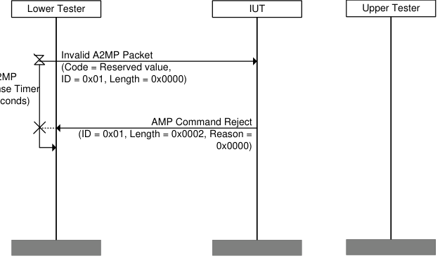

**Figure 4.1: A2MP/RSP/PROT/BV-01-C (Respond to Illegal AMP Command)**

• Expected Outcome
Pass verdict
The IUT sends the AMP Command Reject packet as a response to the Invalid A2MP packet with a Reason Code value of 0x0000 (Command Not Recognized).

##### 4.2.1.2 A2MP/RSP/PROT/BV-02-C (AMP Discover Request)

• Test Purpose
Verify the IUT is able to discover the available AMP Controllers on a remote device.
• Reference
[1] Section 3.3
[1] Section 3.4
• Initial Condition
The IUT has established that the Lower Tester supports the AMP Manager Protocol channel – Fixed Channel CID = 0x0003.
• Test Procedure

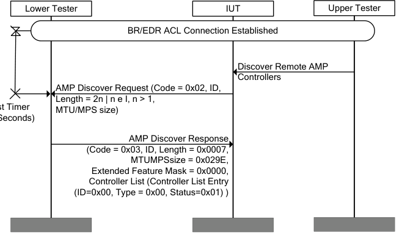

**Figure 4.2: A2MP/RSP/PROT/BV-02-C (AMP Discover Request)**

• Expected Outcome
Pass verdict
The IUT sends the AMP Discover Request packet with a correct extended feature mask and a MTU/MPS size greater or equal to 670 bytes.
The IUT sends the AMP Discover Request before the test timeout on the Lower Tester expires.

##### 4.2.1.3 A2MP/RSP/PROT/BV-03-C (AMP Discover Response)

• Test Purpose
Verify the IUT sends a properly formed AMP Discover Response packet when sent an AMP Discover Request packet.
• Reference
[1] Section 3.3, 3.4
• Initial Condition
The IUT has established that the Lower Tester supports the AMP Manager Protocol channel – Fixed Channel CID = 0x0003.
• Test Procedure

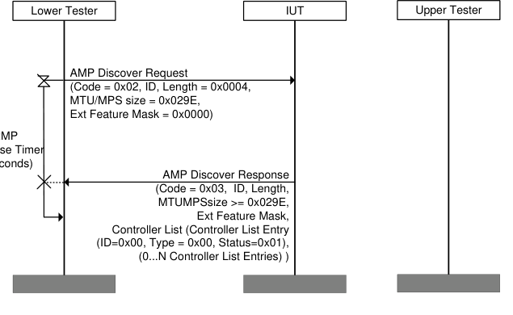

**Figure 4.3: A2MP/RSP/PROT/BV-03-C (AMP Discover Response)**

• Expected Outcome
Pass verdict
The IUT sends the AMP Discover Response packet within the Response Timeout window. The extended feature mask is valid. The MTU size is greater than or equal to 670. The Controller List contains at least the Primary BR/EDR controller. Any other Controller List Entries need to be correctly formatted.

##### 4.2.1.4 A2MP/RSP/PROT/BV-05-C (AMP Change Notify)

• Test Purpose
Verify the IUT is able to indicate a change to the current AMP Controller list by sending an AMP Change Notify packet to the peer device.
• Reference
[1] Section 3.5, 3.6
• Initial Condition
The IUT has already sent an AMP Discover Response packet to the Lower Tester.
• Test Procedure

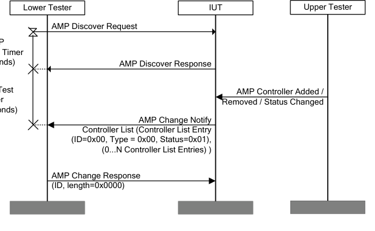

**Figure 4.4: A2MP/RSP/PROT/BV-05-C (AMP Change Notify)**

• Expected Outcome
Pass verdict
The IUT transmits an AMP Change Notify packet with a valid Controller List. The Controller List contains a correctly formatted Controller List. The first entry in the controller list is for the Primary BR/EDR controller.

##### 4.2.1.5 A2MP/RSP/PROT/BV-06-C (AMP Change Response)

• Test Purpose
Verify the IUT responds to an AMP Change Indication with a properly formed AMP Change Response packet.
• Reference
[1] Section 3.5, 3.6
• Initial Condition
The IUT has already sent an AMP Discover Request packet and received an AMP Discover Response from the Lower Tester.
• Test Procedure

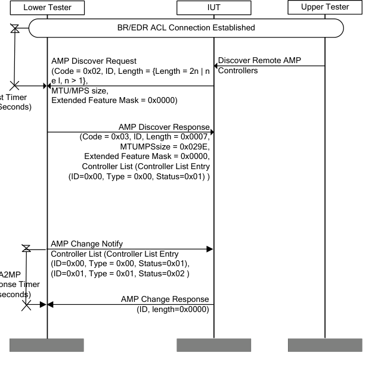

**Figure 4.5: A2MP/RSP/PROT/BV-06-C (AMP Change Response)**

• Expected Outcome
Pass verdict
The IUT transmits the AMP Change Response packet within Response Timeout.

##### 4.2.1.6 A2MP/RSP/PROT/BV-07-C (AMP Get Info Request)

• Test Purpose
Verify the IUT is able to request information for an AMP.
• Reference
[1] Section 3.7, 3.8
• Test Procedure

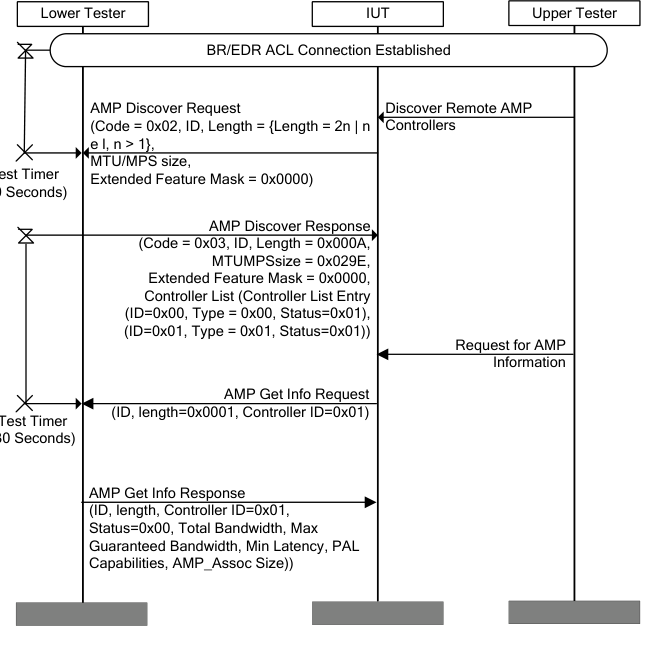

**Figure 4.6: A2MP/RSP/PROT/BV-07-C (AMP Get Info Request)**

• Expected Outcome
Pass verdict
The IUT transmits an AMP Get Info Request packet for the AMP Controller ID (not the primary BR/EDR Controller ID) specified in the AMP Discover Response packet.

##### 4.2.1.7 A2MP/RSP/PROT/BV-08-C (AMP Get Info Response)

• Test Purpose
Verify the IUT sends a properly formed AMP Get Info Response packet when sent an AMP Get Info Request packet with a valid AMP Controller ID.
• Reference
[1] Section 3.7
[1] Section 3.8
• Initial Condition
The Lower Tester has received the IUT’s Controller List in an AMP Discover Request packet or AMP Change Notify packet. The IUT must have included at least one Controller (excluding the primary
BR/EDR Controller) in the AMP Controller List provided to the Lower Tester in the AMP Discover Response packet.
• Test Procedure

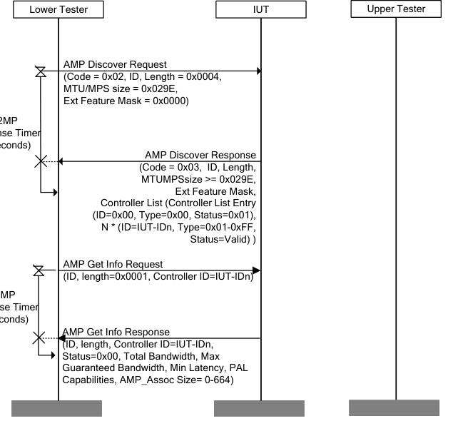

**Figure 4.7: A2MP/RSP/PROT/BV-08-C (AMP Get Info Response)**

Note: “IUT-IDn” is short-hand to indicate the Controller ID for the nth controller in the IUT’s Controller List. It is used to indicate an arbitrary Controller ID that is valid for the IUT.
• Expected Outcome
Pass verdict
The IUT transmits an AMP Get Info Response packet within Response Timeout. The packet has the same Controller ID as the request packet and the Status code is set to Success (0x00).

##### 4.2.1.8 A2MP/RSP/PROT/BV-09-C (AMP Get AMP Assoc Request)

• Test Purpose
Verify the IUT is able to request from the tester the association information for an AMP.
• Reference
[1] Section 3.9, 3.10
• Test Procedure

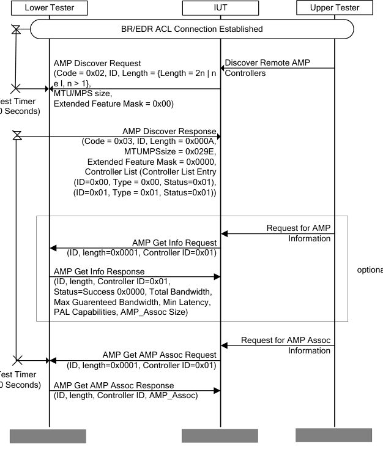

**Figure 4.8: A2MP/RSP/PROT/BV-09-C (AMP Get AMP Assoc Request)**

• Expected Outcome
Pass verdict
The IUT transmits an AMP Get AMP Assoc Request packet for the Controller ID specified in the AMP Discover Response packet.

##### 4.2.1.9 A2MP/RSP/PROT/BV-10-C (AMP Get AMP Assoc Response)

• Test Purpose
Verify the IUT sends a properly formed AMP Get AMP Assoc Response packet when sent an AMP Get AMP Assoc Request packet with a valid AMP ID.
• Reference
[1] Section 3.9
[1] Section 3.10
• Initial Condition
The Lower Tester has received the IUT’s Controller List in an AMP Discover Request packet or AMP Change Notify packet. The IUT must have included at least one Controller (excluding the primary BR/EDR Controller) in the AMP Controller List provided to the Lower Tester in the AMP Discover Response packet.
• Test Procedure

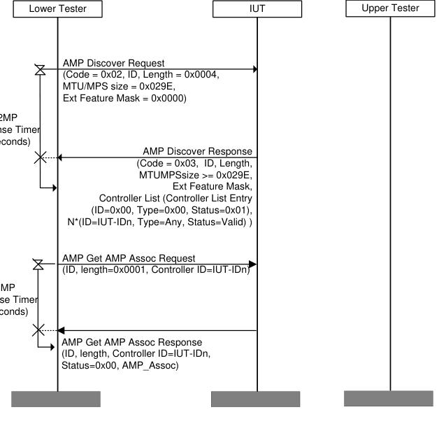

**Figure 4.9: A2MP/RSP/PROT/BV-10-C (AMP Get AMP Assoc Response)**

Note: “IUT-IDn” is short-hand to indicate the Controller ID for the nth controller in the IUT’s Controller List. It is used to indicate an arbitrary Controller ID that is valid for the IUT.
• Expected Outcome
Pass verdict
The IUT transmits an AMP Get AMP Assoc Response packet within Response Timeout. The packet has the same Controller ID as the request packet and the Status code is set to Success (0x00).

##### 4.2.1.10 A2MP/RSP/PROT/BV-11-C [AMP Get Info Request containing unsupported AMP ID]

• Test Purpose
Verify the IUT sends a properly formed AMP Get Info Response packet with status of ”Invalid Controller ID” when it receives an AMP Get Info Request packet with an AMP ID that did not appear in the Controller list sent by the IUT.
• Reference
[1] Section 3.7, 3.8
• Initial Condition
The Lower Tester has requested and received the Controller list from the IUT.
• Test Procedure

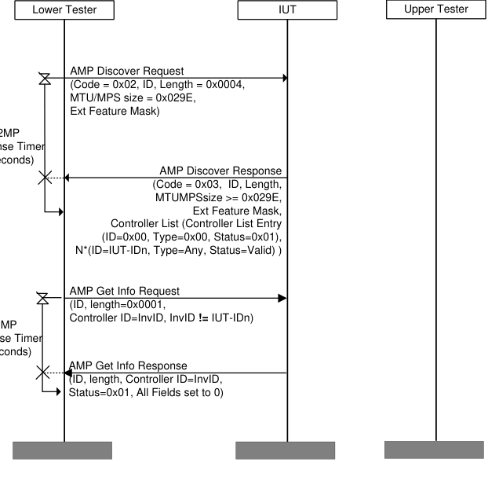

**Figure 4.10: A2MP/RSP/PROT/BV-11-C (AMP Get Info Request containing unsupported AMP ID) Note: “IUT-IDn” is short-hand to indicate the Controller ID for the nth controller in the IUT’s Controller List. It is used to indicate an arbitrary Controller ID that is valid for the IUT.**

• Expected Outcome
Pass verdict
The IUT transmits an AMP Get Info Response packet within Response Timeout. The packet has the same Controller ID as the request packet and the Status code is set to Invalid Controller ID (0x0001).

##### 4.2.1.11 A2MP/RSP/PROT/BV-12-C [AMP Get AMP Assoc Request containing unsupported AMP

ID]
• Test Purpose
Verify the IUT sends a properly formed AMP Get AMP Assoc Response packet with status of ”Invalid Controller ID” when it receives an AMP Get AMP Assoc Request packet with an AMP ID that did not appear in the Controller list sent by the IUT.
• Reference
[1] Section 3.9, 3.10
• Initial Condition
The Lower Tester has requested and received the Controller list from the IUT.
• Test Procedure

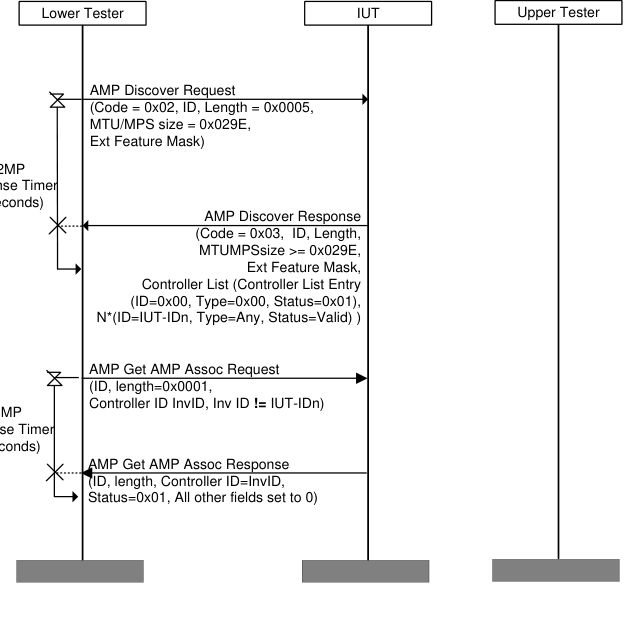

**Figure 4.11: A2MP/RSP/PROT/BV-12-C (AMP Get AMP Assoc Request containing unsupported AMP ID)**

Note: “IUT-IDn” is short-hand to indicate the Controller ID for the nth controller in the IUT’s Controller List. It is used to indicate an arbitrary Controller ID that is valid for the IUT.
• Expected Outcome
Pass verdict
The IUT transmits an AMP Get AMP Assoc Response packet within Response Timeout. The packet has the same Controller ID as the request packet and the Status code is set to Invalid Controller ID (0x01).

##### 4.2.1.12 A2MP/RSP/PROT/BV-13-C [Extended Feature Mask Extension in AMP Discover Request]

• Test Purpose
Verify the IUT is able to handle receipt of an AMP Discover Request that contains an Extended Feature mask field that has been increased in size using the extension bit.
• Reference
[1] Section 3.3, 3.4
• Initial Condition
The IUT has established that the Lower Tester supports the AMP Manager Protocol channel – Fixed Channel CID = 0x03.
• Test Procedure

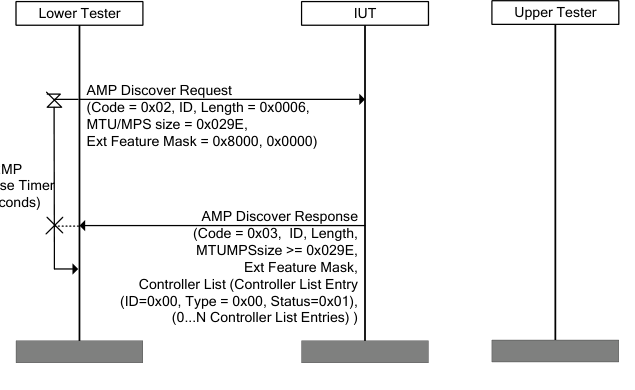

**Figure 4.12: A2MP/RSP/PROT/BV-13-C (Extended Feature Mask Extension in AMP Discover Request)**

• Expected Outcome
Pass verdict
The IUT can correctly decode the AMP Discover Request packet and send an AMP Discover Response packet to the Lower Tester before the Lower Tester response timer expires.

##### 4.2.1.13 A2MP/RSP/PROT/BV-14-C (Extended Feature Mask Extension in AMP Discover

Response)
• Test Purpose
Verify the IUT is able to handle receipt of an AMP Discover Response that contains an Extended Feature mask field that has been increased in size using the extension bit.
• Reference
[1] Section 3.3, 3.4
• Initial Condition
The IUT has established that the Lower Tester supports the AMP Manager Protocol channel – Fixed Channel CID = 0x03.
• Test Procedure

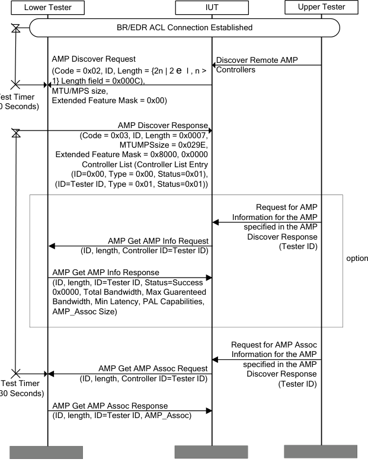

**Figure 4.13: A2MP/RSP/PROT/BV-14-C (Extended Feature Mask Extension in AMP Discover Response)**

• Expected Outcome
Pass verdict
The IUT can correctly decode the AMP Discover Response packet from the Lower Tester and request the AMP_Assoc information for the one AMP specified in the Lower Tester’s AMP Controller List.

##### 4.2.1.14 A2MP/RSP/PROT/BI-01-C (AMP Get Info Request for Primary BR/EDR Controller ID)

• Test Purpose
Verify the IUT sends a properly formed AMP Get Info Response packet with status of ”Invalid Controller ID” when it receives an AMP Get Info Request packet with the invalid AMP ID representing the Primary BR/EDR Controller.
• Reference
[1] Section 3.7, 3.8
• Initial Condition
The Lower Tester has requested and received the Controller list from the IUT.
• Test Procedure

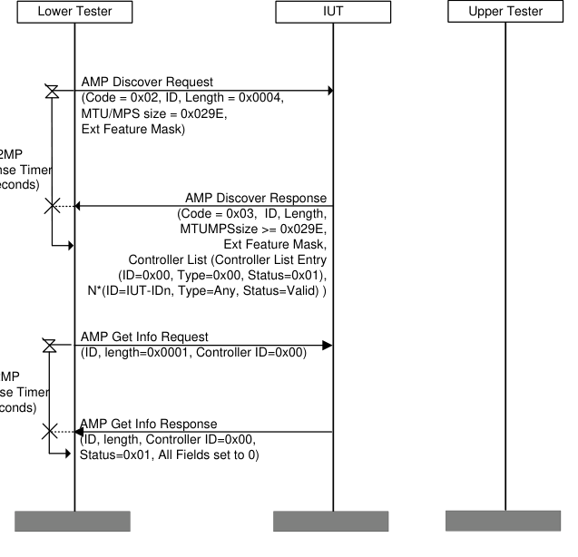

**Figure 4.14: A2MP/RSP/PROT/BI-01-C (AMP Get Info Request for Primary BR/EDR Controller ID)**

• Expected Outcome
Pass verdict
The IUT transmits an AMP Get Info Response packet within Response Timeout. The packet has the Primary BR/EDR Controller ID (0x00) and the Status code is set to Invalid Controller ID (0x01).

##### 4.2.1.15 A2MP/RSP/PROT/BI-02-C (AMP Get AMP Assoc Request for Primary BR/EDR Controller ID)

• Test Purpose
Verify the IUT sends a properly formed AMP Get AMP Assoc Response packet with status of ”Invalid Controller ID” when it receives an AMP Get AMP Assoc Request packet with the invalid AMP ID representing the Primary BR/EDR Controller.
• Reference
[1] Section 3.9, 3.10
• Initial Condition
The Lower Tester has received the IUT’s Controller List in an AMP Discover Request packet or AMP Change Notify packet.
• Test Procedure

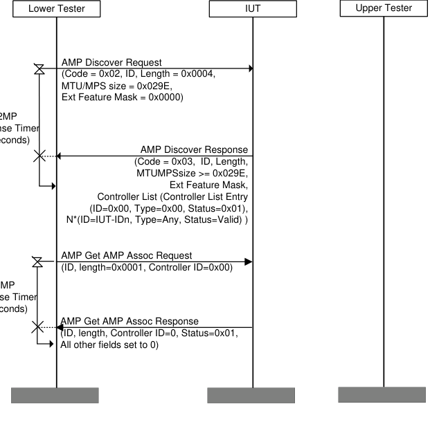

**Figure 4.15: A2MP/RSP/PROT/BI-02-C (AMP Get AMP Assoc Request for Primary BR/EDR Controller ID)**

• Expected Outcome
Pass verdict
The IUT transmits an AMP Get AMP Assoc Response packet within Response Timeout. The packet has the Primary BR/EDR Controller ID (0x00) and the Status code is set to Invalid Controller ID (0x01).

### 4.3 AMP Manager Protocol Physical Channel Tests (PHYS)

##### 4.3.1.1 A2MP/RSP/PHYS/BV-01-C [AMP Create Physical Link Request]

• Test Purpose
Verify the IUT is able to initiate the creation of an AMP physical link.
• Reference
[1] Section 3.4, 3.11, 3.12
• Initial Condition
The IUT has completed AMP Discovery on the Lower Tester.
The IUT supports creating an AMP Physical Link to one of the AMPs available from the Lower Tester.
The Lower Tester has completed an AMP Discovery on the IUT. The controller list entries will be used to verify that the AMP Type for the Local and Remote AMP IDs in the AMP Create Physical Link Request are equal.
The IUT has performed mutual authentication and enabled encryption the BR/EDR Controller before issuing the AMP Create Physical Link Request.
• Test Procedure

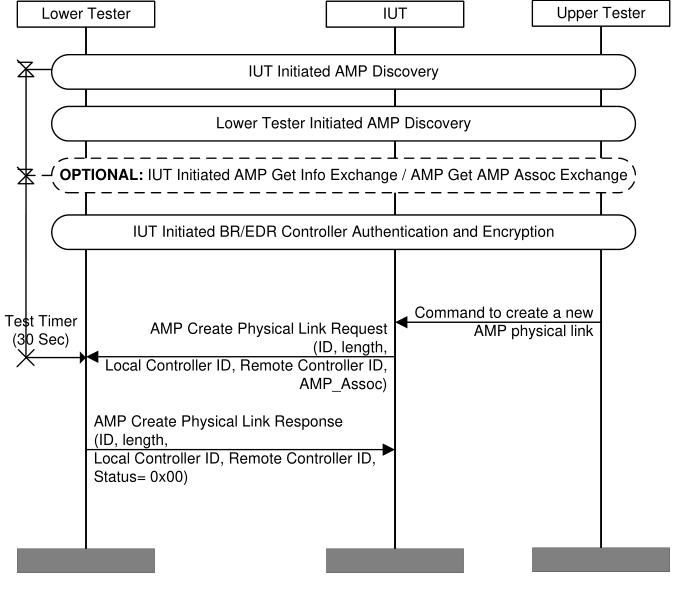

**Figure 4.16: A2MP/RSP/PHYS/BV-01-C (AMP Create Physical Link Request)**

• Test Condition
The Lower Tester will send an AMP Discover Response that includes an entry for all defined AMP types. The AMP Controller Status for each entry will be 0x01.
• Expected Outcome
Pass verdict
- The IUT sends a valid AMP Create Physical Link Request packet containing one of the AMP IDs that was present in the AMP Discover Response received from the Lower Tester.
- The AMP Type of the Local and Remote Controller IDs in the AMP Create Physical Link Request packet are equal.
- The IUT authenticates and encrypts the ACL Connection before issuing the AMP Create Physical Link Request.
• Test Purpose
Verify the IUT can respond to an AMP Create Physical Request Link packet.
• Reference
[1] Section 3.11
[1] Section 3.12
• Initial Condition
- The IUT indicates support for at least one AMP in the AMP Discover Response packet that it sends to the Lower Tester.
- The Lower Tester has performed mutual authentication and enabled encryption the BR/EDR Controller.
• Test Procedure

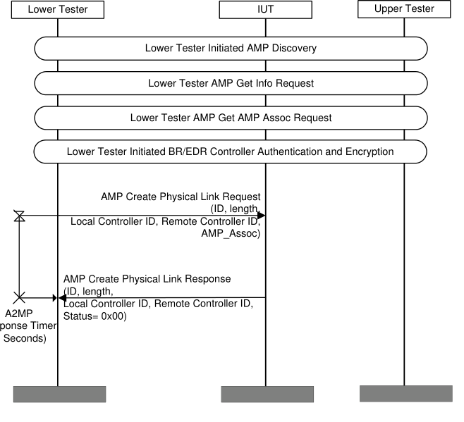

**Figure 4.17: A2MP/RSP/PHYS/BV-02-C (AMP Create Physical Link Response)**

• Expected Outcome
Pass verdict
The IUT transmits an AMP Create Physical Link Response packet within Response Timeout. The response packet Status code is 0x00 (Success: Link creation started). The Local and Remote Controller ID values sent by the IUT are consistent with the values received from the Lower Tester in the AMP Create Physical Link Request packet.
• Test Purpose
Verify the IUT sends a properly formed AMP Create Physical Link Response packet with status ”Invalid Controller ID” when it receives an AMP Create Physical Link Request with a Remote AMP ID this is not currently available on the IUT.
• Reference
[1] Section 3.11
[1] Section 3.12
• Initial Condition
– The Lower Tester has performed AMP Discovery on the IUT to obtain the IUT AMP Controller List (this is used by the Lower Tester to select an AMP ID value that is not currently available on the IUT).
– The Lower Tester has performed mutual authentication and enabled encryption the BR/EDR Controller.
• Test Procedure

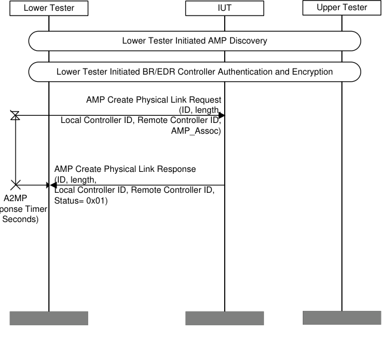

**Figure 4.18: A2MP/RSP/PHYS/BV-03-C (AMP Create Physical Link Request with unsupported AMP ID)**

• Expected Outcome
Pass verdict
The IUT transmits an AMP Create Physical Link Response packet within Response Timeout. The response packet Status code is 0x01 (Invalid Controller ID).
• Test Purpose
Verify the IUT can send an AMP Disconnect Physical Link packet to cancel the creation of a Physical Link.
• Reference
[1] Section 3.13
[1] Section 3.14
• Initial Condition
– The IUT has completed AMP Discovery on the Lower Tester.
– The IUT supports creating an AMP Physical Link to one of the AMPs available from the Lower Tester.
– The Lower Tester has completed an AMP Discovery on the IUT. The controller list entries will be used to verify that the AMP Type for the Local and Remote AMP IDs in the AMP Create Physical Link Request are equal.
– The IUT has performed mutual authentication and enabled encryption the BR/EDR Controller before issuing the AMP Create Physical Link Request.
• Test Procedure

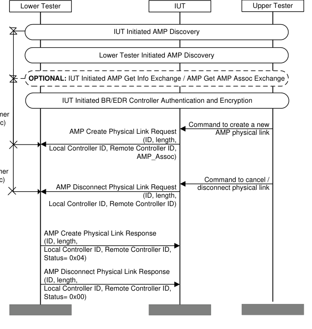

**Figure 4.19: A2MP/RSP/PHYS/BV-04-C (AMP Disconnect Physical Link Request)**

• Expected Outcome
Pass verdict
The IUT sends the AMP Disconnect Physical Link packet with the correct Local and Remote Controller IDs.

##### 4.3.1.5 A2MP/RSP/PHYS/BV-05-C [AMP Disconnect Physical Link Response]

• Test Purpose
Verify the IUT sends a properly formed AMP Disconnect Physical Link Response packet when it receives an AMP Disconnect Physical Link Request with a valid AMP ID.
• Reference
[1] Section 3.13
[1] Section 3.14
• Initial Condition
- The IUT indicates support for at least one AMP in the AMP Discover Response packet that it sends to the Lower Tester.
- The Lower Tester has performed mutual authentication and enabled encryption the BR/EDR Controller.
• Test Procedure

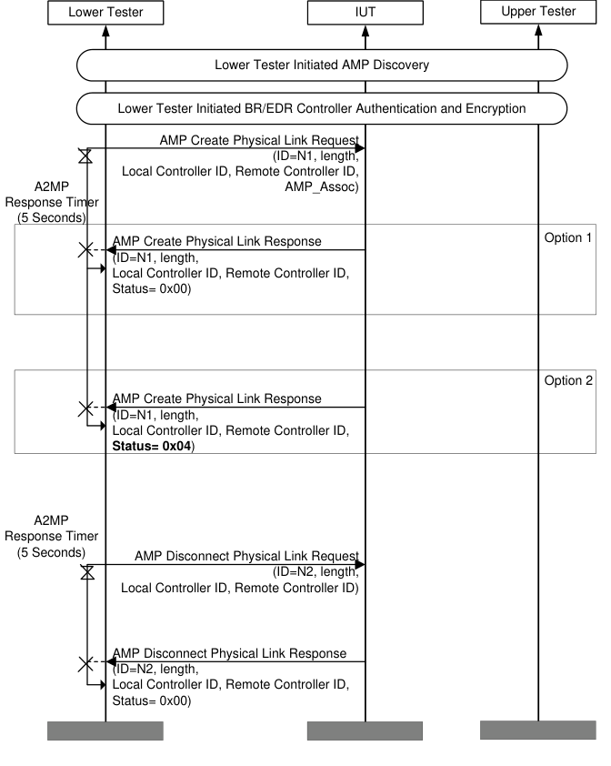

**Figure 4.20: A2MP/RSP/PHYS/BV-05-C (AMP Disconnect Physical Link Response)**

• Expected Outcome
Pass verdict
The IUT responds to both the AMP Create Physical Link Request and the AMP Disconnect Physical Link Request packets that it receives from the Lower Tester. The AMP Disconnect Physical Link Response packet Status code is 0x00 (Success).

##### 4.3.1.6 A2MP/RSP/PHYS/BV-06-C [AMP Disconnect Physical Link Request with unsupported AMP ID]

• Test Purpose
Verify the IUT sends a properly formed AMP Disconnect Physical Link Response packet with status ”Invalid Controller ID” when it receives an AMP Disconnect Physical Link Request with a Remote AMP ID this is not currently available on the IUT.
• Reference
[1] Section 3.13
[1] Section 3.14
• Initial Condition
No Physical Link exists between the Lower Tester and the IUT.
No Physical Link establishment has been initiated by either the Lower Tester or the IUT.
• Test Procedure

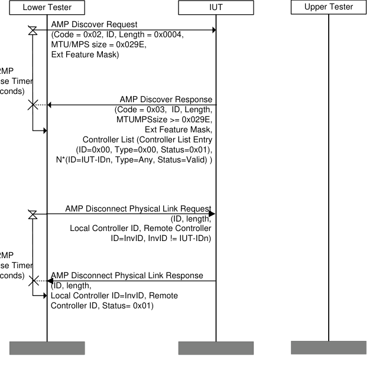

**Figure 4.21: A2MP/RSP/PHYS/BV-06-C (AMP Disconnect Physical Link Request with unsupported AMP ID)**

Note: “IUT-IDn” is short-hand to indicate the Controller ID for the nth controller in the IUT’s Controller List. It is used to indicate an arbitrary Controller ID that is valid for the IUT.
• Expected Outcome
Pass verdict
The IUT transmits an AMP Disconnect Physical Link Response within the Response Timeout. The response packet Status code is invalid Controller ID (0x01).
• Test Purpose
Verify the IUT is able to initiate the creation of an AMP physical link and handling an AMP Create Physical Link Request collision.
• Reference
[1] Section 3.4, 3.11, 3.12, 3.15
• Initial Condition
- The IUT has completed AMP Discovery on the Lower Tester.
- The IUT supports creating an AMP Physical Link to one of the AMP’s available from the Lower Tester.
- The Lower Tester has completed an AMP Discovery on the IUT. The controller list entries will be used to verify that the AMP Type for the Local and Remote AMP IDs in the AMP Create Physical Link Request are equal.
- The IUT has performed mutual authentication and enabled encryption the BR/EDR Controller before issuing the AMP Create Physical Link Request.
• Test Procedure

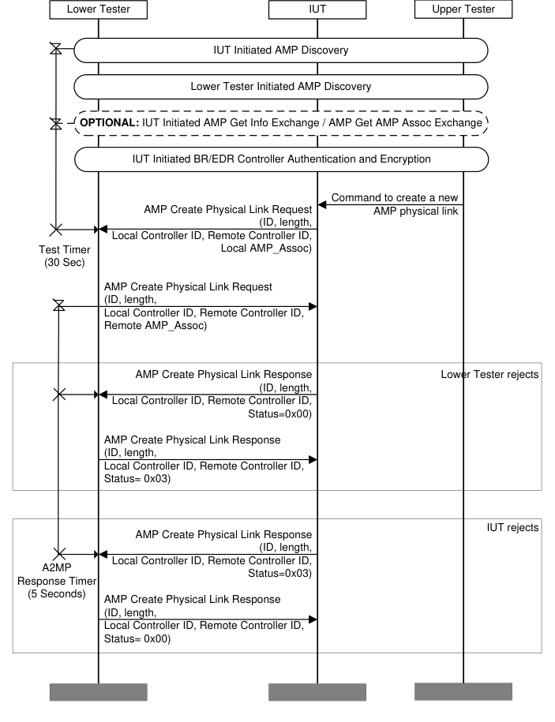

**Figure 4.22: A2MP/RSP/PHYS/BV-07-C (AMP Create Physical Link Request Collision)**

• Test Condition
The Lower Tester will send an AMP Discover Response that includes an entry for all defined AMP types. The AMP Controller Status for each entry will be 0x01.
• Expected Outcome
Pass verdict
The IUT sends a valid AMP Create Physical Link Request packet containing one of the AMP IDs that was present in the AMP Discover Response received from the Tester.
The AMP Type of the Local and Remote Controller IDs in the AMP Create Physical Link Request packet are equal.
The IUT authenticates and encrypts the ACL Connection before issuing the AMP Create Physical Link Request.
The IUT sends a valid AMP Create Physical Link Response packet with a Status value determined by the algorithm described in [1] Section 3.15. This can be either:
- Success (0x00) if the IUT has the lowest least significant non-equal BD_ADDR octet.
- Failed – Collision occurred (0x03) if the IUT has the largest least significant non-equal BD_ADDR octet.

##### 4.3.1.8 A2MP/RSP/PHYS/BV-08-C [AMP Disconnect Physical Link Request with no physical link]

• Test Purpose
Verify the IUT sends a properly formed AMP Disconnect Physical Link Response packet with status “Failed - No Physical Link exists and no Physical Link creation is in progress” when it receives an AMP Disconnect Physical Link Request where no physical link is established between the Lower Tester and the IUT.
• Reference
[1] Section 3.13, 3.14
• Initial Condition
No Physical Link exists between the Lower Tester and the IUT.
No Physical Link establishment has been initiated by either the Lower Tester or the IUT.
• Test Procedure

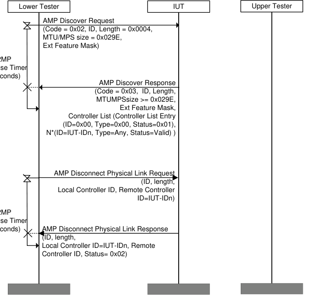

**Figure 4.23: A2MP/RSP/PHYS/BV-08-C (AMP Disconnect Physical Link Request with no physical link)**

Note: “IUT-IDn” is short-hand to indicate the Controller ID for the nth controller in the IUT’s Controller List. It is used to indicate an arbitrary Controller ID that is valid for the IUT.
• Expected Outcome
Pass verdict
The IUT transmits an AMP Disconnect Physical Link Response within the Response Timeout. The response packet Status code is Failed - No Physical Link exists and no Physical Link creation is in progress (0x02).

##### 4.3.1.9 A2MP/RSP/PHYS/BI-01-C [AMP Create Physical Link Request without BR/EDR encryption enabled]

• Test Purpose
Verify the IUT sends a properly formed AMP Create Physical Link Response packet with status “Security Violation” when it receives an AMP Create Physical Link Request when the ACL Connection does not have encryption enabled.
• Reference
[1] Section 3.11, 3.12
• Initial Condition
The IUT indicates support for at least one AMP in the AMP Discover Response packet that it sends to the Lower Tester.
• Test Procedure

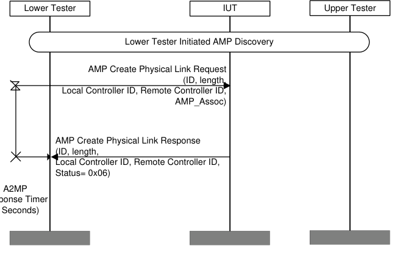

**Figure 4.24: A2MP/RSP/PHYS/BI-01-C (AMP Create Physical Link Request without BR/EDR encryption enabled)**

• Expected Outcome
Pass verdict
The IUT transmits an AMP Create Physical Link Response packet within Response Timeout. The response packet Status code is 0x06 (Security Violation).

##### 4.3.1.10 A2MP/RSP/PHYS/BI-02-C [AMP Multiple Create Physical Link Request]

• Test Purpose
Verify the IUT sends a properly formed AMP Create Physical Link Response packet with status “Failed – Physical Link Already Exists” when it receives an AMP Create Physical Link Request with an AMP that already has a physical link established with the IUT.
• Reference
[1] Section 3.11, 3.12
• Initial Condition
- The IUT indicates support for at least one AMP in the AMP Discover Response packet that it sends to the Lower Tester.
- The Lower Tester has performed mutual authentication and enabled encryption the BR/EDR Controller.
• Test Procedure

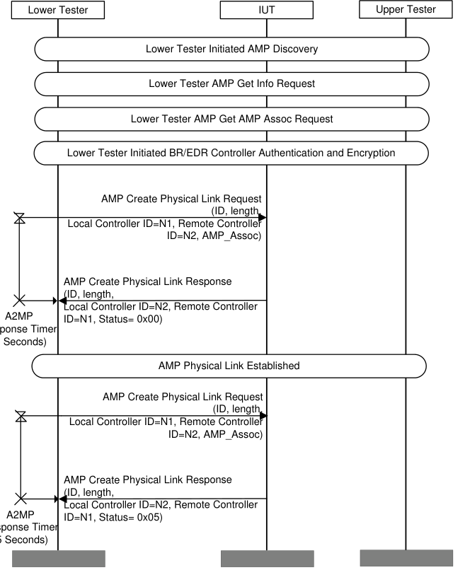

**Figure 4.25: A2MP/RSP/PHYS/BI-02-C (AMP Multiple Create Physical Link Request)**

• Expected Outcome
Pass verdict
The IUT transmits AMP Create Physical Link Response packets within Response Timeout. The response packet Status code for the second (multiple) physical link creation is 0x05 (Failed – Physical Link Already Exists). The Local and Remote Controller ID values sent by the IUT are consistent with the values received from the Lower Tester in the AMP Create Physical Link Request packets.

### 4.4 AMP Manager Protocol Security Tests (SEC)

The A2MP Security Tests require establishing and disconnecting the ACL connection on the BR/EDR Controller between the IUT and the Lower Tester, this may be performed multiple times during each individual test.
Here each ACL connection establishment is assumed to include encrypting the link (either by first mutually authenticating the link or by completing Secure Simple Pairing).
A number of these test cases involve the verification of establishment of an AMP physical link. This verification may be performed by observing an HCI_Physical_Link_Complete event with a status of success if a HCI is in use. Other methods of verification may be observing traffic sent over the air to determine that an AMP physical link (as defined by the specific PAL specification) has been fully established.

##### 4.4.1.1 A2MP/RSP/SEC/BV-01-C (Successful Initiation of Physical Link – Reconnection – IUT as Initiator)

• Test Purpose
Verify that after a successful initiation of a physical link that a reconnection to an AMP uses the same keys. IUT is initiator.
• Reference
[1] Section 2.3.3
[3] Section 8
• Initial Condition
ACL connection established (and is authenticated and encrypted).
• Test Procedure

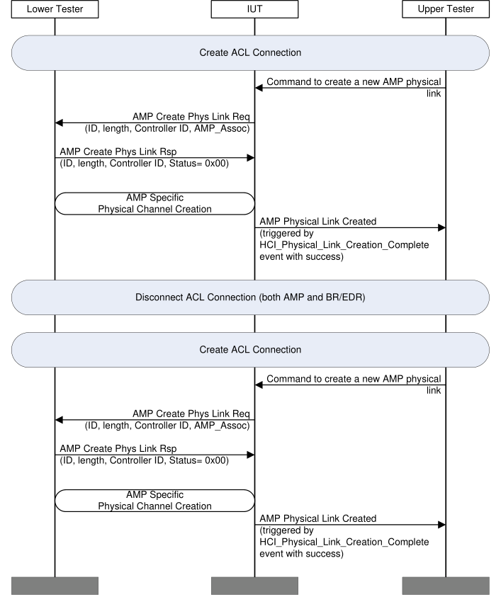

**Figure 4.26: A2MP/RSP/SEC/BV-01-C (Successful Initiation of Physical Link – Reconnection – IUT as Initiator)**

The Lower Tester and Upper Tester shall use the same BR/EDR Link Key and Dedicated AMP Link Key in the second AMP Physical Link.
• Expected Outcome
Pass verdict
Verify that the second AMP Physical Link is successful.

##### 4.4.1.2 A2MP/RSP/SEC/BV-02-C [Successful Initiation of Physical Link – Repairing – IUT as Initiator]

• Test Purpose
Verify that after a successful initiation of a physical link that a reconnection to an AMP results in different keys. IUT is initiator.
• Reference
[1] Section 2.3.3.
[3] Section 8
• Initial Condition
ACL connection established (and is authenticated and encrypted).
• Test Procedure

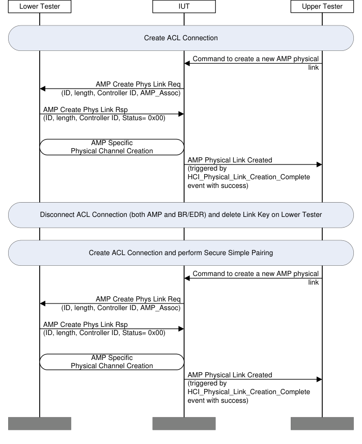

**Figure 4.27: A2MP/RSP/SEC/BV-02-C (Successful Initiation of Physical Link – Repairing – IUT as Initiator)**

The Lower Tester shall choose a different Public / Private key pair for Secure Simple Pairing in the second connection in order to ensure that the resulting link key is different from the initial Link Key.
• Expected Outcome
Pass verdict
Verify that the second AMP Physical Link is successful.

##### 4.4.1.3 A2MP/RSP/SEC/BV-03-C [Successful Initiation of Physical Link – Change of BR/EDR Link Key – IUT as Initiator]

• Test Purpose
Verify that after a successful initiation of a physical link that a change of the BR/EDR link key results in dropping the AMP physical link and the AMP security functions are re-run before a new link is created. IUT is initiator.
• Reference
[1] Section 2.3.3.
[3] Section 8
• Initial Condition
ACL connection established (and is authenticated and encrypted).
• Test Procedure

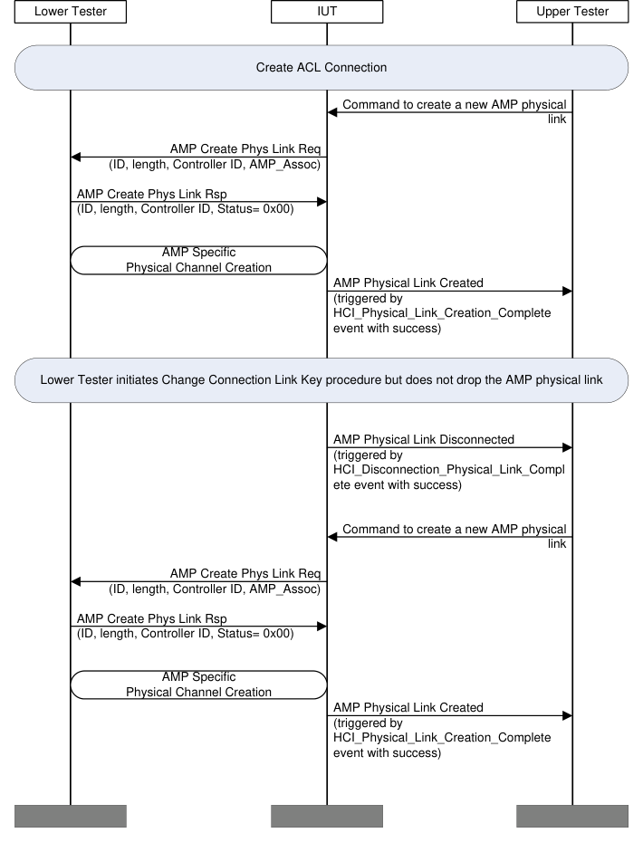

**Figure 4.28: A2MP/RSP/SEC/BV-03-C**

• Expected Outcome
Pass verdict
Verify that the IUT disconnects the AMP Physical Link after Response Timeout (implementation specific; see [1] Section 3.16).
Verify that the second AMP Physical Link creation is successful.

##### 4.4.1.4 A2MP/RSP/SEC/BV-05-C [Unsuccessful Initiation of Physical Link version 1 – Retry – IUT as Initiator]

• Test Purpose
Verify that after an un-successful initiation of a physical link (due to a lost AMP Create Physical Link Response message) that a second attempted initiation to the same AMP results in the same keys. IUT is initiator.
• Reference
[1] Section 2.3.3
[3] Section 8
• Initial Condition
ACL connection established (and is authenticated and encrypted).
• Test Procedure

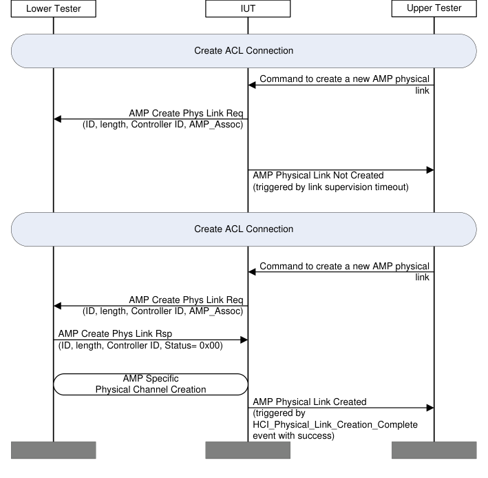

**Figure 4.29: A2MP/RSP/SEC/BV-05-C (Unsuccessful Initiation of Physical Link version 1 – Retry – IUT as Initiator)**

Lower Tester does not send AMP_Create Physical Link Response thereby causing a link supervision timeout.
• Expected Outcome
Pass verdict
Verify that the second AMP Physical Link is successful.

##### 4.4.1.5 A2MP/RSP/SEC/BV-07-C [Unsuccessful Initiation of Physical Link version 2 – Retry – IUT is Initiator]

• Test Purpose
Verify that after an un-successful initiation of a physical link (due to the lower tester using the wrong link key) that a second attempted initiation to the same AMP results in the same keys. IUT is initiator.
• Reference
[1] Section 2.3.3
[3] Section 8
• Initial Condition
ACL connection established (and is authenticated and encrypted).
• Test Procedure

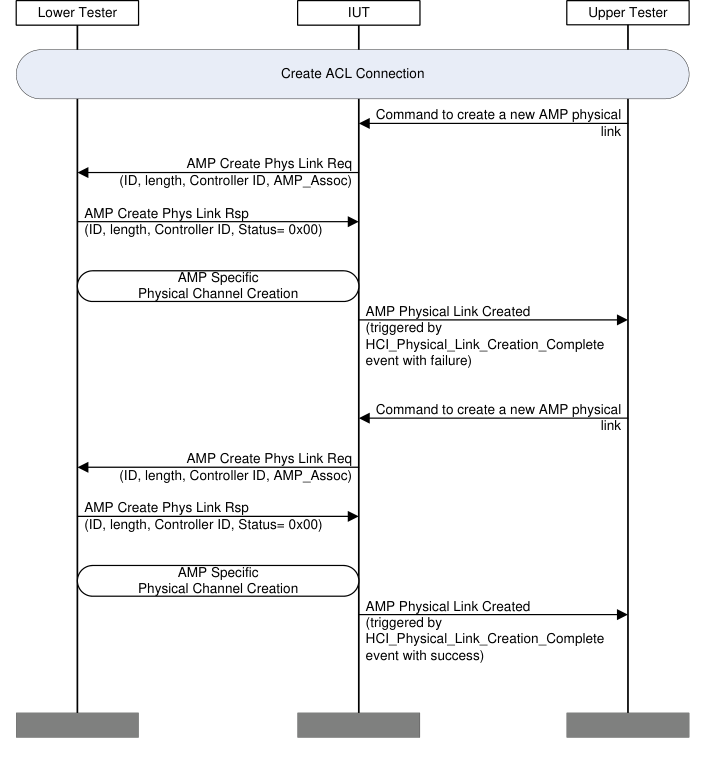

**Figure 4.30: A2MP/RSP/SEC/BV-07-C (Unsuccessful Initiation of Physical Link version 2 – Retry – IUT is Initiator)**

• Expected Outcome
Pass verdict
Verify that the second AMP Physical Link is successful.

##### 4.4.1.6 A2MP/RSP/SEC/BV-09-C [Successful Initiation of Physical Link – Reconnection – IUT is Responder]

• Test Purpose
Verify that after a successful initiation of a physical link that a reconnection to an AMP uses the same keys. IUT is responder.
• Reference
[1] Section 2.3.3
[3] Section 8
• Initial Condition
ACL connection established (and is authenticated and encrypted).
• Test Procedure

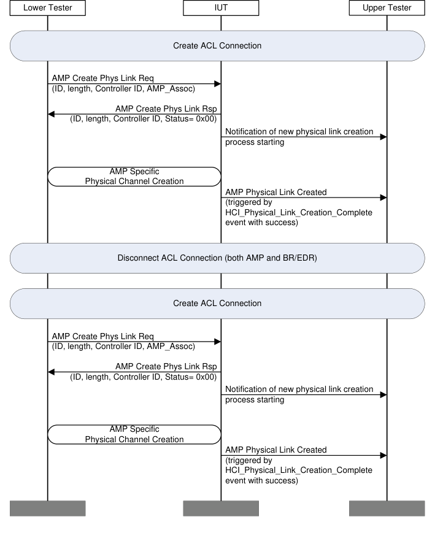

**Figure 4.31: A2MP/RSP/SEC/BV-09-C (Successful Initiation of Physical Link – Reconnection – IUT is Responder)**

The Lower Tester and Upper Tester shall use the same BR/EDR Link Key and Dedicated AMP Link Key in the second AMP Physical Link.
• Expected Outcome
Pass verdict
Verify that the second AMP Physical Link is successful.

##### 4.4.1.7 A2MP/RSP/SEC/BV-10-C [Successful Initiation of Physical Link – Repairing – IUT as Responder]

• Test Purpose
Verify that after a successful initiation of a physical link that a reconnection to an AMP results in different keys. IUT is responder.
• Reference
[1] Section 2.3.3.
[3] Section 8
• Initial Condition
ACL connection established (and is authenticated and encrypted).
• Test Procedure
Upper Tester IUT Lower Tester

| Create ACL | Connection |
| --- | --- |
| AMP Create Phys Link Req (ID, length, Controller ID, AMP Assoc) _ AMP Create Phys Link Rsp (ID, length, Controller ID, Status= 0x00) AMP Specific Physical Channel Creation | Notification of new physical link creation process starting AMP Physical Link Created (triggered by HCI Physical Link Creation Complete _ _ _ _ event with success) |
| Disconnect ACL Connection (both AMP and B | R/EDR) and delete Link Key on Lower Tester |
|  |  |
| Create ACL Connection and pe | rform Secure Simple Pairing |

AMP Create Phys Link Req (ID, length, Controller ID, AMP_Assoc)
AMP Create Phys Link Rsp (ID, length, Controller ID, Status= 0x00)
Notification of new physical link creation process starting
AMP Specific Physical Channel Creation
AMP Physical Link Created (triggered by HCI_Physical_Link_Creation_Complete event with success)
The Lower Tester shall choose a different Public / Private key pair for Secure Simple Pairing in the second connection in order to ensure that the resulting Link Key is different from the initial Link Key.
• Expected Outcome
Pass verdict
Verify that the second AMP Physical Link is successful.

##### 4.4.1.8 A2MP/RSP/SEC/BV-12-C [Unsuccessful Initiation of Physical Link version 1 – Retry – IUT as Responder]

• Test Purpose
Verify that after an un-successful initiation of a physical link (due to a lost AMP Create Physical Link Response message) that a second attempted initiation to the same AMP results in the same keys. IUT is responder.
• Reference
[1] Section 2.3.3
[3] Section 8
• Initial Condition
ACL connection established.
• Test Procedure

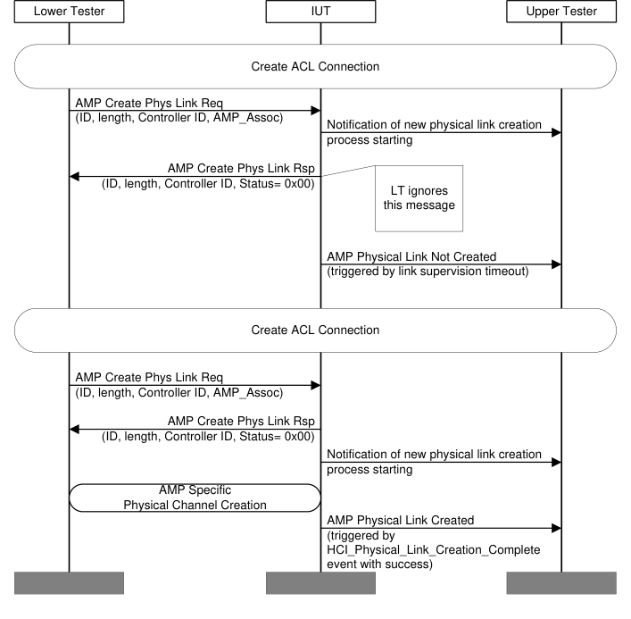

**Figure 4.33: A2MP/RSP/SEC/BV-12-C (Unsuccessful Initiation of Physical Link version 1 – Retry – IUT as Responder)**

• Expected Outcome
Pass verdict
Verify that the second AMP Physical Link is successful.

##### 4.4.1.9 A2MP/RSP/SEC/BV-14-C [Unsuccessful Initiation of Physical Link version 2 – Retry – IUT is Responder]

• Test Purpose
Verify that after an un-successful initiation of a physical link (due to the lower tester using the wrong link key) that a second attempted initiation to the same AMP results in the same keys. IUT is responder.
• Reference
[1] Section 2.3.3
[3] Section 8
• Initial Condition
ACL connection established (and is authenticated and encrypted).
• Test Procedure

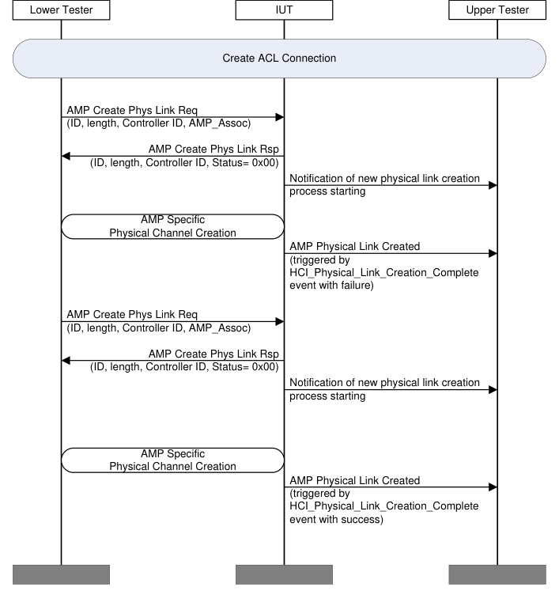

**Figure 4.34: A2MP/RSP/SEC/BV-14-C (Unsuccessful Initiation of Physical Link version 2 – Retry – IUT is Responder)**

• Expected Outcome
Pass verdict
Verify that the second AMP Physical Link is successful.

## 5 Test Case Mapping

The Test Case Mapping Table (TCMT) maps test cases to specific capabilities in the ICS. Profiles, protocols and services may define multiple roles, and it is possible that a product may implement more than one role. The product shall be tested in all roles for which support is declared in the ICS document.
The columns for the TCMT are defined as follows:
Item: contains an y/x reference, where y corresponds to the table number and x corresponds to the feature number as defined in the ICS Proforma for AMP Manager Protocol (A2MP) [5]. If the item is defined with Protocol, Profile or Service abbreviation before y/x, the table and feature number referenced are defined in the abbreviated ICS proforma document.
Feature: recommended to be the primary feature defined in the ICS being tested or may be the test case name.
Test Case(s): the applicable test case identifiers required for Bluetooth Qualification if the corresponding y/x references defined in the Item column are supported.
For purpose and structure of the ICS/IXIT proforma and instructions for completing the ICS/IXIT proforma refer to the Bluetooth ICS and IXIT proforma document.

|  | Item |  |  | Feature |  |  | Test Case(s) |  |
| --- | --- | --- | --- | --- | --- | --- | --- | --- |
| A2MP 1/1 |  |  | AMP Manager Protocol |  |  | A2MP/RSP/PROT/BV-01-C A2MP/RSP/PROT/BV-02-C A2MP/RSP/PROT/BV-03-C A2MP/RSP/PROT/BV-05-C A2MP/RSP/PROT/BV-06-C A2MP/RSP/PROT/BV-07-C A2MP/RSP/PROT/BV-08-C A2MP/RSP/PROT/BV-09-C A2MP/RSP/PROT/BV-10-C A2MP/RSP/PROT/BV-11-C A2MP/RSP/PROT/BV-12-C A2MP/RSP/PROT/BV-13-C A2MP/RSP/PROT/BV-14-C A2MP/RSP/PROT/BI-01-C A2MP/RSP/PROT/BI-02-C A2MP/RSP/PHYS/BV-01-C A2MP/RSP/PHYS/BV-02-C A2MP/RSP/PHYS/BV-03-C A2MP/RSP/PHYS/BV-04-C A2MP/RSP/PHYS/BV-05-C |  |  |

|  | Item |  |  | Feature |  |  | Test Case(s) |  |
| --- | --- | --- | --- | --- | --- | --- | --- | --- |
|  |  |  |  |  |  | A2MP/RSP/PHYS/BV-06-C A2MP/RSP/PHYS/BV-07-C A2MP/RSP/PHYS/BV-08-C A2MP/RSP/PHYS/BI-01-C A2MP/RSP/PHYS/BI-02-C A2MP/RSP/SEC/BV-01-C A2MP/RSP/SEC/BV-02-C A2MP/RSP/SEC/BV-03-C A2MP/RSP/SEC/BV-05-C A2MP/RSP/SEC/BV-07-C A2MP/RSP/SEC/BV-09-C A2MP/RSP/SEC/BV-10-C A2MP/RSP/SEC/BV-12-C A2MP/RSP/SEC/BV-14-C |  |  |

Table 5.1: Test Case Mapping

## 6 Revision History and Contributors

Revision History

|  | Publication |  |  | Revision |  | Date |  |  | Comments |  |  |
| --- | --- | --- | --- | --- | --- | --- | --- | --- | --- | --- | --- |
|  | Number |  |  | History |  |  |  |  |  |  |  |
|  |  |  |  | D07r05 |  |  | 2009-01-07 |  |  | Changed invalid test case name from BV to BI. |  |
|  | 0 |  |  | 3.0.H.0 |  |  | 2009-04-15 |  |  | Publication of first release |  |
|  |  |  | 4.0.1r0 | 4.0.1r0 |  | 12 December 2010-19 January 2011 | 12 December |  |  | TSE 3068: TP/SEC/BV-12-C: Test procedure: |  |
|  |  |  |  |  |  |  | 2010-19 |  |  | remove text |  |
|  |  |  |  |  |  |  | January 2011 |  |  |  |  |
|  |  |  |  |  |  |  |  |  |  | TSE 3484: TP/PHYS/BI-02-C: Pass verdict: fix |  |
|  |  |  |  |  |  |  |  |  |  | typo |  |
|  |  |  |  |  |  |  |  |  |  | TSE 3699: TP/PROT/BV-02-C: update MSC |  |
|  |  |  |  |  |  |  |  |  |  | TSE 3700: TP/PROT/BV-03-C, TP/PROT/BV-10- |  |
|  |  |  |  |  |  |  |  |  |  | C, TP/PROT/BV-11-C, TP/PROT/BI-01-C, |  |
|  |  |  |  |  |  |  |  |  |  | TP/PROT/BI-02-C, TP/PHYS/BV-06-C, |  |
|  |  |  |  |  |  |  |  |  |  | TP/PHYS/BV-08-C: change MSC (length to |  |
|  |  |  |  |  |  |  |  |  |  | 0x0004) |  |
|  |  |  |  |  |  |  |  |  |  | TSE 3701: TP/PROT/BV-06-C: change MSC |  |
|  |  |  |  |  |  |  |  |  |  | TSE 3702: TP/PROT/BV-07-C, TP/PROT/BV-09- |  |
|  |  |  |  |  |  |  |  |  |  | C: change MSC |  |
|  |  |  |  |  |  |  |  |  |  | TSE 3703 TP/PROT/BV-08-C: change MSC |  |
|  |  |  |  |  |  |  |  |  |  | TSE 3704: TP/PROT/BV-13-C: change MSC |  |
|  |  |  |  |  |  |  |  |  |  | TSE 3705: TP/PROT/BV-14-C: change MSC |  |
|  | 1 |  |  | 4.0.1 |  |  | 2011-07-15 |  |  | Prepare for publication. |  |
|  |  |  |  | 4.0.2r0 |  |  | 2012-05-18 |  |  | TSE 3889: TP/PHYS/BV-05-C: Correct MSC |  |
|  | 2 |  |  | 4.0.2 |  |  | 2012-07-24 |  |  | Prepare for publication. |  |
|  |  |  | 4.1.0r01 | 4.1.0r01 |  | 2013-11-11 | 2013-11-11 |  |  | Updated revision to 4.1.0 |  |
|  |  |  |  |  |  |  |  |  |  | Updated top sheet to include version 4.1 |  |
|  |  |  |  |  |  |  |  |  |  | Removed N/A sections |  |
|  | 3 |  |  | 4.1.0 |  |  | 2013-12-03 |  |  | Prepare for Publication |  |
|  |  |  |  | 4.2.0r00 |  |  | 2014-11-24 |  |  | Revved version to align with Core 4.2 release |  |
|  |  |  |  | 4.2.0r01 |  |  | 2014-11-25 |  |  | BTI Review, Alicia, editorial corrections. |  |
|  | 4 |  |  | 4.2.0 |  |  | 2014-12-03 |  |  | Prepare for TCRL 2014-2 publication |  |
|  |  |  | 4.2.1r00 | 4.2.1r00 |  | 2015-05-05 | 2015-05-05 |  |  | TSE 6151: Updated Pass verdict in TP/SEC/BV- |  |
|  |  |  |  |  |  |  |  |  |  | 03-C to remove “TBD seconds” reference. |  |

|  | Publication |  |  | Revision |  | Date |  |  | Comments |  |  |
| --- | --- | --- | --- | --- | --- | --- | --- | --- | --- | --- | --- |
|  | Number |  |  | History |  |  |  |  |  |  |  |
|  |  |  | 4.2.1r01 | 4.2.1r01 |  | 2015-05-27 |  |  |  | Reviewed by Alicia Courtney |  |
|  |  |  |  |  |  |  |  |  |  | Fixed bullet formatting throughout document. |  |
|  |  |  |  |  |  |  |  |  |  | Other minor editorial fixes also made. |  |
|  | 5 |  |  | 4.2.1 |  |  | 2015-07-14 |  |  | Prepared for TCRL 2015-1 publication |  |
|  |  |  | 5.0.0r00 | 5.0.0r00 |  | 2016-10-19 | 2016-10-19 |  |  | Converted to new Test Case ID conventions as |  |
|  |  |  |  |  |  |  |  |  |  | defined in TSTO v4.1 |  |
| 6 |  |  | 5.0.0 |  |  | 2016-12-13 |  |  |  | Approved by BTI. Prepared for TCRL 2016-2 |  |
|  |  |  |  |  |  |  |  |  |  | publication. |  |
|  |  |  | 5.1.0r00 |  |  | 2018-11-13 |  |  |  | Updated template. Revved version to align with |  |
|  |  |  |  |  |  |  |  |  |  | Core 5.1 release. |  |
| 7 |  |  | 5.1.0 |  |  | 2018-12-07 |  |  |  | Approved by BTI. Prepared for TCRL 2018-2 |  |
|  |  |  |  |  |  |  |  |  |  | publication. |  |
|  |  |  | p8r00 |  |  | 2019-11-27 |  |  |  | Updated document naming convention and |  |
|  |  |  |  |  |  |  |  |  |  | template items, moving Revision History and |  |
|  |  |  |  |  |  |  |  |  |  | Contributors tables to the bottom of the |  |
|  |  |  |  |  |  |  |  |  |  | document, updating Disclaimer text and |  |
|  |  |  |  |  |  |  |  |  |  | Confidentiality markings to align with latest |  |
|  |  |  |  |  |  |  |  |  |  | Documentation Marking Requirements, and |  |
|  |  |  |  |  |  |  |  |  |  | making minor editorial fixes. |  |
| 8 |  |  | p8 |  |  | 2020-01-07 |  |  |  | Approved by BTI on 2019-12-22. Prepared for |  |
|  |  |  |  |  |  |  |  |  |  | TCRL 2019-2 publication. |  |

Contributors

|  | Name |  |  | Company |  |
| --- | --- | --- | --- | --- | --- |
|  | Ayse Findikli |  |  | Bluetooth SIG |  |
|  | Dave Suvak |  |  | iAnywhere |  |
|  | Joel Linsky |  |  | Qualcomm |  |
|  | Richard Lane |  |  | Stonestreet One |  |
|  | Doug Clark |  |  | Symbian |  |
|  | James Steele |  |  | Symbian |  |
