# AVRCP.TS.p23

> Source: PDF converted via PyMuPDF.

---

Audio/Video Remote Control Profile (AVRCP)
Bluetooth® Test Suite
▪ Revision: AVRCP.TS.p23 ▪ Revision Date: 2025-02-18 ▪ Prepared By: Audio, Telephony, and Automotive Working Group ▪ Published during TCRL: TCRL.2025-1
This document, regardless of its title or content, is not a Bluetooth Specification as defined in the Bluetooth Patent/Copyright License Agreement (“PCLA”) and Bluetooth Trademark License Agreement. Use of this document by members of Bluetooth SIG is governed by the membership and other related agreements between Bluetooth SIG Inc. (“Bluetooth SIG”) and its members, including the PCLA and other agreements posted on Bluetooth SIG’s website located at www.bluetooth.com.
THIS DOCUMENT IS PROVIDED “AS IS” AND BLUETOOTH SIG, ITS MEMBERS, AND THEIR AFFILIATES MAKE NO REPRESENTATIONS OR WARRANTIES AND DISCLAIM ALL WARRANTIES, EXPRESS OR IMPLIED, INCLUDING ANY WARRANTY OF MERCHANTABILITY, TITLE, NON-INFRINGEMENT, FITNESS FOR ANY PARTICULAR PURPOSE, THAT THE CONTENT OF THIS DOCUMENT IS FREE OF ERRORS.
TO THE EXTENT NOT PROHIBITED BY LAW, BLUETOOTH SIG, ITS MEMBERS, AND THEIR AFFILIATES DISCLAIM ALL LIABILITY ARISING OUT OF OR RELATING TO USE OF THIS DOCUMENT AND ANY INFORMATION CONTAINED IN THIS DOCUMENT, INCLUDING LOST REVENUE, PROFITS, DATA OR PROGRAMS, OR BUSINESS INTERRUPTION, OR FOR SPECIAL, INDIRECT, CONSEQUENTIAL, INCIDENTAL OR PUNITIVE DAMAGES, HOWEVER CAUSED AND REGARDLESS OF THE THEORY OF LIABILITY, AND EVEN IF BLUETOOTH SIG, ITS MEMBERS, OR THEIR AFFILIATES HAVE BEEN ADVISED OF THE POSSIBILITY OF SUCH DAMAGES.
This document is proprietary to Bluetooth SIG. This document may contain or cover subject matter that is intellectual property of Bluetooth SIG and its members. The furnishing of this document does not grant any license to any intellectual property of Bluetooth SIG or its members.
This document is subject to change without notice.
Copyright © 2001–2025 by Bluetooth SIG, Inc. The Bluetooth word mark and logos are owned by Bluetooth SIG, Inc. Other third-party brands and names are the property of their respective owners.
Contents

## 1 Scope

This Bluetooth document contains the Test Suite Structure (TSS) and test cases to test the implementation of the Bluetooth Audio/Video Remote Control Profile (AVRCP) with the objective to provide a high probability of air interface interoperability between the tested implementation and other manufacturers’ Bluetooth devices.
AVRCP provides support for multiple Media Player applications within the same physical device. Therefore, the features supported by an individual Media Player application might be a subset of the physical device’s features marked in the ICS [3]. Therefore, the AVRCP IXIT document [6] allows announcing an individual Media Player application’s features, see Figure 1.1.

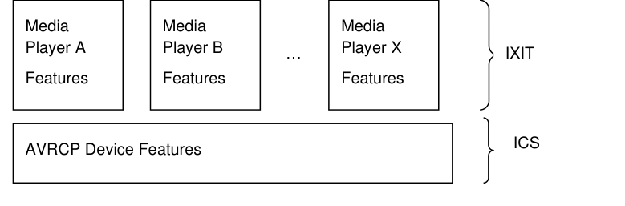

**Figure 1.1: IXIT dependencies for Media Player applications**

The IXIT contains a field to specify a player name to allow a player to be selected against which the browsing tests are run. Furthermore, the IXIT contains fields for one empty and one non-empty folder on the IUT.

## 2 References, definitions, and abbreviations

### 2.1 References

This document incorporates provisions from other publications by dated or undated reference. These references are cited at the appropriate places in the text, and the publications are listed hereinafter. Additional definitions and abbreviations can be found in [1], [2], and [4].
[1] Bluetooth Core Specification
[2] Audio/Video Remote Control Profile, Version 1.0
[3] ICS Proforma for Audio/Video Remote Control Profile (AVRCP)
[4] Test Strategy and Terminology Overview
[5] Audio/Video Remote Control Profile Specification, Versions 1.4 and 1.5, Advanced Control Extension
[6] IXIT Proforma for Audio/Video Remote Control Profile
[7] Audio/Video Remote Control Profile Specification, Version 1.3, Enhanced Metadata
[8] Audio/Video Remote Control Profile Specification, Version 1.6
[9] Basic Imaging Profile Specification, Versions 1.1 or later
[10] irOBEX Specification, Version 1.5, Infrared Data Association
[11] Generic Object Exchange Profile Specification, Version 2.0 or later
[12] ITU-T X.290 series, OSI CONFORMANCE TESTING METHODOLOGY AND FRAMEWORK
PROTOCOL RECOMMENDATIONS FOR ITU-T APPLICATIONS, ITU Recommendation X.290 series (equivalent to ISO 9646)
[13] SDP Test Suite, SDP.TS

### 2.2 Definitions

In this Bluetooth document, the definitions from [1] and [2] apply.

|  | Definition |  |  | Description |  |
| --- | --- | --- | --- | --- | --- |
| Standby mode |  |  | a) for CT: no L2CAP channel for control to TG b) for TG: no L2CAP channel for control to CT. |  |  |
| Normal condition |  |  | CT and TG are active and they are not in Park, Sniff or Hold mode. |  |  |

Table 2.1: Definitions for AVRCP

### 2.3 Acronyms and abbreviations

In this Bluetooth document, the definitions, acronyms, and abbreviations from [1] and [2] apply.

## 3 Test Suite Structure (TSS)

### 3.1 Test Strategy

The qualification of products claiming their compliance with the Bluetooth specification involves the execution of Test Suites.
In AVRCP, there are four AV/C commands to be applied to the AV/C command procedure: UNIT INFO, SUBUNIT INFO, PASS THROUGH, and VENDOR DEPENDENT commands.
Note that the VENDOR DEPENDENT command is out of the scope of testing.

### 3.2 Test groups

#### 3.2.1 First level test group

The first level defines the test groups following the Audio/Video Remote Control Profile procedure: Connection establishment for control, connection release for control and AV/C commands as defined in [2].
The AV/C commands are classified into two branches: information collection and PASS THROUGH command transfer.
Metadata Transfer conformance is verified in the following test groups: Configuration, Player Application Setting, Media Information, Notification, and Invalid Commands and Basic Group Navigation.

#### 3.2.2 Second level test group

The second level defines the test groups following the procedure to establish and release connection for control defined in [2] applicable to cases initiated from either CT or TG.
The second level also defines the test groups following AV/C commands used in [2]: UNIT INFO command and SUBUNIT INFO command.
In addition, in the test procedure for PASS THROUGH command transfer, operation_ids defined in [2] are tested. The operation_ids for vendor unique and function keys are out of scope in this specification, with the exception of the vendor_id specified for the Bluetooth SIG for purposes of Metadata transfer.

#### 3.2.3 Initialization

Before performing any test cases, an initialization procedure between CT and TG is performed to ensure that the devices have stored the information with which device they will interoperate while performing the AVRCP. As this procedure depends on the implementation and capabilities of the devices and is not part of the AVRCP specification, it is not covered by any test cases. For all test cases, it is assumed as a general precondition that this initialization has been performed for this pair of devices.

## 4 Test cases (TC)

### 4.1 Introduction

#### 4.1.1 Test case identification conventions

Test cases are assigned unique identifiers per the conventions in [4]. The convention used here is: <spec abbreviation>/<IUT role>/<class>/<feat>/<func>/<subfunc>/<cap>/<xx>-<nn>-<y>.
Additionally, testing of this specification includes tests from the SDP Test Suite [13] referred to as Generic SDP Integrated Tests (GSIT); when used, the GSIT tests are referred to through a TCID string using the following convention: <spec abbreviation>/<IUT role>/<GSIT test group>/< GSIT class >/<xx>-<nn>-<y>.

|  | Identifier Abbreviation |  |  | Spec Identifier <spec abbreviation> |  |
| --- | --- | --- | --- | --- | --- |
| AVRCP |  |  | Audio/Video Remote Control Profile |  |  |
|  | Identifier Abbreviation |  |  | Role Identifier <IUT role> |  |
| CT |  |  | Controller Role |  |  |
| TG |  |  | Target Role |  |  |
|  | Identifier Abbreviation |  |  | Reference Identifier <GSIT test group> |  |
| CGSIT |  |  | Client Generic SDP Integrated Tests |  |  |
| SGSIT |  |  | Server Generic SDP Integrated Tests |  |  |
|  | Identifier Abbreviation |  |  | Reference Identifier <GSIT class> |  |
| ATTR |  |  | Attribute |  |  |
| OFFS |  |  | Attribute ID Offset String |  |  |
| SERR |  |  | Service Record |  |  |
| SFC |  |  | SDP Future Compatibility |  |  |
|  | Identifier Abbreviation |  |  | Feature Identifier <feat> |  |
| BGN |  |  | Basic Group Navigation |  |  |
| CA |  |  | Cover Art |  |  |
| CEC |  |  | Connection Establishment for Control |  |  |
| CFG |  |  | Configuration Commands of Metadata Transfer |  |  |
| CON |  |  | Connection Establishment and Release for Browsing |  |  |
| CRC |  |  | Connection Release for Control |  |  |
| ICC |  |  | Information Collection for Control |  |  |
| INV |  |  | Invalid Commands |  |  |
| MCN |  |  | Media Content Navigation |  |  |
| MDI |  |  | Media Information Commands of Metadata Transfer |  |  |
| MPS |  |  | Media Player Selection |  |  |
| NFY |  |  | Notification Commands of Metadata Transfer |  |  |
| PAS |  |  | Player Application Setting Commands |  |  |
| PTH |  |  | PASS THROUGH Handling |  |  |
| PTT |  |  | PASS THROUGH Transfer |  |  |
| RCR |  |  | Continuation PDU Commands (Request Continuing Response) |  |  |
| VLH |  |  | Volume Level Handling |  |  |

|  | Identifier Abbreviation |  |  | Function Identifier <func> |  |
| --- | --- | --- | --- | --- | --- |
| CB |  |  | Content Browsing function |  |  |
| NP |  |  | NowPlaying function |  |  |
| SRC |  |  | Search function |  |  |

Table 4.1: AVRCP TC feature naming conventions

#### 4.1.2 Conformance

When conformance is claimed for a particular specification, all capabilities are to be supported in the specified manner. The mandated tests from this Test Suite depend on the capabilities to which conformance is claimed.
The Bluetooth Qualification Program may employ tests to verify implementation robustness. The level of implementation robustness that is verified varies from one specification to another and may be revised for cause based on interoperability issues found in the market.
Such tests may verify:
• That claimed capabilities may be used in any order and any number of repetitions not excluded by the specification
• That capabilities enabled by the implementations are sustained over durations expected by the use case
• That the implementation gracefully handles any quantity of data expected by the use case
• That in cases where more than one valid interpretation of the specification exists, the implementation complies with at least one interpretation and gracefully handles other interpretations
• That the implementation is immune to attempted security exploits
A single execution of each of the required tests is required to constitute a Pass verdict. However, it is noted that to provide a foundation for interoperability, it is necessary that a qualified implementation consistently and repeatedly pass any of the applicable tests.
In any case, where a member finds an issue with the test plan generated by the Bluetooth SIG qualification tool, with the test case as described in the Test Suite, or with the test system utilized, the member is required to notify the responsible party via an erratum request such that the issue may be addressed.

#### 4.1.3 Other general information

Only one point-to-point configuration is considered.
All TG AV/C transactions are confirmed to comply with the time periods specified in Section 6.2, Timers, in [2]. Failure of the TG IUT to meet the time periods results in a Fail verdict assigned for the TG IUT.

#### 4.1.4 Pass/Fail verdict conventions

Each test case has an Expected Outcome section. The IUT is granted the Pass verdict when all the detailed pass criteria conditions within the Expected Outcome section are met.
The convention in this Test Suite is that, unless there is a specific set of fail conditions outlined in the test case, the IUT fails the test case as soon as one of the pass criteria conditions cannot be met. If this occurs, then the outcome of the test is a Fail verdict.

### 4.2 Generic SDP Integrated Tests

#### 4.2.1 Server Generic SDP Integrated Tests

##### 4.2.1.1 Controller

Execute the Generic SDP Integrated Tests defined in Section 6.3, Server test procedures (SGSIT), in [13] using Table 4.2 below as input:

| TCID |  |  | Reference | Attribute ID Name |  | Attribute ID |  | Value/Secondary Value |  |  |  | Attribute presence |  |
| --- | --- | --- | --- | --- | --- | --- | --- | --- | --- | --- | --- | --- | --- |
|  |  |  |  |  |  | definition |  |  |  |  |  | (Present/Present for |  |
|  |  |  |  |  |  | source |  |  |  |  |  | [role], Optionally |  |
|  |  |  |  |  |  | (Universal, |  |  |  |  |  | present, TCMT |  |
|  |  |  |  |  |  | Profile) |  |  |  |  |  | defined) |  |
| AVRCP/CT/SGSIT/SERR/BV-01-C [Service record GSIT – AVRCP CT] |  |  | [2] 8 | ServiceClassIDList | Universal | Universal |  |  | “A/V Remote Control” (UUID), |  | Present for CT | Present for CT |  |
|  |  |  |  |  |  |  |  |  | “A/V Remote Control Controller” |  |  |  |  |
|  |  |  |  |  |  |  |  |  | (UUID) |  |  |  |  |
| AVRCP/CT/SGSIT/ATTR/BV-01-C [Attribute GSIT – Protocol Descriptor List] |  |  | [2] 8 | ProtocolDescriptorList | Universal |  |  |  | “L2CAP” (UUID): PSM – |  | Present for CT |  |  |
|  |  |  |  |  |  |  |  |  | “AVCTP” (Uint16), |  |  |  |  |
|  |  |  |  |  |  |  |  |  | “AVCTP” (UUID): Version – |  |  |  |  |
|  |  |  |  |  |  |  |  |  | “0x0104” (Uint16) |  |  |  |  |
|  | AVRCP/CT/SGSIT/ATTR/BV-02-C |  | [2] 8 | AdditionalProtocolDescriptorLists | Universal |  |  |  | “L2CAP” (UUID): PSM – |  | TCMT defined |  |  |
|  | [Attribute GSIT – Additional |  |  |  |  |  |  |  | “AVCTP Browsing” (Uint16), _ |  |  |  |  |
|  | Protocol Descriptor Lists, Browsing |  |  |  |  |  |  |  | “AVCTP” (UUID): Version – |  |  |  |  |
|  | Channel] |  |  |  |  |  |  |  | “0x0104” (Uint16) |  |  |  |  |
|  | AVRCP/CT/SGSIT/ATTR/BV-03-C |  | [2] 8 | BluetoothProfileDescriptorList | Universal |  |  | “A/V Remote Control” (UUID): Version – “0x0105” (Uint16) | “A/V Remote Control” (UUID): |  | TCMT defined |  |  |
|  | [Attribute GSIT – Bluetooth Profile |  |  |  |  |  |  |  | Version – “0x0105” (Uint16) |  |  |  |  |
|  | Descriptor List, AVRCP 1.5] |  |  |  |  |  |  |  |  |  |  |  |  |
|  | AVRCP/CT/SGSIT/ATTR/BV-04-C |  | [2] 8 | BluetoothProfileDescriptorList | Universal |  |  | “A/V Remote Control” (UUID): Version – “0x0106” (Uint16) |  |  | TCMT defined |  |  |
|  | [Attribute GSIT – Bluetooth Profile |  |  |  |  |  |  |  |  |  |  |  |  |
|  | Descriptor List, AVRCP 1.6] |  |  |  |  |  |  |  |  |  |  |  |  |
|  | AVRCP/CT/SGSIT/ATTR/BV-05-C |  | [2] 8 | Supported Features | Profile |  |  | skip (Uint16) |  |  | Present for CT |  |  |
|  | [Attribute GSIT – Supported |  |  |  |  |  |  |  |  |  |  |  |  |
|  | Features] |  |  |  |  |  |  |  |  |  |  |  |  |

Table 4.2: Input for the Controller SGSIT SDP test procedure

##### 4.2.1.2 Target

Execute the Generic SDP Integrated Tests defined in Section 6.3, Server test procedures (SGSIT), in [13] using Table 4.3 below as input:

| TCID |  |  | Reference | Attribute ID name |  | Attribute ID |  | Value/secondary value |  |  |  | Attribute presence |  |
| --- | --- | --- | --- | --- | --- | --- | --- | --- | --- | --- | --- | --- | --- |
|  |  |  |  |  |  | definition |  |  |  |  |  | (Present/Present for |  |
|  |  |  |  |  |  | source |  |  |  |  |  | [role], Optionally |  |
|  |  |  |  |  |  | (Universal, |  |  |  |  |  | present, TCMT |  |
|  |  |  |  |  |  | Profile) |  |  |  |  |  | defined) |  |
|  | AVRCP/TG/SGSIT/SERR/BV-01-C |  | [2] 8 | ServiceClassIDList | Universal | Universal |  |  | “A/V Remote Control Target” |  | Present for TG | Present for TG |  |
|  | [Service record GSIT – AVRCP TG] |  |  |  |  |  |  |  | (UUID) |  |  |  |  |
| AVRCP/TG/SGSIT/ATTR/BV-01-C [Attribute GSIT – Protocol Descriptor List] | AVRCP/TG/SGSIT/ATTR/BV-01-C |  | [2] 8 | ProtocolDescriptorList | Universal |  |  |  | “L2CAP” (UUID): PSM – |  | Present for TG |  |  |
|  | [Attribute GSIT – Protocol Descriptor |  |  |  |  |  |  |  | “AVCTP” (Uint16), |  |  |  |  |
|  | List] |  |  |  |  |  |  |  | “AVCTP” (UUID): Version – |  |  |  |  |
|  |  |  |  |  |  |  |  |  | “0x0104” (Uint16) |  |  |  |  |
| AVRCP/TG/SGSIT/ATTR/BV-02-C [Attribute GSIT – Additional Protocol Descriptor Lists, Browsing Channel] |  |  | [2] 8 | AdditionalProtocolDescriptorLists | Universal |  |  |  | “L2CAP” (UUID): PSM – |  | TCMT defined |  |  |
|  |  |  |  |  |  |  |  |  | “AVCTP Browsing” (Uint16), _ |  |  |  |  |
|  |  |  |  |  |  |  |  |  | “AVCTP” (UUID): Version – |  |  |  |  |
|  |  |  |  |  |  |  |  |  | “0x0104” (Uint16) |  |  |  |  |
|  | AVRCP/TG/SGSIT/ATTR/BV-03-C |  | [2] 8 | AdditionalProtocolDescriptorLists | Universal |  |  |  | “L2CAP” (UUID): PSM – skip |  | TCMT defined |  |  |
|  | [Attribute GSIT – Additional Protocol |  |  |  |  |  |  |  | (Uint16), |  |  |  |  |
|  | Descriptor Lists, Cover Art] |  |  |  |  |  |  |  | “OBEX” (UUID) |  |  |  |  |
|  | AVRCP/TG/SGSIT/ATTR/BV-04-C |  | [2] 8 | BluetoothProfileDescriptorList | Universal |  |  | “A/V Remote Control” (UUID): Version – “0x0105” (Uint16) | “A/V Remote Control” (UUID): |  | TCMT defined |  |  |
|  | [Attribute GSIT – Bluetooth Profile |  |  |  |  |  |  |  | Version – “0x0105” (Uint16) |  |  |  |  |
|  | Descriptor List, AVRCP 1.5] |  |  |  |  |  |  |  |  |  |  |  |  |
|  | AVRCP/TG/SGSIT/ATTR/BV-05-C |  | [2] 8 | BluetoothProfileDescriptorList | Universal |  |  | “A/V Remote Control” (UUID): Version – “0x0106” (Uint16) |  |  | TCMT defined |  |  |
|  | [Attribute GSIT – Bluetooth Profile |  |  |  |  |  |  |  |  |  |  |  |  |
|  | Descriptor List, AVRCP 1.6] |  |  |  |  |  |  |  |  |  |  |  |  |
|  | AVRCP/TG/SGSIT/ATTR/BV-06-C |  | [2] 8 | Supported Features | Profile |  |  | skip (Uint16) |  |  | Present for TG |  |  |
|  | [Attribute GSIT – Supported |  |  |  |  |  |  |  |  |  |  |  |  |
|  | Features] |  |  |  |  |  |  |  |  |  |  |  |  |

Table 4.3: Input for the Target SGSIT SDP test procedure

##### 4.2.1.3 Audio/Video Remote Control Profile – Attribute ID Offset String tests

Execute the Generic SDP Integrated Tests defined in Section 6.3, Server test procedures (SGSIT), in [13] using Table 4.4 below as input:

| TCID |  |  | Reference | ServiceSearchPattern | Attribute ID name | Attribute ID Offset |  | Attribute presence |  |
| --- | --- | --- | --- | --- | --- | --- | --- | --- | --- |
|  |  |  |  |  |  |  |  | (Present/Present for [role], |  |
|  |  |  |  |  |  |  |  | Optionally present, TCMT |  |
|  |  |  |  |  |  |  |  | defined) |  |
|  | AVRCP/CT/SGSIT/OFFS/BV-01-C |  | [2] 8 | A/V Remote Control Controller | ServiceName | 0x0000 | Optionally present | Optionally present |  |
|  | [Attribute ID Offset String GSIT – |  |  |  |  |  |  |  |  |
|  | Service Name] |  |  |  |  |  |  |  |  |
|  | AVRCP/CT/SGSIT/OFFS/BV-02-C |  | [2] 8 | A/V Remote Control Controller | ProviderName | 0x0002 | Optionally present |  |  |
|  | [Attribute ID Offset String GSIT – |  |  |  |  |  |  |  |  |
|  | Provider Name] |  |  |  |  |  |  |  |  |
|  | AVRCP/TG/SGSIT/OFFS/BV-03-C |  | [2] 8 | A/V Remote Control Target | ServiceName | 0x0000 | Optionally present |  |  |
|  | [Attribute ID Offset String GSIT – |  |  |  |  |  |  |  |  |
|  | Service Name] |  |  |  |  |  |  |  |  |
|  | AVRCP/TG/SGSIT/OFFS/BV-04-C |  | [2] 8 | A/V Remote Control Target | ProviderName | 0x0002 | Optionally present |  |  |
|  | [Attribute ID Offset String GSIT – |  |  |  |  |  |  |  |  |
|  | Provider Name] |  |  |  |  |  |  |  |  |

Table 4.4: Input for the Audio/Video Remote Control Profile SGSIT Attribute ID Offset String tests

#### 4.2.2 Client Generic SDP Integrated Tests

Execute the Generic SDP Future Compatibility Tests defined in Section 6.4, Client test procedures (CGSIT), in [13] using Table 4.5 below as input:

| TCID | Reference |  | Service Record Service Class |  | Lower Tester SDP record initial conditions |  |  |
| --- | --- | --- | --- | --- | --- | --- | --- |
|  |  |  | UUID description |  |  |  |  |
| AVRCP/CT/CGSIT/SFC/BV-01-C [SDP Future Compatibility – IUT is AVRCP CT] | [2] 8 | A/V Remote Control Target | A/V Remote Control Target |  |  | The Lower Tester exposes an AVRCP TG SDP record. |  |
|  |  |  |  |  |  | The version in the Bluetooth Profile Descriptor List is greater than the most |  |
|  |  |  |  |  |  | recently adopted version. |  |
|  |  |  |  |  |  | All bits are set in the supported features attribute, including RFU bits. |  |
|  |  |  |  |  |  | An A2DP SDP record is exposed if specified by IXIT [6], and an A2DP |  |
|  |  |  |  |  |  | connection may also be established. |  |
| AVRCP/TG/CGSIT/SFC/BV-02- C [SDP Future Compatibility – IUT is AVRCP TG] | [2] 8 | A/V Remote Control, A/V Remote Control Controller |  |  |  | The Lower Tester exposes an AVRCP CT SDP record. |  |
|  |  |  |  |  |  | The version in the Bluetooth Profile Descriptor List is greater than the most |  |
|  |  |  |  |  |  | recently adopted version. |  |
|  |  |  |  |  |  | All bits are set in the supported features attribute, including RFU bits. |  |
|  |  |  |  |  |  | An A2DP SDP record is exposed if specified by IXIT [6], and an A2DP |  |
|  |  |  |  |  |  | connection may also be established. |  |

Table 4.5: Input for the Client CGSIT SDP future compatibility tests

### 4.3 Connection Establishment for Browsing

Verify the procedure of establishing the AVCTP browsing channel.
AVRCP/CT/CON/BV-01-C [Connection establishment for browsing – CT]
• Test Purpose
Verify the connection establishment for browsing initiated by the CT.
• Reference
[5], [8] 4.1.1
• Initial Condition
- One ACL connection exists between the IUT and the Lower Tester.
- No AVCTP connection is established between the IUT and the Lower Tester.
- The IUT is acting as AVRCP CT role in category 1.
- The IUT has performed an SDP query with the Lower Tester exposing AVRCP browse support.
• Test Procedure
The Upper Tester triggers the IUT to establish an AVRCP connection.

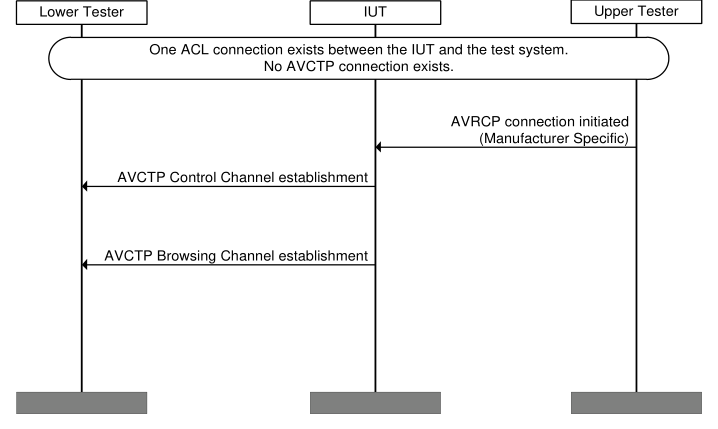

**Figure 4.1: AVRCP/CT/CON/BV-01-C [Connection establishment for browsing – CT] MSC**

• Expected Outcome
Pass verdict
The IUT initiates the establishment of the AVCTP control channel and immediately afterwards the IUT initiates the establishment of the AVCTP browsing channel.
AVRCP/TG/CON/BV-02-C [Connection establishment for browsing – TG]
• Test Purpose
Verify the connection establishment for the control channel and the browsing channel, both initiated by the TG.
• Reference
[5], [8] 4.1.1
• Initial Condition
- One ACL connection exists between the IUT and the Lower Tester.
- No AVCTP connection is established between the IUT and the Lower Tester.
- The IUT is acting as AVRCP TG role in category 1.
- The IUT has performed an SDP query with the Lower Tester exposing AVRCP browse support.
• Test Procedure
The Upper Tester triggers the IUT to establish an AVRCP connection.

**Figure 4.2: AVRCP/TG/CON/BV-02-C [Connection establishment for browsing – TG] MSC**

• Expected Outcome
Pass verdict
The IUT initiates the establishment of the AVCTP control channel and immediately afterwards the IUT initiates the establishment of the AVCTP browsing channel.
AVRCP/TG/CON/BV-05-C [Connection establishment for browsing – TG initiates control channel and CT initiates browsing channel]
• Test Purpose
Verify the connection establishment for browsing channel initiated by the CT after the TG has initiated the control channel establishment.
• Reference
[5], [8] 4.1.1
• Initial Condition
- One ACL connection exists between the IUT and the Lower Tester.
- The IUT has performed an SDP query with the Lower Tester exposing AVRCP browse support.
• Test Procedure
1. The Upper Tester triggers the IUT to initiate establishment of an AVCTP control channel. 2. Upon receipt of control channel establishment signaling from the IUT the Lower Tester initiates
the establishment of an AVCTP browsing channel with the IUT.

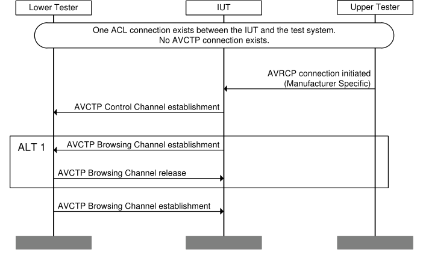

**Figure 4.3: AVRCP/TG/CON/BV-05-C [Connection establishment for browsing – TG initiates control channel and CT initiates browsing channel] MSC**

• Expected Outcome
Pass verdict
The IUT initiates the establishment of the AVCTP control channel.
The IUT successfully responds to the Lower Tester initiation to establish the AVCTP browsing channel.
In the alternative scenario where the IUT supports browsing channel initiation and immediately initiates the browsing channel establishment following the control channel establishment, the IUT successfully responds to the Lower Tester’s request to initiate the browsing channel release and subsequently allows the Lower Tester to initiate the AVCTP browsing channel establishment.

### 4.4 Connection Release for Browsing

Verify the procedure of releasing the AVCTP browsing channel.
AVRCP/CT/CON/BV-03-C [Connection release for browsing – CT]
• Test Purpose
Verify the connection release for browsing initiated by the CT.
• Reference
[5], [8] 4.1.2
• Initial Condition
- One ACL connection exists between the IUT and the Lower Tester.
- An AVCTP Control and an AVCTP Browsing channel are established.
- The IUT is acting as AVRCP CT role in category 1.
• Test Procedure
The Upper Tester triggers the IUT to release the AVRCP connection.

**Figure 4.4: AVRCP/CT/CON/BV-03-C [Connection release for browsing – CT] MSC**

• Expected Outcome
Pass verdict
The IUT initiates the release of the AVCTP browsing channel and immediately afterwards the IUT initiates the release of the AVCTP control channel.
AVRCP/TG/CON/BV-04-C [Connection release for browsing – TG]
• Test Purpose
Verify the connection release for browsing initiated by the TG.
• Reference
[5], [8] 4.1.2
• Initial Condition
- One ACL connection exists between the IUT and the Lower Tester.
- An AVCTP Control and an AVCTP Browsing channel are established.
- The IUT is acting as AVRCP TG role in category 1.
• Test Procedure
The Upper Tester triggers the IUT to release the AVRCP connection.

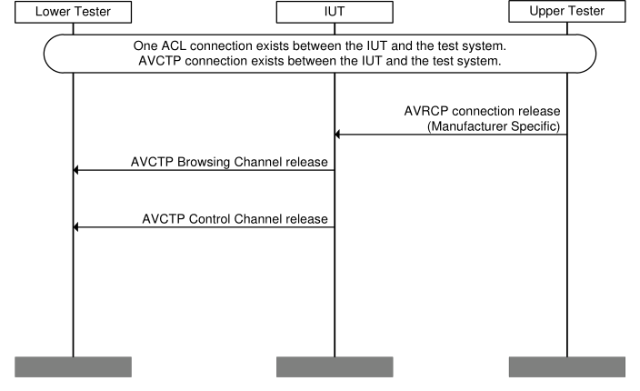

**Figure 4.5: AVRCP/TG/CON/BV-04-C [Connection release for browsing – TG] MSC**

• Expected Outcome
Pass verdict
The IUT initiates the release of the AVCTP browsing channel and immediately afterwards the IUT initiates the release of the AVCTP control channel.

### 4.5 Media Player Selection Commands and Notifications

Verify the commands and notifications related to Selection of Media Players.
AVRCP/CT/MPS/BV-01-C [SetAddressedPlayer – CT]
• Test Purpose
Verify the SetAddressedPlayer command issued by the CT.
• Reference
[5], [8] 6.9.1
• Initial Condition
- One ACL connection exists between the IUT and the Lower Tester.
- The AVCTP control and browsing channels between the IUT and the Lower Tester are established.
- The IUT is acting as AVRCP CT role in category 1.
- Available PlayerIds have to be provided to the IUT. This can be achieved by executing AVRCP/CT/MPS/BV-08-C [GetFolderItems – CT].
• Test Procedure
The Upper Tester triggers the IUT to set the addressed player.

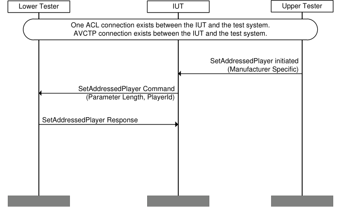

**Figure 4.6: AVRCP/CT/MPS/BV-01-C [SetAddressedPlayer – CT] MSC**

• Expected Outcome
Pass verdict
The IUT issues a SetAddressedPlayer command with Parameter Length = 0x2 and a valid PlayerId.
AVRCP/TG/MPS/BV-02-C [SetAddressedPlayer – TG]
• Test Purpose
Verify the SetAddressedPlayer response issued by the TG.
• Reference
[5], [8] 6.9.1
• Initial Condition
- One ACL connection exists between the IUT and the Lower Tester.
- The AVCTP control and browsing channels between the IUT and the Lower Tester are established.
- The IUT is acting as AVRCP TG role in category 1.
- The Lower Tester has retrieved the valid PlayerIds of the IUT. This can be retrieved by executing AVRCP/TG/MPS/BV-09-C [GetFolderItems – TG].
• Test Procedure
The Lower Tester sends a SetAddressedPlayer command containing a valid PlayerId to the IUT.

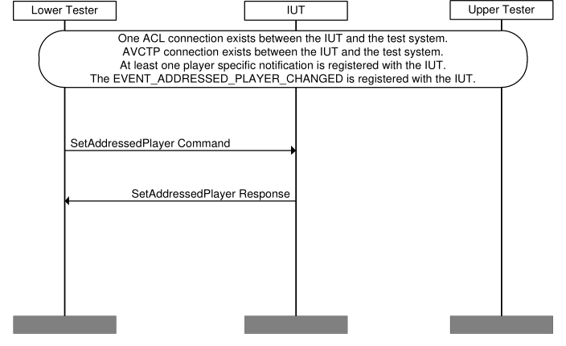

**Figure 4.7: AVRCP/TG/MPS/BV-02-C [SetAddressedPlayer – TG] MSC**

• Expected Outcome
Pass verdict
The IUT responds with a valid status field indicating that no error occurred.
AVRCP/CT/MPS/BV-03-C [SetBrowsedPlayer – CT]
• Test Purpose
Verify the SetBrowsedPlayer command issued by the CT.
• Reference
[5], [8] 6.9.3
• Initial Condition
- One ACL connection exists between the IUT and the Lower Tester.
- The AVCTP control and browsing channels between the IUT and the Lower Tester are established.
- The IUT is acting as AVRCP CT role in category 1.
- The IUT has retrieved the list of available players on the Lower Tester. This can be achieved by executing AVRCP/CT/MPS/BV-08-C [GetFolderItems – CT].
• Test Procedure
The Upper Tester triggers the IUT to set the browsed player to a valid PlayerID.

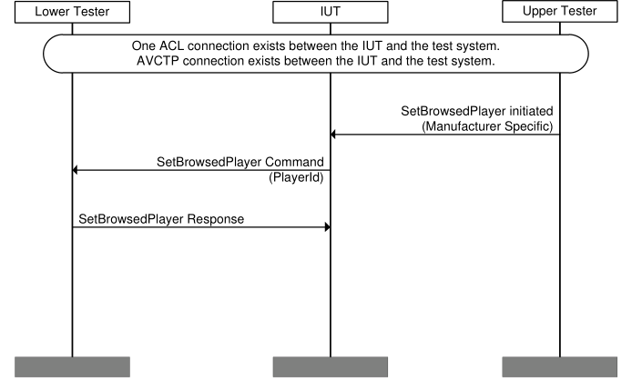

**Figure 4.8: AVRCP/CT/MPS/BV-03-C [SetBrowsedPlayer – CT] MSC**

• Expected Outcome
Pass verdict
The IUT issues a SetBrowsedPlayer command with a valid PlayerId.
AVRCP/TG/MPS/BV-04-C [SetBrowsedPlayer – TG]
• Test Purpose
Verify the SetBrowsedPlayer response issued by the TG.
• Reference
[5], [8] 6.9.3
• Initial Condition
- One ACL connection exists between the IUT and the Lower Tester.
- The AVCTP control and browsing channels between the IUT and the Lower Tester are established.
- The IUT is acting as AVRCP TG role in category 1.
- The Lower Tester has retrieved the valid PlayerIds of the IUT. This can be retrieved by executing AVRCP/TG/MPS/BV-09-C [GetFolderItems – TG].
• Test Procedure
The Lower Tester sends a valid SetBrowsedPlayer command to the IUT.

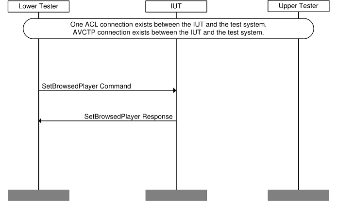

**Figure 4.9: AVRCP/TG/MPS/BV-04-C [SetBrowsedPlayer – TG] MSC**

• Expected Outcome
Pass verdict
The IUT responds with a valid Status field in the SetBrowsedPlayer response. The fields UID Counter, Number of Items, Character Set Id, Folder Depth, Folder Name Size and Folder Name are correctly formatted reflecting the current folder.
AVRCP/TG/MPS/BV-05-C [AddressedPlayerChanged notification – TG]
• Test Purpose
Verify the AddressedPlayerChanged Notification issued by the TG and the procedure associated to this.
• Reference
[5], [8] 6.9.2
• Initial Condition
- One ACL connection exists between the IUT and the Lower Tester.
- The AVCTP control and browsing channels between the IUT and the Lower Tester are established.
- The IUT is acting as AVRCP TG role in category 1.
- At least one player specific notification is registered with the IUT.
• Test Procedure
1. The Lower Tester sends a RegisterNotificationCommand to the IUT to register for
AddressedPlayerChanged. 2. The Upper Tester subsequently triggers a change of addressed player in the IUT by selecting a
new Addressed Player.

| Lower Tester IUT Upper Tester One ACL connection exists between the IUT and the test system. AVCTP connection exists between the IUT and the test system. At least one player specific notification is registered with the IUT. Register Notification Command (AddressedPlayerChanged) Register Notification Interim (AddressedPlayerChanged) Trigger AddressedPlayerChanged (Manufacturer Specific) Register Notification Changed (AddressedPlayerChanged) RegisterNotificationReject (all player specific notifications) |  |
| --- | --- |
|  |  |

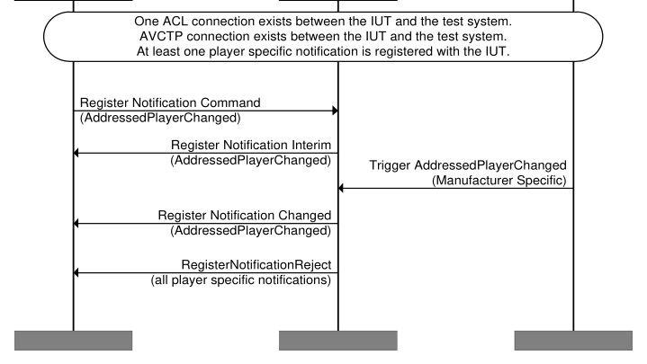

**Figure 4.10: AVRCP/TG/MPS/BV-05-C [AddressedPlayerChanged notification – TG] MSC**

• Expected Outcome
Pass verdict
The IUT issues a correctly AddressedPlayerChanged notification final response with the correct value of PlayerId and UID Counter for the Player selected by the Upper Tester.
The IUT completes all player specific notifications with AV/C type rejected.
AVRCP/TG/MPS/BV-06-C [PlayerFeatureBitmask – TG]
• Test Purpose
Verify the PlayerFeatureBitmask issued by the TG.
• Reference
[5], [8] 6.10.2.1
• Initial Condition
- One ACL connection exists between the IUT and the Lower Tester.
- The AVCTP control and browsing channels between the IUT and the Lower Tester are established.
- The IUT is acting as AVRCP TG role in category 1.
- There is an IXIT feature list for each Media Player application on the TG [6].
• Test Procedure
The Lower Tester sends a GetFolderItems command to the IUT.

**Figure 4.11: AVRCP/TG/MPS/BV-06-C [PlayerFeatureBitmask – TG] MSC**

• Expected Outcome
Pass verdict
The features announced in each Media Player’s feature bitmask are according to the Media Player’s IXIT entry.
AVRCP/TG/MPS/BV-07-C [AvailablePlayersChanged notification – TG]
• Test Purpose
Verify the AvailablePlayersChanged Notification issued by the TG.
• Reference
[5], [8] 6.9.4
• Initial Condition
- One ACL connection exists between the IUT and the Lower Tester.
- The AVCTP control and browsing channels between the IUT and the Lower Tester are established.
- The IUT is acting as AVRCP TG role in category 1.
• Test Procedure
1. The Lower Tester sends a RegisterNotificationCommand to the IUT to register for
AvailablePlayersChanged. 2. The Upper Tester subsequently triggers a change of available players in the IUT.

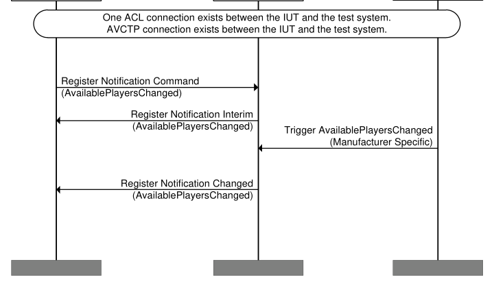

**Figure 4.12: AVRCP/TG/MPS/BV-07-C [AvailablePlayersChanged Notification – TG] MSC**

• Expected Outcome
Pass verdict
The IUT issues a correctly formatted AvailablePlayersChanged notification final response.
AVRCP/CT/MPS/BV-08-C [GetFolderItems – CT]
• Test Purpose
Verify the GetFolderItems command issued by the CT on the Media Player List.
• Reference
[5], [8] 6.10.4.2
• Initial Condition
- One ACL connection exists between the IUT and the Lower Tester.
- The AVCTP control and browsing channels between the IUT and the Lower Tester are established.
- The IUT is acting as AVRCP CT role in category 1.
• Test Procedure
The Upper Tester triggers the IUT to retrieve the MediaPlayerList.

**Figure 4.13: AVRCP/CT/MPS/BV-08-C [GetFolderItems – CT] MSC**

• Expected Outcome
Pass verdict
The IUT issues a GetFolderItems command with the scope of MediaPlayerList and valid parameters for StartItem, EndItem, AttributeCount and AttributeList.
AVRCP/TG/MPS/BV-09-C [GetFolderItems – TG]
• Test Purpose
Verify the GetFolderItems response for the Media Player List issued by the TG.
• Reference
[5], [8] 6.10.4.2
• Initial Condition
- One ACL connection exists between the IUT and the Lower Tester.
- The AVCTP control and browsing channels between the IUT and the Lower Tester are established.
- The IUT is acting as AVRCP TG role in category 1.
• Test Procedure
The Lower Tester sends a valid GetFolderItems command to the IUT to retrieve the MediaPlayerList. The command contains the MediaPlayerList as Scope parameter and valid entries for Start Item, End Item, AttributeCount and AttributeList.

**Figure 4.14: AVRCP/TG/MPS/BV-09-C [GetFolderItems – TG] MSC**

• Expected Outcome
Pass verdict
The IUT responds with a correctly formatted list of available Media Player Items with correct entries for each field in each Media Player Item.
AVRCP/TG/MPS/BV-10-C [DefaultAddressedPlayer – TG]
• Test Purpose
Verify the Default Addressed Player on the TG.
• Reference
[5], [8] 6.9
• Initial Condition
- One ACL connection exists between the IUT and the Lower Tester.
- The AVCTP control and browsing channels between the IUT and the Lower Tester are established.
- The IUT is acting as AVRCP TG role in category 1.
- No SetAddressedPlayer command has been executed before.
• Test Procedure
The Lower Tester send the PASS THROUGH commands for Play pushed and Play released to the IUT.

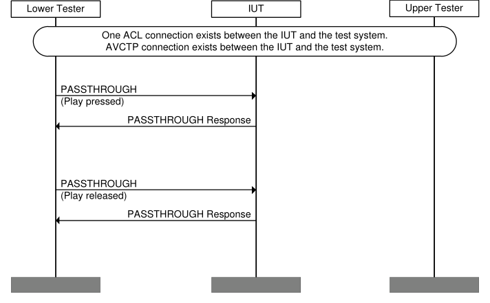

**Figure 4.15: AVRCP/TG/MPS/BV-10-C [DefaultAddressedPlayer – TG] MSC**

• Expected Outcome
Pass verdict
The IUT responds with valid PASS THROUGH responses indicating success and starts playing.
AVRCP/CT/MPS/BV-11-C [GetTotalNumberOfItems – CT]
• Test Purpose
Verify the GetTotalNumberOfItems command issued by the IUT (CT) for the Media Player List scope.
• Reference
[8] 6.10.4.4
• Initial Condition
- One ACL connection exists between the IUT and the Lower Tester.
- AVCTP control and browsing channels between the IUT and the Lower Tester are established.
- The IUT is acting as AVRCP CT role in category 1.
• Test Procedure
1. The Upper Tester triggers the IUT to issue a GetTotalNumberOfItems command to the Lower
Tester with the scope parameter set to Media Player List. 2. Upon receipt of a GetTotalNumberOfItems command from the IUT, the Lower Tester issues an
appropriate GetTotalNumberOfItems response message.

| Lower Tester IUT Upper Tester One ACL connection exists between the IUT and the test system. AVCTP connection exists between the IUT and the test system. GetTotalNumberOfItems (MediaPlayerList) initiated (Manufacturer Specific) GetTotalNumberOfItems Command (Media Player List) GetTotalNumberOfItems Response |  |
| --- | --- |
|  |  |

**Figure 4.16: AVRCP/CT/MPS/BV-11-C [GetTotalNumberOfItems – CT] MSC**

• Expected Outcome
Pass verdict
The IUT issues a GetTotalNumberOfItems command to the Lower Tester with the scope parameter set to Media Player List.
AVRCP/TG/MPS/BV-12-C [GetTotalNumberOfItems – TG]
• Test Purpose
Verify that the IUT (TG) correctly responds to the GetTotalNumberOfItems command issued from the CT for the Media Player List scope.
• Reference
[8] 6.10.4.4
• Initial Condition
- One ACL connection exists between the IUT and the Lower Tester.
- AVCTP control and browsing channels between the IUT and the Lower Tester are established.
- The IUT is acting as AVRCP TG role in category 1.
• Test Procedure
The Lower Tester issues a GetTotalNumberOfItems command to the IUT with the scope parameter set to Media Player List.

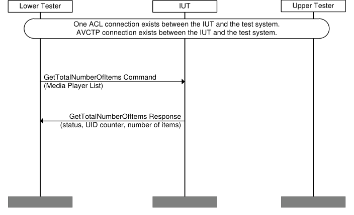

**Figure 4.17: AVRCP/TG/MPS/BV-12-C [GetTotalNumberOfItems – TG] MSC**

• Expected Outcome
Pass verdict
The IUT issues a well-formatted GetTotalNumberOfItems response message to the Lower Tester.
The GetTotalNumberOfItems response message indicates the correct number of available media players.
The total number of items returned by the IUT is the correct number for the current folder as specified in the IXIT [6].
AVRCP/TG/MPS/BI-01-C [SetAddressedPlayer – TG]
• Test Purpose
Verify the SetAddressedPlayer response issued by the TG when an invalid player is requested.
• Reference
[5], [8] 6.9.1
• Initial Condition
- One ACL connection exists between the IUT and the Lower Tester.
- The AVCTP control and browsing channels between the IUT and the Lower Tester are established.
- The IUT is acting as AVRCP TG role in category 1.
- The Lower Tester has retrieved the valid PlayerIds of the IUT. This can be retrieved by executing AVRCP/TG/MPS/BV-09-C [GetFolderItems – TG].
• Test Procedure
The Lower Tester sends a SetAddressedPlayer command to the IUT with an invalid PlayerID.

**Figure 4.18: AVRCP/TG/MPS/BI-01-C [SetAddressedPlayer – TG] MSC**

• Expected Outcome
Pass verdict
The IUT responds with an ‘Invalid Player Id’ status response.
AVRCP/TG/MPS/BI-02-C [SetBrowsedPlayer – TG]
• Test Purpose
Verify the SetBrowsedPlayer response issued by the TG when an invalid player is requested.
• Reference
[5], [8] 6.9.3
• Initial Condition
- One ACL connection exists between the IUT and the Lower Tester.
- The AVCTP control and browsing channels between the IUT and the Lower Tester are established.
- The IUT is acting as AVRCP TG role in category 1.
- The Lower Tester has retrieved the valid PlayerIds of the IUT. This can be retrieved by executing AVRCP/TG/MPS/BV-09-C [GetFolderItems – TG].
• Test Procedure
The Lower Tester sends a SetBrowsedPlayer command to the IUT with an invalid PlayerID.

**Figure 4.19: AVRCP/TG/MPS/BI-02-C [SetBrowsedPlayer – TG] MSC**

• Expected Outcome
Pass verdict
The IUT responds with an ‘Invalid Player Id’ status response.

### 4.6 Media Content Navigation Commands and Notifications for Content Browsing

Verify the commands and notifications related to Navigation of Media Content
AVRCP/CT/MCN/CB/BV-01-C [GetFolderItems – CT]
• Test Purpose
Verify the GetFolderItems command issued by the CT.
• Reference
[5], [8] 6.10.4.2
• Initial Condition
- One ACL connection exists between the IUT and the Lower Tester.
- The AVCTP control and browsing channels between the IUT and the Lower Tester are established.
- The IUT is acting as AVRCP CT role in category 1.
- The IUT has successfully issued a SetBrowsedPlayer command to the player specified in the IXIT [6] as the browsable player.
• Test Procedure
The Upper Tester triggers the IUT to retrieve the Current Folder content in the Virtual Filesystem.

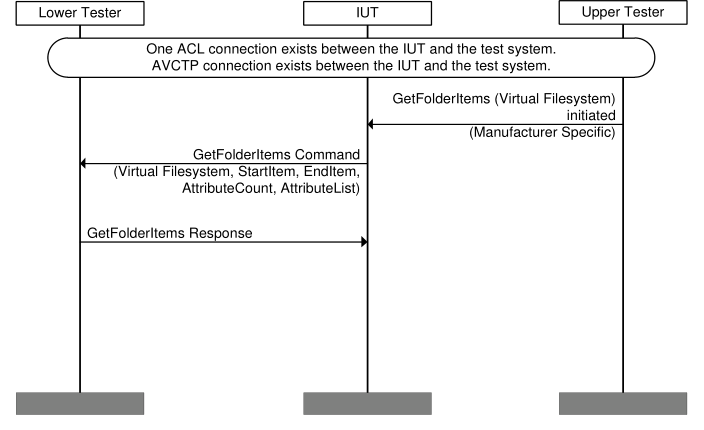

**Figure 4.20: AVRCP/CT/MCN/CB/BV-01-C [GetFolderItems – CT] MSC**

• Expected Outcome
Pass verdict
The IUT issues a GetFolderItems command with the scope of Virtual Filesystem and valid parameters for StartItem, EndItem, AttributeCount, and AttributeList.
AVRCP/TG/MCN/CB/BV-02-C [GetFolderItems – TG]
• Test Purpose
Verify the GetFolderItems response issued by the TG for a folder.
• Reference
[5], [8] 6.10.4.2
• Initial Condition
- One ACL connection exists between the IUT and the Lower Tester.
- The AVCTP control and browsing channels between the IUT and the Lower Tester are established.
- The IUT is acting as AVRCP TG role in category 1.
- The Lower Tester has successfully issued a SetBrowsedPlayer command to the player specified in the IXIT [6] as the browsable player.
• Test Procedure
The Lower Tester sends a GetFolderItems command to the IUT with the VirtualFilesystem as Scope parameter and valid entries for Start Item, End Item, AttributeCount and AttributeList.

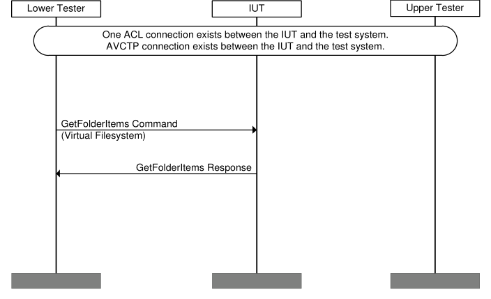

**Figure 4.21: AVRCP/TG/MCN/CB/BV-02-C [GetFolderItems – TG] MSC**

• Expected Outcome
Pass verdict
The IUT responds with a correctly formatted list of only Folder Items and Media Items.
AVRCP/TG/MCN/CB/BV-03-C [GetFolderItems – TG]
• Test Purpose
Verify the GetFolderItems response issued by the TG while the BrowsedPlayer is other than the AddressedPlayer.
• Reference
[5], [8] 6.10.4.2
• Initial Condition
- One ACL connection exists between the IUT and the Lower Tester.
- The AVCTP control and browsing channels between the IUT and the Lower Tester are established.
- The IUT is acting as AVRCP TG role in category 1.
- The Lower Tester has retrieved a list of available players. This can be achieved by executing AVRCP/TG/MPS/BV-09-C [GetFolderItems – TG].
- The IUT has at least two media player applications available.
• Test Procedure
1. The Lower Tester sets the addressed and browsed players on the IUT to valid PlayerID values 2. The Lower Tester sends a GetFolderItems command to the IUT with the VirtualFilesystem as

| Lower Tester IUT Upper Tester One ACL connection exists between the IUT and the test system. AVCTP connection exists between the IUT and the test system. SetAddressedPlayer (PlayerA) SetBrowsedPlayer (PlayerB) GetFolderItems Command (Virtual Filesystem) GetFolderItems Response |  |
| --- | --- |
|  |  |

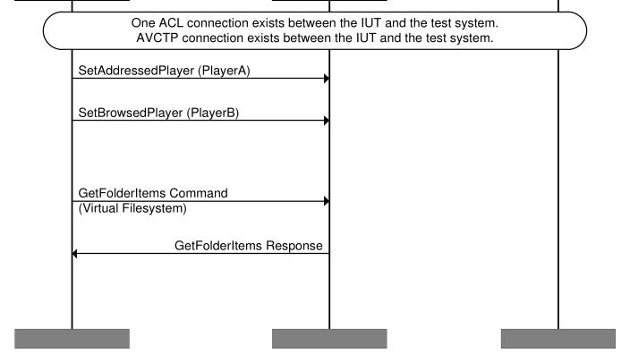

**Figure 4.22: AVRCP/TG/MCN/CB/BV-03-C [GetFolderItems – TG] MSC**

• Expected Outcome
Pass verdict
The IUT responds with a correctly formatted list of only Folder Items and Media Items of the current folder on PlayerB.
AVRCP/CT/MCN/CB/BV-04-C [ChangePath – CT]
• Test Purpose
Verify the ChangePath command issued by the CT.
• Reference
[5], [8] 6.10.4.1
• Initial Condition
- One ACL connection exists between the IUT and the Lower Tester.
- The AVCTP control and browsing channels between the IUT and the Lower Tester are established.
- The IUT is acting as AVRCP CT role in category 1.
- The IUT has retrieved the currently valid Folder UIDs on the Lower Tester. This can be achieved by executing AVRCP/CT/MCN/CB/BV-01-C [GetFolderItems – CT].
- The IUT has successfully issued a SetBrowsedPlayer command to the player specified in the IXIT [6] as the browsable player.
• Test Procedure
The Upper Tester triggers the IUT to issue the ChangePath command with a valid UIDCounter, FolderUID, and Direction indication FolderDown.

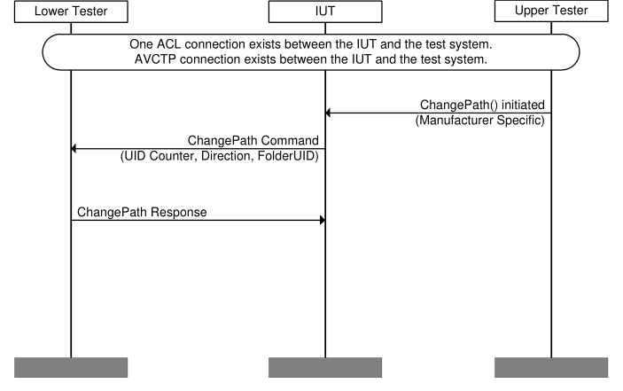

**Figure 4.23: AVRCP/CT/MCN/CB/BV-04-C [ChangePath – CT] MSC**

• Expected Outcome
Pass verdict
The IUT issues a ChangePath command with the valid parameters for Direction and FolderUID.
AVRCP/TG/MCN/CB/BV-05-C [ChangePath – TG]
• Test Purpose
Verify the ChangePath response issued by the TG.
• Reference
[5], [8] 6.10.4.1
• Initial Condition
- One ACL connection exists between the IUT and the Lower Tester.
- The AVCTP control and browsing channels between the IUT and the Lower Tester are established.
- The IUT is acting as AVRCP TG role in category 1.
- The Lower Tester is aware of the currently valid FolderUIDs exposed by the IUT. This can be achieved by executing AVRCP/TG/MCN/CB/BV-02-C [GetFolderItems – TG].
- The Lower Tester has successfully issued a SetBrowsedPlayer command to the player specified in the IXIT [6] as the browsable player.
• Test Procedure
The Lower Tester sends a ChangePath command to the IUT containing a currently valid UIDCounter, FolderUID, and the Direction indication Folder Down.

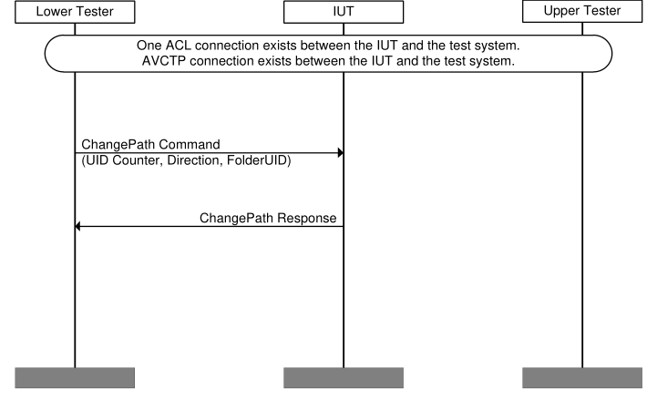

**Figure 4.24: AVRCP/TG/MCN/CB/BV-05-C [ChangePath – TG] MSC**

• Expected Outcome
Pass verdict
The IUT responds with a correctly formatted ChangePath Response with the correct Number of Items of the current folder on the IUT.
AVRCP/TG/MCN/CB/BV-06-C [ChangePath – TG]
• Test Purpose
Verify the ChangePath response issued by the TG when the Direction is FolderUp.
• Reference
[5], [8] 6.10.4.1
• Initial Condition
- One ACL connection exists between the IUT and the Lower Tester.
- The AVCTP control and browsing channels between the IUT and the Lower Tester are established.
- The IUT is acting as AVRCP TG role in category 1.
- The IUT is in a state that allows the ChangePath direction of FolderUp.
- The Lower Tester has successfully issued a SetBrowsedPlayer command to the player specified in the IXIT [6] as the browsable player.
• Test Procedure
The Lower Tester sends a ChangePath command to the IUT containing the Direction indication Folder Up.

**Figure 4.25: AVRCP/TG/MCN/CB/BV-06-C [ChangePath – TG] MSC**

• Expected Outcome
Pass verdict
The IUT responds with a correctly formatted ChangePath Response with the correct Number of Items of the current folder on the IUT.
AVRCP/CT/MCN/CB/BV-07-C [GetItemAttributes – CT]
• Test Purpose
Verify the GetItemAttributes command issued by the CT on a Media Item in the Virtual Media Player Filesystem other than the currently playing one.
• Reference
[5], [8] 6.10.4.3
• Initial Condition
- One ACL connection exists between the IUT and the Lower Tester.
- The AVCTP control and browsing channels between the IUT and the Lower Tester are established.
- The IUT is acting as AVRCP CT role in category 1.
- The IUT is aware of the currently valid Media Item UIDs exposed by the Lower Tester. This can be achieved by executing AVRCP/CT/MCN/CB/BV-01-C [GetFolderItems – CT].
- The IUT has successfully issued a SetBrowsedPlayer command to the player specified in the IXIT [6] as the browsable player.
• Test Procedure
The Upper Tester triggers the IUT to issue the GetItemAttributes command for a currently valid Media Item UID other than the currently playing media item.

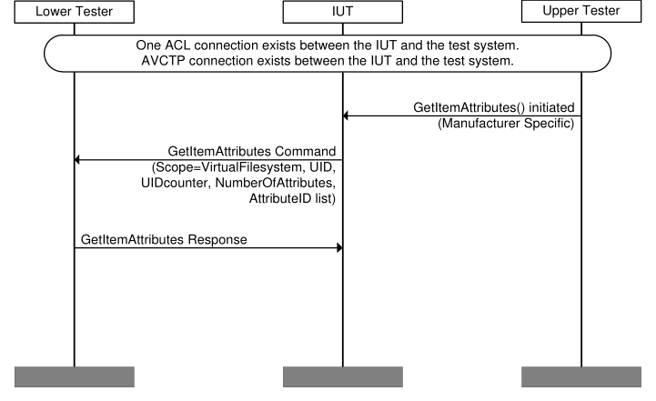

**Figure 4.26: AVRCP/CT/MCN/CB/BV-07-C [GetItemAttributes – CT] MSC**

• Expected Outcome
Pass verdict
The IUT issues a GetItemAttributes command with valid parameters for UID, UIDcounter, NumberOfAttributes, and AttributeID list.
AVRCP/TG/MCN/CB/BV-08-C [GetItemAttributes – TG]
• Test Purpose
Verify the GetItemAttributes response issued by the TG on a Media Item in the Virtual Media Player Filesystem other than the currently playing one.
• Reference
[5], [8] 6.10.4.3
• Initial Condition
- One ACL connection exists between the IUT and the Lower Tester.
- The AVCTP control and browsing channels between the IUT and the Lower Tester are established.
- The IUT is acting as AVRCP TG role in category 1.
- The Lower Tester is aware of the currently valid Media Item UIDs on the IUT. This can be achieved by executing AVRCP/TG/MCN/CB/BV-02-C [GetFolderItems – TG].
- The Lower Tester has successfully issued a SetBrowsedPlayer command to the player specified in the IXIT [6] as the browsable player.
• Test Procedure
The Lower Tester sends a GetItemAttributes command to the IUT containing the VirtualFilesystem as Scope parameter and valid entries for UID, UIDcounter, Number of Attributes, and AttributeID list.

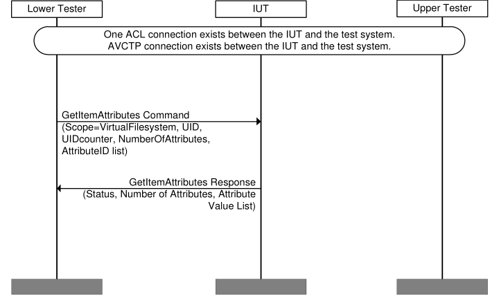

**Figure 4.27: AVRCP/TG/MCN/CB/BV-08-C [GetItemAttributes – TG] MSC**

• Expected Outcome
Pass verdict
The IUT responds with a correctly formatted GetItemAttributes Response with the expected values for Number of Attributes and Attribute Value List.
AVRCP/TG/MCN/CB/BV-09-C [UIDcounter – TG]
• Test Purpose
Verify the initial value of the UID counter if the TG is a database unaware player.
• Reference
[5], [8] 6.10.3
• Initial Condition
- One ACL connection exists between the IUT and the Lower Tester.
- The AVCTP control and browsing channels between the IUT and the Lower Tester are established.
- The IUT is acting as AVRCP TG role in category 1.
- The IUT is reset to factory settings so that the UID counter is reset to the initial value.
- The Lower Tester has successfully issued a SetBrowsedPlayer command to the player specified in the IXIT [6] as the browsable player.
• Test Procedure
The Lower Tester registers with the IUT for UID change notifications. No change to the database on the IUT is applied between the reset and the RegisterNotification for EVENT_UIDS_CHANGED.

**Figure 4.28: AVRCP/TG/MCN/CB/BV-09-C [UIDcounter – TG] MSC**

• Expected Outcome
Pass verdict
The IUT issues an InterimResponse for the EVENT_UIDS_CHANGED with a UID Counter=0.
AVRCP/TG/MCN/CB/BV-10-C [UIDcounter – TG]
• Test Purpose
Verify the initial value of the UID counter if the TG is a database aware player.
• Reference
[5], [8] 6.10.3
• Initial Condition
- One ACL connection exists between the IUT and the Lower Tester.
- The AVCTP control and browsing channels between the IUT and the Lower Tester are established.
- The IUT is acting as AVRCP TG role in category 1.
- The IUT is reset to factory settings so that the UID counter is reset to the initial value.
- The Lower Tester has successfully issued a SetBrowsedPlayer command to the player specified in the IXIT [6] as the browsable player.
• Test Procedure
The Lower Tester registers with the IUT for UID change notifications. No change to the database on the IUT is applied between the reset and the RegisterNotification for EVENT_UIDS_CHANGED.

**Figure 4.29: AVRCP/TG/MCN/CB/BV-10-C [UIDcounter – TG] MSC**

• Expected Outcome
Pass verdict
The IUT issues an InterimResponse for the EVENT_UIDS_CHANGED with 0x1<=UID Counter<=0xFFFF.
AVRCP/TG/MCN/CB/BV-11-C [UIDcounter – TG]
• Test Purpose
Verify that the TG increments the UID counter and sends a UIDSChangedNotification when updates on existing UIDs occur if the TG is database aware.
• Reference
[5], [8] 6.10.3
• Initial Condition
- One ACL connection exists between the IUT and the Lower Tester.
- The AVCTP control and browsing channels between the IUT and the Lower Tester are established.
- The IUT is acting as AVRCP TG role in category 1.
- The Lower Tester has successfully issued a SetBrowsedPlayer command to the player specified in the IXIT [6] as the browsable player.
• Test Procedure
1. The Lower Tester registers with the IUT for UID change notifications. 2. The Upper Tester triggers a database change on the IUT, e.g., by adding or removing media
tracks. 3. The Lower Tester registers with the IUT for UID change notifications. No database change occurs
afterwards until after the second Interim Response has been sent to the Lower Tester.

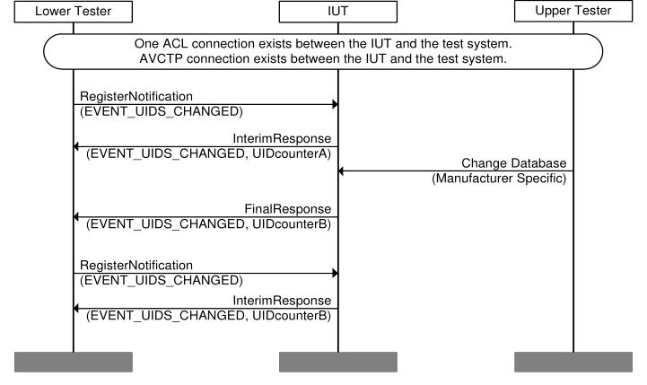

**Figure 4.30: AVRCP/TG/MCN/CB/BV-11-C [UID counter – TG] MSC**

• Expected Outcome
Pass verdict
The IUT issues a FinalResponse for the EVENT_UIDS_CHANGED with UIDcounterB not equal to UIDcounterA.
The IUT issues an Interim response after the second Registration for the EVENT_UIDS_CHANGED with UIDcounterB.
AVRCP/CT/MCN/CB/BV-12-C [GetTotalNumberOfItems – CT]
• Test Purpose
Verify the GetTotalNumberOfItems command issued by the IUT (CT) for the Virtual Media Player Filesystem scope.
• Reference
[8] 6.10.4.4
• Initial Condition
- One ACL connection exists between the IUT and the Lower Tester.
- AVCTP control and browsing channels between the IUT and the Lower Tester are established.
- The IUT is acting as AVRCP CT role in category 1.
- The IUT has successfully issued a SetBrowsedPlayer command to the player specified in [6] as the browsable player.
• Test Procedure
1. The Upper Tester triggers the IUT to issue a GetTotalNumberOfItems command to the Lower
Tester with the scope parameter set to Virtual Media Player Filesystem. 2. Upon receipt of a GetTotalNumberOfItems command from the IUT, the Lower Tester issues an
appropriate GetTotalNumberOfItems response message.

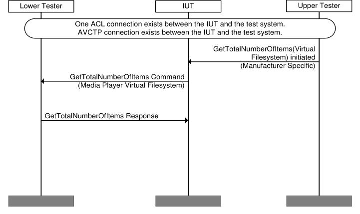

**Figure 4.31: AVRCP/CT/MCN/CB/BV-12-C [GetTotalNumberOfItems – CT] MSC**

• Expected Outcome
Pass verdict
The IUT issues a GetTotalNumberOfItems command to the Lower Tester with the scope parameter set to Virtual Media Player Filesystem.
AVRCP/TG/MCN/CB/BV-13-C [GetTotalNumberOfItems – TG]
• Test Purpose
Verify that the IUT (TG) correctly responds to the GetTotalNumberOfItems command issued from the CT for the Virtual Media Player Filesystem scope.
• Reference
[8] 6.10.4.4
• Initial Condition
- One ACL connection exists between the IUT and the Lower Tester.
- AVCTP control and browsing channels between the IUT and the Lower Tester are established.
- The IUT is acting as AVRCP TG role in category 1.
- The Lower Tester has successfully issued a SetBrowsedPlayer command to the player specified in [6] as the browsable player.
- The Lower Tester has successfully issued any necessary ChangePath commands to navigate to a folder on the Browsed Player on the IUT containing at least one item as specified in the IXIT [6].
• Test Procedure
The Lower Tester issues a GetTotalNumberOfItems command to the IUT with the scope parameter set to Virtual Media Player Filesystem.

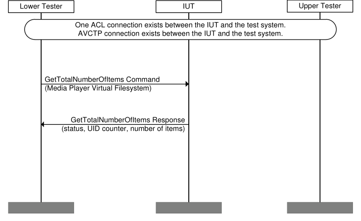

**Figure 4.32: AVRCP/TG/MCN/CB/BV-13-C [GetTotalNumberOfItems – TG] MSC**

• Expected Outcome
Pass verdict
The status parameter of the GetTotalNumberOfItems response message from the IUT to the Lower Tester indicates that the operation completed without error.
The total number of items returned by the IUT is the correct number of playable media items in the current folder [6].
AVRCP/TG/MCN/CB/BI-01-C [GetFolderItems – TG]
• Test Purpose
Verify the GetFolderItems response issued by the TG when the command contains invalid parameters.
• Reference
[5], [8] 6.10.4.2
• Initial Condition
- One ACL connection exists between the IUT and the Lower Tester.
- The AVCTP control and browsing channels between the IUT and the Lower Tester are established.
- The IUT is acting as AVRCP TG role in category 1.
- The Lower Tester has successfully issued a SetBrowsedPlayer command to the player specified in the IXIT [6] as the browsable player.
• Test Procedure
The Lower Tester sends a GetFolderItems command to the IUT with invalid parameters: a StartItem parameter larger than the EndItem.

**Figure 4.33: AVRCP/TG/MCN/CB/BI-01-C [GetFolderItems – TG] MSC**

• Expected Outcome
Pass verdict
The IUT responds with error code 0x0B (Range out of Bounds).
AVRCP/TG/MCN/CB/BI-02-C [GetFolderItems – TG]
• Test Purpose
Verify the GetFolderItems response issued by the TG for an empty folder when the command contains invalid parameters.
• Reference
[5], [8] 6.10.4.2
• Initial Condition
- One ACL connection exists between the IUT and the Lower Tester.
- The AVCTP control and browsing channels between the IUT and the Lower Tester are established.
- The IUT is acting as AVRCP TG role in category 1.
- The IUT has issued ChangePath to the folder defined in the IXIT [6] as an empty folder.
- The Lower Tester has successfully issued a SetBrowsedPlayer command to the player specified in the IXIT [6] as the browsable player.
• Test Procedure
The Lower Tester sends a GetFolderItems command to the IUT specifying the empty folder and setting StartItem=0 and EndItem=1.

**Figure 4.34: AVRCP/TG/MCN/CB/BI-02-C [GetFolderItems – TG] MSC**

• Expected Outcome
Pass verdict
The IUT responds with error code 0x0B (Range out of Bounds).
AVRCP/TG/MCN/CB/BI-03-C [GetFolderItems – TG]
• Test Purpose
Verify the GetFolderItems response issued by the TG when the command contains invalid parameters accessing items beyond the end of a folder.
• Reference
[5], [8] 6.10.4.2
• Initial Condition
- One ACL connection exists between the IUT and the Lower Tester.
- The AVCTP control and browsing channels between the IUT and the Lower Tester are established.
- The IUT is acting as AVRCP TG role in category 1.
- The Lower Tester has issued ChangePath to the folder defined in the IXIT [6] as a non-empty folder.
- The Lower Tester has successfully issued a SetBrowsedPlayer command to the player specified in the IXIT [6] as the browsable player.
• Test Procedure
The Lower Tester sends a GetFolderItems command to the IUT specifying the empty folder and setting StartItem=n+1 and EndItem=n+2, where n is the number of items in the non-empty folder as retrieved by the ChangePath command.

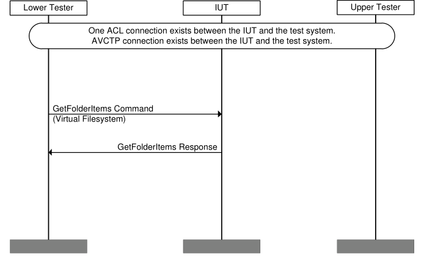

**Figure 4.35: AVRCP/TG/MCN/CB/BI-03-C [GetFolderItems – TG] MSC**

• Expected Outcome
Pass verdict
The IUT responds with error code 0x0B (Range out of Bounds).
AVRCP/TG/MCN/CB/BI-04-C [ChangePath – TG]
• Test Purpose
Verify the ChangePath response issued by the TG when an invalid Folder UID is requested.
• Reference
[5], [8] 6.10.4.1
• Initial Condition
- One ACL connection exists between the IUT and the Lower Tester.
- The AVCTP control and browsing channels between the IUT and the Lower Tester are established.
- The IUT is acting as AVRCP TG role in category 1.
- The Lower Tester is aware of the currently valid FolderUIDs exposed by the IUT. This can be achieved by executing AVRCP/TG/MCN/CB/BV-02-C [GetFolderItems – TG].
- The Lower Tester has successfully issued a SetBrowsedPlayer command to the player specified in the IXIT [6] as the browsable player.
• Test Procedure
The Lower Tester sends a ChangePath command to the IUT containing a currently invalid UIDCounter, FolderUID and the Direction indicating Folder Down.

**Figure 4.36: AVRCP/TG/MCN/CB/BI-04-C [ChangePath – TG] MSC**

• Expected Outcome
Pass verdict
The IUT responds with an error code indicating an invalid Folder UID.
AVRCP/TG/MCN/CB/BI-05-C [UIDcounter – TG]
• Test Purpose
Verify that the TG issues an error when receiving a command for an invalid UID counter.
• Reference
[5], [8] 6.10.3
• Initial Condition
- One ACL connection exists between the IUT and the Lower Tester.
- The AVCTP control and browsing channels between the IUT and the Lower Tester are established.
- The IUT is acting as AVRCP TG role in category 1.
- The Lower Tester has successfully issued a SetBrowsedPlayer command to the player specified in the IXIT [6] as the browsable player.
• Test Procedure
1. The Lower Tester registers with the IUT for notification of UID change. 2. The Lower Tester sends a GetItemAttributes command to the IUT, where the value of
UIDcounterB in the GetItemAttributes is different from the UIDcounterA issued by the IUT in the InterimResponse.

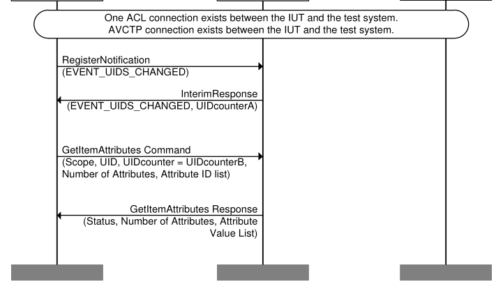

**Figure 4.37: AVRCP/TG/MCN/CB/BI-05-C [UIDcounter – TG] MSC**

• Expected Outcome
Pass verdict
The IUT issues a GetItemAttributes Response with Status Code UID Changed.

### 4.7 Media Content Navigation Commands and Notifications for Search

AVRCP/CT/MCN/SRC/BV-01-C [Search – CT]
• Test Purpose
Verify the Search command issued by the CT.
• Reference
[5], [8] 6.11
• Initial Condition
- One ACL connection exists between the IUT and the Lower Tester.
- The AVCTP control and browsing channels between the IUT and the Lower Tester are established.
- The IUT is acting as AVRCP CT role in category 1.
- The IUT is aware of the Character Sets supported by the Lower Tester.
- The IUT has successfully issued a SetBrowsedPlayer command to the player specified in the IXIT [6] as the browsable player.
• Test Procedure
The Upper Tester triggers the IUT to execute a search.

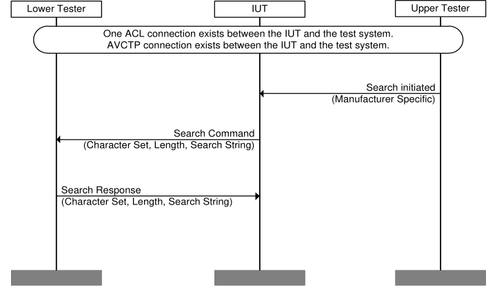

**Figure 4.38: AVRCP/CT/MCN/SRC/BV-01-C [Search – CT] MSC**

• Expected Outcome
Pass verdict
The IUT issues a Search command with the expected parameters for Character Set, Length and Search String.
AVRCP/TG/MCN/SRC/BV-02-C [Search – TG]
• Test Purpose
Verify the Search response issued by the TG.
• Reference
[5], [8] 6.11
• Initial Condition
- One ACL connection exists between the IUT and the Lower Tester.
- The AVCTP control and browsing channels between the IUT and the Lower Tester are established.
- The IUT is acting as AVRCP TG role in category 1.
- The Lower Tester is aware of a valid Character Set on the IUT.
- The Lower Tester has successfully issued a SetBrowsedPlayer command to the player specified in the IXIT [6] as the browsable player.
• Test Procedure
The Lower Tester sends a Search command to the IUT with valid entries for all parameters.

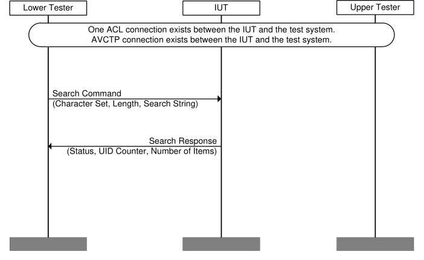

**Figure 4.39: AVRCP/TG/MCN/SRC/BV-02-C [Search – TG] MSC**

• Expected Outcome
Pass verdict
The IUT responds with a correctly formatted Search response with correct entries for all parameters.
AVRCP/CT/MCN/SRC/BV-03-C [GetFolderItems – CT]
• Test Purpose
Verify the GetFolderItems command issued by the CT on the Search folder.
• Reference
[5], [8] 6.10.4.2, 6.11
• Initial Condition
- One ACL connection exists between the IUT and the Lower Tester.
- The AVCTP control and browsing channels between the IUT and the Lower Tester are established.
- The IUT is acting as AVRCP CT role in category 1.
- A successful Search operation has been performed by the IUT with the Search results still being valid; see AVRCP/CT/MCN/SRC/BV-01-C [Search – CT].
- The Lower Tester has successfully issued a SetBrowsedPlayer command to the player specified in the IXIT [6] as the browsable player.
• Test Procedure
The Upper Tester triggers the IUT to retrieve the Search folder content.

**Figure 4.40: AVRCP/CT/MCN/SRC/BV-03-C [GetFolderItems – CT] MSC**

• Expected Outcome
Pass verdict
The IUT issues a GetFolderItems command with the scope of Search folder and valid parameters for StartItem, EndItem, AttributeCount and AttributeList.
AVRCP/TG/MCN/SRC/BV-04-C [GetFolderItems – TG]
• Test Purpose
Verify the GetFolderItems response for the Search folder issued by the TG.
• Reference
[5], [8] 6.10.4.2, 6.11
• Initial Condition
- One ACL connection exists between the IUT and the Lower Tester.
- The AVCTP control and browsing channels between the IUT and the Lower Tester are established.
- The IUT is acting as AVRCP TG role in category 1.
- A successful Search operation has been performed by the Lower Tester with the Search results still being valid; see AVRCP/TG/MCN/SRC/BV-02-C [Search – TG].
- The Lower Tester has successfully issued a SetBrowsedPlayer command to the player specified in the IXIT [6] as the browsable player.
• Test Procedure
The Lower Tester sends a GetFolderItems command to the IUT containing the Search folder as Scope parameter and valid entries for Start Item, End Item, AttributeCount and AttributeList.

**Figure 4.41: AVRCP/TG/MCN/SRC/BV-04-C [GetFolderItems – TG] MSC**

• Expected Outcome
Pass verdict
The IUT responds with a correctly formatted list of only Media Items.
AVRCP/CT/MCN/SRC/BV-05-C [GetItemAttributes – CT]
• Test Purpose
Verify the GetItemAttributes command issued by the CT on a Media Item in the Search folder other than the currently playing one.
• Reference
[5], [8] 6.10.4.3, 6.11
• Initial Condition
- One ACL connection exists between the IUT and the Lower Tester.
- The AVCTP control and browsing channels between the IUT and the Lower Tester are established.
- The IUT is acting as AVRCP CT role in category 1.
- A successful Search operation has been performed by the IUT with the Search results still being valid; see AVRCP/CT/MCN/SRC/BV-01-C [Search – CT].
- The IUT is aware of the currently valid Media Item UIDs exposed by the Lower Tester. This can be achieved by executing AVRCP/CT/MCN/SRC/BV-03-C [GetFolderItems – CT].
- The IUT has successfully issued a SetBrowsedPlayer command to the player specified in the IXIT [6] as the browsable player.
• Test Procedure
The Upper Tester triggers the GetItemAttributes command for a currently valid Search result Media Item UID other than the currently playing media item.

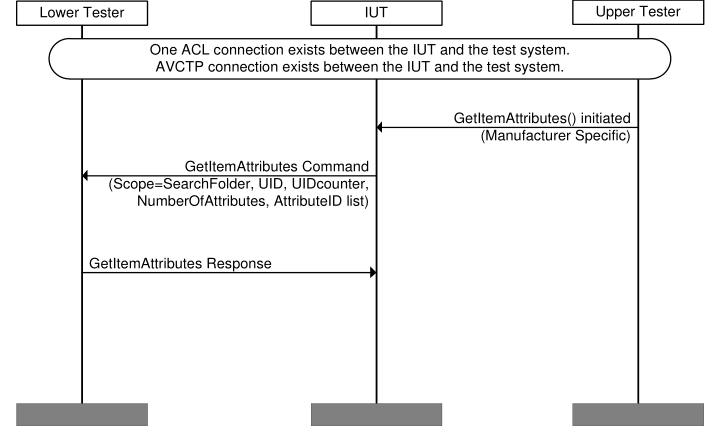

**Figure 4.42: AVRCP/CT/MCN/SRC/BV-05-C [GetItemAttributes – CT] MSC**

• Expected Outcome
Pass verdict
The IUT issues a GetItemAttributes command with valid parameters for UID, UIDcounter, NumberOfAttributes and AttributeID list.
AVRCP/TG/MCN/SRC/BV-06-C [GetItemAttributes – TG]
• Test Purpose
Verify the GetItemAttributes response issued by the TG on a Media Item in the Search folder other than the currently playing one.
• Reference
[5], [8] 6.10.4.3, 6.11
• Initial Condition
- One ACL connection exists between the IUT and the Lower Tester.
- The AVCTP control and browsing channels between the IUT and the Lower Tester are established.
- The IUT is acting as AVRCP TG role in category 1.
- A successful Search operation has been performed by the Lower Tester with the Search results still being valid; see AVRCP/TG/MCN/SRC/BV-02-C [Search – TG].
- The Lower Tester is aware of the currently valid Media Item UIDs in the Search folder exposed by the IUT. This can be achieved by executing AVRCP/TG/MCN/SRC/BV-04-C [GetFolderItems – TG].
- The Lower Tester has successfully issued a SetBrowsedPlayer command to the player specified in the IXIT [6] as the browsable player.
• Test Procedure
The Lower Tester sends a GetItemAttributes command to the IUT containing the Search folder as Scope parameter and valid entries for UID, UIDcounter, Number of Attributes and AttributeID list.

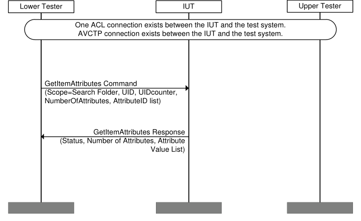

**Figure 4.43: AVRCP/TG/MCN/SRC/BV-06-C [GetItemAttributes – TG] MSC**

• Expected Outcome
Pass verdict
The IUT responds with a correctly formatted GetItemAttributes Response with the expected values for Number of Attributes and Attribute Value List.
AVRCP/CT/MCN/SRC/BV-07-C [GetTotalNumberOfItems – CT]
• Test Purpose
Verify the GetTotalNumberOfItems command issued by the IUT (CT) for the Search scope.
• Reference
[8] 6.10.4.4
• Initial Condition
- One ACL connection exists between the IUT and the Lower Tester.
- AVCTP control and browsing channels between the IUT and the Lower Tester are established.
- The IUT is acting as AVRCP CT role in category 1.
- IUT has successfully issued a SetBrowsedPlayer command to the player specified in [6] as the browsable player.
- A successful Search operation has been performed by the IUT with the Search results still being valid; see AVRCP/CT/MCN/SRC/BV-01-C [Search – CT].
• Test Procedure
1. The Upper Tester triggers the IUT to issue a GetTotalNumberOfItems command to the Lower
Tester with the scope parameter set to Search. 2. Upon receipt of a GetTotalNumberOfItems command from the IUT, the Lower Tester issues an
appropriate GetTotalNumberOfItems response message.

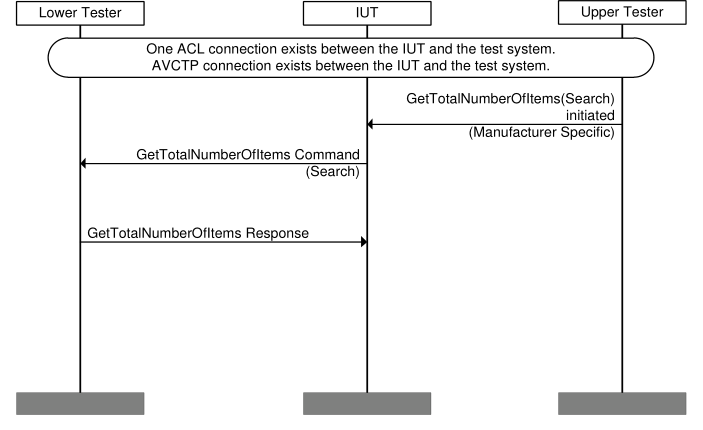

**Figure 4.44: AVRCP/CT/MCN/SRC/BV-07-C [GetTotalNumberOfItems – CT] MSC**

• Expected Outcome
Pass verdict
The IUT issues a GetTotalNumberOfItems command to the Lower Tester with the scope parameter set to Search.
AVRCP/TG/MCN/SRC/BV-08-C [GetTotalNumberOfItems – TG]
• Test Purpose
Verify that the IUT (TG) correctly responds to the GetTotalNumberOfItems command issued from the CT for the Search scope.
• Reference
[8] 6.10.4.4
• Initial Condition
- One ACL connection exists between the IUT and the Lower Tester.
- AVCTP control and browsing channels between the IUT and the Lower Tester are established.
- The IUT is acting as AVRCP TG role in category 1.
- The Lower Tester has successfully issued a SetBrowsedPlayer command to the player specified in [6] as the browsable player.
- A successful Search operation has been performed by the Lower Tester with the Search results still being valid; see AVRCP/TG/MCN/SRC/BV-02-C [Search – TG].
• Test Procedure
The Lower Tester issues a GetTotalNumberOfItems command to the IUT with the scope parameter set to Search.

**Figure 4.45: AVRCP/TG/MCN/SRC/BV-08-C [GetTotalNumberOfItems – TG] MSC**

• Expected Outcome
Pass verdict
The status parameter of the GetTotalNumberOfItems response message from the IUT to the Lower Tester indicates that the operation completed without error.
The total number of items returned by the IUT is the correct number of playable media items in the search result as specified in the IXIT [6].

### 4.8 Media Content Navigation Commands and Notifications for NowPlaying

AVRCP/CT/MCN/NP/BV-01-C [PlayItem – CT]
• Test Purpose
Verify the PlayItem command issued by the CT.
• Reference
[5], [8] 6.12.1
• Initial Condition
- One ACL connection exists between the IUT and the Lower Tester.
- The AVCTP control and browsing channels between the IUT and the Lower Tester are established.
- The IUT is aware of the currently playable Media Items on the Lower Tester. This can be achieved by executing AVRCP/CT/MCN/CB/BV-01-C [GetFolderItems – CT].
• Test Procedure
The Upper Tester triggers the execution of the PlayItem command on the IUT for a currently playable Media Item on the Lower Tester in a valid Scope (Media Filesystem, Search or NowPlaying).

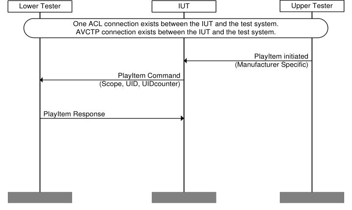

**Figure 4.46: AVRCP/CT/MCN/NP/BV-01-C [PlayItem – CT] MSC**

• Expected Outcome
Pass verdict
The IUT issues a PlayItem command with the expected parameters as triggered by the Upper Tester for Scope and UID and the currently valid UID counter.
AVRCP/TG/MCN/NP/BV-02-C [PlayItem – TG]
• Test Purpose
Verify the PlayItem response issued by the TG.
• Reference
[5], [8] 6.12.1
• Initial Condition
- One ACL connection exists between the IUT and the Lower Tester.
- The AVCTP control and browsing channels between the IUT and the Lower Tester are established.
- The IUT is acting as AVRCP TG role in category 1.
- The Lower Tester is aware of the currently playable UIDs exposed by the IUT. This can be achieved by executing AVRCP/TG/MCN/CB/BV-02-C [GetFolderItems – TG].
• Test Procedure
The Lower Tester sends a PlayItem Command to the IUT with valid entries for all parameters. The UID must be a UID for a currently playable UID.

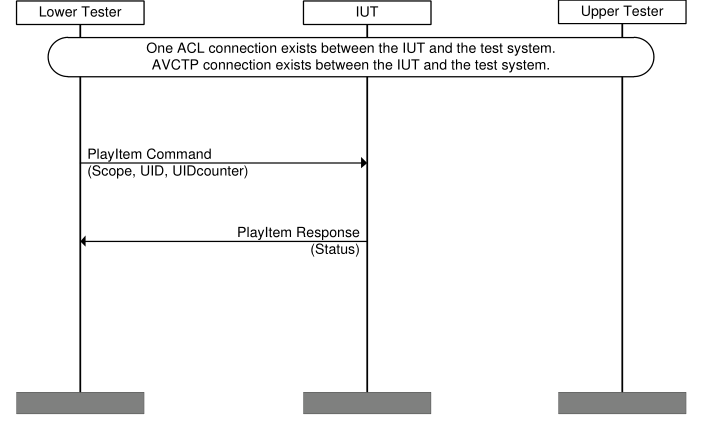

**Figure 4.47: AVRCP/TG/MCN/NP/BV-02-C [PlayItem – TG] MSC**

• Expected Outcome
Pass verdict
The IUT responds with a correctly formatted PlayItem Response with the status indicating success.
AVRCP/CT/MCN/NP/BV-03-C [AddToNowPlaying – CT]
• Test Purpose
Verify the AddToNowPlaying command issued by the CT.
• Reference
[5], [8] 6.12.2
• Initial Condition
- One ACL connection exists between the IUT and the Lower Tester.
- The AVCTP control and browsing channels between the IUT and the Lower Tester are established.
- The IUT is acting as AVRCP CT role in category 1.
- The IUT is aware of the currently playable UIDs. This can be achieved by executing AVRCP/CT/MCN/CB/BV-01-C [GetFolderItems – CT].
• Test Procedure
The Upper Tester triggers the AddToNowPlaying command from the IUT for a currently playable UID.

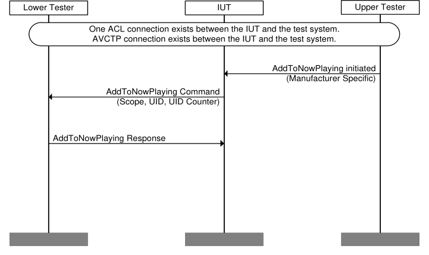

**Figure 4.48: AVRCP/CT/MCN/NP/BV-03-C [AddToNowPlaying – CT] MSC**

• Expected Outcome
Pass verdict
The IUT issues an AddToNowPlaying command with the expected parameters as triggered by the Upper Tester for Scope and UID and the currently valid UID counter.
AVRCP/TG/MCN/NP/BV-04-C [AddToNowPlaying – TG]
• Test Purpose
Verify the AddToNowPlaying response issued by the TG.
• Reference
[5], [8] 6.12.2
• Initial Condition
- One ACL connection exists between the IUT and the Lower Tester.
- The AVCTP control and browsing channels between the IUT and the Lower Tester are established.
- The IUT is acting as AVRCP TG role in category 1.
- The Lower Tester is aware of the currently playable UIDs on the IUT. This can be achieved by executing AVRCP/TG/MCN/CB/BV-02-C [GetFolderItems – TG].
• Test Procedure
The Lower Tester sends an AddToNowPlaying command with a currently playable UID to the IUT.

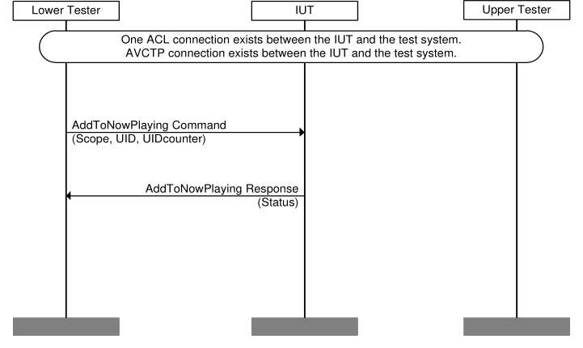

**Figure 4.49: AVRCP/TG/MCN/NP/BV-04-C [AddToNowPlaying – TG] MSC**

• Expected Outcome
Pass verdict
The IUT responds with a correctly formatted AddToNowPlaying Response with the status indicating success.
AVRCP/CT/MCN/NP/BV-05-C [GetFolderItems – CT]
• Test Purpose
Verify the GetFolderItems command issued by the CT on the Now Playing folder.
• Reference
[5], [8] 6.10.4.2
• Initial Condition
- One ACL connection exists between the IUT and the Lower Tester.
- The AVCTP control and browsing channels between the IUT and the Lower Tester are established.
- The IUT is acting as AVRCP CT role in category 1.
- The IUT has successfully issued a SetBrowsedPlayer command to the player specified in the IXIT [6] as the browsable player.
• Test Procedure
The Upper Tester triggers the IUT to retrieve the Now Playing folder content.

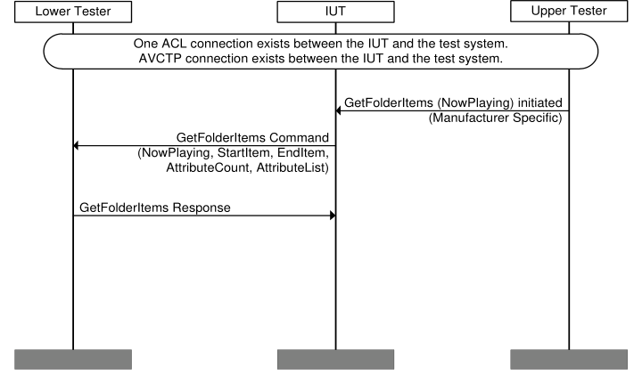

**Figure 4.50: AVRCP/CT/MCN/NP/BV-05-C [GetFolderItems – CT] MSC**

• Expected Outcome
Pass verdict
The IUT issues a GetFolderItems command with the scope of Now Playing folder and valid parameters for StartItem, EndItem, AttributeCount and AttributeList.
AVRCP/TG/MCN/NP/BV-06-C [GetFolderItems – TG]
• Test Purpose
Verify the GetFolderItems response for the Now Playing folder issued by the TG.
• Reference
[5], [8] 6.10.4.2
• Initial Condition
- One ACL connection exists between the IUT and the Lower Tester.
- The AVCTP control and browsing channels between the IUT and the Lower Tester are established.
- The IUT is acting as AVRCP TG role in category 1.
- The player on the IUT is currently playing media.
- The Lower Tester has successfully issued a SetBrowsedPlayer command to the player specified in the IXIT [6] as the browsable player.
• Test Procedure
The Lower Tester sends a GetFolderItems command to the IUT containing the Now Playing folder as Scope parameter and valid entries for Start Item, End Item, AttributeCount and AttributeList.

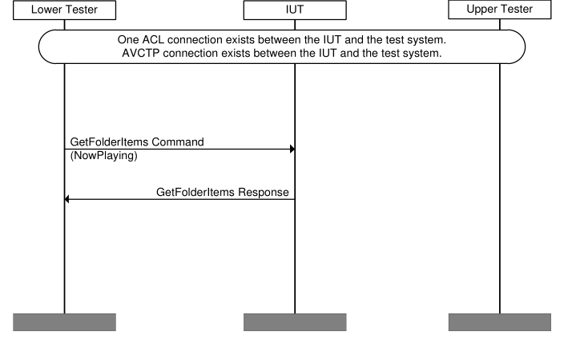

**Figure 4.51: AVRCP/TG/MCN/NP/BV-06-C [GetFolderItems – TG] MSC**

• Expected Outcome
Pass verdict
The IUT responds with a correctly formatted list of only Media Items.
AVRCP/TG/MCN/NP/BV-07-C [NowPlayingContentChanged notification – TG]
• Test Purpose
Verify the NowPlayingContentChanged notification issued by the TG.
• Reference
[5], [8] 6.9.5
• Initial Condition
- One ACL connection exists between the IUT and the Lower Tester.
- The AVCTP control and browsing channels between the IUT and the Lower Tester are established.
- The IUT is acting as AVRCP TG role in category 1.
- The EVENT_NOW_PLAYING_CONTENT_CHANGED is registered with the IUT
• Test Procedure
The Upper Tester triggers the change of the Now Playing folder on the IUT.

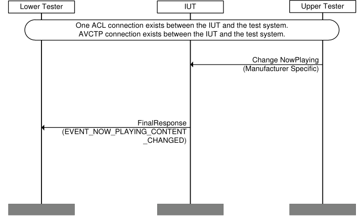

**Figure 4.52: AVRCP/TG/MCN/NP/BV-07-C [NowPlayingContentChanged notification – TG] MSC**

• Expected Outcome
Pass verdict
The IUT issues a FinalResponse for the EVENT_NOW_PLAYING_CONTENT_CHANGED.
AVRCP/CT/MCN/NP/BV-08-C [GetItemAttributes – CT]
• Test Purpose
Verify the GetItemAttributes command issued by the CT on a Media Item in the Now Playing folder.
• Reference
[5], [8] 6.10.4.3
• Initial Condition
- One ACL connection exists between the IUT and the Lower Tester.
- The AVCTP control and browsing channels between the IUT and the Lower Tester are established.
- The IUT is acting as AVRCP CT role in category 1.
- The IUT is aware of the currently valid UIDs in the Now Playing folder. This can be achieved by executing AVRCP/CT/MCN/NP/BV-05-C [GetFolderItems – CT].
• Test Procedure
The Upper Tester triggers the IUT to send a GetItemAttributes command for a currently valid UID in the Now Playing folder.

**Figure 4.53: AVRCP/CT/MCN/NP/BV-08-C [GetItemAttributes – CT] MSC**

• Expected Outcome
Pass verdict
The IUT issues a GetItemAttributes command with the Scope of NowPlaying and valid parameters for UID, UIDcounter, NumberOfAttributes and AttributeID list.
AVRCP/TG/MCN/NP/BV-09-C [GetItemAttributes – TG]
• Test Purpose
Verify the GetItemAttributes response issued by the TG on a Media Item in the Now Playing folder.
• Reference
[5], [8] 6.10.4.3
• Initial Condition
- One ACL connection exists between the IUT and the Lower Tester.
- The AVCTP control and browsing channels between the IUT and the Lower Tester are established.
- The IUT is acting as AVRCP TG role in category 1.
- The player on the IUT is currently playing media.
- The Lower Tester is aware of the currently valid UIDs in the Now Playing folder. This can be achieved by executing AVRCP/TG/MCN/NP/BV-06-C [GetFolderItems – TG].
• Test Procedure
The Lower Tester sends a GetItemAttributes command to the IUT containing the Now Playing folder as Scope parameter and valid entries for UID (other than 0x0), UID Counter, Number of Attributes, and AttributeID list.

**Figure 4.54: AVRCP/TG/MCN/NP/BV-09-C [GetItemAttributes – TG] MSC**

• Expected Outcome
Pass verdict
The IUT responds with a correctly formatted GetItemAttributes Response with the expected values for Number of Attributes and Attribute Value List.
AVRCP/CT/MCN/NP/BV-10-C [GetTotalNumberOfItems – CT]
• Test Purpose
Verify the GetTotalNumberOfItems command issued from the IUT (CT) for the Now Playing scope.
• Reference
[8] 6.10.4.4
• Initial Condition
- One ACL connection exists between the IUT and the Lower Tester.
- AVCTP control and browsing channels between the IUT and the Lower Tester are established.
- The IUT is acting as AVRCP CT role in category 1.
- The IUT has successfully issued a SetBrowsedPlayer command to the player specified in [6] as the browsable player.
• Test Procedure
1. The Upper Tester triggers the IUT to issue a GetTotalNumberOfItems command to the Lower
Tester with the scope parameter set to Now Playing. 2. Upon receipt of a GetTotalNumberOfItems command from the IUT, the Lower Tester issues an

| Lower Tester IUT Upper Tester One ACL connection exists between the IUT and the test system. AVCTP connection exists between the IUT and the test system. GetTotalNumberOfItems(Now Playing) initiated (Manufacturer Specific) GetTotalNumberOfItems Command (Now Playing) GetTotalNumberOfItems Response |  |
| --- | --- |
|  |  |

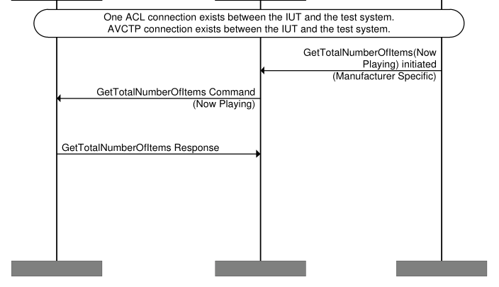

**Figure 4.55: AVRCP/CT/MCN/NP/BV-10-C [GetTotalNumberOfItems – CT] MSC**

• Expected Outcome
Pass verdict
The IUT issues a GetTotalNumberOfItems command to the Lower Tester with the scope parameter set to Now Playing.
AVRCP/TG/MCN/NP/BV-11-C [GetTotalNumberOfItems – TG]
• Test Purpose
Verify that the IUT (TG) correctly responds to the GetTotalNumberOfItems command issued from the CT for the Now Playing scope.
• Reference
[8] 6.10.4.4
• Initial Condition
- One ACL connection exists between the IUT and the Lower Tester.
- AVCTP control and browsing channels between the IUT and the Lower Tester are established.
- The IUT is acting as AVRCP TG role in category 1.
- The Lower Tester has successfully issued a SetBrowsedPlayer command to the player specified in [6] as the browsable player.
- The player on the IUT is currently playing media.
• Test Procedure
The Lower Tester issues a GetTotalNumberOfItems command to the IUT with the scope parameter set to Now Playing.

**Figure 4.56: AVRCP/TG/MCN/NP/BV-11-C [GetTotalNumberOfItems – TG] MSC**

• Expected Outcome
Pass verdict
The status parameter of the GetTotalNumberOfItems response message from the IUT to the Lower Tester indicates that the operation completed without error.
The total number of items returned by the IUT is the correct number of the currently playable media items as specified in the IXIT [6].
AVRCP/TG/MCN/NP/BI-01-C [PlayItem_Invalid – TG]
• Test Purpose
Verify the PlayItem response issued by the TG when an invalid UID is requested.
• Reference
[5], [8] 6.12.1
• Initial Condition
- One ACL connection exists between the IUT and the Lower Tester.
- The AVCTP control and browsing channels between the IUT and the Lower Tester are established.
- The IUT is acting as AVRCP TG role in category 1.
- The Lower Tester is aware of the currently playable UIDs on the IUT. This can be achieved by executing AVRCP/TG/MCN/CB/BV-02-C [GetFolderItems – TG].
• Test Procedure
The Lower Tester sends a PlayItem Command to the IUT with a UID that is currently not playable.

**Figure 4.57: AVRCP/TG/MCN/NP/BI-01-C [PlayItem_Invalid – TG] MSC**

• Expected Outcome
Pass verdict
The IUT responds with a correctly formatted PlayItem Response with the Status indicating the UID does not exist.
AVRCP/TG/MCN/NP/BI-02-C [AddToNowPlaying_Invalid – TG]
• Test Purpose
Verify the AddToNowPlaying response issued by the TG when an invalid UID is requested.
• Reference
[5], [8] 6.12.2
• Initial Condition
- One ACL connection exists between the IUT and the Lower Tester.
- The AVCTP control and browsing channels between the IUT and the Lower Tester are established.
- The IUT is acting as AVRCP TG role in category 1.
- The Lower Tester is aware of the currently valid UIDs on the IUT. This can be achieved by executing AVRCP/TG/MCN/CB/BV-02-C [GetFolderItems – TG].
• Test Procedure
The Lower Tester sends an AddToNowPlaying command to the IUT with an invalid UID.

**Figure 4.58: AVRCP/TG/MCN/NP/BI-02-C [AddToNowPlaying_Invalid – TG] MSC**

• Expected Outcome
Pass verdict
The IUT responds with a correctly formatted AddToNowPlaying Response with the status indicating that the UID does not exist.

### 4.9 Volume Level Handling

Verify the commands and notifications related to Volume Level Handling.
AVRCP/CT/VLH/BV-01-C [SetAbsoluteVolume – CT]
• Test Purpose
Verify the SetAbsoluteVolume command issued by the CT.
• Reference
[5], [8] 6.13.2
• Initial Condition
- One ACL connection exists between the IUT and the Lower Tester.
- The AVCTP connection between the IUT and the Lower Tester is completed.
- The IUT is acting as AVRCP CT role in category 2.
• Test Procedure
The Upper Tester triggers the IUT to send a SetAbsoluteVolume command.

**Figure 4.59: AVRCP/CT/VLH/BV-01-C [SetAbsoluteVolume – CT] MSC**

• Expected Outcome
Pass verdict
The IUT issues a correctly formatted SetAbsoluteVolume command with a valid value of volume.
AVRCP/TG/VLH/BV-02-C [SetAbsoluteVolume – TG]
• Test Purpose
Verify the behavior of the TG receiving a valid SetAbsoluteVolume command.
• Reference
[5], [8] 6.13.2
• Initial Condition
- One ACL connection exists between the IUT and the Lower Tester.
- The AVCTP connection between the IUT and the Lower Tester is completed.
- The IUT is acting as AVRCP TG role in category 2.
• Test Procedure
The Lower Tester sends a SetAbsoluteVolume command to the IUT with a valid value for volume.

**Figure 4.60: AVRCP/TG/VLH/BV-02-C [SetAbsoluteVolume – TG] MSC**

• Expected Outcome
Pass verdict
The IUT responds with a correctly formatted SetAbsoluteVolume Response with the current value for volume.
AVRCP/CT/VLH/BV-03-C [NotifyVolumeChange – CT]
• Test Purpose
Verify the NotifyVolumeChange command issued by the CT.
• Reference
[5], [8] 6.13.3
• Initial Condition
- One ACL connection exists between the IUT and the Lower Tester.
- The AVCTP connection between the IUT and the Lower Tester is completed.
- The IUT is acting as AVRCP CT role in category 2.
• Test Procedure
The Upper Tester triggers the IUT to register for Volume Change Notification.

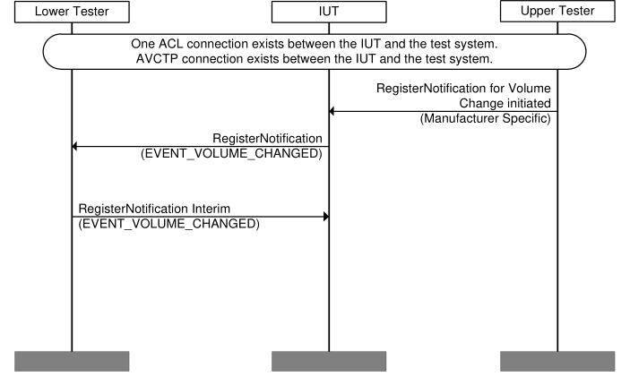

**Figure 4.61: AVRCP/CT/VLH/BV-03-C [NotifyVolumeChange – CT] MSC**

• Expected Outcome
Pass verdict
The IUT issues a correctly formatted RegisterNotification for the EVENT_VOLUME_CHANGED.
AVRCP/TG/VLH/BV-04-C [NotifyVolumeChange – TG]
• Test Purpose
Verify the NotifyVolumeChange response issued by the TG.
• Reference
[5], [8] 6.13.3
• Initial Condition
- One ACL connection exists between the IUT and the Lower Tester.
- The AVCTP connection between the IUT and the Lower Tester is completed.
- The IUT is acting as AVRCP TG role in category 2.
• Test Procedure
1. The Lower Tester registers with the IUT for Volume Change Notification. 2. Subsequently the Upper Tester triggers a volume change on the IUT.

| Lower Tester IUT Upper Tester One ACL connection exists between the IUT and the test system. AVCTP connection exists between the IUT and the test system. RegisterNotification (EVENT VOLUME CHANGED) _ _ InterimResponse (EVENT VOLUME CHANGED, Absolute _ _ Volume) Volume Change initiated (Manufacturer Specific) FinalResponse (EVENT VOLUME CHANGED, Absolute _ _ Volume) |  |
| --- | --- |
|  |  |

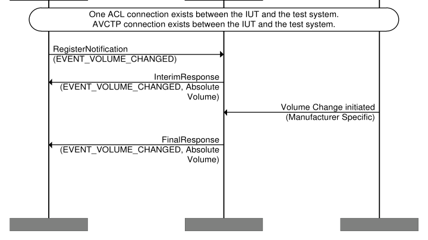

**Figure 4.62: AVRCP/TG/VLH/BV-04-C [NotifyVolumeChange – TG] MSC**

• Expected Outcome
Pass verdict
The IUT issues a FinalResponse for the EVENT_VOLUME_CHANGED with a valid value for Absolute Volume.
AVRCP/TG/VLH/BI-01-C [SetAbsoluteVolume invalid behavior – TG]
• Test Purpose
Verify the behavior of the TG receiving an invalid SetAbsoluteVolume command.
• Reference
[5], [8] 6.13.2
• Initial Condition
- One ACL connection exists between the IUT and the Lower Tester.
- The AVCTP connection between the IUT and the Lower Tester is completed.
- The IUT is acting as AVRCP TG role in category 2.
- The EVENT_VOLUME_CHANGED notification is registered at the IUT.
• Test Procedure
The Lower Tester sends a SetAbsoluteVolume command to the IUT with an invalid value for Parameter Length (too short to carry the absolute value parameter).

**Figure 4.63: AVRCP/TG/VLH/BI-01-C [SetAbsoluteVolume invalid behavior – TG] MSC**

• Expected Outcome
Pass verdict
The IUT responds with a correctly formatted SetAbsoluteVolume Response indicating failure. If the IUT does not return Invalid Parameter Content (0x02), then the Lower Tester gives a warning.
AVRCP/TG/VLH/BI-02-C [SetAbsoluteVolume invalid behavior – TG]
• Test Purpose
Verify the behavior of the TG receiving a SetAbsoluteVolume command with the top level bit set.
• Reference
[5], [8] 6.13.2
• Initial Condition
- One ACL connection exists between the IUT and the Lower Tester.
- The AVCTP connection between the IUT and the Lower Tester is completed.
- The IUT is acting as AVRCP TG role in category 2.
- The EVENT_VOLUME_CHANGED notification is registered at the IUT.
• Test Procedure
The Lower Tester sends a SetAbsoluteVolume command to the IUT with the top bit of the level parameter set.

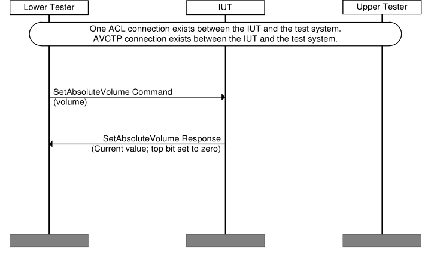

**Figure 4.64: AVRCP/TG/VLH/BI-02-C [SetAbsoluteVolume invalid behavior – TG] MSC**

• Expected Outcome
Pass verdict
The IUT responds with a correctly formatted SetAbsoluteVolume Response with the current value and the top bit set to zero.
AVRCP/CT/VLH/BI-03-C [SetAbsoluteVolume invalid behavior – CT]
• Test Purpose
Verify the behavior of the CT receiving a SetAbsoluteVolume Response with the top bit (bit 7) set.
• Reference
[5], [8] 6.13.2
• Initial Condition
- One ACL connection exists between the IUT and the Lower Tester.
- The AVCTP connection between the IUT and the Lower Tester is completed.
- The IUT is acting as AVRCP CT role in category 2.
- The EVENT_VOLUME_CHANGED notification is registered at the IUT.
• Test Procedure
1. The Upper Tester triggers the IUT to issue a Valid Set Absolute volume command to the Lower
Tester. 2. The Lower Tester issues the response for Set Absolute volume Response with the top bit (bit 7)
of absolute volume parameter set (Volume).

| Lower Tester IUT Upper Tester One ACL connection exists between the IUT and the test system. AVCTP connection exists between the IUT and the test system. Trigger Volume Change SetAbsoluteVolume Command (volume) SetAbsoluteVolume Response (Absolute Volume with top bit (bit 7) set) |  |
| --- | --- |
|  |  |

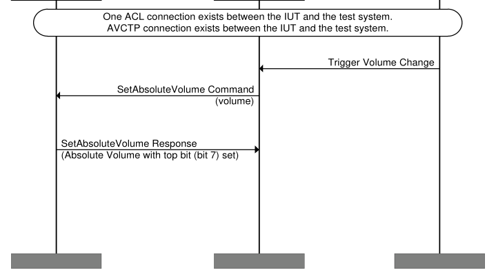

**Figure 4.65: AVRCP/CT/VLH/BI-03-C [SetAbsoluteVolume invalid behavior – CT] MSC**

• Expected Outcome
Pass verdict
The IUT ignores the top bit (bit 7) and considers only the lower seven bits for the current value for volume.
AVRCP/CT/VLH/BI-04-C [SetAbsoluteVolume invalid behavior – CT]
• Test Purpose
Verify the behavior of the CT receiving an Interim and Final Response for Absolute Volume change notification with the top bit (bit 7) set.
• Reference
[5], [8] 6.13.2
• Initial Condition
- One ACL connection exists between the IUT and the Lower Tester.
- The AVCTP connection between the IUT and the Lower Tester is completed.
- The IUT is acting as AVRCP CT role in category 2.
- The EVENT_VOLUME_CHANGED notification is registered at the IUT.
• Test Procedure
1. The Upper Tester triggers the IUT to register for Volume Change Notification 2. Subsequently the Lower Tester issues an interim response EVENT_VOLUME_CHANGED with
the top bit (bit 7) of absolute volume parameter set. 3. Subsequently the Lower Tester issues a final response EVENT_VOLUME_CHANGED with the
top bit (bit 7) of absolute volume parameter set.

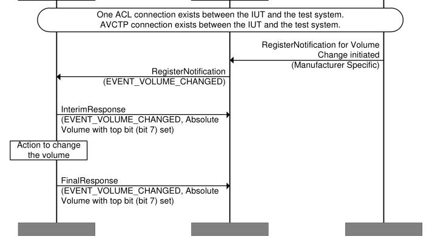

**Figure 4.66: AVRCP/CT/VLH/BI-04-C [SetAbsoluteVolume invalid behavior – CT] MSC**

• Expected Outcome
Pass verdict
The IUT ignores the top bit (bit 7) and considers only the lower seven bits of the Interim and Final Response for the absolute volume on TG.

### 4.10 PASS THROUGH Handling

Verify that the state flag in the PASS THROUGH command is correctly set to convey the button action.
AVRCP/CT/PTH/BV-01-C [Press and release – CT]
• Test Purpose
Verify that the button release is sent following a button press when the CT issues a PASS THROUGH command.
• Reference
[2], [7] 4.6.1
[8] 4.4.1
• Initial Condition
- One ACL connection exists between the IUT and the Lower Tester.
- The AVCTP connection between the IUT and the Lower Tester is completed.
- The IUT is acting as AVRCP CT.
• Test Procedure
The Upper Tester triggers the IUT to issue commands for button press and release.

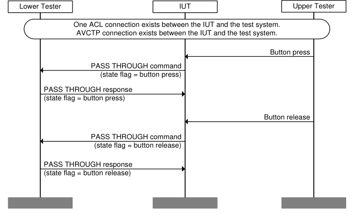

**Figure 4.67: AVRCP/CT/PTH/BV-01-C [Press and release – CT] MSC**

• Expected Outcome
Pass verdict
The IUT issues a correctly formatted PASS THROUGH command with the state flag set to button press, followed within 2 seconds by a correctly formatted PASS THROUGH command with the same operation id with the state flag set to button release.
AVRCP/CT/PTH/BV-02-C [Press and hold – CT]
• Test Purpose
Verify that when a button to send a PASS THROUGH command is held down the CT continues to issue button presses every 2 seconds until the button is released.
• Reference
[2], [7] 4.6.1
[8] 4.4.1
• Initial Condition
- One ACL connection exists between the IUT and the Lower Tester.
- The AVCTP connection between the IUT and the Lower Tester is completed.
- The IUT is acting as AVRCP CT.
• Test Procedure
The Upper Tester triggers the IUT to issue commands for button press and release. The button is held for longer than 2 seconds.

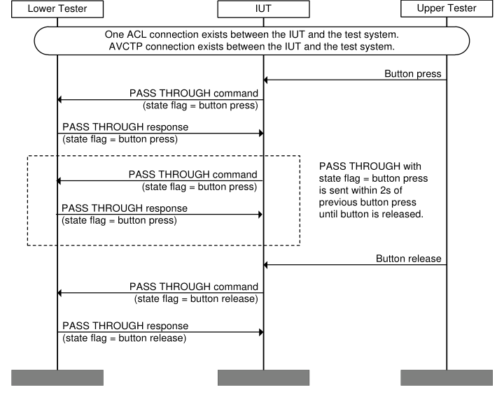

**Figure 4.68: AVRCP/CT/PTH/BV-02-C [Press and hold – CT] MSC**

• Expected Outcome
Pass verdict
The IUT issues a correctly formatted PASS THROUGH command with the state flag set to button press.
Another PASS THROUGH command with the same operation id and state flag set to button press is issued within 2 seconds of each previous PASS THROUGH command until the button is released.
At least two PASS THROUGH commands are sent with the state flag set to button press.
A final PASS THROUGH command with the same operation id and state flag set to button release is sent within 2 seconds of the last button press.

### 4.11 Cover Art

Verify the commands and notifications related to Cover Art transfer.
AVRCP/CT/CA/BV-01-C [Use GetFolderItems to request Cover Art attribute – CT]
• Test Purpose
Verify that the IUT can correctly use the GetFolderItems function with the scope of Virtual Media Player Filesystem to retrieve the Cover Art Image Handle.
• Reference
[8] 6.10.4.2
[9] 4.4.4
• Initial Condition
- One ACL connection exists between the IUT and the Lower Tester.
- The AVCTP control and browsing channels between the IUT and the Lower Tester are established.
- The IUT is acting as AVRCP CT role in category 1.
- The IUT has successfully issued a SetBrowsedPlayer command to the player specified in [6] as the browsable player.
- There is an active Cover Art OBEX connection where the IUT is the OBEX client and the Lower Tester is the OBEX server.
- At least one item with Cover Art is available in the default folder on the Browsed Player on the Lower Tester.
• Test Procedure
1. The Upper Tester triggers the IUT to issue a GetFolderItems command to the Lower Tester with
the scope parameter set to Virtual Media Player Filesystem and the attribute list containing the Cover Art attribute. 2. Upon receipt of a GetFolderItems command from the IUT, the Lower Tester issues an appropriate
GetFolderItems response message.

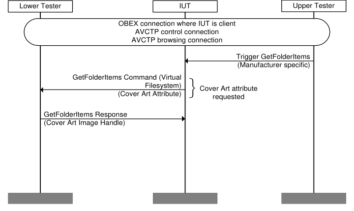

**Figure 4.69: AVRCP/CT/CA/BV-01-C [Use GetFolderItems to request Cover Art attribute – CT] MSC**

• Expected Outcome
Pass verdict
The IUT issues a well-formatted GetFolderItems command to the Lower Tester.
The GetFolderItems command has the scope parameter set to Virtual Media Player Filesystem.
The Cover Art attribute is among the attributes requested in the GetFolderItems command.
• Notes
Note that although the test does not directly use the Cover Art OBEX connection, it must exist for there to be valid Image Handles available on the TG (Imaging Responder).
AVRCP/TG/CA/BV-02-C [Use GetFolderItems to request Cover Art attribute – TG]
• Test Purpose
Verify that the IUT can correctly respond to a GetFolderItems request with the scope of Virtual Media Player Filesystem to retrieve the Cover Art Image Handle.
• Reference
[8] 6.10.4.2
[9] 4.4.4
• Initial Condition
- One ACL connection exists between the IUT and the Lower Tester.
- The AVCTP control and browsing channels between the IUT and the Lower Tester are established.
- The IUT is acting as AVRCP TG role in category 1.
- The Tester has successfully issued a SetBrowsedPlayer command to the player specified in [6] as the browsable player.
- There is an active Cover Art OBEX connection where the IUT is the OBEX server and the Lower Tester is the OBEX client.
- The Tester has successfully issued any necessary ChangePath commands to navigate to a folder on the Browsed Player on the IUT containing at least one item with Cover Art [6].
• Test Procedure
The Lower Tester issues a GetFolderItems command to the IUT with the scope parameter set to Virtual Media Player Filesystem and the attribute list containing the Cover Art attribute.

**Figure 4.70: AVRCP/TG/CA/BV-02-C [Use GetFolderItems to request Cover Art attribute – TG] MSC**

• Expected Outcome
Pass verdict
The IUT issues a well-formatted GetFolderItems response message to the Lower Tester.
The GetFolderItems response message contains at least one item with a Cover Art Image Handle.
• Notes
The linkage between the returned Image Handle and retrieval of an image is covered in other tests (AVRCP/TG/CA/BV-08-C [Use the Imaging Property Object – TG], AVRCP/TG/CA/BV-10-C [Pull an Image as a Thumbnail – TG], AVRCP/TG/CA/BV-12-C [Pull a Thumbnail – TG] and AVRCP/TG/CA/BV-14-C [Pull a Native Image – TG]). Note that although the test does not directly use the Cover Art OBEX connection, it must exist for there to be valid Image Handles available on the TG (Imaging Responder).
AVRCP/CT/CA/BV-03-C [Use GetItemAttributes to request Cover Art attribute – CT]
• Test Purpose
Verify that the IUT can correctly use the GetItemAttributes function with the scope of Virtual Media Player Filesystem to retrieve the Cover Art Image Handle.
• Reference
[8] 6.10.4.3
• Initial Condition
- One ACL connection exists between the IUT and the Lower Tester.
- The AVCTP control and browsing channels between the IUT and the Lower Tester are established.
- The IUT is acting as AVRCP CT role in category 1.
- The IUT has successfully issued a SetBrowsedPlayer command to the player specified in [6] as the browsable player.
- There is an active Cover Art OBEX connection where the IUT is the OBEX client and the Lower Tester is the OBEX server.
- At least one item with Cover Art is available in the default folder on the Browsed Player at the Lower Tester.
• Test Procedure
1. The Upper Tester triggers the IUT to issue a GetItemAttributes command to the Lower Tester
with the scope parameter set to Virtual Media Player Filesystem and the AttributeID list containing the Cover Art AttributeID. 2. Upon receipt of a GetItemAttributes command from the IUT, the Lower Tester issues an
appropriate GetItemAttributes response message.

| Lower Tester IUT Upper Tester OBEX connection where IUT is client AVCTP control connection AVCTP browsing connection Trigger GetItemAttributes (Manufacturer specific) GetItemAttributes Command (Virtual } Cover Art Filesystem) attribute is (Cover Art Attribute) requested GetItemAttributes Response (Cover Art Image Handle) |  |
| --- | --- |
|  |  |

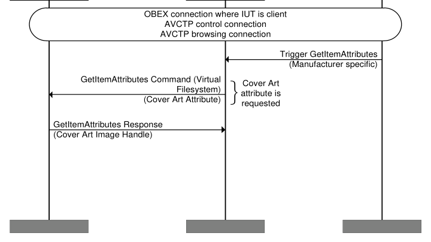

**Figure 4.71: AVRCP/CT/CA/BV-03-C [Use GetItemAttributes to request Cover Art attribute – CT] MSC**

• Expected Outcome
Pass verdict
The IUT issues a well-formatted GetItemAttributes command to the Lower Tester.
The GetItemAttributes command has the scope parameter set to Virtual Media Player Filesystem.
The Cover Art AttributeID is among the AttributeIDs requested in the GetItemAttributes command.
AVRCP/TG/CA/BV-04-C [Use GetItemAttributes to request Cover Art attribute – TG]
• Test Purpose
Verify that the IUT can correctly respond to a GetItemAttributes with the scope of Virtual Media Player Filesystem to retrieve the Cover Art Image Handle.
• Reference
[8] 6.10.4.3
[9] 4.5.8
• Initial Condition
- One ACL connection exists between the IUT and the Lower Tester.
- The AVCTP control and browsing channels between the IUT and the Lower Tester are established.
- There is an active Cover Art OBEX connection where the IUT is the OBEX server and the Lower Tester is the OBEX client.
- The IUT is acting as AVRCP TG role in category 1.
- The Tester is aware of the currently valid Media Item UIDs on the IUT. This can be achieved by executing AVRCP/TG/MCN/CB/BV-02-C [GetFolderItems – TG].
- The Tester has successfully issued a SetBrowsedPlayer command to the player specified in the IXIT [6] as the browsable player.
- The Tester has successfully issued any necessary ChangePath commands to navigate to a folder on the Browsed Player of the IUT, containing at least one item with Cover Art as specified in the IXIT [6].
• Test Procedure
The Lower Tester issues a GetItemAttributes command to the IUT with the scope parameter set to Virtual Media Player Filesystem and with valid entries for UID, UID Counter, Number of Attributes and AttributeID list. The AttributeID list contains the Cover Art AttributeID.

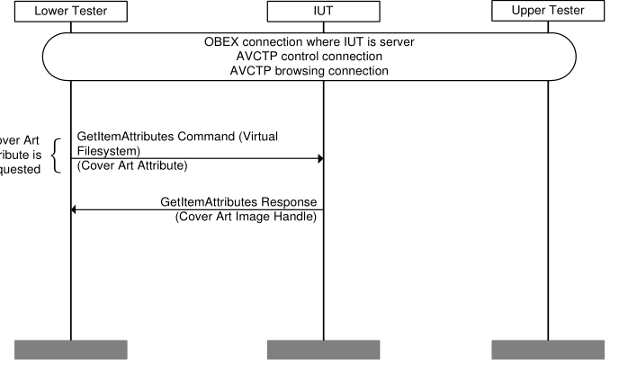

**Figure 4.72: AVRCP/TG/CA/BV-04-C [Use GetItemAttributes to request Cover Art attribute – TG] MSC**

• Expected Outcome
Pass verdict
The IUT issues a well-formatted GetItemAttributes response message to the Lower Tester.
The GetItemAttributes response message contains at least one item with a Cover Art Image Handle.
• Notes
The linkage between the returned Image Handle and retrieval of an image is covered in other tests (AVRCP/TG/CA/BV-08-C [Use the Imaging Property Object – TG], AVRCP/TG/CA/BV-10-C [Pull an Image as a Thumbnail – TG], AVRCP/TG/CA/BV-12-C [Pull a Thumbnail – TG] and AVRCP/TG/CA/BV-14-C [Pull a Native Image – TG]).
AVRCP/CT/CA/BV-05-C [Use GetElementAttributes to request Cover Art attribute – CT]
• Test Purpose
Verify that the IUT can correctly use the GetElementAttributes function to retrieve the Cover Art Image Handle of the currently playing item.
• Reference
[8] 6.6.1
• Initial Condition
- One ACL connection exists between the IUT and the Lower Tester.
- The AVCTP control channel between the IUT and the Lower Tester is established.
- There is an active Cover Art OBEX connection where the IUT is the OBEX client and the Lower Tester is the OBEX server.
- The IUT is acting as AVRCP CT role in category 1.
- An item with Cover Art is playing on the default Addressed Player at the Lower Tester.
• Test Procedure
1. The Upper Tester triggers the IUT to issue a GetElementAttributes command to the Lower Tester
with the identifier parameter set to Playing and the AttributeID list containing the Cover Art AttributeID. 2. Upon receipt of a GetElementAttributes command from the IUT, the Lower Tester issues an
appropriate GetElementAttributes response message.

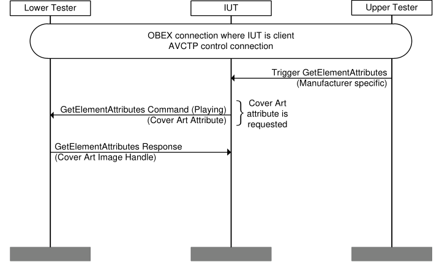

**Figure 4.73: AVRCP/CT/CA/BV-05-C [Use GetElementAttributes to request Cover Art attribute – CT] MSC**

• Expected Outcome
Pass verdict
The IUT issues a well-formatted GetElementAttributes command to the Lower Tester.
The GetElementAttributes command has the identifier parameter set to Playing.
The Cover Art AttributeID is among the AttributeIDs requested in the GetElementAttributes command.
AVRCP/TG/CA/BV-06-C [Use GetElementAttributes to request Cover Art attribute – TG]
• Test Purpose
Verify that the IUT can correctly respond to a GetElementAttributes command to retrieve the Cover Art Image Handle of the currently playing item.
• Reference
[8] 6.6.1
• Initial Condition
- One ACL connection exists between the IUT and the Lower Tester.
- The AVCTP control channel between the IUT and the Lower Tester is established.
- There is an active Cover Art OBEX connection where the IUT is the OBEX server and the Lower Tester is the OBEX client.
- The IUT is acting as AVRCP TG role in category 1.
- An item with Cover Art is playing on the default Addressed Player at the IUT.
• Test Procedure
The Lower Tester issues a GetElementAttributes command to the IUT with the identifier parameter set to Playing and the AttributeID list containing the Cover Art AttributeID.

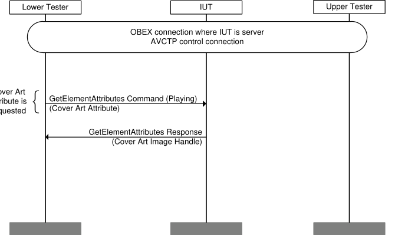

**Figure 4.74: AVRCP/TG/CA/BV-06-C [Use GetElementAttributes to request Cover Art attribute – TG] MSC**

• Expected Outcome
Pass verdict
The IUT issues a well-formatted GetElementAttributes response message to the Lower Tester.
The GetElementAttributes response message contains the Cover Art Image Handle.
• Notes
The linkage between the returned Image Handle and retrieval of an image is covered in other tests (AVRCP/TG/CA/BV-08-C [Use the Imaging Property Object – TG], AVRCP/TG/CA/BV-10-C [Pull an Image as a Thumbnail – TG], AVRCP/TG/CA/BV-12-C [Pull a Thumbnail – TG] and AVRCP/TG/CA/BV-14-C [Pull a Native Image – TG]).
• Test Purpose
Verify that the IUT can correctly use the image-properties object to individually check images for versions other than the native format, and request an image in a format other than the native one or the mandatory imaging thumbnail.
• Reference
[8] 5.14, 6.6.1, 6.10.4.2, 6.10.4.3
[9] 4.4.6.2, 4.5.7, 4.5.8
• Initial Condition
- One ACL connection exists between the IUT and the Lower Tester.
- The AVCTP control channel between the IUT and the Lower Tester is established.
- If the IUT uses GetItemAttributes, the browsing channel (ALT 1 only) between the IUT and the Lower Tester is established.
- There is an active Cover Art OBEX connection where the IUT is the OBEX client and the Lower Tester is the OBEX server.
- The IUT is acting as AVRCP CT role in category 1.
- The IUT has successfully retrieved a Cover Art Image Handle by using either of the following methods:
▪ ALT 1: The IUT issues a SetBrowsedPlayer command to the player specified in the IXIT [6] as the browsable player. The IUT issues the GetItemAttributes or GetFolderItems commands to the Lower Tester. At least one item with Cover Art is available in the default folder on the Browsed Player at the Lower Tester.
▪ ALT 2: An item with Cover Art is playing on the default Addressed Player at the Lower Tester. The IUT issues the GetElementAttributes command to the Lower Tester.
• Test Procedure
1. The Upper Tester triggers the IUT to issue a GetImageProperties request to the Lower Tester
with the Image Handle parameter set to one of the handles retrieved during the setup of the initial condition. 2. Upon receipt of a GetImageProperties request from the IUT, the Lower Tester issues an
appropriate GetImageProperties response message containing an image-properties object. 3. Repeat Steps 1 and 2 until the Lower Tester returns an image-properties object indicating an
image in a format other than the native and the mandatory imaging thumbnail. The image- properties object for the image at least contains a non-empty variant element with at least <variant encoding=”JPEG” pixel=”200*200” /> and another variant (for example, <variant encoding=”GIF” pixel =”640*420” />) that is different from the native image. 4. The IUT is triggered to issue a GetImage request to the Lower Tester with the Image Handle
parameter corresponding to the image identified from Step 3 and an Image Descriptor parameter describing a non-thumbnail image variant. 5. Upon receipt of a GetImage request from the IUT, the Lower Tester issues an appropriate
GetImage response message.

| Lower Tester |  |  |
| --- | --- | --- |
|  |  |  |
|  | OBEX connection w AVCTP control AVCTP browsing conn Valid image handles f | here IUT is client connection ection (ALT 1 only) or all images exist |
|  |  |  |
| loop | GET Request: GetImageProperties |  |
|  | (Image handle) GET Response: Success |  |
|  | (Imaging properties object) |  |
|  | GET Request: GetImage |  |
|  | (Image handle, image descriptor) GET Response: Success |  |
|  |  |  |

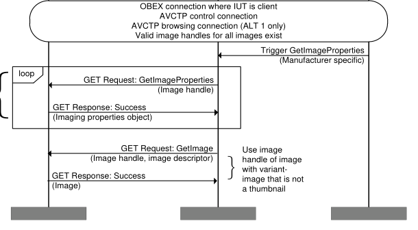

**Figure 4.75: AVRCP/CT/CA/BV-07-C [Use the Imaging Property Object – CT] MSC**

• Expected Outcome
Pass verdict
The IUT issues a well-formatted GetImageProperties requests to the Lower Tester.
Each GetImageProperties request includes a valid Connection ID, a Type header of “x-bt/img- properties”, and a valid Image Handle.
The IUT issues a well-formatted GetImage request to the Lower Tester.
The GetImage request includes a valid ConnectionID, a Type header of x-bt/img-img, a valid Image Handle, and a well-formatted Image Descriptor.
The Image Handle used in the GetImage request is that of an image that has a non-thumbnail variant.
The Image Descriptor used in the GetImage request describes a non-thumbnail format.
• Notes
The Lower Tester will make sure that the variant is offered in at least one format that is supported by the IUT as declared in [6] for the Cover Art feature. For IUTs that support only the mandatory imaging thumbnail format, this test does not apply.
AVRCP/TG/CA/BV-08-C [Use the Imaging Property Object – TG]
• Test Purpose
Verify that the IUT can correctly handle the image-properties object, and individually provide image versions other than the native format, and respond with an image in a format other than the native one or the mandatory imaging thumbnail.
• Reference
[8] 5.14, 6.6.1, 6.10.4.2, 6.10.4.3
[9] 4.4.6.2, 4.5.7, 4.5.8
• Initial Condition
- One ACL connection exists between the IUT and the Lower Tester.
- The AVCTP control channel between the IUT and the Lower Tester is established.
- If the Lower Tester uses GetItemAttributes (ALT 1), the browsing channel between the IUT and the Lower Tester is established.
- There is an active Cover Art OBEX connection where the IUT is the OBEX server and the Lower Tester is the OBEX client.
- The IUT is acting as AVRCP TG role in category 1.
- The Lower Tester has successfully retrieved a Cover Art Image Handle by using either of the following methods:
▪ ALT 1: The Lower Tester issues a SetBrowsedPlayer command to the player specified in the IXIT [6] as the browsable player. The Lower Tester issues the GetItemAttributes or GetFolderItems commands to the IUT. At least one item with Cover Art is available in the default folder on the Browsed Player of the IUT.
▪ ALT 2: An item with Cover Art is playing on the default Addressed Player of the IUT. The Lower Tester issues the GetElementAttributes command to the IUT.
• Test Procedure
1. The Lower Tester issues a GetImageProperties request to the IUT with the Image Handle
parameter set to one of the handles retrieved during the setup of the initial condition. 2. Upon receipt of a GetImageProperties request from the Lower Tester, the IUT issues an
appropriate GetImageProperties response message containing an image-properties object. 3. Repeat Steps 1 and 2 until the IUT returns an image-properties object indicating an image in a
format other than the native and the mandatory imaging thumbnail. The image-properties object for the image at least contains a non-empty variant element with at least <variant encoding=“JPEG” pixel=“200*200” /> and another variant (for example, <variant encoding=“GIF” pixel =“640*420” />) that is different from the native image. 4. The Lower Tester issues a GetImage request to the IUT with the Image Handle parameter
corresponding to the image identified from Step 3 and an Image Descriptor parameter describing a non-thumbnail image variant. 5. Upon receipt of a GetImage request from the Lower Tester, the IUT issues an appropriate
GetImage response message.

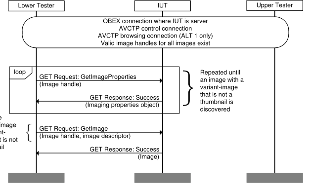

**Figure 4.76: AVRCP/TG/CA/BV-08-C [Use the Imaging Property Object – TG] MSC**

• Expected Outcome
Pass verdict
The IUT responds to the GetImageProperties requests from the Lower Tester.
The IUT responds to the GetImage request from the Lower Tester with a non-thumbnail format Image.
• Notes
The IUT will make sure that the variant is offered in at least one format other than the native one or the mandatory imaging thumbnail. For IUTs that support only the mandatory imaging thumbnail format, this test does not apply.
AVRCP/CT/CA/BV-09-C [Pull an Image as a Thumbnail – CT]
• Test Purpose
Verify that the IUT can correctly retrieve the thumbnail format of the available images.
• Reference
[8] 5.14, 6.6.1, 6.10.4.2, 6.10.4.3
[9] 4.5.8
• Initial Condition
- One ACL connection exists between the IUT and the Lower Tester.
- The AVCTP control channel between the IUT and the Lower Tester is established.
- If the IUT uses GetItemAttributes, the browsing channel between the IUT and the Lower Tester is established.
- There is an active Cover Art OBEX connection where the IUT is the OBEX client and the Lower Tester is the OBEX server.
- The IUT is acting as AVRCP CT role in category 1.
- The IUT has successfully retrieved a Cover Art Image Handle by using either of the following methods:
▪ ALT 1: The IUT issues a SetBrowsedPlayer command to the player specified in the IXIT [6] as the browsable player. The IUT issues the GetItemAttributes or GetFolderItems commands to the Lower Tester. At least one item with Cover Art is available in the default folder on the Browsed Player at the Lower Tester.
▪ ALT 2: An item with Cover Art is playing on the default Addressed Player at the Lower Tester. The IUT issues the GetElementAttributes command to the Lower Tester.
• Test Procedure
1. The Upper Tester triggers the IUT to issue a GetImage request to the Lower Tester with the
Image Handle parameter set to one of the handles retrieved during the setup of the initial condition and an Image Descriptor parameter describing the thumbnail format. 2. Upon receipt of a GetImage request from the IUT, the Lower Tester issues an appropriate
GetImage response message.

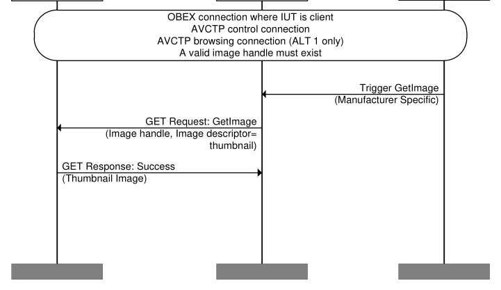

**Figure 4.77: AVRCP/CT/CA/BV-09-C [Pull an Image as a Thumbnail – CT] MSC**

• Expected Outcome
Pass verdict
The IUT issues a well-formatted GetImage request to the Lower Tester.
The ConnectionID, Image Handle, and Image Descriptor parameters in the GetImage request are present and valid.
The Image Descriptor parameter in the GetImage request describes an imaging thumbnail.
AVRCP/TG/CA/BV-10-C [Pull an Image as a Thumbnail – TG]
• Test Purpose
Verify that the IUT can correctly respond to requests for the thumbnail format of the available images.
• Reference
[8] 5.14, 6.6.1, 6.10.4.2, 6.10.4.3
[9] 4.5.8
• Initial Condition
- One ACL connection exists between the IUT and the Lower Tester.
- The AVCTP control channel between the IUT and the Lower Tester is established.
- If the Lower Tester uses GetItemAttributes (ALT 1), the browsing channel between the IUT and the Lower Tester is established.
- There is an active Cover Art OBEX connection where the Lower Tester is the OBEX client and the IUT is the OBEX server.
- The Lower Tester has successfully retrieved a Cover Art Image Handle by using either of the following methods:
▪ ALT 1: The Lower Tester issues a SetBrowsedPlayer command to the player specified in the IXIT [6] as the browsable player. The Lower Tester issues the GetItemAttributes or GetFolderItems commands to the IUT. At least one item with Cover Art is available in the default folder on the Browsed Player at the IUT.
▪ ALT 2: An item with Cover Art is playing on the default Addressed Player at the IUT. The Lower Tester issues the GetElementAttributes command to the IUT.
• Test Procedure
1. The Lower Tester issues a GetImage request to the IUT, with the Image Handle parameter set to
one of the handles retrieved during the setup of the initial condition, and an Image Descriptor parameter describing the thumbnail format. 2. Upon receipt of a GetImage request from the Lower Tester, the IUT issues an appropriate
GetImage response message.

**Figure 4.78: AVRCP/TG/CA/BV-10-C [Pull an Image as a Thumbnail – TG] MSC**

• Expected Outcome
Pass verdict
The IUT responds to the GetImage request from the Lower Tester with a Thumbnail Image.
AVRCP/CT/CA/BV-11-C [Pull a Thumbnail – CT]
• Test Purpose
Verify that the IUT can correctly retrieve thumbnails.
• Reference
[8] 5.14, 6.6.1, 6.10.4.2, 6.10.4.3
[9] 4.5.9
• Initial Condition
- One ACL connection exists between the IUT and the Lower Tester.
- The AVCTP control channel between the IUT and the Lower Tester is established.
- If the IUT uses GetItemAttributes or GetFolderItems, the browsing channel between the IUT and the Lower Tester is established.
- There is an active Cover Art OBEX connection where the IUT is the OBEX client and the Lower Tester is the OBEX server.
- The IUT is acting as AVRCP CT role in category 1.
- The IUT has successfully retrieved a Cover Art Image Handle by using either of the following methods:
▪ ALT 1: The IUT issues a SetBrowsedPlayer command to the player specified in the IXIT [6] as the browsable player. The IUT issues the GetItemAttributes or GetFolderItems commands to the Lower Tester. At least one item with Cover Art is available in the default folder on the Browsed Player at the Lower Tester.
▪ ALT 2: An item with Cover Art is playing on the default Addressed Player at the Lower Tester. The IUT issues the GetElementAttributes command to the Lower Tester.
• Test Procedure
1. The Upper Tester triggers the IUT to issue a GetLinkedThumbnail request to the Lower Tester
with the Image Handle parameter set to the handle retrieved during the setup of the initial condition. 2. Upon receipt of a GetLinkedThumbnail request from the IUT, the Lower Tester issues an
appropriate GetLinkedThumbnail response message.

**Figure 4.79: AVRCP/CT/CA/BV-11-C [Pull a Thumbnail – CT] MSC**

• Expected Outcome
Pass verdict
The IUT issues a well-formatted GetLinkedThumbnail request to the Lower Tester.
The GetLinkedThumbnail request includes a valid Connection ID, a Type header of “x-bt/img-thm”, and a valid Image Handle.
AVRCP/TG/CA/BV-12-C [Pull a Thumbnail – TG]
• Test Purpose
Verify that the IUT can correctly respond to requests for thumbnails.
• Reference
[8] 5.14, 6.6.1, 6.10.4.2, 6.10.4.3
[9] 4.5.9
• Initial Condition
- One ACL connection exists between the IUT and the Lower Tester.
- The AVCTP control channel between the IUT and the Lower Tester is established.
- If the Lower Tester uses GetItemAttributes or GetFolderItems (both ALT 1), the browsing channel between the IUT and the Lower Tester is established.
- There is an active Cover Art OBEX connection where the IUT is the OBEX server and the Lower Tester is the OBEX client.
- The IUT is acting as AVRCP TG role in category 1.
- The Lower Tester has successfully retrieved a Cover Art Image Handle by using either of the following methods:
▪ ALT 1: The Lower Tester issues a SetBrowsedPlayer command to the player specified in the IXIT [6] as the browsable player. The Lower Tester issues the GetItemAttributes or GetFolderItems commands to the IUT. At least one item with Cover Art is available in the default folder on the Browsed Player at the IUT.
▪ ALT 2: An item with Cover Art is playing on the default Addressed Player at the IUT. The Lower Tester issues the GetElementAttributes command to the IUT.
• Test Procedure
1. The Lower Tester issues a GetLinkedThumbnail request to the IUT with the Image Handle
parameter set to the handle retrieved during the setup of the initial condition. 2. Upon receipt of a GetLinkedThumbnail request from the Lower Tester, the IUT issues an
appropriate GetLinkedThumbnail response message.

| Lower Tester IUT Upper Tester OBEX connection where IUT is server AVCTP control connection AVCTP browsing connection (ALT 1 only) A valid image handle must exist GET Request: GetLinkedThumbnail (Image handle) GET Response: Success (Thumbnail Image) |  |
| --- | --- |
|  |  |

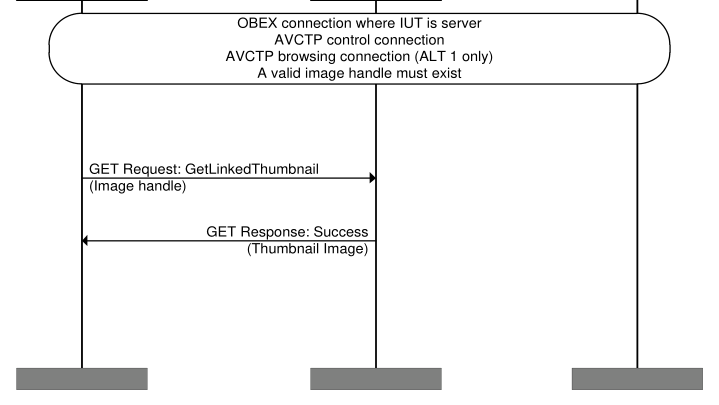

**Figure 4.80: AVRCP/TG/CA/BV-12-C [Pull a Thumbnail – TG] MSC**

• Expected Outcome
Pass verdict
The IUT responds to the GetLinkedThumbnail request from the Lower Tester with a Thumbnail Image.
AVRCP/CT/CA/BV-13-C [Pull a Native Image – CT]
• Test Purpose
Verify that the IUT can correctly retrieve an available image in native format.
• Reference
[9] 5.14, 4.4.6.2, 4.4.7.2, 4.5.8
• Initial Condition
- One ACL connection exists between the IUT and the Lower Tester.
- The AVCTP control and browsing channels between the IUT and the Lower Tester are established.
- There is an active Cover Art OBEX connection where the IUT is the OBEX client and the Lower Tester is the OBEX server.
- The IUT is acting as AVRCP CT role in category 1.
- The IUT has successfully retrieved a Cover Art Image Handle by using either of the following methods:
▪ ALT 1: The IUT issues a SetBrowsedPlayer command to the player specified in the IXIT [6] as the browsable player. The IUT issues the GetItemAttributes or GetFolderItems commands to the Lower Tester. At least one item with Cover Art is available in the default folder on the Browsed Player at the Lower Tester.
▪ ALT 2: An item with Cover Art is playing on the default Addressed Player at the Lower Tester. The IUT issues the GetElementAttributes command to the Lower Tester.
• Test Procedure
1. The Upper Tester triggers the IUT to issue a GetImage request to the Lower Tester with the
Image Handle parameter set to the handle retrieved during the set-up of the initial condition and an empty Image Descriptor parameter. 2. Upon receipt of a GetImage request from the IUT, the Lower Tester issues an appropriate
GetImage response message.

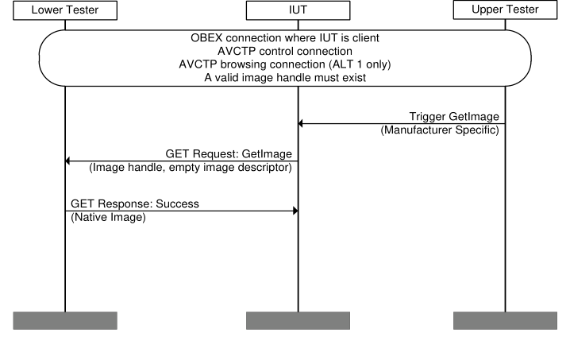

**Figure 4.81: AVRCP/CT/CA/BV-13-C [Pull a Native Image – CT] MSC**

• Expected Outcome
Pass verdict
The IUT issues a well-formatted GetImage request to the Lower Tester.
The ConnectionID and Image Handle parameters in the GetImage request are present and valid.
The Image Descriptor parameter in the GetImage request is empty.
AVRCP/TG/CA/BV-14-C [Pull a Native Image – TG]
• Test Purpose
Verify that the IUT can correctly respond to requests for an available image in native format.
• Reference
[9] 5.14, 4.4.6.2, 4.4.7.2, 4.5.8
• Initial Condition
- One ACL connection exists between the IUT and the Lower Tester.
- The AVCTP control and browsing channels between the IUT and the Lower Tester are established.
- There is an active Cover Art OBEX connection where the IUT is the OBEX server and the Lower Tester is the OBEX client.
- The Lower Tester has successfully retrieved a Cover Art Image Handle by using either of the following methods:
▪ ALT 1: The Lower Tester issues a SetBrowsedPlayer command to the player specified in the IXIT [6] as the browsable player. The Lower Tester issues the GetItemAttributes or GetFolderItems commands to the IUT. At least one item with Cover Art is available in the default folder on the Browsed Player at the IUT.
▪ ALT 2: An item with Cover Art is playing on the default Addressed Player at the IUT. The Lower Tester issues the GetElementAttributes command to the IUT.
• Test Procedure
1. The Lower Tester issues a GetImage request to the IUT with the Image Handle parameter set to
the handle retrieved during the set-up of the initial condition and an empty Image Descriptor parameter. 2. Upon receipt of a GetImage request from the Lower Tester, the IUT issues an appropriate
GetImage response message.

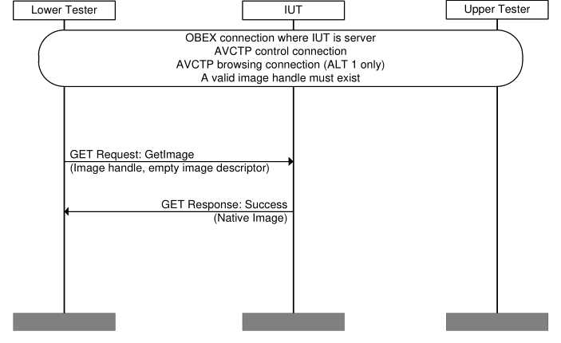

**Figure 4.82: AVRCP/TG/CA/BV-14-C [Pull a Native Image – TG] MSC**

• Expected Outcome
Pass verdict
The IUT responds to the GetImage request from the Lower Tester with a native format Image.
The Image Descriptor parameter in the GetImage request is empty.
AVRCP/CT/CA/BV-15-C [Cover Art SDP record – CT]
• Test Purpose
Verify that the IUT can retrieve the AVRCP SDP record to determine the PSM on which the Cover Art OBEX service is running.
• Reference
[8] 8
[10] 3.4
[11] 5.4
• Initial Condition
- An L2CAP connection for SDP exists between the IUT and the Lower Tester.
- The IUT is acting as AVRCP CT role in category 1.
• Test Procedure
1. The Upper Tester triggers the IUT to issue an SDP query to the Lower Tester to retrieve the
AVRCP Cover Art PSM from the Lower Tester. 2. The Lower Tester issues an SDP response message conveying the AVRCP Cover Art PSM. 3. The IUT creates an L2CAP channel on the PSM associated with the AVRCP Cover Art and then
issues an OBEX CONNECT request on it. 4. Upon receipt of an OBEX CONNECT request the Lower Tester issues an appropriate OBEX
CONNECT response.

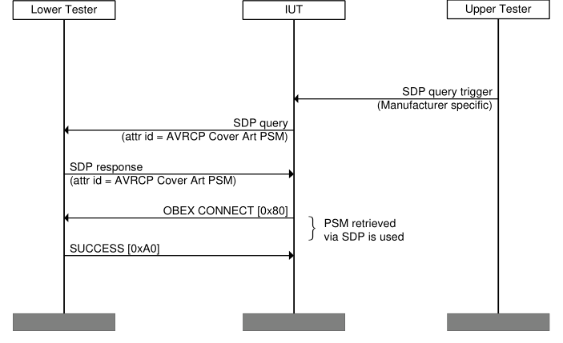

**Figure 4.83: AVRCP/CT/CA/BV-15-C [Cover Art SDP record – CT] MSC**

• Expected Outcome
Pass verdict
The IUT uses SDP to request the PSM associated with AVRCP Cover Art.
The IUT creates an L2CAP channel on the PSM published in the Lower Tester’s AVRCP SDP record.
The IUT issues an OBEX CONNECT [0x80] request on the created L2CAP channel.
AVRCP/TG/CA/BV-16-C [Cover Art SDP record – TG]
• Test Purpose
Verify that the IUT correctly publishes an AVRCP SDP record indicating support for the Cover Art feature and the PSM on which the Cover Art OBEX service is running.
• Reference
[8] 8
[10] 3.4
[11] 5.4
• Initial Condition
- An L2CAP connection for SDP exists between the IUT and the Lower Tester.
- The IUT is acting as AVRCP TG role in category 1.
• Test Procedure
1. The Lower Tester issues an SDP query to the IUT to retrieve the AVRCP Cover Art PSM from the
IUT. 2. The IUT issues an SDP response message conveying the AVRCP Cover Art PSM. 3. The Lower Tester issues an OBEX CONNECT request on an L2CAP channel created on the
PSM associated with AVRCP Cover Art obtained from the IUT after Step 2. 4. Upon receipt of an OBEX CONNECT request the IUT issues an appropriate OBEX CONNECT
response.

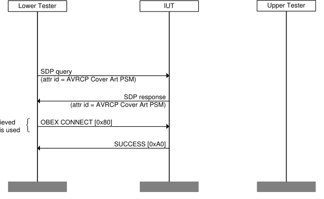

**Figure 4.84: AVRCP/TG/CA/BV-16-C [Cover Art SDP record – TG] MSC**

• Expected Outcome
Pass verdict
The IUT responds with an appropriate SDP response, which contains the requested attribute containing the L2CAP PSM associated with AVRCP Cover Art.
The OBEX CONNECT response from the IUT is well-formatted and indicates success.
AVRCP/CT/CA/BV-17-C [UIDs Changed during Cover Art – CT]
• Test Purpose
Verify that when there is an OBEX Cover Art connection and the Lower Tester is a database aware player, the IUT disconnects OBEX connection when Lower Tester issues a UIDs Changed notification.
• Reference
[8] 6.10.3.3, 6.10.4.2, 6.10.4.3
[9] 4.5.8
• Initial Condition
- One ACL connection exists between the IUT and the Lower Tester.
- The AVCTP control and browsing channels between the IUT and the Lower Tester are established.
- There is an active Cover Art OBEX connection where the IUT is the OBEX client and the Lower Tester is the OBEX server.
- The IUT is acting as AVRCP CT role in category 1.
- The Browsed Player and the default Addressed Player at the Lower Tester are the same player, called the Cover Art Player.
- At least one item with Cover Art is available in the default folder on the Cover Art Player.
- The Cover Art Player is database-aware.
- The IUT has registered for a UIDs Changed notification via the AVRCP RegisterNotification command.
• Test Procedure
1. The Lower Tester issues a Register Notification response message to the IUT with the EventID
parameter set to EVENT_UIDS_CHANGED. 2. As a result of receiving notification, the IUT issues an OBEX DISCONNECT request to the Lower
Tester. 3. The Lower Tester sends an appropriate OBEX DISCONNECT response to the IUT, and upon
successful response, the OBEX connection is disconnected. 4. The IUT issues an AVRCP RegisterNotification command to the Lower Tester with the EventID
parameter set to EVENT_UIDS_CHANGED to register again for notification of UID changes. 5. The Lower Tester issues an appropriate AVRCP RegisterNotification interim response to the IUT.
Note that the OBEX DISCONNECT transaction in Steps 2–3 and the Register notification transaction in Steps 4–5 can occur in either order. 6. Subsequent to successful disconnection, the IUT issues an OBEX CONNECT request to the
Lower Tester. 7. The Lower Tester sends an appropriate OBEX CONNECT response to the IUT, and upon
successful response, the OBEX connection is established. 8. The IUT issues a request for a Cover Art Image Handle to the Lower Tester using either the
AVRCP GetFolderItems or GetItemAttributes command. 9. The Lower Tester sends an appropriate response to the command from Step 8, which if
successful, contains a Cover Art Image Handle. 10. The IUT sends a GetImage or GetLinkedThumbnail request to the Lower Tester with the Image
Handle parameter set to the handle received in Step 9. 11. The Lower Tester sends an appropriate GetImage or GetLinkedThumbnail response message to
the IUT, which if successful, contains the requested image.

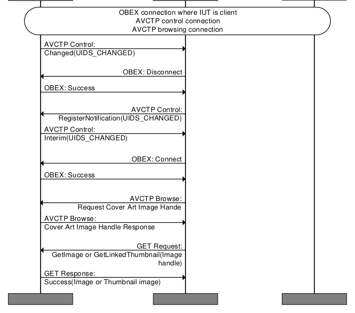

**Figure 4.85: AVRCP/CT/CA/BV-17-C [UIDs Changed during Cover Art – CT] MSC**

• Expected Outcome
Pass verdict
The IUT issues a well-formed and valid OBEX DISCONNECT request.
The IUT issues a well-formed RegisterNotification command with the EventID parameter set to EVENT_UIDS_CHANGED.
The IUT issues a well-formed and valid OBEX CONNECT request.
The IUT issues a well-formed and valid GetFolderItems or GetItemAttributes command.
The IUT issues a well-formed and valid GetImage request, with the Image Handle parameter set to the handle supplied by the Lower Tester.
AVRCP/CT/CA/BV-18-C [Database-Unaware Folder Change during Cover Art – CT]
• Test Purpose
Verify that when there is an OBEX Cover Art connection and the Lower Tester is a database-unaware player, then when the IUT changes folder, OBEX is disconnected by the IUT.
• Reference
[8] 6.6.1, 6.10.4.1, 6.10.4.2, 6.10.4.3
[9] 4.5.8, 4.5.9
• Initial Condition
- One ACL connection exists between the IUT and the Lower Tester.
- The AVCTP control and browsing channels between the IUT and the Lower Tester are established.
- There is an active Cover Art OBEX connection where the IUT is the OBEX client and the Lower Tester is the OBEX server.
- The IUT is acting as AVRCP CT role in category 1.
- The Browsed Player and the default Addressed Player at the Lower Tester are the same player, called the Cover Art Player.
- At least one item with Cover Art is available in the default folder on the Cover Art Player.
- The Cover Art Player is database-unaware but supports browsing.
• Test Procedure
1. The Upper Tester triggers the IUT to issue a request for a Cover Art Image Handle to the Lower
Tester using either the AVRCP GetFolderItems or GetItemAttributes command. 2. The Lower Tester sends an appropriate response to the command from Step 1, which if
successful, contains a Cover Art Image Handle. 3. The IUT issues an AVRCP ChangePath command to the Lower Tester to navigate to another part
of the virtual filesystem. 4. The Lower Tester issues an appropriate ChangePath response message to the IUT. 5. Upon receipt of a successful ChangePath response, the IUT issues an OBEX DISCONNECT
request. 6. The Lower Tester sends an appropriate OBEX DISCONNECT response to the IUT, and upon
successful response, the OBEX connection is disconnected. 7. Subsequent to successful disconnection, the IUT issues an OBEX CONNECT request to the
Lower Tester. 8. The Lower Tester sends an appropriate OBEX CONNECT response to the IUT, and upon
successful response, the OBEX connection is established. 9. The IUT issues a request for a Cover Art Image Handle to the Lower Tester using either the
AVRCP GetFolderItems or GetItemAttributes commands. 10. The Lower Tester sends an appropriate response to the command from Step 9, which if
successful, contains a Cover Art Image Handle. 11. The IUT sends a GetImage or GetLinkedThumbnail request to the Lower Tester with the Image
Handle parameter set to the handle received in Step 10. 12. The Lower Tester sends an appropriate GetImage or GetLinkedThumbnail response to the IUT,
which if successful, contains the requested image.

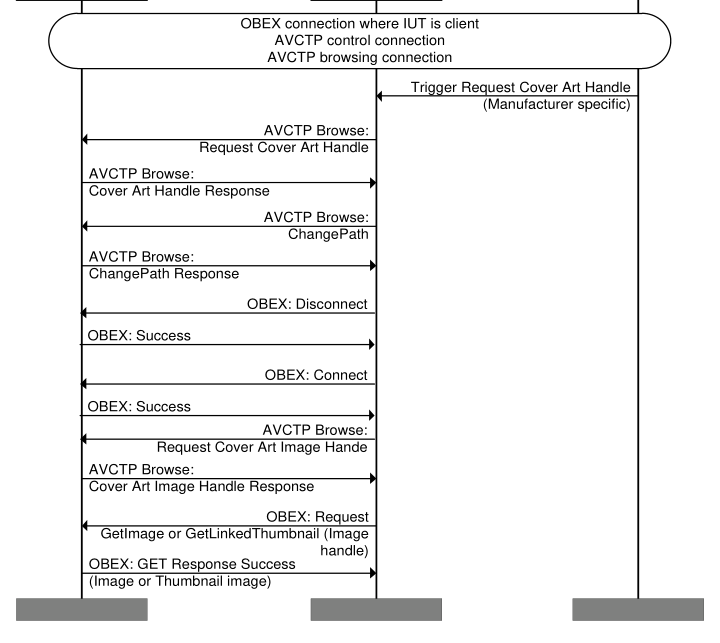

**Figure 4.86: AVRCP/CT/CA/BV-18-C [Database-Unaware Folder Change during Cover Art – CT] MSC**

• Expected Outcome
Pass verdict
The IUT issues a well-formed and valid GetFolderItems or GetItemAttributes command.
The IUT issues a well-formed and valid ChangePath command.
The IUT issues a well-formed and valid OBEX DISCONNECT request.
The IUT issues a well-formed and valid OBEX CONNECT request.
The IUT issues a well-formed and valid GetImage or GetLinkedThumbnail request, with the Image Handle parameter set to the handle supplied by the Lower Tester after OBEX reconnection.
AVRCP/TG/CA/BI-01-C [Retrieval of Cover Art attribute with no OBEX connection – TG]
• Test Purpose
Verify that when the Lower Tester attempts to retrieve the Cover Art attribute when no OBEX connection exists, the IUT does not return an image handle.
• Reference
[8] 6.10.4.2
• Initial Condition
- One ACL connection exists between the IUT and the Lower Tester.
- The AVCTP control and browsing channels between the IUT and the Lower Tester are established.
- No OBEX connection exists.
- The IUT is acting as AVRCP TG role in category 1.
- The Tester has successfully issued a SetBrowsedPlayer command to the player specified in [6] as the browsable player.
- The Tester has successfully issued any necessary ChangePath commands to navigate to a folder on the Browsed Player of the IUT, containing at least one item with Cover Art [6].
• Test Procedure
The Lower Tester issues a GetFolderItems command to the IUT, with the scope parameter set to Virtual Media Player Filesystem, and the attribute list containing only the Cover Art attribute.

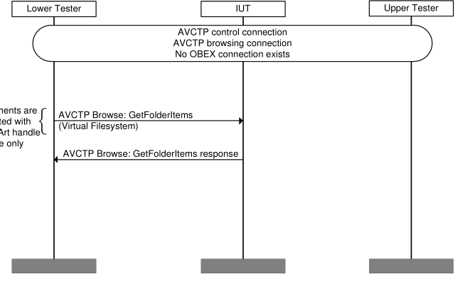

**Figure 4.87: AVRCP/TG/CA/BI-01-C [Retrieval of Cover Art attribute with no OBEX connection – TG] MSC**

• Expected Outcome
Pass verdict
The IUT issues a well-formed GetFolderItems response.
The number of returned items in the response is 0 and the Item List is empty.
AVRCP/TG/CA/BI-04-C [Retrieval of Cover Art attribute with no OBEX connection using GetItemAttributes – TG]
• Test Purpose
Verify that the IUT does not return an image handle, when the Lower Tester attempts to retrieve the Cover Art attribute using GetItemAttributes when no OBEX connection exists.
• Reference
[8] 6.10.4.3
• Initial Condition
- One ACL connection exists between the IUT and the Lower Tester.
- The AVCTP control and browsing channels between the IUT and the Lower Tester are established.
- No OBEX connection exists.
- The IUT is acting as AVRCP TG role in category 1.
- The Tester has successfully issued a SetBrowsedPlayer command to the player specified in the IXIT [6] as the browsable player.
- The Tester has successfully issued any necessary ChangePath commands to navigate to a folder on the Browsed Player of the IUT, containing at least one item with Cover Art [6].
• Test Procedure
The Lower Tester issues a valid GetItemAttributes command to the IUT with the scope parameter set to Virtual Media Player Filesystem and the AttributeID list containing only the Cover Art AttributeID.

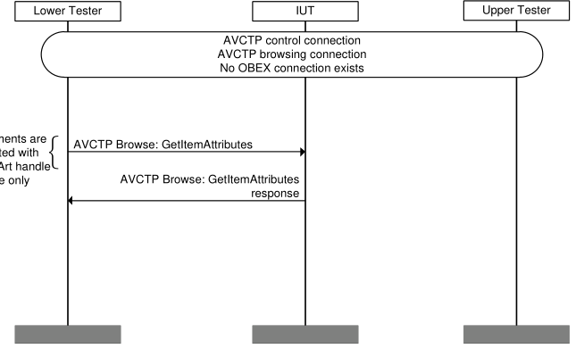

**Figure 4.88: AVRCP/TG/CA/BI-04-C [Retrieval of Cover Art attribute with no OBEX connection using GetItemAttributes – TG] MSC**

• Expected Outcome
Pass verdict
The IUT issues a well-formed GetItemAttributes response.
The GetItemAttributes response does not contain an Attribute Value for the Cover Art attribute for any elements.
AVRCP/TG/CA/BI-05-C [Retrieval of Cover Art attribute with no OBEX connection using GetElementAttributes – TG]
• Test Purpose
Verify that the IUT does not return an image handle, when the Lower Tester attempts to retrieve the Cover Art attribute using GetElementAttributes when no OBEX connection exists.
• Reference
[8] 6.6.1
• Initial Condition
- One ACL connection exists between the IUT and the Lower Tester.
- The AVCTP control channel between the IUT and the Lower Tester is established.
- No OBEX connection exists.
- The IUT is acting as AVRCP TG role in category 1.
- An item with Cover Art is currently playing on the default Addressed Player on the IUT.
• Test Procedure
The Lower Tester issues a valid GetElementAttributes command to the IUT with the identifier parameter set to Playing and the AttributeID list containing only the Cover Art AttributeID.

**Figure 4.89: AVRCP/TG/CA/BI-05-C [Retrieval of Cover Art attribute with no OBEX connection using GetElementAttributes – TG] MSC**

• Expected Outcome
Pass verdict
The IUT issues a well-formed GetElementAttributes response.
The GetElementAttributes response does not contain an Attribute Value for the Cover Art attribute.
AVRCP/TG/CA/BI-06-C [Request of Unsupported Image Type – TG]
• Test Purpose
Verify that when the IUT receives a request for an unsupported image type it can respond correctly.
• Reference
[9] 4.5.8
• Initial Condition
- One ACL connection exists between the IUT and the Lower Tester.
- The AVCTP control and browsing channels between the IUT and the Lower Tester are established.
- There is an active Cover Art OBEX connection where the IUT is the OBEX server and the Lower Tester is the OBEX client.
- The IUT is acting as AVRCP TG role in category 1.
- The Lower Tester is aware of the currently valid Media Item UIDs on the IUT. This can be achieved by executing AVRCP/TG/MCN/CB/BV-02-C [GetFolderItems – TG].
- The Lower Tester has successfully issued a SetBrowsedPlayer command to the player specified in the IXIT [6] as the browsable player.
- The Lower Tester has successfully issued any necessary ChangePath commands to navigate to a folder on the Browsed Player of the IUT containing at least one item with Cover Art [6].
- The Lower Tester has issued a GetItemAttributes command to the IUT with the scope parameter set to Virtual Media Player Filesystem and valid entries for UID, UIDcounter, Number of Attributes and AttributeID list. The AttributeID list contains the Cover Art AttributeID.
- The Lower Tester issues a GetImageProperties to receive the imaging properties supported by the IUT.
• Test Procedure
The Lower Tester issues a well-formed GetImage request to the IUT, with the Image Handle set to a valid handle discovered during the setup of the initial condition, and an Image Descriptor parameter describing an image format unsupported by the IUT, according to the imaging properties received in the Initial Conditions.

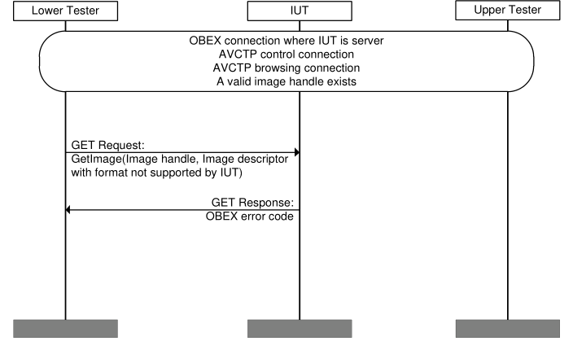

**Figure 4.90: AVRCP/TG/CA/BI-06-C [Request of Unsupported Image Type – TG] MSC**

• Expected Outcome
Pass verdict
The IUT issues a well-formed GetImage response.
The GetImage response contains a well-formed OBEX error code (e.g., ‘Not Acceptable’, etc.).
AVRCP/TG/CA/BI-07-C [Request of Unsupported Image Type without browsing – TG]
• Test Purpose
Verify that when the IUT receives a request for an unsupported image type it can respond correctly.
• Reference
[9] 4.5.8
• Initial Condition
- One ACL connection exists between the IUT and the Lower Tester.
- The AVCTP control channel between the IUT and the Lower Tester is established.
- There is an active Cover Art OBEX connection where the IUT is the OBEX server and the Lower Tester is the OBEX client.
- The IUT is acting as AVRCP TG role in category 1.
- An item with Cover Art is currently playing on the Addressed Player on the IUT. The tester issues the getElementAttributes command to the IUT.
- The Lower Tester issues a GetImageProperties to receive the imaging properties supported by the IUT.
• Test Procedure
The Lower Tester issues a well-formed GetImage request to the IUT, with the Image Handle set to a valid handle discovered during the setup of the initial condition, and an Image Descriptor parameter describing an image format unsupported by the IUT, according to the imaging properties received in the Initial Conditions.

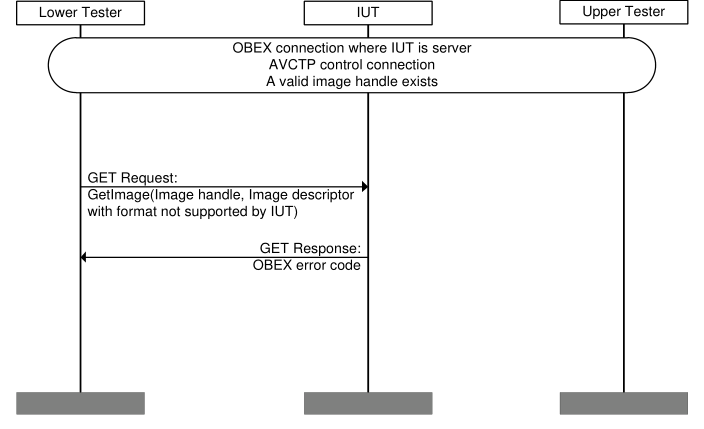

**Figure 4.91: AVRCP/TG/CA/BI-07-C [Request of Unsupported Image Type without browsing – TG] MSC**

• Expected Outcome
Pass verdict
The IUT issues a well-formed GetImage response.
AVRCP/TG/CA/BI-08-C [Use GetFolderItems to request Cover Art attribute – TG]
• Test Purpose
Verify that when the Lower Tester attempts to retrieve the Cover Art attribute using GetFolderItems, and when no item in the selected folder has associated Cover Art, then the IUT does not return an image handle.
• Reference
[8] 6.10.4.2
[9] 4.4.4
• Initial Condition
- One ACL connection exists between the IUT and the Lower Tester.
- The AVCTP control and browsing channels between the IUT and the Lower Tester are established.
- There is an active Cover Art OBEX connection where the IUT is the OBEX server and the Lower Tester is the OBEX client.
- The IUT is acting as AVRCP TG role in category 1.
- The Lower Tester has successfully issued a SetBrowsedPlayer command to the player specified in the IXIT [6] as the browsable player.
- The Lower Tester has successfully issued any necessary ChangePath commands to navigate to a folder on the Browsed Player of the IUT, containing only items with no associated Cover Art as specified in the IXIT [6].
• Test Procedure
The Lower Tester issues a GetFolderItems command to the IUT with the scope parameter set to Virtual Media Player Filesystem and the attribute list containing the Cover Art attribute.

| Lower Tester IUT Upper Tester OBEX connection where IUT is server AVCTP control connection AVCTP browsing connection { GetFolderItems (Virtual Filesystem) (Cover Art Attribute) GetFolderItems Response (No Cover Art Image Handle) |  |
| --- | --- |
|  |  |

**Figure 4.92: AVRCP/TG/CA/BI-08-C [Use GetFolderItems to request Cover Art attribute – TG] MSC**

• Expected Outcome
Pass verdict
The IUT issues a well-formatted GetFolderItems response message to the Lower Tester.
The GetFolderItems response message does not contain a Cover Art Image Handle.
• Notes
Note that although the test does not directly use the Cover Art OBEX connection it must exist for there to be valid Image Handles available on the TG (Imaging Responder).
AVRCP/TG/CA/BI-09-C [Use GetItemAttributes to request Cover Art attribute – TG]
• Test Purpose
Verify that when the Lower Tester attempts to retrieve the Cover Art attribute using GetItemAttributes, and when the selected item has no associated Cover Art, then the IUT does not return an image handle.
• Reference
[8] 6.10.4.3
[9] 4.5.8
• Initial Condition
- One ACL connection exists between the IUT and the Lower Tester.
- The AVCTP control channel between the IUT and the Lower Tester is established.
- There is an active Cover Art OBEX connection where the IUT is the OBEX server and the Lower Tester is the OBEX client.
- The IUT is acting as AVRCP TG role in category 1.
- The Lower Tester is aware of the currently valid Media Item UIDs on the IUT. This can be achieved by executing AVRCP/TG/MCN/CB/BV-02-C [GetFolderItems – TG].
- The Lower Tester has successfully issued a SetBrowsedPlayer command to the player specified in [6] as the browsable player.
- The Lower Tester has successfully issued any necessary ChangePath commands to navigate to a folder on the Browsed Player on the IUT containing only items with no associated Cover Art [6].
• Test Procedure
The Lower Tester issues a GetItemAttributes command to the IUT, with the scope parameter set to Virtual Media Player Filesystem, and valid entries for UID, UIDcounter, Number of Attributes and AttributeID list. The AttributeID list contains the Cover Art AttributeID.

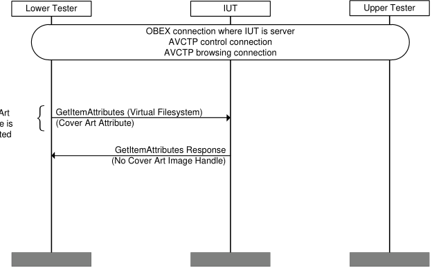

**Figure 4.93: AVRCP/TG/CA/BI-09-C [Use GetItemAttributes to request Cover Art attribute – TG] MSC**

• Expected Outcome
Pass verdict
The IUT issues a well-formatted GetItemAttributes response message to the Lower Tester.
The GetItemAttributes response message does not contain a Cover Art Image Handle.
AVRCP/TG/CA/BI-10-C [Use GetElementAttributes to request Cover Art attribute – TG]
• Test Purpose
Verify that when the Lower Tester attempts to retrieve the Cover Art attribute using GetElementAttributes with the Playing identifier, and when the selected element has no associated Cover Art, that the IUT does not return an image handle.
• Reference
[8] 6.6.1
• Initial Condition
- One ACL connection exists between the IUT and the Lower Tester.
- The AVCTP control channel between the IUT and the Lower Tester is established.
- There is an active Cover Art OBEX connection where the IUT is the OBEX server and the Lower Tester is the OBEX client.
- An item with no associated Cover Art is playing on the default Addressed Player at the IUT.
• Test Procedure
The Lower Tester issues a GetElementAttributes command to the IUT with the identifier parameter set to Playing and the AttributeID list containing the Cover Art AttributeID.

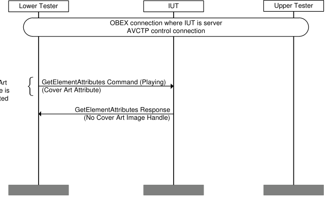

**Figure 4.94: AVRCP/TG/CA/BI-10-C [Use GetElementAttributes to request Cover Art attribute – TG] MSC**

• Expected Outcome
Pass verdict
The IUT issues a well-formatted GetElementAttributes response message to the Lower Tester.
The GetElementAttributes response message does not contain a Cover Art Image Handle.

### 4.12 Media Player Selection tests

#### 4.12.1 Listing of available Media Players

• Test Purpose
CT: Verify that the CT is able to request the list of available Media Players announced by the TG.
TG: Verify that the TG returns the complete list of available Media Players.
• Reference
[5] 5.9, 6.9
• Initial Condition
- A connection for control is established.
• Test Case Configuration

|  | Test Case |  |
| --- | --- | --- |
| AVRCP/CT/MPS/BV-04-C [Listing of available Media Players] |  |  |
| AVRCP/TG/MPS/BV-01-C [Listing of available Media Players] |  |  |

• Test Procedure
CT: Initiate the action on the CT to list the Media Players available on the TG.
TG: No action is required.
• Expected Outcome
Pass verdict
The CT displays the list of Media Players that are available on the TG.

#### 4.12.2 Availability of Media Players

• Test Purpose
CT: Verify that the CT is able to access each Media Player announced as available by the TG.
TG: Verify that each Media Player announced by the TG can be accessed without additional user interaction on the TG device.
• Reference
[5] 5.9, 6.9
• Initial Condition
- A connection for control is established.
- The list of available Media Players is available on the CT. This can be retrieved by executing AVRCP/CT/MPS/BV-0 - Listing of available Media Players.
• Test Case Configuration

|  | Test Case |  |
| --- | --- | --- |
| AVRCP/CT/MPS/BV-05-C [Availability of Media Players] |  |  |
| AVRCP/TG/MPS/BV-08-C [Availability of Media Players] |  |  |

Table 4.7: Availability of Media Players test cases
• Test Procedure
CT: For each Media Player in the list of available Media Players, initiate an action on the CT, e.g., browsing or playing a title.
TG: No action is required.
• Expected Outcome
Pass verdict
An action can be performed on each of the available Media Players without any user interaction required on the TG device.

#### 4.12.3 PASS THROUGH functionality of Media Players

• Test Purpose
CT: Verify that the CT can send the PASS THROUGH commands to the TG.
TG: Verify that each Media Player on the TG reacts to the PASS THROUGH commands as announced in the IXIT [6] according to the operation_id list table in Section 6 Appendix A – Operation_id list tables.
• Reference
[5] 5.9, 4.4.1, 4.5
• Initial Condition
- A connection for control is established.
- The list of available Media Players is available on the CT. This can be retrieved by executing AVRCP/CT/MPS/BV-0 - Listing of available Media Players.
• Test Case Configuration

|  | Test Case |  |
| --- | --- | --- |
| AVRCP/CT/MPS/BV-06-C [PASS THROUGH functionality of Media Players] |  |  |
| AVRCP/TG/MPS/BV-03-C [PASS THROUGH functionality of Media Players] |  |  |

Table 4.8: PASS THROUGH functionality of Media Players test cases
• Test Procedure
CT: Initiate the required user actions (e.g., press button) to perform all operations that are listed in the IXIT MediaPlayerFeature table for each Media Player in [6].
TG: No action is required.
• Expected Outcome
Pass verdict
The TG reacts to all performed PASS THROUGH commands sent from the CT according to the “Expected operation to be performed by the TG” of the section “operation_id list” in Section 6 Appendix A – Operation_id list tables without any user interaction on the TG.

### 4.13 Media Content Navigation tests for Content Browsing

#### 4.13.1 Browsing of the current folder

• Test Purpose
CT: Verify that the CT is able to browse the current folder on the TG.
TG: Verify that the TG correctly browses the current folder requested by the CT.
• Reference
[5] 5.13
• Initial Condition
- A connection for control is established.
- An appropriate folder for browsing media content on the TG has been selected.
• Test Case Configuration

|  | Test Case |  |
| --- | --- | --- |
| AVRCP/CT/MCN/CB/BV-08-C [Browsing of the current folder] |  |  |
| AVRCP/TG/MCN/CB/BV-01-C [Browsing of the current folder] |  |  |

Table 4.9: Browsing of the current folder test cases
• Test Procedure
CT: Initiate the action on the CT to browse through the media content of the currently selected folder on the TG.
TG: No action is required.
• Expected Outcome
Pass verdict
The expected media content is displayed on the CT.

#### 4.13.2 Browsing up

• Test Purpose
CT: Verify that the CT is able to browse into the superordinate folder on the TG.
TG: Verify that the TG correctly browses into the superordinate folder as requested by the CT.
• Reference
[5] 5.13
• Initial Condition
- A connection for control is established.
- A folder on the TG has been selected as current folder that actually has a superordinate folder.
• Test Case Configuration

|  | Test Case |  |
| --- | --- | --- |
| AVRCP/CT/MCN/CB/BV-02-C [Browsing up] |  |  |
| AVRCP/TG/MCN/CB/BV-14-C [Browsing up] |  |  |

Table 4.10: Browsing up test cases
• Test Procedure
CT: Initiate the action on the CT to change into the folder superior to the current folder in the folder hierarchy (‘folder up’).
TG: No action is required.
• Expected Outcome
Pass verdict
The CT indicates the superordinate folder as current folder.

#### 4.13.3 Browsing down

• Test Purpose
CT: Verify that the CT is able to change into a subfolder of the current folder on the TG and browse it.
TG: Verify that the TG correctly changes into a subfolder and returns its content as requested by the CT.
• Reference
[5] 5.13
• Initial Condition
- A connection for control is established.
- A folder on the TG has been selected as current folder that actually has at least one subfolder.
• Test Case Configuration

|  | Test Case |  |
| --- | --- | --- |
| AVRCP/CT/MCN/CB/BV-03-C [Browsing down] |  |  |
| AVRCP/TG/MCN/CB/BV-15-C [Browsing down] |  |  |

Table 4.11: Browsing down test cases
• Test Procedure
CT: Initiate the action on the CT to change into one of the subfolders of the current folder in the folder hierarchy (‘folder down’).
TG: No action is required.
• Expected Outcome
Pass verdict
The CT indicates the selected subfolder as current folder.

#### 4.13.4 Playing of a track from the Virtual Media Player Filesystem

• Test Purpose
CT: Verify that the CT is able to start playback of a track offered by the TG in the Virtual Media Player Filesystem and correctly displays the Now Playing list.
TG: Verify that the TG correctly plays a track from the Virtual Media Player Filesystem requested by the CT and updates the Now Playing folder accordingly.
• Reference
[5] 5.10
• Initial Condition
- A connection for control is established.
- A folder on the TG has been selected as current folder that actually contains at least one media track.
• Test Case Configuration

|  | Test Case |  |
| --- | --- | --- |
| AVRCP/CT/MCN/CB/BV-10-C [Playing of a track from the Virtual Media Player Filesystem] |  |  |
| AVRCP/TG/MCN/CB/BV-04-C [Playing of a track from the Virtual Media Player Filesystem] |  |  |

Table 4.12: Playing of a track from the Virtual Media Player Filesystem test cases
• Test Procedure
CT: Initiate the action on the CT to start playback of a track from the Virtual Filesystem.
TG: No action is required.
• Expected Outcome
Pass verdict
The desired media track is played on the TG.

#### 4.13.5 Change in media database

• Test Purpose
CT: Verify that the CT correctly handles a database change notified by the TG.
TG: Verify that the TG correctly handles a change within its media database (e.g., exchange of memory card).
• Reference
[5], [8] 6.10.3.1
• Initial Condition
- A Connection for control is established.
- The CT has already accessed part of the database on the TG. This can be achieved e.g., by executing AVRCP/CT/MCN/CB/BV-0 - Browsing of the current folder.
• Test Case Configuration

|  | Test Case |  |
| --- | --- | --- |
| AVRCP/CT/MCN/CB/BV-05-C [Change in media database] |  |  |
| AVRCP/TG/MCN/CB/BV-16-C [Change in media database] |  |  |

Table 4.13: Change in media database test cases
• Test Procedure
CT: No action is required.
TG: Initiate the action on the TG to apply a change to the media database.
• Expected Outcome
Pass verdict
The CT indicates it correctly handles the database change on the TG, e.g., by updating the information displayed.

#### 4.13.6 Metadata from Virtual Filesystem

• Test Purpose
CT: Verify that the CT is able to request metadata information for a track other than currently playing one from the Virtual Filesystem.
TG: Verify that the TG correctly returns the metadata information for the track from the Virtual Filesystem list as requested by the CT.
• Reference
[5], [8] 5.13.2, 6.10.1.2
• Initial Condition
- A connection for control is established.
- The TG is currently playing a track.
• Test Case Configuration

|  | Test Case |  |
| --- | --- | --- |
| AVRCP/CT/MCN/CB/BV-06-C [Metadata from Virtual Filesystem] |  |  |
| AVRCP/TG/MCN/CB/BV-17-C [Metadata from Virtual Filesystem] |  |  |

Table 4.14: Metadata from Virtual Filesystem test cases
• Test Procedure
CT: Initiate the action on the CT to request metadata information for a track other than the currently playing one from the Virtual Filesystem.
TG: No action required.
• Expected Outcome
Pass verdict
The CT displays the correct metadata information for the desired track.
AVRCP/TG/MCN/CB/BV-07-C [Browsing of a folder if the player is not addressed]
• Test Purpose
TG: Verify that the CT is able to correctly browse the folder on a player that is not the currently addressed player as requested by the CT.
• Reference
[5], [8] 5.13, 6.9, 6.10.1.2
• Initial Condition
- A connection for control is established.
- Multiple Players are available on the TG with at least one Player supporting Browsing.
• Test Procedure
Initiate the action on the CT to select a Player as the currently addressed one, e.g., by playing a track. Then browse into a Player different from that addressed Player.
• Test Condition
There is a Player available on the TG that supports browsing and the OnlyBrowsableWhenAddressed bit is not set in the Player Feature bitmask.
• Expected Outcome
Pass verdict
The CT is able to retrieve the media content of the browsed Player on the TG as requested.
• Test Purpose
TG: Verify that the TG is able to reject browsing requests when browsing of non-addressed players is not supported.
• Reference
[5], [8] 5.13, 6.9, 6.10.1.2
• Initial Condition
- A connection for control is established.
• Test Procedure
Initiate the action on the CT to select a Player as the currently addressed one, e.g., by playing a track. Then browse into a Player different from that addressed Player.
• Test Condition
There is a Player available on the TG that supports browsing and the OnlyBrowsableWhenAddressed bit is set in the Player Feature bitmask.
• Expected Outcome
Pass verdict
The TG sends a properly formatted response PDU to the Lower Tester with status code = 0x13, Player Not Addressed.
AVRCP/CT/MCN/CB/BV-09-C [CT can retrieve the metadata Virtual Filesystem from TG with future SDP version]
• Test Purpose
Verify that the CT is able to request metadata information for a track other than currently playing one from the Virtual Filesystem when the TG supports a later profile version.
• Reference
[5], [8] 5.13.2, 6.10.1.2
• Initial Condition
- The Lower Tester supports an SDP version that is greater than the current published version, e.g., AVRCP v1.9.
- The Lower Tester has all the bits in its Supported Features SDP attributes set, including those that are RFA.
- A connection for control is established.
- The Lower Tester acting as TG is currently playing a track.
• Test Procedure
Initiate the action on the CT to request metadata information for a track other than the currently playing one from the Virtual Filesystem.
• Expected Outcome
Pass verdict
The CT receives the correct metadata information for the desired track and can provide it to the Upper Tester.

### 4.14 Media Content Navigation tests for Search

#### 4.14.1 Search request

• Test Purpose
CT: Verify that the CT is able to correctly submit a search request to the TG and display the results.
TG: Verify that the TG correctly responds to a search requested by the CT.
• Reference
[5], [8] 5.12
• Initial Condition
- A connection for control is established.
• Test Case Configuration

|  | Test Case |  |
| --- | --- | --- |
| AVRCP/CT/MCN/SRC/BV-08-C [Search request] |  |  |
| AVRCP/TG/MCN/SRC/BV-01-C [Search request] |  |  |

Table 4.15: Search request test cases
• Test Procedure
CT: Initiate the action on the CT to Search for a media item on the TG.
TG: No action required.
• Expected Outcome
Pass verdict
The CT displays the expected search results.

#### 4.14.2 Browsing of the Search results

• Test Purpose
CT: Verify that the CT is able to browse the Search results.
TG: Verify that the TG correctly returns the content of the Search results as requested by the CT.
• Reference
[5], [8] 5.13.3
• Initial Condition
- A connection for control is established.
- A successful Search operation has been performed with the Search results still being valid. This can be achieved by executing AVRCP/CT/MCN/SRC/BV-0 - Search request.
• Test Case Configuration

|  | Test Case |  |
| --- | --- | --- |
| AVRCP/CT/MCN/SRC/BV-09-C [Browsing of the Search results] |  |  |
| AVRCP/TG/MCN/SRC/BV-05-C [Browsing of the Search results] |  |  |

Table 4.16: Browsing of the Search results test cases
• Test Procedure
CT: Initiate the action on the CT to browse through the Search results.
TG: No action required.
• Expected Outcome
Pass verdict
The CT displays the expected Search results.

#### 4.14.3 Play from Search results

• Test Purpose
CT: Verify that the CT is able to request to play a track from the list of Search results.
TG: Verify that the TG correctly plays the track from the Search result list requested by the CT.
• Reference
[5], [8] 5.13.3, 6.11, 6.10.1.2
• Initial Condition
- A connection for control is established.
- A successful Search operation has been performed with the Search results still being valid. This can be achieved by executing AVRCP/CT/MCN/SRC/BV-0 - Search request.
• Test Case Configuration

|  | Test Case |  |
| --- | --- | --- |
| AVRCP/CT/MCN/SRC/BV-10-C [Play from Search results] |  |  |
| AVRCP/TG/MCN/SRC/BV-03-C [Play from Search results] |  |  |

Table 4.17: Play from Search results test cases
• Test Procedure
CT: Initiate the action on the CT to play a media item from the Search results.
TG: No action required.
• Expected Outcome
Pass verdict
The TG plays the selected media item.

#### 4.14.4 Metadata from Search results

• Test Purpose
CT: Verify that the CT is able to request metadata information for a track other than currently playing one from the list of Search results.
TG: Verify that the TG correctly returns the metadata information for the track from the Search result list as requested by the CT.
• Reference
[5], [8] 5.13.3
• Initial Condition
- A connection for control is established.
- A successful Search operation has been performed with the Search results still being valid. This can be achieved by executing AVRCP/CT/MCN/SRC/BV-0 - Search request.
• Test Case Configuration

|  | Test Case |  |
| --- | --- | --- |
| AVRCP/CT/MCN/SRC/BV-11-C [Metadata from Search results] |  |  |
| AVRCP/TG/MCN/SRC/BV-07-C [Metadata from Search results] |  |  |

Table 4.18: Metadata from Search results test cases
• Test Procedure
CT: Initiate the action on the CT to request metadata information for a track other than the currently playing one from the Search results.
TG: No action required.
• Test Condition
The TG might or might not be currently playing a track. In case a track is currently playing, the metadata is not requested for the currently playing track.
• Expected Outcome
Pass verdict
The CT displays the correct metadata information for the desired track.

### 4.15 Media Content Navigation tests for Now Playing

#### 4.15.1 Playing of a track from the Now Playing folder

• Test Purpose
CT: Verify that the CT is able to start playback of a track offered by the TG in the Now Playing folder and correctly displays the Now Playing list.
TG: Verify that the TG correctly plays a track from the Now Playing folder requested by the CT.
• Reference
[5], [8] 5.10
• Initial Condition
- A Connection for control is established.
- The Now Playing list already contains media items.
• Test Case Configuration

|  | Test Case |  |
| --- | --- | --- |
| AVRCP/CT/MCN/NP/BV-11-C [Playing of a track from the Now Playing folder] |  |  |
| AVRCP/TG/MCN/NP/BV-01-C [Playing of a track from the Now Playing folder] |  |  |

Table 4.19: Playing of a track from the Now Playing folder test cases
• Test Procedure
CT: Initiate the action on the CT to start playback of a track in the Now Playing list.
TG: No action required.
• Expected Outcome
Pass verdict
The TG starts playback of the selected track.
The CT correctly displays the Now Playing list and the currently playing item.

#### 4.15.2 Adding a Filesystem track to Now Playing list

• Test Purpose
CT: Verify that the CT is able to request adding a track offered by the TG in its Virtual Filesystem.
TG: Verify that the TG correctly adds the track selected by the CT to its Now Playing list.
• Reference
[5], [8] 5.10
• Initial Condition
- A connection for control is established.
- The CT has browsed into the Virtual Filesystem. This can be achieved by executing AVRCP/CT/MCN/CB/BV-0 - Browsing of the current folder.
• Test Case Configuration

|  | Test Case |  |
| --- | --- | --- |
| AVRCP/CT/MCN/NP/BV-12-C [Adding a Filesystem track to Now Playing list] |  |  |
| AVRCP/TG/MCN/NP/BV-08-C [Adding a Filesystem track to Now Playing list] |  |  |

Table 4.20: Adding a Filesystem track to Now Playing list test cases
• Test Procedure
CT: Initiate the action on the CT to add a track from the Virtual Filesystem to the Now Playing folder.
TG: No action required.
• Expected Outcome
Pass verdict
The CT correctly displays the Now Playing list containing the newly added media item.

#### 4.15.3 Adding a Search result track to Now Playing list

• Test Purpose
CT: Verify that the CT is able to request adding a track offered by the TG in the Search result list.
TG: Verify that the TG correctly adds the track selected by the CT to its Now Playing list.
• Reference
[5], [8] 5.10
• Initial Condition
- A connection for control is established.
- The CT has successfully performed a Search. This can be achieved by executing AVRCP/CT/MCN/SRC/BV-0 - Search request.
• Test Case Configuration

|  | Test Case |  |
| --- | --- | --- |
| AVRCP/CT/MCN/NP/BV-13-C [Adding a Search result track to Now Playing list] |  |  |
| AVRCP/TG/MCN/NP/BV-03-C [Adding a Search result track to Now Playing list] |  |  |

Table 4.21: Adding a Search result track to Now Playing list test cases
• Test Procedure
CT: Initiate the action on the CT to add a track from the Search result list to the Now Playing folder.
TG: No action required.
• Expected Outcome
Pass verdict
The CT correctly displays the Now Playing list containing the newly added media item.

#### 4.15.4 Local change of Now Playing list on TG

• Test Purpose
CT: Verify that the CT correctly updates the Now Playing list when it has been changed locally on the TG.
TG: Verify that the TG correctly announces a change in the Now Playing list that has been done locally on the TG.
• Reference
[5], [8] 5.10
• Initial Condition
- A connection for control is established.
- The Now Playing list on the TG contains at least one media item.
• Test Case Configuration

|  | Test Case |  |
| --- | --- | --- |
| AVRCP/CT/MCN/NP/BV-14-C [Local change of Now Playing list on TG] |  |  |
| AVRCP/TG/MCN/NP/BV-10-C [Local change of Now Playing list on TG] |  |  |

Table 4.22: Local change of Now Playing list on TG test cases
• Test Procedure
CT: No action required.
TG: Initiate the action on the TG to change the content of the Now Playing folder.
• Expected Outcome
Pass verdict
The CT correctly displays the Now Playing list containing the newly selected media item(s).

#### 4.15.5 Metadata from Now Playing list

• Test Purpose
CT: Verify that the CT is able to request metadata information for a track other than currently playing one from the Now Playing list.
TG: Verify that the TG correctly returns the metadata information for the track from the Now Playing list as requested by the CT.
• Reference
[5], [8] 5.13.4
• Initial Condition
- A connection for control is established.
• Test Case Configuration

|  | Test Case |  |
| --- | --- | --- |
| AVRCP/CT/MCN/NP/BV-15-C [Metadata from Now Playing list] |  |  |
| AVRCP/TG/MCN/NP/BV-05-C [Metadata from Now Playing list] |  |  |

Table 4.23: Metadata from Now Playing list test cases
• Test Procedure
CT: Initiate the action on the CT to request metadata information for a track other than the currently playing one from the Now Playing folder.
TG: No action required.
• Test Condition
The TG might or might not be currently playing a track. In case a track is currently playing, the metadata is not requested for the currently playing track.
• Expected Outcome
Pass verdict
The CT displays the correct metadata information for the desired track.

#### 4.15.6 Browsing the Now Playing folder

• Test Purpose
CT: Verify that the CT is able to browse the Now Playing folder.
TG: Verify that the TG correctly returns the content of the Now Playing folder as requested by the CT.
• Reference
[5], [8] 5.13.4
• Initial Condition
- A Connection for control is established.
- The Now Playing folder contains media items.
• Test Case Configuration

|  | Test Case |  |
| --- | --- | --- |
| AVRCP/CT/MCN/NP/BV-16-C [Browsing the Now Playing folder] |  |  |
| AVRCP/TG/MCN/NP/BV-12-C [Browsing the Now Playing folder] |  |  |

Table 4.24: Browsing the Now Playing folder test cases
• Test Procedure
CT: Initiate the action on the CT to browse through the Now Playing folder.
TG: No action required.
• Expected Outcome
Pass verdict
The CT displays the expected media items in the Now Playing folder.

#### 4.15.7 Adding a Playable Folder to Now Playing list

• Test Purpose
CT: Verify that the CT is able to request adding a Playable Folder offered by the TG in the Virtual Filesystem.
TG: Verify that the TG correctly adds the tracks from the Playable Folder selected by the CT to its Now Playing list.
• Reference
[5], [8] 5.10
• Initial Condition
- A connection for control is established.
- The CT has browsed into the Virtual Filesystem. This can be achieved by executing AVRCP/CT/MCN/CB/BV-0 - Browsing of the current folder.
- The current folder on the TG contains a Playable Folder.
• Test Case Configuration

|  | Test Case |  |
| --- | --- | --- |
| AVRCP/CT/MCN/NP/BV-17-C [Adding a Playable Folder to Now Playing list] |  |  |
| AVRCP/TG/MCN/NP/BV-13-C [Adding a Playable Folder to Now Playing list] |  |  |

Table 4.25: Adding a Playable Folder to Now Playing list test cases
• Test Procedure
CT: Initiate the action on the CT to add a Playable Folder from the Virtual Filesystem to the Now Playing folder.
TG: No action required.
• Expected Outcome
Pass verdict
The CT correctly displays the Now Playing list containing the media items from the Playable Folder.

### 4.16 Volume Level Handling tests

#### 4.16.1 Monitoring the TG volume on the CT

• Test Purpose
CT: Verify that the CT is able to correctly receive Volume Changed events from the TG.
TG: Verify that the TG correctly announces local volume changes to the CT.
• Reference
[5], [8] 5.8
• Initial Condition
- A connection for control is established.
- Some media is playing on the TG so that the volume level change can be verified acoustically.
• Test Case Configuration

|  | Test Case |  |
| --- | --- | --- |
| AVRCP/CT/VLH/BV-04-C [Monitoring the TG volume on the CT] |  |  |
| AVRCP/TG/VLH/BV-01-C [Monitoring the TG volume on the CT] |  |  |

Table 4.26: Monitoring the TG volume on the CT test cases
• Test Procedure
Category 2 CT: No action required.
Category 2 TG: Initiate the action on the TG to change the volume.
• Expected Outcome
Pass verdict
The category 2 CT correctly receives the Volume Changed events from the TG and updates any corresponding local state accordingly.
The volume on the category 2 TG is changed.

#### 4.16.2 Changing the volume

• Test Purpose
CT: Verify that the CT can correctly set the absolute volume on the TG.
TG: Verify that the TG changes to the absolute volume requested by the CT.
• Reference
[5], [8] 5.8
• Initial Condition
- A connection for control is established.
- Some media is playing on the TG so that the volume level change can be verified acoustically.
• Test Case Configuration

|  | Test Case |  |
| --- | --- | --- |
| AVRCP/CT/VLH/BV-05-C [Changing the volume] |  |  |
| AVRCP/TG/VLH/BV-03-C [Changing the volume] |  |  |

Table 4.27: Changing the volume test cases
• Test Procedure
Category 2 CT: Initiate the action on the CT to set the volume on the TG.
Category 2 TG: No action required.
• Expected Outcome
Pass verdict
The TG changes to the new volume level.

### 4.17 Cover Art tests

#### 4.17.1 Retrieval of multiple Cover Art images

• Test Purpose
CT: Verify that the CT can retrieve multiple Cover Art images.
TG: Verify that the TG is able to provide multiple Cover Art images.
• Reference
[8] 6.6.1, 6.10.4.2, 6.10.4.3
[9] 4.4.3, 4.4.6.2, 4.4.6.3, 4.5.1, 4.5.7, 4.5.8, 4.5.9
• Initial Condition
- One ACL connection exists between the CT and the TG.
- The AVCTP control and browsing channels between the CT and the TG are established.
- There is an active Cover Art OBEX connection where the TG is the OBEX server and the CT is the OBEX client.
- A folder containing multiple media items with Cover Art on the TG has been selected and browsed to on the CT.
• Test Case Configuration

|  | Test Case |  |
| --- | --- | --- |
| AVRCP/CT/CA/BV-04-C [Retrieval of multiple Cover Art images] |  |  |
| AVRCP/TG/CA/BV-01-C [Retrieval of multiple Cover Art images] |  |  |

Table 4.28: Retrieval of multiple Cover Art images test cases
• Test Procedure
CT: Initiate the action on the CT to browse through the media content and retrieve the matching Cover Art in any format for all items in the current folder.
TG: No action is required.
• Expected Outcome
Pass verdict
The appropriate Cover Art is displayed on the CT for each item in the folder.

#### 4.17.2 Retrieval of Cover Art image for the currently playing track

• Test Purpose
CT: Verify that the CT can retrieve the Cover Art image for the currently playing track.
TG: Verify that the TG is able to provide the Cover Art image for the currently playing track.
• Reference
[8] 6.10.4.2
[9] 4.4.3, 4.4.6.2, 4.4.6.3, 4.5.1, 4.5.7, 4.5.8, 4.5.9
• Initial Condition
- One ACL connection exists between the CT and the TG.
- The AVCTP control and browsing channels between the CT and the TG are established.
- There is an active Cover Art OBEX connection where the TG is the OBEX server and the CT is the OBEX client.
- A track with an associated Cover Art is currently playing on the TG.
• Test Case Configuration

|  | Test Case |  |
| --- | --- | --- |
| AVRCP/CT/CA/BV-02-C [Retrieval of Cover Art image for the currently playing track] |  |  |
| AVRCP/TG/CA/BV-05-C [Retrieval of Cover Art image for the currently playing track] |  |  |

Table 4.29: Retrieval of Cover Art image for the currently playing track test cases
• Test Procedure
CT: Initiate the action on the CT to display Cover Art, if necessary.
TG: No action is required.
• Expected Outcome
Pass verdict
The appropriate Cover Art is displayed on the CT for the track currently playing on the TG.

#### 4.17.3 Retrieval of Cover Art image for the currently playing track without

browsing
• Test Purpose
This test case is specific for devices that don’t support the Browsing feature.
CT: Verify that the CT can retrieve the Cover Art image for the currently playing track.
TG: Verify that the TG is able to provide the Cover Art image for the currently playing track.
• Reference
[8] 6.10.4.2
[9] 4.4.3, 4.4.6.2, 4.4.6.3, 4.5.1, 4.5.7, 4.5.8, 4.5.9
• Initial Condition
- One ACL connection exists between the CT and the TG.
- The AVCTP control channel between the CT and the TG is established.
- There is an active Cover Art OBEX connection where the TG is the OBEX server and the CT is the OBEX client.
- A track with an associated Cover Art is currently playing on the TG.
• Test Case Configuration

|  | Test Case |  |
| --- | --- | --- |
| AVRCP/CT/CA/BV-06-C [Retrieval of Cover Art image for the currently playing track without browsing] |  |  |
| AVRCP/TG/CA/BV-03-C [Retrieval of Cover Art image for the currently playing track without browsing] |  |  |

Table 4.30: Retrieval of Cover Art image for the currently playing track without browsing test cases
• Test Procedure
CT: Initiate the action on the CT to display Cover Art, if necessary.
TG: No action is required.
• Expected Outcome
Pass verdict
The appropriate Cover Art is displayed on the CT for the track currently playing on the TG.

### 4.18 Connection establishment for control

Verify the connection establishment for control.

#### 4.18.1 Connection establishment for control initiated from the CT

Verify the connection establishment initiated from the CT.

##### 4.18.1.1 Connection establishment – CT

• Test Purpose
CT: Verify that the CT can establish a connection for control towards the TG.
TG: Verify that the TG accepts a connection establishment initiated from the CT.
• Reference
[2], [5], [7], [8] 4.1.1
• Initial Condition
- CT: Standby mode.
- TG: Standby mode.
• Test Case Configuration

|  | Test Case |  |
| --- | --- | --- |
| AVRCP/CT/CEC/BV-01-C [Connection establishment – CT] |  |  |
| AVRCP/TG/CEC/BV-01-C [Connection establishment – CT] |  |  |

Table 4.31: Connection establishment – CT test cases
• Test Procedure
CT: Initiate the user action (e.g., press button) on the CT to establish a connection to the TG.
TG: No user action is required.
• Expected Outcome
Pass verdict
CT: It is possible to control the TG by the subsequent user action performed on the CT. It may be indicated that connection for control is established.
TG: It may be indicated that connection for control is established.

#### 4.18.2 Connection establishment for control initiated from the TG

Verify the connection establishment initiated from the TG.

##### 4.18.2.1 Connection establishment – TG

• Test Purpose
CT: Verify that the CT accepts a connection establishment initiated from the TG.
TG: Verify that the TG can establish a connection for control towards the CT.
• Reference
[2], [5], [7], [8] 4.1.1
• Initial Condition
- CT: Standby mode
- TG: Standby mode
• Test Case Configuration

|  | Test Case |  |
| --- | --- | --- |
| AVRCP/CT/CEC/BV-02-C [Connection establishment – TG] |  |  |
| AVRCP/TG/CEC/BV-02-C [Connection establishment – TG] |  |  |

Table 4.32: Connection establishment – TG test cases
• Test Procedure
CT: No user action is required.
TG: Initiate the user action (e.g., press button) on the TG to establish a connection to the CT.
• Expected Outcome
Pass verdict
CT: It is possible to control the TG by the subsequent user action performed on the CT. It may be indicated that connection for control is established.
TG: It may be indicated that connection for control is established.

#### 4.18.3 Connection release for control initiated from the CT

Verify the connection release initiated from the CT.

##### 4.18.3.1 Connection release – CT

• Test Purpose
CT: Verify that the CT releases the connection for control with the TG.
TG: Verify that the TG accepts connection release initiated from the CT.
• Reference
[2], [5], [7], [8] 4.1.2
• Initial Condition
- CT: A connection for control is established.
- TG: A connection for control is established.
• Test Case Configuration

|  | Test Case |  |
| --- | --- | --- |
| AVRCP/CT/CRC/BV-01-C [Connection release – CT] |  |  |
| AVRCP/TG/CRC/BV-01-C [Connection release – CT] |  |  |

Table 4.33: Connection release – CT test cases
• Test Procedure
CT: Initiate the user action (e.g., press button) on the CT to release a connection to the TG.
TG: No user action is required.
• Expected Outcome
Pass verdict
The user action on the CT releases the connection for control.
CT: The CT returns to standby mode. It may be indicated that connection for control is released.
TG: The TG returns to standby mode. It may be indicated that connection for control is released.

#### 4.18.4 Connection release for control initiated from the TG

Verify the connection release initiated from the TG.

##### 4.18.4.1 Connection release – TG

• Test Purpose
CT: Verify that the CT accepts connection release initiated from the TG.
TG: Verify that the TG releases the connection for control with the CT.
• Reference
[2], [5], [7], [8] 4.1.2
• Initial Condition
- CT: A connection for control is established.
- TG: A connection for control is established.
• Test Case Configuration

|  | Test Case |  |
| --- | --- | --- |
| AVRCP/CT/CRC/BV-02-C [Connection release – TG] |  |  |
| AVRCP/TG/CRC/BV-02-C [Connection release – TG] |  |  |

Table 4.34: Connection release – TG test cases
• Test Procedure
CT: No user action is required.
TG: Initiate the user action (e.g., press button) on the TG to release the connection to the CT.
• Expected Outcome
Pass verdict
The user action on the TG releases the connection for control.
CT: The CT returns to standby mode. It may be indicated that connection for control is released.
TG: The TG returns to standby mode. It may be indicated that connection for control is released.

### 4.19 Information collection for control

Verify that the CT can collect the information of TG.

#### 4.19.1 Information collection by UNIT INFO command

Verify Information collection by the UNIT INFO command.

##### 4.19.1.1 Information collection by UNIT INFO command

• Test Purpose
CT: Verify that the CT can collect information of TG by UNIT INFO command.
TG: Verify that the TG responds UNIT INFO command initiated by CT.
• Reference
[2], [7] 4.1.3, 4.4.1
[5], [8] 4.1.3, 4.2.1
• Initial Condition
- CT: A connection for control is established.
- TG: A connection for control is established.
• Test Case Configuration

|  | Test Case |  |
| --- | --- | --- |
| AVRCP/CT/ICC/BV-01-C [Information collection by UNIT INFO command] |  |  |
| AVRCP/TG/ICC/BV-01-C [Information collection by UNIT INFO command] |  |  |

Table 4.35: Information collection by UNIT INFO command test cases
• Test Procedure
CT: Initiate the user action (e.g., press button) on the CT to collect information of TG by UNIT INFO command.
TG: No user action is required.
• Expected Outcome
Pass verdict
CT: It is indicated that UNIT INFO response is received from the TG. The method for indication depends on the device implementation.
TG: The UNIT INFO command is received from the CT and the UNIT INFO response is sent from the TG.

#### 4.19.2 Information collection by SUBUNIT INFO command

Verify Information collection by the SUBUNIT INFO command transfer.

##### 4.19.2.1 Information collection by SUBUNIT INFO command

• Test Purpose
CT: Verify that the CT can collect information of TG by SUBUNIT INFO command.
TG: Verify that the TG responds SUBUNIT INFO command initiated by CT.
• Reference
[2], [7] 4.1.3, 4.4.2
[5], [8] 4.1.3, 4.2.2
• Initial Condition
- CT: A connection for control is established.
- TG: A connection for control is established.
• Test Case Configuration

|  | Test Case |  |
| --- | --- | --- |
| AVRCP/CT/ICC/BV-02-C [Information collection by SUBUNIT INFO command] |  |  |
| AVRCP/TG/ICC/BV-02-C [Information collection by SUBUNIT INFO command] |  |  |

Table 4.36: Information collection by SUBUNIT INFO command test cases
• Test Procedure
CT: Initiate the user action (e.g., press button) on the CT to collect information of TG by SUBUNIT INFO command.
TG: No user action is required.
• Expected Outcome
Pass verdict
CT: It is indicated that SUBUNIT INFO response is received from the TG. The method for indication depends on the device implementation.
TG: The SUBUNIT INFO command is received from the CT and the SUBUNIT INFO response is sent by the TG.

### 4.20 PASS THROUGH commands

Verify that the PASS THROUGH command is transferred.

#### 4.20.1 Category 1 of PASS THROUGH command

Verify that the category 1 of PASS THROUGH command is transferred.

##### 4.20.1.1 PASS THROUGH command transfer – category 1

• Test Purpose
CT: Verify that the CT can send PASS THROUGH command in category 1 to the TG.
TG: Verify that the TG reacts to the PASS THROUGH command in category 1 from the CT according to the operation_id list in Appendix A – Operation_id list tables.
• Reference
[2] 4.1.3, 4.6.1, 4.7
[7] 4.1.3, 4.6.1, 4.8
[5], [8] 4.1.3, 4.4.1, 4.5
• Initial Condition
- CT: A connection for control is established.
- TG: A connection for control is established. The TG should be ready to react to the command from the CT.
• Test Case Configuration

|  | Test Case |  |
| --- | --- | --- |
| AVRCP/CT/PTT/BV-01-C [PASS THROUGH command transfer – category 1] |  |  |
| AVRCP/TG/PTT/BV-01-C [PASS THROUGH command transfer – category 1] |  |  |

Table 4.37: PASS THROUGH command transfer – category 1 test cases
• Test Procedure
CT: Initiate the required user actions (e.g., press button) to perform all operations that are listed in the category 1 “operation_id list” table in Appendix A – Operation_id list tables and indicated as supported in Table 3: Operation_id of category 1 for CT in [3].
TG: No user action is required.
• Expected Outcome
Pass verdict
CT: The CT sends PASS THROUGH commands in category 1 to the TG that are listed in the category 1 “operation_id list” table in Appendix A – Operation_id list tables and indicated as supported in Table 3: Operation_id of category 1 for CT in [3].
TG: The TG reacts to all performed PASS THROUGH commands in category 1 sent from the CT according to the “Expected operation to be performed by the TG” that are listed in the operation_id list table in Appendix A – Operation_id list tables.

#### 4.20.2 Category 2 of PASS THROUGH command

Verify that the category 2 of PASS THROUGH command is transferred.

##### 4.20.2.1 PASS THROUGH command transfer – category 2

• Test Purpose
CT: Verify that the CT can send PASS THROUGH command in category 2 to the TG.
TG: Verify that the TG reacts to the PASS THROUGH command in category 2 from the CT according to the operation_id list table in Appendix A – Operation_id list tables.
• Reference
[2] 4.1.3, 4.6.1, 4.7
[7] 4.1.3, 4.6.1, 4.8
[5], [8] 4.1.3, 4.4.1, 4.5
• Initial Condition
- CT: A connection for control is established.
- TG: A connection for control is established. The TG should be ready to react to the command from the CT.
• Test Case Configuration

|  | Test Case |  |
| --- | --- | --- |
| AVRCP/CT/PTT/BV-02-C [PASS THROUGH command transfer – category 2] |  |  |
| AVRCP/TG/PTT/BV-02-C [PASS THROUGH command transfer – category 2] |  |  |

Table 4.38: PASS THROUGH command transfer – category 2 test cases
• Test Procedure
CT: Initiate the required user actions (e.g., press button) to perform all operations that are listed in the operation_id list table in Appendix A – Operation_id list tables and indicated as supported in Table 4: Operation_id of category 2 for CT in [3].
TG: No user action is required.
• Expected Outcome
Pass verdict
CT: The CT sends PASS THROUGH commands in category 2 to the TG that are listed in the category 2 “operation_id list” table in Appendix A – Operation_id list tables and indicated as supported in Table 4: Operation_id of category 2 for CT in [3].
TG: The TG reacts to all performed PASS THROUGH commands in category 2 sent from the CT according to the “Expected operation to be performed by the TG” that are listed in the operation_id list table in Appendix A – Operation_id list tables.

#### 4.20.3 Category 3 of PASS THROUGH command

Verify that the category 3 of PASS THROUGH command is transferred.

##### 4.20.3.1 PASS THROUGH command transfer – category 3

• Test Purpose
CT: Verify that the CT can send PASS THROUGH command in category 3 to the TG.
TG: Verify that the TG reacts to the PASS THROUGH command in category 3 from the CT according to the operation_id list table in Appendix A – Operation_id list tables.
• Reference
[2] 4.1.3, 4.6.1, 4.7
[7] 4.1.3, 4.6.1, 4.8
[5], [8] 4.1.3, 4.4.1, 4.5
• Initial Condition
- CT: A connection for control is established.
- TG: A connection for control is established. The TG should be ready to react to the command from the CT.
• Test Case Configuration

|  | Test Case |  |
| --- | --- | --- |
| AVRCP/CT/PTT/BV-03-C [PASS THROUGH command transfer – category 3] |  |  |
| AVRCP/TG/PTT/BV-03-C [PASS THROUGH command transfer – category 3] |  |  |

Table 4.39: PASS THROUGH command transfer – category 3 test cases
• Test Procedure
CT: Initiate the required user actions (e.g., press button) to perform all operations that are listed in the operation_id list table in Appendix A – Operation_id list tables and indicated as supported in Table 5: Operation_id of category 3 for CT in [3].
TG: No user action is required.
• Expected Outcome
Pass verdict
CT: The CT sends PASS THROUGH commands in category 3 to the TG that are listed in the category 3 “operation_id list” table in Appendix A – Operation_id list tables and indicated as supported in Table 5: Operation_id of category 3 for CT in [3].
TG: The TG reacts to all performed PASS THROUGH commands in category 3 sent from the CT according to the “Expected operation to be performed by the TG” that are listed in the operation_id list table in Appendix A – Operation_id list tables.

#### 4.20.4 Category 4 of PASS THROUGH command

Verify that the category 4 of PASS THROUGH command is transferred.

##### 4.20.4.1 PASS THROUGH command transfer – category 4

• Test Purpose
CT: Verify that the CT can send PASS THROUGH command in category 4 to the TG.
TG: Verify that the TG reacts to the PASS THROUGH command in category 4 from the CT according to the operation_id list table in Appendix A – Operation_id list tables.
• Reference
[2] 4.1.3, 4.6.1, 4.7
[7] 4.1.3, 4.6.1, ad 4.8
[5], [8] 4.1.3, 4.4.1, 4.5
• Initial Condition
- CT: A connection for control is established.
- TG: A connection for control is established. The TG should be ready to react to the command from the CT.
• Test Case Configuration

|  | Test Case |  |
| --- | --- | --- |
| AVRCP/CT/PTT/BV-04-C [PASS THROUGH command transfer – category 4] |  |  |
| AVRCP/TG/PTT/BV-04-C [PASS THROUGH command transfer – category 4] |  |  |

Table 4.40: PASS THROUGH command transfer – category 4 test cases
• Test Procedure
CT: Initiate the required user actions (e.g., press button) to perform all operations that are listed in the operation_id list table in Appendix A – Operation_id list tables and indicated as supported in Table 6: Operation_id of category 4 for CT in [3].
TG: No user action is required.
• Expected Outcome
Pass verdict
CT: The CT sends PASS THROUGH commands in category 4 to the TG that are listed in the category 4 “operation_id list” table in Appendix A – Operation_id list tables and indicated as supported in Table 6: Operation_id of category 4 for CT in [3].
TG: The TG reacts to all performed PASS THROUGH commands in category 4 sent from the CT according to the “Expected operation to be performed by the TG” that are listed in the operation_id list table in Appendix A – Operation_id list tables.

#### 4.20.5 Press and hold of PASS THROUGH command

Verify that the category 1 of PASS THROUGH command is transferred.

##### 4.20.5.1 PASS THROUGH command transfer – press and hold

• Test Purpose
CT: Verify that the CT can send PASS THROUGH commands where a button is pressed and held to the TG.
TG: Verify that the TG reacts to the PASS THROUGH commands from the CT.
• Reference
[2] 4.1.3, 4.6.1, 4.7
[7] 4.1.3, 4.6.1, 4.8
[5], [8] 4.1.3, 4.4.1, 4.5
• Initial Condition
- CT: A connection for control is established.
- TG: A connection for control is established. The TG should be ready to react to the command from the CT.
• Test Case Configuration

|  | Test Case |  |
| --- | --- | --- |
| AVRCP/CT/PTT/BV-05-C [PASS THROUGH command transfer – press and hold] |  |  |
| AVRCP/TG/PTT/BV-05-C [PASS THROUGH command transfer – press and hold] |  |  |

Table 4.41: PASS THROUGH command transfer – press and hold test cases
• Test Procedure
CT: Initiate the required user actions (e.g., press button) to indicate that a button is being held down for a selected PASS THROUGH operation. The button should be held for longer than 2 seconds. Actions should then be performed to indicate that the button has been released.
TG: No user action is required.
• Expected Outcome
Pass verdict
CT: As long as the button is held down the CT sends PASS THROUGH commands with the state flag set to button press, and with an interval of no more than 2 seconds. When the button is released the CT sends a PASS THROUGH command with the state flag set to button release.”
TG: The TG indicates that the button is being held down on the CT.

### 4.21 Metadata Transfer

Verify that the IUT conforms to the requirements of the Metadata Transfer.

#### 4.21.1 Configuration commands

Verify the various configuration commands that are defined in the AVRCP specification.
• Test Purpose
Verify the Get Capabilities command issued from the CT.
• Reference
[7] 5.1.1
[5], [8] 6.4.1
• Initial Condition
- One ACL connection exists between the IUT and the Lower Tester.
- The AVCTP connection between the IUT and the Lower Tester is completed.
• Test Procedure
The Upper Tester triggers the IUT to send a GetCapabilities command with the METADATA TRANSFER_GetCapabilities PDU containing any valid CapabilityID value.

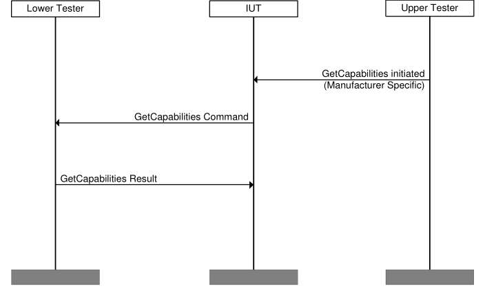

**Figure 4.95: AVRCP/CT/CFG/BV-01-C [Get Capabilities – CT] MSC**

• Expected Outcome
Pass verdict
The Lower Tester receives the GetCapabilities.
AVRCP/TG/CFG/BV-02-C [Get Capabilities response – TG]
• Test Purpose
Verify the Get Capabilities response issued from the TG.
• Reference
[7] 5.1.1
[5], [8] 6.4.1
• Initial Condition
- One ACL connection exists between the IUT and the Lower Tester.
- The AVCTP connection between the IUT and the Lower Tester is completed.
• Test Procedure
The Lower Tester sends a GetCapabilities message to the IUT with the METADATA TRANSFER_GetCapabilities PDU parameter value set to COMPANY_ID.

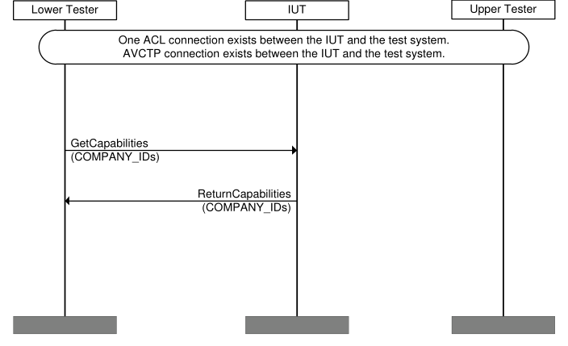

**Figure 4.96: AVRCP/TG/CFG/BV-02-C [Get Capabilities response – TG] MSC**

• Expected Outcome
Pass verdict
The Lower Tester receives from the IUT the supported COMPANY_IDs. The first COMPANY_ID is the Bluetooth SIG COMPANY_ID.
AVRCP/TG/CFG/BI-01-C [Get Capabilities invalid behavior response – TG]
• Test Purpose
Verify the Get Capabilities response issued from the TG when an invalid capability is requested.
• Reference
[7] 5.1.1
[5], [8] 6.4.1
• Initial Condition
- One ACL connection exists between the IUT and the Lower Tester.
- The AVCTP connection between the IUT and the Lower Tester is completed.
• Test Procedure
The Lower Tester sends a GetCapabilities message to the IUT with the METADATA TRANSFER_GetCapabilities PDU parameter value set to an invalid capability ID – for example 0x7F.

| Lower Tester IUT Upper Tester One ACL connection exists between the IUT and the test system. AVCTP connection exists between the IUT and the test system. GetCapabilities (An Invalid ID) Rejected (Invalid parameter) |  |
| --- | --- |
|  |  |

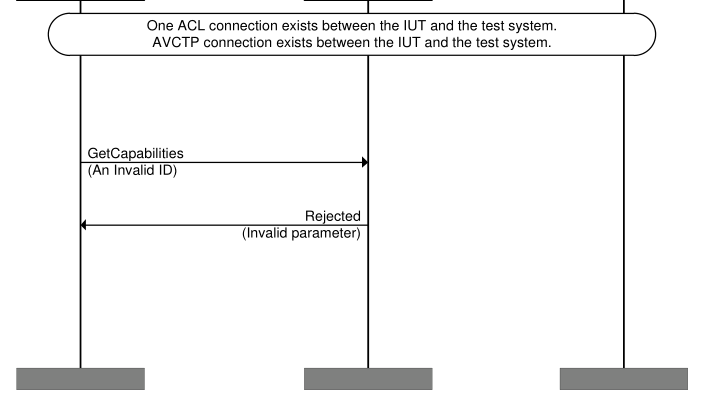

**Figure 4.97: AVRCP/TG/CFG/BI-01-C [Get Capabilities invalid behavior response – TG] MSC**

• Expected Outcome
Pass verdict
The IUT responds to the Lower Tester with the Error status Invalid Parameter indicating that the capability ID issued was invalid.

#### 4.21.2 Player Application Settings commands

Verify the player application settings commands that are defined in the METADATA TRANSFER specification.
AVRCP/CT/PAS/BV-01-C [List Player Application Setting Attributes – CT]
• Test Purpose
Verify the List Player Application Setting Attributes command issued from the CT.
• Reference
[7] 5.2.1
[5], [8] 6.5.1
• Initial Condition
- One ACL connection exists between the IUT and the Lower Tester.
- The AVCTP connection between the IUT and the Lower Tester is completed.
• Test Procedure
The Upper Tester triggers the IUT to send a ListPlayerApplicationSettingAttributes command. No parameter needs to be passed for this PDU.

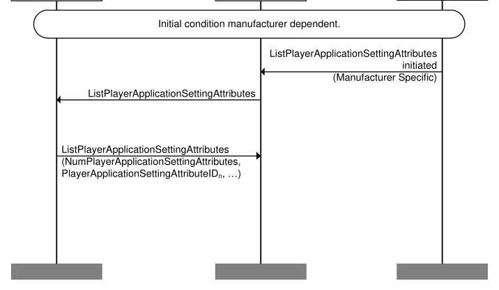

**Figure 4.98: AVRCP/CT/PAS/BV-01-C [List Player Application Setting Attributes – CT] MSC**

• Expected Outcome
Pass verdict
The Lower Tester receives the List Player Application Settings Attributes command.
AVRCP/TG/PAS/BV-02-C [List Player Application Setting Attributes – TG]
• Test Purpose
Verify the List Player Application Setting Attributes response issued from the TG.
• Reference
[7] 5.2.1
[5], [8] 6.5.1
• Initial Condition
- One ACL connection exists between the IUT and the Lower Tester.
- The AVCTP connection between the IUT and the Lower Tester is completed.
• Test Procedure
The Lower Tester sends a ListPlayerApplicationSettingAttributes command to the IUT. No parameter needs to be passed for this PDU.

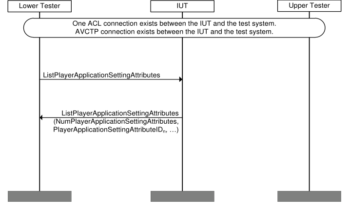

**Figure 4.99: AVRCP/TG/PAS/BV-02-C [List Player Application Setting Attributes – TG] MSC**

• Expected Outcome
Pass verdict
The IUT returns a response with zero or more attributes.
AVRCP/CT/PAS/BV-03-C [Get Player Application Setting Attribute Text – CT]
• Test Purpose
Verify the Get Player Application Settings Attribute Text command issued from the CT.
• Reference
[7] 5.2.5
[5], [8] 6.5.5
• Initial Condition
- One ACL connection exists between the IUT and the Lower Tester.
- The AVCTP connection between the IUT and the Lower Tester is completed.
• Test Procedure
The Upper Tester triggers the IUT to send a GetPlayerApplicationSettingAttributeText command containing one or more attribute IDs.

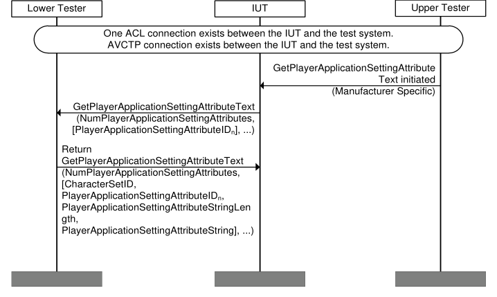

**Figure 4.100: AVRCP/CT/PAS/BV-03-C [Get Player Application Setting Attribute Text – CT] MSC**

• Expected Outcome
Pass verdict
The Get Player Application Setting Attribute Text command is received by the Lower Tester.
AVRCP/TG/PAS/BV-04-C [Get Player Application Setting Attribute Text – TG]
• Test Purpose
Verify the Get Player Application Setting Attribute Text response issued from the TG.
• Reference
[7] 5.2.5
[5], [8] 6.5.5
• Initial Condition
- One ACL connection exists between the IUT and the Lower Tester.
- The AVCTP connection between the IUT and the Lower Tester is completed.
- The Lower Tester is aware of the available attributes for the IUT. This can be retrieved from the result of AVRCP/TG/PAS/BV-02-C [List Player Application Setting Attributes – TG].
• Test Procedure
The Lower Tester sends a GetPlayerApplicationSettingAttributeText command to the IUT with an attribute ID listed in the available attributes for the IUT.

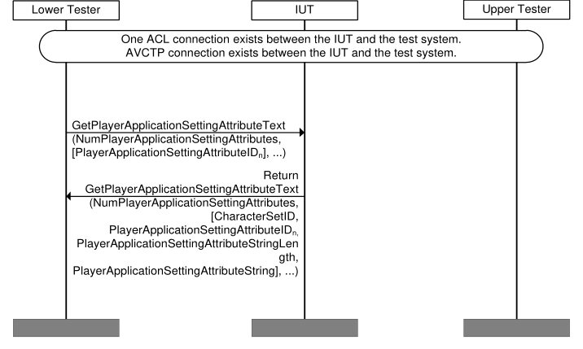

**Figure 4.101: AVRCP/TG/PAS/BV-04-C [Get Player Application Setting Attribute Text – TG] MSC**

• Expected Outcome
Pass verdict
The IUT returns the values in UTF-8 format as specified by the Lower Tester. The values are Manufacturer dependent.
AVRCP/CT/PAS/BV-05-C [List Player Application Setting Values – CT]
• Test Purpose
Verify the List Player Application Setting Values command issued from the CT.
• Reference
[7] 5.2.2
[5], [8] 6.5.2
• Initial Condition
- One ACL connection exists between the IUT and the Lower Tester.
- The AVCTP connection between the IUT and the Lower Tester is completed.
- The IUT is aware of the available attributes for the Lower Tester. This can be retrieved from the result of AVRCP/CT/PAS/BV-01-C [List Player Application Setting Attributes – CT].
• Test Procedure
The Upper Tester triggers the IUT to send a ListPlayerApplicationSettingValues command with an attribute ID listed in the available attributes for the Lower Tester.

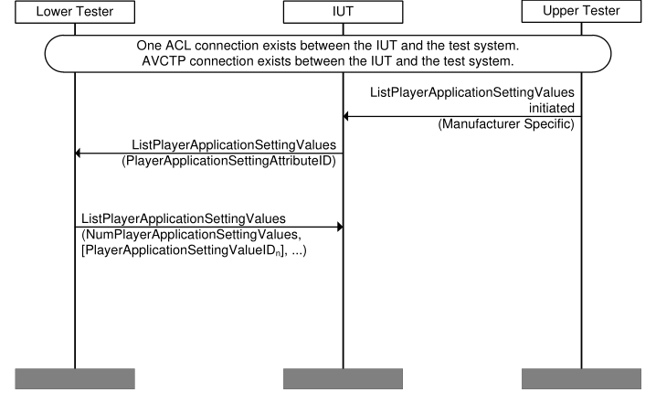

**Figure 4.102: AVRCP/CT/PAS/BV-05-C [List Player Application Setting Values – CT] MSC**

• Expected Outcome
Pass verdict
The List Player Application Setting Values is received by the Lower Tester.
AVRCP/TG/PAS/BV-06-C [List Player Application Setting Values – TG]
• Test Purpose
Verify the List Player Application Setting Values response issued from the TG.
• Reference
[7] 5.2.2
[5], [8] 6.5.2
• Initial Condition
- One ACL connection exists between the IUT and the Lower Tester.
- The AVCTP connection between the IUT and the Lower Tester is completed.
- The Lower Tester is aware of the available attributes for the IUT. This can be retrieved from the result of AVRCP/TG/PAS/BV-02-C [List Player Application Setting Attributes – TG].
• Test Procedure
The Lower Tester sends a ListPlayerApplicationSettingValues command to the IUT with an attribute ID listed in the available attributes for the IUT.

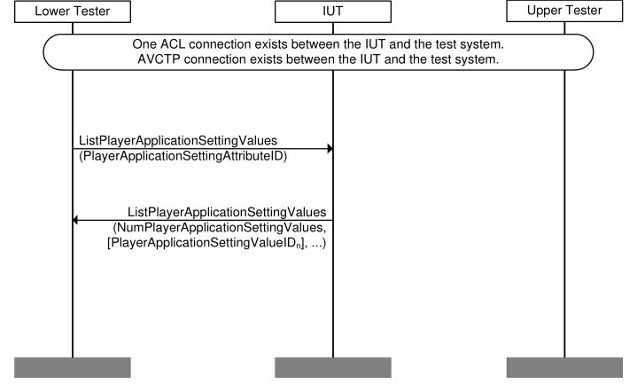

**Figure 4.103: AVRCP/TG/PAS/BV-06-C [List Player Application Setting Values – TG] MSC**

• Expected Outcome
Pass verdict
The IUT returns the list of setting values for that Attribute ID as defined by the manufacturer.
AVRCP/CT/PAS/BV-07-C [Get Player Application Setting Value Text – CT]
• Test Purpose
Verify the Player Application Setting Value Text command issued from the CT.
• Reference
[7] 5.2.6
[5], [8] 6.5.6
• Initial Condition
- One ACL connection exists between the IUT and the Lower Tester.
- The AVCTP connection between the IUT and the Lower Tester is completed.
- The IUT is aware of the available attributes and corresponding values for the Lower Tester. This can be retrieved from the result of AVRCP/CT/PAS/BV-01-C [List Player Application Setting Attributes – CT] and AVRCP/CT/PAS/BV-05-C [List Player Application Setting Values – CT].
• Test Procedure
Initiated by the Upper Tester, the IUT sends a Get Player Application Setting Value Text command to the Lower Tester, with attribute and value IDs listed in the available attributes and corresponding values for the Lower Tester.

**Figure 4.104: AVRCP/CT/PAS/BV-07-C [Get Player Application Setting Value Text – CT] MSC**

• Expected Outcome
Pass verdict
The Get Player Application Setting Value Text is received by the Lower Tester.
AVRCP/TG/PAS/BV-08-C [Get Player Application Setting Value Text – TG]
• Test Purpose
Verify the Get Player Application Setting Value Text response issued from the TG.
• Reference
[7] 5.2.6
[5], [8] 6.5.6
• Initial Condition
- One ACL connection exists between the IUT and the Lower Tester.
- The AVCTP connection between the IUT and the Lower Tester is completed.
- The Lower Tester is aware of the available attributes and corresponding values for the IUT. This can be retrieved from the result of AVRCP/TG/PAS/BV-02-C [List Player Application Setting Attributes – TG] and AVRCP/TG/PAS/BV-06-C [List Player Application Setting Values – TG].
• Test Procedure
The Lower Tester sends a Get Player Application Setting Value Text command to the IUT, with attribute and value IDs listed in the available attributes and corresponding values for the IUT.

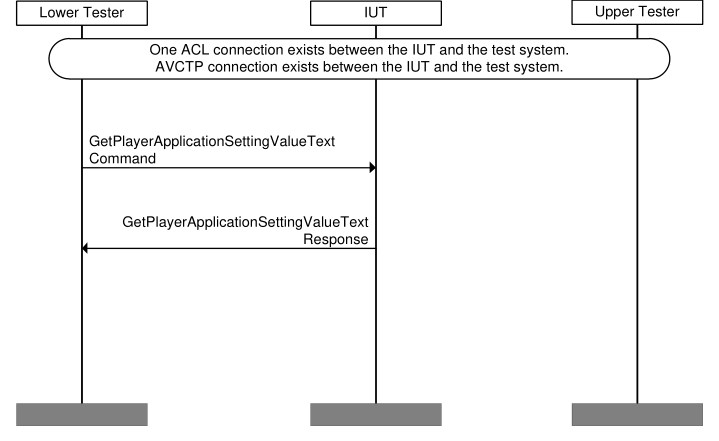

**Figure 4.105: AVRCP/TG/PAS/BV-08-C [Get Player Application Setting Value Text – TG] MSC**

• Expected Outcome
Pass verdict
The IUT returns the values in UTF-8 format as requested by the Lower Tester. The values are manufacturer dependent.
AVRCP/CT/PAS/BV-09-C [Get Current Player Application Setting Value – CT]
• Test Purpose
Verify the Get Current Player Application Setting Value command issued from the CT.
• Reference
[7] 5.2.3
[5], [8] 6.5.3
• Initial Condition
- One ACL connection exists between the IUT and the Lower Tester.
- The AVCTP connection between the IUT and the Lower Tester is completed.
- The IUT is aware of the available attributes on the Lower Tester. This can be retrieved from the result of AVRCP/CT/PAS/BV-01-C [List Player Application Setting Attributes – CT].
• Test Procedure
Initiated by the Upper Tester, the IUT sends a Get Current Player Application Setting Value command to the Lower Tester containing an attribute ID listed in the available attributes for the Lower Tester.

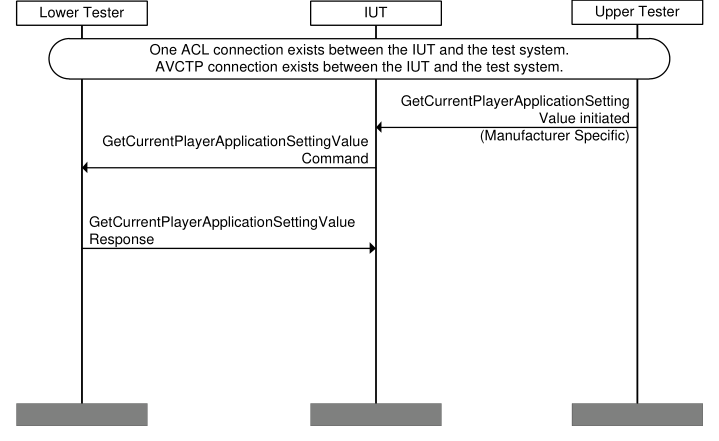

**Figure 4.106: AVRCP/CT/PAS/BV-09-C [Get Current Player Application Setting Value – CT] MSC**

• Expected Outcome
Pass verdict
The Lower Tester receives the Get Current Player Application Setting Value command.
AVRCP/TG/PAS/BV-10-C [Get Current Player Application Setting Value – TG]
• Test Purpose
Verify the Get Current Player Application Setting Value response issued from the TG.
• Reference
[7] 5.2.3
[5], [8] 6.5.3
• Initial Condition
- One ACL connection exists between the IUT and the Lower Tester.
- The AVCTP connection between the IUT and the Lower Tester is completed.
- The Lower Tester is aware of the available attributes on the IUT. This can be retrieved from the result of AVRCP/TG/PAS/BV-02-C [List Player Application Setting Attributes – TG].
• Test Procedure
The Lower Tester sends a Get Current Player Application Setting Value command to the IUT with an attribute ID listed in the available attributes for the IUT.

**Figure 4.107: AVRCP/TG/PAS/BV-10-C [Get Current Player Application Setting Value – TG] MSC**

• Expected Outcome
Pass verdict
The IUT returns the list of values for the requested Attribute IDs as defined by the manufacturer.
AVRCP/CT/PAS/BV-11-C [Set Player Application Setting Value – CT]
• Test Purpose
Verify the Set Player Application Setting Value command issued from the CT.
• Reference
[7] 5.2.4
[5], [8] 6.5.4
• Initial Condition
- One ACL connection exists between the IUT and the Lower Tester.
- The AVCTP connection between the IUT and the Lower Tester is completed.
- The IUT is aware of the available attributes and corresponding values for the Lower Tester. This can be retrieved from the result of AVRCP/CT/PAS/BV-01-C [List Player Application Setting Attributes – CT] and AVRCP/CT/PAS/BV-05-C [List Player Application Setting Values – CT].
• Test Procedure
Initiated by the Upper Tester, the IUT sends a Set Player Application Setting Value command to the Lower Tester, with attribute and value IDs listed in the available attributes and corresponding values for the Lower Tester.

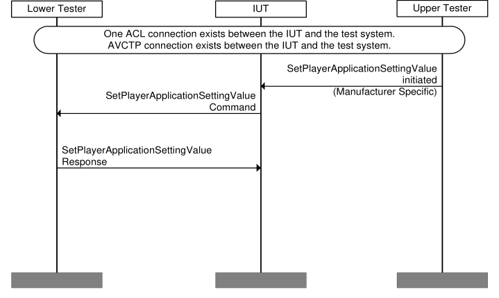

**Figure 4.108: AVRCP/CT/PAS/BV-11-C [Set Player Application Setting Value – CT] MSC**

• Expected Outcome
Pass verdict
The Lower Tester receives the SetPlayerApplicationSettingValue command the correct attribute and value ID.
AVRCP/TG/PAS/BI-01-C [Get Player Application Settings Attribute Text invalid behavior – TG]
• Test Purpose
Verify the behavior of the target when a Get Player Application Settings Attribute Text command is issued with an invalid parameter.
• Reference
[7] 5.2.5
[5], [8] 6.5.5
• Initial Condition
- One ACL connection exists between the IUT and the Lower Tester.
- The AVCTP connection between the IUT and the Lower Tester is completed.
• Test Procedure
The Lower Tester sends a Get Player Application Setting Attribute Text command to the IUT with parameters Num Player Application Setting Attributes = 1 and Player Application Setting Attribute ID 1 = 0x7F.

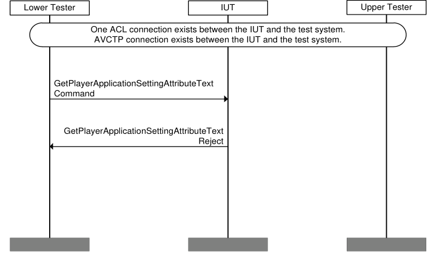

**Figure 4.109: AVRCP/TG/PAS/BI-01-C [Get Player Application Settings Attribute Text invalid behavior – TG] MSC**

• Expected Outcome
Pass verdict
The IUT returns an error response with error code 0x01 indicating that an invalid parameter was passed.
AVRCP/TG/PAS/BI-02-C [List Player Application Setting Values invalid behavior – TG]
• Test Purpose
Verify the ability of the TG to respond to a List Player Application Setting Values command with invalid parameters.
• Reference
[7] 5.2.2
[5], [8] 6.5.2
• Initial Condition
- One ACL connection exists between the IUT and the Lower Tester.
- The AVCTP connection between the IUT and the Lower Tester is completed.
• Test Procedure
The Lower Tester sends a List Player Application Setting Value command to the IUT with parameter Player Application Attribute ID = 0x7F.

**Figure 4.110: AVRCP/TG/PAS/BI-02-C [List Player Application Setting Values invalid behavior – TG] MSC**

• Expected Outcome
Pass verdict
The IUT returns an error response with error code 0x01 indicating that an invalid parameter was passed.
AVRCP/TG/PAS/BI-03-C [Get Player Application Setting Value Text invalid behavior – TG]
• Test Purpose
Verify the ability of the TG to respond to a Get Player Application Setting Value Text command with invalid parameters.
• Reference
[7] 5.2.6
[5], [8] 6.5.6
• Initial Condition
- One ACL connection exists between the IUT and the Lower Tester.
- The AVCTP connection between the IUT and the Lower Tester is completed.
- The Lower Tester is aware of the available attributes for the IUT. This can be retrieved from the result of AVRCP/TG/PAS/BV-02-C [List Player Application Setting Attributes – TG].
• Test Procedure
The Lower Tester sends a Get Player Application Setting Value Text command to the IUT. The attribute ID passed is listed in the available attributes for the IUT. The other parameter settings are Num Player Application Settings = 1 and Player Application Setting Value = 0x7F.

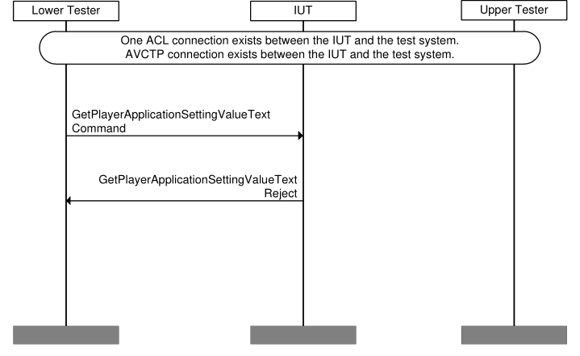

**Figure 4.111: AVRCP/TG/PAS/BI-03-C [Get Player Application setting Value Text invalid behavior – TG] MSC**

• Expected Outcome
Pass verdict
The IUT returns an error response with error code 0x01 indicating that an invalid parameter was passed.
AVRCP/TG/PAS/BI-04-C [Get Current Player Application Setting Value invalid behavior – TG]
• Test Purpose
Verify the ability of the TG to respond to a Get Current Player Application Setting Value command with invalid parameters.
• Reference
[7] 5.2.3
[5], [8] 6.5.3
• Initial Condition
- One ACL connection exists between the IUT and the Lower Tester.
- The AVCTP connection between the IUT and the Lower Tester is completed.
• Test Procedure
The Lower Tester sends a Get Current Player Application Setting Value command to the IUT with parameters Num Player Application Settings = 1 and Player Application Setting Value = 0x7F.

**Figure 4.112: AVRCP/TG/PAS/BI-04-C [Get Current Player Application Setting Value invalid behavior – TG] MSC**

• Expected Outcome
Pass verdict
The IUT returns an error response with error code 0x01 indicating that an invalid parameter was passed.
AVRCP/TG/PAS/BI-05-C [Set Player Application Setting Value invalid behavior – TG]
• Test Purpose
Verify the ability of the TG to respond to a Set Player Application Setting Value command with invalid parameters.
• Reference
[7] 5.2.4
[5], [8] 6.5.4
• Initial Condition
- One ACL connection exists between the IUT and the Lower Tester.
- The AVCTP connection between the IUT and the Lower Tester is completed.
• Test Procedure
The Lower Tester sends a Set Player Application Setting Value command to the IUT with parameters Num Player Application Setting = 1, Player Application Setting Attribute ID = 0x02 and Player Application Setting Value = 0x7F.

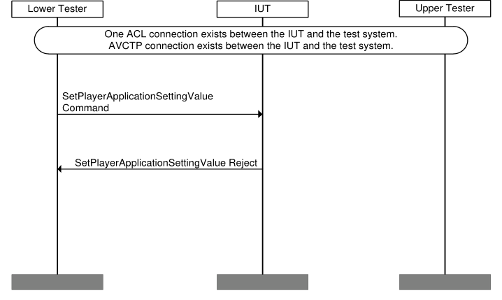

**Figure 4.113: AVRCP/TG/PAS/BI-05-C [Set Player Application Setting Value invalid behavior – TG] MSC**

• Expected Outcome
Pass verdict
The IUT returns an error response with error code 0x01 indicating that an invalid parameter was passed.

#### 4.21.3 Media Information commands

Verify the media information commands related to play status as well as information about media.
AVRCP/CT/MDI/BV-01-C [Get Play Status – CT]
• Test Purpose
Verify the Get Play Status command issued from the CT.
• Reference
[7] 5.4.1
[5], [8] 6.7.1
• Initial Condition
- One ACL connection exists between the IUT and the test system.
- AVCTP connection exists between the IUT and the test system.
• Test Procedure
Initiated by the Upper Tester, the IUT sends a Get Play Status command to the Lower Tester. No parameters need to be passed for this command.

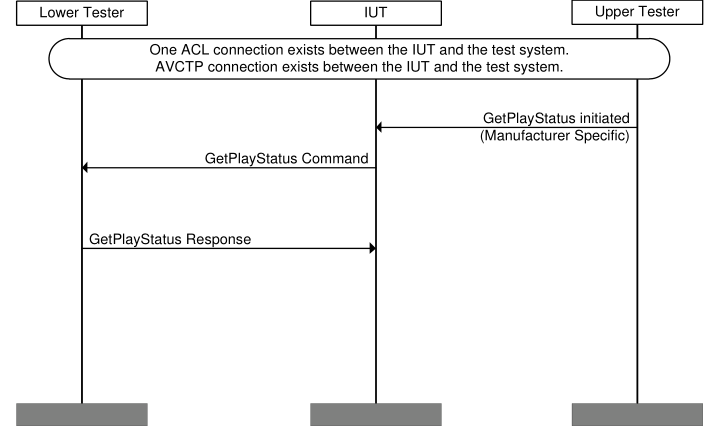

**Figure 4.114: AVRCP/CT/MDI/BV-01-C [Get play status – CT] MSC**

• Expected Outcome
Pass verdict
The Lower Tester receives the GetPlayStatus command.
AVRCP/TG/MDI/BV-02-C [Get Play Status – TG]
• Test Purpose
Verify the Get Play Status response issued from the TG. Test to be conducted for all three modes of play status on the TG – Playing, Paused, and Stop status.
• Reference
[7] 5.4.1
[5], [8] 6.7.1
• Initial Condition
- One ACL connection exists between the IUT and the test system.
- AVCTP connection exists between the IUT and the test system.
• Test Procedure
The Lower Tester sends a Get Play Status command to the IUT. No parameters need to be passed for this command.

**Figure 4.115: AVRCP/TG/MDI/BV-02-C [Get Play Status – TG] MSC**

• Expected Outcome
Pass verdict
The IUT returns the correct current play status of the MP.
AVRCP/CT/MDI/BV-03-C [Get Element Attributes – CT]
• Test Purpose
Verify the Get Element Attributes command issued from the CT.
• Reference
[7] 5.3.1
[5], [8] 6.6.1
• Initial Condition
- One ACL connection exists between the IUT and the test system.
- AVCTP connection exists between the IUT and the test system.
• Test Procedure
Initiated by the Upper Tester, the IUT sends a Get Element Attributes command to the Lower Tester.

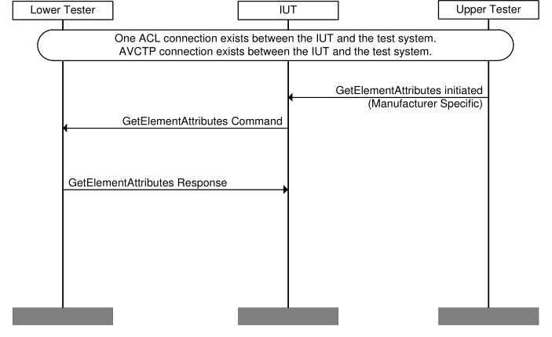

**Figure 4.116: AVRCP/CT/MDI/BV-03-C [Get Element Attributes – CT] MSC**

• Expected Outcome
Pass verdict
The Lower Tester receives the Get Element Attributes command.
AVRCP/TG/MDI/BV-04-C [Get Element Attributes – TG]
• Test Purpose
Verify the Get Element Attributes response for getting all attributes issued from the TG.
• Reference
[7] 5.3.1
[5], [8] 6.6.1
• Initial Condition
- One ACL connection exists between the IUT and the test system.
- AVCTP connection exists between the IUT and the test system.
• Test Procedure
The Lower Tester sends a Get Element Attributes command to the IUT with the parameters Identifier = Playing and NumAttributes = 0.

**Figure 4.117: AVRCP/TG/MDI/BV-04-C [Get Element Attributes – TG] MSC**

• Expected Outcome
Pass verdict
The IUT returns all attribute information.
• Notes
The test case is used to retrieve all the elements (NumAttributes = 0x00) of a selected entry on the target.
AVRCP/TG/MDI/BV-05-C [Get Element Attributes – TG]
• Test Purpose
Verify the Get Element Attributes response for getting selected attributes issued from the TG.
• Reference
[7] 5.3.1
[5], [8] 6.6.1
• Initial Condition
- One ACL connection exists between the IUT and the test system.
- AVCTP connection exists between the IUT and the test system.
• Test Procedure
The Lower Tester sends a Get Element Attributes command to the IUT with the parameters Identifier = Playing, NumAttributes = n and AttributeId = n Attribute Ids.

**Figure 4.118: AVRCP/TG/MDI/BV-05-C [Get Element Attributes – TG] MSC**

• Expected Outcome
Pass verdict
The IUT returns attribute information.
• Notes
The test case is used to retrieve specific elements of a selected entry on the target.
AVRCP/CT/MDI/BV-06-C [CT can retrieve the Metadata for the currently playing track from TG with future SDP version – Get Element Attributes]
• Test Purpose
Verify that the IUT, which does not support browsing, can retrieve the Metadata for the currently playing track when the TG supports a later profile version.
• Reference
[7] 5.3.1
[5], [8] 6.6.1
• Initial Condition
- The Lower Tester supports an SDP version that is greater than the current published version, e.g., AVRCP v1.9.
- The Lower Tester has all the bits in its Supported Features SDP attributes set, including those that are RFA.
- A connection for control is established.
- The Lower Tester acting as TG is currently playing a track.
• Test Procedure
Initiated by the Upper Tester, the IUT sends a Get Element Attributes command to the Lower Tester.

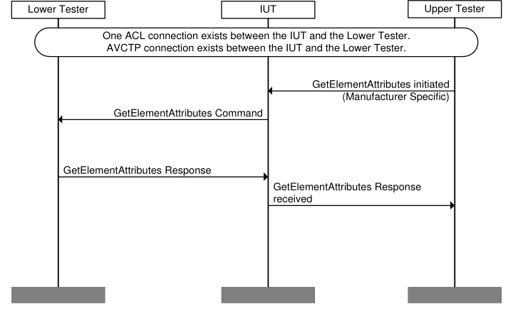

**Figure 4.119: AVRCP/CT/MDI/BV-06-C [CT can retrieve the Metadata for the currently playing track from TG with future SDP version – Get Element Attributes] MSC**

• Expected Outcome
Pass verdict
The IUT is able to successfully retrieve Metadata from the Lower Tester and provide it to the Upper Tester.

#### 4.21.4 Notification commands

Verify the notification commands issued.
AVRCP/CT/NFY/BV-01-C [Register Notification – CT]
• Test Purpose
Verify the Register Notification command issued from the CT.
• Reference
[7] 5.4.2
[5], [8] 6.7.2
• Initial Condition
- One ACL connection exists between the IUT and the test system.
- AVCTP connection exists between the IUT and the test system.
• Test Procedure
Initiated by the Upper Tester, the IUT sends a Register Notification command to the Lower Tester.

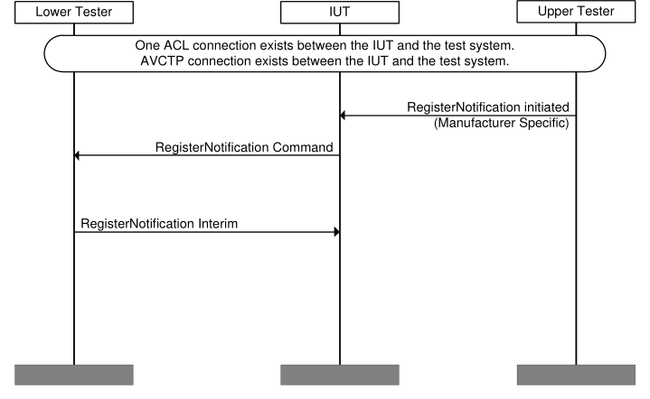

**Figure 4.120: AVRCP/CT/NFY/BV-01-C [Register Notification – CT] MSC**

• Expected Outcome
Pass verdict
The Lower Tester receives the Register Notification command.
AVRCP/TG/NFY/BV-02-C [Register Notification – TG]
• Test Purpose
Verify the Register Notification response issued from the TG.
• Reference
[7] 5.4.2
[5], [8] 6.7.2
• Initial Condition
- One ACL connection exists between the IUT and the test system.
- AVCTP connection exists between the IUT and the test system.
• Test Procedure
The Lower Tester sends a Register Notification command to the IUT with parameters EventID = 0x0002. The Playback Interval parameter is not needed.

**Figure 4.121: AVRCP/TG/NFY/BV-02-C [Register Notification – TG] MSC**

• Expected Outcome
Pass verdict
The IUT returns an INTERIM response with the current status.
After the track change happens, the IUT sends a CHANGED response indicating that the event EVENT_TRACK_CHANGED has been triggered.
• Notes
The event used for the test is EVENT_TRACK_CHANGED (ID 0x02) which is registered with the IUT.
AVRCP/TG/NFY/BV-03-C [Register Notification EVENT_PLAYER_APPLICATION_SETTING _CHANGED – TG]
• Test Purpose
Verify the TG response for a register notification command for EVENT_PLAYER_APPLICATION_SETTING_CHANGED with all player application setting attributes.
• Reference
[7] 5.4.2
[5], [8] 6.7.2
• Initial Condition
- One ACL connection exists between the IUT and the test system.
- AVCTP connection exists between the IUT and the test system.
• Test Procedure
The Lower Tester sends a Register Notification command to the IUT with parameters EventID = 0x08. The Playback Interval parameter is not needed.

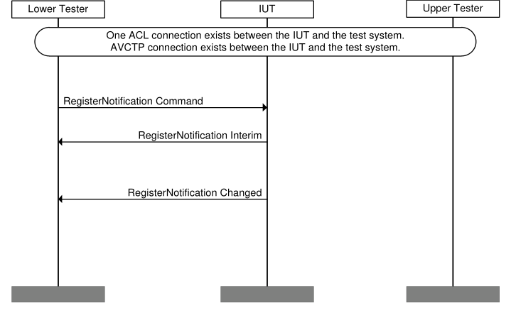

**Figure 4.122: AVRCP/TG/NFY/BV-03-C [Register Notification EVENT_PLAYER_APPLICATION_SETTING _CHANGED – TG] MSC**

• Expected Outcome
Pass verdict
The IUT returns an INTERIM response with the current status.
Following the player application setting changes, the IUT sends a CHANGED response indicating that the event EVENT_PLAYER_APPLICATION_SETTING_CHANGED has been triggered.
The notification response contains all player application setting attributes with their current values.
• Notes
The event used for the test is EVENT_PLAYER_APPLICATION_SETTING_CHANGED (ID 0x08), which is registered with the IUT.
AVRCP/TG/NFY/BV-04-C [Track Changed – No Selected Track – TG]
• Test Purpose
Verify the Track Changed INTERIM response when no track is selected.
• Reference
[7] 5.4.2
[5], [8] 6.7.2
• Initial Condition
- The IUT is active as AVRCP TG role.
- No Track is currently selected on the IUT.
• Test Procedure
The Lower Tester issues a valid RegisterNotification for the EVENT_TRACK_CHANGED.

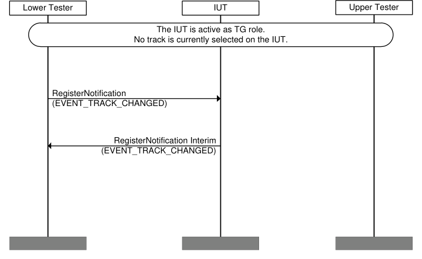

**Figure 4.123: AVRCP/TG/NFY/BV-04-C [Track Changed – No Selected Track – TG] MSC**

• Expected Outcome
Pass verdict
The IUT issues a correctly formatted RegisterNotification Interim Response for the EVENT_TRACK_CHANGED with the Identifier Parameter set to 0xFFFFFFFFFFFFFFFF.
AVRCP/TG/NFY/BV-05-C [Track Changed – Playing Track – TG]
• Test Purpose
Verify the Track Changed INTERIM response when a track is playing.
• Reference
[7] 5.4.2
[5], [8] 6.7.2
• Initial Condition
- The IUT is active as AVRCP v1.3 or later TG role.
- A Track is currently playing on the IUT.
• Test Procedure
The Lower Tester issues a valid RegisterNotification for the EVENT_TRACK_CHANGED.
• Expected Outcome
Pass verdict
The IUT issues a correctly formatted RegisterNotification Interim Response for the EVENT_TRACK_CHANGED with the Identifier Parameter set to 0x0.
• Test Purpose
Verify the Track Changed INTERIM response in the context of the Now Playing list when a track is playing.
• Reference
[5], [8] 6.7.2
• Initial Condition
- The IUT is active as AVRCP v1.4 or later TG role.
- A track is currently playing on the IUT.
• Test Procedure
1. The Lower Tester retrieves the Now Playing list from the IUT with the GetFolderItems
Command/Response in the scope of NowPlaying. 2. The Lower Tester issues a valid RegisterNotification for the EVENT_TRACK_CHANGED.

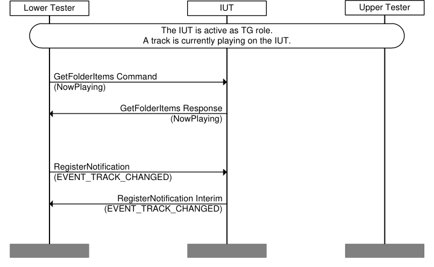

**Figure 4.124: AVRCP/TG/NFY/BV-06-C [Track Changed – Playing Track in NowPlaying – TG] MSC**

• Expected Outcome
Pass verdict
The IUT issues a correctly formatted RegisterNotification Interim Response for the EVENT_TRACK_CHANGED with:
- The Identifier Parameter set to a UID that is listed in the Now Playing list
- That UID being the UID of the track that is currently played
AVRCP/TG/NFY/BV-07-C [Track Changed – Changing Track in NowPlaying – TG]
• Test Purpose
Verify the Track Changed INTERIM response when changing a track in NowPlaying.
• Reference
[5], [8] 6.7.2
• Initial Condition
- The IUT is active as AVRCP v1.4 or later TG role and supports the browsing feature.
- A track is currently playing on the IUT.
- EVENT_TRACK_CHANGED is registered.
• Test Procedure
1. The Lower Tester retrieves the Now Playing list from the IUT with the GetFolderItems
Command/Response in the scope of NowPlaying. 2. The Lower Tester issues a valid RegisterNotification for the EVENT_TRACK_CHANGED. 3. The track is changed. 4. After receiving notification of the track change, the Lower Tester issues a valid
RegisterNotification for the EVENT_TRACK_CHANGED.

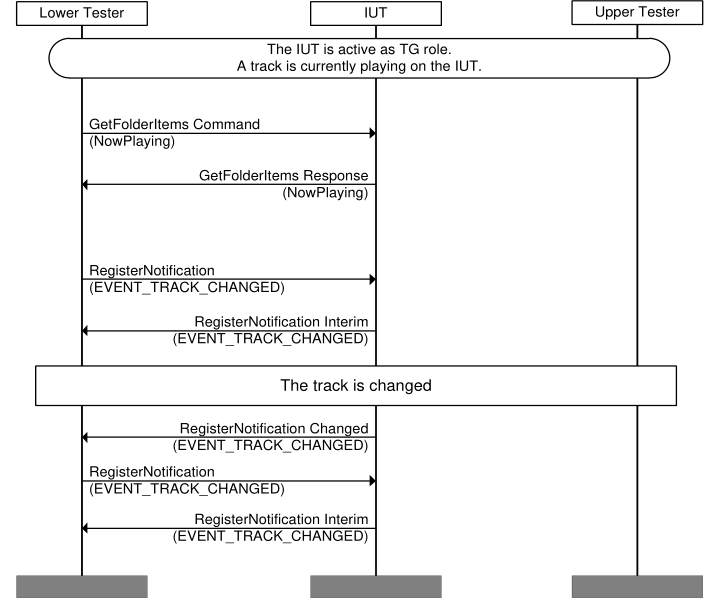

**Figure 4.125: AVRCP/TG/NFY/BV-07-C [Track Changed – Changing Track in NowPlaying – TG] MSC**

• Expected Outcome
Pass verdict
The IUT returns the UID of the track in the Now Playing list that is currently played.
The IUT returns an interim response for each RegisterNotification command received.
The IUT returns the response for the EVENT_TRACK_CHANGED notification.
• Test Purpose
Verify the Track Changed INTERIM response when the track is SELECTED.
• Reference
[7] 5.4.2
[5], [8] 6.7.2
• Initial Condition
- The IUT is active as AVRCP TG role.
- A track is currently SELECTED on the IUT.
• Test Procedure
The Lower Tester issues a valid RegisterNotification for the EVENT_TRACK_CHANGED.
• Expected Outcome
Pass verdict
The IUT issues a correctly formatted RegisterNotification Interim Response for the EVENT_TRACK_CHANGED.
The Identifier Parameter is set to a value other than 0xFFFFFFFF for an IUT that supports AVRCP v1.3.
The Identifier Parameter is set to 0x0 for an IUT that supports AVRCP v1.4 or later.
AVRCP/TG/NFY/BI-01-C [Register for events invalid behavior – TG]
• Test Purpose
Verify that the TG can handle an invalid event ID sent from the CT.
• Reference
[7] 5.4.2
[5], [8] 6.7.2
• Initial Condition
- One ACL connection exists between the IUT and the test system.
- AVCTP connection exists between the IUT and the test system.
• Test Procedure
The Lower Tester sends a Register Notification command to the IUT with parameter EventID = 0xFF. The Playback Interval parameter is not needed.

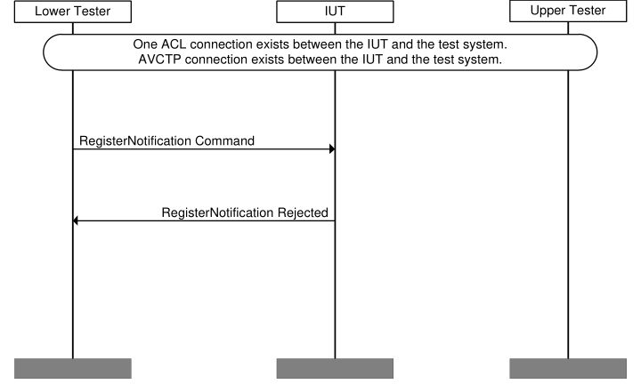

**Figure 4.126: AVRCP/TG/NFY/BI-01-C [Register for events invalid behavior – TG] MSC**

• Expected Outcome
Pass verdict
The IUT returns the error code 0x01 indicating that an invalid parameter has been passed.

#### 4.21.5 Invalid commands

Verify that the TG can handle an invalid PDU ID sent from the CT.
AVRCP/TG/INV/BI-01-C [Invalid PDU ID – TG]
• Test Purpose
Verify that the TG can handle an invalid PDU ID sent from the CT.
• Reference
[7] 5.7
[5], [8] 6.15
• Initial Condition
- One ACL connection exists between the IUT and the Lower Tester.
- The AVCTP connection between the IUT and the Lower Tester is completed.
• Test Procedure
The Lower Tester sends a Metadata Transfer Command to the IUT with a PDU ID = 0xFF and no command parameters.

**Figure 4.127: AVRCP/TG/INV/BI-01-C [Invalid PDU ID – TG] MSC**

• Expected Outcome
Pass verdict
The IUT returns an Error Response with error code 0x00 indicating that the PDU was not understood.
AVRCP/TG/INV/BI-02-C [General Reject – TG]
• Test Purpose
Verify the General Reject response issued by the TG.
• Reference
[5], [8] 6.15.2
• Initial Condition
- One ACL connection exists between the IUT and the Lower Tester.
- AVCTP control and browsing channels are established between the IUT and the Lower Tester.
- The IUT is acting as AVRCP TG role in category 1 or 3.
• Test Procedure
The Lower Tester sends an AVRCP specific Browsing command with an invalid PDU ID and the Browsing channel.

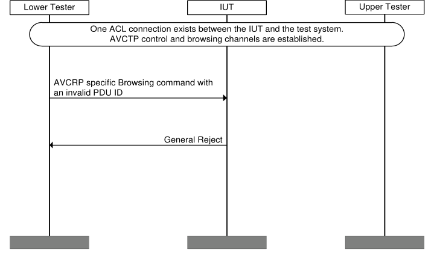

**Figure 4.128: AVRCP/TG/INV/BI-02-C [General Reject – TG] MSC**

• Expected Outcome
Pass verdict
The IUT issues a General Reject response with the error code indicating an invalid command.

#### 4.21.6 Basic Group Navigation commands

Verify that the Basic Group Navigation commands are transferred.

##### 4.21.6.1 Next Group command transfer

• Test Purpose
CT: Verify that the CT can send Next Group commands to the TG.
TG: Verify that the TG reacts to Next Group command from the CT.
• Reference
[7] 5.6.1
[5], [8] 6.14.1
• Initial Condition
- CT: A connection for control is established.
- TG: A connection for control is established. The TG should be ready to react to the command from the CT.
• Test Case Configuration

|  | Test Case |  |
| --- | --- | --- |
| AVRCP/CT/BGN/BV-01-C [Next Group command transfer] |  |  |
| AVRCP/TG/BGN/BV-01-C [Next Group command transfer] |  |  |

Table 4.42: Next Group command transfer test cases
• Test Procedure
CT: Initiate the required user actions (e.g., press button) to perform Next Group function.
TG: No user action is required.
• Expected Outcome
Pass verdict
CT: The Next Group command is sent.
TG: The TG reacts to Next Group command sent from the CT to move to the first song in the next group.

##### 4.21.6.2 Previous Group command transfer

• Test Purpose
CT: Verify that the CT can send Previous Group commands to the TG.
TG: Verify that the TG reacts to Previous Group command from the CT.
• Reference
[7] 5.6.2
[5], [8] 6.14.2
• Initial Condition
- CT: A connection for control is established.
- TG: A connection for control is established. The TG should be ready to react to the command from the CT.
• Test Case Configuration

|  | Test Case |  |
| --- | --- | --- |
| AVRCP/CT/BGN/BV-02-C [Previous Group command transfer] |  |  |
| AVRCP/TG/BGN/BV-02-C [Previous Group command transfer] |  |  |

Table 4.43: Previous Group command transfer test cases
• Test Procedure
CT: Initiate the required user actions (e.g., press button) to perform Previous Group function.
TG: No user action is required.
• Expected Outcome
Pass verdict
CT: The Next Group command is sent.
TG: The TG reacts to Previous Group command sent from the CT to move to the first song in the previous group.

#### 4.21.7 Continuation PDUs commands

AVRCP/CT/RCR/BV-01-C [Request continuing response – CT]
• Test Purpose
Verify that the CT can handle fragmentation correctly.
• Reference
[7] 5.5.1
[5], [8] 6.8.1
• Initial Condition
- One ACL connection exists between the IUT and the test system.
- AVCTP connection exists between the IUT and the test system.
• Test Procedure
1. The IUT sends a Get Element Attributes command to the Lower Tester, which meets the test
condition (see below). 2. The Lower Tester sends a 512-byte response with UTF-8 characters for the attribute string(s),
along with the START indication (0x1) as packet type. 3. The IUT sends a Request Continuing Response command to the Lower Tester. 4. The Lower Tester sends Get Element Attributes response. 5. Repeat Steps 3 and 4, as necessary, until the IUT receives all of the remaining characters from
the Lower Tester. The final Get Element Attributes response is indicated with 0x3 (END) for packet type. Any additional Get Element Attributes responses between the START (0x1) and END (0x3) should have a packet type of CONTINUE (0x2).

| Lower Tester IUT Upper Tester One ACL connection exists between the IUT and the test system. AVCTP connection exists between the IUT and the test system. GetElementAttributes initiated (Manufacturer Specific) GetElementAttributes Command GetElementAttributes 512 bytes Response/continue PDU RequestContinuingResponse Command GetElementAttributes Response |  |
| --- | --- |
|  |  |

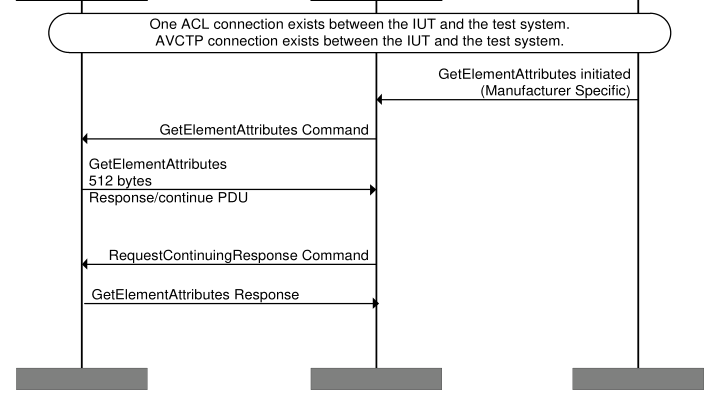

**Figure 4.129: AVRCP/CT/RCR/BV-01-C [Request continuing response – CT] MSC**

• Test Condition
The Lower Tester is configured so a GetElementAttributes command response is larger than the 512- byte limit on AV/C frames but the response is smaller than the Maximum number of accepted AV/C fragments valued specified in the IXIT [6].
• Expected Outcome
Pass verdict
Request(s) for continuing response packets are sent by the IUT, until the entire GetElementAttributes command response has been received via the control channel.
In the event that the lower test exceeds the Maximum number of accepted AV/C fragments value, the CT may send AbortContinuingResponse command before receiving the entire response.
AVRCP/TG/RCR/BV-02-C [Request continuing response – TG]
• Test Purpose
Verify that the TG can handle fragmentation correctly.
• Reference
[7] 5.5.1
[5], [8] 6.8.1
• Initial Condition
- One ACL connection exists between the IUT and the test system.
- AVCTP connection exists between the IUT and the test system.
• Test Procedure
1. The Lower Tester sends a Get Element Attributes command to the IUT, which meets the test
condition (see below). 2. The IUT sends a 512-byte response with UTF-8 characters for the attribute string(s), along with
the START indication (0x1) as packet type.
3. The Lower Tester sends a Request Continuing Response command to the IUT. 4. The IUT sends a Get Element Attributes response with more characters. 5. Repeat Steps 3 and 4, as necessary, until the Lower Tester receives all of the remaining
characters from the IUT. The final Get Element Attributes response is indicated with 0x3 (END) for packet type. Any additional Get Element Attributes responses between the START (0x1) and END (0x3) should have a packet type of CONTINUE (0x2).

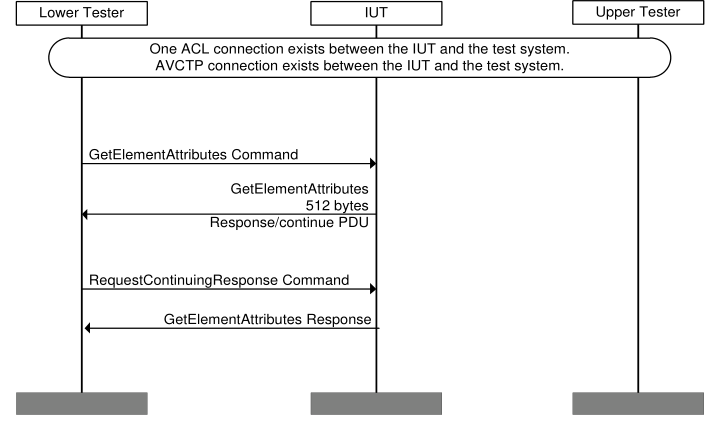

**Figure 4.130: AVRCP/TG/RCR/BV-02-C [Request continuing response – TG] MSC**

• Test Condition
The IUT is configured so a GetElementAttributes command response is larger than the 512-byte limit on AV/C frames.
• Expected Outcome
Pass verdict
For each GetElementAttributes command and continuing response packets sent to the IUT, the IUT responds with a GetElementAtttributes response containing the proper fragmentation indication via the control channel.
AVRCP/CT/RCR/BV-03-C [Abort continuing response – CT]
• Test Purpose
Verify that the CT aborts fragmentation correctly.
• Reference
[7] 5.5.2
[5], [8] 6.8.2
• Initial Condition
- One ACL connection exists between the IUT and the test system.
- AVCTP connection exists between the IUT and the test system.
• Test Procedure
1. The IUT sends a Get Element Attributes command to the Lower Tester, which meets the test
condition (see below). 2. The Lower Tester sends a 512-byte response with UTF-8 characters for the attribute string(s),
along with the START indication (0x1) as packet type. 3. The IUT either sends an Abort-Continuing Response command or a RequestContinuing-
Response command to the Lower Tester. 4. Continuation occurs by the Lower Tester until the IXIT entry Maximum number of accepted AV/C
fragments value [6] has been reached triggering the AbortContinuingResponse command response from the IUT. 5. The Lower Tester sends an AbortContinuingResponse command response.

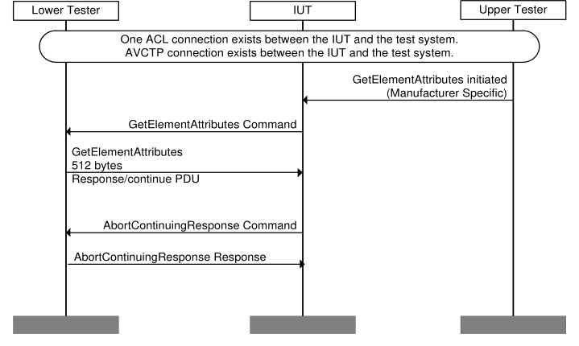

**Figure 4.131: AVRCP/CT/RCR/BV-03-C [Abort continuing response – CT] MSC**

• Test Condition
The Lower Tester is configured so a GetElementAttributes command response is larger than the 512 byte limit on AV/C frames. The Lower Tester has sufficient response to satisfy the Maximum number of accepted AV/C fragments condition so the IUT can send the AbortContinuingResponse.
• Expected Outcome
Pass verdict
An AbortContinuingResponse command is sent by the IUT after the fragmented GetElementAttributes command response(s) are received.
AVRCP/TG/RCR/BV-04-C [Abort continuing response – TG]
• Test Purpose
Verify that the TG can accept abort fragmentation correctly.
• Reference
[7] 5.5.2
[5], [8] 6.8.2
• Initial Condition
- One ACL connection exists between the IUT and the test system.
- AVCTP connection exists between the IUT and the test system.
• Test Procedure
1. The Lower Tester sends a Get Element Attributes command to the IUT, which meets the test
condition (see below). 2. The IUT sends a 512-byte response with UTF-8 characters for the attribute string(s), along with
the START indication (0x1) as packet type. 3. The Lower Tester sends an Abort Continuing Response command to the IUT. 4. The IUT sends an Abort Continuing Response to the Lower Tester.

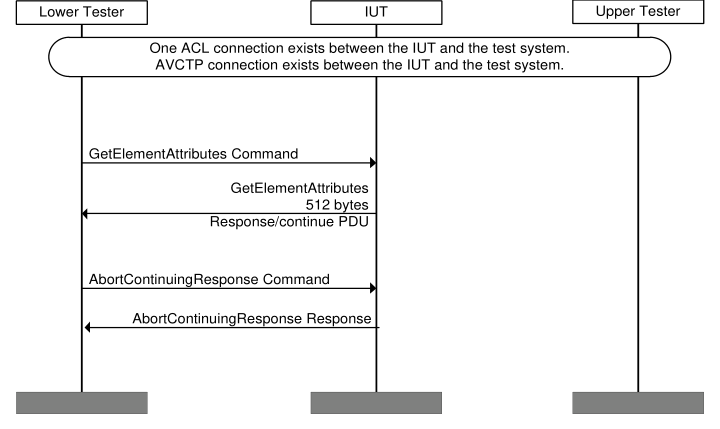

**Figure 4.132: AVRCP/TG/RCR/BV-04-C [Abort continuing response – TG] MSC**

• Test Condition
The IUT is configured so a GetElementAttributes command response will be larger than the 512-byte limit on AV/C frames.
• Expected Outcome
Pass verdict
The IUT does not send any fragmented GetElementAttributes responses via the control channel to the Lower Tester, after an AbortContinuingResponse command is received.

## 5 Test case mapping

The Test Case Mapping Table (TCMT) maps test cases to specific requirements in the ICS. The IUT is tested in all roles for which support is declared in the ICS document.
The columns for the TCMT are defined as follows:
Item: Contains a logical expression based on specific entries from the associated ICS document. Contains a logical expression (using the operators AND, OR, NOT as needed) based on specific entries from the applicable ICS document(s). The entries are in the form of y/x references, where y corresponds to the table number and x corresponds to the feature number as defined in the ICS document for AVRCP [3].
If a test case is mandatory within the respective layer, then the y/x reference is omitted.
Feature: A brief, informal description of the feature being tested.
Test Case(s): The applicable test case identifiers are required for Bluetooth Qualification if the corresponding y/x references defined in the Item column are supported. Further details about the function of the TCMT are elaborated in [4].
For the purpose and structure of the ICS/IXIT, refer to [4].

|  | Item |  |  | Feature |  |  | Test Case(s) |  |
| --- | --- | --- | --- | --- | --- | --- | --- | --- |
| AVRCP 1/1 |  |  | Controller Service Discovery |  |  | AVRCP/CT/SGSIT/SERR/BV-01-C AVRCP/CT/SGSIT/ATTR/BV-01-C AVRCP/CT/SGSIT/ATTR/BV-05-C AVRCP/CT/SGSIT/OFFS/BV-01-C AVRCP/CT/SGSIT/OFFS/BV-02-C AVRCP/CT/CGSIT/SFC/BV-01-C |  |  |
| AVRCP 1/1 AND AVRCP 2b/4 |  |  | Controller SDP attribute: BluetoothProfileDescriptorList – AVRCP v1.5 |  |  | AVRCP/CT/SGSIT/ATTR/BV-03-C |  |  |
| AVRCP 1/1 AND AVRCP 2b/5 |  |  | Controller SDP attribute: BluetoothProfileDescriptorList – AVRCP v1.6 |  |  | AVRCP/CT/SGSIT/ATTR/BV-04-C |  |  |
| AVRCP 2/7 OR AVRCP 2/8 OR AVRCP 2/9 OR AVRCP 2/10 |  |  | PASS THROUGH operation supporting press and release |  |  | AVRCP/CT/PTH/BV-01-C |  |  |
| AVRCP 2/53 |  |  | PASS THROUGH operation supporting press and hold |  |  | AVRCP/CT/PTH/BV-02-C |  |  |
| AVRCP 2/11 |  |  | Get Capabilities |  |  | AVRCP/CT/CFG/BV-01-C |  |  |
| AVRCP 2/12 |  |  | List Player Application Setting Attributes |  |  | AVRCP/CT/PAS/BV-01-C |  |  |
| AVRCP 2/13 |  |  | List Player Application Setting Values |  |  | AVRCP/CT/PAS/BV-05-C |  |  |
| AVRCP 2/14 |  |  | Get Current Player Application Setting Value |  |  | AVRCP/CT/PAS/BV-09-C |  |  |
| AVRCP 2/15 |  |  | Set Player Application Setting Value |  |  | AVRCP/CT/PAS/BV-11-C |  |  |
| AVRCP 2/16 |  |  | Get Player Application Setting Attribute Text |  |  | AVRCP/CT/PAS/BV-03-C |  |  |

|  | Item |  |  | Feature |  |  | Test Case(s) |  |
| --- | --- | --- | --- | --- | --- | --- | --- | --- |
| AVRCP 2/17 |  |  | Get Player Application Setting Value Text |  |  | AVRCP/CT/PAS/BV-07-C |  |  |
| AVRCP 2/20 |  |  | Get Element Attributes |  |  | AVRCP/CT/MDI/BV-03-C |  |  |
| AVRCP 2/21 |  |  | Get Play Status |  |  | AVRCP/CT/MDI/BV-01-C |  |  |
| AVRCP 2/22 OR AVRCP 2/30 OR AVRCP 2/31 OR AVRCP 2/38 OR AVRCP 2/47 |  |  | Register Notification |  |  | AVRCP/CT/NFY/BV-01-C |  |  |
| AVRCP 2/32 |  |  | Connection Establishment for Browsing and Release |  |  | AVRCP/CT/CON/BV-01-C AVRCP/CT/CON/BV-03-C AVRCP/CT/SGSIT/ATTR/BV-02-C |  |  |
| AVRCP 2/28 |  |  | Set Addressed Player |  |  | AVRCP/CT/MPS/BV-01-C |  |  |
| AVRCP 2/33 |  |  | Set Browsed Player |  |  | AVRCP/CT/MPS/BV-03-C |  |  |
| AVRCP 2/29 |  |  | Get Folder Items – Media Player List |  |  | AVRCP/CT/MPS/BV-08-C |  |  |
| AVRCP 2/35 |  |  | Get Folder Items – Media Content |  |  | AVRCP/CT/MCN/CB/BV-01-C |  |  |
| AVRCP 2/34 |  |  | Change Path |  |  | AVRCP/CT/MCN/CB/BV-04-C |  |  |
| AVRCP 2/36 |  |  | Get Item Attributes |  |  | AVRCP/CT/MCN/CB/BV-07-C |  |  |
| AVRCP 2/40 |  |  | Search |  |  | AVRCP/CT/MCN/SRC/BV-01-C |  |  |
| AVRCP 2/41 |  |  | Get Folder Items – Search folder |  |  | AVRCP/CT/MCN/SRC/BV-03-C |  |  |
| AVRCP 2/41 AND AVRCP 2/36 |  |  | Get Item Attributes – Search folder |  |  | AVRCP/CT/MCN/SRC/BV-05-C |  |  |
| AVRCP 2/45 OR AVRCP 2/37 OR AVRCP 2/42 |  |  | Play Item |  |  | AVRCP/CT/MCN/NP/BV-01-C |  |  |
| AVRCP 2/46 |  |  | Add To NowPlaying |  |  | AVRCP/CT/MCN/NP/BV-03-C |  |  |
| AVRCP 2/44 |  |  | Get Folder Items – Now Playing folder |  |  | AVRCP/CT/MCN/NP/BV-05-C |  |  |
| AVRCP 2/44 AND AVRCP 2/36 |  |  | Get Item Attributes – Now Playing folder |  |  | AVRCP/CT/MCN/NP/BV-08-C |  |  |
| AVRCP 2/50 |  |  | Set Absolute Volume |  |  | AVRCP/CT/VLH/BV-01-C AVRCP/CT/VLH/BI-03-C AVRCP/CT/VLH/BI-04-C AVRCP/CT/VLH/BV-05-C AVRCP/CT/VLH/BV-06-C AVRCP/CT/VLH/BV-07-C |  |  |
| AVRCP 2/51 |  |  | Notify Volume Change |  |  | AVRCP/CT/VLH/BV-03-C |  |  |
| AVRCP 2/23 |  |  | Request Continuing Response |  |  | AVRCP/CT/RCR/BV-01-C |  |  |
| AVRCP 2/24 |  |  | Abort Continuing Response |  |  | AVRCP/CT/RCR/BV-03-C |  |  |
| AVRCP 2/29b |  |  | GetTotalNumberOfItems (MediaPlayerList) |  |  | AVRCP/CT/MPS/BV-11-C |  |  |
| AVRCP 2/35b |  |  | GetTotalNumberOfItems (MediaPlayerVirtual Filesystem) |  |  | AVRCP/CT/MCN/CB/BV-12-C |  |  |
| AVRCP 2/41b AND AVRCP 2/40 |  |  | GetTotalNumberOfItems (Search) |  |  | AVRCP/CT/MCN/SRC/BV-07-C |  |  |

|  | Item |  |  | Feature |  |  | Test Case(s) |  |
| --- | --- | --- | --- | --- | --- | --- | --- | --- |
| AVRCP 2/44b |  |  | GetTotalNumberOfItems (NowPlayingList) |  |  | AVRCP/CT/MCN/NP/BV-10-C |  |  |
| AVRCP 2/54 AND AVRCP 2/35 |  |  | Use GetFolderItems to request the Cover Art attribute |  |  | AVRCP/CT/CA/BV-01-C |  |  |
| AVRCP 2/54 AND AVRCP 2/36 |  |  | Use GetItemAttributes to request the CoverArt attribute |  |  | AVRCP/CT/CA/BV-03-C |  |  |
| AVRCP 2/54 AND AVRCP 2/20 |  |  | Use GetElementAttributes to request the Cover Art attribute |  |  | AVRCP/CT/CA/BV-05-C |  |  |
| AVRCP 2/54 AND AVRCP 2/55 AND AVRCP 2/56 AND (AVRCP 2/20 OR AVRCP 2/35 OR AVRCP 2/36) |  |  | Use an imaging property object |  |  | AVRCP/CT/CA/BV-07-C |  |  |
| AVRCP 2/54 AND AVRCP 2/56 AND (AVRCP 2/20 OR AVRCP 2/35 OR AVRCP 2/36) |  |  | Use GetImage with descriptor thumbnail |  |  | AVRCP/CT/CA/BV-09-C |  |  |
| AVRCP 2/54 AND AVRCP 2/57 AND (AVRCP 2/20 OR AVRCP 2/35 OR AVRCP 2/36) |  |  | Pull a thumbnail using GetLinkedThumbnail |  |  | AVRCP/CT/CA/BV-11-C |  |  |
| AVRCP 2/54 AND AVRCP 2/56 AND (AVRCP 2/20 OR AVRCP 2/35 OR AVRCP 2/36) |  |  | Pull a native image |  |  | AVRCP/CT/CA/BV-13-C |  |  |
| AVRCP 2/54 |  |  | Retrieve Cover Art SDP record to determine PSM |  |  | AVRCP/CT/CA/BV-15-C |  |  |
| AVRCP 2/54 AND AVRCP 2/38 AND (AVRCP 2/35 OR AVRCP 2/36) |  |  | UIDs changed during Cover Art |  |  | AVRCP/CT/CA/BV-17-C |  |  |
| AVRCP 2/54 AND (AVRCP 2/35 OR AVRCP 2/36) |  |  | When IUT changes folder on a database unaware player, OBEX is disconnected |  |  | AVRCP/CT/CA/BV-18-C |  |  |
| AVRCP 2/29 |  |  | Listing of Available Media Players |  |  | AVRCP/CT/MPS/BV-04-C |  |  |
| AVRCP 2/28 |  |  | Availability of Media Players |  |  | AVRCP/CT/MPS/BV-05-C AVRCP/CT/MPS/BV-06-C |  |  |
| AVRCP 2/35 |  |  | Browsing of the Current Folder |  |  | AVRCP/CT/MCN/CB/BV-08-C |  |  |
| AVRCP 2/34 |  |  | Browsing Up |  |  | AVRCP/CT/MCN/CB/BV-02-C |  |  |
| AVRCP 2/34 |  |  | Browsing Down |  |  | AVRCP/CT/MCN/CB/BV-03-C |  |  |
| AVRCP 2/37 |  |  | Playing of a track from the Virtual Media Player Filesystem |  |  | AVRCP/CT/MCN/CB/BV-10-C |  |  |
| AVRCP 2/32 |  |  | Awareness of change in Media Database |  |  | AVRCP/CT/MCN/CB/BV-05-C |  |  |

|  | Item |  |  | Feature |  |  | Test Case(s) |  |
| --- | --- | --- | --- | --- | --- | --- | --- | --- |
| AVRCP 2/35 OR AVRCP 2/36 |  |  | Metadata from Virtual Filesystem |  |  | AVRCP/CT/MCN/CB/BV-06-C |  |  |
| AVRCP 2/35 OR AVRCP 2/36 |  |  | CT can retrieve the Metadata Virtual Filesystem from TG with future SDP version |  |  | AVRCP/CT/MCN/CB/BV-09-C |  |  |
| AVRCP 2/40 |  |  | Search request |  |  | AVRCP/CT/MCN/SRC/BV-08-C |  |  |
| AVRCP 2/41 |  |  | Browsing of the Search results |  |  | AVRCP/CT/MCN/SRC/BV-09-C |  |  |
| AVRCP 2/42 |  |  | Play from Search results |  |  | AVRCP/CT/MCN/SRC/BV-10-C |  |  |
| AVRCP 2/41 AND AVRCP 2/36 |  |  | Metadata from Search results |  |  | AVRCP/CT/MCN/SRC/BV-11-C |  |  |
| AVRCP 2/45 |  |  | Playing of a track from the Now Playing folder |  |  | AVRCP/CT/MCN/NP/BV-11-C |  |  |
| AVRCP 2/46 |  |  | Adding a track to Now Playing list |  |  | AVRCP/CT/MCN/NP/BV-12-C |  |  |
| AVRCP 2/46 AND AVRCP 2/40 |  |  | Adding a Search result track to Now Playing list |  |  | AVRCP/CT/MCN/NP/BV-13-C |  |  |
| AVRCP 2/47 |  |  | Local change of Now Playing list on TG |  |  | AVRCP/CT/MCN/NP/BV-14-C |  |  |
| AVRCP 2/44 AND AVRCP 2/36 |  |  | Metadata from Now PlayingList |  |  | AVRCP/CT/MCN/NP/BV-15-C |  |  |
| AVRCP 2/44 |  |  | Browsing the Now Playing folder |  |  | AVRCP/CT/MCN/NP/BV-16-C |  |  |
| AVRCP 2/51 |  |  | Monitoring the CT Volume on the TG |  |  | AVRCP/CT/VLH/BV-04-C |  |  |
| AVRCP 2/48 |  |  | Playable Folder |  |  | AVRCP/CT/MCN/NP/BV-17-C |  |  |
| AVRCP 2/25 |  |  | Next Group |  |  | AVRCP/CT/BGN/BV-01-C |  |  |
| AVRCP 2/26 |  |  | Previous Group |  |  | AVRCP/CT/BGN/BV-02-C |  |  |
| AVRCP 2/53 |  |  | PASS THROUGH operations supporting press and hold |  |  | AVRCP/CT/PTT/BV-05-C |  |  |
| AVRCP 2/54 AND AVRCP 2/32 |  |  | Retrieval of multiple Cover Art images Retrieval of Cover Art image for the currently playing track |  |  | AVRCP/CT/CA/BV-04-C AVRCP/CT/CA/BV-02-C |  |  |
| AVRCP 2/54 |  |  | Retrieval of Cover Art image for the currently playing track without browsing |  |  | AVRCP/CT/CA/BV-06-C |  |  |
| AVRCP 2/1 |  |  | Initiating connection establishment for control/ Accepting connection establishment for control initiated by CT |  |  | AVRCP/CT/CEC/BV-01-C |  |  |
| AVRCP 2/2 |  |  | Accepting connection establishment for control initiated by TG/Initiating connection establishment for control |  |  | AVRCP/CT/CEC/BV-02-C |  |  |
| AVRCP 2/3 |  |  | Initiating connection release for control/Accepting connection release for control initiated by CT |  |  | AVRCP/CT/CRC/BV-01-C |  |  |
| AVRCP 2/4 |  |  | Accepting connection release for control initiated by TG/Initiating connection release for control |  |  | AVRCP/CT/CRC/BV-02-C |  |  |
| AVRCP 2/5 |  |  | Sending/Receiving UNIT INFO command |  |  | AVRCP/CT/ICC/BV-01-C |  |  |

|  | Item |  |  | Feature |  |  | Test Case(s) |  |
| --- | --- | --- | --- | --- | --- | --- | --- | --- |
| AVRCP 2/6 |  |  | Sending/Receiving SUBUNIT INFO command |  |  | AVRCP/CT/ICC/BV-02-C |  |  |
| AVRCP 2/7 |  |  | Sending/receiving PASS THROUGH command in category 1 |  |  | AVRCP/CT/PTT/BV-01-C |  |  |
| AVRCP 2/8 |  |  | Sending/receiving PASS THROUGH command in category 2 |  |  | AVRCP/CT/PTT/BV-02-C |  |  |
| AVRCP 2/9 |  |  | Sending/receiving PASS THROUGH command in category 3 |  |  | AVRCP/CT/PTT/BV-03-C |  |  |
| AVRCP 2/10 |  |  | Sending/receiving PASS THROUGH command in category 4 |  |  | AVRCP/CT/PTT/BV-04-C |  |  |

Table 5.1: Test case mapping for CT

|  | Item |  |  | Feature |  |  | Test Case(s) |  |
| --- | --- | --- | --- | --- | --- | --- | --- | --- |
| AVRCP 1/2 |  |  | Target Service Discovery |  |  | AVRCP/TG/SGSIT/SERR/BV-01-C AVRCP/TG/SGSIT/ATTR/BV-01-C AVRCP/TG/SGSIT/ATTR/BV-06-C AVRCP/TG/SGSIT/OFFS/BV-03-C AVRCP/TG/SGSIT/OFFS/BV-04-C |  |  |
| AVRCP 1/2 AND AVRCP 7/1 |  |  | Successful Connection with future SDP Record value – AVRCP Target |  |  | AVRCP/TG/CGSIT/SFC/BV-02-C |  |  |
| AVRCP 1/2 AND AVRCP 7b/4 |  |  | Controller SDP attribute: BluetoothProfileDescriptorList – AVRCP v1.5 |  |  | AVRCP/TG/SGSIT/ATTR/BV-04-C |  |  |
| AVRCP 1/2 AND AVRCP 7b/5 |  |  | Controller SDP attribute: BluetoothProfileDescriptorList – AVRCP v1.6 |  |  | AVRCP/TG/SGSIT/ATTR/BV-05-C |  |  |
| AVRCP 7/11 |  |  | Get Capabilities Response |  |  | AVRCP/TG/CFG/BV-02-C AVRCP/TG/CFG/BI-01-C |  |  |
| AVRCP 7/12 |  |  | List Player Application Settings Attributes Response |  |  | AVRCP/TG/PAS/BV-02-C |  |  |
| AVRCP 7/13 |  |  | List Player Application Setting Values Response |  |  | AVRCP/TG/PAS/BV-06-C AVRCP/TG/PAS/BI-02-C |  |  |
| AVRCP 7/14 |  |  | Get Current Player Application Settings Value Response |  |  | AVRCP/TG/PAS/BV-10-C AVRCP/TG/PAS/BI-04-C |  |  |
| AVRCP 7/15 |  |  | Set Player Application Setting Value Response |  |  | AVRCP/TG/PAS/BI-05-C |  |  |
| AVRCP 7/16 |  |  | Get Player Application Setting Attribute Text Response |  |  | AVRCP/TG/PAS/BV-04-C AVRCP/TG/PAS/BI-01-C |  |  |
| AVRCP 7/17 |  |  | Get Player Application Setting Value Text Response |  |  | AVRCP/TG/PAS/BV-08-C AVRCP/TG/PAS/BI-03-C |  |  |
| AVRCP 7/20 |  |  | Get Element Attributes Response |  |  | AVRCP/TG/MDI/BV-04-C AVRCP/TG/MDI/BV-05-C AVRCP/TG/INV/BI-01-C |  |  |
| AVRCP 7/21 |  |  | Get Play Status Response |  |  | AVRCP/TG/MDI/BV-02-C |  |  |
| AVRCP 2/20 AND NOT AVRCP 2/32 |  |  | Retrieve Metadata when TG supports a future version |  |  | AVRCP/CT/MDI/BV-06-C |  |  |

|  | Item |  |  | Feature |  |  | Test Case(s) |  |
| --- | --- | --- | --- | --- | --- | --- | --- | --- |
| AVRCP 7/22 |  |  | Register Notification Response |  |  | AVRCP/TG/NFY/BI-01-C |  |  |
| AVRCP 7/22 AND AVRCP 7/20 |  |  | Register Notification Response – Media Attributes for Current Media Item |  |  | AVRCP/TG/NFY/BV-02-C |  |  |
| AVRCP 7/30 |  |  | Register Notification event |  |  | AVRCP/TG/NFY/BV-03-C |  |  |
| AVRCP 7/24 |  |  | Track Changed – No Playing Track |  |  | AVRCP/TG/NFY/BV-04-C |  |  |
| AVRCP 7/24 AND NOT AVRCP 7/54 |  |  | Track Changed – Playing or Selected Track |  |  | AVRCP/TG/NFY/BV-05-C AVRCP/TG/NFY/BV-08-C |  |  |
| AVRCP 7/24 AND AVRCP 7/54 |  |  | Playing and Changing Track in NowPlaying |  |  | AVRCP/TG/NFY/BV-06-C AVRCP/TG/NFY/BV-07-C |  |  |
| AVRCP 7/31 |  |  | Request Continuing Response |  |  | AVRCP/TG/RCR/BV-02-C |  |  |
| AVRCP 7/32 |  |  | Abort Continuing Response |  |  | AVRCP/TG/RCR/BV-04-C |  |  |
| AVRCP 7/1 AND AVRCP 7/42 AND AVRCP 7/42a |  |  | Connection Establishment for Browsing |  |  | AVRCP/TG/CON/BV-02-C |  |  |
| AVRCP 7/1 AND AVRCP 7/42 |  |  | Connection Establishment for Browsing |  |  | AVRCP/TG/CON/BV-05-C |  |  |
| AVRCP 7/42 |  |  | Connection Release for Browsing |  |  | AVRCP/TG/CON/BV-04-C AVRCP/TG/SGSIT/ATTR/BV-02-C |  |  |
| AVRCP 7/37 |  |  | Set Addressed Player |  |  | AVRCP/TG/MPS/BV-02-C AVRCP/TG/MPS/BI-01-C |  |  |
| AVRCP 7/43 |  |  | Set Browsed Player |  |  | AVRCP/TG/MPS/BV-04-C AVRCP/TG/MPS/BI-02-C |  |  |
| AVRCP 7/40 AND AVRCP 7/41 |  |  | Addressed Player Changed Notification |  |  | AVRCP/TG/MPS/BV-05-C |  |  |
| AVRCP 7/38 |  |  | Media Player Item – Player Feature Bitmask |  |  | AVRCP/TG/MPS/BV-06-C |  |  |
| AVRCP 7/39 AND AVRCP 7/41 |  |  | Available Players Changed Notification |  |  | AVRCP/TG/MPS/BV-07-C |  |  |
| AVRCP 7/38 |  |  | Get Folder Items – Media Player List |  |  | AVRCP/TG/MPS/BV-09-C |  |  |
| AVRCP 7/41 |  |  | Default Player |  |  | AVRCP/TG/MPS/BV-10-C |  |  |
| AVRCP 7/45 |  |  | Get Folder Items – Media Content |  |  | AVRCP/TG/MCN/CB/BV-02-C |  |  |
| AVRCP 7/45 AND AVRCP 7/41 |  |  | Get Folder Items – Media Content |  |  | AVRCP/TG/MCN/CB/BV-03-C |  |  |
| AVRCP 7/44 |  |  | Change Path |  |  | AVRCP/TG/MCN/CB/BV-05-C AVRCP/TG/MCN/CB/BI-04-C AVRCP/TG/MCN/CB/BV-06-C |  |  |
| AVRCP 7/45 |  |  | Get Folder Items- TG |  |  | AVRCP/TG/MCN/CB/BI-01-C |  |  |
| AVRCP 7/44 |  |  | Get Folder Items -TG |  |  | AVRCP/TG/MCN/CB/BI-02-C |  |  |
| AVRCP 7/42 |  |  | Get Folder Items -TG |  |  | AVRCP/TG/MCN/CB/BI-03-C |  |  |
| AVRCP 7/46 |  |  | Get Item Attributes – Media Content |  |  | AVRCP/TG/MCN/CB/BV-08-C |  |  |
| AVRCP 7/42 AND AVRCP 7/48 |  |  | Invalid UID counter |  |  | AVRCP/TG/MCN/CB/BI-05-C |  |  |

|  | Item |  |  | Feature |  |  | Test Case(s) |  |
| --- | --- | --- | --- | --- | --- | --- | --- | --- |
| AVRCP 7/42 AND AVRCP 7/48 AND NOT AVRCP 7/49 |  |  | Database Unaware Players |  |  | AVRCP/TG/MCN/CB/BV-09-C |  |  |
| AVRCP 7/41 AND AVRCP 7/43 AND NOT AVRCP 7/43a |  |  | Reject Browsing of a non-addressed Player |  |  | AVRCP/TG/MCN/CB/BI-08-C |  |  |
| AVRCP 7/42 AND AVRCP 7/49 AND AVRCP 7/48 |  |  | Database Aware Players |  |  | AVRCP/TG/MCN/CB/BV-10-C AVRCP/TG/MCN/CB/BV-11-C |  |  |
| AVRCP 7/51 |  |  | Search |  |  | AVRCP/TG/MCN/SRC/BV-02-C |  |  |
| AVRCP 7/52 |  |  | Get Folder Items – Search folder |  |  | AVRCP/TG/MCN/SRC/BV-04-C |  |  |
| AVRCP 7/52 AND AVRCP 7/46 |  |  | Get Item Attributes – Search folder |  |  | AVRCP/TG/MCN/SRC/BV-06-C |  |  |
| AVRCP 7/56 OR AVRCP 7/47 OR AVRCP 7/53 |  |  | Play Item |  |  | AVRCP/TG/MCN/NP/BV-02-C AVRCP/TG/MCN/NP/BI-01-C |  |  |
| AVRCP 7/57 |  |  | Add To NowPlaying |  |  | AVRCP/TG/MCN/NP/BV-04-C AVRCP/TG/MCN/NP/BI-02-C |  |  |
| AVRCP 7/55 |  |  | Get Folder Items – Now Playing folder |  |  | AVRCP/TG/MCN/NP/BV-06-C |  |  |
| AVRCP 7/58 |  |  | NowPlaying Content Changed Notification |  |  | AVRCP/TG/MCN/NP/BV-07-C |  |  |
| AVRCP 7/55 AND AVRCP 7/46 |  |  | Get Item Attributes – Now Playing folder |  |  | AVRCP/TG/MCN/NP/BV-09-C |  |  |
| AVRCP 7/61 |  |  | Set Absolute Volume |  |  | AVRCP/TG/VLH/BV-02-C AVRCP/TG/VLH/BI-01-C AVRCP/TG/VLH/BI-02-C |  |  |
| AVRCP 7/62 |  |  | Notify Volume Change |  |  | AVRCP/TG/VLH/BV-04-C |  |  |
| AVRCP 7/64 |  |  | General Reject |  |  | AVRCP/TG/INV/BI-02-C |  |  |
| AVRCP 7/38b |  |  | GetTotalNumberOfItems (MediaPlayerList) |  |  | AVRCP/TG/MPS/BV-12-C |  |  |
| AVRCP 7/45b |  |  | GetTotalNumberOfItems (MediaPlayerVirtual Filesystem) |  |  | AVRCP/TG/MCN/CB/BV-13-C |  |  |
| AVRCP 7/52b AND AVRCP 7/43 |  |  | GetTotalNumberOfItems (Search) |  |  | AVRCP/TG/MCN/SRC/BV-08-C |  |  |
| AVRCP 7/55b |  |  | GetTotalNumberOfItems (NowPlaying) |  |  | AVRCP/TG/MCN/NP/BV-11-C |  |  |
| AVRCP 7/67 AND AVRCP 7/45 |  |  | Use GetFolderItems to request the Cover Art attribute |  |  | AVRCP/TG/CA/BV-02-C AVRCP/TG/CA/BI-08-C |  |  |
| AVRCP 7/67 AND AVRCP 7/46 |  |  | Use GetItemAttributes to request the Cover Art attribute |  |  | AVRCP/TG/CA/BV-04-C AVRCP/TG/CA/BI-09-C |  |  |
| AVRCP 7/67 AND AVRCP 7/20 |  |  | Use GetElementAttributes to request the Cover Art attribute |  |  | AVRCP/TG/CA/BV-06-C AVRCP/TG/CA/BI-10-C |  |  |
| AVRCP 7/67 |  |  | Cover Art SDP record |  |  | AVRCP/TG/CA/BV-16-C |  |  |
| AVRCP 7/67 AND AVRCP 7/45 |  |  | Retrieval of Cover Art attribute with no OBEX connection |  |  | AVRCP/TG/CA/BI-01-C |  |  |

|  | Item |  |  | Feature |  |  | Test Case(s) |  |
| --- | --- | --- | --- | --- | --- | --- | --- | --- |
| AVRCP 7/67 AND AVRCP 7/46 |  |  | Retrieval of Cover Art attribute with no OBEX connection using GetItemAttributes |  |  | AVRCP/TG/CA/BI-04-C |  |  |
| AVRCP 7/67 AND AVRCP 7/20 |  |  | Retrieval of Cover Art attribute with no OBEX connection using GetElementAttributes |  |  | AVRCP/TG/CA/BI-05-C |  |  |
| AVRCP 7/67 AND AVRCP 7/46 |  |  | Request of Unsupported Image Type |  |  | AVRCP/TG/CA/BI-06-C |  |  |
| AVRCP 7/20 AND AVRCP 7/67 |  |  | Request of Unsupported Image Type without browsing |  |  | AVRCP/TG/CA/BI-07-C |  |  |
| (AVRCP 7/20 OR AVRCP 7/42) AND AVRCP 7/67 |  |  | Use an imaging property object |  |  | AVRCP/TG/CA/BV-08-C |  |  |
| (AVRCP 7/20 OR AVRCP 7/42) AND AVRCP 7/67 |  |  | Use GetImage with descriptor thumbnail |  |  | AVRCP/TG/CA/BV-10-C |  |  |
| (AVRCP 7/20 OR AVRCP 7/42) AND AVRCP 7/67 |  |  | Pull a thumbnail using GetLinkedThumbnail |  |  | AVRCP/TG/CA/BV-12-C |  |  |
| (AVRCP 7/20 OR AVRCP 7/42) AND AVRCP 7/67 |  |  | Pull a native image |  |  | AVRCP/TG/CA/BV-14-C |  |  |
| AVRCP 7/38 |  |  | Listing of Available Media Players |  |  | AVRCP/TG/MPS/BV-01-C |  |  |
| AVRCP 7/37 |  |  | Availability of Media Players |  |  | AVRCP/TG/MPS/BV-08-C AVRCP/TG/MPS/BV-03-C |  |  |
| AVRCP 7/45 |  |  | Browsing of the Current Folder |  |  | AVRCP/TG/MCN/CB/BV-01-C |  |  |
| AVRCP 7/44 |  |  | Browsing Up |  |  | AVRCP/TG/MCN/CB/BV-14-C |  |  |
| AVRCP 7/44 |  |  | Browsing Down |  |  | AVRCP/TG/MCN/CB/BV-15-C |  |  |
| AVRCP 7/47 |  |  | Playing of a track from the Virtual Media Player Filesystem |  |  | AVRCP/TG/MCN/CB/BV-04-C |  |  |
| AVRCP 7/49 |  |  | Awareness of change in Media Database |  |  | AVRCP/TG/MCN/CB/BV-16-C |  |  |
| AVRCP 7/45 OR AVRCP 7/46 |  |  | Metadata from Virtual Filesystem |  |  | AVRCP/TG/MCN/CB/BV-17-C |  |  |
| AVRCP 7/45 AND AVRCP 7/41 AND AVRCP 7/43a |  |  | Browsing of a Folder if the Player is not the Addressed Player |  |  | AVRCP/TG/MCN/CB/BV-07-C |  |  |
| AVRCP 7/51 |  |  | Search request |  |  | AVRCP/TG/MCN/SRC/BV-01-C |  |  |
| AVRCP 7/52 |  |  | Browsing of the Search results |  |  | AVRCP/TG/MCN/SRC/BV-05-C |  |  |
| AVRCP 7/53 |  |  | Play from Search results |  |  | AVRCP/TG/MCN/SRC/BV-03-C |  |  |
| AVRCP 7/52 AND AVRCP 7/46 |  |  | Metadata from Search results |  |  | AVRCP/TG/MCN/SRC/BV-07-C |  |  |
| AVRCP 7/56 |  |  | Playing of a track from the Now Playing folder |  |  | AVRCP/TG/MCN/NP/BV-01-C |  |  |
| AVRCP 7/57 |  |  | Adding a track to Now Playing list |  |  | AVRCP/TG/MCN/NP/BV-08-C |  |  |
| AVRCP 7/57 AND AVRCP 7/51 |  |  | Adding a Search result track to Now Playing list |  |  | AVRCP/TG/MCN/NP/BV-03-C |  |  |

|  | Item |  |  | Feature |  |  | Test Case(s) |  |
| --- | --- | --- | --- | --- | --- | --- | --- | --- |
| AVRCP 7/58 |  |  | Local change of Now Playing list on TG |  |  | AVRCP/TG/MCN/NP/BV-10-C |  |  |
| AVRCP 7/55 AND AVRCP 7/46 |  |  | Metadata from NowPlayingList |  |  | AVRCP/TG/MCN/NP/BV-05-C |  |  |
| AVRCP 7/55 |  |  | Browsing the Now Playing folder |  |  | AVRCP/TG/MCN/NP/BV-12-C |  |  |
| AVRCP 7/62 |  |  | Monitoring the CT Volume on the TG |  |  | AVRCP/TG/VLH/BV-01-C |  |  |
| AVRCP 7/61 |  |  | Changing the Volume |  |  | AVRCP/TG/VLH/BV-03-C |  |  |
| AVRCP 7/59 |  |  | Playable Folder |  |  | AVRCP/TG/MCN/NP/BV-13-C |  |  |
| AVRCP 7/34 |  |  | Next Group |  |  | AVRCP/TG/BGN/BV-01-C |  |  |
| AVRCP 7/35 |  |  | Previous Group |  |  | AVRCP/TG/BGN/BV-02-C |  |  |
| AVRCP 7/66 |  |  | PASS THROUGH operations supporting press and hold |  |  | AVRCP/TG/PTT/BV-05-C |  |  |
| AVRCP 7/67 AND AVRCP 7/42 |  |  | Retrieval of multiple Cover Art images Retrieval of Cover Art image for the currently playing track |  |  | AVRCP/TG/CA/BV-01-C AVRCP/TG/CA/BV-05-C |  |  |
| AVRCP 7/67 |  |  | Retrieval of Cover Art image for the currently playing track without browsing |  |  | AVRCP/TG/CA/BV-03-C AVRCP/TG/SGSIT/ATTR/BV-03-C |  |  |
| AVRCP 7/2 |  |  | Initiating connection establishment for control/ Accepting connection establishment for control initiated by CT |  |  | AVRCP/TG/CEC/BV-01-C |  |  |
| AVRCP 7/1 |  |  | Accepting connection establishment for control initiated by TG/Initiating connection establishment for control |  |  | AVRCP/TG/CEC/BV-02-C |  |  |
| AVRCP 7/4 |  |  | Initiating connection release for control/Accepting connection release for control initiated by CT |  |  | AVRCP/TG/CRC/BV-01-C |  |  |
| AVRCP 7/3 |  |  | Accepting connection release for control initiated by TG/Initiating connection release for control |  |  | AVRCP/TG/CRC/BV-02-C |  |  |
| AVRCP 7/5 |  |  | Sending/Receiving UNIT INFO command |  |  | AVRCP/TG/ICC/BV-01-C |  |  |
| AVRCP 7/6 |  |  | Sending/Receiving SUBUNIT INFO command |  |  | AVRCP/TG/ICC/BV-02-C |  |  |
| AVRCP 7/7 |  |  | Sending/receiving PASS THROUGH command in category 1 |  |  | AVRCP/TG/PTT/BV-01-C |  |  |
| AVRCP 7/8 |  |  | Sending/receiving PASS THROUGH command in category 2 |  |  | AVRCP/TG/PTT/BV-02-C |  |  |
| AVRCP 7/9 |  |  | Sending/receiving PASS THROUGH command in category 3 |  |  | AVRCP/TG/PTT/BV-03-C |  |  |
| AVRCP 7/10 |  |  | Sending/receiving PASS THROUGH command in category 4 |  |  | AVRCP/TG/PTT/BV-04-C |  |  |

Table 5.2: Test case mapping for TG

## 6 Appendix A – Operation_id list tables

### 6.1 Operation_id of Category 1

|  | operation id _ |  |  | Expected operation to be performed by the TG |  |
| --- | --- | --- | --- | --- | --- |
| 0 |  |  | Input a numerical value. |  |  |
| 1 |  |  | Input a numerical value. |  |  |
| 2 |  |  | Input a numerical value. |  |  |
| 3 |  |  | Input a numerical value. |  |  |
| 4 |  |  | Input a numerical value. |  |  |
| 5 |  |  | Input a numerical value. |  |  |
| 6 |  |  | Input a numerical value. |  |  |
| 7 |  |  | Input a numerical value. |  |  |
| 8 |  |  | Input a numerical value. |  |  |
| 9 |  |  | Input a numerical value. |  |  |
| angle |  |  | Switches the scene of the contents, if it has multi angle contents. |  |  |
| backward |  |  | Switches the contents, such as music tune, or video chapter, which can be reproduced with “play” operation, to the backward one. The 'backward' means past direction in time, minus direction in number, and up direction in a list. |  |  |
| clear |  |  | Cancel the entered numerical value. |  |  |
| display information |  |  | Displays the information about current contents. For example, this command may be used to display the channel number, broadcaster and broadcast time, or recorded date and time code. |  |  |
| dot |  |  | Used with 0–9 to input numerical value such as a sub channel in US. |  |  |
| eject |  |  | Ejects the medium from the device, and may close the door for loading the medium alternatively. |  |  |
| enter |  |  | Fix the entered numerical value. |  |  |
| fast forward |  |  | Moves the position away from the beginning of the medium. |  |  |
| forward |  |  | Switches the contents, such as music tune, or video chapter, which can be reproduced with “play” operation, to the forward one. The 'forward' means future direction in time, plus direction in number, and down direction in a list. |  |  |
| help |  |  | Displays help instructions. |  |  |
| input select |  |  | Used to switch the input signal. |  |  |
| pause |  |  | Stops playing back the content, and may resume playing it back alternatively. |  |  |
| play |  |  | Starts playing back the specified content at normal speed. |  |  |
| power |  |  | Controls the power state of the device alternatively. This command may support to turn the device off only. |  |  |
| record |  |  | Records the specified stream or content to the specified medium. |  |  |
| rewind |  |  | Moves the position toward the beginning of the medium. |  |  |
| sound select |  |  | Used to switch the sound such as multiple language selection. |  |  |

|  | operation id _ |  |  | Expected operation to be performed by the TG |  |
| --- | --- | --- | --- | --- | --- |
| stop |  |  | Stops playing back the content. |  |  |
| subpicture |  |  | Switches or rotates the sub pictures, if it has some sub pictures data. |  |  |

Table 6.1: Operation_id List – Category 1

### 6.2 Operation_id of Category 2

|  | operation id _ |  |  | Expected operation to be performed by the TG |  |
| --- | --- | --- | --- | --- | --- |
| 0 |  |  | Input a numerical value. |  |  |
| 1 |  |  | Input a numerical value. |  |  |
| 2 |  |  | Input a numerical value. |  |  |
| 3 |  |  | Input a numerical value. |  |  |
| 4 |  |  | Input a numerical value. |  |  |
| 5 |  |  | Input a numerical value. |  |  |
| 6 |  |  | Input a numerical value. |  |  |
| 7 |  |  | Input a numerical value. |  |  |
| 8 |  |  | Input a numerical value. |  |  |
| 9 |  |  | Input a numerical value. |  |  |
| clear |  |  | Cancel the entered numerical value. |  |  |
| display information |  |  | Displays the information about current contents. For example, this command may be used to display the channel number, broadcaster and broadcast time, or recorded date and time code. |  |  |
| dot |  |  | Used with 0–9 to input numerical value such as a sub channel in US. |  |  |
| enter |  |  | Fix the entered numerical value. |  |  |
| help |  |  | Displays help instructions. |  |  |
| input select |  |  | Used to switch the input signal. |  |  |
| mute |  |  | Puts the sound out, and may resume it alternatively or not. |  |  |
| power |  |  | Controls the power state of the device alternatively. This command may support to turn the device off only. |  |  |
| sound select |  |  | Used to switch the sound such as multiple language selection. |  |  |
| volume down |  |  | Turns the volume to low. |  |  |
| volume up |  |  | Turns the volume to high. |  |  |

Table 6.2: Operation_id List – Category 2

### 6.3 Operation_id of Category 3

|  | operation id _ |  |  | Expected operation to be performed by the TG |  |
| --- | --- | --- | --- | --- | --- |
| 0 |  |  | Input a numerical value. |  |  |
| 1 |  |  | Input a numerical value. |  |  |
| 2 |  |  | Input a numerical value. |  |  |
| 3 |  |  | Input a numerical value. |  |  |
| 4 |  |  | Input a numerical value. |  |  |
| 5 |  |  | Input a numerical value. |  |  |

|  | operation id _ |  |  | Expected operation to be performed by the TG |  |
| --- | --- | --- | --- | --- | --- |
| 6 |  |  | Input a numerical value. |  |  |
| 7 |  |  | Input a numerical value. |  |  |
| 8 |  |  | Input a numerical value. |  |  |
| 9 |  |  | Input a numerical value. |  |  |
| angle |  |  | Switches the scene of the contents, if it has multi angle contents. |  |  |
| channel down |  |  | Switches the channel, such as broadcast channel, to lower one, i.e., minus direction in number. |  |  |
| channel up |  |  | Switches the channel, such as broadcast channel, to upper one, i.e., plus direction in number. |  |  |
| clear |  |  | Cancel the entered numerical value. |  |  |
| display information |  |  | Displays the information about current contents. For example, this command may be used to display the channel number, broadcaster and broadcast time, or recorded date and time code. |  |  |
| dot |  |  | Used with 0–9 to input numerical value such as a sub channel in US. |  |  |
| enter |  |  | Fix the entered numerical value. |  |  |
| help |  |  | Displays help instructions. |  |  |
| input select |  |  | Used to switch the input signal. |  |  |
| power |  |  | Controls the power state of the device alternatively. This command may support to turn the device off only. |  |  |
| previous channel |  |  | Switches to the previously selected channel. For example, in case 123 ch was switched to 246 ch, this command can be used as a switcher between 123 ch and 246 ch. |  |  |
| sound select |  |  | Used to switch the sound such as multiple language selection. |  |  |
| subpicture |  |  | Switches or rotates the sub pictures, if it has some sub pictures data. |  |  |

Table 6.3: Operation_id List – Category 3

### 6.4 Operation_id of Category 4

|  | operation id _ |  |  | Expected operation to be performed by the TG |  |
| --- | --- | --- | --- | --- | --- |
| 0 |  |  | Input a numerical value. |  |  |
| 1 |  |  | Input a numerical value. |  |  |
| 2 |  |  | Input a numerical value. |  |  |
| 3 |  |  | Input a numerical value. |  |  |
| 4 |  |  | Input a numerical value. |  |  |
| 5 |  |  | Input a numerical value. |  |  |
| 6 |  |  | Input a numerical value. |  |  |
| 7 |  |  | Input a numerical value. |  |  |
| 8 |  |  | Input a numerical value. |  |  |
| 9 |  |  | Input a numerical value. |  |  |
| clear |  |  | Cancel the entered numerical value. |  |  |
| contents menu |  |  | Displays contents menu. (Can be used as a shortcut.) For example, this command may be used to display the Electric Program Guide (EPG) or the contents list in a storage medium. The menu |  |  |

|  | operation id _ |  |  | Expected operation to be performed by the TG |  |
| --- | --- | --- | --- | --- | --- |
|  |  |  | displayed with this command should be designed to be reached from the initial menu of the target. |  |  |
| display information |  |  | Displays the information about current contents. For example, this command may be used to display the channel number, broadcaster and broadcast time, or recorded date and time code. |  |  |
| dot |  |  | Used with 0–9 to input numerical value such as a sub channel in US. |  |  |
| down |  |  | Moves cursor lower direction. |  |  |
| enter |  |  | Fix the entered numerical value. |  |  |
| exit |  |  | Closes current menu and go back previous menu. This command may also be used to finish GUI operation, but a target is implemented to be finished GUI operation without this command. |  |  |
| favorite menu |  |  | Displays user preset menu. (Can be used as a shortcut.) For example, this command may be used to display the list of user preset channel. The menu displayed with this command should be designed to be reached from the initial menu of the target. |  |  |
| help |  |  | Displays help instructions. |  |  |
| left |  |  | Moves cursor left direction. |  |  |
| left-down |  |  | Moves cursor lower-left direction. |  |  |
| left-up |  |  | Moves cursor upper-left direction. |  |  |
| page down |  |  | Scrolls down the whole screen or part of display. |  |  |
| page up |  |  | Scrolls up the whole screen or part of display. |  |  |
| power |  |  | Controls the power state of the device alternatively. This command may support to turn the device off only. |  |  |
| right |  |  | Moves cursor right direction. |  |  |
| right-down |  |  | Moves cursor lower-right direction. |  |  |
| right-up |  |  | Moves cursor upper-right direction. |  |  |
| root menu |  |  | Displays initial menu to start GUI operation. The menu displayed with this command is target-dependent, so it may be contents menu, setup menu, favorite menu or the other menu, furthermore it may be changed dynamically according to the status of the target. This command may be used to finish GUI operation alternately. |  |  |
| select |  |  | Selects the item focused by cursor. |  |  |
| setup menu |  |  | Displays set up menu such as option set up. (Can be used as a shortcut.) The menu displayed with this command should be designed to be reached from the initial menu of the target. |  |  |
| up |  |  | Moves cursor upper direction. |  |  |

Table 6.4: Operation_id List – Category 4

## 7 Appendix B – Supplementary Interoperability Tests

This section provides a supplementary set of interoperability tests. These tests are aimed at scenarios that do not have a direct specification reference. The tests are recommended by the Bluetooth SIG to be run for improved interoperability, but they are not required to be executed as part of the Bluetooth Qualification program.

### 7.1 CT Handles Different TG Volume Resolutions • Test Purpose

Verify that the CT IUT correctly handles large variations in volume resolution from TG devices and uses the Register Notification command again upon receiving the notification of a change in the TG volume.
• Reference
[5], [8] 6.13.2
• Initial Condition
- One ACL connection exists between the IUT and the Lower Tester.
- The AVCTP connection between the IUT and the Lower Tester is completed.
- The IUT is acting as AVRCP CT role in category 2.
- The IUT used the Register Notification command to receive the notification of a change in the TG volume.
• Test Case Configuration

|  | Test Case |  |  | Test Dataset |  |
| --- | --- | --- | --- | --- | --- |
| AVRCP/CT/VLH/BV-06-C [Volume Control - Low resolution TG] |  |  | Low Resolution |  |  |
| AVRCP/CT/VLH/BV-07-C [Volume Control - Higher resolution TG] |  |  | Higher Resolution |  |  |

Table 7.1: CT Handles Different TG Volume Resolutions test cases
• Test Procedure

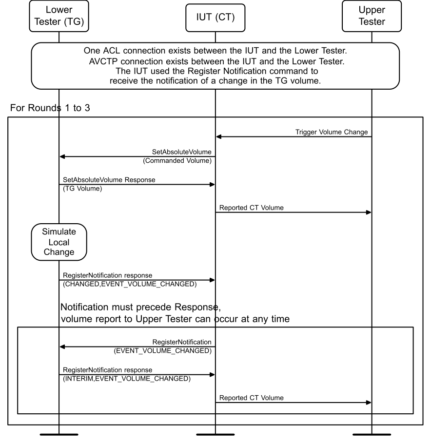

**Figure 7.1: CT Handles Different TG Volume Resolutions test cases MSC**

| Round | Commanded Volume |  | Low Resolution Test Dataset |  |  |  |  |  |  |  |  | Higher Resolution Test Dataset |  |  |  |  |  |  |  |
| --- | --- | --- | --- | --- | --- | --- | --- | --- | --- | --- | --- | --- | --- | --- | --- | --- | --- | --- | --- |
|  |  | TG Volume | TG Volume | CT Volume 1 |  | Local |  | CT Volume 2 | CT Volume 2 |  | TG Volume | TG Volume | CT Volume 1 |  | Local |  | CT Volume 2 | CT Volume 2 |  |
|  |  |  |  |  |  | Volume |  |  |  |  |  |  |  |  | Volume |  |  |  |  |
| 1 | 0% (0x00) | 0% (0x00) |  | 0% | 20% (0x19) |  |  | 10% to 30% |  |  | 0% (0x00) |  | 0% | 5% (0x06) |  |  | 0% to 15% |  |  |
| 2 | 50% (0x3F) | 40% (0x33) |  | 30% to 50% | 60% (0x4C) |  |  | 50% to 70% |  |  | 50% (0x3F) |  | 40% to 60% | 55% (0x46) |  |  | 45% to 65% |  |  |
| 3 | 100% (0x7F) | 100% (0x7F) |  | 100% | 80% (0x66) |  |  | 70% to 90% |  |  | 100% (0x7F) |  | 100% | 95% (0x79) |  |  | 85% to 100% |  |  |

Table 7.2: CT Handles Different TG Volume Resolutions test parameters
1. Repeat Steps 2 through 6 for each round specified in Table 7.2 for the Test Dataset specified in Table 7.1. 2. The Upper Tester triggers the IUT to send a SetAbsoluteVolume command with the Commanded Volume specified in Table 7.2. 3. The Lower Tester responds with a SetAbsoluteVolume Response indicating its Absolute Volume is now the TG Volume specified in Table 7.2. 4. The IUT reports its volume to the Upper Tester. 5. The Lower Tester sends a volume changed notification to the IUT with the Local Volume specified in Table 7.2 as if a local volume change
occurred.
Step 6 must precede Step 7. Steps 6 and 7 can precede, follow, or occur simultaneously, relative to Step 8:
6. The IUT uses the Register Notification command to receive the notification of a change in the TG volume. 7. The Lower Tester sends a Register Notification response within TMTP indicating the INTERIM volume and that volume changes will be notified. 8. The IUT reports its volume to the Upper Tester.
• Expected Outcome
Pass verdict
In Step 4, the IUT’s volume matches the CT Volume 1 given in Table 7.2.
The IUT uses the Register Notification command upon receiving the notification of a local change in the TG volume.
In Step 7, the IUT’s volume matches the CT Volume 2 given in Table 7.2.

## 8 Revision history and acknowledgments

Revision History

|  | Publication |  |  | Revision |  | Date |  |  | Comments |  |  |
| --- | --- | --- | --- | --- | --- | --- | --- | --- | --- | --- | --- |
|  | Number |  |  | Number |  |  |  |  |  |  |  |
|  | 0 |  |  | 1.0.0 |  |  | 2003-02 |  |  | Release for Voting Draft |  |
|  |  |  | 1.2.0r0-1 | 1.2.0r0-1 |  | 2006-02-08 | 2006-02-08 |  |  | Editorial updates to conform to template and 1.2 or |  |
|  |  |  |  |  |  |  |  |  |  | later spec |  |
|  |  |  |  |  |  |  |  |  |  | Fixed Abstract text on title page. |  |
|  | 1 |  |  | 1.2.0 |  |  | 2006-06-07 |  |  | Prepare for publication. |  |
| 2 | 2 |  | 1.3.0 | 1.3.0 |  | 2006-10-11 | 2006-10-11 |  |  | -Changed document number to be in line with AVRCP |  |
|  |  |  |  |  |  |  |  |  |  | specification version number; |  |
|  |  |  |  |  |  |  |  |  |  | -Inclusion of Metadata Transfer |  |
|  |  |  |  |  |  |  |  |  |  | -Include edits and change tracking; |  |
|  |  |  |  |  |  |  |  |  |  | -Merged two figures into one |  |
|  |  |  |  |  |  |  |  |  |  | Added missing entries to figure 3.1 and editorial |  |
|  |  |  |  |  |  |  |  |  |  | clarifications |  |
|  | 3 |  |  | 1.3.1 |  |  | 2007-03-22 |  |  | Prepare for publication. |  |
| 4 | 4 |  | 1.3.2 | 1.3.2 |  | 2008-04 | 2008-04 |  |  | TSE 2378: New Test cases AVRCP/TG/BGN/BV-01-I, |  |
|  |  |  |  |  |  |  |  |  |  | AVRCP/CT/BGN/BV-01-I, AVRCP/TG/BGN/BV-02-I, |  |
|  |  |  |  |  |  |  |  |  |  | AVRCP/CT/BGN/BV-02-I (legacy test case IDs |  |
|  |  |  |  |  |  |  |  |  |  | TP/BGN/BV-01-I, TP/BGN/BV-02-I) for next/previous |  |
|  |  |  |  |  |  |  |  |  |  | group |  |
| 5 |  |  | 1.4.0 |  |  | 2008-06 |  |  |  | Added test cases for advanced control; added IXIT |  |
|  |  |  |  |  |  |  |  |  |  | text. |  |
|  |  |  | 1.4.1r0 |  |  | 2008-07-14 |  |  |  | TSE 2524: AVRCP/CT/CFG/BV-01-C (legacy test |  |
|  |  |  |  |  |  |  |  |  |  | case ID TP/CFG/BV-01-C): update Test Condition |  |
|  |  |  |  |  |  |  |  |  |  | TSE 2503: new test case AVRCP/CT/RCR/BV-01-C |  |
|  |  |  |  |  |  |  |  |  |  | (legacy test case ID TP/RCR/BV-01-C) |  |
|  |  |  | 1.4.1r1-2 |  |  | 2008-10-31 |  |  |  | Corrected previous table entry; updated new test |  |
|  |  |  |  |  |  |  |  |  |  | cases per review comments; |  |
|  |  |  |  |  |  |  |  |  |  | TSE 2719: New test case AVRCP/TG/NFY/BV-03-C |  |
|  |  |  |  |  |  |  |  |  |  | (legacy test case ID TP/NFY/BV-03-C) |  |
|  | 6 |  |  | 1.4.1 |  |  | 2008-12-01 |  |  | Prepare for publication |  |
|  |  |  | 1.4.2r0 | 1.4.2r0 |  | 2009-08-06 | 2009-08-06 |  |  | TSE 2697: new test cases AVRCP/TG/NFY/BV-04-C |  |
|  |  |  |  |  |  |  |  |  |  | (legacy test case ID TP/NFY/BV-04-C) (v1.3, v1.4), |  |
|  |  |  |  |  |  |  |  |  |  | AVRCP/TG/NFY/BV-05-C (legacy test case ID |  |
|  |  |  |  |  |  |  |  |  |  | TP/NFY/BV-05-C) (v1.3), AVRCP/TG/NFY/BV-06-C |  |
|  |  |  |  |  |  |  |  |  |  | (legacy test case ID TP/NFY/BV-06-C) (v1.4); updates |  |
|  |  |  |  |  |  |  |  |  |  | to TCMT |  |
|  |  |  |  |  |  |  |  |  |  | TSE 2703: Rename duplicate test case |  |
|  |  |  |  |  |  |  |  |  |  | TP/MCN/CB/BV-02-I to AVRCP/TG/MCN/SRC/BV-02- |  |
|  |  |  |  |  |  |  |  |  |  | I and AVRCP/CT/MCN/CB/BV-02-I (legacy test case |  |
|  |  |  |  |  |  |  |  |  |  | ID TP/MCN/SRC/BV-02-I) |  |
|  |  |  |  |  |  |  |  |  |  | TSE 3087: TCMT correction for AVRCP/TG/RCR/BV- |  |
|  |  |  |  |  |  |  |  |  |  | 02-C and AVRCP/TG/RCR/BV-04-C (legacy test case |  |
|  |  |  |  |  |  |  |  |  |  | IDs TP/RCR/BV-02-C, TP/RCR/BV-04-C) |  |
|  | 7 |  |  | 1.4.2 |  |  | 2009-08-06 |  |  | Prepare for publication. |  |

|  | Publication |  |  | Revision |  | Date | Comments |  |  |
| --- | --- | --- | --- | --- | --- | --- | --- | --- | --- |
|  | Number |  |  | Number |  |  |  |  |  |
|  |  |  | 1.4.2a | 1.4.2a |  | 2009-10-08 |  | Add AVRCP/TG/BGN/BV-01-I, AVRCP/CT/BGN/BV- |  |
|  |  |  |  |  |  |  |  | 01-I, AVRCP/TG/BGN/BV-02-I, AVRCP/CT/BGN/BV- |  |
|  |  |  |  |  |  |  |  | 02-I (legacy test case IDs TP/BGN/BV-01-I and |  |
|  |  |  |  |  |  |  |  | TP/BGN/BV-02-I) to TCMT |  |
|  |  |  | 1.4.3r0 |  |  | 2011-01-04 |  | TSE 2706: New test cases AVRCP/CT/PTH/BV-01-C, |  |
|  |  |  |  |  |  |  |  | AVRCP/CT/PTH/BV-02-C, AVRCP/TG/PTT/BV-05-I, |  |
|  |  |  |  |  |  |  |  | and AVRCP/CT/PTT/BV-05-I (legacy test case IDs |  |
|  |  |  |  |  |  |  |  | TP/PTH/BV-01-C, TP/PTH/BV-02-C, TP/PTT/BV-05-I) |  |
|  |  |  |  |  |  |  |  | TCMT |  |
|  |  |  |  |  |  |  |  | TSE 2738: AVRCP/TG/VLH/BI-01-C (test case ID |  |
|  |  |  |  |  |  |  |  | TP/VLH/BI-01-C) change test condition |  |
|  |  |  |  |  |  |  |  | TSE 2854: AVRCP/CT/MCN/CB/BV-01-C, |  |
|  |  |  |  |  |  |  |  | AVRCP/TG/MCN/CB/BV-02-C, |  |
|  |  |  |  |  |  |  |  | AVRCP/TG/MCN/CB/BI-01-C, |  |
|  |  |  |  |  |  |  |  | AVRCP/CT/MCN/CB/BV-04-C, |  |
|  |  |  |  |  |  |  |  | AVRCP/TG/MCN/CB/BV-05-C, |  |
|  |  |  |  |  |  |  |  | AVRCP/TG/MCN/CB/BI-02-C, |  |
|  |  |  |  |  |  |  |  | AVRCP/TG/MCN/CB/BI-04-C, |  |
|  |  |  |  |  |  |  |  | AVRCP/TG/MCN/CB/BI-05-C, |  |
|  |  |  |  |  |  |  |  | AVRCP/TG/MCN/CB/BV-06-C, |  |
|  |  |  |  |  |  |  |  | AVRCP/CT/MCN/CB/BV-07-C, |  |
|  |  |  |  |  |  |  |  | AVRCP/TG/MCN/CB/BV-08-C, |  |
|  |  |  |  |  |  |  |  | AVRCP/TG/MCN/CB/BV-09-C, |  |
|  |  |  |  |  |  |  |  | AVRCP/TG/MCN/CB/BV-10-C, |  |
|  |  |  |  |  |  |  |  | AVRCP/TG/MCN/CB/BV-11-C, |  |
|  |  |  |  |  |  |  |  | AVRCP/TG/MCN/CB/BI-03-C, |  |
|  |  |  |  |  |  |  |  | AVRCP/CT/MCN/SRC/BV-01-C, |  |
|  |  |  |  |  |  |  |  | AVRCP/TG/MCN/SRC/BV-02-C, |  |
|  |  |  |  |  |  |  |  | AVRCP/CT/MCN/SRC/BV-03-C, |  |
|  |  |  |  |  |  |  |  | AVRCP/TG/MCN/SRC/BV-04-C, |  |
|  |  |  |  |  |  |  |  | AVRCP/CT/MCN/SRC/BV-05-C, |  |
|  |  |  |  |  |  |  |  | AVRCP/TG/MCN/SRC/BV-06-C, |  |
|  |  |  |  |  |  |  |  | AVRCP/CT/MCN/NP/BV-05-C, |  |
|  |  |  |  |  |  |  |  | AVRCP/TG/MCN/NP/BV-06-C (legacy test case IDs |  |
|  |  |  |  |  |  |  |  | TP/MCN/CB/BV-01-C, TP/MCN/CB/BV-02-C, |  |
|  |  |  |  |  |  |  |  | TP/MCN/CB/BI-01-C, TP/MCN/CB/BV-04-C, |  |
|  |  |  |  |  |  |  |  | TP/MCN/CB/BV-05-C, TP/MCN/CB/BI-02-C, |  |
|  |  |  |  |  |  |  |  | TP/MCN/CB/BI-04-C, TP/MCN/CB/BI-05-C, |  |
|  |  |  |  |  |  |  |  | TP/MCN/CB/BV-06-C, TP/MCN/CB/BV-07-C, |  |
|  |  |  |  |  |  |  |  | TP/MCN/CB/BV-08-C, TP/MCN/CB/BV-09-C, |  |
|  |  |  |  |  |  |  |  | TP/MCN/CB/BV-10-C, TP/MCN/CB/BV-11-C, |  |
|  |  |  |  |  |  |  |  | TP/MCN/CB/BI-03-C, TP/MCN/SRC/BV-01-C, |  |
|  |  |  |  |  |  |  |  | TP/MCN/SRC/BV-02-C, TP/MCN/SRC/BV-03-C, |  |
|  |  |  |  |  |  |  |  | TP/MCN/SRC/BV-04-C, TP/MCN/SRC/BV-05-C, |  |
|  |  |  |  |  |  |  |  | TP/MCN/SRC/BV-06-C, TP/MCN/NP/BV-05-C, |  |
|  |  |  |  |  |  |  |  | TP/MCN/NP/BV-06-C) Initial conditions. |  |
|  |  |  |  |  |  |  |  | TSE 3092 New test case AVRCP/TG/VLH/BI-02-C |  |
|  |  |  |  |  |  |  |  | (legacy test case ID TP/VLH/BI-02-C) |  |
|  |  |  |  |  |  |  |  | TSE 3488: AVRCP/TG/VLH/BI-01-C (legacy test case |  |
|  |  |  |  |  |  |  |  | ID TP/VLH/BI-01-C); move pass verdict text |  |

|  | Publication |  |  | Revision |  | Date |  |  | Comments |  |  |
| --- | --- | --- | --- | --- | --- | --- | --- | --- | --- | --- | --- |
|  | Number |  |  | Number |  |  |  |  |  |  |  |
|  |  |  |  |  |  |  |  |  |  | TSE 3920: AVRCP/TG/NFY/BV-04-C, |  |
|  |  |  |  |  |  |  |  |  |  | AVRCP/TG/NFY/BV-05-C, AVRCP/TG/NFY/BV-06-C |  |
|  |  |  |  |  |  |  |  |  |  | (legacy test case IDs TP/NFY/BV-04-C, TP/NFY/BV- |  |
|  |  |  |  |  |  |  |  |  |  | 05-C, TP/NFY/BV-06-C) Initial condition and test |  |
|  |  |  |  |  |  |  |  |  |  | procedures |  |
|  |  |  |  |  |  |  |  |  |  | TSE 3041: AVRCP/TG/INV/BI-02-C (legacy test case |  |
|  |  |  |  |  |  |  |  |  |  | ID TP/INV/BI-02-C): update TCMT |  |
|  |  |  |  |  |  |  |  |  |  | TSE 3105: AVRCP/CT/VLH/BI-03-C (legacy test case |  |
|  |  |  |  |  |  |  |  |  |  | ID TP/VLH/BI-03-C): new test case |  |
|  |  |  |  |  |  |  |  |  |  | TSE 3106: AVRCP/CT/VLH/BI-04-C (legacy test case |  |
|  |  |  |  |  |  |  |  |  |  | ID TP/VLH/BI-04-C): new test case |  |
|  |  |  |  |  |  |  |  |  |  | TSE 3244: TCMT: Change to |  |
|  |  |  |  |  |  |  |  |  |  | AVRCP/TG/MCN/NP/BV-06-I and |  |
|  |  |  |  |  |  |  |  |  |  | AVRCP/CT/MCN/NP/BV-06-I (legacy test case ID |  |
|  |  |  |  |  |  |  |  |  |  | TP/MCN/NP/BV-06-I |  |
|  |  |  |  |  |  |  |  |  |  | TSE 3836: AVRCP/TG/VLH/BI-01-C (legacy test case |  |
|  |  |  |  |  |  |  |  |  |  | ID TP/VLH/BI-01-C): update test condition |  |
|  |  |  |  |  |  |  |  |  |  | TSE 3851: AVRCP/TG/NFY/BV-04-C, |  |
|  |  |  |  |  |  |  |  |  |  | AVRCP/TG/NFY/BV-05-C (legacy test case IDs |  |
|  |  |  |  |  |  |  |  |  |  | TP/NFY/BV-04, 05 –C): Update TCMT |  |
|  |  |  | 1.4.3r1 |  |  | 2011-01-26 |  |  |  | Reviewer’s comments—reorg test cases by number/- |  |
|  |  |  |  |  |  |  |  |  |  | V, number –I. See ToC for changes. |  |
|  |  |  |  |  |  |  |  |  |  | TSE 2854. Remove AVRCP/TG/MCN/CB/BV-03-C |  |
|  |  |  |  |  |  |  |  |  |  | (legacy test case ID TP/MCN/CB/BV-03-C) changes |  |
|  |  |  |  | 1.4.3r2 |  |  | 2011-02-09 |  |  | More test case reorg |  |
|  |  |  | 1.4.3r3 | 1.4.3r3 |  | 2011-03-01 | 2011-03-01 |  |  | TSE 4193: AVRCP/TG/MCN/CB/BV-05-C) (legacy |  |
|  |  |  |  |  |  |  |  |  |  | test case ID TP/MCN/CB/BV-05-C): Update |  |
|  |  |  |  |  |  |  |  |  |  | Reference. |  |
|  |  |  |  |  |  |  |  |  |  | TSE 4194: AVRCP/CT/PAS/BV-01-C, |  |
|  |  |  |  |  |  |  |  |  |  | AVRCP/TG/PAS/BV-02-C (legacy test case IDs |  |
|  |  |  |  |  |  |  |  |  |  | TP/PAS/BV-01-C,TP/PAS/BV-02-C): Update |  |
|  |  |  |  |  |  |  |  |  |  | Reference |  |
|  |  |  | 1.4.3r4 |  |  | 2011-03-02 |  |  |  | References changed |  |
|  |  |  |  |  |  |  |  |  |  | TSE 4187: AVRCP/TG/NFY/BV-03-C (legacy test |  |
|  |  |  |  |  |  |  |  |  |  | case ID TP/NFY/BV-03-C): Update Reference |  |
|  |  |  |  |  |  |  |  |  |  | TSE 4188: AVRCP/CT/PAS/BV-07-C (legacy test |  |
|  |  |  |  |  |  |  |  |  |  | case ID TP/PAS/BV-07-C): Update Reference |  |
|  | 8 |  |  | 1.4.3 |  |  | 2011-07-21 |  |  | Prepare for publication. |  |
|  |  |  | 1.4.4r0-1 | 1.4.4r0-1 |  | 2011-09-13 | 2011-09-13 |  |  | TSE 3533: AVRCP/TG/NFY/BV-04-C (legacy test |  |
|  |  |  |  |  |  |  |  |  |  | case ID TP/NFY/BV-04-C) Test conditions |  |
|  |  |  |  |  |  |  |  |  |  | TSE 4247 Add new test case AVRCP/TG/NFY/BV-07- |  |
|  |  |  |  |  |  |  |  |  |  | C (legacy test case ID TP/NFY/BV-07-C) |  |
|  |  |  |  |  |  |  |  |  |  | TSE 4417: AVRCP/TG/MCN/CB/BV-09-C (legacy test |  |
|  |  |  |  |  |  |  |  |  |  | case ID TP/MCN/CB/BV-09-C): change TCMT |  |
|  |  |  |  |  |  |  |  |  |  | TSE 4499: TCMT changes per TSE 2706 for |  |
|  |  |  |  |  |  |  |  |  |  | AVRCP/CT/PTH/BV-01-C, AVRCP/CT/PTT/BV-05-I, |  |
|  |  |  |  |  |  |  |  |  |  | AVRCP/TG/PTT/BV-05-I (legacy test case IDs |  |
|  |  |  |  |  |  |  |  |  |  | TP/PTH/BV-01-C, TP/PTT/BV-05-I) |  |

|  | Publication |  |  | Revision |  | Date |  |  | Comments |  |  |
| --- | --- | --- | --- | --- | --- | --- | --- | --- | --- | --- | --- |
|  | Number |  |  | Number |  |  |  |  |  |  |  |
|  |  |  |  |  |  |  |  |  |  | AC edits: TSE 4543: Initial condition and TCMT |  |
|  |  |  |  |  |  |  |  |  |  | changes for AVRCP/CT/VLH/BI-03-C, |  |
|  |  |  |  |  |  |  |  |  |  | AVRCP/CT/VLH/BI-04-C (legacy test case IDs |  |
|  |  |  |  |  |  |  |  |  |  | TP/VLH/BI-03-C, TP/VLH/BI-04-C). |  |
|  |  |  |  |  |  |  |  |  |  | TSE 4408: Table 0 is removed. Revised TCMT |  |
|  |  |  |  |  |  |  |  |  |  | accordingly |  |
| 9 |  |  | 1.4.4r2 |  |  | 2012-03-12 |  |  |  | TSE 4715: Update TCMT for AVRCP/TG/VLH/BI-02-C |  |
|  |  |  |  |  |  |  |  |  |  | (legacy test case ID TP/VLH/BI-02-C) |  |
|  |  |  | 1.5.0r0 |  |  | 2012-06-21 |  |  |  | Changed references for AVRCP version 1.5. Adjusted |  |
|  |  |  |  |  |  |  |  |  |  | section numbering in Sections 2 and 3 to better match |  |
|  |  |  |  |  |  |  |  |  |  | with latest TS template. |  |
|  |  |  |  |  |  |  |  |  |  | TSE 4726: AVRCP/TG/INV/BI-01-C (legacy test case |  |
|  |  |  |  |  |  |  |  |  |  | ID TP/INV/BI-01-C): Change TCMT |  |
|  |  |  |  |  |  |  |  |  |  | TSE 4757: AVRCP/TG/MCN/CB/BI-01-C (legacy test |  |
|  |  |  |  |  |  |  |  |  |  | case ID TP/MCN/CB/BI-01-C): Relax error code |  |
|  |  |  |  |  |  |  |  |  |  | restrictions |  |
|  |  |  |  |  |  |  |  |  |  | TSE 4809: AVRCP/TG/CON/BV-02-C (legacy test |  |
|  |  |  |  |  |  |  |  |  |  | case ID TP/CON/BV-02-C): Change TCMT |  |
|  |  |  | 1.5.0r1 |  |  | 2012-06-21 |  |  |  | Updated TCMT entry for the General Reject feature to |  |
|  |  |  |  |  |  |  |  |  |  | include the ICS item for AVRCP 1.5. |  |
|  | 10 |  |  | 1.5.0 |  |  | 2012-07-24 |  |  | Prepare for publication. |  |
|  |  |  | 1.5.1r1 | 1.5.1r1 |  | 2012-10-19 | 2012-10-19 |  |  | TSE 4964: Edits to TCMT to reflect ESR06: |  |
|  |  |  |  |  |  |  |  |  |  | AVRCP/TG/INV/BI-01-C (legacy test case ID |  |
|  |  |  |  |  |  |  |  |  |  | TP/INV/BI-01-C) |  |
|  |  |  |  |  |  |  |  |  |  | AVRCP/TG/NFY/BV-02-C (legacy test case ID |  |
|  |  |  |  |  |  |  |  |  |  | TP/NFY/BV-02-C) |  |
|  |  |  |  |  |  |  |  |  |  | Added test case names where they were missing for |  |
|  |  |  |  |  |  |  |  |  |  | TCMT consistency. |  |
|  |  |  |  |  |  |  |  |  |  | TG and CT test cases appearing in the wrong table |  |
|  |  |  |  |  |  |  |  |  |  | were moved to the appropriate table (6.1-6.3 in |  |
|  |  |  |  |  |  |  |  |  |  | Section 6). |  |
|  |  |  |  |  |  |  |  |  |  | Edited AVRCP/TG/INV/BI-02-C (legacy test case ID |  |
|  |  |  |  |  |  |  |  |  |  | TP/INV/BI-02-C) Initial Condition. |  |
|  |  |  |  |  |  |  |  |  |  | Edited references in Section 2.1 to include both |  |
|  |  |  |  |  |  |  |  |  |  | AVRCP v1.4 and 1.5. |  |
|  |  |  |  |  |  |  |  |  |  | TSE 4531: New Test – AVRCP/TG/CON/BV-05-C |  |
|  |  |  |  |  |  |  |  |  |  | (legacy test case ID TP/CON/BV-05-C) TCMT |  |
|  |  |  |  |  |  |  |  |  |  | Changes to the objective for AVRCP/TG/CON/BV-02- |  |
|  |  |  |  |  |  |  |  |  |  | C (legacy test case ID TP/CON/BV-02-C) TCMT |  |
|  |  |  | 1.5.1r2 |  |  | 2012-10-29 |  |  |  | TSE 4974: Renamed AVRCP/TG/NFY/BV-04-C |  |
|  |  |  |  |  |  |  |  |  |  | (legacy test case ID TP/NFY/BV-04-C) [Track |  |
|  |  |  |  |  |  |  |  |  |  | Changed – No Playing Track] to No “Selected” Track, |  |
|  |  |  |  |  |  |  |  |  |  | updated wording in objective. |  |
|  |  |  | 1.5.1r3 |  |  | 2012-11-12 |  |  |  | Added changed to TSE 4531, rename of |  |
|  |  |  |  |  |  |  |  |  |  | AVRCP/TG/CON/BV-05-C (legacy test case ID |  |
|  |  |  |  |  |  |  |  |  |  | TP/CON/BV-05-C) to [Connection establishment for |  |
|  |  |  |  |  |  |  |  |  |  | browsing – TG initiates control channel and CT |  |
|  |  |  |  |  |  |  |  |  |  | initiates browsing channel] |  |
|  | 11 |  |  | 1.5.1 |  |  | 2012-11-12 |  |  | Prepare for Publication |  |

|  | Publication |  |  | Revision |  | Date |  |  | Comments |  |  |
| --- | --- | --- | --- | --- | --- | --- | --- | --- | --- | --- | --- |
|  | Number |  |  | Number |  |  |  |  |  |  |  |
|  |  |  | 1.5.2r1 | 1.5.2r1 |  | 2013-04-26 |  |  |  | TSE 5016: New test case, AVRCP/TG/NFY/BV-08-C |  |
|  |  |  |  |  |  |  |  |  |  | (legacy test case ID TP/NFY/BV-08-C) [Track |  |
|  |  |  |  |  |  |  |  |  |  | Changed – Selected Track – TG]. Added before |  |
|  |  |  |  |  |  |  |  |  |  | AVRCP/TG/NFY/BI-01-C (legacy test case ID |  |
|  |  |  |  |  |  |  |  |  |  | TP/NFY/BI-01-C). Added new test case to TCMT as |  |
|  |  |  |  |  |  |  |  |  |  | Track Changed – Playing Track.TSE 5086: Revisions |  |
|  |  |  |  |  |  |  |  |  |  | to the test condition and pass verdict for |  |
|  |  |  |  |  |  |  |  |  |  | AVRCP/CT/RCR/BV-01-C and AVRCP/CT/RCR/BV- |  |
|  |  |  |  |  |  |  |  |  |  | 03-C (legacy test case IDs TP/RCR/BV-01-C and |  |
|  |  |  |  |  |  |  |  |  |  | TP/RCR/BV-03-C). |  |
|  |  |  | 1.5.2r2 |  |  | 2013-05-02 |  |  |  | Updated version and references for ESR06.(Later |  |
|  |  |  |  |  |  |  |  |  |  | rejected in r4) |  |
|  |  |  | 1.5.2r3 |  |  | 2013-05-23 |  |  |  | Removed repeated objective sentence that appeared |  |
|  |  |  |  |  |  |  |  |  |  | before the start of section 4.4.3. |  |
|  |  |  | 1.5.2r4 |  |  | 2013-06-05 |  |  |  | Rejected ESR06 Changes, updated change history |  |
|  |  |  |  |  |  |  |  |  |  | and versioning. |  |
|  | 12 |  |  | 1.5.2r5 |  |  | 2013-06-13 |  |  | BTI Approved |  |
|  |  |  |  | 1.6.0r0 |  |  | 2013-06-17 |  |  | Integrated Cover Art and Number of Items |  |
|  |  |  |  | 1.6.0r1 |  |  | 2013-07-18 |  |  | Resolution of Comments |  |
|  |  |  | 1.6.0r2 | 1.6.0r2 |  | 2013-08-06 | 2013-08-06 |  |  | Split up some test cases for browsing and non- |  |
|  |  |  |  |  |  |  |  |  |  | browsing |  |
|  |  |  |  |  |  |  |  |  |  | Added new test cases for TG role |  |
|  |  |  |  |  |  |  |  |  |  | Adjusted TCMT |  |
|  |  |  |  |  |  |  |  |  |  | Resolution of comments |  |
|  |  |  |  | 1.6.0r3 |  |  | 2013-08-13 |  |  | Fixed OBEX client/server mistakes |  |
|  |  |  |  | 1.6.0r4 |  |  | 2013-08-21 |  |  | Fixed typos, MSCs and TCMT issues |  |
|  |  |  | 1.6.0r5 | 1.6.0r5 |  | 2013-09-16 | 2013-09-16 |  |  | Moved to new Test Suite template, formatting and |  |
|  |  |  |  |  |  |  |  |  |  | standard boilerplate text. Added missing AVRCP 1.6 |  |
|  |  |  |  |  |  |  |  |  |  | references to test cases. Renumbered the BV/BI test |  |
|  |  |  |  |  |  |  |  |  |  | case labels for Cover Art to be sequential for easier |  |
|  |  |  |  |  |  |  |  |  |  | reference (also updated TCMT accordingly). Updated |  |
|  |  |  |  |  |  |  |  |  |  | test feature labeling in Table 4.1. Added Section 5.14 |  |
|  |  |  |  |  |  |  |  |  |  | of the AVRCP 1.6 specification as a reference to |  |
|  |  |  |  |  |  |  |  |  |  | relevant Cover Art test cases. Updated MSCs for |  |
|  |  |  |  |  |  |  |  |  |  | Cover Art test cases for consistent formatting and |  |
|  |  |  |  |  |  |  |  |  |  | standard Tester and IUT placement. Updated Cover |  |
|  |  |  |  |  |  |  |  |  |  | Art SDP test cases to abstract the process by which |  |
|  |  |  |  |  |  |  |  |  |  | the Cover Art PSM is retrieved via SDP query. |  |
|  |  |  |  |  |  |  |  |  |  | Removed double-mapping of test cases |  |
|  |  |  |  |  |  |  |  |  |  | AVRCP/TG/MCN/NP/BI-01-C and |  |
|  |  |  |  |  |  |  |  |  |  | AVRCP/TG/MCN/NP/BI-02-C (legacy test case IDs |  |
|  |  |  |  |  |  |  |  |  |  | TP/MCN/NP/BI-01-C and TP/MCN/NP/BI-02-C). |  |
|  |  |  |  | 1.6.0r6 |  |  | 2014-04-07 |  |  | Addressed BTI review comments |  |

|  | Publication |  |  | Revision |  | Date |  |  | Comments |  |  |
| --- | --- | --- | --- | --- | --- | --- | --- | --- | --- | --- | --- |
|  | Number |  |  | Number |  |  |  |  |  |  |  |
|  |  |  | 1.6.0r7 | 1.6.0r7 |  | 2014-04-15 |  |  |  | TSE 5415: Edits to the test condition and TCMT for |  |
|  |  |  |  |  |  |  |  |  |  | AVRCP/TG/MCN/CB/BV-07-I (legacy test case ID |  |
|  |  |  |  |  |  |  |  |  |  | TP/MCN/CB/BV-07-I) [Browsing of a folder if the |  |
|  |  |  |  |  |  |  |  |  |  | player is not addressed], updated wording to objective |  |
|  |  |  |  |  |  |  |  |  |  | and pass verdict. This is now a TG only test case. |  |
|  |  |  |  |  |  |  |  |  |  | TSE 5432: Removal of ‘(UID 0x0)' and replaced when |  |
|  |  |  |  |  |  |  |  |  |  | needed by ‘the currently playing media item’ in |  |
|  |  |  |  |  |  |  |  |  |  | AVRCP/CT/MCN/CB/BV-07-C, |  |
|  |  |  |  |  |  |  |  |  |  | AVRCP/TG/MCN/CB/BV-08-C, |  |
|  |  |  |  |  |  |  |  |  |  | AVRCP/CT/MCN/SRC/BV-05-C, AVRCP, and |  |
|  |  |  |  |  |  |  |  |  |  | TG/MCN/SRC/BV-06-C (legacy test case IDs |  |
|  |  |  |  |  |  |  |  |  |  | TP/MCN/CB/BV-07-C, TP/MCN/CB/BV-08-C, |  |
|  |  |  |  |  |  |  |  |  |  | TP/MCN/SRC/BV-05-C, and TP/MCN/SRC/BV-06-C). |  |
|  |  |  |  |  |  |  |  |  |  | TSE 5560: Revises the pass verdict of |  |
|  |  |  |  |  |  |  |  |  |  | AVRCP/TG/NFY/BV-08-C (legacy test case ID |  |
|  |  |  |  |  |  |  |  |  |  | TP/NFY/BV-08-C) [Track Changed – Selected Track - |  |
|  |  |  |  |  |  |  |  |  |  | TG] so that AVRCP 1.3 devices should send a value |  |
|  |  |  |  |  |  |  |  |  |  | other than 0xFFFFFFFF. |  |
|  |  |  |  |  |  |  |  |  |  | TSE 5598: Corrects an error in the TCMT where |  |
|  |  |  |  |  |  |  |  |  |  | AVRCP/TG/MPS/BI-01-C (legacy test case ID |  |
|  |  |  |  |  |  |  |  |  |  | TP/MPS/BI-01-C) [SetAddressedPlayer – TG] was |  |
|  |  |  |  |  |  |  |  |  |  | overwritten with a duplicate entry for TP/MCN/NP/BI- |  |
|  |  |  |  |  |  |  |  |  |  | 01-C [PlayItem Invalid – TG] and |  |
|  |  |  |  |  |  |  |  |  |  | _ AVRCP/TG/MPS/BI-02-C (legacy test case ID |  |
|  |  |  |  |  |  |  |  |  |  | TP/MPS/BI-02-C) [SetBrowsedPlayer – TG] was |  |
|  |  |  |  |  |  |  |  |  |  | overwritten with a duplicate entry for TP/MCN/NP/BI- |  |
|  |  |  |  |  |  |  |  |  |  | 02-C [AddToNowPlaying Invalid – TG]. _ |  |
|  | 13 |  |  | 1.6.0 |  |  | 2014-09-18 |  |  | Adopted by SIG BoD |  |
|  |  |  | 1.6.1r00 | 1.6.1r00 |  | 2015-04-28 | 2015-04-28 |  |  | TSE 6255: Clarified first paragraph of Pass verdict in |  |
|  |  |  |  |  |  |  |  |  |  | AVRCP/TG/VLH/BI-02-C (legacy test case ID |  |
|  |  |  |  |  |  |  |  |  |  | TP/VLH/BI-02-C). |  |
|  |  |  |  |  |  |  |  |  |  | TSE 6256: Deleted second paragraph of Pass verdict |  |
|  |  |  |  |  |  |  |  |  |  | in AVRCP/TG/VLH/BI-02-C (legacy test case ID |  |
|  |  |  |  |  |  |  |  |  |  | TP/VLH/BI-02-C). |  |
|  | 14 |  |  | 1.6.1 |  |  | 2015-07-14 |  |  | Prepared for TCRL 2015-1 publication |  |
|  |  |  | 1.6.2r00 | 1.6.2r00 |  | 2015-10-02 | 2015-10-02 |  |  | TSE 6427: Corrected feature descriptions in TCMT for |  |
|  |  |  |  |  |  |  |  |  |  | AVRCP/TG/MCN/CB/BI-02-C and |  |
|  |  |  |  |  |  |  |  |  |  | AVRCP/TG/MCN/CB/BI-03-C (legacy test case IDs |  |
|  |  |  |  |  |  |  |  |  |  | TP/MCN/CB/BI-02-C and TP/MCN/CB/BI-03-C) |  |
|  |  |  | 1.6.1.0r00 |  |  | 2015-10-28 |  |  |  | Updated version numbering to align with Specification |  |
|  |  |  |  |  |  |  |  |  |  | version change from 1.6 to 1.6.1 for ESR09. With the |  |
|  |  |  |  |  |  |  |  |  |  | specification taking a third identifying number, the TS |  |
|  |  |  |  |  |  |  |  |  |  | version identifier moves to the fourth number and |  |
|  |  |  |  |  |  |  |  |  |  | starts again at 0. |  |
|  | 15 |  |  | 1.6.1.0 |  |  | 2015-12-22 |  |  | Prepared for TCRL 2015-2 publication |  |

|  | Publication |  |  | Revision |  | Date |  |  | Comments |  |  |
| --- | --- | --- | --- | --- | --- | --- | --- | --- | --- | --- | --- |
|  | Number |  |  | Number |  |  |  |  |  |  |  |
|  |  |  | 1.6.1.1r00 | 1.6.1.1r00 |  | 2016-02-29 |  |  |  | TSE 6425: Added new section, test case |  |
|  |  |  |  |  |  |  |  |  |  | AVRCP/TG/MCN/CB/BI-08-C (legacy test case ID |  |
|  |  |  |  |  |  |  |  |  |  | TP/MCN/CB/BI-08-C) and added to TCMT. |  |
|  |  |  |  |  |  |  |  |  |  | TSE 6758: Deleted Sections 4.2.9.20–21 and TCMT |  |
|  |  |  |  |  |  |  |  |  |  | entries for test cases TP/CA/BI-02-C and TP/CA/BI- |  |
|  |  |  |  |  |  |  |  |  |  | 03-C. |  |
|  |  |  |  |  |  |  |  |  |  | TSE 6924: Updated test purpose and pass verdict of |  |
|  |  |  |  |  |  |  |  |  |  | test case AVRCP/CT/VLH/BV-01-I and |  |
|  |  |  |  |  |  |  |  |  |  | AVRCP/TG/VLH/BV-01-I (legacy test case ID |  |
|  |  |  |  |  |  |  |  |  |  | TP/VLH/BV-01-I). |  |
|  | 16 |  |  | 1.6.1.1 |  |  | 2016-07-13 |  |  | Prepared for TCRL 2016-1 publication. |  |
|  |  |  | 1.6.1.2r00 | 1.6.1.2r00 |  | 2016-09-28 | 2016-09-28 |  |  | Converted to new Test Case ID conventions as |  |
|  |  |  |  |  |  |  |  |  |  | defined in TSTO v4.1 |  |
|  |  |  | 1.6.1.2r01 |  |  | 2016-10-10 |  |  |  | TSE 7640: Added test cases AVRCP/CT/MDI/BV-06-I |  |
|  |  |  |  |  |  |  |  |  |  | and AVRCP/CT/MCN/CB/BV-09-I to ensure that |  |
|  |  |  |  |  |  |  |  |  |  | AVRCP profile version in SDP does not negatively |  |
|  |  |  |  |  |  |  |  |  |  | impact User Experience due to poor SDP based |  |
|  |  |  |  |  |  |  |  |  |  | decisions |  |
|  |  |  | 1.6.1.2r02 |  |  | 2016-11-15 |  |  |  | Fixed TC ID styles to show up in ToC. Regenerated |  |
|  |  |  |  |  |  |  |  |  |  | ToC. |  |
| 17 |  |  | 1.6.1.2 |  |  | 2016-12-13 |  |  |  | Approved by BTI. Prepared for TCRL 2016-2 |  |
|  |  |  |  |  |  |  |  |  |  | publication. |  |
|  |  |  | 1.6.1.2 (2nd edition) |  |  | 2016-12-19 |  |  |  | TSE 8258: Corrected mapping for new test case |  |
|  |  |  |  |  |  |  |  |  |  | AVRCP/CT/MCN/CB/BV-09-I. Also fixed formatting |  |
|  |  |  |  |  |  |  |  |  |  | issues affecting document generation. |  |
|  |  |  |  |  |  |  |  |  |  | Approved by BTI and re-issued for TCRL 2016-2 |  |
|  |  |  |  |  |  |  |  |  |  | publication. |  |
|  |  |  |  | 1.6.1.3r00 |  |  | 2018-11-05 |  |  | Updated template. |  |
|  |  |  | 1.6.2.0r00 | 1.6.2.0r00 |  | 2018-11-09 | 2018-11-09 |  |  | Updated version number from 1.6.1.3 to 1.6.2.0 to |  |
|  |  |  |  |  |  |  |  |  |  | align with adoption of the specification 1.6.2. |  |
| 18 |  |  | 1.6.2.0 |  |  | 2018-11-21 |  |  |  | Approved by BTI. Prepared for TCRL 2018-2 |  |
|  |  |  |  |  |  |  |  |  |  | publication. |  |
|  |  |  |  | 1.6.2.1r00– |  |  | 2019-04-09 – |  |  | TSE 11455 (rating 2): Updated steps 9 and 10 and |  |
|  |  |  |  | r02 |  |  | 2019-06-21 |  |  | MSC for test case AVRCP/CT/CA/BV-17-C. |  |
| 19 |  |  | 1.6.2.1 | 1.6.2.1 |  | 2019-07-28 | 2019-07-28 |  |  | Approved by BTI. Prepared for TCRL 2019-1 |  |
|  |  |  |  |  |  |  |  |  |  | publication. |  |
|  |  |  | 1.6.2.2r00 |  |  | 2019-09-27 |  |  |  | TSE 12549 (rating 1): Updated test cases |  |
|  |  |  |  |  |  |  |  |  |  | AVRCP/CT/MCN/CB/BV-01-C, -04-C, -07-C; |  |
|  |  |  |  |  |  |  |  |  |  | AVRCP/CT/MCN/SRC/BV-01-C,-05-C; |  |
|  |  |  |  |  |  |  |  |  |  | AVRCP/CT/MCN/NP/BV-05-C to fix the wording in the |  |
|  |  |  |  |  |  |  |  |  |  | initial condition sections. |  |
| 20 |  |  | 1.6.2.2 |  |  | 2020-01-07 |  |  |  | Approved by BTI on 2019-11-17. Prepared for TCRL |  |
|  |  |  |  |  |  |  |  |  |  | 2019-2 publication. |  |
|  |  |  |  | 1.6.2.2ed2 |  |  | 2021-04-16 – |  |  | TSE 16800 (rating 1): Fixed formatting problem. |  |
|  |  |  |  | r00–01 |  |  | 2021-04-26 |  |  | Added consistency checker fixes. |  |
|  |  |  |  | 1.6.2.2 |  | 2021-05-21 | 2021-05-21 |  |  | Approved by BTI on 2021-05-06. Prepared for edition |  |
|  |  |  |  | edition 2 |  |  |  |  |  | 2 publication. |  |

|  | Publication |  |  | Revision |  | Date | Comments |  |  |
| --- | --- | --- | --- | --- | --- | --- | --- | --- | --- |
|  | Number |  |  | Number |  |  |  |  |  |
|  |  |  | p21r00–r06 | p21r00–r06 |  | 2023-11-08 – 2024-04-24 |  | TSE 23963 (rating 1): Converted -I tests to -C tests as |  |
|  |  |  |  |  |  |  |  | appropriate, renumbering where duplicates resulted; |  |
|  |  |  |  |  |  |  |  | updated the TCMT and TCRL accordingly. |  |
|  |  |  |  |  |  |  |  | TSE 24519 (rating 4): Added new GSIT section with |  |
|  |  |  |  |  |  |  |  | new TCs AVRCP/CT/CGSIT/SFC/BV-01-C, |  |
|  |  |  |  |  |  |  |  | AVRCP/CT/SGSIT/ATTR/BV-01-C – -05-C, |  |
|  |  |  |  |  |  |  |  | AVRCP/CT/SGSIT/OFFS/BV-01-C and -02-C, |  |
|  |  |  |  |  |  |  |  | AVRCP/CT/SGSIT/SERR/BV-01-C, |  |
|  |  |  |  |  |  |  |  | AVRCP/TG/CGSIT/SFC/BV-02-C, |  |
|  |  |  |  |  |  |  |  | AVRCP/TG/SGSIT/ATTR/BV-01-C – -06-C, |  |
|  |  |  |  |  |  |  |  | AVRCP/TG/SGSIT/OFFS/BV-03-C and -04-C, and |  |
|  |  |  |  |  |  |  |  | AVRCP/TG/SGSIT/SERR/BV-01-C. Updated the |  |
|  |  |  |  |  |  |  |  | TCMT accordingly. Updated the Scope, added the |  |
|  |  |  |  |  |  |  |  | SDP.TS to the references list, updated the TCID |  |
|  |  |  |  |  |  |  |  | Conventions section, and removed the Conformance |  |
|  |  |  |  |  |  |  |  | tests introduction and the Interoperability tests |  |
|  |  |  |  |  |  |  |  | heading and reset heading levels accordingly. |  |
|  |  |  |  |  |  |  |  | TSE 25005 (rating 1): Updated the Other general |  |
|  |  |  |  |  |  |  |  | information section within the test cases introduction. |  |
|  |  |  |  |  |  |  |  | Updated to align the document with the latest |  |
|  |  |  |  |  |  |  |  | standards. |  |
| 21 |  |  | p21 |  |  | 2024-07-01 |  | Approved by BTI on 2024-05-22. Prepared for TCRL |  |
|  |  |  |  |  |  |  |  | 2024-1 publication. |  |
|  |  |  | p22r00 |  |  | 2024-08-13 |  | TSE 24771 (rating 4): Per E23562, added the |  |
|  |  |  |  |  |  |  |  | following supplemental interoperability tests in a new |  |
|  |  |  |  |  |  |  |  | section (Appendix B): AVRCP/CT/VLH/BV-06-C and |  |
|  |  |  |  |  |  |  |  | -07-C. Updated the TCMT accordingly. Updated the |  |
|  |  |  |  |  |  |  |  | acknowledgments. |  |
| 22 |  |  | p22 |  |  | 2024-10-08 |  | Approved by BTI on 2024-09-11. Audio/Video Remote |  |
|  |  |  |  |  |  |  |  | Control Profile (AVRCP) Specification Versions 1.5.1 |  |
|  |  |  |  |  |  |  |  | and 1.6.3 adopted by the BoD on 2024-10-01. |  |
|  |  |  |  |  |  |  |  | Prepared for TCRL 2024-2-addition publication. |  |
|  |  |  | p23r00 |  |  | 2024-10-17 |  | TSE 25724 (rating 2): Updated the TCMT for |  |
|  |  |  |  |  |  |  |  | AVRCP/TG/CGSIT/SFC/BV-02-C. |  |
|  |  |  |  |  |  |  |  | TSE 26436 (rating 2): Updated the pass verdict for |  |
|  |  |  |  |  |  |  |  | AVRCP/TG/VLH/BI-01-C. |  |
| 23 |  |  | p23 |  |  | 2025-02-18 |  | Approved by BTI on 2024-12-25. Prepared for TCRL |  |
|  |  |  |  |  |  |  |  | 2025-1 publication. |  |

Acknowledgments

|  | Name |  |  | Company |  |
| --- | --- | --- | --- | --- | --- |
|  | Mat Davidson |  |  | Apple |  |
|  | Dominik Sollfrank |  |  | Berner & Mattner |  |
|  | Tharon Hall |  |  | Bluetooth SIG, Inc. |  |
|  | Meagen Schuver |  |  | Bluetooth SIG, Inc. |  |
|  | Alicia Courtney |  |  | Broadcom |  |
|  | Ash Kapur |  |  | Broadcom |  |
|  | Jiny Bradshaw |  |  | CSR |  |

|  | Name |  |  | Company |  |
| --- | --- | --- | --- | --- | --- |
|  | Gordon Downie |  |  | CSR |  |
|  | Magnus Sommansson |  |  | CSR |  |
|  | David Trainor |  |  | CSR |  |
|  | Miyajima Akira |  |  | Denso |  |
|  | Morgan Lindqvist |  |  | Ericsson |  |
|  | Masahiko Nakashima |  |  | Fujitsu |  |
|  | Pragya Gupta |  |  | Impulsesoft |  |
|  | Yogesh Kamar Mhamai |  |  | Impulsesoft |  |
|  | Nagarajan V |  |  | Impulsesoft |  |
|  | Ilya Goldberg |  |  | Matsushita |  |
|  | Tsuyoshi Okada |  |  | Matsushita |  |
|  | Thomas Karlsson |  |  | Mecel |  |
|  | Ross Bundy |  |  | Motorola |  |
|  | Shwetha Mahadik |  |  | Mindtree |  |
|  | Anil Vutukuru |  |  | Mindtree |  |
|  | Stephen Raxter |  |  | National Analysis Center |  |
|  | Thomas Block |  |  | Nokia |  |
|  | Brian Gix |  |  | Open Interface |  |
|  | François Ferrand |  |  | Parrot |  |
|  | Sébastien Henrio |  |  | Parrot |  |
|  | Christian Bouffioux |  |  | Philips |  |
|  | Laurent Meunier |  |  | Philips |  |
|  | Scott Walsh |  |  | Plantronics |  |
|  | Dimitri Toropov |  |  | Siemens |  |
|  | Wilhelm Hagg |  |  | Sony |  |
|  | Masakazu Hattori |  |  | Sony |  |
|  | Atsushi Ichise |  |  | Sony |  |
|  | Harumi Kawamura |  |  | Sony |  |
|  | Yoshiyuki Nezu |  |  | Sony |  |
|  | Hiroyasu Noguchi |  |  | Sony |  |
|  | Masahiko Seki |  |  | Sony |  |
|  | Dick deJong |  |  | Sony Ericsson |  |
|  | Patric Lind |  |  | Sony Ericsson |  |
|  | Siân James |  |  | Symbian |  |
|  | Makoto Kobayashi |  |  | Toshiba |  |
|  | Yoshinari Kumaki |  |  | Toshiba |  |
|  | Shuichi Sakurai |  |  | Toshiba |  |
|  | Ichiro Tomoda |  |  | Toshiba |  |
|  | Makoto Yamashita |  |  | Toshiba |  |
|  | Daniel Ralley |  |  | UL |  |
