# BAP.TS.p11-1

> Source: PDF converted via PyMuPDF.

---

Basic Audio Profile (BAP)
Bluetooth® Test Suite
▪ Revision: BAP.TS.p11 ▪ Revision Date: 2026-02-17 ▪ Prepared By: Generic Audio Working Group ▪ Published during TCRL: TCRL.pkg102
This document, regardless of its title or content, is not a Bluetooth Specification as defined in the Bluetooth Patent/Copyright License Agreement (“PCLA”) and Bluetooth Trademark License Agreement. Use of this document by members of Bluetooth SIG is governed by the membership and other related agreements between Bluetooth SIG Inc. (“Bluetooth SIG”) and its members, including the PCLA and other agreements posted on Bluetooth SIG’s website located at www.bluetooth.com.
THIS DOCUMENT IS PROVIDED “AS IS” AND BLUETOOTH SIG, ITS MEMBERS, AND THEIR AFFILIATES MAKE NO REPRESENTATIONS OR WARRANTIES AND DISCLAIM ALL WARRANTIES, EXPRESS OR IMPLIED, INCLUDING ANY WARRANTY OF MERCHANTABILITY, TITLE, NON-INFRINGEMENT, FITNESS FOR ANY PARTICULAR PURPOSE, THAT THE CONTENT OF THIS DOCUMENT IS FREE OF ERRORS.
TO THE EXTENT NOT PROHIBITED BY LAW, BLUETOOTH SIG, ITS MEMBERS, AND THEIR AFFILIATES DISCLAIM ALL LIABILITY ARISING OUT OF OR RELATING TO USE OF THIS DOCUMENT AND ANY INFORMATION CONTAINED IN THIS DOCUMENT, INCLUDING LOST REVENUE, PROFITS, DATA OR PROGRAMS, OR BUSINESS INTERRUPTION, OR FOR SPECIAL, INDIRECT, CONSEQUENTIAL, INCIDENTAL OR PUNITIVE DAMAGES, HOWEVER CAUSED AND REGARDLESS OF THE THEORY OF LIABILITY, AND EVEN IF BLUETOOTH SIG, ITS MEMBERS, OR THEIR AFFILIATES HAVE BEEN ADVISED OF THE POSSIBILITY OF SUCH DAMAGES.
This document is proprietary to Bluetooth SIG. This document may contain or cover subject matter that is intellectual property of Bluetooth SIG and its members. The furnishing of this document does not grant any license to any intellectual property of Bluetooth SIG or its members.
This document is subject to change without notice.
Copyright © 2019–2026 by Bluetooth SIG, Inc. The Bluetooth word mark and logos are owned by Bluetooth SIG, Inc. Other third-party brands and names are the property of their respective owners.
Contents

## 1 Scope

This Bluetooth document contains the Test Suite Structure (TSS) and test cases to test the implementation of the Bluetooth Basic Audio Profile Specification with the objective to provide a high probability of air interface interoperability between the tested implementation and other manufacturers’ Bluetooth devices.

## 2 References, definitions, and abbreviations

### 2.1 References

This document incorporates provisions from other publications by dated or undated reference. These references are cited at the appropriate places in the text, and the publications are listed hereinafter. Additional definitions and abbreviations can be found in [1] and [2].
[1] Bluetooth Core Specification, Version 5.2 or later
[2] Test Strategy and Terminology Overview
[3] Basic Audio Profile Specification, Version 1.0
[4] Basic Audio Profile ICS, BAP.ICS
[5] GATT Test Suite, GATT.TS
[6] Audio Stream Control Service Test Suite, ASCS.TS
[7] Basic Audio Profile Implementation eXtra Information for Test, IXIT
[8] Published Audio Capabilities Service Test Suite, PACS.TS
[9] Bluetooth SIG Assigned Numbers, https://www.bluetooth.com/specifications/assigned-numbers

### 2.2 Definitions

In this Bluetooth document, the definitions from [1] and [2] apply.

### 2.3 Acronyms and abbreviations

In this Bluetooth document, the definitions, acronyms, and abbreviations from [1] and [2] apply.

## 3 Test Suite Structure (TSS)

### 3.1 Overview

The Basic Audio Profile (BAP) [3] requires the presence of GAP, SM (when used over LE transport), L2CAP, and GATT. This is illustrated in Figure 3.1.

| Unicast Client Role |  |  |
| --- | --- | --- |
| GATT |  |  |
| ATT (or EATT) | GAP (LE/BR/EDR) | SM (LE) |
| L2CAP |  |  |
| Controller (LE/BR/EDR) |  |  |

| Unicast Server Role |  |  |  |
| --- | --- | --- | --- |
| Published Audio Capabilities Service |  | Audio Stream Control Service |  |
| GATT |  |  |  |
| ATT (or EATT) | GAP (LE/BR/EDR) |  | SM (LE) |
| L2CAP |  |  |  |
| Controller (LE/BR/EDR) |  |  |  |

| Broadcast Source Role |  |  |
| --- | --- | --- |
| ATT (or EATT) | GAP (LE/BR/EDR) | SM (LE) |
| L2CAP |  |  |
| Controller (LE/BR/EDR) |  |  |

| Broadcast Sink Role |  |  |
| --- | --- | --- |
| Published Audio Capabilities Service |  |  |
| GATT |  |  |
| ATT (or EATT) | GAP (LE/BR/EDR) | SM (LE) |
| L2CAP |  |  |
| Controller (LE/BR/EDR) |  |  |

| Broadcast Assistant Role |  |  |
| --- | --- | --- |
| GATT |  |  |
| ATT (or EATT) | GAP (LE/BR/EDR) | SM (LE) |
| L2CAP |  |  |
| Controller (LE/BR/EDR) |  |  |

| Scan Delegator Role |  |  |  |
| --- | --- | --- | --- |
| Broadcast Audio Scan Service |  | Audio Input Control Service |  |
| GATT |  |  |  |
| ATT (or EATT) | GAP (LE/BR/EDR) |  | SM (LE) |
| L2CAP |  |  |  |
| Controller (LE/BR/EDR) |  |  |  |

Figure 3.1 Basic Audio Profile test model

### 3.2 Test Strategy

The test objectives are to verify the functionality of the Basic Audio Profile within a Bluetooth Host and enable interoperability between Bluetooth Hosts on different devices, specifically those that are conforming to the Unicast Server and Unicast Client roles for unicast audio stream control, and Broadcast Source, Broadcast Sink, Broadcast Assistant, and Scan Delegator roles for broadcast audio stream control. The testing approach covers mandatory and optional requirements in the specification and matches these to the support of the IUT as described in the ICS. Any defined test herein is applicable to the IUT if the ICS logical expression defined in the Test Case Mapping Table (TCMT) evaluates to true.
The test equipment provides an implementation of the Radio Controller and the parts of the Host needed to perform the test cases defined in this Test Suite. A Lower Tester acts as the IUT’s peer device and interacts with the IUT over-the-air interface. The configuration, including the IUT, needs to implement similar capabilities to communicate with the test equipment. For some test cases, it is necessary to stimulate the IUT from an Upper Tester. In practice, this could be implemented as a special test interface, a Man Machine Interface (MMI), or another interface supported by the IUT. Some test cases require the presence of multiple Lower Testers.
This Test Suite contains Valid Behavior (BV) tests complemented with Invalid Behavior (BI) tests where required. Additionally, since the Basic Audio Profile is a GATT-based profile, Generic GATT Integrated Tests (GGIT) are used to validate parts of the specification. The test coverage is logically grouped in the test groups as described below after careful evaluation of requirements defined in the specification.
BAP testing focuses on ensuring the behavior of devices performing the roles for unicast and broadcast audio stream control, including the procedures and interactions between devices. This includes proper handling of all defined features of the Basic Audio Profile, such as advertising, discovery, GATT services, and control point procedures.
For the Unicast Client tests, depending on the Audio Configuration (Section 3.2.1) being tested, there may be more than one Lower Tester.
Lower Tester 1

**Figure 3.2: Unicast Client test topology**

**Figure 3.3: Unicast Server test topology**

**Figure 3.4: Broadcast Source test topology**

For the Broadcast Tests topologies that require a Broadcast Source, since the roles may be co-located on the same device, the IUT may optionally provide its own Broadcast Source.

**Figure 3.5: Broadcast Assistant test topology**

Lower Tester

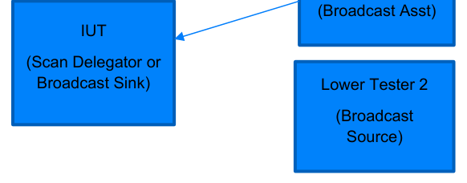

**Figure 3.6: Scan Delegator/Broadcast Sink test topology**

LC3 configurations are provided in Appendix A, which are referenced in some table-driven tests for the Codec Specific Configuration as well as the QoS settings used in a particular test case, in order to provide a common section for referencing LC3 Codec Setting values. Unicast Audio Configurations are provided in Section 3.2.1 and defined in Table 4.1: Unicast LC3 Audio Configurations in [3], which are utilized in the Unicast Client and Server streaming test cases, in order to provide diagrams for each audio configuration and the characteristics, Codec_Specific_Capabilities, and Codec_Specific_Configuration required to enable them. Some test cases reference other BAP test cases that have a particular Codec Specific Configuration or QoS setting that can be achieved by running that referenced test case; this is done to reduce the amount of repeated settings-related information and to prevent unnecessary maintenance error.

#### 3.2.1 Audio Configurations

##### 3.2.1.1 Audio Configuration 1 (Single audio channel. One unidirectional CIS. Unicast Server is

Audio Sink.)
Figure 3.7 shows an example of Audio Configuration 1. A Unicast Client in the Audio Source role transmits a single channel of audio data to a Unicast Server in the Audio Sink role using one unidirectional CIS.

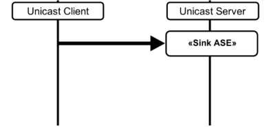

**Figure 3.7: Audio Configuration 1**

Audio Source.)
Figure 3.8 shows an example of Audio Configuration 2. A Unicast Client in the Audio Sink role receives a single channel of audio data from a Unicast Server in the Audio Source role using one unidirectional CIS.

**Figure 3.8: Audio Configuration 2**

##### 3.2.1.3 Audio Configuration 3 (Multiple audio channels. One bidirectional CIS. Unicast Server is

Audio Sink and Audio Source.)
Figure 3.9 shows an example of Audio Configuration 3. A Unicast Client in both the Audio Source and Audio Sink roles transmits a single channel of audio data to, and receives a single channel of audio data from, a Unicast Server in the Audio Sink and Audio Source roles using one bidirectional CIS.

**Figure 3.9: Audio Configuration 3**

##### 3.2.1.4 Audio Configuration 4 (Multiple audio channels. One unidirectional CIS. Unicast Server is

Audio Sink.)
Figure 3.10 shows an example of Audio Configuration 4. A Unicast Client in the Audio Source role transmits two channels of audio data to a Unicast Server in the Audio Sink role using one unidirectional CIS.

**Figure 3.10: Audio Configuration 4**

Audio Sink and Audio Source.)
Figure 3.11 shows an example of Audio Configuration 5. A Unicast Client in both the Audio Source and Audio Sink roles transmits two channels of audio data to, and receives a single channel of audio data from, a Unicast Server in the Audio Sink and Audio Source roles, using one bidirectional CIS.

**Figure 3.11: Audio Configuration 5**

##### 3.2.1.6 Audio Configuration 6(i) (Multiple audio channels. Two unidirectional CISes. Unicast

Server is Audio Sink.)
Figure 3.12 shows an example of Audio Configuration 6. A Unicast Client in the Audio Source role transmits two channels of audio data to a Unicast Server in the Audio Sink role using two unidirectional CISes.

**Figure 3.12: Audio Configuration 6(i)**

##### 3.2.1.7 Audio Configuration 6(ii) (Multiple audio channels. Two unidirectional CISes. Two Unicast

Servers. Unicast Server 1 is Audio Sink. Unicast Server 2 is Audio Sink.)
Figure 3.13 shows a second example of Audio Configuration 6. A Unicast Client in the Audio Source role transmits two channels of audio data to a pair of Unicast Servers, both of which are in the Audio Sink role, using two unidirectional CISes.

**Figure 3.13: Audio Configuration 6(ii)**

Server is Audio Sink and Audio Source.)
Figure 3.14 shows an example of Audio Configuration 7. A Unicast Client in the Audio Source and Audio Sink roles transmits a single channel of audio data to, and receives a single channel of audio data from, a Unicast Server in the Audio Sink and Audio Source roles, using two unidirectional CISes.

**Figure 3.14: Audio Configuration 7(i)**

##### 3.2.1.9 Audio Configuration 7(ii) (Multiple audio channels. Two Unidirectional CISes. Two Unicast

Servers. Unicast Server 1 is Audio Sink. Unicast Server 2 is Audio Source.)
Figure 3.15 shows a second example of Audio Configuration 7. A Unicast Client in the Audio Source and Audio Sink roles transmits a single channel of audio data to a Unicast Server in the Audio Sink role and receives a single channel of audio data from a second Unicast Server in the Audio Source role, using two unidirectional CISes.

**Figure 3.15: Audio Configuration 7(ii)**

##### 3.2.1.10 Audio Configuration 8(i) (Multiple audio channels. One bidirectional CIS and one

unidirectional CIS. Unicast Server is Audio Sink and Audio Source.)
Figure 3.16 shows an example of Audio Configuration 8. A Unicast Client in the Audio Source and Audio Sink roles transmits two channels of audio data to, and receives a single channel of audio data from, a Unicast Server in the Audio Sink and Audio Source roles, using one unidirectional CIS and one bidirectional CIS.

**Figure 3.16: Audio Configuration 8(i)**

unidirectional CIS. Two Unicast Servers. Unicast Server 1 is Audio Sink and Audio Source. Unicast Server 2 is Audio Sink.)
Figure 3.17 shows a second example of Audio Configuration 8. A Unicast Client in the Audio Source and Audio Sink roles transmits a single channel of audio data to, and receives a single channel of audio data from, a Unicast Server in the Audio Sink and Audio Source roles, using one bidirectional CIS. The Unicast Client also transmits a second channel of audio data to a second Unicast Server in the Audio Sink role, using one unidirectional CIS.

**Figure 3.17: Audio Configuration 8(ii)**

##### 3.2.1.12 Audio Configuration 9(i) (Multiple audio channels. Two unidirectional CISes. Unicast

Server is Audio Source.)
Figure 3.18 shows an example of Audio Configuration 9. A Unicast Client in the Audio Sink role receives two channels of audio data from a Unicast Server in the Audio Source role, using two unidirectional CISes.

**Figure 3.18: Audio Configuration 9(i)**

##### 3.2.1.13 Audio Configuration 9(ii) (Multiple audio channels. Two unidirectional CISes. Two Unicast

Servers. Unicast Server 1 is Audio Source. Unicast Server 2 is Audio Source.)
Figure 3.19 shows a second example of Audio Configuration 9. A Unicast Client in the Audio Sink role receives two channels of audio data from two Unicast Servers, both in the Audio Source role, using two unidirectional CISes.

**Figure 3.19: Audio Configuration 9(ii) (2 Unicast Servers)**

is Audio Source.)
Figure 3.20 shows an example of Audio Configuration 10. A Unicast Client in the Audio Sink role receives two channels of audio data from a Unicast Server in the Audio Source role, using one unidirectional CIS.

**Figure 3.20: Audio Configuration 10**

##### 3.2.1.15 Audio Configuration 11(i) (Multiple audio channels. Two bidirectional CISes. Unicast

Server is Audio Sink and Audio Source.)
Figure 3.21 shows an example of Audio Configuration 11. A Unicast Client in the Audio Source and Audio Sink roles transmits two channels of audio data to, and receives two channels of audio data from, a Unicast Server in the Audio Sink and Audio Source roles, using two bidirectional CISes.

**Figure 3.21: Audio Configuration 11(i)**

##### 3.2.1.16 Audio Configuration 11(ii) (Multiple audio channels. Two bidirectional CISes. Two Unicast

Servers. Unicast Server 1 is Audio Sink and Audio Source. Unicast Server 2 is Audio Sink and Audio Source.)
Figure 3.22 shows a second example of Audio Configuration 11. A Unicast Client in the Audio Source and Audio Sink roles transmits a single channel of audio data to, and receives a single channel of audio data from, a Unicast Server in the Audio Sink and Audio Source roles using one bidirectional CIS. The Unicast Client also transmits a second channel of audio data to, and receives a second channel of audio data from, a second Unicast Server in the Audio Sink role using a second bidirectional CIS.

**Figure 3.22: Audio Configuration 11(ii)**

### 3.3 Test groups

The following test groups have been defined:
Generic GATT Integrated Tests
Advertising
BASS
Device Discovery
Characteristic Discovery
Presentation Delay
Stream Configuration/Connection
Service Procedure – Error Handling
Streaming

## 4 Test cases (TC)

### 4.1 Test case identification conventions

Test cases are assigned unique identifiers per the conventions in [2]. The convention used here is: <spec abbreviation>/<IUT role>/<class>/<feat>/<func>/<subfunc>/<cap>/<xx>-<nn>-<y>.
Additionally, testing of this specification includes tests from the GATT Test Suite [5] referred to as Generic GATT Integrated Tests (GGIT); when used, the test cases in GGIT are referred to through a TCID string using the following convention: <spec abbreviation>/<IUT role>/<GGIT test group>/< GGIT class >/<xx>-<nn>-<y>.
GGIT tests that are shared among roles use the /CL/ for the /<IUT role>/ part.

|  | Identifier Abbreviation |  |  | Spec Identifier <spec abbreviation> |  |
| --- | --- | --- | --- | --- | --- |
| BAP |  |  | Basic Audio Profile |  |  |
|  | Identifier Abbreviation |  |  | Role Identifier <IUT role> |  |
| BA |  |  | Broadcast Assistant |  |  |
| BSNK |  |  | Broadcast Sink |  |  |
| BSRC |  |  | Broadcast Source |  |  |
| CL |  |  | Generic Client BAP Role Agnostic |  |  |
| SDE |  |  | Scan Delegator |  |  |
| UCL |  |  | Unicast Client |  |  |
| USR |  |  | Unicast Server |  |  |
|  | Identifier Abbreviation |  |  | Reference Identifier <GGIT test group> |  |
| CGGIT |  |  | Client Generic GATT Integrated Tests |  |  |
| SGGIT |  |  | Server Generic GATT Integrated Tests |  |  |
|  | Identifier Abbreviation |  |  | Feature Identifier <feat> |  |
| ADV |  |  | Advertising |  |  |
| BASS |  |  | Broadcast Audio Scan Service |  |  |
| DEVD |  |  | Device discovery |  |  |
| DISC |  |  | Unicast Discovery of characteristics and characteristic values |  |  |
| PD |  |  | Presentation Delay |  |  |
| SCC |  |  | Stream Configuration/Connection |  |  |
| SPE |  |  | Service Procedure Error Handling |  |  |
| STR |  |  | Streaming |  |  |

Table 4.1: BAP TC feature naming conventions

### 4.2 Conformance

When conformance is claimed for a particular specification, all capabilities are to be supported in the specified manner. The mandated tests from this Test Suite depend on the capabilities to which conformance is claimed.
The Bluetooth Qualification Program may employ tests to verify implementation robustness. The level of implementation robustness that is verified varies from one specification to another and may be revised for cause based on interoperability issues found in the market.
That claimed capabilities may be used in any order and any number of repetitions not excluded by the specification
That capabilities enabled by the implementations are sustained over durations expected by the use case
That the implementation gracefully handles any quantity of data expected by the use case
That in cases where more than one valid interpretation of the specification exists, the implementation complies with at least one interpretation and gracefully handles other interpretations
That the implementation is immune to attempted security exploits
A single execution of each of the required tests is required to constitute a Pass verdict. However, it is noted that to provide a foundation for interoperability, it is necessary that a qualified implementation consistently and repeatedly pass any of the applicable tests.
In any case, where a member finds an issue with the test plan generated by the Bluetooth SIG qualification tool, with the test case as described in the Test Suite, or with the test system utilized, the member is required to notify the responsible party via an erratum request such that the issue may be addressed.

### 4.3 Pass/Fail verdict conventions

Each test case has an Expected Outcome section. The IUT is granted the Pass verdict when all the detailed pass criteria conditions within the Expected Outcome section are met.
The convention in this Test Suite is that, unless there is a specific set of fail conditions outlined in the test case, the IUT fails the test case as soon as one of the pass criteria conditions cannot be met. If this occurs, then the outcome of the test is a Fail verdict.

### 4.4 Setup preambles

Some test cases require a precondition being satisfied, such as the Lower Tester needing specific information, or the IUT being in a specific state. The following subsections instruct the Lower Tester and the IUT to satisfy the precondition. They are structured as standalone procedures that require input parameters, execute steps, and optionally produce an output. The input parameters may come from the Upper Tester, a test procedure, or an IXIT item. If a preamble specifies that a parameter is provided by the Upper Tester, this means that when the preamble is used, a reference to the preamble will be accompanied by that parameter.

#### 4.4.1 ATT Bearer on LE Transport with Extended Advertising

Preamble procedure:
1. Establish an LE transport connection between the IUT and the Lower Tester, where the
advertising implementation (as GAP Peripheral) uses Extended Advertising as defined in Section 8.1.1 of [3] and the discovering implementation (as GAP Central) operates according to Section 8.1.2 of [3]. 2. Establish an L2CAP channel 0x0004 between the IUT and the Lower Tester over that LE
transport.

#### 4.4.2 ATT Bearer on BR/EDR Transport

Preamble procedure:
1. Establish a BR/EDR transport connection between the IUT and the Lower Tester. 2. Establish an L2CAP channel (PSM 0x001F) between the IUT and the Lower Tester over that
BR/EDR transport.

#### 4.4.3 EATT Bearer on LE Transport with Extended Advertising

Preamble procedure:
1. Establish an LE transport connection between the IUT and the Lower Tester, where the
advertising implementation (as GAP Peripheral) uses Extended Advertising as defined in Section 8.1.1 of [3] and the discovering implementation (as GAP Central) operates according to Section 8.1.2 of [3]. 2. Establish an L2CAP channel 0x0005 for signaling and one L2CAP channel (for ATT bearers) with
EATT PSM (as defined in Assigned Numbers) between the IUT and the Lower Tester over that LE transport.

#### 4.4.4 EATT Bearer on BR/EDR Transport

Preamble procedure:
1. Establish a BR/EDR transport connection between the IUT and the Lower Tester. 2. Establish an L2CAP channel 0x0001 for signaling and one L2CAP channel (for ATT bearers) with
EATT PSM (as defined in Assigned Numbers) between the IUT and the Lower Tester over that BR/EDR transport.

#### 4.4.5 ASE Control Point

Preamble procedure:
1. A bearer connection between the Lower Tester and the IUT is established as described in
Section 4.4.1, if using ATT over an LE transport, or Section 4.4.2 if using ATT over a BR/EDR transport, or Section 4.4.3 if using EATT over an LE transport, or Section 4.4.4 if using EATT over a BR/EDR transport. 2. The Lower Tester has discovered and cached the ASCS service and characteristic handles (e.g.,
by running the test procedure in Section 4.5). 3. For each ASE characteristic, the Lower Tester has enabled notification by writing the value
0x0001 using the GATT Write Characteristic Descriptor sub-procedure for the CCCD. 4. The ASE_State field of the ASE selected for a Codec Config operation is set to 0x00 (Idle),
0x01 (Codec Configured), or 0x02 (QoS Configured).

#### 4.4.6 Transition ASE to the Idle State

Preamble Purpose
This procedure specifies the steps necessary to transition an ASE (either Sink ASE or Source ASE) on the IUT to the Idle state.
Preamble Procedure
1. The Lower Tester has cached the ASCS service and characteristics handles (e.g., by running the
procedures in Section 4.5). 2. The Lower Tester randomly selects one ASE characteristic of the specified ASE type (Sink ASE
or Source ASE) and reads the characteristic value by executing the GATT Read Characteristic Value sub-procedure. The Lower Tester caches the ASE_ID field value as Test_ASE_ID.
Characteristic Descriptor sub-procedure for the CCCD of the specified ASE type. 4. If the ASE_State field of the characteristic value read in Step 3 is different than 0x00 (Idle), the
Upper Tester commands the IUT to reset the ASE_State to Idle. 5. The Lower Tester enables notifications by writing the value 0x0001 using the GATT Write
Characteristic Descriptor sub-procedure for the ASE Control Point CCCD.

#### 4.4.7 Transition ASE to the Codec Configured State

Preamble Purpose
This procedure specifies the steps necessary to transition an ASE (either Sink ASE or Source ASE) on the IUT to the Codec Configured state.
Preamble Procedure
1. The Lower Tester retrieves the ASE_State value of an ASE characteristic of the specified ASE
type (Sink ASE or Source ASE) on the IUT by executing the GATT Read Characteristic Value sub-procedure. The Lower Tester caches the ASE_ID field value as Test_ASE_ID. 2. If the ASE_State is 0x03 (Enabling) or 0x04 (Streaming):
a. The Lower Tester writes to the ASE Control Point characteristic on the IUT by executing
either the GATT Write Without Response or Write Characteristic Value sub-procedure with the opcode set to 0x05 (Disable) and: • Number_of_ASEs set to 1 • ASE_ID[0] set to Test_ASE_ID b. The IUT sends a GATT Characteristic Value Notification for the ASE Control Point
characteristic with ASE_ID[0] set to Test_ASE_ID. c. The IUT sends a GATT Characteristic Value Notification for the specified ASE characteristic
type, with ASE_ID set to Test_ASE_ID. 3. If the ASE_State is 0x06 (Releasing), the IUT performs the Released operation and does one of
these two actions depending on which action it supports: a. If the IUT supports transitioning to Codec Configured state, the IUT transitions the ASE to the
Codec Configured state where the ASE_State field is 0x01. b. If the IUT supports transitioning to Idle state, the IUT transitions the ASE to the Idle state
where the ASE_State field is 0x00. 4. If the ASE_State is 0x00 (Idle) or 0x02 (QoS Configured):
a. The Lower Tester writes to the ASE Control Point characteristic on the IUT by executing
either the GATT Write Without Response or Write Characteristic Value sub-procedure with the opcode set to 0x01 (Config Codec) and: • Number_of_ASEs set to 1 • ASE_ID[0] set to Test_ASE_ID • Target_Latency[0], Target_PHY[0], Codec_ID[0], Codec_Specific_Configuration_Length[0], and Codec_Specific_Configuration[0] set to values supported by the IUT (e.g., known to the Lower Tester from the TSPX_SUPPORTED_CODEC_CONFIGURATIONS IXIT item). b. The IUT sends a GATT Characteristic Value Notification for the ASE Control Point
characteristic with ASE_ID[0] set to Test_ASE_ID. c. The IUT sends a GATT Characteristic Value Notification for the specified ASE characteristic
type, with ASE_ID set to Test_ASE_ID. 5. If the ASE_State is 0x01 (Codec Configured), this preamble is successfully completed.

#### 4.4.8 Transition ASE to the QoS Configured State

Preamble Purpose
This procedure specifies the steps necessary to transition an ASE (either Sink ASE or Source ASE) on the IUT to the QoS Configured state.
Preamble Procedure
1. The Lower Tester retrieves the ASE_State value of an ASE of the specified ASE type (Sink ASE
or Source ASE) on the IUT by executing the GATT Read Characteristic Value sub-procedure. 2. If the ASE_State is 0x02 (QoS Configured), the preamble is successfully completed. 3. The Lower Tester executes the procedure in Section 4.4.7. 4. The Lower Tester writes to the ASE Control Point characteristic on the IUT by executing either
the GATT Write Without Response or Write Characteristic Value sub-procedure with the opcode set to 0x02 (Config QoS) and: • Number_of_ASEs set to 1 • ASE_ID[0] set to Test_ASE_ID • Random valid values for CIG_ID[0] and CIS_ID[0] • The remaining QoS parameters set to values acceptable for the IUT based on the values exposed through the Additional_ASE_Parameters field of the codec configured ASE (e.g., after running Step 1) 5. The IUT sends a GATT Characteristic Value Notification for the ASE Control Point characteristic. 6. The IUT sends a GATT Characteristic Value Notification for the specified ASE characteristic type
identified by Test_ASE_ID.

#### 4.4.9 Unicast Audio Data Path Setup

Preamble procedure:
1. If the codec in use resides in the Bluetooth Controller of the device using the LE Setup ISO Data
Path command defined in [1] (Vol 4, Part E, Section 7.8.109): a. Write the LE Setup ISO Data Path command Codec_ID parameter with the value of the
Codec_ID for the target ASE. b. Write the LE Setup ISO Data Path command Codec_Configuration_Length parameter with
the value of the Codec_Specific_Configuration_Length for the target ASE. c. Write the LE Setup ISO Data Path command Codec_Configuration parameter including the
following Codec_Specific_Configuration values from the IXIT [7]: • TSPX_Sampling_Frequency • TSPX_Frame_Duration • TSPX_Audio_Channel_Allocation • TSPX_Octets_Per_Codec_Frame • TSPX_Codec_Frame_Blocks_Per_SDU 2. If the codec in use resides in the Bluetooth Host of the device using the LE Setup ISO Data Path
command: a. Write the LE Setup ISO Data Path command Codec_Configuration_Length parameter with
the value 0x00. b. Write octet 0 (Coding_Format) of the LE Setup ISO Data Path command Codec_ID
parameter with the value 0x03 (Transparent).

### 4.5 Generic GATT Integrated Tests

Execute the Generic GATT Integrated Tests defined in [5] Section 6.4, Client test procedures, using Table 4.2 below as input:

| TCID |  |  |  | Service / Characteristic / |  | Reference | Properties |  |  |  | Value Length |  |
| --- | --- | --- | --- | --- | --- | --- | --- | --- | --- | --- | --- | --- |
|  |  |  |  | Descriptor |  |  |  |  |  |  | (Octets) |  |
|  | BAP/CL/CGGIT/SER/BV-01-C [Service GGIT – |  |  | Published Audio Capabilities |  | [3] 3.6.3 | - |  |  | - | - |  |
|  | Published Audio Capabilities] |  |  | Service |  |  |  |  |  |  |  |  |
|  | BAP/CL/CGGIT/CHA/BV-01-C [Characteristic |  | Sink PAC Characteristic | Sink PAC Characteristic |  | [3] 3.6.4 |  | Mandatory: 0x02 (Read) |  | skip |  |  |
|  | GGIT – Sink PAC] |  |  |  |  |  |  | Optional: 0x10 (Notify) |  |  |  |  |
|  | BAP/CL/CGGIT/CHA/BV-02-C [Characteristic |  |  | Sink Audio Locations |  | [3] 3.6.4 |  | Mandatory: 0x02 (Read) |  | 4 |  |  |
|  | GGIT – Sink Audio Locations] |  |  | Characteristic |  |  |  | Optional: 0x18 (Write, Notify) |  |  |  |  |
|  | BAP/CL/CGGIT/CHA/BV-03-C [Characteristic |  | Source PAC Characteristic | Source PAC Characteristic |  | [3] 3.6.4 |  | Mandatory: 0x02 (Read) |  | skip |  |  |
|  | GGIT – Source PAC] |  |  |  |  |  |  | Optional: 0x10 (Notify) |  |  |  |  |
|  | BAP/CL/CGGIT/CHA/BV-04-C [Characteristic |  |  | Source Audio Locations |  | [3] 3.6.4 |  | Mandatory: 0x02 (Read) |  | 4 |  |  |
|  | GGIT – Source Audio Locations] |  |  | Characteristic |  |  |  | Optional: 0x18 (Write, Notify) |  |  |  |  |
|  | BAP/CL/CGGIT/CHA/BV-05-C [Characteristic |  |  | Available Audio Contexts |  | [3] 3.6.4 | 0x12 (Read, Notify) | 0x12 (Read, Notify) |  | 4 |  |  |
|  | GGIT – Available Audio Contexts] |  |  | Characteristic |  |  |  |  |  |  |  |  |
|  | BAP/CL/CGGIT/CHA/BV-06-C [Characteristic |  |  | Supported Audio Contexts |  | [3] 3.6.4 |  | Mandatory: 0x02 (Read) |  | 4 |  |  |
|  | GGIT – Supported Audio Contexts] |  |  | Characteristic |  |  |  | Optional: 0x10 (Notify) |  |  |  |  |
|  | BAP/UCL/CGGIT/SER/BV-01-C [Service GGIT – |  | Audio Stream Control Service | Audio Stream Control Service |  | [3] 3.6.3 | - | - |  | - |  |  |
|  | Audio Stream Control Service] |  |  |  |  |  |  |  |  |  |  |  |
|  | BAP/UCL/CGGIT/CHA/BV-01-C [Characteristic |  | Sink ASE Characteristic |  |  | [3] 3.6.4 | 0x12 (Read, Notify) |  |  | - |  |  |
|  | GGIT – Sink ASE] |  |  |  |  |  |  |  |  |  |  |  |
|  | BAP/UCL/CGGIT/CHA/BV-02-C [Characteristic |  | Source ASE Characteristic |  |  | [3] 3.6.4 | 0x12 (Read, Notify) |  |  |  |  |  |
|  | GGIT – Source ASE] |  |  |  |  |  |  |  |  |  |  |  |
|  | BAP/UCL/CGGIT/CHA/BV-03-C [Characteristic |  | ASE Control Point Characteristic |  |  | [3] 3.6.4 |  | 0x1C (Write, |  | - |  |  |
|  | GGIT – ASE Control Point] |  |  |  |  |  |  | WriteWithoutResponse, Notify) |  |  |  |  |
|  | BAP/BA/CGGIT/SER/BV-01-C [Service GGIT – |  | Broadcast Audio Scan Service |  |  | [3] 3.9.2 | - | - |  | - |  |  |
|  | Broadcast Audio Scan Service] |  |  |  |  |  |  |  |  |  |  |  |
|  | BAP/BA/CGGIT/CHA/BV-01-C [Characteristic |  |  | Broadcast Audio Scan Control |  | [3] 3.10.4 |  | Mandatory: 0x0C (Write, |  | skip |  |  |
|  | GGIT – Broadcast Audio Scan Control Point] |  |  | Point Characteristic |  |  |  | WriteWithoutResponse) |  |  |  |  |
|  | BAP/BA/CGGIT/CHA/BV-02-C [Characteristic |  |  | Broadcast Receive State |  | [3] 3.10.4 | 0x12 (Read, Notify) | 0x12 (Read, Notify) |  | skip |  |  |
|  | GGIT – Broadcast Receive State] |  |  | Characteristic |  |  |  |  |  |  |  |  |

Table 4.2: Input for the GGIT Client test procedures

### 4.6 Unicast Device Discovery

#### 4.6.1 LE Audio Major Service Class CoD Field Support

Test Purpose
Verify that the IUT implementing either the Unicast Server or Broadcast Source or Broadcast Sink or Broadcast Assistant or Scan Delegator roles that supports the BR/EDR transport sets the LE Audio Major Service Class in the Class of Device field.
Reference
[3] 8.2.3
Initial Condition
- The IUT is discoverable and connectable over the BR/EDR transport.
Test Case Configuration

|  | Test Case |  |
| --- | --- | --- |
| BAP/USR/DEVD/BV-01-C [Unicast Server – LE Audio Major Service Class CoD Support] |  |  |
| BAP/BSRC/DEVD/BV-01-C [Broadcast Source – LE Audio Major Service Class CoD Support] |  |  |
| BAP/BSNK/DEVD/BV-01-C [Broadcast Sink – LE Audio Major Service Class CoD Support] |  |  |
| BAP/BA/DEVD/BV-01-C [Broadcast Assistant – LE Audio Major Service Class CoD Support] |  |  |
| BAP/SDE/DEVD/BV-01-C [Scan Delegator – LE Audio Major Service Class CoD Support] |  |  |

Table 4.3: LE Audio Major Service Class CoD Support test cases
Test Procedure
1. The Lower Tester performs the General Inquiry procedure (as defined in [1] Volume 3, Part C,
Section 6.1). 2. The IUT sends an Inquiry response message.
Expected Outcome
Pass verdict
In Step 2, the IUT reports that the Class of Device field has the LE Audio Major Service Class bit 14 set to 1.
If the IUT uses limited discoverable mode, the limited discoverable Major Service Class bit is also set to 1.

### 4.7 Unicast Characteristic Discovery

#### 4.7.1 Unicast Client – Audio Capability Discovery

Test Purpose
Verify that a Unicast Client IUT can perform audio capability discovery with an Audio Sink, reading the values of its Sink PAC characteristic and Sink Audio Locations characteristic, or with an Audio Source, reading the values of its Source PAC characteristic and Source Audio Locations characteristic. The verification is performed for each PAC Characteristic and Location Characteristic in turn, as enumerated in the test cases in Table 4.4.
Reference
[3] 5.2
- Establish a Bearer connection between the Lower Tester and the IUT as described in Section 4.4.1, if using ATT over an LE transport, or Section 4.4.2 if using ATT over a BR/EDR transport, or Section 4.4.3 if using EATT over an LE transport, or Section 4.4.4 if using EATT over a BR/EDR transport.
- The Lower Tester is a Unicast Server that has an instantiation of the Published Audio Capabilities Service with at least one instance of the PAC Characteristic specified in Table 4.4, and one instance of the Location Characteristic specified in Table 4.4.
- The IUT is a Unicast Client that has discovered the Published Audio Capabilities Service and has saved the handle range.
Test Case Configuration

| Test Case |  | PAC |  |  | Location |  |
| --- | --- | --- | --- | --- | --- | --- |
|  |  | Characteristic |  |  | Characteristic |  |
| BAP/UCL/DISC/BV-01-C [Discover Audio Sink Capabilities] | Sink PAC |  |  | Sink Audio Locations |  |  |
| BAP/UCL/DISC/BV-02-C [Discover Audio Source Capabilities] | Source PAC |  |  | Source Audio Locations |  |  |

Table 4.4: Unicast Client – Audio Capability Discovery test cases
Test Procedure
1. The Upper Tester orders the IUT to execute the GATT Discover All Characteristics of a Service
sub-procedure or the GATT Discover Characteristics by Characteristic UUID sub-procedure to discover the PAC Characteristic and Location Characteristic specified in Table 4.4, and their CCCD. 2. The Upper Tester orders the IUT to read the value of the characteristic specified in the PAC
Characteristic column in Table 4.4 (e.g., by executing the GATT Read Characteristic Value sub-procedure or by other means). 3. The Upper Tester orders the IUT to read the value of the characteristic specified in the Location
Characteristic column in Table 4.4 (e.g., by executing the GATT Read Characteristic Value sub-procedure or by other means).
Expected Outcome
Pass verdict
The IUT discovers the characteristics specified in the PAC Characteristic and Location Characteristic columns in Table 4.4. The IUT reads the values of the characteristics specified in the PAC Characteristic and Location Characteristic columns.

#### 4.7.2 Unicast Server – Audio Capability Exposure

Test Purpose
Verify that a Unicast Server IUT can allow audio capability discovery with an Audio Sink reading the values of the Sink PAC characteristic and the Sink Audio Locations characteristic on the IUT, or with an Audio Source reading the values of the Source PAC characteristic and the Source Audio Locations characteristic on the IUT. The verification is performed for each PAC Characteristic and Location Characteristic in turn, as enumerated in the test cases in Table 4.5.
Reference
[3] 5.2
- Establish a Bearer connection between the Lower Tester and the IUT as described in Section 4.4.1, if using ATT over an LE transport, or Section 4.4.2 if using ATT over a BR/EDR transport, or Section 4.4.3 if using EATT over an LE transport, or Section 4.4.4 if using EATT over a BR/EDR transport.
- The IUT is a Unicast Server and has an instantiation of the Published Audio Capabilities Service with at least one instance of the PAC Characteristic and optionally a Location Characteristic specified in Table 4.5.
- The Lower Tester is a Unicast Client that has discovered the Published Audio Capabilities Service and has saved the handle range.
Test Case Configuration

| Test Case |  | PAC |  |  | Location |  |
| --- | --- | --- | --- | --- | --- | --- |
|  |  | Characteristic |  |  | Characteristic |  |
| BAP/USR/DISC/BV-01-C [Expose Audio Sink Capabilities] | Sink PAC |  |  | Sink Audio Locations |  |  |
| BAP/USR/DISC/BV-02-C [Expose Audio Source Capabilities] | Source PAC |  |  | Source Audio Locations |  |  |

Table 4.5: Unicast Server – Audio Capability Exposure test cases
Test Procedure
1. The Lower Tester discovers the PAC Characteristic and Location Characteristic specified in Table
4.5 by executing the GATT Discover All Characteristics of a Service sub-procedure. 2. The Lower Tester reads the value of the characteristic specified in the PAC Characteristic column
in Table 4.5 by executing the GATT Read Characteristic Value sub-procedure. 3. If exposed on the IUT, the Lower Tester reads the value of the characteristic specified in the
Location Characteristic column in Table 4.5 by executing the GATT Read Characteristic Value sub-procedure.
Expected Outcome
Pass verdict
The specified PAC Characteristic and the Location Characteristic, if supported, are read on the IUT.

#### 4.7.3 Discover ASE_ID Value

Test Purpose
Verify that a Unicast Client IUT can perform ASE_ID discovery by reading all ASE characteristic values exposed by a Unicast Server.
Reference
[3] 5.3
- Establish a Bearer connection between the Lower Tester and the IUT as described in Section 4.4.1, if using ATT over an LE transport, or Section 4.4.2 if using ATT over a BR/EDR transport, or Section 4.4.3 if using EATT over an LE transport, or Section 4.4.4 if using EATT over a BR/EDR transport.
- The IUT is a Unicast Client.
- The Lower Tester is a Unicast Server including an instantiation of the Audio Stream Control Service with at least one instance of the ASE Characteristic specified in Table 4.6 and an instantiation of the Published Audio Capabilities Service.
Test Case Configuration

|  | Test Case |  |  | ASE Characteristic |  |
| --- | --- | --- | --- | --- | --- |
| BAP/UCL/DISC/BV-03-C [Discover Sink ASE ID] _ |  |  | Sink ASE |  |  |
| BAP/UCL/DISC/BV-04-C [Discover Source ASE ID] _ |  |  | Source ASE |  |  |

Table 4.6: Unicast Client Discover ASE_ID Value test cases
Test Procedure
1. The Upper Tester orders the IUT to discover the Audio Stream Control Service on the Lower
Tester by executing the GATT Discover All Primary Services sub-procedure. 2. The Upper Tester orders the IUT to discover the ASE Control Point characteristic and ASE
Characteristic specified in Table 4.6 on the Lower Tester by executing the GATT Discover All Characteristics of a Service sub-procedure for the Audio Stream Control Service. 3. The Upper Tester orders the IUT to read the values of all discovered characteristics of the type
specified in Step 2 by executing the GATT Read Characteristic Value sub-procedure for each ASE characteristic discovered in Step 2.
Expected Outcome
Pass verdict
The IUT successfully reads the ASE_ID values of each discovered ASE characteristic on the Lower Tester.

#### 4.7.4 Expose ASE_ID Value

Test Purpose
Verify that a Unicast Server IUT allows a Unicast Client to perform ASE_ID discovery by reading all ASE characteristic values exposed by the IUT.
Reference
[3] 5.3
Initial Condition
- Establish a Bearer connection between the Lower Tester and the IUT as described in Section 4.4.1, if using ATT over an LE transport, or Section 4.4.2 if using ATT over a BR/EDR transport, or Section 4.4.3 if using EATT over an LE transport, or Section 4.4.4 if using EATT over a BR/EDR transport.
- The IUT is a Unicast Server including an instantiation of the Audio Stream Control Service with at least one ASE characteristic specified in Table 4.7.

|  | Test Case |  |  | ASE Characteristic |  |
| --- | --- | --- | --- | --- | --- |
| BAP/USR/DISC/BV-03-C [Expose Sink ASE ID] _ |  |  | Sink ASE |  |  |
| BAP/USR/DISC/BV-04-C [Expose Source ASE ID] _ |  |  | Source ASE |  |  |
| BAP/USR/DISC/BV-05-C [Expose Sink and Source ASE ID] _ |  |  | Source ASE AND Sink ASE |  |  |

Table 4.7: Unicast Server Expose ASE_ID Value test cases
Test Procedure
1. The Lower Tester discovers the Audio Stream Control Service on the IUT by executing the GATT
Discover All Primary Services sub-procedure. 2. The Lower Tester discovers the ASE Control Point characteristic and all characteristics of the
type(s) specified in Table 4.7 on the IUT by executing the GATT Discover All Characteristics of a Service sub-procedure for the Audio Stream Control Service. 3. The Lower Tester reads the values of all discovered characteristics of the type specified in Step 2
by executing the GATT Read Characteristic Value sub-procedure for each characteristic.
Expected Outcome
Pass verdict
The IUT successfully returns the values of each ASE characteristic read by the Lower Tester. The value of the ASE_ID field is unique for each ASE characteristic.
BAP/UCL/DISC/BV-05-C [Discover Supported Audio Contexts]
Test Purpose
Verify that a Unicast Client IUT can read the value of the Supported Audio Contexts characteristic on a Unicast Server.
Reference
[3] 5.4
Initial Condition
- Establish a Bearer connection between the Lower Tester and the IUT as described in Section 4.4.1, if using ATT over an LE transport, or Section 4.4.2 if using ATT over a BR/EDR transport, or Section 4.4.3 if using EATT over an LE transport, or Section 4.4.4 if using EATT over a BR/EDR transport.
- The IUT is a Unicast Client.
- The Lower Tester is a Unicast Server including an instantiation of the Published Audio Capabilities Service.
1. The Upper Tester orders the IUT to discover the Published Audio Capabilities Service on the
Lower Tester by executing the GATT Discover All Primary Services or GATT Discover Primary Services by Service UUID sub-procedure. 2. The Upper Tester orders the IUT to discover the Supported Audio Contexts characteristic on the
Lower Tester by executing the GATT Discover All Characteristics of a Service or Discover Characteristic by UUID sub-procedure for the Published Audio Capabilities Service. 3. The Upper Tester orders the IUT to read the value of the Supported Audio Contexts characteristic
discovered in Step 2 by executing the GATT Read Characteristic Value sub-procedure for the Supported Audio Contexts characteristic discovered in Step 2.
Expected Outcome
Pass verdict
The IUT successfully reads the value of the Supported Audio Contexts characteristic on the Lower Tester.
BAP/USR/DISC/BV-07-C [Expose Supported Audio Contexts]
Test Purpose
Verify that a Unicast Server IUT returns the value of its Supported Audio Contexts characteristic when read by a Unicast Client.
Reference
[3] 5.4
Initial Condition
- Establish a Bearer connection between the Lower Tester and the IUT as described in Section 4.4.1, if using ATT over an LE transport, or Section 4.4.2 if using ATT over a BR/EDR transport, or Section 4.4.3 if using EATT over an LE transport, or Section 4.4.4 if using EATT over a BR/EDR transport.
- The IUT is a Unicast Server including an instantiation of the Published Audio Capabilities Service.
- The Lower Tester is a Unicast Client.
Test Procedure
1. The Lower Tester discovers the Published Audio Capabilities Service on the IUT by executing the
GATT Discover All Primary Services sub-procedure. 2. The Lower Tester discovers the Supported Audio Contexts characteristic on the IUT by executing
the GATT Discover All Characteristics of a Service sub-procedure for the Published Audio Capabilities Service. 3. The Lower Tester reads the value of the Supported Audio Contexts characteristic discovered in
Step 2 by executing the GATT Read Characteristic Value sub-procedure for the Supported Audio Contexts characteristic discovered in Step 2.
Expected Outcome
Pass verdict
The IUT successfully returns the value of its Supported Audio Contexts characteristic when read by the Lower Tester.
Test Purpose
Verify that a Unicast Client IUT can read the value of the Available Audio Contexts characteristic on a Unicast Server to retrieve audio data Context Type values available for reception or transmission.
Reference
[3] 5.5
Initial Condition
- Establish a Bearer connection between the Lower Tester and the IUT as described in Section 4.4.1, if using ATT over an LE transport, or Section 4.4.2 if using ATT over a BR/EDR transport, or Section 4.4.3 if using EATT over an LE transport, or Section 4.4.4 if using EATT over a BR/EDR transport.
- The IUT is a Unicast Client.
- The Lower Tester is a Unicast Server including an instantiation of the Published Audio Capabilities Service.
Test Procedure
1. The Upper Tester orders the IUT to discover the Published Audio Capabilities Service on the
Lower Tester by executing the GATT Discover All Primary Services or GATT Discover Primary Services by Service UUID sub-procedure. 2. The Upper Tester orders the IUT to discover the Available Audio Contexts characteristic on the
Lower Tester by executing the GATT Discover All Characteristics of a Service or Discover Characteristic by UUID sub-procedure for the Published Audio Capabilities Service. 3. The Upper Tester orders the IUT to read the value of the Available Audio Contexts characteristic
discovered in Step 2.
Expected Outcome
Pass verdict
The IUT successfully reads the value of the Available Audio Contexts characteristic on the Lower Tester.
BAP/USR/DISC/BV-06-C [Expose Available Audio Contexts]
Test Purpose
Verify that a Unicast Server IUT returns the value of its Available Audio Contexts characteristic when read by a Unicast Client.
Reference
[3] 5.5
Initial Condition
- Establish a Bearer connection between the Lower Tester and the IUT as described in Section 4.4.1, if using ATT over an LE transport, or Section 4.4.2 if using ATT over a BR/EDR transport, or Section 4.4.3 if using EATT over an LE transport, or Section 4.4.4 if using EATT over a BR/EDR transport.
- The IUT is a Unicast Server.
- The Lower Tester is a Unicast Client.
1. The Lower Tester discovers the Published Audio Capabilities Service on the IUT by executing the
GATT Discover All Primary Services sub-procedure. 2. The Lower Tester discovers the Available Audio Contexts characteristic on the IUT by executing
the GATT Discover All Characteristics of a Service sub-procedure for the Published Audio Capabilities Service. 3. The Lower Tester reads the value of the Available Audio Contexts characteristic discovered in
Step 2 by executing the GATT Read Characteristic Value sub-procedure for the Available Audio Contexts characteristic discovered in Step 2.
Expected Outcome
Pass verdict
The IUT returns the value of its Available Audio Contexts characteristic when read by the Lower Tester.

#### 4.7.5 Unicast Advertising

BAP/UCL/ADV/BV-01-C [Unicast Client Receives Extended Advertising PDUs]
Test Purpose
Verify that a Unicast Client IUT can receive extended advertising PDUs including Available Audio Contexts.
Reference
[3] 3.5.3
Initial Condition
- The IUT is a Unicast Client.
- The Lower Tester is a Unicast Server transmitting connectable extended advertising PDUs containing the following fields: Service Data AD type data, Audio Stream Control Service UUID, Announcement Type, Available Audio Contexts, Metadata_Length, and Metadata.
Test Procedure
1. The Upper Tester orders the IUT to scan for advertising packets containing the Audio Stream
Control Service UUID. 2. The IUT receives an Extended Advertising PDU. 3. The Upper Tester verifies the extended advertising data.
Expected Outcome
Pass verdict
The IUT receives an Extended Advertising PDU containing the fields and data defined for the Lower Tester within the Initial Condition.

##### 4.7.5.1 Unicast Server Transmits Extended Advertising PDUs

Test Purpose
Verify that a Unicast Server IUT can transmit connectable extended advertising PDUs informing Unicast Clients that the IUT is connectable and available to receive or transmit audio data for specific Context Type values.
[3] 3.5.3
Initial Condition
- If the IUT is a BR/EDR/LE device as indicated in Table 4.8, then the IUT is discoverable over BR/EDR.
- The IUT is a Unicast Server transmitting connectable extended advertising PDUs containing the following fields: Service Data AD data type, Audio Stream Control Service UUID, Announcement Type as specified in Table 4.8, Available Audio Contexts, Metadata_Length, and Metadata.
- The Lower Tester is a Unicast Client.
- The Lower Tester retrieves and stores the value of the Available Audio Contexts characteristic by executing the procedure in BAP/USR/DISC/BV-06-C [Expose Available Audio Contexts].
- The Lower Tester retrieves and stores the value of the Supported Audio Contexts characteristic by executing the procedure in BAP/USR/DISC/BV-07-C [Expose Supported Audio Contexts].
Test Case Configuration

| Test Case | Type | CTKD |  | Announcement |  |
| --- | --- | --- | --- | --- | --- |
|  |  |  |  | Type |  |
| BAP/USR/ADV/BV-01-C [Unicast Server Transmits Extended Advertising PDUs, General Announcement] | LE | N/A | 0x00 |  |  |
| BAP/USR/ADV/BV-02-C [Unicast Server Transmits Extended Advertising PDUs, BR/EDR/LE, General Announcement] | BR/EDR/LE | Y | 0x00 |  |  |
| BAP/USR/ADV/BV-03-C [Unicast Server Transmits Extended Advertising PDUs, BR/EDR/LE, No CTKD, General Announcement] | BR/EDR/LE | N | 0x00 |  |  |
| BAP/USR/ADV/BV-04-C [Unicast Server Transmits Extended Advertising PDUs, Targeted Announcement] | LE | N/A | 0x01 |  |  |
| BAP/USR/ADV/BV-05-C [Unicast Server Transmits Extended Advertising PDUs, BR/EDR/LE, Targeted Announcement] | BR/EDR/LE | Y | 0x01 |  |  |
| BAP/USR/ADV/BV-06-C [Unicast Server Transmits Extended Advertising PDUs, BR/EDR/LE, No CTKD, Targeted Announcement] | BR/EDR/LE | N | 0x01 |  |  |

Table 4.8: Unicast Server Transmits Extended Advertising PDUs test cases
1. Perform alternative 1A if the IUT is BR/EDR/LE as indicated in Table 4.8.
Alternative 1A:
1A.1 The Lower Tester performs BR/EDR Inquiry to discover the IUT. 1A.2 The IUT sends an Inquiry response message. 2. The Lower Tester scans for advertising packets with the Audio Stream Control Service UUID. 3. The Lower Tester receives a connectable extended advertising PDU (as defined in [1] Volume 6,
Part B, Section 4.4.2) containing the following fields: Service Data AD data type, Announcement Type, Available Audio Contexts, Metadata_Length, and Metadata.
Expected Outcome
Pass verdict
The IUT sends connectable extended advertising PDUs containing the following fields: Service Data AD data type, Audio Stream Control Service UUID, Announcement Type as specified in Table 4.8, Available Audio Contexts, Metadata_Length, and Metadata. The Available Audio Contexts value matches the Available Audio Contexts value retrieved in the Initial Condition. The Metadata field is only present if Metadata_Length is not 0x00.
In Step 2, all bits set in the Available Audio Contexts value are also set in the Supported Audio Contexts value retrieved in the Initial Condition.
If the IUT is BR/EDR/LE as indicated in Table 4.8, then the IUT is discoverable over both BR/EDR and LE.
If the IUT is BR/EDR/LE and CTKD is not used as indicated in Table 4.8, then the BD_ADDR in the Inquiry response is the same as the Public Device Address of the extended advertising PDU used to expose discoverable mode.

### 4.8 Unicast Client Configuration

#### 4.8.1 Unicast Client Initiates a Config Codec Operation – LC3

Test Purpose
Verify that a Unicast Client IUT can initiate a Config Codec operation for an LC3 codec. The verification is performed for each ASE Type and Codec Specific Configuration Setting in turn, as enumerated in the test cases in Table 4.9.
Reference
[3] 5.6.1
Initial Condition
- Establish a Bearer connection between the Lower Tester and the IUT as described in Section 4.4.1, if using ATT over an LE transport, or Section 4.4.2 if using ATT over a BR/EDR transport, or Section 4.4.3 if using EATT over an LE transport, or Section 4.4.4 if using EATT over a BR/EDR transport.
- The Lower Tester is a Unicast Server including an instantiation of the Audio Stream Control Service with at least one ASE characteristic of the type specified in Table 4.9 and an instantiation of the Published Audio Capabilities Service with available Source and Sink PAC records.
- The IUT is a Unicast Client and has discovered the Audio Stream Control Service on the Lower Tester by executing either the GATT Discover All Primary Services sub-procedure or the GATT Discover Primary Services by Service UUID.
- The IUT enables notification for the selected ASE by writing the value 0x0001 using the GATT Write Characteristic Descriptors sub-procedure for the ASE CCCD.
- The IUT enables notification for the ASE Control Point characteristic by writing the value 0x0001 using the GATT Write Characteristic Descriptors sub-procedure for the ASE Control Point CCCD.
- The IUT reads the characteristic value of one characteristic of the ASE Type listed in Table 4.9 by executing the GATT Read Characteristic Value sub-procedure. The IUT caches the ASE_ID field value as Test_ASE_ID.
- The state of the selected ASE is set to Idle.
Test Case Configuration

| Test Case ID | ASE Type |  | Codec Specific |  |
| --- | --- | --- | --- | --- |
|  |  |  | Configuration Setting |  |
|  |  |  | (Section A.3) |  |
| BAP/UCL/SCC/BV-001-C [UCL SRC Config Codec, LC3 8 1] _ | Sink ASE | 8 1 _ |  |  |
| BAP/UCL/SCC/BV-002-C [UCL SRC Config Codec, LC3 8 2] _ | Sink ASE | 8 2 _ |  |  |
| BAP/UCL/SCC/BV-003-C [UCL SRC Config Codec, LC3 16 1] _ | Sink ASE | 16 1 _ |  |  |
| BAP/UCL/SCC/BV-004-C [UCL SRC Config Codec, LC3 16 2] _ | Sink ASE | 16 2 _ |  |  |
| BAP/UCL/SCC/BV-005-C [UCL SRC Config Codec, LC3 24 1] _ | Sink ASE | 24 1 _ |  |  |
| BAP/UCL/SCC/BV-006-C [UCL SRC Config Codec, LC3 24 2] _ | Sink ASE | 24 2 _ |  |  |
| BAP/UCL/SCC/BV-007-C [UCL SRC Config Codec, LC3 32 1] _ | Sink ASE | 32 1 _ |  |  |
| BAP/UCL/SCC/BV-008-C [UCL SRC Config Codec, LC3 32 2] _ | Sink ASE | 32 2 _ |  |  |
| BAP/UCL/SCC/BV-009-C [UCL SRC Config Codec, LC3 44.1 1] _ | Sink ASE | 441 1 _ |  |  |
| BAP/UCL/SCC/BV-010-C [UCL SRC Config Codec, LC3 44.1 2] _ | Sink ASE | 441 2 _ |  |  |
| BAP/UCL/SCC/BV-011-C [UCL SRC Config Codec, LC3 48 1] _ | Sink ASE | 48 1 _ |  |  |
| BAP/UCL/SCC/BV-012-C [UCL SRC Config Codec, LC3 48 2] _ | Sink ASE | 48 2 _ |  |  |
| BAP/UCL/SCC/BV-013-C [UCL SRC Config Codec, LC3 48 3] _ | Sink ASE | 48 3 _ |  |  |
| BAP/UCL/SCC/BV-014-C [UCL SRC Config Codec, LC3 48 4] _ | Sink ASE | 48 4 _ |  |  |
| BAP/UCL/SCC/BV-015-C [UCL SRC Config Codec, LC3 48 5] _ | Sink ASE | 48 5 _ |  |  |
| BAP/UCL/SCC/BV-016-C [UCL SRC Config Codec, LC3 48 6] _ | Sink ASE | 48 6 _ |  |  |
| BAP/UCL/SCC/BV-017-C [UCL SNK Config Codec, LC3 8 1] _ | Source ASE | 8 1 _ |  |  |
| BAP/UCL/SCC/BV-018-C [UCL SNK Config Codec, LC3 8 2] _ | Source ASE | 8 2 _ |  |  |
| BAP/UCL/SCC/BV-019-C [UCL SNK Config Codec, LC3 16 1] _ | Source ASE | 16 1 _ |  |  |
| BAP/UCL/SCC/BV-020-C [UCL SNK Config Codec, LC3 16 2] _ | Source ASE | 16 2 _ |  |  |
| BAP/UCL/SCC/BV-021-C [UCL SNK Config Codec, LC3 24 1] _ | Source ASE | 24 1 _ |  |  |
| BAP/UCL/SCC/BV-022-C [UCL SNK Config Codec, LC3 24 2] _ | Source ASE | 24 2 _ |  |  |
| BAP/UCL/SCC/BV-023-C [UCL SNK Config Codec, LC3 32 1] _ | Source ASE | 32 1 _ |  |  |
| BAP/UCL/SCC/BV-024-C [UCL SNK Config Codec, LC3 32 2] _ | Source ASE | 32 2 _ |  |  |
| BAP/UCL/SCC/BV-025-C [UCL SNK Config Codec, LC3 44.1 1] _ | Source ASE | 441 1 _ |  |  |
| BAP/UCL/SCC/BV-026-C [UCL SNK Config Codec, LC3 44.1 2] _ | Source ASE | 441 2 _ |  |  |
| BAP/UCL/SCC/BV-027-C [UCL SNK Config Codec, LC3 48 1] _ | Source ASE | 48 1 _ |  |  |
| BAP/UCL/SCC/BV-028-C [UCL SNK Config Codec, LC3 48 2] _ | Source ASE | 48 2 _ |  |  |
| BAP/UCL/SCC/BV-029-C [UCL SNK Config Codec, LC3 48 3] _ | Source ASE | 48 3 _ |  |  |
| BAP/UCL/SCC/BV-030-C [UCL SNK Config Codec, LC3 48 4] _ | Source ASE | 48 4 _ |  |  |

| Test Case ID | ASE Type |  | Codec Specific |  |
| --- | --- | --- | --- | --- |
|  |  |  | Configuration Setting |  |
|  |  |  | (Section A.3) |  |
| BAP/UCL/SCC/BV-031-C [UCL SNK Config Codec, LC3 48 5] _ | Source ASE | 48 5 _ |  |  |
| BAP/UCL/SCC/BV-032-C [UCL SNK Config Codec, LC3 48 6] _ | Source ASE | 48 6 _ |  |  |

Table 4.9: Unicast Client Initiates a Config Codec Operation – LC3 test cases
Test Procedure
1. The Upper Tester orders the IUT to execute the GATT Write Without Response sub-procedure
for the ASE Control Point characteristic with the opcode set to 0x01 (Config Codec) and: • Number_of_ASEs set to 1 • ASE_ID[0] set to the Test_ASE_ID • Target_Latency[0] set to a valid value • Target_PHY[0] set to a valid value • Codec_ID[0] set to LC3 • Codec_Specific_Configuration_Length[0] set to the length of the Codec_Specific_Configuration field value • Codec_Specific_Configuration[0] set to the parameters referenced in Table 4.9, if included, Codec_Frame_Blocks_Per_SDU set to TSPX_Codec_Frame_Blocks_Per_SDU, and Audio_Channel_Allocation set to TSPX_Audio_Channel_Allocation 2. The Lower Tester sends the IUT a notification of the ASE Control Point characteristic. 3. The Lower Tester sends the IUT a notification of the ASE characteristic for the ASE_ID that was
set in Step 1.
Expected Outcome
Pass verdict
The IUT successfully writes to the ASE Control point with the opcode set to 0x01 (Config Codec) and correctly formatted parameter values from Table 4.9.
The Codec_ID field is a 5-octet field with octet 0 set to the LC3 Coding_Format value defined in Bluetooth Assigned Numbers, octets 1–4 set to 0x0000.
Each parameter (if present) included in the data sent in Codec_Specific_Configuration is formatted in an LTV structure with the length, type, and value specified in Table 4.10.

|  | Length |  |  | Type |  |  | Value |  |
| --- | --- | --- | --- | --- | --- | --- | --- | --- |
| 0x02 |  |  | Sampling Frequency _ |  |  | Referenced in Codec Specific Configuration Setting column in Table 4.9 |  |  |
| 0x02 |  |  | Frame Durations _ |  |  | Referenced in Codec Specific Configuration Setting column in Table 4.9 |  |  |
| 0x05 |  |  | Audio Channel Allocation _ _ |  |  | TSPX Audio Channel Allocation _ _ _ |  |  |
| 0x03 |  |  | Octets Per Codec Frame _ _ _ |  |  | Referenced in Codec Specific Configuration Setting column in Table 4.9 |  |  |
| 0x02 |  |  | Codec Frame Blocks Per SDU _ _ _ _ |  |  | TSPX Codec Frame Blocks Per SDU _ _ _ _ _ |  |  |

Table 4.10: LTV structures for Codec_Specific_Configuration parameters

#### 4.8.2 Unicast Client Initiates a Config Codec Operation – Vendor-Specific

Test Purpose
Verify that a Unicast Client IUT can initiate a Config Codec operation for a vendor-specific codec. The verification is performed for each ASE Type specified in Table 4.11.
Reference
[3] 5.6.1
Initial Condition
- Establish a Bearer connection between the Lower Tester and the IUT as described in Section 4.4.1, if using ATT over an LE transport, or Section 4.4.2 if using ATT over a BR/EDR transport, or Section 4.4.3 if using EATT over an LE transport, or Section 4.4.4 if using EATT over a BR/EDR transport.
- The Lower Tester is a Unicast Server including an instantiation of the Audio Stream Control Service with at least one characteristic of the ASE Type specified in Table 4.11 and an instantiation of the Published Audio Capabilities Service with available Source and Sink PAC records.
- The IUT is a Unicast Client that has discovered the Audio Stream Control Service on the Lower Tester by executing either the GATT Discover All Primary Services sub-procedure or the GATT Discover Primary Services by Service UUID.
- The IUT has discovered the characteristics on the Lower Tester by executing the GATT Discover All Characteristics of a Service or Discover Characteristic by UUID sub-procedure for the Audio Stream Control Service.
- The IUT enables notification for the selected ASE by writing the value 0x0001 using the GATT Write Characteristic Descriptors sub-procedure for the ASE CCCD.
- The IUT enables notification for the ASE Control Point characteristic by writing the value 0x0001 using the GATT Write Characteristic Descriptors sub-procedure for the ASE Control Point CCCD.
- The IUT reads the characteristic value of a characteristic of the ASE Type specified in Table 4.11 by executing the GATT Read Characteristic Value sub-procedure. The IUT caches the ASE_ID field value as Test_ASE_ID.
- The state of the selected ASE is set to Idle.
Test Case Configuration

|  | Test Case ID |  |  | ASE Type |  |
| --- | --- | --- | --- | --- | --- |
| BAP/UCL/SCC/BV-033-C [UCL SRC Config Codec, VS] |  |  | Sink ASE |  |  |
| BAP/UCL/SCC/BV-034-C [UCL SNK Config Codec, VS] |  |  | Source ASE |  |  |

Table 4.11: Unicast Client Initiates a Config Codec Operation – Vendor-Specific test cases
1. The Upper Tester orders the IUT to execute the GATT Write Without Response sub-procedure
with the opcode set to 0x01 (Config Codec) and: • Number_of_ASEs set to 1 • ASE_ID[0] set to the Test_ASE_ID • Target_Latency[0] set to a valid value • Target_PHY[0] set to a valid value • Codec_ID[0] set to TSPX_VS_Codec_ID • Codec_Specific_Configuration_Length[0] set to the length of the Codec_Specific_Configuration field value • Codec_Specific_Configuration[0] set to the parameters specified in TSPX_VS_Codec_Specific_Configuration [7] 2. The Lower Tester sends the IUT a notification of the ASE Control Point characteristic. 3. The Lower Tester sends the IUT a notification of the ASE characteristic for the ASE_ID that was
set in Step 1.
Expected Outcome
Pass verdict
The IUT successfully writes to the ASE Control Point characteristic with the opcode set to 0x01 (Config Codec) and the specified parameters.
The Codec_ID parameter is formatted with octet 0 set to 0xFF, octets 1–2 set to TSPX_VS_Company_ID, and octets 3–4 set to TSPX_VS_Codec_ID.

#### 4.8.3 Unicast Client Initiates Config QoS – LC3

Test Purpose
Verify that a Unicast Client IUT can initiate a Config QoS operation for the LC3 codec. The verification is performed for each Codec Configuration and QoS Config Settings in turn, as enumerated in the test cases in Table 4.12.
Reference
[3] 3.6.7, 5.6.2
Initial Condition
- Establish a Bearer connection between the Lower Tester and the IUT as described in Section 4.4.1, if using ATT over an LE transport, or Section 4.4.2 if using ATT over a BR/EDR transport, or Section 4.4.3 if using EATT over an LE transport, or Section 4.4.4 if using EATT over a BR/EDR transport.
- The Lower Tester is a Unicast Server including an instantiation of the Audio Stream Control Service with at least one ASE characteristic as listed in Table 4.12 and an ASE Control Point characteristic.
- The Lower Tester exposes a Max_Transport_Latency value ≥ the value referenced in the QoS Config Settings in Table 4.12.
- The IUT is a Unicast Client.
- The IUT enables notification by writing the value 0x0001 using the GATT Write Characteristic Descriptors sub-procedure for the ASE Control Point CCCD.
- The IUT enables notification by writing the value 0x0001 using the GATT Write Characteristic Descriptors sub-procedure for the ASE CCCD.
- The IUT performs the Config Codec operation by executing the test case specified in the Codec Configuration column in Table 4.12.
Test Case Configuration

| Test Case ID | ASE Type | Codec | QoS Config (Section A.4) |
| --- | --- | --- | --- |
|  |  | Specific |  |
|  |  | Config |  |
|  |  | Setting |  |
|  |  | (Section |  |
|  |  | A.3) |  |
| BAP/UCL/SCC/BV-035-C [UCL SRC Config QoS, LC3 8 1 1] _ _ | Sink ASE | 8 1 _ | 8 1 1 _ _ |
| BAP/UCL/SCC/BV-036-C [UCL SRC Config QoS, LC3 8 2 1] _ _ | Sink ASE | 8 2 _ | 8 2 1 _ _ |
| BAP/UCL/SCC/BV-037-C [UCL SRC Config QoS, LC3 16 1 1] _ _ | Sink ASE | 16 1 _ | 16 1 1 _ _ |
| BAP/UCL/SCC/BV-038-C [UCL SRC Config QoS, LC3 16 2 1] _ _ | Sink ASE | 16 2 _ | 16 2 1 _ _ |
| BAP/UCL/SCC/BV-039-C [UCL SRC Config QoS, LC3 24 1 1] _ _ | Sink ASE | 24 1 _ | 24 1 1 _ _ |
| BAP/UCL/SCC/BV-040-C [UCL SRC Config QoS, LC3 24 2 1] _ _ | Sink ASE | 24 2 _ | 24 2 1 _ _ |
| BAP/UCL/SCC/BV-041-C [UCL SRC Config QoS, LC3 32 1 1] _ _ | Sink ASE | 32 1 _ | 32 1 1 _ _ |
| BAP/UCL/SCC/BV-042-C [UCL SRC Config QoS, LC3 32 2 1] _ _ | Sink ASE | 32 2 _ | 32 2 1 _ _ |
| BAP/UCL/SCC/BV-043-C [UCL SRC Config QoS, LC3 44.1 1 1] _ _ | Sink ASE | 441 1 _ | 441 1 1 _ _ |
| BAP/UCL/SCC/BV-044-C [UCL SRC Config QoS, LC3 44.1 2 1] _ _ | Sink ASE | 441 2 _ | 441 2 1 _ _ |
| BAP/UCL/SCC/BV-045-C [UCL SRC Config QoS, LC3 48 1 1] _ _ | Sink ASE | 48 1 _ | 48 1 1 _ _ |
| BAP/UCL/SCC/BV-046-C [UCL SRC Config QoS, LC3 48 2 1] _ _ | Sink ASE | 48 2 _ | 48 2 1 _ _ |
| BAP/UCL/SCC/BV-047-C [UCL SRC Config QoS, LC3 48 3 1] _ _ | Sink ASE | 48 3 _ | 48 3 1 _ _ |
| BAP/UCL/SCC/BV-048-C [UCL SRC Config QoS, LC3 48 4 1] _ _ | Sink ASE | 48 4 _ | 48 4 1 _ _ |
| BAP/UCL/SCC/BV-049-C [UCL SRC Config QoS, LC3 48 5 1] _ _ | Sink ASE | 48 5 _ | 48 5 1 _ _ |
| BAP/UCL/SCC/BV-050-C [UCL SRC Config QoS, LC3 48 6 1] _ _ | Sink ASE | 48 6 _ | 48 6 1 _ _ |
| BAP/UCL/SCC/BV-051-C [UCL SNK Config QoS, LC3 8 1 1] _ _ | Source ASE | 8 1 _ | 8 1 1 _ _ |
| BAP/UCL/SCC/BV-052-C [UCL SNK Config QoS, LC3 8 2 1] _ _ | Source ASE | 8 2 _ | 8 2 1 _ _ |
| BAP/UCL/SCC/BV-053-C [UCL SNK Config QoS, LC3 16 1 1] _ _ | Source ASE | 16 1 _ | 16 1 1 _ _ |
| BAP/UCL/SCC/BV-054-C [UCL SNK Config QoS, LC3 16 2 1] _ _ | Source ASE | 16 2 _ | 16 2 1 _ _ |
| BAP/UCL/SCC/BV-055-C [UCL SNK Config QoS, LC3 24 1 1] _ _ | Source ASE | 24 1 _ | 24 1 1 _ _ |
| BAP/UCL/SCC/BV-056-C [UCL SNK Config QoS, LC3 24 2 1] _ _ | Source ASE | 24 2 _ | 24 2 1 _ _ |
| BAP/UCL/SCC/BV-057-C [UCL SNK Config QoS, LC3 32 1 1] _ _ | Source ASE | 32 1 _ | 32 1 1 _ _ |
| BAP/UCL/SCC/BV-058-C [UCL SNK Config QoS, LC3 32 2 1] _ _ | Source ASE | 32 2 _ | 32 2 1 _ _ |
| BAP/UCL/SCC/BV-059-C [UCL SNK Config QoS, LC3 44.1 1 1] _ _ | Source ASE | 441 1 _ | 441 1 1 _ _ |
| BAP/UCL/SCC/BV-060-C [UCL SNK Config QoS, LC3 44.1 2 1] _ _ | Source ASE | 441 2 _ | 441 2 1 _ _ |
| BAP/UCL/SCC/BV-061-C [UCL SNK Config QoS, LC3 48 1 1] _ _ | Source ASE | 48 1 _ | 48 1 1 _ _ |
| BAP/UCL/SCC/BV-062-C [UCL SNK Config QoS, LC3 48 2 1] _ _ | Source ASE | 48 2 _ | 48 2 1 _ _ |
| BAP/UCL/SCC/BV-063-C [UCL SNK Config QoS, LC3 48 3 1] _ _ | Source ASE | 48 3 _ | 48 3 1 _ _ |
| BAP/UCL/SCC/BV-064-C [UCL SNK Config QoS, LC3 48 4 1] _ _ | Source ASE | 48 4 _ | 48 4 1 _ _ |
| BAP/UCL/SCC/BV-065-C [UCL SNK Config QoS, LC3 48 5 1] _ _ | Source ASE | 48 5 _ | 48 5 1 _ _ |
| BAP/UCL/SCC/BV-066-C [UCL SNK Config QoS, LC3 48 6 1] _ _ | Source ASE | 48 6 _ | 48 6 1 _ _ |
| BAP/UCL/SCC/BV-067-C [UCL SRC Config QoS, LC3 8 1 2] _ _ | Sink ASE | 8 1 _ | 8 1 2 _ _ |
| BAP/UCL/SCC/BV-068-C [UCL SRC Config QoS, LC3 8 2 2] _ _ | Sink ASE | 8 2 _ | 8 2 2 _ _ |
| BAP/UCL/SCC/BV-069-C [UCL SRC Config QoS, LC3 16 1 2] _ _ | Sink ASE | 16 1 _ | 16 1 2 _ _ |

| Test Case ID | ASE Type | Codec | QoS Config (Section A.4) |
| --- | --- | --- | --- |
|  |  | Specific |  |
|  |  | Config |  |
|  |  | Setting |  |
|  |  | (Section |  |
|  |  | A.3) |  |
| BAP/UCL/SCC/BV-070-C [UCL SRC Config QoS, LC3 16 2 2] _ _ | Sink ASE | 16 2 _ | 16 2 2 _ _ |
| BAP/UCL/SCC/BV-071-C [UCL SRC Config QoS, LC3 24 1 2] _ _ | Sink ASE | 24 1 _ | 24 1 2 _ _ |
| BAP/UCL/SCC/BV-072-C [UCL SRC Config QoS, LC3 24 2 2] _ _ | Sink ASE | 24 2 _ | 24 2 2 _ _ |
| BAP/UCL/SCC/BV-073-C [UCL SRC Config QoS, LC3 32 1 2] _ _ | Sink ASE | 32 1 _ | 32 1 2 _ _ |
| BAP/UCL/SCC/BV-074-C [UCL SRC Config QoS, LC3 32 2 2] _ _ | Sink ASE | 32 2 _ | 32 2 2 _ _ |
| BAP/UCL/SCC/BV-075-C [UCL SRC Config QoS, LC3 44.1 1 2] _ _ | Sink ASE | 441 1 _ | 441 1 2 _ _ |
| BAP/UCL/SCC/BV-076-C [UCL SRC Config QoS, LC3 44.1 2 2] _ _ | Sink ASE | 441 2 _ | 441 2 2 _ _ |
| BAP/UCL/SCC/BV-077-C [UCL SRC Config QoS, LC3 48 1 2] _ _ | Sink ASE | 48 1 _ | 48 1 2 _ _ |
| BAP/UCL/SCC/BV-078-C [UCL SRC Config QoS, LC3 48 2 2] _ _ | Sink ASE | 48 2 _ | 48 2 2 _ _ |
| BAP/UCL/SCC/BV-079-C [UCL SRC Config QoS, LC3 48 3 2] _ _ | Sink ASE | 48 3 _ | 48 3 2 _ _ |
| BAP/UCL/SCC/BV-080-C [UCL SRC Config QoS, LC3 48 4 2] _ _ | Sink ASE | 48 4 _ | 48 4 2 _ _ |
| BAP/UCL/SCC/BV-081-C [UCL SRC Config QoS, LC3 48 5 2] _ _ | Sink ASE | 48 5 _ | 48 5 2 _ _ |
| BAP/UCL/SCC/BV-082-C [UCL SRC Config QoS, LC3 48 6 2] _ _ | Sink ASE | 48 6 _ | 48 6 2 _ _ |
| BAP/UCL/SCC/BV-083-C [UCL SNK Config QoS, LC3 8 1 2] _ _ | Source ASE | 8 1 _ | 8 1 2 _ _ |
| BAP/UCL/SCC/BV-084-C [UCL SNK Config QoS, LC3 8 2 2] _ _ | Source ASE | 8 2 _ | 8 2 2 _ _ |
| BAP/UCL/SCC/BV-085-C [UCL SNK Config QoS, LC3 16 1 2] _ _ | Source ASE | 16 1 _ | 16 1 2 _ _ |
| BAP/UCL/SCC/BV-086-C [UCL SNK Config QoS, LC3 16 2 2] _ _ | Source ASE | 16 2 _ | 16 2 2 _ _ |
| BAP/UCL/SCC/BV-087-C [UCL SNK Config QoS, LC3 24 1 2] _ _ | Source ASE | 24 1 _ | 24 1 2 _ _ |
| BAP/UCL/SCC/BV-088-C [UCL SNK Config QoS, LC3 24 2 2] _ _ | Source ASE | 24 2 _ | 24 2 2 _ _ |
| BAP/UCL/SCC/BV-089-C [UCL SNK Config QoS, LC3 32 1 2] _ _ | Source ASE | 32 1 _ | 32 1 2 _ _ |
| BAP/UCL/SCC/BV-090-C [UCL SNK Config QoS, LC3 32 2 2] _ _ | Source ASE | 32 2 _ | 32 2 2 _ _ |
| BAP/UCL/SCC/BV-091-C [UCL SNK Config QoS, LC3 44.1 1 2] _ _ | Source ASE | 441 1 _ | 441 1 2 _ _ |
| BAP/UCL/SCC/BV-092-C [UCL SNK Config QoS, LC3 44.1 2 2] _ _ | Source ASE | 441 2 _ | 441 2 2 _ _ |
| BAP/UCL/SCC/BV-093-C [UCL SNK Config QoS, LC3 48 1 2] _ _ | Source ASE | 48 1 _ | 48 1 2 _ _ |
| BAP/UCL/SCC/BV-094-C [UCL SNK Config QoS, LC3 48 2 2] _ _ | Source ASE | 48 2 _ | 48 2 2 _ _ |
| BAP/UCL/SCC/BV-095-C [UCL SNK Config QoS, LC3 48 3 2] _ _ | Source ASE | 48 3 _ | 48 3 2 _ _ |
| BAP/UCL/SCC/BV-096-C [UCL SNK Config QoS, LC3 48 4 2] _ _ | Source ASE | 48 4 _ | 48 4 2 _ _ |
| BAP/UCL/SCC/BV-097-C [UCL SNK Config QoS, LC3 48 5 2] _ _ | Source ASE | 48 5 _ | 48 5 2 _ _ |
| BAP/UCL/SCC/BV-098-C [UCL SNK Config QoS, LC3 48 6 2] _ _ | Source ASE | 48 6 _ | 48 6 2 _ _ |

Table 4.12: Unicast Client Initiates Config QoS – LC3 test cases
1. The Upper Tester orders the IUT to execute the GATT Write Without Response sub-procedure
for the ASE Control Point characteristic with the opcode set to 0x01 (Config Codec) and: • Number_of_ASEs set to 1 • ASE_ID[0] set to the Test_ASE_ID • Target_Latency[0] set to a valid value • Target_PHY[0] set to a valid value • Codec_ID[0] set to LC3 • Codec_Specific_Configuration_Length[0] set to the length of the Codec_Specific_Configuration field value • Codec_Specific_Configuration[0] set to the parameters referenced in Table 4.12, if included, Codec_Frame_Blocks_Per_SDU set to TSPX_Codec_Frame_Blocks_Per_SDU, and Audio_Channel_Allocation set to TSPX_Audio_Channel_Allocation 2. The Lower Tester sends the IUT a notification of the ASE Control Point characteristic. 3. The Lower Tester sends the IUT a notification of the ASE characteristic for the ASE_ID that was
set in Step 1. 4. The IUT retrieves the Presentation_Delay_Min and Presentation_Delay_Max values from the
Additional_ASE_Parameters field of the ASE notified in Step 1. 5. The Upper Tester orders the IUT to execute the LE_Set_CIG_Parameters command using values
from TSPX_CIG_Parameters if the IUT incorporates HCI; otherwise, the TSPX_CIG_Parameters are configured by other means. 6. If HCI is used, the IUT receives a Command Complete event with a Status of 0x00 in response to
the LE_Set_CIG_Parameters command; otherwise, the IUT retrieves its accepted QoS parameters by other means. 7. The Upper Tester orders the IUT to execute the GATT Write Without Response sub-procedure
for the ASE Control Point characteristic with the opcode set to 0x02 (Config QoS) and: • Number_of_ASEs = 1 • ASE_ID[0] set using the value from the Initial Condition • CIG_ID[0] and CIS_ID[0] values matching values used in Step 4 • SDU_Interval[0] set to the value referenced in Table 4.12 • Framing[0] set to the value referenced in Table 4.12 • PHY[0] set to TSPX_QoS_PHY • Max_SDU[0] set to the value referenced in Table 4.12 • Retransmission_Number[0] set to the value referenced in Table 4.12 • Max_Transport_Latency[0] set to the value referenced in Table 4.12 • Presentation_Delay[0] set to a value between the Presentation_Delay_Min and Presentation_Delay_Max values retrieved in Step 4 8. The Lower Tester sends the IUT a notification of the ASE Control Point characteristic value. 9. The Lower Tester sends the IUT a notification of the ASE characteristic value for the ASE_ID that
was set in Step 5.
Expected Outcome
Pass verdict
The IUT successfully writes to the ASE Control Point characteristic with the opcode set to 0x02 (Config QoS) and the specified parameters.

#### 4.8.4 Unicast Client Initiates Config QoS – Vendor-Specific

Test Purpose
Verify that a Unicast Client IUT can initiate a Config QoS operation for a vendor-specific codec. The verification is performed for each Codec Configuration in turn, as enumerated in the test cases in Table 4.13.
Reference
[3] 3.6.7, 5.6.2
Initial Condition
- Establish a Bearer connection between the Lower Tester and the IUT as described in Section 4.4.1, if using ATT over an LE transport, or Section 4.4.2 if using ATT over a BR/EDR transport, or Section 4.4.3 if using EATT over an LE transport, or Section 4.4.4 if using EATT over a BR/EDR transport.
- The Lower Tester is a Unicast Server including an instantiation of the Audio Stream Control Service with at least one characteristic as listed in Table 4.13 and an ASE Control Point characteristic.
- The IUT is a Unicast Client.
- The IUT enables notification by writing the value 0x0001 using the GATT Write Characteristic Descriptors sub-procedure for the ASE Control Point CCCD.
- The IUT enables notification by writing the value 0x0001 using the GATT Write Characteristic Descriptors sub-procedure for the ASE CCCD.
Test Case Configuration

|  | Test Case ID |  |  | ASE Type |  |
| --- | --- | --- | --- | --- | --- |
| BAP/UCL/SCC/BV-099-C [UCL SNK Config QoS, VS] |  |  | Source ASE |  |  |
| BAP/UCL/SCC/BV-100-C [UCL SRC Config QoS, VS] |  |  | Sink ASE |  |  |

Table 4.13: Unicast Client Initiates Config QoS – Vendor-Specific test cases
Test Procedure
1. The Upper Tester orders the IUT to execute the GATT Write Without Response sub-procedure
with the opcode set to 0x01 (Config Codec) and: • Number_of_ASEs set to 1 • ASE_ID[0] set to the Test_ASE_ID • Target_Latency[0] set to a valid value • Target_PHY[0] set to a valid value • Codec_ID[0] set to TSPX_VS_Codec_ID • Codec_Specific_Configuration_Length[0] set to the length of the Codec_Specific_Configuration field value • Codec_Specific_Configuration[0] set to the parameters specified in TSPX_VS_Codec_Specific_Configuration [7] 2. The Lower Tester sends the IUT a notification of the ASE Control Point characteristic. 3. The Lower Tester sends the IUT a notification of the ASE characteristic for the ASE_ID that was
set in Step 1. 4. The Upper Tester orders the IUT to execute the LE_Set_CIG_Parameters command if the IUT
incorporates HCI or confirms the settings with the Link Layer by other means.
for the ASE Control Point characteristic with the opcode set to 0x02 (Config QoS) and: • Number_of_ASEs = 1 • ASE_ID[0] set using the value from the Initial Condition • CIG_ID[0] and CIS_ID[0] set to values matching values used in Step 2 • SDU_Interval[0] set to TSPX_VS_QoS_SDU_Interval • Framing[0] set to TSPX_VS_QoS_Framing • PHY[0] set to TSPX_VS_QoS_PHY • Max_SDU[0] set to TSPX_VS_QoS_Max_SDU • Retransmission_Number[0] set to TSPX_VS_QoS_Retransmission_Number • Max_Transport_Latency[0] set to TSPX_VS_QoS_Max_Transport_Latency • Presentation_Delay[0] set to TSPX_VS_QoS_Presentation_Delay 6. The Lower Tester sends the IUT a notification of the ASE Control Point characteristic value. 7. The Lower Tester sends the IUT a notification of the ASE characteristic value for the ASE_ID that
was set in Step 1.
Expected Outcome
Pass verdict
The IUT successfully writes to the ASE Control Point characteristic with the opcode set to 0x02 (Config QoS) and the specified parameters.

#### 4.8.5 Unicast Client Initiates Enable Operation

Test Purpose
Verify that a Unicast Client IUT can initiate an Enable operation for an ASE with a Unicast Server that is either in the Audio Sink role or the Audio Source role. The verification is performed for each ASE Type in turn, as enumerated in the test cases in Table 4.14.
Reference
[3] 5.6.3
Initial Condition
- Establish a Bearer connection between the Lower Tester and the IUT as described in Section 4.4.1, if using ATT over an LE transport, or Section 4.4.2 if using ATT over a BR/EDR transport, or Section 4.4.3 if using EATT over an LE transport, or Section 4.4.4 if using EATT over a BR/EDR transport.
- The IUT is a Unicast Client and has configured a CIG/CIS by running BAP/UCL/SCC/BV-038-C [UCL SRC Config QoS, LC3 16_2_1] or by other means.
- The IUT enables notification by writing the value 0x0001 using the GATT Write Characteristic Descriptors sub-procedure for the ASE Control Point CCCD.
- The IUT enables notification by writing the value 0x0001 using the GATT Write Characteristic Descriptors sub-procedure for the ASE CCCD.
- The Lower Tester is a Unicast Server and configured to support the Metadata defined in the TSPX_Metadata IXIT entry.

|  | Test Case ID |  |  | ASE Type |  |
| --- | --- | --- | --- | --- | --- |
| BAP/UCL/SCC/BV-101-C [UCL SRC Enable] |  |  | Sink ASE |  |  |
| BAP/UCL/SCC/BV-102-C [UCL SNK Enable] |  |  | Source ASE |  |  |

Table 4.14: Unicast Client Initiates Enable Operation test cases
Test Procedure

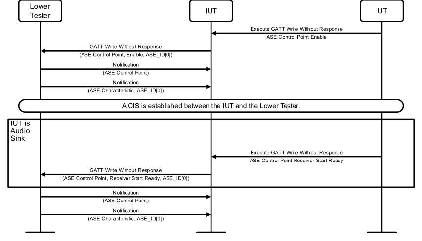

**Figure 4.1: Unicast Client Initiates Enable Operation MSC**

1. The Upper Tester orders the IUT to execute the GATT Write Without Response sub-procedure
for the ASE Control Point characteristic with the opcode set to 0x03 (Enable) and: • Number_of_ASEs set to 1 • ASE_ID[0], CIG_ID[0], and CIS_ID[0] set to values from the Initial Condition • Metadata set to the TSPX_Metadata IXIT entry 2. The Lower Tester sends the IUT a notification of the ASE Control Point characteristic. 3. The Lower Tester sends the IUT a notification of the ASE characteristic that corresponds to the
ASE_ID that was set in Step 2. 4. The IUT establishes a CIS by using the Connected Isochronous Stream Central Establishment
procedure defined in Volume 3, Part C, Section 9.3.14 in [1].The audio data paths are configured by executing the preamble in Section 4.4.9. 5. If the ASE is a Source ASE, the Upper Tester orders the IUT to execute the GATT Write Without
Response sub-procedure for the ASE Control Point characteristic with the opcode set to 0x04 (Receiver Start Ready) and the Number_of_ASEs = 1, ASE_ID set using the value from the Initial Condition. 6. The Lower Tester sends the IUT a notification of the ASE Control Point characteristic. 7. The Lower Tester sends the IUT a notification of the ASE characteristic that corresponds to the
ASE_ID that was set in Step 2.
Pass verdict
The IUT successfully writes to the ASE Control Point characteristic with the opcode set to 0x03 (Enable) and the specified parameters.
If the IUT is in the Audio Sink role, the IUT successfully writes the Receiver Start Ready opcode.

#### 4.8.6 Unicast Client Initiates Disable Operation

Test Purpose
Verify that a Unicast Client IUT can initiate a Disable operation for an ASE in the Enabling or Streaming state. The verification is performed for each Initial ASE_State and ASE Type in turn, as enumerated in the test cases in Table 4.15.
Reference
[3] 5.6.5
Initial Condition
- Establish a Bearer connection between the Lower Tester and the IUT as described in Section 4.4.1, if using ATT over an LE transport, or Section 4.4.2 if using ATT over a BR/EDR transport, or Section 4.4.3 if using EATT over an LE transport, or Section 4.4.4 if using EATT over a BR/EDR transport.
- The IUT is a Unicast Client and has enabled an ASE of the specified type with the Initial ASE_State specified in Table 4.15 by running the procedure in BAP/UCL/SCC/BV-101-C [UCL SRC Enable] or by other means.
- The Lower Tester is a Unicast Server.
- The IUT enables notification by writing the value 0x0001 using the GATT Write Characteristic Descriptors sub-procedure for the ASE Control Point CCCD.
- The IUT enables notification by writing the value 0x0001 using the GATT Write Characteristic Descriptors sub-procedure for the ASE CCCD.
Test Case Configuration

|  | Test Case ID |  |  | Initial ASE State _ |  |  | ASE Type |  |
| --- | --- | --- | --- | --- | --- | --- | --- | --- |
| BAP/UCL/SCC/BV-103-C [UCL SNK Disable in Enabling state] |  |  | 0x03 (Enabling) |  |  | Source ASE |  |  |
| BAP/UCL/SCC/BV-104-C [UCL SRC Disable in Enabling or Streaming state] |  |  | 0x03 (Enabling) or 0x04 (Streaming) |  |  | Sink ASE |  |  |
| BAP/UCL/SCC/BV-105-C [UCL SNK Disable in Streaming state] |  |  | 0x04 (Streaming) |  |  | Source ASE |  |  |

Table 4.15: Unicast Client Initiates Disable Operation test cases

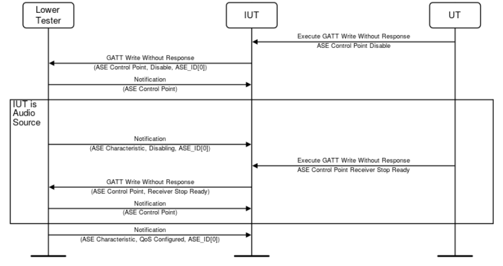

**Figure 4.2: Unicast Client Initiates Disable Operation MSC**

1. The Upper Tester orders the IUT to execute the GATT Write Without Response sub-procedure
for the ASE Control Point characteristic with the opcode set to 0x05 (Disable) and: • Number_of_ASEs set to 1 • ASE_ID[0] set using the value from the Initial Condition 2. The Lower Tester sends the IUT a notification of the ASE Control Point characteristic. 3. If the Lower Tester is in the Audio Source role:
a. The Lower Tester sends the IUT a notification of the ASE characteristic that corresponds to
the ASE_ID that was set in Step 1, with ASE_State set to Disabling. b. The Upper Tester orders the IUT to execute the GATT Write Without Response sub-
procedure for the ASE Control Point characteristic with the opcode set to 0x06 (Receiver Stop Ready) and: • Number_of_ASEs set to 1 • ASE_ID[0] set using the value from the Initial Condition 4. The Lower Tester sends the IUT a notification of the ASE Control Point characteristic. 5. The Lower Tester sends the IUT a notification of the ASE characteristic that corresponds to the
ASE_ID that was set in Step 4, with ASE_State set to QoS Configured.
Expected Outcome
Pass verdict
The IUT successfully writes to the ASE Control Point characteristic with the opcode set to 0x05 (Disable) and the specified parameters.
If the IUT is an Audio Sink, the IUT successfully writes the Receiver Stop Ready (0x06) opcode with valid parameters.

#### 4.8.7 Unicast Client Initiates Release Operation

Test Purpose
Verify that a Unicast Client IUT can release an ASE by initiating a Release operation. The verification is performed for each Initial ASE_State and ASE Type in turn, as specified in Table 4.16.
[3] 5.6.6
Initial Condition

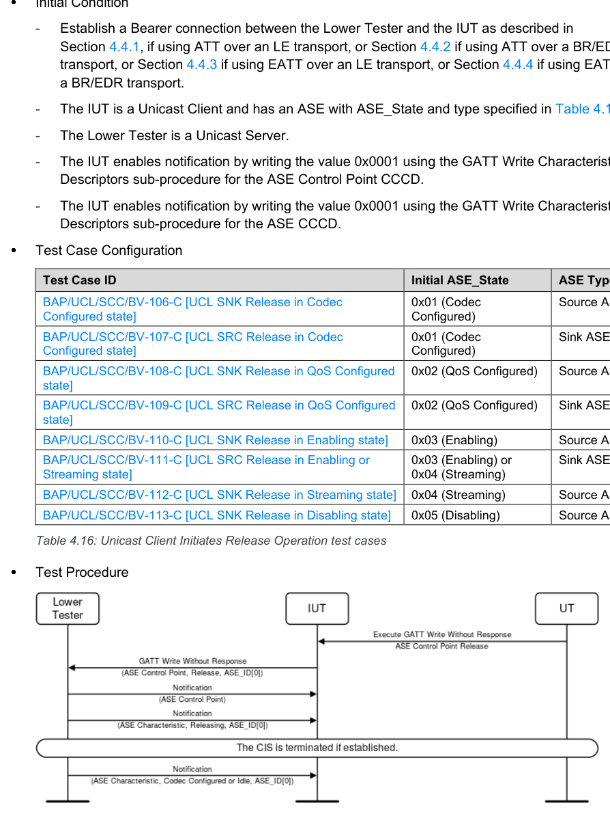

**Figure 4.3: Unicast Client Initiates Release Operation MSC**

for the ASE Control Point characteristic with the opcode set to 0x08 (Release) and: • Number_of_ASEs set to 1 • ASE_ID[0] set using the value from the Initial Condition 2. The Lower Tester sends the IUT a Notification of the ASE Control Point characteristic value. 3. The Lower Tester sends the IUT a Notification of the ASE characteristic value that corresponds to
the ASE_ID that was set in Step 1, with ASE_State set to 0x06 (Releasing). 4. The IUT terminates the CIS if established. 5. The Lower Tester sends the IUT a Notification of the ASE characteristic value that corresponds to
the ASE_ID that was set in Step 1, with ASE_State set to either Codec Configured or Idle.
Expected Outcome
Pass verdict
The IUT successfully writes to the ASE Control Point characteristic with the opcode set to 0x08 (Release) and the specified parameters.

#### 4.8.8 Unicast Client Initiates Update Metadata Operation

Test Purpose
Verify that a Unicast Client IUT can update the Metadata of an ASE by initiating an Update Metadata operation. The verification is performed for each Initial State in turn, as enumerated in the test cases in Table 4.17.
Reference
[3] 5.6.4
Initial Condition
- Establish a Bearer connection between the Lower Tester and the IUT as described in Section 4.4.1, if using ATT over an LE transport, or Section 4.4.2 if using ATT over a BR/EDR transport, or Section 4.4.3 if using EATT over an LE transport, or Section 4.4.4 if using EATT over a BR/EDR transport.
- The IUT is a Unicast Client and has an ASE of the type and in the state specified in Table 4.17.
- The Lower Tester is a Unicast Server.
- The IUT enables notification by writing the value 0x0001 using the GATT Write Characteristic Descriptors sub-procedure for the ASE Control Point CCCD.
- The IUT enables notification by writing the value 0x0001 using the GATT Write Characteristic Descriptors sub-procedure for the ASE CCCD.
- The IUT executes either the GATT Write Characteristic Value or the GATT Write Without Response Characteristic Value sub-procedure for the ASE Control Point characteristic with the opcode set to 0x03 (Enable) and Metadata set to the TSPX_Metadata IXIT entry.

|  | Test Case ID |  |  | ASE Type |  |  | Initial ASE State _ |  |
| --- | --- | --- | --- | --- | --- | --- | --- | --- |
| BAP/UCL/SCC/BV-115-C [UCL SNK Update Metadata in Enabling state] |  |  | Source ASE |  |  | 0x03 (Enabling) |  |  |
| BAP/UCL/SCC/BV-116-C [UCL SRC Update Metadata in Enabling or Streaming state] |  |  | Sink ASE |  |  | 0x03 (Enabling) or 0x04 (Streaming) |  |  |
| BAP/UCL/SCC/BV-117-C [UCL SNK Update Metadata in Streaming state] |  |  | Source ASE |  |  | 0x04 (Streaming) |  |  |

Table 4.17: Unicast Client Initiates Update Metadata Operation test cases
Test Procedure
1. The Upper Tester orders the IUT to execute the GATT Write Without Response sub-procedure
for the ASE Control Point characteristic with the opcode set to 0x07 (Update Metadata) and: • Number_of_ASEs set to 1 • ASE_ID[0] set to the value from the Initial Condition 2. The Lower Tester sends the IUT a notification of the ASE Control Point characteristic. 3. The Lower Tester sends the IUT a notification of the ASE characteristic.
Expected Outcome
Pass verdict
The IUT successfully writes to the ASE Control Point characteristic with the opcode set to 0x07 (Update Metadata) and the specified parameters.

#### 4.8.9 Unicast Client Determines Proper Presentation Delay – 2 Servers

Test Purpose
Verify that a Unicast Client IUT can determine the proper Presentation Delay for two synchronized streams with two Unicast Servers.
Reference
[3] 5.6.2, 7.1
Initial Condition
- There are two Unicast Server Lower Testers configured with overlapping, but not equal, presentation delay range values. Each Lower Tester includes an instantiation of the Audio Stream Control Service with at least one ASE characteristic as listed in Table 4.18 and an ASE Control Point characteristic.
- Establish a Bearer connection between both Lower Testers and the IUT as described in Section 4.4.1, if using ATT over an LE transport, or Section 4.4.2 if using ATT over a BR/EDR transport, or Section 4.4.3 if using EATT over an LE transport, or Section 4.4.4 if using EATT over a BR/EDR transport.
- For each Lower Tester, the IUT reads the characteristic value of one characteristic of the ASE Type listed in Table 4.18 by executing the GATT Read Characteristic Value sub-procedure. The IUT caches the ASE_ID field value as Test_ASE_ID1 and Test_ASE_ID2.
- The IUT enables notification on both Lower Testers by writing the value 0x0001 using the GATT Write Characteristic Descriptors sub-procedure for the ASE Control Point CCCD.
- The IUT enables notification on both Lower Testers by writing the value 0x0001 using the GATT Write Characteristic Descriptors sub-procedure for the ASE CCCD.
- The Codec Config operation has been performed on the ASE by executing the Codec Config procedure in Table 4.18 or by other means.
Test Case Configuration

|  | Test Case ID |  | ASE Type |  |  | Codec Config |  |
| --- | --- | --- | --- | --- | --- | --- | --- |
| BAP/UCL/PD/BV-01-C [Determine Proper Presentation Delay, 2 Servers, SNK] |  |  | Sink ASE |  | BAP/UCL/SCC/BV-004-C |  |  |
| BAP/UCL/PD/BV-02-C [Determine Proper Presentation Delay, 2 Servers, SRC] |  |  | Source ASE |  | BAP/UCL/SCC/BV-020-C |  |  |

Table 4.18: Unicast Client Determines Proper Presentation Delay – 2 Servers

|  | Round |  |  | ASE ID _ |  | Lower Tester |  |
| --- | --- | --- | --- | --- | --- | --- | --- |
| 1 |  |  | Test ASE ID1 _ _ |  |  | Lower Tester 1 |  |
| 2 |  |  | Test ASE ID2 _ _ |  |  | Lower Tester 2 |  |

Table 4.19: Rounds for Unicast Client Determines Proper Presentation Delay – 2 Servers
Test Procedure

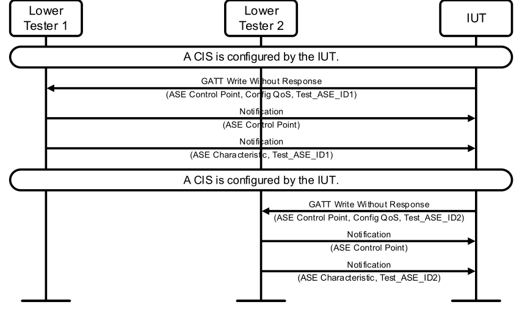

**Figure 4.4: Unicast Client Determines Proper Presentation Delay – 2 Servers MSC**

1. The IUT configures a CIS by using the LE_Set_CIG_Parameters command using parameters
from TSPX_CIG_Parameters, which returns a CIG_ID and CIS_IDs if the IUT incorporates HCI, or configures the CIS by other means. 2. The IUT executes the GATT Write Without Response sub-procedure for the ASE Control Point
characteristic for the Lower Tester specified in Table 4.19 with the opcode set to 0x02 (Config QoS) and: • Number_of_ASEs set to 1 • ASE_ID set to the value in Table 4.19 • CIG_ID and CIS_ID set to the values obtained in Step 1 • Metadata set to the TSPX_Metadata IXIT entry • Valid values for the other parameters 3. The Lower Tester specified in Table 4.19 sends the IUT a notification of the ASE Control Point
characteristic. 4. The Lower Tester specified in Table 4.19 sends the IUT a notification of the ASE characteristic for
the ASE_ID that was set in Step 2.
Expected Outcome
Pass verdict
The IUT determines a Presentation Delay value within the common range of min and max values exposed by the Lower Testers.

#### 4.8.10 Unicast Client Determines Proper Presentation Delay – 1 Server

Test Purpose
Verify that a Unicast Client IUT can determine the proper Presentation Delay for two synchronized streams with one Unicast Server.
Reference
[3] 5.6.2, 7.1
Initial Condition
- The Lower Tester is acting as a Unicast Server configured with overlapping, but not equal, presentation delay range values. The Lower Tester includes an instantiation of the Audio Stream Control Service with at least two ASE characteristics as listed in Table 4.20 and an ASE Control Point characteristic.
- Establish a Bearer connection between the Lower Tester and the IUT as described in Section 4.4.1, if using ATT over an LE transport, or Section 4.4.2 if using ATT over a BR/EDR transport, or Section 4.4.3 if using EATT over an LE transport, or Section 4.4.4 if using EATT over a BR/EDR transport.
- The IUT reads the characteristic value of two characteristics of the ASE Type listed in Table 4.20 by executing the GATT Read Characteristic Value sub-procedure. The IUT caches the ASE_ID field values as Test_ASE_ID1 and Test_ASE_ID2.
- The IUT enables notification on the Lower Tester by writing the value 0x0001 using the GATT Write Characteristic Descriptors sub-procedure for the ASE Control Point CCCD.
- The IUT enables notification on the Lower Tester by writing the value 0x0001 using the GATT Write Characteristic Descriptors sub-procedure for the ASE CCCD.
- The Codec Config operation has been performed on each ASE by executing the Codec Config procedure in Table 4.20 or by other means.
Test Case Configuration

|  | Test Case ID |  |  | ASE Type |  |  | Codec Config |  |
| --- | --- | --- | --- | --- | --- | --- | --- | --- |
| BAP/UCL/PD/BV-03-C [Determine Proper Presentation Delay, 1 Server, SNK] |  |  | Sink ASE |  |  | BAP/UCL/SCC/BV-004-C |  |  |
| BAP/UCL/PD/BV-04-C [Determine Proper Presentation Delay, 1 Server, SRC] |  |  | Source ASE |  |  | BAP/UCL/SCC/BV-020-C |  |  |

Table 4.20: Unicast Client Determines Proper Presentation Delay – 1 Server
Test Procedure

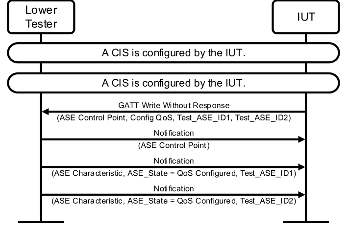

**Figure 4.5: Unicast Client Determines Proper Presentation Delay – 1 Server MSC**

1. The IUT configures a CIS by using the LE_Set_CIG_Parameters command using parameters
from TSPX_CIG_Parameters, which returns a CIG_ID1 and CIS_ID1 if the IUT incorporates HCI, or configures the CIS by other means. 2. The IUT configures a CIS by using the LE_Set_CIG_Parameters command using parameters
from TSPX_CIG_Parameters, which returns a CIG_ID1 and CIS_ID2 if the IUT incorporates HCI, or configures the CIS by other means.
characteristic for the Lower Tester specified in Table 4.20 with the opcode set to 0x02 (Config QoS) and: • Number_of_ASEs set to 2 • ASE_ID[0] set to Test_ASE_ID1 • ASE_ID[1] set to Test_ASE_ID2 • CIG_ID[0] and CIG_ID[1] set to CIG_ID1 • CIS_ID[0] set to CIS_ID1 • CIS_ID[1] set to CIS_ID2 • Valid values for the other parameters 4. The Lower Tester sends the IUT a notification of the ASE Control Point characteristic. 5. The Lower Tester sends the IUT a notification of the ASE characteristic for Test_ASE_ID1. 6. The Lower Tester sends the IUT a notification of the ASE characteristic for Test_ASE_ID2.
Expected Outcome
Pass verdict
The IUT determines a Presentation Delay value within the common range of min and max values exposed by the Lower Tester for each ASE characteristic.
The IUT writes the same Max_Transport_Latency value to each ASE.

### 4.9 Unicast Server Configuration

#### 4.9.1 Unicast Server as Audio Sink Performs Config Codec – LC3

Test Purpose
Verify that a Unicast Server Audio Sink IUT can perform a Config Codec operation initiated by a Unicast Client for an ASE in the Idle state, the Codec Configured state, and the QoS Configured state. The verification is performed for each Codec Specific Capabilities specified in the test cases in Table 4.21.
Reference
[3] 5.6.1
Initial Condition
- The IUT is a Unicast Server in the Audio Sink role and has an instantiation of the Audio Stream Control Service exposing at least one Sink ASE characteristic and an instantiation of the Published Audio Capabilities Service.
- The IUT exposes all supported audio capability settings for the Audio Sink role in one or Sink PAC characteristics containing one or more PAC records.
- The IUT supports the settings specified in Table 4.21.
- The Lower Tester is a Unicast Client.
Test Case Configuration

| Test Case ID | Codec Specific Config Setting (Section A.3) |  | Codec |  |
| --- | --- | --- | --- | --- |
|  |  |  | Specific |  |
|  |  |  | Capabilities |  |
|  |  |  | (Section A.2) |  |
| BAP/USR/SCC/BV-001-C [USR SNK Config Codec, LC3 8 1] _ | 8 1 _ | 8 1 _ |  |  |
| BAP/USR/SCC/BV-002-C [USR SNK Config Codec, LC3 8 2] _ | 8 2 _ | 8 2 _ |  |  |

| Test Case ID | Codec Specific Config Setting (Section A.3) |  | Codec |  |
| --- | --- | --- | --- | --- |
|  |  |  | Specific |  |
|  |  |  | Capabilities |  |
|  |  |  | (Section A.2) |  |
| BAP/USR/SCC/BV-003-C [USR SNK Config Codec, LC3 16 1] _ | 16 1 _ | 16 1 _ |  |  |
| BAP/USR/SCC/BV-004-C [USR SNK Config Codec, LC3 16 2] _ | 16 2 _ | 16 2 _ |  |  |
| BAP/USR/SCC/BV-005-C [USR SNK Config Codec, LC3 24 1] _ | 24 1 _ | 24 1 _ |  |  |
| BAP/USR/SCC/BV-006-C [USR SNK Config Codec, LC3 24 2] _ | 24 2 _ | 24 2 _ |  |  |
| BAP/USR/SCC/BV-007-C [USR SNK Config Codec, LC3 32 1] _ | 32 1 _ | 32 1 _ |  |  |
| BAP/USR/SCC/BV-008-C [USR SNK Config Codec, LC3 32 2] _ | 32 2 _ | 32 2 _ |  |  |
| BAP/USR/SCC/BV-009-C [USR SNK Config Codec, LC3 44.1 1] _ | 441 1 _ | 441 1 _ |  |  |
| BAP/USR/SCC/BV-010-C [USR SNK Config Codec, LC3 44.1 2] _ | 441 2 _ | 441 2 _ |  |  |
| BAP/USR/SCC/BV-011-C [USR SNK Config Codec, LC3 48 1] _ | 48 1 _ | 48 1 _ |  |  |
| BAP/USR/SCC/BV-012-C [USR SNK Config Codec, LC3 48 2] _ | 48 2 _ | 48 2 _ |  |  |
| BAP/USR/SCC/BV-013-C [USR SNK Config Codec, LC3 48 3] _ | 48 3 _ | 48 3 _ |  |  |
| BAP/USR/SCC/BV-014-C [USR SNK Config Codec, LC3 48 4] _ | 48 4 _ | 48 4 _ |  |  |
| BAP/USR/SCC/BV-015-C [USR SNK Config Codec, LC3 48 5] _ | 48 5 _ | 48 5 _ |  |  |
| BAP/USR/SCC/BV-016-C [USR SNK Config Codec, LC3 48 6] _ | 48 6 _ | 48 6 _ |  |  |

Table 4.21: Unicast Server as Audio Sink Performs Config Codec – LC3 test cases

|  | Round |  |  | Preamble |  |
| --- | --- | --- | --- | --- | --- |
| 1 |  |  | Section 4.4.6 Transition ASE to the Idle State |  |  |
| 2 |  |  | Section 4.4.7 Transition ASE to the Codec Configured State |  |  |
| 3 |  |  | Section 4.4.8 Transition ASE to the QoS Configured State |  |  |

Table 4.22: Rounds for Unicast Server as Audio Sink Performs Config Codec – LC3
Test Procedure
Perform Steps 1–6 for each round in Table 4.22.
1. Execute the Preamble specified in Table 4.22. 2. The Lower Tester reads the characteristic value of the specified ASE characteristic by executing
the GATT Read Characteristic Value sub-procedure. 3. The Lower Tester writes to the ASE Control Point on the IUT by executing the GATT Write
Without Response sub-procedure with the opcode set to 0x01 (Config Codec) and: • Number_of_ASEs set to 1 • ASE_ID[0] set to the Test_ASE_ID • Target_Latency[0] set to a valid value • Codec_ID[0] set to LC3 • Codec_Specific_Configuration_Length[0] set to the length of the Codec_Specific_Configuration field value • Codec_Specific_Configuration[0] set to the parameters referenced in Table 4.21 including Codec_Frame_Blocks_Per_SDU set to TSPX_Codec_Frame_Blocks_Per_SDU, if included, and Audio_Channel_Allocation set to TSPX_Audio_Channel_Allocation, if included. 4. The IUT sends a notification of the ASE Control Point characteristic. 5. The IUT sends a notification of the ASE characteristic for the ASE_ID in Step 3. 6. Perform the preamble in Section 4.4.6 Transition ASE to the Idle State.
Pass verdict
The IUT sends a Response_Code of 0x00 (Success) in response to each Config Codec operation.
The Additional_ASE_Parameters field of the ASE characteristic notification sent in Step 5 includes a Codec_Specific_Configuration field with correctly formatted LTV structures containing values specified in Step 2.
All other Additional_ASE_Parameters fields contain valid and correctly formatted values.
The Codec_ID field is a 5-octet field with octet 0 set to the LC3 Coding_Format value defined in Bluetooth Assigned Numbers and octets 1–4 set to 0x0000.

#### 4.9.2 Unicast Server as Audio Source Performs Config Codec – LC3

Test Purpose
Verify that a Unicast Server Audio Source IUT can perform a Config Codec operation initiated by a Unicast Client for an ASE in the Idle state, the Codec Configured state, and the QoS Configured state. The verification is performed for each Codec Specific Capabilities referenced in Table 4.23.
Reference
[3] 5.6.1
Initial Condition
- Execute the preamble in Section 4.4.6 Transition ASE to the Idle State.
- The IUT is a Unicast Server that has an instantiation of the Audio Stream Control Service with at least one Sink ASE characteristic and an instantiation of the Published Audio Capabilities Service.
- The IUT supports the settings specified in Table 4.23.
- The Lower Tester is a Unicast Client.

| Test Case ID |  | Codec Specific |  |  | Codec Specific |  |
| --- | --- | --- | --- | --- | --- | --- |
|  |  | Config Setting |  |  | Capabilities |  |
|  |  | (Section A.3) |  |  | (Section A.2) |  |
| BAP/USR/SCC/BV-017-C [USR SRC Config Codec, LC3 8 1] _ | 8 1 _ |  |  | 8 1 _ |  |  |
| BAP/USR/SCC/BV-018-C [USR SRC Config Codec, LC3 8 2] _ | 8 2 _ |  |  | 8 2 _ |  |  |
| BAP/USR/SCC/BV-019-C [USR SRC Config Codec, LC3 16 1] _ | 16 1 _ |  |  | 16 1 _ |  |  |
| BAP/USR/SCC/BV-020-C [USR SRC Config Codec, LC3 16 2] _ | 16 2 _ |  |  | 16 2 _ |  |  |
| BAP/USR/SCC/BV-021-C [USR SRC Config Codec, LC3 24 1] _ | 24 1 _ |  |  | 24 1 _ |  |  |
| BAP/USR/SCC/BV-022-C [USR SRC Config Codec, LC3 24 2] _ | 24 2 _ |  |  | 24 2 _ |  |  |
| BAP/USR/SCC/BV-023-C [USR SRC Config Codec, LC3 32 1] _ | 32 1 _ |  |  | 32 1 _ |  |  |
| BAP/USR/SCC/BV-024-C [USR SRC Config Codec, LC3 32 2] _ | 32 2 _ |  |  | 32 2 _ |  |  |
| BAP/USR/SCC/BV-025-C [USR SRC Config Codec, LC3 44.1 1] _ | 441 1 _ |  |  | 441 1 _ |  |  |
| BAP/USR/SCC/BV-026-C [USR SRC Config Codec, LC3 44.1 2] _ | 441 2 _ |  |  | 441 2 _ |  |  |
| BAP/USR/SCC/BV-027-C [USR SRC Config Codec, LC3 48 1] _ | 48 1 _ |  |  | 48 1 _ |  |  |
| BAP/USR/SCC/BV-028-C [USR SRC Config Codec, LC3 48 2] _ | 48 2 _ |  |  | 48 2 _ |  |  |
| BAP/USR/SCC/BV-029-C [USR SRC Config Codec, LC3 48 3] _ | 48 3 _ |  |  | 48 3 _ |  |  |
| BAP/USR/SCC/BV-030-C [USR SRC Config Codec, LC3 48 4] _ | 48 4 _ |  |  | 48 4 _ |  |  |
| BAP/USR/SCC/BV-031-C [USR SRC Config Codec, LC3 48 5] _ | 48 5 _ |  |  | 48 5 _ |  |  |
| BAP/USR/SCC/BV-032-C [USR SRC Config Codec, LC3 48 6] _ | 48 6 _ |  |  | 48 6 _ |  |  |

Table 4.23: Unicast Server as Audio Source Performs Config Codec – LC3 test cases

|  | Round |  |  | Preamble |  |
| --- | --- | --- | --- | --- | --- |
| 1 |  |  | Section 4.4.6 Transition ASE to the Idle State |  |  |
| 2 |  |  | Section 4.4.7 Transition ASE to the Codec Configured State |  |  |
| 3 |  |  | Section 4.4.8 Transition ASE to the QoS Configured State |  |  |

Table 4.24: Rounds for Unicast Server as Audio Source Performs Config Codec – LC3
Test Procedure
Perform Steps 1–6 for each round in Table 4.24.
1. Execute the Preamble specified in Table 4.24. 2. The Lower Tester reads the characteristic value of the specified ASE characteristic by executing
the GATT Read Characteristic Value sub-procedure. 3. The Lower Tester writes to the ASE Control Point on the IUT by executing the GATT Write
Without Response sub-procedure with the opcode set to 0x01 (Config Codec) and: • Number_of_ASEs set to 1 • ASE_ID[0] set to the Test_ASE_ID • Target_Latency[0] set to a valid value • Codec_ID[0] set to LC3 • Codec_Specific_Configuration_Length[0] set to the length of the Codec_Specific_Configuration field value • Codec_Specific_Configuration[0] set to the parameters referenced in Table 4.23, including Codec_Frame_Blocks_Per_SDU set to TSPX_Codec_Frame_Blocks_Per_SDU, if included, and Audio_Channel_Allocation set to TSPX_Audio_Channel_Allocation, if included. 4. The IUT sends a notification of the ASE Control Point characteristic.
5. The IUT sends a notification of the ASE characteristic for the ASE_ID in Step 3. 6. Perform the preamble in Section 4.4.6 Transition ASE to the Idle State.
Expected Outcome
Pass verdict
The IUT sends a Response_Code of 0x00 (Success) in response to each Config Codec operation.
The Additional_ASE_Parameters field of the ASE characteristic notification sent in Step 5 includes a Codec_Specific_Configuration field with correctly formatted LTV structures containing values specified in Step 2.
All other Additional_ASE_Parameters fields contain valid and correctly formatted values.
The Codec_ID field is a 5-octet field with octet 0 set to the LC3 Coding_Format value defined in Bluetooth Assigned Numbers and octets 1–4 set to 0x0000.
BAP/USR/SCC/BV-033-C [USR SNK Config Codec, VS]
Test Purpose
Verify that a Unicast Server Audio Sink IUT can perform a Config Codec operation initiated by a Unicast Client for a vendor-specific codec for an ASE in the Idle state, the Codec Configured state, and the QoS Configured state.
Reference
[3] 5.6.1
Initial Condition
- Establish a Bearer connection between the Lower Tester and the IUT as described in Section 4.4.1, if using ATT over an LE transport, or Section 4.4.2 if using ATT over a BR/EDR transport, or Section 4.4.3 if using EATT over an LE transport, or Section 4.4.4 if using EATT over a BR/EDR transport.
- The IUT is a Unicast Server and has an instantiation of the Audio Stream Control Service with at least one Sink ASE characteristic and an instantiation of the Published Audio Capabilities Service.
- The Lower Tester is a Unicast Client.
Test Procedure

|  | Round |  |  | Preamble |  |
| --- | --- | --- | --- | --- | --- |
| 1 |  |  | Section 4.4.6 Transition ASE to the Idle State |  |  |
| 2 |  |  | Section 4.4.7 Transition ASE to the Codec Configured State |  |  |
| 3 |  |  | Section 4.4.8 Transition ASE to the QoS Configured State |  |  |

Table 4.25: Rounds for Unicast Server as Audio Sink Performs Config Codec Vendor-Specific
Repeat Steps 1–5 for each round in Table 4.25.
1. Execute the Preamble specified in Table 4.25. 2. The Lower Tester reads the characteristic value of the specified ASE characteristic by executing
the GATT Read Characteristic Value sub-procedure.
Without Response sub-procedure with the opcode set to 0x01 (Config Codec) and: • Number_of_ASEs set to 1 • ASE_ID[0] set to Test_ASE_ID • Target_Latency[0] and Target_PHY set to values supported by the IUT • Codec_ID[0] set to TSPX_VS_Codec_ID • Codec_Specific_Configuration_Length[0] set to the length of the Codec_Specific_Configuration field value • Codec_Specific_Configuration[0] set to the parameters specified in TSPX_VS_Codec_Specific_Configuration [7] 4. The IUT sends a notification of the ASE Control Point characteristic. 5. The IUT sends a notification of the ASE characteristic for the ASE_ID in Step 3.
Expected Outcome
Pass verdict
The IUT sends a notification of the ASE Control Point characteristic with the Response_Code field set to 0x00 (Success) for the requested ASE_ID and opcode.
The IUT sends a notification of the ASE specified in Step 3. The notified ASE characteristic value is correctly formatted: the ASE_State field is set to 0x01 (Codec Configured), the ASE_ID field is set to Test_ASE_ID, and the Additional_ASE_Parameters field contains the values requested in Step 3 and valid values for Server preferred QoS parameters.
BAP/USR/SCC/BV-034-C [USR SRC Config Codec, VS]
Test Purpose
Verify that a Unicast Server Audio Source IUT can perform a Config Codec operation initiated by a Unicast Client for a vendor-specific codec for a Source ASE in the Idle state, the Codec Configured state, and the QoS Configured state.
Reference
[3] 5.6.1
Initial Condition
- Establish a Bearer connection between the Lower Tester and the IUT as described in Section 4.4.1, if using ATT over an LE transport, or Section 4.4.2 if using ATT over a BR/EDR transport, or Section 4.4.3 if using EATT over an LE transport, or Section 4.4.4 if using EATT over a BR/EDR transport.
- The IUT is a Unicast Server and has an instantiation of the Audio Stream Control Service with at least one Source ASE characteristic and an instantiation of the Published Audio Capabilities Service.
Test Procedure

|  | Round |  |  | Preamble |  |
| --- | --- | --- | --- | --- | --- |
| 1 |  |  | Section 4.4.6 Transition ASE to the Idle State |  |  |
| 2 |  |  | Section 4.4.7 Transition ASE to the Codec Configured State |  |  |
| 3 |  |  | Section 4.4.8 Transition ASE to the QoS Configured State |  |  |

Table 4.26: Rounds for Unicast Server Audio Source Performs Config Codec Vendor-Specific
1. Execute the Preamble specified in Table 4.26. 2. The Lower Tester reads the characteristic value of the specified ASE characteristic by executing
the GATT Read Characteristic Value sub-procedure. 3. The Lower Tester writes to the ASE Control Point on the IUT by executing the GATT Write
Without Response sub-procedure with the opcode set to 0x01 (Config Codec) and: • Target_Latency[0] and Target_PHY[0] set to values supported by the IUT • Codec_ID[0] set to TSPX_VS_Codec_ID • Codec_Specific_Configuration_Length[0] set to the length of the Codec_Specific_Configuration field value • Codec_Specific_Configuration[0] set to the parameters specified in TSPX_VS_Codec_Specific_Configuration [7] 4. The IUT sends a notification of the ASE Control Point characteristic. 5. The IUT sends a notification of the ASE characteristic for the ASE_ID in Step 3.
Expected Outcome
Pass verdict
The IUT sends a notification of the ASE Control Point characteristic with the Response_Code field set to 0x00 (Success) for the requested ASE_ID and opcode.
The IUT sends a notification of the ASE specified in Step 3. The notified ASE characteristic value is correctly formatted: the ASE_State field is set to 0x01 (Codec Configured), the ASE_ID field is set to Test_ASE_ID, and the Additional_ASE_Parameters field contains the values requested in Step 3 and valid values for Server preferred QoS parameters.

#### 4.9.3 Unicast Server Initiates Config Codec – LC3

Test Purpose
Verify that a Unicast Server IUT can autonomously initiate the Config Codec operation with the LC3 codec. The verification is performed for each ASE Type and Codec Settings in turn, as enumerated in the test cases in Table 4.27.
Reference
[3] 5.6.1
Initial Condition
- The Lower Tester is a Unicast Client.
- Enable the IUT for use with the ASE Control Point by performing the preamble described in Section 4.4.5.
- The IUT is a Unicast Server and has an instantiation of the Audio Stream Control Service with at least one characteristic of the type listed in Table 4.27 and an instantiation of the Published Audio Capabilities Service.
- The IUT supports the audio capability settings for the ASE Type specified in Table 4.27 in one or more PAC characteristics containing one or more PAC records.

| Test Case ID |  | Codec |  | ASE Type |  | Codec |  |
| --- | --- | --- | --- | --- | --- | --- | --- |
|  |  | Specific |  |  |  | Specific |  |
|  |  | Config |  |  |  | Capabilities |  |
|  |  | Setting |  |  |  | (Section |  |
|  |  | (Section A.3) |  |  |  | A.2) |  |
| BAP/USR/SCC/BV-035-C [USR SNK Initiates Config Codec, LC3 8 1] _ | 8 1 _ |  |  | Sink ASE | 8 1 _ |  |  |
| BAP/USR/SCC/BV-036-C [USR SNK Initiates Config Codec, LC3 8 2] _ | 8 2 _ |  |  | Sink ASE | 8 2 _ |  |  |
| BAP/USR/SCC/BV-037-C [USR SNK Initiates Config Codec, LC3 16 1] _ | 16 1 _ |  |  | Sink ASE | 16 1 _ |  |  |
| BAP/USR/SCC/BV-038-C [USR SNK Initiates Config Codec, LC3 16 2] _ | 16 2 _ |  |  | Sink ASE | 16 2 _ |  |  |
| BAP/USR/SCC/BV-039-C [USR SNK Initiates Config Codec, LC3 24 1] _ | 24 1 _ |  |  | Sink ASE | 24 1 _ |  |  |
| BAP/USR/SCC/BV-040-C [USR SNK Initiates Config Codec, LC3 24 2] _ | 24 2 _ |  |  | Sink ASE | 24 2 _ |  |  |
| BAP/USR/SCC/BV-041-C [USR SNK Initiates Config Codec, LC3 32 1] _ | 32 1 _ |  |  | Sink ASE | 32 1 _ |  |  |
| BAP/USR/SCC/BV-042-C [USR SNK Initiates Config Codec, LC3 32 2] _ | 32 2 _ |  |  | Sink ASE | 32 2 _ |  |  |
| BAP/USR/SCC/BV-043-C [USR SNK Initiates Config Codec, LC3 44.1 1] _ | 441 1 _ |  |  | Sink ASE | 441 1 _ |  |  |
| BAP/USR/SCC/BV-044-C [USR SNK Initiates Config Codec, LC3 44.1 2] _ | 441 2 _ |  |  | Sink ASE | 441 2 _ |  |  |
| BAP/USR/SCC/BV-045-C [USR SNK Initiates Config Codec, LC3 48 1] _ | 48 1 _ |  |  | Sink ASE | 48 1 _ |  |  |
| BAP/USR/SCC/BV-046-C [USR SNK Initiates Config Codec, LC3 48 2] _ | 48 2 _ |  |  | Sink ASE | 48 2 _ |  |  |
| BAP/USR/SCC/BV-047-C [USR SNK Initiates Config Codec, LC3 48 3] _ | 48 3 _ |  |  | Sink ASE | 48 3 _ |  |  |
| BAP/USR/SCC/BV-048-C [USR SNK Initiates Config Codec, LC3 48 4] _ | 48 4 _ |  |  | Sink ASE | 48 4 _ |  |  |
| BAP/USR/SCC/BV-049-C [USR SNK Initiates Config Codec, LC3 48 5] _ | 48 5 _ |  |  | Sink ASE | 48 5 _ |  |  |
| BAP/USR/SCC/BV-050-C [USR SNK Initiates Config Codec, LC3 48 6] _ | 48 6 _ |  |  | Sink ASE | 48 6 _ |  |  |
| BAP/USR/SCC/BV-051-C [USR SRC Initiates Config Codec, LC3 8 1] _ | 8 1 _ |  |  | Source ASE | 8 1 _ |  |  |
| BAP/USR/SCC/BV-052-C [USR SRC Initiates Config Codec, LC3 8 2] _ | 8 2 _ |  |  | Source ASE | 8 2 _ |  |  |
| BAP/USR/SCC/BV-053-C [USR SRC Initiates Config Codec, LC3 16 1] _ | 16 1 _ |  |  | Source ASE | 16 1 _ |  |  |
| BAP/USR/SCC/BV-054-C [USR SRC Initiates Config Codec, LC3 16 2] _ | 16 2 _ |  |  | Source ASE | 16 2 _ |  |  |
| BAP/USR/SCC/BV-055-C [USR SRC Initiates Config Codec, LC3 24 1] _ | 24 1 _ |  |  | Source ASE | 24 1 _ |  |  |
| BAP/USR/SCC/BV-056-C [USR SRC Initiates Config Codec, LC3 24 2] _ | 24 2 _ |  |  | Source ASE | 24 2 _ |  |  |
| BAP/USR/SCC/BV-057-C [USR SRC Initiates Config Codec, LC3 32 1] _ | 32 1 _ |  |  | Source ASE | 32 1 _ |  |  |
| BAP/USR/SCC/BV-058-C [USR SRC Initiates Config Codec, LC3 32 2] _ | 32 2 _ |  |  | Source ASE | 32 2 _ |  |  |
| BAP/USR/SCC/BV-059-C [USR SRC Initiates Config Codec, LC3 44.1 1] _ | 441 1 _ |  |  | Source ASE | 441 1 _ |  |  |
| BAP/USR/SCC/BV-060-C [USR SRC Initiates Config Codec, LC3 44.1 2] _ | 441 2 _ |  |  | Source ASE | 441 2 _ |  |  |
| BAP/USR/SCC/BV-061-C [USR SRC Initiates Config Codec, LC3 48 1] _ | 48 1 _ |  |  | Source ASE | 48 1 _ |  |  |
| BAP/USR/SCC/BV-062-C [USR SRC Initiates Config Codec, LC3 48 2] _ | 48 2 _ |  |  | Source ASE | 48 2 _ |  |  |
| BAP/USR/SCC/BV-063-C [USR SRC Initiates Config Codec, LC3 48 3] _ | 48 3 _ |  |  | Source ASE | 48 3 _ |  |  |
| BAP/USR/SCC/BV-064-C [USR SRC Initiates Config Codec, LC3 48 4] _ | 48 4 _ |  |  | Source ASE | 48 4 _ |  |  |
| BAP/USR/SCC/BV-065-C [USR SRC Initiates Config Codec, LC3 48 5] _ | 48 5 _ |  |  | Source ASE | 48 5 _ |  |  |
| BAP/USR/SCC/BV-066-C [USR SRC Initiates Config Codec, LC3 48 6] _ | 48 6 _ |  |  | Source ASE | 48 6 _ |  |  |

Table 4.27: Unicast Server Initiates Config Codec – LC3 test cases
Test Procedure
1. The Lower Tester reads the characteristic value of the specified ASE characteristic by executing
the GATT Read Characteristic Value sub-procedure. 2. If the IUT is an Audio Sink, the Lower Tester reads the characteristic value of the Sink PAC
characteristic on the IUT. 3. If the IUT is an Audio Source, the Lower Tester reads the characteristic value of the Source PAC
characteristic on the IUT. 4. The Upper Tester commands the IUT to configure the codec parameters specified in Table 4.27
on one of the ASEs. 5. The IUT sends a GATT Characteristic Value Notification for an ASE characteristic.
Pass verdict
In Step 5, the notified ASE characteristic value is correctly formatted, has the ASE_State field set to 0x01 (Codec Configured), the ASE_ID field set to a valid value, the Additional_ASE_Parameters containing valid values for the Codec Configured state, and includes a Codec_Specific_Configuration field with correctly formatted LTV structures with the length, type, and value specified in Table 4.28.
The IUT does not send a notification of the ASE Control Point characteristic value.
The Additional_ASE_Parameters field of the ASE characteristic notification sent in Step 5.
Type value defined in Bluetooth Assigned Numbers [9].

|  | Parameter |  |  | Length |  |  | Value |  |
| --- | --- | --- | --- | --- | --- | --- | --- | --- |
| Sampling Frequency _ |  |  | 0x02 |  |  | Referenced in Codec Specific Configuration Setting corresponding column in Table 4.27 |  |  |
| Frame Durations _ |  |  | 0x02 |  |  | Referenced in Codec Specific Configuration Setting corresponding column in Table 4.27 |  |  |
| Audio Channel Allocation _ _ |  |  | 0x05 |  |  | TSPX Audio Channel Allocation _ _ _ |  |  |
| Octets Per Codec Frame _ _ _ |  |  | 0x03 |  |  | Referenced in Codec Specific Configuration Setting corresponding column in Table 4.27 |  |  |
| Codec Frame Blocks Per SDU _ _ _ _ |  |  | 0x02 |  |  | TSPX Codec Frame Blocks Per SDU _ _ _ _ _ |  |  |

Table 4.28: LTV structures in Codec_Specific_Configuration field

#### 4.9.4 Unicast Server Initiates Config Codec – Vendor-Specific

Test Purpose
Verify that a Unicast Server IUT can initiate the Config Codec operation autonomously for vendor- specific codec settings. The verification is performed for each ASE Type specified in Table 4.29.
Reference
[3] 5.6.1
Initial Condition
- Enable the IUT for use with the ASE Control Point by performing the preamble described in Section 4.4.5.
Test Case Configuration

|  | Test Case ID |  |  | ASE Type |  |
| --- | --- | --- | --- | --- | --- |
| BAP/USR/SCC/BV-067-C [USR SNK Initiates Config Codec, Vendor-Specific] |  |  | Sink ASE |  |  |
| BAP/USR/SCC/BV-068-C [USR SRC Initiates Config Codec, Vendor-Specific] |  |  | Source ASE |  |  |

Table 4.29: Unicast Server Initiates Config Codec – Vendor-Specific test cases
Test Procedure
1. The Lower Tester reads the characteristic value of the specified ASE characteristic by executing
the GATT Read Characteristic Value sub-procedure. 2. If the IUT is an Audio Sink, the Lower Tester reads the characteristic value of the Sink PAC
characteristic on the IUT. 3. If the IUT is an Audio Source, the Lower Tester reads the characteristic value of the Source PAC
characteristic on the IUT.
characteristic type specified in Table 4.29 and codec settings defined in TSPX_VS_Codec_Specific_Configuration in [7] on one of the ASEs. 5. The IUT sends a GATT Characteristic Value Notification for an ASE characteristic.
Expected Outcome
Pass verdict
In Step 5, the notified ASE characteristic value is correctly formatted, has the ASE_State field set to 0x01 (Codec Configured), the ASE_ID field set to a valid value, the Additional_ASE_Parameters containing valid values for the Codec Configured state, and includes a Codec_Specific_Configuration field with correctly formatted LTV structures with the length, type, and value specified in Table 4.29.
All other Additional_ASE_Parameters fields contain valid and correctly formatted values.

#### 4.9.5 Unicast Server Performs Config QoS – LC3

Test Purpose
Verify that a Unicast Server IUT can perform a Config QoS operation initiated by a Unicast Client for the LC3 codec. The verification is performed for each Codec Configuration and parameter in turn, as enumerated in the test cases in Table 4.30.
Reference
[3] 5.6.2
Initial Condition
- The IUT is a Unicast Server.
- The Lower Tester is a Unicast Client.
Test Case Configuration

| Test Case ID |  | Codec Specific |  | QoS Config (Section A.4) |
| --- | --- | --- | --- | --- |
|  |  | Config Setting |  |  |
|  |  | (Section A.3) |  |  |
| BAP/USR/SCC/BV-069-C [USR SNK Config QoS, LC3 8 1 1] _ _ | 8 1 _ |  |  | 8 1 1 _ _ |
| BAP/USR/SCC/BV-070-C [USR SNK Config QoS, LC3 8 2 1] _ _ | 8 2 _ |  |  | 8 2 1 _ _ |
| BAP/USR/SCC/BV-071-C [USR SNK Config QoS, LC3 16 1 1] _ _ | 16 1 _ |  |  | 16 1 1 _ _ |
| BAP/USR/SCC/BV-072-C [USR SNK Config QoS, LC3 16 2 1] _ _ | 16 2 _ |  |  | 16 2 1 _ _ |
| BAP/USR/SCC/BV-073-C [USR SNK Config QoS, LC3 24 1 1] _ _ | 24 1 _ |  |  | 24 1 1 _ _ |
| BAP/USR/SCC/BV-074-C [USR SNK Config QoS, LC3 24 2 1] _ _ | 24 2 _ |  |  | 24 2 1 _ _ |
| BAP/USR/SCC/BV-075-C [USR SNK Config QoS, LC3 32 1 1] _ _ | 32 1 _ |  |  | 32 1 1 _ _ |
| BAP/USR/SCC/BV-076-C [USR SNK Config QoS, LC3 32 2 1] _ _ | 32 2 _ |  |  | 32 2 1 _ _ |
| BAP/USR/SCC/BV-077-C [USR SNK Config QoS, LC3 44.1 1 1] _ _ | 441 1 _ |  |  | 441 1 1 _ _ |
| BAP/USR/SCC/BV-078-C [USR SNK Config QoS, LC3 44.1 2 1] _ _ | 441 2 _ |  |  | 441 2 1 _ _ |
| BAP/USR/SCC/BV-079-C [USR SNK Config QoS, LC3 48 1 1] _ _ | 48 1 _ |  |  | 48 1 1 _ _ |
| BAP/USR/SCC/BV-080-C [USR SNK Config QoS, LC3 48 2 1] _ _ | 48 2 _ |  |  | 48 2 1 _ _ |
| BAP/USR/SCC/BV-081-C [USR SNK Config QoS, LC3 48 3 1] _ _ | 48 3 _ |  |  | 48 3 1 _ _ |
| BAP/USR/SCC/BV-082-C [USR SNK Config QoS, LC3 48 4 1] _ _ | 48 4 _ |  |  | 48 4 1 _ _ |
| BAP/USR/SCC/BV-083-C [USR SNK Config QoS, LC3 48 5 1] _ _ | 48 5 _ |  |  | 48 5 1 _ _ |
| BAP/USR/SCC/BV-084-C [USR SNK Config QoS, LC3 48 6 1] _ _ | 48 6 _ |  |  | 48 6 1 _ _ |
| BAP/USR/SCC/BV-085-C [USR SRC Config QoS, LC3 8 1 1] _ _ | 8 1 _ |  |  | 8 1 1 _ _ |

| Test Case ID |  | Codec Specific |  | QoS Config (Section A.4) |
| --- | --- | --- | --- | --- |
|  |  | Config Setting |  |  |
|  |  | (Section A.3) |  |  |
| BAP/USR/SCC/BV-086-C [USR SRC Config QoS, LC3 8 2 1] _ _ | 8 2 _ |  |  | 8 2 1 _ _ |
| BAP/USR/SCC/BV-087-C [USR SRC Config QoS, LC3 16 1 1] _ _ | 16 1 _ |  |  | 16 1 1 _ _ |
| BAP/USR/SCC/BV-088-C [USR SRC Config QoS, LC3 16 2 1] _ _ | 16 2 _ |  |  | 16 2 1 _ _ |
| BAP/USR/SCC/BV-089-C [USR SRC Config QoS, LC3 24 1 1] _ _ | 24 1 _ |  |  | 24 1 1 _ _ |
| BAP/USR/SCC/BV-090-C [USR SRC Config QoS, LC3 24 2 1] _ _ | 24 2 _ |  |  | 24 2 1 _ _ |
| BAP/USR/SCC/BV-091-C [USR SRC Config QoS, LC3 32 1 1] _ _ | 32 1 _ |  |  | 32 1 1 _ _ |
| BAP/USR/SCC/BV-092-C [USR SRC Config QoS, LC3 32 2 1] _ _ | 32 2 _ |  |  | 32 2 1 _ _ |
| BAP/USR/SCC/BV-093-C [USR SRC Config QoS, LC3 44.1 1 1] _ _ | 441 1 _ |  |  | 441 1 1 _ _ |
| BAP/USR/SCC/BV-094-C [USR SRC Config QoS, LC3 44.1 2 1] _ _ | 441 2 _ |  |  | 441 2 1 _ _ |
| BAP/USR/SCC/BV-095-C [USR SRC Config QoS, LC3 48 1 1] _ _ | 48 1 _ |  |  | 48 1 1 _ _ |
| BAP/USR/SCC/BV-096-C [USR SRC Config QoS, LC3 48 2 1] _ _ | 48 2 _ |  |  | 48 2 1 _ _ |
| BAP/USR/SCC/BV-097-C [USR SRC Config QoS, LC3 48 3 1] _ _ | 48 3 _ |  |  | 48 3 1 _ _ |
| BAP/USR/SCC/BV-098-C [USR SRC Config QoS, LC3 48 4 1] _ _ | 48 4 _ |  |  | 48 4 1 _ _ |
| BAP/USR/SCC/BV-099-C [USR SRC Config QoS, LC3 48 5 1] _ _ | 48 5 _ |  |  | 48 5 1 _ _ |
| BAP/USR/SCC/BV-100-C [USR SRC Config QoS, LC3 48 6 1] _ _ | 48 6 _ |  |  | 48 6 1 _ _ |
| BAP/USR/SCC/BV-101-C [USR SNK Config QoS, LC3 8 1 2] _ _ | 8 1 _ |  |  | 8 1 2 _ _ |
| BAP/USR/SCC/BV-102-C [USR SNK Config QoS, LC3 8 2 2] _ _ | 8 2 _ |  |  | 8 2 2 _ _ |
| BAP/USR/SCC/BV-103-C [USR SNK Config QoS, LC3 16 1 2] _ _ | 16 1 _ |  |  | 16 1 2 _ _ |
| BAP/USR/SCC/BV-104-C [USR SNK Config QoS, LC3 16 2 2] _ _ | 16 2 _ |  |  | 16 2 2 _ _ |
| BAP/USR/SCC/BV-105-C [USR SNK Config QoS, LC3 24 1 2] _ _ | 24 1 _ |  |  | 24 1 2 _ _ |
| BAP/USR/SCC/BV-106-C [USR SNK Config QoS, LC3 24 2 2] _ _ | 24 2 _ |  |  | 24 2 2 _ _ |
| BAP/USR/SCC/BV-107-C [USR SNK Config QoS, LC3 32 1 2] _ _ | 32 1 _ |  |  | 32 1 2 _ _ |
| BAP/USR/SCC/BV-108-C [USR SNK Config QoS, LC3 32 2 2] _ _ | 32 2 _ |  |  | 32 2 2 _ _ |
| BAP/USR/SCC/BV-109-C [USR SNK Config QoS, LC3 44.1 1 2] _ _ | 441 1 _ |  |  | 441 1 2 _ _ |
| BAP/USR/SCC/BV-110-C [USR SNK Config QoS, LC3 44.1 2 2] _ _ | 441 2 _ |  |  | 441 2 2 _ _ |
| BAP/USR/SCC/BV-111-C [USR SNK Config QoS, LC3 48 1 2] _ _ | 48 1 _ |  |  | 48 1 2 _ _ |
| BAP/USR/SCC/BV-112-C [USR SNK Config QoS, LC3 48 2 2] _ _ | 48 2 _ |  |  | 48 2 2 _ _ |
| BAP/USR/SCC/BV-113-C [USR SNK Config QoS, LC3 48 3 2] _ _ | 48 3 _ |  |  | 48 3 2 _ _ |
| BAP/USR/SCC/BV-114-C [USR SNK Config QoS, LC3 48 4 2] _ _ | 48 4 _ |  |  | 48 4 2 _ _ |
| BAP/USR/SCC/BV-115-C [USR SNK Config QoS, LC3 48 5 2] _ _ | 48 5 _ |  |  | 48 5 2 _ _ |
| BAP/USR/SCC/BV-116-C [USR SNK Config QoS, LC3 48 6 2] _ _ | 48 6 _ |  |  | 48 6 2 _ _ |
| BAP/USR/SCC/BV-117-C [USR SRC Config QoS, LC3 8 1 2] _ _ | 8 1 _ |  |  | 8 1 2 _ _ |
| BAP/USR/SCC/BV-118-C [USR SRC Config QoS, LC3 8 2 2] _ _ | 8 2 _ |  |  | 8 2 2 _ _ |
| BAP/USR/SCC/BV-119-C [USR SRC Config QoS, LC3 16 1 2] _ _ | 16 1 _ |  |  | 16 1 2 _ _ |
| BAP/USR/SCC/BV-120-C [USR SRC Config QoS, LC3 16 2 2] _ _ | 16 2 _ |  |  | 16 2 2 _ _ |
| BAP/USR/SCC/BV-121-C [USR SRC Config QoS, LC3 24 1 2] _ _ | 24 1 _ |  |  | 24 1 2 _ _ |
| BAP/USR/SCC/BV-122-C [USR SRC Config QoS, LC3 24 2 2] _ _ | 24 2 _ |  |  | 24 2 2 _ _ |
| BAP/USR/SCC/BV-123-C [USR SRC Config QoS, LC3 32 1 2] _ _ | 32 1 _ |  |  | 32 1 2 _ _ |
| BAP/USR/SCC/BV-124-C [USR SRC Config QoS, LC3 32 2 2] _ _ | 32 2 _ |  |  | 32 2 2 _ _ |
| BAP/USR/SCC/BV-125-C [USR SRC Config QoS, LC3 44.1 1 2] _ _ | 441 1 _ |  |  | 441 1 2 _ _ |
| BAP/USR/SCC/BV-126-C [USR SRC Config QoS, LC3 44.1 2 2] _ _ | 441 2 _ |  |  | 441 2 2 _ _ |
| BAP/USR/SCC/BV-127-C [USR SRC Config QoS, LC3 48 1 2] _ _ | 48 1 _ |  |  | 48 1 2 _ _ |
| BAP/USR/SCC/BV-128-C [USR SRC Config QoS, LC3 48 2 2] _ _ | 48 2 _ |  |  | 48 2 2 _ _ |

| Test Case ID |  | Codec Specific |  | QoS Config (Section A.4) |
| --- | --- | --- | --- | --- |
|  |  | Config Setting |  |  |
|  |  | (Section A.3) |  |  |
| BAP/USR/SCC/BV-129-C [USR SRC Config QoS, LC3 48 3 2] _ _ | 48 3 _ |  |  | 48 3 2 _ _ |
| BAP/USR/SCC/BV-130-C [USR SRC Config QoS, LC3 48 4 2] _ _ | 48 4 _ |  |  | 48 4 2 _ _ |
| BAP/USR/SCC/BV-131-C [USR SRC Config QoS, LC3 48 5 2] _ _ | 48 5 _ |  |  | 48 5 2 _ _ |
| BAP/USR/SCC/BV-132-C [USR SRC Config QoS, LC3 48 6 2] _ _ | 48 6 _ |  |  | 48 6 2 _ _ |

Table 4.30: Unicast Server Performs Config QoS – LC3 test cases
Test Procedure
1. The Lower Tester writes to the ASE Control Point on the IUT by executing the GATT Write
Without Response sub-procedure with the opcode set to 0x01 (Config Codec) and: • Number_of_ASEs set to 1 • ASE_ID[0] set to the Test_ASE_ID • Target_Latency[0] set to a valid value • Codec_ID[0] set to LC3 • Codec_Specific_Configuration_Length[0] set to the length of the Codec_Specific_Configuration field value • Codec_Specific_Configuration[0] set to the parameters referenced in Table 4.30, including Codec_Frame_Blocks_Per_SDU set to TSPX_Codec_Frame_Blocks_Per_SDU, if included, and Audio_Channel_Allocation set to TSPX_Audio_Channel_Allocation, if included 2. The IUT sends a notification of the ASE Control Point characteristic. 3. The IUT sends a notification of the ASE characteristic that corresponds to Test_ASE_ID. 4. The Lower Tester executes the GATT Write Without Response sub-procedure with the opcode
set to 0x02 (Config QoS) and: • Number_of_ASEs set to 1 • ASE_ID[0] set to Test_ASE_ID • Random valid values for CIG_ID[0] and CIS_ID[0] • SDU_Interval[0] set to the QoS Configuration value referenced in in Table 4.30 • Framing[0] set to the QoS Configuration value referenced in Table 4.30 • PHY[0] set to TSPX_QoS_PHY • Max_SDU[0] set to the QoS Configuration value referenced in Table 4.30 • Retransmission_Number[0] set to the QoS Configuration value referenced in Table 4.30 • Max_Transport_Latency[0] set to the QoS Configuration value referenced in Table 4.30 • Presentation_Delay[0] set to TSPX_QoS_Presentation_Delay 5. The IUT sends a GATT Characteristic Value Notification for the ASE Control Point characteristic. 6. The IUT sends a GATT Characteristic Value Notification for the ASE characteristic that
corresponds to Test_ASE_ID.
Expected Outcome
Pass verdict
In Step 2, the IUT sends a notification of the ASE Control Point characteristic with Response_Code set to Success (0x00) for the requested ASE_ID and opcode.
In Step 3, the notified ASE characteristic value is correctly formatted, has the ASE_ID field set to Test_ASE_ID, the ASE_State field set to 0x02 (QoS Configured), and the Additional_ASE_Parameters field containing the CIG_ID, CIS_ID, and QoS configuration values requested in Step 2.

#### 4.9.6 Unicast Server Performs Config QoS – Vendor-Specific

Test Purpose
Verify that a Unicast Server IUT can handle a Config QoS operation for a vendor-specific codec. The verification is performed for each Codec Configuration and parameter in turn, as enumerated in the test cases in Table 4.31.
Reference
[3] 5.6.2
Initial Condition
- The IUT is a Unicast Server.
- The Lower Tester is a Unicast Client.
Test Case Configuration

|  | Test Case ID |  |  | ASE Type |  |
| --- | --- | --- | --- | --- | --- |
| BAP/USR/SCC/BV-133-C [USR SNK Config QoS, VS] |  |  | Sink ASE |  |  |
| BAP/USR/SCC/BV-134-C [USR SRC Config QoS, VS] |  |  | Source ASE |  |  |

Table 4.31: Unicast Server Performs Config QoS – Vendor-Specific test cases
Test Procedure
1. The Lower Tester reads the characteristic value of the specified ASE characteristic by executing
the GATT Read Characteristic Value sub-procedure. 2. The Lower Tester writes to the ASE Control Point on the IUT by executing the GATT Write
Without Response sub-procedure with the opcode set to 0x01 (Config Codec) and: • Number_of_ASEs set to 1 • ASE_ID[0] set to Test_ASE_ID • Target_Latency[0] and Target_PHY set to values supported by the IUT • Codec_ID[0] set to TSPX_VS_Codec_ID • Codec_Specific_Configuration_Length[0] set to the length of the Codec_Specific_Configuration field value • Codec_Specific_Configuration[0] set to the parameters specified in TSPX_VS_Codec_Specific_Configuration [7] 3. The IUT sends a notification of the ASE Control Point characteristic. 4. The IUT sends a notification of the ASE characteristic that corresponds to Test_ASE_ID. 5. The Lower Tester executes the GATT Write Without Response sub-procedure with the opcode
set to 0x02 (Config QoS) and: • Number_of_ASEs = 1 • ASE_ID[0] set to Test_ASE_ID • CIG_ID[0] and CIS_ID[0] set to valid values • SDU_Interval[0] set to TSPX_VS_QoS_SDU_Interval • Framing[0] set to TSPX_VS_QoS_Framing • PHY[0] set to TSPX_VS_QoS_PHY • Max_SDU[0] set to TSPX_VS_QoS_Max_SDU • Retransmission_Number[0] set to TSPX_VS_QoS_Retransmission_Number • Max_Transport_Latency[0] set to TSPX_VS_QoS_Max_Transport_Latency • Presentation_Delay[0] set to TSPX_VS_QoS_Presentation_Delay 6. The IUT sends a GATT Characteristic Value Notification for the ASE Control Point characteristic. 7. The IUT sends a GATT Characteristic Value Notification for the ASE characteristic.
Pass verdict
In Step 3, the IUT sends a notification of the ASE Control Point characteristic with Response_Code set to Success (0x00) for the requested ASE_ID and opcode.
In Step 4, the notified ASE characteristic value is correctly formatted, has the ASE_ID field set to Test_ASE_ID, the ASE_State field set to 0x02 (QoS Configured), and the Additional_ASE_Parameters field containing the CIG_ID, CIS_ID, and QoS configuration values requested in Step 2.

#### 4.9.7 Unicast Server Performs Client-Initiated Enable Operation

Test Purpose
Verify that a Unicast Server IUT can handle a client-initiated Enable operation for an ASE with a Unicast Client that is either in the Audio Sink role or the Audio Source role. The verification is performed for each ASE Type in turn, as enumerated in the test cases in Table 4.32.
Reference
[3] 5.6.3
Initial Condition
- The IUT is a Unicast Server.
- The Lower Tester is a Unicast Client. The Lower Tester transitions one characteristic of the type specified in Table 4.32 on the IUT into the QoS Configured state.
- A CIG/CIS is configured by running one round of BAP/USR/SCC/BV-088-C [USR SRC Config QoS, LC3 16_2_1] or by other means.
Test Case Configuration

|  | Test Case ID |  |  | ASE Type |  |
| --- | --- | --- | --- | --- | --- |
| BAP/USR/SCC/BV-135-C [USR SNK Enable] |  |  | Sink ASE |  |  |
| BAP/USR/SCC/BV-136-C [USR SRC Enable] |  |  | Source ASE |  |  |

Table 4.32: Unicast Server Performs Client-Initiated Enable Operation test cases

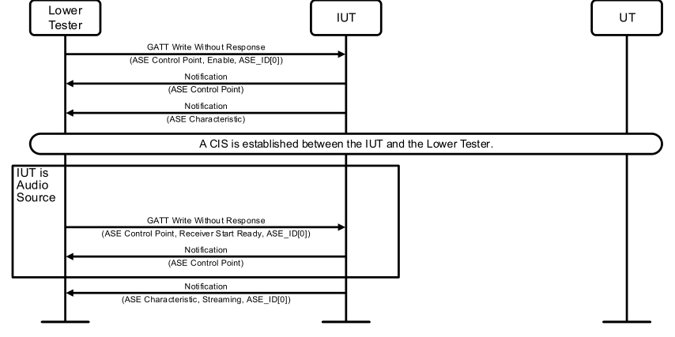

**Figure 4.6: Unicast Server Performs Client-Initiated Enable Operation MSC**

1. The Lower Tester executes the GATT Write Without Response sub-procedure with the opcode
set to 0x03 (Enable) and: • Number_of_ASEs set to 1 • ASE_ID[0] set to Test_ASE_ID • Metadata_Length[0] set to the length of Metadata[0] • Metadata[0] set to the TSPX_Metadata IXIT entry 2. The IUT sends a GATT Characteristic Value Notification for the ASE Control Point characteristic. 3. The IUT sends a GATT Characteristic Value Notification for the ASE characteristic. 4. The Lower Tester establishes a CIS by using the Connected Isochronous Stream Central
Establishment procedure defined in Volume 3, Part C, Section 9.3.14 in [1]. 5. The audio data paths are configured by executing the preamble in Section 4.4.9. 6. If the ASE Type specified in Table 4.32 is Sink ASE:
a. The IUT autonomously transitions the ASE for the ASE_ID returned in Step 2 to Streaming
state. 7. If the ASE Type specified in Table 4.32 is Source ASE:
a. The Lower Tester executes the GATT Write Without Response sub-procedure for the ASE
Control Point characteristic with the opcode set to 0x04 (Receiver Start Ready) and the Number_of_ASEs = 1, ASE_ID set using the value from the Initial Condition. b. The IUT sends a notification of the ASE Control Point characteristic. 8. The IUT sends a notification of the ASE characteristic that corresponds to the ASE_ID sent in
Step 2 with the ASE_State set to 0x04 (Streaming).
Expected Outcome
Pass verdict
In Step 2, the IUT sends a notification of the ASE Control Point characteristic with Response_Code set to 0x00 (Success) for the requested ASE_ID and opcode.
In Step 3, the notified ASE characteristic value is correctly formatted, has the ASE_ID field set to Test_ASE_ID, the ASE_State field set to 0x03 (Enabling), and the Additional_ASE_Parameters field containing the correct Metadata.
The IUT accepts the Enable operation and transitions from QoS Configured state to either Enabling state or the Streaming state.

#### 4.9.8 Unicast Server Performs Client-Initiated Disable Operation

Test Purpose
Verify that a Unicast Server IUT can perform a client-initiated Disable operation for an ASE in the Enabling or Streaming state. The verification is performed for each Initial ASE_State and ASE Type in turn, as specified in Table 4.33.
Reference
[3] 5.6.5
Initial Condition
- Establish a Bearer connection between the Lower Tester and the IUT as described in Section 4.4.1, if using ATT over an LE transport, or Section 4.4.2 if using ATT over a BR/EDR transport, or Section 4.4.3 if using EATT over an LE transport, or Section 4.4.4 if using EATT over a BR/EDR transport.
- The Lower Tester is a Unicast Client.
- The IUT is a Unicast Server.
- The Lower Tester enables notification by writing the value 0x0001 using the GATT Write Characteristic Descriptors sub-procedure for the ASE Control Point CCCD.
- The Lower Tester enables notification by writing the value 0x0001 using the GATT Write Characteristic Descriptors sub-procedure for the ASE CCCD.
- The IUT has an ASE configured with the Initial ASE_State and ASE Type specified in Table 4.33, e.g., by running BAP/USR/SCC/BV-072-C [USR SNK Config QoS, LC3 16_2_1] if Sink ASE or BAP/USR/SCC/BV-088-C [USR SRC Config QoS, LC3 16_2_1] if Source ASE or by other means. The ASE_ID value of the selected ASE characteristic is read and stored as Test_ASE_ID, by executing a GATT Characteristic Read or by other means.
- The QoS Config operation has been performed on the ASE by executing BAP/USR/SCC/BV-072- C [USR SNK Config QoS, LC3 16_2_1] or BAP/USR/SCC/BV-088-C [USR SRC Config QoS, LC3 16_2_1] or by other means.
Test Case Configuration

|  | Test Case ID |  |  | Initial ASE State _ |  |  | ASE Type |  |
| --- | --- | --- | --- | --- | --- | --- | --- | --- |
| BAP/USR/SCC/BV-137-C [USR SRC Disable in Enabling state] |  |  | 0x03 (Enabling) |  |  | Source ASE |  |  |
| BAP/USR/SCC/BV-138-C [USR SNK Disable in Enabling or Streaming state] |  |  | 0x03 (Enabling) or 0x04 (Streaming) |  |  | Sink ASE |  |  |
| BAP/USR/SCC/BV-139-C [USR SRC Disable in Streaming state] |  |  | 0x04 (Streaming) |  |  | Source ASE |  |  |

Table 4.33: Unicast Server Performs Client-Initiated Disable Operation test cases

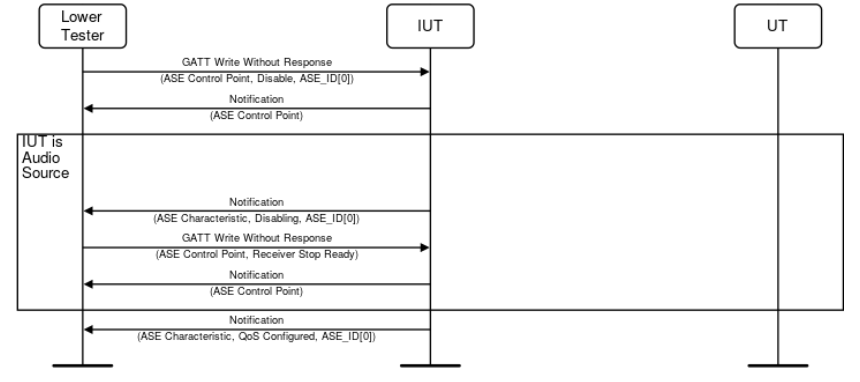

**Figure 4.7: Unicast Server Performs Client-Initiated Disable Operation MSC**

1. The Lower Tester executes the GATT Write Without Response sub-procedure for the ASE
Control Point characteristic with the opcode set to 0x05 (Disable) and the Number_of_ASEs = 1, ASE_ID[0] set to Test_ASE_ID. 2. The IUT sends a notification of the ASE Control Point characteristic. 3. If the IUT is in the Audio Source role:
a. The IUT sends the Lower Tester a notification of the ASE characteristic that corresponds to
the ASE_ID that was set in Step 1, with ASE_State set to Disabling. b. The Lower Tester executes the GATT Write Without Response sub-procedure for the ASE
Control Point characteristic with the opcode set to 0x06 (Receiver Stop Ready) and the Number_of_ASEs = 1, ASE_ID set to Test_ASE_ID. c. The IUT sends a notification of the ASE Control Point characteristic. d. The IUT autonomously transitions the ASE for the ASE_ID that was set in Step 1 to QoS
Configured state. 4. The IUT sends a notification of the ASE characteristic that corresponds to the ASE_ID that was
set in Step 1, with ASE_State set to QoS Configured.
Expected Outcome
Pass verdict
In Step 2, the IUT sends a notification of the ASE Control Point characteristic.
If the IUT is in Audio Source role, in Step 3 the IUT sends a notification of the ASE characteristic corresponding to the ASE_ID from Step 1, with ASE_State set to 0x05 (Disabling), and the IUT sends a notification of the ASE Control Point characteristic.
In Step 4, the IUT sends a notification of the ASE characteristic corresponding to the ASE_ID from Step 1, with ASE_State set to 0x02 (QoS Configured).

#### 4.9.9 Unicast Server Initiates Disable Operation

Test Purpose
Verify that a Unicast Server IUT can initiate a Disable operation autonomously for an ASE in the Enabling or Streaming state. The verification is performed for each Initial ASE_State and ASE Type in turn, as specified in Table 4.34.
[3] 5.6.5
Initial Condition
- Enable the IUT for use with the ASE Control Point by performing the preamble described in Section 4.4.5.
- The IUT is a Unicast Server and has an ASE characteristic of the type and ASE Type and ASE_State specified in Table 4.34.
Test Case Configuration

|  | Test Case ID |  |  | Initial ASE State _ |  |  | ASE Type |  |
| --- | --- | --- | --- | --- | --- | --- | --- | --- |
| BAP/USR/SCC/BV-140-C [USR SRC Initiates Disable in Enabling state] |  |  | 0x03 (Enabling) |  |  | Source ASE |  |  |
| BAP/USR/SCC/BV-141-C [USR SNK Initiates Disable in Enabling or Streaming state] |  |  | 0x03 (Enabling) or 0x04 (Streaming) |  |  | Sink ASE |  |  |
| BAP/USR/SCC/BV-142-C [USR SRC Initiates Disable in Streaming state] |  |  | 0x04 (Streaming) |  |  | Source ASE |  |  |

Table 4.34: Unicast Server Initiates Disable Operation test cases
Test Procedure
1. The Upper Tester commands the IUT to disable the ASE identified by Test_ASE_ID. 2. The IUT sends a GATT Characteristic Value Notification for the ASE characteristic.
Expected Outcome
Pass verdict
The IUT sends a notification of the ASE characteristic.
• If the IUT is the Audio Source, the notified characteristic value has the ASE_State field set to 0x05 (Disabling). • If the IUT is the Audio Sink, the notified characteristic value has the ASE_State field set to 0x02 (QoS Configured).

#### 4.9.10 Unicast Server Initiates Disable While Streaming on Loss of CIS

Test Purpose
Verify that a Unicast Server IUT handles a CIS loss autonomously in the Streaming state when the CIS for an ASE is lost. The verification is performed for each Initial State and ASE Type in turn, as specified in Table 4.35.
Reference
[3] 5.6.5
[6] 3.2, 5.5
Initial Condition
- Establish a Bearer connection between the Lower Tester and the IUT as described in Section 4.4.1, if using ATT over an LE transport, or Section 4.4.2 if using ATT over a BR/EDR transport, or Section 4.4.3 if using EATT over an LE transport, or Section 4.4.4 if using EATT over a BR/EDR transport.
- The IUT is a Unicast Server and exposes an ASE of the type specified in Table 4.35.
- The IUT and Lower Tester are streaming audio data, e.g., by running BAP/USR/SCC/BV-135-C [USR SNK Enable] if Audio Sink or BAP/USR/SCC/BV-136-C [USR SRC Enable] if Audio Source or by other means. The ASE_ID of the ASE characteristic associated with the streaming audio date is identified by Test_ASE_ID.
- The Lower Tester enables notification on the IUT by writing the value 0x0001 using the GATT Write Characteristic Descriptors sub-procedure for the ASE Control Point CCCD.
- The Lower Tester enables notification on the IUT by writing the value 0x0001 using the GATT Write Characteristic Descriptors sub-procedure for the ASE CCCD.
Test Case Configuration

|  | Test Case ID |  |  | ASE Type |  |
| --- | --- | --- | --- | --- | --- |
| BAP/USR/SCC/BV-167-C [USR SNK Initiates Disable While Streaming – Loss of CIS] |  |  | Sink ASE |  |  |
| BAP/USR/SCC/BV-168-C [USR SRC Initiates Disable While Streaming – Loss of CIS] |  |  | Source ASE |  |  |

Table 4.35: Unicast Server Initiates Disable While Streaming on Loss of CIS test cases
Test Procedure
1. The Lower Tester tears down the CIS for the ASE that is being used to stream audio data. 2. The IUT sends a GATT Characteristic Value Notification for the ASE characteristic with ASE_ID =
Test_ASE_ID.
Expected Outcome
Pass verdict
The IUT sends a notification of the ASE characteristic with the ASE_State field set to 0x02 (QoS Configured).

#### 4.9.11 Unicast Server Performs Client-Initiated Release Operation

Test Purpose
Verify the behavior of a Unicast Server IUT when a Unicast Client initiates a Release operation. The verification is performed for each Initial ASE_State and ASE Type in turn, as specified in Table 4.36.
Reference
[3] 5.6.6
Initial Condition
- Establish a Bearer connection between the Lower Tester and the IUT as described in Section 4.4.1, if using ATT over an LE transport, or Section 4.4.2 if using ATT over a BR/EDR transport, or Section 4.4.3 if using EATT over an LE transport, or Section 4.4.4 if using EATT over a BR/EDR transport.
- The IUT is a Unicast Server with an ASE characteristic of the ASE Type with ASE_State specified by the Initial ASE_State and ASE Type values in Table 4.36. The Lower Tester has learned the ASE_ID of the specified ASE Type.
- The Lower Tester is a Unicast Client.
- The Lower Tester enables notification by writing the value 0x0001 using the GATT Write Characteristic Descriptors sub-procedure for the ASE Control Point CCCD.
- The Lower Tester enables notification by writing the value 0x0001 using the GATT Write Characteristic Descriptors sub-procedure for the ASE CCCD.
Test Case Configuration

|  | Test Case ID |  |  | Initial ASE State _ |  |  | ASE Type |  |
| --- | --- | --- | --- | --- | --- | --- | --- | --- |
| BAP/USR/SCC/BV-143-C [USR SRC Release in Codec Configured state] |  |  | 0x01 (Codec Configured) |  |  | Source ASE |  |  |
| BAP/USR/SCC/BV-144-C [USR SNK Release in Codec Configured state] |  |  | 0x01 (Codec Configured) |  |  | Sink ASE |  |  |
| BAP/USR/SCC/BV-145-C [USR SRC Release in QoS Configured state] |  |  | 0x02 (QoS Configured) |  |  | Source ASE |  |  |
| BAP/USR/SCC/BV-146-C [USR SNK Release in QoS Configured state] |  |  | 0x02 (QoS Configured) |  |  | Sink ASE |  |  |
| BAP/USR/SCC/BV-147-C [USR SRC Release in Enabling state] |  |  | 0x03 (Enabling) |  |  | Source ASE |  |  |
| BAP/USR/SCC/BV-148-C [USR SNK Release in Enabling or Streaming state] |  |  | 0x03 (Enabling) or 0x04 (Streaming) |  |  | Sink ASE |  |  |
| BAP/USR/SCC/BV-149-C [USR SRC Release in Streaming state] |  |  | 0x04 (Streaming) |  |  | Source ASE |  |  |
| BAP/USR/SCC/BV-150-C [USR SRC Release in Disabling state] |  |  | 0x05 (Disabling) |  |  | Source ASE |  |  |

Table 4.36: Unicast Server Performs Client-Initiated Release Operation test cases
Test Procedure

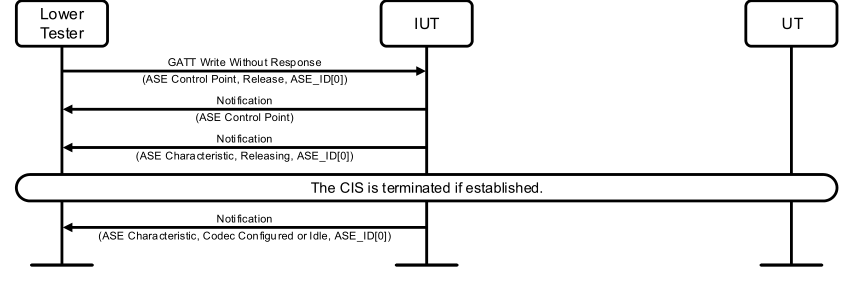

**Figure 4.8: Unicast Server Performs Client-Initiated Release Operation MSC**

1. The Lower Tester executes the GATT Write Without Response sub-procedure for the ASE
Control Point characteristic with the opcode set to 0x08 (Release) and: • Number_of_ASEs set to 1 • ASE_ID[0] set to the value from the Initial Condition 2. The IUT sends a Notification of the ASE Control Point characteristic value. 3. The IUT sends a Notification of the ASE characteristic value for the ASE_ID used in Step 1, with
ASE_State set to 0x06 (Releasing). 4. The Lower Tester terminates the CIS if established. 5. The IUT sends a Notification of the ASE characteristic value for the ASE_ID used in Step 1, with
ASE_State set to either 0x01 (Codec Configured) or 0x00 (Idle).
Pass verdict
The IUT sends a notification of the ASE Control Point characteristic value.
In Step 3, the IUT sends a notification of the ASE characteristic value with ASE_State set to 0x06 (Releasing).
In Step 5, the IUT sends a notification of the ASE characteristic value with ASE_State set to either 0x00 (Idle) or 0x01 (Codec Configured).

#### 4.9.12 Unicast Server Initiates Release Operation Autonomously

Test Purpose
Verify the behavior of a Unicast Server IUT when initiating a Release operation for an ASE. The verification is performed for each Initial ASE_State and ASE characteristic in turn, as enumerated in the test cases in Table 4.37.
Reference
[3] 5.6.6
Initial Condition
- Establish a Bearer connection between the Lower Tester and the IUT as described in Section 4.4.1, if using ATT over an LE transport, or Section 4.4.2 if using ATT over a BR/EDR transport, or Section 4.4.3 if using EATT over an LE transport, or Section 4.4.4 if using EATT over a BR/EDR transport.
- The IUT has an ASE characteristic of the type and ASE_State specified in Table 4.37.
- The Lower Tester enables notification of the ASE Control Point by writing the value 0x0001 using the GATT Write Characteristic Descriptors sub-procedure for the ASE Control Point CCCD.
- The Lower Tester enables notification of the specified ASE characteristic by writing the value 0x0001 using the GATT Write Characteristic Descriptors sub-procedure for the ASE CCCD.
Test Case Configuration

|  | Test Case ID |  |  | Initial ASE State _ |  |  | ASE Type |  |
| --- | --- | --- | --- | --- | --- | --- | --- | --- |
| BAP/USR/SCC/BV-152-C [USR SRC Initiates Release in Codec Configured state] |  |  | 0x01 (Codec Configured) |  |  | Source ASE |  |  |
| BAP/USR/SCC/BV-153-C [USR SNK Initiates Release in Codec Configured state] |  |  | 0x01 (Codec Configured) |  |  | Sink ASE |  |  |
| BAP/USR/SCC/BV-154-C [USR SRC Initiates Release in QoS Configured state] |  |  | 0x02 (QoS Configured) |  |  | Source ASE |  |  |
| BAP/USR/SCC/BV-155-C [USR SNK Initiates Release in QoS Configured state] |  |  | 0x02 (QoS Configured) |  |  | Sink ASE |  |  |
| BAP/USR/SCC/BV-156-C [USR SRC Initiates Release in Enabling state] |  |  | 0x03 (Enabling) |  |  | Source ASE |  |  |
| BAP/USR/SCC/BV-157-C [USR SNK Initiates Release in Enabling state] |  |  | 0x03 (Enabling) or 0x04 (Streaming) |  |  | Sink ASE |  |  |
| BAP/USR/SCC/BV-158-C [USR SRC Initiates Release in Streaming state] |  |  | 0x04 (Streaming) |  |  | Source ASE |  |  |
| BAP/USR/SCC/BV-159-C [USR SRC Initiates Release in Disabling state] |  |  | 0x05 (Disabling) |  |  | Source ASE |  |  |

Table 4.37: Unicast Server Initiates Release Operation Autonomously test cases
1. The Upper Tester orders the IUT to initiate the Release operation. 2. The IUT sends the Lower Tester a notification of the ASE characteristic, with ASE_State set to
0x06 (Releasing). 3. The IUT terminates the CIS if established, removing any audio data paths for the ASE. 4. The IUT sends the Lower Tester a notification of the ASE characteristic with the ASE_ID of the
ASE in the Initial Condition, with ASE_State set to 0x00 (Idle) or 0x01 (Codec Configured).
Expected Outcome
Pass verdict
The IUT terminates the CIS if established.
In Step 2, the IUT sets the ASE_State to 0x06 (Releasing).
In Step 4, the IUT returns to 0x00 (Idle) or 0x01 (Codec Configured) state.

#### 4.9.13 Unicast Server Performs Update Metadata Operation

Test Purpose
Verify that a Unicast Server IUT can perform an Update Metadata operation initiated by a Unicast Client. The verification is performed for each Initial ASE_State and ASE Type in turn, as specified in Table 4.38.
Reference
[3] 5.6.4
Initial Condition
- The IUT is a Unicast Server and has configured an ASE of the type and in the state specified in Table 4.38 by running BAP/USR/SCC/BV-135-C [USR SNK Enable] or BAP/USR/SCC/BV-136-C [USR SRC Enable] or by other means.
- The QoS Config operation has been performed on the ASE by executing BAP/USR/SCC/BV-071- C [USR SNK Config QoS, LC3 16_1_1] or BAP/USR/SCC/BV-087-C [USR SRC Config QoS, LC3 16_1_1] or by other means.
- The value of the Additional_ASE_Parameters field of the selected ASE characteristic has been retrieved by performing the GATT Read Characteristic Value sub-procedure or by other means.
Test Case Configuration

|  | Test Case ID |  |  | ASE Type |  |  | Initial ASE State _ |  |
| --- | --- | --- | --- | --- | --- | --- | --- | --- |
| BAP/USR/SCC/BV-161-C [USR SRC Update Metadata in Enabling state] |  |  | Source ASE |  |  | 0x03 (Enabling) |  |  |
| BAP/USR/SCC/BV-162-C [USR Audio Sink Performs Update Metadata in Enabling or Streaming state] |  |  | Sink ASE |  |  | 0x03 (Enabling) or 0x04 (Streaming) |  |  |
| BAP/USR/SCC/BV-163-C [USR SRC Update Metadata in Streaming state] |  |  | Source ASE |  |  | 0x04 (Streaming) |  |  |

Table 4.38: Unicast Server Performs Update Metadata Operation test cases
1. The Lower Tester executes the GATT Write Without Response sub-procedure with the opcode
set to 0x07 (Update Metadata) and: • Number_of_ASEs set to 1 • ASE_ID[0] set to Test_ASE_ID • Metadata[0] set to a valid value using the TSPX_Update_Metadata IXIT entry 2. The IUT sends a GATT Characteristic Value Notification for the ASE Control Point characteristic. 3. The IUT sends a GATT Characteristic Value Notification for the ASE characteristic.
Expected Outcome
Pass verdict
In Step 2, the IUT sends a notification of the ASE Control Point characteristic with Response_Code set to Success (0x00) for the requested ASE_ID and opcode.
In Step 3, the notified ASE characteristic value is correctly formatted, the value of the ASE_ID field is set to Test_ASE_ID, and the Additional_ASE_Parameters field contains the values the Metadata sent in Step 1. The value of the ASE_State in the ASE characteristic notification is equal to the value in Table 4.38.
If the Metadata sent in Step 1 includes a Streaming_Audio_Contexts LTV, the value of the Streaming_Audio_Contexts LTV included in the ASE characteristic notification in Step 3 is set to the value sent in Step 1. If the Metadata sent in Step 1 does not include a Streaming_Audio_Contexts LTV, there is no change to the Streaming_Audio_Contexts LTV included in the ASE characteristic notification in Step 3.

#### 4.9.14 Unicast Server Initiates Update Metadata Operation

Test Purpose
Verify that a Unicast Server IUT can autonomously initiate an Update Metadata operation. The verification is performed for each ASE Type and Initial ASE_State in turn, as specified in Table 4.39.
Reference
[3] 5.6.4
Initial Condition
- The IUT is a Unicast Server and codec configuration has been performed on the ASE specified in Table 4.39 by running BAP/USR/SCC/BV-003-C [USR SNK Config Codec, LC3 16_1] or BAP/USR/SCC/BV-019-C [USR SRC Config Codec, LC3 16_1] or by other means.
- The QoS Config operation has been performed on the ASE by executing BAP/USR/SCC/BV-037- C [USR SNK Initiates Config Codec, LC3 16_1] or BAP/USR/SCC/BV-071-C [USR SNK Config QoS, LC3 16_1_1] or by other means.
- The Lower Tester retrieves the value of the Metadata for the ASE by executing the GATT Read Characteristic Value sub-procedure for the ASE characteristic or by other means.

|  | Test Case ID |  |  | ASE Type |  |  | Initial ASE State _ |  |
| --- | --- | --- | --- | --- | --- | --- | --- | --- |
| BAP/USR/SCC/BV-164-C [USR SRC Initiates Update Metadata in Enabling state] |  |  | Source ASE |  |  | 0x03 (Enabling) |  |  |
| BAP/USR/SCC/BV-165-C [USR SNK Initiates Update Metadata in Enabling or Streaming state] |  |  | Sink ASE |  |  | 0x03 (Enabling) or 0x04 (Streaming) |  |  |
| BAP/USR/SCC/BV-166-C [USR SRC Initiates Update Metadata in Streaming state] |  |  | Source ASE |  |  | 0x04 (Streaming) |  |  |

Table 4.39: Unicast Server Initiates Update Metadata Operation test cases
Test Procedure
1. The Upper Tester orders the IUT to autonomously update its metadata for the specified ASE,
updating its metadata to values included in the TSPX_Update_Metadata IXIT entry. 2. The Lower Tester executes the GATT Read Characteristic Value sub-procedure for the ASE
characteristic.
Expected Outcome
Pass verdict
In Step 2, the value of the Metadata read by the Lower Tester is equal to the value set in Step 1. The Streaming_Audio_Contexts value does not change. The value of the ASE_State read by the Lower Tester is the same as the Initial ASE_State in Table 4.39.
If the Metadata updated in Step 1 includes a Streaming_Audio_Contexts LTV, the value of the Streaming_Audio_Contexts LTV included in the Metadata field read in Step 2 is set to the value sent in Step 1. If the Metadata updated in Step 1 does not include a Streaming_Audio_Contexts LTV, there is no change to the Streaming_Audio_Contexts LTV in the Metadata of the ASE characteristic read in Step 2.

### 4.10 Unicast Client Streaming

Verify audio streaming by a Unicast Client and one or more Unicast Servers. The number of Unicast Audio Streams created in each test case and the audio capabilities required to enable each test case are dependent on the Audio Configurations supported in Table 4.1: Unicast LC3 Audio Configurations in [3].

#### 4.10.1 Unicast Client Streaming – 1 Unicast Server, 1 Stream, 1 CIS – LC3

Test Purpose
Verify that a Unicast Client IUT can stream audio data over one unicast Audio Stream to or from a Unicast Server. The verification is performed for each ASE Type and QoS settings in turn, as enumerated in the test cases in Table 4.40. This test group applies to Audio Configurations 1, 2, 4, and 10 in Table 4.1: Unicast LC3 Audio Configurations in [3].
Reference
[3] 4, 4.4.1, 4.4.2, 4.4.4, 4.4.14
- Establish a Bearer connection between the Lower Tester and the IUT as described in Section 4.4.1, if using ATT over an LE transport, or Section 4.4.2 if using ATT over a BR/EDR transport, or Section 4.4.3 if using EATT over an LE transport, or Section 4.4.4 if using EATT over a BR/EDR transport.
- The Lower Tester is a Unicast Server including an instantiation of the Audio Stream Control Service with an ASE characteristic of the type specified in Table 4.40 and an instantiation of the Published Audio Capabilities Service with available PAC records. The ASE characteristic exposed by the Lower Tester is in the Idle state.
- The IUT is a Unicast Client and has discovered all ASCS characteristics of the Lower Tester by executing either the GATT Discover All Primary Services sub-procedure or the GATT Discover Primary Services by Service UUID.
- The Lower Tester exposes a PAC record, ASE, and Audio Location depending on the ASE Type specified in Table 4.40.
- If ASE Type is Source ASE:

| Audio Channels/ Locations Table 4.40 |  | Source PAC record, |  |  | Source Audio |  |
| --- | --- | --- | --- | --- | --- | --- |
|  |  | Supported Audio Channel Counts |  |  | Locations |  |
|  |  | _ _ _ parameter with bit # set to ## |  |  | characteristic |  |
| 0a | bit 0 set to 0b1 |  |  | no bits set |  |  |
| 0b | not present |  |  | no bits set |  |  |
| 0c | bit 0 set to 0b1 |  |  | not present |  |  |
| 0d | not present |  |  | not present |  |  |
| 1 | bit 0 set to 0b1 |  |  | One bit set to 0b1 |  |  |
| 1a | bit 0 and 1 set to 0b1 |  |  | One bit set to 0b1 |  |  |
| 1b | bit 0 set to 0b1 |  |  | Two bits set to 0b1 |  |  |
| 1c | bit 0 and 1 set to 0b1 |  |  | Two bits set to 0b1 |  |  |
| 2 | bit 1 set to 0b1 |  |  | Two bits set to 0b1 |  |  |
| 2a | bit 0 and 1 set to 0b1 |  |  | Two bits set to 0b1 |  |  |
| 2b | bit 1 set to 0b1 |  |  | Three bits set to 0b1 |  |  |
| 2c | bit 0 and 1 set to 0b1 |  |  | Three bits set to 0b1 |  |  |

- If ASE Type is Sink ASE:

| Audio Channels/ Locations Table 4.40 |  | Sink PAC record, |  | Sink Audio Locations characteristic |
| --- | --- | --- | --- | --- |
|  |  | Supported Audio Channel Counts |  |  |
|  |  | _ _ _ parameter with bit # set to ## |  |  |
| 0a | bit 0 set to 0b1 |  |  | no bits set |
| 0b | not present |  |  | no bits set |
| 0c | bit 0 set to 0b1 |  |  | not present |
| 0d | not present |  |  | not present |
| 1 | bit 0 set to 0b1 |  |  | One bit set to 0b1 |
| 1a | bit 0 and 1 set to 0b1 |  |  | One bit set to 0b1 |
| 1b | bit 0 set to 0b1 |  |  | Two bits set to 0b1 |
| 1c | bit 0 and 1 set to 0b1 |  |  | Two bits set to 0b1 |

| Audio Channels/ Locations Table 4.40 |  | Sink PAC record, |  | Sink Audio Locations characteristic |
| --- | --- | --- | --- | --- |
|  |  | Supported Audio Channel Counts |  |  |
|  |  | _ _ _ parameter with bit # set to ## |  |  |
| 2 | bit 1 set to 0b1 |  |  | Two bits set to 0b1 |
| 2a | bit 0 and 1 set to 0b1 |  |  | Two bits set to 0b1 |
| 2b | bit 1 set to 0b1 |  |  | Three bits set to 0b1 |
| 2c | bit 0 and 1 set to 0b1 |  |  | Three bits set to 0b1 |

- The IUT enables notification for the selected ASE by writing the value 0x0001 using the GATT Write Characteristic Descriptors sub-procedure for the ASE CCCD.
- The IUT enables notification by writing the value 0x0001 using the GATT Write Characteristic Descriptors sub-procedure for the ASE Control Point CCCD.
- The IUT selects one ASE characteristic and reads the characteristic value by executing the GATT Read Characteristic Value sub-procedure. The IUT caches the ASE_ID field value as Test_ASE_ID.
Test Case Configuration

| Test Case ID | ASE Type |  | Audio Channels/ |  | CIS Establishment |
| --- | --- | --- | --- | --- | --- |
|  |  |  | Locations per |  |  |
|  |  |  | ASE |  |  |
| BAP/UCL/STR/BV-535-C [UCL, AC 2, Generic] | Source ASE | 1 |  |  | Enable |
| BAP/UCL/STR/BV-568-C [UCL, AC 2, Generic, Multi Channels] | Source ASE | 1a |  |  | Enable |
| BAP/UCL/STR/BV-569-C [UCL, AC 2, Generic, Multi Location] | Source ASE | 1b |  |  | Enable |
| BAP/UCL/STR/BV-570-C [UCL, AC 2, Generic, Multi Channels and Location] | Source ASE | 1c |  |  | Enable |
| BAP/UCL/STR/BV-552-C [UCL, AC 2, Generic, Mono] | Source ASE | 0a |  |  | Enable |
| BAP/UCL/STR/BV-553-C [UCL, AC 2, Generic, Mono, Default Ch Count] | Source ASE | 0b |  |  | Enable |
| BAP/UCL/STR/BV-554-C [UCL, AC 2, Generic, Mono, No PACS] | Source ASE | 0c |  |  | Enable |
| BAP/UCL/STR/BV-555-C [UCL, AC 2, Generic, Mono, Default Ch Count, No PACS] | Source ASE | 0d |  |  | Enable |
| BAP/UCL/STR/BV-536-C [UCL, AC 10, Generic] | Source ASE | 2 |  |  | Enable |
| BAP/UCL/STR/BV-571-C [UCL, AC 10, Generic, Multi Channels] | Source ASE | 2a |  |  | Enable |
| BAP/UCL/STR/BV-572-C [UCL, AC 10, Generic, Multi Location] | Source ASE | 2b |  |  | Enable |
| BAP/UCL/STR/BV-573-C [UCL, AC 10, Generic, Multi Channels and Location] | Source ASE | 2c |  |  | Enable |
| BAP/UCL/STR/BV-537-C [UCL SRC, AC 1, Generic] | Sink ASE | 1 |  |  | Enable |

| Test Case ID |  |  | ASE Type |  |  |  | Audio Channels/ |  | CIS Establishment |  |  |
| --- | --- | --- | --- | --- | --- | --- | --- | --- | --- | --- | --- |
|  |  |  |  |  |  |  | Locations per |  |  |  |  |
|  |  |  |  |  |  |  | ASE |  |  |  |  |
| BAP/UCL/STR/BV-574-C [UCL, AC 1, Generic, Multi Channels] |  |  | Sink ASE |  |  | 1a |  |  | Enable |  |  |
| BAP/UCL/STR/BV-575-C [UCL, AC 1, Generic, Multi Location] |  |  | Sink ASE |  |  | 1b |  |  | Enable |  |  |
| BAP/UCL/STR/BV-576-C [UCL, AC 1, Generic, Multi Channels and Location] |  |  | Sink ASE |  |  | 1c |  |  | Enable |  |  |
| BAP/UCL/STR/BV-556-C [UCL SRC, AC 1, Generic, Mono] |  |  | Sink ASE |  |  | 0a |  |  | Enable |  |  |
| BAP/UCL/STR/BV-557-C [UCL SRC, AC 1, Generic, Mono, Default Ch Count] |  |  | Sink ASE |  |  | 0b |  |  | Enable |  |  |
| BAP/UCL/STR/BV-558-C [UCL SRC, AC 1, Generic, Mono, No PACS] |  |  | Sink ASE |  |  | 0c |  |  | Enable |  |  |
| BAP/UCL/STR/BV-559-C [UCL SRC, AC 1, Generic, Mono, Default Ch Count, No PACS] |  |  | Sink ASE |  |  | 0d |  |  | Enable |  |  |
| BAP/UCL/STR/BV-538-C [UCL SRC, AC 4, Generic] |  |  | Sink ASE |  |  | 2 |  |  | Enable |  |  |
| BAP/UCL/STR/BV-577-C [UCL, AC 4, Generic, Multi Channels] |  |  | Sink ASE |  |  | 2a |  |  | Enable |  |  |
| BAP/UCL/STR/BV-578-C [UCL, AC 4, Generic, Multi Location] |  |  | Sink ASE |  |  | 2b |  |  | Enable |  |  |
| BAP/UCL/STR/BV-579-C [UCL, AC 4, Generic, Multi Channels and Location] |  |  | Sink ASE |  |  | 2c |  |  | Enable |  |  |
|  | QoS Config |  |  |  |  |  |  |  |  |  |  |
| BAP/UCL/STR/BV-539-C [UCL, AC 2, Generic, QoS] |  |  | Source ASE |  |  | 1 |  |  | QoS Config |  |  |
| BAP/UCL/STR/BV-580-C [UCL, AC 2, Generic, QoS, Multi Channels] |  |  | Source ASE |  |  | 1a |  |  | QoS Config |  |  |
| BAP/UCL/STR/BV-581-C [UCL, AC 2, Generic, QoS, Multi Location] |  |  | Source ASE |  |  | 1b |  |  | QoS Config |  |  |
| BAP/UCL/STR/BV-582-C [UCL, AC 2, Generic, QoS, Multi Channels and Location] |  |  | Source ASE |  |  | 1c |  |  | QoS Config |  |  |
| BAP/UCL/STR/BV-560-C [UCL, AC 2, Generic, QoS, Mono] |  |  | Source ASE |  |  | 0a |  |  | QoS Config |  |  |
| BAP/UCL/STR/BV-561-C [UCL, AC 2, Generic, QoS, Mono, Default Ch Count] |  |  | Source ASE |  |  | 0b |  |  | QoS Config |  |  |
| BAP/UCL/STR/BV-562-C [UCL, AC 2, Generic, QoS, Mono, No PACS] |  |  | Source ASE |  |  | 0c |  |  | QoS Config |  |  |
| BAP/UCL/STR/BV-563-C [UCL, AC 2, Generic, QoS, Mono, Default Ch Count, No PACS] |  |  | Source ASE |  |  | 0d |  |  | QoS Config |  |  |
| BAP/UCL/STR/BV-540-C [UCL, AC 10, Generic, QoS] |  |  | Source ASE |  |  | 2 |  |  | QoS Config |  |  |
| BAP/UCL/STR/BV-583-C [UCL, AC 10, Generic, QoS, Multi Channels] |  |  | Source ASE |  |  | 2a |  |  | QoS Config |  |  |

| Test Case ID | ASE Type |  | Audio Channels/ |  | CIS Establishment |
| --- | --- | --- | --- | --- | --- |
|  |  |  | Locations per |  |  |
|  |  |  | ASE |  |  |
| BAP/UCL/STR/BV-584-C [UCL, AC 10, Generic, QoS, Multi Location] | Source ASE | 2b |  |  | QoS Config |
| BAP/UCL/STR/BV-585-C [UCL, AC 10, Generic, QoS, Multi Channels and Location] | Source ASE | 2c |  |  | QoS Config |
| BAP/UCL/STR/BV-541-C [UCL SRC, AC 1, Generic, QoS] | Sink ASE | 1 |  |  | QoS Config |
| BAP/UCL/STR/BV-586-C [UCL, AC 1, Generic, QoS, Multi Channels] | Sink ASE | 1a |  |  | QoS Config |
| BAP/UCL/STR/BV-587-C [UCL, AC 1, Generic, QoS, Multi Location] | Sink ASE | 1b |  |  | QoS Config |
| BAP/UCL/STR/BV-588-C [UCL, AC 1, Generic, QoS, Multi Channels and Location] | Sink ASE | 1c |  |  | QoS Config |
| BAP/UCL/STR/BV-564-C [UCL SRC, AC 1, Generic, QoS, Mono] | Sink ASE | 0a |  |  | QoS Config |
| BAP/UCL/STR/BV-565-C [UCL SRC, AC 1, Generic, QoS, Mono, Default Ch Count] | Sink ASE | 0b |  |  | QoS Config |
| BAP/UCL/STR/BV-566-C [UCL SRC, AC 1, Generic, QoS, Mono, No PACS] | Sink ASE | 0c |  |  | QoS Config |
| BAP/UCL/STR/BV-567-C [UCL SRC, AC 1, Generic, QoS, Mono, Default Ch Count, No PACS] | Sink ASE | 0d |  |  | QoS Config |
| BAP/UCL/STR/BV-542-C [UCL SRC, AC 4, Generic, QoS] | Sink ASE | 2 |  |  | QoS Config |
| BAP/UCL/STR/BV-589-C [UCL, AC 4, Generic, QoS, Multi Channels] | Sink ASE | 2a |  |  | QoS Config |
| BAP/UCL/STR/BV-590-C [UCL, AC 4, Generic, QoS, Multi Location] | Sink ASE | 2b |  |  | QoS Config |
| BAP/UCL/STR/BV-591-C [UCL, AC 4, Generic, QoS, Multi Channels and Location] | Sink ASE | 2c |  |  | QoS Config |

Table 4.40: Unicast Client Streaming – 1 Unicast Server, 1 Stream, 1 CIS – LC3 test cases

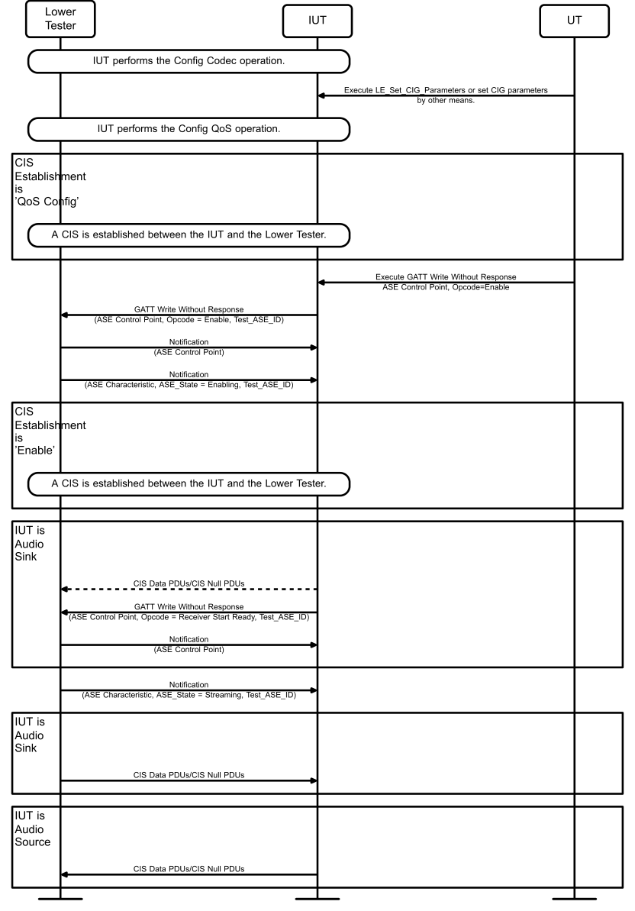

**Figure 4.9: Unicast Client Streaming – 1 Unicast Server, 1 Stream, 1 CIS – LC3 MSC**

for the ASE Control Point characteristic with the opcode set to 0x01 (Config Codec) and: • Number_of_ASEs set to 1 • ASE_ID[0] set to Test_ASE_ID • Remaining values for [0] parameters set to values referenced in TSPX_CODEC_CONFIG_SINK_ASEID1 if ASE Type is Sink ASE, otherwise TSPX_CODEC_CONFIG_SOURCE_ASEID1 2. The Lower Tester sends the IUT a notification of the ASE Control Point characteristic. 3. The Lower Tester sends the IUT a notification of the ASE characteristic for Test_ASE_ID. 4. The IUT executes the LE_Set_CIG_Parameters command with CIS_Count set to 1 and
remaining parameters set using values from TSPX_CIG_Parameters if HCI is used, or configures a CIS by other means. 5. If HCI is used, the IUT receives a Command Complete event with a Status of 0x00 in response to
the LE_Set_CIG_Parameters command; otherwise, the QoS parameters are retrieved by other means. 6. The IUT executes the GATT Write Without Response sub-procedure for the ASE Control Point
characteristic with the opcode set to 0x02 (Config QoS) and: • Number_of_ASEs set to 1 • ASE_ID[0] set to Test_ASE_ID • CIG_ID and CIS_ID set to values obtained in Step 6. • Remaining values for [0] parameters set to values referenced in TSPX_QOS_CONFIG_SINK_ASEID1 ID1 if ASE Type is Sink ASE, otherwise set to TSPX_QOS_CONFIG_SOURCE_ASEID1 7. The Lower Tester sends the IUT a notification of the ASE Control Point characteristic. 8. The Lower Tester sends the IUT a notification of the ASE characteristic for Test_ASE_ID. 9. If CIS Establishment as specified in Table 4.40 is QoS Config:
a. The IUT establishes a CIS by using the Connected Isochronous Stream Central
Establishment procedure defined in Volume 3, Part C, Section 9.3.13 in [1]. b. The Lower Tester accepts the establishment of a CIS by using the Connected Isochronous
Stream Peripheral Establishment procedure defined in Volume 3, Part C, Section 9.3.14 in [1]. 10. The Upper Tester orders the IUT to execute the GATT Write Without Response sub-procedure
with the opcode set to 0x03 (Enable) and: • Number_of_ASEs set to 1 • ASE_ID[0] set using the value from the Initial Condition • Metadata set to the TSPX_Metadata IXIT entry 11. The Lower Tester sends the IUT a notification of the ASE Control Point characteristic value. 12. The Lower Tester sends the IUT a notification of the ASE characteristic value that corresponds to
the ASE_ID value equal to Test_ASE_ID with the ASE_State set to 0x03 (Enabling). 13. If CIS Establishment as specified in Table 4.40 is Enable:
a. The IUT establishes a CIS by using the Connected Isochronous Stream Central
Establishment procedure defined in Volume 3, Part C, Section 9.3.13 in [1]. b. The Lower Tester accepts the establishment of a CIS by using the Connected Isochronous
Stream Peripheral Establishment procedure defined in Volume 3, Part C, Section 9.3.14 in [1]. 14. If not already set up, the audio data paths are configured by executing the preamble in
Section 4.4.9.
a. The IUT may send CIS Data PDUs or CIS Null PDUs to the Lower Tester. b. The IUT executes the GATT Write Without Response sub-procedure for the ASE Control
Point characteristic with the opcode set to 0x04 (Receiver Start Ready) and: • Number_of_ASEs = 1 • ASE_ID set using the value from the Initial Condition c. The Lower Tester sends the IUT a notification of the ASE Control Point characteristic value. 16. The Lower Tester sends the IUT a notification of the ASE characteristic value corresponding to
the ASE_ID value equal to Test_ASE_ID with ASE_State set to 0x04 (Streaming). 17. If the IUT is in the Audio Sink role:
• The Lower Tester sends CIS Data PDUs or CIS Null PDUs. 18. If the IUT is in the Audio Source role:
• The IUT sends CIS Data PDUs or CIS Null PDUs.
Expected Outcome
Pass verdict
The ASE must have the Codec Config and QoS Config Settings specified in its IXIT entries.
If the IUT is in the Audio Sink role, the IUT receives SDUs with a zero or more length that contains LC3-encoded data formatted using the LC3 Media Packet format (defined in [3] Section 4.2).
If the IUT is in the Audio Source role, the IUT sends SDUs with a zero or more length that uses the LC3 Media Packet format (defined in [3] Section 4.2).
For the Mono TCIDs, the IUT doesn’t send an Audio_Channel_Allocation LTV.

#### 4.10.2 Unicast Client Streaming – 1 Unicast Server, 1 Stream, 1 CIS – Vendor-Specific Codec

Test Purpose
Verify that a Unicast Client IUT can stream audio data with a vendor-specific codec over one unicast Audio Stream to/from a Unicast Server. The verification is performed for each ASE Type and Config Parameters in turn, as enumerated in the test cases in Table 4.41. This test group applies to Audio Configurations 1, 2, 4, and 10, as referenced in Section 3.2.1.
Reference
[3] 4, 4.4.1, 4.4.2, 4.4.4, 4.4.14
Initial Condition
- Establish a Bearer connection between the Lower Tester and the IUT as described in Section 4.4.1, if using ATT over an LE transport, or Section 4.4.2 if using ATT over a BR/EDR transport, or Section 4.4.3 if using EATT over an LE transport, or Section 4.4.4 if using EATT over a BR/EDR transport.
- The Lower Tester is a Unicast Server including an instantiation of the Audio Stream Control Service exposing an ASE characteristic of the ASE Type listed in Table 4.41 and an instantiation of the Published Audio Capabilities Service with available PAC records. The ASE characteristic exposed by the Lower Tester is in the Idle state.
- The IUT is a Unicast Client and has discovered all ASCS characteristics of the Lower Tester by executing either the GATT Discover All Primary Services sub-procedure or the GATT Discover Primary Services by Service UUID.
- The Lower Tester exposes a PAC record, ASE, and Audio Location depending on the ASE Type specified in Table 4.41.
- If ASE Type is Source ASE:
- If the Audio Channels/Locations column in Table 4.41 specifies 1 Audio Channels/Locations:
- If the Source PAC record contains a Supported_Audio_Channel_Counts parameter, bit 0 is set to 0b1. The Source Audio Locations characteristic contains one bit set to 0b1.
- If the Audio Channels/Locations column in Table 4.41 specifies 2 Audio Channels/ Locations:
- If the Source PAC record contains a Supported_Audio_Channel_Counts parameter, bit 1 is set to 0b1. The Source Audio Locations characteristic contains two bits set to 0b1.
- If ASE Type is Sink ASE:
- If the Audio Channels/Locations column in Table 4.41 specifies 1 Audio Channels/Locations:
- If the Sink PAC record contains a Supported_Audio_Channel_Counts parameter, bit 0 is set to 0b1. The Sink Audio Locations characteristic contains one bit set to 0b1.
- If the Audio Channels/Locations column in Table 4.41 specifies 2 Audio Channels/Locations:
- The Sink PAC record contains a Supported_Audio_Channel_Counts parameter, bit 1 is set to 0b1. The Sink Audio Locations characteristic contains two bits set to 0b1.
- The IUT enables notification for the selected ASE by writing the value 0x0001 using the GATT Write Characteristic Descriptors sub-procedure for the ASE CCCD.
- The IUT enables notification by writing the value 0x0001 using the GATT Write Characteristic Descriptors sub-procedure for the ASE Control Point CCCD.
- The IUT selects one characteristic of the ASE Type listed in Table 4.41 and reads the characteristic value by executing the GATT Read Characteristic Value sub-procedure. The IUT caches the ASE_ID field value as Test_ASE_ID.
Test Case Configuration

|  | Test Case ID |  |  | ASE Type |  |  | Channel Count |  |
| --- | --- | --- | --- | --- | --- | --- | --- | --- |
| BAP/UCL/STR/BV-129-C [UCL SRC, AC 1, VS Codec] |  |  | Sink ASE |  |  | 1 |  |  |
| BAP/UCL/STR/BV-130-C [UCL SRC, AC 4, VS Codec] |  |  | Sink ASE |  |  | 2 |  |  |
| BAP/UCL/STR/BV-131-C [UCL, AC 2, VS Codec] |  |  | Source ASE |  |  | 1 |  |  |
| BAP/UCL/STR/BV-132-C [UCL, AC 10, VS Codec] |  |  | Source ASE |  |  | 2 |  |  |

Table 4.41: Unicast Client Streaming – 1 Unicast Server, 1 Stream, 1 CIS – Vendor Specific Codec test cases

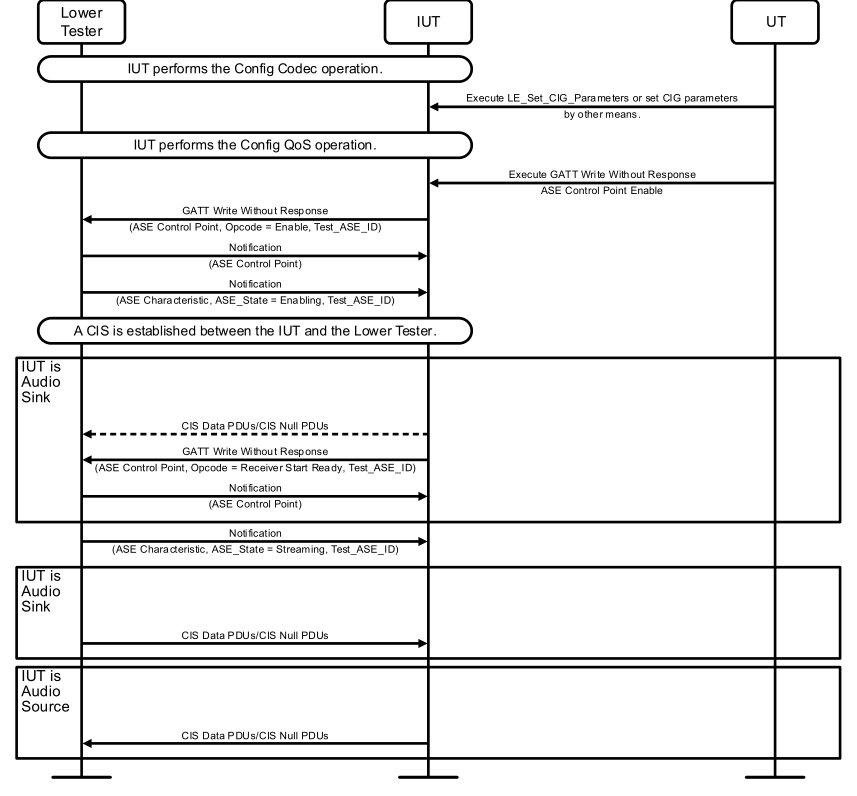

**Figure 4.10: Unicast Client Streaming – 1 Unicast Server, 1 Stream, 1 CIS – Vendor Specific Codec MSC**

1. The Upper Tester orders the IUT to execute the GATT Write Without Response sub-procedure
with the opcode set to 0x01 (Config Codec) and: • Number_of_ASEs set to 1 • ASE_ID[0] set to Test_ASE_ID • Target_Latency[0] set to a valid value • Target_PHY[0] set to a valid value • Codec_ID[0] set to TSPX_VS_Codec_ID • Codec_Specific_Configuration_Length[0] set to the length of the Codec_Specific_Configuration field value • Codec_Specific_Configuration[0] set to the parameters specified in TSPX_VS_Codec_Specific_Configuration [7]. 2. The Lower Tester sends the IUT a notification of the ASE Control Point characteristic. 3. The Lower Tester sends the IUT a notification of the ASE characteristic for the ASE_ID that was
set in Step 1. 4. The Upper Tester orders the IUT to execute the LE_Set_CIG_Parameters command if the IUT
incorporates HCI or sets the CIG parameters by other means.
for the ASE Control Point characteristic with the opcode set to 0x02 (Config QoS) and: • Number_of_ASEs = 1 • ASE_ID[0] set to Test_ASE_ID • CIG_ID[0] and CIS_ID[0] set to values matching values used in Step 2 • SDU_Interval[0] set to TSPX_VS_QoS_SDU_Interval • Framing[0] set to TSPX_VS_QoS_Framing • PHY[0] set to TSPX_VS_QoS_PHY • Max_SDU[0] set to TSPX_VS_QoS_Max_SDU • Retransmission_Number[0] set to TSPX_VS_QoS_Retransmission_Number • Max_Transport_Latency[0] set to TSPX_VS_QoS_Max_Transport_Latency • Presentation_Delay[0] set to TSPX_VS_QoS_Presentation_Delay 6. The Lower Tester sends the IUT a notification of the ASE Control Point characteristic value. 7. The Lower Tester sends the IUT a notification of the ASE characteristic value for the ASE_ID that
was set in Step 5. 8. The Upper Tester orders the IUT to execute the GATT Write Without Response sub-procedure
for the ASE Control Point characteristic with the opcode set to 0x03 (Enable) and: • Number_of_ASEs set to 1 • ASE_ID[0], CIG_ID[0], and CIS_ID[0] set using the values from the Initial Condition • Metadata set to the TSPX_Metadata IXIT entry 9. The Lower Tester sends the IUT a notification of the ASE Control Point characteristic value. 10. The Lower Tester sends the IUT a notification of the ASE characteristic value that corresponds to
the ASE_ID used in Step 4 with the ASE_State set to 0x03 (Enabling). 11. The IUT establishes a CIS by using the Connected Isochronous Stream Central Establishment
procedure defined in Volume 3, Part C, Section 9.3.13 in [1]. 12. The Lower Tester accepts the establishment of a CIS by using the Connected Isochronous
Stream Peripheral Establishment procedure defined in Volume 3, Part C, Section 9.3.14 in [1]. 13. The audio data paths are configured by executing the preamble in Section 4.4.9. 14. If the IUT is in the Audio Sink role:
a. The IUT may send CIS Data PDUs or CIS Null PDUs to the Lower Tester. b. The IUT executes the GATT Write Without Response sub-procedure for the ASE Control
Point characteristic with the opcode set to 0x04 (Receiver Start Ready) and: • Number_of_ASEs set to 1 • ASE_ID[0] set to Test_ASE_ID c. The Lower Tester sends the IUT a notification of the ASE Control Point characteristic value. 15. The Lower Tester sends the IUT a notification of the ASE characteristic value that corresponds to
the ASE_ID that was set in Step 9 with ASE_State set to 0x04 (Streaming). 16. If the IUT is in the Audio Sink role:
a. The Lower Tester transmits CIS Data PDUs or CIS Null PDUs. 17. If the IUT is in the Audio Source role:
a. The IUT transmits CIS Data PDUs or CIS Null PDUs.
Expected Outcome
Pass verdict
If the IUT is in the Audio Sink role, the IUT receives SDUs with a zero or more length.
If the IUT is in the Audio Source role, the IUT sends SDUs with a zero or more length.

#### 4.10.3 Unicast Client Streaming – 1 Unicast Server, 2 Streams, 1 Sink ASE, 1 Source ASE – LC3

Test Purpose
Verify that a Unicast Client IUT can stream LC3-encoded audio data over two audio streams with one bidirectional CIS to and from a Unicast Server. This test group applies to Audio Configurations 3, 5, and 7(i), as referenced in Section 3.2.1.
Reference
[3] 4, 4.4.3, 4.4.5, 4.4.8, 5.6.3.1
Initial Condition
- Establish a Bearer connection between the Lower Tester and the IUT as described in Section 4.4.1, if using ATT over an LE transport, or Section 4.4.2 if using ATT over a BR/EDR transport, or Section 4.4.3 if using EATT over an LE transport, or Section 4.4.4 if using EATT over a BR/EDR transport.
- The Lower Tester is a Unicast Server including an instantiation of the Audio Stream Control Service exposing at least one of each of Sink ASE and Source ASE characteristics and an instantiation of the Published Audio Capabilities Service with available PAC records including at least one Source PAC and at least one Sink PAC. The ASEs exposed by the Lower Tester are in the Idle state.
- The IUT is a Unicast Client and has discovered all ASCS characteristics of the Lower Tester by executing either the GATT Discover All Primary Services sub-procedure or the GATT Discover Primary Services by Service UUID.
- The Lower Tester exposes source and sink PAC records, ASEs, and Audio Locations.
- If ASE Type is Source ASE:
- If the Audio Channels/Locations column in Table 4.42 specifies 1 Audio Channels/Locations:
- The Source PAC record contains a Supported_Audio_Channel_Counts parameter with bit 0 set to 0b1. The Source Audio Locations characteristic contains one bit set to 0b1.
- If the Audio Channels/Locations column in Table 4.42 specifies 2 Audio Channels/Locations:
- The Source PAC record contains a Supported_Audio_Channel_Counts parameter with bit 1 set to 0b1. The Source Audio Locations characteristic contains two bits set to 0b1.
- If ASE Type is Sink ASE:
- If the Audio Channels/Locations column in Table 4.42 specifies 1 Audio Channels/Locations:
- The Sink PAC record contains a Supported_Audio_Channel_Counts parameter with bit 0 set to 0b1. The Sink Audio Locations characteristic contains one bit set to 0b1.
- If the Audio Channels/Locations column in Table 4.42 specifies 2 Audio Channels/Locations:
- The Sink PAC record contains a Supported_Audio_Channel_Counts parameter with bit 1 set to 0b1. The Sink Audio Locations characteristic contains two bits set to 0b1.
- The IUT enables notification for each of the two selected ASEs by writing the value 0x0001 using the GATT Write Characteristic Descriptors sub-procedure for the ASE CCCD.
- The IUT enables notification of the ASE Control Point by writing the value 0x0001 using the GATT Write Characteristic Descriptors sub-procedure for the ASE Control Point CCCD.
- The IUT reads the characteristic values of one Sink ASE and one Source ASE by executing the GATT Read Characteristic Value sub-procedure. The IUT caches the ASE_ID field values as Test_Sink_ASE_ID1 and Test_Source_ASE_ID1, respectively.
Test Case Configuration

| Test Case ID |  | Audio |  | Number of CISes |  | CIS Establishment |  |  |  |
| --- | --- | --- | --- | --- | --- | --- | --- | --- | --- |
|  |  | Channels / |  |  | Sink State | Sink State | Source State | Source State |  |
|  |  | Locations per |  |  |  |  |  |  |  |
|  |  | Sink ASE |  |  |  |  |  |  |  |
| BAP/UCL/STR/BV-523-C [UCL, AC 3, Generic] | 1 |  |  | 1 | Enable |  | Enable |  |  |
| BAP/UCL/STR/BV-524-C [UCL, AC 5, Generic] | 2 |  |  | 1 | Enable |  | Enable |  |  |
| BAP/UCL/STR/BV-525-C [UCL, AC 7(i), Generic] | 1 |  |  | 2 | Enable |  | Enable |  |  |
| BAP/UCL/STR/BV-543-C [UCL, AC 3, Generic, Enable, QoS] | 1 |  |  | 1 | Enable |  | QoS Config |  |  |
| BAP/UCL/STR/BV-544-C [UCL, AC 5, Generic, Enable, QoS] | 2 |  |  | 1 | Enable |  | QoS Config |  |  |
| BAP/UCL/STR/BV-545-C [UCL, AC 7(i), Generic, Enable, QoS] | 1 |  |  | 2 | Enable |  | QoS Config |  |  |
| BAP/UCL/STR/BV-546-C [UCL, AC 3, Generic, QoS, Enable] | 1 |  |  | 1 | QoS Config |  | Enable |  |  |
| BAP/UCL/STR/BV-547-C [UCL, AC 5, Generic, QoS, Enable] | 2 |  |  | 1 | QoS Config |  | Enable |  |  |
| BAP/UCL/STR/BV-548-C [UCL, AC 7(i), Generic, QoS, Enable] | 1 |  |  | 2 | QoS Config |  | Enable |  |  |
| BAP/UCL/STR/BV-549-C [UCL, AC 3, Generic, QoS, QoS] | 1 |  |  | 1 | QoS Config |  | QoS Config |  |  |
| BAP/UCL/STR/BV-550-C [UCL, AC 5, Generic, QoS, QoS] | 2 |  |  | 1 | QoS Config |  | QoS Config |  |  |
| BAP/UCL/STR/BV-551-C [UCL, AC 7(i), Generic, QoS, QoS] | 1 |  |  | 2 | QoS Config |  | QoS Config |  |  |

Table 4.42: Unicast Client Streaming – 1 Unicast Server, 2 Streams, 1 Sink ASE, 1 Source ASE – LC3 test cases

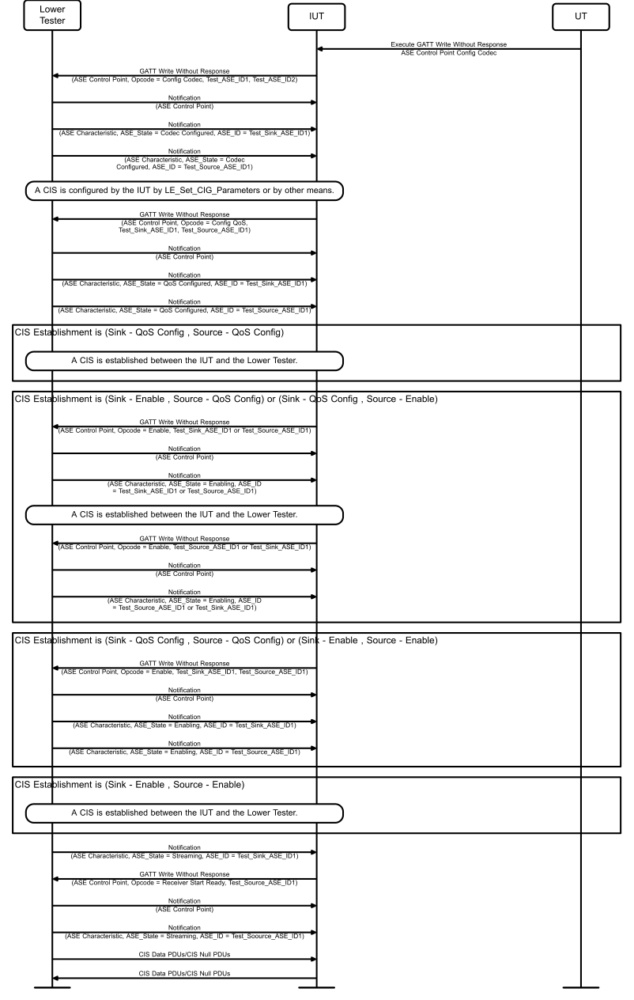

**Figure 4.11: Unicast Client Streaming – 1 Unicast Server, 2 Streams, 1 Sink ASE, 1 Source ASE – LC3 MSC**

for the ASE Control Point characteristic with the opcode set to 0x01 (Config Codec) and: • Number_of_ASEs set to 2 • ASE_ID[0] set to Test_Sink_ASE_ID1 • ASE_ID[1] set to Test_Source_ASE_ID1 • Remaining values for [0] parameters set to values referenced in TSPX_CODEC_CONFIG_SINK_ASEID1 • Remaining values for [1] parameters set to values referenced in TSPX_CODEC_CONFIG_SOURCE_ASEID1 2. The Lower Tester sends the IUT a notification of the ASE Control Point characteristic. 3. The Lower Tester sends the IUT a notification of the ASE characteristic for Test_Sink_ASE_ID1. 4. The Lower Tester sends the IUT a notification of the ASE characteristic for
Test_Source_ASE_ID2. 5. The IUT executes the LE_Set_CIG_Parameters command with CIS_Count set to the value in
Table 4.42 and remaining parameters set using values from TSPX_CIG_Parameters if HCI is used, or configures a CIS by other means. 6. If HCI is used, the IUT receives a Command Complete event with a Status of 0x00 in response to
the LE_Set_CIG_Parameters command; otherwise, the QoS parameters are retrieved by other means. 7. The IUT executes the GATT Write Without Response sub-procedure for the ASE Control Point
characteristic with the opcode set to 0x02 (Config QoS) and: • Number_of_ASEs set to 2 • ASE_ID[0] set to Test_Sink_ASE_ID1 • ASE_ID[1] set to Test_Source_ASE_ID1 • CIG_ID and CIS_ID set to values obtained in Step 6. If using multiple CISes, the CIS_IDs must be unique for each. • Remaining values for [0] parameters set to values referenced in TSPX_QOS_CONFIG_SINK_ASEID1 • Remaining values for [1] parameters set to values referenced in TSPX_QOS_CONFIG_SINK_ASEID1 8. The Lower Tester sends the IUT a notification of the ASE Control Point characteristic. 9. The Lower Tester sends the IUT a notification of the ASE characteristic for Test_Sink_ASE_ID1. 10. The Lower Tester sends the IUT a notification of the ASE characteristic for
Test_Source_ASE_ID2. 11. If CIS Establishment as specified in Table 4.42 is Sink – QoS Config, Source – QoS Config:
a. The IUT establishes a CIS by using the Connected Isochronous Stream Central
Establishment procedure defined in Volume 3, Part C, Section 9.3.13 in [1]. b. The Lower Tester accepts the establishment of a CIS by using the Connected Isochronous
Stream Peripheral Establishment procedure defined in Volume 3, Part C, Section 9.3.14 in [1]. 12. If CIS Establishment as specified in Table 4.42 is (Sink – QoS Config , Source – Enable) or (Sink
– Enable, Source – QoS Config): a. The IUT executes the GATT Write Without Response sub-procedure for the ASE Control
Point characteristic with the opcode set to 0x03 (Enable) and: • Number_of_ASEs set to 1 • ASE_ID[0] set to Test_Sink_ASE_ID1 or Test_Source_ASE_ID1 as indicated by Table 4.42 • Metadata set to the TSPX_Metadata IXIT entry b. The Lower Tester sends the IUT a notification of the ASE Control Point characteristic.
Test_Sink_ASE_ID1 or Test_Source_ASE_ID1 as indicated by Table 4.42. d. The IUT establishes a CIS by using the Connected Isochronous Stream Central
Establishment procedure defined in Volume 3, Part C, Section 9.3.13 in [1]. e. The Lower Tester accepts the establishment of a CIS by using the Connected Isochronous
Stream Peripheral Establishment procedure defined in Volume 3, Part C, Section 9.3.14 in [1]. f. The IUT executes the GATT Write Without Response sub-procedure for the ASE Control Point characteristic with the opcode set to 0x03 (Enable) and: • Number_of_ASEs set to 1 • ASE_ID[0] set to Test_Sink_ASE_ID1 or Test_Source_ASE_ID1 as indicated by Table 4.42 • Metadata set to the TSPX_Metadata IXIT entry g. The Lower Tester sends the IUT a notification of the ASE Control Point characteristic. h. The Lower Tester sends the IUT a notification of the ASE characteristic for the
Test_Sink_ASE_ID1 Test_Source_ASE_ID1 as indicated by Table 4.42. 13. If CIS Establishment as specified in Table 4.42 is (Sink – QoS Config, Source – QoS Config) or
(Sink – Enable, Source – Enable): a. The IUT executes the GATT Write Without Response sub-procedure for the ASE Control
Point characteristic with the opcode set to 0x03 (Enable) and: • Number_of_ASEs set to 2 • ASE_ID[0] set to Test_Sink_ASE_ID1 • ASE_ID[1] set to Test_Source_ASE_ID1 • Metadata set to the TSPX_Metadata IXIT entry b. The Lower Tester sends the IUT a notification of the ASE Control Point characteristic. c. The Lower Tester sends the IUT a notification of the ASE characteristic for
Test_Sink_ASE_ID1. d. The Lower Tester sends the IUT a notification of the ASE characteristic for
Test_Source_ASE_ID1. 14. If CIS Establishment as specified in Table 4.42 is (Sink – Enable, Source – Enable):
a. The IUT establishes a CIS by using the Connected Isochronous Stream Central
Establishment procedure defined in Volume 3, Part C, Section 9.3.13 in [1]. b. The Lower Tester accepts the establishment of a CIS by using the Connected Isochronous
Stream Peripheral Establishment procedure defined in Volume 3, Part C, Section 9.3.14 in [1]. 15. If not already set up, the audio data paths are configured by executing the preamble in
Section 4.4.9. 16. The Lower Tester sends the IUT a notification of the ASE characteristic for Test_Sink_ASE_ID1. 17. The IUT executes the GATT Write Without Response sub-procedure for the ASE Control Point
characteristic with the opcode set to 0x04 (Receiver Start Ready) and: • Number_of_ASEs set to 1 • ASE_ID[0] set to Test_Source_ASE_ID1 18. The Lower Tester sends the IUT a notification of the ASE Control Point characteristic. 19. The Lower Tester sends the IUT a notification of the ASE characteristic for the ASE_ID used in
Step 17. 20. The Lower Tester sends CIS Data PDUs or CIS Null PDUs. 21. The IUT sends CIS Data PDUs or CIS Null PDUs.
Pass verdict
Only one ASE must have the Codec Config and QoS Config Settings specified in its IXIT entries, and the other ASE may use the 16_2 Codec Config Settings and a 16_2_1 QoS Config Setting.
In Step 22, the IUT receives SDUs with a zero or more length using the LC3 Media Packet format (defined in [3] Section 4.2).
In Step 23, the IUT sends SDUs with a zero or more length using the LC3 Media Packet format (defined in [3] Section 4.2).

#### 4.10.4 Unicast Client Streaming – 1 Unicast Server, 2 Streams, 1 Sink ASE, 1 Source ASE – Vendor-Specific Codec

Test Purpose
Verify that a Unicast Client IUT can stream audio data using a vendor-specific codec over two audio streams (one as source, one as sink) to and from a Unicast Server. The verification is performed for each Config Parameters in turn, as specified in Table 4.43. This test group applies to Audio Configurations 3, 5, and 7(i), as referenced in Section 3.2.1.
Reference
[3] 4, 4.4.3, 4.4.5, 4.4.8, 5.6.3.1
Initial Condition
- Establish a Bearer connection between the Lower Tester and the IUT as described in Section 4.4.1, if using ATT over an LE transport, or Section 4.4.2 if using ATT over a BR/EDR transport, or Section 4.4.3 if using EATT over an LE transport, or Section 4.4.4 if using EATT over a BR/EDR transport.
- The IUT is a Unicast Client.
- The Lower Tester is a Unicast Server including an instantiation of the Audio Stream Control Service exposing at least one of each of Sink ASE and Source ASE characteristics and an instantiation of the Published Audio Capabilities Service with available PAC records including at least one Source PAC and at least one Sink PAC. The ASEs exposed by the Lower Tester are in the Idle state.
- The IUT has discovered all ASCS characteristics of the Lower Tester by executing either the GATT Discover All Primary Services sub-procedure or the GATT Discover Primary Services by Service UUID.
- If ASE Type is Source ASE:
- If the Audio Channels/Locations column in Table 4.43 specifies 1 Audio Channels/Locations:
- If the Source PAC record contains a Supported_Audio_Channel_Counts parameter, bit 0 is set to 0b1. The Source Audio Locations characteristic contains one bit set to 0b1.
- If the Audio Channels/Locations column in Table 4.43 specifies 2 Audio Channels/Locations:
- If the Source PAC record contains a Supported_Audio_Channel_Counts parameter, bit 1 is set to 0b1. The Source Audio Locations characteristic contains two bits set to 0b1.
- If ASE Type is Sink ASE:
- If the Audio Channels/Locations column in Table 4.43 specifies 1 Audio Channels/Locations:
- If the Sink PAC record contains a Supported_Audio_Channel_Counts parameter, bit 0 is set to 0b1. The Sink Audio Locations characteristic contains one bit set to 0b1.
- If the Audio Channels/Locations column in Table 4.43 specifies 2 Audio Channels/Locations:
- The Sink PAC record contains a Supported_Audio_Channel_Counts parameter, bit 1 is set to 0b1. The Sink Audio Locations characteristic contains two bits set to 0b1.
- The IUT enables notification for each of the two selected ASEs by writing the value 0x0001 using the GATT Write Characteristic Descriptors sub-procedure for the ASE CCCD.
- The IUT enables notification of the ASE Control Point by writing the value 0x0001 using the GATT Write Characteristic Descriptors sub-procedure for the ASE Control Point CCCD.
- The IUT reads the characteristic values of one Sink ASE and one Source ASE by executing the GATT Read Characteristic Value sub-procedure. The IUT caches the ASE_ID field values as Test_ASE_ID1 and Test_ASE_ID2, respectively.
Test Case Configuration

| Test Case ID |  | Audio Channels / Locations |  | CIS Count |
| --- | --- | --- | --- | --- |
|  |  | per Sink ASE |  |  |
| BAP/UCL/STR/BV-229-C [UCL, AC 3, VS] | 1 |  |  | 1 |
| BAP/UCL/STR/BV-230-C [UCL, AC 5, VS] | 2 |  |  | 1 |
| BAP/UCL/STR/BV-231-C [UCL, AC 7, VS] | 1 |  |  | 2 |

Table 4.43: Unicast Client Streaming – 1 Unicast Server, 2 Streams, 1 Sink ASE, 1 Source ASE – Vendor- Specific Codec test cases

**Figure 4.12: Unicast Client Streaming – 1 Unicast Server, 2 Streams, 1 Sink ASE, 1 Source ASE – Vendor- Specific Codec MSC**

1. The Upper Tester orders the IUT to execute the GATT Write Without Response sub-procedure
for the ASE Control Point characteristic with the opcode set to 0x01 (Config Codec) and: • Number_of_ASEs set to 2 • ASE_ID[0] set to Test_ASE_ID1 • ASE_ID[1] set to Test_ASE_ID2 • Target_Latency[0] and Target_PHY set to values supported by the IUT • Codec_ID[0] and [1] set to TSPX_VS_Codec_ID • Codec_Specific_Configuration_Length[0] and [1] set to the length of the Codec_Specific_Configuration field value • Codec_Specific_Configuration[0] and [1] set to the parameters specified in TSPX_VS_Codec_Specific_Configuration [7] 2. The Lower Tester sends the IUT a notification of the ASE Control Point characteristic. 3. The Lower Tester sends the IUT a notification of the ASE characteristic for Test_ASE_ID1. 4. The Lower Tester sends the IUT a notification of the ASE characteristic for Test_ASE_ID2. 5. The IUT executes the LE_Set_CIG_Parameters command with CIS_Count set to the value in
Table 4.43 and remaining parameters set using values from TSPX_CIG_Parameters if HCI is used, or configures a CIS by other means.
the LE_Set_CIG_Parameters command; otherwise, the QoS parameters are retrieved by other means. 7. The IUT executes the GATT Write Without Response sub-procedure for the ASE Control Point
characteristic with the opcode set to 0x02 (Config QoS) and: • Number_of_ASEs = 2 • ASE_ID[0] set to Test_ASE_ID1 • ASE_ID[1] set to Test_ASE_ID2 • CIG_ID and CIS_ID set to the values obtained in Step 6, with CIS_ID[0] and CIS_ID[1] set to different values • SDU_Interval[0] and [1] set to TSPX_VS_QoS_SDU_Interval • Framing[0] and [1] set to TSPX_VS_QoS_Framing • PHY[0] and [1] set to TSPX_VS_QoS_PHY • Max_SDU[0] and [1] set to TSPX_VS_QoS_Max_SDU • Retransmission_Number[0] and [1] set to TSPX_VS_QoS_Retransmission_Number • Max_Transport_Latency[0] and [1] set to TSPX_VS_QoS_Max_Transport_Latency • Presentation_Delay[0] and [1] set to TSPX_VS_QoS_Presentation_Delay 8. The Lower Tester sends the IUT a notification of the ASE Control Point characteristic. 9. The Lower Tester sends the IUT a notification of the ASE characteristic for Test_ASE_ID1. 10. The Lower Tester sends the IUT a notification of the ASE characteristic for Test_ASE_ID2. 11. The IUT executes the GATT Write Without Response sub-procedure for the ASE Control Point
characteristic with the opcode set to 0x03 (Enable) and: • Number_of_ASEs set to 2 • ASE_ID[0] set to Test_ASE_ID1 • ASE_ID[1] set to Test_ASE_ID2 • Metadata set to the TSPX_Metadata IXIT entry 12. The Lower Tester sends the IUT a notification of the ASE Control Point characteristic. 13. The Lower Tester sends the IUT a notification of the ASE characteristic for Test_ASE_ID1. 14. The Lower Tester sends the IUT a notification of the ASE characteristic for Test_ASE_ID2. 15. The IUT establishes a CIS by using the Connected Isochronous Stream Central Establishment
procedure defined in Volume 3, Part C, Section 9.3.13 in [1]. 16. The Lower Tester accepts the establishment of a CIS by using the Connected Isochronous
Stream Peripheral Establishment procedure defined in Volume 3, Part C, Section 9.3.14 in [1]. 17. The audio data paths are configured by executing the preamble in Section 4.4.9. 18. The Lower Tester sends the IUT a notification of the ASE characteristic for Test_ASE_ID1. 19. The IUT executes the GATT Write Without Response sub-procedure for the ASE Control Point
characteristic with the opcode set to 0x04 (Receiver Start Ready) and: • Number_of_ASEs set to 1 • ASE_ID set to Test_ASE_ID2 20. The Lower Tester sends the IUT a notification of the ASE Control Point characteristic. 21. The Lower Tester sends the IUT a notification of the ASE characteristic for Test_ASE_ID2. 22. The Lower Tester sends CIS Data PDUs or CIS Null PDUs. 23. The IUT sends CIS Data PDUs or CIS Null PDUs.
Expected Outcome
Pass verdict
In Step 22, the IUT receives SDUs with a zero or more length.
In Step 23, the IUT sends SDUs with a zero or more length.

#### 4.10.5 Unicast Client Streaming – 2 Unicast Servers, 2 Streams, 1 Sink ASE, 1 Source ASE – LC3

Test Purpose
Verify that a Unicast Client IUT can transmit audio data via two bidirectional CISes to two Unicast Servers, each with one Sink ASE and one Source ASE with one audio channel per ASE. This test group applies to Audio Configuration 7(ii), as referenced in Section 3.2.1.
Reference
[3] 4, 4.4.9, 5.6.3.1
Initial Condition
- There are two Lower Testers acting as Unicast Servers: Lower Tester 1 and Lower Tester 2.
- Establish a Bearer connection between both Lower Testers and the IUT as described in Section 4.4.1, if using ATT over an LE transport, or Section 4.4.2 if using ATT over a BR/EDR transport, or Section 4.4.3 if using EATT over an LE transport, or Section 4.4.4 if using EATT over a BR/EDR transport.
- Lower Tester 1 includes an instantiation of the Audio Stream Control Service exposing at least one Sink ASE characteristic and an instantiation of the Published Audio Capabilities Service with available PAC records including at least one Sink PAC. The exposed Sink ASE is in the Idle state.
- Lower Tester 2 includes an instantiation of the Audio Stream Control Service exposing at least one Source ASE characteristic and an instantiation of the Published Audio Capabilities Service with available PAC records including at least one Source PAC. The exposed Source ASE is in the Idle state.
- The IUT is a Unicast Client and has discovered all ASCS characteristics of both Lower Testers by executing either the GATT Discover All Primary Services sub-procedure or the GATT Discover Primary Services by Service UUID.
- If the TSPX_EXPOSE_CSIS IXIT Entry is set to True, Lower Tester 1 and Lower Tester 2 include an instance of CSIS that conforms to the CAP Acceptor Role.
- Lower Tester 1 exposes a sink PAC record, ASE, and Audio Location.
- The Sink PAC record contains a Supported_Audio_Channel_Counts parameter with bit 0 set to 0b1. The Sink Audio Locations characteristic contains one bit set to 0b1 and is different from the Sink Audio Locations characteristic bit set to 0b1 by Lower Tester 2.
- Lower Tester 2 exposes a source PAC record, ASE, and Audio Location.
- The Source PAC record contains a Supported_Audio_Channel_Counts parameter with bit 0 set to 0b1. The Source Audio Locations characteristic contains one bit set to 0b1 and is different from the Source Audio Locations characteristic bit set to 0b1 by Lower Tester 1.
- The IUT enables notification for each of the two selected ASEs by writing the value 0x0001 using the GATT Write Characteristic Descriptors sub-procedure for the ASE CCCD.
- The IUT enables notification of the ASE Control Point on both Lower Testers by writing the value 0x0001 using the GATT Write Characteristic Descriptors sub-procedure for the ASE Control Point CCCD.
- The IUT reads the characteristic value of one Sink ASE on Lower Tester 1 by executing the GATT Read Characteristic Value sub-procedure and caches the ASE_ID field value as Test_Sink_ASE_ID1. The IUT reads the characteristic value of one Source ASE on Lower Tester 2 by executing the GATT Read Characteristic Value sub-procedure and caches the ASE_ID field values as Test_Source_ASE_ID2.
Test Case Configuration

|  | Test Case ID |  |
| --- | --- | --- |
| BAP/UCL/STR/BV-526-C [UCL, AC 7(ii), Generic] |  |  |

Table 4.44: Unicast Client Streaming – 2 Unicast Servers, 2 Streams, 1 Sink ASE, 1 Source ASE – LC3 test cases

|  | Round |  |  | Target |  |  | ASE ID _ |  |  | Codec Config |  |  | QoS Config |  |
| --- | --- | --- | --- | --- | --- | --- | --- | --- | --- | --- | --- | --- | --- | --- |
| 1 |  |  | Lower Tester 1 |  |  | Test Sink ASE ID1 _ _ _ |  |  | TSPX CODEC CONFIG SINK ASEID1 _ _ _ _ |  |  | TSPX QOS CONFIG SINK ASEID1 _ _ _ _ |  |  |
| 2 |  |  | Lower Tester 2 |  |  | Test Source ASE ID2 _ _ _ |  |  | TSPX CODEC CONFIG SOURCE ASEID2 _ _ _ _ |  |  | TSPX QOS CONFIG SOURCE ASEID2 _ _ _ _ |  |  |

Table 4.45: Rounds for Unicast Client Streaming – 2 Unicast Servers, 2 Streams, 1 Sink ASE, 1 Source ASE – LC3

**Figure 4.13: Unicast Client Streaming – 2 Unicast Servers, 2 Streams, 1 Sink ASE, 1 Source ASE – LC3 MSC**

Repeat Steps 1–3 for each round in Table 4.45.
1. The Upper Tester orders the IUT to execute the GATT Write Without Response sub-procedure
for the ASE Control Point characteristic on the Lower Tester specified in Table 4.45 with the opcode set to 0x01 (Config Codec) and: • Number_of_ASEs set to 1 • ASE_ID set to the value of the ASE_ID specified in Table 4.45. • Remaining parameters set to values referenced in Codec Config for the ASE specified in Table 4.45. 2. The Lower Tester specified in Table 4.45 sends the IUT a notification of the ASE Control Point
the ASE_ID used in Step 1. 4. The IUT executes the LE_Set_CIG_Parameters command with CIS_Count = 2 and remaining
parameters set using values from TSPX_CIG_Parameters if HCI is used, or configures a CIS by other means. 5. If HCI is used, the IUT receives a Command Complete event with a Status of 0x00 in response to
the LE_Set_CIG_Parameters command; otherwise, the QoS parameters are retrieved by other means.
Repeat Steps 6–8 for each round in Table 4.45.
6. The IUT executes the GATT Write Without Response sub-procedure for the ASE Control Point
characteristic on the Lower Tester specified in Table 4.45 with the opcode set to 0x02 (Config QoS) and: • Number_of_ASEs set to 1 • ASE_ID[0] set to the value of the ASE_ID specified in Table 4.45 • CIG_ID[0] and CIS_ID[0] set to values obtained in Step 5. The CIS_ID fields for each ASE are set to different values. • Remaining parameters set to values referenced in QoS Config for the ASE specified in Table 4.45 7. The Lower Tester specified in Table 4.45 sends the IUT a notification of the ASE Control Point
characteristic. 8. The Lower Tester specified in Table 4.45 sends the IUT a notification of the ASE characteristic for
the ASE_ID used in Step 6.
Repeat Steps 9–11 for each Lower Tester.
9. The IUT executes the GATT Write Without Response sub-procedure for the ASE Control Point
characteristic on the Lower Tester specified in Table 4.45 with the opcode set to 0x03 (Enable) and: • Number_of_ASEs set to 1 • ASE_ID[0] set to the value of the ASE_ID specified in Table 4.45 • Metadata set to the TSPX_Metadata IXIT entry 10. The Lower Tester specified in Table 4.45 sends the IUT a notification of the ASE Control Point
characteristic. 11. The Lower Tester specified in Table 4.45 sends the IUT a notification of the ASE characteristic for
the ASE_ID used in Step 9. 12. The IUT establishes a CIS by using the Connected Isochronous Stream Central Establishment
procedure defined in Volume 3, Part C, Section 9.3.13 in [1]. 13. The Lower Tester accepts the establishment of a CIS by using the Connected Isochronous
Stream Peripheral Establishment procedure defined in Volume 3, Part C, Section 9.3.14 in [1]. 14. The audio data paths are configured by executing the preamble in Section 4.4.9. 15. The Lower Tester sends the IUT a notification of the ASE characteristic for Test_Sink_ASE_ID1. 16. The IUT executes the GATT Write Without Response sub-procedure for the ASE Control Point
characteristic on Lower Tester 2 with the opcode set to 0x04 (Receiver Start Ready) and: • Number_of_ASEs set to 1 • ASE_ID[0] set to Test_Source_ASE_ID2 17. Lower Tester 2 sends the IUT a notification of the ASE Control Point characteristic. 18. Lower Tester 2 sends the IUT a notification of the ASE characteristic for Test_Source_ASE_ID2. 19. Lower Tester 2 sends CIS Data PDUs or CIS Null PDUs. 20. The IUT sends CIS Data PDUs or CIS Null PDUs to Lower Tester 1.
Pass verdict
Only one ASE must have the Codec Config and QoS Config Settings specified in its IXIT entries, and the other ASE may use the 16_2 Codec Config Settings and a 16_2_1 QoS Config Setting.
In Step 19, the IUT receives SDUs with a zero or more length using the LC3 Media Packet format (defined in [3] Section 4.2) or CIS Null PDUs.
In Step 20, the IUT sends SDUs with a zero or more length using the LC3 Media Packet format (defined in [3] Section 4.2) or CIS Null PDUs.

#### 4.10.6 Unicast Client Streaming – 1 Unicast Server, 2 Streams, 2 Sink ASEs – LC3

Test Purpose
Verify that a Unicast Client IUT can transmit audio data via two unidirectional CISes on two ASEs to a Unicast Server Audio Sink that supports two audio locations with one audio channel per ASE. This test group applies to Audio Configuration 6(i), as referenced in Section 3.2.1.
Reference
[3] 4, 4.4.6
Initial Condition
- The IUT is a Unicast Client.
- The Lower Tester is a Unicast Server.
- Establish a Bearer connection between the Lower Tester and the IUT as described in Section 4.4.1, if using ATT over an LE transport, or Section 4.4.2 if using ATT over a BR/EDR transport, or Section 4.4.3 if using EATT over an LE transport, or Section 4.4.4 if using EATT over a BR/EDR transport.
- The IUT has discovered all ASCS characteristics of the Lower Tester by executing either the GATT Discover All Primary Services sub-procedure or the GATT Discover Primary Services by Service UUID.
- The Lower Tester exposes a Sink_Audio_Locations characteristic with value including at least two bits set to 0b1.
- The Lower Tester exposes at least two Sink ASE characteristics.
- The Lower Tester exposes a sink PAC record, ASEs, and Audio Locations.
- The Sink PAC record contains a Supported_Audio_Channel_Counts parameter with bit 0 set to 0b1. The Sink Audio Locations characteristic contains two bits set to 0b1.
- The IUT enables notification for the selected ASEs by writing the value 0x0001 using the GATT Write Characteristic Descriptors sub-procedure for the ASE CCCD.
- The IUT enables notification by writing the value 0x0001 using the GATT Write Characteristic Descriptors sub-procedure for the ASE Control Point CCCD.
- The IUT selects two Sink ASE characteristics and reads the characteristic values by executing the GATT Read Characteristic Value sub-procedure. The IUT caches the ASE_ID field values as Test_Sink_ASE_ID1 and Test_Sink_ASE_ID2.

|  | Test Case ID |  |
| --- | --- | --- |
| BAP/UCL/STR/BV-527-C [UCL, AC 6(i), Generic] |  |  |

Table 4.46: Unicast Client Streaming – 1 Unicast Server, 2 Streams, 2 Sink ASEs – LC3 test cases
Test Procedure

**Figure 4.14: Unicast Client Streaming – 1 Unicast Server, 2 Streams, 2 Sink ASEs – LC3 MSC**

1. The Upper Tester orders the IUT to execute the GATT Write Without Response sub-procedure
for the ASE Control Point characteristic with the opcode set to 0x01 (Config Codec) and: • Number_of_ASEs set to 2 • ASE_ID[0] set to Test_Sink_ASE_ID1 • ASE_ID[1] set to Test_Sink_ASE_ID2 • Remaining values for [0] parameters set to values referenced in TSPX_CODEC_CONFIG_SINK_ASEID1 • Remaining values for [1] parameters set to values referenced in TSPX_CODEC_CONFIG_SINK_ASEID2 2. The Lower Tester sends the IUT a notification of the ASE Control Point characteristic. 3. The Lower Tester sends notifications for both Sink ASE characteristics with the ASE_IDs used in
Step 1.
parameters set using values from TSPX_CIG_Parameters if HCI is used, or configures a CIS by other means. 5. If HCI is used, the IUT receives a Command Complete event with a Status of 0x00 in response to
the LE_Set_CIG_Parameters command; otherwise, the QoS parameters are retrieved by other means. 6. The IUT executes the GATT Write Without Response sub-procedure for the ASE Control Point
characteristic with the opcode set to 0x02 (Config QoS) and: • Number_of_ASEs set to 2 • ASE_ID[0] set to Test_Sink_ASE_ID1 • ASE_ID[1] set to Test_Sink_ASE_ID2 • CIG_ID and CIS_ID set to the values obtained in Step 5, with CIS_ID[0] and CIS_ID[1] set to different values • Remaining values for [0] parameters set to values referenced in TSPX_QOS_CONFIG_SINK_ASEID1 • Remaining values for [1] parameters set to values referenced in TSPX_QOS_CONFIG_SINK_ASEID2 7. The Lower Tester sends the IUT a notification of the ASE Control Point characteristic. 8. The Lower Tester sends the IUT a notification of the ASE characteristic for the ASE_ID that was
set in Step 6. 9. The IUT executes the GATT Write Without Response sub-procedure for the ASE Control Point
characteristic with the opcode set to 0x03 (Enable) and: • Number_of_ASEs set to 2 • ASE_ID[0] set to Test_Sink_ASE_ID1 • ASE_ID[1] set to Test_Sink_ASE_ID2 • Metadata set to the TSPX_Metadata IXIT entry 10. The Lower Tester sends the IUT a notification of the ASE Control Point characteristic. 11. The Lower Tester sends the IUT a notification of the ASE characteristic that corresponds to
Test_ASE_ID1. 12. The Lower Tester sends the IUT a notification of the ASE characteristic that corresponds to
Test_ASE_ID2. 13. The IUT establishes two unidirectional CISes by using the Connected Isochronous Stream
Central Establishment procedure defined in Volume 3, Part C, Section 9.3.13 in [1]. 14. The Lower Tester accepts the establishment of both CISes by using the Connected Isochronous
Stream Peripheral Establishment procedure defined in Volume 3, Part C, Section 9.3.14 in [1]. 15. The Lower Tester sends notifications for both Sink ASE characteristics with the ASEs in
Streaming state. 16. On both audio streams, the IUT sends CIS Data PDUs or CIS Null PDUs.
Expected Outcome
Pass verdict
Only one ASE must have the Codec Config and QoS Config Settings specified in its IXIT entries, and the other ASE may use the 16_2 Codec Config Settings and a 16_2_1 QoS Config Setting.
On both audio streams, the IUT sends SDUs with a zero or more length using the LC3 Media Packet format (defined in [3] Section 4.2).
Test Purpose
Verify that a Unicast Client IUT can transmit audio data using a vendor-specific codec via two unidirectional CISes on two ASEs to a Unicast Server Audio Sink that supports two audio locations with one audio channel per ASE. This test group applies to Audio Configuration 6(i), as referenced in Section 3.2.1.
Reference
[3] 4, 4.4.6
Initial Condition
- The IUT is a Unicast Client.
- The Lower Tester is a Unicast Server.
- Establish a Bearer connection between the Lower Tester and the IUT as described in Section 4.4.1, if using ATT over an LE transport, or Section 4.4.2 if using ATT over a BR/EDR transport, or Section 4.4.3 if using EATT over an LE transport, or Section 4.4.4 if using EATT over a BR/EDR transport.
- The IUT has discovered all ASCS characteristics of the Lower Tester by executing either the GATT Discover All Primary Services sub-procedure or the GATT Discover Primary Services by Service UUID.
- The Lower Tester exposes a Sink_Audio_Locations characteristic with value including at least two bits set to 0b1.
- The Lower Tester exposes at least two Sink ASE characteristics.
- The Lower Tester exposes a sink PAC record, ASEs, and Audio Locations.
- If the Sink PAC record contains a Supported_Audio_Channel_Counts parameter, bit 0 is set to 0b1. The Sink Audio Locations characteristic contains two bits set to 0b1.
- The IUT enables notification for the selected ASEs by writing the value 0x0001 using the GATT Write Characteristic Descriptors sub-procedure for the ASE CCCD.
- The IUT enables notification by writing the value 0x0001 using the GATT Write Characteristic Descriptors sub-procedure for the ASE Control Point CCCD.
- The IUT selects two Sink ASE characteristics and reads the characteristic values by executing the GATT Read Characteristic Value sub-procedure. The IUT caches the ASE_ID field values as Test_ASE_ID1 and Test_ASE_ID2.

**Figure 4.15: UCL Streaming 1 Server 2 Streams 2 Sinks – Vendor Specific MSC**

1. The Upper Tester orders the IUT to execute the GATT Write Without Response sub-procedure
for the ASE Control Point characteristic with the opcode set to 0x01 (Config Codec) and: • Number_of_ASEs set to 2 • ASE_ID[0] set to Test_ASE_ID1 • ASE_ID[1] set to Test_ASE_ID2 • Target_Latency[0] and [1] set to a valid value • Target_PHY[0] and [1] set to a valid value • Codec_ID[0] and [1] set to TSPX_VS_Codec_ID • Codec_Specific_Configuration_Length[0] and [1] set to the length of the Codec_Specific_Configuration field value • Codec_Specific_Configuration[0] and [1] set to the parameters specified in TSPX_VS_Codec_Specific_Configuration [7], including the Audio_Channel_Allocation LTV structure. The Audio_Channel_Allocation value contains one bit set to 0b1 and which matches a bit set to 0b1 in the Sink_Audio_Locations characteristic value. The Audio_Channel_Allocation value for ASE_ID[0] is different from the Audio_Channel_Allocation value for ASE_ID[1]. 2. The Lower Tester sends the IUT a notification of the ASE Control Point characteristic. 3. The Lower Tester sends notifications for both Sink ASE characteristics with the ASE_IDs used in
Step 1.
parameters set using values from TSPX_CIG_Parameters if HCI is used, or configures a CIS by other means. 5. If HCI is used, the IUT receives a Command Complete event with a Status of 0x00 in response to
the LE_Set_CIG_Parameters command; otherwise, the QoS parameters are retrieved by other means. 6. The IUT executes the GATT Write Without Response sub-procedure for the ASE Control Point
characteristic with the opcode set to 0x02 (Config QoS) and: • Number_of_ASEs = 2 • ASE_ID[0] set to Test_ASE_ID1 • ASE_ID[1] set to Test_ASE_ID2 • CIG_ID and CIS_ID set to the values obtained in Step 5, with CIS_ID[0] and CIS_ID[1] set to different values • SDU_Interval[0] and [1] set to TSPX_VS_QoS_SDU_Interval • Framing[0] and [1] set to TSPX_VS_QoS_Framing • PHY[0] and [1] set to TSPX_VS_QoS_PHY • Max_SDU[0] and [1] set to TSPX_VS_QoS_Max_SDU • Retransmission_Number[0] and [1] set to TSPX_VS_QoS_Retransmission_Number • Max_Transport_Latency[0] and [1] set to TSPX_VS_QoS_Max_Transport_Latency • Presentation_Delay[0] and [1] set to TSPX_VS_QoS_Presentation_Delay 7. The Lower Tester sends the IUT a notification of the ASE Control Point characteristic. 8. The Lower Tester sends the IUT a notification of the ASE characteristic for the ASE_ID that was
set in Step 6. 9. The IUT executes the GATT Write Without Response sub-procedure for the ASE Control Point
characteristic with the opcode set to 0x03 (Enable) and: • Number_of_ASEs set to 2 • ASE_ID[0] set to Test_ASE_ID1 • ASE_ID[1] set to Test_ASE_ID2 • Metadata set to the TSPX_Metadata IXIT entry 10. The Lower Tester sends the IUT a notification of the ASE Control Point characteristic. 11. The Lower Tester sends the IUT a notification of the ASE characteristic that corresponds to
Test_ASE_ID1. 12. The Lower Tester sends the IUT a notification of the ASE characteristic that corresponds to
Test_ASE_ID2. 13. The IUT establishes two unidirectional CISes by using the Connected Isochronous Stream
Central Establishment procedure defined in Volume 3, Part C, Section 9.3.13 in [1]. 14. The Lower Tester accepts the establishment of both CISes by using the Connected Isochronous
Stream Peripheral Establishment procedure defined in Volume 3, Part C, Section 9.3.14 in [1]. 15. The Lower Tester sends notifications for both Sink ASE characteristics with the ASEs in the
Streaming state. 16. On both audio streams, the IUT sends CIS Data PDUs or CIS Null PDUs.
Expected Outcome
Pass verdict
On both audio streams, the IUT sends SDUs with a zero or more length using the LC3 Media Packet format (defined in [3] Section 4.2).

#### 4.10.7 Unicast Client Streaming – 2 Unicast Servers, 2 Streams – LC3

Test Purpose
Verify that a Unicast Client IUT can transmit audio data via two synchronized streams to two Audio Sink Unicast Servers. The Unicast Server Lower Testers each support at least one audio location. This test group applies to Audio Configuration 6(ii), as referenced in Section 3.2.1.
Reference
[3] 4, 4.4.7
Initial Condition
- The IUT is a Unicast Client.
- There are two Unicast Server Lower Testers: Lower Tester 1 and Lower Tester 2.
- For each Lower Tester, establish a Bearer connection between the Lower Tester and the IUT as described in Section 4.4.1, if using ATT over an LE transport, or Section 4.4.2 if using ATT over a BR/EDR transport, or Section 4.4.3 if using EATT over an LE transport, or Section 4.4.4 if using EATT over a BR/EDR transport.
- The IUT has discovered all ASCS characteristics of the Lower Tester by executing either the GATT Discover All Primary Services sub-procedure or the GATT Discover Primary Services by Service UUID. Each Lower Tester exposes at least one Sink ASE characteristic.
- The IUT has discovered the Audio Locations and PAC records on each Lower Tester by running BAP/UCL/DISC/BV-01-C [Discover Audio Sink Capabilities] or BAP/UCL/DISC/BV-02-C [Discover Audio Source Capabilities], or by other means.
- For each Lower Tester, the IUT enables notification for the selected ASE by writing the value 0x0001 using the GATT Write Characteristic Descriptors sub-procedure for the ASE CCCD.
- For each Lower Tester, the IUT enables notification by writing the value 0x0001 using the GATT Write Characteristic Descriptors sub-procedure for the ASE Control Point CCCD.
- If the TSPX_EXPOSE_CSIS IXIT Entry is set to True, Lower Tester 1 and Lower Tester 2 include an instance of CSIS that conforms to the CAP Acceptor Role.
- Lower Tester 1 exposes a sink PAC record, ASEs, and Audio Locations.
- The Sink PAC record contains a Supported_Audio_Channel_Counts parameter with bit 0 set to 0b1. The Sink Audio Locations characteristic contains one bit set to 0b1 and is different from the Sink Audio Locations characteristic bit set to 0b1 by Lower Tester 2.
- Lower Tester 2 exposes a sink PAC record, ASEs, and Audio Locations.
- The Sink PAC record contains a Supported_Audio_Channel_Counts parameter with bit 0 set to 0b1. The Sink Audio Locations characteristic contains one bit set to 0b1 and is different from the Source Audio Locations characteristic bit set to 0b1 by Lower Tester 1.
- For each Lower Tester, the IUT selects a Sink ASE characteristic and reads the characteristic value by executing the GATT Read Characteristic Value sub-procedure. The IUT caches the ASE_ID field values as Test_Sink_ASE_ID1 (Lower Tester 1) and Test_Sink_ASE_ID2 (Lower Tester 2).

|  | Test Case ID |
| --- | --- |
| BAP/UCL/STR/BV-528-C [UCL, AC 6(ii), Generic] |  |

Table 4.47: Unicast Client Streaming – 2 Unicast Servers, 2 Streams – LC3 test cases

|  | Round |  |  | Target |  |  | ASE ID _ |  |  | Codec Config |  |  | QoS Config |
| --- | --- | --- | --- | --- | --- | --- | --- | --- | --- | --- | --- | --- | --- |
| 1 |  |  | Lower Tester 1 |  |  | Test Sink ASE ID1 _ _ _ |  |  | TSPX CODEC CONFIG SINK ASEID1 _ _ _ _ |  |  | TSPX QOS CONFIG SINK ASEID1 _ _ _ _ |  |
| 2 |  |  | Lower Tester 2 |  |  | Test Sink ASE ID2 _ _ _ |  |  | TSPX CODEC CONFIG SINK ASEID2 _ _ _ _ |  |  | TSPX QOS CONFIG SINK ASEID2 _ _ _ _ |  |

Table 4.48: Rounds for Unicast Client Streaming – 2 Unicast Servers, 2 Streams – LC3
Test Procedure

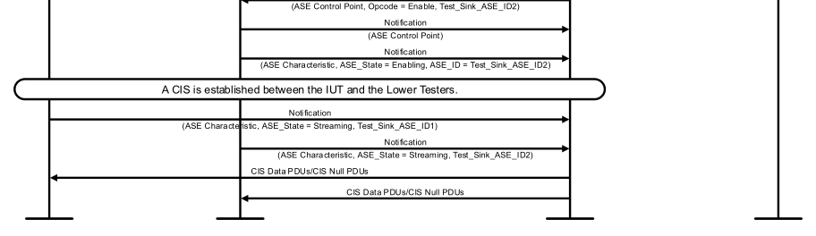

**Figure 4.16: Unicast Client Streaming – 2 Unicast Servers, 2 Streams – LC3 MSC**

1. The Upper Tester orders the IUT to execute the GATT Write Without Response sub-procedure
for the ASE Control Point characteristic with the opcode set to 0x01 (Config Codec) and: • Number_of_ASEs set to 1 • ASE_ID set to the ASE_ID specified in Table 4.48 • Codec parameters set to values referenced in Codec Config for the ASE specified in Table 4.48 2. The Lower Tester sends the IUT a notification of the ASE Control Point characteristic. 3. The Lower Tester sends the IUT a notification of the ASE characteristic for the ASE_ID that was
set in Step 1. 4. The IUT executes the LE_Set_CIG_Parameters command with CIS_Count = 2 and remaining
parameters set using values from TSPX_CIG_Parameters if HCI is used, or configures a CIS by other means. 5. If HCI is used, the IUT receives a Command Complete event with a Status of 0x00 in response to
the LE_Set_CIG_Parameters command; otherwise, the QoS parameters are retrieved by other means.
Execute Steps 6–8 for each round in Table 4.48 against the Lower Tester specified in Table 4.48.
6. The IUT executes the GATT Write Without Response sub-procedure for the ASE Control Point
characteristic with the opcode set to 0x02 (Config QoS) and: • Number_of_ASEs set to 1 • ASE_ID[0] set to the ASE_ID specified in Table 4.48 • CIG_ID[0] and CIS_ID[0] set to the values obtained in Step 4 • Remaining parameters set to values referenced in QoS Config for the ASE specified in Table 4.48 7. The Lower Tester sends the IUT a notification of the ASE Control Point characteristic. 8. The Lower Tester sends the IUT a notification of the ASE characteristic for the ASE_ID that was
set in Step 6.
Execute Steps 9–11 for each round in Table 4.48 against the Lower Tester specified in Table 4.48.
9. The IUT executes the GATT Write Without Response sub-procedure for the ASE Control Point
characteristic with the opcode set to 0x03 (Enable) and: • Number_of_ASEs set to 1 • ASE_ID set to the ASE_ID specified in Table 4.48 • CIG_ID and CIS_ID set using the values from Step 5 • Metadata set to the TSPX_Metadata IXIT entry 10. The Lower Tester sends the IUT a notification of the ASE Control Point characteristic. 11. The Lower Tester sends the IUT a notification of the ASE characteristic that corresponds to the
ASE_ID that was set in Step 8. 12. The IUT establishes a CIS by using the Connected Isochronous Stream Central Establishment
procedure defined in Volume 3, Part C, Section 9.3.13 in [1]. 13. The Lower Tester accepts the establishment of a CIS by using the Connected Isochronous
Stream Peripheral Establishment procedure defined in Volume 3, Part C, Section 9.3.14 in [1]. 14. The audio data paths are configured by executing the preamble in Section 4.4.9. 15. Lower Tester 1 sends a notification of the ASE for Test_Sink_ASE_ID1 in the Streaming state. 16. Lower Tester 2 sends a notification of the ASE for Test_Sink_ASE_ID2 in the Streaming state. 17. The IUT sends CIS Data PDUs or CIS Null PDUs.
Pass verdict
Only one ASE must have the Codec Config and QoS Config Settings specified in its IXIT entries, and the other ASE may use the 16_2 Codec Config Settings and a 16_2_1 QoS Config Setting.
The IUT sends SDUs with a zero or more length using the LC3 Media Packet format (defined in [3] Section 4.2) to both Lower Testers.
BAP/UCL/STR/BV-329-C [UCL, AC 6(ii) – VS]
Test Purpose
Verify that a Unicast Client IUT can transmit audio data using a vendor-specific codec via two synchronized streams to two Unicast Servers. The Unicast Server Lower Testers each support at least one audio location. This test applies to Audio Configuration 6(ii), as referenced in Section 3.2.1.
Reference
[3] 4, 4.4.7
Initial Condition
- The IUT is a Unicast Client.
- There are two Unicast Server Lower Testers: Lower Tester 1 and Lower Tester 2.
- For each Lower Tester, establish a Bearer connection between the Lower Tester and the IUT as described in Section 4.4.1, if using ATT over an LE transport, or Section 4.4.2 if using ATT over a BR/EDR transport, or Section 4.4.3 if using EATT over an LE transport, or Section 4.4.4 if using EATT over a BR/EDR transport.
- The Lower Tester exposes an ASCS server with at least two Sink ASE characteristics.
- If the TSPX_EXPOSE_CSIS IXIT Entry is set to True, Lower Tester 1 and Lower Tester 2 include an instance of CSIS that conforms to the CAP Acceptor Role.
- The IUT has discovered all ASCS characteristics of the Lower Tester by executing either the GATT Discover All Primary Services sub-procedure or the GATT Discover Primary Services by Service UUID.
- The IUT has discovered the Audio Locations and PAC records on each Lower Tester by running BAP/UCL/DISC/BV-01-C [Discover Audio Sink Capabilities] or BAP/UCL/DISC/BV-02-C [Discover Audio Source Capabilities], or by other means.
- For each Lower Tester, the IUT enables notification for the selected ASE by writing the value 0x0001 using the GATT Write Characteristic Descriptors sub-procedure for the ASE CCCD.
- For each Lower Tester, the IUT enables notification by writing the value 0x0001 using the GATT Write Characteristic Descriptors sub-procedure for the ASE Control Point CCCD.
- Lower Tester 1 exposes a sink PAC record, ASEs, and Audio Locations.
- If the Sink PAC record contains a Supported_Audio_Channel_Counts parameter, bit 0 is set to 0b1. The Sink Audio Locations characteristic contains one bit set to 0b1 and is different from the Sink Audio Locations characteristic bit set to 0b1 by Lower Tester 2.
- If the Sink PAC record contains a Supported_Audio_Channel_Counts parameter, bit 0 is set to 0b1. The Sink Audio Locations characteristic contains one bit set to 0b1 and is different from the Sink Audio Locations characteristic bit set to 0b1 by Lower Tester 1.
- For each Lower Tester, the IUT selects a Sink ASE characteristic and reads the characteristic value by executing the GATT Read Characteristic Value sub-procedure. The IUT caches the ASE_ID field values as Test_ASE_ID1 (Lower Tester 1) and Test_ASE_ID2 (Lower Tester 2).
Test Case Configuration

|  | Round |  |  | Target |  |  | ASE ID _ |  |
| --- | --- | --- | --- | --- | --- | --- | --- | --- |
| 1 |  |  | Lower Tester 1 |  |  | Test ASE ID1 _ _ |  |  |
| 2 |  |  | Lower Tester 2 |  |  | Test ASE ID2 _ _ |  |  |

Table 4.49: Rounds for Unicast Client Transmits Synchronized Audio Data to Two Unicast Servers – Vendor- specific Codec
Test Procedure

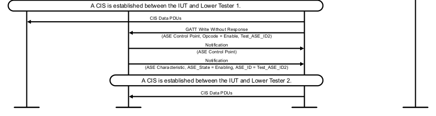

**Figure 4.17: Unicast Client Transmits Synchronized Audio Data to Two Unicast Servers – Vendor-specific Codec MSC**

1. The Upper Tester orders the IUT to the ASE Control Point on the IUT by executing the GATT
Write Without Response sub-procedure with the opcode set to 0x01 (Config Codec) and: • Number_of_ASEs set to 1 • ASE_ID[0] set to the ASE_ID specified in Table 4.49 • Target_Latency[0] and Target_PHY set to values supported by the IUT • Codec_ID[0] set to TSPX_VS_Codec_ID • Codec_Specific_Configuration_Length[0] set to the length of the Codec_Specific_Configuration field value • Codec_Specific_Configuration[0] set to the parameters specified in TSPX_VS_Codec_Specific_Configuration [7] 2. The Lower Tester sends the IUT a notification of the ASE Control Point characteristic. 3. The Lower Tester sends the IUT a notification of the ASE characteristic for the ASE_ID that was
set in Step 1. 4. The IUT executes the LE_Set_CIG_Parameters command with CIS_Count = 1 and remaining
parameters set using values from TSPX_CIG_Parameters if HCI is used, or configures a CIS by other means. 5. If HCI is used, the IUT receives a Command Complete event with a Status of 0x00 in response to
the LE_Set_CIG_Parameters command; otherwise, the QoS parameters are retrieved by other means.
Execute Steps 6–8 for each round in Table 4.49 against the Lower Tester specified in Table 4.49.
6. The Upper Tester orders the IUT to execute the GATT Write Without Response sub-procedure
for the ASE Control Point characteristic with the opcode set to 0x02 (Config QoS) and: • Number_of_ASEs = 1 • ASE_ID[0] set to the ASE_ID specified in Table 4.49 • CIG_ID[0] and CIS_ID[0] set to values matching values used in Step 2 • SDU_Interval[0] set to TSPX_VS_QoS_SDU_Interval • Framing[0] set to TSPX_VS_QoS_Framing • PHY[0] set to TSPX_VS_QoS_PHY • Max_SDU[0] set to TSPX_VS_QoS_Max_SDU • Retransmission_Number[0] set to TSPX_VS_QoS_Retransmission_Number • Max_Transport_Latency[0] set to TSPX_VS_QoS_Max_Transport_Latency • Presentation_Delay[0] set to TSPX_VS_QoS_Presentation_Delay 7. The Lower Tester sends the IUT a notification of the ASE Control Point characteristic. 8. The Lower Tester sends the IUT a notification of the ASE characteristic for the ASE_ID that was
passed in Step 6.
Execute Steps 9–14 for each round in Table 4.49 against the Lower Tester specified in Table 4.49.
9. The IUT executes the GATT Write Without Response sub-procedure for the ASE Control Point
characteristic with the opcode set to 0x03 (Enable) and: • Number_of_ASEs set to 1 • ASE_ID[0] set to the ASE_ID specified in Table 4.49 • Metadata set to the TSPX_Metadata IXIT entry 10. The Lower Tester sends the IUT a notification of the ASE Control Point characteristic. 11. The Lower Tester sends the IUT a notification of the ASE characteristic that corresponds to the
ASE_ID that was set in Step 9. 12. The IUT establishes a CIS by using the Connected Isochronous Stream Central Establishment
procedure defined in Volume 3, Part C, Section 9.3.13 in [1].
Stream Peripheral Establishment procedure defined in Volume 3, Part C, Section 9.3.14 in [1]. 14. The IUT sends CIS Data PDUs or CIS Null PDUs.
Expected Outcome
Pass verdict
The IUT sends SDUs with a zero or more length to both Lower Testers.

#### 4.10.8 Unicast Client Streaming – 1 Unicast Server, 2 Streams, 2 Source ASEs – LC3

Test Purpose
Verify that a Unicast Client IUT can receive audio data on two unidirectional CISes with two Source ASEs from a Unicast Server that supports at least two audio locations. This test group applies to Audio Configuration 9(i), as referenced in Section 3.2.1.
Reference
[3] 4, 4.4.12
Initial Condition
- The IUT is a Unicast Client.
- The Lower Tester is a Unicast Server.
- Establish a Bearer connection between the Lower Tester and the IUT as described in Section 4.4.1, if using ATT over an LE transport, or Section 4.4.2 if using ATT over a BR/EDR transport, or Section 4.4.3 if using EATT over an LE transport, or Section 4.4.4 if using EATT over a BR/EDR transport.
- The IUT has discovered all ASCS characteristics of the Lower Tester by executing either the GATT Discover All Primary Services sub-procedure or the GATT Discover Primary Services by Service UUID. The Lower Tester exposes at least two Source ASE characteristics.
- The Lower Tester exposes a Source_Audio_Locations characteristic with value including at least two bits set to 0b1.
- The Lower Tester exposes the appropriate PAC records that match those in Table 4.50 that includes a Supported_Audio_Channel_Counts LTV structure that has bit 0 set to 0b1 and all other bits set to 0b0.
- Lower Tester 1 exposes a source PAC record, ASEs, and Audio Locations.
- The Source PAC record contains a Supported_Audio_Channel_Counts parameter with bit 0 set to 0b1. The Source Audio Locations characteristic contains one bit set to 0b1 and is different from the Source Audio Locations characteristic bit set to 0b1 by Lower Tester 2.
- Lower Tester 2 exposes a source PAC record, ASEs, and Audio Locations.
- The Source PAC record contains a Supported_Audio_Channel_Counts parameter with bit 0 set to 0b1. The Source Audio Locations characteristic contains one bit set to 0b1 and is different from the Source Audio Locations characteristic bit set to 0b1 by Lower Tester 1.
- The IUT enables notification for the selected ASEs by writing the value 0x0001 using the GATT Write Characteristic Descriptors sub-procedure for the ASE CCCD.
- The IUT enables notification by writing the value 0x0001 using the GATT Write Characteristic Descriptors sub-procedure for the ASE Control Point CCCD.
- The IUT selects two Source ASE characteristics and reads the characteristic values by executing the GATT Read Characteristic Value sub-procedure. The IUT caches the ASE_ID field values as Test_Source_ASE_ID1 and Test_Source_ASE_ID2.
Test Case Configuration

|  | Test Case ID |
| --- | --- |
| BAP/UCL/STR/BV-529-C [UCL, AC 9(i), Generic] |  |

Table 4.50: Unicast Client Streaming – 1 Unicast Server, 2 Streams, 2 Source ASEs – LC3 test cases
Test Procedure

**Figure 4.18: Unicast Client Streaming – 1 Unicast Server, 2 Streams, 2 Source ASEs – LC3 MSC**

for the ASE Control Point characteristic with the opcode set to 0x01 (Config Codec) and: • Number_of_ASEs set to 2 • ASE_ID[0] set to Test_Source_ASE_ID1 • ASE_ID[1] set to Test_Source_ASE_ID2 • Remaining values for [0] parameters set to values referenced in TSPX_CODEC_CONFIG_SOURCE_ASEID1 • Remaining values for [1] parameters set to values referenced in TSPX_CODEC_CONFIG_SOURCE_ASEID2 2. The Lower Tester sends the IUT a notification of the ASE Control Point characteristic. 3. The Lower Tester sends notifications for both Sink ASE characteristics with the ASE_IDs used in
Step 1. 4. The IUT executes the LE_Set_CIG_Parameters command with CIS_Count = 2 and remaining
parameters set using values from TSPX_CIG_Parameters if HCI is used, or configures a CIS by other means. 5. If HCI is used, the IUT receives a Command Complete event with a Status of 0x00 in response to
the LE_Set_CIG_Parameters command; otherwise, the QoS parameters are retrieved by other means. 6. The IUT executes the GATT Write Without Response sub-procedure for the ASE Control Point
characteristic with the opcode set to 0x02 (Config QoS) and: • Number_of_ASEs set to 2 • ASE_ID[0] set to Test_Source_ASE_ID1 • ASE_ID[1] set to Test_Source_ASE_ID2 • CIG_ID and CIS_ID set to the values obtained in Step 4, with CIS_ID[0] and CIS_ID[1] set to different values • Remaining values for [0] parameters set to values referenced in TSPX_QOS_CONFIG_SOURCE_ASEID1 • Remaining values for [1] parameters set to values referenced in TSPX_QOS_CONFIG_SOURCE_ASEID2 7. The Lower Tester sends the IUT a notification of the ASE Control Point characteristic. 8. The Lower Tester sends the IUT a notification of the ASE characteristic that corresponds to
Test_Source_ASE_ID1. 9. The Lower Tester sends the IUT a notification of the ASE characteristic that corresponds to
Test_Source_ASE_ID2. 10. The IUT executes the GATT Write Without Response sub-procedure for the ASE Control Point
characteristic with the opcode set to 0x03 (Enable) and: • Number_of_ASEs set to 2 • ASE_ID[0] set to Test_Source_ASE_ID1 • ASE_ID[1] set to Test_Source_ASE_ID2 • Metadata set to the TSPX_Metadata IXIT entry 11. The Lower Tester sends the IUT a notification of the ASE Control Point characteristic. 12. The Lower Tester sends the IUT a notification of the ASE characteristic that corresponds to
Test_ASE_ID1. 13. The Lower Tester sends the IUT a notification of the ASE characteristic that corresponds to
Test_ASE_ID2. 14. The Lower Tester establishes a CIS by using the Connected Isochronous Stream Central
Establishment procedure defined in Volume 3, Part C, Section 9.3.13 in [1]. 15. The Lower Tester accepts the establishment of a CIS by using the Connected Isochronous
Stream Peripheral Establishment procedure defined in Volume 3, Part C, Section 9.3.14 in [1].
characteristic with the opcode set to 0x04 (Receiver Start Ready) and: • Number_of_ASEs = 2 • ASE_ID[0] set to Test_Source_ASE_ID1 • ASE_ID[1] set to Test_Source_ASE_ID2 17. The Lower Tester sends the IUT a notification of the ASE Control Point characteristic. 18. The Lower Tester sends the IUT a notification of the ASE characteristic that corresponds to
Test_ASE_ID1. 19. The Lower Tester sends the IUT a notification of the ASE characteristic that corresponds to
Test_ASE_ID2. 20. On both audio streams, the Lower Tester sends CIS Data PDUs or CIS Null PDUs.
Expected Outcome
Pass verdict
Only one ASE must have the Codec Config and QoS Config Settings specified in its IXIT entries, and the other ASE may use the 16_2 Codec Config Settings and a 16_2_1 QoS Config Setting.
On both audio streams, the IUT receives SDUs with a zero or more length, using the LC3 Media Packet format (defined in [3] Section 4.2).

#### 4.10.9 Unicast Client Streaming – 2 Servers, 2 Streams, 2 Source ASEs – LC3

Test Purpose
Verify that a Unicast Client IUT can receive audio data on two unidirectional CISes from two Unicast Servers, each with a Source ASE and each supporting distinct Source Audio Locations. This test group applies to Audio Configuration 9(ii), as referenced in Section 3.2.1.
Reference
[3] 4, 4.4.13
Initial Condition
- There are two Lower Testers: Lower Tester 1 and Lower Tester 2. Both Lower Testers are Unicast Servers.
- Establish a Bearer connection between the Lower Tester and the IUT as described in Section 4.4.1, if using ATT over an LE transport, or Section 4.4.2 if using ATT over a BR/EDR transport, or Section 4.4.3 if using EATT over an LE transport, or Section 4.4.4 if using EATT over a BR/EDR transport.
- The IUT has discovered all ASCS characteristics of the Lower Tester by executing either the GATT Discover All Primary Services sub-procedure or the GATT Discover Primary Services by Service UUID. Each Lower Tester exposes at least one Source ASE characteristic.
- Each Lower Tester exposes a unique Source_Audio_Locations characteristic with value including at least one bit set to 0b1 different from the other Lower Tester.
- Each Lower Tester exposes PAC records, which has the Supported_Audio_Channel_Counts LTV structure with bit 0 set to 0b1, and all other bits set to 0b0.
- The IUT has discovered the PAC records on each Lower Tester by running BAP/UCL/DISC/BV- 01-C [Discover Audio Sink Capabilities] or by other means. If present, the Supported_Audio_Channel_Counts LTV structure has bit 0 set to 0b1, and all other bits set to 0b0.
- The IUT enables notification for the selected ASEs by writing the value 0x0001 using the GATT Write Characteristic Descriptors sub-procedure for the ASE CCCD.
- The IUT enables notification by writing the value 0x0001 using the GATT Write Characteristic Descriptors sub-procedure for the ASE Control Point CCCD.
- If the TSPX_EXPOSE_CSIS IXIT Entry is set to True, Lower Tester 1 and Lower Tester 2 include an instance of CSIS that conforms to the CAP Acceptor Role.
- Lower Tester 1 exposes a source PAC record, ASEs, and Audio Locations.
- The Source PAC record contains a Supported_Audio_Channel_Counts parameter with bit 0 set to 0b1. The Source Audio Locations characteristic contains one bit set to 0b1 and is different from the Source Audio Locations characteristic bit set to 0b1 by Lower Tester 2.
- Lower Tester 2 exposes a source PAC record, ASEs, and Audio Locations.
- The Source PAC record contains a Supported_Audio_Channel_Counts parameter with bit 0 set to 0b1. The Source Audio Locations characteristic contains one bit set to 0b1 and is different from the Source Audio Locations characteristic bit set to 0b1 by Lower Tester 1.
- The IUT selects one Source ASE characteristic from each Lower Tester and reads the characteristic values by executing the GATT Read Characteristic Value sub-procedure. The IUT caches the ASE_ID field values as Test_Source_ASE_ID1 and Test_Source_ASE_ID2.
Test Case Configuration

|  | Test Case ID |  |
| --- | --- | --- |
| BAP/UCL/STR/BV-530-C [UCL, AC 9(ii), Generic] |  |  |

Table 4.51: Unicast Client Streaming – 2 Servers, 2 Streams, 2 Source ASEs – LC3 test cases

|  | Round |  |  | Target |  |  | ASE ID _ |  |  | Codec Config |  |  | QoS Config |  |
| --- | --- | --- | --- | --- | --- | --- | --- | --- | --- | --- | --- | --- | --- | --- |
| 1 |  |  | Lower Tester 1 |  |  | Test Source ASE ID1 _ _ _ |  |  | TSPX CODEC CONFIG SOURCE ASEID1 _ _ _ _ |  |  | TSPX QOS CONFIG SOURCE ASEID1 _ _ _ _ |  |  |
| 2 |  |  | Lower Tester 2 |  |  | Test Source ASE ID2 _ _ _ |  |  | TSPX CODEC CONFIG SOURCE ASEID2 _ _ _ _ |  |  | TSPX QOS CONFIG SOURCE ASEID2 _ _ _ _ |  |  |

Table 4.52: Rounds for Unicast Client Streaming – 2 Servers, 2 Streams, 2 Source ASEs – LC3

**Figure 4.19: Unicast Client Streaming – 2 Servers, 2 Streams, 2 Source ASEs – LC3 MSC**

1. The Upper Tester orders the IUT to execute the GATT Write Without Response sub-procedure
for the ASE Control Point characteristic with the opcode set to 0x01 (Config Codec) and: • Number_of_ASEs set to 1 • ASE_ID set to the value specified in Table 4.52 • Codec parameters set to values referenced in Codec Config for the ASE specified in Table 4.52 2. The Lower Tester sends the IUT a notification of the ASE Control Point characteristic. 3. The Lower Tester sends notifications for both Sink ASE characteristics with the ASE_IDs used in
Step 1. 4. The IUT executes the LE_Set_CIG_Parameters command with CIS_Count = 2, and remaining
parameters set using values from TSPX_CIG_Parameters if HCI is used, or configures a CIS by other means. 5. If HCI is used, the IUT receives a Command Complete event with a Status of 0x00 in response to
the LE_Set_CIG_Parameters command; otherwise, the QoS parameters are retrieved by other means.
Execute Steps 6–8 for each round in Table 4.52 against the Lower Tester specified in Table 4.52.
6. The IUT executes the GATT Write Without Response sub-procedure for the ASE Control Point
characteristic with the opcode set to 0x02 (Config QoS) and: • Number_of_ASEs set to 1 • ASE_ID set to the value specified in Table 4.52 • CIG_ID and CIS_ID set to the values obtained in Step 4, with CIS_ID[0] and CIS_ID[1] set to different values • Remaining parameters set to values referenced in QoS Config for the ASE specified in Table 4.52 7. The Lower Tester sends the IUT a notification of the ASE Control Point characteristic. 8. The Lower Tester sends the IUT a notification of the ASE characteristic for the ASE_ID that was
set in Step 6.
Execute Steps 9–11 for each round in Table 4.52 against the Lower Tester specified in Table 4.52.
9. The IUT executes the GATT Write Without Response sub-procedure for the ASE Control Point
characteristic with the opcode set to 0x03 (Enable) and: • Number_of_ASEs set to 1 • ASE_ID set to the value specified in Table 4.52 • Metadata set to the TSPX_Metadata IXIT entry 10. The Lower Tester sends the IUT a notification of the ASE Control Point characteristic. 11. The Lower Tester sends the IUT a notification of the ASE characteristic that corresponds to the
ASE_ID that was set in Step 9. 12. The Lower Tester establishes a CIS by using the Connected Isochronous Stream Central
Establishment procedure defined in Volume 3, Part C, Section 9.3.13 in [1]. 13. The Lower Tester accepts the establishment of a CIS by using the Connected Isochronous
Stream Peripheral Establishment procedure defined in Volume 3, Part C, Section 9.3.14 in [1].
Execute Steps 14–16 for each round in Table 4.52 against the Lower Tester specified in Table 4.52.
14. The IUT executes the GATT Write Without Response sub-procedure for the ASE Control Point
characteristic with the opcode set to 0x04 (Receiver Start Ready) and: • Number_of_ASEs = 1 • ASE_ID set to the value specified in Table 4.52 15. The Lower Tester sends the IUT a notification of the ASE Control Point characteristic.
ASE_ID that was set in Step 14. 17. The Lower Tester sends CIS Data PDUs or CIS Null PDUs to both audio streams.
Expected Outcome
Pass verdict
Only one ASE must have the Codec Config and QoS Config Settings specified in its IXIT entries, and the other ASE may use the 16_2 Codec Config Settings and a 16_2_1 QoS Config Setting.
The IUT receives SDUs with a zero or more length, using the LC3 Media Packet format (defined in [3] Section 4.2).

#### 4.10.10 Unicast Client Streaming – 1 Server, 3 Audio Streams, 2 CISes – LC3

Test Purpose
Verify that a Unicast Client IUT can transmit audio data on three Audio Streams with two CISes, one unidirectional and one bidirectional with two distinct Sink Audio Locations. This test group applies to Audio Configuration 8(i), as referenced in Section 3.2.1.
Reference
[3] 4, 4.4.11
Initial Condition
- The IUT is a Unicast Client.
- Establish a Bearer connection between the Lower Tester and the IUT as described in Section 4.4.1, if using ATT over an LE transport, or Section 4.4.2 if using ATT over a BR/EDR transport, or Section 4.4.3 if using EATT over an LE transport, or Section 4.4.4 if using EATT over a BR/EDR transport.
- The IUT has discovered all ASCS characteristics of the Lower Tester by executing either the GATT Discover All Primary Services sub-procedure or the GATT Discover Primary Services by Service UUID. The Lower Tester exposes at least two Sink ASE characteristics and one Source ASE characteristic.
- The Lower Tester exposes a sink and source PAC record, ASEs, and Audio Locations.
- The Sink PAC record contains a Supported_Audio_Channel_Counts parameter with bit 0 set to 0b1. The Sink Audio Locations characteristic contains two bits set to 0b1.
- The Source PAC record contains a Supported_Audio_Channel_Counts parameter with bit 0 set to 0b1. The Source Audio Locations characteristic contains one bit set to 0b1.
- The IUT reads the values of one Sink ASE to be coupled to a unidirectional CIS and a Sink ASE and Source ASE coupled to a bidirectional CIS by executing the GATT Read Characteristic Value sub-procedure. The ASE_IDs are stored as Test_Sink_ASE_ID1, Test_Sink_ASE_ID2, and Test_Source_ASE_ID2.
- The IUT enables notification for the selected Source ASE by writing the value 0x0001 using the GATT Write Characteristic Descriptors sub-procedure for the Sink ASE CCCD.
- The IUT enables notification by writing the value 0x0001 using the GATT Write Characteristic Descriptors sub-procedure for the ASE Control Point CCCD.
- The IUT enables notification for the selected Sink ASEs by writing the value 0x0001 using the GATT Write Characteristic Descriptors sub-procedure for the Sink ASE CCCD.

|  | Test Case ID |  |
| --- | --- | --- |
| BAP/UCL/STR/BV-531-C [UCL, AC 8(i), Generic] |  |  |

Table 4.53: Unicast Client Streaming – 1 Server, 3 Audio Streams, 2 CISes – LC3 test cases

|  | Round |  |  | ASE ID _ |  |  | CIS ID _ |  |  | Codec Config |  |  | QoS Config |  |
| --- | --- | --- | --- | --- | --- | --- | --- | --- | --- | --- | --- | --- | --- | --- |
| 1 |  |  | Test Sink ASE ID1 _ _ _ |  |  | CIS ID1 _ |  |  | TSPX CODEC CONFIG SINK ASEID1 _ _ _ _ |  |  | TSPX QOS CONFIG SINK ASEID1 _ _ _ _ |  |  |
| 2 |  |  | Test Sink ASE ID2 _ _ _ |  |  | CIS ID2 _ |  |  | TSPX CODEC CONFIG SINK ASEID2 _ _ _ _ |  |  | TSPX QOS CONFIG SINK ASEID2 _ _ _ _ |  |  |
| 3 |  |  | Test Source ASE ID2 _ _ _ |  |  | CIS ID2 _ |  |  | TSPX CODEC CONFIG SOURCE ASEID2 _ _ _ _ |  |  | TSPX QOS CONFIG SOURCE ASEID2 _ _ _ _ |  |  |

Table 4.54: Rounds for Unicast Client Streaming – 1 Server, 3 Audio Streams, 2 CISes – LC3
1. The IUT executes the GATT Write Without Response sub-procedure for the ASE Control Point
characteristic with the opcode set to 0x01 (Config Codec) and: • Number_of_ASEs set to 1 • ASE_ID set to the value specified in Table 4.54 • Codec parameters set to values referenced in Codec Config for the ASE specified in Table 4.54 2. The Lower Tester sends the IUT a notification of the ASE Control Point characteristic. 3. The Lower Tester sends the IUT a notification of the ASE characteristic for the ASE_ID that was
set in Step 1. 4. The IUT executes the LE_Set_CIG_Parameters command with CIS_Count = 2 and remaining
parameters set using values from TSPX_CIG_Parameters if HCI is used, or configures a CIS by other means. 5. If HCI is used, the IUT receives a Command Complete event with a Status of 0x00 in response to
the LE_Set_CIG_Parameters command; otherwise, the QoS parameters are retrieved by other means. 6. The IUT executes the GATT Write Long Characteristic Value sub-procedure for the ASE Control
Point characteristic with the opcode set to 0x02 (Config QoS) and: • Number_of_ASEs set to 3 • ASE_ID[0] set to Test_Sink_ASE_ID1 • CIG_ID[0], CIG_ID[1], and CIG_ID[2] set to the value from Step 5 • CIS_ID[0] set to the CIS_ID1 • ASE_ID[1] set to Test_Sink_ASE_ID2 • CIS_ID[1] set to the CIS_ID2 • ASE_ID[2] set to Test_Source_ASE_ID2 • CIS_ID[2] set to the CIS_ID2 • Remaining values for [0] parameters set to values referenced in TSPX_QOS_CONFIG_SINK_ASEID1 • Remaining values for [1] parameters set to values referenced in TSPX_QOS_CONFIG_SINK_ASEID2 • Remaining values for [2] parameters set to values referenced in TSPX_QOS_CONFIG_SOURCE_ASEID2 7. The Lower Tester sends the IUT a notification of the ASE Control Point characteristic. 8. The Lower Tester sends the IUT a notification of the ASE characteristic for the ASE_ID that was
set in Step 6. 9. The IUT executes the GATT Write Without Response sub-procedure for the ASE Control Point
characteristic with the opcode set to 0x03 (Enable) and: • Number_of_ASEs set to 3 • ASE_ID[0] set to Test_Sink_ASE_ID1 • ASE_ID[1] set to Test_Sink_ASE_ID2 • ASE_ID[2] set to Test_Source_ASE_ID2 • Metadata set to the TSPX_Metadata IXIT entry 10. The Lower Tester sends the IUT a notification of the ASE Control Point characteristic. 11. The Lower Tester sends the IUT a notification of the ASE characteristic that corresponds to the
ASE_ID that was set in Step 9. 12. The IUT establishes one unidirectional CIS and one bidirectional CIS by using the Connected
Isochronous Stream Central Establishment procedure defined in Volume 3, Part C, Section 9.3.13 in [1].
Stream Peripheral Establishment procedure defined in Volume 3, Part C, Section 9.3.14 in [1]. 14. The IUT executes the GATT Write Without Response sub-procedure for the ASE Control Point
characteristic with the opcode set to 0x04 (Receiver Start Ready) and: • Number_of_ASEs = 1 • ASE_ID[0] set to Test_Source_ASE_ID2 15. The Lower Tester sends the IUT a notification of the ASE Control Point characteristic. 16. The Lower Tester sends the IUT a notification of the ASE characteristic that corresponds to the
ASE_ID that was set in Step 14. 17. The IUT sends CIS Data PDUs or CIS Null PDUs over the unidirectional CIS. 18. The IUT sends and receives CIS Data PDUs or CIS Null PDUs over the bidirectional CIS.
Expected Outcome
Pass verdict
Only one ASE must have the Codec Config and QoS Config Settings specified in its IXIT entries, and the other ASE may use the 16_2 Codec Config Settings and a 16_2_1 QoS Config Setting.
On the bidirectional stream, the IUT sends and receives SDUs with a zero or more length, using the LC3 Media Packet format (defined in [3] Section 4.2).
On the unidirectional stream, the IUT sends SDUs with a zero or more length, using the LC3 Media Packet format (defined in [3] Section 4.2).

#### 4.10.11 Unicast Client Streaming – 2 Unicast Servers, 3 Streams, 2 CISes – LC3

Test Purpose
Verify that a Unicast Client IUT can transmit audio data on three Audio Streams with two CISes. This test group applies to Audio Configuration 8(ii), as referenced in Section 3.2.1.
Reference
[3] 4, 4.4.10
Initial Condition
- The IUT is a Unicast Client.
- There are two Unicast Server Lower Testers: Lower Tester 1 and Lower Tester 2.
- For each Lower Tester, establish a Bearer connection between the Lower Tester and the IUT as described in Section 4.4.1, if using ATT over an LE transport, or Section 4.4.2 if using ATT over a BR/EDR transport, or Section 4.4.3 if using EATT over an LE transport, or Section 4.4.4 if using EATT over a BR/EDR transport.
- The IUT has discovered all ASCS characteristics of each Lower Tester by executing either the GATT Discover All Primary Services sub-procedure or the GATT Discover Primary Services by Service UUID.
- If the TSPX_EXPOSE_CSIS IXIT Entry is set to True, Lower Tester 1 and Lower Tester 2 include an instance of CSIS that conforms to the CAP Acceptor Role.
- Lower Tester 1 exposes a sink PAC record, ASEs, and Audio Locations.
- The Sink PAC record contains a Supported_Audio_Channel_Counts parameter with bit 0 set to 0b1. The Sink Audio Locations characteristic contains one bit set to 0b1 and is different from the Sink Audio Locations characteristic bit set to 0b1 by Lower Tester 2.
- The Source PAC record contains a Supported_Audio_Channel_Counts parameter with bit 0 set to 0b1. The Source Audio Locations characteristic contains one bit set to 0b1.
- The Sink PAC record contains a Supported_Audio_Channel_Counts parameter with bit 0 set to 0b1. The Sink Audio Locations characteristic contains one bit set to 0b1 and is different from the Sink Audio Locations characteristic bit set to 0b1 by Lower Tester 1.
- The IUT selects a Sink ASE characteristic from Lower Tester 1 and reads the characteristic value by executing the GATT Read Characteristic Value sub-procedure. The IUT caches the ASE_ID field values as Test_ASE_ID1(Lower Tester 1). The Sink ASE is coupled with a unidirectional CIS.
- For each Lower Tester, the IUT enables notification for the selected ASE by writing the value 0x0001 using the GATT Write Characteristic Descriptors sub-procedure for the ASE CCCD.
- For each Lower Tester, the IUT enables notification by writing the value 0x0001 using the GATT Write Characteristic Descriptors sub-procedure for the ASE Control Point CCCD.
- The IUT selects a Sink ASE characteristic and Source ASE characteristic from Lower Tester 2 and reads their values by executing the GATT Read Characteristic Value sub-procedure. The IUT caches the ASE_IDs as Test_Sink_ASE_ID2 (Lower Tester 2) and Test_Source_ASE_ID2 (Lower Tester 2). The Sink ASE and Source ASE are coupled to a bidirectional CIS.
Test Case Configuration

|  | Test Case ID |  |
| --- | --- | --- |
| BAP/UCL/STR/BV-532-C [UCL, AC 8(ii), Generic] |  |  |

Table 4.55: Unicast Client Streaming – 2 Unicast Servers, 3 Streams, 2 CISes – LC3 test cases

|  | Round |  |  | Target |  |  | ASE ID _ |  |  | Codec Config |  |  | QoS Config |  |
| --- | --- | --- | --- | --- | --- | --- | --- | --- | --- | --- | --- | --- | --- | --- |
| 1 |  |  | Lower Tester 1 |  |  | Test Sink ASE ID1 _ _ _ |  |  | TSPX CODEC CONFIG SINK ASEID1 _ _ _ _ |  |  | TSPX QOS CONFIG SINK ASEID1 _ _ _ _ |  |  |
| 2 |  |  | Lower Tester 2 |  |  | Test Sink ASE ID2 _ _ _ |  |  | TSPX CODEC CONFIG SINK ASEID2 _ _ _ _ |  |  | TSPX QOS CONFIG SINK ASEID2 _ _ _ _ |  |  |
| 3 |  |  | Lower Tester 2 |  |  | Test Source ASE ID2 _ _ _ |  |  | TSPX CODEC CONFIG SOURCE ASEID2 _ _ _ _ |  |  | TSPX QOS CONFIG SOURCE ASEID2 _ _ _ _ |  |  |

Table 4.56: Rounds for Unicast Client Streaming – 2 Unicast Servers, 3 Streams, 2 CISes – LC3

**Figure 4.21: Unicast Client Streaming – 2 Unicast Servers, 3 Streams, 2 CISes – LC3 MSC**

1. The Upper Tester orders the IUT to execute the GATT Write Without Response sub-procedure
for the ASE Control Point characteristic with the opcode set to 0x01 (Config Codec) and: • Number_of_ASEs set to 1 • ASE_ID set to the ASE_ID specified in Table 4.56 • Codec parameters set to values referenced in Codec Config for the ASE specified in Table 4.56 2. The Lower Tester sends the IUT a notification of the ASE Control Point characteristic. 3. The Lower Tester sends the IUT a notification of the ASE characteristic for the ASE_ID that was
set in Step 1. 4. The IUT executes the LE_Set_CIG_Parameters command with CIS_Count = 2 and remaining
parameters set using values from TSPX_CIG_Parameters if HCI is used, or configures a CIS by other means. 5. If HCI is used, the IUT receives a Command Complete event with a Status of 0x00 in response to
the LE_Set_CIG_Parameters command; otherwise, the QoS parameters are retrieved by other means. 6. The IUT executes the GATT Write Without Response sub-procedure for the ASE Control Point
characteristic with the opcode set to 0x02 (Config QoS) against Lower Tester 1 and: • Number_of_ASEs set to 1 • ASE_ID[0] set Test_Sink_ASE_ID1 • CIG_ID[0] and CIS_ID[0] set to the values obtained in Step 5 • Remaining parameters set to values referenced in QoS Config for the ASE specified in Table 4.56 7. Lower Tester 1 sends the IUT a notification of the ASE Control Point characteristic. 8. Lower Tester 1 sends the IUT a notification of the ASE characteristic for the ASE_ID of
Test_ASE_ID1. 9. The IUT executes the GATT Write Without Response sub-procedure for the ASE Control Point
characteristic with the opcode set to 0x02 (Config QoS) against Lower Tester 2 and: • Number_of_ASEs set to 2 • ASE_ID[0] set to Test_Sink_ASE_ID2 • CIG_ID[0] and CIS_ID[0] set to the values obtained in Step 5 • ASE_ID[1] set to Test_Source_ASE_ID2 • CIG_ID[1] and CIS_ID[1] set to the values obtained in Step 5 • Remaining values for [0] parameters set to values referenced in TSPX_QOS_CONFIG_SINK_ASEID2 • Remaining values for [1] parameters set to values referenced in TSPX_QOS_CONFIG_SOURCE_ASEID2 10. Lower Tester 2 sends the IUT a notification of the ASE Control Point characteristic. 11. Lower Tester 2 sends the IUT a notification of the ASE characteristic for the Test_Sink_ASE_ID2. 12. Lower Tester 2 sends the IUT a notification of the ASE characteristic for the
Test_Source_ASE_ID.
Execute Steps 13–18 for each round in Table 4.56 against the Lower Tester specified in Table 4.56.
13. The IUT executes the GATT Write Without Response sub-procedure for the ASE Control Point
characteristic with the opcode set to 0x03 (Enable) and: • Number_of_ASEs set to 1 • ASE_ID set to the ASE_ID specified in Table 4.56 • Metadata set to the TSPX_Metadata IXIT entry 14. The Lower Tester sends the IUT a notification of the ASE Control Point characteristic.
ASE_ID that was set in Step 8. 16. The IUT establishes a CIS by using the Connected Isochronous Stream Central Establishment
procedure defined in Volume 3, Part C, Section 9.3.13 in [1]. 17. The audio data paths are configured by executing the preamble in Section 4.4.9. 18. The Lower Tester accepts the establishment of a CIS by using the Connected Isochronous
Stream Peripheral Establishment procedure defined in Volume 3, Part C, Section 9.3.14 in [1]. 19. The IUT executes the GATT Write Without Response sub-procedure for the ASE Control Point
characteristic with the opcode set to 0x04 (Receiver Start Ready) against Lower Tester 2 and: • Number_of_ASEs set to 1 • ASE_ID set to Test_Source_ASE_ID2 20. Lower Tester 2 sends the IUT a notification of the ASE Control Point characteristic. 21. Lower Tester 2 sends the IUT a notification of the ASE characteristic for the
Test_Source_ASE_ID2. 22. The IUT sends CIS Data PDUs or CIS Null PDUs over the connection to Lower Tester 1. 23. The IUT sends and receives CIS Data PDUs or CIS Null PDUs over the connection to Lower
Tester 2.
Expected Outcome
Pass verdict
Only one ASE must have the Codec Config and QoS Config Settings specified in its IXIT entries, and the other ASE may use the 16_2 Codec Config Settings and a 16_2_1 QoS Config Setting.
The IUT sends SDUs with a zero or more length, using the LC3 Media Packet format (defined in [3] Section 4.2) to both Lower Testers.
The IUT receives SDUs with a zero or more length, using the LC3 Media Packet format (defined in [3] Section 4.2) from Lower Tester 2.

#### 4.10.12 Unicast Client Streaming – 1 Unicast Server, 4 Audio Streams, 2 CISes – LC3

Test Purpose
Verify that a Unicast Client IUT can transmit audio data on four Audio Streams with two bidirectional CISes. This test group applies to Audio Configuration 11(i), as referenced in Section 3.2.1.
Reference
[3] 4, 4.4.15
Initial Condition
- The IUT is a Unicast Client.
- Establish a Bearer connection between the Lower Tester and the IUT as described in Section 4.4.1, if using ATT over an LE transport, or Section 4.4.2 if using ATT over a BR/EDR transport, or Section 4.4.3 if using EATT over an LE transport, or Section 4.4.4 if using EATT over a BR/EDR transport.
- The IUT has discovered all ASCS characteristics of the Lower Tester by executing either the GATT Discover All Primary Services sub-procedure or the GATT Discover Primary Services by Service UUID. The Lower Tester exposes at least two Sink ASE characteristics and two Source ASE characteristics.
- The Sink PAC record contains a Supported_Audio_Channel_Counts parameter with bit 0 set to 0b1. The Sink Audio Locations characteristic contains two bits set to 0b1.
- The Source PAC record contains a Supported_Audio_Channel_Counts parameter with bit 0 set to 0b1. The Source Audio Locations characteristic contains two bits set to 0b1.
- The IUT enables notification for the selected Sink ASEs by writing the value 0x0001 using the GATT Write Characteristic Descriptors sub-procedure for the Sink ASE CCCD.
- The IUT enables notification for the selected Source ASEs by writing the value 0x0001 using the GATT Write Characteristic Descriptors sub-procedure for the Source ASE CCCD.
- The IUT enables notification by writing the value 0x0001 using the GATT Write Characteristic Descriptors sub-procedure for the ASE Control Point CCCD.
- The IUT has discovered the PAC records on each Lower Tester by running BAP/UCL/DISC/BV- 01-C [Discover Audio Sink Capabilities] or BAP/UCL/DISC/BV-02-C [Discover Audio Source Capabilities], or by other means.
- The IUT selects two Sink ASE characteristics and two Source ASE characteristics on the Lower Tester and reads the characteristic values by executing the GATT Read Characteristic Value sub-procedure for each characteristic. The ASE_IDs for the Sink ASEs are stored as Test_Sink_ASE_ID1 and Test_Sink_ASE_ID2. The ASE_IDs for the Source ASEs are stored as Test_Source_ASE_ID1 and Test_Source_ASE_ID2.
Test Case Configuration

|  | Test Case ID |  |
| --- | --- | --- |
| BAP/UCL/STR/BV-533-C [UCL, AC 11(i), Generic] |  |  |

Table 4.57: Unicast Client Streaming – 1 Unicast Server, 4 Audio Streams, 2 CISes – LC3 test cases

**Figure 4.22: Unicast Client Streaming – 1 Unicast Server, 4 Audio Streams, 2 CISes – LC3 MSC**

for the ASE Control Point characteristic with the opcode set to 0x01 (Config Codec) and: • Number_of_ASEs set to 4 • ASE_ID[0] set to Test_Sink_ASE_ID1 • ASE_ID[1] set to Test_Source_ASE_ID1 • ASE_ID[2] set to Test_Sink_ASE_ID2 • ASE_ID[3] set to Test_Source_ASE_ID2 • Remaining values for [0] parameters set to values referenced in TSPX_CODEC_CONFIG_SINK_ASEID1 • Remaining values for [1] parameters set to values referenced in TSPX_CODEC_CONFIG_SOURCE_ASEID1 • Remaining values for [2] parameters set to values referenced in TSPX_CODEC_CONFIG_SINK_ASEID2 • Remaining values for [3] parameters set to values referenced in TSPX_CODEC_CONFIG_SOURCE_ASEID2 2. The Lower Tester sends the IUT a notification of the ASE Control Point characteristic. 3. The Lower Tester sends the IUT a notification of the ASE characteristic for the ASE_ID that was
set in Step 1. 4. The IUT executes the LE_Set_CIG_Parameters command with CIS_Count = 2 and remaining
parameters set using values from TSPX_CIG_Parameters if HCI is used, or configures a CIS by other means. 5. If HCI is used, the IUT receives a Command Complete event with a Status of 0x00 in response to
the LE_Set_CIG_Parameters command; otherwise, the QoS parameters are retrieved by other means. 6. The IUT executes the GATT Write Long Characteristic Values sub-procedure for the ASE Control
Point characteristic with the opcode set to 0x02 (Config QoS) and: • Number_of_ASEs set to 4 • ASE_ID[0] set to Test_Sink_ASE_ID1 • ASE_ID[1] set to Test_Source_ASE_ID1 • ASE_ID[2] set to Test_Sink_ASE_ID2 • ASE_ID[3] set to Test_Source_ASE_ID2 • CIG_ID set to the value obtained in Step 6 • CIS_ID[0] and CIS_ID[1] set to CIS_ID1 • CIS_ID[2] and CIS_ID[3] set to CIS_ID2 • Remaining values for [0] parameters set to values referenced in TSPX_QOS_CONFIG_SINK_ASEID1 • Remaining values for [1] parameters set to values referenced in TSPX_QOS_CONFIG_SOURCE_ASEID1 • Remaining values for [2] parameters set to values referenced in TSPX_QOS_CONFIG_SINK_ASEID2 • Remaining values for [3] parameters set to values referenced in TSPX_QOS_CONFIG_SOURCE_ASEID2 7. The Lower Tester sends the IUT a notification of the ASE Control Point characteristic. 8. The Lower Tester sends the IUT a notification of the ASE characteristic that corresponds to
Test_Sink_ASE_ID1. 9. The Lower Tester sends the IUT a notification of the ASE characteristic that corresponds to
Test_Sink_ASE_ID2. 10. The Lower Tester sends the IUT a notification of the ASE characteristic that corresponds to
Test_Source_ASE_ID1.
Test_Source_ASE_ID2. 12. The IUT executes the GATT Write Without Response sub-procedure for the ASE Control Point
characteristic with the opcode set to 0x03 (Enable) and: • Number_of_ASEs set to 4 • ASE_ID[0] set to Test_Sink_ASE_ID1 • ASE_ID[1] set to Test_Source_ASE_ID1 • ASE_ID[2] set to Test_Sink_ASE_ID2 • ASE_ID[3] set to Test_Source_ASE_ID2 • Metadata set to the TSPX_Metadata IXIT entry 13. The Lower Tester sends the IUT a notification of the ASE Control Point characteristic. 14. The Lower Tester sends the IUT a notification of the ASE characteristic that corresponds to
Test_Sink_ASE_ID1. 15. The Lower Tester sends the IUT a notification of the ASE characteristic that corresponds to
Test_Sink_ASE_ID2. 16. The Lower Tester sends the IUT a notification of the ASE characteristic that corresponds to
Test_Source_ASE_ID1. 17. The Lower Tester sends the IUT a notification of the ASE characteristic that corresponds to
Test_Source_ASE_ID2. 18. The Lower Tester sends the IUT a notification of the ASE characteristic that corresponds to the
ASE_ID that was set in Step 9. 19. The IUT establishes two bidirectional CISes by using the Connected Isochronous Stream Central
Establishment procedure defined in Volume 3, Part C, Section 9.3.13 in [1]. 20. The Lower Tester accepts the establishment of both CISes by using the Connected Isochronous
Stream Peripheral Establishment procedure defined in Volume 3, Part C, Section 9.3.14 in [1]. 21. The Lower Tester executes the GATT Write Without Response sub-procedure for the ASE
Control Point characteristic with the opcode set to 0x04 (Receiver Start Ready) and: • Number_of_ASEs = 2 • ASE_ID[0] set to Test_Source_ASE_ID1 • ASE_ID[1] set to Test_Source_ASE_ID2 22. The Lower Tester sends the IUT a notification of the ASE Control Point characteristic. 23. The Lower Tester sends the IUT a notification of the ASE characteristic that corresponds to
Test_Source_ASE_ID1. 24. The Lower Tester sends the IUT a notification of the ASE characteristic that corresponds to
Test_Source_ASE_ID2. 25. The IUT sends and receives CIS Data PDUs or CIS Null PDUs on both bidirectional CISes over
the connection to the Lower Tester.
Expected Outcome
Pass verdict
Only one ASE must have the Codec Config and QoS Config Settings specified in its IXIT entries, and the other ASE may use the 16_2 Codec Config Settings and a 16_2_1 QoS Config Setting.
On both bidirectional CISes, the IUT sends and receives SDUs with a zero or more length, using the LC3 Media Packet format (defined in [3] Section 4.2).

#### 4.10.13 Unicast Client Streaming – 2 Servers, 4 Streams, 2 CISes – LC3

Test Purpose
Verify that a Unicast Client IUT can transmit audio data on four Audio Streams with two bidirectional CISes where the Servers support Sink and Source Audio Locations with at least one bit (if different) or two bits (if any overlap occurs) each. This test group applies to Audio Configuration 11(ii), as referenced in Section 3.2.1.
Reference
[3] 4, 4.4.16
Initial Condition
- There are two Lower Testers: Lower Tester 1 and Lower Tester 2.
- Establish a Bearer connection between each Lower Tester and the IUT as described in Section 4.4.1, if using ATT over an LE transport, or Section 4.4.2 if using ATT over a BR/EDR transport, or Section 4.4.3 if using EATT over an LE transport, or Section 4.4.4 if using EATT over a BR/EDR transport.
- The IUT has discovered all ASCS characteristics of each Lower Tester by executing either the GATT Discover All Primary Services sub-procedure or the GATT Discover Primary Services by Service UUID. Each Lower Tester exposes at least one Sink ASE characteristic and one Source ASE characteristic.
- If the TSPX_EXPOSE_CSIS IXIT Entry is set to True, Lower Tester 1 and Lower Tester 2 include an instance of CSIS that conforms to the CAP Acceptor Role.
- Lower Tester 1 exposes a sink and source PAC record, ASEs, and Audio Locations.
- The Sink PAC record contains a Supported_Audio_Channel_Counts parameter with bit 0 set to 0b1. The Sink Audio Locations characteristic contains one bit set to 0b1 and is different from the Sink Audio Locations characteristic bit set to 0b1 by Lower Tester 2.
- The Source PAC record contains a Supported_Audio_Channel_Counts parameter with bit 0 set to 0b1. The Source Audio Locations characteristic contains one bit set to 0b1 and is different from the Source Audio Locations characteristic bit set to 0b1 by Lower Tester 2.
- Lower Tester 2 exposes a sink and source PAC record, ASEs, and Audio Locations.
- The Sink PAC record contains a Supported_Audio_Channel_Counts parameter with bit 0 set to 0b1. The Sink Audio Locations characteristic contains one bit set to 0b1 and is different from the Sink Audio Locations characteristic bit set to 0b1 by Lower Tester 1.
- The Source PAC record contains a Supported_Audio_Channel_Counts parameter with bit 0 set to 0b1. The Source Audio Locations characteristic contains one bit set to 0b1 and is different from the Source Audio Locations characteristic bit set to 0b1 by Lower Tester 2.
- The IUT enables notification for the selected Sink ASEs by writing the value 0x0001 using the GATT Write Characteristic Descriptors sub-procedure for the Sink ASE CCCD.
- The IUT enables notification for the selected Source ASEs by writing the value 0x0001 using the GATT Write Characteristic Descriptors sub-procedure for the Source ASE CCCD.
- The IUT enables notification by writing the value 0x0001 using the GATT Write Characteristic Descriptors sub-procedure for the ASE Control Point CCCD.
- The IUT selects one Sink ASE characteristic and one Source ASE characteristic on each Lower Tester and reads the characteristic values by executing the GATT Read Characteristic Value sub-procedure for each characteristic.
- The IUT enables notification for the selected Sink ASEs by writing the value 0x0001 using the GATT Write Characteristic Descriptors sub-procedure for the Sink ASE CCCD.
- The IUT enables notification for the selected Source ASEs by writing the value 0x0001 using the GATT Write Characteristic Descriptors sub-procedure for the Sink ASE CCCD.
- The IUT enables notification by writing the value 0x0001 using the GATT Write Characteristic Descriptors sub-procedure for the ASE Control Point CCCD.
Test Case Configuration

|  | Test Case ID |  |
| --- | --- | --- |
| BAP/UCL/STR/BV-522-C [UCL, AC 11(ii), VS] |  |  |
| BAP/UCL/STR/BV-534-C [UCL, AC 11(ii), Generic] |  |  |

Table 4.58: Unicast Client Streaming – 2 Servers, 4 Streams, 2 CISes – LC3 test cases

|  | Round |  |  | Target |  |  | ASE ID _ |  |  | CIS ID _ |  |  | Codec Config |  |  | QoS Config |  |
| --- | --- | --- | --- | --- | --- | --- | --- | --- | --- | --- | --- | --- | --- | --- | --- | --- | --- |
| 1 |  |  | Lower Tester 1 |  |  | Test Sink ASE ID1 _ _ _ |  |  | CIS ID1 _ |  |  | TSPX CODEC CONFIG SINK ASEID1 _ _ _ _ |  |  | TSPX QOS CONFIG SINK ASEID1 _ _ _ _ |  |  |
| 2 |  |  | Lower Tester 1 |  |  | Test Source ASE ID1 _ _ _ |  |  | CIS ID1 _ |  |  | TSPX CODEC CONFIG SOURCE ASEID1 _ _ _ _ |  |  | TSPX QOS CONFIG SOURCE ASEID1 _ _ _ _ |  |  |
| 3 |  |  | Lower Tester 2 |  |  | Test Sink ASE ID2 _ _ _ |  |  | CIS ID2 _ |  |  | TSPX CODEC CONFIG SINK ASEID2 _ _ _ _ |  |  | TSPX QOS CONFIG SINK ASEID2 _ _ _ _ |  |  |
| 4 |  |  | Lower Tester 2 |  |  | Test Source ASE ID2 _ _ _ |  |  | CIS ID2 _ |  |  | TSPX CODEC CONFIG SOURCE ASEID2 _ _ _ _ |  |  | TSPX QOS CONFIG SOURCE ASEID2 _ _ _ _ |  |  |

Table 4.59: Rounds for Client – Config 11(ii)

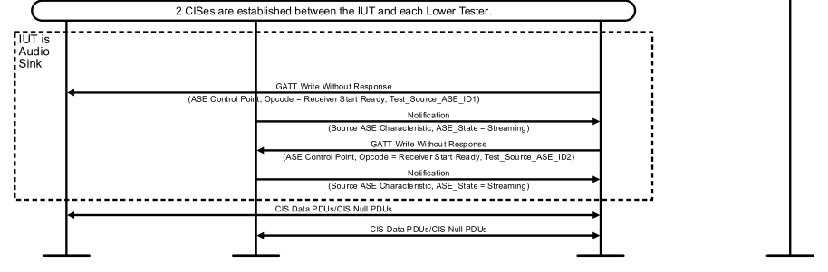

**Figure 4.23: Unicast Client Streaming – 2 Servers, 4 Streams, 2 CISes – LC3 MSC**

1. The Upper Tester orders the IUT to execute the GATT Write Without Response sub-procedure
for the ASE Control Point characteristic with the opcode set to 0x01 (Config Codec) and: • Number_of_ASEs set to 2 • ASE_ID[0] set to the ASE_ID specified in Table 4.59 • ASE_ID[1] set to the ASE_ID specified in Table 4.59 • Codec parameters set to values referenced in Codec Config for the ASE specified in Table 4.59 2. The Lower Tester sends the IUT a notification of the ASE Control Point characteristic. 3. The Lower Tester sends the IUT a notification of the ASE characteristic for the ASE_ID that was
set in Step 1. 4. The IUT executes the LE_Set_CIG_Parameters command with CIS_Count = 2 and remaining
parameters set using values from TSPX_CIG_Parameters if HCI is used, or configures a CIS by other means. The CIS must be unique for each Lower Tester. 5. If HCI is used, the IUT receives a Command Complete event with a Status of 0x00 in response to
the LE_Set_CIG_Parameters command; otherwise, the QoS parameters are retrieved by other means.
Repeat Steps 6–8 for each Lower Tester specified in Table 4.59.
6. The IUT executes the GATT Write Long Characteristic Values sub-procedure for the ASE Control
Point characteristic with the opcode set to 0x02 (Config QoS) and: • Number_of_ASEs set to 2 • ASE_ID[0] and ASE_ID[1] set to the ASE_ID specified in Table 4.59 • CIG_ID and CIS_ID parameters set to the values obtained in Step 5 • Remaining values for parameters set to values referenced in QoS Config for the ASEs specified in Table 4.59 7. The Lower Tester sends the IUT a notification of the ASE Control Point characteristic. 8. The Lower Tester sends the IUT a notification of the ASE characteristic for the ASE_ID that was
set in Step 6.
Repeat Steps 9–11 for each Lower Tester.
9. The IUT executes the GATT Write Without Response sub-procedure for the ASE Control Point
characteristic with the opcode set to 0x03 (Enable) and: • Number_of_ASEs set to 2 • ASE_ID[0] and ASE_ID[1] set to the ASE_ID values discovered in the Initial Condition • Metadata set to the TSPX_Metadata IXIT entry 10. The Lower Tester sends the IUT a notification of the ASE Control Point characteristic. 11. The Lower Tester sends the IUT a notification of the ASE characteristic that corresponds to the
ASE_ID that was set in Step 9. 12. The IUT establishes a CIS by using the Connected Isochronous Stream Central Establishment
procedure defined in Volume 3, Part C, Section 9.3.13 in [1]. 13. The Lower Tester accepts the establishment of a CIS by using the Connected Isochronous
Stream Peripheral Establishment procedure defined in Volume 3, Part C, Section 9.3.14 in [1]. 14. The audio data paths are configured by executing the preamble in Section 4.4.9.
15. If the IUT is in the Audio Sink role: 16. The IUT executes the GATT Write Without Response sub-procedure for the ASE Control Point
characteristic with the opcode set to 0x04 (Receiver Start Ready) and: • Number_of_ASEs = 1 • ASE_ID[0] set using ASE_ID for the Source ASE discovered in the Initial Condition 17. The Lower Tester sends the IUT a notification of the ASE Control Point characteristic. 18. The Lower Tester sends the IUT a notification of the ASE characteristic that corresponds to the
ASE_ID that was set in Step 16. 19. The IUT sends and receives CIS Data PDUs or CIS Null PDUs on the bidirectional CIS over the
connections to Lower Tester 1 and Lower Tester 2.
Expected Outcome
Pass verdict
Only one ASE must have the Codec Config and QoS Config Settings specified in its IXIT entries, and the other ASE may use the 16_2 Codec Config Settings and a 16_2_1 QoS Config Setting.
On each bidirectional CIS over the connections to Lower Tester 1 and Lower Tester 2, the IUT sends and receives SDUs with a zero or more length, using the LC3 Media Packet format (defined in [3] Section 4.2).

### 4.11 Unicast Server Streaming

Verify audio streaming by a Unicast Client and one or more Unicast Servers. The number of unicast Audio Streams created in each test case and the audio capabilities required to enable each test case is dependent on the Audio Configurations in Table 4.1: Unicast LC3 Audio Configurations in [3].

#### 4.11.1 Unicast Server Streaming – 1 Stream, 1 CIS – LC3

Test Purpose
Verify that a Unicast Server IUT can stream LC3-encoded audio data over one unicast Audio Stream to/from a Unicast Client. The verification is performed for each ASE Type and Config Parameters in turn, as enumerated in the test cases in Table 4.60. This test group applies to Audio Configurations 1, 2, 4, and 10, as referenced in Table 4.1: Unicast LC3 Audio Configurations in [3].
Reference
[3] 4, 4.4.1, 4.4.2, 4.4.4, 4.4.14
Initial Condition
- Establish a Bearer connection between the Lower Tester and the IUT as described in Section 4.4.1, if using ATT over an LE transport, or Section 4.4.2 if using ATT over a BR/EDR transport, or Section 4.4.3 if using EATT over an LE transport, or Section 4.4.4 if using EATT over a BR/EDR transport.
- The IUT is a Unicast Server including an instantiation of the Audio Stream Control Service with an ASE characteristic of the type specified in Table 4.60 and an instantiation of the Published Audio Capabilities Service with available PAC records.
- The Lower Tester is a Unicast Client and has discovered all ASCS characteristics of the IUT by executing either the GATT Discover All Primary Services sub-procedure or the GATT Discover Primary Services by Service UUID.
- The Lower Tester has discovered the PAC records of the IUT by running BAP/UCL/DISC/BV-01- C [Discover Audio Sink Capabilities] or BAP/UCL/DISC/BV-02-C [Discover Audio Source Capabilities], or by other means.
- The Lower Tester enables notification for the selected ASE on the IUT by writing the value 0x0001 using the GATT Write Characteristic Descriptors sub-procedure for the ASE CCCD.
- The Lower Tester enables notification on the IUT by writing the value 0x0001 using the GATT Write Characteristic Descriptors sub-procedure for the ASE Control Point CCCD.
- The Lower Tester selects one ASE characteristic of the type specified in Table 4.60 and reads the characteristic value by executing the GATT Read Characteristic Value sub-procedure. The Lower Tester caches the ASE_ID field value as Test_ASE_ID.
Test Case Configuration

|  | Test Case ID |  |  | ASE Type |  |  | Channel Count |  |  | CIS Establishment |  |
| --- | --- | --- | --- | --- | --- | --- | --- | --- | --- | --- | --- |
| BAP/USR/STR/BV-367-C [USR, AC 1, Generic] |  |  | Sink ASE |  |  | 1 |  |  | Enable |  |  |
| BAP/USR/STR/BV-368-C [USR, AC 4, Generic] |  |  | Sink ASE |  |  | 2 |  |  | Enable |  |  |
| BAP/USR/STR/BV-369-C [USR, AC 2, Generic] |  |  | Source ASE |  |  | 1 |  |  | Enable |  |  |
| BAP/USR/STR/BV-370-C [USR, AC 10, Generic] |  |  | Source ASE |  |  | 2 |  |  | Enable |  |  |
| BAP/USR/STR/BV-371-C [USR, AC 1, Generic, QoS] |  |  | Sink ASE |  |  | 1 |  |  | QoS Config |  |  |
| BAP/USR/STR/BV-372-C [USR, AC 4, Generic, QoS] |  |  | Sink ASE |  |  | 2 |  |  | QoS Config |  |  |
| BAP/USR/STR/BV-373-C [USR, AC 2, Generic, QoS] |  |  | Source ASE |  |  | 1 |  |  | QoS Config |  |  |
| BAP/USR/STR/BV-374-C [USR, AC 10, Generic, QoS] |  |  | Source ASE |  |  | 2 |  |  | QoS Config |  |  |

Table 4.60: Unicast Server Streaming – 1 Stream, 1 CIS – LC3 test cases

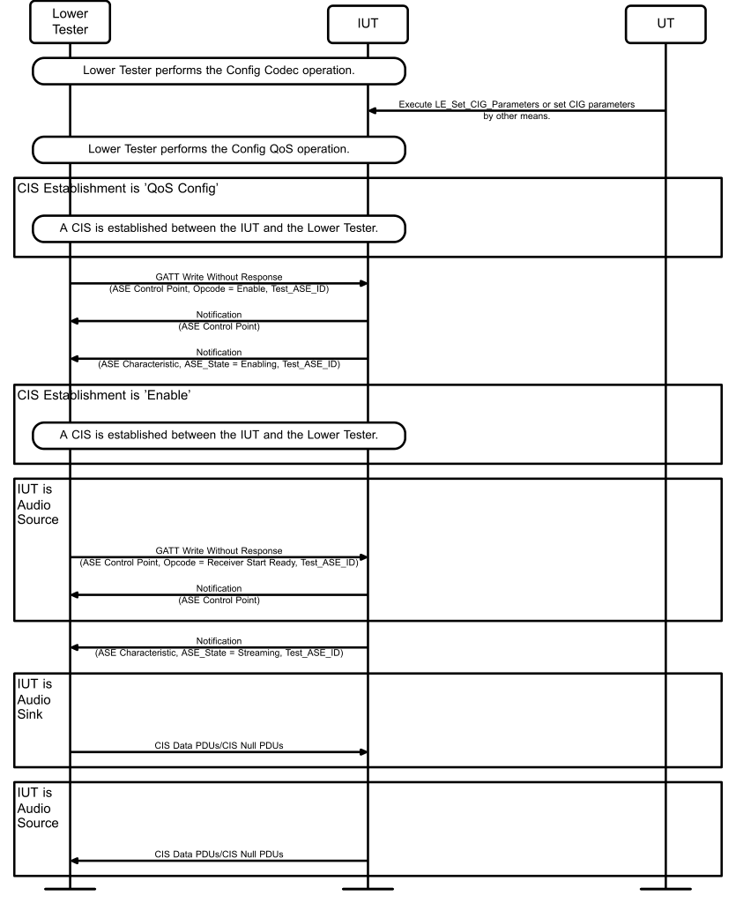

**Figure 4.24: Unicast Server Streaming – 1 Stream, 1 CIS – LC3 MSC**

1. The Lower Tester executes the GATT Write Without Response sub-procedure for the ASE
Control Point characteristic with the opcode set to 0x01 (Config Codec) and: • Number_of_ASEs set to 1 • ASE_ID[0] set to Test_ASE_ID • Remaining values for [0] parameters set to values referenced in TSPX_CODEC_CONFIG_SINK_ASEID1 if ASE Type is Sink ASE, otherwise set to TSPX_CODEC_CONFIG_SOURCE_ASEID1 2. The IUT sends a notification of the ASE Control Point characteristic. 3. The IUT sends a notification of the ASE characteristic for Test_ASE_ID.
CIS Count value in Table 4.60 and remaining parameters set using values from TSPX_CIG_Parameters. 5. The Lower Tester receives a Command Complete event with a Status of 0x00 in response to the
LE_Set_CIG_Parameters command. 6. The Lower Tester executes the GATT Write Without Response sub-procedure for the ASE
Control Point characteristic with the opcode set to 0x02 (Config QoS) and: • Number_of_ASEs set to 1 • ASE_ID[0] set to Test_ ASE_ID • CIG_ID and CIS_ID set to values obtained in Step 5 • Remaining values for [0] parameters set to values referenced in TSPX_QOS_CONFIG_SINK_ASEID1 if ASE Type is Sink ASE, otherwise set to TSPX_QOS_CONFIG_SOURCE_ASEID1 7. The IUT sends a notification of the ASE Control Point characteristic. 8. The IUT sends a notification of the ASE characteristic for Test_ASE_ID. 9. If CIS Establishment as specified in Table 4.60 is QoS Config:
a. The Lower Tester establishes a CIS by using the Connected Isochronous Stream Central
Establishment procedure defined in Volume 3, Part C, Section 9.3.13 in [1]. b. The IUT accepts the establishment of a CIS by using the Connected Isochronous Stream
Peripheral Establishment procedure defined in Volume 3, Part C, Section 9.3.14 in [1]. 10. The Lower Tester executes the GATT Write Without Response sub-procedure for the ASE
Control Point characteristic with the opcode set to 0x03 (Enable) and:
• Number_of_ASEs set to 1 • ASE_ID[0] set to Test_ASE_ID • Metadata[0] set to the TSPX_Metadata IXIT entry 11. The IUT sends a notification of the ASE Control Point characteristic value. 12. The IUT sends a notification of the ASE characteristic value with the ASE_State set to
0x03 (Enabling). 13. If CIS Establishment as specified in Table 4.60 is Enable:
a. The Lower Tester establishes a CIS by using the Connected Isochronous Stream Central
Establishment procedure defined in Volume 3, Part C, Section 9.3.13 in [1]. b. The IUT accepts the establishment of a CIS by using the Connected Isochronous Stream
Peripheral Establishment procedure defined in Volume 3, Part C, Section 9.3.14 in [1]. 14. If not already set up, the audio data paths are configured by executing the preamble in
Section 4.4.9. 15. If the IUT is in the Audio Sink role:
a. The IUT autonomously sets the ASE_State value to 0x04 (Streaming) for the ASE
corresponding to Test_ASE_ID. 16. If the IUT is in the Audio Source role:
a. The Lower Tester executes the GATT Write Without Response sub-procedure for the ASE
Control Point characteristic with the opcode set to 0x04 (Receiver Start Ready) and: • Number_of_ASEs set to 1 • ASE_ID[0] set to Test_ASE_ID b. The IUT sends a notification of the ASE Control Point characteristic value. 17. The IUT sends a notification of the ASE characteristic value that corresponds to the ASE_ID
corresponding to Test_ASE_ID with ASE_State set to 0x04 (Streaming).
a. The Lower Tester transmits CIS Data PDUs or CIS Null PDUs. 19. If the IUT is in the Audio Source role:
a. The IUT transmits CIS Data PDUs or CIS Null PDUs.
Expected Outcome
Pass verdict
The ASE must have the Codec Config and QoS Config Settings specified in its IXIT entries.
If the IUT is in the Audio Source role, the IUT sends SDUs with a zero or more length, using the LC3 Media Packet format (defined in [3] Section 4.2).
If the IUT is in the Audio Sink role, the IUT receives SDUs with a zero or more length, using the LC3 Media Packet format (defined in [3] Section 4.2).

#### 4.11.2 Unicast Server Streaming – 1 Stream, 1 CIS – Vendor-Specific Codec

Test Purpose
Verify that a Unicast Server IUT can stream audio data for a vendor-specific codec over one unicast Audio Stream to/from a Unicast Client. The verification is performed for each ASE Type and Config Parameters in turn, as enumerated in the test cases in Table 4.61. This test group applies to Audio Configurations 1, 2, 4, and 10, as referenced in Section 3.2.1.
Reference
[3] 4, 4.4.1, 4.4.2, 4.4.4, 4.4.14
Initial Condition
- Establish a Bearer connection between the Lower Tester and the IUT as described in Section 4.4.1, if using ATT over an LE transport, or Section 4.4.2 if using ATT over a BR/EDR transport, or Section 4.4.3 if using EATT over an LE transport, or Section 4.4.4 if using EATT over a BR/EDR transport.
- The IUT is a Unicast Server including an instantiation of the Audio Stream Control Service with an ASE characteristic of the type specified in Table 4.61 and an instantiation of the Published Audio Capabilities Service with available PAC records.
- The Lower Tester has discovered all ASCS characteristics of the IUT by executing either the GATT Discover All Primary Services sub-procedure or the GATT Discover Primary Services by Service UUID.
- The Lower Tester has discovered the PAC records of the IUT by running BAP/UCL/DISC/BV-01- C [Discover Audio Sink Capabilities] or BAP/UCL/DISC/BV-02-C [Discover Audio Source Capabilities], or by other means.
- The Lower Tester enables notification for the selected ASE by writing the value 0x0001 using the GATT Write Characteristic Descriptors sub-procedure for the ASE CCCD.
- The Lower Tester enables notification by writing the value 0x0001 using the GATT Write Characteristic Descriptors sub-procedure for the ASE Control Point CCCD.
- The Lower Tester selects one ASE characteristic of the type specified in Table 4.61 and reads the characteristic value by executing the GATT Read Characteristic Value sub-procedure. The Lower Tester caches the ASE_ID field value as Test_ASE_ID.

|  | Test Case ID |  |  | ASE Type |  |  | Channel Count |
| --- | --- | --- | --- | --- | --- | --- | --- |
| BAP/USR/STR/BV-129-C [USR, AC 1, VS] |  |  | Sink ASE |  |  | 1 |  |
| BAP/USR/STR/BV-130-C [USR, AC 4, VS] |  |  | Sink ASE |  |  | 2 |  |
| BAP/USR/STR/BV-131-C [USR, AC 2, VS] |  |  | Source ASE |  |  | 1 |  |
| BAP/USR/STR/BV-132-C [USR, AC 10, VS] |  |  | Source ASE |  |  | 2 |  |

Table 4.61: Unicast Server Streaming – 1 Stream, 1 CIS – Vendor-Specific Codec test cases
Test Procedure

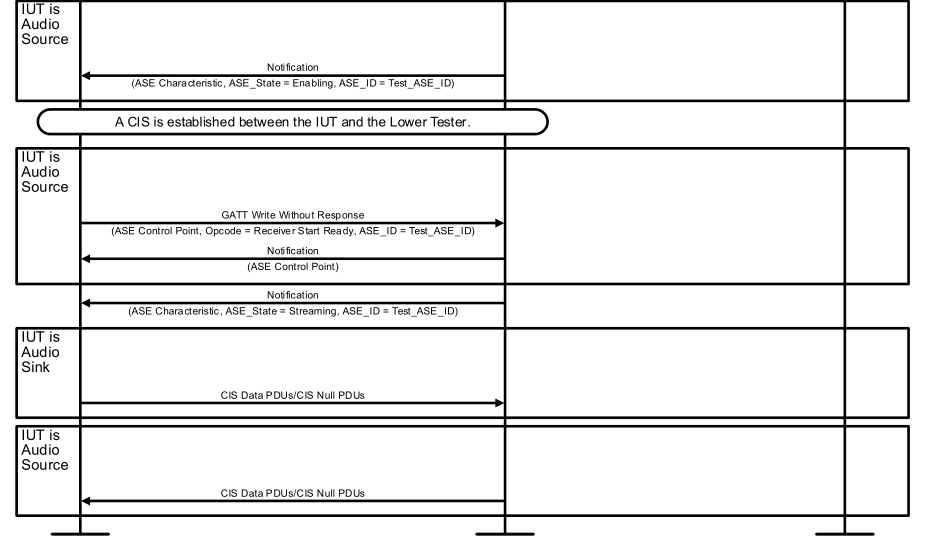

**Figure 4.25: Unicast Server Streaming – 1 Stream, 1 CIS – Vendor-Specific Codec MSC**

Without Response sub-procedure with the opcode set to 0x01 (Config Codec) and: • Number_of_ASEs set to 1 • ASE_ID[0] set to Test_ASE_ID • Target_Latency[0] and Target_PHY set to values supported by the IUT • Codec_ID[0] set to TSPX_VS_Codec_ID • Codec_Specific_Configuration_Length[0] set to the length of the Codec_Specific_Configuration field value • Codec_Specific_Configuration[0] set to the parameters specified in TSPX_VS_Codec_Specific_Configuration [7] 2. The IUT sends a notification on the ASE Control Point characteristic. 3. The IUT sends a notification on the ASE characteristic for the ASE_ID that was set in Step 1. 4. The Upper Tester orders the IUT to execute the LE_Set_CIG_Parameters command using values
from the IXIT if the IUT incorporates HCI, or sets the CIG parameters by other means. 5. The Lower Tester executes the GATT Write Without Response sub-procedure with the opcode
set to 0x02 (Config QoS) and: • Number_of_ASEs = 1 • ASE_ID[0] set to Test_ASE_ID • CIG_ID[0] and CIS_ID[0] set to values obtained in Step 4 • SDU_Interval[0] set to TSPX_VS_QoS_SDU_Interval • Framing[0] set to TSPX_VS_QoS_Framing • PHY[0] set to TSPX_VS_QoS_PHY • Max_SDU[0] set to TSPX_VS_QoS_Max_SDU • Retransmission_Number[0] set to TSPX_VS_QoS_Retransmission_Number • Max_Transport_Latency[0] set to TSPX_VS_QoS_Max_Transport_Latency • Presentation_Delay[0] set to TSPX_VS_QoS_Presentation_Delay 6. The IUT sends a notification of the ASE Control Point characteristic value. 7. The IUT sends a notification of the ASE characteristic value for the ASE_ID that was set in Step 5
with ASE_State set to 0x02 (QoS Configured). 8. The Lower Tester executes the GATT Write Without Response sub-procedure for the ASE
Control Point characteristic with the opcode set to 0x03 (Enable) and: • Number_of_ASEs set to 1 • ASE_ID[0] set to Test_ASE_ID • Metadata[0] set to the TSPX_Metadata IXIT entry 9. The IUT sends a notification of the ASE Control Point characteristic value. 10. The IUT sends a notification of the ASE characteristic value that corresponds to the ASE_ID that
was set in Step 8 with the ASE_State set to 0x03 (Enabling). 11. The Lower Tester establishes a CIS by using the Connected Isochronous Stream Central
Establishment procedure defined in Volume 3, Part C, Section 9.3.13 in [1]. 12. The IUT accepts the establishment of a CIS by using the Connected Isochronous Stream
Peripheral Establishment procedure defined in Volume 3, Part C, Section 9.3.14 in [1]. 13. The audio data paths are configured by executing the preamble in Section 4.4.9. 14. If the IUT is in the Audio Sink role:
a. The IUT autonomously sets the ASE_State value to 0x04 (Streaming) for the ASE
corresponding to Test_ASE_ID.
a. The Lower Tester executes the GATT Write Without Response sub-procedure for the ASE
Control Point characteristic with the opcode set to 0x04 (Receiver Start Ready) and: • Number_of_ASEs set to 1 • ASE_ID[0] set to Test_ASE_ID 16. The IUT sends a notification of the ASE Control Point characteristic value. 17. The IUT sends a notification of the ASE characteristic value that corresponds to the ASE_ID that
was set in Step 15 with ASE_State set to 0x04 (Streaming). 18. If the IUT is in the Audio Sink role:
a. The Lower Tester transmits CIS Data PDUs. 19. If the IUT is in the Audio Source role:
a. The IUT transmits CIS Data PDUs.
Expected Outcome
Pass verdict
If the IUT is in the Audio Source role, the IUT sends SDUs with a zero or more length.
If the IUT is in the Audio Sink role, the IUT receives SDUs with a zero or more length.

#### 4.11.3 Unicast Server Streaming – 2 Streams, 1 Sink ASE, 1 Source ASE – LC3

Test Purpose
Verify that a Unicast Server IUT can stream LC3-encoded audio data over two audio streams (one as source, one as sink) to and from a Unicast Client. This test group applies to Audio Configurations 3, 5, and 7(i), as referenced in Section 3.2.1.
Reference
[3] 4, 4.4.3, 4.4.5, 4.4.8, 5.6.3.1
Initial Condition
- Establish a Bearer connection between the Lower Tester and the IUT as described in Section 4.4.1, if using ATT over an LE transport, or Section 4.4.2 if using ATT over a BR/EDR transport, or Section 4.4.3 if using EATT over an LE transport, or Section 4.4.4 if using EATT over a BR/EDR transport.
- The IUT is a Unicast Server including an instantiation of the Audio Stream Control Service exposing at least one of each of Sink ASE and Source ASE characteristics and an instantiation of the Published Audio Capabilities Service with available PAC records including at least one Source PAC and at least one Sink PAC. The ASEs exposed by the IUT are in the Idle state.
- The Lower Tester has discovered all ASCS characteristics of the IUT by executing either the GATT Discover All Primary Services sub-procedure or the GATT Discover Primary Services by Service UUID.
- The Lower Tester has discovered the PAC records of the IUT by running BAP/UCL/DISC/BV-01- C [Discover Audio Sink Capabilities] or BAP/UCL/DISC/BV-02-C [Discover Audio Source Capabilities], or by other means.
- The Lower Tester enables notification for each of the two selected ASEs by writing the value 0x0001 using the GATT Write Characteristic Descriptors sub-procedure for the ASE CCCD.
- The Lower Tester enables notification of the ASE Control Point by writing the value 0x0001 using the GATT Write Characteristic Descriptors sub-procedure for the ASE Control Point CCCD.
- The IUT reads the characteristic values of one Sink ASE and one Source ASE by executing the GATT Read Characteristic Value sub-procedure. The IUT caches the ASE_ID field values as Test_Sink_ASE_ID1 and Test_Source_ASE_ID1, respectively.
Test Case Configuration

| Test Case ID |  | Audio |  | CIS Count |  | CIS Establishment |  |  |  |  |  |  |
| --- | --- | --- | --- | --- | --- | --- | --- | --- | --- | --- | --- | --- |
|  |  | Channels |  |  | Sink State | Sink State | Source State | Source |  |  |  |  |
|  |  | per Sink |  |  |  |  |  |  |  |  |  |  |
|  |  | ASE |  |  |  |  |  | State |  |  |  |  |
| BAP/USR/STR/BV-360-C [USR, AC 3, Generic] | 1 |  |  | 1 | Enable |  | Enable |  |  |  |  |  |
| BAP/USR/STR/BV-361-C [USR, AC 5, Generic] | 2 |  |  | 1 | Enable |  | Enable |  |  |  |  |  |
| BAP/USR/STR/BV-362-C [USR, AC 7(i), Generic] | 1 |  |  | 2 | Enable |  | Enable |  |  |  |  |  |
| BAP/USR/STR/BV-375-C [USR, AC 3, Generic, Enable, QoS] | 1 |  |  | 1 | Enable |  | QoS Config |  |  |  |  |  |
| BAP/USR/STR/BV-376-C [USR, AC 5, Generic, Enable, QoS] | 2 |  |  | 1 | Enable |  | QoS Config |  |  |  |  |  |
| BAP/USR/STR/BV-377-C [USR, AC 7(i), Generic, Enable, QoS] | 1 |  |  | 2 | Enable |  | QoS Config |  |  |  |  |  |
| BAP/USR/STR/BV-378-C [USR, AC 3, Generic, QoS, Enable] | 1 |  |  | 1 | QoS Config |  | Enable |  |  |  |  |  |
| BAP/USR/STR/BV-379-C [USR, AC 5, Generic, QoS, Enable] | 2 |  |  | 1 | QoS Config |  | Enable |  |  |  |  |  |
| BAP/USR/STR/BV-380-C [USR, AC 7(i), Generic, QoS, Enable] | 1 |  |  | 2 | QoS Config |  | Enable |  |  |  |  |  |
| BAP/USR/STR/BV-381-C [USR, AC 3, Generic, QoS, QoS] | 1 |  |  | 1 | QoS Config |  | QoS Config |  |  |  |  |  |
| BAP/USR/STR/BV-382-C [USR, AC 5, Generic, QoS, QoS] | 2 |  |  | 1 | QoS Config |  | QoS Config |  |  |  |  |  |
| BAP/USR/STR/BV-383-C [USR, AC 7(i), Generic, QoS, QoS] | 1 |  |  | 2 | QoS Config |  | QoS Config |  |  |  |  |  |

Table 4.62: Unicast Server Streaming – 2 Streams, 1 Sink ASE, 1 Source ASE – LC3 test cases
Control Point characteristic with the opcode set to 0x01 (Config Codec) and: • Number_of_ASEs set to 2 • ASE_ID[0] set to Test_Sink_ASE_ID1 • ASE_ID[1] set to Test_Source_ASE_ID1 • Remaining values for [0] parameters set to values referenced in TSPX_CODEC_CONFIG_SINK_ASEID1 • Remaining values for [1] parameters set to values referenced in TSPX_CODEC_CONFIG_SOURCE_ASEID1 2. The IUT sends a notification of the ASE Control Point characteristic. 3. The IUT sends a notification of the ASE characteristic for Test_Sink_ASE_ID1. 4. The IUT sends a notification of the ASE characteristic for Test_Source_ASE_ID1. 5. The Lower Tester executes the LE_Set_CIG_Parameters command with CIS_Count set to the
CIS Count value in Table 4.62 and remaining parameters set using values from TSPX_CIG_Parameters. 6. The Lower Tester receives a Command Complete event with a Status of 0x00 in response to the
LE_Set_CIG_Parameters command. 7. The Lower Tester executes the GATT Write Without Response sub-procedure for the ASE
Control Point characteristic with the opcode set to 0x02 (Config QoS) and: • Number_of_ASEs set to 2 • ASE_ID[0] set to Test_Sink_ASE_ID1 • ASE_ID[1] set to Test_Source_ASE_ID1 • CIG_ID and CIS_ID set to values obtained in Step 5, with CIS_ID[0] and CIS_ID[1] set to different values • Remaining values for [0] parameters set to values referenced in TSPX_QOS_CONFIG_SINK_ASEID1 • Remaining values for [1] parameters set to values referenced in TSPX_QOS_CONFIG_SOURCE_ASEID1 8. The IUT sends a notification of the ASE Control Point characteristic. 9. The IUT sends a notification of the ASE characteristic for Test_ASE_ID1. 10. The IUT sends a notification of the ASE characteristic for Test_ASE_ID2. 11. If CIS Establishment as specified in Table 4.62 is Sink – QoS Config, Source – QoS Config:
a. The Lower Tester establishes a CIS by using the Connected Isochronous Stream Central
Establishment procedure defined in Volume 3, Part C, Section 9.3.13 in [1]. b. The IUT accepts the establishment of a CIS by using the Connected Isochronous Stream
Peripheral Establishment procedure defined in Volume 3, Part C, Section 9.3.14 in [1]. 12. If CIS Establishment as specified in Table 4.62 is (Sink – QoS Config, Source – Enable) or (Sink
– Enable, Source – QoS Config): a. The Lower Tester executes the GATT Write Without Response sub-procedure for the ASE
Control Point characteristic on the IUT with the opcode set to 0x03 (Enable) and: • Number_of_ASEs set to 1 • ASE_ID[0] set to Test_Sink_ASE_ID1 or Test_Source_ASE_ID1 as indicated by Table 4.62 • Metadata set to the TSPX_Metadata IXIT entry b. The IUT sends a notification of the ASE Control Point characteristic. c. The IUT sends a notification of the ASE characteristic for Test_Sink_ASE_ID1 or
Test_Source_ASE_ID1 as indicated by Table 4.62. d. The Lower Tester establishes a CIS by using the Connected Isochronous Stream Central
Establishment procedure defined in Volume 3, Part C, Section 9.3.13 in [1].
Peripheral Establishment procedure defined in Volume 3, Part C, Section 9.3.14 in [1]. f. The audio data paths are configured by executing the preamble in Section 4.4.9. g. The Lower Tester executes the GATT Write Without Response sub-procedure for the ASE
Control Point characteristic on the IUT with the opcode set to 0x03 (Enable) and: • Number_of_ASEs set to 1 • ASE_ID[0] set to Test_Source_ASE_ID1 or Test_Sink_ASE_ID1 as indicated by Table 4.62 • Metadata set to the TSPX_Metadata IXIT entry h. The IUT sends a notification of the ASE Control Point characteristic. i. The IUT sends a notification of the ASE characteristic for Test_Source_ASE_ID1 or Test_Sink_ASE_ID1 as indicated by Table 4.62. 13. If CIS Establishment as specified in Table 4.62 is (Sink – QoS Config, Source – Config) or (Sink –
Enable, Source – Enable): a. The Lower Tester executes the GATT Write Without Response sub-procedure for the ASE
Control Point characteristic on the IUT with the opcode set to 0x03 (Enable) and: • Number_of_ASEs set to 2 • ASE_ID[0] set to Test_Sink_ASE_ID1 • ASE_ID[1] set to Test_Source_ASE_ID1 • Metadata set to the TSPX_Metadata IXIT entry b. The IUT sends a notification of the ASE Control Point characteristic. c. The IUT sends a notification of the ASE characteristic for Test_Sink_ASE_ID1. d. The IUT sends a notification of the ASE characteristic for Test_Source_ASE_ID1. 14. If CIS Establishment as specified in Table 4.62 is Sink – Enable, Source – Enable:
a. The Lower Tester establishes a CIS by using the Connected Isochronous Stream Central
Establishment procedure defined in Volume 3, Part C, Section 9.3.13 in [1]. b. The IUT accepts the establishment of a CIS by using the Connected Isochronous Stream
Peripheral Establishment procedure defined in Volume 3, Part C, Section 9.3.14 in [1]. 15. If not already set up, the audio data paths are configured by executing the preamble in
Section 4.4.9. 16. The IUT sends a notification of the ASE Characteristic for Test_Sink_ASE_ID1. 17. The Lower Tester executes the GATT Write Without Response sub-procedure for the ASE
Control Point characteristic with the opcode set to 0x04 (Receiver Start Ready) and: • Number_of_ASEs set to 1 • ASE_ID set to Test_Source_ASE_ID1 18. The IUT sends a notification of the ASE Control Point characteristic. 19. The IUT sends a notification of the ASE characteristic for Test_Source_ASE_ID1. 20. The IUT sends CIS Data PDUs or CIS Null PDUs. 21. The Lower Tester sends CIS Data PDUs or CIS Null PDUs.
Expected Outcome
Pass verdict
Only one ASE must have the Codec Config and QoS Config Settings specified in its IXIT entries, and the other ASE may use the 16_2 Codec Config Settings and a 16_2_1 QoS Config Setting.
In Step 22, the IUT sends SDUs with a zero or more length, using the LC3 Media Packet format (defined in [3] Section 4.2).
In Step 23, the IUT receives SDUs with a zero or more length, using the LC3 Media Packet format (defined in [3] Section 4.2).

#### 4.11.4 Unicast Server Streaming – 2 Streams, 1 Sink ASE, 1 Source ASE – Vendor-Specific Codec

Test Purpose
Verify that a Unicast Server IUT can stream audio data using a vendor-specific codec over two audio streams (one as source, one as sink) to and from a Unicast Client. The verification is performed for each Config Parameters in turn, as specified in Table 4.63. This test group applies to Audio Configurations 3, 5, and 7(i), as referenced in Section 3.2.1.
Reference
[3] 4, 4.4.3, 5.6.3.1
Initial Condition
- Establish a Bearer connection between the Lower Tester and the IUT as described in Section 4.4.1, if using ATT over an LE transport, or Section 4.4.2 if using ATT over a BR/EDR transport, or Section 4.4.3 if using EATT over an LE transport, or Section 4.4.4 if using EATT over a BR/EDR transport.
- The IUT is a Unicast Server including an instantiation of the Audio Stream Control Service exposing at least one of each of Sink ASE and Source ASE characteristics and an instantiation of the Published Audio Capabilities Service with available PAC records including at least one Source PAC and at least one Sink PAC. The ASEs exposed by the IUT are in the Idle state.
- The Lower Tester has discovered all ASCS characteristics of the IUT by executing either the GATT Discover All Primary Services sub-procedure or the GATT Discover Primary Services by Service UUID.
- The Lower Tester has discovered the Audio Locations and PAC records on the IUT.
- The Lower Tester enables notification for each of the two selected ASEs by writing the value 0x0001 using the GATT Write Characteristic Descriptors sub-procedure for the ASE CCCD.
- The Lower Tester enables notification of the ASE Control Point by writing the value 0x0001 using the GATT Write Characteristic Descriptors sub-procedure for the ASE Control Point CCCD.
- The Lower Tester reads the characteristic values of one Sink ASE and one Source ASE by executing the GATT Read Characteristic Value sub-procedure. The IUT caches the ASE_ID field values as Test_ASE_ID1 and Test_ASE_ID2, respectively.
Test Case Configuration

|  | Test Case ID |  |  | Audio Channels per Sink ASE |  |  | CIS Count |  |
| --- | --- | --- | --- | --- | --- | --- | --- | --- |
| BAP/USR/STR/BV-229-C [USR, AC 3, VS] |  |  | 1 |  |  | 1 |  |  |
| BAP/USR/STR/BV-230-C [USR, AC 5, VS] |  |  | 2 |  |  | 1 |  |  |
| BAP/USR/STR/BV-231-C [USR, AC 7(i), VS] |  |  | 1 |  |  | 2 |  |  |

Table 4.63: Unicast Server Streaming – 2 Streams, 1 Sink ASE, 1 Source ASE – Vendor-Specific Codec test cases

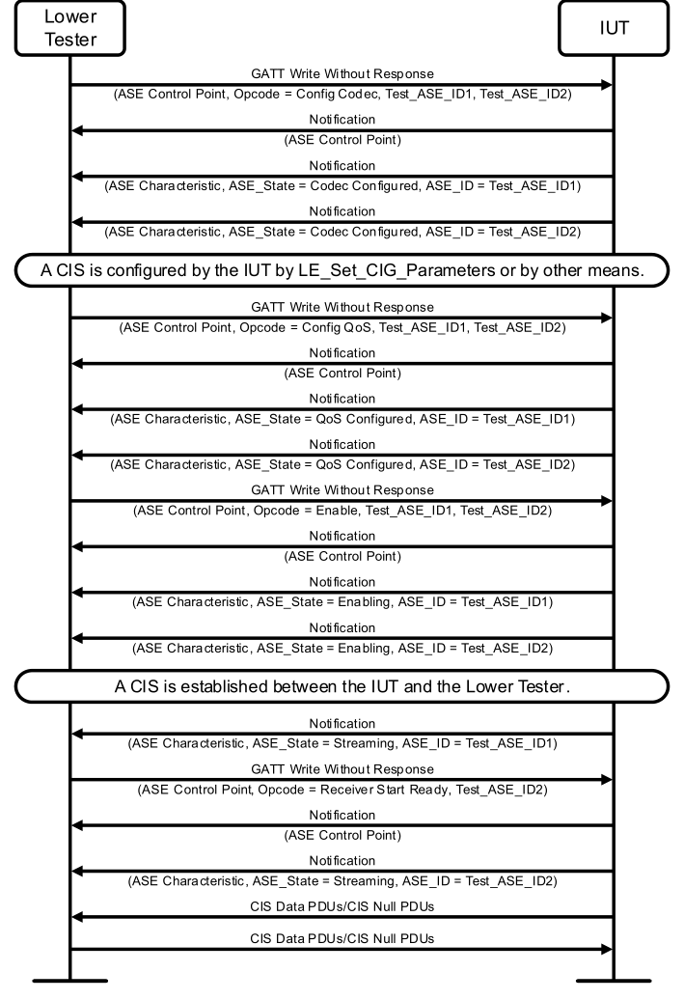

**Figure 4.27: Unicast Server Streaming – 2 Streams, 1 Sink ASE, 1 Source ASE – Vendor-Specific Codec MSC**

1. The Lower Tester writes to the ASE Control Point on the IUT by executing the GATT Write
Without Response sub-procedure with the opcode set to 0x01 (Config Codec) and: • Number_of_ASEs set to 2 • ASE_ID[0] set to Test_ASE_ID1 • ASE_ID[1] set to Test_ASE_ID2 • Target_Latency[0] and Target_PHY set to values supported by the IUT • Codec_ID[0] set to TSPX_VS_Codec_ID
• Codec_Specific_Configuration_Length[0] set to the length of the Codec_Specific_Configuration field value • Codec_Specific_Configuration[0] set to the parameters specified in TSPX_VS_Codec_Specific_Configuration [7]. 2. The IUT sends a notification of the ASE Control Point characteristic. 3. The IUT sends a notification of the ASE characteristic for Test_ASE_ID1. 4. The IUT sends a notification of the ASE characteristic for Test_ASE_ID2. 5. The Lower Tester executes the LE_Set_CIG_Parameters command with CIS_Count set to the
value in Table 4.63 and remaining parameters set using values from TSPX_CIG_Parameters. 6. The Lower Tester receives a Command Complete event with a Status of 0x00 in response to the
LE_Set_CIG_Parameters command. 7. The Lower Tester executes the GATT Write Without Response sub-procedure for the ASE
Control Point characteristic with the opcode set to 0x02 (Config QoS) and: • Number_of_ASEs set to 2 • ASE_ID[0] set to Test_ASE_ID1 • ASE_ID[1] set to Test_ASE_ID2 • CIG_ID and CIS_ID set to the values obtained in Step 6 • SDU_Interval[0] and [1] set to TSPX_VS_QoS_SDU_Interval • Framing[0] and [1] set to TSPX_VS_QoS_Framing • PHY[0] and [1] set to TSPX_VS_QoS_PHY • Max_SDU[0] and [1] set to TSPX_VS_QoS_Max_SDU • Retransmission_Number[0] and [1] set to TSPX_VS_QoS_Retransmission_Number • Max_Transport_Latency[0] and [1] set to TSPX_VS_QoS_Max_Transport_Latency • Presentation_Delay[0] and [1] set to TSPX_VS_QoS_Presentation_Delay 8. The IUT sends a notification of the ASE Control Point characteristic. 9. The IUT sends a notification of the ASE characteristic for Test_ASE_ID1. 10. The IUT sends a notification of the ASE characteristic for Test_ASE_ID2. 11. The Lower Tester executes the GATT Write Without Response sub-procedure for the ASE
Control Point characteristic with the opcode set to 0x03 (Enable) and: • Number_of_ASEs set to 2 • ASE_ID[0] set to Test_ASE_ID1 • ASE_ID[1] set to Test_ASE_ID2 • Metadata set to the TSPX_Metadata IXIT entry 12. The IUT sends a notification of the ASE Control Point characteristic. 13. The IUT sends a notification of the ASE characteristic for Test_ASE_ID1. 14. The IUT sends a notification of the ASE characteristic for Test_ASE_ID2. 15. The Lower Tester establishes a CIS by using the Connected Isochronous Stream Central
Establishment procedure defined in Volume 3, Part C, Section 9.3.13 in [1]. 16. The IUT accepts the establishment of a CIS by using the Connected Isochronous Stream
Peripheral Establishment procedure defined in Volume 3, Part C, Section 9.3.14 in [1]. 17. The audio data paths are configured by executing the preamble in Section 4.4.9. 18. The IUT sends a notification of the ASE Characteristic for Test_ASE_ID1. 19. The Lower Tester executes the GATT Write Without Response sub-procedure for the ASE
Control Point characteristic with the opcode set to 0x04 (Receiver Start Ready) and: • Number_of_ASEs set to 1 • ASE_ID set to Test_ASE_ID2 20. The IUT sends a notification of the ASE Control Point characteristic. 21. The IUT sends a notification of the ASE characteristic for Test_ASE_ID2. 22. The IUT sends CIS Data PDUs or CIS Null PDUs. 23. The Lower Tester sends CIS Data PDUs or CIS Null PDUs.
Pass verdict
In Step 22, the IUT sends SDUs with a zero or more length.
In Step 23, the IUT receives SDUs with a zero or more length.

#### 4.11.5 Unicast Server Streaming – 2 Streams, 2 Sink ASEs – LC3

Test Purpose
Verify that a Unicast Server IUT can receive audio data via two unidirectional CISes on two ASEs from one Unicast Client where the server has to support two Audio Locations. This test group applies to Audio Configuration 6(i), as referenced in Section 3.2.1.
Reference
[3] 4, 4.4.6
Initial Condition
- The Lower Tester is a Unicast Client.
- Establish a Bearer connection between the Lower Tester and the IUT as described in Section 4.4.1, if using ATT over an LE transport, or Section 4.4.2 if using ATT over a BR/EDR transport, or Section 4.4.3 if using EATT over an LE transport, or Section 4.4.4 if using EATT over a BR/EDR transport.
- The Lower Tester has discovered all ASCS characteristics of the IUT by executing either the GATT Discover All Primary Services sub-procedure or the GATT Discover Primary Services by Service UUID.
- The IUT exposes a Sink_Audio_Locations characteristic with a value including at least two bits set to 0b1.
- The IUT exposes at least two Sink ASE characteristics.
- The IUT exposes PAC records for the codec as specified in Table 4.64 with metadata that includes a Supported_Audio_Channel_Counts LTV structure that has bit 0 set to 0b1, and all other bits set to 0b0.
- The Lower Tester has discovered the Audio Locations and PAC records on the IUT.
- The Lower Tester enables notification for the selected Sink ASEs by writing the value 0x0001 using the GATT Write Characteristic Descriptors sub-procedure for the ASE CCCD.
- The Lower Tester enables notification by writing the value 0x0001 using the GATT Write Characteristic Descriptors sub-procedure for the ASE Control Point CCCD.
- The Lower Tester selects two Sink ASE characteristics and reads the characteristics value by executing the GATT Read Characteristic Value sub-procedure. The Lower Tester caches the ASE_ID field values as Test_Sink_ASE_ID1 and Test_Sink_ASE_ID2.
Test Case Configuration

|  | Test Case ID |  |
| --- | --- | --- |
| BAP/USR/STR/BV-363-C [USR, AC 6(i), Generic] |  |  |

Table 4.64: Unicast Server Streaming – 2 Streams, 2 Sink ASEs – LC3 test cases

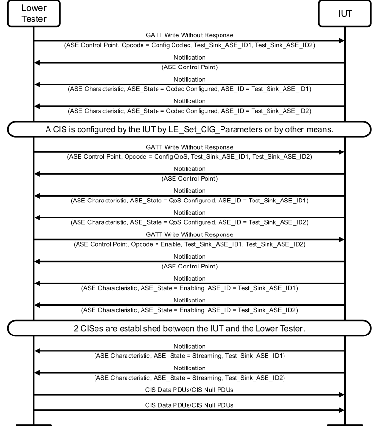

**Figure 4.28: Unicast Server Streaming – 2 Streams, 2 Sink ASEs – LC3 MSC**

1. The Lower Tester executes the GATT Write Without Response sub-procedure for the ASE
Control Point characteristic with the opcode set to 0x01 (Config Codec) and: • Number_of_ASEs set to 2 • ASE_ID[0] set to Test_Sink_ASE_ID1 • ASE_ID[1] set to Test_Sink_ASE_ID2 • Remaining values for [0] parameters set to values referenced in TSPX_CODEC_CONFIG_SINK_ASEID1 • Remaining values for [1] parameters set to values referenced in TSPX_CODEC_CONFIG_SINK_ASEID2 2. The IUT sends a notification of the ASE Control Point characteristic. 3. The IUT sends notifications for both Sink ASE characteristics with the ASE_IDs used in Step 1. 4. The Lower Tester executes the LE_Set_CIG_Parameters command with CIS_Count = 2 and
remaining parameters set using values from TSPX_CIG_Parameters.
LE_Set_CIG_Parameters command. 6. The Lower Tester executes the GATT Write Without Response sub-procedure for the ASE
Control Point characteristic with the opcode set to 0x02 (Config QoS) and: • Number_of_ASEs set to 2 • ASE_ID[0] set to Test_Sink_ASE_ID1 • ASE_ID[1] set to Test_Sink_ASE_ID2 • CIG_ID and CIS_ID set to the values obtained in Step 6, with CIS_ID[0] and CIS_ID[1] set to different values • Remaining values for [0] parameters set to values referenced in TSPX_QOS_CONFIG_SINK_ASEID1 • Remaining values for [1] parameters set to values referenced in TSPX_QOS_CONFIG_SINK_ASEID2 7. The IUT sends a notification of the ASE Control Point characteristic. 8. The IUT sends a notification for both Sink ASE characteristics with the ASE_IDs used in Step 6. 9. The Lower Tester executes the GATT Write Without Response sub-procedure for the ASE
Control Point characteristic with the opcode set to 0x03 (Enable) and: • Number_of_ASEs set to 2 • ASE_ID[0] set to Test_Sink_ASE_ID1 • ASE_ID[1] set to Test_Sink_ASE_ID2 • Metadata set to the TSPX_Metadata IXIT entry 10. The IUT sends a notification of the ASE Control Point characteristic. 11. The IUT sends a notification for both Sink ASE characteristics with the ASE_IDs used in Step 9. 12. The Lower Tester establishes two unidirectional CISes by using the Connected Isochronous
Stream Central Establishment procedure defined in Volume 3, Part C, Section 9.3.13 in [1]. 13. The IUT accepts the establishment of each CIS using the Connected Isochronous Stream
Peripheral Establishment procedure defined in Volume 3, Part C, Section 9.3.14 in [1]. 14. The IUT sends notifications for both Sink ASE characteristics in the Streaming state. 15. On both audio streams, the IUT receives CIS Data PDUs or CIS Null PDUs.
Expected Outcome
Pass verdict
Only one ASE must have the Codec Config and QoS Config Settings specified in its IXIT entries, and the other ASE may use the 16_2 Codec Config Settings and a 16_2_1 QoS Config Setting.
On both audio streams, the IUT receives SDUs with a zero or more length, using the LC3 Media Packet format (defined in [3] Section 4.2).

#### 4.11.6 Unicast Server Streaming – 3 Audio Streams, 2 CISes – LC3

Test Purpose
Verify that a Unicast Server IUT can transmit audio data on three Audio Streams with two CISes, one unidirectional and one bidirectional, and with two distinct Sink Audio Locations. This test group applies to Audio Configuration 8(i), as referenced in Section 3.2.1.
Reference
[3] 4, 4.4.11
- The IUT is a Unicast Server.
- Establish a Bearer connection between the Lower Tester and the IUT as described in Section 4.4.1, if using ATT over an LE transport, or Section 4.4.2 if using ATT over a BR/EDR transport, or Section 4.4.3 if using EATT over an LE transport, or Section 4.4.4 if using EATT over a BR/EDR transport.
- The Lower Tester has discovered all ASCS characteristics of the IUT by executing either the GATT Discover All Primary Services sub-procedure or the GATT Discover Primary Services by Service UUID. The IUT exposes at least two Sink ASE characteristics and one Source ASE characteristic.
- The Lower Tester has discovered the Audio Locations and PAC records on the IUT by running BAP/UCL/DISC/BV-01-C [Discover Audio Sink Capabilities] or BAP/UCL/DISC/BV-02-C [Discover Audio Source Capabilities], or by other means.
- The Lower Tester enables notification for the selected Sink ASEs by writing the value 0x0001 using the GATT Write Characteristic Descriptors sub-procedure for the Sink ASE CCCD.
- The Lower Tester enables notification for the selected Source ASE by writing the value 0x0001 using the GATT Write Characteristic Descriptors sub-procedure for the Source ASE CCCD.
- The Lower Tester enables notification by writing the value 0x0001 using the GATT Write Characteristic Descriptors sub-procedure for the ASE Control Point CCCD.
- The Lower Tester reads the values of two Sink ASEs and one Source ASE by executing the GATT Read Characteristic Value sub-procedure. The ASE_IDs are stored as Test_Sink_ASE_ID1, Test_Sink_ASE_ID2, and Test_Source_ASE_ID2.
Test Case Configuration

|  | Test Case ID |  |
| --- | --- | --- |
| BAP/USR/STR/BV-364-C [USR, AC 8(i), Generic] |  |  |

Table 4.65: Unicast Server Streaming – 3 Audio Streams, 2 CISes – LC3 test cases

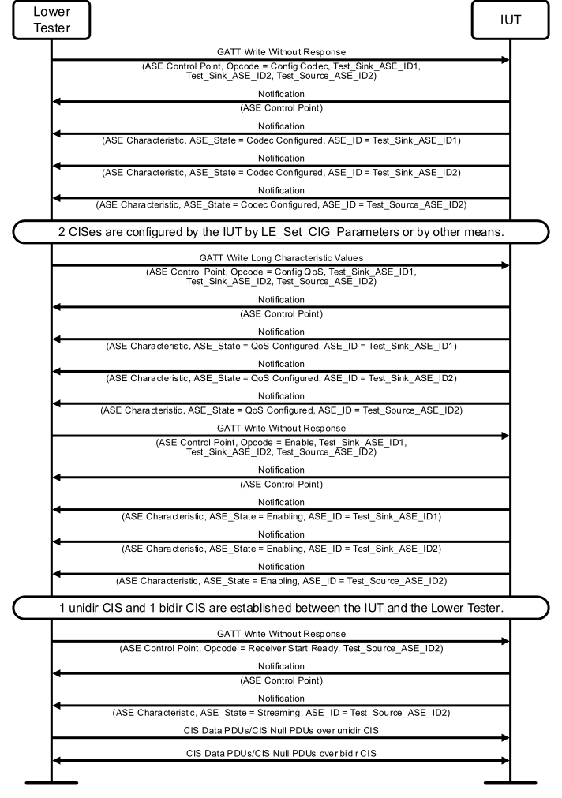

**Figure 4.29: Unicast Server Streaming – 3 Audio Streams, 2 CISes – LC3 MSC**

1. The Lower Tester executes the GATT Write Without Response sub-procedure for the ASE
Control Point characteristic with the opcode set to 0x01 (Config Codec) and: • Number_of_ASEs set to 3 • ASE_ID[0] set to Test_Sink_ASE_ID1 • ASE_ID[1] set to Test_Sink_ASE_ID2 • ASE_ID[2] set to Test_Source_ASE_ID2 • Remaining values for [0] parameters set to values referenced in TSPX_CODEC_CONFIG_SINK_ASEID1
• Remaining values for [1] parameters set to values referenced in TSPX_CODEC_CONFIG_SINK_ASEID2 • Remaining values for [2] parameters set to values referenced in TSPX_CODEC_CONFIG_SOURCE_ASEID2 2. The IUT sends a notification of the ASE Control Point characteristic. 3. The IUT sends a notification of the ASE characteristic that corresponds to Test_Sink_ASE_ID1. 4. The IUT sends a notification of the ASE characteristic that corresponds to Test_Sink_ASE_ID2. 5. The IUT sends a notification of the ASE characteristic that corresponds to
Test_Source_ASE_ID2. 6. The Lower Tester executes the LE_Set_CIG_Parameters command with CIS_Count = 2 and
remaining parameters set using values from TSPX_CIG_Parameters. 7. The Lower Tester receives a Command Complete event with a Status of 0x00 in response to the
LE_Set_CIG_Parameters command. 8. The Lower Tester executes the GATT Write Long Characteristic Values sub-procedure for the
ASE Control Point characteristic with the opcode set to 0x02 (Config QoS) and: • Number_of_ASEs set to 3 • ASE_ID[0] set to Test_Sink_ASE_ID1 • ASE_ID[1] set to Test_Sink_ASE_ID2 • ASE_ID[2] set to Test_Source_ASE_ID2 • CIG_ID[0] and CIS_ID[0] set to the values obtained in Step 7 • CIG_ID[1] and CIS_ID[1] set to the values obtained in Step 7 • Remaining values for [0] parameters set to values referenced in TSPX_QOS_CONFIG_SINK_ASEID1 • Remaining values for [1] parameters set to values referenced in TSPX_QOS_CONFIG_SINK_ASEID2 • Remaining values for [2] parameters set to values referenced in TSPX_QOS_CONFIG_SOURCE_ASEID2 9. The IUT sends a notification of the ASE Control Point characteristic. 10. The IUT sends a notification of the ASE characteristic that corresponds to Test_Sink_ASE_ID1. 11. The IUT sends a notification of the ASE characteristic that corresponds to Test_Sink_ASE_ID2. 12. The IUT sends a notification of the ASE characteristic that corresponds to
Test_Source_ASE_ID2. 13. The Lower Tester executes the GATT Write Without Response sub-procedure for the ASE
Control Point characteristic with the opcode set to 0x03 (Enable) and: • Number_of_ASEs set to 3 • ASE_ID[0] set to Test_Sink_ASE_ID1 • ASE_ID[1] set to Test_Sink_ASE_ID2 • ASE_ID[2] set to Test_Source_ASE_ID2 • Metadata set to the TSPX_Metadata IXIT entry 14. The IUT sends a notification of the ASE Control Point characteristic. 15. The IUT sends a notification of the ASE characteristic that corresponds to Test_Sink_ASE_ID1. 16. The IUT sends a notification of the ASE characteristic that corresponds to Test_Sink_ASE_ID2. 17. The IUT sends a notification of the ASE characteristic that corresponds to
Test_Source_ASE_ID2. 18. The Lower Tester establishes one unidirectional CIS and one bidirectional CIS by using the
Connected Isochronous Stream Central Establishment procedure defined in Volume 3, Part C, Section 9.3.13 in [1]. 19. The IUT accepts the establishment of both CISes by using the Connected Isochronous Stream
Peripheral Establishment procedure defined in Volume 3, Part C, Section 9.3.14 in [1]. 20. The audio data paths are configured by executing the preamble in Section 4.4.9.
Control Point characteristic with the opcode set to 0x04 (Receiver Start Ready) and: • Number_of_ASEs = 1 • ASE_ID[0] set to Test_Source_ASE_ID2 22. The IUT sends a notification of the ASE Control Point characteristic. 23. The IUT sends a notification of the ASE characteristic that corresponds to
Test_Source_ASE_ID2. 24. The IUT receives CIS Data PDUs or CIS Null PDUs over the unidirectional CIS. 25. The IUT sends and receives CIS Data PDUs or CIS Null PDUs over the bidirectional CIS.
Expected Outcome
Pass verdict
Only one ASE must have the Codec Config and QoS Config Settings specified in its IXIT entries, and the other ASE may use the 16_2 Codec Config Settings and a 16_2_1 QoS Config Setting.
On the bidirectional stream, the IUT sends and receives SDUs with a zero or more length, using the LC3 Media Packet format (defined in [3] Section 4.2).
On the unidirectional stream, the IUT receives SDUs with a zero or more length, using the LC3 Media Packet format (defined in [3] Section 4.2).

#### 4.11.7 Unicast Server Streaming – 2 Streams, 2 Source ASEs – LC3

Test Purpose
Verify that a Unicast Server IUT can transmit audio data on two unidirectional CISes with two Source ASEs to a Unicast Client. This test group applies to Audio Configuration 9(i), as referenced in Section 3.2.1.
Reference
[3] 4, 4.4.12
Initial Condition
- The IUT is a Unicast Server.
- The Lower Tester is a Unicast Client.
- Establish a Bearer connection between the Lower Tester and the IUT as described in Section 4.4.1, if using ATT over an LE transport, or Section 4.4.2 if using ATT over a BR/EDR transport, or Section 4.4.3 if using EATT over an LE transport, or Section 4.4.4 if using EATT over a BR/EDR transport.
- The Lower Tester has discovered all ASCS characteristics of the IUT by executing either the GATT Discover All Primary Services sub-procedure or the GATT Discover Primary Services by Service UUID. The IUT exposes at least two Source ASE characteristics.
- The IUT exposes a Source_Audio_Locations characteristic with value including at least two bits set to 0b1.
- The Lower Tester has discovered the PAC records on the IUT by running BAP/UCL/DISC/BV-01- C [Discover Audio Sink Capabilities] or by other means. If present, the Supported_Audio_Channel_Counts LTV structure has bit 0 set to 0b1, and all other bits set to 0b0.
- The Lower Tester enables notification for the selected Source ASEs by writing the value 0x0001 using the GATT Write Characteristic Descriptors sub-procedure for the ASE CCCD.
- The Lower Tester enables notification by writing the value 0x0001 using the GATT Write Characteristic Descriptors sub-procedure for the ASE Control Point CCCD.
- The Lower Tester selects two Source ASE characteristics and reads the characteristic values by executing the GATT Read Characteristic Value sub-procedure. The IUT caches the ASE_ID field values as Test_Source_ASE_ID1 and Test_Source_ASE_ID2.
Test Case Configuration

|  | Test Case ID |  |
| --- | --- | --- |
| BAP/USR/STR/BV-365-C [USR, AC 9(i), Generic] |  |  |

Table 4.66: Unicast Server Streaming – 2 Streams, 2 Source ASEs – LC3 test cases
Test Procedure

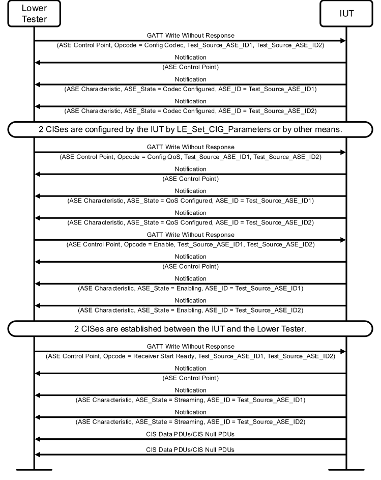

**Figure 4.30: Unicast Server Streaming – 2 Streams, 2 Source ASEs – LC3 MSC**

Control Point characteristic with the opcode set to 0x01 (Config Codec) and: • Number_of_ASEs set to 2 • ASE_ID[0] set to Test_Source_ASE_ID1 • ASE_ID[1] set to Test_Source_ASE_ID2 • Remaining values for [0] parameters set to values referenced in TSPX_CODEC_CONFIG_SOURCE_ASEID1 • Remaining values for [1] parameters set to values referenced in TSPX_CODEC_CONFIG_SOURCE_ASEID2 2. The IUT sends a notification of the ASE Control Point characteristic. 3. The IUT sends notifications for both Source ASE characteristics with the ASE_IDs used in Step 1. 4. The Lower Tester executes the LE_Set_CIG_Parameters command with CIS_Count = 2 and
remaining parameters set using values from TSPX_CIG_Parameters. 5. The Lower Tester receives a Command Complete event with a Status of 0x00 in response to the
LE_Set_CIG_Parameters command. 6. The Lower Tester executes the GATT Write Without Response sub-procedure for the ASE
Control Point characteristic with the opcode set to 0x02 (Config QoS) and: • Number_of_ASEs set to 2 • ASE_ID[0] set to Test_Source_ASE_ID1 • ASE_ID[1] set to Test_Source_ASE_ID2 • CIG_ID and CIS_ID set to values obtained in Step 5, with CIS_ID[0] and CIS_ID[1] set to different values • Remaining values for [0] parameters set to values referenced in TSPX_QOS_CONFIG_SOURCE_ASEID1 • Remaining values for [1] parameters set to values referenced in TSPX_QOS_CONFIG_SOURCE_ASEID2 7. The IUT sends a notification of the ASE Control Point characteristic. 8. The IUT sends a notification of the ASE characteristic for the ASE_ID that was set in Step 6. 9. The Lower Tester executes the GATT Write Without Response sub-procedure for the ASE
Control Point characteristic with the opcode set to 0x03 (Enable) and: • Number_of_ASEs set to 2 • ASE_ID[0] set to Test_Source_ASE_ID1 • ASE_ID[1] set to Test_Source_ASE_ID2 • Metadata set to the TSPX_Metadata IXIT entry 10. The IUT sends a notification of the ASE Control Point characteristic. 11. The IUT sends a notification of the ASE characteristic that corresponds to the ASE_ID that was
set in Step 9. 12. The IUT establishes a CIS by using the Connected Isochronous Stream Central Establishment
procedure defined in Volume 3, Part C, Section 9.3.13 in [1]. 13. The Lower Tester accepts the establishment of a CIS by using the Connected Isochronous
Stream Peripheral Establishment procedure defined in Volume 3, Part C, Section 9.3.14 in [1]. 14. The audio data paths are configured by executing the preamble in Section 4.4.9. 15. The Lower Tester executes the GATT Write Without Response sub-procedure for the ASE
Control Point characteristic with the opcode set to 0x04 (Receiver Start Ready) and: • Number_of_ASEs = 2 • ASE_ID[0] set to Test_Source_ASE_ID1 • ASE_ID[1] set to Test_Source_ASE_ID2 16. The IUT sends a notification of the ASE Control Point characteristic.
set in Step 14. 18. The IUT sends CIS Data PDUs or CIS Null PDUs on both audio streams.
Expected Outcome
Pass verdict
Only one ASE must have the Codec Config and QoS Config Settings specified in its IXIT entries, and the other ASE may use the 16_2 Codec Config Settings and a 16_2_1 QoS Config Setting.
On both audio streams, the IUT sends SDUs with a zero or more length, using the LC3 Media Packet format (defined in [3] Section 4.2).

#### 4.11.8 Unicast Server Streaming – 4 Audio Streams, 2 CISes – LC3

Test Purpose
Verify that a Unicast Server IUT can transmit audio data on four Audio Streams with two bidirectional CISes with the server supporting at least two Sink and two Source Audio Locations. This test group applies to Audio Configuration 11(i), as referenced in Section 3.2.1.
Reference
[3] 4, 4.4.15
Initial Condition
- The IUT is a Unicast Server.
- Establish a Bearer connection between the Lower Tester and the IUT as described in Section 4.4.1, if using ATT over an LE transport, or Section 4.4.2 if using ATT over a BR/EDR transport, or Section 4.4.3 if using EATT over an LE transport, or Section 4.4.4 if using EATT over a BR/EDR transport.
- The Lower Tester has discovered all ASCS characteristics of the IUT by executing either the GATT Discover All Primary Services sub-procedure or the GATT Discover Primary Services by Service UUID. The IUT exposes at least two Sink ASE characteristics and two Source ASE characteristics.
- The Lower Tester has discovered all ASCS characteristics of the IUT by executing either the GATT Discover All Primary Services sub-procedure or the GATT Discover Primary Services by Service UUID.
- The Lower Tester enables notification for the selected Sink ASEs by writing the value 0x0001 using the GATT Write Characteristic Descriptors sub-procedure for the Sink ASE CCCD.
- The Lower Tester enables notification for the selected Source ASEs by writing the value 0x0001 using the GATT Write Characteristic Descriptors sub-procedure for the Source ASE CCCD.
- The Lower Tester enables notification by writing the value 0x0001 using the GATT Write Characteristic Descriptors sub-procedure for the ASE Control Point CCCD.
- The Lower Tester selects two Sink ASE characteristics and two Source ASE characteristics on the IUT and reads the characteristic values by executing the GATT Read Characteristic Value sub-procedure for each characteristic. The ASE_ID values for the Sink ASEs are saved as Test_Sink_ASE_ID1 and Test_Sink_ASE_ID2. The ASE_ID values for the Source ASEs are saved as Test_Source_ASE_ID1 and Test_Source_ASE_ID2.

|  | Test Case ID |  |
| --- | --- | --- |
| BAP/USR/STR/BV-366-C [USR, AC 11(i), LC3 Generic] |  |  |

Table 4.67: Unicast Server Streaming – 4 Audio Streams, 2 CISes – LC3 test cases

|  | Round |  |  | ASE ID _ |  |  | CIS ID _ |  |
| --- | --- | --- | --- | --- | --- | --- | --- | --- |
| 1 |  |  | Test Sink ASE ID1 _ _ _ |  |  | CIS ID1 _ |  |  |
| 2 |  |  | Test Source ASE ID1 _ _ _ |  |  | CIS ID1 _ |  |  |
| 3 |  |  | Test Sink ASE ID2 _ _ _ |  |  | CIS ID2 _ |  |  |
| 4 |  |  | Test Source ASE ID2 _ _ _ |  |  | CIS ID2 _ |  |  |

Table 4.68: Rounds for Unicast Server Streaming – 4 Audio Streams, 2 CISes
Control Point characteristic with the opcode set to 0x01 (Config Codec) and: • Number_of_ASEs set to 4 • ASE_ID[0] set to Test_Sink_ASE_ID1 • ASE_ID[1] set to Test_Source_ASE_ID1 • ASE_ID[2] set to Test_Sink_ASE_ID2 • ASE_ID[3] set to Test_Source_ASE_ID2 • Remaining values for [0] codec parameters set to values referenced in TSPX_CODEC_CONFIG_SINK_ASEID1 • Remaining values for [1] codec parameters set to values referenced in TSPX_CODEC_CONFIG_SOURCE_ASEID1 • Remaining values for [2] codec parameters set to values referenced in TSPX_CODEC_CONFIG_SINK_ASEID2 • Remaining values for [3] codec parameters set to values referenced in TSPX_CODEC_CONFIG_SOURCE_ASEID2 2. The IUT sends a notification of the ASE Control Point characteristic. 3. The IUT sends a notification of the ASE characteristic that corresponds to Test_Sink_ASE_ID1. 4. The IUT sends a notification of the ASE characteristic that corresponds to
Test_Source_ASE_ID1. 5. The IUT sends a notification of the ASE characteristic that corresponds to Test_Sink_ASE_ID2. 6. The IUT sends a notification of the ASE characteristic that corresponds to
Test_Source_ASE_ID2. 7. The Lower Tester executes the LE_Set_CIG_Parameters command with CIS_Count = 2 and
remaining parameters set using values from TSPX_CIG_Parameters. 8. The Lower Tester receives a Command Complete event with a Status of 0x00 in response to the
LE_Set_CIG_Parameters command. 9. The Lower Tester executes the GATT Write Long Characteristic Values sub-procedure for the
ASE Control Point characteristic with the opcode set to 0x02 (Config QoS) and: • Number_of_ASEs set to 4 • ASE_ID[0] set to Test_Sink_ASE_ID1 • ASE_ID[1] set to Test_Source_ASE_ID1 • ASE_ID[2] set to Test_Sink_ASE_ID2 • ASE_ID[3] set to Test_Source_ASE_ID2 • CIG_ID set to the value obtained in Step 5 • CIS_ID[0] and CIS_ID[1] set to CIS_ID1 • CIS_ID[2] and CIS_ID[3] set to CIS_ID2 • Remaining values for [0] parameters set to values referenced in TSPX_QOS_CONFIG_SINK_ASEID1 • Remaining values for [1] parameters set to values referenced in TSPX_QOS_CONFIG_SOURCE_ASEID1 • Remaining values for [2] parameters set to values referenced in TSPX_QOS_CONFIG_SINK_ASEID2 • Remaining values for [3] parameters set to values referenced in TSPX_QOS_CONFIG_SOURCE_ASEID2 10. The IUT sends a notification of the ASE Control Point characteristic. 11. The IUT sends a notification of the ASE characteristic that corresponds to Test_Sink_ASE_ID1. 12. The IUT sends a notification of the ASE characteristic that corresponds to
Test_Source_ASE_ID1. 13. The IUT sends a notification of the ASE characteristic that corresponds to Test_Sink_ASE_ID2.
Test_Source_ASE_ID2. 15. The Lower Tester executes the GATT Write Long Characteristic Values sub-procedure for the
ASE Control Point characteristic with the opcode set to 0x03 (Enable) and: • Number_of_ASEs set to 4 • ASE_ID[0] set to Test_Sink_ASE_ID1 • ASE_ID[1] set to Test_Source_ASE_ID1 • ASE_ID[2] set to Test_Sink_ASE_ID2 • ASE_ID[3] set to Test_Source_ASE_ID2 • Metadata set to the TSPX_Metadata IXIT entry 16. The IUT sends a notification of the ASE Control Point characteristic. 17. The IUT sends a notification of the ASE characteristic that corresponds to Test_Sink_ASE_ID1. 18. The IUT sends a notification of the ASE characteristic that corresponds to
Test_Source_ASE_ID1. 19. The IUT sends a notification of the ASE characteristic that corresponds to Test_Sink_ASE_ID2. 20. The IUT sends a notification of the ASE characteristic that corresponds to
Test_Source_ASE_ID2. 21. The Lower Tester establishes two bidirectional CISes by using the Connected Isochronous
Stream Central Establishment procedure defined in Volume 3, Part C, Section 9.3.13 in [1]. 22. The IUT accepts the establishment of both CISes by using the Connected Isochronous Stream
Peripheral Establishment procedure defined in Volume 3, Part C, Section 9.3.14 in [1]. 23. The audio data paths are configured by executing the preamble in Section 4.4.9. 24. The Lower Tester executes the GATT Write Without Response sub-procedure for the ASE
Control Point characteristic with the opcode set to 0x04 (Receiver Start Ready) and: • Number_of_ASEs = 2 • ASE_ID[0] set Test_Source_ASE_ID1 • ASE_ID[1] set Test_Source_ASE_ID2 25. The IUT sends a notification of the ASE Control Point characteristic. 26. The IUT sends a notification of the ASE characteristic that corresponds to
Test_Source_ASE_ID1. 27. The IUT sends a notification of the ASE characteristic that corresponds to
Test_Source_ASE_ID2. 28. The IUT sends and receives CIS Data PDUs or CIS Null PDUs on both bidirectional CISes over
the connection to the Lower Tester.
Expected Outcome
Pass verdict
Only one ASE must have the Codec Config and QoS Config Settings specified in its IXIT entries, and the other ASE may use the 16_2 Codec Config Settings and a 16_2_1 QoS Config Setting.
On both bidirectional CISes, the IUT sends and receives SDUs with a zero or more length, using the LC3 Media Packet format (defined in [3] Section 4.2).

### 4.12 Unicast Server Service Procedure Errors

#### 4.12.1 Common Control Point errors

Test Purpose
Verify the behavior of a Unicast Server IUT when a Unicast Client initiates control point operations with invalid ASE identifiers and Control Point operations of invalid length. The verification is performed for each opcode in turn, as specified in Table 4.69.
[6] 5
Initial Condition
- Establish a Bearer connection between the Lower Tester and the IUT as described in Section 4.4.1, if using ATT over an LE transport, or Section 4.4.2 if using ATT over a BR/EDR transport, or Section 4.4.3 if using EATT over an LE transport, or Section 4.4.4 if using EATT over a BR/EDR transport.
- The IUT is a Unicast Server.
- The Lower Tester is a Unicast Client and has cached the ASCS service and characteristics handles (e.g., by running the procedures in Section 4.5).
- The Lower Tester enables notifications for the ASE Control Point characteristic by writing the value 0x0001 using the GATT Write Characteristic Descriptors sub-procedure for the ASE Control Point CCCD.
Test Configuration

|  | Test Case |  |  | Opcode |  |
| --- | --- | --- | --- | --- | --- |
| BAP/USR/SPE/BI-01-C [Disable – Common Errors] |  |  | Disable |  |  |
| BAP/USR/SPE/BI-02-C [Update Metadata – Common Errors] |  |  | Update Metadata |  |  |
| BAP/USR/SPE/BI-03-C [Release – Common Errors] |  |  | Release |  |  |

Table 4.69: Common Control Point errors test cases
Test Procedure
Repeat Steps 1–2 for each round in Table 4.70.
1. The Lower Tester executes the GATT Write Characteristic Value sub-procedure for the ASE
Control Point with the Opcode specified in Table 4.69 and the Parameters specified in Table 4.70. 2. The IUT sends a GATT Characteristic Value Notification for the ASE Control Point characteristic.

|  | Round |  |  | Parameters |  |  | Response Code _ |  |  | Number of ASEs _ _ |  |
| --- | --- | --- | --- | --- | --- | --- | --- | --- | --- | --- | --- |
| 1 | 1 |  |  | Number of ASEs set to 1, ASE ID[0] set _ _ _ |  | 0x03 (Invalid ASE ID) _ | 0x03 (Invalid ASE ID) _ |  | 0x01 | 0x01 |  |
|  |  |  |  | to invalid ASE ID and appropriate |  |  |  |  |  |  |  |
|  |  |  |  | _ parameters for the opcode |  |  |  |  |  |  |  |
| 2 |  |  |  | Number of ASEs set to 1, ASE ID[0] set _ _ _ |  | 0x02 (Invalid Length) |  |  | 0xFF |  |  |
|  |  |  |  | to Test ASE ID and parameters of invalid |  |  |  |  |  |  |  |
|  |  |  |  | _ _ length for the opcode |  |  |  |  |  |  |  |
| 3 |  |  |  | Number of ASEs set to 0, ASE ID[0] set _ _ _ |  | 0x02 (Invalid Length) |  |  | 0xFF |  |  |
|  |  |  |  | to Test ASE ID and parameters of invalid |  |  |  |  |  |  |  |
|  |  |  |  | _ _ length for the opcode |  |  |  |  |  |  |  |

Table 4.70: Rounds for Common Control Point errors
Expected Outcome
Pass verdict
For each round, the IUT sends an ASE Control Point notification with:
• Reason field set to 0x00 • Response_Code field set to the Response_Code value specified in Table 4.70. • Number_of_ASEs field set to the value specified in Table 4.70.
Test Purpose
Verify the behavior of a Unicast Server IUT when a Unicast Client initiates the Enable operation with invalid parameters.
Reference
[6] 5
Initial Condition
- Establish a Bearer connection between the Lower Tester and the IUT as described in Section 4.4.1, if using ATT over an LE transport, or Section 4.4.2 if using ATT over a BR/EDR transport, or Section 4.4.3 if using EATT over an LE transport, or Section 4.4.4 if using EATT over a BR/EDR transport.
- The Lower Tester is a Unicast Client and has cached the ASCS service and characteristics handles (e.g., by running the procedures in Section 4.5).
- The Lower Tester enables notifications by writing the value 0x0001 using the GATT Write Characteristic Descriptors sub-procedure for the ASE Control Point CCCD.
- The IUT is a Unicast Server with one ASE in the QoS Configured state.
- The Lower Tester has established a CIS with the IUT by using the Connected Isochronous Stream Central Establishment procedure defined in Volume 3, Part C, Section 9.3.13 in [1].
Test Procedure
Repeat Steps 1–2 for each round in Table 4.71.
1. The Lower Tester executes the GATT Write Characteristic Value sub-procedure for the ASE
Control Point with the opcode set to 0x03 (Enable) and: • Number_of_ASEs set to 1 • ASE_ID[0] set to Test_ASE_ID • Metadata_Length[0] set to the length of the Metadata[0] parameter • Metadata[0] configured as specified in Table 4.71. 2. The IUT sends a GATT Characteristic Value Notification for the ASE Control Point characteristic.

|  | Round |  |  | Parameters |  |  | Response Code |  |
| --- | --- | --- | --- | --- | --- | --- | --- | --- |
| 1 | 1 |  | Includes Metadata Type unsupported by server | Includes Metadata Type unsupported by server |  |  | Unsupported Metadata (0x0A) or |  |
|  |  |  |  |  |  |  | Rejected Metadata (0x0B) |  |
| 2 |  |  | Includes incorrectly formatted Metadata value |  |  |  | Rejected Metadata (0x0B) or |  |
|  |  |  |  |  |  |  | Invalid Metadata (0x0C) |  |
| 3 |  |  | Streaming Audio Contexts LTV with a value of zero _ _ |  |  |  | Rejected Metadata (0x0B) or |  |
|  |  |  |  |  |  |  | Invalid Metadata (0x0C) |  |

Table 4.71: Rounds for Enable ASE – Invalid Parameters
Expected Outcome
Pass verdict
The IUT sends an ASE Control Point notification with the Response_Code field value as specified in Table 4.71 and the Reason field set to the value of the Metadata Type field in error for each round.
Test Purpose
Verify the behavior of a Unicast Server IUT when a Client initiates the Update Metadata operation with invalid parameters.
Reference
[6] 5
Initial Condition
- The IUT is a Unicast Server with one ASE in the Streaming state.
Test Procedure
Repeat Steps 1–2 for each round in Table 4.72.
1. The Lower Tester executes the GATT Write Characteristic Value sub-procedure for the ASE
Control Point with the opcode set to 0x07 (Update Metadata) and: • Number_of_ASEs set to 1 • ASE_ID[0] set to Test_ASE_ID • Metadata_Length[0] set to the length of the Metadata[0] parameter • Metadata[0] configured as specified in Table 4.72. 2. The IUT sends a GATT Characteristic Value Notification for the ASE Control Point characteristic.

|  | Round |  |  | Metadata |  |  | Error Reason |  |
| --- | --- | --- | --- | --- | --- | --- | --- | --- |
| 1 | 1 |  | Includes Metadata Type not supported by server | Includes Metadata Type not supported by server |  |  | Unsupported Metadata (0x0A) or |  |
|  |  |  |  |  |  |  | Rejected Metadata (0x0B) |  |
| 2 |  |  | Includes incorrectly formatted Metadata value |  |  |  | Rejected Metadata (0x0B) or |  |
|  |  |  |  |  |  |  | Invalid Metadata (0x0C) |  |
| 3 |  |  | Streaming Audio Contexts LTV with a value of zero _ _ |  |  |  | Rejected Metadata (0x0B) or |  |
|  |  |  |  |  |  |  | Invalid Metadata (0x0C) |  |

Table 4.72: Rounds for Update Metadata – Invalid Parameters
Expected Outcome
Pass verdict
The IUT sends an ASE Control Point notification with the Response_Code field set to the value specified in Table 4.72 and the Reason field set to the value of the Metadata Type field in error.

### 4.13 Broadcast Audio Stream Configuration

#### 4.13.1 Broadcast Source Configures Broadcast Audio Stream

Test Purpose
Verify that a Broadcast Source IUT can configure a broadcast Audio Stream with information defined by the values in its BASE structure. The verification is performed one Codec Setting and set of parameters at a time, as enumerated in the test cases in Table 4.73.
Reference
[3] 6.3
- The IUT is a Broadcast Source and has a BASE set to the TSPX_BASE IXIT entry in [7].
- The Lower Tester is a Broadcast Sink.
Test Configuration

| Test Case ID |  | Codec Specific Config |  |  | Broadcast Audio Stream |  |
| --- | --- | --- | --- | --- | --- | --- |
|  |  | Setting |  |  | Config Setting |  |
|  |  | (Section A.6) |  |  | (Section A.7) |  |
| BAP/BSRC/SCC/BV-01-C [Config Broadcast, LC3 8 1 1] _ _ | LC3 8 1 _ |  |  | 8 1 1 _ _ |  |  |
| BAP/BSRC/SCC/BV-02-C [Config Broadcast, LC3 8 2 1] _ _ | LC3 8 2 _ |  |  | 8 2 1 _ _ |  |  |
| BAP/BSRC/SCC/BV-03-C [Config Broadcast, LC3 16 1 1] _ _ | LC3 16 1 _ |  |  | 16 1 1 _ _ |  |  |
| BAP/BSRC/SCC/BV-04-C [Config Broadcast, LC3 16 2 1] _ _ | LC3 16 2 _ |  |  | 16 2 1 _ _ |  |  |
| BAP/BSRC/SCC/BV-05-C [Config Broadcast, LC3 24 1 1] _ _ | LC3 24 1 _ |  |  | 24 1 1 _ _ |  |  |
| BAP/BSRC/SCC/BV-06-C [Config Broadcast, LC3 24 2 1] _ _ | LC3 24 2 _ |  |  | 24 2 1 _ _ |  |  |
| BAP/BSRC/SCC/BV-07-C [Config Broadcast, LC3 32 1 1] _ _ | LC3 32 1 _ |  |  | 32 1 1 _ _ |  |  |
| BAP/BSRC/SCC/BV-08-C [Config Broadcast, LC3 32 2 1] _ _ | LC3 32 2 _ |  |  | 32 2 1 _ _ |  |  |
| BAP/BSRC/SCC/BV-09-C [Config Broadcast, LC3 44.1 1 1] _ _ | LC3 441 1 _ |  |  | 441 1 1 _ _ |  |  |
| BAP/BSRC/SCC/BV-10-C [Config Broadcast, LC3 44.1 2 1] _ _ | LC3 441 2 _ |  |  | 441 2 1 _ _ |  |  |
| BAP/BSRC/SCC/BV-11-C [Config Broadcast, LC3 48 1 1] _ _ | LC3 48 1 _ |  |  | 48 1 1 _ _ |  |  |
| BAP/BSRC/SCC/BV-12-C [Config Broadcast, LC3 48 2 1] _ _ | LC3 48 2 _ |  |  | 48 2 1 _ _ |  |  |
| BAP/BSRC/SCC/BV-13-C [Config Broadcast, LC3 48 3 1] _ _ | LC3 48 3 _ |  |  | 48 3 1 _ _ |  |  |
| BAP/BSRC/SCC/BV-14-C [Config Broadcast, LC3 48 4 1] _ _ | LC3 48 4 _ |  |  | 48 4 1 _ _ |  |  |
| BAP/BSRC/SCC/BV-15-C [Config Broadcast, LC3 48 5 1] _ _ | LC3 48 5 _ |  |  | 48 5 1 _ _ |  |  |
| BAP/BSRC/SCC/BV-16-C [Config Broadcast, LC3 48 6 1] _ _ | LC3 48 6 _ |  |  | 48 6 1 _ _ |  |  |
| BAP/BSRC/SCC/BV-17-C [Config Broadcast, LC3 8 1 2] _ _ | LC3 8 1 _ |  |  | 8 1 2 _ _ |  |  |
| BAP/BSRC/SCC/BV-18-C [Config Broadcast, LC3 8 2 2] _ _ | LC3 8 2 _ |  |  | 8 2 2 _ _ |  |  |
| BAP/BSRC/SCC/BV-19-C [Config Broadcast, LC3 16 1 2] _ _ | LC3 16 1 _ |  |  | 16 1 2 _ _ |  |  |
| BAP/BSRC/SCC/BV-20-C [Config Broadcast, LC3 16 2 2] _ _ | LC3 16 2 _ |  |  | 16 2 2 _ _ |  |  |
| BAP/BSRC/SCC/BV-21-C [Config Broadcast, LC3 24 1 2] _ _ | LC3 24 1 _ |  |  | 24 1 2 _ _ |  |  |
| BAP/BSRC/SCC/BV-22-C [Config Broadcast, LC3 24 2 2] _ _ | LC3 24 2 _ |  |  | 24 2 2 _ _ |  |  |
| BAP/BSRC/SCC/BV-23-C [Config Broadcast, LC3 32 1 2] _ _ | LC3 32 1 _ |  |  | 32 1 2 _ _ |  |  |
| BAP/BSRC/SCC/BV-24-C [Config Broadcast, LC3 32 2 2] _ _ | LC3 32 2 _ |  |  | 32 2 2 _ _ |  |  |
| BAP/BSRC/SCC/BV-25-C [Config Broadcast, LC3 44.1 1 2] _ _ | LC3 441 1 _ |  |  | 441 1 2 _ _ |  |  |
| BAP/BSRC/SCC/BV-26-C [Config Broadcast, LC3 44.1 2 2] _ _ | LC3 441 2 _ |  |  | 441 2 2 _ _ |  |  |
| BAP/BSRC/SCC/BV-27-C [Config Broadcast, LC3 48 1 2] _ _ | LC3 48 1 _ |  |  | 48 1 2 _ _ |  |  |
| BAP/BSRC/SCC/BV-28-C [Config Broadcast, LC3 48 2 2] _ _ | LC3 48 2 _ |  |  | 48 2 2 _ _ |  |  |
| BAP/BSRC/SCC/BV-29-C [Config Broadcast, LC3 48 3 2] _ _ | LC3 48 3 _ |  |  | 48 3 2 _ _ |  |  |
| BAP/BSRC/SCC/BV-30-C [Config Broadcast, LC3 48 4 2] _ _ | LC3 48 4 _ |  |  | 48 4 2 _ _ |  |  |
| BAP/BSRC/SCC/BV-31-C [Config Broadcast, LC3 48 5 2] _ _ | LC3 48 5 _ |  |  | 48 5 2 _ _ |  |  |
| BAP/BSRC/SCC/BV-32-C [Config Broadcast, LC3 48 6 2] _ _ | LC3 48 6 _ |  |  | 48 6 2 _ _ |  |  |
| BAP/BSRC/SCC/BV-33-C [Config Broadcast, VS] | TSPX Vendor Specific _ _ _ Codec ID _ |  |  | NA |  |  |

Table 4.73: Broadcast Source Configures Broadcast Audio Stream test cases
1. The Upper Tester orders the IUT to configure a broadcast Audio Stream using the broadcast
Audio Stream Config Settings from Table 4.73 and the Codec Specific Configuration values for the corresponding Codec Setting value in Table 4.73. 2. The Upper Tester orders the IUT to enter Periodic Advertising mode with configured BASE
information in the AdvData field of AUX_SYNC_IND and optionally AUX_CHAIN_IND PDUs. 3. The IUT enters Periodic Advertising Synchronizability mode including Service Data AD data type
containing the Broadcast Audio Announcement Service UUID and Broadcast_ID in the service data. 4. The Lower Tester synchronizes to the PA associated with the broadcast Audio Stream
established by the IUT by using the Periodic Advertising Synchronization Establishment procedure.
Expected Outcome
Pass verdict
In Step 2, the AdvData field of AUX_SYNC_IND and optionally AUX_CHAIN_IND PDUs contains the configured BASE information.
In Step 3, the IUT transmits the PA synchronization information in the SyncInfo field of the Extended Header field of AUX_ADV_IND PDUs. The AUX_ADV_IND PDUs include the Service Data AD Type in the AdvData field with the Service UUID equal to the Broadcast Audio Announcement Service UUID. The additional service data includes Broadcast_ID.
Each value included in the Codec_Specific_Configuration is formatted in an LTV structure with the length, type, and value specified in Table 4.74.
Type values is defined in Bluetooth Assigned Numbers [9].

|  | Parameter |  |  | Length |  |  | Value |  |
| --- | --- | --- | --- | --- | --- | --- | --- | --- |
| Sampling Frequency _ |  |  | 0x02 |  |  | From corresponding column in Table 4.73 |  |  |
| Frame Duration _ |  |  | 0x02 |  |  | From corresponding column in Table 4.73 |  |  |
| Audio Channel Allocation _ _ |  |  | 0x05 |  |  | TSPX Audio Channel Allocation _ _ _ |  |  |
| Octets Per Codec Frame _ _ _ |  |  | 0x03 |  |  | From corresponding column in Table 4.73 |  |  |
| Codec Frame Blocks Per SDU _ _ _ _ |  |  | 0x02 |  |  | TSPX Codec Frame Blocks Per SDU _ _ _ _ _ |  |  |

Table 4.74: LTV structures for Codec_Specific_Configuration parameters
BAP/BSRC/SCC/BV-34-C [Reconfigures Broadcast]
Test Purpose
Verify that a Broadcast Source IUT can reconfigure the broadcast Audio Stream and update the BASE configuration.
Reference
[3] 6.3.1, 6.3.3
Initial Condition
- The IUT is a Broadcast Source and has configured a broadcast Audio Stream using BAP/BSRC/SCC/BV-01-C [Config Broadcast, LC3 8_1_1], or by other means.
1. The Upper Tester orders the IUT to reconfigure a broadcast stream using values of the
TSPX_BASE_UPDATE IXIT entry. 2. The IUT updates its Periodic Advertising mode with the BASE information in the AdvData field of
AUX_SYNC_IND and optionally AUX_CHAIN_IND PDUs. 3. The Lower Tester synchronizes to the PA associated with the broadcast Audio Stream
established by the IUT by using the Periodic Advertising Synchronization Establishment procedure.
Expected Outcome
Pass verdict
The IUT sends AUX_SYNC_IND and optionally AUX_CHAIN_IND PDUs with values from the BASE information in Step 1. The AdvData field of AUX_SYNC_IND contains updated BASE information.
BIGInfo data is not present in the PA.
BAP/BSRC/SCC/BV-35-C [Establishes Broadcast]
Test Purpose
Verify that a Broadcast Source IUT can establish a broadcast Audio Stream.
Reference
[3] 6.3.2
Initial Condition
- The IUT is a Broadcast Source and has configured a broadcast Audio Stream using BAP/BSRC/SCC/BV-01-C [Config Broadcast, LC3 8_1_1], or by other means.
Test Procedure
1. The Upper Tester orders the IUT to enter Broadcast Isochronous Broadcasting mode. 2. The Upper Tester orders the IUT to enter Broadcast Isochronous Synchronizability mode. The
IUT sends AUX_SYNC_IND PDUs with BIGInfo in the ACAD field of the Extended Header field in the PA. 3. The Upper Tester orders the IUT to set up the audio data path. 4. The Lower Tester synchronizes to the PA associated with the broadcast Audio Stream
established by the IUT using the Periodic Advertising Synchronization Establishment procedure. 5. The Upper Tester orders the IUT to send BIS Data PDUs over the established broadcast Audio
Stream.
Expected Outcome
Pass verdict
The IUT sends AUX_SYNC_IND PDUs with an Extended Header containing BIGInfo in the ACAD field.
The IUT sends BIS Data PDUs over the broadcast Audio Stream.
Test Purpose
Verify that a Broadcast Source IUT can disable a broadcast Audio Stream.
Reference
[3] 6.3.4
Initial Condition
- The IUT is a Broadcast Source and has established a broadcast Audio Stream using BAP/BSRC/SCC/BV-01-C [Config Broadcast, LC3 8_1_1], or by other means.
Test Procedure
1. The Upper Tester orders the IUT to disable the broadcast Audio Stream.
Expected Outcome
Pass verdict
The IUT sends a BIG_TERMINATE_IND PDU in Step 1.
BAP/BSRC/SCC/BV-37-C [Releases Broadcast]
Test Purpose
Verify that a Broadcast Source IUT can release a broadcast Audio Stream and transition from Configured state to Idle state.
Reference
[3] 6.3.5
Initial Condition
- The IUT is a Broadcast Source.
- The IUT has disabled a broadcast Audio Stream using BAP/BSRC/SCC/BV-36-C [Disables Broadcast], or by other means.
Test Procedure
1. The Lower Tester synchronizes to the PA associated with the broadcast Audio Stream
established by the IUT. 2. The Upper Tester orders the IUT to release the broadcast Audio Stream.
Expected Outcome
Pass verdict
The IUT stops transmitting periodic advertising.
BAP/BSRC/SCC/BV-38-C [Multi BIG Configuration]
Test Purpose
Verify that a Broadcast Source IUT can configure two broadcast Audio Streams over two BIGs that have different Broadcast_ID.
Reference
[3] 3.7.2.1, 6.3
- The IUT is a Broadcast Source and has a BASE set to the TSPX_BASE IXIT entry in [7].
- The IUT can create multiple BIGs.
- The Lower Tester is a Broadcast Sink.
Test Procedure
1. The Upper Tester orders the IUT to configure at least two broadcast audio streams in different
BIGs using the broadcast Audio Stream Config Settings 16_2 and the Codec Specific Configuration values 16_2_1. 2. The Upper Tester orders the IUT to enter Periodic Advertising mode with configured BASE
information in the AdvData field of AUX_SYNC_IND and optionally AUX_CHAIN_IND PDUs for each BIG. 3. The IUT enters Periodic Advertising Synchronizability mode including Service Data AD data type
containing the Broadcast Audio Announcement Service UUID and Broadcast_ID in the service data for each BIG. 4. The Lower Tester scans for advertisements with the Broadcast Audio Announcement Service
UUID.
For each advertisement train discovered from the IUT:
5. The Lower Tester synchronizes to the PA associated with the broadcast Audio Stream
established by the IUT by using the Periodic Advertising Synchronization Establishment procedure.
Expected Outcome
Pass verdict
In Step 2, the AdvData field of AUX_SYNC_IND and optionally AUX_CHAIN_IND PDUs contains the configured BASE information.
In Step 3, the IUT transmits the PA synchronization information in the SyncInfo field of the Extended Header field of AUX_ADV_IND PDUs.
• The AUX_ADV_IND PDUs include the Service Data AD Type in the AdvData field with the Service UUID equal to the Broadcast Audio Announcement Service UUID.
• The additional service data includes Broadcast_ID which is different for each BIG.

#### 4.13.2 Broadcast Sink Synchronizes to PA

Test Purpose
Verify that a Broadcast Sink IUT can synchronize to the PA associated with a broadcast Audio Stream transmitted by a Broadcast Source. The verification is performed one Codec Setting and Broadcast Audio Stream Configuration Setting at a time, as enumerated in the test cases in Table 4.75.
Reference
[3] 6.4
- The IUT is a Broadcast Sink and supports the broadcast Audio Stream Config Settings specified in Table 4.75.
- The Lower Tester is a Broadcast Source with a BASE structure configured with the configuration setting values in Table 4.75.
- The Lower Tester contains a Broadcast Audio Immediate Rendering Flag LTV (see Section 6.12.6 [9]) and an unknown LTV in the Metadata Parameter of the BASE structure.
Test Configuration

| Test Case ID | Codec Setting (Section A.6) |  | Broadcast Audio Stream |  |
| --- | --- | --- | --- | --- |
|  |  |  | Config Setting |  |
|  |  |  | (Section A.7) |  |
| BAP/BSNK/SCC/BV-04-C [Sync to PA, LC3 16 2 1] _ _ | LC3 16 2 _ | 16 2 1 _ _ |  |  |
| BAP/BSNK/SCC/BV-06-C [Sync to PA, LC3 24 2 1] _ _ | LC3 24 2 _ | 24 2 1 _ _ |  |  |
| BAP/BSNK/SCC/BV-20-C [Sync to PA, LC3 16 2 2] _ _ | LC3 16 2 _ | 16 2 2 _ _ |  |  |
| BAP/BSNK/SCC/BV-22-C [Sync to PA, LC3 24 2 2] _ _ | LC3 24 2 _ | 24 2 2 _ _ |  |  |
| BAP/BSNK/SCC/BV-33-C [Sync to PA, VS] | TSPX Vendor Specific Codec ID _ _ _ _ | N/A |  |  |
| BAP/BSNK/SCC/BV-34-C [Sync to PA, Unknown] | Unknown Codec | Unknown Config |  |  |

Table 4.75: Broadcast Sink Synchronizes to PA test cases
Test Procedure
1. The Lower Tester configures a broadcast Audio Stream using the broadcast Audio Stream Config
Settings referenced in Table 4.75 and the Codec Specific Configuration values for the corresponding Codec Setting value referenced in Table 4.75. 2. The Lower Tester enters Periodic Advertising mode with configured BASE information in the
AdvData field of AUX_SYNC_IND and optionally AUX_CHAIN_IND PDUs. 3. The Lower Tester enters Periodic Advertising Synchronizability mode including Service Data AD
data type and the Broadcast Audio Announcement Service UUID and the Broadcast_ID in the service data. 4. The Upper Tester orders the IUT to begin scanning for advertising events. 5. The Upper Tester orders the IUT to synchronize to the PA associated with the broadcast Audio
Stream established by the Lower Tester by using the Periodic Advertising Synchronization Establishment procedure. 6. The Upper Tester verifies that the BASE is correctly received.
Expected Outcome
Pass verdict
In Step 6, the Upper Tester verifies that the received AdvData field of AUX_SYNC_IND and optionally AUX_CHAIN_IND PDUs contains the configured BASE information as specified in Table 4.75.
The IUT correctly parses the entire BASE structure in Step 6.

#### 4.13.3 Broadcast Advertising

Test Purpose
Verify that an IUT acting as either a Broadcast Sink or Broadcast Assistant can receive Basic Audio Announcements. The verification is performed for each role specified in Table 4.76 below.
Reference
[3] 6.4
- The IUT is in the role specified in the IUT column in Table 4.76.
- The Lower Tester is a Broadcast Source.
- The Lower Tester contains a Broadcast Audio Immediate Rendering Flag LTV (see Section 6.12.6 [9]) and an unknown LTV in the Metadata Parameter of the BASE structure.
- The Lower Tester has configured one BIS.
Test Case Configuration

|  | Test Case ID |  |  | IUT |  |
| --- | --- | --- | --- | --- | --- |
| BAP/BSNK/ADV/BV-01-C [BSNK Receives Basic Audio Announcements] |  |  | Broadcast Sink |  |  |
| BAP/BA/ADV/BV-01-C [BA Receives Basic Audio Announcements] |  |  | Broadcast Assistant |  |  |

Table 4.76: Broadcast Advertising test cases
Test Procedure
1. The Upper Tester orders the IUT to begin scanning for advertising events. 2. The Upper Tester orders the IUT to synchronize to the PA using the Periodic Advertising
Synchronization Establishment procedure (e.g., using the procedure in Volume 3, Part C, Section 9.5.3 in [1]). 3. The Upper Tester verifies that BASE information is received.
Expected Outcome
Pass verdict
The IUT receives the AUX_SYNC_IND and AUX_CHAIN_IND PDUs and properly parses the AdvData field, which contains the BASE information.
The AUX_ADV_IND PDUs have the Service Data AD Type in the AdvData field and the Broadcast Audio Announcement Service UUID in the service data.
The IUT correctly parses the entire BASE structure in Step 3.

#### 4.13.4 BASS

##### 4.13.4.1 Broadcast BASS Advertisements

Test Purpose
Verify that a Scan Delegator IUT can broadcast BASS advertisements.
Reference
[3] 6.5.2
Initial Condition
- The IUT is a Scan Delegator including an instance of the Broadcast Audio Scan Service.

|  | Test Case |  |  | Type |  |  | CTKD |  |
| --- | --- | --- | --- | --- | --- | --- | --- | --- |
| BAP/SDE/BASS/BV-01-C [Broadcast BASS Advertisements] |  |  | LE |  |  | N/A |  |  |
| BAP/SDE/BASS/BV-02-C [Broadcast BASS Advertisements, BR/EDR/LE] |  |  | BR/EDR/LE |  |  | Y |  |  |
| BAP/SDE/BASS/BV-03-C [Broadcast BASS Advertisements, BR/EDR/LE, No CTKD] |  |  | BR/EDR/LE |  |  | N |  |  |

Table 4.77: Broadcast BASS Advertisements test cases
Test Procedure
1. Perform alternative 1A if the IUT is BR/EDR/LE as indicated in Table 4.77.
Alternative 1A: 1A.1 The Upper Tester orders the IUT to be discoverable over BR/EDR. 1A.2 The Lower Tester performs BR/EDR Inquiry to discover the IUT. 1A.3 The IUT sends an Inquiry response message. 2. The Upper Tester orders the IUT to start transmitting extended advertising PDUs containing the
following fields: • Service Data AD data type • Broadcast Audio Scan Service UUID 3. The Lower Tester scans for advertisements.
Expected Outcome
Pass verdict
The IUT sends extended advertising events containing the Broadcast Audio Scan Service.
If the IUT is BR/EDR/LE as indicated in Table 4.77, then the IUT is discoverable over both BR/EDR and LE.
If the IUT is BR/EDR/LE and CTKD is not used as indicated in Table 4.77, then the BD_ADDR in Inquiry response is the same as the Public Device Address of the extended advertising PDU used to expose discoverable mode.
BAP/BA/BASS/BV-01-C [Receives Extended Advertisements]
Test Purpose
Verify that a Broadcast Assistant IUT can receive Scan Delegator extended advertisements.
Reference
[3] 6.5.2
Initial Condition
- The IUT is a Broadcast Assistant.
- The Lower Tester has an instance of BASS with one Broadcast Receive State characteristic.
- The Lower Tester is transmitting extended advertising PDUs including the following fields: Service Data AD data type, Broadcast Audio Scan Service UUID.
Test Procedure
1. The Upper Tester orders the IUT to discover Scan Delegators. 2. The Upper Tester confirms that the IUT discovered the Lower Tester.
Pass verdict
The Upper Tester confirms that the IUT receives extended advertising events.
BAP/BA/BASS/BV-02-C [Initiate Remote Scan Start Operation]
Test Purpose
Verify that a Broadcast Assistant IUT can initiate a Remote Scan Start operation.
Reference
[3] 6.5.3
Initial Condition
- The IUT is a Broadcast Assistant.
- The Lower Tester has an instance of Published Audio Capabilities Service and instantiates and exposes at least one Sink PAC characteristic.
- The Lower Tester has an instance of BASS and instantiates one Broadcast Receive State characteristic.
- The Lower Tester is transmitting extended advertising PDUs including the following fields: Service Data AD data type, Broadcast Audio Scan Service UUID.
- The IUT has discovered the Lower Tester by executing BAP/BA/BASS/BV-01-C [Receives Extended Advertisements], or by other means.
- Establish a Bearer connection between the Lower Tester and the IUT as described in Section 4.4.1, if using ATT over an LE transport, or Section 4.4.2 if using ATT over a BR/EDR transport, or Section 4.4.3 if using EATT over an LE transport, or Section 4.4.4 if using EATT over a BR/EDR transport.
- The IUT has discovered the Broadcast Audio Scan Service and Characteristics and has saved the handle ranges.
Test Procedure
1. The Upper Tester orders the IUT to execute the GATT Write Without Response sub-procedure
for the Broadcast Audio Scan Control Point characteristic with the opcode set to 0x01 (Remote Scan Start).
Expected Outcome
Pass verdict
The IUT successfully writes the Remote Scan Start opcode to the Broadcast Audio Scan Control Point.
BAP/BA/BASS/BV-03-C [Initiate Remote Scan Stop Operation]
Test Purpose
Verify that a Broadcast Assistant IUT can stop Remote Scanning for the Lower Tester.
Reference
[3] 6.5.3
- The IUT is a Broadcast Assistant.
- The Lower Tester includes an instantiation of the Published Audio Capabilities Service with at least one instance of the Sink PAC characteristic.
- The Lower Tester has an instance of Broadcast Audio Scan Service with one Broadcast Receive State characteristic.
- The Lower Tester is transmitting extended advertising PDUs including the following fields: Service Data AD data type, Broadcast Audio Scan Service UUID.
- The IUT has discovered the Lower Tester by executing BAP/BA/BASS/BV-01-C [Receives Extended Advertisements], or by other means.
- Establish a Bearer connection between the Lower Tester and the IUT as described in Section 4.4.1, if using ATT over an LE transport, or Section 4.4.2 if using ATT over a BR/EDR transport, or Section 4.4.3 if using EATT over an LE transport, or Section 4.4.4 if using EATT over a BR/EDR transport.
- The IUT has discovered the Broadcast Audio Scan Service and Characteristics and has saved the handle ranges.
Test Procedure
1. The Upper Tester orders the IUT to execute the GATT Write Characteristic Value sub-procedure
for the Broadcast Audio Scan Control Point characteristic with the opcode value set to 0x00 (Remote Scan Stop).
Expected Outcome
Pass verdict
The IUT successfully writes the Remote Scan Stop opcode to the Broadcast Audio Scan Control Point.
BAP/BA/BASS/BV-04-C [Initiate Add Source Operation]
Test Purpose
Verify that a Broadcast Assistant IUT can add a Broadcast Source to a Scan Delegator.
Reference
[3] 6.5.4
Initial Condition
- The IUT is a Broadcast Assistant.
- Lower Tester 2 is a Broadcast Source advertising on a random Advertising Address Type with one BIS.
- Lower Tester 1 is a Scan Delegator including an instantiation of the Published Audio Capabilities Service with at least one instance of the Sink PAC characteristic.
- Lower Tester 1 has an instance of BASS with one Broadcast Receive State characteristic.
- Lower Tester 1 is transmitting extended advertising PDUs including the following fields: Service Data AD data type, Broadcast Audio Scan Service UUID.
- The IUT has discovered Lower Tester 2 by executing BAP/BA/ADV/BV-01-C [BA Receives Basic Audio Announcements], or by other means.
- The IUT has discovered Lower Tester 1 by executing BAP/BA/BASS/BV-01-C [Receives Extended Advertisements], or by other means.
- The IUT enables notification by writing the value 0x0001 using the GATT Write Characteristic Descriptors sub-procedure for the Broadcast Receive State CCCD.
Test Procedure
1. The Upper Tester orders the IUT to add the broadcast source on Lower Tester 1. 2. The Upper Tester orders the IUT to execute the GATT Write Without Response sub-procedure
for the Broadcast Audio Scan Control Point characteristic with the opcode value set to 0x02 (Add Source) and: • Advertising_Address_Type, Advertiser_Address, and Advertising_SID fields set to those discovered from Lower Tester 2 • Broadcast_ID set to the Broadcast_ID retrieved from Lower Tester 2 • PA_Sync set to 0x01 or 0x02 • PA_Interval set to the SyncInfo field Interval value • Num_Subgroups set to 0x01 • BIS_Sync[0] set to 0x00000001 or 0xFFFFFFFF • Metadata_Length and Metadata set to valid values 3. The Lower Tester sends the IUT a notification of the Broadcast Receive State characteristic.
Expected Outcome
Pass verdict
The IUT successfully writes the Add Source opcode to the Broadcast Audio Scan Control Point characteristic with the parameters being broadcast from Lower Tester 2.
BAP/BA/BASS/BV-05-C [Initiate Modify Source Operation]
Test Purpose
Test that Broadcast Assistant IUT can modify the Broadcast Source on a Scan Delegator.
Reference
[3] 6.5.5
Initial Condition
- The IUT is a Broadcast Assistant.
- Lower Tester 2 is a Broadcast Source transmitting a broadcast Audio Stream on a random Advertising Address Type.
- Lower Tester 1 is a Scan Delegator including an instantiation of the Published Audio Capabilities Service with at least one instance of the Sink PAC characteristic.
- Lower Tester 1 has an instance of BASS with one Broadcast Receive State characteristic.
- Lower Tester 1 is transmitting extended advertising PDUs including the following fields: Service Data AD data type, Broadcast Audio Scan Service UUID.
- The IUT has added Lower Tester 2 as a source by executing BAP/BA/BASS/BV-04-C [Initiate Add Source Operation], or by other means.
- The IUT enables notification by writing the value 0x0001 using the GATT Write Characteristic Descriptors sub-procedure for the Broadcast Receive State CCCD.
1. The Upper Tester orders the IUT to modify the broadcast source on Lower Tester 2. 2. The Upper Tester orders the IUT to execute the GATT Write Without Response sub-procedure
for the Broadcast Audio Scan Control Point characteristic with the opcode value set to 0x03 (Modify Source) and: • PA_Sync set to 0x00 • BIS_Sync[0] set to 0x00000000 • All other required fields set to valid values 3. Lower Tester 1 sends the IUT a notification of the Broadcast Receive State Characteristic with
the PA_Sync_State set to 0x00 and BIS_Sync_State set to 0x00000000.
Expected Outcome
Pass verdict
The IUT successfully writes the Modify Source opcode to the Broadcast Audio Scan Control Point characteristic with the parameters being broadcast from Lower Tester 2.
BAP/BA/BASS/BV-06-C [Initiates Remove Source Operation]
Test Purpose
Test that a Broadcast Assistant IUT can remove the Broadcast Source on the Scan Delegator.
Reference
[3] 6.5.8
Initial Condition
- The IUT is a Broadcast Assistant.
- Lower Tester 1 is a Scan Delegator that includes an instantiation of the Published Audio Capabilities Service with at least one instance of the Sink PAC characteristic.
- Lower Tester 2 is a Broadcast Source transmitting a broadcast Audio Stream on a random BIS index and random Advertising Address Type.
- Lower Tester 1 has an instance of BASS with one Broadcast Receive State characteristic. The values of the PA_Sync_State and BIS_Sync_State fields are set to 0 by executing BAP/BA/BASS/BV-05-C [Initiate Modify Source Operation], or by other means. The Num_Subgroups field is set to the Num_Subgroups parameter value of the BASE.
- Lower Tester 1 is transmitting extended advertising PDUs including the following fields: Service Data AD data type, Broadcast Audio Scan Service UUID.
- The IUT has added Lower Tester 2 as a source by executing BAP/BA/BASS/BV-04-C [Initiate Add Source Operation], or by other means.
- The IUT enables notification by writing the value 0x0001 using the GATT Write Characteristic Descriptors sub-procedure for the Broadcast Receive State CCCD.
1. The Upper Tester orders the IUT to remove the Broadcast Source on Lower Tester 1. 2. The Upper Tester orders the IUT to execute the GATT Write Without Response sub-procedure
for the Broadcast Audio Scan Control Point characteristic with the opcode set to 0x05 (Remove Source) and: • Source_ID set to the Source ID of the Broadcast Receive State characteristic of Lower Tester 2 3. Lower Tester 1 sends the IUT a notification of the Broadcast Receive State Characteristic with all
fields set to zero except Source_ID. BIS_Sync_State, Metadata_Length, and Metadata fields are not present.
Expected Outcome
Pass verdict
The IUT successfully writes the Remove Source opcode to the Broadcast Audio Scan Control Point characteristic with the specified Source_ID value.
BAP/BA/BASS/BV-07-C [Set Broadcast Code]
Test Purpose
Test that a Broadcast Assistant IUT can set a Broadcast Code for an encrypted BIG so that a Scan Delegator can decrypt.
Reference
[3] 6.5.7
Initial Condition
- The IUT is a Broadcast Assistant.
- Lower Tester 2 is a Broadcast Source transmitting an encrypted broadcast Audio Stream.
- Lower Tester 1 is a Scan Delegator and includes an instantiation of the Published Audio Capabilities Service with at least one instance of the Sink PAC characteristic.
- Lower Tester 1 has an instance of BASS with one Broadcast Receive State characteristic.
- Lower Tester 1 is transmitting extended advertising PDUs including the following fields: Service Data AD data type, Broadcast Audio Scan Service UUID.
- The IUT has discovered Lower Tester 2 by executing BAP/BA/ADV/BV-01-C [BA Receives Basic Audio Announcements], or by other means.
- The IUT has discovered Lower Tester 1 by executing BAP/BA/BASS/BV-01-C [Receives Extended Advertisements], or by other means.
- The IUT enables notification by writing the value 0x0001 using the GATT Write Characteristic Descriptors sub-procedure for the Broadcast Receive State CCCD.
1. The Upper Tester orders the IUT to add the broadcast source on Lower Tester 1. 2. The Upper Tester orders the IUT to execute the GATT Write Without Response sub-procedure
for the Broadcast Audio Scan Control Point characteristic with the opcode set to 0x02 (Add Source) and: • Advertising_Address_Type, Advertiser_Address, and Advertising_SID fields set to values discovered from Lower Tester 2 • Broadcast_ID set to the value of the Broadcast_ID retrieved from Lower Tester 2 • PA_Sync set to 0x01 or 0x02 • BIS_Sync[0] set to 0x00000001 3. The Lower Tester sends the IUT a notification of the Broadcast Receive State characteristic with
the PA_Sync_State = 0x02 and BIS_Sync_State = 0x0 and BIG_Encryption = 0x01. 4. The Upper Tester orders the IUT to execute the GATT Write Without Response sub-procedure
for the Broadcast Audio Scan Control Point characteristic with the opcode set to 0x04 (Set Broadcast Code) and: • Source_ID of the Broadcast Receive State characteristic • Broadcast Code set to the TSPX_Broadcast_Code IXIT entry 5. The Lower Tester sends the IUT a notification of the Broadcast Receive State characteristic with:
• PA_Sync_State set to 0x02 • BIS_Sync_State set to the 0x00000001 • BIG_Encryption set to 0x02
Expected Outcome
Pass verdict
In Step 4, the IUT successfully writes the Set Broadcast Code opcode to the Broadcast Audio Scan Control Point characteristic with the specified parameters.
BAP/BA/BASS/BV-08-C [Transfers SyncInfo Data to Scan Delegator]
Test Purpose
Test that a Broadcast Assistant IUT can transfer SyncInfo data to a Scan Delegator using the PAST procedure.
Reference
[3] 6.5.6
Initial Condition
- The IUT is a Broadcast Assistant.
- Lower Tester 2 is a Broadcast Source transmitting an encrypted broadcast Audio Stream.
- Lower Tester 1 is a Scan Delegator and includes an instantiation of the Published Audio Capabilities Service with at least one instance of the Sink PAC characteristic.
- Lower Tester 1 has an instance of BASS with one Broadcast Receive State characteristic.
- Lower Tester 1 is transmitting extended advertising PDUs including the following fields: Service Data AD data type, Broadcast Audio Scan Service UUID.
- The IUT has discovered Lower Tester 2 by executing BAP/BA/ADV/BV-01-C [BA Receives Basic Audio Announcements], or by other means.
- The IUT has discovered Lower Tester 1 by executing BAP/BA/BASS/BV-01-C [Receives Extended Advertisements], or by other means.
- The IUT enables notification by writing the value 0x0001 using the GATT Write Characteristic Descriptors sub-procedure for the Broadcast Receive State CCCD.
Test Procedure
1. The Upper Tester orders the IUT to execute the GATT Write Without Response sub-procedure
for the Broadcast Audio Scan Control Point characteristic with the opcode set to 0x02 (Add Source) and: • Advertiser_Address_Type, Advertiser_Address, and Advertising_SID fields set to values discovered from Lower Tester 2 • Broadcast_ID set to the value of the Broadcast_ID retrieved from Lower Tester 2 • PA_Sync set to 0x01 • BIS_Sync[0] set to 0x00000001 2. Lower Tester 1 sends a notification of the Broadcast Receive State Characteristic with:
• Source_Address_Type set to the Address Type value of Lower Tester 2 • Source_Adv_SID set to the Advertising_SID value of Lower Tester 2 • PA_Sync_State set to 0x01 • Num_Subgroups set to the number of subgroups • BIS_Sync set to 0x00000000 • Metadata_Length set to length of Metadata field • Metadata set to valid LTV-formatted Metadata 3. The IUT sends an LL_PERIODIC_SYNC_IND PDU to Lower Tester 1 containing the SyncInfo
data of Lower Tester 2.
Expected Outcome
Pass verdict
In Step 3, the IUT sends an LL_PERIODIC_SYNC_IND PDU.
BAP/BA/BASS/BV-09-C [Discover Sink Audio Locations]
Test Purpose
Verify that a Broadcast Assistant IUT can discover Published Audio Capabilities Service characteristics on a Broadcast Sink.
Reference
[3] 3.10, 6.5.1
Initial Condition
- The IUT is a Broadcast Assistant.
- The Lower Tester is a Broadcast Sink including an instantiation of the Published Audio Capabilities Service with an instance of the Sink Audio Locations characteristic.
- The Lower Tester is transmitting extended advertising PDUs including the following fields: Service Data AD data type, Broadcast Audio Scan Service UUID.
- The IUT has discovered the Lower Tester by executing BAP/BA/BASS/BV-01-C [Receives Extended Advertisements], or by other means.
1. The Upper Tester orders the IUT to execute the GATT Discover All Characteristics of a Service
sub-procedure or the GATT Discover Characteristics by Characteristic UUID sub-procedure to discover the Sink Audio Location characteristic and its CCCD. 2. The Upper Tester orders the IUT to enable notification by writing the value 0x0001 using the
GATT Write Characteristic Descriptors sub-procedure for the retrieved in Step 1. 3. The Lower Tester sends a notification of the Sink Audio Locations characteristic.
Expected Outcome
Pass verdict
The IUT discovers the Sink Audio Locations characteristic and enables notifications successfully.

### 4.14 Broadcast Audio Streaming

#### 4.14.1 Broadcast Audio Stream with One BIS – Source

Test Purpose
Verify that a Broadcast Source IUT can stream one BIS to a Broadcast Sink. The verification is performed for each Config Settings in turn, as specified in Table 4.78.
Reference
[3] 3.7.1, 4.2, 4.5
Initial Condition
- The IUT is a Broadcast Source transmitting a broadcast Audio Stream using BAP/BSRC/SCC/BV-03-C [Config Broadcast, LC3 16_1_1], or by other means.
- The Lower Tester is a Broadcast Sink.
- The BASE contains Codec Specific Capabilities with the Config Settings referenced in Table 4.78. If testing a Vendor-specific codec, the parameters contain the values in TSPX_VS_Codec_Specific_Configuration.
Test Case Configuration

| Test Case ID |  | Config Settings |  | Audio Channels |
| --- | --- | --- | --- | --- |
|  |  | (Section A.6) |  |  |
| BAP/BSRC/STR/BV-01-C [BSRC, LC3 8 1] _ | LC3 8 1 _ |  |  | 1 |
| BAP/BSRC/STR/BV-02-C [BSRC, LC3 8 2] _ | LC3 8 2 _ |  |  | 1 |
| BAP/BSRC/STR/BV-03-C [BSRC, LC3 16 1] _ | LC3 16 1 _ |  |  | 1 |
| BAP/BSRC/STR/BV-04-C [BSRC, LC3 16 2] _ | LC3 16 2 _ |  |  | 1 |
| BAP/BSRC/STR/BV-05-C [BSRC, LC3 24 1] _ | LC3 24 1 _ |  |  | 1 |
| BAP/BSRC/STR/BV-06-C [BSRC, LC3 24 2] _ | LC3 24 2 _ |  |  | 1 |
| BAP/BSRC/STR/BV-07-C [BSRC, LC3 32 1] _ | LC3 32 1 _ |  |  | 1 |

| Test Case ID |  | Config Settings |  | Audio Channels |
| --- | --- | --- | --- | --- |
|  |  | (Section A.6) |  |  |
| BAP/BSRC/STR/BV-08-C [BSRC, LC3 32 2] _ | LC3 32 2 _ |  |  | 1 |
| BAP/BSRC/STR/BV-09-C [BSRC, LC3 44.1 1] _ | LC3 441 1 _ |  |  | 1 |
| BAP/BSRC/STR/BV-10-C [BSRC, LC3 44.1 2] _ | LC3 441 2 _ |  |  | 1 |
| BAP/BSRC/STR/BV-11-C [BSRC, LC3 48 1] _ | LC3 48 1 _ |  |  | 1 |
| BAP/BSRC/STR/BV-12-C [BSRC, LC3 48 2] _ | LC3 48 2 _ |  |  | 1 |
| BAP/BSRC/STR/BV-13-C [BSRC, LC3 48 3] _ | LC3 48 3 _ |  |  | 1 |
| BAP/BSRC/STR/BV-14-C [BSRC, LC3 48 4] _ | LC3 48 4 _ |  |  | 1 |
| BAP/BSRC/STR/BV-15-C [BSRC, LC3 48 5] _ | LC3 48 5 _ |  |  | 1 |
| BAP/BSRC/STR/BV-16-C [BSRC, LC3 48 6] _ | LC3 48 6 _ |  |  | 1 |
| BAP/BSRC/STR/BV-17-C [BSRC, VS] | TSPX VS Codec ID _ _ _ |  |  | TSPX Audio Channel Allocation _ _ _ |
| BAP/BSRC/STR/BV-35-C [BSRC, LC3 8 1, AC14] _ | LC3 8 1 _ |  |  | 2 |
| BAP/BSRC/STR/BV-36-C [BSRC, LC3 8 2, AC14] _ | LC3 8 2 _ |  |  | 2 |
| BAP/BSRC/STR/BV-37-C [BSRC, LC3 16 1, AC14] _ | LC3 16 1 _ |  |  | 2 |
| BAP/BSRC/STR/BV-38-C [BSRC, LC3 16 2, AC14] _ | LC3 16 2 _ |  |  | 2 |
| BAP/BSRC/STR/BV-39-C [BSRC, LC3 24 1, AC14] _ | LC3 24 1 _ |  |  | 2 |
| BAP/BSRC/STR/BV-40-C [BSRC, LC3 24 2, AC14] _ | LC3 24 2 _ |  |  | 2 |
| BAP/BSRC/STR/BV-41-C [BSRC, LC3 32 1, AC14] _ | LC3 32 1 _ |  |  | 2 |
| BAP/BSRC/STR/BV-42-C [BSRC, LC3 32 2, AC14] _ | LC3 32 2 _ |  |  | 2 |
| BAP/BSRC/STR/BV-43-C [BSRC, LC3 44.1 1, AC14] _ | LC3 441 1 _ |  |  | 2 |
| BAP/BSRC/STR/BV-44-C [BSRC, LC3 44.1 2, AC14] _ | LC3 441 2 _ |  |  | 2 |
| BAP/BSRC/STR/BV-45-C [BSRC, LC3 48 1, AC14] _ | LC3 48 1 _ |  |  | 2 |
| BAP/BSRC/STR/BV-46-C [BSRC, LC3 48 2, AC14] _ | LC3 48 2 _ |  |  | 2 |
| BAP/BSRC/STR/BV-47-C [BSRC, LC3 48 3, AC14] _ | LC3 48 3 _ |  |  | 2 |

| Test Case ID |  | Config Settings |  | Audio Channels |
| --- | --- | --- | --- | --- |
|  |  | (Section A.6) |  |  |
| BAP/BSRC/STR/BV-48-C [BSRC, LC3 48 4, AC14] _ | LC3 48 4 _ |  |  | 2 |
| BAP/BSRC/STR/BV-49-C [BSRC, LC3 48 5, AC14] _ | LC3 48 5 _ |  |  | 2 |
| BAP/BSRC/STR/BV-50-C [BSRC, LC3 48 6, AC14] _ | LC3 48 6 _ |  |  | 2 |

Table 4.78: Broadcast Audio Stream with One BIS – Source test cases
Test Procedure

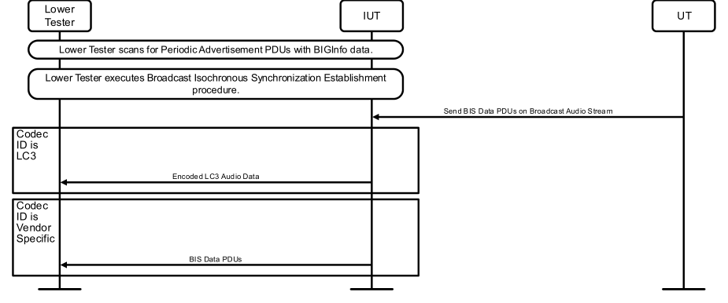

**Figure 4.32: Broadcast Audio Stream with One BIS – Source MSC**

1. The Lower Tester scans for the Periodic Advertisements PDUs with BIGInfo data. 2. The Lower Tester executes the Broadcast Isochronous Synchronization Establishment procedure
defined in [1]. 3. The Upper Tester orders the IUT to send BIS Data PDUs on the broadcast Audio Stream. 4. If the Codec ID is LC3:
• The IUT sends encoded LC3 audio data over the broadcast Audio Stream. 5. If the Codec ID is a vendor-specific Codec ID:
• The IUT sends BIS Data PDUs. 6. The Lower Tester receives BIS Data PDUs on the broadcast Audio Stream.
Expected Outcome
Pass verdict
If the Codec ID is LC3, the IUT sends encoded LC3 audio data in BIS Data PDUs on the broadcast Audio Stream. The audio data is formatted using the LC3 Media Packet format defined in [3].
If the Codec ID is a vendor-specific Codec ID, the IUT sends BIS Data PDUs on the broadcast Audio Stream. The parameters included in the Codec_Specific_Configuration data are as defined in TSPX_VS_Codec_Specific_Configuration.
If the Codec ID is LC3, each parameter included in Codec_Specific_Configuration data is formatted in an LTV structure with the length, type, and value specified in Table 4.79.
Type Values defined in Bluetooth Assigned Numbers [9].

|  | Parameter |  |  | Length |  |  | Value |  |
| --- | --- | --- | --- | --- | --- | --- | --- | --- |
| Sampling Frequency _ |  |  | 0x02 |  |  | Corresponding value referenced in Table 4.78 |  |  |
| Frame Durations _ |  |  | 0x02 |  |  | Corresponding value referenced in Table 4.78 |  |  |
| Audio Channel Allocation _ _ |  |  | 0x05 |  |  | Corresponding value referenced in Table 4.78 |  |  |
| Octets Per Codec Frame _ _ _ |  |  | 0x03 |  |  | Corresponding value referenced in Table 4.78 |  |  |
| Codec Frame Blocks Per SDU _ _ _ _ |  |  | 0x02 |  |  | TSPX Codec Frame Blocks Per SDU _ _ _ _ _ |  |  |

Table 4.79: LTV structures for codec specific configuration parameters

#### 4.14.2 Broadcast Audio Stream with One BIS – Sink

Test Purpose
Verify that a Broadcast Sink IUT can stream one BIS from a Broadcast Source. Verification is performed for each set of codec specific capabilities in turn, as specified in Table 4.80.
Reference
[3] 4.2, 4.5
Initial Condition
- The IUT is a Broadcast Sink.
- The Lower Tester is a Broadcast Source transmitting on a random BIS index and a randomly chosen Advertising Address Type.
- The BASE contains Codec Specific Capabilities with the parameters referenced in Table 4.80. If testing a vendor-specific codec, the parameters contain the values in TSPX_Codec_Specific_Configuration.
Test Case Configuration

| Test Case ID | Codec ID |  | Broadcast Audio |  | Audio Channels |
| --- | --- | --- | --- | --- | --- |
|  |  |  | Config Settings |  |  |
|  |  |  | (Section A.7) |  |  |
| BAP/BSNK/STR/BV-01-C [BSNK, LC3 8 1 1] _ _ | LC3 | LC3 8 1 1 _ _ |  |  | 1 |
| BAP/BSNK/STR/BV-02-C [BSNK, LC3 8 2 1] _ _ | LC3 | LC3 8 2 1 _ _ |  |  | 1 |
| BAP/BSNK/STR/BV-03-C [BSNK, LC3 16 1 1] _ _ | LC3 | LC3 16 1 1 _ _ |  |  | 1 |
| BAP/BSNK/STR/BV-04-C [BSNK, LC3 16 2 1] _ _ | LC3 | LC3 16 2 1 _ _ |  |  | 1 |
| BAP/BSNK/STR/BV-05-C [BSNK, LC3 24 1 1] _ _ | LC3 | LC3 24 1 1 _ _ |  |  | 1 |
| BAP/BSNK/STR/BV-06-C [BSNK, LC3 24 2 1] _ _ | LC3 | LC3 24 2 1 _ _ |  |  | 1 |
| BAP/BSNK/STR/BV-07-C [BSNK, LC3 32 1 1] _ _ | LC3 | LC3 32 1 1 _ _ |  |  | 1 |
| BAP/BSNK/STR/BV-08-C [BSNK, LC3 32 2 1] _ _ | LC3 | LC3 32 2 1 _ _ |  |  | 1 |
| BAP/BSNK/STR/BV-09-C [BSNK, LC3 44.1 1 1] _ _ | LC3 | LC3 441 1 1 _ _ |  |  | 1 |
| BAP/BSNK/STR/BV-10-C [BSNK, LC3 44.1 2 1] _ _ | LC3 | LC3 441 2 1 _ _ |  |  | 1 |

| Test Case ID | Codec ID |  | Broadcast Audio |  | Audio Channels |
| --- | --- | --- | --- | --- | --- |
|  |  |  | Config Settings |  |  |
|  |  |  | (Section A.7) |  |  |
| BAP/BSNK/STR/BV-11-C [BSNK, LC3 48 1 1] _ _ | LC3 | LC3 48 1 1 _ _ |  |  | 1 |
| BAP/BSNK/STR/BV-12-C [BSNK, LC3 48 2 1] _ _ | LC3 | LC3 48 2 1 _ _ |  |  | 1 |
| BAP/BSNK/STR/BV-13-C [BSNK, LC3 48 3 1] _ _ | LC3 | LC3 48 3 1 _ _ |  |  | 1 |
| BAP/BSNK/STR/BV-14-C [BSNK, LC3 48 4 1] _ _ | LC3 | LC3 48 4 1 _ _ |  |  | 1 |
| BAP/BSNK/STR/BV-15-C [BSNK, LC3 48 5 1] _ _ | LC3 | LC3 48 5 1 _ _ |  |  | 1 |
| BAP/BSNK/STR/BV-16-C [BSNK, LC3 48 6 1] _ _ | LC3 | LC3 48 6 1 _ _ |  |  | 1 |
| BAP/BSNK/STR/BV-35-C [BSNK, LC3 8 1 2] _ _ | LC3 | LC3 8 1 2 _ _ |  |  | 1 |
| BAP/BSNK/STR/BV-36-C [BSNK, LC3 8 2 2] _ _ | LC3 | LC3 8 2 2 _ _ |  |  | 1 |
| BAP/BSNK/STR/BV-37-C [BSNK, LC3 16 1 2] _ _ | LC3 | LC3 16 1 2 _ _ |  |  | 1 |
| BAP/BSNK/STR/BV-38-C [BSNK, LC3 16 2 2] _ _ | LC3 | LC3 16 2 2 _ _ |  |  | 1 |
| BAP/BSNK/STR/BV-39-C [BSNK, LC3 24 1 2] _ _ | LC3 | LC3 24 1 2 _ _ |  |  | 1 |
| BAP/BSNK/STR/BV-40-C [BSNK, LC3 24 2 2] _ _ | LC3 | LC3 24 2 2 _ _ |  |  | 1 |
| BAP/BSNK/STR/BV-41-C [BSNK, LC3 32 1 2] _ _ | LC3 | LC3 32 1 2 _ _ |  |  | 1 |
| BAP/BSNK/STR/BV-42-C [BSNK, LC3 32 2 2] _ _ | LC3 | LC3 32 2 2 _ _ |  |  | 1 |
| BAP/BSNK/STR/BV-43-C [BSNK, LC3 44.1 1 2] _ _ | LC3 | LC3 441 1 2 _ _ |  |  | 1 |
| BAP/BSNK/STR/BV-44-C [BSNK, LC3 44.1 2 2] _ _ | LC3 | LC3 441 2 2 _ _ |  |  | 1 |
| BAP/BSNK/STR/BV-45-C [BSNK, LC3 48 1 2] _ _ | LC3 | LC3 48 1 2 _ _ |  |  | 1 |
| BAP/BSNK/STR/BV-46-C [BSNK, LC3 48 2 2] _ _ | LC3 | LC3 48 2 2 _ _ |  |  | 1 |
| BAP/BSNK/STR/BV-47-C [BSNK, LC3 48 3 2] _ _ | LC3 | LC3 48 3 2 _ _ |  |  | 1 |
| BAP/BSNK/STR/BV-48-C [BSNK, LC3 48 4 2] _ _ | LC3 | LC3 48 4 2 _ _ |  |  | 1 |
| BAP/BSNK/STR/BV-49-C [BSNK, LC3 48 5 2] _ _ | LC3 | LC3 48 5 2 _ _ |  |  | 1 |
| BAP/BSNK/STR/BV-50-C [BSNK, LC3 48 6 2] _ _ | LC3 | LC3 48 6 2 _ _ |  |  | 1 |
| BAP/BSNK/STR/BV-17-C [BSNK, VS] | TSPX Vendor Specific _ _ Codec ID _ _ | N/A |  |  | TSPX Audio Channel _ _ _ Allocation |
| BAP/BSNK/STR/BV-67-C [BSNK, LC3 8 1 1, AC14] _ _ | LC3 | LC3 8 1 1 _ _ |  |  | 2 |
| BAP/BSNK/STR/BV-68-C [BSNK, LC3 8 2 1, AC14] _ _ | LC3 | LC3 8 2 1 _ _ |  |  | 2 |

| Test Case ID | Codec ID |  | Broadcast Audio |  | Audio Channels |
| --- | --- | --- | --- | --- | --- |
|  |  |  | Config Settings |  |  |
|  |  |  | (Section A.7) |  |  |
| BAP/BSNK/STR/BV-69-C [BSNK, LC3 16 1 1, AC14] _ _ | LC3 | LC3 16 1 1 _ _ |  |  | 2 |
| BAP/BSNK/STR/BV-70-C [BSNK, LC3 16 2 1, AC14] _ _ | LC3 | LC3 16 2 1 _ _ |  |  | 2 |
| BAP/BSNK/STR/BV-71-C [BSNK, LC3 24 1 1, AC14] _ _ | LC3 | LC3 24 1 1 _ _ |  |  | 2 |
| BAP/BSNK/STR/BV-72-C [BSNK, LC3 24 2 1, AC14] _ _ | LC3 | LC3 24 2 1 _ _ |  |  | 2 |
| BAP/BSNK/STR/BV-73-C [BSNK, LC3 32 1 1, AC14] _ _ | LC3 | LC3 32 1 1 _ _ |  |  | 2 |
| BAP/BSNK/STR/BV-74-C [BSNK, LC3 32 2 1, AC14] _ _ | LC3 | LC3 32 2 1 _ _ |  |  | 2 |
| BAP/BSNK/STR/BV-75-C [BSNK, LC3 44.1 1 1, AC14] _ _ | LC3 | LC3 441 1 1 _ _ |  |  | 2 |
| BAP/BSNK/STR/BV-76-C [BSNK, LC3 44.1 2 1, AC14] _ _ | LC3 | LC3 441 2 1 _ _ |  |  | 2 |
| BAP/BSNK/STR/BV-77-C [BSNK, LC3 48 1 1, AC14] _ _ | LC3 | LC3 48 1 1 _ _ |  |  | 2 |
| BAP/BSNK/STR/BV-78-C [BSNK, LC3 48 2 1, AC14] _ _ | LC3 | LC3 48 2 1 _ _ |  |  | 2 |
| BAP/BSNK/STR/BV-79-C [BSNK, LC3 48 3 1, AC14] _ _ | LC3 | LC3 48 3 1 _ _ |  |  | 2 |
| BAP/BSNK/STR/BV-80-C [BSNK, LC3 48 4 1, AC14] _ _ | LC3 | LC3 48 4 1 _ _ |  |  | 2 |
| BAP/BSNK/STR/BV-81-C [BSNK, LC3 48 5 1, AC14] _ _ | LC3 | LC3 48 5 1 _ _ |  |  | 2 |
| BAP/BSNK/STR/BV-82-C [BSNK, LC3 48 6 1, AC14] _ _ | LC3 | LC3 48 6 1 _ _ |  |  | 2 |
| BAP/BSNK/STR/BV-83-C [BSNK, LC3 8 1 2, AC14] _ _ | LC3 | LC3 8 1 2 _ _ |  |  | 2 |
| BAP/BSNK/STR/BV-84-C [BSNK, LC3 8 2 2, AC14] _ _ | LC3 | LC3 8 2 2 _ _ |  |  | 2 |
| BAP/BSNK/STR/BV-85-C [BSNK, LC3 16 1 2, AC14] _ _ | LC3 | LC3 16 1 2 _ _ |  |  | 2 |
| BAP/BSNK/STR/BV-86-C [BSNK, LC3 16 2 2, AC14] _ _ | LC3 | LC3 16 2 2 _ _ |  |  | 2 |
| BAP/BSNK/STR/BV-87-C [BSNK, LC3 24 1 2, AC14] _ _ | LC3 | LC3 24 1 2 _ _ |  |  | 2 |
| BAP/BSNK/STR/BV-88-C [BSNK, LC3 24 2 2, AC14] _ _ | LC3 | LC3 24 2 2 _ _ |  |  | 2 |
| BAP/BSNK/STR/BV-89-C [BSNK, LC3 32 1 2, AC14] _ _ | LC3 | LC3 32 1 2 _ _ |  |  | 2 |
| BAP/BSNK/STR/BV-90-C [BSNK, LC3 32 2 2, AC14] _ _ | LC3 | LC3 32 2 2 _ _ |  |  | 2 |
| BAP/BSNK/STR/BV-91-C [BSNK, LC3 44.1 1 2, AC14] _ _ | LC3 | LC3 441 1 2 _ _ |  |  | 2 |
| BAP/BSNK/STR/BV-92-C [BSNK, LC3 44.1 2 2, AC14] _ _ | LC3 | LC3 441 2 2 _ _ |  |  | 2 |
| BAP/BSNK/STR/BV-93-C [BSNK, LC3 48 1 2, AC14] _ _ | LC3 | LC3 48 1 2 _ _ |  |  | 2 |

| Test Case ID | Codec ID |  | Broadcast Audio |  | Audio Channels |
| --- | --- | --- | --- | --- | --- |
|  |  |  | Config Settings |  |  |
|  |  |  | (Section A.7) |  |  |
| BAP/BSNK/STR/BV-94-C [BSNK, LC3 48 2 2, AC14] _ _ | LC3 | LC3 48 2 2 _ _ |  |  | 2 |
| BAP/BSNK/STR/BV-95-C [BSNK, LC3 48 3 2, AC14] _ _ | LC3 | LC3 48 3 2 _ _ |  |  | 2 |
| BAP/BSNK/STR/BV-96-C [BSNK, LC3 48 4 2, AC14] _ _ | LC3 | LC3 48 4 2 _ _ |  |  | 2 |
| BAP/BSNK/STR/BV-97-C [BSNK, LC3 48 5 2, AC14] _ _ | LC3 | LC3 48 5 2 _ _ |  |  | 2 |
| BAP/BSNK/STR/BV-98-C [BSNK, LC3 48 6 2, AC14] _ _ | LC3 | LC3 48 6 2 _ _ |  |  | 2 |

Table 4.80: Broadcast Audio Stream with One BIS – Sink test cases
Test Procedure
1. The Upper Tester orders the IUT to scan for Periodic Advertisements PDUs with BIGInfo data. 2. The Upper Tester orders the IUT to synchronize to the periodic advertising train of the Lower
Tester. 3. The IUT executes the Broadcast Isochronous Synchronization Establishment procedure defined
in [1]. 4. The Upper Tester confirms that the IUT synchronizes to the Lower Tester.
Expected Outcome
Pass verdict
The IUT synchronizes to the Lower Tester (the Link Layer receives a BIS Data PDU). The host on the IUT receives an LE BIG Sync Established event.
If the Codec ID is LC3, the IUT receives BIS Data PDUs on the broadcast Audio Stream containing encoded LC3 audio data formatted using the LC3 Media Packet format defined in [3].
If the Codec ID is a vendor-specific Codec ID, the IUT receives BIS Data PDUs on the broadcast Audio Stream. The parameters included in the Codec_Specific_Configuration data are as defined in TSPX_VS_Codec_Specific_Configuration.
If the Codec ID is LC3, each parameter included in Codec_Specific_Configuration data is formatted in an LTV structure with the length, type, and value specified in Table 4.81.
Type Values defined in Bluetooth Assigned Numbers [9].

|  | Parameter |  |  | Length |  |  | Value |  |
| --- | --- | --- | --- | --- | --- | --- | --- | --- |
| Sampling Frequency _ |  |  | 0x02 |  |  | From corresponding column in Table 4.80 |  |  |
| Frame Durations _ |  |  | 0x02 |  |  | From corresponding column in Table 4.80 |  |  |
| Audio Channel Allocation _ _ |  |  | 0x05 |  |  | Corresponding value referenced in Table 4.80 |  |  |
| Octets Per Codec Frame _ _ _ |  |  | 0x03 |  |  | From corresponding column in Table 4.80 |  |  |
| Codec Frame Blocks Per SDU _ _ _ _ |  |  | 0x02 |  |  | TSPX Codec Frame Blocks Per SDU _ _ _ _ _ |  |  |

Table 4.81: LTV structures for codec specific configuration parameters

#### 4.14.3 Broadcast Audio Stream with Multiple BISes – Source

Test Purpose
Verify that a Broadcast Source IUT can stream multiple BISes to a Broadcast Sink. The verification is performed for each set of parameters in turn, as specified in Table 4.82.
Reference
[3] 3.7.1, 4.2, 4.5
Initial Condition
- The Lower Tester is a Broadcast Sink.
- The IUT is a Broadcast Source transmitting periodic advertising PDUs containing the BASE info in TSPX_BASE_Multiple_BISes and the Codec Specific Configuration parameters specified in Table 4.82. If testing a vendor-specific codec, the Codec Specific Configuration parameters contain the values in TSPX_VS_Codec_Specific_Configuration.
Test Case Configuration

| Test Case ID |  | Codec |  |  | Codec Setting |  |
| --- | --- | --- | --- | --- | --- | --- |
|  |  | ID |  |  | (Section A.6) |  |
| BAP/BSRC/STR/BV-18-C [BSRC, Multiple BISes, LC3 8 1] _ | LC3 |  |  | 8 1 _ |  |  |
| BAP/BSRC/STR/BV-19-C [BSRC, Multiple BISes, LC3 8 2] _ | LC3 |  |  | 8 2 _ |  |  |
| BAP/BSRC/STR/BV-20-C [BSRC, Multiple BISes, LC3 16 1] _ | LC3 |  |  | 16 1 _ |  |  |
| BAP/BSRC/STR/BV-21-C [BSRC, Multiple BISes, LC3 16 2] _ | LC3 |  |  | 16 2 _ |  |  |
| BAP/BSRC/STR/BV-22-C [BSRC, Multiple BISes, LC3 24 1] _ | LC3 |  |  | 24 1 _ |  |  |
| BAP/BSRC/STR/BV-23-C [BSRC, Multiple BISes, LC3 24 2] _ | LC3 |  |  | 24 2 _ |  |  |
| BAP/BSRC/STR/BV-24-C [BSRC, Multiple BISes – LC3 32 1] _ | LC3 |  |  | 32 1 _ |  |  |
| BAP/BSRC/STR/BV-25-C [BSRC, Multiple BISes, LC3 32 2] _ | LC3 |  |  | 32 2 _ |  |  |
| BAP/BSRC/STR/BV-26-C [BSRC, Multiple BISes, LC3 44.1 1] _ | LC3 |  |  | 441 1 _ |  |  |
| BAP/BSRC/STR/BV-27-C [BSRC, Multiple BISes, LC3 44.1 2] _ | LC3 |  |  | 441 2 _ |  |  |
| BAP/BSRC/STR/BV-28-C [BSRC, Multiple BISes, LC3 48 1] _ | LC3 |  |  | 48 1 _ |  |  |
| BAP/BSRC/STR/BV-29-C [BSRC, Multiple BISes, LC3 48 2] _ | LC3 |  |  | 48 2 _ |  |  |
| BAP/BSRC/STR/BV-30-C [BSRC, Multiple BISes, LC3 48 3] _ | LC3 |  |  | 48 3 _ |  |  |
| BAP/BSRC/STR/BV-31-C [BSRC, Multiple BISes, LC3 48 4] _ | LC3 |  |  | 48 4 _ |  |  |
| BAP/BSRC/STR/BV-32-C [BSRC, Multiple BISes, LC3 48 5] _ | LC3 |  |  | 48 5 _ |  |  |
| BAP/BSRC/STR/BV-33-C [BSRC, Multiple BISes, LC3 48 6] _ | LC3 |  |  | 48 6 _ |  |  |
| BAP/BSRC/STR/BV-34-C [BSRC, Multiple BISes, VS] | TSPX Vendor Specific Codec ID _ _ _ _ |  |  |  |  |  |

Table 4.82: Broadcast Audio Stream with Multiple BISes – Source test cases

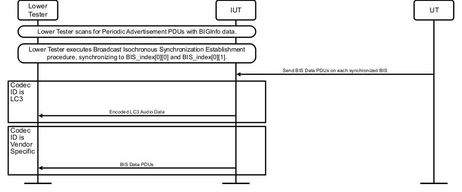

**Figure 4.33: Broadcast Audio Stream with Multiple BISes – Source MSC**

1. The Lower Tester scans for the Periodic Advertisements PDUs with BIGInfo data. 2. The Lower Tester executes the Broadcast Isochronous Synchronization Establishment procedure
defined in [1], synchronizing to BIS_index[0][0], BIS_index[0][1]. 3. The Upper Tester orders the IUT to send BIS Data PDUs on each synchronized BIS. 4. If the Codec ID is LC3:
• The IUT sends encoded LC3 audio data over the broadcast Audio Stream. 5. If the Codec ID is a vendor-specific Codec ID:
• The IUT sends BIS Data PDUs. 6. The Lower Tester receives BIS Data PDUs on each synchronized BIS.
Expected Outcome
Pass verdict
If the Codec ID is LC3, the IUT sends encoded LC3 audio data in BIS Data PDUs on each synchronized BIS. The audio data is formatted using the LC3 Media Packet format defined in [3].
If the Codec ID is a vendor-specific Codec ID, the IUT sends BIS Data PDUs on each synchronized BIS. The parameters included in the Codec_Specific_Configuration data are as defined in TSPX_VS_Codec_Specific_Configuration.
If the Codec ID is LC3, each parameter included in Codec_Specific_Configuration data is formatted in an LTV structure with the length, type, and value specified in Table 4.83.
Type Values defined in Bluetooth Assigned Numbers [9].

|  | Parameter |  |  | Length |  |  | Value |
| --- | --- | --- | --- | --- | --- | --- | --- |
| Sampling Frequency _ |  |  | 0x02 |  |  | From corresponding column in Table 4.82 |  |
| Frame Durations _ |  |  | 0x02 |  |  | From corresponding column in Table 4.82 |  |
| Audio Channel Allocation _ _ |  |  | 0x05 |  |  | TSPX Audio Channel Allocation _ _ _ |  |
| Octets Per Codec Frame _ _ _ |  |  | 0x03 |  |  | From corresponding column in Table 4.82 |  |
| Codec Frame Blocks Per SDU _ _ _ _ |  |  | 0x02 |  |  | TSPX Codec Frame Blocks Per SDU _ _ _ _ _ |  |

Table 4.83: LTV structures for codec specific configuration parameters

#### 4.14.4 Broadcast Audio Stream with Multiple BISes – Sink

Test Purpose
Verify that a Broadcast Sink IUT can receive audio data over multiple BISes from a Broadcast Source. The verification is performed for each set of parameters in turn, as specified in Table 4.84.
Reference
[3] 4.2, 4.5
Initial Condition
- The IUT is a Broadcast Sink.
- The Lower Tester is a Broadcast Source, transmitting periodic advertising PDUs containing the BASE info in TSPX_BASE_Multiple_BISes and the Codec Specific Configuration parameters specified in Table 4.84. If testing a vendor-specific codec, the Codec Specific Configuration parameters contain the values in TSPX_VS_Codec_Specific_Configuration.
Test Case Configuration

| Test Case ID | Codec ID |  | Broadcast Audio |  |
| --- | --- | --- | --- | --- |
|  |  |  | Config Settings |  |
|  |  |  | (Section A.7) |  |
| BAP/BSNK/STR/BV-18-C [BSNK, Multiple BISes, LC3 8 1 1] _ _ | LC3 | LC3 8 1 1 _ _ |  |  |
| BAP/BSNK/STR/BV-19-C [BSNK, Multiple BISes, LC3 8 2 1] _ _ | LC3 | LC3 8 2 1 _ _ |  |  |
| BAP/BSNK/STR/BV-20-C [BSNK, Multiple BISes, LC3 16 1 1] _ _ | LC3 | LC3 16 1 1 _ _ |  |  |
| BAP/BSNK/STR/BV-21-C [BSNK, Multiple BISes, LC3 16 2 1] _ _ | LC3 | LC3 16 2 1 _ _ |  |  |
| BAP/BSNK/STR/BV-22-C [BSNK, Multiple BISes, LC3 24 1 1] _ _ | LC3 | LC3 24 1 1 _ _ |  |  |
| BAP/BSNK/STR/BV-23-C [BSNK, Multiple BISes, LC3 24 2 1] _ _ | LC3 | LC3 24 2 1 _ _ |  |  |
| BAP/BSNK/STR/BV-24-C [BSNK, Multiple BISes, LC3 32 1 1] _ _ | LC3 | LC3 32 1 1 _ _ |  |  |
| BAP/BSNK/STR/BV-25-C [BSNK, Multiple BISes, LC3 32 2 1] _ _ | LC3 | LC3 32 2 1 _ _ |  |  |
| BAP/BSNK/STR/BV-26-C [BSNK, Multiple BISes, LC3 44.1 1 1] _ _ | LC3 | LC3 441 1 1 _ _ |  |  |
| BAP/BSNK/STR/BV-27-C [BSNK, Multiple BISes, LC3 44.1 2 1] _ _ | LC3 | LC3 441 2 1 _ _ |  |  |
| BAP/BSNK/STR/BV-28-C [BSNK, Multiple BISes, LC3 48 1 1] _ _ | LC3 | LC3 48 1 1 _ _ |  |  |
| BAP/BSNK/STR/BV-29-C [BSNK, Multiple BISes, LC3 48 2 1] _ _ | LC3 | LC3 48 2 1 _ _ |  |  |
| BAP/BSNK/STR/BV-30-C [BSNK, Multiple BISes, LC3 48 3 1] _ _ | LC3 | LC3 48 3 1 _ _ |  |  |
| BAP/BSNK/STR/BV-31-C [BSNK, Multiple BISes, LC3 48 4 1] _ _ | LC3 | LC3 48 4 1 _ _ |  |  |
| BAP/BSNK/STR/BV-32-C [BSNK, Multiple BISes, LC3 48 5 1] _ _ | LC3 | LC3 48 5 1 _ _ |  |  |
| BAP/BSNK/STR/BV-33-C [BSNK, Multiple BISes, LC3 48 6 1] _ _ | LC3 | LC3 48 6 1 _ _ |  |  |
| BAP/BSNK/STR/BV-51-C [BSNK, Multiple BISes, LC3 8 1 2] _ _ | LC3 | LC3 8 1 2 _ _ |  |  |
| BAP/BSNK/STR/BV-52-C [BSNK, Multiple BISes, LC3 8 2 2] _ _ | LC3 | LC3 8 2 2 _ _ |  |  |
| BAP/BSNK/STR/BV-53-C [BSNK, Multiple BISes, LC3 16 1 2] _ _ | LC3 | LC3 16 1 2 _ _ |  |  |
| BAP/BSNK/STR/BV-54-C [BSNK, Multiple BISes, LC3 16 2 2] _ _ | LC3 | LC3 16 2 2 _ _ |  |  |
| BAP/BSNK/STR/BV-55-C [BSNK, Multiple BISes, LC3 24 1 2] _ _ | LC3 | LC3 24 1 2 _ _ |  |  |
| BAP/BSNK/STR/BV-56-C [BSNK, Multiple BISes, LC3 24 2 2] _ _ | LC3 | LC3 24 2 2 _ _ |  |  |
| BAP/BSNK/STR/BV-57-C [BSNK, Multiple BISes, LC3 32 1 2] _ _ | LC3 | LC3 32 1 2 _ _ |  |  |
| BAP/BSNK/STR/BV-58-C [BSNK, Multiple BISes, LC3 32 2 2] _ _ | LC3 | LC3 32 2 2 _ _ |  |  |
| BAP/BSNK/STR/BV-59-C [BSNK, Multiple BISes, LC3 44.1 1 2] _ _ | LC3 | LC3 441 1 2 _ _ |  |  |
| BAP/BSNK/STR/BV-60-C [BSNK, Multiple BISes, LC3 44.1 2 2] _ _ | LC3 | LC3 441 2 2 _ _ |  |  |
| BAP/BSNK/STR/BV-61-C [BSNK, Multiple BISes, LC3 48 1 2] _ _ | LC3 | LC3 48 1 2 _ _ |  |  |
| BAP/BSNK/STR/BV-62-C [BSNK, Multiple BISes, LC3 48 2 2] _ _ | LC3 | LC3 48 2 2 _ _ |  |  |

| Test Case ID | Codec ID |  | Broadcast Audio |  |
| --- | --- | --- | --- | --- |
|  |  |  | Config Settings |  |
|  |  |  | (Section A.7) |  |
| BAP/BSNK/STR/BV-63-C [BSNK, Multiple BISes, LC3 48 3 2] _ _ | LC3 | LC3 48 3 2 _ _ |  |  |
| BAP/BSNK/STR/BV-64-C [BSNK, Multiple BISes, LC3 48 4 2] _ _ | LC3 | LC3 48 4 2 _ _ |  |  |
| BAP/BSNK/STR/BV-65-C [BSNK, Multiple BISes, LC3 48 5 2] _ _ | LC3 | LC3 48 5 2 _ _ |  |  |
| BAP/BSNK/STR/BV-66-C [BSNK, Multiple BISes, LC3 48 6 2] _ _ | LC3 | LC3 48 6 2 _ _ |  |  |
| BAP/BSNK/STR/BV-34-C [BSNK, Multiple BISes, VS] | TSPX Vendor Specific Codec ID _ _ _ _ |  |  |  |

Table 4.84: Broadcast Sink Receives Audio Data Over Multiple BISes test cases
Test Procedure

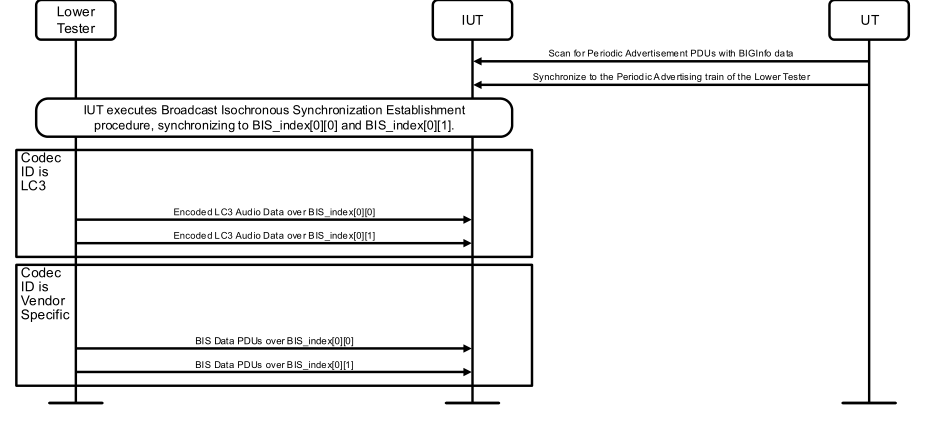

**Figure 4.34: Broadcast Sink Receives Audio Data Over Multiple BISes MSC**

1. The Upper Tester orders the IUT to scan for Periodic Advertisements PDUs with BIGInfo data. 2. The Upper Tester orders the IUT to synchronize to the periodic advertising train of the Lower
Tester. 3. The IUT executes the Broadcast Isochronous Synchronization Establishment procedure defined
in [1], synchronizing to the BISes at BIS_index[0][0], BIS_index[0][1]. 4. If the Codec ID is LC3:
• The Lower Tester sends encoded LC3 audio data over each synchronized BIS. 5. If the Codec ID is a vendor-specific Codec ID:
• The Lower Tester sends BIS Data PDUs. 6. The IUT receives BIS Data PDUs on each synchronized BIS.
Expected Outcome
Pass verdict
The IUT synchronizes to the Lower Tester (the Link Layer receives a BIS Data PDU). The host on the IUT receives an LE BIG Sync Established event.
If the Codec ID is LC3, the IUT receives encoded LC3 audio data in BIS Data PDUs on each synchronized BIS. The audio data is formatted using the LC3 Media Packet format defined in [3].
If the Codec ID is a vendor-specific Codec ID, the IUT receives BIS Data PDUs on each synchronized BIS. The parameters included in the Codec_Specific_Configuration data are as defined in TSPX_VS_Codec_Specific_Configuration.
If the Codec ID is LC3, each parameter included in Codec_Specific_Configuration data is formatted in an LTV structure with the length, type, and value specified in Table 4.85.
Type Values defined in Bluetooth Assigned Numbers [9].

|  | Parameter |  |  | Length |  |  | Value |  |
| --- | --- | --- | --- | --- | --- | --- | --- | --- |
| Sampling Frequency _ |  |  | 0x02 |  |  | From corresponding column in Table 4.84 |  |  |
| Frame Durations _ |  |  | 0x02 |  |  | From corresponding column in Table 4.84 |  |  |
| Audio Channel Allocation _ _ |  |  | 0x05 |  |  | TSPX Audio Channel Allocation _ _ _ |  |  |
| Octets Per Codec Frame _ _ _ |  |  | 0x03 |  |  | From corresponding column in Table 4.84 |  |  |
| Codec Frame Blocks Per SDU _ _ _ _ |  |  | 0x02 |  |  | TSPX Codec Frame Blocks Per SDU _ _ _ _ _ |  |  |

Table 4.85: LTV structures for codec specific configuration parameters

## 5 Test case mapping

The Test Case Mapping Table (TCMT) maps test cases to specific requirements in the ICS. The IUT is tested in all roles for which support is declared in the ICS document.
The columns for the TCMT are defined as follows:
Item: Contains a logical expression based on specific entries from the associated ICS document. Contains a logical expression (using the operators AND, OR, NOT as needed) based on specific entries from the applicable ICS document(s). The entries are in the form of y/x references, where y corresponds to the table number and x corresponds to the feature number as defined in the ICS document for BAP [4].
If a test case is mandatory within the respective layer, then the y/x reference is omitted.
Feature: A brief, informal description of the feature being tested.
Test Case(s): The applicable test case identifiers are required for Bluetooth Qualification if the corresponding y/x references defined in the Item column are supported. Further details about the function of the TCMT are elaborated in [2].
For the purpose and structure of the ICS/IXIT, refer to [2].

|  | Item |  |  | Feature |  |  | Test Case(s) |  |
| --- | --- | --- | --- | --- | --- | --- | --- | --- |
| BAP 28/3 OR BAP 28/4 OR BAP 85/3 OR BAP 85/4 |  |  | Published Audio Capabilities Service |  |  | BAP/CL/CGGIT/SER/BV-01-C |  |  |
| BAP 32/1 OR BAP 87/1 |  |  | Sink PAC Characteristic |  |  | BAP/CL/CGGIT/CHA/BV-01-C |  |  |
| BAP 32/2 OR BAP 87/2 |  |  | Sink Audio Locations Characteristic |  |  | BAP/CL/CGGIT/CHA/BV-02-C |  |  |
| BAP 33/3 |  |  | Source PAC Characteristic |  |  | BAP/CL/CGGIT/CHA/BV-03-C |  |  |
| BAP 33/4 |  |  | Source Audio Locations Characteristic |  |  | BAP/CL/CGGIT/CHA/BV-04-C |  |  |
| BAP 32/5 |  |  | Available Audio Contexts Characteristic |  |  | BAP/CL/CGGIT/CHA/BV-05-C |  |  |
| BAP 32/6 |  |  | Supported Audio Contexts Characteristic |  |  | BAP/CL/CGGIT/CHA/BV-06-C |  |  |
| BAP 28/1 OR BAP 28/2 |  |  | Audio Stream Control Service |  |  | BAP/UCL/CGGIT/SER/BV-01-C |  |  |
| BAP 31/1 |  |  | Sink ASE Characteristic |  |  | BAP/UCL/CGGIT/CHA/BV-01-C |  |  |
| BAP 31/2 |  |  | Source ASE Characteristic |  |  | BAP/UCL/CGGIT/CHA/BV-02-C |  |  |
| BAP 31/3 |  |  | ASE Control Point Characteristic |  |  | BAP/UCL/CGGIT/CHA/BV-03-C |  |  |
| BAP 85/1 OR BAP 85/2 |  |  | Broadcast Audio Scan Service |  |  | BAP/BA/CGGIT/SER/BV-01-C |  |  |
| BAP 86/1 |  |  | Broadcast Audio Scan Control Point Characteristic |  |  | BAP/BA/CGGIT/CHA/BV-01-C |  |  |
| BAP 86/2 |  |  | Broadcast Receive State Characteristic |  |  | BAP/BA/CGGIT/CHA/BV-02-C |  |  |
|  | Unicast Client – Discovery and Advertising |  |  |  |  |  |  |  |
| BAP 29/2 |  |  | Unicast Client – Discover Audio Sink Capabilities |  |  | BAP/UCL/DISC/BV-01-C |  |  |
| BAP 29/1 |  |  | Unicast Client – Discover Audio Source Capabilities |  |  | BAP/UCL/DISC/BV-02-C |  |  |

|  | Item |  |  | Feature |  |  | Test Case(s) |  |
| --- | --- | --- | --- | --- | --- | --- | --- | --- |
| BAP 31/6 |  |  | Unicast Client – Discover Sink ASE ID _ |  |  | BAP/UCL/DISC/BV-03-C |  |  |
| BAP 31/7 |  |  | Unicast Client – Discover Source ASE ID _ |  |  | BAP/UCL/DISC/BV-04-C |  |  |
| BAP 32/9 |  |  | Unicast Client performs Supported Audio Contexts Discovery |  |  | BAP/UCL/DISC/BV-05-C |  |  |
| BAP 32/10 |  |  | Unicast Client performs Available Audio Contexts Discovery |  |  | BAP/UCL/DISC/BV-06-C BAP/UCL/ADV/BV-01-C |  |  |
| BAP 29/2 |  |  | Unicast Client Behavior – Sink Role |  |  | BAP/UCL/PD/BV-03-C |  |  |
| BAP 29/1 |  |  | Unicast Client Behavior – Source Role |  |  | BAP/UCL/PD/BV-04-C |  |  |
| BAP 29/2 AND BAP 30/1 |  |  | Presentation Delay with multiple servers - Sink |  |  | BAP/UCL/PD/BV-01-C |  |  |
| BAP 29/1 AND BAP 30/1 |  |  | Presentation Delay with multiple servers - Source |  |  | BAP/UCL/PD/BV-02-C |  |  |
|  | Discovery and Advertising |  |  |  |  |  |  |  |
| BAP 8/1 |  |  | Unicast Server – Expose Audio Sink Capabilities |  |  | BAP/USR/DISC/BV-01-C |  |  |
| BAP 8/2 |  |  | Unicast Server – Expose Audio Source Capabilities |  |  | BAP/USR/DISC/BV-02-C |  |  |
| BAP 8/1 AND NOT BAP 8/2 |  |  | Unicast Server – Expose Sink ASE ID _ |  |  | BAP/USR/DISC/BV-03-C |  |  |
| BAP 8/2 AND NOT BAP 8/1 |  |  | Unicast Server – Expose Source ASE ID _ |  |  | BAP/USR/DISC/BV-04-C |  |  |
| BAP 8/1 AND BAP 8/2 |  |  | Unicast Server – Expose Sink and Source ASE ID _ |  |  | BAP/USR/DISC/BV-05-C |  |  |
| BAP 9/5 |  |  | Unicast Server – Expose Available Audio Contexts |  |  | BAP/USR/DISC/BV-06-C |  |  |
| BAP 9/6 |  |  | Unicast Server – Expose Supported Audio Contexts |  |  | BAP/USR/DISC/BV-07-C |  |  |
| BAP 25/2 AND NOT BAP 3/2 AND BAP 7/9 |  |  | Unicast Server General Advertisements |  |  | BAP/USR/ADV/BV-01-C |  |  |
| BAP 25/2 AND BAP 3/2 AND BAP 23/12 AND BAP 7/9 |  |  | Unicast Server LE Extended Advertising – BR/EDR/LE, General Advertisements |  |  | BAP/USR/ADV/BV-02-C |  |  |
| BAP 25/2 AND BAP 3/2 AND BAP 23/12 AND BAP 7/10 |  |  | Unicast Server LE Extended Advertising – BR/EDR/LE, Targeted Advertisements |  |  | BAP/USR/ADV/BV-05-C |  |  |
| BAP 25/2 AND BAP 3/2 AND NOT BAP 23/12 AND BAP 7/9 |  |  | Unicast Server LE Extended Advertising – No CTKD, General Advertisements |  |  | BAP/USR/ADV/BV-03-C |  |  |
| BAP 25/2 AND BAP 3/2 AND NOT BAP 23/12 AND BAP 7/10 |  |  | Unicast Server LE Extended Advertising – No CTKD, Targeted Advertisements |  |  | BAP/USR/ADV/BV-06-C |  |  |

|  | Item |  |  | Feature |  |  | Test Case(s) |  |
| --- | --- | --- | --- | --- | --- | --- | --- | --- |
| BAP 25/2 AND NOT BAP 3/2 AND BAP 7/10 |  |  | Unicast Server Targeted Advertisements |  |  | BAP/USR/ADV/BV-04-C |  |  |
| BAP 1/1 AND BAP 23/13 AND BAP 3/2 |  |  | Unicast Server - CoD |  |  | BAP/USR/DEVD/BV-01-C |  |  |
| BAP 1/4 AND BAP 74/18 AND BAP 3/2 |  |  | Broadcast Sink - CoD |  |  | BAP/BSNK/DEVD/BV-01-C |  |  |
| BAP 1/5 AND BAP 80/19 AND BAP 3/2 |  |  | Scan Delegator - CoD |  |  | BAP/SDE/DEVD/BV-01-C |  |  |
| BAP 1/3 AND BAP 60/5 AND BAP 3/2 |  |  | Broadcast Source - CoD |  |  | BAP/BSRC/DEVD/BV-01-C |  |  |
| BAP 1/6 AND BAP 90/18 AND BAP 3/2 |  |  | Broadcast Assistant - CoD |  |  | BAP/BA/DEVD/BV-01-C |  |  |
|  | Unicast Client – Generic |  |  |  |  |  |  |  |
|  | AC.1, 2, 4, 10 |  |  |  |  |  |  |  |
| (BAP 38/1 OR BAP 38/2 OR BAP 38/3 OR BAP 38/4 OR BAP 38/5 OR BAP 38/6 OR BAP 38/7 OR BAP 38/8 OR BAP 38/9 OR BAP 38/10 OR BAP 38/11 OR BAP 38/12 OR BAP 38/13 OR BAP 38/14 OR BAP 38/15 OR BAP 38/16 OR BAP 40/1 OR BAP 40/2 OR BAP 40/3 OR BAP 40/4 OR BAP 40/5 OR BAP 40/6 OR BAP 40/7 OR BAP 40/8 OR BAP 40/9 OR BAP 40/10 OR BAP 40/11 OR BAP 40/12 OR BAP 40/13 OR BAP 40/14 OR BAP 40/15 OR BAP 40/16) AND BAP 44/2 AND BAP 33a/7 |  |  | UCL Streaming – A.C.2: Generic |  |  | BAP/UCL/STR/BV-535-C BAP/UCL/STR/BV-552-C BAP/UCL/STR/BV-553-C BAP/UCL/STR/BV-554-C BAP/UCL/STR/BV-555-C BAP/UCL/STR/BV-569-C |  |  |
| (BAP 38/1 OR BAP 38/2 OR BAP 38/3 OR BAP 38/4 OR BAP 38/5 OR BAP 38/6 OR BAP 38/7 OR BAP 38/8 OR BAP 38/9 OR BAP 38/10 OR BAP 38/11 OR BAP 38/12 OR BAP 38/13 OR BAP 38/14 OR BAP 38/15 OR BAP 38/16 OR BAP 40/1 OR BAP 40/2 OR BAP 40/3 OR BAP 40/4 OR BAP 40/5 OR BAP 40/6 OR BAP 40/7 OR BAP 40/8 OR BAP 40/9 OR BAP 40/10 OR BAP 40/11 OR BAP 40/12 OR BAP 40/13 OR BAP 40/14 OR BAP 40/15 OR BAP 40/16) AND (BAP 39/1 OR BAP 39/2 OR BAP 39/3 OR BAP 39/4 OR BAP 39/5 OR BAP 39/6 OR BAP 39/8 OR BAP 39/7 OR BAP 39/9 OR BAP 39/10 OR BAP 39/11 OR BAP 39/12 OR BAP 39/13 OR BAP 39/14 OR BAP 39/15 OR BAP 39/16 OR BAP 41/1 OR BAP |  |  | UCL Streaming – A.C.2: Generic w/ No A.C.10 |  |  | BAP/UCL/STR/BV-568-C BAP/UCL/STR/BV-570-C |  |  |

|  | Item |  |  | Feature |  |  | Test Case(s) |  |
| --- | --- | --- | --- | --- | --- | --- | --- | --- |
| 41/2 OR BAP 41/3 OR BAP 41/4 OR BAP 41/5 OR BAP 41/6 OR BAP 41/7 OR BAP 41/8 OR BAP 41/9 OR BAP 41/10 OR BAP 41/11 OR BAP 41/12 OR BAP 41/13 OR BAP 41/14 OR BAP 41/15 OR BAP 41/16) AND BAP 44/2 AND BAP 33a/7 AND NOT BAP 44/14 |  |  |  |  |  |  |  |  |
| (BAP 38/1 OR BAP 38/2 OR BAP 38/3 OR BAP 38/4 OR BAP 38/5 OR BAP 38/6 OR BAP 38/7 OR BAP 38/8 OR BAP 38/9 OR BAP 38/10 OR BAP 38/11 OR BAP 38/12 OR BAP 38/13 OR BAP 38/14 OR BAP 38/15 OR BAP 38/16 OR BAP 40/1 OR BAP 40/2 OR BAP 40/3 OR BAP 40/4 OR BAP 40/5 OR BAP 40/6 OR BAP 40/7 OR BAP 40/8 OR BAP 40/9 OR BAP 40/10 OR BAP 40/11 OR BAP 40/12 OR BAP 40/13 OR BAP 40/14 OR BAP 40/15 OR BAP 40/16) AND BAP 44/2 AND BAP 33a/8 |  |  | UCL Streaming – A.C.2: Generic, QoS Config |  |  | BAP/UCL/STR/BV-539-C BAP/UCL/STR/BV-560-C BAP/UCL/STR/BV-561-C BAP/UCL/STR/BV-562-C BAP/UCL/STR/BV-563-C BAP/UCL/STR/BV-581-C |  |  |
| (BAP 38/1 OR BAP 38/2 OR BAP 38/3 OR BAP 38/4 OR BAP 38/5 OR BAP 38/6 OR BAP 38/7 OR BAP 38/8 OR BAP 38/9 OR BAP 38/10 OR BAP 38/11 OR BAP 38/12 OR BAP 38/13 OR BAP 38/14 OR BAP 38/15 OR BAP 38/16 OR BAP 40/1 OR BAP 40/2 OR BAP 40/3 OR BAP 40/4 OR BAP 40/5 OR BAP 40/6 OR BAP 40/7 OR BAP 40/8 OR BAP 40/9 OR BAP 40/10 OR BAP 40/11 OR BAP 40/12 OR BAP 40/13 OR BAP 40/14 OR BAP 40/15 OR BAP 40/16) AND (BAP 39/1 OR BAP 39/2 OR BAP 39/3 OR BAP 39/4 OR BAP 39/5 OR BAP 39/6 OR BAP 39/8 OR BAP 39/7 OR BAP 39/9 OR BAP 39/10 OR BAP 39/11 OR BAP 39/12 OR BAP 39/13 OR BAP 39/14 OR BAP 39/15 OR BAP 39/16 OR BAP 41/1 OR BAP 41/2 OR BAP 41/3 OR BAP 41/4 OR BAP 41/5 OR BAP 41/6 OR BAP 41/7 OR BAP 41/8 OR BAP 41/9 OR BAP 41/10 OR BAP 41/11 OR BAP 41/12 OR BAP 41/13 OR BAP 41/14 OR BAP 41/15 OR BAP 41/16) AND BAP 44/2 AND BAP 33a/8 AND NOT BAP 44/14 |  |  | UCL Streaming – A.C.2: Generic w/ No A.C.10 , QoS Config |  |  | BAP/UCL/STR/BV-580-C BAP/UCL/STR/BV-582-C |  |  |

|  | Item |  |  | Feature |  |  | Test Case(s) |  |
| --- | --- | --- | --- | --- | --- | --- | --- | --- |
| (BAP 38/1 OR BAP 38/2 OR BAP 38/3 OR BAP 38/4 OR BAP 38/5 OR BAP 38/6 OR BAP 38/7 OR BAP 38/8 OR BAP 38/9 OR BAP 38/10 OR BAP 38/11 OR BAP 38/12 OR BAP 38/13 OR BAP 38/14 OR BAP 38/15 OR BAP 38/16 OR BAP 40/1 OR BAP 40/2 OR BAP 40/3 OR BAP 40/4 OR BAP 40/5 OR BAP 40/6 OR BAP 40/7 OR BAP 40/8 OR BAP 40/9 OR BAP 40/10 OR BAP 40/11 OR BAP 40/12 OR BAP 40/13 OR BAP 40/14 OR BAP 40/15 OR BAP 40/16) AND BAP 44/14 AND BAP 33a/7 |  |  | UCL Streaming – A.C.10: Generic |  |  | BAP/UCL/STR/BV-536-C BAP/UCL/STR/BV-571-C BAP/UCL/STR/BV-572-C BAP/UCL/STR/BV-573-C |  |  |
| (BAP 38/1 OR BAP 38/2 OR BAP 38/3 OR BAP 38/4 OR BAP 38/5 OR BAP 38/6 OR BAP 38/7 OR BAP 38/8 OR BAP 38/9 OR BAP 38/10 OR BAP 38/11 OR BAP 38/12 OR BAP 38/13 OR BAP 38/14 OR BAP 38/15 OR BAP 38/16 OR BAP 40/1 OR BAP 40/2 OR BAP 40/3 OR BAP 40/4 OR BAP 40/5 OR BAP 40/6 OR BAP 40/7 OR BAP 40/8 OR BAP 40/9 OR BAP 40/10 OR BAP 40/11 OR BAP 40/12 OR BAP 40/13 OR BAP 40/14 OR BAP 40/15 OR BAP 40/16) AND BAP 44/14 AND BAP 33a/8 |  |  | UCL Streaming – A.C.10: Generic, QoS Config |  |  | BAP/UCL/STR/BV-540-C BAP/UCL/STR/BV-583-C BAP/UCL/STR/BV-584-C BAP/UCL/STR/BV-585-C |  |  |
| (BAP 39/1 OR BAP 39/2 OR BAP 39/3 OR BAP 39/4 OR BAP 39/5 OR BAP 39/6 OR BAP 39/8 OR BAP 39/7 OR BAP 39/9 OR BAP 39/10 OR BAP 39/11 OR BAP 39/12 OR BAP 39/13 OR BAP 39/14 OR BAP 39/15 OR BAP 39/16 OR BAP 41/1 OR BAP 41/2 OR BAP 41/3 OR BAP 41/4 OR BAP 41/5 OR BAP 41/6 OR BAP 41/7 OR BAP 41/8 OR BAP 41/9 OR BAP 41/10 OR BAP 41/11 OR BAP 41/12 OR BAP 41/13 OR BAP 41/14 OR BAP 41/15 OR BAP 41/16) AND BAP 44/1 AND BAP 33a/3 |  |  | UCL Streaming – A.C.1: Generic |  |  | BAP/UCL/STR/BV-537-C BAP/UCL/STR/BV-556-C BAP/UCL/STR/BV-557-C BAP/UCL/STR/BV-558-C BAP/UCL/STR/BV-559-C BAP/UCL/STR/BV-575-C |  |  |
| (BAP 38/1 OR BAP 38/2 OR BAP 38/3 OR BAP 38/4 OR BAP 38/5 OR BAP 38/6 OR BAP 38/7 OR BAP 38/8 OR BAP 38/9 OR BAP 38/10 OR BAP 38/11 OR BAP 38/12 OR BAP 38/13 OR BAP 38/14 OR BAP 38/15 OR |  |  | UCL Streaming – A.C.1: Generic w/ No A.C.4 |  |  | BAP/UCL/STR/BV-574-C BAP/UCL/STR/BV-576-C |  |  |

|  | Item |  |  | Feature |  |  | Test Case(s) |  |
| --- | --- | --- | --- | --- | --- | --- | --- | --- |
| BAP 38/16 OR BAP 40/1 OR BAP 40/2 OR BAP 40/3 OR BAP 40/4 OR BAP 40/5 OR BAP 40/6 OR BAP 40/7 OR BAP 40/8 OR BAP 40/9 OR BAP 40/10 OR BAP 40/11 OR BAP 40/12 OR BAP 40/13 OR BAP 40/14 OR BAP 40/15 OR BAP 40/16) AND (BAP 39/1 OR BAP 39/2 OR BAP 39/3 OR BAP 39/4 OR BAP 39/5 OR BAP 39/6 OR BAP 39/8 OR BAP 39/7 OR BAP 39/9 OR BAP 39/10 OR BAP 39/11 OR BAP 39/12 OR BAP 39/13 OR BAP 39/14 OR BAP 39/15 OR BAP 39/16 OR BAP 41/1 OR BAP 41/2 OR BAP 41/3 OR BAP 41/4 OR BAP 41/5 OR BAP 41/6 OR BAP 41/7 OR BAP 41/8 OR BAP 41/9 OR BAP 41/10 OR BAP 41/11 OR BAP 41/12 OR BAP 41/13 OR BAP 41/14 OR BAP 41/15 OR BAP 41/16) AND BAP 44/1 AND BAP 33a/3 AND NOT BAP 44/4 |  |  |  |  |  |  |  |  |
| (BAP 39/1 OR BAP 39/2 OR BAP 39/3 OR BAP 39/4 OR BAP 39/5 OR BAP 39/6 OR BAP 39/8 OR BAP 39/7 OR BAP 39/9 OR BAP 39/10 OR BAP 39/11 OR BAP 39/12 OR BAP 39/13 OR BAP 39/14 OR BAP 39/15 OR BAP 39/16 OR BAP 41/1 OR BAP 41/2 OR BAP 41/3 OR BAP 41/4 OR BAP 41/5 OR BAP 41/6 OR BAP 41/7 OR BAP 41/8 OR BAP 41/9 OR BAP 41/10 OR BAP 41/11 OR BAP 41/12 OR BAP 41/13 OR BAP 41/14 OR BAP 41/15 OR BAP 41/16) AND BAP 44/1 AND BAP 33a/6 |  |  | UCL Streaming – A.C.1: Generic, QoS Config |  |  | BAP/UCL/STR/BV-541-C BAP/UCL/STR/BV-564-C BAP/UCL/STR/BV-565-C BAP/UCL/STR/BV-566-C BAP/UCL/STR/BV-567-C BAP/UCL/STR/BV-587-C |  |  |
| (BAP 38/1 OR BAP 38/2 OR BAP 38/3 OR BAP 38/4 OR BAP 38/5 OR BAP 38/6 OR BAP 38/7 OR BAP 38/8 OR BAP 38/9 OR BAP 38/10 OR BAP 38/11 OR BAP 38/12 OR BAP 38/13 OR BAP 38/14 OR BAP 38/15 OR BAP 38/16 OR BAP 40/1 OR BAP 40/2 OR BAP 40/3 OR BAP 40/4 OR BAP 40/5 OR BAP 40/6 OR BAP 40/7 OR BAP 40/8 OR BAP 40/9 OR BAP 40/10 OR BAP 40/11 OR BAP 40/12 OR BAP 40/13 OR BAP 40/14 OR BAP 40/15 OR BAP 40/16) AND |  |  | UCL Streaming – A.C.1: Generic, QoS Config w/ No A.C.4 |  |  | BAP/UCL/STR/BV-586-C BAP/UCL/STR/BV-588-C |  |  |

|  | Item |  |  | Feature |  |  | Test Case(s) |  |
| --- | --- | --- | --- | --- | --- | --- | --- | --- |
| (BAP 39/1 OR BAP 39/2 OR BAP 39/3 OR BAP 39/4 OR BAP 39/5 OR BAP 39/6 OR BAP 39/8 OR BAP 39/7 OR BAP 39/9 OR BAP 39/10 OR BAP 39/11 OR BAP 39/12 OR BAP 39/13 OR BAP 39/14 OR BAP 39/15 OR BAP 39/16 OR BAP 41/1 OR BAP 41/2 OR BAP 41/3 OR BAP 41/4 OR BAP 41/5 OR BAP 41/6 OR BAP 41/7 OR BAP 41/8 OR BAP 41/9 OR BAP 41/10 OR BAP 41/11 OR BAP 41/12 OR BAP 41/13 OR BAP 41/14 OR BAP 41/15 OR BAP 41/16) AND BAP 44/1 AND BAP 33a/6 AND NOT BAP 44/4 |  |  |  |  |  |  |  |  |
| (BAP 39/1 OR BAP 39/2 OR BAP 39/3 OR BAP 39/4 OR BAP 39/5 OR BAP 39/6 OR BAP 39/8 OR BAP 39/7 OR BAP 39/9 OR BAP 39/10 OR BAP 39/11 OR BAP 39/12 OR BAP 39/13 OR BAP 39/14 OR BAP 39/15 OR BAP 39/16 OR BAP 41/1 OR BAP 41/2 OR BAP 41/3 OR BAP 41/4 OR BAP 41/5 OR BAP 41/6 OR BAP 41/7 OR BAP 41/8 OR BAP 41/9 OR BAP 41/10 OR BAP 41/11 OR BAP 41/12 OR BAP 41/13 OR BAP 41/14 OR BAP 41/15 OR BAP 41/16) AND BAP 44/4 AND BAP 33a/3 |  |  | UCL Streaming – A.C.4: Generic |  |  | BAP/UCL/STR/BV-538-C BAP/UCL/STR/BV-577-C BAP/UCL/STR/BV-578-C BAP/UCL/STR/BV-579-C |  |  |
| (BAP 39/1 OR BAP 39/2 OR BAP 39/3 OR BAP 39/4 OR BAP 39/5 OR BAP 39/6 OR BAP 39/8 OR BAP 39/7 OR BAP 39/9 OR BAP 39/10 OR BAP 39/11 OR BAP 39/12 OR BAP 39/13 OR BAP 39/14 OR BAP 39/15 OR BAP 39/16 OR BAP 41/1 OR BAP 41/2 OR BAP 41/3 OR BAP 41/4 OR BAP 41/5 OR BAP 41/6 OR BAP 41/7 OR BAP 41/8 OR BAP 41/9 OR BAP 41/10 OR BAP 41/11 OR BAP 41/12 OR BAP 41/13 OR BAP 41/14 OR BAP 41/15 OR BAP 41/16) AND BAP 44/4 AND BAP 33a/6 |  |  | UCL Streaming – A.C.4: Generic, QoS Config |  |  | BAP/UCL/STR/BV-542-C BAP/UCL/STR/BV-589-C BAP/UCL/STR/BV-590-C BAP/UCL/STR/BV-591-C |  |  |
|  | A.C. 3, 5, 7(i) |  |  |  |  |  |  |  |
| (BAP 38/1 OR BAP 38/2 OR BAP 38/3 OR BAP 38/4 OR BAP 38/5 OR BAP 38/6 OR BAP 38/7 OR BAP 38/8 OR BAP 38/9 OR BAP 38/10 OR BAP 38/11 OR BAP |  |  | UCL Streaming – A.C.3: Generic |  |  | BAP/UCL/STR/BV-523-C |  |  |

|  | Item |  |  | Feature |  |  | Test Case(s) |  |
| --- | --- | --- | --- | --- | --- | --- | --- | --- |
| 38/12 OR BAP 38/13 OR BAP 38/14 OR BAP 38/15 OR BAP 38/16 OR BAP 40/1 OR BAP 40/2 OR BAP 40/3 OR BAP 40/4 OR BAP 40/5 OR BAP 40/6 OR BAP 40/7 OR BAP 40/8 OR BAP 40/9 OR BAP 40/10 OR BAP 40/11 OR BAP 40/12 OR BAP 40/13 OR BAP 40/14 OR BAP 40/15 OR BAP 40/16) AND (BAP 39/1 OR BAP 39/2 OR BAP 39/3 OR BAP 39/4 OR BAP 39/5 OR BAP 39/6 OR BAP 39/8 OR BAP 39/7 OR BAP 39/9 OR BAP 39/10 OR BAP 39/11 OR BAP 39/12 OR BAP 39/13 OR BAP 39/14 OR BAP 39/15 OR BAP 39/16 OR BAP 41/1 OR BAP 41/2 OR BAP 41/3 OR BAP 41/4 OR BAP 41/5 OR BAP 41/6 OR BAP 41/7 OR BAP 41/8 OR BAP 41/9 OR BAP 41/10 OR BAP 41/11 OR BAP 41/12 OR BAP 41/13 OR BAP 41/14 OR BAP 41/15 OR BAP 41/16) AND BAP 44/3 AND BAP 33a/1 |  |  |  |  |  |  |  |  |
| (BAP 38/1 OR BAP 38/2 OR BAP 38/3 OR BAP 38/4 OR BAP 38/5 OR BAP 38/6 OR BAP 38/7 OR BAP 38/8 OR BAP 38/9 OR BAP 38/10 OR BAP 38/11 OR BAP 38/12 OR BAP 38/13 OR BAP 38/14 OR BAP 38/15 OR BAP 38/16 OR BAP 40/1 OR BAP 40/2 OR BAP 40/3 OR BAP 40/4 OR BAP 40/5 OR BAP 40/6 OR BAP 40/7 OR BAP 40/8 OR BAP 40/9 OR BAP 40/10 OR BAP 40/11 OR BAP 40/12 OR BAP 40/13 OR BAP 40/14 OR BAP 40/15 OR BAP 40/16) AND (BAP 39/1 OR BAP 39/2 OR BAP 39/3 OR BAP 39/4 OR BAP 39/5 OR BAP 39/6 OR BAP 39/8 OR BAP 39/7 OR BAP 39/9 OR BAP 39/10 OR BAP 39/11 OR BAP 39/12 OR BAP 39/13 OR BAP 39/14 OR BAP 39/15 OR BAP 39/16 OR BAP 41/1 OR BAP 41/2 OR BAP 41/3 OR BAP 41/4 OR BAP 41/5 OR BAP 41/6 OR BAP 41/7 OR BAP 41/8 OR BAP 41/9 OR BAP 41/10 OR BAP 41/11 OR BAP 41/12 OR BAP 41/13 OR BAP 41/14 OR BAP 41/15 OR BAP 41/16) AND BAP 44/3 AND BAP 33a/2 |  |  | UCL Streaming – A.C.3: Generic, Enable, QoS |  |  | BAP/UCL/STR/BV-543-C |  |  |

|  | Item |  |  | Feature |  |  | Test Case(s) |  |
| --- | --- | --- | --- | --- | --- | --- | --- | --- |
| (BAP 38/1 OR BAP 38/2 OR BAP 38/3 OR BAP 38/4 OR BAP 38/5 OR BAP 38/6 OR BAP 38/7 OR BAP 38/8 OR BAP 38/9 OR BAP 38/10 OR BAP 38/11 OR BAP 38/12 OR BAP 38/13 OR BAP 38/14 OR BAP 38/15 OR BAP 38/16 OR BAP 40/1 OR BAP 40/2 OR BAP 40/3 OR BAP 40/4 OR BAP 40/5 OR BAP 40/6 OR BAP 40/7 OR BAP 40/8 OR BAP 40/9 OR BAP 40/10 OR BAP 40/11 OR BAP 40/12 OR BAP 40/13 OR BAP 40/14 OR BAP 40/15 OR BAP 40/16) AND (BAP 39/1 OR BAP 39/2 OR BAP 39/3 OR BAP 39/4 OR BAP 39/5 OR BAP 39/6 OR BAP 39/8 OR BAP 39/7 OR BAP 39/9 OR BAP 39/10 OR BAP 39/11 OR BAP 39/12 OR BAP 39/13 OR BAP 39/14 OR BAP 39/15 OR BAP 39/16 OR BAP 41/1 OR BAP 41/2 OR BAP 41/3 OR BAP 41/4 OR BAP 41/5 OR BAP 41/6 OR BAP 41/7 OR BAP 41/8 OR BAP 41/9 OR BAP 41/10 OR BAP 41/11 OR BAP 41/12 OR BAP 41/13 OR BAP 41/14 OR BAP 41/15 OR BAP 41/16) AND BAP 44/3 AND BAP 33a/4 |  |  | UCL Streaming – A.C.3: Generic, QoS, Enable |  |  | BAP/UCL/STR/BV-546-C |  |  |
| (BAP 38/1 OR BAP 38/2 OR BAP 38/3 OR BAP 38/4 OR BAP 38/5 OR BAP 38/6 OR BAP 38/7 OR BAP 38/8 OR BAP 38/9 OR BAP 38/10 OR BAP 38/11 OR BAP 38/12 OR BAP 38/13 OR BAP 38/14 OR BAP 38/15 OR BAP 38/16 OR BAP 40/1 OR BAP 40/2 OR BAP 40/3 OR BAP 40/4 OR BAP 40/5 OR BAP 40/6 OR BAP 40/7 OR BAP 40/8 OR BAP 40/9 OR BAP 40/10 OR BAP 40/11 OR BAP 40/12 OR BAP 40/13 OR BAP 40/14 OR BAP 40/15 OR BAP 40/16) AND (BAP 39/1 OR BAP 39/2 OR BAP 39/3 OR BAP 39/4 OR BAP 39/5 OR BAP 39/6 OR BAP 39/8 OR BAP 39/7 OR BAP 39/9 OR BAP 39/10 OR BAP 39/11 OR BAP 39/12 OR BAP 39/13 OR BAP 39/14 OR BAP 39/15 OR BAP 39/16 OR BAP 41/1 OR BAP 41/2 OR BAP 41/3 OR BAP 41/4 OR BAP 41/5 OR BAP 41/6 |  |  | UCL Streaming – A.C.3: Generic, QoS, QoS |  |  | BAP/UCL/STR/BV-549-C |  |  |

|  | Item |  |  | Feature |  |  | Test Case(s) |  |
| --- | --- | --- | --- | --- | --- | --- | --- | --- |
| OR BAP 41/7 OR BAP 41/8 OR BAP 41/9 OR BAP 41/10 OR BAP 41/11 OR BAP 41/12 OR BAP 41/13 OR BAP 41/14 OR BAP 41/15 OR BAP 41/16) AND BAP 44/3 AND BAP 33a/5 |  |  |  |  |  |  |  |  |
| (BAP 38/1 OR BAP 38/2 OR BAP 38/3 OR BAP 38/4 OR BAP 38/5 OR BAP 38/6 OR BAP 38/7 OR BAP 38/8 OR BAP 38/9 OR BAP 38/10 OR BAP 38/11 OR BAP 38/12 OR BAP 38/13 OR BAP 38/14 OR BAP 38/15 OR BAP 38/16 OR BAP 40/1 OR BAP 40/2 OR BAP 40/3 OR BAP 40/4 OR BAP 40/5 OR BAP 40/6 OR BAP 40/7 OR BAP 40/8 OR BAP 40/9 OR BAP 40/10 OR BAP 40/11 OR BAP 40/12 OR BAP 40/13 OR BAP 40/14 OR BAP 40/15 OR BAP 40/16) AND (BAP 39/1 OR BAP 39/2 OR BAP 39/3 OR BAP 39/5 OR BAP 39/6 OR BAP 39/8 OR BAP 39/7 OR BAP 39/9 OR BAP 39/10 OR BAP 39/11 OR BAP 39/12 OR BAP 39/13 OR BAP 39/14 OR BAP 39/15 OR BAP 39/16 OR BAP 41/1 OR BAP 41/2 OR BAP 41/3 OR BAP 41/5 OR BAP 41/6 OR BAP 41/7 OR BAP 41/8 OR BAP 41/9 OR BAP 41/10 OR BAP 41/11 OR BAP 41/12 OR BAP 41/13 OR BAP 41/14 OR BAP 41/15 OR BAP 41/16) AND BAP 44/5 AND BAP 33a/1 |  |  | UCL Streaming – A.C.5: Generic |  |  | BAP/UCL/STR/BV-524-C |  |  |
| (BAP 38/1 OR BAP 38/2 OR BAP 38/3 OR BAP 38/4 OR BAP 38/5 OR BAP 38/6 OR BAP 38/7 OR BAP 38/8 OR BAP 38/9 OR BAP 38/10 OR BAP 38/11 OR BAP 38/12 OR BAP 38/13 OR BAP 38/14 OR BAP 38/15 OR BAP 38/16 OR BAP 40/1 OR BAP 40/2 OR BAP 40/3 OR BAP 40/4 OR BAP 40/5 OR BAP 40/6 OR BAP 40/7 OR BAP 40/8 OR BAP 40/9 OR BAP 40/10 OR BAP 40/11 OR BAP 40/12 OR BAP 40/13 OR BAP 40/14 OR BAP 40/15 OR BAP 40/16) AND (BAP 39/1 OR BAP 39/2 OR BAP 39/3 OR BAP 39/5 OR BAP 39/6 OR BAP 39/8 OR BAP 39/7 OR BAP 39/9 OR BAP 39/10 OR BAP 39/11 OR BAP 39/12 OR |  |  | UCL Streaming – A.C.5: Generic, Enable, QoS |  |  | BAP/UCL/STR/BV-544-C |  |  |

|  | Item |  |  | Feature |  |  | Test Case(s) |  |
| --- | --- | --- | --- | --- | --- | --- | --- | --- |
| BAP 39/13 OR BAP 39/14 OR BAP 39/15 OR BAP 39/16 OR BAP 41/1 OR BAP 41/2 OR BAP 41/3 OR BAP 41/5 OR BAP 41/6 OR BAP 41/7 OR BAP 41/8 OR BAP 41/9 OR BAP 41/10 OR BAP 41/11 OR BAP 41/12 OR BAP 41/13 OR BAP 41/14 OR BAP 41/15 OR BAP 41/16) AND BAP 44/5 AND BAP 33a/2 |  |  |  |  |  |  |  |  |
| (BAP 38/1 OR BAP 38/2 OR BAP 38/3 OR BAP 38/4 OR BAP 38/5 OR BAP 38/6 OR BAP 38/7 OR BAP 38/8 OR BAP 38/9 OR BAP 38/10 OR BAP 38/11 OR BAP 38/12 OR BAP 38/13 OR BAP 38/14 OR BAP 38/15 OR BAP 38/16 OR BAP 40/1 OR BAP 40/2 OR BAP 40/3 OR BAP 40/4 OR BAP 40/5 OR BAP 40/6 OR BAP 40/7 OR BAP 40/8 OR BAP 40/9 OR BAP 40/10 OR BAP 40/11 OR BAP 40/12 OR BAP 40/13 OR BAP 40/14 OR BAP 40/15 OR BAP 40/16) AND (BAP 39/1 OR BAP 39/2 OR BAP 39/3 OR BAP 39/5 OR BAP 39/6 OR BAP 39/8 OR BAP 39/7 OR BAP 39/9 OR BAP 39/10 OR BAP 39/11 OR BAP 39/12 OR BAP 39/13 OR BAP 39/14 OR BAP 39/15 OR BAP 39/16 OR BAP 41/1 OR BAP 41/2 OR BAP 41/3 OR BAP 41/5 OR BAP 41/6 OR BAP 41/7 OR BAP 41/8 OR BAP 41/9 OR BAP 41/10 OR BAP 41/11 OR BAP 41/12 OR BAP 41/13 OR BAP 41/14 OR BAP 41/15 OR BAP 41/16) AND BAP 44/5 AND BAP 33a/4 |  |  | UCL Streaming – A.C.5: Generic, QoS, Enable |  |  | BAP/UCL/STR/BV-547-C |  |  |
| (BAP 38/1 OR BAP 38/2 OR BAP 38/3 OR BAP 38/4 OR BAP 38/5 OR BAP 38/6 OR BAP 38/7 OR BAP 38/8 OR BAP 38/9 OR BAP 38/10 OR BAP 38/11 OR BAP 38/12 OR BAP 38/13 OR BAP 38/14 OR BAP 38/15 OR BAP 38/16 OR BAP 40/1 OR BAP 40/2 OR BAP 40/3 OR BAP 40/4 OR BAP 40/5 OR BAP 40/6 OR BAP 40/7 OR BAP 40/8 OR BAP 40/9 OR BAP 40/10 OR BAP 40/11 OR BAP 40/12 OR BAP 40/13 OR BAP 40/14 OR BAP 40/15 OR BAP 40/16) AND (BAP 39/1 OR BAP 39/2 OR BAP |  |  | UCL Streaming – A.C.5: Generic, QoS, QoS |  |  | BAP/UCL/STR/BV-550-C |  |  |

|  | Item |  |  | Feature |  |  | Test Case(s) |  |
| --- | --- | --- | --- | --- | --- | --- | --- | --- |
| 39/3 OR BAP 39/5 OR BAP 39/6 OR BAP 39/8 OR BAP 39/7 OR BAP 39/9 OR BAP 39/10 OR BAP 39/11 OR BAP 39/12 OR BAP 39/13 OR BAP 39/14 OR BAP 39/15 OR BAP 39/16 OR BAP 41/1 OR BAP 41/2 OR BAP 41/3 OR BAP 41/5 OR BAP 41/6 OR BAP 41/7 OR BAP 41/8 OR BAP 41/9 OR BAP 41/10 OR BAP 41/11 OR BAP 41/12 OR BAP 41/13 OR BAP 41/14 OR BAP 41/15 OR BAP 41/16) AND BAP 44/5 AND BAP 33a/5 |  |  |  |  |  |  |  |  |
| (BAP 38/1 OR BAP 38/2 OR BAP 38/3 OR BAP 38/4 OR BAP 38/5 OR BAP 38/6 OR BAP 38/7 OR BAP 38/8 OR BAP 38/9 OR BAP 38/10 OR BAP 38/11 OR BAP 38/12 OR BAP 38/13 OR BAP 38/14 OR BAP 38/15 OR BAP 38/16 OR BAP 40/1 OR BAP 40/2 OR BAP 40/3 OR BAP 40/4 OR BAP 40/5 OR BAP 40/6 OR BAP 40/7 OR BAP 40/8 OR BAP 40/9 OR BAP 40/10 OR BAP 40/11 OR BAP 40/12 OR BAP 40/13 OR BAP 40/14 OR BAP 40/15 OR BAP 40/16) AND (BAP 39/1 OR BAP 39/2 OR BAP 39/3 OR BAP 39/4 OR BAP 39/5 OR BAP 39/6 OR BAP 39/8 OR BAP 39/7 OR BAP 39/9 OR BAP 39/10 OR BAP 39/11 OR BAP 39/12 OR BAP 39/13 OR BAP 39/14 OR BAP 39/15 OR BAP 39/16 OR BAP 41/1 OR BAP 41/2 OR BAP 41/3 OR BAP 41/4 OR BAP 41/5 OR BAP 41/6 OR BAP 41/7 OR BAP 41/8 OR BAP 41/9 OR BAP 41/10 OR BAP 41/11 OR BAP 41/12 OR BAP 41/13 OR BAP 41/14 OR BAP 41/15 OR BAP 41/16) AND BAP 44/8 AND BAP 33a/1 |  |  | UCL Streaming – A.C.7(i): Generic |  |  | BAP/UCL/STR/BV-525-C |  |  |
| (BAP 38/1 OR BAP 38/2 OR BAP 38/3 OR BAP 38/4 OR BAP 38/5 OR BAP 38/6 OR BAP 38/7 OR BAP 38/8 OR BAP 38/9 OR BAP 38/10 OR BAP 38/11 OR BAP 38/12 OR BAP 38/13 OR BAP 38/14 OR BAP 38/15 OR BAP 38/16 OR BAP 40/1 OR BAP 40/2 OR BAP 40/3 OR BAP 40/4 OR BAP 40/5 OR BAP 40/6 OR BAP 40/7 OR BAP 40/8 OR |  |  | UCL Streaming – A.C.7(i): Generic, Enable, QoS |  |  | BAP/UCL/STR/BV-545-C |  |  |

|  | Item |  |  | Feature |  |  | Test Case(s) |  |
| --- | --- | --- | --- | --- | --- | --- | --- | --- |
| BAP 40/9 OR BAP 40/10 OR BAP 40/11 OR BAP 40/12 OR BAP 40/13 OR BAP 40/14 OR BAP 40/15 OR BAP 40/16) AND (BAP 39/1 OR BAP 39/2 OR BAP 39/3 OR BAP 39/4 OR BAP 39/5 OR BAP 39/6 OR BAP 39/8 OR BAP 39/7 OR BAP 39/9 OR BAP 39/10 OR BAP 39/11 OR BAP 39/12 OR BAP 39/13 OR BAP 39/14 OR BAP 39/15 OR BAP 39/16 OR BAP 41/1 OR BAP 41/2 OR BAP 41/3 OR BAP 41/4 OR BAP 41/5 OR BAP 41/6 OR BAP 41/7 OR BAP 41/8 OR BAP 41/9 OR BAP 41/10 OR BAP 41/11 OR BAP 41/12 OR BAP 41/13 OR BAP 41/14 OR BAP 41/15 OR BAP 41/16) AND BAP 44/8 AND BAP 33a/2 |  |  |  |  |  |  |  |  |
| (BAP 38/1 OR BAP 38/2 OR BAP 38/3 OR BAP 38/4 OR BAP 38/5 OR BAP 38/6 OR BAP 38/7 OR BAP 38/8 OR BAP 38/9 OR BAP 38/10 OR BAP 38/11 OR BAP 38/12 OR BAP 38/13 OR BAP 38/14 OR BAP 38/15 OR BAP 38/16 OR BAP 40/1 OR BAP 40/2 OR BAP 40/3 OR BAP 40/4 OR BAP 40/5 OR BAP 40/6 OR BAP 40/7 OR BAP 40/8 OR BAP 40/9 OR BAP 40/10 OR BAP 40/11 OR BAP 40/12 OR BAP 40/13 OR BAP 40/14 OR BAP 40/15 OR BAP 40/16) AND (BAP 39/1 OR BAP 39/2 OR BAP 39/3 OR BAP 39/4 OR BAP 39/5 OR BAP 39/6 OR BAP 39/8 OR BAP 39/7 OR BAP 39/9 OR BAP 39/10 OR BAP 39/11 OR BAP 39/12 OR BAP 39/13 OR BAP 39/14 OR BAP 39/15 OR BAP 39/16 OR BAP 41/1 OR BAP 41/2 OR BAP 41/3 OR BAP 41/4 OR BAP 41/5 OR BAP 41/6 OR BAP 41/7 OR BAP 41/8 OR BAP 41/9 OR BAP 41/10 OR BAP 41/11 OR BAP 41/12 OR BAP 41/13 OR BAP 41/14 OR BAP 41/15 OR BAP 41/16) AND BAP 44/8 AND BAP 33a/4 |  |  | UCL Streaming – A.C.7(i): Generic, QoS, Enable |  |  | BAP/UCL/STR/BV-548-C |  |  |
| (BAP 38/1 OR BAP 38/2 OR BAP 38/3 OR BAP 38/4 OR BAP 38/5 OR BAP 38/6 OR BAP 38/7 OR BAP 38/8 OR BAP 38/9 OR BAP 38/10 OR BAP 38/11 OR BAP |  |  | UCL Streaming – A.C.7(i): Generic, QoS, QoS |  |  | BAP/UCL/STR/BV-551-C |  |  |

|  | Item |  |  | Feature |  |  | Test Case(s) |  |
| --- | --- | --- | --- | --- | --- | --- | --- | --- |
| 38/12 OR BAP 38/13 OR BAP 38/14 OR BAP 38/15 OR BAP 38/16 OR BAP 40/1 OR BAP 40/2 OR BAP 40/3 OR BAP 40/4 OR BAP 40/5 OR BAP 40/6 OR BAP 40/7 OR BAP 40/8 OR BAP 40/9 OR BAP 40/10 OR BAP 40/11 OR BAP 40/12 OR BAP 40/13 OR BAP 40/14 OR BAP 40/15 OR BAP 40/16) AND (BAP 39/1 OR BAP 39/2 OR BAP 39/3 OR BAP 39/4 OR BAP 39/5 OR BAP 39/6 OR BAP 39/8 OR BAP 39/7 OR BAP 39/9 OR BAP 39/10 OR BAP 39/11 OR BAP 39/12 OR BAP 39/13 OR BAP 39/14 OR BAP 39/15 OR BAP 39/16 OR BAP 41/1 OR BAP 41/2 OR BAP 41/3 OR BAP 41/4 OR BAP 41/5 OR BAP 41/6 OR BAP 41/7 OR BAP 41/8 OR BAP 41/9 OR BAP 41/10 OR BAP 41/11 OR BAP 41/12 OR BAP 41/13 OR BAP 41/14 OR BAP 41/15 OR BAP 41/16) AND BAP 44/8 AND BAP 33a/5 |  |  |  |  |  |  |  |  |
|  | Other A.C. Config |  |  |  |  |  |  |  |
| (BAP 38/1 OR BAP 38/2 OR BAP 38/3 OR BAP 38/4 OR BAP 38/5 OR BAP 38/6 OR BAP 38/7 OR BAP 38/8 OR BAP 38/9 OR BAP 38/10 OR BAP 38/11 OR BAP 38/12 OR BAP 38/13 OR BAP 38/14 OR BAP 38/15 OR BAP 38/16 OR BAP 40/1 OR BAP 40/2 OR BAP 40/3 OR BAP 40/4 OR BAP 40/5 OR BAP 40/6 OR BAP 40/7 OR BAP 40/8 OR BAP 40/9 OR BAP 40/10 OR BAP 40/11 OR BAP 40/12 OR BAP 40/13 OR BAP 40/14 OR BAP 40/15 OR BAP 40/16) AND (BAP 39/1 OR BAP 39/2 OR BAP 39/3 OR BAP 39/4 OR BAP 39/5 OR BAP 39/6 OR BAP 39/8 OR BAP 39/7 OR BAP 39/9 OR BAP 39/10 OR BAP 39/11 OR BAP 39/12 OR BAP 39/13 OR BAP 39/14 OR BAP 39/15 OR BAP 39/16 OR BAP 41/1 OR BAP 41/2 OR BAP 41/3 OR BAP 41/4 OR BAP 41/5 OR BAP 41/6 OR BAP 41/7 OR BAP 41/8 OR BAP 41/9 OR BAP 41/10 OR BAP 41/11 OR BAP 41/12 OR BAP 41/13 OR BAP 41/14 OR BAP 41/15 OR BAP 41/16) AND BAP 44/9 |  |  | UCL Streaming – A.C.7(ii): Generic |  |  | BAP/UCL/STR/BV-526-C |  |  |

|  | Item |  |  | Feature |  |  | Test Case(s) |  |
| --- | --- | --- | --- | --- | --- | --- | --- | --- |
| (BAP 38/1 OR BAP 38/2 OR BAP 38/3 OR BAP 38/4 OR BAP 38/5 OR BAP 38/6 OR BAP 38/7 OR BAP 38/8 OR BAP 38/9 OR BAP 38/10 OR BAP 38/11 OR BAP 38/12 OR BAP 38/13 OR BAP 38/14 OR BAP 38/15 OR BAP 38/16 OR BAP 40/1 OR BAP 40/2 OR BAP 40/3 OR BAP 40/4 OR BAP 40/5 OR BAP 40/6 OR BAP 40/7 OR BAP 40/8 OR BAP 40/9 OR BAP 40/10 OR BAP 40/11 OR BAP 40/12 OR BAP 40/13 OR BAP 40/14 OR BAP 40/15 OR BAP 40/16) AND (BAP 39/1 OR BAP 39/2 OR BAP 39/3 OR BAP 39/4 OR BAP 39/5 OR BAP 39/6 OR BAP 39/8 OR BAP 39/7 OR BAP 39/9 OR BAP 39/10 OR BAP 39/11 OR BAP 39/12 OR BAP 39/13 OR BAP 39/14 OR BAP 39/15 OR BAP 39/16 OR BAP 41/1 OR BAP 41/2 OR BAP 41/3 OR BAP 41/4 OR BAP 41/5 OR BAP 41/6 OR BAP 41/7 OR BAP 41/8 OR BAP 41/9 OR BAP 41/10 OR BAP 41/11 OR BAP 41/12 OR BAP 41/13 OR BAP 41/14 OR BAP 41/15 OR BAP 41/16) AND BAP 44/10 |  |  | UCL Streaming – A.C.8(i): Generic |  |  | BAP/UCL/STR/BV-531-C |  |  |
| (BAP 38/1 OR BAP 38/2 OR BAP 38/3 OR BAP 38/4 OR BAP 38/5 OR BAP 38/6 OR BAP 38/7 OR BAP 38/8 OR BAP 38/9 OR BAP 38/10 OR BAP 38/11 OR BAP 38/12 OR BAP 38/13 OR BAP 38/14 OR BAP 38/15 OR BAP 38/16 OR BAP 40/1 OR BAP 40/2 OR BAP 40/3 OR BAP 40/4 OR BAP 40/5 OR BAP 40/6 OR BAP 40/7 OR BAP 40/8 OR BAP 40/9 OR BAP 40/10 OR BAP 40/11 OR BAP 40/12 OR BAP 40/13 OR BAP 40/14 OR BAP 40/15 OR BAP 40/16) AND (BAP 39/1 OR BAP 39/2 OR BAP 39/3 OR BAP 39/4 OR BAP 39/5 OR BAP 39/6 OR BAP 39/8 OR BAP 39/7 OR BAP 39/9 OR BAP 39/10 OR BAP 39/11 OR BAP 39/12 OR BAP 39/13 OR BAP 39/14 OR BAP 39/15 OR BAP 39/16 OR BAP 41/1 OR BAP 41/2 OR BAP 41/3 OR BAP 41/4 OR BAP 41/5 OR BAP 41/6 |  |  | UCL Streaming – A.C.8(ii): Generic |  |  | BAP/UCL/STR/BV-532-C |  |  |

|  | Item |  |  | Feature |  |  | Test Case(s) |  |
| --- | --- | --- | --- | --- | --- | --- | --- | --- |
| OR BAP 41/7 OR BAP 41/8 OR BAP 41/9 OR BAP 41/10 OR BAP 41/11 OR BAP 41/12 OR BAP 41/13 OR BAP 41/14 OR BAP 41/15 OR BAP 41/16) AND BAP 44/11 |  |  |  |  |  |  |  |  |
| (BAP 38/1 OR BAP 38/2 OR BAP 38/3 OR BAP 38/4 OR BAP 38/5 OR BAP 38/6 OR BAP 38/7 OR BAP 38/8 OR BAP 38/9 OR BAP 38/10 OR BAP 38/11 OR BAP 38/12 OR BAP 38/13 OR BAP 38/14 OR BAP 38/15 OR BAP 38/16 OR BAP 40/1 OR BAP 40/2 OR BAP 40/3 OR BAP 40/4 OR BAP 40/5 OR BAP 40/6 OR BAP 40/7 OR BAP 40/8 OR BAP 40/9 OR BAP 40/10 OR BAP 40/11 OR BAP 40/12 OR BAP 40/13 OR BAP 40/14 OR BAP 40/15 OR BAP 40/16) AND (BAP 39/1 OR BAP 39/2 OR BAP 39/3 OR BAP 39/4 OR BAP 39/5 OR BAP 39/6 OR BAP 39/8 OR BAP 39/7 OR BAP 39/9 OR BAP 39/10 OR BAP 39/11 OR BAP 39/12 OR BAP 39/13 OR BAP 39/14 OR BAP 39/15 OR BAP 39/16 OR BAP 41/1 OR BAP 41/2 OR BAP 41/3 OR BAP 41/4 OR BAP 41/5 OR BAP 41/6 OR BAP 41/7 OR BAP 41/8 OR BAP 41/9 OR BAP 41/10 OR BAP 41/11 OR BAP 41/12 OR BAP 41/13 OR BAP 41/14 OR BAP 41/15 OR BAP 41/16) AND BAP 44/15 |  |  | UCL Streaming – A.C.11(i): Generic |  |  | BAP/UCL/STR/BV-533-C |  |  |
| (BAP 38/1 OR BAP 38/2 OR BAP 38/3 OR BAP 38/4 OR BAP 38/5 OR BAP 38/6 OR BAP 38/7 OR BAP 38/8 OR BAP 38/9 OR BAP 38/10 OR BAP 38/11 OR BAP 38/12 OR BAP 38/13 OR BAP 38/14 OR BAP 38/15 OR BAP 38/16 OR BAP 40/1 OR BAP 40/2 OR BAP 40/3 OR BAP 40/4 OR BAP 40/5 OR BAP 40/6 OR BAP 40/7 OR BAP 40/8 OR BAP 40/9 OR BAP 40/10 OR BAP 40/11 OR BAP 40/12 OR BAP 40/13 OR BAP 40/14 OR BAP 40/15 OR BAP 40/16) AND (BAP 39/1 OR BAP 39/2 OR BAP 39/3 OR BAP 39/4 OR BAP 39/5 OR BAP 39/6 OR BAP 39/8 OR BAP 39/7 OR BAP 39/9 OR BAP |  |  | UCL Streaming – A.C.11(ii): Generic |  |  | BAP/UCL/STR/BV-534-C |  |  |

|  | Item |  |  | Feature |  |  | Test Case(s) |  |
| --- | --- | --- | --- | --- | --- | --- | --- | --- |
| 39/10 OR BAP 39/11 OR BAP 39/12 OR BAP 39/13 OR BAP 39/14 OR BAP 39/15 OR BAP 39/16 OR BAP 41/1 OR BAP 41/2 OR BAP 41/3 OR BAP 41/4 OR BAP 41/5 OR BAP 41/6 OR BAP 41/7 OR BAP 41/8 OR BAP 41/9 OR BAP 41/10 OR BAP 41/11 OR BAP 41/12 OR BAP 41/13 OR BAP 41/14 OR BAP 41/15 OR BAP 41/16) AND BAP 44/16 |  |  |  |  |  |  |  |  |
|  | Sink Only |  |  |  |  |  |  |  |
| (BAP 38/1 OR BAP 38/2 OR BAP 38/3 OR BAP 38/4 OR BAP 38/5 OR BAP 38/6 OR BAP 38/7 OR BAP 38/8 OR BAP 38/9 OR BAP 38/10 OR BAP 38/11 OR BAP 38/12 OR BAP 38/13 OR BAP 38/14 OR BAP 38/15 OR BAP 38/16 OR BAP 40/1 OR BAP 40/2 OR BAP 40/3 OR BAP 40/4 OR BAP 40/5 OR BAP 40/6 OR BAP 40/7 OR BAP 40/8 OR BAP 40/9 OR BAP 40/10 OR BAP 40/11 OR BAP 40/12 OR BAP 40/13 OR BAP 40/14 OR BAP 40/15 OR BAP 40/16) AND BAP 44/6 |  |  | UCL Streaming – A.C.6(i): Generic |  |  | BAP/UCL/STR/BV-527-C |  |  |
| (BAP 38/1 OR BAP 38/2 OR BAP 38/3 OR BAP 38/4 OR BAP 38/5 OR BAP 38/6 OR BAP 38/7 OR BAP 38/8 OR BAP 38/9 OR BAP 38/10 OR BAP 38/11 OR BAP 38/12 OR BAP 38/13 OR BAP 38/14 OR BAP 38/15 OR BAP 38/16 OR BAP 40/1 OR BAP 40/2 OR BAP 40/3 OR BAP 40/4 OR BAP 40/5 OR BAP 40/6 OR BAP 40/7 OR BAP 40/8 OR BAP 40/9 OR BAP 40/10 OR BAP 40/11 OR BAP 40/12 OR BAP 40/13 OR BAP 40/14 OR BAP 40/15 OR BAP 40/16) AND BAP 44/7 |  |  | UCL Streaming – A.C.6(ii): Generic |  |  | BAP/UCL/STR/BV-528-C |  |  |

|  | Item |  |  | Feature |  |  | Test Case(s) |  |
| --- | --- | --- | --- | --- | --- | --- | --- | --- |
|  | Source Only |  |  |  |  |  |  |  |
| (BAP 39/1 OR BAP 39/2 OR BAP 39/3 OR BAP 39/4 OR BAP 39/5 OR BAP 39/6 OR BAP 39/8 OR BAP 39/7 OR BAP 39/9 OR BAP 39/10 OR BAP 39/11 OR BAP 39/12 OR BAP 39/13 OR BAP 39/14 OR BAP 39/15 OR BAP 39/16 OR BAP 41/1 OR BAP 41/2 OR BAP 41/3 OR BAP 41/4 OR BAP 41/5 OR BAP 41/6 OR BAP 41/7 OR BAP 41/8 OR BAP 41/9 OR BAP 41/10 OR BAP 41/11 OR BAP 41/12 OR BAP 41/13 OR BAP 41/14 OR BAP 41/15 OR BAP 41/16) AND BAP 44/12 |  |  | UCL Streaming – A.C.9(i): Generic |  |  | BAP/UCL/STR/BV-529-C |  |  |
| (BAP 39/1 OR BAP 39/2 OR BAP 39/3 OR BAP 39/4 OR BAP 39/5 OR BAP 39/6 OR BAP 39/8 OR BAP 39/7 OR BAP 39/9 OR BAP 39/10 OR BAP 39/11 OR BAP 39/12 OR BAP 39/13 OR BAP 39/14 OR BAP 39/15 OR BAP 39/16 OR BAP 41/1 OR BAP 41/2 OR BAP 41/3 OR BAP 41/4 OR BAP 41/5 OR BAP 41/6 OR BAP 41/7 OR BAP 41/8 OR BAP 41/9 OR BAP 41/10 OR BAP 41/11 OR BAP 41/12 OR BAP 41/13 OR BAP 41/14 OR BAP 41/15 OR BAP 41/16) AND BAP 44/13 |  |  | UCL Streaming – A.C.9(ii): Generic |  |  | BAP/UCL/STR/BV-530-C |  |  |
|  | Unicast Client – LC3 8 1 _ |  |  |  |  |  |  |  |
| BAP 36/1 |  |  | Unicast Client as Audio Sink Initiates Config Codec – LC3 8 1 _ |  |  | BAP/UCL/SCC/BV-017-C |  |  |
| BAP 38/1 |  |  | QoS Configuration – Unicast Client as Audio Sink – LC3 – Low Latency - 8 1 1 _ _ |  |  | BAP/UCL/SCC/BV-051-C |  |  |
| BAP 40/1 |  |  | QoS Configuration – Unicast Client as Audio Sink – LC3 – High Reliability – 8 1 2 _ _ |  |  | BAP/UCL/SCC/BV-083-C |  |  |
| BAP 37/1 |  |  | Unicast Client as Audio Source initiates Config Codec – LC3 8 1 _ |  |  | BAP/UCL/SCC/BV-001-C |  |  |
| BAP 39/1 |  |  | QoS Configuration – Unicast Client as Audio Source – LC3 – Low Latency - 8 1 1 _ _ |  |  | BAP/UCL/SCC/BV-035-C |  |  |
| BAP 41/1 |  |  | QoS Configuration – Unicast Client as Audio Source - LC3 – High Reliability – 8 1 2 _ _ |  |  | BAP/UCL/SCC/BV-067-C |  |  |

|  | Item |  |  | Feature |  |  | Test Case(s) |  |
| --- | --- | --- | --- | --- | --- | --- | --- | --- |
|  | Unicast Client – LC3 8 2 _ |  |  |  |  |  |  |  |
| BAP 36/2 |  |  | Unicast Client as Audio Sink Initiates Config Codec – LC3 8 2 _ |  |  | BAP/UCL/SCC/BV-018-C |  |  |
| BAP 38/2 |  |  | QoS Configuration – Unicast Client as Audio Sink – LC3 – Low Latency - 8 2 1 _ _ |  |  | BAP/UCL/SCC/BV-052-C |  |  |
| BAP 40/2 |  |  | QoS Configuration – Unicast Client as Audio Sink – LC3 – High Reliability – 8 2 2 _ _ |  |  | BAP/UCL/SCC/BV-084-C |  |  |
| BAP 37/2 |  |  | Unicast Client as Audio Source initiates Config Codec – LC3 8 2 _ |  |  | BAP/UCL/SCC/BV-002-C |  |  |
| BAP 39/2 |  |  | QoS Configuration – Unicast Client as Audio Source – LC3 – Low Latency - 8 2 1 _ _ |  |  | BAP/UCL/SCC/BV-036-C |  |  |
| BAP 41/2 |  |  | QoS Configuration – Unicast Client as Audio Source - LC3 – High Reliability – 8 2 2 _ _ |  |  | BAP/UCL/SCC/BV-068-C |  |  |
|  | Unicast Client – LC3 16 1 _ |  |  |  |  |  |  |  |
| BAP 36/3 |  |  | Unicast Client as Audio Sink Initiates Config Codec – LC3 16 1 _ |  |  | BAP/UCL/SCC/BV-019-C |  |  |
| BAP 38/3 |  |  | QoS Configuration – Unicast Client as Audio Sink – LC3 – Low Latency - 16 1 1 _ _ |  |  | BAP/UCL/SCC/BV-053-C |  |  |
| BAP 40/3 |  |  | QoS Configuration – Unicast Client as Audio Sink – LC3 – High Reliability – 16 1 2 _ _ |  |  | BAP/UCL/SCC/BV-085-C |  |  |
| BAP 37/3 |  |  | Unicast Client as Audio Source initiates Config Codec – LC3 16 1 _ |  |  | BAP/UCL/SCC/BV-003-C |  |  |
| BAP 39/3 |  |  | QoS Configuration – Unicast Client as Audio Source – LC3 – Low Latency - 16 1 1 _ _ |  |  | BAP/UCL/SCC/BV-037-C |  |  |
| BAP 41/3 |  |  | QoS Configuration – Unicast Client as Audio Source - LC3 – High Reliability – 16 1 2 _ _ |  |  | BAP/UCL/SCC/BV-069-C |  |  |
|  | Unicast Client – LC3 16 2 _ |  |  |  |  |  |  |  |
| BAP 36/4 |  |  | Unicast Client as Audio Sink Initiates Config Codec – LC3 16 2 _ |  |  | BAP/UCL/SCC/BV-020-C |  |  |
| BAP 38/4 |  |  | QoS Configuration – Unicast Client as Audio Sink – LC3 – Low Latency - 16 2 1 _ _ |  |  | BAP/UCL/SCC/BV-054-C |  |  |
| BAP 40/4 |  |  | QoS Configuration – Unicast Client as Audio Sink – LC3 – High Reliability – 16 2 2 _ _ |  |  | BAP/UCL/SCC/BV-086-C |  |  |

|  | Item |  |  | Feature |  |  | Test Case(s) |  |
| --- | --- | --- | --- | --- | --- | --- | --- | --- |
| BAP 37/4 |  |  | Unicast Client as Audio Source initiates Config Codec – LC3 16 2 _ |  |  | BAP/UCL/SCC/BV-004-C |  |  |
| BAP 39/4 |  |  | QoS Configuration – Unicast Client as Audio Source – LC3 – Low Latency - 16 2 1 _ _ |  |  | BAP/UCL/SCC/BV-038-C |  |  |
| BAP 41/4 |  |  | QoS Configuration – Unicast Client as Audio Source - LC3 – High Reliability – 16 2 2 _ _ |  |  | BAP/UCL/SCC/BV-070-C |  |  |
|  | Unicast Client – LC3 24 1 _ |  |  |  |  |  |  |  |
| BAP 36/5 |  |  | Unicast Client as Audio Sink Initiates Config Codec – LC3 24 1 _ |  |  | BAP/UCL/SCC/BV-021-C |  |  |
| BAP 38/5 |  |  | QoS Configuration – Unicast Client as Audio Sink – LC3 – Low Latency - 24 1 1 _ _ |  |  | BAP/UCL/SCC/BV-055-C |  |  |
| BAP 41/5 |  |  | QoS Configuration – Unicast Client as Audio Source - LC3 - High Reliability - 24 1 2 _ _ |  |  | BAP/UCL/SCC/BV-071-C |  |  |
| BAP 37/5 |  |  | Unicast Client as Audio Source initiates Config Codec – LC3 24 1 _ |  |  | BAP/UCL/SCC/BV-005-C |  |  |
| BAP 39/5 |  |  | QoS Configuration – Unicast Client as Audio Source – LC3 – Low Latency - 24 1 1 _ _ |  |  | BAP/UCL/SCC/BV-039-C |  |  |
| BAP 40/5 |  |  | QoS Configuration – Unicast Client as Audio Sink – LC3 – High Reliability – 24 1 2 _ _ |  |  | BAP/UCL/SCC/BV-087-C |  |  |
|  | Unicast Client – LC3 24 2 _ |  |  |  |  |  |  |  |
| BAP 36/6 |  |  | Unicast Client as Audio Sink Initiates Config Codec – LC3 24 2 _ |  |  | BAP/UCL/SCC/BV-022-C |  |  |
| BAP 38/6 |  |  | QoS Configuration – Unicast Client as Audio Sink – LC3 – Low Latency - 24 2 1 _ _ |  |  | BAP/UCL/SCC/BV-056-C |  |  |
| BAP 40/6 |  |  | QoS Configuration – Unicast Client as Audio Sink – LC3 – High Reliability – 24 2 2 _ _ |  |  | BAP/UCL/SCC/BV-088-C |  |  |
| BAP 37/6 |  |  | Unicast Client as Audio Source initiates Config Codec – LC3 24 2 _ |  |  | BAP/UCL/SCC/BV-006-C |  |  |
| BAP 39/6 |  |  | QoS Configuration – Unicast Client as Audio Source – LC3 – Low Latency - 24 2 1 _ _ |  |  | BAP/UCL/SCC/BV-040-C |  |  |
| BAP 41/6 |  |  | QoS Configuration – Unicast Client as Audio Source - LC3 – High Reliability – 24 2 2 _ _ |  |  | BAP/UCL/SCC/BV-072-C |  |  |

|  | Item |  |  | Feature |  |  | Test Case(s) |  |
| --- | --- | --- | --- | --- | --- | --- | --- | --- |
|  | Unicast Client – LC3 32 1 _ |  |  |  |  |  |  |  |
| BAP 36/7 |  |  | Unicast Client as Audio Sink Initiates Config Codec with LC3 32 1 _ |  |  | BAP/UCL/SCC/BV-023-C |  |  |
| BAP 38/7 |  |  | QoS Configuration – Unicast Client as Audio Sink – LC3 – Low Latency - 32 1 1 _ _ |  |  | BAP/UCL/SCC/BV-057-C |  |  |
| BAP 40/7 |  |  | QoS Configuration – Unicast Client as Audio Sink – LC3 – High Reliability – 32 1 2 _ _ |  |  | BAP/UCL/SCC/BV-089-C |  |  |
| BAP 37/7 |  |  | Unicast Client as Audio Source initiates Config Codec – LC3 32 1 _ |  |  | BAP/UCL/SCC/BV-007-C |  |  |
| BAP 39/7 |  |  | QoS Configuration – Unicast Client as Audio Source – LC3 – Low Latency - 32 1 1 _ _ |  |  | BAP/UCL/SCC/BV-041-C |  |  |
| BAP 41/7 |  |  | QoS – Unicast Client as Audio Source - LC3 – High Reliability – 32 1 2 _ _ |  |  | BAP/UCL/SCC/BV-073-C |  |  |
|  | Unicast Client – LC3 32 2 _ |  |  |  |  |  |  |  |
| BAP 36/8 |  |  | Unicast Client as Audio Sink Initiates Config Codec with LC3 32 2 _ |  |  | BAP/UCL/SCC/BV-024-C |  |  |
| BAP 38/8 |  |  | QoS Configuration – Unicast Client as Audio Sink – LC3 – Low Latency - 32 2 1 _ _ |  |  | BAP/UCL/SCC/BV-058-C |  |  |
| BAP 40/8 |  |  | QoS Configuration – Unicast Client as Audio Sink – LC3 – High Reliability – 32 2 2 _ _ |  |  | BAP/UCL/SCC/BV-090-C |  |  |
| BAP 37/8 |  |  | Unicast Client as Audio Source initiates Config Codec – LC3 32 2 _ |  |  | BAP/UCL/SCC/BV-008-C |  |  |
| BAP 39/8 |  |  | QoS Configuration – Unicast Client as Audio Source – LC3 – Low Latency - 32 2 1 _ _ |  |  | BAP/UCL/SCC/BV-042-C |  |  |
| BAP 41/8 |  |  | QoS Configuration – Unicast Client as Audio Source - LC3 – High Reliability – 32 2 2 _ _ |  |  | BAP/UCL/SCC/BV-074-C |  |  |
|  | Unicast Client – LC3 441 1 _ |  |  |  |  |  |  |  |
| BAP 36/9 |  |  | Unicast Client as Audio Sink Initiates Config Codec with LC3 441 1 _ |  |  | BAP/UCL/SCC/BV-025-C |  |  |
| BAP 38/9 |  |  | QoS Configuration – Unicast Client as Audio Sink – LC3 – Low Latency - 441 1 1 _ _ |  |  | BAP/UCL/SCC/BV-059-C |  |  |
| BAP 40/9 |  |  | QoS Configuration – Unicast Client as Audio Sink – LC3 – High Reliability – 441 1 2 _ _ |  |  | BAP/UCL/SCC/BV-091-C |  |  |

|  | Item |  |  | Feature |  |  | Test Case(s) |  |
| --- | --- | --- | --- | --- | --- | --- | --- | --- |
| BAP 37/9 |  |  | Unicast Client as Audio Source initiates Config Codec – LC3 441 1 _ |  |  | BAP/UCL/SCC/BV-009-C |  |  |
| BAP 39/9 |  |  | QoS Configuration – Unicast Client as Audio Source – LC3 – Low Latency - 441 1 1 _ _ |  |  | BAP/UCL/SCC/BV-043-C |  |  |
| BAP 41/9 |  |  | QoS Configuration – Unicast Client as Audio Source – LC3 – High Reliability – 441 1 2 _ _ |  |  | BAP/UCL/SCC/BV-075-C |  |  |
|  | Unicast Client – LC3 441 2 _ |  |  |  |  |  |  |  |
| BAP 36/10 |  |  | Unicast Client as Audio Sink Initiates Config Codec with LC3 441 2 _ |  |  | BAP/UCL/SCC/BV-026-C |  |  |
| BAP 38/10 |  |  | QoS Configuration – Unicast Client as Audio Sink – LC3 – Low Latency - 441 2 1 _ _ |  |  | BAP/UCL/SCC/BV-060-C |  |  |
| BAP 40/10 |  |  | QoS Configuration – Unicast Client as Audio Sink – LC3 – High Reliability – 441 2 2 _ _ |  |  | BAP/UCL/SCC/BV-092-C |  |  |
| BAP 37/10 |  |  | Unicast Client as Audio Source initiates Config Codec – LC3 441 2 _ |  |  | BAP/UCL/SCC/BV-010-C |  |  |
| BAP 39/10 |  |  | QoS Configuration – Unicast Client as Audio Source – LC3 – Low Latency - 441 2 1 _ _ |  |  | BAP/UCL/SCC/BV-044-C |  |  |
| BAP 41/10 |  |  | QoS Configuration – Unicast Client as Audio Source – LC3 – High Reliability – 441 2 2 _ _ |  |  | BAP/UCL/SCC/BV-076-C |  |  |
|  | Unicast Client – LC3 48 1 _ |  |  |  |  |  |  |  |
| BAP 36/11 |  |  | Unicast Client as Audio Sink Initiates Config Codec with LC3 48 1 _ |  |  | BAP/UCL/SCC/BV-027-C |  |  |
| BAP 38/11 |  |  | QoS Configuration – Unicast Client as Audio Sink – LC3 – Low Latency - 48 1 1 _ _ |  |  | BAP/UCL/SCC/BV-061-C |  |  |
| BAP 40/11 |  |  | QoS Configuration – Unicast Client as Audio Sink – LC3 – High Reliability – 48 1 2 _ _ |  |  | BAP/UCL/SCC/BV-093-C |  |  |
| BAP 37/11 |  |  | Unicast Client as Audio Source initiates Config Codec – LC3 48 1 _ |  |  | BAP/UCL/SCC/BV-011-C |  |  |
| BAP 39/11 |  |  | QoS Configuration – Unicast Client as Audio Source – LC3 – Low Latency - 48 1 1 _ _ |  |  | BAP/UCL/SCC/BV-045-C |  |  |
| BAP 41/11 |  |  | QoS Configuration – Unicast Client as Audio Source – LC3 – High Reliability – 48 1 2 _ _ |  |  | BAP/UCL/SCC/BV-077-C |  |  |

|  | Item |  |  | Feature |  |  | Test Case(s) |  |
| --- | --- | --- | --- | --- | --- | --- | --- | --- |
|  | Unicast Client – LC3 48 2 _ |  |  |  |  |  |  |  |
| BAP 36/12 |  |  | Unicast Client as Audio Sink Initiates Config Codec with LC3 48 2 _ |  |  | BAP/UCL/SCC/BV-028-C |  |  |
| BAP 38/12 |  |  | QoS Configuration – Unicast Client as Audio Sink – LC3 – Low Latency - 48 2 1 _ _ |  |  | BAP/UCL/SCC/BV-062-C |  |  |
| BAP 40/12 |  |  | QoS Configuration – Unicast Client as Audio Sink – LC3 – High Reliability – 48 2 2 _ _ |  |  | BAP/UCL/SCC/BV-094-C |  |  |
| BAP 37/12 |  |  | Unicast Client as Audio Source initiates Config Codec – LC3 48 2 _ |  |  | BAP/UCL/SCC/BV-012-C |  |  |
| BAP 39/12 |  |  | QoS Configuration – Unicast Client as Audio Source – LC3 – Low Latency - 48 2 1 _ _ |  |  | BAP/UCL/SCC/BV-046-C |  |  |
| BAP 41/12 |  |  | QoS Configuration – Unicast Client as Audio Source – LC3 – High Reliability – 48 2 2 _ _ |  |  | BAP/UCL/SCC/BV-078-C |  |  |
|  | Unicast Client – LC3 48 3 _ |  |  |  |  |  |  |  |
| BAP 36/13 |  |  | Unicast Client as Audio Sink Initiates Config Codec with LC3 48 3 _ |  |  | BAP/UCL/SCC/BV-029-C |  |  |
| BAP 38/13 |  |  | QoS Configuration – Unicast Client as Audio Sink – LC3 – Low Latency - 48 3 1 _ _ |  |  | BAP/UCL/SCC/BV-063-C |  |  |
| BAP 40/13 |  |  | QoS Configuration – Unicast Client as Audio Sink – LC3 – High Reliability – 48 3 2 _ _ |  |  | BAP/UCL/SCC/BV-095-C |  |  |
| BAP 37/13 |  |  | Unicast Client as Audio Source initiates Config Codec – LC3 48 3 _ |  |  | BAP/UCL/SCC/BV-013-C |  |  |
| BAP 39/13 |  |  | QoS Configuration – Unicast Client as Audio Source – LC3 – Low Latency - 48 3 1 _ _ |  |  | BAP/UCL/SCC/BV-047-C |  |  |
| BAP 41/13 |  |  | QoS Configuration – Unicast Client as Audio Source – LC3 – High Reliability – 48 3 2 _ _ |  |  | BAP/UCL/SCC/BV-079-C |  |  |
|  | Unicast Client – LC3 48 4 _ |  |  |  |  |  |  |  |
| BAP 36/14 |  |  | Unicast Client as Audio Sink Initiates Config Codec with LC3 48 4 _ |  |  | BAP/UCL/SCC/BV-030-C |  |  |
| BAP 38/14 |  |  | QoS Configuration – Unicast Client as Audio Sink – LC3 – Low Latency - 48 4 1 _ _ |  |  | BAP/UCL/SCC/BV-064-C |  |  |
| BAP 40/14 |  |  | QoS Configuration – Unicast Client as Audio Sink – LC3 – High Reliability – 48 4 2 _ _ |  |  | BAP/UCL/SCC/BV-096-C |  |  |

|  | Item |  |  | Feature |  |  | Test Case(s) |  |
| --- | --- | --- | --- | --- | --- | --- | --- | --- |
| BAP 37/14 |  |  | Unicast Client as Audio Source initiates Config Codec – LC3 48 4 _ |  |  | BAP/UCL/SCC/BV-014-C |  |  |
| BAP 39/14 |  |  | QoS Configuration – Unicast Client as Audio Source – LC3 – Low Latency - 48 4 1 _ _ |  |  | BAP/UCL/SCC/BV-048-C |  |  |
| BAP 41/14 |  |  | QoS Configuration – Unicast Client as Audio Source – LC3 – High Reliability – 48 4 2 _ _ |  |  | BAP/UCL/SCC/BV-080-C |  |  |
|  | Unicast Client – LC3 48 5 _ |  |  |  |  |  |  |  |
| BAP 36/15 |  |  | Unicast Client as Audio Sink Initiates Config Codec LC3 Setting 48 5 _ |  |  | BAP/UCL/SCC/BV-031-C |  |  |
| BAP 38/15 |  |  | QoS Configuration – Unicast Client as Audio Sink – LC3 – Low Latency - 48 5 1 _ _ |  |  | BAP/UCL/SCC/BV-065-C |  |  |
| BAP 40/15 |  |  | QoS Configuration – Unicast Client as Audio Sink – LC3 – High Reliability – 48 5 2 _ _ |  |  | BAP/UCL/SCC/BV-097-C |  |  |
| BAP 37/15 |  |  | Unicast Client as Audio Source initiates Config Codec – LC3 48 5 _ |  |  | BAP/UCL/SCC/BV-015-C |  |  |
| BAP 39/15 |  |  | QoS Configuration – Unicast Client as Audio Source – LC3 – Low Latency - 48 5 1 _ _ |  |  | BAP/UCL/SCC/BV-049-C |  |  |
| BAP 41/15 |  |  | QoS Configuration – Unicast Client as Audio Source – LC3 – High Reliability – 48 5 2 _ _ |  |  | BAP/UCL/SCC/BV-081-C |  |  |
|  | Unicast Client – LC3 48 6 _ |  |  |  |  |  |  |  |
| BAP 36/16 |  |  | Unicast Client as Audio Sink Initiates Config Codec – LC3 Setting 48 6 _ |  |  | BAP/UCL/SCC/BV-032-C |  |  |
| BAP 38/16 |  |  | QoS Configuration – Unicast Client as Audio Sink – LC3 – Low Latency - 48 6 1 _ _ |  |  | BAP/UCL/SCC/BV-066-C |  |  |
| BAP 40/16 |  |  | QoS Configuration – Unicast Client as Audio Sink – LC3 – High Reliability – 48 6 2 _ _ |  |  | BAP/UCL/SCC/BV-098-C |  |  |
| BAP 37/16 |  |  | Unicast Client as Audio Source initiates Config Codec – LC3 48 6 _ |  |  | BAP/UCL/SCC/BV-016-C |  |  |
| BAP 39/16 |  |  | QoS Configuration – Unicast Client as Audio Source – LC3 – Low Latency - 48 6 1 _ _ |  |  | BAP/UCL/SCC/BV-050-C |  |  |
| BAP 41/16 |  |  | QoS Configuration – Unicast Client as Audio Source – LC3 – High Reliability – 48 6 1 _ _ |  |  | BAP/UCL/SCC/BV-082-C |  |  |

|  | Item |  |  | Feature |  |  | Test Case(s) |  |
| --- | --- | --- | --- | --- | --- | --- | --- | --- |
|  | Unicast Client – Vendor Specific |  |  |  |  |  |  |  |
| BAP 37/17 |  |  | Unicast Client as Audio Source – Config Codec – Vendor-Specific Codec Setting |  |  | BAP/UCL/SCC/BV-033-C |  |  |
| BAP 43/1 |  |  | QoS Configuration – Unicast Client as Audio Source – Vendor-Specific Codec Settings |  |  | BAP/UCL/SCC/BV-100-C |  |  |
| BAP 36/17 |  |  | Unicast Client is Audio Sink – Config Codec – Vendor- Specific Codec Setting |  |  | BAP/UCL/SCC/BV-034-C |  |  |
| BAP 42/1 |  |  | QoS Configuration – Unicast Client as Audio Sink – Vendor-Specific Codec Settings |  |  | BAP/UCL/SCC/BV-099-C |  |  |
| BAP 36/17 AND BAP 44/1 |  |  | UCL Source Streaming A.C.1 - 1 Server 1 Stream 1 Channel – VS Codec |  |  | BAP/UCL/STR/BV-129-C |  |  |
| BAP 36/17 AND BAP 44/4 |  |  | UCL Source Streaming A.C.4 - 1 Server 1 Stream 2 Channels – VS Codec |  |  | BAP/UCL/STR/BV-130-C |  |  |
| BAP 37/17 AND BAP 44/2 |  |  | UCL Sink Streaming A.C.2 - 1 Server 1 Stream 1 Channel – VS Codec |  |  | BAP/UCL/STR/BV-131-C |  |  |
| BAP 37/17 AND BAP 44/14 |  |  | UCL Sink Streaming A.C.10 - 1 Server 1 Stream 2 Channels – VS Codec |  |  | BAP/UCL/STR/BV-132-C |  |  |
| BAP 42/1 AND BAP 43/1 AND BAP 44/3 |  |  | UCL Streaming – A.C.3: 1 Server, 1 Sink ASE, 1 Source ASE, 2 Sink Channels, 2 Streams Vendor-specific Codec Settings |  |  | BAP/UCL/STR/BV-229-C |  |  |
| BAP 42/1 AND BAP 43/1 AND BAP 44/5 |  |  | UCL Streaming A.C.5 - 1 Server 2 Streams 1 Sink 1 Source – VS Codec |  |  | BAP/UCL/STR/BV-230-C |  |  |
| BAP 42/1 AND BAP 43/1 AND BAP 44/8 |  |  | UCL Streaming A.C.7(i) 1 Server 2 Streams 1 Sink 1 Source – VS Codec |  |  | BAP/UCL/STR/BV-231-C |  |  |
| BAP 42/1 AND BAP 43/1 AND BAP 44/6 |  |  | UCL Streaming – A.C.6(i): 1 Server, 2 Sink ASEs, 2 CISes, 2 Streams – VS Codec |  |  | BAP/UCL/STR/BV-296-C |  |  |
| BAP 42/1 AND BAP 43/1 AND BAP 44/7 |  |  | UCL Streaming – A.C.6(ii): 2 Server, 2 Source ASEs, 2 CISes, 2 Streams – VS Codec |  |  | BAP/UCL/STR/BV-329-C |  |  |
| BAP 42/1 AND BAP 43/1 AND BAP 44/16 |  |  | UCL Streaming – A.C.11(ii): 2 Servers, 2 CISes, 4 streams – VS Codec |  |  | BAP/UCL/STR/BV-522-C |  |  |

|  | Item |  |  | Feature |  |  | Test Case(s) |  |
| --- | --- | --- | --- | --- | --- | --- | --- | --- |
|  | Unicast Server |  |  |  |  |  |  |  |
|  | Unicast Server - Generic |  |  |  |  |  |  |  |
| (BAP 14/1 OR BAP 14/2 OR BAP 14/3 OR BAP 14/4 OR BAP 14/5 OR BAP 14/6 OR BAP 14/7 OR BAP 14/8 OR BAP 14/9 OR BAP 14/10 OR BAP 14/11 OR BAP 14/12 OR BAP 14/13 OR BAP 14/14 OR BAP 14/15 OR BAP 14/16 OR BAP 16/1 OR BAP 16/2 OR BAP 16/3 OR BAP 16/4 OR BAP 16/5 OR BAP 16/6 OR BAP 16/7 OR BAP 16/8 OR BAP 16/9 OR BAP 16/10 OR BAP 16/11 OR BAP 16/12 OR BAP 16/13 OR BAP 16/14 OR BAP 16/15 OR BAP 16/16) AND (BAP 15/1 OR BAP 15/2 OR BAP 15/3 OR BAP 15/4 OR BAP 15/5 OR BAP 15/6 OR BAP 15/7 OR BAP 15/8 OR BAP 15/9 OR BAP 15/10 OR BAP 15/11 OR BAP 15/12 OR BAP 15/13 OR BAP 15/14 OR BAP 15/15 OR BAP 15/16 OR BAP 17/1 OR BAP 17/2 OR BAP 17/3 OR BAP 17/5 OR BAP 17/6 OR BAP 17/7 OR BAP 17/8 OR BAP 17/9 OR BAP 17/10 OR BAP 17/11 OR BAP 17/12 OR BAP 17/13 OR BAP 17/14 OR BAP 17/15 OR BAP 17/16) AND BAP 20/1 AND BAP 9a/3 |  |  | USR Streaming – A.C.1: Generic |  |  | BAP/USR/STR/BV-367-C |  |  |
| (BAP 14/1 OR BAP 14/2 OR BAP 14/3 OR BAP 14/4 OR BAP 14/5 OR BAP 14/6 OR BAP 14/7 OR BAP 14/8 OR BAP 14/9 OR BAP 14/10 OR BAP 14/11 OR BAP 14/12 OR BAP 14/13 OR BAP 14/14 OR BAP 14/15 OR BAP 14/16 OR BAP 16/1 OR BAP 16/2 OR BAP 16/3 OR BAP 16/4 OR BAP 16/5 OR BAP 16/6 OR BAP 16/7 OR BAP 16/8 OR BAP 16/9 OR BAP 16/10 OR BAP 16/11 OR BAP 16/12 OR BAP 16/13 OR BAP 16/14 OR BAP 16/15 OR BAP 16/16) AND (BAP 15/1 OR BAP 15/2 OR BAP 15/3 OR BAP 15/4 OR BAP 15/5 OR BAP 15/6 OR BAP 15/7 OR BAP 15/8 OR BAP 15/9 OR BAP 15/10 OR BAP 15/11 OR BAP 15/12 OR BAP 15/13 OR BAP 15/14 OR BAP 15/15 OR BAP |  |  | USR Streaming – A.C.1: Generic, QoS |  |  | BAP/USR/STR/BV-371-C |  |  |

|  | Item |  |  | Feature |  |  | Test Case(s) |  |
| --- | --- | --- | --- | --- | --- | --- | --- | --- |
| 15/16 OR BAP 17/1 OR BAP 17/2 OR BAP 17/3 OR BAP 17/5 OR BAP 17/6 OR BAP 17/7 OR BAP 17/8 OR BAP 17/9 OR BAP 17/10 OR BAP 17/11 OR BAP 17/12 OR BAP 17/13 OR BAP 17/14 OR BAP 17/15 OR BAP 17/16) AND BAP 20/1 AND BAP 9a/6 |  |  |  |  |  |  |  |  |
| (BAP 14/1 OR BAP 14/2 OR BAP 14/3 OR BAP 14/4 OR BAP 14/5 OR BAP 14/6 OR BAP 14/7 OR BAP 14/8 OR BAP 14/9 OR BAP 14/10 OR BAP 14/11 OR BAP 14/12 OR BAP 14/13 OR BAP 14/14 OR BAP 14/15 OR BAP 14/16 OR BAP 16/1 OR BAP 16/2 OR BAP 16/3 OR BAP 16/4 OR BAP 16/5 OR BAP 16/6 OR BAP 16/7 OR BAP 16/8 OR BAP 16/9 OR BAP 16/10 OR BAP 16/11 OR BAP 16/12 OR BAP 16/13 OR BAP 16/14 OR BAP 16/15 OR BAP 16/16) AND (BAP 15/1 OR BAP 15/2 OR BAP 15/3 OR BAP 15/5 OR BAP 15/6 OR BAP 15/7 OR BAP 15/8 OR BAP 15/9 OR BAP 15/10 OR BAP 15/11 OR BAP 15/12 OR BAP 15/13 OR BAP 15/14 OR BAP 15/15 OR BAP 15/16 OR BAP 17/1 OR BAP 17/2 OR BAP 17/3 OR BAP 17/4 OR BAP 17/5 OR BAP 17/6 OR BAP 17/7 OR BAP 17/8 OR BAP 17/9 OR BAP 17/10 OR BAP 17/11 OR BAP 17/12 OR BAP 17/13 OR BAP 17/14 OR BAP 17/15 OR BAP 17/16) AND BAP 20/4 AND BAP 9a/3 |  |  | USR Streaming – A.C.4: Generic |  |  | BAP/USR/STR/BV-368-C |  |  |
| (BAP 14/1 OR BAP 14/2 OR BAP 14/3 OR BAP 14/4 OR BAP 14/5 OR BAP 14/6 OR BAP 14/7 OR BAP 14/8 OR BAP 14/9 OR BAP 14/10 OR BAP 14/11 OR BAP 14/12 OR BAP 14/13 OR BAP 14/14 OR BAP 14/15 OR BAP 14/16 OR BAP 16/1 OR BAP 16/2 OR BAP 16/3 OR BAP 16/4 OR BAP 16/5 OR BAP 16/6 OR BAP 16/7 OR BAP 16/8 OR BAP 16/9 OR BAP 16/10 OR BAP 16/11 OR BAP 16/12 OR BAP 16/13 OR BAP 16/14 OR BAP 16/15 OR BAP 16/16) AND (BAP 15/1 OR BAP 15/2 OR BAP 15/3 |  |  | USR Streaming – A.C.4: Generic, QoS |  |  | BAP/USR/STR/BV-372-C |  |  |

|  | Item |  |  | Feature |  |  | Test Case(s) |  |
| --- | --- | --- | --- | --- | --- | --- | --- | --- |
| OR BAP 15/5 OR BAP 15/6 OR BAP 15/7 OR BAP 15/8 OR BAP 15/9 OR BAP 15/10 OR BAP 15/11 OR BAP 15/12 OR BAP 15/13 OR BAP 15/14 OR BAP 15/15 OR BAP 15/16 OR BAP 17/1 OR BAP 17/2 OR BAP 17/3 OR BAP 17/4 OR BAP 17/5 OR BAP 17/6 OR BAP 17/7 OR BAP 17/8 OR BAP 17/9 OR BAP 17/10 OR BAP 17/11 OR BAP 17/12 OR BAP 17/13 OR BAP 17/14 OR BAP 17/15 OR BAP 17/16) AND BAP 20/4 AND BAP 9a/6 |  |  |  |  |  |  |  |  |
| (BAP 14/1 OR BAP 14/2 OR BAP 14/3 OR BAP 14/4 OR BAP 14/5 OR BAP 14/6 OR BAP 14/7 OR BAP 14/8 OR BAP 14/9 OR BAP 14/10 OR BAP 14/11 OR BAP 14/12 OR BAP 14/13 OR BAP 14/14 OR BAP 14/15 OR BAP 14/16 OR BAP 16/1 OR BAP 16/2 OR BAP 16/3 OR BAP 16/4 OR BAP 16/5 OR BAP 16/6 OR BAP 16/7 OR BAP 16/8 OR BAP 16/9 OR BAP 16/10 OR BAP 16/11 OR BAP 16/12 OR BAP 16/13 OR BAP 16/14 OR BAP 16/15 OR BAP 16/16) AND (BAP 15/1 OR BAP 15/2 OR BAP 15/3 OR BAP 16/4 OR BAP 15/5 OR BAP 15/6 OR BAP 15/7 OR BAP 15/8 OR BAP 15/9 OR BAP 15/10 OR BAP 15/11 OR BAP 15/12 OR BAP 15/13 OR BAP 15/14 OR BAP 15/15 OR BAP 15/16 OR BAP 17/1 OR BAP 17/2 OR BAP 17/3 OR BAP 17/4 OR BAP 17/5 OR BAP 17/6 OR BAP 17/7 OR BAP 17/8 OR BAP 17/9 OR BAP 17/10 OR BAP 17/11 OR BAP 17/12 OR BAP 17/13 OR BAP 17/14 OR BAP 17/15 OR BAP 17/16) AND BAP 20/2 AND BAP 9a/7 |  |  | USR Streaming – A.C.2: Generic |  |  | BAP/USR/STR/BV-369-C |  |  |
| (BAP 14/1 OR BAP 14/2 OR BAP 14/3 OR BAP 14/4 OR BAP 14/5 OR BAP 14/6 OR BAP 14/7 OR BAP 14/8 OR BAP 14/9 OR BAP 14/10 OR BAP 14/11 OR BAP 14/12 OR BAP 14/13 OR BAP 14/14 OR BAP 14/15 OR BAP 14/16 OR BAP 16/1 OR BAP 16/2 OR BAP 16/3 OR BAP 16/4 OR BAP 16/5 OR BAP 16/6 OR |  |  | USR Streaming – A.C.2: Generic, QoS |  |  | BAP/USR/STR/BV-373-C |  |  |

|  | Item |  |  | Feature |  |  | Test Case(s) |  |
| --- | --- | --- | --- | --- | --- | --- | --- | --- |
| BAP 16/7 OR BAP 16/8 OR BAP 16/9 OR BAP 16/10 OR BAP 16/11 OR BAP 16/12 OR BAP 16/13 OR BAP 16/14 OR BAP 16/15 OR BAP 16/16) AND (BAP 15/1 OR BAP 15/2 OR BAP 15/3 OR BAP 16/4 OR BAP 15/5 OR BAP 15/6 OR BAP 15/7 OR BAP 15/8 OR BAP 15/9 OR BAP 15/10 OR BAP 15/11 OR BAP 15/12 OR BAP 15/13 OR BAP 15/14 OR BAP 15/15 OR BAP 15/16 OR BAP 17/1 OR BAP 17/2 OR BAP 17/3 OR BAP 17/4 OR BAP 17/5 OR BAP 17/6 OR BAP 17/7 OR BAP 17/8 OR BAP 17/9 OR BAP 17/10 OR BAP 17/11 OR BAP 17/12 OR BAP 17/13 OR BAP 17/14 OR BAP 17/15 OR BAP 17/16) AND BAP 20/2 AND BAP 9a/8 |  |  |  |  |  |  |  |  |
| (BAP 14/1 OR BAP 14/2 OR BAP 14/3 OR BAP 14/4 OR BAP 14/5 OR BAP 14/6 OR BAP 14/7 OR BAP 14/8 OR BAP 14/9 OR BAP 14/10 OR BAP 14/11 OR BAP 14/12 OR BAP 14/13 OR BAP 14/14 OR BAP 14/15 OR BAP 14/16 OR BAP 16/1 OR BAP 16/2 OR BAP 16/3 OR BAP 16/4 OR BAP 16/5 OR BAP 16/6 OR BAP 16/7 OR BAP 16/8 OR BAP 16/9 OR BAP 16/10 OR BAP 16/11 OR BAP 16/12 OR BAP 16/13 OR BAP 16/14 OR BAP 16/15 OR BAP 16/16) AND (BAP 15/1 OR BAP 15/2 OR BAP 15/3 OR BAP 15/4 OR BAP 15/5 OR BAP 15/6 OR BAP 15/7 OR BAP 15/8 OR BAP 15/9 OR BAP 15/10 OR BAP 15/11 OR BAP 15/12 OR BAP 15/13 OR BAP 15/14 OR BAP 15/15 OR BAP 15/16 OR BAP 17/1 OR BAP 17/2 OR BAP 17/3 OR BAP 17/4 OR BAP 17/5 OR BAP 17/6 OR BAP 17/7 OR BAP 17/8 OR BAP 17/9 OR BAP 17/10 OR BAP 17/11 OR BAP 17/12 OR BAP 17/13 OR BAP 17/14 OR BAP 17/15 OR BAP 17/16) AND BAP 20/10 AND BAP 9a/7 |  |  | USR Streaming – A.C.10: Generic |  |  | BAP/USR/STR/BV-370-C |  |  |

|  | Item |  |  | Feature |  |  | Test Case(s) |  |
| --- | --- | --- | --- | --- | --- | --- | --- | --- |
| (BAP 14/1 OR BAP 14/2 OR BAP 14/3 OR BAP 14/4 OR BAP 14/5 OR BAP 14/6 OR BAP 14/7 OR BAP 14/8 OR BAP 14/9 OR BAP 14/10 OR BAP 14/11 OR BAP 14/12 OR BAP 14/13 OR BAP 14/14 OR BAP 14/15 OR BAP 14/16 OR BAP 16/1 OR BAP 16/2 OR BAP 16/3 OR BAP 16/4 OR BAP 16/5 OR BAP 16/6 OR BAP 16/7 OR BAP 16/8 OR BAP 16/9 OR BAP 16/10 OR BAP 16/11 OR BAP 16/12 OR BAP 16/13 OR BAP 16/14 OR BAP 16/15 OR BAP 16/16) AND (BAP 15/1 OR BAP 15/2 OR BAP 15/3 OR BAP 15/4 OR BAP 15/5 OR BAP 15/6 OR BAP 15/7 OR BAP 15/8 OR BAP 15/9 OR BAP 15/10 OR BAP 15/11 OR BAP 15/12 OR BAP 15/13 OR BAP 15/14 OR BAP 15/15 OR BAP 15/16 OR BAP 17/1 OR BAP 17/2 OR BAP 17/3 OR BAP 17/4 OR BAP 17/5 OR BAP 17/6 OR BAP 17/7 OR BAP 17/8 OR BAP 17/9 OR BAP 17/10 OR BAP 17/11 OR BAP 17/12 OR BAP 17/13 OR BAP 17/14 OR BAP 17/15 OR BAP 17/16) AND BAP 20/10 AND BAP 9a/8 |  |  | USR Streaming – A.C.10: Generic, QoS |  |  | BAP/USR/STR/BV-374-C |  |  |
|  | A.C. 3, 5, and 7(i) |  |  |  |  |  |  |  |
| (BAP 14/1 OR BAP 14/2 OR BAP 14/3 OR BAP 14/4 OR BAP 14/5 OR BAP 14/6 OR BAP 14/7 OR BAP 14/8 OR BAP 14/9 OR BAP 14/10 OR BAP 14/11 OR BAP 14/12 OR BAP 14/13 OR BAP 14/14 OR BAP 14/15 OR BAP 14/16 OR BAP 16/1 OR BAP 16/2 OR BAP 16/3 OR BAP 16/4 OR BAP 16/5 OR BAP 16/6 OR BAP 16/7 OR BAP 16/8 OR BAP 16/9 OR BAP 16/10 OR BAP 16/11 OR BAP 16/12 OR BAP 16/13 OR BAP 16/14 OR BAP 16/15 OR BAP 16/16) AND (BAP 15/1 OR BAP 15/2 OR BAP 15/3 OR BAP 15/4 OR BAP 15/5 OR BAP 15/6 OR BAP 15/7 OR BAP 15/8 OR BAP 15/9 OR BAP 15/10 OR BAP 15/11 OR BAP 15/12 OR BAP 15/13 OR BAP 15/14 OR BAP 15/15 OR BAP 15/16 OR BAP 17/1 OR BAP 17/2 OR BAP 17/3 OR BAP 17/4 |  |  | USR Streaming – A.C.3: Generic |  |  | BAP/USR/STR/BV-360-C |  |  |

|  | Item |  |  | Feature |  |  | Test Case(s) |  |
| --- | --- | --- | --- | --- | --- | --- | --- | --- |
| OR BAP 17/5 OR BAP 17/6 OR BAP 17/7 OR BAP 17/8 OR BAP 17/9 OR BAP 17/10 OR BAP 17/11 OR BAP 17/12 OR BAP 17/13 OR BAP 17/14 OR BAP 17/15 OR BAP 17/16) AND BAP 20/3 AND BAP 9a/1 |  |  |  |  |  |  |  |  |
| (BAP 14/1 OR BAP 14/2 OR BAP 14/3 OR BAP 14/4 OR BAP 14/5 OR BAP 14/6 OR BAP 14/7 OR BAP 14/8 OR BAP 14/9 OR BAP 14/10 OR BAP 14/11 OR BAP 14/12 OR BAP 14/13 OR BAP 14/14 OR BAP 14/15 OR BAP 14/16 OR BAP 16/1 OR BAP 16/2 OR BAP 16/3 OR BAP 16/4 OR BAP 16/5 OR BAP 16/6 OR BAP 16/7 OR BAP 16/8 OR BAP 16/9 OR BAP 16/10 OR BAP 16/11 OR BAP 16/12 OR BAP 16/13 OR BAP 16/14 OR BAP 16/15 OR BAP 16/16) AND (BAP 15/1 OR BAP 15/2 OR BAP 15/3 OR BAP 15/4 OR BAP 15/5 OR BAP 15/6 OR BAP 15/7 OR BAP 15/8 OR BAP 15/9 OR BAP 15/10 OR BAP 15/11 OR BAP 15/12 OR BAP 15/13 OR BAP 15/14 OR BAP 15/15 OR BAP 15/16 OR BAP 17/1 OR BAP 17/2 OR BAP 17/3 OR BAP 17/4 OR BAP 17/5 OR BAP 17/6 OR BAP 17/7 OR BAP 17/8 OR BAP 17/9 OR BAP 17/10 OR BAP 17/11 OR BAP 17/12 OR BAP 17/13 OR BAP 17/14 OR BAP 17/15 OR BAP 17/16) AND BAP 20/3 AND BAP 9a/2 |  |  | USR Streaming – A.C.3: Generic, Enable, QoS |  |  | BAP/USR/STR/BV-375-C |  |  |
| (BAP 14/1 OR BAP 14/2 OR BAP 14/3 OR BAP 14/4 OR BAP 14/5 OR BAP 14/6 OR BAP 14/7 OR BAP 14/8 OR BAP 14/9 OR BAP 14/10 OR BAP 14/11 OR BAP 14/12 OR BAP 14/13 OR BAP 14/14 OR BAP 14/15 OR BAP 14/16 OR BAP 16/1 OR BAP 16/2 OR BAP 16/3 OR BAP 16/4 OR BAP 16/5 OR BAP 16/6 OR BAP 16/7 OR BAP 16/8 OR BAP 16/9 OR BAP 16/10 OR BAP 16/11 OR BAP 16/12 OR BAP 16/13 OR BAP 16/14 OR BAP 16/15 OR BAP 16/16) AND (BAP 15/1 OR BAP 15/2 OR BAP 15/3 OR BAP 15/4 OR BAP 15/5 OR BAP 15/6 OR BAP 15/7 OR BAP |  |  | USR Streaming – A.C.3: Generic, QoS, Enable |  |  | BAP/USR/STR/BV-378-C |  |  |

|  | Item |  |  | Feature |  |  | Test Case(s) |  |
| --- | --- | --- | --- | --- | --- | --- | --- | --- |
| 15/8 OR BAP 15/9 OR BAP 15/10 OR BAP 15/11 OR BAP 15/12 OR BAP 15/13 OR BAP 15/14 OR BAP 15/15 OR BAP 15/16 OR BAP 17/1 OR BAP 17/2 OR BAP 17/3 OR BAP 17/4 OR BAP 17/5 OR BAP 17/6 OR BAP 17/7 OR BAP 17/8 OR BAP 17/9 OR BAP 17/10 OR BAP 17/11 OR BAP 17/12 OR BAP 17/13 OR BAP 17/14 OR BAP 17/15 OR BAP 17/16) AND BAP 20/3 AND BAP 9a/4 |  |  |  |  |  |  |  |  |
| (BAP 14/1 OR BAP 14/2 OR BAP 14/3 OR BAP 14/4 OR BAP 14/5 OR BAP 14/6 OR BAP 14/7 OR BAP 14/8 OR BAP 14/9 OR BAP 14/10 OR BAP 14/11 OR BAP 14/12 OR BAP 14/13 OR BAP 14/14 OR BAP 14/15 OR BAP 14/16 OR BAP 16/1 OR BAP 16/2 OR BAP 16/3 OR BAP 16/4 OR BAP 16/5 OR BAP 16/6 OR BAP 16/7 OR BAP 16/8 OR BAP 16/9 OR BAP 16/10 OR BAP 16/11 OR BAP 16/12 OR BAP 16/13 OR BAP 16/14 OR BAP 16/15 OR BAP 16/16) AND (BAP 15/1 OR BAP 15/2 OR BAP 15/3 OR BAP 15/4 OR BAP 15/5 OR BAP 15/6 OR BAP 15/7 OR BAP 15/8 OR BAP 15/9 OR BAP 15/10 OR BAP 15/11 OR BAP 15/12 OR BAP 15/13 OR BAP 15/14 OR BAP 15/15 OR BAP 15/16 OR BAP 17/1 OR BAP 17/2 OR BAP 17/3 OR BAP 17/4 OR BAP 17/5 OR BAP 17/6 OR BAP 17/7 OR BAP 17/8 OR BAP 17/9 OR BAP 17/10 OR BAP 17/11 OR BAP 17/12 OR BAP 17/13 OR BAP 17/14 OR BAP 17/15 OR BAP 17/16) AND BAP 20/3 AND BAP 9a/5 |  |  | USR Streaming – A.C.3: Generic, QoS, QoS |  |  | BAP/USR/STR/BV-381-C |  |  |
| (BAP 14/1 OR BAP 14/2 OR BAP 14/3 OR BAP 14/4 OR BAP 14/5 OR BAP 14/6 OR BAP 14/7 OR BAP 14/8 OR BAP 14/9 OR BAP 14/10 OR BAP 14/11 OR BAP 14/12 OR BAP 14/13 OR BAP 14/14 OR BAP 14/15 OR BAP 14/16 OR BAP 16/1 OR BAP 16/2 OR BAP 16/3 OR BAP 16/4 OR BAP 16/5 OR BAP 16/6 OR BAP 16/7 OR BAP 16/8 OR BAP 16/9 OR BAP 16/10 OR BAP |  |  | USR Streaming – A.C.5: Generic |  |  | BAP/USR/STR/BV-361-C |  |  |

|  | Item |  |  | Feature |  |  | Test Case(s) |  |
| --- | --- | --- | --- | --- | --- | --- | --- | --- |
| 16/11 OR BAP 16/12 OR BAP 16/13 OR BAP 16/14 OR BAP 16/15 OR BAP 16/16) AND (BAP 15/1 OR BAP 15/2 OR BAP 15/3 OR BAP 15/4 OR BAP 15/5 OR BAP 15/6 OR BAP 15/7 OR BAP 15/8 OR BAP 15/9 OR BAP 15/10 OR BAP 15/11 OR BAP 15/12 OR BAP 15/13 OR BAP 15/14 OR BAP 15/15 OR BAP 15/16 OR BAP 17/1 OR BAP 17/2 OR BAP 17/3 OR BAP 17/4 OR BAP 17/5 OR BAP 17/6 OR BAP 17/7 OR BAP 17/8 OR BAP 17/9 OR BAP 17/10 OR BAP 17/11 OR BAP 17/12 OR BAP 17/13 OR BAP 17/14 OR BAP 17/15 OR BAP 17/16) AND BAP 20/5 AND BAP 9a/1 |  |  |  |  |  |  |  |  |
| (BAP 14/1 OR BAP 14/2 OR BAP 14/3 OR BAP 14/4 OR BAP 14/5 OR BAP 14/6 OR BAP 14/7 OR BAP 14/8 OR BAP 14/9 OR BAP 14/10 OR BAP 14/11 OR BAP 14/12 OR BAP 14/13 OR BAP 14/14 OR BAP 14/15 OR BAP 14/16 OR BAP 16/1 OR BAP 16/2 OR BAP 16/3 OR BAP 16/4 OR BAP 16/5 OR BAP 16/6 OR BAP 16/7 OR BAP 16/8 OR BAP 16/9 OR BAP 16/10 OR BAP 16/11 OR BAP 16/12 OR BAP 16/13 OR BAP 16/14 OR BAP 16/15 OR BAP 16/16) AND (BAP 15/1 OR BAP 15/2 OR BAP 15/3 OR BAP 15/4 OR BAP 15/5 OR BAP 15/6 OR BAP 15/7 OR BAP 15/8 OR BAP 15/9 OR BAP 15/10 OR BAP 15/11 OR BAP 15/12 OR BAP 15/13 OR BAP 15/14 OR BAP 15/15 OR BAP 15/16 OR BAP 17/1 OR BAP 17/2 OR BAP 17/3 OR BAP 17/4 OR BAP 17/5 OR BAP 17/6 OR BAP 17/7 OR BAP 17/8 OR BAP 17/9 OR BAP 17/10 OR BAP 17/11 OR BAP 17/12 OR BAP 17/13 OR BAP 17/14 OR BAP 17/15 OR BAP 17/16) AND BAP 20/5 AND BAP 9a/2 |  |  | USR Streaming – A.C.5: Generic, Enable, QoS |  |  | BAP/USR/STR/BV-376-C |  |  |
| (BAP 14/1 OR BAP 14/2 OR BAP 14/3 OR BAP 14/4 OR BAP 14/5 OR BAP 14/6 OR BAP 14/7 OR BAP 14/8 OR BAP 14/9 OR BAP 14/10 OR BAP 14/11 OR BAP 14/12 OR BAP 14/13 OR BAP |  |  | USR Streaming – A.C.5: Generic, QoS, Enable |  |  | BAP/USR/STR/BV-379-C |  |  |

|  | Item |  |  | Feature |  |  | Test Case(s) |  |
| --- | --- | --- | --- | --- | --- | --- | --- | --- |
| 14/14 OR BAP 14/15 OR BAP 14/16 OR BAP 16/1 OR BAP 16/2 OR BAP 16/3 OR BAP 16/4 OR BAP 16/5 OR BAP 16/6 OR BAP 16/7 OR BAP 16/8 OR BAP 16/9 OR BAP 16/10 OR BAP 16/11 OR BAP 16/12 OR BAP 16/13 OR BAP 16/14 OR BAP 16/15 OR BAP 16/16) AND (BAP 15/1 OR BAP 15/2 OR BAP 15/3 OR BAP 15/4 OR BAP 15/5 OR BAP 15/6 OR BAP 15/7 OR BAP 15/8 OR BAP 15/9 OR BAP 15/10 OR BAP 15/11 OR BAP 15/12 OR BAP 15/13 OR BAP 15/14 OR BAP 15/15 OR BAP 15/16 OR BAP 17/1 OR BAP 17/2 OR BAP 17/3 OR BAP 17/4 OR BAP 17/5 OR BAP 17/6 OR BAP 17/7 OR BAP 17/8 OR BAP 17/9 OR BAP 17/10 OR BAP 17/11 OR BAP 17/12 OR BAP 17/13 OR BAP 17/14 OR BAP 17/15 OR BAP 17/16) AND BAP 20/5 AND BAP 9a/4 |  |  |  |  |  |  |  |  |
| (BAP 14/1 OR BAP 14/2 OR BAP 14/3 OR BAP 14/4 OR BAP 14/5 OR BAP 14/6 OR BAP 14/7 OR BAP 14/8 OR BAP 14/9 OR BAP 14/10 OR BAP 14/11 OR BAP 14/12 OR BAP 14/13 OR BAP 14/14 OR BAP 14/15 OR BAP 14/16 OR BAP 16/1 OR BAP 16/2 OR BAP 16/3 OR BAP 16/4 OR BAP 16/5 OR BAP 16/6 OR BAP 16/7 OR BAP 16/8 OR BAP 16/9 OR BAP 16/10 OR BAP 16/11 OR BAP 16/12 OR BAP 16/13 OR BAP 16/14 OR BAP 16/15 OR BAP 16/16) AND (BAP 15/1 OR BAP 15/2 OR BAP 15/3 OR BAP 15/4 OR BAP 15/5 OR BAP 15/6 OR BAP 15/7 OR BAP 15/8 OR BAP 15/9 OR BAP 15/10 OR BAP 15/11 OR BAP 15/12 OR BAP 15/13 OR BAP 15/14 OR BAP 15/15 OR BAP 15/16 OR BAP 17/1 OR BAP 17/2 OR BAP 17/3 OR BAP 17/4 OR BAP 17/5 OR BAP 17/6 OR BAP 17/7 OR BAP 17/8 OR BAP 17/9 OR BAP 17/10 OR BAP 17/11 OR BAP 17/12 OR BAP 17/13 OR BAP 17/14 OR BAP 17/15 OR BAP 17/16) AND BAP 20/5 AND BAP 9a/5 |  |  | USR Streaming – A.C.5: Generic, QoS, QoS |  |  | BAP/USR/STR/BV-382-C |  |  |

|  | Item |  |  | Feature |  |  | Test Case(s) |  |
| --- | --- | --- | --- | --- | --- | --- | --- | --- |
| (BAP 14/1 OR BAP 14/2 OR BAP 14/3 OR BAP 14/4 OR BAP 14/5 OR BAP 14/6 OR BAP 14/7 OR BAP 14/8 OR BAP 14/9 OR BAP 14/10 OR BAP 14/11 OR BAP 14/12 OR BAP 14/13 OR BAP 14/14 OR BAP 14/15 OR BAP 14/16 OR BAP 16/1 OR BAP 16/2 OR BAP 16/3 OR BAP 16/4 OR BAP 16/5 OR BAP 16/6 OR BAP 16/7 OR BAP 16/8 OR BAP 16/9 OR BAP 16/10 OR BAP 16/11 OR BAP 16/12 OR BAP 16/13 OR BAP 16/14 OR BAP 16/15 OR BAP 16/16) AND (BAP 15/1 OR BAP 15/2 OR BAP 15/3 OR BAP 15/4 OR BAP 15/5 OR BAP 15/6 OR BAP 15/7 OR BAP 15/8 OR BAP 15/9 OR BAP 15/10 OR BAP 15/11 OR BAP 15/12 OR BAP 15/13 OR BAP 15/14 OR BAP 15/15 OR BAP 15/16 OR BAP 17/1 OR BAP 17/2 OR BAP 17/3 OR BAP 17/4 OR BAP 17/5 OR BAP 17/6 OR BAP 17/7 OR BAP 17/8 OR BAP 17/9 OR BAP 17/10 OR BAP 17/11 OR BAP 17/12 OR BAP 17/13 OR BAP 17/14 OR BAP 17/15 OR BAP 17/16) AND BAP 20/7 AND BAP 9a/1 |  |  | USR Streaming – A.C.7(i): Generic |  |  | BAP/USR/STR/BV-362-C |  |  |
| (BAP 14/1 OR BAP 14/2 OR BAP 14/3 OR BAP 14/4 OR BAP 14/5 OR BAP 14/6 OR BAP 14/7 OR BAP 14/8 OR BAP 14/9 OR BAP 14/10 OR BAP 14/11 OR BAP 14/12 OR BAP 14/13 OR BAP 14/14 OR BAP 14/15 OR BAP 14/16 OR BAP 16/1 OR BAP 16/2 OR BAP 16/3 OR BAP 16/4 OR BAP 16/5 OR BAP 16/6 OR BAP 16/7 OR BAP 16/8 OR BAP 16/9 OR BAP 16/10 OR BAP 16/11 OR BAP 16/12 OR BAP 16/13 OR BAP 16/14 OR BAP 16/15 OR BAP 16/16) AND (BAP 15/1 OR BAP 15/2 OR BAP 15/3 OR BAP 15/4 OR BAP 15/5 OR BAP 15/6 OR BAP 15/7 OR BAP 15/8 OR BAP 15/9 OR BAP 15/10 OR BAP 15/11 OR BAP 15/12 OR BAP 15/13 OR BAP 15/14 OR BAP 15/15 OR BAP 15/16 OR BAP 17/1 OR BAP 17/2 OR BAP 17/3 OR BAP 17/4 OR BAP 17/5 OR BAP 17/6 OR |  |  | USR Streaming – A.C.7(i): Generic, Enable, QoS |  |  | BAP/USR/STR/BV-377-C |  |  |

|  | Item |  |  | Feature |  |  | Test Case(s) |  |
| --- | --- | --- | --- | --- | --- | --- | --- | --- |
| BAP 17/7 OR BAP 17/8 OR BAP 17/9 OR BAP 17/10 OR BAP 17/11 OR BAP 17/12 OR BAP 17/13 OR BAP 17/14 OR BAP 17/15 OR BAP 17/16) AND BAP 20/7 AND BAP 9a/2 |  |  |  |  |  |  |  |  |
| (BAP 14/1 OR BAP 14/2 OR BAP 14/3 OR BAP 14/4 OR BAP 14/5 OR BAP 14/6 OR BAP 14/7 OR BAP 14/8 OR BAP 14/9 OR BAP 14/10 OR BAP 14/11 OR BAP 14/12 OR BAP 14/13 OR BAP 14/14 OR BAP 14/15 OR BAP 14/16 OR BAP 16/1 OR BAP 16/2 OR BAP 16/3 OR BAP 16/4 OR BAP 16/5 OR BAP 16/6 OR BAP 16/7 OR BAP 16/8 OR BAP 16/9 OR BAP 16/10 OR BAP 16/11 OR BAP 16/12 OR BAP 16/13 OR BAP 16/14 OR BAP 16/15 OR BAP 16/16) AND (BAP 15/1 OR BAP 15/2 OR BAP 15/3 OR BAP 15/4 OR BAP 15/5 OR BAP 15/6 OR BAP 15/7 OR BAP 15/8 OR BAP 15/9 OR BAP 15/10 OR BAP 15/11 OR BAP 15/12 OR BAP 15/13 OR BAP 15/14 OR BAP 15/15 OR BAP 15/16 OR BAP 17/1 OR BAP 17/2 OR BAP 17/3 OR BAP 17/4 OR BAP 17/5 OR BAP 17/6 OR BAP 17/7 OR BAP 17/8 OR BAP 17/9 OR BAP 17/10 OR BAP 17/11 OR BAP 17/12 OR BAP 17/13 OR BAP 17/14 OR BAP 17/15 OR BAP 17/16) AND BAP 20/7 AND BAP 9a/4 |  |  | USR Streaming – A.C.7(i): Generic, QoS, Enable |  |  | BAP/USR/STR/BV-380-C |  |  |
| (BAP 14/1 OR BAP 14/2 OR BAP 14/3 OR BAP 14/4 OR BAP 14/5 OR BAP 14/6 OR BAP 14/7 OR BAP 14/8 OR BAP 14/9 OR BAP 14/10 OR BAP 14/11 OR BAP 14/12 OR BAP 14/13 OR BAP 14/14 OR BAP 14/15 OR BAP 14/16 OR BAP 16/1 OR BAP 16/2 OR BAP 16/3 OR BAP 16/4 OR BAP 16/5 OR BAP 16/6 OR BAP 16/7 OR BAP 16/8 OR BAP 16/9 OR BAP 16/10 OR BAP 16/11 OR BAP 16/12 OR BAP 16/13 OR BAP 16/14 OR BAP 16/15 OR BAP 16/16) AND (BAP 15/1 OR BAP 15/2 OR BAP 15/3 OR BAP 15/4 OR BAP 15/5 OR BAP 15/6 OR BAP 15/7 OR BAP 15/8 OR BAP 15/9 OR BAP |  |  | USR Streaming – A.C.7(i): Generic, QoS, QoS |  |  | BAP/USR/STR/BV-383-C |  |  |

|  | Item |  |  | Feature |  |  | Test Case(s) |  |
| --- | --- | --- | --- | --- | --- | --- | --- | --- |
| 15/10 OR BAP 15/11 OR BAP 15/12 OR BAP 15/13 OR BAP 15/14 OR BAP 15/15 OR BAP 15/16 OR BAP 17/1 OR BAP 17/2 OR BAP 17/3 OR BAP 17/4 OR BAP 17/5 OR BAP 17/6 OR BAP 17/7 OR BAP 17/8 OR BAP 17/9 OR BAP 17/10 OR BAP 17/11 OR BAP 17/12 OR BAP 17/13 OR BAP 17/14 OR BAP 17/15 OR BAP 17/16) AND BAP 20/7 AND BAP 9a/5 |  |  |  |  |  |  |  |  |
|  | Other A.C.s |  |  |  |  |  |  |  |
| (BAP 14/1 OR BAP 14/2 OR BAP 14/3 OR BAP 14/4 OR BAP 14/5 OR BAP 14/6 OR BAP 14/7 OR BAP 14/8 OR BAP 14/9 OR BAP 14/10 OR BAP 14/11 OR BAP 14/12 OR BAP 14/13 OR BAP 14/14 OR BAP 14/15 OR BAP 14/16 OR BAP 16/1 OR BAP 16/2 OR BAP 16/3 OR BAP 16/4 OR BAP 16/5 OR BAP 16/6 OR BAP 16/7 OR BAP 16/8 OR BAP 16/9 OR BAP 16/10 OR BAP 16/11 OR BAP 16/12 OR BAP 16/13 OR BAP 16/14 OR BAP 16/15 OR BAP 16/16) AND (BAP 15/1 OR BAP 15/2 OR BAP 15/3 OR BAP 15/4 OR BAP 15/5 OR BAP 15/6 OR BAP 15/7 OR BAP 15/8 OR BAP 15/9 OR BAP 15/10 OR BAP 15/11 OR BAP 15/12 OR BAP 15/13 OR BAP 15/14 OR BAP 15/15 OR BAP 15/16 OR BAP 17/1 OR BAP 17/2 OR BAP 17/3 OR BAP 17/4 OR BAP 17/5 OR BAP 17/6 OR BAP 17/7 OR BAP 17/8 OR BAP 17/9 OR BAP 17/10 OR BAP 17/11 OR BAP 17/12 OR BAP 17/13 OR BAP 17/14 OR BAP 17/15 OR BAP 17/16) AND BAP 20/8 |  |  | USR Streaming – A.C.8(i): Generic |  |  | BAP/USR/STR/BV-364-C |  |  |

|  | Item |  |  | Feature |  |  | Test Case(s) |  |
| --- | --- | --- | --- | --- | --- | --- | --- | --- |
| (BAP 14/1 OR BAP 14/2 OR BAP 14/3 OR BAP 14/4 OR BAP 14/5 OR BAP 14/6 OR BAP 14/7 OR BAP 14/8 OR BAP 14/9 OR BAP 14/10 OR BAP 14/11 OR BAP 14/12 OR BAP 14/13 OR BAP 14/14 OR BAP 14/15 OR BAP 14/16 OR BAP 16/1 OR BAP 16/2 OR BAP 16/3 OR BAP 16/4 OR BAP 16/5 OR BAP 16/6 OR BAP 16/7 OR BAP 16/8 OR BAP 16/9 OR BAP 16/10 OR BAP 16/11 OR BAP 16/12 OR BAP 16/13 OR BAP 16/14 OR BAP 16/15 OR BAP 16/16) AND (BAP 15/1 OR BAP 15/2 OR BAP 15/3 OR BAP 15/4 OR BAP 15/5 OR BAP 15/6 OR BAP 15/7 OR BAP 15/8 OR BAP 15/9 OR BAP 15/10 OR BAP 15/11 OR BAP 15/12 OR BAP 15/13 OR BAP 15/14 OR BAP 15/15 OR BAP 15/16 OR BAP 17/1 OR BAP 17/2 OR BAP 17/3 OR BAP 17/4 OR BAP 17/5 OR BAP 17/6 OR BAP 17/7 OR BAP 17/8 OR BAP 17/9 OR BAP 17/10 OR BAP 17/11 OR BAP 17/12 OR BAP 17/13 OR BAP 17/14 OR BAP 17/15 OR BAP 17/16) AND BAP 20/11 |  |  | USR Streaming – A.C.11(i): Generic |  |  | BAP/USR/STR/BV-366-C |  |  |
|  | Sink Only |  |  |  |  |  |  |  |
| (BAP 14/1 OR BAP 14/2 OR BAP 14/3 OR BAP 14/4 OR BAP 14/5 OR BAP 14/6 OR BAP 14/7 OR BAP 14/8 OR BAP 14/9 OR BAP 14/10 OR BAP 14/11 OR BAP 14/12 OR BAP 14/13 OR BAP 14/14 OR BAP 14/15 OR BAP 14/16 OR BAP 16/1 OR BAP 16/2 OR BAP 16/3 OR BAP 16/4 OR BAP 16/5 OR BAP 16/6 OR BAP 16/7 OR BAP 16/8 OR BAP 16/9 OR BAP 16/10 OR BAP 16/11 OR BAP 16/12 OR BAP 16/13 OR BAP 16/14 OR BAP 16/15 OR BAP 16/16) AND BAP 20/6 |  |  | USR Streaming – A.C.6(i): Generic |  |  | BAP/USR/STR/BV-363-C |  |  |
|  | Source Only |  |  |  |  |  |  |  |
| (BAP 15/1 OR BAP 15/2 OR BAP 15/3 OR BAP 15/4 OR BAP 15/5 OR BAP 15/6 OR BAP 15/7 OR BAP 15/8 OR BAP 15/9 OR BAP 15/10 OR BAP 15/11 OR BAP 15/12 OR BAP 15/13 OR BAP |  |  | USR Streaming – A.C.9(i): Generic |  |  | BAP/USR/STR/BV-365-C |  |  |

|  | Item |  |  | Feature |  |  | Test Case(s) |  |
| --- | --- | --- | --- | --- | --- | --- | --- | --- |
| 15/14 OR BAP 15/15 OR BAP 15/16 OR BAP 17/1 OR BAP 17/2 OR BAP 17/3 OR BAP 17/4 OR BAP 17/5 OR BAP 17/6 OR BAP 17/7 OR BAP 17/8 OR BAP 17/9 OR BAP 17/10 OR BAP 17/11 OR BAP 17/12 OR BAP 17/13 OR BAP 17/14 OR BAP 17/15 OR BAP 17/16) AND BAP 20/9 |  |  |  |  |  |  |  |  |
|  | Unicast Server – LC3 – 8 1 _ |  |  |  |  |  |  |  |
| BAP 12/1 |  |  | Unicast Server – Server as Audio Sink – LC3 Setting 8 1 _ |  |  | BAP/USR/SCC/BV-001-C |  |  |
| BAP 12/1 AND BAP 7/4 |  |  | Unicast Server – Server as Audio Sink – LC3 Setting 8 1 _ Autonomous |  |  | BAP/USR/SCC/BV-035-C |  |  |
| BAP 14/1 |  |  | QoS Configuration – Unicast Server as Audio Sink - LC3 - Low Latency - 8 1 1 _ _ |  |  | BAP/USR/SCC/BV-069-C |  |  |
| BAP 16/1 |  |  | QoS Configuration – Unicast Server as Audio Sink - LC3 - High Reliability - 8 1 2 _ _ |  |  | BAP/USR/SCC/BV-101-C |  |  |
| BAP 13/1 |  |  | Unicast Server – Server as Audio Source – LC3 Setting 8 1 _ |  |  | BAP/USR/SCC/BV-017-C |  |  |
| BAP 13/1 AND BAP 7/4 |  |  | Unicast Server – Server as Audio Source – LC3 Setting 8 1 Autonomous _ |  |  | BAP/USR/SCC/BV-051-C |  |  |
| BAP 15/1 |  |  | QoS Configuration – Unicast Server as Audio Source - LC3 - Low Latency - 8 1 1 _ _ |  |  | BAP/USR/SCC/BV-085-C |  |  |
| BAP 17/1 |  |  | QoS Configuration – Unicast Server as Audio Source - LC3 - High Reliability - 8 1 2 _ _ |  |  | BAP/USR/SCC/BV-117-C |  |  |
|  | Unicast Server – LC3 – 8 2 _ |  |  |  |  |  |  |  |
| BAP 12/2 |  |  | Unicast Server - Server Is Sink - LC3 Setting 8 2 _ |  |  | BAP/USR/SCC/BV-002-C |  |  |
| BAP 12/2 AND BAP 7/4 |  |  | Unicast Server - Server Is Sink - LC3 Setting 8 2 _ Autonomous |  |  | BAP/USR/SCC/BV-036-C |  |  |
| BAP 14/2 |  |  | QoS Configuration – Unicast Server as Audio Sink - LC3 - Low Latency - 8 2 1 _ _ |  |  | BAP/USR/SCC/BV-070-C |  |  |
| BAP 16/2 |  |  | QoS Configuration – Unicast Server as Audio Sink - LC3 - High Reliability - 8 2 2 _ _ |  |  | BAP/USR/SCC/BV-102-C |  |  |
| BAP 13/2 |  |  | Unicast Server - Server as Audio Source - LC3 Setting 8 2 _ |  |  | BAP/USR/SCC/BV-018-C |  |  |

|  | Item |  |  | Feature |  |  | Test Case(s) |  |
| --- | --- | --- | --- | --- | --- | --- | --- | --- |
| BAP 13/2 AND BAP 7/4 |  |  | Unicast Server - Server as Audio Source - LC3 Setting 8 2 Autonomous _ |  |  | BAP/USR/SCC/BV-052-C |  |  |
| BAP 15/2 |  |  | QoS Configuration – Unicast Server as Audio Source - LC3 - Low Latency - 8 2 1 _ _ |  |  | BAP/USR/SCC/BV-086-C |  |  |
| BAP 17/2 |  |  | QoS Configuration – Unicast Server as Audio Source - LC3 - High Reliability - 8 2 2 _ _ |  |  | BAP/USR/SCC/BV-118-C |  |  |
|  | Unicast Server – LC3 – 16 1 _ |  |  |  |  |  |  |  |
| BAP 12/3 |  |  | Unicast Server - Server as Audio Sink - LC3 Setting 16 1 _ |  |  | BAP/USR/SCC/BV-003-C |  |  |
| BAP 12/3 AND BAP 7/4 |  |  | Unicast Server - Server as Audio Sink - LC3 Setting 16 1 Autonomous _ |  |  | BAP/USR/SCC/BV-037-C |  |  |
| BAP 14/3 |  |  | QoS Configuration – Unicast Server as Audio Sink - LC3 - Low Latency - 16 1 1 _ _ |  |  | BAP/USR/SCC/BV-071-C |  |  |
| BAP 16/3 |  |  | QoS Configuration – Unicast Server as Audio Sink - LC3 - High Reliability - 16 1 2 _ _ |  |  | BAP/USR/SCC/BV-103-C |  |  |
| BAP 13/3 |  |  | Unicast Server - Server as Audio Source - LC3 Setting 16 1 _ |  |  | BAP/USR/SCC/BV-019-C |  |  |
| BAP 13/3 AND BAP 7/4 |  |  | Unicast Server - Server as Audio Source - LC3 Setting 16 1 Autonomous _ |  |  | BAP/USR/SCC/BV-053-C |  |  |
| BAP 15/3 |  |  | QoS Configuration – Unicast Server as Audio Source - LC3 - Low Latency - 16 1 1 _ _ |  |  | BAP/USR/SCC/BV-087-C |  |  |
| BAP 17/3 |  |  | QoS Configuration – Unicast Server as Audio Source - LC3 - High Reliability - 16 1 2 _ _ |  |  | BAP/USR/SCC/BV-119-C |  |  |
|  | Unicast Server – LC3 – 16 2 _ |  |  |  |  |  |  |  |
| BAP 12/4 |  |  | Unicast Server - Server as Audio Sink - LC3 Setting 16 2 _ |  |  | BAP/USR/SCC/BV-004-C |  |  |
| BAP 12/4 AND BAP 7/4 |  |  | Unicast Server - Server as Audio Sink - LC3 Setting 16 2 Autonomous _ |  |  | BAP/USR/SCC/BV-038-C |  |  |
| BAP 14/4 |  |  | QoS Configuration – Unicast Server as Audio Sink - LC3 - Low Latency - 16 2 1 _ _ |  |  | BAP/USR/SCC/BV-072-C |  |  |
| BAP 16/4 |  |  | QoS Configuration – Unicast Server as Audio Sink - LC3 - High Reliability - 16 2 2 _ _ |  |  | BAP/USR/SCC/BV-104-C |  |  |

|  | Item |  |  | Feature |  |  | Test Case(s) |  |
| --- | --- | --- | --- | --- | --- | --- | --- | --- |
| BAP 13/4 |  |  | Unicast Server - Server as Audio Source - LC3 Setting 16 2 _ |  |  | BAP/USR/SCC/BV-020-C |  |  |
| BAP 13/4 AND BAP 7/4 |  |  | Unicast Server - Server as Audio Source - LC3 Setting 16 2 Autonomous _ |  |  | BAP/USR/SCC/BV-054-C |  |  |
| BAP 15/4 |  |  | QoS Configuration – Unicast Server as Audio Source - LC3 - Low Latency - 16 2 1 _ _ |  |  | BAP/USR/SCC/BV-088-C |  |  |
| BAP 17/4 |  |  | QoS Configuration – Unicast Server as Audio Source - LC3 - High Reliability - 16 2 2 _ _ |  |  | BAP/USR/SCC/BV-120-C |  |  |
|  | Unicast Server – LC3 – 24 1 _ |  |  |  |  |  |  |  |
| BAP 12/5 |  |  | Unicast Server - Server as Audio Sink - LC3 Setting 24 1 _ |  |  | BAP/USR/SCC/BV-005-C |  |  |
| BAP 12/5 AND BAP 7/4 |  |  | Unicast Server - Server as Audio Sink - LC3 Setting 24 1 Autonomous _ |  |  | BAP/USR/SCC/BV-039-C |  |  |
| BAP 14/5 |  |  | QoS Configuration – Unicast Server as Audio Sink - LC3 - Low Latency - 24 1 1 _ _ |  |  | BAP/USR/SCC/BV-073-C |  |  |
| BAP 16/5 |  |  | QoS Configuration – Unicast Server as Audio Sink - LC3 - High Reliability - 24 1 2 _ _ |  |  | BAP/USR/SCC/BV-105-C |  |  |
| BAP 13/5 |  |  | Unicast Server - Server as Audio Source - LC3 Setting 24 1 _ |  |  | BAP/USR/SCC/BV-021-C |  |  |
| BAP 13/5 AND BAP 7/4 |  |  | Unicast Server - Server as Audio Source - LC3 Setting 24 1 Autonomous _ |  |  | BAP/USR/SCC/BV-055-C |  |  |
| BAP 15/5 |  |  | QoS Configuration – Unicast Server as Audio Source - LC3 - Low Latency - 24 1 1 _ _ |  |  | BAP/USR/SCC/BV-089-C |  |  |
| BAP 17/5 |  |  | QoS Configuration – Unicast Server as Audio Source - LC3 - High Reliability - 24 1 2 _ _ |  |  | BAP/USR/SCC/BV-121-C |  |  |
|  | Unicast Server – LC3 – 24 2 _ |  |  |  |  |  |  |  |
| BAP 12/6 |  |  | Unicast Server - Server as Audio Sink - LC3 Setting 24 2 _ |  |  | BAP/USR/SCC/BV-006-C |  |  |
| BAP 12/6 AND BAP 7/4 |  |  | Unicast Server - Server as Audio Sink - LC3 Setting 24 2 Autonomous _ |  |  | BAP/USR/SCC/BV-040-C |  |  |
| BAP 14/6 |  |  | QoS Configuration – Unicast Server as Audio Sink - LC3 - Low Latency - 24 2 1 _ _ |  |  | BAP/USR/SCC/BV-074-C |  |  |

|  | Item |  |  | Feature |  |  | Test Case(s) |  |
| --- | --- | --- | --- | --- | --- | --- | --- | --- |
| BAP 16/6 |  |  | QoS Configuration – Unicast Server as Audio Sink - LC3 - High Reliability - 24 2 2 _ _ |  |  | BAP/USR/SCC/BV-106-C |  |  |
| BAP 13/6 |  |  | Unicast Server - Server as Audio Source - LC3 Setting 24 2 _ |  |  | BAP/USR/SCC/BV-022-C |  |  |
| BAP 13/6 AND BAP 7/4 |  |  | Unicast Server - Server as Audio Source - LC3 Setting 24 2 Autonomous _ |  |  | BAP/USR/SCC/BV-056-C |  |  |
| BAP 15/6 |  |  | QoS Configuration – Unicast Server as Audio Source - LC3 - Low Latency - 24 2 1 _ _ |  |  | BAP/USR/SCC/BV-090-C |  |  |
| BAP 17/6 |  |  | QoS Configuration – Unicast Server as Audio Source - LC3 - High Reliability - 24 2 2 _ _ |  |  | BAP/USR/SCC/BV-122-C |  |  |
|  | Unicast Server – LC3 – 32 1 _ |  |  |  |  |  |  |  |
| BAP 12/7 |  |  | Unicast Server - Server as Audio Sink - LC3 Setting 32 1 _ |  |  | BAP/USR/SCC/BV-007-C |  |  |
| BAP 12/7 AND BAP 7/4 |  |  | Unicast Server - Server as Audio Sink - LC3 Setting 32 1 Autonomous _ |  |  | BAP/USR/SCC/BV-041-C |  |  |
| BAP 14/7 |  |  | QoS Configuration – Unicast Server as Audio Sink - LC3 - Low Latency - 32 1 1 _ _ |  |  | BAP/USR/SCC/BV-075-C |  |  |
| BAP 16/7 |  |  | QoS Configuration – Unicast Server as Audio Sink - LC3 - High Reliability - 32 1 2 _ _ |  |  | BAP/USR/SCC/BV-107-C |  |  |
| BAP 13/7 |  |  | Unicast Server - Server as Audio Source - LC3 Setting 32 1 _ |  |  | BAP/USR/SCC/BV-023-C |  |  |
| BAP 13/7 AND BAP 7/4 |  |  | Unicast Server - Server as Audio Source - LC3 Setting 32 1 Autonomous _ |  |  | BAP/USR/SCC/BV-057-C |  |  |
| BAP 15/7 |  |  | QoS Configuration – Unicast Server as Audio Source - LC3 - Low Latency - 32 1 1 _ _ |  |  | BAP/USR/SCC/BV-091-C |  |  |
| BAP 17/7 |  |  | QoS Configuration – Unicast Server as Audio Source - LC3 - High Reliability - 32 1 2 _ _ |  |  | BAP/USR/SCC/BV-123-C |  |  |
|  | Unicast Server – LC3 – 32 2 _ |  |  |  |  |  |  |  |
| BAP 12/8 |  |  | Unicast Server - Server as Audio Sink - LC3 Setting 32 2 _ |  |  | BAP/USR/SCC/BV-008-C |  |  |
| BAP 12/8 AND BAP 7/4 |  |  | Unicast Server - Server as Audio Sink - LC3 Setting 32 2 Autonomous _ |  |  | BAP/USR/SCC/BV-042-C |  |  |

|  | Item |  |  | Feature |  |  | Test Case(s) |  |
| --- | --- | --- | --- | --- | --- | --- | --- | --- |
| BAP 14/8 |  |  | QoS Configuration – Unicast Server as Audio Sink - LC3 - Low Latency - 32 2 1 _ _ |  |  | BAP/USR/SCC/BV-076-C |  |  |
| BAP 16/8 |  |  | QoS Configuration – Unicast Server as Audio Sink - LC3 - High Reliability - 32 2 2 _ _ |  |  | BAP/USR/SCC/BV-108-C |  |  |
| BAP 13/8 |  |  | Unicast Server - Server as Audio Source - LC3 Setting 32 2 _ |  |  | BAP/USR/SCC/BV-024-C |  |  |
| BAP 13/8 AND BAP 7/4 |  |  | Unicast Server - Server as Audio Source - LC3 Setting 32 2 Autonomous _ |  |  | BAP/USR/SCC/BV-058-C |  |  |
| BAP 15/8 |  |  | QoS Configuration – Unicast Server as Audio Source - LC3 - Low Latency - 32 2 1 _ _ |  |  | BAP/USR/SCC/BV-092-C |  |  |
| BAP 17/8 |  |  | QoS Configuration – Unicast Server as Audio Source - LC3 - High Reliability - 32 2 2 _ _ |  |  | BAP/USR/SCC/BV-124-C |  |  |
|  | Unicast Server – LC3 – 441 1 _ |  |  |  |  |  |  |  |
| BAP 12/9 |  |  | Unicast Server - Server as Audio Sink - LC3 Setting 441 1 _ |  |  | BAP/USR/SCC/BV-009-C |  |  |
| BAP 12/9 AND BAP 7/4 |  |  | Unicast Server - Server as Audio Sink - LC3 Setting 441 1 Autonomous _ |  |  | BAP/USR/SCC/BV-043-C |  |  |
| BAP 14/9 |  |  | QoS Configuration – Unicast Server as Audio Sink - LC3 - Low Latency - 441 1 1 _ _ |  |  | BAP/USR/SCC/BV-077-C |  |  |
| BAP 16/9 |  |  | QoS Configuration – Unicast Server as Audio Sink - LC3 - High Reliability - 441 1 2 _ _ |  |  | BAP/USR/SCC/BV-109-C |  |  |
| BAP 13/9 |  |  | Unicast Server - Server as Audio Source - LC3 Setting 441 1 _ |  |  | BAP/USR/SCC/BV-025-C |  |  |
| BAP 13/9 AND BAP 7/4 |  |  | Unicast Server - Server as Audio Source - LC3 Setting 441 1 Autonomous _ |  |  | BAP/USR/SCC/BV-059-C |  |  |
| BAP 15/9 |  |  | QoS Configuration – Unicast Server as Audio Source - LC3 - Low Latency - 441 1 1 _ _ |  |  | BAP/USR/SCC/BV-093-C |  |  |
| BAP 17/9 |  |  | QoS Configuration – Unicast Server as Audio Source - LC3 - High Reliability - 441 1 2 _ _ |  |  | BAP/USR/SCC/BV-125-C |  |  |
|  | Unicast Server – LC3 – 441 2 _ |  |  |  |  |  |  |  |
| BAP 12/10 |  |  | Unicast Server - Server as Audio Sink - LC3 Setting 441 2 _ |  |  | BAP/USR/SCC/BV-010-C |  |  |

|  | Item |  |  | Feature |  |  | Test Case(s) |  |
| --- | --- | --- | --- | --- | --- | --- | --- | --- |
| BAP 12/10 AND BAP 7/4 |  |  | Unicast Server - Server as Audio Sink - LC3 Setting 441 2 Autonomous _ |  |  | BAP/USR/SCC/BV-044-C |  |  |
| BAP 14/10 |  |  | QoS Configuration – Unicast Server as Audio Sink - LC3 - Low Latency - 441 2 1 _ _ |  |  | BAP/USR/SCC/BV-078-C |  |  |
| BAP 16/10 |  |  | QoS Configuration – Unicast Server as Audio Sink - LC3 - High Reliability - 441 2 2 _ _ |  |  | BAP/USR/SCC/BV-110-C |  |  |
| BAP 13/10 |  |  | Unicast Server - Server as Audio Source - LC3 Setting 441 2 _ |  |  | BAP/USR/SCC/BV-026-C |  |  |
| BAP 13/10 AND BAP 7/4 |  |  | Unicast Server - Server as Audio Source - LC3 Setting 441 2 Autonomous _ |  |  | BAP/USR/SCC/BV-060-C |  |  |
| BAP 15/10 |  |  | QoS Configuration – Unicast Server as Audio Source - LC3 - Low Latency - 441 2 1 _ _ |  |  | BAP/USR/SCC/BV-094-C |  |  |
| BAP 17/10 |  |  | QoS Configuration – Unicast Server as Audio Source - LC3 - High Reliability - 441 2 2 _ _ |  |  | BAP/USR/SCC/BV-126-C |  |  |
|  | Unicast Server – LC3 – 48 1 _ |  |  |  |  |  |  |  |
| BAP 12/11 |  |  | Unicast Server - Server as Audio Sink - LC3 Setting 48 1 _ |  |  | BAP/USR/SCC/BV-011-C |  |  |
| BAP 12/11 AND BAP 7/4 |  |  | Unicast Server - Server as Audio Sink - LC3 Setting 48 1 Autonomous _ |  |  | BAP/USR/SCC/BV-045-C |  |  |
| BAP 14/11 |  |  | QoS Configuration – Unicast Server as Audio Sink - LC3 - Low Latency - 48 1 1 _ _ |  |  | BAP/USR/SCC/BV-079-C |  |  |
| BAP 16/11 |  |  | QoS Configuration – Unicast Server as Audio Sink - LC3 - High Reliability - 48 1 2 _ _ |  |  | BAP/USR/SCC/BV-111-C |  |  |
| BAP 13/11 |  |  | Unicast Server - Server as Audio Source - LC3 Setting 48 1 _ |  |  | BAP/USR/SCC/BV-027-C |  |  |
| BAP 13/11 AND BAP 7/4 |  |  | Unicast Server - Server as Audio Source - LC3 Setting 48 1 Autonomous _ |  |  | BAP/USR/SCC/BV-061-C |  |  |
| BAP 15/11 |  |  | QoS Configuration – Unicast Server as Audio Source - LC3 - Low Latency - 48 1 1 _ _ |  |  | BAP/USR/SCC/BV-095-C |  |  |
| BAP 17/11 |  |  | QoS Configuration – Unicast Server as Audio Source - LC3 - High Reliability - 48 1 2 _ _ |  |  | BAP/USR/SCC/BV-127-C |  |  |

|  | Item |  |  | Feature |  |  | Test Case(s) |  |
| --- | --- | --- | --- | --- | --- | --- | --- | --- |
|  | Unicast Server – LC3 – 48 2 _ |  |  |  |  |  |  |  |
| BAP 12/12 |  |  | Unicast Server - Server as Audio Sink - LC3 Setting 48 2 _ |  |  | BAP/USR/SCC/BV-012-C |  |  |
| BAP 12/12 AND BAP 7/4 |  |  | Unicast Server - Server as Audio Sink - LC3 Setting 48 2 Autonomous _ |  |  | BAP/USR/SCC/BV-046-C |  |  |
| BAP 14/12 |  |  | QoS Configuration – Unicast Server as Audio Sink - LC3 - Low Latency - 48 2 1 _ _ |  |  | BAP/USR/SCC/BV-080-C |  |  |
| BAP 16/12 |  |  | QoS Configuration – Unicast Server as Audio Sink - LC3 - High Reliability - 48 2 2 _ _ |  |  | BAP/USR/SCC/BV-112-C |  |  |
| BAP 13/12 |  |  | Unicast Server - Server as Audio Source - LC3 Setting 48 2 _ |  |  | BAP/USR/SCC/BV-028-C |  |  |
| BAP 13/12 AND BAP 7/4 |  |  | Unicast Server - Server as Audio Source - LC3 Setting 48 2 Autonomous _ |  |  | BAP/USR/SCC/BV-062-C |  |  |
| BAP 15/12 |  |  | QoS Configuration – Unicast Server as Audio Source - LC3 - Low Latency - 48 2 1 _ _ |  |  | BAP/USR/SCC/BV-096-C |  |  |
| BAP 17/12 |  |  | QoS Configuration – Unicast Server as Audio Source - LC3 - High Reliability - 48 2 2 _ _ |  |  | BAP/USR/SCC/BV-128-C |  |  |
|  | Unicast Server – LC3 – 48 3 _ |  |  |  |  |  |  |  |
| BAP 12/13 |  |  | Unicast Server - Server Is Sink - LC3 Setting 48 3 _ |  |  | BAP/USR/SCC/BV-013-C |  |  |
| BAP 12/13 AND BAP 7/4 |  |  | Unicast Server - Server Is Sink - LC3 Setting 48 3 _ Autonomous |  |  | BAP/USR/SCC/BV-047-C |  |  |
| BAP 14/13 |  |  | QoS Configuration – Unicast Server Is Sink - LC3 - Low Latency - 48 3 1 _ _ |  |  | BAP/USR/SCC/BV-081-C |  |  |
| BAP 16/13 |  |  | QoS Configuration – Unicast Server Is Sink - LC3 - High Reliability - 48 3 2 _ _ |  |  | BAP/USR/SCC/BV-113-C |  |  |
| BAP 13/13 |  |  | Unicast Server - Server as Audio Source - LC3 Setting 48 3 _ |  |  | BAP/USR/SCC/BV-029-C |  |  |
| BAP 13/13 AND BAP 7/4 |  |  | Unicast Server - Server as Audio Source - LC3 Setting 48 3 Autonomous _ |  |  | BAP/USR/SCC/BV-063-C |  |  |
| BAP 15/13 |  |  | QoS Configuration – Unicast Server as Audio Source - LC3 - Low Latency - 48 3 1 _ _ |  |  | BAP/USR/SCC/BV-097-C |  |  |

|  | Item |  |  | Feature |  |  | Test Case(s) |  |
| --- | --- | --- | --- | --- | --- | --- | --- | --- |
| BAP 17/13 |  |  | QoS Configuration – Unicast Server as Audio Source - LC3 - High Reliability - 48 3 2 _ _ |  |  | BAP/USR/SCC/BV-129-C |  |  |
|  | Unicast Server – LC3 – 48 4 _ |  |  |  |  |  |  |  |
| BAP 12/14 |  |  | Unicast Server - Server as Audio Sink - LC3 Setting 48 4 _ |  |  | BAP/USR/SCC/BV-014-C |  |  |
| BAP 12/14 AND BAP 7/4 |  |  | Unicast Server - Server as Audio Sink - LC3 Setting 48 4 Autonomous _ |  |  | BAP/USR/SCC/BV-048-C |  |  |
| BAP 14/14 |  |  | QoS Configuration – Unicast Server as Audio Sink - LC3 - Low Latency - 48 4 1 _ _ |  |  | BAP/USR/SCC/BV-082-C |  |  |
| BAP 16/14 |  |  | QoS Configuration – Unicast Server as Audio Sink - LC3 - High Reliability - 48 4 2 _ _ |  |  | BAP/USR/SCC/BV-114-C |  |  |
| BAP 13/14 |  |  | Unicast Server - Server as Audio Source - LC3 Setting 48 4 _ |  |  | BAP/USR/SCC/BV-030-C |  |  |
| BAP 13/14 AND BAP 7/4 |  |  | Unicast Server - Server as Audio Source - LC3 Setting 48 4 Autonomous _ |  |  | BAP/USR/SCC/BV-064-C |  |  |
| BAP 15/14 |  |  | QoS Configuration – Unicast Server as Audio Source - LC3 - Low Latency - 48 4 1 _ _ |  |  | BAP/USR/SCC/BV-098-C |  |  |
| BAP 17/14 |  |  | QoS Configuration – Unicast Server as Audio Source - LC3 - High Reliability - 48 4 2 _ _ |  |  | BAP/USR/SCC/BV-130-C |  |  |
|  | Unicast Server – LC3 – 48 5 _ |  |  |  |  |  |  |  |
| BAP 12/15 |  |  | Unicast Server - Server as Audio Sink - LC3 Setting 48 5 _ |  |  | BAP/USR/SCC/BV-015-C |  |  |
| BAP 12/15 AND BAP 7/4 |  |  | Unicast Server - Server as Audio Sink - LC3 Setting 48 5 Autonomous _ |  |  | BAP/USR/SCC/BV-049-C |  |  |
| BAP 14/15 |  |  | QoS Configuration – Unicast Server as Audio Sink - LC3 - Low Latency - 48 5 1 _ _ |  |  | BAP/USR/SCC/BV-083-C |  |  |
| BAP 16/15 |  |  | QoS Configuration – Unicast Server as Audio Sink - LC3 - High Reliability - 48 5 2 _ _ |  |  | BAP/USR/SCC/BV-115-C |  |  |
| BAP 13/15 |  |  | Unicast Server - Server as Audio Source - LC3 Setting 48 5 _ |  |  | BAP/USR/SCC/BV-031-C |  |  |
| BAP 13/15 AND BAP 7/4 |  |  | Unicast Server - Server as Audio Source - LC3 Setting 48 5 Autonomous _ |  |  | BAP/USR/SCC/BV-065-C |  |  |

|  | Item |  |  | Feature |  |  | Test Case(s) |  |
| --- | --- | --- | --- | --- | --- | --- | --- | --- |
| BAP 15/15 |  |  | QoS Configuration – Unicast Server as Audio Source - LC3 - Low Latency - 48 5 1 _ _ |  |  | BAP/USR/SCC/BV-099-C |  |  |
| BAP 17/15 |  |  | QoS Configuration – Unicast Server as Audio Source - LC3 - High Reliability - 48 5 2 _ _ |  |  | BAP/USR/SCC/BV-131-C |  |  |
|  | Unicast Server – LC3 – 48 6 _ |  |  |  |  |  |  |  |
| BAP 12/16 |  |  | Unicast Server - Server Is Sink - LC3 Setting 48 6 _ |  |  | BAP/USR/SCC/BV-016-C |  |  |
| BAP 12/16 AND BAP 7/4 |  |  | Unicast Server - Server Is Sink - LC3 Setting 48 6 _ Autonomous |  |  | BAP/USR/SCC/BV-050-C |  |  |
| BAP 14/16 |  |  | QoS Configuration – Unicast Server Is Sink - LC3 - Low Latency - 48 6 1 _ _ |  |  | BAP/USR/SCC/BV-084-C |  |  |
| BAP 16/16 |  |  | QoS Configuration – Unicast Server Is Sink - LC3 - High Reliability - 48 6 2 _ _ |  |  | BAP/USR/SCC/BV-116-C |  |  |
| BAP 13/16 |  |  | Unicast Server - Server as Audio Source - LC3 Setting 48 6 _ |  |  | BAP/USR/SCC/BV-032-C |  |  |
| BAP 13/16 AND BAP 7/4 |  |  | Unicast Server - Server as Audio Source - LC3 Setting 48 6 Autonomous _ |  |  | BAP/USR/SCC/BV-066-C |  |  |
| BAP 15/16 |  |  | QoS Configuration – Unicast Server as Audio Source - LC3 - Low Latency - 48 6 1 _ _ |  |  | BAP/USR/SCC/BV-100-C |  |  |
| BAP 17/16 |  |  | QoS Configuration – Unicast Server as Audio Source - LC3 - High Reliability - 48 6 2 _ _ |  |  | BAP/USR/SCC/BV-132-C |  |  |
|  | Unicast Server – Vendor Specific |  |  |  |  |  |  |  |
| BAP 12/17 |  |  | Unicast Server - Server Is Sink – Vendor-Specific Codec Setting |  |  | BAP/USR/SCC/BV-033-C BAP/USR/SCC/BV-067-C |  |  |
| BAP 18/1 |  |  | QoS Configuration – Unicast Server Is Sink - Vendor- Specific |  |  | BAP/USR/SCC/BV-133-C |  |  |
| BAP 18/1 AND BAP 20/1 |  |  | USR Sink Streaming A.C.1 -1 Stream 1 Channel – VS Codec |  |  | BAP/USR/STR/BV-129-C |  |  |
| BAP 18/1 AND BAP 20/4 |  |  | USR Sink Streaming A.C.4 1 Stream 2 Channels – VS Codec |  |  | BAP/USR/STR/BV-130-C |  |  |
| BAP 13/17 |  |  | Unicast Server - Server as Audio Source – Vendor- Specific Codec Setting |  |  | BAP/USR/SCC/BV-034-C BAP/USR/SCC/BV-068-C |  |  |

|  | Item |  |  | Feature |  |  | Test Case(s) |  |
| --- | --- | --- | --- | --- | --- | --- | --- | --- |
| BAP 19/1 |  |  | QoS Configuration – Unicast Server as Audio Source - Vendor-Specific |  |  | BAP/USR/SCC/BV-134-C |  |  |
| BAP 19/1 AND BAP 20/2 |  |  | USR Source Streaming A.C.2 - 1 Stream 1 Channel – VS Codec |  |  | BAP/USR/STR/BV-131-C |  |  |
| BAP 19/1 AND BAP 20/10 |  |  | USR Source Streaming A.C.10 - 1 Stream 2 Channels – VS Codec |  |  | BAP/USR/STR/BV-132-C |  |  |
| BAP 18/1 AND BAP 19/1 AND BAP 20/3 |  |  | USR Streaming – A.C.3: 1 Sink ASE, 1 Source ASE, 2 Sink Channels, 2 Streams – Vendor-specific Codec Settings |  |  | BAP/USR/STR/BV-229-C |  |  |
| BAP 18/1 AND BAP 19/1 AND BAP 20/5 |  |  | USR Streaming – A.C.5: Transmits and Receives Audio Data on Two ASEs – Vendor-specific |  |  | BAP/USR/STR/BV-230-C |  |  |
| BAP 18/1 AND BAP 19/1 AND BAP 20/8 |  |  | USR Streaming – A.C.7(i): USR Transmits and Receives Audio Data on Two ASEs – Vendor-specific |  |  | BAP/USR/STR/BV-231-C |  |  |
|  | Unicast Client Configuration |  |  |  |  |  |  |  |
| BAP 29/1 AND BAP 33/1 AND BAP 33/3 AND BAP 33/5 AND BAP 33/6 AND BAP 33/8 |  |  | Unicast Client as Audio Sink initiates ASE Control operations |  |  | BAP/UCL/SCC/BV-102-C BAP/UCL/SCC/BV-103-C BAP/UCL/SCC/BV-105-C BAP/UCL/SCC/BV-106-C BAP/UCL/SCC/BV-108-C BAP/UCL/SCC/BV-110-C BAP/UCL/SCC/BV-112-C BAP/UCL/SCC/BV-116-C |  |  |
| BAP 29/2 AND BAP 33/3 AND BAP 33/5 AND BAP 33/6 AND BAP 33/8 |  |  | Unicast Client as Audio Source initiates ASE Control operations |  |  | BAP/UCL/SCC/BV-101-C BAP/UCL/SCC/BV-104-C BAP/UCL/SCC/BV-107-C BAP/UCL/SCC/BV-109-C BAP/UCL/SCC/BV-111-C BAP/UCL/SCC/BV-113-C BAP/UCL/SCC/BV-115-C BAP/UCL/SCC/BV-117-C |  |  |
|  | Unicast Server Configuration |  |  |  |  |  |  |  |
| (BAP 6/1 OR BAP 6/2) AND (BAP 6/3 OR BAP 6/4) AND BAP 8/1 |  |  | Unicast Server as Audio Sink Performs ASE Control operations |  |  | BAP/USR/SCC/BV-135-C BAP/USR/SCC/BV-138-C BAP/USR/SCC/BV-144-C BAP/USR/SCC/BV-146-C BAP/USR/SCC/BV-148-C BAP/USR/SCC/BV-162-C BAP/USR/SCC/BV-167-C |  |  |

|  | Item |  |  | Feature |  |  | Test Case(s) |  |
| --- | --- | --- | --- | --- | --- | --- | --- | --- |
| (BAP 6/1 OR BAP 6/2) AND (BAP 6/3 OR BAP 6/4) AND BAP 8/2 |  |  | Unicast Server as Audio Source Performs ASE Control operations |  |  | BAP/USR/SCC/BV-136-C BAP/USR/SCC/BV-137-C BAP/USR/SCC/BV-139-C BAP/USR/SCC/BV-143-C BAP/USR/SCC/BV-145-C BAP/USR/SCC/BV-147-C BAP/USR/SCC/BV-149-C BAP/USR/SCC/BV-150-C BAP/USR/SCC/BV-161-C BAP/USR/SCC/BV-163-C BAP/USR/SCC/BV-168-C |  |  |
| (BAP 6/1 OR BAP 6/2) AND BAP 7/8 |  |  | Unicast Server as Audio Sink initiates Release operation autonomously |  |  | BAP/USR/SCC/BV-153-C BAP/USR/SCC/BV-155-C BAP/USR/SCC/BV-157-C BAP/USR/SCC/BV-159-C |  |  |
| (BAP 6/1 OR BAP 6/2) AND BAP 7/7 |  |  | Unicast Server as Audio Sink initiates Update Metadata operation autonomously |  |  | BAP/USR/SCC/BV-165-C |  |  |
| (BAP 6/1 OR BAP 6/2) AND (BAP 6/3 OR BAP 6/4) AND BAP 7/8 |  |  | Unicast Server as Audio Source initiates Release operation autonomously |  |  | BAP/USR/SCC/BV-152-C BAP/USR/SCC/BV-154-C BAP/USR/SCC/BV-156-C BAP/USR/SCC/BV-158-C |  |  |
| (BAP 6/1 OR BAP 6/2) AND (BAP 6/3 OR BAP 6/4) AND BAP 7/7 |  |  | Unicast Server as Audio Source initiates Update Metadata operations autonomously |  |  | BAP/USR/SCC/BV-164-C BAP/USR/SCC/BV-166-C |  |  |
| (BAP 6/1 OR BAP 6/2) AND BAP 7/6 |  |  | Unicast Server as Audio Sink initiates Disable operation autonomously |  |  | BAP/USR/SCC/BV-141-C |  |  |
| (BAP 6/1 OR BAP 6/2) AND (BAP 6/3 OR BAP 6/4) AND BAP 7/6 |  |  | Unicast Server as Audio Source initiates Disable operation autonomously |  |  | BAP/USR/SCC/BV-140-C BAP/USR/SCC/BV-142-C |  |  |
|  | Unicast Server – Error Handling |  |  |  |  |  |  |  |
| (BAP 6/1 OR BAP 6/2) AND (BAP 6/3 OR BAP 6/4) |  |  | Unicast Server Performs ASE Control operations – Error Conditions |  |  | BAP/USR/SPE/BI-01-C BAP/USR/SPE/BI-02-C BAP/USR/SPE/BI-03-C BAP/USR/SPE/BI-04-C BAP/USR/SPE/BI-05-C |  |  |
|  | Broadcast |  |  |  |  |  |  |  |
| BAP 1/3 |  |  | Broadcast Configuration |  |  | BAP/BSRC/SCC/BV-35-C BAP/BSRC/SCC/BV-36-C BAP/BSRC/SCC/BV-37-C |  |  |
| BAP 1/3 AND BAP 51/2 |  |  | Broadcast Reconfiguration |  |  | BAP/BSRC/SCC/BV-34-C |  |  |
| BAP 1/3 AND BAP 51/7 |  |  | Multi BIG Broadcast Configuration |  |  | BAP/BSRC/SCC/BV-38-C |  |  |
| BAP 1/4 |  |  | Broadcast Sink |  |  | BAP/BSNK/ADV/BV-01-C |  |  |

|  | Item |  |  | Feature |  |  | Test Case(s) |  |
| --- | --- | --- | --- | --- | --- | --- | --- | --- |
| BAP 1/6 |  |  | Receive Basic Audio Announcements – Broadcast Assistant |  |  | BAP/BA/ADV/BV-01-C BAP/BA/BASS/BV-01-C |  |  |
| BAP 1/6 AND BAP 88/1 |  |  | Broadcast Assistant – Remote Scan Start |  |  | BAP/BA/BASS/BV-02-C |  |  |
| BAP 1/6 AND BAP 88/2 |  |  | Broadcast Assistant – Remote Scan Stop |  |  | BAP/BA/BASS/BV-03-C |  |  |
| BAP 1/6 AND BAP 88/3 |  |  | Broadcast Assistant – Add Source |  |  | BAP/BA/BASS/BV-04-C |  |  |
| BAP 1/6 AND BAP 88/4 |  |  | Broadcast Assistant – Modify Source |  |  | BAP/BA/BASS/BV-05-C |  |  |
| BAP 1/6 AND BAP 88/7 |  |  | Broadcast Assistant – Remove Source |  |  | BAP/BA/BASS/BV-06-C |  |  |
| BAP 1/6 AND BAP 88/6 |  |  | Broadcast Assistant – Set Broadcast Code |  |  | BAP/BA/BASS/BV-07-C |  |  |
| BAP 1/6 AND BAP 88/5 |  |  | Broadcast Assistant – SyncInfo Transfer |  |  | BAP/BA/BASS/BV-08-C |  |  |
| BAP 1/6 AND BAP 85/4 |  |  | Broadcast Assistant discovers Sink Audio Locations |  |  | BAP/BA/BASS/BV-09-C |  |  |
| BAP 1/5 |  |  | Broadcast BASS Advertisements |  |  | BAP/SDE/BASS/BV-01-C |  |  |
| BAP 1/5 AND BAP 3/2 AND BAP 80/12 |  |  | Broadcast BASS Advertisements, BR/EDR/LE |  |  | BAP/SDE/BASS/BV-02-C |  |  |
| BAP 1/5 AND BAP 3/2 AND NOT BAP 80/12 |  |  | Broadcast BASS Advertisements, No CTKD |  |  | BAP/SDE/BASS/BV-03-C |  |  |
|  | Broadcast Source |  |  |  |  |  |  |  |
| BAP 55/1 |  |  | Broadcast Source – Configures Broadcast – LC3 8 1 1 _ _ |  |  | BAP/BSRC/SCC/BV-01-C |  |  |
| BAP 55/2 |  |  | Broadcast Source – Configures Broadcast – LC3 8 2 1 _ _ |  |  | BAP/BSRC/SCC/BV-02-C |  |  |
| BAP 55/3 |  |  | Broadcast Source – Configures Broadcast – LC3 16 1 1 _ _ |  |  | BAP/BSRC/SCC/BV-03-C |  |  |
| BAP 55/4 |  |  | Broadcast Source – Configures Broadcast – LC3 16 2 1 _ _ |  |  | BAP/BSRC/SCC/BV-04-C |  |  |
| BAP 55/5 |  |  | Broadcast Source – Configures Broadcast – LC3 24 1 1 _ _ |  |  | BAP/BSRC/SCC/BV-05-C |  |  |
| BAP 55/6 |  |  | Broadcast Source – Configures Broadcast – LC3 24 2 1 _ _ |  |  | BAP/BSRC/SCC/BV-06-C |  |  |
| BAP 55/7 |  |  | Broadcast Source – Configures Broadcast – LC3 32 1 1 _ _ |  |  | BAP/BSRC/SCC/BV-07-C |  |  |

|  | Item |  |  | Feature |  |  | Test Case(s) |  |
| --- | --- | --- | --- | --- | --- | --- | --- | --- |
| BAP 55/8 |  |  | Broadcast Source – Configures Broadcast – LC3 32 2 1 _ _ |  |  | BAP/BSRC/SCC/BV-08-C |  |  |
| BAP 55/9 |  |  | Broadcast Source – Configures Broadcast – LC3 441 1 1 _ _ |  |  | BAP/BSRC/SCC/BV-09-C |  |  |
| BAP 55/10 |  |  | Broadcast Source – Configures Broadcast – LC3 441 2 1 _ _ |  |  | BAP/BSRC/SCC/BV-10-C |  |  |
| BAP 55/11 |  |  | Broadcast Source – Configures Broadcast – LC3 48 1 1 _ _ |  |  | BAP/BSRC/SCC/BV-11-C |  |  |
| BAP 55/12 |  |  | Broadcast Source – Configures Broadcast – LC3 48 2 1 _ _ |  |  | BAP/BSRC/SCC/BV-12-C |  |  |
| BAP 55/13 |  |  | Broadcast Source – Configures Broadcast – LC3 48 3 1 _ _ |  |  | BAP/BSRC/SCC/BV-13-C |  |  |
| BAP 55/14 |  |  | Broadcast Source – Configures Broadcast – LC3 48 4 1 _ _ |  |  | BAP/BSRC/SCC/BV-14-C |  |  |
| BAP 55/15 |  |  | Broadcast Source – Configures Broadcast – LC3 48 5 1 _ _ |  |  | BAP/BSRC/SCC/BV-15-C |  |  |
| BAP 55/16 |  |  | Broadcast Source – Configures Broadcast – LC3 48 6 1 _ _ |  |  | BAP/BSRC/SCC/BV-16-C |  |  |
| BAP 56/1 |  |  | Broadcast Source – Configures Broadcast – LC3 8 1 2 _ _ |  |  | BAP/BSRC/SCC/BV-17-C |  |  |
| BAP 56/2 |  |  | Broadcast Source – Configures Broadcast – LC3 8 2 2 _ _ |  |  | BAP/BSRC/SCC/BV-18-C |  |  |
| BAP 56/3 |  |  | Broadcast Source – Configures Broadcast – LC3 16 1 2 _ _ |  |  | BAP/BSRC/SCC/BV-19-C |  |  |
| BAP 56/4 |  |  | Broadcast Source – Configures Broadcast – LC3 16 2 2 _ _ |  |  | BAP/BSRC/SCC/BV-20-C |  |  |
| BAP 56/5 |  |  | Broadcast Source – Configures Broadcast – LC3 24 1 2 _ _ |  |  | BAP/BSRC/SCC/BV-21-C |  |  |
| BAP 56/6 |  |  | Broadcast Source – Configures Broadcast – LC3 24 2 2 _ _ |  |  | BAP/BSRC/SCC/BV-22-C |  |  |
| BAP 56/7 |  |  | Broadcast Source – Configures Broadcast – LC3 32 1 2 _ _ |  |  | BAP/BSRC/SCC/BV-23-C |  |  |

|  | Item |  |  | Feature |  |  | Test Case(s) |  |
| --- | --- | --- | --- | --- | --- | --- | --- | --- |
| BAP 56/8 |  |  | Broadcast Source – Configures Broadcast – LC3 32 2 2 _ _ |  |  | BAP/BSRC/SCC/BV-24-C |  |  |
| BAP 56/9 |  |  | Broadcast Source – Configures Broadcast – LC3 441 1 2 _ _ |  |  | BAP/BSRC/SCC/BV-25-C |  |  |
| BAP 56/10 |  |  | Broadcast Source – Configures Broadcast – LC3 441 2 2 _ _ |  |  | BAP/BSRC/SCC/BV-26-C |  |  |
| BAP 56/11 |  |  | Broadcast Source – Configures Broadcast – LC3 48 1 2 _ _ |  |  | BAP/BSRC/SCC/BV-27-C |  |  |
| BAP 56/12 |  |  | Broadcast Source – Configures Broadcast – LC3 48 2 2 _ _ |  |  | BAP/BSRC/SCC/BV-28-C |  |  |
| BAP 56/13 |  |  | Broadcast Source – Configures Broadcast – LC3 48 3 2 _ _ |  |  | BAP/BSRC/SCC/BV-29-C |  |  |
| BAP 56/14 |  |  | Broadcast Source – Configures Broadcast – LC3 48 4 2 _ _ |  |  | BAP/BSRC/SCC/BV-30-C |  |  |
| BAP 56/15 |  |  | Broadcast Source – Configures Broadcast – LC3 48 5 2 _ _ |  |  | BAP/BSRC/SCC/BV-31-C |  |  |
| BAP 56/16 |  |  | Broadcast Source – Configures Broadcast – LC3 48 6 2 _ _ |  |  | BAP/BSRC/SCC/BV-32-C |  |  |
| BAP 54/17 |  |  | Broadcast Source – Streaming – Vendor-specific Codec setting |  |  | BAP/BSRC/SCC/BV-33-C BAP/BSRC/STR/BV-17-C BAP/BSRC/STR/BV-34-C |  |  |
| BAP 54/1 AND BAP 58/1 |  |  | Broadcast Source – Streaming – LC3 8 1 – AC _ 12 |  |  | BAP/BSRC/STR/BV-01-C BAP/BSRC/STR/BV-18-C |  |  |
| BAP 54/2 AND BAP 58/1 |  |  | Broadcast Source – Streaming – LC3 8 2 – AC _ 12 |  |  | BAP/BSRC/STR/BV-02-C BAP/BSRC/STR/BV-19-C |  |  |
| BAP 54/3 AND BAP 58/1 |  |  | Broadcast Source – Streaming – LC3 16 1 – AC _ 12 |  |  | BAP/BSRC/STR/BV-03-C BAP/BSRC/STR/BV-20-C |  |  |
| BAP 54/4 AND BAP 58/1 |  |  | Broadcast Source – Streaming – LC3 16 2 – AC _ 12 |  |  | BAP/BSRC/STR/BV-04-C BAP/BSRC/STR/BV-21-C |  |  |
| BAP 54/5 AND BAP 58/1 |  |  | Broadcast Source – Streaming – LC3 24 1 – AC _ 12 |  |  | BAP/BSRC/STR/BV-05-C BAP/BSRC/STR/BV-22-C |  |  |
| BAP 54/6 AND BAP 58/1 |  |  | Broadcast Source – Streaming – LC3 24 2 – AC _ 12 |  |  | BAP/BSRC/STR/BV-06-C BAP/BSRC/STR/BV-23-C |  |  |

|  | Item |  |  | Feature |  |  | Test Case(s) |  |
| --- | --- | --- | --- | --- | --- | --- | --- | --- |
| BAP 54/7 AND BAP 58/1 |  |  | Broadcast Source – Streaming – LC3 32 1 – AC _ 12 |  |  | BAP/BSRC/STR/BV-07-C BAP/BSRC/STR/BV-24-C |  |  |
| BAP 54/8 AND BAP 58/1 |  |  | Broadcast Source – Streaming – LC3 32 2 – AC _ 12 |  |  | BAP/BSRC/STR/BV-08-C BAP/BSRC/STR/BV-25-C |  |  |
| BAP 54/9 AND BAP 58/1 |  |  | Broadcast Source – Streaming – LC3 441 1 – AC _ 12 |  |  | BAP/BSRC/STR/BV-09-C BAP/BSRC/STR/BV-26-C |  |  |
| BAP 54/10 AND BAP 58/1 |  |  | Broadcast Source – Streaming – LC3 441 2 – AC _ 12 |  |  | BAP/BSRC/STR/BV-10-C BAP/BSRC/STR/BV-27-C |  |  |
| BAP 54/11 AND BAP 58/1 |  |  | Broadcast Source – Streaming – LC3 48 1 – AC _ 12 |  |  | BAP/BSRC/STR/BV-11-C BAP/BSRC/STR/BV-28-C |  |  |
| BAP 54/12 AND BAP 58/1 |  |  | Broadcast Source – Streaming – LC3 48 2 – AC _ 12 |  |  | BAP/BSRC/STR/BV-12-C BAP/BSRC/STR/BV-29-C |  |  |
| BAP 54/13 AND BAP 58/1 |  |  | Broadcast Source – Streaming – LC3 48 3 – AC _ 12 |  |  | BAP/BSRC/STR/BV-13-C BAP/BSRC/STR/BV-30-C |  |  |
| BAP 54/14 AND BAP 58/1 |  |  | Broadcast Source – Streaming – LC3 48 4 – AC _ 12 |  |  | BAP/BSRC/STR/BV-14-C BAP/BSRC/STR/BV-31-C |  |  |
| BAP 54/15 AND BAP 58/1 |  |  | Broadcast Source – Streaming – LC3 48 5 – AC _ 12 |  |  | BAP/BSRC/STR/BV-15-C BAP/BSRC/STR/BV-32-C |  |  |
| BAP 54/16 AND BAP 58/1 |  |  | Broadcast Source – Streaming – LC3 48 6 – AC _ 12 |  |  | BAP/BSRC/STR/BV-16-C BAP/BSRC/STR/BV-33-C |  |  |
| BAP 54/1 AND BAP 58/3 |  |  | Broadcast Source – Streaming – LC3 8 1 – AC _ 14 |  |  | BAP/BSRC/STR/BV-35-C |  |  |
| BAP 54/2 AND BAP 58/3 |  |  | Broadcast Source – Streaming – LC3 8 2 – AC _ 14 |  |  | BAP/BSRC/STR/BV-36-C |  |  |
| BAP 54/3 AND BAP 58/3 |  |  | Broadcast Source – Streaming – LC3 16 1 – AC _ 14 |  |  | BAP/BSRC/STR/BV-37-C |  |  |
| BAP 54/4 AND BAP 58/3 |  |  | Broadcast Source – Streaming – LC3 16 2 – AC _ 14 |  |  | BAP/BSRC/STR/BV-38-C |  |  |
| BAP 54/5 AND BAP 58/3 |  |  | Broadcast Source – Streaming – LC3 24 1 – AC _ 14 |  |  | BAP/BSRC/STR/BV-39-C |  |  |
| BAP 54/6 AND BAP 58/3 |  |  | Broadcast Source – Streaming – LC3 24 2 – AC _ 14 |  |  | BAP/BSRC/STR/BV-40-C |  |  |

|  | Item |  |  | Feature |  |  | Test Case(s) |  |
| --- | --- | --- | --- | --- | --- | --- | --- | --- |
| BAP 54/7 AND BAP 58/3 |  |  | Broadcast Source – Streaming – LC3 32 1 – AC _ 14 |  |  | BAP/BSRC/STR/BV-41-C |  |  |
| BAP 54/8 AND BAP 58/3 |  |  | Broadcast Source – Streaming – LC3 32 2 – AC _ 14 |  |  | BAP/BSRC/STR/BV-42-C |  |  |
| BAP 54/9 AND BAP 58/3 |  |  | Broadcast Source – Streaming – LC3 441 1 – AC _ 14 |  |  | BAP/BSRC/STR/BV-43-C |  |  |
| BAP 54/10 AND BAP 58/3 |  |  | Broadcast Source – Streaming – LC3 441 2 – AC _ 14 |  |  | BAP/BSRC/STR/BV-44-C |  |  |
| BAP 54/11 AND BAP 58/3 |  |  | Broadcast Source – Streaming – LC3 48 1 – AC _ 14 |  |  | BAP/BSRC/STR/BV-45-C |  |  |
| BAP 54/12 AND BAP 58/3 |  |  | Broadcast Source – Streaming – LC3 48 2 – AC _ 14 |  |  | BAP/BSRC/STR/BV-46-C |  |  |
| BAP 54/13 AND BAP 58/3 |  |  | Broadcast Source – Streaming – LC3 48 3 – AC _ 14 |  |  | BAP/BSRC/STR/BV-47-C |  |  |
| BAP 54/14 AND BAP 58/3 |  |  | Broadcast Source – Streaming – LC3 48 4 – AC _ 14 |  |  | BAP/BSRC/STR/BV-48-C |  |  |
| BAP 54/15 AND BAP 58/3 |  |  | Broadcast Source – Streaming – LC3 48 5 – AC _ 14 |  |  | BAP/BSRC/STR/BV-49-C |  |  |
| BAP 54/16 AND BAP 58/3 |  |  | Broadcast Source – Streaming – LC3 48 6 – AC _ 14 |  |  | BAP/BSRC/STR/BV-50-C |  |  |
|  | Broadcast Sink – Low Latency |  |  |  |  |  |  |  |
| BAP 69/4 |  |  | Broadcast Sink – LC3 16 2 1 _ _ |  |  | BAP/BSNK/SCC/BV-04-C |  |  |
| BAP 69/6 |  |  | Broadcast Sink – LC3 24 2 1 _ _ |  |  | BAP/BSNK/SCC/BV-06-C |  |  |
| BAP 69/1 AND BAP 72/1 |  |  | Broadcast Sink – Streaming – LC3 8 1 1 – AC 12 _ _ |  |  | BAP/BSNK/STR/BV-01-C |  |  |
| BAP 69/2 AND BAP 72/1 |  |  | Broadcast Sink – Streaming – LC3 8 2 1 – AC 12 _ _ |  |  | BAP/BSNK/STR/BV-02-C |  |  |
| BAP 69/3 AND BAP 72/1 |  |  | Broadcast Sink – Streaming – LC3 16 1 1 – AC 12 _ _ |  |  | BAP/BSNK/STR/BV-03-C |  |  |
| BAP 69/4 AND BAP 72/1 |  |  | Broadcast Sink – Streaming – LC3 16 2 1 – AC 12 _ _ |  |  | BAP/BSNK/STR/BV-04-C |  |  |
| BAP 69/5 AND BAP 72/1 |  |  | Broadcast Sink – Streaming – LC3 24 1 1 – AC 12 _ _ |  |  | BAP/BSNK/STR/BV-05-C |  |  |
| BAP 69/6 AND BAP 72/1 |  |  | Broadcast Sink – Streaming – LC3 24 2 1 – AC 12 _ _ |  |  | BAP/BSNK/STR/BV-06-C |  |  |
| BAP 69/7 AND BAP 72/1 |  |  | Broadcast Sink – Streaming – LC3 32 1 1 – AC 12 _ _ |  |  | BAP/BSNK/STR/BV-07-C |  |  |

|  | Item |  |  | Feature |  |  | Test Case(s) |  |
| --- | --- | --- | --- | --- | --- | --- | --- | --- |
| BAP 69/8 AND BAP 72/1 |  |  | Broadcast Sink – Streaming – LC3 32 2 1 – AC 12 _ _ |  |  | BAP/BSNK/STR/BV-08-C |  |  |
| BAP 69/9 AND BAP 72/1 |  |  | Broadcast Sink – Streaming – LC3 441 1 1 – AC 12 _ _ |  |  | BAP/BSNK/STR/BV-09-C |  |  |
| BAP 69/10 AND BAP 72/1 |  |  | Broadcast Sink – Streaming – LC3 441 2 1 – AC 12 _ _ |  |  | BAP/BSNK/STR/BV-10-C |  |  |
| BAP 69/11 AND BAP 72/1 |  |  | Broadcast Sink – Streaming – LC3 48 1 1 – AC 12 _ _ |  |  | BAP/BSNK/STR/BV-11-C |  |  |
| BAP 69/12 AND BAP 72/1 |  |  | Broadcast Sink – Streaming – LC3 48 2 1 – AC 12 _ _ |  |  | BAP/BSNK/STR/BV-12-C |  |  |
| BAP 69/13 AND BAP 72/1 |  |  | Broadcast Sink – Streaming – LC3 48 3 1 – AC 12 _ _ |  |  | BAP/BSNK/STR/BV-13-C |  |  |
| BAP 69/14 AND BAP 72/1 |  |  | Broadcast Sink – Streaming – LC3 48 4 1 – AC 12 _ _ |  |  | BAP/BSNK/STR/BV-14-C |  |  |
| BAP 69/15 AND BAP 72/1 |  |  | Broadcast Sink – Streaming – LC3 48 5 1 – AC 12 _ _ |  |  | BAP/BSNK/STR/BV-15-C |  |  |
| BAP 69/16 AND BAP 72/1 |  |  | Broadcast Sink – Streaming – LC3 48 6 1 – AC 12 _ _ |  |  | BAP/BSNK/STR/BV-16-C |  |  |
| BAP 69/1 AND BAP 72/3 |  |  | Broadcast Sink – Streaming – LC3 8 1 1 – AC 14 _ _ |  |  | BAP/BSNK/STR/BV-67-C |  |  |
| BAP 69/2 AND BAP 72/3 |  |  | Broadcast Sink – Streaming – LC3 8 2 1 – AC 14 _ _ |  |  | BAP/BSNK/STR/BV-68-C |  |  |
| BAP 69/3 AND BAP 72/3 |  |  | Broadcast Sink – Streaming – LC3 16 1 1 – AC 14 _ _ |  |  | BAP/BSNK/STR/BV-69-C |  |  |
| BAP 69/4 AND BAP 72/3 |  |  | Broadcast Sink – Streaming – LC3 16 2 1 – AC 14 _ _ |  |  | BAP/BSNK/STR/BV-70-C |  |  |
| BAP 69/5 AND BAP 72/3 |  |  | Broadcast Sink – Streaming – LC3 24 1 1 – AC 14 _ _ |  |  | BAP/BSNK/STR/BV-71-C |  |  |
| BAP 69/6 AND BAP 72/3 |  |  | Broadcast Sink – Streaming – LC3 24 2 1 – AC 14 _ _ |  |  | BAP/BSNK/STR/BV-72-C |  |  |
| BAP 69/7 AND BAP 72/3 |  |  | Broadcast Sink – Streaming – LC3 32 1 1 – AC 14 _ _ |  |  | BAP/BSNK/STR/BV-73-C |  |  |
| BAP 69/8 AND BAP 72/3 |  |  | Broadcast Sink – Streaming – LC3 32 2 1 – AC 14 _ _ |  |  | BAP/BSNK/STR/BV-74-C |  |  |
| BAP 69/9 AND BAP 72/3 |  |  | Broadcast Sink – Streaming – LC3 441 1 1 – AC 14 _ _ |  |  | BAP/BSNK/STR/BV-75-C |  |  |
| BAP 69/10 AND BAP 72/3 |  |  | Broadcast Sink – Streaming – LC3 441 2 1 – AC 14 _ _ |  |  | BAP/BSNK/STR/BV-76-C |  |  |
| BAP 69/11 AND BAP 72/3 |  |  | Broadcast Sink – Streaming – LC3 48 1 1 – AC 14 _ _ |  |  | BAP/BSNK/STR/BV-77-C |  |  |
| BAP 69/12 AND BAP 72/3 |  |  | Broadcast Sink – Streaming – LC3 48 2 1 – AC 14 _ _ |  |  | BAP/BSNK/STR/BV-78-C |  |  |
| BAP 69/13 AND BAP 72/3 |  |  | Broadcast Sink – Streaming – LC3 48 3 1 – AC 14 _ _ |  |  | BAP/BSNK/STR/BV-79-C |  |  |
| BAP 69/14 AND BAP 72/3 |  |  | Broadcast Sink – Streaming – LC3 48 4 1 – AC 14 _ _ |  |  | BAP/BSNK/STR/BV-80-C |  |  |

|  | Item |  |  | Feature |  |  | Test Case(s) |  |
| --- | --- | --- | --- | --- | --- | --- | --- | --- |
| BAP 69/15 AND BAP 72/3 |  |  | Broadcast Sink – Streaming – LC3 48 5 1 – AC 14 _ _ |  |  | BAP/BSNK/STR/BV-81-C |  |  |
| BAP 69/16 AND BAP 72/3 |  |  | Broadcast Sink – Streaming – LC3 48 6 1 – AC 14 _ _ |  |  | BAP/BSNK/STR/BV-82-C |  |  |
| BAP 68/17 |  |  | Broadcast Sink – Streaming – Vendor-specific Codec setting |  |  | BAP/BSNK/SCC/BV-33-C BAP/BSNK/STR/BV-17-C |  |  |
| BAP 69/1 AND BAP 66/1 |  |  | Broadcast Sink – Streaming – LC3 8 1 1 - Multiple _ _ |  |  | BAP/BSNK/STR/BV-18-C |  |  |
| BAP 69/2 AND BAP 66/1 |  |  | Broadcast Sink – Streaming – LC3 8 2 1 - Multiple _ _ |  |  | BAP/BSNK/STR/BV-19-C |  |  |
| BAP 69/3 AND BAP 66/1 |  |  | Broadcast Sink – Streaming – LC3 16 1 1 - Multiple _ _ |  |  | BAP/BSNK/STR/BV-20-C |  |  |
| BAP 69/4 AND BAP 66/1 |  |  | Broadcast Sink – Streaming – LC3 16 2 1 - Multiple _ _ |  |  | BAP/BSNK/STR/BV-21-C |  |  |
| BAP 69/5 AND BAP 66/1 |  |  | Broadcast Sink – Streaming – LC3 24 1 1 - Multiple _ _ |  |  | BAP/BSNK/STR/BV-22-C |  |  |
| BAP 69/6 AND BAP 66/1 |  |  | Broadcast Sink – Streaming – LC3 24 2 1 - Multiple _ _ |  |  | BAP/BSNK/STR/BV-23-C |  |  |
| BAP 69/7 AND BAP 66/1 |  |  | Broadcast Sink – Streaming – LC3 32 1 1 - Multiple _ _ |  |  | BAP/BSNK/STR/BV-24-C |  |  |
| BAP 69/8 AND BAP 66/1 |  |  | Broadcast Sink – Streaming – LC3 32 2 1 - Multiple _ _ |  |  | BAP/BSNK/STR/BV-25-C |  |  |
| BAP 69/9 AND BAP 66/1 |  |  | Broadcast Sink – Streaming – LC3 441 1 1 - Multiple _ _ |  |  | BAP/BSNK/STR/BV-26-C |  |  |
| BAP 69/10 AND BAP 66/1 |  |  | Broadcast Sink – Streaming – LC3 441 2 1 - Multiple _ _ |  |  | BAP/BSNK/STR/BV-27-C |  |  |
| BAP 69/11 AND BAP 66/1 |  |  | Broadcast Sink – Streaming – LC3 48 1 1 - Multiple _ _ |  |  | BAP/BSNK/STR/BV-28-C |  |  |
| BAP 69/12 AND BAP 66/1 |  |  | Broadcast Sink – Streaming – LC3 48 2 1 - Multiple _ _ |  |  | BAP/BSNK/STR/BV-29-C |  |  |
| BAP 69/13 AND BAP 66/1 |  |  | Broadcast Sink – Streaming – LC3 48 3 1 - Multiple _ _ |  |  | BAP/BSNK/STR/BV-30-C |  |  |
| BAP 69/14 AND BAP 66/1 |  |  | Broadcast Sink – Streaming – LC3 48 4 1 - Multiple _ _ |  |  | BAP/BSNK/STR/BV-31-C |  |  |
| BAP 69/15 AND BAP 66/1 |  |  | Broadcast Sink – Streaming – LC3 48 5 1 - Multiple _ _ |  |  | BAP/BSNK/STR/BV-32-C |  |  |
| BAP 69/16 AND BAP 66/1 |  |  | Broadcast Sink – Streaming – LC3 48 6 1 - Multiple _ _ |  |  | BAP/BSNK/STR/BV-33-C |  |  |
| BAP 68/17 AND BAP 66/1 |  |  | Broadcast Sink – Streaming – Vendor-specific Codec setting - Multiple |  |  | BAP/BSNK/STR/BV-34-C |  |  |
| (BAP 68/4 OR BAP 68/6 OR BAP 70/4 OR BAP 70/6) |  |  | Broadcast Sink – Sync to PA, Unknown |  |  | BAP/BSNK/SCC/BV-34-C |  |  |
|  | Broadcast Sink – High Reliability |  |  |  |  |  |  |  |
| BAP 70/4 |  |  | Broadcast Sink – LC3 16 2 2 _ _ |  |  | BAP/BSNK/SCC/BV-20-C |  |  |

|  | Item |  |  | Feature |  |  | Test Case(s) |  |
| --- | --- | --- | --- | --- | --- | --- | --- | --- |
| BAP 70/6 |  |  | Broadcast Sink – LC3 24 2 2 _ _ |  |  | BAP/BSNK/SCC/BV-22-C |  |  |
| BAP 70/1 AND BAP 72/1 |  |  | Broadcast Sink – LC3 8 1 2 _ _ – AC 12 |  |  | BAP/BSNK/STR/BV-35-C |  |  |
| BAP 70/2 AND BAP 72/1 |  |  | Broadcast Sink – LC3 8 2 2 _ _ – AC 12 |  |  | BAP/BSNK/STR/BV-36-C |  |  |
| BAP 70/3 AND BAP 72/1 |  |  | Broadcast Sink – LC3 16 1 2 – AC 12 _ _ |  |  | BAP/BSNK/STR/BV-37-C |  |  |
| BAP 70/4 AND BAP 72/1 |  |  | Broadcast Sink – LC3 16 2 2 – AC 12 _ _ |  |  | BAP/BSNK/STR/BV-38-C |  |  |
| BAP 70/5 AND BAP 72/1 |  |  | Broadcast Sink – LC3 24 1 2 – AC 12 _ _ |  |  | BAP/BSNK/STR/BV-39-C |  |  |
| BAP 70/6 AND BAP 72/1 |  |  | Broadcast Sink – LC3 24 2 2 – AC 12 _ _ |  |  | BAP/BSNK/STR/BV-40-C |  |  |
| BAP 70/7 AND BAP 72/1 |  |  | Broadcast Sink – LC3 32 1 2 – AC 12 _ _ |  |  | BAP/BSNK/STR/BV-41-C |  |  |
| BAP 70/8 AND BAP 72/1 |  |  | Broadcast Sink – LC3 32 2 2 – AC 12 _ _ |  |  | BAP/BSNK/STR/BV-42-C |  |  |
| BAP 70/9 AND BAP 72/1 |  |  | Broadcast Sink – LC3 441 1 2 – AC 12 _ _ |  |  | BAP/BSNK/STR/BV-43-C |  |  |
| BAP 70/10 AND BAP 72/1 |  |  | Broadcast Sink – LC3 441 2 2 – AC 12 _ _ |  |  | BAP/BSNK/STR/BV-44-C |  |  |
| BAP 70/11 AND BAP 72/1 |  |  | Broadcast Sink – LC3 48 1 2 – AC 12 _ _ |  |  | BAP/BSNK/STR/BV-45-C |  |  |
| BAP 70/12 AND BAP 72/1 |  |  | Broadcast Sink – LC3 48 2 2 – AC 12 _ _ |  |  | BAP/BSNK/STR/BV-46-C |  |  |
| BAP 70/13 AND BAP 72/1 |  |  | Broadcast Sink – LC3 48 3 2 – AC 12 _ _ |  |  | BAP/BSNK/STR/BV-47-C |  |  |
| BAP 70/14 AND BAP 72/1 |  |  | Broadcast Sink – LC3 48 4 2 – AC 12 _ _ |  |  | BAP/BSNK/STR/BV-48-C |  |  |
| BAP 70/15 AND BAP 72/1 |  |  | Broadcast Sink – LC3 48 5 2 – AC 12 _ _ |  |  | BAP/BSNK/STR/BV-49-C |  |  |
| BAP 70/16 AND BAP 72/1 |  |  | Broadcast Sink – LC3 48 6 2 – AC 12 _ _ |  |  | BAP/BSNK/STR/BV-50-C |  |  |
| BAP 70/1 AND BAP 72/3 |  |  | Broadcast Sink – LC3 8 1 2 _ _ – AC 14 |  |  | BAP/BSNK/STR/BV-83-C |  |  |
| BAP 70/2 AND BAP 72/3 |  |  | Broadcast Sink – LC3 8 2 2 _ _ – AC 14 |  |  | BAP/BSNK/STR/BV-84-C |  |  |
| BAP 70/3 AND BAP 72/3 |  |  | Broadcast Sink – LC3 16 1 2 – AC 14 _ _ |  |  | BAP/BSNK/STR/BV-85-C |  |  |
| BAP 70/4 AND BAP 72/3 |  |  | Broadcast Sink – LC3 16 2 2 – AC 14 _ _ |  |  | BAP/BSNK/STR/BV-86-C |  |  |
| BAP 70/5 AND BAP 72/3 |  |  | Broadcast Sink – LC3 24 1 2 – AC 14 _ _ |  |  | BAP/BSNK/STR/BV-87-C |  |  |
| BAP 70/6 AND BAP 72/3 |  |  | Broadcast Sink – LC3 24 2 2 – AC 14 _ _ |  |  | BAP/BSNK/STR/BV-88-C |  |  |

|  | Item |  |  | Feature |  |  | Test Case(s) |  |
| --- | --- | --- | --- | --- | --- | --- | --- | --- |
| BAP 70/7 AND BAP 72/3 |  |  | Broadcast Sink – LC3 32 1 2 – AC 14 _ _ |  |  | BAP/BSNK/STR/BV-89-C |  |  |
| BAP 70/8 AND BAP 72/3 |  |  | Broadcast Sink – LC3 32 2 2 – AC 14 _ _ |  |  | BAP/BSNK/STR/BV-90-C |  |  |
| BAP 70/9 AND BAP 72/3 |  |  | Broadcast Sink – LC3 441 1 2 – AC 14 _ _ |  |  | BAP/BSNK/STR/BV-91-C |  |  |
| BAP 70/10 AND BAP 72/3 |  |  | Broadcast Sink – LC3 441 2 2 – AC 14 _ _ |  |  | BAP/BSNK/STR/BV-92-C |  |  |
| BAP 70/11 AND BAP 72/3 |  |  | Broadcast Sink – LC3 48 1 2 – AC 14 _ _ |  |  | BAP/BSNK/STR/BV-93-C |  |  |
| BAP 70/12 AND BAP 72/3 |  |  | Broadcast Sink – LC3 48 2 2 – AC 14 _ _ |  |  | BAP/BSNK/STR/BV-94-C |  |  |
| BAP 70/13 AND BAP 72/3 |  |  | Broadcast Sink – LC3 48 3 2 – AC 14 _ _ |  |  | BAP/BSNK/STR/BV-95-C |  |  |
| BAP 70/14 AND BAP 72/3 |  |  | Broadcast Sink – LC3 48 4 2 – AC 14 _ _ |  |  | BAP/BSNK/STR/BV-96-C |  |  |
| BAP 70/15 AND BAP 72/3 |  |  | Broadcast Sink – LC3 48 5 2 – AC 14 _ _ |  |  | BAP/BSNK/STR/BV-97-C |  |  |
| BAP 70/16 AND BAP 72/3 |  |  | Broadcast Sink – LC3 48 6 2 – AC 14 _ _ |  |  | BAP/BSNK/STR/BV-98-C |  |  |
| BAP 70/1 AND BAP 66/1 |  |  | Broadcast Sink – LC3 8 1 2 _ _ - Multiple |  |  | BAP/BSNK/STR/BV-51-C |  |  |
| BAP 70/2 AND BAP 66/1 |  |  | Broadcast Sink – LC3 8 2 2- _ _ Multiple |  |  | BAP/BSNK/STR/BV-52-C |  |  |
| BAP 70/3 AND BAP 66/1 |  |  | Broadcast Sink – LC3 16 1 2- Multiple _ _ |  |  | BAP/BSNK/STR/BV-53-C |  |  |
| BAP 70/4 AND BAP 66/1 |  |  | Broadcast Sink – LC3 16 2 2- Multiple _ _ |  |  | BAP/BSNK/STR/BV-54-C |  |  |
| BAP 70/5 AND BAP 66/1 |  |  | Broadcast Sink – LC3 24 1 2- Multiple _ _ |  |  | BAP/BSNK/STR/BV-55-C |  |  |
| BAP 70/6 AND BAP 66/1 |  |  | Broadcast Sink – LC3 24 2 2- Multiple _ _ |  |  | BAP/BSNK/STR/BV-56-C |  |  |
| BAP 70/7 AND BAP 66/1 |  |  | Broadcast Sink - LC3 32 1 2- Multiple _ _ |  |  | BAP/BSNK/STR/BV-57-C |  |  |
| BAP 70/8 AND BAP 66/1 |  |  | Broadcast Sink - LC3 32 2 2- Multiple _ _ |  |  | BAP/BSNK/STR/BV-58-C |  |  |
| BAP 70/9 AND BAP 66/1 |  |  | Broadcast Sink - LC3 441 1 2- Multiple _ _ |  |  | BAP/BSNK/STR/BV-59-C |  |  |
| BAP 70/10 AND BAP 66/1 |  |  | Broadcast Sink - LC3 441 2 2- Multiple _ _ |  |  | BAP/BSNK/STR/BV-60-C |  |  |
| BAP 70/11 AND BAP 66/1 |  |  | Broadcast Sink - LC3 48 1 2- Multiple _ _ |  |  | BAP/BSNK/STR/BV-61-C |  |  |
| BAP 70/12 AND BAP 66/1 |  |  | Broadcast Sink - LC3 48 2 2- Multiple _ _ |  |  | BAP/BSNK/STR/BV-62-C |  |  |
| BAP 70/13 AND BAP 66/1 |  |  | Broadcast Sink - LC3 48 3 2- Multiple _ _ |  |  | BAP/BSNK/STR/BV-63-C |  |  |

|  | Item |  |  | Feature |  |  | Test Case(s) |  |
| --- | --- | --- | --- | --- | --- | --- | --- | --- |
| BAP 70/14 AND BAP 66/1 |  |  | Broadcast Sink - LC3 48 4 2- Multiple _ _ |  |  | BAP/BSNK/STR/BV-64-C |  |  |
| BAP 70/15 AND BAP 66/1 |  |  | Broadcast Sink - LC3 48 5 2- Multiple _ _ |  |  | BAP/BSNK/STR/BV-65-C |  |  |
| BAP 70/16 AND BAP 66/1 |  |  | Broadcast Sink - LC3 48 6 2- Multiple _ _ |  |  | BAP/BSNK/STR/BV-66-C |  |  |

Table 5.1: Test case mapping
Appendix A LC3 Codec Settings
A.1 Introduction
The purpose of this appendix is to provide a common section for referencing LC3 Codec Setting values.
A.2 Codec Specific Capabilities Settings – Unicast Server
Reference
[3] 3.5.2

| Codec Capability Setting | Codec ID | Supported Sampling Frequencies | Supported Frame Durations |  | Supported |  |
| --- | --- | --- | --- | --- | --- | --- |
|  |  |  |  |  | Octets per |  |
|  |  |  |  |  | Codec |  |
|  |  |  |  |  | Frame |  |
| 8 1 _ | LC3 | 0b000000001 (8 kHz) | 0b01 (7.5 ms) | 26 |  |  |
| 8 2 _ | LC3 | 0b000000001 (8 kHz) | 0b10 (10 ms) | 30 |  |  |
| 16 1 _ | LC3 | 0b000000100 (16 kHz) | 0b01 (7.5 ms) | 30 |  |  |
| 16 2 _ | LC3 | 0b000000100 (16 kHz) | 0b10 (10 ms) | 40 |  |  |
| 24 1 _ | LC3 | 0b000010000 (24 kHz) | 0b01 (7.5 ms) | 45 |  |  |
| 24 2 _ | LC3 | 0b000010000 (24 kHz) | 0b10 (10 ms) | 60 |  |  |
| 32 1 _ | LC3 | 0b000100000 (32 kHz) | 0b01 (7.5 ms) | 60 |  |  |
| 32 2 _ | LC3 | 0b000100000 (32 kHz) | 0b10 (10 ms) | 80 |  |  |
| 441 1 _ | LC3 | 0b001000000 (44.1 kHz) | 0b01 (7.5 ms) | 97 |  |  |
| 441 2 _ | LC3 | 0b001000000 (44.1 kHz) | 0b10 (10 ms) | 130 |  |  |
| 48 1 _ | LC3 | 0b010000000 (48 kHz) | 0b01 (7.5 ms) | 75 |  |  |
| 48 2 _ | LC3 | 0b010000000 (48 kHz) | 0b10 (10 ms) | 100 |  |  |
| 48 3 _ | LC3 | 0b010000000 (48 kHz) | 0b01 (7.5 ms) | 90 |  |  |
| 48 4 _ | LC3 | 0b010000000 (48 kHz) | 0b10 (10 ms) | 120 |  |  |
| 48 5 _ | LC3 | 0b010000000 (48 kHz) | 0b01 (7.5 ms) | 117 |  |  |
| 48 6 _ | LC3 | 0b010000000 (48 kHz) | 0b10 (10 ms) | 155 |  |  |

Table A.1: Codec Specific Capabilities Settings – Unicast Server
A.3 Codec Specific Config Settings – Unicast Client
Reference
[3] 3.6.7

|  | Codec |  | Codec ID | Sampling Frequency Value | Frame Duration Value |  | Octets per |  |
| --- | --- | --- | --- | --- | --- | --- | --- | --- |
|  | Configuration |  |  |  |  |  | Codec |  |
|  | Setting |  |  |  |  |  | Frame Value |  |
| 8 1 _ |  |  | LC3 | 0x01 (8 kHz) | 0b01 (7.5ms) | 26 |  |  |
| 8 2 _ |  |  | LC3 | 0x01 (8 kHz) | 0b10 (10ms) | 30 |  |  |
| 16 1 _ |  |  | LC3 | 0x03 (16 kHz) | 0b01 (7.5ms) | 30 |  |  |
| 16 2 _ |  |  | LC3 | 0x03 (16 kHz) | 0b10 (10ms) | 40 |  |  |
| 24 1 _ |  |  | LC3 | 0x05 (24 kHz) | 0b01 (7.5ms) | 45 |  |  |
| 24 2 _ |  |  | LC3 | 0x05 (24 kHz) | 0b10 (10ms) | 60 |  |  |

|  | Codec |  | Codec ID | Sampling Frequency Value | Frame Duration Value | Octets per Codec Frame Value |  |
| --- | --- | --- | --- | --- | --- | --- | --- |
|  | Configuration |  |  |  |  |  |  |
|  | Setting |  |  |  |  |  |  |
| 32 1 _ |  |  | LC3 | 0x06 (32 kHz) | 0b01 (7.5ms) | 60 |  |
| 32 2 _ |  |  | LC3 | 0x06 (32 kHz) | 0b10 (10ms) | 80 |  |
| 441 1 _ |  |  | LC3 | 0x07 (44.1 kHz) | 0b01 (7.5ms) | 97 |  |
| 441 2 _ |  |  | LC3 | 0x07 (44.1 kHz) | 0b10 (10ms) | 130 |  |
| 48 1 _ |  |  | LC3 | 0x08 (48 kHz) | 0b01 (7.5ms) | 75 |  |
| 48 2 _ |  |  | LC3 | 0x08 (48 kHz) | 0b10 (10ms) | 100 |  |
| 48 3 _ |  |  | LC3 | 0x08 (48 kHz) | 0b01 (7.5ms) | 90 |  |
| 48 4 _ |  |  | LC3 | 0x08 (48 kHz) | 0b10 (10ms) | 120 |  |
| 48 5 _ |  |  | LC3 | 0x08 (48 kHz) | 0b01 (7.5ms) | 117 |  |
| 48 6 _ |  |  | LC3 | 0x08 (48 kHz) | 0b10 (10ms) | 155 |  |

Table A.2: Codec Specific Config Settings – Unicast Client
A.4 QoS Config Settings – Unicast
Reference
[3] 4.6.2

| Set Name | SDU Interval (µs) | Framing |  | Maximum |  | Retransmission Number | Max Transport Latency (ms) |  |
| --- | --- | --- | --- | --- | --- | --- | --- | --- |
|  |  |  |  | SDU Size |  |  |  |  |
|  |  |  |  | (octets) |  |  |  |  |
| 8 1 1 _ _ | 7500 | 0x00 | 26 |  |  | 2 | 8 |  |
| 8 2 1 _ _ | 10000 | 0x00 | 30 |  |  | 2 | 10 |  |
| 16 1 1 _ _ | 7500 | 0x00 | 30 |  |  | 2 | 8 |  |
| 16 2 1 _ _ | 10000 | 0x00 | 40 |  |  | 2 | 10 |  |
| 24 1 1 _ _ | 7500 | 0x00 | 45 |  |  | 2 | 8 |  |
| 24 2 1 _ _ | 10000 | 0x00 | 60 |  |  | 2 | 10 |  |
| 32 1 1 _ _ | 7500 | 0x00 | 60 |  |  | 2 | 8 |  |
| 32 2 1 _ _ | 10000 | 0x00 | 80 |  |  | 2 | 10 |  |
| 441 1 1 _ _ | 8163 | 0x01 | 97 |  |  | 5 | 24 |  |
| 441 2 1 _ _ | 10884 | 0x01 | 130 |  |  | 5 | 31 |  |
| 48 1 1 _ _ | 7500 | 0x00 | 75 |  |  | 5 | 15 |  |
| 48 2 1 _ _ | 10000 | 0x00 | 100 |  |  | 5 | 20 |  |
| 48 3 1 _ _ | 7500 | 0x00 | 90 |  |  | 5 | 15 |  |
| 48 4 1 _ _ | 10000 | 0x00 | 120 |  |  | 5 | 20 |  |
| 48 5 1 _ _ | 7500 | 0x00 | 117 |  |  | 5 | 15 |  |
| 48 6 1 _ _ | 10000 | 0x00 | 155 |  |  | 5 | 20 |  |
| 8 1 2 _ _ | 7500 | 0x00 | 26 |  |  | 13 | 75 |  |
| 8 2 2 _ _ | 10000 | 0x00 | 30 |  |  | 13 | 95 |  |
| 16 1 2 _ _ | 7500 | 0x00 | 30 |  |  | 13 | 75 |  |
| 16 2 2 _ _ | 10000 | 0x00 | 40 |  |  | 13 | 95 |  |
| 24 1 2 _ _ | 7500 | 0x00 | 45 |  |  | 13 | 75 |  |

| Set Name | SDU Interval (µs) | Framing |  | Maximum |  | Retransmission Number |  | Max |  |
| --- | --- | --- | --- | --- | --- | --- | --- | --- | --- |
|  |  |  |  | SDU Size |  |  |  | Transport |  |
|  |  |  |  | (octets) |  |  |  | Latency (ms) |  |
| 24 2 2 _ _ | 10000 | 0x00 | 60 |  |  | 13 | 95 |  |  |
| 32 1 2 _ _ | 7500 | 0x00 | 60 |  |  | 13 | 75 |  |  |
| 32 2 2 _ _ | 10000 | 0x00 | 80 |  |  | 13 | 95 |  |  |
| 441 1 2 _ _ | 8163 | 0x01 | 97 |  |  | 13 | 80 |  |  |
| 441 2 2 _ _ | 10884 | 0x01 | 130 |  |  | 13 | 85 |  |  |
| 48 1 2 _ _ | 7500 | 0x00 | 75 |  |  | 13 | 75 |  |  |
| 48 2 2 _ _ | 10000 | 0x00 | 100 |  |  | 13 | 95 |  |  |
| 48 3 2 _ _ | 7500 | 0x00 | 90 |  |  | 13 | 75 |  |  |
| 48 4 2 _ _ | 10000 | 0x00 | 120 |  |  | 13 | 100 |  |  |
| 48 5 2 _ _ | 7500 | 0x00 | 117 |  |  | 13 | 75 |  |  |
| 48 6 2 _ _ | 10000 | 0x00 | 155 |  |  | 13 | 100 |  |  |

Table A.3: QoS Config Settings – Unicast
A.5 Codec Specific Capabilities Settings – Broadcast Sink
Reference
[3] 3.8.2

| Codec Capability Setting | Codec ID | Supported Sampling Frequencies | Supported Frame Durations |  | Supported |  | Audio Channel Counts |
| --- | --- | --- | --- | --- | --- | --- | --- |
|  |  |  |  |  | Octets per |  |  |
|  |  |  |  |  | Codec |  |  |
|  |  |  |  |  | Frame |  |  |
| 8 1 _ | LC3 | 0b000000001 (8 kHz) | 0b01 (7.5ms) | 26 |  |  | 0x01 |
| 8 2 _ | LC3 | 0b000000001 (8 kHz) | 0b10 (10ms) | 30 |  |  | 0x01 |
| 16 1 _ | LC3 | 0b000000100 (16 kHz) | 0b01 (7.5ms) | 30 |  |  | 0x01 |
| 16 2 _ | LC3 | 0b000000100 (16 kHz) | 0b10 (10ms) | 40 |  |  | 0x01 |
| 24 1 _ | LC3 | 0b000010000 (24 kHz) | 0b01 (7.5ms) | 45 |  |  | 0x01 |
| 24 2 _ | LC3 | 0b000010000 (24 kHz) | 0b10 (10ms) | 60 |  |  | 0x01 |
| 32 1 _ | LC3 | 0b000100000 (32 kHz) | 0b01 (7.5ms) | 60 |  |  | 0x01 |
| 32 2 _ | LC3 | 0b000100000 (32 kHz) | 0b10 (10ms) | 80 |  |  | 0x01 |
| 441 1 _ | LC3 | 0b001000000 (44.1 kHz) | 0b01 (7.5ms) | 97 |  |  | 0x01 |
| 441 2 _ | LC3 | 0b001000000 (44.1 kHz) | 0b10 (10ms) | 130 |  |  | 0x01 |
| 48 1 _ | LC3 | 0b010000000 (48 kHz) | 0b01 (7.5ms) | 75 |  |  | 0x01 |
| 48 2 _ | LC3 | 0b010000000 (48 kHz) | 0b10 (10ms) | 100 |  |  | 0x01 |
| 48 3 _ | LC3 | 0b010000000 (48 kHz) | 0b01 (7.5ms) | 90 |  |  | 0x01 |
| 48 4 _ | LC3 | 0b010000000 (48 kHz) | 0b10 (10ms) | 120 |  |  | 0x01 |
| 48 5 _ | LC3 | 0b010000000 (48 kHz) | 0b01 (7.5ms) | 117 |  |  | 0x01 |
| 48 6 _ | LC3 | 0b010000000 (48 kHz) | 0b10 (10ms) | 155 |  |  | 0x01 |

Table A.4: Codec Specific Capabilities Settings – Broadcast Sink
A.6 Codec Specific Config Settings – Broadcast Source
Reference
[3] 3.7.1

| Codec Setting | Sampling Frequency Value |  | Frame Duration |  |  | Octets per Codec |  |
| --- | --- | --- | --- | --- | --- | --- | --- |
|  |  |  | Value |  |  | Frame Value |  |
| LC3 8 1 _ | 0x01 (8 kHz) | 0x00 (7.5ms) |  |  | 26 |  |  |
| LC3 8 2 _ | 0x01 (8 kHz) | 0x01 (10ms) |  |  | 30 |  |  |
| LC3 16 1 _ | 0x03 (16 kHz) | 0x00 (7.5ms) |  |  | 30 |  |  |
| LC3 16 2 _ | 0x03 (16 kHz) | 0x01 (10ms) |  |  | 40 |  |  |
| LC3 24 1 _ | 0x05 (24 kHz) | 0x00 (7.5ms) |  |  | 45 |  |  |
| LC3 24 2 _ | 0x05 (24 kHz) | 0x01 (10ms) |  |  | 60 |  |  |
| LC3 32 1 _ | 0x06 (32 kHz) | 0x00 (7.5ms) |  |  | 60 |  |  |
| LC3 32 2 _ | 0x06 (32 kHz) | 0x01 (10ms) |  |  | 80 |  |  |
| LC3 441 1 _ | 0x07 (44.1 kHz) | 0x00 (7.5ms) |  |  | 97 |  |  |
| LC3 441 2 _ | 0x07 (44.1 kHz) | 0x01 (10ms) |  |  | 130 |  |  |
| LC3 48 1 _ | 0x08 (48 kHz) | 0x00 (7.5ms) |  |  | 75 |  |  |
| LC3 48 2 _ | 0x08 (48 kHz) | 0x01(10ms) |  |  | 100 |  |  |
| LC3 48 3 _ | 0x08 (48 kHz) | 0x00 (7.5ms) |  |  | 90 |  |  |
| LC3 48 4 _ | 0x08 (48 kHz) | 0x01 (10ms) |  |  | 120 |  |  |
| LC3 48 5 _ | 0x08 (48 kHz) | 0x00 (7.5ms) |  |  | 117 |  |  |
| LC3 48 6 _ | 0x08 (48 kHz) | 0x01 (10ms) |  |  | 155 |  |  |

Table A.5: Codec Specific Config Settings – Broadcast Source
A.7 Broadcast Audio Stream Config Settings
Reference
[3] 6.3

| Set Name | Codec Setting | SDU Interval (µs) | Framing | Max SDU (octets) | RTN |  | Max |  |
| --- | --- | --- | --- | --- | --- | --- | --- | --- |
|  |  |  |  |  |  |  | Transport |  |
|  |  |  |  |  |  |  | Latency |  |
|  |  |  |  |  |  |  | (ms) |  |
| 8 1 1 _ _ | LC3 8 1 _ | 7500 | 0x00 | 26 | 2 | 8 |  |  |
| 8 2 1 _ _ | LC3 8 2 _ | 10000 | 0x00 | 30 | 2 | 10 |  |  |
| 16 1 1 _ _ | LC3 16 1 _ | 7500 | 0x00 | 30 | 2 | 8 |  |  |
| 16 2 1 _ _ | LC3 16 2 _ | 10000 | 0x00 | 40 | 2 | 10 |  |  |
| 24 1 1 _ _ | LC3 24 1 _ | 7500 | 0x00 | 45 | 2 | 8 |  |  |
| 24 2 1 _ _ | LC3 24 2 _ | 10000 | 0x00 | 60 | 2 | 10 |  |  |
| 32 1 1 _ _ | LC3 32 1 _ | 7500 | 0x00 | 60 | 2 | 8 |  |  |
| 32 2 1 _ _ | LC3 32 2 _ | 10000 | 0x00 | 80 | 2 | 10 |  |  |
| 441 1 1 _ _ | LC3 441 1 _ | 8163 | 0x01 | 97 | 4 | 24 |  |  |
| 441 2 1 _ _ | LC3 441 2 _ | 10884 | 0x01 | 130 | 4 | 31 |  |  |
| 48 1 1 _ _ | LC3 48 1 _ | 7500 | 0x00 | 75 | 4 | 15 |  |  |
| 48 2 1 _ _ | LC3 48 2 _ | 10000 | 0x00 | 100 | 4 | 20 |  |  |

| Set Name | Codec Setting | SDU Interval (µs) | Framing | Max SDU (octets) | RTN |  | Max |  |
| --- | --- | --- | --- | --- | --- | --- | --- | --- |
|  |  |  |  |  |  |  | Transport |  |
|  |  |  |  |  |  |  | Latency |  |
|  |  |  |  |  |  |  | (ms) |  |
| 48 3 1 _ _ | LC3 48 3 _ | 7500 | 0x00 | 90 | 4 | 15 |  |  |
| 48 4 1 _ _ | LC3 48 4 _ | 10000 | 0x00 | 120 | 4 | 20 |  |  |
| 48 5 1 _ _ | LC3 48 5 _ | 7500 | 0x00 | 117 | 4 | 15 |  |  |
| 48 6 1 _ _ | LC3 48 6 _ | 10000 | 0x00 | 155 | 4 | 20 |  |  |
| 8 1 2 _ _ | LC3 8 1 _ | 7500 | 0x00 | 26 | 4 | 45 |  |  |
| 8 2 2 _ _ | LC3 8 2 _ | 10000 | 0x00 | 30 | 4 | 60 |  |  |
| 16 1 2 _ _ | LC3 16 1 _ | 7500 | 0x00 | 30 | 4 | 45 |  |  |
| 16 2 2 _ _ | LC3 16 2 _ | 10000 | 0x00 | 40 | 4 | 60 |  |  |
| 24 1 2 _ _ | LC3 24 1 _ | 7500 | 0x00 | 45 | 4 | 45 |  |  |
| 24 2 2 _ _ | LC3 24 2 _ | 10000 | 0x00 | 60 | 4 | 60 |  |  |
| 32 1 2 _ _ | LC3 32 1 _ | 7500 | 0x00 | 60 | 4 | 45 |  |  |
| 32 2 2 _ _ | LC3 32 2 _ | 10000 | 0x00 | 80 | 4 | 60 |  |  |
| 441 1 2 _ _ | LC3 441 1 _ | 8163 | 0x01 | 97 | 4 | 54 |  |  |
| 441 2 2 _ _ | LC3 441 2 _ | 10884 | 0x01 | 130 | 4 | 60 |  |  |
| 48 1 2 _ _ | LC3 48 1 _ | 7500 | 0x00 | 75 | 4 | 50 |  |  |
| 48 2 2 _ _ | LC3 48 2 _ | 10000 | 0x00 | 100 | 4 | 65 |  |  |
| 48 3 2 _ _ | LC3 48 3 _ | 7500 | 0x00 | 90 | 4 | 50 |  |  |
| 48 4 2 _ _ | LC3 48 4 _ | 10000 | 0x00 | 120 | 4 | 65 |  |  |
| 48 5 2 _ _ | LC3 48 5 _ | 7500 | 0x00 | 117 | 4 | 50 |  |  |
| 48 6 2 _ _ | LC3 48 6 _ | 10000 | 0x00 | 155 | 4 | 65 |  |  |

Table A.6: Broadcast Audio Stream Config Settings

## 6 Revision history and acknowledgments

Revision History

|  | Publication |  |  | Revision |  | Date | Comments |
| --- | --- | --- | --- | --- | --- | --- | --- |
|  | Number |  |  | Number |  |  |  |
| 0 |  |  | p0 |  |  | 2021-09-21 | Approved by BTI on 2021-09-10. Basic Audio Profile (BAP) v1.0 adopted by the BoD on 2021-09-14. Prepared for initial publication. |
|  |  |  | p1r00–r02 |  |  | 2021-09-30 – 2021-12-08 | TSE 17562 (rating 4): To address E17453, which deals with the fact that the BAP.TS goes beyond the BAP spec when utilizing multiple-channel LC3 configurations, made updates to tests in the Unicast Client Streaming and Unicast Server Streaming sections. Affected test cases: BAP/UCL/STR/BV-142- C – -144-C, -235-C, -267-C, -300-C, -333-C, -365-C, -397-C, -429-C, -461-C, -493-C, and -522-C and BAP/USR/STR/BV-142-C – -144-C, -235-C, -267-C, -299-C, and -331-C. Deleted test cases: BAP/UCL/STR/BV-133-C – -141-C, -145-C – -228-C, -232-C – -234-C, -236-C – -266-C, -268-C – -295-C, -297-C – -299-C, -301-C – -328-C, -330-C – -332-C, -334-C – -364-C, -366-C – -396-C, -398-C – -428-C, -430-C – -460-C, -462-C – -492-C, and -494-C – -521-C, and BAP/USR/STR/BV-133-C – -141-C, -145-C – -228-C, -232-C – -234-C, -236-C – -266-C, -268-C – -298-C, -300-C – -330-C, and -332-C – -359-C. Added test cases: BAP/UCL/STR/BV-523-C – -534-C and BAP/USR/STR/BV-360-C – -366-C. Updated TCMT and TCRL accordingly. (Note: Restored BAP/UCL/STR/BV-071-C, -072-C, -103-C, and -104-C to the TCMT. Those test cases were indicated for TCMT deletion in the original CR, but the associated test cases are still active.) TSE 17590 (rating 1): Corrected the TCMT entries for BAP/UCL/SCC/BV-100-C and BAP/UCL/SCC/BV- 099-C. TSE 17594 (rating 2): Minor changes to the CoD testing section with BAP/USR/DEVD/BV-01-C, BAP/BSRC/DEVD/BV-01-C, BAP/BSNK/DEVD/BV- 01-C, BAP/BA/DEVD/BV-01-C, and BAP/SDE/DEVD/BV-01-C to highlight that the intent of the tests is for checking LE Audio Major Service Class in the CoD. TSE 17603 (rating 2): Corrected the TCMT entries for BAP/UCL/SCC/BV-055-C – -66-C. TSE 17605 (rating 2): Corrected the TCMT entries for BAP/USR/STR/BV-264-C – -295-C. TSE 17607 (rating 2): Corrected the TCMT entries for BAP/USR/SCC/BV-016-C, -032-C, -050-C, -066-C, -084-C, -100-C, -116-C, and -132-C and BAP/USR/STR/BV-031-C, -032-C, -063-C, -064-C, -095-C, -096-C, -127-C, -128-C, -178-C – -180-C, and -226-C – -228-C. |

|  | Publication |  |  | Revision |  | Date | Comments |
| --- | --- | --- | --- | --- | --- | --- | --- |
|  | Number |  |  | Number |  |  |  |
|  |  |  |  |  |  |  | Performed template-related fixes. Updated the introduction text before the TCMT to align with the template. Updated copyright page to align with v2 of the DNMD. |
| 1 |  |  | p1 |  |  | 2022-01-25 | Approved by BTI on 2021-12-15. Prepared for TCRL 2021-2 publication. |
|  |  |  | p2r00–r04 |  |  | 2022-02-11 – 2022-05-25 | TSE 18138 (rating 3): Made editorial corrections related to a Sink/Source typo in the Rounds tables for the sections containing BAP/UCL/STR/BV-429-C and -532-C and BAP/UCL/STR/BV-493-C, -522-C, and - 534-C. Corrected codec parameter values for the section containing BAP/USR/STR/BV-331-C and - 366-C. TSE 18692 (rating 1): Removed duplicated tables from Appendix B and replaced related references to B.2 with the spec ref “Table 4.1: Unicast LC3 Audio Configurations in [3]”; updated fields throughout doc accordingly. TSE 18938 (rating 4): To accommodate EE 18556, updated the section previously containing only BAP/USR/ADV/BV-01-C by adding new TCs BAP/USR/ADV/BV-02-C and -03-C and updating the initial condition, test procedure, and pass verdict, and updated the section previously containing only BAP/SDE/BASS/BV-01-C by adding new TCs BAP/SDE/BASS/BV-02-C and -03-C and updating the test procedure and pass verdict. Updated the TCMT accordingly. |
| 2 |  |  | p2 |  |  | 2022-06-28 | Approved by BTI on 2022-06-20. BAP v1.0.1 and EE 18556 adopted by the BoD on 2022-06-21. Prepared for TCRL 2022-1 publication. |
|  |  |  | p2ed2r00 |  |  | 2022-07-18 | TSE 18761 (rating 1): Updated test steps for BAP/BSRC/SCC/BV-36-C (also updated reference) and -37-C. Editorials, including removing draft entries from the revision history to align with current conventions. |
|  |  |  | p2 edition 2 |  |  | 2022-08-22 | Approved by BTI on 2022-08-22. Prepared for edition 2 publication. |
|  |  |  | p3r00 |  |  | 2022-08-25 | TSE 19005 (rating 2): Updated the TCMT entries for BAP/USR/STR/BV-064-C and -127-C. TSE 19290 (rating 2): Updated the TCMT entry for BAP/USR/STR/BV-363-C. |
| 3 |  |  | p3 |  |  | 2023-02-07 | Approved by BTI on 2022-12-19. Prepared for TCRL 2022-2 publication. |
|  |  |  | p4r00–r07 |  |  | 2023-04-06 – 2023-05-27 | TSE 22387 (rating 4): Added new TCs BAP/USR/ADV/BV-04-C – -05-C and modified the test configuration table for BAP/USR/ADV/BV-01-C – -03- C, including the test descriptions for -02-C and -03-C. Updated the TCMT accordingly. |

|  | Publication |  |  | Revision |  | Date | Comments |
| --- | --- | --- | --- | --- | --- | --- | --- |
|  | Number |  |  | Number |  |  |  |
|  |  |  |  |  |  |  | TSE 22655 (rating 4): Deleted BAP/UCL/STR/BV-001-C – -128-C and BAP/USR/STR/BV-001-C – -128-C and added BAP/UCL/STR/BV-535-C – -538-C and BAP/USR/STR/BV-367-C – -370-C; removed the Codec/Config and QoS columns from the TC Config table and updated the Test Purpose, test steps, and Pass verdict for those sections. Removed the Codec, QoS, and Symmetric columns from the TC Config tables and updated the Pass verdicts: affected test cases BAP/UCL/STR/BV-522-C – -534-C and BAP/USR/STR/BV-360-C – -366-C; deleted test cases BAP/UCL/STR/BV-142-C – -144-C, -235-C, -267-C, -300-C, -333-C, -365-C, -397-C, -429-C, -461-C, and -493-C and BAP/USR/STR/BV-142-C – -144-C, -235-C, -267-C, -299-C, and -331-C. Updated the TCMT accordingly. TSE 22831 (rating 4): To support Expedited Erratum 19096: For the “Unicast Client Streaming – 1 Unicast Server, 1 Stream, 1 CIS – LC3” section, added new TCs BAP/UCL/STR/BV-539-C – -542-C and a new TC config column for CIS Establishment (affecting BAP/UCL/STR/BV-535-C – -538-C), and updated the test steps and the MSC. For the “Unicast Client Streaming – 1 Unicast Server, 2 Streams, 1 Sink ASE, 1 Source ASE – LC3” section, corrected an Initial Condition, added new TCs BAP/UCL/STR/BV-543-C – -551-C and new TC config columns for CIS Establishment states (affecting BAP/UCL/STR/BV- 523-C – -525-C), and updated the test steps and the MSC. For the “Unicast Server Streaming – 1 Stream, 1 CIS – LC3” section, added new TCs BAP/USR/STR/BV-371-C – -374-C and a new TC config column for CIS Establishment (affecting BAP/USR/STR/BV-367-C – -370-C), and updated the test steps and the MSC. For the “Unicast Server Streaming – 2 Streams, 1 Sink ASE, 1 Source ASE – LC3” section, added new TCs BAP/USR/STR/BV-375- C – -383-C and new TC config columns for CIS Establishment states (affecting BAP/USR/STR/BV- 360-C – -362-C), and updated the test steps and the MSC. Updated the TCMT accordingly. TSE 22846 (rating 2): Corrected the TCMT entries for BAP/UCL/SCC/BV-071-C and -087-C. TSE 22852 (rating 1): Corrected a test step for the section containing BAP/BSNK/SCC/BV-01-C – -33-C. |
| 4 |  |  | p4 |  |  | 2023-06-29 | Approved by BTI on 2023-06-05. Prepared for TCRL 2023-1 publication. |

|  | Publication |  |  | Revision |  | Date | Comments |
| --- | --- | --- | --- | --- | --- | --- | --- |
|  | Number |  |  | Number |  |  |  |
|  |  |  | p5r00–r02 |  |  | 2023-11-06 – 2023-11-16 | TSE 24322 (rating 4): Per EE 22266, updated the Initial Condition with tables for Source ASE and Sink ASE bit settings defined, adding new Mono TCs BAP/UCL/STR/BV-552-C – -567-C, and updated the Pass verdict, outlining behavior for the Mono TCIDs. Updated the TCMT accordingly. Subsequently updated the bit settings in the table for the “Unicast Client Streaming – 1 Unicast Server, 1 Stream, 1 CIS – LC3” section based on the CR in comment 1001991. |
| 5 |  |  | p5 |  |  | 2023-12-20 | Approved by BTI on 2023-11-22. EE 22266 adopted by the BoD on 2023-12-19. Prepared for TCRL 2023-1-addition publication. |
|  |  |  | p6r00–r01 |  |  | 2024-01-02 – 2024-01-03 | TSE 23073 (rating 3): Added an initial condition and updated the Pass verdict for the section containing BAP/USR/ADV/BV-01-C – -06-C to clarify how the Lower Tester retrieves the Supported Audio Contexts value. TSE 23921 (rating 2): Corrected the codec config settings for the section containing BAP/BSRC/SCC/BV-01-C – -33-C. |
| 6 |  |  | p6 |  |  | 2024-07-01 | Approved by BTI on 2024-04-21. Prepared for TCRL 2024-1 publication. |
|  |  |  | p7r00–r01 |  |  | 2024-08-13 – 2024-09-05 | TSE 24995 (rating 4): Added new test case BAP/BSRC/SCC/BV-38-C, and updated the TCMT accordingly. |
| 7 |  |  | p7 |  |  | 2024-10-08 | Approved by BTI on 2024-09-11. BAP v1.0.2 adopted by the BoD on 2024-10-01. Prepared for TCRL 2024- 2-addition publication. |
|  |  |  | p8r00–04 |  |  | 2024-10-24 – 2024-12-12 | TSE 24862 (rating 3): Per E23389, updated the initial condition and pass verdict for test cases BAP/BSNK/SCC/BV-01-C – -33-C, BAP/BSNK/ADV/BV-01-C, and BAP/BA/ADV/BV-01- C. TSE 24922 (rating 2): Updated the TCMT to support test cases BAP/BA/DEVD/BV-01-C, BAP/BSNK/DEVD/BV-01-C, BAP/BSRC/DEVD/BV- 01-C, BAP/SDE/DEVD/BV-01-C, and BAP/USR/DEVD/BV-01-C. TSE 25031 (rating 4): Added new test cases BAP/BSNK/STR/BV-35-C – -66-C and BAP/BSNK/SCC/BV-34-C, deleted BAP/BSNK/SCC/BV-01-C – -03-C, BAP/BSNK/SCC/BV-05-C, BAP/BSNK/SCC/BV-07-C – -19-C, and BAP/BSNK/SCC/BV-21-C – -32-C, and updated the TCMT accordingly. Updated descriptions and settings for BAP/BSNK/STR/BV-01-C – -16-C. Updated Section 4.14.4 title and settings headings for Tables 4.80 and 4.84. TSE 25390 (rating 2): Updated the TCMT for BAP/UCL/ADV/BV-01-C, BAP/UCL/DISC/BV-06-C, and BAP/UCL/PD/BV-03-C and -04-C. |

|  | Publication |  |  | Revision |  | Date | Comments |
| --- | --- | --- | --- | --- | --- | --- | --- |
|  | Number |  |  | Number |  |  |  |
|  |  |  |  |  |  |  | TSE 26333 (rating 2): Updated the initial condition for BAP/UCL/STR/BV-329-C, -522-C, -526-C, -528-C, -530-C, -532-C, and -534-C. TSE 26444 (rating 4): Per E24626, moved Audio Configuration content from Appendix B to Section 3.2.1. Added 24 new test cases: BAP/UCL/STR/BV-568-C – -591-C; updated the TCMT accordingly. TSE 26509 (rating 1): Replaced all instances of "Published Audio Control Service" (incorrect name) with "Published Audio Capabilities Service". Updated the TCMT introduction to align with the current TS template. |
| 8 |  |  | p8 |  |  | 2025-02-18 | Approved by BTI on 2025-02-09. Prepared for TCRL 2025-1 publication. |
|  |  |  | p9r00–r03 |  |  | 2025-02-17 – 2025-05-14 | TSE 24253 (rating 3): Per E23538, updated the test procedure for BAP/UCL/STR/BV-523-C – -525-C, -535-C – -591-C and BAP/USR/STR/BV-360-C – -362-C, -367-C – -383-C. TSE 26913 (rating 2): Updated TCMT for test cases BAP/UCL/STR/BV-535-C – -542-C and BAP/UCL/STR/BV-552-C – -591-C. TSE 26915 (rating 1): Deleted the “Sampling Frequency”, “Frame Duration value”, and “Octets per Codec Frame Value” columns from the “Broadcast Audio Stream with Multiple BISs – Source” TCID table (BAP/BSRC/STR/BV-18-C – -33-C). |
| 9 |  |  | p9 |  |  | 2025-07-08 | Approved by BTI on 2025-05-30. Prepared for TCRL pkg100 publication. |
|  |  |  | p10r00–r01 |  |  | 2025-07-22 – 2025-08-07 | TSE 27401 (rating 2): Updated the TCMT throughout to correct an issue with Audio Channel support. TSE 27605 (rating 2): Updated the TCMT entry for BAP/BSRC/SCC/BV-34-C. TSE 27805 (rating 2): Updated the TCMT entry for BAP/BA/BASS/BV-09-C. TSE 27806 (rating 1): Added diagrams to the Test Strategy section. |
| 10 |  |  | p10 |  |  | 2025-11-04 | Approved by BTI on 2025-09-29. Prepared for TCRL pkg101 publication. |
|  |  |  | p11r00–r04 |  |  | 2025-11-24 – 2026-01-15 | TSE 27998 (rating 4): Added an Audio Channels column to the Broadcast Audio Stream with One BIS – Source section, including 16 new TCs: BAP/BSRC/STR/BV-35-C – -50-C. Added an Audio Channels column to the Broadcast Audio Stream with One BIS – Sink section, including 32 new TCs: BAP/BSNK/STR/BV-67-C – -98-C. Updated the TCMT accordingly. |
| 11 |  |  | p11 |  |  | 2026-02-17 | Approved by BTI on 2026-01-26. Prepared for TCRL pkg102 publication. |

|  | Name |  |  | Company |  |
| --- | --- | --- | --- | --- | --- |
| Dejan Berec |  |  | Bluetooth SIG, Inc. |  |  |
| Jörg Brakensiek |  |  | Bluetooth SIG, Inc. |  |  |
| Gene Chang |  |  | Bluetooth SIG, Inc. |  |  |
| Jim Harper |  |  | Bluetooth SIG, Inc. |  |  |
| Seong-Ho Kim |  |  | Bluetooth SIG, Inc. |  |  |
| Charlie Lenahan |  |  | Bluetooth SIG, Inc. |  |  |
| Jawid Mirani |  |  | Bluetooth SIG, Inc. |  |  |
| Alicia Courtney |  |  | Broadcom |  |  |
| Miles Smith |  |  | Nordic |  |  |
| Chris Church |  |  | Qualcomm |  |  |
| Magnus Sommansson |  |  | Qualcomm |  |  |
| Jonathan Tanner |  |  | Qualcomm |  |  |
| Masaya Masuda |  |  | Toshiba Corporation |  |  |
