# BB.TS.p36

> Source: PDF converted via PyMuPDF.

---

Baseband (BB)
Bluetooth® Test Suite
▪ Revision: BB.TS.p36 ▪ Revision Date: 2024-09-04 ▪ Prepared By: BTI ▪ Published during TCRL: TCRL.2024-2
This document, regardless of its title or content, is not a Bluetooth Specification as defined in the Bluetooth Patent/Copyright License Agreement (“PCLA”) and Bluetooth Trademark License Agreement. Use of this document by members of Bluetooth SIG is governed by the membership and other related agreements between Bluetooth SIG Inc. (“Bluetooth SIG”) and its members, including the PCLA and other agreements posted on Bluetooth SIG’s website located at www.bluetooth.com.
THIS DOCUMENT IS PROVIDED “AS IS” AND BLUETOOTH SIG, ITS MEMBERS, AND THEIR AFFILIATES MAKE NO REPRESENTATIONS OR WARRANTIES AND DISCLAIM ALL WARRANTIES, EXPRESS OR IMPLIED, INCLUDING ANY WARRANTY OF MERCHANTABILITY, TITLE, NON-INFRINGEMENT, FITNESS FOR ANY PARTICULAR PURPOSE, THAT THE CONTENT OF THIS DOCUMENT IS FREE OF ERRORS.
TO THE EXTENT NOT PROHIBITED BY LAW, BLUETOOTH SIG, ITS MEMBERS, AND THEIR AFFILIATES DISCLAIM ALL LIABILITY ARISING OUT OF OR RELATING TO USE OF THIS DOCUMENT AND ANY INFORMATION CONTAINED IN THIS DOCUMENT, INCLUDING LOST REVENUE, PROFITS, DATA OR PROGRAMS, OR BUSINESS INTERRUPTION, OR FOR SPECIAL, INDIRECT, CONSEQUENTIAL, INCIDENTAL OR PUNITIVE DAMAGES, HOWEVER CAUSED AND REGARDLESS OF THE THEORY OF LIABILITY, AND EVEN IF BLUETOOTH SIG, ITS MEMBERS, OR THEIR AFFILIATES HAVE BEEN ADVISED OF THE POSSIBILITY OF SUCH DAMAGES.
This document is proprietary to Bluetooth SIG. This document may contain or cover subject matter that is intellectual property of Bluetooth SIG and its members. The furnishing of this document does not grant any license to any intellectual property of Bluetooth SIG or its members.
This document is subject to change without notice.
Copyright © 2003–2024 by Bluetooth SIG, Inc. The Bluetooth word mark and logos are owned by Bluetooth SIG, Inc. Other third-party brands and names are the property of their respective owners.
Contents

## 1 Scope

This Bluetooth document contains the Test Suite Structure (TSS) and test cases to test the implementation of the Bluetooth Baseband layer with the objective to provide a high probability of air interface interoperability between the tested implementation and other manufacturers’ Bluetooth devices. The general concepts and conformance testing principles as defined in ISO/IEC 9646-1 and OSI Conformance Testing Methodology and Framework (CTMF) are used as a basis for the testing of Bluetooth protocol and profile implementation.

## 2 References, definitions, and abbreviations

### 2.1 References

This document incorporates provisions from other publications by dated or undated reference. These references are cited at the appropriate places in the text, and the publications are listed hereinafter. Additional definitions and abbreviations can be found in [1] and [8].
[1] Specification of the Bluetooth System, Core System Package, Volume 2, Part B, Baseband (BB)
[2] ISO/IEC 9646-1: “Conformance testing methodology and framework / General Concepts”
[3] ISO/IEC 9646-2: “Conformance testing methodology and framework / Abstract Test Suite specification”
[4] ETSI ETR 266: "Methods for Testing and Specification (MTS); Test Purpose style guide", http://www.etsi.org
[5] Specification of the Bluetooth System, Core System Package, Volume 2, Part A, Radio Frequency (RF)
[6] ICS Proforma for Baseband (BB)
[7] Specification of the Bluetooth System, Core System Package, Volume 3, Part D, Test Support
[8] Test Strategy and Terminology Overview
[9] Core Specification Addendum 4 (CSA4), Vol. 2 Part B
[10] Specification of the Bluetooth System, Core System Package, Volume 2, Part C Link Manager
Protocol (LMP)
[11] Specification of the Bluetooth System, Core System Package, Volume 2, Part E (Versions 1.2 to
5.1) or Volume 4, Part E (version 5.2 and higher) Host Controller Interface (HCI)
[12] Specification of the Bluetooth System, Core System Package, Volume 2, Part H Security
[13] Specification of the Bluetooth System, Core System Package, Volume 2, Part B, Baseband (BB)
Version 4.1 or later
[14] Profile Implementation eXtra Information for Test (IXIT) for the Core Specification
[15] Specification of the Bluetooth System, Core System Package, Volume 3, Part A, Logical Link
Control and Adaptation Protocol Specification
[16] Appropriate Language Mapping Tables document
[17] Specification of the Bluetooth System, Core System Package, Volume 2, Part B, Baseband (BB)
Version v6.0 or later.

### 2.2 Definitions

In this Bluetooth document, the definitions from [1] and [8] apply.
Certain terms that were identified as inappropriate have been replaced. For a list of the original terms and their replacement terms, see the Appropriate Language Mapping Tables document [16].

### 2.3 Acronyms and abbreviations

In this Bluetooth document, the definitions, acronyms, and abbreviations from [1] and [8] apply.

## 3 Test Suite Structure (TSS)

### 3.1 Test Strategy

The Baseband is layer 2 of the Bluetooth BR/EDR protocol stack.
Figure 3.1 shows the basic layers of the Bluetooth BR/EDR stack.

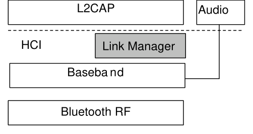

**Figure 3.1: Bluetooth BR/EDR protocol stack, basic layers**

The Test Suite Structure is structured as a tree with the first level defined as BB representing the protocol group “BB for Central and Peripheral.”
Baseband Test Suite Structure
Frequency hopping procedures TX/RX timing
Coding/Decoding
ARQ
Inquiry
Paging
Connection
Piconet
Erroneous Data Reporting
Sniff Subrating Connectionless Peripheral Broadcast Truncated Paging
Synchronization Train
MWS Coexistence Interface

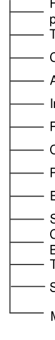

**Figure 3.2: Test Suite Structure for the Baseband part**

### 3.2 Test groups

The test groups are organized in 3 levels. The first level defines the protocol groups representing the protocol services. The second level separates the protocol services in functional modules. The last level in each branch contains the standard ISO subgroups BV.

#### 3.2.1 Protocol groups

The protocol groups identify the Bluetooth Baseband services: Frequency Hopping, TX/RX Timing, Coding/Decoding, Automatic Repeat Request, Inquiry, Paging, Connection, Erroneous Data Reporting, Sniff Subrating, Piconet, and Coarse Clock Adjustment defined in [5].

##### 3.2.1.1 Frequency Hopping/Signaling

With the functional module:
• Frequency Hopping

##### 3.2.1.2 TX/RX Timing

With the functional module:
• TX Timing
• RX Timing

##### 3.2.1.3 Coding/Decoding

With the functional modules:
• Packet Types
• FEC (R=1/3)
• FEC (R=2/3)

##### 3.2.1.4 Automatic Repeat Request

With the functional modules:
• ARQ Procedures - Central
• ARQ Procedures - Peripheral
• ARQ Procedures - Flush

##### 3.2.1.5 Inquiry

With the functional modules:
• Inquiry Procedures - Central
• Inquiry Procedures - Peripheral

##### 3.2.1.6 Paging

With the functional modules:
• Paging Procedures - Central
• Paging Procedures - Peripheral
With the functional modules:
• Connection - Central
• Connection - Peripheral

##### 3.2.1.8 Piconet

With the functional modules:
• Piconet - Central
• Piconet - Peripheral

##### 3.2.1.9 Erroneous Data Reporting

With the functional modules:
• Erroneous Data Reporting – SCO
• Erroneous Data Reporting – eSCO

##### 3.2.1.10 Sniff Subrating

The Sniff Subrating module verifies that the IUT correctly handles Sniff subrating both as Central and as Peripheral.

##### 3.2.1.11 Connectionless Peripheral Broadcast

With the functional modules:
• Connectionless Peripheral Broadcast – Transmitter
• Connectionless Peripheral Broadcast – Receiver

##### 3.2.1.12 Truncated Paging

With the functional modules:
• Truncated Paging – Central
• Truncated Paging – Peripheral

##### 3.2.1.13 Synchronization Train

With the functional modules:
• Synchronization Train – Transmitter
• Synchronization Train – Receiver

##### 3.2.1.14 Piconet Clock Adjust

With the functional modules:
• Coarse Clock Adjustment – Central
• Coarse Clock Adjustment – Peripheral

#### 3.2.2 Behavior testing groups

The main test groups are valid behavior group and the invalid behavior group.

##### 3.2.2.1 Valid Behavior (BV) tests

This subgroup provides testing to verify that the IUT reacts in conformity with the dynamic conformance requirements of the Bluetooth standard, after receipt or exchange of a valid Protocol Data Units (PDUs). Valid PDUs means that the exchange of messages and the content of the exchanged messages are considered as valid.

##### 3.2.2.2 Invalid Behavior (BI) tests

This subgroup provides testing to verify that the IUT reacts in conformity with the dynamic conformance requirements of the Bluetooth standard, after receipt of a syntactically or semantically invalid PDU.

### 3.3 HCI command and event version

If a command or event has more than one version and the test does not explicitly say otherwise:
- A reference to a command specifying the version number means that that version or any higher- numbered version supported by the IUT may be used.
- A reference to an event specifying the version number means that that version or at least one higher-numbered version supported by the IUT is unmasked (other versions, including lower- numbered versions, may also be unmasked).
- A reference to a command or event that does not specify the version number is equivalent to specifying [v1].

## 4 Test cases

### 4.1 Test case identification conventions

Test cases are assigned unique identifiers per the conventions in [8]. The convention used here is: <spec abbreviation>/<IUT role>/<class>/<feat>/<func>/<subfunc>/<cap>/<xx>-<nn>-<y>.

|  | Identifier Abbreviation |  |  | Spec Identifier <spec abbreviation> |  |
| --- | --- | --- | --- | --- | --- |
| BB |  |  | Baseband |  |  |
|  | Identifier Abbreviation |  |  | Class Identifier <class> |  |
| PHYS |  |  | Physical Test for formal testing |  |  |
| PROT |  |  | Protocol test for formal testing |  |  |
|  | Identifier Abbreviation |  |  | Feature Identifier <feat> |  |
| ARQ |  |  | Automatic Repeat Request |  |  |
| COD |  |  | Coding/Decoding |  |  |
| CON |  |  | Connection |  |  |
| CPB |  |  | Connectionless Peripheral Broadcast |  |  |
| ED |  |  | Erroneous Data Reporting |  |  |
| FRE |  |  | Frequency Hopping |  |  |
| INQ |  |  | Inquiry |  |  |
| PAG |  |  | Paging |  |  |
| PIC |  |  | Piconet |  |  |
| SSR |  |  | Sniff Subrating |  |  |
| ST |  |  | Synchronization Train |  |  |
| TP |  |  | Truncated Paging |  |  |
| TRX |  |  | TX/RX Timing |  |  |
| XCB |  |  | Coexistence Piconet Clock Adjustment |  |  |

Table 4.1: BB TC feature naming conventions

### 4.2 Conformance

When conformance is claimed for a particular specification, all capabilities are to be supported in the specified manner. The mandated tests from this Test Suite depend on the capabilities to which conformance is claimed.
The Bluetooth Qualification Program may employ tests to verify implementation robustness. The level of implementation robustness that is verified varies from one specification to another and may be revised for cause based on interoperability issues found in the market.
Such tests may verify:
• That claimed capabilities may be used in any order and any number of repetitions not excluded by the specification
• That capabilities enabled by the implementations are sustained over durations expected by the use case
• That the implementation gracefully handles any quantity of data expected by the use case
• That in cases where more than one valid interpretation of the specification exists, the implementation complies with at least one interpretation and gracefully handles other interpretations
• That the implementation is immune to attempted security exploits
A single execution of each of the required tests is required to constitute a Pass verdict. However, it is noted that to provide a foundation for interoperability, it is necessary that a qualified implementation consistently and repeatedly pass any of the applicable tests.
In any case, where a member finds an issue with the test plan generated by the Bluetooth SIG qualification tool, with the test case as described in the Test Suite, or with the test system utilized, the member is required to notify the responsible party via an erratum request such that the issue may be addressed.

### 4.3 Pass/Fail verdict conventions

Each test case has an Expected Outcome section. The IUT is granted the Pass verdict when all the detailed pass criteria conditions within the Expected Outcome section are met.
The convention in this Test Suite is that, unless there is a specific set of fail conditions outlined in the test case, the IUT fails the test case as soon as one of the pass criteria conditions cannot be met. If this occurs, then the outcome of the test is a Fail verdict.

### 4.4 General test conditions

For the purpose of the test procedures defined in this Bluetooth document it is assumed that propagation delay on the air interface and runtime of the Lower Tester and of the IUT can be neglected.
The test purposes defined in this Test Suite represent only the behavior that is important to create the final verdict. Additional behavior that provides BB and LM is not presented. For example, the Central polls the Peripheral in order to synchronize the Peripheral to the channel. Further LM has 30 s of time to response to LMP requests, between this 30 s a possible behavior is not stated in the test procedure of the test purposes.
For the definition of Nominal Test Conditions and Extreme Test Conditions, see Sections 5.1 and 5.2 of [5]. Unless otherwise specified, tests are performed under normal conditions.

#### 4.4.1 Lower layer assumptions

For conformance testing of the Baseband layer it is necessary to have working lower layers in conformance with the lower layer Test Suite.

#### 4.4.2 Upper layer assumptions

For conformance testing of the Baseband layer it is necessary to have a Test Control Interface as described in [5]. HCI commands can be sent and HCI events can be received via this TCI to stimulate the IUT respectively to get information from the IUT. This interface builds the UT.

#### 4.4.3 Implicit testing

For some subjects to be validated, conformance is not verified explicitly. This does not imply that correct functioning of these subjects is not essential, but that these are implicitly tested to a sufficient degree in other tests.
For example tests relating to Data Whitening are implicitly covered by other test cases.

#### 4.4.4 Advertisement of features for test cases

It is favorable to avoid LMP traffic that could create situations in which a test case is not designed to be executed or which may add complexity to the test system implementation. This can be achieved by proper selection of which features are advertised by the Lower Tester. In some test cases this is exactly specified in the Test Suite but in most cases it is not. As a general rule, for each test case the Lower Tester should not advertise more features than necessary to facilitate execution of the test purpose. Specifically, with the introduction of Enhanced Data Rate, this feature is only advertised by the Lower Tester in those test cases where it is necessary for the test purpose.

#### 4.4.5 Default Slot Availability configuration

The following MSC is used by test equipment in achieving initial conditions or test procedures in certain tests. Vendor-specific techniques can also be used to mark slots unavailable.

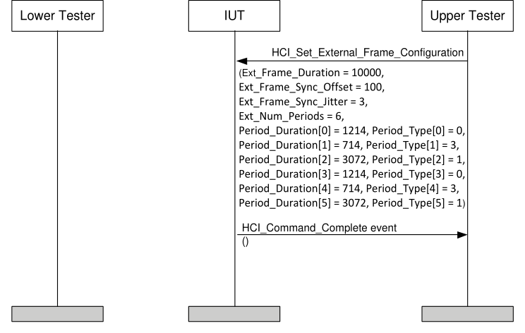

**Figure 4.1: Default External Frame configuration**

### 4.5 Common Packet Contents

#### 4.5.1 Fields and Bits Reserved for Future Use

Unless a specific test states otherwise, all fields within packets and all bits within fields that are described as reserved for future use are set to 0 in packets sent by the Upper and Lower Testers.

### 4.6 Frequency Hopping

Verify the frequency hopping procedure.
BB/PHYS/FRE/BV-01-C [79 Channel Hop Seq]
• Test Purpose
Verify that the hopping sequences in connection state are correct for the 79 channel hopping scheme.
• Reference
[1] 2.2.2
• Initial Condition
- The Lower Tester pages the IUT to become the Central.
- The Lower Tester and the IUT are in normal connection state. The Bluetooth clock of the Lower Tester is chosen to include clock wrap-around (227-1 to 0) during the Test Procedure.
• Test Procedure
a) The Lower Tester transmits POLL packets in all Central-to-Peripheral slots. To verify the
sequence for every 32-hop-segment, 2600 packets are checked. b) The Lower Tester records the clock values for which a response from the IUT is received. It is not
necessary to check the content of the ACK packets sent by the IUT. Every signal sent back in the correct slot is taken as a criterion that the correct hop frequency was used. c) The Bluetooth clock of the Lower Tester is reinitialized to the value used in the Initial Condition.
The IUT is paged again and test steps a)–b) are repeated. d) Step c) is repeated so that the same clock values are tested three times in total. e) The Bluetooth clock of the Lower Tester is initialized to a value randomly chosen such that the
new clock value range used does not overlap with the previous range in the Initial Condition. f) A new page procedure is performed and steps a)–d) are repeated.
• Expected Outcome
Pass verdict
For each of the 5200 clock values the Lower Tester has recorded at least one response.
• Notes
A standardized cable interface can be used for the Baseband connection.
If the IUT responds with an LMP command the Lower Tester uses its own LMP response as a trigger packet.
In steps c) and d) of the Test Procedure, the test is repeated with the same Bluetooth clock to detect any systematical errors.
BB/PHYS/FRE/BV-02-C [AFH Hop Seq]
• Test Purpose
Verify that the Peripheral correctly implements the AFH hopping sequence for the following cases: 79 channel AFH, even channels bad, odd channels bad, and three “random” cases where one tests the minimum number of channels (20). The IUT is Peripheral and the Lower Tester is Central.
• Reference
[1] 2.3
• Initial Condition
- The Lower Tester pages the IUT to become the Central.
- The Lower Tester and the IUT are in normal connection state.
- Adaptive frequency hopping is enabled by the Lower Tester using all channels: AHS(79).
- The Bluetooth clock of the Central is chosen to include clock wrap-around (227 – 1 to 0) during the Test Procedure.
• Test Procedure
a) The Lower Tester transmits POLL packets in all Central-to-Peripheral slots. To verify the
sequence for every 32-hop-segment, 2600 packets are checked. b) The Lower Tester records the clock values for which a response from the IUT is received. It is not
necessary to check the content of the ACK packets sent by the IUT. Every signal sent back in the correct slot is taken as a criterion that the correct hop frequency was used. c) The Bluetooth clock of the Lower Tester is reinitialized to the value used in the Initial Condition.
The IUT is paged again and test steps a) and b) are repeated again. d) Step c) is repeated so that the same clock values are used three times in total. e) The Bluetooth clock of the Lower Tester is initialized to a value randomly chosen such that the
new clock range used does not overlap with the previous range in the Initial Condition. f) A new page procedure is performed and steps a)–d) are repeated. g) The Bluetooth clock of the Central is re-initialized to include clock wrap-around (227 – 1 to 0)
during the Test Procedure. h) The Lower Tester changes the set of used channels to all odd channels and repeats steps a)–f). i) The Bluetooth clock of the Central is re-initialized to include clock wrap-around (227 – 1 to 0) during the Test Procedure. j) The Lower Tester changes the set of used channels to all even channels and repeats steps a)–f). k) The Bluetooth clock of the Central is re-initialized to include clock wrap-around (227 – 1 to 0)
during the Test Procedure. l) The Lower Tester changes the set of used channels to a random set of channels with at least 20 used and repeats steps a)–f). m) The Bluetooth clock of the Central is re-initialized to include clock wrap-around (227 – 1 to 0)
during the Test Procedure. n) The Lower Tester changes the set of used channels to a second random set of channels with at
least 20 used and repeats steps a)–f). o) The Bluetooth clock of the Central is re-initialized to include clock wrap-around (227 – 1 to 0)
during the Test Procedure. p) The Lower Tester changes the set of used channels to a third random set of channels with at
least 20 used and repeats steps a)–f).
• Expected Outcome
Pass verdict
For each hop set, the Lower Tester has recorded at least one response on each of the 5200 clock values.
• Notes
A standardized cable interface can be used for the Baseband connection.
If the IUT responds with an LMP command the Lower Tester uses its own LMP response as a trigger packet.
In steps c) and d) of the Test Procedure, the test is repeated with the same Bluetooth clock to detect systematic errors.
• Test Purpose
Verify that the IUT correctly disables AFH after a successful role switch. The IUT is Central and the Lower Tester is Peripheral.
• Reference
[1] 8.6.5
• Initial Condition
a) The IUT pages the Lower Tester to become the Central. b) The Lower Tester and the IUT are in normal connection state. c) Adaptive frequency hopping is enabled by the IUT using any channel map.
• Test Procedure
Central Peripheral

| Lower Tester |  |  |  |
| --- | --- | --- | --- |
|  |  |  |  |
|  | ACL connection establi | shed, AFH enabled. |  |
| HCI Switch Role _ _ (BDADDR, Role=Peripheral) HCI Command Status event (Status=0x00, Num HCI Comm, _ _ LMP switch req Opcode=0x000B) _ _ (switch instant) _ LMP slot offset _ _ (slot offset, BDADDR) _ LMP accepted _ (Opcode LMP switch req) _ _ NULL, POLL or ACL FHS Page response (ID) Poll (BB) Any type of BB packet HCI Role Change event (Status=0x00, BDADDR, New Role=Peripheral) _ HCI Read AFH Channel Map _ _ _ _ HCI Command Complete event (Status, Connection Handle, _ AFH Mode, AFH channel map) _ _ _ | LMP switch req _ _ | HCI Switch Role _ _ |  |
|  |  | (BDADDR, Role=Peripheral) HCI Command Status event (Status=0x00, Num HCI Comm, _ _ Opcode=0x000B) HCI Role Change event (Status=0x00, BDADDR, New Role=Peripheral) _ HCI Read AFH Channel Map |  |
|  | (switch instant) _ LMP slot offset _ _ |  |  |
|  | (slot offset, BDADDR) _ LMP accepted _ |  |  |
|  | (Opcode LMP switch req) _ _ NULL, POLL or ACL FHS Page response (ID) |  |  |
|  | Poll (BB) Any type of BB packet |  |  |

a) The Upper Tester initiates a role switch. b) Upon successful completion of the role switch the Upper Tester reads the channel map of the IUT
using HCI. c) The Lower Tester sends 10 POLL packets and checks that the IUT replies each packet correctly.
In this way is tested that AFH mode is disabled.
• Expected Outcome
Pass verdict
The AFH Mode parameter in the HCI Command Complete Event is set to 0x00 (AFH disabled).
• Notes
A standardized cable interface can be used for the Baseband connection.

### 4.7 TX/RX Timing

Verify the TX and RX timing.

#### 4.7.1 TX Timing

Verify the TX timing.
BB/PHYS/TRX/BV-01-C [Central TX Timing]
• Test Purpose
Verify that the IUT as Central keeps an exact timing interval of M x 1250 µs during the existence of a piconet.
• Reference
[1] 2.2.5
• Initial Condition
a) The IUT pages the Lower Tester to become the Central of the piconet. b) The IUT and the Lower Tester are in connection state. c) The Lower Tester uses LMP_quality_of_service_req to negotiate the maximum poll interval
accepted by the Central.
• Test Procedure
a) The Lower Tester identifies the Position of Bit p0 in the Access Code of a Poll packet sent by the
Central and sets a timestamp. As clock reference the Lower Tester reference is used instead of the Bluetooth clock. b) Timing drift is measured by setting a timestamp upon reception of a Poll packet, counting 5000
Central slots and setting a second timestamp upon reception of the next Poll packet sent by the Central. c) Steps a) and b) are repeated 4 times. The overall drift is calculated as the average of the 5
measurement values.
• Expected Outcome
Pass verdict
The measured timing drift tdrift of the IUT over 5000 slots is ≤ 125 µs.
• Notes
In step c) of the Initial Condition, the maximum accepted POLL interval is negotiated to allow the IUT to use a low power mode.

#### 4.7.2 RX Timing

Verify the RX timing.
Verify the timing and correctness of the guard time, synchronization sequence, and trailer symbols that are transmitted in Enhanced Data Rate packets.
BB/PHYS/TRX/BV-03-C [Central RX/TX Timing]
• Test Purpose
Verify that the Central’s RX timing is based on its TX timing with a shift of 625 µs. Verify that the Central uses a ±10 µs uncertainty window in the RX slot to allow for Peripheral misalignments.
• Reference
[1] 2.2.5
• Initial Condition
a) The IUT pages the Lower Tester to become the Central of the piconet. b) The IUT and the Lower Tester are in connection state. c) The Lower Tester uses LMP_quality_of_service_req to negotiate the minimum poll interval
accepted by the Central.
• Test Procedure
a) The Lower Tester transmits a DM1 packet with a payload header indicating zero length L2CAP
continuation fragment in every Peripheral TX slot following a Central to Peripheral transmission. b) The Lower Tester's TX timing is varied from the nominal 625 µs Peripheral RX/TX timing.
Variation values are 0 and ±9.5 µs with equal probability. c) The start of the IUT’s TX burst is identified in the tester by setting a timestamp at bit position p0.
The Lower Tester uses the burst received from the IUT as reference to calculate the variation for the next test TX burst. d) The number of ACKs returned by the IUT for at least 1000 transmitted test burst is counted.
• Expected Outcome
Pass verdict
The measured ratio of returned ACKs to transmitted test packets is ≤ 0.95.
• Notes
The test requirement of 95% returned ACKs is to take into account the imperfect radio path but not to allow any errors due to the size of the IUT’s RX detection window width. It also requires the Lower Tester’s TX jitter to be less than ±0.5 µs.
• Test Purpose
Verify that the Peripheral’s transmission starts N x 625 µs after receiving a burst.
Verify the Peripheral’s RX detection window width and turn around timing jitter.
• Reference
[1] 2.2.5
• Initial Condition
a) The Lower Tester pages the IUT to become the Central of the piconet. b) The IUT and the Lower Tester are in connection state.
• Test Procedure
a) The Lower Tester transmits DM1 packets with a payload header indicating zero length L2CAP
continuation fragments in all Central TX slots. b) The IUT’s estimate of the Lower Tester’s timing is varied by adding a variation to the nominal
1250 µs test TX timing. Variation values are 0 ±4 and ±8 µs in the following repeating sequence (referenced to the nominal Central transmit timing): 0, 0, +4, 0, +8, 0, +4, 0, 0, 0, 0, –4, 0, -8, 0, – 4, 0, 0. c) The start of the Peripheral's TX burst is identified in the tester by setting a timestamp at bit
position p0. d) The Peripheral's RX / TX timing is calculated by comparing the start of the Peripheral's TX burst
to the start of the test TX burst. e) The number of bursts returned by the Peripheral for at least 1000 transmitted Central bursts is
counted.
• Expected Outcome
Pass verdict
The measured ratio of returned IUT TX bursts to transmitted test bursts is ≥ 0.95.
The measured time between the test TX bursts and the IUT’s TX bursts is 625 ±3 µs for all bursts received by the Lower Tester.
• Notes
The test requirement of 95% returned burst is to take into account the imperfect radio path but not to allow any errors due to the size of the IUT’s RX detection window width. The ±3 µs allowance is to cope with jitter and measurement uncertainties in both test equipment and the IUT.

### 4.8 Coding/Decoding

Verify that correct coding and decoding is used.

#### 4.8.1 Packet Types

Verify that the different packet types are correctly coded and decoded.
Because it can be assumed that coding and decoding is independent of the role of the IUT this test subgroup are only specified for the IUT configured as Peripheral in Test Mode (Loopback). Besides, tests relating to coding and decoding of packets in case of the IUT configured as Central is implicitly covered by other test cases.
• Test Purpose
Verify that the IUT, upon reception of a HV1 packet, decodes and encodes the packet correctly.
• Reference
[1] 6.5.2.1
• Initial Condition
- Lower Tester: Configured as Central in state CONNECTION.
- IUT: Configured as Peripheral in state CONNECTION with Test Mode (Loopback, Synchronous packets) active.
• Test Procedure
Peripheral Central

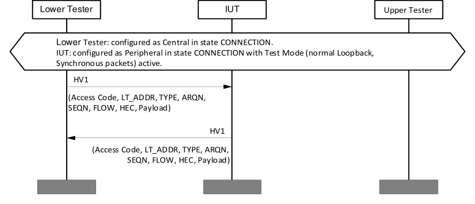

**Figure 4.3: BB/PROT/COD/BV-01-C [HV1 Packet Type]**

The Lower Tester transmits a HV1 packet.
HV1
Access code:
Preamble: 1010 or 0101 sequence, depending on whether the LSB of the following sync word is 1 or 0, respectively.
Sync word: derived from the 24 bit address (LAP) of the Central (CAC).
Trailer: 1010 or 0101 sequence, depending on whether the MSB of the sync word is 1 or 0, respectively.
Packet header:
LT_ADDR: Logical Transport Address of the Peripheral.
TYPE: '0101'B.
FLOW: Any value.
ARQN: Any value.
SEQN: Any value.
Payload: 10 Bytes PRBS.
The Lower Tester verifies that the IUT transmits the packet correctly coded back to the Lower Tester.
• Expected Outcome
Pass verdict
The IUT transmits the packet correctly coded back to the Lower Tester.
• Notes
The payload is protected by FEC 1/3 but is not CRC coded.
BB/PROT/COD/BV-02-C [HV2 Packet Type]
• Test Purpose
Verify that the IUT, upon reception of a HV2 packet, decodes and encodes the packet correctly.
• Reference
[1] 6.5.2.2
• Initial Condition
- Lower Tester: Configured as Central in state CONNECTION.
- IUT: Configured as Peripheral in state CONNECTION with Test Mode (Loopback, Synchronous packets) active.
• Test Procedure
Peripheral Central

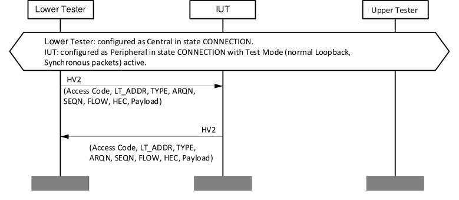

**Figure 4.4: BB/PROT/COD/BV-02-C [HV2 Packet Type]**

The Lower Tester transmits a HV2 packet.
HV2
Access code:
Preamble: 1010 or 0101 sequence, depending on whether the LSB of the following sync word is 1 or 0, respectively.
Trailer: 1010 or 0101 sequence, depending on whether the MSB of the sync word is 1 or 0, respectively.
Packet header:
LT_ADDR: Logical Transport Address of the Peripheral.
TYPE: '0110'B.
FLOW: Any value.
ARQN: Any value.
SEQN: Any value.
HEC: Generated by the polynomial '647'O in respect to the UAP of the Central.
Payload: 20 Bytes PRBS.
The Lower Tester verifies that the IUT transmits the packet correctly coded back to the Lower Tester.
• Expected Outcome
Pass verdict
The IUT transmits the packet correctly coded back to the Lower Tester.
• Notes
The payload is protected by FEC 2/3 but is not CRC coded.
BB/PROT/COD/BV-03-C [HV3 Packet Type]
• Test Purpose
Verify that the IUT, upon reception of a HV3 packet, decodes and encodes the packet correctly.
• Reference
[1] 6.5.2.3
• Initial Condition
- Lower Tester: Configured as Central in state CONNECTION.
- IUT: Configured as Peripheral in state CONNECTION with Test Mode (Loopback, Synchronous packets) active.
• Test Procedure
Peripheral Central

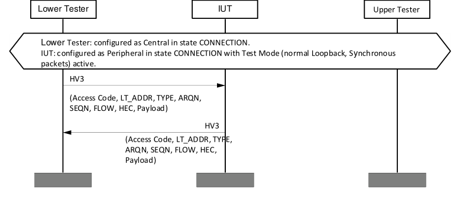

**Figure 4.5: BB/PROT/COD/BV-03-C [HV3 Packet Type]**

The Lower Tester transmits a HV3 packet.
HV3
Access code:
Preamble: 1010 or 0101 sequence, depending on whether the LSB of the following sync word is 1 or 0, respectively.
Sync word: derived from the 24 bit address (LAP) of the Central (CAC).
Trailer: 1010 or 0101 sequence, depending on whether the MSB of the sync word is 1 or 0, respectively.
Packet header:
LT_ADDR: Logical Transport Address of the Peripheral
TYPE: '0111'B.
FLOW: Any value.
ARQN: Any value.
SEQN: Any value.
HEC: Generated by the polynomial '647'O in respect to the UAP of the Central.
Payload: 30 Bytes PRBS.
The Lower Tester verifies that the IUT transmits the packet correctly coded back to the Lower Tester.
• Expected Outcome
Pass verdict
The IUT transmits the packet correctly coded back to the Lower Tester.
• Notes
The payload is not protected by FEC and is not CRC coded.
• Test Purpose
Verify that the IUT, upon reception of a DV packet, decodes and encodes the packet correctly.
• Reference
[1] 6.5.2.4
• Initial Condition
- Lower Tester: Configured as Central in state CONNECTION.
- IUT: Configured as Peripheral in state CONNECTION with Test Mode (Loopback, Synchronous packets) active.
• Test Procedure
Central Peripheral

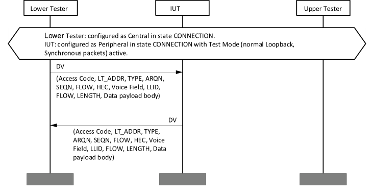

**Figure 4.6: BB/PROT/COD/BV-04-C [DV Packet Type]**

The Lower Tester transmits a DV packet.
DV
Access code:
Preamble: 1010 or 0101 sequence, depending on whether the LSB of the following sync word is 1 or 0, respectively.
Sync word: derived from the 24 bit address (LAP) of the Central (CAC).
Trailer: 1010 or 0101 sequence, depending on whether the MSB of the sync word is 1 or 0, respectively.
Packet header:
LT_ADDR: Logical Transport Address of the Peripheral
TYPE: '1000'B.
FLOW: '1'B.
ARQN: '1'B.
SEQN: Depends on the former transmission of the Lower Tester.
Voice Field: 10 Bytes PRBS.
Data payload header:
LLID: '10'B.
FLOW: '1'B.
LENGTH: '01001'B = '9'D.
Data payload body: 9 Bytes PRBS plus 16 bit CRC.
The Lower Tester verifies that the IUT transmits the packet correctly coded back to the Lower Tester.
• Expected Outcome
Pass verdict
The IUT transmits the packet correctly coded back to the Lower Tester.
• Notes
The voice payload is not protected by FEC. The data payload is protected with FEC 2/3 and is CRC coded.
BB/PROT/COD/BV-05-C [DH1 Packet Type]
• Test Purpose
Verify that the IUT, upon reception of a DH1 packet, decodes and encodes the packet correctly.
• Reference
[1] 6.5.4.2
• Initial Condition
- Lower Tester: Configured as Central in state CONNECTION.
- IUT: Configured as Peripheral in state CONNECTION with Test Mode (Loopback, ACL packets) active.
• Test Procedure
Central Peripheral

|  | Lower Tester |  | IUT |  |  | Upper Tester |  |  |
| --- | --- | --- | --- | --- | --- | --- | --- | --- |
|  |  |  |  |  |  |  |  |  |
|  | Low IUT: | er Tester: configured as Central in state CONN configured as Peripheral in state CONNECTIO |  | ECTION. N with Te | st Mode (normal Loopback, AC | L packets | ) active. |  |
|  |  |  |  |  |  |  |  |  |
|  | DH1 (Access Code, LT ADDR, TYPE, ARQN, _ SEQN, FLOW, HEC, LLID, LENGTH, Payload body) DH1 (Access Code, LT ADDR, TYPE, _ ARQN, SEQN, FLOW, HEC, LLID, LENGTH, Payload body) | DH1 |  |  |  |  |  |  |
|  |  | (Access Code, LT ADDR, TYPE, ARQN, _ SEQN, FLOW, HEC, LLID, LENGTH, Payload body) DH1 |  |  |  |  |  |  |
|  |  |  |  |  |  |  |  |  |

DH1
Access code:
Preamble: 1010 or 0101 sequence, depending on whether the LSB of the following sync word is 1 or 0, respectively.
Sync word: derived from the 24 bit address (LAP) of the Central (CAC).
Trailer: 1010 or 0101 sequence, depending on whether the MSB of the sync word is 1 or 0, respectively.
Packet header:
LT_ADDR: Logical Transport Address of the Peripheral
TYPE: '0100'B.
FLOW: '1'B.
ARQN: '1'B.
SEQN: depends on the former transmission of the Lower Tester.
HEC: Generated by the polynomial '647'O in respect to the UAP of the Central.
Payload Header:
LLID: '10'B.
FLOW: '1'B.
LENGTH: '11011'B = '27'D.
Payload body: 27 Bytes PRBS plus 16 bit CRC.
The Lower Tester verifies that the IUT transmits the packet correctly coded back to the Lower Tester.
• Expected Outcome
Pass verdict
The IUT transmits the packet correctly coded back to the Lower Tester.
• Notes
The payload is not protected by FEC but is CRC coded.
BB/PROT/COD/BV-06-C [DM3 Packet Type]
• Test Purpose
Verify that the IUT, upon reception of a DM3 packet, decodes and encodes the packet correctly.
• Reference
[1] 6.5.4.3
• Initial Condition
- Lower Tester: Configured as Central in state CONNECTION.
- IUT: Configured as Peripheral in state CONNECTION with Test Mode (Loopback, ACL packets) active.
• Test Procedure
Central Peripheral

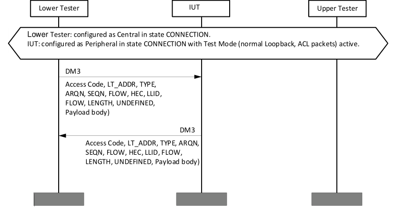

**Figure 4.8: BB/PROT/COD/BV-06-C [DM3 Packet Type]**

The Lower Tester transmits a DM3 packet.
DM3
Access code:
Preamble: 1010 or 0101 sequence, depending on whether the LSB of the following sync word is 1 or 0, respectively.
Sync word: Derived from the 24 bit address (LAP) of the Central (CAC).
Trailer: 1010 or 0101 sequence, depending on whether the MSB of the sync word is 1 or 0, respectively.
Packet header:
LT_ADDR: Logical Transport Address of the IUT.
TYPE: '1010'B.
FLOW: '1'B.
ARQN: '1'B.
SEQN: Depends on the former transmission of the Lower Tester.
HEC: Generated by the polynomial '647'O in respect to the UAP of the Central.
Payload Header:
LLID: '10'B.
FLOW: '1'B.
LENGTH: '001111001'B = '121'D.
UNDEFINED: '0000'B.
Payload body: 121 Bytes PRBS plus 16 bit CRC.
The Lower Tester verifies that the IUT transmits the packet correctly coded back to the Lower Tester.
• Expected Outcome
Pass verdict
The IUT transmits the packet correctly coded back to the Lower Tester.
• Notes
The payload is protected by FEC 2/3 and is CRC coded.
This packet covers three time slots.
BB/PROT/COD/BV-07-C [DH3 Packet Type]
• Test Purpose
Verify that the IUT, upon reception of a DH3 packet, decodes and encodes the packet correctly.
• Reference
[1] 6.5.4.4
• Initial Condition
- Lower Tester: Configured as Central in state CONNECTION.
- IUT: Configured as Peripheral in state CONNECTION with Test Mode (Loopback, ACL packets) active.
• Test Procedure
Central Peripheral

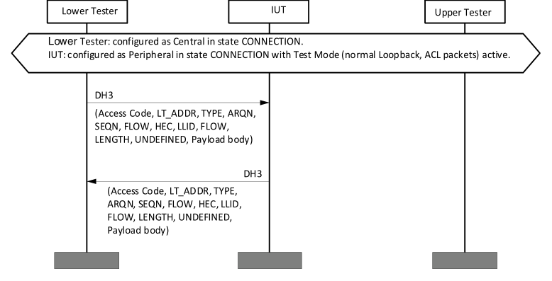

**Figure 4.9: BB/PROT/COD/BV-07-C [DH3 Packet Type]**

The Lower Tester transmits a DH3 packet.
DH3
Access code:
Preamble: 1010 or 0101 sequence, depending on whether the LSB of the following sync word is 1 or 0, respectively.
Trailer: 1010 or 0101 sequence, depending on whether the MSB of the sync word is 1 or 0, respectively.
Packet header:
LT_ADDR: Logical Transport Address of the Peripheral.
TYPE: '1011'B.
FLOW: '1'B.
ARQN: '1'B.
SEQN: Depends on the former transmission of the Lower Tester.
HEC: Generated by the polynomial '647'O in respect to the UAP of the Central.
Payload Header:
LLID: '10'B.
FLOW: '1'B.
LENGTH: '010110111'B = '183'D.
UNDEFINED: '0000'B = any value.
Payload body: 183 Bytes PRBS plus 16 bit CRC.
The Lower Tester verifies that the IUT transmits the packet correctly coded back to the Lower Tester.
• Expected Outcome
Pass verdict
The IUT transmits the packet correctly coded back to the Lower Tester.
• Notes
The payload is not protected by FEC but is CRC coded.
This packet covers three timeslots.
BB/PROT/COD/BV-08-C [DM5 Packet Type]
• Test Purpose
Verify that the IUT, upon reception of a DM5 packet, decodes and encodes the packet correctly.
• Reference
[1] 6.5.4.5
• Initial Condition
- Lower Tester: Configured as Central in state CONNECTION.
- IUT: Configured as Peripheral in state CONNECTION with Test Mode (Loopback, ACL packets) active.
• Test Procedure
Central Peripheral

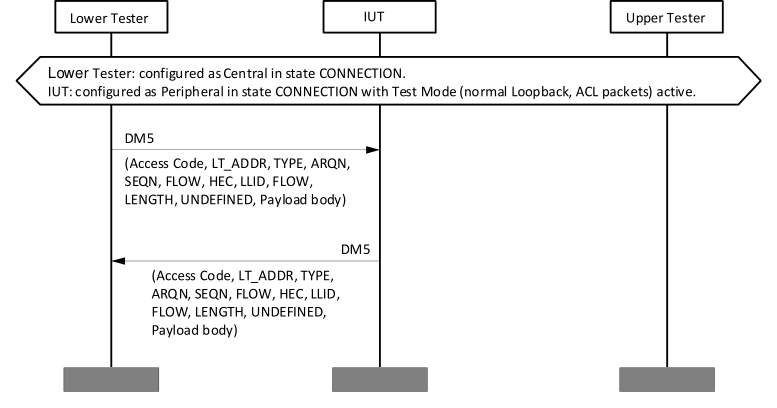

**Figure 4.10: BB/PROT/COD/BV-08-C [DM5 Packet Type]**

The Lower Tester transmits a DM5 packet.
DM5
Access code:
Preamble: 1010 or 0101 sequence, depending on whether the LSB of the following sync word is 1 or 0, respectively.
Sync word: Derived from the 24 bit address (LAP) of the Central (CAC).
Trailer: 1010 or 0101 sequence, depending on whether the MSB of the sync word is 1 or 0, respectively.
Packet header:
LT_ADDR: Logical Transport Address of the Peripheral.
TYPE: '1110'B.
FLOW: '1'B.
ARQN: '1'B.
SEQN: Depends on the former transmission of the Lower Tester.
HEC: Generated by the polynomial '647'O in respect to the UAP of the Central.
Payload header:
LLID: '10'B.
FLOW: '1'B.
LENGTH: '011100000'B = '224'D.
UNDEFINED: '0000'B.
Payload body:  224 Bytes PRBS plus 16 bit CRC.
The Lower Tester verifies that the IUT transmits the packet correctly coded back to the Lower Tester.
• Expected Outcome
Pass verdict
The IUT transmits the packet correctly coded back to the Lower Tester.
• Notes
The payload is protected by FEC 2/3 and is CRC coded.
The packet used in this Test Case covers five timeslots.
BB/PROT/COD/BV-09-C [DH5 Packet Type]
• Test Purpose
Verify that the IUT, upon reception of a DH5 packet, decodes and encodes the packet correctly.
• Reference
[1] 6.5.4.6
• Initial Condition
- Lower Tester: Configured as Central in state CONNECTION.
- IUT: Configured as Peripheral in state CONNECTION with Test Mode (Loopback, ACL packets) active.
• Test Procedure
Central Peripheral

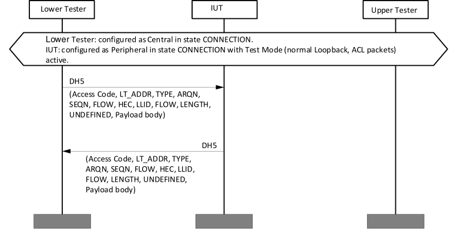

**Figure 4.11: BB/PROT/COD/BV-09-C [DH5 Packet Type]**

The Lower Tester transmits a DH5 packet.
Access code:
Preamble: 1010 or 0101 sequence, depending on whether the LSB of the following sync word is 1 or 0, respectively.
Sync word: Derived from the 24 bit address (LAP) of the Central (CAC).
Trailer: 1010 or 0101 sequence, depending on whether the MSB of the sync word is 1 or 0, respectively.
Packet header:
LT_ADDR: Logical Transport Address of the Peripheral.
TYPE: '1111'B.
FLOW: '1'B.
ARQN: '1'B.
SEQN: Depends on the former transmission of the Lower Tester.
HEC: Generated by the polynomial '647'O in respect to the UAP of the Central.
Payload header:
LLID: '10'B.
FLOW: '1'B.
LENGTH: '101010011'B = '339'D.
UNDEFINED: '0000'B.
Payload body: 339 Bytes PRBS plus 16 bit CRC.
The Lower Tester verifies that the IUT transmits the packet correctly coded back to the Lower Tester.
• Expected Outcome
Pass verdict
The IUT transmits the packet correctly coded back to the Lower Tester.
• Notes
The payload is not protected by FEC but is CRC coded.
This packet in this Test Case covers five timeslots.
BB/PROT/COD/BV-10-C [AUX1 Packet Type]
• Test Purpose
Verify that the IUT, upon reception of an AUX1 packet, decodes and encodes the packet correctly.
• Reference
[1] 6.5.4.7
• Initial Condition
- Lower Tester: Configured as Central in state CONNECTION.
- IUT: Configured as Peripheral in state CONNECTION with Test Mode (Loopback, ACL packets) active.
• Test Procedure
Central Peripheral

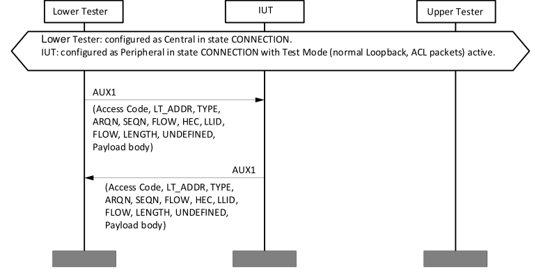

**Figure 4.12: BB/PROT/COD/BV-10-C [AUX1 Packet Type]**

The Lower Tester transmits an AUX1 packet.
AUX1
Access code:
Preamble: 1010 or 0101 sequence, depending on whether the LSB of the following sync word is 1 or 0, respectively.
Sync word: Derived from the 24 bit address (LAP) of the Central (CAC).
Trailer: 1010 or 0101 sequence, depending on whether the MSB of the sync word is 1 or 0, respectively.
Packet header:
LT_ADDR: Logical Transport Address of the Peripheral.
TYPE: '1001'B.
FLOW: '1'B.
ARQN: '1'B.
SEQN: Depends on the former transmission of the Lower Tester.
HEC: Generated by the polynomial '647'O in respect to the UAP of the Central.
Payload header:
LLID: '00'B.
FLOW: '1'B.
Payload body: 29 Bytes PRBS.
The Lower Tester verifies that the IUT transmits the packet correctly coded back to the Lower Tester.
• Expected Outcome
Pass verdict
The IUT transmits the packet correctly coded back to the Lower Tester.
BB/PROT/COD/BV-11-C [Erroneous Peripheral Address]
• Test Purpose
Verify that the IUT configured as Peripheral upon reception of a packet containing a logical transport address not belonging to the Peripheral does not transmit any packet.
• Reference
[1] 4.2
• Initial Condition
- Lower Tester: Configured as Central in state CONNECTION (active mode ACL link).
- IUT: Configured as Peripheral in state CONNECTION (active mode, ACL link).
• Test Procedure
Central Peripheral

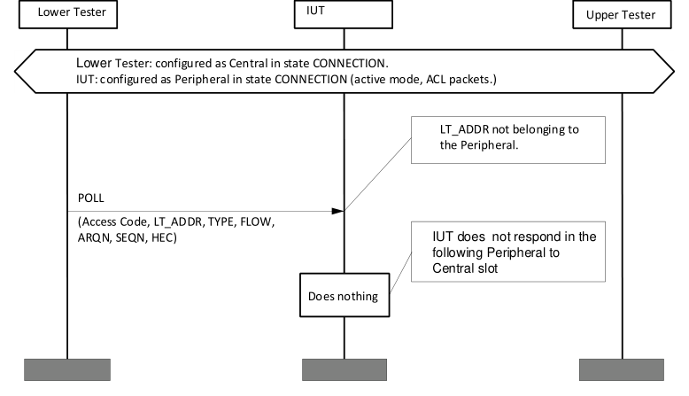

**Figure 4.13: BB/PROT/COD/BV-11-C [Erroneous Peripheral Address]**

The Lower Tester transmits a POLL packet with a logical transport address not belonging to the Peripheral.
POLL
Access code:
Preamble: 1010 or 0101 sequence, depending on whether the LSB of the following sync word is 1 or 0, respectively.
Sync word: Derived from the 24 bit address (LAP) of the Central (CAC).
Trailer: 1010 or 0101 sequence, depending on whether the MSB of the sync word is 1 or 0, respectively.
Packet header:
LT_ADDR: Logical Transport Address not belonging to the Peripheral.
TYPE: '0001'B.
FLOW: '1'B.
ARQN: '1'B.
SEQN: Depends on the former transmission of the Lower Tester.
HEC: Generated by the polynomial '647'O in respect to the UAP of the Central.
The Lower Tester verifies that the IUT does not transmit any packet back to the Lower Tester.
The procedure is repeated to test all LT_ADDR not belonging to the IUT (six addresses). For each address one POLL packet is transmitted to make sure that the IUT does not respond to the POLL packet.
• Expected Outcome
Pass verdict
The IUT does not transmit any packet in the Peripheral to Central slot.
BB/PROT/COD/BV-17-C [EV3 Packet Type]
• Test Purpose
Verify that the IUT, upon reception of an EV3 packet, decodes and encodes the packet correctly.
• Reference
[1] 6.5.3.1
• Initial Condition
- Lower Tester: Configured as Central in state CONNECTION.
- IUT: Configured as Peripheral in state CONNECTION with Test Mode (Loopback, Synchronous packets) active.
• Test Procedure
The Lower Tester transmits an EV3 packet.
EV3
Access code:
Preamble: 1010 or 0101 sequence, depending on whether the LSB of the following sync word is 1 or 0, respectively.
Sync word: Derived from the 24 bit address (LAP) of the Central (CAC).
Trailer: 1010 or 0101 sequence, depending on whether the MSB of the sync word is 1 or 0, respectively.
Packet header:
LT_ADDR: Logical Transport Address of the Peripheral.
TYPE: ‘0111’B.
FLOW: ‘1’B.
ARQN: ‘1’B.
SEQN: Depends on the former transmission of the Lower Tester.
HEC: Generated by the polynomial ‘647’O in respect to the UAP of the Central.
Payload header:
N/A
Payload:

## 30 bytes PRBS plus 16 bit CRC.

The Lower Tester verifies that the IUT transmits the packet correctly coded back to the Lower Tester.
• Expected Outcome
Pass verdict
The IUT transmits the packet correctly coded back to the Lower Tester.
• Notes
The payload is not protected by FEC but is CRC coded.
There is no payload header.
BB/PROT/COD/BV-18-C [EV4 Packet Type]
• Test Purpose
Verify that the IUT, upon reception of an EV4 packet, decodes and encodes the packet correctly.
• Reference
[1] 6.5.3.2
• Initial Condition
- Lower Tester: Configured as Central in state CONNECTION.
- IUT: Configured as Peripheral in state CONNECTION with Test Mode (Loopback, Synchronous packets) active.
• Test Procedure
The Lower Tester transmits an EV4 packet.
EV4
Access code:
Preamble: 1010 or 0101 sequence, depending on whether the LSB of the following sync word is 1 or 0, respectively.
Sync word: Derived from the 24 bit address (LAP) of the Central (CAC).
Trailer: 1010 or 0101 sequence, depending on whether the MSB of the sync word is 1 or 0, respectively.
Packet header:
LT_ADDR: Logical Transport Address of the Peripheral.
TYPE: ‘1100’B.
FLOW: ‘1’B.
ARQN: ‘1’B.
SEQN: Depends on the former transmission of the Lower Tester.
HEC: Generated by the polynomial ‘647’O in respect to the UAP of the Central.
Payload header:
N/A
Payload:

## 80 bytes PRBS plus 16 bit CRC.

The Lower Tester verifies that the IUT transmits the packet correctly coded back to the Lower Tester.
• Expected Outcome
Pass verdict
The IUT transmits the packet correctly coded back to the Lower Tester.
• Notes
The payload is protected by FEC 2/3 and is CRC coded.
There is no payload header.
The packet covers three time slots.
BB/PROT/COD/BV-19-C [EV5 Packet Type]
• Test Purpose
Verify that the IUT, upon reception of an EV5 packet, decodes and encodes the packet correctly.
• Reference
[1] 6.5.3.3
• Initial Condition
- Lower Tester: Configured as Central in state CONNECTION.
- IUT: Configured as Peripheral in state CONNECTION with Test Mode (Loopback, Synchronous packets) active.
• Test Procedure
The Lower Tester transmits an EV5 packet.
EV5
Access code:
Preamble: 1010 or 0101 sequence, depending on whether the LSB of the following sync word is 1 or 0, respectively.
Sync word: Derived from the 24 bit address (LAP) of the Central (CAC).
Trailer: 1010 or 0101 sequence, depending on whether the MSB of the sync word is 1 or 0, respectively.
Packet header:
LT_ADDR: Logical Transport Address of the Peripheral.
TYPE: ‘1101’B.
FLOW: ‘1’B.
ARQN: ‘1’B.
SEQN: depends on the former transmission of the Lower Tester.
HEC: Generated by the polynomial ‘647’O in respect to the UAP of the Central.
Payload header:
N/A
Payload:

## 80 bytes PRBS plus 16 bit CRC.

The Lower Tester verifies that the IUT transmits the packet correctly coded back to the Lower Tester.
• Expected Outcome
Pass verdict
The IUT transmits the packet correctly coded back to the Lower Tester.
• Notes
The payload is not protected by FEC 2/3 but is CRC coded.
There is no payload header.
The packet covers three time slots.
• Test Purpose
Verify that the IUT, upon reception of a 2-EV3 packet, decodes and encodes the packet correctly.
• Reference
[1] 6.5.3.4
• Initial Condition
- Lower Tester: Configured as Central in state CONNECTION.
- IUT: Configured as Peripheral in state CONNECTION and with Test Mode (Loopback, eSCO packets) active.
- Whitening on.
• Test Procedure

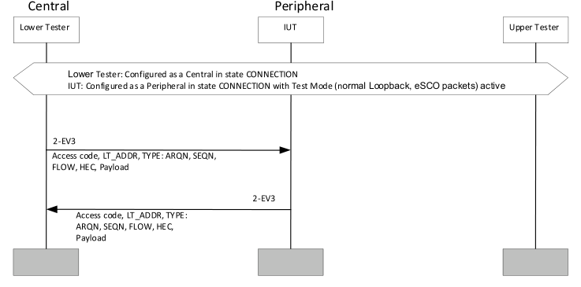

**Figure 4.14: BB/PROT/COD/BV-20-C [2-EV3 Packet Type]**

The Lower Tester transmits a 2-EV3 packet.
Access code:
Preamble: ‘1010’B or ‘0101’B sequence, depending on whether the LSB of the following sync word is 1 or 0, respectively.
Sync word: derived from the 24 bit address (LAP) of the Central (CAC).
Trailer: ‘1010’B or ‘0101’B sequence, depending on whether the MSB of the sync word is 1 or 0, respectively.
Packet header:
LT_ADDR—Logical Transport Address.
TYPE—0110'B
FLOW—1'B
ARQN—'1'B
SEQN—depends on the former transmission of the Lower Tester
HEC—Generated by the polynomial '647'O in respect to the UAP of the Central.
Sync sequence—As defined in [1]
Payload Header:—N/A
Payload body—60 Bytes PRBS9 plus 16 bit CRC.
Trailer—As defined in [1]
The Lower Tester verifies that the IUT transmits the packet correctly coded back to the Lower Tester.
• Expected Outcome
Pass verdict
The IUT transmits the 2-EV3 packet correctly coded back to the Lower Tester.
• Notes
The payload is not protected by FEC but is CRC coded.
BB/PROT/COD/BV-21-C [2-EV5 Packet Type]
• Test Purpose
Verify that the IUT, upon reception of a 2-EV5 packet, decodes and encodes the packet correctly.
• Reference
[1] 6.5.3.5
• Initial Condition
- Lower Tester: Configured as Central in state CONNECTION.
- IUT: Configured as Peripheral in state CONNECTION and with Test Mode (Loopback, eSCO packets) active.
- Whitening on.
• Test Procedure

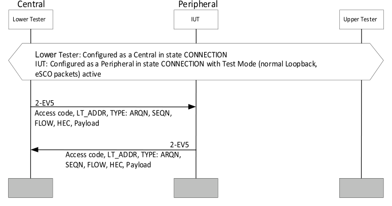

**Figure 4.15: BB/PROT/COD/BV-21-C [2-EV5 Packet Type]**

Access code:
Preamble: ‘1010’B or ‘0101’B sequence, depending on whether the LSB of the following sync word is 1 or 0, respectively.
Sync word: derived from the 24 bit address (LAP) of the Central (CAC).
Trailer:‘1010’B or ‘0101’B sequence, depending on whether the MSB of the sync word is 1 or 0, respectively.
Packet header:
LT_ADDR: Logical Transport Address.
TYPE: '1100'B
FLOW: '1'B
ARQN: '1'B
SEQN: depends on the former transmission of the Lower Tester
HEC: Generated by the polynomial '647'O in respect to the UAP of the Central.
Guard time: As defined in [1]
Sync sequence: As defined in [1]
Payload Header: N/A
Payload body: 80 Bytes PRBS9 plus 16 bit CRC.
Trailer: As defined in [1]
The Lower Tester verifies that the IUT transmits the packet correctly coded back to the Lower Tester.
• Expected Outcome
Pass verdict
The IUT transmits the packet correctly coded back to the Lower Tester.
• Notes
The payload is not protected by FEC but is CRC coded.
BB/PROT/COD/BV-22-C [3-EV3 Packet Type]
• Test Purpose
Verify that the IUT, upon reception of a 3-EV3 packet, decodes and encodes the packet correctly.
• Reference
[1] 6.5.3.6
• Initial Condition
- Lower Tester: Configured as Central in state CONNECTION.
- IUT: Configured as Peripheral in state CONNECTION and with Test Mode (Loopback, eSCO packets) active.
- Whitening on.
• Test Procedure

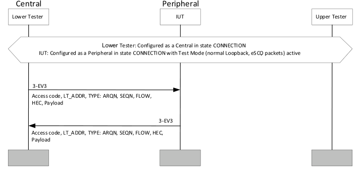

**Figure 4.16: BB/PROT/COD/BV-22-C [3-EV3 Packet Type]**

The Lower Tester transmits a 3-EV3 packet.
Access code:
Preamble:‘1010’B or ‘0101’B sequence, depending on whether the LSB of the following sync word is 1 or 0, respectively.
Sync word: derived from the 24 bit address (LAP) of the Central (CAC).
Trailer:‘1010’B or ‘0101’B sequence, depending on whether the MSB of the sync word is 1 or 0, respectively.
Packet header:
LT_ADDR: Logical Transport Address.
TYPE: '0111'B
FLOW: '1'B
ARQN: '1'B
SEQN: depends on the former transmission of the tester
HEC: Generated by the polynomial '647'O in respect to the UAP of the Central.
Guard time: As defined in [1]
Sync sequence: As defined in [1]
Payload Header: N/A
Payload body: 90 Bytes PRBS9 plus 16 bit CRC.
Trailer: As defined in [1]
The Lower Tester verifies that the IUT transmits the packet correctly coded back to the Lower Tester.
• Expected Outcome
Pass verdict
The IUT transmits the packet correctly coded back to the Lower Tester.
• Notes
The payload is not protected by FEC but is CRC coded.
BB/PROT/COD/BV-23-C [3-EV5 Packet Type]
• Test Purpose
Verify that the IUT, upon reception of a 3-EV5 packet, decodes and encodes the packet correctly.
• Reference
[1] 6.5.3.7
• Initial Condition
- Lower Tester: Configured as Central in state CONNECTION.
- IUT: Configured as Peripheral in state CONNECTION and with Test Mode (Loopback, eSCO packets) active.
- Whitening on.
• Test Procedure

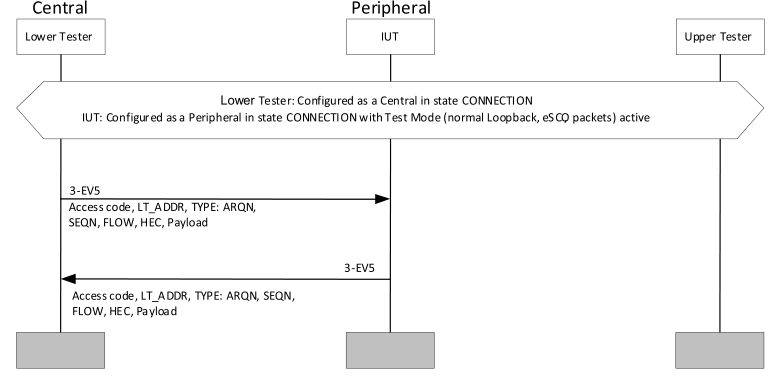

**Figure 4.17: BB/PROT/COD/BV-23-C [3-EV5 Packet Type]**

The Lower Tester transmits a 3-EV5 packet.
Access code:
Preamble: ‘1010’B or ‘0101’B sequence, depending on whether the LSB of the following sync word is 1 or 0, respectively.
Sync word: derived from the 24 bit address (LAP) of the Central (CAC).
Trailer:‘1010’B or ‘0101’B sequence, depending on whether the MSB of the sync word is 1 or 0, respectively.
LT_ADDR: Logical Transport Address.
TYPE: '1101'B
FLOW: '1'B
ARQN: '1'B
SEQN: depends on the former transmission of the Lower Tester
HEC: Generated by the polynomial '647'O in respect to the UAP of the Central.
Guard time: As defined in [1]
Sync sequence: As defined in [1]
Payload Header: N/A
Payload body: 80 Bytes PRBS9 plus 16 bit CRC.
Trailer: As defined in [1]
The Lower Tester verifies that the IUT transmits the packet correctly coded back to the Lower Tester.
• Expected Outcome
Pass verdict
The IUT transmits the packet correctly coded back to the Lower Tester.
• Notes
The payload is not protected by FEC but is CRC coded.
BB/PROT/COD/BV-24-C [2-DH1 Packet Type]
• Test Purpose
Verify that the IUT, upon reception of a 2-DH1 packet, decodes and encodes the packet correctly.
• Reference
[1] 6.5.4.8
• Initial Condition
- Lower Tester: Configured as Central in state CONNECTION with ptt = 1.
- IUT: Configured as Peripheral in state CONNECTION with ptt = 1 and with Test Mode (Loopback, ACL packets) active.
- Whitening on.
• Test Procedure

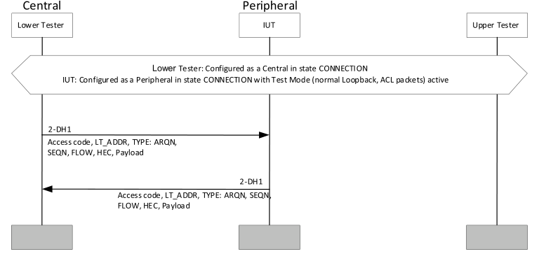

**Figure 4.18: BB/PROT/COD/BV-24-C [2-DH1 Packet Type]**

The Lower Tester transmits a 2-DH1 packet.
Access code:
Preamble: ‘1010’B or ‘0101’B sequence, depending on whether the LSB of the following sync word is 1 or 0, respectively.
Sync word: derived from the 24 bit address (LAP) of the Central (CAC).
Trailer:‘1010’B or ‘0101’B sequence, depending on whether the MSB of the sync word is 1 or 0, respectively.
Packet header:
LT_ADDR: Logical Transport Address.
TYPE:'0100'B
FLOW:'1'B
ARQN:'1'B
SEQN: depends on the former transmission of the Lower Tester
HEC: Generated by the polynomial '647'O in respect to the UAP of the Central.
Guard time: As defined in [1]
Sync sequence: As defined in [1]
Payload header:
L_CH: '10'B
FLOW: '1'B
LENGTH: '0000110110'B = '54'D
Payload body: 54 Bytes PRBS9 plus 16 bit CRC.
Trailer: As defined in [1]
The Lower Tester verifies that the IUT transmits the packet correctly coded back to the Lower Tester.
• Expected Outcome
Pass verdict
The IUT transmits the packet correctly coded back to the Lower Tester.
• Notes
The payload is not protected by FEC but is CRC coded.
BB/PROT/COD/BV-25-C [2-DH3 Packet Type]
• Test Purpose
Verify that the IUT, upon reception of a 2-DH3 packet, decodes and encodes the packet correctly.
• Reference
[1] 6.5.4.9
• Initial Condition
- Lower Tester: Configured as Central in state CONNECTION with ptt = 1.
- IUT: Configured as Peripheral in state CONNECTION with ptt = 1 and with Test Mode (Loopback, ACL packets) active.
- Whitening on.
• Test Procedure

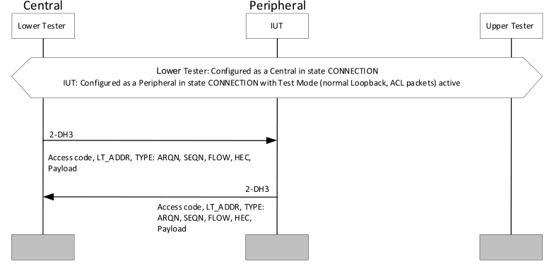

**Figure 4.19: BB/PROT/COD/BV-25-C [2-DH3 Packet Type]**

The Lower Tester transmits a 2-DH3 packet.
Access code:
Preamble: ‘1010’B or ‘0101’B sequence, depending on whether the LSB of the following sync word is 1 or 0, respectively.
Sync word: derived from the 24 bit address (LAP) of the Central (CAC).
Trailer:‘1010’B or ‘0101’B sequence, depending on whether the MSB of the sync word is 1 or 0, respectively.
LT_ADDR: Logical Transport Address.
TYPE: '1010'B
FLOW: '1'B
ARQN: '1'B
SEQN: depends on the former transmission of the Lower Tester
HEC: Generated by the polynomial '647'O in respect to the UAP of the Central.
Guard time: As defined in [1]
Sync sequence: As defined in [1]
Payload header:
L_CH: '10'B
FLOW: '1'B
LENGTH: '0101101111'B = '367'
Payload body: 367 Bytes PRBS9 plus 16 bit CRC.
Trailer: As defined in [1]
The Lower Tester verifies that the IUT transmits the packet correctly coded back to the Lower Tester.
• Expected Outcome
Pass verdict
The IUT transmits the packet correctly coded back to the Lower Tester.
• Notes
The payload is not protected by FEC but is CRC coded.
BB/PROT/COD/BV-26-C [2-DH5 Packet Type]
• Test Purpose
Verify that the IUT, upon reception of a 2-DH5 packet, decodes and encodes the packet correctly.
• Reference
[1] 6.5.4.10
• Initial Condition
- Lower Tester: Configured as Central in state CONNECTION with ptt = 1.
- IUT: Configured as Peripheral in state CONNECTION with ptt = 1 and with Test Mode (Loopback, ACL packets) active.
- Whitening on.
• Test Procedure

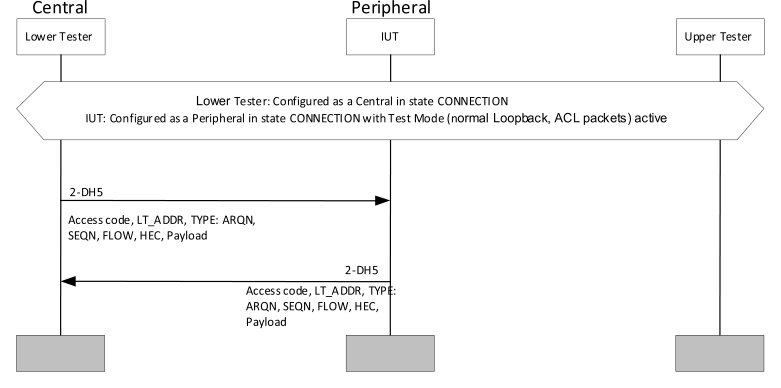

**Figure 4.20: BB/PROT/COD/BV-26-C [2-DH5 Packet Type]**

The Lower Tester transmits a 2-DH5 packet.
Access code:
Preamble: ‘1010’B or ‘0101’B sequence, depending on whether the LSB of the following sync word is 1 or 0, respectively
Sync word:—derived from the 24 bit address (LAP) of the Central (CAC).
Trailer—‘1010’B or ‘0101’B sequence, depending on whether the MSB of the sync word is 1 or 0, respectively.
Packet header:
LT_ADDR: Logical Transport Address.
TYPE:  '1110'B
FLOW: '1'B
ARQN: '1'B
SEQN: depends on the former transmission of the Lower Tester
HEC: Generated by the polynomial '647'O in respect to the UAP of the Central.
Guard time: As defined in [1]
Sync sequence: As defined in [1]
Payload header:
L_CH: '10'B
FLOW: '1'B
LENGTH: ' 1010100111'B = '679'D
Payload body: 679 Bytes PRBS9 plus 16 bit CRC.
Trailer: As defined in [1]
The Lower Tester verifies that the IUT transmits the packet correctly coded back to the Lower Tester.
• Expected Outcome
Pass verdict
The IUT transmits the packet correctly coded back to the Lower Tester.
• Notes
The payload is not protected by FEC but is CRC coded.
BB/PROT/COD/BV-27-C [3-DH1 Packet Type]
• Test Purpose
Verify that the IUT, upon reception of a 3-DH1 packet, decodes and encodes the packet correctly.
• Reference
[1] 6.5.4.11
• Initial Condition
- Lower Tester: Configured as Central in state CONNECTION with ptt = 1.
- IUT: Configured as Peripheral in state CONNECTION with ptt = 1 and with Test Mode (Loopback, ACL packets) active.
- Whitening on.
• Test Procedure

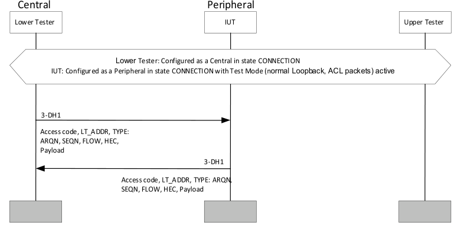

**Figure 4.21: BB/PROT/COD/BV-27-C [3-DH1 Packet Type]**

The Lower Tester transmits a 3-DH1 packet.
Access code:
Preamble: ‘1010’B or ‘0101’B sequence, depending on whether the LSB of the following sync word is 1 or 0, respectively.
Sync word: derived from the 24 bit address (LAP) of the Central (CAC).
Trailer: ‘1010’B or ‘0101’B sequence, depending on whether the MSB of the sync word is 1 or 0, respectively.
LT_ADDR: Logical Transport Address.
TYPE: '1000'B
FLOW: '1'B
ARQN: '1'B
SEQN: depends on the former transmission of the Lower Tester
HEC: Generated by the polynomial '647'O in respect to the UAP of the Central.
Guard time: As defined in [1]
Sync sequence: As defined in [1]
Payload header:
L_CH:  '10'B
FLOW: '1'B
LENGTH: '0001010011'B = '83’D
Payload body: 83 Bytes PRBS9 plus 16 bit CRC.
Trailer: As defined in [1]
The Lower Tester verifies that the IUT transmits the packet correctly coded back to the Lower Tester.
• Expected Outcome
Pass verdict
The IUT transmits the packet correctly coded back to the Lower Tester.
• Notes
The payload is not protected by FEC but is CRC coded.
BB/PROT/COD/BV-28-C [3-DH3 Packet Type]
• Test Purpose
Verify that the IUT, upon reception of a 3-DH3 packet, decodes and encodes the packet correctly.
• Reference
[1] 6.5.4.12
• Initial Condition
- Lower Tester: Configured as Central in state CONNECTION with ptt = 1.
- IUT: Configured as Peripheral in state CONNECTION with ptt = 1 and with Test Mode (Loopback, ACL packets) active.
- Whitening on.
• Test Procedure

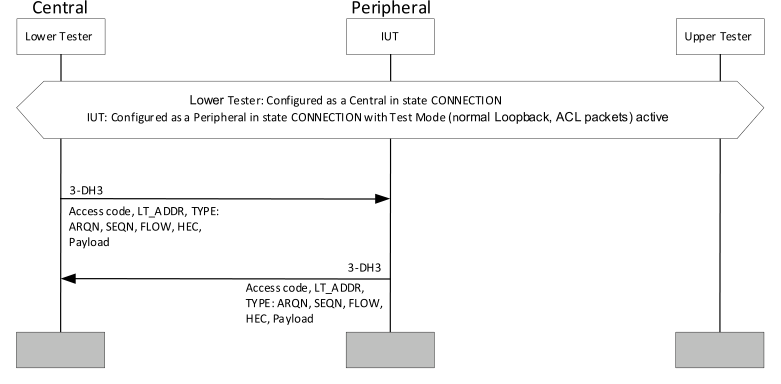

**Figure 4.22: BB/PROT/COD/BV-28-C [3-DH3 Packet Type]**

The Lower Tester transmits a 3-DH3 packet.
Access code:
Preamble: ‘1010’B or ‘0101’B sequence, depending on whether the LSB of the following sync word is 1 or 0, respectively.
Sync word: derived from the 24 bit address (LAP) of the Central (CAC).
Trailer: ‘1010’B or ‘0101’B sequence, depending on whether the MSB of the sync word is 1 or 0, respectively.
Packet header:
LT_ADDR: Logical Transport Address.
TYPE:  '1011'B
FLOW: '1'B
ARQN: '1'B
SEQN: depends on the former transmission of the Lower Tester
HEC: Generated by the polynomial '647'O in respect to the UAP of the Central.
Guard time: As defined in [1]
Sync sequence: As defined in [1]
Payload header:
L_CH:  '10'B
FLOW: '1'B
LENGTH: '1000101000'B = '552’D
Payload body: 552 Bytes PRBS9 plus 16 bit CRC.
Trailer: As defined in [1]
The Lower Tester verifies that the IUT transmits the packet correctly coded back to the Lower Tester.
• Expected Outcome
Pass verdict
The IUT transmits the packet correctly coded back to the Lower Tester.
• Notes
The payload is not protected by FEC but is CRC coded.
BB/PROT/COD/BV-29-C [3-DH5 Packet Type]
• Test Purpose
Verify that the IUT, upon reception of a 3-DH5 packet, decodes and encodes the packet correctly.
• Reference
[1] 6.5.4.13
• Initial Condition
- Lower Tester: Configured as Central in state CONNECTION with ptt = 1.
- IUT: Configured as Peripheral in state CONNECTION with ptt = 1 and with Test Mode (Loopback, ACL packets) active.
- Whitening on.
• Test Procedure

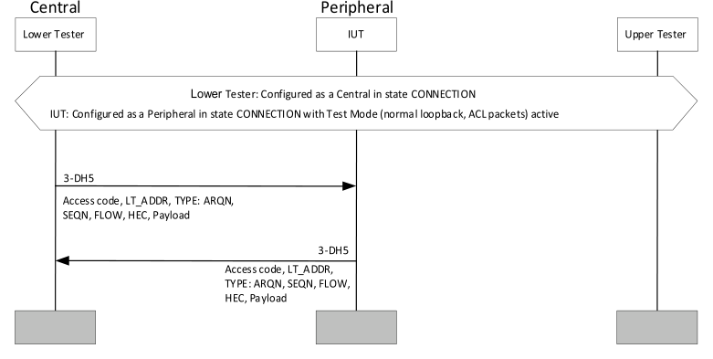

**Figure 4.23: BB/PROT/COD/BV-29-C [3-DH5 Packet Type]**

The Lower Tester transmits a 3-DH5 packet.
Access code:
Preamble: ‘1010’B or ‘0101’B sequence, depending on whether the LSB of the following sync word is 1 or 0, respectively.
Sync word: derived from the 24 bit address (LAP) of the Central (CAC).
Trailer: ‘1010’B or ‘0101’B sequence, depending on whether the MSB of the sync word is 1 or 0, respectively.
LT_ADDR: Logical Transport Address.
TYPE: '1111'B
FLOW: '1'B
ARQN: '1'B
SEQN: depends on the former transmission of the Lower Tester
HEC: Generated by the polynomial '647'O in respect to the UAP of the Central.
Guard time: As defined in [1]
Sync sequence: As defined in [1]
Payload header:
L_CH: 10'B
FLOW: 1'B
LENGTH: 1111111101'B = '1021’D
Payload body: 1021 Bytes PRBS9 plus 16 bit CRC.
Trailer: As defined in [1]
The Lower Tester verifies that the IUT transmits the packet correctly coded back to the Lower Tester.
• Expected Outcome
Pass verdict
The IUT transmits the packet correctly coded back to the Lower Tester.
• Notes
The payload is not protected by FEC but is CRC coded.
BB/PROT/COD/BV-30-C [DM1 Packet Type with AES-CCM encryption and MIC]
• Test Purpose
Verify that the IUT is capable of processing properly reception and transmission of DM1 packets with AES-CCM encryption and MIC.
• Reference
[1] 6.5.4
• Initial Condition
- Lower Tester: Configured as Central in state CONNECTION and with AES-CCM encryption enabled.
- IUT: Configured as Peripheral in state CONNECTION and with AES-CCM encryption enabled.
- Whitening on.
• Test Procedure

**Figure 4.24: BB/PROT/COD/BV-30-C [DM1 Packet Type with AES-CCM encryption and MIC]**

a) The Upper Tester sends HCI Change Connection Packet Type command to limit the packet types
used by the IUT to DM1 only. b) The Upper Tester sends HCI Write Secure Connections Test Mode to enable the DM1 ACL-U
mode.
HC_ACL_Data_Packet_Length (DATA_LENGTH). d) The Upper Tester sends a PDU as a single HCI ACL Data packet with packet boundary flag set
to '00'B (start non-flushable) containing a valid 4-octet L2CAP header and a payload composed of non-deterministic random Bytes. The length of the payload is calculated as follows: MIN(13, DATA_LENGTH-4), with DATA_LENGTH being the value retrieved in step c. e) The Lower Tester sends a DM1 packet as follows:
Access code: per [13] Section 6.3
Packet header: per [13] Section 6.4
LT_ADDR: Logical Transport Address of the Peripheral
FLOW: '1'B.
Payload header: per [13] Section 6.6.2
LLID: '10'B.
FLOW: '1'B.
Payload body:
A valid 4-octet L2CAP header plus a payload as described in step d plus a 32 bits MIC plus a 16 bit CRC.
f) The IUT sends a packet with the ARQN bit set to ACK in the next Peripheral to Central slot. g) The IUT sends a packet as described in e. h) The Lower Tester verifies that the IUT transmits the packet(s) correctly to the Lower Tester. It is
valid if the IUT sends a single packet that satisfies both f and g conditions. i) The Upper Tester verifies that the IUT sends the data correctly to the Upper Tester. j) Steps d)–i) are repeated 99 times (in addition to the first time).
• Expected Outcome
Pass verdict
In at least 99% of the repetitions, the IUT transmits the packet(s) correctly to the Lower Tester as described in f to h (payload is valid and ARQN bit is set to ACK).
In at least 99% of the repetitions, the IUT sends the data correctly to the Upper Tester in i.
• Notes
The payload is protected by FEC, is CRC coded and is authenticated by a MIC.
The nonce used for AES-CCM encryption is derived using the same rules as applicable in a normal ACL connection.
BB/PROT/COD/BV-31-C [DH1 Packet Type with AES-CCM encryption and MIC]
• Test Purpose
Verify that the IUT is capable of processing properly reception and transmission of DH1 packets with AES-CCM encryption and MIC.
• Reference
[1] 6.5.4
• Initial Condition
- Lower Tester: Configured as Central in state CONNECTION and with AES-CCM encryption enabled.
- IUT: Configured as Peripheral in state CONNECTION and with AES-CCM encryption enabled.
- Whitening on.
• Test Procedure

|  |  | IUT | Upper Tester |  |
| --- | --- | --- | --- | --- |
|  |  |  |  |  |
|  |  |  |  |  |
|  |  |  |  |  |
|  |  |  |  |  |
|  |  |  |  |  |
|  |  |  |  |  |
|  |  |  |  |  |
|  |  |  |  |  |
|  |  |  |  |  |
|  |  |  |  |  |
|  |  |  |  |  |
|  |  |  |  |  |
|  |  |  |  |  |

used by the IUT to DH1 only. b) The Upper Tester sends HCI Write Secure Connections Test Mode to enable the DM1 ACL-U
mode. c) The Upper Tester sends HCI Read Buffer Size Command to get the value of
HC_ACL_Data_Packet_Length (DATA_LENGTH). d) The Upper Tester sends a PDU as a single HCI ACL Data packet with packet boundary flag set
to '00'B (start non-flushable) containing a valid 4-octet L2CAP header and a payload composed of non-deterministic random Bytes. The length of the payload is calculated as follows: MIN(23, DATA_LENGTH-4), with DATA_LENGTH being the value retrieved in step c. e) The Lower Tester sends a DH1 packet as follows:
Access code: per [13] Section 6.3
Packet header: per [13] Section 6.4
LT_ADDR: Logical Transport Address of the Peripheral
FLOW: '1'B.
Payload header: per [13] Section 6.6.2
LLID: '10'B.
FLOW: '1'B.
Payload body:
A valid 4-octet L2CAP header plus a payload as described in step d plus a 32 bits MIC plus a 16 bit CRC.
f) The IUT sends a packet with the ARQN bit set to ACK in the next Peripheral to Central slot. g) The IUT sends a packet as described in d. h) The Lower Tester verifies that the IUT transmits the packet(s) correctly to the Lower Tester. It is
valid if the IUT sends a single packet that satisfies both f and g conditions. i) The Upper Tester verifies that the IUT sends the data correctly to the Upper Tester. j) Steps d)–i) are repeated 99 times (in addition to the first time).
• Expected Outcome
Pass verdict
In at least 99% of the repetitions, the IUT transmits the packet(s) correctly to the Lower Tester as described in f to h (payload is valid and ARQN bit is set to ACK).
In at least 99% of the repetitions, the IUT sends the data correctly to the Upper Tester in i.
• Notes
The payload is CRC coded and is authenticated by a MIC.
The nonce used for AES-CCM encryption is derived using the same rules as applicable in a normal ACL connection.
• Test Purpose
Verify that the IUT is capable of processing properly reception and transmission of DM3 packets with AES-CCM encryption and MIC.
• Reference
[1] 6.5.4
• Initial Condition
- Lower Tester: Configured as Central in state CONNECTION and with AES-CCM encryption enabled.
- IUT: Configured as Peripheral in state CONNECTION and with AES-CCM encryption enabled.
- Whitening on.
• Test Procedure

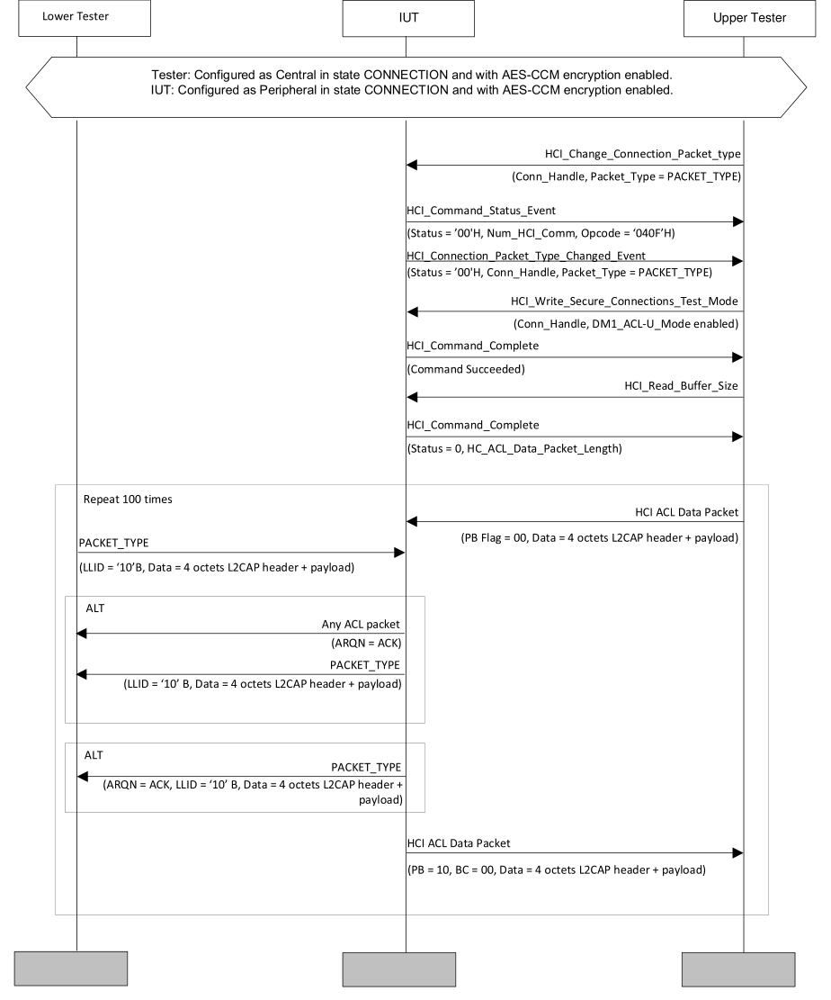

**Figure 4.26: BB/PROT/COD/BV-32-C [DM3 Packet Type with AES-CCM encryption and MIC]**

a) The Upper Tester sends HCI Change Connection Packet Type command to limit the packet types
used by the IUT to DM3 only. b) The Upper Tester sends HCI Write Secure Connections Test Mode to enable the DM1 ACL-U
mode.
HC_ACL_Data_Packet_Length (DATA_LENGTH). d) The Upper Tester sends a PDU as a single HCI ACL Data packet with packet boundary flag set
to '00'B (start non-flushable) containing a valid 4-octet L2CAP header and a payload composed of non-deterministic random Bytes. The length of the payload is calculated as follows: MIN(117, DATA_LENGTH-4), with DATA_LENGTH being the value retrieved in step c. e) The Lower Tester sends a DM3 packet as follows:
Access code: per [13] Section 6.3
Packet header: per [13] Section 6.4
LT_ADDR: Logical Transport Address of the Peripheral
FLOW: '1'B.
Payload header: per [13] Section 6.6.2
LLID: '10'B.
FLOW: '1'B.
Payload body:
A valid 4-octet L2CAP header plus a payload as described in step d plus a 32 bits MIC plus a 16 bit CRC.
f) The IUT sends a packet with the ARQN bit set to ACK in the next Peripheral to Central slot. g) The IUT sends a packet as described in e. h) The Lower Tester verifies that the IUT transmits the packet(s) correctly to the Lower Tester. It is
valid if the IUT sends a single packet that satisfies both f and g conditions. i) The Upper Tester verifies that the IUT sends the data correctly to the Upper Tester. j) Steps d)–i) are repeated 99 times (in addition to the first time).
• Expected Outcome
Pass verdict
In at least 99% of the repetitions, the IUT transmits the packet(s) correctly to the Lower Tester as described in f to h (payload is valid and ARQN bit is set to ACK).
In at least 99% of the repetitions, the IUT sends the data correctly to the Upper Tester in i.
• Notes
The payload is protected by FEC, is CRC coded and is authenticated by a MIC.
The nonce used for AES-CCM encryption is derived using the same rules as applicable in a normal ACL connection.
BB/PROT/COD/BV-33-C [DH3 Packet Type with AES-CCM encryption and MIC]
• Test Purpose
Verify that the IUT is capable of processing properly reception and transmission of DH3 packets with AES-CCM encryption and MIC.
• Reference
[1] 6.5.4
• Initial Condition
- Lower Tester: Configured as Central in state CONNECTION and with AES-CCM encryption enabled.
- IUT: Configured as Peripheral in state CONNECTION and with AES-CCM encryption enabled.
- Whitening on.
• Test Procedure

|  |  | IUT | Upper Tester |  |
| --- | --- | --- | --- | --- |
|  |  |  |  |  |
|  |  |  |  |  |
|  |  |  |  |  |
|  |  |  |  |  |
|  |  |  |  |  |
|  |  |  |  |  |
|  |  |  |  |  |
|  |  |  |  |  |
|  |  |  |  |  |
|  |  |  |  |  |
|  |  |  |  |  |
|  |  |  |  |  |
|  |  |  |  |  |

used by the IUT to DH3 only. b) The Upper Tester sends HCI Write Secure Connections Test Mode to enable the DM1 ACL-U
mode. c) The Upper Tester sends HCI Read Buffer Size Command to get the value of
HC_ACL_Data_Packet_Length (DATA_LENGTH). d) The Upper Tester sends a PDU as a single HCI ACL Data packet with packet boundary flag set
to ‘00’B (start non-flushable) containing a valid 4-octet L2CAP header and a payload composed of non-deterministic random Bytes. The length of the payload is calculated as follows: MIN(179, DATA_LENGTH-4), with DATA_LENGTH being the value retrieved in step c. e) The Lower Tester sends a DH3 packet as follows:
Access code: per [13] Section 6.3
Packet header: per [13] Section 6.4
LT_ADDR: Logical Transport Address of the Peripheral
FLOW: ‘1’B.
Payload header: per [13] Section 6.6.2
LLID: ‘10’B.
FLOW: ‘1’B.
Payload body:
A valid 4-octet L2CAP header plus a payload as described in step d plus a 32 bits MIC plus a 16 bit CRC.
f) The IUT sends a packet with the ARQN bit set to ACK in the next Peripheral to Central slot. g) The IUT sends a packet as described in e. h) The Lower Tester verifies that the IUT transmits the packet(s) correctly to the Lower Tester. It is
valid if the IUT sends a single packet that satisfies both f and g conditions. i) The Upper Tester verifies that the IUT sends the data correctly to the Upper Tester. j) Steps d)–i) are repeated 99 times (in addition to the first time).
• Expected Outcome
Pass verdict
In at least 99% of the repetitions, the IUT transmits the packet(s) correctly to the Lower Tester as described in f to h (payload is valid and ARQN bit is set to ACK).
In at least 99% of the repetitions, the IUT sends the data correctly to the Upper Tester in i.
• Notes
The payload is CRC coded and is authenticated by a MIC.
The nonce used for AES-CCM encryption is derived using the same rules as applicable in a normal ACL connection.
• Test Purpose
Verify that the IUT is capable of processing properly reception and transmission of DM5 packets with AES-CCM encryption and MIC.
• Reference
[1] 6.5.4
• Initial Condition
- Lower Tester: Configured as Central in state CONNECTION and with AES-CCM encryption enabled.
- IUT: Configured as Peripheral in state CONNECTION and with AES-CCM encryption enabled.
- Whitening on.
• Test Procedure

**Figure 4.28: BB/PROT/COD/BV-34-C [DM5 Packet Type with AES-CCM encryption and MIC]**

a) The Upper Tester sends HCI Change Connection Packet Type command to limit the packet types
used by the IUT to DM5 only. b) The Upper Tester sends HCI Write Secure Connections Test Mode to enable the DM1 ACL-U
mode.
HC_ACL_Data_Packet_Length (DATA_LENGTH). d) The Upper Tester sends a PDU as a single HCI ACL Data packet with packet boundary flag set
to ‘00’B (start non-flushable) containing a valid 4-octet L2CAP header and a payload composed of non-deterministic random Bytes. The length of the payload is calculated as follows: MIN(220, DATA_LENGTH-4), with DATA_LENGTH being the value retrieved in step c. e) The Lower Tester sends a DM5 packet as follows:
Access code: per [13] Section 6.3
Packet header: per [13] Section 6.4
LT_ADDR: Logical Transport Address of the Peripheral
FLOW: ‘1’B.
Payload header: per [13] Section 6.6.2
LLID: ‘10’B.
FLOW: ‘1’B.
Payload body:
A valid 4-octet L2CAP header plus a payload as described in step d plus a 32 bits MIC plus a 16 bit CRC.
f) The IUT sends a packet with the ARQN bit set to ACK in the next Peripheral to Central slot. g) The IUT sends a packet as described in e. h) The Lower Tester verifies that the IUT transmits the packet(s) correctly to the Lower Tester. It is
valid if the IUT sends a single packet that satisfies both f and g conditions. i) The Upper Tester verifies that the IUT sends the data correctly to the Upper Tester. j) Steps d)–i) are repeated 99 times (in addition to the first time).
• Expected Outcome
Pass verdict
In at least 99% of the repetitions, the IUT transmits the packet(s) correctly to the Lower Tester as described in f to h (payload is valid and ARQN bit is set to ACK).
In at least 99% of the repetitions, the IUT sends the data correctly to the Upper Tester in i.
• Notes
The payload is protected by FEC, is CRC coded and is authenticated by a MIC.
The nonce used for AES-CCM encryption is derived using the same rules as applicable in a normal ACL connection.
BB/PROT/COD/BV-35-C [DH5 Packet Type with AES-CCM encryption and MIC]
• Test Purpose
Verify that the IUT is capable of processing properly reception and transmission of DH5 packets with AES-CCM encryption and MIC.
• Reference
[1] 6.5.4
• Initial Condition
- Lower Tester: Configured as Central in state CONNECTION and with AES-CCM encryption enabled.
- IUT: Configured as Peripheral in state CONNECTION and with AES-CCM encryption enabled.
- Whitening on.
• Test Procedure

|  |  | IUT | Upper Tester |  |
| --- | --- | --- | --- | --- |
|  |  |  |  |  |
|  |  |  |  |  |
|  |  |  |  |  |
|  |  |  |  |  |
|  |  |  |  |  |
|  |  |  |  |  |
|  |  |  |  |  |
|  |  |  |  |  |
|  |  |  |  |  |
|  |  |  |  |  |
|  |  |  |  |  |
|  |  |  |  |  |
|  |  |  |  |  |

used by the IUT to DH5 only. b) The Upper Tester sends HCI Write Secure Connections Test Mode to enable the DM1 ACL-U
mode. c) The Upper Tester sends HCI Read Buffer Size Command to get the value of
HC_ACL_Data_Packet_Length (DATA_LENGTH). d) The Upper Tester sends a PDU as a single HCI ACL Data packet with packet boundary flag set
to ‘00’B (start non-flushable) containing a valid 4-octet L2CAP header and a payload composed of non-deterministic random Bytes. The length of the payload is calculated as follows: MIN(335, DATA_LENGTH-4), with DATA_LENGTH being the value retrieved in step c. e) The Lower Tester sends a DH5 packet as follows:
Access code: per [13] Section 6.3
Packet header: per [13] Section 6.4
LT_ADDR: Logical Transport Address of the Peripheral
FLOW: ‘1’B.
Payload header: per [13] Section 6.6.2
LLID: ‘10’B.
FLOW: ‘1’B.
Payload body:
A valid 4-octet L2CAP header plus a payload as described in step d plus a 32 bits MIC plus a 16 bit CRC.
f) The IUT sends a packet with the ARQN bit set to ACK in the next Peripheral to Central slot. g) The IUT sends a packet as described in e. h) The Lower Tester verifies that the IUT transmits the packet(s) correctly to the Lower Tester. It is
valid if the IUT sends a single packet that satisfies both f and g conditions. i) The Upper Tester verifies that the IUT sends the data correctly to the Upper Tester. j) Steps d)–i) are repeated 99 times (in addition to the first time).
• Expected Outcome
Pass verdict
In at least 99% of the repetitions, the IUT transmits the packet(s) correctly to the Lower Tester as described in f to h (payload is valid and ARQN bit is set to ACK).
In at least 99% of the repetitions, the IUT sends the data correctly to the Upper Tester in i.
• Notes
The payload is CRC coded and is authenticated by a MIC.
The nonce used for AES-CCM encryption is derived using the same rules as applicable in a normal ACL connection.
• Test Purpose
Verify that the IUT is capable of processing properly reception and transmission of 2-DH1 packets with AES-CCM encryption and MIC.
• Reference
[1] 6.5.4
• Initial Condition
- Lower Tester: Configured as Central in state CONNECTION and with AES-CCM encryption enabled.
- IUT: Configured as Peripheral in state CONNECTION with Secure Connection Test Mode (DM1_ACL-U_Mode) enabled and with AES-CCM encryption enabled.
- Whitening on.
• Test Procedure

**Figure 4.30: BB/PROT/COD/BV-36-C [2-DH1 Packet Type with AES-CCM encryption and MIC]**

a) The Upper Tester sends HCI Change Connection Packet Type command to limit the packet types
used by the IUT to 2-DH1 only. b) The Upper Tester sends HCI Write Secure Connections Test Mode to enable the DM1 ACL-U
mode.
HC_ACL_Data_Packet_Length (DATA_LENGTH). d) The Upper Tester sends a PDU as a single HCI ACL Data packet with packet boundary flag set
to '00'B (start non-flushable) containing a valid 4-octet L2CAP header and a payload composed of non-deterministic random Bytes. The length of the payload is calculated as follows: MIN(50, DATA_LENGTH-4), with DATA_LENGTH being the value retrieved in step c. e) The Lower Tester sends a 2-DH1 packet as follows:
Access code: per [13] Section 6.3
Packet header: per [13] Section 6.4
LT_ADDR: Logical Transport Address of the Peripheral
FLOW: '1'B.
Payload header: per [13] Section 6.6.2
LLID: '10'B.
FLOW: '1'B.
Payload body:
A valid 4-octet L2CAP header plus a payload as described in step d plus a 32 bits MIC plus a 16 bit CRC.
f) The IUT sends a packet with the ARQN bit set to ACK in the next Peripheral to Central slot. g) The IUT sends a packet as described in e. h) The Lower Tester verifies that the IUT transmits the packet(s) correctly to the Lower Tester. It is
valid if the IUT sends a single packet that satisfies both f and g conditions. i) The Upper Tester verifies that the IUT sends the data correctly to the Upper Tester. j) Steps d)–i) are repeated 99 times (in addition to the first time).
• Expected Outcome
Pass verdict
In at least 99% of the repetitions, the IUT transmits the packet(s) correctly to the Lower Tester as described in f to h (payload is valid and ARQN bit is set to ACK).
In at least 99% of the repetitions, the IUT sends the data correctly to the Upper Tester in i.
• Notes
The payload is CRC coded and is authenticated by a MIC.
The nonce used for AES-CCM encryption is derived using the same rules as applicable in a normal ACL connection.
BB/PROT/COD/BV-37-C [2-DH3 Packet Type with AES-CCM encryption and MIC]
• Test Purpose
Verify that the IUT is capable of processing properly reception and transmission of 2-DH3 packets with AES-CCM encryption and MIC.
• Reference
[1] 6.5.4
• Initial Condition
- Lower Tester: Configured as Central in state CONNECTION and with AES-CCM encryption enabled.
- IUT: Configured as Peripheral in state CONNECTION and with AES-CCM encryption enabled.
- Whitening on.
• Test Procedure

|  |  | IUT | Upper Tester |  |
| --- | --- | --- | --- | --- |
|  |  |  |  |  |
|  |  |  |  |  |
|  |  |  |  |  |
|  |  |  |  |  |
|  |  |  |  |  |
|  |  |  |  |  |
|  |  |  |  |  |
|  |  |  |  |  |
|  |  |  |  |  |
|  |  |  |  |  |
|  |  |  |  |  |
|  |  |  |  |  |
|  |  |  |  |  |

used by the IUT to 2-DH3 only. b) The Upper Tester sends HCI Write Secure Connections Test Mode to enable the DM1 ACL-U
mode. c) The Upper Tester sends HCI Read Buffer Size Command to get the value of
HC_ACL_Data_Packet_Length (DATA_LENGTH). d) The Upper Tester sends a PDU as a single HCI ACL Data packet with packet boundary flag set
to '00'B (start non-flushable) containing a valid 4-octet L2CAP header and a payload composed of non-deterministic random Bytes. The length of the payload is calculated as follows: MIN(363, DATA_LENGTH-4), with DATA_LENGTH being the value retrieved in step c. e) The Lower Tester sends a 2-DH3 packet as follows:
Access code: per [13] Section 6.3
Packet header: per [13] Section 6.4
LT_ADDR: Logical Transport Address of the Peripheral
FLOW: '1'B.
Payload header: per [13] Section 6.6.2
LLID: '10'B.
FLOW: '1'B.
Payload body:
A valid 4-octet L2CAP header plus a payload as described in step d plus a 32 bits MIC plus a 16 bit CRC.
f) The IUT sends a packet with the ARQN bit set to ACK in the next Peripheral to Central slot. g) The IUT sends a packet as described in e. h) The Lower Tester verifies that the IUT transmits the packet(s) correctly to the Lower Tester. It is
valid if the IUT sends a single packet that satisfies both f and g conditions. i) The Upper Tester verifies that the IUT sends the data correctly to the Upper Tester. j) Steps d)–i) are repeated 99 times (in addition to the first time).
• Expected Outcome
Pass verdict
In at least 99% of the repetitions, the IUT transmits the packet(s) correctly to the Lower Tester as described in f–h (payload is valid and ARQN bit is set to ACK).
In at least 99% of the repetitions, the IUT sends the data correctly to the Upper Tester in i.
• Notes
The payload is CRC coded and is authenticated by a MIC.
The nonce used for AES-CCM encryption is derived using the same rules as applicable in a normal ACL connection.
• Test Purpose
Verify that the IUT is capable of processing properly reception and transmission of 2-DH5 packets with AES-CCM encryption and MIC.
• Reference
[1] 6.5.4
• Initial Condition
- Lower Tester: Configured as Central in state CONNECTION and with AES-CCM encryption enabled.
- IUT: Configured as Peripheral in state CONNECTION and with AES-CCM encryption enabled.
- Whitening on.
• Test Procedure

**Figure 4.32: BB/PROT/COD/BV-38-C [2-DH5 Packet Type with AES-CCM encryption and MIC]**

a) The Upper Tester sends HCI Change Connection Packet Type command to limit the packet types
used by the IUT to 2-DH5 only. b) The Upper Tester sends HCI Write Secure Connections Test Mode to enable the DM1 ACL-U
mode.
HC_ACL_Data_Packet_Length (DATA_LENGTH). d) The Upper Tester sends a PDU as a single HCI ACL Data packet with packet boundary flag set
to '00'B (start non-flushable) containing a valid 4-octet L2CAP header and a payload composed of non-deterministic random Bytes. The length of the payload is calculated as follows: MIN(675, DATA_LENGTH-4), with DATA_LENGTH being the value retrieved in step c. e) The Lower Tester sends a 2-DH5 packet as follows:
Access code: per [13] Section 6.3
Packet header: per [13] Section 6.4
LT_ADDR: Logical Transport Address of the Peripheral
FLOW: '1'B.
Payload header: per [13] Section 6.6.2
LLID: '10'B.
FLOW: '1'B.
Payload body:
A valid 4-octet L2CAP header plus a payload as described in step d plus a 32 bits MIC plus a 16 bit CRC.
f) The IUT sends a packet with the ARQN bit set to ACK in the next Peripheral to Central slot. g) The IUT sends a packet as described in e. h) The Lower Tester verifies that the IUT transmits the packet(s) correctly to the Lower Tester. It is
valid if the IUT sends a single packet that satisfies both f and g conditions. i) The Upper Tester verifies that the IUT sends the data correctly to the Upper Tester. j) Steps d)–i) are repeated 99 times (in addition to the first time).
• Expected Outcome
Pass verdict
In at least 99% of the repetitions, the IUT transmits the packet(s) correctly to the Lower Tester as described in f–h (payload is valid and ARQN bit is set to ACK).
In at least 99% of the repetitions, the IUT sends the data correctly to the Upper Tester in i.
• Notes
The payload is CRC coded and is authenticated by a MIC.
The nonce used for AES-CCM encryption is derived using the same rules as applicable in a normal ACL connection.
BB/PROT/COD/BV-39-C [3-DH1 Packet Type with AES-CCM encryption and MIC]
• Test Purpose
Verify that the IUT is capable of processing properly reception and transmission of 3-DH1 packets with AES-CCM encryption and MIC.
• Reference
[1] 6.5.4
• Initial Condition
- Lower Tester: Configured as Central in state CONNECTION and with AES-CCM encryption enabled.
- IUT: Configured as Peripheral in state CONNECTION and with AES-CCM encryption enabled.
- Whitening on.
• Test Procedure

|  |  | IUT | Upper Tester |  |
| --- | --- | --- | --- | --- |
|  |  |  |  |  |
|  |  |  |  |  |
|  |  |  |  |  |
|  |  |  |  |  |
|  |  |  |  |  |
|  |  |  |  |  |
|  |  |  |  |  |
|  |  |  |  |  |
|  |  |  |  |  |
|  |  |  |  |  |
|  |  |  |  |  |
|  |  |  |  |  |
|  |  |  |  |  |

used by the IUT to 3-DH1 only. b) The Upper Tester sends HCI Write Secure Connections Test Mode to enable the DM1 ACL-U
mode. c) The Upper Tester sends HCI Read Buffer Size Command to get the value of
HC_ACL_Data_Packet_Length (DATA_LENGTH). d) The Upper Tester sends a PDU as a single HCI ACL Data packet with packet boundary flag set
to '00'B (start non-flushable) containing a valid 4-octet L2CAP header and a payload composed of non-deterministic random Bytes. The length of the payload is calculated as follows: MIN(79, DATA_LENGTH-4), with DATA_LENGTH being the value retrieved in step c. e) The Lower Tester sends a 3-DH1 packet as follows:
Access code: per [13] Section 6.3
Packet header: per [13] Section 6.4
LT_ADDR: Logical Transport Address of the Peripheral
FLOW: '1'B.
Payload header: per [13] Section 6.6.2
LLID: '10'B.
FLOW: '1'B.
Payload body:
A valid 4-octet L2CAP header plus a payload as described in step d plus a 32 bits MIC plus a 16 bit CRC.
f) The IUT sends a packet with the ARQN bit set to ACK in the next Peripheral to Central slot. g) The IUT sends a packet as described in e. h) The Lower Tester verifies that the IUT transmits the packet(s) correctly to the Lower Tester. It is
valid if the IUT sends a single packet that satisfies both f and g conditions. i) The Upper Tester verifies that the IUT sends the data correctly to the Upper Tester. j) Steps d)–i) are repeated 99 times (in addition to the first time).
• Expected Outcome
Pass verdict
In at least 99% of the repetitions, the IUT transmits the packet(s) correctly to the Lower Tester as described in f–h (payload is valid and ARQN bit is set to ACK).
In at least 99% of the repetitions, the IUT sends the data correctly to the Upper Tester in i.
• Notes
The payload is CRC coded and is authenticated by a MIC.
The nonce used for AES-CCM encryption is derived using the same rules as applicable in a normal ACL connection.
• Test Purpose
Verify that the IUT is capable of processing properly reception and transmission of 3-DH3 packets with AES-CCM encryption and MIC.
• Reference
[1] 6.5.4
• Initial Condition
- Lower Tester: Configured as Central in state CONNECTION and with AES-CCM encryption enabled.
- IUT: Configured as Peripheral in state CONNECTION and with AES-CCM encryption enabled.
- Whitening on.
• Test Procedure

**Figure 4.34: BB/PROT/COD/BV-40-C [3-DH3 Packet Type with AES-CCM encryption and MIC]**

a) The Upper Tester sends HCI Change Connection Packet Type command to limit the packet types
used by the IUT to 3-DH3 only. b) The Upper Tester sends HCI Write Secure Connections Test Mode to enable the DM1 ACL-U
mode.
HC_ACL_Data_Packet_Length (DATA_LENGTH). d) The Upper Tester sends a PDU as a single HCI ACL Data packet with packet boundary flag set
to '00'B (start non-flushable) containing a valid 4-octet L2CAP header and a payload composed of non-deterministic random Bytes. The length of the payload is calculated as follows: MIN(548, DATA_LENGTH-4), with DATA_LENGTH being the value retrieved in step c. e) The Lower Tester sends a 3-DH3 packet as follows:
Access code: per [13] Section 6.3
Packet header: per [13] Section 6.4
LT_ADDR: Logical Transport Address of the Peripheral
FLOW: '1'B.
Payload header: per [13] Section 6.6.2
LLID: '10'B.
FLOW: '1'B.
Payload body: per [13] Section 6.6.2
A valid 4-octet L2CAP header plus a payload as described in step d plus a 32 bits MIC plus a 16 bit CRC.
f) The IUT sends a packet with the ARQN bit set to ACK in the next Peripheral to Central slot. g) The IUT sends a packet as described in e. h) The Lower Tester verifies that the IUT transmits the packet(s) correctly to the Lower Tester. It is
valid if the IUT sends a single packet that satisfies both f and g conditions. i) The Upper Tester verifies that the IUT sends the data correctly to the Upper Tester. j) Steps d)–i) are repeated 99 times (in addition to the first time).
• Expected Outcome
Pass verdict
In at least 99% of the repetitions, the IUT transmits the packet(s) correctly to the Lower Tester as described in f–h (payload is valid and ARQN bit is set to ACK).
In at least 99% of the repetitions, the IUT sends the data correctly to the Upper Tester in i.
• Notes
The payload is CRC coded and is authenticated by a MIC.
The nonce used for AES-CCM encryption is derived using the same rules as applicable in a normal ACL connection.
BB/PROT/COD/BV-41-C [3-DH5 Packet Type with AES-CCM encryption and MIC]
• Test Purpose
Verify that the IUT is capable of processing properly reception and transmission of 3-DH5 packets with AES-CCM encryption and MIC.
• Reference
[1] 6.5.4
• Initial Condition
- Lower Tester: Configured as Central in state CONNECTION and with AES-CCM encryption enabled.
- IUT: Configured as Peripheral in state CONNECTION and with AES-CCM encryption enabled.
- Whitening on.
• Test Procedure

|  |  | IUT | Upper Tester |  |
| --- | --- | --- | --- | --- |
|  |  |  |  |  |
|  |  |  |  |  |
|  |  |  |  |  |
|  |  |  |  |  |
|  |  |  |  |  |
|  |  |  |  |  |
|  |  |  |  |  |
|  |  |  |  |  |
|  |  |  |  |  |
|  |  |  |  |  |
|  |  |  |  |  |
|  |  |  |  |  |
|  |  |  |  |  |

used by the IUT to 3-DH5 only. b) The Upper Tester sends HCI Write Secure Connections Test Mode to enable the DM1 ACL-U
mode. c) The Upper Tester sends HCI Read Buffer Size Command to get the value of
HC_ACL_Data_Packet_Length (DATA_LENGTH). d) The Upper Tester sends a PDU as a single HCI ACL Data packet with packet boundary flag set
to '00'B (start non-flushable) containing a valid 4-octet L2CAP header and a payload composed of non-deterministic random Bytes. The length of the payload is calculated as follows: MIN(1017, DATA_LENGTH-4), with DATA_LENGTH being the value retrieved in step c. e) The Lower Tester sends a 3-DH5 packet as follows:
Access code: per [13] Section 6.3
Packet header: per [13] Section 6.4
LT_ADDR: Logical Transport Address of the Peripheral
FLOW: '1'B.
Payload header: per [13] Section 6.6.2
LLID: '10'B.
FLOW: '1'B.
Payload body:
A valid 4-octet L2CAP header plus a payload as described in step d plus a 32 bits MIC plus a 16 bit CRC.
f) The IUT sends a packet with the ARQN bit set to ACK in the next Peripheral to Central slot. g) The IUT sends a packet as described in e. h) The Lower Tester verifies that the IUT transmits the packet(s) correctly to the Lower Tester. It is
valid if the IUT sends a single packet that satisfies both f and g conditions. i) The Upper Tester verifies that the IUT sends the data correctly to the Upper Tester. j) Steps d)–i) are repeated 99 times (in addition to the first time).
• Expected Outcome
Pass verdict
In at least 99% of the repetitions, the IUT transmits the packet(s) correctly to the Lower Tester as described in f to h (payload is valid and ARQN bit is set to ACK).
In at least 99% of the repetitions, the IUT sends the data correctly to the Upper Tester in i.
• Notes
The payload is CRC coded and is authenticated by a MIC.
The nonce used for AES-CCM encryption is derived using the same rules as applicable in a normal ACL connection.
• Test Purpose
Verify that the IUT is capable of processing properly reception and transmission of EV3 packets with AES-CCM encryption.
• Reference
[1] 6.5.3
• Initial Condition
- Lower Tester: Configured as Central in state CONNECTION and with AES-CCM encryption enabled.
- IUT: Configured as Peripheral in state CONNECTION with AES-CCM encryption enabled.
- Whitening on.
• Test Procedure

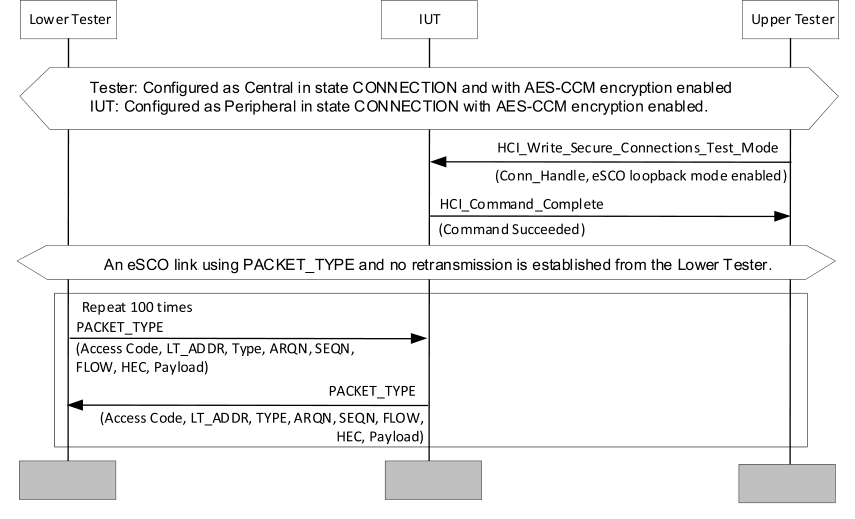

**Figure 4.36: BB/PROT/COD/BV-42-C [EV3 Packet Type with AES-CCM encryption]**

a) The Upper Tester sends HCI Write Secure Connections Test Mode to enable the eSCO loopback
mode. b) An eSCO link using EV3 packet type and no retransmission is established by the Lower Tester. c) The Lower Tester transmits an EV3 packet to the IUT:
Access code:
Preamble: ‘1010’B or ‘0101’B sequence, depending on whether the LSB of the following sync word is 1 or 0, respectively.
Sync word: derived from the 24 bit address (LAP) of the Central (CAC).
Trailer: ‘1010’B or ‘0101’B sequence, depending on whether the MSB of the sync word is 1 or 0, respectively.
LT_ADDR—Logical Transport Address.
TYPE—‘0111'B
FLOW—‘1'B
ARQN—'0'B
SEQN—depends on the former transmission of the Lower Tester
Payload header: per [13] Section 6.6.2
Guard time—As defined in [1].
Sync sequence—As defined in [1].
Payload header—N/A
Payload body—30 non deterministic random Bytes of payload plus 16 bit CRC.
Trailer—As defined in [1].
d) The IUT replies with a packet of same description and ARQN bit set to ACK. e) The Lower Tester verifies that the IUT transmits the packet correctly to the Lower Tester. f) Steps c)–e) are repeated 99 times (in addition to the first time) plus a few times equal to the eSCO loopback delay value, so that the IUT sends a minimum of 100 packets containing a looped back payload.
• Expected Outcome
Pass verdict
In at least 99% of the repetitions, the Lower Tester received a packet properly encrypted and containing the same payload as it transmitted.
• Notes
The payload is not protected by FEC but is CRC coded.
The nonce used for AES-CCM encryption is derived using the same rules as applicable in a normal eSCO connection.
According to the Secure Connections eSCO Loopback Delay value (provided in the IXIT [14]), the payload contained in the first packets from the IUT is discarded and does not impact the verdict.
BB/PROT/COD/BV-43-C [EV4 Packet Type with AES-CCM encryption]
• Test Purpose
Verify that the IUT is capable of processing properly reception and transmission of EV4 packets with AES-CCM encryption.
• Reference
[1] 6.5.3
• Initial Condition
- Lower Tester: Configured as Central in state CONNECTION and with AES-CCM encryption enabled.
- IUT: Configured as Peripheral in state CONNECTION with Secure Connection Test Mode (eSCO_Loopback_Mode enabled) enabled and with AES-CCM encryption enabled. Whitening is on. An eSCO link using EV4 packet type and no retransmission is established.
• Test Procedure

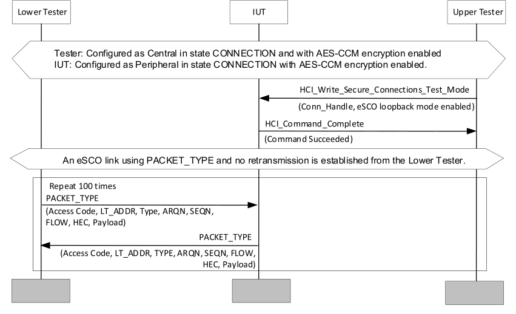

**Figure 4.37: BB/PROT/COD/BV-43-C [EV4 Packet Type with AES-CCM encryption]**

a) The Upper Tester sends HCI Write Secure Connections Test Mode to enable the eSCO loopback
mode. b) An eSCO link using EV4 packet type and no retransmission is established by the Lower Tester. c) The Lower Tester transmits an EV4 packet to the IUT:
Access code:
Preamble: ‘1010’B or ‘0101’B sequence, depending on whether the LSB of the following sync word is 1 or 0, respectively.
Sync word: derived from the 24 bit address (LAP) of the Central (CAC).
Trailer: ‘1010’B or ‘0101’B sequence, depending on whether the MSB of the sync word is 1 or 0, respectively.
Packet header: per [13] Section 6.4
LT_ADDR—Logical Transport Address.
TYPE—‘1100'B
FLOW—‘1'B
ARQN—'0'B
Guard time—As defined in [1].
Sync sequence—As defined in [1].
Payload header—N/A
Payload body—80 non deterministic random Bytes of payload plus 16 bit CRC.
Trailer—As defined in [1].
d) The IUT replies with a packet of same description and ARQN bit set to ACK. e) The Lower Tester verifies that the IUT transmits the packet correctly to the Lower Tester. f) Steps c)–e) are repeated 99 times (in addition to the first time) plus a few times equal to the eSCO loopback delay value, so that the IUT sends a minimum of 100 packets containing a looped back payload.
• Expected Outcome
Pass verdict
In at least 99% of the repetitions, the Lower Tester received a packet properly encrypted and containing the same payload as it transmitted.
• Notes
The payload is protected by FEC and is CRC coded.
The nonce used for AES-CCM encryption is derived using the same rules as applicable in a normal eSCO connection.
According to the Secure Connections eSCO Loopback Delay value (provided in the IXIT [14]), the payload contained in the first packets from the IUT is discarded and does not impact the verdict.
BB/PROT/COD/BV-44-C [EV5 Packet Type with AES-CCM encryption]
• Test Purpose
Verify that the IUT is capable of processing properly reception and transmission of EV5 packets with AES-CCM encryption.
• Reference
[1] 6.5.3
• Initial Condition
- Lower Tester: Configured as Central in state CONNECTION and with AES-CCM encryption enabled.
- IUT: Configured as Peripheral in state CONNECTION with Secure Connection Test Mode (eSCO_Loopback_Mode enabled) enabled and with AES-CCM encryption enabled. Whitening is on. An eSCO link using EV5 packet type and no retransmission is established.
• Test Procedure

**Figure 4.38: BB/PROT/COD/BV-44-C [EV5 Packet Type with AES-CCM encryption]**

a) The Upper Tester sends HCI Write Secure Connections Test Mode to enable the eSCO loopback
mode. b) An eSCO link using EV5 packet type and no retransmission is established by the Lower Tester. c) The Lower Tester transmits an EV5 packet to the IUT:
Access code:
Preamble: ‘1010’B or ‘0101’B sequence, depending on whether the LSB of the following sync word is 1 or 0, respectively.
Sync word: derived from the 24 bit address (LAP) of the Central (CAC).
Trailer: ‘1010’B or ‘0101’B sequence, depending on whether the MSB of the sync word is 1 or 0, respectively.
Packet header:
LT_ADDR—Logical Transport Address.
TYPE—‘1101'B
FLOW—‘1'B
ARQN—'0'B
SEQN—depends on the former transmission of the Lower Tester
Payload header:
Guard time—As defined in [1].
Sync sequence—As defined in [1].
Payload header—N/A
Trailer—As defined in [1].
d) The IUT replies with a packet of same description and ARQN bit set to ACK. e) The Lower Tester verifies that the IUT transmits the packet correctly to the Lower Tester. f) Steps c)–e) are repeated 99 times (in addition to the first time) plus a few times equal to the eSCO loopback delay value, so that the IUT sends a minimum of 100 packets containing a looped back payload.
• Expected Outcome
Pass verdict
In at least 99% of the repetitions, the Lower Tester received a packet properly encrypted and containing the same payload as it transmitted.
• Notes
The payload is not protected by FEC but is CRC coded.
The nonce used for AES-CCM encryption is derived using the same rules as applicable in a normal eSCO connection.
According to the Secure Connections eSCO Loopback Delay value (provided in the IXIT [14]), the payload contained in the first packets from the IUT is discarded and does not impact the verdict.
BB/PROT/COD/BV-45-C [2-EV3 Packet Type with AES-CCM encryption]
• Test Purpose
Verify that the IUT is capable of processing properly reception and transmission of 2-EV3 packets with AES-CCM encryption.
• Reference
[1] 6.5.3
• Initial Condition
- Lower Tester: Configured as Central in state CONNECTION and with AES-CCM encryption enabled.
- IUT: Configured as Peripheral in state CONNECTION with Secure Connection Test Mode (eSCO_Loopback_Mode enabled) enabled and with AES-CCM encryption enabled. Whitening is on. An eSCO link using 2-EV3 packet type and no retransmission is established.
• Test Procedure

**Figure 4.39: BB/PROT/COD/BV-45-C [2-EV3 Packet Type with AES-CCM encryption]**

a) The Upper Tester sends HCI Write Secure Connections Test Mode to enable the eSCO loopback
mode. b) An eSCO link using 2-EV3 packet type and no retransmission is established by the Lower Tester. c) The Lower Tester transmits a 2-EV3 packet to the IUT:
Access code:
Preamble: ‘1010’B or ‘0101’B sequence, depending on whether the LSB of the following sync word is 1 or 0, respectively.
Sync word: derived from the 24 bit address (LAP) of the Central (CAC).
Trailer: ‘1010’B or ‘0101’B sequence, depending on whether the MSB of the sync word is 1 or 0, respectively.
Packet header: per [13] Section 6.4
LT_ADDR—Logical Transport Address.
TYPE—‘0110'B
FLOW—‘1'B
ARQN—'0'B
SEQN—depends on the former transmission of the Lower Tester
Payload header: per [13] Section 6.6.2
Payload body—60 non deterministic random Bytes of payload plus 16 bit CRC.
d) The IUT replies with a packet of same description and ARQN bit set to ACK.
e) The Lower Tester verifies that the IUT transmits the packet correctly to the Lower Tester. f) Steps c)–e) are repeated 99 times (in addition to the first time) plus a few times equal to the eSCO loopback delay value, so that the IUT sends a minimum of 100 packets containing a looped back payload.
• Expected Outcome
Pass verdict
In at least 99% of the repetitions, the Lower Tester received a packet properly encrypted and containing the same payload as it transmitted.
• Notes
The payload is not protected by FEC but is CRC coded.
The nonce used for AES-CCM encryption is derived using the same rules as applicable in a normal eSCO connection.
According to the Secure Connections eSCO Loopback Delay value (provided in the IXIT [14]), the payload contained in the first packets from the IUT is discarded and does not impact the verdict.
BB/PROT/COD/BV-46-C [2-EV5 Packet Type with AES-CCM encryption]
• Test Purpose
Verify that the IUT is capable of processing properly reception and transmission of 2-EV5 packets with AES-CCM encryption.
• Reference
[1] 6.5.3
• Initial Condition
- Lower Tester: Configured as Central in state CONNECTION and with AES-CCM encryption enabled.
- IUT: Configured as Peripheral in state CONNECTION with Secure Connection Test Mode (eSCO_Loopback_Mode enabled) enabled and with AES-CCM encryption enabled. Whitening is on. An eSCO link using 2-EV5 packet type and no retransmission is established.
• Test Procedure

**Figure 4.40: BB/PROT/COD/BV-46-C [2-EV5 Packet Type with AES-CCM encryption]**

a) The Upper Tester sends HCI Write Secure Connections Test Mode to enable the eSCO loopback
mode. b) An eSCO link using 2-EV5 packet type and no retransmission is established by the Lower Tester. c) The Lower Tester transmits a 2-EV5 packet to the IUT:
Access code:
Preamble: ‘1010’B or ‘0101’B sequence, depending on whether the LSB of the following sync word is 1 or 0, respectively.
Sync word: derived from the 24 bit address (LAP) of the Central (CAC).
Trailer: ‘1010’B or ‘0101’B sequence, depending on whether the MSB of the sync word is 1 or 0, respectively.
Packet header: per [13] Section 6.4
LT_ADDR—Logical Transport Address.
TYPE—‘1100'B
FLOW—‘1'B
ARQN—'0'B
SEQN—depends on the former transmission of the Lower Tester
Payload header: per [13] Section 6.6.2
Payload body—80 non deterministic random Bytes of payload plus 16 bit CRC.
d) The IUT replies with a packet of same description and ARQN bit set to ACK. e) The Lower Tester verifies that the IUT transmits the packet correctly to the Lower Tester.
f) Steps c)–e) are repeated 99 times (in addition to the first time) plus a few times equal to the eSCO loopback delay value, so that the IUT sends a minimum of 100 packets containing a looped back payload.
• Expected Outcome
Pass verdict
In at least 99% of the repetitions, the Lower Tester received a packet properly encrypted and containing the same payload as it transmitted.
• Notes
The payload is not protected by FEC but is CRC coded.
The nonce used for AES-CCM encryption is derived using the same rules as applicable in a normal eSCO connection.
According to the Secure Connections eSCO Loopback Delay value (provided in the IXIT [14]), the payload contained in the first packets from the IUT is discarded and does not impact the verdict.
BB/PROT/COD/BV-47-C [3-EV3 Packet Type with AES-CCM encryption]
• Test Purpose
Verify that the IUT is capable of processing properly reception and transmission of 3-EV3 packets with AES-CCM encryption.
• Reference
[1] 6.5.3
• Initial Condition
- Lower Tester: Configured as Central in state CONNECTION and with AES-CCM encryption enabled.
- IUT: Configured as Peripheral in state CONNECTION with Secure Connection Test Mode (eSCO_Loopback_Mode enabled) enabled and with AES-CCM encryption enabled. Whitening is on. An eSCO link using 3-EV3 packet type and no retransmission is established.
• Test Procedure

**Figure 4.41: BB/PROT/COD/BV-47-C [3-EV3 Packet Type with AES-CCM encryption]**

a) The Upper Tester sends HCI Write Secure Connections Test Mode to enable the eSCO loopback
mode. b) An eSCO link using 3-EV3 packet type and no retransmission is established by the Lower Tester. c) The Lower Tester transmits a 3-EV3 packet to the IUT:
Access code:
Preamble: ‘1010’B or ‘0101’B sequence, depending on whether the LSB of the following sync word is 1 or 0, respectively.
Sync word: derived from the 24 bit address (LAP) of the Central (CAC).
Trailer: ‘1010’B or ‘0101’B sequence, depending on whether the MSB of the sync word is 1 or 0, respectively.
Packet header: per [13] Section 6.4
LT_ADDR—Logical Transport Address.
TYPE—‘0111'B
FLOW—‘1'B
ARQN—'0'B
SEQN—depends on the former transmission of the Lower Tester
Payload header: per [13] Section 6.6.2
Payload header—N/A
Payload body—90 non deterministic random Bytes of payload plus 16 bit CRC.
d) The IUT replies with a packet of same description and ARQN bit set to ACK.
e) The Lower Tester verifies that the IUT transmits the packet correctly to the Lower Tester. f) Steps c)–e) are repeated 99 times (in addition to the first time) plus a few times equal to the eSCO loopback delay value, so that the IUT sends a minimum of 100 packets containing a looped back payload.
• Expected Outcome
Pass verdict
In at least 99% of the repetitions, the Lower Tester received a packet properly encrypted and containing the same payload as it transmitted.
• Notes
The payload is not protected by FEC but is CRC coded.
The nonce used for AES-CCM encryption is derived using the same rules as applicable in a normal eSCO connection.
According to the Secure Connections eSCO Loopback Delay value (provided in the IXIT [14]), the payload contained in the first packets from the IUT is discarded and does not impact the verdict.
BB/PROT/COD/BV-48-C [3-EV5 Packet Type with AES-CCM encryption]
• Test Purpose
Verify that the IUT is capable of processing properly reception and transmission of 3-EV5 packets with AES-CCM encryption.
• Reference
[1] 6.5.3
• Initial Condition
- Lower Tester: Configured as Central in state CONNECTION and with AES-CCM encryption enabled.
- IUT: Configured as Peripheral in state CONNECTION with Secure Connection Test Mode (eSCO_Loopback_Mode enabled) enabled and with AES-CCM encryption enabled. Whitening is on. An eSCO link using 3-EV5 packet type and no retransmission is established.
• Test Procedure

**Figure 4.42: BB/PROT/COD/BV-48-C [3-EV5 Packet Type with AES-CCM encryption]**

a) The Upper Tester sends HCI Write Secure Connections Test Mode to enable the eSCO loopback
mode. b) An eSCO link using 3-EV5 packet type and no retransmission is established by the Lower Tester. c) The Lower Tester transmits a 3-EV5 packet to the IUT:
Access code:
Preamble: ‘1010’B or ‘0101’B sequence, depending on whether the LSB of the following sync word is 1 or 0, respectively.
Sync word: derived from the 24 bit address (LAP) of the Central (CAC).
Trailer: ‘1010’B or ‘0101’B sequence, depending on whether the MSB of the sync word is 1 or 0, respectively.
Packet header: per [13] Section 6.4
LT_ADDR—Logical Transport Address.
TYPE—‘1101'B
FLOW—‘1'B
ARQN—'0'B
SEQN—depends on the former transmission of the Lower Tester
Payload header: per [13] Section 6.6.2
Payload body—80 non deterministic random Bytes of payload plus 16 bit CRC.
d) The IUT replies with a packet of same description and ARQN bit set to ACK. e) The Lower Tester verifies that the IUT transmits the packet correctly to the Lower Tester.
f) Steps c)–e) are repeated 99 times (in addition to the first time) plus a few times equal to the eSCO loopback delay value, so that the IUT sends a minimum of 100 packets containing a looped back payload.
• Expected Outcome
Pass verdict
The IUT transmits the same packet with the ARQN bit set to ACK for at least 95% of the repetitions.
In at least 95% of the repetitions, the Lower Tester received a packet properly encrypted and containing the same payload as it transmitted.
• Notes
The payload is not protected by FEC but is CRC coded.
The nonce used for AES-CCM encryption is derived using the same rules as applicable in a normal eSCO connection.
According to the Secure Connections eSCO Loopback Delay value (provided in the IXIT [14]), the payload contained in the first packets from the IUT is discarded and does not impact the verdict.

#### 4.8.2 FEC (R=1/3)

Verify that the Forward Error Correction, Rate = 1/3, is correctly implemented.
BB/PROT/COD/BV-12-C [Correctable Packet Header]
• Test Purpose
Verify that the IUT, upon reception of a DM1 packet with a correctable error in the packet header, decodes and encodes the packet correctly.
• Reference
[1] 7.4
• Initial Condition
- Lower Tester: Configured as Central in state CONNECTION.
- IUT: Configured as Peripheral in state CONNECTION.
• Test Procedure

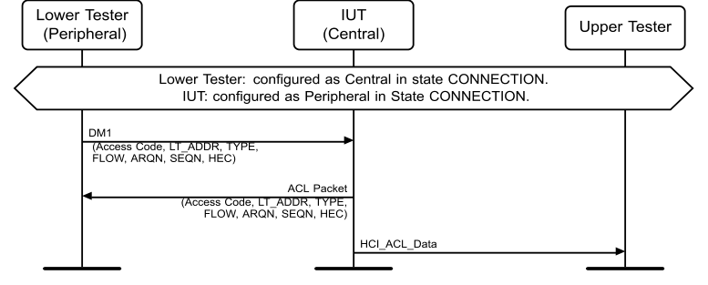

**Figure 4.43: BB/PROT/COD/BV-12-C [Correctable Packet Header]**

DM1
Access code:
Preamble: 1010 or 0101 sequence, depending on whether the LSB of the following sync word is 1 or 0, respectively.
Sync word: Derived from the 24 bit address (LAP) of the Central (CAC).
Trailer: 1010 or 0101 sequence, depending on whether the MSB of the sync word is 1 or 0, respectively.
Packet header:
LT_ADDR: Logical Transport Address of the Peripheral.
TYPE: '0011'B.
FLOW: '1'B.
ARQN: '1'B.
SEQN: Depends on the former transmission of the Lower Tester.
HEC: Generated by the polynomial '647'O in respect to the UAP of the Central.
Payload header:
LLID: '10'B indicating no fragmentation.
FLOW: '1'B.
LENGTH: '01010'B = '10'D.
Payload body: 10 Bytes.
The packet header is FEC 1/3 coded. After the coding procedure has successfully performed errors have to be inserted. In packets of three bits one bit will be changed.
The Lower Tester verifies that the IUT transmits the next packet in the next slot to the Lower Tester with the ARQN bit set to ACK.
The Upper Tester verifies that the IUT is sending the data sent by the Lower Tester to the Upper Tester using HCI_ACL_Data event.
This Test Procedure is repeated 100 times. The inserted correctable errors must be distributed in all possible bit error positions in the 100 packets, with only one error per packet.
• Expected Outcome
Pass verdict
The IUT responds to the tester DM1 packet in the next slot with the ARQN bit set to ACK for at least or equal than 95% of the repetitions.
• Test Purpose
Verify that the IUT, upon reception of a HV1 packet with a correctable error in the payload, decodes and encodes the packet correctly.
• Reference
[1] 7.4
• Initial Condition
- Lower Tester: Configured as Central in state CONNECTION.
- IUT: Configured as Peripheral in state CONNECTION with Test Mode (Loopback, Synchronous packets) active.
• Test Procedure
Central Peripheral

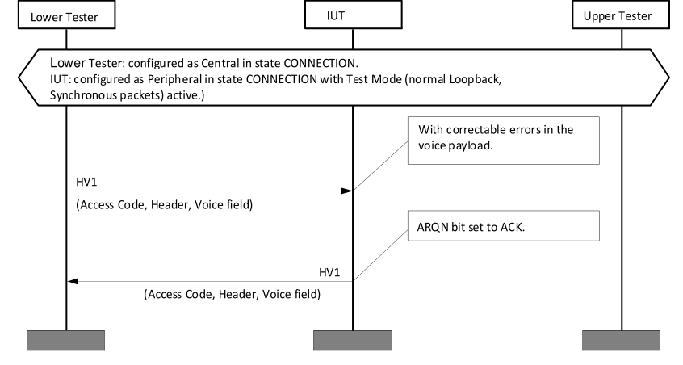

**Figure 4.44: BB/PROT/COD/BV-14-C [Correctable Error HV1 Payload]**

The Lower Tester transmits a HV1 packet with a correctable error in the payload.
HV1
Access code:
Preamble: 1010 or 0101 sequence, depending on whether the LSB of the following sync word is 1 or 0, respectively.
Sync word: Derived from the 24 bit address (LAP) of the Central (CAC).
Trailer: 1010 or 0101 sequence, depending on whether the MSB of the sync word is 1 or 0, respectively.
Packet header:
LT_ADDR: Logical Transport Address of the Peripheral.
TYPE: '0101'B.
ARQN: '1'B.
SEQN: Any value because data without CRC information is used.
HEC: Generated by the polynomial '647'O in respect to the UAP of the Central.
Payload body: 10 Byte user payload.
The payload body is FEC 1/3 coded. After the coding procedure has been successfully performed errors have to be inserted. In blocks of three bits one bit will be changed.
The Lower Tester verifies that the IUT sends the packet correctly coded back to the Lower Tester with the ARQN bit set to ACK.
This Test Procedure is repeated 240 times to cover all bit positions after FEC is applied. The inserted correctable errors must be distributed in all 240 possible bit positions in the 240 packets, with only one error per packet.
• Expected Outcome
Pass verdict
The IUT transmits the same packet with the ARQN bit set to ACK for at least or equal than 95% of the repetitions.

#### 4.8.3 FEC (R=2/3)

Verify that the Forward Error Correction, Rate = 2/3, is correctly implemented.
BB/PROT/COD/BV-16-C [Correctable Error DM1 Payload]
• Test Purpose
Verify that the IUT, upon reception of a DM1 packet with a correctable error in the payload, decodes and encodes the packet correctly.
• Reference
[1] 7.5
• Initial Condition
- Lower Tester: Configured as Central in state CONNECTION.
- IUT: Configured as Peripheral in state CONNECTION with Test Mode (Loopback, ACL packets) active.
• Test Procedure
Central Peripheral

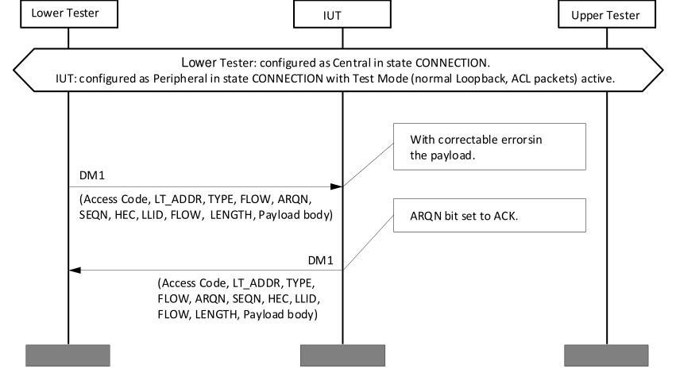

**Figure 4.45: BB/PROT/COD/BV-16-C [Correctable Error DM1 Payload]**

The Lower Tester transmits a DM1 packet with a correctable error in the payload.
DM1
Access code:
Preamble: 1010 or 0101 sequence, depending on whether the LSB of the following sync word is 1 or 0, respectively.
Sync word: Derived from the 24 bit address (LAP) of the Central (CAC).
Trailer: 1010 or 0101 sequence, depending on whether the MSB of the sync word is 1 or 0, respectively.
Packet header:
LT_ADDR: Logical Transport Address of the Peripheral.
TYPE: '0011'B.
FLOW: '1'B.
ARQN: '1'B.
SEQN: Depends on the former transmission of the Lower Tester.
HEC: Generated by the polynomial '647'O in respect to the UAP of the Central.
Payload header:
LLID: '10'B indicating no fragmentation.
FLOW: '1'B.
LENGTH: '01001'B = '9'D.
Payload body: 9 Bytes PRBS.
This corresponds to 100 bits payload contents (1 Byte packet header 9 Bytes payload body and 2 Bytes CRC corresponds to 96 bits plus 4 zero bits for FEC coding) before FEC 2/3 coding. After FEC 2/3 coding the payload consists of 150 bits. In blocks of 15 bits one bit will be changed.
The Lower Tester verifies that the IUT transmits the packet correctly coded back to the Lower Tester with the ARQN bit set to ACK.
This Test Procedure is repeated 150 times to cover all bits positions after FEC is applied. The inserted correctable errors must be distributed in all 150 possible bit positions in the 150 packets, with only one error per packet.
• Expected Outcome
Pass verdict
The IUT correctly acknowledges the DM1 packet sent by the Lower Tester.
The IUT transmits the same DM1 packet, possibly after a loopback delay, for at least 95% of the repetitions.

### 4.9 ARQ

Verify that correct Automatic Repeat Request scheme is used.

#### 4.9.1 ARQ procedures - Central

Verify that the ARQ scheme used by the Central is correct.
BB/PROT/ARQ/BV-01-C [Explicit NAK]
• Test Purpose
Verify that the IUT configured as Central, upon reception of a packet with its ARQN bit set to NAK (explicit NAK), retransmits the packet again.
• Reference
[1] 6.4.4, 7.6, 7.6.2
• Initial Condition
- Lower Tester: Configured as Peripheral in state CONNECTION (active mode, ACL link).
- IUT: Configured as Central in state CONNECTION (active mode, ACL link).
• Test Procedure
Central Peripheral

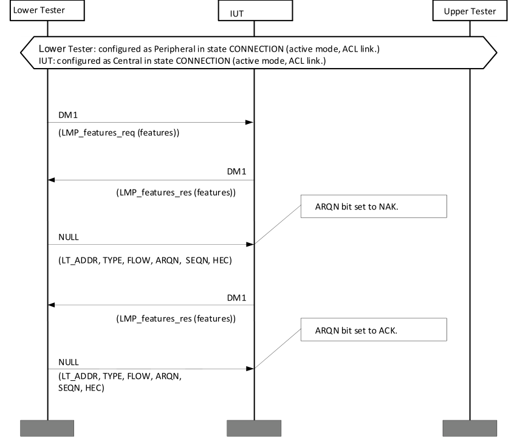

**Figure 4.46: BB/PROT/ARQ/BV-01-C [Explicit NAK]**

The Lower Tester transmits an LMP_features_req message.
The Lower Tester verifies that the IUT transmits a DM1 packet containing LMP_features_res.
The Lower Tester acknowledges the packet with a NULL packet with ARQN bit set to NAK.
NULL
Access code:
Preamble: 1010 or 0101 sequence, depending on whether the LSB of the following sync word is 1 or 0, respectively.
Sync word: Derived from the 24 bit address (LAP) of the Central (CAC).
Trailer: 1010 or 0101 sequence, depending on whether the MSB of the sync word is 1 or 0, respectively.
LT_ADDR: Logical Transport Address of the Peripheral.
TYPE: '0000'B.
FLOW: '1'B.
ARQN: '0'B.
SEQN: Depends on the former transmission of the Lower Tester.
HEC: Generated by the polynomial '647'O in respect to the UAP of the Central.
The Lower Tester verifies that the IUT retransmits the packet.
• Expected Outcome
Pass verdict
The IUT retransmits the packet after receiving the NULL packet with the ARQN bit set to NAK.
BB/PROT/ARQ/BV-02-C [Implicit NAK]
• Test Purpose
Verify that the IUT configured as Central, when the acknowledgement is left out (implicit NAK), retransmits the packet again.
• Reference
[1] 6.4.4, 7.6
• Initial Condition
- Lower Tester: Configured as Peripheral in state CONNECTION (active mode, ACL link).
- IUT: Configured as Central in state CONNECTION (active mode, ACL link).
• Test Procedure
Central Peripheral

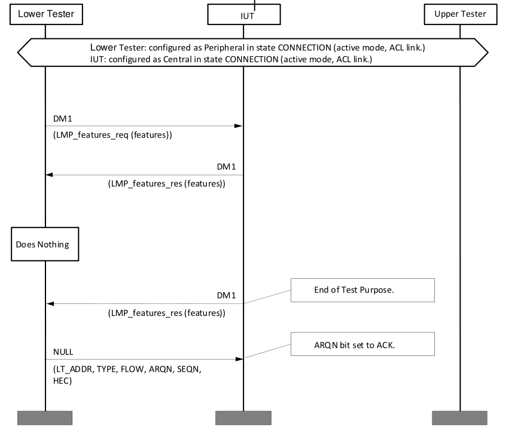

**Figure 4.47: BB/PROT/ARQ/BV-02-C [Implicit NAK]**

The Lower Tester transmits an LMP_features_req message.
The Lower Tester verifies that the IUT transmits a DM1 packet containing LMP_features_res.
The Lower Tester does not send any packet.
The Lower Tester verifies that the IUT retransmits the packet.
• Expected Outcome
Pass verdict
The IUT retransmits the packet after not receiving any response from the Lower Tester.
• Test Purpose
Verify that the IUT configured as Central, upon reception of a packet with uncorrectable errors in the packet header, transmits the next packet addressing the same Peripheral with the ARQN bit set to NAK.
• Reference
[1] 6.4.4, 7.6
• Initial Condition
- Lower Tester: Configured as Peripheral in state CONNECTION (active mode, ACL link).
- IUT: Configured as Central in state CONNECTION (active mode, ACL link).
• Test Procedure
Central Peripheral

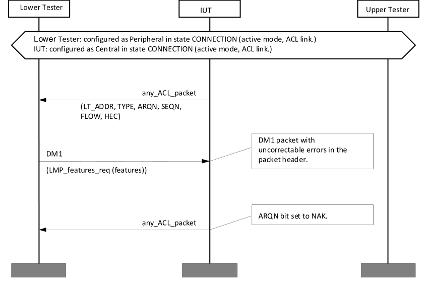

**Figure 4.48: BB/PROT/ARQ/BV-03-C [Uncorrectable Packet Header]**

The Lower Tester transmits a DM1 packet containing the LMP_features_req message with an uncorrectable error in the packet header.
DM1
Access code:
Preamble: 1010 or 0101 sequence, depending on whether the LSB of the following sync word is 1 or 0, respectively.
Sync word: Derived from the 24 bit address (LAP) of the Central (CAC).
Trailer: 1010 or 0101 sequence, depending on whether the MSB of the sync word is 1 or 0, respectively.
Packet header:
LT_ADDR: Logical Transport Address of the Peripheral.
TYPE: '0011'B.
FLOW: '1'B.
ARQN: '1'B.
SEQN: Depends on the previous transmission from the Lower Tester and ACK or NAK from the IUT.
HEC: Generated by the polynomial '647'O in respect to the UAP of the Central.
The packet header is FEC 1/3 coded. After the coding procedure has successfully performed errors have to be inserted. The maximum number of inserted errors depends on the Hamming distance provided by the HEC.
Payload header:
LLID: '11'B indicating a LMP message.
FLOW: '1'B.
LENGTH: '01001'B = '9'D.
Payload body: 9 Bytes.
1. Byte = '4F'H Transaction ID and OpCode.
2. to 9. Byte = '00'H.
The Lower Tester verifies that the IUT transmits an ACL packet with the ARQN bit set to NAK in the next Central to Peripheral transmission.
This Test Procedure is repeated 100 times. The inserted uncorrectable errors must be statistically distributed.
• Expected Outcome
Pass verdict
For at least 99% of the repetitions the IUT transmits a packet with the ARQN bit set to NAK in the next transmission to the Peripheral.
• Notes
This test should lead to the Lower Tester transmitting 100 consecutive packets with uncorrectable errors.
BB/PROT/ARQ/BV-04-C [Uncorrectable Payload]
• Test Purpose
Verify that the IUT, configured as Central, upon reception of a DM1 packet with uncorrectable errors in the payload transmits a packet with the ARQN bit set to NAK.
• Reference
[1] 6.4.4, 7.6
• Initial Condition
- Lower Tester: Configured as Peripheral in state CONNECTION (active mode, ACL link).
- IUT: Configured as Central in state CONNECTION (active mode, ACL link).
• Test Procedure
Central Peripheral

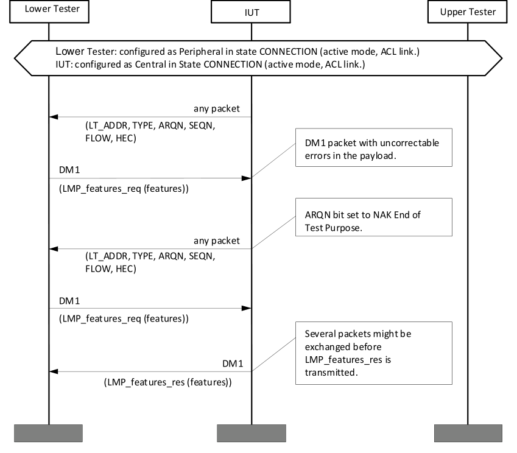

**Figure 4.49: BB/PROT/ARQ/BV-04-C [Uncorrectable Payload]**

The Lower Tester transmits a DM1 packet containing the LMP_features_req message with an uncorrectable error in the payload.
DM1
Access code:
Preamble: 1010 or 0101 sequence, depending on whether the LSB of the following sync word is 1 or 0, respectively.
Sync word: Derived from the 24 bit address (LAP) of the Central (CAC).
Trailer: 1010 or 0101 sequence, depending on whether the MSB of the sync word is 1 or 0, respectively.
LT_ADDR: Logical Transport Address of the Peripheral.
TYPE: '0011'B.
FLOW: '1'B.
ARQN: '1'B.
SEQN: Depends on the previous transmission from the Lower Tester and ACK or NAK from the IUT.
HEC: Generated by the polynomial '647'O in respect to the UAP of the Central.
Payload header:
LLID: '11'B indicating a LMP message.
FLOW: '1'B.
LENGTH: '01001'B = '9'D.
Payload body: 9 Bytes.
1. Byte = ‘4F’H Transaction ID and OpCode.
2. to 9. Byte = '00'H.
This corresponds to 90 bits payload contents (1 Byte packet header 8 Bytes payload body and 2 Bytes CRC corresponds to 88 bits plus 2 zero bits for FEC coding) before FEC 2/3 coding. After FEC 2/3 coding the payload consists of 135 bits. The maximum number of inserted errors depends on the Hamming distance provided by the CRC.
Then the Lower Tester verifies that the IUT transmits any packet with the ARQN bit set to NAK.
This Test Procedure is repeated 100 times. The inserted uncorrectable errors must be statistically distributed.
• Expected Outcome
Pass verdict
For at least 99% of the repetitions the IUT transmits a packet with the ARQN bit set to NAK in the next transmission to the Peripheral.
BB/PROT/ARQ/BV-05-C [SEQN]
• Test Purpose
Verify that the IUT, configured as Central, respects SEQN values in the transmit case.
• Reference
[1] 7.6.2
• Initial Condition
- Lower Tester: Configured as Peripheral in state CONNECTION (active mode, ACL link).
- The Lower Tester does not support any feature.
- IUT: Configured as Central in state CONNECTION (active mode, ACL link).
• Test Procedure
Central Peripheral

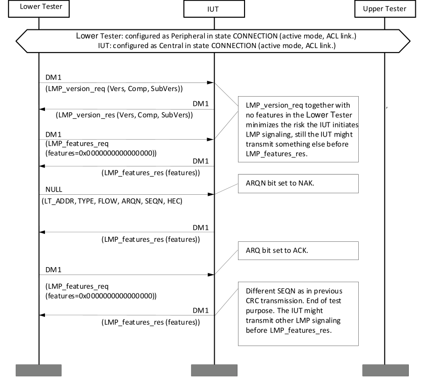

**Figure 4.50: BB/PROT/ARQ/BV-05-C [SEQN]**

The Lower Tester transmits LMP_features_req. The Lower Tester verifies that the IUT transmits a DM1 packet containing LMP_features_res. The Lower Tester has to store the SEQN value (first SEQN value) contained in the packet header.
The Lower Tester acknowledges the packet with a NULL packet with the ARQN bit set to NAK.
NULL
Access code:
Preamble: 1010 or 0101 sequence, depending on whether the LSB of the following sync word is 1 or 0, respectively.
Sync word: Derived from the 24 bit address (LAP) of the Central (CAC).
Trailer: 1010 or 0101 sequence, depending on whether the MSB of the sync word is 1 or 0, respectively.
LT_ADDR: Logical Transport Address of the Peripheral.
TYPE: '0000'B.
FLOW: '1'B.
ARQN: '0'B.
SEQN: Depends on the former transmission of the Lower Tester.
HEC: Generated by the polynomial '647'O in respect to the UAP of the Central.
The Lower Tester verifies that the IUT retransmits the DM1 packet containing LMP_features_res with the same SEQN value (second SEQN value) as in the previous transmission. The Lower Tester has to store the SEQN value contained in the packet header.
The Lower Tester transmits a DM1 packet containing the LMP_features_req again with the ARQN bit set to ACK.
The Lower Tester verifies that the IUT transmits a DM1 packet with a different SEQN value (third SEQN value) compared to the previous transmissions.
• Expected Outcome
Pass verdict
The second SEQN value is the same as the first SEQN value. The third SEQN value is not the same as the second SEQN value.
• Notes
The IUT might transmit unsolicited LMP signaling changing the intended Test Procedure. This risk is minimized by having the Lower Tester transmit LMP_version_req immediately after connection establishment and always indicate no feature is supported.
BB/PROT/ARQ/BV-06-C [FLOW Control]
• Test Purpose
Verify that the IUT, configured as Central, stops transmitting upon receiving STOP indication, switch to default packet types and resumes to transmit when GO indication is received.
• Reference
[1] 4.5.3
• Initial Condition
- Lower Tester: Configured as Peripheral in state CONNECTION (active mode, ACL link).
- IUT: Configured as Central in state CONNECTION (active mode, ACL link).
• Test Procedure
Central Peripheral

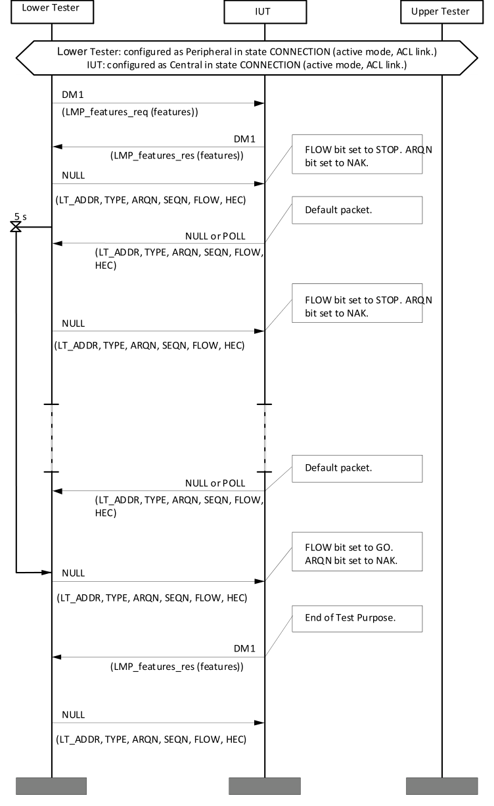

**Figure 4.51: BB/PROT/ARQ/BV-06-C [FLOW Control]**

The Lower Tester transmits LMP_features_req. The Lower Tester verifies that the IUT transmits a DM1 packet containing LMP_features_res. The Lower Tester responds the next 5 s with NULL packets with the FLOW bit set to '0'B indicating STOP and the ARQN bits set to NAK to guarantee a retransmission after indicating GO.
The Lower Tester verifies that the IUT stops transmission and switches to the default packet type (NULL or POLL).
The Lower Tester sends a NULL packet with FLOW bit set to '1'B indicating GO after the 5 s.
NULL
Access Code:
Preamble: 1010 or 0101 sequence, depending on whether the LSB of the following sync word is 1 or 0, respectively.
Sync word: Derived from the 24 bit address (LAP) of the Central (CAC).
Trailer: 1010 or 0101 sequence, depending on whether the MSB of the sync word is 1 or 0, respectively.
Packet header:
LT_ADDR: Logical Transport Address of the Peripheral.
TYPE: '0000'B.
FLOW: '1'B.
ARQN: '0'B.
SEQN: Depends on the former transmission of the Lower Tester.
HEC: Generated by the polynomial '647'O in respect to the UAP of the Central.
The Lower Tester verifies that the IUT transmits a DM1 packet containing an LMP_features_res.
• Expected Outcome
Pass verdict
The IUT stops transmitting upon receiving STOP, switch to the default packet type and resumes to transmit when the GO indication is received. Maximum 5% of the NULL packets sent by the Lower Tester with the FLOW bit indicating STOP is answered by the IUT sending LMP_features_res.
• Notes
If the IUT misses a packet from the Lower Tester, it might interpret this as implicit GO and transmit the LMP_features_res even though the Lower Tester did not remove the stop indication. This would result in a false failure so the IUT is allowed to send the response for 5% of the given STOP indications.
BB/PROT/ARQ/BV-08-C [Implicit GO]
• Test Purpose
Verify that the IUT, configured as Central, goes back to normal transmission mode when the Lower Tester sends implicit GO.
• Reference
[1] 4.5.3
• Initial Condition
- Lower Tester: Configured as Peripheral in state CONNECTION (active mode, ACL link).
- IUT: Configured as Central in state CONNECTION (active mode, ACL link).
• Test Procedure
Central Peripheral

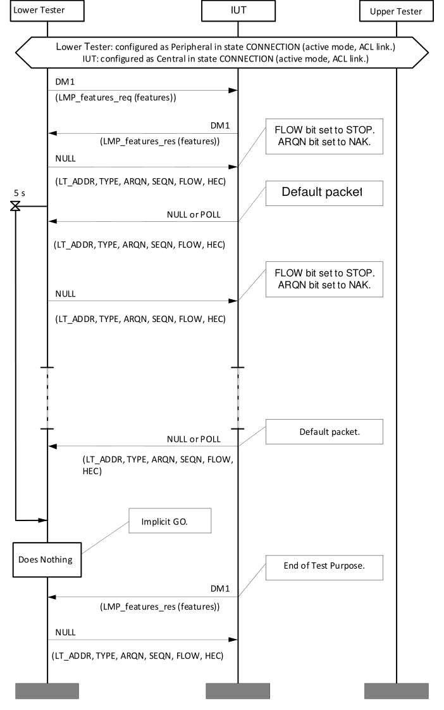

**Figure 4.52: BB/PROT/ARQ/BV-08-C [Implicit GO]**

The Lower Tester transmits LMP_features_req. The Lower Tester verifies that the IUT transmits a DM1 packet containing LMP_features_res. The Lower Tester responds the next 5 s with NULL packets with the FLOW bit set to '0'B indicating STOP and the ARQN bits set to NAK to guarantee a retransmission after indicating GO.
The Lower Tester verifies that the IUT stops transmission and switches to the default packet type (NULL or POLL).
The Lower Tester verifies that the IUT transmits a DM1 packet containing LMP_features_res.
• Expected Outcome
Pass verdict
The IUT goes back to normal transmission mode upon reception of an implicit GO. Maximum 5% of the NULL packets sent by the Lower Tester with the FLOW bit indicating STOP is answered by the IUT sending LMP_features_res.
• Notes
If the IUT misses a packet from the Lower Tester, it might interpret this as implicit GO and transmit the LMP_features_res even though the Lower Tester did not remove the stop indication. This would result in a false failure so the IUT is allowed to send the response for 5% of the given STOP indications.
BB/PROT/ARQ/BV-10-C [Same SEQN Value]
• Test Purpose
Verify that the ARQN bit is set to ACK and the data are disregarded if a packet with CRC information with a correct header is received that has the same SEQN value as in the previous reception.
• Reference
[1] 7.6.1
• Initial Condition
- Lower Tester: Configured as Peripheral in state CONNECTION (active mode, ACL link).
- IUT: Configured as Central in state CONNECTION (active mode, ACL link).
• Test Procedure
Central Peripheral

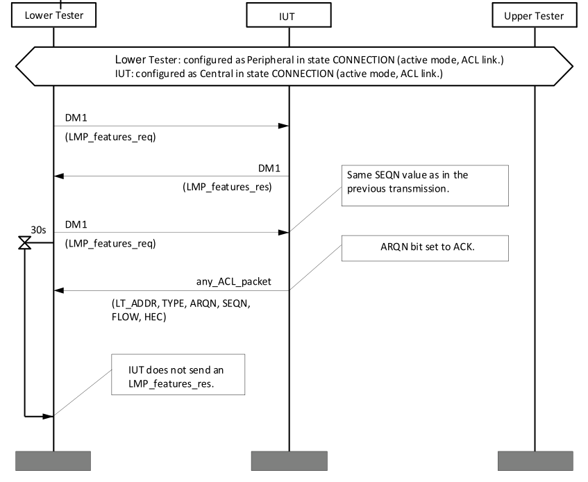

**Figure 4.53: BB/PROT/ARQ/BV-10-C [Same SEQN Value]**

The Lower Tester sends a DM1 packet containing LMP_features_req message.
The Lower Tester verifies that the IUT sends a DM1 packet containing an LMP_features_res message.
The Lower Tester repeats the former DM1 packet containing the LMP_features_req message (same SEQN value).
The Lower Tester verifies that the IUT sends a packet with the ARQN bit set to ACK and verifies that the IUT does not respond to the 2nd LMP_features_req message with an LMP_features_res the next 30 s.
• Expected Outcome
Pass verdict
The IUT acknowledges with a packet with the ARQN bit set ACK and does not respond to the 2nd LMP_features_req message with an LMP_features_res for the next 30 s.
• Test Purpose
Verify that the IUT, when configured as Central, upon reception of an eSCO packet with its ARQN bit set to NAK (explicit NAK) prior to the end of the retransmission window, transmits the packet again.
• Reference
[1] 6.4.4, 7.6
• Initial Condition
- Lower Tester: Configured as Peripheral in state CONNECTION (active mode, ACL link).
- IUT: Configured as Central in state CONNECTION (active mode, ACL link).
- An eSCO link with the following parameters is set up between the Lower Tester and the IUT:
▪ eSCO handle: Any valid number.
▪ eSCO LT_ADDR: Set by the IUT.
▪ Timing control flags: Derived from the IUT Central’s clock.
▪ DeSCO: Set by the IUT.
▪ TeSCO: 6 slots.
▪ WeSCO: 2 slots.
▪ Packet type M→S: EV3.
▪ Packet type S→M: EV3.
▪ Packet length M→S: 30 bytes.
▪ Packet length S→M: 30 bytes.
▪ Air mode: Any supported air mode.
▪ Negotiation Flag: Initiate Negotiation.
• Test Procedure
1. The Lower Tester verifies that the IUT transmits an EV3 packet at the eSCO instant. 2. The Lower Tester transmits an EV3 packet in the following slot:
EV3
Access Code:
Preamble: 1010 or 0101 sequence, depending on whether the LSB of the following sync word is 1 or 0, respectively.
Sync word: Derived from the 24 bit address (LAP) of the Central (CAC).
Trailer: 1010 or 0101 sequence, depending on whether the MSB of the sync word is 1 or 0, respectively.
Packet header:
LT_ADDR: Logical Transport Address of the eSCO link.
TYPE: ‘0111’B.
ARQN: ‘0’B.
SEQN: Depends on the former transmission of the Lower Tester.
HEC: Generated by the polynomial ‘647’O in respect to the UAP of the Central.
Payload Header:
N/A
Payload:

## 30 bytes PRBS plus 16 bit CRC.

1. The Lower Tester verifies that the IUT retransmits the EV3 packet.
Central Peripheral

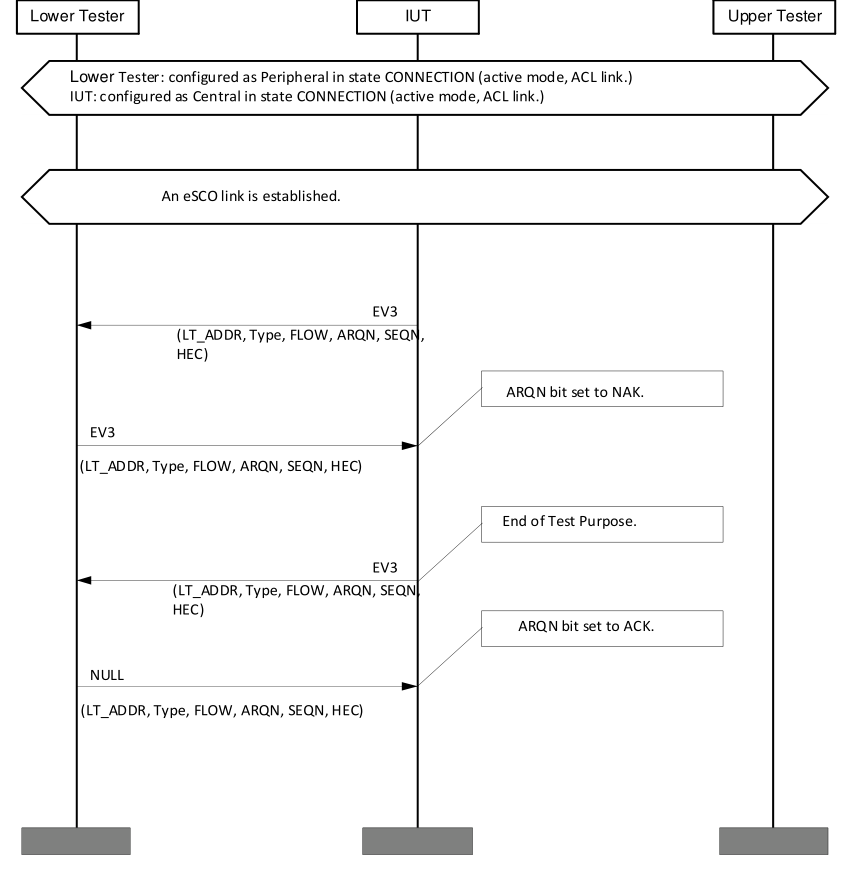

**Figure 4.54: BB/PROT/ARQ/BV-27-C [Explicit NAK – eSCO Central]**

• Expected Outcome
Pass verdict
The IUT retransmits the packet after receiving the EV3 packet with the ARQN bit set to NAK.
• Notes
An IXIT [14] statement is used to distinguish between IUTs requiring HCI interaction to generate EV packets and IUTs transmitting the packets without HCI interaction. Optionally, the IUT might send HCI eSCO packets to the Upper Tester.
BB/PROT/ARQ/BV-28-C [Implicit NAK – eSCO Central]
• Test Purpose
Verify that the IUT, when configured as Central, when the acknowledgement is left out (implicit NAK) prior to the end of the retransmission window, transmits the packet again.
• Reference
[1] 6.4.4, 7.6
• Initial Condition
- Lower Tester: Configured as Peripheral in state CONNECTION (active mode, ACL link).
- IUT: Configured as Central in state CONNECTION (active mode, ACL link).
- An eSCO link with the following parameters is set up between the Lower Tester and the IUT:
▪ eSCO handle: Any valid number.
▪ eSCO LT_ADDR: Set by the IUT.
▪ Timing control flags: Derived from the IUT Central’s clock.
▪ DeSCO: Set by the IUT.
▪ TeSCO: 6 slots.
▪ WeSCO: 2 slots.
▪ Packet type M→S: EV3.
▪ Packet type S→M: EV3.
▪ Packet length M→S: 30 bytes.
▪ Packet length S→M: 30 bytes.
▪ Air mode: Any supported air mode.
▪ Negotiation Flag: Initiate Negotiation.
• Test Procedure
1. The Lower Tester verifies that the IUT transmits an EV3 packet at the eSCO instant. 2. The Lower Tester transmits nothing in the following slot. 3. The Lower Tester verifies that the IUT retransmits the EV3 packet.
Central Peripheral

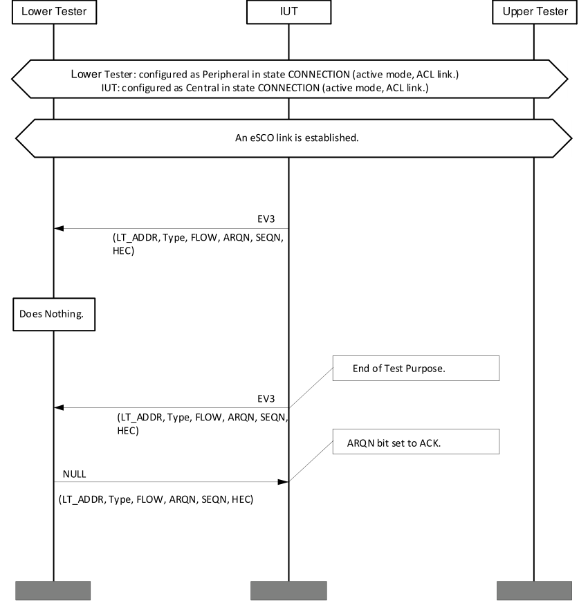

**Figure 4.55: BB/PROT/ARQ/BV-28-C [Implicit NAK – eSCO Central]**

• Expected Outcome
Pass verdict
The IUT retransmits the packet.
• Notes
An IXIT [14] statement is used to distinguish between IUTs requiring HCI interaction to generate EV packets and IUTs transmitting the packets without HCI interaction. Optionally, the IUT might send HCI eSCO packets to the Upper Tester.
• Test Purpose
Verify that the IUT, when configured as Central, upon reception of a packet with uncorrectable errors in the packet header of an eSCO transmission prior to the end of the retransmission window, will transmit the next packet addressing the same Peripheral with the ARQN bit set to NAK.
• Reference
[1] 6.4.4, 7.6
• Initial Condition
- Lower Tester: Configured as Peripheral in state CONNECTION (active mode, ACL link).
- IUT: Configured as Central in state CONNECTION (active mode, ACL link).
- An eSCO link with the following parameters is set up between the Lower Tester and the IUT:
▪ eSCO handle: Any valid number.
▪ eSCO LT_ADDR: Set by the IUT.
▪ Timing control flags: Derived from the IUT Central’s clock.
▪ DeSCO: Set by the IUT.
▪ TeSCO: 6 slots.
▪ WeSCO: 2 slots.
▪ Packet type M→S: EV3.
▪ Packet type S→M: EV3.
▪ Packet length M→S: 30 bytes.
▪ Packet length S→M: 30 bytes.
▪ Air mode: Any supported air mode.
▪ Negotiation Flag: Initiate Negotiation.
• Test Procedure
Central Peripheral

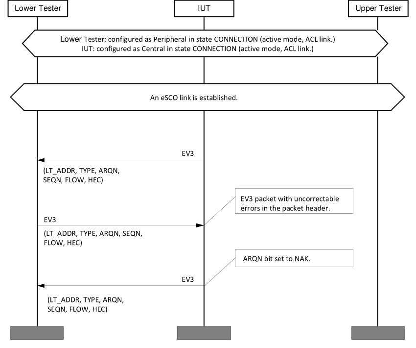

**Figure 4.56: BB/PROT/ARQ/BV-30-C [Uncorrectable Header – eSCO Central]**

1. The Lower Tester verifies that the IUT transmits an EV3 packet at the eSCO instant. 2. The Lower Tester transmits an EV3 packet in the following slot:
EV3
Access code:
Preamble: 1010 or 0101 sequence, depending on whether the LSB of the following sync word is 1 or 0, respectively.
Sync word: Derived from the 24 bit address (LAP) of the Central (CAC).
Trailer: 1010 or 0101 sequence, depending on whether the MSB of the sync word is 1 or 0, respectively.
Packet header:
LT_ADDR: Logical Transport Address of the eSCO link.
TYPE: ‘0111’B.
FLOW: ‘1’B.
ARQN: ‘1’B.
HEC: Generated by the polynomial ‘647’O in respect to the UAP of the Central. The packet header is FEC 1/3 encoded. After the coding procedure, the Lower Tester inserts uncorrectable errors in the header in a random way.
Payload header:
N/A
Payload:

## 30 bytes PRBS plus 16 bit CRC.

1. The Lower Tester verifies that the IUT retransmits the EV3 packet with the ARQN bit set to NAK.
Received retransmitted packet is classified in the following way:
Correct Packet: Packet contains HEC pass, eSCO LT_ADDR, correct packet type, SEQN same as the original, CRC pass, data same as the original.
Incorrect Packet: Packet contains HEC pass, eSCO LT_ADDR, (wrong packet type OR SEQN different to the original OR (CRC pass, data different to the original)).
Ignore Packet: HEC fail OR other LT_ADDR OR CRC fail.
2. The Test Procedure is repeated, with randomly drawn uncorrectable error patterns, until at least

## 100 correct and/or Incorrect Packets have been received.

• Expected Outcome
Pass verdict
The IUT retransmits the packet inside the retransmission window, with the ARQN bit set to NAK, for at least 90% of the repetitions (i.e., Correct Packets/(Correct + Incorrect Packets) >= 0.90).
• Notes
ACL packets used to poll the Peripheral have higher priority than eSCO retransmissions so the IUT might use the ACL LT_ADDR in the retransmission window.
An IXIT [14] statement is used to distinguish between IUTs requiring HCI interaction to generate EV packets and IUTs transmitting the packets without HCI interaction. Optionally, the IUT might send HCI eSCO packets to the Upper Tester.
BB/PROT/ARQ/BV-48-C [Invalid MIC as Central]
• Test Purpose
Verify that the IUT, configured as Central, has the proper behavior in case of MIC failures:
- The IUT, upon reception of a DM1 packet with AES-CCM encryption, a valid CRC and an invalid MIC, transmits a packet with ARQN bit set to NAK.
- No more than three authentication failures are permitted during the lifetime of an encryption key with a given IV.
- The third authentication failure initiates an encryption key refresh.
- If a fourth authentication failure occurs prior to the encryption key refresh procedure completing, the link is disconnected with reason code Connection Rejected Due to Security Reasons (0x0E).
• Reference
[1] 7.6.1
• Initial Condition
- Lower Tester: Configured as Peripheral in state CONNECTION (active mode, ACL link) and AES- CCM encryption enabled.
- IUT: Configured as Central in state CONNECTION (active mode, ACL link) and AES-CCM encryption enabled.
- No authentication failure has occurred since the encryption key has been created or refreshed.
• Test Procedure

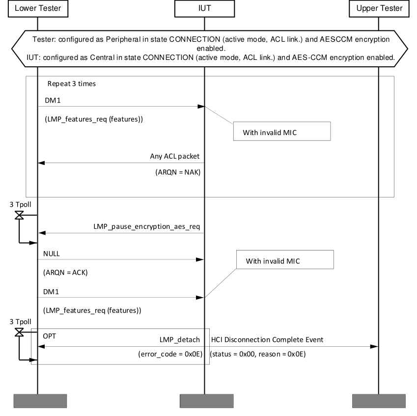

**Figure 4.57: BB/PROT/ARQ/BV-48-C [Invalid MIC as Central]**

invalid MIC.
DM1
Access code:
Preamble: 1010 or 0101 sequence, depending on whether the LSB of the following sync word is 1 or 0, respectively.
Sync word: Derived from the 24 bit address (LAP) of the Central (CAC).
Trailer: 1010 or 0101 sequence, depending on whether the MSB of the sync word is 1 or 0, respectively.
Packet header: per [13] Section 6.4
LT_ADDR: Logical Transport Address of the Peripheral.
TYPE: '0011'B.
FLOW: '1'B.
ARQN: '1'B.
SEQN: Depends on the previous transmission from the Lower Tester and ACK or NAK from the IUT.
Payload header: per [13] Section 6.6.2
LLID: '11'B indicating a LMP message.
FLOW: '1'B.
LENGTH: '01001'B = '9'D.
Payload body: 9 Bytes.
Byte 1 = ‘4F’H Transaction ID and OpCode.
Bytes 2 to 9 = '00'H.
MIC: 4 Bytes
CRC: 2 Bytes
b) The Lower Tester verifies that the IUT transmits any ACL packet with the ARQN bit set to NAK. c) Steps a and b are repeated two times (in addition to the first time). d) The Lower Tester verifies that the IUT initiates an encryption key refresh by sending an
LMP_pause_encryption_aes_req PDU. e) The Lower Tester sends a NULL packet with ARQN bit set to ACK. f) The Lower Tester transmits a DM1 packet with an invalid MIC (repeat of step a). g) The Upper Tester verifies that the IUT sends an HCI Disconnection Complete event with reason
0x0E (Connection Rejected Due to Security Reasons). h) After the HCI event in step g, the IUT does not send any packets to the Lower Tester.
• Test Condition
If additional valid packets are sent from the IUT, they need to be ACKed by the Lower Tester.
• Expected Outcome
Pass verdict
For all the occurrences of step b, the IUT sends a packet with the ARQN bit set to NAK in the next transmission to the Lower Tester.
Before step e, the IUT initiates an encryption key refresh by sending an LMP_pause_encryption_aes_req PDU.
After step f, the IUT notifies the disconnection by sending an HCI Disconnection Complete event with reason 0x0E (Connection Rejected Due to Security Reasons) within a three Tpoll time interval.
BB/PROT/ARQ/BV-49-C [Secure Connections and Uncorrectable payload as Central]
• Test Purpose
Verify that the IUT, configured as a Central, upon receipt of a DM1 packet with AES-CCM encryption and uncorrectable errors in the payload transmits a packet with the ARQN bit set to NAK.
• Reference
[1] 7.6.1
• Initial Condition
- Lower Tester: Configured as Peripheral in state CONNECTION (active mode, ACL link) and AES- CCM encryption enabled.
- IUT: Configured as Central in state CONNECTION (active mode, ACL link) and AES-CCM encryption enabled.
• Test Procedure

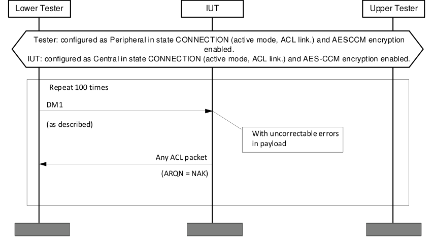

**Figure 4.58: BB/PROT/ARQ/BV-49-C [Secure Connections and Uncorrectable payload as Central]**

a) The Lower Tester transmits a DM1 packet with uncorrectable errors in the payload.
Access code:
Preamble: 1010 or 0101 sequence, depending on whether the LSB of the following sync word is 1 or 0, respectively.
Sync word: Derived from the 24 bit address (LAP) of the Central (CAC).
Trailer: 1010 or 0101 sequence, depending on whether the MSB of the sync word is 1 or 0, respectively.
Packet header: per [13] Section 6.4
LT_ADDR: Logical Transport Address of the Peripheral.
TYPE: '0011'B.
FLOW: '1'B.
ARQN: '1'B.
SEQN: Depends on the previous transmission from the Lower Tester and ACK or NAK from the IUT.
Payload header:
LLID: '11'B indicating a LMP message.
FLOW: '1'B.
LENGTH: '01001'B = '9'D.
Payload body: 9 Bytes.
1. Byte = ‘4F’H Transaction ID and OpCode.
2. to 9. Byte = '00'H.
b) This corresponds to 128 bits payload contents (1 Byte payload header, 9 Bytes payload body, 4
Bytes MIC and 2 Bytes CRC) before FEC 2/3 coding. The maximum number of inserted errors depends on the Hamming distance provided by the CRC. c) The Lower Tester verifies that the IUT transmits any ACL packet with the ARQN bit set to NAK. d) This test procedure is repeated 100 times.
• Expected Outcome
Pass verdict
In at least 99% of the repetitions the IUT sends a packet with the ARQN bit set to NAK in the next transmission to the Lower Tester.
The IUT does not send an LMP_pause_encryption_aes_req PDU.
The IUT does not disconnect the link.

#### 4.9.2 ARQ procedures - Peripheral

Verify that the ARQ scheme used by the Peripheral is correct.
BB/PROT/ARQ/BV-14-C [Uncorrectable Packet Header]
• Test Purpose
Verify that the IUT, configured as Peripheral, upon reception of a packet with uncorrectable errors in the packet header, does not transmit any packet.
• Reference
[1] 6.4.4, 7.6
• Initial Condition
- Lower Tester: Configured as Central in state CONNECTION (active mode, ACL link).
- IUT: Configured as Peripheral in state CONNECTION (active mode, ACL link).
• Test Procedure
Central Peripheral

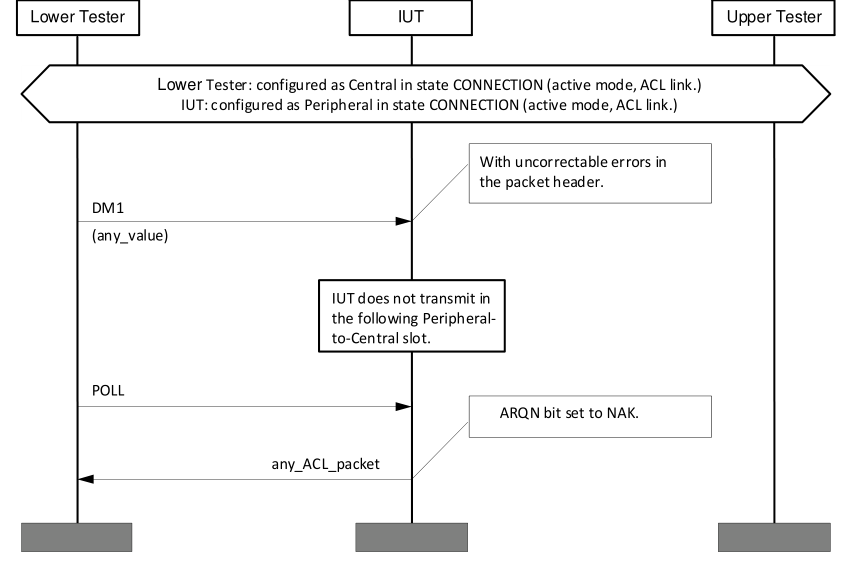

**Figure 4.59: BB/PROT/ARQ/BV-14-C [Uncorrectable Packet Header]**

DM1
Access code:
Preamble: 1010 or 0101 sequence, depending on whether the LSB of the following sync word is 1 or 0, respectively.
Sync word: Derived from the 24 bit address (LAP) of the Central (CAC).
Trailer: 1010 or 0101 sequence, depending on whether the MSB of the sync word is 1 or 0, respectively.
Packet header:
LT_ADDR: Logical Transport Address of the Peripheral.
TYPE: ‘0011’B.
FLOW: ‘1’B.
ARQN: ‘1’B.
SEQN: Depends on the previous transmission from the Lower Tester and ACK or NAK from the IUT.
HEC: Generated by the polynomial ‘647’O in respect to the UAP of the Central.
The packet header is FEC 1/3 coded. After the coding procedure has successfully performed errors have to be inserted. The maximum number of inserted errors depends on the Hamming distance provided by the HEC.
Payload header:
LLID: ‘11’B indicating LMP message.
FLOW: ‘1’B.
LENGTH: ‘10001’B = ‘17’D.
Payload body: 17 Bytes PRBS plus 2 bytes CRC.
The Lower Tester verifies that the IUT does not transmit any packet in the following Peripheral to Central slot.
The Lower Tester verifies that the IUT transmits an ACL packet with the ARQN bit set to NAK after the next POLL interval of the Lower Tester.
This Test Procedure is repeated 100 times. The inserted uncorrectable errors must be statistically distributed.
• Expected Outcome
Pass verdict
For at least 99% of the repetitions the IUT does not transmit any packet in the next Peripheral to Central slot. After the next POLL the IUT sets the ARQN bit to NAK.
BB/PROT/ARQ/BV-15-C [Uncorrectable Payload]
• Test Purpose
Verify that the IUT, configured as Peripheral, upon reception of a DM1 packet with uncorrectable errors in the payload, either transmits a packet with ARQN bit set to NAK or does not answer.
• Reference
[1] 6.4.4, 7.6
• Initial Condition
- Lower Tester: Configured as Central in state CONNECTION (active mode, ACL link).
- IUT: Configured as Peripheral in state CONNECTION (active mode, ACL link).
• Test Procedure
Central Peripheral

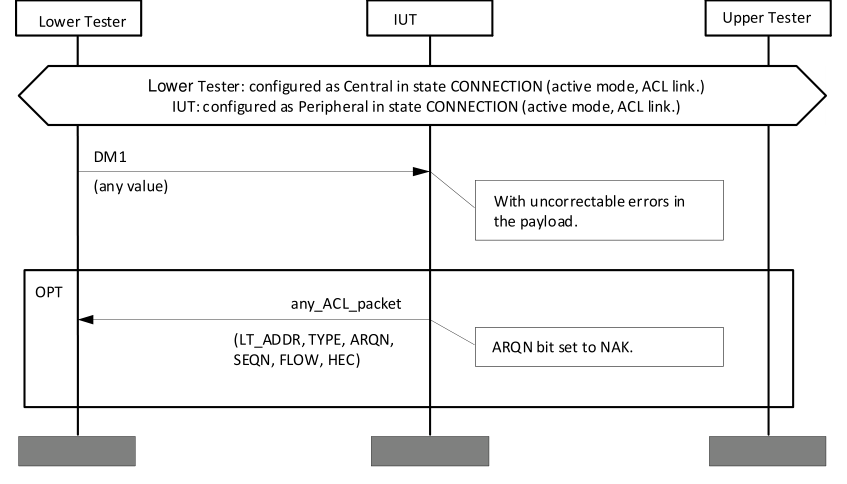

**Figure 4.60: BB/PROT/ARQ/BV-15-C [Uncorrectable Payload]**

The Lower Tester transmits a DM1 packet with an uncorrectable error in the payload.
DM1
Access Code:
Preamble: 1010 or 0101 sequence, depending on whether the LSB of the following sync word is 1 or 0, respectively.
Sync word: Derived from the 24 bit address (LAP) of the Central (CAC).
Trailer: 1010 or 0101 sequence, depending on whether the MSB of the sync word is 1 or 0, respectively.
Packet header:
LT_ADDR: Logical Transport Address of the Peripheral.
TYPE: '0011'B.
FLOW: '1'B.
ARQN: '1'B.
SEQN: Depends on the previous transmission from the Lower Tester and ACK or NAK from the IUT.
HEC: Generated by the polynomial '647'O in respect to the UAP of the Central.
Payload Header:
LLID: '11'B indicating LMP message.
FLOW: '1'B.
LENGTH: '10001'B = '17'D.
Payload body: 17 Bytes PBRS plus 2 bytes CRC.
This corresponds to 160 bits payload contents (1 Byte packet header 17 Bytes payload body and 2 Bytes CRC) before FEC 2/3 coding. After FEC 2/3 coding the payload consists of 240 bits. The maximum number of inserted errors depends on the Hamming distance provided by the CRC.
The Lower Tester verifies that the IUT transmits any ACL packet with the ARQN bit set to NAK, or no packet at all.
This Test Procedure is repeated 100 times. The inserted uncorrectable errors must be statistically distributed.
• Expected Outcome
Pass verdict
In at least 99% of the repetitions the IUT sends a packet with the ARQN bit set to NAK or no packet at all in the next Peripheral to Central slot.
• Notes
This test should lead to the Lower Tester transmitting 100 consecutive packets with uncorrectable errors.
BB/PROT/ARQ/BV-16-C [Explicit NAK]
• Test Purpose
Verify that the IUT, configured as Peripheral, upon reception of a packet with its ARQN bit set to NAK (explicit NAK), retransmits the packet again.
• Reference
[1] 6.4.4, 7.6, 7.6.2
• Initial Condition
- Lower Tester: Configured as Central in state CONNECTION (active mode, ACL link).
- IUT: Configured as Peripheral in state CONNECTION (active mode, ACL link).
• Test Procedure
Central Peripheral

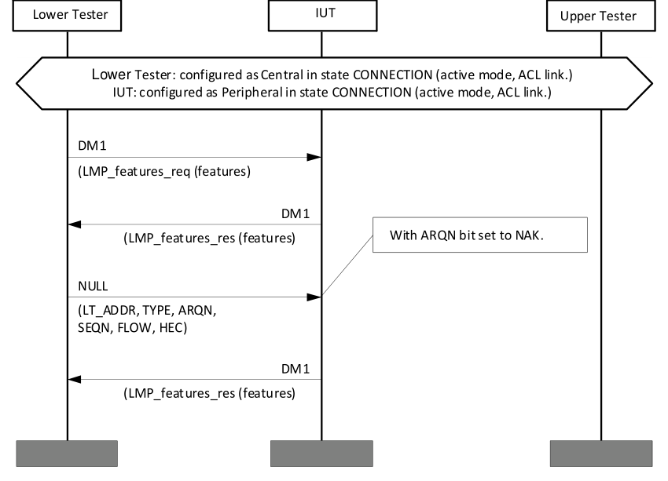

**Figure 4.61: BB/PROT/ARQ/BV-16-C [Explicit NAK]**

The Lower Tester sends a DM1 packet containing an LMP_features_req message.
The Lower Tester verifies that the IUT responds with the LMP_features_res message by using a DM1 packet.
The Lower Tester acknowledges the packet with a NULL packet with the ARQN bit set to NAK.
The Lower Tester verifies that the IUT retransmits the DM1 packet again containing the LMP_features_res message.
• Expected Outcome
Pass verdict
The IUT retransmits the packet after receiving the NULL packet with the ARQN bit set to NAK.
BB/PROT/ARQ/BV-18-C [SEQN]
• Test Purpose
Verify that the IUT, configured as Peripheral, respects SEQN values in the transmit case.
• Reference
[1] 7.6.2
• Initial Condition
- Lower Tester: Configured as Central in state CONNECTION (active mode, ACL link).
- IUT: Configured as Peripheral in state CONNECTION (active mode, ACL link).
- The Lower Tester does not support any feature.
• Test Procedure
Central Peripheral

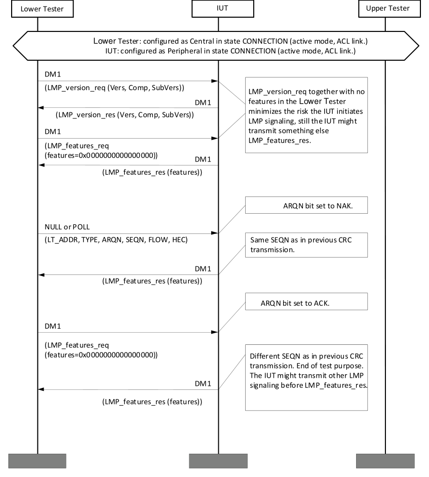

**Figure 4.62: BB/PROT/ARQ/BV-18-C [SEQN]**

DM1
Access code:
Preamble: 1010 or 0101 sequence, depending on whether the LSB of the following sync word is 1 or 0, respectively.
Sync word: Derived from the 24 bit address (LAP) of the Central (CAC).
Trailer: 1010 or 0101 sequence, depending on whether the MSB of the sync word is 1 or 0, respectively.
Packet header:
LT_ADDR: Logical Transport Address of the Peripheral.
TYPE: '0011'B.
FLOW: '1'B.
ARQN: '1'B.
SEQN: Depends on the former transmission of the Lower Tester.
HEC: Generated by the polynomial '647'O in respect to the UAP of the Central.
Payload Header:
LLID: 11'B indicating LMP message.
FLOW: '1'B.
LENGTH: '01001'B = '9'D.
Payload body: 9 Bytes.
1. Byte = '4E'H Transaction ID and OpCode.
2. to 9. Byte = '00'H.
The Lower Tester verifies that the IUT transmits a DM1 packet containing LMP_features_res message. The Lower Tester has to store the SEQN value (first SEQN value) contained in the packet header.
The Lower Tester acknowledges the packet with NULL or POLL packets with the ARQN bit set to NAK.
The Lower Tester verifies that the IUT retransmits the DM1 packet containing LMP_features_res message with the same SEQN value (second SEQN value) as in the previous transmission. The Lower Tester has to store the SEQN value contained in the packet header.
The Lower Tester transmits a DM1 packet containing LMP_features_req message again with the ARQN bit set to ACK.
The Lower Tester verifies that the IUT transmits a DM1 packet with a different SEQN value (third SEQN value) compared to the previous transmissions.
• Expected Outcome
Pass verdict
The second SEQN value is the same as the first SEQN value. The third SEQN value is not the same as the second SEQN value.
• Notes
The IUT might transmit unsolicited LMP signaling changing the intended Test Procedure. This risk is minimized by having the Lower Tester transmit LMP_version_req immediately after connection establishment and always indicate no feature is supported.
BB/PROT/ARQ/BV-19-C [FLOW Control]
• Test Purpose
Verify that the IUT, configured as Peripheral, stops transmitting upon receiving STOP indication, switch to the default packet type and resumes to transmit when GO indication is received.
• Reference
[1] 4.5.3
• Initial Condition
- Lower Tester: Configured as Central in state CONNECTION (active mode, ACL link).
- IUT: Configured as Peripheral in state CONNECTION (active mode, ACL link).
• Test Procedure
Central Peripheral

| Lower Tester |  |  | Upper Tester |  |
| --- | --- | --- | --- | --- |
|  |  |  |  |  |
|  | Lower Tester: configured as Central in state CO IUT: configured as Peripheral in state CONNECTI | NNECTION (active mode, ACL link.) ON (active mode, ACL link.) |  |  |
| 20s | DM1 |  |  |  |
|  | (LMP features req (features)) _ _ NULL |  |  |  |
|  | (LT ADDR, TYPE, ARQN, SEQN, _ FLOW, HEC) POLL |  |  |  |
|  | (LT ADDR, TYPE, ARQN, SEQN, FLOW, _ HEC) NULL |  |  |  |
|  | (LT ADDR, TYPE, ARQN, _ SEQN, FLOW, HEC) POLL |  |  |  |
|  | (LT ADDR, TYPE, ARQN, SEQN, FLOW, _ HEC) NULL |  |  |  |
|  | (LT ADDR, TYPE, ARQN, SEQN, _ FLOW, HEC) POLL |  |  |  |
|  | (LT ADDR, TYPE, ARQN, SEQN, FLOW, _ HEC) DM1 |  |  |  |
|  |  |  |  |  |

The Lower Tester sends a DM1 packet containing a LMP_features_req message with the FLOW bit set to '0'B indicating STOP.
The Lower Tester verifies that the IUT stops transmission and switches to the default packet type (NULL). Since LM does not work in real time a value of 20 s was chosen to ensure that the LMP_features_res message is ready before the GO indication will be sent from the tester. In this 20 s the Lower Tester sends POLL packets with the FLOW bit set to STOP.
After expiration of the 20 s, the Lower Tester sends a POLL packet with the FLOW bit set to GO.
The Lower Tester verifies that the IUT responds with the LMP_features_res message by using a DM1 packet.
• Expected Outcome
Pass verdict
The IUT stops transmitting upon receiving STOP for at least 20 s.
The IUT switches to the default packet type for at least 20 s.
The IUT resumes to transmit when GO indication is received.
BB/PROT/ARQ/BV-23-C [Same SEQN Value]
• Test Purpose
Verify that the ARQN bit is set to ACK and the data is disregarded if a packet with CRC information with a correct header is received that has the same SEQN value as in the previous reception.
• Reference
[1] 7.6.1
• Initial Condition
- Lower Tester: Configured as Central in state CONNECTION (active mode, ACL link).
- IUT: Configured as Peripheral in state CONNECTION (active mode, ACL link).
• Test Procedure
Central Peripheral

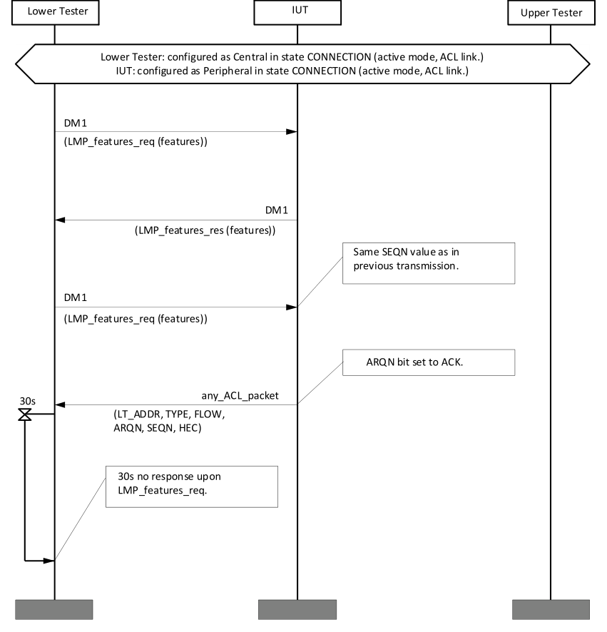

**Figure 4.64: BB/PROT/ARQ/BV-23-C [Same SEQN Value]**

The Lower Tester sends a DM1 packet containing an LMP_features_req message.
The Lower Tester verifies that the IUT transmits a DM1 packet containing an LMP_features_res message.
The Lower Tester sends a DM1 packet containing an LMP_features_req message again with the same SEQN bit as set in the previous transmission.
The Lower Tester verifies that the IUT sends a packet with the ARQN bit set to ACK and discards the payload.
Since LM does not work in real time the Lower Tester waits for 30 s to ensure that the LMP_feature_res is not sent from the IUT.
• Expected Outcome
Pass verdict
The IUT sends a packet with the ARQN bit set to ACK and the IUT disregards the new data.
BB/PROT/ARQ/BV-25-C [Retransmission of DV Packet]
• Test Purpose
Verify that the data payload of a DV packet is retransmitted upon reception of the ARQN bit set to NAK.
• Reference
[1] 6.5.2.4
• Initial Condition
- Lower Tester: Configured as Central.
- IUT: Configured as Peripheral.
- A SCO connection is established.
• Test Procedure
Central Peripheral

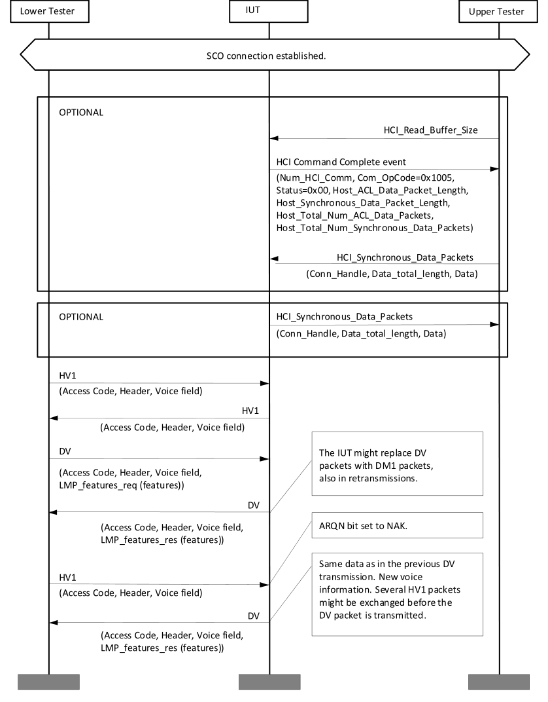

**Figure 4.65: BB/PROT/ARQ/BV-25-C [Retransmission of DV Packet]**

The Lower Tester transmits a DV packet containing LMP_features_req to the IUT in order to force the IUT to transmit LMP_features_res.
The tester verifies that the IUT transmits a DV packet containing the LMP_features_res message.
The Lower Tester responds with an HV1 packet with the ARQN bit set to NAK.
The Lower Tester verifies that the IUT retransmits the DV packet containing the LMP_features_res message.
With IXIT [14] is selected if the IUT needs HCI Synchronous Data packets to transmit HV1/DV packets. If HCI Synchronous Data packets are used the Upper Tester fills them with a pseudo random bit pattern and the Lower Tester checks each HV1/DV packet has a new voice field.
• Expected Outcome
Pass verdict
The IUT transmits a DV packet again containing the same data field.
If HCI Synchronous Data packets are used the new DV packet contains a new voice field.
• Notes
There is no possibility written in [1] to force the IUT to send a DV packet. For IUTs using DV packets it can be checked whether they are received. If no DV packet is returned the IUT must return a DM1 packet.
An IXIT [14] statement is used to distinguish between IUTs requiring HCI interaction to transmit HV1/DV packets and IUTs transmitting the packets without HCI interaction. Optionally, the IUT might send HCI Synchronous packets to the Upper Tester.
BB/PROT/ARQ/BV-26-C [Uncorrectable DV Packet]
• Test Purpose
Verify that the IUT, configured as Peripheral, upon reception of a DV packet with uncorrectable errors in the data payload, transmits a packet with the ARQN bit set to NAK.
• Reference
[1] 6.5.2.4
• Initial Condition
- Lower Tester: Configured as Central.
- IUT: Configured as Peripheral.
- A SCO connection using HV1 packets is established.
• Test Procedure
Central Peripheral

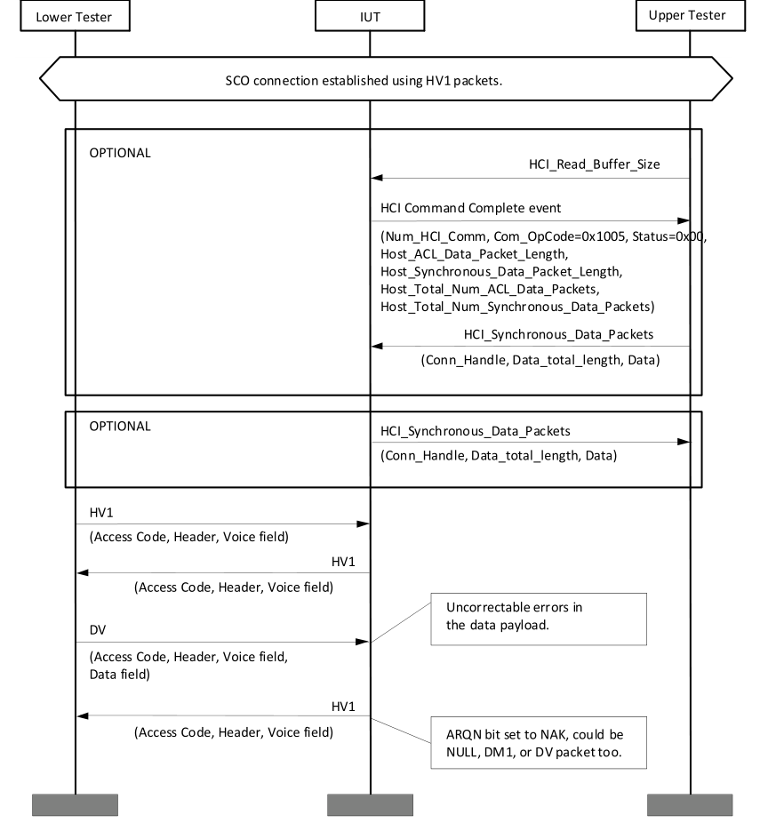

**Figure 4.66: BB/PROT/ARQ/BV-26-C [Uncorrectable DV Packet]**

The Lower Tester transmits a DV packet with uncorrectable errors in the data payload.
The Lower Tester verifies that the IUT transmits a NULL, DM1, DV or HV1 packets with the ARQN bit set to NAK.
• Expected Outcome
Pass verdict
The IUT transmits a NULL, DM1, DV or HV1 packet with the ARQN bit set to NAK.
• Notes
An IXIT [14] statement is used to distinguish between IUTs requiring HCI interaction to transmit HV1/DV packets and IUTs transmitting the packets without HCI interaction. Optionally, the IUT might send HCI Synchronous packets to the Upper Tester.
BB/PROT/ARQ/BV-29-C [Explicit NAK – eSCO Peripheral]
• Test Purpose
Verify that the IUT, when configured as Peripheral, upon reception of an eSCO packet with its ARQN bit set to NAK, transmits the packet again.
• Reference
[1] 6.4.4, 7.6
• Initial Condition
- Lower Tester: Configured as Central in state CONNECTION (active mode, ACL link).
- IUT: Configured as Peripheral in state CONNECTION (active mode, ACL link).
• Test Procedure
Central Peripheral

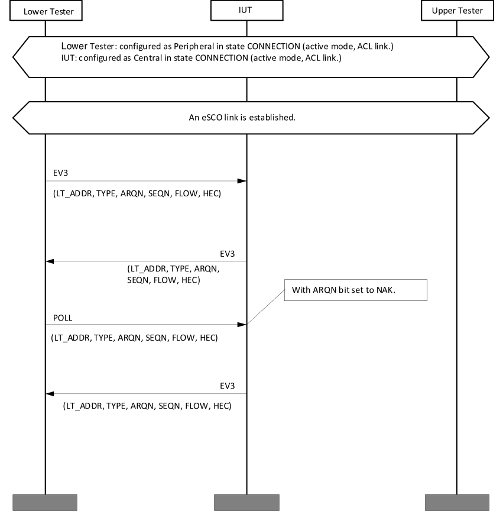

**Figure 4.67: BB/PROT/ARQ/BV-29-C [Explicit NAK – eSCO Peripheral]**

The Lower Tester sets up an eSCO link with the following parameters:
eSCO handle: Any valid number.
eSCO LT_ADDR: Any valid number.
Timing control flags: Derived from Lower Tester’s Central’s clock.
DeSCO: Any number in the range [0, TeSCO-1].
TeSCO: 6 slots.
WeSCO: 2 slots.
Packet type M→S: EV3.
Packet type S→M: EV3.
Packet length S→M: 30 bytes.
Air mode: Any supported air mode.
Negotiation Flag: Initiate Negotiation.
The Lower Tester transmits an EV3 packet at the eSCO instant.
EV3
Access code:
Preamble: 1010 or 0101 sequence, depending on whether the LSB of the following sync word is 1 or 0, respectively.
Sync word: Derived from the 24 bit address (LAP) of the Central (CAC).
Trailer: 1010 or 0101 sequence, depending on whether the MSB of the sync word is 1 or 0, respectively.
Packet header:
LT_ADDR: Logical Transport Address of the eSCO link.
TYPE: ‘0111’B.
FLOW: ‘1’B.
ARQN: ‘0’B.
SEQN: Depends on the former transmission of the Lower Tester.
HEC: Generated by the polynomial ‘647’O in respect to the UAP of the Central.
Payload header:
N/A
Payload:

## 30 bytes PRBS plus 16 bit CRC.

The Lower Tester verifies that the IUT transmits an EV3 packet in the following slot.
The Lower Tester transmits a POLL packet in the following slot:
POLL
Access code:
Preamble: 1010 or 0101 sequence, depending on whether the LSB of the following sync word is 1 or 0, respectively.
Sync word: Derived from the 24 bit address (LAP) of the Central (CAC).
Trailer: 1010 or 0101 sequence, depending on whether the MSB of the sync word is 1 or 0, respectively.
Packet header:
LT_ADDR: Logical Transport Address of the eSCO link.
TYPE: ‘0001’B.
FLOW: ‘1’B.
SEQN: Depends on the former transmission of the Lower Tester.
HEC: Generated by the polynomial ‘647’O in respect to the UAP of the Central.
The Lower Tester verifies that the IUT retransmits the EV3 packet in the following slot.
• Expected Outcome
Pass verdict
The IUT retransmits the packet after receiving the EV3 packet with the ARQN bit set to NAK.
• Notes
An IXIT [14] statement is used to distinguish between IUTs requiring HCI interaction to generate EV packets and IUTs transmitting the packets without HCI interaction. Optionally, the IUT might send HCI eSCO packets to the Upper Tester.
BB/PROT/ARQ/BV-31-C [Uncorrectable Header Original Transmission – eSCO Peripheral]
• Test Purpose
Verify that the IUT, when configured as Peripheral, upon reception of a packet with uncorrectable errors in the packet header of an eSCO original transmission, will transmit the packet with the ARQN bit set to NAK.
• Reference
[1] 6.4.4, 7.6
• Initial Condition
- Lower Tester: Configured as Central in state CONNECTION (active mode, ACL link).
- IUT: Configured as Peripheral in state CONNECTION (active mode, ACL link).
• Test Procedure
Central Peripheral

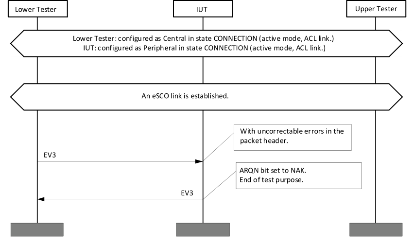

**Figure 4.68: BB/PROT/ARQ/BV-31-C [Uncorrectable Header Original Transmission – eSCO Peripheral]**

The Lower Tester sets up an eSCO link with the following parameters:
eSCO handle: Any valid number.
eSCO LT_ADDR: Any valid number.
Timing control flags: Derived from Lower Tester’s Central’s clock.
DeSCO: Any number in the range [0, TeSCO-1].
TeSCO: 6 slots.
WeSCO: 2 slots.
Packet type M→S: EV3.
Packet type S→M: EV3.
Packet length M→S: 30 bytes.
Packet length S→M: 30 bytes.
Air mode: Any supported air mode.
Negotiation Flag: Initiate Negotiation.
The Lower Tester transmits an EV3 packet at the eSCO instant.
EV3
Access Code:
Preamble: 1010 or 0101 sequence, depending on whether the LSB of the following sync word is 1 or 0, respectively.
Trailer: 1010 or 0101 sequence, depending on whether the MSB of the sync word is 1 or 0, respectively.
Packet header:
LT_ADDR: Logical Transport Address of the eSCO link.
TYPE: ‘0111’B.
FLOW: ‘1’B.
ARQN: ‘1’B.
SEQN: Depends on the former transmission of the Lower Tester.
HEC: Generated by the polynomial ‘647’O in respect to the UAP of the Central. The packet header is FEC 1/3 encoded. After the coding procedure, the Lower Tester inserts uncorrectable errors in the header in a random way.
Payload Header:
N/A
Payload:

## 30 bytes PRBS plus 16 bit CRC.

The Lower Tester verifies that the IUT transmits an EV3 packet in the next slot with the ARQN bit set to NAK.
The Test Procedure is repeated 100 times with randomly drawn uncorrectable error patterns.
• Expected Outcome
Pass verdict
The IUT transmits the packet with the ARQN bit set to NAK for at least 99% of the repetitions excluding responses using the ACL LT_ADDR.
• Notes
The Lower Tester might POLL the IUT forcing the IUT to acknowledge the POLL rather than retransmit eSCO.
An IXIT [14] statement is used to distinguish between IUTs requiring HCI interaction to generate EV packets and IUTs transmitting the packets without HCI interaction. Optionally, the IUT might send HCI eSCO packets to the Upper Tester.
BB/PROT/ARQ/BV-32-C [Uncorrectable Header Re-transmission – eSCO Peripheral]
• Test Purpose
Verify that the IUT, when configured as Peripheral, upon reception of a packet with uncorrectable errors in the packet header of an eSCO re-transmission, does not transmit.
• Reference
[1] 6.4.4, 7.6
• Initial Condition
- Lower Tester: Configured as Central in state CONNECTION (active mode, ACL link).
- IUT: Configured as Peripheral in state CONNECTION (active mode, ACL link).
• Test Procedure

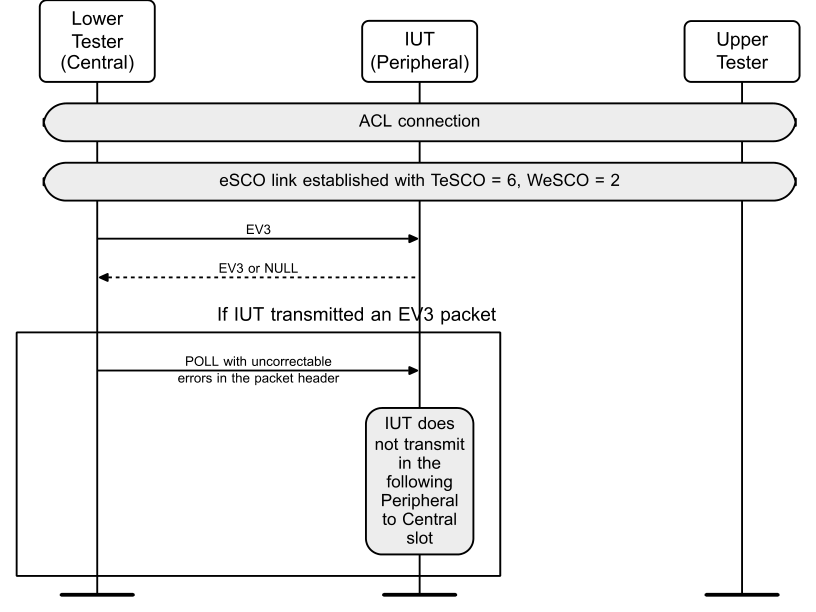

**Figure 4.69: BB/PROT/ARQ/BV-32-C [Uncorrectable Header Re-transmission – eSCO Peripheral]**

1. The Lower Tester sets up an eSCO link with the following parameters:
eSCO handle: Any valid number.
eSCO LT_ADDR: Any valid number.
Timing control flags: Derived from the Lower Tester’s Central’s clock.
DeSCO: 0, 2, or 4.
TeSCO: 6 slots.
WeSCO: 2 slots.
Packet type M→S: EV3.
Packet type S→M: EV3.
Packet length M→S: 30 bytes.
Packet length S→M: 30 bytes.
Air mode: Any supported air mode.
Negotiation Flag: Initiate Negotiation.
2. The Lower Tester transmits an EV3 packet at the eSCO instant.
EV3
Access Code:
Preamble: 1010 or 0101 sequence, depending on whether the LSB of the following sync word is 1 or 0, respectively.
Sync word: Derived from the 24 bit address (LAP) of the Central (CAC).
Trailer: 1010 or 0101 sequence, depending on whether the MSB of the sync word is 1 or 0, respectively.
Packet header:
LT_ADDR: Logical Transport Address of the eSCO link.
TYPE: ‘0111’B.
FLOW: ‘1’B.
ARQN: ‘0’B.
SEQN: Depends on the former transmission of the Lower Tester.
HEC: Generated by the polynomial ‘647’O in respect to the UAP of the Central.
Payload Header:
N/A
Payload:

## 30 bytes PRBS plus 16 bit CRC.

3. The IUT may transmit an EV3, a NULL packet, or nothing at all in the next slot. 4. If the IUT transmits an EV3 in step 3, then the Lower Tester transmits a POLL packet in the
following slot:
POLL
Access Code:
Preamble: 1010 or 0101 sequence, depending on whether the LSB of the following sync word is 1 or 0, respectively.
Sync word: Derived from the 24 bit address (LAP) of the Central (CAC).
Trailer: 1010 or 0101 sequence, depending on whether the MSB of the sync word is 1 or 0, respectively.
Packet header:
LT_ADDR: Logical Transport Address of the eSCO link.
TYPE: ‘0001’B.
FLOW: ‘1’B.
ARQN: ‘0’B.
SEQN: Depends on the former transmission of the Lower tester.
HEC: Generated by the polynomial ‘647’O in respect to the UAP of the Central.
The packet header is FEC 1/3 encoded. After the coding procedure, the Lower Tester inserts uncorrectable errors in the header in a random way.
5. The Lower Tester verifies that the IUT does not transmit again inside the retransmission window. 6. The Test Procedure is repeated with randomly chosen uncorrectable error patterns until the IUT
has transmitted 100 EV3 packets in step 3.
• Expected Outcome
Pass verdict
The IUT does not transmit in response to the second packet from the Lower Tester, in at least 99% of the repetitions.
• Notes
An IXIT [14] statement is used to distinguish between IUTs requiring HCI interaction to generate EV packets and IUTs transmitting the packets without HCI interaction. Optionally, the IUT might send HCI eSCO packets to the Upper Tester.
BB/PROT/ARQ/BV-38-C [Invalid MIC as Peripheral]
• Test Purpose
Verify that the IUT, configured as Peripheral, has the proper behavior in case of MIC failures:
The IUT, upon reception of a DM1 packet with AES-CCM encryption, a valid CRC and an invalid MIC, transmits a packet with ARQN bit set to NAK or no packet at all in the next Peripheral to Central slot.
No more than three authentication failures are permitted during the lifetime of an encryption key with a given IV.
The third authentication failure initiates an encryption key refresh.
If a fourth authentication failure occurs prior to the encryption key refresh procedure completing, the link is disconnected with reason code Connection Rejected Due to Security Reasons (0x0E).
• Reference
[1] 7.6.1
• Initial Condition
- Lower Tester: Configured as Central in state CONNECTION (active mode, ACL link) and AES- CCM encryption enabled.
- IUT: Configured as Peripheral in state CONNECTION (active mode, ACL link) and AES-CCM encryption enabled.
- No authentication failure has occurred since the encryption key has been created or refreshed.
• Test Procedure

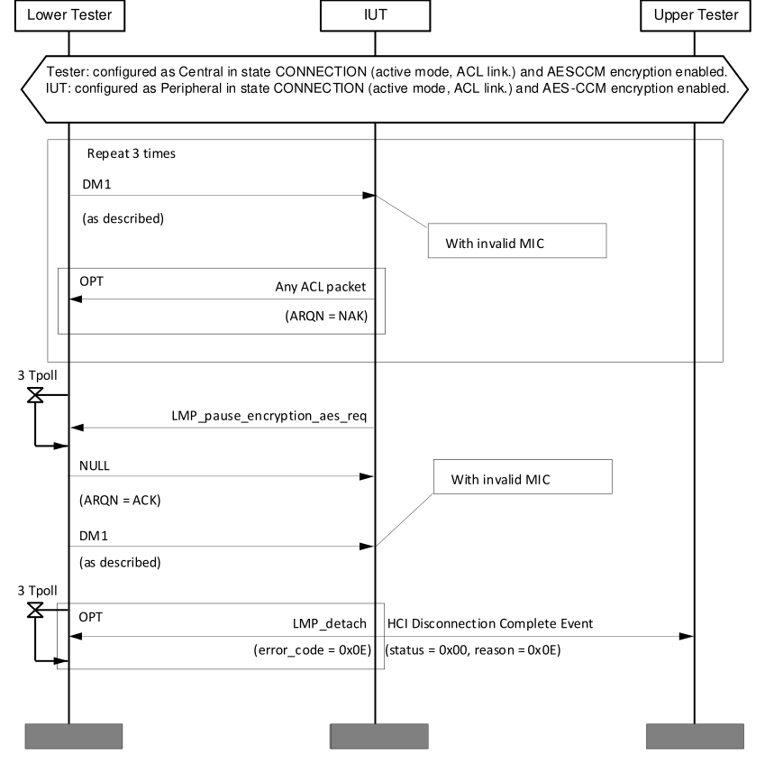

**Figure 4.70: BB/PROT/ARQ/BV-38-C [Invalid MIC as Peripheral]**

a) The Lower Tester transmits a DM1 packet with an invalid MIC.
DM1
Access code:
Preamble: 1010 or 0101 sequence, depending on whether the LSB of the following sync word is 1 or 0, respectively.
Sync word: Derived from the 24 bit address (LAP) of the Central (CAC).
Trailer: 1010 or 0101 sequence, depending on whether the MSB of the sync word is 1 or 0, respectively.
Packet header: per [13] Section 6.4
LT_ADDR: Logical Transport Address of the Peripheral.
TYPE: '0011'B.
ARQN: '1'B.
SEQN: Depends on the previous transmission from the Lower Tester and ACK or NAK from the IUT.
Payload header:
LLID: '11'B indicating LMP message.
FLOW: '1'B.
LENGTH: '10001'B = '17'D.
Payload body:

## 17 Bytes PRBS9 plus 4 bytes MIC (invalid) plus 2 bytes CRC.

This corresponds to 192 bits payload contents (1 Byte payload header, 17 Bytes payload body, 4 Bytes MIC and 2 Bytes CRC) before FEC 2/3 coding.
b) The Lower Tester verifies that the IUT transmits any ACL packet with the ARQN bit set to NAK or
no packet at all in the next Peripheral to Central slot. c) Steps a and b are repeated two times (in addition to the first time). d) The Lower Tester verifies that the IUT initiates an encryption key refresh by sending an
LMP_pause_encryption_aes_req PDU. e) The Lower Tester sends a NULL packet with ARQN bit set to ACK. f) The Lower Tester transmits a DM1 packet with an invalid MIC (repeat of step a). g) The Upper Tester verifies that the IUT sends an HCI Disconnection Complete event with reason
0x0E (Connection Rejected Due to Security Reasons).
• Test Condition
The test is performed at normal conditions. Also, if additional valid packets are sent from the IUT, they need to be ACKed by the Lower Tester.
• Expected Outcome
Pass verdict
For all the occurrences of step b, the IUT sends a packet with the ARQN bit set to NAK or no packet at all in the next Peripheral to Central slot.
Before step e, the IUT initiates an encryption key refresh by sending an LMP_pause_encryption_aes_req PDU.
After step f, the IUT notifies the disconnection by sending an HCI Disconnection Complete event with reason 0x0E (Connection Rejected Due to Security Reasons) within a three Tpoll time interval.
BB/PROT/ARQ/BV-39-C [Secure Connections and Uncorrectable payload as Peripheral]
• Test Purpose
Verify that the IUT, configured as a Peripheral, upon receipt of a DM1 packet with AES-CCM encryption and uncorrectable errors in the payload transmits a packet with the ARQN bit set to NAK or no packet at all in the next Peripheral to Central slot.
• Reference
[1] 7.6.1
• Initial Condition
- Lower Tester: Configured as Central in state CONNECTION (active mode, ACL link) and AES- CCM encryption enabled.
- IUT: Configured as Peripheral in state CONNECTION (active mode, ACL link) and AES-CCM encryption enabled.
• Test Procedure

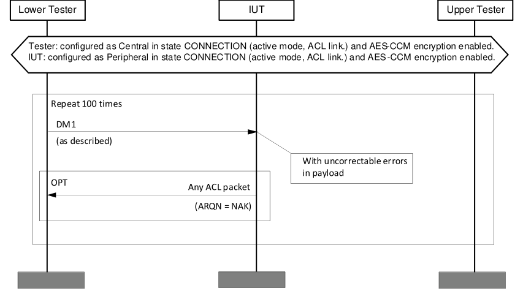

**Figure 4.71: BB/PROT/ARQ/BV-39-C [Secure Connections and Uncorrectable payload as Peripheral]**

a) The Lower Tester transmits a DM1 packet with uncorrectable errors in the payload.
DM1
Access code:
Preamble: 1010 or 0101 sequence, depending on whether the LSB of the following sync word is 1 or 0, respectively.
Sync word: Derived from the 24 bit address (LAP) of the Central (CAC).
Trailer: 1010 or 0101 sequence, depending on whether the MSB of the sync word is 1 or 0, respectively.
Packet header: per [13] Section 6.6.2
LT_ADDR: Logical Transport Address of the Peripheral.
TYPE: '0011'B.
FLOW: '1'B.
ARQN: '1'B.
SEQN: Depends on the previous transmission from the Lower Tester and ACK or NAK from the IUT.
LLID: '11'B indicating LMP message.
FLOW: '1'B.
LENGTH: '10001'B = '17'D.
Payload body: 17 Bytes PRBS9 plus 4 bytes MIC plus 2 bytes CRC.
This corresponds to 192 bits payload contents (1 Byte payload header 17 Bytes payload body, 4 Bytes MIC and 2 Bytes CRC) before FEC 2/3 coding. The maximum number of inserted errors depends on the Hamming distance provided by the CRC.
b) The Lower Tester verifies that the IUT transmits any ACL packet with the ARQN bit set to NAK. c) This test procedure is repeated 100 times.
• Expected Outcome
Pass verdict
In at least 99% of the repetitions the IUT sends a packet with the ARQN bit set to NAK or no packet at all in the next Peripheral to Central slot.
The IUT does not send an LMP_pause_encryption_aes_req PDU.
The IUT does not disconnect the link.
BB/PROT/ARQ/BV-40-C [Retransmitting eSCO with AES as Peripheral]
• Test Purpose
Verify that the IUT properly encrypts with AES the retransmitted eSCO packets as Peripheral.
• Reference
[12] 9.1
• Initial Condition
- The IUT is configured as Peripheral in state CONNECTION (active mode, ACL link) with AES-CCM encryption enabled.
- The Lower Tester is configured as Central in state CONNECTION (active mode, ACL link) and with AES-CCM encryption enabled.
• Test Procedure

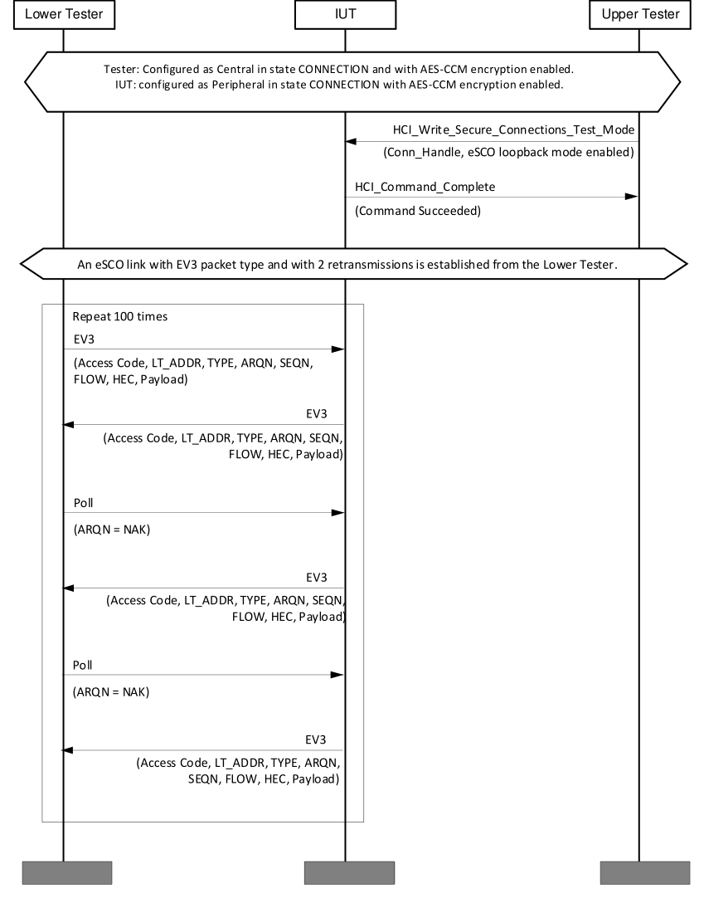

**Figure 4.72: BB/PROT/ARQ/BV-40-C [Retransmitting eSCO with AES as Peripheral]**

a) The Upper Tester sends HCI Write Secure Connections Test Mode to enable the eSCO loopback
mode. b) The Lower Tester initiates an eSCO link using EV3 and with 2 retransmissions. c) The Lower Tester sends an EV3 packet as follows: d) Payload: 30 non deterministic random Bytes of payload plus 16 bit CRC. e) The IUT replies with a packet of same description.
f) The Lower Tester verifies that the packet from the IUT is properly encrypted and contains the same payload as transmitted by the Lower Tester. g) The Lower Tester explicitly NAKs the packet from the IUT using a Poll packet. h) The IUT retransmits the EV3 packet with the same payload. i) The Lower Tester verifies that the packet from the IUT is properly encrypted and contains the same payload as the initial packet from the Lower Tester. j) The Lower Tester explicitly NAKs the packet from the IUT using a Poll packet. k) The IUT retransmits the EV3 packet with the same payload. l) The Lower Tester verifies that the packet from the IUT is properly encrypted and contains the same payload as the initial packet from the Lower Tester. m) Steps c)–k) are repeated 99 times (in addition to the first time) plus a few times equal to the
eSCO loopback delay value, so that the IUT sends a minimum of 100 packets (plus their retransmissions) containing a looped back payload.
• Expected Outcome
Pass verdict
At least 99% of the packets the IUT is supposed to send are received by the Lower Tester, are properly encrypted, and contain the same payload as the Lower Tester transmitted. The percentage applies to the first transmission and the 2 retransmissions all together.
• Notes
The nonce used for AES-CCM encryption is derived using the same rules as applicable in a normal eSCO connection.
According to the Secure Connections eSCO Loopback Delay value (provided in the IXIT [14]), the payload contained in the first packets from the IUT is discarded and does not impact the verdict.
BB/PROT/ARQ/BV-41-C [Receiving eSCO retransmissions with AES as Peripheral]
• Test Purpose
Verify that the IUT properly decrypts with AES the retransmitted eSCO packets as Peripheral.
• Reference
[12] 9.1
• Initial Condition
- The IUT is configured as Peripheral in state CONNECTION (active mode, ACL link) with AES-CCM encryption enabled.
- The Lower Tester is configured as Central in state CONNECTION (active mode, ACL link) and with AES-CCM encryption enabled.
• Test Procedure

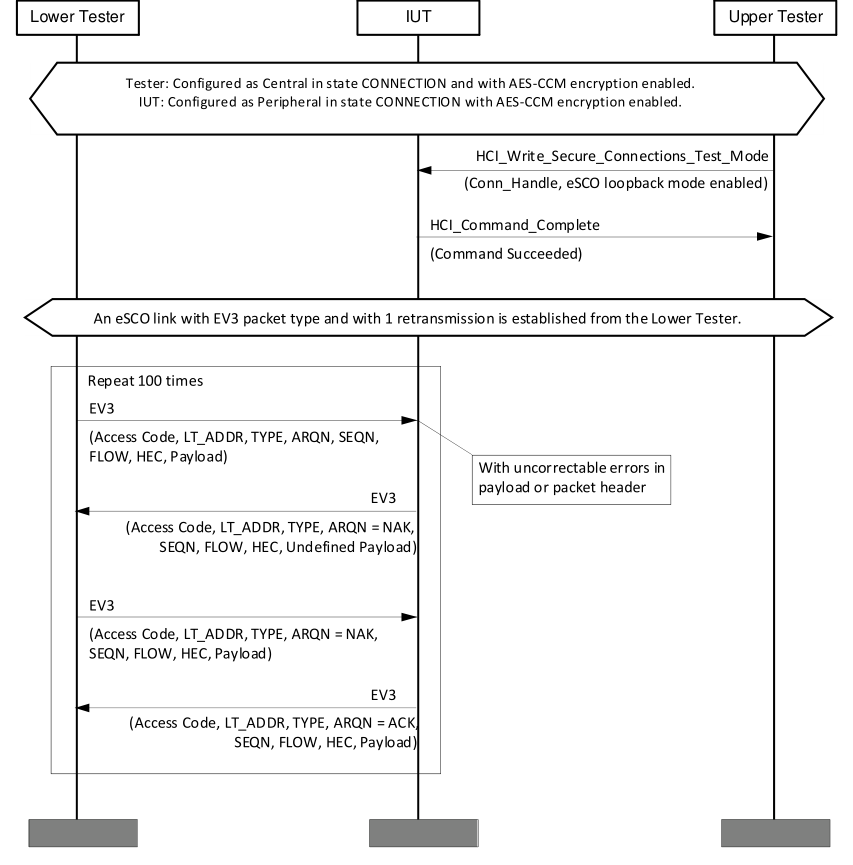

**Figure 4.73: BB/PROT/ARQ/BV-41-C [Receiving eSCO retransmissions with AES as Peripheral]**

a) The Upper Tester sends HCI Write Secure Connections Test Mode to enable the eSCO loopback
mode. b) The Lower Tester initiates an eSCO link using EV3 and with 1 retransmission. c) The Lower Tester sends an EV3 packet as follows:
Payload:

## 30 non deterministic random Bytes of payload plus 16 bit CRC.

The payload or packet header contains uncorrectable errors.
d) The IUT replies with an EV3 packet with ARQN bit set to NAK. e) The Lower Tester ignores the payload contained in the packet with ARQN bit set to NAK.
Payload:

## 30 non deterministic random Bytes of payload plus 16 bit CRC.

The CRC is valid (no errors in the payload) and the packet header is valid.
The ARQN bit set to NAK.
g) The IUT retransmits the EV3 packet with a valid payload and the ARQN bit set to ACK. h) The Lower Tester verifies that the packet from the IUT is properly encrypted and contains the
same payload as transmitted by the Lower Tester. i) Steps c)–h) are repeated 99 times (in addition to the first time) plus a few times equal to the eSCO loopback delay value, so that the IUT sends a minimum of 100 packets (plus their retransmissions) containing a looped back payload.
• Expected Outcome
Pass verdict
In step f, the IUT transmits the same packet with the ARQN bit set to ACK for at least 95% of the repetitions.
In at least 95% of the repetitions, the packet sent by the IUT in step g is properly encrypted and contains the same payload as transmitted by the Lower Tester.
• Notes
The nonce used for AES-CCM encryption is derived using the same rules as applicable in a normal eSCO connection.
According to the Secure Connections eSCO Loopback Delay value (provided in the IXIT [14]), the payload contained in the first packets from the IUT is discarded and does not impact the verdict.
BB/PROT/ARQ/BV-42-C [Receiving retransmitted ACL packets that were previously acked with AES]
• Test Purpose
Verify that the IUT behaves properly when receiving retransmitted ACL packets that were previously ACKed.
• Reference
[1] 7.6.1
• Initial Condition
- The IUT is configured as Peripheral in state CONNECTION (active mode, ACL link) and with AES-CCM encryption enabled.
- The Lower Tester is configured as Central in state CONNECTION (active mode, ACL link) and with AES-CCM encryption enabled.
• Test Procedure

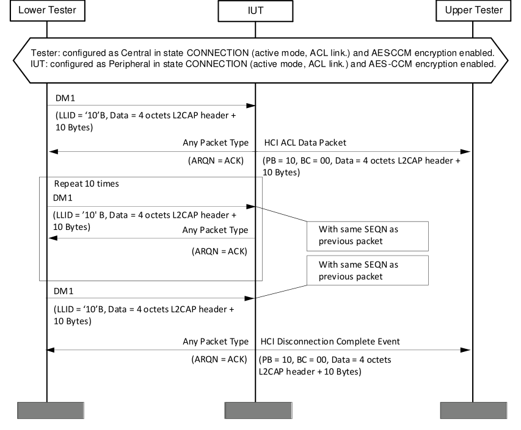

**Figure 4.74: BB/PROT/ARQ/BV-42-C [Receiving retransmitted ACL packets that were previously acked with AES]**

a) The Lower Tester sends a DM1 packet as follows:
DM1
Packet header: per [13] Section 6.4
Payload header:
LLID: '10'B.
FLOW: '1'B.
LENGTH: '1110'B = '14'D.
Payload body:
A valid 4-octet L2CAP header and 10 non deterministic random Bytes of payload plus 32 bits MIC plus 16 bit CRC.
b) The IUT replies with any ACL packet and ARQN bit set to ACK. c) The Upper Tester verifies that the IUT sends the data correctly to the Upper Tester. d) The Lower Tester retransmits the same DM1 packet, the payload and SEQN bit are the same as
the previously sent packet. e) The IUT replies with any ACL packet and ARQN bit set to ACK. f) The Lower Tester verifies that the IUT transmits the packet correctly to the Lower Tester.
g) Steps d)–f) are repeated 9 times (in addition to the first time). h) The Lower Tester sends a DM1 packet to the IUT. The payload and SEQN bit are different from
the previously sent packet. i) The IUT replies with any ACL packet and ARQN bit set to ACK. j) The Lower Tester verifies that the IUT sends the data correctly to the Upper Tester.
• Expected Outcome
Pass verdict
The IUT transmits the ACK packets correctly to the Lower Tester in all repetitions of e.
The IUT sends the data correctly to the Upper Tester in j.
The IUT does not send an LMP_pause_encryption_aes_req PDU.
The IUT does not disconnect the link.

#### 4.9.3 ARQ procedures - Flush

Verify that the flush scheme used by the device is correct.
BB/PROT/ARQ/BV-33-C [Flushable Packet is Flushed]
• Test Purpose
Verify that the IUT correctly flushes a packet transmitted over the HCI interface when the packet boundary flag is set to '10'B on the first packet, an automatic flush timeout value has been set to a short value and the timer expires before the packet is sent.
• Reference
[1] 7.6.3
[11] 5.4.2
• Initial Condition
- The IUT is configured as Peripheral in state CONNECTION (active mode, ACL link).
- The Lower Tester is configured as Central in state CONNECTION (active mode, ACL link).
- The IUT has set a 100 ms automatic flush timeout value on the ACL link to the Lower Tester.
• Test Procedure

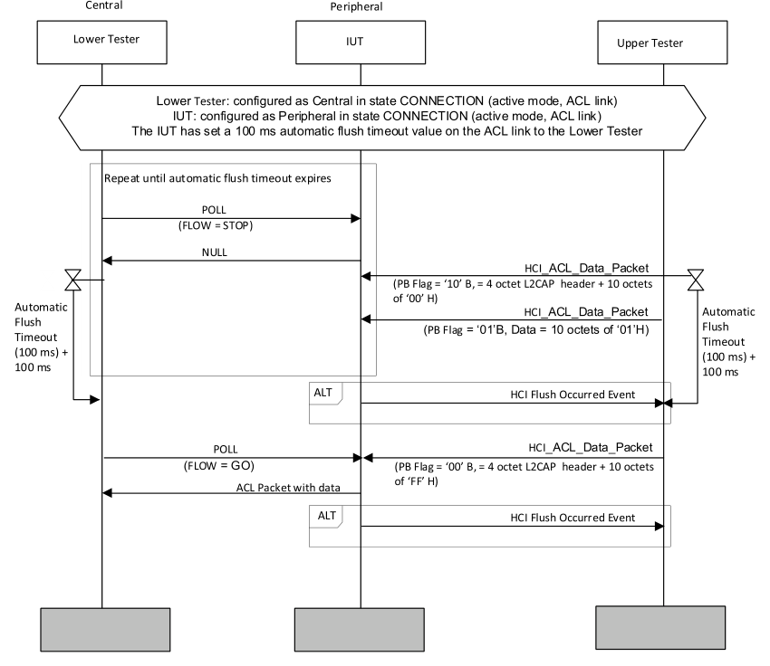

**Figure 4.75: BB/PROT/ARQ/BV-33-C [Flushable Packet is Flushed]**

1. The Lower Tester stops the IUT from sending packets by sending POLL packets with FLOW bit
set to STOP. 2. The Upper Tester sends an HCI ACL Data packet with packet boundary flag set to '10'B (start
flushable), a valid four-octet L2CAP header, and ten octets of data where each data octet has the value '00'H. 3. The Upper Tester sends an HCI ACL Data packet with packet boundary flag set to '01'B
(continue) and ten octets of data where each octet has the value '01'H. 4. After the Automatic Flush Timeout (100 ms) + 100 ms, the Lower Tester allows the IUT to
transmit packets by sending POLL packets with the FLOW bit set to GO (may need to be repeated). 5. After the Automatic Flush Timeout (100 ms) + 100 ms, the Upper Tester sends an HCI ACL Data
packet with packet boundary flag set to '00'B (start non-flushable), a valid four-octet L2CAP header, and ten octets of data, where each data octet has the value 'FF'H. Note that it does not matter which of the POLL (FLOW = GO) or the third HCI_ACL_Data packet (data = 'FF'H) arrives first at the IUT, both occur at least 100 ms (Automatic Flush Timeout) after the first HCI ACL Data packet. Note that the HCI Flush Occurred event may occur after the second or third HCI ACL Data packet.
• Expected Outcome
Pass verdict
The IUT does not transmit the first two data packets containing ten data octets of '00'H and ten data octets of '01'H.
The IUT transmits the third data packet containing ten data octets of 'FF'H.
The IUT generates an HCI Flush Occurred event after the automatic flush timeout has expired.
• Notes
The core specification states: “The Flush Timeout shall start when the First segment of the ACL-U packet is stored in the Controller buffer.”
A tester may know when the data is given to an HCI Transport, but it cannot know when it was received by the controller’s buffers. Hence, it cannot determine when the Automatic Flush Timeout (100 ms) starts. Hence, an arbitrary delay of 100 ms is added to the test procedure to account for this HCI transport delay.
BB/PROT/ARQ/BV-34-C [Non-Flushable Packet is Not Flushed]
• Test Purpose
Verify that the IUT does not flush a packet transmitted over the HCI interface when the packet boundary flag is set to 00 on the first packet, an automatic flush timeout value has been set to a short value and the timer expires before the packet is sent.
• Reference
[1] 7.6.3
[11] 5.4.2
• Initial Condition
- The IUT is configured as Peripheral in state CONNECTION (active mode, ACL link).
- The Lower Tester is configured as Central in state CONNECTION (active mode, ACL link).
- The IUT has set a 100 ms automatic flush timeout value on the ACL link to the Lower Tester.
• Test Procedure

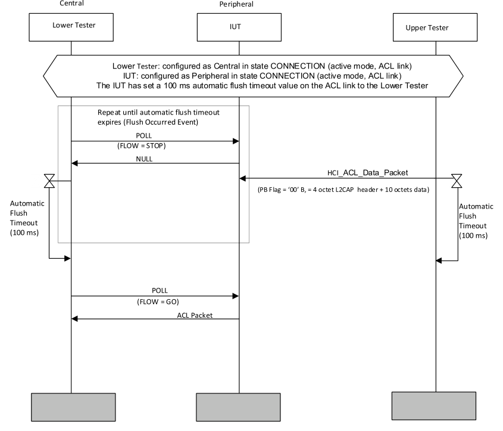

**Figure 4.76: BB/PROT/ARQ/BV-34-C [Non-Flushable Packet is Not Flushed]**

a) The Lower Tester stops the IUT from sending packets by sending POLL packets with FLOW bit
set to STOP. b) The Upper Tester sends an HCI ACL Data packet with packet boundary flag set to '00'B (start
non-flushable), valid 4-octet L2CAP header and 10 octets of data (any value). c) After the IUT flush timeout has expired, the Lower Tester allows the IUT to transmit packets by
sending a POLL packet with FLOW bit set to GO.
• Expected Outcome
Pass verdict
The IUT transmits non-flushable data packet.
BB/PROT/ARQ/BV-35-C [Flushable L2CAP PDU with Multiple Fragments Flushed after First Fragment Sent]
• Test Purpose
Verify that the IUT correctly flushes the remaining fragments of an L2CAP PDU transmitted over the HCI interface when the packet boundary flag is set to 10 on the first packet, an automatic flush timeout value has been set to a short value and the timer expires after the first fragment has been sent over the air, but the remaining fragments have not been sent.
• Reference
[1] 7.6.3
[11] 5.4.2
• Initial Condition
- The IUT is configured as Peripheral in state CONNECTION (active mode, ACL).
- The Lower Tester is configured as Central in state CONNECTION (active mode, ACL link).
- The IUT has set a 100 ms automatic flush timeout value on the ACL link to the Lower Tester.
• Test Procedure

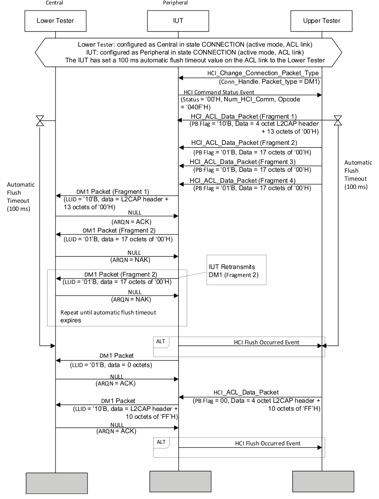

**Figure 4.77: BB/PROT/ARQ/BV-35-C [Flushable L2CAP PDU with Multiple Fragments Flushed after First Fragment Sent]**

used by the IUT to DM1. b) The Upper Tester sends an L2CAP PDU containing a valid 4-octet L2CAP header plus 64 data
octets of '00'H over the HCI interface in four fragments (HCI_ACL_Data packets) each fragment contains 17 octets of data. The first fragment has a packet boundary flag set to '10'B and the other fragments have a packet boundary flag set to '01'B. c) Note: the PDU will be transmitted by the IUT in multiple DM1 packets (Packet_Type setting on
ACL link is set so only DM1 packets can be used). d) The Lower Tester allows the first DM1 packet to be transmitted then continually rejects (NAKs)
the second DM1 packet until the flush timeout expires. e) After the IUT’s flush timeout has expired the Lower Tester allows the IUT to send packets (stops
NAKing). f) After the IUT flush timeout has expired, the Upper Tester sends a PDU as a single HCI ACL Data packet with packet boundary flag set to '00'B (start non-flushable) containing a valid 4-octet L2CAP header and10 octets of data where each data octet has the value 'FF'H. Note that the HCI Flush Occurred event may occur after the first fragment of the first PDU (first HCI ACL Data packet) or after the second PDU (fifth HCI ACL Data packet).
• Expected Outcome
Pass verdict
The IUT does not transmit the last three fragments of the L2CAP PDU containing 64 data octets of '00'H.
The IUT transmits the second L2CAP PDU containing 10 data octets of 'FF'H.
The IUT generates an HCI Flush Occurred Event after the automatic flush timeout expires.
BB/PROT/ARQ/BV-36-C [Non-Flushable L2CAP PDU with Multiple Fragments is not Flushed after the First Fragment is Sent]
• Test Purpose
Verify that the IUT correctly sends the remaining fragments of an L2CAP PDU transmitted over the HCI interface when the packet boundary flag is set to 00 on the first packet, an automatic flush timeout value has been set to a short value and the timer expires after the first fragment has been sent over the air but the remaining fragments have not been sent.
• Reference
[1] 7.6.3
[11] 5.4.2
• Initial Condition
- The IUT is configured as Peripheral in state CONNECTION (active mode, ACL).
- The Lower Tester is configured as Central in state CONNECTION (active mode, ACL link).
- The IUT has set a 100 ms automatic flush timeout value on the ACL link to the Lower Tester.
• Test Procedure

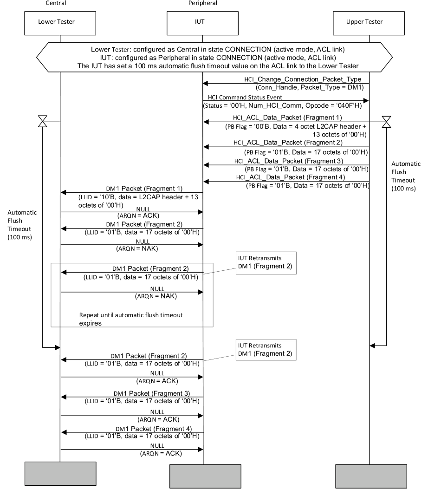

**Figure 4.78: BB/PROT/ARQ/BV-36-C [Non-Flushable L2CAP PDU with Multiple Fragments is not Flushed after the First Fragment is Sent]**

a) The Upper Tester sends HCI Change Connection Packet Type command to limit the packet types
used by the IUT to DM1. b) The Upper Tester sends an L2CAP PDU containing a valid 4-octet L2CAP header plus 64 data
octets of '00'H over the HCI interface in four fragments (HCI_ACL_Data packets) each fragment contains 17 bytes of data. The first fragment has a packet boundary flag set to '00'B and the other fragments have a packet boundary flag set to '01'B.
the second DM1 packet until the flush timeout expires. d) After the IUT’s flush timeout has expired the Lower Tester allows the IUT to send packets (stops
NAKing).
• Expected Outcome
Pass verdict
The IUT transmits all four fragments of the L2CAP PDU.
BB/PROT/ARQ/BV-37-C [Flushable and Non-Flushable L2CAP PDUs]
• Test Purpose
Verify that the IUT correctly flushes all flushable L2CAP PDUs and does not flush the non-flushable L2CAP PDUs when the HCI Enhanced Flush Command is called.
• Reference
[1] 7.6.3
[11] 5.4.2, 7.3.64
• Initial Condition
- The IUT is configured as Peripheral in state CONNECTION (active mode, ACL link).
- The Lower Tester is configured as Central in state CONNECTION (active mode, ACL link).
- The IUT has set a 1000 ms automatic flush timeout value on the ACL link to the Lower Tester.
• Test Procedure

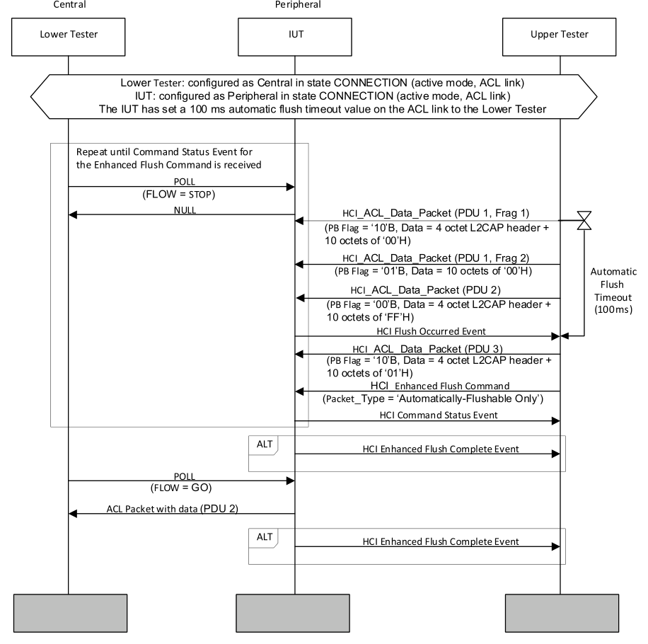

**Figure 4.79: BB/PROT/ARQ/BV-37-C [Flushable and Non-Flushable L2CAP PDUs]**

a) The Lower Tester stops the IUT from sending packets by sending POLL packets with FLOW bit
set to STOP. b) The Upper Tester sends two L2CAP PDUs over the HCI interface. The first PDU is sent in two
fragments (HCI ACL Data packets) where the first fragment has a packet boundary flag set to 10 and the second fragment has a packet boundary flag set to '01'B. The first fragment contains a valid 4-octet L2CAP header plus 10 data octets of '00'H. The second fragment contain 10 data octets of '00'H. The second PDU is sent as one fragment with a packet boundary flag of '00'B, a valid 4-octet L2CAP header and 10 data octets of 'FF'H. c) When the IUT’s automatic flush timeout expires, the IUT sends a Flush Occurred Event to the
Upper Tester. Upon receiving the Flush Occurred Event, the Upper Tester sends another L2CAP PDU. The PDU is sent as one fragment with a packet boundary flag of '10'B, a valid 4-octet L2CAP header and 10 data octets of '01'H. After that, the Upper Tester calls the HCI Enhanced Flush Command with the Packet_Type parameter set to "Automatically-Flushable Only".
Tester, the Lower Tester stops rejecting packets sending POLL packets with the FLOW bit set to GO. e) Note: The IUT may send Enhanced Flush Complete event to the Upper Tester either before or
after transmitting the second PDU.
• Expected Outcome
Pass verdict
The IUT does not transmit the first PDU containing 20 data octets of '00'H.
The IUT transmits the second PDU containing 10 data octets of 'FF'H.
The IUT does not transmit the third PDU containing 10 data octets of '01'H.
The IUT generates a Flush Occurred Event.
The IUT generates a Command Status event as a result of the Upper Tester invoking HCI Enhanced Flush Command.
The IUT generates an Enhanced Flush Complete event after the Command Status event.
BB/PROT/ARQ/BV-43-C [Flushable Packet is flushed with AES encryption]
• Test Purpose
Verify that the IUT correctly flushes a packet transmitted over the HCI interface when the packet boundary flag is set to '10'B on the first packet, an automatic flush timeout value has been set to a short value and the timer expires before the packet is sent, while AES-CCM encryption is in use.
• Reference
[1] 7.6.3
• Initial Condition
- The IUT is configured as Peripheral in state CONNECTION (active mode, ACL link) and with AES-CCM encryption enabled.
- The Lower Tester is configured as Central in state CONNECTION (active mode, ACL link) and with AES-CCM encryption enabled.
- The IUT has set a 100 ms automatic flush timeout value on the ACL link to the Lower Tester.
• Test Procedure

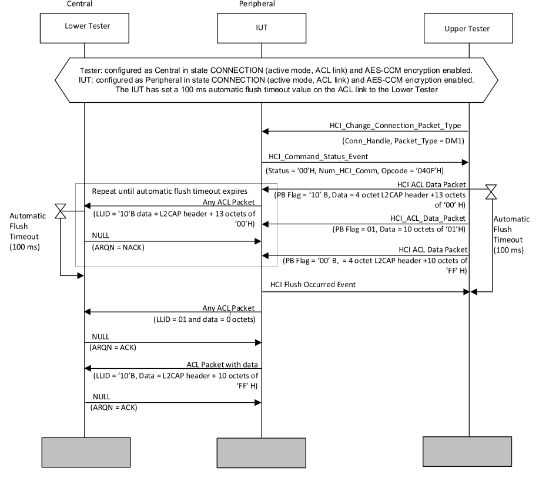

**Figure 4.80: BB/PROT/ARQ/BV-43-C [Flushable Packet is flushed with AES encryption]**

a) The Lower Tester enters a state where it NAKs all ACL-U packets received from the IUT. b) The Upper Tester sends HCI Change Connection Packet Type command to limit the packet types
used by the IUT to DM1 only. c) The Upper Tester sends an HCI ACL Data packet with packet boundary flag set to '10'B (start
flushable), a valid four-octet L2CAP header, and 13 octets of data where each data octet has the value '00'H. d) The Upper Tester sends an HCI ACL Data packet with packet boundary flag set to '01'B
(continue) and ten octets of data where each octet has the value '01'H. e) The Upper Tester sends an HCI ACL Data packet with packet boundary flag set to '00'B (start
non-flushable), a valid four-octet L2CAP header, and ten octets of data, where each data octet has the value 'FF'H. f) After the IUT flush timeout has expired, the Lower Tester stops NAKing all the ACL-U packets from the IUT.
• Expected Outcome
Pass verdict
After the flush timeout, the IUT transmits a properly encrypted ACL-U continuation packet with the same sequence number as the first flushed data packet and length zero.
The IUT transmits the third data packet containing ten data octets of 'FF'H properly encrypted.
The IUT generates an HCI Flush Occurred event after the automatic flush timeout has expired.
• Notes
Per [1]: for ACL-U continuation packet with length zero, the bit 4 in the AES-CCM encryption nonce4 byte is set to 1.
BB/PROT/ARQ/BV-44-C [Non-flushable Packet is not flushed with AES encryption]
• Test Purpose
Verify that the IUT does not flush a packet transmitted over the HCI interface when the packet boundary flag is set to 00 on the first packet, an automatic flush timeout value has been set to a short value and an automatic timeout value and the timer expires before the packet is sent, while AES- CCM encryption is in use.
• Reference
[1] 7.6.3
[11] 5.4.2
• Initial Condition
- The IUT is configured as Peripheral in state CONNECTION (active mode, ACL link) and with AES-CCM encryption enabled.
- The Lower Tester is configured as Central in state CONNECTION (active mode, ACL link) and with AES-CCM encryption enabled.
- The IUT has set a 100 ms automatic flush timeout value on the ACL link to the Lower Tester.
• Test Procedure

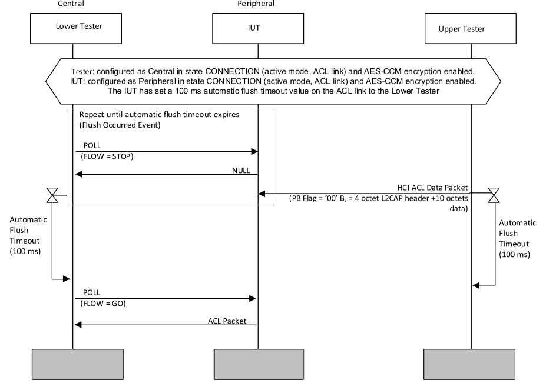

**Figure 4.81: BB/PROT/ARQ/BV-44-C [Non-flushable Packet is not flushed with AES encryption]**

a) The Lower Tester stops the IUT from sending packets by sending POLL packets with FLOW bit
set to STOP. b) The Upper Tester sends an HCI ACL Data packet with packet boundary flag set to '00'B (start
non-flushable), valid 4-octet L2CAP header and 10 octets of data (any value). c) After the IUT flush timeout has expired, the Lower Tester allows the IUT to transmit packets by
sending a POLL packet with FLOW bit set to GO.
• Expected Outcome
Pass verdict
The IUT transmits non-flushable data packet.
BB/PROT/ARQ/BV-45-C [Flushable L2CAP PDU with Multiple Fragments Flushed after First Packet Send, with AES encryption]
• Test Purpose
Verify that the IUT correctly flushes the remaining packets of an L2CAP PDU transmitted over the HCI interface when the packet boundary flag is set to 10 on the first packet, an automatic flush timeout value has been set to a short value and the timer expires after the first packet has been sent over the air, but the remaining packets have not been sent, while AES-CCM encryption is in use.
• Reference
[1] 7.6.3
[11] 5.4.2
• Initial Condition
- The IUT is configured as Peripheral in state CONNECTION (active mode, ACL) and with AES-CCM encryption enabled.
- The Lower Tester is configured as Central in state CONNECTION (active mode, ACL link) and with AES-CCM encryption enabled.
- The IUT has set a 100 ms automatic flush timeout value on the ACL link to the Lower Tester.
• Test Procedure

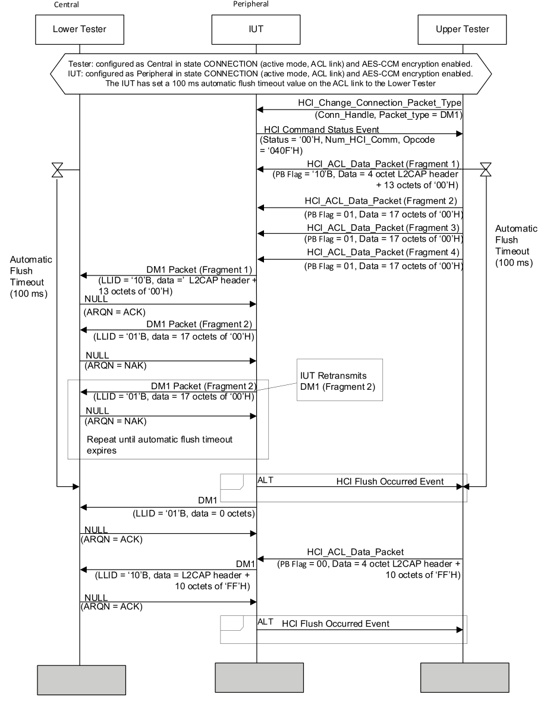

**Figure 4.82: BB/PROT/ARQ/BV-45-C [Flushable L2CAP PDU with Multiple Fragments Flushed after First Packet Send, with AES encryption]**

used by the IUT to DM1. b) The Upper Tester sends an L2CAP PDU containing a valid 4-octet L2CAP header plus 64 data
octets of '00'H over the HCI interface in four fragments (HCI_ACL_Data packets) each fragment contains 17 octets of data. The first fragment has a packet boundary flag set to '10'B and the other fragments have a packet boundary flag set to '01'B. c) Note: the PDU will be transmitted by the IUT in multiple DM1 packets (Packet_Type setting on
ACL link is set so only DM1 packets can be used). d) The Lower Tester allows the first DM1 packet to be transmitted then continually rejects (NAKs)
the second DM1 packet until the flush timeout expires. e) After the IUT’s flush timeout has expired the Lower Tester allows the IUT to send packets (stops
NAKing). f) After the IUT flush timeout has expired, the Upper Tester sends a PDU as a single HCI ACL Data packet with packet boundary flag set to '00'B (start non-flushable) containing a valid 4-octet L2CAP header and10 octets of data where each data octet has the value 'FF'H.
• Expected Outcome
Pass verdict
The IUT does not transmit the last three fragments of the L2CAP PDU containing 64 data octets of '00'H.
The IUT transmits a properly encrypted ACL-U continuation packet with the same sequence number as the first flushed fragment and length zero.
The IUT transmits the second L2CAP PDU containing 10 data octets of 'FF'H properly encrypted.
The IUT generates an HCI Flush Occurred Event after the automatic flush timeout expires. Note that the HCI Flush Occurred event may occur before or after the HCI_ACL_Data_Packet with payload 'FF'H.
• Notes
Per [1]: for ACL-U continuation packet with length zero, the bit 4 in the AES-CCM encryption nonce4 byte is set to 1.
BB/PROT/ARQ/BV-46-C [Non-flushable L2CAP PDU with Multiple Fragments is not flushed after the First Fragment is sent, with AES-CCM encryption]
• Test Purpose
Verify that the IUT correctly sends the remaining fragments of an L2CAP PDU transmitted over the HCI interface when the packet boundary flag is set to 00 on the first packet, an automatic flush timeout value has been set to a short value and the timer expires after the first fragment has been sent over the air but the remaining fragments have not been sent, with AES-CCM encryption is in use.
• Reference
[1] 7.6.3
[11] 5.4.2
• Initial Condition
- The IUT is configured as Peripheral in state CONNECTION (active mode, ACL).
- The Lower Tester is configured as Central in state CONNECTION (active mode, ACL link) and with AES-CCM encryption enabled.
- The IUT has set a 100 ms automatic flush timeout value on the ACL link to the Lower Tester and with AES-CCM encryption enabled.
• Test Procedure

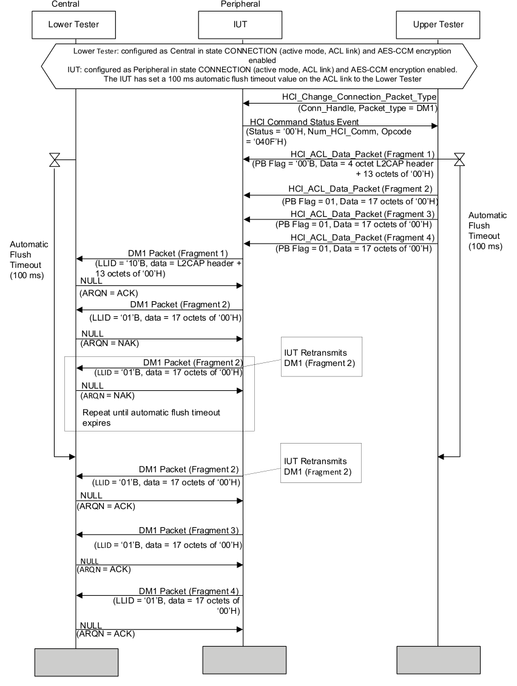

**Figure 4.83: BB/PROT/ARQ/BV-46-C [Non-flushable L2CAP PDU with Multiple Fragments is not flushed after the First Fragment is sent, with AES-CCM encryption]**

a) The Upper Tester sends HCI Change Connection Packet Type command to limit the packet types
used by the IUT to DM1. b) The Upper Tester sends an L2CAP PDU containing a valid 4-octet L2CAP header plus 64 data
contains 17 bytes of data. The first fragment has a packet boundary flag set to '00'B and the other fragments have a packet boundary flag set to '01'B. c) The Lower Tester allows the first DM1 packet to be transmitted then continually rejects (NAKs)
the second DM1 packet until the flush timeout expires. d) After the IUT’s flush timeout has expired the Tester allows the IUT to send packets (stops
NAKing).
• Expected Outcome
Pass verdict
The IUT transmits all four fragments of the L2CAP PDU.
BB/PROT/ARQ/BV-47-C [Remote flushing with AES]
• Test Purpose
Verify that the IUT behaves properly when remote flushes packets:
- Zero Length Continuation packets are properly ACKed.
- ACL-U packets received after flush are properly received.
• Reference
[1] 7.6.3
• Initial Condition
- The IUT is configured as Peripheral in state CONNECTION (active mode, ACL link) and with AES-CCM encryption enabled.
- The Lower Tester is configured as Central in state CONNECTION (active mode, ACL link) and with AES-CCM encryption enabled.
• Test Procedure

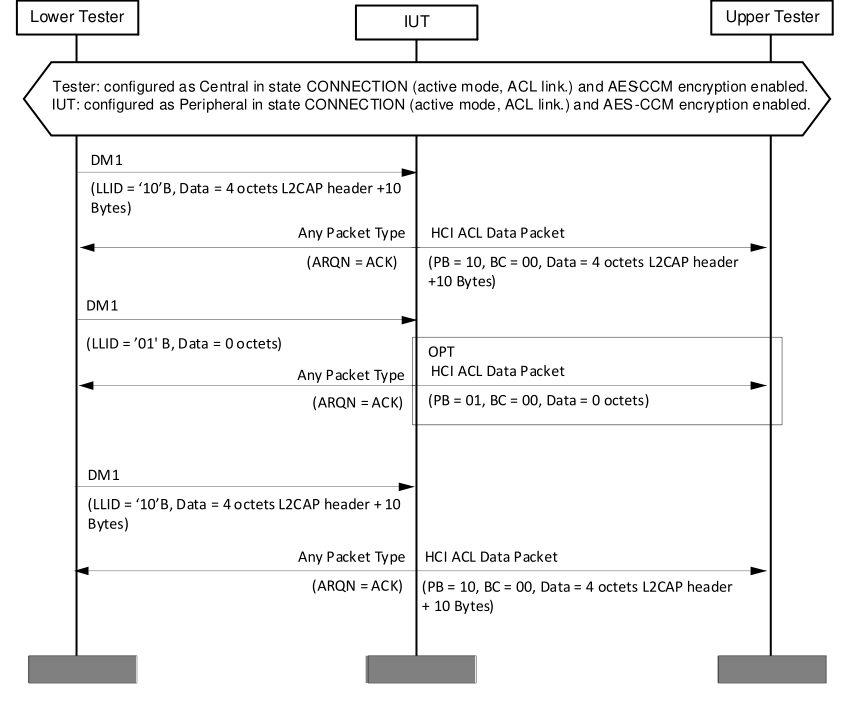

**Figure 4.84: BB/PROT/ARQ/BV-47-C [Remote flushing with AES]**

a) The Lower Tester sends a DM1 packet as follows:
DM1
Packet header: per [13] Section 6.4
Payload header:
LLID: '10'B.
FLOW: '1'B.
LENGTH: '1110'B = '14'D.
Payload body:
A valid 4-octet L2CAP header and 10 non deterministic random Bytes of payload plus 32 bits MIC plus 16 bit CRC.
b) The IUT replies with any ACL packet and ARQN bit set to ACK. c) The Lower Tester verifies that the IUT transmits the packet correctly to the Lower Tester. d) The Lower Tester verifies that the IUT sends the data correctly to the Upper Tester.
DM1
Packet header: per [13] Section 6.4
Payload header:
LLID: '01'B.
FLOW: '1'B.
LENGTH: '0000'B = '0'D.
Payload body:
A zero length payload plus 32 bits MIC plus 16 bit CRC.
f) The IUT replies with any ACL packet and ARQN bit set to ACK. g) The Lower Tester verifies that the IUT transmits the packet correctly to the Lower Tester. h) The Lower Tester sends a DM1 packet as follows:
DM1
Packet header: per [13] Section 6.4
Payload header:
LLID: '10'B.
FLOW: '1'B.
LENGTH: '1110'B = '14'D.
Payload body:
A valid 4-octet L2CAP header and 10 non deterministic random Bytes of payload plus 32 bits MIC plus 16 bit CRC.
i) The IUT replies with any ACL packet and ARQN bit set to ACK. j) The Lower Tester verifies that the IUT transmits the packet correctly to the Lower Tester. k) The Lower Tester verifies that the IUT sends the data correctly to the Upper Tester.
• Expected Outcome
Pass verdict
The IUT transmits the ACK packets correctly to the Lower Tester in c, g, and j.
The IUT sends the data correctly to the Upper Tester in d and k.
• Notes
Per [1]: for ACL-U continuation packet with length zero, the bit 4 in the AES-CCM encryption nonce4 byte is set to 1.

### 4.10 Inquiry

Verify the Inquiry procedures.

#### 4.10.1 Inquiry procedures – Central

Verify that the Inquiry procedures for the Central are correct.
BB/PHYS/INQ/BV-01-C [Inquiry Hop Sequence]
• Test Purpose
Verify that the IUT as Central uses the correct inquiry hopping sequence when discovering which other Bluetooth devices are in range.
Verify that:
- The Central uses the general inquiry access code (GIAC) and its native clock CLKN to determine the inquiry hopping sequence.
- The Central sequentially transmits on 2 different hop frequencies during each TX slot.
- Two 10 ms inquiry trains A and B with 16 hops each are used.
- The inquiry trains A and B are repeated at least Ninquiry = 256 times.
- At least 4 trains are transmitted subsequently.
- One inquiry instance is stopped latest when inquiryTO is reached.
• Reference
[1] 8.4.2
• Initial Condition
- The Lower Tester has performed an inquiry procedure as Central before to get the clock CLK of the IUT.
- The IUT is configured as Central.
- Both the IUT and the Lower Tester are in standby mode.
• Test Procedure
a) To verify the inquiry hopping sequence, the Lower Tester must not follow the normal inquiry scan
procedure. For the RX slots, the inquiry hopping sequence of the Central is used as well instead. b) In the HCI_Inquiry command the general inquiry LAP is used. c) The Lower Tester listens for inquiry packets from the IUT using an algorithm derived from its
Bluetooth clock and enabling it to receive a packet within the IUT’s first repetition of the first A-Train. The Lower Tester´s correlator is matched to the inquiry access code. d) The Lower Tester monitors the train A during one train (16 frequencies). If no inquiry packet is
received, the Lower Tester switches to scan train B during one train. e) Switching trains will continue until first ID packet is received by the Lower Tester. f) After successfully receiving the first IAC packet, the Lower Tester adjusts its RX window and phase (clock bits 0-1) to get the remaining hops of train. The Lower Tester never responds to the inquiry. g) The IUT repeats its first train for at least Ninquiry=256 times. h) The Lower Tester records the first inquiry train for 255 times only because the first train is known
to be incomplete. i) The Lower Tester immediately starts listening on the other train frequencies.
j) The IUT sends the other inquiry train for Ninquiry times starting at an unknown point of time. k) The Lower Tester records this inquiry train for 256 times. l) Steps f) to j) are repeated until the inquiry instance is finished but with the difference that the Lower Tester always monitors 256 repetitions for each train from now on (also in step g). m) One of the reserved LAPs for dedicated inquiry is randomly chosen and steps b) to k) are
repeated.
• Expected Outcome
Pass verdict
The Central using the general inquiry access code (GIAC) and its native clock CLKN to determine the inquiry hopping sequence) is checked in steps d), j) and l).
The Central sequentially transmitting on two different hop frequencies during each TX slot is checked in steps d) and j).
Two 10 ms inquiry trains A and B with 16 hops each were used is checked in steps d) and j).
That inquiry trains A and B are repeated at least Ninquiry = 256 times is checked in steps f) and j).
That at least four trains are transmitted subsequentially is checked in step k).
That one inquiry instance is stopped latest when inquiryTO is reached is checked in step k).
The tester records at least 95% of the expected ID packets.
• Notes
As it is not possible to completely record all packets of the first most train after inquiry starts, violations of requirements cannot be checked on the first A train repetition. A cable connection is recommended to create an undisturbed RF path.
BB/PHYS/INQ/BV-03-C [Inquiry Proc]
• Test Purpose
Verify that the IUT as Central uses the correct procedure when performing inquiry.
Verify that:
- The Central transmits the inquiry access code in the ID packet when starting the inquiry procedure.
- That the Central continuously transmits inquiry messages after receiving a response (FHS packet).
- The inquiry substate is left after a sufficient number of responses.
• Reference
[1] 8.4.2, 8.4.3
• Initial Condition
- The IUT must be configured as Central.
- The IUT is in STANDBY mode.
• Test Procedure
a) The Upper Tester sends a HCI_Inquiry command to carry out Inquiry and sets the values for the
LAP, and the Inquiry_Length and Num_Responses as follows:
LAP: LAP for GIAC ‘9E8B33’H.
Inquiry_Length: 0x30 = 61.44 sec.
Num_Responses: 2.
b) The Lower Tester verifies that the Central sends an ID packet containing the general inquiry
access code (GIAC). c) The Lower Tester sends a FHS packet after receiving the first ID packet. d) The Lower Tester verifies that the Central sends continuously ID packets containing the general
inquiry access code (GIAC). e) After a random number (between 0 and 1023) of time slots the tester sends one more FHS
packet (different BD_ADDR from that sent the first time in step c)). f) The Lower Tester waits 30 s and verifies that no more ID packets are sent by the IUT (i.e., the IUT has left inquiry substate).
• Expected Outcome
Pass verdict
The Central transmits the inquiry access code in the ID packet when starting the inquiry procedure is checked after step b.
The Central continuously transmitted inquiry messages after receiving a response (FHS packet) is checked after step d.
The inquiry substate is left after a sufficient number of responses is checked after step f.
BB/PHYS/INQ/BV-19-C [Inquiry Hop Sequence with Train Nudge]
• Test Purpose
Verify that the IUT as Central applies train nudging to the inquiry hopping sequence when discovering which other Bluetooth devices are in range in case the slots to receive the inquiry responses are periodically not available.
Verify that:
- The Central uses the general inquiry access code (GIAC) and its native clock CLKN to determine the inquiry hopping sequence.
- The Central sequentially transmits on 2 different hop frequencies during each TX slot.
- Two 10 ms inquiry trains A and B with 16 hops each are used.
- The inquiry trains A and B are repeated at least Ninquiry = 256 times.
- A knudge value of 0 is used during 1st 2 x Ninquiry repetitions.
- The Central uses an even value of knudge during all other repetitions. knudge value is not always equal to 0.
- At least 4 trains are transmitted subsequently.
- One inquiry instance is stopped latest when Extended_Inquiry_Length is reached.
• Reference
[1] 2.6.4.5
• Initial Condition
- The Lower Tester has performed an inquiry procedure as Central before to get the clock CLK of the IUT.
- The IUT is configured as Central.
- Both the IUT and the Lower Tester are in standby mode.
• Test Procedure
To verify the inquiry hopping sequence, the Lower Tester must not follow the normal inquiry scan procedure. For the RX slots, the inquiry hopping sequence of the Central is used instead.
a) The Upper Tester configures available slots of the IUT as defined in Section 4.4.5. b) In the HCI_Inquiry command the general inquiry LAP is used. c) The Lower Tester listens for inquiry packets from the IUT using an algorithm derived from its
Bluetooth clock and enabling it to receive a packet within the IUT’s first repetition of the first A-train. The Lower Tester’s correlator is matched to the inquiry access code. d) The Lower Tester monitors the train A during one train (16 frequencies). If no inquiry packet is
received, the Lower Tester switches to scan train B during one train. e) Switching trains will continue until first ID packet is received by the Lower Tester f) After successfully receiving the first IAC packet, the Lower Tester adjusts its RX window and phase (clock bits 0-1) to get the remaining hops of train. The Lower Tester never responds to the inquiry. g) The IUT repeats its first train for at least Ninquiry = 256 times. h) The Lower Tester records the first inquiry train for 255 times only because the first train is known
to be incomplete. i) The Lower Tester immediately starts listening on the other train frequencies. j) The IUT sends the other inquiry train for Ninquiry times starting at an unknown point of time. k) The Lower Tester records this inquiry train for 256 times. l) The Lower Tester then increments knudge by 2 mod 32. m) The Lower Tester monitors the train during one train (16 frequencies). If no inquiry packet is
received, the Lower Tester increments knudge by 2 mod 32. n) Step m) is repeated until an inquiry packet is received. o) The Lower Tester then checks if the value of knudge is 0 and records the train until no inquiry
packets are received during one full train. p) The Lower Tester checks that the trains have been repeated at least 256-(1+number of times
step m was repeated) times. q) Steps l)–p) are repeated until the inquiry instance is finished. r) One of the reserved LAPs for dedicated inquiry is randomly chosen and steps c) to p) are repeated.
• Expected Outcome
Pass verdict
The IUT uses the general inquiry access code (GIAC) and the proper inquiry hopping sequence.
The IUT sequentially transmits on 2 different hop frequencies during each TX slot.
The IUT uses two 10 ms inquiry trains A and B with 16 hops each.
The IUT uses an even value of knudge during all other repetitions. Also, knudge value is not always equal to 0.
The IUT transmits at least 4 trains subsequently.
One inquiry instance is stopped latest when Extended_Inquiry_Length is reached.
The Lower Tester records at least 95% of the expected ID packets.
• Notes
As it is not possible to completely record all packets of the first most train after inquiry starts, violations of requirements cannot be checked on the first A-train repetition. A cable connection is recommended to create an undisturbed RF path.

### 4.11 Inquiry procedures - Peripheral

Verify that the Inquiry procedures for the Peripheral are correct.
BB/PHYS/INQ/BV-10-C [Inquiry Response]
• Test Purpose
Verify that the IUT as Peripheral uses the correct inquiry response procedure.
Verify that:
- The IUT transmits the inquiry response (FHS packet) 625 s after receiving the inquiry message.
- The IUT transmits a FHS packet with the Peripheral’s device address after receiving an inquiry message.
- The IUT (if it does receive an inquiry message and returns a FHS packet) adds an offset of 1 to the phase in the inquiry hop sequence (the phase has a 1.28 s resolution) and enters the inquiry scan substate again.
• Reference
[1] 7.1, 8.4.3
• Initial Condition
- To ensure that the Lower Tester can follow the inquiry scan sequence of the Peripheral an inquiry procedure has been performed before to get the estimate CLKE of the Peripheral’s Bluetooth clock. The IUT uses default values for inquiry scan interval and inquiry scan window:
- Inquiry scan interval = 4096 slots.
- Inquiry scan window = 18 slots.
- Scan_Type = Normal Scan.
- The inquiry scan of the IUT is started before the Lower Tester starts inquiry.
• Test Procedure
a) The Lower Tester starts inquiry using A trains, f(k) corresponding to the estimate of the IUT’s
scan frequency at the beginning of a 1.28 s phase (CLK 2-11 = 0). The Lower Tester sends ID packets continuously until the IUT responds with the FHS packet.
packets again until the next FHS packet is received. c) Step b) will be repeated until 10 FHS packets have been received. The time distance between the
FHS packets will be recorded and is randomly. After the 10th FHS packet the Lower Tester stops sending the packets for at least 1023 slots. d) Step a)–c) are performed 10 times.
• Expected Outcome
Pass verdict
In step d) of the Test Procedure, the tester receives at least 99 FHS packets from the IUT.
That the IUT transmits the inquiry response (FHS packet) 625 s after receiving the inquiry message is checked after step b).
That the IUT transmits a FHS packet with the Peripheral’s device address after receiving the inquiry message is checked after step b).
The IUT (if it does receive an inquiry message and returns a FHS packet) adds an offset of 1 to the phase in the inquiry hop sequence (the phase has a 1.28 s resolution) and enters the inquiry scan substate again is checked in step d).
BB/PHYS/INQ/BV-14-C [Inquiry Scan Window and Interval]
• Test Purpose
Verify that the IUT as Peripheral uses the correct inquiry scan window and interval.
Verify that:
- The receiver scans for the inquiry access code long enough to completely scan for 16 inquiry frequencies.
- The phase changes every 1.28 s.
• Reference
[1] 8.4.1
• Initial Condition
- The Lower Tester uses the 79 hop scheme according to the IUT capabilities.
- The IUT is in STAND BY mode.
- HCI_Write_Scan_Enable = 01’H (Inquiry Scan enabled; Page Scan disabled).
- Default values are used for:
- InquiryScan_Interval = 4096 slots (2.56 s) and
- InquiryScan_Window = 18 slots
- Scan_Type = Normal Scan
• Test Procedure
a) The Lower Tester continuously transmits inquiry messages until a response FHS packet is
received. b) The Lower Tester waits for 1023 slots plus 18 slots. c) Steps a) and b) are performed 100 times.
• Expected Outcome
Pass verdict
In step b) of the Test Procedure, the Lower Tester receives a response FHS packet within 5.12 s after starting to transmit inquiries for more than 95% of the inquiry procedures.
• Notes
In Test Procedure step b) the additional 18 slots is required for the Lower Tester to avoid receiving FHS at the first inquiry scan after Test Procedure step a) even if the RAND is 1023 slots.
BB/PHYS/INQ/BV-15-C [Interlaced Inquiry Scan Window and Interval]
• Test Purpose
Verify that the IUT as Peripheral uses the correct inquiry scan window and interval.
Verify that:
- The receiver scans for the inquiry access code long enough to completely scan for 16 inquiry frequencies.
- The phase changes every 1.28 s.
• Reference
[1] 8.4.1
• Initial Condition
- The Lower Tester uses the 79 channel hop scheme.
- The IUT is in STAND BY mode.
- HCI_Write_Scan_Enable = ‘01’H (Inquiry Scan enabled; Page Scan disabled).
- Default values are used for:
- InquiryScan_Interval = 4096 slots (2.56 s) and
- InquiryScan_Window = 18 slots
- Scan_Type = Interlaced Scan
• Test Procedure
a) The Lower Tester continuously transmits inquiry messages until a response FHS packet is
received. b) The Lower Tester waits for 1023 slots plus 128 slots. c) Steps a) and b) are performed 100 times.
• Expected Outcome
Pass verdict
In step b) of the Test Procedure, the Lower Tester receives a response FHS packet within 2.56 s after starting to transmit inquiry messages for more than 95% of the inquiry procedures.
• Notes
In Test Procedure step b) since there may be some switching time between two back to back scans, the Lower Tester should wait for 1023 slots + 18 slots + (switching time) + 18 slots. It is assumed that no implementation would have the switching time larger than 128-18-18=92 slots.
• Test Purpose
Verify that the IUT as Central is able to receive Extended Inquiry Response.
• Reference
[1] 8.4.2, 8.4.3
• Initial Condition
- The Extended Inquiry Result event has been enabled on the IUT with HCI_Write_Inquiry_Mode (Inquiry_Mode = 0x02).
- The Lower Tester is configured to respond to Inquiry with an Extended Inquiry Response packet that is a full DM1 packet.
• Test Procedure
Peripheral Central

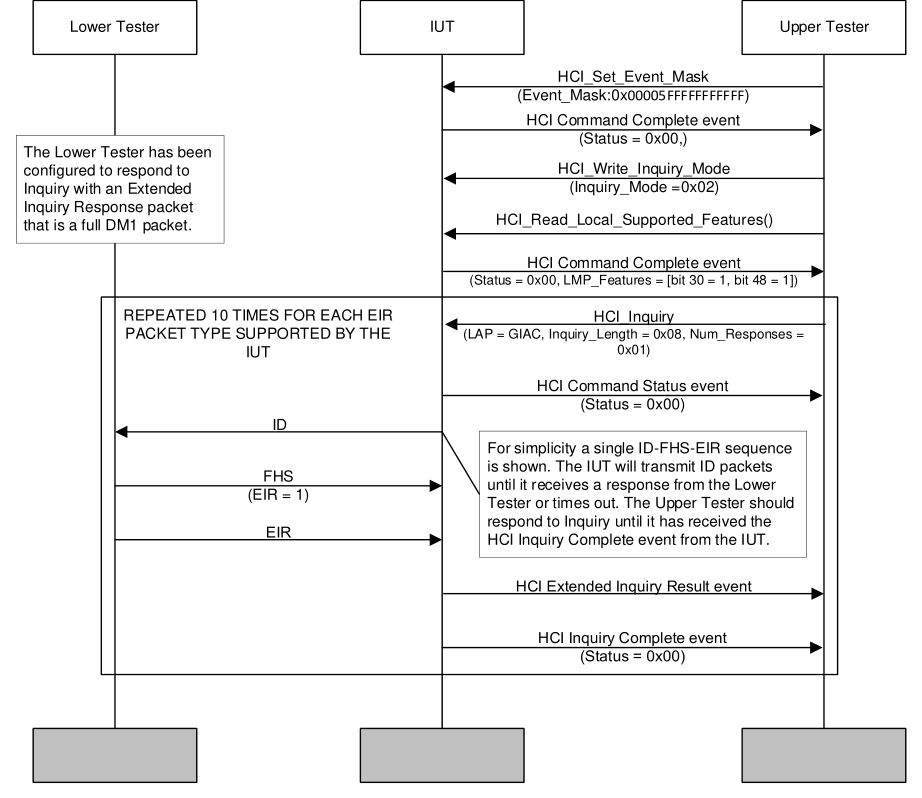

**Figure 4.85: BB/PHYS/INQ/BV-16-C [Reception of Extended Inquiry Response]**

Inquiry results" are set using HCI_Read_Local_Supported_Features. 2. The IUT does an Inquiry. 3. The Lower Tester responds with an FHS packet with the EIR bit set to one followed by an
Extended Inquiry Response packet. 4. The IUT receives the FHS and the Extended Inquiry Response packet and generates an
Extended Inquiry Result event. 5. Steps 2–4 are repeated 10 times. 6. Steps 2–5 are repeated with all additional Extended Inquiry Response packet types that are
supported by the IUT with Extended Inquiry Responses that completely fill the respective packets. (If all packet types are supported by the IUT this means DH1, DM3, DH3, DM5, DH5.)
• Expected Outcome
Pass verdict
In Test Procedure step 1, HCI_Read_Local_Supported_Features showed that the LMP feature bits "Extended Inquiry Response" and "RSSI with Inquiry Result" were set.
In Test Procedure step 2, the IUT received the FHS and the EIR packet and generated a correct Extended Inquiry Result event in at least 90% of the repetitions for each of the supported packet types.
BB/PHYS/INQ/BV-17-C [Transmission of Extended Inquiry Response]
• Test Purpose
Verify that the IUT as Peripheral is able to respond with Extended Inquiry Response.
• Reference
[1] 8.4.2, 8.4.3
• Initial Condition
- Inquiry scan has been enabled on the IUT.
- An Extended Inquiry Response with significant octets that completely fill a DM1 packet has been written to the IUT with HCI_Write_Extended_Inquiry_Response.
• Test Procedure

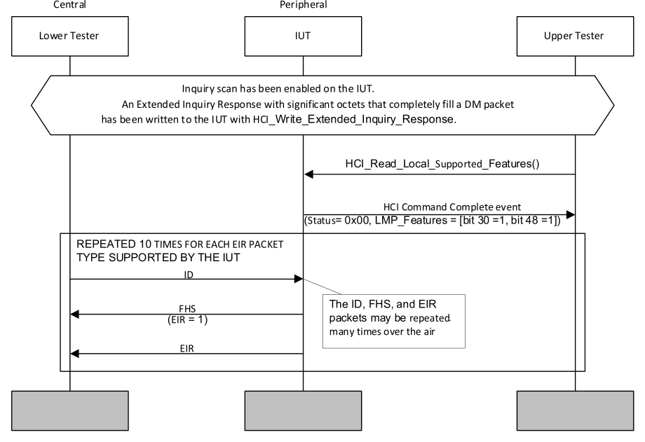

**Figure 4.86: BB/PHYS/INQ/BV-17-C [Transmission of Extended Inquiry Response]**

1. The Upper Tester verifies that the LMP feature bits "Extended Inquiry Response" and "RSSI with
Inquiry results" are set using HCI_Read_Local_Supported_Features. 2. The Lower Tester does an Inquiry. 3. The IUT responds with an FHS packet with the EIR bit set to one followed by an Extended Inquiry
Response packet. 4. The Lower Tester receives the FHS and the Extended Inquiry Response packet. 5. Steps 2–4 are repeated 10 times. 6. Steps 2–5 are repeated with all additional Extended Inquiry Response packet types that are
supported by the IUT with Extended Inquiry Responses that completely fill the respective packets. (If all packet types are supported by the IUT this means DH1, DM3, DH3, DM5, DH5.)
• Expected Outcome
Pass verdict
In Test Procedure step 1, HCI_Read_Local_Supported_Features showed that the LMP feature bits "Extended Inquiry Response" and "RSSI with Inquiry Result" were set.
In Test Procedure step 4, the Lower Tester received the FHS and the correct EIR packet in at least 90% of the repetitions for each of the supported packet types. The ARQN and SEQN bits in all received EIR packets were set to zero.
• Test Purpose
Verify that the IUT as Central uses the correct Inquiry Result event format.
• Reference
[1] 8.4.2, 8.4.3
• Initial Condition
- The Extended Inquiry Result event has been enabled on the IUT with HCI_Write_Inquiry_Mode(Inquiry_Mode = 0x02).
• Test Procedure
Peripheral Central

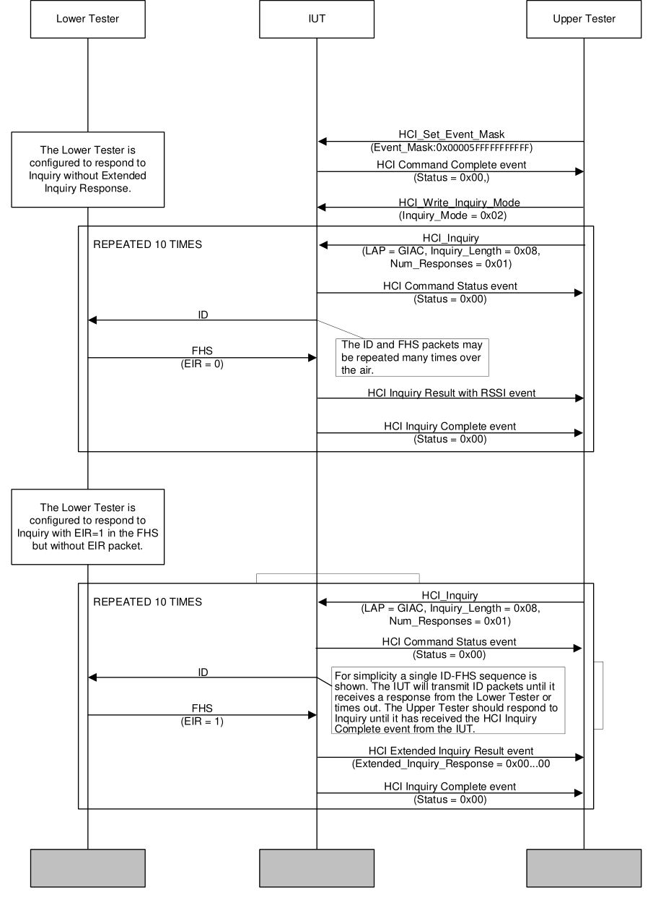

**Figure 4.87: BB/PHYS/INQ/BV-18-C [Inquiry Result Event Usage]**

EIR bit in the FHS packet is set to zero. 2. The IUT does an Inquiry. 3. The Lower Tester responds with an FHS packet. 4. The IUT receives the FHS and generates an Inquiry Result with RSSI event. 5. Steps 2–4 are repeated 10 times. 6. The Lower Tester is configured to respond to Inquiry with the EIR bit in the FHS packet set to one
but without any Extended Inquiry Response packet. 7. The IUT does an Inquiry. 8. The Lower Tester responds with an FHS packet with the EIR bit set to one. 9. The IUT receives the FHS and generates an Extended Inquiry Result event with
Extended_Inquiry_Response set to all zeroes. 10. Steps 7–9 are repeated 10 times.
• Expected Outcome
Pass verdict
In Test Procedure step 4, the IUT received the FHS and generated a correct Inquiry Result with RSSI event in at least 90% of the repetitions.
In Test Procedure step 9, the IUT received the FHS and generated a correct Extended Inquiry Result event with Extended_Inquiry_Response set to all zeroes in more than 90% of the repetitions.
BB/PHYS/INQ/BV-20-C [Generalized Interlaced Inquiry Scan]
• Test Purpose
Verify that the IUT as Peripheral applies efficiently generalized interlaced scan to inquiry scan.
• Reference
[1] 8.4.1
• Initial Condition
- The Lower Tester uses the 79 channel hop scheme.
- The IUT is in STAND BY mode.
- HCI_Write_Scan_Enable = ‘01’H (Inquiry Scan enabled; Page Scan disabled).
- Default values are used for:
- InquiryScan_Interval = 4096 slots (2.56 s) and
- InquiryScan_Window = 18 slots and
- Scan_Type = Interlaced Scan
- The Upper Tester configures available slots of the IUT as defined in Section 4.4.5.
• Test Procedure
a) The Lower Tester transmits inquiry messages until a response FHS packet is received repeating
the following pattern:
i. Transmit inquiry messages during 1.928 ms.
ii. Do not transmit inquiry messages during 3.069 ms.
Note that the inquiry sequence is not affected by the pattern, but the Lower Tester will just omit transmitting packets according to the pattern.
b) The Lower Tester waits for 1023 slots plus 18 slots. c) Steps a) and b) are performed 100 times.
• Expected Outcome
Pass verdict
In step b) of the test procedure, the Lower Tester receives a response FHS packet within 10.24 s after starting to transmit inquiry messages for more than 95% of the inquiry procedures.
• Notes
In test procedure step b) since there may be some switching time between two back to back scans, the Lower Tester should wait for 1023 slots + 18 slots + (switching time) + 18 slots. It is assumed that no implementation would have the switching time larger than 128-18-18=92 slots.

### 4.12 Paging

Verify the Paging procedures.

#### 4.12.1 Paging procedures - Central

Verify that the Paging procedures for the Central, i.e., the unit establishing the connection, are correct.
BB/PHYS/PAG/BV-01-C [Page Hop Seq]
• Test Purpose
Verify that the IUT as Central uses the correct paging hopping sequence when paging the Peripheral (Lower Tester).
Verify that:
- The Central uses the Peripheral’s device address to determine the page hopping sequence.
- The Central sequentially transmits on 2 different hop frequencies during each TX slot.
- The Central uses the estimate CLKE of the Peripheral’s Bluetooth clock to build the page trains A and B (only applicable if the IUT supports Inquiry).
- The page trains A and B are repeated Npage times, depending on the scan interval R0/R1/R2.
- The page is aborted after pageTO if no response is received.
• Reference
[1] 8.3.2
• Initial Condition
- If the IUT supports inquiry:
▪ The IUT pages the Lower Tester to become the Central of the piconet. An inquiry procedure has been performed before to get back the clock offset between Central’s clock and Peripheral clock in the inquiry result event. The clock offset is used in the HCI_Create_Connection command to the IUT in step b) of the Test Procedure.
▪ The IUT pages the Lower Tester to become the Central of the piconet. The clock offset between Central and Peripheral clock is calculated in the Lower Tester. The clock offset is used in the HCI_Create_Connection command to the IUT in step b) of the Test Procedure.
- If Inquiry is supported, SR mode R0 is used.
• Test Procedure
a) The Upper Tester sends an HCI_Write_Page_Timeout command to the IUT with a parameter
value 0x2800. b) If the IUT supports the HCI_Write_Extended_Page_Timeout command, the Upper Tester sends
an HCI_Write_Extended_Page_Timeout command to the IUT with a parameter value of 0. c) To verify the page hopping sequence, the Lower Tester must not follow the normal page scan
procedure. For the RX slots, the page hopping sequence is used as well instead. d) The Lower Tester listens for paging packets from the IUT using an algorithm derived from its
Bluetooth clock and enabling it to receive a packet within the IUT’s first repetition of the first A- Train. The Lower Tester´s correlator is matched to its device address. e) The IUT starts the page at some point not exactly known to the Lower Tester. f) After successfully receiving the first ID packet, the tester adjusts its RX window and phase (clock bits 0-1) to get the remaining hops of train A. The Lower Tester never responds to the page. g) The IUT repeats train A for at least Npage times. h) The Lower Tester records page train A for Npage-1 times only because the first train is known to
be incomplete. As the number of repetitions is not known, only the minimum required number (i.e., 1, 128, or 256) is recorded to avoid missing the change to train B. If Npage is 1, to assure, that the first B train can be completely monitored, the Lower Tester switches to step i) after exactly one ID packet of train A was received. i) The Lower Tester immediately starts listening on train B frequencies. j) The IUT sends page train B for Npage times starting at an unknown point of time. k) The Lower Tester records page train B for Npage times. As the number of repetitions is not
known, only the minimum required number (i.e., 1, 128, or 256) is recorded to avoid missing the change to train A. l) Steps f)–j) are repeated until the timeout page TO is reached but with the difference that the Lower Tester always monitors Npage repetitions for each train from now on. m) Steps c)–k) are repeated with SR mode R1 and R2. n) The Lower Tester changes its device address. A new inquiry procedure is performed to get the
new DAC (if the IUT supports inquiry). o) Steps c)–k) are repeated.
• Expected Outcome
Pass verdict
The Central using the Peripheral’s device address to determine the page hoping sequence is checked in steps c), e), and l).
The Central sequentially transmitting on two different hop frequencies during each TX slot is checked in steps c) and e).
The Central uses the estimate CLKE of the Peripheral’s Bluetooth clock to build the page trains A and B (only applicable if the IUT supports Inquiry) is checked in steps c) and e).
That the page trains A and B are repeated Npage times, depending on the scan interval R0/R1/R2 is checked in steps g) and j).
The tester records at least 95% of the expected ID packets.
• Notes
Due to the limited resolution of the CLK value used for CLKE calculation the Lower Tester can miss hops of the first page train A.
BB/PHYS/PAG/BV-03-C [Page Response to 1st Message]
• Test Purpose
Verify that the IUT as Central uses the correct page response procedure when paging the Peripheral (Lower Tester).
The Peripheral responds to the first page message.
Verify that:
- The IUT (Central) enters the Central response routine, freezes the current clock input to the page hop selection scheme and transmits a FHS packet containing the Central’s real time Bluetooth clock.
- The IUT (Central) transmits the FHS packet 1250 s after transmitting the first page packet if a response is received from the Peripheral (step 3).
- The IUT (Central) updates the clock in each new FHS packet if no response is received.
- The IUT (Central) changes to the Central parameter submitted in the FHS packet (step 3, channel access code and Central’s clock) after the FHS packet has been acknowledged by the Peripheral (step 5).
- After a successful page attempt the IUT enters the CONNECTION state (step 5).
- The IUT (Central) sends first a POLL packet within newconnectionTO number of slots after reception of the FHS packet acknowledgement (step 5).
• Reference
[1] 8.3.3.2
• Initial Condition
- The IUT is in STANDBY mode.
- The Lower Tester knows the BD_ADDR of the IUT.
- A Page procedure is initiated by the IUT (Central, step 1).
• Test Procedure
a) The Lower Tester (Peripheral) responds to the first page message. b) After receiving the first FHS packet (step 3) the Lower Tester records the CLK27-2 field in the
FHS packet and does not send a response. c) After receiving the second FHS packet (step 3) the Lower Tester compares the clock value
CLK27-2 field of the first FHS packet with that received in the second FHS packet (the CLK value is increased by 1) and sends a response.
the first POLL packet was sent within newconnectionTO after the FHS packet acknowledgement. e) The Lower Tester checks that the IUT uses the Central channel access code, Central’s clock, and
the rules for the 79 hopping system (Central BD_ADDR) to change from ‘Central response substate’ to CONNECTION state (step 5).
• Test Condition
It must be possible to instruct the IUT to start the page procedure and also which unit to page, the DAC for the Peripheral (Lower Tester).
• Expected Outcome
Pass verdict
The IUT (Central) enters the Central response routine, freezes the current clock input to the page hop selection scheme and transmits a FHS packet containing the Central’s real time Bluetooth clock is checked after step b.
The IUT (Central) transmits the FHS packet 1250 s after transmitting the first page packet if a response is received from the Peripheral (step 3) is checked after step b.
The IUT (Central) updates the clock in each new FHS packet if no response is received is checked after step c.
The IUT (Central) changes to the Central parameter submitted in the FHS packet (step 3, channel access code and Central’s clock) after the FHS packet has been acknowledged by the Peripheral (step 5) is checked after step d.
After a successful page attempt the IUT enters the CONNECTION state (step 5) is checked after step e.
The IUT (Central) sends first a POLL packet within newconnectionTO number of slots after reception of the FHS packet acknowledgement (step 5) is checked after step d.
BB/PHYS/PAG/BV-05-C [Page Response to 2nd Message]
• Test Purpose
Verify that the IUT as Central uses the correct page response procedure when paging the Peripheral (Lower Tester).
The Peripheral responds to the second page message.
Verify that:
- The IUT (Central) enters the Central response routine, freeze the current clock input to the page hop selection scheme and transmits a FHS packet containing the Central’s real time Bluetooth clock.
- The IUT (Central) transmits the FHS packet 1250 s after transmitting the first page packet if a response is received from the Peripheral (step 3).
- The IUT (Central) updates the clock in each new FHS packet if no response is received.
- The IUT (Central) changes to the Central parameter submitted in the FHS packet (step 3, channel access code and Central’s clock) after the FHS packet has been acknowledged by the Peripheral (step 5).
- The IUT (Central) sends first a POLL packet within newconnectionTO number of slots after reception of the FHS packet acknowledgement (step 5).
• Reference
[1] 8.3.3.2
• Initial Condition
- The IUT is in STANDBY mode.
- The Lower Tester knows the BD_ADDR of the IUT.
- A Page procedure is initiated by the IUT (Central, step 1).
• Test Procedure
a) The Lower Tester (Peripheral) responds to the second page message. b) After receiving the first FHS packet (step 3) the tester records the CLK27-2 field in the FHS
packet and does not send a response. c) After receiving the second FHS packet (step 3) the Lower Tester compares the clock value
CLK27-2 field of the first FHS packet with that received in the second FHS packet and sends a response. d) After receiving the first traffic packet (POLL packet) from the IUT the Lower Tester checks that
the first POLL packet was sent within newconnectionTO after the FHS packet acknowledgement. e) The Lower Tester checks that the IUT uses the Central channel access code, the Central’s clock
and the rules for the 79 hopping system (Central BD_ADDR) to change from ‘Central response substate’ to CONNECTION state (step 5).
step 1 step 2 step 3 step 4 step 5 step 6

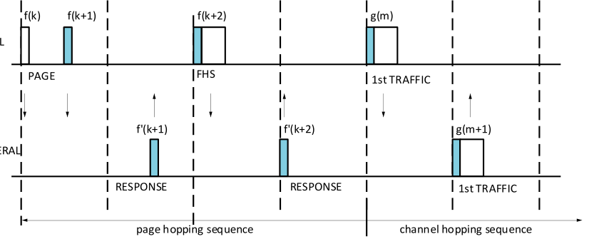

**Figure 4.88: Messaging at initial connection when Peripheral responds to second page message**

• Expected Outcome
Pass verdict
The IUT (Central) enters the Central response routine, freeze the current clock input to the page hop selection scheme and transmits a FHS packet containing the Central’s real time Bluetooth clock is checked after step b.
The IUT (Central) transmits the FHS packet 1250 s after transmitting the first page packet if a response is received from the Peripheral (step 3) is checked after step b.
That the IUT (Central) updates the clock in each new FHS packet if no response is received is checked after step c.
The IUT (Central) changes to the Central parameter submitted in the FHS packet (step 3, channel access code and Central’s clock) after the FHS packet has been acknowledged by the Peripheral (step 5) is checked after step d.
After successful page attempt the IUT enters the CONNECTION state (step 5) is checked after step e.
The IUT (Central) sends first a POLL packet with the newconnectionTO number of slots after reception of the FHS packet acknowledgement (step 5) is checked after step d.
BB/PHYS/PAG/BV-20-C [Page Hop Sequence with Train Nudge]
• Test Purpose
Verify that the IUT as Central applies train nudging to the page hopping sequence when paging the Peripheral (Lower Tester) in case the slots to receive the page responses are periodically not available.
Verify that:
- The Central uses the Peripheral’s device address to determine the page hopping sequence.
- The Central sequentially transmits on two different hop frequencies during each TX slot.
- The Central uses the estimate CLKE of the Peripheral’s Bluetooth clock to build the page trains A and B (only applicable if the IUT supports Inquiry).
- The page trains A and B are repeated Npage times, depending on the scan interval R1/R2.
- A knudge value of 0 is used during 1st 2 x Npage repetitions.
- The Central uses an even value of knudge during all other repetitions. knudge value is not always equal to 0.
- The page is aborted no earlier than pageTO and no later than pageTO+extended_pageTO if no response is received.
• Reference
[1] 2.6.4.5
• Initial Condition
- If the IUT supports inquiry: The IUT pages the Lower Tester to become the Central of the piconet. An inquiry procedure has been performed before to get back the clock offset between Central and Peripheral clock in the inquiry result event. The clock offset is used in the HCI_Create_Connection command to the IUT in step b) of the test procedure.
- If the IUT does not support Inquiry: The IUT pages the Lower Tester to become the Central of the piconet. The clock offset between Central and Peripheral clock is calculated in the Lower Tester. The clock offset is used in the HCI_Create_Connection command to the IUT in step b) of the test procedure.
- SR mode R1 is used.
• Test Procedure
To verify the page hopping sequence, the Lower Tester must not follow the normal page scan procedure. For the RX slots, the page hopping sequence is used.
value of 0x2800. b) If the IUT supports the HCI_Write_Extended_Page_Timeout command, the Upper Tester sends
an HCI_Write_Extended_Page_Timeout command to the IUT with a parameter value of 0x0800. Otherwise continue the test with extended_PageTO set to zero. c) The Upper Tester configures available slots of the IUT as defined in Section 4.4.5. d) The Lower Tester listens for paging packets from the IUT using an algorithm derived from its
Bluetooth clock and enabling it to receive a packet within the IUT’s first repetition of the first A-train. The Lower Tester’s correlator is matched to its device address. e) The IUT starts the page at some point not exactly known to the Lower Tester. f) After successfully receiving the first ID packet, the tester adjusts its RX window and phase (clock bits 0-1) to get the remaining hops of train A. The Lower Tester never responds to the page. g) The IUT repeats train A for at least Npage times. h) The Lower Tester records page train A for Npage-1 times only because the first train is known to
be incomplete. As the number of repetitions is not known, only the minimum required number (i.e., 128 or 256) is recorded to avoid missing the change to train B. i) The Lower Tester immediately starts listening on train B frequencies. j) The IUT sends page train B for Npage times starting at an unknown point of time. k) The Lower Tester records page train B until no page packet is received during one full train. l) The Lower Tester then increments knudge by 2 mod 32. m) The Lower Tester monitors the train during one train (16 frequencies). If no paging packet is
received, the tester increments knudge by 2 mod 32. n) Step m) is repeated until a paging packet is received. o) The Lower Tester then checks if the value of knudge is 0 and records the train until no paging
packets are received during one full train. p) The Lower Tester checks that the trains have been repeated at least Npage-(1+number of times
step l was repeated) times. q) Steps k)–p) are repeated until the timeout pageTO+extended_pageTO is reached. r) Steps c)–q) are repeated with SR mode R2. s) The Lower Tester changes its device address. A new inquiry procedure is performed to get the
new DAC (if the IUT supports inquiry). t) Steps c)–r) are repeated.
• Expected Outcome
Pass verdict
The IUT uses the proper page hopping sequence based on the Peripheral’s device address.
The IUT sequentially transmits on two different hop frequencies during each TX slot.
The IUT uses the estimate CLKE of the Peripheral’s Bluetooth clock to build the page trains A and B (only applicable if the IUT supports Inquiry).
The IUT repeats page trains A and B Npage times, depending on the scan interval R1/R2.
The IUT uses a value of knudge= 0 during 1st 2 x Npage repetitions.
The Central uses an even value of knudge during all other repetitions. Also, knudge value is not always equal to 0.
The page is aborted no earlier than pageTO and no later than pageTO+extended_pageTO if no response is received.
The Lower Tester records at least 95% of the expected ID packets.
• Notes
Due to the limited resolution of the CLK value used for CLKE calculation the Lower Tester can miss hops of the first page train A.

#### 4.12.2 Paging procedures - Peripheral

Verify that the Paging procedures for the Peripheral are correct.
BB/PHYS/PAG/BV-10-C [Page Response 1/1 Slot]
• Test Purpose
Verify that the IUT as Peripheral uses the correct page response procedure when receiving the page message in the first half of the RX time slot.
Verify that:
- The Peripheral enters the Peripheral response routine and freezes the current clock input to the page and page response hop selection.
- The Peripheral transmits a response message after receiving his own device access code with
the Peripheral’s device access code 625 s after the beginning of the received page message.
- The Peripheral uses the Peripheral response sequence for transmission during initial messaging.
- The IUT returns back to the page scan substate for one scan period if nothing was received after pagerespTO.
- The Peripheral returns to the state it was in prior to the first page scan if pagerespTO is exceeded and no page message is received during the additional scan period.
- The IUT returns to page scan substate when not receiving a POLL packet within newconnectionTO after acknowledging the FHS packet.
- The Peripheral changes to the Central parameter submitted in the FHS packet (BT address and Central’s clock) after the FHS packet has been acknowledged.
- The Peripheral enters the CONNECTION state after acknowledging the received FHS packet in the Peripheral response packet.
• Reference
[1] 8.3.3
• Initial Condition
- The IUT is in STANDBY mode.
- Default values are used for:
- Page Scan_Window = 18 slots and
- Page Scan_Interval = 1.28 sec.
- Scan_Type = Normal Scan
• Test Procedure
a) The Lower Tester pages the Peripheral in the first half of the TX time slot only by using the
Peripheral’s device access code. b) After receiving a response message consisting of the IUT’s device access code the tester does
not send a FHS packet.
IUT within the following scan period (11.25 ms). The Peripheral returns to the state it was in prior to the first page scan state (STAND BY mode). d) Steps a) and b) are repeated. e) After the pagerespTO timer (in the Peripheral) has expired, the Lower Tester pages the IUT
within the following scan period (11.25 ms). f) After receiving a response message consisting of the IUT’s device access code the Lower Tester sends a FHS packet. g) After receiving the acknowledgement of the FHS packet the Lower Tester waits until the
newconnectionTO timer has expired, the IUT returns to page scan substate. h) The Lower Tester pages the IUT. i) After receiving a response message the Lower Tester sends a FHS packet. j) After receiving the acknowledgement of the FHS packet the Lower Tester sends a POLL packet. k) The Lower Tester receives the confirmation from the Peripheral.
• Expected Outcome
Pass verdict
The Peripheral enters the Peripheral response routine and freezes the current clock input to the page and page response hop selection is checked after step b.
The Peripheral transmits a response message after receiving his own device access code with the
Peripheral’s device access code 625 s after the beginning of the received page message is checked after step b.
The Peripheral uses the Peripheral response sequence for transmission during initial messaging is checked after step g.
That the IUT returns back to the page scan substate for one scan period if nothing was received after pagerespTO is checked after step e.
The Peripheral returns to the state it was in prior to the first page scan if pagerespTO is exceeded and no page message is received during the additional scan period is checked after step c.
The IUT returning to page scan substate when not receiving a POLL packet within newconnectionTO after acknowledging the FHS packet is checked after step i.
The Peripheral changing to the Central parameter submitted in the FHS packet (BT address and Central’s clock) after the FHS packet has been acknowledged is checked after step k.
That the Peripheral enters the CONNECTION state after acknowledging the received FHS packet in the Peripheral response packet is checked after step k.
• Notes
The Lower Tester may need to transmit the FHS and POLL packets more than once within pagerespTO and newconnectionTO number of slots, respectively.
BB/PHYS/PAG/BV-12-C [Page Response 1/2 slot]
• Test Purpose
Verify that the IUT as Peripheral uses the correct page response procedure when receiving the page message in the second half of the RX time slot.
- The Peripheral enters the Peripheral response routine and freezes the current clock input to the page and page response hop selection.
- The Peripheral transmits a response message after receiving his own device access code within
the Peripheral’s device access code 625 s after the beginning of the received page message.
- The Peripheral uses the Peripheral response sequence for transmission during initial messaging.
- The Peripheral returns back to the page scan substate for one scan period if nothing was received after pagerespTO.
- The Peripheral returns to the state it was in prior to the first page scan if pagerespTO is exceeded and no page message is received during the additional scan period.
- The IUT returns to page scan substate when not receiving a POLL packet within newconnectionTO after acknowledging the FHS packet.
- The Peripheral changes to the Central parameter submitted in the FHS packet (BT address and Central’s clock) after the FHS packet has been acknowledged.
- The Peripheral enters the CONNECTION state after acknowledging the received FHS packet in the Peripheral response packet.
• Reference
[1] 8.3.3
• Initial Condition
- The IUT is in STANDBY mode.
• Test Procedure
a) The Lower Tester pages the Peripheral 312.5 s after the Central TX time slot has been started
(second half of the TX time slot) by using the Peripheral’s device access code. b) After receiving a response message consisting of the Peripheral’s device access code the Lower
Tester does not send a FHS packet. c) After the pagerespTO timer (in the Peripheral) has expired the tester do not pages the IUT within
the following scan period (11.25 ms). The Peripheral returns to the state it was in prior to the first page scan state (STAND BY mode). d) Steps a) and b) are repeated. e) After the pagerespTO timer (in the Peripheral) has expired the Lower Tester pages the IUT within
the following scan period (11.25 ms). f) After receiving a response message consisting of the IUT’s device access code the tester sends a FHS packet. g) After receiving the acknowledgement of the FHS packet the Lower Tester waits until the
newconnectionTO timer has expired, the IUT returns to page scan substate. h) The Lower Tester pages the IUT. i) After receiving a response message the Lower Tester sends a FHS packet. j) After receiving the acknowledgement of the FHS packet the Lower Tester sends a POLL packet. k) The Lower Tester receives the confirmation from the Peripheral.
• Expected Outcome
Pass verdict
The Peripheral entered the Peripheral response routine and froze the current clock input to the page and page response hop selection is checked after step b.
The Peripheral transmitting a response message after receiving his own device access code within
the Peripheral’s device access code 625 s after the beginning of the received page message is checked after step b.
The Peripheral used the Peripheral response sequence for transmission during initial messaging is checked after step g.
The Peripheral returned back to the page scan substate for one scan period if nothing was received after pagerespTO is checked after step e.
The Peripheral returned to the state it was in prior to the first page scan if pagerespTO is exceeded and no page message is received during the additional scan period is checked after step c.
The IUT returned to page scan substate when not receiving a POLL packet within newconnectionTO after acknowledging the FHS packet is checked after step i.
The Peripheral changed to the Central parameter submitted in the FHS packet (BT address and Central’s clock) after the FHS packet has been acknowledged is checked after step k.
The Peripheral entered the CONNECTION state after acknowledging the received FHS packet in the Peripheral response packet is checked after step k.
• Notes
The Lower Tester may need to transmit the FHS and POLL packets more than once within pagerespTO and newconnectionTO number of slots, respectively.
BB/PHYS/PAG/BV-14-C [Page Scan Interval R0]
• Test Purpose
Verify that the IUT as Peripheral uses the correct page scan interval for paging mode R0 (continuous).
• Reference
[1] 8.3.1, 8.3.2
• Initial Condition
- The Lower Tester uses the 79 channel hop scheme.
- The IUT is configured as Peripheral using page scan mode R0.
- If the IUT supports inquiry:
▪ To ensure that the Lower Tester can follow the page scan sequence of the Peripheral a procedure has been performed before to get the estimate CLKE of the Peripheral’s Bluetooth clock.
▪ The Lower Tester is paged by the IUT. The clock offset between Central and Peripheral clock is calculated in the Lower Tester. The clock offset is used in step a) of the Test Procedure.
- The IUT is in STAND BY mode. Periodic scan is enabled with HCI_Write_Scan_Enable.
• Test Procedure
a) The Lower Tester pages the IUT continuously until a response ID packet is received. The number
of pages and the position in the page hop sequence are recorded. b) The Lower Tester does not respond with a FHS packet but waits for one scan period (18 slots) +
pagerespTO (8 slots) plus a randomly chosen number of slots between 0 and 1023. c) Steps a) and b) are performed 100 times.
• Expected Outcome
Pass verdict
In step a) of the Test Procedure, the tester receives a response ID packet on the first page train A in at least 95% of the page procedures.
BB/PHYS/PAG/BV-16-C [Page Scan Interval R1]
• Test Purpose
Verify that the IUT as Peripheral uses the correct page scan interval for paging mode R1 ( 1.28 s).
• Reference
[1] 8.3.1, 8.3.2
• Initial Condition
- The Lower Tester uses the 79 channel hop scheme.
- The IUT is configured as Peripheral using page scan mode R1.
- If the IUT supports inquiry:
▪ To ensure that the Lower Tester can follow the page scan sequence of the Peripheral a procedure has been performed before to get the estimate CLKE of the Peripheral’s Bluetooth clock.
- If the IUT does not support Inquiry:
▪ The Lower Tester is paged by the IUT. The clock offset between Central and Peripheral clock is calculated in the Lower Tester. The clock offset is used in step a) of the Test Procedure.
- The IUT is in STAND BY mode. Periodic scan is enabled with HCI_Write_Scan_Enable.
• Test Procedure
a) The Lower Tester pages the IUT continuously until a response ID packet is received. The number
of pages and the position in the page hop sequence are recorded. b) The Lower Tester does not respond with a FHS packet but waits for one scan period (18 slots),
pagerespTO (8 slots) and a randomly chosen number of slots between 0 and 2048. c) Steps a) and b) are performed 1,000 times.
• Expected Outcome
Pass verdict
In step a) of the Test Procedure, the Lower Tester receives a response ID packet within 1.28 s after the start of the page for more than 95% of the page procedures.
BB/PHYS/PAG/BV-17-C [Page Scan Interval R1 with Interlaced Scan]
• Test Purpose
Verify that the IUT as Peripheral uses the correct page scan interval for paging mode R1 ( 1.28 s) when interlaced scan is used during page scanning.
• Reference
[1] 8.3.1, 8.3.2
• Initial Condition
- The Lower Tester uses the 79 channel hop scheme.
- The IUT is configured as Peripheral using page scan mode R1.
- Scan_type = Interlaced Scan
- The IUT is in STAND BY mode. Periodic scan is enabled with HCI_Write_Scan_Enable.
• Test Procedure
a) The Lower Tester pages the IUT continuously until a response ID packet is received. The number
of pages and the position in the page hop sequence are recorded. b) The Lower Tester does not respond with a FHS packet but waits for one scan period (128 slots),
pagerespTO (8 slots) and a randomly chosen number of slots between 0 and 2048. c) Steps a) and b) are performed 1,000 times.
• Expected Outcome
Pass verdict
In step a) of the Test Procedure, the Lower Tester receives a response ID packet within 1.28 s after the start of the page for more than 95% of the page procedures.
• Notes
In Test Procedure step b), since there may be some switching time between two back to back scans, the Lower Tester should wait for scan period (18 slots + switching time + 18 slots), pagerespTO (8 slots) and a randomly chosen number of slots between 0 and 2048. It is assumed that no implementation would have the switching time larger than 128-18-18=92 slots.
BB/PHYS/PAG/BV-18-C [Page Scan Interval R2]
• Test Purpose
Verify that the IUT as Peripheral uses the correct page scan interval for paging mode R2 ( 2.56 s).
• Reference
[1] 8.3.1, 8.3.2
• Initial Condition
- The Lower Tester uses the 79 channel hop scheme.
- The IUT is configured as Peripheral using page scan mode R2.
- If the IUT supports inquiry:
▪ To ensure that the Lower Tester can follow the page scan sequence of the Peripheral a procedure has been performed before to get the estimate CLKE of the Peripheral’s Bluetooth clock.
- If the IUT does not support Inquiry:
▪ The Lower Tester is paged by the IUT. The clock offset between Central and Peripheral clock is calculated in the Lower Tester. The clock offset is used in step a) of the Test Procedure.
- The IUT is in STAND BY mode. Periodic scan is enabled with HCI_Write_Scan_Enable.
• Test Procedure
a) The Lower Tester pages the IUT continuously until a response ID packet is received. The number
of pages and the position in the page hop sequence are recorded. b) The Lower Tester does not respond with a FHS packet but waits for one scan period (18 slots),
pagerespTO (8 slots) and a randomly chosen number of slots between 0 and 4096. c) Steps a) and b) are performed 1,000 times.
• Expected Outcome
Pass verdict
In step a) of the Test Procedure, the Lower Tester receives a response ID packet within 2.56 s after the start of the page for more than 95% of the page procedures.
BB/PHYS/PAG/BV-19-C [Page Scan Interval R2 and Interlaced Scan]
• Test Purpose
Verify that the IUT as Peripheral uses the correct page scan interval for paging mode R2 ( 2.56 s) when interlaced scan is used during page scanning.
• Reference
[1] 8.3.1, 8.3.2
• Initial Condition
- The Lower Tester uses the 79 channel hop scheme.
- The IUT is configured as Peripheral using page scan mode R2.
- Scan_type = Interlaced Scan.
- The IUT is in STAND BY mode. Periodic scan is enabled with HCI_Write_Scan_Enable.
• Test Procedure
a) The Lower Tester pages the IUT continuously until a response ID packet is received. The number
of pages and the position in the page hop sequence are recorded.
pagerespTO (8 slots) and a randomly chosen number of slots between 0 and 4096. c) Steps a) and b) are performed 1,000 times.
• Expected Outcome
Pass verdict
In step a) of the Test Procedure, the Lower Tester receives a response ID packet within 2.56 s after the start of the page for more than 95% of the page procedures.
• Notes
In Test Procedure step b) since there may be some switching time between two back to back scans, the Lower Tester should wait for scan period (18 slots + switching time + 18 slots), pagerespTO (8 slots) and a randomly chosen number of slots between 0 and 2048. It is assumed that no implementation would have the switching time larger than 128-18-18=92 slots.
BB/PHYS/PAG/BV-21-C [Generalized Interlaced Page Scan]
• Test Purpose
Verify that the IUT as Peripheral applies efficiently generalized interlaced scan to page scan.
• Reference
[1] 8.4.1
• Initial Condition
- The Lower Tester uses the 79 channel hop scheme.
- The IUT is configured as Peripheral using page scan mode R1.
- Scan_type = Interlaced Scan.
- The IUT is in STAND BY mode. Periodic scan is enabled with HCI_Write_Scan_Enable.
- The Upper Tester configures available slots of the IUT as defined in Section 4.4.5.
• Test Procedure
a) The Lower Tester pages the IUT until a response ID packet is received repeating the following
pattern: b) Transmit page messages during 1.928 ms. c) Do not transmit page messages during 3.066 ms.
Note that the paging sequence is not affected by the pattern, but the Lower Tester will just omit transmitting packets according to the pattern.
d) The number of pages and the position in the page hop sequence are recorded. e) The Lower Tester does not respond with a FHS packet but waits for one scan period (128 slots),
pagerespTO (8 slots) and a randomly chosen number of slots between 0 and 2048.
Steps a) and b) are performed 1,000 times.
• Expected Outcome
Pass verdict
In step a) of the test procedure, the Lower Tester receives a response ID packet within 2.56 s after the start of the page for more than 95% of the page procedures.
• Test Purpose
Verify that the IUT as Peripheral ignores a page from the Central Lower Tester using the same address as the IUT.
• Reference
[17] 8.3.3
• Initial Condition
- The IUT is in STANDBY mode.
- Default values are used for:
▪ Page Scan_Window = 18 slots and
▪ Page Scan_Interval = 1.28 sec.
- Scan_Type = Normal Scan
- Page_Timeout = 5.12 sec
• Test Procedure
a) The Lower Tester pages the Peripheral in the first half of the TX time slot only by using the
Peripheral’s device access code with a DAC that is derived from the IUT’s BD_ADDR. b) The IUT responds to the page with a First Peripheral page response ID packet with a DAC that is
derived from the IUT’s BD_ADDR. c) The Lower Tester sends an FHS packet to the IUT with LAP, UAP, and NAP that form the IUT’s
BD_ADDR. d) The IUT does not send an ID packet for the Second Page Peripheral page response to the Lower
Tester. e) The Lower Tester receives a page timeout.
• Expected Outcome
Pass verdict
In step d, the IUT does not send the Second Page Peripheral page response for 5.12 seconds.

### 4.13 Connection

Verify that the behavior in the connection state is correct.

#### 4.13.1 Connection state - Central

Verify that the Central works correctly in the connection state.
BB/PROT/CON/BV-01-C [POLL at Start Up]
• Test Purpose
Verify that the IUT configured as Central sends a POLL packet at the start of a new connection and initializes the ARQN bit set to NAK.
Further verify that the Central initializes the SEQN bit of the first CRC data packet to 1.
• Reference
[1] 7.6.1, 7.6.2, 8.3.3.1, 8.5
• Initial Condition
- Lower Tester: Configured as Peripheral in state STANDBY.
- IUT: Configured as Central in state STANDBY.
• Test Procedure
Central Peripheral

| Lower Tester |  |  | Upper Tester |  |
| --- | --- | --- | --- | --- |
|  |  |  |  |  |
|  | Lower Tester: configured as P IUT: configured as Cent | eripheral in state STANDBY. ral in state STANDBY. |  |  |
|  | ID | HCI Create Connection _ _ |  |  |
|  |  | (BD ADDR, Packet Type, _ _ Page Scan Repetition Mode, _ _ _ Reserved, Clock Offset, _ Allow Role Switch) _ _ Command Status event |  |  |
|  | (Peripherals device access code) ID |  |  |  |
|  | (Peripherals device access code) ID |  |  |  |
|  | (Peripherals device access code) FHS |  |  |  |
|  | (LT ADDR, TYPE, ARQN, SEQN, FLOW, _ HEC, Parity bits, LAP, Undefined, SR, SP='10'B, UAP, NAP, Class of device, LT ADDR, CLK27-2) _ ID |  |  |  |
|  | (Peripherals device access code) POLL |  |  |  |
|  | (Access code, LT ADDR, _ TYPE, FLOW, ARQN, SEQN, HEC) NULL |  |  |  |
|  | (Access code, LT ADDR, TYPE, FLOW, _ ARQN, SEQN, HEC) DM1 |  |  |  |
|  |  |  |  |  |

HCI_Create_Connection:
BD_ADDR: BD_ADDR of the tester.
Packet_Type: '330E'H.
Page_Scan_Repetition_Mode: '01'H.
Reserved: '00'H.
Clock_Offset: As required.
Allow_Role_Switch: As required by the IUT.
Then the Lower Tester verifies that the IUT sends an ID packet containing the Peripheral’s device access code.
Upon reception of an ID packet the Lower Tester transmits an ID packet back also containing the Peripheral’s device access code.
Then the Lower Tester verifies that the IUT transmits a FHS packet.
After having received the FHS packet from the IUT the Lower Tester transmits an ID packet (Peripheral’s devices access code) again to indicate the reception from the former FHS packet.
The Lower Tester verifies that the IUT sends a POLL packet with the ARQN bit set to NAK.
The Lower Tester confirms the reception with a NULL packet.
The Lower Tester verifies that the IUT sends a DM1 packet with the SEQN bit set to 1.
• Expected Outcome
Pass verdict
The IUT sends at the start of a new connection a POLL packet with the ARQN bit set to NAK.
The IUT initializes the SEQN bit of the first CRC data packet to 1.
• Notes
A FHS packet can already arrive 312.5 µs after the arrival of the page message, and not 625 µs as is usually the case in the RX/TX timing.
BB/PROT/CON/BV-02-C [Polling Peripheral]
• Test Purpose
Verify that the IUT configured as Central transmits periodical to keep the Peripheral synchronized on the channel.
• Reference
[1] 8.6
• Initial Condition
- Lower Tester: Configured as Peripheral in state CONNECTION (active mode, ACL link).
- IUT: Configured as Central in state CONNECTION (active mode, ACL link).
• Test Procedure
Central Peripheral

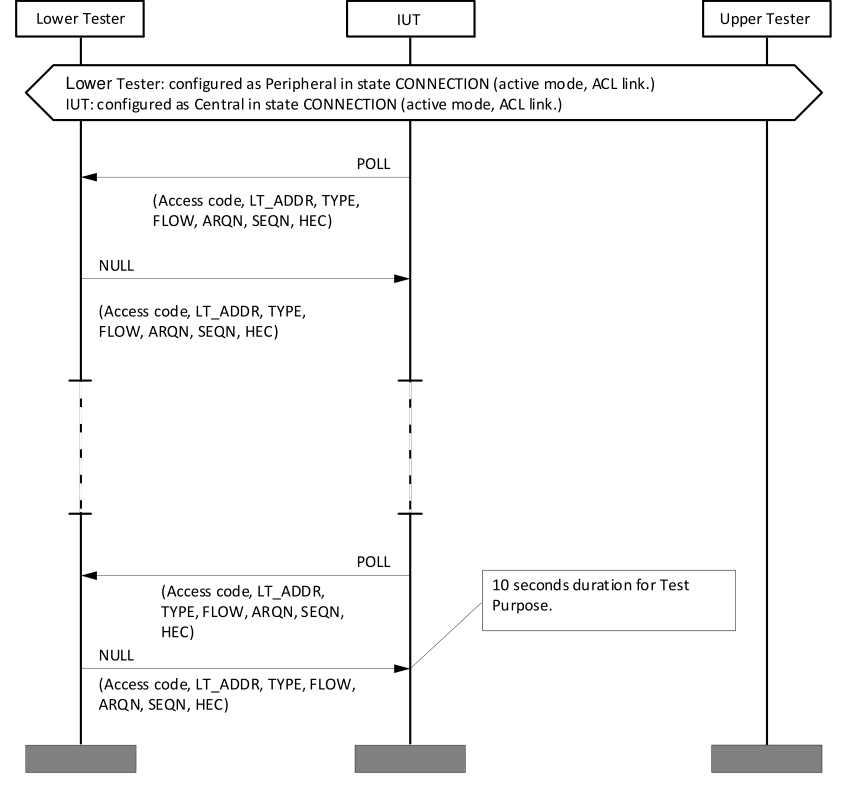

**Figure 4.90: BB/PROT/CON/BV-02-C [Polling Peripheral]**

The Lower Tester verifies that the IUT periodically transmits with an interval of maximum 40 slots (default value for POLL interval as stated in LMP Specification [10] in Table 5.5).
The test is carried out for a time of 10 s.
• Expected Outcome
Pass verdict
At least 95% of the Central transmissions have an interval of at maximum 40 slots for a time of 10 s.
BB/PROT/CON/BV-03-C [Wrong UAP]
• Test Purpose
Verify that the IUT configured as Central upon reception of a packet with the same access code - i.e., an access code of a device owning the same LAP but different UAP - passes the access code test, it will disregard the packet after HEC and CRC tests when the UAP do not match.
• Reference
[1] 7.1
• Initial Condition
- Lower Tester: Configured as Peripheral in state CONNECTION (active mode, ACL link).
- IUT: Configured as m in state CONNECTION (active mode, ACL link).
• Test Procedure
Central Peripheral

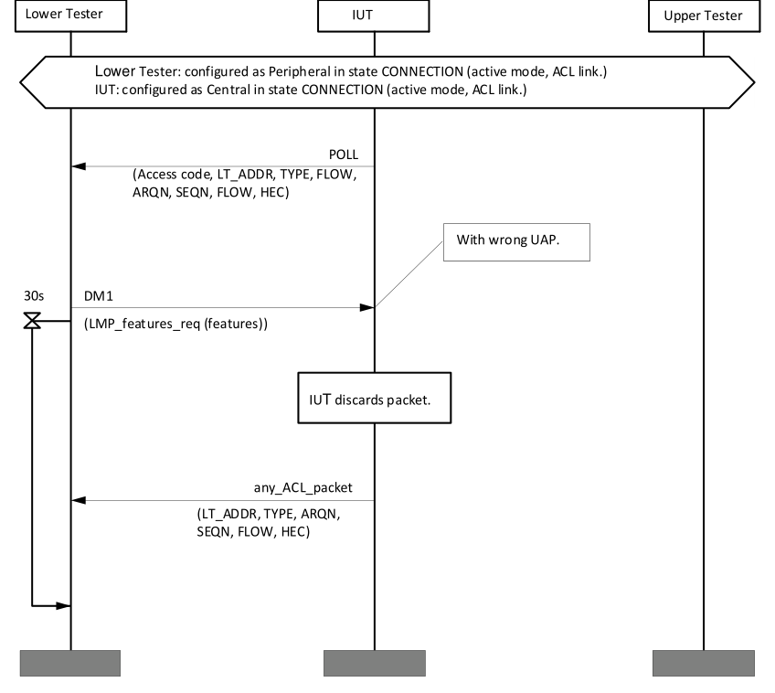

**Figure 4.91: BB/PROT/CON/BV-03-C [Wrong UAP]**

Upon reception of a POLL packet the tester sends a DM1 packet containing an LMP_features_req message with a wrong UAP.
The Lower Tester verifies that the IUT discards the packet and does not response to the LMP_features_req message for the next 30 s.
• Expected Outcome
Pass verdict
The IUT discards the packet and does not response to the LMP_features_req message.
• Test Purpose
Verify that the IUT automatically change from DV packet type to HV1 packet type used before the mixed data/voice transmission when there is no data to be sent.
• Reference
[1] 6.5.2.4
• Initial Condition
- Lower Tester: Configured as Peripheral.
- IUT: Configured as Central.
- An SCO link is established. The only features supported by the Lower Tester are SCO-link, µ-law, A-law, CVSD and transparent data.
• Test Procedure
Central Peripheral

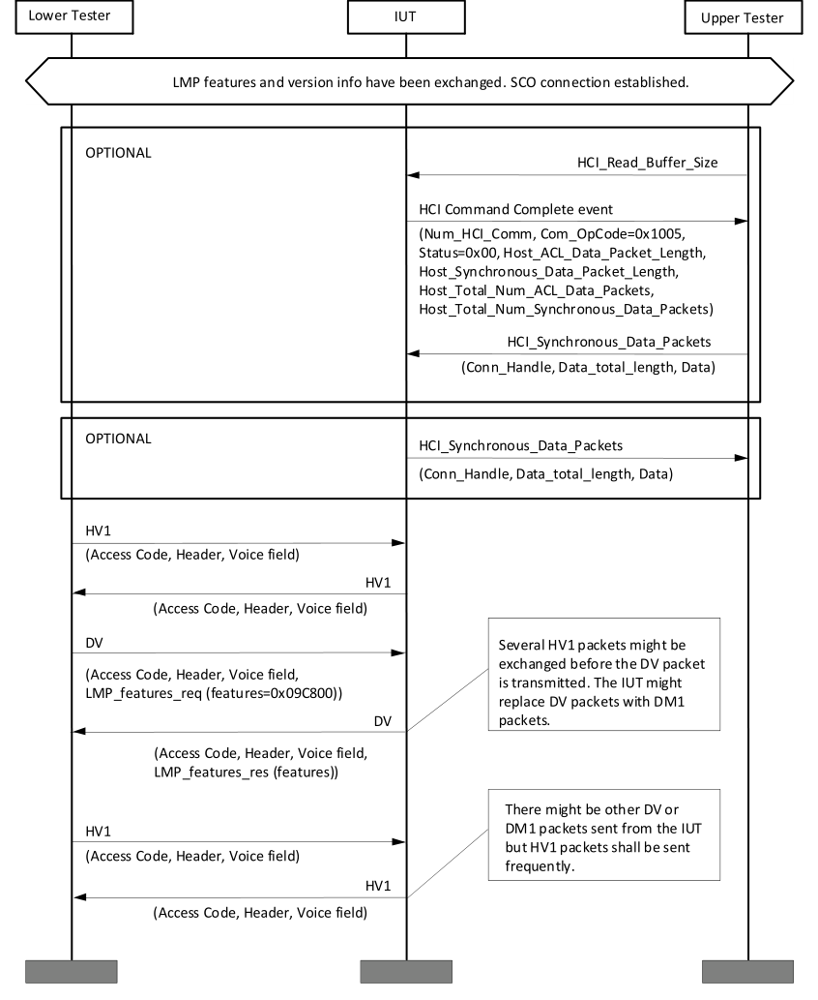

**Figure 4.92: BB/PROT/CON/BV-04-C [Change from DV to HV1]**

The Lower Tester verifies that the IUT transmits HV1 packets to the Lower Tester.
The Lower Tester responds with HV1 packets in the Peripheral to Central slots.
The Lower Tester transmits a DV packet containing LMP_features_req to the IUT in order to force the IUT to send a DV packet containing LMP_features_res.
The Lower Tester verifies that the IUT automatically changes from DV packet type to HV1 packet type.
• Expected Outcome
Pass verdict
The IUT changes automatically from DV packet type to HV1 packet type.
• Notes
There is no possibility written in the [1] to force the IUT to send a DV packet. For IUTs using DV packets, it can be checked whether they are received. If no DV packet is returned, then the IUT must return a DM1 packet. The IUT might transmit unsolicited LMP signaling changing the intended Test Procedure. This risk is minimized by having the Lower Tester transmit LMP_features_req and LMP_version_req immediately after ACL connection establishment and only indicate support for the minimum number of features required to make the test case work.
An IXIT [14] statement is used to distinguish between IUTs requiring HCI interaction to transmit HV1/DV packets and IUTs transmitting the packets without HCI interaction. Optionally, the IUT might send HCI Synchronous packets to the Upper Tester.
BB/PROT/CON/BV-16-C [Terminate Connection at Link Supervision Timeout, Central]
• Test Purpose
Verify that the Central IUT terminates the connection at the link supervision timeout when it does not receive any packets that pass the HEC check and has the proper LT_ADDR.
• Reference
[1] 3.1, 4.2
• Initial Condition
- The Lower Tester is configured as the Peripheral in state CONNECTION (active mode, ACL link).
- The IUT is configured as the Central in state CONNECTION (active mode, ACL link).
• Test Procedure

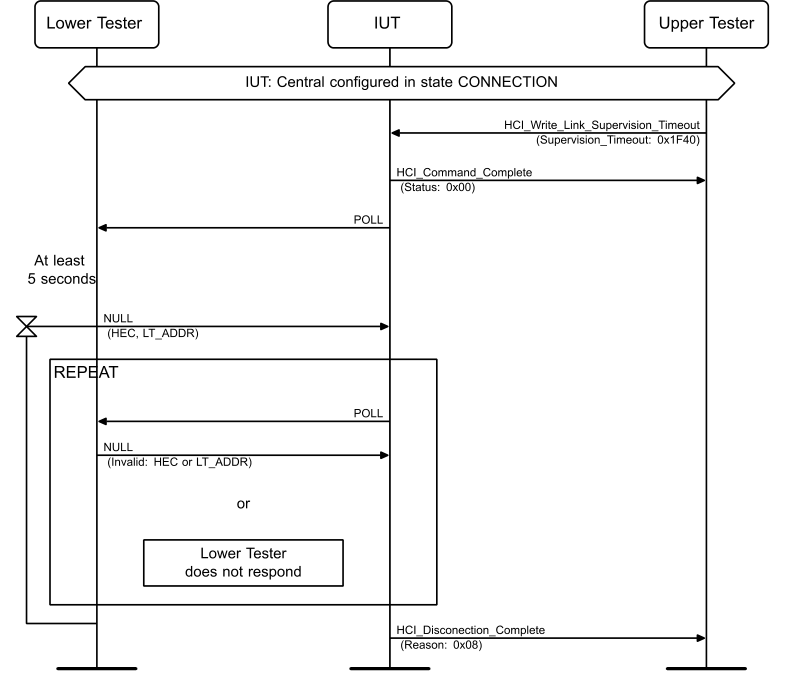

**Figure 4.93: Terminate Connection at Link Supervision Timeout, Central MSC**

1. The Upper Tester sends an HCI_Write_Link_Supervision_Timeout command to the IUT with
Link_Supervision_Timeout set to 5 s (0x1F40) and sends a successful HCI_Command_Complete event in response. 2. The IUT sends a POLL packet to the Lower Tester. 3. The Lower Tester sends a NULL packet with a packet header that contains the correct LT_ADDR
and HEC. 4. The IUT sends a POLL packet to the Lower Tester. 5. The Lower Tester cycles between no response, sending a NULL packet with an invalid
LT_ADDR, and sending a NULL packet with an invalid HEC.
Repeat steps 4 and 5 until the IUT executes step 6.
6. At least 5 seconds after step 2, the IUT sends an HCI_Disconnection_Complete event to the
Upper Tester with Reason set to Connection Timeout (0x08).
• Expected Outcome
Pass verdict
In step 6, the IUT sends an HCI_Disconnection_Complete event to the Upper Tester.

#### 4.13.2 Connection state - Peripheral

Verify that the Peripheral works correctly in the connection state.
BB/PROT/CON/BV-05-C [POLL at Start Up]
• Test Purpose
Verify that the IUT configured as Peripheral confirms the reception of the first POLL packet sent by the Central after startup of a new connection and initializes the ARQN bit set to NAK.
Further verify that the IUT initializes the SEQN bit of the first CRC data packet set to 1.
• Reference
[1] 6.5.1.3, 7.6.1, 7.6.2, 8.5
• Initial Condition
- Lower Tester: Configured as Central in state STANDBY. Inquiry is performed successfully.
- IUT: Configured as Peripheral in state STANDBY. Inquiry scan is performed successfully.
• Test Procedure
Peripheral Central

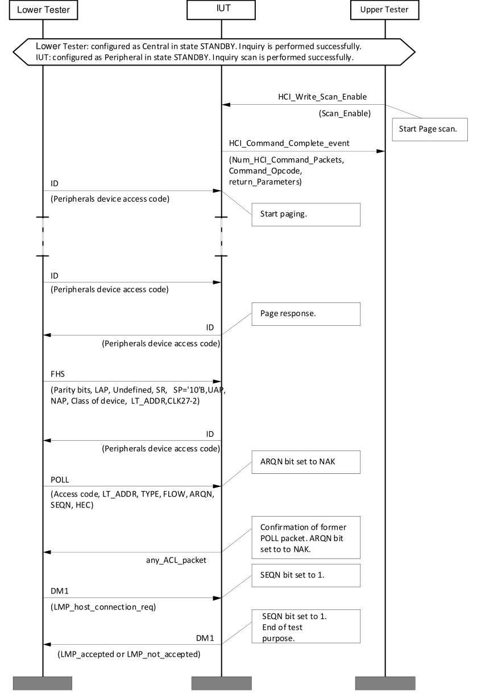

**Figure 4.94: BB/PROT/CON/BV-05-C [POLL at Start Up]**

HCI_Write_Scan_Enable:
Scan_Enable: 0x02.
The Lower Tester repeatedly transmits an ID packet (Peripheral’s device access code) in different hop channels to page the Peripheral.
Then the Lower Tester verifies that the IUT sends an ID packet containing the Peripheral’s device access code.
Upon reception of the ID packet the Lower Tester transmits a FHS packet.
FHS:
Access code:
Preamble: 1010 or 0101 sequence, depending on whether the LSB of the following sync word is 1 or 0, respectively.
Sync word: Derived from the 24 bit address (LAP) of the Peripheral (DAC).
Trailer: 1010 or 0101 sequence, depending on whether the MSB of the sync word is 1 or 0, respectively.
Packet header:
LT_ADDR: Set to all-zero.
TYPE: '0010'B.
FLOW: '1'B.
ARQN: '1'B.
SEQN: Any value because contents of the SEQN bit in the FHS packet should not be checked.
HEC: Generated by the polynomial '647'O in respect to the UAP of the Central.
FHS Payload:
Parity bits: First 34-bit of the sync word of the access code.
LAP: LAP of the Lower Tester.
Undefined: Any value.
SR: '00'B.
SP: ‘10'B.
UAP: UAP of the Lower Tester.
NAP: NAP of the Lower Tester.
Class of device: Not defined yet; any value.
LT_ADDR: Logical Transport Address the IUT will use.
CLK27-2: Current value of the system clock of the Lower Tester.
After having received the FHS packet of the Lower Tester the IUT transmits an ID packet (Peripheral’s device access code only) again to indicate the reception of the former FHS packet.
The Lower Tester sends a POLL packet in the next Central to Peripheral slot.
LT_ADDR: Logical Transport Address of the IUT.
TYPE: '0001'B.
FLOW: '1'B.
ARQN: Depends on the reception of the former packet.
SEQN: Any value.
HEC: UAP of the Central device address.
Then the Lower Tester verifies that the IUT confirms the reception of the former POLL packet with any ACL packet with the ARQN bit set to NAK.
The Lower Tester sends a DM1 packet containing an LMP_host_connection_req message with the SEQN bit set to 1.
The Lower Tester verifies that the IUT sends a DM1 packet with the SEQN bit set to 1.
• Expected Outcome
Pass verdict
The IUT confirms the reception of the POLL packet after start up with the ARQN bit set to NAK.
The IUT initializes the SEQN bit of the first CRC data packet to 1.
BB/PROT/CON/BV-08-C [Wrong UAP]
• Test Purpose
Verify that when a packet with the same access code - i.e., an access code of a device owning the same LAP but different UAP - passes the access code test, it will disregard the packet after HEC and CRC tests when the UAP do not match.
• Reference
[1] 7.1
• Initial Condition
- Lower Tester: Configured as Central in state CONNECTION (active mode, ACL link).
- IUT: Configured as Peripheral in state CONNECTION (active mode, ACL link).
• Test Procedure
Peripheral Central
Lower Tester IUT
Upper Tester
Lower Tester: configured as Central in state CONNECTION (active mode, ACL link.) IUT: configured as Peripheral in state CONNECTION (active mode, ACL link.)
With wrong UAP.
DM1
30s
(LMP_features_req (features))
IUT discards packet.
Figure 4.95 BB/PROT/CON/BV-08-C [Wrong UAP]
The Lower Tester sends a DM1 packet containing an LMP_features_req message with a wrong UAP to the IUT.
The Lower Tester verifies that the IUT discards the packet and verifies that the IUT does not response to the LMP_features_req message.
• Expected Outcome
Pass verdict
The IUT discards the packet and does not response to the LMP_features_req message.
BB/PROT/CON/BV-09-C [Change from DV to HV1]
• Test Purpose
Verify that the IUT automatically changes from DV packet type to HV1 packet type used before the mixed data/voice transmission when there is no data to be sent.
• Reference
[1] 6.5.2.4
• Initial Condition
- Lower Tester: Configured as Central.
- IUT: Configured as Peripheral.
- An SCO connection is established. The only features supported by the Lower Tester are SCO- link, µ-law, A-law, CVSD and transparent data.
• Test Procedure
Peripheral Central

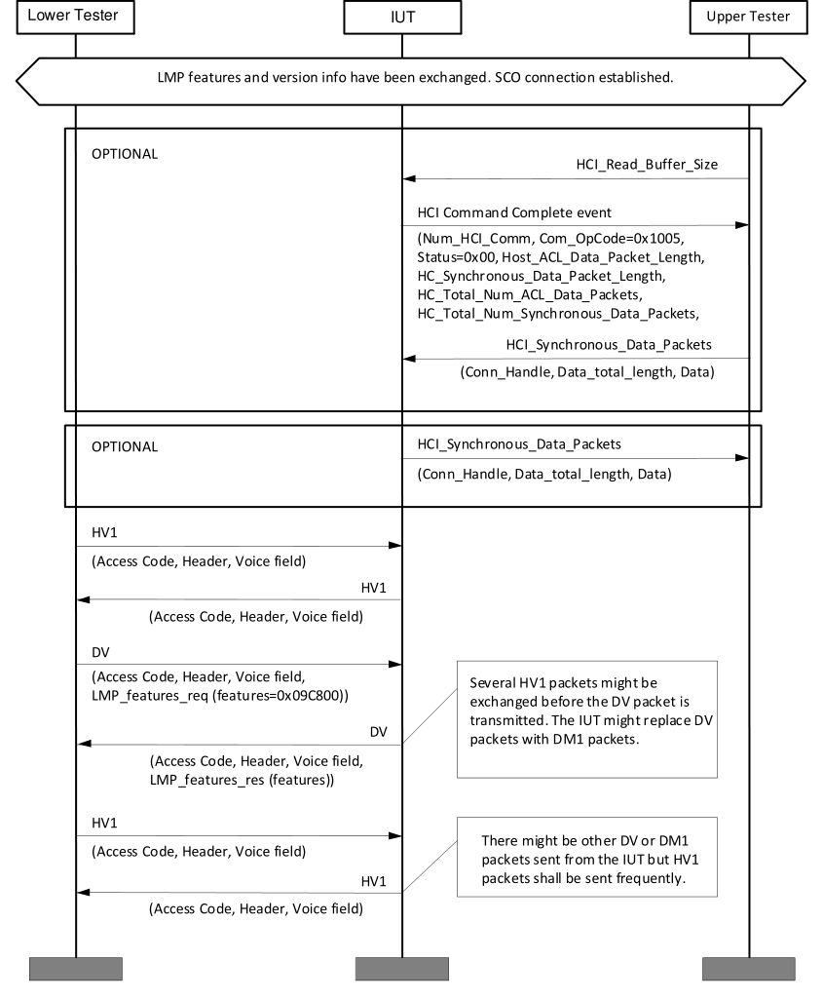

**Figure 4.96: BB/PROT/CON/BV-09-C [Change from DV to HV1]**

The Lower Tester transmits a HV1 packet to the IUT.
The Lower Tester verifies that the IUT responds with a HV1 packet in the following Peripheral to Central slot.
The Lower Tester sends transmits LMP_features_req to the IUT in order to force the IUT to transmit a DV packet containing LMP_Features_res.
The Lower Tester verifies that the IUT automatically changes from DV packet type to HV1 packet type.
• Expected Outcome
Pass verdict
The IUT changes automatically from DV packet type to HV1 packet type.
• Notes
There is no possibility written in the [1] to force the IUT to send a DV packet. For IUTs using DV packets, it can be checked whether they are received. If no DV packet is returned, then the IUT must return a DM1 packet. The IUT might transmit unsolicited LMP signaling changing the intended Test Procedure. This risk is minimized by having the tester transmit LMP_features_req and LMP_version_req immediately after ACL connection establishment and only indicate support for the minimum number of features required to make the test case work.
An IXIT [14] statement is used to distinguish between IUTs requiring HCI interaction to transmit HV1/DV packets and IUTs transmitting the packets without HCI interaction. Optionally, the IUT might send HCI Synchronous packets to the Upper Tester.
BB/PROT/CON/BV-10-C [AES DayCounter Initialization to 1 as Peripheral]
• Test Purpose
Verify that the IUT correctly initializes the AES DayCounter in the specific case where it is initialized to 1.
• Reference
[12] 9.1
• Initial Condition
- The IUT is configured as Peripheral in state CONNECTION (active mode, ACL link) with AES-CCM encryption enabled.
- The Lower Tester is configured as Central in state CONNECTION (active mode, ACL link) and with AES-CCM encryption enabled.
- The CLK has been chosen so that clock wrap-around will happen in the near future.
• Test Procedure

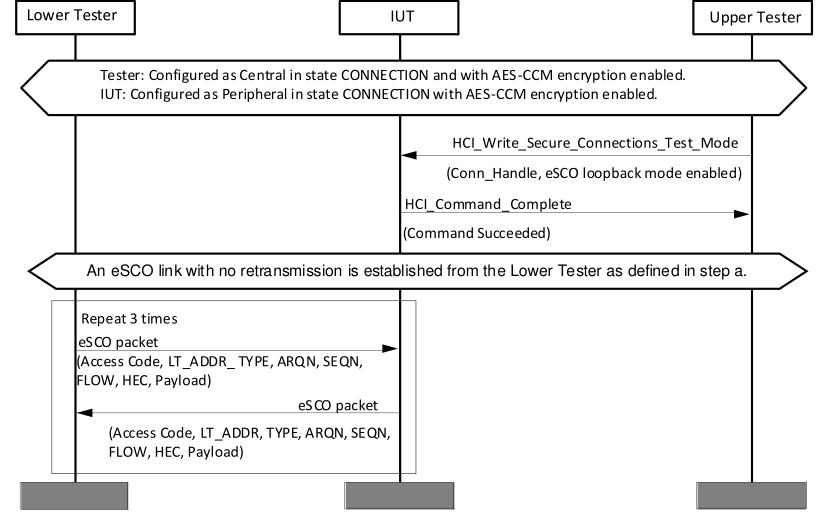

**Figure 4.97: BB/PROT/CON/BV-10-C [AES DayCounter Initialization to 1 as Peripheral]**

a) The Upper Tester sends HCI Write Secure Connections Test Mode to enable the eSCO loopback
mode. b) The Lower Tester initiates an eSCO link at a precise time so that initialization 2 is used for setting
up eSCO AND the MSB of the Central’s clock (CLK27) is 0 at the first eSCO packet from the Central. eSCO link is set with no retransmission. c) The Lower Tester sends an eSCO packet as follows:
Payload: 30 non deterministic random Bytes of payload plus 16 bit CRC.
d) The IUT replies with a packet of same description. e) The Lower Tester verifies that the IUT transmits the packet correctly to the Lower Tester. f) Steps c)–e) are repeated 2 times (in addition to the first time) plus a few times equal to the eSCO loopback delay value, so that the IUT sends a minimum of 3 packets containing a looped back payload.
• Expected Outcome
Pass verdict
The Lower Tester receives the three eSCO packets properly encrypted and containing the same payload as it transmitted.
• Notes
The nonce used for AES-CCM encryption is derived using the same rules as applicable in a normal eSCO connection.
Per [1], in this specific test, the DayCounter is initialized to 1 due to the specific timing at eSCO link establishment.
According to the Secure Connections eSCO Loopback Delay value (provided in the IXIT [14]), the payload contained in the first packets from the IUT is discarded and does not impact the verdict.
• Test Purpose
Verify that the IUT correctly increments the AES DayCounter at clock wrap-around.
• Reference
[12] 9.1
• Initial Condition
- The IUT is configured as Peripheral in state CONNECTION (active mode, ACL link) with AES-CCM encryption enabled.
- The Lower Tester is configured as Central in state CONNECTION (active mode, ACL link) and with AES-CCM encryption enabled.
- The CLK has been chosen so that clock wrap-around will happen in a reasonably close future (there is no restriction but around a second or a couple seconds would be reasonable). The only restriction is that eSCO packets have to be exchanged before and after clock wrap-around.
• Test Procedure

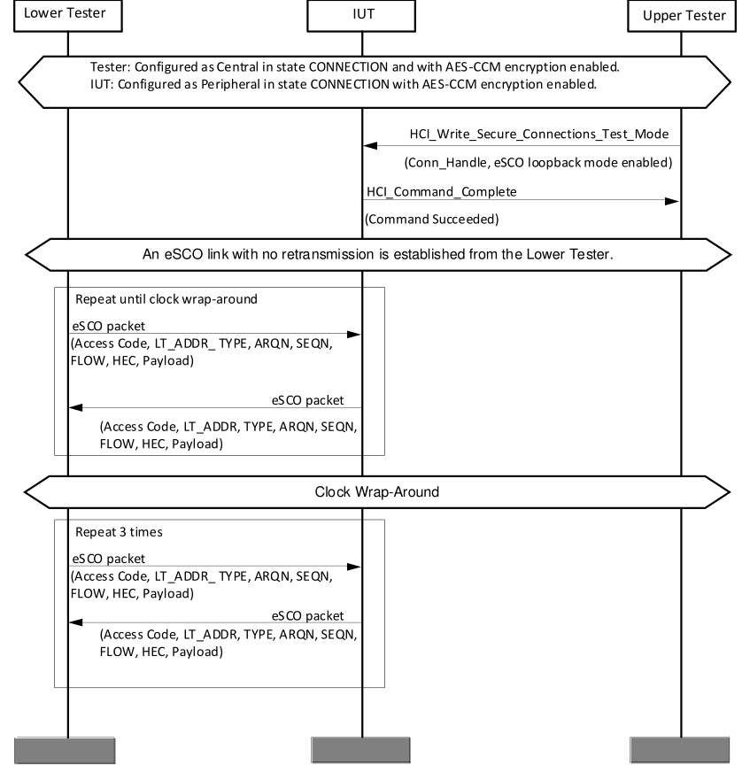

**Figure 4.98: BB/PROT/CON/BV-11-C [AES DayCounter increment at clock wrap-around as Peripheral]**

a) The Upper Tester sends HCI Write Secure Connections Test Mode to enable the eSCO loopback
mode. b) The Lower Tester initiates an eSCO link at a reasonable time before clock wrap-around. The
eSCO link is set with no retransmission. c) The Lower Tester sends an eSCO packet as follows: d) Payload: 30 non deterministic random Bytes of payload plus 16 bit CRC. e) The IUT replies with a packet of same description. f) The Lower Tester verifies that the IUT transmits the packet correctly to the Lower Tester. g) Steps c)–e) are repeated till clock wrap-around. A minimum of 3 packets containing a looped
back payload have to be sent from the IUT. h) After clock wrap-around, steps b)–d) are repeated 3 times.
• Expected Outcome
Pass verdict
Before clock wrap-around, at least 99% of eSCO packets sent by the Lower Tester get a response packet properly encrypted and containing the same payload as transmitted.
After clock wrap-around, the Lower Tester receives the three packets properly encrypted and containing the same payload as it transmitted.
• Notes
The nonce used for AES-CCM encryption is derived using the same rules as applicable in a normal eSCO connection.
According to the Secure Connections eSCO Loopback Delay value (provided in the IXIT [14]), the payload contained in the first packets from the IUT is discarded and does not impact the verdict.
BB/PROT/CON/BV-12-C [AES DayCounter not initialized after an eSCO reconnection as Peripheral]
• Test Purpose
Verify that the IUT does not initialize the AES DayCounter after an eSCO reconnection.
• Reference
[12] 9.1
• Initial Condition
- The IUT is configured as Peripheral in state CONNECTION (active mode, ACL link) with AES-CCM encryption enabled.
- The Lower Tester is configured as Central in state CONNECTION (active mode, ACL link) and with AES-CCM encryption enabled.
- The CLK has been chosen so that clock wrap-around will happen in a reasonably close future (there is no restriction but around a second or a couple seconds would be reasonable). The only restriction is that 3 eSCO packets have to be exchanged before the clock wrap-around.
• Test Procedure

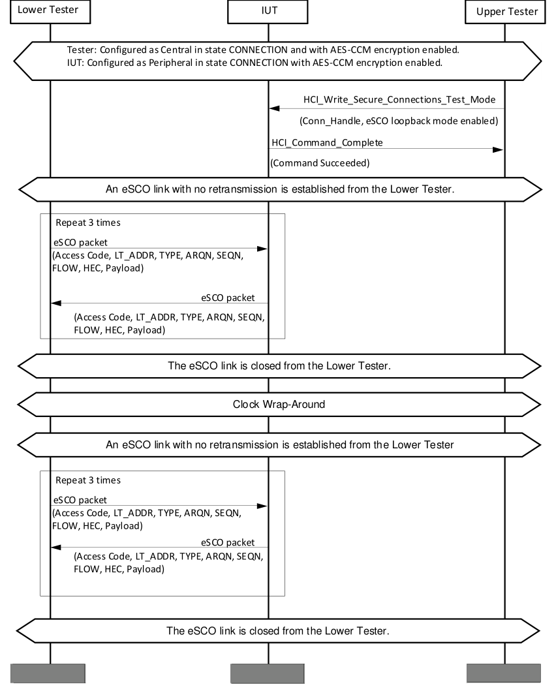

**Figure 4.99: BB/PROT/CON/BV-12-C [AES DayCounter not initialized after an eSCO reconnection as Peripheral]**

a) The Upper Tester sends HCI Write Secure Connections Test Mode to enable the eSCO loopback
mode. b) The Lower Tester initiates an eSCO link at a reasonable time before clock wrap-around. The
eSCO link is set with no retransmission. c) The Lower Tester sends an eSCO packet as follows: d) Payload: 30 non deterministic random Bytes of payload plus 16 bit CRC. e) The IUT replies with a packet of same description.
f) The Lower Tester verifies that the IUT transmits the packet correctly to the Lower Tester. g) Steps c)–e) are repeated 2 times (in addition to the first time) plus a few times equal to the eSCO
loopback delay value, so that the IUT sends a minimum of 3 packets containing a looped back payload. h) The Lower Tester closes the eSCO link before clock wrap-around. i) After clock wrap-around, the Lower Tester initiates an eSCO link with no retransmission. j) Steps c)–e) are repeated 3 times plus a few times equal to the eSCO loopback delay value, so that the IUT sends a minimum of 3 packets containing a looped back payload. k) The Lower Tester closes the eSCO link.
• Expected Outcome
Pass verdict
Before clock wrap-around, the Lower Tester receives the three packets properly encrypted and containing the same payload as it transmitted.
After clock wrap-around, the Lower Tester receives the three packets properly encrypted and containing the same payload as it transmitted.
• Notes
The nonce used for AES-CCM encryption is derived using the same rules as applicable in a normal eSCO connection.
According to the Secure Connections eSCO Loopback Delay value (provided in the IXIT [14]), the payload contained in the first packets from the IUT is discarded and does not impact the verdict.
BB/PROT/CON/BV-13-C [AES DayCounter initialization after a role switch as Peripheral]
• Test Purpose
Verify that the IUT correctly initializes the AES DayCounter after a role switch.
• Reference
[12] 9.1
• Initial Condition
- The IUT is configured as Peripheral in state CONNECTION (active mode, ACL link) with AES-CCM encryption enabled.
- The Lower Tester is configured as Central in state CONNECTION (active mode, ACL link) and with AES-CCM encryption enabled.
- The CLK has been chosen so that clock wrap-around will happen in a reasonably close future (there is no restriction but around a second or a couple seconds would be reasonable). The only restriction is that 3 eSCO packets have to be exchanged before the clock wrap-around.
• Test Procedure

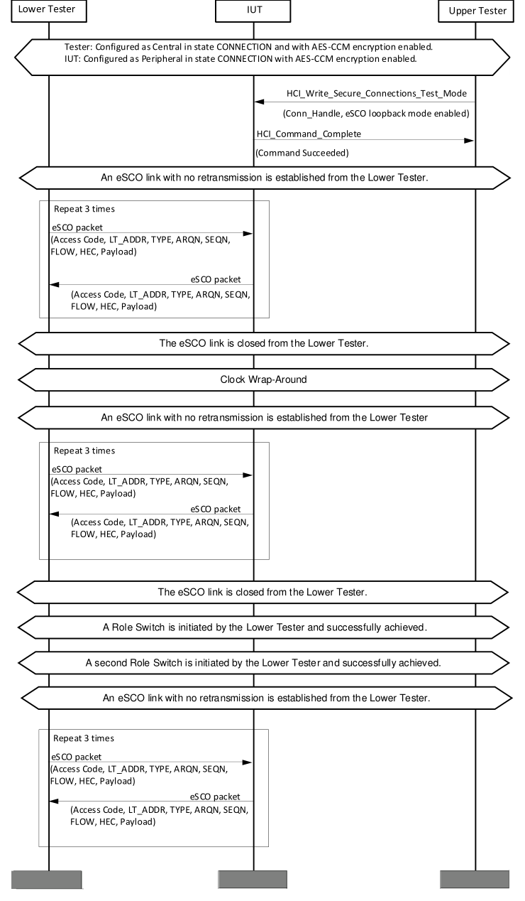

**Figure 4.100: BB/PROT/CON/BV-13-C [AES DayCounter initialization after a role switch as Peripheral]**

mode. b) The Lower Tester initiates an eSCO link at a reasonable time before clock wrap-around. The
eSCO link is set with no retransmission. c) The Lower Tester sends an eSCO packet as follows:
Payload: 30 non deterministic random Bytes of payload plus 16 bit CRC.
d) The IUT replies with a packet of same description. e) The Lower Tester verifies that the IUT transmits the packet correctly to the Lower Tester. f) Steps c)–e) are repeated 2 times (in addition to the first time) plus a few times equal to the eSCO loopback delay value, so that the IUT sends a minimum of 3 packets containing a looped back payload. g) The Lower Tester closes the eSCO link before clock wrap-around. h) After clock wrap-around, the Lower Tester initiates an eSCO link with no retransmission. i) Steps c)–e) are repeated 3 times plus a few times equal to the eSCO loopback delay value, so that the IUT sends a minimum of 3 packets containing a looped back payload. j) The Lower Tester closes the eSCO link. k) The Lower Tester initiates a role switch, role switch is successful. l) The Lower Tester initiates a second role switch, role switch is successful. m) The Lower Tester initiates an eSCO link with no retransmission. n) Steps c)–e) are repeated 3 times plus a few times equal to the eSCO loopback delay value, so
that the IUT sends a minimum of 3 packets containing a looped back payload.
• Expected Outcome
Pass verdict
Before clock wrap-around, the Lower Tester receives the three packets properly encrypted and containing the same payload as it transmitted.
After clock wrap-around, the Lower Tester receives the three packets properly encrypted and containing the same payload as it transmitted.
After the 2 role switch operations, the Lower Tester receives the three packets properly encrypted and containing the same payload as it transmitted.
• Notes
The nonce used for AES-CCM encryption is derived using the same rules as applicable in a normal eSCO connection.
According to the Secure Connections eSCO Loopback Delay value (provided in the IXIT [14]), the payload contained in the first packets from the IUT is discarded and does not impact the verdict.
BB/PROT/CON/BV-14-C [AES DayCounter not initialized after an Encryption Pause and Resume]
• Test Purpose
Verify that the IUT does not initialize the AES DayCounter after an Encryption Pause and Resume.
• Reference
[12] 9.1
• Initial Condition
- The IUT is configured as Peripheral in state CONNECTION (active mode, ACL link) with AES-CCM encryption enabled.
- The Lower Tester is configured as Central in state CONNECTION (active mode, ACL link) and with AES-CCM encryption enabled.
- The CLK has been chosen so that clock wrap-around will happen in a reasonably close future (there is no restriction but around a second or a couple seconds would be reasonable). The only restriction is that 3 eSCO packets have to be exchanged before the clock wrap-around.
• Test Procedure

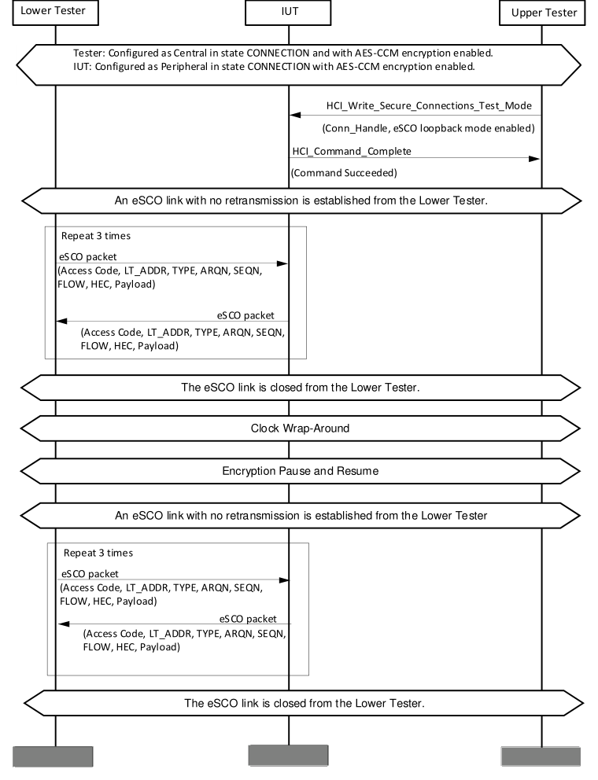

**Figure 4.101: BB/PROT/CON/BV-14-C [AES DayCounter not initialized after an Encryption Pause and Resume]**

mode. b) The Lower Tester initiates an eSCO link at a reasonable time before clock wrap-around. eSCO
link is set with no retransmission. c) The Lower Tester sends an eSCO packet as follows:
Payload: 30 non deterministic random Bytes of payload plus 16 bit CRC.
d) The IUT replies with a packet of same description. e) The Lower Tester verifies that the IUT transmits the packet correctly to the Lower Tester. f) Steps c)–e) are repeated 2 times (in addition to the first time) plus a few times equal to the eSCO loopback delay value, so that the IUT sends a minimum of 3 packets containing a looped back payload. g) The Lower Tester closes the eSCO link before clock wrap-around. h) After clock wrap-around, the Lower Tester initiates an Encryption Pause and Resume. i) The Lower Tester initiates an eSCO link with no retransmission. j) Steps c)–e) are repeated 3 times plus a few times equal to the eSCO loopback delay value, so that the IUT sends a minimum of 3 packets containing a looped back payload. k) The Lower Tester closes the eSCO link.
• Expected Outcome
Pass verdict
Before clock wrap-around, the Lower Tester receives the three packets properly encrypted and containing the same payload as it transmitted.
After clock wrap-around, the Lower Tester receives the three packets properly encrypted and containing the same payload as it transmitted.
• Notes
The nonce used for AES-CCM encryption is derived using the same rules as applicable in a normal eSCO connection.
According to the Secure Connections eSCO Loopback Delay value (provided in the IXIT [14]), the payload contained in the first packets from the IUT is discarded and does not impact the verdict.
BB/PROT/CON/BV-15-C [Connected Peripheral Handles Page Request from the Same Address]
• Test Purpose
Verify that a connected Peripheral IUT properly handles a page from the Lower Tester for the same address as the Lower Tester. The IUT either ignores the page request or disconnects the existing connection and processes the page request.
• Reference
[1] 8.3.3
• Initial Condition
- IUT: Configured as Peripheral in state CONNECTION (active mode, ACL link).
- Lower Tester: Configured as Central in state CONNECTION (active mode, ACL link) with LT_ADDR1.
- Default values are used for:
▪ Page Scan_Window = 18 slots
▪ Page Scan_Interval = 1.28 sec
▪ Scan_Type = Normal Scan
• Test Procedure
p

| Lower Tester |  |  |  |  | Upper Tester |  |  |
| --- | --- | --- | --- | --- | --- | --- | --- |
|  |  |  |  |  |  |  |  |
|  |  |  | Lower Tester: configured as Central in state IUT: configured as Peripheral in state CONN | CONNECTION (active mode, ACL link.) ECTION (active mode, ACL link.) |  |  |  |
|  |  |  | ID (Peripheral s device access code) Page response (ID) FHS | Start Paging |  |  | 4A 4B |
|  |  |  |  | ALT Optional |  |  | 4A |
|  |  |  | ID | Optional |  |  |  |
|  |  |  | Peripheral does not respond to any Central packets |  |  |  |  |
|  |  |  |  |  |  |  |  |
|  |  |  |  |  |  |  |  |
|  |  |  |  |  |  |  |  |
|  |  |  |  | ALT |  |  | 4B |
|  |  |  | Occurs in any order ID (Peripheral s device access code) | HCI Disconnection Complete Event (status = 0x00, reason) Page Response |  |  |  |
|  |  |  | FHS (Parity bits, LAP, SR, SP=0b01, UAP, NAP, Class of device, LT ADDR, Page _ Scan mode) ID (Peripheral s device access code) Any ACL Packet Any ACL Packet | HCI Connection Complete Event (status = 0x00) |  |  |  |
|  |  |  | ACL Packet with data (LLID=0b01, Data=L2CAP header + 10 octets) POLL (Access code, LT ADDR1, TYPE, FLOW, _ ARQN, SEQN, HEC) POLL (Access code, LT ADDR2, TYPE, FLOW, _ ARQN, SEQN, HEC) |  |  |  |  |
|  |  |  | Any ACL Packet (LT ADDR1) _ No IUT response to POLL(LT ADDR2) _ | ALT 8A |  |  |  |
|  |  |  | Any ACL Packet (LT ADDR2) _ No IUT response to POLL(LT ADDR1) _ | ALT 8B |  |  |  |
|  |  |  |  |  |  |  |  |

1. The Lower Tester pages the Peripheral using the Peripheral’s device access code. 2. The IUT sends a page response to the Lower Tester with the Peripheral device access code. 3. The Lower Tester sends an FHS packet to the IUT in response to receiving the page response in
step 2 with LT_ADDR set to LT_ADDR2 that is different from LT_ADDR1. 4. Perform either alternative 4A or 4B depending on whether the IUT maintains the first connection:
Alternative 4A (The IUT maintains the first connection):
4A.1 The IUT may respond to the FHS with an ID. 4A.2 The IUT does not respond to any Central packets on LT_ADDR2. 4A.3 The Lower Tester waits 10 page scan intervals for a response to the page request. Alternative 4B (The IUT disconnects the first connection):
4B.1 The IUT sends an HCI Disconnection Complete event to the Upper Tester. 4B.2 The IUT sends a response to the page request in step 1. Steps 4B.1 and 4B.2 can occur in either order. 4B.3 The Lower Tester sends an FHS packet to the IUT and receives an acknowledgement. 4B.4 The IUT sends an HCI Connection Complete event to the Upper Tester. 4B.5 The Lower Tester sends any packet. 4B.6 The IUT sends an ACL packet in response. 5. The Upper Tester sends an HCI ACL Data packet with packet boundary flag set to 0b01, a valid
four-octet L2CAP header, and 10 octets of data. 6. The IUT sends the ACL packet to the Lower Tester on the current connection and receives an
ACK in return. 7. The Lower Tester sends a POLL packet on each of LT_ADDR1 and LT_ADDR2. 8. Perform either alternative 8A or 8B depending on which is the current connection.
Alternative 8A (Alternative 4A was taken and LT_ADDR1 is the current connection):
8A.1 The IUT sends an ACL packet in response to the POLL packet on LT_ADDR1. 8A.2 The IUT does not send an ACL packet in response to the POLL packet on LT_ADDR2. Alternative 8B (Alternative 4B was taken and LT_ADDR2 is the current connection):
8B.1 The IUT sends an ACL packet in response to the POLL packet on LT_ADDR2. 8B.2 The IUT does not send an ACL packet in response to the POLL packet on LT_ADDR1. 9. Perform step 8 ten times.
• Expected Outcome
Pass verdict
In step 4A.3, the IUT does not respond to the page request received in step 1 and does not disconnect the link.
In step 4B.3, the IUT sends an acknowledgement to the FHS packet to complete the connection with the Lower Tester.
In step 8A.1 or 8B.1, the IUT responds to at least 9 POLL packets.
In step 6, the IUT sends an ACL packet with data to the Lower Tester.
In step 8A.2 or 8B.2, the IUT does not respond to the POLL packet sent in step 7.
Fail verdict
In and after step 4A.3, the IUT responds to the page request.
In step 4B.1, the IUT does not send a page response after disconnecting the Lower Tester.
• Test Purpose
Verify that the Peripheral IUT terminates the connection at the link supervision timeout when it does not receive any packets that pass the HEC check and has the proper LT_ADDR.
• Reference
[1] 3.1, 4.2
• Initial Condition
- The IUT is configured as the Peripheral in state CONNECTION (active mode, ACL link).
- The Lower Tester is configured as the Central in state CONNECTION (active mode, ACL link).
• Test Procedure

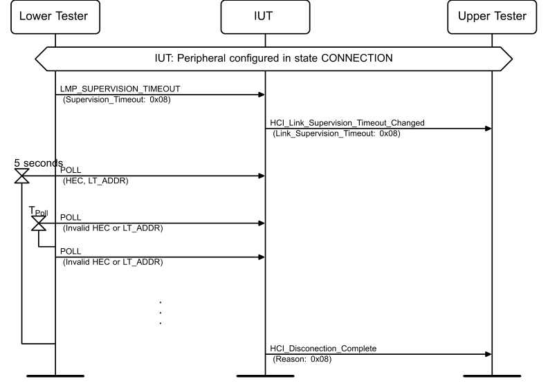

**Figure 4.103: Terminate Connection at Link Supervision Timeout, Peripheral MSC**

1. The Lower Tester sends an LMP_SUPERVISION_TIMEOUT PDU to the IUT with
Supervision_Timeout set to 0x08. 2. The IUT sends an HCI_Link_Supervision_Timeout_Changed event to the Upper Tester with
Link_Supervision_Timeout set to 0x08. 3. The Lower Tester sends a POLL packet with a packet header that contains the correct LT_ADDR
and HEC. 4. The Lower Tester sends POLL packets every Tpoll. These alternately have the wrong LT_ADDR
and a bad HEC. 5. At least 5 s after step 3, the IUT sends an HCI_Disconnection_Complete event to the Upper
Tester with Reason set to Connection Timeout (0x08).
• Expected Outcome
Pass verdict
In step 5, the IUT sends an HCI_Disconnection_Complete event to the Upper Tester.

### 4.14 Piconet

Verify the behavior in a piconet.

#### 4.14.1 Piconet - Central

Verify that the Central works correctly in the piconet.
BB/PROT/PIC/BV-03-C [Broadcast Packets]
• Test Purpose
Verify that broadcast packets are repeated a fixed number of times.
Verify that broadcast packets carrying L2CAP start packets use the indication LLID = 0b10. Verify that broadcast packets have a separate sequence numbering.
• Reference
[1] 7.6.5
• Initial Condition
- The IUT is Central and the Lower Tester is Peripheral. An ACL connection is established using only 1-slot packets. The Host Controller data buffers have been checked. The number of retransmissions (NBC) is declared as IXIT [14].
- The Lower Tester does not support any features (features= 0x0000000000000000).
• Test Procedure

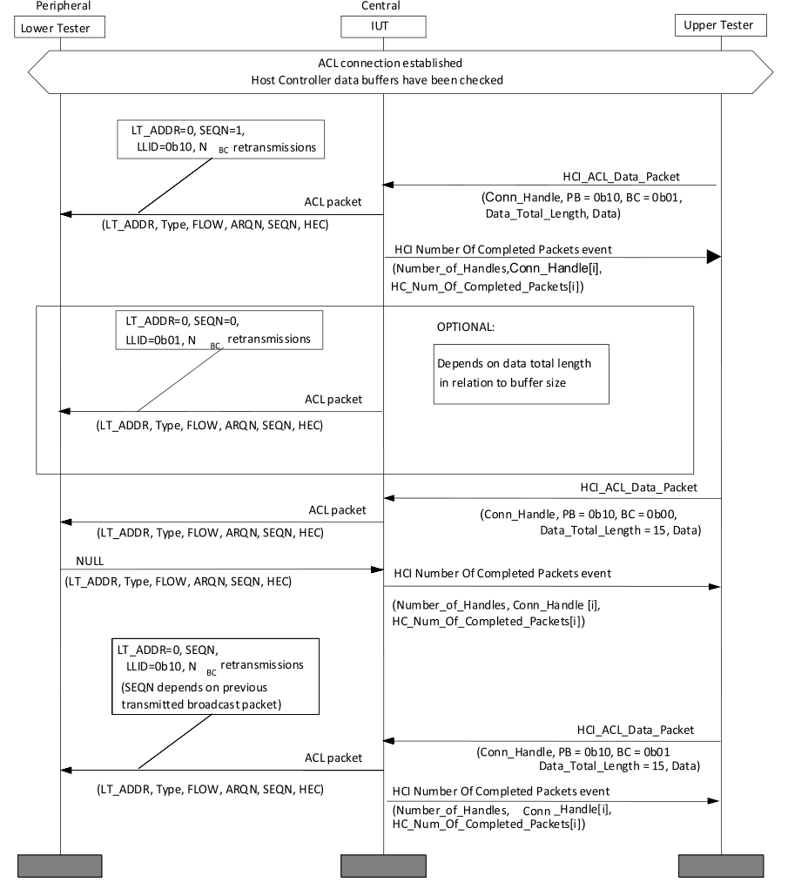

**Figure 4.104: BB/PROT/PIC/BV-03-C [Broadcast Packets]**

The Upper Tester sends HCI_ACL_Data packets alternating broadcast and point-to-point. The Upper Tester sends the first broadcast HCI ACL Data packet with payload length 28 bytes to force the IUT to split the data over at least 2 BB packets. The remaining packets are sent with payload size 15 bytes. If the IUT buffer size is less than 28 bytes the Upper Tester uses the longest possible data payload that fits for the first packet and the IUT might not split the data over several BB packets. After each HCI_ACL_Data packet the Upper Tester waits for the HCI Number Of Completed Packets Event before sending the next HCI_ACL_Data packet.

|  |  |  | ACL SEQN |  | Broad- |  | ACL SEQN |  | Broad- |  | ACL SEQN |  | Broad- |  | ACL SEQN |  | Broad- |  |
| --- | --- | --- | --- | --- | --- | --- | --- | --- | --- | --- | --- | --- | --- | --- | --- | --- | --- | --- |
|  |  |  |  |  | cast |  |  |  | cast |  |  |  | cast |  |  |  | cast |  |
|  |  |  |  |  | SEQN |  |  |  | SEQN |  |  |  | SEQN |  |  |  | SEQN |  |
|  | Last ACL |  | 0 |  |  |  | 0 |  |  |  | 1 |  |  |  | 1 |  |  |  |
|  | SEQN |  |  |  |  |  |  |  |  |  |  |  |  |  |  |  |  |  |
|  | First |  |  | 1 |  |  |  | 1 0 |  |  |  | 1 |  |  |  | 1 0 |  |  |
|  | broadcast |  |  |  |  |  |  |  |  |  |  |  |  |  |  |  |  |  |
|  | ACL data |  | 1 |  |  |  | 1 |  |  |  | 0 |  |  |  | 0 |  |  |  |
|  | Broadcast |  |  | 0 |  |  |  | 1 |  |  |  | 0 |  |  |  | 1 |  |  |

Table 4.2: Sequence Numbers
• Expected Outcome
Pass verdict
The Lower Tester receives the broadcast packets repeated maximum NBC times as specified in IXIT [14].
Broadcast packets have a sequence numbering separate from point-to-point packets.
The transmitted broadcast packets have correct values for LLID.
• Notes
The Host Controller might not split HCI ACL Data packets in several BB packets if the max buffer size is less than 28 bytes. The Lower Tester might miss a packet so the number of repetitions recorded might be less than NBC.
The connection handle used by the Upper Tester for broadcast data is different from the connection handle used for point-to-point PDUs. The host controller can only use DM1 and DH1 packets for broadcast ACL data because the tester does not support longer packets. It is unlikely an IUT has a max buffer less than 28 bytes so most IUTs will split the first broadcast packet into multiple BB packets. A broadcast packet from the IUT may be transmitted once more than specified in the HCI command.

#### 4.14.2 Piconet - Peripheral

Verify that the Peripheral works correctly in the piconet.
BB/PROT/PIC/BV-04-C [Broadcast NAK]
• Test Purpose
Verify that broadcast messages are not acknowledged.
• Reference
[1] 7.6.1, 7.6.5
• Initial Condition
- The IUT is Peripheral and the Lower Tester is Central. ACL connection established using only DM1 packets. The Lower Tester does not support any features (features = 0x0000000000000000).
• Test Procedure
Peripheral Central

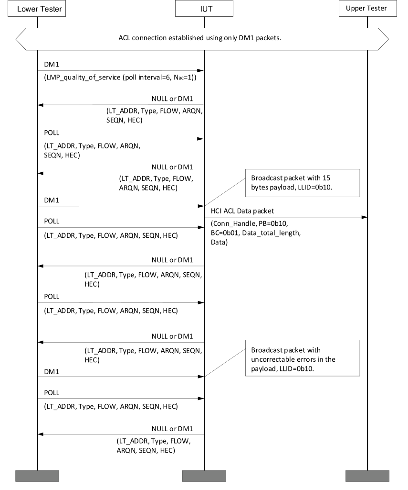

**Figure 4.105: BB/PROT/PIC/BV-04-C [Broadcast NAK]**

The Lower Tester transmits LMP_quality_of_service to notify the IUT of poll interval and NBC.
The Lower Tester transmits a POLL packet and stores the received ARQN bit (ARQN1).
The Lower Tester transmits a broadcast packet NBC times with data payload correctly inserted.
The Lower Tester transmits a POLL packet and stores the received ARQN bit (ARQN2).
The Lower Tester transmits a POLL packet again and stores the received ARQN bit (ARQN3).
The Lower Tester transmits a broadcast packet NBC times with uncorrectable errors in the data payload.
The Lower Tester transmits a POLL packet and stores the received ARQN bit (ARQN4).
• Expected Outcome
Pass verdict
ARQN1=ARQN2 and ARQN3=ARQN4. The IUT does not respond to the broadcast packets.
• Notes
The Lower Tester might transmit a DM1 packet instead of POLL affecting the acknowledgment mechanism. Packets might get lost. If a Fail Verdict is set the test case should be repeated a few times to possibly get a test session without lost or unintentional DM1 packets. An IUT with a very high packet error rate might result in a Fail Verdict.

### 4.15 Erroneous Data Reporting

#### 4.15.1 Erroneous Data Reporting

Verify the Erroneous Data Reporting procedure.

##### 4.15.1.1 Test Conditions

The IUT can send NULL packets wherever the test specifies a data packet.

##### 4.15.1.2 ED

BB/PROT/ED/BV-01-C [Missed eSCO Data Packet]
• Test Purpose
Verify that the IUT correctly informs the host when no eSCO data was received in an interval.
• Reference
[10] 7.7
[11] 5.4.3
• Initial Condition
- The IUT is a Peripheral of a connection.
- The IUT has an eSCO EV3 connection to the Lower Tester, size of the eSCO retransmission window= 0.
- Erroneous Data Reporting is enabled on the IUT’s eSCO link.
• Test Procedure

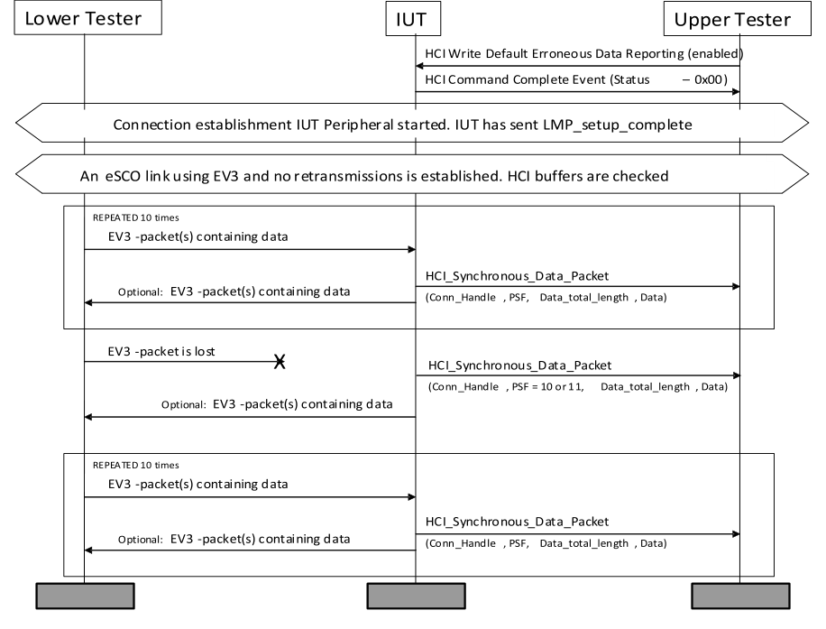

**Figure 4.106: BB/PROT/ED/BV-01-C [Missed eSCO Data Packet]**

The Lower Tester sends 1 eSCO air packet every interval during 10 intervals.
The Lower Tester doesn’t send an eSCO packet on the air interface in 1 interval.
The Lower Tester continues sending 1 eSCO air packet every interval during 10 intervals.
• Expected Outcome
Pass verdict
After the first 10 intervals, the IUT sends at least 1 HCI Synchronous Data Packet to the Upper Tester, with the Packet_Status_Flag set to '10' (No data received) or '11' (Data partially lost).
• Notes
This test case assumes a 1-to-1 mapping between eSCO air packets that are received by the IUT and HCI Synchronous Data Packets sent by the IUT. In case the IUT segments or reassembles received eSCO air packets there will not be a 1-to-1 relation; not every interval will have a HCI Synchronous Data Packet.
The number of HCI Synchronous Data Packets to the Upper Tester, with the Packet_Status_Flag set to '10' or '11' may vary (but at least 1 should be sent) in case the IUT segments or reassembles received eSCO air packets.
BB/PROT/ED/BV-02-C [eSCO data received with incorrect CRC or TYPE not allowed for the connection when eSCO retransmission window = 0]
• Test Purpose
Verify that the IUT correctly informs the host when eSCO data was received with an incorrect CRC or a TYPE that is not allowed for the connection.
• Reference
[10] 7.7
[11] 5.4.3
• Initial Condition
- The IUT is a Peripheral of a connection.
- The IUT has an eSCO EV3 connection to the Lower Tester, size of the eSCO retransmission window= 0.
- Erroneous Data Reporting is enabled on the IUT’s eSCO link.
• Test Procedure

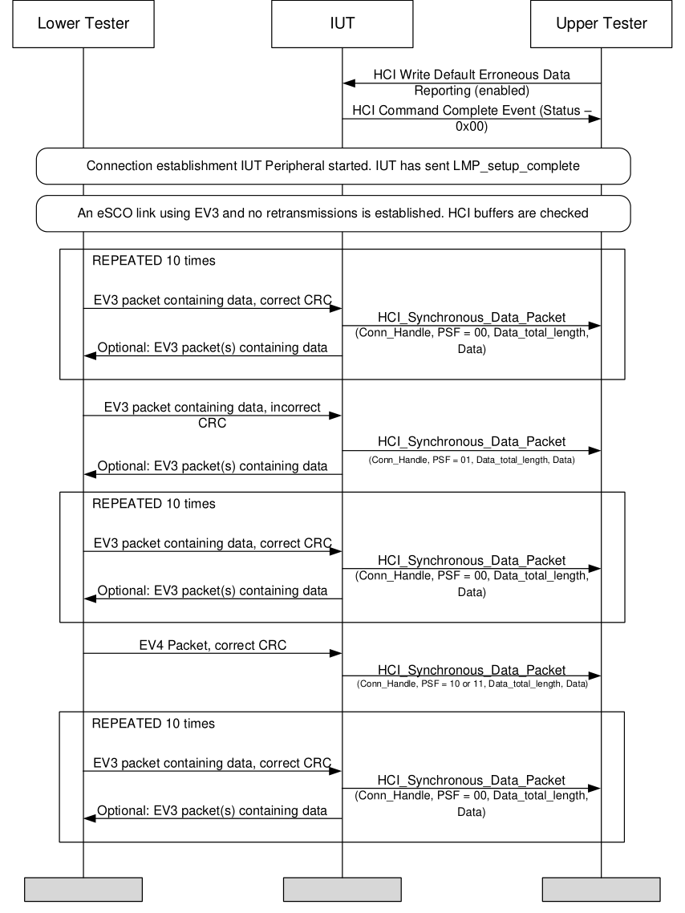

**Figure 4.107: BB/PROT/ED/BV-02-C [eSCO data received with incorrect CRC or TYPE not allowed for the connection when eSCO retransmission window = 0]**

The Lower Tester sends one eSCO EV3 packet with a correct CRC in every interval for 10 intervals.
The Lower Tester sends one eSCO EV3 packet with an incorrect CRC.
The Lower Tester continues sending one eSCO EV3 packet with a correct CRC in every interval for 10 intervals.
• Expected Outcome
Pass verdict
After the first 11 intervals, the IUT sends at least 1 HCI Synchronous Data Packet to the Upper Tester, with the Packet_Status_Flag set to '01' (Data received with invalid CRC).
After the second 11 intervals, the IUT sends at least 1 HCI Synchronous Data Packet to the Upper Tester with the Packet_Status_Flag set to ‘10’ (No data received) or ‘11’ (Data partially lost).
• Notes
The MSC assumes a 1-to-1 mapping between eSCO air packets that are received by the IUT and HCI Synchronous Data Packets sent by the IUT. However, this is not a requirement of the test.
If the IUT segments or reassembles received eSCO air packets, there will not be a 1-to-1 relationship. In this case, not every interval will have an HCI Synchronous Data Packet, and the number of HCI Synchronous Data Packets sent to the Upper Tester with the Packet_Status_Flag set to values other than ‘00’ may vary (but at least one with ‘01’ and one with either ‘10’ or ‘11’ is required).
BB/PROT/ED/BV-03-C [eSCO Data Received with Correct CRC, followed by a Retransmission with Incorrect CRC or TYPE not allowed for the connection]
• Test Purpose
Verify that the IUT delivers the data packet with the correct CRC and an allowed TYPE for the connection to the host. The IUT does not report the receipt of a corrupted packet if that packet has already been received without error in the interval.
• Reference
[10] 7.7
[11] 5.4.3
• Initial Condition
- The IUT is a Peripheral of a connection.
- The IUT has an eSCO EV3 connection to the Lower Tester, one eSCO retransmission.
- Erroneous Data Reporting is enabled on the IUT’s eSCO link.
• Test Procedure

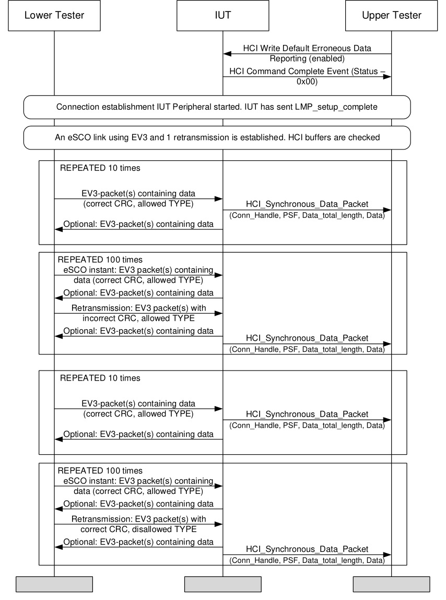

**Figure 4.108: BB/PROT/ED/BV-03-C [eSCO Data Received with Correct CRC, followed by a Retransmission with Incorrect CRC or TYPE not allowed for the connection]**

The Lower Tester sends one eSCO air packet (with correct CRC and an allowed TYPE for the connection) every interval during 10 intervals.
In every eSCO interval during 100 intervals, the Lower Tester sends one eSCO packet with correct CRC and an allowed TYPE, followed by a retransmission (independently of the IUT’s ARQN bit) with incorrect CRC and an allowed TYPE.
The Lower Tester sends one eSCO air packet (with correct CRC and an allowed TYPE for the
connection) every interval during 10 intervals.
In every eSCO interval during 100 intervals, the Lower Tester sends one eSCO packet with correct CRC and an allowed TYPE, followed by a retransmission (independently of the IUT’s ARQN bit) with correct CRC and a TYPE that is not allowed for the connection.
• Expected Outcome
Pass verdict
At least 95% of the HCI Synchronous Data packets sent by the IUT during the 2nd and 4th periods of 100 intervals have the Packet_Status_Flag set to '00' (Correctly received data).
• Notes
This test case assumes a 1-to-1 mapping between eSCO air packets that are received by the IUT and HCI Synchronous Data Packets sent by the IUT. In case the IUT segments or reassembles received eSCO air packets there will not be a 1-to-1 relation; not every interval will have a HCI Synchronous Data Packet.
The test requirement of 95% is to take into account the imperfect radio path but not to allow any errors due to incorrect handling of the retransmitted eSCO packets with incorrect CRC.
BB/PROT/ED/BV-04-C [Missed SCO Data Packet]
• Test Purpose
Verify that the IUT correctly informs the host when no SCO data was received in an interval.
• Reference
[10] 7.7
[11] 5.4.3
• Initial Condition
- The IUT is a Peripheral of a connection.
- The IUT has a SCO HV3 connection to the Lower Tester.
- Erroneous Data Reporting is enabled on the IUT’s SCO link.
• Test Procedure

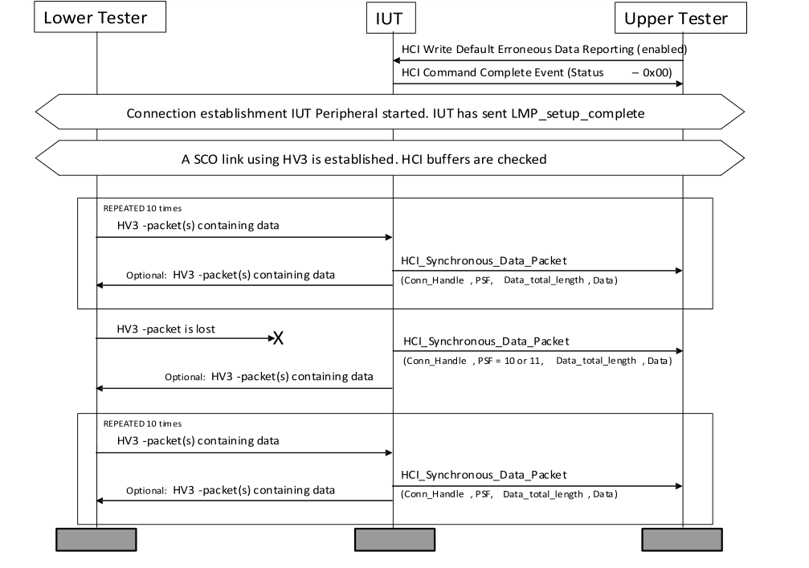

**Figure 4.109: BB/PROT/ED/BV-04-C [Missed SCO Data Packet]**

The Lower Tester sends one SCO air packet every interval during 10 intervals.
The Lower Tester doesn't send a SCO packet on the air interface in one interval.
The Lower Tester continues sending one SCO air packet every interval during 10 intervals.
• Expected Outcome
Pass verdict
After the first 10 intervals, the IUT sends at least 1 HCI Synchronous Data Packet to the Upper Tester, with the Packet_Status_Flag set to '10' (No data received) or '11' (Data partially lost.
• Notes
This test case assumes a 1-to-1 mapping between SCO air packets that are received by the IUT and HCI Synchronous Data Packets sent by the IUT. In case the IUT segments or reassembles received SCO air packets there will not be a 1-to-1 relation; not every interval will have a HCI Synchronous Data Packet.
The number of HCI Synchronous Data Packet to the Upper Tester with the Packet_Status_Flag set to '10' or '11' may vary (but at least 1 should be sent) in case the IUT segments or reassembles received SCO air packets.

#### 4.15.2 Sniff Subrating

Verify the correct implementation of the Sniff Subrating procedure

##### 4.15.2.1 Sniff Subrating Preamble

Sniff Subrating is based on Sniff mode. Some of the test cases assume that the connection between the Lower Tester and the IUT is in Sniff mode already. This section addresses the preamble of how to put an ACL link into Sniff mode and how to enable the Sniff Subrating Event to be sent to the host.

##### 4.15.2.2 IUT Unmasks Subrating Event

The Upper Tester issues HCI Set Event Masks with the Sniff Subrating Event bit set; that is, byte 5 and bit 1 or bit 41. This enables the IUT to send Sniff Subrating Event to the host if necessary.
When the IUT is acting as a Peripheral, the procedures shown use the following parameters to get the connection into sniff mode:
Tsniff = 20 slots
Sniff attempt = 1
Sniff timeout = 0
Peripheral Central

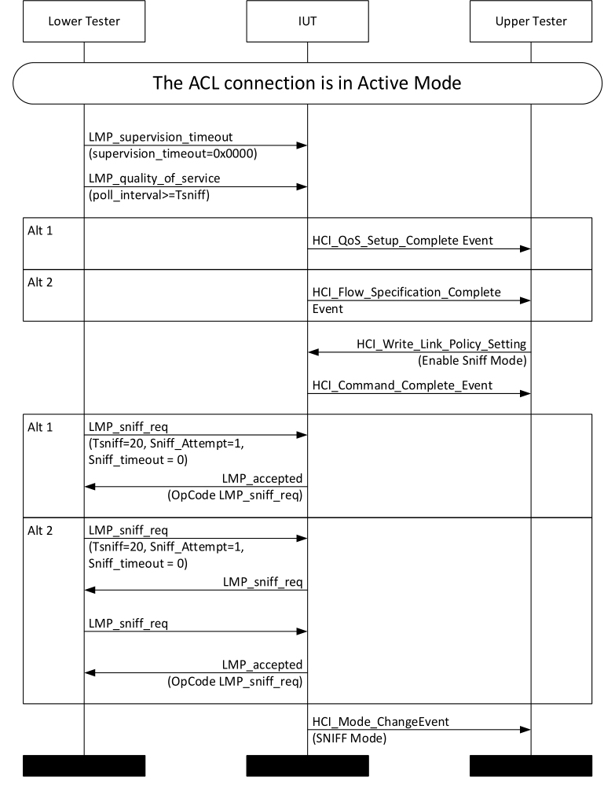

**Figure 4.110: Peripheral Entering Sniff Mode**

When the IUT is acting as a Central, the procedures shown use the following parameters to get the connection into Sniff mode.
Tsniff = 20 slots
Sniff attempt = 1
Sniff timeout = 0
Central Peripheral

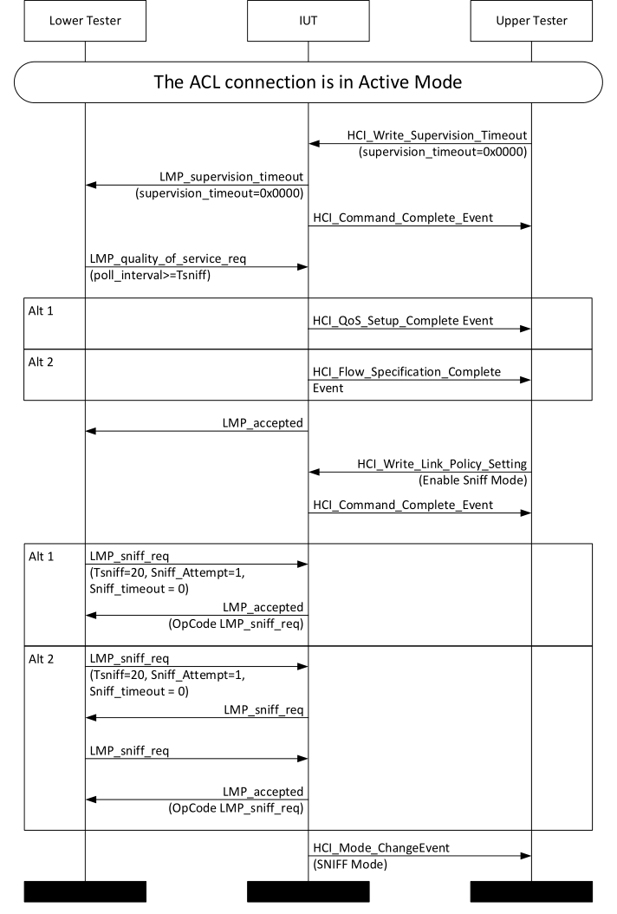

**Figure 4.111: Central Entering Sniff Mode**

Verify that the Sniff Subrating procedure is correctly implemented. The ACL connection, which has entered sniff mode already, can enter and exit sniff subrating mode correctly.
BB/PROT/SSR/BV-01-C [Central Transitioning from Sniff Mode to Sniff Subrating Mode]
• Test Purpose
Verify that the IUT as a Central will transition to sniff subrating mode from sniff mode after the sniff subrating instant has passed.
• Reference
[1] 8.5, 8.7.2
• Initial Condition
- The IUT is Central.
- The Lower Tester and the IUT have a connection in sniff mode. The sniff parameters are,
▪ Tsniff = 20 slots
▪ Sniff attempt = 1
▪ Sniff timeout = 0.
- The Lower Tester and the IUT have not experienced sniff subrating mode in the past.
• Test Procedure

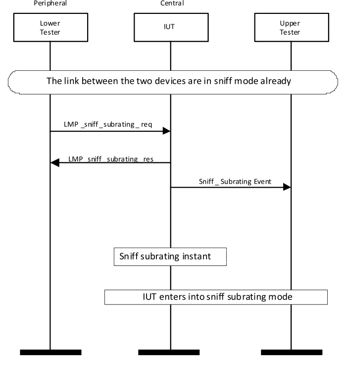

**Figure 4.112: BB/PROT/SSR-BV-01-C [Central Transitioning from Sniff Mode to Sniff Subrating Mode]**

The Lower Tester sends LMP_sniff_subrating_req to the IUT with the following parameters:
max_sniff_subrate = 4
min_sniff_mode_timeout = 0
The IUT sends LMP_sniff_subrating_res to the Lower Tester with the sniff subrating default parameters:
max_sniff_subrate = 1
min_sniff_mode_timeout = 0
sniff_subrating_instant = a sniff anchor point not more than 216 slots in the future
The Sniff Subrate Event has been observed with the following parameters received by the Upper Tester:
Maximum_Transmit_Latency = 20 slots
Maximum_Receive_Latency = 80 slots
Minimum_Remote_Timeout = 0 slots
Minimum_Local_Timeout = 0 slots
• Expected Outcome
Pass verdict
The IUT sends POLL, NULL, or data packet at the anchor points of sniff subrate 4, 3, 2, or 1 after the sniff subrating instant. The observation is done for a minimum of 3 Maximum Latency intervals (3x80 = 240 slots).
• Notes
Sniff subrating instant could be in the past when the LMP_sniff_subrating_res is sent over the air.
BB/PROT/SSR/BV-02-C [Peripheral transitioning from Sniff Mode to Sniff Subrating Mode]
• Test Purpose
Verify that the IUT as a Peripheral will transition to sniff subrating mode from sniff mode after the sniff subrating instant has passed.
• Reference
[1] 8.5, 8.7.2
• Initial Condition
- The IUT is Peripheral.
- The Lower Tester and the IUT have a connection in sniff mode. The sniff parameters are:
▪ Tsniff = 20 slots
▪ Sniff attempt = 1
▪ Sniff timeout = 0
- The Lower Tester and the IUT have not experienced sniff subrating mode in the past.
• Test Procedure

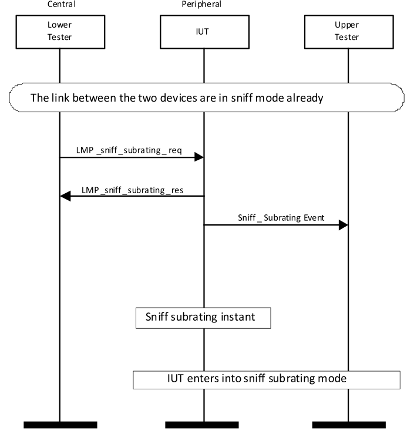

**Figure 4.113: BB/PROT/SSR/BV-02-C [Peripheral transitioning from Sniff Mode to Sniff Subrating Mode]**

The Lower Tester sends LMP_sniff_subrating_req to the IUT with the following parameters:
max_sniff_subrate = 4
min_sniff_mode_timeout = 0
sniff_subrating_instant = at least 80 slots ahead of the current piconet clock but not more than 800 slots.
The IUT sends LMP_sniff_subrating_res to the Lower Tester with the sniff subrating default parameters:
max_sniff_subrate = 1
min_sniff_mode_timeout = 0
The Sniff Subrate Event has been observed with the following parameters received by the Upper Tester:
Maximum_Transmit_Latency = 20 slots
Maximum_Receive_Latency = 80 slots
Minimum_Local_Timeout = 0 slots
The Lower Tester stays in sniff mode before the instant and transitions to sniff subrating 1 after the sniff subrating instant. The Lower Tester sends POLL packets at sniff and sniff subrating anchor points when it has no LMP_C data to send. No ACL_U data will be sent from the tester to the IUT.
• Expected Outcome
Pass verdict
The IUT sends NULL packets at the anchor points of sniff subrate 4, 3, 2, or 1 after the sniff subrating instant. The observation is done for a minimum of 3 Max_Latency intervals (3x80 = 240 slots).
BB/PROT/SSR/BV-03-C [Peripheral Transitioning to Sniff Mode After Transmitting Data]
• Test Purpose
Verify that the IUT as a Peripheral will transition to sniff mode from sniff subrating mode after it sends ACL_U or ACL_C data. It will stay in sniff mode until the data is Baseband ACKed.
• Reference
[1] 8.5, 8.7.2
• Initial Condition
- The IUT is Peripheral.
- The Lower Tester and the IUT have a connection in sniff mode. The sniff parameters are:
▪ Tsniff = 20 slots
▪ Sniff attempt = 1
▪ Sniff timeout = 0
- The Upper Tester issues the HCI_Sniff_Subrating command to put the connection into sniff subrating mode with the following HCI parameters:
▪ Maximum_Latency = 80 slots
▪ Minimum_Remote_Timeout = 320 slots
▪ Minimum_Local_Timeout = 320 slots
- The Lower Tester has the following parameters received from the IUT (the IUT sends LMP_sniff_subrating_req with these parameters):
▪ max sniff subrate = 4
▪ min sniff mode timeout = 320 slots
▪ sniff_subrating_instant = any valid value
- The Lower Tester sends LMP_sniff_subrating_res to the IUT with the following parameters:
▪ max sniff subrate = 4
▪ min sniff mode timeout = 320 slots
- The Sniff Subrate Event has been observed with the following parameters received by the Upper Tester:
▪ Maximum_Transmit_Latency = 80 slots
▪ Maximum_Receive_Latency = 80 slots
▪ Minimum_Remote_Timeout = 320 slots
▪ Minimum_Local_Timeout = 320 slots
• Test Procedure
Central Peripheral

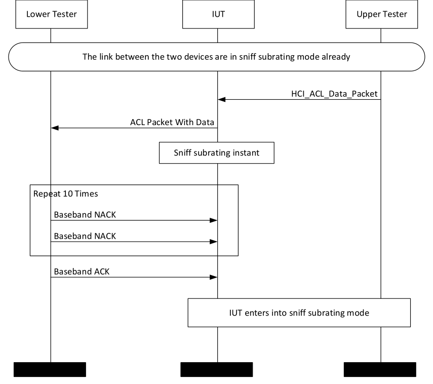

**Figure 4.114: BB/PROT/SSR/BV-03-C [Peripheral Transitioning to Sniff Mode After Transmitting Data]**

The Upper Tester sends an HCI ACL Data packet with a valid four-octet L2CAP header and zero octets of data.
The Lower Tester sends POLL packets at sniff or sniff subrate anchor points.
The Lower Tester transitions to sniff mode from sniff subrating mode after it receives the data packet. The Lower Tester stays in sniff mode and does not ACK the data until 10 consecutive sniff anchor points have passed after it receives the data.
• Expected Outcome
Pass verdict
The IUT transitions into sniff mode and stays in sniff mode, retransmitting the ACL data packet at every sniff anchor points, until it receives a Baseband ACK. Then the IUT transitions back to sniff subrating mode with max sniff subrate 4.
• Notes
The observation is done for a minimum of 3 Max_Latency intervals (3x80 = 240 slots) after the IUT receives Baseband ACK from the Lower Tester.
BB/PROT/SSR/BV-04-C [Central Transitioning to Sniff Mode After Receiving Data]
• Test Purpose
Verify that the IUT as a Central will transition to sniff mode from sniff subrating mode after it receives ACL_U or ACL_C data.
• Reference
[1] 8.5, 8.7.2
• Initial Condition
- The IUT is Central.
- The Lower Tester and the IUT have a connection in sniff mode. The sniff parameters are:
▪ Tsniff = 20 slots
▪ Sniff attempt = 1
▪ Sniff timeout = 0
- The Upper Tester issues the HCI_Sniff_Subrating command to put the connection into sniff subrating mode with the following HCI parameters:
▪ Maximum_Latency = 80 slots
▪ Minimum_Remote_Timeout = 320 slots
▪ Minimum_Local_Timeout = 320 slots
- The Lower Tester has the following parameters received from the IUT (the IUT sends LMP_sniff_subrating_req with these parameters):
▪ max sniff subrate = 4
▪ min sniff mode timeout = 320 slots
▪ sniff_subrating_instant = a sniff anchor point not more than 216 slots in the future
- The Lower Tester sends LMP_sniff_subrating_res to the IUT with the following parameters:
▪ max sniff subrate = 4
▪ min sniff mode timeout = 320 slots
- The Sniff Subrate Event has been observed with the following parameters received by the Upper Tester:
▪ Maximum_Transmit_Latency = 80 slots
▪ Minimum_Local_Timeout = 320 slots
• Test Procedure

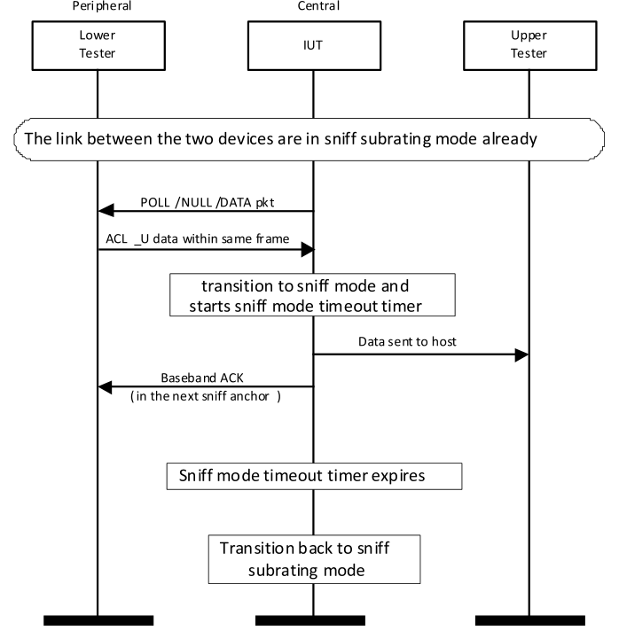

**Figure 4.115: BB/PROT/SSR-BV-04-C [Central Transitioning to Sniff Mode After Receiving Data]**

The Lower Tester sends a packet, in which the LLID in the payload-header is 'start of L2CAP message' and the length in the payload-header is '4' (the payload is an L2CAP message containing a four-octet L2CAP header and zero octets of data).
The IUT receives the data at subrate 4 anchor point. It transitions to sniff mode and try to ACK the data just received by sending a POLL, NULL, or data packet. While in sniff mode, the IUT sends POLL, NULL, or data packets for a duration of 16 consecutive sniff anchor points (or an interval of 16 Tsniff).
• Expected Outcome
Pass verdict
After receiving the packet, the IUT transitions into sniff mode, ACKs packet, remains in this mode, and transmits POLL/NULL/Data packets in the next 16 consecutive sniff anchor points. Then the IUT transitions back to sniff subrating mode with max sniff subrate 4.
• Notes
The observation is done for a minimum of 3 Max_Latency intervals (3x80 = 240 slots) after the sniff mode timeout timer expires.
BB/PROT/SSR/BV-05-C [Peripheral Transitioning to Sniff Mode from Sniff Subrating Mode]
• Test Purpose
Verify that the IUT as a Peripheral will transition to sniff mode from sniff subrating mode after the Lower Tester sends the packet.
• Reference
[1] 8.5, 8.7.2
• Initial Condition
- The IUT is Peripheral.
- The Lower Tester and the IUT have a connection in sniff mode. The sniff parameters are:
▪ Tsniff = 20 slots
▪ Sniff attempt = 1
▪ Sniff timeout = 0
- The Upper Tester issues the HCI_Sniff_Subrating command to put the connection into sniff subrating mode with the following HCI parameters:
▪ Maximum_Latency = 80 slots
▪ Minimum_Remote_Timeout = 320 slots
▪ Minimum_Local_Timeout = 320 slots
- The Lower Tester has the following parameters received from the IUT (the IUT sends LMP_sniff_subrating_req with these parameters):
▪ max sniff subrate = 4
▪ min sniff mode timeout = 320 slots
- The Lower Tester sends LMP_sniff_subrating_res to the IUT with the following parameters:
▪ max sniff subrate = 4
▪ min sniff mode timeout = 320 slots
▪ sniff_subrating_instant = at least 80 slots ahead of the current piconet clock but not more than 800 slots
- The Sniff Subrate Event has been observed with the following parameters received by the Upper Tester:
▪ Maximum_Transmit_Latency = 80 slots
▪ Maximum_Receive_Latency = 80 slots
▪ Minimum_Remote_Timeout = 320 slots
▪ Minimum_Local_Timeout = 320 slots
• Test Procedure

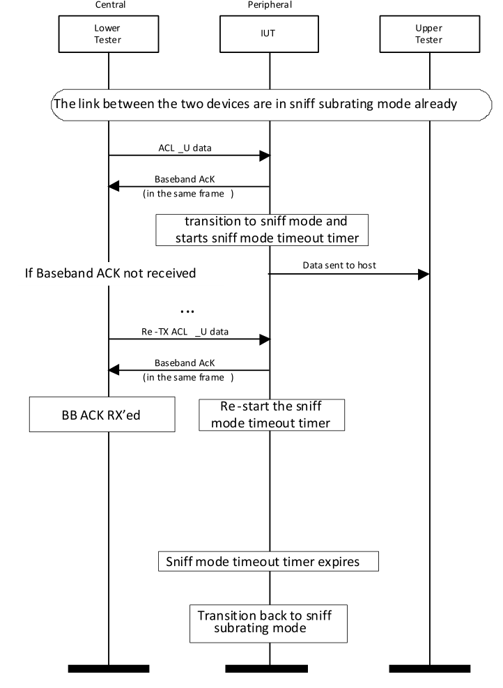

**Figure 4.116: BB/PROT/SSR/BV-05-C [Peripheral Transitioning to Sniff Mode from Sniff Subrating Mode]**

The Lower Tester sends a one byte ACL-U or ACL-C data to the IUT at subrate 4 anchor point.
The IUT receives the data at subrate 4 anchor point. It transitions to sniff mode and remain in sniff mode for the duration of 16 consecutive sniff anchor points while sending back NULL or data packet for each POLL packet received.
The Lower Tester sends POLL packets at every sniff anchor point even if after it receives an ACK from the IUT for 32 Tsniff intervals.
• Expected Outcome
Pass verdict
After receiving the packet, the IUT transitions into sniff mode, ACKs packet, remains in this mode, and transmits NULL or Data packets in the next 16 consecutive sniff anchor points. When the Lower Tester polls with POLL packets at every sniff anchor point then the IUT transitions back to sniff subrating mode with max sniff subrate 4.
• Notes
The observation is done for a minimum of 3 Max_Latency intervals (3x80 = 240 slots) after the sniff mode timeout timer expires.
BB/PROT/SSR/BV-06-C [Central Sniff Subrating Mandatory Anchor Points]
• Test Purpose
Verify that the IUT as a Central will meet the sniff subrating mandatory anchor point requirement so to meet the maximum latency threshold when the IUT has a bigger sniff subrating value.
• Reference
[1] 8.5, 8.7.2
• Initial Condition
- The IUT is the Central.
- The Lower Tester and the IUT have a connection in sniff mode. The sniff parameters are:
▪ Tsniff = 20 slots
▪ Sniff attempt = 1
▪ Sniff timeout = 0
• Test Procedure
For each round based on Table 4.3 (the order of the rows of the table should be randomized for each test but the first row has N > 1):
1. In the first round or if the value of N differs from the previous round, do steps 2–4 then proceed to
step 7. If the value of N is the same as the previous round, do steps 5 and 6 then proceed to step 7. 2. The Upper Tester issues the HCI_Sniff_Subrating command with the following HCI parameters:
Maximum_Latency = 20 * N slots
Minimum_Remote_Timeout = 320 slots
Minimum_Local_Timeout = 320 slots
3. The Lower Tester has the following parameters received from the IUT (the IUT sends
LMP_sniff_subrating_req with these parameters):
max sniff subrate = N
min sniff mode timeout = 320 slots
sniff_subrating_instant = a sniff anchor point not more than 216 slots in the future
the sniff subrating default values:
max sniff subrate = M
min sniff mode timeout = 0 slots
sniff_subrating_instant = the value sent by the IUT
5. The Lower Tester sends another LMP_sniff_subrating_req with the following parameters to the
IUT:
max sniff subrate = M
min sniff mode timeout = 320 slots
sniff_subrating_instant = any value
6. The IUT sends an LMP_sniff_subrating_res to the Lower Tester with the following parameters
(same parameters than former negotiation):
max sniff subrate = N
min sniff mode timeout = 320 slots
sniff_subrating_instant = a sniff anchor point not more than 216 slots in the future
7. The Sniff Subrate Event has been observed with the following parameters received by the Upper
Tester:
Maximum_Transmit_Latency = 20 * N’ slots
Maximum_Receive_Latency = 20 * M’ slots
Minimum_Remote_Timeout = 320 slots
Minimum_Local_Timeout = 320 slots
Where:
▪ N' equals N if M ≥ N and equals M times the greatest integer less than or equal to N/M if M < N;
▪ M' equals M if N ≥ M and equals N times the greatest integer less than or equal to M/N if N < M.
8. The Lower Tester observes the IUT polling for at least P slots after the sniff subrating instant,
where P is 120 times the greater of M and N.
No data is exchanged between the Lower Tester and the IUT.

|  | N |  |  | M |  |
| --- | --- | --- | --- | --- | --- |
| 1 |  |  | 1 |  |  |
| 1 |  |  | 2 |  |  |
| 1 |  |  | 5 |  |  |
| 1 |  |  | 30 |  |  |
| 2 |  |  | 1 |  |  |
| 2 |  |  | 2 |  |  |
| 2 |  |  | 5 |  |  |
| 5 |  |  | 1 |  |  |

|  | N | M |
| --- | --- | --- |
| 5 |  |  |
| 5 |  |  |
| 5 |  |  |
| 24 |  |  |
| 30 |  |  |

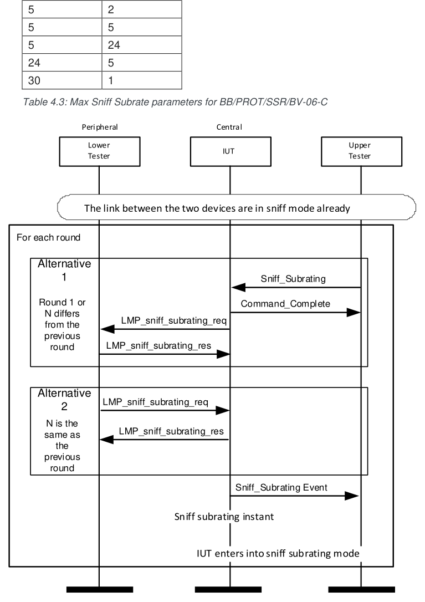

**Figure 4.117: BB/PROT/SSR/BV-06-C [Central Sniff Subrating Mandatory Anchor Points]**

• Expected Outcome
Pass verdict
If N ≥ M, the IUT polls every 20 * M slots starting at the instant.
If N < M, the IUT polls at least once in every consecutive N’ anchor points, which are every 20 * N slots starting at the instant.
• Notes
The IUT may poll at other times as well.
BB/PROT/SSR/BV-07-C [Peripheral Sniff Subrating Mandatory Anchor Points]
• Test Purpose
Verify that the IUT as a Peripheral will meet the sniff subrating mandatory anchor point requirement so to meet the maximum latency threshold when the IUT has a bigger sniff subrating value.
• Reference
[1] 8.5, 8.7.2
• Initial Condition
- The IUT is the Peripheral.
- The Lower Tester and the IUT have a connection in sniff mode. The sniff parameters are:
▪ Tsniff = 20 slots
▪ Sniff attempt = 1
▪ Sniff timeout = 0
• Test Procedure
For each round based on Table 4.4 (the order of the rows of the table should be randomized for each test but the first row has M > 1):
1. In the first round or if the value of M differs from the previous round, do steps 2–4 then proceed to
step 7. If the value of M is the same as the previous round, do steps 5 and 6 then proceed to step 7. 2. The Upper Tester issues the HCI_Sniff_Subrating command with the following HCI parameters:
Maximum_Latency = 20 * M slots
Minimum_Remote_Timeout = 320 slots
Minimum_Local_Timeout = 320 slots
3. The Lower Tester has the following parameters received from the IUT (the IUT sends
LMP_sniff_subrating_req with these parameters):
max sniff subrate = M
min sniff mode timeout = 320 slots
sniff_subrating_instant = any value
4. The Lower Tester sends LMP_sniff_subrating_res to the IUT with the following parameters:
max sniff subrate = N
min sniff mode timeout = 0 slots
sniff_subrating_instant = at least 80 slots ahead of the current piconet clock but not more than 400 slots
max sniff subrate = N
min sniff mode timeout = 320 slots
sniff_subrating_instant = at least 80 slots ahead of the current piconet clock but not more than 400 slots
6. The IUT sends an LMP_sniff_subrating_res to the Lower Tester with the following parameters
(same parameters than former negotiation):
max sniff subrate = M
min sniff mode timeout = 320 slots
sniff_subrating_instant = the value sent by the Lower Tester
7. The Sniff Subrate Event has been observed with the following parameters received by the Upper
Tester:
Maximum_Transmit_Latency = 20 * M’ slots
Maximum_Receive_Latency = 20 * N’ slots
Minimum_Remote_Timeout = 320 slots
Minimum_Local_Timeout = 320 slots
Where:
▪ M' equals M if N ≥ M and equals N times the greatest integer less than or equal to M/N if N < M.
▪ N' equals N if M ≥ N and equals M times the greatest integer less than or equal to N/M if M < N;
8. The Lower Tester sends POLL packets every 20 * N slots after the sniff subrating instant for at
least P slots, where P is 120 times the greater of M and N, and observes when the IUT replies.
No data is exchanged between the Lower Tester and the IUT.

|  | N |  |  | M |  |
| --- | --- | --- | --- | --- | --- |
| 1 |  |  | 1 |  |  |
| 1 |  |  | 2 |  |  |
| 1 |  |  | 5 |  |  |
| 1 |  |  | 30 |  |  |
| 2 |  |  | 1 |  |  |
| 2 |  |  | 2 |  |  |
| 2 |  |  | 5 |  |  |
| 5 |  |  | 1 |  |  |
| 5 |  |  | 2 |  |  |
| 5 |  |  | 5 |  |  |
| 5 |  |  | 24 |  |  |
| 24 |  |  | 5 |  |  |
| 30 |  |  | 1 |  |  |

| For each round Alternative Sniff Subrating 1 _ Command Complete Round 1 or _ M differs LMP sniff subrating req from the _ _ _ previous round LMP sniff subrating res _ _ _ Alternative 2 LMP sniff subrating req _ _ _ M is the same as LMP sniff subrating res the _ _ _ previous round Sniff Subrating Event _ |  |  |  |  |  |  |  |
| --- | --- | --- | --- | --- | --- | --- | --- |
|  |  |  |  |  |  |  |  |
|  |  |  |  |  |  |  |  |
| For each round Alternative 1 Round 1 or M differs from the previous round Alternative 2 M is the same as the previous round |  |  |  |  |  |  |  |
|  | Alternative 1 Round 1 or M differs from the previous round |  | LMP sniff subrating req _ _ _ LMP sniff subrating res _ _ _ |  |  | Sniff Subrating _ Command Complete _ |  |
|  |  |  |  |  |  |  |  |
|  | Alternative 2 M is the same as the previous round |  | LMP sniff subrating req _ _ _ LMP sniff subrating res _ _ _ |  |  |  |  |
|  |  |  |  |  |  | Sniff Subrating Event _ |  |
|  |  |  |  |  |  |  |  |
|  |  |  |  |  |  |  |  |
|  |  |  |  |  |  |  |  |
|  |  |  |  |  |  |  |  |

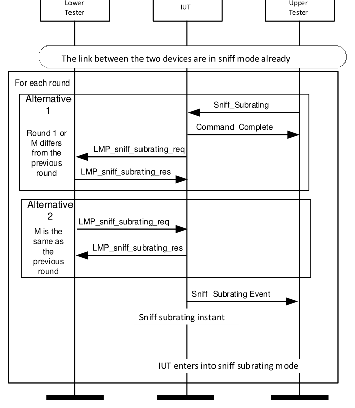

**Figure 4.118: BB/PROT/SSR/BV-07-C [Peripheral Sniff Subrating Mandatory Anchor Points]**

• Expected Outcome
Pass verdict
If M ≥ N, the IUT responds every 20 * N slots starting at the instant.
If M < N, the IUT responds at least once in every consecutive M’ anchor points, which are every 20 * M slots starting at the instant.
In each round, the Lower Tester receives at least 95% of the polls that the IUT is required to send.
• Notes
The IUT may respond at other times as well.

### 4.16 Connectionless Peripheral Broadcast

Verify Connectionless Peripheral Broadcast transmission and reception

#### 4.16.1 Connectionless Peripheral Broadcast Parameters

The following parameters are used to configure Connectionless Peripheral Broadcasts on the IUT as well as the Lower Tester:
• LT_ADDR: 1
• LPO_Allowed: 0 (No)
• Packet_Type: 0x330E (only DM1 packets allowed)
• Interval_Min: 0x0080 (80 ms)
• Interval_Max: 0x0080 (80 ms)
• Data_Length = 0x02
• Data = [0xAA, 0x55]
• synchronization_scanTO = 0x2000 (5.12 s)
• Sync_Train_Timeout = 0xFFFE (approx. 40.1 s)
• Skip = 0x00 (no skip) unless specified otherwise in the test
• Sync scan window = 0x090 (90 ms)
• Sync scan interval = 0x092 (92 ms)

#### 4.16.2 Connectionless Peripheral Broadcast – Transmitter

Verify the Connectionless Peripheral Broadcast transmission procedure.

##### 4.16.2.1 Connectionless Peripheral Broadcast Transmission - With Profile Data

The procedures in Figure 4.119 is used to place the IUT in Connectionless Broadcast Transmission with profile data.

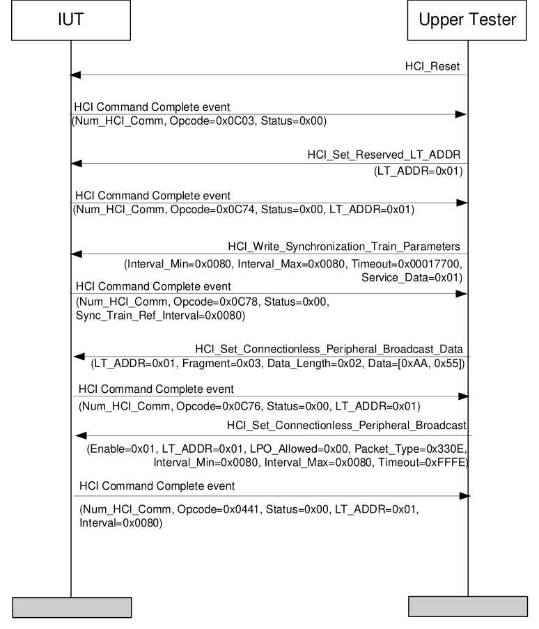

**Figure 4.119: IUT Connectionless Peripheral Broadcast Setup – With Profile Data**

The procedures in Figure 4.120 are used to place the IUT in Connectionless Broadcast Transmission without profile data.

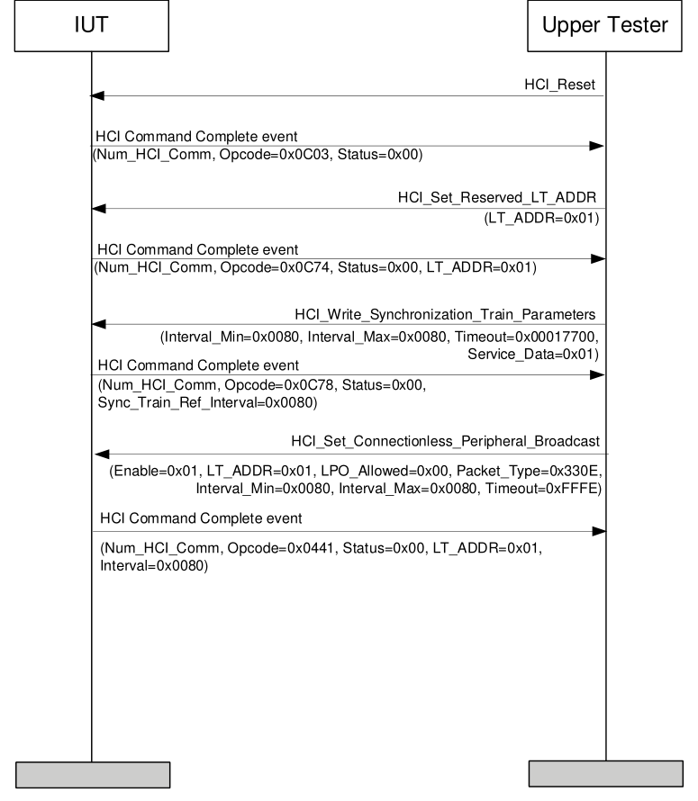

**Figure 4.120: IUT Connectionless Peripheral Broadcast Setup – Without Profile Data**

BB/PROT/CB/BV-01-C [Connectionless Peripheral Broadcast Transmission]
• Test Purpose
Verify that the IUT will transmit Connectionless Peripheral Broadcast data.
• Reference
[9] 8.10
• Initial Condition
- The IUT has an active Connectionless Peripheral Broadcast (see Section 4.16.2.1).
- The Lower Tester is in standby mode.
• Test Procedure
1. Start Synchronization Train on the IUT. 2. Synchronize the Lower Tester to Connectionless Peripheral Broadcast from the IUT. 3. The IUT transmits Connectionless Peripheral Broadcast data to the Lower Tester.

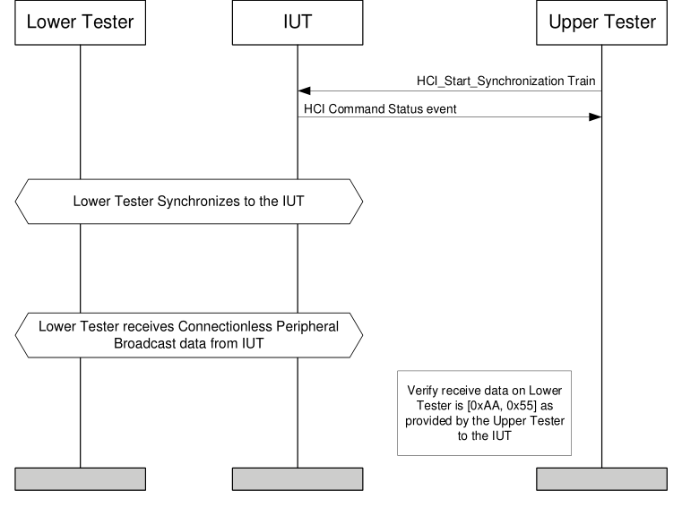

**Figure 4.121: BB/PROT/CB/BV-01-C [Connectionless Peripheral Broadcast Transmission]**

• Expected Outcome
Pass verdict
The IUT correctly transmits connectionless broadcast data to the Lower Tester Data=[0xAA, 0x55] and with an even Connectionless Peripheral Broadcast Interval.
BB/PROT/CB/BV-02-C [AFH for Connectionless Peripheral Broadcast Transmission]
• Test Purpose
Verify that the IUT will change its channel map based on AFH map changes provided by the host.
• Reference
[9] 8.10.3
• Initial Condition
- The IUT has an active Connectionless Peripheral Broadcast (see Section 4.16.2.1).
- AFH is enabled on the IUT (CPB is only supported on the Adapted Piconet Physical Channel).
- The Lower Tester is in standby mode.
• Test Procedure
a) Start Synchronization Train on the IUT. b) Synchronize the Lower Tester to Connectionless Peripheral Broadcast from the IUT. c) Receive Connectionless Peripheral Broadcast data on the Lower Tester from the IUT. d) Change the IUT AFH Channel map, restricting it to channels 40–77. The
Connectionless_Peripheral_Broadcast_Channel_Map_Change event may arrive before the HCI Command Complete of the Set_AFH_Host_Channel_Classification command. e) Receive Connectionless Peripheral Broadcast data on the Lower Tester from the IUT using the
updated channel map. f) Change the IUT AFH Channel map, restricting it to channels 40–59 inclusive. The Connectionless_Peripheral_Broadcast_Channel_Map_Change event may arrive before the HCI Command Complete of the Set_AFH_Host_Channel_Classification command. g) Receive Connectionless Peripheral Broadcast data on the Lower Tester from the IUT using the
updated channel map.

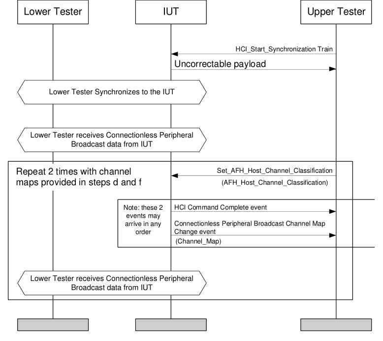

**Figure 4.122: BB/PROT/CB/BV-02-C [AFH for Connectionless Peripheral Broadcast Transmission]**

• Expected Outcome
Pass verdict
The IUT transmits Connectionless Peripheral Broadcast data to the Lower Tester using the updated channel map in steps e) and g) and with an even Connectionless Peripheral Broadcast Interval.
• Test Purpose
Verify that the IUT transmits connectionless broadcast packets with the FLOW, ARQN, and SEQN bits set to 0 and LLID set to 010b.
• Reference
[9] 5.7, 6.4.3, 6.4.4, 6.4.5
• Initial Condition
- The IUT has an active Connectionless Peripheral Broadcast (see Section 4.16.2.1).
- The Lower Tester is in standby mode.
• Test Procedure
a) Start Synchronization Train on the IUT. b) Synchronize the Lower Tester to Connectionless Peripheral Broadcast from the IUT. c) Receive Connectionless Peripheral Broadcast packets on the Lower Tester and check FLOW,
ARQN, SEQN, and LLID fields.

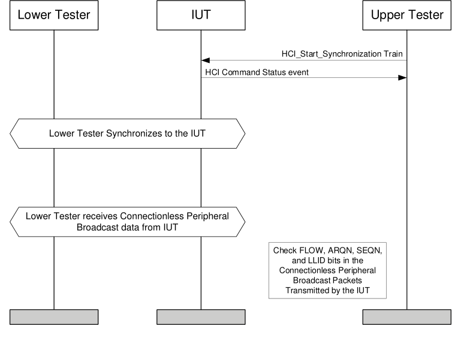

**Figure 4.123: BB/PROT/CB/BV-04-C [Connectionless Peripheral Broadcast Header Bits – Transmit]**

• Expected Outcome
Pass verdict
Broadcast packets from the IUT have FLOW=0, ARQN=0, SEQN=0, and LLID=010b and with an even Connectionless Peripheral Broadcast Interval.
• Test Purpose
Verify that the IUT transmits current host data on every Connectionless Peripheral Broadcast instant until new data is received from the host.
• Reference
[9] 8.6.4
• Initial Condition
- The IUT has an active Connectionless Peripheral Broadcast (see Section 4.16.2.1).
- The Lower Tester is in standby mode.
• Test Procedure
a) Start Synchronization Train on the IUT. b) Synchronize the Lower Tester to Connectionless Peripheral Broadcast from the IUT. c) Receive three Connectionless Peripheral Broadcast data packets on the Lower Tester from the
IUT. d) Change Connectionless Peripheral Broadcast data on the IUT to [0x00, 0x01, 0x02]
(Data_Length=0x03). e) Receive three Connectionless Peripheral Broadcast data on the Lower Tester from the IUT.

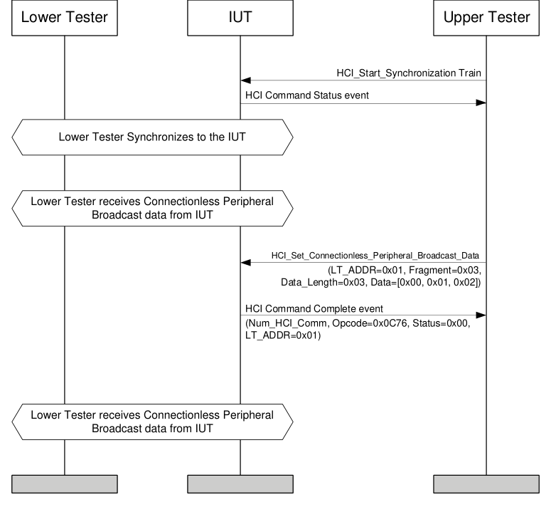

**Figure 4.124: BB/PROT/CB/BV-06-C [Connectionless Peripheral Broadcast Data Retransmission]**

• Expected Outcome
Pass verdict
The Lower Tester receives three connectionless broadcast data packets from the IUT (Data=[0xAA, 0x55]) in step c) and with an even Connectionless Peripheral Broadcast Interval.
AND
The Lower Tester receives three connectionless broadcast data packets from the IUT (Data=[0x00, 0x01, 0x02]) in step e) and with an even Connectionless Peripheral Broadcast Interval.
BB/PROT/CB/BV-07-C [Connectionless Peripheral Broadcast NULL Retransmission]
• Test Purpose
Verify that the IUT transmits NULL packets on every Connectionless Peripheral Broadcast instant until data is received from the host.
• Reference
[9] 8.10.1
• Initial Condition
- The IUT has an active Connectionless Peripheral Broadcast without profile data (see Section 4.16.2.1).
- The Lower Tester is in standby mode.
• Test Procedure
a) Start Synchronization Train on the IUT. b) Synchronize the Lower Tester to Connectionless Peripheral Broadcast from the IUT. c) The Lower Tester receives NULL packets from the IUT during Connectionless Peripheral
Broadcast instants. d) Change Connectionless Peripheral Broadcast data on the IUT to [0x00, 0x01, 0x02]
(Data_Length=0x03). e) Receive Connectionless Peripheral Broadcast data on the Lower Tester from the IUT.
Lower Tester Upper Tester IUT

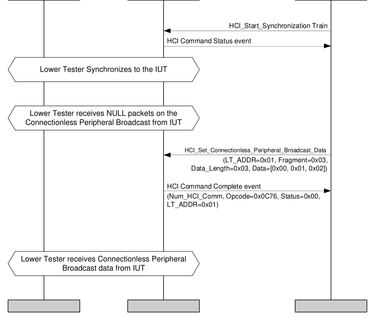

**Figure 4.125: BB/PROT/CB/BV-07-C [Connectionless Peripheral Broadcast NULL Retransmission]**

• Expected Outcome
Pass verdict
The Lower Tester receives NULL packets from the IUT in step c).
AND
The Lower Tester receives connectionless broadcast data from the IUT (Data= [0x00, 0x01, 0x02]) in step e) and with an even Connectionless Peripheral Broadcast Interval.

#### 4.16.3 Connectionless Peripheral Broadcast – Receiver

Verify the Connectionless Peripheral Broadcast reception procedure.

##### 4.16.3.1 Setup and Preamble - Connectionless Peripheral Broadcast Reception

The procedures below are used to prepare the IUT for Connectionless Broadcast reception.
Lower Tester Upper Tester IUT

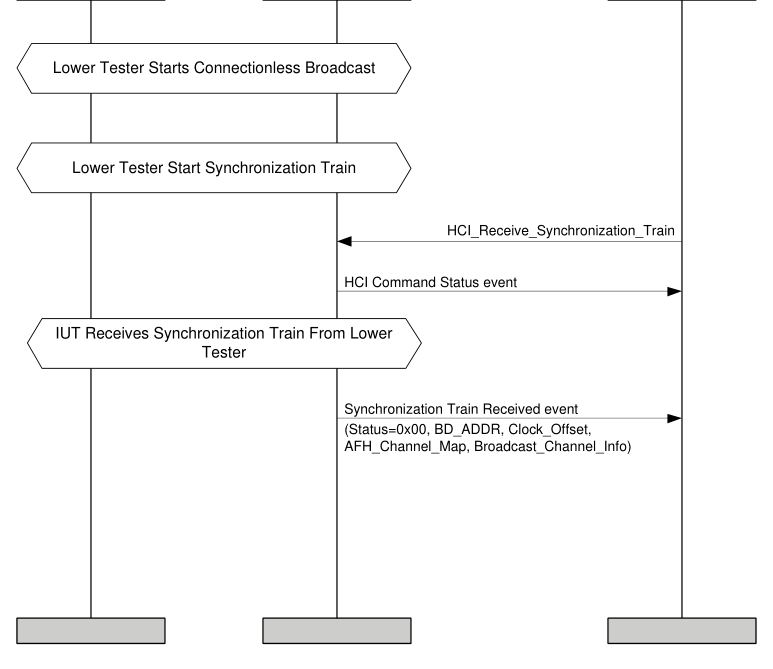

**Figure 4.126: Connectionless Peripheral Broadcast Reception**

Unless otherwise noted in the test description, subsequent testing begins within 200 ms after the Synchronization Train received event to ensure that received Synchronization Train data remains valid.
The Lower Tester uses the following parameters for the Connectionless Peripheral Broadcast unless otherwise noted in the test description:
• LT_ADDR: 1
• LPO_Allowed: 0 (No)
• Packet_Type: 0x330E (only DM1 packets allowed)
• Interval: 0x0080 (80 ms)
• Data_Length = 0x02
• Data = [0xAA, 0x55]
The Lower Tester uses the following parameters for the Synchronization Train unless otherwise noted in the test description:
• Interval: 0x0080 (80 ms)
• Timeout: Continuous
• Service Data: 0x01
• Test Purpose
Verify that the IUT can synchronize to and receive Connectionless Peripheral Broadcast data.
• Reference
[9] 8.10.2
• Initial Condition
- The IUT is prepared to receive Connectionless Peripheral Broadcast as described in Section 4.16.3.1.
- The Lower Tester is configured as described in Section 4.16.2.1.
• Test Procedure
a) The Upper Tester directs the IUT to receive Connectionless Peripheral Broadcast from the Lower
Tester. b) The IUT receives Connectionless Peripheral Broadcast data from the Lower Tester and passes it
to the Upper Tester.

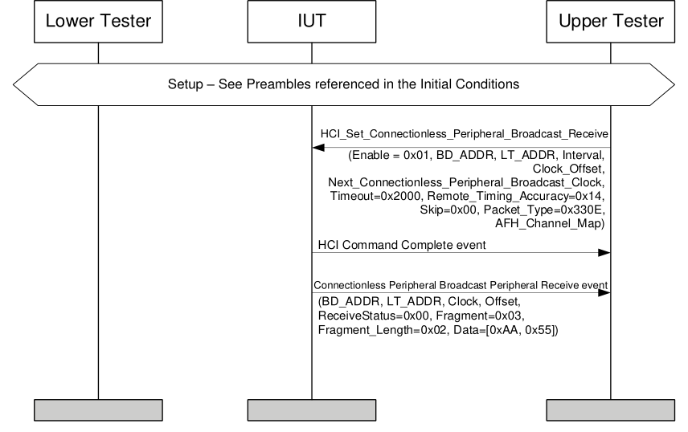

**Figure 4.127: BB/PROT/CB/BV-03-C [Connectionless Peripheral Broadcast Reception]**

• Expected Outcome
Pass verdict
The IUT correctly receives Connectionless Peripheral Broadcast data from the Lower Tester (Data= [0xAA, 0x55]).
• Test Purpose
Verify that the IUT correctly receives Connectionless Peripheral Broadcast messages with FLOW, ARQN, and SEQN bits equal to 0 or 1, and LLID set to 010b, and ignores any data with LLID not equal to 010b.
• Reference
[9] 5.7, 6.4.3, 6.4.4, 6.4.5
• Initial Condition
- The IUT is prepared to receive Connectionless Peripheral Broadcast as described in Section 4.16.3.1.
- The Lower Tester is configured as described in Section 4.16.2.1.
- The IUT is in Standby.
- The Lower Tester is in Standby.
• Test Procedure
a) Start Connectionless Peripheral Broadcast on the Lower Tester. b) Start Synchronization Train on the Lower Tester. c) Have the IUT synchronize to the Connectionless Peripheral Broadcast from the Lower Tester. d) Connectionless Peripheral Broadcast data is received by the IUT and passed to the Upper
Tester. e) Change the Lower Tester to transmit FLOW=1. f) The IUT continues to receive Connectionless Peripheral Broadcast data. g) Change the Lower Tester to transmit FLOW=0 and ARQN=1. h) The IUT continues to receive Connectionless Peripheral Broadcast data. i) Change the Lower Tester to transmit ARQN=0 and SEQN=1. j) The IUT continues to receive Connectionless Peripheral Broadcast data. k) Change the Lower Tester to transmit LLID=011b. l) The IUT stops receiving Connectionless Peripheral Broadcast data.
Lower Tester Upper Tester
IUT

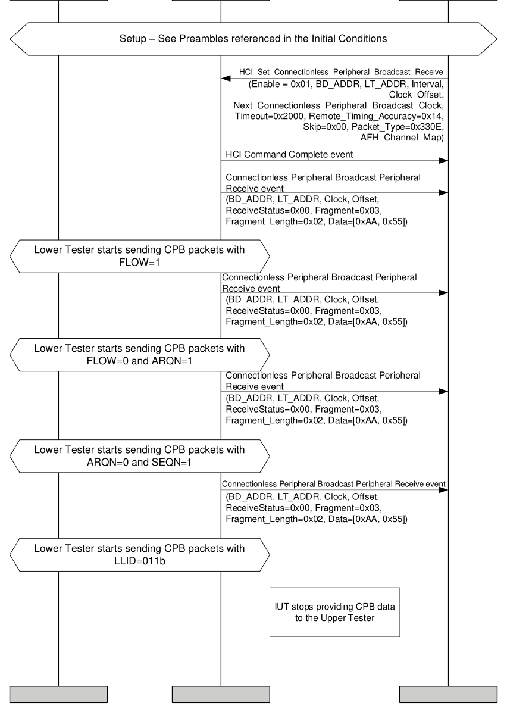

**Figure 4.128: BB/PROT/CB/BV-05-C [Connectionless Peripheral Broadcast Header Bits – Receive]**

• Expected Outcome
Pass verdict
The IUT correctly receives Connectionless Peripheral Broadcast data from the Lower Tester (Data= [0xAA, 0x55]) in steps (d), (f), (h), and (j) AND
The IUT does not receive Connectionless Peripheral Broadcast data from the Lower Tester in step (l).
BB/PROT/CB/BV-08-C [Connectionless Peripheral Broadcast Synchronization Delay]
• Test Purpose
Verify that the IUT synchronizes to a Connectionless Peripheral Broadcast when the specified Connectionless Peripheral Broadcast Instant is 1 second in the past.
• Reference
[9] 8.10.2
• Initial Condition
- The IUT is prepared to receive Connectionless Peripheral Broadcast as described in Section 4.16.3.1.
- The Lower Tester is configured as described in Section 4.16.2.1.
- The IUT is configured in Standby.
- The Lower Tester is in Standby.
• Test Procedure
a) Stop Synchronization Train on the Lower Tester. b) Delay 1 second from reception of Synchronization Train received event from the IUT. c) Have the IUT synchronize to the Connectionless Peripheral Broadcast from the Lower Tester.

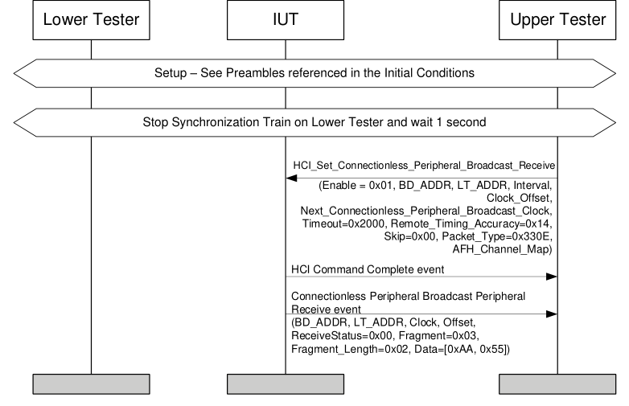

**Figure 4.129: BB/PROT/CB/BV-08-C [Connectionless Peripheral Broadcast Synchronization Delay]**

• Expected Outcome
Pass verdict
The IUT correctly receives Connectionless Peripheral Broadcast data from the Lower Tester (Data= [0xAA, 0x55]).
BB/PROT/CB/BV-09-C [Connectionless Peripheral Broadcast – Skip]
• Test Purpose
Verify that the IUT skips the configured number of broadcasts while receiving Connectionless Peripheral Broadcast packets.
• Reference
[9] 8.10.2
• Initial Condition
- The IUT is prepared to receive Connectionless Peripheral Broadcast as described in Section 4.16.3.1.
- The Lower Tester is configured as described in Section 4.16.2.1.
- The IUT is in Standby.
- The Lower Tester is in Standby.
• Test Procedure
a) Start Connectionless Peripheral Broadcast on the Lower Tester. b) Start Synchronization Train on the Lower Tester. c) Have the IUT synchronize to the Connectionless Peripheral Broadcast from the Lower Tester with
Skip = 0x06. d) Connectionless Peripheral Broadcast data is received by the IUT and passed to the Upper
Tester. e) Configure the Lower Tester to transmit incrementing data every Broadcast Instant. Transmitted
data is 0x0000, 0x0001, etc. rolling over from 0xFFFF to 0x0000.
Lower Tester Upper Tester
IUT

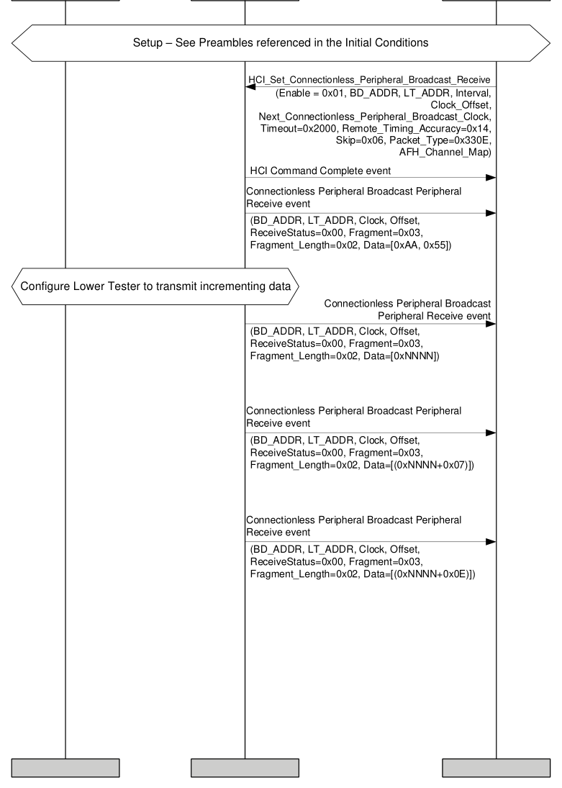

**Figure 4.130: BB/PROT/CB/BV-09-C [Connectionless Peripheral Broadcast – Skip]**

• Expected Outcome
Pass verdict
The IUT doesn’t skip more than six consecutive instants.
• Test Purpose
Verify that the IUT listens to the very next broadcast instant thereby ignoring the skip parameter if it is unable to receive a Connectionless Peripheral Broadcast packet.
• Reference
[9] 8.10.2
• Initial Condition
- The IUT is prepared to receive Connectionless Peripheral Broadcast as described in Section 4.16.3.1.
- The Lower Tester is configured as described in Section 4.16.2.1.
- The IUT is in Standby.
- The Lower Tester is in Standby.
• Test Procedure
a) Start Connectionless Peripheral Broadcast on the Lower Tester. b) Start Synchronization Train on the Lower Tester. c) Have the IUT synchronize to the Connectionless Peripheral Broadcast from the Lower Tester
using a Skip parameter value of 0x06. d) Connectionless Peripheral Broadcast data is received by the IUT and passed to the Upper
Tester. e) Configure the Lower Tester to transmit incrementing data every Broadcast Instant, suppressing
every 8th packet. Transmit sequence is shown below:
1) 0x0000, 0x0001, 0x0002, 0x0003, 0x0004, 0x0005, 0x0006, (suppress 0x0007)
2) 0x0008, 0x0009, 0x000A, 0x000B, 0x000C, 0x000D, 0x000E, (suppress 0x000F)
3) 0x0010, 0x0011, 0x0012, 0x0013, 0x0014, 0x0015, 0x0016, (suppress 0x0017)
4) etc.
f) Ignore receive packets at the IUT whose data field is less than 0x0040. Receive 160 packets at the IUT.
Lower Tester Upper Tester
IUT

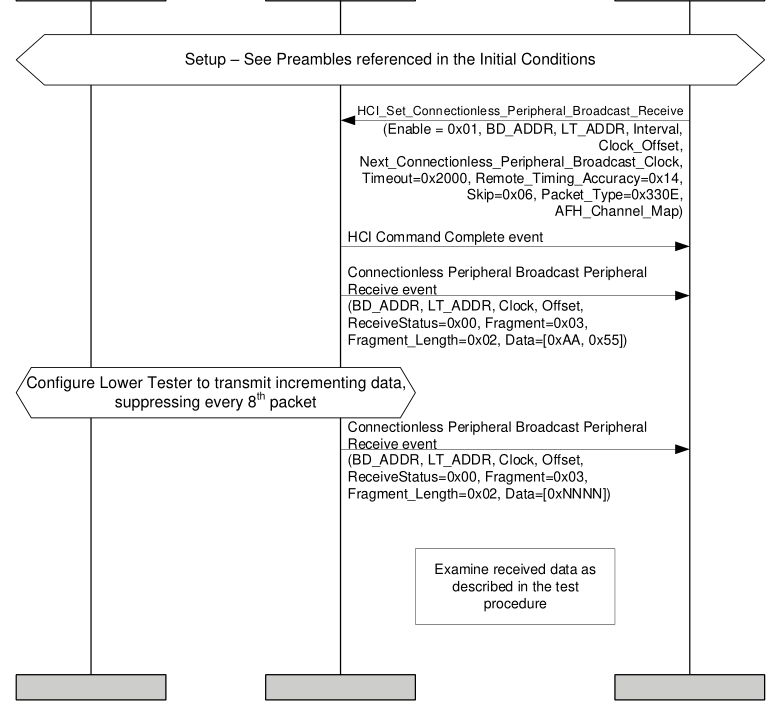

**Figure 4.131: BB/PROT/CB/BV-10-C [Connectionless Peripheral Broadcast - Ignore Skip]**

• Expected Outcome
Pass verdict
The IUT correctly receives Connectionless Peripheral Broadcast data from the Lower Tester (Data= [0xAA, 0x55]) in step d.
AND
In step f) when the IUT receives a packet with (Data Modulus 0x08 = 0), it also receives one of the packets with (Data+0x0008) to (Date+0x0008) inclusive. For example if the IUT receives packet with Data=0x0080, it also receives one of the packets with Data=0x0081 to Data=0x0088 inclusive.
BB/PROT/CB/BV-11-C [Connectionless Peripheral Broadcast Timeout]
• Test Purpose
Verify that the IUT stops listening for Connectionless Peripheral Broadcasts if it does not receive a packet for the configured timeout period.
• Reference
[9] 8.10.2
• Initial Condition
- The IUT is prepared to receive Connectionless Peripheral Broadcast as described in Section 4.16.3.1.
- The Lower Tester is configured as described in Section 4.16.2.1.
- The IUT is in Standby.
- The Lower Tester is in Standby.
• Test Procedure
a) Start Connectionless Peripheral Broadcast on the Lower Tester. b) Start Synchronization Train on the Lower Tester. c) Have the IUT synchronize to the Connectionless Peripheral Broadcast from the Lower Tester with
a broadcast reception timeout of 5.12 s. d) Connectionless Peripheral Broadcast data is received by the IUT and passed to the Upper
Tester. e) Stop Connectionless Peripheral Broadcast on the Lower Tester. f) Wait for Connectionless Peripheral Broadcast timeout on the IUT.

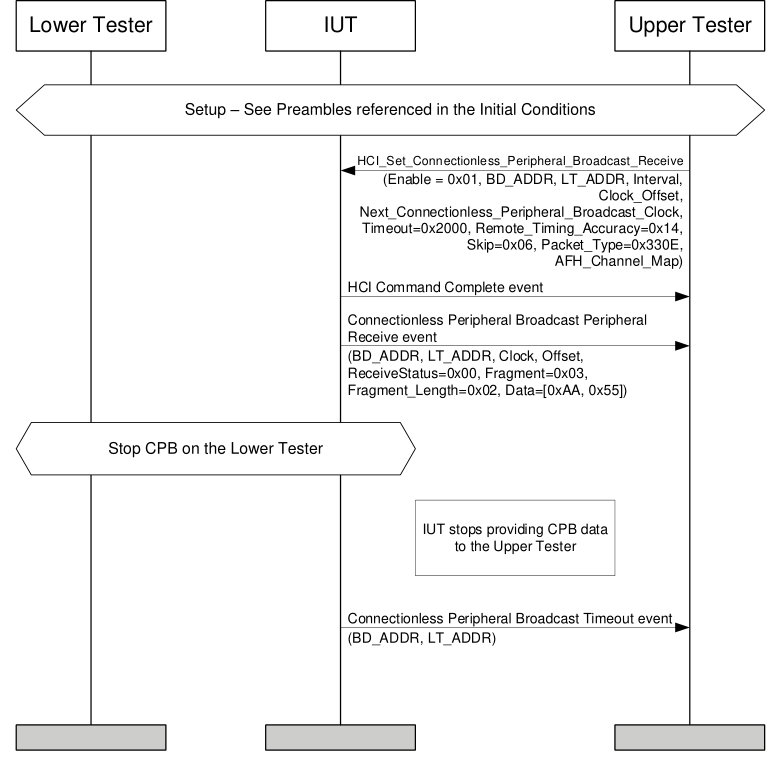

**Figure 4.132: BB/PROT/CB/BV-11-C [Connectionless Peripheral Broadcast Timeout]**

• Expected Outcome
Pass verdict
The IUT correctly receives Connectionless Peripheral Broadcast data from the Lower Tester (Data= [0xAA, 0x55]) in step d).
AND
The IUT does not receive any Connectionless Peripheral Broadcast data after step e).
AND
The IUT experiences Connectionless Peripheral Broadcast timeout within 4.9 s – 5.3 s in step f).

### 4.17 Truncated Paging

Verify the Truncated Paging procedures.

#### 4.17.1 Truncated Paging – Central

Verify the Truncated Paging procedures for the Central.

##### 4.17.1.1 Page Scan Parameters – Lower Tester

For Truncated Paging Central tests, the Lower Tester is configured as follows:
• Page_Scan_Interval: 0x0800
• Page_Scan_Window: 0x0012
• Interlaced Scans: Disabled

##### 4.17.1.2 Paging Parameters – IUT

The following parameters are used for Truncated Paging from the IUT:
• Page_Scan_Repetition_Mode: 0x01 (R1)
• Clock_Offset: 0x0000
BB/PHYS/TP/BV-01-C [Truncated Page Transmission]
• Test Purpose
Verify that when the IUT performs a truncated page, it does not send an FHS packet after receiving an ID response from the paged device.
• Reference
[9] 8.3.3
• Initial Condition
- The IUT is in standby.
- The Lower Tester is configured for page scan using the parameters in Section 4.17.1.1.
• Test Procedure
a) Start Truncated Paging from the IUT. b) Upon receiving an ID packet from the IUT, the Lower Tester responds with an ID packet as part
of the Peripheral page response procedure.
does not send an FHS packet within pagerespTO period. d) The IUT indicates that truncated paging has completed successfully after receiving the ID packet
from the Lower Tester.

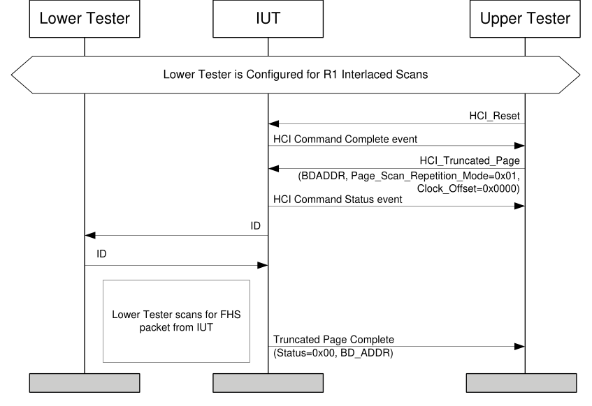

**Figure 4.133: BB/PHYS/TP/BV-01-C [Truncated Page Transmission]**

• Expected Outcome
Pass verdict
The IUT stops paging after the ID response from the Lower Tester.
AND
The IUT does not send an FHS after the ID response from the Lower Tester.

#### 4.17.2 Truncated Paging – Peripheral

Verify the Truncated Paging procedures for the Peripheral.

##### 4.17.2.1 Paging Parameters – Lower Tester

The following parameters are used for Truncated Paging from the Lower Tester:
• Page_Scan_Repetition_Mode: 0x01 (R1)
• Clock_Offset: 0x0000
For Truncated Paging Peripheral tests, the IUT is configured as follows:
• Page_Scan_Interval: 0x0800
• Page_Scan_Window: 0x0012
• Interlaced Scans: Disabled
BB/PHYS/TP/BV-02-C [Peripheral Page Response Timeout Detection]
• Test Purpose
Verify that the IUT as Peripheral can detect a Peripheral page response timeout.
• Reference
[9] 8.3.3
• Initial Condition
- The IUT is configured for page scan using the parameters in Section 4.17.2.2.
- The Lower Tester is in standby mode.
• Test Procedure
a) Perform a truncated page from the Lower Tester to the IUT. b) The Lower Tester receives an ID response from the IUT. c) The IUT indicates that a Peripheral page response timeout has occurred to the Upper Tester.

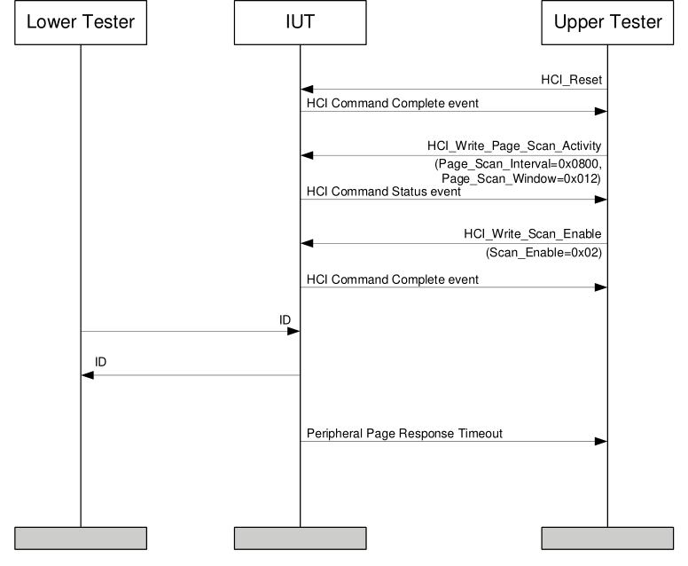

**Figure 4.134: BB/PHYS/TP/BV-02-C [Peripheral Page Response Timeout Detection]**

• Expected Outcome
Pass verdict
The Lower Tester receives ID response from the IUT.
AND
The IUT indicates that a Peripheral page response timeout has occurred to the Upper Tester.

### 4.18 Synchronization Train

Verify Synchronization Train transmission and reception.

#### 4.18.1 Synchronization Train Parameters

The following Synchronization Train configuration is used for all Synchronization Train transmitter and receiver tests:
• Interval_Min: 0x0080 (80 ms)
• Interval_Max: 0x0080 (80 ms)
• Timeout: 0x00017700 (60 s)

#### 4.18.2 Synchronization Train - Transmission

Verify Synchronization Train transmit timing, frequency, and packet format.

##### 4.18.2.1 Synchronization Train Transmission – Setup and Preamble

The procedures in Figure 4.135 are used to place the IUT in Synchronization Train transmit setup state.
IUT Upper Tester

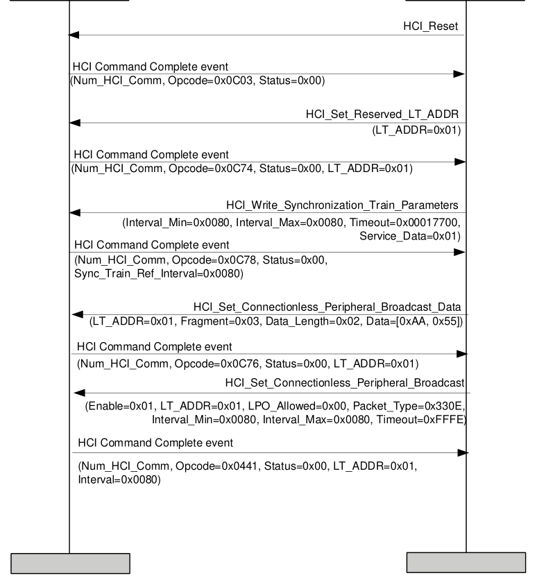

**Figure 4.135: IUT Synchronization Train Transmit Setup**

BB/PHYS/ST/BV-01-C [Synchronization Train Transmission]
• Test Purpose
Verify that the IUT transmits valid Synchronization Train packets on all Synchronization Train frequencies.
• Reference
[9] 2.6.4.8, 8.3.5
• Initial Condition
- The IUT has an active Connectionless Peripheral Broadcast (see Section 4.16.2).
- The Lower Tester is in standby mode.
• Test Procedure
a) Start Synchronization Train on the IUT. b) Receive Synchronization Train packets on the Lower Tester on all Synchronization Train
frequencies.

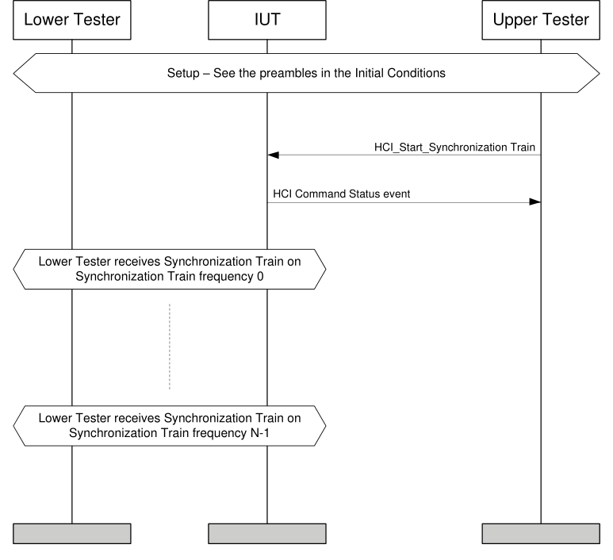

**Figure 4.136: BB/PHYS/ST/BV-01-C [Synchronization Train Transmission]**

• Expected Outcome
Pass verdict
The IUT transmits Synchronization Train packets on all frequencies.
BB/PHYS/ST/BV-04-C [Synchronization Train Transmission Timing]
• Test Purpose
Verify that the IUT follows the Synchronization Train timing for all Synchronization Train channels in the absence of conflicting traffic.
• Reference
[9] 2.7.2
• Initial Condition
- The IUT has an active Connectionless Peripheral Broadcast (see Section 4.16.2).
• Test Procedure
a) Start Synchronization Train on the IUT. b) Receive Synchronization Train packets on one Synchronization Train frequency on the Lower
Tester for the duration (timeout) of the Synchronization Train. c) The Lower Tester stops receiving Synchronization Train packets after Synchronization Train
timeout. d) Repeat the previous steps for the remaining Synchronization Train frequencies.

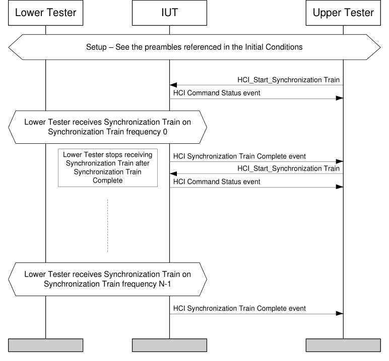

**Figure 4.137: BB/PHYS/ST/BV-04-C [Synchronization Train Transmission Timing]**

• Expected Outcome
Pass verdict
The IUT transmits Synchronization Train packets on each frequency with a mean period of 79–81 ms and a delay of 70–90 ms between consecutive Synchronization Train packets on the same frequency.
BB/PHYS/ST/BV-05-C [Synchronization Train Timeout]
• Test Purpose
Verify that the IUT transmits the Synchronization Train on all Synchronization Train frequencies for the configured time and terminates the Synchronization Train when the configured time expires.
• Reference
[9] 8.3.5
• Initial Condition
- The IUT has an active Connectionless Peripheral Broadcast (see Section 4.16.2).
- The Lower Tester is in standby mode.
• Test Procedure
a) Start Synchronization Train on the IUT. b) The Lower Tester receives Synchronization Train packets on one Synchronization Train
frequency for the duration (timeout) of the Synchronization Train. c) The Lower Tester stops receiving Synchronization Train packets after Synchronization Train
timeout. d) Repeat the previous steps for the remaining Synchronization Train frequencies.

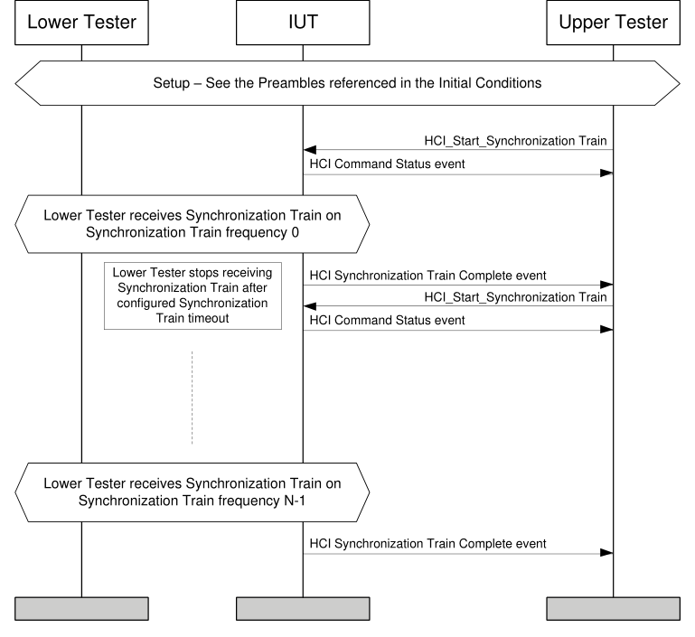

**Figure 4.138: BB/PHYS/ST/BV-05-C [Synchronization Train Timeout]**

• Expected Outcome
Pass verdict
The IUT transmits Synchronization Train on all frequencies and terminates the Synchronization Train after the configured Synchronization Train timeout.
• Test Purpose
Verify that the IUT transmits Synchronization Train Packets with the Connectionless Peripheral Broadcast Instant in the Synchronization Packet payload set to the Central’s CLKN corresponding to one of the next four broadcast instants.
• Reference
[9] 8.3.5
• Initial Condition
- The IUT has an active Connectionless Peripheral Broadcast (see Section 4.16.2).
- The Lower Tester is in standby mode.
• Test Procedure
a) Start Synchronization Train on the IUT. b) The Lower Tester receives Synchronization Train packets on one Synchronization Train
frequency for the duration (timeout) of the Synchronization Train. The Lower Tester examines the contents to determine if received Synchronization Train packets refers to one of the four allowed future Broadcast Instants. c) Repeat the previous steps for the remaining Synchronization Train frequencies.

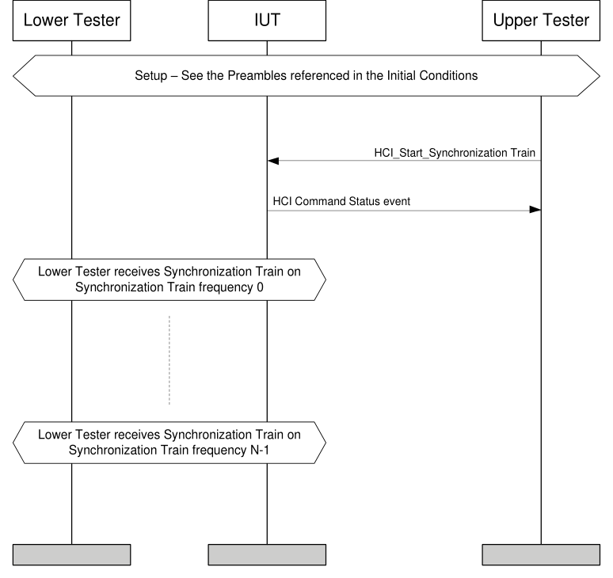

**Figure 4.139: BB/PHYS/ST/BV-06-C [Next Broadcast Instant Value in Synchronization Train]**

• Expected Outcome
Pass verdict
The contents of the received IUT Synchronization Train packets on all frequencies refer to one of the four allowed future Broadcast Instants.

#### 4.18.3 Synchronization Train - Reception

Verify Synchronization Train receive timing, frequencies, and packet format.
BB/PHYS/ST/BV-02-C [Synchronization Train Reception]
• Test Purpose
Verify that the IUT can receive Synchronization Train packets on all Synchronization Train frequencies.
• Reference
[9] 2.7
• Initial Condition
- The IUT is in Standby.
- The Lower Tower Tester is in Standby.
• Test Procedure
a) Start Connectionless Peripheral Broadcast on the Lower Tester. b) Start Synchronization Train on the Lower Tester on only one of the Synchronization Train
frequencies. c) Have the IUT receive a Synchronization Train packet. d) Repeat previous steps with remaining Synchronization Train frequencies.

|  | Lower Tester |  | IUT Upper Tester arts Connectionless Broadcast nchronization Train on frequency f 0 HCI Receive Synchronization Train _ _ _ HCI Command Status event ronization Train From Lower Tester Synchronization Train Received event (Status=0x00, BD ADDR, Clock Offset, _ _ AFH Channel Map, Broadcast Channel Info) _ _ _ _ nchronization Train on frequency f 1 HCI Receive Synchronization Train _ _ _ HCI Command Status event ronization Train From Lower Tester Synchronization Train Received event (Status=0x00, BD ADDR, Clock Offset, _ _ AFH Channel Map, Broadcast Channel Info) _ _ _ _ | Upper Tester |  |
| --- | --- | --- | --- | --- | --- |
|  |  |  |  |  |  |
|  | Lowe | r Tester St | arts Connectionless Broa |  |  |
|  |  |  |  |  |  |
|  | Lower Tes | ter Start Sy | nchronization Train on fr |  |  |
|  | IUT Recei Lower Tes IUT Recei | ves Synch ter Start Sy ves Synch | ronization Train From Lo nchronization Train on fr ronization Train From Lo |  |  |
|  |  |  |  |  |  |
|  |  |  |  |  |  |

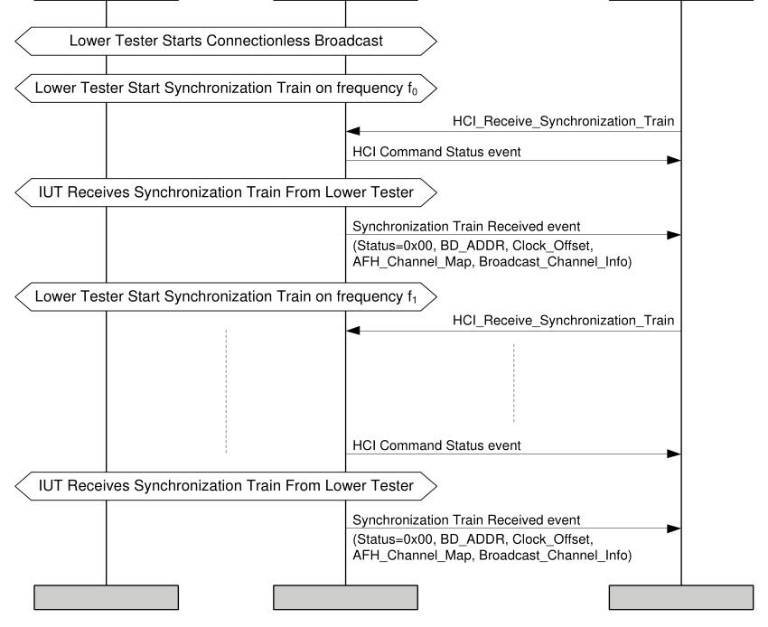

**Figure 4.140: BB/PHYS/ST/BV-02-C [Synchronization Train Reception]**

• Expected Outcome
Pass verdict
The IUT is able to receive Synchronization Train packets on all Synchronization Train frequencies.
BB/PHYS/ST/BV-03-C [Reception of Synchronization Train with Extra Bytes]
• Test Purpose
Verify that the IUT can correctly receive Synchronization packets larger than 28 bytes.
• Reference
[9] 8.3.5
• Initial Condition
- The IUT is in Standby.
- The Lower Tester is in Standby.
• Test Procedure
a) Start Connectionless Peripheral Broadcast on the Lower Tester. b) Start Synchronization Train on the Lower Tester with Synchronization Train packet of size

## 30 bytes. c) Have the IUT receive the Synchronization Train packet.

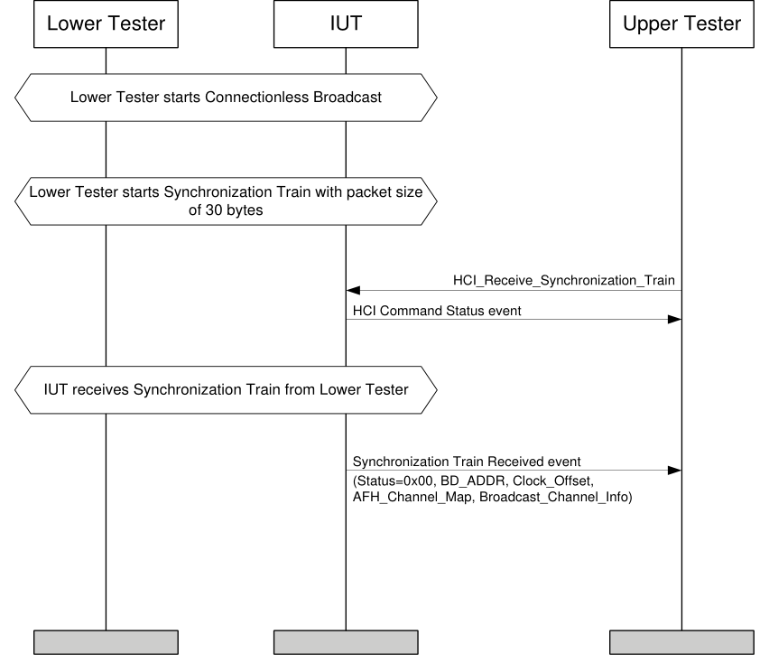

**Figure 4.141: BB/PHYS/ST/BV-03-C [Reception of Synchronization Train with Extra Bytes]**

• Expected Outcome
Pass verdict
The IUT is able to receive the Synchronization Train packet correctly.

### 4.19 Piconet Clock Adjust

Verify the correct implementation of the Piconet Clock Adjustment procedure.

#### 4.19.1 Coarse Clock Adjustment

Verify the Coarse Clock Adjustment procedure.
BB/XCB/BV-01-C [Peripheral handles small adjustment when polled before instant]
• Test Purpose
Verify that the IUT as Peripheral will correctly respond to and act on a Coarse Clock Adjustment when adjustment is less than a BT Frame and Central polls for LMP_clk_adj_ack before clk_adj_instant.
• Reference
[1] 8.6.10.1
• Initial Condition
Lower Tester: Configured as Central in state CONNECTION (active mode, ACL link).
The Bluetooth clock of the Lower Tester is chosen to include clock wrap-around (227-1 to 0) between the first time LMP_clk_adj is sent in the first loop iteration and the corresponding Instant.
Upper Tester: Not involved after connection has been established
IUT: Configured as Peripheral in state CONNECTION (active mode, ACL link)
• Test Procedure

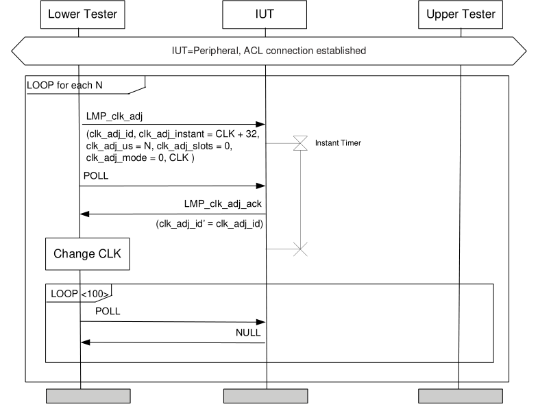

**Figure 4.142: BB/XCB/BV-01-C [Peripheral handles small adjustment when polled before instant]**

a) Set N = 395. b) The Lower Tester sends LMP_clk_adj with clk_adj_id = {0:255}, clk_adj_instant = CLK[27:1] + 32
slots, clk_adj_us = N, clk_adj_slots = 0 and clk_adj_mode = 0. c) The Lower Tester sends POLL packets until the IUT responds or LSTO expires. d) The IUT responds with LMP_clk_adj_ack with clk_adj_id set to the same value as in
LMP_clk_adj. e) At the clk_adj_instant, the tester adjusts CLKnew = CLKold +395 µs. f) The Lower Tester sends POLL packet in every Central slot at least 100 times. g) The IUT responds to POLL packets with a NULL packet. h) Set N = -395. Repeat steps b)–g). i) Set N = 624. Repeat steps b)–g). j) Set N = -624. Repeat steps b)–g). k) Set N = 0. Repeat steps b)–g).
• Expected Outcome
Pass verdict
The criterion for a pass verdict is that for each of the test sets with parameters clk_adj_us = 395, -395, 624, -624, and 0 the IUT does the following: After first POLL, the IUT responds with LMP_clk_adj_ack with clk_adj_id set to the same value as in LMP_clk_adj. For subsequent POLL packets, the IUT responds to at least 95% with a NULL packet.
BB/XCB/BV-02-C [Peripheral handles small adjustment when polled after instant]
• Test Purpose
Verify that the IUT as Peripheral will correctly respond to and act on a Coarse Clock Adjustment when adjustment is less than a BT Frame and Central polls for LMP_clk_adj_ack after clk_adj_instant.
• Reference
[1] 8.6.10.1
• Initial Condition
Lower Tester: Configured as Central in state CONNECTION (active mode, ACL link).
The Bluetooth clock of the Lower Tester is chosen to include clock wrap-around (227-1 to 0) between the first time LMP_clk_adj is sent in the first loop iteration and the corresponding Instant.
Upper Tester: Not involved after connection has been established.
IUT: Configured as Peripheral in state CONNECTION (active mode, ACL link).
• Test Procedure

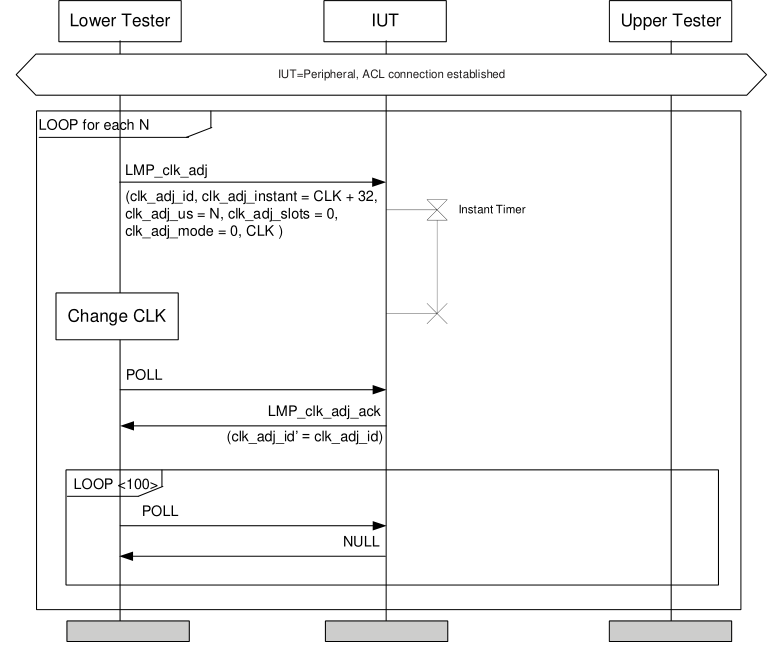

**Figure 4.143: BB/XCB/BV-02-C [Peripheral handles small adjustment when polled after instant]**

a) Set N = 395. b) The Lower Tester sends LMP_clk_adj with clk_adj_id = {0:255}, clk_adj_instant = CLK[27:1] + 32
slots, clk_adj_us = N, clk_adj_slots = 0 and clk_adj_mode = 0. c) At the clk_adj_instant, the Lower Tester adjusts CLKnew = CLKold +395 µs. d) The Lower Tester sends POLL packets until the IUT responds or LSTO expires. e) The IUT responds with LMP_clk_adj_ack with clk_adj_id set to the same value as in
LMP_clk_adj. f) The Lower Tester sends POLL packet in every Central slot at least 100 times. g) The IUT responds to POLL packets with a NULL packet. h) Set N = -395. Repeat steps b) to g). i) Set N = 624. Repeat steps b) to g). j) Set N = -624. Repeat steps b) to g). k) Set N = 0. Repeat steps b) to g).
• Expected Outcome
Pass verdict
The criterion for a pass verdict is that for each of the test sets with parameters clk_adj_us = 395, -395, 624, -624, and 0 the IUT does the following: After first POLL, the IUT responds with LMP_clk_adj_ack with clk_adj_id set to the same value as in LMP_clk_adj. For subsequent POLL packets, the IUT responds to at least 95% with a NULL packet.
• Test Purpose
Verify that the IUT as Peripheral will correctly respond to and act on a Coarse Clock Adjustment when adjustment is greater than a BT Frame and Central polls for LMP_clk_adj_ack before clk_adj_instant. This test moves the clock several Bluetooth frames away to ensure that the hopping frequency pattern changes.
• Reference
[1] 8.6.10.1
• Initial Condition
Lower Tester: Configured as Central in state CONNECTION (active mode, ACL link).
The Bluetooth clock of the Lower Tester is chosen to include clock wrap-around (227-1 to 0) between the first time LMP_clk_adj is sent (in test procedure step a) and the corresponding Instant.
Upper Tester: Not involved after connection has been established.
IUT: Configured as Peripheral in state CONNECTION (active mode, ACL link).
• Test Procedure

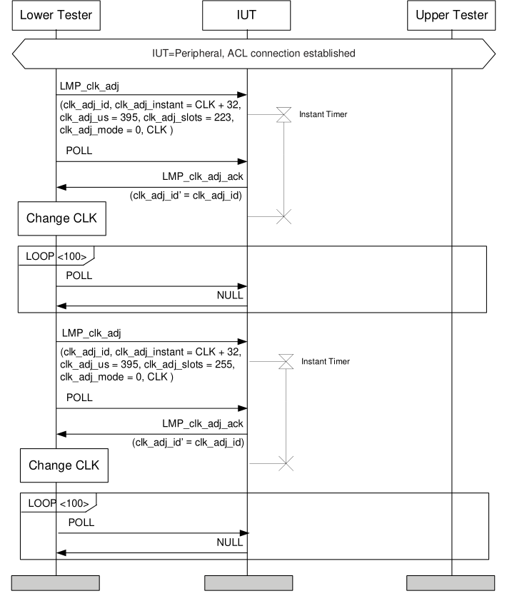

**Figure 4.144: BB/XCB/BV-03-C [Peripheral handles large adjustment when polled before instant]**

a) The Lower Tester sends LMP_clk_adj with clk_adj_id = {0:255}, clk_adj_instant = CLK[27:1] +
32 slots, clk_adj_us = 395, clk_adj_slots = 223 and clk_adj_mode = 0. b) The Lower Tester sends POLL packets until the IUT responds or LSTO expires. c) The IUT responds with LMP_clk_adj_ack with clk_adj_id set to the same value as in
LMP_clk_adj. d) At the clk_adj_instant, the tester adjusts CLKnew = CLKold + (223 * 625 + 395) µs. e) The Lower Tester sends POLL packet in every Central slot at least 100 times. f) The IUT responds to POLL packets with a NULL packet. g) The Lower Tester sends LMP_clk_adj with clk_adj_id = {0:255}, clk_adj_instant = CLK[27:1] +
32 slots, clk_adj_us = 395 and clk_adj_slots = 255. h) The Lower Tester sends POLL packets until the IUT responds or LSTO expires. i) The IUT responds with LMP_clk_adj_ack with clk_adj_id set to the same value as in LMP_clk_adj. j) At the clk_adj_instant, the tester adjusts CLKnew = CLKold + (255 * 625 + 395) µs.
k) The Lower Tester sends POLL packet in every Central slot at least 100 times. l) The IUT responds to POLL packets with a NULL packet.
• Expected Outcome
Pass verdict
For both tests (starting at a) and g)), after first poll, the IUT responds with LMP_clk_adj_ack with clk_adj_id set to the same value as in LMP_clk_adj. For subsequent POLL packets, the IUT responds to at least 95% with a NULL packet.
BB/XCB/BV-04-C [Peripheral handles large adjustment when polled after instant]
• Test Purpose
Verify that the IUT as Peripheral will correctly respond to and act on a Coarse Clock Adjustment when adjustment is greater than a BT Frame and Central polls for LMP_clk_adj_ack after clk_adj_instant. This test moves the clock several Bluetooth frames away to ensure that the hopping frequency pattern changes.
• Reference
[1] 8.6.10.1
• Initial Condition
Lower Tester: Configured as Central in state CONNECTION (active mode, ACL link). The Bluetooth clock of the Lower Tester is chosen to include clock wrap-around (227-1 to 0) between the first time LMP_clk_adj is sent (in test procedure step a) and the corresponding Instant.
Upper Tester: Not involved after connection has been established.
IUT: Configured as Peripheral in state CONNECTION (active mode, ACL link).
• Test Procedure

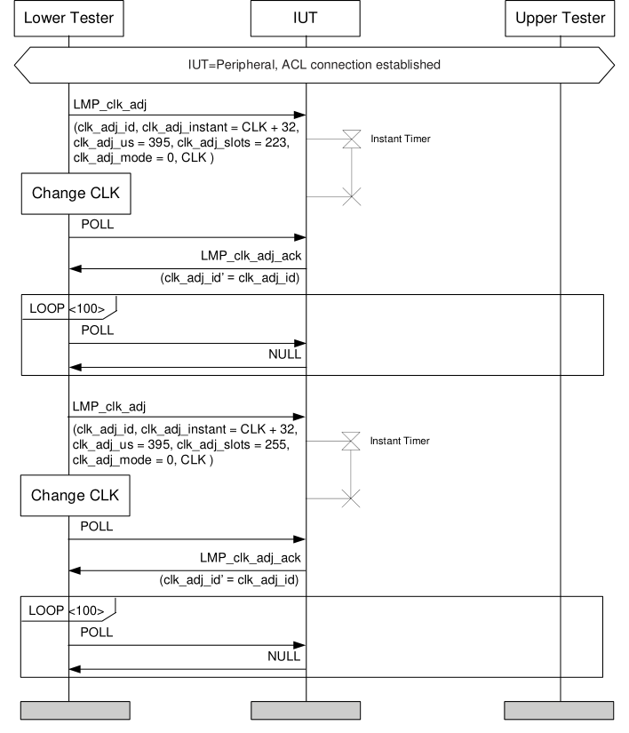

**Figure 4.145: BB/XCB/BV-04-C [Peripheral handles large adjustment when polled after instant]**

a) The Lower Tester sends LMP_clk_adj with clk_adj_id = {0:255}, clk_adj_instant = CLK[27:1] +
32 slots, clk_adj_us = 395, clk_adj_slots = 223 and clk_adj_mode = 0. b) At the clk_adj_instant, the Lower Tester adjusts CLKnew = CLKold + (223 * 625 + 395) µs. c) The Lower Tester sends POLL packets until the IUT responds or LSTO expires. d) The IUT responds with LMP_clk_adj_ack with clk_adj_id set to the same value as in
LMP_clk_adj. e) The Lower Tester sends POLL packet in every Central slot at least 100 times. f) The IUT responds to POLL packets with a NULL packet. g) The Lower Tester sends LMP_clk_adj with clk_adj_id = {0:255}, clk_adj_instant = CLK[27:1] +
32 slots, clk_adj_us = 395 and clk_adj_slots = 255. h) At the clk_adj_instant, the Lower Tester adjusts CLKnew = CLKold + (255 * 625 + 395) µs. i) The Lower Tester sends POLL packets until the IUT responds or LSTO expires. j) The IUT responds with LMP_clk_adj_ack with clk_adj_id set to the same value as in LMP_clk_adj. k) The Lower Tester sends POLL packet in every Central slot at least 100 times. l) The IUT responds to POLL packets with a NULL packet.
• Expected Outcome
Pass verdict
For both tests (starting at a) and g)), after first POLL, the IUT responds with LMP_clk_adj_ack with clk_adj_id set to the same value as in LMP_clk_adj. For subsequent POLL packets, the IUT responds to at least 95% with a NULL packet.
BB/XCB/BV-05-C [Central Handles Request for positive Coarse Clock Adjustment]
• Test Purpose
Verify that the IUT as Central will correctly respond to and act upon a request for a Coarse Clock Adjustment.
• Reference
[1] 8.6.10.1
• Initial Condition
Lower Tester: Configured as Peripheral in state CONNECTION (active mode, ACL link). The Lower Tester is configured to collect time stamp for the first bit of the preamble of a poll packet as described in [5] 6.7. Time stamps are collected using a separate high accuracy reference clock.
Upper Tester: Not involved after connection has been established.
IUT: Configured as Central in state CONNECTION (active mode, ACL link).
The IUT is configured to accept PCA requests.
• Test Procedure

**Figure 4.146: BB/XCB/BV-05-C [Central Handles Request for positive Coarse Clock Adjustment]**

a) The Lower Tester waits for a POLL or NULL and saves Timestamp1 for p0. b) The Lower Tester sends LMP_clk_adj_req to the IUT. c) The IUT may accept the request or deny it and instead attempt to change CLK by dragging.
i. If the IUT accepts the request, then it will send LMP_accepted_ext to the Lower Tester, followed by LMP_clk_adj. The Lower Tester responds with LMP_clk_adj_ack and changes its clock according to protocol.
ii. If the IUT rejects the request, then it may send an LMP_not_accepted_ext PDU with the error code = Coarse Clock Adjustment Rejected but Will Try to Adjust Using Clock Dragging (0x40). In this case, the Lower Tester waits for a time corresponding to the maximum allowed drag rate.
iii. If the IUT rejects the request with any other error code, then this test will fail.
or NULL. e) The Lower Tester calculates the IUT clock change as (Timestamp2 – Timestamp1) MOD 1250.
• Expected Outcome
Pass verdict
The IUT sends LMP_accepted followed by LMP_clk_adj or LMP_not_accepted with error code = Coarse Clock Adjustment Rejected but Will Try to Adjust Using Clock Dragging (0x40).
If the IUT performed a Coarse Clock Adjustment, then (Timestamp2 – Timestamp1) MOD 1250 = 1050 µs ±5%.
Else if the IUT performed clock dragging, then (Timestamp2 – Timestamp1) MOD 1250 ≥ 40 µs and ≤ 400 µs.
If the IUT performed a Coarse Clock Adjustment, then clk_adj_instant = CLKp + X, where CLKp is CLK of the first LMP_clk_adj packet, and X is ≥ 12 slots and < 12 hours.
The IUT enabled AFH as part of the connection establishment and kept it enabled throughout the test. Throughout the test, channels 0, 24, and 78 were marked as unused in the AFH_channel_map.
• Notes
If the IUT uses Clock Dragging, then it is allowed to drag the clock much slower than the maximum rate of 5 µs/125 ms. This test assumes that no implementation would drag the clock slower than 0.5 µs/125 ms. The maximum rate of 5 µs/125 ms corresponds to 400 µs / 10 s. The test is configured to change the clock only 200 µs. Allow for a maximum natural drift of 20 PPM during 10 s which is 200 µs. If natural drift and drag work in the same direction we can observe a total drag of < 400 µs / 10 s.
BB/XCB/BV-06-C [Central Handles Request for negative Coarse Clock Adjustment]
• Test Purpose
Verify that the IUT as Central will correctly respond to and act upon a request for a Coarse Clock Adjustment.
• Reference
[1] 8.6.10.1
• Initial Condition
Lower Tester: Configured as Peripheral in state CONNECTION (active mode, ACL link).
The Lower Tester is configured to collect time stamp for the first bit of the preamble of a poll packet as described in [5] 6.7. Time stamps are collected using a separate high accuracy reference clock.
Upper Tester: Not involved after connection has been established.
IUT: Configured as Central in state CONNECTION (active mode, ACL link). The IUT is configured to accept PCA requests.
• Test Procedure

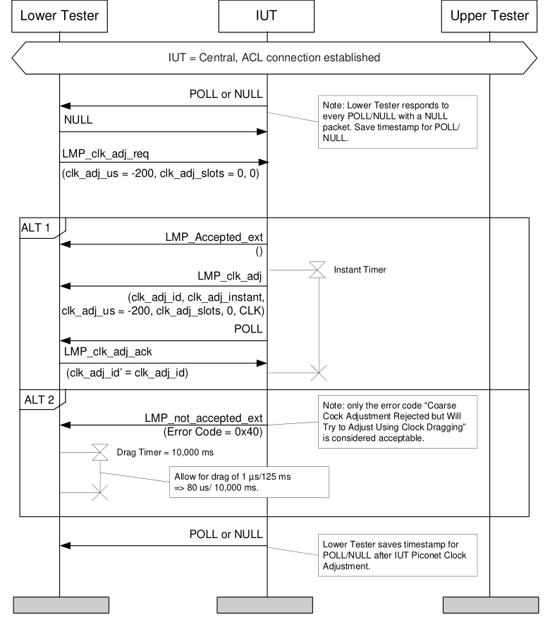

**Figure 4.147: BB/XCB/BV-06-C [Central Handles Request for negative Coarse Clock Adjustment]**

a) The Lower Tester waits for a POLL or NULL and saves Timestamp1 for p0. b) The Lower Tester sends LMP_clk_adj_req to the IUT. c) The IUT may accept the request or deny it and instead attempt to change CLK by dragging.
i. If the IUT accepts the request, then it will send LMP_accepted_ext to the Lower Tester, followed by LMP_clk_adj. The Lower Tester responds with LMP_clk_adj_ack and changes its clock according to protocol.
ii. If the IUT rejects the request, then it may send an LMP_not_accepted PDU with the error code = Coarse Clock Adjustment Rejected but Will Try to Adjust Using Clock Dragging (0x40). In this case, the Lower Tester waits for a time corresponding to the maximum allowed drag rate.
iii. If the IUT rejects the request with any other error code, then this test will fail.
or NULL. e) The Lower Tester calculates the IUT clock change as (Timestamp2 – Timestamp1) MOD 1250.
• Expected Outcome
Pass verdict
The IUT sends LMP_accepted_ext followed by LMP_clk_adj or LMP_not_accepted_ext with error code = Coarse Clock Adjustment Rejected but Will Try to Adjust Using Clock Dragging (0x40).
If the IUT performed a Coarse Clock Adjustment, then (Timestamp2 – Timestamp1) MOD 1250 = 200 µs ±5%.
Else if the IUT performed clock dragging, then (Timestamp2 – Timestamp1) MOD 1250 ≤ -40 µs and ≥ - 400 µs.
If the IUT performed a Coarse Clock Adjustment, then clk_adj_instant = CLKp + X, where CLKp is CLK of the first LMP_clk_adj packet, and X is ≥ 12 slots and < 12 hours.
The IUT enabled AFH as part of the connection establishment and kept it enabled throughout the test. Throughout the test, channels 0, 24, and 78 were marked as unused in the AFH_channel_map.
• Notes
If the IUT uses Clock Dragging, then it is allowed to drag the clock much slower than the maximum rate of 5 µs/125 ms. This test assumes that no implementation would drag the clock slower than 0.5 µs/125 ms. The maximum rate of 5 µs/125 ms corresponds to 400 µs / 10 s. The test is configured to change the clock only 200 µs. Allow for a maximum natural drift of 20 PPM during 10 s which is 200 µs. If natural drift and drag work in the same direction, then we can observe a total drag of < 400 µs / 10 s.
BB/XCB/BV-07-C [Central handles LMP_clk_adj_ack with correct clk_adj_id]
• Test Purpose
Verify that the IUT as Central stops broadcasting LMP_clk_adj when it receives LMP_clk_adj_ack with the correct clk_adj_id.
• Reference
[1] 8.6.10.1
• Initial Condition
Lower Tester: Configured as Peripheral in state CONNECTION (active mode, ACL link).
Upper Tester: Not involved after connection has been established.
IUT: Configured as Central in state CONNECTION (active mode, ACL link). The IUT is configured to accept PCA requests.
• Test Procedure

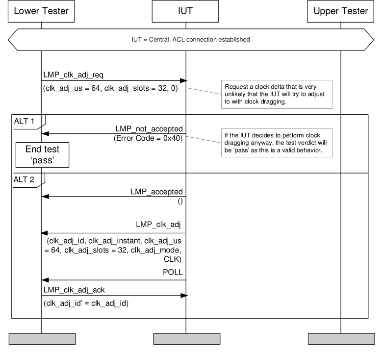

**Figure 4.148: BB/XCB/BV-07-C [Central handles LMP_clk_adj_ack with correct clk_adj_id]**

a) The Lower Tester sends LMP_clk_adj_req to the IUT. b) The IUT may accept the request or deny it and instead attempt to change CLK by dragging.
i. If the IUT accepts the coarse clock adjustment, then it will send LMP_accepted to the Lower Tester.
ii. If the IUT rejects the coarse clock adjustment but indicates that it will perform clock dragging, then this test is terminated with a ‘pass’ verdict.
iii. If the IUT rejects the request with any other error code, then this test will fail.
c) The IUT sends LMP_clk_adj. d) When polled, the Lower Tester responds with LMP_clk_adj_ack with clk_adj_id set to the same
value as in LMP_clk_adj. e) The Lower Tester monitors the IUT transmissions for 1 s. No more LMP_clk_adj should be
received.
• Expected Outcome
Pass verdict
Alternative 1: The IUT responds to LMP_clk_adj_req with LMP_not_accepted with error code = Coarse Clock Adjustment Rejected but Will Try to Adjust Using Clock Dragging (0x40).
Alternative 2: The IUT sends LMP_accepted followed by LMP_clk_adj. The IUT will stop sending LMP_clk_adj when it has received an LMP_clk_adj_ack packet with the correct clk_adj_id. Central sets clk_adj_instant = CLKp + X, where CLKp is CLK of the first LMP_clk_adj packet, and X is ≥ 12 slots and < 12 hours.
The IUT enabled AFH as part of the connection establishment and kept it enabled throughout the test. Throughout the test, channels 0, 24, and 78 were marked as unused in the AFH_channel_map.
BB/XCB/BV-08-C [Central handles LMP_clk_adj_ack with incorrect clk_adj_id]
• Test Purpose
Verify that the IUT as Central keeps polling and broadcasting LMP_clk_adj when it receives LMP_clk_adj_ack with an incorrect clk_adj_id.
• Reference
[1] 8.6.10.1
• Initial Condition
Lower Tester: Configured as Peripheral in state CONNECTION (active mode, ACL link).
Upper Tester: Not involved after connection has been established.
IUT: Configured as Central in state CONNECTION (active mode, ACL link). The IUT is configured to accept PCA requests.
• Test Procedure

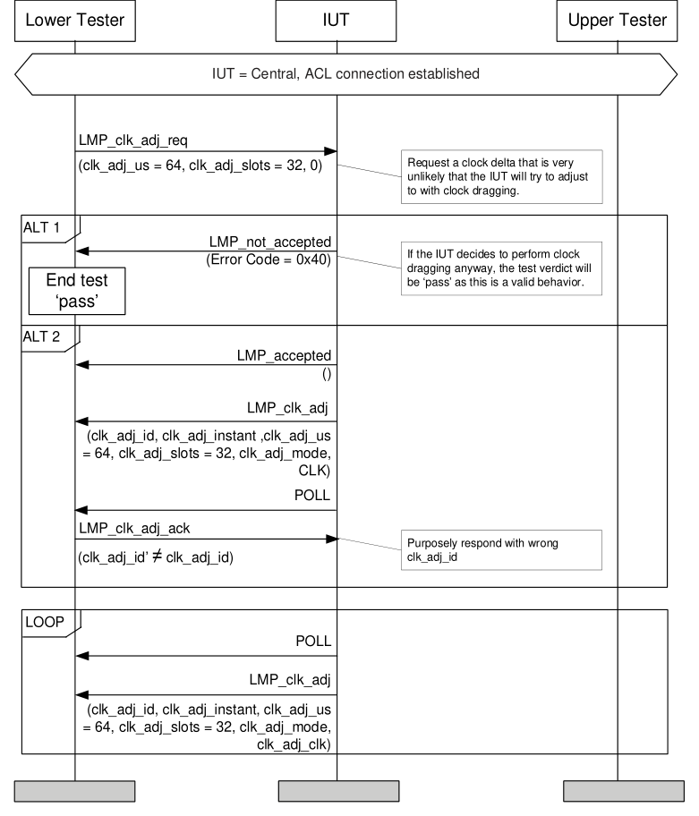

**Figure 4.149: BB/XCB/BV-08-C [Central handles LMP_clk_adj_ack with incorrect clk_adj_id]**

a) The Lower Tester sends LMP_clk_adj_req to the IUT. b) The IUT may accept the request or deny it and instead attempt to change CLK by dragging.
i. If the IUT accepts the coarse clock adjustment, then it will send LMP_accepted to the Lower Tester.
ii. If the IUT rejects the coarse clock adjustment but indicates that it will perform clock dragging, then this test is terminated with a ‘pass’ verdict.
iii. If the IUT rejects the request with any other error code, then this test will fail.
c) The IUT sends LMP_clk_adj. d) When polled, the Lower Tester responds with LMP_clk_adj_ack with clk_adj_id set to a value
different from the value sent in LMP_clk_adj.
LMP_clk_adj. All LMP_clk_adj have the same values for clk_adj_id, clk_adj_instant, clk_adj_us and clk_adj_slots.
• Expected Outcome
Pass verdict
Alternative 1: The IUT responds to LMP_clk_adj_req with LMP_not_accepted with error code = Coarse Clock Adjustment Rejected but Will Try to Adjust Using Clock Dragging (0x40).
Alternative 2: The IUT sends LMP_accepted followed by LMP_clk_adj. After the tester sends LMP_clk_adj_ack with the incorrect clk_adj_id, the IUT will keep polling and sending LMP_clk_adj.
All LMP_clk_adj have the same values for clk_adj_id, clk_adj_instant, clk_adj_us and clk_adj_slots.
The IUT enabled AFH as part of the connection establishment and kept it enabled throughout the test. Throughout the test, channels 0, 24, and 78 were marked as unused in the AFH_channel_map.
If the IUT performed a Coarse Clock Adjustment, then clk_adj_instant = CLKp + X, where CLKp is CLK of the first LMP_clk_adj packet, and X is ≥ 12 slots and < 12 hours.
BB/XCB/BV-09-C [Central Recovery Mode, continuous LMP_clk_adj broadcast]
• Test Purpose
Verify that the IUT as Central keeps broadcasting LMP_clk_adj when it does not receive LMP_clk_adj_ack from a Peripheral.
• Reference
[1] 8.6.10.2
• Initial Condition
Lower Tester: Configured as Peripheral in state CONNECTION (active mode, ACL link).
Upper Tester: Not involved after connection has been established.
IUT: Configured as Central in state CONNECTION (active mode, ACL link). The IUT is configured to accept PCA requests.
• Test Procedure

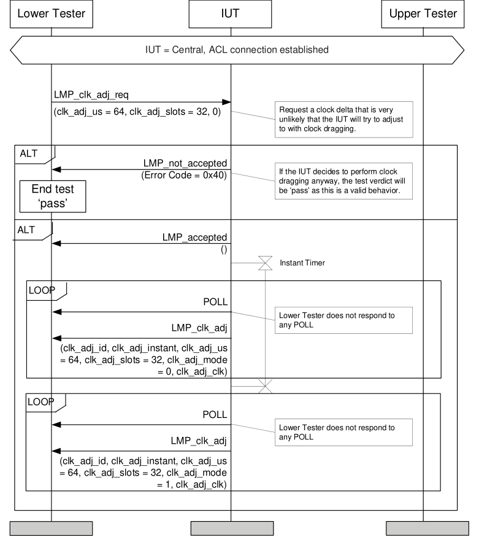

**Figure 4.150: BB/XCB/BV-09-C [Central Recovery Mode, continuous LMP_clk_adj broadcast]**

a) The Lower Tester sends LMP_clk_adj_req to the IUT. b) The IUT may accept the request or deny it and instead attempt to change CLK by dragging.
i. If the IUT accepts the coarse clock adjustment, then it will send LMP_accepted to the Lower Tester.
ii. If the IUT rejects the coarse clock adjustment but indicates that it will perform clock dragging, then this test is terminated with a ‘pass’ verdict.
iii. If the IUT rejects the request with any other error code, then this test will fail.
c) The IUT sends LMP_clk_adj with clk_adj_mode = 0. The IUT may poll. The Lower Tester does
not respond. d) clk_adj_instant occurs.
identical to the initial LMP_clk_adj. f) The Lower Tester does not respond to polls.
• Expected Outcome
Pass verdict
Alternative 1: The IUT responds to LMP_clk_adj_req with LMP_not_accepted with error code = Coarse Clock Adjustment Rejected but Will Try to Adjust Using Clock Dragging (0x40).
Alternative 2: The IUT sends LMP_accepted followed by LMP_clk_adj and POLL packets. clk_adj_mode is set to 0 before clk_adj_instant and 1 after clk_adj_instant. All other parameters except clk_adj_clk (CLK[27:2]) remain unchanged.
The IUT enabled AFH as part of the connection establishment and kept it enabled throughout the test. Throughout the test, channels 0, 24, and 78 were marked as unused in the AFH_channel_map.
If the IUT performed a Coarse Clock Adjustment, clk_adj_instant = CLKp + X, where CLKp is CLK of the first LMP_clk_adj packet, and X is ≥ 12 slots and < 12 hours.
BB/XCB/BV-10-C [Central Recovery Mode, Sync Train Transmission]
• Test Purpose
Verify that the IUT as Central sends Sync Train on RF Channel 0, 24, and 78 when it does not receive LMP_clk_adj_ack from a Peripheral.
• Reference
[1] 8.6.10.2
• Initial Condition
Lower Tester: Configured as Peripheral in state CONNECTION (active mode, ACL link). The Lower Tester is configured to receive sync train transmissions on RF channels 0, 24, and 78.
Upper Tester: Not involved after connection has been established.
IUT: Configured as Central in state CONNECTION (active mode, ACL link). The IUT is configured to accept PCA requests.
• Test Procedure

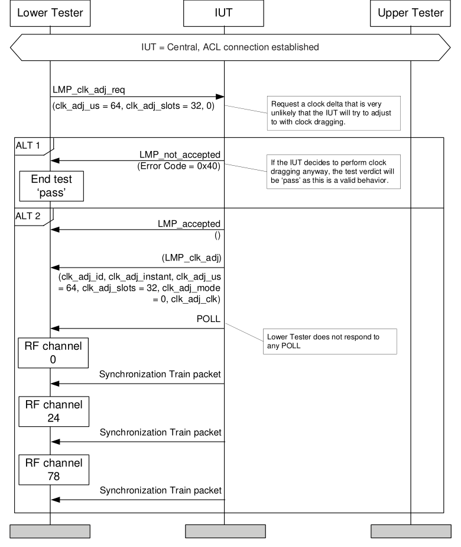

**Figure 4.151: BB/XCB/BV-10-C [Central Recovery Mode, Sync Train Transmission]**

a) The Lower Tester sends LMP_clk_adj_req to the IUT. b) The IUT may accept the request or deny it and instead attempt to change CLK by dragging.
i. If the IUT accepts the coarse clock adjustment, then it sends LMP_accepted to the Lower Tester.
ii. If the IUT rejects the coarse clock adjustment but indicates that it will perform clock dragging, then this test is terminated with a ‘pass’ verdict.
iii. If the IUT rejects the request with any other error code, then this test will fail.
c) The IUT sends LMP_clk_adj. The IUT may send POLL packets. The tester does not respond. d) The Lower Tester listens to each of RF channel 0, 24, and 78 for up to 1 s. e) The IUT sends Synchronization Train packets.
• Expected Outcome
Pass verdict
Alternative 1: The IUT responds to LMP_clk_adj_req with LMP_not_accepted with error code = Coarse Clock Adjustment Rejected but Will Try to Adjust Using Clock Dragging (0x40).
Alternative 2: The IUT sends LMP_accepted followed by LMP_clk_adj.
The IUT sends Synchronization Train PDU on RF channel 0.
The IUT sends Synchronization Train PDU on RF channel 24.
The IUT sends Synchronization Train PDU on RF channel 78.
The IUT enabled AFH as part of the connection establishment and kept it enabled throughout the test. Throughout the test, channels 0, 24, and 78 were marked as unused in the AFH_channel_map.
If the IUT performed a Coarse Clock Adjustment, then clk_adj_instant = CLKp + X, where CLKp is CLK of the first LMP_clk_adj packet, and X is ≥ 12 slots and < 12 hours.
BB/XCB/BV-11-C [Peripheral Recovery Mode, Sync Train Scan, LMP_clk_adj]
• Test Purpose
Verify that the IUT as Peripheral scans for Sync Train on RF Channel 0, 24, and 78 when it does not receive any communications from the Central. The Lower Tester will broadcast LMP_clk_adj. Verify that the IUT responds to POLL with LMP_clk_adj_ack.
• Reference
[1] 8.6.10.2
• Initial Condition
Lower Tester: Configured as Central in state CONNECTION (active mode, ACL link). The Lower Tester is configured to transmit sync train on RF channels 0, 24, and 78. The Bluetooth clock of the Lower Tester is chosen to NOT include clock wrap-around (227-1 to 0) during the test procedure.
Upper Tester: Not involved after connection has been established.
IUT: Configured as Peripheral in state CONNECTION (active mode, ACL link).
• Test Procedure

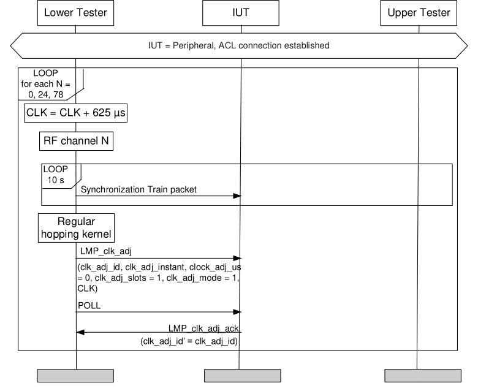

**Figure 4.152: BB/XCB/BV-11-C [Peripheral Recovery Mode, Sync Train Scan, LMP_clk_adj]**

a) Set N = 0. b) The Lower Tester changes CLK one slot. c) The Lower Tester sends Synchronization Train packets on RF channel N for 10 s. d) The Lower Tester switches back to regular BT hopping kernel. e) The Lower Tester sends LMP_clk_adj and polls the IUT until the IUT responds or LSTO expires. f) The IUT responds with LMP_clk_adj_ack with clk_adj_id being the same as in LMP_clk_adj. g) Set N = 24. Repeat steps b) to f). h) Set N = 78. Repeat steps b) to f).
• Expected Outcome
Pass verdict
The IUT responds to POLL with LMP_clk_adj_ack with clk_adj_id being the same as in LMP_clk_adj after sync train on RF channels 0, 24, and 78.
BB/XCB/BV-12-C [Peripheral Recovery Mode, Sync Train Scan, No LMP_clk_adj]
• Test Purpose
Verify that the IUT as Peripheral scans for Sync Train on RF Channel 0, 24, and 78 when it does not receive any communications from the Central. The Lower Tester will not broadcast LMP_clk_adj. Verify that the IUT responds to POLL with NULL and not LMP_clk_adj_ack.
• Reference
[1] 8.6.10.2
• Initial Condition
Lower Tester: Configured as Central in state CONNECTION (active mode, ACL link). The Lower Tester is configured to transmit sync train on RF channels 0, 24, and 78. The Bluetooth clock of the Lower Tester is chosen to NOT include clock wrap-around (227-1 to 0) during the test procedure.
Upper Tester: Not involved after connection has been established.
IUT: Configured as Peripheral in state CONNECTION (active mode, ACL link).
• Test Procedure

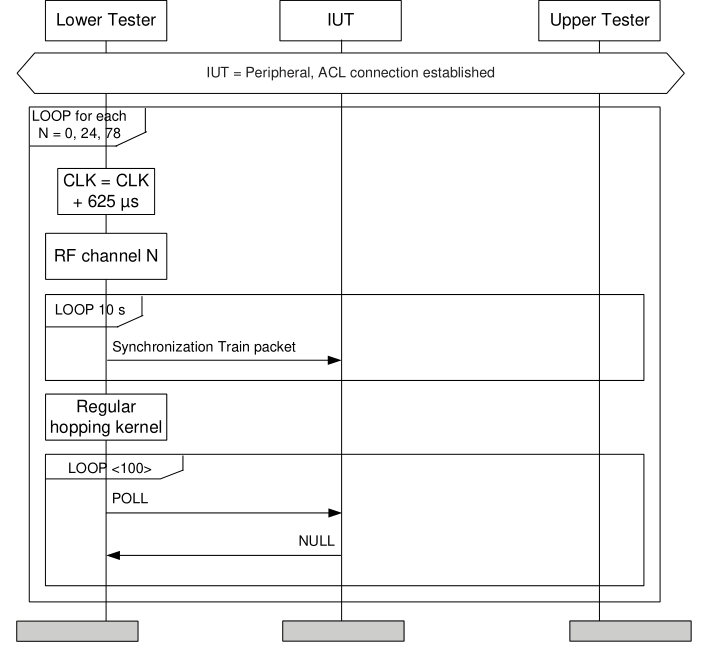

**Figure 4.153: BB/XCB/BV-12-C [Peripheral Recovery Mode, Sync Train Scan, No LMP_clk_adj]**

a) Set N = 0. b) The Lower Tester changes CLK one slot. c) The Lower Tester sends Synchronization Train PDU on RF channel N for 10 s. d) The Lower Tester switches back to regular BT hopping kernel. e) The Lower Tester sends POLL packet in every Central slot at least 100 times. f) The IUT responds to POLL packets with a NULL packet. g) Set N = 24. Repeat steps b)–f). h) Set N = 78. Repeat steps b)–f).
• Expected Outcome
Pass verdict
The IUT responds to at least 95% of POLL packets with a NULL packet after sync train on RF channels 0, 24, and 78.
• Test Purpose
Verify that the IUT as Peripheral changes CLKN immediately after receiving a Coarse Clock Adjustment whose clk_adj_instant has passed in time.
• Reference
[1] 8.6.10.1
[10] 4.1.14.1
• Initial Condition
Lower Tester: Configured as Central in state CONNECTION (active mode, ACL link). The Bluetooth clock of the Lower Tester is chosen to NOT include clock wrap-around (227-1 to 0) during the test procedure.
Upper Tester: Not involved after connection has been established.
IUT: Configured as Peripheral in state CONNECTION (active mode, ACL link).
• Test Procedure

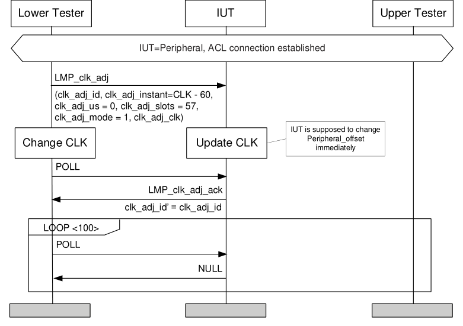

**Figure 4.154: BB/XCB/BV-13-C [Peripheral handles Coarse Clock Adjustment received after Instant]**

a) The Lower Tester sends LMP_clk_adj with clk_adj_instant = CLK[27:1] – 60 slots, clk_adj_us = 0,
clk_adj_slots = 57 and clk_adj_mode = 1. This means that the instant has passed when the IUT receives the command. b) The Lower Tester adjusts its own CLK + 57 slots. c) The IUT immediately sets CLKnew to the value it would have had if it had performed clock
adjustment at the instant by adding the time elapsed between the instant in the command and its current CLKold. d) The Lower Tester polls the IUT on CLKnew until the IUT responds with an LMP_clk_adj_ack or
LMP_clk_adj. f) The Lower Tester sends POLL packet in every Central slot at least 100 times. g) The IUT responds to POLL packets with a NULL packet.
• Expected Outcome
Pass verdict
After first POLL, the IUT responds with LMP_clk_adj_ack with clk_adj_id set to the same value as in LMP_clk_adj. For subsequent POLL packets, the IUT responds to at least 95% with a NULL packet.
• Notes
The purpose of this test is to simulate a very rare event where a Peripheral can receive a packet from its Central even though the two devices operate on different clocks. For this to happen, the old and new CLK would have to overlap in the use of RF channel and whitening code. It is not generally possible to force a situation like this without having access to the internal functions of the IUT. Therefore, the test is initiated with both the tester and the IUT being on the same CLK. The Lower Tester sends LMP_clk_adj with parameters suggesting that the IUT has completely missed a PCA, and by random chance receives the PCA without having changed its clock. The trigger LMP must be received before the IUT would otherwise have started scanning for Sync Train packets. Once the IUT has received an LMP_clk_adj packet with parameters suggesting that the instant has already passed, it is required by specification to change its clock to the new CLK immediately. At this point the Lower Tester will also update CLK to be able to verify that the IUT is correctly synchronized.
BB/XCB/BV-14-C [Peripheral protection against invalid adjustments]
• Test Purpose
Verify that the IUT as Peripheral does not change CLK if it receives LMP_clk_adj with invalid adjustment parameters.
• Reference
[1] 8.6.10.1
• Initial Condition
Lower Tester: Configured as Central in state CONNECTION (active mode, ACL link). The Bluetooth clock of the Lower Tester is chosen to NOT include clock wrap-around (227-1 to 0) during the test procedure.
Upper Tester: Not involved after connection has been established.
IUT: Configured as Peripheral in state CONNECTION (active mode, ACL link).
• Test Procedure

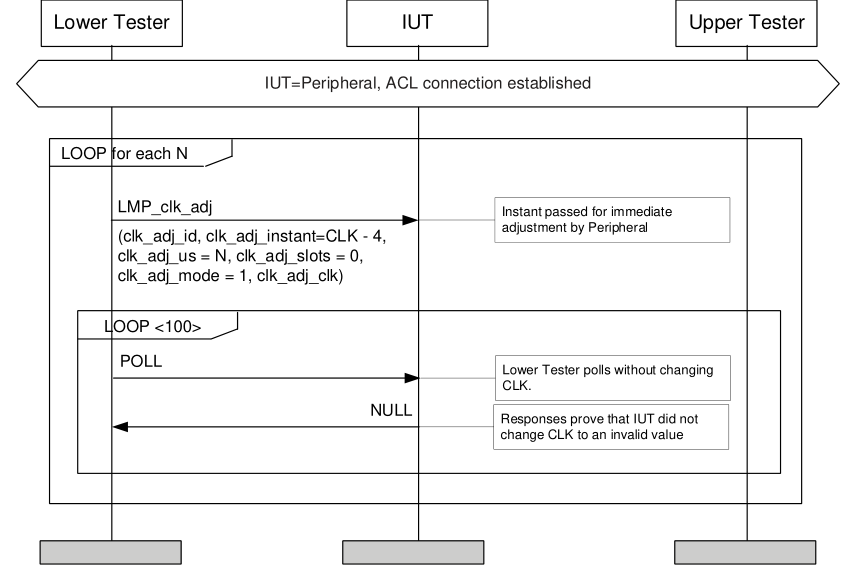

**Figure 4.155: BB/XCB/BV-14-C [Peripheral protection against invalid adjustments]**

a) Set N = –1023. b) The Lower Tester sends LMP_clk_adj with clk_adj_instant = CLK[27:1] – 4 slots, clk_adj_us = N,
clk_adj_slots = 0 and clk_adj_mode = 1. (The instant has passed when the IUT receives the command, so an IUT that will fail this test would update peripheral_clock_offset immediately.) c) The Lower Tester sends a POLL packet in every Central slot for at least 100 times. d) The IUT responds to poll. The IUT does not have updated peripheral_clock_offset to the invalid
value. e) Set N = –625. Repeat steps b)–d). f) Set N = 625. Repeat steps b)–d). g) Set N = 1023. Repeat steps b)–d).
• Expected Outcome
Pass verdict
The IUT responds to at least 95% of POLL packets with a NULL packet.
BB/XCB/BV-15-C [Peripheral protection against greater than maximum adjustment]
• Test Purpose
Verify that the IUT as Peripheral does not change CLK if it receives LMP_clk_adj with invalid positive adjustment parameters that would cause a clock adjustment greater than allowed.
• Reference
[1] 8.6.10.1
• Initial Condition
Lower Tester:  Configured as Central in state CONNECTION (active mode, ACL link). The Bluetooth
clock of the Lower Tester is chosen to NOT include clock wrap-around (227-1 to 0) during the test procedure.
Upper Tester: Not involved after connection has been established.
IUT: Configured as Peripheral in state CONNECTION (active mode, ACL link).
• Test Procedure

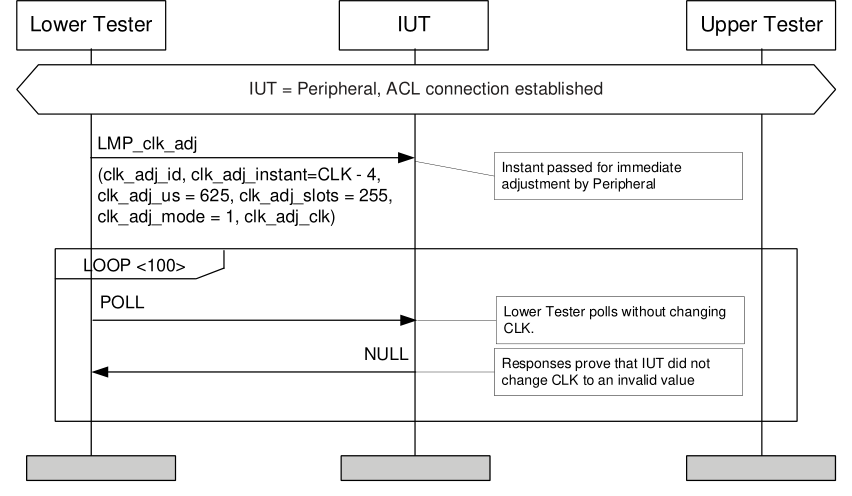

**Figure 4.156: BB/XCB/BV-15-C [Peripheral protection against greater than maximum adjustment]**

a) The Lower Tester sends LMP_clk_adj with clk_adj_instant = CLK[27:1] – 4 slots, clk_adj_us =
625, clk_adj_slots = 255 and clk_adj_mode = 1. (The instant has passed when the IUT receives the command, so an IUT that will fail this test would update peripheral_clock_offset immediately.) b) The Lower Tester sends a POLL packet in every Central slot for at least 100 times. c) The IUT responds to poll. The IUT does not have updated peripheral_clock_offset to the invalid
value.
• Expected Outcome
Pass verdict
The IUT responds to at least 95% of POLL packets with a NULL packet.
BB/XCB/BV-16-C [Central rejection of invalid adjustment requests]
• Test Purpose
Verify that the IUT as Central rejects LMP_clk_adj_req with invalid adjustment parameters.
• Reference
[1] 8.6.10.1
• Initial Condition
Lower Tester: Configured as Peripheral in state CONNECTION (active mode, ACL link).
Upper Tester: Not involved after connection has been established.
IUT: Configured as Central in state CONNECTION (active mode, ACL link).
• Test Procedure

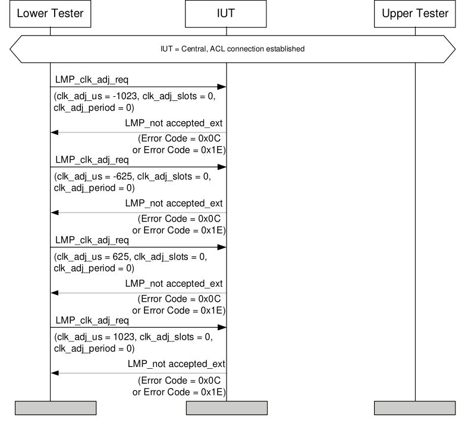

**Figure 4.157: BB/XCB/BV-16-C [Central rejection of invalid adjustment requests]**

a) The Lower Tester sends LMP_clk_adj_req with clk_adj_us = -1023, clk_adj_slots = 0. b) The IUT responds with LMP_not_accepted_ext with error code = COMMAND DISALLOWED
(0x0C) OR the IUT responds with LMP_not_accepted_ext with error code = Invalid LMP Parameters (0x1E). c) The Lower Tester sends LMP_clk_adj_req with clk_adj_us = -625, clk_adj_slots = 0. d) The IUT responds with LMP_not_accepted_ext with error code = COMMAND DISALLOWED
(0x0C) OR the IUT responds with LMP_not_accepted_ext with error code = Invalid LMP Parameters (0x1E). e) The Lower Tester sends LMP_clk_adj_req with clk_adj_us = 625, clk_adj_slots = 0. f) The IUT responds with LMP_not_accepted_ext with error code = COMMAND DISALLOWED (0x0C) OR the IUT responds with LMP_not_accepted_ext with error code = Invalid LMP Parameters (0x1E).
g) The Lower Tester sends LMP_clk_adj_req with clk_adj_us = 1023, clk_adj_slots = 0. h) The IUT responds with LMP_not_accepted_ext with error code = COMMAND DISALLOWED
(0x0C) OR the IUT responds with LMP_not_accepted_ext with error code = Invalid LMP Parameters (0x1E).
• Expected Outcome
Pass verdict
The IUT responds with LMP_not_accepted_ext with error code = COMMAND DISALLOWED (0x0C) OR the IUT responds with LMP_not_accepted_ext with error code = Invalid LMP Parameters (0x1E) to all the requests with invalid parameters.
The IUT enabled AFH as part of the connection establishment and kept it enabled throughout the test. Throughout the test, channels 0, 24, and 78 were marked as unused in the AFH_channel_map.
BB/XCB/BV-17-C [Central rejection of invalid adjustment request greater than maximum]
• Test Purpose
Verify that the IUT as Central rejects LMP_clk_adj_req with invalid positive adjustment parameters that would cause a clock adjustment greater than allowed.
• Reference
[1] 8.6.10.1
• Initial Condition
Lower Tester: Configured as Peripheral in state CONNECTION (active mode, ACL link).
Upper Tester: Not involved after connection has been established.
IUT: Configured as Central in state CONNECTION (active mode, ACL link).
• Test Procedure

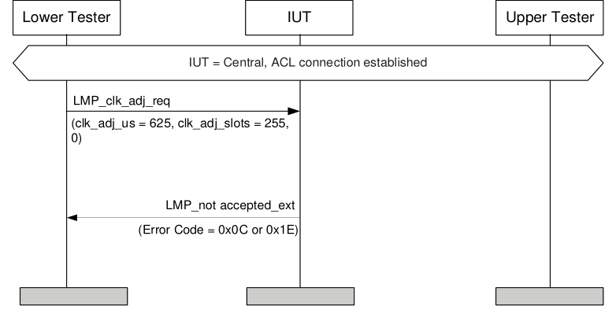

**Figure 4.158: BB/XCB/BV-17-C [Central rejection of invalid adjustment request greater than maximum]**

a) The Lower Tester sends LMP_clk_adj_req with clk_adj_us = 625, clk_adj_slots = 255. b) The IUT responds with LMP_not_accepted_ext with error code = COMMAND DISALLOWED
(0x0C) OR the IUT responds with LMP_not_accepted_ext with error code = Invalid LMP Parameters (0x1E).
• Expected Outcome
Pass verdict
The IUT responds with LMP_not_accepted_ext with error code = COMMAND DISALLOWED (0x0C) OR the IUT responds with LMP_not_accepted_ext with error code = Invalid LMP Parameters (0x1E) to all the requests with invalid parameters.
The IUT enabled AFH as part of the connection establishment and kept it enabled throughout the test. Throughout the test, channels 0, 24, and 78 were marked as unused in the AFH_channel_map.
BB/XCB/BV-18-C [Central handling of request for updating clk_adj_period only]
• Test Purpose
Verify that the IUT as Central accepts a request to update only clk_adj_period without initiating any clock adjustment.
• Reference
[10] 4.1.14.2
• Initial Condition
Lower Tester:  Configured as Peripheral in state CONNECTION (active mode, ACL link).
Upper Tester: Not involved after connection has been established.
IUT: Configured as Central in state CONNECTION (active mode, ACL link).
• Test Procedure

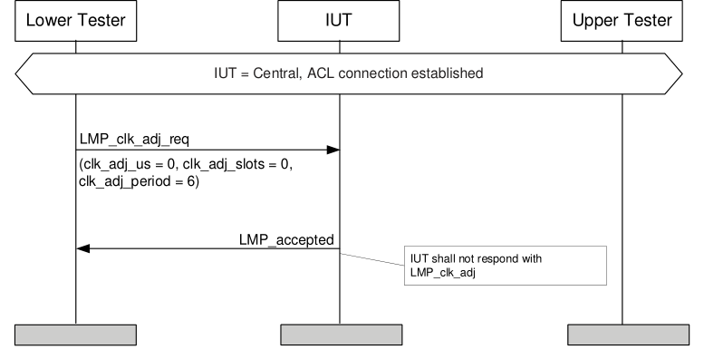

**Figure 4.159: BB/XCB/BV-18-C [Central handling of request for updating clk_adj_period only]**

a) The Lower Tester sends LMP_clk_adj_req to the IUT with clk_adj_us = 0, clk_adj_slots = 0 and
clk_adj_period = 6. b) The IUT responds with LMP_accepted.
• Expected Outcome
Pass verdict
The IUT responds with LMP_accepted.
The IUT enabled AFH as part of the connection establishment and kept it enabled throughout the test. Throughout the test, channels 0, 24, and 78 were marked as unused in the AFH_channel_map.
BB/XCB/BV-19-C [Central rejection of LMP_clk_adj_req during Role Switch]
• Test Purpose
Verify that the IUT as Central rejects a Coarse Clock Adjustment request during role switch before the instant.
• Reference
[1] 8.6.10.1
[10] 4.1.14.1
• Initial Condition
Lower Tester: Configured as Peripheral in state CONNECTION (active mode, ACL link).
Upper Tester: Not involved after connection has been established.
IUT: Configured as Central in state CONNECTION (active mode, ACL link).
• Test Procedure

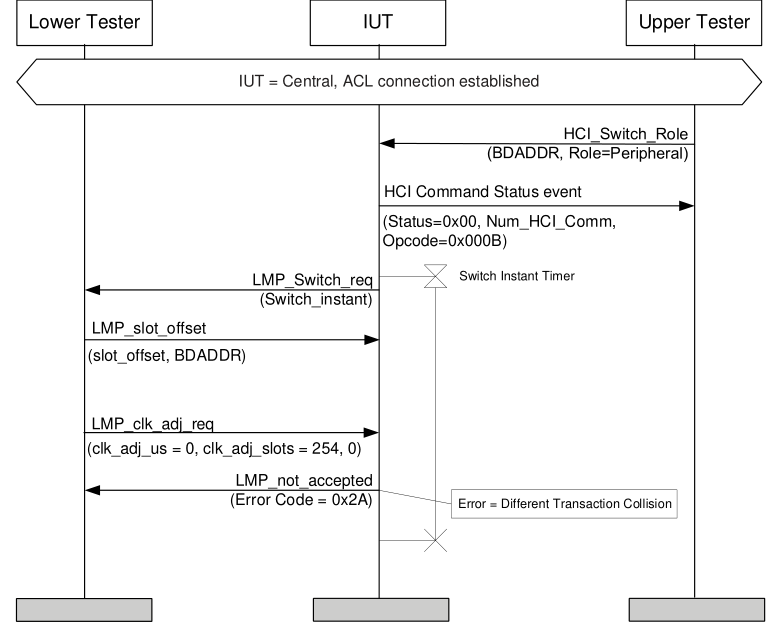

**Figure 4.160: BB/XCB/BV-19-C [Central rejection of LMP_clk_adj_req during Role Switch]**

a) The Upper Tester initiates a role switch. b) The Lower Tester waits for LMP_Switch_req. c) The Lower Tester sends LMP_slot_offset. d) Before switch instant, the Lower Tester sends LMP_clk_adj_req. e) The IUT rejects the request with error code = Different Transaction Collision (0x2A).
• Expected Outcome
Pass verdict
The IUT rejects LMP_clk_adj_req with error code = Different Transaction Collision (0x2A).
The IUT enabled AFH as part of the connection establishment and kept it enabled throughout the test. Throughout the test, channels 0, 24, and 78 were marked as unused in the AFH_channel_map.
BB/XCB/BV-20-C [Rejection of procedures with time_control_flag during coarse adjust]
• Test Purpose
Verify that the IUT as Central rejects procedures involving time_control_flag while performing a coarse clock adjustment.
• Reference
[1] 8.6.10.1
[10] 4.1.14.1
• Initial Condition
Lower Tester: Configured as Central in state CONNECTION (active mode, ACL link).
Upper Tester: Not involved after connection has been established.
IUT: Configured as Central in state CONNECTION (active mode, ACL link). The IUT is configured to accept PCA requests.
• Test Procedure

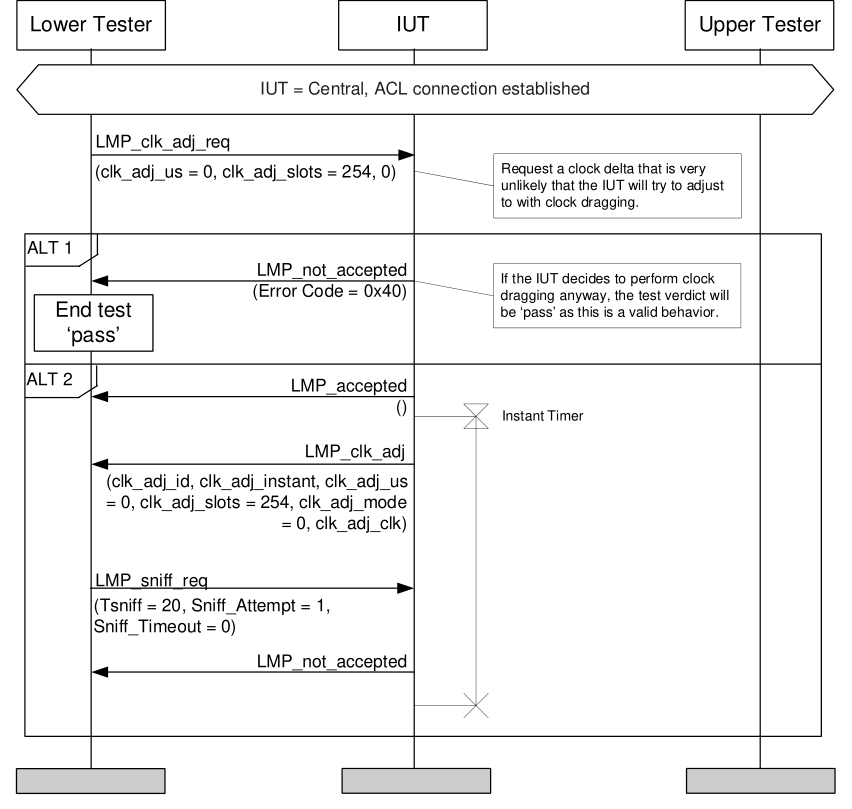

**Figure 4.161: BB/XCB/BV-20-C [Rejection of procedures with time_control_flag during coarse adjust]**

a) The Lower Tester sends LMP_clk_adj_req to the IUT. b) The IUT may accept the request or deny it and instead attempt to change CLK by dragging.
i. If the IUT accepts the coarse clock adjustment, then it will send LMP_accepted to the Lower Tester.
ii. If the IUT rejects the coarse clock adjustment but indicates that it will perform clock dragging, then this test is terminated with a ‘pass’ verdict.
iii. If the IUT rejects the request with any other error code, then this test will fail.
c) The Lower Tester waits for the IUT to send LMP_clk_adj. This indicates that the IUT has started a
coarse clock adjustment. d) The Lower Tester sends LMP_sniff_req before the instant has passed. e) The IUT rejects the sniff request.
• Expected Outcome
Pass verdict
Alternative 1: The IUT responds to LMP_clk_adj_req with LMP_not_accepted with error code = Coarse Clock Adjustment Rejected but Will Try to Adjust Using Clock Dragging (0x40).
Alternative 2: The IUT sends LMP_accepted followed by LMP_clk_adj and polls. The IUT rejects a sniff request while performing a coarse clock adjustment.
The IUT enabled AFH as part of the connection establishment and kept it enabled throughout the test. Throughout the test, channels 0, 24, and 78 were marked as unused in the AFH_channel_map.
If the IUT performed a Coarse Clock Adjustment, clk_adj_instant = CLKp + X, where CLKp is CLK of the first LMP_clk_adj packet, and X is ≥ 12 slots and < 12 hours.

### 4.20 Fragmented L2CAP Header

BB/PROT/FLH/BV-01-C [Transmit Fragmented L2CAP Header]
• Test Purpose
Verify that the IUT correctly transmits packets with fragmented L2CAP headers.
• Reference
[11] 5.4.2
[15] 7.2.1
• Initial Condition
- The IUT has a connection to the Lower Tester (active mode, ACL).
• Test Procedure

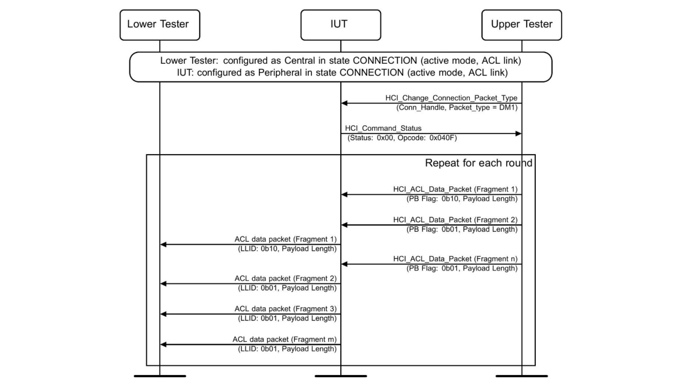

**Figure 4.162: BB/PROT/FLH/BV-01-C [Transmit Fragmented L2CAP Header]**

a) The Upper Tester sends HCI Change Connection Packet Type command to limit the packet types
used by the IUT to DM1.
For each round 1–6 based on Table 4.5:
b) The Upper Tester sends a L2CAP frame to the IUT with the start fragment containing a Payload
length according to Table 4.5 and the rest in a continue fragment.

| Round |  |  |  | Payload Length |  |
| --- | --- | --- | --- | --- | --- |
|  |  |  |  | (octets) (Step b) |  |
|  | 1 |  | 0 |  |  |
|  | 2 |  | 1 |  |  |
|  | 3 |  | 2 |  |  |
|  | 4 |  | 3 |  |  |
|  | 5 |  | 4 |  |  |
|  | 6 |  | 5 |  |  |

Table 4.5: Payload length for each round
c) The Lower Tester receives the unaltered L2CAP start and zero or more continue fragments.
Note: The IUT can transmit packets at any time after the first packet it receives, provided that it transmits at least one after the last packet it receives.
• Expected Outcome
Pass verdict

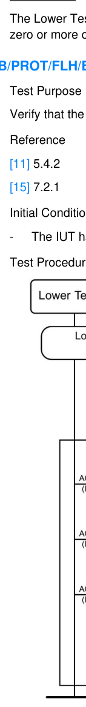

**Figure 4.163: BB/PROT/FLH/BV-02-C [Receive Fragmented L2CAP Header]**

used by the IUT to DM1.
For each round 1–6 based on Table 4.5:
b) The Lower Tester sends a L2CAP frame to the IUT with the start fragment containing a Payload
length according to Table 4.5 and the rest in a continue fragment. c) The Upper Tester receives the unaltered L2CAP start and zero or more continue fragments.
Note: The IUT can transmit packets at any time after the first packet it receives, provided that it transmits at least one after the last packet it receives.
• Expected Outcome
Pass verdict
The Upper Tester receives the unaltered L2CAP frames, each with one start fragment followed by zero or more continue fragments.

## 5 Test case mapping

The Test Case Mapping Table (TCMT) maps test cases to specific requirements in the ICS. The IUT is tested in all roles for which support is declared in the ICS document.
The columns for the TCMT are defined as follows:
Item: Contains a logical expression based on specific entries from the associated ICS document. Contains a logical expression (using the operators AND, OR, NOT as needed) based on specific entries from the applicable ICS document(s). The entries are in the form of y/x references, where y corresponds to the table number and x corresponds to the feature number as defined in the ICS document for BB [6].
Feature: A brief, informal description of the feature being tested.
Test Case(s): The applicable test case identifiers are required for Bluetooth Qualification if the corresponding y/x references defined in the Item column are supported. Further details about the function of the TCMT are elaborated in [8].
For the purpose and structure of the ICS/IXIT, refer to [8].

|  | Item |  |  | Feature |  |  | Test Case(s) |  |
| --- | --- | --- | --- | --- | --- | --- | --- | --- |
| BB 1/1 |  |  |  |  |  | BB/PHYS/FRE/BV-01-C BB/PHYS/TRX/BV-01-C BB/PHYS/TRX/BV-03-C BB/PHYS/TRX/BV-04-C BB/PROT/COD/BV-11-C BB/PROT/COD/BV-12-C BB/PROT/COD/BV-16-C BB/PROT/ARQ/BV-01-C BB/PROT/ARQ/BV-02-C BB/PROT/ARQ/BV-03-C BB/PROT/ARQ/BV-04-C BB/PROT/ARQ/BV-05-C BB/PROT/ARQ/BV-06-C BB/PROT/ARQ/BV-08-C BB/PROT/ARQ/BV-10-C BB/PROT/ARQ/BV-14-C BB/PROT/ARQ/BV-15-C BB/PROT/ARQ/BV-16-C BB/PROT/ARQ/BV-18-C BB/PROT/ARQ/BV-19-C BB/PROT/ARQ/BV-23-C BB/PROT/CON/BV-01-C BB/PROT/CON/BV-02-C BB/PROT/CON/BV-03-C BB/PROT/CON/BV-05-C BB/PROT/CON/BV-08-C BB/PROT/FLH/BV-01-C BB/PROT/FLH/BV-02-C BB/PROT/CON/BV-15-C BB/PROT/CON/BV-16-C BB/PROT/CON/BV-17-C |  |  |

|  | Item |  |  | Feature |  |  | Test Case(s) |  |
| --- | --- | --- | --- | --- | --- | --- | --- | --- |
| BB 1/2 |  |  | Adaptive frequency hopping |  |  | BB/PHYS/FRE/BV-02-C |  |  |
| BB 1/2 AND LMP 2/6 AND LMP 26/1 |  |  | AFH and M/S switch |  |  | BB/PHYS/FRE/BV-03-C |  |  |
| BB 2/2 |  |  | Support of SCO link |  |  | BB/PROT/COD/BV-01-C BB/PROT/COD/BV-04-C BB/PROT/COD/BV-14-C BB/PROT/ARQ/BV-25-C BB/PROT/ARQ/BV-26-C BB/PROT/CON/BV-04-C BB/PROT/CON/BV-09-C |  |  |
| BB 5/1 |  |  | Support of DH1 packet type |  |  | BB/PROT/COD/BV-05-C |  |  |
| BB 5/2 |  |  | Support of DM3 packet type |  |  | BB/PROT/COD/BV-06-C |  |  |
| BB 5/3 |  |  | Support of DH3 packet type |  |  | BB/PROT/COD/BV-07-C |  |  |
| BB 5/4 |  |  | Support of DM5 packet type |  |  | BB/PROT/COD/BV-08-C |  |  |
| BB 5/5 |  |  | Support of DH5 packet type |  |  | BB/PROT/COD/BV-09-C |  |  |
| BB 5/6 |  |  | Support of AUX1 packet type |  |  | BB/PROT/COD/BV-10-C |  |  |
| BB 6/2 AND BB 2/2 |  |  | Support of HV2 packet type |  |  | BB/PROT/COD/BV-02-C |  |  |
| BB 6/3 AND BB 2/2 |  |  | Support of HV3 packet type |  |  | BB/PROT/COD/BV-03-C |  |  |
| BB 6/5 |  |  | EV3 packet |  |  | BB/PROT/COD/BV-17-C BB/PROT/ARQ/BV-27-C BB/PROT/ARQ/BV-28-C BB/PROT/ARQ/BV-29-C BB/PROT/ARQ/BV-30-C BB/PROT/ARQ/BV-31-C BB/PROT/ARQ/BV-32-C |  |  |
| BB 6/6 |  |  | EV4 packet |  |  | BB/PROT/COD/BV-18-C |  |  |
| BB 6/7 |  |  | EV5 packet |  |  | BB/PROT/COD/BV-19-C |  |  |
| BB 7/1 |  |  | Supports paging |  |  | BB/PHYS/PAG/BV-01-C BB/PHYS/PAG/BV-03-C BB/PHYS/PAG/BV-05-C |  |  |
| BB 7/2 AND CORE 1a/60 |  |  | Page Scan – Version 6.0 or later |  |  | BB/PHYS/PAG/BI-01-C |  |  |
| BB 7/2 |  |  | Supports page scan |  |  | BB/PHYS/PAG/BV-10-C BB/PHYS/PAG/BV-12-C |  |  |
| BB 9/2 AND BB 7/5 |  |  | Page scan interval R1 with interlaced scan |  |  | BB/PHYS/PAG/BV-17-C |  |  |
| BB 9/3 AND BB 7/5 |  |  | Page scan interval R2 and interlaced scan |  |  | BB/PHYS/PAG/BV-19-C |  |  |
| BB 9/1 |  |  | Supports paging mode R0 |  |  | BB/PHYS/PAG/BV-14-C |  |  |
| BB 9/2 |  |  | Supports paging mode R1 |  |  | BB/PHYS/PAG/BV-16-C |  |  |
| BB 9/3 |  |  | Supports paging mode R2 |  |  | BB/PHYS/PAG/BV-18-C |  |  |
| BB 7/8 |  |  | Supports Train Nudging During Page |  |  | BB/PHYS/PAG/BV-20-C |  |  |

|  | Item |  |  | Feature |  |  | Test Case(s) |  |
| --- | --- | --- | --- | --- | --- | --- | --- | --- |
| BB 7/9 |  |  | Support Generalized Interlaced Page Scan |  |  | BB/PHYS/PAG/BV-21-C |  |  |
| BB 10/1 |  |  | Supports inquiry |  |  | BB/PHYS/INQ/BV-03-C |  |  |
| BB 10/2 |  |  | Supports inquiry scan |  |  | BB/PHYS/INQ/BV-10-C BB/PHYS/INQ/BV-14-C |  |  |
| BB 10/2 AND BB 10/6 |  |  | Interlaced inquiry scan |  |  | BB/PHYS/INQ/BV-15-C |  |  |
| BB 10/5 AND BB 10/1 |  |  | Supports the dedicated inquiry access code |  |  | BB/PHYS/INQ/BV-01-C |  |  |
| BB 10/7 |  |  | Reception of Extended Inquiry Response |  |  | BB/PHYS/INQ/BV-16-C BB/PHYS/INQ/BV-17-C BB/PHYS/INQ/BV-18-C |  |  |
| BB 10/8 |  |  | Supports Train Nudging During Inquiry |  |  | BB/PHYS/INQ/BV-19-C |  |  |
| BB 10/9 |  |  | Support Generalized Interlaced Inquiry Scan |  |  | BB/PHYS/INQ/BV-20-C |  |  |
| BB 11/1 |  |  | Broadcast messages |  |  | BB/PROT/PIC/BV-03-C BB/PROT/PIC/BV-04-C |  |  |
| BB 6a/1 |  |  | Support of 2-EV3 packet type |  |  | BB/PROT/COD/BV-20-C |  |  |
| BB 6a/2 |  |  | Support of 2-EV5 packet type |  |  | BB/PROT/COD/BV-21-C |  |  |
| BB 6a/3 |  |  | Support of 3-EV3 packet type |  |  | BB/PROT/COD/BV-22-C |  |  |
| BB 6a/4 |  |  | Support of 3-EV5 packet type |  |  | BB/PROT/COD/BV-23-C |  |  |
| BB 5a/1 |  |  | Support of 2-DH1 packet type |  |  | BB/PROT/COD/BV-24-C |  |  |
| BB 5a/2 |  |  | Support of 2-DH3 packet type |  |  | BB/PROT/COD/BV-25-C |  |  |
| BB 5a/3 |  |  | Support of 2-DH5 packet type |  |  | BB/PROT/COD/BV-26-C |  |  |
| BB 5a/4 |  |  | Support of 3-DH1 packet type |  |  | BB/PROT/COD/BV-27-C |  |  |
| BB 5a/5 |  |  | Support of 3-DH3 packet type |  |  | BB/PROT/COD/BV-28-C |  |  |
| BB 5a/6 |  |  | Support of 3-DH5 packet type |  |  | BB/PROT/COD/BV-29-C |  |  |
| BB 14/1 |  |  | Erroneous Data Reporting for SCO |  |  | BB/PROT/ED/BV-04-C |  |  |
| BB 14/2 |  |  | Erroneous Data Reporting for eSCO |  |  | BB/PROT/ED/BV-01-C BB/PROT/ED/BV-02-C BB/PROT/ED/BV-03-C |  |  |
| BB 16/1 |  |  | Non-flushable Packet Boundary Flag |  |  | BB/PROT/ARQ/BV-33-C BB/PROT/ARQ/BV-34-C BB/PROT/ARQ/BV-35-C BB/PROT/ARQ/BV-36-C BB/PROT/ARQ/BV-37-C |  |  |
| BB 17/1 |  |  | Sniff subrating |  |  | BB/PROT/SSR/BV-01-C BB/PROT/SSR/BV-02-C BB/PROT/SSR/BV-03-C BB/PROT/SSR/BV-04-C BB/PROT/SSR/BV-05-C BB/PROT/SSR/BV-06-C BB/PROT/SSR/BV-07-C |  |  |

|  | Item |  |  | Feature |  |  | Test Case(s) |  |
| --- | --- | --- | --- | --- | --- | --- | --- | --- |
| BB 3a/1 |  |  | Connectionless Peripheral Broadcast Transmitter |  |  | BB/PROT/CB/BV-01-C BB/PROT/CB/BV-02-C BB/PROT/CB/BV-04-C BB/PROT/CB/BV-06-C BB/PROT/CB/BV-07-C |  |  |
| BB 3a/2 |  |  | Connectionless Peripheral Broadcast Receiver |  |  | BB/PROT/CB/BV-03-C BB/PROT/CB/BV-05-C BB/PROT/CB/BV-08-C BB/PROT/CB/BV-09-C BB/PROT/CB/BV-10-C BB/PROT/CB/BV-11-C |  |  |
| BB 7/6 |  |  | Truncated Paging |  |  | BB/PHYS/TP/BV-01-C |  |  |
| BB 7/7 |  |  | Peripheral Page Response Timeout Detection |  |  | BB/PHYS/TP/BV-02-C |  |  |
| BB 9c/1 AND BB 3a/1 |  |  | Synchronization Train |  |  | BB/PHYS/ST/BV-01-C BB/PHYS/ST/BV-04-C BB/PHYS/ST/BV-05-C BB/PHYS/ST/BV-06-C |  |  |
| BB 9c/2 AND BB 3a/2 |  |  | Synchronization Scan |  |  | BB/PHYS/ST/BV-02-C BB/PHYS/ST/BV-03-C |  |  |
| BB 4/5 AND BB 2/7 |  |  | Support of DM1 packet type with Secure Connections |  |  | BB/PROT/COD/BV-30-C |  |  |
| BB 5/1 AND BB 2/7 |  |  | Support of DH1 packet type with Secure Connections |  |  | BB/PROT/COD/BV-31-C |  |  |
| BB 5/2 AND BB 2/7 |  |  | Support of DM3 packet type with Secure Connections |  |  | BB/PROT/COD/BV-32-C |  |  |
| BB 5/3 AND BB 2/7 |  |  | Support of DH3 packet type with Secure Connections |  |  | BB/PROT/COD/BV-33-C |  |  |
| BB 5/4 AND BB 2/7 |  |  | Support of DM5 packet type with Secure Connections |  |  | BB/PROT/COD/BV-34-C |  |  |
| BB 5/5 AND BB 2/7 |  |  | Support of DH5 packet type with Secure Connections |  |  | BB/PROT/COD/BV-35-C |  |  |
| BB 6/5 AND BB 2/8 |  |  | EV3 Packet Type with Secure Connections |  |  | BB/PROT/COD/BV-42-C |  |  |
| BB 6/6 AND BB 2/8 |  |  | EV4 Packet Type with Secure Connections |  |  | BB/PROT/COD/BV-43-C |  |  |
| BB 6/7 AND BB 2/8 |  |  | EV5 Packet Type with Secure Connections |  |  | BB/PROT/COD/BV-44-C |  |  |
| BB 6a/1 AND BB 2/8 |  |  | 2-EV3 Packet Type with Secure Connections |  |  | BB/PROT/COD/BV-45-C |  |  |
| BB 6a/2 AND BB 2/8 |  |  | 2-EV5 Packet Type with Secure Connections |  |  | BB/PROT/COD/BV-46-C |  |  |
| BB 6a/3 AND BB 2/8 |  |  | 3-EV3 Packet Type with Secure Connections |  |  | BB/PROT/COD/BV-47-C |  |  |
| BB 6a/4 AND BB 2/8 |  |  | 3-EV5 Packet Type with Secure Connections |  |  | BB/PROT/COD/BV-48-C |  |  |
| BB 5a/1 AND BB 2/7 |  |  | 2-DH1 Packet Type with Secure Connections |  |  | BB/PROT/COD/BV-36-C |  |  |

|  | Item |  |  | Feature |  |  | Test Case(s) |  |
| --- | --- | --- | --- | --- | --- | --- | --- | --- |
| BB 5a/2 AND BB 2/7 |  |  | 2-DH3 Packet Type with Secure Connections |  |  | BB/PROT/COD/BV-37-C |  |  |
| BB 5a/3 AND BB 2/7 |  |  | 2-DH5 Packet Type with Secure Connections |  |  | BB/PROT/COD/BV-38-C |  |  |
| BB 5a/4 AND BB 2/7 |  |  | 3-DH1 Packet Type with Secure Connections |  |  | BB/PROT/COD/BV-39-C |  |  |
| BB 5a/5 AND BB 2/7 |  |  | 3-DH3 Packet Type with Secure Connections |  |  | BB/PROT/COD/BV-40-C |  |  |
| BB 5a/6 AND BB 2/7 |  |  | 3-DH5 Packet Type with Secure Connections |  |  | BB/PROT/COD/BV-41-C |  |  |
| BB 1/1 AND BB 2/7 AND LMP 2/26 |  |  | Basic requirements including Secure Connections |  |  | BB/PROT/ARQ/BV-48-C BB/PROT/ARQ/BV-49-C BB/PROT/ARQ/BV-38-C BB/PROT/ARQ/BV-39-C BB/PROT/ARQ/BV-42-C BB/PROT/ARQ/BV-43-C BB/PROT/ARQ/BV-44-C BB/PROT/ARQ/BV-45-C BB/PROT/ARQ/BV-46-C BB/PROT/ARQ/BV-47-C |  |  |
| BB 1/1 AND BB 2/7 AND BB 2/8 AND LMP 2/26 |  |  | Basic requirements including Secure Connections and support for eSCO |  |  | BB/PROT/ARQ/BV-40-C BB/PROT/ARQ/BV-41-C |  |  |
| BB 1/1 AND BB 2/7 AND BB 2/8 AND LMP 2/26 |  |  | Basic requirements including Secure Connections and support for eSCO |  |  | BB/PROT/CON/BV-10-C BB/PROT/CON/BV-11-C BB/PROT/CON/BV-13-C BB/PROT/CON/BV-14-C |  |  |
| BB 1/1 AND BB 2/7 AND BB 2/8 AND LMP 2/26 |  |  | Basic requirements including Secure Connections and support for eSCO and support for Role Switch |  |  | BB/PROT/CON/BV-12-C |  |  |

|  | Item |  |  | Feature |  |  | Test Case(s) |  |
| --- | --- | --- | --- | --- | --- | --- | --- | --- |
| BB 18/1 |  |  | Coarse Clock Adjustment |  |  | BB/XCB/BV-01-C BB/XCB/BV-02-C BB/XCB/BV-03-C BB/XCB/BV-04-C BB/XCB/BV-05-C BB/XCB/BV-06-C BB/XCB/BV-07-C BB/XCB/BV-08-C BB/XCB/BV-09-C BB/XCB/BV-13-C BB/XCB/BV-14-C BB/XCB/BV-15-C BB/XCB/BV-16-C BB/XCB/BV-17-C BB/XCB/BV-18-C BB/XCB/BV-19-C BB/XCB/BV-20-C |  |  |
| BB 18/1 AND BB 9c/1 |  |  | Coarse Clock Adjustment using Synchronization Train |  |  | BB/XCB/BV-10-C |  |  |
| BB 18/1 AND BB 9c/2 |  |  | Coarse Clock Adjustment with scanning for Synchronization Train |  |  | BB/XCB/BV-11-C BB/XCB/BV-12-C |  |  |

Table 5.1 Test case mapping

## 6 Revision history and acknowledgments

Revision History

|  | Publication |  |  | Revision |  | Date |  |  | Comments |  |  |
| --- | --- | --- | --- | --- | --- | --- | --- | --- | --- | --- | --- |
|  | Number |  |  | Number |  |  |  |  |  |  |  |
|  |  |  |  | D5r3 |  |  | 2003-11-05 |  |  | Original Release |  |
|  |  |  | D10R00 | D10R00 |  | 2004-03-03 | 2004-03-03 |  |  | Re-partitioned to match Main Specification |  |
|  |  |  |  |  |  |  |  |  |  | Volume/Part partitioning. TSE 479, 487, 495, 496, |  |
|  |  |  |  |  |  |  |  |  |  | 497, 498, 501, 509, 510, 513, 527, 535, 536, and 556 |  |
|  |  |  |  |  |  |  |  |  |  | incorporated |  |
|  |  |  |  | D10R01 |  |  | 2004-03-15 |  |  | Editorial changes |  |
|  |  |  | D12r02 | D12r02 |  | 2004-03-18 | 2004-03-18 |  |  | Editorial changes. Changed reference and document |  |
|  |  |  |  |  |  |  |  |  |  | numbering to D12 to reflect applicable Bluetooth |  |
|  |  |  |  |  |  |  |  |  |  | version. |  |
|  |  |  | 1.2.1 |  |  | 2004-03-25 |  |  |  | Editorial changes. Changed document numbering and |  |
|  |  |  |  |  |  |  |  |  |  | revision number to conform with legacy system. |  |
|  |  |  | 1.2.2 |  |  | 2004-07-01 |  |  |  | Changed page numbering to begin part with page 1 |  |
|  |  |  |  |  |  |  |  |  |  | and made editorial changes to accommodate Vol. 1, |  |
|  |  |  |  |  |  |  |  |  |  | Part A. |  |
|  |  |  | 2.0.E.0 |  |  | 2004-10-19 |  |  |  | Incorporated changes for V2.0 + EDR |  |
|  |  |  |  |  |  |  |  |  |  | Incorporated TSE 581 for TP/PROT/PIC/BV-03-C |  |
|  |  |  |  |  |  |  |  |  |  | Incorporated TSE 645 for TP/PROT/ARQ/BV-06-C. |  |
|  |  |  |  |  |  |  |  |  |  | Incorporated TSE 666 for TP/PROT/COD/BV-18-C |  |
|  |  |  |  |  |  |  |  |  |  | and TP/PROT/COD/BV-19-C |  |
|  |  |  |  | 2.0.E.1 |  |  | 2004-10-20 |  |  | Editorial change to TP/PHYS/TRX/BV |  |
|  |  |  | 2.0.E.2 | 2.0.E.2 |  | 2004-11-01 | 2004-11-01 |  |  | Add EDR Guard Time Measurement procedure to |  |
|  |  |  |  |  |  |  |  |  |  | TP/PHYS/TRX/BV-06-E |  |
| 10 |  |  | 2.0.E.3 |  |  | 2004-11-04 |  |  |  | Editorial change and repagination. |  |
|  |  |  |  |  |  |  |  |  |  | First version for 1.2/2.0/2.0 + EDR available for |  |
|  |  |  |  |  |  |  |  |  |  | qualification |  |
|  |  |  | 2.0.E.4r0 |  |  | 2005-08-03 |  |  |  | Incorporate TSE 723 to TP/PROT/CON/BV-01-C |  |
|  |  |  |  |  |  |  |  |  |  | Incorporate TSE 735 for TP/PHYS/TRX/BV-06-E |  |
|  |  |  | 2.0.E.4r1 |  |  | 2005-09-19 |  |  |  | Removed spec version 1.2 from title cover page |  |
|  |  |  |  |  |  |  |  |  |  | Corrected version #, revision number #, & file name, |  |
|  |  |  |  |  |  |  |  |  |  | Replaced outer parens in TP/PHYS/TRX/BV-06-E for |  |
|  |  |  |  |  |  |  |  |  |  | start of symbol 0 |  |
|  | 11 |  |  | 2.0.E.4 |  |  | 2005-10-14 |  |  | Prepare for publication. |  |
| 12 | 12 |  | 2.0.E.5r0 | 2.0.E.5r0 |  | 2006-10 | 2006-10 |  |  | TSE 1889: Remove “Applicable if” clauses from all |  |
|  |  |  |  |  |  |  |  |  |  | TSEs |  |
|  |  |  |  |  |  |  |  |  |  | Add TP/PROT/ARQ/BV-33-C to TP/PROT/ARQ/BV- |  |
|  |  |  |  |  |  |  |  |  |  | 37-C for Packet Boundary Flag |  |
|  |  |  |  |  |  |  |  |  |  | Add TP/PROT/ED/BV-01-C to TP/PROT/ED/BV-04-C |  |
|  |  |  |  |  |  |  |  |  |  | for Erroneous Data Reporting |  |
|  |  |  |  |  |  |  |  |  |  | Add TP/PROT/SSR/BV-01-C to TP/PROT/SSR/BV- |  |
|  |  |  |  |  |  |  |  |  |  | 07-C for Sniff Subrating |  |
|  |  |  |  |  |  |  |  |  |  | Add TP/PHYS/INQ/BV-16\|17\|18-C for Extended |  |
|  |  |  |  |  |  |  |  |  |  | Inquiry Response |  |

|  | Publication |  |  | Revision |  | Date |  |  | Comments |  |  |
| --- | --- | --- | --- | --- | --- | --- | --- | --- | --- | --- | --- |
|  | Number |  |  | Number |  |  |  |  |  |  |  |
|  |  |  | 2.1.E.0r0 – 2.1.E.0r4 | 2.1.E.0r0 – |  | 2006-11-01 2006-12-20 |  |  |  | Rename document to 2.1.E.0 |  |
|  |  |  |  | 2.1.E.0r4 |  |  |  |  |  | TSE 1889: Remove “Only for IUT …” statements |  |
|  |  |  |  |  |  |  |  |  |  | TCMT add row for Sniff subrating |  |
|  |  |  |  |  |  |  |  |  |  | Moved Uncertainties text to Notes sections |  |
|  |  |  |  |  |  |  |  |  |  | Spec errata 1997: Erroneous data test cases |  |
|  |  |  |  |  |  |  |  |  |  | (TP/PROT/ED/BV-01 to TP/PROT/ED/BV-04. |  |
|  |  |  |  |  |  |  |  |  |  | Changes to EIR (TP/PHYS/INQ/BV-16,17,18) MSCs |  |
|  |  |  |  |  |  |  |  |  |  | Removal of BI Test Purposes sections |  |
|  |  |  |  |  |  |  |  |  |  | TCMT: TP/PROT/ARQ/BV-33, 34, 35, 36, 37: |  |
|  |  |  |  |  |  |  |  |  |  | Change Features Baseband field and PICS reference |  |
|  |  |  |  |  |  |  |  |  |  | to refer to Packet boundary flag information. |  |
|  | 13 |  |  | 2.1.E.0 |  |  | 2006-12-27 |  |  | Prepare for publication. |  |
| 14 | 14 |  | 2.1.E.1 | 2.1.E.1 |  | 2007-05-01 | 2007-05-01 |  |  | TSE 2071: TP/PROT/ED/BV-03-C: correct MSC |  |
|  |  |  |  |  |  |  |  |  |  | TSE 2148: TP/PROT/PIC/BV-04-C: correct MSC |  |
|  |  |  |  |  |  |  |  |  |  | TSE 2127: TP/PROT/ARQ/BV-37-C |  |
|  |  |  |  |  |  |  |  |  |  | TSE 2087: TP/PROT/SSR/BV-03-C, |  |
|  |  |  |  |  |  |  |  |  |  | TP/PROT/SSR/BV-04-C |  |
|  |  |  |  |  |  |  |  |  |  | TSE 2046: TP/PHYS/INQ/BV-16, TP/PIYS/INI/IV-1 |  |
|  |  |  | 2.1.E.2r0-1 |  |  | 2008-02 |  |  |  | TSE 2268: TP/PROT/COD/BV-21-C, |  |
|  |  |  |  |  |  |  |  |  |  | TP/PROT/COD/BV-23-C: Change packet size to 80 |  |
|  |  |  |  |  |  |  |  |  |  | Fixed text for TSE 2127 and 2087 changes |  |
|  |  |  |  |  |  |  |  |  |  | (conditionalized deleted text had not been deleted). |  |
|  | 15 |  |  | 2.1.E.2 |  |  | 2008-04 |  |  | Prepare for publication. |  |
| 16 | 16 |  | 4.0.0r0 | 4.0.0r0 |  | 2011-10-10 | 2011-10-10 |  |  | TSE 3481 TP/PHYS/TRX/BV-01-C. Remove test |  |
|  |  |  |  |  |  |  |  |  |  | case. |  |
|  |  |  |  | 4.0.1r0 |  |  | 2012-12-20 |  |  | Converted from FrameMaker file to Word file. |  |
|  |  |  |  | 4.0.1r1 |  |  | 2012-12-21 |  |  | Connectionless Broadcast Change Request |  |
|  |  |  | 4.0.1r2 | 4.0.1r2 |  | 2013-01-03 | 2013-01-03 |  |  | Connectionless Broadcast Review: |  |
|  |  |  |  |  |  |  |  |  |  | Removed test cases CB/BV-09 and CB/BV-10. |  |
|  |  |  |  |  |  |  |  |  |  | Renumbered following test case to be -09 instead of - |  |
|  |  |  |  |  |  |  |  |  |  | 11. |  |
|  |  |  | 4.0.1r3 |  |  | 2013-01-07 |  |  |  | Connectionless Broadcast Review: |  |
|  |  |  |  |  |  |  |  |  |  | Editorial Changes (formatting and numbering issues, |  |
|  |  |  |  |  |  |  |  |  |  | cross-references) |  |
|  |  |  | 4.0.1r4 |  |  | 2013-01-17 |  |  |  | Connectionless Broadcast Review. |  |
|  |  |  |  |  |  |  |  |  |  | Reinstated the test cases TP/PROT/CB/BV-09-C and |  |
|  |  |  |  |  |  |  |  |  |  | TP/PROT/CB/BV-10-C to the test case (which made |  |
|  |  |  |  |  |  |  |  |  |  | Slave Broadcast Timeout BV-11-C again). Edited per |  |
|  |  |  |  |  |  |  |  |  |  | WG. |  |
|  |  |  |  | 4.0.1r5 |  |  | 2013-01-17 |  |  | Review for formatting inconsistencies. |  |
|  |  |  | 4.0.1r6–r7 | 4.0.1r6–r7 |  | 2013-01-21, -24 | 2013-01-21, |  |  | Connectionless Broadcast BTI Review, |  |
|  |  |  |  |  |  |  | -24 |  |  | Replaced conformance text with latest version |  |
|  |  |  |  |  |  |  |  |  |  | Updated references in TP/PROT/CB/BV-01-C and |  |
|  |  |  |  |  |  |  |  |  |  | TP/PROT/CB/BV-03-C. |  |
|  |  |  |  |  |  |  |  |  |  | Update to TP/PROT/CB/BV-02-C |  |
|  |  |  |  |  |  |  |  |  |  | Updated MSCs that read 4.X…. |  |

|  | Publication |  |  | Revision |  | Date |  |  | Comments |  |  |
| --- | --- | --- | --- | --- | --- | --- | --- | --- | --- | --- | --- |
|  | Number |  |  | Number |  |  |  |  |  |  |  |
|  |  |  |  |  |  |  |  |  |  | Deleted Section 6, Provisional Baseband Testing |  |
|  |  |  |  |  |  |  |  |  |  | (EDR) |  |
|  |  |  |  |  |  |  |  |  |  | Editorial update to references section and reference in |  |
|  |  |  |  |  |  |  |  |  |  | test cases to reference CSA4 |  |
|  |  |  |  |  |  |  |  |  |  | TCMT update: change BB 31/1 to 3a/1 |  |
|  |  |  |  |  |  |  |  |  |  | Ensure consistent Synchronization Train capitalization |  |
|  |  |  | 4.0.1r8 |  |  | 2013-01-25 |  |  |  | Connectionless Broadcast Review (Farooq) |  |
|  |  |  |  |  |  |  |  |  |  | TP/PROT/CB/BV-02-C: Added to the initial condition, |  |
|  |  |  |  |  |  |  |  |  |  | added steps f and g to the test procedure and edited |  |
|  |  |  |  |  |  |  |  |  |  | the pass verdict. |  |
|  |  |  | 4.0.1r9 |  |  | 2013-01-28 |  |  |  | Connectionless Broadcast Review (Magnus) |  |
|  |  |  |  |  |  |  |  |  |  | Updated references in new test cases for CSA4 |  |
|  |  |  |  |  |  |  |  |  |  | sections. |  |
|  | 17 |  |  | 4.0.1 |  |  | 2013-02-19 |  |  | Prepare for Publication |  |
|  |  |  | 4.0.2rT to Tr4 | 4.0.2rT to |  | 2013-07-02 – 2013-09-05 | 2013-07-02 – |  |  | Template Conversion |  |
|  |  |  |  | Tr4 |  |  | 2013-09-05 |  |  | a) Fail Verdicts Removed |  |
|  |  |  |  |  |  |  |  |  |  | b) New Pass/Fail Verdict Criteria section added |  |
|  |  |  |  |  |  |  |  |  |  | c) Definitions/Abbreviations sections removed, |  |
|  |  |  |  |  |  |  |  |  |  | added to References preamble. |  |
|  |  |  | 4.0.2r01 |  |  | 2013-09-05 |  |  |  | TSE 5259: Updated TP/PHYS/TRX/BV-06-E and |  |
|  |  |  |  |  |  |  |  |  |  | TP/PHYS/TRX/BV-07-E to TP/PHYS/TRX/BV-06-C |  |
|  |  |  |  |  |  |  |  |  |  | and TP/PHYS/TRX/BV-07-C. |  |
|  |  |  |  | 4.1.0r01 |  |  | 2013-09-05 |  |  | BR/EDR Secure Connections CR |  |
|  |  |  |  | 4.1.0r02 |  |  | 2013-09-25 |  |  | Train Nudging and Generalized Interlaced Scan CR |  |
|  |  |  |  | 4.1.0r03 |  |  | 2013-10-09 |  |  | Piconet Clock Adjust CR |  |
|  |  |  | 4.1.0r05 | 4.1.0r05 |  | 2013-10-27 | 2013-10-27 |  |  | TSE 5341: Update to MSC and Test Procedure for |  |
|  |  |  |  |  |  |  |  |  |  | TP/PROT/ARQ/BV-37-C |  |
|  |  |  | 4.1.0r07 |  |  | 2013-10-31 |  |  |  | Clarification of wording: |  |
|  |  |  |  |  |  |  |  |  |  | The nonce used for AES-CCM encryption depends on |  |
|  |  |  |  |  |  |  |  |  |  | the former transmissions and follows the same rules |  |
|  |  |  |  |  |  |  |  |  |  | as normal conditions → The nonce used for AES- |  |
|  |  |  |  |  |  |  |  |  |  | CCM encryption is derived using the same rules as |  |
|  |  |  |  |  |  |  |  |  |  | applicable in a normal ACL connection. |  |
|  |  |  |  |  |  |  |  |  |  | The nonce used for AES-CCM encryption is derived |  |
|  |  |  |  |  |  |  |  |  |  | from the current master clock and follows the same |  |
|  |  |  |  |  |  |  |  |  |  | rules as in a normal connection → The nonce used for |  |
|  |  |  |  |  |  |  |  |  |  | AES-CCM encryption is derived using the same rules |  |
|  |  |  |  |  |  |  |  |  |  | as applicable in a normal eSCO connection. |  |
|  |  |  |  | 4.1.0r10 |  |  | 2013-11-05 |  |  | Comment resolution between Josselin and Magnus |  |
|  |  |  |  | 4.1.0r11 |  |  | 2013-11-06 |  |  | Incorporation of Knut Odman’s review |  |
|  |  |  |  | 4.1.0r12 |  |  | 2013-11-06 |  |  | Re-incorporated Section 4.1.10 |  |
|  |  |  |  | 4.1.0r13 |  |  | 2013-11-06 |  |  | Editorial fixes to Section 4.1.10 |  |
|  |  |  | 4.1.0r14 | 4.1.0r14 |  | 2013-11-07 | 2013-11-07 |  |  | Added TP/PHYS/ST/BV-01-C to the TCMT for |  |
|  |  |  |  |  |  |  |  |  |  | Syncronization Train |  |
|  | 18 |  |  | 4.1.0 |  |  | 2013-12-03 |  |  | Prepare for Publication |  |

|  | Publication |  |  | Revision |  | Date |  |  | Comments |  |  |
| --- | --- | --- | --- | --- | --- | --- | --- | --- | --- | --- | --- |
|  | Number |  |  | Number |  |  |  |  |  |  |  |
|  |  |  | 4.1.1r00 | 4.1.1r00 |  | 2014-04-08 |  |  |  | TSE 5411: Corrected universally instances of “the |  |
|  |  |  |  |  |  |  |  |  |  | Tester” to specify Upper or Lower where necessary. |  |
|  |  |  |  |  |  |  |  |  |  | TSE 5581: Revised Test Procedure and Pass verdict |  |
|  |  |  |  |  |  |  |  |  |  | for TP/XCB/BV-16-C and TP/XCB/BV-17-C. |  |
|  |  |  |  |  |  |  |  |  |  | TSE 5585: Revised Pass verdict of TP/XCB/BV-05-C |  |
|  |  |  |  |  |  |  |  |  |  | and TP/XCB/BV-06-C. |  |
|  |  |  | 4.1.1r01 |  |  | 2014-04-10 |  |  |  | TSE 5584: Updated Test Procedure for |  |
|  |  |  |  |  |  |  |  |  |  | TP/PHYS/INQ/BV-20-C and TP/PHYS/PAG/BV-21-C |  |
|  |  |  |  |  |  |  |  |  |  | to correct the ms time to not transmit messages. |  |
|  | 19 |  |  | 4.1.1 |  |  | 2014-07-07 |  |  | TCRL 2014-1 Publication |  |
|  |  |  | 4.1.2r00 | 4.1.2r00 |  | 2014-10-16 | 2014-10-16 |  |  | TSE 5916: Corrected “Lower T” to “Lower Tester” in |  |
|  |  |  |  |  |  |  |  |  |  | the pass verdict for TP/PROT/ARQ/BV-48-C and in |  |
|  |  |  |  |  |  |  |  |  |  | the test procedures for TP/XCB/BV-06-C. |  |
|  |  |  |  |  |  |  |  |  |  | TSE 5766: Clarified “Tester” in MSC and Test |  |
|  |  |  |  |  |  |  |  |  |  | Procedure of TP/PROT/ARQ/BV-27-C, |  |
|  |  |  |  |  |  |  |  |  |  | TP/PROT/ARQ/BV-28-C and TP/PROT/ARQ/BV-30- |  |
|  |  |  |  |  |  |  |  |  |  | C. |  |
|  |  |  |  |  |  |  |  |  |  | TSE 5767: Clarified steps outlined in the Pass verdict |  |
|  |  |  |  |  |  |  |  |  |  | of TP/PHYS/INQ/BV-01-C, TP/PHYS/INQ/BV-03-C, |  |
|  |  |  |  |  |  |  |  |  |  | TP/PHYS/INQ/BV-10-C, TP/PHYS/PAG.BV-01-C, |  |
|  |  |  |  |  |  |  |  |  |  | TP/PHYS/PAG/BV-03-C, TP/PHYS/PAG/BV-05-C, |  |
|  |  |  |  |  |  |  |  |  |  | TP/PHYS/PAG/BV-10-C and TP/PHYS/PAG/BV-12- |  |
|  |  |  |  |  |  |  |  |  |  | C. |  |
|  |  |  |  |  |  |  |  |  |  | TSE 5793: Correction for TP/PHYS/PAG/BV-21-C |  |
|  |  |  |  |  |  |  |  |  |  | and TP/PHYS/INQ/BV-20-C to correctly implement |  |
|  |  |  |  |  |  |  |  |  |  | TSE 5584. |  |
|  |  |  |  |  |  |  |  |  |  | Updated Master and Slave to be capitalized. |  |
|  |  |  |  |  |  |  |  |  |  | Updated BT clock to Bluetooth Clock. |  |
|  |  |  |  | 4.1.2r01 |  |  | 2014-10-28 |  |  | Correction of a typo in TP/PHYS/INQ/BV-01-C. |  |
|  |  |  | 4.2.0r00 | 4.2.0r00 |  | 2014-11-17 | 2014-11-17 |  |  | Revved version to align with Core Specification |  |
|  |  |  |  |  |  |  |  |  |  | Version 4.2 Release. |  |
|  | 20 |  |  | 4.2.0 |  |  | 2014-12-03 |  |  | Prepare for TCRL 2014-2 publication |  |
|  |  |  | 4.2.1r00 | 4.2.1r00 |  | 2015-10-07 | 2015-10-07 |  |  | TSE 6347: Corrected eSCO connection in test case |  |
|  |  |  |  |  |  |  |  |  |  | notes for TP/PROT/ARQ/BV-40-C, |  |
|  |  |  |  |  |  |  |  |  |  | TP/PROT/ARQ/BV-41-C, TP/PROT/CON/BV-10-C, |  |
|  |  |  |  |  |  |  |  |  |  | TP/PROT/CON/BV-11-C, TP/PROT/CON/BV-12-C, |  |
|  |  |  |  |  |  |  |  |  |  | TP/PROT/CON/BV-13-C, and TP/PROT/CON/BV-14- |  |
|  |  |  |  |  |  |  |  |  |  | C. |  |
|  | 21 |  |  | 4.2.1 |  |  | 2015-12-22 |  |  | Prepared for TCRL 2015-2 publication |  |
|  |  |  |  | 4.2.2r00 |  |  | 2016-02-04 |  |  | TSE 6792: Channel range restricted to 40–77. |  |
|  |  |  | 4.2.2r01 | 4.2.2r01 |  | 2016-02-29 | 2016-02-29 |  |  | TSE 6952: Deleted last initial condition from test |  |
|  |  |  |  |  |  |  |  |  |  | cases TP/PROT/ED/BV-01-C through 04-C. Figure |  |
|  |  |  |  |  |  |  |  |  |  | updated for TP/PROT/ED/BV-03-C: All IUT EV3 |  |
|  |  |  |  |  |  |  |  |  |  | packets made optional. |  |
|  |  |  |  | 4.2.2r02 |  |  | 2016-04-21 |  |  | Completed changes required for TSE 6952. |  |
|  | 22 |  |  | 4.2.2 |  |  | 2016-07-13 |  |  | Prepared for TCRL 2016-1 publication. |  |
|  |  |  | 5.0.0r00 | 5.0.0r00 |  | 2016-08-16 | 2016-08-16 |  |  | TSE 7327: Updated step 3 and 4, Pass Verdict, and |  |
|  |  |  |  |  |  |  |  |  |  | Notes section for test case TP/PROT/ARQ/BV-30-C. |  |

|  | Publication |  |  | Revision |  | Date |  |  | Comments |  |  |
| --- | --- | --- | --- | --- | --- | --- | --- | --- | --- | --- | --- |
|  | Number |  |  | Number |  |  |  |  |  |  |  |
|  |  |  | 5.0.0r01 | 5.0.0r01 |  | 2016-10-12 |  |  |  | TSE 7660: Updated Connectionless Slave Broadcast |  |
|  |  |  |  |  |  |  |  |  |  | Parameters: changed the names of the two “Timeout” |  |
|  |  |  |  |  |  |  |  |  |  | parameters and added new “Sync scan window” and |  |
|  |  |  |  |  |  |  |  |  |  | “Sync scan interval” parameters. |  |
|  |  |  | 5.0.0r02 |  |  | 2016-11-17 |  |  |  | TSE 8111: Removed test case TP/PHYS/TRX/BV-05- |  |
|  |  |  |  |  |  |  |  |  |  | C (Symbol Rate) from TS body and TCMT. |  |
| 23 |  |  | 5.0.0 |  |  | 2016-12-13 |  |  |  | Approved by BTI. Prepared for TCRL 2016-2 |  |
|  |  |  |  |  |  |  |  |  |  | publication. |  |
|  |  |  | 5.01r00 |  |  | 2017-03-08 |  |  |  | TSE 8138: Moved TP/PHYS/TRX/BV-06-C EDR |  |
|  |  |  |  |  |  |  |  |  |  | Guard Time |  |
|  |  |  |  |  |  |  |  |  |  | TP/PHYS/TRX/BV-07-C EDR Synchronization |  |
|  |  |  |  |  |  |  |  |  |  | Sequence and Trailer to RF.TS from the BB.TS to the |  |
|  |  |  |  |  |  |  |  |  |  | RF.TS and removed from Table of Contents. |  |
|  |  |  | 5.0.1r01 |  |  | 2017-05-16 |  |  |  | TSE 8138: In Section 3.2.1.2 TX/RX Timing, deleted |  |
|  |  |  |  |  |  |  |  |  |  | Enhanced Data Rate Guard Time and Enhanced Data |  |
|  |  |  |  |  |  |  |  |  |  | Rate Synchronization Sequence and Trailer. |  |
|  |  |  |  |  |  |  |  |  |  | Test Case Mapping: Deleted the entire Enhanced |  |
|  |  |  |  |  |  |  |  |  |  | Data Rate section that includes TP/PHYS/TRX/BV-06 |  |
|  |  |  |  |  |  |  |  |  |  | and TP/PHYS/TRX/BV-07. |  |
|  |  |  | 5.01r02 |  |  | 2017-05-17 |  |  |  | Converted to new Test Case ID conventions as |  |
|  |  |  |  |  |  |  |  |  |  | defined in TSTO v4.1. |  |
|  |  |  |  | 5.0.1r03 |  |  | 2017-06-04 |  |  | Converted to current TS template. |  |
| 24 | 24 |  | 5.0.1 | 5.0.1 |  | 2017-07-05 | 2017-07-05 |  |  | Approved by BTI. Prepared for TCRL 2017-1 |  |
|  |  |  |  |  |  |  |  |  |  | publication. |  |
|  |  |  | 5.0.2r00 |  |  | 2017-10-13 |  |  |  | TSE 9880: Revised BB/PHYS/PAG/BV-01-C test |  |
|  |  |  |  |  |  |  |  |  |  | procedure and expected outcome; revised |  |
|  |  |  |  |  |  |  |  |  |  | BB/PHYS/PAG/BV-20-C test purpose, test procedure, |  |
|  |  |  |  |  |  |  |  |  |  | and expected outcome. |  |
|  |  |  | 5.0.2r01 |  |  | 2017-10-30 |  |  |  | TSE 9940: Updated BB/PROT/ED/BV-02-C and 03-C |  |
|  |  |  |  |  |  |  |  |  |  | test procedures and MSCs per the clarification from |  |
|  |  |  |  |  |  |  |  |  |  | Erratum 7304. Errata 7304 clarifies the definition of |  |
|  |  |  |  |  |  |  |  |  |  | valid eSCO packet headers to include "an allowed |  |
|  |  |  |  |  |  |  |  |  |  | TYPE for the connection". |  |
| 25 |  |  | 5.0.2 |  |  | 2017-12-07 |  |  |  | Approved by BTI. Prepared for TCRL 2017-2 |  |
|  |  |  |  |  |  |  |  |  |  | publication. |  |
|  |  |  | 5.0.3r00-02 |  |  | 2018-03-23 – 2018-05-14 |  |  |  | TSE 10404 (rating 4): Added Bluetooth Core Vol 3 |  |
|  |  |  |  |  |  |  |  |  |  | Part A to References. Added new Section 5.15 |  |
|  |  |  |  |  |  |  |  |  |  | (Fragmented L2CAP Header) and test cases |  |
|  |  |  |  |  |  |  |  |  |  | BB/PROT/FLH/BV-01-C and 02-C and their |  |
|  |  |  |  |  |  |  |  |  |  | corresponding TCMT entries. |  |
|  |  |  |  |  |  |  |  |  |  | TSE 10498 (rating 3): Added 95% tolerance to pass |  |
|  |  |  |  |  |  |  |  |  |  | conditions in the Pass Verdict for test case |  |
|  |  |  |  |  |  |  |  |  |  | BB/PROT/CON/BV-02-C and deleted the test note. |  |
|  |  |  |  |  |  |  |  |  |  | TSE 7303 (rating 4): Updated test procedure, MSC, |  |
|  |  |  |  |  |  |  |  |  |  | and added table for max sniff subrate parameters for |  |
|  |  |  |  |  |  |  |  |  |  | test cases BB/PROT/SSR/BV-06-C and 07-C. |  |
|  |  |  |  |  |  |  |  |  |  | Updated pass verdict and Notes. |  |
| 26 |  |  | 5.0.3 |  |  | 2018-07-02 |  |  |  | Approved by BTI. Prepared for TCRL 2018-1 |  |
|  |  |  |  |  |  |  |  |  |  | publication. |  |

|  | Publication |  |  | Revision |  | Date | Comments |  |  |
| --- | --- | --- | --- | --- | --- | --- | --- | --- | --- |
|  | Number |  |  | Number |  |  |  |  |  |
|  |  |  | 5.0.4r00-r01 | 5.0.4r00-r01 |  | 2018-10-05 - 2018-10-08 |  | TSE 10519 (rating 3): Updated MSC and test |  |
|  |  |  |  |  |  |  |  | procedure steps for test cases BB/XCB/BV-16-C and |  |
|  |  |  |  |  |  |  |  | BB/XCB/BV-17-C. |  |
|  |  |  |  |  |  |  |  | TSE 10870 (rating 3): Updated test procedure step 7 |  |
|  |  |  |  |  |  |  |  | for test cases BB/PROT/SSR/BV-06-C and 07-C. |  |
|  |  |  |  |  |  |  |  | TSE 10931 (rating 1): Fixed typo in initial condition |  |
|  |  |  |  |  |  |  |  | lower tester for test cases BB/XCB/BV-01-C to 04-C. |  |
|  |  |  |  |  |  |  |  | TSE 10876 (rating 1): Updated initial condition and |  |
|  |  |  |  |  |  |  |  | MSC for test case BB/PROT/SSR/BV-03-C. |  |
|  |  |  |  |  |  |  |  | TSE 11043 (rating 2): Updated initial condition for test |  |
|  |  |  |  |  |  |  |  | case BB/PROT/SSR/BV-04-C. |  |
|  |  |  |  |  |  |  |  | TSE 11086 (rating 3): Updated MSC for sections "IUT |  |
|  |  |  |  |  |  |  |  | as a Slave Entering Sniff Mode" and "IUT as a Master |  |
|  |  |  |  |  |  |  |  | Entering Sniff Mode". |  |
|  |  |  | 5.1.0r00 |  |  | 2018-11-13 |  | Updated revision number from 5.0.4 to 5.1.0 to align |  |
|  |  |  |  |  |  |  |  | with the adoption of Core Specification version 5.1 |  |
| 27 |  |  | 5.1.0 |  |  | 2018-12-07 |  | Approved by BTI. Prepared for TCRL 2018-2 |  |
|  |  |  |  |  |  |  |  | publication. |  |
|  |  |  | 5.1.1r00–r03 |  |  | 2019-04-01 – 2019-05-15 |  | TSE 11363 (rating 1): Replaced MSC for test case |  |
|  |  |  |  |  |  |  |  | BB/PROT/ED/BV-03-C with revised Visio diagram |  |
|  |  |  |  |  |  |  |  | included in the CR. |  |
|  |  |  |  |  |  |  |  | TSE 11563 (rating 2): Updated MSC and steps d and |  |
|  |  |  |  |  |  |  |  | e of test procedure BB/PROT/ARQ/BV-33-C and |  |
|  |  |  |  |  |  |  |  | added notes after Pass Verdict. |  |
|  |  |  |  |  |  |  |  | TSE 11439 (rating 3): Updated MSC, test procedure |  |
|  |  |  |  |  |  |  |  | steps, and Notes for test case BB/PROT/ED/BV-02-C. |  |
|  |  |  |  |  |  |  |  | TSE 11440 (rating 3): Updated sniff subrating instant |  |
|  |  |  |  |  |  |  |  | _ _ for test case BB/PROT/SSR/BV-01-C. |  |
| 28 |  |  | 5.1.1 |  |  | 2019-08-01 |  | Approved by BTI. Prepared for TCRL 2019-1 |  |
|  |  |  |  |  |  |  |  | publication. |  |
|  |  |  | p29r00–r03 |  |  | 2019-09-18 – 2019-12-03 |  | TSE 12110 (rating 1): Fixed references to align with |  |
|  |  |  |  |  |  |  |  | changes made in erratum 11876. |  |
|  |  |  |  |  |  |  |  | TSE 12512 (rating 2): Updated pass verdict for test |  |
|  |  |  |  |  |  |  |  | case BB/PROT/COD/BV-16-C to support a delayed |  |
|  |  |  |  |  |  |  |  | loopback behavior. |  |
|  |  |  |  |  |  |  |  | Revised document numbering convention, setting last |  |
|  |  |  |  |  |  |  |  | release publication of v5.1.1 as p28; added |  |
|  |  |  |  |  |  |  |  | Publication Number column to Revision History. |  |
|  |  |  |  |  |  |  |  | Added names to the Contributors list. |  |
| 29 |  |  | p29 |  |  | 2020-01-07 |  | Approved by BTI on 2019-12-22. Prepared for TCRL |  |
|  |  |  |  |  |  |  |  | 2019-2 publication. |  |
|  |  |  | p30r00–r12 |  |  | 2020-01-23 – 2021-06-16 |  | TSE 11962 (rating 1): Updated heading from “Default |  |
|  |  |  |  |  |  |  |  | External Frame Configuration” to “Default Slot |  |
|  |  |  |  |  |  |  |  | Availability Configuration” and amended that section’s |  |
|  |  |  |  |  |  |  |  | intro paragraph; updated test step for test cases |  |
|  |  |  |  |  |  |  |  | BB/PHYS/INQ/BV-19-C and BB/PHYS/PAG/BV-20-C; |  |
|  |  |  |  |  |  |  |  | updated initial conditions for test cases |  |
|  |  |  |  |  |  |  |  | BB/PHYS/INQ/BV-20-C and BB/PHYS/PAG/BV-21-C. |  |

|  | Publication |  |  | Revision |  | Date | Comments |  |  |
| --- | --- | --- | --- | --- | --- | --- | --- | --- | --- |
|  | Number |  |  | Number |  |  |  |  |  |
|  |  |  |  |  |  |  |  | TSE 12162 (rating 4): Added new TC |  |
|  |  |  |  |  |  |  |  | BB/PROT/CON/BV-15-C to verify that the peripheral |  |
|  |  |  |  |  |  |  |  | ignores a page or closes the connection when already |  |
|  |  |  |  |  |  |  |  | connected. Updated TCMT accordingly. |  |
|  |  |  |  |  |  |  |  | TSE 13021 (rating 2): Updated MSC, test procedure, |  |
|  |  |  |  |  |  |  |  | and pass verdict to include NULL for test case |  |
|  |  |  |  |  |  |  |  | BB/PROT/ARQ/BV-26-C. |  |
|  |  |  |  |  |  |  |  | TSE 13056 (rating 2): Updated pass verdicts for test |  |
|  |  |  |  |  |  |  |  | cases BB/PROT/COD/BV-48-C and |  |
|  |  |  |  |  |  |  |  | BB/PROT/ARQ/BV-41-C to reduce percentage |  |
|  |  |  |  |  |  |  |  | required. |  |
|  |  |  |  |  |  |  |  | TSE 13349 (rating 1): Renamed parameters |  |
|  |  |  |  |  |  |  |  | according to E13293. |  |
|  |  |  |  |  |  |  |  | TSE 15396 (rating 2): Updated test steps and MSC |  |
|  |  |  |  |  |  |  |  | for TC BB/PROT/CB/BV-02-C to correct the order of |  |
|  |  |  |  |  |  |  |  | HCI events. |  |
|  |  |  |  |  |  |  |  | TSE 15431 (rating 1): Editorials to address Erratum |  |
|  |  |  |  |  |  |  |  | 15338, globally change “slave offset” to |  |
|  |  |  |  |  |  |  |  | _ “peripheral clock offset”. _ _ |  |
|  |  |  |  |  |  |  |  | TSE 15444 (rating 1): Editorials to address Erratum |  |
|  |  |  |  |  |  |  |  | 15361, globally change “CSB” to “CPB”. |  |
|  |  |  |  |  |  |  |  | TSE 15446 (rating 1): Editorials to address Erratum |  |
|  |  |  |  |  |  |  |  | 15352, globally change “Master” to “Central” and |  |
|  |  |  |  |  |  |  |  | “Slave” to “Peripheral”. |  |
|  |  |  |  |  |  |  |  | TSE 15487 (rating 1): Editorials to address Erratum |  |
|  |  |  |  |  |  |  |  | 15334, globally change “Master Slave Switch” to “role |  |
|  |  |  |  |  |  |  |  | switch”. |  |
|  |  |  |  |  |  |  |  | TSE 15588 (rating 1): Editorials to address Erratum |  |
|  |  |  |  |  |  |  |  | 15531, globally change “Master Clock” to “Central’s |  |
|  |  |  |  |  |  |  |  | clock”. |  |
|  |  |  |  |  |  |  |  | TSE 16368 (rating 2): Removed page scan mode |  |
|  |  |  |  |  |  |  |  | parameter per E16209. |  |
|  |  |  |  |  |  |  |  | TSE 16606 (rating 2): Updated MSCs for TCs |  |
|  |  |  |  |  |  |  |  | BB/PROT/ARQ/BV-25-C, BB/PROT/ARQ/BV-26-C, |  |
|  |  |  |  |  |  |  |  | BB/PROT/CON/BV-04-C, and BB/PROT/CON/BV-09- |  |
|  |  |  |  |  |  |  |  | C to remove the HCI Host Buffer Size command. _ _ _ |  |
|  |  |  |  |  |  |  |  | TSE 16695 (rating 1): Updated MSC for TC |  |
|  |  |  |  |  |  |  |  | BB/PROT/SSR/BV-05-C to capitalize “baseband” per |  |
|  |  |  |  |  |  |  |  | E10860. |  |
|  |  |  |  |  |  |  |  | Template-related and consistency checker editorials. |  |
| 30 |  |  | p30 |  |  | 2021-07-13 |  | Approved by BTI on 2021-06-27. Prepared for TCRL |  |
|  |  |  |  |  |  |  |  | 2021-1 publication. |  |
|  |  |  | p31r00 |  |  | 2021-09-20 |  | TSE 17310 (rating 2): Updated Initial Condition, MSC, |  |
|  |  |  |  |  |  |  |  | test steps, and Pass verdict for |  |
|  |  |  |  |  |  |  |  | BB/PROT/CON/BV-15-C. |  |
|  |  |  |  |  |  |  |  | Performed editorial work, including making |  |
|  |  |  |  |  |  |  |  | consistency checker fixes and aligning the copyright |  |
|  |  |  |  |  |  |  |  | page with v2 of the DNMD. |  |
| 31 |  |  | p31 |  |  | 2022-01-25 |  | Approved by BTI on 2021-12-27. Prepared for |  |
|  |  |  |  |  |  |  |  | TCRL 2021-2 publication. |  |

|  | Publication |  |  | Revision |  | Date | Comments |  |  |
| --- | --- | --- | --- | --- | --- | --- | --- | --- | --- |
|  | Number |  |  | Number |  |  |  |  |  |
|  |  |  | p32r00 | p32r00 |  | 2022-03-01 |  | TSE 18379 (rating 2): Added “Fields and Bits |  |
|  |  |  |  |  |  |  |  | Reserved for Future Use” section. |  |
| 32 |  |  | p32 |  |  | 2022-06-28 |  | Approved by BTI on 2022-05-31. Prepared for |  |
|  |  |  |  |  |  |  |  | TCRL 2022-1 publication. |  |
|  |  |  | p33r00–r01 |  |  | 2022-07-27 – 2022-09-30 |  | TSE 18869 (rating 2): Updated TCMT entries to |  |
|  |  |  |  |  |  |  |  | address an issue with Synchronization Train related |  |
|  |  |  |  |  |  |  |  | test cases having a dependency on Connectionless |  |
|  |  |  |  |  |  |  |  | Peripheral Broadcast for BB/PHYS/ST/BV-01-C – |  |
|  |  |  |  |  |  |  |  | -06-C. |  |
|  |  |  |  |  |  |  |  | TSE 19131 (rating 2): To align the Test Suite with |  |
|  |  |  |  |  |  |  |  | E17830, added section subheaders and a note |  |
|  |  |  |  |  |  |  |  | addressing BB/PROT/ED/BV-01-C – -04-C. |  |
|  |  |  |  |  |  |  |  | TSE 20641 (rating 3): Per E15536, updated the Pass |  |
|  |  |  |  |  |  |  |  | verdict for TCs BB/PROT/CB/BV-01-C, -02-C, -04-C, |  |
|  |  |  |  |  |  |  |  | -06-C, and -07-C. |  |
| 33 |  |  | p33 |  |  | 2023-02-07 |  | Approved by BTI on 2022-12-28. Prepared for |  |
|  |  |  |  |  |  |  |  | TCRL 2022-2 publication. |  |
|  |  |  | p34r00–r02 |  |  | 2023-04-03 – 2023-05-25 |  | TSE 22209 (rating 2): To address E17830, updated |  |
|  |  |  |  |  |  |  |  | the test steps and MSC for BB/PROT/ARQ/BV-32-C. |  |
|  |  |  |  |  |  |  |  | TSE 22323 (rating 2): Updated the TCMT entries for |  |
|  |  |  |  |  |  |  |  | BB/XCB/BV-10-C – -12-C. |  |
|  |  |  |  |  |  |  |  | TSE 22456 (rating 2): Corrected unnecessary |  |
|  |  |  |  |  |  |  |  | references to the test mode in the Initial Condition, |  |
|  |  |  |  |  |  |  |  | MSC, test procedure, and Pass verdict for |  |
|  |  |  |  |  |  |  |  | BB/PROT/COD/BV-12-C. |  |
|  |  |  |  |  |  |  |  | Editorials to align the doc with the latest TS template |  |
|  |  |  |  |  |  |  |  | guidance. |  |
| 34 |  |  | p34 |  |  | 2023-06-29 |  | Approved by BTI on 2023-06-05. Prepared for |  |
|  |  |  |  |  |  |  |  | TCRL 2023-1 publication. |  |
|  |  |  | p35r00–r02 |  |  | 2023-08-07 – 2023-10-12 |  | TSE 23308 (rating 2): Added a new section to the |  |
|  |  |  |  |  |  |  |  | TSS for “HCI command and event version”. |  |
|  |  |  |  |  |  |  |  | TSE 23468 (rating 4): Per E23054, added new TCs |  |
|  |  |  |  |  |  |  |  | BB/PROT/CON/BV-16-C and -17-C. Updated the |  |
|  |  |  |  |  |  |  |  | TCMT accordingly. |  |
|  |  |  |  |  |  |  |  | Updated document to align with latest standards. |  |
| 35 |  |  | p35 |  |  | 2024-07-01 |  | Approved by BTI on 2024-05-22. Prepared for TCRL |  |
|  |  |  |  |  |  |  |  | 2024-1 publication. |  |
|  |  |  | p36r00–r02 |  |  | 2024-07-19 – 2024-07-21 |  | TSE 23499 (rating 4): Per E17736, added new TC |  |
|  |  |  |  |  |  |  |  | BB/PHYS/PAG/BI-01-C. Updated the TCMT |  |
|  |  |  |  |  |  |  |  | accordingly. |  |
|  |  |  |  |  |  |  |  | TSE 24439 (rating 2): Added a test step to |  |
|  |  |  |  |  |  |  |  | BB/PROT/ARQ/BV-48-C. |  |
|  |  |  |  |  |  |  |  | TSE 25504 (rating 1): Corrected the MSCs for |  |
|  |  |  |  |  |  |  |  | BB/PROT/FLH/BV-01-C and BB/PROT/FLH/BV-02-C. |  |
|  |  |  |  |  |  |  |  | Incorporated consistency checker editorials. |  |
| 36 |  |  | p36 |  |  | 2024-09-04 |  | Approved by BTI on 2024-08-14. Prepared for TCRL |  |
|  |  |  |  |  |  |  |  | 2024-2 publication. |  |

|  | Name |  |  | Company |  |
| --- | --- | --- | --- | --- | --- |
|  | John Padgette |  |  | Accenture |  |
|  | Alicia Courtney |  |  | Broadcom |  |
|  | Prasanna Desai |  |  | Broadcom |  |
|  | Shawn Ding |  |  | Broadcom |  |
|  | Steven Hall |  |  | Broadcom |  |
|  | Farooq Hameed |  |  | Broadcom |  |
|  | Robert Hulvey |  |  | Broadcom |  |
|  | Knut Odman |  |  | Broadcom |  |
|  | Erik Rivard |  |  | Broadcom |  |
|  | Mayank Batra |  |  | CSR |  |
|  | Joe Decuir |  |  | CSR |  |
|  | Ian Jones |  |  | CSR |  |
|  | Sean Mitchell |  |  | CSR |  |
|  | Ross O'Connor |  |  | CSR |  |
|  | Steven Singer |  |  | CSR |  |
|  | Dishant Srivastava |  |  | CSR |  |
|  | Steven Wenham |  |  | CSR |  |
|  | Fabien Duvoux |  |  | Ellisys |  |
|  | Kyle Penri-Williams |  |  | Ellisys |  |
|  | Clement Vacheron |  |  | Ellisys |  |
|  | Leif Wilhelmsson |  |  | Ericsson |  |
|  | Oren Haggai |  |  | Intel |  |
|  | Marcel Holtmann |  |  | Intel |  |
|  | Sharon Yang |  |  | Intel |  |
|  | Josselin de la Broise |  |  | Marvell |  |
|  | L. C. Ko |  |  | MediaTek |  |
|  | Huanchun Ye |  |  | MediaTek |  |
|  | Lily Chen |  |  | NIST |  |
|  | Kaisa Nyberg |  |  | Nokia |  |
|  | Tsuyoshi Okada |  |  | Panasonic Corporation |  |
|  | Olaf Hirsch |  |  | Qualcomm Atheros |  |
|  | Joel Linsky |  |  | Qualcomm Atheros |  |
|  | Cameron McDonald |  |  | Qualcomm Atheros |  |
|  | Brian A. Redding |  |  | Qualcomm Atheros |  |
|  | Magnus Sommansson |  |  | Qualcomm Technologies International, Ltd. |  |
|  | Jean-Philippe Lambert |  |  | RivieraWaves |  |
|  | Clive D. W. Feather |  |  | Samsung Electronics |  |
|  | Kyong-Sok Seo |  |  | Samsung Electronics Co. Ltd |  |
|  | Andrew Estrada |  |  | Sony Corporation |  |

|  | Name |  |  | Company |  |
| --- | --- | --- | --- | --- | --- |
|  | Masahiko Seki |  |  | Sony Corporation |  |
|  | Jorgen van Parijs |  |  | ST Ericsson |  |
|  | Yves Wernaers |  |  | ST-Ericsson |  |
|  | Alon Cheifetz |  |  | Texas Instruments |  |
|  | Alon Paycher |  |  | Texas Instruments |  |
|  | Rod Kimmell |  |  | X6D, Inc |  |
