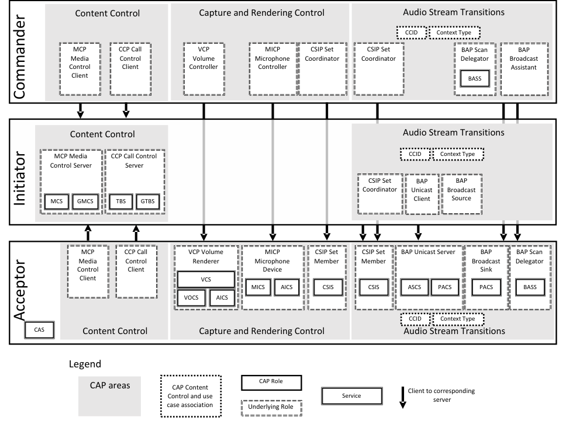
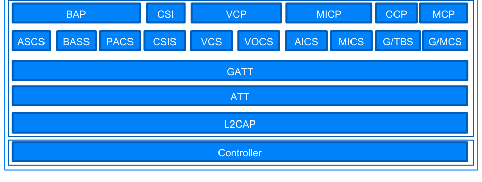
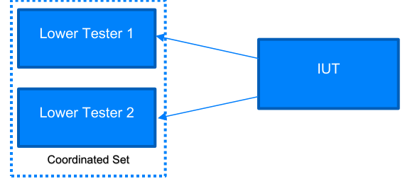
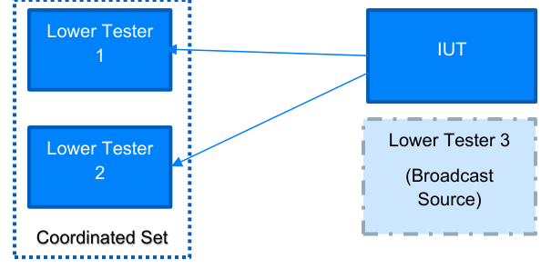
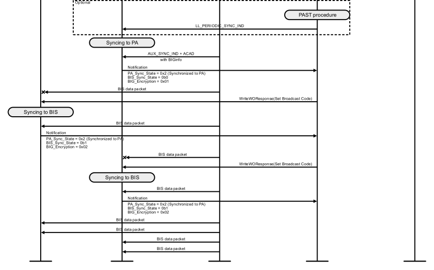

# CAP.TS.p7

> Source: PDF converted via PyMuPDF.

---

Common Audio Profile (CAP)
Bluetooth® Test Suite
▪ Revision: CAP.TS.p7 ▪ Revision Date: 2026-02-17 ▪ Prepared By: Generic Audio Working Group ▪ Published during TCRL: TCRL.pkg102
This document, regardless of its title or content, is not a Bluetooth Specification as defined in the Bluetooth Patent/Copyright License Agreement (“PCLA”) and Bluetooth Trademark License Agreement. Use of this document by members of Bluetooth SIG is governed by the membership and other related agreements between Bluetooth SIG Inc. (“Bluetooth SIG”) and its members, including the PCLA and other agreements posted on Bluetooth SIG’s website located at www.bluetooth.com.
THIS DOCUMENT IS PROVIDED “AS IS” AND BLUETOOTH SIG, ITS MEMBERS, AND THEIR AFFILIATES MAKE NO REPRESENTATIONS OR WARRANTIES AND DISCLAIM ALL WARRANTIES, EXPRESS OR IMPLIED, INCLUDING ANY WARRANTY OF MERCHANTABILITY, TITLE, NON-INFRINGEMENT, FITNESS FOR ANY PARTICULAR PURPOSE, THAT THE CONTENT OF THIS DOCUMENT IS FREE OF ERRORS.
TO THE EXTENT NOT PROHIBITED BY LAW, BLUETOOTH SIG, ITS MEMBERS, AND THEIR AFFILIATES DISCLAIM ALL LIABILITY ARISING OUT OF OR RELATING TO USE OF THIS DOCUMENT AND ANY INFORMATION CONTAINED IN THIS DOCUMENT, INCLUDING LOST REVENUE, PROFITS, DATA OR PROGRAMS, OR BUSINESS INTERRUPTION, OR FOR SPECIAL, INDIRECT, CONSEQUENTIAL, INCIDENTAL OR PUNITIVE DAMAGES, HOWEVER CAUSED AND REGARDLESS OF THE THEORY OF LIABILITY, AND EVEN IF BLUETOOTH SIG, ITS MEMBERS, OR THEIR AFFILIATES HAVE BEEN ADVISED OF THE POSSIBILITY OF SUCH DAMAGES.
This document is proprietary to Bluetooth SIG. This document may contain or cover subject matter that is intellectual property of Bluetooth SIG and its members. The furnishing of this document does not grant any license to any intellectual property of Bluetooth SIG or its members.
This document is subject to change without notice.
Copyright © 2020–2026 by Bluetooth SIG, Inc. The Bluetooth word mark and logos are owned by Bluetooth SIG, Inc. Other third-party brands and names are the property of their respective owners.
Contents

## 1 Scope

This Bluetooth document contains the Test Suite Structure (TSS) and test cases to test the implementation of the Bluetooth Common Audio Profile Specification with the objective to provide a high probability of air interface interoperability between the tested implementation and other manufacturers’ Bluetooth devices.

## 2 References, definitions, and abbreviations

### 2.1 References

This document incorporates provisions from other publications by dated or undated reference. These references are cited at the appropriate places in the text, and the publications are listed hereinafter. Additional definitions and abbreviations can be found in [1] and [2].
[1] Bluetooth Core Specification, Version 5.2 or later
[2] Test Strategy and Terminology Overview
[3] Common Audio Profile Specification
[4] Common Audio Profile Implementation Conformance Statement, CAP.ICS
[5] Characteristic and Descriptor descriptions are accessible via the Bluetooth SIG Assigned Numbers
[6] GATT Test Suite, GATT.TS
[7] Coordinated Set Identification Profile Test Suite, CSIP.TS
[8] Basic Audio Profile Test Suite, BAP.TS
[9] Volume Control Profile Specification
[10] Microphone Control Profile Specification
[11] Basic Audio Profile Specification
[12] Coordinated Set Identification Profile Specification

### 2.2 Definitions

In this Bluetooth document, the definitions from [1] and [2] apply.

### 2.3 Acronyms and abbreviations

In this Bluetooth document, the definitions, acronyms, and abbreviations from [1] and [2] apply.

## 3 Test Suite Structure (TSS)

### 3.1 Overview

**Figure 3.1: Example of the relationship between services and profile roles. The CSIP/CSIS profiles/services implementation is shared between Capture and Rendering Control and Audio Stream Transitions, but it is depicted as two identical roles.**

CAP

**Figure 3.2: Common Audio Profile layers**

### 3.2 Test Strategy

The test objectives are to verify the functionality of the Common Audio Profile within a Bluetooth Host and enable interoperability between Bluetooth Hosts on different devices. The testing approach covers mandatory and optional requirements in the specification and matches these to the support of the IUT as described in the ICS. Any defined test herein is applicable to the IUT if the ICS logical expression defined in the Test Case Mapping Table (TCMT) evaluates to true.
The test equipment provides an implementation of the Radio Controller and the parts of the Host needed to perform the test cases defined in this Test Suite. A Lower Tester acts as the IUT’s peer device and interacts with the IUT over-the-air interface. The configuration, including the IUT, needs to implement similar capabilities to communicate with the test equipment. For some test cases, it is necessary to stimulate the IUT from an Upper Tester. In practice, this could be implemented as a special test interface, a Man Machine Interface (MMI), or another interface supported by the IUT.
This Test Suite contains Valid Behavior (BV) tests complemented with Invalid Behavior (BI) tests where required. The test coverage mirrored in the Test Suite Structure is the result of a process that started with catalogued specification requirements that were logically grouped and assessed for testability enabling coverage in defined test purposes.
The IUT is Initiator or Commander in a majority of the Unicast test cases; there, the IUT communicates with Lower Testers in the Acceptor role and they act as a coordinated set.

**Figure 3.3: Unicast test topology**

Some Broadcast test cases may need an additional Lower Tester that is operating as a Broadcast Source.

**Figure 3.4: Broadcast test topology**

### 3.3 Test groups

The following test groups have been defined:
• Generic GATT Integrated Tests
• CAP Announcements
• Audio Stream Transition – Unicast Audio Starting
• Audio Stream Transition – Unicast Audio Updating
• Audio Stream Transition – Unicast Audio Ending
• Broadcast Audio Starting
• Broadcast Audio Ending
• Acceptor – Error Handling
• Broadcast Audio Reception
• Broadcast Code
• Handover procedures
• Capture and Rendering Control procedures
• Ordered Access Error Handling

## 4 Test cases (TC)

### 4.1 Introduction

#### 4.1.1 Test case identification conventions

Test cases are assigned unique identifiers per the conventions in [2]. The convention used here is: <spec abbreviation>/<IUT role>/<class>/<feat>/<func>/<subfunc>/<cap>/<xx>-<nn>-<y>.
Additionally, testing of this specification includes tests from the GATT Test Suite [6] referred to as Generic GATT Integrated Tests (GGIT); when used, the test cases in GGIT are referred to through a TCID string using the following convention: <spec abbreviation>/<IUT role>/<GGIT test group>/< GGIT class >/<xx>-<nn>-<y>.

|  | Identifier Abbreviation |  |  | Spec Identifier <spec abbreviation> |  |
| --- | --- | --- | --- | --- | --- |
| CAP |  |  | Common Audio Profile |  |  |
|  | Identifier Abbreviation |  |  | Role Identifier <IUT role> |  |
| ACC |  |  | Acceptor |  |  |
| CL |  |  | CAP Role Agnostic Client |  |  |
| COM |  |  | Commander |  |  |
| INI |  |  | Initiator |  |  |
|  | Identifier Abbreviation |  |  | Reference Identifier <GGIT test group> |  |
| CGGIT |  |  | Client Generic GATT Integrated Tests |  |  |
|  | Identifier Abbreviation |  |  | Reference Identifier <GGIT class> |  |
| SER |  |  | Service GGIT |  |  |
|  | Identifier Abbreviation |  |  | Feature Identifier <feat> |  |
| ADV |  |  | Advertisements |  |  |
| BST |  |  | Broadcast Audio Stream Transition procedures |  |  |
| BTU |  |  | Broadcast To Unicast Handover procedures |  |  |
| CRC |  |  | Capture and Rendering Control procedures |  |  |
| ERR |  |  | Error Handling |  |  |
| UST |  |  | Unicast Audio Stream Transition procedures |  |  |
| UTB |  |  | Unicast To Broadcast Handover procedures |  |  |

Table 4.1: CAP TC feature naming conventions

#### 4.1.2 Conformance

When conformance is claimed for a particular specification, all capabilities are to be supported in the specified manner. The mandated tests from this Test Suite depend on the capabilities to which conformance is claimed.
The Bluetooth Qualification Program may employ tests to verify implementation robustness. The level of implementation robustness that is verified varies from one specification to another and may be revised for cause based on interoperability issues found in the market.
• That claimed capabilities may be used in any order and any number of repetitions not excluded by the specification
• That capabilities enabled by the implementations are sustained over durations expected by the use case
• That the implementation gracefully handles any quantity of data expected by the use case
• That in cases where more than one valid interpretation of the specification exists, the implementation complies with at least one interpretation and gracefully handles other interpretations
• That the implementation is immune to attempted security exploits
A single execution of each of the required tests is required to constitute a Pass verdict. However, it is noted that to provide a foundation for interoperability, it is necessary that a qualified implementation consistently and repeatedly pass any of the applicable tests.
In any case, where a member finds an issue with the test plan generated by the Bluetooth SIG qualification tool, with the test case as described in the Test Suite, or with the test system utilized, the member is required to notify the responsible party via an erratum request such that the issue may be addressed.

#### 4.1.3 Pass/Fail verdict conventions

Each test case has an Expected Outcome section. The IUT is granted the Pass verdict when all the detailed pass criteria conditions within the Expected Outcome section are met.
The convention in this Test Suite is that, unless there is a specific set of fail conditions outlined in the test case, the IUT fails the test case as soon as one of the pass criteria conditions cannot be met. If this occurs, then the outcome of the test is a Fail verdict.

### 4.2 Setup preambles

#### 4.2.1 ATT Bearer on LE Transport with Extended Advertising • Preamble Procedure

1. Establish an LE transport connection between the IUT and the Lower Tester where the
advertising implementation (as GAP Peripheral) uses Extended Advertising as defined in Section 8.1.1 of [11] and the discovering implementation (as GAP Central) operates according to Section 8.1.2 of [11]. 2. Establish an LE transport connection between the IUT and the Lower Tester. 3. Establish an L2CAP channel 0x0004 between the IUT and the Lower Tester over the LE transport
connection established in Step 3.

#### 4.2.2 EATT Bearer on LE Transport with Extended Advertising • Preamble Procedure

1. Establish an LE transport connection between the IUT and the Lower Tester where the
advertising implementation (as GAP Peripheral) uses Extended Advertising as defined in Section 8.1.1 of [11] and the discovering implementation (as GAP Central) operates according to Section 8.1.2 of [11]. 2. Establish an L2CAP channel 0x0005 for signaling and one L2CAP channel (for ATT bearers) with
EATT PSM (as defined in Assigned Numbers) between the IUT and the Lower Tester over the LE transport connection established in Step 1.

#### 4.2.3 Unicast Audio Data Path Setup • Reference

[11] 5.6.3.1
• Preamble Procedure
1. If the codec in use resides in the Bluetooth Controller of the device using the LE Setup ISO Data
Path command defined in [1] Vol. 4, Part E, Section 7.8.109:
a. Write the LE Setup ISO Data Path command Codec_ID parameter with the value of the
Codec_ID for the target ASE. b. Write the LE Setup ISO Data Path command Codec_Configuration_Length parameter
with the value of the Codec_Specific_Configuration_Length for the target ASE. c. Write the LE Setup ISO Data Path command Codec_Configuration parameter with the
value of the Codec_Specific_Configuration for the target ASE.
2. If the codec in use resides in the Bluetooth Host of the device using the LE Setup ISO Data Path
command:
a. Write the LE Setup ISO Data Path command Codec_Configuration_Length parameter
with the value 0x00. b. Write octet 0 (Coding_Format) of the LE Setup ISO Data Path command Codec_ID
parameter with the value 0x03 (Transparent).

#### 4.2.4 Config Codec • Reference

[11] 5.6.1
• Preamble Procedure
1. The Upper Tester orders the IUT to execute the GATT Write Without Response sub-procedure
for the ASE Control Point characteristic with the opcode set to 0x01 (Config Codec) with Num_ASEs, ASE_ID, Sampling_Frequency, Frame_Duration, Octets_Per_Codec_Frame set to provided values and:
▪ Target_Latency set to a valid value ▪ Target_PHY set to a valid value ▪ Codec_ID set to LC3 ▪ Codec_Specific_Configuration_Length set to the length of the Codec_Specific_Configuration field value ▪ Codec_Specific_Configuration set with Codec_Frame_Blocks_Per_SDU set to TSPX_Codec_Frame_Blocks_Per_SDU and Audio_Channel_Allocation set to TSPX_Audio_Channel_Allocation
2. The Lower Tester sends the IUT a notification of the ASE Control Point characteristic. 3. The Lower Tester sends the IUT a notification of each ASE characteristic for the ASE_ID that was
used in Step 1.

#### 4.2.5 Config QoS • Reference

[11] 5.6.2
• Preamble Procedure
1. The Upper Tester orders the IUT to execute the LE_Set_CIG_Parameters command using values
from TSPX_CIG_Parameters if the IUT operates on a host that incorporates HCI, or configures a CIG/CIS by other means. 2. If the IUT operates on a host that incorporates HCI, the Upper Tester receives a Command
Complete event with a Status of 0x00 in response to the LE_Set_CIG_Parameters; otherwise, the IUT retrieves its accepted QoS parameters by other means. 3. Perform either alternative 3A or 3B depending on the number of ASEs.
Alternative 3A (The number of ASEs is 2 or fewer):
3A.1 The Upper Tester orders the IUT to execute the GATT Write Without Response sub-procedure for the ASE Control Point characteristic with the opcode set to 0x02 (Config QoS) with Number_of_ASEs, ASE_ID, SDU_Interval, Framing, Max_SDU, Retransmission_Number, and Max_Transport_Latency set to provided values and:
a. Valid CIG_ID and CIS_ID values b. Valid values for the other parameters
Alternative 3B (The number of ASEs is more than 2):
3B.1 The Upper Tester orders the IUT to execute the GATT Write Long sub-procedure for the ASE Control Point characteristic with the opcode set to 0x02 (Config QoS) with Number_of_ASEs, ASE_ID, SDU_Interval, Framing, Max_SDU, Retransmission_Number, and Max_Transport_Latency set to provided values and:
a. Valid CIG_ID and CIS_ID values b. Valid values for the other parameters
4. The Lower Tester sends the IUT a notification of each ASE Control Point characteristic value. 5. The Lower Tester sends the IUT a notification of each ASE characteristic value for the ASE_ID
from Step 3.

#### 4.2.6 Unicast Client Initiates Enable Operation • Reference

[11] 5.6.3
• Preamble Procedure
1. The Upper Tester orders the IUT to execute the GATT Write Without Response sub-procedure
for the ASE Control Point characteristic with the opcode set to 0x03 (Enable) and the Num_ASEs, ASE_ID, CIG_ID, CIS_ID, and Metadata set to provided values. 2. The Lower Tester sends the IUT a notification of each ASE Control Point characteristic. 3. The Lower Tester sends the IUT a notification of each ASE characteristic that corresponds to the
ASE_ID that was used in Step 1. 4. The IUT establishes a CIS by using the Connected Isochronous Stream Central Establishment
procedure defined in [1] Volume 3, Part C, Section 9.3.13. The audio data paths are configured by executing the preamble in Section 4.2.3.
Write Without Response sub-procedure for the ASE Control Point characteristic with the opcode set to 0x04 (Receiver Start Ready) and the Num_ASEs and ASE_ID set to values from Step 1.
a. The Lower Tester sends the IUT a notification of each ASE Control Point characteristic.
6. The Lower Tester sends the IUT a notification of each ASE characteristic that corresponds to the
ASE_ID that was used in Step 1.

#### 4.2.7 Broadcast Source Configures Broadcast Audio Stream • Reference

[11] 6.3
• Preamble Procedure
1. The Upper Tester orders the IUT to configure a broadcast Audio Stream using the TSPX_BASE
IXIT entry. 2. The Upper Tester orders the IUT to enter Periodic Advertising mode with configured BASE
information in the Service Data AD data type in the AdvData field of AUX_SYNC_IND and optionally AUX_CHAIN_IND PDUs. 3. The IUT enters Periodic Advertising Synchronizability mode including Service Data AD data type
and the Broadcast Audio Announcement Service UUID and Broadcast ID in the service data. 4. The Lower Testers synchronize to the PA associated with the broadcast Audio Stream
established by the IUT by using the Periodic Advertising Synchronization Establishment procedure.

#### 4.2.8 Unicast Client Initiates Disable Operation • Parameters

<Num_ASEs, ASE_IDs>
• Reference
[11] 5.6.5
• Preamble Procedure
1. The Upper Tester orders the IUT to execute the GATT Write Without Response sub-procedure
for each ASE Control Point characteristic with the opcode set to 0x05 (Disable) and the Num_ASEs and ASE_IDs set to provided values. 2. The Lower Testers send the IUT a notification of the ASE Control Point characteristic. 3. If the IUT is in the Audio Sink role:
a. The Lower Testers send the IUT a notification of the ASE characteristic that corresponds
to the ASE_ID from Step 2, with ASE_State set to 0x05 (Disabling). b. The Upper Tester orders the IUT to execute the GATT Write Without Response
sub-procedure for each ASE Control Point characteristic with the opcode set to 0x06 (Receiver Stop Ready) and the Num_ASEs and ASE_IDs set to values from Step 1. c. The Lower Testers send the IUT a notification of the ASE Control Point characteristic.
4. The Lower Testers send the IUT a notification of the ASE characteristic corresponding to the
ASE_IDs from Step 1, with ASE_State set to 0x02 (QoS Configured).

#### 4.2.9 Discover PAC, Audio Locations and Audio Contexts • Parameters

<Sink PAC, Sink Audio Locations> or <Source PAC, Source Audio Locations>
• Reference
[11] 5.2
• Preamble Procedure
1. The Upper Tester orders the IUT to execute the GATT Discover All Characteristics of a Service
sub-procedure, or the GATT Discover Characteristics by Characteristic UUID sub-procedure, to discover the PAC characteristic and Location characteristic requested, Available Audio Contexts, and Available Audio Contexts and their CCCD. 2. The Upper Tester orders the IUT to read the value of the PAC characteristic requested (e.g., by
executing the GATT Read Characteristic Value sub-procedure or by other means). 3. The Upper Tester orders the IUT to read the value of the Audio Location characteristic requested
(e.g., by executing the GATT Read Characteristic Value sub-procedure or by other means). 4. The Upper Tester orders the IUT to read the value of the Supported Audio Contexts characteristic
(e.g., by executing the GATT Read Characteristic Value sub-procedure or by other means). 5. The Upper Tester orders the IUT to read the value of the Available Audio Contexts characteristic
(e.g., by executing the GATT Discover All Characteristics sub-procedure or by other means).

### 4.3 Generic GATT Integrated Tests

Execute the Generic GATT Integrated Tests defined in [6] Section 6.4, Client test procedures, using Table 4.2 below as input:

| TCID |  |  |  | Service / Characteristic / |  | Reference | Properties |  | Value Length |  | Type |
| --- | --- | --- | --- | --- | --- | --- | --- | --- | --- | --- | --- |
|  |  |  |  | Descriptor |  |  |  |  | (Octets) |  |  |
|  | CAP/CL/CGGIT/SER/BV-01-C [Service GGIT |  | Common Audio Service | Common Audio Service |  | [3] 5.2, 6.2 | - | - | - |  | - |
|  | – Common Audio Service] |  |  |  |  |  |  |  |  |  |  |
|  | CAP/CL/CGGIT/SER/BV-02-C [Service GGIT |  |  | Coordinated Set Identification |  | [3] 5.2, 6.2 | - | - |  |  | - |
|  | – Coordinated Set Identification Service] |  |  | Service |  |  |  |  |  |  |  |

Table 4.2: Input for the GGIT Client test procedure

### 4.4 CAP Announcements

CAP/CL/ADV/BV-04-C [Idle Connection]
• Test Purpose
Verify that a CAP Acceptor that is a BAP Unicast Server role can trigger a GAP Central to connect to it using Targeted Announcements.
• Reference
[3] 8.1.5
• Initial Condition
- The IUT is a BAP Unicast Server that is in an Idle state.
- The Lower Tester is a GAP Central.
- The Lower Tester has performed the bonding procedure.
• Test Procedure
1. The Upper Tester orders the IUT to use the CAP Connection Procedure to Bonded devices [3] 2. The IUT starts advertising using Targeted Announcement using the Quick Connection setup
parameters [11]. 3. The Lower Tester scans for advertising packets with the Audio Stream Control Service UUID. 4. The Lower Tester receives a connectable extended advertising PDU (as defined in [1] Volume 6,
Part B, Section 4.4.2) containing the ADI field. 5. The Lower Tester connects to the IUT. 6. The Lower Tester performs the GATT Read Characteristic procedure on the Available Audio
Contexts characteristic on the Published Audio Capabilities Service.
• Expected Outcome
Pass verdict
The IUT sets the Available Audio Contexts field to all zeros in both the Targeted Announcement and in the Available Audio Context characteristic.
The IUT sends connectable extended advertising PDUs containing the following: Service Data AD data type and Announcement Types for the Common Audio Service UUID and Service Data AD data type and Announcement Types for the Audio Stream Control Service UUID, in any order.

#### 4.4.1 CAP Announcements Advertisement • Test Purpose

Verify that a CAP Acceptor or CAP Commander in Non-Bondable mode can transmit connectable extended advertising PDUs that contain the CAP Targeted or General Announcements.
• Reference
[3] 8.1
• Initial Condition
- The IUT is a CAP Acceptor or CAP Commander transmitting CAP Announcements with an Announcement Type specified in Table 4.3.
- The Lower Tester is a GAP Central.
• Test Case Configuration

|  | Identifier Abbreviation |  |  | Announcement Type |  |
| --- | --- | --- | --- | --- | --- |
| CAP/CL/ADV/BV-01-C [Advertisement, General Announcements] |  |  | 0x00 |  |  |
| CAP/CL/ADV/BV-02-C [Advertisement, Targeted Announcements] |  |  | 0x01 |  |  |

Table 4.3: CAP Announcements
• Test Procedure
1. The Upper Tester puts the IUT in Non-Bondable mode. 2. The Lower Tester scans for advertising packets with the Common Audio Service UUID. 3. The Lower Tester receives a connectable extended advertising PDU (as defined in [1] Volume 6,
Part B, Section 4.4.2) containing the following fields: Service Data AD data type and Announcement Type. 4. The Lower Tester establishes a connection to the IUT and requests to pair with bonding.
• Expected Outcome
Pass verdict
The IUT sends connectable extended advertising PDUs containing the following fields: Service Data AD data type, Common Audio Service UUID, and Announcement Type matching that specified in Table 4.3.
The IUT pairs without bonding in Step 4.
CAP/ACC/ADV/BV-01-C [One Advertising Set, Non-Bonded]
• Test Purpose
Verify that a CAP Acceptor in the BAP Unicast Server role advertises both BAP and CAP Announcements in the same Advertising Set.
• Reference
[3] 8.1
• Initial Condition
- The IUT is a CAP Acceptor transmitting CAP Announcements that is also in the BAP Unicast Server role.
- The Lower Tester is a GAP Central and is not bonded to the IUT.
• Test Procedure
1. The Upper Tester forces the IUT to transmit both BAP General or Targeted Announcements and
CAP General or Targeted Announcements. 2. The Lower Tester scans for advertising packets with the Common Audio Service UUID. 3. The Lower Tester receives a connectable extended advertising PDU (as defined in [1] Volume 6,
Part B, Section 4.4.2) containing the following: Service Data AD data type and Announcement Type.
• Expected Outcome
Pass verdict
If General Announcements are received, the IUT uses the same SID value for any of the received extended advertising PDUs.
The IUT sends connectable extended advertising PDUs containing the following: Service Data AD data type and Announcement Types for the Common Audio Service UUID and Service Data AD data type and Announcement Types for the Audio Stream Control Service UUID, in any order.
CAP/ACC/ADV/BV-02-C [One Advertising Set, Bonded]
• Test Purpose
Verify that a CAP Acceptor in the BAP Unicast Server role advertises both BAP and CAP Announcements in the same Advertising Set.
• Reference
[3] 8.1.3
• Initial Condition
- The IUT is a CAP Acceptor transmitting CAP Announcements that is also in the BAP Unicast Server role.
- The Lower Tester is a GAP Central.
- The Lower Tester has performed the bonding procedure.
• Test Procedure
1. The Upper Tester forces the IUT to transmit both BAP General or Targeted Announcements and
CAP General or Targeted Announcements. 2. The Lower Tester scans for advertising packets with the Common Audio Service UUID. 3. The Lower Tester receives a connectable extended advertising PDU (as defined in [1] Volume 6,
Part B, Section 4.4.2) containing the following: Service Data AD data type and Announcement Type.
• Expected Outcome
Pass verdict
The IUT uses the same SID value for any of the received General Announcement or Targeted Announcement.
The IUT sends connectable extended advertising PDUs containing the following: Service Data AD data type and Announcement Types for the Common Audio Service UUID and Service Data AD data type, Announcement Types, Available Audio Contexts, and Metadata Length for the Audio Stream Control Service UUID, in any order.
CAP/CL/ADV/BV-03-C [Non-Changing SID]
• Test Purpose
Verify that a CAP Acceptor or CAP Commander that advertises both BAP Announcements and CAP Announcements does not change its SID between power cycles.
• Reference
[3] 8.1.3
• Initial Condition
- The IUT is a CAP Acceptor or CAP Commander that is broadcasting BAP/CAP General or Targeted Announcements and does not Power Cycle during the test.
- The Lower Tester is a GAP Central.
- The Lower Tester has performed the bonding procedure.
• Test Procedure
1. The Lower Tester scans for advertising packets with the Audio Stream Control Service UUID. 2. The Lower Tester receives a connectable extended advertising PDU (as defined in [1] Volume 6,
Part B, Section 4.4.2) containing the ADI field. 3. The Upper Tester commands the IUT to stop broadcasting extended advertising. 4. The Lower Tester waits 10 s after the last extended advertising PDU is received. 5. The Upper Tester commands the IUT to start broadcasting extended advertising. 6. The Lower Tester scans for advertising packets with the Audio Stream Control Service UUID. 7. The Lower Tester receives a connectable extended advertising PDU (as defined in [1] Volume 6,
Part B, Section 4.4.2) containing at least the ADI field.
• Expected Outcome
Pass verdict
The IUT does not change the SID value for any of the received extended advertising PDUs of the same announcement type.
The IUT sends connectable extended advertising PDUs containing the following: Service Data AD data type and Announcement Types for the Common Audio Service UUID and Service Data AD data type and Announcement Types for the Audio Stream Control Service UUID, in any order.

### 4.5 Audio Stream Transition – Unicast Audio Starting

This test group verifies the behavior of an Initiator executing procedures to start, update, or end unicast or broadcast Audio Streams.

#### 4.5.1 Unicast Audio Starting – Unidirectional Audio • Test Purpose

Verify that an Initiator IUT acting as a BAP Unicast Client populates the Metadata parameter with the appropriate values for Streaming Audio Contexts LTV, and optionally the CCID_List LTV, when it performs the Unicast Audio Starting Procedure to start a pair of unidirectional Audio Streams that share the same CIG.
• Reference
[3] 7.3.1.2
• Initial Condition
- Establish a Bearer connection between the Lower Testers and the IUT as described in Section 4.2.1, if using ATT over an LE transport, or Section 4.2.2 if using EATT over an LE transport.
- Lower Testers 1 and 2 are CSIP Set Members that include an instance of the Coordinated Set Identification Service (CSIS).
- The IUT has discovered Lower Testers 1 and 2 via the [12] Coordinated Set Discovery procedure.
- Lower Testers 1 and 2 are BAP Unicast Servers that include an instantiation of the Audio Stream Control Service (ASCS) with at least one ASE characteristic specified in Table 4.4 and an instantiation of the Published Audio Capabilities Service (PACS) with available Audio Contexts and Source and Sink PAC records that support the “16_2” and “16_2_1” Codec Config/Config QoS settings.
- The IUT has discovered the ASCS instance on each Lower Tester by executing either the GATT Discover All Primary Services sub-procedure or the GATT Discover Primary Services by Service UUID.
- The IUT selects one ASE characteristic from each Lower Tester and reads the characteristic value by executing the GATT Read Characteristic Value sub-procedure. The IUT caches the ASE_ID field values as Test_ASE_ID1 and Test_ASE_ID2.
- The IUT enables notification for each selected ASE by writing the value 0x0001 using the GATT Write Characteristic Descriptors sub-procedure for the ASE CCCD.
- The IUT enables notification for each ASE Control Point characteristic by writing the value 0x0001 using the GATT Write Characteristic Descriptors sub-procedure for the ASE Control Point CCCD.
- The state of the selected ASEs is set to Idle.
• Test Case Configuration

|  | Identifier Abbreviation |  |  | ASE |  |  | CCID |  |  | Streaming Audio Context |  |
| --- | --- | --- | --- | --- | --- | --- | --- | --- | --- | --- | --- |
| CAP/INI/UST/BV-01-C [Unicast Audio Starting Unidirectional Audio to a Sink – No CCID] |  |  | Sink ASE |  |  | None |  |  | TSPX Streaming Audio _ _ _ Contexts Type |  |  |
| CAP/INI/UST/BV-02-C [Unicast Audio Starting Unidirectional Audio from a Source – No CCID] |  |  | Source ASE |  |  | None |  |  | TSPX Streaming Audio _ _ _ Contexts Type |  |  |
| CAP/INI/UST/BV-03-C [Unicast Audio Starting Unidirectional Audio to a Sink – Single CCID – Media] |  |  | Sink ASE |  |  | Single |  |  | <<Media>> |  |  |
| CAP/INI/UST/BV-04-C [Unicast Audio Starting Unidirectional Audio from a Source – Single CCID – Media] |  |  | Source ASE |  |  | Single |  |  | <<Media>> |  |  |
| CAP/INI/UST/BV-05-C [Unicast Audio Starting Unidirectional Audio to a Sink – Single CCID – Conversational] |  |  | Sink ASE |  |  | Single |  |  | <<Conversational>> |  |  |
| CAP/INI/UST/BV-06-C [Unicast Audio Starting Unidirectional Audio from a Source – Single CCID – Conversational] |  |  | Source ASE |  |  | Single |  |  | <<Conversational>> |  |  |
| CAP/INI/UST/BV-07-C [Unicast Audio Starting Unidirectional Audio to a Sink – Single CCID – Ringtone] |  |  | Sink ASE |  |  | Single |  |  | <<Ringtone>> |  |  |
| CAP/INI/UST/BV-08-C [Unicast Audio Starting Unidirectional Audio from a Source – Single CCID – Ringtone] |  |  | Source ASE |  |  | Single |  |  | <<Ringtone>> |  |  |

|  | Identifier Abbreviation |  |  | ASE |  |  | CCID |  |  | Streaming Audio Context |  |
| --- | --- | --- | --- | --- | --- | --- | --- | --- | --- | --- | --- |
| CAP/INI/UST/BV-09-C [Unicast Audio Starting Unidirectional Audio to a Sink – Single CCID – Sound Effects] |  |  | Sink ASE |  |  | Single |  |  | <<Sound Effects>> |  |  |
| CAP/INI/UST/BV-10-C [Unicast Audio Starting Unidirectional Audio from a Source – Single CCID – Sound Effects] |  |  | Source ASE |  |  | Single |  |  | <<Sound Effects>> |  |  |
| CAP/INI/UST/BV-11-C [Unicast Audio Starting Unidirectional Audio to a Sink – Single CCID] |  |  | Sink ASE |  |  | Single |  |  | TSPX Streaming Audio _ _ _ Contexts Type |  |  |
| CAP/INI/UST/BV-12-C [Unicast Audio Starting Unidirectional Audio from a Source – Single CCID] |  |  | Source ASE |  |  | Single |  |  | TSPX Streaming Audio _ _ _ Contexts Type |  |  |
| CAP/INI/UST/BV-13-C [Unicast Audio Starting Unidirectional Audio to a Sink – Multiple CCID] |  |  | Sink ASE |  |  | Multiple |  |  | TSPX Streaming Audio _ _ _ Contexts Type |  |  |
| CAP/INI/UST/BV-14-C [Unicast Audio Starting Unidirectional Audio from a Source – Multiple CCID] |  |  | Source ASE |  |  | Multiple |  |  | TSPX Streaming Audio _ _ _ Contexts Type |  |  |

Table 4.4: Unicast Audio Starting Procedure for Pair of Unidirectional Audio Stream test cases
• Test Procedure
1. The Upper Tester performs the necessary actions on the IUT to start audio with the content
control service and CCID_List specified in Table 4.4. 2. The IUT executes the CSIP Ordered Access procedure in [12] Section 4.6.5. 3. The IUT discovers the supported context types from each Lower Tester by executing the GATT
Read Characteristic Value sub-procedure for the Available Audio Contexts and Supported Audio characteristics. 4. The IUT discovers the audio capabilities and Audio Locations supported on each Lower Tester:
a. If the ASE specified in Table 4.4 is Sink ASE, by performing the preamble in
Section 4.2.9 for the Sink PAC and Sink Audio Locations. b. If the ASE specified in Table 4.4 is Source ASE, by performing the preamble in
Section 4.2.9 for the Source PAC and Source Audio Locations.
For each Lower Tester, the IUT performs Steps 5–7 with the proper ASE_ID.
5. The IUT performs Config Codec on the Lower Tester by executing the preamble in Section 4.2.4
with:
a. Num_ASEs = 1 b. ASE_ID = Test_ASE_ID1 or Test_ASE_ID2 c. Sampling_Frequency = 0x02 (16 kHz) d. Frame_Duration = 0x01 (10 ms) e. Octets_Per_Codec_Frame = 40
6. The IUT performs Config QoS on the Lower Tester by executing the preamble in Section 4.2.5
with:
a. Number_of_ASEs = 1 b. ASE_ID = Test_ASE_ID1 or Test_ASE_ID2 c. SDU_Interval = 10000 d. Framing = 0x00
e. Max_SDU = 40 f. Retransmission_Number = 2 g. Max_Transport_Latency = 10 ms h. Presentation_Delay = 40000
7. The IUT performs Enable on the Lower Tester by executing the preamble in Section 4.2.6 with:
a. Num_ASEs = 1 b. ASE_ID = Test_ASE_ID1 c. Metadata set with a Streaming_Audio_Context and CCID_List specified in Table 4.4
8. Lower Tester 1 removes the Context Type specified in Table 4.4 for Test_ASE_ID1. 9. Lower Tester 2 removes the Context Type specified in Table 4.4 for Test_ASE_ID2.
• Expected Outcome
Pass verdict
In Step 6, the IUT successfully writes to the ASE Control Point characteristic with the opcode set to 0x02 (Config QoS) on both Lower Testers using the same values for CIG_ID.
In Step 7, the IUT successfully writes to the ASE Control Point characteristic with the opcode set to 0x03 (Enable) with a Metadata structure with the same values for Streaming_Audio_Contexts and CCID_List specified in Table 4.4 to both Lower Testers.
The IUT does not Disable or Release the ASEs after Step 8 or 9.

#### 4.5.2 Unicast Audio Starting – Unidirectional Audio – No Set Members • Test Purpose

Verify that an Initiator IUT acting as a BAP Unicast Client populates the Metadata parameter with the appropriate values for Streaming Audio Contexts LTV, and optionally the CCID_List LTV, when it performs the Unicast Audio Starting Procedure to start a pair of unidirectional Audio Streams sharing the same CIG.
• Reference
[3] 7.3.1.2
• Initial Condition
- Establish a Bearer connection between the Lower Tester and the IUT as described in Section 4.2.1, if using ATT over an LE transport, or Section 4.2.2 if using EATT over an LE transport.
- The Lower Tester is a BAP Unicast Server that includes an instantiation of the Audio Stream Control Service (ASCS) with at least two ASE characteristics specified in Table 4.6 and an instantiation of the Published Audio Capabilities Service (PACS) with available Audio Contexts and Source and Sink PAC records that support the “16_2” and “16_2_1” Codec Config/Config QoS settings.
- The IUT has discovered the ASCS instance on the Lower Tester by executing either the GATT Discover All Primary Services sub-procedure or the GATT Discover Primary Services by Service UUID.
- The IUT selects two ASE characteristics from the Lower Tester and reads the characteristic value by executing the GATT Read Characteristic Value sub-procedure. The IUT caches the ASE_ID field values as Test_ASE_ID1 and Test_ASE_ID2.
- The IUT enables notification for each selected ASE by writing the value 0x0001 using the GATT Write Characteristic Descriptors sub-procedure for the ASE CCCD.
- The IUT enables notification for each ASE Control Point characteristic by writing the value 0x0001 using the GATT Write Characteristic Descriptors sub-procedure for the ASE Control Point CCCD.
- The state of the selected ASEs is set to Idle.
• Test Case Configuration

| Audio Config- uration |  | Legend |  | Num Servers | Sink ASEs | Source ASEs | Audio Channels per Sink ASE1 | Min Sink Audio Locations per Server2 | Audio Channels per Source ASE3 | Min Source Audio Locations per Server4 | CISes | Audio Streams |
| --- | --- | --- | --- | --- | --- | --- | --- | --- | --- | --- | --- | --- |
|  |  |  |  |  |  |  |  |  |  |  |  |  |
|  |  |  |  |  |  |  |  |  |  |  |  |  |
|  |  | C S |  |  |  |  |  |  |  |  |  |  |
| 6(i) | --------> --------> |  |  | 1 | 2 |  | 1 | 2 |  |  | 2 | 2 |
| 9(i) | <-------- <-------- |  |  | 1 |  | 2 |  |  | 1 | 2 | 2 | 2 |

Table 4.5: Unicast LC3 Audio Configurations

| Identifier Abbreviation |  | ASE |  | CCID |  | Streaming Audio |  |
| --- | --- | --- | --- | --- | --- | --- | --- |
|  |  | Config |  |  |  | Context |  |
| CAP/INI/UST/BV-15-C [Unicast Audio Starting Unidirectional Audio to a Standalone Sink – No CCID] | 6(i) |  |  | None | TSPX Streaming Audio _ _ _ Contexts Type |  |  |
| CAP/INI/UST/BV-16-C [Unicast Audio Starting Unidirectional Audio from a Standalone Source – No CCID] | 9(i) |  |  | None | TSPX Streaming Audio _ _ _ Contexts Type |  |  |
| CAP/INI/UST/BV-17-C [Unicast Audio Starting Unidirectional Audio to a Standalone Sink – Single CCID – Media] | 6(i) |  |  | Single | <<Media>> |  |  |
| CAP/INI/UST/BV-18-C [Unicast Audio Starting Unidirectional Audio from a Standalone Source – Single CCID – Media] | 9(i) |  |  | Single | <<Media>> |  |  |
| CAP/INI/UST/BV-19-C [Unicast Audio Starting Unidirectional Audio to a Standalone Sink – Single CCID – Conversational] | 6(i) |  |  | Single | <<Conversational>> |  |  |
| CAP/INI/UST/BV-20-C [Unicast Audio Starting Unidirectional Audio from a Standalone Source – Single CCID – Conversational] | 9(i) |  |  | Single | <<Conversational>> |  |  |
| CAP/INI/UST/BV-21-C [Unicast Audio Starting Unidirectional Audio to a Standalone Sink – Single CCID – Ringtone] | 6(i) |  |  | Single | <<Ringtone>> |  |  |
| CAP/INI/UST/BV-22-C [Unicast Audio Starting Unidirectional Audio from a Standalone Source – Single CCID – Ringtone] | 9(i) |  |  | Single | <<Ringtone>> |  |  |
| CAP/INI/UST/BV-23-C [Unicast Audio Starting Unidirectional Audio to a Standalone Sink – Single CCID – Sound Effects] | 6(i) |  |  | Single | <<Sound Effects>> |  |  |

| Identifier Abbreviation |  | ASE |  | CCID |  | Streaming Audio |  |
| --- | --- | --- | --- | --- | --- | --- | --- |
|  |  | Config |  |  |  | Context |  |
| CAP/INI/UST/BV-24-C [Unicast Audio Starting Unidirectional Audio from a Standalone Source – Single CCID – Sound Effects] | 9(i) |  |  | Single | <<Sound Effects>> |  |  |
| CAP/INI/UST/BV-25-C [Unicast Audio Starting Unidirectional Audio to a Standalone Sink – Single CCID] | 6(i) |  |  | Single | TSPX Streaming Audio _ _ _ Contexts Type |  |  |
| CAP/INI/UST/BV-26-C [Unicast Audio Starting Unidirectional Audio from a Standalone Source – Single CCID] | 9(i) |  |  | Single | TSPX Streaming Audio _ _ _ Contexts Type |  |  |
| CAP/INI/UST/BV-27-C [Unicast Audio Starting Unidirectional Audio to a Standalone Sink – Multiple CCID] | 6(i) |  |  | Multiple | TSPX Streaming Audio _ _ _ Contexts Type |  |  |
| CAP/INI/UST/BV-28-C [Unicast Audio Starting Unidirectional Audio from a Standalone Source – Multiple CCID] | 9(i) |  |  | Multiple | TSPX Streaming Audio _ _ _ Contexts Type |  |  |

Table 4.6: Unicast Audio Starting Procedure for Pair of Unidirectional Audio Stream test cases
• Test Procedure
1. The Upper Tester performs the necessary actions on the IUT to start audio with the content
control service with a CCID_List specified in Table 4.6. 2. The IUT discovers the supported context types from the Lower Tester by executing the GATT
Read Characteristic Value sub-procedure for the Available Audio Contexts and Supported Audio characteristics. 3. The IUT discovers the audio capabilities and Audio Locations supported on the Lower Tester:
a. If the ASE specified in Table 4.6 is Sink ASE, by performing the preamble in
Section 4.2.9 for the Sink PAC and Sink Audio Locations. b. If the ASE specified in Table 4.6 is Source ASE, by performing the preamble in
Section 4.2.9 for the Source PAC and Source Audio Locations.
4. The IUT performs Config Codec on the Lower Tester by executing the preamble in Section 4.2.4
with:
a. Num_ASEs = 2 b. ASE_ID[0] = Test_ASE_ID1 c. ASE_ID[1] = Test_ASE_ID2 d. Sampling_Frequency[0] and [1] = 0x02 (16 kHz) e. Frame_Duration[0] and [1] = 0x01 (10 ms) f. Octets_Per_Codec_Frame[0] and [1] = 40
5. The IUT performs Config QoS on the Lower Tester by executing the preamble in Section 4.2.5
with:
a. Number_of_ASEs = 2 b. ASE_ID[0] = Test_ASE_ID1 c. ASE_ID[1] = Test_ASE_ID2 d. CIG_ID and CIS_ID set to results from Step 7 e. SDU_Interval[0] and [1] = 10000 f. Framing[0] and [1] = 0x00 g. Max_SDU[0] and [1] = 40
h. Retransmission_Number[0] and [1] = 2 i. Max_Transport_Latency[0] and [1] = 10 ms j. Presentation_Delay[0] and [1] = 40000
6. The IUT performs Enable on the Lower Tester by executing the preamble in Section 4.2.6 with:
a. Num_ASEs = 2 b. ASE_ID[0] = Test_ASE_ID1 c. ASE_ID[1] = Test_ASE_ID2 d. Metadata set with a CCID_List specified in Table 4.6
• Expected Outcome
Pass verdict
In Step 5, the IUT successfully writes to the ASE Control Point characteristic with the opcode set to 0x02 (Config QoS) on the Lower Tester using the same values for CIG_ID.
In Step 6, the IUT successfully writes to the ASE Control Point characteristic with the opcode set to 0x03 (Enable) with a Metadata structure that has the same values for Streaming_Audio_Contexts and CCID_List specified in Table 4.6 to the Lower Tester.

#### 4.5.3 Unicast Audio Starting – Bi-Directional Audio • Test Purpose

Verify that an Initiator IUT acting as a BAP Unicast Client populates the Metadata parameter with the appropriate values for Streaming Audio Contexts LTV, and optionally the CCID_List LTV, when it performs the Unicast Audio Starting Procedure to start multiple Audio Streams sharing the same CIG, and where Bi-Directional Audio is set up to at least one device.
• Reference
[3] 7.3.1.2
• Initial Condition
- Establish a Bearer connection between the Lower Testers and the IUT as described in Section 4.2.1, if using ATT over an LE transport, or Section 4.2.2 if using EATT over an LE transport.
- Lower Testers 1 and 2 are CSIP Set Members that include an instantiation of CSIS.
- The IUT has discovered Lower Testers 1 and 2 via the [12] Coordinated Set Discovery procedure.
- Lower Testers 1 and 2 are BAP Unicast Servers that include an instantiation of the ASCS with a Sink and Source ASE characteristic and an instantiation of the PACS with available Audio Contexts and Source and Sink PAC records that support the “16_2” and “16_2_1” Codec Config/Config QoS settings.
- The IUT has discovered the ASCS instance on each Lower Tester by executing either the GATT Discover All Primary Services sub-procedure or the GATT Discover Primary Services by Service UUID.
- The IUT selects the Sink characteristic from each Lower Tester and Source ASE characteristic from at least one Lower Tester and reads the characteristic value by executing the GATT Read Characteristic Value sub-procedure. The IUT caches the ASE_ID field values as Test_Sink_ASE_ID1 and Test_Source_ASE_ID1 and Test_Sink_ASE_ID2 and Test_Source_ASE_ID2.
- The IUT enables notification for each selected ASE by writing the value 0x0001 using the GATT Write Characteristic Descriptors sub-procedure for the ASE CCCD.
- The IUT enables notification for each ASE Control Point characteristic by writing the value 0x0001 using the GATT Write Characteristic Descriptors sub-procedure for the ASE Control Point CCCD.
- The state of the selected ASEs is set to Idle.
• Test Case Configuration

|  | Identifier Abbreviation |  |  | CCID |  |
| --- | --- | --- | --- | --- | --- |
| CAP/INI/UST/BV-29-C [Unicast Audio Starting Bi-Directional Audio – No CCID] |  |  | None |  |  |
| CAP/INI/UST/BV-30-C [Unicast Audio Starting Bi-Directional Audio – Single CCID] |  |  | Single |  |  |
| CAP/INI/UST/BV-31-C [Unicast Audio Starting Bi-Directional Audio – Multiple CCID] |  |  | Multiple |  |  |

Table 4.7: Unicast Audio Starting with Bi-Directional Audio test cases
• Test Procedure
1. The Upper Tester performs the necessary actions on the IUT to start audio with the appropriate
content control services. 2. The IUT executes the CSIP Ordered Access procedure in [12] Section 4.6.5. 3. The IUT discovers the supported context types from each Lower Tester by executing the GATT
Read Characteristic Value sub-procedure for the Available Audio Contexts and Supported Audio characteristics. 4. The IUT gets the Audio Locations supported from each Lower Tester by performing the preamble
in Section 4.2.9 for both the Sink PAC and Sink Audio Locations, and the Source PAC and Source Audio Locations.
The IUT performs Steps 5–7 on each Lower Tester with the proper ASE_ID.
5. The IUT performs Config Codec on the Lower Tester by executing the preamble in Section 4.2.4
with:
a. Num_ASEs = 1 or 2 b. ASE_ID[0] = Test_Sink_ASE_ID1 or Test_Sink_ASE_ID2 c. If required, ASE_ID[1] = Test_Source_ASE_ID1 or Test_Source_ASE_ID2 d. Sampling_Frequency = 0x02 (16 kHz) e. Frame_Duration = 0x01 (10 ms) f. Octets_Per_Codec_Frame = 40
6. The IUT performs Config QoS on the Lower Tester by executing the preamble in Section 4.2.5
with:
a. Number_of_ASEs = 1 or 2 b. ASE_ID[0] = Test_Sink_ASE_ID1 or Test_Sink_ASE_ID2 c. If required, ASE_ID[1] = Test_Source_ASE_ID1 or Test_Source_ASE_ID2 d. SDU_Interval = 10000 e. Framing = 0x00 f. Max_SDU = 40 g. Retransmission_Number = 2 h. Max_Transport_Latency = 10 ms i. Presentation_Delay = 40000
a. Num_ASEs = 1 or 2 b. ASE_ID[0] = Test_Sink_ASE_ID1 or Test_Sink_ASE_ID2 c. If required, ASE_ID[1] = Test_Source_ASE_ID1 or Test_Source_ASE_ID2 d. Metadata set with a CCID_List specified in Table 4.7
• Expected Outcome
Pass verdict
In Step 6, the IUT successfully writes to the ASE Control Point characteristic with the opcode set to 0x02 (Config QoS) on both Lower Testers using the same values for CIG_ID.
In Step 7, the IUT successfully writes to the ASE Control Point characteristic with the opcode set to 0x03 (Enable), with a Metadata structure with the same values for the CCID_List specified in Table 4.7, to both Lower Testers.

### 4.6 Audio Stream Transition – Unicast Audio Updating

#### 4.6.1 Unicast Audio Updating – Unidirectional Audio Streams • Test Purpose

Verify that an Initiator IUT acting as a BAP Unicast Client populates the metadata field of the ASEs with the Streaming_Audio_Contexts LTV metadata structure, set to the provided Context Type values and the CCID_List LTV structure, when it performs the Unicast Audio Updating procedure for a pair of unidirectional Audio Streams.
• Reference
[3] 7.3.1.3
• Initial Condition
- Establish a Bearer connection between the Lower Testers and the IUT as described in Section 4.2.1, if using ATT over an LE transport, or Section 4.2.2 if using EATT over an LE transport.
- Lower Testers 1 and 2 are CSIP Set Members that include an instantiation of CSIS.
- The IUT has discovered Lower Testers 1 and 2 via the [12] Coordinated Set Discovery procedure.
- The IUT has two ASEs in the directions specified in Table 4.8 and with appropriate Codec and QoS Config operations previously performed.
- Lower Testers 1 and 2 are Unicast Servers that include an instantiation of the ASCS with at least one ASE characteristic and an instantiation of the PACS with available Audio Contexts and Source and Sink PAC records that support the “16_2” and “16_2_1” Codec Config/Config QoS settings.
- The IUT selects one ASE characteristic from each Lower Tester and reads the characteristic value by executing the GATT Read Characteristic Value sub-procedure. The IUT caches the ASE_ID field values as Test_ASE_ID1 and Test_ASE_ID2.
- The IUT executes the GATT Write Without Response Characteristic Value sub-procedure for the ASE Control Point characteristic with the opcode set to 0x03 (Enable) and Metadata set to the TSPX_Metadata IXIT entry.
- The IUT enables notification for the selected ASEs by writing the value 0x0001 using the GATT Write Characteristic Descriptors sub-procedure for the ASE CCCD.
- The IUT enables notification for the ASE Control Point characteristics by writing the value 0x0001 using the GATT Write Characteristic Descriptors sub-procedure for the ASE Control Point CCCD.
- The state of the selected ASEs is set to Enabling or Streaming.
• Test Case Configuration

| Identifier Abbreviation | ASE | CCID |  | Streaming Audio |  |
| --- | --- | --- | --- | --- | --- |
|  |  |  |  | Context |  |
| CAP/INI/UST/BV-32-C [Unicast Audio Updating Unidirectional Audio from a Source – No CCID] | Source ASE | None | TSPX Streaming _ _ Audio Contexts Type _ |  |  |
| CAP/INI/UST/BV-33-C [Unicast Audio Updating Unidirectional Audio to a Sink – No CCID] | Sink ASE | None | TSPX Streaming _ _ Audio Contexts Type _ |  |  |
| CAP/INI/UST/BV-34-C [Unicast Audio Updating Unidirectional Audio from a Source – Single CCID] | Source ASE | Single | TSPX Streaming _ _ Audio Contexts Type _ |  |  |
| CAP/INI/UST/BV-35-C [Unicast Audio Updating Unidirectional Audio to a Sink – Single CCID] | Sink ASE | Single | TSPX Streaming _ _ Audio Contexts Type _ |  |  |
| CAP/INI/UST/BV-36-C [Unicast Audio Updating Unidirectional Audio from a Source – Multiple CCID] | Source ASE | Multiple | TSPX Streaming _ _ Audio Contexts Type _ |  |  |
| CAP/INI/UST/BV-37-C [Unicast Audio Updating Unidirectional Audio to a Sink – Multiple CCID] | Sink ASE | Multiple | TSPX Streaming _ _ Audio Contexts Type _ |  |  |

Table 4.8: Unicast Audio Updating Unidirectional Audio test cases
• Test Procedure
1. The Upper Tester performs the necessary actions on the IUT to start audio with the appropriate
content control services. 2. The IUT executes the CSIP Ordered Access procedure in [12] Section 4.6.5. 3. The IUT discovers the supported context types from each Lower Tester by performing the
preamble in Section 4.2.9 for the ASE type specified in Table 4.8. 4. The IUT executes the GATT Write Without Response sub-procedure for each ASE Control Point
characteristic with the opcode set to 0x07 (Update Metadata), Num_ASEs set to 1, ASE_ID set using the value from the Initial Condition, and Metadata set with a CCID_List if specified in Table 4.8 and Context Type if specified in Table 4.8. 5. Each Lower Tester sends the IUT a notification of the ASE Control Point characteristic. 6. Each Lower Tester sends the IUT a notification of the ASE characteristic.
• Expected Outcome
Pass verdict
In Step 4, the IUT successfully writes to the ASE Control Point characteristic with the opcode set to 0x07 (Update Metadata) and the specified parameters and writes a Metadata structure that contains a CCID_List and Streaming_Audio_Contexts specified in Table 4.8.

### 4.7 Audio Stream Transition – Unicast Audio Ending

#### 4.7.1 Unicast Audio Stop – Unidirectional Audio Streams • Test Purpose

Verify the behavior of an Initiator IUT acting as a BAP Unicast Client performing the Unicast Audio Ending procedure when ending a pair of unidirectional Audio Streams. The IUT transitions the targeted ASE to either QoS Configured, Codec Configured, or Idle ASE states using BAP ASE Control operations.
• Reference
[3] 7.3.1.4
• Initial Condition
- Establish a Bearer connection between the Lower Testers and the IUT as described in Section 4.2.1, if using ATT over an LE transport, or Section 4.2.2 if using EATT over an LE transport.
- Lower Testers 1 and 2 are CSIP Set Members that include an instantiation of CSIS.
- The IUT has discovered Lower Testers 1 and 2 via the [12] Coordinated Set Discovery procedure.
- Lower Testers 1 and 2 are Unicast Servers that include an instantiation of the ASCS with at least one ASE characteristic and an instantiation of the PACS with available Audio Contexts and Source and Sink PAC records that support the “16_2” and “16_2_1” Codec Config/Config QoS settings.
- Each Lower Tester has an ASE in the directions specified in Table 4.9, and with appropriate Codec and QoS Config operations previously performed.
- The IUT selects one ASE characteristic from each Lower Tester and reads the characteristic value by executing the GATT Read Characteristic Value sub-procedure. The IUT caches the ASE_ID field values as Test_ASE_ID1 and Test_ASE_ID2.
- The IUT enables notification for the selected ASEs by writing the value 0x0001 using the GATT Write Characteristic Descriptors sub-procedure for the ASE CCCD.
- The IUT enables notification for the ASE Control Point characteristics by writing the value 0x0001 using the GATT Write Characteristic Descriptors sub-procedure for the ASE Control Point CCCD.
- The state of the selected ASEs is set to Codec Configured, QoS Configured, Enabling, Streaming, or Disabling.
• Test Case Configuration

|  | Identifier Abbreviation |  |  | ASE |  |
| --- | --- | --- | --- | --- | --- |
| CAP/INI/UST/BV-40-C [Unicast Audio Ending Unidirectional Audio Streams from a Source] |  |  | Source ASE |  |  |
| CAP/INI/UST/BV-41-C [Unicast Audio Ending Unidirectional Audio Streams to a Sink] |  |  | Sink ASE |  |  |

Table 4.9: Unicast Audio Ending – Unidirectional Audio Streams test cases
• Test Procedure
1. The Upper Tester performs the necessary actions on the IUT to stop audio. 2. The IUT executes the CSIP Ordered Access procedure in [12] Section 4.6.5. 3. The Upper Tester orders the IUT to execute the preamble in Section 4.2.8 using Num_ASEs = 1,
and ASE_ID set using the values from the Initial Condition. 4. The Upper Tester orders the IUT to execute the GATT Write Without Response sub-procedure
for each ASE Control Point characteristic with the opcode set to 0x08 (Release) and the Num_ASEs = 1, and an ASE_ID value from the Initial Condition. 5. The Lower Testers each send the IUT a notification of the ASE Control Point characteristic
values. 6. The Lower Testers each send the IUT a notification of the ASE characteristic values
corresponding to the ASE_ID value from the Initial Condition, with ASE_State set to Releasing (0x06). 7. The IUT terminates the CISes if established. 8. The Lower Testers send the IUT a notification of the ASE characteristic values corresponding to
the ASE_ID values from the Initial Condition, with ASE_State set to either Codec Configured or Idle.
• Expected Outcome
Pass verdict
In Step 3, the IUT successfully writes to the ASE Control Point characteristic with the opcode set to 0x05 (Disable) and an ASE_ID value from the Initial Condition. If the IUT is an Audio Sink, the IUT successfully writes the Receiver Ready Stop opcode with valid parameters.
In Step 4, the IUT successfully writes to the ASE Control Point characteristic with the opcode set to 0x08 (Release) and the specified parameters, and the ASE_State transitions to Codec Configured or Idle.
CAP/INI/UST/BV-42-C [Unicast Audio Ending for Bi-Directional Audio]
• Test Purpose
Verify the behavior of an Initiator IUT acting as a BAP Unicast Client performing the Unicast Audio Ending procedure when ending bi-directional Audio, sharing the same CIG. The IUT transitions the targeted ASE to either QoS Configured, Codec Configured, or Idle ASE states using BAP ASE Control operations.
• Reference
[3] 7.3.1.4
• Initial Condition
- Establish a Bearer connection between the Lower Testers and the IUT as described in Section 4.2.1, if using ATT over an LE transport, or Section 4.2.2 if using EATT over an LE transport.
- Lower Testers 1 and 2 are CSIP Set Members that include an instantiation of CSIS.
- The IUT has discovered Lower Testers 1 and 2 via the [12] Coordinated Set Discovery procedure.
- Lower Testers 1 and 2 are Unicast Servers, and each Lower Tester has a Sink ASE and Source ASE characteristic, and with appropriate Codec and QoS Config operations previously performed if the state being tested is Enabling, Streaming, or Disabling.
- The IUT selects the Sink characteristic from each Lower Tester and Source ASE characteristic from at least one Lower Tester and reads the characteristic value by executing the GATT Read Characteristic Value sub-procedure. The IUT caches the ASE_ID field values as Test_Sink_ASE_ID1 and Test_Source_ASE_ID1 and Test_Sink_ASE_ID2 and Test_Source_ASE_ID2.
- The IUT enables notification for the selected ASEs by writing the value 0x0001 using the GATT Write Characteristic Descriptors sub-procedure for the ASE CCCD.
- The IUT enables notification for the ASE Control Point characteristics by writing the value 0x0001 using the GATT Write Characteristic Descriptors sub-procedure for the ASE Control Point CCCD.
- The state of the selected ASEs is set to Codec Configured, QoS Configured, Enabling, Streaming, or Disabling.
• Test Procedure
1. The Upper Tester performs the necessary actions on the IUT to stop audio. 2. The IUT executes the CSIP Ordered Access procedure in [12] Section 4.6.5. 3. The Upper Tester orders the IUT to execute the preamble in Section 4.2.8 using Num_ASEs = 1
or 2, and ASE_IDs set using the Test_Sink_ASE_ID and, if required, Test_Source_ASE_ID value from the Initial Condition. 4. The Upper Tester orders the IUT to execute the GATT Write Without Response sub-procedure
for each ASE Control Point characteristic with the opcode set to 0x08 (Release) and the Num_ASEs = 1 or 2, and ASE_ID[0] set using the Test_Sink_ASE_ID and, if required, ASE_ID[1] set using the Test_Source_ASE_ID value from the Initial Condition. 5. The Lower Testers each send the IUT a notification of the ASE Control Point characteristic
values. 6. The Lower Testers each send the IUT a notification of the ASE characteristic values that
correspond to the ASE_IDs that were used in Step 3, with ASE_State set to Releasing (0x06). 7. The IUT terminates the CISes, if established. 8. The Lower Testers each send the IUT a notification of the ASE characteristic values that
correspond to the ASE_IDs that were used in Step 3, with ASE_State set to either Codec Configured or Idle.
• Expected Outcome
Pass verdict
In Step 4, the IUT successfully writes to the ASE Control Point characteristic with the opcode set to 0x08 (Release) and the specified parameters, and the ASE_State transitions to Codec Configured or Idle.

### 4.8 Broadcast Audio Starting

#### 4.8.1 Broadcast Audio Starting Procedure – Setting Audio Contexts • Test Purpose

Verify that an Initiator IUT acting as a BAP Broadcast Source performs the Broadcast Audio Starting procedure for one or more broadcast Audio Streams of the same Broadcast Isochronous Group (BIG), using the BAP Broadcast Audio Stream Configuration procedure or BAP Broadcast Audio Stream Reconfiguration.
• Reference
[3] 7.3.1.5
• Initial Condition
- The IUT has a BASE set to the TSPX_BASE IXIT entry, which includes a Streaming_Audio_Context LTV structure and the number of Streams specified in Table 4.10.
- The Lower Tester is a CAP Acceptor in the Broadcast Sink role.
• Test Case Configuration

|  | Identifier Abbreviation |  |  | Procedure |  |  | Streams |  |
| --- | --- | --- | --- | --- | --- | --- | --- | --- |
| CAP/INI/BST/BV-01-C [Broadcast Audio Starting for Single Audio Stream] |  |  | BAP Broadcast Audio Stream Configuration |  |  | Single |  |  |
| CAP/INI/BST/BV-02-C [Broadcast Audio Starting for Multiple Audio Stream] |  |  | BAP Broadcast Audio Stream Configuration |  |  | Multiple |  |  |
| CAP/INI/BST/BV-03-C [Broadcast Audio Starting for Single Audio Stream - Reconfigure] |  |  | BAP Broadcast Audio Stream Reconfiguration |  |  | Single |  |  |
| CAP/INI/BST/BV-04-C [Broadcast Audio Starting for Multiple Audio Stream - Reconfigure] |  |  | BAP Broadcast Audio Stream Reconfiguration |  |  | Multiple |  |  |

Table 4.10: Broadcast Audio Starting – Setting Audio Contexts test cases
• Test Procedure
1. The Upper Tester orders the IUT to execute the Procedure specified in Table 4.10. 2. The Upper Tester orders the IUT to enter Broadcast Isochronous Broadcasting mode. 3. The Upper Tester orders the IUT to enter Broadcast Isochronous Synchronizability mode. 4. The IUT sends AUX_EXT_IND PDUs and auxiliary AUX_ADV_IND PDUs with the Service Data
AD Type in the AdvData field. 5. The IUT sends AUX_SYNC_IND PDUs with BIGInfo in the ACAD field of the Extended Header
field in the PA. 6. The Upper Tester orders the IUT to set up the audio data path. 7. The Upper Tester orders the IUT to send BIS_Data_Packets over the established broadcast
Audio Stream.
• Expected Outcome
Pass verdict
In Step 1, the IUT transmits the PA synchronization information in the SyncInfo field of the Extended Header field of AUX_ADV_IND PDUs. The AUX_ADV_INDs include Service Data AD type with the Broadcast Audio Announcement Service UUID; the additional service data includes the Broadcast_ID. The AUX_ADV_IND PDUs contain PA synchronization information in the SyncInfo field of the Extended header Field that points to AUX_SYNC_IND PDUs that contain the configured BASE information in the AdvData field that matches the TSPX_BASE IXIT entry.
In Step 5, the IUT sends AUX_SYNC_IND PDUs with an Extended Header containing BIGInfo in the ACAD field. The BIGInfo contains the correct number of BISes specified in Table 4.10.
In Step 7, the IUT sends BIS_DATA_Packets over the broadcast Audio Stream.

#### 4.8.2 Broadcast Audio Starting – Setting CCIDs • Test Purpose

Verify the behavior of an Initiator IUT acting as a BAP Broadcast Source starting multiple broadcast Audio Streams sharing the same Broadcast Isochronous Group (BIG).
• Reference
[3] 7.3.1.5
• Initial Condition
- The IUT has a BASE set to the TSPX_BASE IXIT entry.
- The Lower Tester is a CAP Acceptor in the Broadcast Sink role.
• Test Case Configuration

|  | Identifier Abbreviation |  |  | Procedure |  |  | Streams |  |  | CCID |  |
| --- | --- | --- | --- | --- | --- | --- | --- | --- | --- | --- | --- |
| CAP/INI/BST/BV-05-C [Broadcast Audio Starting for Single Audio Streams – Single CCID] |  |  | BAP Broadcast Audio Stream Configuration |  |  | Single |  |  | Single |  |  |
| CAP/INI/BST/BV-06-C [Broadcast Audio Starting for Multiple Audio Streams – Single CCID] |  |  | BAP Broadcast Audio Stream Configuration |  |  | Multiple |  |  | Single |  |  |
| CAP/INI/BST/BV-07-C [Broadcast Audio Starting for Multiple Audio Streams – Multiple CCID] |  |  | BAP Broadcast Audio Stream Configuration |  |  | Multiple |  |  | Multiple |  |  |
| CAP/INI/BST/BV-08-C [Broadcast Audio Starting for Single Audio Streams – Single CCID – Reconfigure] |  |  | BAP Broadcast Audio Stream Reconfiguration |  |  | Single |  |  | Single |  |  |
| CAP/INI/BST/BV-09-C [Broadcast Audio Starting for Multiple Audio Streams – Single CCID – Reconfigure] |  |  | BAP Broadcast Audio Stream Reconfiguration |  |  | Multiple |  |  | Single |  |  |
| CAP/INI/BST/BV-10-C [Broadcast Audio Starting for Multiple Audio Streams – Multiple CCID – Reconfigure] |  |  | BAP Broadcast Audio Stream Reconfiguration |  |  | Multiple |  |  | Multiple |  |  |

Table 4.11: Broadcast Audio Starting – Setting CCIDs test cases
• Test Procedure
1. The Upper Tester orders the IUT to execute the preamble in Section 4.2.7. 2. The Upper Tester orders the IUT to enter [1] Broadcast Isochronous Broadcasting mode with the
number of streams set to the Streams value specified in Table 4.11 and CCID_List set to the CCID value specified in Table 4.11. 3. The Upper Tester orders the IUT to enter Broadcast Isochronous Synchronizability mode. 4. The IUT sends AUX_EXT_IND PDUs and auxiliary AUX_ADV_IND PDUs with the Service Data
AD Type in the AdvData field. 5. The IUT sends AUX_SYNC_IND PDUs with BIGInfo in the ACAD field of the Extended Header
field in the PA. 6. The Upper Tester orders the IUT to set up the audio data path. 7. The Lower Tester synchronizes to the PA associated with the broadcast Audio Stream
established by the IUT using the Periodic Advertising Synchronization Establishment procedure. 8. The Upper Tester orders the IUT to Enable the data path, which sends BIS_Data_Packets over
the established broadcast Audio Stream.
• Expected Outcome
Pass verdict
In Step 1, the AdvData field of AUX_SYNC_IND and AUX_CHAIN_IND PDUs contains the configured BASE information, including relevant Streaming_Audio_Contexts and CCID_List data specified in Table 4.11.
The IUT transmits the PA synchronization information in the SyncInfo field of the Extended Header field of AUX_ADV_IND PDUs. The AUX_ADV_IND PDUs include the Service Data AD Type in the AdvData field. The additional service data includes the Broadcast_ID, and the Service Data AD Type contains the Broadcast Audio Announcement Service UUID.
CAP/INI/BST/BV-11-C [Broadcast Audio Updating One Audio Stream with Streaming Audio Contexts and CCIDs]
• Test Purpose
Verify the behavior of an Initiator IUT acting as a BAP Broadcast Audio Source performing the Broadcast Audio Updating procedure. The IUT updates the Streaming_Audio_Contexts LTV metadata structure in the metadata fields of the BASE, representing the broadcast Audio Streams being updated, with provided Context Type values.
• Reference
[3] 7.3.1.6
• Initial Condition
- The IUT has a BASE set to the TSPX_BASE IXIT entry.
- The Lower Tester is a CAP Acceptor in the Broadcast Sink role.
- The IUT has configured a broadcast Audio Stream using CAP/INI/BST/BV-01-C [Broadcast Audio Starting for Single Audio Stream], CAP/INI/BST/BV-03-C [Broadcast Audio Starting for Single Audio Stream - Reconfigure], or other means.
• Test Procedure
1. The Lower Tester synchronizes to the PA associated with the broadcast Audio Streams
established by the IUT by using the Periodic Advertising Synchronization Establishment procedure. 2. The Upper Tester orders the IUT to update the metadata for the broadcast stream using values of
the TSPX_BASE_UPDATE IXIT entry. 3. The IUT updates its Periodic Advertising mode with the BASE information in the AdvData field of
AUX_SYNC_IND and/or AUX_CHAIN_IND PDUs.
• Expected Outcome
Pass verdict
In Step 2, the IUT sends AUX_SYNC_IND and AUX_CHAIN_IND PDUs with values from the BASE information. The AdvData field of AUX_SYNC_IND contains updated BASE information.
CAP/INI/BST/BV-12-C [Broadcast Audio Updating Multiple Audio Streams with Streaming Audio Contexts]
• Test Purpose
Verify the behavior of an Initiator IUT acting as a BAP Broadcast Audio Source when updating Context Type values associated with multiple broadcast Audio Streams sharing the same Broadcast Isochronous Group (BIG).
• Reference
[3] 7.3.1.6
• Initial Condition
- The IUT has a BASE set to the TSPX_BASE IXIT entry.
- Lower Testers 1 and 2 are CAP Acceptors in the Broadcast Sink role.
- The IUT has configured a broadcast Audio Stream using CAP/INI/BST/BV-02-C [Broadcast Audio Starting for Multiple Audio Stream], CAP/INI/BST/BV-04-C [Broadcast Audio Starting for Multiple Audio Stream - Reconfigure], or other means.
• Test Procedure
1. The Lower Testers synchronize to the PA associated with the broadcast Audio Streams
established by the IUT using the Periodic Advertising Synchronization Establishment procedure. 2. The Upper Tester orders the IUT to update the metadata for each broadcast stream using values
of the TSPX_BASE_UPDATE IXIT entry. 3. The IUT updates its Periodic Advertising mode with the BASE information in the AdvData field of
AUX_SYNC_IND and AUX_CHAIN_IND PDUs.
• Expected Outcome
Pass verdict
In Step 3, the IUT sends AUX_SYNC_IND and AUX_CHAIN_IND PDUs with values from the BASE information. The AdvData field of AUX_SYNC_IND contains updated BASE information.

#### 4.8.3 Broadcast Audio Updating – Multiple Audio Streams with CCIDs • Test Purpose

Verify that an Initiator IUT, taking the BAP Broadcast Audio Source role, updates the CCID values associated with multiple broadcast Audio Streams sharing the same Broadcast Isochronous Group (BIG).
• Reference
[3] 7.3.1.6
• Initial Condition
- The IUT has a BASE set to the TSPX_BASE IXIT entry.
- Lower Testers 1 and 2 are CAP Acceptors in the Broadcast Sink role.
- The IUT has configured a broadcast Audio Stream using CAP/INI/BST/BV-02-C [Broadcast Audio Starting for Multiple Audio Stream], CAP/INI/BST/BV-04-C [Broadcast Audio Starting for Multiple Audio Stream - Reconfigure], or other means.
• Test Case Configuration

|  | Identifier Abbreviation |  |  | CCID List Change Behavior |  |
| --- | --- | --- | --- | --- | --- |
| CAP/INI/BST/BV-13-C [Broadcast Audio Updating Multiple Audio Streams with CCIDs – Add CCID] |  |  | Add CCID List |  |  |
| CAP/INI/BST/BV-14-C [Broadcast Audio Updating Multiple Audio Streams with CCIDs] |  |  | Change CCID values |  |  |
| CAP/INI/BST/BV-15-C [Broadcast Audio Updating Multiple Audio Streams with CCIDs – Remove CCID] |  |  | Remove CCID List |  |  |

Table 4.12: Broadcast Audio Updating test cases
• Test Procedure
1. The Lower Testers synchronize to the PA associated with the broadcast Audio Streams
established by the IUT using the Periodic Advertising Synchronization Establishment procedure. 2. The Upper Tester orders the IUT to update the metadata for each broadcast stream using values
of the CCID List Change Behavior specified in Table 4.12. 3. The IUT updates its Periodic Advertising mode with the BASE information in the AdvData field of
AUX_SYNC_IND and AUX_CHAIN_IND PDUs.
• Expected Outcome
Pass verdict
In Step 3, the IUT sends AUX_SYNC_IND and AUX_CHAIN_IND PDUs with values from the BASE information. The AdvData field of AUX_SYNC_IND contains updated BASE information that reflects the CCID List Change Behavior specified in Table 4.12.

### 4.9 Broadcast Audio Ending

#### 4.9.1 Broadcast Audio Ending Procedure • Test Purpose

Verify the behavior of an Initiator IUT acting as a BAP Broadcast Source when performing the Broadcast Audio Ending Procedure for one or more Audio Streams. The IUT uses the BAP Broadcast Audio Stream Disable procedure, bringing the broadcast Audio Stream to Configured State.
• Reference
[3] 7.3.1.7
• Initial Condition
- Lower Testers 1 and 2 are CAP Acceptors in the BAP Broadcast Sink role.
- The IUT has configured a broadcast Audio Stream using CAP/INI/BST/BV-01-C [Broadcast Audio Starting for Single Audio Stream], CAP/INI/BST/BV-02-C [Broadcast Audio Starting for Multiple Audio Stream], or other means.
• Test Case Configuration

|  | Identifier Abbreviation |  |  | Streams |  |
| --- | --- | --- | --- | --- | --- |
| CAP/INI/BST/BV-16-C [Broadcast Audio Ending for Single Audio Streams] |  |  | Single |  |  |
| CAP/INI/BST/BV-17-C [Broadcast Audio Ending for Multiple Audio] |  |  | Multiple |  |  |

Table 4.13: Broadcast Audio Ending test cases
• Test Procedure
1. The Upper Tester orders the IUT to terminate broadcasting of each broadcast stream by
performing the BAP Broadcast Audio Stream disable procedure. 2. The IUT transmits BIG_TERMINATE_IND PDUs to each Lower Tester.
• Expected Outcome
Pass verdict
In Step 2, the IUT sends a BIG_TERMINATE_IND PDU, and it is received by each Lower Tester.

### 4.10 Acceptor – Error Handling

This test group verifies the behavior of an Acceptor in procedures to start, update, or end unicast or broadcast Audio Streams.

#### 4.10.1 Unicast Audio Starting – Acceptor Unavailable • Test Purpose

Verify that an Acceptor IUT does not complete the Unicast Audio Start procedure when it is unavailable for a requested set of Context Type values or does not support any of the requested Context Type values.
• Reference
[3] 7.3.1.2.6
• Initial Condition
- Establish a Bearer connection between the Lower Tester and the IUT as described in Section 4.2.1, if using ATT over an LE transport, or Section 4.2.2 if using EATT over an LE transport.
- The Lower Tester is a CAP Initiator.
- The Lower Tester has discovered the IUT via the [12] Coordinated Set Discovery procedure or some other means.
- The Lower Tester has performed characteristic discovery by performing CSIS/SR/SGGIT/CHA/BV-03-C [Characteristic GGIT – Set Member Lock] in [7] or by other means and has determined if the IUT exposes the Set Member Lock characteristic.
- The IUT’s Available Audio Contexts is set to the TSPX_Available_Audio_Contexts IXIT entry where at least one context type is not available.
- The IUT selects one ASE characteristic on the Lower Tester and reads the characteristic value by executing the GATT Read Characteristic Value sub-procedure. The IUT caches the ASE_ID field values as Test_ASE_ID.
- The IUT enables notification for each selected ASE by writing the value 0x0001 using the GATT Write Characteristic Descriptors sub-procedure for the ASE CCCD.
- The IUT enables notification for each ASE Control Point characteristic by writing the value 0x0001 using the GATT Write Characteristic Descriptors sub-procedure for the ASE Control Point CCCD.
- The state of the selected ASE is set to Idle.
• Test Case Configuration

|  | Identifier Abbreviation |  |  | ASE |  |
| --- | --- | --- | --- | --- | --- |
| CAP/ACC/ERR/BI-01-C [Unicast Audio Starting Acceptor Unavailable - Sink] |  |  | Sink |  |  |
| CAP/ACC/ERR/BI-02-C [Unicast Audio Starting Acceptor Unavailable - Source] |  |  | Source |  |  |

Table 4.14: Unicast Audio Starting Procedure - Acceptor Unavailable test cases
• Test Procedure
1. If the IUT exposes the Set Member Lock characteristic, the Lower Tester executes the CSIP
Ordered Access procedure in [12] Section 4.6.5. 2. The Lower Tester executes the preamble in Section 4.2.4 on the IUT with:
a. Num_ASEs = 1 b. ASE_ID = Test_ASE_ID2 c. Sampling_Frequency = 0x02 (16 kHz) d. Frame_Duration = 0x01 (10 ms) e. Octets_Per_Codec_Frame = 40
3. The Lower Tester executes the preamble in Section 4.2.5 on the IUT with:
a. Number_of_ASEs = 1 b. ASE_ID = Test_ASE_ID2 c. SDU_Interval = 10000 d. Framing = 0x00 e. Max_SDU = 40 f. Retransmission_Number = 2 g. Max_Transport_Latency = 10 ms h. Presentation_Delay = 40000
4. The Lower Tester executes the preamble in Section 4.2.6 on the IUT with:
a. Num_ASEs = 1 b. ASE_ID = Test_ASE_ID2 c. CIG_ID set to the value from Step 4 and CIS_ID set to values from Step 6. d. Metadata set to a Streaming_Audio_Contexts LTV structure with an unavailable Context
Type value.
• Expected Outcome
Pass verdict
In Step 1, if the IUT is a Set Member with a Set Member Lock characteristic, the IUT sends a GATT Write Response of Unlocked (0x01) for the IUT’s Set Member Lock characteristic value.
In Step 2, the IUT sends a notification of the ASE Control Point characteristic with Response_Code of Success (0x00).
In Step 3, the IUT sends a notification of the ASE Control Point characteristic with Response_Code set to Success (0x00).
In Step 4, the IUT sends a Response_Code of “Rejected Metadata” with Reason set to the value of the Streaming_Audio_Contexts Type identifier.

#### 4.10.2 Unicast Audio Update Procedure – Acceptor Unavailable • Test Purpose

Verify that an Acceptor IUT does not complete the Unicast Audio Update procedure when it is unavailable for a requested set of Context Type values or does not support any of the requested Context Type values.
• Reference
[3] 7.3.1.3.2
• Initial Condition
- Establish a Bearer connection between the Lower Tester and the IUT as described in Section 4.2.1, if using ATT over an LE transport, or Section 4.2.2 if using EATT over an LE transport.
- The Lower Tester is a CAP Initiator in the BAP Unicast Client role.
- The Lower Tester has discovered the IUT via the [12] Coordinated Set Discovery procedure or some other means.
- The Lower Tester has performed characteristic discovery by performing CSIS/SR/SGGIT/CHA/BV-03-C [Characteristic GGIT – Set Member Lock] in [7] or by other means and has determined if the IUT exposes the Set Member Lock characteristic.
- The IUT has an ASE specified in Table 4.15, and with appropriate Codec and QoS Config operations previously performed.
- The IUT’s Available Audio Contexts is set to the TSPX_Available_Audio_Contexts IXIT entry where at least one context type is not available.
- The Lower Tester enables notification for the selected ASEs by writing the value 0x0001 using the GATT Write Characteristic Descriptors sub-procedure for the ASE CCCD.
- The Lower Tester enables notification for the ASE Control Point characteristics by writing the value 0x0001 using the GATT Write Characteristic Descriptors sub-procedure for the ASE Control Point CCCD.
- The Lower Tester selects an ASE characteristic from the IUT and reads the characteristic value by executing the GATT Read Characteristic Value sub-procedure. The IUT caches the ASE_ID field values as Test_ASE_ID.
- The state of the selected ASE is set to Enabling or Streaming.
• Test Case Configuration

|  | Identifier Abbreviation |  |  | ASE |  |
| --- | --- | --- | --- | --- | --- |
| CAP/ACC/ERR/BI-03-C [Unicast Audio Update Acceptor Unavailable – Sink] |  |  | Sink ASE |  |  |
| CAP/ACC/ERR/BI-04-C [Unicast Audio Update Acceptor Unavailable – Source] |  |  | Source ASE |  |  |

Table 4.15: Unicast Audio Starting Procedure – Acceptor Unavailable test cases
• Test Procedure
1. If the IUT exposes the Set Member Lock characteristic, the Lower Tester executes the CSIP
Ordered Access procedure in [12] Section 4.6.5. 2. The Lower Tester executes the GATT Write Without Response sub-procedure for each ASE
Control Point characteristic with the opcode set to 0x07 (Update Metadata), Num_ASEs set to 1, ASE_ID set using the value from the Initial Condition, and Metadata with a Streaming_Audio_Context LTV structure with an unavailable Context Type value based on the TSPX_Available_Audio_Contexts IXIT entry.
• Expected Outcome
Pass verdict
In Step 2, the IUT sends a Response_Code of “Rejected Metadata” with Reason set to the value of the Streaming_Audio_Contexts Type identifier.

### 4.11 Broadcast Audio Reception

This test group verifies the behavior of a Commander executing procedures to start or end reception of broadcast Audio Streams on Acceptor devices.

#### 4.11.1 Broadcast Audio Reception Start • Test Purpose

Verify that a Commander IUT acting as a BAP Broadcast Assistant performs the Broadcast Audio Reception Start procedure using the Streaming_Audio_Contexts LTV Metadata from the Broadcast Source on a pair of Acceptors.
• Reference
[3] 7.3.1.8
• Initial Condition
- Lower Testers 1 and 2 are a BAP Scan Delegator and a Broadcast Sink, and include an instantiation of the PACS with an instance of the Sink Audio Locations, Available Audio Contexts, and Sink PAC characteristics.
- Lower Testers 1 and 2 each have an instance of BASS with one Broadcast Receive State characteristic.
- Lower Testers 1 and 2 are advertising with the Service Data AD Type and the BASS UUID.
- Lower Tester 3 is a BAP Broadcast Source and is advertising a BIS and a random (Public or Random) Advertising Address Type.
- The IUT has discovered Lower Tester 3.
- The IUT has discovered Lower Testers 1 and 2 and started scanning by executing BAP/BA/BASS/BV-02-C in [8], or by other means.
- The IUT enables notification by writing the value 0x0001 using the GATT Write Characteristic Descriptors sub-procedure for the Broadcast Receive State CCCD.
- The IUT is a CSIP Set Coordinator and has discovered the relevant Set Members via the [12] Coordinated Set Discovery procedure.
• Test Case Configuration

|  | Identifier Abbreviation |  |  | BIS |  |
| --- | --- | --- | --- | --- | --- |
| CAP/COM/BST/BV-01-C [Broadcast Audio Reception Start – Single BIS] |  |  | Single |  |  |
| CAP/COM/BST/BV-02-C [Broadcast Audio Reception Start – Multiple BIS] |  |  | Multiple |  |  |

Table 4.16: Broadcast Audio Reception Start test cases
• Test Procedure
1. The IUT executes the CSIP Ordered Access procedure in [12] Section 4.6.5. 2. The Upper Tester orders the IUT to perform the preamble in Section 4.2.9 for the Sink Pack and
Sink Audio Locations on Lower Tester 1 and Lower Tester 2. 3. The Upper Tester orders the IUT to execute the Test Procedure from BAP/BA/BASS/BV-04-C in
[8] with Metadata set to the TSPX_Metadata IXIT entry.
• Expected Outcome
Pass verdict
In Step 2, the IUT discovers the Sink PAC characteristic on Lower Testers 1 and 2.
In Step 2, the IUT discovers the Sink Audio Locations and receives supported Locations.
In Step 3, the IUT writes the Add Source opcode to the Broadcast Audio Scan Control Point characteristic with the parameters being broadcast from Lower Tester 3 with the correct Streaming_Audio_Contexts LTV Metadata structure.

#### 4.11.2 Broadcast Audio Reception Stop • Test Purpose

Verify that a Commander IUT acting as a BAP Broadcast Assistant stops the reception of broadcast Audio Streams by a pair of Acceptors.
• Reference
[3] 7.3.1.9
• Initial Condition
- Lower Tester 1 is a BAP Scan Delegator and Broadcast Sink that includes an instantiation of the PACS with at least one instance of the Sink PAC characteristic.
- Lower Tester 1 has an instance of BASS with one Broadcast Receive State characteristic.
- Lower Tester 1 is advertising with the Service Data AD Type and the BASS UUID.
- Lower Tester 2 is a BAP Broadcast Source advertising multiple BISes and a random (Public or Random) Advertising Address Type.
- The IUT has added Lower Tester 2 as a source by executing CAP/COM/BST/BV-01-C [Broadcast Audio Reception Start – Single BIS] if bonded, CAP/COM/BST/BV-02-C [Broadcast Audio Reception Start – Multiple BIS] if not bonded, or by other means.
- The IUT enables notification by writing the value 0x0001 using the GATT Write Characteristic Descriptors sub-procedure for the Broadcast Receive State CCCD.
- The IUT is a CSIP Set Coordinator and has discovered the relevant Set Members via the [12] Coordinated Set Discovery procedure.
• Test Case Configuration

|  | Identifier Abbreviation |  |  | BIS |  |
| --- | --- | --- | --- | --- | --- |
| CAP/COM/BST/BV-03-C [Broadcast Audio Reception Stop – Single BIS] |  |  | Single |  |  |
| CAP/COM/BST/BV-04-C [Broadcast Audio Reception Stop – Multiple BIS] |  |  | Multiple |  |  |

Table 4.17: Broadcast Audio Reception Ending Procedure test cases
• Test Procedure
1. The IUT executes the CSIP Ordered Access procedure in [12] Section 4.6.5. 2. The IUT executes the BAP Modifying broadcast sources in [11] Section 6.5.5 to stop reception of
the BISes specified in Table 4.17.
• Expected Outcome
Pass verdict
In Step 2, the IUT writes the Modify Source opcode to the Broadcast Audio Scan Control Point characteristic on Lower Tester 1 with 0b0 for the BIS index of the BIS on Lower Tester 2.
CAP/COM/BST/BV-05-C [Broadcast Audio Reception Start – Codec Configurations Not Supported]
• Test Purpose
Verify the behavior of an IUT acting as a BAP Broadcast Assistant when starting the reception of broadcast Audio Streams by a pair of Acceptors where the Acceptors do not support Codec Configurations for the targeted broadcast Audio Streams.
• Reference
[3] 7.3.1.8
• Initial Condition
- Lower Tester 1 is a BAP Scan Delegator, Broadcast Sink, and includes an instantiation of the PACS with at least one instance of Sink Audio Locations, Available Audio Contexts, and Sink PAC characteristics. The Sink PAC characteristics are not compatible with Lower Tester 2.
- Lower Tester 1 has an instance of BASS with one Broadcast Receive State characteristic.
- Lower Tester 1 is advertising with the Service Data AD Type and the BASS UUID.
- Lower Tester 2 is a BAP Broadcast Source and is advertising on a random BIS index and random Advertising Address Type (Public or Random).
- The IUT has discovered Lower Tester 2 by executing BAP/BA/ADV/BV-01-C in [8], or by other means.
- The IUT has discovered Lower Tester 1 and started scanning by executing BAP/BA/BASS/BV- 01-C in [8], or by other means.
- The IUT enables notification by writing the value 0x0001 using the GATT Write Characteristic Descriptors sub-procedure for the Broadcast Receive State CCCD.
- The IUT has discovered the relevant Set Members via the [12] Coordinated Set Discovery procedure.
• Test Procedure
1. The Upper Tester orders the IUT to execute the Broadcast Audio Reception Start procedure. 2. The IUT executes the BAP Audio Capability Discovery procedure to discover the Sink PAC
characteristic values. 3. The Upper Tester confirms that the IUT did not complete the Broadcast Audio Reception Start
procedure.
• Expected Outcome
Pass verdict
The IUT does not complete the Broadcast Audio Reception Start procedure.

### 4.12 Broadcast Code

CAP/COM/BST/BV-06-C [Distribute Broadcast Code]
• Test Purpose
Verify that a Commander IUT acting as a BAP Broadcast Assistant distributes a Broadcast_Code to a pair of Acceptors.
• Reference
[3] 7.3.1.8
• Initial Condition
- Lower Testers 1 and 2 are a BAP Scan Delegator, a Broadcast Sink, and include an instantiation of the PACS with an instance of the Sink Audio Locations, Available Audio Contexts, and Sink PAC characteristics.
- Lower Testers 1 and 2 have an instance of BASS with one Broadcast Receive State characteristic.
- Lower Testers 1 and 2 are advertising with the Service Data AD Type and the BASS UUID.
- Lower Tester 3 is a BAP Broadcast Source and is advertising a BIS and a random (Public or Random) Advertising Address Type.
- The IUT has discovered Lower Tester 3.
- The IUT is a CSIP Set Coordinator and has discovered Lower Testers 1 and 2 via the [12] Coordinated Set Discovery procedure.
- The IUT has started scanning by executing BAP/BA/BASS/BV-02-C in [8], or by other means.
- The IUT enables notification by writing the value 0x0001 using the GATT Write Characteristic Descriptors sub-procedure for the Broadcast Receive State CCCD.
• Test Procedure

**Figure 4.1: Distribute Broadcast Code MSC**

1. The Upper Tester orders the IUT to add the broadcast source on Lower Testers 1 and 2. 2. The IUT executes the CSIP Ordered Access procedure in [12] Section 4.6.5.
Repeat Steps 3–6 for Lower Testers 1 and 2.
3. The IUT executes the GATT Write Without Response sub-procedure for the Broadcast Audio
Scan Control Point characteristic with the opcode set to 0x02 (Add Source) and:
▪ The Advertising_Address_Type, Advertiser_Address, and Advertising_SID fields set to values discovered from Lower Tester 3 ▪ Broadcast_ID set to the value of the Broadcast_ID retrieved from Lower Tester 3
▪ PA_Sync set to 0x01 or 0x02 ▪ BIS_Sync[0] set to 0x00000001
4. The target Lower Tester sends the IUT a notification of the Broadcast Receive State
characteristic with the PA_Sync_State = 0x02 and BIS_Sync_State = 0x0 and BIG_Encryption = 0x01. 5. The IUT executes the GATT Write Without Response sub-procedure for the Broadcast Audio
Scan Control Point characteristic with the opcode set to 0x04 (Set Broadcast Code) and:
▪ Source_ID of the Broadcast Receive State characteristic ▪ Broadcast Code set to the TSPX_Broadcast_Code IXIT entry
6. The Lower Tester sends the IUT a notification of the Broadcast Receive State characteristic with:
▪ PA_Sync_State set to 0x02 ▪ BIS_Sync_State set to 0x00000001 ▪ BIG_Encryption set to 0x02
• Expected Outcome
Pass verdict
In Step 5, the IUT successfully writes the Broadcast_Code to Lower Testers 1 and 2.

### 4.13 Handover Procedures

#### 4.13.1 Unicast to Broadcast Handover • Test Purpose

Verify that the Initiator IUT properly sets LTV Metadata from the Unicast Audio Stream to the Broadcast Stream when performing the Unicast to Broadcast Handover procedure.
• Reference
[3] 7.3.1.10
• Initial Condition
- Establish a Bearer connection between the Lower Testers and the IUT as described in Section 4.2.1, if using ATT over an LE transport, or Section 4.2.2 if using EATT over an LE transport.
- Lower Testers 1 and 2 are BAP Unicast Servers that include an instantiation of the ASCS with at least one Sink ASE characteristic and an instantiation of the PACS with available and Sink PAC records.
- Lower Testers 1 and 2 are CSIP Set Members that include an instantiation of CSIS.
- The IUT has discovered Lower Testers 1 and 2 via the [12] Coordinated Set Discovery procedure.
- The IUT has discovered the ASCS instance on each Lower Tester by executing either the GATT Discover All Primary Services sub-procedure or the GATT Discover Primary Services by Service UUID.
- The state of the selected ASEs is Streaming.
• Test Case Configuration

|  | Identifier Abbreviation |  |  | CCID |  |  | Streaming Audio Context |  |
| --- | --- | --- | --- | --- | --- | --- | --- | --- |
| CAP/INI/UTB/BV-01-C [Unicast To Broadcast Handover – No CCID] |  |  | None |  |  | TSPX Streaming Audio Contexts Type _ _ _ |  |  |
| CAP/INI/UTB/BV-02-C [Unicast To Broadcast Handover – Single CCID – MCS] |  |  | Single |  |  | <<Media>> |  |  |
| CAP/INI/UTB/BV-03-C [Unicast To Broadcast Handover – Single CCID] |  |  | Single |  |  | TSPX Streaming Audio Contexts Type _ _ _ |  |  |
| CAP/INI/UTB/BV-04-C [Unicast To Broadcast Handover – Multiple CCID] |  |  | Multiple |  |  | TSPX Streaming Audio Contexts Type _ _ _ |  |  |

Table 4.18: Unicast to Broadcast Procedure test cases
• Test Procedure
1. The Upper Tester performs the necessary actions on the IUT to start audio with the appropriate
content control. 2. The IUT may terminate the CIS. 3. The IUT executes the Broadcast Audio Start procedure. 4. Each Lower Tester executes the Broadcast Audio Reception Start procedure to start receiving the
broadcast stream.
• Expected Outcome
Pass verdict
In Step 3, the AdvData field of the AUX_SYNC_IND and AUX_CHAIN_IND PDUs contains the configured BASE information, including relevant Streaming_Audio_Contexts and CCID_List data specified in Table 4.18.
In Step 4, each Lower Tester syncs to the BIS advertised in the BASE information from Step 3.

#### 4.13.2 Broadcast to Unicast Handover • Test Purpose

Verify that an Initiator IUT properly sets LTV Metadata from the Broadcast Audio Stream to the Unicast Stream when performing the Broadcast to Unicast Handover procedure.
• Reference
[3] 7.3.1.11
• Initial Condition
- The IUT advertising the AUX_SYNC_IND and/or AUX_CHAIN_IND PDUs contains the configured BASE information, including relevant Streaming_Audio_Contexts and CCID_List data.
- The IUT transmits the PA synchronization information in the SyncInfo field of the Extended Header field of AUX_ADV_IND PDUs. The AUX_ADV_IND PDUs include the Service Data AD Type in the AdvData field. The additional service data includes the Broadcast_ID, and the AD Type contains the Broadcast Audio Announcement Service UUID that has a BASE set to the TSPX_BASE IXIT entry.
• Test Case Configuration

|  | Identifier Abbreviation |  |  | CCID |  |  | Streaming Audio Context |  |
| --- | --- | --- | --- | --- | --- | --- | --- | --- |
| CAP/INI/BTU/BV-01-C [Broadcast to Unicast Handover – No CCID] |  |  | None |  |  | TSPX Streaming Audio ContextsType _ _ _ |  |  |
| CAP/INI/BTU/BV-02-C [Broadcast to Unicast Handover – Single CCID] |  |  | Single |  |  | TSPX Streaming Audio ContextsType _ _ _ |  |  |

Table 4.19: Broadcast To Unicast Handover test cases
• Test Procedure
1. The Upper Tester orders the IUT to transition from a Broadcast stream to a Unicast stream. 2. The IUT executes the Unicast Audio Start procedure.
• Expected Outcome
Pass verdict
In Step 2, the IUT writes a Metadata structure that contains a CCID_List and Streaming_Audio_Contexts specified in Table 4.19.

### 4.14 Capturing and Rendering Control Procedures

Verify the behavior of a Commander using Capturing and Rendering Control Procedures
CAP/COM/CRC/BV-01-C [Change Volume – Set Absolute Volume – Multiple Devices]
• Test Purpose
Verify that a Commander IUT acting as a VCP Volume Controller performs the Change Volume procedure on multiple Acceptors that act as VCP Volume Renderers. The IUT changes the volume setting to the same value for all participating VCP Volume Renderers. The IUT uses the specified sub-procedure on all VCP Volume Renderers.
• Reference
[3] 7.3.2.1
• Initial Condition
- Lower Testers 1 and 2 include an instance of the Volume Control Service (VCS).
- Lower Testers 1 and 2 are CSIP Set Members that expose a CSIS Set Member Lock characteristic.
- The IUT is a CSIP Set Coordinator and has discovered Lower Testers 1 and 2 via the [12] Coordinated Set Discovery procedure.
- Establish a Bearer connection between the Lower Testers and the IUT as described in Section 4.2.1, if using ATT over an LE transport, or Section 4.2.2 if using EATT over an LE transport.
- The IUT has discovered the Volume Control Service of each Lower Tester and has saved the handle range.
- The IUT knows the Change_Counter value or has retrieved the value by executing the Read Volume State sub-procedure on each Lower Tester.
• Test Procedure
1. The IUT executes the CSIP Ordered Access procedure in [12] Section 4.6.5.
Repeat Steps 2–3 for Lower Testers 1 and 2.
2. The IUT performs the Set Absolute Volume sub-procedure in [9] Section 4.4.1.6.5. 3. The Lower Tester sends the IUT a response indicating success.
• Expected Outcome
Pass verdict
The IUT performs the CSIP Ordered Access procedure and performs the Set Absolute Volume procedure on the Lower Testers in the correct order.
In Step 2, the IUT writes the same value to each Lower Tester.

#### 4.14.1 Change Volume Mute State – Multiple Devices – Coordinated Set • Test Purpose

Verify the behavior of a Commander IUT acting as a VCP Volume Controller performing the Change Volume Mute State procedure on multiple Acceptors acting as VCP Volume Renderers. The IUT changes the volume to the same value for all participating VCP Volume Renderers. The IUT uses the specified sub-procedure on all VCP Volume Renderers.
• Reference
[3] 7.3.2.2
• Initial Condition
- Lower Testers 1 and 2 each have an instance of the Volume Control Service (VCS).
- Lower Testers 1 and 2 are CSIP Set Members that expose a CSIS Set Member Lock characteristic.
- The IUT is a CSIP Set Coordinator and has discovered Lower Testers 1 and 2 via the [12] Coordinated Set Discovery procedure.
- Establish a Bearer connection between the Lower Testers and the IUT as described in Section 4.2.1, if using ATT over an LE transport, or Section 4.2.2 if using EATT over an LE transport.
- The IUT has discovered the Volume Control Service on each Lower Tester and has saved the handle range.
- The IUT knows the Change_Counter value or has retrieved the value by executing the Read Volume State sub-procedure on each Lower Tester.
• Test Case Configuration

|  | Identifier Abbreviation |  |  | Sub-Procedure |  |
| --- | --- | --- | --- | --- | --- |
| CAP/COM/CRC/BV-03-C [Change Volume Mute State – Unmute Volume – Multiple Devices] |  |  | Unmute |  |  |
| CAP/COM/CRC/BV-04-C [Change Volume Mute State – Mute Volume – Multiple Devices] |  |  | Mute |  |  |

Table 4.20: Change Volume Mute State – Multiple Devices test cases
• Test Procedure
1. The IUT executes the CSIP Ordered Access procedure in [12] Section 4.6.5.
Repeat Steps 2–3 for Lower Testers 1 and 2.
2. The IUT performs the Sub-Procedure specified in Table 4.20. 3. The Lower Tester sends the IUT a response indicating success.
• Expected Outcome
Pass verdict
The IUT performs the CSIP Ordered Access procedure and performs the VCP procedure on the Lower Testers in the correct order.
In Step 2, the IUT writes the same value to each Lower Tester.

#### 4.14.2 VCP Renderer Notification – Commander • Test Purpose

Verify the behavior of a Commander IUT acting as a VCP Controller when it is notified about a change in volume or mute state exposed by the VCS on one of the devices in the VCP Renderer role.
• Reference
[3] 7.3.2.1
• Initial Condition
- Lower Testers 1 and 2 each have an instance of the Volume Control Service (VCS).
- Lower Testers 1 and 2 are CSIP Set Members that expose a CSIS Set Member Lock characteristic.
- The IUT is a CSIP Set Coordinator and has discovered Lower Testers 1 and 2 via the [12] Coordinated Set Discovery procedure.
- Establish a Bearer connection between the Lower Testers and the IUT as described in Section 4.2.1, if using ATT over an LE transport, or Section 4.2.2 if using EATT over an LE transport.
- The IUT has discovered the Volume Control Services on each Lower Tester and has saved the handle range.
- The IUT knows the Change_Counter value or has retrieved the value by executing the Read Volume State sub-procedure on each Lower Tester.
• Test Case Configuration

| TCID |  | Characteristic |  | Sub-Procedure |
| --- | --- | --- | --- | --- |
|  |  | Notification |  |  |
| CAP/COM/CRC/BV-05-C [VCP Renderer Volume Notification – Commander] | Volume |  |  | Set Absolute Volume |
| CAP/COM/CRC/BV-06-C [VCP Renderer Mute Notification – Commander] | Mute State |  |  | Mute or Unmute |

Table 4.21: VCP Renderer Notification test cases
• Test Procedure
1. Lower Tester 1 sends a notification of the Volume characteristic. 2. The IUT executes the CSIP Ordered Access procedure in [12] Section 4.6.5. 3. The IUT performs the Sub-Procedure specified in Table 4.21 on Lower Tester 2.
• Expected Outcome
Pass verdict
The IUT performs the CSIP Ordered Access procedure and performs the VCP procedure on the Lower Testers in the correct order.
The IUT changes the other participating device’s volume or mute state to the same value.
CAP/COM/CRC/BV-07-C [Microphone Mute State – Coordinated Set]
• Test Purpose
Verify the behavior of a Commander IUT acting as an MICP Microphone Controller when performing the Microphone Mute State procedure on multiple Acceptors acting in the MICP Microphone Device role. The IUT changes the Mute state to the same state on all participating Acceptors.
• Reference
[3] 7.3.2.2
• Initial Condition
- Lower Testers 1 and 2 each have an instance of the Microphone Control Service (MICS).
- Lower Testers 1 and 2 are CSIP Set Members that expose a CSIS Set Member Lock characteristic.
- The IUT is a CSIP Set Coordinator and has discovered Lower Testers 1 and 2 via the [12] Coordinated Set Discovery procedure.
- Establish a Bearer connection between the Lower Testers and the IUT as described in Section 4.2.1, if using ATT over an LE transport, or Section 4.2.2 if using EATT over an LE transport.
- The IUT has discovered the Microphone Control Service on each Lower Tester and has saved the handle range.
- The IUT enables notification for the Mute characteristics by writing the value 0x0001 using the GATT Write Characteristic Descriptors sub-procedure for the Mute CCCD on each Lower Tester.
• Test Procedure
1. The IUT executes the CSIP Ordered Access procedure in [12] Section 4.6.5. 2. For each Lower Tester, the IUT executes the MICP Set Mute sub-procedure in [10] Section 4.4.3
with a value of 0x01 (Muted).
• Expected Outcome
Pass verdict
The IUT performs the CSIP Ordered Access procedure and performs the MICP procedure on the Lower Testers in the correct order.
The IUT writes 0x01 (Muted) to the Mute characteristic on each Lower Tester.
• Test Purpose
Verify the behavior of a Commander IUT acting as an MICP Controller when it is notified about a change in the microphone Mute state exposed by the MICS on one of the devices in the MICP Controller role.
• Reference
[3] 7.3.2.2
• Initial Condition
- Lower Testers 1 and 2 each have an instance of the Microphone Control Service (MICS).
- Lower Testers 1 and 2 are CSIP Set Members that each expose a CSIS Set Member Lock characteristic.
- The IUT is a CSIP Set Coordinator and has discovered Lower Testers 1 and 2 via the [12] Coordinated Set Discovery procedure.
- Establish a Bearer connection between the Lower Testers and the IUT as described in Section 4.2.1, if using ATT over an LE transport, or Section 4.2.2 if using EATT over an LE transport.
- The IUT has discovered the Microphone Control Services on each Lower Tester and has saved the handle range.
• Test Procedure
1. Lower Tester 1 sends a notification of the Mute State characteristic. 2. The IUT executes the CSIP Ordered Access procedure in [12] Section 4.6.5. 3. The IUT performs the MICP Set Mute sub-procedure in [10] Section 4.4.3 on Lower Tester 2.
• Expected Outcome
Pass verdict
The IUT performs the CSIP Ordered Access procedure and performs the VCP procedure on the Lower Testers in the correct order.
The IUT changes the other participating device’s microphone mute state to the same value.
CAP/COM/CRC/BV-09-C [Change Microphone Gain Setting – Coordinated Set]
• Test Purpose
Verify the behavior of a Commander IUT acting as a Microphone Controller performing the Change Microphone Gain Setting procedure on multiple Acceptors acting in the Microphone Device role. The IUT uses the AICS Set Gain Settings sub-procedure on all Acceptors.
• Reference
[3] 7.3.2.3
• Initial Condition
- Lower Testers 1 and 2 each have an instance of the Audio Input Control Service (AICS).
- Lower Testers 1 and 2 are CSIP Set Members that each expose a CSIS Set Member Lock characteristic.
- The IUT is a CSIP Set Coordinator and has discovered Lower Testers 1 and 2 via the [12] Coordinated Set Discovery procedure.
- Establish a Bearer connection between the Lower Testers and the IUT as described in Section 4.2.1, if using ATT over an LE transport, or Section 4.2.2 if using EATT over an LE transport.
- The IUT has discovered the Audio Input Control Services on each Lower Tester and has saved the handle range.
- The IUT knows the Change_Counter value or has retrieved the value by executing the Read Audio Input State sub-procedure on each Lower Tester.
• Test Procedure
1. The IUT executes the CSIP Ordered Access procedure in [12] Section 4.6.5.
Repeat Steps 2–3 for each Lower Tester.
2. The IUT executes the MICP Set Gain Setting sub-procedure [10] Section 4.5.7.1. 3. The Lower Tester sends the IUT a response indicating that the procedure is successful.
• Expected Outcome
Pass verdict
The IUT performs the CSIP Ordered Access procedure and performs the MICP procedure on the Lower Testers in the correct order.
In Step 2, the IUT writes the same value to each Lower Tester.

### 4.15 Ordered Access Error Handling • Test Purpose

Verify that the Commander or Initiator IUT performing a CAP procedure does not finish the procedure if the Lower Tester returns a 0x02 (Locked) Set Member Lock characteristic value.
• Reference
[3] 7.3.2.1
• Initial Condition
- The Lower Tester is a CSIP Set Member with a CSIS Set Member Lock characteristic value set to 0x02 (Locked).
- The IUT is a CSIP Set Coordinator and has discovered the Lower Tester via the [12] Coordinated Set Discovery procedure.
- Establish a Bearer connection between the Lower Tester and the IUT as described in Section 4.2.1, if using ATT over an LE transport, or 4.2.2 if using EATT over an LE transport.
• Test Case Configuration

|  | Identifier Abbreviation |  |
| --- | --- | --- |
| CAP/COM/ERR/BI-01-C [Ordered Access Error Handling – Commander] |  |  |
| CAP/INI/ERR/BI-01-C [Ordered Access Error Handling – Initiator] |  |  |

Table 4.22: Ordered Access Failure test cases
• Test Procedure
1. The Upper Tester orders the IUT to execute a CAP procedure relevant for its role. 2. The IUT executes the CSIP Ordered Access procedure in [12] Section 4.6.5. 3. The Lower Tester returns 0x02 (Locked) for the CSIS Set Member Lock characteristic value when
read by the IUT. 4. The Lower Tester waits for 15 s to ensure that the IUT didn’t proceed with the procedure.
• Expected Outcome
Pass verdict
The IUT does not proceed with the procedure ordered by the Upper Tester in Step 1 after the Lower Tester returns a 0x02 (Locked) Set Member Lock characteristic value in Step 3.

## 5 Test case mapping

The Test Case Mapping Table (TCMT) maps test cases to specific requirements in the ICS. The IUT is tested in all roles for which support is declared in the ICS document.
The columns for the TCMT are defined as follows:
Item: Contains a logical expression based on specific entries from the associated ICS document. Contains a logical expression (using the operators AND, OR, NOT as needed) based on specific entries from the applicable ICS document(s). The entries are in the form of y/x references, where y corresponds to the table number and x corresponds to the feature number as defined in the ICS document for CAP [4].
If a test case is mandatory within the respective layer, then the y/x reference is omitted.
Feature: A brief, informal description of the feature being tested.
Test Case(s): The applicable test case identifiers are required for Bluetooth Qualification if the corresponding y/x references defined in the Item column are supported. Further details about the function of the TCMT are elaborated in [2].
For the purpose and structure of the ICS/IXIT, refer to [2].

|  | Item |  |  | Feature |  |  | Test Case(s) |  |
| --- | --- | --- | --- | --- | --- | --- | --- | --- |
| CAP 16/1 OR CAP 26/1 |  |  | CAP Included Services |  |  | CAP/CL/CGGIT/SER/BV-01-C CAP/CL/CGGIT/SER/BV-02-C |  |  |
| CAP 27/5 AND (CAP 26/3 OR CAP 26/6 OR CAP 26/7) OR CAP 6a/2 AND (CAP 6/2 OR CAP 6/5 OR CAP 6/6 OR CAP 6/7 OR CAP 6/8) |  |  | CAP General Announcements |  |  | CAP/CL/ADV/BV-01-C |  |  |
| CAP 27/4 AND (CAP 26/3 OR CAP 26/6 OR CAP 26/7) OR CAP 6a/1 AND (CAP 6/2 OR CAP 6/5 OR CAP 6/6 OR CAP 6/7 OR CAP 6/8) |  |  | CAP Targeted Announcements |  |  | CAP/CL/ADV/BV-02-C |  |  |
| CAP 6/4 AND (CAP 6/2 OR CAP 6/5 OR CAP 6/7 OR CAP 6/8) |  |  | One Advertising Set |  |  | CAP/ACC/ADV/BV-01-C CAP/ACC/ADV/BV-02-C |  |  |
| CAP 6/4 OR CAP 26/3 OR CAP 26/6 OR CAP 26/7 OR CAP 6/2 OR CAP 6/5 OR CAP 6/7 OR CAP 6/8 |  |  | Non-Changing SID |  |  | CAP/CL/ADV/BV-03-C |  |  |
| CAP 6/4 |  |  | Idle Connection Advertisements |  |  | CAP/CL/ADV/BV-04-C |  |  |
| CAP 1/2 AND CAP 16/3 AND CAP 18/1 |  |  | Unicast Audio Starting Unidirectional to a Sink |  |  | CAP/INI/UST/BV-01-C CAP/INI/UST/BV-11-C CAP/INI/UST/BV-15-C CAP/INI/UST/BV-25-C CAP/INI/UST/BV-33-C CAP/INI/UST/BV-35-C CAP/INI/UST/BV-41-C |  |  |
| CAP 1/2 AND CAP 16/3 AND CAP 18/1 AND ((CAP 19/1 OR CAP 19/3) OR (CAP 19/2 AND CAP 19/4)) |  |  | Unicast Audio Starting Unidirectional to a Sink, Multiple CCID |  |  | CAP/INI/UST/BV-13-C CAP/INI/UST/BV-27-C CAP/INI/UST/BV-37-C |  |  |

|  | Item |  |  | Feature |  |  | Test Case(s) |  |
| --- | --- | --- | --- | --- | --- | --- | --- | --- |
| CAP 1/2 AND CAP 16/3 AND CAP 18/2 |  |  | Unicast Audio Starting Unidirectional from a Source |  |  | CAP/INI/UST/BV-02-C CAP/INI/UST/BV-12-C CAP/INI/UST/BV-16-C CAP/INI/UST/BV-26-C CAP/INI/UST/BV-32-C CAP/INI/UST/BV-34-C CAP/INI/UST/BV-40-C |  |  |
| CAP 1/2 AND CAP 16/3 AND CAP 18/2 AND ((CAP 19/1 OR CAP 19/3) OR (CAP 19/2 AND CAP 19/4)) |  |  | Unicast Audio Starting Unidirectional from a Source, Multiple CCID |  |  | CAP/INI/UST/BV-14-C CAP/INI/UST/BV-28-C CAP/INI/UST/BV-36-C |  |  |
| CAP 1/2 AND CAP 16/3 AND CAP 18/1 AND CAP 22/3 |  |  | Unicast Audio Starting Unidirectional to a Sink – Media |  |  | CAP/INI/UST/BV-03-C CAP/INI/UST/BV-17-C |  |  |
| CAP 1/2 AND CAP 16/3 AND CAP 18/2 AND CAP 22/3 |  |  | Unicast Audio Starting Unidirectional from a Source – Media |  |  | CAP/INI/UST/BV-04-C CAP/INI/UST/BV-18-C |  |  |
| CAP 1/2 AND CAP 16/3 AND CAP 18/1 AND CAP 22/2 |  |  | Unicast Audio Starting Unidirectional to a Sink – Conversational |  |  | CAP/INI/UST/BV-05-C CAP/INI/UST/BV-19-C |  |  |
| CAP 1/2 AND CAP 16/3 AND CAP 18/1 AND CAP 22/10 |  |  | Unicast Audio Starting Unidirectional to a Sink – Ringtone |  |  | CAP/INI/UST/BV-07-C CAP/INI/UST/BV-21-C |  |  |
| CAP 1/2 AND CAP 16/3 AND CAP 18/1 AND CAP 22/8 |  |  | Unicast Audio Starting Unidirectional to a Sink – Sound Effects |  |  | CAP/INI/UST/BV-09-C CAP/INI/UST/BV-23-C |  |  |
| CAP 1/2 AND CAP 16/3 AND CAP 18/2 AND CAP 22/2 |  |  | Unicast Audio Starting Unidirectional from a Source – Conversational |  |  | CAP/INI/UST/BV-06-C CAP/INI/UST/BV-20-C |  |  |
| CAP 1/2 AND CAP 16/3 AND CAP 18/2 AND CAP 22/10 |  |  | Unicast Audio Starting Unidirectional from a Source – Ringtone |  |  | CAP/INI/UST/BV-08-C CAP/INI/UST/BV-22-C |  |  |
| CAP 1/2 AND CAP 16/3 AND CAP 18/2 AND CAP 22/8 |  |  | Unicast Audio Starting Unidirectional from a Source – Sound Effects |  |  | CAP/INI/UST/BV-10-C CAP/INI/UST/BV-24-C |  |  |
| CAP 1/2 AND CAP 16/3 AND CAP 18/1 AND CAP 18/2 |  |  | Unicast Audio Bidirectional |  |  | CAP/INI/UST/BV-29-C CAP/INI/UST/BV-30-C CAP/INI/UST/BV-42-C |  |  |
| CAP 1/2 AND CAP 16/3 AND CAP 18/1 AND CAP 18/2 AND ((CAP 19/1 OR CAP 19/3) OR (CAP 19/2 AND CAP 19/4)) |  |  | Unicast Audio Bidirectional, Multiple CCID |  |  | CAP/INI/UST/BV-31-C |  |  |
| CAP 1/2 AND CAP 16/2 |  |  | Broadcast Audio Starting for Single Audio Stream |  |  | CAP/INI/BST/BV-01-C CAP/INI/BST/BV-05-C CAP/INI/BST/BV-16-C |  |  |
| CAP 1/2 AND CAP 16/2 AND CAP 20/5 |  |  | Broadcast Audio Updating for Single Audio Stream |  |  | CAP/INI/BST/BV-11-C |  |  |

|  | Item |  |  | Feature |  |  | Test Case(s) |  |
| --- | --- | --- | --- | --- | --- | --- | --- | --- |
| CAP 1/2 AND CAP 16/2 AND CAP 21/4 |  |  | Broadcast Audio Starting for Single Audio Stream - Reconfiguration |  |  | CAP/INI/BST/BV-03-C CAP/INI/BST/BV-08-C |  |  |
| CAP 1/2 AND CAP 16/2 AND CAP 17/2 |  |  | Broadcast Audio Starting for Multiple Audio Stream |  |  | CAP/INI/BST/BV-02-C CAP/INI/BST/BV-06-C CAP/INI/BST/BV-07-C CAP/INI/BST/BV-17-C |  |  |
| CAP 1/2 AND CAP 16/2 AND CAP 17/2 AND CAP 20/5 |  |  | Broadcast Audio Updating for Multiple Audio Stream |  |  | CAP/INI/BST/BV-12-C CAP/INI/BST/BV-13-C CAP/INI/BST/BV-14-C CAP/INI/BST/BV-15-C |  |  |
| CAP 1/2 AND CAP 16/2 AND CAP 17/2 AND CAP 21/4 |  |  | Broadcast Audio Starting for Multiple Audio Stream - Reconfiguration |  |  | CAP/INI/BST/BV-04-C CAP/INI/BST/BV-09-C CAP/INI/BST/BV-10-C |  |  |
| CAP 1/1 AND CAP 6/4 AND CAP 6b/2 |  |  | Acceptor Unavailable Error Handling – Audio Sink |  |  | CAP/ACC/ERR/BI-01-C CAP/ACC/ERR/BI-03-C |  |  |
| CAP 1/1 AND CAP 6/4 AND CAP 6b/1 |  |  | Acceptor Unavailable Error Handling – Audio Source |  |  | CAP/ACC/ERR/BI-02-C CAP/ACC/ERR/BI-04-C |  |  |
| CAP 1/3 AND CAP 26/2 |  |  | Broadcast Audio Reception – Single |  |  | CAP/COM/BST/BV-01-C CAP/COM/BST/BV-03-C CAP/COM/BST/BV-05-C |  |  |
| CAP 1/3 AND CAP 26/2 AND CAP 27/1 |  |  | Broadcast Audio Reception – Multiple |  |  | CAP/COM/BST/BV-02-C CAP/COM/BST/BV-04-C |  |  |
| CAP 1/2 AND CAP 1/3 AND CAP 17/3 AND CAP 18/2 |  |  | Unicast To Broadcast Handover |  |  | CAP/INI/UTB/BV-01-C CAP/INI/UTB/BV-03-C CAP/INI/UTB/BV-04-C |  |  |
| CAP 1/2 AND CAP 1/3 AND CAP 17/3 AND CAP 18/1 AND CAP 16/6 |  |  | Unicast To Broadcast Handover – MCS |  |  | CAP/INI/UTB/BV-02-C |  |  |
| CAP 1/2 AND CAP 1/3 AND CAP 17/4 |  |  | Broadcast To Unicast Handover |  |  | CAP/INI/BTU/BV-01-C CAP/INI/BTU/BV-02-C |  |  |
| CAP 26/2 |  |  | Distribute Broadcast Code |  |  | CAP/COM/BST/BV-06-C |  |  |
| CAP 1/3 AND CAP 26/4 |  |  | Volume Control Procedures |  |  | CAP/COM/CRC/BV-01-C CAP/COM/CRC/BV-03-C CAP/COM/CRC/BV-04-C CAP/COM/CRC/BV-05-C CAP/COM/CRC/BV-06-C |  |  |
| CAP 1/3 AND CAP 28/9 |  |  | Microphone Mute Procedures |  |  | CAP/COM/CRC/BV-07-C CAP/COM/CRC/BV-08-C |  |  |
| CAP 1/3 AND CAP 28/10 |  |  | Microphone Gain Setting Procedure |  |  | CAP/COM/CRC/BV-09-C |  |  |
| CAP 1/2 AND CAP 16/1 |  |  | Ordered Access Failure – Initiator |  |  | CAP/INI/ERR/BI-01-C |  |  |
| CAP 1/3 AND CAP 26/1 |  |  | Ordered Access Failure – Commander |  |  | CAP/COM/ERR/BI-01-C |  |  |

Table 5.1: Test case mapping

## 6 Revision history and acknowledgments

Revision History

|  | Publication |  |  | Revision |  | Date | Comments |
| --- | --- | --- | --- | --- | --- | --- | --- |
|  | Number |  |  | Number |  |  |  |
| 0 |  |  | p0 |  |  | 2022-03-29 | Approved by BTI on 2022-03-09. CAP v1.0 adopted by the BoD on 2022-03-22. Prepared for publication. |
|  |  |  | p1r00 |  |  | 2022-08-25 | TSE 18810 (rating 1): Updated the TCID descriptions for CAP/INI/UST/BV-16-C, -18-C, -20-C, -22-C, -24-C, -26-C, -28-C, and -36-C. TSE 18838 (rating 3): Updated TCMT entries for CAP/CL/ADV/BV-01-C and -02-C. TSE 18841 (rating 2): Added an initial condition and updated a test step for the sections containing CAP/ACC/ERR/BI-01-C – -04-C. Template-related editorials, including removing the pre-p0 (draft) revision history entries to align with current conventions. |
| 1 |  |  | p1 |  |  | 2023-02-07 | Approved by BTI on 2022-12-19. Prepared for TCRL 2022-2 publication. |
|  |  |  | p2r00 |  |  | 2023-04-06 | TSE 22730 (rating 2): Updated the Initial Condition and test steps for the section containing CAP/INI/UST/BV-29-C – -31-C and for CAP/INI/UST/BV-42-C. |
| 2 |  |  | p2 |  |  | 2023-06-29 | Approved by BTI on 2023-06-05. Prepared for TCRL 2023-1 publication. |
|  |  |  | p3r00–r01 |  |  | 2023-10-04 – 2023-10-09 | TSE 23978 (rating 2): Updated the TCMT entry for CAP/INI/ERR/BI-01-C. |
| 3 |  |  | p3 |  |  | 2024-07-01 | Approved by BTI on 2024-04-21. Prepared for TCRL 2024-1 publication. |
|  |  |  | p4r00–r03 |  |  | 2024-10-25 – 2024-11-25 | TSE 18802 (rating 2): Updated the TCMT for test cases CAP/INI/UST/BV-13-C, -14-C, -27-C, -28-C, -31-C, -36-C, and -37-C. TSE 25467 (rating 2): Updated the reference and test procedure for test cases CAP/ACC/ERR/BI-01-C and -02-C. Updated the test procedure for CAP/ACC/ERR/BI-03-C and -04-C. TSE 26574 (rating 3): Per 25591, updated the test procedure and expected outcome for CAP/CL/ADV/BV-01-C and -02-C. TSE 26636 (rating 4): Per E24713, added new test case CAP/CL/ADV/BV-04-C. Updated the TCMT accordingly. TSE 26637 (rating 4): Per E24712, updated the Pass verdict for CAP/ACC/ADV/BV-01-C and added new test case CAP/ACC/ADV/BV-02-C. Updated the TCMT accordingly. Performed minor editorial work to align with the current TS template. |

|  | Publication |  |  | Revision |  | Date | Comments |
| --- | --- | --- | --- | --- | --- | --- | --- |
|  | Number |  |  | Number |  |  |  |
| 4 |  |  | p4 |  |  | 2025-02-18 | Approved by BTI on 2025-02-09. CAP v1.0.1 adopted by the BoD on 2024-02-11. Prepared for TCRL 2025-1 publication. |
|  |  |  | p5r00–r02 |  |  | 2025-02-19 – 2025-04-22 | TSE 26980 (rating 2): Updated the TCMT for CAP/INI/UST/BV-01-C – -02-C, CAP/INI/UST/BV-11- C – -16-C, CAP/INI/UST/BV-25-C – -28-C, CAP/INI/UST/BV-32-C – -37-C, and CAP/INI/UST/BV- 40-C – -41-C. TSE 26982 (rating 2): Updated the TCMT entries for CAP/ACC/ERR/BI-02-C and -04-C. |
| 5 |  |  | p5 |  |  | 2025-07-08 | Approved by BTI on 2025-05-30. Prepared for TCRL pkg100 publication. |
|  |  |  | p6r00 |  |  | 2025-07-22 | TSE 27607 (rating 2): Updated TCMT entries for CAP/INI/BST/BV-03-C, -04-C, -08-C, -09-C, and -10- C. TSE 27617 (rating 2): Updated TCMT entries for CAP/INI/BST/BV-11-C – -15-C. |
| 6 |  |  | p6 |  |  | 2025-11-04 | Approved by BTI on 2025-09-29. Prepared for TCRL pkg101 publication. |
|  |  |  | p7r00–r02 |  |  | 2025-12-15 – 2026-01-15 | TSE 28038 (rating 2): Updated the TCMT entries for Broadcast Audio Reception, Single and Multiple. |
| 7 |  |  | p7 |  |  | 2026-02-17 | Approved by BTI on 2026-01-26. Prepared for TCRL pkg102 publication. |

Acknowledgments

|  | Name |  |  | Company |  |
| --- | --- | --- | --- | --- | --- |
| Dejan Berec |  |  | Bluetooth SIG, Inc. |  |  |
| Gene Chang |  |  | Bluetooth SIG, Inc. |  |  |
| Jim Harper |  |  | Bluetooth SIG, Inc. |  |  |
| Charlie Lenahan |  |  | Bluetooth SIG, Inc. |  |  |
| Rasmus Abildgren |  |  | Bose Corporation |  |  |
| Nick Mazurek |  |  | Microsoft Corporation |  |  |
| Jonathan Tanner |  |  | Qualcomm Technologies International, Ltd. |  |  |
| Georg Dickmann |  |  | Sonova AG |  |  |
| Jeff Solum |  |  | Starkey Hearing Technologies |  |  |
