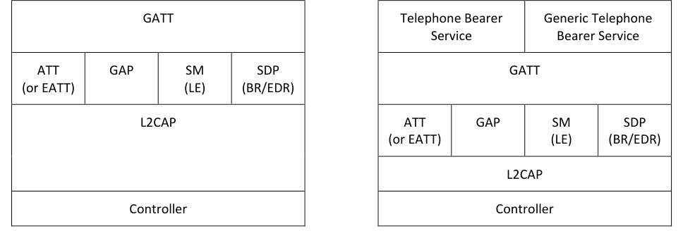

# CCP.TS .p3

> Source: PDF converted via PyMuPDF.

---

Call Control Profile (CCP)
Bluetooth® Test Suite
▪ Revision: CCP.TS.p3 ▪ Revision Date: 2023-02-07 ▪ Prepared By: Generic Audio Working Group ▪ Published during TCRL: TCRL.2022-2
This document, regardless of its title or content, is not a Bluetooth Specification as defined in the Bluetooth Patent/Copyright License Agreement (“PCLA”) and Bluetooth Trademark License Agreement. Use of this document by members of Bluetooth SIG is governed by the membership and other related agreements between Bluetooth SIG Inc. (“Bluetooth SIG”) and its members, including the PCLA and other agreements posted on Bluetooth SIG’s website located at www.bluetooth.com.
THIS DOCUMENT IS PROVIDED “AS IS” AND BLUETOOTH SIG, ITS MEMBERS, AND THEIR AFFILIATES MAKE NO REPRESENTATIONS OR WARRANTIES AND DISCLAIM ALL WARRANTIES, EXPRESS OR IMPLIED, INCLUDING ANY WARRANTY OF MERCHANTABILITY, TITLE, NON-INFRINGEMENT, FITNESS FOR ANY PARTICULAR PURPOSE, THAT THE CONTENT OF THIS DOCUMENT IS FREE OF ERRORS.
TO THE EXTENT NOT PROHIBITED BY LAW, BLUETOOTH SIG, ITS MEMBERS, AND THEIR AFFILIATES DISCLAIM ALL LIABILITY ARISING OUT OF OR RELATING TO USE OF THIS DOCUMENT AND ANY INFORMATION CONTAINED IN THIS DOCUMENT, INCLUDING LOST REVENUE, PROFITS, DATA OR PROGRAMS, OR BUSINESS INTERRUPTION, OR FOR SPECIAL, INDIRECT, CONSEQUENTIAL, INCIDENTAL OR PUNITIVE DAMAGES, HOWEVER CAUSED AND REGARDLESS OF THE THEORY OF LIABILITY, AND EVEN IF BLUETOOTH SIG, ITS MEMBERS, OR THEIR AFFILIATES HAVE BEEN ADVISED OF THE POSSIBILITY OF SUCH DAMAGES.
This document is proprietary to Bluetooth SIG. This document may contain or cover subject matter that is intellectual property of Bluetooth SIG and its members. The furnishing of this document does not grant any license to any intellectual property of Bluetooth SIG or its members.
This document is subject to change without notice.
Copyright © 2019–2023 by Bluetooth SIG, Inc. The Bluetooth word mark and logos are owned by Bluetooth SIG, Inc. Other third-party brands and names are the property of their respective owners.
Contents

## 1 Scope

This Bluetooth document contains the Test Suite Structure (TSS) and test cases to test the implementation of the Bluetooth Call Control Profile with the objective to provide a high probability of air interface interoperability between the tested implementation and other manufacturers’ Bluetooth devices.

## 2 References, definitions, and abbreviations

### 2.1 References

This document incorporates provisions from other publications by dated or undated reference. These references are cited at the appropriate places in the text, and the publications are listed hereinafter. Additional definitions and abbreviations can be found in [1] and [2].
[1] Bluetooth Core Specification, Version 4.2 or later
[2] Test Strategy and Terminology Overview
[3] Call Control Profile, Version 1.0
[4] Call Control Profile ICS
[5] GATT Test Suite, GATT.TS
[6] Characteristic and Descriptor descriptions are accessible via the Bluetooth SIG Assigned Numbers.

### 2.2 Definitions

In this Bluetooth document, the definitions from [1] and [2] apply.

### 2.3 Acronyms and abbreviations

In this Bluetooth document, the definitions, acronyms, and abbreviations from [1] and [2] apply.

## 3 Test Suite Structure (TSS)

### 3.1 Overview

The Call Control Profile requires the presence of GAP, SM (when used over LE transport), SDP (when used over BR/EDR transport), L2CAP, and GATT. This is illustrated in Figure 3.1.

| Call Control Client Role |  |  |  |
| --- | --- | --- | --- |
| GATT |  |  |  |
| ATT (or EATT) | GAP | SM (LE) | SDP (BR/EDR) |
| L2CAP |  |  |  |
| Controller |  |  |  |

| Call Control Server Role |  |  |  |
| --- | --- | --- | --- |
| Telephone Bearer Service |  | Generic Telephone Bearer Service |  |
| GATT |  |  |  |
| ATT (or EATT) | GAP | SM (LE) | SDP (BR/EDR) |
| L2CAP |  |  |  |
| Controller |  |  |  |

**Figure 3.1: Call Control Profile test model**

### 3.2 Test Strategy

The test objectives are to verify the functionality of the Call Control Profile within a Bluetooth Host and enable interoperability between Bluetooth Hosts on different devices. The testing approach covers mandatory and optional requirements in the specification and matches these to the support of the IUT as described in the ICS. Any defined test herein is applicable to the IUT if the ICS logical expression defined in the Test Case Mapping Table (TCMT) evaluates to true.
The test equipment provides an implementation of the Radio Controller and the parts of the Host needed to perform the test cases defined in this Test Suite. A Lower Tester acts as the IUT’s peer device and interacts with the IUT over-the-air interface. The configuration, including the IUT, needs to implement similar capabilities to communicate with the test equipment. For some test cases, it is necessary to stimulate the IUT from an Upper Tester. In practice, this could be implemented as a special test interface, a Man Machine Interface (MMI), or another interface supported by the IUT.
This Test Suite contains Valid Behavior (BV) tests complemented with Invalid Behavior (BI) tests where required. The test coverage mirrored in the Test Suite Structure is the result of a process that started with catalogued specification requirements that were logically grouped and assessed for testability enabling coverage in defined test purposes.

### 3.3 Test groups

The following test groups have been defined:
• Generic GATT Integrated Tests
Verify the generic GATT behavior for discovery, characteristics, descriptors, indications, notifications, etc.
• Call Control Point Procedures
Verify the behavior of the procedure triggered by writing opcodes to the Call Control Point.
• Service Procedure – Error Handling
Verify that the IUT correctly handles error conditions that result from the characteristic writes or failure to perform a requested operation due to rejection of the request by a remote device that implements the Telephone Bearer Service (TBS) and/or the Generic Telephone Bearer Service (GTBS).

## 4 Test cases (TC)

### 4.1 Introduction

#### 4.1.1 Test case identification conventions

Test cases are assigned unique identifiers per the conventions in [2]. The convention used here is: <spec abbreviation>/<IUT role>/<class>/<feat>/<func>/<subfunc>/<cap>/<xx>-<nn>-<y>.
Additionally, testing of this specification includes tests from the GATT Test Suite [5] referred to as Generic GATT Integrated Tests (GGIT); when used, the GGIT tests are referred to through a TCID string using the following convention: <spec abbreviation>/<IUT role>/<GGIT test group>/< GGIT class >/<xx>-<nn>-<y>.

|  | Identifier Abbreviation |  |  | Spec Identifier <spec abbreviation> |  |
| --- | --- | --- | --- | --- | --- |
| CCP |  |  | Call Control Profile |  |  |
|  | Identifier Abbreviation |  |  | Role Identifier <IUT role> |  |
| CL |  |  | Client |  |  |
| SR |  |  | Server |  |  |
|  | Identifier Abbreviation |  |  | Feature Identifier <feat> |  |
| CGGIT |  |  | Client Generic GATT Integrated Tests |  |  |
| CP |  |  | Call Control Point Tests |  |  |
| SGGIT |  |  | Server Generic GATT Integrated Tests |  |  |
|  | Identifier Abbreviation |  |  | Feature Identifier <func> |  |
| CHA |  |  | Characteristic GGIT |  |  |
| SDPNF |  |  | SDP GGIT |  |  |
| SER |  |  | Service GGIT |  |  |

Table 4.1: CCP TC feature naming convention

#### 4.1.2 Conformance

When conformance is claimed for a particular specification, all capabilities are to be supported in the specified manner. The mandated tests from this Test Suite depend on the capabilities to which conformance is claimed.
The Bluetooth Qualification Program may employ tests to verify implementation robustness. The level of implementation robustness that is verified varies from one specification to another and may be revised for cause based on interoperability issues found in the market.
Such tests may verify:
• That claimed capabilities may be used in any order and any number of repetitions not excluded by the specification
• That capabilities enabled by the implementations are sustained over durations expected by the use case
• That the implementation gracefully handles any quantity of data expected by the use case
• That in cases where more than one valid interpretation of the specification exists, the implementation complies with at least one interpretation and gracefully handles other interpretations
• That the implementation is immune to attempted security exploits
A single execution of each of the required tests is required to constitute a Pass verdict. However, it is noted that to provide a foundation for interoperability, it is necessary that a qualified implementation consistently and repeatedly pass any of the applicable tests.
In any case, where a member finds an issue with the test plan generated by Launch Studio, with the test case as described in the Test Suite, or with the test system utilized, the member is required to notify the responsible party via an erratum request such that the issue may be addressed.

#### 4.1.3 Pass/Fail verdict conventions

Each test case has an Expected Outcome section. The IUT is granted the Pass verdict when all the detailed pass criteria conditions within the Expected Outcome section are met.
The convention in this Test Suite is that, unless there is a specific set of fail conditions outlined in the test case, the IUT fails the test case as soon as one of the pass criteria conditions cannot be met. If this occurs, then the outcome of the test is a Fail verdict.

### 4.2 Setup preambles

The procedures defined in this section are provided as information, as they are used by test equipment in achieving the initial conditions in certain tests.

#### 4.2.1 ATT Bearer on LE Transport with Extended Advertising

Preamble procedure:
1. Establish an LE transport connection between the IUT and the Lower Tester, where the
advertising implementation (as GAP Peripheral) uses Extended Advertising as defined in Section 6.1.1 of [3], and the discovering implementation (as GAP Central) operates according to Section 6.1.2 of [3]. 2. Establish an L2CAP channel 0x0004 between the IUT and the Lower Tester over that LE
transport.

#### 4.2.2 ATT Bearer on BR/EDR Transport

Preamble procedure:
1. Establish a BR/EDR transport connection between the IUT and the Lower Tester. 2. Establish an L2CAP channel (PSM 0x001F) between the IUT and the Lower Tester over that
BR/EDR transport.

#### 4.2.3 EATT Bearer on LE Transport with Extended Advertising

Preamble procedure:
1. Establish an LE transport connection between the IUT and the Lower Tester, where the
advertising implementation (as GAP Peripheral) uses Extended Advertising as defined in Section 6.1.1 of [3], and the discovering implementation (as GAP Central) operates according to Section 6.1.2 of [3]. 2. Establish an L2CAP channel 0x0005 for signaling and one L2CAP channel (for ATT bearers) with
EATT PSM (as defined in Assigned Numbers) between the IUT and the Lower Tester over that LE transport.

#### 4.2.4 EATT Bearer on BR/EDR Transport

Preamble procedure:
1. Establish a BR/EDR transport connection between the IUT and the Lower Tester. 2. Establish an L2CAP channel 0x0001 for signaling and one L2CAP channel (for ATT bearers) with
EATT PSM (as defined in Assigned Numbers) between the IUT and the Lower Tester over that BR/EDR transport.

### 4.3 Generic GATT Integrated Tests

Execute the test defined in GATT.TS [5] Section 6.3, Server Test Procedures and in Section 6.4, Client Test Procedures (CGGIT) using Table 4.2 below as input:

| TCID |  |  |  | Service / |  | Reference | Properties |  |  | Value Length (Octets) |
| --- | --- | --- | --- | --- | --- | --- | --- | --- | --- | --- |
|  |  |  |  | Characteristic / |  |  |  |  |  |  |
|  |  |  |  | Descriptor |  |  |  |  |  |  |
|  | CCP/CL/CGGIT/SER/BV-01-C [Service GGIT |  | Telephone Bearer Service | Telephone Bearer Service |  | [3] 3 | - |  |  | - |
|  | – Telephone Bearer Service] |  |  |  |  |  |  |  |  |  |
|  | CCP/CL/CGGIT/CHA/BV-01-C [Characteristic |  | Bearer Provider Name |  |  | [3] 4.4.1 | 0x12 (Read, Notify) |  |  | - |
|  | GGIT – Bearer Provider Name] |  |  |  |  |  |  |  |  |  |
|  | CCP/CL/CGGIT/CHA/BV-02-C [Characteristic |  | Bearer UCI |  |  | [3] 4.4.2 | 0x02 (Read) |  |  | - |
|  | GGIT – Bearer UCI] |  |  |  |  |  |  |  |  |  |
|  | CCP/CL/CGGIT/CHA/BV-03-C [Characteristic |  | Bearer Technology |  |  | [3] 4.4.3 | 0x12 (Read, Notify) |  |  | - |
|  | GGIT – Bearer Technology] |  |  |  |  |  |  |  |  |  |
|  | CCP/CL/CGGIT/CHA/BV-04-C [Characteristic |  |  | Bearer URI Schemes |  | [3] 4.4.4 |  | Mandatory: 0x02 (Read) |  | - |
|  | GGIT – Bearer URI Schemes Supported List] |  |  | Supported List |  |  |  | Optional: 0x10 (Notify) |  |  |
|  | CCP/CL/CGGIT/CHA/BV-05-C [Characteristic |  | Bearer Signal Strength | Bearer Signal Strength |  | [3] 4.4.5 | 0x12 (Read, Notify) | 0x12 (Read, Notify) |  | 1 |
|  | GGIT – Bearer Signal Strength] |  |  |  |  |  |  |  |  |  |
|  | CCP/CL/CGGIT/CHA/BV-06-C [Characteristic |  | Bearer Signal Strength Reporting Interval |  |  | [3] 4.4.6 | 0x0E (Read, Write, Write Without Response) |  |  | 1 |
|  | GGIT – Bearer Signal Strength Reporting |  |  |  |  |  |  |  |  |  |
|  | Interval] |  |  |  |  |  |  |  |  |  |
|  | CCP/CL/CGGIT/CHA/BV-07-C [Characteristic |  | Bearer List Current Calls |  |  | [3] 4.4.8 | 0x12 (Read, Notify) |  |  | - |
|  | GGIT – Bearer List Current Calls] |  |  |  |  |  |  |  |  |  |
|  | CCP/CL/CGGIT/CHA/BV-08-C [Characteristic |  | Content Control ID |  |  | [3] 4.4.9 | 0x02 (Read) |  |  | 1 |
|  | GGIT – Content Control ID] |  |  |  |  |  |  |  |  |  |
|  | CCP/CL/CGGIT/CHA/BV-09-C [Characteristic |  |  | Incoming Call Target Bearer |  | [3] 4.4.10 | 0x12 (Read, Notify) |  |  | - |
|  | GGIT – Incoming Call Target Bearer URI] |  |  | URI |  |  |  |  |  |  |
|  | CCP/CL/CGGIT/CHA/BV-10-C [Characteristic |  | Status Flags Features | Status Flags Features |  | [3] 4.4.11 | 0x12 (Read, Notify) |  |  | 2 |
|  | GGIT – Status Flags] |  |  |  |  |  |  |  |  |  |
|  | CCP/CL/CGGIT/CHA/BV-11-C [Characteristic |  | Call State |  |  | [3] 4.4.12 | 0x12 (Read, Notify) |  |  | - |
|  | GGIT – Call State] |  |  |  |  |  |  |  |  |  |

| TCID |  |  |  | Service / |  | Reference | Properties |  |  | Value Length (Octets) |
| --- | --- | --- | --- | --- | --- | --- | --- | --- | --- | --- |
|  |  |  |  | Characteristic / |  |  |  |  |  |  |
|  |  |  |  | Descriptor |  |  |  |  |  |  |
|  | CCP/CL/CGGIT/CHA/BV-12-C [Characteristic |  | Call Control Point | Call Control Point |  | [3] 4.4.13 |  | 0x1C (Write, Write Without |  | skip |
|  | GGIT – Call Control Point] |  |  |  |  |  |  | Response, Notify) |  |  |
|  | CCP/CL/CGGIT/CHA/BV-13-C [Characteristic |  |  | Call Control Point Optional |  | [3] 4.4.14 | 0x02 (Read) | 0x02 (Read) |  | 2 |
|  | GGIT – Call Control Point Optional Opcodes] |  |  | Opcodes |  |  |  |  |  |  |
|  | CCP/CL/CGGIT/CHA/BV-14-C [Characteristic |  | Termination Reason | Termination Reason |  | [3] 4.5.1 | 0x10 (Notify) |  |  | 2 |
|  | GGIT – Termination Reason] |  |  |  |  |  |  |  |  |  |
|  | CCP/CL/CGGIT/CHA/BV-15-C [Characteristic |  | Incoming Call |  |  | [3] 4.4.15 | 0x12 (Read, Notify) |  |  | - |
|  | GGIT – Incoming Call] |  |  |  |  |  |  |  |  |  |
|  | CCP/CL/CGGIT/CHA/BV-16-C [Characteristic |  | Call Friendly Name |  |  | [3] 4.4.16 | 0x12 (Read, Notify) |  |  | - |
|  | GGIT – Call Friendly Name] |  |  |  |  |  |  |  |  |  |
|  | CCP/CL/CGGIT/SER/BV-02-C [Service GGIT |  |  | Generic Telephone Bearer |  | [3] 3 | - |  |  | - |
|  | – Generic Telephone Bearer Service] |  |  | Service |  |  |  |  |  |  |
|  | CCP/CL/CGGIT/CHA/BV-17-C [Characteristic |  | Bearer Provider Name | Bearer Provider Name |  | [3] 4.4.1 | 0x12 (Read, Notify) |  |  | - |
|  | GGIT – Bearer Provider Name] |  |  |  |  |  |  |  |  |  |
|  | CCP/CL/CGGIT/CHA/BV-18-C [Characteristic |  | Bearer UCI |  |  | [3] 4.4.2 | 0x02 (Read) |  |  | - |
|  | GGIT – Bearer UCI] |  |  |  |  |  |  |  |  |  |
|  | CCP/CL/CGGIT/CHA/BV-19-C [Characteristic |  | Bearer Technology |  |  | [3] 4.4.3 | 0x12 (Read, Notify) |  |  | - |
|  | GGIT – Bearer Technology] |  |  |  |  |  |  |  |  |  |
|  | CCP/CL/CGGIT/CHA/BV-20-C [Characteristic |  |  | Bearer URI Schemes |  | [3] 4.4.4 |  | Mandatory: 0x02 (Read) |  | - |
|  | GGIT – Bearer URI Schemes Supported List] |  |  | Supported List |  |  |  | Optional: 0x10 (Notify) |  |  |
|  | CCP/CL/CGGIT/CHA/BV-21-C [Characteristic |  | Bearer Signal Strength | Bearer Signal Strength |  | [3] 4.4.5 | 0x12 (Read, Notify) | 0x12 (Read, Notify) |  | 1 |
|  | GGIT – Bearer Signal Strength] |  |  |  |  |  |  |  |  |  |
|  | CCP/CL/CGGIT/CHA/BV-22-C [Characteristic |  | Bearer Signal Strength Reporting Interval |  |  | [3] 4.4.6 | 0x0E (Read, Write, Write Without Response) |  |  | 1 |
|  | GGIT – Bearer Signal Strength Reporting |  |  |  |  |  |  |  |  |  |
|  | Interval] |  |  |  |  |  |  |  |  |  |
|  | CCP/CL/CGGIT/CHA/BV-23-C [Characteristic |  | Bearer List Current Calls |  |  | [3] 4.4.8 | 0x12 (Read, Notify) |  |  | - |
|  | GGIT – Bearer List Current Calls] |  |  |  |  |  |  |  |  |  |
|  | CCP/CL/CGGIT/CHA/BV-24-C [Characteristic |  | Content Control ID |  |  | [3] 4.4.9 | 0x02 (Read) |  |  | 1 |
|  | GGIT – Content Control ID] |  |  |  |  |  |  |  |  |  |
|  | CCP/CL/CGGIT/CHA/BV-25-C [Characteristic |  |  | Incoming Call Target Bearer |  | [3] 4.4.10 | 0x12 (Read, Notify) |  |  | - |
|  | GGIT – Incoming Call Target Bearer URI] |  |  | URI |  |  |  |  |  |  |

| TCID |  |  |  | Service / |  | Reference | Properties |  |  | Value Length (Octets) |
| --- | --- | --- | --- | --- | --- | --- | --- | --- | --- | --- |
|  |  |  |  | Characteristic / |  |  |  |  |  |  |
|  |  |  |  | Descriptor |  |  |  |  |  |  |
|  | CCP/CL/CGGIT/CHA/BV-26-C [Characteristic |  | Status Flags Features | Status Flags Features |  | [3] 4.4.11 | 0x12 (Read, Notify) |  |  | 2 |
|  | GGIT – Status Flags] |  |  |  |  |  |  |  |  |  |
|  | CCP/CL/CGGIT/CHA/BV-27-C [Characteristic |  | Call State |  |  | [3] 4.4.12 | 0x12 (Read, Notify) |  |  | - |
|  | GGIT – Call State] |  |  |  |  |  |  |  |  |  |
|  | CCP/CL/CGGIT/CHA/BV-28-C [Characteristic |  | Call Control Point |  |  | [3] 4.4.13 |  | 0x1C (Write, Write Without |  | skip |
|  | GGIT – Call Control Point] |  |  |  |  |  |  | Response, Notify) |  |  |
|  | CCP/CL/CGGIT/CHA/BV-29-C [Characteristic |  |  | Call Control Point Optional |  | [3] 4.4.14 | 0x02 (Read) | 0x02 (Read) |  | 2 |
|  | GGIT – Call Control Point Optional Opcodes] |  |  | Opcodes |  |  |  |  |  |  |
|  | CCP/CL/CGGIT/CHA/BV-30-C [Characteristic |  | Termination Reason | Termination Reason |  | [3] 4.5.1 | 0x10 (Notify) |  |  | 2 |
|  | GGIT – Termination Reason] |  |  |  |  |  |  |  |  |  |
|  | CCP/CL/CGGIT/CHA/BV-31-C [Characteristic |  | Incoming Call |  |  | [3] 4.4.15 | 0x12 (Read, Notify) |  |  | - |
|  | GGIT – Incoming Call] |  |  |  |  |  |  |  |  |  |
|  | CCP/CL/CGGIT/CHA/BV-32-C [Characteristic |  | Call Friendly Name |  |  | [3] 4.4.16 | 0x12 (Read, Notify) |  |  | - |
|  | GGIT – Call Friendly Name] |  |  |  |  |  |  |  |  |  |
|  | CCP/SR/SGGIT/SDPNF/BV-01-C [Telephone |  | Telephone Bearer Service |  |  | - | - |  |  | - |
|  | Bearer Service not discoverable over |  |  |  |  |  |  |  |  |  |
|  | BR/EDR] |  |  |  |  |  |  |  |  |  |
|  | CCP/SR/SGGIT/SDPNF/BV-02-C [Generic |  | Generic Telephone Bearer Service |  |  | - | - |  |  | - |
|  | Telephone Bearer Service not discoverable |  |  |  |  |  |  |  |  |  |
|  | over BR/EDR] |  |  |  |  |  |  |  |  |  |

Table 4.2: Input for the GGIT Client and Server test procedures

### 4.4 Additional Service Discovery

#### 4.4.1 LE Audio Major Service Class CoD Support • Test Purpose

Verify that the IUT implementing either the Call Control Client or Call Control Server roles that supports the BR/EDR transport sets the LE Audio Major Service Class in the Class of Device field.
• Reference
[3] 6.2.3
• Initial Condition
- The IUT is discoverable and connectable over the BR/EDR transport.
• Test Configuration

|  | Test Cases |  |
| --- | --- | --- |
| CCP/SR/DSC/BV-01-C [Call Control Server – LE Audio Major Service Class CoD Support] |  |  |
| CCP/CL/DSC/BV-01-C [Call Control Client – LE Audio Major Service Class CoD Support] |  |  |

Table 4.3: LE Audio Major Service Class CoD Support test cases
• Test Procedure
1. The Lower Tester performs the Inquiry procedure. 2. The IUT sends an Inquiry response message.
• Expected Outcome
Pass verdict
In step 2, the Class of Device field has the LE Audio Major Service Class bit 14 set to 1.
If the IUT uses limited discoverable mode, the limited discoverable Major Service Class bit is also set to 1.

### 4.5 Service Procedure – Call Control Point • Test Purpose

This is a general procedure to test multiple procedures for writing opcodes to the Telephone Bearer Service Call Control Point and verifying the response. It is executed for each row in Table 4.4.
• Reference
[3] 4.4.13
• Initial Condition
- Establish a Bearer connection between the Lower Tester and the IUT as described in Section 4.2.1, if using ATT over an LE transport, or 4.2.2 if using ATT over a BR/EDR transport, or 4.2.3 if using EATT over an LE transport, or 4.2.4 if using EATT over a BR/EDR transport.
- The Lower Tester includes an instantiation of the Telephone Bearer Service and the Generic Telephone Bearer Service.
- The IUT has discovered the Telephone Bearer Service and has saved the handle range.
- The Lower Tester has a Call Index 2 with a Call 2 State as specified in Table 4.4.
• Test Case Configuration

|  | TCID |  |  | Service |  |  | Opcode |  |  | Call 1 State |  |  | Call 2 State |  |
| --- | --- | --- | --- | --- | --- | --- | --- | --- | --- | --- | --- | --- | --- | --- |
| CCP/CL/CP/BV-01-C [Call Control Point – Accept – TBS] |  |  | Telephone Bearer Service |  |  | 0x00 Answer Incoming Call |  |  | Incoming |  |  | - |  |  |
| CCP/CL/CP/BV-02-C [Call Control Point – Terminate – TBS] |  |  | Telephone Bearer Service |  |  | 0x01 Terminate Call |  |  | Active |  |  | - |  |  |
| CCP/CL/CP/BV-03-C [Call Control Point – Local Hold – TBS] |  |  | Telephone Bearer Service |  |  | 0x02 Move Call to Local Hold |  |  | Active |  |  | - |  |  |
| CCP/CL/CP/BV-04-C [Call Control Point – Retrieve Local Held – TBS] |  |  | Telephone Bearer Service |  |  | 0x03 Move Locally Held Call to Active Call |  |  | Locally Held |  |  | - |  |  |
| CCP/CL/CP/BV-05-C [Call Control Point – Retrieve Local and Remote Held – TBS] |  |  | Telephone Bearer Service |  |  | 0x03 Move Locally and Remotely Held Call to Remotely Held Call |  |  | Locally and Remote Held |  |  | - |  |  |
| CCP/CL/CP/BV-06-C [Call Control Point – Originate – TBS] |  |  | Telephone Bearer Service |  |  | 0x04 Originate |  |  | - |  |  | - |  |  |
| CCP/CL/CP/BV-07-C [Call Control Point – Join – TBS] |  |  | Telephone Bearer Service |  |  | 0x05 Join Calls |  |  | Locally Held |  |  | Locally Held |  |  |
| CCP/CL/CP/BV-08-C [Call Control Point – Accept – GTBS] |  |  | Generic Telephone Bearer Service |  |  | 0x00 Answer Incoming Call |  |  | Incoming |  |  | - |  |  |
| CCP/CL/CP/BV-09-C [Call Control Point – Terminate – GTBS] |  |  | Generic Telephone Bearer Service |  |  | 0x01 Terminate Call |  |  | Active |  |  | - |  |  |
| CCP/CL/CP/BV-10-C [Call Control Point – Local Hold – GTBS] |  |  | Generic Telephone Bearer Service |  |  | 0x02 Move Call to Local Hold |  |  | Active |  |  | - |  |  |
| CCP/CL/CP/BV-11-C [Call Control Point – Retrieve Local Held – GTBS] |  |  | Generic Telephone Bearer Service |  |  | 0x03 Move Locally Held Call to Active Call |  |  | Locally Held |  |  | - |  |  |
| CCP/CL/CP/BV-12-C [Call Control Point – Retrieve Local and Remote Held – GTBS] |  |  | Generic Telephone Bearer Service |  |  | 0x03 Move Locally and Remotely Held Call to Remotely Held Call |  |  | Locally and Remote Held |  |  | - |  |  |
| CCP/CL/CP/BV-13-C [Call Control Point – Originate – GTBS] |  |  | Generic Telephone Bearer Service |  |  | 0x04 Originate |  |  | - |  |  | - |  |  |
| CCP/CL/CP/BV-14-C [Call Control Point – Join – GTBS] |  |  | Generic Telephone Bearer Service |  |  | 0x05 Join Calls |  |  | Locally Held |  |  | Locally Held |  |  |

Table 4.4 Call Control Point test cases
• Test Procedure
1. The Upper Tester orders the IUT to execute the Procedure specified in Table 4.4 with the
following parameters:
- Specified Opcode in Table 4.4 and a Call Index of 1 if the Call 1 State is specified, otherwise any value
- If Call 2 State is specified, then use Call Index of 2 as well
2. The Lower Tester sends the IUT a notification of the Call Control Point characteristic indicating
SUCCESS (0x00).
• Expected Outcome
Pass verdict
The IUT successfully writes the specified Opcode in Table 4.4 to the Call Control Point with the correct parameter value.

### 4.6 Service Procedure – Error Handling

#### 4.6.1 Error Codes • Test Purpose

Verify that the IUT acting as a call control client behaves appropriately when it receives a Call Control Point Notification with an error Result Code in response to a write request.
• Reference
[3] 4.4.13
• Initial Condition
- Establish a Bearer connection between the Lower Tester and the IUT as described in Section 4.2.1, if using ATT over an LE transport, or 4.2.2 if using ATT over a BR/EDR transport, or 4.2.3 if using EATT over an LE transport, or 4.2.4 if using EATT over a BR/EDR transport.
- The Lower Tester includes one instantiation of the Telephone Bearer Service or the Generic Telephone Bearer Service.
- The IUT has enabled notifications by writing the value 0x0001 using the GATT Write Characteristic Descriptor sub-procedure for the Call Control Point CCCD.
• Test Case Configuration

|  | TCID |  |  | Service |  |
| --- | --- | --- | --- | --- | --- |
| CCP/CL/SPE/BI-01-C [Call Control Point – Error Codes – TBS] |  |  | Telephone Bearer Service |  |  |
| CCP/CL/SPE/BI-02-C [Call Control Point – Error Codes – GTBS] |  |  | Generic Telephone Bearer Service |  |  |

Table 4.5: Error Codes test cases
• Test Procedure
Execute steps 1–3 for each round in Table 4.6.
1. The Upper Tester orders the IUT to execute a Call Control Point procedure and Call Index with
any value. 2. The Lower Tester sends a notification of the Call Control Point characteristic with the Call Index
and the Requested Opcode set to the value and the Result Code set to the Result Code specified in Table 4.6. 3. The Upper Tester orders the IUT to execute any sub-procedure that reads any characteristic.

|  | Round |  |  | Result Code |  |
| --- | --- | --- | --- | --- | --- |
| 1 |  |  | OPCODE NOT SUPPORTED |  |  |
| 2 |  |  | INVALID CALL INDEX |  |  |
| 3 |  |  | STATE MISMATCH |  |  |
| 4 |  |  | LACK OF RESOURCES |  |  |

Table 4.6: Result Codes Input table
• Expected Outcome
Pass verdict
The IUT remains in normal operation after having received the error code (in step 2); this is verified by successful execution of step 3.

#### 4.6.2 Join – Operation Not Possible • Test Purpose

Verify that the IUT acting as a call control client behaves appropriately when it receives a Call Control Point Indication “Operation Not Possible” from the Call Control Point in response to the initiation of a Join Calls sub-procedure.
• Reference
[3] 4.4.13.7
• Initial Condition
- Establish a Bearer connection between the Lower Tester and the IUT as described in Section 4.2.1, if using ATT over an LE transport, or 4.2.2 if using ATT over a BR/EDR transport, or 4.2.3 if using EATT over an LE transport, or 4.2.4 if using EATT over a BR/EDR transport.
- The Lower Tester includes one instantiation of the Telephone Bearer Service or the Generic Telephone Bearer Service.
- The IUT has enabled notifications by writing the value 0x0001 using the GATT Write Characteristic Descriptor sub-procedure for the Call Control Point CCCD.
• Test Case Configuration

|  | TCID |  |  | Service |  |
| --- | --- | --- | --- | --- | --- |
| CCP/CL/SPE/BI-03-C [Join – Operation Not Possible – TBS] |  |  | Telephone Bearer Service |  |  |
| CCP/CL/SPE/BI-04-C [Join – Operation Not Possible – GTBS] |  |  | Generic Telephone Bearer Service |  |  |

Table 4.7: Error Codes test cases
• Test Procedure
1. The Upper Tester orders the IUT to execute the Join Calls sub-procedure and Call Indexes with
any value. 2. The Lower Tester sends a GATT Characteristic Value Notification with a result code of
OPERATION NOT POSSIBLE (0x02). 3. The Upper Tester orders the IUT to execute any sub-procedure that reads any characteristic.
• Expected Outcome
Pass verdict
The IUT remains in normal operation after having received the error code (in step 2); this is verified by successful execution of step 3.

#### 4.6.3 Originate Call – Invalid Outgoing URI • Test Purpose

Verify that the IUT acting as a call control client behaves appropriately when it receives a Call Control Point Indication “Invalid Outgoing URI” from the Call Control Point in response to initiating an Originate Call sub-procedure.
• Reference
[3] 4.4.13.6
• Initial Condition
- Establish a Bearer connection between the Lower Tester and the IUT as described in Section 4.2.1, if using ATT over an LE transport, or 4.2.2 if using ATT over a BR/EDR transport, or 4.2.3 if using EATT over an LE transport, or 4.2.4 if using EATT over a BR/EDR transport.
- The Lower Tester includes one instantiation of the Telephone Bearer Service and the Generic Telephone Bearer Service.
- The IUT has enabled notifications by writing the value 0x0001 using the GATT Write Characteristic Descriptor sub-procedure for the Call Control Point CCCD.
• Test Case Configuration

|  | TCID |  |  | Service |  |
| --- | --- | --- | --- | --- | --- |
| CCP/CL/SPE/BI-05-C [Originate Call – Invalid Outgoing URI – TBS] |  |  | Telephone Bearer Service |  |  |
| CCP/CL/SPE/BI-06-C [Originate Call – Invalid Outgoing URI – GTBS] |  |  | Generic Telephone Bearer Service |  |  |

Table 4.8: Error Codes test cases
• Test Procedure
1. The Upper Tester orders the IUT to execute the Originate Call sub-procedure and a URI of any
value. 2. The Lower Tester sends a GATT Characteristic Value Notification with a result code of INVALID
OUTGOING URI (0x06). 3. The Upper Tester orders the IUT to execute any sub-procedure that reads any characteristic.
• Expected Outcome
Pass verdict
The IUT remains in normal operation after receipt of the error code (in step 2); this is verified by successful execution of step 3.

## 5 Test case mapping

The Test Case Mapping Table (TCMT) maps test cases to specific requirements in the ICS. The IUT is tested in all roles for which support is declared in the ICS document.
The columns for the TCMT are defined as follows:
Item: Contains a logical expression based on specific entries from the associated ICS document. Contains a logical expression (using the operators AND, OR, NOT as needed) based on specific entries from the applicable ICS document(s). The entries are in the form of y/x references, where y corresponds to the table number and x corresponds to the feature number as defined in the ICS document for Call Control Profile [4].
Feature: A brief, informal description of the feature being tested.
Test Case(s): The applicable test case identifiers are required for Bluetooth Qualification if the corresponding y/x references defined in the Item column are supported. Further details about the function of the TCMT are elaborated in [1].
For the purpose and structure of the ICS/IXIT, refer to [1].

|  | Item |  |  | Feature |  |  | Test Case(s) |  |
| --- | --- | --- | --- | --- | --- | --- | --- | --- |
| CCP 1/1 AND CCP 2/2 AND NOT CCP 2/1 AND CCP 5/1 AND GATT 1a/4 |  |  | Telephone Bearer Service not discoverable over BR/EDR |  |  | CCP/SR/SGGIT/SDPNF/BV-01-C |  |  |
| CCP 1/1 AND CCP 2/2 AND NOT CCP 2/1 AND CCP 5/2 AND GATT 1a/4 |  |  | Generic Telephone Bearer Service not discoverable over BR/EDR |  |  | CCP/SR/SGGIT/SDPNF/BV-02-C |  |  |
| CCP 1/1 AND CCP 2/1 |  |  | LE Audio Major Service Class CoD Support – SR |  |  | CCP/SR/DSC/BV-01-C |  |  |
| CCP 1/2 AND CCP 2/1 |  |  | LE Audio Major Service Class CoD Support – CL |  |  | CCP/CL/DSC/BV-01-C |  |  |
| CCP 10/1 |  |  | Telephone Bearer Service |  |  | CCP/CL/CGGIT/SER/BV-01-C |  |  |
| CCP 11/1 |  |  | Bearer Provider Name Characteristic |  |  | CCP/CL/CGGIT/CHA/BV-01-C |  |  |
| CCP 11/2 |  |  | Bearer UCI Characteristic |  |  | CCP/CL/CGGIT/CHA/BV-02-C |  |  |
| CCP 11/3 |  |  | Bearer Technology Characteristic |  |  | CCP/CL/CGGIT/CHA/BV-03-C |  |  |
| CCP 11/4 |  |  | Bearer URI Schemes Supported List Characteristic |  |  | CCP/CL/CGGIT/CHA/BV-04-C |  |  |
| CCP 11/5 |  |  | Bearer Signal Strength |  |  | CCP/CL/CGGIT/CHA/BV-05-C |  |  |
| CCP 11/6 |  |  | Bearer Signal Strength Reporting Interval |  |  | CCP/CL/CGGIT/CHA/BV-06-C |  |  |
| CCP 11/7 |  |  | Bearer List Current Calls Characteristic |  |  | CCP/CL/CGGIT/CHA/BV-07-C |  |  |
| CCP 11/8 |  |  | Content Control Characteristic |  |  | CCP/CL/CGGIT/CHA/BV-08-C |  |  |
| CCP 11/9 |  |  | Feature and Status Flags Characteristic |  |  | CCP/CL/CGGIT/CHA/BV-09-C |  |  |
| CCP 11/10 |  |  | Incoming Call Target Bearer URI Characteristic |  |  | CCP/CL/CGGIT/CHA/BV-10-C |  |  |
| CCP 11/11 |  |  | Call State Characteristic |  |  | CCP/CL/CGGIT/CHA/BV-11-C |  |  |

|  | Item |  |  | Feature |  |  | Test Case(s) |  |
| --- | --- | --- | --- | --- | --- | --- | --- | --- |
| CCP 11/12 |  |  | Call Control Point Characteristic |  |  | CCP/CL/CGGIT/CHA/BV-12-C CCP/CL/SPE/BI-01-C |  |  |
| CCP 11/12 AND CCP 12/19 |  |  | Join – Operation Not Possible – TBS |  |  | CCP/CL/SPE/BI-03-C |  |  |
| CCP 11/12 AND CCP 12/18 |  |  | Originate Call – Invalid Outgoing URI |  |  | CCP/CL/SPE/BI-05-C |  |  |
| CCP 11/13 |  |  | Termination Reason Characteristic |  |  | CCP/CL/CGGIT/CHA/BV-13-C |  |  |
| CCP 11/14 |  |  | Incoming Call Characteristic |  |  | CCP/CL/CGGIT/CHA/BV-14-C |  |  |
| CCP 11/15 |  |  | Incoming Call Friendly Name Characteristic |  |  | CCP/CL/CGGIT/CHA/BV-15-C |  |  |
| CCP 11/16 |  |  | Outgoing Call Friendly Name Characteristic |  |  | CCP/CL/CGGIT/CHA/BV-16-C |  |  |
| CCP 12/13 |  |  | Accept Procedure |  |  | CCP/CL/CP/BV-01-C |  |  |
| CCP 12/14 |  |  | Terminate Procedure |  |  | CCP/CL/CP/BV-02-C |  |  |
| CCP 12/15 |  |  | Local Hold Procedure |  |  | CCP/CL/CP/BV-03-C |  |  |
| CCP 12/16 |  |  | Retrieve Local Procedure |  |  | CCP/CL/CP/BV-04-C |  |  |
| CCP 12/17 |  |  | Retrieve Locally and Remote Procedure |  |  | CCP/CL/CP/BV-05-C |  |  |
| CCP 12/18 |  |  | Originate Procedure |  |  | CCP/CL/CP/BV-06-C |  |  |
| CCP 12/19 |  |  | Join Procedure |  |  | CCP/CL/CP/BV-07-C |  |  |
|  | Generic Telephone Bearer Service |  |  |  |  |  |  |  |
| CCP 10/2 |  |  | Generic Telephone Bearer Service |  |  | CCP/CL/CGGIT/SER/BV-02-C |  |  |
| CCP 13/1 |  |  | (GTBS) Bearer Provider Name Characteristic |  |  | CCP/CL/CGGIT/CHA/BV-17-C |  |  |
| CCP 13/2 |  |  | (GTBS) Bearer UCI Characteristic |  |  | CCP/CL/CGGIT/CHA/BV-18-C |  |  |
| CCP 13/3 |  |  | (GTBS) Bearer Technology Characteristic |  |  | CCP/CL/CGGIT/CHA/BV-19-C |  |  |
| CCP 13/4 |  |  | (GTBS) Bearer URI Schemes Supported List Characteristic |  |  | CCP/CL/CGGIT/CHA/BV-20-C |  |  |
| CCP 13/5 |  |  | (GTBS) Bearer Signal Strength |  |  | CCP/CL/CGGIT/CHA/BV-21-C |  |  |
| CCP 13/6 |  |  | (GTBS) Bearer Signal Strength Reporting Interval |  |  | CCP/CL/CGGIT/CHA/BV-22-C |  |  |
| CCP 13/7 |  |  | (GTBS) Bearer List Current Calls Characteristic |  |  | CCP/CL/CGGIT/CHA/BV-23-C |  |  |
| CCP 13/8 |  |  | (GTBS) Content Control Characteristic |  |  | CCP/CL/CGGIT/CHA/BV-24-C |  |  |
| CCP 13/9 |  |  | (GTBS) Feature and Status Flags Characteristic |  |  | CCP/CL/CGGIT/CHA/BV-26-C |  |  |
| CCP 13/10 |  |  | (GTBS) Incoming Call Target Bearer URI Characteristic |  |  | CCP/CL/CGGIT/CHA/BV-25-C |  |  |
| CCP 13/11 |  |  | (GTBS) Call State Characteristic |  |  | CCP/CL/CGGIT/CHA/BV-27-C |  |  |
| CCP 13/12 |  |  | (GTBS) Call Control Point Characteristic |  |  | CCP/CL/CGGIT/CHA/BV-28-C CCP/CL/SPE/BI-02-C |  |  |
| CCP 13/12 AND CCP 14/19 |  |  | Join – Operation Not Possible – GTBS |  |  | CCP/CL/SPE/BI-04-C |  |  |
| CCP 13/12 AND CCP 14/18 |  |  | (GTBS) Originate Call – Invalid Outgoing URI |  |  | CCP/CL/SPE/BI-06-C |  |  |

|  | Item |  |  | Feature |  |  | Test Case(s) |  |
| --- | --- | --- | --- | --- | --- | --- | --- | --- |
| CCP 13/13 |  |  | (GTBS) Termination Reason Characteristic |  |  | CCP/CL/CGGIT/CHA/BV-29-C |  |  |
| CCP 13/14 |  |  | (GTBS) Incoming Call Characteristic |  |  | CCP/CL/CGGIT/CHA/BV-30-C |  |  |
| CCP 13/15 |  |  | (GTBS) Incoming Call Friendly Name Characteristic |  |  | CCP/CL/CGGIT/CHA/BV-31-C |  |  |
| CCP 13/16 |  |  | (GTBS) Outgoing Call Friendly Name Characteristic |  |  | CCP/CL/CGGIT/CHA/BV-32-C |  |  |
| CCP 14/13 |  |  | (GTBS) Accept Procedure |  |  | CCP/CL/CP/BV-08-C |  |  |
| CCP 14/14 |  |  | (GTBS) Terminate Procedure |  |  | CCP/CL/CP/BV-09-C |  |  |
| CCP 14/15 |  |  | (GTBS) Local Hold Procedure |  |  | CCP/CL/CP/BV-10-C |  |  |
| CCP 14/16 |  |  | (GTBS) Retrieve Local Procedure |  |  | CCP/CL/CP/BV-11-C |  |  |
| CCP 14/17 |  |  | (GTBS) Retrieve Locally and Remote Procedure |  |  | CCP/CL/CP/BV-12-C |  |  |
| CCP 14/18 |  |  | (GTBS) Originate Procedure |  |  | CCP/CL/CP/BV-13-C |  |  |
| CCP 14/19 |  |  | (GTBS) Join Procedure |  |  | CCP/CL/CP/BV-14-C |  |  |

Table 5.1: Test case mapping

## 6 Revision history and acknowledgments

Revision History

|  | Publication |  |  | Revision |  | Date | Comments |
| --- | --- | --- | --- | --- | --- | --- | --- |
|  | Number |  |  | Number |  |  |  |
| 0 |  |  | p0 |  |  | 2021-03-16 | Approved by BTI on 2021-02-15. CCP v1.0 adopted by the BoD on 2021-03-09. Prepared for publication. |
|  |  |  | p1r00 |  |  | 2021-10-12 | TSE 17554 (rating 1): Corrected the TCMT mappings for CCP/CL/CGGIT/CHA/BV-25-C and -26-C. TSE 17588 (rating 2): Rewrote the CoD section tests to clarify the relevant BB procedure and to remove the focus on GAP mode. Updated TCMT for CCP/SR/DSC/BV-01-C and CCP/CL/DSC/BV-01-C. Removed CCP/SR/DSC/BV-02-C and CCP/CL/DSC/BV-02-C. Performed template-related fixes. Updated Scope to align with the template. Updated copyright page to align with v2 of the DNMD. |
| 1 |  |  | p1 |  |  | 2022-01-25 | Approved by BTI on 2021-12-15. Prepared for TCRL 2021-2 publication. |
|  |  |  | p2r00 |  |  | 2022-02-14 | TSE 17774 (rating 2): Corrected the TCMT entries for CCP/CL/SPE/BI-05-C and -06-C to include support for the originate call feature. |
| 2 |  |  | p2 |  |  | 2022-06-28 | Approved by BTI on 2022-06-20. Prepared for TCRL 2022-1 publication. |
|  |  |  | p3r00 |  |  | 2022-07-28 | TSE 18670 (rating 2): Corrected the TCMT entries for CCP/CL/SPE/BI-03-C and -04-C to include support for the join calls feature. Template-related editorials, including removing the pre-p0 (draft) revision history entries. |
| 3 |  |  | p3 |  |  | 2023-02-07 | Approved by BTI on 2022-12-19. Prepared for TCRL 2022-2 publication. |

Acknowledgments

|  | Name |  |  | Company |  |
| --- | --- | --- | --- | --- | --- |
| Gene Chang |  |  | Bluetooth SIG, Inc. |  |  |
| Charlie Lenahan |  |  | Bluetooth SIG, Inc. |  |  |
| Alicia Courtney |  |  | Broadcom |  |  |
| Masahiko Seki |  |  | Sony |  |  |
