# CS.TS.p3

> Source: PDF converted via PyMuPDF.

---

Channel Sounding (CS)
Bluetooth® Test Suite
▪ Revision: CS.TS.p3 ▪ Revision Date: 2025-11-04 ▪ Prepared By: Core Specification Working Group ▪ Published during TCRL: TCRL.pkg101
This document, regardless of its title or content, is not a Bluetooth Specification as defined in the Bluetooth Patent/Copyright License Agreement (“PCLA”) and Bluetooth Trademark License Agreement. Use of this document by members of Bluetooth SIG is governed by the membership and other related agreements between Bluetooth SIG Inc. (“Bluetooth SIG”) and its members, including the PCLA and other agreements posted on Bluetooth SIG’s website located at www.bluetooth.com.
THIS DOCUMENT IS PROVIDED “AS IS” AND BLUETOOTH SIG, ITS MEMBERS, AND THEIR AFFILIATES MAKE NO REPRESENTATIONS OR WARRANTIES AND DISCLAIM ALL WARRANTIES, EXPRESS OR IMPLIED, INCLUDING ANY WARRANTY OF MERCHANTABILITY, TITLE, NON-INFRINGEMENT, FITNESS FOR ANY PARTICULAR PURPOSE, THAT THE CONTENT OF THIS DOCUMENT IS FREE OF ERRORS.
TO THE EXTENT NOT PROHIBITED BY LAW, BLUETOOTH SIG, ITS MEMBERS, AND THEIR AFFILIATES DISCLAIM ALL LIABILITY ARISING OUT OF OR RELATING TO USE OF THIS DOCUMENT AND ANY INFORMATION CONTAINED IN THIS DOCUMENT, INCLUDING LOST REVENUE, PROFITS, DATA OR PROGRAMS, OR BUSINESS INTERRUPTION, OR FOR SPECIAL, INDIRECT, CONSEQUENTIAL, INCIDENTAL OR PUNITIVE DAMAGES, HOWEVER CAUSED AND REGARDLESS OF THE THEORY OF LIABILITY, AND EVEN IF BLUETOOTH SIG, ITS MEMBERS, OR THEIR AFFILIATES HAVE BEEN ADVISED OF THE POSSIBILITY OF SUCH DAMAGES.
This document is proprietary to Bluetooth SIG. This document may contain or cover subject matter that is intellectual property of Bluetooth SIG and its members. The furnishing of this document does not grant any license to any intellectual property of Bluetooth SIG or its members.
This document is subject to change without notice.
Copyright © 2024–2025 by Bluetooth SIG, Inc. The Bluetooth word mark and logos are owned by Bluetooth SIG, Inc. Other third-party brands and names are the property of their respective owners.
Contents

## 1 Scope

This Bluetooth document contains the Test Suite Structure (TSS) and test cases to test the implementation of the Bluetooth Channel Sounding layer with the objective to provide a high probability of air interface interoperability between the tested implementation and other manufacturers’ Bluetooth devices.

## 2 References, definitions, and abbreviations

### 2.1 References

This document incorporates provisions from other publications by dated or undated reference. These references are cited at the appropriate places in the text, and the publications are listed hereinafter. Additional definitions and abbreviations can be found in [1], [2], and [3].
[1] Bluetooth Core Specification, Version 6.0 or later
[2] Test Strategy and Terminology Overview
[3] Specification of the Bluetooth System, Volume 6, Part H (Channel Sounding), Version 6.0 or later
[4] ICS Proforma for Channel Sounding (CS.ICS)
[5] Characteristic and Descriptor descriptions are accessible via the Bluetooth SIG Assigned Numbers
[6] Specification of the Bluetooth System, Volume 6, Part B (Link Layer), Version 6.0 or later
[7] Specification of the Bluetooth System, Volume 6, Part F (Direct Test Mode), Version 6.0 or later
[8] Specification of the Bluetooth System, Volume 6, Part A (RFPHY), Version 6.0 or later
[9] Radio Frequency Physical Layer (RFPHY) Test Suite
[10] Bluetooth Core Specification Volume 6, Part H (Channel Sounding), Version 6.2 or later

### 2.2 Definitions

In this Bluetooth document, the definitions from [1], [2], and [3] apply.

### 2.3 Acronyms and abbreviations

In this Bluetooth document, the definitions, acronyms, and abbreviations from [1], [2], and [3] apply.

## 3 Test Suite Structure (TSS)

### 3.1 Overview

Channel Sounding
LL
LE Radio (PHY)
Table 3.1: Test Suite Structure

### 3.2 Test Strategy

The test objectives are to verify the functionality of the Channel Sounding layer within a Bluetooth Host and enable interoperability between Bluetooth Hosts on different devices. The testing approach covers mandatory and optional requirements in the specification and matches these to the support of the IUT as described in the ICS. Any defined test herein is applicable to the IUT if the ICS logical expression defined in the Test Case Mapping Table (TCMT) evaluates to true.
The test equipment provides an implementation of the Radio Controller and the parts of the Host needed to perform the test cases defined in this Test Suite. A Lower Tester acts as the IUT’s peer device and interacts with the IUT over-the-air interface. The configuration, including the IUT, needs to implement similar capabilities to communicate with the test equipment. For some test cases, it is necessary to stimulate the IUT from an Upper Tester. In practice, this could be implemented as a special test interface, a Man Machine Interface (MMI), or another interface supported by the IUT.
This Test Suite contains Valid Behavior (BV) tests complemented with Invalid Behavior (BI) tests where required. The test coverage mirrored in the Test Suite Structure is the result of a process that started with catalogued specification requirements that were logically grouped and assessed for testability enabling coverage in defined test purposes.

### 3.3 Test groups

The following test groups have been defined:
• Normalized Attack Detector
• Packet Format
• Phase Measurement
• Round Trip Time
• Timing of Steps

## 4 Test cases (TC)

### 4.1 Introduction

#### 4.1.1 Test case identification conventions

Test cases are assigned unique identifiers per the conventions in [2]. The convention used here is: <spec abbreviation>/<IUT role>/<class>/<feat>/<func>/<subfunc>/<cap>/<xx>-<nn>-<y>.

|  | Identifier Abbreviation |  |  | Spec Identifier <spec abbreviation> |  |
| --- | --- | --- | --- | --- | --- |
| CS |  |  | Channel Sounding |  |  |
|  | Identifier Abbreviation |  |  | Role Identifier <IUT role> |  |
| INI |  |  | Initiator Role |  |  |
| REF |  |  | Reflector Role |  |  |
|  | Identifier Abbreviation |  |  | Feature <feat> |  |
| NAD |  |  | Normalized Attack Detector |  |  |
| PAC |  |  | Packet Format |  |  |
| PM |  |  | Phase Measurement |  |  |
| RTT |  |  | Round Trip Time |  |  |
| TIM |  |  | Timing of Steps |  |  |

Table 4.1: CS TC feature naming conventions

#### 4.1.2 Conformance

When conformance is claimed for a particular specification, all capabilities are to be supported in the specified manner. The mandated tests from this Test Suite depend on the capabilities to which conformance is claimed.
The Bluetooth Qualification Program may employ tests to verify implementation robustness. The level of implementation robustness that is verified varies from one specification to another and may be revised for cause based on interoperability issues found in the market.
Such tests may verify:
• That claimed capabilities may be used in any order and any number of repetitions not excluded by the specification
• That capabilities enabled by the implementations are sustained over durations expected by the use case
• That the implementation gracefully handles any quantity of data expected by the use case
• That in cases where more than one valid interpretation of the specification exists, the implementation complies with at least one interpretation and gracefully handles other interpretations
• That the implementation is immune to attempted security exploits
A single execution of each of the required tests is required to constitute a Pass verdict. However, it is noted that to provide a foundation for interoperability, it is necessary that a qualified implementation consistently and repeatedly pass any of the applicable tests.
In any case, where a member finds an issue with the test plan generated by the Bluetooth SIG qualification tool, with the test case as described in the Test Suite, or with the test system utilized, the member is required to notify the responsible party via an erratum request such that the issue may be addressed.

#### 4.1.3 Common test case conditions

Unless stated otherwise in individual test cases, the following apply throughout this Test Suite:
1. The IUT is connected to the tester via a resistive splitter as shown in Section 4.8.1. 2. The test case is to be performed at normal operating conditions.

#### 4.1.4 Channel Sounding Test commands

The Channel Sounding Test commands allow the Upper Tester to enable a single CS procedure with multiple Subevents.
The HCI_LE_CS_Test command is used to start a Channel Sounding test that starts a CS procedure in either the Initiator or Reflector role.
The HCI_LE_CS_Test_End command stops a CS test in progress.
The HCI_LE_CS_Test_End_Complete event is generated when the IUT stops an in-progress CS test.

#### 4.1.5 Pass/Fail verdict conventions

Each test case has an Expected Outcome section. The IUT is granted the Pass verdict when all the detailed pass criteria conditions within the Expected Outcome section are met.
The convention in this Test Suite is that, unless there is a specific set of fail conditions outlined in the test case, the IUT fails the test case as soon as one of the pass criteria conditions cannot be met. If this occurs, then the outcome of the test is a Fail verdict.

#### 4.1.6 Common parameters and variables

Some of the following tests are started using the HCI_LE_CS_Test command, and some tests by sending LL PDUs as part of an ACL connection. Each test defines particular parameters to use that modify a default set of parameters. When using the HCI_LE_CS_Test command, use the default set of parameters in Section 4.1.6.3. When using LL PDUs, use the default parameters from Sections 4.1.6.1 and 4.1.6.2.

##### 4.1.6.1 ACL connection parameters

When using an ACL connection, the Connection Interval is set to 500 ms.

|  | Parameter |  |  | Value |  |
| --- | --- | --- | --- | --- | --- |
| ChM |  |  | 0x1FFFFFFFFFFFFC7FFFFC (all channels) |  |  |
| ChMRepetition |  |  | 1 |  |  |
| Main Mode _ |  |  | 2 (Mode-2) |  |  |
| Sub Mode _ |  |  | 1 (Mode-1) |  |  |
| Main Mode Min Steps _ _ _ |  |  | 3 |  |  |
| Main Mode Max Steps _ _ _ |  |  | 5 |  |  |
| Main Mode Repetition _ _ |  |  | 1 |  |  |
| Mode 0 Steps _ _ |  |  | 1 |  |  |
| CS SYNC PHY _ _ |  |  | 0x01 (1M PHY) |  |  |
| RTT Type _ |  |  | 0 (CS Access Address only) |  |  |
| ChSel |  |  | 0 (Ch Sel #3b) |  |  |
| T IP1 _ |  |  | 7 (145 us) |  |  |
| T IP2 _ |  |  | 7 (145 us) |  |  |
| T FCS _ |  |  | 9 (150 us) |  |  |
| T PM _ |  |  | 2 (40 us) |  |  |
| connEventCount |  |  | NA (implementation selectable) |  |  |
| Offset Min _ |  |  | NA (implementation selectable) |  |  |
| Offset Max _ |  |  | NA (implementation selectable) |  |  |
| Max Procedure Len _ _ |  |  | 450 ms (50 ms less than default conn interval) |  |  |
| Event Interval _ |  |  | 1 |  |  |
| Subevents Per Event _ _ |  |  | 1 |  |  |
| Subevent Interval _ |  |  | 0 (NA) |  |  |
| Subevent Len _ |  |  | 450 ms |  |  |
| Procedure Interval _ |  |  | 0 (NA) |  |  |
| Procedure Count _ |  |  | 1 |  |  |
| ACI |  |  | 0 (1:1) |  |  |
| Preferred Peer Antennas _ _ |  |  | 0 |  |  |
| PHY |  |  | 0x01 (1M PHY) |  |  |
| Power Delta _ |  |  | 0 |  |  |

Table 4.2: Default Channel Sounding parameters when using LL PDUs on an ACL connection
Some tests require a smaller number of channels, N. In this case, the ChM parameter should be modified to have bits set for only N channels. If more than 72 steps are required by a test, then the ChM and ChMRepetition parameters should be adjusted to produce the required number of channels.

|  | Parameter |  |  | Value |  |
| --- | --- | --- | --- | --- | --- |
| Main Mode Type _ _ |  |  | 0x01 (Mode-1) |  |  |
| Sub Mode Type _ _ |  |  | 0xFF (Unused) |  |  |
| Main Mode Repetition _ _ |  |  | 0x00 (No repetition) |  |  |
| Mode 0 Steps _ _ |  |  | 0x03 (Maximum) |  |  |
| Role |  |  | 0x00 (Initiator) |  |  |
| RTT Type _ |  |  | 0x00 (RTT AA Only) |  |  |
| CS SYNC PHY _ _ |  |  | 0x01 (LE 1M PHY) |  |  |
| CS SYNC Antenna Selection _ _ _ |  |  | 0x01 (AP1) |  |  |
| Subevent Len _ |  |  | 0xFFFFFF (Maximum) |  |  |
| Subevent Interval _ |  |  | 0x0000 (Single sub-event) |  |  |
| Max Num Sub events _ _ _ |  |  | 0x00 (Ignore) |  |  |
| Transmit Power Level _ _ |  |  | 0x7F (Maximum) |  |  |
| T IP1 Time _ _ |  |  | Shortest supported by the IUT |  |  |
| T IP2 Time _ _ |  |  | Shortest supported by the IUT |  |  |
| T FCS Time _ _ |  |  | Shortest supported by the IUT |  |  |
| T PM Time _ _ |  |  | 0x28 (40 us) |  |  |
| T SW Time _ _ |  |  | 0x00 (0 us) |  |  |
| Tone Antenna Config _ _ |  |  | 0x00 (1:1) |  |  |
| Companion Signal Enable _ _ |  |  | 0x00 (Disabled) |  |  |
| DRBG Nonce _ |  |  | 0x0000 |  |  |
| Channel Map Repetition _ _ |  |  | 0x01 (Single repetition) |  |  |
| Override Config _ |  |  | 0x0008 (Bit 3 enabled) |  |  |
| Override Parameters Length _ _ |  |  | 0x0E |  |  |
| Override Parameters Data _ _ |  |  | {0xFC 0xFF 0x7F 0xFC 0xFF 0xFF 0xFF 0xFF 0xFF 0x1F} (Channel Map) _ 0x00 (Channel Selection Type, 3b) _ _ 0x00 (Ch3c Shape, unused) _ 0x00 (Ch3c Jump, unused) _ 0x00 (T PM Tone Ext) _ _ _ |  |  |

Table 4.3: Default Channel Sounding parameters when using the HCI_LE_CS_Test command
Some tests require a smaller number of channels, N. In this case, the number of bits set in the Channel_Map should be reduced to N.
If more than 72 steps are required, then the Channel_Map_Repetition parameter should be used in combination with a Channel_Map with a suitable number of bits set in order to produce the required number of channels.
The default frequencies (𝑓𝑂) used for Channel Sounding (populated in the Override Channel[i] channel pattern list) testing are as follows:

|  | Modulation |  |  | IUT Low |  |  | IUT Mid |  |  | IUT High |  |
| --- | --- | --- | --- | --- | --- | --- | --- | --- | --- | --- | --- |
| 1 Msym/s |  |  | 2404 MHz (k=2) |  |  | 2440 MHz (k=38) |  |  | 2478 MHz (k=76) |  |  |
| 2 Msym/s |  |  | 2404 MHz (k=2) |  |  | 2440 MHz (k=38) |  |  | 2478 MHz (k=76) |  |  |
| 2 Msym/s, BT = 2.0 |  |  | 2412 MHz (k=10) |  |  | 2440 MHz (k=38) |  |  | 2470 MHz (k=68) |  |  |

Table 4.4: Channel Sounding default frequencies
The number of Mode-0 and Main-Mode CS steps per CS sub-event that use the static CS test frequencies is defined in [9] Section 4.2.3.3. The channels specified for test may be repeated per CS sub-event or per CS procedure, or both.

##### 4.1.6.5 Common Pass verdict criteria

Unless specified in the test procedure, the Lower Tester verifies that the IUT uses the correct timing, channel, access address, and preamble in at least 90% of the steps (i.e., received steps). The Lower Tester additionally confirms that the Sounding/Random sequence and trailer, where applicable, are valid in at least 90% of the received steps (i.e., valid steps).

### 4.2 Setup preambles

The procedures defined in this section are used to achieve specific conditions on the IUT and the test equipment within the tests defined in this document. The preambles here are commonly used to establish initial conditions.

#### 4.2.1 Channel Sounding Mode-0 • Preamble Procedure

1. Perform either alternative 1A or 1B depending on the IUT role.
Alternative 1A (IUT is Initiator):
1A.1 The IUT sends a Mode-0 CS_SYNC bit sequence for T_SY time. At T_SY time, the signal ramps down for T_RD. 1A.2 The Lower Tester waits for T_IP1 and sends a CS_SYNC followed by a CS Tone for T_SY + T_GD + T_FM, and then the signal ramps down for T_RD. Alternative 1B (IUT is Reflector):
1B.1 The Lower Tester sends a Mode-0 CS_SYNC bit sequence for T_SY. 1B.2 The IUT waits for T_IP1 and sends a CS_SYNC followed by a CS Tone for T_SY + T_GD + T_FM, and then the signal ramps down for T_RD. 1B.3 The IUT reports the Mode-0 Channel Sounding results to the Upper Tester.

### 4.3 NAD

Verify the Normalized Attack Detector Metric.

#### 4.3.1 Amplitude-based Attack NADM, Square Wave Test Strategy

To assess the Amplitude-based Normalized Attack Detector Metric (NADM), the IUT’s receive filter response is initially characterized using an attack signal that varies in both time offset and duty cycle, relative to the width of the modulated symbol. In this step, a fixed attack signal gain is applied, and the behavior of the IUT with and without the attack signal is compared to determine local minimums in
regions of maximum timing advancement where the attack signal distorts the measured RTT times enough for an attack to be considered effective.
A spatial filter is applied to isolate the most significant local minimum points. The Time Offset and Duty Cycle search (and associated ranges) is described in [10] Section 3.5.4.3.2. The characterization procedure along with the spatial filter is described in [10] Section 3.5.4.3.3.
The attack detection by the IUT is then tested at the local minimum points of interest using a mixture of amplitude-based attack modulated signals and normally modulated signals. At these points, the attack signal is then applied once again, but now across varying amplitude gain points. The IUT is expected to detect the attack pattern across this sweep.

#### 4.3.2 Both roles

##### 4.3.2.1 Phase-Based Normalized Attack Detector Metric

• Test Purpose
This test verifies that the IUT Phase-Based Normalized Attack Detector Metric (NADM) properly detects an attack attempt from the Lower Tester. The IUT detects how much a received Gaussian Frequency Shift Keying (GFSK) modulated packet signal differs from the expected packet signal.
• Reference
[3] 3.5.1, 3.5.6
• Initial Condition
- The IUT supports the mode specified in Table 4.5. The IUT is in the Initiator role.
- The Lower Tester signal strength is set so that the IUT receives the signal with a signal-to-noise ratio of 25 dB.
- LE 1M PHY: The Lower Tester generates a reference signal of -67 dBm power together with a Gaussian Noise Floor of -152 dBm/Hz for the LE 1M PHY.
- LE 2M PHY: The Lower Tester generates a reference signal of -67 dBm power together with a Gaussian Noise Floor of -155 dBm/Hz for the LE 2M PHY.
• Test Case Configuration

|  | TCID |  |  | Role/PHY |  |  | Mode |  |
| --- | --- | --- | --- | --- | --- | --- | --- | --- |
| CS/NAD/REF/BV-01-C [Phase-Based Normalized Attack Detector Metric, Mode-1, Random Sequence 32-bits, Reflector LE 1M PHY] |  |  | Reflector LE 1M |  |  | Mode-1, Random Sequence, 32-bits |  |  |
| CS/NAD/REF/BV-02-C [Phase-Based Normalized Attack Detector Metric, Mode-1, Random Sequence 64-bits, Reflector LE 1M PHY] |  |  | Reflector LE 1M |  |  | Mode-1, Random Sequence, 64-bits |  |  |
| CS/NAD/REF/BV-03-C [Phase-Based Normalized Attack Detector Metric, Mode-1, Random Sequence 96-bits, Reflector LE 1M PHY] |  |  | Reflector LE 1M |  |  | Mode-1, Random Sequence, 96-bits |  |  |
| CS/NAD/REF/BV-04-C [Phase-Based Normalized Attack Detector Metric, Mode-1, Random Sequence 128-bits, Reflector LE 1M PHY] |  |  | Reflector LE 1M |  |  | Mode-1, Random Sequence, 128-bits |  |  |
| CS/NAD/REF/BV-05-C [Phase-Based Normalized Attack Detector Metric, Mode-1, Sounding Sequence 32-bits, Reflector LE 1M PHY] |  |  | Reflector LE 1M |  |  | Mode-1, Sounding Sequence, 32-bits |  |  |

|  | TCID |  |  | Role/PHY |  |  | Mode |  |
| --- | --- | --- | --- | --- | --- | --- | --- | --- |
| CS/NAD/REF/BV-06-C [Phase-Based Normalized Attack Detector Metric, Mode-1, Sounding Sequence 96-bits, Reflector LE 1M PHY] |  |  | Reflector LE 1M |  |  | Mode-1, Sounding Sequence, 96-bits |  |  |
| CS/NAD/REF/BV-07-C [Phase-Based Normalized Attack Detector Metric, Mode-3, Random Sequence 32-bits, Reflector LE 1M PHY] |  |  | Reflector LE 1M |  |  | Mode-3, Random Sequence, 32-bits |  |  |
| CS/NAD/REF/BV-08-C [Phase-Based Normalized Attack Detector Metric, Mode-3, Random Sequence 64-bits, Reflector LE 1M PHY] |  |  | Reflector LE 1M |  |  | Mode-3, Random Sequence, 64-bits |  |  |
| CS/NAD/REF/BV-09-C [Phase-Based Normalized Attack Detector Metric, Mode-3, Random Sequence 96-bits, Reflector LE 1M PHY] |  |  | Reflector LE 1M |  |  | Mode-3, Random Sequence, 96-bits |  |  |
| CS/NAD/REF/BV-10-C [Phase-Based Normalized Attack Detector Metric, Mode-3, Random Sequence 128-bits, Reflector LE 1M PHY] |  |  | Reflector LE 1M |  |  | Mode-3, Random Sequence, 128-bits |  |  |
| CS/NAD/REF/BV-11-C [Phase-Based Normalized Attack Detector Metric, Mode-3, Sounding Sequence 32-bits, Reflector LE 1M PHY] |  |  | Reflector LE 1M |  |  | Mode-3, Sounding Sequence, 32-bits |  |  |
| CS/NAD/REF/BV-12-C [Phase-Based Normalized Attack Detector Metric, Mode-3, Sounding Sequence 96-bits, Reflector LE 1M PHY] |  |  | Reflector LE 1M |  |  | Mode-3, Sounding Sequence, 96-bits |  |  |
| CS/NAD/INI/BV-01-C [Phase-Based Normalized Attack Detector Metric, Mode-1, Random Sequence 32-bits, Initiator LE 1M PHY] |  |  | Initiator LE 1M |  |  | Mode-1, Random Sequence, 32-bits |  |  |
| CS/NAD/INI/BV-02-C [Phase-Based Normalized Attack Detector Metric, Mode-1, Random Sequence 64-bits, Initiator LE 1M PHY] |  |  | Initiator LE 1M |  |  | Mode-1, Random Sequence, 64-bits |  |  |
| CS/NAD/INI/BV-03-C [Phase-Based Normalized Attack Detector Metric, Mode-1, Random Sequence 96-bits, Initiator LE 1M PHY] |  |  | Initiator LE 1M |  |  | Mode-1, Random Sequence, 96-bits |  |  |
| CS/NAD/INI/BV-04-C [Phase-Based Normalized Attack Detector Metric, Mode-1, Random Sequence 128-bits, Initiator LE 1M PHY] |  |  | Initiator LE 1M |  |  | Mode-1, Random Sequence, 128-bits |  |  |
| CS/NAD/INI/BV-05-C [Phase-Based Normalized Attack Detector Metric, Mode-1, Sounding Sequence 32-bits, Initiator LE 1M PHY] |  |  | Initiator LE 1M |  |  | Mode-1, Sounding Sequence, 32-bits |  |  |
| CS/NAD/INI/BV-06-C [Phase-Based Normalized Attack Detector Metric, Mode-1, Sounding Sequence 96-bits, Initiator LE 1M PHY] |  |  | Initiator LE 1M |  |  | Mode-1, Sounding Sequence, 96-bits |  |  |
| CS/NAD/INI/BV-07-C [Phase-Based Normalized Attack Detector Metric, Mode-3, Random Sequence 32-bits, Initiator LE 1M PHY] |  |  | Initiator LE 1M |  |  | Mode-3, Random Sequence, 32-bits |  |  |
| CS/NAD/INI/BV-08-C [Phase-Based Normalized Attack Detector Metric, Mode-3, Random Sequence 64-bits, Initiator LE 1M PHY] |  |  | Initiator LE 1M |  |  | Mode-3, Random Sequence, 64-bits |  |  |
| CS/NAD/INI/BV-09-C [Phase-Based Normalized Attack Detector Metric, Mode-3, Random Sequence 96-bits, Initiator LE 1M PHY] |  |  | Initiator LE 1M |  |  | Mode-3, Random Sequence, 96-bits |  |  |

|  | TCID |  |  | Role/PHY |  |  | Mode |  |
| --- | --- | --- | --- | --- | --- | --- | --- | --- |
| CS/NAD/INI/BV-10-C [Phase-Based Normalized Attack Detector Metric, Mode-3, Random Sequence 128-bits, Initiator LE 1M PHY] |  |  | Initiator LE 1M |  |  | Mode-3, Random Sequence, 128-bits |  |  |
| CS/NAD/INI/BV-11-C [Phase-Based Normalized Attack Detector Metric, Mode-3, Sounding Sequence 32-bits, Initiator LE 1M PHY] |  |  | Initiator LE 1M |  |  | Mode-3, Sounding Sequence, 32-bits |  |  |
| CS/NAD/INI/BV-12-C [Phase-Based Normalized Attack Detector Metric, Mode-3, Sounding Sequence 96-bits, Initiator LE 1M PHY] |  |  | Initiator LE 1M |  |  | Mode-3, Sounding Sequence, 96-bits |  |  |
| CS/NAD/REF/BV-13-C [Phase-Based Normalized Attack Detector Metric, Mode-1, Random Sequence 32-bits, Reflector LE 2M PHY] |  |  | Reflector LE 2M |  |  | Mode-1, Random Sequence, 32-bits |  |  |
| CS/NAD/REF/BV-14-C [Phase-Based Normalized Attack Detector Metric, Mode-1, Random Sequence 64-bits, Reflector LE 2M PHY] |  |  | Reflector LE 2M |  |  | Mode-1, Random Sequence, 64-bits |  |  |
| CS/NAD/REF/BV-15-C [Phase-Based Normalized Attack Detector Metric, Mode-1, Random Sequence 96-bits, Reflector LE 2M PHY] |  |  | Reflector LE 2M |  |  | Mode-1, Random Sequence, 96-bits |  |  |
| CS/NAD/REF/BV-16-C [Phase-Based Normalized Attack Detector Metric, Mode-1, Random Sequence 128-bits, Reflector LE 2M PHY] |  |  | Reflector LE 2M |  |  | Mode-1, Random Sequence, 128-bits |  |  |
| CS/NAD/REF/BV-17-C [Phase-Based Normalized Attack Detector Metric, Mode-1, Sounding Sequence 32-bits, Reflector LE 2M PHY] |  |  | Reflector LE 2M |  |  | Mode-1, Sounding Sequence, 32-bits |  |  |
| CS/NAD/REF/BV-18-C [Phase-Based Normalized Attack Detector Metric, Mode-1, Sounding Sequence 96-bits, Reflector LE 2M PHY] |  |  | Reflector LE 2M |  |  | Mode-1, Sounding Sequence, 96-bits |  |  |
| CS/NAD/REF/BV-19-C [Phase-Based Normalized Attack Detector Metric, Mode-3, Random Sequence 32-bits, Reflector LE 2M PHY] |  |  | Reflector LE 2M |  |  | Mode-3, Random Sequence, 32-bits |  |  |
| CS/NAD/REF/BV-20-C [Phase-Based Normalized Attack Detector Metric, Mode-3, Random Sequence 64-bits, Reflector LE 2M PHY] |  |  | Reflector LE 2M |  |  | Mode-3, Random Sequence, 64-bits |  |  |
| CS/NAD/REF/BV-21-C [Phase-Based Normalized Attack Detector Metric, Mode-3, Random Sequence 96-bits, Reflector LE 2M PHY] |  |  | Reflector LE 2M |  |  | Mode-3, Random Sequence, 96-bits |  |  |
| CS/NAD/REF/BV-22-C [Phase-Based Normalized Attack Detector Metric, Mode-3, Random Sequence 128-bits, Reflector LE 2M PHY] |  |  | Reflector LE 2M |  |  | Mode-3, Random Sequence, 128-bits |  |  |
| CS/NAD/REF/BV-23-C [Phase-Based Normalized Attack Detector Metric, Mode-3, Sounding Sequence 32-bits, Reflector LE 2M PHY] |  |  | Reflector LE 2M |  |  | Mode-3, Sounding Sequence, 32-bits |  |  |
| CS/NAD/REF/BV-24-C [Phase-Based Normalized Attack Detector Metric, Mode-3, Sounding Sequence 96-bits, Reflector LE 2M PHY] |  |  | Reflector LE 2M |  |  | Mode-3, Sounding Sequence, 96-bits |  |  |
| CS/NAD/INI/BV-13-C [Phase-Based Normalized Attack Detector Metric, Mode-1, Random Sequence 32-bits, Initiator LE 2M PHY] |  |  | Initiator LE 2M |  |  | Mode-1, Random Sequence, 32-bits |  |  |

|  | TCID |  |  | Role/PHY |  |  | Mode |  |
| --- | --- | --- | --- | --- | --- | --- | --- | --- |
| CS/NAD/INI/BV-14-C [Phase-Based Normalized Attack Detector Metric, Mode-1, Random Sequence 64-bits, Initiator LE 2M PHY] |  |  | Initiator LE 2M |  |  | Mode-1, Random Sequence, 64-bits |  |  |
| CS/NAD/INI/BV-15-C [Phase-Based Normalized Attack Detector Metric, Mode-1, Random Sequence 96-bits, Initiator LE 2M PHY] |  |  | Initiator LE 2M |  |  | Mode-1, Random Sequence, 96-bits |  |  |
| CS/NAD/INI/BV-16-C [Phase-Based Normalized Attack Detector Metric, Mode-1, Random Sequence 128-bits, Initiator LE 2M PHY] |  |  | Initiator LE 2M |  |  | Mode-1, Random Sequence, 128-bits |  |  |
| CS/NAD/INI/BV-17-C [Phase-Based Normalized Attack Detector Metric, Mode-1, Sounding Sequence 32-bits, Initiator LE 2M PHY] |  |  | Initiator LE 2M |  |  | Mode-1, Sounding Sequence, 32-bits |  |  |
| CS/NAD/INI/BV-18-C [Phase-Based Normalized Attack Detector Metric, Mode-1, Sounding Sequence 96-bits, Initiator LE 2M PHY] |  |  | Initiator LE 2M |  |  | Mode-1, Sounding Sequence, 96-bits |  |  |
| CS/NAD/INI/BV-19-C [Phase-Based Normalized Attack Detector Metric, Mode-3, Random Sequence 32-bits, Initiator LE 2M PHY] |  |  | Initiator LE 2M |  |  | Mode-3, Random Sequence, 32-bits |  |  |
| CS/NAD/INI/BV-20-C [Phase-Based Normalized Attack Detector Metric, Mode-3, Random Sequence 64-bits, Initiator LE 2M PHY] |  |  | Initiator LE 2M |  |  | Mode-3, Random Sequence, 64-bits |  |  |
| CS/NAD/INI/BV-21-C [Phase-Based Normalized Attack Detector Metric, Mode-3, Random Sequence 96-bits, Initiator LE 2M PHY] |  |  | Initiator LE 2M |  |  | Mode-3, Random Sequence, 96-bits |  |  |
| CS/NAD/INI/BV-22-C [Phase-Based Normalized Attack Detector Metric, Mode-3, Random Sequence 128-bits, Initiator LE 2M PHY] |  |  | Initiator LE 2M |  |  | Mode-3, Random Sequence, 128-bits |  |  |
| CS/NAD/INI/BV-23-C [Phase-Based Normalized Attack Detector Metric, Mode-3, Sounding Sequence 32-bits, Initiator LE 2M PHY] |  |  | Initiator LE 2M |  |  | Mode-3, Sounding Sequence, 32-bits |  |  |
| CS/NAD/INI/BV-24-C [Phase-Based Normalized Attack Detector Metric, Mode-3, Sounding Sequence 96-bits, Initiator LE 2M PHY] |  |  | Initiator LE 2M |  |  | Mode-3, Sounding Sequence, 96-bits |  |  |
| CS/NAD/REF/BV-25-C [Phase-Based Normalized Attack Detector Metric, Mode-1, Random Sequence 32-bits, Reflector LE 2M 2BT PHY] |  |  | Reflector LE 2M 2BT |  |  | Mode-1, Random Sequence, 32-bits |  |  |
| CS/NAD/REF/BV-26-C [Phase-Based Normalized Attack Detector Metric, Mode-1, Random Sequence 64-bits, Reflector LE 2M 2BT PHY] |  |  | Reflector LE 2M 2BT |  |  | Mode-1, Random Sequence, 64-bits |  |  |
| CS/NAD/REF/BV-27-C [Phase-Based Normalized Attack Detector Metric, Mode-1, Random Sequence 96-bits, Reflector LE 2M 2BT PHY] |  |  | Reflector LE 2M 2BT |  |  | Mode-1, Random Sequence, 96-bits |  |  |
| CS/NAD/REF/BV-28-C [Phase-Based Normalized Attack Detector Metric, Mode-1, Random Sequence 128-bits, Reflector LE 2M 2BT PHY] |  |  | Reflector LE 2M 2BT |  |  | Mode-1, Random Sequence, 128-bits |  |  |
| CS/NAD/REF/BV-29-C [Phase-Based Normalized Attack Detector Metric, Mode-1, Sounding Sequence 32-bits, Reflector LE 2M 2BT PHY] |  |  | Reflector LE 2M 2BT |  |  | Mode-1, Sounding Sequence, 32-bits |  |  |

|  | TCID |  |  | Role/PHY |  |  | Mode |  |
| --- | --- | --- | --- | --- | --- | --- | --- | --- |
| CS/NAD/REF/BV-30-C [Phase-Based Normalized Attack Detector Metric, Mode-1, Sounding Sequence 96-bits, Reflector LE 2M 2BT PHY] |  |  | Reflector LE 2M 2BT |  |  | Mode-1, Sounding Sequence, 96-bits |  |  |
| CS/NAD/REF/BV-31-C [Phase-Based Normalized Attack Detector Metric, Mode-3, Random Sequence 32-bits, Reflector LE 2M 2BT PHY] |  |  | Reflector LE 2M 2BT |  |  | Mode-3, Random Sequence, 32-bits |  |  |
| CS/NAD/REF/BV-32-C [Phase-Based Normalized Attack Detector Metric, Mode-3, Random Sequence 64-bits, Reflector LE 2M 2BT PHY] |  |  | Reflector LE 2M 2BT |  |  | Mode-3, Random Sequence, 64-bits |  |  |
| CS/NAD/REF/BV-33-C [Phase-Based Normalized Attack Detector Metric, Mode-3, Random Sequence 96-bits, Reflector LE 2M 2BT PHY] |  |  | Reflector LE 2M 2BT |  |  | Mode-3, Random Sequence, 96-bits |  |  |
| CS/NAD/REF/BV-34-C [Phase-Based Normalized Attack Detector Metric, Mode-3, Random Sequence 128-bits, Reflector LE 2M 2BT PHY] |  |  | Reflector LE 2M 2BT |  |  | Mode-3, Random Sequence, 128-bits |  |  |
| CS/NAD/REF/BV-35-C [Phase-Based Normalized Attack Detector Metric, Mode-3, Sounding Sequence 32-bits, Reflector LE 2M 2BT PHY] |  |  | Reflector LE 2M 2BT |  |  | Mode-3, Sounding Sequence, 32-bits |  |  |
| CS/NAD/REF/BV-36-C [Phase-Based Normalized Attack Detector Metric, Mode-3, Sounding Sequence 96-bits, Reflector LE 2M 2BT PHY] |  |  | Reflector LE 2M 2BT |  |  | Mode-3, Sounding Sequence, 96-bits |  |  |
| CS/NAD/INI/BV-25-C [Phase-Based Normalized Attack Detector Metric, Mode-1, Random Sequence 32-bits, Initiator LE 2M 2BT PHY] |  |  | Initiator LE 2M 2BT |  |  | Mode-1, Random Sequence, 32-bits |  |  |
| CS/NAD/INI/BV-26-C [Phase-Based Normalized Attack Detector Metric, Mode-1, Random Sequence 64-bits, Initiator LE 2M 2BT PHY] |  |  | Initiator LE 2M 2BT |  |  | Mode-1, Random Sequence, 64-bits |  |  |
| CS/NAD/INI/BV-27-C [Phase-Based Normalized Attack Detector Metric, Mode-1, Random Sequence 96-bits, Initiator LE 2M 2BT PHY] |  |  | Initiator LE 2M 2BT |  |  | Mode-1, Random Sequence, 96-bits |  |  |
| CS/NAD/INI/BV-28-C [Phase-Based Normalized Attack Detector Metric, Mode-1, Random Sequence 128-bits, Initiator LE 2M 2BT PHY] |  |  | Initiator LE 2M 2BT |  |  | Mode-1, Random Sequence, 128-bits |  |  |
| CS/NAD/INI/BV-29-C [Phase-Based Normalized Attack Detector Metric, Mode-1, Sounding Sequence 32-bits, Initiator LE 2M 2BT PHY] |  |  | Initiator LE 2M 2BT |  |  | Mode-1, Sounding Sequence, 32-bits |  |  |
| CS/NAD/INI/BV-30-C [Phase-Based Normalized Attack Detector Metric, Mode-1, Sounding Sequence 96-bits, Initiator LE 2M 2BT PHY] |  |  | Initiator LE 2M 2BT |  |  | Mode-1, Sounding Sequence, 96-bits |  |  |
| CS/NAD/INI/BV-31-C [Phase-Based Normalized Attack Detector Metric, Mode-3, Random Sequence 32-bits, Initiator LE 2M 2BT PHY] |  |  | Initiator LE 2M 2BT |  |  | Mode-3, Random Sequence, 32-bits |  |  |
| CS/NAD/INI/BV-32-C [Phase-Based Normalized Attack Detector Metric, Mode-3, Random Sequence 64-bits, Initiator LE 2M 2BT PHY] |  |  | Initiator LE 2M 2BT |  |  | Mode-3, Random Sequence, 64-bits |  |  |
| CS/NAD/INI/BV-33-C [Phase-Based Normalized Attack Detector Metric, Mode-3, Random Sequence 96-bits, Initiator LE 2M 2BT PHY] |  |  | Initiator LE 2M 2BT |  |  | Mode-3, Random Sequence, 96-bits |  |  |

|  | TCID |  |  | Role/PHY |  |  | Mode |  |
| --- | --- | --- | --- | --- | --- | --- | --- | --- |
| CS/NAD/INI/BV-34-C [Phase-Based Normalized Attack Detector Metric, Mode-3, Random Sequence 128-bits, Initiator LE 2M 2BT PHY] |  |  | Initiator LE 2M 2BT |  |  | Mode-3, Random Sequence, 128-bits |  |  |
| CS/NAD/INI/BV-35-C [Phase-Based Normalized Attack Detector Metric, Mode-3, Sounding Sequence 32-bits, Initiator LE 2M 2BT PHY] |  |  | Initiator LE 2M 2BT |  |  | Mode-3, Sounding Sequence, 32-bits |  |  |
| CS/NAD/INI/BV-36-C [Phase-Based Normalized Attack Detector Metric, Mode-3, Sounding Sequence 96-bits, Initiator LE 2M 2BT PHY] |  |  | Initiator LE 2M 2BT |  |  | Mode-3, Sounding Sequence, 96-bits |  |  |

Table 4.5: Phase-Based Normalized Attack Detector Metric test cases
• Test Procedure

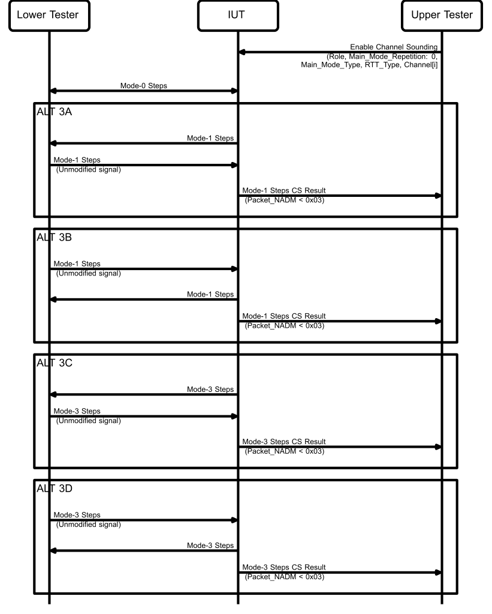

**Figure 4.1: Phase-Based Normalized Attack Detector Metric MSC – Page 1 of 3**

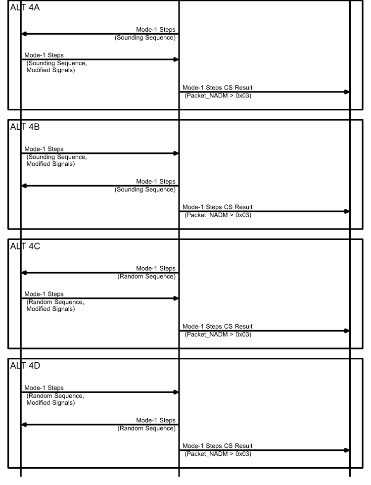

**Figure 4.2: Phase-Based Normalized Attack Detector Metric MSC – Page 2 of 3**

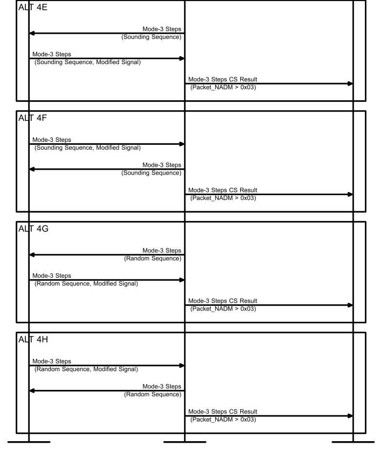

**Figure 4.3: Phase-Based Normalized Attack Detector Metric MSC – Page 3 of 3**

Repeat Steps 1–4 100 times, randomly selecting either Step 3 or 4.
1. Using the HCI_LE_CS_Test command, the Upper Tester commands the IUT to enable the
Channel Sounding procedure with Main_Mode_Repetition set to 0; role, Main_Mode_Type, and RTT_Type set as specified in Table 4.5; Channel[0] set to channel 20; and all other parameters set to the defaults from Section 4.1.6.3. 2. The Lower Tester and the IUT perform the Mode-0 exchange in Section 4.2.1.
Alternative 3A (IUT is Initiator using Mode-1):
3A.1 The IUT sends a Mode-1 CS_SYNC bit sequence. 3A.2 The Lower Tester sends a Mode-1 CS_SYNC bit sequence. The CS_SYNC bit sequence contains the normal signal of the sequence specified in Table 4.5 modulated using normal GFSK. 3A.3 The IUT reports the Mode-1 Channel Sounding results to the Upper Tester with Packet_NADM < 0x03. The result may include a Packet_Quality with bits 0–3 set to 0b0001 and bits 4–7 > 0. Alternative 3B (IUT is Reflector using Mode-1):
3B.1 The Lower Tester sends a Mode-1 CS_SYNC bit sequence. 3B.2 The IUT sends a Mode-1 CS_SYNC bit sequence. The CS_SYNC bit sequence contains the normal signal of the sequence specified in Table 4.5 modulated using normal GFSK. 3B.3 The IUT reports the Mode-1 Channel Sounding results to the Upper Tester with Packet_NADM < 0x03. The result may include a Packet_Quality with bits 0–3 set to 0b0001 and bits 4–7 > 0. Alternative 3C (IUT is Initiator using Mode-3):
3C.1 The IUT sends a Mode-3 CS_SYNC bit sequence followed by a CS Tone. 3C.2 The Lower Tester sends a CS Tone followed by a Mode-3 CS_SYNC bit sequence. The CS_SYNC bit sequence contains the normal signal of the sequence specified in Table 4.5 modulated using normal GFSK. 3C.3 The IUT reports the Mode-3 Channel Sounding results to the Upper Tester with Packet_NADM < 0x03. The result may include a Packet_Quality with bits 0–3 set to 0b0001 and bits 4–7 > 0. Alternative 3D (IUT is Reflector using Mode-3):
3D.1 The Lower Tester sends a Mode-3 CS_SYNC bit sequence followed by a CS Tone. 3D.2 The IUT sends a CS Tone followed by a Mode-3 CS_SYNC bit sequence. The CS_SYNC bit sequence contains the normal signal of the sequence specified in Table 4.5 modulated using normal GFSK. 3D.3 The IUT reports the Mode-3 Channel Sounding results to the Upper Tester with Packet_NADM < 0x03. The result may include a Packet_Quality with bits 0–3 set to 0b0001 and bits 4–7 > 0. 4. Perform alternative 4A, 4B, 4C, 4D, 4E, 4F, 4G, or 4H depending on the role and the mode
specified in Table 4.5. Alternative 4A (IUT is Initiator using Mode-1 Sounding Sequence):
4A.1 The IUT sends a Mode-1 CS_SYNC bit sequence. 4A.2 The Lower Tester sends a Mode-1 CS_SYNC bit sequence. The CS_SYNC bit sequence contains the sequence specified in Table 4.5. The GFSK-modulated packet signal phase differs from the expected packet signal with the Sounding sequence modified as described in [3] Sections 3.5.3 and 3.5.6. 4A.3 The IUT reports the Mode-1 Channel Sounding results to the Upper Tester with Packet_NADM  0x03. The result may include a Packet_Quality with bits 0–3 set to 0b0001 and bits 4–7 > 0.
4B.1 The Lower Tester sends a Mode-1 CS_SYNC bit sequence. The CS_SYNC bit sequence contains the sequence specified in Table 4.5. The GFSK-modulated packet signal phase differs from the expected packet signal with the Sounding sequence modified as described in [3] Section 3.5.3. 4B.2 The IUT sends a Mode-1 CS_SYNC bit sequence. 4B.3 The IUT reports the Mode-1 Channel Sounding results to the Upper Tester with Packet_NADM  0x03. The result may include a Packet_Quality with bits 0–3 set to 0b0001 and bits 4–7 > 0. Alternative 4C (IUT is Initiator using Mode-1 Random Sequence):
4C.1 The IUT sends a Mode-1 CS_SYNC bit sequence. 4C.2 The Lower Tester sends a Mode-1 CS_SYNC bit sequence. The CS_SYNC bit sequence contains the sequence specified in Table 4.5. The GFSK-modulated packet signal phase differs from the expected packet phase, with the MITM marker modified as described in [3] Sections 3.5.4 and 3.5.6. 4C.3 The IUT reports the Mode-1 Channel Sounding results to the Upper Tester with Packet_NADM  0x03. The result may include a Packet_Quality with bits 0–3 set to 0b0001 and bits 4–7 > 0. Alternative 4D (IUT is Reflector using Mode-1 Random Sequence):
4D.1 The Lower Tester sends a Mode-1 CS_SYNC bit sequence. The CS_SYNC bit sequence contains the sequence specified in Table 4.5. The GFSK-modulated packet signal phase differs from the expected packet phase, with the MITM marker modified as described in [3] Section 3.5.4. 4D.2 The IUT sends a Mode-1 CS_SYNC bit sequence. 4D.3 The IUT reports the Mode-1 Channel Sounding results to the Upper Tester with Packet_NADM  0x03. The result may include a Packet_Quality with bits 0–3 set to 0b0001 and bits 4–7 > 0. Alternative 4E (IUT is Initiator using Mode-3 Sounding Sequence):
4E.1 The IUT sends a Mode-3 CS_SYNC bit sequence followed by a CS Tone. 4E.2 The Lower Tester sends a CS Tone followed by a Mode-3 CS_SYNC bit sequence. The GFSK-modulated packet signal phase differs from the expected packet signal, with the Sounding sequence modified as described in [3] Section 3.5.3. 4E.3 The IUT reports the Mode-3 Channel Sounding results to the Upper Tester with Packet_NADM  0x03. The result may include a Packet_Quality with bits 0–3 set to 0b0001 and bits 4–7 > 0. Alternative 4F (IUT is Reflector using Mode-3 Sounding Sequence):
4F.1 The Lower Tester sends a Mode-3 CS_SYNC bit sequence followed by a CS Tone. The GFSK-modulated packet signal phase differs from the expected packet signal, with the Sounding sequence modified as described in [3] Section 3.5.3. 4F.2 The IUT sends a CS Tone followed by a Mode-3 CS_SYNC bit sequence. 4F.3 The IUT reports the Mode-3 Channel Sounding results to the Upper Tester with Packet_NADM  0x03. The result may include a Packet_Quality with bits 0–3 set to 0b0001 and bits 4–7 > 0. Alternative 4G (IUT is Initiator using Mode-3 Random Sequence):
4G.1 The IUT sends a Mode-3 CS_SYNC bit sequence followed by a CS Tone. 4G.2 The Lower Tester sends a CS Tone followed by a Mode-3 CS_SYNC bit sequence. The CS_SYNC bit sequence contains the sequence specified in Table 4.5. The GFSK-modulated packet signal phase differs from the expected packet phase, with the MITM marker modified as described in [3] Section 3.5.4.
4G.3 The IUT reports the Mode-3 Channel Sounding results to the Upper Tester with Packet_NADM  0x03. The result may include a Packet_Quality with bits 0–3 set to 0b0001 and bits 4–7 > 0. Alternative 4H (IUT is Reflector using Mode-3 Random Sequence):
4H.1 The Lower Tester sends a Mode-3 CS_SYNC bit sequence followed by a CS Tone. The CS_SYNC bit sequence contains the Sequence specified in Table 4.5. The GFSK-modulated packet signal phase differs from the expected packet phase, with the MITM marker modified as described in [3] Section 3.5.4. 4H.2 The IUT sends a CS Tone followed by a Mode-3 CS_SYNC bit sequence. 4H.3 The IUT reports the Mode-3 Channel Sounding results to the Upper Tester with Packet_NADM  0x03. The result may include a Packet_Quality with bits 0–3 set to 0b0001 and bits 4–7 > 0. • Expected Outcome
Pass verdict
The IUT sends the proper Channel Sounding result in Step 3 or 4 with the proper Packet_NADM value for 90 of the 100 reports. The result may include a Packet_Quality with bits 0–3 set to 0b0001 and bits 4–7 > 0.
If the IUT cannot determine the NADM value, then the Packet_NADM is 0xFF.

##### 4.3.2.2 Amplitude-based Attack NADM, Square Wave

• Test Purpose
Verify that the IUT Amplitude-based Attack NADM properly detects an attack attempt from the Lower Tester.
• Reference
[10] 3.5.1, 3.5.4
• Initial Condition
- The IUT is in the Reflector role. The RTT Type uses the 32-bit RTT type specified in Table 4.6.
- The TSPX_rtt_rs32_accuracy IXIT defines the accuracy for the 32-bit Random Sequence RTT.
- The TSPX_rtt_ss32_accuracy IXIT defines the accuracy of the 32-bit Sounding Sequence RTT.
- TSPX_rtt_accuracy is the rtt accuracy used in the test steps and is either TSPX_rtt_rs32_accuracy or TSPX_rtt_ss32_accuracy depending on the RTT type specified in Table 4.6.
• Test Case Configuration

| TCID | PHY |  | Main Mode / |  |  | Gaussian Noise |  |
| --- | --- | --- | --- | --- | --- | --- | --- |
|  |  |  | RTT Type |  |  | Floor (dBm/Hz) |  |
| CS/NAD/REF/BV-37-C [Amplitude-based Attack Resilience NADM, Mode-1, Random Sequence, LE 1M PHY] | LE 1M | Mode-1, Random Sequence |  |  | –152 |  |  |
| CS/NAD/REF/BV-38-C [Amplitude-based Attack Resilience NADM, Mode-1, Sounding Sequence, LE 1M PHY] | LE 1M | Mode-1, Sounding Sequence |  |  | –152 |  |  |
| CS/NAD/REF/BV-39-C [Amplitude-based Attack Resilience NADM, Mode-3, Random Sequence, LE 1M PHY] | LE 1M | Mode-3, Random Sequence |  |  | –152 |  |  |

| TCID | PHY |  | Main Mode / |  |  | Gaussian Noise |  |
| --- | --- | --- | --- | --- | --- | --- | --- |
|  |  |  | RTT Type |  |  | Floor (dBm/Hz) |  |
| CS/NAD/REF/BV-40-C [Amplitude-based Attack Resilience NADM, Mode-3, Sounding Sequence, LE 1M PHY] | LE 1M | Mode-3, Sounding Sequence |  |  | –152 |  |  |
| CS/NAD/REF/BV-41-C [Amplitude-based Attack Resilience NADM, Mode-1, Random Sequence, LE 2M PHY] | LE 2M | Mode-1, Random Sequence |  |  | –155 |  |  |
| CS/NAD/REF/BV-42-C [Amplitude-based Attack Resilience NADM, Mode-1, Sounding Sequence, LE 2M PHY] | LE 2M | Mode-1, Sounding Sequence |  |  | –155 |  |  |
| CS/NAD/REF/BV-43-C [Amplitude-based Attack Resilience NADM, Mode-3, Random Sequence, LE 2M PHY] | LE 2M | Mode-3, Random Sequence |  |  | –155 |  |  |
| CS/NAD/REF/BV-44-C [Amplitude-based Attack Resilience NADM, Mode-3, Sounding Sequence, LE 2M PHY] | LE 2M | Mode-3, Sounding Sequence |  |  | –155 |  |  |
| CS/NAD/REF/BV-45-C [Amplitude-based Attack Resilience NADM, Mode-1, Random Sequence, LE 2M 2BT PHY] | LE 2M 2BT | Mode-1, Random Sequence |  |  | –155 |  |  |
| CS/NAD/REF/BV-46-C [Amplitude-based Attack Resilience NADM, Mode-1, Sounding Sequence, LE 2M 2BT PHY] | LE 2M 2BT | Mode-1, Sounding Sequence |  |  | –155 |  |  |
| CS/NAD/REF/BV-47-C [Amplitude-based Attack Resilience NADM, Mode-3, Random Sequence, LE 2M 2BT PHY] | LE 2M 2BT | Mode-3, Random Sequence |  |  | –155 |  |  |
| CS/NAD/REF/BV-48-C [Amplitude-based Attack Resilience NADM, Mode-3, Sounding Sequence, LE 2M 2BT PHY] | LE 2M 2BT | Mode-3, Sounding Sequence |  |  | –155 |  |  |

Table 4.6: Amplitude-based Attack NADM, Square Wave test cases
• Test Procedure

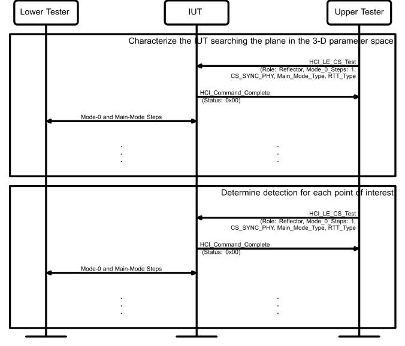

**Figure 4.4: Amplitude-based Attack NADM, Square Wave MSC**

1. The Upper Tester initiates a Channel Sounding procedure using the HCI_LE_CS_Test command
with the following configuration:
▪ Role set to Reflector ▪ Mode-0 CS Steps set to 1 ▪ CS_SYNC_PHY, Main_Mode_Type, and RTT_Type are set as specified in Table 4.6 and Sub_Mode_Type set to 0xFF ▪ All other parameters are set to the defaults from Section 4.1.6.3.
Characterize the IUT by executing Steps 2–6.
2. Search the plane in the 3-D parameter space represented by Table 3.7 in [10] Section 3.5.4.3.2
and create the LocalMinList set by executing the steps in the [10] Section 3.5.4.3.3 Characterization Requirements.
▪ Fix the amplifier gain 𝐴𝑔 to a value of 2.0. 3. Sweep the two-dimensional plane over duty cycle 𝐷𝐶 and time offset 𝑝𝑜. At each point in this
plane, using attack-modulated packets, perform a single instance of the procedure described in [10] Section 3.1.2 to collect the value of Δ𝑇𝑅𝐸𝑆𝑃,𝑃𝑅𝑂𝐶.
▪ Apply the spatial filter grid described in [10] Section 3.5.4.3.3 and record the results of this filter process. 4. Scan through the obtained filtered results and discard any values that do not meet the minimum
10 ns negative shift criteria. Search the remaining values for the local minimum values that span the spatial filter dimensions used in the prior step and record them in LocalMinList. 5. If LocalMinList is empty at this point, then the test concludes with a Pass verdict. Otherwise, go to
Step 6.
6. Compute Δ𝑇𝑅𝐸𝑆𝑃,𝑃𝑅𝑂𝐶 over TSPX_rtt_accuracy normally modulated CS_SYNC in a single CS
Procedure as described in [10] Section 3.1.2 ToA and ToD reporting accuracy. Repeat this step for the M=50 number of CS procedures specified in [10] Section 3.5.4.3.1. From this, compute the mean 𝐵 and standard deviation 𝜎 of the Δ𝑇𝑅𝐸𝑆𝑃,𝑃𝑅𝑂𝐶 results collected over the multiple CS procedures. 7. Sweep through the following list of amplification terms 𝐴𝑔 defined in [10] Table 3.7:
{2.0,1.9,1.8,1.7,1.6,1.5, 1.45, 1.4, 1.35, 1.3, 1.275, 1.25, 1.225, 1.2, 1.175, 1.15, 1.125, 1.1, 1.075, 1.05} 8. For each valid amplification term 𝐴𝑔, compute Δ𝑇𝑅𝐸𝑆𝑃,𝑃𝑅𝑂𝐶 over TSPX_rtt_accuracy attack
modulated CS_SYNC in a single CS procedure as described in [10] Section 3.1.2 ToA and ToD reporting accuracy. Repeat this step for the number of M=50 CS procedures specified in [10] Section 3.5.4.3.1. From this, compute the mean 𝜇𝑎 and standard deviation 𝜎𝑎 of the Δ𝑇𝑅𝐸𝑆𝑃,𝑃𝑅𝑂𝐶 results collected over the multiple CS procedures. 9. Compare the mean and standard deviation values from those collected using normally modulated
packet exchanges to those when attack-modulated packet exchanges were used. Perform the Z- test described in [10] Section 3.5.4.3.3 and [10] Section 3.5.4.3.1 to determine points of effective attack on the IUT. 10. Repeat Step 9 while reducing the value of the amplification term 𝐴𝑔 until the minimum effective
attack point is identified. In LocalMinList, save the amplification gain value 𝐴𝑔 that denotes the minimum effective attack point. 11. The Upper Tester commands the IUT to enable the Channel Sounding procedure using the
HCI_LE_CS_Test command with the following configuration:
▪ Role set to Reflector ▪ Mode_0_Steps set to 1 ▪ CS_SYNC_PHY, Main_Mode_Type, and RTT_Type set as specified in Table 4.6 and Sub_Mode_Type set to any non-Mode-0 step type ▪ All other parameters set to the defaults from Section 4.1.6.3 12. For each point of interest in LocalMinList, execute the steps for the Gaussian Noise Floor
specified in Table 4.6 to see if the IUT detects the attack. Repeat Step 11 until the IUT reports 100 NADM results that are not “Unknown”. For each CS step, the Lower Tester makes a random decision to transmit either a normal signal or an attacker signal. Half of the subevents contain normal signals and half the subevents contain attack-modulated signals. The random decisions are stored and compared against the IUT NADM values to determine if the IUT properly detected the attack. Steps marked as “Unknown” are not included in the 100 NADM evaluated results. 13. Repeat Step 12 selectively for amplification gain values 𝐴𝑔 greater than the effective value
identified in LocalMinList.
• Expected Outcome
Pass verdict
The IUT sends the proper Channel Sounding result correctly identifying the presence or absence of an attack for 90% of the reports that are not “Unknown”.
If the IUT cannot determine the NADM value, the Packet_NADM is 0xFF.

### 4.4 PAC

Verify the correct implementation of the Channel Sounding Packets.

#### 4.4.1 Both connected roles

##### 4.4.1.1 Sounding Sequence, Marker Signals

• Test Purpose
Verify that an IUT properly sends a Sounding Sequence with the proper marker signals.
• Reference
[3] 2.4
• Initial Condition
- An ACL channel with Encryption is established between the IUT and the Lower Tester with a Connection Interval defined in Section 4.1.6.1.
- The Channel Sounding (Host Support) feature bit is set.
- The IUT and the Lower Tester have completed the CS Security Start, Remote FAE Exchange, and Capabilities Exchange procedures with the IUT and Lower Tester roles specified in Table 4.7.
• Test Case Configuration

| TCID | IUT Role | PHY |  | Mode / |  | Marker Signal |
| --- | --- | --- | --- | --- | --- | --- |
|  |  |  |  | RTT Type _ |  |  |
| CS/PAC/REF/BV-01-C [Sounding Sequence, Marker Signals, Reflector, LE 1M, Mode-1 32-bit] | Reflector | LE 1M | Mode-1 32-bit (0x01) |  |  | 1100 or 0011 in transmission order between bit positions 0 and 28 |
| CS/PAC/REF/BV-02-C [Sounding Sequence, Marker Signals, Reflector, LE 2M, Mode-1 32-bit] | Reflector | LE 2M | Mode-1 32-bit (0x01) |  |  | 1100 or 0011 in transmission order between bit positions 0 and 28 |
| CS/PAC/INI/BV-01-C [Sounding Sequence, Marker Signals, Initiator, LE 1M, Mode-1 32-bit] | Initiator | LE 1M | Mode-1 32-bit (0x01) |  |  | 1100 or 0011 in transmission order between bit positions 0 and 28 |
| CS/PAC/INI/BV-02-C [Sounding Sequence, Marker Signals, Initiator, LE 2M, Mode-1 32-bit] | Initiator | LE 2M | Mode-1 32-bit (0x01) |  |  | 1100 or 0011 in transmission order between bit positions 0 and 28 |
| CS/PAC/REF/BV-03-C [Sounding Sequence, Marker Signals, Reflector, LE 1M, Mode-1 96-bit] | Reflector | LE 1M | Mode-1 96-bit (0x02) |  |  | 1100 or 0011 in transmission order starts between bits 0 and 63 inclusive 1100 or 0011 in transmission order if the starting location calculated from the Deterministic Random Bit Generator (DRBG) is between bits 67 and 92 inclusive |

| TCID | IUT Role | PHY |  | Mode / |  | Marker Signal |
| --- | --- | --- | --- | --- | --- | --- |
|  |  |  |  | RTT Type _ |  |  |
| CS/PAC/REF/BV-04-C [Sounding Sequence, Marker Signals, Reflector, LE 2M, Mode-1 96-bit] | Reflector | LE 2M | Mode-1 96-bit (0x02) |  |  | 1100 or 0011 in transmission order starts between bits 0 and 63 inclusive 1100 or 0011 in transmission order if the starting location calculated from the DRBG is between bits 67 and 92 inclusive |
| CS/PAC/INI/BV-03-C [Sounding Sequence, Marker Signals, Initiator, LE 1M, Mode-1 96-bit] | Initiator | LE 1M | Mode-1 96-bit (0x02) |  |  | 1100 or 0011 in transmission order starts between bits 0 and 63 inclusive 1100 or 0011 in transmission order if the starting location calculated from the DRBG is between bits 67 and 92 inclusive |
| CS/PAC/INI/BV-04-C [Sounding Sequence, Marker Signals, Initiator, LE 2M, Mode-1 96-bit] | Initiator | LE 2M | Mode-1 96-bit (0x02) |  |  | 1100 or 0011 in transmission order starts between bits 0 and 63 inclusive 1100 or 0011 in transmission order if the starting location calculated from the DRBG is between bits 67 and 92 inclusive |
| CS/PAC/REF/BV-05-C [Sounding Sequence, Marker Signals, Reflector, LE 1M, Mode-3 32-bit] | Reflector | LE 1M | Mode-3 32-bit (0x01) |  |  | 1100 or 0011 in transmission order between bit positions 0 and 28 |
| CS/PAC/REF/BV-06-C [Sounding Sequence, Marker Signals, Reflector, LE 2M, Mode-3 32-bit] | Reflector | LE 2M | Mode-3 32-bit (0x01) |  |  | 1100 or 0011 in transmission order between bit positions 0 and 28 |
| CS/PAC/INI/BV-05-C [Sounding Sequence, Marker Signals, Initiator, LE 1M, Mode-3 32-bit] | Initiator | LE 1M | Mode-3 32-bit (0x01) |  |  | 1100 or 0011 in transmission order between bit positions 0 and 28 |
| CS/PAC/INI/BV-06-C [Sounding Sequence, Marker Signals, Initiator, LE 2M, Mode-3 32-bit] | Initiator | LE 2M | Mode-3 32-bit (0x01) |  |  | 1100 or 0011 in transmission order between bit positions 0 and 28 |
| CS/PAC/REF/BV-07-C [Sounding Sequence, Marker Signals, Reflector, LE 1M, Mode-3 96-bit] | Reflector | LE 1M | Mode-3 96-bit (0x02) |  |  | 1100 or 0011 in transmission order starts between bits 0 and 63 inclusive 1100 or 0011 in transmission order if the starting location calculated from the DRBG is between bits 67 and 92 inclusive |

| TCID | IUT Role | PHY |  | Mode / |  | Marker Signal |
| --- | --- | --- | --- | --- | --- | --- |
|  |  |  |  | RTT Type _ |  |  |
| CS/PAC/REF/BV-08-C [Sounding Sequence, Marker Signals, Reflector, LE 2M, Mode-3 96-bit] | Reflector | LE 2M | Mode-3 96-bit (0x02) |  |  | 1100 or 0011 in transmission order starts between bits 0 and 63 inclusive 1100 or 0011 in transmission order if the starting location calculated from the DRBG is between bits 67 and 92 inclusive |
| CS/PAC/INI/BV-07-C [Sounding Sequence, Marker Signals, Initiator, LE 1M, Mode-3 96-bit] | Initiator | LE 1M | Mode-3 96-bit (0x02) |  |  | 1100 or 0011 in transmission order starts between bits 0 and 63 inclusive 1100 or 0011 in transmission order if the starting location calculated from the DRBG is between bits 67 and 92 inclusive |
| CS/PAC/INI/BV-08-C [Sounding Sequence, Marker Signals, Initiator, LE 2M, Mode-3 96-bit] | Initiator | LE 2M | Mode-3 96-bit (0x02) |  |  | 1100 or 0011 in transmission order starts between bits 0 and 63 inclusive 1100 or 0011 in transmission order if the starting location calculated from the DRBG is between bits 67 and 92 inclusive |

Table 4.7: Sounding Sequence, Marker Signals test cases
• Test Procedure

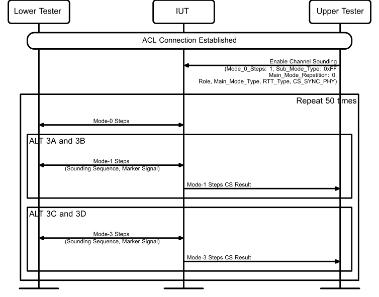

**Figure 4.5: Sounding Sequence, Marker Signals MSC**

1. The Upper Tester commands the IUT to enable the Channel Sounding procedure with
Mode_0_Steps set to 1; Main_Mode_Repetition set to 0; Sub_Mode_Type set to 0xFF; and role, Main_Mode Type, RTT_Type, and CS_SYNC_PHY set as specified in Table 4.7, and all other parameters set to the defaults from Section 4.1.6.2, with the number of channels set to 50.
Repeat Steps 2 and 3 50 times.
2. The Lower Tester and the IUT perform the Mode-0 exchange in Section 4.2.1. 3. Perform alternative 3A, 3B, 3C, or 3D depending on the IUT role and Main_Mode Type.
Alternative 3A (IUT is Initiator and Main_Mode Type is 1):
3A.1 The IUT sends a Mode-1 CS_SYNC bit sequence. The bit sequence includes a sounding sequence with the number of bits and Marker Signal location specified in Table 4.7. 3A.2 The Lower Tester sends a Mode-1 CS_SYNC bit sequence with a sounding sequence with the number of bits and Marker Signal location specified in Table 4.7. 3A.3 The IUT reports the Channel Sounding results to the Upper Tester. Alternative 3B (IUT is Reflector and Main_Mode Type is 1):
3B.1 The Lower Tester sends a Mode-1 CS_SYNC bit sequence. The bit sequence includes a sounding sequence with the number of bits and Marker Signal location specified in Table 4.7. 3B.2 The IUT sends a Mode-1 CS_SYNC bit sequence with a sounding sequence with the number of bits and Marker Signal location specified in Table 4.7. 3B.3 The IUT reports the Channel Sounding results to the Upper Tester.
3C.1 The IUT sends a CS_SYNC bit sequence followed by a CS Tone. The bit sequence includes a sounding sequence with the number of bits and Marker Signal location specified in Table 4.7. 3C.2 The Lower Tester sends a CS Tone followed by a CS_SYNC bit sequence. The bit sequence includes a sounding sequence with the number of bits and Marker Signal location specified in Table 4.7. 3C.3 The IUT reports the Channel Sounding results to the Upper Tester. Alternative 3D (IUT is Reflector and Main_Mode Type is 3):
3D.1 The Lower Tester sends a CS_SYNC bit sequence followed by a CS Tone. The bit sequence includes a sounding sequence with the number of bits and Marker Signal location specified in Table 4.7. 3D.2 The IUT sends a CS Tone followed by a CS_SYNC bit sequence. The bit sequence includes a sounding sequence with the number of bits and Marker Signal location specified in Table 4.7. 3D.3 The IUT reports the Channel Sounding results to the Upper Tester.
• Expected Outcome
Pass verdict
To verify the preamble, access address, and payload contents transmitted by the IUT, the Lower Tester appplies the common Pass verdict criteria defined in Section 4.1.6.5 in the checks described in this section. The Lower Tester verifies the Access Address in the IUT packet header. The trailer is 1010 if the MSB of the Access Address is a 0, and the trailer is 0101 if the MSB of the Access Address is a 1.
In Steps 2A.1, 2B.2, 3A.1, 3B.2, 3C.1, and 3D.2, the IUT sends the CS_SYNC bit sequence with a preamble that matches the LE Uncoded PHY preamble in [3] Section 2.1.
In Steps 2A.1 and 2B.2, the IUT does not send a sounding sequence in the Mode-0 CS_SYNC bit sequence.
In Steps 3A.1, 3B.2, 3C.1, and 3D.2, the IUT sends a CS_SYNC bit sequence with the correct sounding sequence as generated by the DRBG.
In Steps 3B.2 and 3D.2, the IUT sends a sounding sequence with the length that matches the length of the sounding sequence in Steps 3B.1 and 3D.1.
Fail verdict
If the RTT Type is 96-bit, then in Steps 3A.1, 3B.2, 3C.1, and 3D.2, the marker signal is either between bits 64 or 66 or at bit 93 or higher.
• Notes
In the 96-bit sounding sequence, the starting bit location of the second marker signal is randomly determined using the DRBG. The Lower Tester and the IUT do not include the second marker signal when the start bit location > 92.
• Test Purpose
Verify that an IUT properly sends a Random Sequence as specified in Table 4.8.
• Reference
[3] 2.2.5
• Initial Condition
- An ACL channel with Encryption is established between the IUT and Lower Tester with a Connection Interval defined in Section 4.1.6.1.
- The Channel Sounding (Host Support) feature bit is set.
- The IUT and Lower Tester have completed the CS Security Start, Remote FAE Exchange, and Capabilities Exchange procedures with the IUT role as specified in Table 4.8.
• Test Case Configuration

|  | Test Case |  |  | PHY |  |  | Mode |  |  | IUT Role |  |  | Size |  |
| --- | --- | --- | --- | --- | --- | --- | --- | --- | --- | --- | --- | --- | --- | --- |
| CS/PAC/INI/BV-09-C [Random Sequence, LE 1M, Mode-1, 32-bit, Initiator] |  |  | LE 1M |  |  | 1 |  |  | Initiator (0x00) |  |  | 32-bit (0x03) |  |  |
| CS/PAC/REF/BV-09-C [Random Sequence, LE 1M, Mode-1, 32-bit, Reflector] |  |  | LE 1M |  |  | 1 |  |  | Reflector (0x01) |  |  | 32-bit (0x03) |  |  |
| CS/PAC/INI/BV-10-C [Random Sequence, LE 1M, Mode-1, 64-bit, Initiator] |  |  | LE 1M |  |  | 1 |  |  | Initiator (0x00) |  |  | 64-bit (0x04) |  |  |
| CS/PAC/REF/BV-10-C [Random Sequence, LE 1M, Mode-1, 64-bit, Reflector] |  |  | LE 1M |  |  | 1 |  |  | Reflector (0x01) |  |  | 64-bit (0x04) |  |  |
| CS/PAC/INI/BV-11-C [Random Sequence, LE 1M, Mode-1, 96-bit, Initiator] |  |  | LE 1M |  |  | 1 |  |  | Initiator (0x00) |  |  | 96-bit (0x05) |  |  |
| CS/PAC/REF/BV-11-C [Random Sequence, LE 1M, Mode-1, 96-bit, Reflector] |  |  | LE 1M |  |  | 1 |  |  | Reflector (0x01) |  |  | 96-bit (0x05) |  |  |
| CS/PAC/INI/BV-12-C [Random Sequence, LE 1M, Mode-1, 128-bit, Initiator] |  |  | LE 1M |  |  | 1 |  |  | Initiator (0x00) |  |  | 128-bit (0x06) |  |  |
| CS/PAC/REF/BV-12-C [Random Sequence, LE 1M, Mode-1, 128-bit, Reflector] |  |  | LE 1M |  |  | 1 |  |  | Reflector (0x01) |  |  | 128-bit (0x06) |  |  |
| CS/PAC/INI/BV-13-C [Random Sequence, LE 2M, Mode-1, 32-bit, Initiator] |  |  | LE 2M |  |  | 1 |  |  | Initiator (0x00) |  |  | 32-bit (0x03) |  |  |
| CS/PAC/REF/BV-13-C [Random Sequence, LE 2M, Mode-1, 32-bit, Reflector] |  |  | LE 2M |  |  | 1 |  |  | Reflector (0x01) |  |  | 32-bit (0x03) |  |  |
| CS/PAC/INI/BV-14-C [Random Sequence, LE 2M, Mode-1, 64-bit, Initiator] |  |  | LE 2M |  |  | 1 |  |  | Initiator (0x00) |  |  | 64-bit (0x04) |  |  |
| CS/PAC/REF/BV-14-C [Random Sequence, LE 2M, Mode-1, 64-bit, Reflector] |  |  | LE 2M |  |  | 1 |  |  | Reflector (0x01) |  |  | 64-bit (0x04) |  |  |
| CS/PAC/INI/BV-15-C [Random Sequence, LE 2M, Mode-1, 96-bit, Initiator] |  |  | LE 2M |  |  | 1 |  |  | Initiator (0x00) |  |  | 96-bit (0x05) |  |  |
| CS/PAC/REF/BV-15-C [Random Sequence, LE 2M, Mode-1, 96-bit, Reflector] |  |  | LE 2M |  |  | 1 |  |  | Reflector (0x01) |  |  | 96-bit (0x05) |  |  |
| CS/PAC/INI/BV-16-C [Random Sequence, LE 2M, Mode-1, 128-bit, Initiator] |  |  | LE 2M |  |  | 1 |  |  | Initiator (0x00) |  |  | 128-bit (0x06) |  |  |

|  | Test Case |  |  | PHY |  |  | Mode |  |  | IUT Role |  |  | Size |  |
| --- | --- | --- | --- | --- | --- | --- | --- | --- | --- | --- | --- | --- | --- | --- |
| CS/PAC/REF/BV-16-C [Random Sequence, LE 2M, Mode-1, 128-bit, Reflector] |  |  | LE 2M |  |  | 1 |  |  | Reflector (0x01) |  |  | 128-bit (0x06) |  |  |
| CS/PAC/INI/BV-17-C [Random Sequence, LE 1M, Mode-3, 32-bit, Initiator] |  |  | LE 1M |  |  | 3 |  |  | Initiator (0x00) |  |  | 32-bit (0x03) |  |  |
| CS/PAC/REF/BV-17-C [Random Sequence, LE 1M, Mode-3, 32-bit, Reflector] |  |  | LE 1M |  |  | 3 |  |  | Reflector (0x01) |  |  | 32-bit (0x03) |  |  |
| CS/PAC/INI/BV-18-C [Random Sequence, LE 1M, Mode-3, 64-bit, Initiator] |  |  | LE 1M |  |  | 3 |  |  | Initiator (0x00) |  |  | 64-bit (0x04) |  |  |
| CS/PAC/REF/BV-18-C [Random Sequence, LE 1M, Mode-3, 64-bit, Reflector] |  |  | LE 1M |  |  | 3 |  |  | Reflector (0x01) |  |  | 64-bit (0x04) |  |  |
| CS/PAC/INI/BV-19-C [Random Sequence, LE 1M, Mode-3, 96-bit, Initiator] |  |  | LE 1M |  |  | 3 |  |  | Initiator (0x00) |  |  | 96-bit (0x05) |  |  |
| CS/PAC/REF/BV-19-C [Random Sequence, LE 1M, Mode-3, 96-bit, Reflector] |  |  | LE 1M |  |  | 3 |  |  | Reflector (0x01) |  |  | 96-bit (0x05) |  |  |
| CS/PAC/INI/BV-20-C [Random Sequence, LE 1M, Mode-3, 128-bit, Initiator] |  |  | LE 1M |  |  | 3 |  |  | Initiator (0x00) |  |  | 128-bit (0x06) |  |  |
| CS/PAC/REF/BV-20-C [Random Sequence, LE 1M, Mode-3, 128-bit, Reflector] |  |  | LE 1M |  |  | 3 |  |  | Reflector (0x01) |  |  | 128-bit (0x06) |  |  |
| CS/PAC/INI/BV-21-C [Random Sequence, LE 2M, Mode-3, 32-bit, Initiator] |  |  | LE 2M |  |  | 3 |  |  | Initiator (0x00) |  |  | 32-bit (0x03) |  |  |
| CS/PAC/REF/BV-21-C [Random Sequence, LE 2M, Mode-3, 32-bit, Reflector] |  |  | LE 2M |  |  | 3 |  |  | Reflector (0x01) |  |  | 32-bit (0x03) |  |  |
| CS/PAC/INI/BV-22-C [Random Sequence, LE 2M, Mode-3, 64-bit, Initiator] |  |  | LE 2M |  |  | 3 |  |  | Initiator (0x00) |  |  | 64-bit (0x04) |  |  |
| CS/PAC/REF/BV-22-C [Random Sequence, LE 2M, Mode-3, 64-bit, Reflector] |  |  | LE 2M |  |  | 3 |  |  | Reflector (0x01) |  |  | 64-bit (0x04) |  |  |
| CS/PAC/INI/BV-23-C [Random Sequence, LE 2M, Mode-3, 96-bit, Initiator] |  |  | LE 2M |  |  | 3 |  |  | Initiator (0x00) |  |  | 96-bit (0x05) |  |  |
| CS/PAC/REF/BV-23-C [Random Sequence, LE 2M, Mode-3, 96-bit, Reflector] |  |  | LE 2M |  |  | 3 |  |  | Reflector (0x01) |  |  | 96-bit (0x05) |  |  |
| CS/PAC/INI/BV-24-C [Random Sequence, LE 2M, Mode-3, 128-bit, Initiator] |  |  | LE 2M |  |  | 3 |  |  | Initiator (0x00) |  |  | 128-bit (0x06) |  |  |
| CS/PAC/REF/BV-24-C [Random Sequence, LE 2M, Mode-3, 128-bit, Reflector] |  |  | LE 2M |  |  | 3 |  |  | Reflector (0x01) |  |  | 128-bit (0x06) |  |  |

Table 4.8: Random Sequence test cases
• Test Procedure

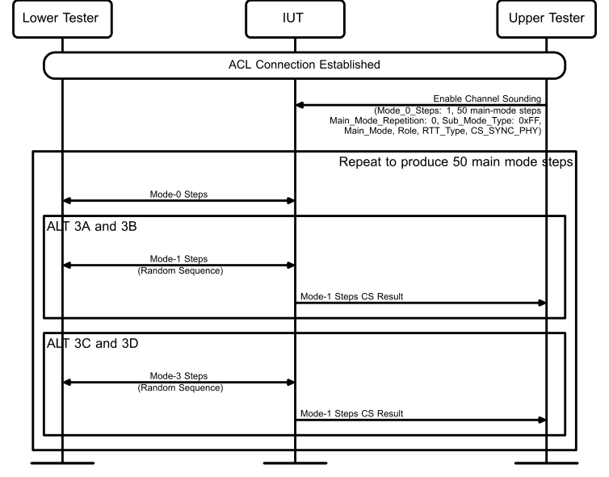

**Figure 4.6: Random Sequence MSC**

1. The Upper Tester commands the IUT to enable the Channel Sounding procedure with
Mode_0_Steps set to 1; a configuration that produces 50 Main Mode steps; Main_Mode_Repetition set to 0; Sub_Mode_Type set to 0xFF; and Main_Mode, role, RTT_Type, and CS_SYNC_PHY set as specified in Table 4.8, and all other parameters set to the defaults from Section 4.1.6.2.
Repeat Steps 2 and 3 to produce the 50 main mode steps.
2. The Lower Tester and the IUT perform the Mode-0 exchange in Section 4.2.1. 3. Perform alternative 3A, 3B, 3C, or 3D depending on the IUT role and mode specified in Table 4.8.
Alternative 3A (IUT is Initiator, Mode-1):
3A.1 The IUT sends a Mode-1 CS_SYNC bit sequence. The bit sequence includes a random sequence with the number of bits specified in Table 4.8. 3A.2 The Lower Tester sends a Mode-1 CS_SYNC bit sequence with a random sequence with the number of octets specified in Table 4.8. 3A.3 The IUT reports the Channel Sounding results to the Upper Tester. Alternative 3B (IUT is Reflector, Mode-1):
3B.1 The Lower Tester sends a Mode-1 CS_SYNC bit sequence. The bit sequence includes a random sequence with the number of bits specified in Table 4.8. 3B.2 The IUT sends a Mode-1 CS_SYNC bit sequence with a random sequence with the number of octets specified in Table 4.8. 3B.3 The IUT reports the Channel Sounding results to the Upper Tester. Alternative 3C (IUT is Initiator, Mode-3):
3C.1 The IUT sends a CS_SYNC bit sequence followed by a CS Tone. The bit sequence includes a random sequence with the number of bits specified in Table 4.8.
3C.2 The Lower Tester sends a CS Tone followed by a CS_SYNC bit sequence. The bit sequence includes a random sequence with the number of octets specified in Table 4.8. 3C.3 The IUT reports the Channel Sounding results to the Upper Tester. Alternative 3D (IUT is Reflector, Mode-3):
3D.1 The Lower Tester sends a CS_SYNC bit sequence followed by a CS Tone. The bit sequence includes a random sequence with the number of bits specified in Table 4.8. 3D.2 The IUT sends a CS Tone followed by a CS_SYNC bit sequence. The bit sequence includes a random sequence with the number of bits specified in Table 4.8. 3D.3 The IUT reports the Channel Sounding results to the Upper Tester.
• Expected Outcome
Pass verdict
To verify the preamble, access address, and payload contents transmitted by the IUT, the Lower Tester appplies the common Pass verdict criteria defined in Section 4.1.6.5 in the checks described in this section. The Lower Tester verifies the Access Address in the IUT packet header. The trailer is 1010 if the MSB of the Access Address is a 0, and the trailer is 0101 if the MSB of the Access Address is a 1.
In Steps 2A.1, 2B.2, 3A.1, 3B.2, 3C.1, and 3D.2, the IUT sends the CS_SYNC bit sequence with a preamble that matches the LE Uncoded PHY preamble in [6] Section 2.1.1.
In Steps 2A.1 and 2B.2, the IUT does not send a random sequence in the Mode-0 CS_SYNC bit sequence.
In Steps 3A.1, 3B.2, 3C.1, and 3D.2, the IUT sends a CS_SYNC bit sequence with a random sequence with the number of octets specified in Table 4.8.
In Steps 3B.2 and 3D.2, the IUT sends a random sequence with the length that matches the length of the random sequence in Steps 3B.1 and 3D.1.

##### 4.4.1.3 Access Address Quality Indicator

• Test Purpose
Verify that an IUT reports the proper quality indicator when the AA address is invalid, valid, or no sync packet was sent.
• Reference
[3] 2.2.2
• Initial Condition
- The IUT’s transmitter is set to maximum output power.
- The Lower Tester’s transmit power is adjusted such that the input power to the IUT receiver is -70 dBm.
• Test Case Configuration

|  | Test Case |  |  | PHY |  |
| --- | --- | --- | --- | --- | --- |
| CS/PAC/REF/BV-25-C [Access Address Quality Indicator, LE 1M] |  |  | LE 1M |  |  |
| CS/PAC/REF/BV-26-C [Access Address Quality Indicator, LE 2M] |  |  | LE 2M |  |  |

Table 4.9: Access Address Quality Indicator test cases
• Test Procedure

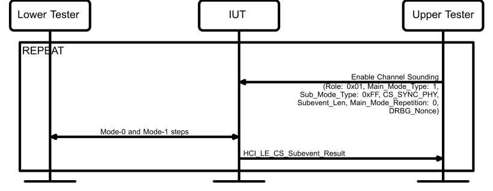

**Figure 4.7: Access Address Quality Indicator MSC**

1. The Lower Tester initializes the values of testMode, validPkts, missingPktErrors, and bitflipErrors
to 0. 2. The Lower Tester sets the subevent number k to 1. 3. The Upper Tester commands the IUT to enable the Channel Sounding procedure with Role set to
Reflector, Main_Mode_Type set to 1, Sub_Mode_Type set to 0xFF, CS_SYNC_PHY set as specified in Table 4.9, and Subevent_Len and the channel parameters are set in order to generate a single subevent with 128 Main Mode steps, Main_Mode_Repetition set to 0, DRBG_Nonce set to (0x0000 + k), and all other parameters set to the defaults from Section 4.1.6.3. 4. The Lower Tester and the IUT begin transmission and reception of the CS subevent.
a. If testMode is 1, then the Lower Tester does not send any packets in the Main mode CS
steps. b. If testMode is 2, then for each main mode CS step, the Lower Tester flips the bit in
position (stepIndex-Mode0Steps-1) mod 32 where the bit positions are ordered starting from 0 in order of appearance of the CS Access Address on the air. 5. The IUT sends an HCI_LE_CS_Subevent_Result event to the Upper Tester. 6. The Lower Tester calculates the following values, for each testMode value based on the IUT’s
report.
a. If testMode is 0, then validPkts is incremented by the number of Main Mode steps where
the Access Address Quality indicator is 0. b. If testMode is 1, then missingPktErrors is incremented by the number of Main Mode steps
where the Access Address Quality indicator is not 2. c. If testMode is 2, then bitflipErrors is incremented by the number of steps where the
Access Address Quality indicator is 0. 7. The Lower Tester sets k=2 and repeats Steps 3–6. 8. The Lower Tester repeats Steps 2–6 for testMode = 1,2.
• Expected Outcome
Pass verdict
The test passes if missingPktErrors = 0, bitflipErrors ≤ 2, and validPkts/256 ≥ 0.93.
• Notes:
With a BER of 0.1%, the probability that the CS Access Address is received correctly is around 3.2%. If 256 valid packets are sent, then the probability that less than 93% of the packets are received correctly is:
𝑁
𝑃(𝑣𝑎𝑙𝑖𝑑𝑃𝑘𝑡𝑠≥93%) = 1 −𝑃(𝑃𝐸𝑅< 7%) =  1 −∑(256
0.032𝑛(1 −0.032)256−𝑛≈0.17%
𝑛)
𝑛=0
where 𝑁= ⌊256 ⋅(1 −0.093)⌋.
With a BER of 0.1%, the probability that any packet with a flipped bit is unflipped is around 0.1%. The probability that two or more such bitflips occur within 256 packets less is:
2
𝑃(𝑏𝑖𝑡𝐹𝑙𝑖𝑝𝑠> 2) = 1 −𝑃(𝑏𝑖𝑡𝐹𝑙𝑖𝑝𝑠≤2) =  1 −∑(256
0.001𝑛(1 −0.001)256−𝑛≈0.23%
𝑛)
𝑛=0

##### 4.4.1.4 Sounding Sequence, 32-bit with invalid marker

• Test Purpose
Verify that an IUT correctly handles an invalid marker for a 32-bit sounding sequence.
• Reference
[3] 2.4
• Initial Condition
- An ACL channel with Encryption is established between the IUT and the Lower Tester with a Connection Interval defined in Section 4.1.6.1.
- The Channel Sounding (Host Support) feature bit is set.
- The IUT and the Lower Tester have completed the CS Security Start, Remote FAE Exchange, and Capabilities Exchange procedures with the IUT role specified in Table 4.10.
• Test Case Configuration

|  | Test Case |  |  | IUT Role |  |
| --- | --- | --- | --- | --- | --- |
| CS/PAC/INI/BV-27-C [Sounding Sequence, 32-bit with invalid marker, Initiator] |  |  | Initiator (0x00) |  |  |
| CS/PAC/REF/BV-27-C [Sounding Sequence, 32-bit with invalid marker, Reflector] |  |  | Reflector (0x01) |  |  |

Table 4.10: Sounding Sequence, 32-bit with invalid marker test cases
• Test Procedure

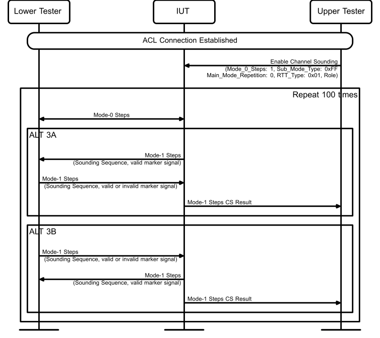

**Figure 4.8: Sounding Sequence, 32 bit with invalid marker MSC**

1. The Upper Tester commands the IUT to enable the Channel Sounding procedure with
Mode_0_Steps set to 1, channel parameters chosen to produce 100 Main Mode steps, Main_Mode set to 1, Sub_Mode_Type set to 0xFF, Main_Mode_Repetition set to 0, RTT_Type set to 0x01 (32-bit Sounding), Role set as specified in Table 4.11, and all other parameters set to the defaults from Section 4.1.6.2.
Repeat Steps 2 and 3 100 times.
2. The Lower Tester and the IUT perform the Mode-0 exchange in Section 4.2.1. 3. Perform alternative 3A or 3B depending on the IUT role specified in Table 4.11.
Alternative 3A (IUT is Initiator):
3A.1 The IUT sends a CS_SYNC bit sequence. The bit sequence includes a sounding sequence with the number of bits and Marker Signal location specified in Table 4.11. 3A.2 The Lower Tester sends a CS_SYNC bit sequence with a sounding sequence. The bit sequence either has a valid marker signal or the Lower Tester randomly chooses an invalid marker signal. The invalid marker signal is at a starting bit position between 0 and 28 with bits 0b1000, 0b0100, 0b0010, 0b0001, 0b1110, 0b1101, 0b1011, or 0b0111. Each invalid marker signal is tested at least twice. 3A.3 The IUT reports the Channel Sounding results to the Upper Tester.
3B.1 The Lower Tester sends a CS_SYNC bit sequence. The bit sequence includes a sounding sequence with the number of bits specified in Table 4.11. The bit sequence either has a valid marker signal or the Lower Tester randomly chooses an invalid marker signal. The invalid marker signal is at a starting bit position between 0 and 28 with bits 0b1000, 0b0100, 0b0010, 0b0001, 0b1110, 0b1101, 0b1011, or 0b0111. Each invalid marker signal is tested at least twice. 3B.2 The IUT sends a CS_SYNC bit sequence with a sounding sequence. 3B.3 The IUT reports the Channel Sounding results to the Upper Tester.
• Expected Outcome
Pass verdict
In Step 3A.3 or 3B.3, the IUT reports the Channel Sounding results with proper valid or invalid results 95 of the 100 times. If the result is for an invalid marker signal, then the result includes a Packet_Quality with bits 4–7 not set to 0b0000 and/or, if NADM is supported, Packet_NADM > 0x03.

##### 4.4.1.5 Sounding Sequence, 96-bit with invalid marker

• Test Purpose
Verify that an IUT correctly handles an invalid marker for a 96-bit sounding sequence. The marker is omitted if the starting bit position is greater than 92.
• Reference
[3] 2.4
• Initial Condition
- An ACL channel with Encryption is established between the IUT and the Lower Tester with a Connection Interval defined in Section 4.1.6.1.
- The Channel Sounding (Host Support) feature bit is set.
- The IUT and the Lower Tester have completed the CS Security Start, Remote FAE Exchange, and Capabilities Exchange procedures with the IUT role specified in Table 4.11.
• Test Case Configuration

|  | Test Case |  |  | Role |  |
| --- | --- | --- | --- | --- | --- |
| CS/PAC/INI/BV-28-C [Sounding Sequence, 96-bit with invalid marker, Initiator] |  |  | Initiator (0x00) |  |  |
| CS/PAC/REF/BV-28-C [Sounding Sequence, 96-bit with invalid marker, Reflector] |  |  | Reflector (0x01) |  |  |

Table 4.11: Sounding Sequence, 96-bit with invalid marker test cases
• Test Procedure

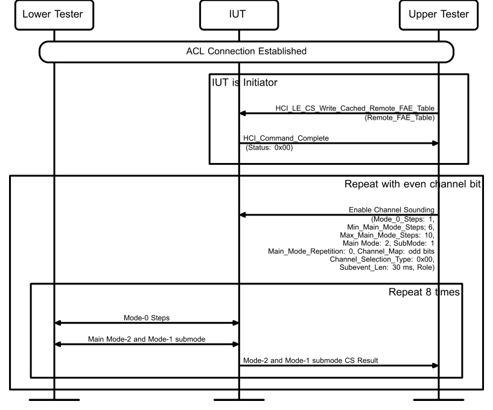

**Figure 4.9: Sounding Sequence, 96-bit with invalid marker MSC**

1. The Upper Tester commands the IUT to enable the Channel Sounding procedure with
Mode_0_Steps set to 1, channel parameters chosen to produce 100 Main Mode steps, Main_Mode set to 1, Sub_Mode_Type set to 0xFF, Main_Mode_Repetition set to 0, RTT_Type set to 0x02 (96-bit Sounding), Role set as specified in Table 4.11, and all other parameters set to the defaults from Section 4.1.6.2.
Repeat Steps 2 and 3 100 times.
2. The Lower Tester and the IUT perform the Mode-0 exchange in Section 4.2.1. 3. Perform alternative 3A or 3B depending on the IUT role specified in Table 4.11.
Alternative 3A (IUT is Initiator):
3A.1 The IUT sends a CS_SYNC bit sequence. The bit sequence includes a sounding sequence with the number of bits and Marker Signal location specified in Table 4.11. 3A.2 The Lower Tester sends a CS_SYNC bit sequence with a sounding sequence. The bit sequence either has valid marker signals or the Lower Tester chooses one of the invalid marker signals noted below. Each of the invalid marker signals is tested at least twice. The invalid marker signal contains valid marker signals except for one of the invalid marker signals noted below. 3A.3 The IUT reports the Channel Sounding results to the Upper Tester.
3B.1 The Lower Tester sends a CS_SYNC bit sequence. The bit sequence includes a sounding sequence with the number of bits specified in Table 4.11. The bit sequence either has valid marker signals or the Lower Tester chooses one of the invalid marker signals noted below. Each of the invalid marker signals is tested at least twice. The invalid marker signal contains valid marker signals except for one of the invalid marker signals noted below. 3B.2 The IUT sends a CS_SYNC bit sequence with a sounding sequence. 3B.3 The IUT reports the Channel Sounding results to the Upper Tester.
• Expected Outcome
Pass verdict
In Step 3A.3 or 3B.3, the IUT reports the Channel Sounding Results with proper valid or invalid results 95 of the 100 times. If the result is for an invalid marker signal, then the result includes a Packet_Quality with bits 4–7 not set to 0b0000 and/or, if NADM is supported, Packet_NADM > 0x03.
• Note
The invalid marker signals are one of:
- Starting bit position between 0 and 28 with bits 0b1000, 0b0100, 0b0010, 0b0001, 0b1110, 0b1101, 0b1011, or 0b0111
- Starting bit position > 92
- Starting bit position between 67 and 92 inclusive with bits 0b1000, 0b0100, 0b0010, 0b0001, 0b1110, 0b1101, 0b1011, or 0b0111

##### 4.4.1.6 Channel Index Selection Algorithm #3b

• Test Purpose
Verify that an IUT correctly uses the Channel Index Selection Algorithm #3b when executing the Channel Sounding procedure.
• Reference
[3] 4.1.4.1
• Initial Condition
- An ACL channel with Encryption is established between the IUT and the Lower Tester with a Connection Interval defined in Section 4.1.6.1.
- The Channel Sounding (Host Support) feature bit is set.
- The IUT and the Lower Tester have completed the CS Security Start and Capabilities Exchange procedures with the IUT role specified in Table 4.12.
- The Lower Tester FAE Table is defined by the TSPX_cs_remote_fae_table IXIT value.
• Test Case Configuration

|  | TCID |  |  | Role |  |
| --- | --- | --- | --- | --- | --- |
| CS/PAC/REF/BV-29-C [Channel Index Selection Algorithm #3b, Reflector] |  |  | Reflector |  |  |
| CS/PAC/INI/BV-29-C [Channel Index Selection Algorithm #3b, Initiator] |  |  | Initiator |  |  |

Table 4.12: Channel Index Selection Algorithm #3b test cases
• Test Procedure

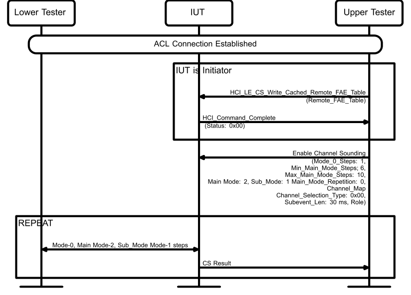

**Figure 4.10: Channel Index Selection Algorithm #3b MSC**

1. If the IUT is the Initiator, then the Upper Tester sends the
HCI_LE_CS_Write_Cached_Remote_FAE_Table command to the IUT with Connection_Handle set to the handle of the connection, Remote_FAE_Table set to TSPX_cs_remote_fae_table, and receives a successful HCI_Command_Complete event in response. 2. The Upper Tester commands the IUT to enable the Channel Sounding procedure with
Mode_0_Steps set to 1, Min_Main_Mode_Steps set to 6, Max_Main_Mode_Steps set to 10, Main_Mode set to 2, Sub_Mode set to 1, Main_Mode_Repetition set to 0, Channel_Map set with all valid channel bits set, Channel_Selection_Type set to 0x00, and Subevent_Len set to 30 ms, role specified in Table 4.12, and all other parameters in Section 4.1.6.2. 3. The Lower Tester and the IUT perform Mode-0, Main Mode Mode-2, and Sub_Mode Mode-1
exchanges in Section 4.2.1. 4. The IUT reports the Channel Sounding results to the Upper Tester with the channels used in the
main exchanges in step 3. 5. Repeat Steps 3 and 4 until the end of the procedure. 6. Repeat Steps 2–6 with the Channel_Map set to each even channel bit set in Step 2.
• Expected Outcome
Pass verdict
For the checks on the CS_SYNC packets transmitted by the IUT, the Lower Tester applies the common Pass verdict criteria defined in Section 4.1.6.5.
The IUT uses the correct channel sequence as generated from the DRBG.
90% of the Main Mode Mode-2 steps are sent by the IUT correctly.
Mode-2 tones are sent using correct start time and end time (correct extension slot usage, correct ramp down after T_RD)

##### 4.4.1.7 Channel Index Selection Algorithm #3c

• Test Purpose
Verify that an IUT correctly uses the Channel Index Selection Algorithm #3c when executing the Channel Sounding procedure.
• Reference
[3] 3.3
• Initial Condition
- An ACL channel with Encryption is established between the IUT and the Lower Tester with a Connection Interval defined in Section 4.1.6.1.
- The Channel Sounding (Host Support) feature bit is set.
- The IUT and the Lower Tester have completed the CS Security Start and Capabilities Exchange procedures with the IUT role specified in Table 4.13.
- The Lower Tester FAE Table is defined by the TSPX_cs_remote_fae_table IXIT value.
• Test Case Configuration

|  | TCID |  |  | Role |  |  | CSA #3c Shape |  |
| --- | --- | --- | --- | --- | --- | --- | --- | --- |
| CS/PAC/REF/BV-30-C [Channel Index Selection Algorithm #3c, Reflector, Hat] |  |  | Reflector |  |  | Hat (0x00) |  |  |
| CS/PAC/INI/BV-30-C [Channel Index Selection Algorithm #3c, Initiator, Hat] |  |  | Initiator |  |  | Hat (0x00) |  |  |
| CS/PAC/REF/BV-31-C [Channel Index Selection Algorithm #3c, Reflector, X Shape] |  |  | Reflector |  |  | X Shape (0x01) |  |  |
| CS/PAC/INI/BV-31-C [Channel Index Selection Algorithm #3c, Initiator, X Shape] |  |  | Initiator |  |  | X Shape (0x01) |  |  |

Table 4.13: Channel Index Selection Algorithm #3c test cases
• Test Procedure

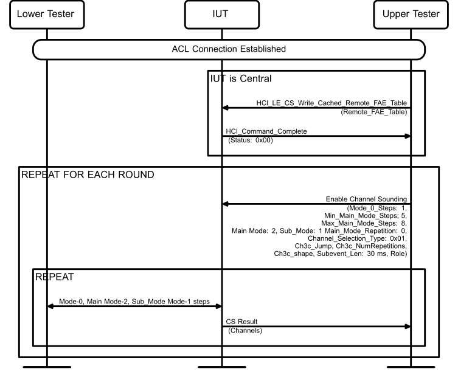

**Figure 4.11: Channel Index Selection Algorithm #3c MSC**

1. If the IUT is the Initiator, then the Upper Tester sends the
HCI_LE_CS_Write_Cached_Remote_FAE_Table command to the IUT with Connection_Handle set to the handle of the connection, Remote_FAE_Table set to TSPX_cs_remote_fae_table, and receives a successful HCI_Command_Complete event in response.
Repeat Steps 2–6 for each round in Table 4.14.
2. The Upper Tester commands the IUT to enable the Channel Sounding procedure with
Mode_0_Steps set to 1, Min_Main_Mode_Steps set to 5, Max_Main_Mode_Steps set to 8, Main_Mode set to 2, Sub_Mode set to 1, Main_Mode_Repetition set to 0, Channel_Map set with all valid channel bits set, Channel_Selection_Type set to 0x01, and Subevent_Len set to 30 ms, Ch3c_Jump and Ch3c_NumRepetitions set as specified in Table 4.14, Ch3c_shape and Role set as specified in Table 4.13, and all other parameters in Section 4.1.6.2. 3. The Lower Tester and the IUT perform Mode-0, Main Mode Mode-2, and Sub_Mode Mode-1
exchanges in Section 4.2.1. 4. The IUT reports the Channel Sounding results to the Upper Tester with the channels used in the
main exchanges in Step 3. 5. Repeat Steps 3 and 4 until the end of the procedure 6. Repeat Steps 2–6 with the Channel_Map set to each even channel bit set in Step 2.

|  | Round | Channel Jump Nu | m Repetitions |
| --- | --- | --- | --- |
| 1 |  | 2 1 |  |
| 2 |  | 3 1 |  |
| 3 |  | 4 1 |  |

|  | Round |  |  | Channel Jump |  |  | Num Repetitions |  |
| --- | --- | --- | --- | --- | --- | --- | --- | --- |
| 4 |  |  | 4 |  |  | 2 |  |  |
| 5 |  |  | 5 |  |  | 1 |  |  |
| 6 |  |  | 6 |  |  | 1 |  |  |
| 7 |  |  | 7 |  |  | 1 |  |  |
| 8 |  |  | 7 |  |  | 3 |  |  |
| 9 |  |  | 8 |  |  | 3 |  |  |

Table 4.14: Channel Index Selection Algorithm #3c rounds
• Expected Outcome
Pass verdict
For the checks on the CS_SYNC packets transmitted by the IUT, the Lower Tester applies the common Pass verdict criteria defined in Section 4.1.6.5.
In Step 3, the IUT sends Mode-0 CS_SYNC on the proper channels using CSA #3a.
In Step 3, the IUT only sends CS_SYNC on the channels per the Channel selection algorithm #3c.
The hop sequence is the correct sequence based on the parameters in Step 2. The channels are verified to be the correct channels generated using CSA #3c.
90% of the Main Mode Mode-2 steps are sent by the IUT correctly.
90% of the Sub_Mode Mode-1 steps are sent by the IUT correctly.
Mode-2 tones are sent using correct start time and end time (correct extension slot usage, correct ramp down after T_RD).

##### 4.4.1.8 Main Mode Repetition, Verify Main Mode Repeated steps

• Test Purpose
Verify that an IUT properly repeats the main mode steps when there are fewer unrepeated steps than the main mode repetition value. If a subevent only contains two steps that were not repeated and there are three main mode steps repeated, then the next subevent only repeats the two steps and then proceeds with the main mode steps.
• Reference
[3] 4.4.4
• Initial Condition
- The Upper tester uses the Channel Sounding Test command to enable channel sounding.
• Test Case Configuration

|  | Test Case ID |  |  | IUT CS Role |  |
| --- | --- | --- | --- | --- | --- |
| CS/PAC/INI/BV-32-C [Main Mode Repetition, Verify Main Mode Repeated steps, Initiator] |  |  | Initiator |  |  |
| CS/PAC/REF/BV-32-C [Main Mode Repetition, Verify Main Mode Repeated steps, Reflector] |  |  | Reflector |  |  |

Table 4.15: Main Mode Repetition, Verify Main Mode Repeated steps test cases
• Test Procedure

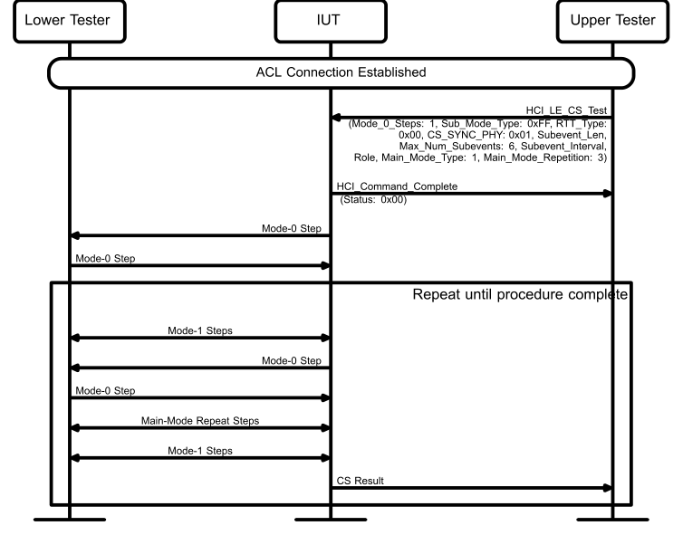

**Figure 4.12: Main Mode Repetition, Verify Main Mode Repeated steps MSC**

1. The Upper Tester sends an HCI_LE_CS_Test command to the IUT with Mode_0_Steps set to 1,
Main_Mode_Repetition set to 3, Main_Mode_Type set to 1, Sub_Mode_Type set to 0xFF, RTT_Type set to 0x00, CS_SYNC_PHY set to 0x01, Subevent Len set to 2000 s, Max_Num_Subevents = 6, Subevent_Interval = 2.5 ms, the CS role as set in Table 4.15, and all other parameters set to the defaults from Section 4.1.6.2 and receives a successful HCI_Command_Complete event in response. 2. The IUT and the Lower Tester exchange 1 Mode-0 exchange. 3. The IUT and the Lower Tester exchange Mode-1 steps until the subevent ends. 4. The IUT and the Lower Tester exchange 1 Mode-0 exchange. 5. The IUT and the Lower Tester first send up to three Main-Mode repeat steps. The repeat steps
are up to three of the main-mode steps from the previous Mode-1 exchange that was not part of a repeat. Any remaining steps of the subevent are Mode-1 exchanges. 6. The IUT reports the Channel Sounding results to the Upper Tester.
Repeat Steps 4–6 until the procedure is complete.
• Expected Outcome
Pass verdict
In Step 5, the IUT sends Mode-1 repeat steps that are up to the last three Mode-1 steps from the previous subevent.
Fail verdict
In Step 5, the IUT sends a Mode-1 repeat step that was a repeat step from the previous subevent.

### 4.5 RTT

Verify the correct Round Trip Time calculations.

#### 4.5.1 INI

##### 4.5.1.1 Channel Sounding – RTT, Initiator

• Test Purpose
Verify that an IUT properly compensates for internal delays and clock drift and implements frequency- based time compensation.
• Reference
[3] 3.1
• Initial Condition
- The Lower Tester’s transmit power is adjusted such that the input power to the IUT receiver is −70 dBm.
- The FFO of the Lower Tester, as applied to the RF frequencies and the symbol and link layer timing, is set to 50 ppm. This value is initialized to 0 ppm for the first pass of the test procedure.
• Test Case Configuration

| TCID | PHY | Mode |  | RTT Type |  |
| --- | --- | --- | --- | --- | --- |
|  |  |  |  | Parameters |  |
| CS/RTT/INI/BV-01-C [Channel Sounding – RTT, Initiator, LE 1M, Mode-1, RTT AA-Only] | LE 1M | Mode-1 | AA-Only |  |  |
| CS/RTT/INI/BV-02-C [Channel Sounding – RTT, Initiator, LE 1M, Mode-3, RTT AA-Only] | LE 1M | Mode-3 | AA-Only |  |  |
| CS/RTT/INI/BV-03-C [Channel Sounding – RTT, Initiator, LE 2M, Mode-1, RTT AA-Only] | LE 2M | Mode-1 | AA-Only |  |  |
| CS/RTT/INI/BV-04-C [Channel Sounding – RTT, Initiator, LE 2M, Mode-3, RTT AA-Only] | LE 2M | Mode-3 | AA-Only |  |  |
| CS/RTT/INI/BV-37-C [Channel Sounding – RTT, Initiator, LE 2M 2BT, Mode-1, RTT AA-Only] | LE 2M 2BT | Mode-1 | AA-Only |  |  |
| CS/RTT/INI/BV-38-C [Channel Sounding – RTT, Initiator, LE 2M 2BT, Mode-3, RTT AA-Only] | LE 2M 2BT | Mode-3 | AA-Only |  |  |
| CS/RTT/INI/BV-13-C [Channel Sounding – RTT, Initiator, LE 1M, Mode-1, RTT 32-bit Sounding Sequence] | LE 1M | Mode-1 | 32-bit Sounding Sequence |  |  |
| CS/RTT/INI/BV-14-C [Channel Sounding – RTT, Initiator, LE 1M, Mode-3, RTT 32-bit Sounding Sequence] | LE 1M | Mode-3 | 32-bit Sounding Sequence |  |  |

| TCID | PHY | Mode |  | RTT Type |  |
| --- | --- | --- | --- | --- | --- |
|  |  |  |  | Parameters |  |
| CS/RTT/INI/BV-15-C [Channel Sounding – RTT, Initiator, LE 2M, Mode-1, RTT 32-bit Sounding Sequence] | LE 2M | Mode-1 | 32-bit Sounding Sequence |  |  |
| CS/RTT/INI/BV-16-C [Channel Sounding – RTT, Initiator, LE 2M, Mode-3, RTT 32-bit Sounding Sequence] | LE 2M | Mode-3 | 32-bit Sounding Sequence |  |  |
| CS/RTT/INI/BV-39-C [Channel Sounding – RTT, Initiator, LE 2M 2BT, Mode-1, RTT 32-bit Sounding Sequence] | LE 2M 2BT | Mode-1 | 32-bit Sounding Sequence |  |  |
| CS/RTT/INI/BV-40-C [Channel Sounding – RTT, Initiator, LE 2M 2BT, Mode-3, RTT 32-bit Sounding Sequence] | LE 2M 2BT | Mode-3 | 32-bit Sounding Sequence |  |  |
| CS/RTT/INI/BV-17-C [Channel Sounding – RTT, Initiator, LE 1M, Mode-1, RTT 96-bit Sounding Sequence] | LE 1M | Mode-1 | 96-bit Sounding Sequence |  |  |
| CS/RTT/INI/BV-18-C [Channel Sounding – RTT, Initiator, LE 1M, Mode-3, RTT 96-bit Sounding Sequence] | LE 1M | Mode-3 | 96-bit Sounding Sequence |  |  |
| CS/RTT/INI/BV-19-C [Channel Sounding – RTT, Initiator, LE 2M, Mode-1, RTT 96-bit Sounding Sequence] | LE 2M | Mode-1 | 96-bit Sounding Sequence |  |  |
| CS/RTT/INI/BV-20-C [Channel Sounding – RTT, Initiator, LE 2M, Mode-3, RTT 96-bit Sounding Sequence] | LE 2M | Mode-3 | 96-bit Sounding Sequence |  |  |
| CS/RTT/INI/BV-41-C [Channel Sounding – RTT, Initiator, LE 2M 2BT, Mode-1, RTT 96-bit Sounding Sequence] | LE 2M 2BT | Mode-1 | 96-bit Sounding Sequence |  |  |
| CS/RTT/INI/BV-42-C [Channel Sounding – RTT, Initiator, LE 2M 2BT, Mode-3, RTT 96-bit Sounding Sequence] | LE 2M 2BT | Mode-3 | 96-bit Sounding Sequence |  |  |
| CS/RTT/INI/BV-21-C [Channel Sounding – RTT, Initiator, LE 1M, Mode-1, RTT 32-bit Random Sequence] | LE 1M | Mode-1 | 32-bit Random Sequence |  |  |
| CS/RTT/INI/BV-22-C [Channel Sounding – RTT, Initiator, LE 1M, Mode-3, RTT 32-bit Random Sequence] | LE 1M | Mode-3 | 32-bit Random Sequence |  |  |

| TCID | PHY | Mode |  | RTT Type |  |
| --- | --- | --- | --- | --- | --- |
|  |  |  |  | Parameters |  |
| CS/RTT/INI/BV-23-C [Channel Sounding – RTT, Initiator, LE 2M, Mode-1, RTT 32-bit Random Sequence] | LE 2M | Mode-1 | 32-bit Random Sequence |  |  |
| CS/RTT/INI/BV-24-C [Channel Sounding – RTT, Initiator, LE 2M, Mode-3, RTT 32-bit Random Sequence] | LE 2M | Mode-3 | 32-bit Random Sequence |  |  |
| CS/RTT/INI/BV-43-C [Channel Sounding – RTT, Initiator, LE 2M 2BT, Mode-1, RTT 32-bit Random Sequence] | LE 2M 2BT | Mode-1 | 32-bit Random Sequence |  |  |
| CS/RTT/INI/BV-44-C [Channel Sounding – RTT, Initiator, LE 2M 2BT, Mode-3, RTT 32-bit Random Sequence] | LE 2M 2BT | Mode-3 | 32-bit Random Sequence |  |  |
| CS/RTT/INI/BV-25-C [Channel Sounding – RTT, Initiator, LE 1M, Mode-1, RTT 64-bit Random Sequence] | LE 1M | Mode-1 | 64-bit Random Sequence |  |  |
| CS/RTT/INI/BV-26-C [Channel Sounding – RTT, Initiator, LE 1M, Mode-3, RTT 64-bit Random Sequence] | LE 1M | Mode-3 | 64-bit Random Sequence |  |  |
| CS/RTT/INI/BV-27-C [Channel Sounding – RTT, Initiator, LE 2M, Mode-1, RTT 64-bit Random Sequence] | LE 2M | Mode-1 | 64-bit Random Sequence |  |  |
| CS/RTT/INI/BV-28-C [Channel Sounding – RTT, Initiator, LE 2M, Mode-3, RTT 64-bit Random Sequence] | LE 2M | Mode-3 | 64-bit Random Sequence |  |  |
| CS/RTT/INI/BV-45-C [Channel Sounding – RTT, Initiator, LE 2M 2BT, Mode-1, RTT 64-bit Random Sequence] | LE 2M 2BT | Mode-1 | 64-bit Random Sequence |  |  |
| CS/RTT/INI/BV-46-C [Channel Sounding – RTT, Initiator, LE 2M 2BT, Mode-3, RTT 64-bit Random Sequence] | LE 2M 2BT | Mode-3 | 64-bit Random Sequence |  |  |
| CS/RTT/INI/BV-29-C [Channel Sounding – RTT, Initiator, LE 1M, Mode-1, RTT 96-bit Random Sequence] | LE 1M | Mode-1 | 96-bit Random Sequence |  |  |
| CS/RTT/INI/BV-30-C [Channel Sounding – RTT, Initiator, LE 1M, Mode-3, RTT 96-bit Random Sequence] | LE 1M | Mode-3 | 96-bit Random Sequence |  |  |

| TCID | PHY | Mode |  | RTT Type |  |
| --- | --- | --- | --- | --- | --- |
|  |  |  |  | Parameters |  |
| CS/RTT/INI/BV-31-C [Channel Sounding – RTT, Initiator, LE 2M, Mode-1, RTT 96-bit Random Sequence] | LE 2M | Mode-1 | 96-bit Random Sequence |  |  |
| CS/RTT/INI/BV-32-C [Channel Sounding – RTT, Initiator, LE 2M, Mode-3, RTT 96-bit Random Sequence] | LE 2M | Mode-3 | 96-bit Random Sequence |  |  |
| CS/RTT/INI/BV-47-C [Channel Sounding – RTT, Initiator, LE 2M 2BT, Mode-1, RTT 96-bit Random Sequence] | LE 2M 2BT | Mode-1 | 96-bit Random Sequence |  |  |
| CS/RTT/INI/BV-48-C [Channel Sounding – RTT, Initiator, LE 2M 2BT, Mode-3, RTT 96-bit Random Sequence] | LE 2M 2BT | Mode-3 | 96-bit Random Sequence |  |  |
| CS/RTT/INI/BV-33-C [Channel Sounding – RTT, Initiator, LE 1M, Mode-1, RTT 128-bit Random Sequence] | LE 1M | Mode-1 | 128-bit Random Sequence |  |  |
| CS/RTT/INI/BV-34-C [Channel Sounding – RTT, Initiator, LE 1M, Mode-3, RTT 128-bit Random Sequence] | LE 1M | Mode-3 | 128-bit Random Sequence |  |  |
| CS/RTT/INI/BV-35-C [Channel Sounding – RTT, Initiator, LE 2M, Mode-1, RTT 128-bit Random Sequence] | LE 2M | Mode-1 | 128-bit Random Sequence |  |  |
| CS/RTT/INI/BV-36-C [Channel Sounding – RTT, Initiator, LE 2M, Mode-3, RTT 128-bit Random Sequence] | LE 2M | Mode-3 | 128-bit Random Sequence |  |  |
| CS/RTT/INI/BV-49-C [Channel Sounding – RTT, Initiator, LE 2M 2BT, Mode-1, RTT 128-bit Random Sequence] | LE 2M 2BT | Mode-1 | 128-bit Random Sequence |  |  |
| CS/RTT/INI/BV-50-C [Channel Sounding – RTT, Initiator, LE 2M 2BT, Mode-3, RTT 128-bit Random Sequence] | LE 2M 2BT | Mode-3 | 128-bit Random Sequence |  |  |
| CS/RTT/INI/BV-51-C [Channel Sounding – RTT, Initiator, LE 1M, RTT AA-Only, Max T SY CENTER DELTA] _ _ _ | LE 1M | Mode-3 if supported, otherwise Mode-1 | AA-only, Max T SY CENTER DELTA _ _ _ |  |  |
| CS/RTT/INI/BV-52-C [Channel Sounding – RTT, Initiator, LE 1M, RTT Random Sequence, Max T SY CENTER DELTA] _ _ _ | LE 1M | Mode-3 if supported, otherwise Mode-1 | Max supported random sequence, Max T SY CENTER DELTA _ _ _ |  |  |

| TCID | PHY | Mode | RTT Type |  |
| --- | --- | --- | --- | --- |
|  |  |  | Parameters |  |
| CS/RTT/INI/BV-53-C [Channel Sounding – RTT, Initiator, LE 1M, RTT Sounding Sequence, Max T SY CENTER DELTA] _ _ _ | LE 1M | Mode-3 if supported, otherwise Mode-1 | Max supported sounding sequence, Max T SY CENTER DELTA _ _ _ |  |
| CS/RTT/INI/BV-54-C [Channel Sounding – RTT, Initiator, LE 2M, RTT AA-Only, Max T SY CENTER DELTA] _ _ _ | LE 2M | Mode-3 if supported, otherwise Mode-1 | AA-only, Max T SY CENTER DELTA _ _ _ |  |
| CS/RTT/INI/BV-55-C [Channel Sounding – RTT, Initiator, LE 2M, RTT Random Sequence, Max T SY CENTER DELTA] _ _ _ | LE 2M | Mode-3 if supported, otherwise Mode-1 | Max supported random sequence, Max T SY CENTER DELTA _ _ _ |  |
| CS/RTT/INI/BV-56-C [Channel Sounding – RTT, Initiator, LE 2M, RTT Sounding sequence, Max T SY CENTER DELTA] _ _ _ | LE 2M | Mode-3 if supported, otherwise Mode-1 | Max supported sounding sequence, Max T SY CENTER DELTA _ _ _ |  |
| CS/RTT/INI/BV-57-C [Channel Sounding – RTT, Initiator, LE 2M 2BT, RTT AA-Only, Max T SY CENTER DELTA] _ _ _ | LE 2M 2BT | Mode-3 if supported, otherwise Mode-1 | AA-only, Max T SY CENTER DELTA _ _ _ |  |
| CS/RTT/INI/BV-58-C [Channel Sounding – RTT, Initiator, LE 2M 2BT, RTT Random Sequence, Max T SY CENTER DELTA] _ _ _ | LE 2M 2BT | Mode-3 if supported, otherwise Mode-1 | Max supported random sequence, Max T SY CENTER DELTA _ _ _ |  |
| CS/RTT/INI/BV-59-C [Channel Sounding – RTT, Initiator, LE 2M 2BT, RTT Sounding Sequence, Max T SY CENTER DELTA] _ _ _ | LE 2M 2BT | Mode-3 if supported, otherwise Mode-1 | Max supported sounding sequence, Max T SY CENTER DELTA _ _ _ |  |

Table 4.16: Channel Sounding – RTT, Initiator test cases
• Test Procedure

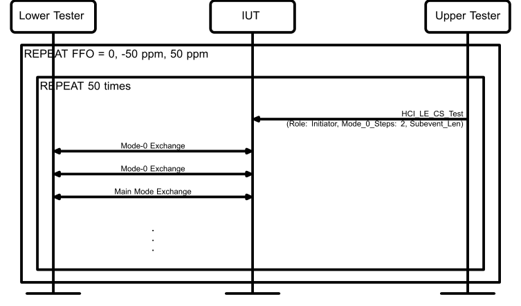

**Figure 4.13: Channel Sounding – RTT, Initiator MSC**

Channel Sounding subevent with:
▪ Role set to Initiator ▪ Mode-0 CS Steps set to 𝑀= 2 ▪ The value of Subevent Length set to obtain N Main Mode steps, where N is the number of steps required to achieve the supported RTT accuracy for the given RTT type defined in the IXIT. If N is large enough that the number of allowed steps in a subevent is exceeded, then the number of main mode steps is divided between two subevents, so that the first subevent has N/2 main mode steps if N is even, or (N+1)/2 steps if N is odd. ▪ If specified in Table 4.16 to set the maximum value of T_SY_CENTER_DELTA, then the maximum supported payload length is chosen for the RTT-type. If applicable, the values of T_IP1, T_FCS, T_PM, T_SW, and N_AP parameters are set to the maximum values supported by the device. ▪ All other parameters set to the defaults from Section 4.1.6.3. 2. The IUT and the Lower Tester execute the CS subevent. The Lower Tester measures the
physical time of departure, 𝑇𝑜𝐷𝐴[𝑘], and time of arrival, 𝑇𝑜𝐴𝐴[𝑘], of each packet sent by the IUT, where k is the step index. The Lower Tester uses EQ 1 in Vol 6, Part H, §3.1 to determine these values. The Lower Tester corrects for any delays in the test setup, so that these values are referred to the IUT’s antenna port. 3. The Lower Tester obtains the value of ToA_ToD_Initiator for the 𝑘𝑡ℎ step from the IUT via HCI.
The Lower Tester corrects for the known timing offsets as described in Vol. 6, Part H, Section 3.1.2 and denotes this as (𝑇𝑜𝐴−𝑇𝑜𝐷)𝐴
′ [𝑘]. 4. For each step, the Lower Tester calculates the round-trip timing error Δ𝑇𝑅𝑇𝑇[𝑘] as defined in
Vol. 6, Part H, Section 3.1.2. The value of 𝐹𝐹𝑂𝐸 used in this calculation is the Lower Tester’s FFO value. 5. If a second subevent is required in order to send N main mode steps, then Steps 1–4 are
repeated. The Subevent Length of the second subevent is adjusted to obtain the correct remaining number of Main Mode steps. 6. The procedure-wise response time error for the procedure Δ𝑇𝑅𝑇𝑇,𝑃𝑅𝑂𝐶 is calculated as the average
of Δ𝑇𝑅𝑇𝑇[𝑘] for the subevent, and second subevent if needed. All steps where the Access Address Quality Indicator is nonzero from either the IUT or the Lower Tester are ignored in this calculation. 7. Steps 1–6 are repeated 49 times. The Lower Tester calculates the values of 𝐵 and 𝜎 as the mean
and standard deviation of Δ𝑇𝑅𝑇𝑇,𝑃𝑅𝑂𝐶, respectively. 8. Steps 1–7 are repeated for Lower Tester FFO values of -50 ppm and 50 ppm.
• Expected Outcome
Pass verdict
The values of 2𝜎+ 𝐵 calculated in Step 6 are within the declared supported accuracy for the RTT type and corresponding declared N value, for each Lower Tester FFO value.

#### 4.5.2 REF

##### 4.5.2.1 Channel Sounding – RTT, Reflector

• Test Purpose
Verify that an IUT properly compensates for internal delays and clock drift and implements frequency- based time compensation.
• Reference
• Initial Condition
- The Lower Tester’s transmit power is adjusted such that the input power to the IUT receiver is −70 dBm.
- The FFO of the Lower Tester, as applied to the RF frequencies and the symbol and link layer timing, is set to 50 ppm. This value is initialized to 0 ppm for the first pass of the test procedure.
• Test Case Configuration

| TCID | PHY | Mode |  | RTT Type |  |
| --- | --- | --- | --- | --- | --- |
|  |  |  |  | Parameters |  |
| CS/RTT/REF/BV-01-C [Channel Sounding – RTT, Reflector, LE 1M, Mode-1, RTT AA-Only] | LE 1M | Mode-1 | AA-Only |  |  |
| CS/RTT/REF/BV-02-C [Channel Sounding – RTT, Reflector, LE 1M, Mode-3, RTT AA-Only] | LE 1M | Mode-3 | AA-Only |  |  |
| CS/RTT/REF/BV-03-C [Channel Sounding – RTT, Reflector, LE 2M, Mode-1, RTT AA-Only] | LE 2M | Mode-1 | AA-Only |  |  |
| CS/RTT/REF/BV-04-C [Channel Sounding – RTT, Reflector, LE 2M, Mode-3, RTT AA-Only] | LE 2M | Mode-3 | AA-Only |  |  |
| CS/RTT/REF/BV-37-C [Channel Sounding – RTT, Reflector, LE 2M 2BT, Mode-1, RTT AA-Only] | LE 2M 2BT | Mode-1 | AA-Only |  |  |
| CS/RTT/REF/BV-38-C [Channel Sounding – RTT, Reflector, LE 2M 2BT, Mode-3, RTT AA-Only] | LE 2M 2BT | Mode-3 | AA-Only |  |  |
| CS/RTT/REF/BV-13-C [Channel Sounding – RTT, Reflector, LE 1M, Mode-1, RTT 32-bit Sounding Sequence] | LE 1M | Mode-1 | 32-bit Sounding Sequence |  |  |
| CS/RTT/REF/BV-14-C [Channel Sounding – RTT, Reflector, LE 1M, Mode-3, RTT 32-bit Sounding Sequence] | LE 1M | Mode-3 | 32-bit Sounding Sequence |  |  |
| CS/RTT/REF/BV-15-C [Channel Sounding – RTT, Reflector, LE 2M, Mode-1, RTT 32-bit Sounding Sequence] | LE 2M | Mode-1 | 32-bit Sounding Sequence |  |  |
| CS/RTT/REF/BV-16-C [Channel Sounding – RTT, Reflector, LE 2M, Mode-3, RTT 32-bit Sounding Sequence] | LE 2M | Mode-3 | 32-bit Sounding Sequence |  |  |
| CS/RTT/REF/BV-39-C [Channel Sounding – RTT, Reflector, LE 2M 2BT, Mode-1, RTT 32-bit Sounding Sequence] | LE 2M 2BT | Mode-1 | 32-bit Sounding Sequence |  |  |

| TCID | PHY | Mode |  | RTT Type |  |
| --- | --- | --- | --- | --- | --- |
|  |  |  |  | Parameters |  |
| CS/RTT/REF/BV-40-C [Channel Sounding – RTT, Reflector, LE 2M 2BT, Mode-3, RTT 32-bit Sounding Sequence] | LE 2M 2BT | Mode-3 | 32-bit Sounding Sequence |  |  |
| CS/RTT/REF/BV-17-C [Channel Sounding – RTT, Reflector, LE 1M, Mode-1, RTT 96-bit Sounding Sequence] | LE 1M | Mode-1 | 96-bit Sounding Sequence |  |  |
| CS/RTT/REF/BV-18-C [Channel Sounding – RTT, Reflector, LE 1M, Mode-3, RTT 96-bit Sounding Sequence] | LE 1M | Mode-3 | 96-bit Sounding Sequence |  |  |
| CS/RTT/REF/BV-19-C [Channel Sounding – RTT, Reflector, LE 2M, Mode-1, RTT 96-bit Sounding Sequence] | LE 2M | Mode-1 | 96-bit Sounding Sequence |  |  |
| CS/RTT/REF/BV-20-C [Channel Sounding – RTT, Reflector, LE 2M, Mode-3, RTT 96-bit Sounding Sequence] | LE 2M | Mode-3 | 96-bit Sounding Sequence |  |  |
| CS/RTT/REF/BV-41-C [Channel Sounding – RTT, Reflector, LE 2M 2BT, Mode-1, RTT 96-bit Sounding Sequence] | LE 2M 2BT | Mode-1 | 96-bit Sounding Sequence |  |  |
| CS/RTT/REF/BV-42-C [Channel Sounding – RTT, Reflector, LE 2M 2BT, Mode-3, RTT 96-bit Sounding Sequence] | LE 2M 2BT | Mode-3 | 96-bit Sounding Sequence |  |  |
| CS/RTT/REF/BV-21-C [Channel Sounding – RTT, Reflector, LE 1M, Mode-1, RTT 32-bit Random Sequence] | LE 1M | Mode-1 | 32-bit Random Sequence |  |  |
| CS/RTT/REF/BV-22-C [Channel Sounding – RTT, Reflector, LE 1M, Mode-3, RTT 32-bit Random Sequence] | LE 1M | Mode-3 | 32-bit Random Sequence |  |  |
| CS/RTT/REF/BV-23-C [Channel Sounding – RTT, Reflector, LE 2M, Mode-1, RTT 32-bit Random Sequence] | LE 2M | Mode-1 | 32-bit Random Sequence |  |  |
| CS/RTT/REF/BV-24-C [Channel Sounding – RTT, Reflector, LE 2M, Mode-3, RTT 32-bit Random Sequence] | LE 2M | Mode-3 | 32-bit Random Sequence |  |  |
| CS/RTT/REF/BV-43-C [Channel Sounding – RTT, Reflector, LE 2M 2BT, Mode-1, RTT 32-bit Random Sequence] | LE 2M 2BT | Mode-1 | 32-bit Random Sequence |  |  |

| TCID | PHY | Mode |  | RTT Type |  |
| --- | --- | --- | --- | --- | --- |
|  |  |  |  | Parameters |  |
| CS/RTT/REF/BV-44-C [Channel Sounding – RTT, Reflector, LE 2M 2BT, Mode-3, RTT 32-bit Random Sequence] | LE 2M 2BT | Mode-3 | 32-bit Random Sequence |  |  |
| CS/RTT/REF/BV-25-C [Channel Sounding – RTT, Reflector, LE 1M, Mode-1, RTT 64-bit Random Sequence] | LE 1M | Mode-1 | 64-bit Random Sequence |  |  |
| CS/RTT/REF/BV-26-C [Channel Sounding – RTT, Reflector, LE 1M, Mode-3, RTT 64-bit Random Sequence] | LE 1M | Mode-3 | 64-bit Random Sequence |  |  |
| CS/RTT/REF/BV-27-C [Channel Sounding – RTT, Reflector, LE 2M, Mode-1, RTT 64-bit Random Sequence] | LE 2M | Mode-1 | 64-bit Random Sequence |  |  |
| CS/RTT/REF/BV-28-C [Channel Sounding – RTT, Reflector, LE 2M, Mode-3, RTT 64-bit Random Sequence] | LE 2M | Mode-3 | 64-bit Random Sequence |  |  |
| CS/RTT/REF/BV-45-C [Channel Sounding – RTT, Reflector, LE 2M 2BT, Mode-1, RTT 64-bit Random Sequence] | LE 2M 2BT | Mode-1 | 64-bit Random Sequence |  |  |
| CS/RTT/REF/BV-46-C [Channel Sounding – RTT, Reflector, LE 2M 2BT, Mode-3, RTT 64-bit Random Sequence] | LE 2M 2BT | Mode-3 | 64-bit Random Sequence |  |  |
| CS/RTT/REF/BV-29-C [Channel Sounding – RTT, Reflector, LE 1M, Mode-1, RTT 96-bit Random Sequence] | LE 1M | Mode-1 | 96-bit Random Sequence |  |  |
| CS/RTT/REF/BV-30-C [Channel Sounding – RTT, Reflector, LE 1M, Mode-3, RTT 96-bit Random Sequence] | LE 1M | Mode-3 | 96-bit Random Sequence |  |  |
| CS/RTT/REF/BV-31-C [Channel Sounding – RTT, Reflector, LE 2M, Mode-1, RTT 96-bit Random Sequence] | LE 2M | Mode-1 | 96-bit Random Sequence |  |  |
| CS/RTT/REF/BV-32-C [Channel Sounding – RTT, Reflector, LE 2M, Mode-3, RTT 96-bit Random Sequence] | LE 2M | Mode-3 | 96-bit Random Sequence |  |  |
| CS/RTT/REF/BV-47-C [Channel Sounding – RTT, Reflector, LE 2M 2BT, Mode-1, RTT 96-bit Random Sequence] | LE 2M 2BT | Mode-1 | 96-bit Random Sequence |  |  |

| TCID | PHY | Mode |  | RTT Type |  |
| --- | --- | --- | --- | --- | --- |
|  |  |  |  | Parameters |  |
| CS/RTT/REF/BV-48-C [Channel Sounding – RTT, Reflector, LE 2M 2BT, Mode-3, RTT 96-bit Random Sequence] | LE 2M 2BT | Mode-3 | 96-bit Random Sequence |  |  |
| CS/RTT/REF/BV-33-C [Channel Sounding – RTT, Reflector, LE 1M, Mode-1, RTT 128-bit Random Sequence] | LE 1M | Mode-1 | 128-bit Random Sequence |  |  |
| CS/RTT/REF/BV-34-C [Channel Sounding – RTT, Reflector, LE 1M, Mode-3, RTT 128-bit Random Sequence] | LE 1M | Mode-3 | 128-bit Random Sequence |  |  |
| CS/RTT/REF/BV-35-C [Channel Sounding – RTT, Reflector, LE 2M, Mode-1, RTT 128-bit Random Sequence] | LE 2M | Mode-1 | 128-bit Random Sequence |  |  |
| CS/RTT/REF/BV-36-C [Channel Sounding – RTT, Reflector, LE 2M, Mode-3, RTT 128-bit Random Sequence] | LE 2M | Mode-3 | 128-bit Random Sequence |  |  |
| CS/RTT/REF/BV-49-C [Channel Sounding – RTT, Reflector, LE 2M 2BT, Mode-1, RTT 128-bit Random Sequence] | LE 2M 2BT | Mode-1 | 128-bit Random Sequence |  |  |
| CS/RTT/REF/BV-50-C [Channel Sounding – RTT, Reflector, LE 2M 2BT, Mode-3, RTT 128-bit Random Sequence] | LE 2M 2BT | Mode-3 | 128-bit Random Sequence |  |  |
| CS/RTT/REF/BV-51-C [Channel Sounding – RTT, Reflector, LE 1M, Mode-1, RTT AA-Only, Longest Mode-1] | LE 1M | Mode-1 | AA-Only T IP1 = 7 _ T FCS Index = 9 _ _ Longest Mode-1 packet |  |  |
| CS/RTT/REF/BV-52-C [Channel Sounding – RTT, Reflector, LE 1M, Mode-1, RTT Random Sequence, Longest Mode-1] | LE 1M | Mode-1 | Max supported random sequence T IP1 = 7 _ T FCS Index = 9 _ _ Longest Mode-1 packet |  |  |
| CS/RTT/REF/BV-53-C [Channel Sounding – RTT, Reflector, LE 1M, Mode-1, RTT Sounding Sequence, Max T SY CENTER DELTA] _ _ _ | LE 1M | Mode-1 | Max supported sounding sequence T IP1 = 7 _ T FCS Index = 9 _ _ Longest Mode-1 packet |  |  |
| CS/RTT/REF/BV-54-C [Channel Sounding – RTT, Reflector, LE 2M, Mode-1, RTT AA-Only, Longest Mode-1] | LE 2M | Mode-1 | AA-Only T IP1 = 7 _ T FCS Index = 9 _ _ Longest Mode-1 packet |  |  |

| TCID | PHY | Mode | RTT Type Parameters |  |
| --- | --- | --- | --- | --- |
| CS/RTT/REF/BV-55-C [Channel Sounding – RTT, Reflector, LE 2M, Mode-1, RTT Random Sequence, Longest Mode-1] | LE 2M | Mode-1 | Max supported random sequence T IP1 = 7 _ T FCS Index = 9 _ _ Longest Mode-1 packet |  |
| CS/RTT/REF/BV-56-C [Channel Sounding – RTT, Reflector, LE 2M, Mode-1, RTT Sounding Sequence, Max T SY CENTER DELTA] _ _ _ | LE 2M | Mode-1 | Max supported sounding sequence T IP1 = 7 _ T FCS Index = 9 _ _ Longest Mode-1 packet |  |
| CS/RTT/REF/BV-57-C [Channel Sounding – RTT, Reflector, LE 2M 2BT, Mode-1, RTT AA-Only, Longest Mode-1] | LE 2M 2BT | Mode-1 | AA-Only T IP1 = 7 _ T FCS Index = 9 _ _ Longest Mode-1 packet |  |
| CS/RTT/REF/BV-58-C [Channel Sounding – RTT, Reflector, LE 2M 2BT, Mode-1, RTT Random Sequence, Longest Mode-1] | LE 2M 2BT | Mode-1 | Max supported random sequence T IP1 = 7 _ T FCS Index = 9 _ _ Longest Mode-1 packet |  |
| CS/RTT/REF/BV-59-C [Channel Sounding – RTT, Reflector, LE 2M 2BT, Mode-1, RTT Sounding Sequence, Max T SY CENTER DELTA] _ _ _ | LE 2M 2BT | Mode-1 | Max supported sounding sequence T IP1 = 7 _ T FCS Index = 9 _ _ Longest Mode-1 packet |  |

Table 4.17: Channel Sounding – RTT, Reflector test cases
• Test Procedure

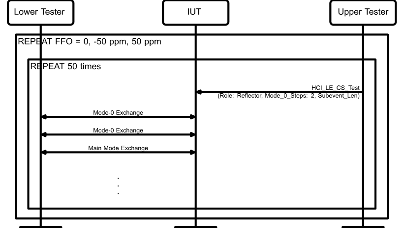

**Figure 4.14: Channel Sounding – RTT, Reflector MSC**

Channel Sounding subevent with:
▪ Role set to Reflector ▪ Mode-0 CS Steps set to 𝑀= 2 ▪ The value of Subevent Length set to obtain N Main Mode steps, where N is the number of steps required to achieve the supported RTT accuracy for the given RTT Type defined in the IXIT. If N is large enough that the number of allowed steps in a subevent is exceeded, then the number of main mode steps is divided between two subevents, so that the first subevent has N/2 main mode steps if N is even, or (N+1)/2 steps if N is odd. ▪ If specified in Table 4.17, then set additional parameters. ▪ All other parameters set to the defaults from Section 4.1.6.3. 2. The IUT and the Lower Tester execute the CS subevent. The Lower Tester measures the
physical time of departure, 𝑇𝑜𝐷𝐵[𝑘], and time of arrival, 𝑇𝑜𝐴𝐵[𝑘], of each packet sent by the IUT, where k is the step index. The Lower Tester uses EQ 1 in Vol. 6, Part H, Section 3.1 to determine these values. The Lower Tester corrects for any delays in the test setup, so that these values are referred to the IUT’s antenna port. 3. The Lower Tester measures the value of 𝐹𝐹𝑂𝐸 as the average frequency of the Mode-0 tone sent
by the IUT. Refer to the Mode-0 frequency verification test. 4. The Lower Tester obtains the value of ToD_ToA_Reflector for the 𝑘𝑡ℎ step from the IUT via HCI.
The Lower Tester corrects for the known timing offsets as described in Vol. 6, Part H, Section 3.1.2 and denotes this as (𝑇𝑜𝐷−𝑇𝑜𝐴)𝐵
′ [𝑘]. 5. For each step, the Lower Tester calculates the response time error Δ𝑇𝑅𝐸𝑆𝑃[𝑘] as defined in Vol. 6,
Part H, Section 3.1.2. The value of 𝐹𝐹𝑂𝐸 used in this calculation is that measured in Step 3. 6. If a second subevent is required in order to send N main mode steps, then Steps 2–5 are
repeated. The Subevent Length of the second subevent is adjusted to obtain the correct remaining number of Main Mode steps. 7. The procedure-wise response time error for the procedure Δ𝑇𝑅𝐸𝑆𝑃,𝑃𝑅𝑂𝐶 is calculated as the
average of Δ𝑇𝑅𝐸𝑆𝑃[𝑘] for the subevent, and second subevent if needed. All steps where the Access Address Quality Indicator is nonzero from either the IUT or the Lower Tester are ignored in this calculation. 8. Steps 2–7 are repeated 49 times. The Lower Tester calculates the values of 𝐵 and 𝜎 as the mean
and standard deviation of Δ𝑇𝑅𝐸𝑆𝑃,𝑃𝑅𝑂𝐶, respectively. 9. Steps 2–8 are repeated for Lower Tester FFO values of -50 ppm and 50 ppm.
• Expected Outcome
Pass verdict
The values of 2𝜎+ 𝐵 in Step 8 are within the declared supported accuracy for the RTT type and corresponding declared N value, for each Lower Tester FFO value.

### 4.6 TIM

Verify the correct Timing of the Channel Sounding packets.

#### 4.6.1 INI

##### 4.6.1.1 CS_SYNC Packets, Timing Verification, Initiator

• Test Purpose
Verify that the timing of the Mode-0 steps is within range and that the timing of the CS_SYNC packets in the Mode-1 and Mode-3 steps is within a subevent.
• References
[3] 4.3.1, 4.5
• Initial Condition
- The IUT is in the Initiator role.
- The FFO of the tester, as applied to the RF frequencies and the symbol and LL timing clocks, is set to 0 ppm.
• Test Case Configuration

| TCID | Reference | PHY |  | Main Mode |  |
| --- | --- | --- | --- | --- | --- |
|  |  |  |  | Type |  |
| CS/TIM/INI/BV-01-C [CS SYNC packets, Timing _ Verification, Initiator, 1 Ms/s, Mode-1] | [3] 4.3.2, 4.5 | 1 Ms/s | Mode-1 |  |  |
| CS/TIM/INI/BV-02-C [CS SYNC packets, Timing _ Verification, Initiator, 1 Ms/s, Mode-3] | [3] 4.3.4, 4.5 | 1 Ms/s | Mode-3 |  |  |
| CS/TIM/INI/BV-03-C [CS SYNC packets, Timing _ Verification, Initiator, 2 Ms/s, Mode-1] | [3] 4.3.2, 4.5 | 2 Ms/s | Mode-1 |  |  |
| CS/TIM/INI/BV-04-C [CS SYNC packets, Timing _ Verification, Initiator, 2 Ms/s, Mode-3] | [3] 4.3.4, 4.5 | 2 Ms/s | Mode-3 |  |  |
| CS/TIM/INI/BV-05-C [CS SYNC packets, Timing _ Verification, Initiator, 2 Ms/s, BT = 2.0, Mode-1] | [3] 4.3.2, 4.5 | 2 Ms/s, BT = 2.0 | Mode-1 |  |  |
| CS/TIM/INI/BV-06-C [CS SYNC packets, Timing _ Verification, Initiator, 2 Ms/s, BT = 2.0, Mode-3] | [3] 4.3.4, 4.5 | 2 Ms/s, BT = 2.0 | Mode-3 |  |  |

Table 4.18: CS_SYNC Packets, Timing Verification, Initiator test cases
• Test Procedure
1. The Upper Tester commands the IUT to enable the Channel Sounding procedure with:
▪ The IUT sets as an Initiator ▪ Mode_0_Steps set to 𝑀, where 𝑀 is the maximum number of Mode-0 steps the IUT supports ▪ The maximum value of N_AP supported by the IUT is used ▪ Other parameters specified in Section 4.1.6.3 2. The IUT sends a Mode-0 transmission to the Lower Tester. 3. The Lower Tester responds with a Mode-0 transmission to the IUT. 4. The 𝐹𝐹𝑂 of the first Mode-0 transmission, 𝐹𝐹𝑂[1] is measured according to [8] Section 3.5.1. For
each CS subevent used in the measurement, 𝐹𝐹𝑂𝐸=  𝐹𝐹𝑂[1]. 5. For each CS step, the Initiator adjusts the timing of its CS_SYNC packet based on 𝐹𝐹𝑂𝐸
according to [3] Section 4.5. The expected value of the Initiator transmission for step k is defined by 𝑇𝑂𝐷𝐼[𝑘] = 𝑡̂1[𝑘] as defined in [3] Section 4.5. The expected value of the reflector transmission for step k for Mode-1 and Mode-3 steps is defined by 𝑇𝑂𝐷𝑅[𝑘] = 𝑡̂1[𝑘] + 𝑇_𝑆𝑌_𝐶𝐸𝑁𝑇𝐸𝑅_𝐷𝐸𝐿𝑇𝐴 as defined in [3] Sections 4.3.2 and 4.3.4, respectively. The expected value of the reflector transmission for step k for Mode-0 steps is defined by 𝑇𝑂𝐷𝑅[𝑘] = 𝑡̂1[𝑘] + 𝑇_𝑆𝑌+ 𝑇_𝑅𝐷+ 𝑇_𝐼𝑃1 as defined in [3] Section 4.3.1, respectively. The expected value of the IUT and the Lower Tester’s transmission steps 𝑇𝑂𝐷𝐼𝑈𝑇[𝑘], 𝑇𝑂𝐷𝐿𝑇[𝑘], respectively, are assigned to either 𝑇𝑂𝐷𝑅[𝑘] 𝑜𝑟 𝑇𝑂𝐷𝐼[𝑘] depending on which role the IUT and the Lower Tester take. 6. For each non-Mode-0 CS step k = M+1,…,M+K, the Lower Tester adds a delay to the
CS_SYNC_1 packet of (7k mod 16)/16 symbols. Refer to [3] Section 3.2.1.
4.18. Alternative 7A (Mode-1):
7A.1 The IUT sends a Mode-1 transmission (CS_SYNC_1) to the Lower Tester. 7A.2 The Lower Tester replies with a Mode-1 (CS_SYNC_1) to the IUT. 7A.3 The Lower Tester measures the time of departure of the CS_SYNC_1 packet portion sent by the IUT. This value is denoted 𝑇𝑂𝐷 ̂𝐼𝑈𝑇[𝑘]. 7A.4 Repeat Steps 7A.1–7A.3 for all Mode-1 transmissions within the CS subevent. Alternative 7B (Mode-3):
7B.1 The IUT sends a Mode-3 transmission (CS_SYNC_3 + CS_Tone) to the Lower Tester. 7B.2 The Lower Tester replies with a Mode-3 (CS_SYNC_3 + CS_Tone) to the IUT. 7B.3 The Lower Tester measures the time of departure of the CS_SYNC_3 packet portion sent by the IUT. This value is denoted 𝑇𝑂𝐷 ̂𝐼𝑈𝑇[𝑘]. 7B.4 Repeat Steps 7B.1–7B.3 for all Mode-3 transmissions within the CS subevent. 8. Repeat Steps 1–7 nine times. 9. Repeat Steps 1–8 for a Lower Tester FFO of -50 ppm. 10. Repeat Steps 1–8 for a Lower Tester FFO of 50 ppm.
• Expected Outcome
Pass verdict
For every CS subevent measured, in the case of:
▪ Mode-0 CS steps, 𝑘= 1, … , 𝑀:
The range of the values of |𝑇𝑂𝐷 ̂𝐼𝑈𝑇[𝑘] −𝑇𝑂𝐷𝐼𝑈𝑇[𝑘]| is less than or equal to 0.25µs.
▪ Mode-1 and Mode-3 CS steps, 𝑘= 𝑀+ 1, … , 𝑀+ 𝐾:
𝐿𝐸 1𝑀 𝑃𝐻𝑌: −1 µ𝑠≤𝑇𝑂𝐷 ̂𝐼𝑈𝑇[𝑘] −𝑇𝑂𝐷𝐼𝑈𝑇[𝑘] ≤2 µ𝑠
𝐿𝐸 2𝑀 𝑎𝑛𝑑 𝐿𝐸 2𝑀 2𝐵𝑇 𝑃𝐻𝑌: −1 µ𝑠≤𝑇𝑂𝐷 ̂𝐼𝑈𝑇[𝑘] −𝑇𝑂𝐷𝐼𝑈𝑇[𝑘] ≤1.5 µ𝑠

##### 4.6.1.2 Power Ramp Profile, Ramp-down, Initiator

• Test Purpose
This test verifies that the Initiator IUT properly ramps down the signal after the transmission of the CS_SYNC or Unmodulated Carrier in the Channel Sounding steps.
• Initial Condition
- The IUT is in the Initiator role.
• Test Case Configuration

|  | TCID |  |  | Reference |  |  | Main Mode Type _ |  |
| --- | --- | --- | --- | --- | --- | --- | --- | --- |
| CS/TIM/INI/BV-07-C [Power Ramp Profile, Ramp-down, Initiator, Step Mode-1] |  |  | [3] 4.3.2 |  |  | Step Mode-1 |  |  |
| CS/TIM/INI/BV-08-C [Power Ramp Profile, Ramp-down, Initiator, Step Mode-2] |  |  | [3] 4.3.3 |  |  | Step Mode-2 |  |  |
| CS/TIM/INI/BV-09-C [Power Ramp Profile, Ramp-down, Initiator, Step Mode-3] |  |  | [3] 4.3.4 |  |  | Step Mode-3 |  |  |

Table 4.19: Power Ramp Profile, Ramp-down, Initiator test cases
• Test Procedure

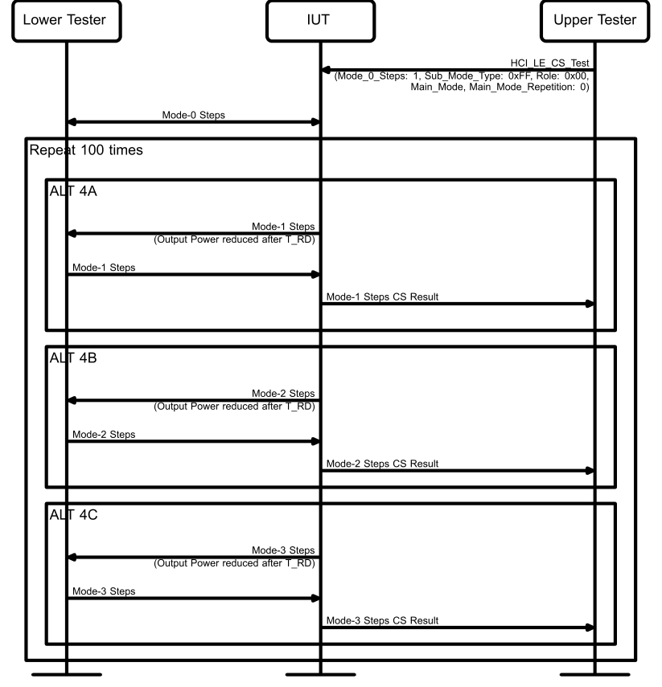

**Figure 4.15: Power Ramp Profile, Ramp-down, Initiator MSC**

Notes: In CS Step Modes #0, #1, #3, packets can be synchronized to by the Lower Tester for a known end of transmission. In CS Step Mode #2, an unmodulated carrier (UC) cannot be synchronized to by the Lower Tester.
Repeat Steps 1–5 where the Lower Tester has a clock drift of -50, 0, and 50 ppm.
1. Using the HCI_LE_CS_Test command, the Upper Tester commands the IUT to enable the
Channel Sounding procedure with Mode_0_Steps set to 1, Channel_Map with the lowest valid 50 bits set to produce 100 Main Mode steps, Channel_Map_Repetition set to 2, Sub_Mode_Type set to 0xFF, Main_Mode set as specified in Table 4.19, Role set to 0x00 (Initiator), Main_Mode_Repetition set to 0, and all other parameters set to the defaults from Section 4.1.6.3. 2. The IUT sends a Mode-0 CS_SYNC bit sequence for T_SY time. At T_SY time, the signal ramps
down for T_RD. After T_RD, the output power in the RF Channel is at least 40 dB less than the output power during the transmission of CS_SYNC. 3. The Lower Tester waits for T_IP1 and sends the CS_SYNC followed by a CS Tone for T_SY +
T_GD + T_FM, and then the signal ramps down for T_RD.

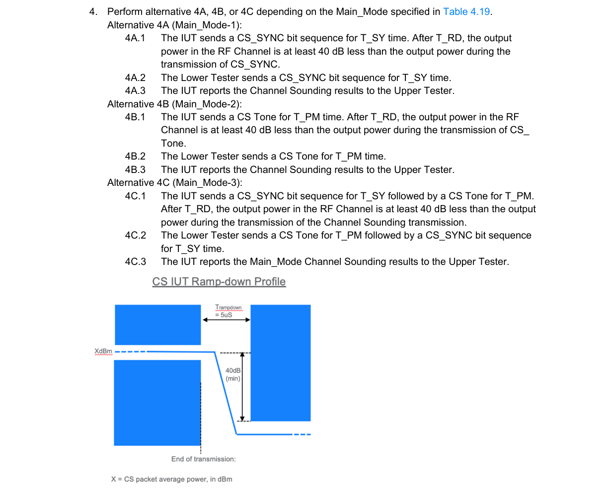

**Figure 4.16: Power Ramp Profile, Ramp-down, Initiator**

• Expected Outcome
Pass verdict
In Steps 2, 4A.1, 4B.1, and 4C.1, the signal output power decreases at least 40 dB during the 5 µs ramp down time at least 90 of 100 times.

#### 4.6.2 REF

##### 4.6.2.1 CS_SYNC Packets, Timing Verification, Reflector

• Test Purpose
Verify that the timing of the Mode-0 steps is within range and that the timing of the CS_SYNC packets in the Mode-1 and Mode-3 steps is within a subevent.
• References
[3] 4.3.1, 4.5
• Initial Condition
- The IUT is in the Reflector role.
- The FFO of the tester, as applied to the RF frequencies and the symbol and LL timing clocks, is set to 0 ppm.
• Test Case Configuration

| TCID | Reference | PHY |  | Main Mode |  |
| --- | --- | --- | --- | --- | --- |
|  |  |  |  | Type |  |
| CS/TIM/REF/BV-01-C [CS SYNC packets, _ Timing Verification, Reflector, 1 Ms/s, Mode-1] | [3] 4.3.2, 4.5 | 1 Ms/s | Mode-1 |  |  |
| CS/TIM/REF/BV-02-C [CS SYNC packets, _ Timing Verification, Reflector, 1 Ms/s, Mode-3] | [3] 4.3.4, 4.5 | 1 Ms/s | Mode-3 |  |  |
| CS/TIM/REF/BV-03-C [CS SYNC packets, _ Timing Verification, Reflector, 2 Ms/s, Mode-1] | [3] 4.3.2, 4.5 | 2 Ms/s | Mode-1 |  |  |
| CS/TIM/REF/BV-04-C [CS SYNC packets, _ Timing Verification, Reflector, 2 Ms/s, Mode-3] | [3] 4.3.4, 4.5 | 2 Ms/s | Mode-3 |  |  |
| CS/TIM/REF/BV-05-C [CS SYNC packets, _ Timing Verification, Reflector, 2 Ms/s, BT = 2.0, Mode-1] | [3] 4.3.2, 4.5 | 2 Ms/s, BT = 2.0 | Mode-1 |  |  |
| CS/TIM/REF/BV-06-C [CS SYNC packets, _ Timing Verification, Reflector, 2 Ms/s, BT = 2.0, Mode-3] | [3] 4.3.4, 4.5 | 2 Ms/s, BT = 2.0 | Mode-3 |  |  |

Table 4.20: CS_SYNC Packets, Timing Verification, Reflector test cases
• Test Procedure
1. The Upper Tester commands the IUT to enable the Channel Sounding procedure with:
- The IUT set as a Reflector - Mode-0_Steps set to of 𝑀, where 𝑀 is the maximum number of Mode-0 steps the IUT supports - The maximum value of N_AP supported by the IUT is used - Lowest frequency for testing as defined in Section 4.1.6.4 - Other parameters specified in Section 4.1.6.3 2. The Lower Tester sends a Mode-0 transmission to the IUT. 3. The IUT responds with a Mode-0 transmission to the Lower Tester. 4. The 𝐹𝐹𝑂 of first Mode-0 transmission, 𝐹𝐹𝑂[1], is measured according to [8] Section 3.5.1. For
each CS subevent used in the measurement, 𝐹𝐹𝑂𝐸=  𝐹𝐹𝑂[1].
according to [3] Section 4.5. The expected value of the Initiator transmission for step k is defined by 𝑇𝑂𝐷𝐼[𝑘] = 𝑡̂1[𝑘] as defined in [3] Section 4.5. The expected value of the reflector transmission for step k for Mode-1 and Mode-3 steps is defined by 𝑇𝑂𝐷𝑅[𝑘] = 𝑡̂1[𝑘] + 𝑇_𝑆𝑌_𝐶𝐸𝑁𝑇𝐸𝑅_𝐷𝐸𝐿𝑇𝐴 as defined in [3] Sections 4.3.2 and 4.3.4, respectively. The expected value of the reflector transmission for step k for Mode-0 steps is defined by 𝑇𝑂𝐷𝑅[𝑘] = 𝑡̂1[𝑘] + 𝑇_𝑆𝑌+ 𝑇_𝑅𝐷+ 𝑇_𝐼𝑃1 as defined in [3] Seciton 4.3.1, respectively. The expected value of the IUT and the Lower Tester’s transmission steps 𝑇𝑂𝐷𝐼𝑈𝑇[𝑘], 𝑇𝑂𝐷𝐿𝑇[𝑘], respectively, are assigned to either 𝑇𝑂𝐷𝑅[𝑘] 𝑜𝑟 𝑇𝑂𝐷𝐼[𝑘] depending on which role the IUT and the Lower Tester take. 6. For each non-Mode-0 CS step k = M+1,…,M+K, the Lower Tester adds a delay to the
CS_SYNC_1 packet of (7k mod 16)/16 symbols. Refer to [3] Section 3.2.1. 7. Perform either alternative 7A or 7B depending on the PHY and Main Mode specified in Table
4.20. Alternative 7A (Mode-1):
7A.1 The Lower Tester sends a Mode-1 transmission (CS_SYNC_1) to the IUT. 7A.2 The IUT replies with a Mode-1 (CS_SYNC_1) to the Lower Tester. 7A.3 The Lower Tester measures the time of departure of the CS_SYNC_1 packet portion sent by the IUT. This value is denoted 𝑇𝑂𝐷 ̂𝐼𝑈𝑇[𝑘]. 7A.4 Repeat Steps 7A.1–7A.3 for all Mode-1 transmissions within the CS subevent. Alternative 7B (Mode-3):
7B.1 The Lower Tester sends a Mode-3 transmission (CS_SYNC_3 + CS_Tone) to the IUT. 7B.2 The IUT replies with a Mode-3 (CS_SYNC_3 + CS_Tone) to the Lower Tester. 7B.3 The Lower Tester measures the time of departure of the CS_SYNC_3 packet portion sent by the IUT. This value is denoted 𝑇𝑂𝐷 ̂𝐼𝑈𝑇[𝑘]. 7B.4 Repeat Steps 7B.1–7B.3 for all Mode-3 transmissions within the CS subevent. 8. Repeat Steps 1–7 nine times. 9. Repeat Steps 1–8 for a Lower Tester FFO of -50 ppm. 10. Repeat Steps 1–8 for a Lower Tester FFO of 50 ppm.
• Expected Outcome:
Pass verdict
For every CS subevent measured, in the case of:
- Mode-1 and Mode-3 CS steps, 𝑘= 𝑀+ 1, … , 𝑀+ 𝐾:
𝐿𝐸 1𝑀 𝑃𝐻𝑌: −1 µ𝑠≤𝑇𝑂𝐷 ̂𝐼𝑈𝑇[𝑘] −𝑇𝑂𝐷𝐼𝑈𝑇[𝑘] ≤2 µ𝑠
𝐿𝐸 2𝑀 𝑎𝑛𝑑 𝐿𝐸 2𝑀 2𝐵𝑇 𝑃𝐻𝑌: −1 µ𝑠≤𝑇𝑂𝐷 ̂𝐼𝑈𝑇[𝑘] −𝑇𝑂𝐷𝐼𝑈𝑇[𝑘] ≤1.5 µ𝑠

##### 4.6.2.2 Power Ramp Profile, Ramp-down, Reflector

• Test Purpose
Verify that the Reflector IUT properly ramps down the signal after the transmission of the CS_SYNC or Unmodulated Carrier in the Channel Sounding steps.
• Initial Condition
- The IUT is in the Reflector role.
• Test Case Configuration

|  | TCID |  | Reference | Main Mode Type _ |  |
| --- | --- | --- | --- | --- | --- |
| CS/TIM/REF/BV-08-C [Power Ramp Profile, Ramp-down, Reflector, Step Mode-1] |  | [3] 4.3.2 |  | Step Mode-1 |  |
| CS/TIM/REF/BV-09-C [Power Ramp Profile, Ramp-down, Reflector, Step Mode-2] |  | [3] 4.3.3 |  | Step Mode-2 |  |
| CS/TIM/REF/BV-10-C [Power Ramp Profile, Ramp-down, Reflector, Step Mode-3] |  | [3] 4.3.4 |  | Step Mode-3 |  |

Table 4.21: Power Ramp Profile, Ramp-down, Reflector test cases
• Test Procedure

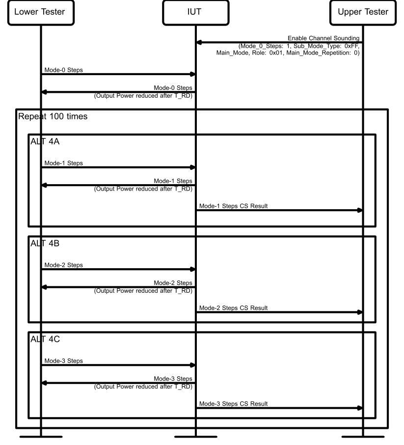

**Figure 4.17: Power Ramp Profile, Ramp-down, Reflector MSC**

Notes: In CS Step Mode #0, #1, #3, packets can be synchronized to by the Lower Tester for a known end of transmission. In CS Step Mode #2, an unmodulated carrier (UC) cannot be synchronized to by the Lower Tester.
Repeat Steps 1–5 where the Lower Tester has a clock drift of -50, 0, and 50 ppm.
1. Using the HCI_LE_CS_Test command, the Upper Tester commands the IUT to enable the
Channel Sounding procedure with Mode_0_Steps set to 1, Channel_Map with the lowest valid 50 bits set to produce 100 Main Mode steps, Channel_Map_Repetition set to 2, Sub_Mode_Type set to 0xFF, Main_Mode set as specified in Table 4.21, Role set to 0x01 (Reflector), Main_Mode_Repetition set to 0, and all other parameters set to the defaults from Section 4.1.6.3. 2. The Lower Tester sends a Mode-0 CS_SYNC bit sequence for T_SY time. At T_SY time, the
signal ramps down for T_RD. 3. The IUT waits for T_IP1 and sends the CS_SYNC followed by a CS Tone for T_SY + T_GD +
T_FM, and then the signal ramps down for T_RD. After T_RD, the output power in the RF Channel is at least 40 dB less than the output power during the transmission of the CS_SYNC.
Repeat Step 4 100 times.
4. Perform alternative 4A, 4B, or 4C depending on the Main_Mode specified in Table 4.21.
Alternative 4A (Main_Mode-1):
4A.1 The Lower Tester sends a CS_SYNC bit sequence for T_SY time. 4A.2 The IUT sends a CS_SYNC bit sequence for T_SY time. After T_RD, the output power in the RF Channel is at least 40 dB less than the output power during the transmission of CS_SYNC. 4A.3 The IUT reports the Channel Sounding results to the Upper Tester. Alternative 4B (Main_Mode-2):
4B.1 The Lower Tester sends a CS Tone for T_PM time. 4B.2 The IUT sends a CS Tone for T_PM time. After T_RD, the output power in the RF Channel is at least 40 dB less than the output power during the transmission of CS_Tone. 4B.3 The IUT reports the Channel Sounding results to the Upper Tester. Alternative 4C (Main_Mode-3):
4C.1 The Lower Tester sends a CS Tone for T_PM followed by a CS_SYNC bit sequence for T_SY time. 4C.2 The IUT sends a CS_SYNC bit sequence for T_SY followed by a CS Tone for T_PM. After T_RD, the output power in the RF Channel is at least 40 dB less than the output power during the transmission of the Channel Sounding transmission. 4C.3 The IUT reports the Main_Mode Channel Sounding results to the Upper Tester.

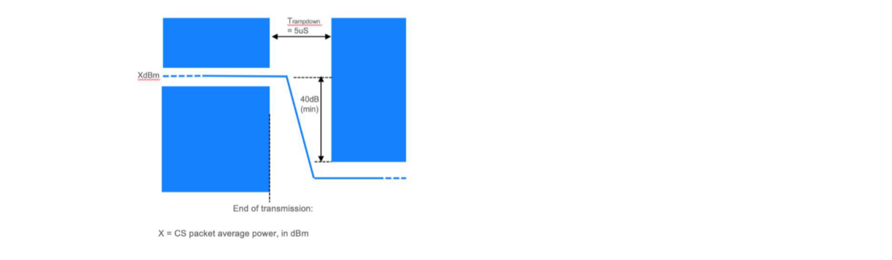

**Figure 4.18: Power Ramp Profile, Ramp-down, Reflector**

• Expected Outcome
Pass verdict
In Steps 3, 4A.2, 4B.2, and 4C.2, the signal output power decreases at least 40 dB during the 5 µs ramp down time at least 90 of 100 times.

### 4.7 PM

Verify the correct Phase Measurements of the Channel Sounding packets.

#### 4.7.1 INI

##### 4.7.1.1 Initiator Transmit Antenna Switching Integrity

• Test Purpose
Verify that the IUT’s transmitter antenna switching occurs in the correct order during the phase measurement period for CS tone exchanges.
• Reference
[3] 4.7.2
• Initial Condition
- The IUT is in the Initiator role, and the Lower Tester is in the Reflector role.
- The IUT’s transmitter is set to maximum output power.
- The IUT antennae are used in the antenna configuration specified in Table 4.22.
- The IUT is configured to transmit a fixed sequence of 3 Mode-0 CS steps.
- The transmit frequency for the entire CS subevent is fixed at 𝑓0, (Section 4.1.6.4).
- The number of antennae (N_AP) in the IUT is defined by the TSPX_number_of_antennae IXIT value.
• Test Case Configuration

| Test Case | PHY | Mode |  | Antenna |  |
| --- | --- | --- | --- | --- | --- |
|  |  |  |  | Configuration |  |
| CS/PM/INI/BV-03-C [Initiator Transmit Antenna Switching Integrity, LE 1M, Mode-2, N AP:1] _ | LE 1M | Mode-2 | N AP:1 _ |  |  |
| CS/PM/INI/BV-04-C [Initiator Transmit Antenna Switching Integrity, LE 1M, Mode-3, N AP:1] _ | LE 1M | Mode-3 | N AP:1 _ |  |  |
| CS/PM/INI/BV-07-C [Initiator Transmit Antenna Switching Integrity, LE 1M, Mode-2, 2:2] | LE 1M | Mode-2 | 2:2 |  |  |
| CS/PM/INI/BV-08-C [Initiator Transmit Antenna Switching Integrity, LE 1M, Mode-3, 2:2] | LE 1M | Mode-3 | 2:2 |  |  |
| CS/PM/INI/BV-17-C [Initiator Transmit Antenna Switching Integrity, LE 2M, Mode-3, N AP:1] _ | LE 2M | Mode-3 | N AP:1 _ |  |  |
| CS/PM/INI/BV-18-C [Initiator Transmit Antenna Switching Integrity, LE 2M, Mode-3, 2:2] | LE 2M | Mode-3 | 2:2 |  |  |

Table 4.22: Initiator Transmit Antenna Switching Integrity test cases
• Test Procedure
1. Using the HCI_LE_CS_Test command, the Upper Tester commands the IUT to enable the
Channel Sounding procedure with:
▪ Role set to Initiator ▪ T_SW_Time set to the shortest value supported by the IUT (1, 2, 4, or 10 us) ▪ Mode-0 CS Steps set to 𝑀 Mode-0 steps, where 𝑀= 1 ▪ Sub_Mode_Type set to 0xFF ▪ Main Mode CS steps set to 10 ▪ Override_Config bit 0 set to 1 ▪ The Channels[i] override used to specify a fixed channel, using the lowest frequency for testing as defined in Section 4.1.6.4 ▪ Other parameters specified in Section 4.1.6.3
2. The Lower Tester uses the PHY test filter characteristics as defined in [9] Section 6.9. 3. The IUT sends a Mode-0 transmission to the Lower Tester. 4. The Lower Tester responds with a Mode-0 transmission. 5. Main-mode CS steps are exchanged between the Lower Tester and the IUT. 6. The following settings are used by the Lower Tester:
▪ Center frequency 𝑓𝑂: Wanted signal frequency ▪ Frequency span: Zero span ▪ Resolution BW: 3 MHz ▪ Video BW: 3 MHz ▪ Detector: Average
7. Antenna ports other than those used for the configuration of 1:1 are disconnected and terminated. 8. The Lower Tester performs measurements on the CS_Tone of the IUT’s transmissions for every
CS step 𝑘, and path 𝑝 during a CS sub-event. The Lower Tester’s power measurement window equals the period T_PM, sampled at 1 us intervals. Samples are not included for evaluation during the 1 us exclusion periods. 9. The Lower Tester records the average output power 𝑃𝐴𝑉𝐺,𝑂𝐹𝐹(𝑘, 𝑝), for CS step 𝑘, and path 𝑝. 10. Connect the 𝑋𝑡ℎ antenna port, where 𝑋= 1 … to the number of supported IUT antennae. All other
IUT antennae are disconnected and terminated.
11. The Lower Tester records the average output power 𝑃𝐴𝑉𝐺,𝑂𝑁(𝑘, 𝑝), for CS step 𝑘, and path 𝑝. 12. Repeat Steps 8–11 for all IUT antennae, up to and including the number of supported IUT
antennae.
• Test Condition
Common Test Case Conditions defined in Section 4.1.3 apply.
• Expected Outcome
The average signal power measured when an IUT antenna port is connected is at least 10 dB greater than the average signal power measured when the IUT antenna port is disconnected in the transmit step corresponding to the antenna.
Pass verdict
For each frequency, the following conditions are satisfied:
𝑃𝐴𝑉𝐺,𝑂𝑁(𝑋, 𝑘, 𝑝) − 𝑃𝐴𝑉𝐺,𝑂𝐹𝐹(𝑋, 𝑘, 𝑝) ≥10𝑑𝐵
where 𝑋= 1 … to the number of supported IUT antennae, up to and including N_AP.

#### 4.7.2 REF

##### 4.7.2.1 Reflector Receive Antenna Switching Integrity

• Test Purpose
Verify that the IUT’s transmitter antenna switching occurs in the correct order during the phase measurement period for CS tone exchanges.
• Reference
[3] 4.7.3
• Initial Condition
- The IUT is in the Reflector role, and the Lower Tester is in the Initiator role.
- The IUT’s transmitter is set to maximum output power.
- The IUT’s antennae are used in the antenna configuration specified in Table 4.23.
- The IUT is configured to transmit a fixed sequence of 1 Mode-0 CS steps.
- The transmit frequency for the entire CS subevent is fixed at 𝑓0, (Section 4.1.6.4).
- The number of antennae (N_AP) in the IUT is defined by the TSPX_number_of_antennae IXIT value.
• Test Case Configuration

| Test Case | PHY | Mode |  | Antenna |  |
| --- | --- | --- | --- | --- | --- |
|  |  |  |  | Configuration |  |
| CS/PM/REF/BV-06-C [Reflector Receive Antenna Switching Integrity, LE 1M, Mode-2, 1:N AP] _ | LE 1M | Mode-2 | 1:N AP _ |  |  |
| CS/PM/REF/BV-08-C [Reflector Receive Antenna Switching Integrity, LE 1M, Mode-2, 2:2] | LE 1M | Mode-2 | 2:2 |  |  |
| CS/PM/REF/BV-09-C [Reflector Receive Antenna Switching Integrity, LE 1M, Mode-3, 2:2] | LE 1M | Mode-3 | 2:2 |  |  |

| Test Case | PHY | Mode |  | Antenna |  |
| --- | --- | --- | --- | --- | --- |
|  |  |  |  | Configuration |  |
| CS/PM/REF/BV-07-C [Reflector Receive Antenna Switching Integrity, LE 1M, Mode-3, 1:N AP] _ | LE 1M | Mode-3 | 1:N AP _ |  |  |
| CS/PM/REF/BV-18-C [Reflector Receive Antenna Switching Integrity, LE 2M, Mode-3, 1:N AP] _ | LE 2M | Mode-3 | 1:N AP _ |  |  |
| CS/PM/REF/BV-19-C [Reflector Receive Antenna Switching Integrity, LE 2M, Mode-3, 2:2] | LE 2M | Mode-3 | 2:2 |  |  |

Table 4.23: Reflector Receive Antenna Switching Integrity test cases
• Test Procedure
1. Using the HCI_LE_CS_Test command, the Upper Tester commands the IUT to enable the
Channel Sounding procedure with:
▪ Role set to Reflector ▪ T_SW_Time set to the shortest value supported by the IUT (1, 2, 4, or 10 us) ▪ Mode-0 CS Steps set to of 𝑀 Mode-0 steps, where 𝑀= 1 ▪ Sub_Mode_Type set to 0xFF ▪ Main Mode CS steps set to 10 ▪ The Channels[i] override used to specify a fixed channel, using the lowest frequency for testing as defined in Section 4.1.6.4 ▪ Other parameters specified in Section 4.1.6.3
2. The Lower Tester uses the test filter characteristics as defined in [9] Section 6.9. 3. The Lower Tester sends a Mode-0 transmission to the IUT. 4. The IUT responds with a Mode-0 transmission. 5. Main-mode CS steps are exchanged between the Lower Tester and the IUT. 6. Antenna ports other than those used for the configuration of {1:1} are disconnected and
terminated. 7. The IUT performs measurements on the CS_Tone of the Lower Tester’s transmissions for every
CS step 𝑘, and path 𝑝 during a CS sub-event. The IUT’s power measurement window equals the period T_PM, sampled at 1 us intervals. Samples are not included for evaluation during the 1 us exclusion periods. 8. The IUT reports the PCT[𝑘, 𝑝] and RPL parameters via the HCI_LE_CS_Subevent_Result event. 9. The Lower Tester calculates the average output power 𝑃𝐴𝑉𝐺,𝑂𝐹𝐹(𝑘, 𝑝), for step 𝑘, and path 𝑝 using
the IQ [dBm] level (see [3] Section 6.2). 10. Repeat Steps 1–9 to obtain at least 10 CS steps (𝑘) per path 𝑝. 11. Connect the 𝑋𝑡ℎ antenna port, where 𝑋= 1 … to the number of supported IUT antennae, up to
and including N_AP. All other IUT antennae are disconnected and terminated. 12. Perform Steps 7–10; the Lower Tester calculates the average output power 𝑃𝐴𝑉𝐺,𝑂𝑁(𝑘, 𝑝) for
step 𝑘, and path 𝑝 using the IQ [dBm] level (see [3] Section 6.2). 13. Repeat Steps 11–12 for all IUT antennae, up to and including the number of supported IUT
antennae.
• Test Condition
Common Test Case Conditions defined in Section 4.1.3 apply.
• Expected Outcome
The average signal power measured when an IUT antenna port is connected is at least 10 dB greater than the average signal power measured when the IUT antenna port is disconnected in the transmit step corresponding to the antenna.
Pass verdict
For each frequency, the following conditions are satisfied:
𝑃𝐴𝑉𝐺,𝑂𝑁(𝑋, 𝑘, 𝑝) − 𝑃𝐴𝑉𝐺,𝑂𝐹𝐹(𝑋, 𝑘, 𝑝) ≥10𝑑𝐵
where 𝑋= 1 … to the number of supported IUT antennae, up to and including N_AP.

#### 4.7.3 Both roles

##### 4.7.3.1 Phase Measurements during T_PM

• Test Purpose
Verify that an IUT properly performs phase measurements during a Mode-2 or Mode-3 step.
• Reference
[3] 4.6
• Initial Condition
- The IUT is in the role specified in Table 4.24.
- The Lower Tester is configured in the role to use a Main_Mode type specified in Table 4.24.
- The Lower Tester FAE Table is defined by the TSPX_cs_remote_fae_table IXIT value.
- The number of antennae is defined by the TSPX_number_of_antennae IXIT value.
- The maximum CS power level is defined by the TSPX_max_cs_power_level IXIT value.
- The supported CS Tone Phase Measurement Periods are defined by the TSPX_cs_t_pm IXIT value.
• Test Case Configuration

|  | Test Case |  |  | Role |  |  | Mode |  |  | Submode |  |
| --- | --- | --- | --- | --- | --- | --- | --- | --- | --- | --- | --- |
| CS/PM/INI/BV-01-C [Phase Measurements during T PM, Initiator, Mode-2] _ |  |  | Initiator (0x00) |  |  | Mode-2 |  |  | N/A |  |  |
| CS/PM/REF/BV-01-C [Phase Measurements during T PM, Reflector, Mode-2] _ |  |  | Reflector (0x01) |  |  | Mode-2 |  |  | N/A |  |  |
| CS/PM/REF/BV-02-C [Phase Measurements during T PM, Reflector, Mode-2, SubMode-1] _ |  |  | Reflector (0x01) |  |  | Mode-2 |  |  | Mode-1 |  |  |
| CS/PM/INI/BV-02-C [Phase Measurements during T PM, Initiator, Mode-3] _ |  |  | Initiator (0x00) |  |  | Mode-3 |  |  | N/A |  |  |
| CS/PM/REF/BV-03-C [Phase Measurements during T PM, Reflector, Mode-3] _ |  |  | Reflector (0x01) |  |  | Mode-3 |  |  | N/A |  |  |

Table 4.24: Phase Measurements during T_PM test cases
• Test Procedure

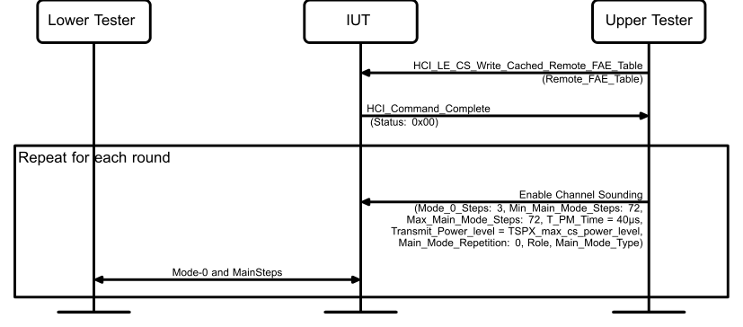

**Figure 4.19: Phase Measurements during T_PM MSC**

If the IUT role in Table 4.24 is Initiator, execute Steps 1 and 2.
Repeat Steps 1–4 where the Lower Tester has a clock drift of -50, 0, and 50 ppm.
1. The Upper Tester sends the HCI_LE_CS_Write_Cached_Remote_FAE_Table command to the
IUT with Connection_Handle set to 0x0FFF, Remote_FAE_Table set to TSPX_cs_remote_fae_table and receives a successful HCI_Command_Complete event in response.
Repeat Steps 2–4 for each T_PM value in TSPX_cs_t_pm.
2. Using the HCI_LE_CS_Test command, the Upper Tester commands the IUT to enable the
Channel Sounding procedure with Mode_0_Steps set to 3; T_PM_Time set to 40 µs; Transmit_Power_Level set to TSPX_max_cs_power_level; Main_Mode, Submode, and Role set as specified in Table 4.24; Main_Mode_Repetition set to 0; and all other parameters set to the defaults from Section 4.1.6.3.
Repeat Step 3 three times for Mode-0.
3. The Lower Tester and the IUT perform the Mode-0 exchange in Section 4.2.1. 4. For each step, the Lower Tester transmissions of the wanted CS_SYNC packet or CS Tone have
a received input power at the IUT of -67dBm. For the duration of the subevent, excluding the Mode-0 steps, the Lower Tester transmits wideband Gaussian noise when transmitting a CS_SYNC packet or CS Tone. Before each step, the Lower Tester randomly selects a power level from Table 4.25 and uses this as the received input power density of the added Gaussian noise for the duration of the step.

|  | Round |  |  | CS Tone Quality |  |
| --- | --- | --- | --- | --- | --- |
| 1 |  |  | High (0) |  |  |
| 2 |  |  | Low (2) |  |  |

Table 4.25: Phase Measurements during T_PM rounds
• Expected Outcome
Pass verdict
For each Mode-3 step, where the IUT is Initiator and the CS tone extension slot transmission is not expected to be present, the IUT reports the (N_AP+1)th PCT value as 0x000000, and the (N_AP+1)th Tone_Quality_Indicator has bits 0–3 set to 0b0011.
The IUT reports a Tone_Quality_Indicator that matches the CS Tone Quality in Table 4.25 corresponding to the Gaussian noise floor value used by the Lower Tester for the step, for 90% of the T_PM periods where the CS tone transmission is expected to be present as determined by the CS DRBG.
Each Tone_Quality_Indicator reported by the IUT sets bits 4–7 to the value defined by the CS DRBG.
The Reference_Power_Level is between -127 and +20 dBm.

##### 4.7.3.2 Phase-Based Distance Estimate, Sounding Sequence

• Test Purpose
Verify that the IUT properly estimates distance using phase-based calculations on the sounding sequence.
• Reference
[3] 3.3.1
• Initial Condition
- The IUT is in the role specified in Table 4.26.
- The Lower Tester is configured to use a Main_Mode type specified in Table 4.26.
- The number of antennae is defined by the TSPX_number_of_antennae IXIT value.
- The signal level at the IUT input port is -55 dBm.
• Test Case Configuration

|  | Test Case |  |  | PHY |  |  | Role |  |  | Mode |  |
| --- | --- | --- | --- | --- | --- | --- | --- | --- | --- | --- | --- |
| CS/PM/INI/BV-09-C [Phase-Based Distance Estimate, Sounding Sequence, LE 1M, Initiator, Mode-1, 32-bit Sounding Sequence] |  |  | LE 1M |  |  | Initiator (0x00) |  |  | Mode-1, RTT 32-bit Sounding Sequence |  |  |
| CS/PM/REF/BV-10-C [Phase-Based Distance Estimate, Sounding Sequence, LE 1M, Reflector, Mode-1, 32-bit Sounding Sequence] |  |  | LE 1M |  |  | Reflector (0x01) |  |  | Mode-1, RTT 32-bit Sounding Sequence |  |  |
| CS/PM/INI/BV-10-C [Phase-Based Distance Estimate, Sounding Sequence, LE 1M, Initiator, Mode-1, 96-bit Sounding Sequence] |  |  | LE 1M |  |  | Initiator (0x00) |  |  | Mode-1, RTT 96-bit Sounding Sequence |  |  |
| CS/PM/REF/BV-11-C [Phase-Based Distance Estimate, Sounding Sequence, LE 1M, Reflector, Mode-1, 96-bit Sounding Sequence] |  |  | LE 1M |  |  | Reflector (0x01) |  |  | Mode-1, RTT 96-bit Sounding Sequence |  |  |

|  | Test Case |  |  | PHY |  |  | Role |  |  | Mode |  |
| --- | --- | --- | --- | --- | --- | --- | --- | --- | --- | --- | --- |
| CS/PM/INI/BV-11-C [Phase-Based Distance Estimate, Sounding Sequence, LE 1M, Initiator, Mode-3, 32-bit Sounding Sequence] |  |  | LE 1M |  |  | Initiator (0x00) |  |  | Mode-3, RTT 32-bit Sounding Sequence |  |  |
| CS/PM/REF/BV-12-C [Phase-Based Distance Estimate, Sounding Sequence, LE 1M, Reflector, Mode-3, 32-bit Sounding Sequence] |  |  | LE 1M |  |  | Reflector (0x01) |  |  | Mode-3, RTT 32-bit Sounding Sequence |  |  |
| CS/PM/INI/BV-12-C [Phase-Based Distance Estimate, Sounding Sequence, LE 1M, Initiator, Mode-3, 96-bit Sounding Sequence] |  |  | LE 1M |  |  | Initiator (0x00) |  |  | Mode-3, RTT 96-bit Sounding Sequence |  |  |
| CS/PM/REF/BV-13-C [Phase-Based Distance Estimate, Sounding Sequence, LE 1M, Reflector, Mode-3, 96-bit Sounding Sequence] |  |  | LE 1M |  |  | Reflector (0x01) |  |  | Mode-3, RTT 96-bit Sounding Sequence |  |  |
| CS/PM/INI/BV-13-C [Phase-Based Distance Estimate, Sounding Sequence, LE 2M, Initiator, Mode-1, 32-bit Sounding Sequence] |  |  | LE 2M |  |  | Initiator (0x00) |  |  | Mode-1, RTT 32-bit Sounding Sequence |  |  |
| CS/PM/REF/BV-14-C [Phase-Based Distance Estimate, Sounding Sequence, LE 2M, Reflector, Mode-1, 32-bit Sounding Sequence] |  |  | LE 2M |  |  | Reflector (0x01) |  |  | Mode-1, RTT 32-bit Sounding Sequence |  |  |
| CS/PM/INI/BV-14-C [Phase-Based Distance Estimate, Sounding Sequence, LE 2M, Initiator, Mode-1, 96-bit Sounding Sequence] |  |  | LE 2M |  |  | Initiator (0x00) |  |  | Mode-1, RTT 96-bit Sounding Sequence |  |  |
| CS/PM/REF/BV-15-C [Phase-Based Distance Estimate, Sounding Sequence, LE 2M, Reflector, Mode-1, 96-bit Sounding Sequence] |  |  | LE 2M |  |  | Reflector (0x01) |  |  | Mode-1, RTT 96-bit Sounding Sequence |  |  |
| CS/PM/INI/BV-15-C [Phase-Based Distance Estimate, Sounding Sequence, LE 2M, Initiator, Mode-3, 32-bit Sounding Sequence] |  |  | LE 2M |  |  | Initiator (0x00) |  |  | Mode-3, RTT 32-bit Sounding Sequence |  |  |
| CS/PM/REF/BV-16-C [Phase-Based Distance Estimate, Sounding Sequence, LE 2M, Reflector, Mode-3, 32-bit Sounding Sequence] |  |  | LE 2M |  |  | Reflector (0x01) |  |  | Mode-3, RTT 32-bit Sounding Sequence |  |  |
| CS/PM/INI/BV-16-C [Phase-Based Distance Estimate, Sounding Sequence, LE 2M, Initiator, Mode-3, 96-bit Sounding Sequence] |  |  | LE 2M |  |  | Initiator (0x00) |  |  | Mode-3, RTT 96-bit Sounding Sequence |  |  |
| CS/PM/REF/BV-17-C [Phase-Based Distance Estimate, Sounding Sequence, LE 2M, Reflector, Mode-3, 96-bit Sounding Sequence] |  |  | LE 2M |  |  | Reflector (0x01) |  |  | Mode-3, RTT 96-bit Sounding Sequence |  |  |

Table 4.26: Phase-Based Distance Estimate, Sounding Sequence test cases
• Test Procedure

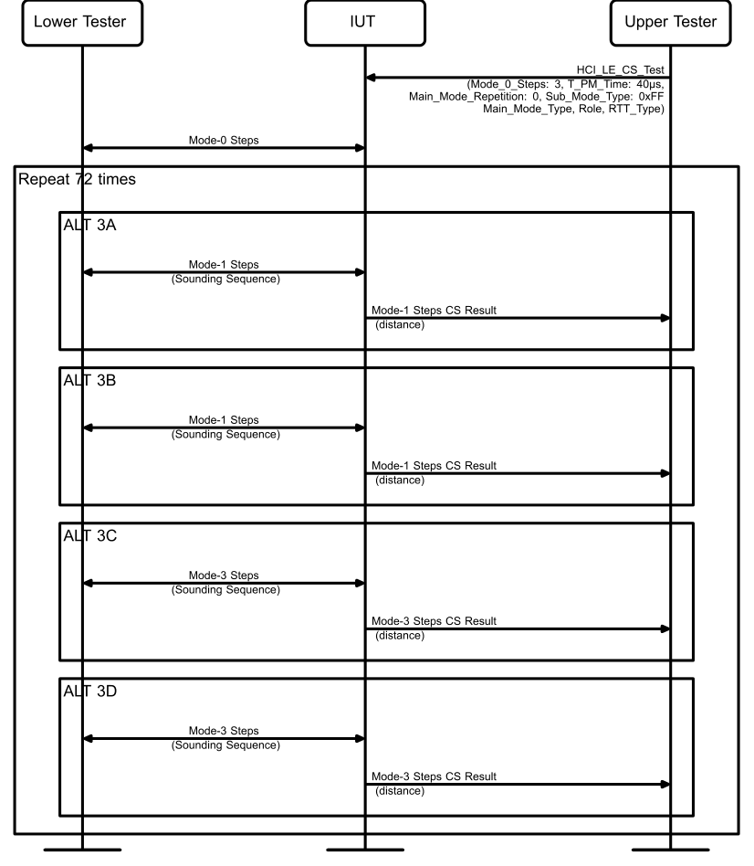

**Figure 4.20: Phase-Based Distance Estimate, Sounding Sequence MSC**

Repeat Steps 1–3 where the Lower Tester has a clock drift of -50, 0, and 50 ppm.
1. Using the HCI_LE_CS_Test command, the Upper Tester commands the IUT to enable the
Channel Sounding procedure with Mode_0_Steps set to 3; T_PM_Time set to 40 s; Main_Mode_Repetition set to 0; Sub_Mode_Type set to 0xFF; and Main_Mode_Type, Role, and RTT_Type set as specified in Table 4.26; and all other parameters set to the defaults from Section 4.1.6.3.
Repeat Step 2 three times.
2. The Lower Tester and the IUT perform the Mode-0 exchange in Section 4.2.1.
3. Perform alternative 3A, 3B, 3C, or 3D depending on the IUT role and Mode specified in Table
4.26. Alternative 3A (IUT Initiator and Mode-1):
3A.1 The IUT sends a Main_Mode CS_SYNC bit sequence for T_SY time with a sounding sequence specified in Table 4.26. 3A.2 The Lower Tester sends a Mode CS_SYNC bit sequence for T_SY time with a sounding sequence specified in Table 4.26. 3A.3 The IUT reports the Main_Mode Channel Sounding results to the Upper Tester. Alternative 3B (IUT Reflector and Mode-1):
3B.1 The Lower Tester sends a Mode CS_SYNC bit sequence for T_SY time with a sounding sequence specified in Table 4.26. 3B.2 The IUT sends a Main_Mode CS_SYNC bit sequence for T_SY time with a sounding sequence specified in Table 4.26. 3B.3 The IUT reports the Main_Mode Channel Sounding results to the Upper Tester. Alternative C (IUT Initiator and Mode-3):
3C.1 The IUT sends a Main_Mode CS_SYNC bit sequence for T_SY with a sounding sequence specified in Table 4.26 followed by a CS Tone bit sounding sequence for T_SW + T_PM. 3C.2 The Lower Tester sends a CS Tone for T_PM followed by a CS_SYNC bit sequence for T_SYNC time with a sounding sequence specified in Table 4.26. 3C.3 The IUT reports the Main_Mode Channel Sounding results to the Upper Tester. Alternative D (IUT Reflector and Mode-3):
3D.1 The Lower Tester sends a Mode CS_SYNC bit sequence for T_SY with a sounding sequence specified in Table 4.26 followed by a CS Tone for T_SW + T_PM. 3D.2 The IUT sends a CS Tone for T_PM followed by a CS_SYNC bit sequence for T_SY with a sounding sequence specified in Table 4.26. 3D.3 The IUT reports the Main_Mode Channel Sounding results to the Upper Tester.
• Expected Outcome
Pass verdict
The IUT reports the correct PCT such that the accuracy requirements in [3] Section 3.3.1.2 are satisfied.
|𝛼| <   2𝜋× 10.2𝑛s

### 4.8 Test setups examples

#### 4.8.1 Test Equipment Setup for Channel Sounding

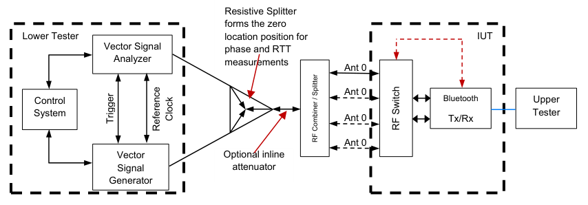

**Figure 4.21: Channel Sounding Test Equipment Setup**

The IUT is required to provide between 1 and 4 antenna input/output ports, matching the maximum number of antennae supported (TSPX_number_of_antennae) declared in the IXIT [5]. The antenna ports are marked as 0, 1, 2, and 3, as shown in Figure 4.21.

## 5 Test case mapping

The Test Case Mapping Table (TCMT) maps test cases to specific requirements in the ICS. The IUT is tested in all roles for which support is declared in the ICS document.
The columns for the TCMT are defined as follows:
Item: Contains a logical expression based on specific entries from the associated ICS document. Contains a logical expression (using the operators AND, OR, NOT as needed) based on specific entries from the applicable ICS document(s). The entries are in the form of y/x references, where y corresponds to the table number and x corresponds to the feature number as defined in the ICS document for Channel Sounding [4].
If a test case is mandatory within the respective layer, then the y/x reference is omitted.
Feature: A brief, informal description of the feature being tested.
Test Case(s): The applicable test case identifiers are required for Bluetooth Qualification if the corresponding y/x references defined in the Item column are supported. Further details about the function of the TCMT are elaborated in [2].
For the purpose and structure of the ICS/IXIT, refer to [2].

|  | Item |  |  | Feature |  |  | Test Case(s) |  |
| --- | --- | --- | --- | --- | --- | --- | --- | --- |
| CS 1/2 AND CS 2/4 AND CS 3/4 |  |  | Channel Sounding, LE 1M, Mode-1, Random Sequence, 32-bit, Reflector |  |  | CS/PAC/REF/BV-09-C CS/RTT/REF/BV-21-C |  |  |
| CS 1/2 AND CS 2/4 AND CS 2/14b AND CS 3/4 |  |  | Channel Sounding, LE 1M, Mode-1, Random Sequence, 32-bit, Reflector, Phase-Based NADM |  |  | CS/NAD/REF/BV-01-C |  |  |
| CS 1/2 AND CS 2/4 AND CS 3/5 |  |  | Channel Sounding, LE 1M, Mode-1, Random Sequence, 64-bit, Reflector |  |  | CS/PAC/REF/BV-10-C CS/RTT/REF/BV-25-C |  |  |
| CS 1/2 AND CS 2/4 AND CS 2/14b AND CS 3/5 |  |  | Channel Sounding, LE 1M, Mode-1, Random Sequence, 64-bit, Reflector, Phase-Based NADM |  |  | CS/NAD/REF/BV-02-C |  |  |
| CS 1/2 AND CS 2/4 AND CS 3/6 |  |  | Channel Sounding, LE 1M, Mode-1, Random Sequence, 96-bit, Reflector |  |  | CS/PAC/REF/BV-11-C CS/RTT/REF/BV-29-C |  |  |
| CS 1/2 AND CS 2/4 AND CS 2/14b AND CS 3/6 |  |  | Channel Sounding, LE 1M, Mode-1, Random Sequence, 96-bit, Reflector, Phase-Based NADM |  |  | CS/NAD/REF/BV-03-C |  |  |
| CS 1/2 AND CS 2/4 AND CS 3/7 |  |  | Channel Sounding, LE 1M, Mode-1, Random Sequence, 128-bit, Reflector |  |  | CS/PAC/REF/BV-12-C CS/RTT/REF/BV-33-C |  |  |
| CS 1/2 AND CS 2/4 AND CS 2/14b AND CS 3/7 |  |  | Channel Sounding, LE 1M, Mode-1, Random Sequence, 128-bit, Reflector, Phase-Based NADM |  |  | CS/NAD/REF/BV-04-C |  |  |
| CS 1/2 AND CS 2/4 AND CS 3/2 |  |  | Channel Sounding, LE 1M, Mode-1, Sounding Sequence, 32-bit, Reflector |  |  | CS/PAC/REF/BV-01-C CS/PAC/REF/BV-27-C CS/RTT/REF/BV-13-C |  |  |
| CS 1/2 AND CS 2/4 AND CS 2/12 AND CS 3/2 |  |  | Channel Sounding, LE 1M, Mode-1, Sounding Sequence, 32-bit, Reflector, Phase-Based Distance Estimate |  |  | CS/PM/REF/BV-10-C |  |  |
| CS 1/2 AND CS 2/4 AND CS 2/14a AND CS 3/2 |  |  | Channel Sounding, LE 1M, Mode-1, Sounding Sequence, 32-bit, Reflector, Phase-Based NADM |  |  | CS/NAD/REF/BV-05-C |  |  |

|  | Item |  |  | Feature |  |  | Test Case(s) |  |
| --- | --- | --- | --- | --- | --- | --- | --- | --- |
| CS 1/2 AND CS 2/4 AND CS 3/3 |  |  | Channel Sounding, LE 1M, Mode-1, Sounding Sequence, 96-bit, Reflector |  |  | CS/PAC/REF/BV-03-C CS/PAC/REF/BV-28-C CS/RTT/REF/BV-17-C |  |  |
| CS 1/2 AND CS 2/4 AND CS 2/12 AND CS 3/3 |  |  | Channel Sounding, LE 1M, Mode-1, Sounding Sequence, 96-bit, Reflector, Phase-Based Distance Estimate |  |  | CS/PM/REF/BV-11-C |  |  |
| CS 1/2 AND CS 2/4 AND CS 2/14a AND CS 3/3 |  |  | Channel Sounding, LE 1M, Mode-1, Sounding Sequence, 96-bit, Reflector, Phase-Based NADM |  |  | CS/NAD/REF/BV-06-C |  |  |
| CS 1/2 AND CS 2/6 AND CS 3/4 |  |  | Channel Sounding, LE 1M, Mode-3, Random Sequence, 32-bit, Reflector |  |  | CS/PAC/REF/BV-17-C CS/RTT/REF/BV-22-C |  |  |
| CS 1/2 AND CS 2/6 AND CS 2/14b AND CS 3/4 |  |  | Channel Sounding, LE 1M, Mode-3, Random Sequence, 32-bit, Reflector, Phase-Based NADM |  |  | CS/NAD/REF/BV-07-C |  |  |
| CS 1/2 AND CS 2/6 AND CS 3/5 |  |  | Channel Sounding, LE 1M, Mode-3, Random Sequence, 64-bit, Reflector |  |  | CS/PAC/REF/BV-18-C CS/RTT/REF/BV-26-C |  |  |
| CS 1/2 AND CS 2/6 AND CS 2/14b AND CS 3/5 |  |  | Channel Sounding, LE 1M, Mode-3, Random Sequence, 64-bit, Reflector, Phase-Based NADM |  |  | CS/NAD/REF/BV-08-C |  |  |
| CS 1/2 AND CS 2/6 AND CS 3/6 |  |  | Channel Sounding, LE 1M, Mode-3, Random Sequence, 96-bit, Reflector |  |  | CS/PAC/REF/BV-19-C CS/RTT/REF/BV-30-C |  |  |
| CS 1/2 AND CS 2/6 AND CS 2/14b AND CS 3/6 |  |  | Channel Sounding, LE 1M, Mode-3, Random Sequence, 96-bit, Reflector, Phase-Based NADM |  |  | CS/NAD/REF/BV-09-C |  |  |
| CS 1/2 AND CS 2/6 AND CS 3/7 |  |  | Channel Sounding, LE 1M, Mode-3, Random Sequence, 128-bit, Reflector |  |  | CS/PAC/REF/BV-20-C CS/RTT/REF/BV-34-C |  |  |
| CS 1/2 AND CS 2/6 AND CS 2/14b AND CS 3/7 |  |  | Channel Sounding, LE 1M, Mode-3, Random Sequence, 128-bit, Reflector, Phase-Based NADM |  |  | CS/NAD/REF/BV-10-C |  |  |
| CS 1/2 AND CS 2/6 AND CS 3/2 |  |  | Channel Sounding, LE 1M, Mode-3, Sounding Sequence, 32-bit, Reflector |  |  | CS/PAC/REF/BV-05-C CS/RTT/REF/BV-14-C |  |  |
| CS 1/2 AND CS 2/6 AND CS 2/12 AND CS 3/2 |  |  | Channel Sounding, LE 1M, Mode-3, Sounding Sequence, 32-bit, Reflector, Phase-Based Distance Estimate |  |  | CS/PM/REF/BV-12-C |  |  |
| CS 1/2 AND CS 2/6 AND CS 2/14a AND CS 3/2 |  |  | Channel Sounding, LE 1M, Mode-3, Sounding Sequence, 32-bit, Reflector, Phase-Based NADM |  |  | CS/NAD/REF/BV-11-C |  |  |
| CS 1/2 AND CS 2/6 AND CS 3/3 |  |  | Channel Sounding, LE 1M, Mode-3, Sounding Sequence, 96-bit, Reflector |  |  | CS/PAC/REF/BV-07-C CS/RTT/REF/BV-18-C |  |  |
| CS 1/2 AND CS 2/6 AND CS 2/12 AND CS 3/3 |  |  | Channel Sounding, LE 1M, Mode-3, Sounding Sequence, 96-bit, Reflector, Phase-Based Distance Estimate |  |  | CS/PM/REF/BV-13-C |  |  |
| CS 1/2 AND CS 2/6 AND CS 2/14a AND CS 3/3 |  |  | Channel Sounding, LE 1M, Mode-3, Sounding Sequence, 96-bit, Reflector, Phase-Based NADM |  |  | CS/NAD/REF/BV-12-C |  |  |
| CS 1/1 AND CS 2/4 AND CS 3/4 |  |  | Channel Sounding, LE 1M, Mode-1, Random Sequence, 32-bit, Initiator |  |  | CS/PAC/INI/BV-09-C CS/RTT/INI/BV-21-C |  |  |

|  | Item |  |  | Feature |  |  | Test Case(s) |  |
| --- | --- | --- | --- | --- | --- | --- | --- | --- |
| CS 1/1 AND CS 2/4 AND CS 2/14b AND CS 3/4 |  |  | Channel Sounding, LE 1M, Mode-1, Random Sequence, 32-bit, Initiator, Phase-Based NADM |  |  | CS/NAD/INI/BV-01-C |  |  |
| CS 1/1 AND CS 2/4 AND CS 3/5 |  |  | Channel Sounding, LE 1M, Mode-1, Random Sequence, 64-bit, Initiator |  |  | CS/PAC/INI/BV-10-C CS/RTT/INI/BV-25-C |  |  |
| CS 1/1 AND CS 2/4 AND CS 2/14b AND CS 3/5 |  |  | Channel Sounding, LE 1M, Mode-1, Random Sequence, 64-bit, Initiator, Phase-Based NADM |  |  | CS/NAD/INI/BV-02-C |  |  |
| CS 1/1 AND CS 2/4 AND CS 3/6 |  |  | Channel Sounding, LE 1M, Mode-1, Random Sequence, 96-bit, Initiator |  |  | CS/PAC/INI/BV-11-C CS/RTT/INI/BV-29-C |  |  |
| CS 1/1 AND CS 2/4 AND CS 2/14b AND CS 3/6 |  |  | Channel Sounding, LE 1M, Mode-1, Random Sequence, 96-bit, Initiator, Phase-Based NADM |  |  | CS/NAD/INI/BV-03-C |  |  |
| CS 1/1 AND CS 2/4 AND CS 3/7 |  |  | Channel Sounding, LE 1M, Mode-1, Random Sequence, 128-bit, Initiator |  |  | CS/PAC/INI/BV-12-C CS/RTT/INI/BV-33-C |  |  |
| CS 1/1 AND CS 2/4 AND CS 2/14b AND CS 3/7 |  |  | Channel Sounding, LE 1M, Mode-1, Random Sequence, 128-bit, Initiator, Phase-Based NADM |  |  | CS/NAD/INI/BV-04-C |  |  |
| CS 1/1 AND CS 2/4 AND CS 3/2 |  |  | Channel Sounding, LE 1M, Mode-1, Sounding Sequence, 32-bit, Initiator |  |  | CS/PAC/INI/BV-01-C CS/PAC/INI/BV-27-C CS/RTT/INI/BV-13-C |  |  |
| CS 1/1 AND CS 2/4 AND CS 2/12 AND CS 3/2 |  |  | Channel Sounding, LE 1M, Mode-1, Sounding Sequence, 32-bit, Initiator, Phase-Based Distance Estimate |  |  | CS/PM/INI/BV-09-C |  |  |
| CS 1/1 AND CS 2/4 AND CS 2/14a AND CS 3/2 |  |  | Channel Sounding, LE 1M, Mode-1, Sounding Sequence, 32-bit, Initiator, Phase-Based NADM |  |  | CS/NAD/INI/BV-05-C |  |  |
| CS 1/1 AND CS 2/4 AND CS 3/3 |  |  | Channel Sounding, LE 1M, Mode-1, Sounding Sequence, 96-bit, Initiator |  |  | CS/PAC/INI/BV-03-C CS/PAC/INI/BV-28-C CS/RTT/INI/BV-17-C |  |  |
| CS 1/1 AND CS 2/4 AND CS 2/12 AND CS 3/3 |  |  | Channel Sounding, LE 1M, Mode-1, Sounding Sequence, 96-bit, Initiator, Phase-Based Distance Estimate |  |  | CS/PM/INI/BV-10-C |  |  |
| CS 1/1 AND CS 2/4 AND CS 2/14a AND CS 3/3 |  |  | Channel Sounding, LE 1M, Mode-1, Sounding Sequence, 96-bit, Initiator, Phase-Based NADM |  |  | CS/NAD/INI/BV-06-C |  |  |
| CS 1/1 AND CS 2/6 AND CS 3/4 |  |  | Channel Sounding, LE 1M, Mode 3, Random Sequence, 32-bit, Initiator |  |  | CS/PAC/INI/BV-17-C CS/RTT/INI/BV-22-C |  |  |
| CS 1/1 AND CS 2/6 AND CS 2/14b AND CS 3/4 |  |  | Channel Sounding, LE 1M, Mode 3, Random Sequence, 32-bit, Initiator, Phase-Based NADM |  |  | CS/NAD/INI/BV-07-C |  |  |
| CS 1/1 AND CS 2/6 AND CS 3/5 |  |  | Channel Sounding, LE 1M, Mode-3, Random Sequence, 64-bit, Initiator |  |  | CS/PAC/INI/BV-18-C CS/RTT/INI/BV-26-C |  |  |
| CS 1/1 AND CS 2/6 AND CS 2/14b AND CS 3/5 |  |  | Channel Sounding, LE 1M, Mode-3, Random Sequence, 64-bit, Initiator, Phase-Based NADM |  |  | CS/NAD/INI/BV-08-C |  |  |
| CS 1/1 AND CS 2/6 AND CS 3/6 |  |  | Channel Sounding, LE 1M, Mode-3, Random Sequence, 96-bit, Initiator |  |  | CS/PAC/INI/BV-19-C CS/RTT/INI/BV-30-C |  |  |

|  | Item |  |  | Feature |  |  | Test Case(s) |  |
| --- | --- | --- | --- | --- | --- | --- | --- | --- |
| CS 1/1 AND CS 2/6 AND CS 2/14b AND CS 3/6 |  |  | Channel Sounding, LE 1M, Mode-3, Random Sequence, 96-bit, Initiator, Phase-Based NADM |  |  | CS/NAD/INI/BV-09-C |  |  |
| CS 1/1 AND CS 2/6 AND CS 3/7 |  |  | Channel Sounding, LE 1M, Mode-3, Random Sequence, 128-bit, Initiator |  |  | CS/PAC/INI/BV-20-C CS/RTT/INI/BV-34-C |  |  |
| CS 1/1 AND CS 2/6 AND CS 2/14b AND CS 3/7 |  |  | Channel Sounding, LE 1M, Mode-3, Random Sequence, 128-bit, Initiator, Phase-Based NADM |  |  | CS/NAD/INI/BV-10-C |  |  |
| CS 1/1 AND CS 2/6 AND CS 3/2 |  |  | Channel Sounding, LE 1M, Mode-3, Sounding Sequence, 32-bit, Initiator |  |  | CS/PAC/INI/BV-05-C CS/RTT/INI/BV-14-C |  |  |
| CS 1/1 AND CS 2/6 AND CS 2/12 AND CS 3/2 |  |  | Channel Sounding, LE 1M, Mode-3, Sounding Sequence, 32-bit, Initiator, Phase-Based Distance Estimate |  |  | CS/PM/INI/BV-11-C |  |  |
| CS 1/1 AND CS 2/6 AND CS 2/14a AND CS 3/2 |  |  | Channel Sounding, LE 1M, Mode-3, Sounding Sequence, 32-bit, Initiator, Phase-Based NADM |  |  | CS/NAD/INI/BV-11-C |  |  |
| CS 1/1 AND CS 2/6 AND CS 3/3 |  |  | Channel Sounding, LE 1M, Mode-3, Sounding Sequence, 96-bit, Initiator |  |  | CS/PAC/INI/BV-07-C CS/RTT/INI/BV-18-C |  |  |
| CS 1/1 AND CS 2/6 AND CS 2/12 AND CS 3/3 |  |  | Channel Sounding, LE 1M, Mode-3, Sounding Sequence, 96-bit, Initiator, Phase-Based Distance Estimate |  |  | CS/PM/INI/BV-12-C |  |  |
| CS 1/1 AND CS 2/6 AND CS 2/14a AND CS 3/3 |  |  | Channel Sounding, LE 1M, Mode-3, Sounding Sequence, 96-bit, Initiator, Phase-Based NADM |  |  | CS/NAD/INI/BV-12-C |  |  |
| CS 1/2 AND CS 2/2 AND CS 2/4 AND CS 3/4 |  |  | Channel Sounding, LE 2M, Mode-1, Random Sequence, 32-bit, Reflector |  |  | CS/PAC/REF/BV-13-C CS/RTT/REF/BV-23-C |  |  |
| CS 1/2 AND CS 2/2 AND CS 2/4 AND CS 2/14b AND CS 3/4 |  |  | Channel Sounding, LE 2M, Mode-1, Random Sequence, 32-bit, Reflector, Phase-Based NADM |  |  | CS/NAD/REF/BV-13-C |  |  |
| CS 1/2 AND CS 2/2 AND CS 2/4 AND CS 3/5 |  |  | Channel Sounding, LE 2M, Mode-1, Random Sequence, 64-bit, Reflector |  |  | CS/PAC/REF/BV-14-C CS/RTT/REF/BV-27-C |  |  |
| CS 1/2 AND CS 2/2 AND CS 2/4 AND CS 2/14b AND CS 3/5 |  |  | Channel Sounding, LE 2M, Mode-1, Random Sequence, 64-bit, Reflector, Phase-Based NADM |  |  | CS/NAD/REF/BV-14-C |  |  |
| CS 1/2 AND CS 2/2 AND CS 2/4 AND CS 3/6 |  |  | Channel Sounding, LE 2M, Mode-1, Random Sequence, 96-bit, Reflector |  |  | CS/PAC/REF/BV-15-C CS/RTT/REF/BV-31-C |  |  |
| CS 1/2 AND CS 2/2 AND CS 2/4 AND CS 2/14b AND CS 3/6 |  |  | Channel Sounding, LE 2M, Mode-1, Random Sequence, 96-bit, Reflector, Phase-Based NADM |  |  | CS/NAD/REF/BV-15-C |  |  |
| CS 1/2 AND CS 2/2 AND CS 2/4 AND CS 3/7 |  |  | Channel Sounding, LE 2M, Mode-1, Random Sequence, 128-bit, Reflector |  |  | CS/PAC/REF/BV-16-C CS/RTT/REF/BV-35-C |  |  |
| CS 1/2 AND CS 2/2 AND CS 2/4 AND CS 2/14b AND CS 3/7 |  |  | Channel Sounding, LE 2M, Mode-1, Random Sequence, 128-bit, Reflector, Phase-Based NADM |  |  | CS/NAD/REF/BV-16-C |  |  |
| CS 1/2 AND CS 2/2 AND CS 2/4 AND CS 3/2 |  |  | Channel Sounding, LE 2M, Mode-1, Sounding Sequence, 32-bit, Reflector |  |  | CS/PAC/REF/BV-02-C CS/RTT/REF/BV-15-C |  |  |

|  | Item |  |  | Feature |  |  | Test Case(s) |  |
| --- | --- | --- | --- | --- | --- | --- | --- | --- |
| CS 1/2 AND CS 2/2 AND CS 2/4 AND CS 2/12 AND CS 3/2 |  |  | Channel Sounding, LE 2M, Mode-1, Sounding Sequence, 32-bit, Reflector, Phase-Based Distance Estimate |  |  | CS/PM/REF/BV-14-C |  |  |
| CS 1/2 AND CS 2/2 AND CS 2/4 AND CS 2/14a AND CS 3/2 |  |  | Channel Sounding, LE 2M, Mode-1, Sounding Sequence, 32-bit, Reflector, Phase-Based NADM |  |  | CS/NAD/REF/BV-17-C |  |  |
| CS 1/2 AND CS 2/2 AND CS 2/4 AND CS 3/3 |  |  | Channel Sounding, LE 2M, Mode-1, Sounding Sequence, 96-bit, Reflector |  |  | CS/PAC/REF/BV-04-C CS/RTT/REF/BV-19-C |  |  |
| CS 1/2 AND CS 2/2 AND CS 2/4 AND CS 2/12 AND CS 3/3 |  |  | Channel Sounding, LE 2M, Mode-1, Sounding Sequence, 96-bit, Reflector, Phase-Based Distance Estimate |  |  | CS/PM/REF/BV-15-C |  |  |
| CS 1/2 AND CS 2/2 AND CS 2/4 AND CS 2/14a AND CS 3/3 |  |  | Channel Sounding, LE 2M, Mode-1, Sounding Sequence, 96-bit, Reflector, Phase-Based NADM |  |  | CS/NAD/REF/BV-18-C |  |  |
| CS 1/2 AND CS 2/2 AND CS 2/6 AND CS 3/4 |  |  | Channel Sounding, LE 2M, Mode-3, Random Sequence, 32-bit, Reflector |  |  | CS/PAC/REF/BV-21-C CS/RTT/REF/BV-24-C |  |  |
| CS 1/2 AND CS 2/2 AND CS 2/6 AND CS 2/14b AND CS 3/4 |  |  | Channel Sounding, LE 2M, Mode-3, Random Sequence, 32-bit, Reflector, Phase-Based NADM |  |  | CS/NAD/REF/BV-19-C |  |  |
| CS 1/2 AND CS 2/2 AND CS 2/6 AND CS 3/5 |  |  | Channel Sounding, LE 2M, Mode-3, Random Sequence, 64-bit, Reflector |  |  | CS/PAC/REF/BV-22-C CS/RTT/REF/BV-28-C |  |  |
| CS 1/2 AND CS 2/2 AND CS 2/6 AND CS 2/14b AND CS 3/5 |  |  | Channel Sounding, LE 2M, Mode-3, Random Sequence, 64-bit, Reflector, Phase-Based NADM |  |  | CS/NAD/REF/BV-20-C |  |  |
| CS 1/2 AND CS 2/2 AND CS 2/6 AND CS 3/6 |  |  | Channel Sounding, LE 2M, Mode-3, Random Sequence, 96-bit, Reflector |  |  | CS/PAC/REF/BV-23-C CS/RTT/REF/BV-32-C |  |  |
| CS 1/2 AND CS 2/2 AND CS 2/6 AND CS 2/14b AND CS 3/6 |  |  | Channel Sounding, LE 2M, Mode-3, Random Sequence, 96-bit, Reflector, Phase-Based NADM |  |  | CS/NAD/REF/BV-21-C |  |  |
| CS 1/2 AND CS 2/2 AND CS 2/6 AND CS 3/7 |  |  | Channel Sounding, LE 2M, Mode-3, Random Sequence, 128-bit, Reflector |  |  | CS/PAC/REF/BV-24-C CS/RTT/REF/BV-36-C |  |  |
| CS 1/2 AND CS 2/2 AND CS 2/6 AND CS 2/14b AND CS 3/7 |  |  | Channel Sounding, LE 2M, Mode-3, Random Sequence, 128-bit, Reflector, Phase-Based NADM |  |  | CS/NAD/REF/BV-22-C |  |  |
| CS 1/2 AND CS 2/2 AND CS 2/6 AND CS 3/2 |  |  | Channel Sounding, LE 2M, Mode-3, Sounding Sequence, 32-bit, Reflector |  |  | CS/PAC/REF/BV-06-C CS/RTT/REF/BV-16-C |  |  |
| CS 1/2 AND CS 2/2 AND CS 2/6 AND CS 2/12 AND CS 3/2 |  |  | Channel Sounding, LE 2M, Mode-3, Sounding Sequence, 32-bit, Reflector, Phase-Based Distance Estimate |  |  | CS/PM/REF/BV-16-C |  |  |
| CS 1/2 AND CS 2/2 AND CS 2/6 AND CS 2/14a AND CS 3/2 |  |  | Channel Sounding, LE 2M, Mode-3, Sounding Sequence, 32-bit, Reflector, Phase-Based NADM |  |  | CS/NAD/REF/BV-23-C |  |  |
| CS 1/2 AND CS 2/2 AND CS 2/6 AND CS 3/3 |  |  | Channel Sounding, LE 2M, Mode-3, Sounding Sequence, 96-bit, Reflector |  |  | CS/PAC/REF/BV-08-C CS/RTT/REF/BV-20-C |  |  |
| CS 1/2 AND CS 2/2 AND CS 2/6 AND CS 2/12 AND CS 3/3 |  |  | Channel Sounding, LE 2M, Mode-3, Sounding Sequence, 96-bit, Reflector, Phase-Based Distance Estimate |  |  | CS/PM/REF/BV-17-C |  |  |

|  | Item |  |  | Feature |  |  | Test Case(s) |  |
| --- | --- | --- | --- | --- | --- | --- | --- | --- |
| CS 1/2 AND CS 2/2 AND CS 2/6 AND CS 2/14a AND CS 3/3 |  |  | Channel Sounding, LE 2M, Mode-3, Sounding Sequence, 96-bit, Reflector, Phase-Based NADM |  |  | CS/NAD/REF/BV-24-C |  |  |
| CS 1/1 AND CS 2/2 AND CS 2/4 AND CS 3/4 |  |  | Channel Sounding, LE 2M, Mode-1, Random Sequence, 32-bit, Initiator |  |  | CS/PAC/INI/BV-13-C CS/RTT/INI/BV-23-C |  |  |
| CS 1/1 AND CS 2/2 AND CS 2/4 AND CS 2/14b AND CS 3/4 |  |  | Channel Sounding, LE 2M, Mode-1, Random Sequence, 32-bit, Initiator, Phase-Based NADM |  |  | CS/NAD/INI/BV-13-C |  |  |
| CS 1/1 AND CS 2/2 AND CS 2/4 AND CS 3/5 |  |  | Channel Sounding, LE 2M, Mode-1, Random Sequence, 64-bit, Initiator |  |  | CS/PAC/INI/BV-14-C CS/RTT/INI/BV-27-C |  |  |
| CS 1/1 AND CS 2/2 AND CS 2/4 AND CS 2/14b AND CS 3/5 |  |  | Channel Sounding, LE 2M, Mode-1, Random Sequence, 64-bit, Initiator, Phase-Based NADM |  |  | CS/NAD/INI/BV-14-C |  |  |
| CS 1/1 AND CS 2/2 AND CS 2/4 AND CS 3/6 |  |  | Channel Sounding, LE 2M, Mode-1, Random Sequence, 96-bit, Initiator |  |  | CS/PAC/INI/BV-15-C CS/RTT/INI/BV-31-C |  |  |
| CS 1/1 AND CS 2/2 AND CS 2/4 AND CS 2/14b AND CS 3/6 |  |  | Channel Sounding, LE 2M, Mode-1, Random Sequence, 96-bit, Initiator, Phase-Based NADM |  |  | CS/NAD/INI/BV-15-C |  |  |
| CS 1/1 AND CS 2/2 AND CS 2/4 AND CS 3/7 |  |  | Channel Sounding, LE 2M, Mode-1, Random Sequence, 128-bit, Initiator |  |  | CS/PAC/INI/BV-16-C CS/RTT/INI/BV-35-C |  |  |
| CS 1/1 AND CS 2/2 AND CS 2/4 AND CS 2/14b AND CS 3/7 |  |  | Channel Sounding, LE 2M, Mode-1, Random Sequence, 128-bit, Initiator, Phase-Based NADM |  |  | CS/NAD/INI/BV-16-C |  |  |
| CS 1/1 AND CS 2/2 AND CS 2/4 AND CS 3/2 |  |  | Channel Sounding, LE 2M, Mode-1, Sounding Sequence, 32-bit, Initiator |  |  | CS/PAC/INI/BV-02-C CS/RTT/INI/BV-15-C |  |  |
| CS 1/1 AND CS 2/2 AND CS 2/4 AND CS 2/12 AND CS 3/2 |  |  | Channel Sounding, LE 2M, Mode-1, Sounding Sequence, 32-bit, Initiator, Phase-Based Distance Estimate |  |  | CS/PM/INI/BV-13-C |  |  |
| CS 1/1 AND CS 2/2 AND CS 2/4 AND CS 2/14a AND CS 3/2 |  |  | Channel Sounding, LE 2M, Mode-1, Sounding Sequence, 32-bit, Initiator, Phase-Based NADM |  |  | CS/NAD/INI/BV-17-C |  |  |
| CS 1/1 AND CS 2/2 AND CS 2/4 AND CS 3/3 |  |  | Channel Sounding, LE 2M, Mode-1, Sounding Sequence, 96-bit, Initiator |  |  | CS/PAC/INI/BV-04-C CS/RTT/INI/BV-19-C |  |  |
| CS 1/1 AND CS 2/2 AND CS 2/4 AND CS 2/12 AND CS 3/3 |  |  | Channel Sounding, LE 2M, Mode-1, Sounding Sequence, 96-bit, Initiator, Phase-Based Distance Estimate |  |  | CS/PM/INI/BV-14-C |  |  |
| CS 1/1 AND CS 2/2 AND CS 2/4 AND CS 2/14a AND CS 3/3 |  |  | Channel Sounding, LE 2M, Mode-1, Sounding Sequence, 96-bit, Initiator, Phase-Based NADM |  |  | CS/NAD/INI/BV-18-C |  |  |
| CS 1/1 AND CS 2/2 AND CS 2/6 AND CS 3/4 |  |  | Channel Sounding, LE 2M, Mode-3, Random Sequence, 32-bit, Initiator |  |  | CS/PAC/INI/BV-21-C CS/RTT/INI/BV-24-C |  |  |
| CS 1/1 AND CS 2/2 AND CS 2/6 AND CS 2/14b AND CS 3/4 |  |  | Channel Sounding, LE 2M, Mode-3, Random Sequence, 32-bit, Initiator, Phase-Based NADM |  |  | CS/NAD/INI/BV-19-C |  |  |
| CS 1/1 AND CS 2/2 AND CS 2/6 AND CS 3/5 |  |  | Channel Sounding, LE 2M, Mode-3, Random Sequence, 64-bit, Initiator |  |  | CS/PAC/INI/BV-22-C CS/RTT/INI/BV-28-C |  |  |

|  | Item |  |  | Feature |  |  | Test Case(s) |  |
| --- | --- | --- | --- | --- | --- | --- | --- | --- |
| CS 1/1 AND CS 2/2 AND CS 2/6 AND CS 2/14b AND CS 3/5 |  |  | Channel Sounding, LE 2M, Mode-3, Random Sequence, 64-bit, Initiator, Phase-Based NADM |  |  | CS/NAD/INI/BV-20-C |  |  |
| CS 1/1 AND CS 2/2 AND CS 2/6 AND CS 3/6 |  |  | Channel Sounding, LE 2M, Mode-3, Random Sequence, 96-bit, Initiator |  |  | CS/PAC/INI/BV-23-C CS/RTT/INI/BV-32-C |  |  |
| CS 1/1 AND CS 2/2 AND CS 2/6 AND CS 2/14b AND CS 3/6 |  |  | Channel Sounding, LE 2M, Mode-3, Random Sequence, 96-bit, Initiator, Phase-Based NADM |  |  | CS/NAD/INI/BV-21-C |  |  |
| CS 1/1 AND CS 2/2 AND CS 2/6 AND CS 3/7 |  |  | Channel Sounding, LE 2M, Mode-3, Random Sequence, 128-bit, Initiator |  |  | CS/PAC/INI/BV-24-C CS/RTT/INI/BV-36-C |  |  |
| CS 1/1 AND CS 2/2 AND CS 2/6 AND CS 2/14b AND CS 3/7 |  |  | Channel Sounding, LE 2M, Mode-3, Random Sequence, 128-bit, Initiator, Phase-Based NADM |  |  | CS/NAD/INI/BV-22-C |  |  |
| CS 1/1 AND CS 2/2 AND CS 2/6 AND CS 3/2 |  |  | Channel Sounding, LE 2M, Mode-3, Sounding Sequence, 32-bit, Initiator |  |  | CS/PAC/INI/BV-06-C CS/RTT/INI/BV-16-C |  |  |
| CS 1/1 AND CS 2/2 AND CS 2/6 AND CS 2/12 AND CS 3/2 |  |  | Channel Sounding, LE 2M, Mode-3, Sounding Sequence, 32-bit, Initiator, Phase-Based Distance Estimate |  |  | CS/PM/INI/BV-15-C |  |  |
| CS 1/1 AND CS 2/2 AND CS 2/6 AND CS 2/14a AND CS 3/2 |  |  | Channel Sounding, LE 2M, Mode-3, Sounding Sequence, 32-bit, Initiator, Phase-Based NADM |  |  | CS/NAD/INI/BV-23-C |  |  |
| CS 1/1 AND CS 2/2 AND CS 2/6 AND CS 3/3 |  |  | Channel Sounding, LE 2M, Mode-3, Sounding Sequence, 96-bit, Initiator |  |  | CS/PAC/INI/BV-08-C CS/RTT/INI/BV-20-C |  |  |
| CS 1/1 AND CS 2/2 AND CS 2/6 AND CS 2/12 AND CS 3/3 |  |  | Channel Sounding, LE 2M, Mode-3, Sounding Sequence, 96-bit, Initiator, Phase-Based Distance Estimate |  |  | CS/PM/INI/BV-16-C |  |  |
| CS 1/1 AND CS 2/2 AND CS 2/6 AND CS 2/14a AND CS 3/3 |  |  | Channel Sounding, LE 2M, Mode-3, Sounding Sequence, 96-bit, Initiator, Phase-Based NADM |  |  | CS/NAD/INI/BV-24-C |  |  |
| CS 1/2 AND CS 2/4 AND CS 2/13 AND CS 2/14b AND CS 3/4 |  |  | Channel Sounding, LE 2M 2BT, Mode-1, Random Sequence, 32-bit, Reflector, Phase- Based NADM |  |  | CS/NAD/REF/BV-25-C |  |  |
| CS 1/2 AND CS 2/4 AND CS 2/13 AND CS 2/14b AND CS 3/5 |  |  | Channel Sounding, LE 2M 2BT, Mode-1, Random Sequence, 64-bit, Reflector, Phase- Based NADM |  |  | CS/NAD/REF/BV-26-C |  |  |
| CS 1/2 AND CS 2/4 AND CS 2/13 AND CS 2/14b AND CS 3/6 |  |  | Channel Sounding, LE 2M 2BT, Mode-1, Random Sequence, 96-bit, Reflector, Phase- Based NADM |  |  | CS/NAD/REF/BV-27-C |  |  |
| CS 1/2 AND CS 2/4 AND CS 2/13 AND CS 2/14b AND CS 3/7 |  |  | Channel Sounding, LE 2M 2BT, Mode-1, Random Sequence, 128-bit, Reflector, Phase-Based NADM |  |  | CS/NAD/REF/BV-28-C |  |  |
| CS 1/2 AND CS 2/4 AND CS 2/13 AND CS 2/14a AND CS 3/2 |  |  | Channel Sounding, LE 2M 2BT, Mode-1, Sounding Sequence, 32-bit, Reflector, Phase- Based NADM |  |  | CS/NAD/REF/BV-29-C |  |  |
| CS 1/2 AND CS 2/4 AND CS 2/13 AND CS 2/14a AND CS 3/3 |  |  | Channel Sounding, LE 2M 2BT, Mode-1, Sounding Sequence, 96-bit, Reflector, Phase- Based NADM |  |  | CS/NAD/REF/BV-30-C |  |  |

|  | Item |  |  | Feature |  |  | Test Case(s) |  |
| --- | --- | --- | --- | --- | --- | --- | --- | --- |
| CS 1/2 AND CS 2/6 AND CS 2/13 AND CS 2/14b AND CS 3/4 |  |  | Channel Sounding, LE 2M 2BT, Mode-3, Random Sequence, 32-bit, Reflector, Phase- Based NADM |  |  | CS/NAD/REF/BV-31-C |  |  |
| CS 1/2 AND CS 2/6 AND CS 2/13 AND CS 2/14b AND CS 3/5 |  |  | Channel Sounding, LE 2M 2BT, Mode-3, Random Sequence, 64-bit, Reflector, Phase- Based NADM |  |  | CS/NAD/REF/BV-32-C |  |  |
| CS 1/2 AND CS 2/6 AND CS 2/13 AND CS 2/14b AND CS 3/6 |  |  | Channel Sounding, LE 2M 2BT, Mode-3, Random Sequence, 96-bit, Reflector, Phase- Based NADM |  |  | CS/NAD/REF/BV-33-C |  |  |
| CS 1/2 AND CS 2/6 AND CS 2/13 AND CS 2/14b AND CS 3/7 |  |  | Channel Sounding, LE 2M 2BT, Mode-3, Random Sequence, 128-bit, Reflector, Phase-Based NADM |  |  | CS/NAD/REF/BV-34-C |  |  |
| CS 1/2 AND CS 2/6 AND CS 2/13 AND CS 2/14a AND CS 3/2 |  |  | Channel Sounding, LE 2M 2BT, Mode-3, Sounding Sequence, 32-bit, Reflector, Phase- Based NADM |  |  | CS/NAD/REF/BV-35-C |  |  |
| CS 1/2 AND CS 2/6 AND CS 2/13 AND CS 2/14a AND CS 3/3 |  |  | Channel Sounding, LE 2M 2BT, Mode-3, Sounding Sequence, 96-bit, Reflector, Phase- Based NADM |  |  | CS/NAD/REF/BV-36-C |  |  |
| CS 1/1 AND CS 2/4 AND CS 2/13 AND CS 2/14b AND CS 3/4 |  |  | Channel Sounding, LE 2M 2BT, Mode-1, Random Sequence, 32-bit, Initiator, Phase- Based NADM |  |  | CS/NAD/INI/BV-25-C |  |  |
| CS 1/1 AND CS 2/4 AND CS 2/13 AND CS 2/14b AND CS 3/5 |  |  | Channel Sounding, LE 2M 2BT, Mode-1, Random Sequence, 64-bit, Initiator, Phase- Based NADM |  |  | CS/NAD/INI/BV-26-C |  |  |
| CS 1/1 AND CS 2/4 AND CS 2/13 AND CS 2/14b AND CS 3/6 |  |  | Channel Sounding, LE 2M 2BT, Mode-1, Random Sequence, 96-bit, Initiator, Phase- Based NADM |  |  | CS/NAD/INI/BV-27-C |  |  |
| CS 1/1 AND CS 2/4 AND CS 2/13 AND CS 2/14b AND CS 3/7 |  |  | Channel Sounding, LE 2M 2BT, Mode-1, Random Sequence, 128-bit, Initiator, Phase- Based NADM |  |  | CS/NAD/INI/BV-28-C |  |  |
| CS 1/1 AND CS 2/4 AND CS 2/13 AND CS 2/14a AND CS 3/2 |  |  | Channel Sounding, LE 2M 2BT, Mode-1, Sounding Sequence, 32-bit, Initiator, Phase- Based NADM |  |  | CS/NAD/INI/BV-29-C |  |  |
| CS 1/1 AND CS 2/4 AND CS 2/13 AND CS 2/14a AND CS 3/3 |  |  | Channel Sounding, LE 2M 2BT, Mode-1, Sounding Sequence, 96-bit, Initiator, Phase- Based NADM |  |  | CS/NAD/INI/BV-30-C |  |  |
| CS 1/1 AND CS 2/6 AND CS 2/13 AND CS 2/14b AND CS 3/4 |  |  | Channel Sounding, LE 2M 2BT, Mode-3, Random Sequence, 32-bit, Initiator, Phase- Based NADM |  |  | CS/NAD/INI/BV-31-C |  |  |
| CS 1/1 AND CS 2/6 AND CS 2/13 AND CS 2/14b AND CS 3/5 |  |  | Channel Sounding, LE 2M 2BT, Mode-3, Random Sequence, 64-bit, Initiator, Phase- Based NADM |  |  | CS/NAD/INI/BV-32-C |  |  |
| CS 1/1 AND CS 2/6 AND CS 2/13 AND CS 2/14b AND CS 3/6 |  |  | Channel Sounding, LE 2M 2BT, Mode-3, Random Sequence, 96-bit, Initiator, Phase- Based NADM |  |  | CS/NAD/INI/BV-33-C |  |  |
| CS 1/1 AND CS 2/6 AND CS 2/13 AND CS 2/14b AND CS 3/7 |  |  | Channel Sounding, LE 2M 2BT, Mode-3, Random Sequence, 128-bit, Initiator, Phase- Based NADM |  |  | CS/NAD/INI/BV-34-C |  |  |

|  | Item |  |  | Feature |  |  | Test Case(s) |  |
| --- | --- | --- | --- | --- | --- | --- | --- | --- |
| CS 1/1 AND CS 2/6 AND CS 2/13 AND CS 2/14a AND CS 3/2 |  |  | Channel Sounding, LE 2M 2BT, Mode-3, Sounding Sequence, 32-bit, Initiator, Phase- Based NADM |  |  | CS/NAD/INI/BV-35-C |  |  |
| CS 1/1 AND CS 2/6 AND CS 2/13 AND CS 2/14a AND CS 3/3 |  |  | Channel Sounding, LE 2M 2BT, Mode-3, Sounding Sequence, 96-bit, Initiator, Phase- Based NADM |  |  | CS/NAD/INI/BV-36-C |  |  |
| CS 1/1 AND CS 2/4 |  |  | Channel Sounding, Mode-1, Initiator |  |  | CS/TIM/INI/BV-01-C CS/TIM/INI/BV-07-C CS/PAC/INI/BV-32-C |  |  |
| CS 1/1 AND CS 2/2 AND CS 2/4 |  |  | Channel Sounding, Mode-1, Initiator, LE 2M |  |  | CS/TIM/INI/BV-03-C |  |  |
| CS 1/1 AND CS 2/4 AND CS 2/13 |  |  | Channel Sounding, Mode-1, Initiator, LE 2M 2BT |  |  | CS/TIM/INI/BV-05-C |  |  |
| CS 1/2 AND CS 2/4 |  |  | Channel Sounding, Mode-1, Reflector |  |  | CS/PAC/REF/BV-25-C CS/PAC/REF/BV-32-C CS/TIM/REF/BV-01-C CS/TIM/REF/BV-08-C |  |  |
| CS 1/2 AND CS 2/2 AND CS 2/4 |  |  | Channel Sounding, Mode-1, Reflector, LE 2M |  |  | CS/PAC/REF/BV-26-C CS/TIM/REF/BV-03-C |  |  |
| CS 1/2 AND CS 2/4 AND CS 2/13 |  |  | Channel Sounding, Mode-1, Reflector, LE 2M 2BT |  |  | CS/TIM/REF/BV-05-C |  |  |
| CS 1/1 AND CS 2/5 |  |  | Channel Sounding, Mode-2, Initiator |  |  | CS/PAC/INI/BV-29-C CS/TIM/INI/BV-08-C |  |  |
| CS 1/1 AND CS 2/5 AND CS 2/15 |  |  | Channel Sounding, Mode-2, Initiator, Tone Quality Indication |  |  | CS/PM/INI/BV-01-C |  |  |
| CS 1/2 AND CS 2/5 |  |  | Channel Sounding, Mode-2, Reflector |  |  | CS/PAC/REF/BV-29-C CS/TIM/REF/BV-09-C |  |  |
| CS 1/2 AND CS 2/5 AND CS 2/15 |  |  | Channel Sounding, Mode-2, Reflector, Tone Quality Indication |  |  | CS/PM/REF/BV-01-C CS/PM/REF/BV-02-C |  |  |
| CS 1/1 AND CS 2/5 AND CS 2/11 |  |  | Channel Sounding, Mode-2, Initiator, CSA #3c |  |  | CS/PAC/INI/BV-30-C CS/PAC/INI/BV-31-C |  |  |
| CS 1/2 AND CS 2/5 AND CS 2/11 |  |  | Channel Sounding, Mode-2, Reflector, CSA #3c |  |  | CS/PAC/REF/BV-30-C CS/PAC/REF/BV-31-C |  |  |
| CS 1/1 AND CS 2/6 |  |  | Channel Sounding, Mode-3, Initiator |  |  | CS/TIM/INI/BV-02-C CS/TIM/INI/BV-09-C |  |  |
| CS 1/1 AND CS 2/2 AND CS 2/6 |  |  | Channel Sounding, Mode-3, Initiator, LE 2M |  |  | CS/TIM/INI/BV-04-C |  |  |
| CS 1/1 AND CS 2/6 AND CS 2/13 |  |  | Channel Sounding, Mode-3, Initiator, LE 2M 2BT |  |  | CS/TIM/INI/BV-06-C |  |  |
| CS 1/1 AND CS 2/6 AND CS 2/15 |  |  | Channel Sounding, Mode-3, Initiator, Tone Quality Indication |  |  | CS/PM/INI/BV-02-C |  |  |
| CS 1/2 AND CS 2/6 |  |  | Channel Sounding, Mode-3, Reflector |  |  | CS/TIM/REF/BV-02-C CS/TIM/REF/BV-10-C |  |  |
| CS 1/2 AND CS 2/2 AND CS 2/6 |  |  | Channel Sounding, Mode-3, Reflector, LE 2M |  |  | CS/TIM/REF/BV-04-C |  |  |

|  | Item |  |  | Feature |  |  | Test Case(s) |  |
| --- | --- | --- | --- | --- | --- | --- | --- | --- |
| CS 1/2 AND CS 2/6 AND CS 2/13 |  |  | Channel Sounding, Mode-3, Reflector, LE 2M 2BT |  |  | CS/TIM/REF/BV-06-C |  |  |
| CS 1/2 AND CS 2/6 AND CS 2/15 |  |  | Channel Sounding, Mode-3, Reflector, Tone Quality Indication |  |  | CS/PM/REF/BV-03-C |  |  |
| CS 1/1 AND CS 2/4 AND CS 3/1 |  |  | Channel Sounding, Mode-1, RTT, Initiator |  |  | CS/RTT/INI/BV-01-C CS/RTT/INI/BV-51-C |  |  |
| CS 1/1 AND CS 2/6 AND CS 3/1 |  |  | Channel Sounding, Mode-3, RTT, Initiator |  |  | CS/RTT/INI/BV-02-C |  |  |
| CS 1/1 AND CS 2/2 AND CS 2/4 AND CS 3/1 |  |  | Channel Sounding, Mode-1, RTT, Initiator, LE 2M |  |  | CS/RTT/INI/BV-03-C CS/RTT/INI/BV-54-C |  |  |
| CS 1/1 AND CS 2/2 AND CS 2/6 AND CS 3/1 |  |  | Channel Sounding, Mode-3, RTT, Initiator, LE 2M |  |  | CS/RTT/INI/BV-04-C |  |  |
| CS 1/1 AND CS 2/4 AND CS 2/13 AND CS 3/1 |  |  | Channel Sounding, Mode-1, RTT, Initiator, LE 2M BT |  |  | CS/RTT/INI/BV-37-C CS/RTT/INI/BV-57-C |  |  |
| CS 1/1 AND CS 2/6 AND CS 2/13 AND CS 3/1 |  |  | Channel Sounding, Mode-3, RTT, Initiator, LE 2M BT |  |  | CS/RTT/INI/BV-38-C |  |  |
| CS 1/2 AND CS 2/4 AND CS 3/1 |  |  | Channel Sounding, Mode-1, RTT, Reflector |  |  | CS/RTT/REF/BV-01-C CS/RTT/REF/BV-51-C |  |  |
| CS 1/2 AND CS 2/6 AND CS 3/1 |  |  | Channel Sounding, Mode-3, RTT, Reflector |  |  | CS/RTT/REF/BV-02-C |  |  |
| CS 1/2 AND CS 2/2 AND CS 2/4 AND CS 3/1 |  |  | Channel Sounding, Mode-1, RTT, Reflector, LE 2M |  |  | CS/RTT/REF/BV-03-C CS/RTT/REF/BV-54-C |  |  |
| CS 1/2 AND CS 2/2 AND CS 2/6 AND CS 3/1 |  |  | Channel Sounding, Mode-3, RTT, Reflector, LE 2M |  |  | CS/RTT/REF/BV-04-C |  |  |
| CS 1/2 AND CS 2/4 AND CS 2/13 AND CS 3/1 |  |  | Channel Sounding, Mode-1, RTT, Reflector, LE 2M 2BT |  |  | CS/RTT/REF/BV-37-C CS/RTT/REF/BV-57-C |  |  |
| CS 1/2 AND CS 2/6 AND CS 2/13 AND CS 3/1 |  |  | Channel Sounding, Mode-3, RTT, Reflector, LE 2M 2BT |  |  | CS/RTT/REF/BV-38-C |  |  |
| CS 1/1 AND CS 2/4 AND CS 2/13 AND CS 3/2 |  |  | Channel Sounding, Mode-1, RTT, Initiator, LE 2M 2BT, RTT 32-bit Sounding Sequence |  |  | CS/RTT/INI/BV-39-C |  |  |
| CS 1/1 AND CS 2/6 AND CS 2/13 AND CS 3/2 |  |  | Channel Sounding, Mode-3, RTT, Initiator, LE 2M 2BT, RTT 32-bit Sounding Sequence |  |  | CS/RTT/INI/BV-40-C |  |  |
| CS 1/2 AND CS 2/4 AND CS 2/13 AND CS 3/2 |  |  | Channel Sounding, Mode-1, RTT, Reflector, LE 2M 2BT, RTT 32-bit Sounding Sequence |  |  | CS/RTT/REF/BV-39-C |  |  |
| CS 1/2 AND CS 2/6 AND CS 2/13 AND CS 3/2 |  |  | Channel Sounding, Mode-3, RTT, Reflector, LE 2M 2BT, RTT 32-bit Sounding Sequence |  |  | CS/RTT/REF/BV-40-C |  |  |
| CS 1/1 AND CS 2/4 AND CS 2/13 AND CS 3/3 |  |  | Channel Sounding, Mode-1, RTT, Initiator, LE 2M 2BT, RTT 96-bit Sounding Sequence |  |  | CS/RTT/INI/BV-41-C |  |  |
| CS 1/1 AND CS 2/6 AND CS 2/13 AND CS 3/3 |  |  | Channel Sounding, Mode-3, RTT, Initiator, LE 2M 2BT, RTT 96-bit Sounding Sequence |  |  | CS/RTT/INI/BV-42-C |  |  |
| CS 1/2 AND CS 2/4 AND CS 2/13 AND CS 3/3 |  |  | Channel Sounding, Mode-1, RTT, Reflector, LE 2M 2BT, RTT 96-bit Sounding Sequence |  |  | CS/RTT/REF/BV-41-C |  |  |
| CS 1/2 AND CS 2/6 AND CS 2/13 AND CS 3/3 |  |  | Channel Sounding, Mode-3, RTT, Reflector, LE 2M 2BT, RTT 96-bit Sounding Sequence |  |  | CS/RTT/REF/BV-42-C |  |  |
| CS 1/1 AND CS 2/4 AND CS 2/13 AND CS 3/4 |  |  | Channel Sounding, Mode-1, RTT, Initiator, LE 2M 2BT, RTT 32-bit Random Sequence |  |  | CS/RTT/INI/BV-43-C |  |  |

|  | Item |  |  | Feature |  |  | Test Case(s) |  |
| --- | --- | --- | --- | --- | --- | --- | --- | --- |
| CS 1/1 AND CS 2/6 AND CS 2/13 AND CS 3/4 |  |  | Channel Sounding, Mode-3, RTT, Initiator, LE 2M 2BT, RTT 32-bit Random Sequence |  |  | CS/RTT/INI/BV-44-C |  |  |
| CS 1/2 AND CS 2/4 AND CS 2/13 AND CS 3/4 |  |  | Channel Sounding, Mode-1, RTT, Reflector, LE 2M 2BT, RTT 32-bit Random Sequence |  |  | CS/RTT/REF/BV-43-C |  |  |
| CS 1/2 AND CS 2/6 AND CS 2/13 AND CS 3/4 |  |  | Channel Sounding, Mode-3, RTT, Reflector, LE 2M 2BT, RTT 32-bit Random Sequence |  |  | CS/RTT/REF/BV-44-C |  |  |
| CS 1/1 AND CS 2/4 AND CS 2/13 AND CS 3/5 |  |  | Channel Sounding, Mode-1, RTT, Initiator, LE 2M 2BT, RTT 64-bit Random Sequence |  |  | CS/RTT/INI/BV-45-C |  |  |
| CS 1/1 AND CS 2/6 AND CS 2/13 AND CS 3/5 |  |  | Channel Sounding, Mode-3, RTT, Initiator, LE 2M 2BT, RTT 64-bit Random Sequence |  |  | CS/RTT/INI/BV-46-C |  |  |
| CS 1/2 AND CS 2/4 AND CS 2/13 AND CS 3/5 |  |  | Channel Sounding, Mode-1, RTT, Reflector, LE 2M 2BT, RTT 64-bit Random Sequence |  |  | CS/RTT/REF/BV-45-C |  |  |
| CS 1/2 AND CS 2/6 AND CS 2/13 AND CS 3/5 |  |  | Channel Sounding, Mode-3, RTT, Reflector, LE 2M 2BT, RTT 64-bit Random Sequence |  |  | CS/RTT/REF/BV-46-C |  |  |
| CS 1/1 AND CS 2/4 AND CS 2/13 AND CS 3/6 |  |  | Channel Sounding, Mode-1, RTT, Initiator, LE 2M 2BT, RTT 96-bit Random Sequence |  |  | CS/RTT/INI/BV-47-C |  |  |
| CS 1/1 AND CS 2/6 AND CS 2/13 AND CS 3/6 |  |  | Channel Sounding, Mode-3, RTT, Initiator, LE 2M 2BT, RTT 96-bit Random Sequence |  |  | CS/RTT/INI/BV-48-C |  |  |
| CS 1/2 AND CS 2/4 AND CS 2/13 AND CS 3/6 |  |  | Channel Sounding, Mode-1, RTT, Reflector, LE 2M 2BT, RTT 96-bit Random Sequence |  |  | CS/RTT/REF/BV-47-C |  |  |
| CS 1/2 AND CS 2/6 AND CS 2/13 AND CS 3/6 |  |  | Channel Sounding, Mode-3, RTT, Reflector, LE 2M 2BT, RTT 96-bit Random Sequence |  |  | CS/RTT/REF/BV-48-C |  |  |
| CS 1/1 AND CS 2/4 AND CS 2/13 AND CS 3/7 |  |  | Channel Sounding, Mode-1, RTT, Initiator, LE 2M 2BT, RTT 128-bit Random Sequence |  |  | CS/RTT/INI/BV-49-C |  |  |
| CS 1/1 AND CS 2/6 AND CS 2/13 AND CS 3/7 |  |  | Channel Sounding, Mode-3, RTT, Initiator, LE 2M 2BT, RTT 128-bit Random Sequence |  |  | CS/RTT/INI/BV-50-C |  |  |
| CS 1/1 AND CS 2/5 AND CS 2/8 |  |  | Channel Sounding, Mode-2, Initiator, More than one antenna |  |  | CS/PM/INI/BV-03-C CS/PM/INI/BV-07-C |  |  |
| CS 1/2 AND CS 2/5 AND CS 2/8 |  |  | Channel Sounding, Mode-2, Reflector, More than one antenna |  |  | CS/PM/REF/BV-06-C CS/PM/REF/BV-08-C |  |  |
| CS 1/1 AND CS 2/6 AND CS 2/8 |  |  | Channel Sounding, Mode-3, Initiator, More than one antenna |  |  | CS/PM/INI/BV-04-C CS/PM/INI/BV-08-C |  |  |
| CS 1/1 AND CS 2/2 AND CS 2/6 AND CS 2/8 |  |  | Channel Sounding, Mode-3, Initiator, More than one antenna, LE 2M |  |  | CS/PM/INI/BV-17-C CS/PM/INI/BV-18-C |  |  |
| CS 1/2 AND CS 2/6 AND CS 2/8 |  |  | Channel Sounding, Mode-3, Reflector, More than one antenna |  |  | CS/PM/REF/BV-07-C CS/PM/REF/BV-09-C |  |  |
| CS 1/2 AND CS 2/2 AND CS 2/6 AND CS 2/8 |  |  | Channel Sounding, Mode-3, Reflector, More than one antenna, LE 2M |  |  | CS/PM/REF/BV-18-C CS/PM/REF/BV-19-C |  |  |
| CS 1/2 AND CS 2/4 AND CS 2/13 AND CS 3/7 |  |  | Channel Sounding, Mode-1, RTT, Reflector, LE 2M 2BT, RTT 128-bit Random Sequence |  |  | CS/RTT/REF/BV-49-C |  |  |
| CS 1/2 AND CS 2/6 AND CS 2/13 AND CS 3/7 |  |  | Channel Sounding, Mode-3, RTT, Reflector, LE 2M 2BT, RTT 128-bit Random Sequence |  |  | CS/RTT/REF/BV-50-C |  |  |
| CS 1/1 AND CS 2/4 AND (CS 3/4 OR CS 3/5 OR CS 3/6 OR CS 3/7) |  |  | Channel Sounding, Mode-1, RTT, Initiator, RTT Random Sequence |  |  | CS/RTT/INI/BV-52-C |  |  |
| CS 1/1 AND CS 2/4 AND (CS 3/2 OR CS 3/3) |  |  | Channel Sounding, Mode-1, RTT, Initiator, RTT Sounding Sequence |  |  | CS/RTT/INI/BV-53-C |  |  |

|  | Item |  |  | Feature |  |  | Test Case(s) |  |
| --- | --- | --- | --- | --- | --- | --- | --- | --- |
| CS 1/1 AND CS 2/2 AND CS 2/4 AND (CS 3/4 OR CS 3/5 OR CS 3/6 OR CS 3/7) |  |  | Channel Sounding, Mode-1, RTT, Initiator, LE 2M, RTT Random Sequence |  |  | CS/RTT/INI/BV-55-C |  |  |
| CS 1/1 AND CS 2/2 AND CS 2/4 AND (CS 3/2 OR CS 3/3) |  |  | Channel Sounding, Mode-1, RTT, Initiator, LE 2M, RTT Sounding Sequence |  |  | CS/RTT/INI/BV-56-C |  |  |
| CS 1/1 AND CS 2/4 AND CS 2/13 AND (CS 3/4 OR CS 3/5 OR CS 3/6 OR CS 3/7) |  |  | Channel Sounding, Mode-1, RTT, Initiator, LE 2M 2BT, RTT Random Sequence |  |  | CS/RTT/INI/BV-58-C |  |  |
| CS 1/1 AND CS 2/4 AND CS 2/13 AND (CS 3/2 OR CS 3/3) |  |  | Channel Sounding, Mode-1, RTT, Initiator, LE 2M 2BT, RTT Sounding Sequence |  |  | CS/RTT/INI/BV-59-C |  |  |
| CS 1/2 AND CS 2/4 AND (CS 3/4 OR CS 3/5 OR CS 3/6 OR CS 3/7) |  |  | Channel Sounding, Mode-1, RTT, Reflector, RTT Random Sequence |  |  | CS/RTT/REF/BV-52-C |  |  |
| CS 1/2 AND CS 2/4 AND (CS 3/2 OR CS 3/3) |  |  | Channel Sounding, Mode-1, RTT, Reflector, RTT Sounding Sequence |  |  | CS/RTT/REF/BV-53-C |  |  |
| CS 1/2 AND CS 2/2 AND CS 2/4 AND (CS 3/4 OR CS 3/5 OR CS 3/6 OR CS 3/7) |  |  | Channel Sounding, Mode-1, RTT, Reflector, LE 2M, RTT Random Sequence |  |  | CS/RTT/REF/BV-55-C |  |  |
| CS 1/2 AND CS 2/2 AND CS 2/4 AND (CS 3/2 OR CS 3/3) |  |  | Channel Sounding, Mode-1, RTT, Reflector, LE 2M, RTT Sounding Sequence |  |  | CS/RTT/REF/BV-56-C |  |  |
| CS 1/2 AND CS 2/4 AND CS 2/13 AND (CS 3/4 OR CS 3/5 OR CS 3/6 OR CS 3/7) |  |  | Channel Sounding, Mode-1, RTT, Reflector, LE 2M 2BT, RTT Random Sequence |  |  | CS/RTT/REF/BV-58-C |  |  |
| CS 1/2 AND CS 2/4 AND CS 2/13 AND (CS 3/2 OR CS 3/3) |  |  | Channel Sounding, Mode-1, RTT, Reflector, LE 2M 2BT, RTT Sounding Sequence |  |  | CS/RTT/REF/BV-59-C |  |  |
| CS 1/2 AND CS 2/4 AND CS 2/16 AND CS 3/4 |  |  | Channel Sounding, Amplitude-based Attack Resilience NADM, LE 1M, Mode 1, Random Sequence, 32-bit |  |  | CS/NAD/REF/BV-37-C |  |  |
| CS 1/2 AND CS 2/4 AND CS 2/16 AND CS 3/2 |  |  | Channel Sounding, Amplitude-based Attack Resilience NADM, LE 1M, Mode 1, Sounding Sequence, 32-bit |  |  | CS/NAD/REF/BV-38-C |  |  |
| CS 1/2 AND CS 2/6 AND CS 2/16 AND CS 3/4 |  |  | Channel Sounding, Amplitude-based Attack Resilience NADM, LE 1M, Mode 3, Random Sequence, 32-bit |  |  | CS/NAD/REF/BV-39-C |  |  |
| CS 1/2 AND CS 2/6 AND CS 2/16 AND CS 3/2 |  |  | Channel Sounding, Amplitude-based Attack Resilience NADM, LE 1M, Mode 3, Sounding Sequence, 32-bit |  |  | CS/NAD/REF/BV-40-C |  |  |
| CS 1/2 AND CS 2/2 AND CS 2/4 AND CS 2/16 AND CS 3/4 |  |  | Channel Sounding, Amplitude-based Attack Resilience NADM, LE 2M, Mode 1, Random Sequence, 32-bit |  |  | CS/NAD/REF/BV-41-C |  |  |

|  | Item |  |  | Feature |  |  | Test Case(s) |  |
| --- | --- | --- | --- | --- | --- | --- | --- | --- |
| CS 1/2 AND CS 2/2 AND CS 2/4 AND CS 2/16 AND CS 3/2 |  |  | Channel Sounding, Amplitude-based Attack Resilience NADM, LE 2M, Mode 1, Sounding Sequence, 32-bit |  |  | CS/NAD/REF/BV-42-C |  |  |
| CS 1/2 AND CS 2/2 AND CS 2/6 AND CS 2/16 AND CS 3/4 |  |  | Channel Sounding, Amplitude-based Attack Resilience NADM, LE 2M, Mode 3, Random Sequence, 32-bit |  |  | CS/NAD/REF/BV-43-C |  |  |
| CS 1/2 AND CS 2/2 AND CS 2/6 AND CS 2/16 AND CS 3/2 |  |  | Channel Sounding, Amplitude-based Attack Resilience NADM, LE 2M, Mode 3, Sounding Sequence, 32-bit |  |  | CS/NAD/REF/BV-44-C |  |  |
| CS 1/2 AND CS 2/13 AND CS 2/4 AND CS 2/16 AND CS 3/4 |  |  | Channel Sounding, Amplitude-based Attack Resilience NADM, LE 2M 2BT, Mode 1, Random Sequence, 32-bit |  |  | CS/NAD/REF/BV-45-C |  |  |
| CS 1/2 AND CS 2/13 AND CS 2/4 AND CS 2/16 AND CS 3/2 |  |  | Channel Sounding, Amplitude-based Attack Resilience NADM, LE 2M 2BT, Mode 1, Sounding Sequence, 32-bit |  |  | CS/NAD/REF/BV-46-C |  |  |
| CS 1/2 AND CS 2/13 AND CS 2/6 AND CS 2/16 AND CS 3/4 |  |  | Channel Sounding, Amplitude-based Attack Resilience NADM, LE 2M 2BT, Mode 3, Random Sequence, 32-bit |  |  | CS/NAD/REF/BV-47-C |  |  |
| CS 1/2 AND CS 2/13 AND CS 2/6 AND CS 2/16 AND CS 3/2 |  |  | Channel Sounding, Amplitude-based Attack Resilience NADM, LE 2M 2BT, Mode 3, Sounding Sequence, 32-bit |  |  | CS/NAD/REF/BV-48-C |  |  |

Table 5.1: Test case mapping

## 6 Revision history and acknowledgments

Revision History

|  | Publication |  |  | Revision |  | Date | Comments |
| --- | --- | --- | --- | --- | --- | --- | --- |
|  | Number |  |  | Number |  |  |  |
| 0 |  |  | p0 |  |  | 2024-09-04 | Approved by BTI on 2024-08-14. Prepared for TCRL 2024-2 publication. |
|  |  |  | p0ed2 r00–r02 BTI voting _ |  |  | 2024-10-29 – 2024-10-31 | TSE 26338 (rating 1): Updated the table for Default Channel Sounding parameters when using LL PDUs on an ACL connection. TSE 26392 (rating 1): Corrected MSCs for the following sections: “Channel Sounding – RTT, Initiator” and “Channel Sounding – RTT, Reflector”. TSE 26394 (rating 1): Updated the section references in step 1 for the sections containing TCs CS/PAC/INI/BV-28-C and CS/PAC/REF/BV-28-C, CS/TIM/REF/BV-08-C – -10-C, and CS/PM/INI/BV-09-C – -16-C and CS/PM/REF/BV-10-C – -17-C. TSE 26395 (rating 1): Updated the MSC for the section containing CS/PAC/INI/BV-32-C and CS/PAC/REF/BV-32-C. TSE 26423 (rating 1): Per E26162, changed “antennas” to “antennae” globally within regular running text. TSE 26475 (rating 1): Corrected one of the Pass verdicts for the section containing CS/PAC/REF/BV-01-C – -08-C and CS/PAC/INI/BV-01-C – -08-C. |
|  |  |  | p0 edition 2 |  |  | 2024-11-12 | Approved by BTI on 2024-11-12. Prepared for edition 2 publication. |
|  |  |  | p1r00–r07 |  |  | 2024-11-12 – 2024-12-04 | TSE 26238 (rating 2): Updated TCMT entries to reflect 2/14a or 2/14b where 2/14 was the previous entry. TSE 26252 (rating 2): Added CS 2/12 to the TCMT entries for the Phase-Based distance estimate tests. TSE 26293 (rating 2): Updated the TCMT entry for CS/NAD/INI/BV-36-C. TSE 26393 (rating 2): Corrected the MSC for the Phase-Based Normalized Attack Detector Metric section. TSE 26459 (rating 3): Corrected a test step in the section containing CS/TIM/INI/BV-01-C – -06-C. Corrected a test step and the equations in the Pass verdict in the section containing CS/TIM/REF/BV-01-C – -06-C. TSE 26476 (rating 2): Corrected the MSC/test procedure and the Pass verdict for the section containing CS/PAC/REF/BV-29-C and CS/PAC/INI/BV-29-C and for the section containing CS/PAC/REF/BV-30-C and -31-C and CS/PAC/INI/BV-30-C and -31-C. TSE 26478 (rating 2): Replaced the MSC for the section containing CS/PAC/REF/BV-25-C and -26-C. |

|  | Publication |  |  | Revision |  | Date | Comments |
| --- | --- | --- | --- | --- | --- | --- | --- |
|  | Number |  |  | Number |  |  |  |
|  |  |  |  |  |  |  | TSE 26576 (rating 2): Added the Override Config _ bit 0 settings to the section containing CS/PM/INI/BV-03-C, -04-C, -07-C, -08-C, -17-C, and -18-C. |
| 1 |  |  | p1 |  |  | 2025-02-18 | Approved by BTI on 2024-12-26. Prepared for TCRL 2025-1 publication. |
|  |  |  | p2r00–r02 |  |  | 2025-02-10 – 2025-03-24 | TSE 26935 (rating 1): Moved the role indication from an initial condition to a test step and updated the MSC accordingly for the section containing CS/PAC/REF/BV-25-C and -26-C. TSE 27418 (rating 2): Corrected entries in the TCMT to better align with role assignments. |
| 2 |  |  | p2 |  |  | 2025-05-06 | Approved by BTI on 2025-04-16. Prepared for TCRL 2025-2 publication. |
|  |  |  | p2ed2r00 |  |  | 2025-05-20 | TSE 27603 (rating 1): Removed common test case conditions text that is not needed in the TS. |
|  |  |  | p2 edition 2 |  |  | 2025-06-25 | Approved by BTI on 2025-06-25. Prepared for edition 2 publication. |
|  |  |  | p3r00–r05 |  |  | 2025-07-08 – 2025-08-07 | TSE 26167 (rating 3): Added a new “Common Pass verdict criteria” section to the “Common parameters and variables” section. Updated the test procedure, MSC, and Pass verdict of the section containing CS/PAC/REF/BV-01-C – -08-C and CS/PAC/INI/BV- 01-C – -08-C and the section containing CS/PAC/REF/BV-09-C – -24-C and CS/PAC/INI/BV- 09-C – -24-C. Updated the test procedure and MSC for the section containing CS/PAC/REF/BV-27-C and CS/PAC/INI/BV-27-C and the section containing CS/PAC/REF/BV-28-C and CS/PAC/INI/BV-28-C. Updated the Pass verdict for the section containing CS/PAC/REF/BV-29-C and CS/PAC/INI/BV-29-C and the section containing CS/PAC/REF/BV-30-C and -31- C and CS/PAC/INI/BV-30-C and -31-C. TSE 26480 (rating 3): To correct an incompatible mixture of HCI LE CS Test and ACL parameters, _ _ _ updated the initial condition, MSC, and test steps for the section containing CS/PAC/REF/BV-32-C and CS/PAC/INI/BV-32-C. TSE 27249 (rating 2): Moved the repeat instruction and corrected the MSC accordingly for the section containing CS/PAC/REF/BV-30-C and -31-C and CS/PAC/INI/BV-30-C and -31-C. TSE 27591 (rating 2): Corrected 2BT PHY entries in the TCMT. TSE 27776 (rating 2): Corrected Step 3B.1 for the sections containing CS/PAC/INI/BV-27-C and -28-C and CS/PAC/REF/BV-27-C and -28-C. |

|  | Publication |  |  | Revision |  | Date | Comments |
| --- | --- | --- | --- | --- | --- | --- | --- |
|  | Number |  |  | Number |  |  |  |
|  |  |  |  |  |  |  | TSE 27907 (rating 4): To support the CSAA feature in Core v6.2, added a new reference to Core v6.2, a new section entitled “Amplitude-based Attack NADM, Square Wave Test Strategy”, and new Amplitude- based Attack NADM, Square Wave tests CS/NAD/REF/BV-37-C – -48-C. Updated the TCMT accordingly. |
| 3 |  |  | p3 |  |  | 2025-11-04 | Approved by BTI on 2025-10-05. Prepared for TCRL pkg101 publication. |

Acknowledgments

|  | Name |  |  | Company |  |
| --- | --- | --- | --- | --- | --- |
| Matt Canavan |  |  | Bluetooth SIG, Inc. |  |  |
| Gene Chang |  |  | Bluetooth SIG, Inc. |  |  |
