# GAP.TS.p46

> Source: PDF converted via PyMuPDF.

---

Generic Access Profile (GAP)
Bluetooth® Test Suite
▪ Revision: GAP.TS.p46 ▪ Revision Date: 2024-09-04 ▪ Prepared By: BTI ▪ Published during TCRL: TCRL.2024-2
This document, regardless of its title or content, is not a Bluetooth Specification as defined in the Bluetooth Patent/Copyright License Agreement (“PCLA”) and Bluetooth Trademark License Agreement. Use of this document by members of Bluetooth SIG is governed by the membership and other related agreements between Bluetooth SIG Inc. (“Bluetooth SIG”) and its members, including the PCLA and other agreements posted on Bluetooth SIG’s website located at www.bluetooth.com.
THIS DOCUMENT IS PROVIDED “AS IS” AND BLUETOOTH SIG, ITS MEMBERS, AND THEIR AFFILIATES MAKE NO REPRESENTATIONS OR WARRANTIES AND DISCLAIM ALL WARRANTIES, EXPRESS OR IMPLIED, INCLUDING ANY WARRANTY OF MERCHANTABILITY, TITLE, NON-INFRINGEMENT, FITNESS FOR ANY PARTICULAR PURPOSE, THAT THE CONTENT OF THIS DOCUMENT IS FREE OF ERRORS.
TO THE EXTENT NOT PROHIBITED BY LAW, BLUETOOTH SIG, ITS MEMBERS, AND THEIR AFFILIATES DISCLAIM ALL LIABILITY ARISING OUT OF OR RELATING TO USE OF THIS DOCUMENT AND ANY INFORMATION CONTAINED IN THIS DOCUMENT, INCLUDING LOST REVENUE, PROFITS, DATA OR PROGRAMS, OR BUSINESS INTERRUPTION, OR FOR SPECIAL, INDIRECT, CONSEQUENTIAL, INCIDENTAL OR PUNITIVE DAMAGES, HOWEVER CAUSED AND REGARDLESS OF THE THEORY OF LIABILITY, AND EVEN IF BLUETOOTH SIG, ITS MEMBERS, OR THEIR AFFILIATES HAVE BEEN ADVISED OF THE POSSIBILITY OF SUCH DAMAGES.
This document is proprietary to Bluetooth SIG. This document may contain or cover subject matter that is intellectual property of Bluetooth SIG and its members. The furnishing of this document does not grant any license to any intellectual property of Bluetooth SIG or its members.
This document is subject to change without notice.
Copyright © 2003–2024 by Bluetooth SIG, Inc. The Bluetooth word mark and logos are owned by Bluetooth SIG, Inc. Other third-party brands and names are the property of their respective owners.
Contents

## 1 Scope

This Bluetooth document contains the Test Suite Structure (TSS) and test cases to test the implementation of the Bluetooth Generic Access Profile (GAP) layer with the objective to provide a high probability of air interface interoperability between the tested implementation and other manufacturers’ Bluetooth devices.

## 2 References, definitions, and abbreviations

### 2.1 References

This document incorporates provisions from other publications by dated or undated reference. These references are cited at the appropriate places in the text, and the publications are listed hereinafter. Additional definitions and abbreviations can be found in [1], [4], and [5].
[1] Bluetooth Specification Version 1.2 and later Core System Package, Volume 3 Part C, Generic Access Profile (GAP)
[2] Profile ICS proforma for Generic Access Profile (GAP)
[3] Core IXIT Proforma for Bluetooth Conformance Test Suites
[4] Bluetooth Specification Version 4.0 and later Core System Package, Volume 3 Part C, Generic Access Profile (GAP)
[5] Test Strategy and Terminology Overview
[6] Core Specification Addendum (CSA) 3
[7] Core Specification Addendum (CSA) 4
[8] Bluetooth Specification Version 4.0, Volume 3, Part C, Generic Access Profile (GAP)
[9] Bluetooth Specification Version 4.1 or later Core System Package, Volume 3 Part C, Generic Access Profile (GAP)
[10] Core Specification Supplement (CSS), Part A, Current Version
[11] Bluetooth Specification Version 4.0 or later Core System Package, Volume 6 Part B, Link Layer (LL)
[12] Bluetooth Specification Version 4.2 or later Core System Package, Volume 3 Part C, Generic Access Profile (GAP)
[13] Bluetooth Specification Version 4.2 or later Core System Package, Volume 3 Part H, Security Manager (SM)
[14] Bluetooth Specification Version 4.2 or later Core System Package, Volume 6, Part B, Link Layer (LL)
[15] Bluetooth Specification Version 5.0 or later Core System Package, Volume 3 Part C, Generic Access Profile (GAP)
[16] Bluetooth Specification Version 2.1 or later Core System Package, Volume 3 Part C, Generic Access Profile (GAP)
[17] Bluetooth Specification Version 5.1 or later Core System Package, Volume 3 Part C, Generic Access Profile (GAP)
[18] Bluetooth Specification Version 5.2 or later Core System Package, Volume 3, Part C, Generic Access Profile (GAP)
[19] Appropriate Language Mapping Tables document
[20] Bluetooth Specification Version 5.3 or later Core System Package, Volume 3, Part C, Generic Access Profile (GAP)
[21] Bluetooth Specification Version 5.4 or later Core System Package, Volume 3, Part C, Generic Access Profile (GAP)
[22] Bluetooth Specification Version 6.0 or later Core System Package, Volume 3 Part C, Generic Access Profile (GAP)

### 2.2 Definitions

In this Bluetooth document, the definitions from [1] and [5] apply.
Certain terms that were identified as inappropriate have been replaced. For a list of the original terms and their replacement terms, see the Appropriate Language Mapping Tables document [19].

### 2.3 Acronyms and abbreviations

In this Bluetooth document, the definitions, acronyms, and abbreviations from [1] and [5] apply.

## 3 Test Suite Structure (TSS)

### 3.1 Test Strategy

The test objectives are to verify functionality of the Generic Access Profile within a Bluetooth Host and enable interoperability between Bluetooth Hosts on different devices. The testing approach covers mandatory and optional requirements in the specification and matches these to the support of the IUT as described in the ICS. Any defined test herein is applicable to the IUT if the ICS logical expression defined in the Test Case Mapping Table (TCMT) evaluates to true.
The test equipment provides an implementation of the Radio Controller and the parts of the Host needed to perform the test cases defined in this Test Suite. A Lower Tester acts as the IUT’s peer device and interacts with the IUT over-the-air interface. The configuration, including the IUT, needs to implement similar capabilities to communicate with the test equipment. For some test cases, it is necessary to stimulate the IUT from an Upper Tester. In practice, this could be implemented as a special test interface, a Man Machine Interface (MMI), or another interface supported by the IUT.
This Test Suite contains Valid Behavior (BV) tests complemented with Invalid Behavior (BI) tests where required. The test coverage mirrored in the Test Suite Structure is the result of a process that started with catalogued specification requirements that were logically grouped and assessed for testability enabling coverage in defined test purposes.
The Generic Access Profile defines three device types based on the supported Core Configurations as defined in [Vol. 0], Part B Section 3.1. The device types are:
• BR/EDR
Devices that support the “Basic Rate” Core Configuration (see [Vol. 0], Part B Section 4.4)
• LE only
Devices that support the “Low Energy” Core Configuration (see [Vol. 0], Part B Section 4.4)
• BR/EDR/LE
Devices that support the “Basic Rate and Low Energy Combined” Core Configuration (see [Vol. 0], Part B Section 4.5)
The Test Suite Structure is a tree with the first level representing the protocol groups that apply to each device type.
BR/EDR Protocol groups:
- Modes
- Security Aspects
- Idle mode procedure
- Establishment procedures
LE Only Protocol groups:
- Broadcasting and Observing
- Discovery Modes and Procedures
- Connection Modes and Procedures
- Bonding Modes and Procedures
- Security Aspects
- Generic Access Profile Characteristics for Low Energy
- Periodic Advertising Modes and Procedures
BR/EDR/LE Protocol groups:
- Modes
- Idle Mode Procedures
- Establishment Procedures
- BR/EDR/LE Security Aspects

### 3.2 Test groups

The Test Suite Structure is structured as a tree with a first level defined as GAP representing the protocol groups as applicable to the device type of BR/EDR, LE only, or BR/EDR/LE (Dual Mode).
The test groups are organized in three levels. The first level defines the protocol groups representing the protocol services. The second level separates the protocol services in functional modules. The last level in each branch contains the standard ISO subgroups BV and BI.

#### 3.2.1 BR/EDR Protocol groups

##### 3.2.1.1 Modes

This group handles testing of the modes for discoverability, connectability, and pairability, and synchronizability of a Bluetooth device.

##### 3.2.1.2 Security Aspects

This group handles testing of the GAP security aspects.

##### 3.2.1.3 Idle Mode Procedures

This group handles testing of the different Idle mode procedures.

##### 3.2.1.4 Establishment Procedures

This group handles testing of the different establishment procedures as defined in GAP.

#### 3.2.2 LE Only Protocol groups

##### 3.2.2.1 Broadcasting and Observing

This group handles testing of the broadcasting and observing modes and procedures of a LE-only device.

##### 3.2.2.2 Discovery Modes and Procedures

This group handles testing of the discovery modes and procedures of a LE-only device.

##### 3.2.2.3 Connection Modes and Procedures

This group handles testing of the connection modes and procedures of a LE-only device.

##### 3.2.2.4 Bonding Modes and Procedures

This group handles testing of the bonding modes and procedures of a LE-only device.
This group handles testing of the security aspects for a LE-only device.

##### 3.2.2.6 Advertising and Scan Response Data Format

This group handles testing of the advertising and scan response data format of a LE-only device.

##### 3.2.2.7 Generic Access Profile Characteristics for Low Energy

This group handles testing of the GAP characteristics of a LE-only device.

##### 3.2.2.8 Discovery of Devices with Resolvable Private Address

This group handles testing of the discovery of devices with Resolvable Private Addresses of a LE-only device.

##### 3.2.2.9 Periodic Advertising Modes and Procedures

This group handles testing of the periodic advertising modes and procedures of an LE-only device.

##### 3.2.2.10 Broadcast Isochronous Streaming Modes and Procedures

This group handles testing of the Broadcast Isochronous Streaming modes and procedures of an LE- capable device. The test cases found in this group are based on the Generic Access Profile.

##### 3.2.2.11 Connection Subrating Procedure

This group handles testing of the Connection Subrating procedure of an LE-only device.

##### 3.2.2.12 Scanning Advertisement

This group handles testing of scanning advertisements on a LE-only device.

##### 3.2.2.13 Channel Sounding

This group handles testing of the Channel Sounding feature.

#### 3.2.3 BR/EDR/LE (Dual Mode) Protocol groups

##### 3.2.3.1 Modes

This group handles testing of the modes for discoverability, connectability, and pairability, and synchronizability of a BR/EDR/LE device.

##### 3.2.3.2 Idle Mode Procedures

This group handles testing of the different Idle mode procedures for a BR/EDR/LE device.

##### 3.2.3.3 Establishment Procedures

This group handles testing of the different establishment procedures for a BR/EDR/LE device.

##### 3.2.3.4 BR/EDR/LE Security Aspects

This group handles testing of the security aspects for a BR/EDR/LE device.

#### 3.2.4 Main test groups

##### 3.2.4.1 Valid Behavior (BV) Tests

This subgroup provides testing to verify that the IUT reacts in conformity with the Bluetooth standard, after receipt or exchange of valid Protocol Data Units (PDUs). Valid PDUs means that the exchange of messages and the content of the exchanged messages are considered as valid.

##### 3.2.4.2 Invalid Behavior (BI) Tests

This subgroup provides testing to verify that the IUT reacts in conformity with the Bluetooth standard, after receipt of a syntactically or semantically invalid PDU.

## 4 Test cases (TC)

### 4.1 Introduction

#### 4.1.1 Test case identification conventions

Test cases are assigned unique identifiers per the conventions in [5]. The convention used here is: <spec abbreviation>/<IUT role>/<class>/<feat>/<func>/<subfunc>/<cap>/<xx>-<nn>-<y>.

|  | Identifier Abbreviation |  |  | Spec Identifier <spec abbreviation> |  |
| --- | --- | --- | --- | --- | --- |
| GAP |  |  | Generic Access Profile |  |  |
|  | Identifier Abbreviation |  |  | Function Identifier <func> |  |
| ADV |  |  | Advertising Data Format |  |  |
| BIS |  |  | Broadcast Isochronous Streaming Modes and Procedures |  |  |
| BOND |  |  | Bonding Modes and Procedures |  |  |
| BROB |  |  | Broadcasting and Observing |  |  |
| CONN |  |  | Connection Modes and Procedures |  |  |
| CS |  |  | Channel Sounding |  |  |
| CSUB |  |  | Connection Subrating Procedure |  |  |
| DISC |  |  | Discovery Modes and Procedures |  |  |
| DM |  |  | Dual Mode (BR/EDR/LE) |  |  |
| EST |  |  | Establishment Procedures |  |  |
| GAT |  |  | Generic Access Profile Characteristics |  |  |
| IDLE |  |  | Idle Mode |  |  |
| MOD |  |  | Modes |  |  |
| PADV |  |  | Periodic Advertising Modes and Procedures |  |  |
| PRIV |  |  | Privacy |  |  |
| SCN |  |  | Scanner |  |  |
| SEC |  |  | Security Modes and Procedures |  |  |
|  | Identifier Abbreviation |  |  | Subfunction Identifier <subfunc> |  |
| AUT |  |  | Authentication |  |  |
| BBM |  |  | Broadcast Isochronous Stream Broadcasting Mode |  |  |
| BSE |  |  | Broadcast Isochronous Stream Synchronization Establishment |  |  |
| CON |  |  | Connectable Mode |  |  |
| CSR |  |  | Connection Subrate Request |  |  |
| CSU |  |  | Connection Subrate Response |  |  |
| DED |  |  | Device Discovery |  |  |
| DNDIS |  |  | Device Name Discovery |  |  |
| GDIS |  |  | General Discoverable Mode |  |  |
| GIN |  |  | General Inquiry |  |  |
| LDIS |  |  | Limited Discoverable Mode |  |  |
| LIN |  |  | Limited Inquiry |  |  |

| NAD |  |  | Name Discovery |  |  |
| --- | --- | --- | --- | --- | --- |
| NBON |  |  | Non-bondable Mode |  |  |
|  | Identifier Abbreviation |  |  | Subfunction Identifier <subfunc> |  |
| NCON |  |  | Non-connectable Mode |  |  |
| NDIS |  |  | Non-discoverable Mode |  |  |
| NSYN |  |  | Non-synchronizable Mode |  |  |
| PAC |  |  | Periodic Advertising Connection |  |  |
| PAIR |  |  | Pairable Mode |  |  |
| PAM |  |  | Periodic Advertising Mode |  |  |
| PASE |  |  | Periodic Advertising Synchronization Establishment Procedure |  |  |
| PASM |  |  | Periodic Advertising Synchronizability Mode |  |  |
| PAST |  |  | Periodic Advertising Synchronization Transfer Procedure |  |  |
| RPA |  |  | Discovery of Devices with Resolvable Private Address |  |  |
| SEM |  |  | Security Modes |  |  |
| SYN |  |  | Synchronizable Mode |  |  |
| SYNE |  |  | Synchronization Establishment |  |  |

Table 4.1: GAP TC feature naming conventions

#### 4.1.2 Conformance

When conformance is claimed for a particular specification, all capabilities are to be supported in the specified manner. The mandated tests from this Test Suite depend on the capabilities to which conformance is claimed.
The Bluetooth Qualification Program may employ tests to verify implementation robustness. The level of implementation robustness that is verified varies from one specification to another and may be revised for cause based on interoperability issues found in the market.
Such tests may verify:
• That claimed capabilities may be used in any order and any number of repetitions not excluded by the specification
• That capabilities enabled by the implementations are sustained over durations expected by the use case
• That the implementation gracefully handles any quantity of data expected by the use case
• That in cases where more than one valid interpretation of the specification exists, the implementation complies with at least one interpretation and gracefully handles other interpretations
• That the implementation is immune to attempted security exploits
A single execution of each of the required tests is required to constitute a Pass verdict. However, it is noted that to provide a foundation for interoperability, it is necessary that a qualified implementation consistently and repeatedly pass any of the applicable tests.
In any case, where a member finds an issue with the test plan generated by the Bluetooth SIG qualification tool, with the test case as described in the Test Suite, or with the test system utilized, the member is required to notify the responsible party via an erratum request such that the issue may be addressed.

#### 4.1.3 Pass/Fail verdict conventions

Each test case has an Expected Outcome section. The IUT is granted the Pass verdict when all the detailed pass criteria conditions within the Expected Outcome section are met.
The convention in this Test Suite is that, unless there is a specific set of fail conditions outlined in the test case, the IUT fails the test case as soon as one of the pass criteria conditions cannot be met. If this occurs, then the outcome of the test is a Fail verdict.

### 4.2 Preambles

#### 4.2.1 Link Establishment Lower Tester Started (for Generic Authentication)

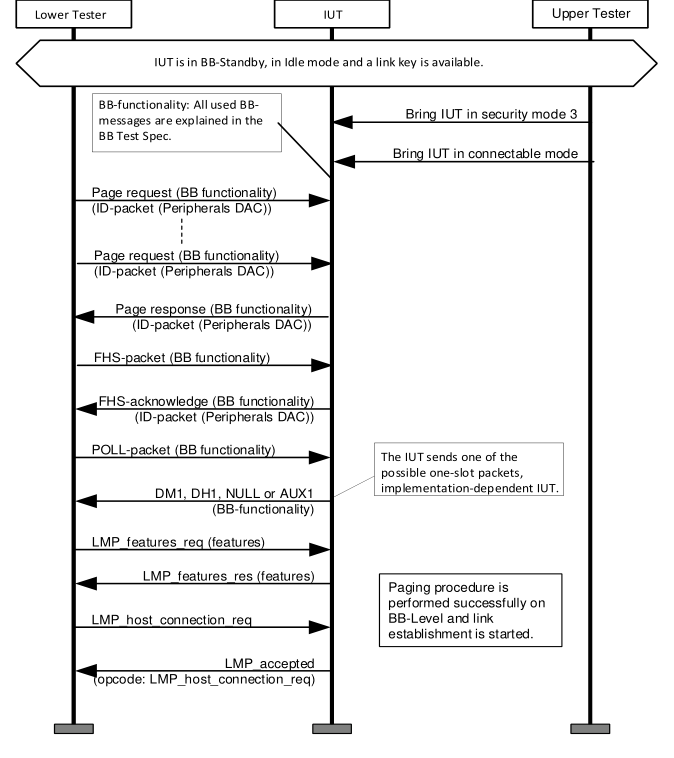

**Figure 4.1: Link Establishment Tester Started (for Generic Authentication) MSC**

#### 4.2.2 Inquiry Procedure

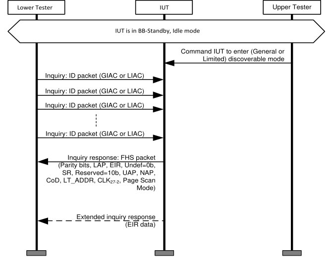

**Figure 4.2: Inquiry Procedure MSC**

#### 4.2.3 Paging Procedure

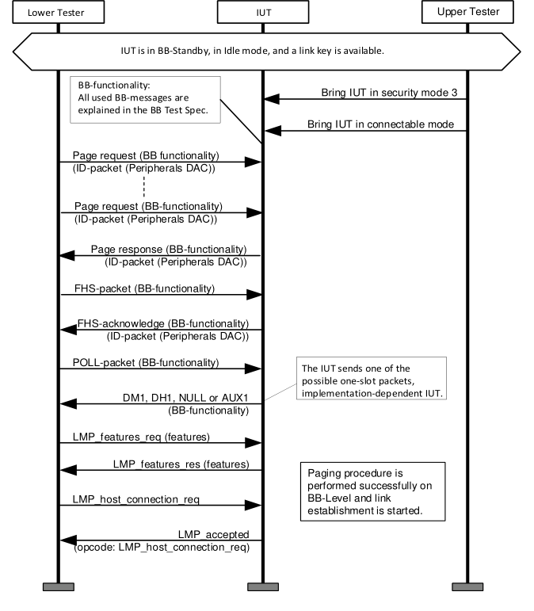

**Figure 4.3: Paging Procedure MSC**

#### 4.2.4 Bring IUT to Link Key Available

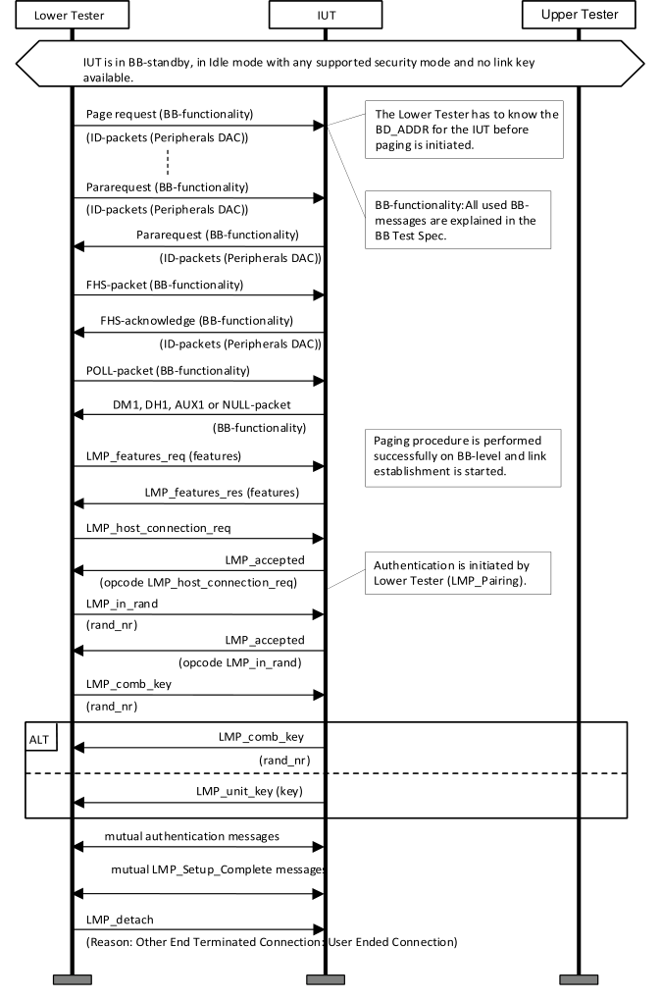

**Figure 4.4: Bring IUT to Link Key Available MSC**

#### 4.2.5 Secure Simple Pairing

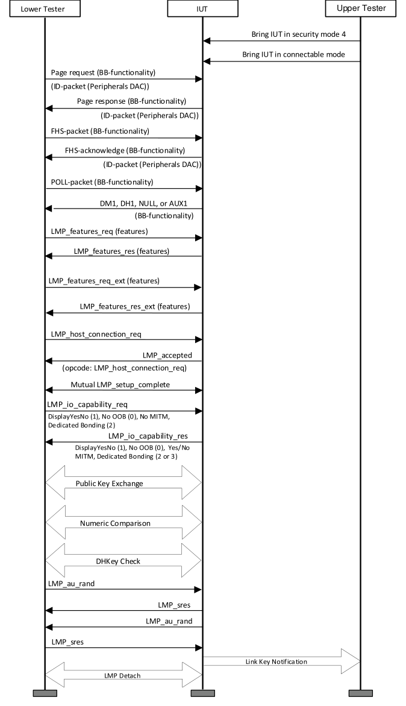

**Figure 4.5: Secure Simple Pairing MSC**

#### 4.2.6 GAP Mandatory Characteristics

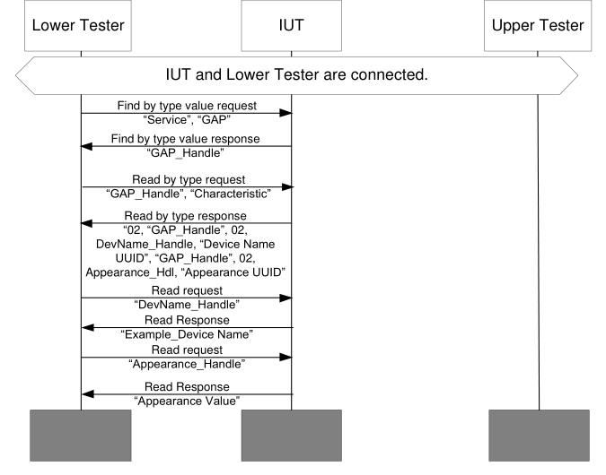

**Figure 4.6: GAP Mandatory Characteristics MSC**

### 4.3 Common Packet Contents

#### 4.3.1 Fields and Bits Reserved for Future Use

Unless a specific test states otherwise, all fields within packets and all bits within fields that are described as reserved for future use are set to 0 in packets sent by the Upper and Lower Testers.

### 4.4 Modes

Verify the correct implementation of the modes.

#### 4.4.1 Non-discoverable bondable Mode - Peripheral

Verify the correct behavior in this mode. The role of the IUT is Peripheral and acceptor.
GAP/MOD/NDIS/BV-01-C [Non-discoverable Mode – Peripheral]
• Test Purpose
Verify that the IUT does not respond to inquiry if it is in non-discoverable mode.
The IUT is Peripheral and acceptor and the Lower Tester is Central and initiator of the inquiry procedure.
• Reference
[1] 4.1.1
• Initial Condition
- The IUT is in Baseband state 'Standby' and in Idle mode.
• Test Procedure

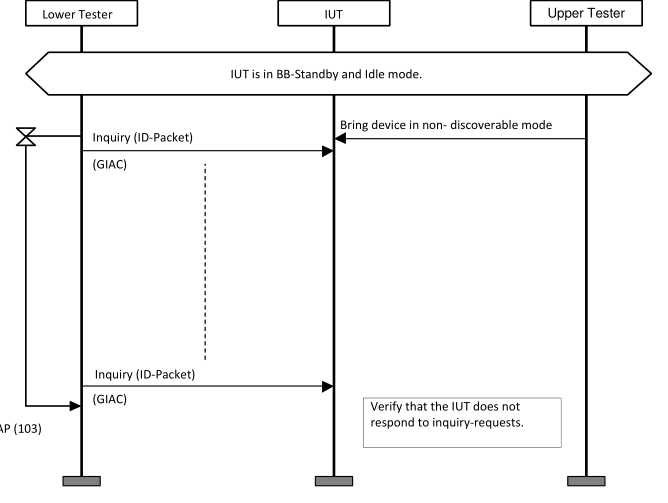

**Figure 4.7: GAP/MOD/NDIS/BV-01-C [Non-discoverable Mode – Peripheral] MSC**

The Lower Tester sends for a time [TGAP(103)] inquiry request messages (ID-packets) after the Upper Tester has ordered the IUT to go in non-discoverable mode. Every inquiry train is repeated for N=256 times.
• Test Condition
It must be possible to put the IUT in non-discoverable mode.
• Expected Outcome
Pass verdict
The IUT does not answer to an inquiry request.

#### 4.4.2 Limited Discoverable Mode - Peripheral

Verify the correct behavior in this mode. The role of the IUT is Peripheral and acceptor.
GAP/MOD/LDIS/BV-01-C [Limited Discoverable Mode and LIAC – Peripheral]
• Test Purpose
Verify that the IUT answers to inquiry (LIAC) if it is in limited-discoverable mode.
The IUT is Peripheral and acceptor and the Lower Tester is Central and initiator of the inquiry procedure.
• Reference
[1] 4.1 (Discoverability Modes)
• Initial Condition
- The IUT is in Baseband state 'Standby' and in Idle mode.
• Test Procedure

**Figure 4.8: GAP/MOD/LDIS/BV-01-C [Limited Discoverable Mode and LIAC – Peripheral] MSC**

The Lower Tester sends for a time [TGAP(103)] inquiry request messages (ID-packets) after the Upper Tester has ordered the IUT to go in limited-discoverable mode. Every inquiry train is repeated for N = 256 times.
• Test Condition
It must be possible to put the IUT in limited-discoverable mode.
The IUT is able to answer to the inquiry request message if it is in limited discoverable mode. In this test the inquiry procedure uses LIAC sent by the Lower Tester.
• Expected Outcome
Pass verdict
The IUT answers to an inquiry request (LIAC) with the FHS-packet. The Inquiry response message is received by the Lower Tester within TGAP(103).
The COD has the bit number 13 set in the Major Service Class part of the Class of Device field.
GAP/MOD/LDIS/BV-02-C [Limited Discoverable Mode and GIAC – Peripheral]
• Test Purpose
Verify that the IUT answers to inquiry (GIAC) if it is in limited-discoverable mode.
IUT is Peripheral and acceptor and the Lower Tester is Central and initiator of the inquiry procedure.
• Reference
[1] 4.1
• Initial Condition
- The IUT is in Baseband state 'Standby' and Idle mode.
• Test Procedure

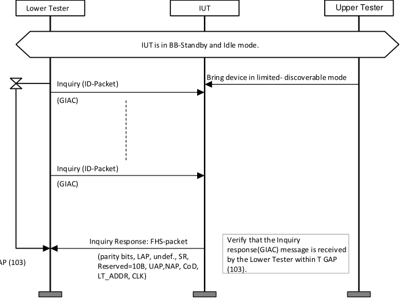

**Figure 4.9: GAP/MOD/LDIS/BV-02-C [Limited Discoverable Mode and GIAC – Peripheral] MSC**

The Lower Tester sends for a time [TGAP(103)] inquiry request messages (ID-packets) after the Upper Tester has ordered the IUT to go in limited-discoverable mode. Every inquiry train is repeated for N = 256 times.
• Test Condition
It must be possible to put the IUT in limited-discoverable mode.
The IUT is able to answer to the inquiry request message if it is in limited-discoverable mode. In this test the inquiry procedure uses GIAC sent by the Lower Tester.
• Expected Outcome
Pass verdict
The IUT answers to an inquiry request (GIAC) with the FHS-packet. The Inquiry response message is received by the Lower Tester within TGAP(103).
The COD has the bit number 13 set in the Major Service Class part of the Class of Device field.
GAP/MOD/LDIS/BV-03-C [Limited Discovery Mode Time-out]
• Test Purpose
Verify that the IUT ceases to answer to inquiry after a time-out, if it is in limited-discoverable mode.
The IUT is Peripheral and acceptor and the Lower Tester is Central and initiator of the inquiry procedure.
• Reference
[4] 4.1.2
• Initial Condition
• Test Procedure
Lower Tester Upper Tester IUT

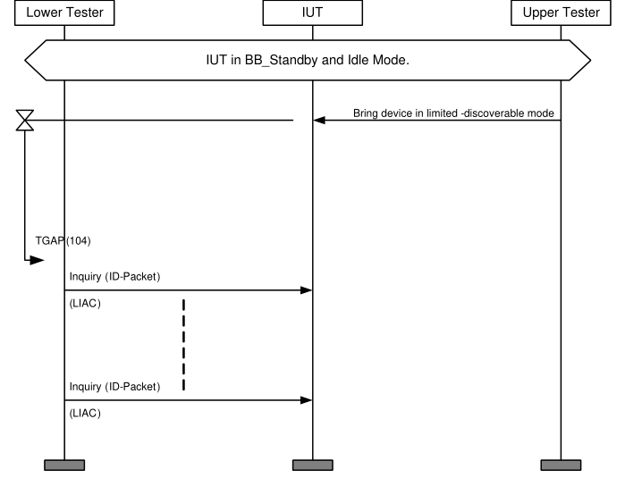

**Figure 4.10: GAP/MOD/LDIS/BV-03-C [Limited Discovery Mode Time-out] MSC**

1. The Upper Tester orders the IUT to go in limited-discoverable mode. The Lower Tester waits for
TGAP(104) to expire. (TGAP(104) has a default of 1 minute, but an alternate value may be invoked via IXIT [3].) 2. After TGAP(104) has expired, the Lower Tester sends a series of 256 inquiry request messages
(IDpackets) with LIAC. Since the IUT has left the Limited Discoverable Mode on the expiration of the timer, it does not respond.
• Expected Outcome
Pass verdict
The IUT does not answer any inquiry request (LIAC) with an FHS-packet.

#### 4.4.3 General Discoverable Mode - Peripheral

Verify the correct behavior in this mode. The role of the IUT is Peripheral and acceptor.
GAP/MOD/GDIS/BV-01-C [General Discoverable Mode and GIAC – Peripheral]
• Test Purpose
Verify that the IUT answers to inquiry (GIAC) if it is in general-discoverable mode.
The IUT is Peripheral and acceptor and the Lower Tester is Central and initiator of the inquiry procedure.
• Reference
[1] 4.1
• Initial Condition
• Test Procedure

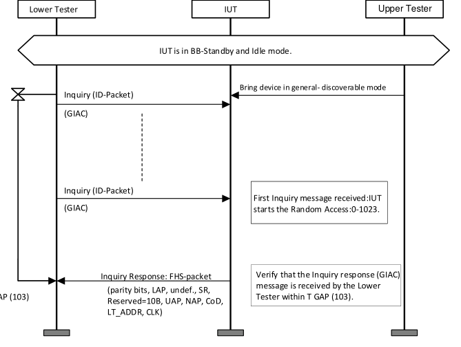

**Figure 4.11: GAP/MOD/GDIS/BV-01-C [General Discoverable Mode and GIAC – Peripheral] MSC**

The Lower Tester sends for a time [TGAP(103)] inquiry request messages (ID-packets) after the Upper Tester has ordered the IUT to go in general-discoverable mode. Every inquiry train is repeated for N=256 times.
• Test Condition
It must be possible to put the IUT in general-discoverable mode.
The IUT is able to answer to the inquiry request message if it is in general discoverable mode. In this test the inquiry procedure uses GIAC sent by the Lower Tester.
• Expected Outcome
Pass verdict
The IUT answers to an inquiry request (GIAC) with the FHS-packet. The Inquiry response message is received by the Lower Tester within TGAP(103).
GAP/MOD/GDIS/BV-02-C [General Discoverable Mode and LIAC – Peripheral]
• Test Purpose
Verify that the IUT in general-discoverable mode does not respond inquiry requests (using LIAC).
The IUT is Peripheral and acceptor and the Lower Tester is Central and initiator of the inquiry procedure.
• Reference
[1] 4.1
• Initial Condition
- The IUT is in Baseband state 'Standby' and Idle mode.
• Test Procedure

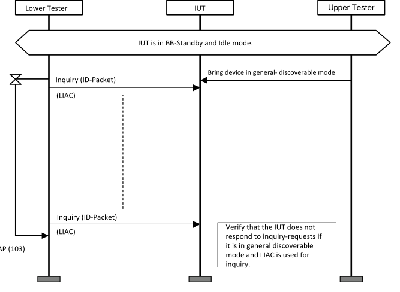

**Figure 4.12: GAP/MOD/GDIS/BV-02-C [General Discoverable Mode and LIAC – Peripheral] MSC**

The Lower Tester sends for a time [TGAP(103)] inquiry request messages (ID-packets) after the Upper Tester has ordered the IUT to go in general-discoverable mode. Every inquiry train is repeated for N=256 times.
• Test Condition
It must be possible to put the IUT in general-discoverable mode. In this test the inquiry procedure uses LIAC.
• Expected Outcome
Pass verdict
The IUT does not answer to an inquiry request (LIAC).

#### 4.4.4 Non-connectable Mode - Peripheral

Verify the correct behavior in this mode. The role of the IUT is Peripheral and acceptor.
GAP/MOD/NCON/BV-01-C [Non-connectable Mode – Peripheral]
• Test Purpose
Verify that the IUT does not respond to paging if it is in non-connectable mode.
The IUT is Peripheral and acceptor and the Lower Tester is Central and initiator of the paging procedure.
• Reference
[1] 4.3
• Initial Condition
- The IUT is in Baseband state 'Standby' and in Idle mode.
• Test Procedure

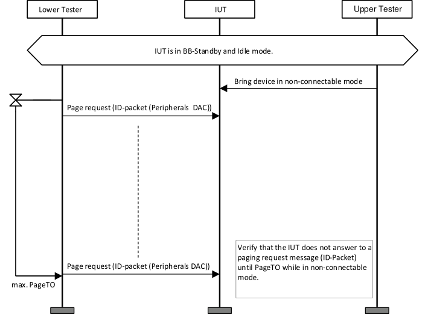

**Figure 4.13: GAP/MOD/NCON/BV-01-C [Non-connectable Mode – Peripheral] MSC**

The Lower Tester sends for the time max. PageTO paging request messages (ID-packets) after the Upper Tester has ordered the IUT to go in non-connectable mode.
• Test Condition
The IUT is able to answer paging request messages if it is in connectable mode. It must be possible to put the IUT in non-connectable mode. The Lower Tester has to know the BD_ADDR and the CoD of the IUT.
• Expected Outcome
Pass verdict
The IUT does not answer to paging requests.
• Notes
It must be possible to select a certain BD_ADDR or CoD for the Lower Tester if necessary.

#### 4.4.5 Connectable Mode - Peripheral

Verify the correct behavior in this mode. The role of the IUT is Peripheral and acceptor.
GAP/MOD/CON/BV-01-C [Connectable Mode – Peripheral]
• Test Purpose
Verify that the IUT responds to paging requests if it is in connectable mode.
The IUT is Peripheral and acceptor and the Lower Tester is Central and initiator of the paging procedure.
• Reference
[1] 4.3
• Initial Condition
- The IUT is in Baseband state 'Standby' and in Idle mode.
• Test Procedure

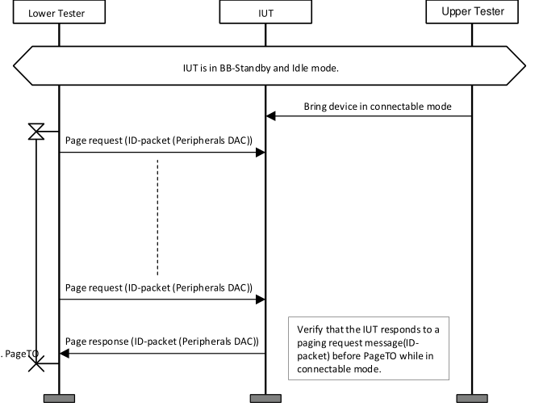

**Figure 4.14: GAP/MOD/CON/BV-01-C [Connectable Mode – Peripheral] MSC**

1. The Lower Tester sends for the time max. PageTO paging request messages (ID-packets) after
the Upper Tester has ordered the IUT to go in connectable mode. 2. The IUT answers to the paging request.
• Test Condition
The IUT is able to answer paging request messages if it is in connectable mode. It must be possible to put the IUT in connectable mode if non-connectable mode is supported. The Lower Tester has to know the BD_ADDR and the CoD of the IUT.
• Expected Outcome
Pass verdict
The IUT answers to paging request messages with the paging response message (ID-packet) within PageTO.
• Notes
It must be possible to select a certain BD_ADDR or CoD for the Lower Tester if necessary.

#### 4.4.6 Non-bondable Mode – Peripheral

Verify the correct behavior in this mode. The role of the IUT is Peripheral and acceptor.
GAP/MOD/NBON/BV-02-C [Non-bondable Mode, IUT Rejects Pairing Procedure]
• Test Purpose
Verify that the IUT rejects a pairing procedure, if it is in non-bondable mode.
The IUT is Peripheral and claimant. The Lower Tester is Central and verifier of the pairing procedure.
• Reference
[1] 4.3
• Initial Condition
- The IUT is in non-bondable mode.
- Any link keys associated with the IUT and Lower Tester are deleted.
- The IUT and Lower Tester support Secure Simple Pairing and have set Write Simple Pairing Mode to their respective Controllers.
- The Lower Tester’s IO capabilities are set to “DisplayYesNo”.
- The Lower Tester’s Authentication_Requirements are set to “MITM Protection Not Required – Dedicated Bonding. Numeric comparison with automatic accept allowed.” (0x02).
- The IUT is in a connectable state.
• Test Procedure

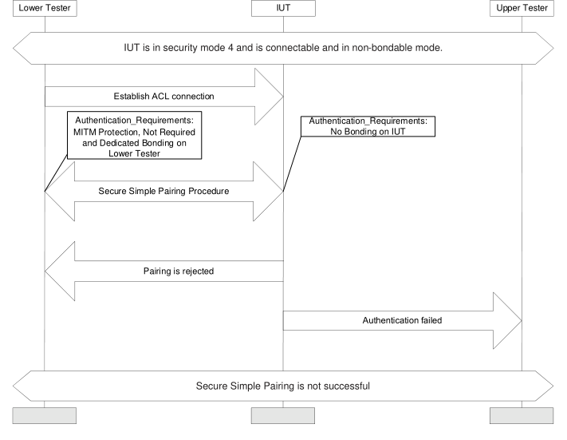

**Figure 4.15: GAP/MOD/NBON/BV-02-C [Non-bondable Mode, IUT Rejects Pairing Procedure] MSC**

procedure. The Lower Tester’s IO capabilities are set to “DisplayYesNo” and the Authentication_Requirements are set to “MITM Protection Not Required – Dedicated Bonding. Numeric comparison with automatic accept allowed.” (0x02). 2. The IUT in non-bondable mode responds negatively to the IO capability request where the Lower
Tester’s Authentication_Requirements parameter requests dedicated bonding.
• Test Condition
It must be possible to put the IUT in non-bondable mode.
• Expected Outcome
Pass verdict
The IUT in non-bondable mode does not accept the pairing request from the Lower Tester where the Authentication_Requirements parameter requests dedicated bonding. Secure Simple Pairing does not complete with dedicated bonding.
GAP/MOD/NBON/BV-03-C [Non-bondable Mode, IUT Accepts a Non-bonded Connection]
• Test Purpose
Verify that the IUT accepts a non-bonded connection when it is in non-bondable mode.
The IUT is Peripheral and claimant. The Lower Tester is Central and verifier of the pairing procedure.
• Reference
[1] 4.3
• Initial Condition
- The IUT is in non-bondable mode.
- An ACL connection exists between the IUT and Lower Tester.
- The IUT and Lower Tester support Pairing and have set Write Simple Pairing Mode to their respective Controllers.
- The Lower Tester’s IO capabilities are set to “DisplayYesNo”.
- The Lower Tester's Authentication_Requirements are set to “MITM Protection Not Required - No Bonding” (0x00).
• Test Procedure

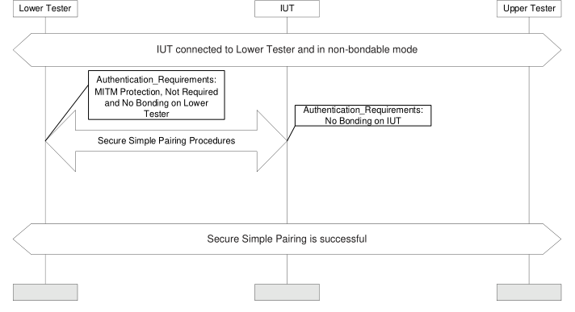

**Figure 4.16: GAP/MOD/NBON/BV-03-C [Non-bondable Mode, IUT Accepts a Non-bonded Connection] MSC**

1. The Lower Tester establishes a connection to the IUT and initiates a secure simple pairing
procedure. The Lower Tester’s IO capabilities are set to “DisplayYesNo” and the Authentication_Requirements are set to “MITM Protection Not Required – No Bonding” (0x00). 2. The IUT in non-bondable mode accepts the IO capability request where the Lower Tester’s
Authentication_Requirements parameter requests no bonding and secure simple pairing is successful.
• Test Condition
It must be possible to put the IUT in non-bondable mode.
• Expected Outcome
Pass verdict
Secure Simple Pairing Procedure is completed successfully.

#### 4.4.7 Pairing Mode - Peripheral

#### 4.4.8 Non-synchronizable Mode – Connectionless Peripheral Broadcaster

Verify the correct behavior in this mode. The role of the IUT is connectionless Peripheral broadcast transmitter.
GAP/MOD/NSYN/BV-01-C [Non-synchronizable Mode, IUT is Connectionless Peripheral Broadcast Transmitter]
• Test Purpose
Verify that the IUT does not send the synchronization train if it is in non-synchronizable mode. The IUT is the connectionless Peripheral broadcast transmitter and the Lower Tester is the connectionless Peripheral broadcast receiver.
• References
[7] 4.4.1
• Initial Condition
- The IUT is in Baseband state ‘Standby’ and in Idle mode.
• Test Procedure
The Lower Tester scans for Sync_Scan_Timeout = 10.12 seconds for the synchronization train after the Upper Tester has ordered the IUT to go in non-synchronizable mode.

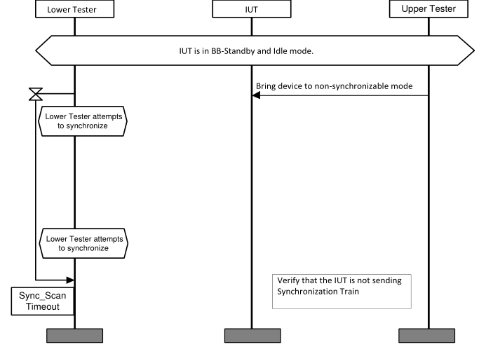

**Figure 4.17: GAP/MOD/NSYN/BV-01-C [Non-synchronizable Mode, IUT is Connectionless Peripheral Broadcast Transmitter] MSC**

• Test Condition
It must be possible to put the IUT in non-synchronizable mode. The Lower Tester has to know the BD_ADDR of the IUT.
• Expected Outcome
Pass verdict
The Lower Tester is unable to synchronize to the IUT.

#### 4.4.9 Synchronizable Mode – Connectionless Peripheral Broadcaster

Verify the correct behavior in this mode. The role of the IUT is connectionless Peripheral broadcast transmitter.
GAP/MOD/SYN/BV-01-C [Synchronizable Mode – IUT is Connectionless Peripheral Broadcast Transmitter]
• Test Purpose
Verify that the IUT transmits the Synchronization Train when it is in Synchronizable mode. The IUT is the connectionless Peripheral broadcast transmitter and the Lower Tester is the connectionless Peripheral broadcast receiver.
• References
[7] 4.4.2
• Initial Condition
- The IUT is in Standby state.
• Test Procedure
1. The Upper Tester configures the Synchronization Train on the IUT with Interval = 80 ms, Timeout
= 120 seconds, and Service_Data = 0x01. 2. The Upper Tester reserves LT_ADDR=1 on the IUT and enables a Connectionless Peripheral
Broadcast on the IUT using the reserved LT_ADDR with Interval = 80 ms. 3. The Upper Tester places the IUT in Synchronizable mode. 4. The Lower Tester receives the Synchronization Train from the IUT.

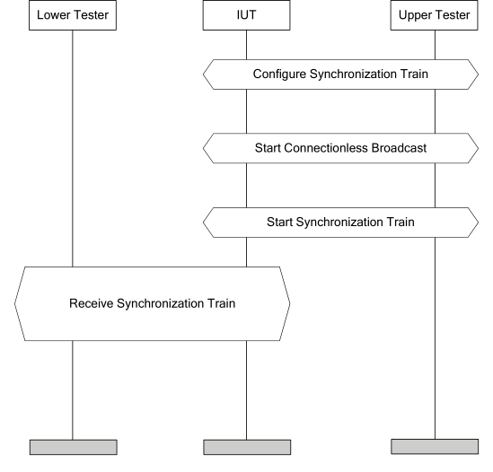

**Figure 4.18: GAP/MOD/SYN/BV-01-C [Synchronizable Mode – IUT is Connectionless Peripheral Broadcast Transmitter] MSC**

• Expected Outcome
Pass verdict
The Lower Tester receives the Synchronization Train from the IUT in accordance with the configuration via the Upper Tester.

### 4.5 Security Aspects

Verify the correct implementation of the modes, behavior, and procedures of the IUT.

#### 4.5.1 BR/EDR Security Modes - Peripheral

Verify the correct behavior in BR/EDR security modes. The role of the IUT is Peripheral and acceptor.
• Test Purpose
Verify that the IUT in security Mode-2 performs a channel establishment procedure.
The IUT is responder. The Lower Tester is initiator of the channel establishment procedure.
• Reference
[1] 5.2
• Initial Condition
- The IUT is in Baseband state ‘Standby’ and in Idle mode. The IUT has to be configured such that it will not reject the channel establishment procedure.
• Test Procedure

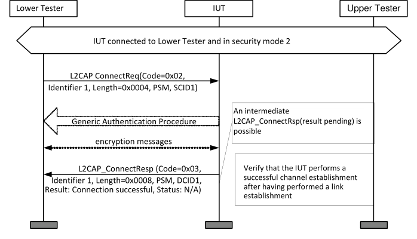

**Figure 4.19: GAP/SEC/SEM/BV-02-C [Channel Establishment Procedure – Security Mode-2] MSC**

1. After the Upper Tester has ordered the IUT to go in connectable mode, the Lower Tester starts
the link establishment with paging. 2. If the link establishment was completed, a channel establishment is performed.
• Test Condition
It must be possible to put the IUT in security Mode-2 and in connectable mode if non-connectable mode is supported. It must be possible to make sure, that the device will not reject the channel establishment procedure, thus an L2CAP_ConnectRspNeg is not sent by the IUT. The Lower Tester has to know the BD_ADDR and the CoD of the IUT.
• Expected Outcome
Pass verdict
After the link establishment is completed and a channel establishment was initiated by the Lower Tester (with L2CAP_ConnectReq), the IUT sends the L2CAP_ConnectRsp message with the result: “Connection successful” for completion.
• Notes
Recommend to test with connection to protocol/application that requires authentication.
• Test Purpose
Verify that the IUT in Security Mode-4 performs a channel establishment procedure. The IUT is responder. The Lower Tester is initiator of the channel establishment procedure.
• Reference
[16] 5.2.2
• Initial Condition
- The IUT is in Idle mode. The IUT has to be configured such that it will not reject the channel establishment procedure.
• Test Procedure

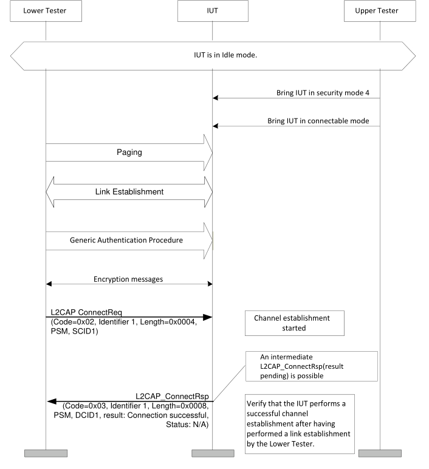

**Figure 4.20: GAP/SEC/SEM/BV-04-C [Security Mode-4 – Responder] MSC**

After the Upper Tester has ordered the IUT to go in connectable mode and in security Mode-4, the Lower Tester starts the link establishment with paging. If the link establishment was completed, a channel establishment is performed.
• Test Condition
It must be possible to put the IUT in security Mode-4 and in connectable mode if non-connectable mode is supported. It must be possible to make sure, that the device will not reject the channel establishment procedure, thus an L2CAP_ConnectRspNeg is not sent by the IUT. The Lower Tester has to know the BD_ADDR and the CoD of the IUT.
• Expected Outcome
Pass verdict
After the link establishment is completed and a channel establishment was initiated by the Lower Tester (with L2CAP_ConnectReq), the IUT sends the L2CAP_ConnectRsp message with the result: “Connection successful” for completion.
• Notes
Recommend to test with connection to protocol/application that requires authentication.
GAP/SEC/SEM/BV-11-C [Secure Connections Only Mode BR/EDR Transport – IUT Peripheral, responder, Lower Tester doesn’t support Secure Connections in Controller]
• Test Purpose
The Lower Tester doesn’t support Secure Connections at the Controller level. Verify that the IUT in Secure Connections Only Mode rejects a request to perform a channel establishment procedure over the BR/EDR transport if the service on the IUT requires Security Mode-4, Level 3 on the IUT. The IUT is Peripheral and responder of the channel establishment procedure.
• Reference
[1] 5.2.2
• Initial Condition
- The PSM for the service on the IUT that requires Security Mode-4, Level 3 is specified in the IXIT.
- Set the Secure Connections (Controller Support) LMP feature bit on the Lower Tester to 0.
- The IUT and the Lower Tester are not bonded (neither IUT nor Lower Tester has link keys).
- ACL connection does not exist between the devices.
• Test Procedure

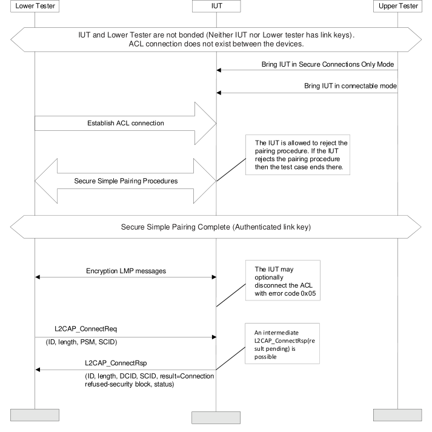

**Figure 4.21: GAP/SEC/SEM/BV-11-C [Secure Connections Only Mode BR/EDR Transport – IUT Peripheral, responder, Lower Tester doesn’t support Secure Connections in Controller] MSC**

1. The Upper Tester puts the IUT in Secure Connections Only Mode and connectable mode. 2. The Lower Tester creates an ACL connection with the IUT. 3. The Lower Tester performs the Secure Simple Pairing procedure that results in an authenticated
link key and enables encryption. The IUT is allowed to reject this pairing procedure. If the IUT rejects the pairing procedure then the test case ends there. 4. The Lower Tester requests establishing a channel to access a service on the IUT that requires
Security Mode-4, Level 3.
• Test Condition
It must be possible to put the IUT in Secure Connections Only Mode and in connectable mode.
• Expected Outcome
Pass verdict
The IUT rejects the pairing procedure OR
The pairing procedure succeeds and the IUT then rejects the Lower Tester’s request to establish a channel to access a service on the IUT that requires Security Mode-4, Level 3 OR
The IUT disconnects the ACL connection with error code 0x05 (Authentication Failure).
• Notes
When in Secure Connections Only mode, all services (except those allowed to have Security Mode-4, Level 0) require Security Mode-4, Level 4.
GAP/SEC/SEM/BV-12-C [Secure Connections Only Mode BR/EDR Transport – IUT Peripheral, responder, Lower Tester doesn’t support Secure Connections in Host]
• Test Purpose
The Lower Tester does not support Secure Connections at the Host level. Verify that the IUT in Secure Connections Only Mode rejects a channel establishment procedure over the BR/EDR transport if the service on the IUT requires Security Mode-4, Level 3. The IUT is Peripheral and responder of the channel establishment procedure.
• Reference
[1] 5.2.2
• Initial Condition
- The PSM for the service on the IUT that requires Security Mode-4, Level 3 is specified in the IXIT.
- On the Lower Tester, set the Secure Connections (Host Support) LMP feature bit to 0 and the Secure Connections (Controller Support) LMP feature bit to 1.
- IUT and Lower Tester are not bonded (Neither IUT nor Lower Tester has link keys).
- ACL connection does not exist between the devices.
• Test Procedure

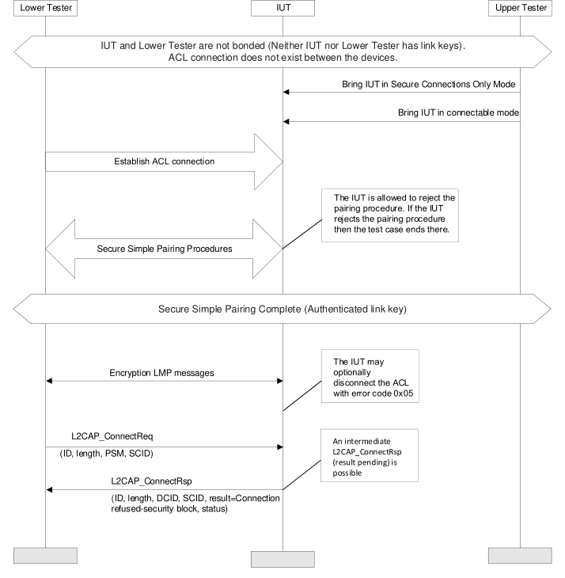

**Figure 4.22: GAP/SEC/SEM/BV-12-C [Secure Connections Only Mode BR/EDR Transport – IUT Peripheral, responder, Lower Tester doesn’t support Secure Connections in Host] MSC**

1. The Upper Tester puts the IUT in Secure Connections Only Mode and connectable mode. 2. The Lower Tester creates an ACL connection with the IUT. 3. The Lower Tester performs the Secure Simple Pairing procedure that results in an authenticated
link key and enables encryption. The IUT is allowed to reject this pairing procedure. If the IUT rejects the pairing procedure then the test case ends there. 4. The Lower Tester requests establishing a channel to access a service on the IUT that requires
Security Mode-4, Level 3.
• Test Condition
It must be possible to put the IUT in Secure Connections Only Mode and in connectable mode.
• Expected Outcome
Pass verdict
The IUT rejects the pairing procedure OR
The pairing procedure succeeds and the IUT then rejects the Lower Tester’s request to establish a channel to access a service on the IUT that requires Security Mode-4, Level 3 OR
The IUT disconnects the ACL connection with error code 0x05 (Authentication Failure).
• Notes
When in Secure Connections Only mode, all services (except those allowed to have Security Mode-4, Level 0) require Security Mode-4, Level 4.
GAP/SEC/SEM/BI-01-C [Security Mode-2 BR/EDR Transport, Responder - Invalid Encryption Key Size]
• Test Purpose
Verify that the IUT in Security Mode-2 rejects channel establishment with an invalid encryption key size.
The Lower Tester is initiator of the channel establishment procedure. The IUT is responder.
• Reference
[1] 5.2
• Initial Condition
- The Lower Tester is in Security Mode-2 and thus the IUT operates in Security Mode-2 during the connection with the Lower Tester.
- The IUT is configured such that it will not reject the channel establishment procedure for any other reasons.
- The IUT and Lower Tester are in a connection and have exchanged a link key with the correct level of authentication while pairing in Security Mode-2, either during this connection or in a previous connection with bonding. Link has not yet been encrypted.
- The minimum encryption key size supported is defined in the “TSPX_Min_Encryption_Key_Size” IXIT parameter.
• Test Procedure

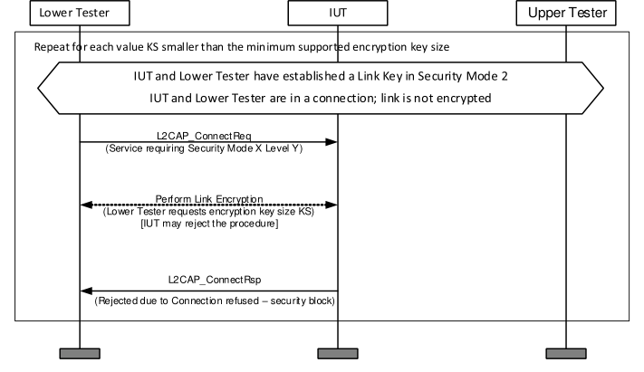

**Figure 4.23: GAP/SEC/SEM/BI-01-C [Security Mode-2 BR/EDR Transport, Responder - Invalid Encryption Key Size] MSC**

Repeat steps 1–4 for each value of the encryption key size (in step 3) in the range [1, TSPX_Min_Encryption_Key_Size – 1]:
1. Bring the IUT and the Lower Tester into the Initial Condition. 2. The Lower Tester performs a channel establishment procedure for a service requiring Security
Mode-2. 3. The IUT triggers link encryption and the Lower Tester requests an encryption key size equal to
the value selected for the current iteration. The IUT may accept the key size or may fail the link encryption procedure. 4. The IUT rejects the channel establishment after link encryption has been completed.
• Test Condition
It must be possible to put the IUT in Security Mode-2 and in connectable mode if non-connectable mode is supported. It must be possible to make sure that the device will not reject the channel establishment procedure, thus an L2CAP_ConnectRspNeg is not sent by the IUT. The Lower Tester has to know the BD_ADDR and the CoD of the IUT.
• Expected Outcome
Pass verdict
For each requested value of the encryption key size that is less than the minimum supported encryption key size, the IUT rejects the channel establishment over the insufficiently encrypted link. Optionally, the IUT also fails the link encryption procedure or terminates the connection.

##### 4.5.1.1 Security Mode-4, Responder - Invalid Encryption Key Size

• Test Purpose
Verify that the IUT in Security Mode-4 rejects channel establishment with an invalid encryption key size.
The Lower Tester is initiator of the channel establishment procedure. The IUT is responder.
• Reference
[1] 5.2, 5.2.2.8
• Initial Condition
- The IUT is in Security Mode and Level indicated in the test procedure and is configured such that it will not reject the channel establishment procedure for any other reasons.
- The minimum encryption key size supported is defined in the “TSPX_Min_Encryption_Key_Size” IXIT parameter.
• Test Case Configuration

|  | TCID |  |  | Security Mode and Level |  |  | Minimum Key Size (octets) |  |
| --- | --- | --- | --- | --- | --- | --- | --- | --- |
| GAP/SEC/SEM/BI-11-C [Security Mode-4 Level 1, Responder - Invalid Encryption Key Size] |  |  | Security Mode-4 Level 1 |  |  | TSPX Min Encryption Key Size _ _ _ _ |  |  |
| GAP/SEC/SEM/BI-02-C [Security Mode-4 Level 2, Responder - Invalid Encryption Key Size] |  |  | Security Mode-4 Level 2 |  |  | TSPX Min Encryption Key Size _ _ _ _ |  |  |

|  | TCID Secur | ity Mode and Level Minimum Key Size (octets) |  |
| --- | --- | --- | --- |
| GAP/SEC/SEM/BI-03-C Securi [Security Mode-4 Level 3, Responder - Invalid Encryption Key Size] |  | ty Mode-4 Level 3 TSPX Min Encryption Key Size _ _ _ _ |  |
| GAP/SEC/SEM/BI-04-C Securi [Security Mode-4 Level 4, Responder - Invalid Encryption Key Size - 128 bit] |  | ty Mode-4 Level 4 16 |  |
| GAP/SEC/SEM/BI-14-C Securi [Security Mode-4 Level 1, Responder - Invalid Encryption Key Size - 128 bit] |  | ty Mode-4 Level 1 16 |  |
| GAP/SEC/SEM/BI-15-C Securi [Security Mode-4 Level 2, Responder - Invalid Encryption Key Size - 128 bit] |  | ty Mode-4 Level 2 16 |  |
| GAP/SEC/SEM/BI-16-C Securi [Security Mode-4 Level 3, Responder - Invalid Encryption Key Size - 128 bit] |  | ty Mode-4 Level 3 16 |  |

Table 4.2: Security Mode-4, Responder - Invalid Encryption Key Size test cases
• Test Procedure

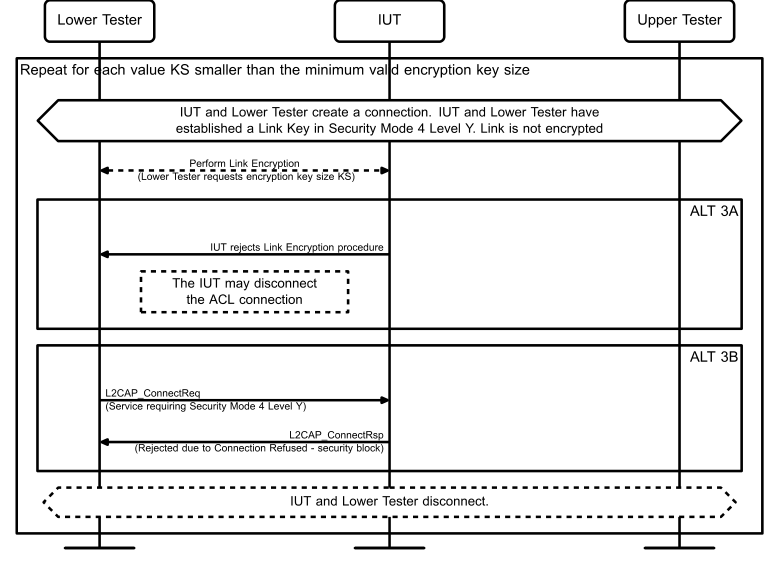

**Figure 4.24: Security Mode-4, Responder - Invalid Encryption Key Size MSC**

Repeat steps 1–5 for each value of the encryption key size (in step 3) in the range [1, Min_Key_Size – 1], where Min_Key_Size is indicated in Table 4.2, column Minimum Key Size, for each test case.
1. The IUT and the Lower Tester initiate a connection and exchange a link key with the correct level
of authentication while pairing in the same Security Mode and Level indicated in the test procedure. The link has not yet been encrypted. 2. Bring the IUT and the Lower Tester into the Initial Condition for the Security Mode and Level
indicated in Table 4.2, column Security Mode and Level. 3. The Lower Tester and the IUT perform link encryption, and the Lower Tester requests an
encryption key size equal to the value selected for the current iteration. 4. Perform either alternative 4A or 4B depending on the IUT’s behavior.
Alternative 4A (The IUT fails the link encryption procedure):
4A.1 The IUT rejects the link encryption. 4A.2 The IUT may disconnect the ACL connection with error code 0x05 (Authentication Failure). Alternative 4B (The Link Encryption procedure completes successfully):
4B.1 The Lower Tester requests a channel establishment for a service requiring the same Security Mode and Level as indicated in step 1. 4B.2 The IUT rejects the channel establishment after link encryption has been completed. 5. Unless the IUT disconnected the ACL connection in step 4A.2, the IUT and the Lower Tester
disconnect the ACL connection.
• Test Condition
It must be possible to put the IUT in the security mode and level under test and in connectable mode if non-connectable mode is supported. The Lower Tester has to know the BD_ADDR and the CoD of the IUT.
• Expected Outcome
Pass verdict
For each value of the encryption key size tested, the IUT either fails the link encryption procedure or completes the procedure successfully but rejects the channel establishment over the insufficiently encrypted link.
GAP/SEC/SEM/BI-05-C [Security Mode-2, Initiator - Invalid Key Size]
• Test Purpose
Verify that the IUT in Security Mode-2 rejects channel establishment with an invalid encryption key size.
The IUT is initiator of the channel establishment procedure. The Lower Tester is responder.
• Reference
[1] 5.2
• Initial Condition
- The Lower Tester is in Security Mode-2 and thus the IUT operates in Security Mode-2 during the connection with the Lower Tester.
- The IUT and Lower Tester are in a connection and have exchanged a link key with the correct level of authentication while pairing in the same Security Mode and Level indicated in the test procedure, either during this connection or in a previous connection with bonding. Link has not yet been encrypted.
- The minimum encryption key size supported is defined in the “TSPX_Min_Encryption_Key_Size” IXIT parameter.
• Test Procedure

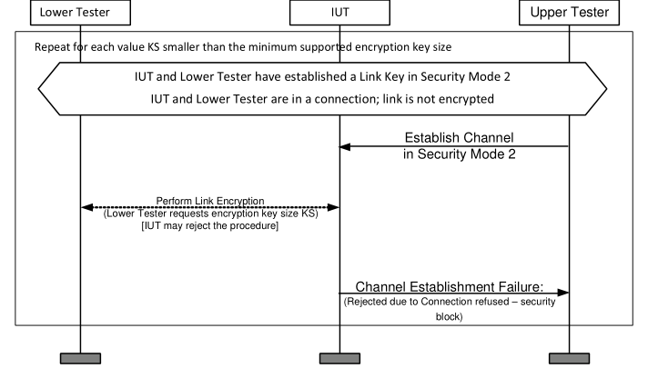

**Figure 4.25: GAP/SEC/SEM/BI-05-C [Security Mode-2, Initiator - Invalid Key Size] MSC**

Repeat steps 1–4 for each value of the encryption key size (in step 3) in the range [1, TSPX_Min_Encryption_Key_Size – 1]:
1. Bring the IUT and the Lower Tester into the Initial Condition. 2. The Upper Tester orders the IUT to perform a channel establishment procedure for a service
requiring Security Mode-2. The IUT initiates link encryption. 3. In the link encryption phase, the Lower Tester requests an encryption key size equal to the value
selected for the current iteration. The IUT may accept the key size or may fail the link encryption procedure. 4. The IUT signals to the Upper Tester that the channel establishment failure after link encryption
has been completed.
• Test Condition
It must be possible to put the IUT in Security Mode-2 and in connectable mode if non-connectable mode is supported.
• Expected Outcome
Pass verdict
For each requested value of the encryption key size that is less than the minimum supported encryption key size, the IUT fails the channel establishment due to the insufficiently encrypted link. Optionally, the IUT also fails the link encryption procedure or terminates the connection.
• Test Purpose
Verify that the IUT in Security Mode-4 rejects channel establishment with an invalid encryption key size.
The IUT is initiator of the channel establishment procedure. The Lower Tester is responder.
• Reference
[1] 5.2
• Initial Condition
- The IUT is in Security Mode and Level indicated in the test procedure.
- The IUT and Lower Tester are in a connection and have exchanged a link key with the correct level of authentication while pairing in the same Security Mode and Level indicated in the test procedure, either during this connection or in a previous connection with bonding. Link has not yet been encrypted.
- The minimum encryption key size supported is defined in the “TSPX_Min_Encryption_Key_Size” IXIT parameter.
• Test Case Configuration

|  | TCID |  |  | Security Mode and Level |  |  | Minimum Key Size (octets) |  |
| --- | --- | --- | --- | --- | --- | --- | --- | --- |
| GAP/SEC/SEM/BI-12-C [Security Mode-4 Level 1, Initiator - Invalid Encryption Key Size] |  |  | Security Mode-4 Level 1 |  |  | TSPX Min Encryption Key Size _ _ _ _ |  |  |
| GAP/SEC/SEM/BI-06-C [Security Mode-4 Level 2, Initiator - Invalid Encryption Key Size] |  |  | Security Mode-4 Level 2 |  |  | TSPX Min Encryption Key Size _ _ _ _ |  |  |
| GAP/SEC/SEM/BI-07-C [Security Mode-4 Level 3, Initiator - Invalid Encryption Key Size] |  |  | Security Mode-4 Level 3 |  |  | TSPX Min Encryption Key Size _ _ _ _ |  |  |
| GAP/SEC/SEM/BI-08-C [Security Mode-4 Level 4, Initiator - Invalid Encryption Key Size - 128 bit] |  |  | Security Mode-4 Level 4 |  |  | 16 |  |  |
| GAP/SEC/SEM/BI-17-C [Security Mode-4 Level 1, Initiator - Invalid Encryption Key Size – 128 bit] |  |  | Security Mode-4 Level 1 |  |  | 16 |  |  |
| GAP/SEC/SEM/BI-18-C [Security Mode-4 Level 2, Initiator - Invalid Encryption Key Size – 128 bit] |  |  | Security Mode-4 Level 2 |  |  | 16 |  |  |
| GAP/SEC/SEM/BI-19-C [Security Mode-4 Level 3, Initiator - Invalid Encryption Key Size – 128 bit] |  |  | Security Mode-4 Level 3 |  |  | 16 |  |  |

Table 4.3: Security Mode-4, Initiator - Invalid Encryption Key Size test cases
• Test Procedure

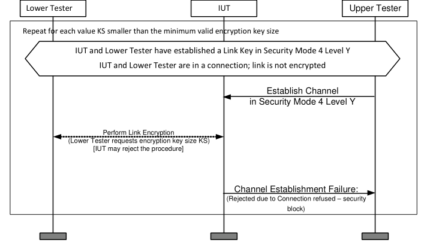

**Figure 4.26: Security Mode-4, Initiator - Invalid Encryption Key Size MSC**

Repeat steps 1–4 for each value of the encryption key size (in step 3) in the range [1, (Min_Key_Size – 1)], where Min_Key_Size is indicated in Table 4.3, column Minimum Key Size, for each test case.
1. Bring the IUT and the Lower Tester into the Initial Condition for Security Mode and Level
indicated in Table 4.3, column Security Mode and Level. 2. The Upper Tester orders the IUT to perform a channel establishment procedure for a service
requiring the same Security Mode and Level as indicated in step 1 and minimum key size indicated in Table 4.3. The IUT initiates link encryption with the Lower Tester. 3. In the link encryption phase, the Lower Tester requests an encryption key size equal to the value
selected for the current iteration. The IUT may accept the key size or may fail the link encryption procedure. 4. The IUT signals to the Upper Tester that the channel establishment failure after link encryption
has been completed.
• Test Condition
It must be possible to put the IUT in the security mode and level under test and in connectable mode if non-connectable mode is supported.
• Expected Outcome
Pass verdict
For each requested value of the encryption key size that is less than the minimum required by the security mode and level under test, the IUT fails the channel establishment due to the insufficiently encrypted link. Optionally, the IUT also fails the link encryption procedure or terminates the connection.
GAP/SEC/SEM/BI-24-C [Security Mode-4, Unencrypted connections rejected – Responder]
• Test Purpose
Verify that the IUT disconnects the connection if the initiating side sends the L2CAP_ConnectReq without first enabling encryption.
• Reference
[16] 5.2.2
• Initial Condition
- Write_Authentication_Enable (disabled) on IUT.
- Write_Simple_Pairing_Mode is set (enabled) on the Lower Tester acting as responder.
- The IUT and the Lower Tester are not Bonded.
• Test Procedure

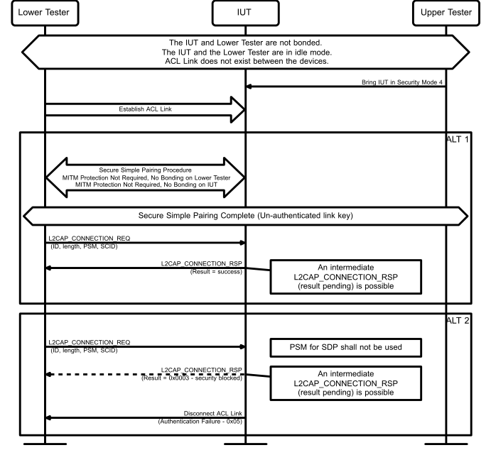

**Figure 4.27: Security Mode-4, Unencrypted connections rejected – Responder MSC**

1. The Lower Tester creates an ACL connection with the IUT. 2. The Authentication_Requirements are set to “MITM Protection Not Required No Bonding” (0x00)
on the Lower Tester. 3. The Lower Tester sends L2CAP_ConnectReq without performing Secure Simple Pairing and
without enabling encrypting.
• Expected Outcome
Pass verdict
Based on ALT 1 shown in Figure 4.27, the test results in pass when the IUT initiates the Secure Simple Pairing procedure autonomously before the Lower Tester initiates the L2CAP connection. Verify that the IUT authenticates the Lower Tester.
Based on ALT 2 shown in Figure 4.27, the test will result in pass when the IUT rejects the L2CAP connection and disconnects the ACL link with error code authentication failure 0x05.

##### 4.5.1.3 Secure Connections Only Mode BR/EDR Transport – IUT Peripheral, responder,

Lower Tester supports Secure Connections in Controller and Host
• Test Purpose
The Lower Tester supports Secure Connections both at the Controller and Host level. Verify that the IUT in Secure Connections Only Mode accepts a request to perform a channel establishment procedure over the BR/EDR transport if the service on the IUT requires Security Mode-4, Level 3. The IUT is Peripheral and responder of the channel establishment procedure.
• Reference
[1] 5.2.2
• Initial Condition
- The PSM for the service on the IUT that requires Security Mode-4, Level 3 is specified in the IXIT.
- Set both the Secure Connections (Controller Support) and the Secure Connections (Host Support) LMP feature bits on the Lower Tester to 1.
- The IUT and the Lower Tester are bonded as specified in Table 4.4.
- ACL connection does not exist between the devices.
• Test Case Configuration

|  | Test Case |  |  | Link Keys |  |  | Pairing/Authentication |  |
| --- | --- | --- | --- | --- | --- | --- | --- | --- |
| GAP/SEC/SEM/BV-13-C |  |  | Not Bonded, No Link Keys |  |  | Secure Simple Pairing |  |  |
| GAP/SEC/SEM/BV-47-C |  |  | Bonded, Has Link Keys |  |  | Generic Authentication Procedure |  |  |

Table 4.4: Secure Connections Only Mode – IUT Peripheral, responder, Lower Tester supports Secure Connections in Controller and Host test cases
• Test Procedure

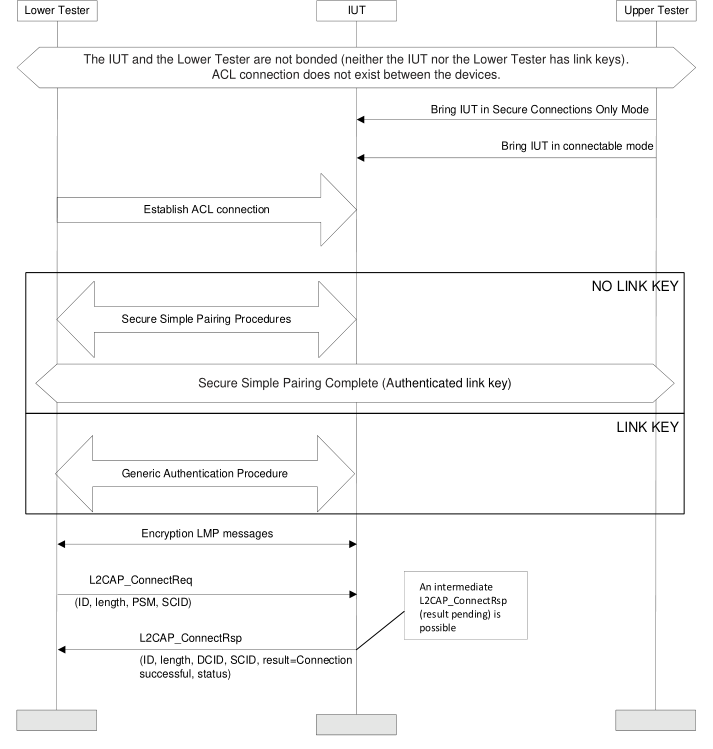

**Figure 4.28: Secure Connections Only Mode BR/EDR Transport – IUT Peripheral, responder, Lower Tester supports Secure Connections in Controller and Host MSC**

1. The Upper Tester puts the IUT in Secure Connections Only Mode and connectable mode. 2. The Lower Tester creates an ACL connection with the IUT. 3. If the test requires Secure Simple Pairing, the Lower Tester performs the Secure Simple Pairing
procedure that results in an authenticated link key and enables encryption. 4. The Lower Tester requests establishing a channel to access a service on the IUT that requires
Security Mode-4, Level 3.
• Test Condition
It must be possible to put the IUT in Secure Connections Only Mode and in connectable mode.
• Expected Outcome
Pass verdict
If the test requires the Generic Authentication Procedure, verify that the IUT authenticates the Lower Tester.
The IUT accepts the Lower Tester’s request to establish a channel to access a service on the IUT that requires Security Mode-4, Level 3 and the channel establishment procedure is successful.
• Notes
When in Secure Connections Only mode, all services (except those allowed to have Security Mode-4, Level 0) require Security Mode-4, Level 4.

##### 4.5.1.4 IUT Peripheral, responder, not in Secure Connections Only Mode BR/EDR

Transport, Lower Tester does not support Secure Connections in Host
• Test Purpose
The Lower Tester does not support Secure Connections at the Host level. Verify that the IUT that is not in Secure Connections Only Mode accepts a request to perform a channel establishment procedure over the BR/EDR transport if the service on the IUT requires Security Mode-4, Level 3. The IUT is Peripheral and responder of the channel establishment procedure.
• Reference
[1] 5.2.2
• Initial Condition
- The PSM for the service on the IUT that requires Security Mode-4, Level 3 is specified in the IXIT.
- On the Lower Tester, set the Secure Connections (Host Support) LMP feature bit to 0 and the Secure Connections (Controller Support) LMP feature bit to 1.
- The IUT and the Lower Tester are bonded as specified in Table 4.5.
- ACL connection does not exist between the devices.
• Test Case Configuration

|  | Test Case |  |  | Link Keys |  |  | Pairing/Authentication |  |
| --- | --- | --- | --- | --- | --- | --- | --- | --- |
| GAP/SEC/SEM/BV-14-C |  |  | Not Bonded, No Link Keys |  |  | Secure Simple Pairing |  |  |
| GAP/SEC/SEM/BV-48-C |  |  | Bonded, Has Link Keys |  |  | Generic Authentication Procedure |  |  |

Table 4.5: IUT Peripheral, responder, not in Secure Connections Only Mode, Lower Tester does not support Secure Connections in Host test cases
• Test Procedure

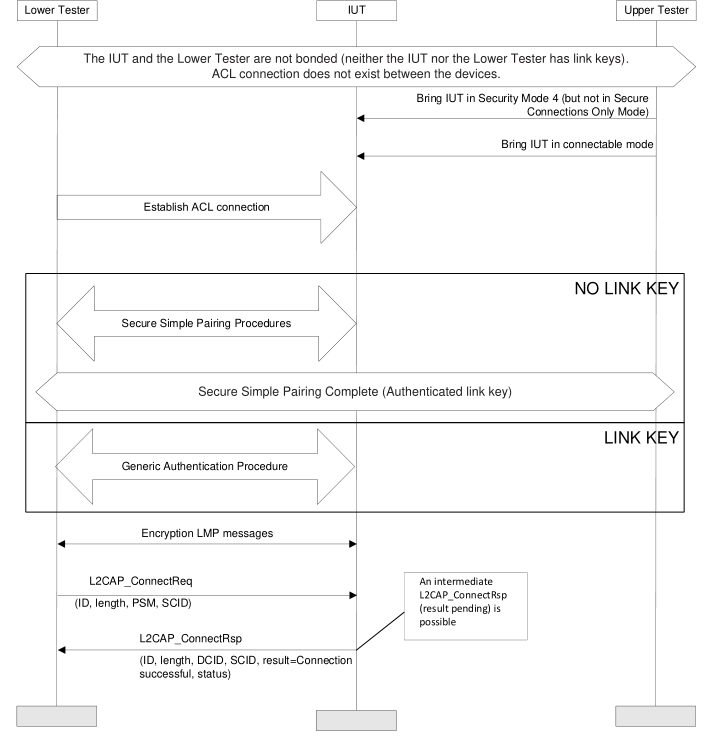

**Figure 4.29: IUT Peripheral, responder, not in Secure Connections Only Mode BR/EDR Transport, Lower Tester does not support Secure Connections in Host MSC**

1. The Upper Tester puts the IUT in Security Mode-4 (but not in Secure Connections Only Mode)
and connectable mode. 2. The Lower Tester creates an ACL connection with the IUT. 3. If the test requires Secure Simple Pairing, the Lower Tester performs the Secure Simple Pairing
procedure that results in an authenticated link key and enables encryption. 4. The Lower Tester requests establishing a channel to access a service on the IUT that requires
Security Mode-4, Level 3.
• Test Condition
It must be possible to put the IUT in Security Mode-4 (but not in Secure Connections Only Mode) and in connectable mode.
• Expected Outcome
Pass verdict
If the test requires the Generic Authentication Procedure, verify that the IUT authenticates the Lower Tester.
The IUT accepts the Lower Tester’s request to establish a channel to access a service on the IUT that requires Security Mode-4, Level 3 and the channel establishment procedure is successful.

##### 4.5.1.5 IUT Peripheral, responder, not in Secure Connections Only Mode BR/EDR

Transport, Lower Tester does not support Secure Connections in Host, level 4 service
• Test Purpose
The Lower Tester does not support Secure Connections at the Host level. Verify that the IUT that is not in Secure Connections Only Mode rejects a request to perform a channel establishment procedure over the BR/EDR transport if the service on the IUT requires Security Mode-4, Level 4. The IUT is Peripheral and responder of the channel establishment procedure.
• Reference
[1] 5.2.2
• Initial Condition
- The PSM for the service on the IUT that requires Security Mode-4, Level 4 is specified in the IXIT.
- On the Lower Tester, set the Secure Connections (Host Support) LMP feature bit to 0 and the Secure Connections (Controller Support) LMP feature bit to 1.
- IUT and Lower Tester are bonded as specified in Table 4.6.
- ACL connection does not exist between the devices.
• Test Case Configuration

|  | Test Case |  |  | Link Keys |  |  | Pairing/Authentication |  |
| --- | --- | --- | --- | --- | --- | --- | --- | --- |
| GAP/SEC/SEM/BV-15-C |  |  | Not Bonded, No Link Keys |  |  | Secure Simple Pairing |  |  |
| GAP/SEC/SEM/BV-49-C |  |  | Bonded, Has Link Keys |  |  | Generic Authentication Procedure |  |  |

Table 4.6: IUT Peripheral, responder, not in Secure Connections Only Mode, Lower Tester does not support Secure Connections in Host, level 4 service test cases
• Test Procedure

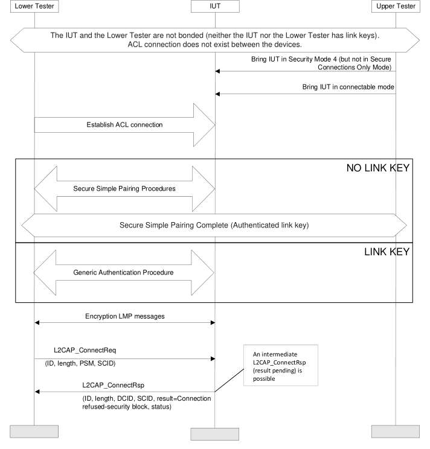

**Figure 4.30: IUT Peripheral, responder, not in Secure Connections Only Mode BR/EDR Transport, Lower Tester does not support Secure Connections in Host, level 4 service MSC**

1. The Upper Tester puts the IUT in Security Mode-4 (but not in Secure Connections Only Mode)
and connectable mode. 2. The Lower Tester creates an ACL connection with the IUT. 3. The Lower Tester performs the Secure Simple Pairing procedure that results an authenticated
link key and enables encryption. 4. The Lower Tester requests establishing a channel to access a service on the IUT that requires
Security Mode-4, Level 4.
• Test Condition
It must be possible to put the IUT in Security Mode-4 (but not in Secure Connections Only Mode) and in connectable mode.
• Expected Outcome
Pass verdict
If the test requires Secure Simple Pairing, the Secure Simple Pairing procedure between the IUT and the Lower Tester is successful.
If the test requires the Generic Authentication Procedure, verify that the IUT authenticates the Lower Tester.
The IUT rejects the Lower Tester’s request to establish a channel to access a service on the IUT that requires Security Mode-4, Level 4.

#### 4.5.2 LE Security Modes - Peripheral

Verify the correct behavior in LE security modes. The role of the IUT is Peripheral.

##### 4.5.2.1 LE Secure Connections Only, Peripheral – outgoing service level connection

• Test Purpose
Verify that the IUT, supporting LE Secure Connections only, performing the authentication procedure will achieve a connection operating in the correct security mode and level. The Lower Tester supports LE Secure Connections. The IUT is the Peripheral.
• Reference
[12] 10.3
• Initial Condition
- The IUT supports LE Secure Connections. The IUT is in Link Layer Standby state. The IUT has to be configured such that it will not reject the initiated procedure.
- The Lower Tester will establish a GATT service request when TSPX_Use_GATT is set to TRUE and will use the GATT Service and Characteristic from the IXIT to achieve the test purpose.
• Test Case Configuration

|  | TCID |  |  | Security Mode and Level |  |
| --- | --- | --- | --- | --- | --- |
| GAP/SEC/SEM/BV-21-C [LE Security Mode: Mode-1 Level 4, Peripheral – outgoing service level connection] |  |  | LE Security Mode-1 Level 4 |  |  |
| GAP/SEC/SEM/BV-37-C [LE Secure Connections Only: Mode-1 Level 2, Peripheral – outgoing service level connection] |  |  | LE Security Mode-1 Level 2 |  |  |
| GAP/SEC/SEM/BV-38-C [LE Secure Connections Only: Mode-1 Level 3, Peripheral – outgoing service level connection] |  |  | LE Security Mode-1 Level 3 |  |  |

Table 4.7: LE Secure Connections Only, Peripheral – outgoing service level connection test cases
• Test Procedure
1. The Upper Tester configures the IUT into the security mode and level specified in Table 4.7. 2. The Upper Tester configures the IUT to advertise (in Peripheral role) for a connection by the
Lower Tester (in Central role), and accept link establishment. 3. The Upper Tester triggers the authentication procedure on the IUT, e.g., by an L2CAP channel
establishment or a GATT service request. 4. The IUT begins LE Secure Connections Phase 1 by sending an SMP Security Request, with the
Secure Connections bit set to 1. The Lower Tester responds with an SMP Pairing Request, with the Secure Connections bit set to 1. The IUT answers with SMP Pairing Response, with the Secure Connections bit set to 1. 5. The Lower Tester and the IUT complete SMP Phase 2 (pairing) and Phase 3 (encryption and key
distribution). 6. The IUT replies with a successful response.

| Lower Tester IUT Upper Tester (Central) (Peripheral) Lower Tester finds IUT Establishes LE connection ALT 1 GATT service request ALT 2 L2CAP channel establishment Authentication Req SMP Security Req. AuthReq.SC=1 LE Secure Connections SMP Pairing Req. Phase 1 AuthReq.SC=1 SMP Pairing Resp. AuthReq.SC=1 LE Secure Connections Phase 2: Public Key Exchange Authentication Stages 1 & 2 LE transport encryption LE Secure Connections Phase 3: Key distribution ALT 1 GATT service request ALT 2 L2CAP channel establishment ALT 1 GATT service request GATT service request success success ALT 2 L2CAP channel L2CAP channel establishment success establishment success Connection Authenticated |  |  |  |  |  |  |  | Upper Tester |
| --- | --- | --- | --- | --- | --- | --- | --- | --- |
|  | LE |  |  | Secure Connections Pha Key distribution |  |  | se 3: |  |
|  |  |  |  |  |  |  |  |  |
| ALT 1 ALT 2 ALT 1 ALT 2 |  |  |  | GATT service reques L2CAP channel establishment GATT service request |  |  |  |  |
|  |  |  |  | success L2CAP channel establishment success |  |  |  |  |
|  |  |  |  |  |  |  |  |  |

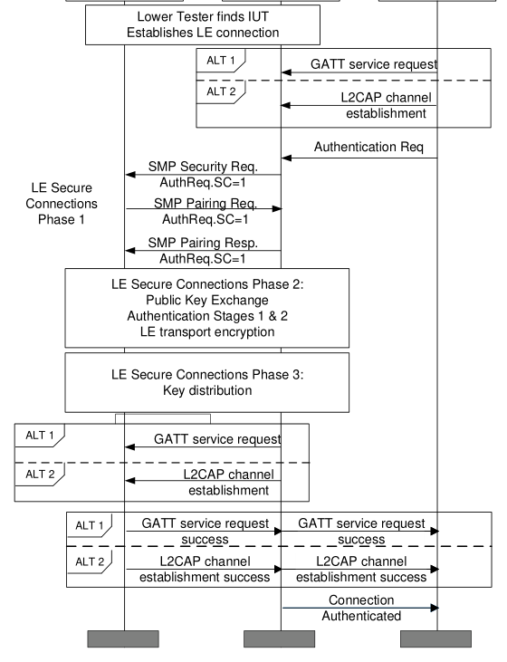

**Figure 4.31: LE Secure Connections Only, Peripheral – outgoing service level connection MSC**

• Expected Outcome
Pass verdict
The Lower Tester and the IUT complete SMP phases 1, 2, and 3. The resulting connection is encrypted and operating in the security mode and level specified in Table 4.7.
• Notes
It is recommended to test with a service or profile that requires the mode and level specified by Table 4.7.

##### 4.5.2.2 LE Secure Connections Only, Peripheral – incoming service level connection

• Test Purpose
Verify that the IUT, supporting LE Secure Connections only, after performing the authentication procedure will achieve an incoming service level connection operating in the correct security mode and level. The Lower Tester supports LE Secure Connections. The IUT is the Peripheral.
• Reference
[12] 10.3.1
• Initial Condition
- The IUT supports LE Secure Connections. The IUT is in Link Layer Standby state. The IUT has to be configured such that it will not reject the initiated procedure.
- The Lower Tester will establish a GATT service request when TSPX_Use_GATT is set to TRUE and will use the GATT Service and Characteristic from the IXIT to achieve the test purpose.
• Test Case Configuration

|  | TCID |  |  | Security Mode and Level |  |
| --- | --- | --- | --- | --- | --- |
| GAP/SEC/SEM/BV-22-C [LE Security Mode: Mode-1 Level 4, Peripheral – incoming service level connection] |  |  | LE Security Mode-1 Level 4 |  |  |
| GAP/SEC/SEM/BV-39-C [LE Secure Connections Only: Mode-1 Level 2, Peripheral – incoming service level connection] |  |  | LE Security Mode-1 Level 2 |  |  |
| GAP/SEC/SEM/BV-40-C [LE Secure Connections Only: Mode-1 Level 3, Peripheral – incoming service level connection] |  |  | LE Security Mode-1 Level 3 |  |  |

Table 4.8: LE Secure Connections Only, Peripheral – incoming service level connection test cases
• Test Procedure
1. The Upper Tester configures the IUT into the security mode and level specified in Table 4.8. 2. The Upper Tester configures the IUT to advertise (in Peripheral role) for a connection by the
Lower Tester (in Central role), and accept link establishment. 3. The Lower Tester initiates LE Secure Connections pairing according to the security mode and
level specified in Table 4.8. 4. The Lower Tester and the IUT complete SMP Phase 1, Phase 2 (pairing), and Phase 3
(encryption and key distribution). 5. The Lower Tester sends either an L2CAP channel establishment or GATT service request to the
IUT. 6. The IUT replies with a successful response.

| Lower Tester IUT Upper Tester Lower Tester finds IUT Establishes LE connection Secure SMP Pairing Req. nections AuthReq.SC=1 ase 1 SMP Pairing Resp. AuthReq.SC=1 LE Secure Connections Phase 2: Public Key Exchange Authentication Stages 1 & 2 LE transport encryption LE Secure Connections Phase 3: Key distribution ALT 1 GATT Service Request Success GATT Service Request success ALT 2 L2CAP channel establishment Success L2CAP channel establishment success | Upper Tester |  |  |
| --- | --- | --- | --- |
|  |  |  |  |
|  |  |  |  |

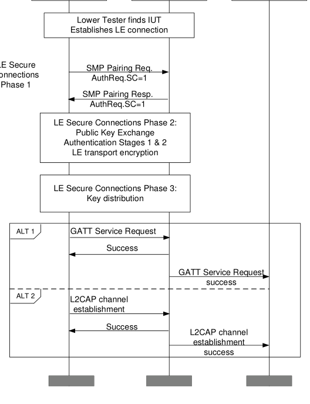

**Figure 4.32: LE Secure Connections Only, Peripheral – incoming service level connection MSC**

• Expected Outcome
Pass verdict
The Lower Tester and the IUT complete SMP phases 1, 2, and 3. The resulting connection is encrypted on the security mode and level specified in Table 4.8.
The initiated procedure is successful.
• Notes
It is recommended to test with a service or profile that requires the mode and level specified by Table 4.8.
GAP/SEC/SEM/BV-23-C [Secure Connections Only Mode LE Transport – Failed Procedure, Peripheral – outgoing service level connection]
• Test Purpose
Verify that the IUT in Secure Connections Only Mode or that supports Unauthenticated Pairing with LE Secure Connections only or Authenticated Pairing with LE Secure Connections only initiating the authentication procedure will result in a failed procedure when performed toward a peer not supporting LE Secure Connections. The Lower Tester does not support LE Secure Connections. The IUT is the Peripheral.
• Reference
[12] 10.2.4, 10.3
• Initial Condition
- The IUT supports LE Secure Connections. The IUT is in Link Layer Standby state. The IUT has to be configured such that it will not reject the initiated procedure.
- The Lower Tester is configured so that it does not support LE Secure Connections.
- The Lower Tester will establish a GATT service request when TSPX_Use_GATT is set to TRUE and will use the GATT Service and Characteristic from the IXIT to achieve the test purpose.
• Test Procedure
1. The Upper Tester configures the IUT into Secure Connections Only Mode or to only support LE
Secure Connections. 2. The Upper Tester configures the IUT (in Peripheral role) to send advertising packets to the Lower
Tester (in Central role), and complete link establishment with the Lower Tester. 3. The Upper Tester triggers the authentication procedure on the IUT, e.g., by an L2CAP channel
establishment or a GATT service request. 4. The IUT begins the LE Pairing Procedure Phase 1 by sending an SMP Security Request, with the
Secure Connections bit set to 1. 5. The Lower Tester responds with an SMP Pairing Request, with the Secure Connections bit set
to 0. 6. Alternative 1: (for Security Mode-1 Level 4 connections):
a. The IUT responds with an SMP Pairing Failed message. 7. Alternative 2: (for Security Mode-1 Level 2 or 3 with Secure Connections):
a. The IUT responds with an SMP Pairing Response. b. The IUT and the Lower Tester complete the LE Legacy Pairing procedure. c. The IUT responds with a failure message.

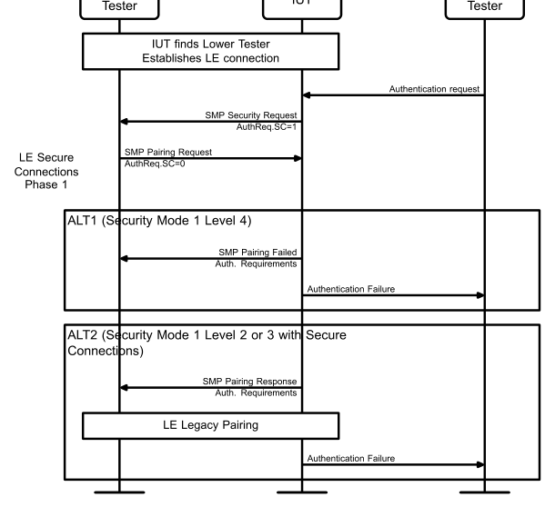

**Figure 4.33: GAP/SEC/SEM/BV-23-C [Secure Connections Only Mode LE Transport – Failed Procedure, Peripheral – outgoing service level connection] MSC**

• Expected Outcome
Pass verdict
In ALT 1, the IUT sends an SMP Pairing Failed message to the Lower Tester to end SMP Pairing Phase 1.
In ALT 2, the IUT does not complete the L2CAP Channel establishment or GATT service request.
GAP/SEC/SEM/BV-24-C [Secure Connections Only Mode LE Transport – Failed Procedure, Peripheral – incoming service level connection]
• Test Purpose
Verify that the IUT in Secure Connections Only Mode or that supports Unauthenticated Pairing with LE Secure Connections only or Authenticated Pairing with LE Secure Connections only rejects an L2CAP channel establishment or GATT service request both before and after the authentication procedure when performed toward a peer not supporting LE Secure Connections. The Lower Tester does not support LE Secure Connections. The IUT is the Peripheral.
• Reference
[12] 10.2.4, 10.3.1
• Initial Condition
- The IUT supports LE Secure Connections. The IUT is in Link Layer Standby state. The IUT has to be configured such that it will not reject a correctly initiated procedure to either establish an L2CAP channel or a GATT service request.
- The Lower Tester will establish a GATT service request when TSPX_Use_GATT is set to TRUE and will use the GATT Service and Characteristic from the IXIT to achieve the test purpose.
• Test Procedure
1. The Upper Tester configures the IUT into Secure Connections Only Mode or to only support LE
Secure Connections. 2. The Upper Tester configures the IUT (in Peripheral role) to send advertising packets to the Lower
Tester (in Central role), and complete link establishment with the Lower Tester. 3. The Lower Tester initiates either an L2CAP channel establishment or GATT service request to
the IUT. 4. The IUT rejects the request. 5. The Lower Tester initiates authenticated LE Legacy pairing. 6. Alternative 1: the IUT rejects the pairing by sending an SMP Pairing Failed message.
Alternative 2: the Lower Tester and the IUT complete LE legacy pairing. The Lower Tester re- initiates the procedure request to the IUT as attempted in step 3. The IUT rejects the request.

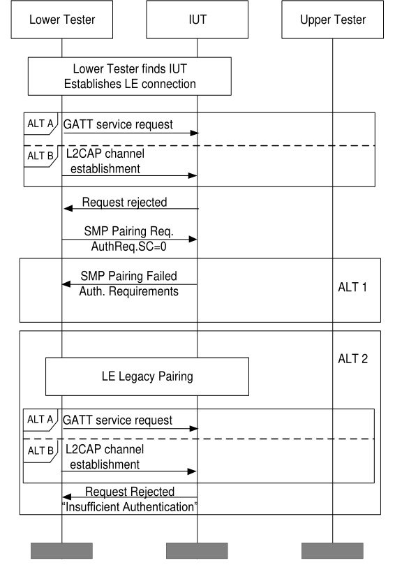

**Figure 4.34: GAP/SEC/SEM/BV-24-C [Secure Connections Only Mode LE Transport – Failed Procedure, Peripheral – incoming service level connection] MSC**

• Expected Outcome
Pass verdict
The L2CAP channel establishment or GATT service request is rejected before the authentication procedure.
Alternative 1: IUT sends an SMP Pairing Failed message to the Lower Tester to end SMP Pairing Phase 1.
Alternative 2: The IUT and the Lower Tester complete LE legacy pairing and the IUT rejects the initiated procedure request from the Lower Tester with the error code “Insufficient Authentication”.
GAP/SEC/SEM/BV-25-C [Secure Connections Only Mode LE Transport, Peripheral, Failure, BR/EDR and LE Transports]
• Test Purpose
Verify that the IUT in Secure Connections Only Mode performs either an L2CAP channel establishment or GATT service request procedure over LE and a channel establishment procedure over BR/EDR. The IUT is initiator of the procedure over both LE and BR/EDR. The Lower Tester supports neither LE Secure Connections nor BR/EDR Secure Connections. The procedure fails over both LE and BR/EDR. The IUT is the Peripheral.
• Reference
[12] 10.2.4
• Initial Condition
- The IUT supports both LE Secure Connections and BR/EDR Secure Connections. The IUT is in Link Layer Standby state. The IUT has to be configured such that it will not reject the initiated procedure.
- The Lower Tester is configured so that it does not support LE Secure Connections and BR/EDR Secure Connections.
- The PSM for the service on the IUT that requires Security Mode-4, Level 3 on BR/EDR is specified in the IXIT.
- IUT and Lower Tester are not bonded on BR/EDR (Neither IUT nor Lower Tester has link keys).
- BR/EDR ACL connection does not exist between the devices.
• Test Procedure
1. The Upper Tester configures the IUT into Secure Connections Only Mode. 2. The Upper Tester configures the IUT (in Peripheral role) to send advertising packets to the Lower
Tester (in Central role), and complete link establishment with the Lower Tester. 3. The IUT begins the LE Pairing Procedure Phase 1 by sending an SMP Security Request, with the
Secure Connections bit set to 1. The Lower Tester responds with an SMP Pairing Request, with the Secure Connections bit set to 0. The IUT will respond with an SMP Pairing Failed message. 4. The IUT terminates the LE connection. 5. The Upper Tester requests the IUT to establish a channel to access a service on the Lower
Tester. The service requires Security Mode-4, Level 3 on the IUT. 6. The IUT creates an ACL connection with the Lower Tester and may optionally perform the Secure
Simple Pairing procedure with the Lower Tester.
Upper Tester IUT (initiator) Lower Tester
(responder)

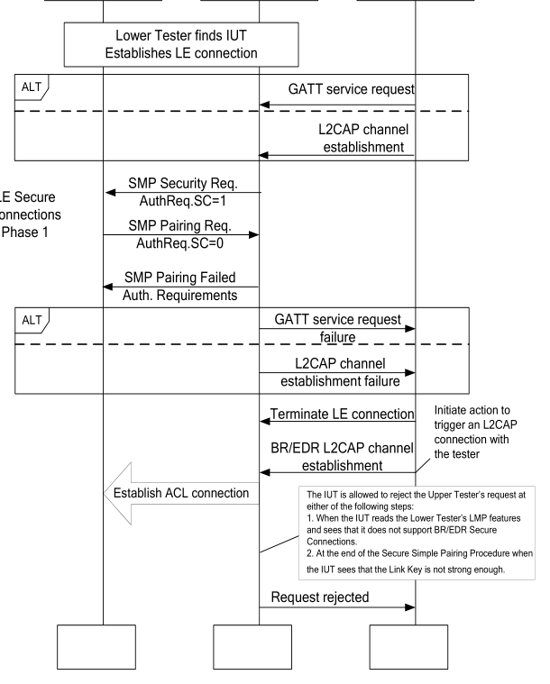

**Figure 4.35: GAP/SEC/SEM/BV-25-C [Secure Connections Only Mode LE Transport, Peripheral, Failure, BR/EDR and LE Transports] MSC**

• Expected Outcome
Pass verdict
On the LE transport, the IUT sends an SMP Pairing Failed message to the Lower Tester to end SMP Pairing Phase 1.
On the BR/EDR transport, the IUT rejects the Upper Tester’s request to establish a channel to access the service on the Lower Tester when the service requires Security Mode-4, Level 3 on the IUT.

##### 4.5.2.3 LE Security Mode-1, Peripheral - Invalid Encryption Key Size

• Test Purpose
Verify that the IUT in LE Security Mode-1 as Peripheral fails pairing when receiving an invalid key size.
• Reference
[12] 10.3.2, 10.2.1
• Initial Condition
- The IUT is in Link Layer Standby state. The IUT has to be configured such that it will not reject the initiated procedure.
• Test Case Configuration

|  | TCID |  | Security Mode and Level |  |
| --- | --- | --- | --- | --- |
| GAP/SEC/SEM/BI-09-C [LE Security Mode-1 Level 4, Peripheral - Invalid Encryption Key Size] |  | Security Mode-1 Level 4 |  |  |
| GAP/SEC/SEM/BI-20-C [Security Mode-1 Level 3, Peripheral - Invalid Encryption Key Size] |  | Security Mode-1 Level 3 with LE Secure Connections Pairing only |  |  |
| GAP/SEC/SEM/BI-21-C [Security Mode-1 Level 2, Peripheral - Invalid Encryption Key Size] |  | Security Mode-1 Level 2 with LE Secure Connections Pairing only |  |  |

Table 4.9: LE Security Mode-1, Peripheral - Invalid Encryption Key Size test cases
• Test Procedure

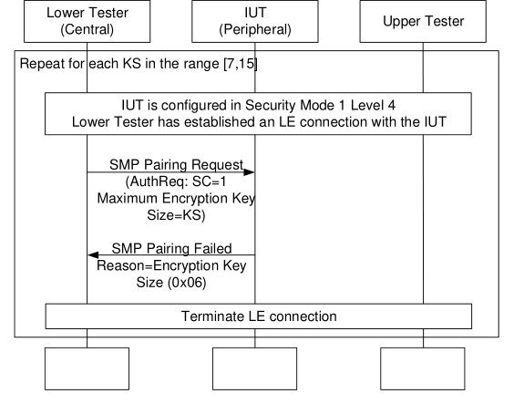

**Figure 4.36: LE Security Mode-1, Peripheral - Invalid Encryption Key Size MSC**

Repeat steps 1–5 for all values of the Maximum Encryption Key Size field (in step 3) in the interval [7, 15].
1. The Upper Tester configures the IUT into Security Mode and Level specified in Table 4.9. 2. The Upper Tester configures the IUT to advertise (in Peripheral role) for a connection by the
Lower Tester (in Central role), and to accept link establishment. 3. The Lower Tester initiates pairing by sending an SMP Pairing Request, with the Secure
Connections bit set to 1 and Maximum Encryption Key Size set to the value selected for this iteration. 4. The IUT sends to the Lower Tester an SMP Pairing Failed with the Reason set to “Encryption Key
Size” (0x06). 5. The Lower Tester terminates the LE connection.
• Expected Outcome
Pass verdict
The IUT fails pairing for any key size value less than 16 while in the specified Security Mode and Level.

#### 4.5.3 BR/EDR Security Modes - Central

Verify the correct behavior in BR/EDR security modes. The role of the IUT is Central and initiator.

##### 4.5.3.1 Security Mode-4 – Unauthenticated Link Key –- Initiator

• Test Purpose
Verify that the IUT in security Mode-4 performs a channel establishment procedure. The Lower Tester is responder. The IUT is initiator of the channel establishment procedure.
• Reference
[16] 5.2.2
• Initial Condition
- Write_Authentication_Enable (disabled) on IUT.
- Write_Simple_Pairing_Mode is set (enabled) on the Lower Tester acting as responder.
- The IUT has link keys as specified in Table 4.10.
• Test Case Configuration

|  | Test Case |  |  | Link Keys |  |  | Pairing/Authentication |  |
| --- | --- | --- | --- | --- | --- | --- | --- | --- |
| GAP/SEC/SEM/BV-05-C |  |  | Not Bonded, No Link Keys |  |  | Secure Simple Pairing |  |  |
| GAP/SEC/SEM/BV-50-C |  |  | Bonded, Has Link Keys |  |  | Generic Authentication Procedure |  |  |

Table 4.10: Security Mode-4 – Unauthenticated Link Key – Initiator test cases
• Test Procedure

**Figure 4.37: Security Mode-4 – Unauthenticated Link Key – Initiator MSC**

1. The IUT creates an L2CAP connection to the Lower Tester. 2. Set Authentication Requirements to MITM protection not required and no bonding on IUT. 3. Set Authentication Requirements to MITM protection not required and no bonding on responder.
• Expected Outcome
Pass verdict
Verify that secure simple pairing occurs prior to sending the L2CAP_ConnectReq and before the L2CAP_ConnectRsp is received, and results in an unauthenticated link key.
If the test requires the Generic Authentication Procedure, verify that the IUT authenticates the Lower Tester.
Verify that encryption is enabled.

##### 4.5.3.2 Security Mode-4 – Authenticated Link Key No MITM – Initiator

• Test Purpose
Verify that secure simple pairing occurs prior to sending the L2CAP_ConnectReq and before the L2CAP_ConnectRsp is received, and results in an authenticated link key.
• Reference
[16] 5.2.2
• Initial Condition
- Write_Authentication_Enable (disabled) on IUT.
- Write_Simple_Pairing_Mode is set (enabled) on the Lower Tester acting as responder.
- The IUT has link keys as specified in Table 4.11.
• Test Case Configuration

|  | Test Case | Link Keys | Pairing/Authentication |  |
| --- | --- | --- | --- | --- |
| GAP/SEC/SEM/BV-06-C |  | Not Bonded, No Link Keys | Secure Simple Pairing |  |
| GAP/SEC/SEM/BV-51-C |  | Bonded, Has Link Keys | Generic Authentication Procedure |  |

Table 4.11: Security Mode-4 – Authenticated Link Key No MITM – Initiator test cases
• Test Procedure

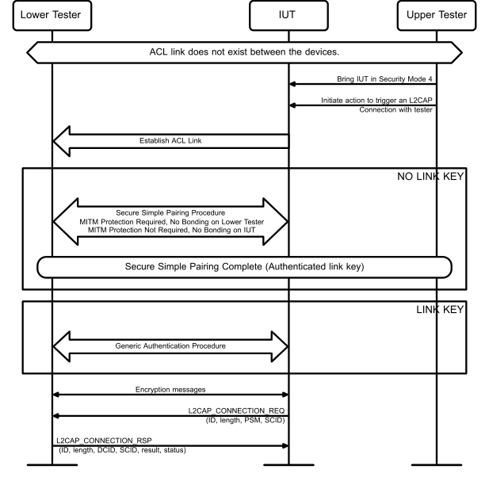

**Figure 4.38: Security Mode-4 – Authenticated Link Key No MITM – Initiator MSC**

1. The IUT creates an L2CAP connection to the Lower Tester. 2. Set Authentication Requirements to MITM protection not required and no bonding on IUT. 3. Set Authentication Requirements to MITM protection required and no bonding on responder.
• Expected Outcome
Pass verdict
If the test requires Secure Simple Pairing, verify that secure simple pairing occurs prior to sending the L2CAP_ConnectReq and before the L2CAP_ConnectRsp is received, and results in an authenticated link key.
If the test requires the Generic Authentication Procedure, verify that the IUT authenticates the Lower Tester.
Verify that encryption is enabled.

##### 4.5.3.3 Security Mode-4 – Authenticated Link Key MITM – Initiator

• Test Purpose
Verify that secure simple pairing occurs before the L2CAP_ConnectReq is sent and results in an authenticated link key.
• Reference
[16] 5.2.2
• Initial Condition
- Write_Authentication_Enable (disabled) on IUT.
- Write_Simple_Pairing_Mode is set (enabled) on the Lower Tester acting as responder.
- The IUT has link keys as specified in Table 4.12.
• Test Case Configuration

|  | Test Case |  |  | Link Keys |  |  | Pairing/Authentication |  |
| --- | --- | --- | --- | --- | --- | --- | --- | --- |
| GAP/SEC/SEM/BV-07-C |  |  | Not Bonded, No Link Keys |  |  | Secure Simple Pairing |  |  |
| GAP/SEC/SEM/BV-52-C |  |  | Bonded, Has Link Keys |  |  | Generic Authentication Procedure |  |  |

Table 4.12: Security Mode-4 – Authenticated Link Key MITM – Initiator test cases
• Test Procedure

**Figure 4.39: Security Mode-4 – Authenticated Link Key MITM – Initiator MSC**

1. The IUT creates an L2CAP connection to the Lower Tester. 2. Set Authentication_Requirements to “MITM Protection Required – No Bonding” (0x01) on IUT. 3. Set Authentication_Requirements to “MITM Protection Not Required – No Bonding” (0x00) on the
Lower Tester.
• Expected Outcome
Pass verdict
If the test requires Secure Simple Pairing, verify that secure simple pairing occurs before the L2CAP_ConnectReq is sent, and results in an authenticated link key.
If the test requires the Generic Authentication Procedure, verify that the IUT authenticates the Lower Tester.
Verify that encryption is enabled.
GAP/SEC/SEM/BV-08-C [Security Mode-4 – Initiator]
• Test Purpose
Verify that authentication succeeds and occurs before the L2CAP Connection request.
• Reference
[16] 5.2.2
• Initial Condition
- Write_Authentication_Enable (disabled) on IUT.
- Write_Simple_Pairing_Mode is set (enabled).
- Link key is on IUT and responder.
• Test Procedure

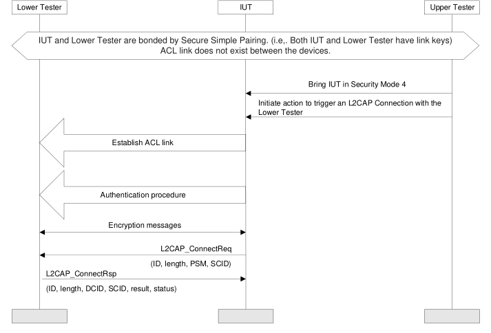

**Figure 4.40: GAP/SEC/SEM/BV-08-C [Security Mode-4 – Initiator] MSC**

The IUT creates L2CAP connection to the Lower Tester.
• Expected Outcome
Pass verdict
Verify that authentication succeeds and occurs before the L2CAP_ConnectReq.
Verify that encryption is enabled.

##### 4.5.3.4 Security Mode-4 – Link Key Upgrade – Initiator

• Test Purpose
Verify that a link key can be upgraded from unauthenticated to authenticated.
• Reference
[16] 5.2.2
• Initial Condition
- Write_Authentication_Enable (disabled) on IUT.
- Write_Simple_Pairing_Mode is set (enabled) on the Lower Tester acting as responder.
- The IUT has link keys as specified in Table 4.13.
• Test Case Configuration

|  | Test Case Link | Keys Pairing/Authentication |  |
| --- | --- | --- | --- |
| GAP/SEC/SEM/BV-09-C Not B |  | onded, No Link Keys Secure Simple Pairing |  |
| GAP/SEC/SEM/BV-53-C Bond |  | ed, Has Link Keys Generic Authentication Procedure |  |

Table 4.13: Security Mode-4 – Link Key Upgrade – Initiator test cases
• Test Procedure

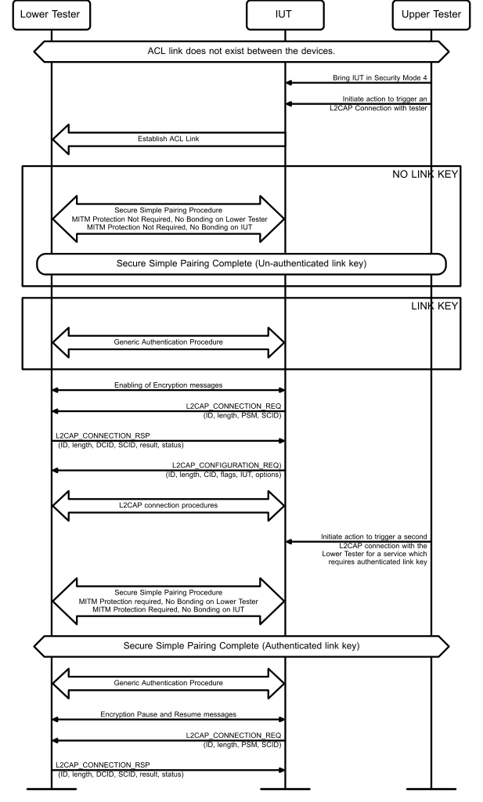

**Figure 4.41: Security Mode-4 – Link Key Upgrade – Initiator MSC**

1. The IUT creates an L2CAP connection to the Lower Tester. 2. Set Authentication_Requirements to “MITM Protection Not Required – No Bonding” (0x00) on the
IUT. 3. Set Authentication_Requirements to “MITM Protection Not Required - No Bonding” (0x00) on the
responder. 4. The IUT initializes a second service to the Lower Tester that requires an authenticated link key. 5. Set Authentication_Requirements to “MITM Protection Required – No Bonding” (0x01) on the
IUT. 6. Set Authentication_Requirements to “MITM Protection Required - No Bonding” (0x01) on the
responder.
• Expected Outcome
Pass verdict
On initial connection, verify that secure simple pairing occurs prior to sending the L2CAP_ConnectReq and before the L2CAP_ConnectRsp is received, and results in an unauthenticated link key.
Verify that the IUT authenticates the Lower Tester.
Verify that encryption is enabled.
On second service initialization, if the test requires Secure Simple Pairing, verify that Secure Simple Pairing occurs before the L2CAP_ConnectReq and results in an authenticated link key.
On second service initialization, if the test requires the Generic Authentication Procedure, verify that the IUT authenticates the Lower Tester.

##### 4.5.3.5 Security Mode-4 – Responder

• Test Purpose
Verify that the IUT fails and disconnects the connection if the initiating side sends the L2CAP Connection Request as specified in Table 4.14 without first enabling encryption.
• Reference
[20] 5.2.2
• Initial Condition
- Write_Authentication_Enable (disabled) on IUT.
- Write_Simple_Pairing_Mode is set (enabled) on the Lower Tester acting as responder.
- No link key is on IUT.
• Test Case Configuration

| Test Case ID | L2CAP Command | L2CAP Response |  | Response |  |
| --- | --- | --- | --- | --- | --- |
|  |  |  |  | Result Code |  |
| GAP/SEC/SEM/BV-10-C | L2CAP CONNECTION REQ _ _ | L2CAP CONNECTION RSP _ _ | 0x0003 |  |  |
| GAP/SEC/SEM/BV-46-C | L2CAP CREDIT BASED _ _ _ CONNECTION REQ _ | L2CAP CREDIT BASED _ _ _ CONNECTION RSP _ | 0x0005, 0x0006, 0x0007, 0x0008 |  |  |

Table 4.14: Security Mode-4 – Responder test cases
• Test Procedure

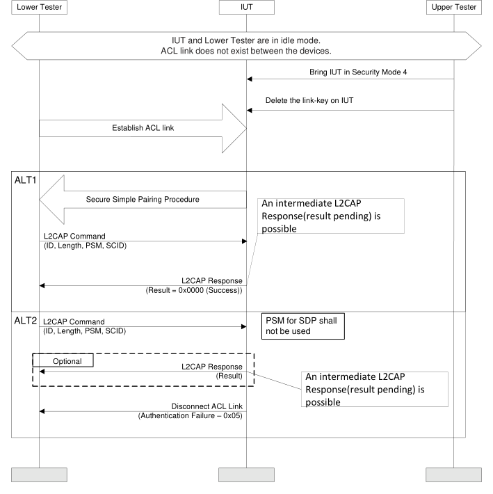

**Figure 4.42: Security Mode-4 – Responder MSC**

1. The Lower Tester creates L2CAP connection to the IUT. 2. Set Authentication_Requirements to “MITM Protection Not Required No Bonding” (0x00) on the
IUT. 3. Set Authentication_Requirements to “MITM Protection Not Required No Bonding” (0x00) on the
responder. 4. The Lower Tester sends the L2CAP command in Table 4.14 without performing Secure Simple
Pairing and without enabling encrypting.
• Expected Outcome
Pass verdict
Based on ALT 1 shown in Figure 4.42: Security Mode-4 – Responder the test results in pass when the IUT initiates the Secure Simple Pairing procedure autonomously before the Lower Tester initiates the L2CAP connection. Verify that the IUT authenticates the Lower Tester.
Based on ALT 2 shown in Figure 4.42: Security Mode-4 – Responder the test will result in pass when the IUT rejects the L2CAP connection with the L2CAP Response containing a result code in Table 4.14 and disconnects the ACL link with error code authentication failure 0x05.
GAP/SEC/SEM/BV-16-C [Secure Connections Only Mode – IUT Central, initiator, Lower Tester doesn’t support Secure Connections in Controller]
• Test Purpose
The Lower Tester doesn’t support Secure Connections at the Controller level. Verify that the IUT in Secure Connections Only Mode rejects a request to perform a channel establishment procedure if the service requires Security Mode-4, Level 3 on the IUT. The IUT is Central and initiator of the channel establishment procedure.
• Reference
[1] 5.2.2
• Initial Condition
- The PSM for the service that requires Security Mode-4, Level 3 on the IUT is specified in the IXIT.
- Set the Secure Connections (Controller Support) LMP feature bit on the Lower Tester to 0.
- The IUT and the Lower Tester are not bonded (Neither the IUT nor Lower Tester has link keys).
- ACL connection does not exist between the devices.
• Test Procedure

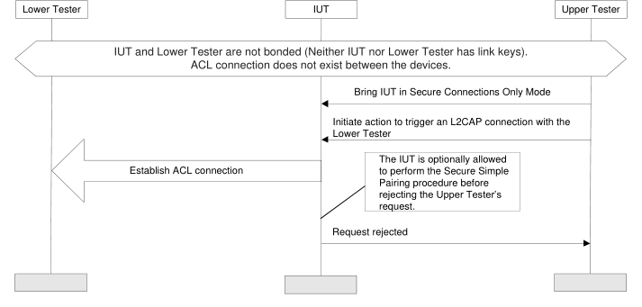

**Figure 4.43: GAP/SEC/SEM/BV-16-C [Secure Connections Only Mode – IUT Central, initiator, Lower Tester doesn’t support Secure Connections in Controller] MSC**

1. The Upper Tester puts the IUT in Secure Connections Only Mode. 2. The Upper Tester requests the IUT to establish a channel to access a service on the Lower
Tester. The service requires Security Mode-4, Level 3 on the IUT. 3. The IUT creates an ACL connection with the Lower Tester and may optionally perform the Secure
Simple Pairing procedure with the Lower Tester.
• Test Condition
It must be possible to put the IUT in Secure Connections Only Mode.
• Expected Outcome
Pass verdict
The IUT rejects the Upper Tester’s request to establish a channel to access the service on the Lower Tester when the service requires Security Mode-4, Level 3 on the IUT.
• Notes
When in Secure Connections Only mode, all services (except those allowed to have Security Mode-4, Level 0) require Security Mode-4, Level 4.
GAP/SEC/SEM/BV-17-C [Secure Connections Only Mode – IUT Central, initiator, Lower Tester doesn’t support Secure Connections in Host]
• Test Purpose
The Lower Tester doesn’t support Secure Connections at the Host level. Verify that the IUT in Secure Connections Only Mode rejects a request to perform a channel establishment procedure if the service requires Security Mode-4, Level 3 on the IUT. The IUT is Central and initiator of the channel establishment procedure.
• Reference
[1] 5.2.2
• Initial Condition
- The PSM for the service that requires Security Mode-4, Level 3 on the IUT is specified in the IXIT.
- On the Lower Tester, set the Secure Connections (Host Support) LMP feature bit to 0 and the Secure Connections (Controller Support) LMP feature bit to 1.
- IUT and Lower Tester are not bonded (Neither IUT nor Lower Tester has link keys).
- ACL connection does not exist between the devices.
• Test Procedure

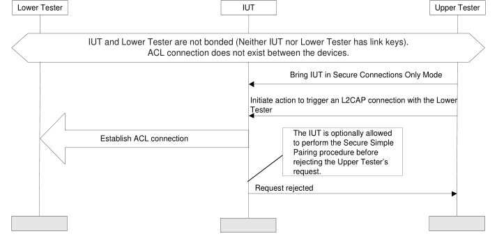

**Figure 4.44: GAP/SEC/SEM/BV-17-C [Secure Connections Only Mode – IUT Central, initiator, Lower Tester doesn’t support Secure Connections in Host] MSC**

1. The Upper Tester puts the IUT in Secure Connections Only Mode. 2. The Upper Tester requests the IUT to establish a channel to access a service on the Lower
Tester. The service requires Security Mode-4, Level 3 on the IUT. 3. The IUT creates an ACL connection with the Lower Tester and may optionally perform the Secure
Simple Pairing procedure with the Lower Tester.
• Test Condition
It must be possible to put the IUT in Secure Connections Only Mode.
• Expected Outcome
Pass verdict
The IUT rejects the Upper Tester’s request to establish a channel to access the service on the Lower Tester when the service requires Security Mode-4, Level 3 on the IUT.
• Notes
When in Secure Connections Only mode, all services (except those allowed to have Security Mode-4, Level 0) require Security Mode-4, Level 4.

##### 4.5.3.6 Secure Connections Only Mode BR/EDR Transport – IUT Central, initiator, Lower

Tester supports Secure Connections in Controller and Host
• Test Purpose
The Lower Tester supports Secure Connections both at the Controller and Host level. Verify that the IUT in Secure Connections Only Mode accepts a request to perform a channel establishment procedure over the BR/EDR transport if the service requires Security Mode-4, Level 3 on the IUT. The IUT is Central and initiator of the channel establishment procedure.
• Reference
[1] 5.2.2
• Initial Condition
- The PSM for the service that requires Security Mode-4, Level 3 on the IUT is specified in the IXIT.
- Set both the Secure Connections (Controller Support) and the Secure Connections (Host Support) LMP feature bits on the Lower Tester to 1.
- The IUT and the Lower Tester are bonded as specified in Table 4.15.
- ACL connection does not exist between the devices.
• Test Case Configuration

|  | Test Case |  |  | Link Keys |  |  | Pairing/Authentication |  |
| --- | --- | --- | --- | --- | --- | --- | --- | --- |
| GAP/SEC/SEM/BV-18-C |  |  | Not Bonded, No Link Keys |  |  | Secure Simple Pairing |  |  |
| GAP/SEC/SEM/BV-54-C |  |  | Bonded, Has Link Keys |  |  | Generic Authentication Procedure |  |  |

Table 4.15: Secure Connections Only Mode BR/EDR Transport – IUT Central, initiator, Lower Tester supports Secure Connections in Controller and Host test cases
• Test Procedure

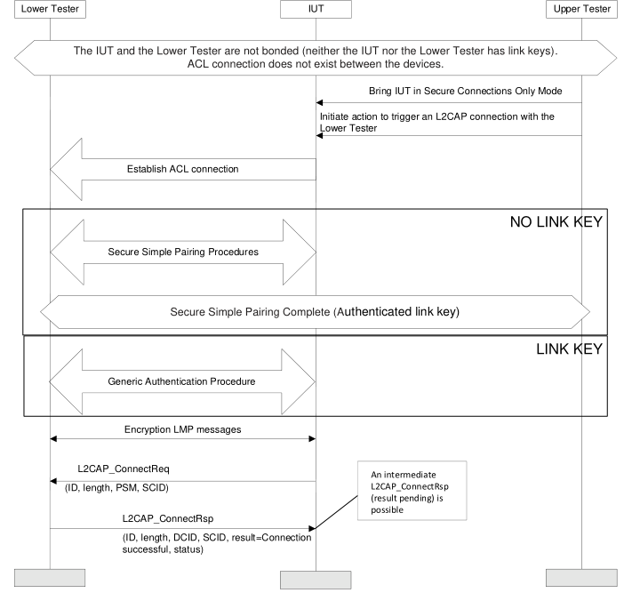

**Figure 4.45: Secure Connections Only Mode BR/EDR Transport – IUT Central, initiator, Lower Tester supports Secure Connections in Controller and Host MSC**

1. The Upper Tester puts the IUT in Secure Connections Only Mode. 2. The Upper Tester requests the IUT to establish a channel to access a service on the Lower
Tester. The service requires Security Mode-4, Level 3 on the IUT. 3. The IUT creates an ACL connection with the Lower Tester.
• Test Condition
It must be possible to put the IUT in Secure Connections Only Mode.
• Expected Outcome
Pass verdict
The IUT accepts the Upper Tester’s request to establish a channel to access the service on the Lower Tester when the service requires Security Mode-4, Level 3 on the IUT and the channel establishment procedure is successful.
If the test requires the Generic Authentication Procedure, verify that the IUT authenticates the Lower Tester.
• Notes
When in Secure Connections Only mode, all services (except those allowed to have Security Mode-4, Level 0) require Security Mode-4, Level 4.
Lower Tester does not support Secure Connections in Host
• Test Purpose
The Lower Tester does not support Secure Connections at the Host level. Verify that the IUT that is not in Secure Connections Only Mode accepts a request to perform a channel establishment procedure over the BR/EDR transport if the service requires Security Mode-4, Level 3 on the IUT. The IUT is Central and initiator of the channel establishment procedure.
• Reference
[1] 5.2.2
• Initial Condition
- The PSM for the service that requires Security Mode-4, Level 3 on the IUT is specified in the IXIT.
- On the Lower Tester, set the Secure Connections (Host Support) LMP feature bit to 0 and the Secure Connections (Controller Support) LMP feature bit to 1.
- The IUT and the Lower Tester are bonded as specified in Table 4.16.
- ACL connection does not exist between the devices.
• Test Case Configuration

|  | Test Case |  |  | Link Keys |  |  | Pairing/Authentication |  |
| --- | --- | --- | --- | --- | --- | --- | --- | --- |
| GAP/SEC/SEM/BV-19-C |  |  | Not Bonded, No Link Keys |  |  | Secure Simple Pairing |  |  |
| GAP/SEC/SEM/BV-55-C |  |  | Bonded, Has Link Keys |  |  | Generic Authentication Procedure |  |  |

Table 4.16: IUT Central, initiator, not in Secure Connections Only Mode BR/EDR Transport, Lower Tester does not support Secure Connections in Host test cases
• Test Procedure

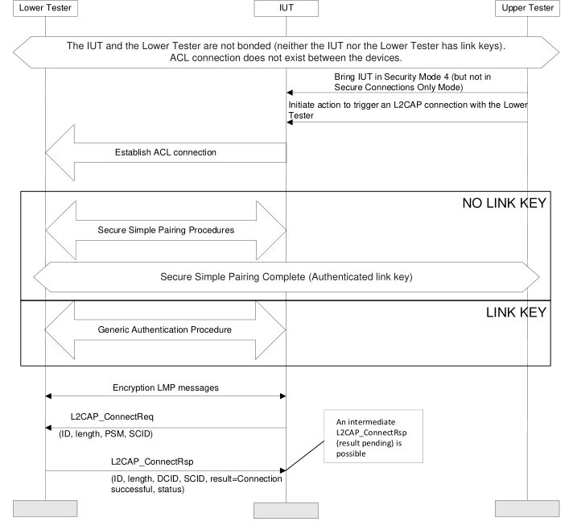

**Figure 4.46: IUT Central, initiator, not in Secure Connections Only Mode BR/EDR Transport, Lower Tester does not support Secure Connections in Host MSC**

1. The Upper Tester puts the IUT in Security Mode-4 (but not in Secure Connections Only Mode). 2. The Upper Tester requests the IUT to establish a channel to access a service on the Lower
Tester. The service requires Security Mode-4, Level 3 on the IUT. 3. The IUT creates an ACL connection with the Lower Tester.
• Test Condition
It must be possible to put the IUT in Security Mode-4 (but not in Secure Connections Only Mode).
• Expected Outcome
Pass verdict
The IUT accepts the Upper Tester’s request to establish a channel to access the service on the Lower Tester when the service requires Security Mode-4, Level 3 on the IUT and the channel establishment procedure is successful.
If the test requires the Generic Authentication Procedure, verify that the IUT authenticates the Lower Tester.
GAP/SEC/SEM/BV-20-C [IUT Central, initiator, not in Secure Connections Only Mode BR/EDR Transport, Lower Tester does not support Secure Connections in Host, level 4 service]
• Test Purpose
The Lower Tester does not support Secure Connections at the Host level. Verify that the IUT that is not in Secure Connections Only Mode rejects a request to perform a channel establishment procedure over the BR/EDR transport if the service requires Security Mode-4, Level 4 on the IUT. The IUT is Central and initiator of the channel establishment procedure.
• Reference
[1] 5.2.2
• Initial Condition
- The PSM for the service that requires Security Mode-4, Level 4 is specified in the IXIT.
- On the Lower Tester, set the Secure Connections (Host Support) LMP feature bit to 0 and the Secure Connections (Controller Support) LMP feature bit to 1.
- The IUT and the Lower Tester are not bonded (neither the IUT nor the Lower Tester has link keys).
- ACL connection does not exist between the devices.
• Test Procedure

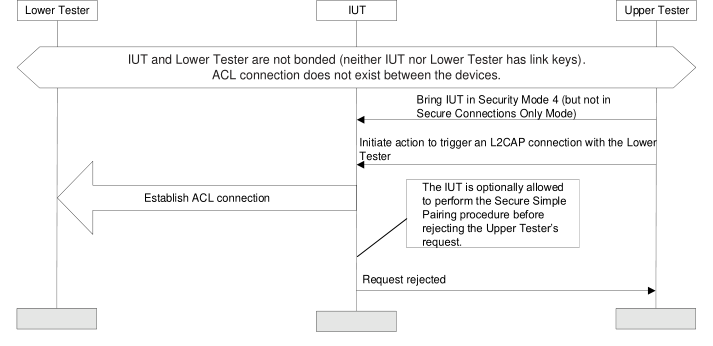

**Figure 4.47: GAP/SEC/SEM/BV-20-C [IUT Central, initiator, not in Secure Connections Only Mode BR/EDR Transport, Lower Tester does not support Secure Connections in Host, level 4 service] MSC**

1. The Upper Tester puts the IUT in Security Mode-4 (but not in Secure Connections Only Mode). 2. The Upper Tester requests the IUT to establish a channel to access a service on the Lower
Tester. The service requires Security Mode-4, Level 4 on the IUT. 3. The IUT creates an ACL connection with the Lower Tester and may optionally perform the Secure
Simple Procedure with the Lower Tester.
• Test Condition
It must be possible to put the IUT in Security Mode-4 (but not in Secure Connections Only Mode).
• Expected Outcome
Pass verdict
The IUT rejects the Upper Tester’s request to establish a channel to access the service on the Lower Tester when the service requires Security Mode-4, Level 4 on the IUT.

#### 4.5.4 LE Security Modes - Central

Verify the correct behavior in LE security modes. The role of the IUT is Central.

##### 4.5.4.1 LE Secure Connections Only, Central – outgoing service level connection

• Test Purpose
Verify that the IUT, supporting LE Secure Connections only, after performing the authentication procedure will achieve an outgoing service level connection operating in the correct security mode and level. The Lower Tester supports LE Secure Connections. The IUT is the Central.
• Reference
[13] 2.3.5.6
• Initial Condition
- The IUT supports LE Secure Connections. The IUT is in Link Layer Standby state. The IUT has to be configured such that it will not reject the initiated procedure.
- The Lower Tester will establish a GATT service request when TSPX_Use_GATT is set to TRUE and will use the GATT Service and Characteristic from the IXIT to achieve the test purpose.
• Test Case Configuration

|  | TCID |  |  | Security Mode and Level |  |
| --- | --- | --- | --- | --- | --- |
| GAP/SEC/SEM/BV-26-C [LE Security Mode: Mode-1 Level 4, Central – outgoing service level connection] |  |  | LE Security Mode-1 Level 4 |  |  |
| GAP/SEC/SEM/BV-41-C [LE Secure Connections Only: Mode-1 Level 2, Central – outgoing service level connection] |  |  | LE Security Mode-1 Level 2 |  |  |
| GAP/SEC/SEM/BV-42-C [LE Secure Connections Only: Mode-1 Level 3, Central – outgoing service level connection] |  |  | LE Security Mode-1 Level 3 |  |  |

Table 4.17: LE Secure Connections Only, Central – outgoing service level connection test cases
• Test Procedure
1. The Upper Tester configures the IUT into the security mode and level specified in Table 4.17. 2. The Upper Tester configures the IUT (in Central role) to receive advertising packets from the
Lower Tester (in Peripheral role), and complete link establishment with the Lower Tester. 3. The Upper Tester triggers authentication procedure on the IUT, e.g., by an L2CAP channel
establishment or a GATT service request. 4. The IUT begins LE Secure Connections Phase 1 by sending an SMP Pairing Request, with the
Secure Connections bit set to 1. The Lower Tester answers with SMP Pairing Response, with the Secure Connections bit set to 1. 5. The IUT and the Lower Tester complete SMP Phase 2 (pairing) and Phase 3 (encryption and key
distribution). 6. The Lower Tester replies with a successful response.

| Lower Tester |  |  |
| --- | --- | --- |
| ure ions 1 LE LE |  |  |
|  | Secure Connections Phas Key distribution |  |
| ALT A ALT B | GATT service request L2CAP channel establishment |  |

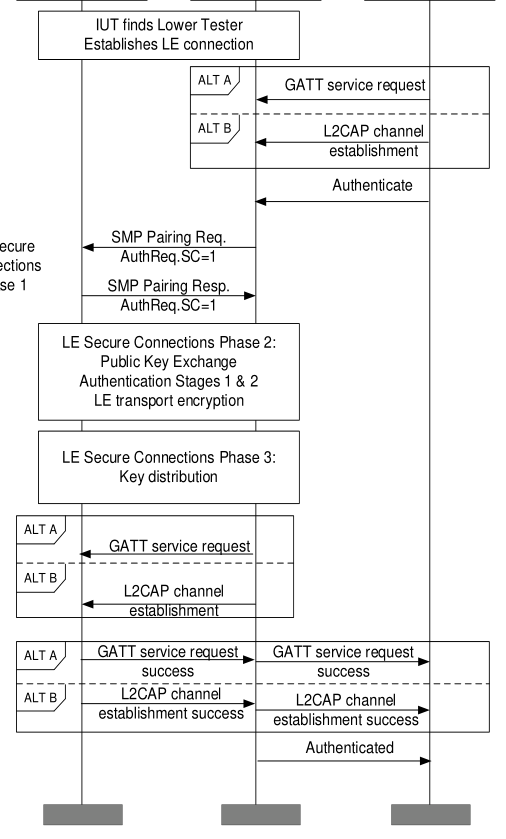

**Figure 4.48: LE Secure Connections Only, Central – outgoing service level connection MSC**

• Expected Outcome
Pass verdict
The Lower Tester and the IUT complete SMP phases 1, 2, and 3. The resulting connection is encrypted on the security mode and level specified in Table 4.17.
The initiated procedure is successful.
• Notes
It is recommended to test with a service or profile that requires the mode and level specified by Table 4.17.
• Test Purpose
Verify that the IUT, supporting LE Secure Connections only, after performing the authentication procedure will achieve an incoming service level connection operating in the correct security mode and level. The Lower Tester supports LE Secure Connections. The IUT is the Central.
• Reference
[13] 2.3.5.6
• Initial Condition
- The IUT supports LE Secure Connections. The IUT is in Link Layer Standby state. The IUT has to be configured such that it will not reject the initiated procedure.
- The Lower Tester will establish a GATT service request when TSPX_Use_GATT is set to TRUE and will use the GATT Service and Characteristic from the IXIT to achieve the test purpose.
• Test Case Configuration

|  | TCID |  |  | Security Mode and Level |  |
| --- | --- | --- | --- | --- | --- |
| GAP/SEC/SEM/BV-27-C [LE Security Mode: Mode-1 Level 4, Central – incoming service level connection] |  |  | LE Security Mode-1 Level 4 |  |  |
| GAP/SEC/SEM/BV-43-C [LE Secure Connections Only: Mode-1 Level 2, Central – incoming service level connection] |  |  | LE Security Mode-1 Level 2 |  |  |
| GAP/SEC/SEM/BV-44-C [LE Secure Connections Only: Mode-1 Level 3, Central – incoming service level connection] |  |  | LE Security Mode-1 Level 3 |  |  |

Table 4.18: LE Secure Connections Only, Central – incoming service level connection test cases
• Test Procedure
1. The Upper Tester configures the IUT into the security mode and level specified in Table 4.18. 2. The Upper Tester configures the IUT (in Central role) to receive advertising packets from the
Lower Tester (in Peripheral role), and complete link establishment with the Lower Tester. 3. The Lower Tester initiates LE Secure Connections pairing according to the security mode and
level specified in Table 4.18. 4. The Lower Tester and the IUT complete SMP Phase 1, Phase 2 (pairing), and Phase 3
(encryption and key distribution). 5. The Lower Tester initiates either an L2CAP channel establishment or GATT service request to
the IUT. 6. The IUT replies with the correct channel establishment response.
Upper Tester IUT Lower Tester

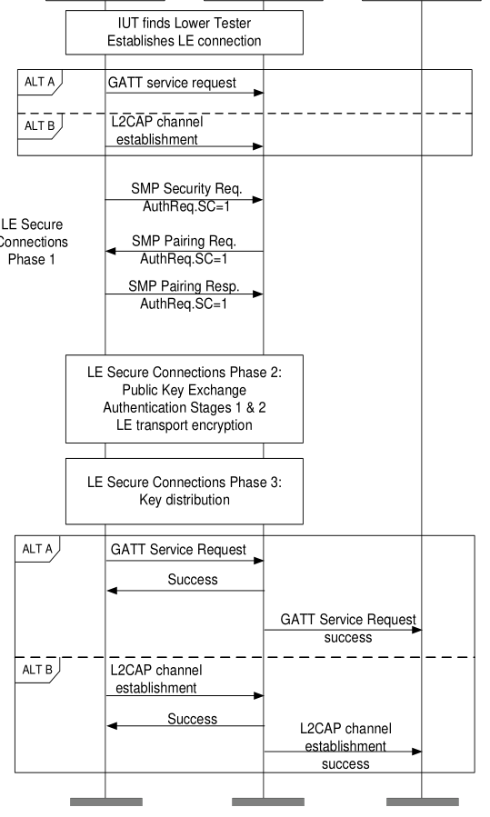

**Figure 4.49: LE Secure Connections Only, Central – incoming service level connection MSC**

• Expected Outcome
Pass verdict
The Lower Tester and the IUT complete SMP phases 1, 2, and 3. The resulting connection is encrypted on the security mode and level specified in Table 4.18.
The initiated procedure is successful.
• Notes
It is recommended to test with a service or profile that requires the mode and level specified by Table 4.18.
GAP/SEC/SEM/BV-28-C [Secure Connections Only Mode LE Transport – Failed Procedure, Central – outgoing service level connection]
• Test Purpose
Verify that the IUT in Secure Connections Only Mode or that supports Unauthenticated Pairing with LE Secure Connections only or Authenticated Pairing with LE Secure Connections only initiating the authentication procedure will result in a failed procedure when performed toward a peer not supporting LE Secure Connections. The Lower Tester does not support LE Secure Connections. The IUT is the Central.
• Reference
[12] 10.2.4
• Initial Condition
- The IUT supports LE Secure Connections. The IUT is in Link Layer Standby state. The IUT has to be configured such that it will not reject the initiated procedure.
- The Lower Tester will establish a GATT service request when TSPX_Use_GATT is set to TRUE and will use the GATT Service and Characteristic from the IXIT to achieve the test purpose.
• Test Procedure
1. The Upper Tester configures the IUT into Secure Connections Only Mode or to only support LE
Secure Connections. 2. The Upper Tester configures the IUT (in Central role) to receive advertising packets from the
Lower Tester (in Peripheral role), and complete link establishment with the Lower Tester. 3. The Upper Tester triggers authentication procedure on the IUT, e.g., by an L2CAP channel
establishment or a GATT service request. 4. The IUT begins LE Secure Connections Phase 1 by sending an SMP Pairing Request, with the
Secure Connections bit set to 1. 5. The Lower Tester responds with an SMP Pairing Response with the Secure Connections bit set
to 0. 6. Alternative 1: (for Security Mode-1 Level 4 connections):
a. The IUT responds with an SMP Pairing Failed message. 7. Alternative 2: (for Security Mode-1 Level 2 or 3 with Secure Connections):
a. The IUT and the Lower Tester complete the LE Legacy Pairing procedure. b. The Lower Tester continues the authentication procedure started in step 3. c. The IUT responds with a failure message.

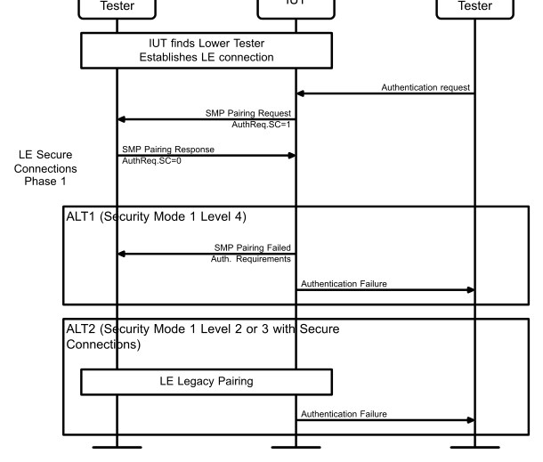

**Figure 4.50: GAP/SEC/SEM/BV-28-C [Secure Connections Only Mode LE Transport – Failed Procedure, Central – outgoing service level connection] MSC**

• Expected Outcome
Pass verdict
In ALT 1, the IUT sends an SMP Pairing Failed message to the Lower Tester to end SMP Pairing Phase 1.
In ALT 2, the IUT does not complete the L2CAP Channel establishment or GATT service request.
GAP/SEC/SEM/BV-29-C [Secure Connections Only Mode LE Transport – Failed Procedure, Central – incoming service level connection]
• Test Purpose
Verify that the IUT in Secure Connections Only Mode or that supports Unauthenticated Pairing with LE Secure Connections only or Authenticated Pairing with LE Secure Connections only rejects an L2CAP channel establishment or GATT service request procedure both before and after the authentication procedure when performed toward a peer not supporting LE Secure Connections. The Lower Tester does not support LE Secure Connections. The IUT is the Central.
• Reference
[12] 10.2.4
• Initial Condition
- The IUT supports LE Secure Connections. The IUT is in Link Layer Standby state. The IUT has to be configured such that it will not reject the initiated procedure.
- The Lower Tester is configured so that it does not support LE Secure Connections.
- The Lower Tester will establish a GATT service request when TSPX_Use_GATT is set to TRUE and will use the GATT Service and Characteristic from the IXIT to achieve the test purpose.
• Test Procedure
1. The Upper Tester configures the IUT into Secure Connections Only Mode or to only support LE
Secure Connections. 2. The Upper Tester configures the IUT (in Central role) to receive advertising packets from the
Lower Tester (in Peripheral role), and complete link establishment with the Lower Tester. 3. The Lower Tester initiates either an L2CAP channel establishment or GATT service request to
the IUT. 4. The IUT rejects the request. 5. The Lower Tester initiates authenticated LE Legacy pairing. 6. Alternative 1: the IUT rejects the pairing by sending an SMP Pairing Failed message. 7. Alternative 2: the Lower Tester and the IUT complete LE legacy pairing. The Lower Tester re-
initiates the request to the IUT as attempted in step 3. The IUT rejects the request.

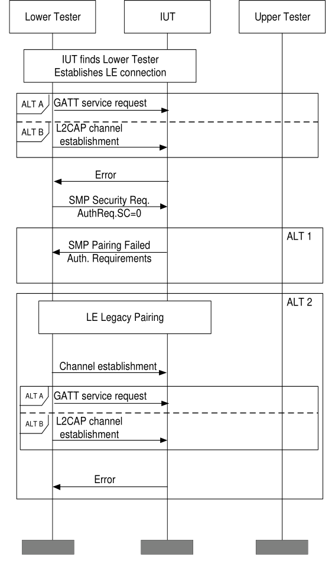

**Figure 4.51: GAP/SEC/SEM/BV-29-C [Secure Connections Only Mode – Failed Procedure, Central – incoming service level connection] MSC**

• Expected Outcome
Pass verdict
The L2CAP channel establishment or GATT service request is rejected before the authentication procedure.
Alternative 1: IUT sends an SMP Pairing Failed message to the Lower Tester to end SMP Pairing Phase 1.
Alternative 2: The IUT and the Lower Tester complete LE legacy pairing and the IUT rejects the request from the Lower Tester.
GAP/SEC/SEM/BV-30-C [Secure Connections Only Mode, Central, Failure, BR/EDR and LE Transports]
• Test Purpose
Verify that the IUT in Secure Connections Only Mode performs either an L2CAP channel establishment or GATT service procedure over LE and a channel establishment procedure over BR/EDR. The IUT is initiator of the procedure over both LE and BR/EDR. The Lower Tester supports neither LE Secure Connections nor BR/EDR Secure Connections. The procedure fails over both LE and BR/EDR. The IUT is the Central.
• Reference
[12] 10.2.4
• Initial Condition
- The IUT supports both LE Secure Connections and BR/EDR Secure Connections. The IUT is in Link Layer Standby state. The IUT has to be configured such that it will not reject the initiated procedure.
- The Lower Tester is configured so that it does not support LE Secure Connections and BR/EDR Secure Connections.
- The PSM for the service on the IUT that requires Security Mode-4, Level 3 on BR/EDR is specified in the IXIT.
- The IUT and the Lower Tester are not bonded on BR/EDR (neither the IUT nor the Lower Tester has link keys).
- BR/EDR ACL connection does not exist between the devices.
• Test Procedure
1. The Upper Tester configures the IUT into Secure Connections Only Mode. 2. The Upper Tester configures the IUT (in Central role) to receive advertising packets from the
Lower Tester (in Peripheral role), and complete link establishment with the Lower Tester. 3. The IUT begins LE Secure Connections Phase 1 by sending an SMP Pairing Request, with the
Secure Connections bit set to 1. The Lower Tester responds with an SMP Pairing Response with the Secure Connections bit set to 0. The IUT will respond with an SMP Pairing Failed message. 4. The IUT terminates the LE connection. 5. The Upper Tester requests the IUT to establish a channel to access a service on the Lower
Tester. The service requires Security Mode-4, Level 3 on the IUT. 6. The IUT creates an ACL connection with the Lower Tester and may optionally perform the Secure
Simple Pairing procedure with the Lower Tester.
Upper Tester IUT (initiator) Lower Tester
(responder)

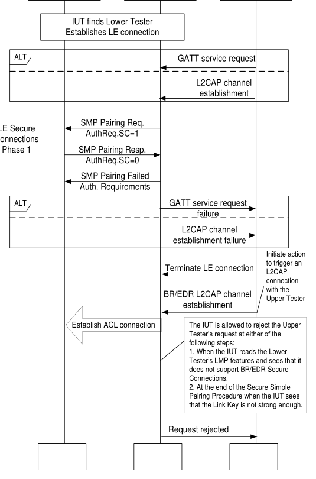

**Figure 4.52: GAP/SEC/SEM/BV-30-C [Secure Connections Only Mode, Central, Failure, BR/EDR and LE Transports] MSC**

• Expected Outcome
Pass verdict
On the LE transport, the IUT sends an SMP Pairing Failed message to the Lower Tester to end SMP Pairing Phase 1.
On the BR/EDR transport, the IUT rejects the Upper Tester’s request to establish a channel to access the service on the Lower Tester when the service requires Security Mode-4, Level 3 on the IUT.

##### 4.5.4.3 LE Security Mode-1, Central - Invalid Encryption Key Size

• Test Purpose
Verify that the IUT in LE Security Mode-1 as Central fails pairing when receiving an invalid key size.
• Reference
[12] 10.3.2, 10.2.1
• Initial Condition
- The IUT is in Link Layer Standby state.
• Test Case Configuration

|  | TCID |  |  | LE Security Mode and Level |  |
| --- | --- | --- | --- | --- | --- |
| GAP/SEC/SEM/BI-10-C [LE Security Mode-1 Level 4, Central - Invalid Encryption Key Size] |  |  | LE Security Mode-1 Level 4 |  |  |
| GAP/SEC/SEM/BI-22-C [LE Security Mode-1 Level 3, Central - Invalid Encryption Key Size] |  |  | LE Security Mode-1 Level 3 with LE Secure Connections Pairing only |  |  |
| GAP/SEC/SEM/BI-23-C [LE Security Mode-1 Level 2, Central - Invalid Encryption Key Size] |  |  | LE Security Mode-1 Level 2 with LE Secure Connections Pairing only |  |  |

Table 4.19: LE Security Mode-1, Central - Invalid Encryption Key Size test cases
• Test Procedure

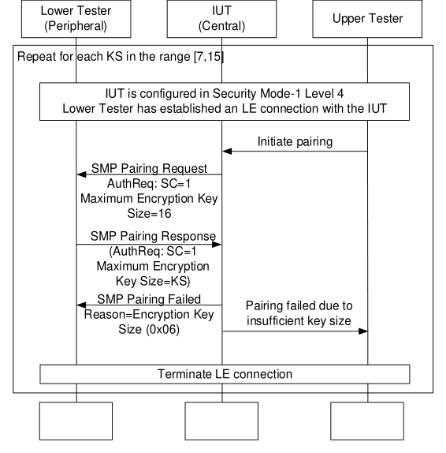

**Figure 4.53: LE Security Mode-1, Central - Invalid Encryption Key Size MSC**

Repeat steps 1–6 for all values of the Maximum Encryption Key Size field (in step 4) in the interval [7, 15].
1. The Upper Tester configures the IUT into the Security Mode and Level specified in Table 4.19. 2. The Upper Tester configures the IUT to connect to the Lower Tester. 3. The Upper Tester orders the IUT to initiate pairing, and the IUT sends to the Lower Tester an
SMP Pairing Request with the Secure Connections bit set to 1 and Maximum Encryption Key Size set to 16. 4. The Lower Tester responds with an SMP Pairing Response, with the Secure Connections bit set
to 1 and Maximum Encryption Key Size set to the value selected for this iteration.
Size” (0x06) and to report the procedure failure to the Upper Tester. 6. The Lower Tester terminates the LE connection.
• Expected Outcome
Pass verdict
The IUT fails pairing for any key size value less than 16 while in the specified Security Mode and Level.

#### 4.5.5 LE Security Modes – Both Connected Roles

##### 4.5.5.1 Incoming GATT Indication, LE Security Mode-1 Level 2

• Test Purpose
Verify that the IUT properly handles a GATT indication before security requirements are performed in LE Security Mode-1 Level 2.
• Reference
[20] 10.3.2.2
• Initial Condition
- The IUT is in the Standby state.
- The IUT is the GATT Client in the role specified in Table 4.20.
- The Lower Tester is configured so that it sends GATT indications.
- The TSPX_initiate_encryption_after_reconnection IXIT value defines whether or not the Central IUT initiates encryption after reconnection.
• Test Case Configuration

|  | TCID |  |  | Role |  |
| --- | --- | --- | --- | --- | --- |
| GAP/SEC/SEM/BV-56-C [Incoming GATT Indication, LE Security Mode-1 Level 2, Peripheral] |  |  | Peripheral |  |  |
| GAP/SEC/SEM/BV-62-C [Incoming GATT Indication, LE Security Mode-1 Level 2, Central] |  |  | Central |  |  |

Table 4.20: Incoming GATT Indication, LE Security Mode-1 Level 2 test cases
• Test Procedure

**Figure 4.54: Incoming GATT Indication, LE Security Mode-1 Level 2 MSC – Page 1 of 2**

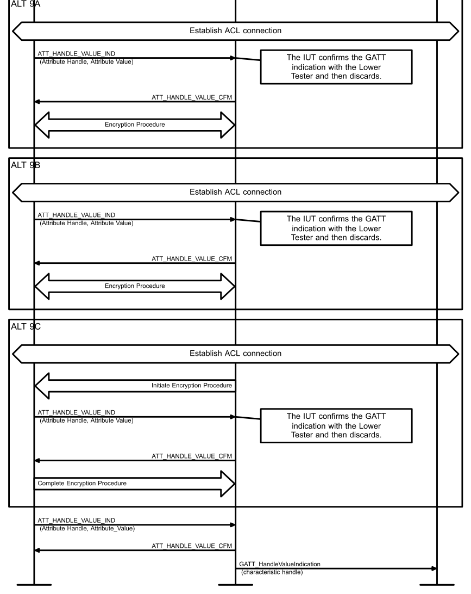

**Figure 4.55: Incoming GATT Indication, LE Security Mode-1 Level 2 MSC – Page 2 of 2**

1. The Upper Tester puts the IUT into LE Security Mode-1 Level 2. 2. The Upper and Lower Testers perform the steps required to create a connection between the
Lower Tester and the IUT, with the IUT in the role specified in Table 4.20.
Alternative 3A (IUT is Peripheral):
3A.1 The IUT begins the pairing phase 1 with LE legacy pairing by sending an SMP Security Request, with the Bonding_Flags bit set to 1 and the MITM and SC bits set to 0. 3A.2 The Lower Tester responds to the LE Pairing Reply Phase 1 by sending an SMP Pairing Request, with the Bonding_Flags bit set to 1 and the MITM and SC bits set to 0. 3A.3 The IUT replies with an SMP Pairing Response, with the Bonding_Flags bit set to 1 and the MITM and SC bits set to 0. Alternative 3B (IUT is Central):
3B.1 The IUT begins the pairing phase 1 with LE legacy pairing by sending an SMP Pairing Request, with the Bonding_Flags bit set to 1 and the MITM and SC bits set to 0. 3B.2 The Lower Tester replies with an SMP Pairing Response, with the Bonding_Flags set to 1 and MITM and SC bits set to 0. 4. The IUT and the Lower Tester complete SMP Phase 2 (pairing) and Phase 3 (encryption and key
distribution). 5. The Upper Tester commands the IUT to enable GATT indications with the Lower Tester. 6. The IUT sends an ATT_WRITE_REQUEST to the Lower Tester with CCCD set to 0x0002. 7. The Lower Tester sends an ATT_WRITE_RESPONSE to the IUT. 8. The IUT and the Lower Tester disconnect. 9. Perform either alternative 9A, 9B, or 9C depending on if the IUT starts an encryption request.
Alternative 9A (The IUT is Central and TSPX_initiate_encryption_after_reconnection is False):
9A.1 The Upper and Lower Testers perform the steps required to create a connection between the Lower Tester and the IUT, with the IUT in the Central role. 9A.2 The Lower Tester sends an ATT_HANDLE_VALUE_IND PDU to the IUT containing a valid Attribute Handle and Attribute Value. 9A.3 The IUT sends an ATT_HANDLE_VALUE_CFM PDU to the Lower Tester. 9A.4 The IUT does not send a GATT_HandleValueIndication to the Upper Tester. 9A.5 The IUT initiates and completes the encryption procedure with the Lower Tester. Alternative 9B (The connection is started without encryption and the IUT is a Peripheral):
9B.1 The Upper and Lower Testers perform the steps required to create a connection between the Lower Tester and the IUT, with the IUT in the Peripheral role. 9B.2 The Lower Tester sends an ATT_HANDLE_VALUE_IND PDU to the IUT containing a valid Attribute Handle and Attribute Value. 9B.3 The IUT sends an ATT_HANDLE_VALUE_CFM PDU to the Lower Tester. 9B.4 The IUT does not send a GATT_HandleValueIndication to the Upper Tester. 9B.5 The Lower Tester initiates and completes the encryption procedure with the IUT. Alternative 9C (The IUT is Central and TSPX_initiate_encryption_after_reconnection is True):
9C.1 The Upper and Lower Testers perform the steps required to create a connection between the Lower Tester and the IUT, with the IUT in the Central role. 9C.2 The IUT initiates the encryption procedure. 9C.3 The Lower Tester sends an ATT_HANDLE_VALUE_IND PDU to the IUT containing a valid Attribute Handle and Attribute Value. 9C.4 The IUT sends an ATT_HANDLE_VALUE_CFM PDU to the Lower Tester. 9C.5 The IUT does not send a GATT_HandleValueIndication to the Upper Tester. 9C.6 The Lower Tester completes the encryption procedure. 10. The Lower Tester sends an ATT_HANDLE_VALUE_IND PDU to the IUT containing a valid
Attribute Handle and Attribute Value. 11. The IUT sends an ATT_HANDLE_VALUE_CFM to the Lower Tester. 12. The IUT sends a GATT_HandleValueIndication to the Upper Tester.
• Expected Outcome
Pass verdict
In step 9A.3, 9B.3, or 9C.4, the IUT sends an ATT_HANDLE_VALUE_CFM PDU to the Lower Tester.
In step 9A.4, 9B.4, or 9C.5, the IUT does not send a GATT_HandleValueIndication to the Upper Tester.
In step 12, the IUT sends a GATT_HandleValueIndication to the Upper Tester.

##### 4.5.5.2 Incoming GATT Indication, LE Security Mode-1 Level 3

• Test Purpose
Verify that the IUT properly handles a GATT indication before security requirements are performed in LE Security Mode-1 Level 3.
• Reference
[20] 10.3.2.2
• Initial Condition
- The IUT is in the Standby state.
- The IUT is the GATT Client in the role specified in Table 4.21.
- The Lower Tester is configured so that it sends GATT indications.
- The TSPX_initiate_encryption_after_reconnection IXIT value defines whether or not the Central IUT initiates encryption after reconnection.
• Test Case Configuration

|  | TCID |  |  | Role |  |
| --- | --- | --- | --- | --- | --- |
| GAP/SEC/SEM/BV-57-C [Incoming GATT Indication, LE Security Mode-1 Level 3, Peripheral] |  |  | Peripheral |  |  |
| GAP/SEC/SEM/BV-63-C [Incoming GATT Indication, LE Security Mode-1 Level 3, Central] |  |  | Central |  |  |

Table 4.21: Incoming GATT Indication, LE Security Mode-1 Level 3 test cases
• Test Procedure

**Figure 4.56: Incoming GATT Indication, LE Security Mode-1 Level 3 MSC – Page 1 of 2**

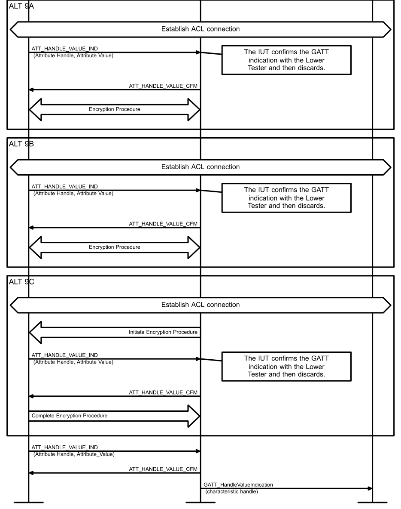

**Figure 4.57: Incoming GATT Indication, LE Security Mode-1 Level 3 MSC – Page 2 of 2**

1. The Upper Tester puts the IUT into LE Security Mode-1 Level 3. 2. The Upper and Lower Testers perform the steps required to create a connection between the
Lower Tester and the IUT, with the IUT in the role specified in Table 4.21.
Alternative 3A (IUT is Peripheral):
3A.1 The IUT begins the pairing phase 1 with LE legacy pairing by sending an SMP Security Request, with the Bonding_Flags and MITM bits set to 1 and the SC bit set to 0. 3A.2 The Lower Tester responds to the LE Pairing Reply Phase 1 by sending an SMP Pairing Request, with the Bonding_Flags and MITM bits set to 1 and the SC bit set to 0. 3A.3 The IUT replies with an SMP Pairing Response, with the Bonding_Flags and MITM bits set to 1 and the SC bit set to 0. Alternative 3B (IUT is Central):
3B.1 The IUT begins the pairing phase 1 with LE legacy pairing by sending an SMP Pairing Request, with the Bonding_Flags and MITM bits set to 1 and the SC bit set to 0. 3B.2 The Lower Tester replies with an SMP Pairing Response, with the Bonding_Flags and MITM bits set to 1 and the SC bit set to 0. 4. The IUT and the Lower Tester complete SMP Phase 2 (pairing) and Phase 3 (encryption and key
distribution). 5. The Upper Tester commands the IUT to enable GATT indications with the Lower Tester. 6. The IUT sends an ATT_WRITE_REQUEST to the Lower Tester with CCCD set to 0x0002. 7. The Lower Tester sends an ATT_WRITE_RESPONSE to the IUT. 8. The IUT and the Lower Tester disconnect. 9. Perform either alternative 9A, 9B, or 9C depending on if the IUT starts an encryption request.
Alternative 9A (The IUT is Central and TSPX_initiate_encryption_after_reconnection is False):
9A.1 The Upper and Lower Testers perform the steps required to create a connection between the Lower Tester and the IUT, with the IUT in the role specified in Table 4.21. 9A.2 The Lower Tester sends an ATT_HANDLE_VALUE_IND PDU to the IUT containing a valid Attribute Handle and Attribute Value. 9A.3 The IUT sends an ATT_HANDLE_VALUE_CFM PDU to the Lower Tester. 9A.4 The IUT does not send a GATT_HandleValueIndication to the Upper Tester. 9A.5 The IUT initiates and completes the encryption procedure with the Lower Tester. Alternative 9B (The connection is started without encryption and the IUT is a Peripheral):
9B.1 The Upper and Lower Testers perform the steps required to create a connection between the Lower Tester and the IUT, with the IUT in the role specified in Table 4.21. 9B.2 The Lower Tester sends an ATT_HANDLE_VALUE_IND PDU to the IUT containing a valid Attribute Handle and Attribute Value. 9B.3 The IUT sends an ATT_HANDLE_VALUE_CFM PDU to the Lower Tester. 9B.4 The IUT does not send a GATT_HandleValueIndication to the Upper Tester. 9B.5 The IUT initiates and completes the encryption procedure with the Lower Tester. Alternative 9C (The IUT is Central and TSPX_initiate_encryption_after_reconnection is true):
9C.1 The Upper and Lower Testers perform the steps required to create a connection between the Lower Tester and the IUT, with the IUT in the role specified in Table 4.21. 9C.2 The IUT initiates the encryption procedure. 9C.3 The Lower Tester sends an ATT_HANDLE_VALUE_IND PDU to the IUT containing a valid Attribute Handle and Attribute Value. 9C.4 The IUT sends an ATT_HANDLE_VALUE_CFM PDU to the Lower Tester. 9C.5 The IUT does not send a GATT_HandleValueIndication to the Upper Tester. 9C.6 The Lower Tester completes the encryption procedure. 10. The Lower Tester sends an ATT_HANDLE_VALUE_IND PDU to the IUT containing a valid
Attribute Handle and Attribute Value.
11. The IUT sends an ATT_HANDLE_VALUE_CFM to the Lower Tester. 12. The IUT sends a GATT_HandleValueIndication to the Upper Tester.
• Expected Outcome
Pass verdict
In step 9A.3, 9B.3, or 9C.4, the IUT sends an ATT_HANDLE_VALUE_CFM PDU to the Lower Tester.
In step 9A.4, 9B.4, or 9C.5, the IUT does not send a GATT_HandleValueIndication to the Upper Tester.
In step 12, the IUT sends a GATT_HandleValueIndication to the Upper Tester.

##### 4.5.5.3 LE Secure Connections Only, Incoming GATT Indication

• Test Purpose
Verify that the IUT that supports LE Secure Connections only properly handles a GATT indication before security requirements are performed.
• Reference
[20] 10.3.2.2
• Initial Condition
- The IUT is in the Standby state.
- The IUT supports LE Secure Connections. The IUT is the GATT Client in the role specified in Table 4.22. The Lower Tester supports LE Secure Connections.
- The IUT is configured to receive GATT indications from the Lower Tester.
- The TSPX_initiate_encryption_after_reconnection IXIT value defines whether or not the Central IUT initiates encryption after reconnection.
• Test Case Configuration

|  | TCID |  |  | Role |  |
| --- | --- | --- | --- | --- | --- |
| GAP/SEC/SEM/BV-58-C [LE Secure Connections Only – Incoming GATT Indication, Peripheral] |  |  | Peripheral |  |  |
| GAP/SEC/SEM/BV-64-C [LE Secure Connections Only – Incoming GATT Indication, Central] |  |  | Central |  |  |

Table 4.22: LE Secure Connections Only, Incoming GATT Indication test cases
• Test Procedure

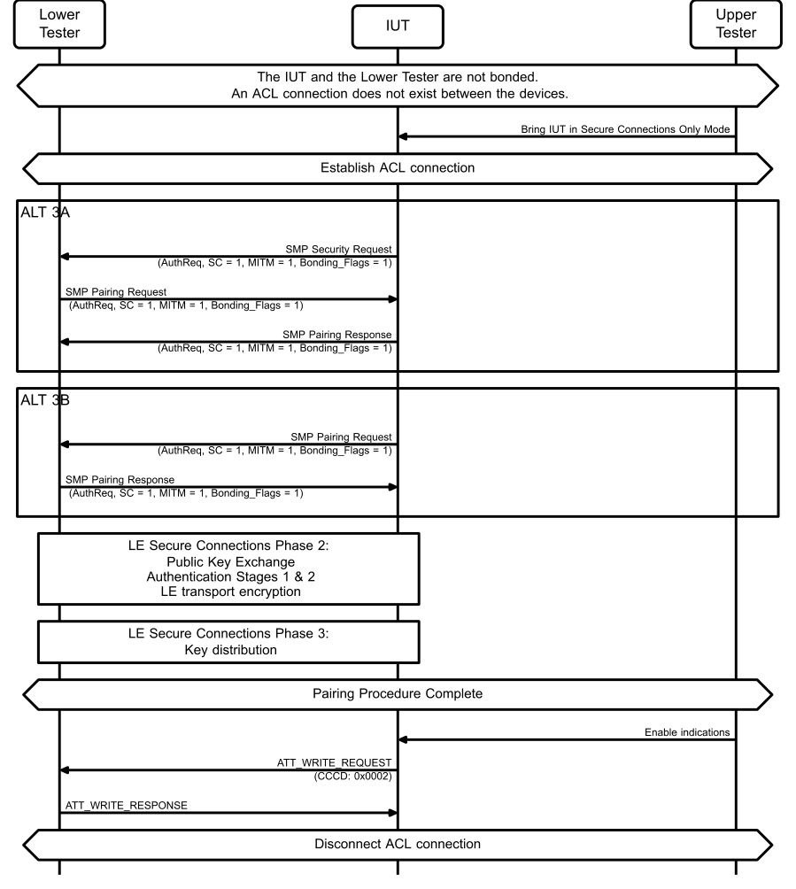

**Figure 4.58: LE Secure Connections Only, Incoming GATT Indication MSC – Page 1 of 2**

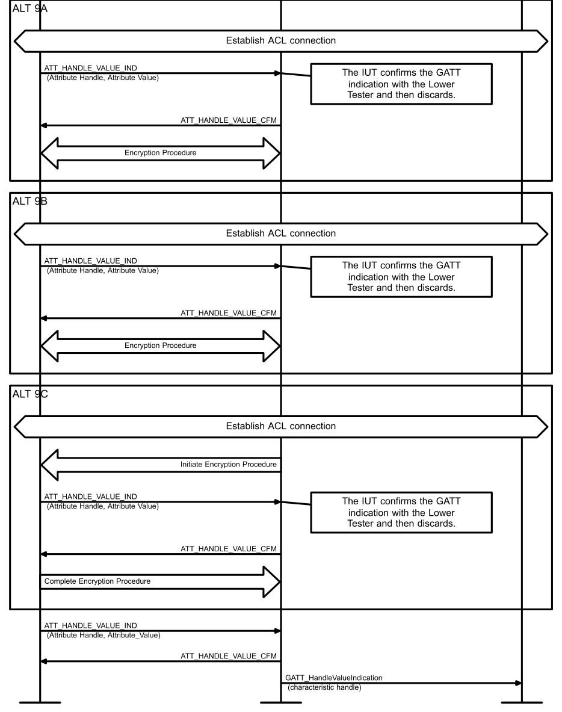

**Figure 4.59: LE Secure Connections Only, Incoming GATT Indication MSC – Page 2 of 2**

1. The Upper Tester puts the IUT into the Secure Connections Only mode. 2. The Upper and Lower Testers perform the steps required to create a connection between the
Lower Tester and the IUT, with the IUT in the role specified in Table 4.22.
Alternative 3A (IUT is Peripheral):
3A.1 The IUT begins the pairing phase 1 with Secure Connections by sending an SMP Security Request, with the Secure Connections, Bonding_Flags, and MITM bits set to 1. 3A.2 The Lower Tester responds by sending an SMP Pairing Request, with the Secure Connections, Bonding_Flags, and MITM bits set to 1. 3A.3 The IUT replies with an SMP Pairing Response, with the Secure Connections, Bonding_Flags, and MITM bits set to 1. Alternative 3B (IUT is Central):
3B.1 The IUT begins the pairing phase 1 with Secure Connections by sending an SMP Pairing Request, with the Secure Connections, Bonding_Flags, and MITM bits set to 1. 3B.2 The Lower Tester replies with an SMP Pairing Response, with the Secure Connections, Bonding_Flags, and MITM bits set to 1. 4. The IUT and the Lower Tester complete SMP Phase 2 (pairing) and Phase 3 (encryption and key
distribution). 5. The Upper Tester commands the IUT to enable GATT indications with the Lower Tester. 6. The IUT sends an ATT_WRITE_REQUEST to the Lower Tester with CCCD set to 0x0002. 7. The Lower Tester sends an ATT_WRITE_RESPONSE to the IUT. 8. The IUT and the Lower Tester disconnect. 9. Perform either alternative 9A, 9B, or 9C depending on if the IUT starts an encryption request.
Alternative 9A (The IUT is Central and TSPX_initiate_encryption_after_reconnection is False):
9A.1 The Upper and Lower Testers perform the steps required to create a connection between the Lower Tester and the IUT, with the IUT in the role specified in Table 4.22. 9A.2 The Lower Tester sends an ATT_HANDLE_VALUE_IND PDU to the IUT containing a valid Attribute Handle and Attribute Value. 9A.3 The IUT sends an ATT_HANDLE_VALUE_CFM PDU to the Lower Tester. 9A.4 The IUT does not send a GATT_HandleValueIndication to the Upper Tester. 9A.5 The IUT initiates and completes the encryption procedure with the Lower Tester. Alternative 9B (The connection is started without encryption and the IUT is a Peripheral):
9B.1 The Upper and Lower Testers perform the steps required to create a connection between the Lower Tester and the IUT, with the IUT in the role specified in Table 4.22. 9B.2 The Lower Tester sends an ATT_HANDLE_VALUE_IND PDU to the IUT containing a valid Attribute Handle and Attribute Value. 9B.3 The IUT sends an ATT_HANDLE_VALUE_CFM PDU to the Lower Tester. 9B.4 The IUT does not send a GATT_HandleValueIndication to the Upper Tester. 9B.5 The IUT initiates and completes the encryption procedure with the Lower Tester. Alternative 9C (The IUT is Central and TSPX_initiate_encryption_after_reconnection is True):
9C.1 The Upper and Lower Testers perform the steps required to create a connection between the Lower Tester and the IUT, with the IUT in the role specified in Table 4.22. 9C.2 The IUT initiates the encryption procedure. 9C.3 The Lower Tester sends an ATT_HANDLE_VALUE_IND PDU to the IUT containing a valid Attribute Handle and Attribute Value. 9C.4 The IUT sends an ATT_HANDLE_VALUE_CFM PDU to the Lower Tester. 9C.5 The IUT does not send a GATT_HandleValueIndication to the Upper Tester. 9C.6 The Lower Tester completes the encryption procedure. 10. The Lower Tester sends an ATT_HANDLE_VALUE_IND PDU to the IUT containing a valid
Attribute Handle and Attribute Value.
11. The IUT sends an ATT_HANDLE_VALUE_CFM to the Lower Tester. 12. The IUT sends a GATT_HandleValueIndication to the Upper Tester.
• Expected Outcome
Pass verdict
In step 9A.3, 9B.3, 9C.4, the IUT sends an ATT_HANDLE_VALUE_CFM PDU to the Lower Tester.
In step 9A.4, 9B.4, 9C.5, the IUT does not send a GATT_HandleValueIndication to the Upper Tester.
In step 12, the IUT sends a GATT_HandleValueIndication to the Upper Tester.

##### 4.5.5.4 Incoming GATT Notification, LE Security Mode-1 Level 2

• Test Purpose
Verify that the IUT properly handles a GATT notification before security requirements are performed for LE Security Mode-1 Level 2.
• Reference
[20] 10.3.2.2
• Initial Condition
- The IUT is in the Standby state.
- The IUT is the GATT Client in the role specified in Table 4.23.
- The Lower Tester is configured so that it sends GATT notifications.
• Test Case Configuration

|  | TCID |  |  | Role |  |
| --- | --- | --- | --- | --- | --- |
| GAP/SEC/SEM/BV-59-C [Incoming GATT Notification, LE Security Mode-1 Level 2, Peripheral] |  |  | Peripheral |  |  |
| GAP/SEC/SEM/BV-65-C [Incoming GATT Notification, LE Security Mode-1 Level 2, Central] |  |  | Central |  |  |

Table 4.23: Incoming GATT Notification, LE Security Mode-1 Level 2 test cases
• Test Procedure

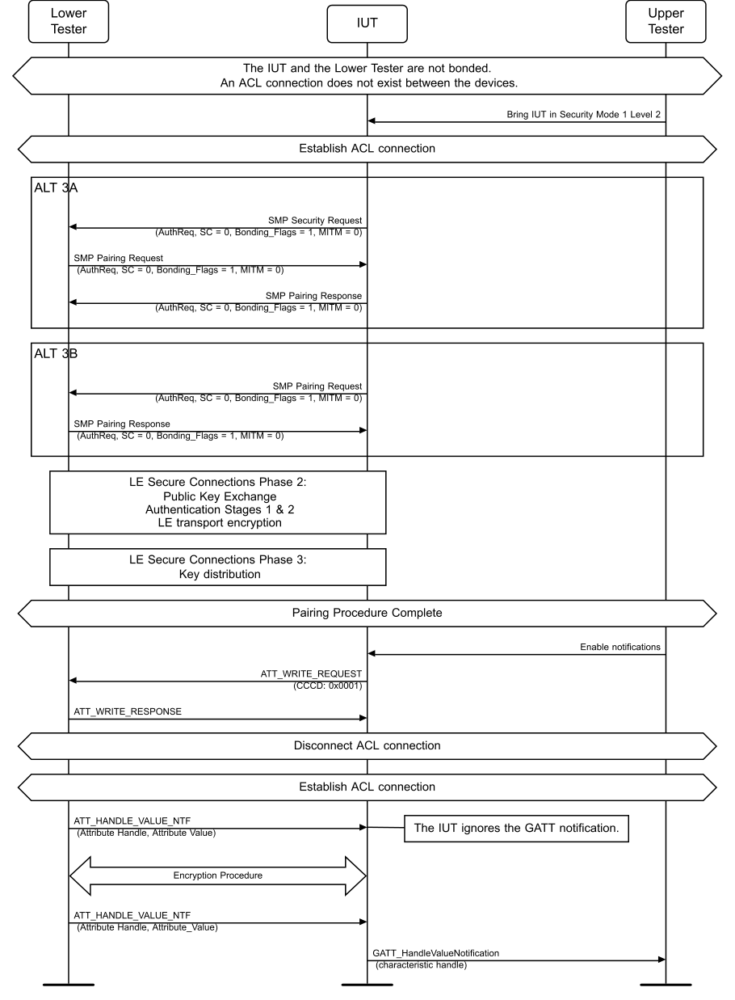

**Figure 4.60: Incoming GATT Notification, LE Security Mode-1 Level 2 MSC**

1. The Upper Tester puts the IUT into LE Security Mode-1 Level 2. 2. The Upper and Lower Testers perform the steps required to create a connection between the
Lower Tester and the IUT, with the IUT in the role specified in Table 4.23. 3. Perform alternative 3A or 3B depending on the IUT role in Table 4.23.
Alternative 3A (IUT is Peripheral):
3A.1 The IUT begins the pairing phase 1 with LE legacy pairing by sending an SMP Security Request, with the Bonding_Flags bit set to 1 and the MITM and SC bits set to 0. 3A.2 The Lower Tester responds to the LE Pairing Reply Phase 1 by sending an SMP Pairing Request, with the Bonding_Flags bit set to 1 and the MITM and SC bits set to 0. 3A.3 The IUT replies with an SMP Pairing Response, with the Bonding_Flags bit set to 1 and the MITM and SC bits set to 0. Alternative 3B (IUT is Central):
3B.1 The IUT begins the pairing phase 1 with LE legacy pairing by sending an SMP Pairing Request, with the Bonding_Flags bit set to 1 and the MITM and SC bits set to 0. 3B.2 The Lower Tester replies with an SMP Pairing Response, with the Bonding_Flags bit set to 1 and the MITM and SC bits set to 0. 4. The IUT and the Lower Tester complete SMP Phase 2 (pairing) and Phase 3 (encryption and key
distribution). 5. The Upper Tester commands the IUT to enable GATT notifications with the Lower Tester. 6. The IUT sends an ATT_WRITE_REQUEST to the Lower Tester with CCCD set to 0x0001. 7. The Lower Tester sends an ATT_WRITE_RESPONSE to the IUT. 8. The IUT and the Lower Tester disconnect. 9. The Upper and Lower Testers perform the steps required to create a connection between the
Lower Tester and the IUT, with the IUT in the role specified in Table 4.23. 10. The Lower Tester sends an ATT_HANDLE_VALUE_NTF PDU to the IUT containing a valid
Attribute Handle and Attribute Value. 11. The IUT does not send a GATT_HandleValueNotification to the Upper Tester. 12. Perform alternative 12A or 12B depending on the IUT role in Table 4.23.
Alternative 12A (IUT is Peripheral):
12A.1 The Lower Tester initiates and completes the encryption procedure with the IUT. Alternative 12B (IUT is Central):
12B.1 The IUT initiates and completes the encryption procedure with the Lower Tester. 13. The Lower Tester sends an ATT_HANDLE_VALUE_NTF PDU to the IUT containing a valid
Attribute Handle and Attribute Value. 14. The IUT sends a GATT_HandleValueNotification to the Upper Tester with a valid Characteristic
Handle value.
• Expected Outcome
Pass verdict
In step 11, the IUT does not send a GATT_HandleValueNotification to the Upper Tester.
In step 14, the IUT sends a GATT_HandleValueNotification to the Upper Tester.
• Test Purpose
Verify that the IUT properly handles a GATT notification before security requirements are performed for LE Security Mode-1 Level 3.
• Reference
[20] 10.3.2.2
• Initial Condition
- The IUT is in the Standby state.
- The IUT is the GATT Client in the role specified in Table 4.24.
- The Lower Tester is configured so that it sends GATT notifications.
• Test Case Configuration

|  | TCID |  |  | Role |  |
| --- | --- | --- | --- | --- | --- |
| GAP/SEC/SEM/BV-60-C [Incoming GATT Notification, LE Security Mode-1 Level 3, Peripheral] |  |  | Peripheral |  |  |
| GAP/SEC/SEM/BV-66-C [Incoming GATT Notification, LE Security Mode-1 Level 3, Central] |  |  | Central |  |  |

Table 4.24: Incoming GATT Notification, LE Security Mode-1 Level 3 test cases
• Test Procedure

**Figure 4.61: Incoming GATT Notification, LE Security Mode-1 Level 3 MSC**

1. The Upper Tester puts the IUT into LE Security Mode-1 Level 3. 2. The Upper and Lower Testers perform the steps required to create a connection between the
Lower Tester and the IUT, with the IUT in the role specified in Table 4.24. 3. Perform alternative 3A or 3B depending on the IUT role in Table 4.24.
Alternative 3A (IUT is Peripheral):
3A.1 The IUT begins the pairing phase 1 with LE legacy pairing by sending an SMP Security Request, with the Bonding_Flags and MITM bits set to 1 and the SC bit set to 0. 3A.2 The Lower Tester responds to the LE Pairing Reply Phase 1 by sending an SMP Pairing Request, with the Bonding_Flags and MITM bits set to 1and the SC bit set to 0. 3A.3 The IUT replies with an SMP Pairing Response, with the Bonding_Flags and MITM bits set to 1and the SC bit set to 0. Alternative 3B (IUT is Central):
3B.1 The IUT begins the pairing phase 1 with LE legacy pairing by sending an SMP Pairing Request, with the Bonding_Flags and MITM bits set to 1 and the SC bit set to 0. 3B.2 The Lower Tester replies with an SMP Pairing Response, with the Bonding_Flags and MITM bits set to 1 and the SC bit set to 0. 4. The IUT and the Lower Tester complete SMP Phase 2 (pairing) and Phase 3 (encryption and key
distribution). 5. The Upper Tester commands the IUT to enable GATT notifications with the Lower Tester. 6. The IUT sends an ATT_WRITE_REQUEST to the Lower Tester with CCCD set to 0x0001. 7. The Lower Tester sends an ATT_WRITE_RESPONSE to the IUT. 8. The IUT and the Lower Tester disconnect. 9. The Upper and Lower Testers perform the steps required to create a connection between the
Lower Tester and the IUT, with the IUT in the role specified in Table 4.24. 10. The Lower Tester sends an ATT_HANDLE_VALUE_NTF PDU to the IUT containing a valid
Attribute Handle and Attribute Value. 11. The IUT does not send a GATT_HandleValueNotification to the Upper Tester. 12. Perform alternative 12A or 12B depending on the IUT role in Table 4.24.
Alternative 12A (IUT is Peripheral):
12A.1 The Lower Tester initiates and completes the encryption procedure with the IUT. Alternative 12B (IUT is Central):
12B.1 The IUT initiates and completes the encryption procedure with the Lower Tester. 13. The Lower Tester sends an ATT_HANDLE_VALUE_NTF PDU to the IUT containing a valid
Attribute Handle and Attribute Value. 14. The IUT sends a GATT_HandleValueNotification to the Upper Tester with a valid Characteristic
Handle value.
• Expected Outcome
Pass verdict
In step 11, the IUT does not send a GATT_HandleValueNotification to the Upper Tester.
In step 14, the IUT sends a GATT_HandleValueNotification to the Upper Tester.
• Test Purpose
Verify that the IUT that supports LE Secure Connections only properly handles a GATT notification before security requirements are performed.
• Reference
[20] 10.3.2.2
• Initial Condition
- The IUT is in the Standby state.
- The IUT supports LE Secure Connections. The IUT is the GATT Client in the role specified in Table 4.25. The Lower Tester supports LE Secure Connections.
- The IUT is configured to receive GATT notifications from the Lower Tester.
• Test Case Configuration

|  | TCID |  |  | Role |  |
| --- | --- | --- | --- | --- | --- |
| GAP/SEC/SEM/BV-61-C [LE Secure Connections Only, Incoming GATT Notification, Peripheral] |  |  | Peripheral |  |  |
| GAP/SEC/SEM/BV-67-C [LE Secure Connections Only, Incoming GATT Notification, Central] |  |  | Central |  |  |

Table 4.25: Incoming GATT Notification, LE Security Mode-1 Level 3 test cases
• Test Procedure

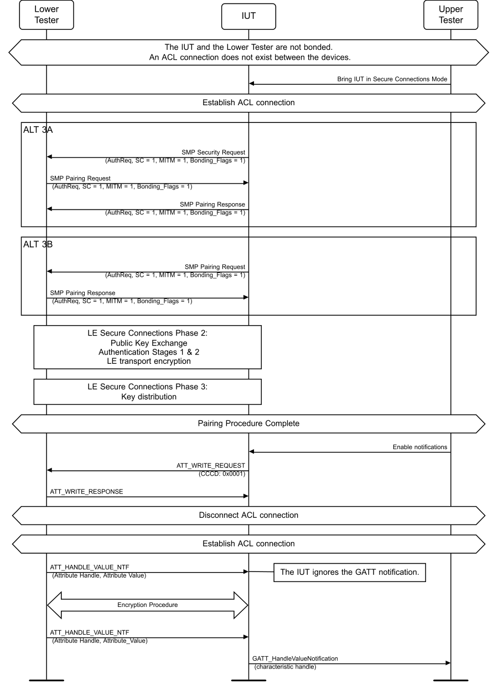

**Figure 4.62: LE Secure Connections Only, Incoming GATT Notification MSC**

1. The Upper Tester puts the IUT into the Secure Connections Only mode. 2. The Upper and Lower Testers perform the steps required to create a connection between the
Lower Tester and the IUT, with the IUT in the role specified in Table 4.25. 3. Perform alternative 3A or 3B depending on the IUT role in Table 4.25.
Alternative 3A (IUT is Peripheral):
3A.1 The IUT begins the pairing phase 1 with Secure Connections by sending an SMP Security Request, with the Secure Connections, Bonding_Flags, and MITM bits set to 1. 3A.2 The Lower Tester responds by sending an SMP Pairing Request, with the Secure Connections, Bonding_Flags, and MITM bits set to 1. 3A.3 The IUT replies with an SMP Pairing Response, with the Secure Connections, Bonding_Flags, and MITM bits set to 1. Alternative 3B (IUT is Central):
3B.1 The IUT begins the pairing phase 1 with Secure Connections by sending an SMP Pairing Request, with the Secure Connections, Bonding_Flags, and MITM bits set to 1. 3B.2 The Lower Tester replies with SMP Pairing Response, with the Secure Connections, Bonding_Flags, and MITM bits set to 1. 4. The IUT and the Lower Tester complete SMP Phase 2 (pairing) and Phase 3 (encryption and key
distribution). 5. The Upper Tester commands the IUT to enable GATT notifications with the Lower Tester. 6. The IUT sends an ATT_WRITE_REQUEST to the Lower Tester with CCCD set to 0x0001. 7. The Lower Tester sends an ATT_WRITE_RESPONSE to the IUT. 8. The IUT and the Lower Tester disconnect. 9. The Upper and Lower Testers perform the steps required to create a connection between the
Lower Tester and the IUT, with the IUT in the role specified in Table 4.25. 10. The Lower Tester sends a GATT_HANDLE_VALUE_NTF PDU to the IUT containing a valid
Attribute Handle and Attribute Value. 11. The IUT does not send a GATT_HandleValueNotification to the Upper Tester. 12. Perform alternative 12A or 12B depending on the IUT role in Table 4.25.
Alternative 12A (IUT is Peripheral):
12A.1 The Lower Tester initiates and completes the encryption procedure with the IUT. Alternative 12B (IUT is Central):
12B.1 The IUT initiates and completes the encryption procedure with the Lower Tester. 13. The Lower Tester sends an ATT_HANDLE_VALUE_NTF PDU to the IUT containing a valid
Attribute Handle and Attribute Value. 14. The IUT sends a GATT_HandleValueNotification to the Upper Tester.
• Expected Outcome
Pass verdict
In step 11, the IUT does not send a GATT_HandleValueNotification to the Upper Tester.
In step 14, the IUT sends a GATT_HandleValueNotification to the Upper Tester.

#### 4.5.6 Security Modes – Observer Role

Verify the correct behavior in this mode. The role of the IUT is the Observer and Acceptor.

##### 4.5.6.1 LE Security Mode-3 – Observer Role, Acceptor

• Test Purpose
Verify that the IUT in the LE Security Mode-3 with Level as specified in Table 4.26 receives BIS data.
• Reference
[18] 9.2.5, 1.2.2.1, 1.2.2.2
• Initial Condition
- The IUT is in Synchronization State.
- The Lower Tester is in Isochronous Broadcasting State.
- The Broadcast_Code has been obtained by the IUT’s Host using an unauthenticated or authenticated method as defined by the IUT’s application. The Lower Tester may obtain the Broadcast_Code by any means, including reading the “TSPX_broadcast_code” IXIT parameter, and for test purposes may be considered either authenticated or unauthenticated.
• Test Case Configuration

| Test Case ID | Security Level | Encryption |  | Initial Condition Encryption |  |
| --- | --- | --- | --- | --- | --- |
|  |  |  |  | Information |  |
| GAP/SEC/SEM/BV-31-C | 1 | Disabled(0x00) | None |  |  |
| GAP/SEC/SEM/BV-32-C | 2 or 3 | Enabled(0x01) | The Broadcast Code has been _ obtained by the IUT’s Host. |  |  |

Table 4.26: LE Security Mode-3 – Observer Role, Acceptor test cases
• Test Procedure

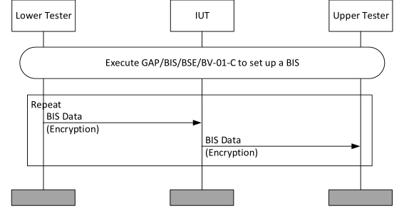

**Figure 4.63: LE Security Mode-3 – Observer Role, Acceptor MSC**

1. Perform test case GAP/BIS/BSE/BV-01-C [Broadcast Isochronous Synchronization
Establishment Procedure]. When enabling the BIG, set the Encryption parameter as specified in Table 4.26. 2. The Lower Tester sends BIS data to the IUT with the Encryption specified in Table 4.26. 3. The IUT receives the BIS data and reports the data to the Upper Tester. The Lower Tester and
the IUT operate on the same security mode and level.
• Expected Outcome
Pass verdict
In step 3, the IUT receives the BIS data and reports the data to the Upper Tester. The Lower Tester and the IUT operate on the same security mode and level.
GAP/SEC/SEM/BI-13-C [LE Security Mode-3 – Observer, Reject Lower Level Security]
• Test Purpose
Verify that the IUT in the LE Security Mode-3 rejects BIS events with lower level security.
• Reference
[18] 9.2.5, 1.2.2.1, 1.2.2.2
• Initial Condition
- The IUT is in Synchronization State.
- The Lower Tester is in Isochronous Broadcasting State.
- The Broadcast_Code has been obtained by the IUT’s Host using a method as defined by the IUT’s application. The Lower Tester may obtain the Broadcodeast_Code by any means, including reading the “TSPX_broadcast_code” IXIT parameter, and for test purposes may be considered either authenticated or unauthenticated.
• Test Procedure
1. Attempt to perform test case GAP/BIS/BSE/BV-01-C [Broadcast Isochronous Synchronization
Establishment Procedure]. When creating the BIG, the Lower Tester disables encryption. The security level of the IUT is set to level 2 or 3. 2. The IUT is unable to synchronize to the BIG.
• Expected Outcome
Pass verdict
In step 2, the IUT is unable to synchronize to the BIG.
GAP/SEC/SEM/BV-45-C [Re-pair or Stop a Connection Attempt When a Connection Fails Due to Failed Encryption, LE Security Mode-1 Level 4]
• Test Purpose
Verify that the IUT in LE Security Mode-1 Level 4 properly handles when a connection attempt with a bonded peer fails during the encryption phase. The IUT can either stop the connection attempt or notify the Upper Tester for User Interaction to pair with the peer. The IUT is the Central. The Lower Tester supports LE Secure Connections.
• Reference
[12] 10.3
• Initial Condition
- The IUT is bonded with the Lower Tester. The IUT is in Link Layer Standby state. The IUT has to be configured such that it will not reject the initiated procedure.
• Test Procedure
1. The Upper Tester configures the IUT into LE Security Mode-1 Level 4. 2. The Upper Tester configures the IUT (in the Central role) to receive advertising packets from the
Lower Tester (in the Peripheral role) and completes link establishment with the Lower Tester. 3. The Upper Tester triggers a GATT service request. 4. The IUT starts the encryption procedure with the Lower Tester using the LTK for the Lower
Tester. 5. The Lower Tester fails the encryption procedure. 6. Perform either alternative 6A or 6B depending on how the IUT handles the encryption failure.
Alternative 6A (The IUT stops the connection attempt):
6A.1 The IUT sends an event to the Upper Tester that indicates that the connection procedure trigged in step 2 failed. Alternative 6B (The IUT starts the pairing process with the Lower Tester):
6B.1 The IUT sends a request to the Upper Tester for user interaction to pair with the peer device. 6B.2 The Upper Tester accepts the request to pair with the peer device. 6B.3 The Upper Tester triggers an authentication procedure on the IUT, e.g., by an L2CAP channel. 6B.4 The IUT begins LE Secure Connections Phase 1 by sending an SMP Pairing Request, with the Secure Connections bit set to 1. 6B.5 The Lower Tester answers with SMP Pairing Response, with the Secure Connections bit set to 1. 6B.6 The IUT and the Lower Tester complete SMP Phase 2 (pairing) and Phase 3 (encryption and key distribution). 6B.7 The IUT sends a successful GATT service request event to the Upper Tester.
Upper Tester IUT (Central) Lower Tester
(Peripheral)

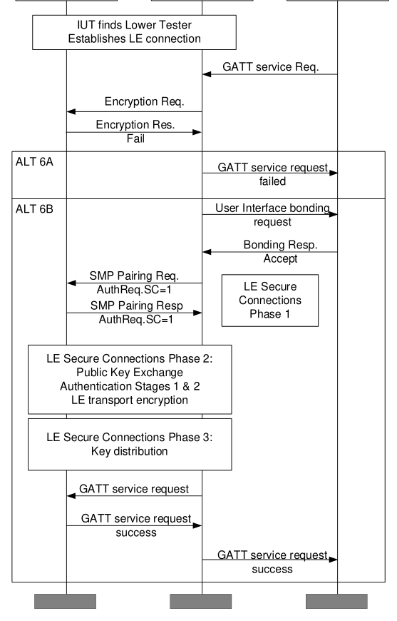

**Figure 4.64: GAP/SEC/SEM/BV-45-C [Re-pair or Stop a Connection Attempt When a Connection Fails Due to Failed Encryption, LE Security Mode-1 Level 4] MSC**

• Expected Outcome
Pass verdict
In step 6A.1, the IUT sends an event to the Upper Tester that the service request failed.
In alternative 6B, the Lower Tester and the IUT complete SMP phases 1, 2, and 3. The resulting connection is encrypted and operating in LE Security Mode-1 Level 4.
• Notes
It is recommended to test with a service or profile that requires Security Mode-1 Level 4.

#### 4.5.7 Security Modes – Broadcaster Role

Verify the correct behavior in this mode. The role of the IUT is Broadcaster and Initiator.

##### 4.5.7.1 LE Security Mode-3 – Broadcaster Role, Initiator

• Test Purpose
Verify that the IUT in the LE Security Mode-3 Level as specified in Table 4.27 sends BIS data.
• Reference
[18] 9.2.5, 1.2.2.1, 1.2.2.2
• Initial Condition
- The IUT is in Isochronous Broadcasting State.
- The Lower Tester is in Synchronization State.
- The Broadcast_Code has been obtained by the IUT’s Host using an unauthenticated or authenticated method per Table 4.27 as defined by the IUT’s application. The Lower Tester may obtain the Broadcast_Code by any means, including reading the “TSPX_broadcast_code” IXIT parameter, and for test purposes may be considered either authenticated or unauthenticated.
- The encryption information is broadcast as specified in Table 4.27.
• Test Case Configuration

| Test Case ID | Security Level | Encryption |  | Initial Condition Encryption |  |
| --- | --- | --- | --- | --- | --- |
|  |  |  |  | Information |  |
| GAP/SEC/SEM/BV-34-C | 1 | Disabled(0x00) | None |  |  |
| GAP/SEC/SEM/BV-35-C | 2 or 3 | Enabled(0x01) | The Broadcast Code has been _ obtained by the IUT’s Host. |  |  |

Table 4.27: LE Security Mode-3 – Broadcaster Role, Initiator test cases
• Test Procedure

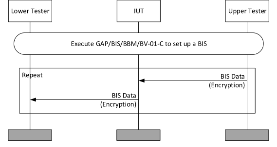

**Figure 4.65: LE Security Mode-3 – Broadcaster Role, Initiator MSC**

1. Perform test case GAP/BIS/BBM/BV-01-C [Broadcast Isochronous Stream Broadcasting Mode].
When enabling the BIG, set the Encryption parameter as specified in Table 4.27. 2. The Lower Tester receives the Broadcast Isochronous data. The Lower Tester and the IUT
operate on the same security mode and level.
• Expected Outcome
Pass verdict
In step 2, the Lower Tester receives the Broadcast Isochronous data. The IUT and the Lower Tester operate on the same security mode and level.

#### 4.5.8 Security Modes – Both Connected Roles

##### 4.5.8.1 Security Mode-4 - Initiator, Channel Establishment, Encryption Not Enabled

• Test Purpose
Verify that an IUT in the Security Mode and Level specified in Table 4.28 that initiates a data transmission to a remote service does not send a channel establishment request to the Lower Tester when encryption has not been enabled on the connection. The IUT is the initiator of the channel establishment procedure. The Lower Tester is the responder.
• Reference
[20] 5.2.2.1.2
• Initial Condition
- The IUT is in Idle mode.
- The PSM for the service on the IUT that requires the Security Mode and Level specified in Table 4.28 is specified in the IXIT.
- The Lower Tester does not support encryption.
- The IUT and the Lower Tester are not bonded (neither the IUT nor the Lower Tester has stored link keys).
- An ACL connection is established between the devices.
• Test Case Configuration

|  | TCID |  |  | Security Mode and Level |  |
| --- | --- | --- | --- | --- | --- |
| GAP/SEC/SEM/BI-25-C [Security Mode-4 Level 2 - Initiator, Encryption Not Enabled] |  |  | Security Mode-4 Level 2 |  |  |
| GAP/SEC/SEM/BI-26-C [Security Mode-4 Level 3 - Initiator, Encryption Not Enabled] |  |  | Security Mode-4 Level 3 |  |  |
| GAP/SEC/SEM/BI-27-C [Security Mode-4 Level 4 - Initiator, Encryption Not Enabled] |  |  | Security Mode-4 Level 4 |  |  |

Table 4.28: Security Mode-4 - Initiator, Channel Establishment, Encryption Not Enabled test cases
• Test Procedure

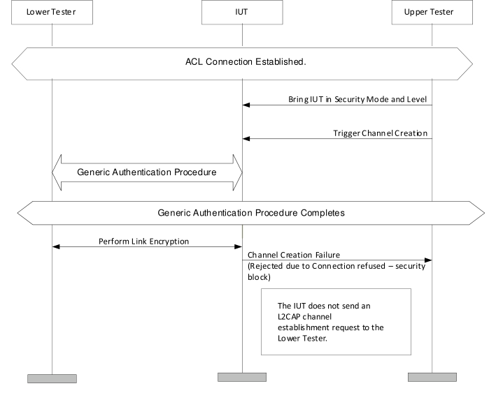

**Figure 4.66: Security Mode-4 - Initiator, Channel Establishment, Encryption Not Enabled MSC**

1. The Upper Tester puts the IUT into the Security Mode and Level specified in Table 4.28. 2. The Upper Tester triggers a channel creation event to set up a channel with the Lower Tester. 3. The IUT performs the Generic Authentication Procedure with the Lower Tester. The Generic
Authentication Procedure successfully completes. 4. The IUT performs link encryption with the Lower Tester. The link encryption fails. 5. The IUT signals to the Upper Tester that the channel creation failed after link encryption fails. 6. The IUT does not send an L2CAP channel establishment request to the Lower Tester.
• Test Condition
It must be possible to put the IUT in the Security Mode and Level specified in Table 4.28.
• Expected Outcome
Pass verdict
The IUT is to not send an L2CAP channel establishment request to the Lower Tester.

##### 4.5.8.2 Security Mode-4 - Initiator, Connectionless Channel, Unicast Data, Encryption

Not Enabled
• Test Purpose
Verify that an IUT in the Security Mode and Level specified in Table 4.29 that initiates a unicast data transmission on a connectionless channel does not send unicast data to the Lower Tester when encryption has not been enabled on the connection. The IUT is the initiator of the connectionless channel procedure.
• Reference
• Initial Condition
- The IUT is in Idle mode.
- The PSM for the service on the IUT that requires the Security Mode and Level specified in Table 4.29 is specified in the IXIT.
- The Lower Tester does not support encryption.
- The IUT and the Lower Tester are not bonded (neither the IUT nor the Lower Tester has stored link keys).
- An ACL connection is established between the devices.
• Test Case Configuration

| TCID |  |  | Security Mode and Level |  |
| --- | --- | --- | --- | --- |
| GAP/SEC/SEM/BI-28-C [Security Mode-4 Level 2 - Initiator, Connectionless Channel, Unicast Data, Encryption Not Enabled] |  | Security Mode-4 Level 2 |  |  |
| GAP/SEC/SEM/BI-29-C [Security Mode-4 Level 3 - Initiator, Connectionless Channel, Unicast Data, Encryption Not Enabled] |  | Security Mode-4 Level 3 |  |  |
| GAP/SEC/SEM/BI-30-C [Security Mode-4 Level 4 - Initiator, Connectionless Channel, Unicast Data, Encryption Not Enabled] |  | Security Mode-4 Level 4 |  |  |

Table 4.29: Security Mode-4 - Initiator, Connectionless Channel, Unicast Data, Encryption Not Enabled test cases
• Test Procedure

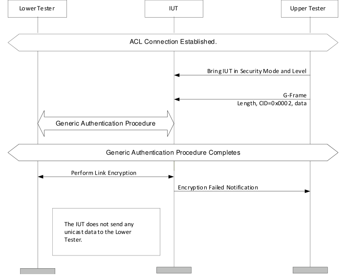

**Figure 4.67: Security Mode-4 - Initiator, Connectionless Channel, Unicast Data, Encryption Not Enabled MSC**

1. The Upper Tester puts the IUT into the Security Mode and Level specified in Table 4.29. 2. The Upper Tester sends an L2CAP G-Frame to the IUT with unicast data.
Authentication Procedure successfully completes. 4. The IUT performs link encryption with the Lower Tester. The link encryption fails. 5. The IUT signals to the Upper Tester that the link encryption fails. 6. The IUT does not send any unicast data to the Lower Tester.
• Test Condition
It must be possible to put the IUT in the Security Mode and Level specified in Table 4.29.
• Expected Outcome
Pass verdict
The IUT is to not send any unicast data to the Lower Tester.
GAP/SEC/SEM/BI-31-C [Security Mode-4, Level 4, Secure Connections – Responder, Insufficient Encryption Type]
• Test Purpose
Verify that an IUT in Security Mode-4 Level 4 supporting Secure Connections rejects a received channel establishment request from the Lower Tester if an insufficient encryption type is selected on the connection between the IUT and the Lower Tester. The IUT is the responder of the channel establishment procedure. The Lower Tester is the initiator.
• Reference
[20] 5.2.2.2.1
• Initial Condition
- The PSM for the service on the IUT that requires Security Mode-4, Level 4 is specified in the IXIT.
- The IUT and the Lower Tester have previously bonded using Secure Connections.
- An ACL connection exists between the devices.
- On the Lower Tester, set the Secure Connections (Host Support) LMP feature bit to 1 and the Secure Connections (Controller Support) LMP feature bit to 1.
- The IUT is in connectable mode.
• Test Procedure

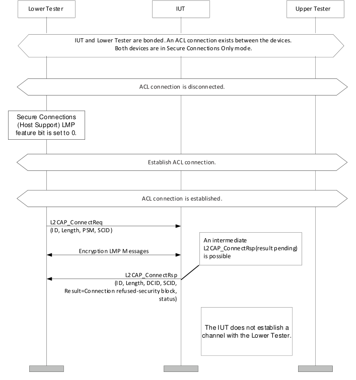

**Figure 4.68: Security Mode-4, Level 4, Secure Connections – Responder, Insufficient Encryption Type MSC**

1. The existing ACL connection between the IUT and the Lower Tester is disconnected. 2. On the Lower Tester, set the Secure Connections (Host Support) LMP feature bit to 0. 3. The Lower Tester establishes an ACL connection with the IUT. 4. The Lower Tester requests establishing a channel to access the Security Mode-4 Level 4 PSM
listed in the IXIT on the IUT. 5. The IUT and the Lower Tester begin link encryption. 6. The IUT rejects the L2CAP channel establishment request from the Lower Tester.
• Expected Outcome
Pass verdict
The IUT is to reject the L2CAP channel establishment request from the Lower Tester.
GAP/SEC/SEM/BI-32-C [Security Mode-4, Level 4, Secure Connections – Initiator, Channel Establishment, Insufficient Encryption Type]
• Test Purpose
Verify that an IUT in Security Mode-4 Level 4 supporting Secure Connections rejects a received channel establishment if an insufficient encryption type is selected on the connection between the IUT and the Lower Tester. The IUT is the initiator of the channel establishment procedure. The Lower Tester is the responder.
• Reference
[20] 5.2.2.2.2
• Initial Condition
- The PSM for the service on the IUT that requires Security Mode-4, Level 4 is specified in the IXIT.
- The IUT and the Lower Tester have previously bonded using Secure Connections.
- An ACL connection exists between the devices.
- On the Lower Tester, set the Secure Connections (Host Support) LMP feature bit to 1 and the Secure Connections (Controller Support) LMP feature bit to 1.
- The IUT is in connectable mode.
• Test Procedure

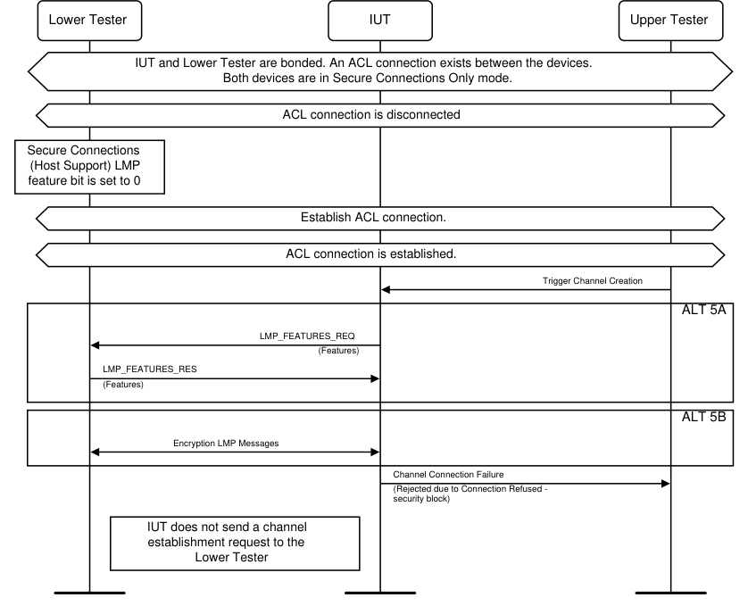

**Figure 4.69: Security Mode-4, Level 4, Secure Connections – Initiator, Channel Establishment, Insufficient Encryption Type MSC**

1. The existing ACL connection between the IUT and the Lower Tester is disconnected. 2. On the Lower Tester, set the Secure Connections (Host Support) LMP feature bit to 0. 3. The Lower Tester establishes an ACL connection with the IUT. 4. The Upper Tester triggers an event to create a channel to the Lower Tester. 5. Perform either alternative 5A or 5B depending on the IUT behavior.
Alternative 5A (The IUT executes a feature exchange):
5A.1 The IUT sends an LMP_FEATURES_REQ PDU to the Lower Tester with Features set to the IUT feature set. 5A.2 The Lower Tester sends an LMP_FEATURES_RES PDU to the IUT with Features set to the Lower Tester feature set. Alternative 5B (The IUT begins encryption):
5B.1 The IUT and the Lower Tester begin link encryption. 6. The IUT notifies the Upper Tester that the channel creation with the Lower Tester failed due to a
security block. 7. The IUT does not send an L2CAP channel establishment request to the Lower Tester.
• Expected Outcome
Pass verdict
In step 7, the IUT does not send an L2CAP channel establishment request to the Lower Tester.
GAP/SEC/SEM/BI-33-C [Security Mode-4, Secure Connections – Initiator, Connectionless Channel, Unicast Data, Insufficient Encryption Type]
• Test Purpose
Verify that an IUT in Security Mode-4 Level 4 supporting Secure Connections does not send unicast data to the Lower Tester if an insufficient encryption type is selected on the connection between the IUT and the Lower Tester. The IUT is the initiator of the connectionless channel establishment procedure. The Lower Tester is the responder.
• Reference
[20] 5.2.2.2.2
• Initial Condition
- The PSM for the service on the IUT that requires Security Mode-4, Level 4 is specified in the IXIT.
- The IUT and the Lower Tester have previously bonded using Secure Connections.
- An ACL connection exists between the devices.
- On the Lower Tester, set the Secure Connections (Host Support) LMP feature bit to 1 and the Secure Connections (Controller Support) LMP feature bit to 1.
- The IUT is in connectable mode.
• Test Procedure

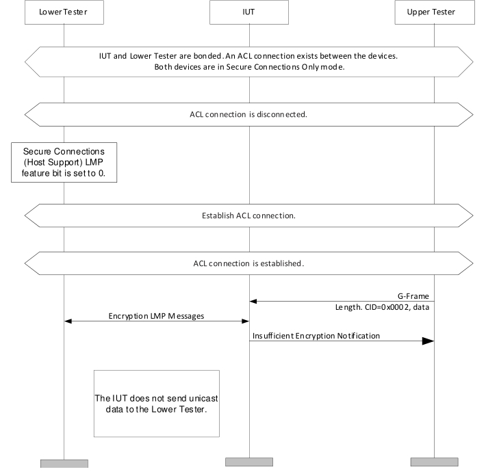

**Figure 4.70: Security Mode-4, Secure Connections – Initiator, Connectionless Channel, Unicast Data, Insufficient Encryption Type MSC**

1. The existing ACL connection between the IUT and the Lower Tester is disconnected. 2. On the Lower Tester, set the Secure Connections (Host Support) LMP feature bit to 0. 3. The Lower Tester establishes an ACL connection with the IUT. 4. The Upper Tester sends an L2CAP G-Frame to the IUT. 5. The IUT and the Lower Tester begin link encryption. 6. The IUT signals to the Upper Tester that the link encryption is insufficient. 7. The IUT does not send any unicast data to the Lower Tester.
• Expected Outcome
Pass verdict
The IUT is to not send any unicast data to the Lower Tester.

#### 4.5.9 Channel Sounding

GAP/SEC/SEM/BV-68-C [Channel Sounding Service Response – Insufficient Authentication, Peripheral]
• Test Purpose
Verify that the IUT properly rejects the service request when the Lower Tester does not set security to LE security Mode-1 level 2 or higher.
• Reference
[22] 10.11
• Initial Condition
- The IUT is operating in the Peripheral role.
- The Lower Tester is operating in the Central role.
- Physical link is established by either directed or undirected connectable mode.
- No previous bond or insufficient bond exists between the IUT and the Lower Tester.
- The Lower Tester has the Channel Sounding feature bit set.
• Test Procedure

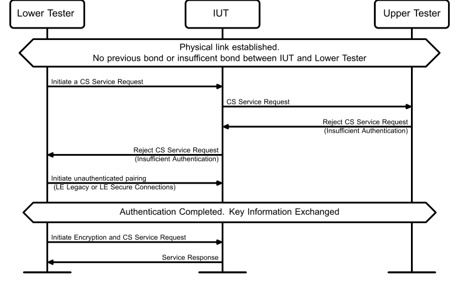

**Figure 4.71: Channel Sounding Service Response – Insufficient Authentication, Peripheral MSC**

1. The Lower Tester initiates a CS service request to the IUT. 2. The Upper Tester detects there was either no bonding or bonding with security lower than Mode-
1 Level 2. 3. The Upper Tester rejects the CS service request with the error code “Insufficient Authentication”. 4. The Lower Tester initiates unauthenticated pairing using either LE Legacy or LE Secure
Connections. 5. Authentication is completed successfully and key information is exchanged properly. 6. The Lower Tester initiates encryption and sends the CS service request again. 7. The IUT replies with the correct service response.
• Expected Outcome
Pass verdict
The IUT rejects the service request when the IUT and the Lower Tester have insufficient security.
The IUT completes the second service request after the correct authentication is established.

##### 4.5.9.1 Channel Sounding Security

• Test Purpose
Verify that the IUT uses the proper CS Procedure based on the LE Security Mode.
• Reference
[22] 10.11.1
• Initial Condition
- The Lower Tester has the Channel Sounding feature bit set.
- The Lower Tester and the IUT have completed the encryption procedure with the LE Security Mode listed in Table 4.30.
• Test Case Configuration

|  | TCID | LE | Security Mode |  |  | CS Procedure |  |
| --- | --- | --- | --- | --- | --- | --- | --- |
| GAP/SEC/SEM/BV-69-C [Channel Sounding Security, CS Security L1] |  | Channel Sounding Security level 1 |  |  | CS Tone or CS RTT |  |  |
| GAP/SEC/SEM/BV-70-C [Channel Sounding Security, CS Security L2] |  | Channel Sounding Security level 2 |  |  | 150 ns CSS RTT accuracy with CS Tones |  |  |
| GAP/SEC/SEM/BV-71-C [Channel Sounding Security, CS Security L3] |  | Channel Sounding Security level 3 |  |  | 10 ns CSS RTT accuracy with CS Tones |  |  |
| GAP/SEC/SEM/BV-72-C [Channel Sounding Security, CS Security L4] |  | Channel Sounding Security level 4 |  |  | 10 ns CSS RTT accuracy with CS RTT with Sounding Sequence or CS RTT with Random Sequence |  |  |

Table 4.30:Channel Sounding Security test cases
• Test Procedure

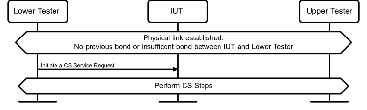

**Figure 4.72: Channel Sounding Service Response – Insufficient Authentication, Peripheral MSC**

1. The Lower Tester sends a CS service request to the IUT. 2. The IUT performs the CS Procedure as described in Table 4.30.
• Expected Outcome
Pass verdict
The IUT that is using the LE Security Mode specified in Table 4.30 uses the CS Procedure specified in Table 4.30.

### 4.6 Idle Mode Procedures

#### 4.6.1 General Inquiry - Central

Verify the correct behavior in this mode. The role of the IUT is Central and initiator.
GAP/IDLE/GIN/BV-01-C [General Inquiry – IUT is Central]
• Test Purpose
Verify that if general inquiry is initiated by the IUT, it sends for at least TGAP(100) inquiry request messages (GIAC).
The IUT is Central and initiator and the Lower Tester is Peripheral and acceptor of the general inquiry procedure.
• Reference
[1] 6.1
• Initial Condition
- The IUT is in Baseband state ‘Standby’ and in Idle mode.
- If the IUT supports general-discoverable mode, the Lower Tester performs inquiry to get the clock offset with respect to the IUT and after the Upper Tester has ordered the IUT to be in general- discoverable mode.
- If the IUT does not support general-discoverable mode, the IUT has to be configured to page the Lower Tester in order to get the CLK offset after the Upper Tester has ordered the IUT to be in connectable mode.
• Test Procedure

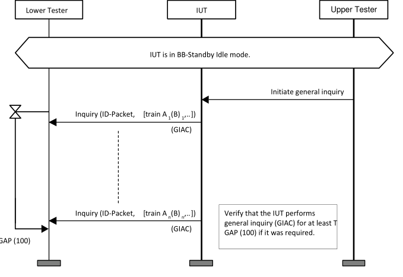

**Figure 4.73: GAP/IDLE/GIN/BV-01-C [General Inquiry – IUT is Central] MSC**

1. The Upper Tester orders the IUT to initiate general inquiry. 2. The Lower Tester scans for inquiry packets from the IUT to receive a packet within the IUT’s
repetition of A-train. 3. The Lower Tester monitors the train A during 10 ms. If no inquiry packet is received, the Lower
Tester switches to scan train B during 10 ms. 4. Switching trains will continue until first ID packet is received by the Lower Tester. The Lower
Tester adjusts its RX window and phase to get the remaining hops. 5. The Lower Tester monitors inquiry packets for 255 times. 6. The Lower Tester immediately starts listening on the other train frequencies. It monitors for

## 256 times. 7. Steps 5 and 6 are repeated until 10.24 s - 10 ms - 20 ms.

• Test Condition
It must be possible to initiate general inquiry by the IUT.
• Expected Outcome
Pass verdict
The IUT sends at least for TGAP(100) - 30 ms inquiry messages (ID-Packet) by using GIAC.

#### 4.6.2 Device Name during General Inquiry

Verify the correct behavior in this mode. The role of the IUT is Peripheral.
GAP/IDLE/DNDIS/BV-01-C [Device Name During General Inquiry – IUT is Peripheral]
• Test Purpose
Verify that the Lower Tester during general inquiry receives device name from IUT in the reception of extended inquiry response data.
The Lower Tester is Central and initiator and the IUT is Peripheral and acceptor of the general inquiry procedure.
• Reference
[1] 8
• Initial Condition
- The IUT is in Baseband state ‘Standby’ and in Idle mode.
• Test Procedure

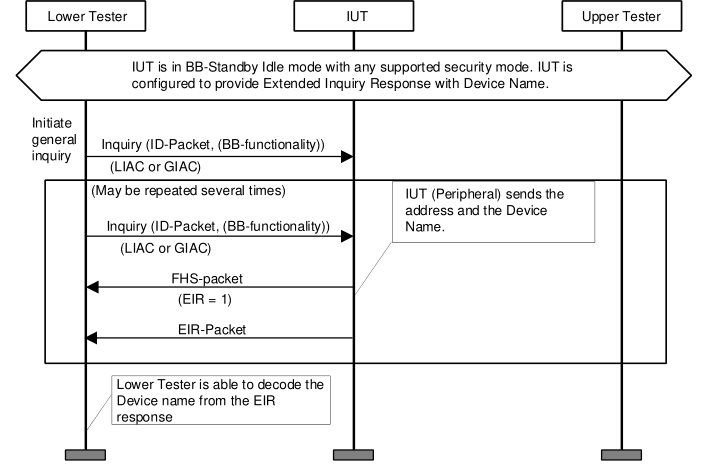

**Figure 4.74: GAP/IDLE/DNDIS/BV-01-C [Device Name During General Inquiry – IUT is Peripheral] MSC**

1. The Lower Tester initiates general inquiry. 2. The Lower Tester receives extended inquiry response data from the IUT.
• Test Condition
It must be possible to decode Device Name from EIR data in the Lower Tester.
• Expected Outcome
Pass verdict
The Lower Tester decodes EIR data and finds the IUT's device name ('complete' or 'shortened').

#### 4.6.3 Limited Inquiry - Central

Verify the correct behavior in this mode. The role of the IUT is Central and initiator.
GAP/IDLE/LIN/BV-01-C [Limited Inquiry – IUT is Central]
• Test Purpose
Verify that if limited inquiry is initiated by the IUT, it sends for at least TGAP(100) inquiry request messages (LIAC).
The IUT is Central and initiator and the Lower Tester is Peripheral and acceptor of the limited inquiry procedure.
• Reference
[1] 6.2
• Initial Condition
- The IUT is in Baseband state ‘Standby’ and in Idle mode.
- If the IUT supports general-discoverable mode, the Lower Tester performs inquiry to get the clock offset with respect to the IUT and after the Upper Tester has ordered the IUT to be in general- discoverable mode.
- If the IUT does not support general-discoverable mode, the IUT has to be configured to page the Lower Tester in order to get the CLK offset after the Upper Tester has ordered the IUT to be in connectable mode.
• Test Procedure

**Figure 4.75: GAP/IDLE/LIN/BV-01-C [Limited Inquiry – IUT is Central] MSC**

1. The IUT is ordered (by using the Upper Tester) to initiate limited inquiry. 2. The Lower Tester scans for inquiry packets from the IUT to receive a packet within the IUT’s
repetition of A-train. 3. The Lower Tester monitors the train A during 10 ms. If no inquiry packet is received, the Lower
Tester switches to scan train B during 10 ms. 4. Switching trains will continue until first ID packet is received by the Lower Tester. The Lower
Tester adjusts its RX window and phase to get the remaining hops. 5. The Lower Tester monitors inquiry packets for 255 times. 6. The Lower Tester immediately starts listening on the other train frequencies. It monitors for

## 256 times. 7. Steps 5 and 6 are repeated until 10.24s - 10ms - 20 ms.

• Test Condition
It must be possible to initiate limited inquiry by IUT.
• Expected Outcome
Pass verdict
The IUT sends at least for TGAP(100) - 30 ms inquiry messages (ID-Packet) by using LIAC.

#### 4.6.4 Device Discovery - Central

Verify the correct behavior in this mode. The role of the IUT is Central and initiator.
GAP/IDLE/DED/BV-02-C [Device Discovery and Name Discovery – Secure Simple Pairing Supported by IUT]
• Test Purpose
Verify that the IUT that supports Secure Simple Pairing first performs the inquiry procedure and afterwards it performs the name discovery procedure for one Peripheral if device discovery is required by upper layer of the IUT.
• Reference
[1] 6.4
• Initial Condition
- The IUT is in Idle mode with Security Mode-4 supported by the IUT.
- Lower Tester's LMP features include:
▪ Feature bit 51 (Secure Simple Pairing) set to 1
▪ Feature bit 63 (Extended Features) set to 1
▪ Feature bit 64 (Secure Simple Pairing - Host Support) set to 1
- The Lower Tester is discoverable and connectable.
• Test Procedure

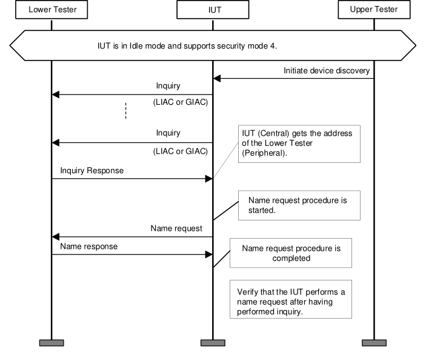

**Figure 4.76: GAP/IDLE/DED/BV-02-C [Device Discovery and Name Discovery – Secure Simple Pairing Supported by IUT] MSC**

• Test Condition
The IUT must be able to initiate and perform the device discovery procedure.
• Expected Outcome
Pass verdict
After inquiry, the IUT performs a successful name request procedure.

#### 4.6.5 Bonding - Central

Verify the correct behavior in this mode. The role of the IUT is Central and initiator.
Applicable only for IUTs supporting initiation of dedicated bonding and initiation of limited or general inquiry.
GAP/IDLE/BON/BV-02-C [Bonding - Central]
• Test Purpose
Verify that, if the bonding procedure is required by upper layer of the IUT with the reason only to create and exchange a link key (dedicated bonding), it performs the dedicated bonding procedure.
The IUT is Central and initiator of the bonding procedure. The Lower Tester is Peripheral and acceptor.
• Reference
[1] 6.5
• Initial Condition
- The Preamble “Inquiry Procedure” is performed with supported Security Mode-2 or -4 of the IUT.
- The Lower Tester’s LMP features include:
▪ Feature bit 51 (Secure Simple Pairing) set to 1
▪ Feature bit 63 (Extended Features) set to 1
▪ Feature bit 64 (Secure Simple Pairing - Host Support) set to 0
• Test Procedure

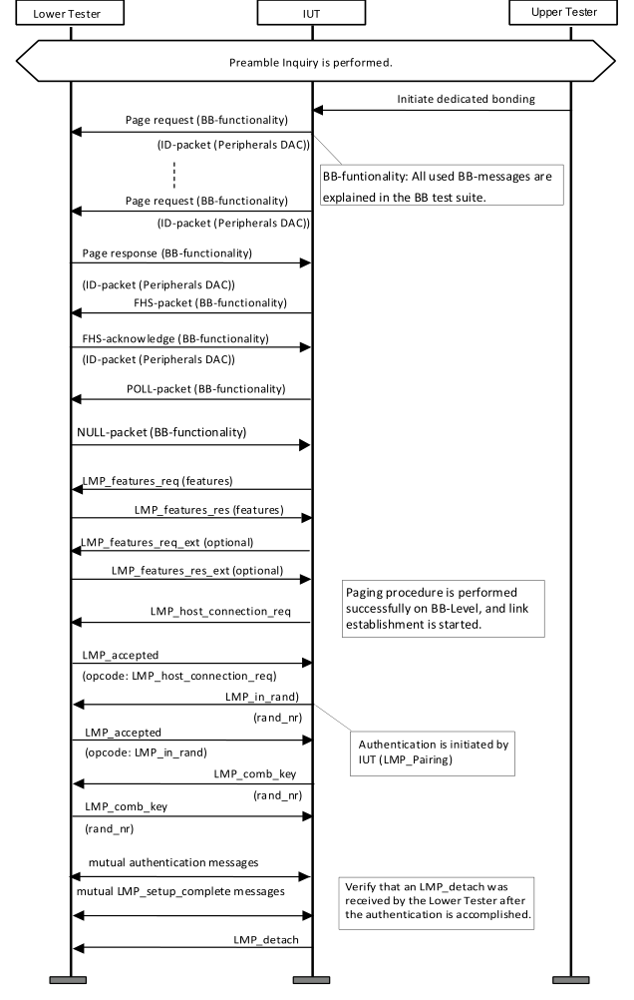

**Figure 4.77: GAP/IDLE/BON/BV-02-C [Bonding - Central] MSC**

procedure. 2. Afterwards, the Dedicated Bonding procedure is performed successfully.
• Test Condition
The IUT must be able to trigger the Dedicated Bonding procedure via the Upper Tester.
• Expected Outcome
Pass verdict
After the authentication is completed, the IUT has sent an "LMP_detach" message.
Verify that the resulting link key is a combination key.

#### 4.6.6 Dedicated Bonding test cases

GAP/IDLE/BON/BV-03-C [Dedicated Bonding]
• Test Purpose
Verify that dedicated bonding is performed.
The IUT is Central and initiator of the bonding procedure. The Lower Tester is Peripheral and acceptor.
• Reference
[1] 6.5
• Initial Condition
- The Preamble “Inquiry Procedure” is performed with Security Mode-4 of the IUT.
- The Lower Tester’s LMP features include:
▪ Feature bit 51 (Secure Simple Pairing) set to 1
▪ Feature bit 63 (Extended Features) set to 1
▪ Feature bit 64 (Secure Simple Pairing - Host Support) set to 1
- The Lower Tester’s IO capabilities are set to “DisplayYesNo”.
- The Lower Tester’s Authentication_Requirements set to “MITM protection not required – Dedicated Bonding” (0x02).
• Test Procedure

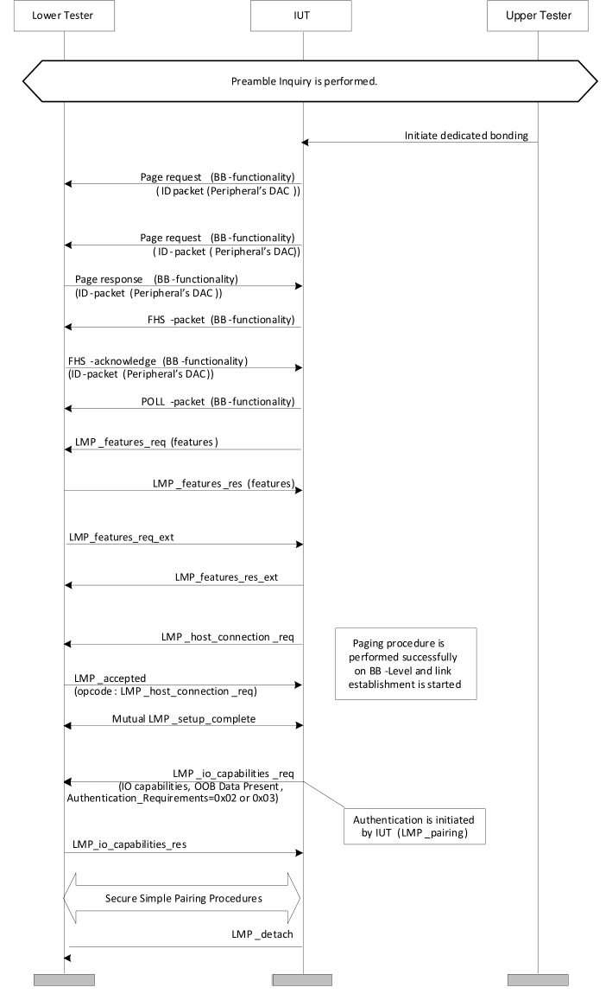

**Figure 4.78: GAP/IDLE/BON/BV-03-C [Dedicated Bonding] MSC**

1. After the Preamble, the IUT is ordered by the Upper Tester to initiate the dedicated bonding
procedure. 2. Afterwards, the Dedicated Bonding procedure is performed successfully.
• Test Condition
The IUT must be able to trigger the Dedicated Bonding procedure via the Upper Tester.
• Expected Outcome
Pass verdict
After the authentication is completed, the IUT has sent an “LMP_detach” message.
Verify that the Authentication_Requirements parameter received from the IUT is either: 0x02 (MITM Protection Not Required – Dedicated Bonding) or 0x03 (MITM Protection Required – Dedicated Bonding).
If the Authentication_Requirements parameter is 0x02, verify that the link key is an unauthenticated combination key. If the Authentication_Requirements parameter is 0x03, verify that the link key is an authenticated combination key.
GAP/IDLE/BON/BV-04-C [Dedicated Bonding – Authenticated Link Key]
• Test Purpose
Verify that dedicated bonding is performed.
The IUT is Central and initiator of the bonding procedure. The Lower Tester is Peripheral and acceptor.
• Reference
[1] 6.5
• Initial Condition
- The Preamble “Inquiry Procedure” is performed.
- The Lower Tester’s LMP features include:
▪ Feature bit 51 (Secure Simple Pairing) set to 1
▪ Feature bit 63 (Extended Features) set to
▪ Feature bit 64 (Secure Simple Pairing - Host Support) set to 1
- The Lower Tester’s IO capabilities are set to “DisplayYesNo”.
- The Lower Tester’s Authentication_Requirements set to “MITM protection required – Dedicated Bonding” (0x03).
• Test Procedure

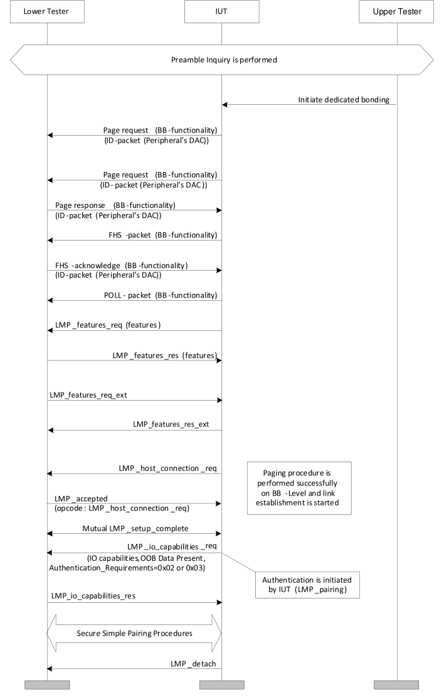

**Figure 4.79: GAP/IDLE/BON/BV-04-C [Dedicated Bonding – Authenticated Link Key] MSC**

1. After the Preamble, the IUT is ordered by the Upper Tester to initiate the dedicated bonding
procedure. 2. Afterwards, the Dedicated Bonding procedure is performed successfully.
• Test Condition
The IUT must be able to trigger the Dedicated Bonding procedure via the Upper Tester.
• Expected Outcome
Pass verdict
After the authentication is completed, the IUT has sent an “LMP_detach” message.
Verify that the Authentication_Requirements parameter received from the IUT is either: 0x02 (MITM Protection Not Required – Dedicated Bonding) or 0x03 (MITM Protection Required – Dedicated Bonding).
Verify that the resulting link key is an authenticated combination key.

#### 4.6.7 General Bonding test cases

GAP/IDLE/BON/BV-05-C [General Bonding]
• Test Purpose
Verify that general bonding is performed.
The IUT is Central and initiator of the bonding procedure. The Lower Tester is Peripheral and acceptor.
• Reference
[1] 6.5
• Initial Condition
- The Preamble “Inquiry Procedure” is performed with Security Mode-4 of the IUT.
- The Lower Tester’s LMP features include:
▪ Feature bit 51 (Secure Simple Pairing) set to 1
▪ Feature bit 63 (Extended Features) set to 1
▪ Feature bit 64 (Secure Simple Pairing - Host Support) set to 1
- The Lower Tester’s IO capabilities are set to “DisplayYesNo”.
- The Lower Tester’s Authentication_Requirements set to “MITM protection no required - General Bonding” (0x04).
• Test Procedure

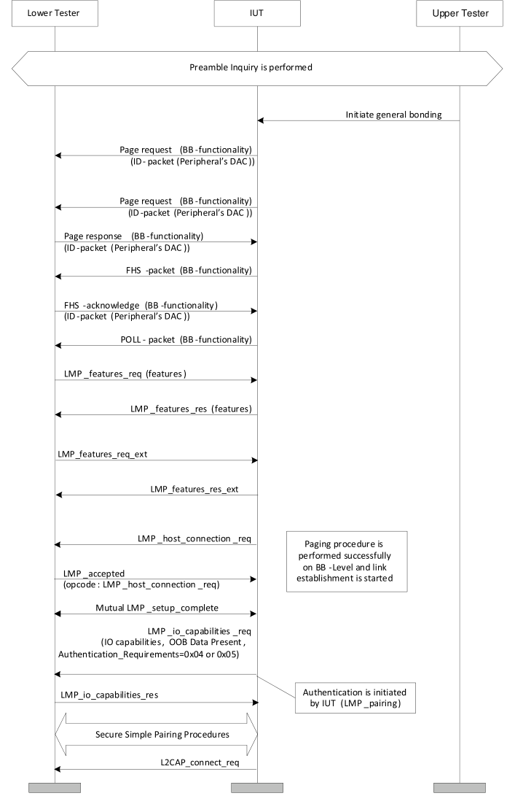

**Figure 4.80: GAP/IDLE/BON/BV-05-C [General Bonding] MSC**

1. After the Preamble, the IUT is ordered by the Upper Tester to initiate the general bonding
procedure. 2. Afterwards, the General Bonding procedure is performed successfully.
• Test Condition
• Expected Outcome
Pass verdict
After the authentication is completed, the IUT has sent an “L2CAP_connect_req” message.
Verify that the Authentication_Requirements parameter received from the IUT is either: 0x04 (MITM Protection Not Required – General Bonding) or 0x05 (MITM Protection Required – General Bonding).
If the Authentication_Requirements parameter is 0x04, verify that the link key is an unauthenticated combination key. If the Authentication_Requirements parameter is 0x05, verify that the link key is an authenticated combination key.
GAP/IDLE/BON/BV-06-C [General Bonding – Authenticated Link Key]
• Test Purpose
Verify that general bonding is performed.
The IUT is Central and initiator of the bonding procedure. The Lower Tester is Peripheral and acceptor.
• Reference
[1] 6.5
• Initial Condition
- The Preamble “Inquiry Procedure” is performed with Security Mode-4 of the IUT.
- The Lower Tester’s LMP features include:
▪ Feature bit 51 (Secure Simple Pairing) set to 1
▪ Feature bit 63 (Extended Features) set to 1
▪ Feature bit 64 (Secure Simple Pairing - Host Support) set to 1
- The Lower Tester’s IO capabilities are set to “DisplayYesNo”.
- The Lower Tester’s Authentication_Requirements are set to “MITM Protection Required – General Bonding” (0x05).
• Test Procedure

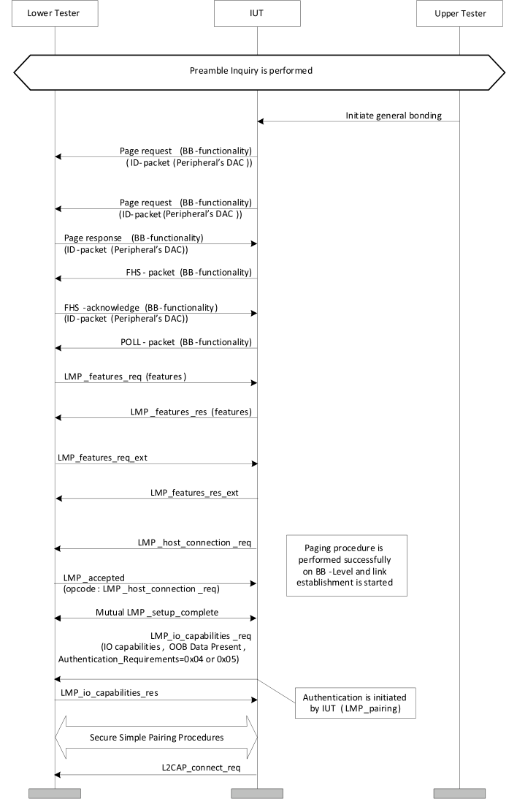

**Figure 4.81: GAP/IDLE/BON/BV-06-C [General Bonding – Authenticated Link Key] MSC**

1. After the Preamble, the IUT is ordered by the Upper Tester to initiate the general bonding
procedure. 2. Afterwards, the General Bonding procedure is performed successfully.
• Test Condition
The IUT must be able to trigger the General Bonding procedure via the Upper Tester.
• Expected Outcome
Pass verdict
After the authentication is completed, the IUT has sent an “L2CAP_connect_req” message.
Verify that the Authentication_Requirements parameter received from the IUT is either: 0x04 (MITM Protection Not Required – General Bonding) or 0x05 (MITM Protection Required – General Bonding).
Verify that the resulting link key is an authenticated combination key.

#### 4.6.8 Link Establishment - Central

Verify the correct behavior in this mode. The role of the IUT is Central and initiator.
GAP/EST/LIE/BV-02-C [Link Establishment – Initiator]
• Test Purpose
Verify that the IUT performs a link establishment procedure, initiated by itself.
The IUT is Central and initiator. The Lower Tester is Peripheral and acceptor of the link establishment procedure.
• Reference
[1] 7.1
• Initial Condition
- The IUT is in Baseband state ‘Standby’ and in Idle mode.
- The Preamble for “Inquiry Procedure” is performed.
• Test Procedure

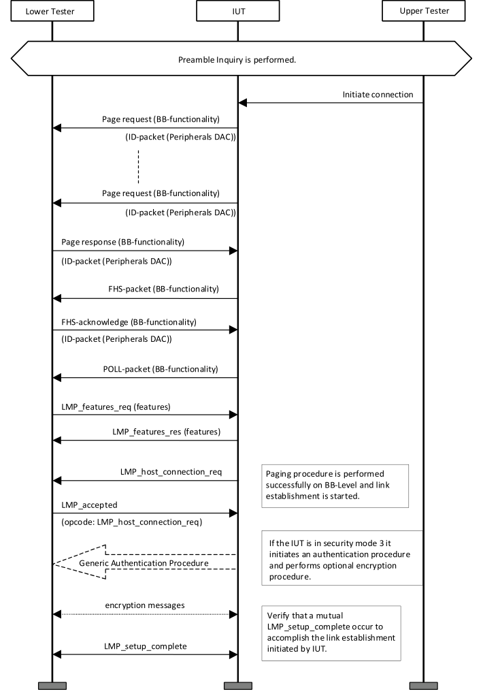

**Figure 4.82: GAP/EST/LIE/BV-02-C [Link Establishment – Initiator] MSC**

• Test Condition
The Lower Tester behaves as being discoverable.
• Expected Outcome
Pass verdict
For completion of the link establishment a mutual “LMP_setup_complete” occurs.

### 4.7 Operational Modes and Procedures for Use on LE Physical

Channels

#### 4.7.1 Broadcasting and Observing

Verify the correct implementation of the Broadcast Mode and Observation Procedure.

##### 4.7.1.1 Broadcast Mode

Verify the correct implementation of the Broadcast Mode.
GAP/BROB/BCST/BV-01-C [Broadcast Mode No Scan Response]
• Test Purpose
Verify that the IUT in Broadcast Mode does not implement scan response data; the peer device is Passive Scanning.
• Reference
[4], [9], [12] 9.1.1
[10] 1.3
• Initial Condition
- The IUT is in Link Layer state ‘Standby’.
- The advertising data in Broadcast Mode for the IUT is specified in the IXIT [3].
• Test Procedure
1. The Lower Tester performs the Observation Procedure using Passive Scanning. 2. The Upper Tester orders the IUT to enter Broadcast Mode using the specified advertising data.

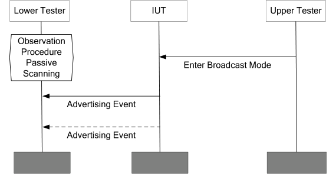

**Figure 4.83: GAP/BROB/BCST/BV-01-C [Broadcast Mode No Scan Response] MSC**

• Test Condition
It must be possible to order IUT to enter Broadcast Mode.
• Expected Outcome
Pass verdict
The Lower Tester receives non-connectable advertising events sent by the IUT.
The Lower Tester receives the specified advertising data sent from the IUT.
1. Does not contain the FLAGS AD Type; this is applicable if:
a. The IUT is a BR/EDR/LE Broadcaster compliant to Core Specification version 4.0, or b. The IUT is a Broadcaster compliant to the Core Specification Supplement (CSS)
Or:
2. Contains the FLAGS AD Type with both the LE Limited Discoverable Flag and the LE General
Discoverable Flag set to 0.
• Notes
Since the broadcasting is not a reliable transmission method, multiple broadcast packets may need to be sent to verify compliance.
GAP/BROB/BCST/BV-02-C [Broadcast Mode Scan Response]
• Test Purpose
Verify that the IUT is in Broadcast Mode and implements scan response data; the peer device is Active Scanning.
• Reference
[4] 9.1.1
• Initial Condition
- The IUT is in Link Layer state ‘Standby’.
- The advertising data in Broadcast Mode is specified for the IUT in the IXIT [3].
• Test Procedure
1. The Lower Tester performs the Observation Procedure using Active Scanning. 2. The Upper Tester orders the IUT to enter Broadcast Mode using the specified advertising data.

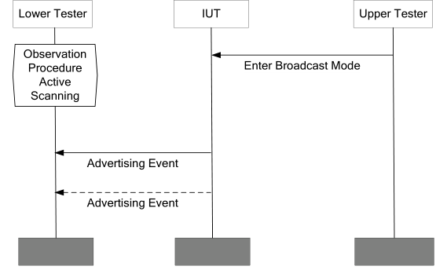

**Figure 4.84: GAP/BROB/BCST/BV-02-C [Broadcast Mode Scan Response] MSC**

• Test Condition
It must be possible to order IUT to enter Broadcast Mode.
• Expected Outcome
Pass verdict
The Lower Tester receives scannable advertising events sent by the IUT.
The Lower Tester receives the specified advertising data and scan response data sent from the IUT.
The advertising data or scan response data either does not contains the FLAGS AD Type or contains the FLAGS AD Type but the LE Limited Discoverable Flag and the LE General Discoverable Flag are not set.
• Notes
Since the broadcasting is not a reliable transmission method, multiple broadcast packets may need to be sent to verify compliance.
GAP/BROB/BCST/BV-03-C [Broadcast Mode Resolvable Private Address]
• Test Purpose
Verify that the IUT in Broadcast Mode is using a resolvable private address.
• Reference
[4], [9], [12] 9.1.1
[12] 10.7
[14] 1.3.2.3
[10] 1.3
• Initial Condition
- The IUT is in Link Layer state ‘Standby’.
- The IUT and the Lower Tester are paired using either LE Legacy or LE Secure Connections.
- The advertising data in Broadcast Mode is specified for the IUT in the IXIT [3].
- The Device Identity (IRK and Identity Address) used in the Resolvable Private Address Generation Procedure and Resolvable Private Address Resolution Procedure is specified for the IUT in the IXIT. Alternatively, the IUT may use a Device Identity distributed to the Lower Tester prior to executing this test procedure.
• Test Procedure
1. The Lower Tester performs the Observation Procedure using Passive Scanning. 2. The IUT generates a resolvable private address using the Resolvable Private Address
Generation Procedure. 3. The Upper Tester orders the IUT to enter Broadcast Mode using the specified advertising data;
the IUT advertises using a generated resolvable private address.

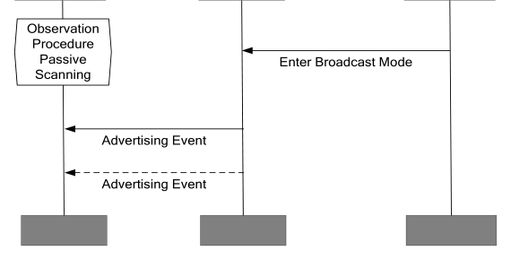

**Figure 4.85: GAP/BROB/BCST/BV-03-C [Broadcast Mode Resolvable Private Address] MSC**

• Test Condition
It must be possible to order IUT to enter Broadcast Mode.
• Expected Outcome
Pass verdict
The Lower Tester receives non-connectable advertising events sent by the IUT.
The Lower Tester receives the specified advertising data sent from the IUT.
The Lower Tester successfully resolves the private address (the private address is associated with the IUT) received in the advertising events using the Resolvable Private Address Resolution Procedure.
The advertising data either:
1. Does not contain the FLAGS AD Type; this is applicable if:
a. The IUT is a BR/EDR/LE Broadcaster compliant to Core Specification version 4.0, or b. The IUT is a Broadcaster compliant to the Core Specification Supplement (CSS)
Or:
2. Contains the FLAGS AD Type with both the LE Limited Discoverable Flag and the LE General
Discoverable Flag set to 0.
• Notes
Since the broadcasting is not a reliable transmission method, multiple broadcast packets may need to be sent to verify compliance.
GAP/BROB/BCST/BV-04-C [Broadcast Mode Non-Resolvable Private Address]
• Test Purpose
Verify that the IUT in Broadcast Mode is using a non-resolvable private address.
• Reference
[9], [12] 10.7.3
[10] 1.3
• Initial Condition
- The IUT is in Link Layer state ‘Standby’.
- The advertising data in Broadcast Mode is specified for the IUT in the IXIT.
- TGAP (private_addr_int) for the IUT is specified in the IXIT.
• Test Procedure
1. The Lower Tester performs the Observation Procedure using Passive Scanning. 2. The Upper Tester orders the IUT to enter Broadcast Mode using the specified advertising data;
the IUT generates a non-resolvable private address using the non-resolvable Private Address Generation Procedure and advertises using the generated non-resolvable private address.

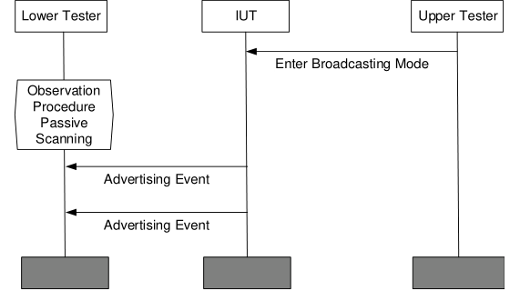

**Figure 4.86: GAP/BROB/BCST/BV-04-C [Broadcast Mode Non-Resolvable Private Address] MSC**

• Test Condition
It must be possible to order IUT to enter Broadcast Mode.
• Expected Outcome
Pass verdict
The Lower Tester receives non-connectable advertising events sent by the IUT.
The Lower Tester receives the specified advertising data sent from the IUT that includes the non- resolvable private address.
The Lower Tester verifies that the IUT changes the non-resolvable private address in the advertiser address of the received advertising events after TGAP(private_addr_int).
The advertising data either:
1. Does not contain the FLAGS AD Type; this is applicable if:
a. The IUT is a BR/EDR/LE Broadcaster compliant to Core Specification version 4.0, or b. The IUT is a Broadcaster compliant to the Core Specification Supplement (CSS)
Or:
2. Contains the FLAGS AD Type with both the LE Limited Discoverable Flag and the LE General
Discoverable Flag set to 0.
• Notes
Since broadcasting is not a reliable transmission method, multiple broadcast packets may need to be sent to verify compliance.
GAP/BROB/BCST/BV-05-C [Broadcast Mode Resolvable Private Address, Scan Response]
• Test Purpose
Verify that the IUT in Broadcast Mode implements scan response data using a resolvable private address; the Lower Tester is Active Scanning. Lower Tester and IUT are using Resolvable Private Addresses and Filter Accept List.
• Reference
[12] 9.1.1, 10.7.3
[10] 1.3
• Initial Condition
- The IUT is in Link Layer state ‘Standby’.
- The IUT and the Lower Tester are paired using either LE Legacy or LE Secure Connections.
- The advertising data in Broadcast Mode is specified for the IUT in the IXIT [3].
- The Device Identity (Identity Address) for the IUT and the Lower Tester is specified in the IXIT [3].
• Test Procedure
1. The Lower Tester performs the Observation Procedure using Active Scanning. 2. The Upper Tester adds the device identity of the Lower Tester to the Resolving List. 3. The Upper Tester orders the IUT to enter Broadcast Mode using the specified advertising and
scan response data; the IUT advertises using the generated resolvable private address. 4. The Lower Tester resolves the address of the IUT and sends a scan request to the IUT. 5. The IUT resolves the scan request but the Lower Tester is not in the Filter Accept List, so no scan
response is sent. 6. The Upper Tester orders the IUT to add the Lower Tester’s Identity to the Filter Accept List, and
continue advertising using the generated resolvable private address. 7. The Lower Tester resolves the address of the IUT and sends a scan request to the IUT. 8. The IUT resolves the scan request, identifies the Lower Tester on the Filter Accept List, and
sends a scan response.

| Lower Tester |  |  |
| --- | --- | --- |
|  |  |  |
| Obser Proce Pas Scan | vation dure sive ning |  |
|  |  |  |
| Add Reso | ress lution |  |
|  |  |  |
|  |  | dvertising Even |
| Addr Resol | ess ution |  |

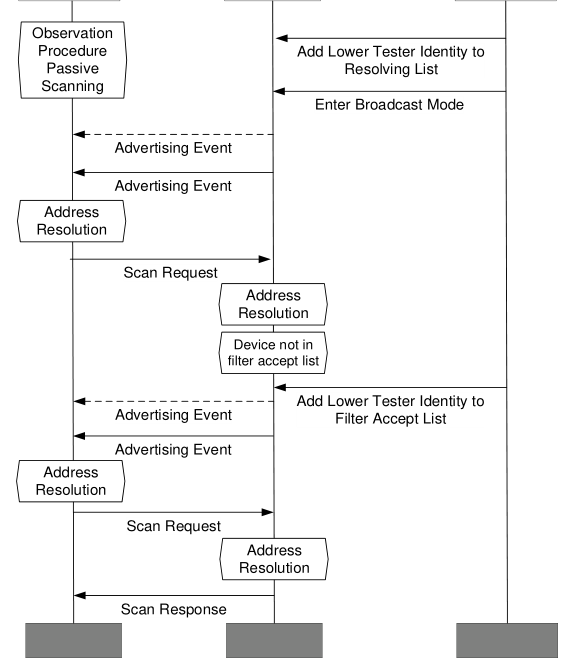

**Figure 4.87: GAP/BROB/BCST/BV-05-C [Broadcast Mode Resolvable Private Address, Scan Response] MSC**

• Test Condition
It must be possible to order IUT to enter Broadcast Mode, and add the Lower Tester to the Filter Accept List.
• Expected Outcome
Pass verdict
The Lower Tester receives scannable advertising events sent by the IUT.
The Lower Tester receives the specified advertising data sent from the IUT.
The Lower Tester successfully resolves the private address (the private address is associated with the IUT) received in the advertising events.
The Lower Tester sends scan requests to the IUT. Before the Lower Tester’s identity address is added to the IUT’s Filter Accept List, the Lower Tester does not receive any scan response. After adding the Lower Tester’s identity address to the IUT’s Filter Accept List, the Lower Tester receives the scan responses with the specified scan response data sent from the IUT.
The advertising data either:
1. Does not contain the FLAGS AD Type; this is applicable if:
a. The IUT is a BR/EDR/LE Broadcaster compliant to Core Specification version 4.0, or b. The IUT is a Broadcaster compliant to the Core Specification Supplement (CSS)
2. Contains the FLAGS AD Type with both the LE Limited Discoverable Flag and the LE General
Discoverable Flag set to 0.
• Notes
Since broadcasting is not a reliable transmission method, multiple broadcast packets may need to be sent to verify compliance.

##### 4.7.1.2 Observation Procedure

Verify the correct implementation of the Observation procedure.
GAP/BROB/OBSV/BV-01-C [Observation Procedure Passive Scanning]
• Test Purpose
Verify the IUT performing the Observation Procedure using Passive Scanning.
• Reference
[4] 9.1.2
• Initial Condition
- The IUT is in Link Layer state ‘Standby’.
- The advertising data used in Broadcast Mode is specified for the Lower Tester in the IXIT [3].
• Test Procedure
1. The Lower Tester enters Broadcast Mode using the specified advertising data. 2. The Upper Tester orders the IUT to perform the Observation procedure using Passive Scanning.

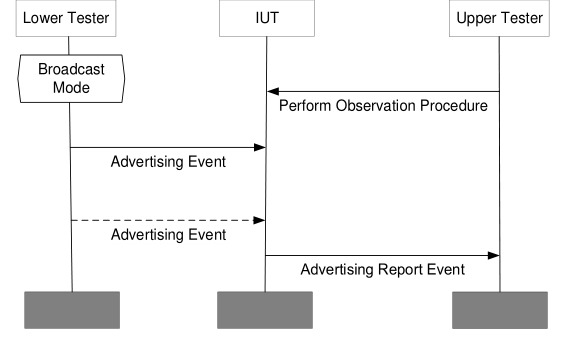

**Figure 4.88: GAP/BROB/OBSV/BV-01-C [Observation Procedure Passive Scanning] MSC**

• Test Condition
It must be possible to order the IUT to perform the Observation procedure.
• Expected Outcome
Pass verdict
The IUT receives the specified advertising data sent from Lower Tester.
• Notes
Since the broadcasting is not a reliable transmission method, multiple broadcast packets may need to be sent to verify compliance.
GAP/BROB/OBSV/BV-02-C [Observation Procedure Active Scanning]
• Test Purpose
Verify the IUT performing the Observation Procedure using Active Scanning.
• Reference
[4] 9.1.2
• Initial Condition
- The IUT is in Link Layer state ‘Standby’.
- The advertising data used in Broadcast Mode is specified for the Lower Tester in the IXIT [3].
- The scan response data used in Broadcast Mode is specified for the Lower Tester in the IXIT [3].
• Test Procedure
1. The Lower Tester enters Broadcast Mode using the specified advertising data. 2. The Upper Tester orders the IUT to perform the Observation procedure using Active Scanning.

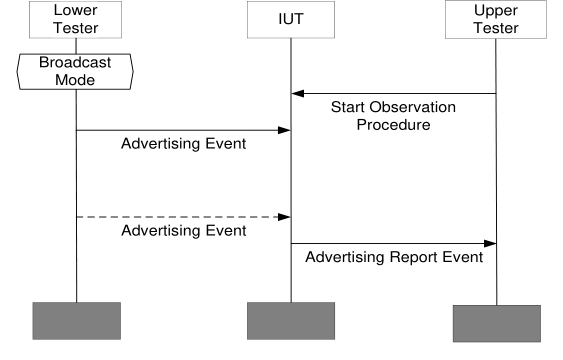

**Figure 4.89: GAP/BROB/OBSV/BV-02-C [Observation Procedure Active Scanning] MSC**

• Test Condition
It must be possible to order the IUT to perform the Observation procedure.
• Expected Outcome
Pass verdict
The IUT receives the specified advertising data and scan response data from Lower Tester.
• Notes
Since the broadcasting is not a reliable transmission method, multiple broadcast packets may need to be sent to verify compliance.
GAP/BROB/OBSV/BV-05-C [Observation Procedure Active Scanning Non-Resolvable Private Address or Resolvable Private Address]
• Test Purpose
Verify that the IUT can perform the Observation Procedure using Active Scanning and a non- resolvable private address or resolvable private address.
• Reference
[4] 9.1.2
[6] 2.2.5
• Initial Condition
- The IUT is in Link Layer state ‘Standby’.
- The advertising data used in Broadcast Mode is specified for the Lower Tester in the IXIT [3].
- The scan response data used in Broadcast Mode is specified for the Lower Tester in the IXIT [3].
• Test Procedure
1. The Lower Tester enters Broadcast Mode using scannable undirected advertising events
containing the specified advertising data and responds to scan requests using the specified scan response data. 2. The Upper Tester orders the IUT to perform the Observation procedure using Active Scanning
and a non-resolvable private address or resolvable private address.

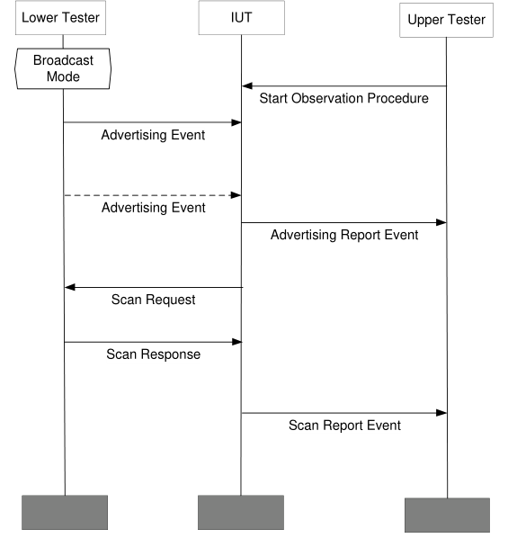

**Figure 4.90: GAP/BROB/OBSV/BV-05-C [Observation Procedure Active Scanning Non-Resolvable Private Address or Resolvable Private Address] MSC**

• Test Condition
It must be possible to order the IUT to perform the Observation procedure.
• Expected Outcome
Pass verdict
The IUT receives the specified advertising data and scan response data sent by the Lower Tester.
The Lower Tester receives a non-resolvable private address or a resolvable private address in scan request sent from the IUT.
• Notes
Since the broadcasting is not a reliable transmission method, multiple broadcast packets may need to be sent to verify compliance.
GAP/BROB/OBSV/BV-06-C [Observation Procedure with Active Scanning, IUT and Peer using Resolvable Private Address]
• Test Purpose
Verify that the IUT can perform the Observation Procedure using Active Scanning when the Lower Tester is using a resolvable private address.
• Reference
[9] [12] 9.1.2, 10.7.4
• Initial Condition
- The IUT is in Link Layer state ‘Standby’.
- The IUT and the Lower Tester are paired using either LE Legacy or LE Secure Connections.
- The Device Identity (Identity Address) used by the IUT and Lower Tester is specified in the IXIT [3].
- The advertising and scan response data used in Broadcast Mode is specified for the Lower Tester in the IXIT [3].
• Test Procedure
1. The Lower Tester generates a resolvable private address using the Resolvable Private Address
Generation Procedure. 2. The Lower Tester enters Broadcast Mode using the specified advertising data and the generated
resolvable private address. 3. The Upper Tester orders the IUT to add the Lower Tester’s Identity to the resolving list and Filter
Accept List. 4. The Upper Tester orders the IUT to perform the Observation procedure using Active Scanning;
the IUT resolves the address received in the advertising events sent by the Lower Tester, and sends a Scan Request. 5. The Lower Tester resolves the IUT’s address and send the Scan Response.
Lower Tester Upper Tester IUT

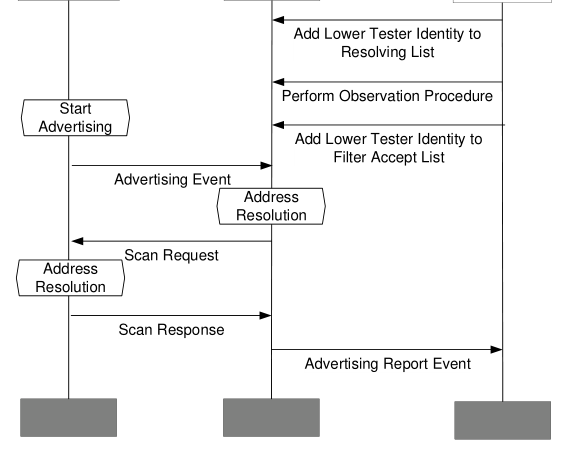

**Figure 4.91: GAP/BROB/OBSV/BV-06-C [Observation Procedure with Active Scanning, IUT and Peer using Resolvable Private Address] MSC**

• Test Condition
It must be possible to order the IUT to perform the Observation procedure.
• Expected Outcome
Pass verdict
The IUT successfully resolves the address in the advertising events sent by the Lower Tester.
The IUT receives the Scan Response data correctly.
• Notes
Since broadcasting is not a reliable transmission method, multiple broadcast packets may need to be sent to verify compliance.

#### 4.7.2 Discovery Modes and Procedures

##### 4.7.2.1 Non-Discoverable Mode

GAP/DISC/NONM/BV-01-C [Non-discoverable Mode Non-Connectable Mode]
• Test Purpose
Verify that the IUT in Non-Discoverable Mode and Non-Connectable Mode is not discoverable by a device performing the General Discovery Procedure using Active Scanning.
The IUT is operating in the Peripheral role.
• Reference
[4], [9], [12] 9.2.2
[10] 1.3
• Initial Condition
- The IUT is in Link Layer state ‘Standby’.
- The IUT is in Non-Connectable Mode.
• Test Procedure
1. The Lower Tester performs the General Discovery Procedure using Active Scanning. 2. The Upper Tester orders IUT to enter Non-Discoverable Mode and Non-Connectable Mode.

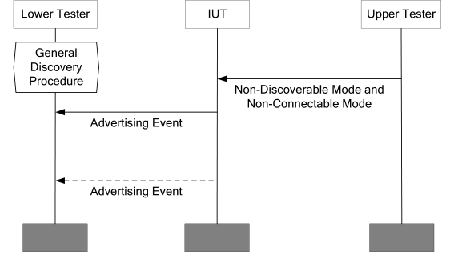

**Figure 4.92: GAP/DISC/NONM/BV-01-C [Non-discoverable Mode Non-Connectable Mode] MSC**

• Test Condition
It must be possible to order IUT to enter Non-Discoverable Mode and Non-Connectable Mode.
• Expected Outcome
Pass verdict
The Lower Tester receives either no advertising events or non-connectable advertising events from the IUT.
The advertising data either:
1. Does not contain the FLAGS AD Type; this is applicable if:
a. The IUT is a BR/EDR/LE Peripheral compliant to Core Specification version 4.0, or b. The IUT is a Peripheral compliant to the Core Specification Supplement (CSS).
Or:
2. Contains the FLAGS AD Type with both the LE Limited Discoverable Flag and the LE General
Discoverable Flag set to 0.
If the Flags AD Type is present in the advertising data then it only appears once per advertising event.
The Flags AD Type is not present in any scan response data received.
GAP/DISC/NONM/BV-02-C [Non-discoverable Mode Undirected Connectable Mode]
• Test Purpose
Verify that the IUT in Non-Discoverable Mode and Undirected Connectable Mode is not discoverable by a device performing the General Discovery Procedure.
The IUT is operating in the Peripheral role.
• Reference
[4] 9.2.2
• Initial Condition
- The IUT is in Link Layer state ‘Standby’.
- The IUT is in Undirected Connectable Mode.
• Test Procedure
1. The Lower Tester performs the General Discovery Procedure. 2. The Upper Tester orders IUT to enter Non-Discoverable Mode and Undirected Connectable
Mode.

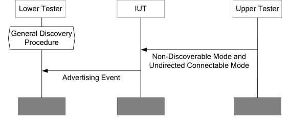

**Figure 4.93: GAP/DISC/NONM/BV-02-C [Non-discoverable Mode Undirected Connectable Mode] MSC**

• Test Condition
It must be possible to order IUT to enter Non-Discoverable Mode and Undirected Connectable Mode.
• Expected Outcome
Pass verdict
The Lower Tester receives either connectable and scannable undirected advertising events or connectable undirected advertising events from the IUT.
The advertising data received by the Lower Tester does not contain the Flags AD type with the Limited Discoverable or General Discoverable flags set to 1.
If the Flags AD Type is present in the advertising data then it only appears once per advertising event.
The Flags AD Type is not present in any scan response data received.

##### 4.7.2.2 Limited Discoverable Mode

GAP/DISC/LIMM/BV-01-C [Limited Discoverable Mode Non-Connectable Mode - BR/EDR/LE]
• Test Purpose
Verify that the IUT in Limited Discoverable Mode and the Non-Connectable Mode can be discovered by a device performing the Limited Discovery Procedure.
The IUT is operating in the Peripheral role.
• Reference
[4] 9.2.3, 13.1.1.2
[9], [12] 9.2.3, 13.1.1
[10] 1.3
• Initial Condition
- The IUT is in Link Layer state ‘Standby’.
- The IUT is in Non-Connectable Mode.
- TGAP(lim_adv_timeout) for the IUT is specified in the IXIT [3].
• Test Procedure
The Upper Tester orders the IUT to enter Limited Discoverable Mode and Non-Connectable Mode.

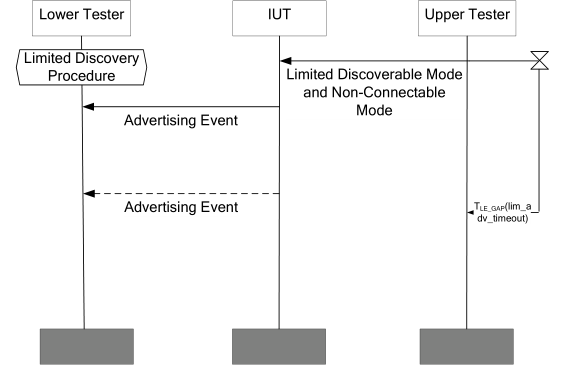

**Figure 4.94: GAP/DISC/LIMM/BV-01-C [Limited Discoverable Mode Non-Connectable Mode—BR/EDR/LE] MSC**

• Test Condition
It must be possible to order the IUT to enter Limited Discoverable Mode and Non-Connectable Mode.
• Expected Outcome
Pass verdict
The Lower Tester receives non-connectable advertising events from the IUT.
The advertising data either:
1. Does not contain the FLAGS AD Type; this is applicable if the IUT is a BR/EDR/LE Peripheral
compliant to the Core Specification Supplement (CSS)
Or:
2. Contains the FLAGS AD Type as follows:
▪ Limited Discoverable flag set to 1 ▪ General Discoverable flag set to 0 ▪ BR/EDR Not Supported flag set to 0 ▪ Simultaneous LE and BR/EDR to Same Device Capable (Controller) flag set to 0 ▪ Simultaneous LE and BR/EDR to Same Device Capable (Host) flag set to 0
If the Flags AD Type is present in the advertising data then it only appears once per advertising event.
The Flags AD Type is not present in any scan response data received.
Within TGAP(lim_adv_timeout) from the time the IUT enters Limited Discoverable Mode, if the Lower Tester receives advertising data from the IUT containing the Flags AD type, the General Discoverable Flag is set to 0 and the Limited Discoverable Flag set to 1.
After TGAP(lim_adv_timeout) from the time the IUT enters Limited Discoverable Mode, the Lower Tester does not receive any advertising data from the IUT containing the Flags AD Type as described:
- Limited Discoverable flag set to 1
- General Discoverable flag set to 0
- BR/EDR Not Supported flag set to 0
- Simultaneous LE and BR/EDR to Same Device Capable (Controller) flag set to 0
- Simultaneous LE and BR/EDR to Same Device Capable (Host) flag set to 0
GAP/DISC/LIMM/BV-02-C [Limited Discoverable Mode Undirected Connectable Mode - BR/EDR/LE]
• Test Purpose
Verify that the IUT in Limited Discoverable Mode and the Undirected Connectable Mode can be discovered by a device performing the Limited Discovery Procedure.
The IUT is operating in the Peripheral role.
• Reference
[4] 9.2.3, 13.1.1
• Initial Condition
- The IUT is in Link Layer state ‘Standby’.
- The IUT is in Undirected Connectable Mode.
- TGAP(lim_adv_timeout) is specified for the IUT in the IXIT [3].
• Test Procedure
The Upper Tester orders the IUT to enter Limited Discoverable Mode and Undirected Connectable Mode.

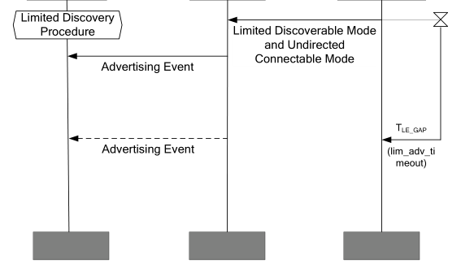

**Figure 4.95: GAP/DISC/LIMM/BV-02-C [Limited Discoverable Mode Undirected Connectable Mode– BR/EDR/LE] MSC**

• Test Condition
It must be possible to order IUT to enter Limited Discoverable Mode and Undirected Connectable Mode.
• Expected Outcome
Pass verdict
The Lower Tester receives either connectable and scannable undirected advertising events or connectable undirected advertising events from the IUT.
The advertising data received by the Lower Tester contains the Flags AD type as described:
- Limited Discoverable flag set to 1
- General Discoverable flag set to 0
- BR/EDR Not Supported flag set to 0
- Simultaneous LE and BR/EDR to Same Device Capable (Controller) flag set to 0
- Simultaneous LE and BR/EDR to Same Device Capable (Host) flag set to 0
If the Flags AD Type is present in the advertising data then it only appears once per advertising event.
The Flags AD Type is not present in any scan response data received.
Within TGAP(lim_adv_timeout) from the time the IUT enters Limited Discoverable Mode, the Lower Tester receives advertising data from the IUT containing the Flags AD type as described:
- Limited Discoverable flag set to 1
- General Discoverable flag set to 0
- BR/EDR Not Supported flag set to 0
- Simultaneous LE and BR/EDR to Same Device Capable (Controller) flag set to 0
- Simultaneous LE and BR/EDR to Same Device Capable (Host) flag set to 0
After TGAP(lim_adv_timeout) from the time the IUT enters Limited Discoverable Mode, the Lower Tester does not receive any advertising data from the IUT containing the Flags AD Type with the Limited Discoverable Flag set to 1.
GAP/DISC/LIMM/BV-03-C [Limited Discoverable Mode Non-Connectable Mode – LE Only]
• Test Purpose
Verify that an LE only IUT in Limited Discoverable Mode and the Non-Connectable Mode can be discovered by a device performing the Limited Discovery Procedure.
The IUT is operating in the Peripheral role.
• Reference
[4], [9], [12] 9.2.3
[10] 1.3
• Initial Condition
- The IUT is in Link Layer state ‘Standby’.
- The IUT is in Non-Connectable Mode.
- TGAP(lim_adv_timeout) for the IUT is specified in the IXIT [3].
• Test Procedure
The Upper Tester orders the IUT to enter Limited Discoverable Mode and Non-Connectable Mode.

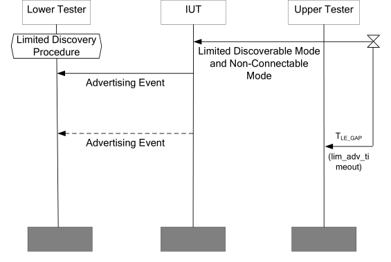

**Figure 4.96: GAP/DISC/LIMM/BV-03-C [Limited Discoverable Mode Non-Connectable Mode – LE Only] MSC**

• Test Condition
It must be possible to order IUT to enter Limited Discoverable Mode and Non-Connectable Mode.
• Expected Outcome
Pass verdict
The Lower Tester receives non-connectable advertising events from the IUT.
The advertising data either:
1. Does not contain the FLAGS AD Type; this is applicable if the IUT is a BR/EDR/LE Peripheral
2. Contains the FLAGS AD Type as follows:
▪ Limited Discoverable flag set to 1 ▪ General Discoverable flag set to 0 ▪ BR/EDR Not Supported flag set to 1 ▪ Simultaneous LE and BR/EDR to Same Device Capable (Controller) flag set to 0 ▪ Simultaneous LE and BR/EDR to Same Device Capable (Host) flag set to 0
If the Flags AD Type is present in the advertising data then it only appears once per advertising event.
The Flags AD Type is not present in any scan response data received.
Within TGAP(lim_adv_timeout) from the time the IUT enters Limited Discoverable Mode, the Lower Tester receives advertising data from the IUT containing the Flags AD type as described:
- Limited Discoverable flag set to 1
- General Discoverable flag set to 0
- BR/EDR Not Supported flag set to 1
- Simultaneous LE and BR/EDR to Same Device Capable (Controller) flag set to 0
- Simultaneous LE and BR/EDR to Same Device Capable (Host) flag set to 0
After TGAP(lim_adv_timeout) from the time the IUT enters Limited Discoverable Mode, the Lower Tester does not receive any advertising data from the IUT containing the Flags AD Type with the Limited Discoverable Flag set to 1.
GAP/DISC/LIMM/BV-04-C [Limited Discoverable Mode Undirected Connectable Mode – LE Only]
• Test Purpose
Verify that an LE only IUT in Limited Discoverable Mode and the Undirected Connectable Mode can be discovered by a device performing the Limited Discovery Procedure.
The IUT is operating in the Peripheral role.
• Reference
[4] 9.2.3
• Initial Condition
- The IUT is in Link Layer state ‘Standby’.
- The IUT is in Undirected Connectable Mode.
- TGAP(lim_adv_timeout) is specified for the IUT in the IXIT [3].
• Test Procedure
The Upper Tester orders the IUT to enter Limited Discoverable Mode and Undirected Connectable Mode.

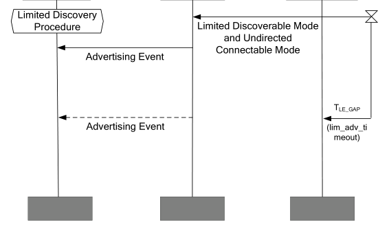

**Figure 4.97: GAP/DISC/LIMM/BV-04-C [Limited Discoverable Mode Undirected Connectable Mode – LE Only] MSC**

• Test Condition
It must be possible to order IUT to enter Limited Discoverable Mode and Undirected Connectable Mode.
• Expected Outcome
Pass verdict
The Lower Tester receives either connectable and scannable undirected advertising events or connectable undirected advertising events from the IUT.
The advertising data received by the Lower Tester contains the Flags AD type as described:
- Limited Discoverable flag set to 1
- General Discoverable flag set to 0
- BR/EDR Not Supported flag set to 1
- Simultaneous LE and BR/EDR to Same Device Capable (Controller) flag set to 0
- Simultaneous LE and BR/EDR to Same Device Capable (Host) flag set to 0
If the Flags AD Type is present in the advertising data then it only appears once per advertising event.
The Flags AD Type is not present in any scan response data received.
Within TGAP(lim_adv_timeout) from the time the IUT enters Limited Discoverable Mode, the Lower Tester receives advertising data from the IUT containing the Flags AD type as described:
- Limited Discoverable flag set to 1
- General Discoverable flag set to 0
- BR/EDR Not Supported flag set to 1
- Simultaneous LE and BR/EDR to Same Device Capable (Controller) flag set to 0
- Simultaneous LE and BR/EDR to Same Device Capable (Host) flag set to 0
After TGAP(lim_adv_timeout) from the time the IUT enters Limited Discoverable Mode, the Lower Tester does not receive any advertising data from the IUT containing the Flags AD Type with the Limited Discoverable Flag set to 1.

##### 4.7.2.3 General Discoverable Mode

GAP/DISC/GENM/BV-01-C [General Discoverable Mode Non-Connectable Mode - BR/EDR/LE]
• Test Purpose
Verify that the IUT in General Discoverable Mode and the Non-Connectable Mode can be discovered by a device performing the General Discovery Procedure.
The IUT is operating in the Peripheral role.
• Reference
[4] 9.2.4, 13.1.1.2
[9], [12] 9.2.4, 13.1.1
[10] 1.3
• Initial Condition
- The IUT is in Link Layer state ‘Standby’.
- The IUT is in Non-Connectable Mode.
- The Lower Tester performs the General Discovery Procedure.
• Test Procedure
The Upper Tester orders IUT to enter General Discoverable Mode and Non-Connectable Mode.

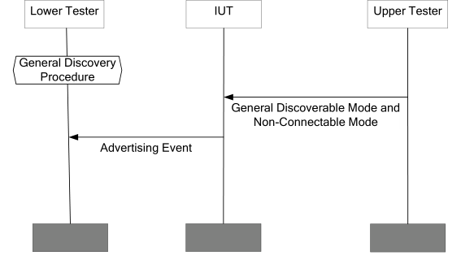

**Figure 4.98: GAP/DISC/GENM/BV-01-C [General Discoverable Mode Non-Connectable Mode—BR/EDR/LE] MSC**

• Test Condition
It must be possible to order IUT to enter General Discoverable Mode and Non-Connectable Mode.
• Expected Outcome
Pass verdict
The Lower Tester receives non-connectable advertising events from the IUT.
1. Does not contain the FLAGS AD Type; this is applicable if the IUT is a BR/EDR/LE Peripheral
compliant to the Core Specification Supplement (CSS).
Or:
2. Contains the FLAGS AD Type as follows:
▪ Limited Discoverable flag set to 0 ▪ General Discoverable flag set to 1 ▪ BR/EDR Not Supported flag set to 0 ▪ Simultaneous LE and BR/EDR to Same Device Capable (Controller) flag set to 0 ▪ Simultaneous LE and BR/EDR to Same Device Capable (Host) flag set to 0
If the Flags AD Type is present in the advertising data then it only appears once per advertising event.
The Flags AD Type is not present in any scan response data received.
GAP/DISC/GENM/BV-02-C [General Discoverable Mode Undirected Connectable Mode - BR/EDR/LE]
• Test Purpose
Verify that the IUT in General Discoverable Mode and the Undirected Connectable Mode can be discovered by a device performing the General Discovery Procedure.
The IUT is operating in the Peripheral role.
• Reference
[4] 9.2.4, 13.1.1
• Initial Condition
- The IUT is in Link Layer state ‘Standby’.
- The IUT is in Undirected Connectable Mode.
- The Lower Tester performs the General Discovery Procedure.
• Test Procedure
The Upper Tester orders the IUT to enter General Discoverable Mode and Undirected Connectable Mode.

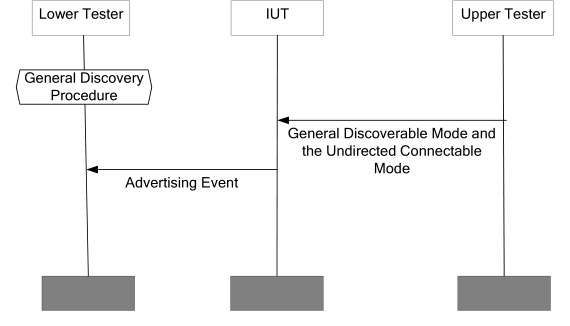

**Figure 4.99: GAP/DISC/GENM/BV-02-C [General Discoverable Mode Undirected Connectable Mode— BR/EDR/LE] MSC**

• Test Condition
It must be possible to order IUT to enter General Discoverable Mode and Undirected Connectable Mode.
• Expected Outcome
Pass verdict
The Lower Tester receives either connectable and scannable undirected advertising events or connectable undirected advertising events from the IUT.
The advertising data received by the Lower Tester contains the Flags AD as described:
- Limited Discoverable flag set to 0
- General Discoverable flag set to 1
- BR/EDR Not Supported flag set to 0
- Simultaneous LE and BR/EDR to Same Device Capable (Controller) flag set to 0
- Simultaneous LE and BR/EDR to Same Device Capable (Host) flag set to 0
If the Flags AD Type is present in the advertising data then it only appears once per advertising event.
The Flags AD Type is not present in any scan response data received.
GAP/DISC/GENM/BV-03-C [General Discoverable Mode Non-Connectable Mode – LE Only]
• Test Purpose
Verify that an LE only IUT in General Discoverable Mode and the Non-Connectable Mode can be discovered by a device performing the General Discovery Procedure.
The IUT is operating in the Peripheral role.
• Reference
[4] 9.2.4, 13.1.1.2
[9], [12] 9.2.4, 13.1.1
[10] 1.3
• Initial Condition
- The IUT is in Link Layer state ‘Standby’.
- The IUT is in Non-Connectable Mode.
- The Lower Tester performs the General Discovery Procedure.
• Test Procedure
The Upper Tester orders the IUT to enter General Discoverable Mode and Non-Connectable Mode.

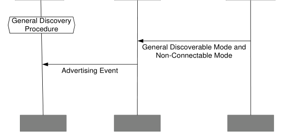

**Figure 4.100: GAP/DISC/GENM/BV-03-C [General Discoverable Mode Non-Connectable Mode – LE Only] MSC**

• Test Condition
It must be possible to order IUT to enter General Discoverable Mode and Non-Connectable Mode.
• Expected Outcome
Pass verdict
The Lower Tester receives non-connectable advertising events from the IUT.
The advertising data either:
1. Does not contain the FLAGS AD Type; this is applicable if the IUT is a BR/EDR/LE Peripheral
compliant to the Core Specification Supplement (CSS).
Or:
2. Contains the FLAGS AD Type as follows:
▪ Limited Discoverable flag set to 0 ▪ General Discoverable flag set to 1 ▪ BR/EDR Not Supported flag set to 1 ▪ Simultaneous LE and BR/EDR to Same Device Capable (Controller) flag set to 0 ▪ Simultaneous LE and BR/EDR to Same Device Capable (Host) flag set to 0
If the Flags AD Type is present in the advertising data then it only appears once per advertising event.
The Flags AD Type is not present in any scan response data received.
GAP/DISC/GENM/BV-04-C [General Discoverable Mode Undirected Connectable Mode – LE Only]
• Test Purpose
Verify that an LE only IUT in General Discoverable Mode and the Undirected Connectable Mode can be discovered by a device performing the General Discovery Procedure.
The IUT is operating in the Peripheral role.
• Reference
[4] 9.2.4
• Initial Condition
- The IUT is in Link Layer state ‘Standby’.
- The IUT is in Undirected Connectable Mode.
- The Lower Tester performs the General Discovery Procedure.
• Test Procedure
The Upper Tester orders the IUT to enter General Discoverable Mode and Undirected Connectable Mode.

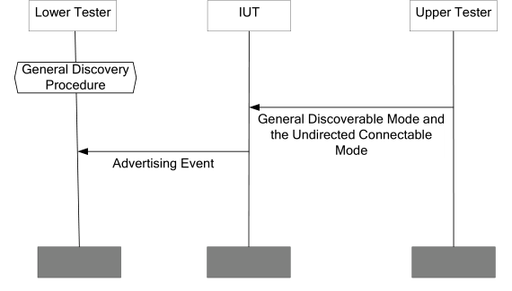

**Figure 4.101: GAP/DISC/GENM/BV-04-C [General Discoverable Mode Undirected Connectable Mode – LE Only] MSC**

• Test Condition
It must be possible to order IUT to enter General Discoverable Mode and Undirected Connectable Mode.
• Expected Outcome
Pass verdict
The Lower Tester receives either connectable and scannable undirected advertising events or connectable undirected advertising events from the IUT.
The advertising data received by the Lower Tester contains the Flags AD type as described:
- Limited Discoverable flag set to 0
- General Discoverable flag set to 1
- BR/EDR Not Supported flag set to 1
- Simultaneous LE and BR/EDR to Same Device Capable (Controller) flag set to 0
- Simultaneous LE and BR/EDR to Same Device Capable (Host) flag set to 0
If the Flags AD Type is present in the advertising data then it only appears once per advertising event.
The Flags AD Type is not present in any scan response data received.
GAP/DISC/LIMP/BV-01-C [Limited Discovery Procedure Find Limited Discoverable Device]
• Test Purpose
Verify that the IUT can perform the Limited Discovery Procedure to find a device in the Limited Discoverable Mode.
The IUT is operating in the Central role.
• Reference
[4] 9.2.5
• Initial Condition
- The IUT is in Link Layer state ‘Standby’.
- TGAP(lim_disc_scan_min) for the IUT is specified in the IXIT [3].
• Test Procedure
1. The Lower Tester enters Limited Discoverable Mode. 2. The Upper Tester orders the IUT to perform the Limited Discovery Procedure.

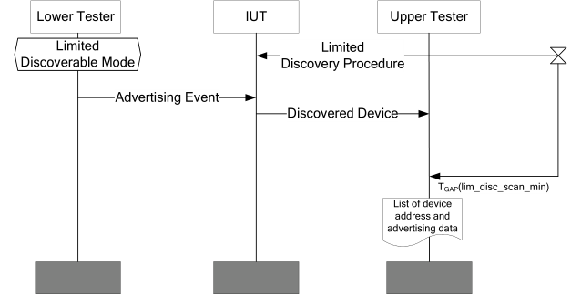

**Figure 4.102: GAP/DISC/LIMP/BV-01-C [Limited Discovery Procedure Find Limited Discoverable Device] MSC**

• Test Condition
It must be possible to order the IUT to perform the Limited Discovery Procedure.
• Expected Outcome
Pass verdict
If the IUT is Active Scanning with privacy enabled then the address used in the SCAN_REQ is a non- resolvable private address.
The IUT lists the Lower Tester during the discovery period.
GAP/DISC/LIMP/BV-02-C [Limited Discovery Procedure Does not find General Discoverable Device]
• Test Purpose
Verify that the IUT can perform the Limited Discovery Procedure and does not find a device in the General Discoverable Mode.
The IUT is operating in the Central role.
• Reference
[4] 9.2.5
• Initial Condition
- The IUT is in Link Layer state ‘Standby’.
- TGAP(gen_disc_scan_min) for the IUT is specified in the IXIT [3].
• Test Procedure
1. The Lower Tester enters General Discoverable Mode. 2. The Upper Tester orders the IUT to perform the Limited Discovery Procedure.

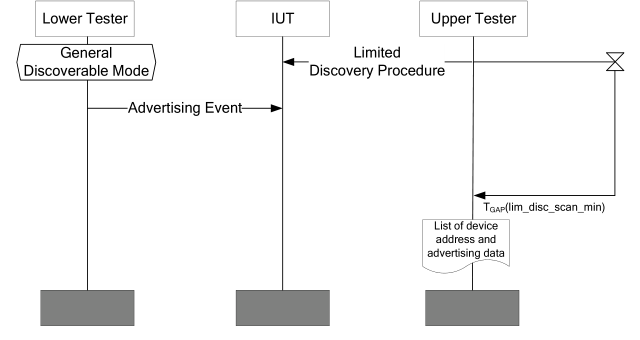

**Figure 4.103: GAP/DISC/LIMP/BV-02-C [Limited Discovery Procedure Does not find General Discoverable Device] MSC**

• Test Condition
It must be possible to order IUT to perform the Limited Discovery Procedure.
• Expected Outcome
Pass verdict
If the IUT is Active Scanning with privacy enabled then the address used in the SCAN_REQ is a non- resolvable private address.
The IUT does not discover the Lower Tester during the discovery period.
• Notes
“Discover” in the context of the test text means to report to the application layer and/or verify the Flags AD type presence and setting according to the test Pass verdict in any received advertising data.
• Test Purpose
Verify that the IUT can perform the Limited Discovery Procedure and does not find a device in the Broadcast Mode.
The IUT is operating in the Central role.
• Reference
[4] 9.2.5
• Initial Condition
- The IUT is in Link Layer state ‘Standby’.
- TGAP(lim_disc_scan_min) for the IUT is specified in the IXIT [3].
• Test Procedure
1. The Lower Tester enters Broadcast Mode. 2. The Upper Tester orders the IUT to perform the Limited Discovery Procedure.

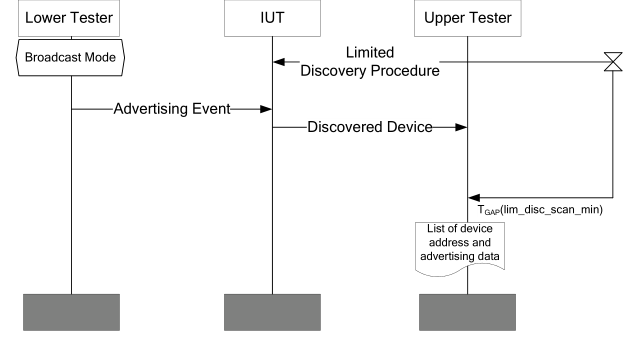

**Figure 4.104: GAP/DISC/LIMP/BV-03-C [Limited Discovery Procedure Does not find Broadcast device] MSC**

• Test Condition
It must be possible to order IUT to perform the Limited Discovery Procedure.
• Expected Outcome
Pass verdict
If the IUT is Active Scanning with privacy enabled then the address used in the SCAN_REQ is a non- resolvable private address.
The IUT does not discover the Lower Tester during the discovery period.
• Notes
“Discover” in the context of the test text means to report to the application layer and/or verify the Flags AD type presence and setting according to the test Pass verdict in any received advertising data.
GAP/DISC/LIMP/BV-04-C [Limited Discovery Procedure Does not find Undirected Connectable device]
• Test Purpose
Verify that the IUT can perform the Limited Discovery Procedure and does not find a device in the Undirected Connectable Mode.
The IUT is operating in the Central role.
• Reference
[4] 9.2.5
• Initial Condition
- The IUT is in Link Layer state ‘Standby’.
- TGAP(lim_disc_scan_min) for the IUT is specified in the IXIT [3].
• Test Procedure
1. The Lower Tester enters Undirected Connectable Mode; the Lower Tester does not include the
Flags AD Type in the advertising data with either the General Discoverable Flag or Limited Discoverable Flag set to 1. 2. The Upper Tester orders the IUT to perform the Limited Discovery Procedure.

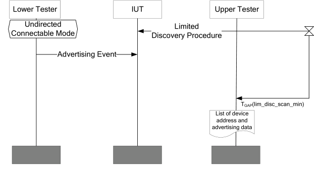

**Figure 4.105: GAP/DISC/LIMP/BV-04-C [Limited Discovery Procedure Does not find Undirected Connectable device] MSC**

• Test Condition
It must be possible to order IUT to perform the Limited Discovery Procedure.
• Expected Outcome
Pass verdict
The IUT does not discover the Lower Tester during the discovery period.
• Notes
“Discover” in the context of the test text means to report to the application layer and/or verify the Flags AD type presence and setting according to the test Pass verdict in any received advertising data.
GAP/DISC/LIMP/BV-05-C [Limited Discovery Procedure Does not find Directed Connectable device]
• Test Purpose
Verify that the IUT can perform the Limited Discovery Procedure and does not find a device in the Directed Connectable Mode.
The IUT is operating in the Central role.
• Reference
[4] 9.2.5
• Initial Condition
- The IUT is in Link Layer state ‘Standby’.
- TGAP(lim_disc_scan_min) for the IUT is specified in the IXIT [3].
- The initiator address for the IUT is specified in the IXIT [3].
• Test Procedure
1. The Upper Tester orders the IUT to perform the Limited Discovery Procedure. 2. The Lower Tester enters Directed Connectable Mode using the specified initiator address for the
IUT.

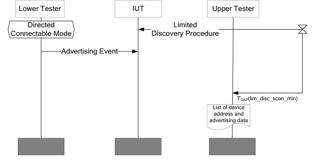

**Figure 4.106: GAP/DISC/LIMP/BV-05-C [Limited Discovery Procedure Does not find Directed Connectable device] MSC**

• Test Condition
It must be possible to order IUT to perform the Limited Discovery Procedure.
• Expected Outcome
Pass verdict
The IUT does not discover the Lower Tester during the discovery period.
• Notes
“Discover” in the context of the test text means to report to the application layer and/or verify the Flags AD type presence and setting according to the test Pass verdict in any received advertising data.
GAP/DISC/GENP/BV-01-C [General Discovery Procedure Finding General Discoverable Device]
• Test Purpose
Verify that the IUT can perform the General Discovery Procedure and can find a device in the General Discoverable Mode.
The IUT is operating in the Central role.
• Reference
[4] 9.2.6
• Initial Condition
- The IUT is in Link Layer state ‘Standby’.
- TGAP(gen_disc_scan_min) for the IUT is specified in the IXIT [3].
• Test Procedure
1. The Lower Tester enters General Discoverable Mode. 2. The Upper Tester orders IUT to start the General Discovery Procedure.

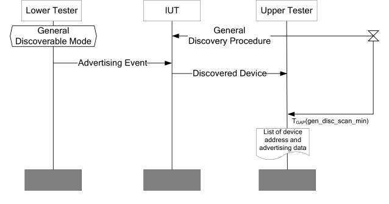

**Figure 4.107: GAP/DISC/GENP/BV-01-C [General Discovery Procedure Finding General Discoverable Device] MSC**

• Test Condition
It must be possible to order IUT to perform the General Discovery Procedure.
• Expected Outcome
Pass verdict
The IUT discovers the Lower Tester during the General Discovery Procedure.
GAP/DISC/GENP/BV-02-C [General Discovery Procedure Finding Limited Discoverable Device]
• Test Purpose
Verify that the IUT can perform the General Discovery Procedure and can find devices in the Limited Discoverable Mode.
The IUT is operating in the Central role.
• Reference
[4] 9.2.6
• Initial Condition
- The IUT is in Link Layer state ‘Standby’.
- TGAP(gen_disc_scan_min) for the IUT is specified in the IXIT [3].
• Test Procedure
1. The Lower Tester enters Limited Discoverable Mode. 2. The Upper Tester orders the IUT to start the General Discovery Procedure.

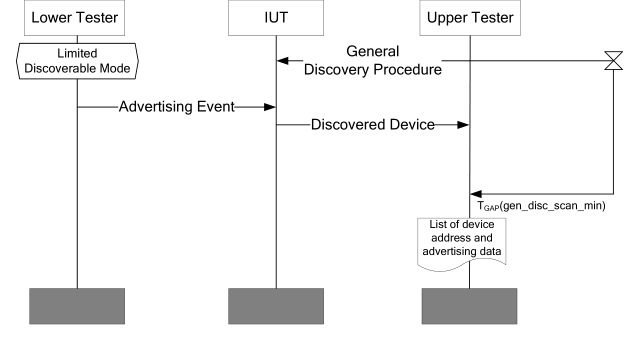

**Figure 4.108: GAP/DISC/GENP/BV-02-C [General Discovery Procedure Finding Limited Discoverable Device] MSC**

• Test Condition
It must be possible to order IUT to perform the General Discovery Procedure.
• Expected Outcome
Pass verdict
The IUT lists the Lower Tester during the discovery period.
• Test Purpose
Verify that the IUT can perform the General Discovery Procedure and does not find a device in the Broadcast Mode.
The IUT is operating in the Central role.
• Reference
[4] 9.2.6
• Initial Condition
- The IUT is in Link Layer state ‘Standby’.
- TGAP(gen_disc_scan_min) for the IUT is specified in the IXIT [3].
• Test Procedure
1. The Lower Tester enters Broadcast Mode. 2. The Upper Tester orders the IUT to perform the General Discovery Procedure.

**Figure 4.109: GAP/DISC/GENP/BV-03-C [General Discovery Procedure Does not find Broadcast device] MSC**

• Test Condition
It must be possible to order IUT to perform the General Discovery Procedure.
• Expected Outcome
Pass verdict
The IUT does not discover the Lower Tester during the discovery period.
• Notes
“Discover” in the context of the test text means to report to the application layer and/or verify the Flags AD type presence and setting according to the test Pass verdict in any received advertising data.
GAP/DISC/GENP/BV-04-C [General Discovery Procedure Does not find Undirected Connectable device]
• Test Purpose
Verify that the IUT can perform the General Discovery Procedure and does not find a device in the Undirected Connectable Mode.
The IUT is operating in the Central role.
• Reference
[4] 9.2.6
• Initial Condition
- The IUT is in Link Layer state ‘Standby’.
- TGAP(gen_disc_scan_min) for the IUT is specified in the IXIT [3].
• Test Procedure
1. The Lower Tester enters Undirected Connectable Mode; the Lower Tester does not include the
Flags AD Type in the advertising data with either the General Discoverable Flag or Limited Discoverable Flag set to 1. 2. The Upper Tester orders the IUT to perform the General Discovery Procedure.

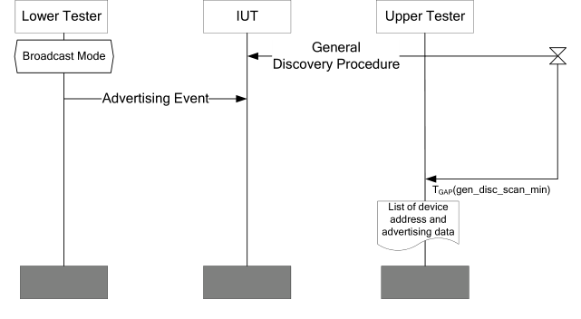

**Figure 4.110: GAP/DISC/GENP/BV-04-C [General Discovery Procedure Does not find Undirected Connectable device] MSC**

• Test Condition
It must be possible to order IUT to perform the General Discovery Procedure.
• Expected Outcome
Pass verdict
The IUT does not discover the Lower Tester during the discovery period.
• Notes
“Discover” in the context of the test text means to report to the application layer and/or verify the Flags AD type presence and setting according to the test Pass verdict in any received advertising data.
GAP/DISC/GENP/BV-05-C [General Discovery Procedure Does not find Directed Connectable device]
• Test Purpose
Verify that the IUT can perform the General Discovery Procedure and does not find a device in the Directed Connectable Mode.
The IUT is operating in the Central role.
• Reference
[4] 9.2.6
• Initial Condition
- The IUT is in Link Layer state ‘Standby’.
- TGAP(gen_disc_scan_min) for the IUT is specified in the IXIT [3].
- The initiator address for the IUT is specified in the IXIT [3].
• Test Procedure
1. The Lower Tester enters Directed Connectable Mode using the specified initiator address for the
IUT. 2. The Upper Tester orders the IUT to perform the General Discovery Procedure.

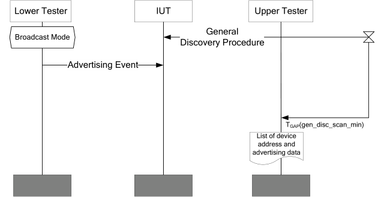

**Figure 4.111: GAP/DISC/GENP/BV-05-C [General Discovery Procedure Does not find Directed Connectable device] MSC**

• Test Condition
It must be possible to order the IUT to perform the General Discovery Procedure.
• Expected Outcome
Pass verdict
The IUT does not discover the Lower Tester during the discovery period.
• Notes
“Discover” in the context of the test text means to report to the application layer and/or verify the Flags AD type presence and setting according to the test Pass verdict in any received advertising data.
GAP/IDLE/NAMP/BV-01-C [Name Discovery Procedure GATT Client]
• Test Purpose
Verify that the IUT can perform the Name Discovery Procedure and retrieve the device name from a peer device.
The IUT is operating as the GATT client.
• Reference
[4] 9.2.7
• Initial Condition
- The IUT is in Link Layer state ‘Standby’.
- The IUT is in the role specified in the TSPX_gap_iut_role IXIT entry.
- The Lower Tester and IUT are connected.
- The Lower Tester is a GATT server and exposes the Device Name characteristic.
- The Device Name Characteristic value for the Lower Tester is specified in the IXIT [3].
• Test Procedure
The Upper Tester orders the IUT to perform the Name Discovery Procedure.

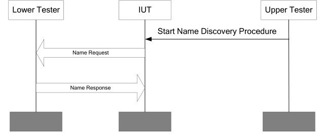

**Figure 4.112: GAP/IDLE/NAMP/BV-01-C [Name Discovery Procedure GATT Client] MSC**

• Test Condition
It must be possible to order IUT to perform the Name Discovery Procedure.
• Expected Outcome
Pass verdict
The IUT retrieves the specified Device Name from the Lower Tester.
• Test Purpose
Verify that the IUT can support the Name Discovery Procedure and allow a peer device to retrieve the device name.
The IUT is operating as the GATT Server.
• Reference
[4] 9.2.7
• Initial Condition
- The IUT is in Link Layer state ‘Standby’.
- The IUT is in the role specified in the TSPX_gap_iut_role IXIT entry.
- The Lower Tester and IUT are connected.
- The IUT is a GATT server and exposes the Device Name characteristic.
- The Device Name Characteristic value for the IUT is specified in the IXIT [3].
• Test Procedure
The Lower Tester performs the Name Discovery Procedure.

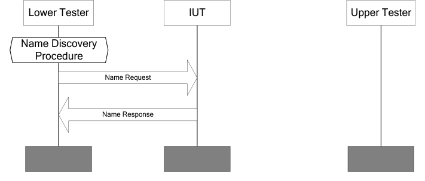

**Figure 4.113: GAP/IDLE/NAMP/BV-02-C [Name Discovery Procedure GATT Server] MSC**

• Expected Outcome
Pass verdict
The Lower Tester retrieves the specified Device Name from the IUT.

##### 4.7.2.7 Discovery of Devices with Resolvable Private Address

GAP/DISC/RPA/BV-01-C [Discovery Procedure Find Discoverable Device using Resolvable Private Address]
• Test Purpose
Verify that the IUT can perform any of the Discovery Procedures to find a device in any of the Discoverable Modes, when resolvable private addresses are used.
The IUT is operating in the Central role.
• Reference
[12] 9.2.5, 10.7, 10.7.2.1
• Initial Condition
- The IUT is in Link Layer state ‘Standby’.
- The IUT and the Lower Tester are paired using either LE Legacy or LE Secure Connections.
- The Device Identity (Identity Address) of the Lower Tester is specified in the IXIT [3].
- TGAP(lim_disc_scan_min) and TGAP(gen_disc_scan_min) for the IUT is specified in the IXIT [3].
• Test Procedure
1. The Lower Tester generates a resolvable private address using the Resolvable Private Address
Generation Procedure. 2. The Lower Tester enters Limited Discoverable Mode or General Discoverable Mode. 3. The Upper Tester orders the IUT to add the Lower Tester’s Identity to the resolving list. 4. The Upper Tester orders the IUT to perform the Limited Discovery Procedure or the General
Discovery Procedure.

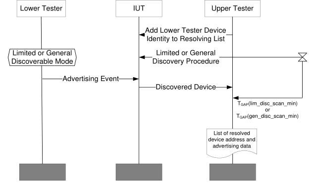

**Figure 4.114: GAP/DISC/RPA/BV-01-C [Discovery Procedure Find Discoverable Device using Resolvable Private Address] MSC**

• Test Condition
It must be possible to order IUT to perform the Limited Discovery Procedure or the General Discovery Procedure.
It must be possible to order IUT to add the Lower Tester’s Device Identity to the resolving list.
• Expected Outcome
Pass verdict
The IUT lists the Lower Tester during the discovery period by its identity address.

#### 4.7.3 Connection Modes and Procedures

##### 4.7.3.1 Non-Connectable Mode

GAP/CONN/NCON/BV-01-C [Non-Connectable Mode]
• Test Purpose
Verify that the IUT in the Non-Connectable Mode does not allow another device performing the Direct Connection Establishment Procedure to connect.
The IUT is operating in the Broadcaster role or the Peripheral role or the Observer role.
• Reference
[4] 9.3.2
• Initial Condition
- The IUT is in Link Layer state ‘Standby’.
- The public/static address for the IUT is specified in the IXIT [3].
• Test Procedure
1. The Upper Tester orders IUT to enter Non-Connectable Mode. 2. The Lower Tester performs the Direct Connection Establishment Procedure to connect to the
IUT; the Lower Tester creates a connection using the specified public/static address for the IUT.

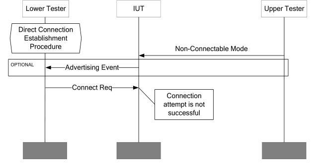

**Figure 4.115: GAP/CONN/NCON/BV-01-C [Non-Connectable Mode] MSC**

• Test Condition
It must be possible to order IUT to enter Non-Connectable Mode.
• Expected Outcome
Pass verdict
The Lower Tester receives either no advertising events or non-connectable advertising events from IUT whilst in Non-Connectable Mode.
For IUT acting in the Broadcaster role, the Lower Tester receives non-connectable advertising events from IUT whilst broadcasting data in Non-Connectable Mode.
In each advertising event received the advertiser address is set to the specified public/static address for the IUT.
The Lower Tester fails to establish a connection with the IUT.
GAP/CONN/NCON/BV-02-C [Non-Connectable Mode General Discoverable Mode]
• Test Purpose
Verify that the IUT in the Non-Connectable Mode and General Discoverable Mode does not allow a connection to be established with another device.
The IUT is operating in the Peripheral role.
• Reference
[4] 9.3.2
• Initial Condition
- The IUT is in Link Layer state ‘Standby’.
- The public/static address of the IUT is specified in the IXIT [3].
• Test Procedure
1. The Upper Tester orders the IUT to enter General Discoverable Mode. 2. The Upper Tester orders the IUT to enter Non-Connectable Mode. 3. The Lower Tester performs the General Connection Establishment Procedure to connect to the
IUT; the Lower Tester creates a connection using the specified public/static address.

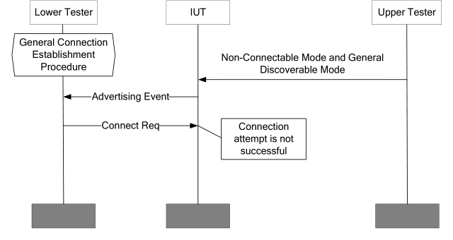

**Figure 4.116: GAP/CONN/NCON/BV-02-C [Non-Connectable Mode General Discoverable Mode] MSC**

• Test Condition
It must be possible to order IUT to enter Non-Connectable Mode.
• Expected Outcome
Pass verdict
The Lower Tester receives non-connectable advertising events from IUT whilst in Non-Connectable Mode and General Discoverable Mode.
In each advertising event received the advertiser address is set to the specified public/static address for the IUT.
• Test Purpose
Verify that the IUT in the Non-Connectable Mode and Limited Discoverable Mode does not allow a connection to be established with another device.
The IUT is operating in the Peripheral role.
• Reference
[4] 9.3.2
• Initial Condition
- The IUT is in Link Layer state ‘Standby’.
- The public/static address of the IUT is specified in the IXIT [3].
• Test Procedure
1. The Upper Tester orders the IUT to enter Limited Discoverable Mode. 2. The Upper Tester orders the IUT to enter Non-Connectable Mode. 3. The Lower Tester performs the General Connection Establishment Procedure to connect to the
IUT; the Lower Tester creates a connection using the specified public/static address for the IUT.

**Figure 4.117: GAP/CONN/NCON/BV-03-C [Non-Connectable Mode Limited Discoverable Mode] MSC**

• Test Condition
It must be possible to order IUT to enter Non-Connectable Mode.
• Expected Outcome
Pass verdict
The Lower Tester receives non-connectable advertising events from IUT whilst in Non-Connectable Mode and Limited Discoverable Mode.
In each advertising event received the advertiser address is set to the specified public/static address for the IUT.
The Lower Tester fails to establish a connection with the IUT.
GAP/CONN/DCON/BV-01-C [Directed Connectable Mode]
• Test Purpose
Verify that the IUT in the Directed Connectable Mode can connect with another device performing the General Connection Establishment Procedure.
The IUT is operating in the Peripheral role.
• Reference
[4] 9.3.3
• Initial Condition
- The IUT is in Link Layer state ‘Standby’.
- The public/static address of the IUT is specified in the IXIT [3].
- The public/static address of the Lower Tester is specified in the IXIT [3].
• Test Procedure
1. The Lower Tester performs the General Connection Establishment Procedure to connect to the
IUT; the Lower Tester creates the connection using the received advertiser address. 2. The Upper Tester orders IUT to enter Direct Connectable Mode; the IUT sets the advertiser’s
address to the public/static address of the IUT and sets the initiator address to the public/static address of the Lower Tester. 3. The Lower Tester or the IUT terminates the connection.

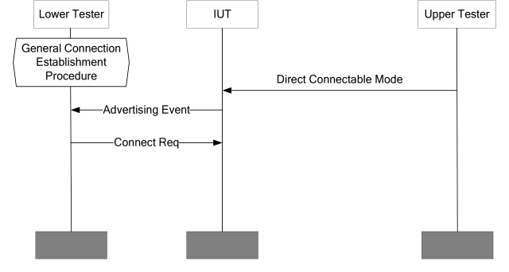

**Figure 4.118: GAP/CONN/DCON/BV-01-C [Directed Connectable Mode] MSC**

• Test Condition
It must be possible to order IUT to enter Direct Connectable Mode.
• Expected Outcome
Pass verdict
The Lower Tester receives connectable directed advertising events from IUT during the period that the IUT is in Directed Connectable Mode.
In each connectable directed advertising event received the advertiser address is set to the public/static address of the IUT and the initiator address is set to the public/static address of the Lower Tester.
The Lower Tester establishes a connection with the IUT using the received advertiser address.
The Lower Tester or IUT successfully terminates the connection.
GAP/CONN/DCON/BV-04-C [Directed Connectable Mode, Privacy, Resolvable Private Address, Central Address Resolution]
• Test Purpose
Verify that the IUT in the Directed Connectable Mode using a Resolvable Private Address can connect with another device using a Resolvable Private Address performing the General Connection Establishment Procedure when the other device indicates support for Central Address Resolution.
The IUT is operating in the Peripheral role.
• Reference
[12] 9.3.3, 12.4
• Initial Condition
- The IUT is in Link Layer state ‘Standby’.
- The IUT is in Privacy mode.
- The Lower Tester exposes the Central Address Resolution characteristic which is set to 1.
- TGAP(private_addr_int) for the IUT is specified in the IXIT [3].
- The Lower Tester is using a resolvable private address and has distributed its IRK.
- The IUT is using a resolvable private address and has distributed its IRK.
• Test Procedure
1. The Upper Tester orders the IUT to add the Lower Tester’s Device Identity to the resolving list. 2. The Upper Tester orders the IUT to enter General Connectable Mode. 3. The Lower Tester performs the General Connection Establishment Procedure to connect to the
IUT; the Lower Tester creates the connection using the received advertiser address. 4. When connected, the IUT optionally reads the value of the Central Address Resolution
characteristic. 5. The Lower Tester or the IUT terminates the connection. 6. The Upper Tester orders the IUT to enter Direct Connectable Mode targeting the Lower Tester by
its identity address. 7. The Lower Tester performs the General Connection Establishment Procedure to connect to the
IUT; upon receiving the directed advertisement, the Lower Tester resolves the initiator and advertiser address, and set the advertiser address equivalent to the resolved advertiser address when creating the connection to the IUT. 8. After the connection establishment, either the Lower Tester or the IUT should terminate the
connection.

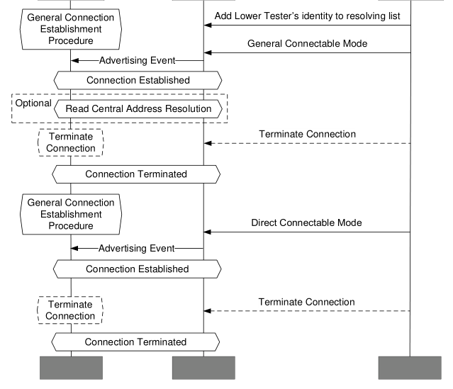

**Figure 4.119: GAP/CONN/DCON/BV-04-C [Directed Connectable Mode, Privacy, Resolvable Private Address, Central Address Resolution] MSC**

• Test Condition
It must be possible to order the IUT to enter Direct Connectable Mode.
• Expected Outcome
Pass verdict
In each connectable directed advertising event received by the Lower Tester, the advertiser address is set to a resolvable private address for the IUT and the initiator address is set to a generated resolvable private address based on the device identity of the Lower Tester.
The Lower Tester establishes a connection with the IUT using a resolvable private address as the initiator address and the advertiser address present in the directed advertisement as the advertiser address in the connection request.
GAP/CONN/DCON/BV-05-C [Directed Connectable Mode, Privacy, Resolvable Private Address, Central Address Resolution not supported]
• Test Purpose
Verify that the IUT does not initiate the Directed Connectable Mode using a Resolvable Private Address, towards another privacy enabled device, which does not indicate support for Central Address Resolution.
The IUT is operating in the Peripheral role.
• Reference
[12] 9.3.3, 12.4
• Initial Condition
- The IUT is in Link Layer state ‘Standby’.
- The IUT is in Privacy mode.
- The Lower Tester may expose the Central Address Resolution characteristic. If present it is set to 0.
- TGAP(private_addr_int) for the IUT is specified in the IXIT [3].
- The Lower Tester is using a resolvable private address and has distributed its IRK.
- The IUT is using a resolvable private address and has distributed its IRK.
• Test Procedure
1. The Upper Tester orders the IUT to add the Lower Testers Identity to the resolving list. 2. The Upper Tester orders the IUT to enter General Connectable Mode. 3. The Lower Tester performs the General Connection Establishment Procedure to connect to the
IUT; the Lower Tester creates the connection using the received advertiser address. 4. When connected, the IUT optionally reads the value of the Central Address Resolution
characteristic of the Lower Tester. 5. The Lower Tester or the IUT terminates the connection. 6. The Upper Tester orders the IUT to enter Direct Connectable Mode targeting the Lower Tester by
its identity address. 7. The IUT refuses the order. The IUT might enter another connectable mode and establish the
connection this way.

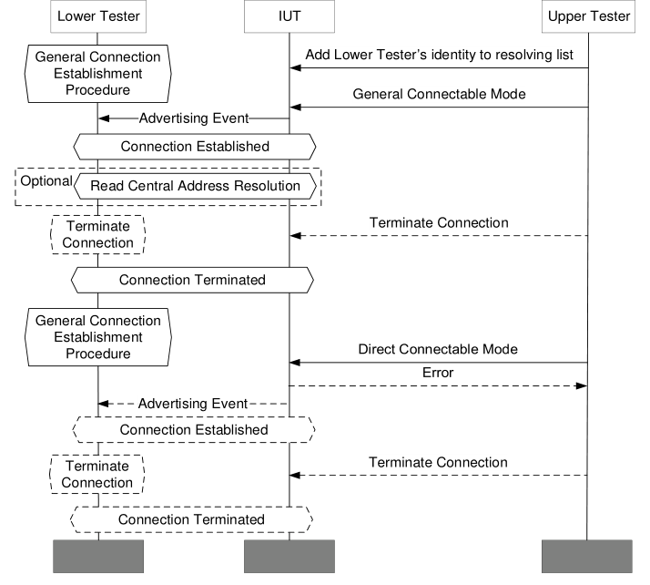

**Figure 4.120: GAP/CONN/DCON/BV-05-C [Directed Connectable Mode, Privacy, Resolvable Private Address, Central Address Resolution not supported] MSC**

• Test Condition
It must be possible to order the IUT to enter Direct Connectable Mode.
• Expected Outcome
Pass verdict
The Lower Tester does not establish a connection with the IUT based on directed advertisement.

##### 4.7.3.3 Undirected Connectable Mode

GAP/CONN/UCON/BV-01-C [Undirected Connectable Mode Non-Discoverable Mode]
• Test Purpose
Verify that the IUT in Undirected Connectable Mode can connect with another device performing the General Connection Establishment Procedure.
The IUT is operating in the Peripheral role.
• Reference
[4] 9.3.4
• Initial Condition
- The IUT is in Link Layer state ‘Standby’.
- The public/static address of the IUT is specified in the IXIT [3].
• Test Procedure
1. The Lower Tester performs the General Connection Establishment Procedure to connect to the
IUT; the Lower Tester creates a connection using the advertiser’s address in the received advertising events from the IUT. 2. The Upper Tester orders IUT to enter Undirected Connectable Mode and Non-Discoverable
Mode; the IUT sets the advertiser address to the public/static address of the IUT.

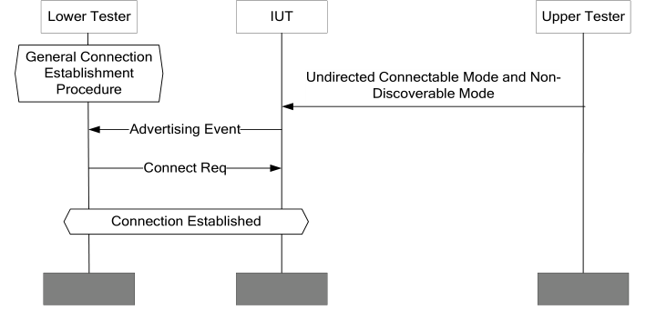

**Figure 4.121: GAP/CONN/UCON/BV-01-C [Undirected Connectable Mode Non-Discoverable Mode] MSC**

• Test Condition
It must be possible to order IUT to enter Undirected Connectable Mode.
• Expected Outcome
Pass verdict
The IUT sends either connectable and scannable undirected advertising events or connectable undirected advertising events.
In each advertising event received the advertiser address is set to the specified public/static address for the IUT.
The Lower Tester establishes a connection with IUT.
GAP/CONN/UCON/BV-02-C [Undirected Connectable Mode General Discoverable Mode]
• Test Purpose
Verify that the IUT in Undirected Connectable Mode and General Discoverable Mode can connect with another device performing the General Connection Establishment Procedure.
The IUT is operating in the Peripheral role.
• Reference
[4] 9.3.4
• Initial Condition
- The IUT is in Link Layer state ‘Standby’
- The public/static address for the IUT is specified in the IXIT [3].
• Test Procedure
1. The Upper Tester orders IUT to enter Undirected Connectable Mode and General Discoverable
Mode; the IUT sets the advertiser address to the specified public/static address for the IUT. 2. The Lower Tester performs the General Connection Establishment Procedure to connect to the
IUT.

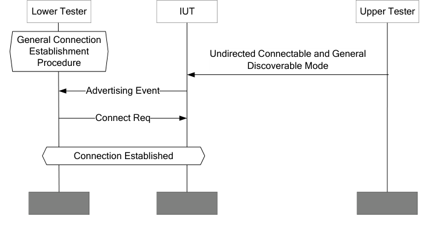

**Figure 4.122: GAP/CONN/UCON/BV-02-C [Undirected Connectable Mode General Discoverable Mode] MSC**

• Test Condition
It must be possible to order IUT to enter Undirected Connectable Mode.
• Expected Outcome
Pass verdict
The IUT sends either connectable and scannable undirected advertising events or connectable undirected advertising events.
In each advertising event received the advertiser address is set to the specified public/static address for the IUT.
The Lower Tester establishes a connection with IUT.
GAP/CONN/UCON/BV-03-C [Undirected Connectable Mode Limited Discoverable Mode]
• Test Purpose
Verify that the IUT in Undirected Connectable Mode and Limited Discoverable Mode can connect with another device performing the General Connection Establishment Procedure.
The IUT is operating in the Peripheral role.
• Reference
[4] 9.3.4
• Initial Condition
- The IUT is in Link Layer state ‘Standby’.
- The public/static address for the IUT is specified in the IXIT [3].
• Test Procedure
1. The Upper Tester orders the IUT to enter Limited Discoverable Mode and Undirected
Connectable Mode; the IUT sets the advertiser address to the public/static address for the IUT. 2. The Lower Tester performs the General Connection Establishment Procedure to connect to the
IUT.

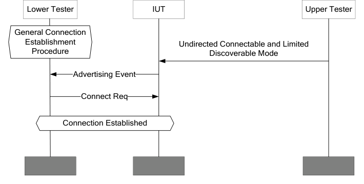

**Figure 4.123: GAP/CONN/UCON/BV-03-C [Undirected Connectable Mode Limited Discoverable Mode] MSC**

• Test Condition
It must be possible to order IUT to enter Undirected Connectable Mode.
• Expected Outcome
Pass verdict
The IUT sends either connectable and scannable undirected advertising events or connectable undirected advertising events.
In each advertising event received the advertiser address is set to the specified public/static address for the IUT.
The Lower Tester establishes a connection with IUT.
GAP/CONN/UCON/BV-06-C [Undirected Connectable Mode Resolvable Private Address]
• Test Purpose
Verify that the IUT in the Undirected Connectable Mode using Resolvable Private Address can connect with another device performing the General Connection Establishment Procedure.
The IUT is operating in the Peripheral role.
• Reference
[9] [12] 9.3.4, 10.7.1
• Initial Condition
- The IUT is in Link Layer state ‘Standby’.
- The IUT and the Lower Tester are paired using either LE Legacy or LE Secure Connections.
- The IUT is in Privacy mode.
- TGAP(private_addr_int) for the IUT is specified in the IXIT [3].
- The Lower Tester is using a resolvable private address and has distributed its IRK.
- The IUT is using a resolvable private address and has distributed its IRK.
• Test Procedure
1. The Upper Tester orders the IUT to enter Undirected Connectable Mode using private addresses. 2. If the IUT is a Peripheral with Host-based privacy, then the IUT changes the advertiser address to
a new and unique resolvable address every TGAP(private_addr_int). The Lower Tester verifies that the resolvable private address changes at least once after TGAP(private_addr_int). 3. The Lower Tester performs the General Connection Establishment Procedure to connect to the
IUT; the Lower Tester creates the connection using the received resolvable private address from the IUT. 4. After the connection establishment, either the Lower Tester or the IUT should terminate the
connection.
• Test Condition
It must be possible to order the IUT to enter Undirected Connectable Mode.
• Expected Outcome
Pass verdict
The Lower Tester receives either connectable and scannable undirected advertising events or connectable undirected advertising events from the IUT.
In each advertising event received, the advertiser address is set to a valid resolvable private address.
The Lower Tester is able to resolve and confirm the identity of the IUT from the received private address.
When the IUT is a Peripheral with Host-based privacy, the Lower Tester verifies that the IUT changes the resolvable private address in the advertiser address of the received advertising events after TGAP(private_addr_int).
The Lower Tester establishes a connection with the IUT using the received advertiser address.

##### 4.7.3.4 Auto Connection Establishment Procedure

GAP/CONN/ACEP/BV-01-C [Auto Connection Establishment Procedure Directed Connectable Mode]
• Test Purpose
Verify that the IUT can perform the Auto Connection Establishment Procedure to connect to another device in the Directed Connectable Mode.
The IUT is operating in the Central role.
• Reference
[4] 9.3.5
• Initial Condition
- The IUT is in Link Layer state ‘Standby’.
- The public/static address of the Lower Tester is specified in the IXIT [3].
- The public/static address of the IUT is specified in the IXIT [3].
• Test Procedure
1. The Upper Tester orders IUT to perform the Auto Connection Establishment Procedure using the
specified public/static address of the Lower Tester. 2. The Lower Tester sets the advertiser address to the specified public/static address of the Lower
Tester. 3. The Lower Tester sets the initiator address to the specified public/static address of the IUT. 4. The Lower Tester enters the Directed Connectable Mode.

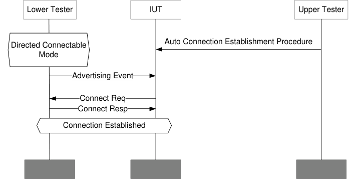

**Figure 4.124: GAP/CONN/ACEP/BV-01-C [Auto Connection Establishment Procedure Directed Connectable Mode] MSC**

• Test Condition
It must be possible to order IUT to perform the Auto Connection Establishment Procedure.
• Expected Outcome
Pass verdict
The IUT autonomously establishes a connection with the Lower Tester.
GAP/CONN/ACEP/BV-03-C [Auto Connection Establishment Procedure Directed Connectable Mode, Resolvable Private Address, Central Address Resolution]
• Test Purpose
Verify that the IUT using Resolvable Private Address can perform the Auto Connection Establishment Procedure to connect to another device in the Directed Connectable Mode that is using Resolvable Private Addresses.
The IUT is operating in the Central role.
• Reference
[12] 9.3.5, 10.7.2.1, 10.7.2.2, 12.4
• Initial Condition
- The IUT is in Link Layer state ‘Standby’.
- The IUT exposes the Central Address Resolution Characteristic set to 1.
- The Lower Tester is using a resolvable private address and has distributed its IRK.
- The IUT is using a resolvable private address and has distributed its IRK.
• Test Procedure
1. The Upper Tester orders the IUT to add the Lower Tester’s Device Identity to the resolving list
and Filter Accept List. 2. The Upper Tester orders the IUT to perform the Auto Connection Establishment Procedure using
resolvable private address. 3. The Lower Tester enters the Directed Connectable Mode using the device identities for the IUT
and Lower Tester. 4. Upon receiving the directed advertisement, the IUT resolves the addresses and sends a connect
request to the Lower Tester. 5. After the connection establishment, either the Lower Tester or the IUT should terminate the
connection.
Lower Tester Upper Tester IUT

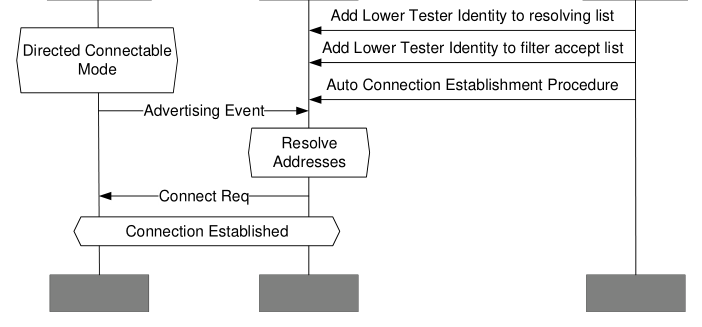

**Figure 4.125: GAP/CONN/ACEP/BV-03-C [Auto Connection Establishment Procedure Directed Connectable Mode, Resolvable Private Address, Central Address Resolution] MSC**

• Test Condition
It must be possible to order the IUT to perform the Auto Connection Establishment Procedure.
• Expected Outcome
Pass verdict
The IUT uses a resolvable private address as the initiator address and the advertiser address present in the directed advertisement as the advertiser address in the connection request.
The IUT autonomously establishes a connection with the Lower Tester.
GAP/CONN/ACEP/BV-04-C [Auto Connection Establishment Procedure Undirected Connectable Mode, Resolvable Private Address]
• Test Purpose
Verify that the IUT using Resolvable Private Address can perform the Auto Connection Establishment Procedure to connect to another device in the Undirected Connectable Mode using Resolvable Private Address.
The IUT is operating in the Central role.
• Reference
[12] 9.3.5, 10.7.2.1, 10.7.2.2, 12.4
• Initial Condition
- The IUT is in Link Layer state ‘Standby’.
- The Lower Tester is using a resolvable private address and has distributed its IRK.
- The IUT is using a resolvable private address and has distributed its IRK.
• Test Procedure
1. The Upper Tester orders the IUT to add the Lower Testers Identity to the resolving list and Filter
Accept List. 2. The Upper Tester orders the IUT to perform the Auto Connection Establishment Procedure using
resolvable private address.
Lower Tester. 4. Upon receiving the undirected advertisement, the IUT resolves the address and sends a connect
request to the Lower Tester. 5. After the connection establishment, either the Lower Tester or the IUT should terminate the
connection.

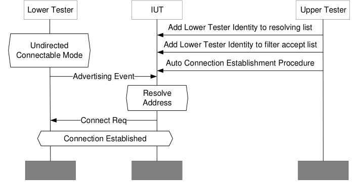

**Figure 4.126: GAP/CONN/ACEP/BV-04-C [Auto Connection Establishment Procedure Undirected Connectable Mode, Resolvable Private Address] MSC**

• Test Condition
It must be possible to order the IUT to perform the Auto Connection Establishment Procedure.
• Expected Outcome
Pass verdict
The IUT uses a resolvable private address as the initiator address and advertiser address present in the undirected advertisement in the connection request.
The IUT autonomously establishes a connection with the Lower Tester.

##### 4.7.3.5 General Connection Establishment Procedure

GAP/CONN/GCEP/BV-01-C [General Connection Establishment Procedure Directed Connectable Mode]
• Test Purpose
Verify that the IUT can perform the General Connection Establishment Procedure to connect to another device in the Directed Connectable Mode.
The IUT is operating in the Central role.
• Reference
[4] 9.3.6
• Initial Condition
- The IUT is in Link Layer state ‘Standby’.
- The public/static address of the Lower Tester is specified in the IXIT [3].
- The public/static address of the IUT is specified in the IXIT [3].
• Test Procedure
1. The Upper Tester orders the IUT to perform the General Connection Establishment Procedure;
the IUT uses the specified public/static address of the Lower Tester. 2. The Lower Tester sets the advertiser address to the public/static address of the Lower Tester. 3. The Lower Tester sets the initiator address to the public/static address of the IUT. 4. The Lower Tester enters the Directed Connectable Mode.

**Figure 4.127: GAP/CONN/GCEP/BV-01-C [General Connection Establishment Procedure Directed Connectable Mode] MSC**

• Test Condition
It must be possible to order IUT to perform the General Connection Establishment Procedure.
• Expected Outcome
Pass verdict
The IUT receives the connectable directed advertising events from the Lower Tester.
If the IUT is Active Scanning with privacy enabled then the address used in the SCAN_REQ is a non- resolvable private address.
If the IUT has privacy enabled then the address used in the connection request is a non-resolvable private address.
The IUT establishes a connection with the Lower Tester.
GAP/CONN/GCEP/BV-02-C [General Connection Establishment Procedure Undirected Connectable Mode]
• Test Purpose
Verify that the IUT can perform the General Connection Establishment Procedure to connect to another device in the Undirected Connectable Mode.
The IUT is operating in the Central role.
• Reference
[4] 9.3.6
• Initial Condition
- The IUT is in Link Layer state ‘Standby’.
- The public/static address of the Lower Tester is specified in the IXIT [3].
- The public/static address of the IUT is specified in the IXIT [3].
• Test Procedure
1. The Upper Tester orders the IUT to perform the General Connection Establishment Procedure;
the IUT uses the specified public/static address of the Lower Tester. 2. The Lower Tester sets the advertiser address to the public/static address of the Lower Tester. 3. The Lower Tester enters the Undirected Connectable Mode.

**Figure 4.128: GAP/CONN/GCEP/BV-02-C [General Connection Establishment Procedure Undirected Connectable Mode] MSC**

• Test Condition
It must be possible to order IUT to perform the General Connection Establishment Procedure.
• Expected Outcome
Pass verdict
The IUT receives the connectable and scannable undirected advertising events or connectable undirected advertising events from the Lower Tester.
The IUT establishes a connection with the Lower Tester.
GAP/CONN/GCEP/BV-05-C [General Connection Establishment Procedure Directed Connectable Mode, Resolvable Private Address, Central Address Resolution]
• Test Purpose
Verify that the IUT using a Resolvable Private Address can perform the General Connection Establishment Procedure to connect to another device in the Directed Connectable Mode using Resolvable Private Address.
The IUT is operating in the Central role.
• Reference
[12] 9.3.6. 10.7.2.1, 10.7.2.2, 12.4
• Initial Condition
- The IUT is in Link Layer state ‘Standby’.
- The IUT exposes the Central Address Resolution Characteristic set to 1.
- The Lower Tester is using a resolvable private address and has distributed its IRK.
- The IUT is using a resolvable private address and has distributed its IRK.
• Test Procedure
1. The Upper Tester orders the IUT to add the Lower Testers Identity to the resolving list. 2. The Upper Tester orders the IUT to perform the General Connection Establishment Procedure
using resolvable private address. 3. The Lower Tester enters the Directed Connectable Mode using the device identities for the IUT
and Lower Tester. 4. Upon receiving the directed advertisement, the IUT resolves the addresses and sends a connect
request to the Lower Tester. 5. After the connection establishment, either the Lower Tester or the IUT should terminate the
connection.

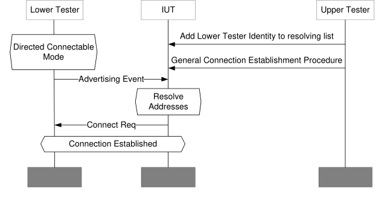

**Figure 4.129: GAP/CONN/GCEP/BV-05-C [General Connection Establishment Procedure Directed Connectable Mode, Resolvable Private Address, Central Address Resolution] MSC**

• Test Condition
It must be possible to order the IUT to perform the General Connection Establishment Procedure.
• Expected Outcome
Pass verdict
The IUT receives the connectable directed advertising events from the Lower Tester.
The IUT is able to resolve and confirm the identity of the Lower Tester from the received resolvable private address.
The IUT uses a resolvable private address as the initiator address and the advertiser address present in the directed advertisement as the advertiser address in the connection request.
The IUT establishes a connection with the Lower Tester.
GAP/CONN/GCEP/BV-06-C [General Connection Establishment Procedure Undirected Connectable Mode, Resolvable Private Address]
• Test Purpose
Verify that the IUT using Resolvable Private Address can perform the General Connection Establishment Procedure to connect to another device in the Undirected Connectable Mode using Resolvable Private Address.
The IUT is operating in the Central role.
• Reference
[12] 9.3.6, 10.7.2.1, 10.7.2.2, 12.4
• Initial Condition
- The IUT is in Link Layer state ‘Standby’.
- The Lower Tester is using a resolvable private address and has distributed its IRK.
- The IUT is using a resolvable private address and has distributed its IRK.
• Test Procedure
1. The Upper Tester orders the IUT to add the Lower Tester’s Identity to the resolving list. 2. The Upper Tester orders the IUT to perform the General Connection Establishment Procedure
using resolvable private address. 3. The Lower Tester enters the Undirected Connectable Mode using the device identity for the
Lower Tester. 4. Upon receiving the undirected advertisement, the IUT resolves the address and sends a connect
request to the Lower Tester. 5. After the connection establishment, either the Lower Tester or the IUT should terminate the
connection.

**Figure 4.130: GAP/CONN/GCEP/BV-06-C [General Connection Establishment Procedure Undirected Connectable Mode, Resolvable Private Address] MSC**

• Test Condition
It must be possible to order the IUT to perform the General Connection Establishment Procedure.
• Expected Outcome
Pass verdict
The IUT receives the connectable and scannable undirected advertising events or connectable undirected advertising events from the Lower Tester.
The IUT is able to resolve and confirm the identity of the Lower Tester from the received resolvable private address.
The IUT uses a resolvable private address as the initiator address and advertiser address present in the undirected advertisement in the connection request.
The IUT establishes a connection with the Lower Tester.

##### 4.7.3.6 Selective Connection Establishment Procedure

GAP/CONN/SCEP/BV-01-C [Selective Connection Establishment Procedure Directed Connectable Mode]
• Test Purpose
Verify that the IUT can perform the Selective Connection Establishment Procedure to connect to another device in the Directed Connectable Mode.
The IUT is operating in the Central role.
• Reference
[4] 9.3.7
• Initial Condition
- The IUT is in Link Layer state ‘Standby’.
- The public/static address of the Lower Tester is specified in the IXIT [3].
- The public/static address of the IUT is specified in the IXIT [3].
• Test Procedure
1. The Upper Tester orders the IUT to perform the Selective Connection Establishment Procedure
using the specified public/static address of the Lower Tester. 2. The Lower Tester sets the advertiser address to the specified public/static address of the Lower
Tester. 3. The Lower Tester sets the initiator address to the specified public/static address of the IUT. 4. The Lower Tester enters the Directed Connectable Mode.
Lower Tester Upper Tester IUT

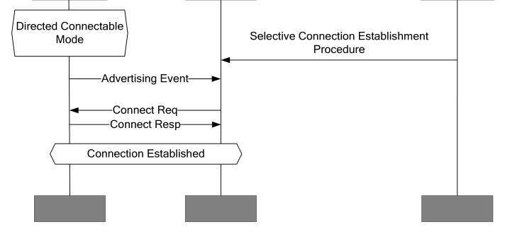

**Figure 4.131: GAP/CONN/SCEP/BV-01-C [Selective Connection Establishment Procedure Directed Connectable Mode] MSC**

• Test Condition
It must be possible to order IUT to perform the Selective Connection Establishment Procedure.
• Expected Outcome
Pass verdict
The IUT host receives advertising event reports sent from the Lower Tester and any other devices in the Filter Accept List; the IUT does not receive advertising event reports from any other devices.
The IUT establishes a connection with the Lower Tester.
GAP/CONN/SCEP/BV-03-C [Selective Connection Establishment Procedure Directed Connectable Mode, Resolvable Private Address, Central Address Resolution]
• Test Purpose
Verify that the IUT using a Resolvable Private Address can perform the Selective Connection Establishment Procedure to connect to another device in the Directed Connectable Mode using Resolvable Private Address.
The IUT is operating in the Central role.
• Reference
[12] 9.3.7, 10.7.2.1, 10.7.2.2, 12.4
• Initial Condition
- The IUT is in Link Layer state ‘Standby’.
- The IUT exposes the Central Address Resolution Characteristic set to 1.
- The Lower Tester is using a resolvable private address and has distributed its IRK.
- The IUT is using a resolvable private address and has distributed its IRK.
• Test Procedure
1. The Upper Tester orders the IUT to add the Lower Tester’s Device Identity to the resolving list
and Filter Accept List. 2. The Upper Tester orders the IUT to perform the Selective Connection Establishment Procedure
using the device identity of the Lower Tester. 3. The Lower Tester enters the Directed Connectable Mode using the device identities for the IUT
and Lower Tester. 4. Upon receiving the directed advertisement, the IUT resolves the addresses and sends a connect
request to the Lower Tester. 5. After the connection establishment, either the Lower Tester or the IUT should terminate the
connection.

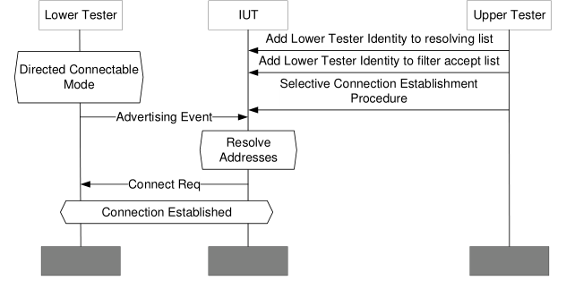

**Figure 4.132: GAP/CONN/SCEP/BV-03-C [Selective Connection Establishment Procedure Directed Connectable Mode, Resolvable Private Address, Central Address Resolution] MSC**

• Test Condition
It must be possible to order the IUT to perform the Selective Connection Establishment Procedure.
• Expected Outcome
Pass verdict
The IUT’s advertising reports includes the Lower Tester.
The IUT is able to resolve and confirm the identity of the Lower Tester from the received resolvable private address.
The IUT uses a resolvable private address as the initiator address and the advertiser address present in the directed advertisement as the advertiser address in the connection request.
The IUT establishes a connection with the Lower Tester.

##### 4.7.3.7 Direct Connection Establishment Procedure

GAP/CONN/DCEP/BV-01-C [Direct Connection Establishment Procedure Directed Connectable Mode]
• Test Purpose
Verify that the IUT can perform the Direct Connection Establishment Procedure to connect to another device in the Directed Connectable Mode.
The IUT is operating in the Central role.
• Reference
[4] 9.3.8
• Initial Condition
- The IUT is in Link Layer state ‘Standby’.
- The IUT has the address of the peer device.
• Test Procedure
1. The Upper Tester orders the IUT to perform the Direct Connection Establishment Procedure
using the static address, public address or non-resolvable private address of the Lower Tester. 2. The Lower Tester sets the advertiser address to the static address, public address or non-
resolvable private address of the Lower Tester. 3. The Lower Tester sets the initiator address to the static address, public address or non-resolvable
private address of the IUT. 4. The Lower Tester enters the Directed Connectable Mode.

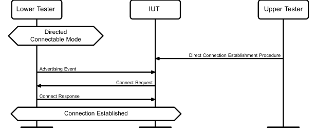

**Figure 4.133: GAP/CONN/DCEP/BV-01-C [Direct Connection Establishment Procedure Directed Connectable Mode] MSC**

• Test Condition
It must be possible to order IUT to perform the Direct Connection Establishment Procedure.
• Expected Outcome
Pass verdict
If the IUT has privacy enabled then the address used in the connection request is a static address, public address, non-resolvable private address, or resolvable private address.
The IUT establishes a connection with the Lower Tester.
GAP/CONN/DCEP/BV-03-C [Direct Connection Establishment Procedure Undirected Connectable Mode]
• Test Purpose
Verify that the IUT can perform the Direct Connection Establishment Procedure to connect to another device in the Undirected Connectable Mode.
The IUT is operating in the Central role.
• Reference
[4] 9.3.8
• Initial Condition
- The IUT is in Link Layer state ‘Standby’.
• Test Procedure
1. The Upper Tester orders IUT to perform the Direct Connection Establishment Procedure using
the static address, public address, non-resolvable private address, or resolvable private address of the Lower Tester. 2. The Lower Tester sets the advertiser address to the static address, public address, non-
resolvable private address, resolvable private address of the Lower Tester. 3. The Lower Tester sets the initiator address to the static address, public address or non-resolvable
private address of the IUT. 4. The Lower Tester enters the Undirected Connectable Mode.

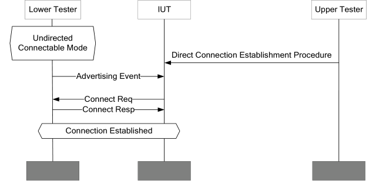

**Figure 4.134: GAP/CONN/DCEP/BV-03-C [Direct Connection Establishment Procedure Undirected Connectable Mode] MSC**

• Test Condition
It must be possible to order IUT to perform the Direct Connection Establishment Procedure.
• Expected Outcome
Pass verdict
If the IUT has privacy enabled then the address used in the connection request is a static address, public address, non-resolvable private address, or resolvable private address.
The IUT establishes a connection with the Lower Tester.
GAP/CONN/DCEP/BV-05-C [Direct Connection Establishment Procedure Directed Connectable Mode, Resolvable Private Address, Central Address Resolution]
• Test Purpose
Verify that the IUT using Resolvable Private Address can perform the Direct Connection Establishment Procedure to connect to another device in the Directed Connectable Mode that is using a Resolvable Private Address.
The IUT is operating in the Central role.
• Reference
[12] 9.3.8, 10.7.2.1, 10.7.2.2, 12.4
• Initial Condition
- The IUT is in Link Layer state ‘Standby’.
- The IUT exposes the Central Address Resolution Characteristic set to 1.
- The Lower Tester is using a resolvable private address and has distributed its IRK.
- The IUT is using a resolvable private address and has distributed its IRK.
• Test Procedure
1. The Upper Tester orders the IUT to add the Lower Testers Identity to the resolving list. 2. The Upper Tester orders the IUT to perform the Direct Connection Establishment Procedure
using resolvable private address. 3. The Lower Tester enters the Directed Connectable Mode using the device identities for the IUT
and Lower Tester. 4. Upon receiving the directed advertisement, the IUT resolves the addresses and sends a connect
request to the Lower Tester. 5. After the connection establishment, either the Lower Tester or the IUT should terminate the
connection.

**Figure 4.135: GAP/CONN/DCEP/BV-05-C [Direct Connection Establishment Procedure Directed Connectable Mode, Resolvable Private Address, Central Address Resolution] MSC**

• Test Condition
It must be possible to order the IUT to perform the Direct Connection Establishment Procedure.
• Expected Outcome
Pass verdict
The IUT receives the connectable directed advertising events from the Lower Tester.
The IUT is able to resolve and confirm the identity of the Lower Tester from the received resolvable private address.
The IUT uses the advertiser address present in the directed advertisement as the advertiser address and a resolvable private address as the initiator address in the connection request.
The IUT establishes a connection with the Lower Tester.
GAP/CONN/DCEP/BV-06-C [Direct Connection Establishment Procedure Undirected Connectable Mode, Resolvable Private Address]
• Test Purpose
Verify that the IUT using Resolvable Private Address can perform the Direct Connection Establishment Procedure to connect to another device in the Undirected Connectable Mode that is using Resolvable Private Address.
The IUT is operating in the Central role.
• Reference
[12] 9.3.8, 10.7.2.1, 10.7.2.2
• Initial Condition
- The IUT is in Link Layer state ‘Standby’.
- The Lower Tester is using a resolvable private address and has distributed its IRK.
- The IUT is using a resolvable private address and has distributed its IRK.
• Test Procedure
1. The Upper Tester orders the IUT to add the Lower Testers Identity to the resolving list. 2. The Upper Tester orders the IUT to perform the Direct Connection Establishment Procedure
using resolvable private address. 3. The Lower Tester enters the Undirected Connectable Mode using the device identities for the
Lower Tester. 4. Upon receiving the undirected advertisement, the IUT resolves the address and sends a connect
request to the Lower Tester. 5. After the connection establishment, either the Lower Tester or the IUT should terminate the
connection.

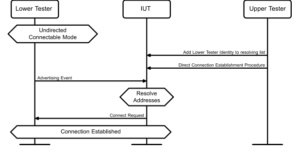

**Figure 4.136: GAP/CONN/DCEP/BV-06-C [Direct Connection Establishment Procedure Undirected Connectable Mode, Resolvable Private Address] MSC**

• Test Condition
It must be possible to order the IUT to perform the Direct Connection Establishment Procedure.
• Expected Outcome
Pass verdict
The IUT receives the connectable and scannable undirected advertising events or connectable undirected advertising events from the Lower Tester.
The IUT is able to resolve and confirm the identity of the Lower Tester from the received resolvable private address.
The IUT use a resolvable private address as the initiator address and advertiser address present in the undirected advertisement in the connection request.
The IUT establishes a connection with the Lower Tester.

##### 4.7.3.8 Connection Parameter Update Procedure

GAP/CONN/CPUP/BV-01-C [Connection Parameter Update Procedure Valid Parameters Peripheral Initiator over L2CAP]
• Test Purpose
Verify that the IUT can perform the Connection Parameter Update Procedure using valid parameters for the peer device, using the L2CAP Connection Parameter Update Request Procedure; the peer device accepts the updated connection parameters.
The IUT is operating in the Peripheral role and is the initiator performing the Connection Parameter Update Procedure; the Lower Tester is operating in the Central role and is the responder.
• Reference
[4] 9.3.9
• Initial Condition
- On the Lower Tester, set the Connection Parameters Request Procedure LL feature bit to 0.
- IUT and Lower Tester are connected using the default connection parameters specified in the following IXIT [3]:
▪ TSPX_LE_scan_interval
▪ TSPX_LE_scan_window
▪ TSPX_initiator_filter_policy
▪ TSPX_peer_address_type
▪ TSPX_peer_address
▪ TSPX_own_address_type
▪ TSPX_conn_interval_min
▪ TSPX_conn_interval_max
▪ TSPX_conn_latency
▪ TSPX_supervision_timeout
▪ TSPX_minimum_ce_length
▪ TSPX_maximum_ce_length
▪ TSPX_conn_update_int_min
▪ TSPX_conn_update_int_max
▪ TSPX_conn_update_peripheral_latency
▪ TSPX_conn_update_supervision_timeout
- TGAP(conn_param_timeout) for the IUT is specified in the IXIT [3].
- The Lower Tester has indicated that it does not support the LL Connection Parameters Request Procedure.
• Test Procedure
1. The Upper Tester orders the IUT to perform the Connection Parameter Update Procedure using
the specified valid connection update parameters. 2. The IUT executes the L2CAP Connection Parameter Update Request Procedure. 3. The Lower Tester accepts the updated connection parameters and sends the appropriate L2CAP
connection parameter update response within the specified TGAP(conn_param_timeout).

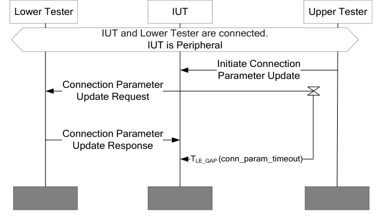

**Figure 4.137: GAP/CONN/CPUP/BV-01-C [Connection Parameter Update Procedure Valid Parameters Peripheral Initiator over L2CAP] MSC**

• Test Condition
It must be possible to order the IUT to perform the Connection Parameter Update Procedure.
• Expected Outcome
Pass verdict
The IUT sends an L2CAP connection parameter update request command with the specified update connection parameters.
The IUT host receives an indication from the IUT controller that the connection parameters have been updated.
• Notes
The Lower Tester should be capable of using any connection parameters within the valid ranges.
GAP/CONN/CPUP/BV-02-C [Connection Parameter Update Procedure Valid Parameters Timeout Peripheral Initiator]
• Test Purpose
Verify that the IUT can perform the Connection Parameter Update Procedure using valid parameters for the peer device; the peer device fails to respond in a timely manner.
The IUT is operating in the Peripheral role and is the initiator performing the Connection Parameter Update Procedure; the Lower Tester is operating in the Central role and is the responder.
• Reference
[4] 9.3.9
• Initial Condition
- On the Lower Tester, set the Connection Parameters Request Procedure LL feature bit to 0.
- IUT and Lower Tester are connected using the default connection parameters specified in the IXIT [3]:
▪ TSPX_LE_scan_interval
▪ TSPX_LE_scan_window
▪ TSPX_initiator_filter_policy
▪ TSPX_peer_address_type
▪ TSPX_peer_address
▪ TSPX_own_address_type
▪ TSPX_conn_interval_min
▪ TSPX_conn_interval_max
▪ TSPX_conn_latency
▪ TSPX_supervision_timeout
▪ TSPX_minimum_ce_length
▪ TSPX_maximum_ce_length
- The valid connection update parameters for the Lower Tester are specified in the following IXIT [3]:
▪ TSPX_conn_update_int_min
▪ TSPX_conn_update_int_max
▪ TSPX_conn_update_peripheral_latency
- RTX timer is set to maximum allowed initial value.
- The Lower Tester has indicated that it does not support the LL Connection Parameters Request Procedure.
• Test Procedure
1. The Upper Tester orders the IUT to perform the Connection Parameter Update Procedure using
the specified valid connection update parameters. 2. The Lower Tester does not send the appropriate L2CAP connection parameter update response
Lower Tester Upper Tester IUT

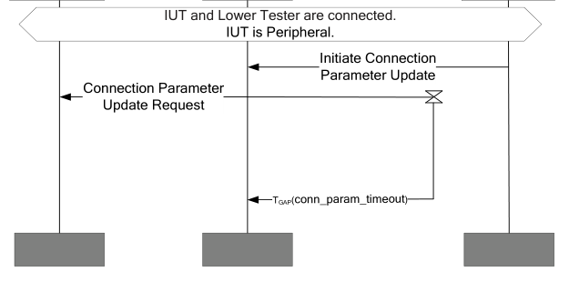

**Figure 4.138: GAP/CONN/CPUP/BV-02-C [Connection Parameter Update Procedure Valid Parameters Timeout Peripheral Initiator] MSC**

• Test Condition
It must be possible to order the IUT to perform the Connection Parameter Update Procedure.
• Expected Outcome
Pass verdict
The IUT transmits a correctly formatted L2CAP Connection Parameter Update Request to the Lower Tester, containing valid connection update parameters matching those received from the Upper Tester.
After RTX timer expires, the IUT either:
1. IUT resends the L2CAP Connection Parameter Update Request command. 2. IUT disconnects the connection at the Link Layer. 3. IUT ignores the error case and continues without disconnecting or resending.
• Notes
The Lower Tester should be capable of using any connection parameters within the valid ranges but in this test case does not respond to the connection parameter update request sent by the IUT.
GAP/CONN/CPUP/BV-03-C [Connection Parameter Update Procedure Invalid Parameters Peripheral Initiator]
• Test Purpose
Verify that the IUT can perform the Connection Parameter Update Procedure using invalid parameters for the peer device; the peer device rejects the updated connection parameters.
The IUT is operating in the Peripheral role and is the initiator performing the Connection Parameter Update Procedure; the Lower Tester is operating in the Central role and is the responder.
• Reference
[4] 9.3.9
• Initial Condition
- On the Lower Tester, set the Connection Parameters Request Procedure LL feature bit to 0.
- IUT and Lower Tester are connected using the default connection parameters specified in the following IXIT [3]:
▪ TSPX_LE_scan_interval
▪ TSPX_LE_scan_window
▪ TSPX_initiator_filter_policy
▪ TSPX_peer_address_type
▪ TSPX_peer_address
▪ TSPX_own_address_type
▪ TSPX_conn_interval_min
▪ TSPX_conn_interval_max
▪ TSPX_conn_latency
▪ TSPX_supervision_timeout
▪ TSPX_minimum_ce_length
▪ TSPX_maximum_ce_length
- The invalid connection update parameters for the Lower Tester are specified in the following IXIT [3]:
▪ TSPX_conn_update_int_min
▪ TSPX_conn_update_int_max
▪ TSPX_conn_update_peripheral_latency
▪ TSPX_conn_update_supervision_timeout
- TGAP(conn_param_timeout) for the IUT is specified in the IXIT.
- The Lower Tester has indicated that it does not support the LL Connection Parameters Request Procedure.
• Test Procedure
1. The Upper Tester orders the IUT to perform the Connection Parameter Update Procedure using
the specified invalid connection update parameters. 2. The Lower Tester rejects the updated connection parameters and sends the appropriate L2CAP
connection parameter update response within the specified TGAP(conn_param_timeout).
Lower Tester Upper Tester IUT

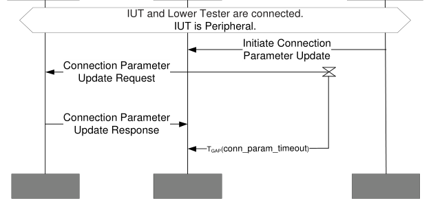

**Figure 4.139: GAP/CONN/CPUP/BV-03-C [Connection Parameter Update Procedure Invalid Parameters Peripheral Initiator] MSC**

• Test Condition
It must be possible to order the IUT to perform the Connection Parameter Update Procedure.
• Expected Outcome
Pass verdict
The Lower Tester receives an L2CAP connection parameter update request command with the specified update connection parameters sent by the IUT.
The IUT host does not receive an indication from the IUT controller that the connection parameters have been updated.
• Notes
The Lower Tester should be capable of using any connection parameters within the valid ranges but in this test case rejects the update connection parameters request sent by the IUT.
GAP/CONN/CPUP/BV-04-C [Connection Parameter Update Procedure Valid Parameters Central Responder]
• Test Purpose
Verify that the IUT accepts the connection parameter update request from a peer device performing the Connection Parameter Update Procedure using valid parameters for the IUT.
The Lower Tester is operating in the Peripheral role and is the initiator performing the Connection Parameter Update Procedure; the IUT is operating in the Central role and is the responder.
• Reference
[4] 9.3.9
• Initial Condition
- On the Lower Tester, set the Connection Parameters Request Procedure LL feature bit to 0.
- IUT and Lower Tester are connected using the default connection parameters specified in the following IXIT [3]:
▪ TSPX_LE_scan_interval
▪ TSPX_LE_scan_window
▪ TSPX_initiator_filter_policy
▪ TSPX_peer_address_type
▪ TSPX_peer_address
▪ TSPX_own_address_type
▪ TSPX_conn_interval_min
▪ TSPX_conn_interval_max
▪ TSPX_conn_latency
▪ TSPX_supervision_timeout
▪ TSPX_minimum_ce_length
▪ TSPX_maximum_ce_length
- The valid connection update parameters for the IUT are specified in the following IXIT [3]:
▪ TSPX_conn_update_int_min
▪ TSPX_conn_update_int_max
▪ TSPX_conn_update_peripheral_latency
▪ TSPX_conn_update_supervision_timeout
- The Lower Tester has indicated that it does not support the LL Connection Parameters Request Procedure.
• Test Procedure
The Lower Tester performs the Connection Parameter Update Procedure using the specified valid connection update parameters.

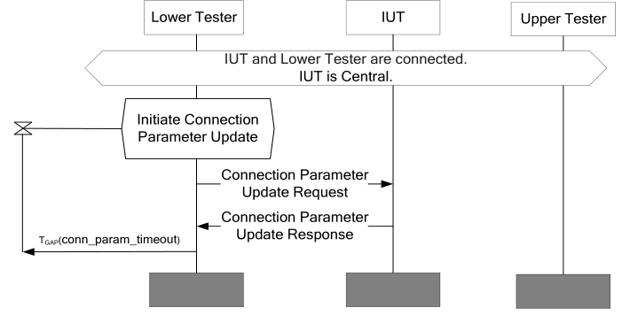

**Figure 4.140: GAP/CONN/CPUP/BV-04-C [Connection Parameter Update Procedure Valid Parameters Central Responder] MSC**

• Expected Outcome
Pass verdict
The Lower Tester receives an L2CAP connection parameter update response within TGAP(conn_param_timeout) after sending the L2CAP connection parameter update request.
The L2CAP connection parameter update response result code is set to “parameters accepted”.
The IUT uses the new connection parameters after the Lower Tester receives the L2CAP connection parameter update response.
• Notes
The Lower Tester should be capable of using any connection parameters within the valid ranges.
GAP/CONN/CPUP/BV-05-C [Connection Parameter Update Procedure Invalid Parameters Central Responder]
• Test Purpose
Verify that the IUT rejects the connection parameter update request from a peer device performing the Connection Parameter Update Procedure using invalid connection parameters for the IUT.
The Lower Tester is operating in the Peripheral role and is the initiator performing the Connection Parameter Update Procedure and the IUT is operating in the Central role and is the responder.
• Reference
[4] 9.3.9
• Initial Condition
- On the Lower Tester, set the Connection Parameters Request Procedure LL feature bit to 0.
- IUT and Lower Tester are connected using the default connection parameters specified in the following IXIT [3]:
▪ TSPX_LE_scan_interval
▪ TSPX_LE_scan_window
▪ TSPX_initiator_filter_policy
▪ TSPX_peer_address_type
▪ TSPX_peer_address
▪ TSPX_own_address_type
▪ TSPX_conn_interval_min
▪ TSPX_conn_interval_max
▪ TSPX_conn_latency
▪ TSPX_supervision_timeout
▪ TSPX_minimum_ce_length
▪ TSPX_maximum_ce_length
- The invalid connection update parameters for the IUT are specified in the following IXIT [3]:
▪ TSPX_conn_update_int_min
▪ TSPX_conn_update_int_max
▪ TSPX_conn_update_peripheral_latency
▪ TSPX_conn_update_supervision_timeout
- The Lower Tester has indicated that it does not support the LL Connection Parameters Request Procedure.
• Test Procedure
The Lower Tester performs the Connection Parameter Update Procedure using the specified invalid connection update parameters.

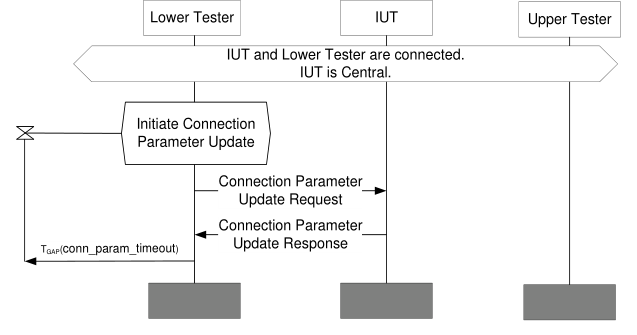

**Figure 4.141: GAP/CONN/CPUP/BV-05-C [Connection Parameter Update Procedure Invalid Parameters Central Responder] MSC**

• Expected Outcome
Pass verdict
The Lower Tester receives an L2CAP connection parameter update response within TGAP(conn_param_timeout) after sending the L2CAP connection parameter update request.
The L2CAP connection parameter update response result code is set to “request rejected”.
The IUT continues to use the default connection parameters after the Lower Tester receives the L2CAP connection parameter update response.
• Notes
The Lower Tester should be capable of using any connection parameters within the valid ranges.
GAP/CONN/CPUP/BV-06-C [Connection Parameter Update Procedure Valid Parameters Central Initiator]
• Test Purpose
Verify that the IUT can perform the Connection Parameter Update Procedure using valid parameters for the peer device; the peer device accepts the updated connection parameters.
The IUT is operating in the Central role and is the initiator performing the Connection Parameter Update Procedure and the Lower Tester is operating in the Peripheral role and is the responder.
• Reference
[4] 9.3.9
• Initial Condition
- On the Lower Tester, set the Connection Parameters Request Procedure LL feature bit to 0.
- IUT and Lower Tester are connected using the default connection parameters specified in the following IXIT [3]:
▪ TSPX_LE_scan_interval
▪ TSPX_LE_scan_window
▪ TSPX_initiator_filter_policy
▪ TSPX_peer_address_type
▪ TSPX_peer_address
▪ TSPX_own_address_type
▪ TSPX_conn_interval_min
▪ TSPX_conn_interval_max
▪ TSPX_conn_latency
▪ TSPX_supervision_timeout
▪ TSPX_minimum_ce_length
▪ TSPX_maximum_ce_length
- The valid connection update parameters for the Lower Tester are specified in the following IXIT [3]:
▪ TSPX_conn_update_int_min
▪ TSPX_conn_update_int_max
▪ TSPX_conn_update_peripheral_latency
▪ TSPX_conn_update_supervision_timeout
• Test Procedure
1. The Upper Tester orders the IUT to perform the Connection Parameter Update Procedure using
the specified valid connection update parameters. 2. The Lower Tester expects the IUT to initiate either the Link Layer Connection Update procedure
or the Connection Parameters Request Link Layer control procedure. 3. The Lower Tester accepts the updated connection parameters and completes the Link Layer
procedure initiated by the IUT.

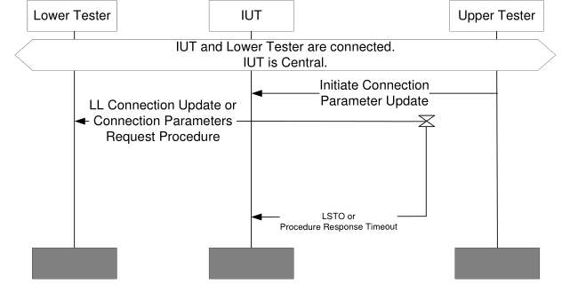

**Figure 4.142: GAP/CONN/CPUP/BV-06-C [Connection Parameter Update Procedure Valid Parameters Central Initiator] MSC**

• Test Condition
It must be possible to order the IUT to perform the Connection Parameter Update Procedure.
• Expected Outcome
Pass verdict
The Lower Tester receives the L2CAP connection parameter update response sent by the IUT in either the Link Layer Connection Update procedure or the Connection Parameters Request Link Layer control procedure.
The IUT and the Lower Tester use the new parameters and the link is not dropped due to Link Supervision Timeout.
• Notes
The Lower Tester should be capable of using any connection parameters within the valid ranges.
GAP/CONN/CPUP/BV-08-C [Connection Parameter Update Procedure Valid Parameters Peripheral Responder – LL Connection Parameters Request]
• Test Purpose
Verify that the IUT accepts the connection parameter update request from a peer device performing the Connection Parameter Update Procedure using valid parameters for the IUT when both the IUT and the peer device support the Link Layer Connection Parameters Request control procedure.
The Lower Tester is operating in the Central role and is the initiator performing the Connection Parameter Update Procedure; the IUT is operating in the Peripheral role and is the responder.
• Reference
[4] 9.3.9
• Initial Condition
- IUT and Lower Tester are connected using the default connection parameters specified in the following IXIT [3]:
▪ TSPX_LE_scan_interval
▪ TSPX_LE_scan_window
▪ TSPX_initiator_filter_policy
▪ TSPX_peer_address_type
▪ TSPX_peer_address
▪ TSPX_own_address_type
▪ TSPX_conn_interval_min
▪ TSPX_conn_interval_max
▪ TSPX_conn_latency
▪ TSPX_supervision_timeout
▪ TSPX_minimum_ce_length
▪ TSPX_maximum_ce_length
- The valid connection update parameters for the IUT are specified in the following IXIT [3]:
▪ TSPX_conn_update_int_min
▪ TSPX_conn_update_int_max
▪ TSPX_conn_update_peripheral_latency
▪ TSPX_conn_update_supervision_timeout
• Test Procedure
1. The Lower Tester initiates the Connection Parameters Request Link Layer Control Procedure,
sending the specified valid connection update parameters to the IUT. 2. The Lower Tester expects the IUT to accept the connection update parameters. 3. The Lower Tester completes the Connection Parameters Request Link Layer Control Procedure. 4. The Lower Tester expects the IUT to maintain the connection with the new parameters.
Lower Tester Upper Tester IUT

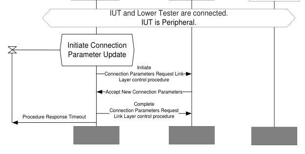

**Figure 4.143: GAP/CONN/CPUP/BV-08-C [Connection Parameter Update Procedure Valid Parameters Peripheral Responder – LL Connection Parameters Request] MSC**

• Expected Outcome
Pass verdict
The Lower Tester receives a response from the IUT accepting the connection update parameters within procedure response timeout after initiating the Connection Parameters Request Link Layer Control Procedure.
The IUT uses the new connection parameters after the Link Layer Connection Parameters Request control procedure completes.
• Notes
The Lower Tester should be capable of using any connection parameters within the valid ranges.
GAP/CONN/CPUP/BV-10-C [Connection Parameter Update Procedure Valid Parameters Peripheral Initiator over LL]
• Test Purpose
Verify that the IUT can perform the Connection Parameter Update Procedure using valid parameters for the peer device, using the LL Connection Parameters Request Procedure; the peer device accepts the updated connection parameters.
The IUT is operating in the Peripheral role and is the initiator performing the Connection Parameter Update Procedure; the Lower Tester is operating in the Central role and is the responder.
• Reference
[4] 9.3.9
• Initial Condition
- The IUT and the Lower Tester are connected using the default connection parameters specified in the following IXIT [3]:
▪ TSPX_LE_scan_interval
▪ TSPX_LE_scan_window
▪ TSPX_initiator_filter_policy
▪ TSPX_peer_address_type
▪ TSPX_own_address_type
▪ TSPX_conn_interval_min
▪ TSPX_conn_interval_max
▪ TSPX_conn_latency
▪ TSPX_supervision_timeout
▪ TSPX_minimum_ce_length
▪ TSPX_maximum_ce_length
- The valid connection update parameters for the IUT are specified in the following IXIT [3]:
▪ TSPX_conn_update_int_min
▪ TSPX_conn_update_int_max
▪ TSPX_conn_update_peripheral_latency
▪ TSPX_conn_update_supervision_timeout
- TGAP(conn_param_timeout) for the IUT is specified in the IXIT [3].
- The Lower Tester has indicated that it supports the LL Connection Parameter Request Procedure.
• Test Procedure
YYYY-MM-DDThe Upper Tester orders the IUT to perform the Connection Parameter Update Procedure using the specified valid connection update parameters. 1. The IUT executes the LL Connection Parameters Request Procedure. 2. The Lower Tester accepts the updated connection parameters and executes the LL Connection
Parameter Update procedure within the specified TGAP(conn_param_timeout).

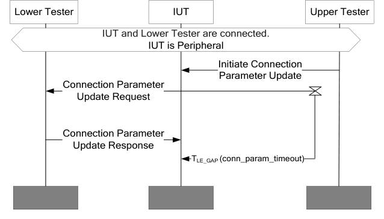

**Figure 4.144: GAP/CONN/CPUP/BV-10-C [Connection Parameter Update Procedure Valid Parameters Peripheral Initiator over LL] MSC**

• Test Condition
It must be possible to order the IUT to perform the Connection Parameter Update Procedure.
• Expected Outcome
Pass verdict
The IUT executes the LL Connection Parameters Request Procedure and accepts the parameter update.
The IUT host receives an indication from the IUT controller that the connection parameters have been updated.
• Notes
The Lower Tester should be capable of using any connection parameters within the valid ranges.

##### 4.7.3.9 Terminate Connection Procedure

GAP/CONN/TERM/BV-01-C [Terminate Connection Procedure]
• Test Purpose
Verify that the IUT can perform the Terminate Connection Procedure.
The IUT is Central or Peripheral and the Lower Tester is Peripheral or Central respectively.
• Reference
[4] 9.3.8
• Initial Condition
- The IUT and the Lower Tester are connected.
- The IUT is the role as specified in the TSPX_gap_iut_role IXIT entry.
• Test Procedure
The Upper Tester orders the IUT to perform the Terminate Connection Procedure.

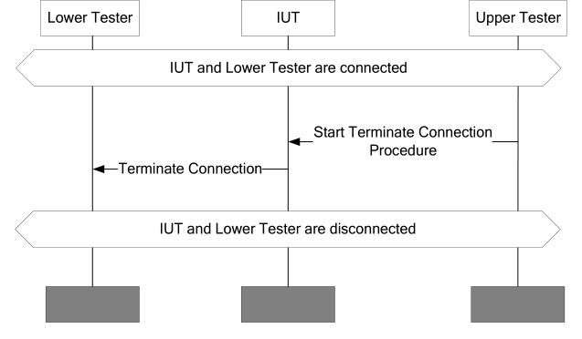

**Figure 4.145: GAP/CONN/TERM/BV-01-C [Terminate Connection Procedure] MSC**

• Test Condition
It must be possible to order the IUT to perform Terminate Connection Procedure.
• Expected Outcome
Pass verdict
The IUT performs the Link Layer Termination Procedure and disconnects from the Lower Tester.

##### 4.7.3.10 Random Device Address

GAP/CONN/PRDA/BV-01-C [Respond to Private Random Device Address after Bonding – Peripheral role]
• Test Purpose
Verify that the IUT can properly respond to connections after bonding when Private Random Addresses are used by the Lower Tester.
IUT is the responder and is in Peripheral role.
IUT supports security manager pairing, and is in bondable mode.
After the bonding has completed, authentication procedure is performed to assure that bonding information is stored properly and that Private Resolvable Addresses are accepted across connections.
• Reference
[4] 10.8
• Initial Condition
- Physical link is established between the IUT and Lower Tester. Lower Tester uses a Resolvable Private Address as its Device Address.
- After the connection is established, Lower Tester initiates pairing using either LE Legacy or LE Secure Connections with Bonding Flags set to “Bonding”.
- The pairing procedure is completed successfully between Lower Tester and IUT.
- The Lower Tester distributes its own IRK to the IUT.
• Test Procedure
1. The Lower Tester disconnects the physical link with IUT. 2. The Lower Tester establishes connection with the IUT. The Lower Tester uses a new Resolvable
Private Address as its own Device Address for the connection establishment procedure. The Lower Tester may continue to try to establish connection for 30 seconds. 3. The Lower Tester performs authentication procedure. 4. Repeat the Test Procedure twice.
Lower Tester Upper Tester IUT

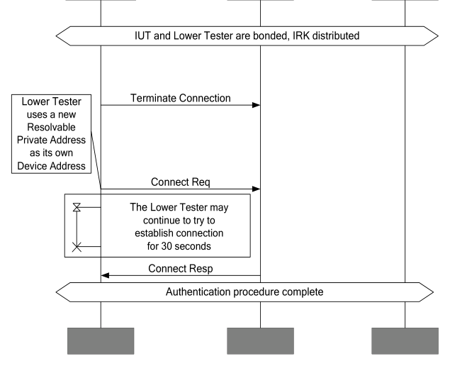

**Figure 4.146: GAP/CONN/PRDA/BV-01-C [Respond to Private Random Device Address after Bonding – Peripheral role] MSC**

• Test Condition
The Lower Tester distributes its IRK.
The Lower Tester generates Resolvable Private Addresses between new connections.
• Expected Outcome
Pass verdict
The IUT reconnects with the Lower Tester and authentication is successful.
GAP/CONN/PRDA/BV-02-C [Respond to Private Random Device Address after Bonding – Central role]
• Test Purpose
Verify that the IUT can properly respond to connections after bonding when Private Random Addresses are used by the Lower Tester.
The IUT is the initiator and is in Central role.
The IUT supports security manager pairing, and is in bondable mode.
After the bonding has completed, authentication procedure is performed to assure that bonding information is stored properly and that Private Resolvable Addresses are accepted across connections.
• Reference
[4] 10.8
• Initial Condition
- Physical link is established between IUT and Lower Tester. The Lower Tester uses a Resolvable Private Address as its Device Address.
- After the connection is established, the Lower Tester initiates security request with Bonding Flags set to “Bonding”.
- The IUT initiates pairing procedure using either LE Legacy or LE Secure Connections.
- The pairing procedure is completed successfully between the Lower Tester and IUT.
- The Lower Tester distributes its own IRK to the IUT.
• Test Procedure
1. The Lower Tester disconnects the physical link with the IUT. 2. The IUT establishes connection with the Lower Tester; the Lower Tester uses a new Resolvable
Private Address as part of the connection establishment procedure. 3. The Lower Tester performs the authentication procedure. 4. Repeat the Test Procedure twice.

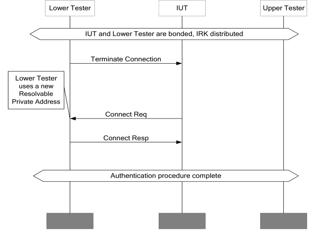

**Figure 4.147: GAP/CONN/PRDA/BV-02-C [Respond to Private Random Device Address after Bonding – Central role] MSC**

• Test Condition
The Lower Tester distributes its IRK.
The Lower Tester generates Resolvable Private Addresses between new connections.
• Expected Outcome
Pass verdict
The IUT reconnects to a Lower Tester and authentication is successful.

#### 4.7.4 Bonding Modes and Procedures

##### 4.7.4.1 Non-bondable Mode

GAP/BOND/NBON/BV-01-C [Non-bondable Mode – Central as Responder]
• Test Purpose
Verify that the IUT does not store bonding information after pairing while in non-bondable mode.
The Lower Tester is the initiator. The Lower Tester sends security request to invoke the pairing procedure.
The IUT supports security manager pairing but is in non-bondable mode.
The pairing is performed as unauthenticated pairing (Just Works).
The bonding is performed twice to make sure pairing is invoked both times.
The IUT is the Central and the Lower Tester is the Peripheral.
• Reference
[4] 9.4.2
• Initial Condition
- Physical link is established by either directed or undirected connectable mode.
- The IUT and the Lower Tester are not bonded before.
• Test Procedure
1. After the connection is established, the Lower Tester initiates security request with
Bonding_Flags set to “No Bonding”. 2. The IUT responses to security request with pairing procedure. 3. The pairing procedure is completed successfully between the Lower Tester and the IUT. 4. The Lower Tester disconnects the physical link with the IUT. 5. The IUT establishes connection with the Lower Tester again. 6. The Lower Tester re-initiates security request and verifies that pairing procedure is invoked and
completed successfully.
• Test Condition
The IUT supports security manager pairing.
• Expected Outcome
Pass verdict
Pairing is successful each time.
Authentication is invoked each time.
GAP/BOND/NBON/BV-02-C [Non-bondable Mode – Central as Initiator]
• Test Purpose
Verify that the IUT does not store bonding information after pairing while in non-bondable mode.
The IUT is the initiator. The Upper Tester requests the authentication.
The IUT initiates the pairing procedure with bonding flag = “no bonding”.
The IUT is the Central and the Lower Tester is the Peripheral.
• Reference
[4] 9.4.2
• Initial Condition
- Physical link is established by either directed or undirected connectable mode.
- IUT and Lower Tester are not bonded before.
• Test Procedure
1. After the connection is established, Upper Tester requests authentication with Bonding_Flags set
to “No Bonding”. 2. The IUT initiates the pairing procedure. 3. The pairing procedure is completed successfully between the Lower Tester and the IUT. 4. The Lower Tester disconnects the physical link with the IUT. 5. The IUT establishes a connection with the Lower Tester again. 6. The Upper Tester re-initiates authentication and the pairing procedure is invoked and completed
successfully.

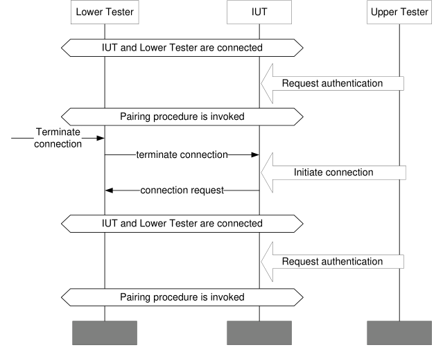

**Figure 4.148: GAP/BOND/NBON/BV-02-C [Non-bondable Mode – Central as Initiator] MSC**

• Test Condition
The IUT supports security manager pairing.
• Expected Outcome
Pass verdict
Pairing is successful each time.
Authentication is invoked each time.
• Test Purpose
Verify that the IUT does not exchange bonding information after pairing while in non-bondable mode.
The Lower Tester is the initiator. The Lower Tester requires authentication to invoke the pairing procedure.
The IUT either does not support security manager pairing or supports security manager pairing, but is in non-bondable mode.
The pairing is performed as unauthenticated pairing (Just Works).
Both the initiator and the responder key distribution field are set to 0 and bonding flag is set to “no bonding”.
The IUT is Peripheral.
• Reference
[4] 9.4.2
• Initial Condition
- Physical link is established by either directed or undirected connectable mode.
- IUT and Lower Tester are not bonded before.
• Test Procedure
1. After the connection is established, the Lower Tester initiates pairing with Bonding_Flags set to
“No Bonding” and both “Initiator Key Distribution = 0” and “Responder Key Distribution = 0”. 2. There are two alternatives, depending on if the IUT supports security manager pairing. 3. Alternative 1 (The IUT supports security manager pairing):
▪ The IUT sends a pairing response with Bonding_Flags = “No Bonding” and both “Initiator Key Distribution = 0” and “Responder Key Distribution = 0”.
▪ The pairing procedure is completed successfully between the Lower Tester and the IUT.
▪ The Lower Tester disconnects the physical link with the IUT.
4. Alternative 2 (The IUT does not support security manager pairing):
▪ The IUT sends a Pairing Failed message with the error code “Pairing not supported”.

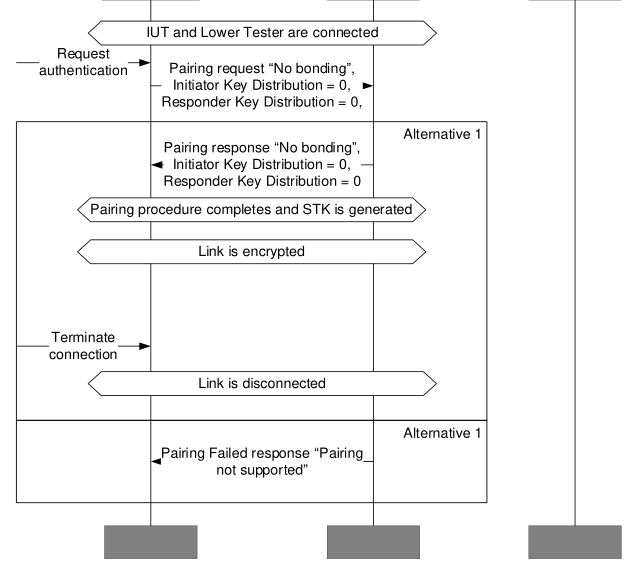

**Figure 4.149: GAP/BOND/NBON/BV-03-C [Non-bondable Mode – Peripheral as Responder] MSC**

• Expected Outcome
Pass verdict
Alternative 1:
- The pairing procedure is completed successfully with Bonding_Flags = “no bonding” and initiator/responder key distribution are set to 0.
- The link is encrypted correctly with STK.
Alternative 2:
- The pairing procedure fails with “Pairing not supported”.

##### 4.7.4.2 Bondable Mode

GAP/BOND/BON/BV-01-C [Initiate Bonding – Peripheral Role]
• Test Purpose
Verify that the IUT can properly initiate the bonding procedure and store bonding information after pairing while in bondable mode in the Peripheral role.
The IUT is the initiator and is in the Peripheral role.
The IUT supports security manager pairing and is in bondable mode.
If the IUT supports LE Security Mode-1, then pairing may be performed as unauthenticated pairing.
After the bonding, either data signing or encryption is performed to assure that bonding information is stored properly.
• Reference
[4] 9.4.3, 9.4.4
• Initial Condition
- Physical link is established by either directed or undirected connectable mode.
- The IUT and the Lower Tester are not bonded before.
• Test Procedure
1. After the connection is established, the IUT initiates security request with Bonding_Flags set to
“Bonding”. 2. The IUT initiates bonding by sending “security request” to the Lower Tester. 3. The pairing procedure is completed successfully between the Lower Tester and the IUT. 4. If the IUT supports LE Security Mode-1, then LTK is distributed from the IUT. 5. If the IUT supports the generation of resolvable private addresses and generates a resolvable
private address for its local address, then it sends Identity Information with SMP, including a valid IRK. 6. If the IUT does not generate a resolvable private address for its own address and it sends Identity
Information with SMP, then it sends an all-zero IRK. 7. If the IUT supports resolving resolvable private addresses, then it requests the Lower Tester to
send its Identity Information with SMP. 8. If the IUT supports LE Security Mode-2, then CSRK is distributed. 9. The Lower Tester disconnects the physical link with the IUT. 10. The Lower Tester establishes a connection with the IUT again. 11. If the IUT supports Security Mode-1, then the Lower Tester starts the encryption procedure with
the previously distributed LTK from the IUT. 12. If the IUT supports Security Mode-2, then the IUT sends signed data with the previously
distributed CSRK.

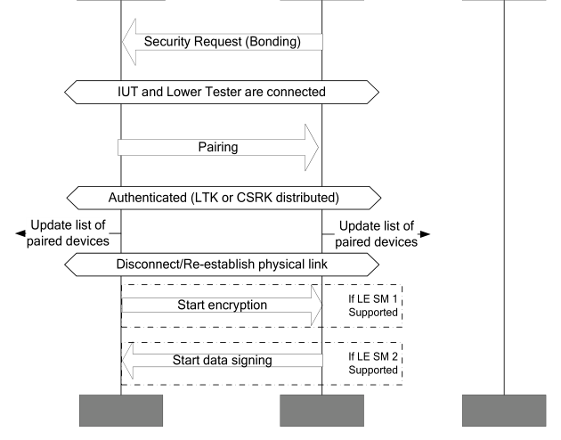

**Figure 4.150: GAP/BOND/BON/BV-01-C [Initiate Bonding – Peripheral Role] MSC**

• Test Condition
The IUT supports LE Security Mode-1 or -2.
• Expected Outcome
Pass verdict
If the IUT supports LE Security Mode-1, then encryption is done successfully.
If the IUT supports LE Security Mode-2, then data signing is done successfully.
GAP/BOND/BON/BV-02-C [Initiate Bonding – Central Role]
• Test Purpose
Verify that the IUT can properly initiate bonding procedure and store bonding information after pairing while in bondable mode in the Central role.
The IUT is the initiator and is in the Central role.
The IUT supports security manager pairing and is in bondable mode.
If the IUT supports LE Security Mode-1, then pairing may be performed as unauthenticated pairing.
If the IUT supports LE Security Mode-2, then pairing is performed as authenticated pairing.
After the bonding, either data signing or encryption is performed to assure that bonding information is stored properly.
• Reference
[4] 9.4.3, 9.4.4
• Initial Condition
- Physical link is established by either directed or undirected connectable mode.
- The IUT and the Lower Tester are not bonded before.
• Test Procedure
1. After the connection is established, the IUT initiates pairing with Bonding_Flags set to “Bonding”. 2. The pairing procedure is completed successfully between the Lower Tester and the IUT. 3. If the IUT supports LE Security Mode-1, then LTK is distributed from the Lower Tester. 4. If the IUT supports the generation of resolvable private addresses and generates a resolvable
private address for its local address, then it sends Identity Information with SMP, including a valid IRK. 5. If the IUT does not generate a resolvable private address for its own address and it sends Identity
Information with SMP, then it sends an all-zero IRK. 6. If the IUT supports resolving resolvable private addresses, then it requests the Lower Tester to
send its Identity Information with SMP. 7. If the IUT supports LE Security Mode-2, then CSRK is distributed. 8. The Lower Tester disconnects the physical link with the IUT. 9. The Lower Tester establishes connection with the IUT again. 10. If the IUT supports Security Mode-1, then the IUT starts the encryption procedure with the
previously distributed LTK from the Lower Tester. 11. If the IUT supports Security Mode-2, then the IUT sends signed data with the previously
distributed CSRK.

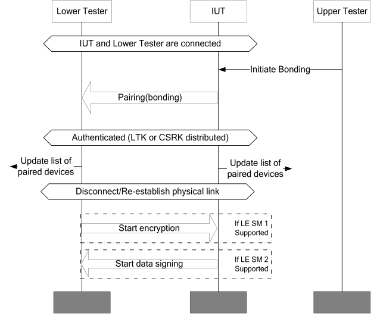

**Figure 4.151: GAP/BOND/BON/BV-02-C [Initiate Bonding – Central Role] MSC**

• Test Condition
The IUT supports LE Security Mode-1 or -2.
• Expected Outcome
Pass verdict
If the IUT supports LE Security Mode-1, then encryption is done successfully.
If the IUT supports LE Security Mode-2, then data signing is done successfully.
GAP/BOND/BON/BV-03-C [Respond to Bonding – Peripheral Role]
• Test Purpose
Verify that the IUT can properly respond to bonding and store bonding information after pairing while in bondable mode in the Peripheral role.
The IUT is the responder and is in the Peripheral role.
The IUT supports security manager pairing and is in bondable mode.
If the IUT supports LE Security Mode-1, then pairing may be performed as unauthenticated pairing.
If the IUT supports LE Security Mode-2, then pairing is performed as authenticated pairing.
After the bonding, either data signing or encryption is performed to assure that bonding information is stored properly.
• Reference
[4] 9.4.3, 9.4.4
• Initial Condition
- Physical link is established by either directed or undirected connectable mode.
- The IUT and the Lower Tester are not bonded before.
• Test Procedure
1. After the connection is established, the Lower Tester initiates pairing with Bonding_Flags set to
“Bonding”. 2. The pairing procedure is completed successfully between the Lower Tester and the IUT. 3. If the IUT supports LE Security Mode-1, then the LTK is distributed from the IUT. 4. If the IUT supports the generation of resolvable private addresses and generates a resolvable
private address for its local address, then it sends Identity Information with SMP, including a valid IRK. 5. If the IUT does not generate a resolvable private address for its own address and it sends Identity
Information with SMP, then it sends an all-zero IRK. 6. If the IUT supports resolving resolvable private addresses, then it requests the Lower Tester to
send its Identity Information with SMP. 7. If the IUT supports LE Security Mode-2, then the CSRK is distributed. 8. The Lower Tester disconnects the physical link with the IUT. 9. The Lower Tester establishes the connection with the IUT again. 10. If the IUT supports Security Mode-1, then the Lower Tester starts the encryption procedure with
the previously distributed LTK from the IUT. 11. If the IUT supports Security Mode-2, then the IUT sends signed data with the previously
distributed CSRK.
Lower Tester Upper Tester IUT

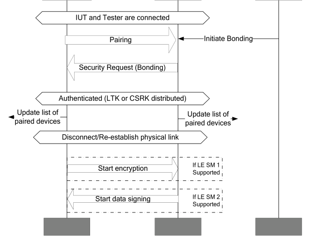

**Figure 4.152: GAP/BOND/BON/BV-03-C [Respond to Bonding – Peripheral Role] MSC**

• Test Condition
The IUT supports LE Security Mode-1 or -2.
• Expected Outcome
Pass verdict
If the IUT supports LE Security Mode-1, then encryption is done successfully.
If the IUT supports LE Security Mode-2, then data signing is done successfully.
GAP/BOND/BON/BV-04-C [Respond to Bonding – Central Role]
• Test Purpose
Verify that the IUT can properly respond to bonding and store bonding information after pairing while in bondable mode as Central role.
The IUT is the responder and is in the Central role.
The IUT supports security manager pairing and is in bondable mode.
If the IUT supports LE Security Mode-1, then pairing may be performed as unauthenticated pairing.
If the IUT supports LE Security Mode-2, then pairing is performed as authenticated pairing.
After the bonding, either data signing or encryption is performed to assure that bonding information is stored properly.
• Reference
[4] 9.4.3, 9.4.4
• Initial Condition
- Physical link is established by either directed or undirected connectable mode.
- The IUT and the Lower Tester are not bonded before.
• Test Procedure
1. After the connection is established, the Lower Tester initiates security request with
Bonding_Flags set to “Bonding”. 2. The IUT initiates the pairing procedure. 3. The pairing procedure is completed successfully between the Lower Tester and the IUT. 4. If the IUT supports LE Security Mode-1, then LTK is distributed from the Lower Tester. 5. If the IUT supports the generation of resolvable private addresses and generates a resolvable
private address for its local address, then it sends Identity Information with SMP, including a valid IRK. 6. If the IUT does not generate a resolvable private address for its own address and it sends Identity
Information with SMP, then it sends an all-zero IRK. 7. If the IUT supports resolving resolvable private addresses, then it requests the Lower Tester to
send its Identity Information with SMP. 8. If the IUT supports LE Security Mode-2, then CSRK is distributed. 9. The Lower Tester disconnects the physical link with the IUT. 10. The IUT establishes the connection with the Lower Tester again. 11. If the IUT supports Security Mode-1, then the IUT starts the encryption procedure with the
previously distributed LTK from the Lower Tester. 12. If the IUT supports Security Mode-2, then the Lower Tester sends signed data with the previously
distributed CSRK.

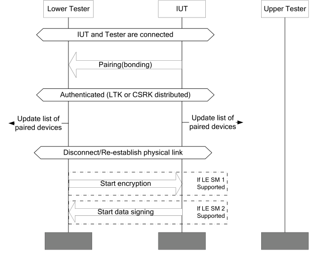

**Figure 4.153: GAP/BOND/BON/BV-04-C [Respond to Bonding – Central Role] MSC**

• Test Condition
The IUT supports LE Security Mode-1 or -2.
• Expected Outcome
Pass verdict
If the IUT supports LE Security Mode-1, then encryption is done successfully.
If the IUT supports LE Security Mode-2, then data signing is done successfully.

#### 4.7.5 Security

Verify the correct implementation of the security procedure in various LE security modes, [4] Section 10.

##### 4.7.5.1 Authentication Procedure

GAP/SEC/AUT/BV-11-C [Service Response – Insufficient Authentication, Peripheral]
• Test Purpose
Verify that the IUT properly rejects the service request when there is no sufficient bonding and then completes service correctly with the Lower Tester in the Central role.
The IUT is operating in the Peripheral role.
The Lower Tester is operating in the Central role.
• Reference
[4] 10.3
• Initial Condition
- Physical link is established by either directed or undirected connectable mode.
- No previous bond or insufficient bond exists between the IUT and the Lower Tester.
- The Upper Tester of the IUT is either a GATT profile or a higher layer protocol.
• Test Procedure
1. The Lower Tester initiates a service request to IUT. 2. The Upper Tester of the IUT detects either there was no bonding or bonding with insufficient
security level. 3. The Upper Tester of the IUT rejects the service request with error code “Insufficient
Authentication”. 4. The Lower Tester initiates authenticated pairing using either LE Legacy or LE Secure
Connections. 5. Authentication is completed successfully and key information is exchanged properly. 6. If the IUT supports LE Security Mode-1, then the Lower Tester initiates encryption and send
service request again. 7. If the IUT supports LE Security Mode-2, then the Lower Tester sends signed service request with
previously distributed CSRK. 8. The IUT replies with correct service response.
Lower Tester Upper Tester IUT

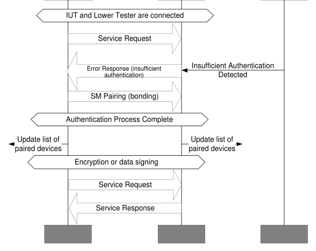

**Figure 4.154: GAP/SEC/AUT/BV-11-C [Service Response – Insufficient Authentication, Peripheral] MSC**

• Expected Outcome
Pass verdict
Authentication completes successfully.
Service response is properly sent by the IUT.
GAP/SEC/AUT/BV-12-C [Service Response – Insufficient Authentication, Central]
• Test Purpose
Verify that the IUT properly rejects the service request when there is no sufficient bonding and then completes service correctly with the Lower Tester in the Peripheral role.
The IUT is operating in the Central role.
The Lower Tester is operating in the Peripheral role.
• Reference
[4] 10.3
• Initial Condition
- Physical link is established by either directed or undirected connectable mode.
- No previous bond or insufficient bond exists between the IUT and the Lower Tester.
- The Upper Tester of the IUT is either a GATT profile or a higher layer protocol.
• Test Procedure
1. The Lower Tester initiates a service request to the IUT. 2. The Upper Tester of the IUT detects either there was no bonding or bonding with insufficient
security level.
Authentication”. 4. The Lower Tester initiates pairing using either LE Legacy or LE Secure Connections. 5. Pairing is completed successfully and key information is exchanged properly. 6. If the IUT supports LE Security Mode-1, then the Lower Tester initiates encryption and send
service request again. 7. If the IUT supports LE Security Mode-2, then the Lower Tester sends signed service request with
previously distributed CSRK. 8. The IUT replies with correct service response.

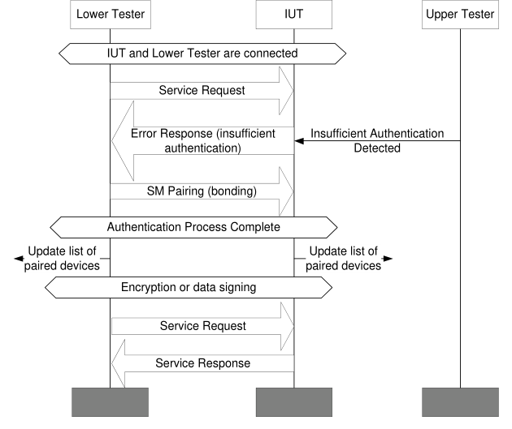

**Figure 4.155: GAP/SEC/AUT/BV-12-C [Service Response – Insufficient Authentication, Central] MSC**

• Expected Outcome
Pass verdict
Authentication completes successfully.
Service response is properly sent by the IUT.
GAP/SEC/AUT/BV-13-C [Service Response – Insufficient Authentication, Central]
• Test Purpose
Verify that the IUT properly rejects the service request when there is insufficient authentication and then completes service correctly with the Lower Tester in the Peripheral role.
The IUT is operating in the Central role.
The Lower Tester is operating in the Peripheral role.
The IUT is capable of supporting LE Security Mode-1 Level 3 (authenticated paring).
Either Test Procedure A or B may be used.
• Reference
[4] 10.3, 10.6
• Initial Condition
- Physical link is established by either directed or undirected connectable mode.
- Previous bond exists between the IUT and Lower Tester with unauthenticated pairing.
- Upper Tester of the IUT is either a GATT profile or a higher layer protocol.
• Test Procedure A
1. The Lower Tester initiates encryption by sending “security request” on the link with MITM = 0. 2. The IUT initiates and completes the encryption of the link. 3. The Lower Tester initiates a service request to the IUT. 4. The Upper Tester of the IUT detects the bonding has insufficient security level. 5. The Upper Tester of the IUT rejects the service request with error code “Insufficient
Authentication”. 6. The Lower Tester initiates higher level bonding by sending “security request” on the link with
MITM = 1. 7. The IUT initiates pairing with MITM = 1 and then encrypts the link. 8. The Lower Tester sends service request again. 9. The IUT replies with correct service response.

**Figure 4.156: GAP/SEC/AUT/BV-13-C [Service Response – Insufficient Authentication, Central] - Test Procedure A MSC**

• Test Procedure B
1. The IUT initiates encryption with previously unauthenticated bonding info. 2. The IUT initiates and completes the encryption of the link. 3. The IUT initiates a service request to the Lower Tester. 4. The Lower Tester detects the bonding has insufficient security level. 5. The Lower Tester rejects the service request with error code “Insufficient Authentication”.
6. The IUT initiates pairing with MITM = 1 and then encrypts the link. 7. The IUT sends service request again. 8. The Lower Tester replies with correct service response.

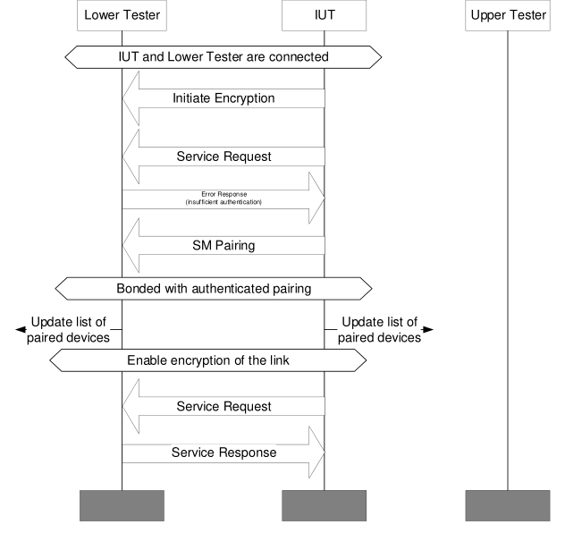

**Figure 4.157: GAP/SEC/AUT/BV-13-C [Service Response – Insufficient Authentication, Central] - Test Procedure B MSC**

• Expected Outcome
Pass verdict
Authentication completes successfully.
Service response is properly sent by the IUT.
GAP/SEC/AUT/BV-14-C [Service Response – Insufficient Authentication, Peripheral]
• Test Purpose
Verify that the IUT properly rejects the service request when there is insufficient authentication and then completes service correctly with the Lower Tester in the Central role.
The IUT is capable of supporting LE Security Mode-1 Level 3 (authenticated paring).
The IUT is operating in the Peripheral role.
The Lower Tester is operating in the Central role.
• Reference
[4] 10.3, 10.6
• Initial Condition
- Physical link is established by either directed or undirected connectable mode.
- Previous bond exists between the IUT and the Lower Tester with unauthenticated pairing.
- The Upper Tester of the IUT is either a GATT profile or a higher layer protocol.
• Test Procedure
1. The Lower Tester initiates and completes the encryption on the link. 2. The Lower Tester initiates a service request to the IUT. 3. The Upper Tester of the IUT detects the bonding has insufficient security level. 4. The Upper Tester of the IUT rejects the service request with error code “Insufficient
Authentication”. 5. The Lower Tester initiates pairing MITM = 1 and then encrypts the link again. 6. The Lower Tester sends service request again. 7. The IUT replies with correct service response.

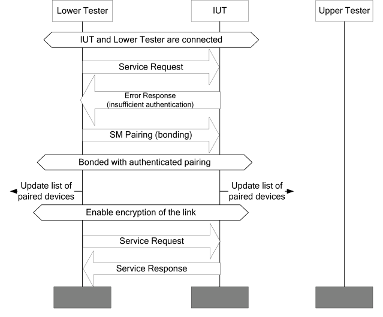

**Figure 4.158: GAP/SEC/AUT/BV-14-C [Service Response – Insufficient Authentication, Peripheral] MSC**

• Expected Outcome
Pass verdict
Authentication completes successfully.
Service response is properly sent by the IUT.
• Test Purpose
Verify that the IUT can pair with a device whose IO capabilities do not allow an authenticated pairing, after a service request has been denied with the error response “Insufficient Authentication”.
The IUT is the SM initiator, GATT client and is in the Central role.
The IUT supports security manager pairing.
• Reference
[6] 10.3
• Initial Condition
- Whether the IUT starts the pairing procedure before issuing any service request is specified in the IXIT [3].
- The IUT security policy of whether or not it mandates MITM is specified in the IXIT [3].
- A physical link is established between the IUT and the Lower Tester.
- The IUT and the Lower Tester have not previously bonded.
• Test Procedure
1. If the IUT starts the pairing procedure before issuing any service request is recorded in the IXIT,
proceed to step 5. 2. The IUT performs a service request which will be denied by the Lower Tester with the error code
“Insufficient Authentication”. 3. The IUT initiates a pairing procedure. The authentication requirement field should only be set to
MITM if the IUT mandates MITM or if it allows security level downgrade during pairing; i.e., proceeding with the pairing procedure even though the request for MITM protection could not be met. 4. The Lower Tester sets its IO capabilities to “NoInputNoOutput” and the authentication
requirements field to zero in pairing phase 1. 5. If the IUT has stated that it mandates MITM in the IXIT, the pairing procedure will fail; otherwise,
the pairing will succeed, and the link will now be encrypted with an unauthenticated STK. The IUT completes the previous ordered service request with a success.
Lower Tester Upper Tester IUT

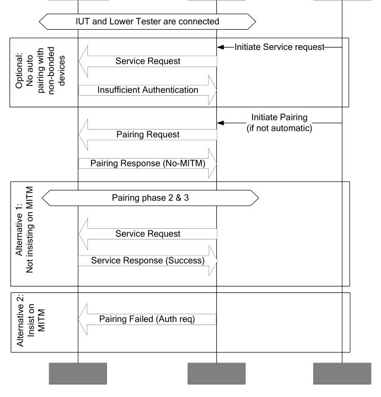

**Figure 4.159: GAP/SEC/AUT/BV-17-C [Correct Pairing after Insufficient Authentication – Central Role] MSC**

• Expected Outcome
Pass verdict
If the IUT has stated that it mandates MITM in the IXIT, the pairing procedure will fail; otherwise, the IUT will successfully complete an unauthenticated pairing with the Lower Tester and perform the service request.
GAP/SEC/AUT/BV-18-C [Correct Pairing after Insufficient Authentication – Peripheral Role]
• Test Purpose
Verify that the IUT can pair with a device whose IO capabilities do not allow an authenticated pairing, after a service request has been denied with the error response “Insufficient Authentication”.
The IUT is the SM responder, GATT Client, and is in the Peripheral role.
The IUT supports security manager pairing.
• Reference
[6] 10.3
• Initial Condition
- Whether the IUT starts the pairing procedure before issuing any service request is specified in the IXIT [3].
- The IUT’s security policy of whether or not it mandates MITM is specified in the IXIT [3].
- A physical link is established between the IUT and the Lower Tester.
- The IUT and the Lower Tester have not previously bonded.
• Test Procedure
1. If the IUT starts the pairing procedure before issuing any service request is recorded in the IXIT,
proceed to step 5. 2. The IUT performs a service request which will be denied by the Lower Tester with the error code
“Insufficient Authentication”. 3. The IUT sends a security request to initiate the pairing procedure. The authentication requirement
field should only be set to MITM if the IUT mandates MITM or if it allows security level downgrade during pairing; i.e., proceeding with the pairing procedure even though the request for MITM protection could not be met. 4. The Lower Tester sets its IO capabilities to “NoInputNoOutput” and mimics the authentication
requirements field from the security request in pairing phase 1. 5. If the IUT has stated that it mandates MITM in the IXIT, the pairing procedure will fail; otherwise,
the pairing will succeed, and the link will now be encrypted with an unauthenticated STK. The IUT completes the previous ordered service request with a success.
Lower Tester Upper Tester IUT

|  | IUT and Tester are connected |  |  |  |  |  |
| --- | --- | --- | --- | --- | --- | --- |
|  |  |  |  |  |  |  |
| Optional: No auto pairing with non-bonded devices | Service Request Insufficient Authentication |  | t s e u q re e ic rv e S te itia In |  |  |  |
|  |  |  |  |  |  |  |
|  | Security Request Pairing Request Pairing Response |  | Initiate Security (if not automatic) | Initiate Security |  |  |
|  |  |  |  | (if not automatic) |  |  |
|  |  |  |  |  |  |  |
| Alternative 1: Not insisting on MITM |  |  |  |  |  |  |
|  | Pairing phase 2 & 3 |  |  |  |  |  |
|  | Service Request Service Response (Success) |  |  |  |  |  |
| Alternative 2: on Insist MITM | Pairing Failed (Auth req) |  |  |  |  |  |

• Expected Outcome
Pass verdict
If the IUT has stated that it mandates MITM in the IXIT, the pairing procedure will fail; otherwise, the IUT will successfully complete an unauthenticated pairing with the Lower Tester and perform the service request.
GAP/SEC/AUT/BV-19-C [Service Response Insufficient Authentication – Central Role]
• Test Purpose
Verify that the IUT, when bonded with a peer device, tests the bond when receiving the error response “Insufficient Authentication” if the link is unencrypted.
• Reference
[6] 10.3
• Initial Condition
- The IUT is the SM initiator and GATT Client and is in the Central role.
- The IUT supports security manager bonding.
- Whether the IUT starts the encryption procedure with bonded devices before issuing any service request is specified in the IXIT [3].
- A physical link is established between the IUT and the Lower Tester.
- The IUT and the Lower Tester are bonded before the connection, and service discovery has been performed. The Lower Tester’s LTK has been distributed.
- The Lower Tester has not stored the LTK from the IUT, which will result in the “Insufficient Authentication” error in step 2.
• Test Procedure
1. If the IUT starts the encryption procedure with bonded devices before issuing any service request
is specified in the IXIT [3], go to step 3. 2. The IUT performs a service request that is rejected by the Lower Tester with the error code
“Insufficient Authentication”. 3. Perform step 3 if and only if the IUT starts encryption with the Lower Tester.
a. The IUT starts the encryption process with the Lower Tester. b. The Lower Tester fails the encryption process. 4. Perform step 4 if and only if the IUT initiates pairing with the Lower Tester.
a. The IUT sends an event to the Upper Tester to confirm the peer device. b. The Upper Tester verifies the peer device with the IUT. c. The IUT and the Lower Tester complete the pairing procedure. d. The IUT encrypts the link using a new long-term key. e. The IUT completes the previously ordered service request successfully.

|  | Lower Op Op |  | Tester |  | Upper | Tester |  |
| --- | --- | --- | --- | --- | --- | --- | --- |
|  |  |  |  |  |  |  |  |
|  |  |  | IUT and Lower Tester are connected |  |  |  |  |
|  |  |  |  |  |  |  |  |
|  |  | Op | tional: No auto encryption with bonded de Service Request Insufficient Authentication | vices Initiate Service Request |  |  |  |
|  |  |  |  | if not automatic, Raise Security Level |  |  |  |
|  |  | Op | tional: Encryption Start Encryption Encryption fails |  |  |  |  |
|  |  |  |  |  |  |  |  |
|  | Optional: |  | Pairing | Confirm Peer Device UI con peer d Verify Peer Device |  | to firm evice |  |
|  |  |  | Encrypting with new LTK |  |  |  |  |
|  |  |  | Service Request Service Response (success) |  |  |  |  |
|  |  |  |  |  |  |  |  |

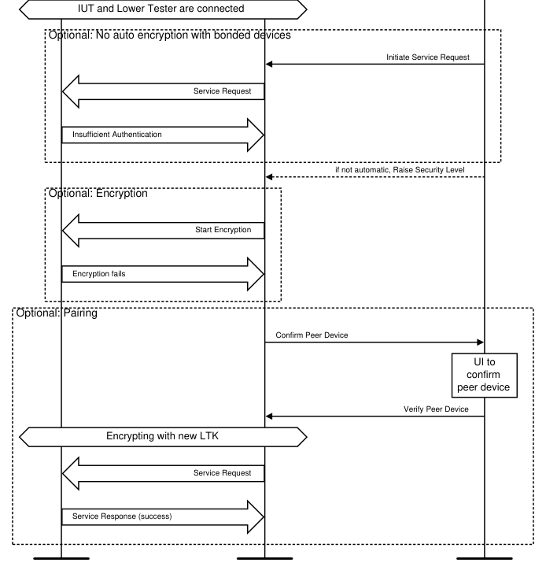

**Figure 4.161: GAP/SEC/AUT/BV-19-C [Service Response Insufficient Authentication – Central Role] MSC**

• Expected Outcome
Pass verdict
After receiving the error response “Insufficient Authentication”, the IUT behaves correctly. If the IUT re-pairs, the Upper Tester confirms the remote device before starting the pairing procedure and encrypts the link with a new LTK.
GAP/SEC/AUT/BV-20-C [Service Response Insufficient Authentication – Peripheral Role]
• Test Purpose
Verify that the IUT, when bonded with a peer device, tests the bond when receiving the error response “Insufficient Authentication”, if link is unencrypted, before eventually removing the bond to perform a new pairing. During the new pairing, the IUT triggers user interaction to confirm the remote device.
• Reference
[6] 10.3, 10.3.2
• Initial Condition
- The IUT is the SM responder and the GATT Client and is in the Peripheral role.
- The IUT supports security manager bonding.
- Whether the IUT starts the encryption procedure with bonded devices before issuing any service request is specified in the IXIT [3].
- A physical link is established between the IUT and the Lower Tester.
- The IUT and the Lower Tester are bonded before the connection and service discovery has been performed. The IUT’s LTK has been distributed.
- The Lower Tester has not stored the LTK from the IUT, which will result in the “Insufficient Authentication” error in step 2.
• Test Procedure
1. Perform either alternative 1A or 1B depending on if the IUT automatically starts the encryption
procedure with bonded devices before issuing any service request. Alternative 1A (The IUT does not automatically start the encryption procedure.)
1A.1 The IUT performs a service request with the Lower Tester. 1A.2 The Lower Tester rejects the service request with the error code “Insufficient Authentication”. 1A.3 Optionally: The IUT may initiate the pairing procedure. Alternative 1B (The IUT automatically starts the encryption procedure.)
1B.1 The IUT sends a Security Request for the link to be encrypted. 1B.2 The Lower Tester initiates the pairing procedure with the IUT. 1B.3 Optionally: The IUT may initiate the pairing procedure. 2. Perform step 2 if and only if the pairing procedure has been initiated by the IUT in 1A.3 or 1B.3.
a. The IUT sends an event to the Upper Tester to confirm the peer device. b. The Upper Tester verifies the peer device with the IUT. c. The pairing procedure is completed. 3. The IUT performs a service request with the Lower Tester. 4. The Lower Tester completes the service request successfully.

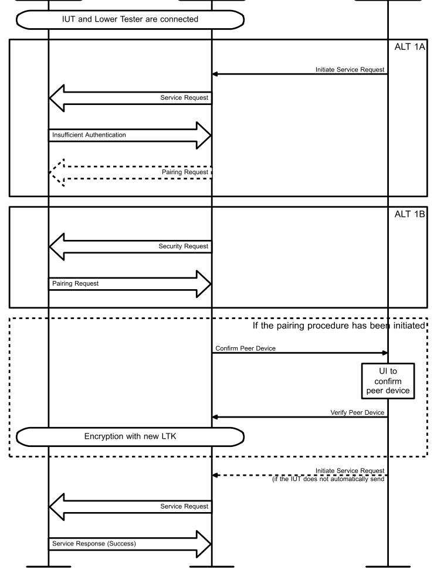

**Figure 4.162: GAP/SEC/AUT/BV-20-C [Service Response Insufficient Authentication – Peripheral Role] MSC**

• Expected Outcome
Pass verdict
After receiving the error response “Insufficient Authentication”, the IUT behaves correctly.
If the IUT re-pairs, the Upper Tester confirms the remote device before the Lower Tester initiates the pairing procedure and encrypts the link with a new LTK.
• Test Purpose
Verify that the IUT will inform the upper layer about a lost bond, if the link is refused to be encrypted with the LTK distributed during the prior pairing procedure.
The IUT is the SM initiator, GATT Client, and is in the Central role.
The IUT supports security manager bonding.
• Reference
[6] 10.3
• Initial Condition
- The IUT and the Lower Tester are bonded during a prior connection, and the Lower Tester’s LTK has been distributed.
- The Lower Tester has removed its bond with the IUT prior to the IUT connecting.
- A physical link is established between the IUT and the Lower Tester.
• Test Procedure
1. The IUT is bonded with the Lower Tester. It challenges the bond by (re)-encrypting the link with
the distributed LTK. 2. The bond has been removed on the Lower Tester. The Lower Tester responds “PIN or Key
Missing” to the encryption request. 3. The IUT informs the upper layer that the bond has been lost.

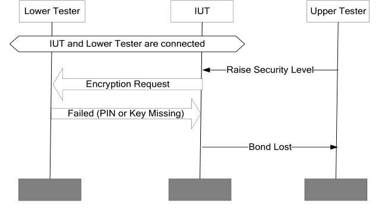

**Figure 4.163: GAP/SEC/AUT/BV-21-C [Lost Bond – Initiator Role] MSC**

• Test Condition
The LTK is distributed as part of the bonding procedure.
• Expected Outcome
Pass verdict
On receiving the error response “PIN or Key Missing” the IUT informed the upper layer that the bond has been lost.
• Test Purpose
Verify that the IUT will inform the upper layer about a lost bond, if the peer refuses to encrypt the link with the LTK distributed during the prior pairing procedure.
The IUT is the SM responder, GATT Client, and is in the Peripheral role.
The IUT supports security manager bonding.
• Reference
[6] 10.3
• Initial Condition
- The IUT and the Lower Tester were bonded during a prior connection, and the IUT’s LTK has been distributed.
- The Lower Tester has removed its bond with the IUT prior to the IUT connecting.
- Physical link is established between the IUT and the Lower Tester.
• Test Procedure
1. The IUT is bonded with the Lower Tester. It challenges the bond by sending a security request to
enable encryption. 2. The bond has been removed on the Lower Tester. The Lower Tester initiates a pairing procedure. 3. The IUT informs the upper layer that the bond has been lost.

**Figure 4.164: GAP/SEC/AUT/BV-22-C [Lost Bond – Responder Role] MSC**

• Test Condition
The LTK is distributed as part of the bonding procedure.
• Expected Outcome
Pass verdict
On receiving a pairing request as a successor to the security request, the IUT informed the upper layer that the bond has been lost.
• Test Purpose
Verify that the IUT properly rejects the service request when the required pairing has occurred and encryption is required (LE Security Mode-1) if encryption is not enabled and then completes service correctly with the Lower Tester acting in the Central role.
The IUT is operating in the Peripheral role.
The Lower Tester is operating in the Central role.
• Reference
[4] 10.3
• Initial Condition
- Whether the IUT starts the encryption procedure with bonded devices before issuing any service request is specified in the IXIT [3].
- A physical link is established by either directed or undirected connectable mode.
- Previous bond exists between the IUT and the Lower Tester with authenticated pairing.
- The Upper Tester of the IUT is either a GATT profile or a higher layer protocol.
• Test Procedure
1. If the IUT starts the encryption procedure with bonded devices before issuing any service request
is specified in the IXIT [3], go to step 4. 2. If the link is not encrypted, the Lower Tester initiates a service request to the IUT. 3. If the IUT detects that no LTK is available then the IUT rejects the service request with error code
“Insufficient Authentication”. If the IUT detects LTK is available and link is unencrypted then the IUT rejects the service request with error code “Insufficient Encryption”. 4. The Lower Tester initiates encryption and sends service request again. 5. Link encryption is completed successfully. 6. The IUT replies with correct service response.

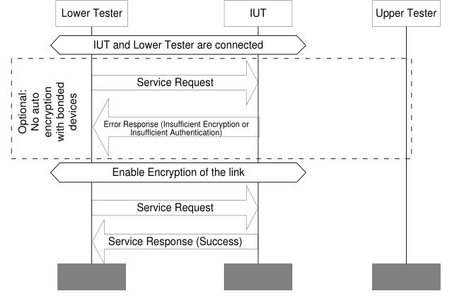

**Figure 4.165: GAP/SEC/AUT/BV-23-C [Service Response – Insufficient Encryption, Peripheral] MSC**

• Expected Outcome
Pass verdict
Encryption setup completes successfully.
Service response is properly sent by the IUT after step 6.
GAP/SEC/AUT/BV-24-C [Service Response – Insufficient Encryption, Central]
• Test Purpose
Verify that the IUT properly rejects the service request when the required pairing has occurred and encryption is required (LE Security Mode-1) if encryption is not enabled and then completes service correctly with the Lower Tester acting in the Peripheral role.
The IUT is the SM initiator, GATT Server, and is operating in the Central role.
The Lower Tester is operating in the Peripheral role.
• Reference
[4] 10.3
• Initial Condition
- Whether the IUT starts the encryption procedure with bonded devices before issuing any service request is specified in the IXIT [3].
- A physical link is established by either directed or undirected connectable mode.
- Previous bond exists between the IUT and the Lower Tester with authenticated pairing using either LE Legacy or LE Secure Connections.
- The Upper Tester of the IUT is either a GATT profile or a higher layer protocol.
• Test Procedure
1. If the IUT starts the encryption procedure with bonded devices before issuing any service request
is specified in the IXIT [3], go to step 5. 2. If the link is not encrypted, then the Lower Tester initiates a service request to the IUT. 3. The IUT detects that the link is not encrypted. 4. The IUT rejects the service. If the IUT detects that no LTK is available then the IUT rejects the
service request with error code “Insufficient Authentication”. If the IUT detects that LTK is available and link is unencrypted, then the IUT rejects the service request with error code “Insufficient Encryption”. 5. The Lower Tester initiates encryption and sends the service request again. 6. Link encryption is completed successfully. 7. The IUT replies with correct service response.

| Optional: No auto encryption | Lower Tester IUT IUT and Lower Tester are connected Service Request bonded devices Error Response (Insufficient Encryption or with Insufficient Authentication) Enable Encryption of the link Service Request Service Response (Success) | IUT | Upper Tester |  |
| --- | --- | --- | --- | --- |
|  |  |  |  |  |

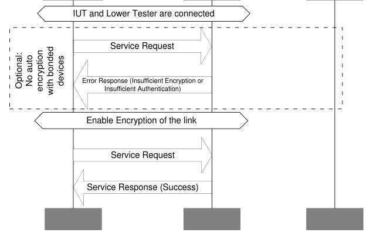

**Figure 4.166: GAP/SEC/AUT/BV-24-C [Service Response – Insufficient Encryption, Central] MSC**

• Expected Outcome
Pass verdict
Encryption setup completes successfully.
Service response is properly sent by the IUT after step 7.

###### 4.7.5.1.1 Service Response – Insufficient Authentication

• Test Purpose
Verify that the IUT prompts a user interaction before initiating the pairing procedure when a service request failed for “Insufficient Authentication” and the encryption procedure has failed.
• Reference
[20] 10.3.2
• Initial Condition
- The IUT is the GATT Client and is in the role specified in Table 4.31.
- The IUT supports security manager bonding.
- Whether the IUT starts the encryption procedure with bonded devices before issuing any service request is specified in the IXIT [3].
- A physical link is established between the IUT and the Lower Tester.
- The IUT and the Lower Tester are bonded before the connection and service discovery have been performed.
- The Initial Condition from Table 4.31 is established.
- The Lower Tester has not stored the LTK from the IUT, which will result in the “Insufficient Authentication” error in step 2.
• Test Case Configuration

|  | Test Case |  |  | Role |  |  | Initial Condition |  |
| --- | --- | --- | --- | --- | --- | --- | --- | --- |
| GAP/SEC/AUT/BV-25-C |  |  | Central |  |  | The Lower Tester’s LTK has been distributed. |  |  |
| GAP/SEC/AUT/BV-26-C |  |  | Peripheral |  |  | The IUT’s LTK has been distributed. |  |  |

Table 4.31: Service Response – Insufficient Authentication test cases
• Test Procedure
1. If the IUT starts the encryption procedure with bonded devices before issuing any service request
is specified in the IXIT [3], go to step 3. 2. The IUT performs a service request that is rejected by the Lower Tester with the error code
“Insufficient Authentication”. 3. The IUT starts the encryption procedure. 4. Perform either alternative 4A or 4B depending on the IUT role.
Alternative 4A (The IUT is in the Central role):
4A.1 The Lower Tester is to fail the encryption procedure. Alternative 4B (The IUT is in the Peripheral role):
4B.1 The Lower Tester initiates pairing. 5. The IUT may start User Interaction by executing steps 6–9. 6. The remote device is confirmed by the Upper Tester, prompting the IUT to initiate, if the IUT is in
the Central role, or to continue, if the IUT is in the Peripheral role, the pairing procedure. 7. The pairing is completed successfully and key information is exchanged properly. 8. If the IUT supports LE Security Mode-1, then the Lower Tester initiates encryption and send the
service request again. If the IUT supports LE Security Mode-2, then the Lower Tester sends a signed service request with previously distributed CSRK. 9. The IUT completes the previously ordered service request with success.

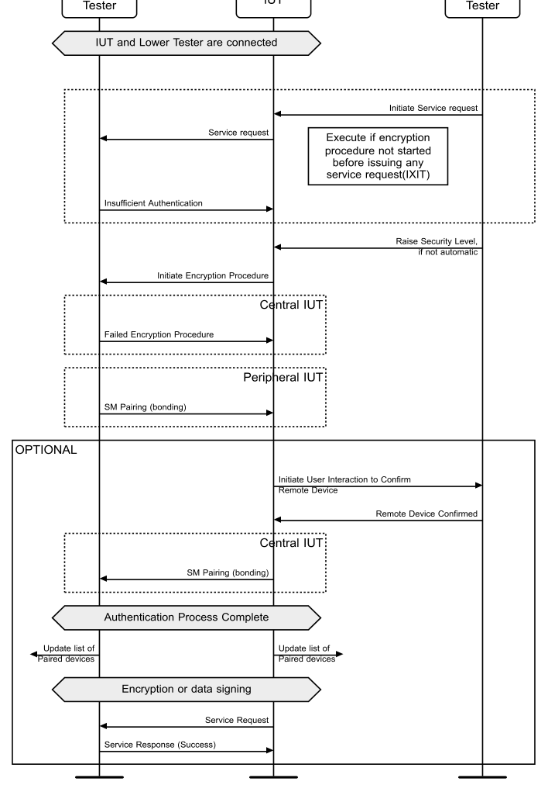

**Figure 4.167: Service Response – Insufficient Authentication MSC**

• Expected Outcome
Pass verdict
In step 5, after the encryption procedure fails, the IUT prompts the Upper Tester to initiate a user interaction to confirm the remote device.
• Test Purpose
Verify that the IUT prompts a user interaction before initiating the pairing procedure when a service request failed for “Insufficient Encryption” and the encryption procedure has failed.
• Reference
[20] 10.3.2
• Initial Condition
- The IUT is the GATT Client and is in the role specified in Table 4.32.
- The IUT supports security manager bonding.
- Whether the IUT starts the encryption procedure with bonded devices before issuing any service request is specified in the IXIT [3].
- A physical link is established by either directed or undirected connectable mode.
- A previous bond exists between the IUT and the Lower Tester with authenticated pairing.
- The Upper Tester of the IUT is either a GATT profile or a higher-layer protocol.
• Test Case Configuration

|  | Test Case |  |  | Role |  |
| --- | --- | --- | --- | --- | --- |
| GAP/SEC/AUT/BV-27-C |  |  | Central |  |  |
| GAP/SEC/AUT/BV-28-C |  |  | Peripheral |  |  |

Table 4.32: Service Response – Insufficient Encryption test cases
• Test Procedure
1. If the IUT starts the encryption procedure with bonded devices before issuing any service request
is specified in the IXIT [3], go to step 5. 2. The IUT initiates a service request to the Lower Tester. 3. The Lower Tester detects that the link is not encrypted. 4. The Lower Tester rejects the service request with error code “Insufficient Encryption”. 5. The IUT initiates the encryption procedure. 6. Perform either alternative 6A or 6B depending on the IUT role.
Alternative 6A (The IUT is in the Central role):
6A.1 The Lower Tester fails the encryption procedure. Alternative 6B (The IUT is in the Peripheral role):
6B.1 The Lower Tester initiates pairing. 7. The IUT may start User Interaction by executing steps 9–11. 8. The remote device is confirmed by the Upper Tester, prompting the IUT to initiate, if the IUT is in
the Central role, or to continue, if the IUT is in the Peripheral role, the pairing procedure. 9. The pairing is completed successfully, and key information is exchanged properly. 10. The IUT sends the service request again. 11. The Lower Tester replies with a correct service response.

**Figure 4.168: Service Response – Insufficient Encryption MSC**

• Expected Outcome
Pass verdict
In step 9, the IUT prompts the Upper Tester to initiate a user interaction to confirm the remote device.
Verify the correct implementation of the GAP data signing procedure.
GAP/SEC/CSIGN/BV-01-C [Connection Based Signing – Sender]
• Test Purpose
Verify that the IUT can properly sign the data when LE Security Mode-2 is required.
Verify that the IUT sends data that is properly signed using the Connection Signature Resolving Key (CSRK) previously distributed to the Lower Tester.
The Lower Tester receives the signed data from the IUT and verifies that the MAC and SignCounter are correct.
• Reference
[4] 10.4
• Initial Condition
- The IUT is the role specified in the TSPX_gap_iut_role IXIT entry.
- A dedicated bonding was performed and a CSRK was distributed from the IUT to the Lower Tester.
- A physical link is established between the IUT and the Lower Tester.
- The Upper Tester of the IUT is either a GATT profile or a higher layer protocol.
• Test Procedure
1. The Upper Tester of the IUT requests the IUT to send a service request signed with previously
distributed CSRK. 2. The Lower Tester receives the signed service request and verifies the MAC and SignCounter. 3. The Lower Tester accepts the service request from the IUT.

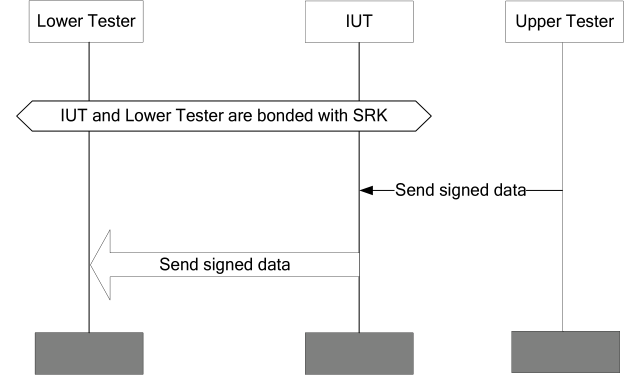

**Figure 4.169: GAP/SEC/CSIGN/BV-01-C [Connection Based Signing – Sender] MSC**

• Expected Outcome
Pass verdict
The Lower Tester receives the signed service request and verifies that the MAC and SignCounter are correct.
GAP/SEC/CSIGN/BV-02-C [Connection Based Signing – Receiver]
• Test Purpose
Verify that the IUT can properly verify the MAC and SignCounter when LE Security Mode-2 is required.
Verify that the IUT can properly verify the MAC and SignCounter from the Lower Tester.
The data is signed using the Connection Signature Resolving Key (CSRK) previously distributed from the Lower Tester.
• Reference
[4] 10.4
• Initial Condition
- The IUT is the role as specified in the TSPX_gap_iut_role IXIT entry.
- A dedicated bonding was performed and a CSRK was distributed from the Lower Tester to the IUT.
- A physical link is established between the IUT and the Lower Tester.
- The Upper Tester of the IUT is either a GATT profile or a higher layer protocol.
• Test Procedure
1. The Lower Tester sends a service request signed with previously distributed CSRK to the IUT. 2. The IUT receives the signed service request and verifies the MAC and SignCounter. 3. The IUT forwards the service request to the Upper Tester. 4. The Upper Tester accepts the service request. 5. The Upper Tester sends the proper service response to the Lower Tester.

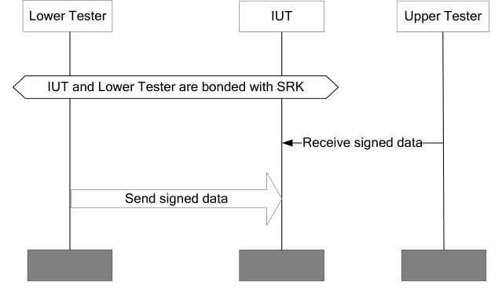

**Figure 4.170: GAP/SEC/CSIGN/BV-02-C [Connection Based Signing – Receiver] MSC**

• Expected Outcome
Pass verdict
The Upper Tester receives a correct service request.
GAP/SEC/CSIGN/BI-01-C [Connection Based Signing – Receiver – Invalid Signing]
• Test Purpose
Verify that the IUT can detect an invalid signed service request from the Lower Tester and reject it.
The data is signed with an incorrect CSRK.
• Reference
[4] 10.4
• Initial Condition
- The IUT is in the role specified in the TSPX_gap_iut_role IXIT entry.
- A dedicated bonding was performed and a CSRK was distributed from the Lower Tester to the IUT.
- A physical link is established between the IUT and the Lower Tester.
- The Upper Tester of the IUT is either a GATT profile or a higher layer protocol.
• Test Procedure
1. The Lower Tester sends a service request signed with incorrect CSRK to IUT. 2. The IUT receives the signed service request and detects invalid MAC. 3. The IUT silently discards the service request.

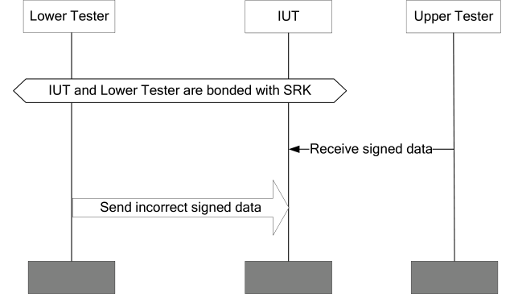

**Figure 4.171: GAP/SEC/CSIGN/BI-01-C [Connection Based Signing – Receiver – Invalid Signing] MSC**

• Expected Outcome
Pass verdict
The IUT receives signed data from the Lower Tester.
The IUT detects the signed data has incorrect CSRK.
The IUT ignores the received signed data.
If this is a service request, the Lower Tester does not receive any service response or receives an error response from the IUT.
GAP/SEC/CSIGN/BI-02-C [Connection Based Signing – Receive Invalid SignCounter]
• Test Purpose
Verify that the IUT can detect an invalid signed service request from the Lower Tester and reject it.
The data is signed with invalid SignCounter.
• Reference
[4] 10.4
• Initial Condition
- The IUT is in the role specified in the TSPX_gap_iut_role IXIT entry.
- A dedicated bonding was performed and a CSRK was distributed from the Lower Tester to the IUT.
- A physical link is established between the IUT and the Lower Tester.
- The Upper Tester of the IUT is either a GATT profile or a higher layer protocol.
• Test Procedure
1. The Lower Tester sends a service request with SignCounter = 0 to the IUT. 2. The IUT receives the signed service request and properly forwards it to the Upper Tester. 3. The Lower Tester sends a service request with SignCounter = 1 to the IUT. 4. The IUT receives the signed service request and properly forwards it to the Upper Tester. 5. The Lower Tester sends a service request with SignCounter = 0 to the IUT. 6. The IUT receives the signed service request and silently discards it.

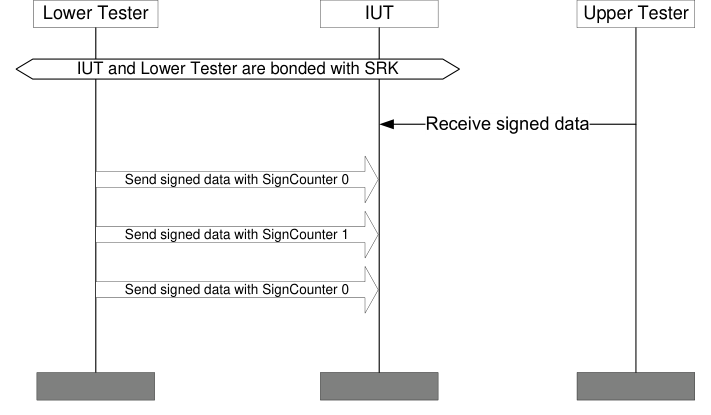

**Figure 4.172: GAP/SEC/CSIGN/BI-02-C [Connection Based Signing – Receive Invalid SignCounter] MSC**

• Test Condition
It must be possible to order the IUT to receive signed data.
• Expected Outcome
Pass verdict
The IUT does not forward the last received signed data with incorrect SignCounter value to the Upper Tester.
GAP/SEC/CSIGN/BI-03-C [Connection Based Signing – Receive, No Bonding, as Peripheral]
• Test Purpose
Verify that the IUT properly discards the message when receiving a “signed write command” with no bonding info when LE Security Mode-2 Level 1 is required.
The data is signed with a CSRK that was distributed with either unauthenticated or authenticated bonding. After bonding, the IUT’s bonding information was removed by the Upper Tester.
The IUT’s bonding information can be removed by the Upper Tester.
• Reference
[4] 10.4
• Initial Condition
- An unauthenticated or authenticated bonding was performed and a CSRK was distributed from the Lower Tester to the IUT.
- The IUT’s bonding information was removed by the Upper Tester.
- The IUT is in the role specified in the TSPX_gap_iut_role IXIT entry.
- A physical link is established between the IUT and the Lower Tester.
- The Upper Tester of the IUT has a pre-defined characteristic attribute value handle that supports signed write command with security request of LE Security Mode-2, Level 1.
• Test Procedure
1. The Lower Tester sends a “signed write command” with distributed CSRK to the IUT. 2. The IUT receives the “signed write command” but detects that there is no bonding information of
the Lower Tester. 3. The IUT discards the “signed write command”. 4. The IUT does not try to re-establish bonding.

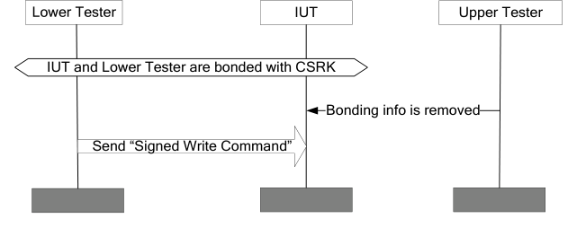

**Figure 4.173: GAP/SEC/CSIGN/BI-03-C [Connection Based Signing – Receive, No Bonding, as Peripheral] MSC**

• Expected Outcome
Pass verdict
The Upper Tester does not receive the “signed write” command.
GAP/SEC/CSIGN/BI-04-C [Connection Based Signing – Receive, Insufficient Authentication, as Peripheral]
• Test Purpose
Verify that the IUT properly discards a signed data write with insufficient security level when LE Security Mode-2 Level 2 is required.
The data is signed with a CSRK that was distributed with unauthenticated bonding.
• Reference
[4] 10.4
• Initial Condition
- An unauthenticated bonding was performed and a CSRK was distributed from the Lower Tester to the IUT.
- A physical link is established between the IUT and the Lower Tester.
- The IUT is in the role specified in the TSPX_gap_iut_role IXIT entry.
- The Upper Tester of the IUT has a pre-defined characteristic attribute value handle that supports signed write command with security request of LE Security Mode-2, Level 2.
• Test Procedure
1. The Lower Tester sends a “signed write command” with distributed CSRK to the IUT. 2. The IUT receives the “signed write command” but detects that there is insufficient authentication
level of the bonding information of the Lower Tester. 3. The IUT discards the “signed write command”.

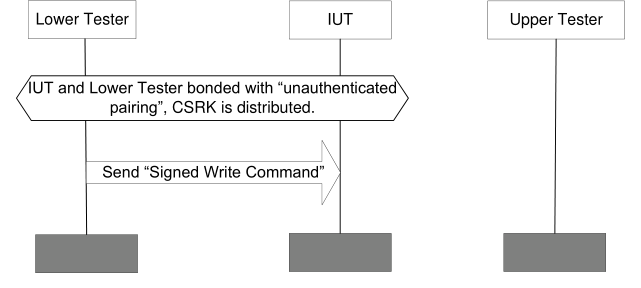

**Figure 4.174: GAP/SEC/CSIGN/BI-04-C [Connection Based Signing – Receive, Insufficient Authentication, as Peripheral] MSC**

• Expected Outcome
Pass verdict
The Upper Tester does not receive the “signed write command”.
Verify IUT compliance to the privacy feature.
GAP/PRIV/CONN/BV-10-C [Peripheral Privacy]
• Test Purpose
Verify that the IUT in the Undirected Connectable Mode supporting the Privacy feature can connect with another device performing the General Connection Establishment Procedure.
The IUT is operating in the Peripheral role.
• Reference
[9] 10.7.1
• Initial Condition
- The IUT is in Link Layer state ‘Standby’.
- The IUT has Privacy feature enabled.
- TGAP(private_addr_int) for the IUT is specified in the IXIT [3].
- The IUT and the Lower Tester have performed the bonding procedures and distributed their respective IRKs using either LE Legacy or LE Secure Connections.
• Test Procedure
1. The Upper Tester orders the IUT to enter Undirected Connectable Mode; the IUT sets the
advertiser’s address to a resolvable private address based on the IRK distributed during the bonding procedure. 2. The IUT changes the advertiser address to a new and unique resolvable address every
TGAP(private_addr_int). 3. The Lower Tester verifies that the resolvable private address changes at least once after
TGAP(private_addr_int). 4. The Lower Tester performs the General Connection Establishment Procedure to connect to the
IUT; the Lower Tester creates the connection using the received resolvable private address from the IUT and sets the initiator’s address to an RPA value based on the IRK of the Lower Tester. 5. The Lower Tester or the IUT terminates the connection.

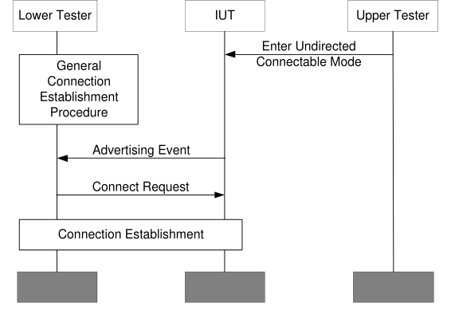

**Figure 4.175: GAP/PRIV/CONN/BV-10-C [Peripheral Privacy] MSC**

• Test Condition
It must be possible to order the IUT to enter Undirected Connectable Mode.
• Expected Outcome
Pass verdict
The Lower Tester receives connectable undirected advertising events from the IUT during the period that the IUT has privacy enabled and is in Undirected Connectable Mode.
In each connectable undirected advertising event received, the advertiser address is set to a valid resolvable private address.
The Lower Tester is able to resolve and confirm the identity of the IUT from the received resolvable private address.
The Lower Tester verifies that the IUT changes the resolvable private address in the advertiser address of the received advertising events after TGAP(private_addr_int).
The Lower Tester establishes a connection with the IUT using the received advertiser address.
The Lower Tester or the IUT successfully terminates the connection.
GAP/PRIV/CONN/BV-11-C [Central Privacy]
• Test Purpose
Verify that the IUT supporting the Privacy feature and performing the General Connection Establishment procedure can connect with another device supporting the Privacy feature in the Undirected Connectable Mode.
The IUT is operating in the Central role.
• Reference
[9] 10.7.2
• Initial Condition
- The IUT is in Link Layer state ‘Standby’.
- The IUT has Privacy feature enabled.
- The support for accepting Public or Static addresses is specified in the IXIT [3].
- The IUT and the Lower Tester have performed the bonding procedures and distributed their respective IRKs using either LE Legacy or LE Secure Connections.
• Test Procedure
1. The Lower Tester enters Undirected Connectable Mode; the Lower Tester sets the advertisers
address to an RPA value based on the IRK of the Lower Tester. 2. The Upper Tester orders the IUT to perform the General Connection Establishment procedure;
the IUT sets the initiator’s address to a resolvable private address based on the IRK of the IUT. 3. A connection is established. 4. The Lower Tester or the IUT terminates the connection. 5. The Lower Tester enters Undirected Connectable Mode; the Lower Tester sets the advertiser’s
address to a resolvable private address based on a random number that is not its IRK. 6. The Upper Tester orders the IUT to perform the General Connection Establishment procedure.
Lower Tester Upper Tester IUT

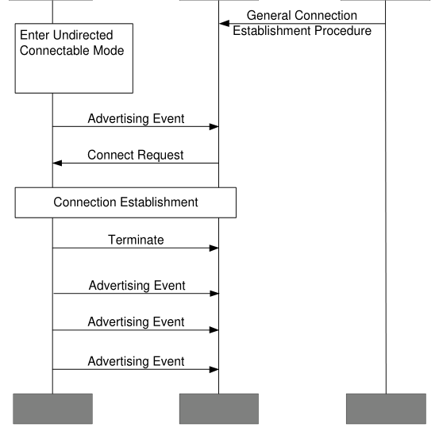

**Figure 4.176: GAP/PRIV/CONN/BV-11-C [Central Privacy] MSC**

• Test Condition
It must be possible to order the IUT to perform the General Connection Establishment procedure.
• Expected Outcome
Pass verdict
The Lower Tester receives a connection request from the IUT during the period that the IUT has privacy enabled and is performing the General Connection Establishment procedure.
In each connection request packet received by the Lower Tester, the initiator’s address is set to a valid resolvable private address.
The Lower Tester is able to resolve and confirm the identity of the IUT from the received resolvable private address.
The Lower Tester verifies that the IUT changes its (InitA field) resolvable private address in the connection request packet.
The Lower Tester establishes a connection with the IUT.
The Lower Tester or the IUT successfully terminates the connection.
The IUT does not perform the Connection Establishment procedure when the Lower Tester uses a resolvable private address based on an incorrect IRK.
• Notes
Since the IUT, when receiving advertisement packets with incorrect RPAs, should not initiate the connection establishment procedure, multiple undirected connectable advertisement packets should be sent to verify compliance.
• Test Purpose
Verify that the IUT in the Undirected Connectable Mode supporting the Privacy feature properly handles the connection request when the IUT receives an unresolvable RPA. The IUT handles the connection request using one of the following: accept the connection, disconnect with the error code “Authentication Failure”, perform the pairing procedure, perform the authentication procedure.
The IUT is operating in the Peripheral role.
• Reference
[20] 10.7.1
• Initial Condition
- The IUT is in Link Layer state ‘Standby’.
- The IUT has the Privacy feature enabled.
- The IUT has a stored bond.
• Test Procedure
1. The Upper Tester orders the IUT to enter Undirected Connectable Mode. 2. The Lower Tester performs the General Connection Establishment Procedure to connect to the
IUT. 3. The Lower Tester attempts to create the connection and sets the initiator’s address to an
unresolvable RPA. 4. The IUT fails to resolve the initiator’s RPA.
Alternative 1: The IUT accepts and establishes the connection.
Alternative 2: The IUT disconnects the connection with the error code “Authentication Failure”.
Alternative 3: The IUT accepts the connection and performs the pairing procedure with the Lower Tester.
Alternative 4: The IUT accepts the connection and performs the authentication procedure with the Lower Tester.
Lower Tester Upper Tester IUT

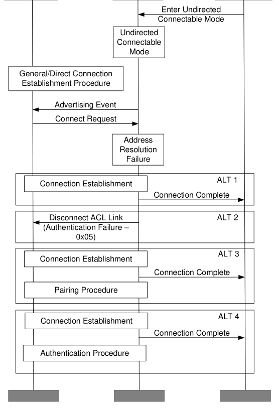

**Figure 4.177: GAP/PRIV/CONN/BV-12-C [Peripheral Privacy, Unresolvable RPA] MSC**

• Test Condition
It must be possible to order the IUT to enter Undirected Connectable Mode.
• Expected Outcome
Pass verdict
In step 4, the IUT fails to resolve the initiator’s RPA.
Alternative 1: In step 5, the IUT accepts and establishes the connection.
Alternative 2: In step 5, the IUT disconnects with the error code “Authentication Failure”.
Alternative 3: In step 5, the IUT and the Lower Tester pair successfully.
Alternative 4: In step 5, the IUT and the Lower Tester complete the authentication procedure successfully.

#### 4.7.6 AD Type

• Test Purpose
Verify that the IUT sends the valid AD Type specified in Table 4.33 in advertising and scan response data.
• Reference
[4] 11
• Initial Condition
- The IUT is Broadcaster or Peripheral.
- The Lower Tester is Observer or Central.
- The IUT is in Link Layer state ‘Standby’.
- For GAP/ADV/BV-17-C, the expected URI UTF-8 string is defined in “TSPX_URI” in IXIT [3].
• Test Case Configuration

| Test Case ID | Reference | AD Type | Additional Test Requirements |
| --- | --- | --- | --- |
| GAP/ADV/BV-01-C [AD Type – Service UUID] | [10] 1.1 | Any of the Service UUID AD types | The advertising or scan response data has a length that is a multiple of 2, 4, or 16 octets depending on the AD type. |
| GAP/ADV/BV-02-C [AD Type – Local Name] | [10] 1.2 | Complete Local Name or Shortened Local Name | The advertising or scan response data must contain only one instance of these AD types in each of the advertising and scan response data; it need not be present in both. The Lower Tester reads the complete name from the Device Name Characteristic on the IUT. If the AD type is Complete Local Name, then the data must be the same as the complete name. If the AD type is Shortened Local Name, then the data must be the first octets of the complete name. |
| GAP/ADV/BV-03-C [AD Type – Flags] | [10] 1.3 | Flags | This AD Type must be present if the advertising packet is connectable and the IUT supports at least one of the features listed in [10] 1.3.2. Otherwise, it is optional, but, if present, it must meet these requirements. The flags in the data must match the features supported by the IUT. The last octet in the data must not be zero. The data may be omitted (with the AD structure Length equal to 1) if the data would be all zeroes. There must be only one instance of this AD type and it must be in the advertising data, not the scan response data. |
| GAP/ADV/BV-04-C [AD Type – Manufacturer Specific Data] | [10] 1.4 | Manufacturer Specific Data | The advertising or scan response data contains the Manufacturer Specific Data AD Type with the first 2 octets containing the Company Identifier Code. |
| GAP/ADV/BV-05-C [AD Type – TX Power Level] | [10] 1.5 | TX Power Level | The advertising or scan response data contains the TX Power Level AD Type with 1 octet of data not equal to 0x80. |

| Test Case ID | Reference | AD Type | Additional Test Requirements |
| --- | --- | --- | --- |
| GAP/ADV/BV-08-C [AD Type – Peripheral Connection Interval Range] | [10] 1.9 | Peripheral Connection Interval Range | The advertising or scan response data has a length of 4 and contains two 16-bit unsigned values. Each must be in the range 0x0006 to 0x0C80, and the first must not be greater than the second. |
| GAP/ADV/BV-09-C [AD Type – Service Solicitation] | [10] 1.10 | Any of the Service Solicitation AD types | The advertising or scan response data has a length that is a multiple of 2, 4, or 16 octets depending on the AD type. |
| GAP/ADV/BV-10-C [AD Type – Service Data] | [10] 1.11 | Any of the Service Data AD types | The advertising or scan response data has a length that is greater than 2, 4, or 16 depending on the AD type. |
| GAP/ADV/BV-11-C [AD Type – Appearance] | [4] 12.2 [10] 1.12 | Appearance | The advertising or scan response data has a length of 2 octets. There must be only one instance of this AD type and it must not appear in both the advertising and scan response data of the same advertisement. |
| GAP/ADV/BV-12-C [AD Type – Public Target Address] | [10] 1.13 [11] 1.3.1 | Public Target Address | The advertising or scan response data has a length that is a multiple of 6. There must be only one instance of this AD type and it must not appear in both the advertising and scan response data of the same advertisement. |
| GAP/ADV/BV-13-C [AD Type – Random Target Address] | [4] 10.8 [10] 1.14 [11] 1.3.2 | Random Target Address | The advertising or scan response data has a length that is a multiple of 6 and contains one or more addresses. For each address, either: The two most significant bits of the address are the same and the remaining 46 bits contain at least one 0 bit and one 1 bit. The most significant bit is 0, the next bit is 1, and the next 22 bits contain at least one 0 bit and one 1 bit. (The least significant 24 bits are unconstrained.) There must be only one instance of this AD type and it must not appear in both the advertising and scan response data of the same advertisement. |
| GAP/ADV/BV-14-C [AD Type – Advertising Interval] | [10] 1.15 [11] 4.2.2.2 | Advertising Interval | The advertising or scan response data has a length of 2 and contains an unsigned 16-bit value. There must be only one instance of this AD type in each of the advertising and scan response data; it need not be present in both. |

| Test Case ID | Reference | AD Type | Additional Test Requirements |
| --- | --- | --- | --- |
| GAP/ADV/BV-17-C [AD Type – URI] | [10] 1.18 | URI | The advertising data and scan response data must contain a correctly formatted UTF-8 string representing the URI. The first code point must be one that is in the relevant Assigned Numbers. If the first code point is U+0001, represented in UTF-8 as a single octet with value 0x01, the actual scheme and “:” are included in the remaining UTF-8 string. Otherwise, they are omitted from the string. The string matches the value provided in TSPX URI. _ |
| GAP/ADV/BV-18-C [AD Type – Advertising Interval, Long] | [10] 1.15 [11] 4.2.2.2 | Advertising Interval – Long | The advertising or scan response data has a length of 3 or 4 and contains an unsigned 24-bit or 32-bit value that must be at least 0x10000. |
| GAP/ADV/BV-19-C [AD Type – LE Supported Features] | [10] 1.19 [11] 4.6 | LE Supported Features | The advertising or scan response data has a length no greater than 8. The last octet must not be zero. Those octets that are present, padded to 8 octets with zeroes, must be the same as the Link Layer’s FeatureSet. There must be only one instance of this AD type in each of the advertising and scan response data; it need not be present in both. |

Table 4.33: AD Type test cases
• Test Procedure

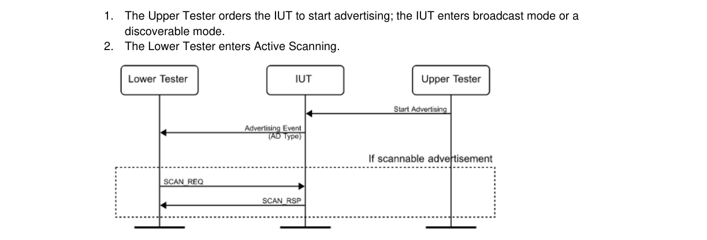

**Figure 4.178: AD Type MSC**

• Test Condition
It must be possible to order the IUT to start advertising and to use the AD type specified in Table 4.33.
• Expected Outcome
Pass verdict
The Advertising or Scan Response data does not contain zero octets between the AD structures or after the last AD structure.
Reserved bits or values are not used.
All the requirements in the Additional Test Requirements column of Table 4.33 are met.
• Notes
Unless stated otherwise in the Additional Test Requirements, an AD Type may appear more than once in the same advertisement, including in both the advertising data and scan response data.
GAP/ADV/BV-20-C [AD Type – Encrypted Data]
• Test Purpose
Verify that the IUT sends valid Encrypted Data AD Type in advertising. The AD Data payload is encrypted using a pre-shared key, a pre-shared initialization vector, and a randomizer.
• Reference
[10] 1.23
• Initial Condition
- The IUT is Peripheral.
- The Lower Tester is Central.
- The IUT is in Link Layer state ‘Standby’.
- Session Key and IV are already shared between the IUT and the Lower Tester.
• Test Procedure
1. The Upper Tester orders the IUT to start advertising; the IUT enters broadcast mode or a
discoverable mode and begins advertising using Encrypted Advertising Data with a random payload. 2. The IUT sends an Advertising event using Encrypted Advertising Data with the payload from
step 1. 3. The Upper Tester orders the IUT to begin advertising using Encrypted Advertising Data with a
payload that is different from the payload in step 1. 4. The IUT sends an Advertising event using Encrypted Advertising Data with the payload from
step 3. 5. The Upper Tester orders the IUT to begin advertising using Encrypted Advertising Data with the
same payload as step 1. 6. The IUT sends an Advertising event using Encrypted Advertising Data with the payload in step 5.

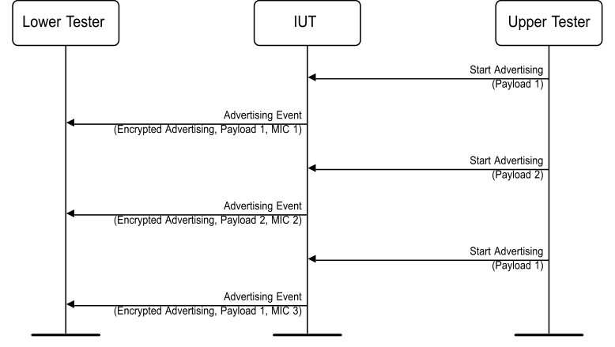

**Figure 4.179: GAP/ADV/BV-20-C [AD Type – Encrypted Data] MSC**

• Expected Outcome
Pass verdict
In steps 2, 4, and 6, the IUT sends Advertising Data that contains a 5 octet Randomizer, a properly encrypted Payload, and a 4 valid octet MIC. The encrypted Payload Data, MIC, and Randomizer are different each time the payload data is changed.
In step 2, the decrypted payload matches the payload in step 1.
In step 4, the decrypted payload matches the payload in step 3.
In step 6, the decrypted payload matches the payload in step 5.
• Notes
It is optional to include any of the AD Types in advertising and scan response data.
• Test Purpose
Verify that the IUT correctly decodes a received Encrypted Data AD Type from the Lower Tester.
• Reference
[10] 1.23
• Initial Condition
- The Lower Tester is Peripheral.
- The IUT is Central.
- The IUT is in Link Layer state ‘Standby’.
- Session Key and IV are already shared between the IUT and the Lower Tester.
• Test Procedure
1. The Upper Tester orders the IUT to start Passive Scanning. 2. The Lower Tester starts advertising an Encrypted Data AD Type with encrypted advertising with a
valid MIC. 3. The IUT reports the unencrypted advertising data to the Upper Tester.

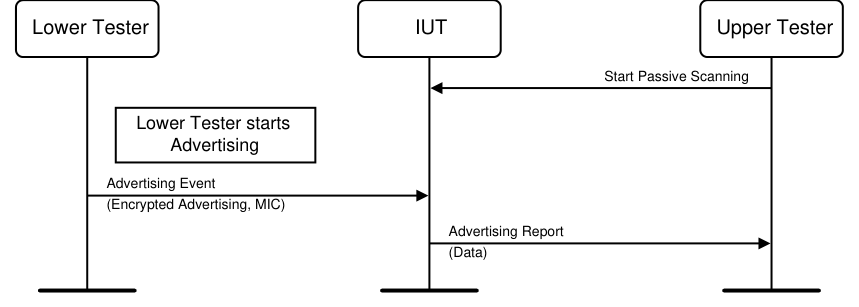

**Figure 4.180: GAP/SCN/BV-01-C [AD Type – Encrypted Data, Decrypt Advertising Data] MSC**

• Expected Outcome
Pass verdict
In step 3, the IUT sends an advertising report to the Upper Tester with the same advertising data as the Lower Tester unencrypted advertising data from step 2.
GAP/GAT/BV-14-C [Encrypted Data Key Characteristic Indication, Peripheral]
• Test Purpose
Verify that the IUT with an authenticated and authorized connection properly sends a GATT Indication event to the Upper Tester when the Encrypted Data Key Characteristic value is changed by the Lower Tester.
• Reference
[21] 12.6
• Initial Condition
- The IUT is in an LE connection in the Peripheral role or a BR/EDR connection and is a GATT Client.
- A physical link is established between the IUT and the Lower Tester that is authenticated and authorized.
• Test Procedure

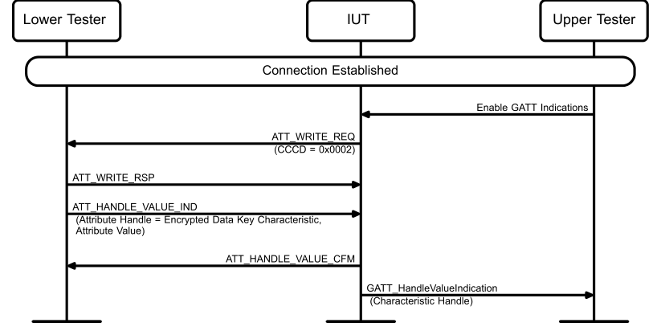

**Figure 4.181: GAP/GAT/BV-14-C [Encrypted Data Key Characteristic Indication, Peripheral] MSC**

1. The Upper Tester commands the IUT to enable GATT indications with the Lower Tester. 2. The IUT sends an ATT_WRITE_REQ to the Lower Tester with CCCD set to 0x0002. 3. The Lower Tester sends an ATT_WRITE_RSP to the IUT. 4. The Lower Tester sends an ATT_HANDLE_VALUE_IND PDU to the IUT with Attribute Handle
set to the Encrypted Data Key Characteristic and Attribute Value set to the new value. 5. The IUT sends an ATT_HANDLE_VALUE_CFM PDU to the Lower Tester. 6. The IUT sends a GATT_HandleValueIndication event to the Upper Tester with a valid
Characteristic Handle value.
• Expected Outcome
Pass verdict
In step 6, the IUT sends an indication event to the Upper Tester.
GAP/GAT/BV-15-C [Encrypted Data Key Characteristic Indication, GATT Server]
• Test Purpose
Verify that the IUT with an authenticated and authorized connection properly sends a GATT Indication PDU to the Lower Tester when the Encrypted Data Key Characteristic value is updated.
• Reference
[21] 12.6
• Initial Condition
- The IUT is in an LE connection in the Peripheral role or a BR/EDR connection and is a GATT Server.
- A physical link is established between the IUT and the Lower Tester that is authenticated and authorized.
• Test Procedure

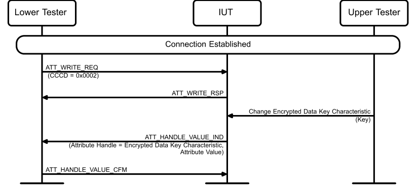

**Figure 4.182: GAP/GAT/BV-15-C [Encrypted Data Key Characteristic Indication, GATT Server] MSC**

1. The Lower Tester sends an ATT_WRITE_REQ to the IUT with CCCD set to 0x0002. 2. The IUT sends an ATT_WRITE_RSP to the Lower Tester. 3. The Upper Tester commands the IUT to change the Encrypted Data Key Characteristic value with
a new key. 4. The IUT sends an ATT_HANDLE_VALUE_IND PDU to the Lower Tester with Attribute Handle
set to the Encrypted Data Key Characteristic, and Attribute Value set to the new value. 5. The Lower Tester sends an ATT_HANDLE_VALUE_CFM PDU to the IUT.
• Expected Outcome
Pass verdict
In step 4, the IUT sends an ATT Handle Value Indication PDU to the Lower Tester.

#### 4.7.7 Generic Access Profile Characteristics

Verify the correct implementation of the GAP characteristics.

##### 4.7.7.1 GAP Attributes

GAP/GAT/BV-09-C [Encrypted Data Key Material, Authenticated and Authorized]
• Test Purpose
Verify that the GAP ‘Encrypted Data Key Material’ Characteristic on the IUT is readable by the Lower Tester when the connection is authenticated and authorized.
• Reference
[21] 12.6
• Initial Condition
- The Lower Tester is a GATT client.
- The Upper Tester is a GATT server that has implemented the GATT service discovery procedures.
- The IUT is in an LE connection in the Peripheral role or a BR/EDR connection and is a GATT server.
- A physical link is established between the IUT and the Lower Tester.
- The IUT and the Lower Tester are authenticated and have exchanged the Session Key and IV.
• Test Procedure
1. The Lower Tester performs a GATT service discovery for the GAP Service UUID. 2. The IUT responds with a GATT service discovery response for the GAP Service UUID with the
Handles Information List. 3. The Lower Tester performs a GATT characteristic discovery by UUID. 4. The IUT responds with a GATT characteristic discovery by UUID response with an attribute Data
List that contains the Encrypted Data Key Material Handle. 5. The Lower Tester performs a GATT characteristic read value with the Encrypted Data Key
Material Handle from step 4. 6. The IUT sends an authorization request to the Upper Tester. 7. The Upper Tester orders the IUT to authorize the Lower Tester. 8. The IUT responds to the request in step 5 with a GATT characteristic read value response with
the Encrypted Data Key Material value. 9. The Lower Tester performs a GATT characteristic write value with the Encrypted Data Key
Material Handle from step 4 and 24 octets of random values. 10. The IUT responds with an ATT error response with Error Code > 0.

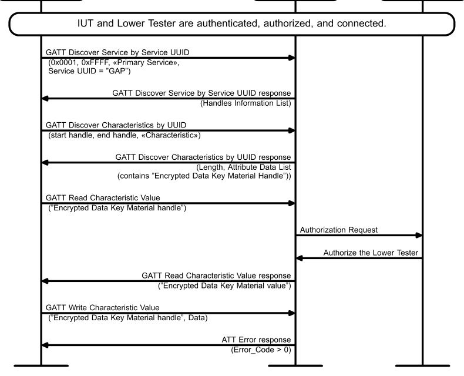

**Figure 4.183: GAP/GAT/BV-09-C [Encrypted Data Key Material, Authenticated and Authorized] MSC**

• Expected Outcome
Pass verdict
In step 8, the IUT responds with the Encrypted Data Key Material value.
In step 10, the IUT sends an ATT Error response to the Lower Tester.
GAP/GAT/BV-10-C [Encrypted Data Key Material, Not Authenticated]
• Test Purpose
Verify that the GAP ‘Encrypted Key Data Material’ Characteristic on the IUT cannot be read by the Lower Tester when the connection is not authenticated.
• Reference
[21] 12.6
• Initial Condition
- The Lower Tester is a GATT client.
- The Upper Tester is a GATT server that has implemented the GATT service discovery procedures.
- The IUT is in an LE connection in the Peripheral role or a BR/EDR connection and is a GATT Server.
- The IUT and the Lower Tester are not authenticated.
• Test Procedure
1. The Lower Tester performs a GATT service discovery for the GAP Service UUID. 2. The IUT responds with a GATT service discovery response for the GAP Service UUID with the
Handles Information List. 3. The Lower Tester performs a GATT characteristic discovery by UUID. 4. The IUT responds with a GATT characteristic discovery by UUID response with an attribute Data
List that contains the Encrypted Data Key Material Handle. 5. The Lower Tester performs a GATT characteristic read value with the Encrypted Data Key
Material Handle from step 4. 6. The IUT responds with an ATT Error response with Error Code > 0.

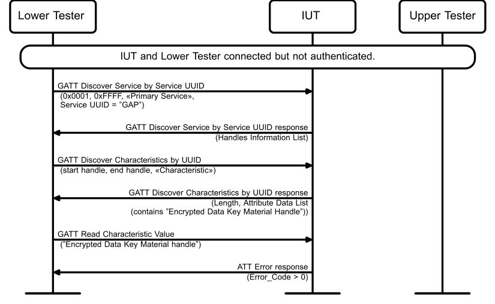

**Figure 4.184: GAP/GAT/BV-10-C [Encrypted Data Key Material, Not Authenticated] MSC**

• Expected Outcome
Pass verdict
In step 6, the IUT sends an ATT Error response to the Lower Tester.
GAP/GAT/BV-11-C [Encrypted Data Key Material, Not Authorized]
• Test Purpose
Verify that the GAP ‘Encrypted Key Data Material’ Characteristic on the IUT cannot be read by the Lower Tester when the connection is not authorized.
• Reference
[21] 12.6
• Initial Condition
- The Lower Tester is a GATT client.
- The Upper Tester is a GATT server that has implemented the GATT service discovery procedures.
- The IUT is in an LE connection in the Peripheral role or a BR/EDR connection and is a GATT Server.
- A physical link is established between the IUT and the Lower Tester.
- The IUT and the Lower Tester are authenticated but not authorized.
• Test Procedure
1. The Lower Tester performs a GATT service discovery for the GAP Service UUID. 2. The IUT responds with a GATT service discovery response for the GAP Service UUID with the
Handles Information List. 3. The Lower Tester performs a GATT characteristic discovery by UUID. 4. The IUT responds with a GATT characteristic discovery by UUID response with an attribute Data
List that contains the Encrypted Data Key Material Handle. 5. The Lower Tester performs a GATT characteristic read value with the Encrypted Data Key
Material Handle from step 4. 6. The IUT sends an authorization request to the Upper Tester. 7. The Upper Tester orders the IUT not to authorize the Lower Tester. 8. The IUT responds to the request in step 5 with an ATT Error Response.

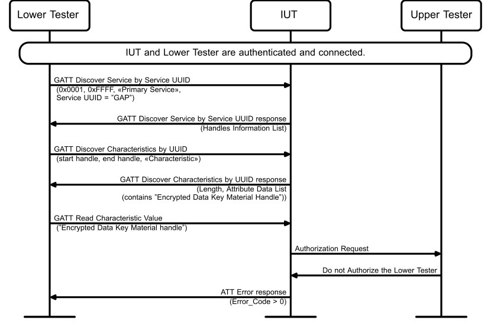

**Figure 4.185: GAP/GAT/BV-11-C [Encrypted Data Key Material, Not Authorized] MSC**

• Expected Outcome
Pass verdict
In step 8, the IUT sends an ATT Error response to the Lower Tester.
• Test Purpose
Verify that the IUT properly implements the GAP characteristic.
• Reference
[21] 12.7
• Initial Condition
- The Lower Tester is a GATT Client.
- The IUT is a GATT Server.
- A physical link is established between the IUT and the Lower Tester.
- The IUT is not bonded or paired with the Lower Tester.
- The IUT is not authorized to access any GATT attribute that requires authorization.
• Test Case Configuration

|  | Test Case |  |  | Role |  |
| --- | --- | --- | --- | --- | --- |
| GAP/GAT/BV-04-C [Discover GAP Characteristic, Peripheral Preferred Connection Parameters Characteristic] |  |  | Peripheral Preferred Connection Parameters |  |  |
| GAP/GAT/BV-12-C [Discover GAP Characteristic, LE GATT Security Levels Characteristic] |  |  | LE GATT Security Levels |  |  |
| GAP/GAT/BV-16-C [Discover GAP Characteristic, Device Name] |  |  | Device Name |  |  |
| GAP/GAT/BV-17-C [Discover GAP Characteristic, Appearance] |  |  | Appearance |  |  |
| GAP/GAT/BV-18-C [Discover GAP Characteristic, Central Address Resolution] |  |  | Central Address Resolution |  |  |
| GAP/GAT/BV-19-C [Discover GAP Characteristic, Resolvable Private Address Only] |  |  | Resolvable Private Address Only |  |  |

Table 4.34: Discover GAP Characteristic test cases
• Test Procedure

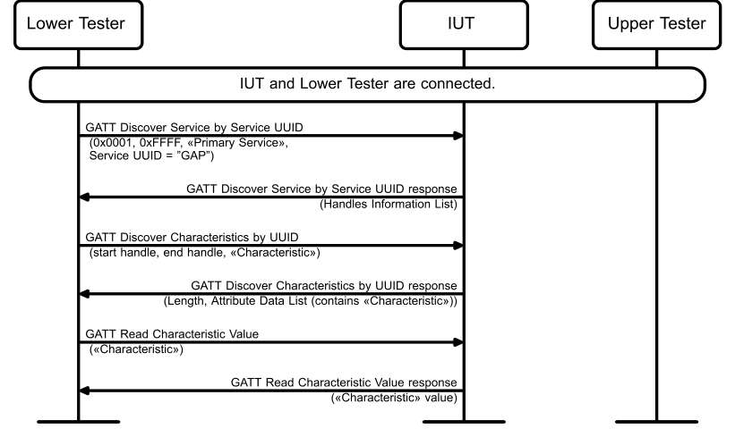

**Figure 4.186: Discover GAP Characteristic MSC**

1. The Lower Tester performs a GATT Service Discovery for the GAP Service. 2. The IUT responds with a GATT Service Discovery Response with the list of handles. 3. The Lower Tester performs a GATT Discover Characteristics by UUID for the characteristic
specified in Table 4.34. 4. The IUT returns one attribute in the Attribute Data list with the characteristic specified in Table
4.34. 5. The Lower Tester verifies that the Characteristic Properties has bit 1 (Read) set and bits 2 and 3
(Write Without Response and Write) are not set. 6. The Lower Tester performs a GATT Read Characteristic Value for the characteristic specified in
Table 4.34. 7. The IUT responds with a GATT Read Characteristic value response with the values for the
characteristic specified in Table 4.34.
• Expected Outcome
Pass verdict
In step 4, the IUT returns only one attribute with the Read bit set and the Write and Write Without Response bits not set in the Characteristic Properties.
In step 7, the IUT returns a value that has an even number of octets and corresponds to a valid and properly formatted security mode and level for that mode.

###### 4.7.7.1.2 Writeable Characteristic

• Test Purpose
Verify that an IUT can support a writeable characteristic.
• Reference
[4] 12
• Initial Condition
- A physical link is established between the IUT and the Lower Tester.
- The Lower Tester knows the handle and the current value of the Characteristic specified in Table 4.35, after executing the procedure defined in Section 4.2.6.
- The characteristic declaration includes either the Write (0x04) or Write Without Response (0x08) characteristic properties value, or both.
• Test Case Configuration

|  | Test Case |  |  | Characteristic |  |
| --- | --- | --- | --- | --- | --- |
| GAP/GAT/BV-05-C [Writeable Characteristic, Device Name] |  |  | Device Name |  |  |
| GAP/GAT/BV-06-C [Writeable Characteristic, Appearance] |  |  | Appearance |  |  |

Table 4.35: LE Discover Writeable Characteristics test cases
• Test Procedure

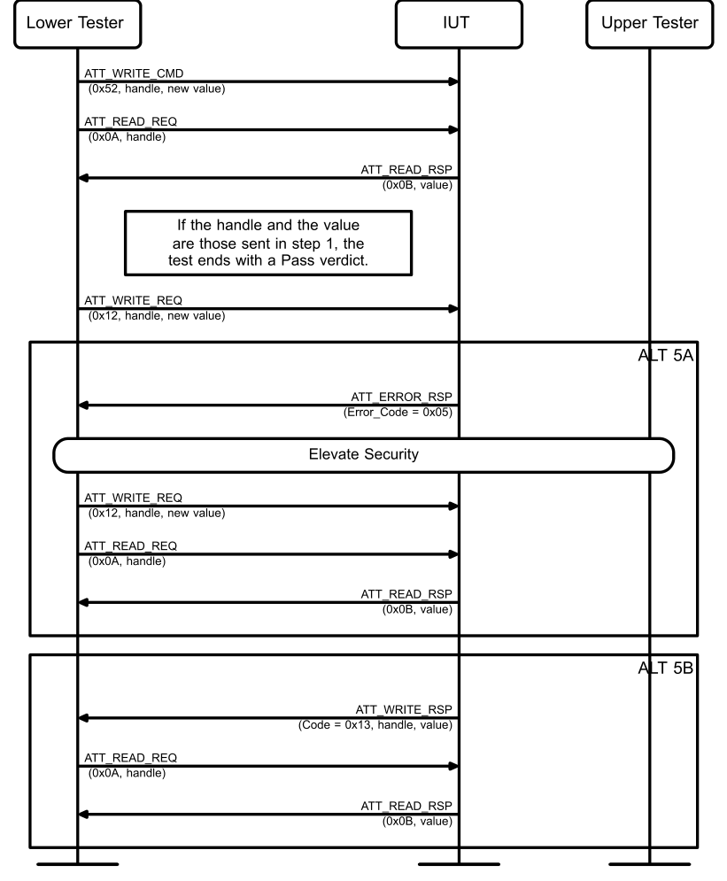

**Figure 4.187: Writeable Characteristic MSC**

1. The Lower Tester sends an ATT_WRITE_CMD with the handle and new value of the
Characteristic specified in Table 4.35. 2. The Lower Tester sends an ATT_READ_REQ to the IUT with the handle sent in step 1. 3. The IUT sends an ATT_READ_RSP to the Lower Tester. If the handle and value are those sent
in step 1, the test ends with a Pass verdict. 4. The Lower Tester sends an ATT_WRITE_REQ with the handle and new value of the
Characteristic specified in Table 4.35.
Alternative 5A: The IUT responds with an ATT_ERROR_RSP with the error code 0x05 “Insufficient Authentication”:
5A.1. The Lower Tester elevates the authentication or security level. 5A.2. Return to step 4. Alternative 5B: The IUT responds with an ATT_WRITE_RSP with the handle and value sent in steps 1 and 4:
5B.1. The Lower Tester sends an ATT_READ_REQ to the IUT with the handle sent in steps

## 1 and 4. 5B.2. The IUT sends an ATT_READ_RSP to the Lower Tester with the handle and value sent

in steps 1 and 4.
• Expected Outcome
Pass verdict
In step 3 or step 5B.2, the IUT sends the handle and new value of the characteristic specified in Table 4.35.
Fail verdict
In step 5, the IUT responds with any PDU or PDU contents other than those specified in the two options.

#### 4.7.8 Periodic Advertising Modes and Procedures

##### 4.7.8.1 Periodic Advertising Synchronizability Mode

###### 4.7.8.1.1 Periodic Advertising Synchronizability Mode – Broadcaster Role

• Test Purpose
Verify the IUT in Periodic Advertising Synchronizability Mode in the Broadcaster role where the Lower Tester, in the Observer role, performs the Periodic Advertising Synchronization Establishment Procedure using extended advertising events, without listening for periodic advertising data.
• Reference
[15] 9.5.1
• Initial Condition
- The IUT is in Link Layer state ‘Standby’.
• Test Case Configuration

|  | TCID |  |  | Periodic Advertising Type |  |
| --- | --- | --- | --- | --- | --- |
| GAP/PADV/PASM/BV-01-C |  |  |  | Periodic Advertising |  |
| GAP/PADV/PASM/BV-02-C |  |  |  | Periodic Advertising with Responses |  |

Table 4.36: Periodic Advertising Synchronizability Mode – Broadcaster Role test cases
• Test Procedure

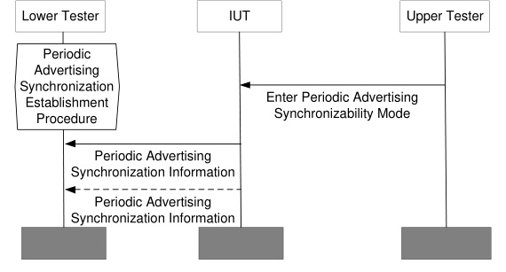

**Figure 4.188: Periodic Advertising Synchronizability Mode – Broadcaster Role MSC**

1. The Upper Tester orders the IUT to enter Periodic Advertising Synchronizability Mode. 2. The Lower Tester performs the Periodic Advertising Synchronization Establishment Procedure
without listening for periodic advertising data for the Periodic Advertising Type specified in Table 4.36 and receives periodic advertising synchronization information.
• Expected Outcome
Pass verdict
The Lower Tester receives periodic advertising synchronization information sent by the IUT.
The IUT stays in periodic advertising synchronizability mode for at minimum one extended advertising event.
• Notes
Since the periodic advertising synchronization information transmission is not a reliable transmission method, multiple periodic advertising synchronization information packets may need to be sent to verify compliance.

##### 4.7.8.2 Periodic Advertising Mode

###### 4.7.8.2.1 Periodic Advertising Mode – Broadcaster Role

• Test Purpose
Verify the IUT in Periodic Advertising Mode in the Broadcaster role where the Lower Tester, in the Observer role, synchronizes and listens for periodic advertising.
• Reference
[15] 9.5.2
• Initial Condition
- The IUT is in Link Layer state ‘Standby’.
- The periodic advertising data in Periodic Advertising Mode for the IUT is specified in the IXIT [3].
- The Lower Tester has synchronization information for the IUT’s periodic advertising.
• Test Case Configuration

|  | TCID |  |  | Periodic Advertising Type |  |
| --- | --- | --- | --- | --- | --- |
| GAP/PADV/PAM/BV-01-C |  |  |  | Periodic Advertising |  |
| GAP/PADV/PAM/BV-02-C |  |  |  | Periodic Advertising with Responses |  |

Table 4.37: Periodic Advertising Synchronizability Mode – Broadcaster Role test cases
• Test Procedure

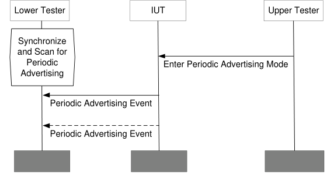

**Figure 4.189: Periodic Advertising Mode – Broadcaster Role MSC**

1. The Upper Tester orders the IUT to enter Periodic Advertising Mode using the Periodic
Advertising Type in Table 4.37 and the specified periodic advertising data. 2. The Lower Tester synchronizes and receives periodic advertising events.
• Expected Outcome
Pass verdict
The Lower Tester receives periodic advertising events sent by the IUT.
The Lower Tester receives the specified periodic advertising data sent by the IUT.
• Notes
Since the periodic advertising is not a reliable transmission method, multiple periodic advertising packets may need to be sent to verify compliance.

##### 4.7.8.3 Periodic Advertising Synchronization Establishment Procedure

###### 4.7.8.3.1 Periodic Synchronization Establishment Procedure Using Extended Advertising Events

Without Listening for Periodic Advertising – Observer Role
• Test Purpose
Verify that the IUT in the Observer role performs the Periodic Synchronization Establishment Procedure using extended advertising events and does not listen for periodic advertising events.
• Reference
[15] 9.5.3
• Initial Condition
- The IUT is in Link Layer state ‘Standby’.
• Test Case Configuration

|  | TCID |  |  | Periodic Advertising Type |  |
| --- | --- | --- | --- | --- | --- |
| GAP/PADV/PASE/BV-01-C |  |  |  | Periodic Advertising |  |
| GAP/PADV/PASE/BV-07-C |  |  |  | Periodic Advertising with Responses |  |

Table 4.38: Periodic Synchronization Establishment Procedure Using Extended Advertising Events Without Listening for Periodic Advertising – Observer Role test cases
• Test Procedure

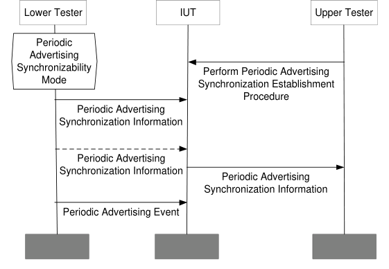

**Figure 4.190: Periodic Synchronization Establishment Procedure Using Extended Advertising Events Without Listening for Periodic Advertising – Observer Role MSC**

1. The Lower Tester enters Periodic Advertising Synchronizability Mode and begins transmitting
periodic advertising synchronization information with the Periodic Advertising Type specified in Table 4.38. 2. The Lower Tester enters Periodic Advertising Mode and begins transmitting periodic advertising
events. 3. The Upper Tester orders the IUT to perform the Periodic Advertising Synchronization
Establishment Procedure without listening for periodic advertising events. 4. The Upper Tester receives periodic advertising synchronization information from the IUT. 5. The Upper Tester does not receive periodic advertising reports from the IUT.
• Expected Outcome
Pass verdict
The IUT receives the periodic advertising synchronization information sent from the Lower Tester and reports it to the Upper Tester.
The IUT does not report periodic advertising events to the Upper Tester.
• Notes
Since the periodic advertising synchronization information transmission is not a reliable transmission method, multiple periodic advertising synchronization information packets may need to be sent to verify compliance.
Listening for Periodic Advertising – Observer Role
• Test Purpose
Verify that the IUT in the Observer role performs the Periodic Synchronization Establishment Procedure using extended advertising events and listens for periodic advertising events.
• Reference
[15] 9.5.3
• Initial Condition
- The IUT is in Link Layer state ‘Standby’.
- The periodic advertising data in Periodic Advertising Mode for the Lower Tester is specified in the IXIT [3].
• Test Case Configuration

|  | TCID |  |  | Periodic Advertising Type |  |
| --- | --- | --- | --- | --- | --- |
| GAP/PADV/PASE/BV-02-C |  |  |  | Periodic Advertising |  |
| GAP/PADV/PASE/BV-08-C |  |  |  | Periodic Advertising with Responses |  |

Table 4.39: Periodic Synchronization Establishment Procedure Using Extended Advertising Events Listening for Periodic Advertising – Observer Role test cases
• Test Procedure

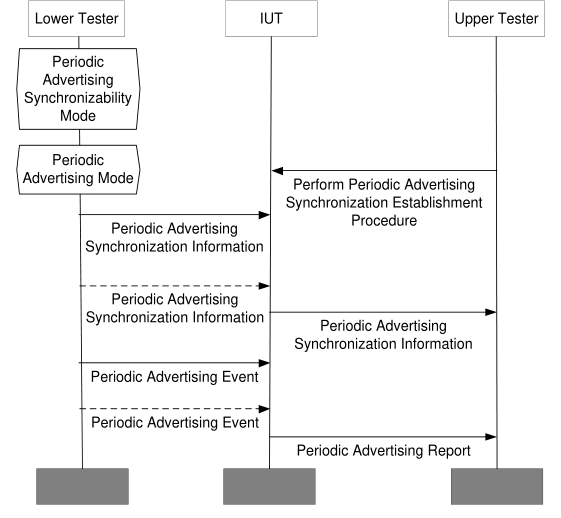

**Figure 4.191: Periodic Synchronization Establishment Procedure Using Extended Advertising Events Listening for Periodic Advertising – Observer Role MSC**

periodic advertising synchronization information with the Periodic Advertising Type specified in Table 4.39. 2. The Lower Tester enters Periodic Advertising Mode and begins transmitting periodic advertising
events. 3. The Upper Tester orders the IUT to perform the Periodic Advertising Synchronization
Establishment Procedure for the Periodic Advertising Type specified in Table 4.39 and to listen for periodic advertising events. 4. The Upper Tester receives periodic advertising synchronization information from the IUT. 5. The Upper Tester receives periodic advertising reports with periodic advertising data from the
IUT.
• Expected Outcome
Pass verdict
The IUT receives the periodic advertising synchronization information sent from the Lower Tester and reports it to the Upper Tester.
The IUT synchronizes and receives the periodic advertising events from the Lower Tester and reports the periodic advertising events and the periodic advertising data to the Upper Tester.
• Notes
Since the periodic advertising is not a reliable transmission method, multiple periodic advertising packets may need to be sent to verify compliance.

###### 4.7.8.3.3 Periodic Synchronization Establishment Procedure Over an LE Connection Without

Listening for Periodic Advertising – Peripheral Role
• Test Purpose
Verify that the IUT performing the Periodic Synchronization Establishment Procedure over an LE connection does not listen for periodic advertising events in the Peripheral role.
• Reference
[17] 9.5.3
• Initial Condition
- The IUT is in Link Layer state ‘Standby’.
• Test Case Configuration

|  | TCID |  |  | Periodic Advertising Type |  |
| --- | --- | --- | --- | --- | --- |
| GAP/PADV/PASE/BV-03-C |  |  |  | Periodic Advertising |  |
| GAP/PADV/PASE/BV-09-C |  |  |  | Periodic Advertising with Responses |  |

Table 4.40: Periodic Synchronization Establishment Procedure Over an LE Connection Without Listening for Periodic Advertising – Peripheral Role test cases
• Test Procedure

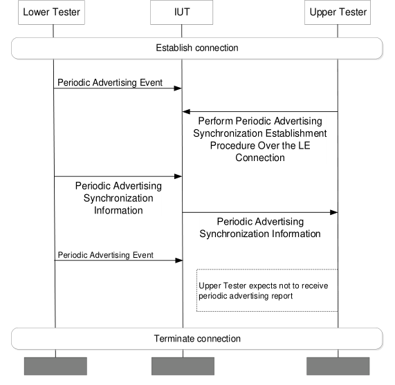

**Figure 4.192: Periodic Synchronization Establishment Procedure Over an LE Connection Without Listening for Periodic Advertising – Peripheral Role MSC**

1. The Upper Tester configures the IUT to connect with the Lower Tester on the LE 1M PHY, and
the Lower Tester connects with the IUT on the LE 1M PHY, with the IUT in the Peripheral role. 2. The Lower Tester enters Periodic Advertising Mode and begins transmitting periodic advertising
events. 3. The Upper Tester orders the IUT to perform the Periodic Advertising Synchronization
Establishment Procedure over the LE connection for the Periodic Advertising Type specified in Table 4.40 without listening for periodic advertising events. 4. The Lower Tester executes the Periodic Advertising Synchronization Transfer Procedure over the
LE connection with the Periodic Advertising Type specified in Table 4.40. 5. The Upper Tester receives periodic advertising synchronization information from the IUT. 6. The Upper Tester does not receive periodic advertising reports from the IUT. 7. Terminate the connection between the IUT and the Lower Tester.
• Expected Outcome
Pass verdict
The IUT receives the periodic advertising synchronization information sent from Lower Tester and reports it to the Upper Tester.
The IUT does not report periodic advertising events to the Upper Tester.

###### 4.7.8.3.4 Periodic Synchronization Establishment Procedure Over an LE Connection Listening for Periodic Advertising – Peripheral Role

• Test Purpose
Verify that the IUT performing the Periodic Synchronization Establishment Procedure over an LE connection listens for periodic advertising events in the Peripheral role.
• Reference
[17] 9.5.3
• Initial Condition
- The IUT is in Link Layer state ‘Standby’.
• Test Case Configuration

| TCID | Periodic Advertising Type |  |
| --- | --- | --- |
| GAP/PADV/PASE/BV-04-C | Periodic Advertising |  |
| GAP/PADV/PASE/BV-10-C | Periodic Advertising with Responses |  |

Table 4.41: Periodic Synchronization Establishment Procedure Over an LE Connection Listening for Periodic Advertising – Peripheral Role test cases
• Test Procedure

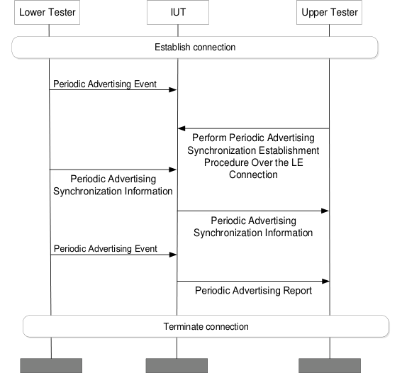

**Figure 4.193: Periodic Synchronization Establishment Procedure Over an LE Connection Listening for Periodic Advertising – Peripheral Role MSC**

the Lower Tester connects with the IUT on the LE 1M PHY, with the IUT in the Peripheral role. 2. The Lower Tester enters Periodic Advertising Mode and begins transmitting periodic advertising
events. 3. The Upper Tester orders the IUT to perform the Periodic Advertising Synchronization
Establishment Procedure over the LE connection for the Periodic Advertising Type specified in Table 4.41 without listening for periodic advertising events. 4. The Lower Tester executes the Periodic Advertising Synchronization Transfer Procedure over the
LE connection with the Periodic Advertising Type specified in Table 4.41. 5. The Upper Tester receives periodic advertising synchronization information from the IUT. 6. The Upper Tester receives periodic advertising reports with periodic advertising data from the
IUT. 7. Terminate the connection between the IUT and the Lower Tester.
• Expected Outcome
Pass verdict
The IUT receives the periodic advertising synchronization information sent from the Lower Tester and reports it to the Upper Tester.
The IUT synchronizes and receives the periodic advertising events from the Lower Tester and reports the periodic advertising events and the periodic advertising data to the Upper Tester.
• Notes
Since the periodic advertising is not a reliable transmission method, multiple periodic advertising packets may need to be sent for reliable test results.

###### 4.7.8.3.5 Periodic Synchronization Establishment Procedure Over an LE Connection Without

Listening for Periodic Advertising – Central Role
• Test Purpose
Verify that the IUT performing the Periodic Synchronization Establishment Procedure over an LE connection does not listen for periodic advertising events in the Central role.
• Reference
[17] 9.5.3
• Initial Condition
- The IUT is in Link Layer state ‘Standby’.
• Test Case Configuration

|  | TCID |  |  | Periodic Advertising Type |  |
| --- | --- | --- | --- | --- | --- |
| GAP/PADV/PASE/BV-05-C |  |  |  | Periodic Advertising |  |
| GAP/PADV/PASE/BV-11-C |  |  |  | Periodic Advertising with Responses |  |

Table 4.42: Periodic Synchronization Establishment Procedure Over an LE Connection Without Listening for Periodic Advertising – Central Role test cases
• Test Procedure

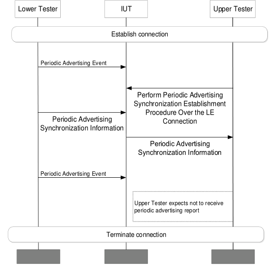

**Figure 4.194: Periodic Synchronization Establishment Procedure Over an LE Connection Without Listening for Periodic Advertising – Central Role MSC**

1. The Upper Tester configures the IUT to connect with the Lower Tester on the LE 1M PHY, and
the Lower Tester connects with the IUT on the LE 1M PHY, with the IUT in the Central role. 2. The Lower Tester enters Periodic Advertising Mode and begins transmitting periodic advertising
events. 3. The Upper Tester orders the IUT to perform the Periodic Advertising Synchronization
Establishment Procedure over the LE connection for the Periodic Advertising Type specified in Table 4.42 without listening for periodic advertising events. 4. The Lower Tester executes the Periodic Advertising Synchronization Transfer Procedure over the
LE connection with the Periodic Advertising Type specified in Table 4.42. 5. The Upper Tester receives periodic advertising synchronization information from the IUT, but no
periodic advertising reports. 6. Terminate the connection between the IUT and the Lower Tester.
• Expected Outcome
Pass verdict
The IUT receives the periodic advertising synchronization information sent from the Lower Tester and reports it to the Upper Tester.
The IUT does not report periodic advertising events to the Upper Tester.

###### 4.7.8.3.6 Periodic Synchronization Establishment Procedure Over an LE Connection Listening for Periodic Advertising – Central Role

• Test Purpose
Verify that the IUT performing the Periodic Synchronization Establishment Procedure over an LE connection listens for periodic advertising events in the Central role.
• Reference
[17] 9.5.3
• Initial Condition
- The IUT is in Link Layer state ‘Standby’.
• Test Case Configuration

| TCID | Periodic Advertising Type |  |
| --- | --- | --- |
| GAP/PADV/PASE/BV-06-C | Periodic Advertising |  |
| GAP/PADV/PASE/BV-12-C | Periodic Advertising with Responses |  |

Table 4.43: Periodic Synchronization Establishment Procedure Over an LE Connection Listening for Periodic Advertising – Central Role test cases
• Test Procedure

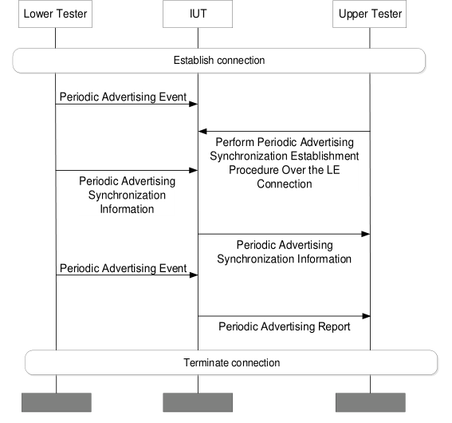

**Figure 4.195: Periodic Synchronization Establishment Procedure Over an LE Connection Listening for Periodic Advertising – Central Role MSC**

1. The Upper Tester configures the IUT to connect with the Lower Tester on the LE 1M PHY, and
the Lower Tester connects with the IUT on the LE 1M PHY, with the IUT in the Central role. 2. The Lower Tester enters Periodic Advertising Mode and begins transmitting periodic advertising
events. 3. The Upper Tester orders the IUT to perform the Periodic Advertising Synchronization
Establishment Procedure over the LE connection for the Periodic Advertising Type specified in Table 4.43, listening for periodic advertising events. 4. The Lower Tester executes the Periodic Advertising Synchronization Transfer Procedure over the
LE connection with the Periodic Advertising Type specified in Table 4.43. 5. The Upper Tester receives periodic advertising synchronization information from the IUT.
IUT. 7. Terminate the connection between the IUT and the Lower Tester.
• Expected Outcome
Pass verdict
The IUT receives the periodic advertising synchronization information sent from the Lower Tester and reports it to the Upper Tester.
The IUT synchronizes and receives the periodic advertising events from the Lower Tester and reports the periodic advertising events and the periodic advertising data to the Upper Tester.
• Notes
Since the periodic advertising is not a reliable transmission method, multiple periodic advertising packets may need to be sent to obtain reliable test results.

##### 4.7.8.4 Periodic Advertising Synchronization Transfer Procedure

###### 4.7.8.4.1 Periodic Advertising Synchronization Transfer Procedure – Peripheral Role

• Test Purpose
Verify the IUT performing the Periodic Advertising Synchronization Transfer procedure in the Peripheral role; the Lower Tester, in the Central role, performs the Periodic Advertising Synchronization Establishment procedure over an LE connection.
• Reference
[17] 9.5.4
• Initial Condition
- The IUT is in Link Layer state ‘Standby’.
• Test Case Configuration

|  | TCID |  |  | Periodic Advertising Type |  |
| --- | --- | --- | --- | --- | --- |
| GAP/PADV/PAST/BV-01-C |  |  |  | Periodic Advertising |  |
| GAP/PADV/PAST/BV-03-C |  |  |  | Periodic Advertising with Responses |  |

Table 4.44: Periodic Advertising Synchronization Transfer Procedure – Peripheral Role test cases
• Test Procedure

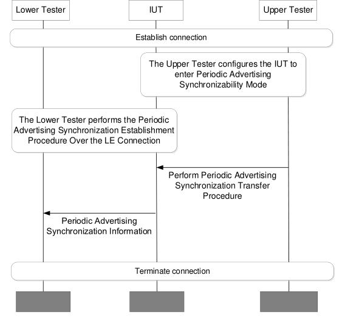

**Figure 4.196: Periodic Advertising Synchronization Transfer Procedure – Peripheral Role MSC**

1. The Upper Tester configures the IUT to connect with the Lower Tester on the LE 1M PHY, and
the Lower Tester connects with the IUT on the LE 1M PHY, with the IUT in the Peripheral role. 2. The Upper Tester configures the IUT to enter Periodic Advertising Synchronizability Mode. 3. The Lower Tester performs the Periodic Advertising Synchronization Establishment procedure
over the LE connection for the Periodic Advertising Type specified in Table 4.44. 4. The Upper Tester orders the IUT to perform the Periodic Advertising Synchronization Transfer
procedure with the Periodic Advertising Type specified in Table 4.44. 5. The Lower Tester receives periodic advertising synchronization information from the IUT. 6. Terminate the connection between the IUT and the Lower Tester.
• Expected Outcome
Pass verdict
The Lower Tester receives periodic advertising synchronization information sent by the IUT.

###### 4.7.8.4.2 Periodic Advertising Synchronization Transfer Procedure – Central Role

• Test Purpose
Verify the IUT performing the Periodic Advertising Synchronization Transfer Procedure in the Central role; the Lower Tester, in the Peripheral role, performs the Periodic Advertising Synchronization Establishment Procedure over an LE connection.
• Reference
[17] 9.5.4
• Initial Condition
- The IUT is in Link Layer state ‘Standby’.
• Test Case Configuration

| TCID |  |  | Periodic Advertising Type |  |
| --- | --- | --- | --- | --- |
| GAP/PADV/PAST/BV-02-C |  |  | Periodic Advertising |  |
| GAP/PADV/PAST/BV-04-C |  |  | Periodic Advertising with Responses |  |

Table 4.45: Periodic Advertising Synchronization Transfer Procedure – Central Role test cases
• Test Procedure

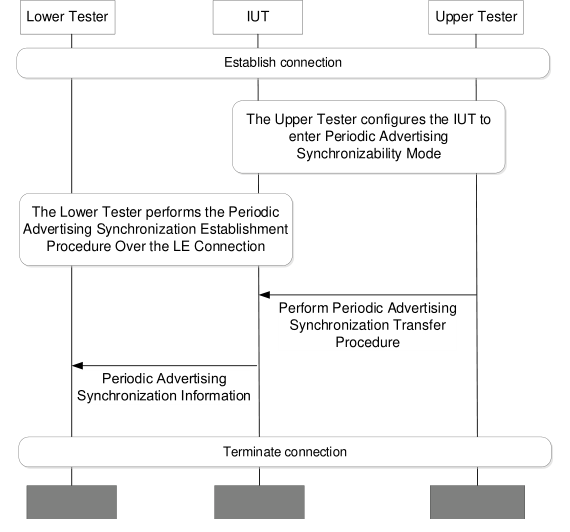

**Figure 4.197: Periodic Advertising Synchronization Transfer Procedure – Central Role MSC**

1. The Upper Tester configures the IUT to connect with the Lower Tester on the LE 1M PHY, and
the Lower Tester connects with the IUT on the LE 1M PHY, with the IUT in the Central role. 2. The Upper Tester configures the IUT to enter Periodic Advertising Synchronizability Mode. 3. The Lower Tester performs the Periodic Advertising Synchronization Establishment Procedure
over the LE connection for the Periodic Advertising Type specified in Table 4.45. 4. The Upper Tester orders the IUT to perform the Periodic Advertising Synchronization Transfer
Procedure with the Periodic Advertising Type specified in Table 4.45. 5. The Lower Tester receives periodic advertising synchronization information from the IUT. 6. Terminate the connection between the IUT and the Lower Tester.
• Expected Outcome
Pass verdict
The Lower Tester receives periodic advertising synchronization information sent by the IUT.
GAP/PADV/PAC/BV-01-C [Create Connection with Synchronized Device Using the Periodic Advertising Connection Procedure, Periodic Advertiser]
• Test Purpose
Verify that the IUT as a periodic advertiser can initiate a Link Layer connection with a synchronized device.
• Reference
[21] 9.5.5.2
• Initial Condition
- The IUT is in the Link Layer Standby state as a Periodic Advertiser.
• Test Procedure

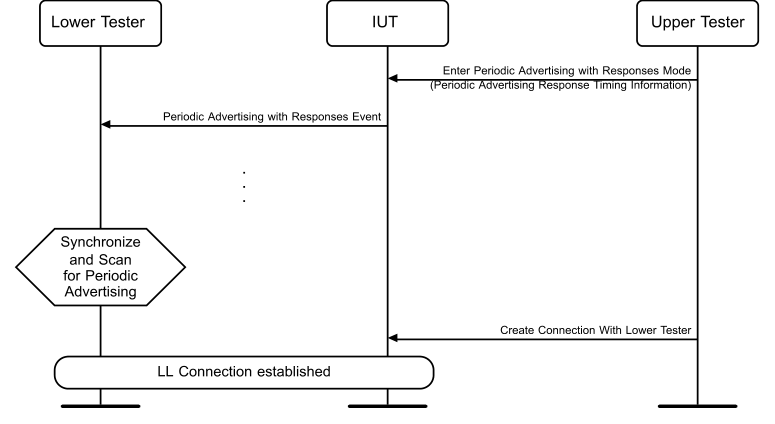

**Figure 4.198: Create Connection With Synchronized Device Using The Periodic Advertising Connection Procedure, Periodic Advertiser MSC**

1. The Upper Tester orders the IUT to enter Periodic Advertising with Responses Mode with valid
Periodic Advertising Response Timing Information. 2. The Lower Tester synchronizes and receives periodic advertising events. 3. The Upper Tester orders the IUT to connect with the Lower Tester using the Periodic Advertising
Connection Procedure. 4. The IUT and the Lower Tester complete a Link Layer connection.
• Expected Outcome
Pass verdict
In step 4, the IUT has a Link Layer connection with the Lower Tester.
GAP/PADV/PAC/BV-02-C [Create Connection with Synchronized Device Using the Periodic Advertising Connection Procedure, Scanner]
• Test Purpose
Verify that the IUT can accept a connection request and create a connection with a periodic advertiser.
• Reference
[21] 9.5.5.2
• Initial Condition
- The IUT is in Link Layer state ‘Standby’.
• Test Procedure

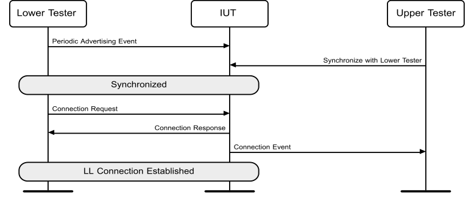

**Figure 4.199: Create Connection with Synchronized Device Using the Periodic Advertising Connection Procedure, Scanner MSC**

1. The Lower Tester enters Periodic Advertising Mode and begins transmitting Periodic Advertising
events with Periodic Advertising Response Timing Information. 2. The Upper Tester orders the IUT to synchronize with Periodic Advertising events. 3. The Lower Tester synchronizes and receives periodic advertising events. 4. The Lower Tester sends a connection request to the IUT. 5. The IUT accepts the connection request to the Lower Tester. 6. The IUT sends a successful connection request event to the Upper Tester. 7. The IUT and the Lower Tester complete a Link Layer connection.
• Expected Outcome
Pass verdict
In step 7, the IUT has a Link Layer connection with the Lower Tester.

#### 4.7.9 Broadcast Isochronous Streaming Modes and Procedures

##### 4.7.9.1 Broadcast Isochronous Synchronization Establishment

GAP/BIS/BSE/BV-01-C [Broadcast Isochronous Synchronization Establishment Procedure]
• Test Purpose
Verify that the IUT performs the Broadcast Isochronous Synchronization Establishment Procedure.
• Reference
[18] 9.6, 9.6.3
• Initial Condition
- The IUT is in Link Layer state ‘Standby’.
- The Lower Tester is in Broadcasting State.
• Test Procedure

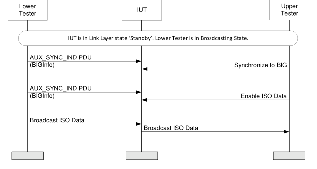

**Figure 4.200: GAP/BIS/BSE/BV-01-C [Broadcast Isochronous Synchronization Establishment] MSC**

1. The Lower Tester establishes a BIG with a single BIS and begins sending periodic advertising
trains with BIGInfo in the ACAD field of AUX_SYNC_IND PDU. 2. The Upper Tester orders the IUT to synchronize to the Lower Tester’s BIG. 3. The IUT synchronizes to the BIG. 4. The Upper Tester enables ISO data. 5. The Upper Tester expects the IUT to begin providing isochronous data from the single BIS from
the Lower Tester.
• Expected Outcome
Pass verdict
The IUT synchronizes with the Lower Tester.
The Upper Tester receives the Broadcast Isochronous Stream data sent by the Lower Tester.

##### 4.7.9.2 Broadcast Isochronous Broadcasting Mode

GAP/BIS/BBM/BV-01-C [Broadcast Isochronous Stream Broadcasting Mode]
• Test Purpose
Verify the IUT in Broadcast Isochronous Stream Broadcasting Mode; the peer device synchronizes and listens for isochronous data payloads.
• Reference
[18] 9.6.2
• Initial Condition
- The IUT is in Broadcasting State.
- The Lower Tester is in Synchronization State.
• Test Procedure

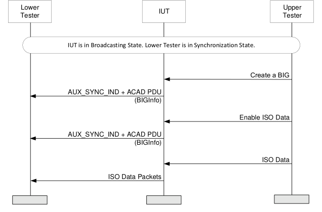

**Figure 4.201: GAP/BIS/BBM/BV-01-C [Broadcast Isochronous Stream Broadcasting Mode] MSC**

1. The Upper Tester instructs the IUT to create a BIG. 2. The Lower Tester receives periodic advertising packets from the IUT containing BIGInfo. 3. The Upper Tester enables ISO data on the IUT. 4. The Upper Tester begins sending data to the IUT. 5. The Lower Tester receives BIS Data Packets from the IUT.
• Expected Outcome
Pass verdict
The IUT sends isochronous data payloads in Broadcast Isochronous Stream subevents.

#### 4.7.10 Connection Subrating Procedure

##### 4.7.10.1 Connection Subrate Request Procedure

GAP/CSUB/CSR/BV-01-C [Connection Subrate Request Procedure]
• Test Purpose
Verify that the IUT as a Peripheral performs a subrate request and returns the LE Subrate Change event to the Upper Tester.
• Reference
[20] 9.3.16
• Initial Condition
- The IUT is a Peripheral and in Link Layer state ‘Connected’.
• Test Procedure

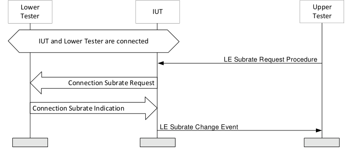

**Figure 4.202: GAP/CSUB/CSR/BV-01-C [Connection Subrate Request Procedure] MSC**

1. The Upper Tester orders the IUT to perform the LE Subrate Request procedure. 2. The IUT and the Lower Tester exchange connection subrate messages. 3. The IUT sends an LE Subrate Change event to the Upper Tester.
• Expected Outcome
Pass verdict
The IUT sends an LE Subrate Change event to the Upper Tester.

##### 4.7.10.2 Connection Subrate Update Procedure

GAP/CSUB/CSU/BV-01-C [Connection Subrate Update Procedure]
• Test Purpose
Verify that the IUT as a Central performs a subrate update procedure and returns the Subrate Update event to the Upper Tester.
• Reference
[20] 9.3.16
• Initial Condition
- The IUT is a Central and in Link Layer state ‘Connected’.
• Test Procedure
Upper Tester IUT
Lower Tester
IUT and Lower Tester are connected
LE Subrate Update Procedure
Connection Subrate Indication
LE Subrate Update Event

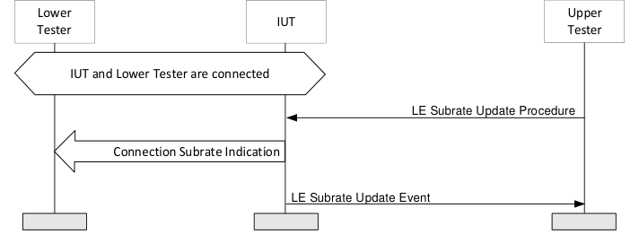

**Figure 4.203: GAP/CSUB/CSU/BV-01-C [Connection Subrate Update Procedure] MSC**

1. The Upper Tester orders the IUT to perform the LE Subrate Update procedure. 2. The IUT sends a connection subrate indication to the Lower Tester. 3. The IUT sends an LE Subrate Update event to the Upper Tester.
• Expected Outcome
Pass verdict
The IUT sends an LE Subrate Update event to the Upper Tester.

#### 4.7.11 Channel Sounding Procedure

GAP/CS/BV-01-C [Starting Channel Sounding, Initiator]
• Test Purpose
Verify that the Initiator IUT starts Channel Sounding using the Channel Sounding Start procedure.
• Reference
[22] 9.7.1
• Initial Condition
- The Lower Tester has the Channel Sounding feature bit set.
- The Lower Tester and the IUT have completed the encryption procedure with the LE Security Mode-1 Level 2 or higher.
• Test Procedure

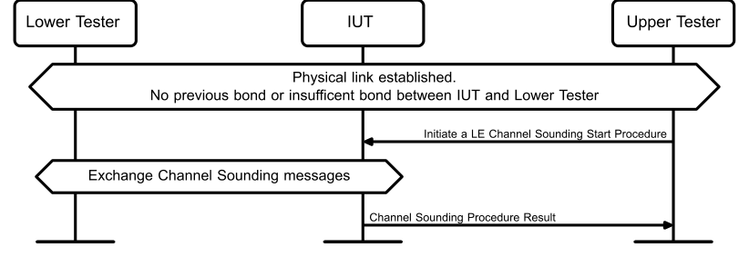

**Figure 4.204: Starting Channel Sounding, Initiator MSC**

1. The Upper Tester orders the IUT to perform the LE Channel Sounding Start procedure. 2. The IUT and the Lower Tester exchange Channel Sounding messages. 3. The IUT sends an LE Channel Sounding event to the Upper Tester.
• Expected Outcome
Pass verdict
The IUT is able to start the Channel Sounding procedure using the Channel Sounding Start procedure.
• Test Purpose
Verify that the Reflector IUT starts Channel Sounding using the Channel Sounding Start procedure.
• Reference
[22] 9.7.2
• Initial Condition
- The Lower Tester has the Channel Sounding feature bit set.
- The Lower Tester and the IUT have completed the encryption procedure with the LE Security Mode-1 Level 2 or higher.
• Test Procedure

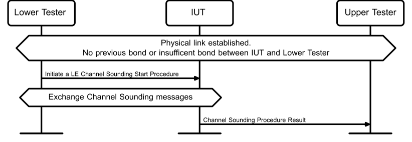

**Figure 4.205: Starting Channel Sounding, Initiator MSC**

1. The Lower Tester orders the IUT to perform the LE Channel Sounding Start procedure. 2. The IUT and the Lower Tester exchange Channel Sounding messages. 3. The IUT sends an LE Channel Sounding event to the Upper Tester.
• Expected Outcome
Pass verdict
The IUT is able to be configured in the Channel Sounding Reflector role and exchange Channel events.

### 4.8 BR/EDR/LE Operation Modes and Procedures

Verify the correct implementation of the BR/EDR/LE devices (devices that support LE and BR/EDR together).

#### 4.8.1 Non-Connectable Mode

GAP/DM/NCON/BV-01-C [BR/EDR/LE Non-Connectable Mode]
• Test Purpose
Verify that the IUT can properly handle the non-connectable mode in both BR/EDR and LE physical channels.
This test case is only valid for a BR/EDR/LE device that supports the Peripheral role.
• Reference
[4] 13.1.2.1
• Initial Condition
- The IUT is in Link Layer Standby state.
• Test Procedure
1. The Upper Tester orders the IUT to enter non-connectable mode. 2. For BR/EDR, this means paging scan is disabled on the IUT. 3. The Lower Tester verifies that the device is non-connectable in BR/EDR using the BR/EDR
connection procedure. 4. The Lower Tester verifies that the device is non-connectable in LE using GAP/CONN/NCON/BV-
01-C [Non-Connectable Mode] to GAP/CONN/NCON/BV-03-C [Non-Connectable Mode Limited Discoverable Mode] depending on the IUT capability.

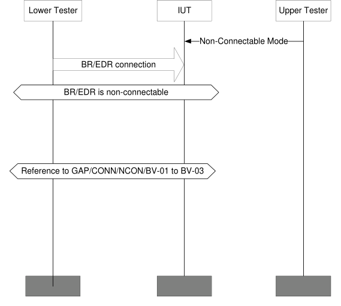

**Figure 4.206: GAP/DM/NCON/BV-01-C [BR/EDR/LE Non-Connectable Mode] MSC**

• Test Condition
It must be possible to order the IUT to enter non-connectable mode.
• Expected Outcome
Pass verdict
The IUT passes correspondent non-connectable mode test cases for LE and BR/EDR.

#### 4.8.2 Connectable Mode

GAP/DM/CON/BV-01-C [BR/EDR/LE Connectable Mode]
• Test Purpose
Verify that the IUT can properly handle the connectable mode in both BR/EDR.
• Reference
[4] 13.1.2.2
• Initial Condition
- The IUT is in Link Layer Standby state.
• Test Procedure
1. The Upper Tester orders the IUT to enter connectable mode. 2. For BR/EDR, this means page scan is enabled. 3. The Lower Tester verifies that the IUT can be connected in BR/EDR using the corresponding
connection procedure. 4. For this test case, the IUT only has to complete the corresponding test case for connectable
mode as a BR/EDR device.

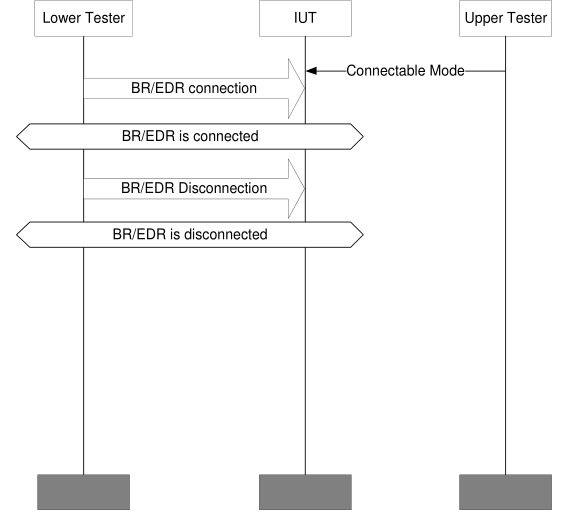

**Figure 4.207: GAP/DM/CON/BV-01-C [BR/EDR/LE Connectable Mode] MSC**

• Test Condition
It must be possible to order the IUT to enter connectable mode.
• Expected Outcome
Pass verdict
The Lower Tester finds the IUT is connectable using the BR/EDR procedure.

#### 4.8.3 Non-Bondable Mode

GAP/DM/NBON/BV-01-C [BR/EDR/LE Non-Bondable Mode]
• Test Purpose
Verify that the IUT is non-bondable in both BR/EDR and LE.
The Lower Tester is a BR/EDR/LE Peripheral device.
The IUT is a BR/EDR/LE Central Device.
• Reference
[4] 13.1.3.2
• Initial Condition
- The IUT is in Link Layer Standby state.
• Test Procedure
1. The Upper Tester orders the IUT to enter non-bondable mode. 2. The Lower Tester verifies that the device is non-bondable in BR/EDR with the corresponding test
case procedure GAP/MOD/NBON/BV-02-C [Non-bondable Mode, IUT Rejects Pairing Procedure]. 3. The Lower Tester and the IUT are disconnected. 4. The Lower Tester advertises itself as LE-only, Peripheral role for the LE “non-bondable” testing
part that follows. 5. The Lower Tester verifies that the device is non-bondable mode in LE using
GAP/BOND/NBON/BV-01-C [Non-bondable Mode – Central as Responder] followed by GAP/BOND/NBON/BV-02-C [Non-bondable Mode – Central as Initiator].

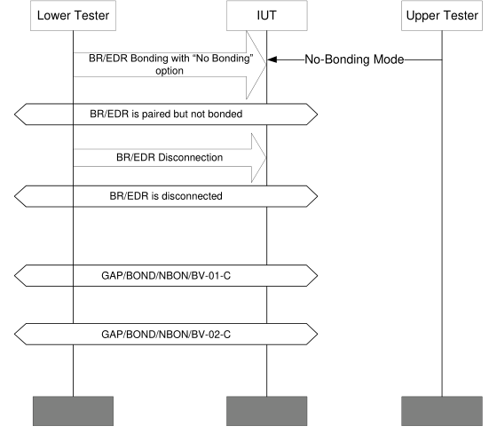

**Figure 4.208: GAP/DM/NBON/BV-01-C [BR/EDR/LE Non-Bondable Mode] MSC**

• Test Condition
It must be possible to order IUT to enter non-bondable mode.
• Expected Outcome
Pass verdict
The Lower Tester verifies that the IUT supports non-bondable mode correctly for both BR/EDR and LE procedures.

#### 4.8.4 Bondable Mode

GAP/DM/BON/BV-01-C [BR/EDR/LE Bondable Mode]
• Test Purpose
Verify that the IUT can properly handle the bonding procedure in both BR/EDR and LE as Central role.
• Reference
[4] 13.1.5
• Initial Condition
- The IUT is in Link Layer Standby state.
• Test Procedure
1. The Upper Tester orders the IUT to enter bondable mode. 2. The Lower Tester verifies that the device is bondable in BR/EDR using the corresponding test
case procedure. 3. The Lower Tester has to advertise itself as LE-only, Peripheral role for the LE “bondable” testing
part. 4. The Lower Tester verifies that the device is bondable in LE using corresponding test case
procedures in GAP/BOND/BON/ test group.

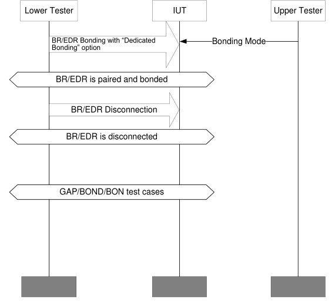

**Figure 4.209: GAP/DM/BON/BV-01-C [BR/EDR/LE Bondable Mode] MSC**

• Test Condition
It must be possible to order the IUT to enter bondable mode.
• Expected Outcome
Pass verdict
The Lower Tester finds the IUT is bondable using both BR/EDR and LE procedures.

#### 4.8.5 General Discovery Procedure

GAP/DM/GIN/BV-01-C [BR/EDR/LE General Discovery - Finding General Discoverable Devices]
• Test Purpose
Verify that the IUT performing the General Discovery Procedure can discover a BR/EDR/LE device in the General Discovery Mode over both BR/EDR and LE.
Verify that the IUT performing the General Discovery Procedure can discover a BR/EDR/LE device in the Limited Discovery Mode over both BR/EDR and LE.
The IUT is a BR/EDR/LE device as the Central and initiator over BR/EDR and in the Central role over LE.
The Lower Tester is a BR/EDR/LE device operating as the Peripheral and acceptor over BR/EDR and in the Peripheral role over LE.
• Reference
[4] 13.2.1
• Initial Condition
- The IUT is in Link Layer Standby state.
• Test Procedure
1. The Lower Tester enters General Discoverable mode; the Lower Tester interleaves General
Discoverable Mode over BR/EDR and LE. 2. The Upper Tester orders the IUT to perform the General Discovery Procedure; the IUT verifies
that it can discover the Lower Tester over both BR/EDR and LE. 3. The Lower Tester enters Limited Discoverable mode; the Lower Tester interleaves Limited
Discoverable Mode over BR/EDR and LE. 4. The Upper Tester orders IUT to perform the General Discovery Procedure; the IUT verifies that it
can discover the Lower Tester over both BR/EDR and LE.

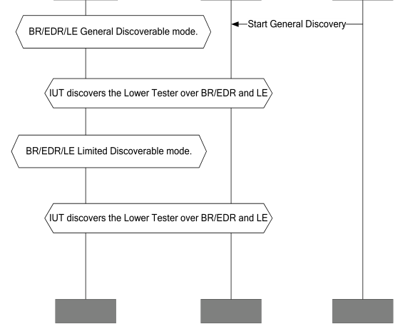

**Figure 4.210: GAP/DM/GIN/BV-01-C [BR/EDR/LE General Discovery - Finding General Discoverable Devices] MSC**

• Test Condition
It must be possible for the Upper Tester to order the IUT to start general discovery.
• Expected Outcome
Pass verdict
The IUT discovers the Lower Tester when the Lower Tester is operating in General Discoverable Mode and the IUT is performing the General Discovery Procedure over BR/EDR and LE; the advertising data received from the Lower Tester includes the Flags AD Type with the Limited Discoverable flag set to 0 and the General Discoverable flag set to 1.
The IUT discovers the Lower Tester when the Lower Tester is operating in Limited Discoverable Mode and the IUT is performing the General Discovery Procedure over BR/EDR and LE; the advertising data received from the Lower Tester includes the Flags AD Type with the Limited Discoverable flag set to 1 and the General Discoverable flag set to 0.
• Notes
“Discover” in the context of the test text means to report to the application layer and/or verify that the Flags AD type presence and setting according to the test pass verdict in any received advertising data.

#### 4.8.6 Limited Discovery Procedure

GAP/DM/LIN/BV-01-C [BR/EDR/LE Limited Discovery - Find Limited Discoverable Devices]
• Test Purpose
Verify that the IUT performing the Limited Discovery Procedure can discover a BR/EDR/LE device in the Limited Discoverable Mode over both BR/EDR and LE.
Verify that the IUT performing the Limited Discovery Procedure does not discover a BR/EDR/LE device in the General Discoverable Mode over both BR/EDR and LE.
The IUT is a BR/EDR/LE device performing the Limited Discovery Procedure as the Central and initiator over BR/EDR and in the Central role over LE.
The Lower Tester is a BR/EDR/LE device operating as the Peripheral and acceptor over BR/EDR and in the Peripheral role over LE.
• Reference
[4] 13.2.2
• Initial Condition
- The IUT is in Link Layer Standby state.
• Test Procedure
1. The Lower Tester enters Limited Discoverable mode; the Lower Tester interleaves Limited
Discoverable Mode over BR/EDR and LE. 2. The Upper Tester orders the IUT to perform the Limited Discovery Procedure; the IUT verifies
that it can discover the Lower Tester over both BR/EDR and LE. 3. The Lower Tester enters General Discoverable mode; the Lower Tester interleaves General
Discoverable Mode over BR/EDR and LE. 4. The Upper Tester orders the IUT to perform the Limited Discovery Procedure; the IUT verifies
that it does not discover the Lower Tester over both BR/EDR and LE.

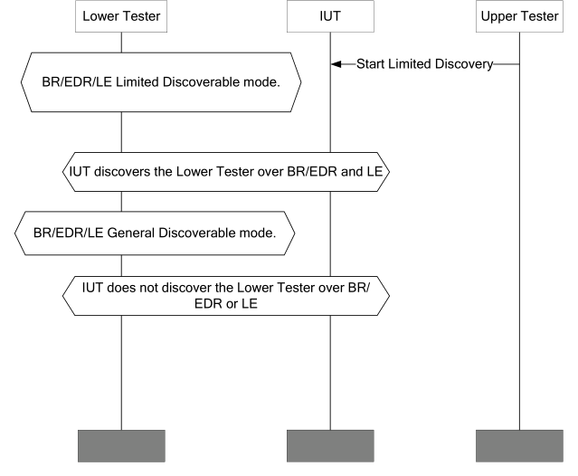

**Figure 4.211: GAP/DM/LIN/BV-01-C [BR/EDR/LE Limited Discovery - Find Limited Discoverable Devices] MSC**

• Test Condition
It must be possible for the Upper Tester to order the IUT to start limited discovery.
• Expected Outcome
Pass verdict
The IUT discovers the Lower Tester when the Lower Tester is operating in Limited Discoverable Mode and the IUT is performing the Limited Discovery Procedure over BR/EDR and LE; the advertising data received from the Lower Tester includes the Flags AD Type with the Limited Discoverable flag set to 1 and the General Discoverable flag set to 0.
The IUT does not discover the Lower Tester when the Lower Tester is operating in General Discoverable Mode and the IUT is performing the Limited Discovery Procedure over BR/EDR and LE; the advertising data received from the Lower Tester includes the Flags AD Type with the Limited Discoverable flag set to 0 and the General Discoverable flag set to 1.
• Notes
“Discover” in the context of the test text means to report to the application layer and/or verify the Flags AD type presence and setting according to the test Pass verdict in any received advertising data.

#### 4.8.7 Name Discovery Procedure

GAP/DM/NAD/BV-01-C [BR/EDR/LE Name Discovery]
• Test Purpose
Verify that the IUT can properly perform the name discovery procedure for both BR/EDR and LE devices as a Central role.
The IUT is a BR/EDR/LE device.
The Lower Tester is a BR/EDR/LE device.
• Reference
[4] 6.3, 13.2.4
• Initial Condition
- The IUT is in Link Layer ‘Standby’ state.
• Test Procedure
1. The Lower Tester is a BR/EDR/LE device. 2. The Upper Tester orders the IUT to do Name Discovery of Lower Tester on BR/EDR link as
defined in Section 6.3 of [4], which is the BR/EDR standard procedure of HCI command “remote name request”.
Lower Tester Upper Tester IUT

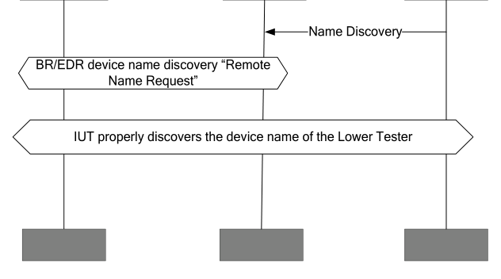

**Figure 4.212: GAP/DM/NAD/BV-01-C [BR/EDR/LE Name Discovery] MSC**

• Test Condition
It must be possible to order the IUT to start name discovery.
• Expected Outcome
Pass verdict
Device name is discovered correctly and passed up to the Upper Tester for verification.
• Notes
The IUT first performs the Device Capability Discovery procedure.
GAP/DM/NAD/BV-02-C [LE Name Discovery]
• Test Purpose
Verify that the IUT can properly perform the name discovery procedure for LE devices.
The IUT is a BR/EDR/LE device.
The Lower Tester is an LE-only Peripheral device.
• Reference
[4] 9.2.7
• Initial Condition
- The IUT is in Link Layer ‘Standby’ state.
• Test Procedure
The Upper Tester orders the IUT to do a Name Discovery of the Lower Tester on LE link as defined in Section 9.2.7 of [4], which could be through the GATT profile to access GAP characteristics of “device name.”
Lower Tester Upper Tester IUT

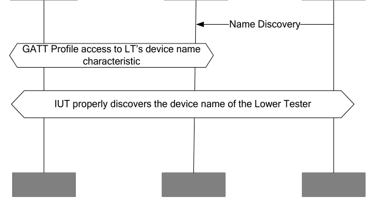

**Figure 4.213: GAP/DM/NAD/BV-02-C [LE Name Discovery] MSC**

• Test Condition
It must be possible to order the IUT start name discovery.
• Expected Outcome
Pass verdict
Device name is discovered correctly and passed up to the Upper Tester for verification.

#### 4.8.8 Link Establishment Procedure

GAP/DM/LEP/BV-01-C [BR/EDR/LE and BR/EDR/LE Link Establishment – BR/EDR Transport]
• Test Purpose
Verify IUT compliance to the Link Establishment Procedure to connect with a BR/EDR/LE device using the BR/EDR Transport.
The IUT is a BR/EDR/LE Peripheral device.
The Lower Tester is a BR/EDR/LE Central device.
• Reference
[4] 13.3.1
[9] 13.1
• Initial Condition
- The IUT is in Link Layer ‘Standby’ state.
• Test Procedure
1. The Upper Tester orders the IUT to enter General Discoverable Mode and Connectable Mode;
the IUT is a BR/EDR/LE Peripheral device. 2. The Lower Tester performs the General Discovery Procedure to discover the IUT; the Lower
Tester is a BR/EDR/LE Central device. 3. The Lower Tester performs the Link Establishment Procedure to connect to the IUT. 4. When connected the Lower Tester or the IUT terminates the connection.
Lower Tester Upper Tester IUT

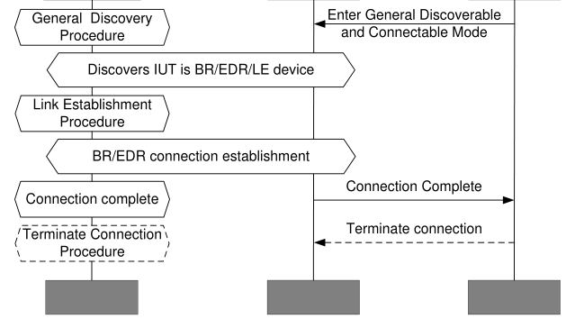

**Figure 4.214: GAP/DM/LEP/BV-01-C [BR/EDR/LE and BR/EDR/LE Link Establishment – BR/EDR Transport] MSC**

• Expected Outcome
Pass verdict
The Lower Tester discovers the IUT over BR/EDR.
The Lower Tester verifies that the LE Supported (Controller) bit is set to 1 and the LE Supported (Host) bit is set to 1 in the LMP features.
The Lower Tester discovers the IUT over LE.
The Lower Tester receives either connectable and scannable undirected advertising events or connectable undirected advertising events from IUT during the period that the IUT is in General Discoverable Mode and Connectable Mode.
In each advertising event received, the advertiser address is set to the address of the IUT. The Flags AD Type is present only once in the advertising data, the General Discoverable flag is set to 1, the Limited Discoverable flag is set to 0, and the BR/EDR Not Supported flag is set to 0. The Flags AD Type is not present in any scan response data received.
The Lower Tester establishes a BR/EDR connection with the IUT using the received BR/EDR address.
The Lower Tester or the IUT successfully terminates the connection.
• Notes
“Discover” in the context of the test text means to report to the application layer and/or verify the Flags AD type presence and setting according to the test Pass verdict in any received advertising data.
GAP/DM/LEP/BV-06-C [BR/EDR/LE and LE Link Establishment IUT is BR/EDR/LE]
• Test Purpose
Verify IUT compliance to the Link Establishment Procedure to connect with an LE-only device.
The IUT is a BR/EDR/LE* device.
*LE GAP role is defined as required in the Test Procedure.
• Reference
[4] 13.3.1
[9] 13.1
• Initial Condition
- The IUT is in Link Layer ‘Standby’ state.
• Test Procedure
1. The Lower Tester enters General Discoverable Mode and Undirected Connectable Mode over
LE; the Lower Tester is a LE-Only Peripheral device. 2. The Upper Tester orders the IUT to perform the General Discovery Procedure to discover the
Lower Tester; the IUT is a BR/EDR/LE Central device. 3. The Upper Tester orders the IUT to perform the Connection Establishment Procedure to connect
to the Lower Tester. 4. When connected the Lower Tester or the IUT terminates the connection.

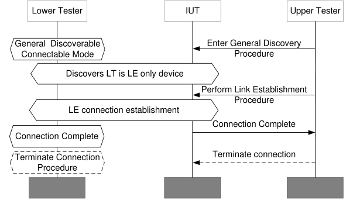

**Figure 4.215: GAP/DM/LEP/BV-06-C [BR/EDR/LE and LE Link Establishment IUT is BR/EDR/LE] MSC**

• Test Condition
It must be possible to order the IUT to start the link establishment procedure.
• Expected Outcome
Pass verdict
The IUT receives either connectable and scannable undirected advertising events or connectable undirected advertising events from Lower Tester during the period that the Lower Tester is in General Discoverable Mode and Undirected Connectable Mode.
In each advertising event received, the advertiser address is set to the address of the Lower Tester. The Flags AD Type is present only once in the advertising data, the General Discoverable flag is set to 1, the Limited Discoverable flag is set to 0, and the BR/EDR Not Supported flag is set to 1. The Flags AD Type is not present in any scan response data received.
The IUT establishes a connection with the Lower Tester using the received advertiser address.
GAP/DM/LEP/BV-07-C [BR/EDR/LE and BR/EDR/LE Link Establishment IUT is Peripheral – LE Transport]
• Test Purpose
Verify IUT compliance to the Link Establishment Procedure to connect with a BR/EDR/LE device using the LE transport.
Both the IUT and the Lower Tester are BR/EDR/LE devices.
• Reference
[9] 13.1
• Initial Condition
- The IUT is in Link Layer ‘Standby’ state.
• Test Procedure
1. The Upper Tester orders the IUT to enter General Discoverable Mode and Connectable Mode on
the LE transport; the IUT is a BR/EDR/LE Peripheral device. 2. The Lower Tester performs the General Discovery Procedure on the LE transport to discover the
IUT; the Lower Tester is a BR/EDR/LE Central device. 3. The Lower Tester performs the Link Establishment Procedure on the LE transport to connect to
the IUT. 4. The Lower Tester or the IUT terminates the connection.

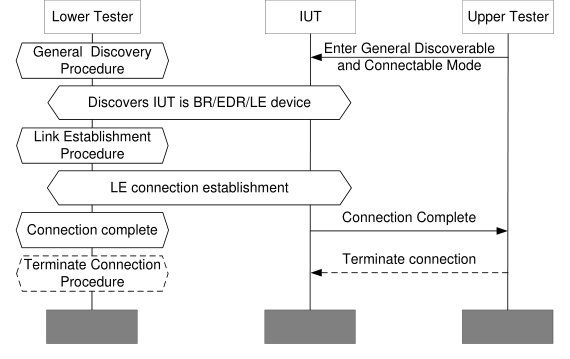

**Figure 4.216: GAP/DM/LEP/BV-07-C [BR/EDR/LE and BR/EDR/LE Link Establishment IUT is Peripheral – LE Transport] MSC**

• Expected Outcome
Pass verdict
The Lower Tester discovers the IUT over BR.
The Lower Tester verifies that the LE Supported (Controller) bit is set to 1 and the LE Supported (Host) bit is set to 1 in the LMP features.
The Lower Tester discovers the IUT over LE.
The Lower Tester receives either connectable and scannable undirected advertising events or connectable undirected advertising events from the IUT during the period that the IUT is in General Discoverable Mode and Connectable Mode.
In each advertising event received, the advertiser address is set to the address of the IUT. The Flags AD Type is present only once in the advertising data, the General Discoverable flag is set to 1, the Limited Discoverable flag is set to 0, and the BR/EDR Not Supported flag is set to 0. The Flags AD Type is not present in any scan response data received.
The Lower Tester establishes an LE connection with the IUT using the received LE address.
The Lower Tester or the IUT successfully terminates the connection.
• Notes
“Discover” in the context of the test text means to report to the application layer and/or verify the Flags AD type presence and setting according to the test Pass verdict in any received advertising data.
GAP/DM/LEP/BV-08-C [BR/EDR/LE and BR/EDR/LE Link Establishment IUT is Peripheral/BR Peripheral – LE and BR/EDR Transports]
• Test Purpose
Verify IUT compliance to the Link Establishment Procedure to connect with a BR/EDR/LE device using the BR/EDR and LE transports simultaneously.
Both the IUT and the Lower Tester are BR/EDR/LE* devices.
• Reference
[9] 13.1.1
• Initial Condition
- The IUT is in Link Layer ‘Standby’ state.
- The Lower Tester is using the same address on the LE and BR/EDR transports.
• Test Procedure
1. The Upper Tester orders the IUT to enter General Discoverable Mode and Connectable Mode on
both the LE and BR/EDR transports; the IUT is a BR/EDR/LE Peripheral device. 2. The Lower Tester performs the General Discovery Procedure on both the LE and BR/EDR
transports to discover the IUT; the Lower Tester is a BR/EDR/LE Central device. 3. The Lower Tester performs the Link Establishment Procedure to connect to the IUT on both the
LE and BR/EDR transports. 4. When connected on both transports the Lower Tester or the IUT terminates the connections.
Note: The order used for the discovery sequence and connection establishment sequence is implementation specific.
Lower Tester Upper Tester IUT

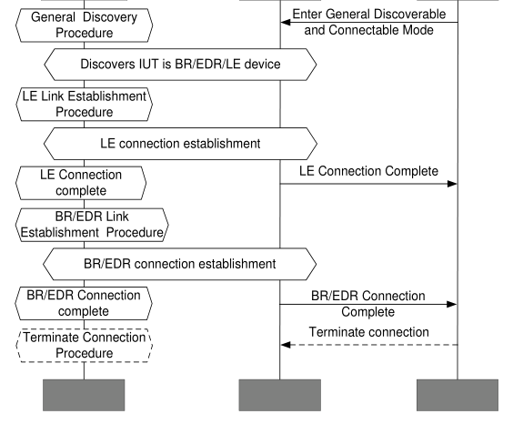

**Figure 4.217: GAP/DM/LEP/BV-08-C [BR/EDR/LE and BR/EDR/LE Link Establishment IUT is Peripheral/BR Peripheral – LE and BR/EDR Transports] MSC**

• Test Condition
It must be possible to order the IUT to start the link establishment procedure on both transports.
• Expected Outcome
Pass verdict
The Lower Tester discovers the IUT over BR.
The Lower Tester verifies that the LE Supported (Controller) bit is set to 1 and the LE Supported (Host) bit is set to 1 in the LMP features.
The Lower Tester discovers the IUT over LE.
The Lower Tester receives either connectable and scannable undirected advertising events or connectable undirected advertising events from the IUT during the period that the IUT is in General Discoverable Mode and Connectable Mode.
In each advertising event received, the advertiser address is set to the address of the IUT. The Flags AD Type is present only once in the advertising data, the General Discoverable flag is set to 1, the Limited Discoverable flag is set to 0, and the BR/EDR Not Supported flag is set to 0. The Flags AD Type is not present in any scan response data received.
The Lower Tester establishes an LE connection with the IUT using the received LE address.
The Lower Tester establishes a BR/EDR connection with the IUT using the received BR/EDR address.
The Lower Tester or the IUT successfully terminates the connections.
Note: The order used for the discovery sequence and connection establishment sequence is implementation specific.
• Notes
“Discover” in the context of the test text means to report to the application layer and/or verify the Flags AD type presence and setting according to the test Pass verdict in any received advertising data.
GAP/DM/LEP/BV-09-C [BR/EDR/LE and BR/EDR/LE Link Establishment IUT is Central/BR Central – LE and BR/EDR Transports]
• Test Purpose
Verify IUT compliance to the Link Establishment Procedure to connect with a BR/EDR/LE device on the BR/EDR and LE transports simultaneously.
Both the IUT and the Lower Tester are BR/EDR/LE devices.
• Reference
[9] 13.1.1
• Initial Condition
- The IUT is in Link Layer ‘Standby’ state.
- The Lower Tester is using the same address on the LE and BR/EDR transports.
• Test Procedure
1. The Lower Tester enters General Discoverable Mode and Connectable Mode on both the LE and
BR/EDR transports; the Lower Tester is a BR/EDR/LE Peripheral device. 2. The Upper Tester orders the IUT to perform the General Discovery Procedure on both the LE and
BR/EDR transports to discover the Lower Tester; the IUT is a BR/EDR/LE Central device. 3. The Upper Tester orders the IUT to perform the Link Establishment Procedure to connect to the
Lower Tester on both the LE and BR/EDR transports. 4. When connected on both transports the Lower Tester or the IUT terminates the connections.
Note: The order used for the discovery sequence and connection establishment sequence is implementation specific.

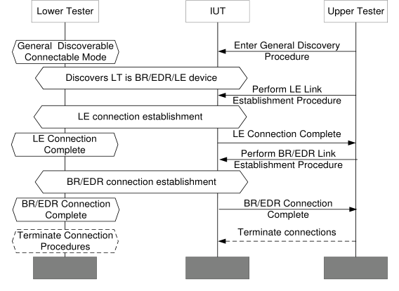

**Figure 4.218: GAP/DM/LEP/BV-09-C [BR/EDR/LE and BR/EDR/LE Link Establishment IUT is Central/BR Central – LE and BR/EDR Transports] MSC**

• Test Condition
It must be possible to order the IUT to start the link establishment procedure on both transports.
• Expected Outcome
Pass verdict
The IUT discovers the Lower Tester over BR.
The IUT verifies that the LE Supported (Controller) bit is set to 1 and the LE Supported (Host) bit is set to 1 in the LMP features.
The IUT discovers the Lower Tester over LE.
The IUT receives either connectable and scannable undirected advertising events or connectable undirected advertising events from Lower Tester during the period that the Lower Tester is in General Discoverable Mode and Connectable Mode.
In each advertising event received, the advertiser address is set to the address of the Lower Tester. The Flags AD Type is present only once in the advertising data, the General Discoverable flag is set to 1, the Limited Discoverable flag is set to 0, and the BR/EDR Not Supported flag is set to 0. The Flags AD Type is not present in any scan response data received.
The IUT establishes an LE connection with the Lower Tester using the received LE address.
The IUT establishes a BR/EDR connection with the Lower Tester using the received BR/EDR address.
The Lower Tester or the IUT successfully terminates the connections.
Note: The order used for the discovery sequence and connection establishment sequence is implementation specific.
GAP/DM/LEP/BV-10-C [BR/EDR/LE and BR/EDR/LE Link Establishment IUT is Peripheral/BR Central – LE and BR/EDR Transports]
• Test Purpose
Verify IUT compliance to the Link Establishment Procedure to connect with a BR/EDR/LE device using the BR/EDR and LE transports simultaneously.
The IUT is a BR/EDR/LE device.
The Lower Tester is a BR/EDR/LE device.
• Reference
[9] 13.1.1
• Initial Condition
- The IUT is in Link Layer ‘Standby’ state.
- The Lower Tester is using the same address on the LE and BR/EDR transports.
• Test Procedure
1. The Upper Tester orders the IUT to enter General Discoverable Mode and Connectable Mode on
the LE transport. The Upper Tester orders the IUT to perform the General Discovery Procedure on the BR/EDR transport. The IUT is a BR/EDR/LE Peripheral device. 2. The Lower Tester performs the General Discovery Procedure on the LE transport to discover the
IUT and enters the General Discoverable Mode on the BR/EDR transport. The Lower Tester is a BR/EDR/LE Central device. 3. The Lower Tester performs the Link Establishment Procedure on the LE transport to connect to
the IUT. 4. The Upper Tester orders the IUT to perform the Link Establishment Procedure on the BR/EDR
transport to connect to the Lower Tester. 5. When connected on both transports the Lower Tester or the IUT terminates the connections.
Note: The order used for the discovery sequence and connection establishment sequence is implementation specific.

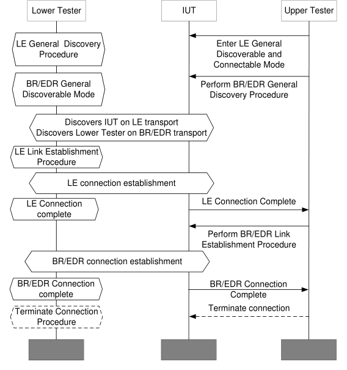

**Figure 4.219: GAP/DM/LEP/BV-10-C [BR/EDR/LE and BR/EDR/LE Link Establishment IUT is Peripheral/BR Central – LE and BR/EDR Transports] MSC**

• Expected Outcome
Pass verdict
The IUT discovers the Lower Tester over BR.
The Lower Tester verifies that the LE Supported (Controller) bit is set to 1 and the LE Supported (Host) bit is set to 1 in the LMP features.
The Lower Tester discovers the IUT over LE.
The Lower Tester receives either connectable and scannable undirected advertising events or connectable undirected advertising events from IUT during the period that the IUT is in General Discoverable Mode and Connectable Mode.
In each advertising event received, the advertiser address is set to the address of the IUT. The Flags AD Type is present only once in the advertising data, the General Discoverable flag is set to 1, the Limited Discoverable flag is set to 0, and the BR/EDR Not Supported flag is set to 0. The Flags AD Type is not present in any scan response data received.
The IUT establishes a BR/EDR connection with the Lower Tester using the received BR/EDR address.
The Lower Tester establishes an LE connection with the IUT using the received LE address.
The Lower Tester or the IUT successfully terminates the connections.
Note: The order used for the discovery sequence and connection establishment sequence is implementation specific.
• Notes
“Discover” in the context of the test text means to report to the application layer and/or verify the Flags AD type presence and setting according to the test Pass verdict in any received advertising data.
GAP/DM/LEP/BV-11-C [BR/EDR/LE and BR/EDR/LE Link Establishment IUT is Central/BR Peripheral – LE and BR/EDR Transports]
• Test Purpose
Verify IUT compliance to the Link Establishment Procedure to connect with a BR/EDR/LE device on the BR/EDR and LE transports simultaneously.
Both the IUT and the Lower Tester are BR/EDR/LE devices.
• Reference
[9] 13.1.1
• Initial Condition
- The IUT is in Link Layer ‘Standby’ state.
- The Lower Tester is using the same address on the LE and BR/EDR transports.
• Test Procedure
1. The Lower Tester enters General Discoverable Mode and Connectable Mode on the LE
transport. The Lower Tester performs the General Discovery Procedure on the BR/EDR transport. The Lower Tester is a BR/EDR/LE Peripheral device. 2. The Upper Tester orders the IUT to perform the General Discovery Procedure on the LE physical
transport to discover the Lower Tester and enters the General Discoverable mode on the BR/EDR transport. The IUT is a BR/EDR/LE Central device. 3. The Upper Tester orders the IUT to perform the Link Establishment Procedure on the LE physical
transport to connect to the Lower Tester. 4. The Lower Tester performs the Link Establishment Procedure on the BR/EDR transport to
connect to the IUT. 5. The Lower Tester or the IUT terminates the connection.
Note: The order used for the discovery sequence and connection establishment sequence is implementation specific.

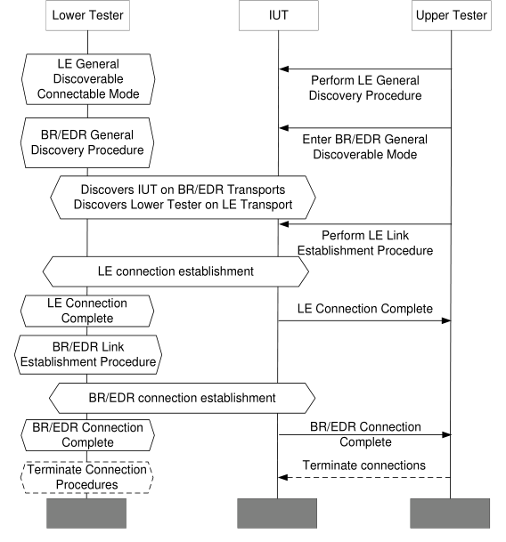

**Figure 4.220: GAP/DM/LEP/BV-11-C [BR/EDR/LE and BR/EDR/LE Link Establishment IUT is Central/BR Peripheral – LE and BR/EDR Transports] MSC**

• Test Condition
It must be possible to order the IUT to start the link establishment procedure.
• Expected Outcome
Pass verdict
The Lower Tester discovers the IUT over BR.
The IUT verifies that the LE Supported (Controller) bit is set to 1 and the LE Supported (Host) bit is set to 1 in the LMP features.
The IUT discovers the Lower Tester over LE.
The IUT receives either connectable and scannable undirected advertising events or connectable undirected advertising events from Lower Tester during the period that the Lower Tester is in General Discoverable Mode and Connectable Mode.
In each advertising event received, the advertiser address is set to the address of the Lower Tester. The Flags AD Type is present only once in the advertising data, the General Discoverable flag is set to 1, the Limited Discoverable flag is set to 0, and the BR/EDR Not Supported flag is set to 0. The Flags AD Type is not present in any scan response data received.
The IUT establishes an LE connection with the Lower Tester using the received LE address.
The Lower Tester establishes a BR/EDR connection with the IUT using the received BR/EDR address.
Note: The order used for the discovery sequence and connection establishment sequence is implementation specific.
GAP/DM/LEP/BV-12-C [Generate BR/EDR Link Key from LE LTK, as Initiator]
• Test Purpose
Verify that the LTK generated on the LE transport as an initiator can be used to generate the Link Key for the BR/EDR transport in a BR/EDR/LE device when BR/EDR Secure Connections is supported by both devices. The IUT is the Central device.
• Reference
[12] 14.1
• Initial Condition
- The IUT supports BR/EDR/LE with Secure Connections capabilities on both transports. The Lower Tester also supports BR/EDR/LE with Secure Connections capabilities on both transports. The IUT has discovered and connected to the Lower Tester.
• Test Procedure
1. The IUT initiates LE Secure Connections Pairing with the Lower Tester. They complete Pairing
phase one (negotiation) and phase two (pairing). 2. The state of Link Key bits in the Key Distribution/Generation Fields tells the devices to continue
with BR/EDR Link Key derivation. 3. The IUT terminates the LE connection. 4. The IUT performs the BR/EDR Link Establishment procedure and encrypts the link using the
derived BR/EDR Link Key.
Upper Tester IUT (initiator) Lower Tester
(responder)

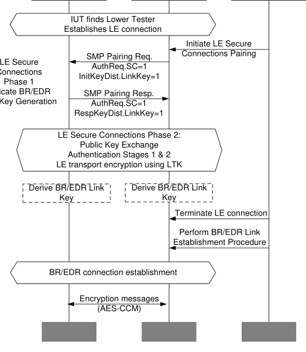

**Figure 4.221: GAP/DM/LEP/BV-12-C [Generate BR/EDR Link Key from LE LTK, as Initiator] MSC**

• Expected Outcome
Pass verdict
LE Secure Connections Pairing is complete, with an LE encrypted link, and BR/EDR Link Key of identical strength as the LTK has been derived and can be used to encrypt the BR/EDR link. The IUT does not initiate pairing on the BR/EDR transport.
• Notes
This test procedure requires Secure Connections pairing to occur first on the LE transport.
GAP/DM/LEP/BV-13-C [Upgrade of BR/EDR Link Key Regenerates LTK]
• Test Purpose
Verify that after cross-transport key derivation, upgrading the BR/EDR Link Key causes the LTK to be regenerated. The IUT is the Central device.
• Reference
[12] 14.1
• Initial Condition
- The IUT supports BR/EDR/LE with Secure Connections capabilities on both transports. The Lower Tester also supports BR/EDR/LE with Secure Connections capabilities on both transports. The IUT has discovered and connected to the Lower Tester.
• Test Procedure
1. The IUT initiates unauthenticated LE Secure Connections Pairing with the Lower Tester. They
complete Pairing phase one (negotiation) and phase two (pairing). 2. The state of Link Key bit in the Key Distribution/Generation Fields tells the devices to continue
with BR/EDR Link Key derivation. 3. The IUT terminates the LE connection. 4. The IUT performs the BR/EDR Link Establishment procedure and encrypts the link using the
derived BR/EDR Link Key. 5. The IUT upgrades the security level of the BR/EDR Link Key from unauthenticated to
authenticated. 6. The IUT performs SMP over BR/EDR. 7. The IUT terminates the BR/EDR connection. 8. The IUT creates an LE connection with the Lower Tester and encrypts the link using the LTK
derived from the authenticated BR/EDR Link Key.
Upper Tester IUT (initiator) Lower Tester
(responder)

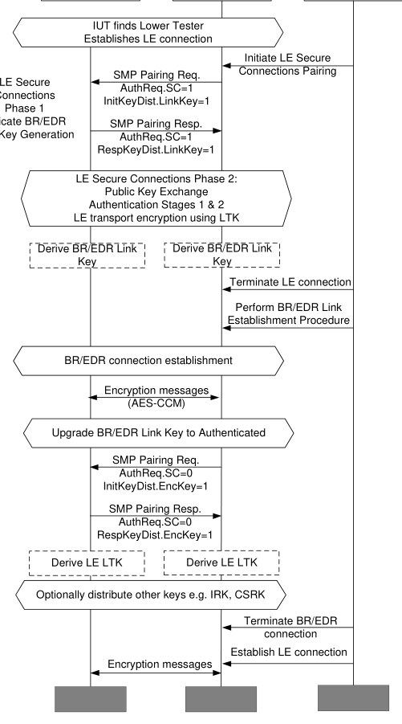

**Figure 4.222: GAP/DM/LEP/BV-13-C [Upgrade of BR/EDR Link Key Regenerates LTK] MSC**

• Expected Outcome
Pass verdict
LE Secure Connections Pairing is complete, with an LE encrypted link, and BR/EDR Link Key of identical strength as the LTK has been derived and can be used to encrypt the BR/EDR link. The IUT does not initiate pairing on the BR/EDR transport. The BR/EDR Link Key can be upgraded from unauthenticated to authenticated. The LE link can be encrypted using the LTK derived from the authenticated BR/EDR Link Key.
• Test Purpose
Verify that the LTK generated on the LE transport as a responder can be used to generate the Link Key for the BR/EDR transport in a BR/EDR/LE device, on a device that supports BR/EDR Secure Connections. The IUT is the Peripheral device.
• Reference
[12] 14.1
• Initial Condition
- The IUT supports BR/EDR/LE with Secure Connections capabilities on both transports. The Lower Tester also supports BR/EDR/LE with Secure Connections capabilities on both transports. The IUT has been discovered and is connected to by the Lower Tester.
• Test Procedure
1. The Lower Tester initiates LE Secure Connections Pairing with the IUT. They complete Pairing
phase one (negotiation) and phase 2 (pairing). 2. The state of Link Key bits in the Key Distribution/Generation Fields tells the devices to continue
with BR/EDR Link Key derivation. 3. The Lower Tester terminates the LE connection. 4. The Upper Tester puts the IUT in connectable mode on the BR/EDR transport. 5. The Lower Tester establishes a BR/EDR link with the IUT and encrypts the link with the derived
BR/EDR Link Key.

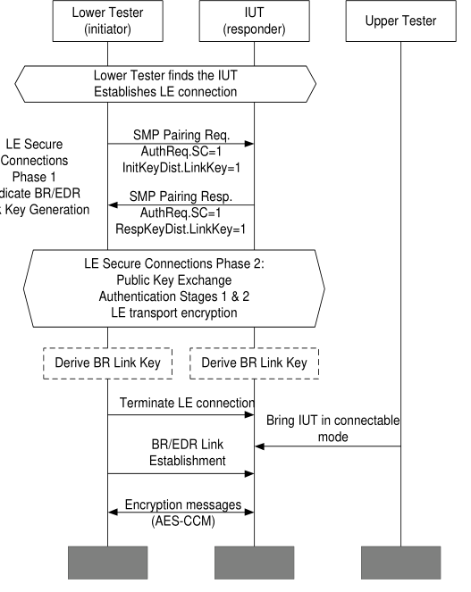

**Figure 4.223: GAP/DM/LEP/BV-14-C [Generate BR/EDR Link Key from LE LTK, as Responder] MSC**

• Expected Outcome
Pass verdict
LE Secure Connections Pairing is complete, with an LE encrypted link, and Link Key of identical strength as the LTK has been derived and can be used to encrypt the BR/EDR link. The IUT does not initiate pairing on the BR/EDR transport.
GAP/DM/LEP/BV-15-C [Generate BR/EDR Link Key from LE LTK, as Initiator]
• Test Purpose
Verify that the LTK generated on the LE transport as an initiator can be used to generate the Link Key for the BR/EDR transport in a BR/EDR/LE device which supports BR/EDR Secure Simple Pairing but not BR/EDR Secure Connections. The IUT is the Central device.
• Reference
[12] 14.1
• Initial Condition
- The IUT supports BR/EDR/LE with Secure Connections capabilities on both transports. The Lower Tester also supports BR/EDR/LE with LE Secure Connections capabilities but only Secure Simple Pairing for BR/EDR. The IUT has discovered and connected to the Lower Tester.
• Test Procedure
1. The IUT initiates LE Secure Connections Pairing with the Lower Tester. They complete Pairing
phase one (negotiation) and phase 2 (pairing). 2. The state of Link Key bits in the Key Distribution/Generation Fields tells the devices to continue
with BR/EDR Link Key derivation. 3. The IUT terminates the LE connection. 4. The IUT performs the BR/EDR Link Establishment procedure and encrypts the link using the
derived BR/EDR Link Key.
Upper Tester IUT (initiator) Lower Tester
(responder)

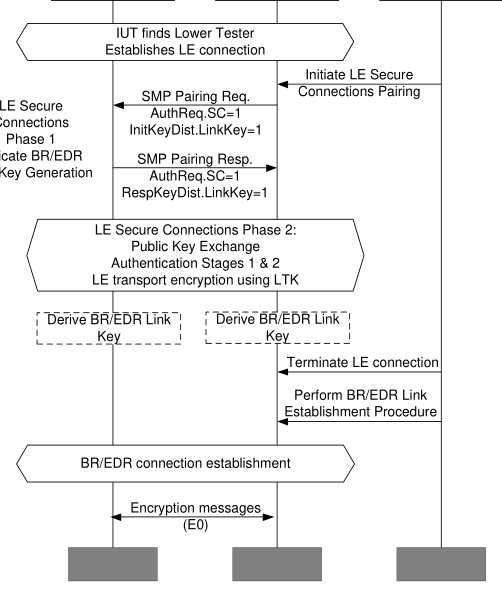

**Figure 4.224: GAP/DM/LEP/BV-15-C [Generate BR/EDR Link Key from LE LTK, as Initiator] MSC**

• Expected Outcome
Pass verdict
LE Secure Connections Pairing is complete, with an LE encrypted link, and Link Key of identical strength as the LTK has been derived and can be used to encrypt the BR/EDR link. The IUT does not initiate pairing on the BR/EDR transport.
GAP/DM/LEP/BV-16-C [Generate BR/EDR Link Key from LE LTK, as Responder]
• Test Purpose
Verify that the LTK generated on the LE transport as a responder can be used to generate the Link Key for the BR/EDR transport in a BR/EDR/LE device which supports BR/EDR Secure Simple Pairing but not BR/EDR Secure Connections. The IUT is the Peripheral device.
• Reference
[12] 14.1
• Initial Condition
- The IUT supports BR/EDR/LE with Secure Connections capabilities on both transports. The Lower Tester also supports BR/EDR/LE with LE Secure Connections capabilities but only Secure Simple Pairing for BR/EDR. The IUT has been discovered and is connected to by the Lower Tester.
• Test Procedure
1. The Lower Tester initiates LE Secure Connections Pairing with the IUT. They complete Pairing
phase one (negotiation) and phase 2 (pairing). 2. The state of Link Key bits in the Key Distribution/Generation Fields tells the devices to continue
with BR/EDR Link Key derivation. 3. The Lower Tester terminates the LE connection. 4. The Upper Tester puts the IUT in connectable mode on the BR/EDR transport. 5. The Lower Tester establishes a BR/EDR link with the IUT and encrypts the link with the derived
BR/EDR Link Key.

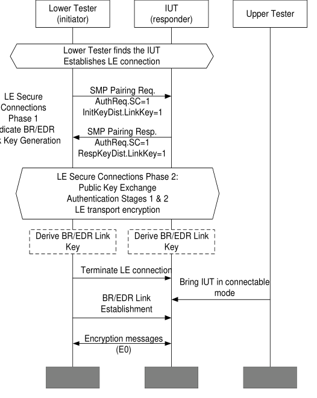

**Figure 4.225: GAP/DM/LEP/BV-16-C [Generate BR/EDR Link Key from LE LTK, as Responder] MSC**

• Expected Outcome
Pass verdict
LE Secure Connections Pairing is complete, with an LE encrypted link, and Link Key of identical strength as the LTK has been derived and can be used to encrypt the BR/EDR link. The IUT does not initiate pairing on the BR/EDR transport.
GAP/DM/LEP/BV-17-C [Generate LE LTK from BR/EDR Link Key, as Initiator]
• Test Purpose
Verify that the Link Key generated on the BR/EDR transport as an initiator can be used to generate the LTK for the LE transport in a BR/EDR/LE device. The IUT is the Central device.
• Reference
[12] 14.1
• Initial Condition
- The IUT supports BR/EDR/LE with Secure Connections capabilities on both transports. The Lower Tester also supports BR/EDR/LE with Secure Connections capabilities on both transports. The IUT has discovered and connected to the Lower Tester.
• Test Procedure
1. The IUT initiates BR/EDR Secure Connections Pairing with the Lower Tester. They complete
Pairing phases for public key exchange, authentication, key generation, and encryption of the BR/EDR link. 2. The IUT then sends an SMP Pairing Request to the Lower Tester on the encrypted BR/EDR link.
The Lower Tester replies with an SMP Pairing Response. The two devices derive the LTK, and optionally generate and distribute additional keys. 3. The IUT terminates the BR/EDR connection. 4. The IUT connects to the Lower Tester on the LE transport and encrypts the link with the derived
LTK.

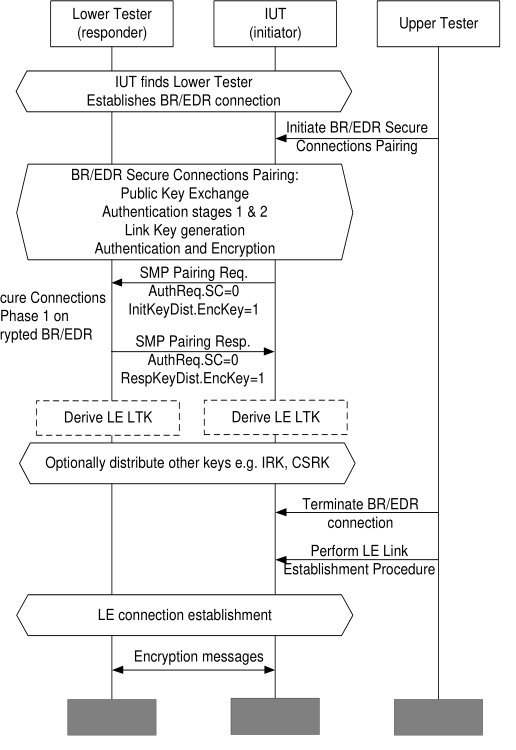

**Figure 4.226: GAP/DM/LEP/BV-17-C [Generate LE LTK from BR/EDR Link Key, as Initiator] MSC**

• Expected Outcome
Pass verdict
BR/EDR Secure Connections Pairing is complete, with a BR/EDR encrypted link, the LE LTK of identical strength as the BR/EDR Link Key has been derived, other keys such as the IRK and CSRK have been optionally distributed. The LE LTK can be used to encrypt the LE connection. The IUT does not initiate pairing on the LE transport.
GAP/DM/LEP/BV-18-C [Upgrade of LTK Regenerates BR/EDR Link Key]
• Test Purpose
Verify that after cross-transport key derivation, upgrading the LTK causes the BR/EDR Link Key to be regenerated. The IUT is the Central device.
• Reference
[12] 14.1
• Initial Condition
- The IUT supports BR/EDR/LE with Secure Connections capabilities on both transports. The Lower Tester also supports BR/EDR/LE with Secure Connections capabilities on both transports. The IUT has discovered and connected to the Lower Tester.
• Test Procedure
1. The IUT initiates unauthenticated BR/EDR Secure Connections Pairing with the Lower Tester.
They complete Pairing phases for public key exchange, authentication, key generation and encryption of the BR/EDR link. 2. The IUT then sends an SMP Pairing Request to the Lower Tester on the encrypted BR/EDR link.
The Lower Tester replies with an SMP Pairing Response. The two devices derive the LTK, and optionally generate and distribute additional keys. 3. The IUT terminates the BR/EDR connection. 4. The IUT connects to the Lower Tester on the LE transport and encrypts the link with the derived
LTK. 5. The IUT upgrades the security level of the LTK from unauthenticated to authenticated. 6. The IUT terminates the LE connection. 7. The IUT creates BR/EDR connection with the Lower Tester and encrypts the link using the
BR/EDR Link Key derived from the authenticated LTK.
Upper Tester IUT (initiator) Lower Tester
(responder)

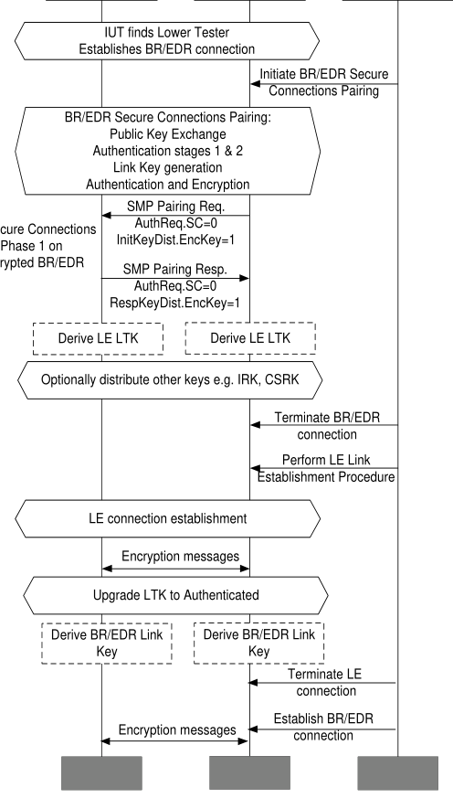

**Figure 4.227: GAP/DM/LEP/BV-18-C [Upgrade of LTK Regenerates BR/EDR Link Key] MSC**

• Expected Outcome
Pass verdict
BR/EDR Secure Connections Pairing is complete, with a BR/EDR encrypted link, the LE LTK of identical strength as the BR/EDR Link Key has been derived, other keys such as the IRK and CSRK have been optionally distributed. The LE LTK can be used to encrypt the LE connection. The IUT does not initiate pairing on the LE transport. The LTK can be upgraded from unauthenticated to authenticated. The BR/EDR link can be encrypted using the Link Key derived from the authenticated LTK.
• Test Purpose
Verify that the Link Key generated on the BR/EDR transport as a responder can be used to generate the LTK for the LE transport in a BR/EDR/LE device. The IUT is the Peripheral device.
• Reference
[12] 14.1
• Initial Condition
- The IUT supports BR/EDR/LE with Secure Connections capabilities on both transports. The Lower Tester also supports BR/EDR/LE with Secure Connections capabilities on both transports. The Lower Tester has discovered and connected with the IUT over BR/EDR.
• Test Procedure
1. The Lower Tester initiates BR/EDR Secure Connections Pairing with the IUT. They complete
Pairing phases for public key exchange, authentication, key generation, and encryption of the BR/EDR link. 2. The Lower Tester then sends an SMP Pairing Request on the encrypted BR/EDR link. The IUT
replies with an SMP Pairing Response. The two devices derive the LTKand optionally generate and distribute other keys. 3. The Lower Tester terminates the BR/EDR connection. 4. The Upper Tester puts the IUT in connectable mode on the LE transport. 5. The Lower Tester establishes an LE link with the IUT and encrypts the link with the derived LE
LTK.
Upper Tester IUT (responder) Lower Tester
(initiator)

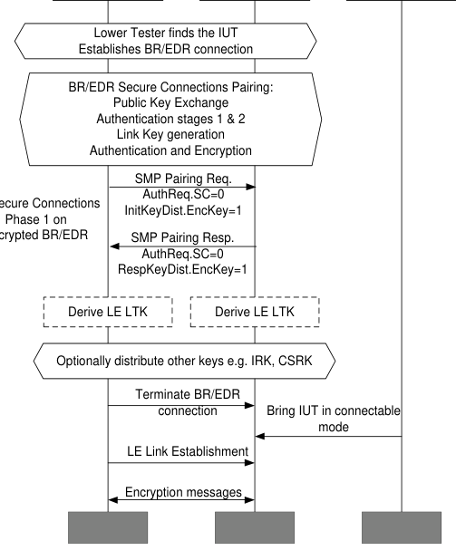

**Figure 4.228: GAP/DM/LEP/BV-19-C [Generate LE LTK from BR/EDR Link Key, as Responder] MSC**

• Expected Outcome
Pass verdict
BR/EDR Secure Connections Pairing is complete, with a BR/EDR encrypted link, the LE LTK of identical strength as the BR/EDR Link Key has been derived, other keys such as the IRK and CSRK have been optionally distributed. The LE LTK can be used to encrypt the LE connection. The IUT does not initiate pairing on the LE transport.
GAP/DM/LEP/BI-01-C [Do Not Generate LE LTK from BR/EDR P-192 Link Key, as Initiator]
• Test Purpose
Verify that the P-192 Link Key generated on the BR/EDR transport as an initiator is not used to generate the LTK for the LE transport in a BR/EDR/LE device when either the IUT or the Lower Tester or both do not support BR/EDR Secure Connections. The IUT is the Central device.
• Reference
[12] 2.3.5.7, 2.4.2.5.
• Initial Condition
- The IUT supports LE Secure Connections and may or may not support BR/EDR Secure Connections. The Lower Tester supports LE Secure Connections but not BR/EDR Secure Connections. The IUT has discovered and connected to the Lower Tester.
• Test Procedure
1. The IUT initiates BR/EDR Secure Simple Pairing with the Lower Tester. They complete Pairing
phases for public key exchange, authentication, key generation, and encryption of the BR/EDR link. 2. The IUT terminates the BR/EDR connection. 3. The IUT connects to the Lower Tester on the LE transport. 4. The IUT initiates LE Secure Connections Pairing with the Lower Tester. They complete Pairing
phase one (negotiation) and phase 2 (pairing).

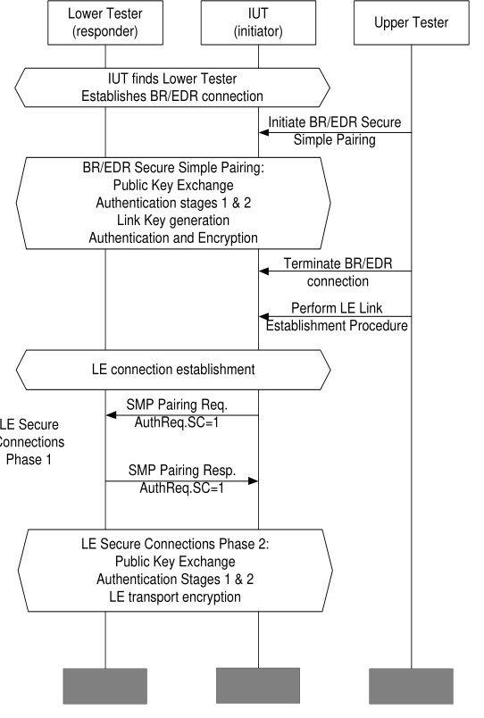

**Figure 4.229: GAP/DM/LEP/BI-01-C [Do Not Generate LE LTK from BR/EDR P-192 Link Key, as Initiator] MSC**

• Expected Outcome
Pass verdict
BR/EDR Secure Simple Pairing is complete, with a BR/EDR encrypted link.
The IUT does not initiate LE Secure Connections Pairing on the BR/EDR transport.
The IUT and the Lower Tester successfully complete LE Secure Connections Pairing on the LE transport.
GAP/DM/LEP/BI-02-C [Do Not Generate LE LTK from P-192 BR/EDR Link Key, as Responder]
• Test Purpose
Verify that the P-192 Link Key generated on the BR/EDR transport as a responder is not used to generate the LTK for the LE transport in a BR/EDR/LE device. The IUT is the Peripheral device.
• Reference
[12] 2.3.5.7, 2.4.2.5; optional: Section 2.4.2.1
• Initial Condition
- The IUT supports LE Secure Connections. The IUT may or may not support BR/EDR Secure Connections. The Lower Tester support LE Secure Connections but not BR/EDR Secure Connections. The Lower Tester has discovered and connected with the IUT over BR/EDR.
• Test Procedure
1. The Lower Tester initiates BR/EDR Secure Simple Pairing with the IUT. They complete Pairing
phases for public key exchange, authentication, key generation, and encryption of the BR/EDR link. 2. The Lower Tester then sends an SMP Pairing Request on the encrypted BR/EDR link. The IUT
responds with an SMP Pairing Failed with reason code ‘Cross Transport Key Derivation/Generation not allowed’ (0x0E). 3. The Lower Tester terminates the BR/EDR connection. 4. The Upper Tester puts the IUT in connectable mode on the LE transport. 5. The Lower Tester connects to the IUT on the LE transport. 6. The Lower Tester initiates LE Secure Connections Pairing with the IUT. They complete Pairing
phase one (negotiation) and phase 2 (pairing).
Upper Tester IUT (responder) Lower Tester
(initiator)

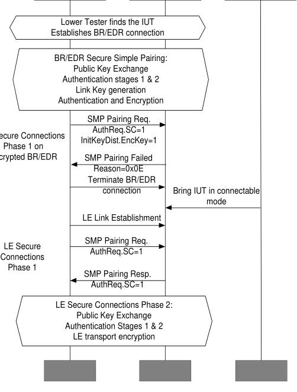

**Figure 4.230: GAP/DM/LEP/BI-02-C [Do Not Generate LE LTK from P-192 BR/EDR Link Key, as Responder] MSC**

• Expected Outcome
Pass verdict
BR/EDR Secure Simple Pairing is complete, with a BR/EDR encrypted link.
The IUT rejects the Lower Tester’s request LE Secure Connections Pairing on the BR/EDR transport.
The IUT and the Lower Tester successfully complete LE Secure Connections Pairing on the LE transport.
GAP/DM/LEP/BV-20-C [Verify that a Weaker BR/EDR Key Does Not Overwrite a Stronger Key, as Initiator]
• Test Purpose
Verify that an LE LTK is not overwritten by the LE LTK generated via the cross-transport key derivation procedure using a weaker BR/EDR Link Key. The IUT is the Central device.
• Reference
[12] 14.1
• Initial Condition
- The IUT supports BR/EDR/LE with Secure Connections capabilities on both transports. The Lower Tester also supports BR/EDR/LE with Secure Connections capabilities on both transports. The IUT has been discovered and is connected to the Lower Tester over LE.
• Test Procedure

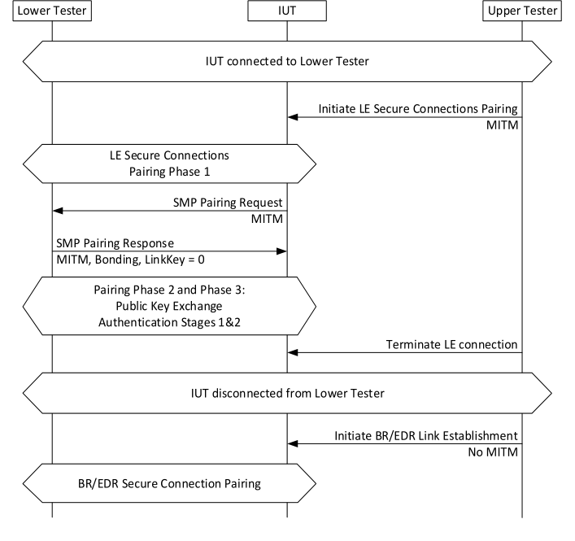

**Figure 4.231: Verify that a Weaker BR/EDR Key Does Not Overwrite a Stronger Key, as Initiator MSC – Page 1 of 2**

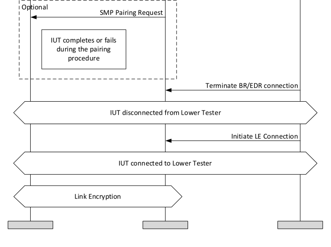

**Figure 4.232: Verify that a Weaker BR/EDR Key Does Not Overwrite a Stronger Key, as Initiator MSC – Page 2 of 2**

1. The Upper Tester directs the IUT to start LE Secure Connections pairing with the Lower Tester. 2. The IUT initiates LE Secure Connections Pairing with the Lower Tester with MITM support. 3. The Lower Tester responds to the Pairing request with Secure Connections, MITM support,
Bonding support, and the LinkKey flag not set. 4. They complete Pairing phase one (negotiation), phase two (pairing), and phase three (key
distribution). 5. The Upper Tester directs the IUT to disconnect the connection with the Lower Tester. 6. The IUT terminates the LE connection. 7. The Upper Tester directs the IUT to start the BR/EDR Link Establishment procedure with the
Lower Tester without MITM support. 8. The IUT performs the BR/EDR Link Establishment with Secure Connections and Bonding and
without MITM support and initiates BR/EDR Secure Connection Pairing with the Lower Tester. 9. The IUT may initiate or skip SMP Pairing. If the IUT initiates SMP Pairing, it may complete or fail
during the pairing procedure. 10. The IUT establishes a connection with the Lower Tester over BR/EDR. 11. The Upper Tester directs the IUT to disconnect the BR/EDR connection with the Lower Tester. 12. The Upper Tester directs the IUT to connect to the Lower Tester using LE Secure Connections. 13. The IUT initiates a connection to the Lower Tester over LE. 14. The IUT and the Lower Tester complete authentication and encryption using the LE LTK from
step 4.
• Expected Outcome
Pass verdict
The IUT reconnects to the Lower Tester over LE using the existing LE keys exchanged and stored in step 4.
GAP/DM/LEP/BV-21-C [Verify that a Weaker BR/EDR Key Does Not Overwrite a Stronger Key, as Responder]
• Test Purpose
Verify that an LE LTK is not overwritten by the LE LTK generated via the cross-transport key derivation procedure using a weaker BR/EDR Link Key. The IUT is the Peripheral device.
• Reference
[12] 14.1
• Initial Condition
- The IUT supports BR/EDR/LE with Secure Connections capabilities on both transports. The Lower Tester also supports BR/EDR/LE with Secure Connections capabilities on both transports. The IUT has been discovered and is connected to the Lower Tester over LE.
• Test Procedure

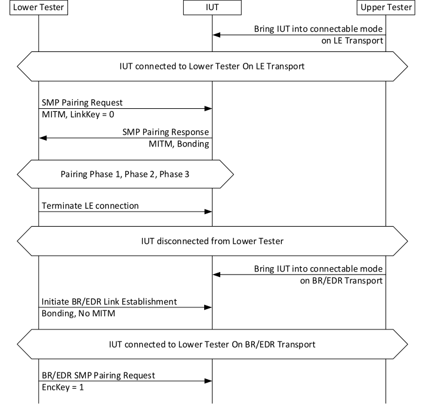

**Figure 4.233: Verify that a Weaker BR/EDR Key Does Not Overwrite a Stronger Key, as Responder MSC – Page 1 of 2**

| Op | tional BR/EDR SMP Pairing Response EncKey = 1 IUT completes or fails the pairing procedure. Terminate BR/EDR connection IUT disconnected Initiate LE Connection IUT connected to Lower |
| --- | --- |
|  |  |

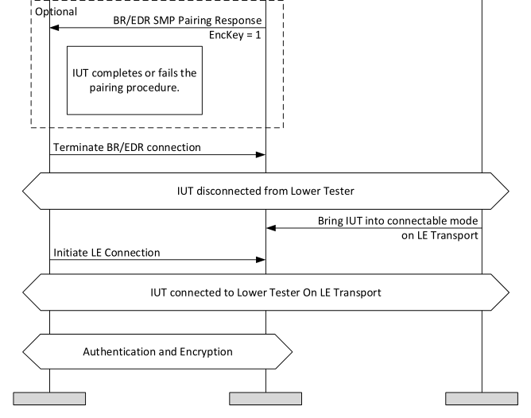

**Figure 4.234: Verify that a Weaker BR/EDR Key Does Not Overwrite a Stronger Key, as Responder MSC – Page 2 of 2**

1. The Upper Tester puts the IUT in connectable mode on the LE transport. 2. The Lower Tester initiates LE Secure Connections Pairing with the IUT with MITM support and
the LinkKey flag not set. 3. The IUT responds to the Pairing request with Secure Connections, MITM support. 4. They complete Pairing phase one (negotiation), phase two (pairing), and phase three (key
distribution). 5. The Lower Tester terminates the LE connection. 6. The Upper Tester puts the IUT in connectable mode on the BR/EDR transport. 7. The Lower Tester performs the BR/EDR Link Establishment procedure with Bonding and without
MITM support. 8. The Lower Tester sends an SMP Pairing Request to the IUT with EncKey set to 1. 9. The IUT may send an SMP Pairing Failed or an SMP Pairing Response to the Lower Tester. If
the IUT sends an SMP Pairing Response, it completes or fails during the pairing procedure. 10. The Lower Tester disconnects the BR/EDR connection with the IUT. 11. The Upper Tester puts the IUT in connectable mode on the LE transport. 12. The Lower Tester initiates a new connection to the IUT over LE. 13. The IUT and the Lower Tester complete authentication and encryption using the LE LTK from
step 4.
• Expected Outcome
Pass verdict
The IUT and the Lower Tester reconnect over LE using the existing keys exchanged and stored in step 4.
GAP/DM/LEP/BV-22-C [Verify that a Weaker LE Key Does Not Overwrite a Stronger Key, as Initiator]
• Test Purpose
Verify that a BR/EDR Link Key is not overwritten by the BR/EDR Link Key generated via the cross- transport key derivation procedure using a weaker LE LTK. The IUT is the Central device.
• Reference
[12] 14.1
• Initial Condition
- The IUT supports BR/EDR/LE with Secure Connections capabilities on both transports. The Lower Tester also supports BR/EDR/LE with Secure Connections capabilities on both transports. The IUT has discovered and connected to the Lower Tester.
• Test Procedure

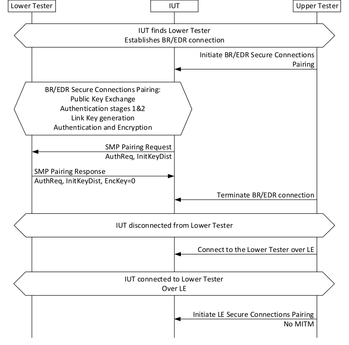

**Figure 4.235: Verify that a Weaker LE Key Does Not Overwrite a Stronger Key, as Initiator MSC – Page 1 of 2**

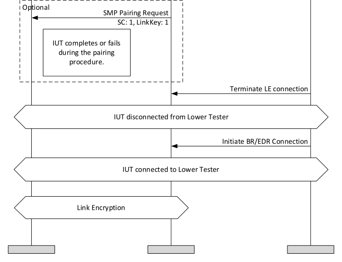

**Figure 4.236: Verify that a Weaker LE Key Does Not Overwrite a Stronger Key, as Initiator MSC – Page 2 of 2**

1. The IUT initiates BR/EDR Secure Connections Pairing with the Lower Tester. They complete
Pairing phases for public key exchange, authentication, key generation, and encryption of the BR/EDR link. 2. The IUT then sends an SMP Pairing Request to the Lower Tester on the encrypted BR/EDR link.
The Lower Tester replies with an SMP Pairing Response with the EncKey set to 0. 3. The IUT terminates the BR/EDR connection. 4. The IUT connects to the Lower Tester on the LE transport and pairs without MITM support. 5. The IUT may initiate or skip SMP Pairing. If the IUT initiates the SMP Pairing Request, it may
complete or fail partway during the pairing procedure. 6. The Upper Tester directs the IUT to disconnect the connection with the Lower Tester. 7. The Upper Tester directs the IUT to initiate a BR/EDR connection. 8. The Upper Tester directs the IUT to encrypt the BR/EDR link. 9. The IUT and the Lower Tester complete authentication and encryption using the BR/EDR Link
Key from step 1.
• Expected Outcome
Pass verdict
The IUT and the Lower Tester reconnect over BR/EDR using the existing keys exchanged and stored in step 1.
GAP/DM/LEP/BV-23-C [Verify that a Weaker LE Key Does Not Overwrite a Stronger Key, as Responder]
• Test Purpose
Verify that a BR/EDR Link Key is not overwritten by the BR/EDR Link Key generated via the cross- transport key derivation procedure using a weaker LE LTK. The IUT is the Peripheral device.
• Reference
[12] 14.1
• Initial Condition
- The IUT supports BR/EDR/LE with Secure Connections capabilities on both transports. The Lower Tester also supports BR/EDR/LE with Secure Connections capabilities on both transports. The Lower Tester has discovered and connected with the IUT over BR/EDR.
• Test Procedure

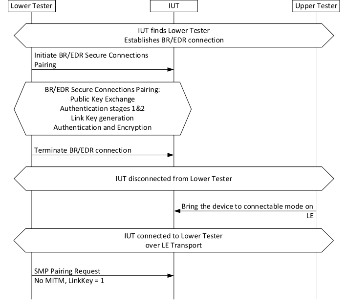

**Figure 4.237: Verify that a Weaker LE Key Does Not Overwrite a Stronger Key, as Responder MSC – Page 1 of 2**

| Op |  |  |  |  |  |
| --- | --- | --- | --- | --- | --- |
|  | Op | tional SMP Pairing Response SC: 1, LinkKey: 1 IUT may complete or fail during the pairing procedure. |  |  |  |
|  |  | Terminate LE connection |  |  |  |
|  |  | IUT disconnected | from Lower Tester |  |  |
|  |  | Initiate BR/EDR Connection |  |  |  |
|  |  | IUT connected | to Lower Tester |  |  |
|  |  |  |  |  |  |
|  |  | Link Encryption |  |  |  |
|  |  |  |  |  |  |

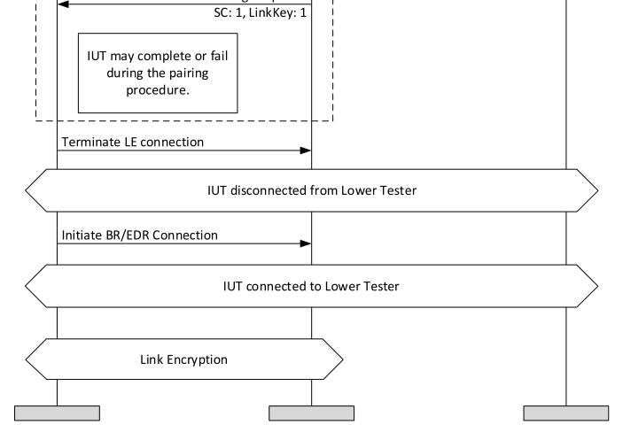

**Figure 4.238: Verify that a Weaker LE Key Does Not Overwrite a Stronger Key, as Responder MSC – Page 2 of 2**

1. The Lower Tester initiates BR/EDR Secure Connections Pairing with the IUT. They complete
Pairing phases for public key exchange, authentication, key generation, and encryption of the BR/EDR link. 2. The Lower Tester terminates the BR/EDR connection. 3. The Upper Tester puts the IUT in connectable mode on the LE transport. 4. The Lower Tester establishes an LE link with the IUT. 5. The Lower Tester initiates an SMP Pairing Request without MITM support and LinkKey set to 1. 6. The IUT sends an SMP Pairing Response to the Lower Tester and may complete or fail during
the pairing procedure. 7. The Lower Tester terminates the LE connection with the IUT. 8. The Lower Tester initiates a BR/EDR connection with the IUT. They complete encryption using
the Link Key from step 1.
• Expected Outcome
Pass verdict
The IUT and the Lower Tester reconnect over BR/EDR using the existing keys exchanged and stored in step 1.

#### 4.8.9 Synchronization Establishment – Receiver

Verify the correct behavior in this mode. The role of the IUT is broadcast receiver.
GAP/EST/SYNE/BV-01-C [Synchronization Establishment Procedure, IUT is Receiver]
• Test Purpose
Verify that the IUT performs a synchronization establishment procedure initiated by itself. The IUT is the connectionless Peripheral broadcast receiver and the Lower Tester is the connectionless Peripheral broadcast transmitter.
• References
[7] 7.5
• Initial Condition
- The IUT is in Standby state.
- The Lower Tester is transmitting Synchronization Train with Interval = 80 ms.
• Test Procedure
Receive Synchronization Train on the IUT from the Lower Tester.

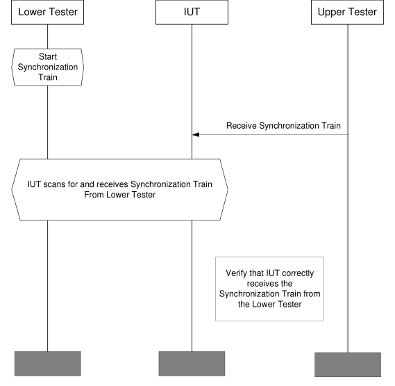

**Figure 4.239: GAP/EST/SYNE/BV-01-C [Synchronization Establishment Procedure, IUT is Receiver] MSC**

• Expected Outcome
Pass verdict
The IUT receives the Synchronization Train from the Lower Tester.

## 5 Test case mapping

The Test Case Mapping Table (TCMT) maps test cases to specific requirements in the ICS. The IUT is tested in all roles for which support is declared in the ICS document.
The columns for the TCMT are defined as follows:
Item: Contains a logical expression based on specific entries from the associated ICS document. Contains a logical expression (using the operators AND, OR, NOT as needed) based on specific entries from the applicable ICS document(s). The entries are in the form of y/x references, where y corresponds to the table number and x corresponds to the feature number as defined in the ICS document for GAP [2].
Feature: A brief, informal description of the feature being tested.
Test Case(s): The applicable test case identifiers are required for Bluetooth Qualification if the corresponding y/x references defined in the Item column are supported. Further details about the function of the TCMT are elaborated in [5].
For the purpose and structure of the ICS/IXIT, refer to [5].

|  | Item |  |  | Feature |  |  | Test Case(s) |  |
| --- | --- | --- | --- | --- | --- | --- | --- | --- |
|  | BR/EDR Parameters or BR/EDR/LE Parameters |  |  |  |  |  |  |  |
| GAP 1/1 |  |  | Verify that the IUT does not respond to inquiry if it is in non-discoverable mode. BR/EDR/LE Name Discovery. |  |  | GAP/MOD/NDIS/BV-01-C |  |  |
| GAP 1/2 |  |  | Verify that the IUT answers to inquiry (LIAC) if it is in limited-discoverable mode. |  |  | GAP/MOD/LDIS/BV-01-C |  |  |
| GAP 1/2 |  |  | Verify that the IUT answers to inquiry (GIAC) if it is in limited-discoverable mode. |  |  | GAP/MOD/LDIS/BV-02-C |  |  |
| GAP 1/2 |  |  | Verify that the IUT does not stay in Limited Discovery Mode indefinitely. |  |  | GAP/MOD/LDIS/BV-03-C |  |  |
| GAP 1/3 |  |  | Verify that the IUT answers to inquiry (GIAC) if it is in general-discoverable mode. |  |  | GAP/MOD/GDIS/BV-01-C |  |  |
| GAP 1/3 |  |  | Verify that the IUT in general-discovery mode does not respond inquiry requests (using LIAC). |  |  | GAP/MOD/GDIS/BV-02-C |  |  |
| GAP 1/4 |  |  | Verify that the IUT does not respond to paging if it is in non-connectable mode. |  |  | GAP/MOD/NCON/BV-01-C |  |  |
| GAP 1/5 |  |  | Verify that the IUT responds to paging requests if it is in connectable mode. |  |  | GAP/MOD/CON/BV-01-C |  |  |
| GAP 1/5 AND GAP 1/6 AND GAP 2/7 AND GAP 4/2 |  |  | Verify that the IUT performs a pairing procedure, if it is in pairable mode. |  |  | GAP/MOD/NBON/BV-02-C GAP/MOD/NBON/BV-03-C |  |  |
| GAP 1/5 AND GAP 2/5 AND GAP 4/2 AND GAP 4/4 |  |  | Verify that the IUT in Security Mode-2 performs a channel establishment procedure. |  |  | GAP/SEC/SEM/BV-02-C |  |  |
| GAP 3/1 |  |  | Verify that if general inquiry is initiated by the IUT, it sends for at least TGAP(100) inquiry request messages (GIAC). |  |  | GAP/IDLE/GIN/BV-01-C |  |  |
| GAP 3/2 |  |  | Verify that if limited inquiry is initiated by the IUT, it sends for at least TGAP(100) inquiry request messages (LIAC). |  |  | GAP/IDLE/LIN/BV-01-C |  |  |

|  | Item |  |  | Feature |  |  | Test Case(s) |  |
| --- | --- | --- | --- | --- | --- | --- | --- | --- |
| GAP 2/7 AND GAP 3/4 AND GAP 3/3 |  |  | Device discovery procedure - Central |  |  | GAP/IDLE/DED/BV-02-C |  |  |
| GAP 2/7 AND GAP 3/6 AND (GAP 3/1 OR GAP 3/2) |  |  | Bonding - Central |  |  | GAP/IDLE/BON/BV-02-C |  |  |
| GAP 2/7 AND GAP 3/6 |  |  | Dedicated Bonding |  |  | GAP/IDLE/BON/BV-03-C |  |  |
| GAP 2/7 AND GAP 3/6 AND GAP 2/8 |  |  | Dedicated Bonding - Authenticated Link Key |  |  | GAP/IDLE/BON/BV-04-C |  |  |
| GAP 2/7 AND GAP 3/5 |  |  | General Bonding |  |  | GAP/IDLE/BON/BV-05-C |  |  |
| GAP 2/7 AND GAP 3/5 AND GAP 2/8 |  |  | General Bonding - Authenticated Link Key |  |  | GAP/IDLE/BON/BV-06-C |  |  |
| GAP 4/1 AND (GAP 3/1 OR GAP 3/2) |  |  | Verify that the IUT performs a link establishment procedure, initiated by itself |  |  | GAP/EST/LIE/BV-02-C |  |  |
| GAP 1/5 AND GAP 2/7 AND GAP 4/2 AND GAP 4/4 |  |  | Channel establishment, security Mode-4 |  |  | GAP/SEC/SEM/BV-04-C |  |  |
| GAP 2/7 AND GAP 2/9 AND GAP 4/3 |  |  | Channel establishment, security Mode-4 |  |  | GAP/SEC/SEM/BV-08-C |  |  |
| GAP 2/7 AND GAP 2/9 AND GAP 4/3 AND GAP 24/1 |  |  | Channel establishment, security Mode-4, Non- bondable mode |  |  | GAP/SEC/SEM/BV-05-C GAP/SEC/SEM/BV-50-C |  |  |
| GAP 2/7 AND GAP 2/8 AND GAP 4/3 AND GAP 24/1 |  |  | Channel establishment, security Mode-4, Non- bondable mode |  |  | GAP/SEC/SEM/BV-06-C GAP/SEC/SEM/BV-07-C GAP/SEC/SEM/BV-51-C GAP/SEC/SEM/BV-52-C |  |  |
| GAP 4/3 AND GAP 2/7 AND GAP 2/8 AND GAP 2/9 AND GAP 24/1 |  |  | Authenticated Link Key, Non-bondable mode |  |  | GAP/SEC/SEM/BV-09-C GAP/SEC/SEM/BV-53-C |  |  |
| GAP 2/7 AND (GAP 2/8 OR GAP 2/9) AND GAP 24/1 |  |  | Verify disconnect without encryption, Non- bondable mode |  |  | GAP/SEC/SEM/BV-10-C GAP/SEC/SEM/BI-24-C |  |  |
| GAP 2/7 AND (GAP 2/8 OR GAP 2/9) AND GAP 24/1 AND L2CAP 2/48a |  |  | Verify disconnect without encryption, Credit Based Flow Control, Non-bondable mode |  |  | GAP/SEC/SEM/BV-46-C |  |  |
| GAP 1/3 AND BB 10/7 |  |  | Device name during general inquiry |  |  | GAP/IDLE/DNDIS/BV-01-C |  |  |

|  | Item |  |  | Feature |  |  | Test Case(s) |  |
| --- | --- | --- | --- | --- | --- | --- | --- | --- |
| GAP 1/8 |  |  | Verify that the IUT does not send the synchronization train if it is in non-synchronizable mode. |  |  | GAP/MOD/NSYN/BV-01-C |  |  |
| GAP 1/9 |  |  | Verify that the IUT transmits the synchronization train if it is in synchronizable mode. |  |  | GAP/MOD/SYN/BV-01-C |  |  |
| GAP 4/7 |  |  | Verify that the IUT performs a synchronization establishment procedure initiated by itself. |  |  | GAP/EST/SYNE/BV-01-C |  |  |
|  | LE Parameters |  |  |  |  |  |  |  |
| (GAP 22/4 OR GAP 32/3) AND GATT 1/1 |  |  | Name Discovery Procedure GATT Client |  |  | GAP/IDLE/NAMP/BV-01-C |  |  |
| (GAP 5/3 OR GAP 5/4 OR GAP 38/4 OR (GAP 38/3 AND GAP 23/3)) AND GATT 1/2 |  |  | Name Discovery Procedure GATT Server |  |  | GAP/IDLE/NAMP/BV-02-C |  |  |
| GAP 5/1 OR GAP 5/2 OR GAP 5/3 OR GAP 38/1 OR GAP 38/2 OR GAP 38/3 |  |  | Non-Connectable Mode |  |  | GAP/CONN/NCON/BV-01-C |  |  |
| GAP 23/5 OR GAP 33/6 |  |  | Terminate Connection procedure |  |  | GAP/CONN/TERM/BV-01-C |  |  |
| GAP 25/5 OR GAP 35/5 |  |  | Connection based signing – Sender |  |  | GAP/SEC/CSIGN/BV-01-C |  |  |
| GAP 25/6 OR GAP 35/6 |  |  | Connection based signing |  |  | GAP/SEC/CSIGN/BV-02-C GAP/SEC/CSIGN/BI-01-C GAP/SEC/CSIGN/BI-02-C GAP/SEC/CSIGN/BI-03-C GAP/SEC/CSIGN/BI-04-C |  |  |
| GAP 20a/1 OR GAP 8a/1 |  |  | AD Type - Service UUID |  |  | GAP/ADV/BV-01-C |  |  |
| GAP 20a/2 OR GAP 8a/2 |  |  | AD Type – Local Name |  |  | GAP/ADV/BV-02-C |  |  |
| GAP 20a/3 OR GAP 8a/3 |  |  | AD Type - Flags |  |  | GAP/ADV/BV-03-C |  |  |
| GAP 20a/4 OR GAP 8a/4 |  |  | AD Type – Manufacturer Specific Data |  |  | GAP/ADV/BV-04-C |  |  |
| GAP 20a/5 OR GAP 8a/5 |  |  | AD Type – TX Power Level |  |  | GAP/ADV/BV-05-C |  |  |
| GAP 20a/8 OR GAP 8a/8 |  |  | AD Type – Peripheral Connection Interval Range |  |  | GAP/ADV/BV-08-C |  |  |
| GAP 20a/9 OR GAP 8a/9 |  |  | AD Type - Service Solicitation |  |  | GAP/ADV/BV-09-C |  |  |
| GAP 20a/10 OR GAP 8a/10 |  |  | AD Type – Service Data |  |  | GAP/ADV/BV-10-C |  |  |

|  | Item |  |  | Feature |  |  | Test Case(s) |  |
| --- | --- | --- | --- | --- | --- | --- | --- | --- |
| GAP 8a/11 OR GAP 20a/11 |  |  | AD Type – Appearance |  |  | GAP/ADV/BV-11-C |  |  |
| GAP 8a/12 OR GAP 20a/12 |  |  | AD Type – Public Target Address |  |  | GAP/ADV/BV-12-C |  |  |
| GAP 8a/13 OR GAP 20a/13 |  |  | AD Type – Random Target Address |  |  | GAP/ADV/BV-13-C |  |  |
| GAP 8a/14 OR GAP 20a/14 |  |  | AD Type Advertising Interval |  |  | GAP/ADV/BV-14-C |  |  |
| GAP 8a/14a OR GAP 20a/14a |  |  | AD Type Advertising Interval - Long |  |  | GAP/ADV/BV-18-C |  |  |
| GAP 8a/17 OR GAP 20a/17 |  |  | AD Type – URI |  |  | GAP/ADV/BV-17-C |  |  |
| GAP 8a/18 OR GAP 20a/18 |  |  | AD Type – LE Supported Features |  |  | GAP/ADV/BV-19-C |  |  |
| GAP 8a/19 OR GAP 20a/19 |  |  | AD Type – Encrypted Data, Advertising |  |  | GAP/ADV/BV-20-C |  |  |
| GAP 14a/19 OR GAP 30a/19 |  |  | AD Type – Encrypted Data, Scanning |  |  | GAP/SCN/BV-01-C |  |  |
|  | BR/EDR/LE Parameters |  |  |  |  |  |  |  |
| GAP 38/3 AND GAP 1/4 |  |  | BR/EDR/LE Non-Connectable Mode |  |  | GAP/DM/NCON/BV-01-C |  |  |
| GAP 38/3 |  |  | BR/EDR/LE Connectable Mode |  |  | GAP/DM/CON/BV-01-C |  |  |
| GAP 38/4 AND GAP 1/6 |  |  | BR/EDR/LE Non-Bondable Mode |  |  | GAP/DM/NBON/BV-01-C |  |  |
| GAP 38/4 AND GAP 1/7 AND (GAP 34/2 OR GAP 34/3) |  |  | BR/EDR/LE Bondable Mode |  |  | GAP/DM/BON/BV-01-C |  |  |
| GAP 38/4 AND GAP 3/1 |  |  | BR/EDR/LE General Discovery - Finding General Discoverable Devices in General discovery |  |  | GAP/DM/GIN/BV-01-C |  |  |
| GAP 38/4 AND GAP 3/2 AND GAP 32/1 |  |  | BR/EDR/LE Limited Discovery- Find Limited Discoverable Devices |  |  | GAP/DM/LIN/BV-01-C |  |  |
| GAP 3/3 AND GAP 0/3 |  |  | BR/EDR/LE Name Discovery over BR/EDR |  |  | GAP/DM/NAD/BV-01-C |  |  |
| GAP 38/4 AND GAP 32/3 |  |  | BR/EDR/LE Name Discovery over LE |  |  | GAP/DM/NAD/BV-02-C |  |  |
| GAP 38/3 AND GAP 1/5 |  |  | BR/EDR/LE and BR/EDR/LE Link Establishment - Peripheral |  |  | GAP/DM/LEP/BV-01-C |  |  |
| GAP 38/4 AND (GAP 33/2 OR GAP 33/3) |  |  | BR/EDR/LE with LE-only Link Establishment – Central |  |  | GAP/DM/LEP/BV-06-C |  |  |

|  | Item |  |  | Feature |  |  | Test Case(s) |  |
| --- | --- | --- | --- | --- | --- | --- | --- | --- |
|  | LE Broadcaster |  |  |  |  |  |  |  |
| GAP 5/1 OR GAP 38/1 |  |  | Broadcast Mode – No Scan Response |  |  | GAP/BROB/BCST/BV-01-C |  |  |
| GAP 6/2 AND (GAP 8/2 OR GAP 8/4) |  |  | Broadcast Mode – Scan Response |  |  | GAP/BROB/BCST/BV-02-C |  |  |
| GAP 11/2 |  |  | Broadcast Mode Resolvable Private Address |  |  | GAP/BROB/BCST/BV-03-C |  |  |
| (GAP 5/1 OR GAP 38/1) AND GAP 11/1 AND GAP 11/3 |  |  | Broadcast Mode Non-Resolvable Private Address |  |  | GAP/BROB/BCST/BV-04-C |  |  |
| GAP 11a/1 |  |  | Periodic Advertising Synchronizability mode |  |  | GAP/PADV/PASM/BV-01-C |  |  |
| GAP 11a/1 AND GAP 11a/3 |  |  | Periodic Advertising Synchronizability mode, PAwR |  |  | GAP/PADV/PASM/BV-02-C |  |  |
| GAP 11a/2 |  |  | Periodic Advertising mode |  |  | GAP/PADV/PAM/BV-01-C |  |  |
| GAP 11a/2 AND GAP 11a/3 |  |  | Periodic Advertising mode, PAwR |  |  | GAP/PADV/PAM/BV-02-C |  |  |
| GAP 23/9 |  |  | Periodic Advertising Connection |  |  | GAP/PADV/PAC/BV-01-C |  |  |
|  | LE Observer |  |  |  |  |  |  |  |
| GAP 5/2 OR GAP 38/2 |  |  | Observation Procedure Passive Scanning |  |  | GAP/BROB/OBSV/BV-01-C |  |  |
| GAP 14/2 |  |  | Observation Procedure Active Scanning |  |  | GAP/BROB/OBSV/BV-02-C |  |  |
| GAP 17/1 AND GAP 14/2 AND (GAP 17/2 OR GAP 17/4) |  |  | Observation Procedure Active Scanning Non- Resolvable Private Address or Resolvable Private Address |  |  | GAP/BROB/OBSV/BV-05-C |  |  |
| GAP 17a/1 |  |  | Periodic Advertising Synchronization Establishment procedure without listening for periodic advertising |  |  | GAP/PADV/PASE/BV-01-C |  |  |
| GAP 17a/1 AND GAP 11a/3 |  |  | Periodic Advertising Synchronization Establishment procedure without listening for periodic advertising, PAwR |  |  | GAP/PADV/PASE/BV-07-C |  |  |
| GAP 17a/2 |  |  | Periodic Advertising Synchronization Establishment procedure with listening for periodic advertising |  |  | GAP/PADV/PASE/BV-02-C |  |  |
| GAP 17a/2 AND GAP 11a/3 |  |  | Periodic Advertising Synchronization Establishment procedure with listening for periodic advertising, PAwR |  |  | GAP/PADV/PASE/BV-08-C |  |  |
| GAP 33/10 |  |  | Periodic Advertising Connection |  |  | GAP/PADV/PAC/BV-02-C |  |  |
|  | GAP Characteristics |  |  |  |  |  |  |  |
| GAP 27/5 OR GAP 4b/3 |  |  | Peripheral Preferred Connection Parameters Characteristic |  |  | GAP/GAT/BV-04-C |  |  |
| GAP 27/6 OR GAP 37/6 OR GAP 4b/8 |  |  | Writeable Device Name |  |  | GAP/GAT/BV-05-C |  |  |

|  | Item |  |  | Feature |  |  | Test Case(s) |  |
| --- | --- | --- | --- | --- | --- | --- | --- | --- |
| GAP 27/7 OR GAP 37/7 OR GAP 4b/9 |  |  | Writeable Appearance |  |  | GAP/GAT/BV-06-C |  |  |
| GAP 27/10 OR GAP 4b/6 |  |  | Encrypted Data Key Material |  |  | GAP/GAT/BV-09-C GAP/GAT/BV-10-C GAP/GAT/BV-11-C GAP/GAT/BV-14-C |  |  |
| GAP 27/10a OR GAP 4b/7 |  |  | Encrypted Data Key Material Indications |  |  | GAP/GAT/BV-15-C |  |  |
| GAP 27/1 OR GAP 37/1 OR GAP 4b/1 |  |  | Device Name |  |  | GAP/GAT/BV-16-C |  |  |
| GAP 27/2 OR GAP 37/2 OR GAP 4b/2 |  |  | Appearance |  |  | GAP/GAT/BV-17-C |  |  |
| GAP 27/9 OR GAP 37/3 OR GAP 4b/4 |  |  | Central Address Resolution |  |  | GAP/GAT/BV-18-C |  |  |
| GAP 27/12 OR GAP 37/5 OR GAP 4b/5 |  |  | Resolvable Private Address Only |  |  | GAP/GAT/BV-19-C |  |  |
| GAP 37/4 OR GAP 27/11 |  |  | LE GATT Security Levels Characteristic |  |  | GAP/GAT/BV-12-C |  |  |
|  | LE Peripheral |  |  |  |  |  |  |  |
| GAP 22/1 |  |  | Non-discoverable Mode, Non-Connectable modes – Peripheral role |  |  | GAP/DISC/NONM/BV-01-C |  |  |
| (GAP 20/1 OR GAP 20/5) AND GAP 22/1 AND GAP 23/3 |  |  | Non-discoverable Mode, Undirected Connectable Mode – Peripheral Role |  |  | GAP/DISC/NONM/BV-02-C GAP/CONN/UCON/BV-01-C |  |  |
| (GAP 23/2 OR GAP 23/3) AND SM 1/2 |  |  | Non-Bondable Mode – Peripheral role |  |  | GAP/BOND/NBON/BV-03-C |  |  |
| GAP 22/2 AND GAP 38/3 AND (GAP 20/3 OR GAP 20/4 OR GAP 20/6 OR GAP 20/7) |  |  | Limited Discoverable Mode – Non-Connectable Mode - Peripheral role – BR/EDR/LE |  |  | GAP/DISC/LIMM/BV-01-C |  |  |
| GAP 38/3 AND GAP 22/2 AND (GAP 20/1 OR GAP 20/5) AND GAP 23/3 |  |  | Limited Discoverable Mode – Undirected Connectable Mode - Peripheral role –BR/EDR/LE |  |  | GAP/DISC/LIMM/BV-02-C |  |  |
| GAP 22/2 |  |  | Non-Connectable Mode Limited Discoverable Mode |  |  | GAP/CONN/NCON/BV-03-C |  |  |
| GAP 22/2 AND GAP 23/3 |  |  | Undirected Connectable Mode Limited Discoverable Mode |  |  | GAP/CONN/UCON/BV-03-C |  |  |

|  | Item |  |  | Feature |  |  | Test Case(s) |  |
| --- | --- | --- | --- | --- | --- | --- | --- | --- |
| GAP 5/3 AND GAP 22/2 AND (GAP 20/3 OR GAP 20/4 OR GAP 20/6 OR GAP 20/7) |  |  | Limited Discoverable Mode – Non-Connectable Mode - Peripheral role – LE Only |  |  | GAP/DISC/LIMM/BV-03-C |  |  |
| GAP 5/3 AND GAP 22/2 |  |  | Limited Discoverable Mode – Undirected Connectable Mode - Peripheral role – LE Only |  |  | GAP/DISC/LIMM/BV-04-C |  |  |
| GAP 38/3 AND GAP 22/3 AND (GAP 20/3 OR GAP 20/4 OR GAP 20/6 OR GAP 20/7) |  |  | General Discoverable Mode – Non-Connectable Mode – Peripheral role – BR/EDR/LE |  |  | GAP/DISC/GENM/BV-01-C |  |  |
| GAP 38/3 AND GAP 22/3 AND (GAP 20/1 OR GAP 20/5) AND GAP 23/3 |  |  | General Discoverable Mode – Undirected Connectable Mode - Peripheral role – BR/EDR/LE |  |  | GAP/DISC/GENM/BV-02-C |  |  |
| GAP 5/3 AND GAP 22/3 AND (GAP 20/3 OR GAP 20/4 OR GAP 20/6 OR GAP 20/7) |  |  | General Discoverable Mode - Non-Connectable Mode - Peripheral role – LE Only |  |  | GAP/DISC/GENM/BV-03-C |  |  |
| GAP 5/3 AND GAP 22/3 AND (GAP 20/1 OR GAP 20/5) AND GAP 23/3 |  |  | General Discoverable Mode - Undirected Connectable Mode - Peripheral role – LE Only |  |  | GAP/DISC/GENM/BV-04-C |  |  |
| GAP 22/3 AND (GAP 20/3 OR GAP 20/4 OR GAP 20/6 OR GAP 20/7) |  |  | Non-Connectable Mode General Discoverable Mode |  |  | GAP/CONN/NCON/BV-02-C |  |  |
| GAP 38/3 AND GAP 22/3 AND (GAP 20/1 OR GAP 20/5) |  |  | BR/EDR/LE to BR/EDR/LE over LE physical transport – IUT is Peripheral |  |  | GAP/DM/LEP/BV-07-C |  |  |
| GAP 22/3 AND (GAP 20/1 OR GAP 20/5) |  |  | Undirected Connectable Mode General Discoverable Mode |  |  | GAP/CONN/UCON/BV-02-C |  |  |
| GAP 23/2 |  |  | Directed Connectable Mode |  |  | GAP/CONN/DCON/BV-01-C |  |  |

|  | Item |  |  | Feature |  |  | Test Case(s) |  |
| --- | --- | --- | --- | --- | --- | --- | --- | --- |
| GAP 23/4 |  |  | Connection Parameter Update Procedure, Peripheral Role, Initiator over L2CAP |  |  | GAP/CONN/CPUP/BV-01-C GAP/CONN/CPUP/BV-02-C GAP/CONN/CPUP/BV-03-C |  |  |
| GAP 23/4 AND GAP 21/9 |  |  | Connection Parameter Update Procedure, Peripheral Role, Initiator over LL |  |  | GAP/CONN/CPUP/BV-10-C |  |  |
| GAP 24/3 AND GAP 27b/10 |  |  | Initiate Bonding – Peripheral role |  |  | GAP/BOND/BON/BV-01-C |  |  |
| GAP 24/2 |  |  | Respond to Bonding – Peripheral role |  |  | GAP/BOND/BON/BV-03-C |  |  |
| (GAP 25/1 OR GAP 25/2) AND GAP 25/3 |  |  | Service Response – insufficient authentication - Peripheral role |  |  | GAP/SEC/AUT/BV-11-C |  |  |
| (GAP 25/1 OR GAP 25/2) AND GAP 25/3 AND GATT 3a/1 |  |  | Service Response – insufficient authentication - Peripheral role |  |  | GAP/SEC/AUT/BV-26-C |  |  |
| GAP 25/3 AND GAP 25/7 AND GAP 25/8 |  |  | Service Response – insufficient authentication, Peripheral role |  |  | GAP/SEC/AUT/BV-14-C |  |  |
| GAP 25/3 AND GAP 25/7 AND GATT 1/1 |  |  | Correct Pairing after Insufficient Authentication – Peripheral role |  |  | GAP/SEC/AUT/BV-18-C |  |  |
| GAP 25/3 AND GAP 25/8 AND GATT 1/1 |  |  | Service response Insufficient Authentication – Peripheral role |  |  | GAP/SEC/AUT/BV-20-C |  |  |
| GAP 25/1 AND GAP 25/8 AND GATT 1/1 |  |  | Lost Bond – Responder role |  |  | GAP/SEC/AUT/BV-22-C |  |  |
| GAP 25/3 AND GAP 25/7 |  |  | Service Response - Insufficient encryption, Peripheral role |  |  | GAP/SEC/AUT/BV-23-C |  |  |
| GAP 25/3 AND GAP 25/7 AND GATT 3a/1 |  |  | Service Response - Insufficient encryption, Peripheral role |  |  | GAP/SEC/AUT/BV-28-C |  |  |
| GAP 22/3 AND GAP 23/3 AND (GAP 24/2 OR GAP 24/3) AND GAP 26/1 |  |  | Privacy connection handling and RPA generation and resolution |  |  | GAP/PRIV/CONN/BV-10-C GAP/PRIV/CONN/BV-12-C |  |  |
| GAP 21/9 |  |  | Connection Parameter Update Procedure Valid Parameters Peripheral Role – LL Connection Parameters Request |  |  | GAP/CONN/CPUP/BV-08-C |  |  |
| GAP 24/2 AND GAP 26/1 |  |  | Connection handling with Private Random Device Address – Peripheral role |  |  | GAP/CONN/PRDA/BV-01-C |  |  |
| GAP 27a/1 |  |  | Periodic Advertising Synchronization Transfer procedure |  |  | GAP/PADV/PAST/BV-01-C |  |  |
| GAP 27a/1 AND GAP 11a/3 |  |  | Periodic Advertising Synchronization Transfer procedure, PAwR |  |  | GAP/PADV/PAST/BV-03-C |  |  |
| GAP 27a/2 |  |  | Periodic Advertising Synchronization Establishment procedure without listening for periodic advertising |  |  | GAP/PADV/PASE/BV-03-C |  |  |

|  | Item |  |  | Feature |  |  | Test Case(s) |  |
| --- | --- | --- | --- | --- | --- | --- | --- | --- |
| GAP 27a/2 AND GAP 11a/3 |  |  | Periodic Advertising Synchronization Establishment procedure without listening for periodic advertising, PAwR |  |  | GAP/PADV/PASE/BV-09-C |  |  |
| GAP 27a/3 |  |  | Periodic Advertising Synchronization Establishment procedure with listening for periodic advertising |  |  | GAP/PADV/PASE/BV-04-C |  |  |
| GAP 27a/3 AND GAP 11a/3 |  |  | Periodic Advertising Synchronization Establishment procedure with listening for periodic advertising, PAwR |  |  | GAP/PADV/PASE/BV-10-C |  |  |
| (GAP 5/3 OR GAP 38/3) AND GAP 25/8 AND GATT 3/18 AND GAP 25/14 |  |  | Security Mode-1 Level 2 – GATT Indications, Peripheral |  |  | GAP/SEC/SEM/BV-56-C |  |  |
| (GAP 5/3 OR GAP 38/3) AND GAP 25/8 AND GATT 3/17 AND GAP 25/14 |  |  | Security Mode-1 Level 2 – GATT Notifications, Peripheral |  |  | GAP/SEC/SEM/BV-59-C |  |  |
| (GAP 5/3 OR GAP 38/3) AND GAP 25/7 AND GATT 3/18 AND GAP 25/14 |  |  | Security Mode-1 Level 3 – GATT Indications, Peripheral |  |  | GAP/SEC/SEM/BV-57-C |  |  |
| (GAP 5/3 OR GAP 38/3) AND GAP 25/7 AND GATT 3/17 AND GAP 25/14 |  |  | Security Mode-1 Level 3 – GATT Notifications, Peripheral |  |  | GAP/SEC/SEM/BV-60-C |  |  |
|  | LE Central |  |  |  |  |  |  |  |
| GAP 32/2 |  |  | Discovery and Connection Procedures – Central role |  |  | GAP/DISC/GENP/BV-01-C GAP/DISC/GENP/BV-02-C GAP/DISC/GENP/BV-03-C GAP/DISC/GENP/BV-04-C GAP/DISC/GENP/BV-05-C |  |  |
| GAP 33/2 AND (GAP 34/2 OR GAP 34/3) AND GAP 36/1 |  |  | Privacy connection handling and RPA generation and resolution |  |  | GAP/PRIV/CONN/BV-11-C |  |  |
| GAP 33/5 |  |  | Connection Parameter Update Procedure, Central role |  |  | GAP/CONN/CPUP/BV-04-C GAP/CONN/CPUP/BV-05-C GAP/CONN/CPUP/BV-06-C |  |  |
| GAP 34/1 AND SM 1/1 |  |  | Non-bondable mode – Central |  |  | GAP/BOND/NBON/BV-01-C GAP/BOND/NBON/BV-02-C |  |  |
| GAP 32/1 |  |  | Limited Discovery Procedure - Central role |  |  | GAP/DISC/LIMP/BV-01-C GAP/DISC/LIMP/BV-02-C GAP/DISC/LIMP/BV-03-C GAP/DISC/LIMP/BV-04-C GAP/DISC/LIMP/BV-05-C |  |  |
| GAP 33/1 |  |  | Auto Connection Establishment Procedure Directed Connectable Mode - Central role |  |  | GAP/CONN/ACEP/BV-01-C |  |  |

|  | Item |  |  | Feature |  |  | Test Case(s) |  |
| --- | --- | --- | --- | --- | --- | --- | --- | --- |
| GAP 33/2 |  |  | General Connection Establishment Procedure - Central role |  |  | GAP/CONN/GCEP/BV-01-C GAP/CONN/GCEP/BV-02-C |  |  |
| GAP 33/3 |  |  | Selective Connection Establishment Procedure Directed Connectable Mode |  |  | GAP/CONN/SCEP/BV-01-C |  |  |
| GAP 33/4 |  |  | Direct Connection Establishment Procedure Directed and Undirected Connectable Modes |  |  | GAP/CONN/DCEP/BV-01-C GAP/CONN/DCEP/BV-03-C |  |  |
| GAP 34/3 |  |  | Initiate Bonding – Central role |  |  | GAP/BOND/BON/BV-02-C |  |  |
| GAP 34/2 |  |  | Respond to Bonding – Central role |  |  | GAP/BOND/BON/BV-04-C |  |  |
| (GAP 35/1 OR GAP 35/2) AND GAP 35/3 |  |  | Service Response – Insufficient authentication, Central role |  |  | GAP/SEC/AUT/BV-12-C GAP/SEC/AUT/BV-25-C |  |  |
| GAP 35/3 AND GAP 35/7 AND GAP 35/8 |  |  | Service Response – Insufficient Authentication, Central role |  |  | GAP/SEC/AUT/BV-13-C |  |  |
| GAP 35/3 AND GAP 35/7 AND GATT 1/1 |  |  | Correct Pairing after Insufficient Authentication – Central role |  |  | GAP/SEC/AUT/BV-17-C |  |  |
| GAP 35/3 AND GAP 35/8 AND GATT 1/1 |  |  | Service response Insufficient Authentication – Central role |  |  | GAP/SEC/AUT/BV-19-C |  |  |
| GAP 35/1 AND GAP 35/8 |  |  | Lost Bond – Initiator role |  |  | GAP/SEC/AUT/BV-21-C |  |  |
| GAP 35/3 |  |  | Service Response - Insufficient Encryption, Central role |  |  | GAP/SEC/AUT/BV-24-C GAP/SEC/AUT/BV-27-C |  |  |
| GAP 34/2 AND GAP 36/1 |  |  | Connection handling with Private Random Device Address – Central role |  |  | GAP/CONN/PRDA/BV-02-C |  |  |
| GAP 37a/1 |  |  | Periodic Advertising Synchronization Transfer procedure |  |  | GAP/PADV/PAST/BV-02-C |  |  |
| GAP 37a/1 AND GAP 11a/3 |  |  | Periodic Advertising Synchronization Transfer procedure, PAwR |  |  | GAP/PADV/PAST/BV-04-C |  |  |
| GAP 37a/2 |  |  | Periodic Advertising Synchronization Establishment procedure without listening for periodic advertising |  |  | GAP/PADV/PASE/BV-05-C |  |  |
| GAP 37a/2 AND GAP 11a/3 |  |  | Periodic Advertising Synchronization Establishment procedure without listening for periodic advertising, PAwR |  |  | GAP/PADV/PASE/BV-11-C |  |  |
| GAP 37a/3 |  |  | Periodic Advertising Synchronization Establishment procedure with listening for periodic advertising |  |  | GAP/PADV/PASE/BV-06-C |  |  |
| GAP 37a/3 AND GAP 11a/3 |  |  | Periodic Advertising Synchronization Establishment procedure with listening for periodic advertising, PAwR |  |  | GAP/PADV/PASE/BV-12-C |  |  |
| (GAP 5/4 OR GAP 38/4) AND GAP 35/8 AND GATT 3/18 AND GAP 35/15 |  |  | Security Mode-1 Level 2 – GATT Indications, Central |  |  | GAP/SEC/SEM/BV-62-C |  |  |

|  | Item |  |  | Feature |  |  | Test Case(s) |  |
| --- | --- | --- | --- | --- | --- | --- | --- | --- |
| (GAP 5/4 OR GAP 38/4) AND GAP 24/1 AND GAP 35/8 AND GATT 3/17 AND GAP 35/15 |  |  | Security Mode-1 Level 2 – GATT Notifications, Central, Non-bondable mode |  |  | GAP/SEC/SEM/BV-65-C |  |  |
| (GAP 5/4 OR GAP 38/4) AND GAP 24/1 AND GAP 35/7 AND GATT 3/18 AND GAP 35/15 |  |  | Security Mode-1 Level 3 – GATT Indications, Central, Non-bondable mode |  |  | GAP/SEC/SEM/BV-63-C |  |  |
| (GAP 5/4 OR GAP 38/4) AND GAP 24/1 AND GAP 35/7 AND GATT 3/17 AND GAP 35/15 |  |  | Security Mode-1 Level 3 – GATT Notifications, Central, Non-bondable mode |  |  | GAP/SEC/SEM/BV-66-C |  |  |
|  | BR/EDR Secure Connections |  |  |  |  |  |  |  |
| GAP 1/5 AND GAP 4/2 AND GAP 4/4 AND GAP 4/6 AND GAP 2/11 |  |  | Verify Secure Connections Only Mode when IUT is Peripheral and responder |  |  | GAP/SEC/SEM/BV-11-C GAP/SEC/SEM/BV-12-C GAP/SEC/SEM/BV-13-C GAP/SEC/SEM/BV-14-C GAP/SEC/SEM/BV-15-C GAP/SEC/SEM/BV-47-C GAP/SEC/SEM/BV-48-C GAP/SEC/SEM/BV-49-C |  |  |
| GAP 4/1 AND GAP 4/3 AND GAP 4/5 AND GAP 2/11 |  |  | Verify Secure Connections only Mode when IUT is Central and initiator |  |  | GAP/SEC/SEM/BV-16-C GAP/SEC/SEM/BV-17-C GAP/SEC/SEM/BV-18-C GAP/SEC/SEM/BV-19-C GAP/SEC/SEM/BV-20-C GAP/SEC/SEM/BV-54-C GAP/SEC/SEM/BV-55-C |  |  |
| GAP 2/5 |  |  | BR/EDR Security Mode-2 |  |  | GAP/SEC/SEM/BI-01-C GAP/SEC/SEM/BI-05-C |  |  |
| GAP 2/7d |  |  | BR/EDR Security Mode-4 Level 1 – Invalid Key Size – Any Key Size |  |  | GAP/SEC/SEM/BI-11-C GAP/SEC/SEM/BI-12-C |  |  |
| GAP 2/7c |  |  | BR/EDR Security Mode-4 Level 2 – Invalid Key Size - Any Key Size |  |  | GAP/SEC/SEM/BI-02-C GAP/SEC/SEM/BI-06-C |  |  |
| GAP 2/7b |  |  | BR/EDR Security Mode-4 Level 3 – Invalid Key Size - Any Key Size |  |  | GAP/SEC/SEM/BI-03-C GAP/SEC/SEM/BI-07-C |  |  |
| GAP 2/7a |  |  | BR/EDR Security Mode-4 Level 4 |  |  | GAP/SEC/SEM/BI-31-C |  |  |
| GAP 2/13d |  |  | BR/EDR Security Mode-4 Level 1 – Invalid Key Size – 128 bit Key Size |  |  | GAP/SEC/SEM/BI-14-C GAP/SEC/SEM/BI-17-C |  |  |
| GAP 2/13c |  |  | BR/EDR Security Mode-4 Level 2 – Invalid Key Size – 128 bit Key Size |  |  | GAP/SEC/SEM/BI-15-C GAP/SEC/SEM/BI-18-C |  |  |

|  | Item |  |  | Feature |  |  | Test Case(s) |  |
| --- | --- | --- | --- | --- | --- | --- | --- | --- |
| GAP 2/13b |  |  | BR/EDR Security Mode-4 Level 3 – Invalid Key Size – 128 bit Key Size |  |  | GAP/SEC/SEM/BI-16-C GAP/SEC/SEM/BI-19-C |  |  |
| GAP 2/13a |  |  | BR/EDR Security Mode-4 Level 4 – Invalid Key Size – 128 bit Key Size |  |  | GAP/SEC/SEM/BI-04-C GAP/SEC/SEM/BI-08-C |  |  |
|  | Simultaneous Physical Transports |  |  |  |  |  |  |  |
| GAP 38/3 AND GAP 45/1 |  |  | BR/EDR/LE to BR/EDR/LE over both transports – IUT is LE peripheral/BR Peripheral |  |  | GAP/DM/LEP/BV-08-C |  |  |
| GAP 38/4 AND GAP 44/2 |  |  | BR/EDR/LE to BR/EDR/LE over both transports – IUT is LE central/BR Central |  |  | GAP/DM/LEP/BV-09-C |  |  |
| GAP 38/3 AND GAP 45/2 |  |  | BR/EDR/LE to BR/EDR/LE over both transports – IUT is LE peripheral/BR Central |  |  | GAP/DM/LEP/BV-10-C |  |  |
| GAP 38/4 AND GAP 44/1 |  |  | BR/EDR/LE to BR/EDR/LE over both transports – IUT is LE central/BR Peripheral |  |  | GAP/DM/LEP/BV-11-C |  |  |
|  | LE Secure Connections - Host |  |  |  |  |  |  |  |
| GAP 35/9 AND GAP 41/2a AND GAP 2/11 |  |  | Generate BR/EDR Link Key from LE LTK, as initiator |  |  | GAP/DM/LEP/BV-12-C GAP/DM/LEP/BV-15-C GAP/DM/LEP/BV-20-C |  |  |
| GAP 25/9 AND GAP 43/2a AND GAP 2/11 |  |  | Generate BR/EDR Link Key from LE LTK, as responder |  |  | GAP/DM/LEP/BV-14-C GAP/DM/LEP/BV-16-C GAP/DM/LEP/BV-21-C |  |  |
| GAP 35/9 AND GAP 41/2b AND GAP 2/11 |  |  | Generate LE LTK from BR/EDR Link Key, as initiator |  |  | GAP/DM/LEP/BV-17-C GAP/DM/LEP/BI-01-C GAP/DM/LEP/BV-22-C |  |  |
| GAP 25/9 AND GAP 43/2b AND GAP 2/11 |  |  | Generate LE LTK from BR/EDR Link Key, as responder |  |  | GAP/DM/LEP/BV-19-C GAP/DM/LEP/BI-02-C GAP/DM/LEP/BV-23-C |  |  |
| GAP 35/9 AND GAP 2/11 AND GAP 41/2a AND GAP 41/2b |  |  | Regenerate BR/EDR Link Key or LE LTK following cross-transport key upgrade |  |  | GAP/DM/LEP/BV-13-C GAP/DM/LEP/BV-18-C |  |  |
| (GAP 5/3 OR GAP 38/3) AND GAP 25/9 |  |  | Peripheral, LE Secure Connections Only – Security Mode-1 Level 4 |  |  | GAP/SEC/SEM/BV-21-C GAP/SEC/SEM/BV-22-C |  |  |
| (GAP 5/3 OR GAP 38/3) AND GAP 25/13a |  |  | Peripheral, LE Secure Connections Only – Security Mode-1 Level 4 – 128 bit Key Size |  |  | GAP/SEC/SEM/BI-09-C |  |  |
| (GAP 5/3 OR GAP 38/3) AND GAP 25/12 |  |  | Peripheral, LE Secure Connections Only – Security Mode-1 Level 3 |  |  | GAP/SEC/SEM/BV-38-C GAP/SEC/SEM/BV-40-C |  |  |

|  | Item |  |  | Feature |  |  | Test Case(s) |  |
| --- | --- | --- | --- | --- | --- | --- | --- | --- |
| (GAP 5/3 OR GAP 38/3) AND GAP 25/11 |  |  | Peripheral, LE Secure Connections Only – Security Mode-1 Level 2 |  |  | GAP/SEC/SEM/BV-37-C GAP/SEC/SEM/BV-39-C |  |  |
| (GAP 5/3 OR GAP 38/3) AND (GAP 25/9 OR GAP 25/11 OR GAP 25/12) AND GATT 3/18 AND GAP 25/14 |  |  | LE Secure Connections Only – GATT Indications, Peripheral |  |  | GAP/SEC/SEM/BV-58-C |  |  |
| (GAP 5/3 OR GAP 38/3) AND (GAP 25/9 OR GAP 25/11 OR GAP 25/12) AND GATT 3/17 AND GAP 25/14 |  |  | LE Secure Connections Only – GATT Notifications, Peripheral |  |  | GAP/SEC/SEM/BV-61-C |  |  |
| (GAP 5/3 OR GAP 38/3) AND GAP 25/13b |  |  | Peripheral, LE Security Mode-1 Level 3 – Invalid Encryption Key Size – 128 bit Key Size |  |  | GAP/SEC/SEM/BI-20-C |  |  |
| (GAP 5/3 OR GAP 38/3) AND GAP 25/13c |  |  | Peripheral, LE Security Mode-1 Level 2 – Invalid Encryption Key Size – 128 bit Key Size |  |  | GAP/SEC/SEM/BI-21-C |  |  |
| GAP 2/7a AND GAP 4/3 |  |  | BR/EDR Security Mode-4 Level 4, Initiator, Channel Establishment |  |  | GAP/SEC/SEM/BI-27-C GAP/SEC/SEM/BI-32-C |  |  |
| GAP 2/7b AND GAP 4/3 |  |  | BR/EDR Security Mode-4 Level 3, Initiator, Channel Establishment |  |  | GAP/SEC/SEM/BI-26-C |  |  |
| GAP 2/7c AND GAP 4/3 |  |  | BR/EDR Security Mode-4 Level 2, Initiator, Channel Establishment |  |  | GAP/SEC/SEM/BI-25-C |  |  |
| GAP 2/7a AND L2CAP 2/37 |  |  | BR/EDR Security Mode-4 Level 4, Initiator, Connectionless Channel, Unicast Data |  |  | GAP/SEC/SEM/BI-30-C GAP/SEC/SEM/BI-33-C |  |  |
| GAP 2/7b AND L2CAP 2/37 |  |  | BR/EDR Security Mode-4 Level 3, Initiator, Connectionless Channel, Unicast Data |  |  | GAP/SEC/SEM/BI-29-C |  |  |
| GAP 2/7c AND L2CAP 2/37 |  |  | BR/EDR Security Mode-4 Level 2, Initiator, Connectionless Channel, Unicast Data |  |  | GAP/SEC/SEM/BI-28-C |  |  |
| (GAP 5/3 OR GAP 38/3) AND (GAP 25/10 OR GAP 25/11 OR GAP 25/12) |  |  | Peripheral, Secure Connections Only mode |  |  | GAP/SEC/SEM/BV-23-C GAP/SEC/SEM/BV-24-C |  |  |
| GAP 2/11 AND GAP 25/10 |  |  | Security Connections Only mode, Peripheral, BR/EDR and LE Transports |  |  | GAP/SEC/SEM/BV-25-C |  |  |

|  | Item |  |  | Feature |  |  | Test Case(s) |  |
| --- | --- | --- | --- | --- | --- | --- | --- | --- |
| (GAP 5/4 OR GAP 38/4) AND GAP 35/9 |  |  | Central, LE Secure Connections Only – LE Security Mode-1 Level 4 |  |  | GAP/SEC/SEM/BV-26-C GAP/SEC/SEM/BV-27-C GAP/SEC/SEM/BV-45-C |  |  |
| (GAP 5/4 OR GAP 38/4) AND GAP 35/12 |  |  | Central, LE Secure Connections Only – LE Security Mode-1 Level 3 |  |  | GAP/SEC/SEM/BV-42-C GAP/SEC/SEM/BV-44-C |  |  |
| (GAP 5/4 OR GAP 38/4) AND GAP 35/11 |  |  | Central, LE Secure Connections Only – LE Security Mode-1 Level 2 |  |  | GAP/SEC/SEM/BV-41-C GAP/SEC/SEM/BV-43-C |  |  |
| (GAP 5/4 OR GAP 38/4) AND GAP 24/1 AND (GAP 35/9 OR GAP 35/11 OR GAP 35/12) AND GATT 3/18 AND GAP 35/15 |  |  | LE Secure Connections Only – GATT Indications, Central, Non-bondable mode |  |  | GAP/SEC/SEM/BV-64-C |  |  |
| (GAP 5/4 OR GAP 38/4) AND GAP 24/1 AND (GAP 35/9 OR GAP 35/11 OR GAP 35/12) AND GATT 3/17 AND GAP 35/15 |  |  | LE Secure Connections Only – GATT Notifications, Central, Non-bondable mode |  |  | GAP/SEC/SEM/BV-67-C |  |  |
| (GAP 5/4 OR GAP 38/4) AND GAP 35/13a |  |  | Central, LE Security Mode-1 Level 4 - Invalid Encryption Key Size – 128 bit Key Size |  |  | GAP/SEC/SEM/BI-10-C |  |  |
| (GAP 5/4 OR GAP 38/4) AND GAP 35/13b |  |  | Central, LE Security Mode-1 Level 3 - Invalid Encryption Key Size – 128 bit Key Size |  |  | GAP/SEC/SEM/BI-22-C |  |  |
| (GAP 5/4 OR GAP 38/4) AND GAP 35/13c |  |  | Central, LE Security Mode-1 Level 2 - Invalid Encryption Key Size – 128 bit Key Size |  |  | GAP/SEC/SEM/BI-23-C |  |  |
| (GAP 5/4 OR GAP 38/4) AND (GAP 35/10 OR GAP 35/11 OR GAP 35/12) |  |  | Central, Secure Connections Only mode |  |  | GAP/SEC/SEM/BV-28-C GAP/SEC/SEM/BV-29-C |  |  |
| GAP 2/11 AND GAP 35/10 |  |  | Secure Connections Only mode, Central, BR/EDR and LE Transports |  |  | GAP/SEC/SEM/BV-30-C |  |  |
|  | LE Privacy |  |  |  |  |  |  |  |
| (GAP 8/2 OR GAP 8/4) AND GAP 11/2 AND GAP 11/4 AND GAP 11/5 |  |  | Broadcast Mode Resolvable Private Address, Scan Response |  |  | GAP/BROB/BCST/BV-05-C |  |  |
| GAP 14/2 AND GAP 17/3 AND GAP 17/4 AND GAP 37/3 |  |  | Observation Procedure with Active Scanning, using Resolvable Private Address |  |  | GAP/BROB/OBSV/BV-06-C |  |  |

|  | Item |  |  | Feature |  |  | Test Case(s) |  |
| --- | --- | --- | --- | --- | --- | --- | --- | --- |
| GAP 36/1 AND GAP 37/3 AND (GAP 32/1 OR GAP 32/2) |  |  | Discovery Procedure Finding Discoverable Device using Resolvable Privacy Address |  |  | GAP/DISC/RPA/BV-01-C |  |  |
| GAP 26/1 AND GAP 27/9 AND GAP 23/2 |  |  | Directed Connectable Mode, Privacy, Resolvable Private Address, Central Address Resolution |  |  | GAP/CONN/DCON/BV-04-C GAP/CONN/DCON/BV-05-C |  |  |
| GAP 26/1 AND GAP 23/3 |  |  | Undirected Connectable Mode Resolvable Private Address |  |  | GAP/CONN/UCON/BV-06-C |  |  |
| GAP 36/1 AND GAP 37/3 AND GAP 33/1 |  |  | Auto Connection Establishment Procedure Directed Connectable Mode, Resolvable Private Address, Central Address Resolution |  |  | GAP/CONN/ACEP/BV-03-C GAP/CONN/ACEP/BV-04-C |  |  |
| GAP 36/1 AND GAP 37/3 AND GAP 33/2 |  |  | General Connection Establishment Procedure Directed Connectable Mode, Resolvable Private Address, Central Address Resolution |  |  | GAP/CONN/GCEP/BV-05-C GAP/CONN/GCEP/BV-06-C |  |  |
| GAP 36/1 AND GAP 37/3 AND GAP 33/3 |  |  | Selective Connection Establishment Procedure Directed Connectable Mode, Resolvable Private Address |  |  | GAP/CONN/SCEP/BV-03-C |  |  |
| GAP 36/1 AND GAP 33/4 AND GAP 37/3 |  |  | Direct Connection Establishment Procedure Directed Connectable Mode, Resolvable Private Address |  |  | GAP/CONN/DCEP/BV-05-C GAP/CONN/DCEP/BV-06-C |  |  |
| GAP 17b/2 AND GAP 2/9 |  |  | LE Security Mode-3, Observer, No Security |  |  | GAP/SEC/SEM/BV-31-C |  |  |
| (GAP 17b/3 OR GAP 17b/4) AND GAP 2/9 |  |  | LE Security Mode-3, Observer, Encryption |  |  | GAP/SEC/SEM/BV-32-C |  |  |
| GAP 17b/1 |  |  | LE Security Mode, Observer, Reject |  |  | GAP/SEC/SEM/BI-13-C |  |  |
| GAP 11b/2 AND GAP 2/9 |  |  | LE Security Mode-3, Broadcaster, No Security |  |  | GAP/SEC/SEM/BV-34-C |  |  |
| (GAP 11b/3 OR GAP 11b/4) AND GAP 2/9 |  |  | LE Security Mode-3, Broadcaster, Encryption |  |  | GAP/SEC/SEM/BV-35-C |  |  |
| GAP 16/2 |  |  | Broadcast Isochronous Stream Synchronization Establishment Procedure |  |  | GAP/BIS/BSE/BV-01-C |  |  |
| GAP 10/2 AND GAP 10/3 |  |  | Broadcast Isochronous Stream Broadcasting Mode |  |  | GAP/BIS/BBM/BV-01-C |  |  |
|  | Connection Subrating Procedure |  |  |  |  |  |  |  |
| GAP 23/8 |  |  | Connection Subrate Request Procedure |  |  | GAP/CSUB/CSR/BV-01-C |  |  |
| GAP 33/9 |  |  | Connection Subrate Update Procedure |  |  | GAP/CSUB/CSU/BV-01-C |  |  |
|  | Channel Sounding |  |  |  |  |  |  |  |
| GAP 23a/1 OR GAP 23a/2 |  |  | Channel Sounding, Peripheral |  |  | GAP/SEC/SEM/BV-68-C |  |  |
| GAP 23a/1 OR GAP 33a/1 |  |  | Channel Sounding, Initiator |  |  | GAP/CS/BV-01-C |  |  |
| GAP 23a/2 OR GAP 33a/2 |  |  | Channel Sounding, Reflector |  |  | GAP/CS/BV-02-C |  |  |

|  | Item |  |  | Feature |  |  | Test Case(s) |  |
| --- | --- | --- | --- | --- | --- | --- | --- | --- |
| ((GAP 23a/1 OR GAP 23a/2) AND GAP 25/15) OR ((GAP 33a/1 OR GAP 33a/2) AND GAP 35/16) |  |  | Channel Sounding Security Level 1 |  |  | GAP/SEC/SEM/BV-69-C |  |  |
| ((GAP 23a/1 OR GAP 23a/2) AND GAP 25/16) OR ((GAP 33a/1 OR GAP 33a/2) AND GAP 35/17) |  |  | Channel Sounding Security Level 2 |  |  | GAP/SEC/SEM/BV-70-C |  |  |
| ((GAP 23a/1 OR GAP 23a/2) AND GAP 25/17) OR ((GAP 33a/1 OR GAP 33a/2) AND GAP 35/18) |  |  | Channel Sounding Security Level 3 |  |  | GAP/SEC/SEM/BV-71-C |  |  |
| ((GAP 23a/1 OR GAP 23a/2) AND GAP 25/18) OR ((GAP 33a/1 OR GAP 33a/2) AND GAP 35/19) |  |  | Channel Sounding Security Level 4 |  |  | GAP/SEC/SEM/BV-72-C |  |  |

Table 5.1: Test case mapping

## 6 Revision history and acknowledgments

Revision History

|  | Publication |  |  | Revision |  | Date | Comments |
| --- | --- | --- | --- | --- | --- | --- | --- |
|  | Number |  |  | Number |  |  |  |
| 10 |  |  | D5r3 |  |  | 2003-11-05 | Original Release |
| 11 |  |  | D10R00, 1.2.1, 1.2.2 |  |  | 2004-03-03, 2004-03-25 | Re-partitioned to match Main Specification Volume/Part partitioning. TSE 511, 515, 516, and 517 incorporated Editorial changes |
|  |  |  | 1.2.3r1 |  |  | 2005-01-04 | Changed document numbering. Incorporate TSE 657 for Figure 5.5 and TP/SEC/AUT/BV-01-C MSC, Figure 5.14. Incorporate TSE 672 for TCMT for TC TP/EST/LIE/BV-02-C. |
| 12 |  |  | 1.2.3 |  |  | 2005-01-13 | Release after review. |
|  |  |  | 1.2.4r1 |  |  | 2005-03-12 | Changed the way TSE 657 was incorporated for ESR02: Errata Service Release to Specification Versions 1.1, 1.2, and Profiles which added an additional Figure 5.5 in paragraph 5.2.4 and added an additional Test Procedure MSC (Figure 5.14) to test case TP/SEC/AUT/BV-01-C. |
| 13 |  |  | 1.2.4 |  |  | 2005-03-16 | Prepare for publication. |
|  |  |  | 1.2.5r0 |  |  | 2005-08-23 | TSE 760(v1.2)/TSE 803 (v2.0): Changes to TP/MOD/LDIS/[BV-01\|BV-02]-C; TSE 794 changes TCMT for TP/EST/LIE/BV-02 to refer to 3/1 Changed cover page title |
|  |  |  | 1.2.5r1 |  |  | 2005-09-20 | Corrected TSE 794: to [GAP 41/ AND (GAP 3/1 or GAP 3/2)] |
| 14 |  |  | 1.2.5 |  |  | 2005-09-26 | Prepare for publication. |
|  |  |  | 2.1.E.1r0 (1.2.6r0) to 2.1.E.1r5 |  |  | 2006-05-24 to 2007 06-06 | TSE 852: TP/EST/LIE/BV-02-C: Modify TCMT selection set. Same as TSE 794 TSE 1566: TP/MOD/NPAIR/BV-01-C, TP/SEC/AUT/BV-01-C, TP/SEC/AUT/BV-02-C, TP/SEC/SEM/BV-01-C, TP/SEC/SEM/BV-02-C, TP/SEC/SEM/BV-03-C TSE 1820: Add test case TP/MOD/LDIS/BV-03-C TP 1890: Remove “Applicable if…” stmts for TP/MOD/NDIS/BV-01-C,TP/MOD/LDIS/BV-01-C, TP/MOD/LDIS/BV-02-C, TP/MOD/GDIS/BV-01-C, TP/MOD/GDIS/BV-02-C, TP/MOD/NCON/BV-01-C, TP/MOD/CON/BV-01-C, TP/MOD/NPAIR/BV-01-C, TP/MOD/PAIR/BV-01-C, TP/SEC/AUT/BV-01-C, TP/SEC/AUT/BV-02-C, TP/SEC/SEM/BV-01-C, TP/SEC/SEM/BV-02-C, TP/SEC/SEM/BV-03-C, TP/IDLE/GIN/BV-01-C,TP/IDLE/LIN/BV-01-C, TP/IDLE/DED/BV-01-C, TP/IDLE/BON/BV-01-C, TP/EST/LIE/BV-01-C, TP/EST/LIE/BV-02-C Modified Section 5.2.1, Fig. 5.1 for Simple Pairing Added TC TP/SEC/SEM/BV-04-C for Simple Pairing |

|  | Publication |  |  | Revision |  | Date | Comments |
| --- | --- | --- | --- | --- | --- | --- | --- |
|  | Number |  |  | Number |  |  |  |
|  |  |  |  |  |  |  | Added MSC for Security mode 4 to TP/IDLE/BOV/BV- 01-C Modified text for TP/EST/LIE/BV-01-C, TP/EST/LIE/BV-02-C, and TP/EST/CHE/BV-01-C Changed TCMT for TP/IDLE/BOV/BV-01-C, TP/EST/LIE/BV-01-C, TP/EST/LIE/BV-02-C, TP/EST/CHE/BV-01-C Modifications: --Section 5.3, updated Figure 5.2 --TP/IDLE/BON/BV-01, changed Pass Verdict --TP/SEC/SEM/BV-04-C; modified MSC New test cases: TP/IDLE/BON/BV-02-C, TP/IDLE/BON/BV-03-C, TP/IDLE/BON/BV-04-C, TP/IDLE/BON/BV-05-C, TP/IDLE/BON/BV-06-C TP/MOD/NPAIR/BV-02-C, TP/MOD/NPAIR/BV-03-C TP/IDLE/DED/BV-02-C TP/SEC/SEM/BV-05-C, TP/SEC/SEM/BV-06-C, TP/SEC/SEM/BV-07-C, TP/SEC/SEM/BV-08-C, TP/SEC/SEM/BV-09-C --New Section 5.5.2 with new test case TP/IDLE/DNDIS/BV-01-C |
| 15 |  |  | 2.1.E.1 |  |  | 2007-Jun-07 | Prepare for publication |
|  |  |  | 2.1.E.2r1-5 |  |  | 2007-August- 29 to 2008- March | TSE: 2245: TP/IDLE/BON/BV-05, TP/IDLE/BON/BV- 06, update MSCs and Pass Verdict TSE 2246 for TP/SEC/SEM/BV-10-C TSE 2237 for TP/SEC/AUT/BV-01-C TSE 2282 TP/MOD/NPAIR/BV-02-C and TP/MOD/NPAIR/BV-03-C: update MSCs TSE 2329 TP/SEC/SEM/BV-04-C: update MSCs TSE 2330 TP/SEC/SEM/BV-04-C: update MSCs TSE 2331 TP/SEC/SEM/BV-05-C: update test purpose TSE 2411: add preamble to Section 5.2. for TP/SEC/SEM/BV-07-C, TP/SEC/SEM/BV-08-C TSE 2412: TP/SEC/SEM/BV-09-C |
| 16 |  |  | 2.1.E.2 |  |  | 2008-April | Prepare for publication. |
|  |  |  | 2.1.E.3r0-1 |  |  | 2008-May 2008 October | TSE 2532: TP/SEC/SEM-BV-03-C: fix graphic TSE 2332; TP/MOD/NPAIR/BV-03-C, TP/SEC/SEM/BV-05-C, TP/SEC/SEM/BV-06-C, TP/SEC/SEM/BV-07-C, TP/SEC/SEM/BV-09-C TSE 2477: TP/SEC/SEM/BV-04-C: MSC TSE 2494; TP/SEC/SEM/BV-09-C, TCMT TSE 2546 TP/IDLE/DED/BV-01-C, TP/IDLE/BON/BV- 01-C, TP/EST/LIE/BV-02-C, TP/IDLE/DED/BV-02-C, TP/IDLE/BON/BV-02-C, TP/IDLE/BON/BV-03-C, TP/IDLE/BON/BV-04-C, TP/IDLE/BON/BV-05-C, TP/IDLE/BON/BV-06-C: Update preamble TSE 2631: TP/SEC/SEM/BV-06-C, TP/SEC/SEM/BV- 07-C: TCMT TSE 2633: TP/SEC/SEM/BV-10-C: update MSC |

|  | Publication |  |  | Revision |  | Date | Comments |
| --- | --- | --- | --- | --- | --- | --- | --- |
|  | Number |  |  | Number |  |  |  |
|  |  |  |  |  |  |  | TSE 2638: TP/IDLE/BON/BV-04-C, TP/IDL/BON/BV- 06-C: TCMT 2656: TP/IDLE/BON/BV-01- C,TP/IDLE/BON/BV-02-C: TCMT |
| 17 |  |  | 2.1.E.3 |  |  | 2008 December | Prepare for publication. |
| 18 |  |  | 2.1.E.4r0 |  |  | March 2010 | TSE 2675: TP/SEC/AUT/BV-01-C: MSC and test proc. TSE 2944: TP/IDLE/BON/BV-03-C, TP/IDLE/BON/BV-04-C; Initial Conditions TSE 2989: TP/SEC/SEM/BV-09-C TSE 3012: TP/SEC/SEM/BV-05-C: TCMT update TSE 3284: TP/IDLE/BON/BV-05-C, TP/IDLE/BON/BV-06-C Initial Conditions |
| 19 |  |  | 4.0.0d10- 4.0.0d23a |  |  | 11-06-10- 08-07-10 | Document merge between GAP.TS/2.1.E.4r0 and LE specific GAP TS called 0.9d9 dated 2010-06-10 Editorial changes New sub group 5.4.4 introduced Added TP/SEC/CSIGN/BI-03-C and TP/SEC/CSIGN/BI-04-C Update to Test Procedure in TP/CONN/DCON/BV-03- C Addressing review comments by adjusted intimal conditions in TP/DISC/GENM/BV-01-C, TP/DISC/GENM/BV-02-C, TP/DISC/LIMM/BV-02-C Addressed review comments, text clarifications to match IOP testing performed. Change “discoverable” to “scannable” to align with latest core spec change when referring to advertising events. Modified test cases TO/SEC/AUT/BV-13-C and BV- 14-C more specific and correct the MSC where data signing shall not be mentioned. Added SM dependencies in TCMT for TP/BOND/NBON/BV-01-C, TP/BOND/NBON/BV-02- C, TP/BOND/NBON/BV-03-C, TP/ADV/BV-06-C and TP/ADV/BV-07-C Align TCMT with ICS compliance to BR/EDR/LE Central and Peripheral devices Formatting, prepare for publication. Republished as 4.0.0a |
|  |  |  | 4.0.1r0 to 4.0.1r5 |  |  | 11 October 2010 to 22 June 2011 | TSE 3785: Errata on Mapping table for TP/GAT/BV- 02-C and TP/GAT/BV-03-C TSE 3914: TP/GAT/BV-02-C, TP/GAT/BV-03-C, TP/GAT/BV-04-C: Change test purpose and MSCs TP/ADV/BV-06-C, TP/ADV/BV-07-C, TP/ADV/BV-08- C, TP/ADV/BV-09-C, TP/ADV/BV-10-C TSE 3837: See entry 4.0.0d23. The last six rows of the TCMT table were entered as two separate tables in d21 and were not included in a copy/paste into d22. |

|  | Publication |  |  | Revision |  | Date | Comments |
| --- | --- | --- | --- | --- | --- | --- | --- |
|  | Number |  |  | Number |  |  |  |
|  |  |  |  |  |  |  | TSE 3848, TSE 4090: TCMT changes for TP/DISC/LIMM/BV-01-C, TP/DISC/GENM/BV-01-C, TP/CONN/NCON/BV-03-C and TP/CONN/NCON/BV- 02-C and TP/GAT/BV-01-C TSE 3913: update Reference section in TP/ADV/BV- 06-C, TP/ADV/BV-07-C, TP/ADV/BV-08-C, TP/ADV/BV-09-C, TP/ADV/BV-10-C TSE 3947: TP/SEC/CSIGN/BI-03-C, TP/SEC/CSIGN/BI-04 TSE 4105: TP/CONN/NCON/BV-03-C: TCMT TSE 4116: TP/SEC/AUT/BV-12-C, TP/SEC/AUT/BV- 14-C TCMT updates TSE 4112: TP/CONN/CPUP/BV-01-C, TP/CONN/CPUP/BV-02-C, TP/CONN/CPUP/BV-03- C, TP/CONN/CPUP/BV-04-C, TP/CONN/CPUP/BV- 05-C, TP/CONN/CPUP/BV-06-C TSE 4151: TP/CONN/CPUP/BV-03-C: Init. Condition, Test proc: change valid to invalid TSE 4166: TP/BOND/NBON/BV-03-C:bong->bond TSE 4235: IXIT changes for TP/BROB/OBSV/BV-03- C, TP/CONN/CPUP/BV-01-C, TP/CONN/CPUP/BV- 02-C, TP/CONN/CPUP/BV-03-C, TP/CONN/CPUP/BV-04-C, TP/CONN/CPUP/BV-05- C, TP/CONN/CPUP/BV-06-C, TP/PRIV/CONN/BV-01- C, TP/PRIV/CONN/BV-02-C, TP/PRIV/CONN/BV-06- C TSE 4178: TP/CONN/GCEP/BV-02-C: edit Pass verdict Fix TCMT for TSE 4116: remove text in TP/SEC/AUT/BV-12- TSE 3848: TP/GAT/BV-01-C TSE 4105: TP/CONN/NCON/BV-03 TSE 4306: Update TCMT for LE single mode devices: TP/CONN/UCON/BV-01-C, TP/GAT/BV-01-C, TP/GAT/BV-02-C, TP/GAT/BV-03-C, TP/GAT/BV-04- C, TP/CONN/UCON/BV-03-C, TP/CONN/UCON/BV- 02-C, TP/CONN/DCON/BV-01-C, TP/CONN/DCON/BV-02-C, TP/CONN/DCON/BV-03- C, TP/CONN/UCON/BV-04-C, TP/CONN/UCON/BV- 05-C, TP/CONN/CPUP/BV-01-C , TP/CONN/CPUP/BV-02-C , TP/CONN/CPUP/BV-03- C, TP/BOND/BON/BV-01-C, TP/BOND/BON/BV-03- C, TP/SEC/AUT/BV-11-C, TP/SEC/AUT/BV-12-C, TP/PRIV/CONN/BV-05-C , TP/PRIV/CONN/BV-06-C , TP/PRIV/CONN/BV-07-C , TP/PRIV/CONN/BV-08-C , TP/PRIV/CONN/BV-09-C TSE 4224: TP/DM/LEP/BV-03-C Update test procedure Fix TSE 4306: TP/BOND/BON/BV-01-C, TP/BOND/BON/BV-03-C |

|  | Publication |  |  | Revision |  | Date | Comments |
| --- | --- | --- | --- | --- | --- | --- | --- |
|  | Number |  |  | Number |  |  |  |
|  |  |  |  |  |  |  | TSE 3862: TCMT updates for TP/ADV/BV-01-C, TP/ADV/BV-02-C, TP/ADV/BV-03-C, TP/ADV/BV-04- C, TP/ADV/BV-05-C, TP/ADV/BV-06-C, TP/ADV/BV- 07-C, TP/ADV/BV-08-C, TP/ADV/BV-09-C, TP/ADV/BV-10-C TSE 4316 Fix TCMT for TP/GAT/BV-01-C TSE 4423: Fix heading numbering for TP/SEC/AUT/BV-13-C, TP/SEC/AUT/BV-14-C |
| 20 |  |  | 4.0.1 |  |  | 2011-07-18 | Prepare for publication. |
|  |  |  | 4.0.2r0 |  |  | 2011-11-17 | TSE 4325: TP/SEC/CSIGN/BI-03-C, TP/SEC/CSIGN/BI-04-C Rewrite without security TSE 4332: new test cases TP/DM/LEP/BV-04-C, TP/DM/LEP/BV-05-C, TP/DM/LEP/BV-06-C TSE 4334: TP/SEC/SEM/BV-10-C: update MSC per TSE 2633 TSE 4346: TP/SEC/SEM/BV-02-C: update Initial condition TSE 4363: --Updated pass verdicts for TP/DISC/LIMP/BV-04-C, TP/DISC/LIMP/BV-05-C, TP/DISC/GENP/BV-01-C, TP/DISC/GENP/BV-02-C, TP/CONN/GCEP/BV-02-C, TP/CONN/GCEP/BV-03-C, TP/CONN/GCEP/BV-04- C, TP/CONN/SCEP/BV-01-C, TP/CONN/SCEP/BV- 02-C --updated references, pass verdicts, & MSCs for TP/DISC/GENP/BV-03-C, TP/DISC/GENP/BV-04-C, TP/DISC/GENP/BV-05-C TSE 4387: New test cases TP/SEC/AUT/BV-15-C, TP/SEC/AUT/BV-16-C TSE 4420: TP/BOND/NBON/BV-01-C, TP/BOND/NBON/BV-02-C; Test procedure updates TSE 4439: TP/CONN/CPUP/BV-06-C: Pass verdict. TSE 4452: TP/SEC/AUT/BV-13-C: Add 2nd Test procedure TSE 4453: TP/SEC/AUT/BV-13-C: Correct test purpose. TSE 4455: TP/SEC/AUT/BV-11-C, TP/SEC/AUT/BV- 12-C: TCMT TSE 4560: New test cases TP/GAT/BV-05-C, TP/GAT/BV-06-C; update TCMT TSE 4565: --TP/DISC/LIMM/BV-01-C, TP/DISC/LIMM/BV-02-C, TP/DISC/GENM/BV-01-C TP/DISC/GENM/BV-02-C: Pass verdict, References --New test cases TP/DISC/LIMM/BV-03-C, TP/DISC/LIMM/BV-04-C, TP/DISC/GENM/BV-03-C, TP/DISC/GENM/BV-04-C --TCMT updates TSE 4571: TP/CONN/DCON/BV-02- C,TP/CONN/UCON/BV-04-C update TCMT |

|  | Publication |  |  | Revision |  | Date | Comments |
| --- | --- | --- | --- | --- | --- | --- | --- |
|  | Number |  |  | Number |  |  |  |
|  |  |  | 4.02r1 |  |  | 2012-01-31 | Accepted reviewer’s comments, updated graphic for TP/SEC/AUT/BV-12-C, and made cover page date current. |
| 21 |  |  | 4.0.2 |  |  | 2012-03-30 | Prepare for publication. |
|  |  |  | 4.0.3r0 |  |  | 2012-05-16 | TSE 4568: TP/PRIV/CONN/BV-09-C: TCMT TSE 4741: New test case TP/GAT/BV-07-C, updated test case TP/PRIV/CONN/BV-07-C TSE 4741: TCMT changes to TP/PRIV/CONN/BV-05, 06, 07, 08, 09-C, TP/PRIV/CONN/BV-01, 02, 03-C TP/CONN/DCON/BV-02, 03-C TP/CONN/UCON/BV-04, 05-C TP/CONN/GCEP/BV-04-C TP/GAT/BV-07-C TSE 4573: TP/BOND/BON/BV-03-C and TP/SEC/AUT/BV-11\|12\|13\|14-C: TCMT TSE 4608: TP/CONN/UCON/BV-01\|02\|03-C: MSCs TSE 4618: TP/BOND/NBON/BV-03-C: Remove “Store” TSE 4619: TP/BOND/BON/BV-01-C, TP/BOND/BON/BV-02-C, TP/BOND/BON/BV-03-C, TP/BOND/BON/BV-04-C: Update MSCs TSE 4622: TP/PRIV/CONN/BV-01-C TSE 4623: TP/PRIV/CONN/BV-02-C TP/PRIV/CONN/BV-03-C, TP/PRIV/CONN/BV-04-C TSE 4624: TP/PRIV/CONN/BV-02-C: Fix reference TSE 4625: TP/PRIV/CONN/BV-02-C: Fix test procedure TSE 4626: TP/PRIV/CONN/BV-03-C: Change Initial condition TSE 4650: TP/DISC/LIMM/BV-01-C, TP/DISC/GENM/BV-01-C, TP/CONN/NCON/BV-02-C, TP/CONN/NCON/BV-03-C: Pass verdict addition TSE 4660: TP/DM/BON/BV-01-C TMCT change TSE 4698 TP/PRIV/CONN/BV-04-C: Update test procedure TSE 4740: TP/SEC/SEM/BV-01 through 09-C: Change Master/Slave to Initiator/Responder; TP/SEC/SEM/BV-10-C: Change Master to Responder and revise TCMT for Verify disconnection without encryption. TSE 4746: TP/CONN/DCON/BV-02-C:Update Initial condition and Test procedure TSE 4784: TP/CONN/GCEP/BV-03-C: Remove last statement of Pass verdict. |
|  |  |  | 4.0.3r1 |  |  | 2012-06-21 | Fix Heading 5 numbering TSE 4879: Delete TP/MOD/PAIR/BV-01-C, TP/IDLE/NAD/BV-01-C Update TCMT |

|  | Publication |  |  | Revision |  | Date | Comments |
| --- | --- | --- | --- | --- | --- | --- | --- |
|  | Number |  |  | Number |  |  |  |
|  |  |  | 4.0.3r2 |  |  | 2012-07-03 | Add new test cases for CSA3: TP/CONN/PRDA/BV- 01-C and TP/CONN/PRDA/BV-02-C. TSE 4611: New test case TP/GAT/BV-08-C |
| 22 |  |  | 4.0.3r3 |  |  | 2012-07-12 | TSE 4620: TP/BROB/OBSV/BV-03-C: Revise initial condition Editorial corrections to the change history |
|  |  |  | 4.0.4r0 |  |  | 2012-08-31 | TSE: 4890: Remove TP/EST/CHE/BV-02-C, and all references including deleting the line in the TCMT. TSE 4889: Remove TP/EST/CHE/BV-01-C and TP/EST/CHE/BV-01-C, and all references to them, including their lines in the TCMT. TSE 4786: Split TP/DM/NAD/BV-01 into two test cases, added TP/DM/NAD/BV-02-C and added TP/DM/NAD/BV-02-C to the TCMT. TSE 4966: Added normative reference [6], added new test case TP/BROB/OBSV/BV-05-C to Operational Modes and Procedures on LE Physical Channels, added TP/BROB/OBSV/BV-05-C to the TCMT. TSE 4873: Changes to test case TP/ADV/BV-06-C and TP/ADV/BV-07-C. |
|  |  |  | 4.0.4r1 |  |  | 2012-11-06 | Updated Table of Contents to include Heading 4. Fixed incorrect numbering for all Heading 5. |
|  |  |  | 4.0.4r2 |  |  | 2012-11-15 | TSE 4896: Added 6 new test cases for GAP Authentication and Lost Bond CR, and added to TCMT. TP/SEC/AUT/BV-17-C (Correct Pairing after Insufficient Authentication – Central role) TP/SEC/AUT/BV-18-C (Correct Pairing after Insufficient Authentication – Peripheral role) TP/SEC/AUT/BV-19-C (Service Response Insufficient Authentication – Central role) TP/SEC/AUT/BV-20-C (Service response Insufficient Authentication – Peripheral role) TP/SEC/AUT/BV-21-C (Lost Bond – Initiator role) TP/SEC/AUT/BV-22-C (Lost Bond – Responder role) |
|  |  |  | 4.0.4r3 |  |  | 2012-11-16 | Addressed review comments from Magnus: - Edited TOC - Edited Numbering (Heading 5) - Reference for TP/SEC/AUT/BV-17-C should be 12 instead of 10. - Removed the statement, “IUT supports security mode 1 level 3” for the following test cases: TP/SEC/AUT/BV-17-C, TP/SEC/AUT/BV-18-C, TP/SEC/AUT/BV-19-C, TP/SEC/AUT/BV-20-C, TP/SEC/AUT/BV-21-C, TP/SEC/AUT/BV-22-C. - Edited test sequence numbering for TP/SEC/AUT/BV-22-C. |

|  | Publication |  |  | Revision |  | Date | Comments |
| --- | --- | --- | --- | --- | --- | --- | --- |
|  | Number |  |  | Number |  |  |  |
|  |  |  | 4.0.4r4, 4.0.4r5 |  |  | 2012-11-29, 2012-12-07 | Per BQRB review included an additional reference in section 5.6.6, Advertising and Scan Response Data Format, to include the CSS document. Added [13] Core Specification Supplement (CSS) v2, Part A Added reference to [13] to all test cases in section 5.6.6. Editorial corrections |
| 23 |  |  | 4.0.4 |  |  | 2012-12-07 | Prepare for Publication |
|  |  |  | 4.0.5r1 |  |  | 2012-12-20 | Connectionless Broadcast Change Request |
|  |  |  | 4.0.5r2 |  |  | 2013-01-02 | Connectionless Broadcast Review: Synchronizable and Non-Synchronizable Modes moved from section 5.4 to 5.3 Synchronization Establishment moved from 5.4 to 5.7. |
|  |  |  | 4.0.5r3 |  |  | 2013-01-22 | Connectionless Broadcast Review (Jason & Magnus) Edited Normative Reference 13 (CSS v2 per previous revision history) and added [7] CSA4 and cross- references to CSA4 in the applicable test cases. Removed sections only populated with N/A for Test Conditions and Notes. Revised the Test Condition for TP/MOD/SYN/BV-01- C. |
|  |  |  | 4.0.5r4 |  |  | 2013-01-24 | Connectionless Broadcast Review (Jason, Alicia, Meagan) Conformance Section updated. Misplaced MSCs corrected. |
|  |  |  | 4.0.5r5 |  |  | 2013-01-28 | Connectionless Broadcast Review (Alicia) Updated Heading 5 and TOC. |
|  |  |  | 4.0.5r6 |  |  | 2013-01-28 | Approved by BTI |
|  |  |  | 4.0.5r6 |  |  | 2013-02-13 | Approved by BQRB |
| 24 |  |  | 4.0.5 |  |  | 2013-02-19 | Prepare for Publication |
|  |  |  | 4.0.6r1 |  |  | 2013-05-30 | TSE 4838: New Test Cases: TP/SEC/AUT/BV-23-C (Service Response – insufficient encryption, peripheral) TP/SEC/AUT/BV-24-C (Service Response – insufficient encryption, central) TCMT Updates: Updated mapping for TP/SEC/AUT/BV-16-C to add “AND NOT GAP 0a/1” Added TP/SEC/AUT/BV-24-C mapping, “(GAP 5/4 OR GAP 38/4) AND GAP 35/3 AND GAP 0a/1” Updated mapping for TP/SEC/AUT/BV-15-C to add “AND NOT GAP 0a/1” Added TP/SEC/AUT/BV-24-C mapping, “GAP 5/3 AND GAP 25/3 AND GAP 25/7 AND GAP 0a/1” |

|  | Publication |  |  | Revision |  | Date | Comments |
| --- | --- | --- | --- | --- | --- | --- | --- |
|  | Number |  |  | Number |  |  |  |
|  |  |  |  |  |  |  | TSE 4988: Updated Test Procedure for TP/CONN/DCEP/BV-01-C and changed all text that says “an unresolvable” to “non-resolvable” in TP/CONN/DCEP/BV-02-C for consistency. TSE 5015: Updated the initial condition and pass and fail verdicts of TP/CONN/CPUP/BV-02-C. TSE 5113: Updated initial condition in TP/CONN/UCON/BV-05-C. TSE 5120: Updated initial conditions of TP/CONN/DCEP/BV-02-C and TP/CONN/SCEP/BV- 02-C to replace “unresolvable” with “non-resolvable” to maintain consistency in the document. |
|  |  |  | 4.0.6r2, 4.0.6r3 |  |  | 2013-06-02, 2013-06-03 | Integration reviews |
| 25 |  |  | 4.0.6 |  |  | 2013-07-02 | Prepare for Publication |
|  |  |  | 4.0.7rT, 4.0.7rTr5, 4.0.7rTr6 |  |  | 2013-07-02, 2013-09-24, 2013-09-24 | Template Conversion: - Update of language to match BTI approved wording (example, fail verdicts) - Removal of Test Subgroup Objectives - Removal of sections marked “N/A” |
|  |  |  | 4.1.0r01 |  |  | 2013-09-24 | BR/EDR Secure Connections CR |
|  |  |  | 4.1.0r02 |  |  | 2013-09-26 | Updated pictures to Visio graphics where commented. |
|  |  |  | 4.1.0r03 |  |  | 2013-09-26 | 32-bit UUID CR |
|  |  |  | 4.1.0r04 |  |  | 2013-09-26 | LE Privacy 1.1 CR |
|  |  |  | 4.1.0r05 |  |  | 2013-09-26 | TSE 5293: Updated Security Mode 4 test cases, TP/SEC/SEM/BV-07-C, TP/SEC/SEM/BV-09-C, and TP/SEC/SEM/BV-10-C, test procedures to say "Authentication Requirements" instead of "IO Capabilities" TSE 5279: Updated sentence in Test Procedure to read "IUT establishes connection with the Lower Tester again" in TP/BOND/NBON/BV-02-C. TSE 5349: Update to MSCs for TP/CONN/NCON/BV- 01-C, TP/CONN/NCON/BV-02-C, TP/CONN/NCON/BV-03-C, TP/CONN/PRDA/BV-01- C, and TP/CONN/PRDA/BV-02-C. |
|  |  |  | 4.1.0r06 |  |  | 2013-10-04 | LE Dual Mode Topology CR Updated test TP/DM/LEP/BV-01-C for 4.1 – IUT is connectable and discoverable over BR/EDR and LE Updated test TP/DM/LEP/BV-04-C for 4.1 Removed test TP/DM/LEP/BV-03-C New tests TP/DM/LEP/BV-07-C, TP/DM/LEP/BV-08- C, TP/DM/LEP/BV-09-C, TP/DM/LEP/BV-10-C, TP/DM/LEP/BV-11-C. |
|  |  |  | 4.1.0r07 |  |  | 2013-10-16 | LE Link Layer Topology CR |
|  |  |  | 4.1.0r08 |  |  | 2013-10-22 | Correction of CR implementation, removal of TP/DM/LEP/BV-03-C via the DM Topology CR was missed initially. |
|  |  |  | 4.1.0r10 |  |  | 2013-10-28 | Additional Comment from Mayank in the TCMT |

|  | Publication |  |  | Revision |  | Date | Comments |
| --- | --- | --- | --- | --- | --- | --- | --- |
|  | Number |  |  | Number |  |  |  |
|  |  |  | 4.1.0r11 |  |  | 2013-10-31 | Amended TCMT to align with GAP.ICS 4.1.0r12, including removing redundant pre-requisites where possible, and tying support of BR/EDR/LE Peripheral role connection-related test cases to support of connectable modes. Added 6 new test cases for CSSv4 AD Types: TP/ADV/BV-11-C, TP/ADV/BV-12-C, TP/ADV/BV-13- C, TP/ADV/BV-14-C, TP/ADV/BV-15-C, TP/ADV/BV- 16-C |
|  |  |  | 4.1.0r13 |  |  | 2013-11-07 | Chris: deleted EST/CHE/BV-01-C from the TCMT, fixed selection expressions for DM/LEP/BV-01-C and CONN/SCEP/BV-02-C respectively |
|  |  |  | 4.1.0r14 |  |  | 2013-11-08 | Review by Miles Chris: Updated TCMT for TP/SEC/AUT/BV-17-C through TP/SEC/AUT/BV-24-C. |
|  |  |  | 4.1.0r15 |  |  | 2013-11-10 | Revision of TCMT entries for TP/SEC/AUT/BV-17-C through TP/SEC/AUT/BV-24-C. |
| 26 |  |  | 4.1.0 |  |  | 2013-12-03 | Prepare for Publication |
|  |  |  | 4.1.1r00 |  |  | 2014-01-23 | TSE 5422: Updated TCMT mapping for TP/BROB/OBSV/BV-04-C and TP/BROB/OBSV/BV- 05-C. TSE 5498: Added "AND GAP 0/3" to TCMT mapping for TP/DM/NAD/BV-01-C TSE 5477: Updated TCMT mapping for TP/DM/LEP/BV-09-C and TP/DM/LEP/BV-11-C. TSE 5455: Updated Pass Verdict # 1 for TP/ADV/BV- 13-C. |
|  |  |  | 4.1.1r01 |  |  | 2014-04-07 | TSE 5400: Revised MSC for TP/SEC/AUT/BV-19-C and TP/SEC/AUT/BV-20-C. Updated Test Procedure for TP/SEC/AUT/BV-23-C and TP/SEC/AUT/BV-24-C. TSE 5414: Updated TCMT for TP/SEC/AUT/BV-18-C, TP/SEC/AUT/BV-20-C, and TP/SEC/AUT/BV-22-C. TSE 5553: Updated TCMT for TP/DM/NAD/BV-02-C. TSE 5536: Updated Initial Condition of TP/SEC/AUT/BV-16-C. TSE 5456: Updated pass verdict and TCMT mapping for TP/BROB/OBSV/BV-03-C and TP/BROB/OBSV/BV-05-C. TSE 5470: Updated TCMT mapping for TP/BOND/BON/BV-01-C and TP/BOND/BON/BV-03- C. TSE 5544: Updated mapping for TP/DISC/LIMM/BV- 01-C to include GAP 22/2. |
|  |  |  | 4.1.1r02 |  |  | 2014-04-10 | TSE 5535: Updated TCMT mapping for TP/DM/LEP/BV-01-C and TP/DM/LEP/BV-04-C to add "AND GAP 0a/3" for 4.1 mapping. |
|  |  |  | 4.1.1r03 |  |  | 2014-04-21 | TSE 5596: Updated TCMT mapping for TP/CONN/PRDA/BV-01-C and TP/CONN/PRDA/BV- 02-C. |
| 27 |  |  | 4.1.1 |  |  | 2014-07-07 | TCRL 2014-1 Publication |

|  | Publication |  |  | Revision |  | Date | Comments |
| --- | --- | --- | --- | --- | --- | --- | --- |
|  | Number |  |  | Number |  |  |  |
|  |  |  | 4.1.2r00 |  |  | 2014-10-20 | TSE 5634: Corrected reference from GAP to LMP for TP/SEC/SEM/BV-04-C, TP/SEC/SEM/BV-05-C, TP/SEC/SEM/BV-06-C, TP/SEC/SEM/BV-07-C, TP/SEC/SEM/BV-08-C, TP/SEC/SEM/BV-09-C, TP/SEC/SEM/BV-10-C. TSE 5770: Editorial correction to test description for TP/BROB/BCST/BV-02-C. Add new row for the TCMT for TP/BROB/BCST/BV-02-C and map to GAP 6/2 AND GAP 8/2. TSE 5795: Corrected the order of Lower Tester and IUT in Pass Verdicts for TP/BROB/OBSV/BV-03-C, TP/BROB/OBSV/BV-05-C. TSE 5933: Updated TCMT mapping for TP/IDLE/NAMP/BV-01-C and TP/IDLE/NAMP/BV-02- C. TSE 5836: Update to Initial Condition, Test Procedure, MSC, and Pass verdict for TP/SEC/AUT/BV-19-C and TP/SEC/AUT/BV-20-C. |
|  |  |  | 4.2.0r00 |  |  | 2014-11-14 | Integrated Section 6 of Core LE Secure Connections.TS.CR.R16 & 1.1 – _ _ _ 1.2 of Core Enhanced Privacy 1 2.TS.CR.R05 _ _ _ _ |
|  |  |  | 4.2.0r01, 4.2.0r02, 4.2.0r03 |  |  | 2014-11-19, 2014-11-21, 2014-11-24 | Integration reviews |
| 28 |  |  | 4.2.0 |  |  | 2014-12-04 | Prepared for TCRL 2014-2 publication |
|  |  |  | 4.2.1r00 |  |  | 2015-05-08 | TSE 6080: Corrected Pass verdicts in TP/CONN/DCEP/BV-01-C, TP/CONN/DCEP/BV-03- C, and TP/CONN/DCEP/BV-04-C. Updated TCMT for TP/CONN/DCEP/BV-04-C. TSE 5934: Revised test procedure in TP/SEC/AUT/BV-12-C TSE 6161: Added BR/EDR discovery step to TP/DM/LEP/BV-11-C. TSE 6230: Revised TCMT mapping for TP/SEC/SEM/BV-25-C and 30-C to require Secure Connections Only Mode. TSE 6272: Deleted unresolved “if” in Pass verdicts of TP/DISC/LIMM/BV-02-C, 03-C, and 04-C TSE 6233: Corrected typo in TCMT entry for TP/CONN/SCEP/BV-03-C TSE 6253: Corrected Test Procedure step numbering in TP/DM/LEP/BV-19-C TSE 6298: Corrected typo in TCMT entry for TP/BROB/OBSV/BV-03-C TSE 6385: Corrected Test Procedure step error in TP/DM/LEP/BI-02-C TSE 6296: Updated tests TP/SEC/SEM/BV-21-C through 30-C to clarify "channel establishment" for LE Secure Connections. |

|  | Publication |  |  | Revision |  | Date | Comments |
| --- | --- | --- | --- | --- | --- | --- | --- |
|  | Number |  |  | Number |  |  |  |
|  |  |  | 4.2.1r01 |  |  | 2015-06-22 | Integrated changes for Core Specification Supplement (CSS) v6. Efficient Non-Connectable Advertising: Revised references and pass verdicts to accommodate the Efficient NCA changes in: TP/BROB/BCST/BV-01-C, TP/BROB/BCST/BV-03-C, TP/BROB/BCST/BV-04-C, TP/BROB/BCST/BV-05-C, TP/DISC/NONM/BV-01-C, TP/DISC/LIMM/BV-01-C, TP/DISC/LIMM/BV-03-C, TP/DISC/GENM/BV-01-C, TP/DISC/GENM/BV-03-C, TP/ADV/BV-03-C. Advertising URI: Added new test TP/ADV/BV-17-C and a corresponding new row to TCMT. |
|  |  |  | 4.2.1r02 |  |  | 2015-06-23 | CSSv6 changes reviewed by Magnus Sommansson and Chris Church. |
| 29 |  |  | 4.2.1 |  |  | 2015-07-14 | Prepared for TCRL 2015-1 publication |
|  |  |  | 4.2.2r00 |  |  | 2015-10-09 | TSE 6681: Revised initial conditions for TP/BROB/BCST/BV-03-C. TSE 6490: Corrected steps 6 and 7 in MSC for TP/DM/LEP/BV-18-C. TSE 6387: Removed Security Mode 4 from MSC for TP/SEC/AUT/BV-01-C; added title for TP/SEC/AUT/BV-01-C; and added test condition to initial conditions for TP/SEC/AUT/BV-01-C. TSE 6600: Removed TP/ADV/BV-06-C and TP/ADV/BV-07-C. TSE 6715: Updated MSC in TP/BOND/NBON/BV-03- C to correct pairing message details from IUT to Lower Tester TSE 6169 & 6323: Updated TCMT and references to resolve Core Privacy feature issues. |
|  |  |  | 4.2.2r03 |  |  | 2015-11-16 | TSE 6778: Corrected test case mapping from TSE 6169 for TP/BROB/OBSV/BV-06-C, TP/CONN/DCEP/BV-05-C, TP/CONN/DCEP/BV-06-C |
| 30 |  |  | 4.2.2 |  |  | 2015-12-22 | Prepared for TCRL 2015-2 publication |
|  |  |  | 4.2.3r00 |  |  | 2015-01-15 | TSE 6862: Added parentheses to Item for Test Case Mapping for TP/DM/LEP/BV-06-C. |
|  |  |  | 4.2.3r01 |  |  | 2016-03-04 | TSE 6978: Corrected “Undirected” to “Directed” in Test Condition for test cases TP/CONN/DCEP/BV-03- C and TP/CONN/DCEP/BV-04-C. |
|  |  |  | 4.2.3r02 |  |  | 2016-04-01 | TSE 6955: Updated Figure 4.2 (Inquiry Procedure) MSC. Added new section (Figure 4.3 Paging Procedure) and MSC. Global edit. Updated all Section 4 figure caption numbers (Figure 4.3 – 4.51). Added heading title and updated "Inquiry Procedure" hyperlink in Initial Condition for test cases TP/IDLE/BON/BV-01-C, TP/IDLE/BON/BV-02-C, TP/IDLE/BON/BV-03-C, TP/IDLE/BON/BV-04-C, TP/IDLE/BON/BV-05-C, TP/IDLE/BON/BV-06-C, TP/EST/LIE/BV-02-C. |

|  | Publication |  |  | Revision |  | Date | Comments |
| --- | --- | --- | --- | --- | --- | --- | --- |
|  | Number |  |  | Number |  |  |  |
|  |  |  | 4.2.3r03 |  |  | 2016-04-06 | TSE 6995: Updated TCMT, LE Secure Connections – Host tests: TP/DM/LEP/BI-01-C, TP/DM/LEP/BI-02-C, TP/DM/LEP/BV-13-C, TP/DM/LEP/BV-18-C. TSE 7014: Updated TCMT item for test case TP/CONN/GCEP/BV-03-C. |
| 31 |  |  | 4.2.3 |  |  | 2016-07-13 | Prepared for TCRL 2016-1 publication. |
|  |  |  | 5.0.0r00 |  |  | 2016-10-03 | Issue 7732: Added two new references to References section. Added new LE Only Protocol Group to Test Strategy section. Added new Identifier and Function Identifier to TP Naming Conventions section. Added three new Identifiers and Subfunction Identifiers to TP Naming Conventions section. Added new section “Periodic Advertising Modes and Procedures” and four new test cases: TP/PADV/PASM/BV-01-C, TP/PADV/PAM/BV-01-C, TP/PADV/PASE/BV-01-C, and TP/PADV/PASE/BV-02-C. Added references for four new test cases to TCMT. |
|  |  |  | 5.0.0r01 |  |  | 2016-10-07 | TSE 7240: Updated test procedure and replaced MSC in TP/SEC/AUT/BV-11-C to correct authentication references. Replaced MSC in TP/SEC/AUT/BV-12-C. TSE 7570: Updated tests TP/BOND/BON/BV-01-C through 04-C for device/network privacy (erratum 6356). TSE 7324: Updated first paragraph of test case TP/CONN/CPUP/BV-03-C. |
|  |  |  | 5.0.0r02 |  |  | 2016-11-11 | Issue 7803: Updated Pass Verdicts for TP/BROB/BCST/BV-01-C – 05-C, TP/DISC/NONM/BV-01-C & 02-C, TP/DISC/LIMM/BV- 01-C – 04-C, TP/DISC/GENM/BV-01-C – 04-C, TP/CONN/NCON/BV-02-C & 03-C, TP/CONN/UCON/BV-01-C – 06-C, TP/CONN/GCEP/BV-02-C, 03-C & 06-C, TP/CONN/DCEP/BV-06-C, TP/DM/LEP/BV-01-C, 04- C, 06-C – 11-C. Updated TCMT items for TP/BROB/BCST/BV-02-C, TP/DISC/NONM/BV-02-C, TP/CONN/UCON/BV-01-C, TP/DISC/LIMM/BV-01-C, TP/DISC/LIMM/BV-02-C, TP/DISC/LIMM/BV-03-C, TP/DISC/GENM/BV-01-C, TP/DISC/GENM/BV-02-C, TP/DISC/GENM/BV-03-C, TP/DISC/GENM/BV-04-C, TP/CONN/NCON/BV-02-C, TP/DM/LEP/BV-07-C, TP/CONN/UCON/BV-02-C, TP/BROB/BCST/BV-05- C. |
| 32 |  |  | 5.0.0 |  |  | 2016-12-13 | Approved by BTI. Prepared for TCRL 2016-2 publication. |
|  |  |  | 5.0.0 (2nd edition) |  |  | 2016-12-15 | TSE 8263: Corrected test case mapping for 25 test cases requiring inclusion of Core Specification 5.0 support (GAP 0a/5). Approved by BTI and re-issued for TCRL 2016-2 publication. |

|  | Publication |  |  | Revision |  | Date | Comments |
| --- | --- | --- | --- | --- | --- | --- | --- |
|  | Number |  |  | Number |  |  |  |
|  |  |  | 5.0.1r00 |  |  | 2017-03-08 | TSE 7918: Corrected test case mapping for GAP/SEC/SEM/BV-21-C, GAP/SEC/SEM/BV-22-C, GAP/SEC/SEM/BV-26-C, GAP/SEC/SEM/BV-27-C. TSE 8357: Corrected references to section 14.1 and removed LL and LMP from MSCs for GAP/DM/LEP/BV-12-C, GAP/DM/LEP/BV-13-C, GAP/DM/LEP/BV-14-C, GAP/DM/LEP/BV-15-C, GAP/DM/LEP/BV-16-C, GAP/DM/LEP/BV-17-C, GAP/DM/LEP/BV-18-C, GAP/DM/LEP/BV-19-C. |
|  |  |  | 5.0.1r01 |  |  | 2017-03-28 | TSE 8356: Updated the Test Procedure about the Lower Tester for GAP/CONN/CPUP/BV-06-C, GAP/CONN/CPUP/BV-08-C. Updated the Pass Verdict for GAP/CONN/CPUP/BV-06-C, GAP/CONN/CPUP/BV-08-C. Removed TP/CONN/CPUP/BV-07-C since it is covered by GAP/CONN/CPUP/BV-01-C. Removed TP/CONN/CPUP/BV-09-C since it is covered by GAP/CONN/CPUP/BV-04-C. Removed TP/CONN/CPUP/BV-07-C from TCMT. Removed TP/CONN/CPUP/BV-09-C from TCMT. |
|  |  |  | 5.0.1r02 |  |  | 2017-04-11 | TSE 8360: Updated GAP/IDLE/DED/BV-01-C: Added “[Device Discovery and Name Discovery – Secure Simple Pairing Not Supported by IUT]” to heading, added “that does not support Secure Simple Pairing” to introduction, modified the initial condition, and updated MSC (Figure 4.43). Updated GAP/IDLE/DED/BV-02-C: Added “[Device Discovery and Name Discovery – Secure Simple Pairing Supported by IUT]” to heading, added “which supports Secure Simple Pairing” to introduction, modified the initial condition and updated MSC (Figure 4.44). Corrected TCMT for GAP/IDLE/DED/BV-01-C and GAP/IDLE/DED/BV-02-C and updated the descriptions. TSE 8359: Added reference [25] to test spec references section. Changes made to GAP/SEC/SEM/BV-04-C: Updated reference section to “[25] Section 5.2.2”, modified the initial condition, and updated MSC (Figure 4.23). Changes made to GAP/SEC/SEM/BV-05-C: Updated reference section to “[25] Section 5.2.2”, updated MSC (Figure 4.29), modified the test procedure and pass verdict. Changes made to GAP/SEC/SEM/BV-06-C: Modified introduction, test procedure, and pass verdict, updated reference section to “[25] Section 5.2.2”, and updated MSC Figure (4.30). Changes made to GAP/SEC/SEM/BV-07-C: Modified introduction, updated reference section to “[25] Section 5.2.2”, and updated MSC Figure (4.31). |

|  | Publication |  |  | Revision |  | Date | Comments |
| --- | --- | --- | --- | --- | --- | --- | --- |
|  | Number |  |  | Number |  |  |  |
|  |  |  |  |  |  |  | Changes made to GAP/SEC/SEM/BV-08-C: Modified introduction, updated reference section to “[25] Section 5.2.2”, and updated MSC Figure (4.32). Changes made to GAP/SEC/SEM/BV-09-C: Modified introduction and pass verdict, updated reference section to “[25] Section 5.2.2”, and updated MSC Figure (4.33). Changes made to GAP/SEC/SEM/BV-10-C: Modified the introduction and pass verdict, updated reference section to “[25] Section 5.2.2”, and updated MSC Figure (4.34). |
|  |  |  | 5.0.1r03 |  |  | 2017-05-10 | Converted to new Test Case ID conventions as defined in TSTO v4.1. |
| 33 |  |  | 5.0.1 |  |  | 2017-07-05 | Approved by BTI. Prepared for TCRL 2017-1 publication. |
|  |  |  | 5.0.2r00 |  |  | 2017-07-21 | TSE 9047: Clarifies advertising event type in the test procedure of GAP/BROB/OBSV/BV-05-C and revises the MSC. |
|  |  |  | 5.0.2r01 |  |  | 2017-08-22 | TSE 9665: Changed MSC values for SC bit to 0 in GAP/DM/LEP/BV-13-C and 17-C - ...19-C which previously incorrectly showed SC bit =1. |
|  |  |  | 5.0.2r02 |  |  | 2017-10-13 | TSE 9912: Revised GAP/ADV/BV-03-C expected outcome. |
| 34 |  |  | 5.0.2 |  |  | 2017-12-07 | Approved by BTI. Prepared for TCRL 2017-2 publication. |
|  |  |  | 5.0.3r00-01 |  |  | 2018-02-16 – 2018-04-12 | TSE 10182 (rating 2): Revised mapping to include NOT (GAP 0a/3 OR GAP 0a/4 OR GAP 0a/5) for GAP/CONN/ACEP/BV-02-C in TCMT. TSE 10381 (rating 3): Editorial revisions to GAP/GAT/BV-04-C reference and MSC. |
| 35 |  |  | 5.0.3 |  |  | 2018-07-02 | Approved by BTI. Prepared for TCRL 2018-1 publication. |
|  |  |  | 5.0.4r00-r05 |  |  | 2018-07-20 - 2018-11-13 | Incorporated Core PAST CLE TEST CR r05: _ _ _ _ _ Modified test case description, Test Purpose, and figure caption for GAP/PADV/PASM/BV-01-C, GAP/PADV/PAM/BV-01-C, GAP/PADV/PASE/BV-01- C, GAP/PADV/PASE/BV-02-C. Added 6 new test cases to TS and TCMT GAP/PADV/PASE/BV-03-C - 06-C; GAP/PADV/PAST/BV-01-C, 02-C. Incorporated Core Minor Enhancements Batch 1 Test CRr10-clean: Modified Pass Verdict for GAP/PADV/PASM/BV-01-C. TSE 10425 (rating 3): Updated test purpose, initial condition, test procedure, MSC, and pass verdict for test cases GAP/SEC/AUT/BV-23-C and 24-C. TSE 10874 (rating 2): In TCMT, added GATT 1/1 to test cases GAP/SEC/AUT/BV-17-C and 19-C. TSE 10875 (rating 2): In TCMT, added GAP 11/2 to test case GAP/BROB/BCST/BV-05-C. TSE 10883 (rating 2): In TCMT, added GAP 17/4 to test case GAP/BROB/OBSV/BV-06-C. |

|  | Publication |  |  | Revision |  | Date | Comments |
| --- | --- | --- | --- | --- | --- | --- | --- |
|  | Number |  |  | Number |  |  |  |
|  |  |  |  |  |  |  | TSE 11113 (rating 4): Added new test case GAP/PRIV/CONN/BI-01-C; updated TCMT with new test case. TSE 10585 (rating 3): Pass verdict for test case GAP/PADV/PASM/BV-01-C has already been updated per Core Minor Enhancements Batch 1 Test CRr10-clean. Replaced [X] values with actual values. Added new reference for Bluetooth Core Specification version 5.1. Updated Madrid styles - changed light grey text to black text. |
|  |  |  | 5.1.0r00-r01 |  |  | 2018-11-13 - 2018-12-07 | Updated revision number from 5.0.4 to 5.1.0 to align with the adoption of Core Specification version 5.1. Updated test case mapping for 26 test cases to be inclusive of new Core Spec version 5.1 (GAP 0a/6). |
| 36 |  |  | 5.1.0 |  |  | 2018-12-07 | Approved by BTI. Prepared for TCRL 2018-2 publication. |
|  |  |  | 5.1.1r00–r08 |  |  | 2019-04-09– 2019-07-18 | TSE 11417 (rating 3): Modified test step, replaced MSC and updated Pass Verdict for test cases GAP/CONN/DCON/BV-04-C and -05-C. TSE 10916 (rating 3): Updated Test Purpose, Reference, Test Procedure steps, MSC, and Pass verdict as appropriate for test cases GAP/SEC/SEM/BV-21-C – -24-C and -26-C – -29-C; updated TCMT accordingly. Incorporated changes associated with Key Negotiation specification erratum 11838: Added new sections to the “Security Modes - Slave” section with test cases for Invalid Encryption Key Size in Security Mode 2, Security Mode 4, and LE Security Mode 1 for devices operating over BR/EDR transport (new test cases GAP/SEC/SEM/BI-01-C – -12-C). Incorporated changes associated with Key Negotiation specification erratum 11838: Updated to indicate if the IUT enforces a minimum encryption key size of 56 bits; that has a range of 7–16 octets (updated sections GAP/SEC/SEM/BI-01-C (initial condition, MSC, test procedure, and pass verdict); section containing test cases GAP/SEC/SEM/BI-11-C and -02-C – -04-C (initial condition, MSC, test procedure, and minimum key sizes in test case table); test case GAP/SEC/SEM/BI-05-C (initial condition, MSC, test procedure, and pass verdict); section containing test cases GAP/SEC/SEM/BI-12-C and - 06-C – -08-C (initial condition, MSC, test procedure, and minimum key sizes in test case table); test case GAP/SEC/SEM/BI-09-C (MSC). Updated TCMT. |
| 37 |  |  | 5.1.1 |  |  | 2019-08-01 | Approved by BTI. Prepared for TCRL 2019-1 publication. |

|  | Publication |  |  | Revision |  | Date | Comments |
| --- | --- | --- | --- | --- | --- | --- | --- |
|  | Number |  |  | Number |  |  |  |
|  |  |  | p38r00–r04 |  |  | 2019-08-06 – 2019-11-22 | Added test groups to accommodate adoption of Core Specification v5.2 with regard to Isochronous Channels CR r20 (includes Issues 11742, 11762, 11777, 11778, 11779, 11783,11786, 11804, 11817, 11819, 11820, 11852, 11917, 11919, 11928, 11929, 11930, 11983, 11740, 11801, 11941, 12029, 12030, 12043, 12052, 12053, 12054, 12055, 12059, 12061, 12071, 12072, 12073, 12077, 12084, 12031, 12078, 12094, 12095, 12106, 12107, 12130, 12132, 12133, 12251, 12280, and 12321). Added Section 4.4.5, "Security Modes – Observer Role", subsection 4.4.5.1, "LE Security Mode 3 – Observer Role, Acceptor", containing new test cases GAP/SEC/SEM/BV-31-C – -33-C; subsection 4.4.5.2 for new test case GAP/SEC/SEM/BI-13-C; Section 4.4.6 "Security Modes – Broadcaster Role", subsection 4.4.6.1, "LE Security Mode 3 – Broadcaster Role, Initiator", containing new test cases GAP/SEC/SEM/BV-34-C – -36-C; added Section 4.6.9, "Broadcast Isochronous Streaming Modes and Procedures", and subsections 4.6.9.1, "Broadcast Isochronous Synchronizability mode", and 4.6.9.1.1 for new test case GAP/BIS/BSM/BV-01-C, and subsections 4.6.9.2, "Broadcast Isochronous Broadcasting Mode", and 4.6.9.2.1 for new test case GAP/BIS/BBM/BV-01-C; updated TCMT accordingly; updated references section with new Core Specification. TSE 12354 (rating 4): Deleted test cases GAP/ADV/BV-15-C and -16-C to eliminate tests that require the IUT to advertise with data types that are not allowed in AD or SRD per CSS 8. Updated TCMT accordingly. TSE 11639 (rating 1): Removed test case GAP/PRIV/CONN/BI-01-C and updated the TCMT accordingly. TSE 11968 (rating 1): Removed unused references, combined ICS and IXIT proforma, changed cross- references within doc from [4] to [2] and from [6] 4 to [1] 4.1.1 as requested in problem statement, and updated two references from the non-combined IXIT reference to the new combined IXIT reference. TSE 12447 (rating 2): Updated Pass Verdict for test cases GAP/CONN/ACEP/BV-03-C and -04-C; GAP/CONN/GCEP/BV-01-C, -04-C – -06-C; GAP/CONN/SCEP/BV-03-C; GAP/CONN/DCEP/BV- 01-C, – -06-C. |

|  | Publication |  |  | Revision |  | Date | Comments |
| --- | --- | --- | --- | --- | --- | --- | --- |
|  | Number |  |  | Number |  |  |  |
|  |  |  |  |  |  |  | TSE 12754 (rating 2): Deleted test cases GAP/BROB/OBSV/BV-03-C and -04-C; GAP/GAT/BV-01-C - -03-C, -07-C and -08-C; GAP/CONN/DCON/BV-02-C and -03-C; GAP/CONN/UCON/BV-04-C and -05-C; GAP/SEC/AUT/BV-15-C and -16-C; GAP/PRIV/CONN/BV-01-C - -09-C; GAP/CONN/ACEP/BV-02-C; GAP/CONN/GCEP/BV- 03-C and -04-C; GAP/CONN/SCEP/BV-02-C; and GAP/CONN/DCEP/BV-02-C and -04-C and updated TCMT accordingly. Subsequent CR added a preamble section for “GAP Mandatory Characteristics” and fixed links in test cases GAP/GAT/BV-05-C and - 06-C to address procedures previously cross- referenced to in TCs deleted as part of this TSE. TSE 12731 (rating 1): Updated initial condition of test cases GAP/IDLE/NAMP/BV-01-C and -02-C; GAP/CONN/TERM/BV-01-C; GAP/SEC/CSIGN/BV- 01-C and -02-C; GAP/SEC/CSIGN/BI-01-C – -04-C (GAP/GAT/BV-01-C deleted as part of TSE 12754). TSE 12927 (rating 1): Globally fixed “Lower/Upper Tester expects” types of wording to “Lower/Upper Tester receives” types of wording where appropriate. Integration review feedback: Resolved .X and Milan references with real numbers. Revised document numbering convention, setting last release publication of 5.1.1 as p37; added publication number column to Revision History. |
| 38 |  |  | p38 |  |  | 2020-01-07 | Approved by BTI on 2019-12-22. Prepared for TCRL 2019-2 publication. |
|  |  |  | p39r00–r06 |  |  | 2020-06-24 – 2020-11-18 | TSE 13341 (rating 4): Updated to accommodate allowing SM1L2 and SM1L3 to use LE Secure Connections pairing only, as follows: updated section containing test case GAP/SEC/SEM/BV-21-C to a table-based TCID config and added new test cases GAP/SEC/SEM/BV-37-C and -38-C; updated section containing test case GAP/SEC/SEM/BV-22-C to a table-based TCID config and added new test cases GAP/SEC/SEM/BV-39-C and -40-C; updated test purpose and test procedure for test cases GAP/SEC/SEM/BV-23-C, -24-C, -28-C, and -29-C; updated section containing test case GAP/SEC/SEM/BV-26-C to a table-based TCID config and added new test cases GAP/SEC/SEM/BV-41-C and -42-C; updated section containing test case GAP/SEC/SEM/BV-27-C to a table-based TCID config and added new test cases GAP/SEC/SEM/BV-43-C and -44-C; updated TCMT accordingly. |

|  | Publication |  |  | Revision |  | Date | Comments |
| --- | --- | --- | --- | --- | --- | --- | --- |
|  | Number |  |  | Number |  |  |  |
|  |  |  |  |  |  |  | TSE 13140 (rating 3): Corrected issues with Broadcast Code and LL Test Criteria, affecting most aspects of the test procedures for test cases GAP/SEC/SEM/BV-31-C, -32-C, -34-C, and -35-C and GAP/SEC/SEM/BI-13-C; deleted test cases GAP/SEC/SEM/BV-33-C and -36-C. Updated TCMT accordingly. TSE 15150 (rating 4): To support new LE Audio Security Consideration requirements, in "Security Mode 4, Responder - Invalid Encryption Key Size" section: added a reference section number, for test case GAP/SEC/SEM/BI-04-C added "128 bit" to the test name, added new test cases GAP/SEC/SEM/BI- 14-C – -16-C; in "Security Mode 4, Initiator - Invalid Encryption Key Size" section: for test case GAP/SEC/SEM/BI-08-C added "128 bit" to the test name, added new test cases GAP/SEC/SEM/BI-17-C – -19-C; updated TCMT accordingly. TSE 15762 (rating 4): To address adding Minimum 128 Bit Key Size for the LE ICS entry, modified section containing TC GAP/SEC/SEM/BI-09-C by moving that TC to a TC Config table and adding new TCs GAP/SEC/SEM/BI-20-C and -21-C and updating the test heading, test purpose, test steps, and pass verdict; modified section containing TC GAP/SEC/SEM/BI-10-C by moving that TC to a TC Config table and adding new TCs GAP/SEC/SEM/BI- 22-C and -23-C and updating the test heading, test purpose, test steps, and pass verdict. Updated TCMT accordingly. TSE 15432 (rating 1): Editorials to address Erratum 15348, globally change “White List” to “Filter Accept List”, including in MSCs. TSE 15447 (rating 1): Editorials to address Erratum 15353 (Vol 3), globally change “Master” to “Central” and “Slave” to “Peripheral” including in MSCs. Made template-related editorials, including updating Conformance and Pass/Fail Verdict Conventions text, updating TCID headings, adding Appropriate Language reference, and making Consistency Checker fixes. |
| 39 |  |  | p39 |  |  | 2020-12-22 | Approved by BTI on 2020-12-03. Prepared for TCRL 2020-1 publication. |

|  | Publication |  |  | Revision |  | Date | Comments |
| --- | --- | --- | --- | --- | --- | --- | --- |
|  | Number |  |  | Number |  |  |  |
|  |  |  | p40r00–r16 |  |  | 2020-12-23 – 2021-06-10 | TSE 12791 (rating 1): Replaced MSC for test procedure B for TC GAP/SEC/AUT/BV-13-C. TSE 12794 (rating 2): Removed preamble “Bring IUT to no link key Available (IUT=slave, security mode _ _ 3)”. Removed the following test cases and their TCMT entries associated with security mode 1 and security mode 3: GAP/SEC/AUT/BV-01-C, GAP/SEC/SEM/BV-01-C and -03-C, GAP/IDLE/DED/BV-01-C, and GAP/IDLE/BON/BV- 01-C. Removed “(NOT GAP 2/6)” from the TCMT expression for test case GAP/IDLE/BON/BV-02-C. Edited references to security modes in initial conditions for test cases GAP/IDLE/GIN/BV-01-C, GAP/IDLE/LIN/BV-01-C, GAP/IDLE/BON/BV-02-C and -03-C, and GAP/EST/LIE/BV-02-C. TSE 12856 (rating 1): Updated instances of “Simple Pairing” to read “Secure Simple Pairing”, which involved replacing MSCs for test cases GAP/SEC/SEM/BV-11-C – -15-C, -18-C, and -19-C and GAP/IDLE/BON/BV-03-C – -06-C; replacing MSCs and updating pass verdict for test cases GAP/MOD/NPAIR/BV-03-C and GAP/SEC/SEM/BV- 05-C and -09-C; replacing MSCs and updating test purpose and pass verdict for test cases GAP/SEC/SEM/BV-06-C and -07-C; and replacing MSCs and updating test procedure and pass verdict for test case GAP/SEC/SEM/BV-10-C. TSE 13120 (rating 2): Updated Initial Condition and Pass Verdict of TC GAP/ADV/BV-17-C. TSE 13158 (rating 2): Updated test procedure and pass verdict for test case GAP/CONN/UCON/BV-06- C. TSE 13194 (rating 2): Corrected TCMT entry for test cases GAP/SEC/SEM/BI-04 and -08-C. TSE 13285 (rating 4): Updated terminology/abbreviation table; changed 4.3.6 section title from “pairable” to “bondable”; deleted test case GAP/MOD/NPAIR/BV-01-C; changed TCIDs GAP/MOD/NPAIR/BV-02-C to GAP/MOD/NBON/BV- 02-C and GAP/MOD/NPAIR/BV-03-C to GAP/MOD/NBON/BV-03-C and modified Initial Condition, MSC, Test Procedure, and Pass Verdict; updated Test Procedure for test case GAP/DM/NBON/BV-01-C; updated TCMT accordingly. TSE 13373 (rating 1): Made minor revisions to the revision history for TSE 12447 from the 2019-2 release to remove references to test cases that are no longer in the Test Suite. |

|  | Publication |  |  | Revision |  | Date | Comments |
| --- | --- | --- | --- | --- | --- | --- | --- |
|  | Number |  |  | Number |  |  |  |
|  |  |  |  |  |  |  | TSE 13381 (rating 2): Updated initial conditions for test cases GAP/CONN/DCON/BV-04-C and -05-C, GAP/CONN/UCON/BV-06-C, GAP/CONN/ACEP/BV- 03-C and -04-C, GAP/CONN/GCEP/BV-05-C and -06- C, GAP/CONN/SCEP/BV-03-C, and GAP/CONN/DCEP/BV-05-C and -06-C to allow a general connection procedure and exchange security keys for Privacy-related test cases. TSE 13481 (rating 2): Updated MSC to align better with test procedure for section containing test cases GAP/SEC/SEM/BV-21-C, -37-C, and -38-C. TSE 13585 (rating 3): To address Erratum 13407, added a new test step to the Test Procedures for TCs GAP/BOND/BON/BV-01-C – -04-C. TSE 14791 (rating 4): To address an issue with L2CAP connection parameter update, updated TCs GAP/CONN/CPUP/BV-01-C – -03-C, and added new TC GAP/CONN/CPUP/BV-10-C. Updated TCMT accordingly. TSE 14861 (rating 4): To address Erratum 12322, added new TC GAP/PRIV/CONN/BV-12-C; updated TCMT accordingly. TSE 14910 (rating 2): Updated the Pass Verdict for TC GAP/CONN/DCON/BV-04-C. TSE 14973 (rating 1): Changed the Test Purpose of TC GAP/PADV/PAST/BV-01-C to address a copy- paste error. TSE 15026 (rating 4): To address E13335, updated TCs GAP/SEC/SEM/BV-05-C – -07-C, -09-C, -13-C – -15-C, -18-C, and -19-C and moved them into TCID tables with new TCs GAP/SEC/SEM/BV-47-C – 55-C. Left GAP/SEC/SEM/BV-10-C as modified for 15915 and added new TC GAP/SEC/SEM/BI-24-C as a standalone test. Updated TCMT accordingly. TSE 15078 (rating 4): Added new TCs GAP/DM/LEP/BV-20-C – -23-C to address an issue with missing tests for not overwriting an existing key with a key that is weaker in strength or MITM protection; updated TCMT accordingly. TSE 15170 (rating 1): Typo fix in Test Purpose of TC GAP/DM/LEP/BV-18-C and corrected “. . ” globally. TSE 15521 (rating 4): To address E11787, Failed encryption when bond no longer exists or wrong device is connected, added new TC GAP/SEC/SEM/BV-45-C. Updated TCMT accordingly. TSE 15601 (rating 4): To address E15385, added two new sections containing new TCs GAP/SEC/AUT/BV- 25-C – 28-C. Updated TCMT accordingly. TSE 15676 (rating 2): Clarified the initial conditions for TCs GAP/CONN/CPUP/BV-01-C – -06-C. |

|  | Publication |  |  | Revision |  | Date | Comments |
| --- | --- | --- | --- | --- | --- | --- | --- |
|  | Number |  |  | Number |  |  |  |
|  |  |  |  |  |  |  | TSE 15689 (rating 4): To address E15498, added new TC GAP/ADV/BV-18-C to “AD Type – Advertising Interval” section, previously containing only TC GAP/ADV/BV-14-C. Updated TCMT accordingly. TSE 15841 (rating 1): Copy-paste error fix in test step of TC GAP/PADV/PASE/BV-06-C. TSE 15915 (rating 4): To address E15255, Add error code return for Credit based Connection request test, updated “Security Mode 4 – Responder” section, which previously included only TC GAP/SEC/SEM/BV-10-C, and added new TC GAP/SEC/SEM/BV-46-C. Updated TCMT accordingly. TSE 15950 (rating 2): Updated test procedure and replaced MSC for TC GAP/GAT/BV-05-C. TSE 16098 (rating 2): Updated MSCs and test steps of TCs GAP/PADV/PAST/BV-01-C and -02-C to set up the IUT to sync with the Lower Tester. TSE 16221 (rating 2): Updated test purpose, test procedure, and pass verdict for TC GAP/BOND/NBON/BV-03-C. TSE 16369 (rating 2): Replaced MSCs to remove the Page Scan Mode parameter in TCs GAP/MOD/LDIS/BV-01-C and -02-C and GAP/MOD/GDIS/BV-01-C per E16209. TSE 16410 (rating 2): Updated TC GAP/SEC/AUT/BV-20-C to make steps clearer. TSE 16507 (rating 1): Deleted a legacy Initial Condition that was removed from Core spec v4.1 from TCs GAP/CONN/GCEP/BV-01-C and -02-C and /SCEP/BV-01-C. TSE 16571 (rating 2): Made TCMT corrections needed for LE Secure Connections only tests. Affected TCs: GAP/SEC/SEM/BV-21-C GAP/SEC/SEM/BV-22-C, GAP/SEC/SEM/BV-26-C, GAP/SEC/SEM/BV-27-C, GAP/SEC/SEM/BV-37-C, GAP/SEC/SEM/BV-38-C, GAP/SEC/SEM/BV-39-C, GAP/SEC/SEM/BV-40-C, GAP/SEC/SEM/BV-41-C, GAP/SEC/SEM/BV-42-C, GAP/SEC/SEM/BV-43-C, GAP/SEC/SEM/BV-44-C. TSE 16617 (rating 2): Replaced MSC in section containing TCs GAP/SEC/SEM/BV-26-C, -41-C, and - 42-C. TSE 16633 (rating 2): Added an option to terminate the connection in the Pass verdicts for the sections containing TCs GAP/SEC/SEM/BI-01-C – -08-C, -11- C, -12-C, and -14-C – -19-C. |

|  | Publication |  |  | Revision |  | Date | Comments |
| --- | --- | --- | --- | --- | --- | --- | --- |
|  | Number |  |  | Number |  |  |  |
|  |  |  |  |  |  |  | Incorporated Enhanced Connection Update TEST CR r17: _ _ _ _ _ Added a reference to the v5.3 Core release; added Section 3.2.2.11 “Connection Subrating Procedure”; added CSUB, CSR, and CSU to the Acronyms table; added Section 4.6.10 and related subsections, including new TCs GAP/CSUB/CSR/BV-01-C and GAP/CSUB/CSU/BV-01-C; updated TCMT accordingly. Subsequently converted to “Sydney” and “.x” to real numbers. Minor template-related editorials. |
| 40 |  |  | p40 |  |  | 2021-07-13 | Approved by BTI on 2021-06-27. Prepared for TCRL 2021-1 publication. |
|  |  |  | p41r00–r06 |  |  | 2021-08-13 – 2021-12-21 | TSE 14953 (rating 4): To address E13336 (related to Core v5.3), added new TCs GAP/SEC/SEM/BI-25-C – -33-C. Updated TCMT accordingly. TSE 15919 (rating 4): To address E15384, added new TCs GAP/SEC/SEM/BV-56-C – -67-C. Updated TCMT accordingly. TSE 16692 (rating 2): Added BR/EDR info to sections “Mode-independent Authentication – Peripheral”, “Security Modes – Peripheral”, and “Security Modes – Central” and to TCs GAP/SEC/SEM/BV-11-C – -15-C, -18-C – -20-C, -47-C – -49-C, -54-C, -55-C, GAP/SEC/AUT/BV-02-C, and GAP/SEC/SEM/BI-01- C; moved TCs GAP/SEC/SEM/BI-01-C and -05-C and sections “Security Mode 4, Responder - Invalid Encryption Key Size” and “Security Mode 4, Initiator - Invalid Encryption Key Size” to improve the grouping; added new subsection title/subgroup objectives for “LE Security Modes – Peripheral” and “LE Security Modes – Central”; updated test purpose for TCs GAP/SEC/SEM/BV-26-C, -41-C, and -42-C; updated test purpose, initial condition, test steps, MSC, and Pass verdict for section containing TCs GAP/SEC/SEM/BV-22-C, -39-C, and -40-C and for section containing TCs GAP/SEC/SEM/BV-27-C, -43-C, and -44-C; added LE Transport info for TCs GAP/SEC/SEM/BV-23-C – -25-C, -28-C, -29-C, -62-C, -63-C, -65-C, -66-C, and /BI-22-C – -23-C; added descriptive information to TCID titles for TCs GAP/SEC/SEM/BV-05-C – -07-C, -09-C, and -50-C, – -53-C; updated TCMT to align with regrouping/renaming. TSE 17011 (rating 2): Replaced MSC Part A for TC GAP/DM/LEP/BV-20-C. TSE 17023 (rating 2): Removed test cases GAP/DM/LEP/BV-02-C and -05-C; updated TCMT accordingly. TSE 17132 (rating 2): Modified the initial conditions for GAP/CONN/CPUP/BV-04-C and -05-C. Updated the TCMT for GAP/CONN/CPUP/BV-01-C – -05-C to be less restrictive and moved the TCMT entry for GAP/CONN/CPUP/BV-06-C. |

|  | Publication |  |  | Revision |  | Date | Comments |
| --- | --- | --- | --- | --- | --- | --- | --- |
|  | Number |  |  | Number |  |  |  |
|  |  |  |  |  |  |  | TSE 17224 (rating 2): Corrected the TCMT entry for TC GAP/SEC/SEM/BV-46-C. TSE 17496 (rating 2): Updated 8a and 20a capitalization in TCMT entries affected. TSE 17539 (rating 2): Updated TCID Conventions section, replacing BSM with BSE and updating subfunction identifier; updated section name from “Broadcast Isochronous Synchronizability mode” to “Broadcast Isochronous Synchronization Establishment”; updated GAP/BIS/BSM/BV-01-C to GAP/BIS/BSE/BV-01-C and updated test case name, test purpose, reference, initial condition, MSC, and TCMT entry; updated reference and TCMT entry for GAP/BIS/BBM/BV-01-C. TSE 17600 (rating 1): Corrected the reference for GAP/PADV/PASM/BV-01-C. Performed template-related formatting fixes, including updating to the introduction text before the TCMT to align with the template and the copyright page to align with v2 of the DNMD. |
| 41 |  |  | p41 |  |  | 2022-01-25 | Approved by BTI on 2021-12-27. Prepared for TCRL 2021-2 publication. |
|  |  |  | p42r00–r04 |  |  | 2022-02-01 – 2022-04-26 | TSE 18155 (rating 2): Updated the TCMT entry for GAP/SEC/SEM/BV-45-C. TSE 18380 (rating 2): Added “Fields and Bits Reserved for Future Use” section. TSE 18454 (rating 2): Added SUM ICS values to TCMT for GAP/SEC/SEM/BV-56-C – -67-C to address the fact that execution is necessary only if supporting Core v5.3 or later. TSE 18488 (rating 2): Updated the MSC, test procedure, and expected outcome for GAP/SEC/SEM/BI-32-C. TSE 18519 (rating 1): Updated the MSCs for GAP/ADV/BV-01-C, -02-C, -04-C, -05-C, -08-C – -14-C, -17-C, -18-C. |
| 42 |  |  | p42 |  |  | 2022-06-28 | Approved by BTI on 2022-05-31. Prepared for TCRL 2022-1 publication. |
|  |  |  | p43r00–r17 |  |  | 2022-07-27 – 2022-12-22 | TSE 17045 (rating 2): Added and/or updated an initial condition or test step to include LE Secure Pairing for GAP/BROB/BCST/BV-03-C and -05-C; GAP/BROB/OBSV/BV-06-C; GAP/CONN/PRDA/BV- 01-C and -02-C; GAP/CONN/UCON/BV-06-C; GAP/DISC/RPA/BV-01-C; GAP/PRIV/CONN/BV-10-C and -11-C; and GAP/SEC/AUT/BV-11-C, -12-C, and - 24-C. TSE 17699 (rating 2): Updated the initial condition, test steps, and MSCs for the sections containing TCs GAP/SEC/AUT/BV-25-C and -26-C and GAP/SEC/AUT/BV-27-C and -28-C. |

|  | Publication |  |  | Revision |  | Date | Comments |
| --- | --- | --- | --- | --- | --- | --- | --- |
|  | Number |  |  | Number |  |  |  |
|  |  |  |  |  |  |  | TSE 18349 (rating 2): Combined coordinating Central and Peripheral tests into table-based, both-roles format for GAP/SEC/SEM/BV-62-C – -67-C (Central tests) and GAP/SEC/SEM/BV-56-C – -61-C (Peripheral tests). Updated test purpose, initial condition, MSC, test procedure, and pass verdict as necessary. TSE 18444 (rating 4): Per E17946, concatenated TCs GAP/ADV/BV-01-C – -05-C and -08-C – -14-C and - 17-C and -18-C into a table-based section. Added new TC GAP/ADV/BV-19-C. Updated TCMT accordingly. TSE 18664 (rating 2): Clarified transports in steps 10, 11, and 13 of GAP/DM/LEP/BV-20-C. Updated the MSC in GAP/DM/LEP/BV-21-C to reflect the test procedure, removed extraneous step 11, and corrected the typo in step 13. TSE 19113 (rating 2): Updated test purpose, initial condition, test procedure, MSC, and pass verdict for GAP/SEC/AUT/BV-19-C and -20-C to clarify the recommended behavior from the spec. TSE 20339 (rating 2): Updated TCMT entries for GAP/SEC/AUT/BV-26-C and -28-C. TSE 20378 (rating 2): Corrected MSCs for GAP/SEC/SEM/BV-23-C and -28-C. TSE 20469 (rating 1): Corrected references and initial conditions for GAP/GAT/BV-04-C – -06-C. Removed Test Condition for GAP/GAT/BV-04-C. TSE 20501 (rating 2): Corrected the TCMT entry for GAP/SEC/SEM/BV-46-C. TSE 22131 (rating 1): Combined two references to the CSS into one and updated cross-references throughout the TS accordingly. TSE 22133 (rating 1): Per E20606, removed GAP/SEC/AUT/BV-02-C. Updated TCMT accordingly. TSE 22228 (rating 4): Per E22185, added “PAC” to the abbreviations list and added new TCs GAP/PADV/PAC/BV-01-C and -02-C. Updated the TCMT accordingly. Core v5.4 CR incorporation: EAD (from CR Encrypted Advertising Data _ _ .Test.CR.13): Added new reference to Core v5.4. Added new test group description for Scanning Advertisement. Added new abbreviation for Scanner (SCN). Added new TCs: GAP/ADV/BV-20-C, GAP/SCN/BV-01-C, and GAP/GAT/BV-09-C – -11-C. Updated TCMT accordingly. Incorporated test issue 22239, which is associated with the EAD CR for v5.4. SLC (from CR Security Level Characteristics. _ _ Test.CR r07): Added a new section containing new _ TCs GAP/GAT/BV-12-C and -13-C. Updated the TCMT accordingly. |

|  | Publication |  |  | Revision |  | Date | Comments |
| --- | --- | --- | --- | --- | --- | --- | --- |
|  | Number |  |  | Number |  |  |  |
|  |  |  |  |  |  |  | PAwR (from CR Periodic Advertising with Responses TEST _ _ _ _ _ CR r22): Added new TCs: GAP/PADV/PASM/BV-02- _ C; GAP/PADV/PAM/BV-02-C; GAP/PADV/PASE/BV- 07-C – -12-C; and GAP/PADV/PAST/BV-03-C and - 04-C; affected sections containing TCs: GAP/PADV/PASM/BV-01-C; GAP/PADV/PAM/BV-01- C; GAP/PADV/PASE/BV-01-C – -06-C; and GAP/PADV/PAST/BV-01-C and -02-C; updated TCMT accordingly. Incorporated test issue 22233 to address spec issue 20452. Resolved .X references per email key from Alicia on 2022-12-19. Editorials to align the document with the latest TS template conventions. |
| 43 |  |  | p43 |  |  | 2023-02-07 | Approved by BTI on 2022-12-28. Prepared for TCRL 2022-2 publication. |
|  |  |  | p43ed2 r00–r01 |  |  | 2023-03-08 – 2023-4-13 | TSE 22544 (rating 1): Updated TCID GAP/BIS/BSM/BV-01-C to GAP/BIS/BSE/BV-01-C in Figure 4.60. |
|  |  |  | p43 edition 2 |  |  | 2023-04-13 | Approved by BTI on 2023-04-13. Prepared for edition 2 publication. |
|  |  |  | p44r00–r03 |  |  | 2023-04-16 – 2023-05-26 | TSE 18332 (rating 2): Updated the Initial Condition and test steps for the sections containing GAP/SEC/SEM/BV-21-C, -37-C, and -38-C and GAP/SEC/SEM/BV-26-C, -41-C, and -42-C; updated the Initial Condition, test steps, MSC, and Pass verdict for GAP/SEC/SEM/BV-23-C and -28-C; and updated the MSC for the section containing GAP/SEC/SEM/BV-22-C, -39-C, and -40-C. TSE 20390 (rating 1): Deleted GAP/DM/LEP/BV-04- C; updated the TCMT accordingly. TSE 22294 (rating 2): Updated TCMT entries for GAP/SEC/SEM/BV-56-C – -62-C and -64-C – -67-C. TSE 22413 (rating 1): Corrected an attribute name in the test steps and MSCs of GAP/GAT/BV-09-C – -11-C. TSE 22429 (rating 2): Updated the Initial Condition, MSCs, test steps, and Pass verdict for the sections containing GAP/SEC/SEM/BV-56-C and -62-C; -57-C and -63-C; and -58-C and -64-C. TSE 22501 (rating 4): Per E20385, added new TC GAP/GAT/BV-14-C. Updated the TCMT accordingly. TSE 22521 (rating 1): Replaced the MSC for GAP/SEC/AUT/BV-20-C. TSE 22563 (rating 3): Updated the TCMT entry for GAP/BROB/BCST/BV-05-C. |
| 44 |  |  | p44 |  |  | 2023-06-29 | Approved by BTI on 2023-06-05. Prepared for TCRL 2023-1 publication. |

|  | Publication |  |  | Revision |  | Date | Comments |
| --- | --- | --- | --- | --- | --- | --- | --- |
|  | Number |  |  | Number |  |  |  |
|  |  |  | p45r00–r03 |  |  | 2023-08-07 – 2023-10-30 | TSE 22986 (rating 2): Updated the test procedure for GAP/SEC/AUT/BV-11-C. TSE 23041 (rating 2): Removed an initial condition and updated the MSC, test procedure, test condition, and Pass verdict for the section containing GAP/SEC/SEM/BI-02-C – -04-C, -11-C, and -14-C – - 16-C. TSE 23143 (rating 4): Per E20385, added new TC GAP/GAT/BV-15-C. Updated the TCMT accordingly. |
| 45 |  |  | p45 |  |  | 2024-07-01 | Approved by BTI on 2024-05-22. Prepared for TCRL 2024-1 publication. |
|  |  |  | p46r00–r14 |  |  | 2024-06-25 – 2024-08-07 | TSE 20647 (rating 2): Updated MSCs and text for GAP/SEC/SEM/BI-24-C and the sections containing GAP/SEC/SEM/BV-05-C – -09-C and GAP/SEC/SEM/BV-50-C – -53-C. Updated the TCMT accordingly. TSE 23081 (rating 2): Updated text for GAP/SEC/SEM/BI-06-C – -08-C, GAP/SEC/SEM/BI- 12-C, and GAP/SEC/SEM/BI-17-C – -19-C. Updated the TCMT accordingly. TSE 24059 (rating 1): Per E24057, updated procedure name to Direct Connection Establishment Procedure and added new MSCs for GAP/CONN/DCEP/BV-01-C, -05-C, and -06-C. TSE 24466 (rating 2): Added GAP 11/5 to the TCMT for GAP/BROB/BCST/BV-05-C. TSE 24837 (rating 2): Added GAP 27b/10 to the TCMT for GAP/BOND/BON/BV-01-C. TSE 25249 (rating 4): Per E24891, updated the initial condition, MSC, and test procedure for GAP/GAT/BV- 14-C and -15-C. Updated the initial condition for GAP/GAT/BV-09-C – -11-C. Converted GAP/GAT/BV- 04-C – -06C to a table-driven format. Deleted GAP/GAT/BV-13-C. Added new TCs GAP/GAT/BV- 16-C – -19-C. Updated the section title, test purpose, initial condition, test case configuration, MSC, and test procedure for GAP/GAT/BV-04-C, -12-C, and -16-C – -19-C. Incorporated CR CS Test CR r16-jorg (which _ _ _ includes Test Issues 23205, 23293, 23331, 23332, 23361, 23362, 23363, 23364, 23365, 23378, 23379, 23381, 23382, 23384, 23404, 23419, 23422, 23424, 23425, 23500, 23501, 23502, 23503, 23504, 23506, 23594, 23693, 23694, 23696, 23701, 23706, 23711, 23732, 23736, 23737, 23738, 23776, 23842, 23923, 23993, 24023, 24033, 24043, 24049, 24133, 24135, 24137, 24138, 24139, 24141, 24142, 24143, 24146, 24147, 24149, 24150, 24151, 24153, 24177, 24181, 24231, 24232, 24330, 24331, 24332, 24410, 24411, 24418, 24419, 24478, 24483, 24515, 24531, 24599, 24601, 24602, 24614, 24618, 24619, 24621, 24623, 24624, 24625, 24627, 24630, 24639, 24645, 24646, 24655, 24656, 24657, 24659, 24660, 24669, 24681, |

|  | Publication |  |  | Revision |  | Date | Comments |
| --- | --- | --- | --- | --- | --- | --- | --- |
|  | Number |  |  | Number |  |  |  |
|  |  |  |  |  |  |  | 24717, 24769, 24776, 24789, 24808, 24809, 24838, 24844, 24850, 24867, 24868, 24893, 24894, 24895, 25028, 25029, 25040, 25042, 25053, 25055, 25111, 25112, 25120, 25139, 25140, 25141, 25142, 25143, 25148, 25149, 25150, 25157, 25166, 25209, 25240, 25278, 25282, 25299, 25428, 25443, 25479, 25498, 25511, 25512, 25525, 25585, 25617, 25632). To account for the Channel Sounding feature in Core Specification v6.0, added new TCs GAP/SEC/SEM/BV-68-C – -72-C and GAP/CS/BV-01- C and -02-C. Updated the TCMT accordingly. Updated the references list, test groups, and the TCID conventions table. Incorporated Test Issue 25788. |
| 46 |  |  | p46 |  |  | 2024-09-04 | Approved by BTI on 2024-08-14. Prepared for TCRL 2024-2 publication. |

Acknowledgments

|  | Name |  |  | Company |  |
| --- | --- | --- | --- | --- | --- |
|  | Elisa Rincón |  |  | AT4 wireless |  |
|  | Angel Romero |  |  | AT4 wireless |  |
|  | Mike Tsai |  |  | Atheros |  |
|  | Christopher Badder |  |  | Bluetooth SIG, Inc. |  |
|  | Nathan Burns |  |  | Bluetooth SIG, Inc. |  |
|  | Matt Canavan |  |  | Bluetooth SIG, Inc. |  |
|  | Gene Chang |  |  | Bluetooth SIG, Inc. |  |
|  | Jeff Drake |  |  | Bluetooth SIG, Inc. |  |
|  | Alicia Courtney |  |  | Broadcom |  |
|  | Chaojing Sun |  |  | Broadcom |  |
|  | Mayank Batra |  |  | CSR |  |
|  | Tim Howes |  |  | CSR |  |
|  | Magnus Sommansson |  |  | CSR |  |
|  | Erik Peterson |  |  | Microsoft Corporation |  |
|  | Anindya Bakshi |  |  | MindTree |  |
|  | James Dent |  |  | Nokia |  |
|  | Miika Laaksonen |  |  | Nokia |  |
|  | Jonathan Tanner |  |  | Nokia |  |
|  | David Engelien-Lopes |  |  | Nordic Semiconductor |  |
|  | Frank Karlsen |  |  | Nordic Semiconductor ASA |  |
|  | Chris Church |  |  | Qualcomm |  |
|  | Brian A. Redding |  |  | Qualcomm |  |
|  | Rasmus Abildgren |  |  | Samsung Electronics Co., Ltd |  |
|  | Masaya Masuda |  |  | Toshiba |  |
