# GATT.TS.p26

> Source: PDF converted via PyMuPDF.

---

Generic Attribute Profile (GATT)
Bluetooth® Test Suite
▪ Revision: GATT.TS.p26 ▪ Revision Date: 2024-09-04 ▪ Prepared By: BTI ▪ Published during TCRL: TCRL.2024-2
This document, regardless of its title or content, is not a Bluetooth Specification as defined in the Bluetooth Patent/Copyright License Agreement (“PCLA”) and Bluetooth Trademark License Agreement. Use of this document by members of Bluetooth SIG is governed by the membership and other related agreements between Bluetooth SIG Inc. (“Bluetooth SIG”) and its members, including the PCLA and other agreements posted on Bluetooth SIG’s website located at www.bluetooth.com.
THIS DOCUMENT IS PROVIDED “AS IS” AND BLUETOOTH SIG, ITS MEMBERS, AND THEIR AFFILIATES MAKE NO REPRESENTATIONS OR WARRANTIES AND DISCLAIM ALL WARRANTIES, EXPRESS OR IMPLIED, INCLUDING ANY WARRANTY OF MERCHANTABILITY, TITLE, NON-INFRINGEMENT, FITNESS FOR ANY PARTICULAR PURPOSE, THAT THE CONTENT OF THIS DOCUMENT IS FREE OF ERRORS.
TO THE EXTENT NOT PROHIBITED BY LAW, BLUETOOTH SIG, ITS MEMBERS, AND THEIR AFFILIATES DISCLAIM ALL LIABILITY ARISING OUT OF OR RELATING TO USE OF THIS DOCUMENT AND ANY INFORMATION CONTAINED IN THIS DOCUMENT, INCLUDING LOST REVENUE, PROFITS, DATA OR PROGRAMS, OR BUSINESS INTERRUPTION, OR FOR SPECIAL, INDIRECT, CONSEQUENTIAL, INCIDENTAL OR PUNITIVE DAMAGES, HOWEVER CAUSED AND REGARDLESS OF THE THEORY OF LIABILITY, AND EVEN IF BLUETOOTH SIG, ITS MEMBERS, OR THEIR AFFILIATES HAVE BEEN ADVISED OF THE POSSIBILITY OF SUCH DAMAGES.
This document is proprietary to Bluetooth SIG. This document may contain or cover subject matter that is intellectual property of Bluetooth SIG and its members. The furnishing of this document does not grant any license to any intellectual property of Bluetooth SIG or its members.
This document is subject to change without notice.
Copyright © 2010–2024 by Bluetooth SIG, Inc. The Bluetooth word mark and logos are owned by Bluetooth SIG, Inc. Other third-party brands and names are the property of their respective owners.
Contents

## 1 Scope

This Bluetooth document contains the Test Suite Structure (TSS) and test cases to test the implementation of the Bluetooth Generic Attribute Profile (GATT) Specification, and to verify the implementation of the Bluetooth Attribute Protocol (ATT) Specification, with the objective to provide a high probability of air interface interoperability between the tested implementation and other manufacturers’ Bluetooth devices.

## 2 References, definitions, and abbreviations

### 2.1 References

This document incorporates provisions from other publications by dated or undated reference. These references are cited at the appropriate places in the text, and the publications are listed hereinafter. Additional definitions and abbreviations can be found in [1] and [2].
[1] Specification of the Bluetooth System, Volume 3, Part G, Generic Attribute Profile, Version 4.0 and later
[2] Test Strategy and Terminology Overview
[3] ICS Proforma for Generic Attribute Profile, GATT.ICS
[4] Bluetooth Assigned Numbers Document
[5] Specification of the Bluetooth System, Volume 3, Part F, Attribute Protocol, Version 4.0 and later
[6] Bluetooth Security Manager Test Suite, SM.TS
[7] GATT Client Discovery Qualification Test Databases: https://www.bluetooth.org/DocMan/handlers/DownloadDoc.ashx?doc_id=229720
[8] ICS Proforma for Attribute Protocol, ATT.ICS
[9] Specification of the Bluetooth System, Volume 3, Part H (Security Manager Specification), Version 4.0 or later
[10] Bluetooth Core Specification IXIT
[11] Specification of the Bluetooth System, Volume 3, Part G, Generic Attribute Profile, Version 5.1 and
later
[12] Specification of the Bluetooth System, Volume 3, Part G, Generic Attribute Profile (GATT),
Version 5.2 or later
[13] Specification of the Bluetooth System, Volume 3, Part F, Attribute Protocol (ATT), Version 5.2 or
later
[14] Bluetooth Link Manager Protocol Test Suite, LMP.TS
[15] Specification of the Bluetooth System, Volume 3, Part F, Attribute Protocol (ATT), Version 5.3 or
later

## 3 Test Suite Structure (TSS)

### 3.1 Overview

The Generic Attribute Profile (GATT) requires the presence of the Attribute Protocol (ATT), the Generic Access Protocol (GAP), and the Logical Link Control and Adaptation Protocol (L2CAP). This is illustrated in Figure 3.1.

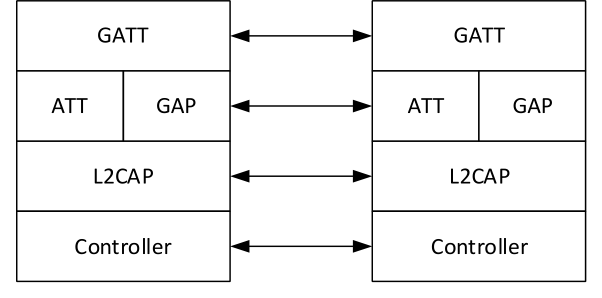

**Figure 3.1: Generic Attribute Profile test model**

In Figure 3.1, the implementation of GATT provided by the IUT may support only GATT features as required by the GATT profile without an implementation of a GATT-based profile or service. In any case, the IUT is expected to provide a way to exercise the GATT Profile functionality in this Test Suite.

### 3.2 Test Strategy

The test objectives are to verify the functionality of the Generic Attribute Profile within a Bluetooth Host and enable interoperability between Bluetooth Hosts on different devices. The testing approach covers mandatory and optional requirements in the specification and matches these to the support of the IUT as described in the ICS. Any defined test herein is applicable to the IUT if the ICS logical expression defined in the Test Case Mapping Table (TCMT) evaluates to true.
The test equipment provides an implementation of the Radio Controller and the parts of the Host needed to perform the test cases defined in this Test Suite. A Lower Tester acts as the IUT’s peer device and interacts with the IUT over-the-air interface. The configuration, including the IUT, needs to implement similar capabilities to communicate with the test equipment. For some test cases, it is necessary to stimulate the IUT from an Upper Tester. In practice, this could be implemented as a special test interface, a Man Machine Interface (MMI), or another interface supported by the IUT.
This Test Suite contains Valid Behavior (BV) tests complemented with Invalid Behavior (BI) tests where required. The test coverage mirrored in the Test Suite Structure is the result of a process that started with catalogued specification requirements that were logically grouped and assessed for testability enabling coverage in defined test purposes.
When the Generic Attribute Profile is supported over both BR/EDR and LE, the applicable test cases are executed once for each transport, unless the test case applies to only one of the two transports.
The Test Suite Structure is a tree:
1. Profile operations:
- Discover Characteristics
- Reading a Characteristic
- Notification of Characteristics
- Indicating a Characteristic, with Confirmation
2. Use of protocols:
- Attribute Protocol
3. Generic Profile Attributes:
- Characteristic Formats

#### 3.2.1 Server testing configuration

The following configuration is recommended for testing server IUT:

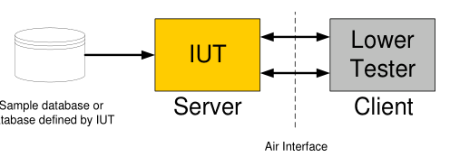

**Figure 3.2: Generic Attribute Profile Server test configuration**

The sample database of Generic Profile Attributes (services, characteristics, and descriptors) used by the IUT may be:
• Specified for use in testing [7].
• Specified by the IUT manufacturer in the IXIT [10].

#### 3.2.2 Client testing configuration

The following configuration is recommended for testing client IUT:
Upper Tester
Client
IUT Lower Tester
Controller +
Sample Database
Server
ATT/GATT
Air Interface

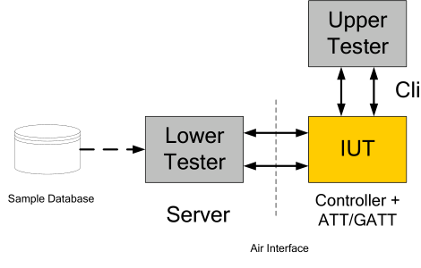

**Figure 3.3: Generic Attribute Profile Client test configuration**

The sample database of Generic Profile Attributes (services, characteristics and descriptors) used by the Lower Tester is specified in Section 3.3. In tests of Discovery (Section 4.5) four or more distinct Sample Databases are used, derived from the Library of valid GATT database elements for Compliance (-C) testing as defined in Section 3.3.
• A man-machine interface
• Provided by the IUT manufacturer e.g., a wired connection, an API, etc.

### 3.3 Test Library and Test Databases

Tests of GATT clients use four or more sample databases derived from a Library.

#### 3.3.1 Test Database Library

A Library of valid GATT database elements is assembled. These database elements include services, characteristics, and characteristic descriptors. This Library includes features required and optional in GATT servers:
1. At least 10 complex Services 2. Multiple included Services 3. Multiple included Characteristics 4. Complex Characteristics with multiple descriptors: name, properties, format, units 5. Variety of formats (Table 3-16/[1]) 6. Variety of properties (3.3.1.1/[1]) 7. Aggregate characteristics (3.3.3.6/[1])
This Library will be updated for two events:
1. Add services and characteristics included in Adopted GATT-based profiles. 2. Add services and characteristics included in Qualified GATT servers.

#### 3.3.2 Test Database Requirements

The following requirements apply to the set of databases used for testing:
1. One small test database whose services fit into a single minimum sized PDU, with only 16-bit UUIDs. 2. A set of three or more larger test databases, with 16-bit and 128-bit service UUIDs AND characteristic
UUIDs in pseudo-random order. In one, the 16-bit ones are early and 128-bit ones are late; in one, that is reversed. In the third, they are completely random. 3. At least one of those has a Primary Service at the MAX handle (0xFFFF). 4. At least one primary service without any include or characteristic declarations which is not located at
MAX handle (0xFFFF). 5. At least one of those has a Characteristic at the MAX handle (0xFFFF). 6. At least one of those has a Secondary Service. 7. Each has at least one each of 16-bit and 128-bit Primary Service UUID with multiple instances (the
IOP database does); in the latter case, there should be more than enough for the found UUID/handle pairs to exceed the minimum ATT_MTU and overflow into multiple PDU. 8. All have some services that are simple, and some that include other services. 9. Each has at least one instance where the handle of an included service is before the handle of the
including service. 10. At least one with one or more services that contain Included Services with both 16-bit and 128-bit
Service UUIDs. 11. Each has instances of simple characteristics (no descriptors) and complex characteristics (multiple
descriptors) 12. Each has instances of complex characteristics with 16-bit and 128-bit characteristic descriptor UUIDs,
and these can be in scrambled order.
which are larger (see item 2 above) contain at least one instantiation of each GATT-based Service supported. 14. For any instantiation of a GATT-based Service defined by the Bluetooth SIG in a large test database
(see item 2 above), the database contains at least two additional characteristics; the UUID for these characteristics is chosen randomly from 16-bit values not yet defined in Assigned Numbers:
a) An additional characteristic whose handle is between the defined mandatory characteristics and
any defined optional characteristics. b) An additional characteristic whose handle is after any defined optional characteristic.
15. For any instantiation of a GATT-based Service defined by the Bluetooth SIG in a large test database
(see item 2 above), the database contains at least two additional characteristic descriptors; the UUID for these characteristic descriptors is chosen randomly from 16-bit values not yet defined in Assigned Numbers:
a) An additional characteristic descriptor added to a defined mandatory characteristic. b) An additional characteristic descriptor added to an optional characteristic.

### 3.4 Test groups

The following test groups have been defined:
• Server Configuration
• Discover Services and Characteristics
• Read Characteristic Values and Characteristic Descriptors
• Write Characteristic Values and Characteristic Descriptors
• Notify or Indicate Characteristic Values
• Generic Attribute Profile Services
• GATT Timeouts
• Generic Profile Attributes

### 3.5 Attribute Protocol testing

The Generic Attribute Profile can be used to test the Attribute Protocol. ATT requires use of GATT over BR/EDR or LE transports. When testing ATT, GATT is required as part of the Upper Tester. After analysis it was demonstrated that all features listed in the Attribute Protocol ICS can be tested using Test Cases in this Test Suite. In consideration of this, each test case in this specification contains references to both ATT and GATT.

### 3.6 Enhanced Attribute Protocol testing

The Generic Attribute Profile can be used to test the Enhanced Attribute Protocol. EATT requires use of GATT over BR/EDR or LE transports. When testing EATT, GATT is required as part of the Upper Tester. After analysis, it was demonstrated that all features listed in the Attribute Protocol ICS can be tested using Test Cases in this Test Suite. In consideration of this, test cases pertaining to the Reading Multiple Variable Length Characteristics Values procedure in this specification contain references to both EATT and GATT.

## 4 Test cases (TC)

### 4.1 Introduction

#### 4.1.1 Test case identification conventions

Test cases are assigned unique identifiers per the conventions in [2]. The convention used here is: <spec abbreviation>/<IUT role>/<class>/<feat>/<func>/<subfunc>/<cap>/<xx>-<nn>-<y>.

|  | Identifier Abbreviation |  |  | Spec Identifier <spec abbreviation> |  |
| --- | --- | --- | --- | --- | --- |
| GATT |  |  | Generic Attribute Profile |  |  |
|  | Identifier Abbreviation |  |  | Role Identifier <IUT role> |  |
| CL |  |  | Client Role |  |  |
| SR |  |  | Server Role |  |  |
|  | Identifier Abbreviation |  |  | Class Identifier <class> |  |
| GAC |  |  | Generic Attribute Configuration |  |  |
| GAD |  |  | Generic Attribute Discovery |  |  |
| GAI |  |  | Generic Attribute Indication |  |  |
| GAN |  |  | Generic Attribute Notification |  |  |
| GAR |  |  | Generic Attribute Read |  |  |
| GAS |  |  | Generic Attribute Profile Services |  |  |
| GAT |  |  | GATT Transaction Timeouts |  |  |
| GAW |  |  | Generic Attribute Write |  |  |
| GPA |  |  | Generic Profile Attributes |  |  |
| GPM |  |  | Generic Attribute Multiple ATT Bearers |  |  |
| UNS |  |  | Unsupported Requests and Commands |  |  |

Table 4.1: GATT TC feature naming conventions

#### 4.1.2 Conformance

When conformance is claimed for a particular specification, all capabilities are to be supported in the specified manner. The mandated tests from this Test Suite depend on the capabilities to which conformance is claimed.
The Bluetooth Qualification Program may employ tests to verify implementation robustness. The level of implementation robustness that is verified varies from one specification to another and may be revised for cause based on interoperability issues found in the market.
Such tests may verify:
• That claimed capabilities may be used in any order and any number of repetitions not excluded by the specification
• That capabilities enabled by the implementations are sustained over durations expected by the use case
• That the implementation gracefully handles any quantity of data expected by the use case
• That in cases where more than one valid interpretation of the specification exists, the implementation complies with at least one interpretation and gracefully handles other interpretations
• That the implementation is immune to attempted security exploits
A single execution of each of the required tests is required to constitute a Pass verdict. However, it is noted that to provide a foundation for interoperability, it is necessary that a qualified implementation consistently and repeatedly pass any of the applicable tests.
In any case, where a member finds an issue with the test plan generated by the Bluetooth SIG qualification tool, with the test case as described in the Test Suite, or with the test system utilized, the member is required to notify the responsible party via an erratum request such that the issue may be addressed.

#### 4.1.3 Pass/Inconclusive/Fail verdict conventions

Each test case has an Expected Outcome section. The IUT is granted the Pass verdict when all the detailed pass criteria conditions within the Expected Outcome section are met.
Certain test cases also have an Inconclusive verdict defined. If the conditions for this verdict are met, then the test provides evidence that the IUT neither meets nor violates the test case; instead, it means that the test case was not applicable to the IUT, and therefore a Pass verdict is not required in order to achieve Qualification of the IUT. Implementers are encouraged to provide mechanisms to avoid the behavior leading to an Inconclusive condition during testing.
The convention in this Test Suite is that, unless there is a specific set of fail conditions outlined in the test case, the IUT fails the test case as soon as one of the pass criteria conditions cannot be met. If this occurs, then the outcome of the test is a Fail verdict.
For an Inconclusive verdict, all the pass criteria conditions apply up to the point in the test procedure where an Inconclusive verdict is identified. If one of the pass criteria in a step prior to the Inconclusive verdict cannot be met, then the outcome of the test is the Fail verdict and not the Inconclusive verdict.

### 4.2 Setup preambles

The procedures defined in this section are used to achieve specific conditions on the IUT and the test equipment within the tests defined in this document. The preambles here are commonly used to establish initial conditions.

#### 4.2.1 ATT and EATT Bearers

The ICS [3] specifies the supported transports and bearers.
• If BR/EDR is specified in the ICS [3], the setup procedure defined in 4.2.1.1 or 4.2.1.3 is executed.
• If LE is specified in the ICS [3], the setup procedure defined in 4.2.1.2 or 4.2.1.4 is executed.
• If both ATT and EATT are specified in the ICS [3], then the TSPX_bearer_for_bredr IXIT value specifies the bearer procedure to execute for BR/EDR and the TSPX_bearer_for_le IXIT value specifies the bearer procedure to execute for LE.
• TSPX_le_bearer_when_both_transport_supported.
• If BR/EDR and only EATT are supported, then the EATT setup procedure is executed.
• If only ATT is supported, then the ATT setup procedure is executed.
Preamble procedure:
1. Establish a BR/EDR transport connection between the IUT and the Lower Tester. 2. Establish an L2CAP channel (PSM 0x001F) between the IUT and the Lower Tester over that
BR/EDR transport.

##### 4.2.1.2 Setup ATT Bearer over LE

Preamble procedure:
1. Establish an LE transport connection between the IUT and the Lower Tester. 2. Establish an L2CAP channel 0x0004 between the IUT and the Lower Tester over that LE
transport.

##### 4.2.1.3 Setup EATT Bearer over BR/EDR

Preamble procedure:
1. Establish a BR/EDR transport connection between the IUT and the Lower Tester. 2. Establish several L2CAP channels (EATT PSM, as defined in Assigned Numbers) between the
IUT and the Lower Tester over that BR/EDR transport.

##### 4.2.1.4 Setup EATT Bearer over LE

Preamble procedure:
1. Establish an LE transport connection between the IUT and the Lower Tester. 2. Establish one or more L2CAP channels (EATT PSM, as defined in Assigned Numbers) between
the IUT and the Lower Tester over that LE transport.

#### 4.2.2 Characteristic Configuration

Tests for Characteristic Notification or Characteristic Indication may require characteristic configuration; see [1] Section 3.3.3.3. If required, the Lower Tester begins the test by configuring the server IUT to generate a Notification or an Indication of the selected Characteristic. If the server does not use the Client Characteristic Configuration descriptor then these preambles do not need to be executed.
All client test cases, which use a configuration as show in Figure 3.3, contain test procedure descriptions, Message Sequence Charts and expected results. These, in turn, use example message syntax between the Upper tester and the IUT. Those example messages are generic.

##### 4.2.2.1 Characteristic Configuration for Notification – IUT as Server

Preamble procedure:
The Lower Tester has the necessary security permissions from the IUT to write the Client Characteristic Configuration descriptor.
The Lower Tester sends an ATT_Write_Request to the IUT. The handle selects the Client Characteristic Configuration descriptor. The value is set to 0x0001, to enable Notification.

##### 4.2.2.2 Characteristic Configuration for Indication – IUT as Server

Preamble procedure:
The Lower Tester has the necessary security permissions from the IUT to write the Client Characteristic Configuration descriptor.
The Lower Tester sends an ATT_Write_Request to the IUT. The handle selects the Client Characteristic Configuration descriptor. The value is set to 0x0002, to enable Indication.
Preamble procedure:
The IUT has the necessary security permissions from the Lower Tester to write the Client Characteristic Configuration descriptor.
The Upper Tester orders the IUT to send an ATT_Write_Request to the Lower Tester. The handle selects the Client Characteristic Configuration descriptor. The value is set to 0x0001, to enable Notification.

##### 4.2.2.4 Characteristic Configuration for Indication – IUT as Client

Preamble procedure:
The IUT has the necessary security permissions from the Lower Tester to write the Client Characteristic Configuration descriptor.
The Upper Tester orders the IUT to send an ATT_Write_Request to the Lower Tester. The handle selects the Client Characteristic Configuration descriptor. The value is set to 0x0002, to enable Indication.

#### 4.2.3 Client Supported Features Configuration

Tests that rely on the usage of Enhanced ATT bearer must ensure that a server is aware that the client supports the Enhanced ATT bearer feature, for example because the device has checked the peer’s Client Supported Features characteristic or its SDP record.
Additionally, tests that rely on the transmission of the Multiple Variable Length Notifications must ensure that a server is aware that the client supports this PDU.
If required, the device that is the GATT Client begins the test by informing the GATT Server device of the features supported by the client.
All client test cases, which use a configuration as shown in Figure 3.3, contain test procedure descriptions, Message Sequence Charts, and expected results. These, in turn, use example message syntax between the Upper Tester and the IUT. Those example messages are generic.

##### 4.2.3.1 Characteristic Configuration for Enhanced ATT bearer – IUT as Server

Preamble procedure:
The Lower Tester has the necessary security permissions from the IUT to write the Client Supported Features characteristic.
The Lower Tester sends an ATT_Write_Request to the IUT. The handle selects the Client Supported Features characteristic handle. The value is set to 0x0002, to enable Enhanced ATT bearer.

##### 4.2.3.2 Characteristic Configuration for Enhanced ATT bearer – IUT as Client

Preamble procedure:
The IUT has the necessary security permissions from the Lower Tester to write the Client Supported Features characteristic.
The Upper Tester orders the IUT to send an ATT_Write_Request to the Lower Tester. The handle selects the Client Supported Features characteristic handle. The value is set to 0x0002, to enable Enhanced ATT bearer.
Preamble procedure:
The Lower Tester has the necessary security permissions from the IUT to write the Client Supported Features characteristic.
The Lower Tester sends an ATT_Write_Request to the IUT. The handle selects the Client Supported Features characteristic handle. The value is set to 0x0004, to enable Multiple Handle Value Notifications.

##### 4.2.3.4 Characteristic Configuration for Multiple Handle Value Notifications – IUT as Client

Preamble procedure:
The IUT has the necessary security permissions from the Lower Tester to write the Client Supported Features characteristic.
The Upper Tester orders the IUT to send an ATT_Write_Request to the Lower Tester. The handle selects the Client Supported Features characteristic handle. The value is set to 0x0004, to enable Multiple Handle Value Notifications.

#### 4.2.4 Encryption Key Size

Tests for insufficient encryption key size require an encrypted link with a key size less than the size required by an attribute. The encryption key size requirements of attributes are determined by the associated Profile.
Preamble procedure:
Establish an encrypted link over the LE transport between the IUT and the Lower Tester. For example, see test SM/CEN/EKS/BV-01-C or SM/PER/EKS/BV-02-C in [6] for LE transport, or LMP/ENC/BV-01-C or LMP/ENC/BV-05-C in [14] for BR/EDR transport. The key size is less than the size required by an attribute.

#### 4.2.5 Exchange MTU

The GATT Exchange MTU sub-procedure is not applicable over the BR/EDR transport or over the Enhanced ATT bearer on LE transport since the MTU size is negotiated using L2CAP channel configuration procedures for a BR/EDR physical link.
• Reference
[1] 4.3.1
• Preamble procedure:
ATT_MTU may be exchanged between IUT and the Lower Tester using the procedure described in the MSC below. The IUT may support either the GATT Client or GATT Server role as applicable to the test case. The IUT sets its RX MTU parameter to the value of TSPX_iut_max_rx_mtu in the IXIT [10]. This preamble can only be initiated once during a connection.
GATT Client GATT Server

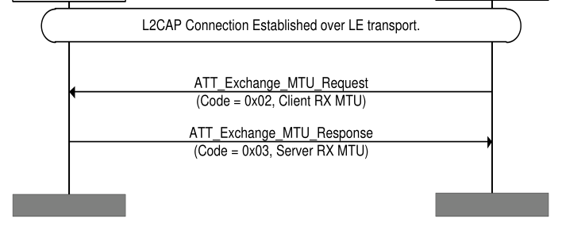

**Figure 4.1: Exchange MTU preamble MSC**

### 4.3 Common Packet Contents

#### 4.3.1 Fields and Bits Reserved for Future Use

Unless a specific test states otherwise, all fields within packets and all bits within fields that are described as reserved for future use are set to 0 in packets sent by the Upper and Lower Testers.

### 4.4 Server configuration

Verify Generic Attribute Profile Server Configuration.
GATT/CL/GAC/BV-01-C [Server Configuration - by Client]
• Test Purpose
Verify that a Generic Attribute Profile client can generate an Exchange MTU Request command to configure ATT_MTU over LE.
• Reference
[1] 4.3.1
[5] 3.4.2.1, 3.4.2.2
• Initial Condition
- A preamble procedure defined in Section 4.2.1.2 is used to set up the transport and L2CAP channel over LE.
- The IXIT [10] specifies the value of maximum size of the attribute protocol message that the IUT can receive.
- The Lower Tester contains a writeable long characteristic of maximum size (512).
• Test Procedure
1. The Lower Tester starts with the maximum value allowed (512). The sequence is: 2. Send a request from the Upper Tester to the IUT to initiate MTU exchange; this may be of the
form GATT_ExchangeMTURequest. 3. The Lower Tester waits for an ATT_Exchange_MTU_Request from IUT. 4. The Lower Tester sends an ATT_Exchange_MTU_Response to the IUT containing an ATT_MTU
parameter set as specified in [5].
generate a prepare write request to a specified handle in the Lower Tester, providing more data than ATT_MTU. 6. The Lower Tester waits for an ATT_Prepare_Write_Request, and checks its size.

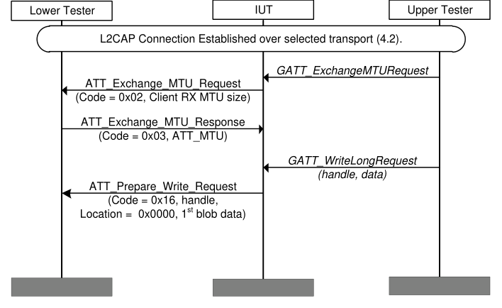

**Figure 4.2: GATT/CL/GAC/BV-01-C [Server Configuration - by Client] MSC**

• Expected Outcome
Pass verdict
The IUT sends an ATT_Exchange_MTU_Request command to the Lower Tester with the client RX MTU size set to the value indicated in the IXIT [10].
The IUT receives an ATT_Exchange_MTU_Response sent by the Lower Tester, and recovers the ATT_MTU value.
If the IUT supports the feature, the IUT sends an ATT_Prepare_Write_Request with ATT_MTU-5 of data.
GATT/SR/GAC/BV-01-C [Server Configuration - of Server]
• Test Purpose
Verify that a Generic Attribute Profile server can accept an Exchange MTU Request and respond with an Exchange MTU Response over LE.
• Reference
[1] 4.3.1
[5] 3.4.2.1, 3.4.2.2
• Initial Condition
- A preamble procedure defined in Section 4.2.1.2 is used to set up the transport and L2CAP channel over LE.
- The IXIT [10] specifies the value of maximum size of the attribute protocol message that the IUT can receive.
- The IXIT [10] indicates the handle, type and size of a readable long characteristic if supported by the IUT.
- The IUT has at least one characteristic value that is:
a) longer than its (MTU - 1) if MTU < 512
b) 512 if MTU >= 512
• Test Procedure
This Test Procedure is run:
- Once, where the Lower Tester starts with its ATT_MTU set to the minimum value (23), and
- Once, where, the Lower Tester starts with its ATT_MTU set to 512.
For each test, the sequence is:
Send ATT_Exchange_MTU_Request from the Lower Tester to the IUT to inform the server of the client’s maximum Rx MTU size (23 or 512).
The Lower Tester waits for an ATT_Exchange_MTU_Response containing the ATT_MTU parameter.
The Lower Tester sends an ATT_Read_Request to the IUT, to the handle specified in the IXIT [10].
The Lower Tester waits for an ATT_Read_Response from the IUT.

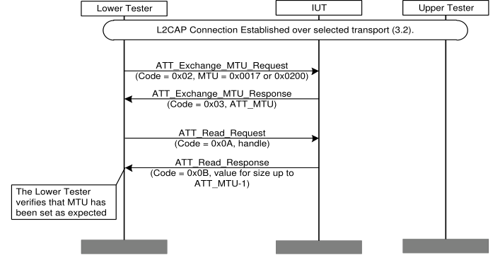

**Figure 4.3: GATT/SR/GAC/BV-01-C [Server Configuration - of Server] MSC**

• Expected Outcome
Pass verdict
For each iteration:
- Once the ATT_Exchange_MTU request and response messages have been exchanged, verify that the ATT_MTU has been set to the minimum of the Client Rx MTU and Server Rx MTU values.
- The IUT responds to the ATT_Read_Request with an ATT_Read_Response. The Lower Tester verifies that MTU was exchanged successfully.

#### 4.4.1 Server Configuration – of Server

• Test Purpose
Verify that using Exchange MTU request is rejected by the server when it is not supported over the established bearer.
• Reference
[12] 4.2
[13] 3.2.8, 3.4, 3.4.9
• Initial Condition
- If EATT is supported, the IUT sets the EATT Supported bit to 1 in the Server Supported Features characteristic.
- A preamble procedure defined in Section 4.2.1.1, Section 4.2.1.3, or Section 4.2.1.4 is used to set up the transport and L2CAP channel over the relevant bearer.
- If EATT is supported, a preamble procedure defined in Section 4.2.3.1 is used to inform the IUT that the Lower Tester supports the Enhanced ATT bearer feature.
• Test Case Configuration

|  | Test Case |  |  | Transport |  |  | Bearer |  |
| --- | --- | --- | --- | --- | --- | --- | --- | --- |
| GATT/SR/GAC/BI-01-C |  |  | LE |  |  | EATT |  |  |
| GATT/SR/GAC/BI-02-C |  |  | BR/EDR |  |  | ATT |  |  |
| GATT/SR/GAC/BI-03-C |  |  | BR/EDR |  |  | EATT |  |  |

Table 4.2: Server Configuration – of Server test cases
• Test Procedure

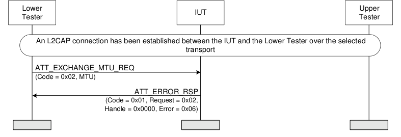

**Figure 4.4: Server Configuration – of Server MSC**

1. The Lower Tester sends an ATT_EXCHANGE_MTU_REQ (Code = 0x02) to the IUT to inform the
server of the client’s maximum Rx MTU size (any valid value). 2. The IUT rejects the request and sends an ATT_ERROR_RSP (Code = 0x01) to the Lower Tester,
with Error Code = 0x06 (Request Not Supported).
• Expected Outcome
Pass verdict
The IUT responds with an ATT_ERROR_RSP PDU, with the Request Opcode In Error field set to the opcode sent by the Lower Tester, the Attribute Handle In Error field set to 0x0000, and the Error Code field set to 0x06 (Request Not Supported).

### 4.5 Discovery

Verify Generic Attribute Profile Discovery of Services and Service Characteristics.
GATT/CL/GAD/BV-01-C [Discover All Primary Services - by Client]
• Test Purpose
Verify that a Generic Attribute Profile client discovers Primary Services in a GATT server.
• Reference
[1] 4.4.1
[5] 3.4.1.1, 3.4.4.9, 3.4.4.10
• Initial Condition
- A preamble procedure defined in Section 4.2.1 is used to set up the transport and L2CAP channel.
- A preamble procedure defined in Section 4.2.5 may have been used to exchange ATT MTU between the IUT and the Lower Tester.
• Test Procedure
The Upper Tester sends a request to the IUT to initiate Primary Service Discovery; this may be of the form GATT_DiscAllServices(starting handle, ending handle). The starting handle is 0x0001 and the ending handle is 0xFFFF.
This Test Procedure is run at least four times, using distinct Sample Databases derived from the Library defined in Section 3.3.

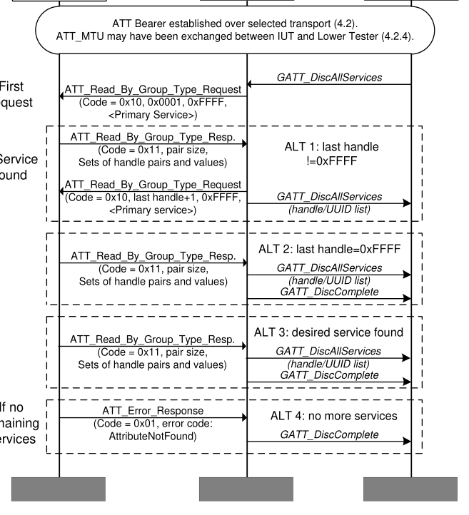

**Figure 4.5: GATT/CL/GAD/BV-01-C [Discover All Primary Services - by Client] MSC**

• Expected Outcome
Pass verdict
The IUT sends ATT_Read_By_Group_Type_Requests to the Lower Tester and discovers services in the Lower Tester. The first command has starting handle = 0x0001, ending handle = 0xFFFF, and UUID = <primary service>. For any subsequent ATT_Read_By_Group_Type_Requests, the starting handle is set to one greater than the last End Group Handle in the ATT_Read_By_Type_Response.
The IUT sends ATT_Read_By_Group_Type_Requests to the Lower Tester until a response with End Group Handle = 0xFFFF is received, a desired service is found, or an ATT_Error_Response is received.
At the end of the test, the IUT indicates a completion message, e.g., GATT_DiscComplete. Prior to that completion message, the IUT reports all Primary Service data: handle pairs and values (see [5] Table 3.25).
• Notes
Prior to each test performance, the IUT should clear the client’s attribute cache. This may be automated by the test equipment and user interaction may not be required.
• Test Purpose
Verify that a Generic Attribute Profile server can support a search for all Primary Services it contains.
• Reference
[1] 4.4.1
[5] 3.4.1.1, 3.4.4.9, 3.4.4.10
• Initial Condition
- A preamble procedure defined in Section 4.2.1 is used to set up the transport and L2CAP channel.
- The Upper Tester has access to the IUT server database structure, either from IXIT [10] or from use of a predefined database [7].
- A preamble procedure defined in Section 4.2.5 may have been used to exchange ATT MTU between the IUT and the Lower Tester.
• Test Procedure
Send an initial ATT_Read_By_Group_Type_Request (starting handle=0x0001, Ending handle=0xFFFF, UUID = «Primary Service») from the Lower Tester to the IUT.
If the IUT returns an ATT_Read_By_Group_Type_Response, continue the test by sending another ATT_Read_By_Group_Type_Request (next starting handle, Ending handle=0xFFFF, UUID = «Primary Service») from the Lower Tester to the IUT.
Repeat sending ATT_Read_By_Group_Type_Requests until the IUT returns an ATT_Error_Response indicating AttributeNotFound, or the IUT returns an ATT_Read_By_Group_Type_Response containing handle 0xFFFF.

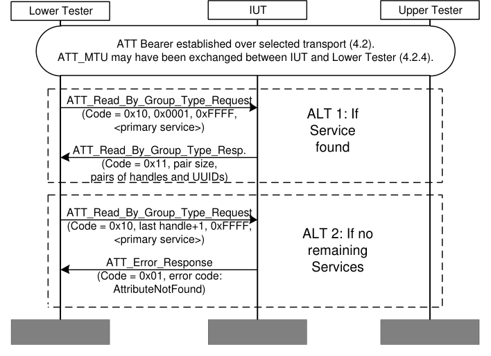

**Figure 4.6: GATT/SR/GAD/BV-01-C [Discover All Primary Services - from Server] MSC**

• Expected Outcome
Pass verdict
For each ATT_Read_By_Group_Type_Request, the IUT sends a correctly formatted ATT_Read_By_Group_Type_Response to the Lower Tester or an ATT_Error_Response if there is no handle/UUID pair matching the request.
The IUT reports all service UUIDs known to be contained in its database (via IXIT [10]).
The IUT sends all ATT_Read_by_Group_Type_Responses to the Lower Tester within the applicable timeout (3.3.3/ATT [5]).
GATT/CL/GAD/BV-02-C [Discover Primary Service by Service UUID – by Client]
• Test Purpose
Verify that a Generic Attribute Profile client can discover Primary Services selected by service UUID, using 16-bit and 128-bit UUIDs.
• Reference
[1] 4.4.2
[5] 3.4.3.3, 3.4.3.4
• Initial Condition
- A preamble procedure defined in Section 4.2.1 is used to set up the transport and L2CAP channel.
- A preamble procedure defined in Section 4.2.5 may have been used to exchange ATT MTU between the IUT and the Lower Tester.
• Test Procedure
The IUT sends ATT_Find_By_Type_Value_Requests (starting handle, ending handle, attribute type, attribute value) to the Lower Tester, with attribute type = «Primary Service», attribute value = UUID of the Service to search for; the handle values will range from 0x0001 to 0xFFFF. At the end of the test, the IUT will indicate a completion message, e.g., GATT_Command_Complete.
This Test Procedure is run four or eight times:
- With a 16-bit UUID, and with a 128-bit UUID if supported by the IUT.
- Using at least four distinct Sample Databases derived from the Library defined in Section 3.3.

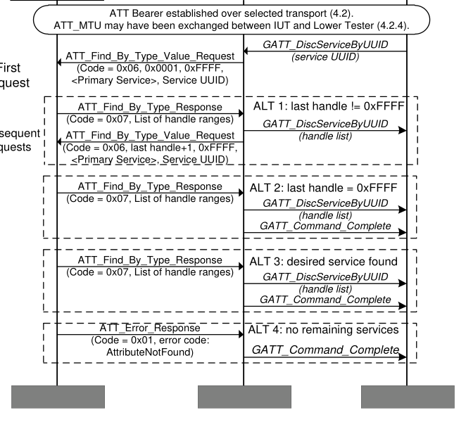

**Figure 4.7: GATT/CL/GAD/BV-02-C [Discover Primary Service by Service UUID – by Client] MSC**

• Expected Outcome
Pass verdict
The IUT sends ATT_Find_By_Type_Value_Requests to the Lower Tester and discovers Services in the Lower Tester. The first command has starting handle = 0x0001, ending handle = 0xFFFF, attribute type = <primary service> and attribute value = UUID of the service to search for. For any subsequent ATT_Find_By_Type_Value_Requests, the starting handle is set to one greater than the last End Group Handle in the ATT_Find_By_Type_Value_Response.
The IUT sends ATT_Find_By_Type_Value_Requests to the Lower Tester until a response with End Group Handle = 0xFFFF is received, a desired service is found, or an ATT_Error_Response is received.
• Notes

| Prior to each test performance, the IUT should clear the client’s attribute cache. This may be |  |
| --- | --- |
| automated by the test equipment and user interaction may not be required. |  |

• Test Purpose
Verify that a Generic Attribute Profile server can support discovery of all particular Primary Services selected by service UUID, using 16-bit UUIDs, and using 128-bit UUIDs where supported.
• Reference
[1] 4.4.2
[5] 3.4.3.3, 3.4.3.4
• Initial Condition
- A preamble procedure defined in Section 4.2.1 is used to set up the transport and L2CAP channel.
- The Upper Tester has access to the IUT server database structure, either from IXIT [10] or from use of a predefined database [7].
- A preamble procedure defined in Section 4.2.5 may have been used to exchange ATT MTU between the IUT and the Lower Tester.
• Test Procedure
The Lower Tester sends an ATT_Find_By_Type_Value_Requests (starting handle, ending handle) to the IUT, with type set to «Primary Service» and Value set to a particular UUID, until all Primary Services with a matching service UUID are found, and the IUT returns an ATT_Error_Response with the error code AttributeNotFound or an ATT_Find_By_Type_Value_Response containing an End Group Handle – 0xFFFF.
This Test Procedure is run:
a) once with a 16-bit UUID, and
b) once with a 128-bit UUID where supported by the IUT.

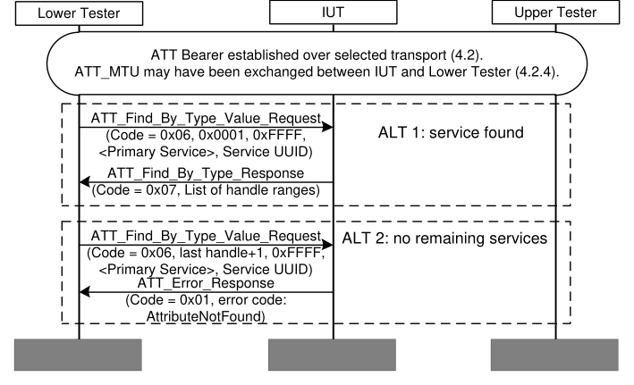

**Figure 4.8: GATT/SR/GAD/BV-02-C [Discover Primary Service by Service UUID - from server] MSC**

• Expected Outcome
Pass verdict
The IUT sends one ATT_Find_By_Type_Value_Response to the Lower Tester for each received ATT_Find_By_Type_Value_Request if the IUT has any remaining services to Discover.
The ATT_Find_By_Type_Responses have complete lists of handles for Services with a matching UUID; the IUT reports all Primary Services with a matching service UUID known to be contained in its database.
The response size does not exceed any negotiated ATT_MTU.
The IUT sends all ATT_Find_By_Type_Value_Responses to the Lower Tester within the applicable timeout (3.3.3/ATT [5]).
The IUT sends an ATT_Error_Response when there are no more services matching the request.
• Notes

| Prior to each test performance, the IUT should clear the client’s attribute cache. This may be |  |
| --- | --- |
| automated by the test system and user interaction may not be required. |  |

GATT/CL/GAD/BV-03-C [Find Included Services – by Client]
• Test Purpose
Verify that a Generic Attribute Profile client can find include service declarations within a specified service definition on a server.
• Reference
[1] 4.5.1
[5] 3.4.1.1, 3.4.4.1, 3.4.4.2
• Initial Condition
- A preamble procedure defined in Section 4.2.1 is used to set up the transport and L2CAP channel.
- The Upper Tester has access to the test database contained in the Lower Tester, so that the Upper Tester can specify the service handle range.
- A preamble procedure defined in Section 4.2.5 may have been used to exchange ATT MTU between the IUT and the Lower Tester.
- The IUT may have performed the procedure in GATT/CL/GAD/BV-01-C [Discover All Primary Services - by Client] or GATT/CL/GAD/BV-02-C [Discover Primary Service by Service UUID – by Client] and cached the attribute handles and Service UUID’s of all Primary Services in the Lower Tester database.
• Test Procedure
The Upper Tester issues a command to find included services, specifying the starting and ending handles of the service definition (e.g., GATT_DiscIncludedServices(service handle range).
The IUT sends ATT_Read_By_Type_Requests (starting handle, ending handle, attribute type) commands to the Lower Tester, with attribute type = <<Include>>. The first request will contain the starting and ending handles of the specified service. For subsequent requests the starting handle is set to one greater than the last attribute handle in the ATT_Read_By_Type_Response.
When an include declaration returned in the ATT_Read_By_Type_Response does not contain the service UUID (ALT 2 in the message sequence chart), indicating the service UUID is a 128-bit UUID, the IUT gets the service UUID by sending an ATT_Read_Request with the handle set to the attribute handle of the included service, if the IUT supports 128-bit UUIDs, and the IUT has not previously obtained the service UUID via Primary Service Discovery.
The test will continue until all Included Services for the specified service are found, and either a) the Lower Tester returns an ATT_Error_Response with the error code AttributeNotFound or b) the Lower Tester returns a handle equal to the ending handle for the service. At the end of the test, the IUT will indicate a completion message, e.g., GATT_Command_Complete.
This Test Procedure is run at least four times using four or more distinct Sample Databases derived from the Library defined Section 3.3, where at least one of the inquired service handle ranges contains a mix of Included Services with 16-bit and 128-bit service UUIDs.

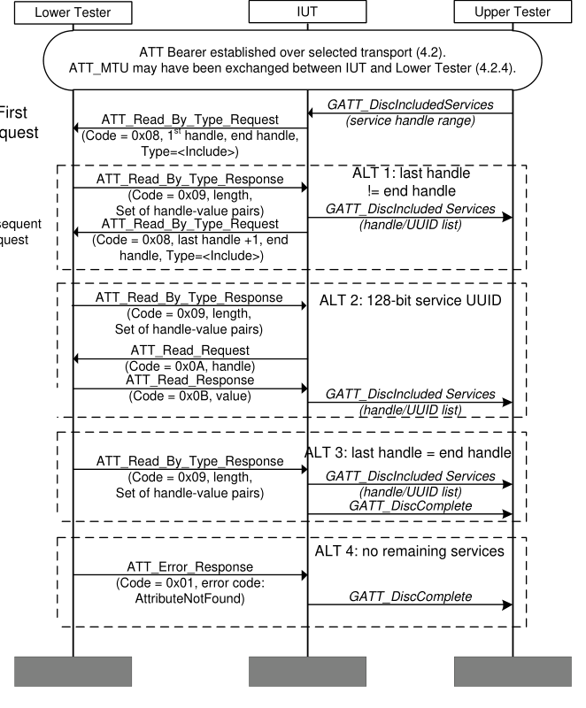

**Figure 4.9: GATT/CL/GAD/BV-03-C [Find Included Services – by client] MSC**

• Expected Outcome
Pass verdict
The IUT sends ATT_Read_By_Type_Requests to the Lower Tester until all include service declarations in the specified handle range are returned.
If the IUT supports 128-bit service UUIDs, when an include declaration returned in the ATT_Read_By_Type_Response does not contain the service UUID, and the IUT has not previously discovered the service UUID via Primary Service Discovery, the IUT gets the service UUID by sending an ATT_Read_Request with the handle set to the attribute handle of the included service. If the IUT has previously discovered the service UUID via Primary Service Discovery and/or Relationship Discovery, the IUT may optionally send ATT_Read_Requests to get all included service UUIDs.
The IUT does not report any included services that should not be part of the primary service.
GATT/SR/GAD/BV-03-C [Find Included Services – from Server]
• Test Purpose
Verify that a Generic Attribute Profile server can support a search for all Included Services in a specified handle range.
• Reference
[1] 4.5.1
[5] 3.4.1.1, 3.4.4.1, 3.4.4.2
• Initial Condition
- A preamble procedure defined in Section 4.2.1 is used to set up the transport and L2CAP channel.
- The Upper Tester has access to the IUT server database structure, either from IXIT [10] or from use of a predefined database [7].
- A preamble procedure defined in Section 4.2.5 may have been used to exchange ATT MTU between the IUT and the Lower Tester.
• Test Procedure
The Lower Tester sends ATT_Read_By_Type_Requests (starting handle, ending handle, attribute type) to the IUT, with attribute type set to <<Include>>, until all include declarations are found, and either a) the IUT returns an ATT_Error_Response with the error code AttributeNotFound or b) the IUT returns an attribute handle equal to the ending handle.
The Lower Tester checks if any of the returned include declarations refer to the service being searched (i.e., a circular Reference).

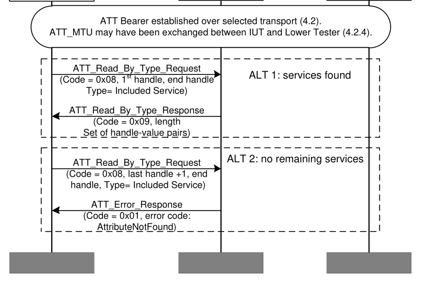

**Figure 4.10: GATT/SR/GAD/BV-03-C [Find Included Services – from Server] MSC**

• Expected Outcome
Pass verdict
The IUT replies with an ATT_Read_By_Type_Response to the Lower Tester for each received ATT_Read_By_Type_Request, if the IUT has include service declarations within the handle range of the request.
The ATT_Read_By_Type_Responses have complete handle-value pairs and the handle-value pairs are returned sequentially based on the attribute handle.
The IUT reports all include service declarations known to be contained in its database within the specified handle range.
The response size does not exceed any negotiated ATT_MTU.
The IUT sends all ATT_Read_By_Type_Responses to the Lower Tester within the applicable timeout (3.3.3/ATT [5]).
The IUT sends an ATT_Error_Response with error code AttributeNotFound if there are no include service declarations within the handle range of the request.
The IUT does not report any included services that should not be part of the primary service.
GATT/CL/GAD/BV-04-C [Discover All Characteristics of a Service – by Client]
• Test Purpose
Verify that a Generic Attribute Profile client can discover characteristic declarations within a specified service definition.
• Reference
[1] 4.6.1
[5] 3.4.1.1, 3.4.4.1, 3.4.4.2
• Initial Condition
- A preamble procedure defined in Section 4.2.1 is used to set up the transport and L2CAP channel.
- A preamble procedure defined in Section 4.2.5 may have been used to exchange ATT MTU between the IUT and the Lower Tester.
- The Upper Tester has access to the test database contained in the Lower Tester, so that the Upper Tester can specify the service handle range.
- The desired characteristic declaration, if used by the IUT, is in the IXIT [10].
• Test Procedure
The Upper Tester issues a command to discover service characteristics, specifying the starting and ending handles of the service definition (e.g., GATT_DiscServiceChar (service handle range).
The IUT sends ATT_Read_By_Type_Requests (starting handle, ending handle, attribute type) to the Lower Tester, with attribute type = <Characteristic>. The first request will contain the starting and ending handles of the specified service. For subsequent requests, the starting handle is set to one greater than the last attribute handle in the ATT_Read_By_Type_Response. At the end of the test, the IUT will indicate a completion message, e.g., GATT_Command_Complete.
This Test Procedure is run four times using distinct Sample Databases derived from the Library defined in Section 3.3.

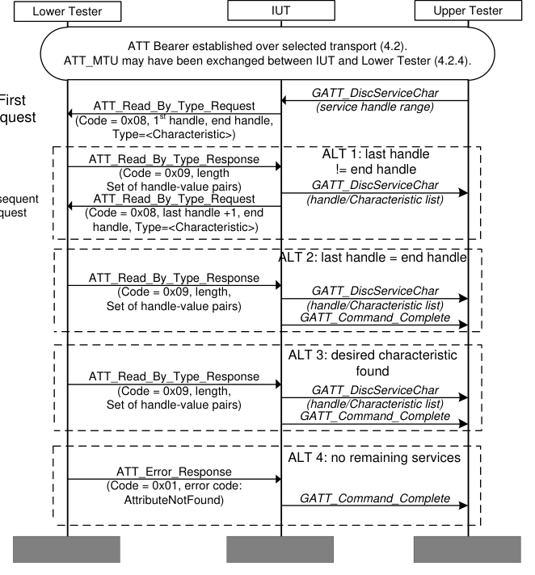

**Figure 4.11: GATT/CL/GAD/BV-04-C [Discover All Characteristics of a Service – by Client] MSC**

• Expected Outcome
Pass verdict
The IUT sends ATT_Read_By_Type_Requests to the Lower Tester and discovers Characteristics in the Lower Tester. The first command has starting handle set to the starting handle of the specified service, ending handle ending handle set to the ending handle of the specified service, and attribute type = <Characteristic>. For any subsequent ATT_Read_By_Type_Requests, the starting handle is set to one greater than the last attribute handle in the ATT_Read_By_Type_Response.
The IUT sends ATT_Read_By_Type_Requests to the Lower Tester until a response with attribute handle = the ending handle is received, a desired characteristic declaration is found, or an ATT_Error_Response is received.
GATT/SR/GAD/BV-04-C [Discover All Characteristics of a Service – from Server]
• Test Purpose
Verify that a Generic Attribute Profile server can support a search for all characteristics of a specified Service, and report all of those characteristics.
• Reference
[1] 4.6.1
[5] 3.4.1.1, 3.4.4.1, 3.4.4.2
• Initial Condition
- A preamble procedure defined in Section 4.2.1 is used to set up the transport and L2CAP channel.
- The Upper Tester has access to the IUT server database structure, either from IXIT [10] or from use of a predefined database [7].
- A preamble procedure defined in Section 4.2.5 may have been used to exchange ATT MTU between the IUT and the Lower Tester.
• Test Procedure
The Lower Tester sends ATT_Read_By_Type_Requests (starting handle, ending handle, attribute type) to the IUT, with attribute type set to <Characteristic> and the initial handle range set to that for the specified service definition, until all characteristics in that handle range are found, and either a) the IUT returns an ATT_Error_Response with the error code AttributeNotFound or b) the IUT returns an attribute handle equal to the ending handle.

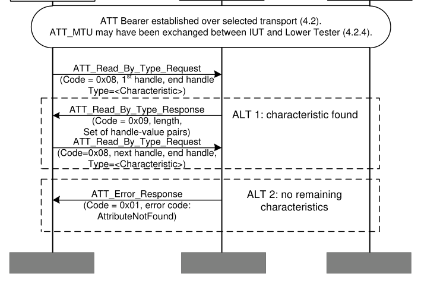

**Figure 4.12: GATT/SR/GAD/BV-04-C [Discover All Characteristics of a Service – from Server] MSC**

• Expected Outcome
Pass verdict
The IUT sends one ATT_Read_By_Type_Response to the Lower Tester for each received ATT_Read_By_Type_Request, if it has characteristic declarations within the handle range.
The IUT reports all characteristics of the specified service.
The ATT_Read_By_Type_Responses have complete handle-value pairs and the handle-value pairs are returned sequentially based on the attribute handle.
The response size does not exceed any negotiated ATT_MTU.
The IUT sends all ATT_Read_By_Type_Responses to the Lower Tester within the applicable timeout (3.3.3/ATT [5]).
The IUT sends an ATT_Error_Response if there are no further characteristic declarations within the handle range of the request.
GATT/CL/GAD/BV-05-C [Discover Characteristics by UUID – by Client]
• Test Purpose
Verify that a Generic Attribute Profile client can discover characteristics of a specified service, using 16-bit and 128-bit characteristic UUIDs.
• Reference
[1] 4.6.2
[5] 3.4.1.1, 3.4.4.1, 3.4.4.2
• Initial Condition
- A preamble procedure defined in Section 4.2.1 is used to set up the transport and L2CAP channel.
- The Upper Tester has access to the test database contained in the Lower Tester, so that the Upper Tester can specify the service handle range and characteristic UUID.
- A preamble procedure defined in Section 4.2.5 may have been used to exchange ATT MTU between the IUT and the Lower Tester.
• Test Procedure
The Upper Tester issues a command to discover service characteristics, specifying the starting and ending handles of the service definition and the characteristic UUID (e.g., GATT_DiscServiceCharUUID (service handle range, UUID).
The IUT sends ATT_Read_By_Type_Requests (starting handle, ending handle, attribute type) commands to the Lower Tester, with attribute type = <Characteristic>. The first request will contain the starting and ending handles of the specified service. For subsequent requests, the starting handle is set to one greater than the last attribute handle in the ATT_Read_By_Type_Response. The test will continue until all characteristic declarations for that Service are found, and either a) the IUT returns an ATT_Error_Response with the error code AttributeNotFound or b) the IUT returns a handle value equal to the last specified handle. At the end of the test, the IUT will indicate a completion message, e.g., GATT_Command_Complete.
Each ATT_Read_By_Type_Response returns a list of attribute handle and attribute value pairs. Each attribute value is a characteristic declaration containing the characteristic UUID. The IUT checks the UUID in each attribute value for a match to the characteristic UUID being discovered.
This Test Procedure is run eight times:
- With a 16-bit UUID and with a 128-bit UUID
- Using at least four distinct Sample Databases derived from the Library defined Section 3.3.
Upper Tester IUT Lower Tester

|  | ATT Bearer established over TT MTU may have been exchanged be _ | selected transport (4.2). tween IUT and Lower Tester (4.2.4) |  |
| --- | --- | --- | --- |
|  | ATT Read By Type Request _ _ _ _ | GATT DiscServiceCharUUID _ (service handle range, UUID) |  |
|  | (Code = 0x08, 1st handle, end handle Type = <Characteristic>) |  |  |
|  | ATT Read By Type Response _ _ _ _ | ALT 1: last handle != end handle GATT DiscCharacteristics _ (handle/UUID list) |  |
|  | (Code = 0x09, length, Set of handle-value pairs) ATT Read By Type Request |  |  |
|  | _ _ _ _ (Code=0x08, next handle, end handle, Type = <Characteristic>) |  |  |
|  |  |  |  |
|  | ATT Read By Type Response _ _ _ _ | ALT 2: last handle = end handle GATT DiscCharacteristics _ (handle/UUID list) GATT Command Complete _ _ |  |
|  | (Code = 0x09, length, Set of handle-value pairs) |  |  |
|  |  |  |  |
|  | ATT Error Response _ _ | ALT 3: No remaining characteristic GATT Command Complete _ _ | s |
|  | (Code = 0x01, error code: AttributeNotFound) |  |  |

First request
Subsequent
requests
• Expected Outcome
Pass verdict
The IUT sends ATT_Read_By_Type_Requests to the Lower Tester until all characteristic declarations in the specified handle range are returned.
The IUT checks each returned attribute value for a matching characteristic UUID and reports matching characteristic handle/UUID pairs to the Upper Tester.
GATT/SR/GAD/BV-05-C [Discover Characteristics by UUID – from Server]
• Test Purpose
Verify that a Generic Attribute Profile server can discover service Characteristics of a specified UUID, using 16-bit UUIDs, and using 128-bit UUIDs.
• Reference
[1] 4.6.2
[5] 3.4.1.1, 3.4.4.1, 3.4.4.2
• Initial Condition
- A preamble procedure defined in Section 4.2.1 is used to set up the transport and L2CAP channel.
- The Upper Tester has access to the IUT server database structure, either from IXIT [10] or from use of a predefined database [7].
- A preamble procedure defined in Section 4.2.5 may have been used to exchange ATT MTU between the IUT and the Lower Tester.
• Test Procedure
The Lower Tester sends ATT_Read_By_Type_Requests (starting handle, ending handle, attribute type) to the IUT, with attribute type set to <Characteristic> and the initial handle range set to that for the specified Service definition, until all Characteristics with matching UUID in that handle range are found, and either a) the IUT returns an ATT_Error_Response with the error code AttributeNotFound or b) the IUT returns an attribute handle equal to the ending handle.
This Test Procedure is run:
a) Once with a 16-bit UUID, and
b) Once with a 128-bit UUID where supported.

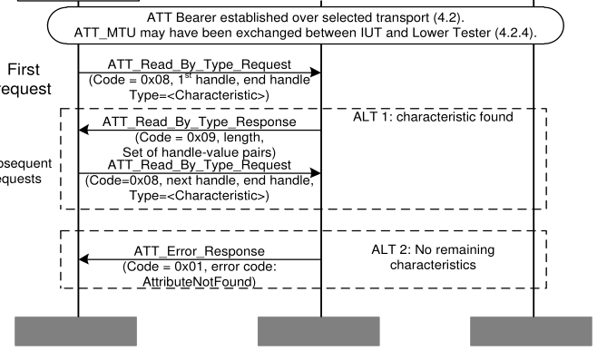

**Figure 4.14: GATT/SR/GAD/BV-05-C [Discover Characteristics by UUID – from server] MSC**

• Expected Outcome
Pass verdict
The IUT sends one ATT_Read_By_Type_Response to the Lower Tester for each received ATT_Read_By_Type_Request, if it has characteristic declarations within the handle range.
The IUT reports all Characteristics of the specified Service.
The ATT_Read_By_Type_Responses have complete handle-value pairs and the handle-value pairs are returned sequentially based on the attribute handle.
The response size does not exceed any negotiated ATT_MTU.
The IUT sends all ATT_Read_By_Type_Responses to the Lower Tester within the applicable timeout (3.3.3/ATT [5]).
The IUT sends an ATT_Error_Response if there are no characteristic declarations within the handle range of the request.
GATT/CL/GAD/BV-06-C [Discover All Characteristic Descriptors – by Client]
• Test Purpose
Verify that a Generic Attribute Profile client can find all Descriptors of a specified Characteristic.
• Reference
[1] 4.7.1
[5] 3.4.1.1, 3.4.3.1, 3.4.3.2
• Initial Condition
- A preamble procedure defined in Section 4.2.1 is used to set up the transport and L2CAP channel.
- A preamble procedure defined in Section 4.2.5 may have been used to exchange ATT MTU between the IUT and the Lower Tester.
- The desired characteristic descriptor, if used by the IUT, is in the IXIT [10].
• Test Procedure
The Upper Tester sends a command to the IUT to initiate the test, e.g., GATT_DiscDescriptors.
The IUT in turn sends ATT_Find Information_Requests (starting handle, ending handle) to the Lower Tester. The first request will set the starting handle to the handle of the specified Characteristic Value + 1 and the ending handle to the ending handle of the specified characteristic. For subsequent requests, the starting handle is set to one greater than the last attribute handle in the ATT_Find Information_Response. The test will continue until all Characteristic Descriptors for that Characteristic are found, and either a) the IUT returns an ATT_Error_Response with the error code AttributeNotFound or the IUT returns a handle equal to the ending handle. At the end of the test, the IUT will indicate a completion message, e.g., GATT_Command_Complete.
This Test Procedure is run four times using all of the distinct Sample Databases derived from the Library defined in [7] and in Section 3.3.

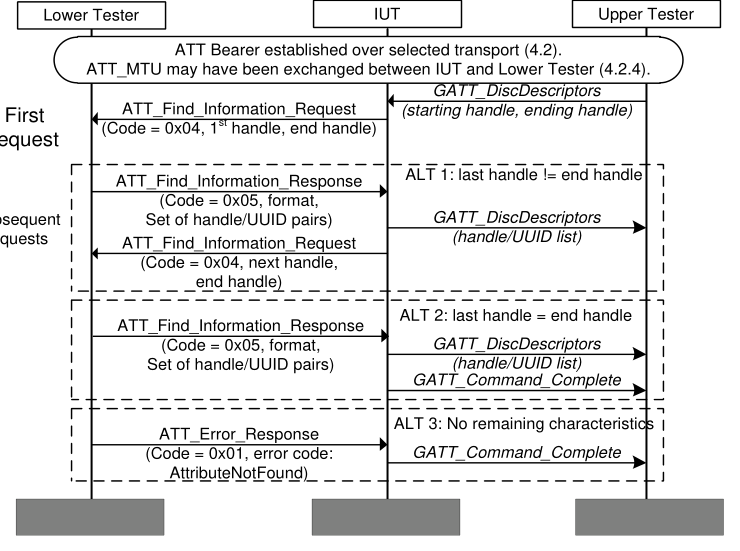

**Figure 4.15: GATT/CL/GAD/BV-06-C [Discover All Characteristic Descriptors – by client] MSC**

• Expected Outcome
Pass verdict
The IUT sends ATT_Find_Information_Requests to the Lower Tester until all a desired characteristic descriptor is found, or all descriptors in the specified handle range are found.
• Notes

| Prior to each test performance, the IUT should clear the client’s attribute cache. This may be |  |
| --- | --- |
| automated by the test equipment and user interaction may not be required. |  |

• Test Purpose
Verify that a Service Discovery Protocol client IUT discovers Primary GATT services in a GATT server using SDP over BR/EDR.
• Reference
[1] 4.4.1, 9
[8] 2.6, 4.5
• Initial Condition
- The link and L2CAP channel connection with the Lower Tester is set up over the BR/EDR transport. A CID has been established.
- The Lower Tester instantiates a Service Database including GATT services. The Upper Tester knows the handles and UUIDs of those GATT services.
• Test Procedure
The Upper Tester sends a request to the IUT to initiate Primary GATT Service Discovery over SDP, e.g., ‘SDP_DiscoverGATTServices’.
This Test Procedure is run four times, using distinct Sample Databases derived from the Library defined in Section 3.3.
Both MSCs below are example procedures and may be used as references:

**Figure 4.16: GATT/CL/GAD/BV-07-C [Discover Primary Services using SDP - by client] – MSC Page 1 of 2**

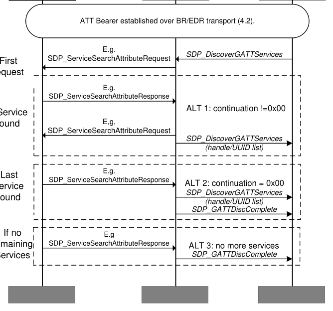

**Figure 4.17: GATT/CL/GAD/BV-07-C [Discover Primary Services using SDP - by client] – MSC Page 2 of 2**

• Expected Outcome
Pass verdict
The IUT executes an SDP search for Primary GATT based services, which use the ATT protocol. The SDP commands sent by the IUT are correctly formatted. The IUT receives the response from the Lower Tester, and responds to the Upper Tester with the list of GATT services. The Upper Tester verifies that the list is as expected.
The IUT should continue the search until the Lower Tester indicates that the search is complete, and then it reports that the search is complete to the Upper Tester, e.g., SDP_GATTDiscComplete.
GATT/CL/GAD/BV-08-C [Discover Services by UUID using SDP - by Client]
• Test Purpose
Verify that a Service Discovery Protocol client IUT discovers GATT services contained in a GATT server IUT selected by Service UUID.
• Reference
[1] 4.4.1, 9
[9] 2.6, 4.5
• Initial Condition
- The link and L2CAP channel connection with the Lower Tester is set up over the BR/EDR transport. A CID has been established.
- The Lower Tester instantiates a Service Database, including GATT services. The Upper Tester knows the handles and UUIDs of those GATT services.
• Test Procedure
The Upper Tester sends a request to the IUT to initiate Primary GATT Service Discovery by UUID over SDP, e.g., ‘SDP_DiscoverGATTServicesByUUID’; that request will specify the Service UUID of one of the GATT services contained in the Lower Tester’s database.
This Test Procedure is run at least four times, using distinct Sample Databases derived from the Library defined in Section 3.3.
Both MSCs below are example procedures and may be used as references:

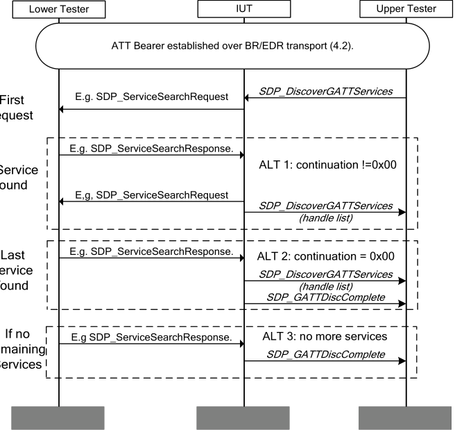

**Figure 4.18: GATT/CL/GAD/BV-08-C [Discover Services by UUID using SDP - by Client] MSC – Page 1 of 2**

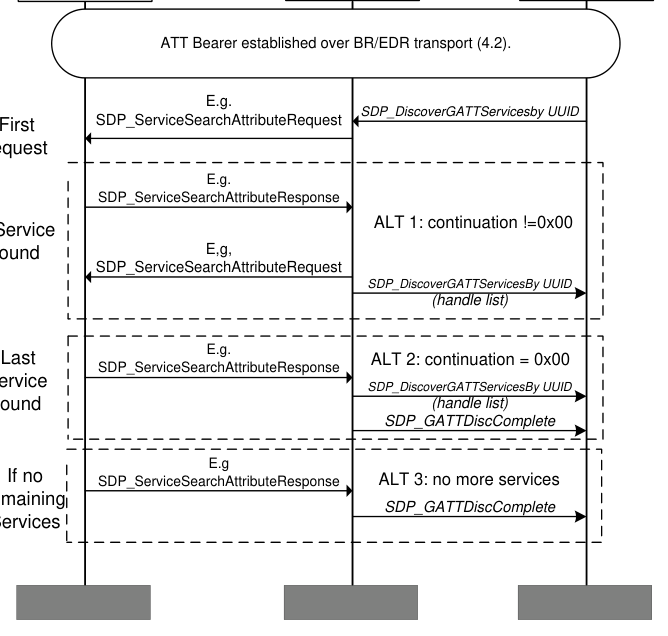

**Figure 4.19: GATT/CL/GAD/BV-08-C [Discover Services by UUID using SDP - by Client] MSC – Page 2 of 2**

• Expected Outcome
Pass verdict
The IUT executes an SDP search for Primary GATT services specified by the Service UUID, which use the ATT Protocol. The SDP commands sent by the IUT are correctly formatted.
The IUT receives the response from the Lower Tester, and responds to the Upper Tester with the list of GATT services. The Upper Tester verifies that the list contains only the GATT services with the requested service UUID.
The IUT should continue the search until the Lower Tester indicates that the search is complete, then, it reports that the search is complete to the Upper Tester, e.g., SDP_GATTDiscComplete.
GATT/SR/GAD/BV-06-C [Discover All Characteristic Descriptors – from Server]
• Test Purpose
Verify that a Generic Attribute Profile server can support a search for all descriptors of a specified characteristic.
• Reference
[1] 4.7.1
[5] 3.4.1.1, 3.4.3.1, 3.4.3.2
• Initial Condition
- A preamble procedure defined in Section 4.2.1 is used to set up the transport and L2CAP channel.
- The Upper Tester has access to the IUT server database structure, either from IXIT [10] or from use of a predefined database [7].
- A preamble procedure defined in Section 4.2.5 may have been used to exchange ATT MTU between the IUT and the Lower Tester.
• Test Procedure
The Lower Tester sends ATT_Read_Find_Information_Requests (starting handle, ending handle) to the IUT and the initial handle range set to that for the specified Characteristic definition, until all Characteristic Descriptors with matching UUID in that handle range are found, and either a) the IUT returns an ATT_Error_Response with the error code AttributeNotFound or b) the IUT returns a handle equal to the end handle specified.

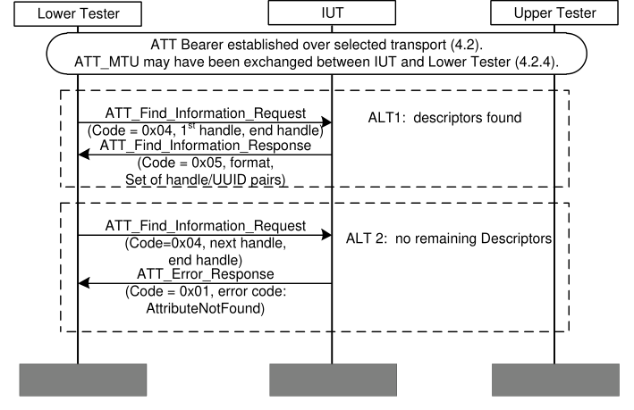

**Figure 4.20: GATT/SR/GAD/BV-06-C [Discover All Characteristic Descriptors – from Server] MSC**

• Expected Outcome
Pass verdict
The IUT sends an ATT_Find_Information_Response to the Lower Tester for each received ATT_Find_Information_Request if it has characteristic descriptors within the handle range.
The IUT reports all descriptors defined for the specified characteristic.
The ATT_Find_Information_Responses have complete handle-UUID pairs. A handle-UUID pair fits into one response packet. The handle-UUID pairs are returned in ascending order of attribute handles.
The response size does not exceed any negotiated ATT_MTU.
The IUT sends all ATT_Find_Information_Responses to the Lower Tester within the applicable timeout (3.3.3/ATT [5]).
The IUT sends an ATT_Error_Response when there are no characteristic descriptors within the handle range.
GATT/SR/GAD/BV-07-C [Discover Primary Services using SDP - from Server]
• Test Purpose
Verify that a Generic Attribute Profile server IUT can support a search for all GATT services it contains.
• Reference
[1] 4.4.1, 9
[9] 2.6, 4.5
• Initial Condition
- The link and L2CAP channel connection with the Lower Tester is set up over the BR/EDR transport. A CID has been established.
- The IUT’s server database includes at least the «GAP Service» and the «GATT Service».
• Test Procedure
1. The Lower Tester sends an initial SDP_SERVICE_SEARCH_ATTR_REQ (code=0x06, a service
search parameter UUID of <ATT>, a non-zero value for maximum attribute byte count parameter, an AttributeIDList parameter of attribute ID 0x0001 and attribute ID 0x0004, and a continuation state parameter of 0x00. 2. Perform either Alternative 2A or 2B depending on the continuation state parameter returned by
the IUT: Alternative 2A (The IUT returns an SDP_SERVICE_SEARCH_ATTR_RSP including a non-zero continuation state parameter):
2A.1: Continue the test by sending another SDP_SERVICE_SEARCH_ATTR_REQ, including the returned continuation state parameter, from the Lower Tester to the IUT. 2A.2: Once the IUT returns an SDP_SERVICE_SEARCH_ATTR_RSP, with a zero continuation state parameter, terminate the test. Alternative 2B (The IUT returns an SDP_SERVICE_SEARCH_ATTR_RSP including a zero continuation state parameter):
2B.1: Terminate the test.

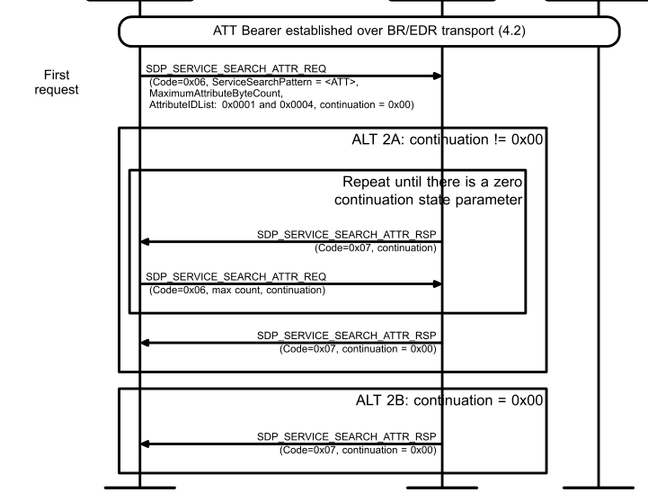

**Figure 4.21: GATT/SR/GAD/BV-07-C [Discover Primary Services using SDP - from Server] MSC**

• Expected Outcome
Pass verdict
For each SDP_SERVICE_SEARCH_ATTR_REQ, the IUT sends a correctly formatted SDP_SERVICE_SEARCH_ATTR_RSP to the Lower Tester.
The IUT reports the service UUID (either UUID16 or UUID128) for each GATT service contained in its database.
At least the SDP records for the «GAP Service» and the «GATT Service» are discovered on the IUT.
For the «GATT Service» SDP record:
▪ If the IUT ICS support is as follows: GATT 2/1 (Unenhanced ATT bearer over BR/EDR) AND NOT GATT 2/3b (Enhanced ATT bearer over BR/EDR), then the IUT’s SDP AttributeIDList(0x0004)_Protocol_Descriptor_Parameter_0 = 0x001F (PSM = ATT).
▪ If the IUT ICS support is as follows: GATT 2/3b (Enhanced ATT bearer over BR/EDR) AND NOT GATT 2/1 (Unenhanced ATT bearer over BR/EDR), then the IUT’s SDP AttributeIDList(0x0004)_Protocol_Descriptor_Parameter_0 = 0x0027 (PSM = EATT).
▪ If the IUT ICS support is as follows: GATT 2/1 (Unenhanced ATT bearer over BR/EDR) AND GATT 2/3b (Enhanced ATT bearer over BR/EDR), then the IUT’s SDP AttributeIDList(0x0004)__Protocol_Descriptor_Parameter_0 = 0x0027 (PSM = EATT).
• Test Purpose
Verify that a Service Discovery Protocol server IUT can support a search for GATT services by UUID.
• Reference
[1] 4.4.1, 9
[9] 2.6, 4.5
• Initial Condition
- The link and L2CAP channel connection with the Lower Tester is set up over the BR/EDR transport. A CID has been established.
- The <Service UUID> (TSPX_additional_service_uuid_for_sdp) is declared as an IXIT [10] value.
- The IUT’s server database includes at least one GATT service in addition to the «GAP Service» and the «GATT Service»; the <Service UUID> of that additional service is known by the Lower Tester from IXIT [10].
• Test Procedure
1. The Lower Tester sends an SDP_SERVICE_SEARCH_ATTR_REQ (code=0x06), a service
search parameter UUID of <ATT> and the <GAP Service UUID>, a non-zero value for maximum attribute byte count parameter, an AttributeIDList parameter of attribute ID 0x0001 and attribute ID 0x0004, and a continuation state parameter of 0x00. 2. Perform either Alternative 2A or 2B depending on the continuation state parameter returned by
the IUT: Alternative 2A (The IUT returns an SDP_SERVICE_SEARCH_ATTR_RSP including a non-zero continuation state parameter):
2A.1: Continue the test by sending additional SDP_SERVICE_SEARCH_ATTR_REQ, including the returned continuation state parameter, from the Lower Tester to the IUT until the IUT returns a zero continuation state parameter. 2A.2: Once the IUT returns an SDP_SERVICE_SEARCH_ATTR_RSP, with a zero continuation state parameter, proceed to step 3. Alternative 2B (The IUT returns an SDP_SERVICE_SEARCH_ATTR_RSP including a zero continuation state parameter):
2B.1: Proceed to step 3. 3. The Lower Tester sends an SDP_SERVICE_SEARCH_ATTR_REQ (code=0x06), a service
search parameter UUID of <ATT> and the <GATT Service UUID>, a non-zero value for maximum attribute byte count parameter, an AttributeIDList parameter of attribute ID 0x0001 and attribute ID 0x0004, and a continuation state parameter of 0x00. 4. Perform either Alternative 4A or 4B depending on the continuation state parameter returned by
the IUT: Alternative 4A (The IUT returns an SDP_SERVICE_SEARCH_ATTR_RSP including a non-zero continuation state parameter):
4A.1: Continue the test by sending additional SDP_SERVICE_SEARCH_ATTR_REQ, including the returned continuation state parameter, from the Lower Tester to the IUT until the IUT returns a zero continuation state parameter. 4A.2: Once the IUT returns an SDP_SERVICE_SEARCH_ATTR_RSP, with a zero continuation state parameter, proceed to step 5.
Alternative 4B (The IUT returns an SDP_SERVICE_SEARCH_ATTR_RSP including a zero continuation state parameter):
4B.1: Proceed to step 5. 5. The Lower Tester sends an SDP_SERVICE_SEARCH_ATTR_REQ (code=0x06), a service
search parameter UUID of <ATT> and the <Service UUID>, a non-zero value for maximum attribute byte count parameter, an AttributeIDList parameter of attribute ID 0x0001 and attribute ID 0x0004, and a continuation state parameter of 0x00. 6. Perform either Alternative 6A or 6B depending on the continuation state parameter returned by
the IUT: Alternative 6A (The IUT returns an SDP_ServiceSearchAttributeResponse including a non-zero continuation state parameter):
6A.1: Continue the test by sending additional SDP_SERVICE_SEARCH_ATTR_REQ, including the returned continuation state parameter, from the Lower Tester to the IUT until the IUT returns a zero continuation state parameter. 6A.2: Once the IUT returns an SDP_SERVICE_SEARCH_ATTR_RSP, with a zero continuation state parameter, proceed to step 7. Alternative 6B (The IUT returns an SDP_SERVICE_SEARCH_ATTR_RSP including a zero continuation state parameter):
6B.1: Proceed to step 7. 7. Once the IUT returns an SDP_SERVICE_SEARCH_ATTR_RSP, with a zero continuation state
parameter, terminate the test.

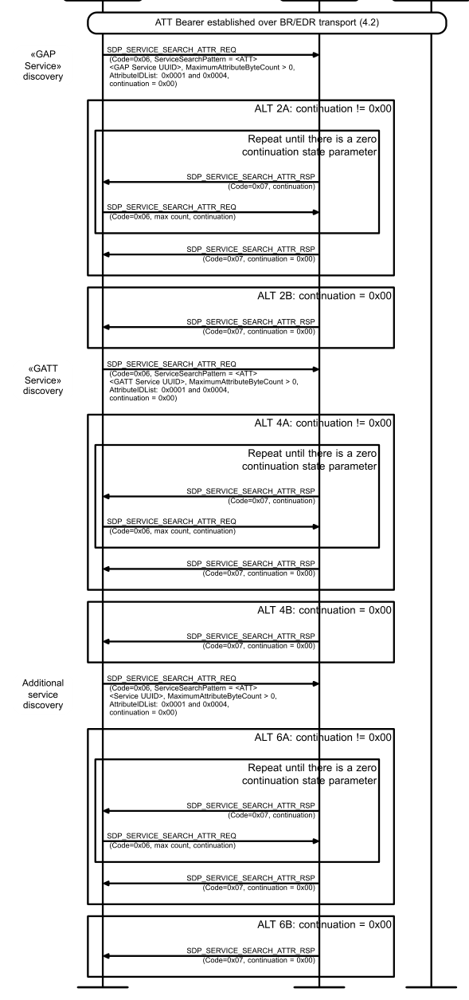

**Figure 4.22: GATT/SR/GAD/BV-08-C [Discover Services by UUID using SDP - from Server] MSC**

• Expected Outcome
Pass verdict
For each SDP_SERVICE_SEARCH_ATTR_REQ, the IUT sends a correctly formatted SDP_SERVICE_SEARCH_ATTR_RSP to the Lower Tester.
The IUT reports the Service UUID (either UUID16 or UUID128) for each GATT service discovered by the Lower Tester.
The SDP records for the «GAP Service» and the «GATT Service» are discovered on the IUT as well as the additional GATT service.
For the «GATT Service» SDP record:
▪ If the IUT ICS support is as follows: GATT 2/1 (Unenhanced ATT bearer over BR/EDR) AND NOT GATT 2/3b (Enhanced ATT bearer over BR/EDR), then the IUT’s SDP AttributeIDList(0x0004)_Protocol_Descriptor_Parameter_0 = 0x001F (PSM = ATT).
▪ If the IUT ICS support is as follows: GATT 2/3b (Enhanced ATT bearer over BR/EDR) AND NOT GATT 2/1 (Unenhanced ATT bearer over BR/EDR), then the IUT’s SDP AttributeIDList(0x0004)_Protocol_Descriptor_Parameter_0 = 0x0027 (PSM = EATT).
▪ If the IUT ICS support is as follows: GATT 2/1 (Unenhanced ATT bearer over BR/EDR) AND GATT 2/3b (Enhanced ATT bearer over BR/EDR), then the IUT’s SDP AttributeIDList(0x0004)__Protocol_Descriptor_Parameter_0 = 0x0027 (PSM = EATT).

### 4.6 Read

Verify Generic Attribute Profile reading of Characteristic Values and Characteristic Descriptors.
GATT/CL/GAR/BV-01-C [Read Characteristic Value - by Client]
• Test Purpose
Verify that a Generic Attribute Profile client can read a Characteristic Value selected by handle.
• Reference
[1] 4.8.1
[5] 3.4.4.3, 3.4.4.4
• Initial Condition
- A preamble procedure defined in Section 4.2.1 is used to set up the transport and L2CAP channel.
- A preamble procedure defined in Section 4.2.5 may have been used to exchange ATT MTU between the IUT and the Lower Tester.
- If the characteristic permissions require a specific security mode and level, execute pairing and/or bonding with the required security mode and level.
• Test Procedure
The Upper Tester will specify the handle of a Characteristic Value contained in the Lower Tester.
Send a request from the Upper Tester to the IUT to read a Characteristic Value from the Lower Tester by specifying the characteristic handle e.g., GATT_ReadReq.
Upper Tester IUT Lower Tester

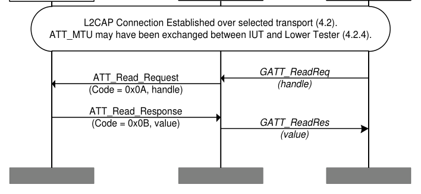

**Figure 4.23: GATT/CL/GAR/BV-01-C [Read Characteristic Value - by Client] MSC**

• Expected Outcome
Pass verdict
The IUT sends a correctly formatted ATT_Read_Request command (0x0A) to the Lower Tester.
The Characteristic handle parameter is set to the handle specified by the Upper Tester.
When the ATT_Read_Response is received, the IUT sends the received response with the correct value to the Upper Tester, e.g., GATT_ReadRes.
GATT/CL/GAR/BI-01-C [Read Characteristic Value – Invalid Handle]
• Test Purpose
Verify Generic Attribute Profile client behavior when the Read Characteristic Value procedure fails due to invalid handle.
• Reference
[1] 4.8.1
[5] 3.4.1.1, 3.4.4.3
• Initial Condition
- A preamble procedure defined in Section 4.2.1 is used to set up the transport and L2CAP channel.
- A preamble procedure defined in Section 4.2.5 may have been used to exchange ATT MTU between the IUT and the Lower Tester.
• Test Procedure
The Upper Tester sends a command to the IUT to initiate the test, e.g., GATT_ReadReq (handle). The IUT sends an ATT_Read_Request to the Lower Tester. When the IUT receives an ATT_Error_Response it sends the result to the Upper Tester, e.g., GATT_ReadRes.

**Figure 4.24: GATT/CL/GAR/BI-01-C [Read Characteristic Value – Invalid Handle] MSC**

• Expected Outcome
Pass verdict
The IUT sends a correctly formatted ATT_Read_Request to the Lower Tester.
Upon receiving an ATT_Error_Response from the Lower Tester the IUT sends the result to the Upper Tester, e.g., GATT_ReadRes.
GATT/CL/GAR/BI-02-C [Read Characteristic Value – Read Not Permitted]
• Test Purpose
Verify Generic Attribute Profile client behavior when the Read Characteristic Value procedure fails due to read not permitted.
• Reference
[1] 4.8.1
[5] 3.4.1.1, 3.4.4.3
• Initial Condition
- A preamble procedure defined in Section 4.2.1 is used to set up the transport and L2CAP channel.
- A preamble procedure defined in Section 4.2.5 may have been used to exchange ATT MTU between the IUT and the Lower Tester.
- A handle of a Characteristic Value in the Lower Tester is selected.
• Test Procedure
The Upper Tester sends a command to the IUT to initiate the test, e.g., GATT_ReadReq(handle). The IUT sends an ATT_Read_Request to the Lower Tester. When the IUT receives an ATT_Error_Response it sends the result to the Upper Tester, e.g., GATT_ReadRes.

| Lower Tester IUT Upper Tester ATT Bearer established over selected transport (4.2). ATT MTU may have been exchanged between IUT and Lower Tester (4.2.4). _ GATT ReadReq _ (handle) ATT Read Request _ _ (Code = 0x0A, handle) ATT Error Response _ _ (Code = 0x01, 0x0A, handle, Error Code = 0x02) GATT ReadRes _ (result) |  |
| --- | --- |
|  |  |

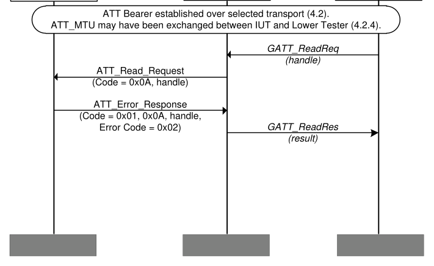

**Figure 4.25: GATT/CL/GAR/BI-02-C [Read Characteristic Value – Read Not Permitted] MSC**

• Expected Outcome
Pass verdict
The IUT sends a correctly formatted ATT_Read_Request to the Lower Tester.
Upon receiving an ATT_Error_Response from the Lower Tester the IUT sends the result to the Upper Tester, e.g., GATT_ReadRes.
GATT/CL/GAR/BI-03-C [Read Characteristic Value – Insufficient Authorization]
• Test Purpose
Verify Generic Attribute Profile client behavior when the Read Characteristic Value procedure fails due to insufficient authorization.
• Reference
[1] 4.8.1
[5] 3.4.1.1, 3.4.4.3
• Initial Condition
- A preamble procedure defined in Section 4.2.1.2 is used to set up the transport and L2CAP channel over LE.
- A preamble procedure defined in Section 4.2.5 may have been used to exchange ATT MTU between the IUT and the Lower Tester.
- A handle of a Characteristic Value in the Lower Tester that requires read authorization is selected.
- No authorization procedure has been performed between the IUT and the Lower Tester.
• Test Procedure
The Upper Tester sends a command to the IUT to initiate the test, e.g., GATT_ReadReq(handle). The IUT sends an ATT_Read_Request to the Lower Tester. When the IUT receives an ATT_Error_Response it sends the result to the Upper Tester, e.g., GATT_ReadRes.

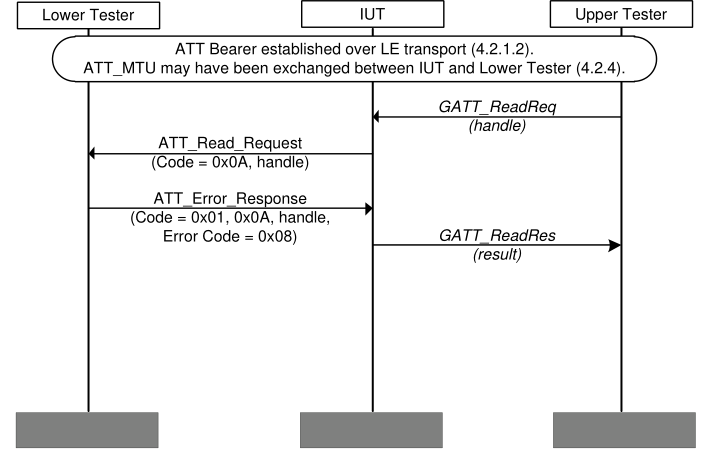

**Figure 4.26: GATT/CL/GAR/BI-03-C [Read Characteristic Value – Insufficient Authorization] MSC**

• Expected Outcome
Pass verdict
The IUT sends a correctly formatted ATT_Read_Request to the Lower Tester.
Upon receiving an ATT_Error_Response from the Lower Tester the IUT sends the result to the Upper Tester, e.g., GATT_ReadRes.
GATT/CL/GAR/BI-04-C [Read Characteristic Value – Insufficient Authentication]
• Test Purpose
Verify Generic Attribute Profile client behavior when the Read Characteristic Value procedure fails due to insufficient authentication.
• Reference
[1] 4.8.1
[5] 3.4.1.1, 3.4.4.3
• Initial Condition
- A preamble procedure defined in Section 4.2.1.2 is used to set up the transport and L2CAP channel over LE.
- A preamble procedure defined in Section 4.2.5 may have been used to exchange ATT MTU between the IUT and the Lower Tester.
- A handle of a Characteristic Value in the Lower Tester that requires read authentication is selected.
- No authentication procedure has been performed between the IUT and the Lower Tester.
• Test Procedure
The Upper Tester sends a command to the IUT to initiate the test, e.g., GATT_ReadReq(handle). The IUT sends an ATT_Read_Request to the Lower Tester. When the IUT receives an ATT_Error_Response it sends the result to the Upper Tester, e.g., GATT_ReadRes.

**Figure 4.27: GATT/CL/GAR/BI-04-C [Read Characteristic Value – Insufficient Authentication] MSC**

• Expected Outcome
Pass verdict
The IUT sends a correctly formatted ATT_Read_Request to the Lower Tester.
Upon receiving an ATT_Error_Response from the Lower Tester the IUT sends the result to the Upper Tester, e.g., GATT_ReadRes.
GATT/CL/GAR/BI-05-C [Read Characteristic Value – Insufficient Encryption Key Size]
• Test Purpose
Verify Generic Attribute Profile client behavior when the Read Characteristic Value procedure fails due to insufficient encryption key size.
• Reference
[1] 4.8.1
[5] 3.4.1.1, 3.4.4.3
• Initial Condition
- A preamble procedure defined in Section 4.2.1.2 is used to set up the transport and L2CAP channel over LE.
- A preamble procedure defined in Section 4.2.4 is used to set up an encrypted link.
- A preamble procedure defined in Section 4.2.5 may have been used to exchange ATT MTU between the IUT and the Lower Tester.
- A handle of a Characteristic Value in the Lower Tester that requires encryption with a key longer than the key used to establish the encrypted link is selected.
• Test Procedure
The Upper Tester sends a command to the IUT to initiate the test, e.g., GATT_ReadReq(handle). The IUT sends an ATT_Read_Request to the Lower Tester. When the IUT receives an ATT_Error_Response it sends the result to the Upper Tester, e.g., GATT_ReadRes.

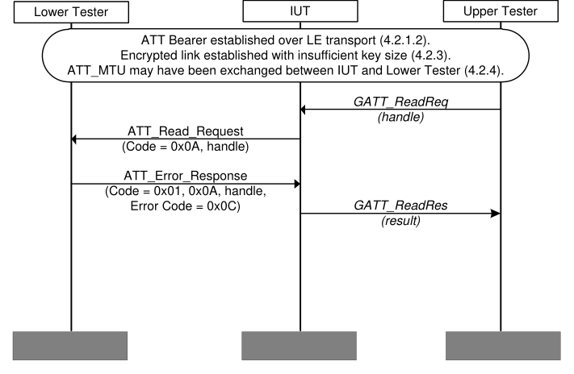

**Figure 4.28: GATT/CL/GAR/BI-05-C [Read Characteristic Value – Insufficient Encryption Key Size] MSC**

• Expected Outcome
Pass verdict
The IUT sends a correctly formatted ATT_Read_Request to the Lower Tester.
Upon receiving an ATT_Error_Response from the Lower Tester the IUT sends the result to the Upper Tester, e.g., GATT_ReadRes.
GATT/SR/GAR/BV-01-C [Read Characteristic Value - from Server]
• Test Purpose
Verify that a Generic Attribute Profile server can support reading a Characteristic Value selected by handle.
• Reference
[1] 4.8.1
[5] 3.4.4.3, 3.4.4.4
• Initial Condition
- A preamble procedure defined in Section 4.2.1 is used to set up the transport and L2CAP channel.
- A preamble procedure defined in Section 4.2.5 may have been used to exchange ATT MTU between the IUT and the Lower Tester.
- The Lower Tester has the necessary security permissions from the IUT to read a characteristic.
• Test Procedure
Send an ATT_Read_Request from the Lower Tester to the IUT to read a Characteristic Value by specifying the Characteristic Value Handle.

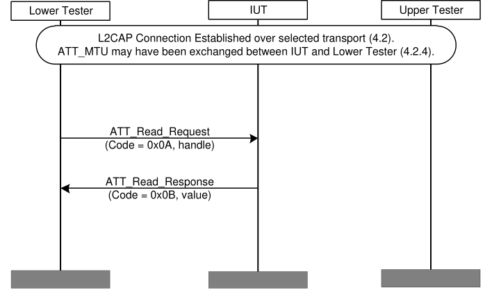

**Figure 4.29: GATT/SR/GAR/BV-01-C [Read Characteristic Value - from Server] MSC**

• Expected Outcome
Pass verdict
The IUT sends ATT_Read_Response (code 0x0B) to the Lower Tester.
The Characteristic Value is set to the value of the characteristic identified by the Characteristic Value Handle in the ATT_Read_Request.
The response size does not exceed any negotiated ATT_MTU. If the Characteristic Value is longer than (ATT_MTU – 1) then the first (ATT_MTU – 1) octets are included in this response.
The IUT responds within the applicable timeout (3.3.3/ATT [5]).
GATT/SR/GAR/BI-01-C [Read Characteristic Value - Read Not Permitted Response]
• Test Purpose
Verify that a Generic Attribute Profile server can detect and reject a Read Characteristic Value Request to a non-readable Characteristic Value and issue a Read Not Permitted Response.
• Reference
[1] 4.8.1
[5] 3.4.1.1, 3.4.4.3
• Initial Condition
- A preamble procedure defined in Section 4.2.1 is used to set up the transport and L2CAP channel.
- A preamble procedure defined in Section 4.2.5 may have been used to exchange ATT MTU between the IUT and the Lower Tester.
- A handle of a Characteristic Value in the IUT that does not permit reading is selected.
• Test Procedure
Send an ATT_Read_Request from the Lower Tester to the IUT using the selected handle.

**Figure 4.30: GATT/SR/GAR/BI-01-C [Read Characteristic Value- Read Not Permitted Response] MSC**

• Expected Outcome
Pass verdict
The IUT sends an ATT_Error_Response (code 0x01) to the Lower Tester. The Request Opcode in Error parameter is set to 0x0A. The Attribute Handle in Error parameter is set to the handle sent by the Lower Tester. The Error code is set to 0x02, Read Not Permitted.
The IUT responds within the applicable timeout (3.3.3/ATT [5]).
GATT/SR/GAR/BI-02-C [Read Characteristic Value - Invalid Handle Response]
• Test Purpose
Verify that a Generic Attribute Profile server can detect and reject a Read Characteristic Value Request with an unsupported Characteristic Value handle and issue an Invalid Handle Response.
• Reference
[1] 4.8.1
[5] 3.4.1.1, 3.4.4.3
• Initial Condition
- A preamble procedure defined in Section 4.2.1 is used to set up the transport and L2CAP channel.
- A preamble procedure defined in Section 4.2.5 may have been used to exchange ATT MTU between the IUT and the Lower Tester.
- The Lower Tester selects a handle which is known to be invalid.
• Test Procedure
The Lower Tester sends an ATT_Read_Request to the IUT to using the selected handle.

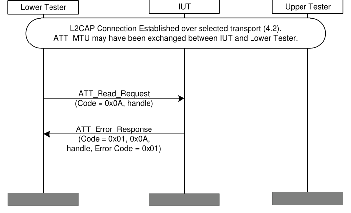

**Figure 4.31: GATT/SR/GAR/BI-02-C [Read Characteristic Value - Invalid Handle Response] MSC**

• Expected Outcome
Pass verdict
The IUT sends an ATT_Error_Response (code 0x01) to the Lower Tester. The Request Opcode in Error parameter is set to 0x0A. The Attribute Handle in Error parameter is set to the handle sent by the Lower Tester. The Error code is set to 0x01, Invalid Handle.
The IUT responds within the applicable timeout (3.3.3/ATT [5]).
GATT/SR/GAR/BI-03-C [Read Characteristic Value – Insufficient Authorization]
• Test Purpose
Verify that a Generic Attribute Profile server can detect and reject a Read Characteristic Value Request and issue an Insufficient Authorization Response.
• Reference
[1] 4.8.1
[5] 3.4.1.1, 3.4.4.3
• Initial Condition
- A preamble procedure defined in Section 4.2.1.2 is used to set up the transport and L2CAP channel over LE.
- A preamble procedure defined in Section 4.2.5 may have been used to exchange ATT MTU between the IUT and the Lower Tester.
- A handle of a Characteristic Value in the IUT that requires read authorization is selected.
- No authorization procedure has been performed between the IUT and the Lower Tester.
• Test Procedure
The Lower Tester sends an ATT_Read_Request to the IUT to using the selected handle.

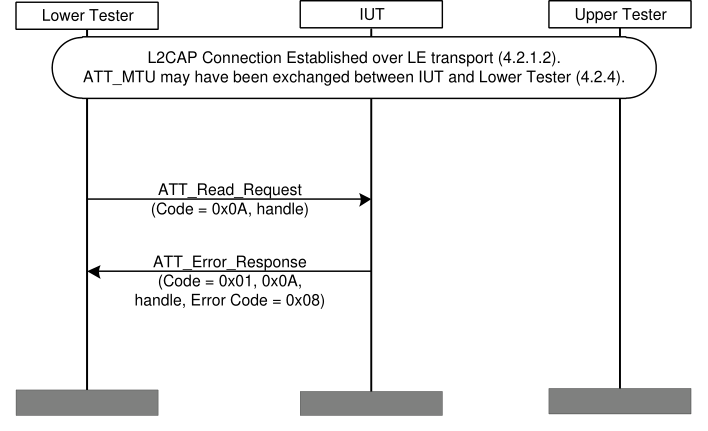

**Figure 4.32: GATT/SR/GAR/BI-03-C [Read Characteristic Value – Insufficient Authorization] MSC**

• Expected Outcome
Pass verdict
The IUT sends an ATT_Error_Response (code 0x01) to the Lower Tester. The Request Opcode in Error parameter is set to 0x0A. The Attribute Handle in Error parameter is set to the handle sent by the Lower Tester. The Error code is set to 0x08, Insufficient Authorization.
The IUT responds within the applicable timeout (3.3.3/ATT [5]).
GATT/SR/GAR/BI-04-C [Read Characteristic Value – Insufficient Authentication]
• Test Purpose
Verify that a Generic Attribute Profile server can detect and reject a Read Characteristic Value Request and issue an Insufficient Authentication Response.
• Reference
[1] 4.8.1
[5] 3.4.1.1, 3.4.4.3
• Initial Condition
- A preamble procedure defined in Section 4.2.1.2 is used to set up the transport and L2CAP channel over LE.
- A preamble procedure defined in Section 4.2.5 may have been used to exchange ATT MTU between the IUT and the Lower Tester.
- A handle of a Characteristic Value in the IUT that requires read authentication is selected.
- No authentication procedure has been performed between the IUT and the Lower Tester.
• Test Procedure
The Lower Tester sends an ATT_Read_Request to the IUT to using the selected handle.

**Figure 4.33: GATT/SR/GAR/BI-04-C [Read Characteristic Value – Insufficient Authentication] MSC**

• Expected Outcome
Pass verdict
The IUT sends an ATT_Error_Response (code 0x01) to the Lower Tester. The Request Opcode in Error parameter is set to 0x0A. The Attribute Handle in Error parameter is set to the handle sent by the Lower Tester. The Error code is set to 0x05, Insufficient Authentication.
The IUT responds within the applicable timeout (3.3.3/ATT [5]).
GATT/SR/GAR/BI-05-C [Read Characteristic Value – Insufficient Encryption Key Size]
• Test Purpose
Verify that a Generic Attribute Profile server can detect and reject a Read Characteristic Value Request and issue an Insufficient Encryption Key Size Response.
• Reference
[1] 4.8.1
[5] 3.4.1.1, 3.4.4.3
• Initial Condition
- A preamble procedure defined in Section 4.2.1.2 is used to set up the transport and L2CAP channel over LE.
- A preamble procedure defined in Section 4.2.4 is used to set up an encrypted link.
- A preamble procedure defined in Section 4.2.5 may have been used to exchange ATT MTU between the IUT and the Lower Tester.
- A handle of a Characteristic Value in the IUT that requires encryption with a key longer than the key used to establish the encrypted link is selected.
• Test Procedure
The Lower Tester sends an ATT_Read_Request to the IUT to using the selected handle.

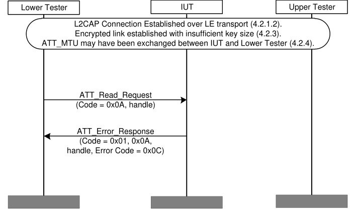

**Figure 4.34: GATT/SR/GAR/BI-05-C [Read Characteristic Value – Insufficient Encryption Key Size] MSC**

• Expected Outcome
Pass verdict
The IUT sends an ATT_Error_Response (code 0x01) to the Lower Tester. The Request Opcode in Error parameter is set to 0x0A. The Attribute Handle in Error parameter is set to the handle sent by the Lower Tester. The Error code is set to 0x0C, Insufficient Encryption Key Size.
The IUT responds within the applicable timeout (3.3.3/ATT [5]).
GATT/CL/GAR/BV-03-C [Read Using Characteristic UUID - by Client]
• Test Purpose
Verify that a Generic Attribute Profile client can read a Characteristic Value selected by UUID, using a 16-bit UUID and using a 128-bit UUID.
• Reference
[1] 4.8.2
[5] 3.4.4.1, 3.4.4.2
• Initial Condition
- A preamble procedure defined in Section 4.2.1 is used to set up the transport and L2CAP channel.
- A preamble procedure defined in Section 4.2.5 may have been used to exchange ATT MTU between the IUT and the Lower Tester.
- A UUID for a characteristic in the Lower Tester that permits reading is selected.
- If the characteristic permissions require a specific security mode and level, execute pairing and/or bonding with the required security mode and level.
• Test Procedure
Send a request from the Upper Tester to the IUT to read a Characteristic from the Lower Tester by specifying the Characteristic UUID e.g., GATT_ReadByTypeReq (starting handle, ending handle, characteristic UUID). The starting and ending handles are set to the range for the service to which the characteristic belongs. The Lower Tester will support at least one characteristic of the type specified by the UUID.
This Test Procedure is run once or twice, with a 16-bit UUID, and with a 128-bit UUID if supported by the IUT.

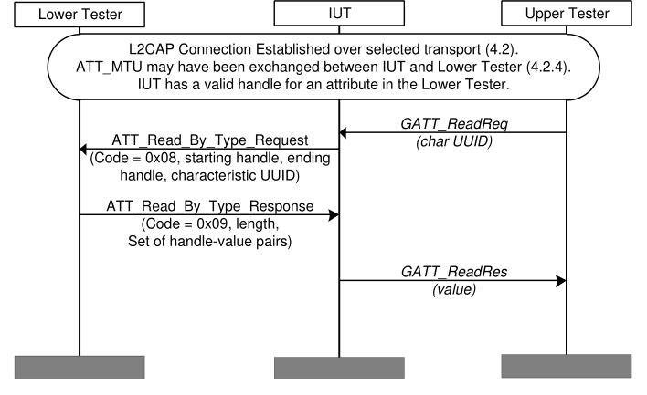

**Figure 4.35: GATT/CL/GAR/BV-03-C [Read Using Characteristic UUID - by Client] MSC**

• Expected Outcome
Pass verdict
The IUT sends a correctly formatted ATT_Read_By_Type_Request to the Lower Tester.
The IUT receives the ATT_Read_By_Type_Response sent by the Lower Tester.
The values reported to the Upper Tester match the values delivered by the Lower Tester.
• Test Purpose
Verify Generic Attribute Profile client behavior when the Read Using Characteristic UUID procedure fails due to read not permitted.
• Reference
[1] 4.8.2
[5] 3.4.4.1, 3.4.4.2
• Initial Condition
- A preamble procedure defined in Section 4.2.1 is used to set up the transport and L2CAP channel.
- A preamble procedure defined in Section 4.2.5 may have been used to exchange ATT MTU between the IUT and the Lower Tester.
- A UUID for a characteristic in the Lower Tester is selected.
• Test Procedure
Send a request from the Upper Tester to the IUT to read a characteristic from the Lower Tester by specifying the characteristic UUID e.g., GATT_ReadByTypeReq (starting handle, ending handle, characteristic UUID).

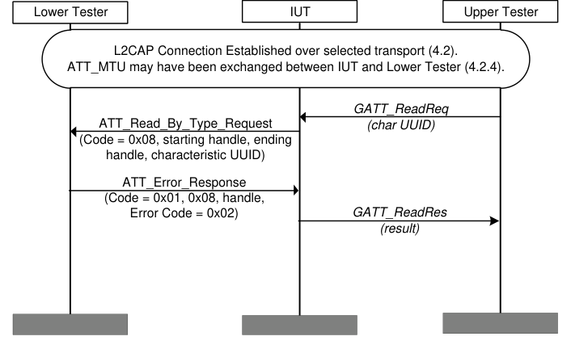

**Figure 4.36: GATT/CL/GAR/BI-06-C [Read Using Characteristic UUID – Read Not Permitted] MSC**

• Expected Outcome
Pass verdict
The IUT sends a correctly formatted ATT_Read_By_Type_Request to the Lower Tester.
Upon receiving an ATT_Error_Response from the Lower Tester the IUT sends the result to the Upper Tester, e.g., GATT_ReadRes.
• Test Purpose
Verify Generic Attribute Profile client behavior when the Read Using Characteristic UUID procedure fails due to attribute not found.
• Reference
[1] 4.8.2
[5] 3.4.4.1, 3.4.4.2
• Initial Condition
- A preamble procedure defined in Section 4.2.1 is used to set up the transport and L2CAP channel.
- A preamble procedure defined in Section 4.2.5 may have been used to exchange ATT MTU between the IUT and the Lower Tester.
- A UUID that is not used in the Lower Tester is selected.
- The starting handle is set to 0x0001 and the ending handle is set to 0xFFFF.
• Test Procedure
Send a request from the Upper Tester to the IUT to read a characteristic from the Lower Tester by specifying the characteristic UUID e.g., GATT_ReadByTypeReq (starting handle, ending handle, characteristic UUID).

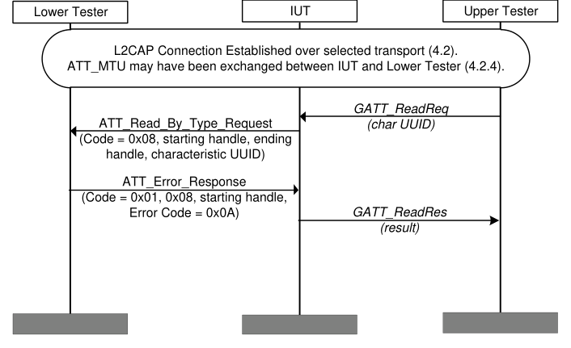

**Figure 4.37: GATT/CL/GAR/BI-07-C [Read Using Characteristic UUID – Attribute Not Found] MSC**

• Expected Outcome
Pass verdict
The IUT sends a correctly formatted ATT_Read_By_Type_Request to the Lower Tester.
Upon receiving an ATT_Error_Response from the Lower Tester the IUT sends the result to the Upper Tester, e.g., GATT_ReadRes.
• Test Purpose
Verify Generic Attribute Profile client behavior when the Read Using Characteristic UUID procedure fails due to insufficient authorization.
• Reference
[1] 4.8.2
[5] 3.4.4.1, 3.4.4.2
• Initial Condition
- A preamble procedure defined in Section 4.2.1.2 is used to set up the transport and L2CAP channel over LE.
- A preamble procedure defined in Section 4.2.5 may have been used to exchange ATT MTU between the IUT and the Lower Tester.
- A UUID for a characteristic in the Lower Tester that requires read authorization is selected.
- A handle range is selected in which the selected characteristic UUID occurs only once.
- No authorization procedure has been performed between the IUT and the Lower Tester.
• Test Procedure
Send a request from the Upper Tester to the IUT to read a characteristic from the Lower Tester by specifying the characteristic UUID e.g., GATT_ReadByTypeReq (starting handle, ending handle, characteristic UUID).

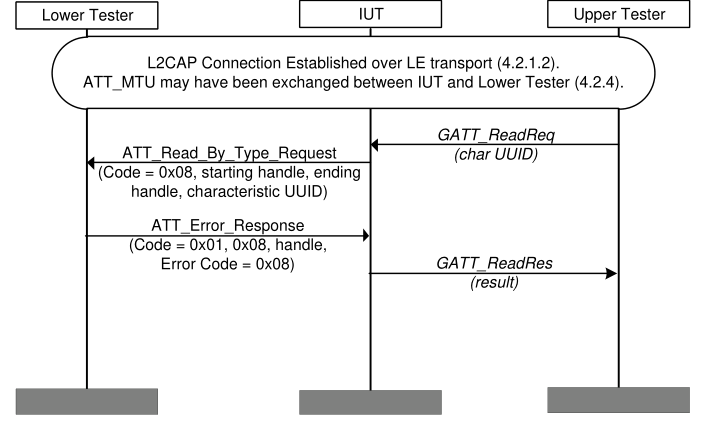

**Figure 4.38: GATT/CL/GAR/BI-09-C [Read Using Characteristic UUID – Insufficient Authorization] MSC**

• Expected Outcome
Pass verdict
The IUT sends a correctly formatted ATT_Read_By_Type_Request to the Lower Tester.
Upon receiving an ATT_Error_Response from the Lower Tester the IUT sends the result to the Upper Tester, e.g., GATT_ReadRes.
• Test Purpose
Verify Generic Attribute Profile client behavior when the Read Using Characteristic UUID procedure fails due to insufficient authentication.
• Reference
[1] 4.8.2
[5] 3.4.4.1, 3.4.4.2
• Initial Condition
- A preamble procedure defined in Section 4.2.1.2 is used to set up the transport and L2CAP channel over LE.
- A preamble procedure defined in Section 4.2.5 may have been used to exchange ATT MTU between the IUT and the Lower Tester.
- A UUID for a characteristic in the Lower Tester that requires read authentication is selected.
- A handle range is selected in which the selected characteristic UUID occurs only once.
- No authentication procedure has been performed between the IUT and the Lower Tester.
• Test Procedure
Send a request from the Upper Tester to the IUT to read a characteristic from the Lower Tester by specifying the characteristic UUID e.g., GATT_ReadByTypeReq (starting handle, ending handle, characteristic UUID).

**Figure 4.39: GATT/CL/GAR/BI-10-C [Read Using Characteristic UUID – Insufficient Authentication] MSC**

• Expected Outcome
Pass verdict
The IUT sends a correctly formatted ATT_Read_By_Type_Request to the Lower Tester.
Upon receiving an ATT_Error_Response from the Lower Tester the IUT sends the result to the Upper Tester, e.g., GATT_ReadRes.
GATT/CL/GAR/BI-11-C [Read Using Characteristic UUID – Insufficient Encryption Key Size]
• Test Purpose
Verify Generic Attribute Profile client behavior when the Read Using Characteristic UUID procedure fails due to insufficient encryption key size.
• Reference
[1] 4.8.2
[5] 3.4.4.1, 3.4.4.2
• Initial Condition
- A preamble procedure defined in Section 4.2.1.2 is used to set up the transport and L2CAP channel over LE.
- A preamble procedure defined in Section 4.2.4 is used to set up an encrypted link.
- A preamble procedure defined in Section 4.2.5 may have been used to exchange ATT MTU between the IUT and the Lower Tester.
- A UUID for a characteristic in the Lower Tester that requires encryption with a key longer than the key used to establish the encrypted link is selected.
- A handle range is selected in which the selected characteristic UUID occurs only once.
• Test Procedure
Send a request from the Upper Tester to the IUT to read a characteristic from the Lower Tester by specifying the characteristic UUID e.g., GATT_ReadByTypeReq (starting handle, ending handle, characteristic UUID).

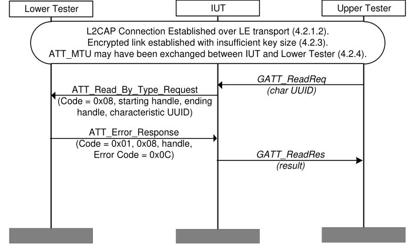

**Figure 4.40: GATT/CL/GAR/BI-11-C [Read Using Characteristic UUID – Insufficient Encryption Key Size] MSC**

• Expected Outcome
Pass verdict
The IUT sends a correctly formatted ATT_Read_By_Type_Request to the Lower Tester.
Upon receiving an ATT_Error_Response from the Lower Tester, the IUT sends the result to the Upper Tester, e.g., GATT_ReadRes.
GATT/SR/GAR/BV-03-C [Read using Characteristic UUID - from Server]
• Test Purpose
Verify that a Generic Attribute Profile server can support the Read using Characteristic UUID procedure, using a 16-bit UUID and using a 128-bit UUID if supported.
• Reference
[1] 4.8.2
[5] 3.4.4.1, 3.4.4.2
• Initial Condition
- A preamble procedure defined in Section 4.2.1 is used to set up the transport and L2CAP channel.
- A preamble procedure defined in Section 4.2.5 may have been used to exchange ATT MTU between the IUT and the Lower Tester.
- The Lower Tester has the necessary security permissions from the IUT to read a characteristic.
• Test Procedure
Send an ATT_Read_By_Type_Request from the Lower Tester to the IUT with a specified UUID and handle range.
This Test Procedure is run:
a) With a 128-bit UUID type value specified by the manufacturer in the IXIT [10], if
supported by the IUT, and
b) With a 16-bit UUID value required to be supported by a GATT server specified by the
manufacturer in the IXIT [10].

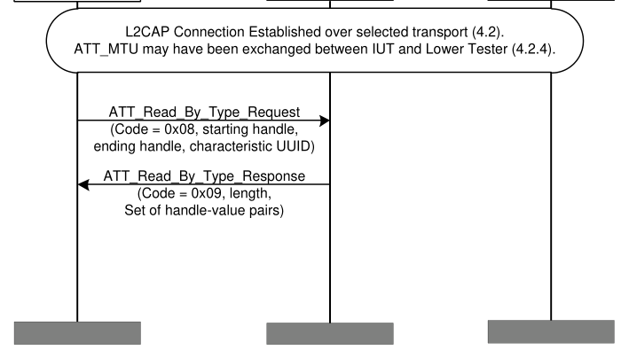

**Figure 4.41: GATT/SR/GAR/BV-03-C [Read using Characteristic UUID - from Server] MSC**

• Expected Outcome
Pass verdict
For each pass:
- The IUT sends a correctly formatted ATT_Read_By_Type_Response (result code 0x09) command to the Lower Tester, containing a list of Attribute Handle and Attribute Value pairs corresponding to the characteristics contained in the handle range provided.
- If the Attribute Value is longer than (ATT_MTU – 4) or 253, whichever is smaller, then the first (ATT_MTU – 4) or 253 octets are included in this response. The response does not exceed the ATT_MTU.
- The IUT sends each ATT_Read_By_Type_Response to the Lower Tester within the applicable timeout (3.3.3/ATT [5]).
GATT/SR/GAR/BI-06-C [Read Characteristic by UUID - Read Not Permitted Response]
• Test Purpose
Verify that a Generic Attribute Profile server can detect and reject a Read Characteristic by UUID Request to a non-readable Characteristic Value and issue a Read Not Permitted Response.
• Reference
[1] 4.8.2
[5] 3.4.1.1, 3.4.4.1
• Initial Condition
- A preamble procedure defined in Section 4.2.1 is used to set up the transport and L2CAP channel.
- A preamble procedure defined in Section 4.2.5 may have been used to exchange ATT MTU between the IUT and the Lower Tester.
- A handle range is selected in which the selected characteristic UUID occurs only once.
• Test Procedure
Send an ATT_Read_By_Type_Request from the Lower Tester to the IUT using the selected UUID and handle range.

**Figure 4.42: GATT/SR/GAR/BI-06-C [Read Characteristic by UUID - Read Not Permitted Response] MSC**

• Expected Outcome
Pass verdict
The IUT sends an ATT_Error_Response (code 0x01) to the Lower Tester. The Request Opcode in Error parameter is set to 0x08. The Attribute Handle in Error parameter is set to the handle of the selected attribute. The Error code is set to 0x02, Read Not Permitted.
The IUT responds within the applicable timeout (3.3.3/ATT [5]).
GATT/SR/GAR/BI-07-C [Read Characteristic by UUID - Attribute Not Found Response]
• Test Purpose
Verify that a Generic Attribute Profile server can detect and reject a Read Characteristic by UUID Request to an unsupported characteristic and issue an Attribute Not Found Response.
• Reference
[1] 4.8.2
[5] 3.4.1.1, 3.4.4.1
• Initial Condition
- A preamble procedure defined in Section 4.2.1 is used to set up the transport and L2CAP channel.
- A UUID that is not used in the Lower Tester is selected.
- The starting handle is set to 0x0001 and the ending handle is set to 0xFFFF.
• Test Procedure
Send an ATT_Read_By_Type_Request from the Lower Tester to the IUT using the selected UUID and handle range.

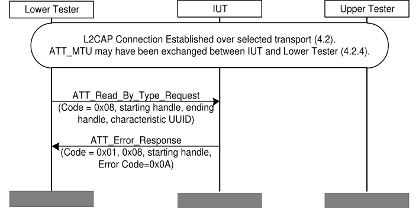

**Figure 4.43: GATT/SR/GAR/BI-07-C [Read Characteristic by UUID - Attribute Not Found Response] MSC**

• Expected Outcome
Pass verdict
The IUT sends an ATT_Error_Response (code 0x01) to the Lower Tester. The Request Opcode in Error parameter is set to 0x08. The Attribute Handle in Error parameter is set to the starting handle. The Error code is set to 0x0A, Attribute Not Found.
The IUT responds within the applicable timeout (3.3.3/ATT [5]).
GATT/SR/GAR/BI-08-C [Read Characteristic by UUID - Invalid Handle Response]
• Test Purpose
Verify that a Generic Attribute Profile server can detect and reject a Read Characteristic by UUID Request with an invalid handle range and issue an Invalid Handle Response.
• Reference
[1] 4.8.2
[5] 3.4.1.1, 3.4.4.1
• Initial Condition
- A preamble procedure defined in Section 4.2.1 is used to set up the transport and L2CAP channel.
- A preamble procedure defined in Section 4.2.5 may have been used to exchange ATT MTU between the IUT and the Lower Tester.
- The UUID is set to the UUID for Primary Service.
- The starting handle is set to 0x0002 and the ending handle is set to 0x0001 such that the ending handle is less than the starting handle.
• Test Procedure
Send an ATT_Read_By_Type_Request from the Lower Tester to the IUT using the selected UUID and handle range.

**Figure 4.44: GATT/SR/GAR/BI-08-C [Read Characteristic by UUID - Invalid Handle Response] MSC**

• Expected Outcome
Pass verdict
The IUT sends an ATT_Error_Response (code 0x01) to the Lower Tester. The Request Opcode in Error parameter is set to 0x08. The Attribute Handle in Error parameter is set to the starting handle. The Error code is set to 0x01, Invalid Handle.
The IUT responds within the applicable timeout (3.3.3/ATT [5]).
GATT/SR/GAR/BI-09-C [Read Using Characteristic UUID – Insufficient Authorization]
• Test Purpose
Verify that a Generic Attribute Profile server can detect and reject a Read Characteristic by UUID Request and issue an Insufficient Authorization Response.
• Reference
[1] 4.8.2
[5] 3.4.1.1, 3.4.4.1
• Initial Condition
- A preamble procedure defined in Section 4.2.1.2 is used to set up the transport and L2CAP channel over LE.
- A preamble procedure defined in Section 4.2.5 may have been used to exchange ATT MTU between the IUT and the Lower Tester.
- A UUID for a characteristic in the IUT that requires read authorization is selected.
- A handle range is selected in which the selected characteristic UUID occurs only once.
- No authorization procedure has been performed between the IUT and the Lower Tester.
• Test Procedure
Send an ATT_Read_By_Type_Request from the Lower Tester to the IUT using the selected UUID and handle range.

**Figure 4.45: GATT/SR/GAR/BI-09-C [Read Using Characteristic UUID – Insufficient Authorization] MSC**

• Expected Outcome
Pass verdict
The IUT sends an ATT_Error_Response (code 0x01) to the Lower Tester. The Request Opcode in Error parameter is set to 0x08. The Attribute Handle in Error parameter is set to the handle of the selected attribute. The Error code is set to 0x08, Insufficient Authorization.
The IUT responds within the applicable timeout (3.3.3/ATT [5]).
GATT/SR/GAR/BI-10-C [Read Using Characteristic UUID – Insufficient Authentication]
• Test Purpose
Verify that a Generic Attribute Profile server can detect and reject a Read Characteristic by UUID Request and issue an Insufficient Authentication Response.
• Reference
[1] 4.8.2
[5] 3.4.1.1, 3.4.4.1
• Initial Condition
- A preamble procedure defined in Section 4.2.1.2 is used to set up the transport and L2CAP channel over LE.
- A preamble procedure defined in Section 4.2.5 may have been used to exchange ATT MTU between the IUT and the Lower Tester.
- A UUID for a characteristic in the IUT that requires read authentication is selected.
- A handle range is selected in which the selected characteristic UUID occurs only once.
- No authentication procedure has been performed between the IUT and the Lower Tester.
• Test Procedure
Send an ATT_Read_By_Type_Request from the Lower Tester to the IUT using the selected UUID and handle range.

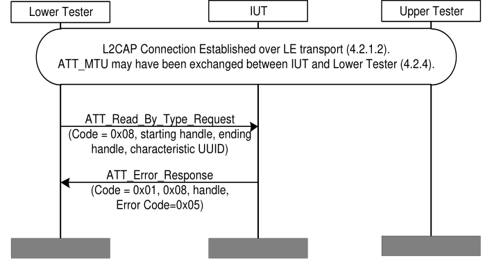

**Figure 4.46: GATT/SR/GAR/BI-10-C [Read Using Characteristic UUID – Insufficient Authentication] MSC**

• Expected Outcome
Pass verdict
The IUT sends an ATT_Error_Response (code 0x01) to the Lower Tester. The Request Opcode in Error parameter is set to 0x08. The Attribute Handle in Error parameter is set to the handle of the selected attribute. The Error code is set to 0x05, Insufficient Authentication.
The IUT responds within the applicable timeout (3.3.3/ATT [5]).
GATT/SR/GAR/BI-11-C [Read Using Characteristic UUID – Insufficient Encryption Key Size]
• Test Purpose
Verify that a Generic Attribute Profile server can detect and reject a Read Characteristic by UUID Request and issue an Encryption Key Size Too Short Response.
• Reference
[1] 4.8.2
[5] 3.4.1.1, 3.4.4.1
• Initial Condition
- A preamble procedure defined in Section 4.2.1.2 is used to set up the transport and L2CAP channel over LE.
- A preamble procedure defined in Section 4.2.4 is used to set up an encrypted link.
- A preamble procedure defined in Section 4.2.5 may have been used to exchange ATT MTU between the IUT and the Lower Tester.
- A UUID for a characteristic in the IUT that requires encryption with a key longer than the key used to establish the encrypted link is selected.
- A handle range is selected in which the selected characteristic UUID occurs only once.
• Test Procedure
Send an ATT_Read_By_Type_Request from the Lower Tester to the IUT using the selected UUID and handle range.

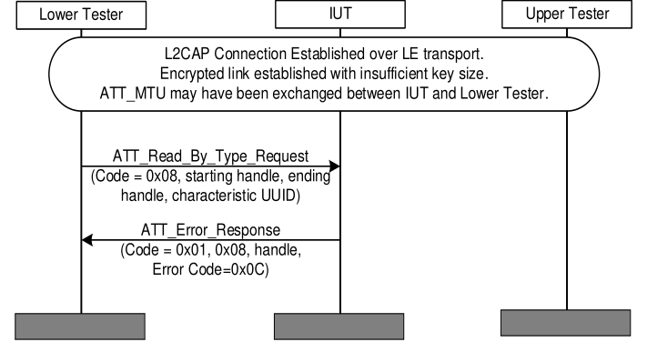

**Figure 4.47: GATT/SR/GAR/BI-11-C [Read Using Characteristic UUID – Insufficient Encryption Key Size] MSC**

• Expected Outcome
Pass verdict
The IUT sends an ATT_Error_Response (code 0x01) to the Lower Tester. The Request Opcode in Error parameter is set to 0x08. The Attribute Handle in Error parameter is set to the handle of the selected attribute. The Error code is set to 0x0C, Encryption Key Size Too Short.
The IUT responds within the applicable timeout (3.3.3/ATT [5]).
GATT/CL/GAR/BV-04-C [Read Long Characteristic Value - by Client]
• Test Purpose
Verify that a Generic Attribute Profile client can read a Characteristic Value by selected handle. The Characteristic Value length is unknown to the client and might be long.
• Reference
[1] 4.8.3
[5] 3.4.4.5, 3.4.4.6
• Initial Condition
- A preamble procedure defined in Section 4.2.1 is used to set up the transport and L2CAP channel.
- A preamble procedure defined in Section 4.2.5 may have been used to exchange ATT MTU between the IUT and the Lower Tester.
- If the characteristic permissions require a specific security mode and level, execute pairing and/or bonding with the required security mode and level.
• Test Procedure
Send a command from the Upper Tester to the IUT to read a potentially long Characteristic Value from the Lower Tester by specifying the Characteristic handle e.g., GATT_ReadLongRequest (handle) in each of the following four steps.
Step 1: Characteristic Value is long, length m*ATT_MTU-1 + n octets
The Upper Tester will specify the handle of a long Characteristic Value with a length of m*ATT_MTU- 1 + n with m >= 1 and 1 <= n < ATT_MTU-1 contained in the Lower Tester.

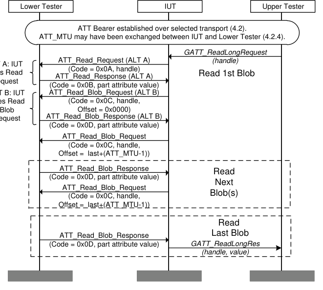

**Figure 4.48: GATT/CL/GAR/BV-04-C [Read Long Characteristic Value - by Client] MSC – Step 1**

The Upper Tester will specify the handle of a long Characteristic Value with a length of m*ATT_MTU- 1 with m >= 2 contained in the Lower Tester.

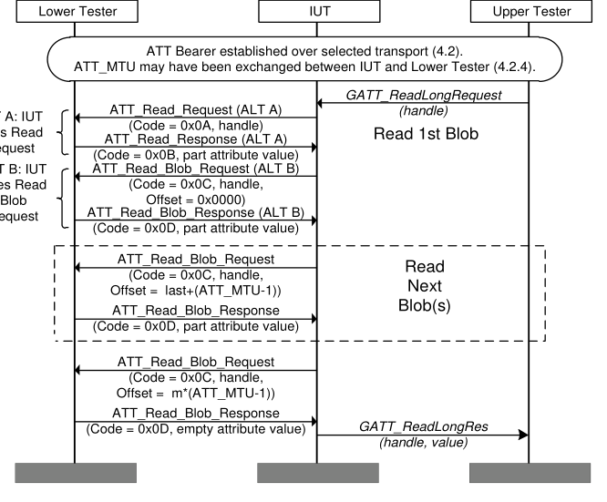

**Figure 4.49: GATT/CL/GAR/BV-04-C [Read Long Characteristic Value - by Client] MSC – Step 2**

Step 3: Characteristic Value is short, length ATT_MTU-1 octets
The Upper Tester will specify the handle of a short Characteristic Value with a length of ATT_MTU-1 contained in the Lower Tester.
Upper Tester IUT Lower Tester

| ATT Bearer established ove ATT MTU may have been exchanged b _ | r selected transport (4.2). etween IUT and Lower Tester (4.2.4 |
| --- | --- |
| ATT Read Request (ALT A) |  |
| _ _ (Code = 0x0A, handle) ATT Read Response (ALT A) |  |
| _ _ (Code = 0x0B, attribute value) ATT Read Blob Request (ALT B) |  |
| _ _ _ (Code = 0x0C, handle, Offset = 0x0000) ATT Read Blob Response (ALT B) |  |
| _ _ _ (Code = 0x0D, attribute value) ATT Read Blob Request |  |
| _ _ _ (Code = 0x0C, handle, Offset = (ATT MTU-1)) _ ATT Read Blob Response _ _ _ |  |

ALT A: IUT Uses Read
Request
ALT B: IUT Uses Read
Blob Request
GATT_ReadLongRes
(handle, value)

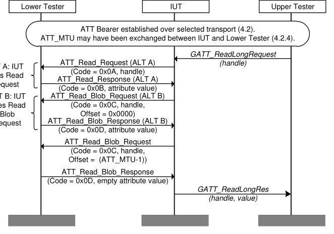

**Figure 4.50: GATT/CL/GAR/BV-04-C [Read Long Characteristic Value - by Client] MSC – Step 3**

The Upper Tester will specify the handle of a short Characteristic Value with a length less than ATT_MTU-1 contained in the Lower Tester.

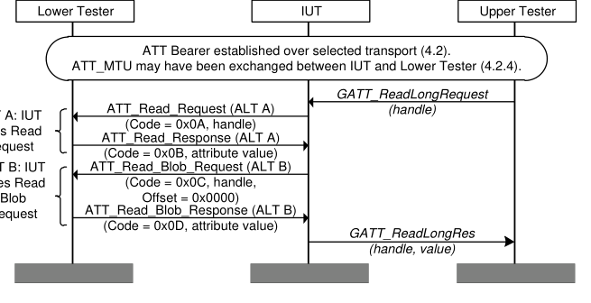

**Figure 4.51: GATT/CL/GAR/BV-04-C [Read Long Characteristic Value - by Client] MSC – Step 4**

Note: In steps 3 and 4, the Lower Tester chooses to treat the Characteristic as of variable length and thus does not respond with ATT_Error_Response (Attribute Not Long) to an ATT_Read_Blob_Request.
Note: It is recommended to execute steps 1–4 in an arbitrary sequence not known to the IUT.
• Expected Outcome
Pass verdict
The IUT sends correctly formatted ATT_Read_Blob_Request commands (0x0C) to the Lower Tester. Note that the first request may be an ATT_Read_Request; in that case the Lower Tester replies with an ATT_Read_Response, and the IUT detects that the Characteristic Value is long, and continue with ATT_Read_Blob_Requests.
The ATT_Read_Blob_Request and optional first ATT_Read_Request specifies the handle of the Characteristic Value to be read and the offset value of the first octet to be read. The offset for the first request is 0x0000; subsequent offset values are sequential values of (ATT_MTU-1). The IUT detects the end of the long Characteristic Value by the size of the last part attribute value which is then less than (ATT_MTU-1).
The complete Characteristic Value reported to the Upper Tester matches the value reported by the Lower Tester. On detection of the last blob, the IUT reports the complete Long Characteristic Value to the Upper Tester.
GATT/CL/GAR/BI-12-C [Read Long Characteristic Value – Read Not Permitted]
• Test Purpose
Verify Generic Attribute Profile client behavior when the Read Long Characteristic Value procedure fails due to read not permitted.
• Reference
[1] 4.8.3
[5] 3.4.1.1, 3.4.4.5
• Initial Condition
- A preamble procedure defined in Section 4.2.1 is used to set up the transport and L2CAP channel.
- A preamble procedure defined in Section 4.2.5 may have been used to exchange ATT MTU between the IUT and the Lower Tester.
- A handle of a Characteristic Value in the Lower Tester is selected.
• Test Procedure
The Upper Tester sends a command to the IUT to initiate the test, e.g., GATT_ReadLongRequest (handle). The IUT sends an ATT_Read_Blob_Request or ATT_Read_Request to the Lower Tester. When the IUT receives an ATT_Error_Response it sends the result to the Upper Tester, e.g., GATT_ReadLongRes. If an ATT_Read_Blob_Request is used, the MSC is shown below; if an ATT_Read_Request is used, the MSC is shown in GATT/CL/GAR/BI-02-C [Read Characteristic Value – Read Not Permitted].

**Figure 4.52: GATT/CL/GAR/BI-12-C [Read Long Characteristic Value – Read not permitted] MSC**

• Expected Outcome
Pass verdict
The IUT sends a correctly formatted ATT_Read_Blob_Request or ATT_Read_Request to the Lower Tester.
Upon receiving an ATT_Error_Response from the Lower Tester the IUT sends the result to the Upper Tester, e.g., GATT_ReadLongRes.
• Test Purpose
Verify Generic Attribute Profile client behavior when the Read Long Characteristic Value procedure fails due to invalid offset.
• Reference
[1] 4.8.3
[5] 3.4.1.1, 3.4.4.5
• Initial Condition
- A preamble procedure defined in Section 4.2.1 is used to set up the transport and L2CAP channel.
- A preamble procedure defined in Section 4.2.5 may have been used to exchange ATT MTU between the IUT and the Lower Tester.
- A handle of a Characteristic Value in the Lower Tester that permits reading is selected. The offset is set to a value greater than the length of the selected Characteristic Value.
• Test Procedure
The Upper Tester sends a command to the IUT to initiate the test, e.g., GATT_ReadLongRequest (handle, offset). The IUT sends an ATT_Read_Blob_Request or ATT_Read_Request to the Lower Tester. When the IUT receives an ATT_Error_Response it sends the result to the Upper Tester, e.g., GATT_ReadLongRes. If an ATT_Read_Blob_Request is used, the MSC is shown below; if an ATT_Read_Request is used, the MSC is shown in GATT/CL/GAR/BI-01-C [Read Characteristic Value – Invalid Handle].

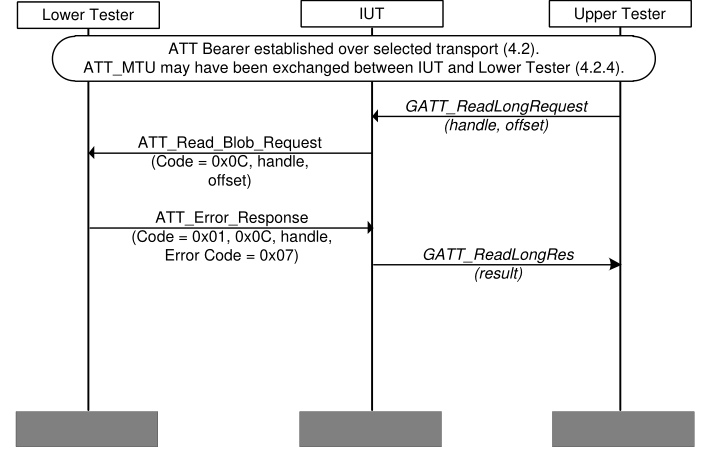

**Figure 4.53: GATT/CL/GAR/BI-13-C [Read Long Characteristic Value – Invalid Offset] MSC**

• Expected Outcome
Pass verdict
The IUT sends a correctly formatted ATT_Read_Blob_Request or ATT_Read_Request to the Lower Tester.
Upon receiving an ATT_Error_Response from the Lower Tester the IUT sends the result to the Upper Tester, e.g., GATT_ReadLongRes.
GATT/CL/GAR/BI-14-C [Read Long Characteristic Value – Invalid Handle]
• Test Purpose
Verify Generic Attribute Profile client behavior when the Read Long Characteristic Value procedure fails due to invalid handle.
• Reference
[1] 4.8.3
[5] 3.4.1.1, 3.4.4.5
• Initial Condition
- A preamble procedure defined in Section 4.2.1 is used to set up the transport and L2CAP channel.
- A preamble procedure defined in Section 4.2.5 may have been used to exchange ATT MTU between the IUT and the Lower Tester.
• Test Procedure
The Upper Tester sends a command to the IUT to initiate the test, e.g., GATT_ReadLongRequest (handle). The IUT sends an ATT_Read_Blob_Request or ATT_Read_Request to the Lower Tester. When the IUT receives an ATT_Error_Response it sends the result to the Upper Tester, e.g., GATT_ReadLongRes. If an ATT_Read_Blob_Request is used, the MSC is shown below; if an ATT_Read_Request is used, the MSC is shown in GATT/CL/GAR/BI-01-C [Read Characteristic Value – Invalid Handle].

| Lower Tester IUT Upper Tester ATT Bearer established over selected transport (4.2). ATT MTU may have been exchanged between IUT and Lower Tester (4.2.4). _ GATT ReadLongRequest _ (handle) ATT Read Blob Request _ _ _ (Code = 0x0C, handle, Offset = 0x0000) ATT Error Response _ _ (Code = 0x01, 0x0C, handle, Error Code = 0x01) GATT ReadLongRes _ (result) |  |
| --- | --- |
|  |  |

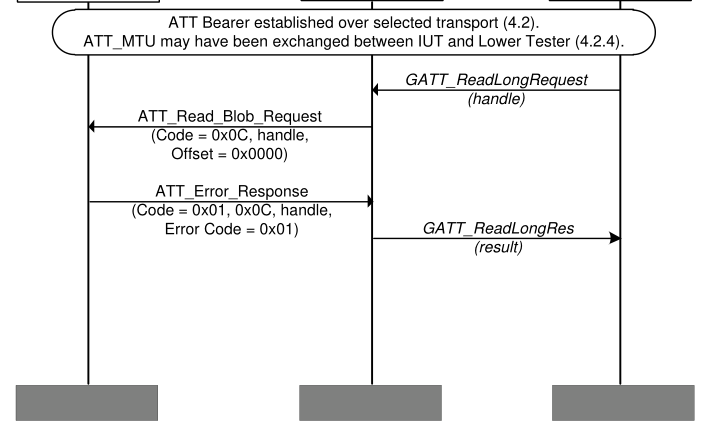

**Figure 4.54: GATT/CL/GAR/BI-14-C [Read Long Characteristic Value – Invalid Handle] MSC**

• Expected Outcome
Pass verdict
The IUT sends a correctly formatted ATT_Read_Blob_Request or ATT_Read_Request to the Lower Tester.
Upon receiving an ATT_Error_Response from the Lower Tester the IUT sends the result to the Upper Tester, e.g., GATT_ReadLongRes.
GATT/CL/GAR/BI-15-C [Read Long Characteristic Value – Insufficient Authorization]
• Test Purpose
Verify Generic Attribute Profile client behavior when the Read Long Characteristic Value procedure fails due to insufficient authorization.
• Reference
[1] 4.8.3
[5] 3.4.1.1, 3.4.4.5
• Initial Condition
- A preamble procedure defined in Section 4.2.1.2 is used to set up the transport and L2CAP channel over LE.
- A preamble procedure defined in Section 4.2.5 may have been used to exchange ATT MTU between the IUT and the Lower Tester.
- A handle of a Characteristic Value in the Lower Tester that requires read authorization is selected.
- No authorization procedure has been performed between the IUT and the Lower Tester.
• Test Procedure
The Upper Tester sends a command to the IUT to initiate the test, e.g., GATT_ReadLongRequest (handle). The IUT sends an ATT_Read_Blob_Request or ATT_Read_Request to the Lower Tester. When the IUT receives an ATT_Error_Response it sends the result to the Upper Tester, e.g., GATT_ReadLongRes. If an ATT_Read_Blob_Request is used, the MSC is shown below; if an ATT_Read_Request is used, the MSC is shown in GATT/CL/GAR/BI-03-C [Read Characteristic Value – Insufficient Authorization].

**Figure 4.55: GATT/CL/GAR/BI-15-C [Read Long Characteristic Value – Insufficient Authorization] MSC**

• Expected Outcome
Pass verdict
The IUT sends a correctly formatted ATT_Read_Blob_Request or ATT_Read_Request to the Lower Tester.
Upon receiving an ATT_Error_Response from the Lower Tester the IUT sends the result to the Upper Tester, e.g., GATT_ReadLongRes.
GATT/CL/GAR/BI-16-C [Read Long Characteristic Value – Insufficient Authentication]
• Test Purpose
Verify Generic Attribute Profile client behavior when the Read Long Characteristic Value procedure fails due to insufficient authentication.
• Reference
[1] 4.8.3
[5] 3.4.1.1, 3.4.4.5
• Initial Condition
- A preamble procedure defined in Section 4.2.1.2 is used to set up the transport and L2CAP channel over LE.
- A preamble procedure defined in Section 4.2.5 may have been used to exchange ATT MTU between the IUT and the Lower Tester.
- A handle of a Characteristic Value in the Lower Tester that requires read authentication is selected.
- No authentication procedure has been performed between the IUT and the Lower Tester.
• Test Procedure
The Upper Tester sends a command to the IUT to initiate the test, e.g., GATT_ReadLongRequest (handle). The IUT sends an ATT_Read_Blob_Request or ATT_Read_Request to the Lower Tester. When the IUT receives an ATT_Error_Response it sends the result to the Upper Tester, e.g., GATT_ReadLongRes. If an ATT_Read_Blob_Request is used, the MSC is shown below; if an ATT_Read_Request is used, the MSC is shown in GATT/CL/GAR/BI-04-C [Read Characteristic Value – Insufficient Authentication].

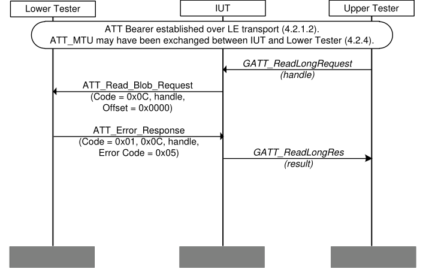

**Figure 4.56: GATT/CL/GAR/BI-16-C [Read Long Characteristic Value – Insufficient Authentication] MSC**

• Expected Outcome
Pass verdict
The IUT sends a correctly formatted ATT_Read_Blob_Request or ATT_Read_Request to the Lower Tester.
Upon receiving an ATT_Error_Response from the Lower Tester the IUT sends the result to the Upper Tester, e.g., GATT_ReadLongRes.
GATT/CL/GAR/BI-17-C [Read Long Characteristic Value – Insufficient Encryption Key Size]
• Test Purpose
Verify Generic Attribute Profile client behavior when the Read Long Characteristic Value procedure fails due to insufficient encryption key size.
• Reference
[1] 4.8.3
[5] 3.4.1.1, 3.4.4.5
• Initial Condition
- A preamble procedure defined in Section 4.2.1.2 is used to set up the transport and L2CAP channel over LE.
- A preamble procedure defined in Section 4.2.4 is used to set up an encrypted link.
- A preamble procedure defined in Section 4.2.5 may have been used to exchange ATT MTU between the IUT and the Lower Tester.
- A handle of a Characteristic Value in the Lower Tester that requires encryption with a key longer than the key used to establish the encrypted link is selected.
• Test Procedure
The Upper Tester sends a command to the IUT to initiate the test, e.g., GATT_ReadLongRequest (handle). The IUT sends an ATT_Read_Blob_Request or ATT_Read_Request to the Lower Tester. When the IUT receives an ATT_Error_Response it sends the result to the Upper Tester, e.g., GATT_ReadLongRes. If an ATT_Read_Blob_Request is used, the MSC is shown below; if an ATT_Read_Request is used, the MSC is shown in GATT/CL/GAR/BI-05-C [Read Characteristic Value – Insufficient Encryption Key Size].

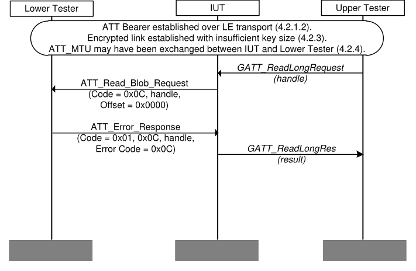

**Figure 4.57: GATT/CL/GAR/BI-17-C [Read Long Characteristic Value – Insufficient Encryption Key Size] MSC**

• Expected Outcome
Pass verdict
The IUT sends a correctly formatted ATT_Read_Blob_Request or ATT_Read_Request to the Lower Tester.
Upon receiving an ATT_Error_Response from the Lower Tester the IUT sends the result to the Upper Tester, e.g., GATT_ReadLongRes.
GATT/SR/GAR/BV-04-C [Read Long Characteristic Value - from Server]
• Test Purpose
Verify that a Generic Attribute Profile server can support reading a long Characteristic Value selected by handle.
• Reference
[1] 4.8.3
[5] 3.4.4.5, 3.4.4.6
• Initial Condition
- A preamble procedure defined in Section 4.2.1 is used to set up the transport and L2CAP channel.
- A preamble procedure defined in Section 4.2.5 may have been used to exchange ATT MTU between the IUT and the Lower Tester.
- The IUT contains at least one valid long Characteristic and the handle of this Characteristic is known to the test system.
- The Lower Tester has the necessary security permissions to read the value of the Characteristic from the IUT.
• Test Procedure
Send a series of ATT_Read_Blob_Request (handle, offset) commands from the Lower Tester to the IUT to read all parts of the value of a long characteristic.

**Figure 4.58: GATT/SR/GAR/BV-04-C [Read Long Characteristic Value - from Server] MSC**

• Expected Outcome
Pass verdict
The IUT sends correctly formatted ATT_Read_Blob_Responses (0x0D) to the Lower Tester. The responses contain all parts of the value of the long characteristic that has been read.
If the Lower Tester sends an ATT_Read_Blob_Request with the offset greater than the length of the Characteristic Value then the IUT sends an ATT_Read_Blob_Responses with a part attribute value of length 0 to the Lower Tester. If the value offset of the Read Blob Request is equal to the length of the attribute value, then the length of the part attribute value in the response is zero.
Each response does not exceed any negotiated ATT_MTU.
Each IUT response occurs within the applicable timeout (3.3.3/ATT [5]).
GATT/SR/GAR/BI-12-C [Read Long Characteristic Value - Read Not Permitted Response]
• Test Purpose
Verify that a Generic Attribute Profile server can detect and reject a Read Long Characteristic Value Request to a non-readable Characteristic Value and issue a Read Not Permitted Response.
• Reference
[1] 4.8.3
[5] 3.4.1.1, 3.4.4.5
• Initial Condition
- A preamble procedure defined in Section 4.2.1 is used to set up the transport and L2CAP channel.
- A preamble procedure defined in Section 4.2.5 may have been used to exchange ATT MTU between the IUT and the Lower Tester.
- A handle of a long Characteristic Value in the IUT that does not permit reading is selected.
• Test Procedure
Send an ATT_Read_Blob_Request (handle, offset=0x0000) from the Lower Tester to request IUT using the selected handle.

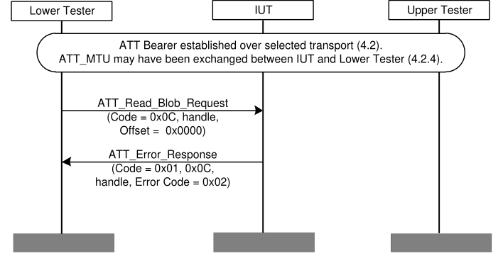

**Figure 4.59: GATT/SR/GAR/BI-12-C [Read Long Characteristic Value - Read Not Permitted Response] MSC**

• Expected Outcome
Pass verdict
The IUT sends an ATT_Error_Response (code 0x01) to the Lower Tester. The Request Opcode in Error parameter is set to 0x0C. The Attribute Handle in Error parameter is set to the handle sent by the Lower Tester. The Error code is set to 0x02, Read Not Permitted.
The IUT responds within the applicable timeout (3.3.3/ATT [5]).
GATT/SR/GAR/BI-13-C [Read Long Characteristic Value - Invalid Offset Response]
• Test Purpose
Verify that a Generic Attribute Profile server can detect and reject a Read Long Characteristic Value Request with an invalid offset and issue an Invalid Offset Response.
• Reference
[1] 4.8.3
[5] 3.4.1.1, 3.4.4.5
• Initial Condition
- A preamble procedure defined in Section 4.2.1 is used to set up the transport and L2CAP channel.
- A preamble procedure defined in Section 4.2.5 may have been used to exchange ATT MTU between the IUT and the Lower Tester.
- A handle of a long Characteristic Value in the IUT that permits reading is selected. The offset is set to a value greater than the length of the Characteristic Value.
• Test Procedure
Send an ATT_Read_Blob_Request (handle, offset) command from the Lower Tester to the IUT.

**Figure 4.60: GATT/SR/GAR/BI-13-C [Read Long Characteristic Value - Invalid Offset Response] MSC**

• Expected Outcome
Pass verdict
The IUT sends an ATT_Error_Response (code 0x01) to the Lower Tester. The Request Opcode in Error parameter is set to 0x0C. The Attribute Handle in Error parameter is set to the handle sent by the Lower Tester. The Error code is set to 0x07, Invalid Offset.
The IUT responds within the applicable timeout (3.3.3/ATT [5]).
GATT/SR/GAR/BI-14-C [Read Long Characteristic Value - Invalid Handle Response]
• Test Purpose
Verify that a Generic Attribute Profile server can detect and reject a Read Long Characteristic Value Request to an invalid handle and issue an Invalid Handle Response.
• Reference
[1] 4.8.3
[5] 3.4.1.1, 3.4.4.5
• Initial Condition
- A preamble procedure defined in Section 4.2.1 is used to set up the transport and L2CAP channel.
- A preamble procedure defined in Section 4.2.5 may have been used to exchange ATT MTU between the IUT and the Lower Tester.
- The Lower Tester selects a handle which is known to be invalid.
• Test Procedure
Send an ATT_Read_Blob_Request (handle, offset=0x0000) command from the Lower Tester to the IUT.

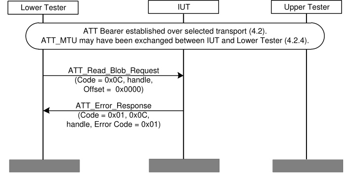

**Figure 4.61: GATT/SR/GAR/BI-14-C [Read Long Characteristic Value - Invalid Handle Response] MSC**

• Expected Outcome
Pass verdict
The IUT sends an ATT_Error_Response (code 0x01) to the Lower Tester. The Request Opcode in Error parameter is set to 0x0C. The Attribute Handle in Error parameter is set to the handle sent by the Lower Tester. The Error code is set to 0x01, Invalid Handle.
The IUT responds within the applicable timeout (3.3.3/ATT [5]).
GATT/SR/GAR/BI-15-C [Read Long Characteristic Value – Insufficient Authorization]
• Test Purpose
Verify that a Generic Attribute Profile server can detect and reject a Read Long Characteristic Value Request and issue an Insufficient Authorization Response.
• Reference
[1] 4.8.3
[5] 3.4.1.1, 3.4.4.5
• Initial Condition
- A preamble procedure defined in Section 4.2.1.2 is used to set up the transport and L2CAP channel over LE.
- A preamble procedure defined in Section 4.2.5 may have been used to exchange ATT MTU between the IUT and the Lower Tester.
- A handle of a long Characteristic Value in the IUT that requires read authorization is selected.
- No authorization procedure has been performed between the IUT and the Lower Tester.
• Test Procedure
Send an ATT_Read_Blob_Request (handle, offset=0x0000) command from the Lower Tester to the IUT.

**Figure 4.62: GATT/SR/GAR/BI-15-C [Read Long Characteristic Value – Insufficient Authorization] MSC**

• Expected Outcome
Pass verdict
The IUT sends an ATT_Error_Response (code 0x01) to the Lower Tester. The Request Opcode in Error parameter is set to 0x0C. The Attribute Handle in Error parameter is set to the handle sent by the Lower Tester. The Error code is set to 0x08, Insufficient Authorization.
The IUT responds within the applicable timeout (3.3.3/ATT [5]).
GATT/SR/GAR/BI-16-C [Read Long Characteristic Value – Insufficient Authentication]
• Test Purpose
Verify that a Generic Attribute Profile server can detect and reject a Read Long Characteristic Value Request and issue an Insufficient Authentication Response.
• Reference
[1] 4.8.3
[5] 3.4.1.1, 3.4.4.5
• Initial Condition
- A preamble procedure defined in Section 4.2.1.2 is used to set up the transport and L2CAP channel over LE.
- A preamble procedure defined in Section 4.2.5 may have been used to exchange ATT MTU between the IUT and the Lower Tester.
- A handle of a long Characteristic Value in the IUT that requires read authentication is selected.
- No authentication procedure has been performed between the IUT and the Lower Tester.
• Test Procedure
Send an ATT_Read_Blob_Request (handle, offset=0x0000) command from the Lower Tester to the IUT.

**Figure 4.63: GATT/SR/GAR/BI-16-C [Read Long Characteristic Value – Insufficient Authentication] MSC**

• Expected Outcome
Pass verdict
The IUT sends an ATT_Error_Response (code 0x01) to the Lower Tester. The Request Opcode in Error parameter is set to 0x0C. The Attribute Handle in Error parameter is set to the handle sent by the Lower Tester. The Error code is set to 0x05, Insufficient Authentication.
The IUT responds within the applicable timeout (3.3.3/ATT [5]).
GATT/SR/GAR/BI-17-C [Read Long Characteristic Value – Insufficient Encryption Key Size]
• Test Purpose
Verify that a Generic Attribute Profile server can detect and reject a Read Long Characteristic Value Request and issue an Insufficient Encryption Key Size Response.
• Reference
[1] 4.8.3
[5] 3.4.1.1, 3.4.4.5
• Initial Condition
- A preamble procedure defined in Section 4.2.1.2 is used to set up the transport and L2CAP channel over LE.
- A preamble procedure defined in Section 4.2.4 is used to set up an encrypted link.
- A preamble procedure defined in Section 4.2.5 may have been used to exchange ATT MTU between the IUT and the Lower Tester.
- A handle of a long Characteristic Value in the IUT that requires encryption with a key longer than the key used to establish the encrypted link is selected.
• Test Procedure
Send an ATT_Read_Blob_Request (handle, offset=0x0000) command from the Lower Tester to the IUT.

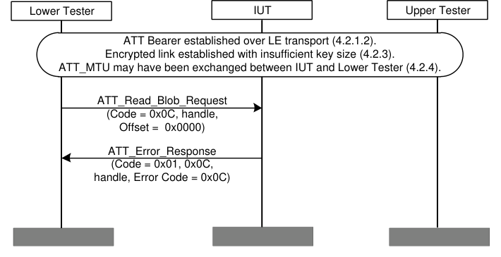

**Figure 4.64: GATT/SR/GAR/BI-17-C [Read Long Characteristic Value – Insufficient Encryption Key Size] MSC**

• Expected Outcome
Pass verdict
The IUT sends an ATT_Error_Response (code 0x01) to the Lower Tester. The Request Opcode in Error parameter is set to 0x0C. The Attribute Handle in Error parameter is set to the handle sent by the Lower Tester. The Error code is set to 0x0C, Insufficient Encryption Key Size.
The IUT responds within the applicable timeout (3.3.3/ATT [5]).
GATT/CL/GAR/BV-05-C [Read Multiple Characteristic Values – by Client]
• Test Purpose
Verify that a Generic Attribute Profile client can read multiple Characteristic Values selected by a set of handles.
• Reference
[1] 4.8.4
[5] 3.4.4.7, 3.4.4.8
• Initial Condition
- A preamble procedure defined in Section 4.2.1 is used to set up the transport and L2CAP channel.
- A preamble procedure defined in Section 4.2.5 may have been used to exchange ATT MTU between the IUT and the Lower Tester.
- A set of at least two handles of Characteristic Values in the Lower Tester that permit reading is selected. The combined length of the set of Characteristic Values is less than (ATT_MTU – 1).
- If the characteristics permissions require a specific security mode and level, execute pairing and/or bonding with the required security mode and level.
• Test Procedure
Send a request from the Upper Tester to the IUT to read a set of Characteristic Values selected by a set of handles, e.g., GATT_ReadMultReq.
Upper Tester IUT Lower Tester

| L2CAP Connection Established ATT MTU may have been exchanged be _ | over selected transport (4.2). tween IUT and Lower Tester (4.2.4) |
| --- | --- |
| ATT Read Multiple Request |  |
| _ _ _ (Code = 0x0E, set of handles) ATT Read Multiple Response |  |

(Code = 0x0F, set of values)
GATT_ReadMultRes
(set of values)
• Expected Outcome
Pass verdict
The IUT sends a correctly formatted ATT_Read_Multiple_Request (0x0E) to the Lower Tester.
The characteristic handles are set to valid handles delivered by the Upper Tester.
The IUT receives the ATT_Read_Multiple_Response (0x0F) sent by the Lower Tester.
The IUT sends the received responses to the Upper Tester, e.g., GATT_ReaMultRes with the same set of values reported by the Lower Tester.
GATT/CL/GAR/BI-18-C [Read Multiple Characteristic Values – Read Not Permitted]
• Test Purpose
Verify Generic Attribute Profile client behavior when the Read Multiple Characteristic Values procedure fails due to read not permitted.
• Reference
[1] 4.8.4
[5] 3.4.1.1, 3.4.4.7
• Initial Condition
- A preamble procedure defined in Section 4.2.1 is used to set up the transport and L2CAP channel.
- A preamble procedure defined in Section 4.2.5 may have been used to exchange ATT MTU between the IUT and the Lower Tester.
- A set of at least two handles of Characteristic Values in the Lower Tester is selected.
• Test Procedure
The Upper Tester sends a command to the IUT to initiate the test, e.g., GATT_ReadMultReq(set of handles). The IUT sends an ATT_Read_Multiple_Request to the Lower Tester. When the IUT receives an ATT_Error_Response it sends the result to the Upper Tester, e.g., GATT_ReadMultRes.

| Lower Tester IUT Upper Tester ATT Bearer established over selected transport (4.2). ATT MTU may have been exchanged between IUT and Lower Tester (4.2.4). _ GATT ReadMultReq _ (set of handles) ATT Read Multiple Request _ _ _ (Code = 0x0E, set of handles) ATT Error Response _ _ (Code = 0x01, 0x0E, handle, Error Code = 0x02) GATT ReadMultRes _ (result) |  |
| --- | --- |
|  |  |

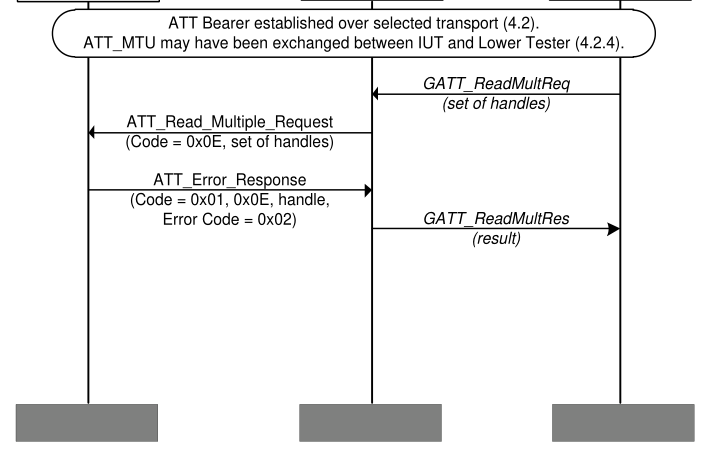

**Figure 4.66: GATT/CL/GAR/BI-18-C [Read Multiple Characteristic Values – Read not permitted] MSC**

• Expected Outcome
Pass verdict
The IUT sends a correctly formatted ATT_Read_Multiple_Request to the Lower Tester.
Upon receiving an ATT_Error_Response from the Lower Tester the IUT sends the result to the Upper Tester, e.g., GATT_ReadMultRes.
GATT/CL/GAR/BI-19-C [Read Multiple Characteristic Values – Invalid Handle]
• Test Purpose
Verify Generic Attribute Profile client behavior when the Read Multiple Characteristic Values procedure fails due to invalid handle.
• Reference
[1] 4.8.4
[5] 3.4.1.1, 3.4.4.7
• Initial Condition
- A preamble procedure defined in Section 4.2.1 is used to set up the transport and L2CAP channel.
- A preamble procedure defined in Section 4.2.5 may have been used to exchange ATT MTU between the IUT and the Lower Tester.
• Test Procedure
The Upper Tester sends a command to the IUT to initiate the test, e.g., GATT_ReadMultReq(set of handles). The IUT sends an ATT_Read_Multiple_Request to the Lower Tester. When the IUT receives an ATT_Error_Response it sends the result to the Upper Tester, e.g., GATT_ReadMultRes.

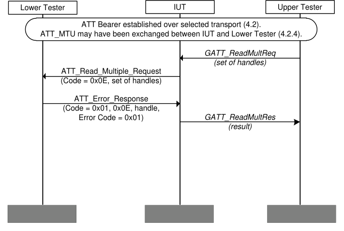

**Figure 4.67: GATT/CL/GAR/BI-19-C [Read Multiple Characteristic Values – Invalid Handle] MSC**

• Expected Outcome
Pass verdict
The IUT sends a correctly formatted ATT_Read_Multiple_Request to the Lower Tester.
Upon receiving an ATT_Error_Response from the Lower Tester the IUT sends the result to the Upper Tester, e.g., GATT_ReadMultRes.
GATT/CL/GAR/BI-20-C [Read Multiple Characteristic Values – Insufficient Authorization]
• Test Purpose
Verify Generic Attribute Profile client behavior when the Read Multiple Characteristic Values procedure fails due to insufficient authorization.
• Reference
[1] 4.8.4
[5] 3.4.1.1, 3.4.4.7
• Initial Condition
- A preamble procedure defined in Section 4.2.1.2 is used to set up the transport and L2CAP channel over LE.
- A preamble procedure defined in Section 4.2.5 may have been used to exchange ATT MTU between the IUT and the Lower Tester.
- A set of at least two handles of Characteristic Values in the Lower Tester of which one requires read authorization is selected.
• Test Procedure
The Upper Tester sends a command to the IUT to initiate the test, e.g., GATT_ReadMultReq(set of handles). The IUT sends an ATT_Read_Multiple_Request to the Lower Tester. When the IUT receives an ATT_Error_Response it sends the result to the Upper Tester, e.g., GATT_ReadMultRes.

**Figure 4.68: GATT/CL/GAR/BI-20-C [Read Multiple Characteristic Values – Insufficient Authorization] MSC**

• Expected Outcome
Pass verdict
The IUT sends a correctly formatted ATT_Read_Multiple_Request to the Lower Tester.
Upon receiving an ATT_Error_Response from the Lower Tester the IUT sends the result to the Upper Tester, e.g., GATT_ReadMultRes.
GATT/CL/GAR/BI-21-C [Read Multiple Characteristic Values – Insufficient Authentication]
• Test Purpose
Verify Generic Attribute Profile client behavior when the Read Multiple Characteristic Values procedure fails due to insufficient authentication.
• Reference
[1] 4.8.4
[5] 3.4.1.1, 3.4.4.7
• Initial Condition
- A preamble procedure defined in Section 4.2.1.2 is used to set up the transport and L2CAP channel over LE.
- A preamble procedure defined in Section 4.2.5 may have been used to exchange ATT MTU between the IUT and the Lower Tester.
- A set of at least two handles of Characteristic Values in the Lower Tester of which one requires read authentication is selected.
• Test Procedure
The Upper Tester sends a command to the IUT to initiate the test, e.g., GATT_ReadMultReq(set of handles). The IUT sends an ATT_Read_Multiple_Request to the Lower Tester. When the IUT receives an ATT_Error_Response it sends the result to the Upper Tester, e.g., GATT_ReadMultRes.

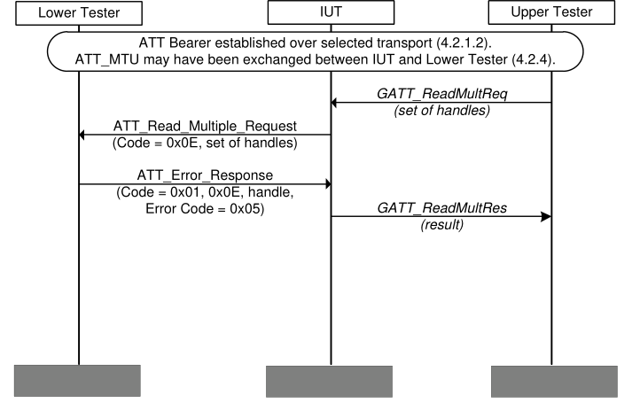

**Figure 4.69: GATT/CL/GAR/BI-21-C [Read Multiple Characteristic Values – Insufficient Authentication] MSC**

• Expected Outcome
Pass verdict
The IUT sends a correctly formatted ATT_Read_Multiple_Request to the Lower Tester.
Upon receiving an ATT_Error_Response from the Lower Tester the IUT sends the result to the Upper Tester, e.g., GATT_ReadMultRes.
GATT/CL/GAR/BI-22-C [Read Multiple Characteristic Values – Insufficient Encryption Key Size]
• Test Purpose
Verify Generic Attribute Profile client behavior when the Read Multiple Characteristic Values procedure fails due to encryption key size.
• Reference
[1] 4.8.4
[5] 3.4.1.1, 3.4.4.7
• Initial Condition
- A preamble procedure defined in Section 4.2.1.2 is used to set up the transport and L2CAP channel over LE.
- A preamble procedure defined in Section 4.2.4 is used to set up an encrypted link.
- A preamble procedure defined in Section 4.2.5 may have been used to exchange ATT MTU between the IUT and the Lower Tester.
- A set of at least two handles of Characteristic Values in the Lower Tester of which one requires encryption with a key longer than the key used to establish the encrypted link is selected.
• Test Procedure
The Upper Tester sends a command to the IUT to initiate the test, e.g., GATT_ReadMultReq(set of handles). The IUT sends an ATT_Read_Multiple_Request to the Lower Tester. When the IUT receives an ATT_Error_Response it sends the result to the Upper Tester, e.g., GATT_ReadMultRes.

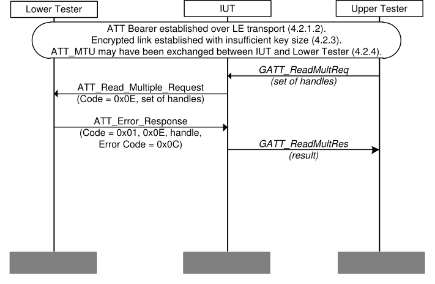

**Figure 4.70: GATT/CL/GAR/BI-22-C [Read Multiple Characteristic Values – Insufficient Encryption Key Size] MSC**

• Expected Outcome
Pass verdict
The IUT sends a correctly formatted ATT_Read_Multiple_Request to the Lower Tester.
Upon receiving an ATT_Error_Response from the Lower Tester the IUT sends the result to the Upper Tester, e.g., GATT_ReadMultRes.
GATT/SR/GAR/BV-05-C [Read Multiple Characteristic Values – from Server]
• Test Purpose
Verify that a Generic Attribute Profile server can support reading multiple Characteristic Values selected by a set of handles.
• Reference
[1] 4.8.4
[5] 3.4.4.7, 3.4.4.8
• Initial Condition
- A preamble procedure defined in Section 4.2.1 is used to set up the transport and L2CAP channel.
- A preamble procedure defined in Section 4.2.5 may have been used to exchange ATT MTU between the IUT and the Lower Tester.
- The Lower Tester has the necessary security permissions from the IUT to read the characteristics.
• Test Procedure
Send an ATT_Read_Multiple_Request (0x0E) from the Lower Tester to the IUT using the selected set of handles.

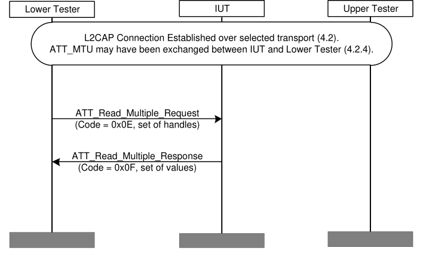

**Figure 4.71: GATT/SR/GAR/BV-05-C [Read Multiple Characteristic Values – from Server] MSC**

• Expected Outcome
Pass verdict
The IUT sends ATT_Read_Multiple_Response (0x0F) to the Lower Tester.
The Characteristic Values are set to the values of the characteristics selected by the set of handles in the ATT_Read_Multiple_Request.
The response size does not exceed any negotiated ATT_MTU. If the combined length of the Characteristic Values are longer than (ATT_MTU – 1) then the first (ATT_MTU – 1) octets are included in this response.
The IUT responds within the applicable timeout (3.3.3/ATT [5]).
GATT/SR/GAR/BI-18-C [Read Multiple Characteristic Values – Read Not Permitted]
• Test Purpose
Verify that a Generic Attribute Profile server can detect and reject a Read Multiple Characteristic Values Request including any non-readable Characteristic Value and issue a Read Not Permitted Response.
• Reference
[1] 4.8.4
[5] 3.4.4.7, 3.4.4.8
• Initial Condition
- A preamble procedure defined in Section 4.2.1 is used to set up the transport and L2CAP channel.
- A preamble procedure defined in Section 4.2.5 may have been used to exchange ATT MTU between the IUT and the Lower Tester.
- A set of at two handles of Characteristic Values in the IUT of which one does not permit reading is selected.
• Test Procedure
Send an ATT_Read_Multiple_Request from the Lower Tester to the IUT using the selected set of handles.

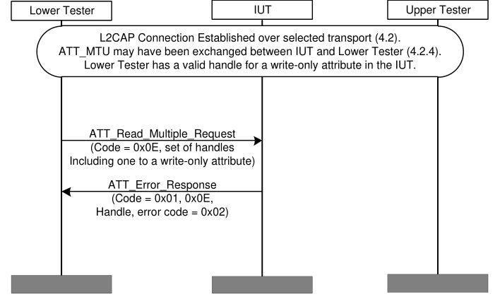

**Figure 4.72: GATT/SR/GAR/BI-18-C [Read Multiple Characteristic Values – Read not permitted] MSC**

• Expected Outcome
Pass verdict
The IUT sends an ATT_Error_Response (code 0x01) to the Lower Tester. The Request Opcode in Error parameter is set to 0x0E. The Attribute Handle in Error parameter is set to the first handle causing the error. The Error code is set to 0x02, Read Not Permitted.
The IUT responds within the applicable timeout (3.3.3/ATT [5]).
GATT/SR/GAR/BI-19-C [Read Multiple Characteristic Values – Invalid Handle]
• Test Purpose
Verify that a Generic Attribute Profile server can detect and reject a Read Multiple Characteristic Value Request including an unsupported Characteristic Value handle and issue an Invalid Handle Response.
• Reference
[1] 4.8.4
[5] 3.4.4.7, 3.4.4.8
• Initial Condition
- A preamble procedure defined in Section 4.2.1 is used to set up the transport and L2CAP channel.
- A preamble procedure defined in Section 4.2.5 may have been used to exchange ATT MTU between the IUT and the Lower Tester.
- The Lower Tester selects a set of two handles of which one is known to be invalid.
• Test Procedure
Send an ATT_Read_Multiple_Request from the Lower Tester to the IUT using the selected set of handles.

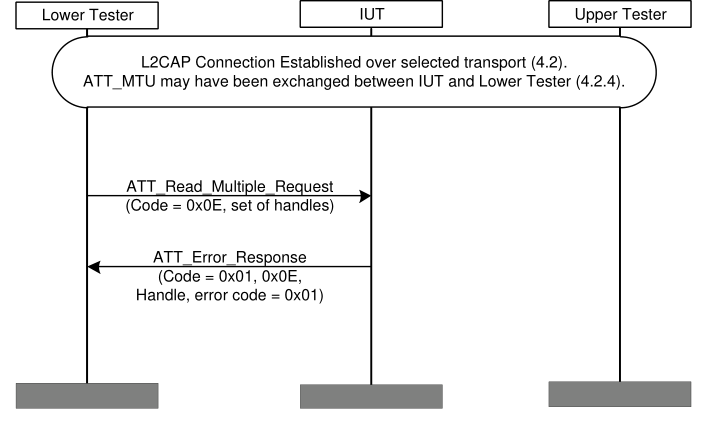

**Figure 4.73: GATT/SR/GAR/BI-19-C [Read Multiple Characteristic Values – Invalid Handle] MSC**

• Expected Outcome
Pass verdict
The IUT sends an ATT_Error_Response (code 0x01) to the Lower Tester. The Request Opcode in Error parameter is set to 0x0E. The Attribute Handle in Error parameter is set to the first handle causing the error. The Error code is set to 0x01, Invalid Handle.
The IUT responds within the applicable timeout (3.3.3/ATT [5]).
GATT/SR/GAR/BI-20-C [Read Multiple Characteristic Values – Insufficient Authorization]
• Test Purpose
Verify that a Generic Attribute Profile server can detect and reject a Read Multiple Characteristic Value Request and issue an Insufficient Authorization Response.
• Reference
[1] 4.8.4
[5] 3.4.4.7, 3.4.4.8
• Initial Condition
- A preamble procedure defined in Section 4.2.1.2 is used to set up the transport and L2CAP channel over LE.
- A preamble procedure defined in Section 4.2.5 may have been used to exchange ATT MTU between the IUT and the Lower Tester.
- A set of two handles of Characteristic Values in the IUT of which one requires read authorization is selected.
- No authorization procedure has been performed between the IUT and the Lower Tester.
• Test Procedure
Send an ATT_Read_Multiple_Request from the Lower Tester to the IUT using the selected set of handles.

**Figure 4.74: GATT/SR/GAR/BI-20-C [Read Multiple Characteristic Values – Insufficient Authorization] MSC**

• Expected Outcome
Pass verdict
The IUT sends an ATT_Error_Response (code 0x01) to the Lower Tester. The Request Opcode in Error parameter is set to 0x0E. The Attribute Handle in Error parameter is set to the first handle causing the error. The Error code is set to 0x08, Insufficient Authorization.
The IUT responds within the applicable timeout (3.3.3/ATT [5]).
GATT/SR/GAR/BI-21-C [Read Multiple Characteristic Values – Insufficient Authentication]
• Test Purpose
Verify that a Generic Attribute Profile server can detect and reject a Read Multiple Characteristic Value Request and issue an Insufficient Authentication Response.
• Reference
[1] 4.8.4
[5] 3.4.4.7, 3.4.4.8
• Initial Condition
- A preamble procedure defined in Section 4.2.1.2 is used to set up the transport and L2CAP channel over LE.
- A preamble procedure defined in Section 4.2.5 may have been used to exchange ATT MTU between the IUT and the Lower Tester.
- A set of two handles of Characteristic Values in the IUT of which one requires read authentication is selected.
- No authentication procedure has been performed between the IUT and the Lower Tester.
• Test Procedure
Send an ATT_Read_Multiple_Request from the Lower Tester to the IUT using the selected set of handles.

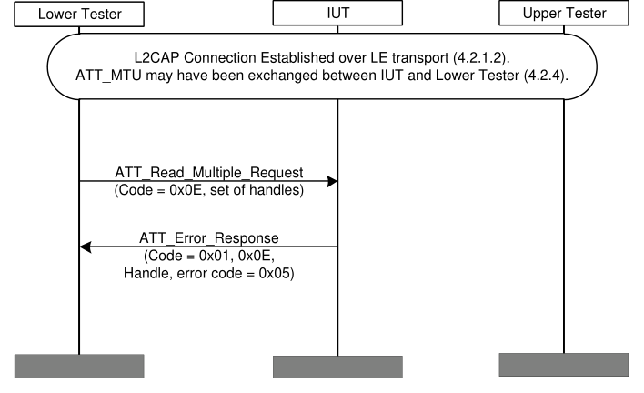

**Figure 4.75: GATT/SR/GAR/BI-21-C [Read Multiple Characteristic Values – Insufficient Authentication] MSC**

• Expected Outcome
Pass verdict
The IUT sends an ATT_Error_Response (code 0x01) to the Lower Tester. The Request Opcode in Error parameter is set to 0x0E. The Attribute Handle in Error parameter is set to the first handle causing the error. The Error code is set to 0x05, Insufficient Authentication.
The IUT responds within the applicable timeout (3.3.3/ATT [5]).
GATT/SR/GAR/BI-22-C [Read Multiple Characteristic Values – Insufficient Encryption Key Size]
• Test Purpose
Verify that a Generic Attribute Profile server can detect and reject a Read Multiple Characteristic Value Request and issue an Insufficient Encryption Key Size Response.
• Reference
[1] 4.8.4
[5] 3.4.4.7, 3.4.4.8
• Initial Condition
- A preamble procedure defined in Section 4.2.1.2 is used to set up the transport and L2CAP channel over LE.
- A preamble procedure defined in Section 4.2.4 is used to set up an encrypted link.
- A preamble procedure defined in Section 4.2.5 may have been used to exchange ATT MTU between the IUT and the Lower Tester.
- A set of two handles of Characteristic Values in the IUT of which one requires encryption with a key longer than the key used to establish the encrypted link is selected.
• Test Procedure
Send an ATT_Read_Multiple_Request from the Lower Tester to the IUT using the selected set of handles.

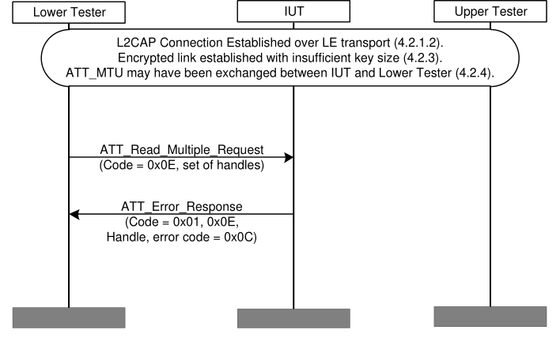

**Figure 4.76: GATT/SR/GAR/BI-22-C [Read Multiple Characteristic Values – Insufficient Encryption Key Size] MSC**

• Expected Outcome
Pass verdict
The IUT sends an ATT_Error_Response (code 0x01) to the Lower Tester. The Request Opcode in Error parameter is set to 0x0E. The Attribute Handle in Error parameter is set to the first handle causing the error. The Error code is set to 0x0C, Insufficient Encryption Key Size.
The IUT responds within the applicable timeout (3.3.3/ATT [5]).
• Test Purpose
Verify that a Generic Attribute Profile client can read a characteristic descriptor selected by handle.
• Reference
[1] 4.12.1
[5] 3.4.4.3, 3.4.4.4
• Initial Condition
- A preamble procedure defined in Section 4.2.1 is used to set up the transport and L2CAP channel.
- A preamble procedure defined in Section 4.2.5 may have been used to exchange ATT MTU between the IUT and the Lower Tester.
- If the characteristic descriptor permissions require a specific security mode and level, execute pairing and/or bonding with the required security mode and level.
• Test Procedure
Send a request from the Upper Tester to the IUT to read a characteristic descriptor value from the Lower Tester by specifying the descriptor handle e.g., GATT_ReadReq.

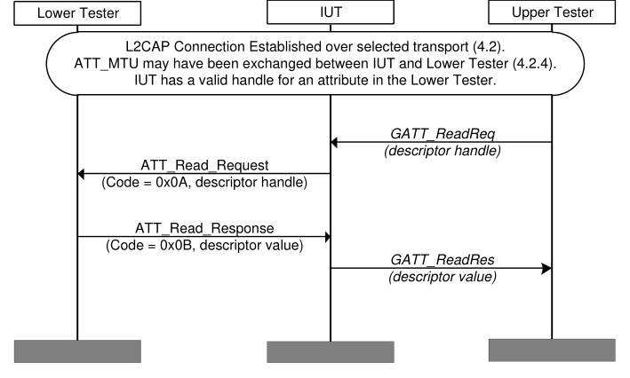

**Figure 4.77: GATT/CL/GAR/BV-06-C [Read Characteristic Descriptor – by Client] MSC**

• Expected Outcome
Pass verdict
The IUT sends a correctly formatted ATT_Read_Request (0x0A) to the Lower Tester.
The characteristic handle parameter is set to a valid handle sent by the Upper Tester.
The IUT receives the ATT_Read_Response (0x0B) sent by the Lower Tester.
The IUT sends the received response to the Upper Tester. e.g., GATT_ReadRes
The descriptor value matches the value delivered by the Lower Tester.
• Test Purpose
Verify that a Generic Attribute Profile server can support reading a characteristic descriptor selected by handle.
• Reference
[1] 4.12.1
[5] 3.4.4.3, 3.4.4.4
• Initial Condition
- A preamble procedure defined in Section 4.2.1 is used to set up the transport and L2CAP channel.
- A preamble procedure defined in Section 4.2.5 may have been used to exchange ATT MTU between the IUT and the Lower Tester.
- The Lower Tester has the necessary security permissions from the IUT to read the characteristic descriptor.
• Test Procedure
Send an ATT_Read_Request from the Lower Tester to the IUT to read a characteristic descriptor value by specifying the Descriptor handle e.g., ATT_Read_Request.

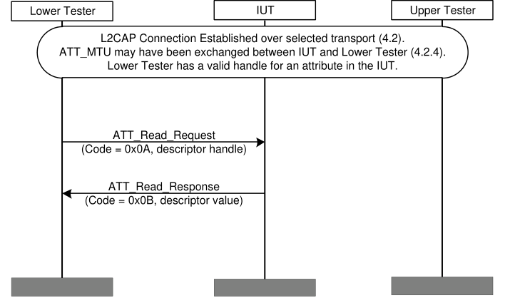

**Figure 4.78: GATT/SR/GAR/BV-06-C [Read Characteristic Descriptor – from Server] MSC**

• Expected Outcome
Pass verdict
The IUT sends ATT_Read_Response (0x0B) to the Lower Tester.
The Descriptor value is set to the value of the Descriptor identified by the attribute handle in the ATT_Read_Request.
The response size does not exceed any negotiated ATT_MTU. If the Characteristic Value is longer than (ATT_MTU – 1) then the first (ATT_MTU – 1) octets are included in this response.
The IUT responds within the applicable timeout (3.3.3/ATT [5]).
GATT/CL/GAR/BV-07-C [Read Long Characteristic Descriptor - by Client]
• Test Purpose
Verify that a Generic Attribute Profile client can read a characteristic descriptor by selected handle. The Characteristic Descriptor length is unknown to the client and might be long.
• Reference
[1] 4.12.2
[5] 3.4.4.5, 3.4.4.6
• Initial Condition
- A preamble procedure defined in Section 4.2.1 is used to set up the transport and L2CAP channel.
- A preamble procedure defined in Section 4.2.5 may have been used to exchange ATT MTU between the IUT and the Lower Tester.
- If the characteristic descriptor permissions require a specific security mode and level, execute pairing and/or bonding with the required security mode and level.
• Test Procedure
Send a command from the Upper Tester to the IUT to read a potentially long characteristic descriptor from the Lower Tester by specifying the characteristic handle e.g., GATT_ReadLongDescriptorReq (handle) in each of the following four steps.
The Upper Tester will specify the handle of a long characteristic descriptor with a length of m*ATT_MTU-1 + n with m >= 1 and 1 <= n < ATT_MTU-1 contained in the Lower Tester.

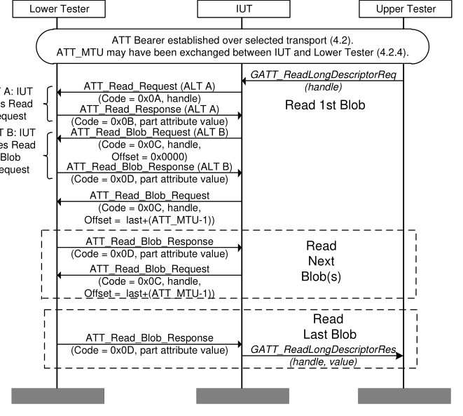

**Figure 4.79: GATT/CL/GAR/BV-07-C [Read Long Characteristic Descriptor - by Client] MSC – Step 1**

The Upper Tester will specify the handle of a long Characteristic Descriptor with a length of m*ATT_MTU-1 with m >= 2 contained in the Lower Tester.

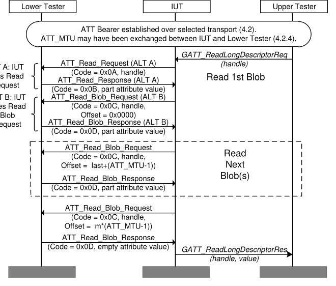

**Figure 4.80: GATT/CL/GAR/BV-07-C [Read Long Characteristic Descriptor - by Client] MSC – Step 2**

Step 3: Characteristic Descriptor is short, length ATT_MTU-1 octets
The Upper Tester will specify the handle of a long Characteristic Descriptor with a length of ATT_MTU-1 contained in the Lower Tester.
Upper Tester IUT Lower Tester

| ATT Bearer established ove ATT MTU may have been exchanged b _ | r selected transport (4.2). etween IUT and Lower Tester (4.2.4 |
| --- | --- |
| ATT Read Request (ALT A) |  |
| _ _ (Code = 0x0A, handle) ATT Read Response (ALT A) |  |
| _ _ (Code = 0x0B, attribute value) ATT Read Blob Request (ALT B) |  |
| _ _ _ (Code = 0x0C, handle, Offset = 0x0000) ATT Read Blob Response (ALT B) |  |
| _ _ _ (Code = 0x0D, attribute value) ATT Read Blob Request _ _ _ |  |
| (Code = 0x0C, handle, Offset = (ATT MTU-1) _ ATT Read Blob Response _ _ _ |  |

ALT A: IUT Uses Read
Request
ALT B: IUT Uses Read
Blob Request
GATT_ReadLongDescriptorRes
(handle, value)

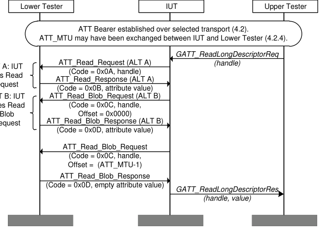

**Figure 4.81: GATT/CL/GAR/BV-07-C [Read Long Characteristic Descriptor - by Client] MSC – Step 3**

The Upper Tester will specify the handle of a long Characteristic Descriptor with a length of less than ATT_MTU-1 contained in the Lower Tester.

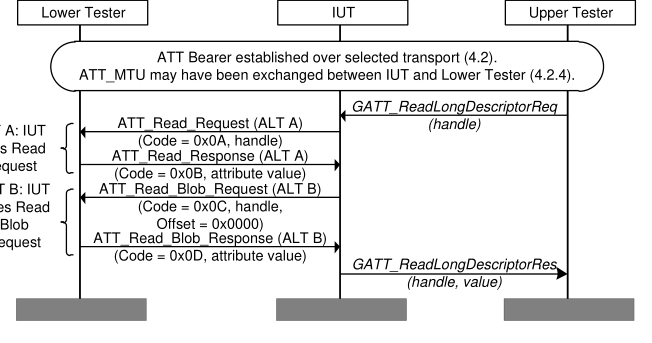

**Figure 4.82: GATT/CL/GAR/BV-07-C [Read Long Characteristic Descriptor - by Client] MSC – Step 4**

Note: In steps 3 and 4, the Lower Tester chooses to treat the Characteristic Descriptor as of variable length and thus does not respond with ATT_Error_Response (Attribute Not Long) to an ATT_Read_Blob_Request.
Note: It is recommended to execute steps 1–4 in an arbitrary sequence not known to the IUT.
• Expected Outcome
Pass verdict
The IUT sends correctly formatted ATT_Read_Blob_Request commands (0x0C) to the Lower Tester. Note that the first request may be an ATT_Read Request; in that case the Lower Tester replies with an ATT_Read_Response and the IUT detects that the Characteristic Descriptor is long, and continues with ATT_Read_Blob_Requests.
The ATT_Read_Blob_Request and optional first ATT_Read_Request specifies the handle of the Characteristic Descriptor to be read and the offset value of the first octet to be read. The offset for the first request is 0x0000; subsequent offset values are sequential values of (ATT_MTU-1).
The IUT detects the end of the long Characteristic Descriptor by the size of the last partial attribute value which is then less than (ATT_MTU-1).
When the IUT receives the responses from the Lower Tester, it may concatenate them into a single long Characteristic Descriptor and send it (e.g., a GATT_ReadLongDescriptorRes) to the Upper Tester.
The complete Long Characteristic Descriptor reported to the Upper Tester matches the value reported by the Lower Tester.
GATT/CL/GAR/BI-34-C [Read Characteristic Value – Invalid Transport Access over BR/EDR]
• Test Purpose
Verify Generic Attribute Profile client behavior when an attempt is made to use BR/EDR transport to execute the Read Characteristic Value procedure on a characteristic contained within a service defined for use only over LE transport.
• Reference
[1] 4.4, 4.8.1
[5] 3.4.1.1, 3.4.4.3
• Initial Condition
- A preamble procedure defined in Section 4.2.1.1 is used to set up the transport and L2CAP channel over BR/EDR.
- The Lower Tester is a BR/EDR/LE device.
- The Lower Tester implements a GATT-based service defined for use only over the LE transport. That GATT-based profile contains a readable characteristic. The handle of that characteristic is available to the Upper Tester.
• Test Procedure
The Upper Tester sends a command to the IUT to initiate the test, e.g., GATT_ReadReq(handle); the Upper Tester provides the handle of the characteristic contained within the GATT-based profile which is defined of use only the LE transport.

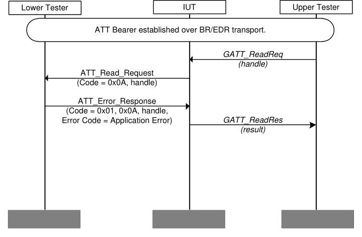

**Figure 4.83: GATT/CL/GAR/BI-34-C [Read Characteristic Value – Invalid Transport Access over BR/EDR] MSC**

• Expected Outcome
Pass verdict
The IUT sends a correctly formatted ATT_Read_Request to the Lower Tester, including the handle specified by the Upper Tester.
Upon receiving an ATT_Error_Response from the Lower Tester containing the <Application Error> the IUT sends the result to the Upper Tester, e.g., GATT_ReadRes.
• Test Purpose
Verify Generic Attribute Profile client behavior when an attempt is made to use LE transport to execute the Read Characteristic Value procedure on a characteristic contained within a service defined for use only over BR/EDR transport.
• Reference
[1] 4.4, 4.8.1
[5] 3.4.1.1, 3.4.4.3
• Initial Condition
- A preamble procedure defined in Section 4.2.1.2 is used to set up the transport and L2CAP channel over LE.
- A preamble procedure defined in Section 4.2.5 may have been used to exchange ATT MTU between the IUT and the Lower Tester.
- The Lower Tester is a BR/EDR/LE device.
- The Lower Tester implements a GATT-based service defined for use only over the BR/EDR transport. That GATT-based profile contains a readable characteristic. The handle of that characteristic is available to the Upper Tester.
• Test Procedure
The Upper Tester sends a command to the IUT to initiate the test, e.g., GATT_ReadReq(handle); the Upper Tester provides the handle of the characteristic contained within the GATT-based profile which is defined of use only the BR/EDR transport.

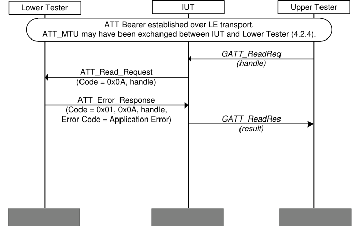

**Figure 4.84: GATT/CL/GAR/BI-35-C [Read Characteristic Value – Invalid Transport Access over LE] MSC**

• Expected Outcome
Pass verdict
The IUT sends a correctly formatted ATT_Read_Request to the Lower Tester, including the handle specified by the Upper Tester.
Upon receiving an ATT_Error_Response from the Lower Tester containing the <Application Error> the IUT sends the result to the Upper Tester, e.g., GATT_ReadRes.
GATT/SR/GAR/BV-07-C [Read Long Characteristic Descriptor - from Server]
• Test Purpose
Verify that a Generic Attribute Profile server can support reading a Long Characteristic Descriptor selected by handle.
• Reference
[1] 4.12.2
[5] 3.4.4.5, 3.4.4.6
• Initial Condition
- A preamble procedure defined in Section 4.2.1 is used to set up the transport and L2CAP channel.
- A preamble procedure defined in Section 4.2.5 may have been used to exchange ATT MTU between the IUT and the Lower Tester.
- The IUT contains at least one valid long characteristic and the handle of this characteristic is known to the test system, from IXIT [10] or from Discovery (Section 4.5).
- The Lower Tester has the necessary security permissions to read the value of the characteristic descriptor from the IUT.
• Test Procedure
Send a series of ATT_Read_Blob_Request (handle, offset) commands from the Lower Tester to the IUT to read all parts of the value of a long characteristic descriptor.

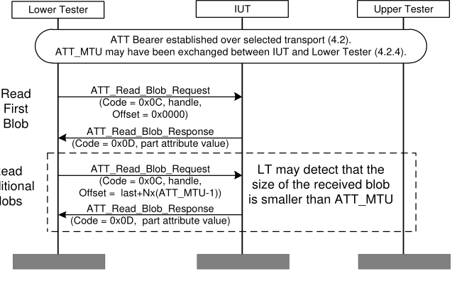

**Figure 4.85: GATT/SR/GAR/BV-07-C [Read Long Characteristic Descriptor - from Server] MSC**

• Expected Outcome
Pass verdict
The IUT sends correctly formatted ATT_Read_Blob_Responses (0x0D) or ATT_Read_Request to the Lower Tester.
The responses contain all parts of the value of the Long Characteristic Descriptor.
If the Lower Tester sends an ATT_Read_Blob_Request with the offset greater than the length of the Characteristic Value then the IUT sends an ATT_Read_Blob_Response to the Lower Tester. If the value offset of the Read Blob Request is equal to the length of the attribute value, then the length of the part attribute value in the response is zero.
Each response does not exceed any negotiated ATT_MTU.
Each IUT response occurs within the applicable timeout (3.3.3/ATT [5]).
GATT/SR/GAR/BV-08-C [Read Behind Long Characteristic Descriptor - from Server]
• Test Purpose
Verify that a Generic Attribute Profile server returns a 0-length part value when reading a Long Characteristic Descriptor selected by handle with an offset equal to the length of the Long Characteristic Value.
• Reference
[1] 4.12.2.
[5] 3.4.4.5, 3.4.4.6
• Initial Condition
- A preamble procedure defined in Section 4.2.1 is used to set up the transport and L2CAP channel.
- A preamble procedure defined in Section 4.2.5 may have been used to exchange ATT MTU between the IUT and the Lower Tester.
- The IUT contains at least one valid Long Characteristic and the handle of this Characteristic is known to the test system, from IXIT [10] or from Discovery (Section 4.5).
- The Lower Tester has the necessary security permissions to read the value of the Characteristic Descriptor from the IUT.
• Test Procedure
Send a series of ATT_Read_Blob_Request (handle, offset) commands from the Lower Tester to the IUT to read all parts of the value of a Long Characteristic Descriptor.
When the size of the part attribute value in the received ATT_Read_Blob_Request is shorter than ATT_MTU-1, the Lower Tester calculates the length of the Characteristic Value and sends an ATT_Read_Blob_Request with the offset set to that length.

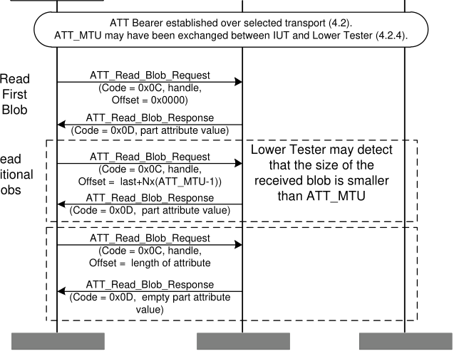

**Figure 4.86: GATT/SR/GAR/BV-08-C [Read Behind Long Characteristic Descriptor - from Server] MSC**

• Expected Outcome
Pass verdict
The IUT sends correctly formatted ATT_Read_Blob_Responses (0x0D) or ATT_Read_Request to the Lower Tester.
The responses contain all parts of the value of the Long Characteristic Descriptor.
The ATT_Read_Blob_Response (0x0D) to the last ATT_Read_Blob_Request contains a 0-length part attribute value.
Each response does not exceed any negotiated ATT_MTU.
Each IUT response occurs within the applicable timeout (3.3.3/ATT [5]).
GATT/SR/GAR/BI-34-C [Read Characteristic Value - Invalid Transport Access over LE]
• Test Purpose
Verify that a Generic Attribute Profile server can detect and reject a Read Characteristic Value Request, delivered over LE transport, to a readable Characteristic Value included in a service defined only over BR/EDR transport, and issue an Application Error Response.
• Reference
[1] 4.4, 4.8.1
[5] 3.4.1.1, 3.4.4.3
• Initial Condition
- A preamble procedure defined in Section 4.2.1.2 is used to set up the transport and L2CAP channel over LE.
- A preamble procedure defined in Section 4.2.5 may have been used to exchange ATT MTU between the IUT and the Lower Tester.
- The IUT and Lower Tester are BR/EDR/LE devices.
- The IUT implements a GATT-based service defined for use only over the BR/EDR transport. That GATT-based profile contains a readable characteristic. The handle of that characteristic is available to the Upper Tester via IXIT [10].
• Test Procedure
Send an ATT_Read_Request from the Lower Tester to the IUT using the selected handle over the LE transport.

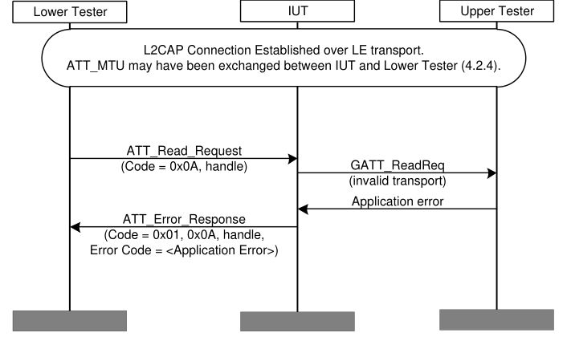

**Figure 4.87: GATT/SR/GAR/BI-34-C [Read Characteristic Value - Invalid Transport Access over LE] MSC**

• Expected Outcome
Pass verdict
The IUT sends an ATT_Error_Response (code 0x01) to the Lower Tester. The Request Opcode in Error parameter is set to 0x0A. The Attribute Handle in Error parameter is set to the handle sent by the Lower Tester. The Error code is set to an <Application Error> code as defined in 3.3/ATT [5].
The IUT responds within the applicable timeout (3.3.3/ATT [5]).
GATT/SR/GAR/BI-35-C [Read Characteristic Value - Invalid Transport Access over BR/EDR]
• Test Purpose
Verify that a Generic Attribute Profile server can detect and reject a Read Characteristic Value Request, delivered over BR/EDR transport, to a readable Characteristic Value included in a service defined only over LE transport, and issue an Application Error Response.
• Reference
[1] 4.4, 4.8.1
[5] 3.4.1.1, 3.4.4.3
• Initial Condition
- A preamble procedure defined in Section 4.2.1.1 is used to set up the transport and L2CAP channel over BR/EDR.
- The IUT and Lower Tester are BR/EDR/LE devices.
- The IUT implements a GATT-based service defined for use only over the LE transport. That GATT-based profile contains a readable characteristic. The handle of that characteristic is available to the Upper Tester via IXIT [10].
• Test Procedure
Send an ATT_Read_Request from the Lower Tester to the IUT using the selected handle over BR/EDR transport.

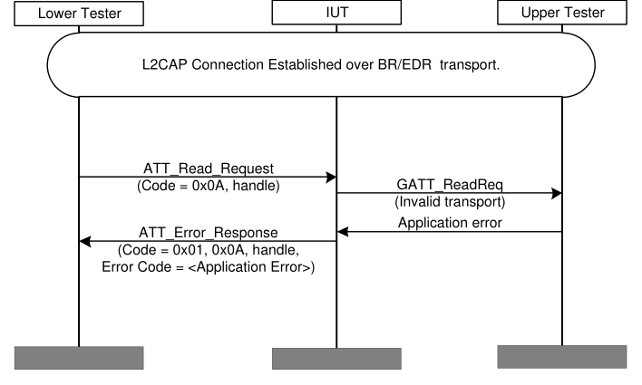

**Figure 4.88: GATT/SR/GAR/BI-35-C [Read Characteristic Value - Invalid Transport Access over BR/EDR] MSC**

• Expected Outcome
Pass verdict
The IUT sends an ATT_Error_Response (code 0x01) to the Lower Tester. The Request Opcode in Error parameter is set to 0x0A. The Attribute Handle in Error parameter is set to the handle sent by the Lower Tester. The Error code is set to an <Application Error> code as defined in 3.3/ATT.
The IUT responds within the applicable timeout (3.3.3/ATT [5]).
• Test Purpose
Verify that a Generic Attribute Profile client can read multiple values of a set of attributes that have a variable or unknown value length, selected by a set of handles.
• Reference
[12] 4.8.5
[13] 3.4.4.11, 3.4.4.12
• Initial Condition
- A preamble procedure defined in Section 4.2.1 is used to set up the transport and L2CAP channel.
- A preamble procedure defined in Section 4.2.4 may have been used to exchange ATT MTU between the IUT and the Lower Tester.
- The IXIT specifies the L2CAP MTU (MTUL2CAP).
- A set of at least two handles of Characteristic Values in the Lower Tester that permit reading is selected. The combined length of the set of Characteristic Values is less than (MTUL2CAP - 1).
• Test Procedure

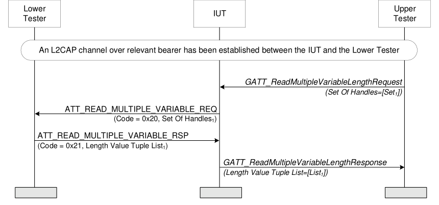

**Figure 4.89: GATT/CL/GAR/BV-08-C [Read Multiple Variable Length Characteristic Values – by Client] MSC**

1. The Upper Tester sends a command to the IUT to read a set of Characteristic Values selected by
a set of handles, e.g., GATT_ReadMultipleVariableLengthRequest. 2. The IUT sends a correctly formatted ATT_READ_MULTIPLE_VARIABLE_REQ (Code = 0x20)
PDU to the Lower Tester. 3. The Lower Tester sends an ATT_READ_MULTIPLE_VARIABLE_RSP (Code = 0x21) PDU to the
IUT, with the length and value of the requested characteristics. 4. The IUT sends the received responses to the Upper Tester, e.g.,
GATT_ReadMultipleVariableLengthResponse, with the same data reported by the Lower Tester in step 3.
• Expected Outcome
Pass verdict
The IUT sends a correctly formatted ATT_READ_MULTIPLE_VARIABLE_REQ to the Lower Tester.
The Set Of Handles parameter is set to the list of valid handles specified by the Upper Tester.
The IUT receives the ATT_READ_MULTIPLE_VARIABLE_RSP sent by the Lower Tester.
The IUT sends the received responses to the Upper Tester, e.g., GATT_ReadMultipleVariableLengthResponse with the same set of length and values reported by the Lower Tester.

#### 4.6.1 Read Multiple Variable Length Characteristic Values over multiple bearers –

by Client
• Test Purpose
Verify that a Generic Attribute Profile client can set up multiple bearers and read multiple values of a set of attributes that have a variable or unknown value length, selected by a set of handles, through each channel, multiplexed.
• Reference
[12] 4.8.5
[13] 3.4.4.11, 3.4.4.12
• Initial Condition
- The Lower Tester sets the EATT Supported bit set to 1 in the Server Supported Features characteristic.
- A preamble procedure defined in Section 4.2.1.3 or, respectively, Section 4.2.1.4 is used to set up the transport and at least two L2CAP channels.
- A preamble procedure defined in Section 4.2.3.2 is used to inform the Lower Tester that the IUT supports the Enhanced ATT bearer feature.
- Two sets of at least two handles of Characteristic Values each in the IUT that permit reading are selected.
• Test Case Configuration

|  | Test Case |  |  | Bearer |  |
| --- | --- | --- | --- | --- | --- |
| GATT/CL/GAR/BV-10-C |  |  | Unenhanced ATT + EATT |  |  |
| GATT/CL/GAR/BV-11-C |  |  | EATT |  |  |

Table 4.3: Read Multiple Variable Length Characteristic Values over multiple bearers – by Client test cases
• Test Procedure

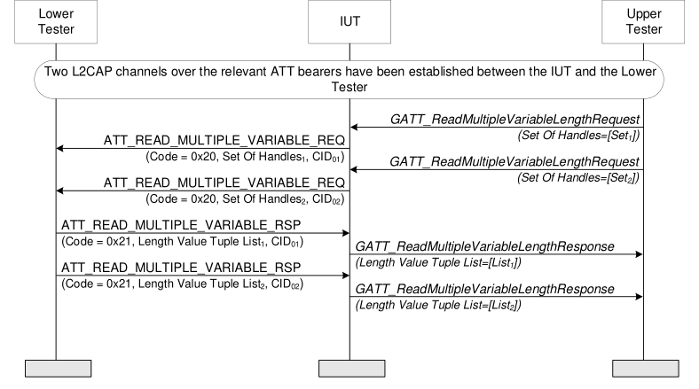

**Figure 4.90: Read Multiple Variable Length Characteristic Values over multiple bearers – by Client MSC**

1. The Upper Tester sends a command to the IUT to read a set of Characteristic Values selected by
a set of handles, e.g., GATT_ReadMultipleVariableLengthRequest. 2. The IUT sends a correctly formatted ATT_READ_MULTIPLE_VARIABLE_REQ (Code = 0x20)
PDU to the Lower Tester on a first CID. 3. The Upper Tester sends a second command to the IUT to read a second set of Characteristic
Values selected by a second set of handles, e.g., GATT_ReadMultipleVariableLengthRequest, on the second channel. 4. The IUT sends a second correctly formatted ATT_READ_MULTIPLE_VARIABLE_REQ PDU to
the Lower Tester, on the second L2CAP CID. 5. The Lower Tester sends an ATT_READ_MULTIPLE_VARIABLE_RSP (Code = 0x21) PDU to the
IUT, with the length and value of the characteristics requested in step 2, on the first CID. 6. The IUT sends the received response to the Upper Tester, e.g.,
GATT_ReadMultipleVariableLengthResponse, with the same set of data reported by the Lower Tester. 7. The Lower Tester sends an ATT_READ_MULTIPLE_VARIABLE_RSP PDU to the IUT,
corresponding to the second request (in step 4) with the length and value of the requested characteristics, on the second CID. 8. The IUT sends the received response to the Upper Tester, e.g.,
GATT_ReadMultipleVariableLengthResponse, with the same set of data reported by the Lower Tester.
• Expected Outcome
Pass verdict
The IUT sends two correctly formatted ATT_READ_MULTIPLE_VARIABLE_REQ PDUs to the Lower Tester.
The Set Of Handles parameter is set to the list of valid handles specified by the Upper Tester, for each PDU the IUT sends.
The IUT receives the two ATT_READ_MULTIPLE_VARIABLE_REQ PDUs sent by the Lower Tester.
The IUT sends the received responses to the Upper Tester, e.g., GATT_ReadMultipleVariableLengthResponse with the same set of values reported by the Lower Tester.
• Notes
A device supporting EATT is not mandatory to support more than one L2CAP channel.
GATT/CL/GAR/BI-36-C [Read Multiple Variable Length Characteristic Values – Read Not Permitted]
• Test Purpose
Verify Generic Attribute Profile client behavior when the Read Multiple Variable Length Request procedure fails due to read not permitted.
• Reference
[12] 4.8.5
[13] 3.4.1.1, 3.4.4.11
• Initial Condition
- A preamble procedure defined in Section 4.2.1 is used to set up the transport and L2CAP channel.
- A preamble procedure defined in Section 4.2.4 may have been used to exchange ATT MTU between the IUT and the Lower Tester.
- A set of at least two handles of Characteristic Values in the Lower Tester is selected.
• Test Procedure

**Figure 4.91: GATT/CL/GAR/BI-36-C [Read Multiple Variable Length Characteristic Values – Read not permitted] MSC**

1. The Upper Tester sends a command to the IUT to read a set of Characteristic Values selected by
a set of handles, e.g., GATT_ReadMultipleVariableLengthRequest. 2. The IUT sends an ATT_READ_MULTIPLE_VARIABLE_REQ (Code = 0x20) to the Lower Tester. 3. The Lower Tester sends an ATT_Error_Response (Code = 0x01) with Error Code = 0x02 (Read
Not Permitted) to the IUT. 4. The IUT sends the result to the Upper Tester, e.g., GATT_ReadMultipleVariableLengthResponse.
• Expected Outcome
Pass verdict
The IUT sends a correctly formatted ATT_READ_MULTIPLE_VARIABLE_REQ to the Lower Tester.
Upon receiving an ATT_Error_Response from the Lower Tester, the IUT sends the result to the Upper Tester, e.g., GATT_ReadMultipleVariableLengthResponse.
GATT/CL/GAR/BI-38-C [Read Multiple Variable Length Characteristic Values – Invalid Handle]
• Test Purpose
Verify Generic Attribute Profile client behavior when the Read Multiple Variable Length Request procedure fails due to invalid handle.
• Reference
[12] 4.8.5
[13] 3.4.1.1, 3.4.4.11
• Initial Condition
- A preamble procedure defined in Section 4.2.1 is used to set up the transport and L2CAP channel.
- A preamble procedure defined in Section 4.2.4 may have been used to exchange ATT MTU between the IUT and the Lower Tester.
• Test Procedure

**Figure 4.92: GATT/CL/GAR/BI-38-C [Read Multiple Variable Length Characteristic Values – Invalid Handle] MSC**

1. The Upper Tester sends a command to the IUT to read a set of Characteristic Values selected by
a set of handles, e.g., GATT_ReadMultipleVariableLengthRequest. 2. The IUT sends an ATT_READ_MULTIPLE_VARIABLE_REQ (Code = 0x20) to the Lower Tester. 3. The Lower Tester sends an ATT_Error_Response (Code = 0x01) with Error Code = 0x01 (Invalid
Handle) to the IUT. 4. The IUT sends the result to the Upper Tester, e.g., GATT_ReadMultipleVariableLengthResponse.
• Expected Outcome
Pass verdict
The IUT sends a correctly formatted ATT_READ_MULTIPLE_VARIABLE_REQ to the Lower Tester.
Upon receiving an ATT_Error_Response from the Lower Tester, the IUT sends the result to the Upper Tester, e.g., GATT_ReadMultipleVariableLengthResponse.
GATT/CL/GAR/BI-40-C [Read Multiple Variable Length Characteristic Values – Insufficient Authorization]
• Test Purpose
Verify Generic Attribute Profile client behavior when the Read Multiple Variable Length Request procedure fails due to insufficient authorization.
• Reference
[12] 4.8.5
[13] 3.4.1.1, 3.4.4.11
• Initial Condition
- A preamble procedure defined in Section 4.2.1 is used to set up the transport and L2CAP channel.
- A preamble procedure defined in Section 4.2.4 may have been used to exchange ATT MTU between the IUT and the Lower Tester.
- A set of at least two handles of Characteristic Values in the Lower Tester of which one requires read authorization is selected.
• Test Procedure

**Figure 4.93: GATT/CL/GAR/BI-40-C [Read Multiple Variable Length Characteristic Values – Insufficient Authorization] MSC**

1. The Upper Tester sends a command to the IUT to read a set of Characteristic Values selected by
a set of handles, e.g., GATT_ReadMultipleVariableLengthRequest. 2. The IUT sends an ATT_READ_MULTIPLE_VARIABLE_REQ (Code = 0x20) to the Lower Tester. 3. The Lower Tester sends an ATT_Error_Response (Code = 0x01) with Error Code = 0x08
(Insufficient Authorization) to the IUT. 4. The IUT sends the result to the Upper Tester, e.g., GATT_ReadMultipleVariableLengthResponse.
• Expected Outcome
Pass verdict
The IUT sends a correctly formatted ATT_READ_MULTIPLE_VARIABLE_REQ to the Lower Tester.
Upon receiving an ATT_Error_Response from the Lower Tester, the IUT sends the result to the Upper Tester, e.g., GATT_ReadMultipleVariableLengthResponse.
GATT/CL/GAR/BI-42-C [Read Multiple Variable Length Characteristic Values – Insufficient Authentication]
• Test Purpose
Verify Generic Attribute Profile client behavior when the Read Multiple Variable Length Request procedure fails due to insufficient authentication.
• Reference
[12] 4.8.5
[13] 3.4.1.1, 3.4.4.11
• Initial Condition
- A preamble procedure defined in Section 4.2.1 is used to set up the transport and L2CAP channel.
- A preamble procedure defined in Section 4.2.4 may have been used to exchange ATT MTU between the IUT and the Lower Tester.
- A set of at least two handles of Characteristic Values in the Lower Tester of which one requires read authentication is selected.
• Test Procedure

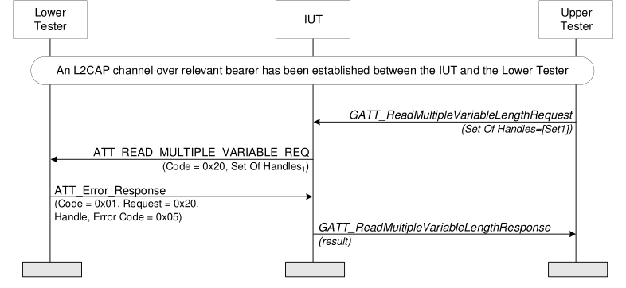

**Figure 4.94: GATT/CL/GAR/BI-42-C [Read Multiple Variable Length Characteristic Values – Insufficient Authentication] MSC**

1. The Upper Tester sends a command to the IUT to read a set of Characteristic Values selected by
a set of handles, e.g., GATT_ReadMultipleVariableLengthRequest. 2. The IUT sends an ATT_READ_MULTIPLE_VARIABLE_REQ (Code = 0x20) to the Lower Tester. 3. The Lower Tester sends an ATT_Error_Response (Code = 0x01) with Error Code = 0x05
(Insufficient Authentication) to the IUT. 4. The IUT sends the result to the Upper Tester, e.g., GATT_ReadMultipleVariableLengthResponse.
• Expected Outcome
Pass verdict
The IUT sends a correctly formatted ATT_READ_MULTIPLE_VARIABLE_REQ to the Lower Tester.
Upon receiving an ATT_Error_Response from the Lower Tester, the IUT sends the result to the Upper Tester, e.g., GATT_ReadMultipleVariableLengthResponse.
GATT/CL/GAR/BI-44-C [Read Multiple Variable Length Characteristic Values – Insufficient Encryption Key Size]
• Test Purpose
Verify Generic Attribute Profile client behavior when the Read Multiple Variable Length Request procedure fails due to encryption key size.
• Reference
[12] 4.8.5
[13] 3.4.1.1, 3.4.4.11
• Initial Condition
- A preamble procedure defined in Section 4.2.1 is used to set up the transport and L2CAP channel.
- A preamble procedure defined in Section 4.2.4 may have been used to exchange ATT MTU between the IUT and the Lower Tester.
- A preamble procedure defined in Section 4.2.4 is used to set up an encrypted link.
- A set of at least two handles of Characteristic Values in the Lower Tester of which one requires encryption with a key longer than the key used to establish the encrypted link is selected.
• Test Procedure

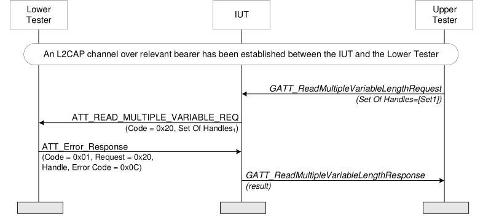

**Figure 4.95: GATT/CL/GAR/BI-44-C [Read Multiple Variable Length Characteristic Values – Insufficient Encryption Key Size] MSC**

1. The Upper Tester sends a command to the IUT to read a set of Characteristic Values selected by
a set of handles, e.g., GATT_ReadMultipleVariableLengthRequest. 2. The IUT sends an ATT_READ_MULTIPLE_VARIABLE_REQ (Code = 0x20) to the Lower Tester.
(Insufficient Encryption Key Size) to the IUT. 4. The IUT sends the result to the Upper Tester, e.g., GATT_ReadMultipleVariableLengthResponse.
• Expected Outcome
Pass verdict
The IUT sends a correctly formatted ATT_READ_MULTIPLE_VARIABLE_REQ to the Lower Tester.
Upon receiving an ATT_Error_Response from the Lower Tester, the IUT sends the result to the Upper Tester, e.g., GATT_ReadMultipleVariableLengthResponse.
GATT/SR/GAR/BV-09-C [Read Multiple Variable Length Characteristic Values – from Server]
• Test Purpose
Verify that a Generic Attribute Profile server can support reading multiple values of a set of attributes that have a variable or unknown value length, selected by a set of handles, and return their value.
• Reference
[12] 4.8.5
[13] 3.4.4.11, 3.4.4.12
• Initial Condition
- A preamble procedure defined in Section 4.2.1 is used to set up the transport and L2CAP channel.
- A preamble procedure defined in Section 4.2.4 may have been used to exchange ATT MTU between the IUT and the Lower Tester.
- A set of at least two handles of Characteristic Values in the IUT that permit reading is selected.
• Test Procedure

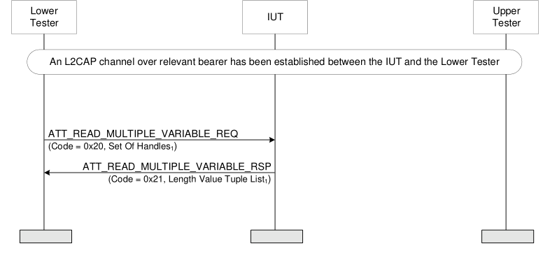

**Figure 4.96: GATT/SR/GAR/BV-09-C [Read Multiple Variable Length Characteristic Values – from Server] MSC**

1. The Lower Tester sends an ATT_READ_MULTIPLE_VARIABLE_REQ (Code = 0x20) to the IUT
using the selected set of handles. 2. The IUT sends an ATT_READ_MULTIPLE_VARIABLE_RSP (Code = 0x21) to the Lower Tester,
containing the values of the characteristics selected by the set of handles in step 1.
• Expected Outcome
Pass verdict
The IUT receives an ATT_READ_MULTIPLE_VARIABLE_REQ from the Lower Tester.
The Length Value Tuple List parameter is set to the list of valid handles specified in the ATT_READ_MULTIPLE_VARIABLE_REQ.
The response size does not exceed the ATT_MTU. If the combined length of the Characteristic Values is longer than (ATT_MTU - 1), then the first (ATT_MTU - 1) octets are included in this response.
The IUT responds within the applicable timeout (3.3.3/ATT [5]).

#### 4.6.2 Read Multiple Variable Length Characteristic Values over multiple bearers –

from Server
• Test Purpose
Verify that a Generic Attribute Profile server can set up multiple bearers and respond to interlaced requests to read multiple values of a set of attributes that have a variable or unknown value length, selected by a set of handles, and return their value.
• Reference
[12] 4.8.5
[13] 3.4.4.11, 3.4.4.12
• Initial Condition
- The IUT sets the EATT Supported bit set to 1 in the Server Supported Features characteristic.
- A preamble procedure defined in Section 4.2.1.3 or, respectively, Section 4.2.1.4 is used to set up the transport and at least two L2CAP channels.
- A preamble procedure defined in Section 4.2.3.1 is used to inform the IUT that the Lower Tester supports the Enhanced ATT bearer feature.
- Two sets of at least two handles of Characteristic Values each in the IUT that permit reading are selected.
• Test Case Configuration

|  | Test Case |  |  | Bearer |  |
| --- | --- | --- | --- | --- | --- |
| GATT/SR/GAR/BV-11-C |  |  | Unenhanced ATT + EATT |  |  |
| GATT/SR/GAR/BV-12-C |  |  | EATT |  |  |

Table 4.4: Read Multiple Variable Length Characteristic Values over multiple bearers – from Server test cases
• Test Procedure

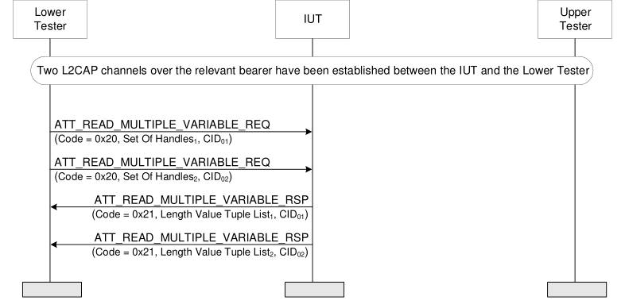

**Figure 4.97: Read Multiple Variable Length Characteristic Values over multiple bearers – from Server MSC**

1. The Lower Tester concurrently executes steps 2 and 3 before the transactions are completed. 2. The Lower Tester sends an ATT_READ_MULTIPLE_VARIABLE_REQ (Code = 0x20) to the IUT
using one of the selected set of handles, on a first CID. 3. The Lower Tester sends a second ATT_READ_MULTIPLE_VARIABLE_REQ to the IUT using a
second set of the selected set of handles and on a different valid L2CAP channel than the PDU in step 2, on the second CID. 4. The IUT sends an ATT_READ_MULTIPLE_VARIABLE_RSP (Code = 0x21) to the Lower Tester,
containing the values of the characteristics selected by the set of handles in step 2. 5. The IUT sends an ATT_READ_MULTIPLE_VARIABLE_RSP to the Lower Tester, containing the
values of the characteristics selected by the set of handles and on the L2CAP channel used in step 3.
• Expected Outcome
Pass verdict
The IUT sends correctly formatted ATT_READ_MULTIPLE_VARIABLE_REQ PDUs to the Lower Tester.
The Length Value Tuple List parameter is set to the list of valid handles specified in the ATT_READ_MULTIPLE_VARIABLE_REQ.
The response size for each PDU does not exceed the ATT_MTU. If the combined length of the Characteristic Values is longer than (ATT_MTU - 1) then the first (ATT_MTU - 1) octets are included in this response.
The IUT responds within the applicable timeout (3.3.3/ATT [5]).
Inconclusive verdict
The IUT executes step 4 or step 5 before steps 1 and 2 have been completed.
• Notes
A device supporting EATT is not mandatory to support more than one L2CAP channel.
GATT/SR/GAR/BI-36-C [Read Multiple Variable Length Characteristic Values – Read Not Permitted]
• Test Purpose
Verify that a Generic Attribute Profile server can detect and reject a Read Multiple Variable Length Request including any non-readable Characteristic Value and send a Read Not Permitted Response.
• Reference
[12] 4.8.5
[13] 3.4.4.11, 3.4.4.12
• Initial Condition
- A preamble procedure defined in Section 4.2.1 is used to set up the transport and L2CAP channel.
- A preamble procedure defined in Section 4.2.4 may have been used to exchange ATT MTU between the IUT and the Lower Tester.
- A set of at least two handles of Characteristic Values in the IUT of which one does not permit reading is selected.
• Test Procedure

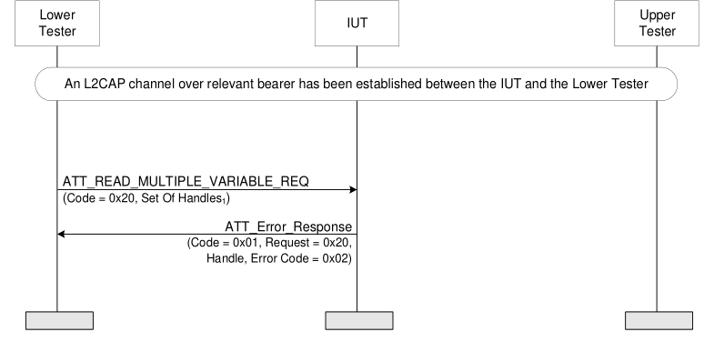

**Figure 4.98: GATT/SR/GAR/BI-36-C [Read Multiple Variable Length Characteristic Values – Read not permitted] MSC**

1. The Lower Tester sends an ATT_READ_MULTIPLE_VARIABLE_REQ (Code = 0x20) to the IUT
using the selected set of handles. 2. The IUT sends an ATT_Error_Response (Code = 0x01) with Error Code = 0x02 (Read Not
Permitted) to the Lower Tester.
• Expected Outcome
Pass verdict
The IUT sends an ATT_Error_Response to the Lower Tester. The Request Opcode in Error parameter is set to 0x20. The Attribute Handle in Error parameter is set to the first handle causing the error. The Error code is set to 0x02, Read Not Permitted.
The IUT responds within the applicable timeout (3.3.3/ATT [5]).
GATT/SR/GAR/BI-38-C [Read Multiple Variable Length Characteristic Values – Invalid Handle]
• Test Purpose
Verify that a Generic Attribute Profile server can detect and reject a Read Multiple Variable Length Request including an unsupported Characteristic Value handle and send an Invalid Handle Response.
• Reference
[12] 4.8.5
[13] 3.4.4.11, 3.4.4.12
• Initial Condition
- A preamble procedure defined in Section 4.2.1 is used to set up the transport and L2CAP channel.
- A preamble procedure defined in Section 4.2.4 may have been used to exchange ATT MTU between the IUT and the Lower Tester.
- The Lower Tester selects a set of two handles of which one is known to be invalid.
• Test Procedure

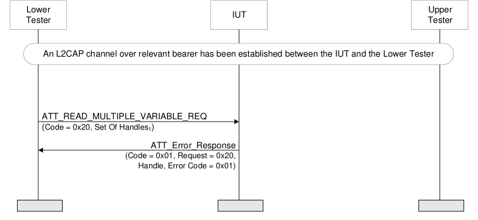

**Figure 4.99: GATT/SR/GAR/BI-38-C [Read Multiple Variable Length Characteristic Values – Invalid Handle] MSC**

1. The Lower Tester sends an ATT_READ_MULTIPLE_VARIABLE_REQ (Code = 0x20) to the IUT
using the selected set of handles. 2. The IUT sends an ATT_Error_Response (Code = 0x01) with Error Code = 0x01 (Invalid Handle)
to the Lower Tester.
• Expected Outcome
Pass verdict
The IUT sends an ATT_Error_Response to the Lower Tester. The Request Opcode in Error parameter is set to 0x20. The Attribute Handle in Error parameter is set to the first handle causing the error. The Error code is set to 0x01, Invalid Handle.
The IUT responds within the applicable timeout (3.3.3/ATT [5]).
GATT/SR/GAR/BI-40-C [Read Multiple Variable Length Characteristic Values – Insufficient Authorization]
• Test Purpose
Verify that a Generic Attribute Profile server can detect and reject a Read Multiple Variable Length Request and send an Insufficient Authorization Response.
• Reference
[12] 4.8.5
[13] 3.4.4.11, 3.4.4.12
• Initial Condition
- A preamble procedure defined in Section 4.2.1 is used to set up the transport and L2CAP channel.
- A preamble procedure defined in Section 4.2.4 may have been used to exchange ATT MTU between the IUT and the Lower Tester.
- A set of two handles of Characteristic Values in the IUT of which one requires read authorization is selected.
- No authorization procedure has been performed between the IUT and the Lower Tester.
• Test Procedure

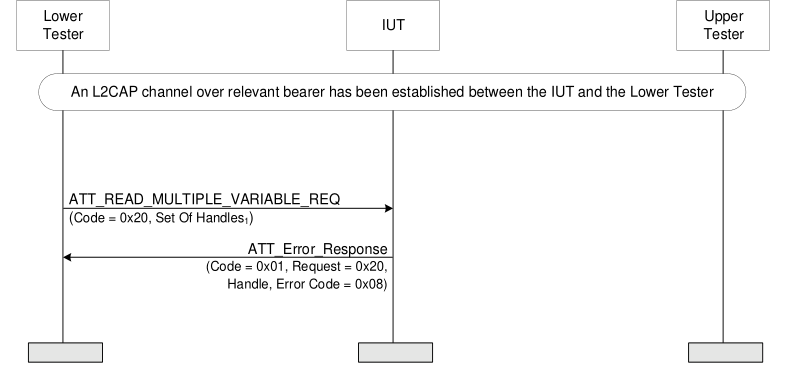

**Figure 4.100: GATT/SR/GAR/BI-40-C [Read Multiple Variable Length Characteristic Values – Insufficient Authorization] MSC**

1. The Lower Tester sends an ATT_READ_MULTIPLE_VARIABLE_REQ (Code = 0x20) to the IUT
using the selected set of handles. 2. The IUT sends an ATT_Error_Response (Code = 0x01) with Error Code = 0x08 (Insufficient
Authorization) to the Lower Tester.
• Expected Outcome
Pass verdict
The IUT sends an ATT_Error_Response to the Lower Tester. The Request Opcode in Error parameter is set to 0x20. The Attribute Handle in Error parameter is set to the first handle causing the error. The Error code is set to 0x08, Insufficient Authorization.
The IUT responds within the applicable timeout (3.3.3/ATT [5]).
GATT/SR/GAR/BI-42-C [Read Multiple Variable Length Characteristic Values – Insufficient Authentication]
• Test Purpose
Verify that a Generic Attribute Profile server can detect and reject a Read Multiple Variable Length Request and send an Insufficient Authentication Response.
• Reference
[12] 4.8.5
[13] 3.4.4.11, 3.4.4.12
• Initial Condition
- A preamble procedure defined in Section 4.2.1 is used to set up the transport and L2CAP channel.
- A preamble procedure defined in Section 4.2.4 may have been used to exchange ATT MTU between the IUT and the Lower Tester.
- A set of two handles of Characteristic Values in the IUT of which one requires read authentication is selected.
- No authentication procedure has been performed between the IUT and the Lower Tester.
• Test Procedure

**Figure 4.101: GATT/SR/GAR/BI-42-C [Read Multiple Variable Length Characteristic Values – Insufficient Authentication] MSC**

using the selected set of handles. 2. The IUT sends an ATT_Error_Response (Code = 0x01) with Error Code = 0x05 (Insufficient
Authentication) to the Lower Tester.
• Expected Outcome
Pass verdict
The IUT sends an ATT_Error_Response to the Lower Tester. The Request Opcode in Error parameter is set to 0x20. The Attribute Handle in Error parameter is set to the first handle causing the error. The Error code is set to 0x05, Insufficient Authentication.
The IUT responds within the applicable timeout (3.3.3/ATT [5]).
GATT/SR/GAR/BI-44-C [Read Multiple Variable Length Characteristic Values – Insufficient Encryption Key Size]
• Test Purpose
Verify that a Generic Attribute Profile server can detect and reject a Read Multiple Variable Length Request and send an Insufficient Encryption Key Size Response.
• Reference
[12] 4.8.5
[13] 3.4.4.11, 3.4.4.12
• Initial Condition
- A preamble procedure defined in Section 4.2.1 is used to set up the transport and L2CAP channel.
- A preamble procedure defined in Section 4.2.4 may have been used to exchange ATT MTU between the IUT and the Lower Tester.
- A preamble procedure defined in Section 4.2.4 is used to set up an encrypted link.
- A set of two handles of Characteristic Values in the IUT of which one requires encryption with a key longer than the key used to establish the encrypted link is selected.
• Test Procedure

**Figure 4.102: GATT/SR/GAR/BI-44-C [Read Multiple Variable Length Characteristic Values – Insufficient Encryption Key Size] MSC**

using the selected set of handles. 2. The IUT sends an ATT_Error_Response (Code = 0x01) with Error Code = 0x0C (Insufficient
Encryption Key Size) to the Lower Tester.
• Expected Outcome
Pass verdict
The IUT sends an ATT_Error_Response to the Lower Tester. The Request Opcode in Error parameter is set to 0x20. The Attribute Handle in Error parameter is set to the first handle causing the error. The Error code is set to 0x0C, Insufficient Encryption Key Size.
The IUT responds within the applicable timeout (3.3.3/ATT [5]).
GATT/SR/GAR/BI-45-C [Multiple Read Characteristic Value Requests – from Server]
• Test Purpose
Verify that a Generic Attribute Profile server properly handles receiving a second request before responding to the first request.
• Reference
[1] 4.8.1
[5] 3.4.1.1, 3.4.4.3, 3.4.4.4
• Initial Condition
- A preamble procedure defined in Section 4.2.1 is used to set up the transport and L2CAP channel.
- A preamble procedure defined in Section 4.2.5 may have been used to exchange ATT MTU between the IUT and the Lower Tester.
- The Lower Tester has the necessary security permissions from the IUT to read a characteristic.
• Test Procedure
Send an ATT_Read_Request from the Lower Tester to the IUT to read a Characteristic Value by specifying the Characteristic Value Handle.
Before receiving the ATT_Read_Response from the IUT, the Lower Tester sends a second ATT_Read_Request to the IUT to read a Characteristic Value by specifying the Characteristic Value Handle.

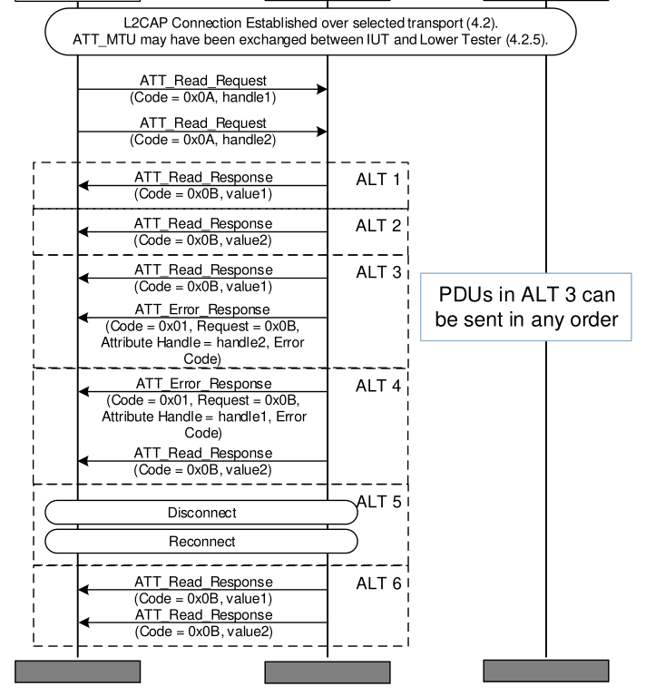

**Figure 4.103: GATT/SR/GAR/BI-45-C [Multiple Read Characteristic Value Requests – from Server] MSC**

• Expected Outcome
Pass verdict
ALT 1: The IUT sends an ATT_Read_Response for the first request and ignores the second request.
ALT 2: The IUT sends an ATT_Read_Response for the second request and ignores the first request.
ALT 3: The IUT sends an ATT_Read_Response for the first request and an ATT_Error_Response for the second request with an Error Code and the Attribute Handle set to handle 2. The two PDUs can be sent in any order.
ALT 4: The IUT sends an ATT_Error_Response for the first request with an Error Code and the Attribute Handle set to handle 1 and then sends an ATT_Read_Response for the second request.
ALT 5: The IUT disconnects the L2CAP connection with the Lower Tester. The Lower Tester then reconnects the L2CAP connection with the Lower Tester to confirm that the IUT has not crashed.
ALT 6: The IUT sends an ATT_Read_Response to the Lower Tester for the first request and then sends an ATT_Read_Response to the Lower Tester for the second request.

### 4.7 Write

Verify Generic Attribute Profile Writing of Characteristic Values and Characteristic Descriptors.
GATT/CL/GAW/BV-01-C [Write without Response - by Client]
• Test Purpose
Verify that a Generic Attribute Profile client can issue a characteristic Write without response.
• Reference
[1] 4.9.1
[5] 3.4.5.3
• Initial Condition
- A preamble procedure defined in Section 4.2.1 is used to set up the transport and L2CAP channel.
- A preamble procedure defined in Section 4.2.5 may have been used to exchange ATT MTU between the IUT and the Lower Tester.
- A handle of a Characteristic Value in the Lower Tester that permits writing is selected.
- If the characteristic permissions require a specific security mode and level, execute pairing and/or bonding with the required security mode and level.
• Test Procedure
Send a command from the Upper Tester to request the IUT to write a value of a characteristic in the Lower Tester specifying the handle that is to be written e.g., GATT_Write_Command (handle, value).

**Figure 4.104: GATT/CL/GAW/BV-01-C [Write without Response - by Client] MSC**

• Expected Outcome
Pass verdict
The IUT sends a correctly formatted ATT_Write_Command to the Lower Tester, specifying the handle of the characteristic to be written and the value that is to be written.
The size of the ATT_Write_Command does not exceed any negotiated ATT_MTU.
GATT/SR/GAW/BV-01-C [Write Without Response - to Server]
• Test Purpose
Verify that a Generic Attribute Profile server can support a write to a characteristic without response.
• Reference
[1] 4.9.1
[5] 3.4.5.3
• Initial Condition
- A preamble procedure defined in Section 4.2.1 is used to set up the transport and L2CAP channel.
- A preamble procedure defined in Section 4.2.5 may have been used to exchange ATT MTU between the IUT and the Lower Tester.
- A handle of a Characteristic Value in the IUT that permits writing is selected, if indicated in the IXIT [10]. The IXIT [10] also indicates if this characteristic is readable. If that characteristic also supports reading, then ALT 2 may be used.
- The Lower Tester has the necessary security permissions from the IUT to read and write a characteristic.
• Test Procedure
Send an ATT_Write_Command (handle, value) from the Lower Tester to the IUT.
If the Characteristic is readable, send an ATT_Read_Request (handle) to verify that value specified in the ATT_Write_Command has been written in the IUT.

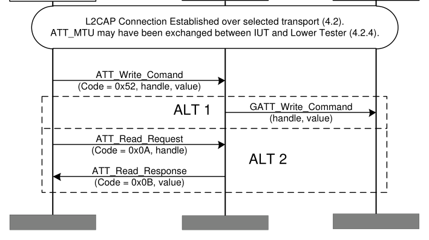

**Figure 4.105: GATT/SR/GAW/BV-01-C [Write Without Response - to Server] MSC**

• Expected Outcome
Pass verdict
ALT 1: The IUT receives the ATT_Write_Command and indicates that via message to the Upper Tester (e.g., GATT_Write_Command (handle, value)).
ALT 2: If the characteristic is readable, the IUT sends an ATT_Read_Response reporting the same value delivered in the ATT_Write_Command within the applicable timeout (3.3.3/ATT [5]).
GATT/CL/GAW/BV-02-C [Write without Response with Authentication - by Client]
• Test Purpose
Verify that a Generic Attribute Profile client can write a characteristic with authentication without response.
• Reference
[1] 4.9.2
[5] 3.4.5.3
• Initial Condition
- A preamble procedure defined in Section 4.2.1.2 is used to set up the transport and L2CAP channel over LE.
- A preamble procedure defined in Section 4.2.5 may have been used to exchange ATT MTU between the IUT and the Lower Tester.
- A handle of a Characteristic Value in the IUT that permits writing and requires authentication is selected.
- The ATT Bearer is not encrypted.
- The Lower Tester is bonded with the IUT, so it has the necessary security permissions from the IUT to write a Characteristic Value.
• Test Procedure
Send a command from the Upper Tester to request the IUT to write a value of a characteristic in the Lower Tester specifying the handle that is to be written e.g., GATT_Signed_Write_Command (handle, value).
The Lower Tester verifies the signature of the received ATT_Signed_Write_Command.

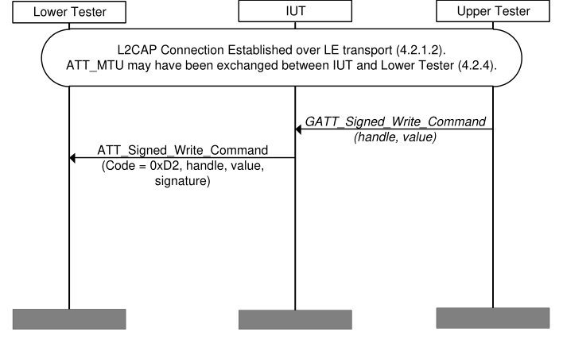

**Figure 4.106: GATT/CL/GAW/BV-02-C [Write without Response with Authentication - by Client] MSC**

• Expected Outcome
Pass verdict
The IUT sends a correctly formatted signed ATT_Signed_Write_Command to the Lower Tester and the signature is verified by the Lower Tester.
The Attribute Handle parameter is set to the handle of the characteristic that is to be written. The Characteristic Value of the Signed Write Command is an authenticated value, as defined in the Security Manager (Volume 6 [9]), and matches the value specified by the Upper Tester.
The size of the ATT_Signed_Write_Command does not exceed any negotiated ATT_MTU.
GATT/SR/GAW/BV-02-C [Write without Response with Authentication – to Server]
• Test Purpose
Verify that a Generic Attribute Profile server can support a characteristic Write with authentication without response.
• Reference
[1] 4.9.2
[5] 3.4.5.3
• Initial Condition
- A preamble procedure defined in Section 4.2.1.2 is used to set up the transport and L2CAP channel over LE.
- A preamble procedure defined in Section 4.2.5 may have been used to exchange ATT MTU between the IUT and the Lower Tester.
- A handle of a Characteristic Value in the IUT that permits writing and requires authentication is selected, if indicated in the IXIT [10]. The IXIT [10] also indicates if this characteristic is readable. If that characteristic also supports reading, then ALT 2 may be used.
- The ATT Bearer is not encrypted.
- The Lower Tester is bonded with the IUT, so it has the necessary security permissions from the IUT to read and write a Characteristic Value.
• Test Procedure
Send an ATT_Signed_Write_Command (0xD2, handle, value, signature) from the Lower Tester to the IUT.
If the characteristic is readable, send an ATT_Read_Request (0x0A, handle) command to verify that the value specified in the ATT_Signed_Write_Command has been written in the IUT.

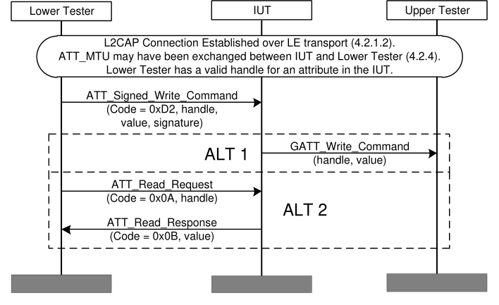

**Figure 4.107: GATT/SR/GAW/BV-02-C [Write without Response with Authentication – to Server] MSC**

• Expected Outcome
Pass verdict
ALT1: The IUT receives the ATT_Signed_Write_Command and indicates that via message to the Upper Tester (e.g., GATT_Write_Command (handle, value)).
ALT 2: If the characteristic is readable, the IUT sends an ATT_Read_Response reporting the same value delivered in the ATT_Signed_Write_Command within the applicable timeout (3.3.3/ATT [5]).
• Test Purpose
For a readable characteristic, verify that a Generic Attribute Profile server can detect a characteristic Write with authentication without response in which the signature is invalid and ignore the write command.
• Reference
[1] 4.9.2
• Initial Condition
- A preamble procedure defined in Section 4.2.1.2 is used to set up the transport and L2CAP channel over LE.
- A preamble procedure defined in Section 4.2.5 may have been used to exchange ATT MTU between the IUT and the Lower Tester.
- A handle of a Characteristic Value in the IUT that permits writing and requires authentication is selected, if indicated in the IXIT [10]. The IXIT [10] also indicates if this characteristic is readable.
- The Lower Tester and the IUT are bonded so that the Lower Tester can generate ATT_Signed_Write_Commands with valid signatures.
• Test Procedure
ALT 2: If the characteristic is readable, the Lower Tester will issue an ATT_Read_Request to determine the current value of the Characteristic Value. It will wait for an ATT_Read_Response containing the current Characteristic Value.
The Lower Tester will issue an ATT_Signed_Write_Command (0xD2, handle, value, signature) to that characteristic in the IUT using an invalid signature and with a different Characteristic Value than the value reported in the previous step.
ALT 2: If this characteristic is readable, the Lower Tester will issue another ATT_Read_Request to the same characteristic.

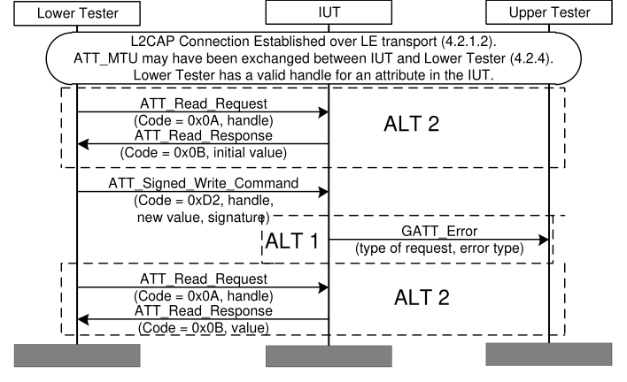

**Figure 4.108: GATT/SR/GAW/BI-01-C [Write without Response with Authentication – Invalid Signature] MSC**

• Expected Outcomes
Pass verdict
ALT 1: The IUT reports an error message to the Upper Tester. Example: a generic ‘GATT_Error’ message that indicates what kind of event happened (signed write command) and the kind of error (insufficient authentication).
ALT 2: If the characteristic is readable, in response to the first ATT_Read_Request the IUT reports an initial value for the selected characteristic in an ATT_Read_Response.
ALT 2: If the characteristic is readable, in response to the second ATT_Read_Request the IUT reports the same value for the selected characteristic in a second ATT_Read_Response.
GATT/CL/GAW/BV-03-C [Write Characteristic Value - by Client]
• Test Purpose
Verify that a Generic Attribute Profile client can write a Characteristic Value selected by handle.
• Reference
[1] 4.9.3
[5] 3.4.5.1, 3.4.5.2
• Initial Condition
- A preamble procedure defined in Section 4.2.1 is used to set up the transport and L2CAP channel.
- A preamble procedure defined in Section 4.2.5 may have been used to exchange ATT MTU between the IUT and the Lower Tester.
- A handle of a Characteristic Value in the Lower Tester that permits writing is selected.
- If the characteristic permissions require a specific security mode and level, execute pairing and/or bonding with the required security mode and level.
• Test Procedure
Send a command from the Upper Tester to request the IUT to write the value of a characteristic in the Lower Tester e.g., GATT_WriteRequest (handle, value).

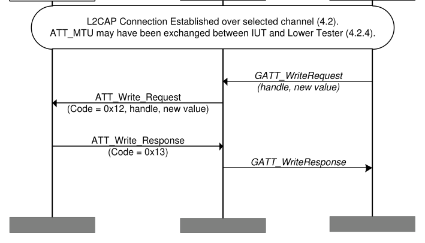

**Figure 4.109: GATT/CL/GAW/BV-03-C [Write Characteristic Value - by Client] MSC**

• Expected Outcome
Pass verdict
The IUT sends a correctly formatted ATT_Write_Request (0x12) to the Lower Tester, specifying the value that is to be written from the Upper Tester.
The Characteristic handle parameter is set to a valid handle.
The size of the ATT_Write_Request does not exceed any negotiated ATT_MTU.
The IUT receives the response from the Lower Tester and sends the GATT_WriteResponse to the Upper Tester.
GATT/CL/GAW/BI-02-C [Write Characteristic Value – Invalid Handle]
• Test Purpose
Verify Generic Attribute Profile client behavior when the Write Characteristic Value procedure fails due to invalid handle.
• Reference
[1] 4.9.3
[5] 3.4.5.1, 3.4.5.2
• Initial Condition
- A preamble procedure defined in Section 4.2.1 is used to set up the transport and L2CAP channel.
- A preamble procedure defined in Section 4.2.5 may have been used to exchange ATT MTU between the IUT and the Lower Tester.
• Test Procedure
Send a command from the Upper Tester to request the IUT to initiate the test, e.g., GATT_WriteRequest (handle, value). When the IUT receives an ATT_Error_Response it sends the result to the Upper Tester, e.g., GATT_WriteResponse.

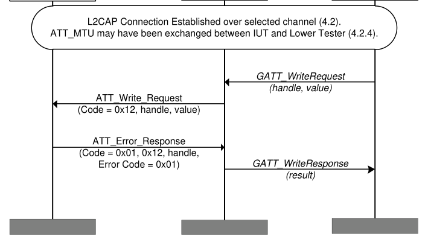

**Figure 4.110: GATT/CL/GAW/BI-02-C [Write Characteristic Value – Invalid handle] MSC**

• Expected Outcome
Pass verdict
The IUT sends a correctly formatted ATT_Write_Request to the Lower Tester.
Upon receiving an ATT_Error_Response from the Lower Tester the IUT sends the result to the Upper Tester, e.g., GATT_WriteResponse.
GATT/CL/GAW/BI-03-C [Write Characteristic Value – Write Not Permitted]
• Test Purpose
Verify Generic Attribute Profile client behavior when the Write Characteristic Value procedure fails due to write not permitted.
• Reference
[1] 4.9.3
[5] 3.4.5.1, 3.4.5.2
• Initial Condition
- A preamble procedure defined in Section 4.2.1 is used to set up the transport and L2CAP channel.
- A preamble procedure defined in Section 4.2.5 may have been used to exchange ATT MTU between the IUT and the Lower Tester.
- A handle of a Characteristic Value in the Lower Tester is selected.
• Test Procedure
Send a command from the Upper Tester to request the IUT to initiate the test, e.g., GATT_WriteRequest (handle, value). When the IUT receives an ATT_Error_Response it sends the result to the Upper Tester, e.g., GATT_WriteResponse.

**Figure 4.111: GATT/CL/GAW/BI-03-C [Write Characteristic Value – Write Not Permitted] MSC**

• Expected Outcome
Pass verdict
The IUT sends a correctly formatted ATT_Write_Request to the Lower Tester.
Upon receiving an ATT_Error_Response from the Lower Tester the IUT sends the result to the Upper Tester, e.g., GATT_WriteResponse.
GATT/CL/GAW/BI-04-C [Write Characteristic Value – Insufficient Authorization]
• Test Purpose
Verify Generic Attribute Profile client behavior when the Write Characteristic Value procedure fails due to insufficient authorization.
• Reference
[1] 4.9.3
[5] 3.4.5.1, 3.4.5.2
• Initial Condition
- A preamble procedure defined in Section 4.2.1.2 is used to set up the transport and L2CAP channel over LE.
- A preamble procedure defined in Section 4.2.5 may have been used to exchange ATT MTU between the IUT and the Lower Tester.
- A handle of a Characteristic Value in the Lower Tester that requires write authorization is selected.
• Test Procedure
Send a command from the Upper Tester to request the IUT to initiate the test, e.g., GATT_WriteRequest (handle, value). When the IUT receives an ATT_Error_Response it sends the result to the Upper Tester, e.g., GATT_WriteResponse.

**Figure 4.112: GATT/CL/GAW/BI-04-C [Write Characteristic Value – Insufficient Authorization] MSC**

• Expected Outcome
Pass verdict
The IUT sends a correctly formatted ATT_Write_Request to the Lower Tester.
Upon receiving an ATT_Error_Response from the Lower Tester the IUT sends the result to the Upper Tester, e.g., GATT_WriteResponse.
GATT/CL/GAW/BI-05-C [Write Characteristic Value – Insufficient Authentication]
• Test Purpose
Verify Generic Attribute Profile client behavior when the Write Characteristic Value procedure fails due to insufficient authentication.
• Reference
[1] 4.9.3
[5] 3.4.5.1, 3.4.5.2
• Initial Condition
- A preamble procedure defined in Section 4.2.1.2 is used to set up the transport and L2CAP channel over LE.
- A preamble procedure defined in Section 4.2.5 may have been used to exchange ATT MTU between the IUT and the Lower Tester.
- A handle of a Characteristic Value in the Lower Tester that requires write authentication is selected.
• Test Procedure
Send a command from the Upper Tester to request the IUT to initiate the test, e.g., GATT_WriteRequest (handle, value). When the IUT receives an ATT_Error_Response it sends the result to the Upper Tester, e.g., GATT_WriteResponse.

**Figure 4.113: GATT/CL/GAW/BI-05-C [Write Characteristic Value – Insufficient Authentication] MSC**

• Expected Outcome
Pass verdict
The IUT sends a correctly formatted ATT_Write_Request to the Lower Tester.
Upon receiving an ATT_Error_Response from the Lower Tester the IUT sends the result to the Upper Tester, e.g., GATT_WriteResponse.
GATT/CL/GAW/BI-06-C [Write Characteristic Value – Insufficient Encryption Key Size]
• Test Purpose
Verify Generic Attribute Profile client behavior when the Write Characteristic Value procedure fails due to insufficient encryption key size.
• Reference
[1] 4.9.3
[5] 3.4.5.1, 3.4.5.2
• Initial Condition
- A preamble procedure defined in Section 4.2.1.2 is used to set up the transport and L2CAP channel over LE.
- A preamble procedure defined in Section 4.2.4 is used to set up an encrypted link.
- A preamble procedure defined in Section 4.2.5 may have been used to exchange ATT MTU between the IUT and the Lower Tester.
- A handle of a Characteristic Value in the Lower Tester that requires encryption with a key longer than the key used to establish the encrypted link is selected.
• Test Procedure
Send a command from the Upper Tester to request the IUT to initiate the test, e.g., GATT_WriteRequest (handle, value). When the IUT receives an ATT_Error_Response it sends the result to the Upper Tester, e.g., GATT_WriteResponse.

| Lower Tester IUT Upper Tester L2CAP Connection Established over LE transport (4.2.1.2). Encrypted link established with insufficient key size (4.2.3). ATT MTU may have been exchanged between IUT and Lower Tester (4.2.4). _ GATT WriteRequest _ (handle, value) ATT Write Request _ _ (Code = 0x12, handle, value) ATT Error Response _ _ (Code = 0x01, 0x12, handle, Error Code = 0x0C) GATT WriteResponse _ (result) |  |
| --- | --- |
|  |  |

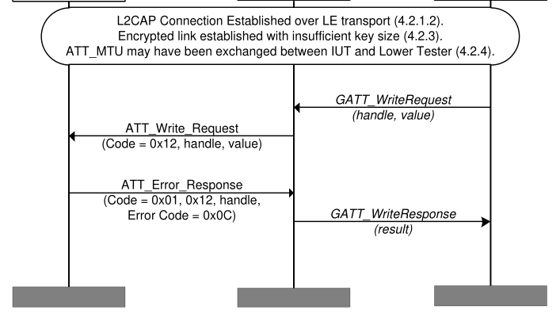

**Figure 4.114: GATT/CL/GAW/BI-06-C [Write Characteristic Value – Insufficient Encryption Key Size] MSC**

• Expected Outcome
Pass verdict
The IUT sends a correctly formatted ATT_Write_Request to the Lower Tester.
Upon receiving an ATT_Error_Response from the Lower Tester the IUT sends the result to the Upper Tester, e.g., GATT_WriteResponse.
GATT/SR/GAW/BV-03-C [Write Characteristic Value - to Server]
• Test Purpose
Verify that a Generic Attribute Profile server can support writing a Characteristic Value selected by handle.
• Reference
[1] 4.9.3
[5] 3.4.5.1, 3.4.5.2
• Initial Condition
- A preamble procedure defined in Section 4.2.1 is used to set up the transport and L2CAP channel.
- A preamble procedure defined in Section 4.2.5 may have been used to exchange ATT MTU between the IUT and the Lower Tester.
- A handle of a Characteristic Value in the IUT that permits writing is selected.
- The Lower Tester has the necessary security permissions from the IUT to read and write the characteristic.
• Test Procedure
Send an ATT_Write_Request (handle, value) from the Lower Tester to the IUT.
Send an ATT_Read_Request (handle) to verify that the value specified in the ATT_Write_Request has been written in the IUT.

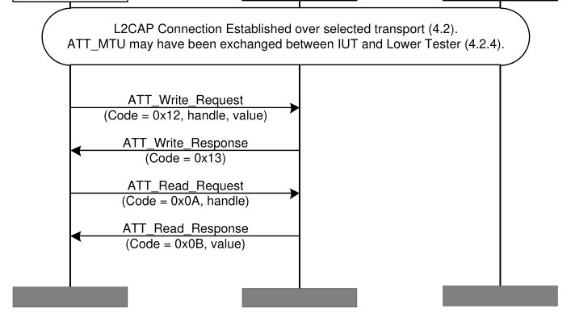

**Figure 4.115: GATT/SR/GAW/BV-03-C [Write Characteristic Value - to Server] MSC**

• Expected Outcome
Pass verdict
The IUT sends a correctly formatted ATT_Write_Response to the Lower Tester.
The IUT sends an ATT_Read_Response reporting the same value delivered in the ATT_Write_Request.
The IUT responds within the applicable timeout (3.3.3/ATT [5]).
GATT/SR/GAW/BI-02-C [Write Characteristic Value – Invalid Handle Response]
• Test Purpose
Verify that a Generic Attribute Profile server can detect a Write Characteristic Value Request with an unsupported Characteristic Value handle and issue an Invalid Handle Response.
• Reference
[1] 4.9.3
[5] 3.4.1.1, 3.4.5.2
• Initial Condition
- A preamble procedure defined in Section 4.2.1 is used to set up the transport and L2CAP channel.
- A preamble procedure defined in Section 4.2.5 may have been used to exchange ATT MTU between the IUT and the Lower Tester.
- The Lower Tester selects a handle which is known to be invalid.
• Test Procedure
The Lower Tester sends an ATT_Write_Request to the IUT to using the selected handle.

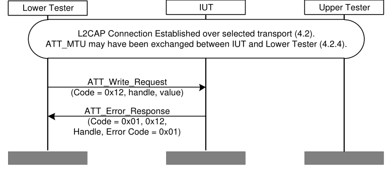

**Figure 4.116: GATT/SR/GAW/BI-02-C [Write Characteristic Value – Invalid Handle Response] MSC**

• Expected Outcome
Pass verdict
The IUT sends an ATT_Error_Response (code 0x01) to the Lower Tester. The Request Opcode in Error parameter is set to 0x12. The Attribute Handle in Error parameter is set to the handle sent by the Lower Tester. The Error code is set to 0x01, Invalid Handle.
The IUT responds within the applicable timeout (3.3.3/ATT [5]).
GATT/SR/GAW/BI-03-C [Write Characteristic Value – Write Not Permitted Response]
• Test Purpose
Verify that a Generic Attribute Profile server can detect and reject a Write Characteristic Value Request to a non-writeable Characteristic Value and issue a Write Not Permitted Response.
• Reference
[1] 4.9.3
[5] 3.4.1.1, 3.4.5.2
• Initial Condition
- A preamble procedure defined in Section 4.2.1 is used to set up the transport and L2CAP channel.
- A preamble procedure defined in Section 4.2.5 may have been used to exchange ATT MTU between the IUT and the Lower Tester.
- A handle of a Characteristic Value in the IUT that does not permit writing is selected.
• Test Procedure
The Lower Tester sends an ATT_Write_Request to the IUT using the selected handle.

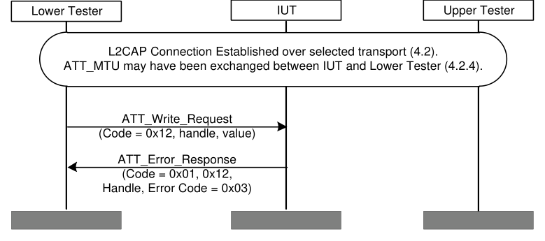

**Figure 4.117: GATT/SR/GAW/BI-03-C [Write Characteristic Value – Write Not Permitted Response] MSC**

• Expected Outcome
Pass verdict
The IUT sends an ATT_Error_Response (code 0x01) to the Lower Tester. The Request Opcode in Error parameter is set to 0x12. The Attribute Handle in Error parameter is set to the handle sent by the Lower Tester. The Error code is set to 0x03, Write not Permitted.
The IUT responds within the applicable timeout (3.3.3/ATT [5]).
GATT/SR/GAW/BI-04-C [Write Characteristic Value – Insufficient Authorization]
• Test Purpose
Verify that a Generic Attribute Profile server can detect and reject a Write Characteristic Value Request and issue an Insufficient Authorization Response.
• Reference
[1] 4.9.3
[5] 3.4.1.1, 3.4.5.2
• Initial Condition
- A preamble procedure defined in Section 4.2.1.2 is used to set up the transport and L2CAP channel over LE.
- A preamble procedure defined in Section 4.2.5 may have been used to exchange ATT MTU between the IUT and the Lower Tester.
- A handle of a Characteristic Value in the IUT that requires write authorization is selected.
- No authorization procedure has been performed between the IUT and the Lower Tester.
• Test Procedure
The Lower Tester sends an ATT_Write_Request to the IUT using the selected handle.

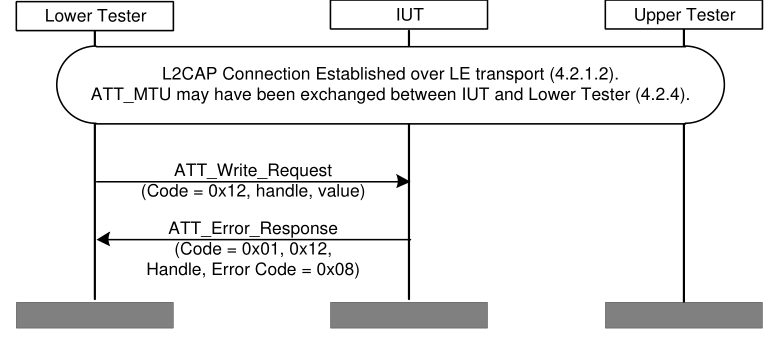

**Figure 4.118: GATT/SR/GAW/BI-04-C [Write Characteristic Value – Insufficient Authorization] MSC**

• Expected Outcome
Pass verdict
The IUT sends an ATT_Error_Response (code 0x01) to the Lower Tester. The Request Opcode in Error parameter is set to 0x12. The Attribute Handle in Error parameter is set to the handle sent by the Lower Tester. The Error code is set to 0x08, Insufficient Authorization.
The IUT responds within the applicable timeout (3.3.3/ATT [5]).
GATT/SR/GAW/BI-05-C [Write Characteristic Value – Insufficient Authentication]
• Test Purpose
Verify that a Generic Attribute Profile server can detect and reject a Write Characteristic Value Request and issue an Insufficient Authentication Response.
• Reference
[1] 4.9.3
[5] 3.4.1.1, 3.4.5.2
• Initial Condition
- A preamble procedure defined in Section 4.2.1.2 is used to set up the transport and L2CAP channel over LE.
- A preamble procedure defined in Section 4.2.5 may have been used to exchange ATT MTU between the IUT and the Lower Tester.
- A handle of a Characteristic Value in the IUT that requires write authentication is selected.
- No authentication procedure has been performed between the IUT and the Lower Tester.
• Test Procedure
The Lower Tester sends an ATT_Write_Request to the IUT using the selected handle.

**Figure 4.119: GATT/SR/GAW/BI-05-C [Write Characteristic Value – Insufficient Authentication] MSC**

• Expected Outcome
Pass verdict
The IUT sends an ATT_Error_Response (code 0x01) to the Lower Tester. The Request Opcode in Error parameter is set to 0x12. The Attribute Handle in Error parameter is set to the handle sent by the Lower Tester. The Error code is set to 0x05, Insufficient Authentication.
The IUT responds within the applicable timeout (3.3.3/ATT [5]).
GATT/SR/GAW/BI-06-C [Write Characteristic Value – Insufficient Encryption Key Size]
• Test Purpose
Verify that a Generic Attribute Profile server can detect and reject a Write Characteristic Value Request and issue an Insufficient Encryption Key Size Response.
• Reference
[1] 4.9.3
[5] 3.4.1.1, 3.4.5.2
• Initial Condition
- A preamble procedure defined in Section 4.2.1.2 is used to set up the transport and L2CAP channel over LE.
- A preamble procedure defined in Section 4.2.4 is used to set up an encrypted link.
- A preamble procedure defined in Section 4.2.5 may have been used to exchange ATT MTU between the IUT and the Lower Tester.
- A handle of a Characteristic Value in the IUT that requires encryption with a key longer than the key used to establish the encrypted link is selected.
• Test Procedure
The Lower Tester sends an ATT_Write_Request to the IUT using the selected handle.

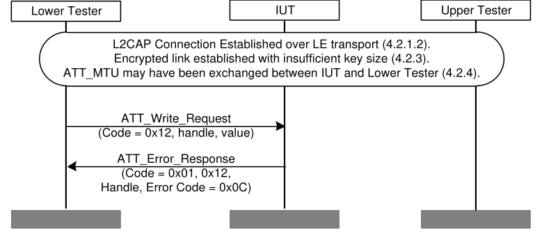

**Figure 4.120: GATT/SR/GAW/BI-06-C [Write Characteristic Value – Insufficient Encryption Key Size] MSC**

• Expected Outcome
Pass verdict
The IUT sends an ATT_Error_Response (code 0x01) to the Lower Tester. The Request Opcode in Error parameter is set to 0x12. The Attribute Handle in Error parameter is set to the handle sent by the Lower Tester. The Error code is set to 0x0 C, Insufficient Encryption Key Size.
The IUT responds within the applicable timeout (3.3.3/ATT [5]).
GATT/CL/GAW/BV-05-C [Write Long Characteristic Value - by Client]
• Test Purpose
Verify that a Generic Attribute Profile client can write a long Characteristic Value selected by handle.
• Reference
[1] 4.9.4
[5] 3.4.6.1, 3.4.6.2, 3.4.6.3, 3.4.6.4
• Initial Condition
- A preamble procedure defined in Section 4.2.1 is used to set up the transport and L2CAP channel.
- MTU is smaller than 512, and smaller than the value that has to be written.
- A preamble procedure defined in Section 4.2.5 may have been used to exchange ATT MTU between the IUT and the Lower Tester.
- The Lower Tester contains at least one valid long characteristic and the handle of this long characteristic is known to the IUT.
- If the characteristic permissions require a specific security mode and level, execute pairing and/or bonding with the required security mode and level.
• Test Procedure
Send a command from the Upper Tester to request the IUT to write the value of a long characteristic in the Lower Tester e.g., GATT_WriteLongRequest.

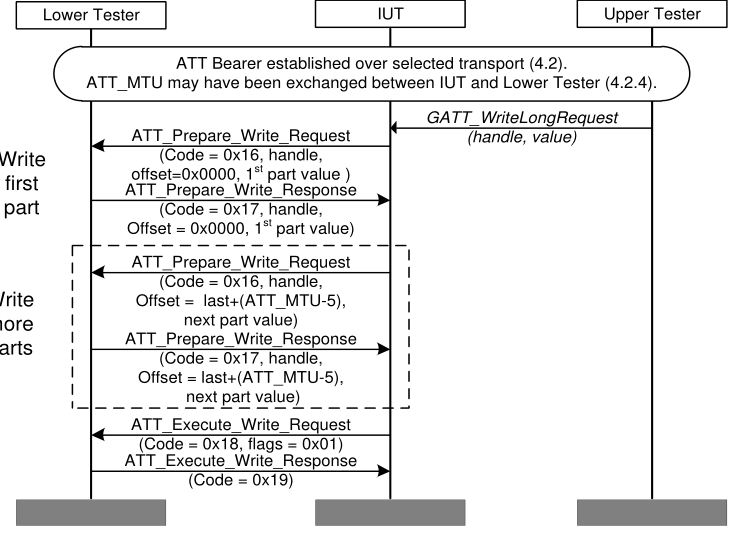

**Figure 4.121: GATT/CL/GAW/BV-05-C [Write Long Characteristic Value - by Client] MSC**

• Expected Outcome
Pass verdict
The IUT sends correctly formatted ATT_Prepare_Write_Request commands (0x16) to the Lower Tester.
Each ATT_Prepare_Write_Request specifies the handle of the long characteristic to be written, the offset of the first octet to be written, and part of the value of the long characteristic to be written. The offset parameters are all values of Nx(ATT_MTU-5), with N ranging from 0 (for the first part value) to the last value sufficient to write the entire long characteristic.
After sending all the ATT_Prepare_Write_Requests, the IUT sends a correctly formatted ATT_Execute_Write_Request (0x18).
The size of each ATT_Prepare_Write_Request does not exceed any negotiated ATT_MTU.
GATT/CL/GAW/BI-07-C [Write Long Characteristic Value – Invalid Handle]
• Test Purpose
Verify Generic Attribute Profile client behavior when the Write Long Characteristic Value procedure fails due to invalid handle.
• Reference
[1] 4.9.4
[5] 3.4.6.1, 3.4.6.2
• Initial Condition
- A preamble procedure defined in Section 4.2.1 is used to set up the transport and L2CAP channel.
- MTU is smaller than 512, and smaller than the value that has to be written.
- A preamble procedure defined in Section 4.2.5 may have been used to exchange ATT MTU between the IUT and the Lower Tester.
• Test Procedure
Send a command from the Upper Tester to request the IUT to write the value of a long characteristic in the Lower Tester e.g., GATT_WriteLongRequest (handle, value). The IUT sends an ATT_Prepare_Write_Request to the Lower Tester. When the IUT receives an ATT_Error_Response it sends the result to the Upper Tester, e.g., GATT_WriteLongResponse.

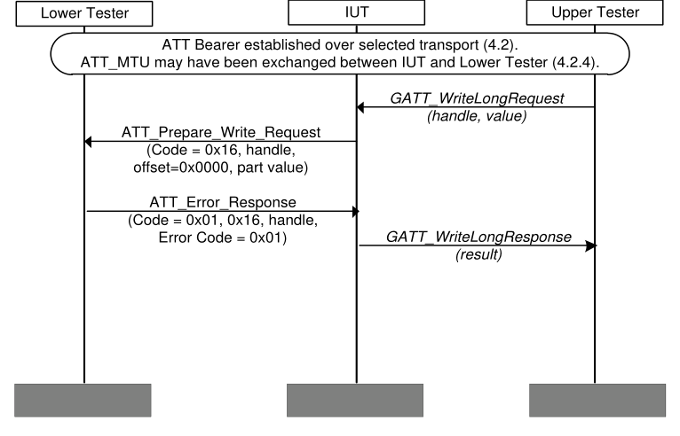

**Figure 4.122: GATT/CL/GAW/BI-07-C [Write Long Characteristic Value – Invalid Handle] MSC**

• Expected Outcome
Pass verdict
The IUT sends a correctly formatted ATT_Prepare_Write_Request to the Lower Tester.
Upon receiving an ATT_Error_Response from the Lower Tester the IUT sends the result to the Upper Tester, e.g., GATT_WriteLongResponse.
GATT/CL/GAW/BI-08-C [Write Long Characteristic Value – Write Not Permitted]
• Test Purpose
Verify Generic Attribute Profile client behavior when the Write Long Characteristic Value procedure fails due to write not permitted.
• Reference
[1] 4.9.4
[5] 3.4.6.1, 3.4.6.2
• Initial Condition
- A preamble procedure defined in Section 4.2.1 is used to set up the transport and L2CAP channel.
- MTU is smaller than 512, and smaller than the value that has to be written.
- A preamble procedure defined in Section 4.2.5 may have been used to exchange ATT MTU between the IUT and the Lower Tester.
- A handle of a Characteristic Value in the Lower Tester is selected.
• Test Procedure
Send a command from the Upper Tester to request the IUT to write the value of a long characteristic in the Lower Tester e.g., GATT_WriteLongRequest (handle, value). The IUT sends an ATT_Prepare_Write_Request to the Lower Tester. When the IUT receives an ATT_Error_Response it sends the result to the Upper Tester, e.g., GATT_WriteLongResponse.

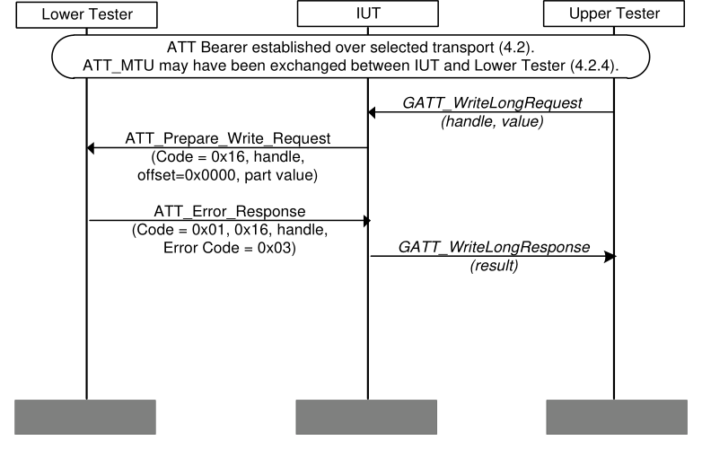

**Figure 4.123: GATT/CL/GAW/BI-08-C [Write Long Characteristic Value – Write Not Permitted] MSC**

• Expected Outcome
Pass verdict
The IUT sends a correctly formatted ATT_Prepare_Write_Request to the Lower Tester.
Upon receiving an ATT_Error_Response from the Lower Tester the IUT sends the result to the Upper Tester, e.g., GATT_WriteLongResponse.
• Test Purpose
Verify Generic Attribute Profile client behavior when the Write Long Characteristic Value procedure fails due to invalid offset.
• Reference
[1] 4.9.4
[5] 3.4.6.1, 3.4.6.2
• Initial Condition
- A preamble procedure defined in Section 4.2.1 is used to set up the transport and L2CAP channel.
- MTU is smaller than 512, and smaller than the value that has to be written.
- A preamble procedure defined in Section 4.2.5 may have been used to exchange ATT MTU between the IUT and the Lower Tester.
- A handle of a long Characteristic Value in the Lower Tester that permits writing is selected. The offset is set to a value greater than the length of the selected Characteristic Value.
• Test Procedure
Send a command from the Upper Tester to request the IUT to write the value of a long characteristic in the Lower Tester e.g., GATT_WriteLongRequest (handle, value). The IUT sends an ATT_Prepare_Write_Request to the Lower Tester, When the IUT receives an ATT_Error_Response it sends the result to the Upper Tester, e.g., GATT_WriteLongResponse.

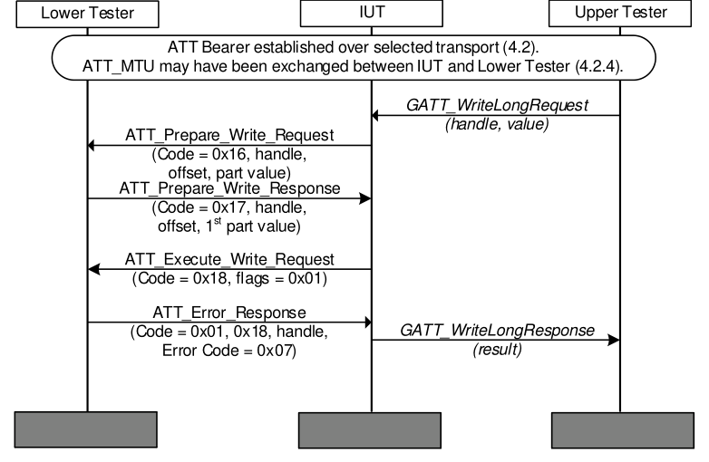

**Figure 4.124: GATT/CL/GAW/BI-09-C [Write Long Characteristic Value – Invalid Offset] MSC**

• Expected Outcome
Pass verdict
The IUT sends a correctly formatted ATT_Prepare_Write_Request to the Lower Tester.
After receiving an ATT_Prepare_Write_Response from the Lower Tester, the IUT sends a correctly formatted ATT_Execute_Write_Request to the Lower Tester.
Upon receiving an ATT_Error_Response from the Lower Tester the IUT sends the result to the Upper Tester, e.g., GATT_WriteLongResponse.
GATT/CL/GAW/BI-11-C [Write Long Characteristic Value – Insufficient Authorization]
• Test Purpose
Verify Generic Attribute Profile client behavior when the Write Long Characteristic Value procedure fails due to insufficient authorization.
• Reference
[1] 4.9.4
[5] 3.4.6.1, 3.4.6.2
• Initial Condition
- A preamble procedure defined in Section 4.2.1.2 is used to set up the transport and L2CAP channel over LE.
- MTU is smaller than 512, and smaller than the value that has to be written.
- A preamble procedure defined in Section 4.2.5 may have been used to exchange ATT MTU between the IUT and the Lower Tester.
- A handle of a Characteristic Value in the Lower Tester that requires write authorization is selected.
- No authorization procedure has been performed between the IUT and the Lower Tester.
• Test Procedure
Send a command from the Upper Tester to request the IUT to write the value of a long characteristic in the Lower Tester e.g., GATT_WriteLongRequest (handle, value). The IUT sends an ATT_Prepare_Write_Request to the Lower Tester. When the IUT receives an ATT_Error_Response it sends the result to the Upper Tester, e.g., GATT_WriteLongResponse.

| Lower Tester IUT Upper Tester ATT Bearer established over LE transport (4.2.1.2). ATT MTU may have been exchanged between IUT and Lower Tester (4.2.4). _ GATT WriteLongRequest _ (handle, value) ATT Prepare Write Request _ _ _ (Code = 0x16, handle, offset, part value) ATT Error Response _ _ (Code = 0x01, 0x16, handle, Error Code = 0x08) GATT WriteLongResponse _ (result) | Upper Tester |  |
| --- | --- | --- |
|  |  | . |
|  |  |  |

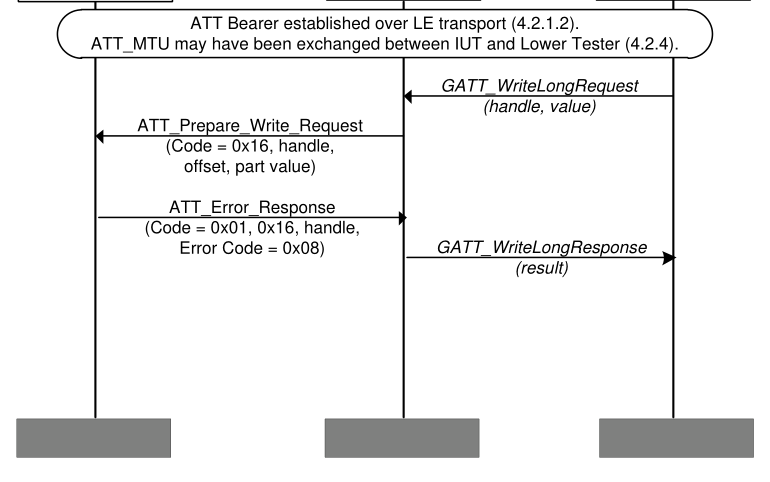

**Figure 4.125: GATT/CL/GAW/BI-11-C [Write Long Characteristic Value – Insufficient Authorization] MSC**

• Expected Outcome
Pass verdict
The IUT sends a correctly formatted ATT_Prepare_Write_Request to the Lower Tester.
Upon receiving an ATT_Error_Response from the Lower Tester the IUT sends the result to the Upper Tester, e.g., GATT_WriteLongResponse.
GATT/CL/GAW/BI-12-C [Write Long Characteristic Value – Insufficient Authentication]
• Test Purpose
Verify Generic Attribute Profile client behavior when the Write Long Characteristic Value procedure fails due to insufficient authentication.
• Reference
[1] 4.9.4
[5] 3.4.6.1, 3.4.6.2
• Initial Condition
- A preamble procedure defined in Section 4.2.1.2 is used to set up the transport and L2CAP channel over LE.
- MTU is smaller than 512, and smaller than the value that has to be written.
- A preamble procedure defined in Section 4.2.5 may have been used to exchange ATT MTU between the IUT and the Lower Tester.
- A handle of a Characteristic Value in the Lower Tester that requires write authentication is selected.
- No authentication procedure has been performed between the IUT and the Lower Tester.
• Test Procedure
Send a command from the Upper Tester to request the IUT to write the value of a long characteristic in the Lower Tester e.g., GATT_WriteLongRequest (handle, value). The IUT sends an ATT_Prepare_Write_Request to the Lower Tester. When the IUT receives an ATT_Error_Response it sends the result to the Upper Tester, e.g., GATT_WriteLongResponse.

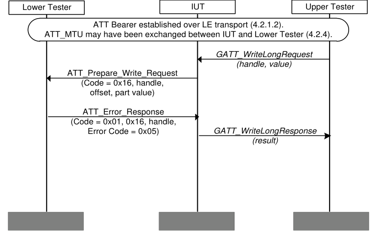

**Figure 4.126: GATT/CL/GAW/BI-12-C [Write Long Characteristic Value – Insufficient Authentication] MSC**

• Expected Outcome
Pass verdict
The IUT sends a correctly formatted ATT_Prepare_Write_Request to the Lower Tester.
Upon receiving an ATT_Error_Response from the Lower Tester the IUT sends the result to the Upper Tester, e.g., GATT_WriteLongResponse.
GATT/CL/GAW/BI-13-C [Write Long Characteristic Value – Insufficient Encryption Key Size]
• Test Purpose
Verify Generic Attribute Profile client behavior when the Write Long Characteristic Value procedure fails due to insufficient encryption key size.
• Reference
[1] 4.9.4
[5] 3.4.6.1, 3.4.6.2
• Initial Condition
- A preamble procedure defined in Section 4.2.1.2 is used to set up the transport and L2CAP channel over LE.
- MTU is smaller than 512, and smaller than the value that has to be written.
- A preamble procedure defined in Section 4.2.5 may have been used to exchange ATT MTU between the IUT and the Lower Tester.
- A handle of a Characteristic Value in the Lower Tester that requires encryption with a key longer than the key used to establish the encrypted link is selected.
• Test Procedure
Send a command from the Upper Tester to request the IUT to write the value of a long characteristic in the Lower Tester e.g., GATT_WriteLongRequest (handle, value). The IUT sends an ATT_Prepare_Write_Request to the Lower Tester. When the IUT receives an ATT_Error_Response it sends the result to the Upper Tester, e.g., GATT_WriteLongResponse.

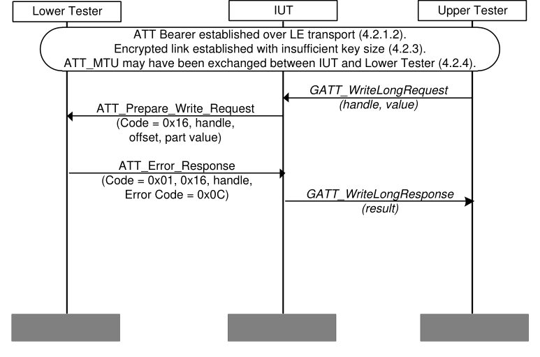

**Figure 4.127: GATT/CL/GAW/BI-13-C [Write Long Characteristic Value – Insufficient Encryption Key Size] MSC**

• Expected Outcome
Pass verdict
The IUT sends a correctly formatted ATT_Prepare_Write_Request to the Lower Tester.
Upon receiving an ATT_Error_Response from the Lower Tester the IUT sends the result to the Upper Tester, e.g., GATT_WriteLongResponse.
GATT/SR/GAW/BV-05-C [Write Long Characteristic Value - to Server]
• Test Purpose
Verify that a Generic Attribute Profile server can support writing a long Characteristic Value selected by handle.
• Reference
[1] 4.9.4
[5] 3.4.6.1, 3.4.6.2, 3.4.6.3, 3.4.6.4
• Initial Condition
- A preamble procedure defined in Section 4.2.1 is used to set up the transport and L2CAP channel.
- A preamble procedure defined in Section 4.2.5 may have been used to exchange ATT MTU between the IUT and the Lower Tester.
- The IUT contains a valid characteristic and the handle of this characteristic is known to the Lower Tester.
- The Lower Tester has the necessary security permissions to write the value of the characteristic of the IUT.
• Test Procedure
Send ATT_Prepare_Write_Requests from the Lower Tester to the IUT to write all parts of the value of a long characteristic, setting the offset to Nx(ATT_MTU-5), with N starting from 0. The handle of the characteristic to be written and the part value to be written is also specified.
The Lower Tester recovers the returned offset and part value of each ATT_Prepare_Write_Response.
After receiving the last ATT_Prepare_Write_Response the Lower Tester sends an ATT_Execute_Write_Request to the IUT.

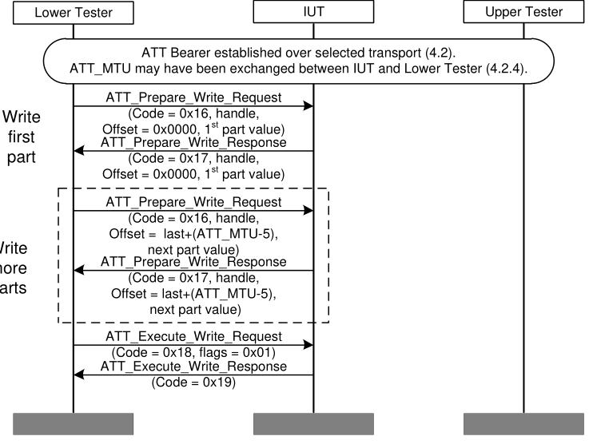

**Figure 4.128: GATT/SR/GAW/BV-05-C [Write Long Characteristic Value - to Server] MSC**

• Expected Outcome
Pass verdict
The IUT sends a series of correctly formatted ATT_Prepare_Write_Responses to the Lower Tester. The offset and part value sent in each response match the offset and part value sent in the corresponding request.
The responses do not exceed any negotiated ATT_MTU.
All of the IUT responses occur within the applicable timeout (3.3.3/ATT [5]).
GATT/SR/GAW/BI-07-C [Write Long Characteristic Value – Invalid Handle Response]
• Test Purpose
Verify that a Generic Attribute Profile server can detect a Write Long Characteristic Request with an invalid characteristic handle and issue an Invalid Handle Response.
• Reference
[1] 4.9.4
[5] 3.4.1.1, 3.4.6.1
• Initial Condition
- A preamble procedure defined in Section 4.2.1 is used to set up the transport and L2CAP channel.
- A preamble procedure defined in Section 4.2.5 may have been used to exchange ATT MTU between the IUT and the Lower Tester.
- The Lower Tester selects a handle that is known to be invalid.
• Test Procedure
The Lower Tester sends an ATT_Prepare_Write_Request (handle, offset = 0x0000, part value) to the IUT.

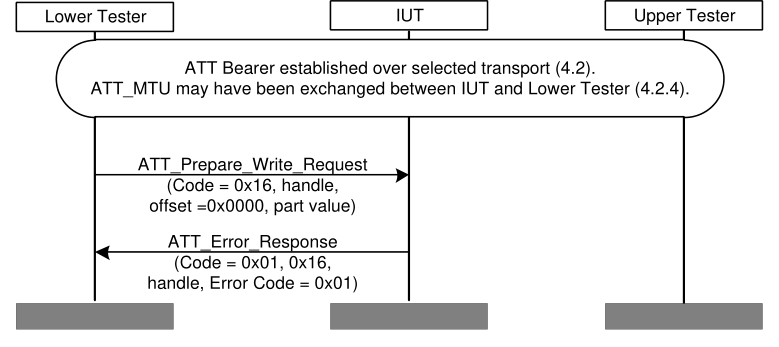

**Figure 4.129: GATT/SR/GAW/BI-07-C [Write Long Characteristic Value – Invalid Handle Response] MSC**

• Expected Outcome
Pass verdict
The IUT sends an ATT_Error_Response (code 0x01) to the Lower Tester. The Request Opcode in Error parameter is set to 0x16. The Attribute Handle in Error parameter is set to the handle sent by the Lower Tester. The Error code is set to 0x01, Invalid Handle.
The IUT responds within the applicable timeout (3.3.3/ATT [5]).
• Test Purpose
Verify that a Generic Attribute Profile server can detect and reject a Write Long Characteristic Value Request to a non-writeable long Characteristic Value and issue a Write Not Permitted Response.
• Reference
[1] 4.9.4
[5] 3.4.1.1, 3.4.6.1
• Initial Condition
- A preamble procedure defined in Section 4.2.1 is used to set up the transport and L2CAP channel.
- A preamble procedure defined in Section 4.2.5 may have been used to exchange ATT MTU between the IUT and the Lower Tester.
- A handle of a long Characteristic Value in the IUT that does not permit writing is selected.
• Test Procedure
The Lower Tester sends an ATT_Prepare_Write_Request (handle, offset = 0x0000, part value) to the IUT.

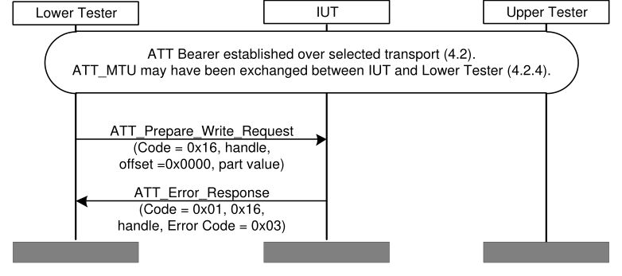

**Figure 4.130: GATT/SR/GAW/BI-08-C [Write Long Characteristic Value – Write Not Permitted Response] MSC**

• Expected Outcome
Pass verdict
The IUT sends an ATT_Error_Response (code 0x01) to the Lower Tester. The Request Opcode in Error parameter is set to 0x16. The Attribute Handle in Error parameter is set to the handle sent by the Lower Tester. The Error code is set to 0x03, Write Not Permitted.
The IUT responds within the applicable timeout (3.3.3/ATT [5]).
GATT/SR/GAW/BI-09-C [Write Long Characteristic Value – Invalid Offset Response]
• Test Purpose
Verify that a Generic Attribute Profile server can detect and reject a Write Long Characteristic Request with an invalid offset and issue an Invalid Offset Response.
• Reference
[1] 4.9.4
[5] 3.4.1.1, 3.4.6.1
• Initial Condition
- A preamble procedure defined in Section 4.2.1 is used to set up the transport and L2CAP channel.
- A preamble procedure defined in Section 4.2.5 may have been used to exchange ATT MTU between the IUT and the Lower Tester.
- A handle of a long Characteristic Value in the IUT that permits writing is selected. The offset is set to a value greater than the length of the Characteristic Value.
• Test Procedure
The Lower Tester sends an ATT_Prepare_Write_Request(handle, offset, part value) to the IUT. In response, the IUT sends an ATT_Prepare_Write_Response to the Lower Tester. Then, the Lower Tester sends an ATT_Execute_Write_Request to the IUT.

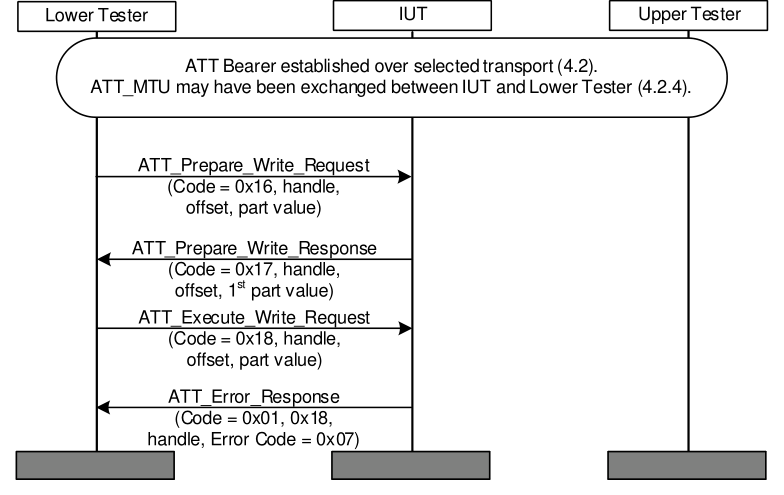

**Figure 4.131: GATT/SR/GAW/BI-09-C [Write Long Characteristic Value – Invalid Offset Response] MSC**

• Expected Outcome
Pass verdict
The IUT sends an ATT_Error_Response (code 0x01) to the Lower Tester. The Request Opcode in Error parameter is set to 0x18. The Attribute Handle in Error parameter is set to the handle sent by the Lower Tester. The Error code is set to 0x07, Invalid Offset.
The IUT responds within the applicable timeout (3.3.3/ATT [5]).
• Test Purpose
Verify that a Generic Attribute Profile server can detect and reject a Write Long Characteristic Request and issue an Insufficient Authorization Response.
• Reference
[1] 4.9.4
[5] 3.4.1.1, 3.4.6.1
• Initial Condition
- A preamble procedure defined in Section 4.2.1.2 is used to set up the transport and L2CAP channel over LE.
- A preamble procedure defined in Section 4.2.5 may have been used to exchange ATT MTU between the IUT and the Lower Tester.
- A handle of a long Characteristic Value in the IUT that requires write authorization is selected.
- No authorization procedure has been performed between the IUT and the Lower Tester.
• Test Procedure
The Lower Tester sends an ATT_Prepare_Write_Request (handle, offset = 0x0000, part value) to the IUT.

**Figure 4.132: GATT/SR/GAW/BI-11-C [Write Long Characteristic Value – Insufficient Authorization] MSC**

• Expected Outcome
Pass verdict
The IUT sends an ATT_Error_Response (code 0x01) to the Lower Tester. The Request Opcode in Error parameter is set to 0x16. The Attribute Handle in Error parameter is set to the handle sent by the Lower Tester. The Error code is set to 0x08, Insufficient Authorization.
The IUT responds within the applicable timeout (3.3.3/ATT [5]).
• Test Purpose
Verify that a Generic Attribute Profile server can detect and reject a Write Long Characteristic Request and issue an Insufficient Authentication Response.
• Reference
[1] 4.9.4
[5] 3.4.1.1, 3.4.6.1
• Initial Condition
- A preamble procedure defined in Section 4.2.1.2 is used to set up the transport and L2CAP channel over LE.
- A preamble procedure defined in Section 4.2.5 may have been used to exchange ATT MTU between the IUT and the Lower Tester.
- A handle of a long Characteristic Value in the IUT that requires write authentication is selected.
- No authentication procedure has been performed between the IUT and the Lower Tester.
• Test Procedure
The Lower Tester sends an ATT_Prepare_Write_Request(handle, offset = 0x0000, part value) to the IUT.

**Figure 4.133: GATT/SR/GAW/BI-12-C [Write Long Characteristic Value – Insufficient Authentication] MSC**

• Expected Outcome
Pass verdict
The IUT sends an ATT_Error_Response (code 0x01) to the Lower Tester. The Request Opcode in Error parameter is set to 0x16. The Attribute Handle in Error parameter is set to the handle sent by the Lower Tester. The Error code is set to 0x05, Insufficient Authentication.
The IUT responds within the applicable timeout (3.3.3/ATT [5]).
GATT/SR/GAW/BI-13-C [Write Long Characteristic Value – Insufficient Encryption Key Size]
• Test Purpose
Verify that a Generic Attribute Profile server can detect and reject a Write Long Characteristic Request and issue an Insufficient Encryption Key Size Response.
• Reference
[1] 4.9.4
[5] 3.4.1.1, 3.4.6.1
• Initial Condition
- A preamble procedure defined in Section 4.2.1.2 is used to set up the transport and L2CAP channel over LE.
- A preamble procedure defined in Section 4.2.4 is used to set up an encrypted link.
- A preamble procedure defined in Section 4.2.5 may have been used to exchange ATT MTU between the IUT and the Lower Tester.
- A handle of a long Characteristic Value in the IUT that requires encryption with a key longer than the key used to establish the encrypted link is selected.
• Test Procedure
The Lower Tester sends an ATT_Prepare_Write_Request(handle, offset = 0x0000, part value) to the IUT.

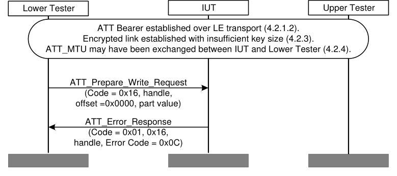

**Figure 4.134: GATT/SR/GAW/BI-13-C [Write Long Characteristic Value – Insufficient Encryption Key Size] MSC**

• Expected Outcome
Pass verdict
The IUT sends an ATT_Error_Response (code 0x01) to the Lower Tester. The Request Opcode in Error parameter is set to 0x16. The Attribute Handle in Error parameter is set to the handle sent by the Lower Tester. The Error code is set to 0x0C, Insufficient Encryption Key Size.
The IUT responds within the applicable timeout (3.3.3/ATT [5]).
• Test Purpose
Verify that a Generic Attribute Profile client can reliably write a characteristic selected by handle.
• Reference
[1] 4.9.5
[5] 3.4.6.1, 3.4.6.2, 3.4.6.3, 3.4.6.4
• Initial Condition
- A preamble procedure defined in Section 4.2.1 is used to set up the transport and L2CAP channel.
- A preamble procedure defined in Section 4.2.4 is used to set up an encrypted link.
- A preamble procedure defined in Section 4.2.5 may have been used to exchange ATT MTU between the IUT and the Lower Tester.
- The Lower Tester contains at least one valid characteristic and the handle of this characteristic is known to the IUT.
- The characteristic has sufficient permissions to allow writing.
- If the characteristic permissions require a specific security mode and level, execute pairing and/or bonding with the required security mode and level.
• Test Procedure
1. Send a command from the Upper Tester to the IUT to request the Lower Tester to reliably write a
new value to the selected characteristic e.g., GATT_ReliableWriteRequest (handle, new value). 2. When IUT receives an ATT_Prepare_Write_Response (0x17) from tester, the IUT issues an
ATT_Execute_Write_Request (0x18) to the Lower Tester. 3. When the IUT receives a valid ATT_Execute_Write_Response, it reports this to the Upper Tester,
e.g., GATT_ReliableWriteResponse.

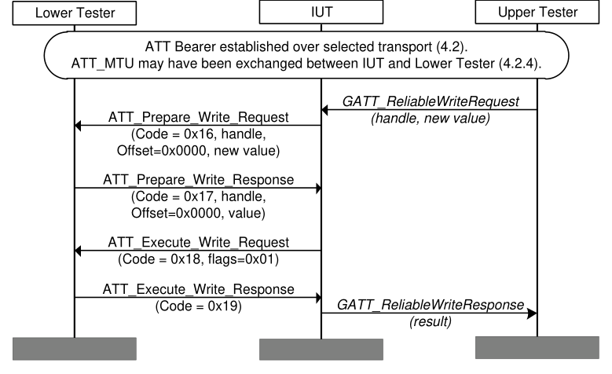

**Figure 4.135: GATT/CL/GAW/BV-06-C [Characteristic Value Reliable Write - by Client] MSC**

• Expected Outcome
Pass verdict
As a result of step 1 in the Test Procedure, the IUT sends a correctly formatted ATT_Prepare_Write_Request (0x16) to the Lower Tester. The command specifies the handle, offset, and the value of the characteristic to be written.
As a result of step 2 in the Test Procedure, the IUT sends a correctly formatted ATT_Execute_Write_Request command (0x18) to the Lower Tester. The flags are set to 0x01 (Immediately write all pending prepared values).
The IUT receives the response from the Lower Tester and sends the GATT_ReliableWriteResponse to the Upper Tester.
The size of the ATT_Prepare_Write_Request does not exceed any negotiated ATT_MTU.
GATT/SR/GAW/BV-06-C [Characteristic Value Reliable Writes - to Server]
• Test Purpose
Verify that a Generic Attribute Profile server can support reliable writing to a Characteristic Value selected by handle.
• Reference
[1] 4.9.5
[5] 3.4.6.1, 3.4.6.2, 3.4.6.3, 3.4.6.4
• Initial Condition
- A preamble procedure defined in Section 4.2.1 is used to set up the transport and L2CAP channel.
- A preamble procedure defined in Section 4.2.5 may have been used to exchange ATT MTU between the IUT and the Lower Tester.
- The IUT contains a valid characteristic and the handle of this characteristic is known to the test system.
- The Lower Tester has the necessary security permissions to write the value of the characteristic of the IUT.
• Test Procedure
Send an ATT_Prepare_Write_Request command from the Lower Tester to the IUT to prepare to write the value of a characteristic. The ATT_Prepare_Write_Request specifies the handle of the characteristic to be written and the value of the characteristic to be written.
Send an ATT_Execute_Write_Request command from the Lower Tester to the IUT with flags = 0x01.

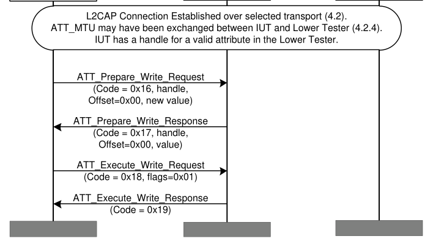

**Figure 4.136: GATT/SR/GAW/BV-06-C [Characteristic Value Reliable Writes - to Server] MSC**

• Expected Outcome
Pass verdict
The IUT sends a correctly formatted ATT_Prepare_Write_Response to the Lower Tester. The offset, handle, and value sent in the response match those sent in the request.
The IUT sends a correctly formatted ATT_Execute_Write_Response to the Lower Tester.
All of the IUT responses occur within the applicable timeout (3.3.3/ATT [5]).
GATT/SR/GAW/BV-10-C [Nested Long Characteristic Value Reliable Writes - to Server]
• Test Purpose
Verify that a Generic Attribute Profile server can support nested reliable writing to long Characteristic Values selected by handle.
• Reference
[1] 4.9.5
[5] 3.4.6.1, 3.4.6.2, 3.4.6.3, 3.4.6.4
• Initial Condition
- For this test, the server has to support a sufficient number of ATT_Prepare_Write_Request commands and two prepare queues.
- A preamble procedure defined in Section 4.2.1 is used to set up the transport and L2CAP channel.
- A preamble procedure defined in Section 4.2.5 may have been used to exchange ATT MTU between the IUT and the Lower Tester.
- The IUT contains two writeable valid long characteristics and the handles of these characteristics are known to the test system.
- The Lower Tester has the necessary security permissions to write the values of the characteristics of the IUT.
• Test Procedure
Send an ATT_Prepare_Write_Request command from the Lower Tester to the IUT to prepare to write the 1st part value of a first characteristic. The ATT_Prepare_Write_Request specifies the handle of the first characteristic to be written and the value of the characteristic to be written.
Send an ATT_Prepare_Write_Request command from the Lower Tester to the IUT to prepare to write the 1st part value of a second characteristic. The ATT_Prepare_Write_Request specifies the handle of the second characteristic to be written and the value of the characteristic to be written.
Send ATT_Prepare_Write_Requests from the Lower Tester to the IUT to write the remaining part values of the first characteristic, setting the offset to Nx(ATT_MTU-5), with N starting from 1. The handle of the characteristic to be written and the part value to be written are also specified.
Send ATT_Prepare_Write_Requests from the Lower Tester to the IUT to write the remaining part values of the second characteristic, setting the offset to Nx(ATT_MTU-5), with N starting from 1. The handle of the characteristic to be written and the part value to be written are also specified.
Send an ATT_Execute_Write_Request command from the Lower Tester to the IUT with flags = 0x01.

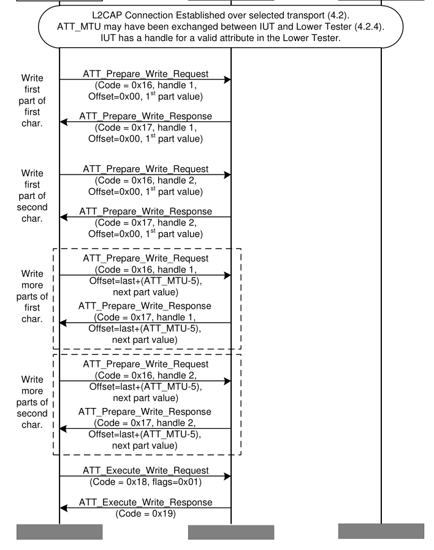

**Figure 4.137: GATT/SR/GAW/BV-10-C [Nested Long Characteristic Value Reliable Writes - to Server] MSC**

• Expected Outcome
Pass verdict
The IUT sends a series of correctly formatted ATT_Prepare_Write_Responses to the Lower Tester. The offset, handle, and value sent in each response match those sent in the corresponding request.
The IUT sends a correctly formatted ATT_Execute_Write_Response to the Lower Tester.
The responses do not exceed any negotiated ATT_MTU.
All of the IUT responses occur within the applicable timeout (3.3.3/ATT [5]).
The values of the long characteristics stored at handle 1 and handle 2 in the IUT correspond to the values written by the Lower Tester.
GATT/SR/GAW/BV-11-C [Characteristic Value Reliable Writes - No Pending Prepared Write Requests]
• Test Purpose
Verify that a Generic Attribute Profile server can support reliable writing to a Characteristic Value selected by handle when there are no pending Prepared Write requests.
• Reference
[1] 4.9.5
[5] 3.4.6.3, 3.4.6.4
• Initial Condition
- A preamble procedure defined in Section 4.2.1 is used to set up the transport and L2CAP channel.
- A preamble procedure defined in Section 4.2.5 may have been used to exchange ATT MTU between the IUT and the Lower Tester.
- The IUT contains a valid characteristic and the handle of this characteristic is known to the test system.
- The Lower Tester has the necessary security permissions to write the value of the characteristic of the IUT.
• Test Procedure
1. The Lower Tester sends an ATT_Execute_Write_Request command to the IUT with flags = 0x01. 2. The Lower Tester receives an ATT_Execute_Write_Response from the IUT. 3. The Upper Tester verifies that no new values are written to the target characteristic.

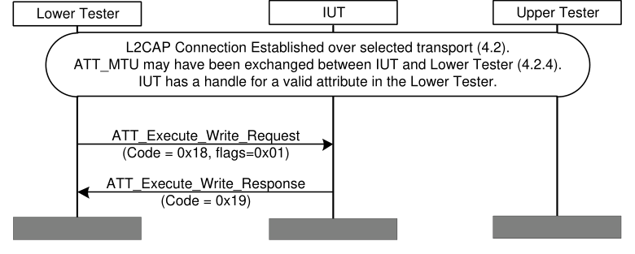

**Figure 4.138: GATT/SR/GAW/BV-11-C [Characteristic Value Reliable Writes - No Pending Prepared Write Requests] MSC**

• Expected Outcome
Pass verdict
The IUT sends a correctly formatted ATT_Execute_Write_Response to the Lower Tester.
The IUT does not write new values to the target characteristic.
All of the IUT responses occur within the applicable timeout (3.3.3/ATT [5]).
• Test Purpose
Verify that a Generic Attribute Profile server can support cancel of a reliable write.
• Reference
[1] 4.9.5
[5] 3.4.6.1, 3.4.6.2, 3.4.6.3
• Initial Condition
- A preamble procedure defined in Section 4.2.1 is used to set up the transport and L2CAP channel.
- A preamble procedure defined in Section 4.2.5 may have been used to exchange ATT MTU between the IUT and the Lower Tester.
- The IUT has at least one valid characteristic. The Lower Tester has sufficient permissions for writing value of this characteristic.
• Test Procedure
Send an ATT_Prepare_Write_Request from the Lower Tester to the IUT to prepare to write the value of a characteristic. The ATT_Prepare_Write_Request specifies the handle of the characteristic to be written, the offset (0x0000) and the value of the characteristic to be written.
Send an ATT_Execute_Write_Request command from the Lower Tester to the IUT with the flags set to 0x00, to cancel the pending reliable write.
Send an ATT_Read_Request command from the Lower Tester to verify that the Characteristic Value has not been written.

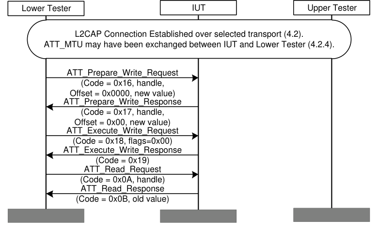

**Figure 4.139: GATT/SR/GAW/BV-07-C [Cancel Reliable Write Characteristic – from Server] MSC**

• Expected Outcome
Pass verdict
The IUT sends a correctly formatted ATT_Prepare_Write_Response to the Lower Tester. The offset, handle, and value sent the response match those sent in the request.
The IUT sends a correctly formatted ATT_Execute_Write_Response to the Lower Tester.
The IUT sends a correctly formatted ATT_Read_Response to the Lower Tester containing a value different from the one sent in the ATT_Prepare_Write_Request.
All of the IUT responses occur within the applicable timeout (3.3.3/ATT [5]).
GATT/CL/GAW/BV-08-C [Write Characteristic Descriptor – by Client]
• Test Purpose
Verify that a Generic Attribute Profile client can write a characteristic descriptor selected by handle.
• Reference
[1] 4.12.3
[5] 3.4.5.1, 3.4.5.2
• Initial Condition
- A preamble procedure defined in Section 4.2.1 is used to set up the transport and L2CAP channel.
- A preamble procedure defined in Section 4.2.5 may have been used to exchange ATT MTU between the IUT and the Lower Tester.
- A handle of a characteristic descriptor in the Lower Tester that permits writing is selected.
- If the characteristic descriptor permissions require a specific security mode and level, execute pairing and/or bonding with the required security mode and level.
• Test Procedure
Send a command from the Upper Tester to request IUT to write the value of a characteristic in the Lower Tester e.g., GATT_WriteRequest (handle, value).
Upper Tester IUT Lower Tester

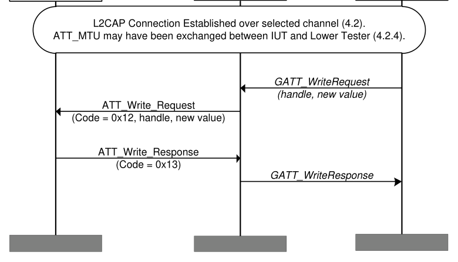

**Figure 4.140: GATT/CL/GAW/BV-08-C [Write Characteristic Descriptor – by Client] MSC**

• Expected Outcome
Pass verdict
The IUT sends a correctly formatted ATT_Write_Request to the Lower Tester, specifying the value that is to be written from the Upper Tester.
The Characteristic handle parameter is set to a valid handle.
The size of the ATT_Write_Request does not exceed any negotiated ATT_MTU.
The IUT receives the response from the Lower Tester and sends the GATT_WriteResponse to the Upper Tester.
GATT/SR/GAW/BV-08-C [Write Characteristic Descriptor – from Server]
• Test Purpose
Verify that a Generic Attribute Profile server can support writing a characteristic descriptor selected by handle.
• Reference
[1] 4.12.3
[5] 3.4.5.1, 3.4.5.2
• Initial Condition
- A preamble procedure defined in Section 4.2.1 is used to set up the transport and L2CAP channel.
- A preamble procedure defined in Section 4.2.5 may have been used to exchange ATT MTU between the IUT and the Lower Tester.
- A handle of a characteristic descriptor in the IUT that permits writing is selected.
- The Lower Tester has the necessary security permissions from the IUT to read and write the characteristic descriptor.
• Test Procedure
Send an ATT_Write_Request (handle, value) from the Lower Tester to the IUT.
Send an ATT_Read_Request (handle) to verify that the value specified in the ATT_Write_Request has been written in the IUT.

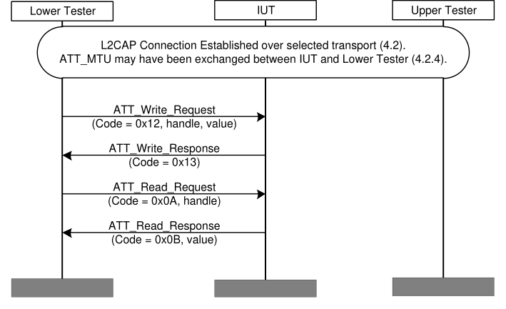

**Figure 4.141: GATT/SR/GAW/BV-08-C [Write Characteristic Descriptor – from Server] MSC**

• Expected Outcome
Pass verdict
The IUT sends a correctly formatted ATT_Write_Response to the Lower Tester.
The IUT sends an ATT_Read_Response reporting the same value delivered in the ATT_Write_Request.
The IUT responds within the applicable timeout (3.3.3/ATT [5]).
GATT/CL/GAW/BV-09-C [Write Long Characteristic Descriptors – by Client]
• Test Purpose
Verify that a Generic Attribute Profile client can write a long characteristic descriptor selected by handle.
• Reference
[1] 4.12.4
[5] 3.4.6.1, 3.4.6.2, 3.4.6.3, 3.4.6.4
• Initial Condition
- A preamble procedure defined in Section 4.2.1 is used to set up the transport and L2CAP channel.
- MTU is smaller than 512, and smaller than the value which has to be written.
- A preamble procedure defined in Section 4.2.5 may have been used to exchange ATT MTU between the IUT and the Lower Tester.
- The Lower Tester contains at least one valid long characteristic descriptor and the handle of this long characteristic descriptor is known to the IUT.
- If the characteristic descriptor permissions require a specific security mode and level, execute pairing and/or bonding with the required security mode and level.
• Test Procedure
Send a command from the Upper Tester to request the IUT to write the value of a long characteristic descriptor in the Lower Tester e.g., GATT_WriteLongRequest.

**Figure 4.142: GATT/CL/GAW/BV-09-C [Write Long Characteristic Descriptors – by Client] MSC**

• Expected Outcome
Pass verdict
The IUT sends correctly formatted ATT_Prepare_Write_Request commands (0x16) to the Lower Tester.
Each ATT_Prepare_Write_Request specifies the handle of the long characteristic to be written, the offset of the first octet to be written, and part of the value of the long characteristic to be written. The offset parameters are all values of Nx(ATT_MTU-5), with N ranging from 0 (for the first part value) to the last value sufficient to write the entire long characteristic.
After sending all the ATT_Prepare_Write_Requests, the IUT sends a correctly formatted ATT_Execute_Write_Request (0x18).
The size of each ATT_Prepare_Write_Request does not exceed any negotiated ATT_MTU.
GATT/CL/GAW/BI-32-C [Cancel Reliable Write Characteristic – by Client]
• Test Purpose
Verify that a Generic Attribute Profile client will cancel a reliable write after receiving an invalid ATT_Prepare_Write_Request from the server.
• Reference
[1] 4.9.5
[5] 3.4.6
• Initial Condition
- A preamble procedure defined in Section 4.2.1 is used to set up the transport and L2CAP channel.
- A preamble procedure defined in Section 4.2.5 may have been used to exchange ATT MTU between the IUT and the Lower Tester.
- A handle of a Characteristic Value in the Lower Tester that permits writing is selected.
- If the characteristic descriptor permissions require a specific security mode and level, execute pairing and/or bonding with the required security mode and level.
• Test Procedure
A command is sent from the Upper Tester to the IUT to request the Lower Tester to prepare to write a value to that characteristic e.g., GATT_PrepareWriteRequest (handle, offset, new value).
The Lower Tester responds with an ATT_Prepare_Write_Response (0x17) message where the new value parameter is corrupted i.e., not equal to the value parameter sent in the corresponding ATT_Prepare_Write_Request.
The IUT should send an ATT_Execute_Write_Request (0x18) with the flag parameter set to 0x00 (cancel all prepared writes).
After receiving the ATT_Execute_Write_Response (0x19) from the Lower Tester, the IUT should inform the Upper Tester that the requested write operation was cancelled.

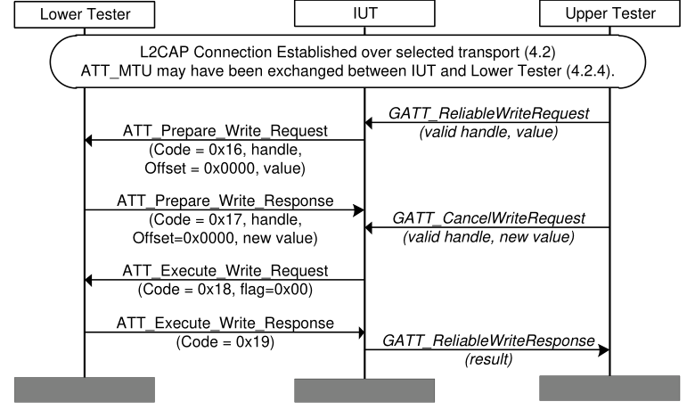

**Figure 4.143: GATT/CL/GAW/BI-32-C [Cancel Reliable Write Characteristic – by Client] MSC**

• Expected Outcome
Pass verdict
As a result of an Upper Tester command the IUT sends a correctly formatted ATT_Prepare_Write_Request (0x16) to the Lower Tester. The command specifies the handle of the characteristic to be written, the offset (0x0000) and the value of the characteristic to be written.
After the IUT receives the ATT_Prepare_Write_Response with an incorrect value parameter, it sends an ATT_Execute_Write_Request (0x18) with the flag parameter = 0x00, to cancel the write operation.
The IUT receives the ATT_Execute_Write_Response from the Lower Tester and sends an acknowledgement to the Upper Tester, e.g., GATT_ReliableWriteResponse with a result indicating that the write was not completed.
GATT/CL/GAW/BI-33-C [Write Characteristic Value – Invalid Attribute Value Length]
• Test Purpose
Verify Generic Attribute Profile client behavior when the Write Characteristic Value procedure fails due to invalid attribute value length.
• Reference
[1] 4.9.3
[5] 3.4.5.1, 3.4.5.2
• Initial Condition
- A preamble procedure defined in Section 4.2.1 is used to set up the transport and L2CAP channel.
- A preamble procedure defined in Section 4.2.5 may have been used to exchange ATT MTU between the IUT and the Lower Tester.
- A handle of a Characteristic Value in the Lower Tester that permits writing is selected. The size of the characteristic is known; the IUT will deliberately send a value that is longer or shorter than the size specified for that characteristic.
• Test Procedure
Send a command from the Upper Tester to request the IUT to write the value of a characteristic in the Lower Tester, with the size set incorrectly, e.g., GATT_WriteRequest (handle, value).

| Lower Tester IUT Upper Tester L2CAP Connection Established over selected channel (4.2). ATT MTU may have been exchanged between IUT and Lower Tester (4.2.4). _ GATT WriteRequest _ (handle, value) ATT Write Request _ _ (Code = 0x12, handle, value -wrong size-) ATT Error Response _ _ (Code = 0x01, 0x12, handle, Error Code = 0x0D) GATT WriteResponse _ (result) |  |
| --- | --- |
|  |  |

**Figure 4.144: GATT/CL/GAW/BI-33-C [Write Characteristic Value – Invalid Attribute Value Length] MSC**

• Expected Outcome
Pass verdict
The IUT sends a correctly formatted ATT_Write_Request to the Lower Tester with a Characteristic Value of the wrong size.
The Characteristic handle parameter is set to a valid handle.
Upon receiving an ATT_Error_Response from the Lower Tester, the IUT sends the result to the Upper Tester, e.g., GATT_WriteResponse.
GATT/CL/GAW/BI-34-C [Write Long Characteristic Value – Invalid Attribute Value Length]
• Test Purpose
Verify Generic Attribute Profile client behavior when the Write Long Characteristic Value procedure fails due to invalid attribute value length.
• Reference
[1] 4.9.4
[5] 3.4.6.1, 3.4.6.2, 3.4.6.3, 3.4.6.4
• Initial Condition
- A preamble procedure defined in Section 4.2.1 is used to set up the transport and L2CAP channel.
- MTU is smaller than 512, and smaller than the value that has to be written.
- A preamble procedure defined in Section 4.2.5 may have been used to exchange ATT MTU between the IUT and the Lower Tester.
- The Lower Tester contains at least one valid long characteristic and the handle of this long characteristic is known to the IUT. The size of the characteristic is known; the Lower Tester will deliberately send a value that is longer than the size specified for that characteristic.
• Test Procedure
Send a command from the Upper Tester to request the IUT to write the value of a long characteristic in the Lower Tester e.g., GATT_WriteLongRequest.

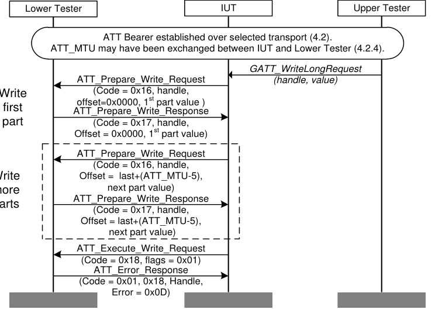

**Figure 4.145: GATT/CL/GAW/BI-34-C [Write Long Characteristic Value – Invalid Attribute Value Length] MSC**

• Expected Outcome
Pass verdict
The IUT sends correctly formatted ATT_Prepare_Write_Request commands (0x16) to the Lower Tester.
Each ATT_Prepare_Write_Request specifies the handle of the long characteristic to be written, a valid offset of the first octet to be written, and part of the value of the long characteristic to be written. The offset parameters are all values of Nx(ATT_MTU-5), with N ranging from 0 (for the first part value) to the last value sufficient to write the entire long characteristic.
After sending all the ATT_Prepare_Write_Requests, the IUT sends a correctly formatted ATT_Execute_Write_Request.
Note: the IUT detects size problems on execution of the Execute Write Request command.
The size of each ATT_Prepare_Write_Request does not exceed any negotiated ATT_MTU.
GATT/SR/GAW/BV-09-C [Write Long Characteristic Descriptors – from Server]
• Test Purpose
Verify that a Generic Attribute Profile server can support writing a long characteristic descriptor selected by handle.
• Reference
[1] 4.12.4
[5] 3.4.6.1, 3.4.6.2, 3.4.6.3, 3.4.6.4
• Initial Condition
- A preamble procedure defined in Section 4.2.1 is used to set up the transport and L2CAP channel.
- A preamble procedure defined in Section 4.2.5 may have been used to exchange ATT MTU between the IUT and the Lower Tester.
- The IUT contains a valid characteristic descriptor and the handle of this characteristic descriptor is known to the test system.
- The Lower Tester has the necessary security permissions to write the value of the characteristic descriptor of the IUT.
• Test Procedure
Send ATT_Prepare_Write_Requests from the Lower Tester to the IUT to write all parts of the value of a long characteristic descriptor, setting the offset to Nx(ATT_MTU-5), with N starting from 0. The handle of the characteristic to be written and the part value to be written is also specified.
The Lower Tester recovers the returned offset and part value of each ATT_Prepare_Write_Response.
After receiving the last ATT_Prepare_Write_Response the Lower Tester sends an ATT_Execute_Write_Request to the IUT.

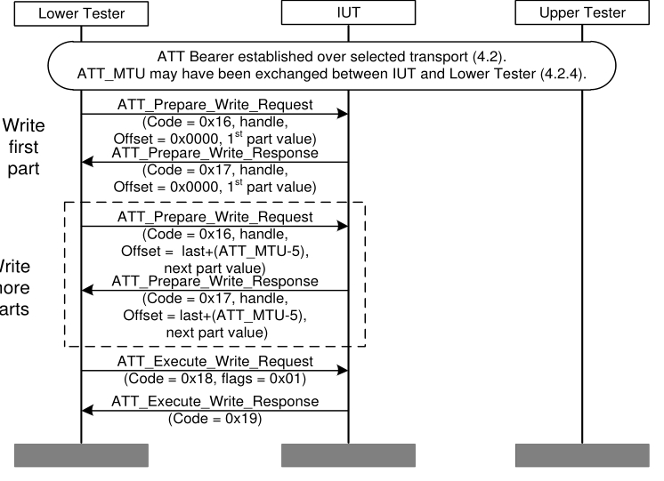

**Figure 4.146: GATT/SR/GAW/BV-09-C [Write Long Characteristic Descriptors – from Server] MSC**

• Expected Outcome
Pass verdict
The IUT sends a series of correctly formatted ATT_Prepare_Write_Responses to the Lower Tester. The offset and part value sent in each response match the offset and part value sent in the corresponding request.
The IUT sends a correctly formatted ATT_Execute_Write_Response to the Lower Tester.
The responses do not exceed any negotiated ATT_MTU.
All of the IUT responses occur within the applicable timeout (3.3.3/ATT [5]).
GATT/SR/GAW/BI-32-C [Write Characteristic Value – Invalid Attribute Value Length]
• Test Purpose
Verify that a Generic Attribute Profile server can detect a Write Characteristic Request with an invalid characteristic/descriptor value length and issue an Invalid Attribute Value Length response.
• Reference
[1] 4.9.3
[5] 3.4.5.1, 3.4.5.2
• Initial Condition
- A preamble procedure defined in Section 4.2.1 is used to set up the transport and L2CAP channel.
- A preamble procedure defined in Section 4.2.5 may have been used to exchange ATT MTU between the IUT and the Lower Tester.
- A handle of a Characteristic Value in the IUT that permits writing is selected. The size of the characteristic is known; the Lower Tester will deliberately send a value that is longer than the size specified for that characteristic.
- The Lower Tester has the necessary security permissions from the IUT to read and write the characteristic.
• Test Procedure
Send an ATT_Write_Request (handle, value) from the Lower Tester to the IUT with the size deliberately set incorrectly.
Upper Tester IUT Lower Tester

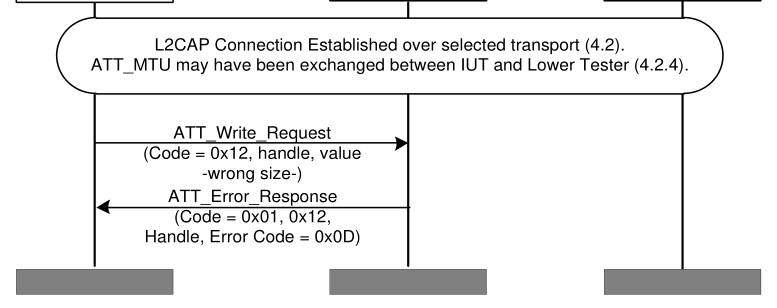

**Figure 4.147: GATT/SR/GAW/BI-32-C [Write Characteristic Value – Invalid Attribute Value Length] MSC**

• Expected Outcome
Pass verdict
The IUT sends a correctly formatted ATT_Write_Response to the Lower Tester. The Request Opcode in Error parameter is set to 0x12. The Attribute Handle in Error parameter is set to the handle sent by the Lower Tester. The Error code is set to 0x0D, Invalid Attribute Value Length.
The IUT responds within the applicable timeout (3.3.3/ATT [5]).
GATT/SR/GAW/BI-33-C [Write Long Characteristic Value – Invalid Attribute Value Length]
• Test Purpose
Verify that a Generic Attribute Profile server can detect a Write Long Characteristic Request with an invalid characteristic/descriptor value length and issue an Invalid Attribute Value Length response.
• Reference
[1] 4.9.4
[5] 3.4.6.1, 3.4.6.2, 3.4.6.3, 3.4.6.4
• Initial Condition
- A preamble procedure defined in Section 4.2.1 is used to set up the transport and L2CAP channel.
- A preamble procedure defined in Section 4.2.5 may have been used to exchange ATT MTU between the IUT and the Lower Tester.
- The IUT contains a valid characteristic and the handle of this characteristic is known to the test system. The size of the characteristic is known; the Lower Tester will deliberately send a value that is longer than the size specified for that characteristic.
- The Lower Tester has the necessary security permissions to write the value of the characteristic of the IUT.
• Test Procedure
Send ATT_Prepare_Write_Requests from the Lower Tester to the IUT to write all parts of the value of a long characteristic, setting a valid offset to Nx(ATT_MTU-5), with N starting from 0. The handle of the characteristic to be written and the part value to be written is also specified. The complete aggregate characteristic will be longer than that supported by the IUT.
The Lower Tester recovers the returned offset and part value of each ATT_Prepare_Write_Response.
After receiving the last ATT_Prepare_Write_Response the Lower Tester sends an ATT_Execute_Write_Request to the IUT.

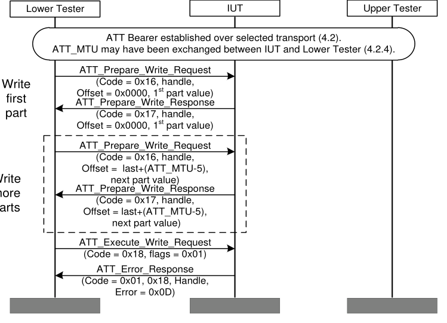

**Figure 4.148: GATT/SR/GAW/BI-33-C [Write Long Characteristic Value – Invalid Attribute Value Length] MSC**

• Expected Outcome
Pass verdict
The IUT sends a series of correctly formatted ATT_Prepare Write_Responses to the Lower Tester. The offset and part value sent in each response match the offset and part value sent in the corresponding request.
The IUT sends a correctly formatted ATT_Execute Write_Response to the Lower Tester. The IUT should respond with an ATT_Error_Response flagging the Invalid Attribute Value Length.
The responses do not exceed any negotiated ATT_MTU.
All of the IUT responses occur within the applicable timeout (3.3.3/ATT [5]).
GATT/SR/GAW/BV-12-C [Multiple prepare writes over multiple bearers]
• Test Purpose
Verify that a Generic Attribute Profile server can support multiple prepare writes sent over multiple bearers, queue them, and then execute properly.
• Reference
[12] 4.9.4
[13] 3.4.6.1, 3.4.6.3
• Initial Condition
- The IUT has to support a sufficient number of ATT_Prepare_Write_Request commands.
- The IUT has to support a sufficient number of ATT bearers.
- The IUT sets the EATT Supported bit set to 1 in the Server Supported Features characteristic.
- The IUT contains a valid long characteristic of maximum size (512) and the handle of this characteristic is known to the test system.
- A preamble procedure defined in Section 4.2.1.3 or, respectively, Section 4.2.1.4 is used to set up the transport and at least two L2CAP channels.
- A preamble procedure defined in Section 4.2.3.1 is used to inform the IUT that the Lower Tester supports the Enhanced ATT bearer feature.
- The Lower Tester MTU is configured to a value (lower than 512); this will ensure that the Lower Tester performs several Prepare Writes.
- The Lower Tester has the necessary security permissions to write the values of the characteristics of the IUT.
• Test Procedure

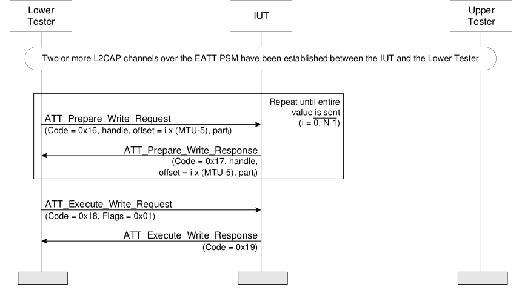

**Figure 4.149: GATT/SR/GAW/BV-12-C [Multiple prepare writes over multiple bearers] MSC**

1. The Lower Tester sends consecutive ATT_Prepare_Write_Request (Code = 0x16) commands to
the IUT to prepare to write all the parts of the characteristic value. The requests are sent sequentially on all the opened L2CAP channels, with roll-over, starting with the first opened L2CAP channel.
The ATT_Prepare_Write_Request commands specify the handle of the characteristic to be written and the part of the characteristic to be written.
For the remaining parts of the characteristic values, the offset is set to N x (MTU-5), with N starting from 1.
channel as the received request. 3. Repeat steps 1–2 until the entire value of the long characteristic is sent to the IUT. 4. Send an ATT_Execute_Write_Request (Code = 0x18) command from the Lower Tester to the
IUT with Flags = 0x01, on any opened L2CAP channel. 5. The IUT sends ATT_Execute_Write_Response (Code = 0x19) to the Lower Tester, on the same
channel as the received request.
• Expected Outcome
Pass verdict
The IUT sends a series of correctly formatted ATT_Prepare_Write_Responses to the Lower Tester. The offset, handle, and value sent in each response match those sent in the corresponding request.
The IUT sends a correctly formatted ATT_Execute_Write_Response to the Lower Tester.
The value of the long characteristic stored at the indicated handle in the IUT corresponds to the value written by the Lower Tester.
GATT/SR/GAW/BV-13-C [Multiple prepare writes over multiple bearers – cancel all writes]
• Test Purpose
Verify that a Generic Attribute Profile server that supports multiple prepare writes sent over multiple bearers can cancel all previous writes.
• Reference
[12] 4.9.4
[13] 3.4.6.1, 3.4.6.3
• Initial Condition
- The IUT sets the EATT Supported bit set to 1 in the Server Supported Features characteristic.
- The server has to support a sufficient number of ATT_Prepare_Write_Request commands.
- The IUT has to support a sufficient number of ATT bearers.
- The IUT contains a valid writable long characteristic of maximum size (512), and the handle of this characteristic is known to the IUT.
- The Lower Tester MTU is configured to a value (lower than 512); this will ensure that the Lower Tester performs several Prepare Writes.
- A preamble procedure defined in Section 4.2.3.1 is used to inform the IUT that the Lower Tester supports the Enhanced ATT bearer feature.
- A preamble procedure defined in Section 4.2.1.3 or, respectively, Section 4.2.1.4 is used to set up the transport and at least two L2CAP channels.
- The Lower Tester has the necessary security permissions to write the values of the characteristics of the IUT.
• Test Procedure

**Figure 4.150: GATT/SR/GAW/BV-13-C [Multiple prepare writes over multiple bearers – cancel all writes] MSC**

1. The Lower Tester sends consecutive ATT_Prepare_Write_Request (Code = 0x16) commands to
the IUT to prepare to write all the parts of the characteristic value. The requests are sent sequentially on all the opened L2CAP channels, with roll-over, starting with the first opened L2CAP channel.
The ATT_Prepare_Write_Request commands specify the handle of the characteristic to be written and the part of the characteristic to be written.
For the remaining parts of the characteristic values, the offset is set to N x (MTU-5), with N starting from 1.
2. The IUT sends ATT_Prepare_Write_Response (Code = 0x17) to the Lower Tester, on the same
channel as the received request. 3. Repeat steps 1–2 until the entire value of the long characteristic is sent to the IUT. 4. The Lower Tester sends an ATT_Execute_Write_Request (Code = 0x18) command to the IUT
with Flags = 0x00, on any opened L2CAP channel. 5. The IUT sends ATT_Execute_Write_Response (Code = 0x19) to the Lower Tester, on the same
channel as the received request.
• Expected Outcome
Pass verdict
The IUT sends a series of correctly formatted ATT_Prepare_Write_Responses to the Lower Tester. The offset, handle, and value sent in each response match those sent in the corresponding request.
The IUT sends a correctly formatted ATT_Execute_Write_Response to the Lower Tester.
The value of the long characteristic stored at the indicated handle in the IUT remains unchanged.
GATT/SR/GAW/BV-14-C [Multiple prepare writes over multiple bearers – fallback to remaining bearers]
• Test Purpose
Verify that a Generic Attribute Profile server that supports multiple prepare writes sent over multiple bearers, after some of the bearers disconnect, is able to queue the remaining prepare writes on the remaining bearers and then execute properly.
• Reference
[12] 4.9.4
[13] 3.4.6.1, 3.4.6.3
• Initial Condition
- The IUT sets the EATT Supported bit set to 1 in the Server Supported Features characteristic.
- The server has to support a sufficient number of ATT_Prepare_Write_Request commands.
- The IUT has to support a sufficient number of ATT bearers.
- The IUT contains a valid writable long characteristic of maximum size (512), and the handle of this characteristic is known to the IUT.
- The Lower Tester MTU is configured to a value (lower than 512); this will ensure that the Lower Tester performs several Prepare Writes.
- A preamble procedure defined in Section 4.2.1.3 or, respectively, Section 4.2.1.4 is used to set up the transport and at least two L2CAP channels.
- A preamble procedure defined in Section 4.2.3.1 is used to inform the IUT that the Lower Tester supports the Enhanced ATT bearer feature.
- The Lower Tester has the necessary security permissions to write the values of the characteristics of the IUT.
• Test Procedure

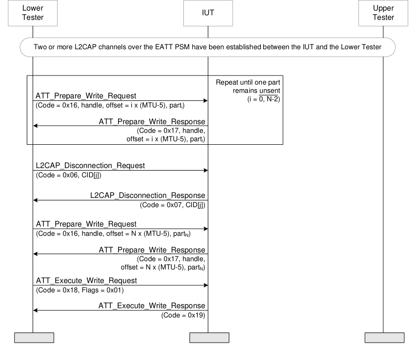

**Figure 4.151: GATT/SR/GAW/BV-14-C [Multiple prepare writes over multiple bearers – fallback to remaining bearers] MSC**

1. The Lower Tester sends consecutive ATT_Prepare_Write_Request (Code = 0x16) commands to
the IUT to prepare to write all the parts of the characteristic value. The requests are sent sequentially on all the opened L2CAP channels, with roll-over, starting with the first opened L2CAP channel.
The ATT_Prepare_Write_Request commands specify the handle of the characteristic to be written and the part of the characteristic to be written.
For the remaining parts of the characteristic values, the offset is set to N x (MTU-5), with N starting from 1.
2. The IUT sends ATT_Prepare_Write_Response (Code = 0x17) to the Lower Tester, on the same
channel as the received request. 3. Repeat steps 1–2 until there remains one part to be sent. 4. The Lower Tester sends an L2CAP Disconnection Request (Code = 0x06) to the IUT with the
L2CAP channel received from the sequence in step 1. 5. The IUT sends an L2CAP Disconnection Response (Code = 0x07) to the Lower Tester. 6. The Lower Tester sends an ATT_Prepare_Write_Request command to the IUT to prepare to
write the last part of the characteristic value, on one of the remaining bearers. 7. The IUT sends ATT_Prepare_Write_Response to the Lower Tester, on the same channel as the
received request.
with Flags = 0x01, on any opened L2CAP channel. 9. The IUT sends ATT_Execute_Write_Response (Code = 0x19) to the Lower Tester, on the same
channel as the received request.
• Expected Outcome
Pass verdict
The IUT sends a series of correctly formatted ATT_Prepare_Write_Responses to the Lower Tester. The offset, handle, and value sent in each response match those sent in the corresponding request.
The IUT sends a correctly formatted ATT_Execute_Write_Response to the Lower Tester.
The value of the long characteristic stored at the indicated handle in the IUT corresponds to the value written by the Lower Tester.

#### 4.7.1 Signed Write Without Response – to Server

• Test Purpose
Verify that a Generic Attribute Profile server rejects a Signed Write Without Response command received on an ATT bearer over BR/EDR or on an Enhanced ATT bearer (BR/EDR or LE).
• Reference
[12] 4.2, 4.9.2
[13] 3.4, 3.4.5.4, 3.4.9
• Initial Condition
- A preamble procedure defined in Section 4.2.1.1, 4.2.1.3, or 4.2.1.4 is used to set up the transport and L2CAP channel over the relevant bearer.
- A handle of a Characteristic Value in the IUT that permits reading and writing is selected.
- The Lower Tester is bonded with the IUT, so it has the necessary security permissions from the IUT to read and write a Characteristic Value.
• Test Case Configuration

|  | Test Case |  |  | Transport |  |  | Bearer |  |
| --- | --- | --- | --- | --- | --- | --- | --- | --- |
| GATT/SR/GAW/BI-36-C |  |  | BR/EDR |  |  | ATT |  |  |
| GATT/SR/GAW/BI-37-C |  |  | BR/EDR |  |  | EATT |  |  |
| GATT/SR/GAW/BI-38-C |  |  | LE |  |  | EATT |  |  |

Table 4.5: Signed Write Without Response – to Server test cases
• Test Procedure

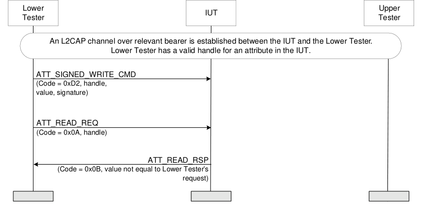

**Figure 4.152: Signed Write Without Response – to Server MSC**

1. Send an ATT_SIGNED_WRITE_CMD (0xD2, handle, value, signature) from the Lower Tester to
the IUT. The value must be different than the current value of that characteristic. The Lower Tester may have already determined the value by reading that value, or it is made known to the Lower Tester another way. 2. The IUT ignores the command and does not write the new value. 3. The Lower Tester sends an ATT_Read_Request to the IUT to confirm that the value has not
been changed.
• Expected Outcome
Pass verdict
The IUT ignores the signed write command and does not write to the characteristic.

### 4.8 Notification and Indication

Verify Generic Attribute Profile Notification, Indication and Confirmation of Characteristic Values.
GATT/CL/GAN/BV-01-C [Characteristic Value Notification - to Client]
• Test Purpose
Verify that a Generic Attribute Profile client can receive a Characteristic Value Notification and report that to the Upper Tester.
• Reference
[1] 4.10.1, 4.14
[5] 3.3.3, 3.4.7.1
• Initial Condition
- A preamble procedure defined in Section 4.2.1 is used to set up the transport and L2CAP channel.
- A preamble procedure defined in Section 4.2.5 may have been used to exchange ATT MTU between the IUT and the Lower Tester.
- A preamble procedure defined in Section 4.2.2.3 is used to configure the characteristic for Notification.
• Test Procedure
Send a Handle Value Notification from the Lower Tester to the IUT; .e.g., GATT_HandleValueNotification, with a handle value to specify the characteristic.

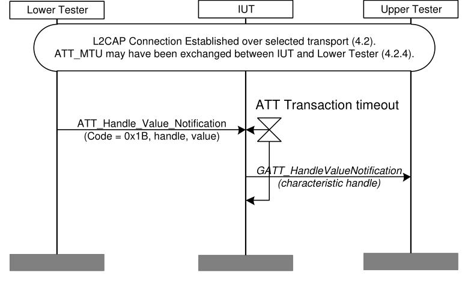

**Figure 4.153: GATT/CL/GAN/BV-01-C [Characteristic Value Notification - to Client] MSC**

• Expected Outcome
Pass verdict
IUT receives an ATT_Handle_Value_Notification (0x1B) command from the Lower Tester, and generates a message to the Upper Tester containing the characteristic handle and value included in that Handle Value Notification, before the Attribute Protocol Transaction timeout expires.
GATT/SR/GAN/BV-01-C [Characteristic Value Notification - by Server]
• Test Purpose
Verify that a Generic Attribute Profile server can send a Characteristic Value Notification.
• Reference
[1] 4.10.1
[5] 3.4.7.1
• Initial Condition
- A preamble procedure defined in Section 4.2.1 is used to set up the transport and L2CAP channel.
- A preamble procedure defined in Section 4.2.5 may have been used to exchange ATT MTU between the IUT and the Lower Tester.
- A preamble procedure defined in Section 4.2.2.1 is used to configure the characteristic for Notification.
• Test Procedure
Send a command from the Upper Tester to the IUT to request the IUT to send a Handle Value Notification to the Lower Tester e.g., GATT_HandleValueNotification, with a handle value to specify the characteristic.

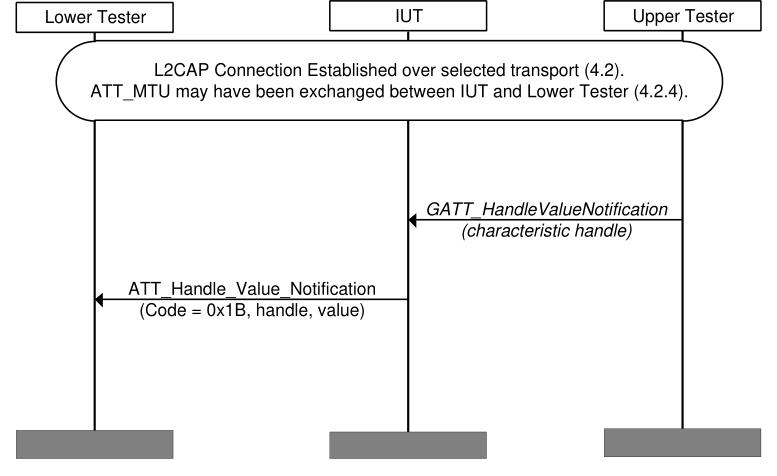

**Figure 4.154: GATT/SR/GAN/BV-01-C [Characteristic Value Notification - by Server] MSC**

• Expected Outcome
Pass verdict
IUT sends a correctly formatted ATT_Handle_Value_Notification (0x1B) command to the Lower Tester.
The Characteristic Handle is set to a valid handle.
The Characteristic Value is set to the value of a characteristic contained in the IUT identified by the characteristic handle.
The command size does not exceed any negotiated ATT_MTU.
The IUT is successfully configured for notification using the procedure specified in Section 4.2.2.1.
• Test Purpose
Verify that a Generic Attribute Profile server can send a Characteristic Value Indication.
• Reference
[1] 4.11.1
[5] 3.4.7.2
• Initial Condition
- A preamble procedure defined in Section 4.2.1 is used to set up the transport and L2CAP channel.
- A preamble procedure defined in Section 4.2.5 may have been used to exchange ATT MTU between the IUT and the Lower Tester.
- A preamble procedure defined in Section 4.2.2.2 is used to configure the characteristic for Indication.
• Test Procedure
Send a command from the Upper Tester to the IUT to request the IUT to send a Handle Value Indication to the Lower Tester e.g., GATT_HandleValueIndication.

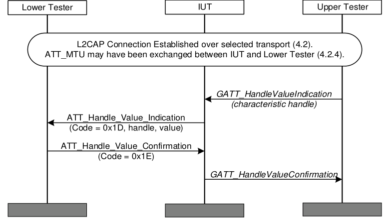

**Figure 4.155: GATT/SR/GAI/BV-01-C [Characteristic Value Indication - by Server] MSC**

• Expected Outcome
Pass verdict
IUT sends a correctly formatted ATT_Handle_Value_Indication (0x1D) command to the Lower Tester.
The Characteristic Handle is set to a valid handle.
The Characteristic Value is set to the value of characteristic identified by the characteristic handle.
IUT receives ATT_Handle_Value_Confirmation (0x1E) from the Lower Tester. IUT sends GATT_HandleValueConfirmation to the Upper Tester.
The IUT is successfully configured for indication using the procedure specified in Section 4.2.2.2.
GATT/CL/GAI/BV-01-C [Confirm Characteristic Value Indication - by Client]
• Test Purpose
Verify that a Generic Attribute Profile client can respond with a Confirmation to a Characteristic Value Indication.
• Reference
[1] 4.11.1
[5] 3.4.7.3
• Initial Condition
- A preamble procedure defined in Section 4.2.1 is used to set up the transport and L2CAP channel.
- A preamble procedure defined in Section 4.2.5 may have been used to exchange ATT MTU between the IUT and the Lower Tester.
• Test Procedure
Send an ATT_Handle_Value_Indication command from the Lower Tester to the IUT.

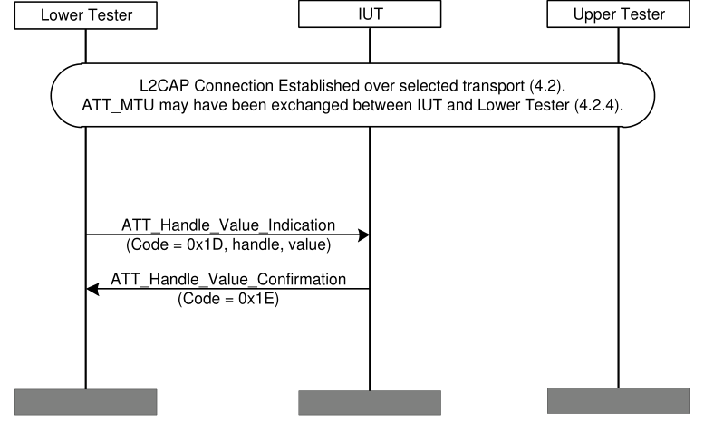

**Figure 4.156: GATT/CL/GAI/BV-01-C [Confirm Characteristic Value Indication - by Client] MSC**

• Expected Outcome
Pass verdict
IUT sends an ATT_Handle_Value_Confirmation (0x1E) command to the Lower Tester.
The IUT is successfully configured for indication using the procedure specified in Section 4.2.2.4.
• Test Purpose
Verify that a Generic Attribute Profile client can receive a Handle Value Multiple Notification, based on the value of the Client Supported Features characteristic, and report that to the Upper Tester.
• Reference
[12] 4.10.1, 4.14
[13] 3.3.3, 3.4.7.4
• Initial Condition
- A preamble procedure defined in Section 4.2.1 is used to set up the transport and L2CAP channel.
- A preamble procedure defined in Section 4.2.4 may have been used to exchange ATT MTU between the IUT and the Lower Tester.
- A preamble procedure defined in Section 4.2.2.1 is used to configure the characteristic for Notification.
- There is no bond between the IUT and the Lower Tester.
- Client Supported Feature in the Lower Tester has bit 2 set to 0.
• Test Procedure

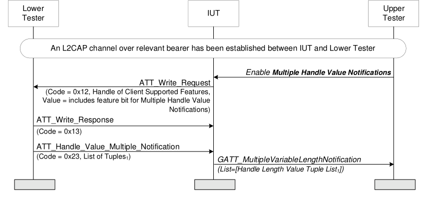

**Figure 4.157: GATT/CL/GAN/BV-02-C [Handle Value Multiple Notification – to Client] MSC**

1. The Upper Tester orders the IUT to enable the Multiple Handle Value Notifications feature. 2. The IUT performs a GATT Characteristic Value Write procedure on the Client Supported
Features characteristic, setting the Multiple Handle Value Notifications bit to 1 and all RFU bits to 0. 3. The Lower Tester sends an ATT_Handle_Value_Multiple_Notification (Code = 0x23) with a list of
Handle Length Value Tuples for each of the attributes being notified. 4. The IUT sends a notification to the Upper Tester, e.g., GATT_MultipleVariableLengthNotification,
containing the data from step 1.
• Expected Outcome
Pass verdict
The IUT executes a GATT Characteristic Value Write procedure on the Client Supported Features characteristic, setting the Multiple Handle Value Notifications bit to 1, and setting all RFU bits to 0.
After setting the Multiple Handle Value Notifications bit, when the IUT receives an ATT_Handle_Value_Multiple_Notification from the Lower Tester, it generates a message to the Upper Tester containing the characteristic handles, lengths, and attribute values included in that Handle Value Multiple Notification, before the Attribute Protocol Transaction timeout expires.
GATT/SR/GAN/BV-02-C [Handle Value Multiple Notification – by Server]
• Test Purpose
Verify that a Generic Attribute Profile server can send a Handle Value Multiple Notification, based on the value of the Client Supported Features characteristic, and can maintain a separate instance for each Client.
• Reference
[12] 4.10.1, 4.14
[13] 3.4.7.4
• Initial Condition
- A preamble procedure defined in Section 4.2.1 is used to set up the transport and L2CAP channel.
- A preamble procedure defined in Section 4.2.4 may have been used to exchange ATT MTU between the IUT and the Lower Tester.
- A preamble procedure defined in Section 4.2.2.1 is used to configure the characteristic for Notification.
- Lower Tester 1 has discovered the Client Supported Features characteristic and has saved the handle of the characteristic value.
- There is no bond between the IUT and any of the Lower Testers.
• Test Procedure

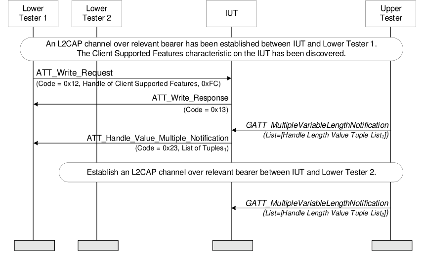

**Figure 4.158: GATT/SR/GAN/BV-02-C [Handle Value Multiple Notification – by Server] MSC**

1. Lower Tester 1 executes a GATT Characteristic Value Write procedure on the Client Supported
Features characteristic, setting the Multiple Handle Value Notifications bit to 1, setting all RFU bits to 1 and setting all other bits to 0. 2. Lower Tester 1 executes a GATT Characteristic Value Read procedure on the Client Supported
Features characteristic, expecting the Multiple Handle Value Notifications bit to be set to 1 and all other bits to 0. 3. Lower Tester 2 establishes a connection to the IUT and executes a GATT Characteristic Value
Read procedure on the Client Supported Features characteristic, expecting the Multiple Handle Value Notifications bit to be set to 0. 4. The Upper Tester sends a notification to the IUT, e.g., GATT_MultipleVariableLengthNotification,
containing multiple characteristic handles, lengths, and values, for client 1 (Lower Tester 1). 5. The IUT sends an ATT_Handle_Value_Multiple_Notification (Code = 0x23) to the Lower Tester,
with the list of Handle Length Value Tuples specifying the characteristics in step 1. 6. The Upper Tester sends a notification to the IUT, e.g., GATT_MultipleVariableLengthNotification,
containing multiple characteristic handles, lengths, and values, for client 2 (Lower Tester 2). 7. The IUT doesn’t send anything to Lower Tester 2.
• Expected Outcome
Pass verdict
The IUT is successfully configured for notification using the procedure specified in Section 4.2.2.1.
The IUT updates the value of the Client Supported Features characteristic as requested by the Client, ignoring the values of the RFU bits.
The IUT sends a correctly formatted ATT_Handle_Value_Multiple_Notification command to the Lower Tester 1, when requested by the Upper Tester.
The Handle Length Value Tuple List is set to the concatenation of the handle-length-value tuples for each of the attributes contained in the IUT and being notified.
The IUT doesn’t send as ATT_Handle_Value_Multiple_Notification command to the Lower Tester 2, when requested by the Upper Tester.
GATT/CL/GAI/BI-01-C [Multiple Characteristic Value Indication Requests, Client]
• Test Purpose
Verify that a Generic Attribute Profile client can properly handle receiving a second indication from the Lower Tester before sending the confirmation from the first indication.
• Reference
[1] 4.11.1
[5] 3.4.7.2
• Initial Condition
- A preamble procedure defined in Section 4.2.1 is used to set up the transport and L2CAP channel.
- A preamble procedure defined in Section 4.2.5 may have been used to exchange ATT MTU between the IUT and the Lower Tester.
- A preamble procedure defined in Section 4.2.2.4 is used to configure the characteristic for Indication.
• Test Procedure
The Lower Tester sends two indications to the IUT without waiting for a confirmation.
The IUT may send send two confirmations, one confirmation, or no confirmations to the Lower Tester.

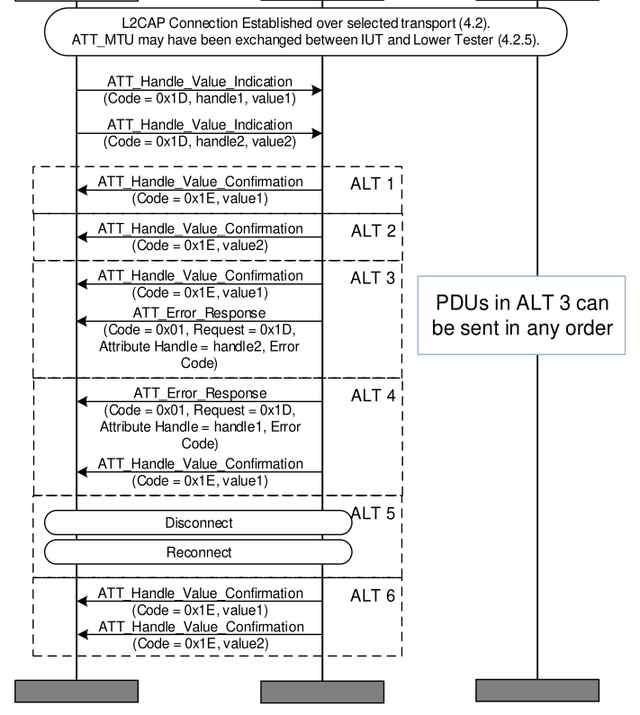

**Figure 4.159: GATT/CL/GAI/BI-01-C [Multiple Characteristic Value Indication Requests, Client] MSC**

• Expected Outcome
Pass verdict
ALT 1: The IUT sends an ATT_Handle_Value_Confirmation for the first request and ignores the second request.
ALT 2: The IUT sends an ATT_Handle_Value_Confirmation for the second request and ignores the first request.
ALT 3: The IUT sends an ATT_Handle_Value_Confirmation for the first request and an ATT_Error_Response for the second request with an Error Code and Attribute Handle set to handle 2. The two PDUs can be sent in any order.
ALT 4: The IUT sends an ATT_Error_Response for the first request with an Error Code and the Attribute Handle set to handle 1 and then sends an ATT_Handle_Value_Confirmation for the second request.
ALT 5: The IUT disconnects the L2CAP connection with the Lower Tester. The Lower Tester then reconnects the L2CAP connection with the Lower Tester to confirm that the IUT has not crashed.
ALT 6: The IUT sends an ATT_Handle_Value_Confirmation to the Lower Tester for the first indication and then sends an ATT_Handle_Value_Confirmation to the Lower Tester for the second indication.

### 4.9 Generic Attribute Profile Services

Verify the correct implementation of the Generic Attribute Profile Services. All of these test cases apply to Generic Attribute Profile servers.
GATT/CL/GAS/BV-01-C [Service Changed Characteristic – to Client]
• Test Purpose
Verify the IUT client behavior when a Service Changed Indication is received from a server.
• Reference
[1] 2.5.2, 7.1
[5] 3.4.5.3, 3.4.7.2, 3.4.7.3
• Initial Condition
- IUT has performed service discovery during a previous connection and has cached handles. The cached handles are identified in the IXIT [10].
- A preamble procedure defined in Section 4.2.1 is used to set up the transport and L2CAP channel.
- A preamble procedure defined in Section 4.2.5 may have been used to exchange an ATT MTU between the IUT and the Lower Tester.
- A preamble procedure defined in Section 4.2.2.4 is used to configure the Lower Tester’s Service Changed characteristic for Indication.
• Test Procedure
The Lower Tester sends an ATT_Handle_Value_Indication to the IUT containing the Service Changed characteristic. The Characteristic Value contains a handle range that includes the handles cached by the IUT.
The IUT sends an ATT_Handle_Value_Confirmation.

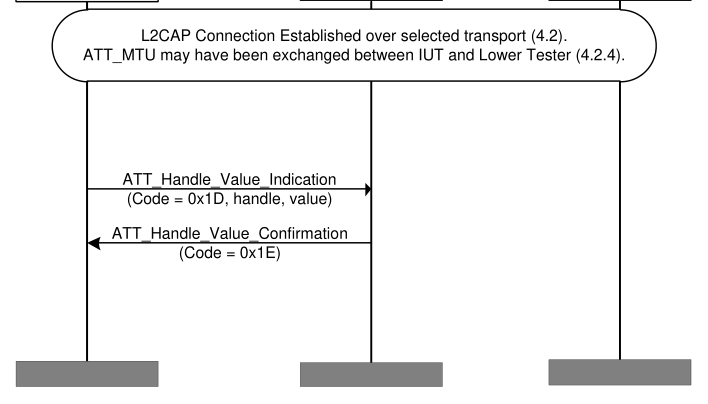

**Figure 4.160: GATT/CL/GAS/BV-01-C [Service Changed Characteristic – to Client] MSC**

• Expected Outcome
Pass verdict
The IUT sends an ATT_Handle_Value_Confirmation (0x1E) command to the Lower Tester.
GATT/CL/GAS/BV-02-C [Reading the Database Hash Characteristic]
• Test Purpose
Verify that the IUT acting as GATT Client can read the value of the Database Hash characteristic.
• Reference
[11] 2.5.2, 7.3
• Initial Condition
- A preamble procedure defined in Section 4.2.1 is used to set up the transport and L2CAP channel between the IUT and the Lower Tester.
- ATT_MTU may have been exchanged between the IUT and the Lower Tester using the GATT Exchange MTU sub-procedure.
• Test Procedure
The Upper Tester orders the IUT to read the Database Hash characteristic. The Lower Tester expects the IUT to perform the GATT Read Using Characteristic UUID sub-procedure.
Lower Tester Upper Tester IUT

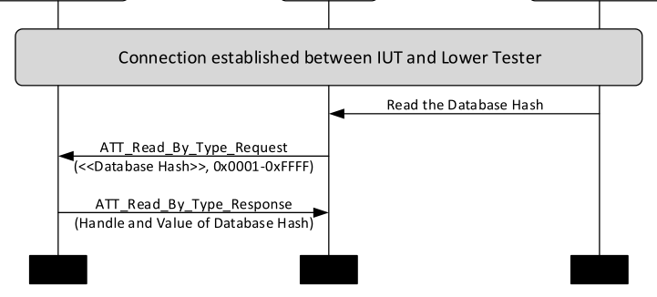

**Figure 4.161: GATT/CL/GAS/BV-02-C [Reading the Database Hash Characteristic] MSC**

• Expected Outcome
Pass verdict
The IUT executes the GATT Read Using Characteristic UUID sub-procedure, with the characteristic UUID set to «Database Hash», and the handle range 0x0001-0xFFFF.
GATT/CL/GAS/BV-03-C [Enabling the Robust Caching]
• Test Purpose
Verify that the IUT acting as GATT Client can enable the Robust Caching feature on the Server.
• Reference
[11] 2.5.2.1, 7.2
• Initial Condition
- A preamble procedure defined in Section 4.2.1 is used to set up the transport and L2CAP channel between the IUT and the Lower Tester.
- ATT_MTU may have been exchanged between the IUT and the Lower Tester using the GATT Exchange MTU sub-procedure.
- The IUT has discovered the Client Supported Features characteristic and has saved the handle of the characteristic value.
- There is no bond between the IUT and the Lower Tester.
• Test Procedure
The Upper Tester orders the IUT to enable the Robust Caching feature. The Lower Tester expects the IUT to perform a GATT Characteristic Value Write procedure on the Client Supported Features characteristic, setting the Robust Caching bit to 1 and all RFU bits to 0.
Lower Tester Upper Tester IUT

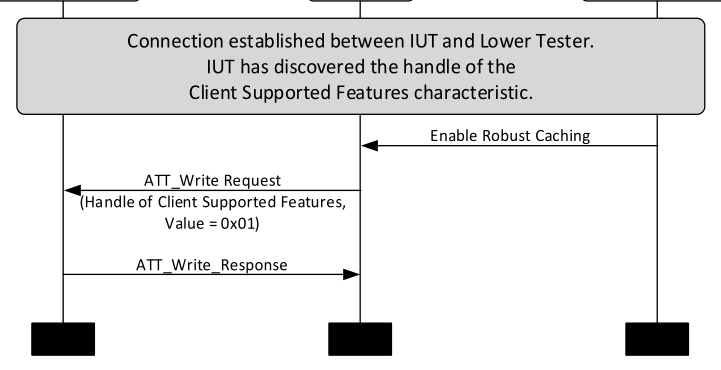

**Figure 4.162: GATT/CL/GAS/BV-03-C [Enabling the Robust Caching] MSC**

• Expected Outcome
Pass verdict
The IUT executes a GATT Characteristic Value Write procedure on the Client Supported Features characteristic, setting the Robust Caching bit to 1, and setting all RFU bits to 0.
GATT/SR/GAS/BV-01-C [Service Changed Characteristic and Indication – from Server]
• Test Purpose
Verify that a GATT Server as IUT that supports the Service Changed characteristic generates an indication only if the Client enables the Indication in the Client Characteristic Configuration descriptor.
• Reference
[1] 2.5.2, 7.1
[5] 3.4.5.2, 3.4.7.2, 3.4.7.3
• Initial Condition
- The Lower Tester has bonded with the IUT during a previous connection and both the Lower Tester and IUT have valid stored bonding information.
- A preamble procedure defined in Section 4.2.1 is used to set up the transport and L2CAP channel.
- A preamble procedure defined in Section 4.2.5 may have been used to exchange ATT MTU between the IUT and the Lower Tester.
- The Lower Tester has the necessary security permissions from the IUT to write the Client Characteristic Configuration descriptor.
- The Client Characteristic Configuration descriptor in the IUT has the Indication bit set to 0 (zero) (the Characteristic Value is NOT indicated).
• Test Procedure

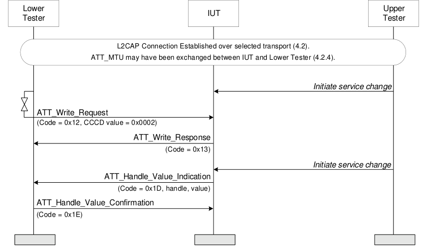

**Figure 4.163: GATT/SR/GAS/BV-01-C [Service Changed Characteristic and Indication – from Server] MSC**

1. Send a command from the Upper Tester to the IUT to initiate a service change. This may be
performed before or after the connection is established. 2. Wait at least two connection intervals. The IUT does not send any message to the Lower Tester
during this time. 3. The Lower Tester sends an ATT_Write_Request with Handle= 0x2902 (Client Characteristic
Configuration) and Value = 0x0002 to the IUT, to enable Indication. 4. Send a command from the Upper Tester to the IUT to initiate a service change. 5. The IUT sends an ATT_Handle_Value_Indication to the Lower Tester containing the Service
Changed characteristic. 6. The Lower Tester sends an ATT_Handle_Value_Confirmation to the IUT.
• Expected Outcome
Pass verdict
In step 2, the IUT does not send ATT_Handle_Value_Indication to the Lower Tester.
In step 5, the IUT sends a properly formatted ATT_Handle_Value_Indication containing the Service Changed characteristic.
The IUT responds within the applicable timeout (3.3.3/ATT [5]).
GATT/SR/GAS/BV-02-C [Computing and Returning the Database Hash Characteristic]
• Test Purpose
Verify that the IUT acting as GATT Server can return and properly update the value of the Database Hash characteristic.
• Reference
[11] 2.5.2, 7.3
• Initial Condition
- A preamble procedure defined in Section 4.2.1 is used to set up the transport and L2CAP channel between the IUT and the Lower Tester.
- ATT_MTU may have been exchanged between the IUT and the Lower Tester using the GATT Exchange MTU sub-procedure.
• Test Procedure
1. The Lower Tester obtains the complete GATT database from the IUT, by executing service and
characteristic discovery procedures, then reads the value of the Database Hash characteristic. 2. The Lower Tester computes the correct value of the database hash and verifies that it matches
the value of the Database Hash characteristic obtained in step 1. If the values do not match, the test ends with a Fail Verdict. 3. The Upper Tester orders the IUT to change its GATT database, by adding or removing services
and/or characteristics. 4. Repeat steps 1–2.

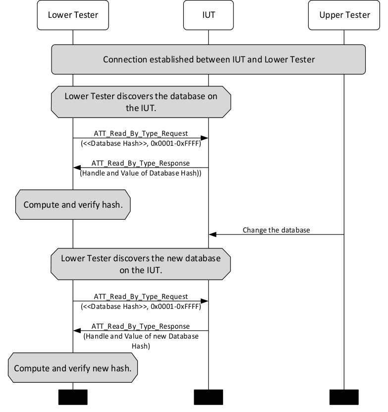

**Figure 4.164: GATT/SR/GAS/BV-02-C [Computing and Returning the Database Hash Characteristic] MSC**

• Expected Outcome
Pass verdict
The IUT returns the correct value of the Database Hash characteristic in both iterations of step 2.
Inconclusive verdict
The IUT is unable to change its database during a connection in step 3.
GATT/SR/GAS/BV-03-C [Maintaining a Client Supported Features Characteristic Instance for each Client]
• Test Purpose
Verify that the IUT acting as GATT Server can update the value of the Client Supported Features characteristic and, if applicable, can maintain a separate instance for each Client.
• Reference
[11] 2.5.2, 7.2
• Initial Condition
- A preamble procedure defined in Section 4.2.1 is used to set up the transport and L2CAP channel between the IUT and Lower Tester 1.
- ATT_MTU may have been exchanged between IUT and Lower Tester 1 using the GATT Exchange MTU sub-procedure.
- Lower Tester 1 has discovered the Client Supported Features characteristic and has saved the handle of the characteristic value.
- There is no bond between the IUT and any of the Lower Testers.
• Test Procedure
1. Lower Tester 1 executes a GATT Characteristic Value Write procedure on the Client Supported
Features characteristic, setting the Robust Caching bit to 1, setting all RFU bits to 1 and setting all other bits to 0. 2. Lower Tester 1 executes a GATT Characteristic Value Read procedure on the Client Supported
Features characteristic, expecting the Robust Caching bit to be set to 1 and all other bits to 0. 3. If the IUT does not support multiple simultaneous LE connections, end the test, otherwise
continue with step 4. 4. Lower Tester 2 establishes a connection to the IUT and executes a GATT Characteristic Value
Read procedure on the Client Supported Features characteristic, expecting the Robust Caching bit to be set to 0.
Lower Tester 2
Lower Tester 1 IUT

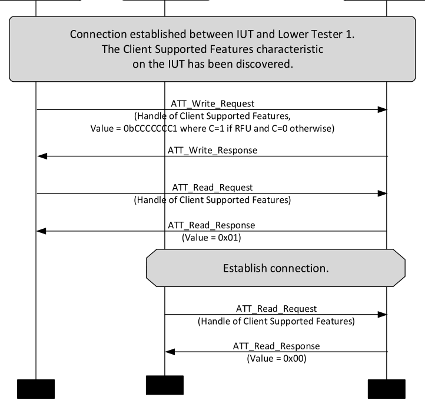

**Figure 4.165: GATT/SR/GAS/BV-03-C [Maintaining a Client Supported Features Characteristic Instance for each Client] MSC**

• Expected Outcome
Pass verdict
The IUT updates the value of the Client Supported Features characteristic as requested by the Client, ignoring the values of the RFU bits.
If the IUT supports multiple simultaneous LE connections, it maintains separate characteristic instances for each Client.
GATT/SR/GAS/BV-04-C [Maintaining Client Supported Features Characteristic Values for Bonded Devices]
• Test Purpose
Verify that the IUT acting as GATT Server saves and restores the value of the Client Supported Features characteristic for bonded devices across connections.
• Reference
[11] 2.5.2, 7.2
• Initial Condition
- A preamble procedure defined in Section 4.2.1 is used to set up the transport and L2CAP channel between the IUT and the Lower Tester.
- ATT_MTU may have been exchanged between the IUT and the Lower Tester using the GATT Exchange MTU sub-procedure.
- The IUT and the Lower Tester have paired and bonded.
- The Lower Tester has discovered the Client Supported Features characteristic and has saved the handle of the characteristic value.
• Test Procedure
1. The Lower Tester executes a GATT Characteristic Value Write procedure on the Client
Supported Features characteristic, setting the Robust Caching bit to 1. 2. The Lower Tester terminates the connection with the IUT, then a new connection is established. 3. The Lower Tester executes a GATT Characteristic Value Read procedure on the Client
Supported Features characteristic, expecting the Robust Caching bit to be set to 1.

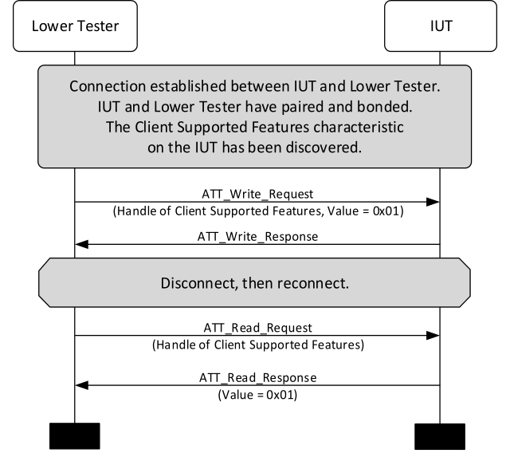

**Figure 4.166: GATT/SR/GAS/BV-04-C [Maintaining Client Supported Features Characteristic Values for Bonded Devices] MSC**

• Expected Outcome
Pass verdict
The IUT maintains the value of the Client Supported Features characteristic across connections.
• Test Purpose
Verify that the IUT acting as GATT Server handles Client requests on an unsynchronized database based on the Robust Caching feature being enabled or disabled.
• Reference
[11] 2.5.2, 7.2
• Initial Condition
- A preamble procedure defined in Section 4.2.1 is used to set up the transport and L2CAP channel between the IUT and the Lower Tester.
- ATT_MTU may have been exchanged between the IUT and the Lower Tester using the GATT Exchange MTU sub-procedure.
- The GATT database on the IUT contains at least one characteristic that supports the GATT Characteristic Value Read sub-procedure and at least one characteristic that supports the GATT Write Without Response sub-procedure. Any change on the GATT database during the test procedure will not affect these characteristics.
- The Lower Tester has discovered the characteristics on the IUT and has saved the handles of their values.
- The Lower Tester does not enable indications on the Service Changed characteristic.
- The Lower Tester has not enabled the Robust Caching feature.
- There is no bond between the IUT and the Lower Tester.
• Test Procedure
1. The Upper Tester orders the IUT to change its GATT database, by adding or removing services
and/or characteristics. 2. The Lower Tester executes the GATT Characteristic Value Read sub-procedure on a
characteristic (other than the Database Hash characteristic) and expects the IUT to return either the characteristic value or a different error code. If the Database Out of Sync error is returned, the test ends with a Fail Verdict. 3. The Lower Tester executes a GATT Characteristic Value Write procedure on the Client
Supported Features characteristic, setting the Robust Caching bit to 1. 4. Repeat step 1. 5. The Lower Tester executes the GATT Characteristic Value Read sub-procedure on a
characteristic (other than the Database Hash characteristic) and expects the IUT to return the Database Out of Sync error. 6. The Lower Tester tries to read the same characteristic as in the previous step, and this time
expects the IUT to return either the characteristic value or a different error code. If the Database Out of Sync error is returned, the test ends with a Fail Verdict. 7. The Upper Tester reads the value of a characteristic on the IUT that supports the GATT Write
Without Response sub-procedure. 8. Repeat step 1, then repeat step 5. 9. The Lower Tester executes a GATT Write Without Response sub-procedure on the characteristic
whose value is known from step 7, trying to change the characteristic to a new, valid value. The IUT is expected to ignore the command. 10. Repeat step 7, expecting the IUT to return the same characteristic value. If the IUT has changed
the value of the characteristic, then the test ends with a Fail Verdict.
Supported Features characteristic, setting the Robust Caching bit to 0, and expects the IUT to return the Value Not Allowed error. 12. The Lower Tester executes a GATT Characteristic Value Read procedure on the Client
Supported Features characteristic, expecting the Robust Caching bit to be set to 1. 13. Repeat step 1. 14. The Lower Tester executes the GATT Characteristic Value Read sub-procedure on the Database
Hash characteristic and expects the IUT to return the Database Out of Sync error. 15. Repeat step 1. 16. The Lower Tester executes the GATT Read Using Characteristic UUID sub-procedure request to
the IUT with the Attribute Type not set to <<Include>> or <<Characteristic>> and an Attribute Handle range other than 0x0001 to 0xFFFF and expects the IUT to return the Database Out of Sync error.

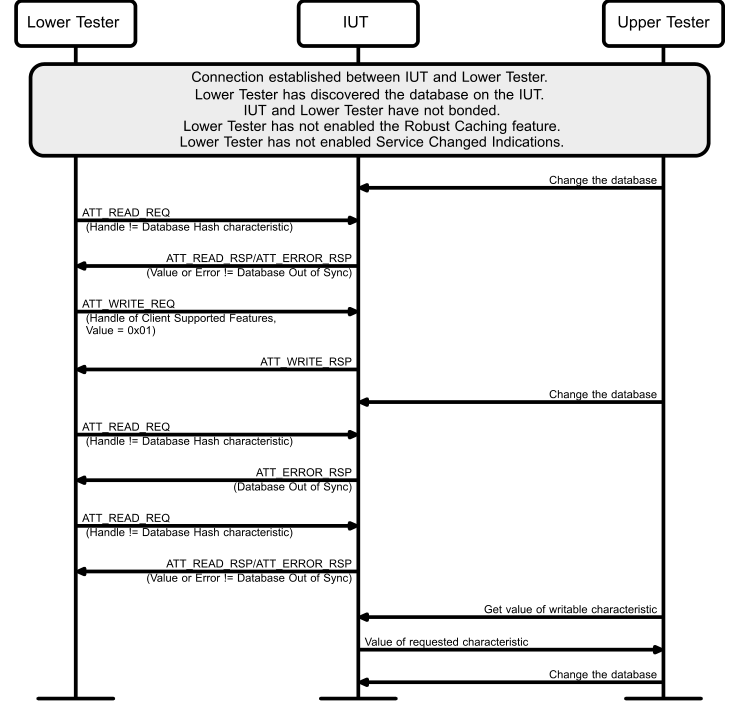

**Figure 4.167: GATT/SR/GAS/BV-05-C [Handling Client Requests on Unsynchronized Database] MSC – Page 1 of 2**

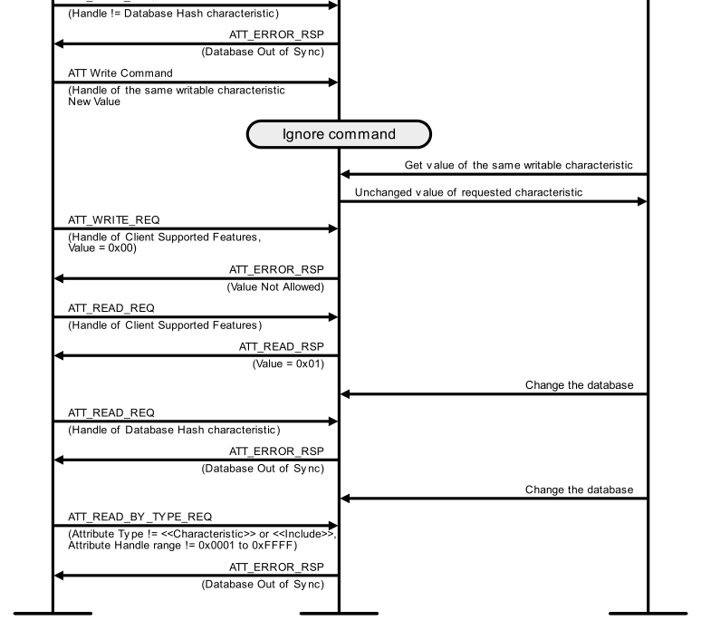

**Figure 4.168: GATT/SR/GAS/BV-05-C [Handling Client Requests on Unsynchronized Database] MSC – Page 2 of 2**

• Expected Outcome
Pass verdict
In both executions of step 5, the IUT returns the Database Out of Sync error.
In steps 2 and 6, the IUT does not return the Database Out of Sync error.
In step 9, the IUT ignores the ATT command from the Lower Tester.
In step 11, the IUT returns the Value Not Allowed error and does not change the value of the characteristic.
In steps 14 and 16, the IUT returns the Database Out of Sync error.
Inconclusive verdict
The IUT is unable to change its database during a connection.
GATT/SR/GAS/BV-06-C [Handling Client Requests after a Hash Read or Service Changed Indication – Database Changed during Connection]
• Test Purpose
Verify that the IUT acting as GATT Server does not return the Database Out of Sync error after a hash read when the Robust Caching feature is enabled. The database is changed during the same connection.
• Reference
[11] 2.5.2, 7.2
• Initial Condition
- A preamble procedure defined in Section 4.2.1 is used to set up the transport and L2CAP channel between the IUT and the Lower Tester.
- ATT_MTU may have been exchanged between the IUT and the Lower Tester using the GATT Exchange MTU sub-procedure.
- The GATT database on the IUT contains at least one characteristic that supports the GATT Characteristic Value Read sub-procedure. Any change on the GATT database during the test procedure will not affect this characteristic.
- The Lower Tester has discovered the characteristics on the IUT and has saved the handles of their values.
- The Lower Tester does not enable indications on the Service Changed characteristic unless specifically directed to do so.
- There is no bond between the IUT and the Lower Tester.
• Test Procedure
1. The Lower Tester executes a GATT Characteristic Value Write procedure on the Client
Supported Features characteristic, setting the Robust Caching bit to 1. 2. The Upper Tester orders the IUT to change its GATT database, by adding or removing services
and/or characteristics. 3. The Lower Tester executes the GATT Read Using Characteristic UUID sub-procedure on the
Database Hash characteristic. 4. The Lower Tester executes the GATT Characteristic Value Read sub-procedure on another
characteristic (different than the Database Hash characteristic) and expects the IUT to return either the characteristic value or a different error code. If the Database Out of Sync error is returned, the test ends with a Fail Verdict. 5. The Lower Tester enables indications on the Service Changed characteristic. 6. Repeat step 2 and wait for the IUT to send an indication on the Service Changed characteristic. If
the indication is not received within 30 seconds, the test ends with a Fail Verdict. 7. The Lower Tester confirms the indication, then repeat step 4. 8. Repeat step 6. 9. The Lower Tester does not confirm the indication, but instead executes the GATT Characteristic
Value Read sub-procedure on another characteristic (different than the Database Hash characteristic) and expects the IUT to return the Database Out of Sync error.
Lower Tester Upper Tester IUT

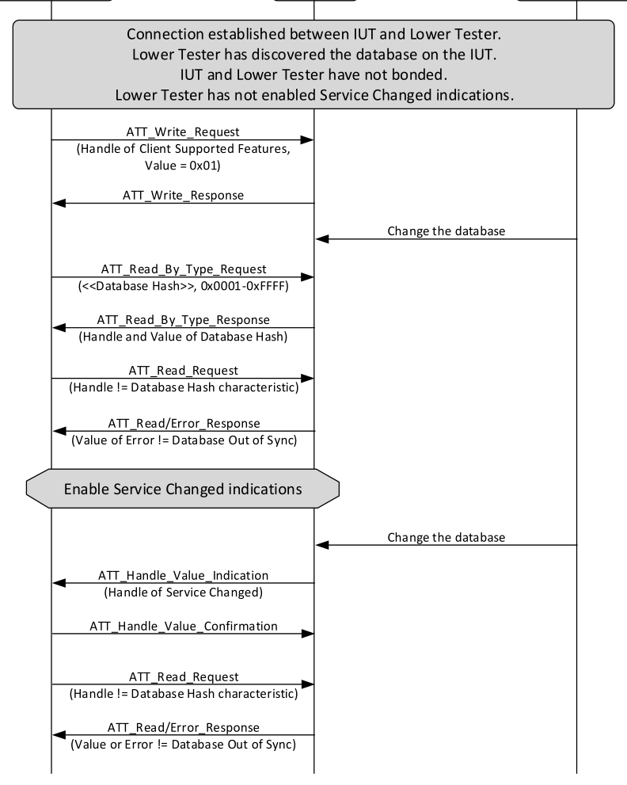

**Figure 4.169: GATT/SR/GAS/BV-06-C [Handling Client Requests after a Hash Read or Service Changed Indication – Database Changed during Connection] – MSC Page 1 of 2**

Change the database

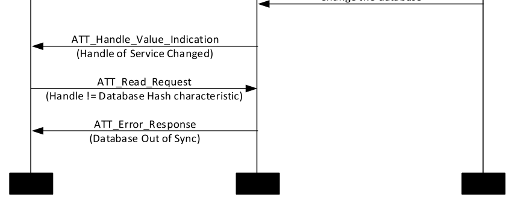

**Figure 4.170: GATT/SR/GAS/BV-06-C [Handling Client Requests after a Hash Read or Service Changed Indication – Database Changed during Connection] – MSC Page 2 of 2**

• Expected Outcome
Pass verdict
In both executions of step 4, the IUT does not return the Database Out of Sync error.
In step 9, the IUT returns the Database Out of Sync error.
Inconclusive verdict
The IUT is unable to change its database during a connection in step 2.
GATT/SR/GAS/BV-07-C [Handling Client Requests after a Hash Read or Service Changed Indication – Database Changed between Connections]
• Test Purpose
Verify that the IUT acting as GATT Server does not return the Database Out of Sync error after a hash read when the Robust Caching feature is enabled. The database is changed between connections after a bond has been created.
• Reference
[11] 2.5.2, 7.2
• Initial Condition
- The GATT database on the IUT contains at least one characteristic that supports the GATT Characteristic Value Read sub-procedure. Any change on the GATT database during the test procedure will not affect this characteristic.
- The IUT and the Lower Tester have bonded and the connection has been terminated.
- The Lower Tester has discovered the characteristics on the IUT and has saved the handles of their values.
- The Lower Tester has enabled the Robust Caching feature.
- The Lower Tester has not enabled indications on the Service Changed characteristic.
• Test Procedure
1. The Upper Tester orders the IUT to change its GATT database, by adding or removing services
and/or characteristics, then the Lower Tester creates a connection with the IUT. 2. The Lower Tester executes the GATT Read Using Characteristic UUID sub-procedure on the
Database Hash characteristic. 3. The Lower Tester executes the GATT Characteristic Value Read sub-procedure on another
characteristic (different than the Database Hash characteristic) and expects the IUT to return either the characteristic value or a different error code. If the Database Out of Sync error is returned, the test ends with a Fail Verdict. 4. The Lower Tester enables indications on the Service Changed characteristic, then it terminates
the connection. 5. Repeat step 1 and wait for the IUT to send an indication on the Service Changed characteristic. If
the indication is not received within 30 seconds, the test ends with a Fail Verdict. 6. The Lower Tester confirms the indication, then repeat step 3. 7. The Lower Tester terminates the connection, then reconnects, and then it executes a GATT
Characteristic Value Write procedure on the Client Supported Features characteristic, setting the Robust Caching bit to 0, and expects the IUT to return the Value Not Allowed error. 8. The Lower Tester disables indications on the Service Changed characteristic, then it terminates
the connection, then repeat step 1, and then the Lower Tester executes the GATT Characteristic Value Read sub-procedure on another characteristic (different than the Database Hash characteristic) and expects the IUT to return the Database Out of Sync error. 9. The Lower Tester terminates the connection, then reconnects, and then it executes the GATT
Characteristic Value Read sub-procedure on another characteristic (different than the Database Hash characteristic) and expects the IUT to return the Database Out of Sync error.
Lower Tester Upper Tester IUT

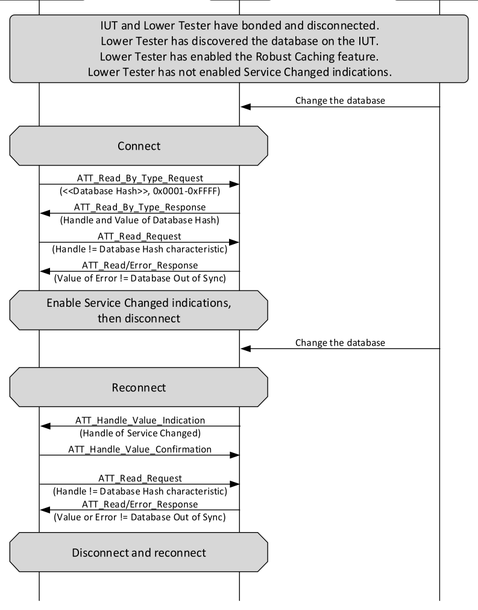

**Figure 4.171: GATT/SR/GAS/BV-07-C [Handling Client Requests after a Hash Read or Service Changed Indication – Database Changed between Connections] – MSC Page 1 of 2**

ATT_Write_Request (Handle of Client Supported Features,

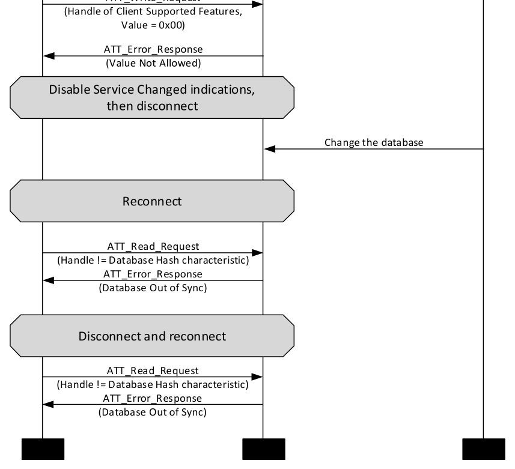

**Figure 4.172: GATT/SR/GAS/BV-07-C [Handling Client Requests after a Hash Read or Service Changed Indication – Database Changed between Connections] – MSC Page 2 of 2**

• Expected Outcome
Pass verdict
In both executions of step 3, the IUT does not return the Database Out of Sync error.
In step 7, the IUT returns the Value Not Allowed error.
In steps 8 and 9, the IUT returns the Database Out Of Sync error.
GATT/SR/GAS/BV-08-C [Handling Read Multiple Variable Length Requests on Unsynchronized Database]
• Test Purpose
Verify that the IUT acting as GATT Server handles Read Multiple Variable Length Requests from a Client on an unsynchronized database based on the Robust Caching feature being enabled or disabled.
• Reference
[12] 2.5.2, 7.2, 4.8.5
[13] 3.4.4.11, 3.4.4.12
• Initial Condition
- A preamble procedure defined in Section 4.2.1 is used to set up the transport and L2CAP channel.
- A preamble procedure defined in Section 4.2.4 may have been used to exchange ATT MTU between the IUT and the Lower Tester.
- The IXIT specifies the L2CAP MTU (MTUL2CAP).
- The GATT database on the IUT contains at least two characteristics that supports the GATT Characteristic Value Read sub-procedure and at least one characteristic that supports the GATT Write Without Response sub-procedure. Any change on the GATT database during the test procedure will not affect these characteristics.
- The handles of the characteristics are known to the Lower Tester.
- The Lower Tester does not enable indications on the Service Changed characteristic.
- The Lower Tester has not enabled the Robust Caching feature.
- There is no bond between the IUT and the Lower Tester.
• Test Procedure

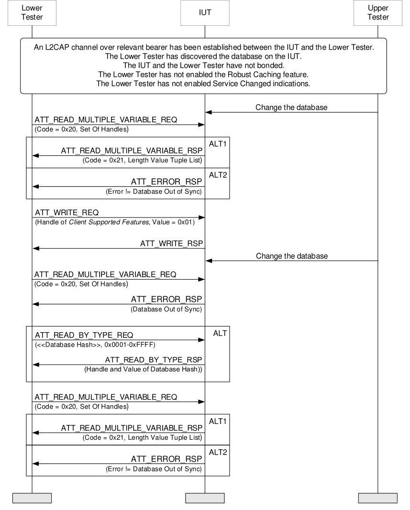

**Figure 4.173: GATT/SR/GAS/BV-08-C [Handling Read Multiple Variable Length Requests on Unsynchronized Database] MSC**

1. The Upper Tester orders the IUT to change its GATT database, by adding or removing services
and/or characteristics. 2. The Lower Tester sends an ATT_READ_MULTIPLE_VARIABLE_REQ (Code = 0x20) to the IUT
using the known set of readable handles (other than the Database Hash characteristic).
containing the values of the characteristics selected by the set of handles in step 2 or an error code. If the Database Out of Sync error is returned, the test ends with a Fail verdict. 4. The Lower Tester executes a GATT Characteristic Value Write procedure on the Client
Supported Features characteristic, setting the Robust Caching bit to 1. 5. Repeat step 1. 6. The Lower Tester executes the GATT Read Multiple Variable Length Characteristic Values sub-
procedure on a known set of readable characteristics (other than the Database Hash characteristic) and expects the IUT to return the Database Out of Sync error. 7. When multiple ATT bearers are used, the Lower Tester executes the GATT Characteristic Value
Read sub-procedure on the Database Hash characteristic and expects the IUT to return the Database Hash characteristic value. 8. The Lower Tester tries to read the same characteristics as in the previous step, and this time
expects the IUT to return either the characteristic values or an error code. If the Database Out of Sync error is returned, the test ends with a Fail verdict.
• Expected Outcome
Pass verdict
In both executions of step 6, the IUT returns the Database Out of Sync error.
In steps 3 and 7, the IUT does not return the Database Out of Sync error.
In step 7, the IUT returns the Database Hash characteristic value.

#### 4.9.1 Enabling the Features in Client Supported Features

• Test Purpose
Verify that the IUT acting as GATT Client can enable each supported feature on the Server.
• Reference
[11] 2.5.2.1, 7.2
• Initial Condition
- The Lower Tester sets the EATT Supported bit set to 1 in the Server Supported Features characteristic.
- A preamble procedure defined in Section 4.2.1 is used to set up the transport and L2CAP channel between the IUT and the Lower Tester.
- A preamble procedure defined in Section 4.2.3.2 is used to inform the Lower Tester that the IUT supports the Enhanced ATT bearer feature.
- The IUT has discovered the Client Supported Features characteristic and has saved the handle of the characteristic value.
- There is no bond between the IUT and the Lower Tester.
• Test Case Configuration

|  | Test Case |  |  | Bit |  |  | Client Feature |  |
| --- | --- | --- | --- | --- | --- | --- | --- | --- |
| GATT/CL/GAS/BV-04-C |  |  | 1 |  |  | Enhanced ATT bearer |  |  |
| GATT/CL/GAS/BV-05-C |  |  | 2 |  |  | Multiple Handle Value Notifications |  |  |

Table 4.6: Enabling the Features in Client Supported Features test cases
• Test Procedure
1. The Upper Tester orders the IUT to enable the Client Feature in Table 4.6. 2. The IUT performs a GATT Characteristic Value Write procedure on the Client Supported
Features characteristic, setting the corresponding bit in Table 4.6 to 1 and all RFU bits to 0. 3. The Lower Tester acknowledges the request sending an ATT_Write_Response to the IUT.

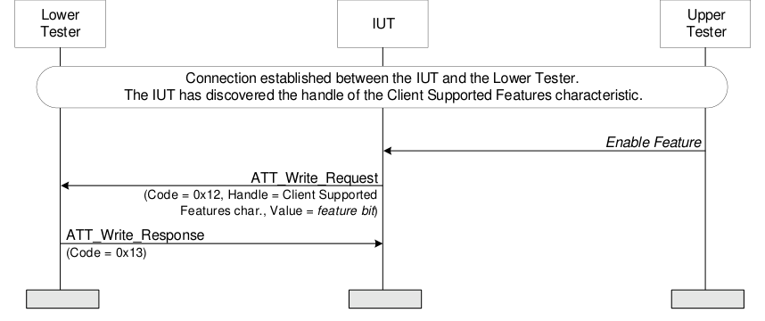

**Figure 4.174: Enabling the Features in Client Supported Features MSC**

• Expected Outcome
Pass verdict
The IUT executes a GATT Characteristic Value Write procedure on the Client Supported Features characteristic, correctly setting the feature bit in Table 4.6 to 1, and setting all RFU bits to 0.

### 4.10 GATT Transaction Timeouts

Check the IUT’s response to GATT transaction timeouts.
GATT/CL/GAT/BV-01-C [Read Characteristic Value – Server Timeout]
• Test Purpose
Verify that a client IUT detects server timeout after a read request, notifies the Upper Tester, and does not retry the read request.
• Reference
[1] 4.8.1, 4.14
[5] 3.3.3, 3.4.4.3
• Initial Condition
- A preamble procedure defined in Section 4.2.1 is used to set up the transport and L2CAP channel.
• Test Procedure
The Upper Tester will specify the handle of a Characteristic Value contained in the Lower Tester.
Send a request from the Upper Tester to the IUT to read a Characteristic Value from the Lower Tester by specifying the characteristic handle e.g., GATT_ReadReq.

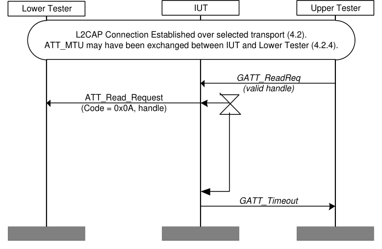

**Figure 4.175: GATT/CL/GAT/BV-01-C [Read Characteristic Value – Server Timeout] MSC**

• Expected Outcome
Pass verdict
The IUT sends a correctly formatted ATT_Read_Request command (0x0A) to the Lower Tester.
The characteristic handle parameter is set to the valid handle specified by the Upper Tester and waits for the ATT_Read_Response.
After the specified timeout (3.3.3/ATT [5]) the IUT sends a notification to the Upper Tester. A test system may allow up to a +/- 1 second deviation of the 30 second timeout to accommodate timer synchronization issues caused by the testing environment.
GATT/CL/GAT/BV-02-C [Write Characteristic Value – Server Timeout]
• Test Purpose
Verify that a client IUT detects server timeout after a Write Request, notifies the Upper Tester, and does not retry the Write Request.
• Reference
[1] 4.9.3, 4.14
[5] 3.3.3, 3.4.5.2
• Initial Condition
- A preamble procedure defined in Section 4.2.1 is used to set up the transport and L2CAP channel.
- The Lower Tester contains at least one valid characteristic and the handle of this characteristic is known to the Upper Tester.
- The Lower Tester has the necessary security permissions from the IUT to write a characteristic.
• Test Procedure
Send a command from the Upper Tester to request IUT to write the value of a characteristic in the Lower Tester e.g., GATT_WriteRequest (handle, value).
The Lower Tester detects the ATT_Write_Request and notifies the Upper Tester.

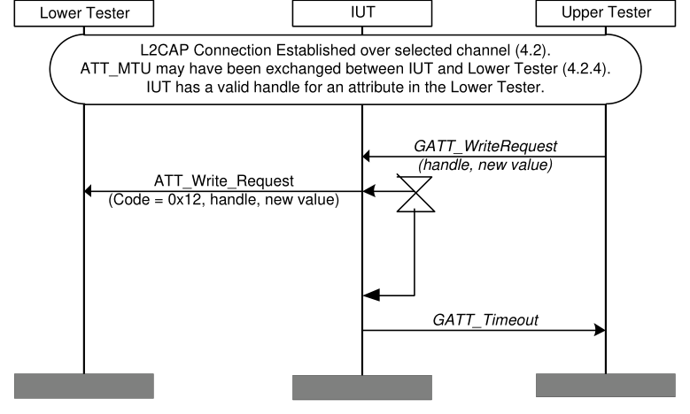

**Figure 4.176: GATT/CL/GAT/BV-02-C [Write Characteristic Value – Server Timeout] MSC**

• Expected Outcome
Pass verdict
The IUT sends a correctly formatted ATT_Write_Request command (0x12) to the Lower Tester, specifying the value that is to be written from the Upper Tester.
The characteristic handle parameter is set to a valid handle.
After the specified timeout (3.3.3/ATT [5]) the IUT sends a notification to the Upper Tester. A test system may allow up to a +/- 1 second deviation of the 30 second timeout to accommodate timer synchronization issues caused by the testing environment.
GATT/SR/GAT/BV-01-C [Handle Value Indication – Client Timeout]
• Test Purpose
Verify that a server IUT detects client timeout after a Handle Value Indication, notifies the Upper Tester, and does not retry the Handle Value Indication.
• Reference
[1] 4.11.1, 4.14
[5] 3.3.3, 3.4.7.2
• Initial Condition
- A preamble procedure defined in Section 4.2.1 is used to set up the transport and L2CAP channel.
- A preamble procedure defined in Section 4.2.2.2 is used to configure the characteristic for Indication.
• Test Procedure
Send a command from the Upper Tester to the IUT to request the IUT to send a Handle Value Indication to the Lower Tester e.g., GATT_HandleValueIndication.
The Lower Tester detects the ATT_Handle_Value_Indication and notifies the Upper Tester.

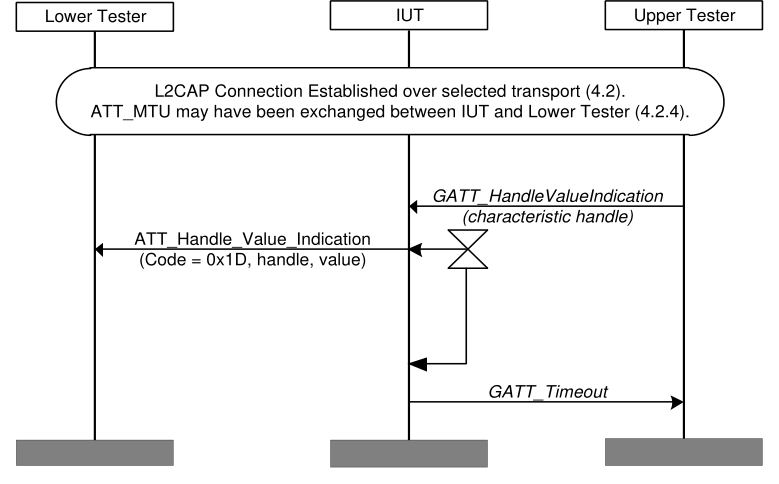

**Figure 4.177: GATT/SR/GAT/BV-01-C [Handle Value Indication – Client Timeout] MSC**

• Expected Outcome
Pass verdict
IUT sends a correctly formatted ATT_Handle_Value_Indication (0x1D) command to the Lower Tester.
The characteristic handle is set to a valid handle.
The Characteristic Value is set to the value of characteristic identified by the characteristic handle.
After the specified timeout (3.3.3/ATT [5]) the IUT sends a notification to the Upper Tester. A test system may allow up to a +/- 1 second deviation of the 30 second timeout to accommodate timer synchronization issues caused by the testing environment.
GATT/CL/GAT/BV-03-C [Read Multiple Variable Length Characteristic Values – Server Timeout]
• Test Purpose
Verify that a client IUT detects server timeout after a Read Multiple Variable Length Characteristics Values Request, notifies the Upper Tester, and does not retry the read request.
• Reference
[12] 4.8.5, 4.14
[13] 3.3.3, 3.4.4.11
• Initial Condition
- A preamble procedure defined in Section 4.2.1 is used to set up the transport and L2CAP channel.
- A preamble procedure defined in Section 4.2.4 may have been used to exchange ATT MTU between the IUT and the Lower Tester.
• Test Procedure

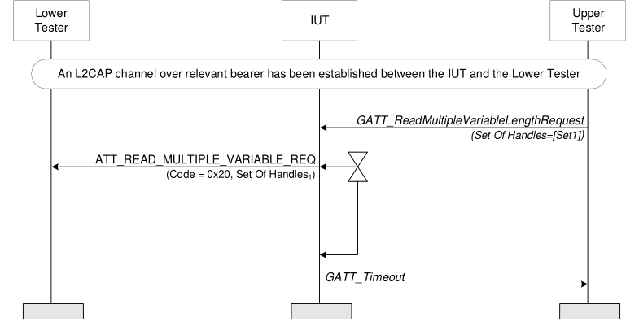

**Figure 4.178: GATT/CL/GAT/BV-03-C [Read Multiple Variable Length Characteristic Values – Server Timeout] MSC**

1. The Upper Tester sends a command to the IUT to read a set of Characteristic Values selected by
a set of handles, e.g., GATT_ReadMultipleVariableLengthRequest. 2. The IUT sends an ATT_READ_MULTIPLE_VARIABLE_REQ (Code = 0x20) to the Lower Tester
using the selected set of handles. 3. The Lower Tester does not send any PDU to the IUT.
• Expected Outcome
Pass verdict
The IUT sends a correctly formatted ATT_READ_MULTIPLE_VARIABLE_REQ to the Lower Tester.
The Set Of Handles parameter is set to the list of valid handles specified by the Upper Tester.
The IUT waits for the ATT_READ_MULTIPLE_VARIABLE_RSP (Code = 0x21).
After the specified timeout (3.3.3/ATT [5]) the IUT sends a notification to the Upper Tester. A test system may allow up to a +/- 1 second deviation of the 30 second timeout to accommodate timer synchronization issues caused by the testing environment.

### 4.11 Generic Profile Attributes

Verify the format and integrity of generic attributes when read by a client or when provided by a server.
GATT/CL/GPA/BV-12-C [Characteristic Format Descriptors – from Client]
• Test Purpose
Verify that a Generic Attribute Profile client (IUT) can read and interpret a Characteristic Value whose format and unit is defined by the Characteristic Presentation Format. The format, unit and value are not known to the IUT before the test.
• Reference
[1] 3.3, 4.7.1, 4.8
[5] 3.3.1, 3.4.4.3
• Initial Condition
- A preamble procedure defined in Section 4.2.1 is used to set up the transport and L2CAP channel.
- A preamble procedure defined in Section 4.2.5 may have been used to exchange ATT MTU between the IUT and the Lower Tester.
- The handle range of the characteristic used for the test is communicated to the IUT.
• Test Procedure
Execute the following procedure 5 times with different, random characteristic, formats and exponents—where applicable—presented by the Lower Tester.
1. Send a command from the Upper Tester to the IUT to request the IUT to discover the
characteristic properties, read the Characteristic Value and format and present it with correct formatting and unit to the Upper Tester. 2. Characteristic Value, value length where applicable, exponent and unit are randomly chosen by
the Lower Tester among the options in the following Characteristic Format Descriptor table:

|  | Characteristic | Value Range (hex) | Value Range (hex) |  |  | Value Length | Value Length |  | Exponent Range |  |  |
| --- | --- | --- | --- | --- | --- | --- | --- | --- | --- | --- | --- |
|  | Format Descriptor |  |  |  |  |  |  |  | (decimal) |  |  |
|  |  |  | min |  | max |  | (octets) |  | min |  | max |
| boolean |  | 0 |  | 0x1 |  | 1 |  | n/a |  |  |  |
| 2 bit |  | 0 |  | 0x3 |  | 1 |  | n/a |  |  |  |
| nibble |  | 0 |  | 0xF |  | 1 |  | n/a |  |  |  |
| uint8 |  | 0 |  | 0xFF |  | 1 |  | -128 |  | 127 |  |
| uint12 |  | 0 |  | 0xFFF |  | 2 |  | -128 |  | 127 |  |
| uint16 |  | 0 |  | 0xFFFF |  | 2 |  | -128 |  | 127 |  |
| uint24 |  | 0 |  | 0xFF.FFFF |  | 3 |  | -128 |  | 127 |  |
| uint32 |  | 0 |  | 0xFFFF.FFFF |  | 4 |  | -128 |  | 127 |  |

|  | Characteristic | Value Range (hex) | Value Range (hex) |  |  | Value Length | Value Length |  | Exponent Range |  |  |
| --- | --- | --- | --- | --- | --- | --- | --- | --- | --- | --- | --- |
|  | Format Descriptor |  |  |  |  |  |  |  | (decimal) |  |  |
|  |  |  | min |  | max |  | (octets) |  | min |  | max |
| uint48 |  | 0 |  | 0xFFFF.FFFF. FFFF |  | 6 |  | -128 |  | 127 |  |
| uint64 |  | 0 |  | 0xFFFF.FFFF. FFFF.FFFF |  | 8 |  | -128 |  | 127 |  |
| unit128 |  | 0 |  | 0xFFFF.FFFF. FFFF.FFFF. FFFF.FFFF. FFFF.FFFF |  | 16 |  | -128 |  | 127 |  |
| sint8 |  | 0 |  | 0xFF |  | 1 |  | -128 |  | 127 |  |
| sint12 |  | 0 |  | 0xFFF |  | 2 |  | -128 |  | 127 |  |
| sint16 |  | 0 |  | 0xFFFF |  | 2 |  | -128 |  | 127 |  |
| sint24 |  | 0 |  | 0xFF.FFFF |  | 3 |  | -128 |  | 127 |  |
| sint32 |  | 0 |  | 0xFFFF.FFFF |  | 4 |  | -128 |  | 127 |  |
| sint48 |  | 0 |  | 0xFFFF.FFFF. FFFF |  | 6 |  | -128 |  | 127 |  |
| sint64 |  | 0 |  | 0xFFFF.FFFF. FFFF.FFFF |  | 8 |  | -128 |  | 127 |  |
| sint128 |  | 0 |  | 0xFFFF.FFFF. FFFF.FFFF. FFFF.FFFF. FFFF.FFFF |  | 16 |  | -128 |  | 127 |  |
| float32 |  | 0 |  | 0xFFFF.FFFF |  | 4 |  | n/a |  |  |  |
| float64 |  | 0 |  | 0xFFFF.FFFF. FFFF.FFFF |  | 8 |  | n/a |  |  |  |
| SFLOAT |  | 0 |  | 0xFFFF |  | 2 |  | n/a |  |  |  |
| FLOAT |  | 0 |  | 0xFFFF.FFFF |  | 4 |  | n/a |  |  |  |
| duint16 |  | 0, 0 |  | 0xFFFF, 0xFFFF |  | 4 |  | n/a |  |  |  |
| utf8s |  | n/a |  |  |  | variable |  | n/a |  |  |  |
| utf16s |  | n/a |  |  |  | variable |  | n/a |  |  |  |
| struct |  | n/a |  |  |  | variable |  | n/a |  |  |  |

Table 4.7: Characteristic Format Descriptor for random choice in test cases - for client IUT
In execution of these tests, the client IUT might use procedures similar to those defined the following tests:
- GATT/CL/GAR/BV-06-C [Read Characteristic Descriptor – by Client]
- GATT/CL/GAR/BV-01-C [Read Characteristic Value - by Client]
- GATT/CL/GAR/BV-04-C [Read Long Characteristic Value - by Client]
• Expected Outcome
Pass verdict
In the case of utf8s, utf16s and struct formats, the number of individual elements (e.g., characters) matches the number of elements presented by the Lower Tester.
In the case of struct format, the IUT is not required to decompose the contents of the structure.
• Notes
The test assumes that the GATT upper edge provides sufficient capabilities to verify the validity of the Characteristic Value whose format and unit is defined by the Characteristic Presentation Format.
The presentation of value, exponent and unit is implementation dependent and may vary from the presentation of e.g., separate value, exponent and unit up to strings containing a human-readable interpretation of value and unit.
As long as this may be verified, the capabilities are up to the implementer of the IUT to define, among other alternatives implementers may choose raw format or complete interpreted structure.
Non-exhaustive Examples:
#1 [Characteristic sint16 Format Descriptor, by client]: The Lower Tester presents the following field values to the IUT:
- Characteristic Value = 0xF025
- Format = 0x0E
- Exponent = 0xFB
- Unit = 0x27AC
The result presented by the IUT to the Upper Tester is:
- -0.04059 ˚F
#2 [Characteristic sint16 Format Descriptor, by client]: The Lower Tester presents the following field values to the IUT:
- Characteristic Value = 0xF025
- Format = 0x0E
- Exponent = 0xFB
- Unit = 0x27AC
The result presented by the IUT to the Upper Tester is in the form of four individual elements:
- [value, format, exponent, unit] = [0xF025, 0x0E, 0x0FB, 0x27AC]
#3 [Characteristic FLOAT Format Descriptor, by client]: The Lower Tester presents the following field values to the IUT:
- Characteristic Value = 0x4162.2B4A.BB55.CD44
- Format = 0x15
- Exponent = n/a
- Unit = 0x2782
- 9.5258458542238547e+6 Ǻngström
#4 [Characteristic utf16s Format Descriptor, by client]: The Lower Tester presents the following field values to the IUT:
Characteristic Value = 0x1F08.03C1.03C7.03B9.03BC.03AE.03B4.03B7.03C2
Format = 0x1A
Exponent = n/a
Unit = 0x2700
The result presented by the IUT to the Upper Tester is:
- Ἀρχιμήδης
(‘Archimedes’ in Greek letters)
GATT/SR/GPA/BV-12-C [Characteristic Presentation Format Descriptors – from Server]
• Test Purpose
Verify that a Generic Attribute Profile server (IUT) can report a Characteristic Value whose format and unit is defined by the Characteristic Presentation Format.
• Reference
[1] 3.3, 3.3.3.5, 4.7, 4.8
[5] 3.3.1, 3.4.4.2, 3.4.4.4, 3.4.4.6
• Initial Condition
- A preamble procedure defined in Section 4.2.1 is used to set up the transport and L2CAP channel.
- A preamble procedure defined in Section 4.2.5 may have been used to exchange ATT MTU between the IUT and the Lower Tester.
- The server IUT is configured with a test database which meets conditions described in Table 4.8; e.g., the database specified in [7]. The Upper Tester and the Lower Tester have access to the same database.
• Test Procedure
Execute the following procedure with a, random Characteristic Value and format requested by the Lower Tester.
1. Send an ATT_Find_Information_Request from the Lower Tester to read the characteristic
properties, using a handle range that will select the Characteristic Presentation Format Descriptor from the test database, and the type set to «Characteristic Format». 2. On receipt of the IUT response, send an ATT_Read_Request, and/or a series of
ATT_Read_Blob_Requests, from the Lower Tester to the IUT to read the Characteristic Value, or Long Characteristic Value. The Lower Tester will request random combinations of Characteristic Value, exponent and unit within the ranges defined by Table 4.8. 3. Characteristic Value, exponent and unit are randomly specified in the test database by the Lower
Tester according to the following Test Case table:

| Valid Format | Valid Format | Value Range (hex) | Value Range (hex) |  |  |  | Value |  | Exponent Range |  |  |
| --- | --- | --- | --- | --- | --- | --- | --- | --- | --- | --- | --- |
|  |  |  |  |  |  |  | Length |  | (decimal) |  |  |
|  |  |  | min |  | max |  | (octets) |  | min |  | max |
| boolean |  | 0 |  | 0x1 |  | 1 |  | n/a |  |  |  |
| 2bit |  | 0 |  | 0x3 |  | 1 |  | n/a |  |  |  |
| nibble |  | 0 |  | 0xF |  | 1 |  | n/a |  |  |  |
| uint8 |  | 0 |  | 0xFF |  | 1 |  | -128 |  | 127 |  |
| uint12 |  | 0 |  | 0xFFF |  | 2 |  | -128 |  | 127 |  |
| uint16 |  | 0 |  | 0xFFFF |  | 2 |  | -128 |  | 127 |  |
| uint24 |  | 0 |  | 0xFF. FFFF |  | 3 |  | -128 |  | 127 |  |
| uint32 |  | 0 |  | 0xFFFF.FFFF |  | 4 |  | -128 |  | 127 |  |
| uint48 |  | 0 |  | 0xFFFF.FFFF.FFFF |  | 6 |  | -128 |  | 127 |  |
| uint64 |  | 0 |  | 0xFFFF.FFFF.FFFF.FFFF |  | 8 |  | -128 |  | 127 |  |
| unit128 |  | 0 |  | 0xFFFF.FFFF.FFFF.FFFF. FFFF.FFFF.FFFF.FFFF |  | 16 |  | -128 |  | 127 |  |
| sint8 |  | 0 |  | 0xFF |  | 1 |  | -128 |  | 127 |  |
| sint12 |  | 0 |  | 0xFFF |  | 2 |  | -128 |  | 127 |  |
| sint16 |  | 0 |  | 0xFFFF |  | 2 |  | -128 |  | 127 |  |
| sint24 |  | 0 |  | 0xFF.FFFF |  | 3 |  | -128 |  | 127 |  |
| sint32 |  | 0 |  | 0xFFFF.FFFF |  | 4 |  | -128 |  | 127 |  |
| sint48 |  | 0 |  | 0xFFFF.FFFF.FFFF |  | 6 |  | -128 |  | 127 |  |
| sint64 |  | 0 |  | 0xFFFF.FFFF.FFFF.FFFF |  | 8 |  | -128 |  | 127 |  |
| sint128 |  | 0 |  | 0xFFFF.FFFF.FFFF.FFFF. FFFF.FFFF.FFFF.FFFF |  | 16 |  | -128 |  | 127 |  |
| float32 |  | 0 |  | 0xFFFF.FFFF |  | 4 |  | n/a |  |  |  |
| float64 |  | 0 |  | 0xFFFF.FFFF.FFFF.FFFF |  | 8 |  | n/a |  |  |  |
| SFLOAT |  | 0 |  | 0xFFFF |  | 2 |  | n/a |  |  |  |
| FLOAT |  | 0 |  | 0xFFFF.FFFF |  | 4 |  | n/a |  |  |  |
| duint16 |  | 0, 0 |  | 0xFFFF, 0xFFFF |  | 4 |  | n/a |  |  |  |
| utf8 |  | n/a |  |  |  | variable |  | n/a |  |  |  |
| utf16 |  | n/a |  |  |  | variable |  | n/a |  |  |  |
| struct |  | n/a |  |  |  | variable |  | n/a |  |  |  |

Table 4.8: Characteristic Format Descriptor test cases - for server IUT
• Expected Outcome
Pass verdict
In response to the ATT_Find_Information_Request the IUT sends a correctly formatted Characteristic Presentation Format Descriptor. The length of any variable length characteristics sent by the IUT has to match the one in the database.
In response to the ATT_Read_Request, or series of ATT_Read_Blob_Requests, the IUT sends a Characteristic Value correctly formatted to match the Characteristic Format contained in the Characteristic Presentation Format Descriptor.
• Notes
The test assumes that the GATT upper edge provides sufficient capabilities to verify the validity of the Characteristic Value whose format and unit is defined by the Characteristic Presentation Format.
The presentation of value, exponent and unit is implementation dependent and may vary from the presentation of e.g., separate value, exponent and unit up to strings containing a human-readable interpretation of value and unit.
As long as this may be verified, the capabilities are up to the implementer of the IUT to define, among other alternatives implementers may choose raw format or complete interpreted structure.
GATT/CL/GPA/BV-11-C [Characteristic Aggregate Format – by Client]
• Test Purpose
Verify that a Generic Attribute Profile client (IUT) can read and interpret a Characteristic Value whose format and unit is defined by several Characteristic Presentation Formats that are concatenated by a Characteristic Aggregate Format descriptor. The formats, units and values are not known to the IUT before the test.
• Reference
[1] 3.3.3.6, 4.7.1, 4.8
[5] 3.3.1, 3.4.4.3
• Initial Condition
- A preamble procedure defined in Section 4.2.1 is used to set up the transport and L2CAP channel.
- A preamble procedure defined in Section 4.2.5 may have been used to exchange ATT MTU between the IUT and the Lower Tester.
- The handle range of the Characteristic used for the test is communicated to the IUT.
• Test Procedure
Execute the following procedure 5 times, each time with a random number (two or more) of individual values concatenated by a Characteristic Aggregate Format descriptor. The Characteristic format and exponents for each of the values as well as the values themselves are randomly chosen from the following table and presented by the Lower Tester:

| Value Format |  |  | Value Range (hex) |  |  |  |  |  |  | Value |  | Exponent Range (decimal) |  |  |  |  |  |
| --- | --- | --- | --- | --- | --- | --- | --- | --- | --- | --- | --- | --- | --- | --- | --- | --- | --- |
|  |  |  |  |  |  |  |  |  |  | Length |  |  |  |  |  |  |  |
|  |  |  |  | min |  |  | max |  |  |  |  |  | min |  |  | max |  |
| boolean |  |  | 0 |  |  | 0x1 |  |  | 1 bit |  |  | n/a |  |  |  |  |  |
| 2bit |  |  | 0 |  |  | 0x3 |  |  | 2 bit |  |  | n/a |  |  |  |  |  |
| nibble |  |  | 0 |  |  | 0xF |  |  | 4 bit |  |  | n/a |  |  |  |  |  |
| uint8 |  |  | 0 |  |  | 0xFF |  |  | 1 octet |  |  | -128 |  |  | 127 |  |  |
| uint12 |  |  | 0 |  |  | 0xFFF |  |  | 2 octets |  |  | -128 |  |  | 127 |  |  |
| uint16 |  |  | 0 |  |  | 0xFFFF |  |  | 2 octets |  |  | -128 |  |  | 127 |  |  |

| Value Format |  |  | Value Range (hex) |  |  |  |  |  |  | Value |  | Exponent Range (decimal) |  |  |  |  |  |
| --- | --- | --- | --- | --- | --- | --- | --- | --- | --- | --- | --- | --- | --- | --- | --- | --- | --- |
|  |  |  |  |  |  |  |  |  |  | Length |  |  |  |  |  |  |  |
|  |  |  |  | min |  |  | max |  |  |  |  |  | min |  |  | max |  |
| uint24 |  |  | 0 |  |  | 0xFF.FFFF |  |  | 3 octets |  |  | -128 |  |  | 127 |  |  |
| uint32 |  |  | 0 |  |  | 0xFFFF.FFFF |  |  | 4 octets |  |  | -128 |  |  | 127 |  |  |
| uint48 |  |  | 0 |  |  | 0xFFFF.FFFF.FFFF |  |  | 6 octets |  |  | -128 |  |  | 127 |  |  |
| uint64 |  |  | 0 |  |  | 0xFFFF.FFFF.FFFF. FFFF |  |  | 8 octets |  |  | -128 |  |  | 127 |  |  |
| unit128 |  |  | 0 |  |  | 0xFFFF.FFFF.FFFF. FFFF.FFFF.FFFF. FFFF.FFFF |  |  | 16 octets |  |  | -128 |  |  | 127 |  |  |
| sint8 |  |  | 0 |  |  | 0xFF |  |  | 1 octet |  |  | -128 |  |  | 127 |  |  |
| sint12 |  |  | 0 |  |  | 0xFFF |  |  | 2 octets |  |  | -128 |  |  | 127 |  |  |
| sint16 |  |  | 0 |  |  | 0xFFFF |  |  | 2 octets |  |  | -128 |  |  | 127 |  |  |
| sint24 |  |  | 0 |  |  | 0xFF.FFFF |  |  | 3 octets |  |  | -128 |  |  | 127 |  |  |
| sint32 |  |  | 0 |  |  | 0xFFFF.FFFF |  |  | 4 octets |  |  | -128 |  |  | 127 |  |  |
| sint48 |  |  | 0 |  |  | 0xFFFF.FFFF.FFFF |  |  | 6 octets |  |  | -128 |  |  | 127 |  |  |
| sint64 |  |  | 0 |  |  | 0xFFFF.FFFF.FFFF. FFFF |  |  | 8 octets |  |  | -128 |  |  | 127 |  |  |
| sint128 |  |  | 0 |  |  | 0xFFFF.FFFF.FFFF. FFFF.FFFF.FFFF. FFFF.FFFF |  |  | 16 octets |  |  | -128 |  |  | 127 |  |  |
| float32 |  |  | 0 |  |  | 0xFFFF.FFFF |  |  | 4 octets |  |  | n/a |  |  |  |  |  |
| float64 |  |  | 0 |  |  | 0xFFFF.FFFF.FFFF. FFFF |  |  | 8 octets |  |  | n/a |  |  |  |  |  |
| SFLOAT |  |  | 0 |  |  | 0xFFFF |  |  | 2 octets |  |  | n/a |  |  |  |  |  |
| FLOAT |  |  | 0 |  |  | 0xFFFF.FFFF |  |  | 4 octets |  |  | n/a |  |  |  |  |  |
| duint16 |  |  | 0, 0 |  |  | 0xFFFF, 0xFFFF |  |  | 4 octets |  |  | n/a |  |  |  |  |  |

Table 4.9: Characteristic Format selection table - for client IUT
Send a command from the Upper Tester to the IUT to request the IUT to discover the characteristic properties, read the Characteristic Value, aggregate format and format descriptors and present it with correct formatting and unit to the Upper Tester.
In execution of these tests, the client IUT might use procedures similar to those defined the following tests:
- GATT/CL/GAR/BV-06-C [Read Characteristic Descriptor – by Client]
- GATT/CL/GAR/BV-01-C [Read Characteristic Value - by Client]
- GATT/CL/GAR/BV-04-C [Read Long Characteristic Value - by Client]
Note: The Lower Tester stores all Characteristic Value data as specified in 3.3.3.5.2/GATT [1].
• Expected Outcome
Pass verdict
The IUT presents the correct amount of Characteristic Values with the exponent applied (if defined for that format) correctly formatted according to the Format field with unit to the Upper Tester.
• Test Purpose
Verify that a Generic Attribute Profile server (IUT) can report an aggregate Characteristic Value whose format and unit is defined by concatenating several Characteristic Presentation Formats.
• Reference
[1] 3.3.3.6, 4.7.1, 4.8
[5] 3.3.1, 3.4.4.2, 3.4.4.4, 3.4.4.6
• Initial Condition
- A preamble procedure defined in Section 4.2.1 is used to set up the transport and L2CAP channel.
- A preamble procedure defined in Section 4.2.5 may have been used to exchange ATT MTU between the IUT and the Lower Tester.
- The server IUT is configured with a test database, which contains at least 5 aggregate format descriptors having the presentation formation from Table 4.10.
• Test Procedure
Execute the following procedure 5 times, each time with a random number (two or more) of individual values concatenated by a Characteristic Aggregate Format descriptor.
Lower Tester send an ATT_Read_by_Type_Request to the IUT to read the characteristic aggregate format descriptor, using a handle range defined in the test database with the type set to «Characteristic Aggregate Format».
IUT send an ATT_Read_by_Type_Response with characteristic aggregate descriptor to the Lower Tester.
Lower Tester sends an ATT_Read_by_Type_Request, and/or a series of ATT_Read_Blob _Requests to the IUT to read the Characteristic Aggregate Values (including any Long Characteristic Values).
IUT sends an ATT_Read_Response with characteristic aggregate values to the Lower Tester.
The Characteristic format and exponents for each of the aggregated values as well as the values themselves are randomly chosen from the following table and presented by the Lower Tester:

| Value Format |  |  | Value Range (hex) |  |  |  |  |  |  | Value |  |  | Exponent Range |  |  |  |  |
| --- | --- | --- | --- | --- | --- | --- | --- | --- | --- | --- | --- | --- | --- | --- | --- | --- | --- |
|  |  |  |  |  |  |  |  |  |  | Length |  |  | (decimal) |  |  |  |  |
|  |  |  |  | min |  |  | max |  |  |  |  |  | min |  |  | max |  |
| boolean |  |  | 0 |  |  | 0x1 |  |  | 1 bit |  |  | n/a |  |  |  |  |  |
| 2bit |  |  | 0 |  |  | 0x3 |  |  | 2 bit |  |  | n/a |  |  |  |  |  |
| nibble |  |  | 0 |  |  | 0xF |  |  | 4 bit |  |  | n/a |  |  |  |  |  |
| uint8 |  |  | 0 |  |  | 0xFF |  |  | 1 octet |  |  | -128 |  |  | 127 |  |  |
| uint12 |  |  | 0 |  |  | 0xFFF |  |  | 2 octets |  |  | -128 |  |  | 127 |  |  |
| uint16 |  |  | 0 |  |  | 0xFFFF |  |  | 2 octets |  |  | -128 |  |  | 127 |  |  |
| uint24 |  |  | 0 |  |  | 0xFF.FFFF |  |  | 3 octets |  |  | -128 |  |  | 127 |  |  |
| uint32 |  |  | 0 |  |  | 0xFFFF.FFFF |  |  | 4 octets |  |  | -128 |  |  | 127 |  |  |
| uint48 |  |  | 0 |  |  | 0xFFFF.FFFF.FFFF |  |  | 6 octets |  |  | -128 |  |  | 127 |  |  |
| uint64 |  |  | 0 |  |  | 0xFFFF.FFFF.FFFF.FFFF |  |  | 8 octets |  |  | -128 |  |  | 127 |  |  |

| Value Format |  |  | Value Range (hex) |  |  |  |  |  |  | Value |  |  | Exponent Range |  |  |  |  |
| --- | --- | --- | --- | --- | --- | --- | --- | --- | --- | --- | --- | --- | --- | --- | --- | --- | --- |
|  |  |  |  |  |  |  |  |  |  | Length |  |  | (decimal) |  |  |  |  |
|  |  |  |  | min |  |  | max |  |  |  |  |  | min |  |  | max |  |
| unit128 |  |  | 0 |  |  | 0xFFFF.FFFF.FFFF.FFFF. FFFF.FFFF.FFFF.FFFF |  |  | 16 octets |  |  | -128 |  |  | 127 |  |  |
| sint8 |  |  | 0 |  |  | 0xFF |  |  | 1 octet |  |  | -128 |  |  | 127 |  |  |
| sint12 |  |  | 0 |  |  | 0xFFF |  |  | 2 octets |  |  | -128 |  |  | 127 |  |  |
| sint16 |  |  | 0 |  |  | 0xFFFF |  |  | 2 octets |  |  | -128 |  |  | 127 |  |  |
| sint24 |  |  | 0 |  |  | 0xFF.FFFF |  |  | 3 octets |  |  | -128 |  |  | 127 |  |  |
| sint32 |  |  | 0 |  |  | 0xFFFF.FFFF |  |  | 4 octets |  |  | -128 |  |  | 127 |  |  |
| sint48 |  |  | 0 |  |  | 0xFFFF.FFFF.FFFF |  |  | 6 octets |  |  | -128 |  |  | 127 |  |  |
| sint64 |  |  | 0 |  |  | 0xFFFF.FFFF.FFFF.FFFF |  |  | 8 octets |  |  | -128 |  |  | 127 |  |  |
| sint128 |  |  | 0 |  |  | 0xFFFF.FFFF.FFFF.FFFF. FFFF.FFFF.FFFF.FFFF |  |  | 16 octets |  |  | -128 |  |  | 127 |  |  |
| float32 |  |  | 0 |  |  | 0xFFFF.FFFF |  |  | 4 octets |  |  | n/a |  |  |  |  |  |
| float64 |  |  | 0 |  |  | 0xFFFF.FFFF.FFFF.FFFF |  |  | 8 octets |  |  | n/a |  |  |  |  |  |
| SFLOAT |  |  | 0 |  |  | 0xFFFF |  |  | 2 octets |  |  | n/a |  |  |  |  |  |
| FLOAT |  |  | 0 |  |  | 0xFFFF.FFFF |  |  | 4 octets |  |  | n/a |  |  |  |  |  |
| duint16 |  |  | 0, 0 |  |  | 0xFFFF, 0xFFFF |  |  | 4 octets |  |  | n/a |  |  |  |  |  |

Table 4.10: Characteristic Format selection table - for server IUT
• Expected Outcome
Pass verdict
In response to the ATT_Read_Request, and/or a series of ATT_Read_Blob_Requests the IUT presents correctly a correctly formatted Aggregated Characteristic Value according to the Format fields in the reported Aggregate Characteristic Descriptor, including applicable exponent fields, with units to the Upper Tester. The IUT stores all Characteristic value data as specified in 3.3.3.5.2/GATT [1].
• Notes
The test assumes that the GATT value whose format and unit is defined by the Characteristic Presentation Format.
The presentation of value, exponent and unit is implementation dependent and may vary from the presentation of e.g., separate value, exponent and unit up to strings containing a human-readable interpretation of value and unit.
As long as this may be verified, the capabilities are up to the implementer of the IUT to define, among other alternatives implementers may choose raw format or complete interpreted structure.

### 4.12 Multiple ATT Bearer Support

Verify that the Generic Attribute Profile server properly handles the client configuration characteristic with a single device accessing the Generic Attribute Profile server using multiple Attribute Protocol bearers.

#### 4.12.1 Client Characteristic Configuration Descriptor per ATT Client

• Test Purpose
Verify that a Generic Attribute Profile server has the same Client Characteristic Configuration Descriptor for an ATT client, irrespective of the bearer types and the number of bearers between them.
• Reference
[12] 3.3.3
• Initial Condition
- The IUT sets the EATT Supported bit set in the Server Supported Features characteristic as specified in Table 4.11. If no bits in the characteristic would be set to 1, the characteristic need not be present.
- A preamble procedure defined in Section 4.2.3.1 is used to inform the IUT that the Lower Tester supports the Enhanced ATT bearer feature.
- Preamble procedures defined in Sections 4.2.1.1, 4.2.1.2, 4.2.1.3, and 4.2.1.4 are used to set up one of each transport and L2CAP channel, as specified in Table 4.11.
- The Lower Tester has the necessary security permissions from the IUT to write the Client Characteristic Configuration descriptor.
- A preamble procedure defined in Section 4.2.5 may have been used to exchange ATT MTU between the IUT and the Lower Tester.
- The Lower Tester has discovered a characteristic that supports Notification.
- At least two bearers are set up to be active simultaneously.
• Test Case Configuration

|  | Test Case |  |  | Transport Bearer 1 |  |  | Transport Bearer 2 |  |  | EATT Supported bit |  |
| --- | --- | --- | --- | --- | --- | --- | --- | --- | --- | --- | --- |
| GATT/SR/GPM/BV-01-C |  |  | ATT over BR/EDR |  |  | ATT over LE |  |  | 0 or 1 |  |  |
| GATT/SR/GPM/BV-02-C |  |  | ATT over BR/EDR |  |  | EATT over BR/EDR |  |  | 1 |  |  |
| GATT/SR/GPM/BV-03-C |  |  | ATT over BR/EDR |  |  | EATT over LE |  |  | 1 |  |  |
| GATT/SR/GPM/BV-04-C |  |  | ATT over LE |  |  | EATT over BR/EDR |  |  | 1 |  |  |
| GATT/SR/GPM/BV-05-C |  |  | ATT over LE |  |  | EATT over LE |  |  | 1 |  |  |
| GATT/SR/GPM/BV-06-C |  |  | EATT over BR/EDR |  |  | EATT over LE |  |  | 1 |  |  |

Table 4.11: Characteristic Format selection table - for server IUT test cases
• Test Procedure
1. The Lower Tester sends an ATT_Write_Request to the IUT over transport bearer 1 to set the
Client Characteristic Configuration Descriptor (CCCD) to 0x00. 2. The IUT sends an ATT_Write_Response to the Lower Tester over transport bearer 1. 3. The Lower Tester sends an ATT_Read_Request to the IUT over transport bearer 1 to read the
CCCD.
CCCD set to 0x00. 5. The Lower Tester sends an ATT_Write_Request to the IUT over transport bearer 2 to set the
CCCD to 0x01. 6. The IUT sends an ATT_Write_Response to the Lower Tester over transport bearer 2. 7. The Lower Tester sends an ATT_Read_Request to the IUT over transport bearer 2 to read the
CCCD. 8. The IUT sends an ATT_Read_Response to the Lower Tester over transport bearer 2 with the
CCCD set to 0x01. 9. The Lower Tester sends an ATT_Read_Request to the IUT over transport bearer 1 to read the
CCCD. 10. The IUT sends an ATT_Read_Response to the Lower Tester over transport bearer 1 with the
CCCD set to 0x01.
• Expected Outcome
Pass verdict
In step 4, the IUT returns the CCCD set to 0x00 on bearer 1.
In step 8, the IUT returns the CCCD set to 0x01 on bearer 2.
In step 10, the IUT returns the CCCD set to 0x01 on bearer 1.

#### 4.12.2 Client Characteristic Configuration Descriptor per ATT Bearer

GATT/SR/GPM/BV-13-C [Client Configuration Characteristic per ATT Bearer]
• Test Purpose
Verify that a Generic Attribute Profile server has separate client configuration characteristics for each Attribute Protocol bearer.
• Reference
[5] 3.3.3
• Initial Condition
- A preamble procedure defined in Section 4.2.1.2 is used to set up the transport and L2CAP channel over LE.
- A preamble procedure defined in Section 4.2.1.1 is used to set up the transport and L2CAP channel over BR/EDR.
- The Lower Tester has the necessary security permissions from the IUT to write the Client Characteristic Configuration descriptor.
- A preamble procedure defined in Section 4.2.5 may have been used to exchange ATT MTU between the IUT and the Lower Tester.
- The Lower Tester has discovered a characteristic with a writeable Client Characteristic Configuration descriptor.
- The two bearers are set up to be active simultaneously.
• Test Procedure
1. The Lower Tester sends an ATT_Write_Request to the IUT on the ATT Bearer over LE to set the
Client Characteristic Configuration Descriptor (CCCD) to 0x00. 2. The IUT sends an ATT_Write_Response to the Lower Tester. 3. The Lower Tester sends an ATT_Read_Request to the IUT on the ATT Bearer over LE to read
the CCCD. 4. The IUT sends an ATT_Read_Response to the Lower Tester on the ATT Bearer over LE with the
CCCD set to 0x00. 5. The Lower Tester sends an ATT_Write_Request to the IUT on the ATT Bearer over BR/EDR to
set the CCCD to 0x01. 6. The IUT sends an ATT_Write_Response to the Lower Tester. 7. The Lower Tester sends an ATT_Read_Request to the IUT on the ATT Bearer over BR/EDR to
read the CCCD. 8. The IUT sends an ATT_Read_Response to the Lower Tester on the ATT Bearer over BR/EDR
with the CCCD set to 0x01. 9. The Lower Tester sends an ATT_Read_Request to the IUT on the ATT Bearer over LE to read
the CCCD. 10. The IUT sends an ATT_Read_Response to the Lower Tester on the ATT Bearer over LE with the
CCCD set to 0x00.
• Expected Outcome
Pass verdict
In step 4, the IUT returns the CCCD set to 0x00 on the ATT Bearer over LE.
In step 8, the IUT returns the CCCD set to 0x01 on the ATT Bearer over BR/EDR.
In step 10, the IUT returns the CCCD set to 0x00 on the ATT Bearer over LE.

#### 4.12.3 Multiple Client Read Requests on Unsynchronized Database with Robust

Caching
• Test Purpose
Verify that the IUT acting as a GATT Client waits to read the Database Hash characteristic value until a response has been sent for all pending ATT bearer Client requests on an unsynchronized database with the Robust Caching feature being enabled.
• Reference
[15] 2.5.2
• Initial Condition
- A preamble procedure defined in Section 4.2.3.2 is used to inform the Lower Tester that the IUT supports the Enhanced ATT bearer feature.
- Preamble procedures defined in Sections 4.2.1, 4.2.1.3, and 4.2.1.4 are used to set up one of each transport and L2CAP channel over LE and BR/EDR, as specified in Table 4.12.
- A preamble procedure defined in Section 4.2.5 may have been used to exchange ATT MTU between the IUT and the Lower Tester.
- A preamble procedure defined in Section 4.2.2.1 is used to configure the characteristic for Notification on the ATT or EATT bearer over LE, as specified in Table 4.12.
- A preamble procedure defined in Section 4.2.2.1 is used to configure the characteristic for Indications on the ATT or EATT bearer over BR/EDR, as specified in Table 4.12.
- Two bearers are set up to be active simultaneously.
- The GATT database on the Lower Tester contains at least one characteristic that supports the GATT Characteristic Value Read sub-procedure.
- The IUT has discovered the characteristics on the Lower Tester and has saved the handles of their values.
- The IUT does not enable indications on the Service Changed characteristic.
- The IUT has enabled the Robust Caching feature.
- There is no bond between the IUT and the Lower Tester.
• Test Case Configuration

|  | Test Case |  |  | Transport Bearer 1 |  |  | Transport Bearer 2 |  |
| --- | --- | --- | --- | --- | --- | --- | --- | --- |
| GATT/CL/GPM/BV-07-C |  |  | ATT over BR/EDR |  |  | ATT over LE |  |  |
| GATT/CL/GPM/BV-08-C |  |  | ATT over BR/EDR |  |  | EATT over BR/EDR |  |  |
| GATT/CL/GPM/BV-09-C |  |  | ATT over BR/EDR |  |  | EATT over LE |  |  |
| GATT/CL/GPM/BV-10-C |  |  | ATT over LE |  |  | EATT over BR/EDR |  |  |
| GATT/CL/GPM/BV-11-C |  |  | ATT over LE |  |  | EATT over LE |  |  |
| GATT/CL/GPM/BV-12-C |  |  | EATT over BR/EDR |  |  | EATT over LE |  |  |

Table 4.12: Characteristic Format selection table - for server IUT test cases
• Test Procedure
1. The Lower Tester changes its GATT database, by adding or removing services and/or
characteristics. 2. The Upper Tester sends a GATT Characteristic Value Read sub-procedure request to the IUT on
Bearer 1 on a characteristic (other than the Database Hash characteristic). 3. The IUT sends the ATT_READ_REQ PDU to the Lower Tester for Bearer 1 using the
characteristic received in step 2. 4. The Upper Tester sends a GATT Characteristic Value Read sub-procedure request to the IUT on
Bearer 2 on a characteristic (other than the Database Hash characteristic). 5. The IUT sends the ATT_READ_REQ PDU to the Lower Tester for Bearer 2 using the
characteristic received in step 4. 6. The Lower Tester sends an ATT_ERROR_RSP PDU to the IUT on Bearer 1 with Error Code set
to “Database Out Of Sync”, 0x12. 7. The IUT sends a GATT Characteristic Value Read Response to the Upper Tester with the
“Database Out of Sync (0x12)” Error Code. 8. The Upper Tester sends a GATT Read Using Characteristic UUID sub-procedure request to the
IUT on Bearer 1 containing the UUID of the Database Hash characteristic. 9. The IUT does not send an ATT_READ_BY_TYPE_REQ PDU to the Lower Tester with the UUID
of the Database Hash characteristic. 10. The Lower Tester sends an ATT Error Response to the IUT on Bearer 2 with Error Code set to
“Database Out Of Sync”, 0x12. 11. The IUT sends a GATT Characteristic Value Read Response to the Upper Tester with the
“Database Out of Sync (0x12)” Error Code. 12. The IUT sends the ATT_READ_BY_TYPE_REQ PDU to the Lower Tester for Bearer 1 containing
handle and value of the new Database Hash. 14. The Upper Tester sends a GATT Characteristic Value Read sub-procedure request to the IUT on
Bearer 1 on a characteristic (other than the Database Hash characteristic). 15. The IUT sends the ATT_READ_REQ PDU to the Lower Tester for Bearer 1 using the
characteristic received in step 14. 16. The Lower Tester sends an ATT_READ_RSP PDU to the IUT on Bearer 1 containing the handle
and value of the requested characteristic. 17. The IUT sends a GATT Characteristic Value Read Response to the Upper Tester with the
characteristic value received in step 14.

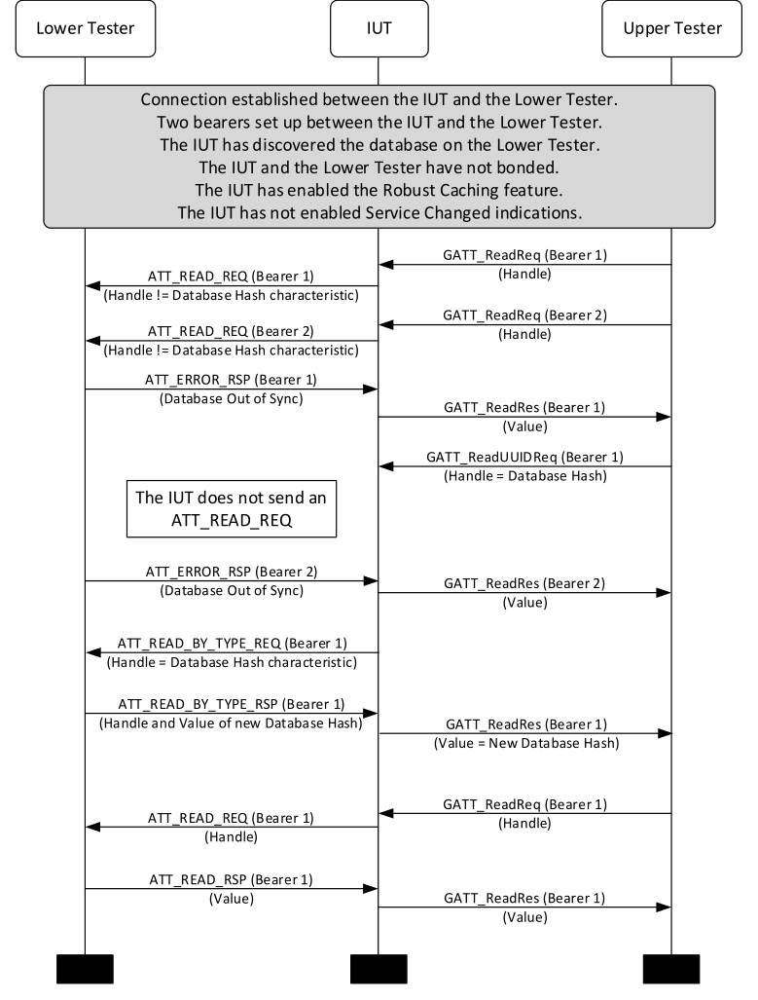

**Figure 4.179: Multiple Client Read Requests on Unsynchronized Database with Robust Caching MSC**

• Expected Outcome
Pass verdict
In step 9, the IUT does not send an ATT_READ_BY_TYPE_REQ PDU for the Database Hash characteristic until after step 10, where the IUT receives the response to the pending ATT Read Request on Bearer 2.
In step 12, the IUT sends an ATT_READ_BY_TYPE_REQ PDU for the Database Hash characteristic.

### 4.13 Unsupported Requests and Commands

GATT/SR/UNS/BI-01-C [Unsupported ATT Requests on Server]
• Test Purpose
Verify that a Generic Attribute Profile server responds to ATT Requests with an unsupported opcode with a proper ATT Error Response.
• Reference
[5] 3.3
• Initial Condition
- The ATT Requests supported by the IUT can be derived from the ICS [3] [8].
- The preamble procedure defined in Section 4.2.1 is used to set up the transport and L2CAP channel.
- A preamble procedure defined in Section 4.2.5 may have been used to exchange ATT MTU between the IUT and the Lower Tester.
• Test Procedure
Lower Tester sends an Attribute PDU with the Attribute Opcode field set to a randomly generated request opcode, with the Command Flag set to 0, that is not in the list of ATT Requests supported by the IUT (if the IUT supports all the request opcodes defined by the specification, then the generated opcode will be an RFU value).
If the value of the Authentication Signature Flag is 1, then the Authentication Signature field of the Attribute PDU is set to a random 12-octet value.
The Attribute Parameters field of the Attribute PDU is set to an array of random octets, of size limited by the ATT_MTU and the authentication signature.
• Expected Outcome
Pass verdict
The IUT responds with an ATT Error Response PDU, with the Request Opcode In Error field set to the opcode sent by the Lower Tester, the Attribute Handle In Error field set to 0x0000, and the Error Code field set to 0x06 (Request Not Supported).
• Test Purpose
Verify that a Generic Attribute Profile server silently ignores ATT Commands with an unsupported opcode.
• Reference
[5] 3.3
• Initial Condition
- The ATT Commands supported by the IUT can be derived from the ICS [3] [8].
- The preamble procedure defined in Section 4.2.1 is used to set up the transport and L2CAP channel.
- A preamble procedure defined in Section 4.2.5 may have been used to exchange ATT MTU between the IUT and the Lower Tester.
• Test Procedure
Lower Tester sends an Attribute PDU with the Attribute Opcode field set to a randomly generated request opcode, with the Command Flag set to 1, that is not in the list of ATT Commands supported by the IUT (if the IUT supports all the command opcodes defined by the specification, then the generated opcode will be an RFU value).
If the value of the Authentication Signature Flag is 1, then the Authentication Signature field of the Attribute PDU is set to a random 12-octet value.
The Attribute Parameters field of the Attribute PDU is set to an array of random octets, of size limited by the ATT_MTU and the authentication signature.
• Expected Outcome
Pass verdict
The IUT silently ignores the command from the Lower Tester.

## 5 Test case mapping

The Test Case Mapping Table (TCMT) maps test cases to specific requirements in the ICS. The IUT is tested in all roles for which support is declared in the ICS document.
The columns for the TCMT are defined as follows:
Item: Contains a logical expression based on specific entries from the associated ICS document. Contains a logical expression (using the operators AND, OR, NOT as needed) based on specific entries from the applicable ICS document(s). The entries are in the form of y/x references, where y corresponds to the table number and x corresponds to the feature number as defined in the ICS document for GATT [3].
Feature: A brief, informal description of the feature being tested.
Test Case(s): The applicable test case identifiers are required for Bluetooth Qualification if the corresponding y/x references defined in the Item column are supported. Further details about the function of the TCMT are elaborated in [2].
For the purpose and structure of the ICS/IXIT, refer to [2].

|  | Item |  |  | Feature |  |  | Test Case(s) |  |
| --- | --- | --- | --- | --- | --- | --- | --- | --- |
| GATT 1/2 |  |  | Generic Attribute Profile Server - Unsupported Requests and Commands |  |  | GATT/SR/UNS/BI-01-C GATT/SR/UNS/BI-02-C |  |  |
| GATT 3/1 AND GATT 2/2 |  |  | Exchange MTU |  |  | GATT/CL/GAC/BV-01-C |  |  |
| GATT 4/1 AND GATT 2/2 |  |  | Exchange MTU |  |  | GATT/SR/GAC/BV-01-C |  |  |
| GATT 4/1 AND GATT 2/3a |  |  | Exchange MTU – EATT bearer over LE |  |  | GATT/SR/GAC/BI-01-C |  |  |
| GATT 4/1 AND GATT 1a/4 |  |  | Exchange MTU – ATT bearer over BR/EDR |  |  | GATT/SR/GAC/BI-02-C |  |  |
| GATT 4/1 AND GATT 1a/4 AND GATT 2/3b |  |  | Exchange MTU – EATT bearer over BR/EDR |  |  | GATT/SR/GAC/BI-03-C |  |  |
| GATT 3/2 |  |  | Discover All Primary Services |  |  | GATT/CL/GAD/BV-01-C |  |  |
| GATT 4/2 |  |  | Discover All Primary Services |  |  | GATT/SR/GAD/BV-01-C |  |  |
| GATT 3/3 |  |  | Discover Services by Service UUID |  |  | GATT/CL/GAD/BV-02-C |  |  |
| GATT 4/3 |  |  | Discover Services by Service UUID |  |  | GATT/SR/GAD/BV-02-C |  |  |
| GATT 3/4 |  |  | Find Included Services |  |  | GATT/CL/GAD/BV-03-C |  |  |
| GATT 4/4 |  |  | Find Included Services |  |  | GATT/SR/GAD/BV-03-C |  |  |
| GATT 3/5 |  |  | Discover All Characteristics of a Service |  |  | GATT/CL/GAD/BV-04-C |  |  |
| GATT 4/5 |  |  | Discover All Characteristics of a Service |  |  | GATT/SR/GAD/BV-04-C |  |  |
| GATT 3/6 |  |  | Discover Characteristics by UUID |  |  | GATT/CL/GAD/BV-05-C |  |  |
| GATT 4/6 |  |  | Discover Characteristics by UUID |  |  | GATT/SR/GAD/BV-05-C |  |  |
| GATT 3/7 |  |  | Discover All Characteristic Descriptors |  |  | GATT/CL/GAD/BV-06-C |  |  |
| GATT 4/7 |  |  | Discover All Characteristic Descriptors |  |  | GATT/SR/GAD/BV-06-C |  |  |
| GATT 6/2 AND GATT 1/1 |  |  | Discover GATT Services over BR/EDR using SDP |  |  | GATT/CL/GAD/BV-07-C GATT/CL/GAD/BV-08-C |  |  |

|  | Item |  |  | Feature |  |  | Test Case(s) |  |
| --- | --- | --- | --- | --- | --- | --- | --- | --- |
| GATT 6/3 AND GATT 1/2 |  |  | Publish SDP record for GATT Services over BR/EDR |  |  | GATT/SR/GAD/BV-07-C GATT/SR/GAD/BV-08-C |  |  |
| GATT 3/8 |  |  | Read Characteristic Value |  |  | GATT/CL/GAR/BV-01-C GATT/CL/GAR/BI-01-C GATT/CL/GAR/BI-02-C GATT/CL/GAT/BV-01-C |  |  |
| GATT 3/8 AND GATT 7/7 |  |  | Read Characteristic Value and Insufficient Authorization |  |  | GATT/CL/GAR/BI-03-C |  |  |
| GATT 3/8 AND GATT 7/4 |  |  | Read Characteristic Value and Insufficient Authentication |  |  | GATT/CL/GAR/BI-04-C |  |  |
| GATT 3/8 AND GATT 7/2 |  |  | Read Characteristic Value and Insufficient Encryption Key Size |  |  | GATT/CL/GAR/BI-05-C |  |  |
| GATT 4/8 |  |  | Read Characteristic Value |  |  | GATT/SR/GAR/BV-01-C GATT/SR/GAR/BI-01-C GATT/SR/GAR/BI-02-C GATT/SR/GAR/BI-45-C |  |  |
| GATT 4/8 AND GATT 7/7 |  |  | Read Characteristic Value and Insufficient Authorization |  |  | GATT/SR/GAR/BI-03-C |  |  |
| GATT 4/8 AND GATT 7/4 |  |  | Read Characteristic Value and Insufficient Authentication |  |  | GATT/SR/GAR/BI-04-C |  |  |
| GATT 4/8 AND GATT 7/2 |  |  | Read Characteristic Value and Insufficient Encryption Key Size |  |  | GATT/SR/GAR/BI-05-C |  |  |
| GATT 3/9 |  |  | Read using Characteristic UUID |  |  | GATT/CL/GAR/BV-03-C GATT/CL/GAR/BI-06-C GATT/CL/GAR/BI-07-C |  |  |
| GATT 3/9 AND GATT 7/7 |  |  | Read using Characteristic UUID and Insufficient Authorization |  |  | GATT/CL/GAR/BI-09-C |  |  |
| GATT 3/9 AND GATT 7/4 |  |  | Read using Characteristic UUID and Insufficient Authentication |  |  | GATT/CL/GAR/BI-10-C |  |  |
| GATT 3/9 AND GATT 7/2 |  |  | Read using Characteristic UUID and Insufficient Encryption Key Size |  |  | GATT/CL/GAR/BI-11-C |  |  |
| GATT 4/9 |  |  | Read using Characteristic UUID |  |  | GATT/SR/GAR/BV-03-C GATT/SR/GAR/BI-06-C GATT/SR/GAR/BI-07-C GATT/SR/GAR/BI-08-C |  |  |
| GATT 4/9 AND GATT 7/7 |  |  | Read using Characteristic UUID and Insufficient Authorization |  |  | GATT/SR/GAR/BI-09-C |  |  |
| GATT 4/9 AND GATT 7/4 |  |  | Read using Characteristic UUID and Insufficient Authentication |  |  | GATT/SR/GAR/BI-10-C |  |  |
| GATT 4/9 AND GATT 7/2 |  |  | Read using Characteristic UUID and Insufficient Encryption Key Size |  |  | GATT/SR/GAR/BI-11-C |  |  |
| GATT 3/10 |  |  | Read Long Characteristic Value |  |  | GATT/CL/GAR/BV-04-C GATT/CL/GAR/BI-12-C GATT/CL/GAR/BI-13-C GATT/CL/GAR/BI-14-C |  |  |
| GATT 3/10 AND GATT 7/7 |  |  | Read Long Characteristic Value and Insufficient Authorization |  |  | GATT/CL/GAR/BI-15-C |  |  |

|  | Item |  |  | Feature |  |  | Test Case(s) |  |
| --- | --- | --- | --- | --- | --- | --- | --- | --- |
| GATT 3/10 AND GATT 7/4 |  |  | Read Long Characteristic Value and Insufficient Authentication |  |  | GATT/CL/GAR/BI-16-C |  |  |
| GATT 3/10 AND GATT 7/2 |  |  | Read Long Characteristic Value and Insufficient Encryption Key Size |  |  | GATT/CL/GAR/BI-17-C |  |  |
| GATT 4/10 |  |  | Read Long Characteristic Value |  |  | GATT/SR/GAR/BV-04-C GATT/SR/GAR/BI-12-C GATT/SR/GAR/BI-13-C GATT/SR/GAR/BI-14-C |  |  |
| GATT 4/10 AND GATT 7/7 |  |  | Read Long Characteristic Value and Insufficient Authorization |  |  | GATT/SR/GAR/BI-15-C |  |  |
| GATT 4/10 AND GATT 7/4 |  |  | Read Long Characteristic Value and Insufficient Authentication |  |  | GATT/SR/GAR/BI-16-C |  |  |
| GATT 4/10 AND GATT 7/2 |  |  | Read Long Characteristic Value and Insufficient Encryption Key Size |  |  | GATT/SR/GAR/BI-17-C |  |  |
| GATT 3/11 |  |  | Read Multiple Characteristic Values |  |  | GATT/CL/GAR/BV-05-C GATT/CL/GAR/BI-18-C GATT/CL/GAR/BI-19-C |  |  |
| GATT 3/11 AND GATT 7/7 |  |  | Read Multiple Characteristic Values and Insufficient Authorization |  |  | GATT/CL/GAR/BI-20-C |  |  |
| GATT 3/11 AND GATT 7/4 |  |  | Read Multiple Characteristic Values and Insufficient Authentication |  |  | GATT/CL/GAR/BI-21-C |  |  |
| GATT 3/11 AND GATT 7/2 |  |  | Read Multiple Characteristic Values and Insufficient Encryption Key Size |  |  | GATT/CL/GAR/BI-22-C |  |  |
| GATT 4/11 |  |  | Read Multiple Characteristic Values |  |  | GATT/SR/GAR/BV-05-C GATT/SR/GAR/BI-18-C GATT/SR/GAR/BI-19-C |  |  |
| GATT 4/11 AND GATT 7/7 |  |  | Read Multiple Characteristic Values and Insufficient Authorization |  |  | GATT/SR/GAR/BI-20-C |  |  |
| GATT 4/11 AND GATT 7/4 |  |  | Read Multiple Characteristic Values and Insufficient Authentication |  |  | GATT/SR/GAR/BI-21-C |  |  |
| GATT 4/11 AND GATT 7/2 |  |  | Read Multiple Characteristic Values and Insufficient Encryption Key Size |  |  | GATT/SR/GAR/BI-22-C |  |  |
| GATT 3/12 |  |  | Write without Response |  |  | GATT/CL/GAW/BV-01-C |  |  |
| GATT 4/12 |  |  | Write without Response |  |  | GATT/SR/GAW/BV-01-C |  |  |
| GATT 3/13 AND GATT 2/2 |  |  | Signed Write Without Response |  |  | GATT/CL/GAW/BV-02-C |  |  |
| GATT 4/13 |  |  | Signed Write Without Response |  |  | GATT/SR/GAW/BV-02-C GATT/SR/GAW/BI-01-C |  |  |
| GATT 4/16 AND GATT 4/25 |  |  | Characteristic Value Reliable Writes, Execute Write Request with no pending prepared write values |  |  | GATT/SR/GAW/BV-11-C |  |  |
| GATT 3/14 |  |  | Write Characteristic Value |  |  | GATT/CL/GAW/BV-03-C GATT/CL/GAW/BI-02-C GATT/CL/GAW/BI-03-C GATT/CL/GAT/BV-02-C GATT/CL/GAW/BI-33-C |  |  |

|  | Item |  |  | Feature |  |  | Test Case(s) |  |
| --- | --- | --- | --- | --- | --- | --- | --- | --- |
| GATT 3/14 AND GATT 7/7 |  |  | Write Characteristic Value and Insufficient Authorization |  |  | GATT/CL/GAW/BI-04-C |  |  |
| GATT 3/14 AND GATT 7/4 |  |  | Write Characteristic Value and Insufficient Authentication |  |  | GATT/CL/GAW/BI-05-C |  |  |
| GATT 3/14 AND GATT 7/2 |  |  | Write Characteristic Value and Insufficient Encryption Key Size |  |  | GATT/CL/GAW/BI-06-C |  |  |
| GATT 4/14 |  |  | Write Characteristic Value |  |  | GATT/SR/GAW/BV-03-C GATT/SR/GAW/BI-02-C GATT/SR/GAW/BI-03-C GATT/SR/GAW/BI-32-C |  |  |
| GATT 4/14 AND GATT 7/7 |  |  | Write Characteristic Value and Insufficient Authorization |  |  | GATT/SR/GAW/BI-04-C |  |  |
| GATT 4/14 AND GATT 7/4 |  |  | Write Characteristic Value and Insufficient Authentication |  |  | GATT/SR/GAW/BI-05-C |  |  |
| GATT 4/14 AND GATT 7/2 |  |  | Write Characteristic Value and Insufficient Encryption Key Size |  |  | GATT/SR/GAW/BI-06-C |  |  |
| GATT 3/15 |  |  | Write Long Characteristic Value |  |  | GATT/CL/GAW/BV-05-C GATT/CL/GAW/BI-07-C GATT/CL/GAW/BI-08-C GATT/CL/GAW/BI-09-C |  |  |
| GATT 3/15 |  |  | Write Long Characteristic Value – Invalid Attribute Value Length |  |  | GATT/CL/GAW/BI-34-C |  |  |
| GATT 3/15 AND GATT 7/7 |  |  | Write Long Characteristic Value and Insufficient Authorization |  |  | GATT/CL/GAW/BI-11-C |  |  |
| GATT 3/15 AND GATT 7/4 |  |  | Write Long Characteristic Value and Insufficient Authentication |  |  | GATT/CL/GAW/BI-12-C |  |  |
| GATT 3/15 AND GATT 7/2 |  |  | Write Long Characteristic Value and Insufficient Encryption Key Size |  |  | GATT/CL/GAW/BI-13-C |  |  |
| GATT 4/15 |  |  | Write Long Characteristic Value |  |  | GATT/SR/GAW/BV-05-C GATT/SR/GAW/BI-07-C GATT/SR/GAW/BI-08-C GATT/SR/GAW/BI-09-C |  |  |
| GATT 4/15 AND (GATT 8/6 OR GATT 8/7 OR GATT 8/8) |  |  | Multiple Prepare Writes over multiple bearers |  |  | GATT/SR/GAW/BV-12-C GATT/SR/GAW/BV-13-C GATT/SR/GAW/BV-14-C |  |  |
| GATT 4/15 |  |  | Write Long Characteristic Value – Invalid Attribute Value Length |  |  | GATT/SR/GAW/BI-33-C |  |  |
| GATT 4/15 AND GATT 7/7 |  |  | Write Long Characteristic Value and Insufficient Authorization |  |  | GATT/SR/GAW/BI-11-C |  |  |
| GATT 4/15 AND GATT 7/4 |  |  | Write Long Characteristic Value and Insufficient Authentication |  |  | GATT/SR/GAW/BI-12-C |  |  |
| GATT 4/15 AND GATT 7/2 |  |  | Write Long Characteristic Value and Insufficient Encryption Key Size |  |  | GATT/SR/GAW/BI-13-C |  |  |
| GATT 4/13 AND GATT 1a/4 |  |  | Signed Write Without Response – ATT bearer over BR/EDR |  |  | GATT/SR/GAW/BI-36-C |  |  |

|  | Item |  |  | Feature |  |  | Test Case(s) |  |
| --- | --- | --- | --- | --- | --- | --- | --- | --- |
| GATT 4/13 AND GATT 1a/4 AND GATT 2/3b |  |  | Signed Write Without Response – EATT bearer over BR/EDR |  |  | GATT/SR/GAW/BI-37-C |  |  |
| GATT 4/13 AND GATT 1a/3 AND GATT 2/3a |  |  | Signed Write Without Response – EATT bearer over LE |  |  | GATT/SR/GAW/BI-38-C |  |  |
| GATT 3/16 |  |  | Characteristic Value Reliable Writes |  |  | GATT/CL/GAW/BV-06-C GATT/CL/GAW/BI-32-C |  |  |
| GATT 4/16 |  |  | Characteristic Value Reliable Writes |  |  | GATT/SR/GAW/BV-06-C GATT/SR/GAW/BV-07-C GATT/SR/GAW/BV-10-C |  |  |
| GATT 3/17 |  |  | Notifications |  |  | GATT/CL/GAN/BV-01-C |  |  |
| GATT 4/17 |  |  | Notifications |  |  | GATT/SR/GAN/BV-01-C |  |  |
| GATT 3/18 |  |  | Indications |  |  | GATT/CL/GAI/BV-01-C GATT/CL/GAI/BI-01-C |  |  |
| GATT 4/18 |  |  | Indications |  |  | GATT/SR/GAI/BV-01-C GATT/SR/GAT/BV-01-C |  |  |
| GATT 3/29 |  |  | Read Multiple Variable Length Characteristic Values |  |  | GATT/CL/GAR/BV-08-C GATT/CL/GAR/BI-36-C GATT/CL/GAR/BI-38-C GATT/CL/GAT/BV-03-C |  |  |
| GATT 3/29 AND (GATT 8/2 OR GATT 8/3 OR GATT 8/4 OR GATT 8/5) |  |  | Read Multiple Variable Length Characteristic Values – Unenhanced + EATT |  |  | GATT/CL/GAR/BV-10-C |  |  |
| GATT 3/29 AND (GATT 8/6 OR GATT 8/7 OR GATT 8/8) |  |  | Read Multiple Variable Length Characteristic Values – EATT |  |  | GATT/CL/GAR/BV-11-C |  |  |
| GATT 3/29 AND GATT 7/7 |  |  | Read Multiple Variable Length Characteristic Values and Insufficient Authorization |  |  | GATT/CL/GAR/BI-40-C |  |  |
| GATT 3/29 AND GATT 7/4 |  |  | Read Multiple Variable Length Characteristic Values and Insufficient Authentication |  |  | GATT/CL/GAR/BI-42-C |  |  |
| GATT 3/29 AND GATT 7/2 |  |  | Read Multiple Variable Length Characteristic Values and Insufficient Encryption Key Size |  |  | GATT/CL/GAR/BI-44-C |  |  |
| GATT 4/30 |  |  | Read Multiple Variable Length Characteristic Values |  |  | GATT/SR/GAR/BV-09-C GATT/SR/GAR/BI-36-C GATT/SR/GAR/BI-38-C |  |  |
| GATT 4/30 AND (GATT 8/2 OR GATT 8/3 OR GATT 8/4 OR GATT 8/5) |  |  | Read Multiple Variable Length Characteristic Values – Unenhanced + EATT |  |  | GATT/SR/GAR/BV-11-C |  |  |
| GATT 4/30 AND (GATT 8/6 OR GATT 8/7 OR GATT 8/8) |  |  | Read Multiple Variable Length Characteristic Values – EATT |  |  | GATT/SR/GAR/BV-12-C |  |  |

|  | Item |  |  | Feature |  |  | Test Case(s) |  |
| --- | --- | --- | --- | --- | --- | --- | --- | --- |
| GATT 4/30 AND GATT 7/7 |  |  | Read Multiple Variable Length Characteristic Values and Insufficient Authorization |  |  | GATT/SR/GAR/BI-40-C |  |  |
| GATT 4/30 AND GATT 7/4 |  |  | Read Multiple Variable Length Characteristic Values and Insufficient Authentication |  |  | GATT/SR/GAR/BI-42-C |  |  |
| GATT 4/30 AND GATT 7/2 |  |  | Read Multiple Variable Length Characteristic Values and Insufficient Encryption Key Size |  |  | GATT/SR/GAR/BI-44-C |  |  |
| GATT 3/30 |  |  | Multiple Variable Length Notifications |  |  | GATT/CL/GAN/BV-02-C |  |  |
| GATT 4/31 |  |  | Multiple Variable Length Notifications |  |  | GATT/SR/GAN/BV-02-C |  |  |
| GATT 3/19 |  |  | Read Characteristic Descriptor |  |  | GATT/CL/GAR/BV-06-C |  |  |
| GATT 4/19 |  |  | Read Characteristic Descriptor |  |  | GATT/SR/GAR/BV-06-C |  |  |
| GATT 3/21 |  |  | Write Characteristic Descriptor |  |  | GATT/CL/GAW/BV-08-C |  |  |
| GATT 4/21 |  |  | Write Characteristic Descriptor |  |  | GATT/SR/GAW/BV-08-C |  |  |
| GATT 3/20 |  |  | Read Long Characteristic Descriptors |  |  | GATT/CL/GAR/BV-07-C |  |  |
| GATT 3/8 AND GATT 2/1 |  |  | Read Characteristic Value and Invalid transport access over BR/EDR |  |  | GATT/CL/GAR/BI-34-C |  |  |
| GATT 3/8 AND GATT 2/2 |  |  | Read Characteristic Value and Invalid transport access over LE |  |  | GATT/CL/GAR/BI-35-C |  |  |
| GATT 4/20 |  |  | Read Long Characteristic Descriptors |  |  | GATT/SR/GAR/BV-07-C GATT/SR/GAR/BV-08-C |  |  |
| GATT 4/8 AND GATT 2/1 AND GATT 2/2 |  |  | Read Characteristic Value and Invalid transport access over supported transport |  |  | GATT/SR/GAR/BI-34-C GATT/SR/GAR/BI-35-C |  |  |
| GATT 3/22 |  |  | Write Long Characteristic Descriptors |  |  | GATT/CL/GAW/BV-09-C |  |  |
| GATT 4/22 |  |  | Write Long Characteristic Descriptors |  |  | GATT/SR/GAW/BV-09-C |  |  |
| GATT 3/23 |  |  | Service Changed |  |  | GATT/CL/GAS/BV-01-C |  |  |
| GATT 4/23 |  |  | Service Changed |  |  | GATT/SR/GAS/BV-01-C |  |  |
| GATT 3/26 |  |  | Database Hash Characteristic |  |  | GATT/CL/GAS/BV-02-C |  |  |
| GATT 4/27 |  |  | Database Hash Characteristic |  |  | GATT/SR/GAS/BV-02-C |  |  |
| GATT 4/23 AND GATT 4/26 AND GATT 4/27 |  |  | Database Hash Characteristic |  |  | GATT/SR/GAS/BV-05-C GATT/SR/GAS/BV-06-C |  |  |
| GATT 4/26 AND (GAP 24/2 OR GAP 24/3 OR GAP 34/2 OR GAP 34/3) |  |  | Database Hash Characteristic Bonding |  |  | GATT/SR/GAS/BV-04-C |  |  |
| GATT 4/23 AND GATT 4/26 AND GATT 4/27 AND (GAP 24/2 OR GAP 24/3 OR GAP 34/2 OR GAP 34/3) |  |  | Database Hash Characteristic Bonding |  |  | GATT/SR/GAS/BV-07-C |  |  |
| GATT 4/23 AND GATT 4/26 AND GATT 4/27 AND GATT 4/30 |  |  | Database Hash Characteristic |  |  | GATT/SR/GAS/BV-08-C |  |  |

|  | Item |  |  | Feature |  |  | Test Case(s) |  |
| --- | --- | --- | --- | --- | --- | --- | --- | --- |
| GATT 3/25 AND GATT 3/25a AND GATT 3/26 |  |  | Enabling the Robust Caching |  |  | GATT/CL/GAS/BV-03-C |  |  |
| GATT 4/26 |  |  | Client Supported Features Characteristic |  |  | GATT/SR/GAS/BV-03-C |  |  |
| GATT 3/28 |  |  | Characteristic Aggregate Format Descriptor |  |  | GATT/CL/GPA/BV-11-C |  |  |
| GATT 4/29 |  |  | Characteristic Aggregate Format Descriptor |  |  | GATT/SR/GPA/BV-11-C |  |  |
| GATT 3/27 |  |  | Characteristic Format Descriptor by Client |  |  | GATT/CL/GPA/BV-12-C |  |  |
| GATT 4/28 |  |  | Characteristic Format Descriptor by Server |  |  | GATT/SR/GPA/BV-12-C |  |  |
| GATT 8/1 AND GATT 1a/3 AND GATT 1a/4 AND CORE 2a/52 |  |  | Support for multiple simultaneous active ATT bearers from the same device – ATT over BR/EDR and ATT over LE, v5.2 or later |  |  | GATT/SR/GPM/BV-01-C |  |  |
| GATT 8/1 AND GATT 1a/3 AND GATT 1a/4 AND CORE 2b/51 |  |  | Support for multiple simultaneous active ATT bearers from the same device – ATT over BR/EDR and ATT over LE, v5.1 or earlier |  |  | GATT/SR/GPM/BV-13-C |  |  |
| GATT 1a/4 AND GATT 8/3 |  |  | Support for multiple simultaneous active ATT bearers from same device – ATT over BR/EDR and EATT over BR/EDR |  |  | GATT/SR/GPM/BV-02-C |  |  |
| GATT 8/5 AND GATT 1a/3 AND GATT 1a/4 |  |  | Support for multiple simultaneous active ATT bearers from same device – ATT over BR/EDR and EATT over LE |  |  | GATT/SR/GPM/BV-03-C |  |  |
| GATT 8/4 AND GATT 1a/3 AND GATT 1a/4 |  |  | Support for multiple simultaneous active ATT bearers from same device – ATT over LE and EATT over BR/EDR |  |  | GATT/SR/GPM/BV-04-C |  |  |
| GATT 8/2 AND GATT 1a/3 |  |  | Support for multiple simultaneous active ATT bearers from same device – ATT over LE and EATT over LE |  |  | GATT/SR/GPM/BV-05-C |  |  |
| GATT 8/6 AND GATT 1a/3 AND GATT 1a/4 |  |  | Support for multiple simultaneous active EATT bearers from same device – EATT over BR/EDR and EATT over LE |  |  | GATT/SR/GPM/BV-06-C |  |  |
| GATT 1a/1 AND GATT 1a/2 AND GATT 3/25a AND GATT 3/26 AND GATT 8/1 AND CORE 2a/53 |  |  | Support for multiple simultaneous active ATT bearers from the same device – ATT over BR/EDR and ATT over LE |  |  | GATT/CL/GPM/BV-07-C |  |  |
| GATT 1a/2 AND GATT 3/25a AND GATT 3/26 AND GATT 8/3 AND CORE 2a/53 |  |  | Support for multiple simultaneous active ATT bearers from the same device – ATT over BR/EDR and EATT over BR/EDR |  |  | GATT/CL/GPM/BV-08-C |  |  |
| GATT 1a/1 AND GATT 1a/2 AND GATT 3/25a AND GATT 3/26 AND GATT 8/5 AND CORE 2a/53 |  |  | Support for multiple simultaneous active ATT bearers from the same device – ATT over BR/EDR and EATT over LE |  |  | GATT/CL/GPM/BV-09-C |  |  |

|  | Item |  |  | Feature |  |  | Test Case(s) |  |
| --- | --- | --- | --- | --- | --- | --- | --- | --- |
| GATT 1a/1 AND GATT 1a/2 AND GATT 3/25a AND GATT 3/26 AND GATT 8/4 AND CORE 2a/53 |  |  | Support for multiple simultaneous active ATT bearers from the same device – ATT over LE and EATT over BR/EDR |  |  | GATT/CL/GPM/BV-10-C |  |  |
| GATT 1a/1 AND GATT 3/25a AND GATT 3/26 AND GATT 8/2 AND CORE 2a/53 |  |  | Support for multiple simultaneous active ATT bearers from the same device – ATT over LE and EATT over LE |  |  | GATT/CL/GPM/BV-11-C |  |  |
| GATT 1/1 AND GATT 3/25a AND GATT 3/26 AND GATT 8/6 AND CORE 2a/53 |  |  | Support for multiple simultaneous active EATT bearers from the same device – EATT over BR/EDR and EATT over LE |  |  | GATT/CL/GPM/BV-12-C |  |  |
| GATT 3/25 AND (GATT 2/3a OR GATT 2/3b) |  |  | Client Supported Features Characteristic |  |  | GATT/CL/GAS/BV-04-C |  |  |
| GATT 3/25 AND GATT 3/30 |  |  | Client Supported Features Characteristic |  |  | GATT/CL/GAS/BV-05-C |  |  |

Table 5.1: Test case mapping

## 6 Annex: Generic GATT Integrated Tests (GGIT)

This annex defines generic test procedures that integrate various GATT tests that are required to be executed for each supported service and characteristic.

### 6.1 Identification conventions

In addition to the conventions defined in Section 4.1.1 Test case identification conventions, the following identifiers are introduced in this annex.

|  | Identifier Abbreviation |  |  | Group Identifier <class> |  |
| --- | --- | --- | --- | --- | --- |
| CGGIT |  |  | Client GGIT test procedures |  |  |
| CHA |  |  | Characteristic |  |  |
| CP |  |  | Control Point |  |  |
| DES |  |  | Descriptor |  |  |
| GGIT |  |  | Generic GATT Integrated Tests |  |  |
| ICDW |  |  | Invalid Characteristic or Descriptor Write |  |  |
| ICP |  |  | Indication Control Point |  |  |
| ISFC |  |  | Indication Supported Features Characteristic |  |  |
| NCP |  |  | Notification Control Point |  |  |
| SDP |  |  | Validate SDP Record |  |  |
| SDPNF |  |  | SDP Record Not Found |  |  |
| SER |  |  | Service |  |  |
| SGGIT |  |  | Server GGIT test procedures |  |  |

Table 6.1: Identification conventions

### 6.2 GGIT input tables

The GGIT procedures are executed with an input consisting of a table. The table format whose format differs between the 1) SER-, CHA-, and DES- tests, 2) tests for common Control Point procedures, and 3) tests for the Indication Supported Features characteristic, where the value of the Features characteristic can change over the lifetime of the device.
In Test Suite documents that use the GGIT procedures, it may be a good idea to use the “landscape” page setup to achieve better readability to avoid the page width limitations the regular “portrait” page setup yields.

#### 6.2.1 Input table for SER-, CHA-, and DES-tests

The table lists all the services and characteristics that are being tested, as well as descriptors and parameters. The CCCD and the SCCD are not listed as a descriptor in the table; their presence is inferred from the characteristic properties (the CCCD is present when the characteristic supports indications or notifications, and the SCCD is present when the characteristic supports broadcast). The Type column accepts the following enumeration applicable to service definitions: “Primary Service”, “Secondary Service”, and “Not defined”, as well as an optional attribute applicable to service and characteristic definitions: “Unique”, “None”, “Multiple”. These enumeration items and the optional attribute are used as follows:
• “Primary Service”: if a specification requires that a service be instantiated as a primary service.
• “Secondary Service”: if a specification requires that a service be instantiated as a secondary service. This enumeration item can optionally be followed by the UUID of the related primary service (e.g., in the context of a profile Test Suite, where the profile specification describes the relationship between services). If the UUID of the related primary service is known, the Service Type column can be set as “Secondary Service (Primary_Service_X_UUID)”.
• “Not defined”: if a specification does not mandate how to instantiate the service; for example, the specification recommends that a service be instantiated as a primary service without forbidding the option of instantiating it as a secondary service.
• “Unique”: if a specification requires that there is only one instance of a service or characteristic.
• “None”: if a specification requires that there are no instances of a service or characteristic.
• “Multiple”: if a specification requires that there are multiple instances of a service.
The Properties column accepts a hex number corresponding to the bits set in the Characteristic Properties bit field. Only a single value should be entered. In the case of SGGIT, for characteristics with more than one possible set of properties, there should be a new row added to cover each combination when the IUT is Server. In the case of CGGIT, this column indicates the bits the Lower Tester sets in the Characteristic Properties bit field in its test database, and the value should be set to cover the superset of supported properties for that characteristic to reduce the number of test iterations when the IUT is Client (e.g., the IDS IDD Features characteristic can support 0x02 (Read) and 0x20 (Indicate) properties, and the value in the properties column for the corresponding CGGIT test should be set to 0x22 (Read, Indicate)).

| TCID |  |  |  | Service / |  | Reference |  |  | Properties |  |  | Value Length (Octets) |  |  | Type |  |  |
| --- | --- | --- | --- | --- | --- | --- | --- | --- | --- | --- | --- | --- | --- | --- | --- | --- | --- |
|  |  |  |  | Characteristic / |  |  |  |  |  |  |  |  |  |  |  |  |  |
|  |  |  |  | Descriptor |  |  |  |  |  |  |  |  |  |  |  |  |  |
| TCID |  |  | Service 1 _ | Service 1 _ |  | [SPEC] X.Y |  |  | - |  |  | - |  |  |  | Primary Service, |  |
|  |  |  |  |  |  |  |  |  |  |  |  |  |  |  |  | Unique, None, |  |
|  |  |  |  |  |  |  |  |  |  |  |  |  |  |  |  | Multiple |  |
| TCID |  |  | Characteristic 11 _ |  |  | [SPEC] X.Y |  |  | 0xZZ |  |  |  | N, |  | - or Unique, None | - or Unique, None |  |
|  |  |  |  |  |  |  |  |  |  |  |  |  | Min-Max or Skip |  |  |  |  |
| TCID |  |  | Descriptor 111 _ |  |  | [SPEC] X.Y |  |  | - |  |  |  | N or |  | - |  |  |
|  |  |  |  |  |  |  |  |  |  |  |  |  | Min-Max |  |  |  |  |
| TCID |  |  | Descriptor 112 _ |  |  | [SPEC] X.Y |  |  | - |  |  |  | N or |  | - |  |  |
|  |  |  |  |  |  |  |  |  |  |  |  |  | Min-Max |  |  |  |  |
| TCID |  |  | Characteristic 12 _ |  |  | [SPEC] X.Y |  |  | 0xZZ |  |  |  | N, |  | - |  |  |
|  |  |  |  |  |  |  |  |  |  |  |  |  | Min-Max or Skip or Skip-Read or Skip-Write |  |  |  |  |
| TCID |  |  | Descriptor 121 _ |  |  | [SPEC] X.Y |  |  | - |  |  |  | N or |  | - |  |  |
|  |  |  |  |  |  |  |  |  |  |  |  |  | Min-Max |  |  |  |  |
|  | … |  |  | … |  |  | … |  |  | … |  |  | … |  |  | … |  |
|  | TCID |  |  | Service 2 _ |  |  | [SPEC] X.Y |  |  | - |  |  | - |  |  | Not defined |  |
| TCID | TCID |  | Characteristic 21 _ | Characteristic 21 _ |  | [SPEC] X.Y | [SPEC] X.Y |  | 0xZZ | 0xZZ |  |  | N, |  | - | - |  |
|  |  |  |  |  |  |  |  |  |  |  |  |  | Min-Max or Skip or Skip-Read or Skip-Write |  |  |  |  |
|  | … |  |  | … |  |  | … |  |  | … |  |  | … |  |  | … |  |

Table 6.2: GGIT input table format
The recommended format for the TCID of these tests is:
<spec abbreviation>/ROLE/SGGIT/<func>/BV-XX-C, (for Server Tests), and
<spec abbreviation>/ROLE/CGGIT/<func>/BV-XX-C, (for Client Tests)

##### 6.2.1.1 Example usage – Blood Pressure Service TS

[This is an extract showing how the Blood Pressure Service TS can reference the GGIT as an alternative to creating test cases for each service and characteristic related procedures.]
Execute the Generic GATT Integrated Tests defined in [GATT.TS.REF#] Section 6.3 Server test procedures (SGGIT) using Table 6.3 below as input:
[REF#] below is the reference to the related specification (in this case Blood Pressure Service) as the BLS.TS defines it.

| TCID |  |  | Service / Characteristic / Descriptor | Reference | Properties |  | Value |  | Type |
| --- | --- | --- | --- | --- | --- | --- | --- | --- | --- |
|  |  |  |  |  |  |  | Length |  |  |
|  |  |  |  |  |  |  | (Octets) |  |  |
|  | BLS/SEN/SGGIT/SER/BV-01-C |  | Blood Pressure Service | [REF#] 2 | - | - | - |  | Not defined |
|  | [Service GGIT – Blood Pressure] |  |  |  |  |  |  |  |  |
|  | BLS/SEN/SGGIT/CHA/BV-02-C |  | Blood Pressure Measurement characteristic | [REF#] 3, 3.1 | 0x20 (Indicate) | Skip |  |  | - |
|  | [Characteristic GGIT – Blood |  |  |  |  |  |  |  |  |
|  | Pressure Measurement] |  |  |  |  |  |  |  |  |
|  | BLS/SEN/SGGIT/CHA/BV-03-C |  | Intermediate Cuff Pressure characteristic | [REF#] 3, 3.2 | 0x10 (Notify) | Skip |  |  | - |
|  | [Characteristic GGIT – Intermediate |  |  |  |  |  |  |  |  |
|  | Cuff Pressure] |  |  |  |  |  |  |  |  |
|  | BLS/SEN/SGGIT/CHA/BV-04-C |  | Blood Pressure Feature characteristic | [REF#] 3, 3.3 | 0x02 (Read) | 2 |  |  | - |
|  | [Characteristic GGIT – Blood |  |  |  |  |  |  |  |  |
|  | Pressure Feature] |  |  |  |  |  |  |  |  |
|  | BLS/SEN/SGGIT/CHA/BV-05-C |  | Enhanced Blood Pressure Measurement characteristic | [REF#] 3, 3.4 | 0x20 (Indicate) | Skip |  |  | - |
|  | [Characteristic GGIT – Enhanced |  |  |  |  |  |  |  |  |
|  | Blood Pressure Measurement] |  |  |  |  |  |  |  |  |
|  | BLS/SEN/SGGIT/CHA/BV-06-C |  | Enhanced Intermediate Cuff Pressure characteristic | [REF#] 3, 3.5 | 0x10 (Notify) | Skip |  |  | - |
|  | [Characteristic GGIT – Enhanced |  |  |  |  |  |  |  |  |
|  | Intermediate Cuff Pressure] |  |  |  |  |  |  |  |  |
|  | BLS/SEN/SGGIT/CHA/BV-07-C |  | Record Access Control Point (RACP) characteristic | [REF#] 3, 3.6 | 0x28 (Write, Indicate) | Skip |  |  | - |
|  | [Characteristic GGIT – Record |  |  |  |  |  |  |  |  |
|  | Access Control Point] |  |  |  |  |  |  |  |  |

| TCID |  |  | Service / Characteristic / Descriptor | Reference | Properties |  | Value |  | Type |
| --- | --- | --- | --- | --- | --- | --- | --- | --- | --- |
|  |  |  |  |  |  |  | Length |  |  |
|  |  |  |  |  |  |  | (Octets) |  |  |
|  | BLS/SEN/SGGIT/CHA/BV-08-C |  | Blood Pressure Record characteristic | [REF#] 3, 3.7 | 0x10 (Notify) | Skip | Skip |  | - |
|  | [Characteristic GGIT – Blood |  |  |  |  |  |  |  |  |
|  | Pressure Record] |  |  |  |  |  |  |  |  |
|  | BLS/SEN/SGGIT/CHA/BV-09-C |  | Blood Pressure Feature characteristic | [REF#] 3, 3.3 | 0x22 (Read, Indicate) | 2 |  |  | - |
|  | [Characteristic GGIT – Blood |  |  |  |  |  |  |  |  |
|  | Pressure Feature - Indicate] |  |  |  |  |  |  |  |  |

Table 6.3: Example input table for GGIT Server tests

##### 6.2.1.2 Example usage – Itinerary Sharing Profile TS

[This is an extract showing how the Itinerary Sharing Profile TS can reference the GGIT as an alternative to creating test cases for each service and characteristic related procedures.]
Execute the Generic GATT Integrated Tests defined in [GATT.TS.REF#] Section 6.4 Client test procedures (CGGIT) using Table 6.4 below as input:
[REF#] below is the reference to the related specification (in this case Itinerary Sharing Profile) as the ISP.TS defines it.

| TCID |  |  |  | Service / |  | Reference | Properties |  | Value |  | Type |
| --- | --- | --- | --- | --- | --- | --- | --- | --- | --- | --- | --- |
|  |  |  |  | Characteristic / |  |  |  |  | Length |  |  |
|  |  |  |  | Descriptor |  |  |  |  | (Octets) |  |  |
|  | ISP/CL/CGGIT/SER/BV-01-C |  | Itinerary Sharing Service | Itinerary Sharing |  | [REF#] 4 | - | - | - |  | Primary Service |
|  | [Service GGIT – Itinerary Sharing] |  |  | Service |  |  |  |  |  |  |  |
|  | ISP/CL/CGGIT/SER/BV-01-C |  | Object Transfer Service |  |  | [REF#] 4 | - | - |  |  | Secondary Service (Itinerary Sharing Service) |
|  | [Service GGIT – Object Transfer] |  |  |  |  |  |  |  |  |  |  |

Table 6.4: Example input table for GGIT Client tests

#### 6.2.2 Input table for common Control Point procedures (CP-, ICP-, and NCP-tests)

The table lists the control point characteristics and parameters that are being tested.
Characteristic: Control Point Characteristic that is the target of the test.
Parameter(s): Values that are passed in the control point Write Request. Consists of Opcode and (if needed) associated operands.
Pass verdict: Values that are matched in the Error Response, or Indication/Notification for a successful test.

|  | TCID |  |  | Characteristic |  |  | Reference |  |  | Parameter(s) |  |  | Pass Verdict |  |
| --- | --- | --- | --- | --- | --- | --- | --- | --- | --- | --- | --- | --- | --- | --- |
|  | TCID |  |  | Characteristic 1 _ |  |  | [SPEC] X.Y |  |  | 0xZZ |  |  | N |  |
|  | TCID |  |  | Characteristic 2 _ |  |  | [SPEC] X.Y |  |  | 0xZZ |  |  | N |  |
|  | … |  |  | … |  |  | … |  |  | … |  |  | … |  |

Table 6.5: GGIT input table format
The recommended format for the TCID of these tests is:
<spec abbreviation>/ROLE/SGGIT/CP/BI-XX-C or BV-XX-C, (for Control Point Server Tests that test Error Responses)
<spec abbreviation>/ROLE/SGGIT/ICP/BI-XX-C or BV-XX-C, (for Control Point Server Tests that test Indications)
<spec abbreviation>/ROLE/SGGIT/NCP/BI-XX-C or BV-XX-C, (for Control Point Server Tests that test Notifications)

#### 6.2.3 Input table for Indication Supported Features Characteristic procedures (ISFC-tests)

The table lists the Features Characteristics that are being tested.
Characteristic: Features Characteristic that is the target of the test (applicable where the value of the Features Characteristic can change over the lifetime of the device).

|  | TCID |  |  | Characteristic |  |  | Reference |  |
| --- | --- | --- | --- | --- | --- | --- | --- | --- |
|  | TCID |  |  | Characteristic 1 _ |  |  | [SPEC] X.Y |  |
|  | TCID |  |  | Characteristic 2 _ |  |  | [SPEC] X.Y |  |
|  | … |  |  | … |  |  | … |  |

Table 6.6: GGIT input table format
The recommended format for the TCID of these tests is <spec abbreviation>/ROLE/SGGIT/ISFC/BI-XX-C or BV-XX-C.

#### 6.2.4 Input table for Invalid Characteristic or Descriptor Write (ICDW-tests)

The table lists the Characteristics or Descriptors and parameters that are being tested.
Characteristic or Descriptor: Characteristic or Descriptor that is the target of the test.
Parameter(s): Values that are passed in the Write Request.
Pass verdict: Values that are matched in the Error Response for a successful test.

| TCID |  |  |  | Characteristic / |  | Reference |  |  | Parameter |  |  | Pass Verdict |  |  |
| --- | --- | --- | --- | --- | --- | --- | --- | --- | --- | --- | --- | --- | --- | --- |
|  |  |  |  | Descriptor |  |  |  |  |  |  |  |  |  |  |
|  | TCID |  |  | Characteristic 1 _ |  |  | [SPEC] X.Y |  |  | 0xZZ |  |  | 0xVV |  |
|  | TCID |  |  | Descriptor 1 _ |  |  | [SPEC] X.Y |  |  | 0xZZ |  |  | 0xVV |  |
|  | … |  |  | … |  |  | … |  |  | … |  |  | … |  |

Table 6.7: GGIT input table format
The recommended format for the TCID of these tests is:
<spec abbreviation>/ROLE/SGGIT/ICDW/BI-XX-C or BV-XX-C , (for Server Tests)

#### 6.2.5 Example usages

[This is an extract showing how a TS can reference the GGIT as an alternative to creating test cases for each service and characteristic related procedures.]
Execute the Generic GATT Control Point Tests defined in [GATT.TS.REF#] Section 6.3 Server test procedures (SGGIT) using Table 6.8 below as input:
[REF#] below is the reference to the related specification as the TS defines it.

| TCID |  |  |  | Control Point |  | Reference | Parameter(s) | Pass Verdict |  |  |
| --- | --- | --- | --- | --- | --- | --- | --- | --- | --- | --- |
|  |  |  |  | Characteristic |  |  |  |  |  |  |
|  | DTS/SR/SGGIT/CP/BI-01-C [DTCP - |  | DTCP Characteristic | DTCP Characteristic |  | [REF#] 3.5.3 | Opcode = 0x02 (Propose Time Update) |  | Client Characteristic |  |
|  | Client Characteristic Configuration |  |  |  |  |  |  |  | Configuration Descriptor |  |
|  | Descriptor Improperly Configured] |  |  |  |  |  |  |  | Improperly Configured (0xFD) |  |
|  | VCS/SR/SGGIT/CP/BI-02-C [Volume |  | Volume Control Point Characteristic |  |  | [REF#] 1.6 | Opcode = 0x07 (RFU) | Op Code Not Supported(0x81) | Op Code Not |  |
|  | Control Point – Op Code Not |  |  |  |  |  |  |  | Supported(0x81) |  |
|  | Supported] |  |  |  |  |  |  |  |  |  |

Table 6.8: Example input table for GGIT Control Point tests

|  | TCID |  |  | Characteristic |  |  | Reference |  |
| --- | --- | --- | --- | --- | --- | --- | --- | --- |
|  | BLS/SEN/SGGIT/ISFC/BV-01-C [Characteristic GGIT – Blood |  | Blood Pressure Features Characteristic | Blood Pressure Features Characteristic |  | [REF#] 3.3 | [REF#] 3.3 |  |
|  | Pressure Feature] |  |  |  |  |  |  |  |

Table 6.9: Example input table for GGIT Indication Supported Features Characteristic tests

### 6.3 Server test procedures (SGGIT)

If the specification requires bonding to be performed before any of the operations executed in this section, then the Lower Tester initiates bonding with the IUT as a precondition to the applicable tests.
In case of SER-, CHA-, and DES-tests, for each row of the Server GGIT input table:
• If the row defines a service, then the test sequence in Section 6.3.1 SGGIT/SER [Service GGIT] is executed.
• If the row defines a characteristic, then the test sequence in Section 6.3.2 SGGIT/CHA [Characteristic GGIT] is executed.
• If the row defines a characteristic descriptor other than the CCCD or the SCCD, then the test sequence in Section 6.3.3 SGGIT/DES [Descriptor GGIT] is executed.
Note: The GGIT input table may be preceded by additional initial conditions that need to be satisfied prior to executing any test sequence from the table.
Note: The GGIT input table may be followed by additional Pass verdicts, in which case the Lower Tester will cache all the database information collected when executing the test sequence described in this section to verify that the database meets these additional Pass verdicts.
In case of CP-, ICP-, and NCP-tests (Control Point procedures), for each row of the Server GGIT input table:
• If the row defines a control point, then the test sequence in Section 6.3.4 SGGIT/CP [Control Point] is executed.
• If the row defines an indication control point, then the test sequence in Section 6.3.5 SGGIT/ICP [Indication Control Point] is executed.
• If the row defines a notification control point, then the test sequence in Section 6.3.6 SGGIT/NCP [Notification Control Point] is executed.
In case of SDP-tests, for each row of the Server GGIT input table:
• If the row defines a service over the BR/EDR transport, then the test sequences in Section 6.3.7 SGGIT/SDP [Validate SDP Record] are executed.
In case of SDPNF-tests, for each row of the Server GGIT input table:
• If the row defines a service over the BR/EDR transport, then the test sequences in Section 6.3.8 SGGIT/SDPNF [SDP Record Not Found] are executed.
In case of ISFC-tests, for each row of the Server GGIT input table:
• The test sequences in Section 6.3.9 SGGIT/ISFC [Indication Supported Features Characteristic] are executed.

#### 6.3.1 SGGIT/SER [Service GGIT]

Execute all the following tests using the Service UUID from the current row of the input table, or until one of the referenced tests fails. If the “Unique” attribute is indicated and if more than one instance of the service is discovered, fail this procedure. If the “None” attribute is indicated and if one or more instances of the service are discovered, fail this procedure. If the “Multiple” attribute is indicated and if only one instance of the service is discovered, then fail this procedure:
If Service Type is “Primary Service”:
1. Execute GATT/SR/GAD/BV-01-C [Discover All Primary Services - from Server] or GATT/SR/GAD/BV-07-C [Discover Primary Services using SDP -
from Server], depending on the transports tested for this Service UUID, to verify that the Service UUID is present in the list of Primary Services retrieved from the IUT. Optionally, the Lower Tester can cache the primary service discovery results to avoid repeating this step for other services. 2. Execute GATT/SR/GAD/BV-02-C [Discover Primary Service by Service UUID - from Server] or GATT/SR/GAD/BV-08-C [Discover Services by UUID
using SDP - from Server] with the Service UUID, depending on the transports tested for this Service UUID, to verify that the UUID is discovered in the database of the IUT. Save the service handle range.
If Service Type is “Secondary Service”:
1. Execute GATT/SR/GAD/BV-01-C [Discover All Primary Services - from Server] or GATT/SR/GAD/BV-07-C [Discover Primary Services using SDP -
from Server], depending on the transports tested for this Service UUID. Optionally, the Lower Tester can cache the primary service discovery results to avoid repeating this step for other services. 2. Execute GATT/SR/GAD/BV-03-C [Find Included Services – from Server] for each primary service handle range discovered in step 1 or
GATT/SR/GAD/BV-08-C [Discover Services by UUID using SDP - from Server] with the Service UUID, depending on the transports tested for this Service UUID, to verify that the UUID is discovered in the database of the IUT. Save the service handle range.
If Service Type is “Not defined”:
1. Execute GATT/SR/GAD/BV-01-C [Discover All Primary Services - from Server] or GATT/SR/GAD/BV-07-C [Discover Primary Services using SDP -
from Server], depending on the transports tested for this Service UUID. Optionally, the Lower Tester can cache the primary service discovery results to avoid repeating this step for other services. If the Service UUID is present in the list of Primary Services retrieved from the IUT, execute step 2; then, execute step 3. 2. Execute GATT/SR/GAD/BV-02-C [Discover Primary Service by Service UUID - from Server] or GATT/SR/GAD/BV-08-C [Discover Services by UUID
using SDP - from Server] with the Service UUID, depending on the transports tested for this Service UUID, to verify that the UUID is discovered in the database of the IUT. Save the service handle range of each discovered instance. 3. Execute GATT/SR/GAD/BV-03-C [Find Included Services – from Server] for each primary service handle range discovered in step 1 or
GATT/SR/GAD/BV-08-C [Discover Services by UUID using SDP - from Server] with the Service UUID, depending on the transports tested for this Service UUID. Save the service handle range for each discovered service instance.
If the service is not discovered on the IUT, fail this procedure. Otherwise, execute the following step:
1. For each discovered service instance (both primary and secondary), execute GATT/SR/GAD/BV-04-C [Discover All Characteristics of a Service –
from Server] with the instance handle range to verify that all the mandatory characteristics are discovered in the service instance.
Note: In the context of a profile specification, the database on the Server is verified by executing SGGIT once for each service (assuming each service Test Suite includes SGGIT). If a profile specification defines a relationship between services on the Server, or number of instances for a service, SGGIT should not be used in the profile Test Suite. A separate test case should exist to cover these requirements.

#### 6.3.2 SGGIT/CHA [Characteristic GGIT]

Execute all the following tests using the Characteristic UUID from the current row of the input table, or until one of the referenced tests fails:
1. Execute GATT/SR/GAD/BV-05-C [Discover Characteristics by UUID – from Server] with the Characteristic UUID to verify that the UUID is discovered
in the database of the IUT. Save the characteristic properties and handle range(s) for the next steps. If a single instance of the characteristic is discovered, verify that all characteristic properties listed in the input table are supported; otherwise, verify that each instance of the characteristic supports the mandatory properties, and that all optional properties (if any) declared as supported are present for at least one instance of the characteristic. If this characteristic is a “Unique” Type, and there is more than one instance, then fail this procedure. If this characteristic is a “None” Type, and there are one or more instances, then fail this procedure. Otherwise, execute steps 2–7 for each instance of the characteristic discovered by the procedure. 2. Execute GATT/SR/GAD/BV-06-C [Discover All Characteristic Descriptors – from Server] with the characteristic handle range to verify that all the
characteristic descriptors listed under the Characteristic UUID in the input table are discovered in the database of the IUT. If the characteristic supports Notifications or Indications, then expect the CCCD to be present in the list of descriptors. If the characteristic supports Broadcast, then expect the SCCD to be present in the list of descriptors. Save all handle ranges for the next steps. 3. If the CCCD and/or the SCCD is present in the list of descriptors, then execute GATT/SR/GAR/BV-06-C [Read Characteristic Descriptor – from
Server] using the discovered handle of the CCCD and/or, respectively, the SCCD. 4. If the Value Length (Octets) column does not specify “Skip” or “Skip-Read” for this characteristic and if the characteristic supports the Read property,
then:
a) Execute GATT/SR/GAR/BV-01-C [Read Characteristic Value - from Server] if the value length allows small reads.
b) Execute GATT/SR/GAR/BV-03-C [Read using Characteristic UUID - from Server].
c) Execute GATT/SR/GAR/BV-04-C [Read Long Characteristic Value - from Server] if the value length allows long reads.
d) Verify that all Reserved for Future Use (RFU) bits, as defined by the service specification, are set to 0.
5. If the Value Length (Octets) column specifies “Skip” or “Skip-Write” for this characteristic, then skip steps 6–7. 6. If the characteristic supports the Write Without Response property, then execute GATT/SR/GAW/BV-01-C [Write Without Response - to Server].
7. If the characteristic supports the Write property, then:
a) Execute GATT/SR/GAW/BV-03-C [Write Characteristic Value - to Server] if the value length allows small writes.
b) Execute GATT/SR/GAW/BV-05-C [Write Long Characteristic Value - to Server] if the value length allows long writes.
Note: If the characteristic supports the following properties: Broadcast, Notify, Indicate, Authenticated Signed Writes, or Extended Properties (such as Reliable Write), a separate test case should exist to cover these requirements.

#### 6.3.3 SGGIT/DES [Descriptor GGIT]

Execute all the following tests using the discovered handle of the Descriptor UUID from the current row of the input table, or until one of the referenced tests fails:
1. Execute GATT/SR/GAR/BV-06-C [Read Characteristic Descriptor – from Server] if the value length allows small reads. Verify that all Reserved for
Future Use (RFU) bits, as defined by the service specification, are set to 0. 2. Execute GATT/SR/GAR/BV-07-C [Read Long Characteristic Descriptor - from Server] if the value length allows long reads. Verify that all Reserved
for Future Use (RFU) bits, as defined by the service specification, are set to 0. 3. Execute GATT/SR/GAW/BV-08-C [Write Characteristic Descriptor – from Server] if the value length allows small writes. 4. Execute GATT/SR/GAW/BV-09-C [Write Long Characteristic Descriptors – from Server] if the value length allows long writes.

#### 6.3.4 SGGIT/CP [Control Point]

Execute all the following test steps using the Characteristic UUID from the current row of the input table, or until one of the referenced tests fails:
1. Execute GATT/SR/GAD/BV-05-C [Discover Characteristics by UUID – from Server] with the Characteristic UUID to verify that the UUID is discovered
in the database of the IUT. Save the characteristic properties and handle range for the next steps. 2. Execute GATT/SR/GAD/BV-06-C [Discover All Characteristic Descriptors – from Server] with the characteristic handle range to verify that all the
characteristic descriptors listed under the Characteristic UUID in the input table are discovered in the database of the IUT. If the characteristic supports Notifications or Indications, then expect the CCCD to be present in the list of descriptors. Save all handle ranges for the next steps. 3. Execute an ATT_Write_Request(Control Point Characteristic) with the fields set to values specified in the Parameter column from the input table. 4. The Lower Tester receives an ATT_Error_Response from the IUT.
Pass verdict
Error Code matches the value in the Pass Verdict column.

#### 6.3.5 SGGIT/ICP [Indication Control Point]

Execute all the following test steps using the Characteristic UUID from the current row of the input table, or until one of the referenced tests fails:
1. Execute GATT/SR/GAD/BV-05-C [Discover Characteristics by UUID – from Server] with the Characteristic UUID to verify that the UUID is discovered
in the database of the IUT. Save the characteristic properties and handle range for the next steps. 2. Execute GATT/SR/GAD/BV-06-C [Discover All Characteristic Descriptors – from Server] with the characteristic handle range to verify that all the
characteristic descriptors listed under the Characteristic UUID in the input table are discovered in the database of the IUT. If the characteristic supports Notifications or Indications, then expect the CCCD to be present in the list of descriptors. Save all handle ranges for the next steps. 3. Enable Indications of the Control Point characteristic by sending an ATT_Write_Request(Control Point CCCD, 0x0002) from the Lower Tester to the
IUT. 4. The Lower Tester receives an ATT_Write_Response from the IUT. 5. Execute an ATT_Write_Request(Control Point Characteristic) with the fields set to values mentioned in the Parameter column from the input table. 6. The Lower Tester receives an ATT_Write_Response from the IUT. 7. The IUT sends an ATT_Handle_Value_Indication of the Control Point Characteristic. 8. The Lower Tester sends an ATT_Handle_Value_Confirmation to the IUT.
Pass verdict
The IUT sent an Indication that matches the values in the Pass Verdict column.

#### 6.3.6 SGGIT/NCP [Notification Control Point]

Execute all the following test steps using the Characteristic UUID from the current row of the input table, or until one of the referenced tests fails:
1. Execute GATT/SR/GAD/BV-05-C [Discover Characteristics by UUID – from Server] with the Characteristic UUID to verify that the UUID is discovered
in the database of the IUT. Save the characteristic properties and handle range for the next steps. 2. Execute GATT/SR/GAD/BV-06-C [Discover All Characteristic Descriptors – from Server] with the characteristic handle range to verify that all the
characteristic descriptors listed under the Characteristic UUID in the input table are discovered in the database of the IUT. If the characteristic supports Notifications or Indications, then expect the CCCD to be present in the list of descriptors. Save all handle ranges for the next steps. 3. Enable Notification of the Control Point Characteristic by sending an ATT_Write_Request(Control Point CCCD, 0x0001) from the Lower Tester to the
IUT. 4. The Lower Tester receives an ATT_Write_Response from the IUT. 5. Execute an ATT_Write_Request(Control Point Characteristic) with the fields set to values mentioned in the Parameter column from the input table. 6. The Lower Tester receives an ATT_Write_Response from the IUT. 7. The IUT sends an ATT_Handle_Value_Notification of the Control Point Characteristic.
Pass verdict
The IUT sent a Notification that matches the values in the Pass Verdict column.

#### 6.3.7 SGGIT/SDP [Validate SDP Record]

Execute all the following test steps using the Service UUID from the current row of the input table, or until one of the test steps fails. If the “Unique” attribute is indicated and if more than one instance of the service is discovered, fail this procedure. If the “None” attribute is indicated and if one or more instances of the service are discovered, fail this procedure. If the “Multiple” attribute is indicated and if only one instance of the service is found, then fail this procedure:
1. A BR/EDR transport connection is set up between the IUT and the Lower Tester. 2. The Lower Tester sends an SDP request to retrieve matching service records on the IUT corresponding to the Service UUID and requests all
attributes of those service records by sending an SDP_SERVICE_SEARCH_ATTR_REQ (code=0x06) with a ServiceSearchPattern parameter set to the <Service UUID>, the MaximumAttributeByteCount parameter set to 0xFFFF, the AttributeIDList parameter set to the range 0x0000–0xFFFF (retrieve all attributes), and the ContinuationState parameter set to 0x00. 3. The test will continue until the IUT returns an SDP_SERVICE_SEARCH_ATTR_RSP with a zero continuation state parameter. If the IUT returns an
SDP_SERVICE_SEARCH_ATTR_RSP including a non-zero continuation state parameter, the Lower Tester continues to send SDP_SERVICE_SEARCH_ATTR_REQ requests to the IUT, including the returned continuation state parameter, until the IUT returns an SDP_SERVICE_SEARCH_ATTR_RSP with a zero continuation state parameter.
If the service is not discovered on the IUT, fail this procedure. Otherwise, execute the following step:
4. Execute GATT/SR/GAD/BV-08-C [Discover Services by UUID using SDP - from Server] with the Service UUID, and save the service handle range.
Pass verdict
The SDP record for the service is discovered.
All attributes that are mandatory for the service are present in the SDP record.
The values of all attributes in the SDP record meet the requirements of the service.

#### 6.3.8 SGGIT/SDPNF [SDP Record Not Found]

Execute all the following test steps using the Service UUID from the current row of the input table, or until one of the test steps fails:
1. A BR/EDR transport connection is set up between the IUT and the Lower Tester. 2. The Lower Tester sends an SDP request to retrieve matching service records on the IUT corresponding to the Service UUID and requests all
attributes of those service records by sending an SDP_SERVICE_SEARCH_ATTR_REQ (code=0x06) with a ServiceSearchPattern parameter set to the <Service UUID>, the MaximumAttributeByteCount parameter set to a valid value, the AttributeIDList parameter set to the range 0x0000–0x0004, and the ContinuationState parameter set to 0x00. 3. The IUT returns an SDP_SERVICE_SEARCH_ATTR_RSP.
Pass verdict
The IUT responds with the requested attribute (NULL) upon reception of the SDP_SERVICE_SEARCH_ATTR_REQ PDU indicating that the Service is not discoverable over the BR/EDR transport.

#### 6.3.9 SGGIT/ISFC [Indication Supported Features Characteristic]

Execute all the following test steps using the Features Characteristic UUID from the current row of the input table, or until one of the referenced tests fails:
1. Execute GATT/SR/GAD/BV-05-C [Discover Characteristics by UUID – from Server] with the Features Characteristic UUID to verify that the UUID is
discovered in the database of the IUT. Save the characteristic properties and handle range for the next steps. 2. Execute GATT/SR/GAD/BV-06-C [Discover All Characteristic Descriptors – from Server] with the characteristic handle range to verify that the CCCD
is discovered in the database of the IUT. 3. Enable Indications of the Features Characteristic by sending an ATT_Write_Request (Features Characteristic CCCD, 0x0002) from the Lower Tester
to the IUT. 4. The Lower Tester receives an ATT_Write_Response from the IUT. 5. If not done already, perform pairing with bonding between the IUT and the Lower Tester, then terminate the connection. 6. The Upper Tester orders the IUT to change the Features Characteristic to a different valid value. 7. Establish a new connection between the IUT and the Lower Tester. 8. The IUT sends an ATT_Handle_Value_Indication of the Features Characteristic, with the value set in step 6, to the Lower Tester. 9. The Lower Tester sends an ATT_Handle_Value_Confirmation to the IUT.
Pass verdict
The IUT sends an Indication that matches the values set in step 6.

#### 6.3.10 SGGIT/ICDW [Invalid Characteristic or Descriptor Write]

Execute all the following test steps using the Characteristic UUID or Descriptor from the current row of the input table, or until one of the referenced tests fails:
1. Execute GATT/SR/GAD/BV-05-C [Discover Characteristics by UUID – from Server] with the Characteristic UUID, to verify that the UUID is found in
the database of the IUT. Save the characteristic properties and handle range for the next steps. 2. Execute GATT/SR/GAD/BV-06-C [Discover All Characteristic Descriptors – from Server] with the characteristic handle range to verify that all the
characteristic descriptors listed under the Characteristic UUID in the input table are found in the database of the IUT. Save all handle ranges for the next steps. 3. Execute an ATT_Write_Request with the fields set to values mentioned in the Parameter column from the input table. 4. The Lower Tester receives an ATT_Error_Response from the IUT.
Pass verdict
The IUT sends an ATT_Error_Response with the code that matches the value in the Pass Verdict column.

### 6.4 Client test procedures (CGGIT)

If the specification requires bonding to be performed before any of the operations executed in this section, then the Upper Tester triggers the IUT to initiate bonding with the Lower Tester as a precondition to the applicable tests.
For each row of the Client GGIT input table:
• If the row defines a service, then the test sequence in Section 6.4.1 CGGIT/SER [Service GGIT] is executed.
• If the row defines a characteristic, then the test sequence in Section 6.4.2 CGGIT/CHA [Characteristic GGIT] is executed.
• If the row defines a characteristic descriptor other than the CCCD, then the test sequence in Section 6.4.3 CGGIT/DES [Descriptor GGIT] is executed.
• If the row defines a Features Characteristic, where its value can change over the lifetime of the device, then the test sequence in Section 6.4.4 CGGIT/ISFC [Indication Supported Features Characteristic] is also executed.

#### 6.4.1 CGGIT/SER [Service GGIT]

Execute all the following tests using the Service UUID from the current row of the input table, or until one of the referenced tests fails:
If Service Type is “Primary Service”:
1. If the IUT supports the GATT Discover All Primary Services sub-procedure, then execute GATT/CL/GAD/BV-01-C [Discover All Primary Services -
by Client] or GATT/CL/GAD/BV-07-C [Discover Primary Services using SDP - by Client], depending on the transports tested for this Service UUID, to verify that the IUT discovers all the primary services and reports that the Service UUID is present in the list of Primary Services retrieved from the Lower Tester. Optionally, the IUT can cache the primary service discovery results to avoid repeating this step for other services. 2. If the IUT supports the GATT Discover Primary Service by UUID sub-procedure, then execute GATT/CL/GAD/BV-02-C [Discover Primary Service by
Service UUID – by Client] or GATT/CL/GAD/BV-08-C [Discover Services by UUID using SDP - by Client] with the Service UUID, depending on the transports tested for this Service UUID, to verify that the IUT finds the UUID in the database of the Lower Tester and reports the correct handle range.
If Service Type is “Secondary Service”:
1. If the IUT supports the GATT Discover All Primary Services sub-procedure, then execute GATT/CL/GAD/BV-01-C [Discover All Primary Services -
by Client] or GATT/CL/GAD/BV-07-C [Discover Primary Services using SDP - by Client], depending on the transports tested for this Service UUID. Optionally, the IUT can cache the primary service discovery results to avoid repeating this step for other services. If the related primary service UUID is present in the Service Type column, the IUT may execute step 2 only for the handle range of that primary service if LE transport is tested. 2. If the IUT supports the Find Included Services sub-procedure, then execute GATT/CL/GAD/BV-03-C [Find Included Services – by Client] either using
each handle range of the primary services retrieved from the Lower Tester in step 1 or using the handle range of the related primary service or GATT/CL/GAD/BV-08-C [Discover Services by UUID using SDP - by Client] with the Service UUID, depending on the transports tested for this Service UUID, to verify that the IUT finds the UUID in the database of the Lower Tester and reports the correct handle range.
If Service Type is “Not defined”:
1. If the IUT supports the GATT Discover All Primary Services sub-procedure, then execute GATT/CL/GAD/BV-01-C [Discover All Primary Services -
by Client] or GATT/CL/GAD/BV-07-C [Discover Primary Services using SDP - by Client], depending on the transports tested for this Service UUID, to verify that the IUT discovers all the primary services. Optionally, the IUT can cache the primary service discovery results to avoid repeating this step for other services. If the IUT reports that the service UUID is discovered in the list of Primary Services retrieved from the Lower Tester, execute step 2; then, execute step 3. 2. If the IUT supports the GATT Discover Primary Service by UUID sub-procedure, then execute GATT/CL/GAD/BV-02-C [Discover Primary Service by
Service UUID – by Client] or GATT/CL/GAD/BV-08-C [Discover Services by UUID using SDP - by Client] with the Service UUID, depending on the transports tested for this Service UUID, to verify that the IUT finds the UUID in the database of the Lower Tester and reports the correct handle range for each discovered instance. 3. If the IUT supports the Find Included Services sub-procedure, then execute GATT/CL/GAD/BV-03-C [Find Included Services – by Client] using each
handle range of the primary services retrieved from the Lower Tester in step 1 or GATT/CL/GAD/BV-08-C [Discover Services by UUID using SDP - by Client] with the Service UUID, depending on the transports tested for this Service UUID, to verify that the IUT finds the UUID in the database of the Lower Tester and reports the correct handle range for each discovered instance.
Finally, execute the following procedure:
1. For each discovered service instance (both primary and secondary), if the IUT supports the GATT Discover All Characteristics of a Service sub-
procedure, then execute GATT/CL/GAD/BV-04-C [Discover All Characteristics of a Service – by Client] with the service handle range to verify that all the mandatory characteristics listed under the Service UUID in the input table are discovered by the IUT in the database of the Lower Tester. In addition to the characteristics listed under the Service UUID, the service instantiation contains two «future» characteristics. The «future» characteristics are randomly inserted between the characteristics listed under the Service UUID. The «future» characteristic is a 16-bit UUID randomly selected from unassigned UUIDs at the time of the test.

#### 6.4.2 CGGIT/CHA [Characteristic GGIT]

Execute all the following tests using the Characteristic UUID from the current row of the input table, or until one of the referenced tests fails:
1. If the IUT supports the GATT Discover Characteristics by UUID sub-procedure, then execute GATT/CL/GAD/BV-05-C [Discover Characteristics by
UUID – by Client] with the Characteristic UUID to verify that the IUT finds the UUID in the database of the IUT and reports the correct characteristic properties and handle range as follows: if a single instance of the characteristic is reported, all characteristic properties defined in the input table are reported; otherwise, each characteristic instance is reported to support all mandatory properties, and each optional property is discovered for at least one instance of the characteristic. Execute steps 2–6 for each discovered instance of the characteristic. 2. If the IUT supports the GATT Discover All Characteristic Descriptors sub-procedure, then execute GATT/CL/GAD/BV-06-C [Discover All
Characteristic Descriptors – by Client] with the characteristic handle range to verify that all the characteristic descriptors listed under the Characteristic UUID in the input table are discovered by the IUT in the database of the Lower Tester and that the correct handle ranges are reported. 3. If the Value Length (Octets) column does not specify “Skip” or “Skip-Read” for this characteristic and if the characteristic supports the Read property,
then:
a) if the IUT supports the GATT Read Characteristic Value sub-procedure, then execute GATT/CL/GAR/BV-01-C [Read Characteristic Value - by
Client] if the value length allows small reads.
b) if the IUT supports the GATT Read Using Characteristic UUID sub-procedure, then execute GATT/CL/GAR/BV-03-C [Read Using Characteristic
UUID - by Client].
c) if the IUT supports the GATT Read Long Characteristic Value sub-procedure, then execute GATT/CL/GAR/BV-04-C [Read Long Characteristic
Value - by Client] if the value length allows long reads.
4. If the Value Length (Octets) column specifies “Skip” or “Skip-Write” for this characteristic, then skip steps 5–6. 5. If the characteristic supports the Write Without Response property and if the IUT supports the GATT Write Without Response sub-procedure, then
execute GATT/CL/GAW/BV-01-C [Write without Response - by Client]. 6. If the characteristic supports the Write property, then:
a) If the IUT supports the GATT Write Characteristic Value sub-procedure, then execute GATT/CL/GAW/BV-03-C [Write Characteristic Value - by
Client] if the value length allows small writes.
b) If the IUT supports the GATT Write Long Characteristic Value sub-procedure, then execute GATT/CL/GAW/BV-05-C [Write Long Characteristic
Value - by Client] if the value length allows long writes.
c) Verify that all Reserved for Future Use (RFU) bits, as defined by the service specification, are set to 0.
Note: If the characteristic supports the following properties: Broadcast, Notify, Indicate, Authenticated Signed Writes, or Extended Properties (such as Reliable Write), a separate test case should exist to cover these requirements.

#### 6.4.3 CGGIT/DES [Descriptor GGIT]

Execute all the following tests using the discovered handle of the Descriptor UUID from the current row of the input table, or until one of the referenced tests fails:
1. If the IUT supports the GATT Read Characteristic Descriptor sub-procedure, then execute GATT/CL/GAR/BV-06-C [Read Characteristic Descriptor –
by Client] if the value length allows small reads. 2. If the IUT supports the GATT Read Long Characteristic Descriptors sub-procedure, then execute GATT/CL/GAR/BV-07-C [Read Long Characteristic
Descriptor - by Client] if the value length allows long reads. 3. If the IUT supports the GATT Write Characteristic Descriptor sub-procedure, then execute GATT/CL/GAW/BV-08-C [Write Characteristic Descriptor
– by Client] if the value length allows small writes. 4. If the IUT supports the GATT Write Long Characteristic Descriptors sub-procedure, then execute GATT/CL/GAW/BV-09-C [Write Long Characteristic
Descriptors – by Client] if the value length allows long writes.

#### 6.4.4 CGGIT/ISFC [Indication Supported Features Characteristic]

Execute all the following test steps using the Features Characteristic UUID from the current row of the input table, or until one of the referenced tests fails:
1. If the IUT supports the GATT Discover Characteristics by UUID sub-procedure, then execute GATT/CL/GAD/BV-05-C [Discover Characteristics by
UUID – by Client] with the Features Characteristic UUID to verify that the IUT finds the UUID in the database of the Lower Tester and reports the correct characteristic properties and handle range. 2. If the IUT supports the GATT Discover All Characteristic Descriptors sub-procedure, then execute GATT/CL/GAD/BV-06-C [Discover All
Characteristic Descriptors – by Client] with the characteristic handle range to verify that all the characteristic descriptors listed under the Features Characteristic UUID in the input table are discovered by the IUT in the database of the Lower Tester and that the correct handle ranges are reported. 3. If the IUT supports the GATT Write Characteristic Descriptor sub-procedure, then execute GATT/CL/GAW/BV-08-C [Write Characteristic Descriptor
– by Client] with the Features Characteristic CCCD, to verify that the IUT writes the CCCD in the Lower Tester database. 4. If not done already, perform pairing with bonding between the IUT and the Lower Tester, then terminate the connection. 5. The Lower Tester changes the Features Characteristic value to a different valid value. 6. Establish a new connection between the IUT and the Lower Tester. 7. The Lower Tester sends an ATT_Handle_Value_Indication of the Features Characteristic, with the value set in step 5, to the IUT, which reports it to
the Upper Tester. 8. The IUT sends an ATT_Handle_Value_Confirmation to the Lower Tester.
Pass verdict
The IUT sends an ATT_Write_Request (Features Characteristic CCCD, 0x0002) to the Lower Tester, enabling Indication of the Features Characteristic.
The value reported by the IUT in step 7 matches the value set by the Lower Tester in step 5.

## 7 Revision history and acknowledgments

Revision History

|  | Publication |  |  | Revision |  | Date |  |  | Comments |  |  |
| --- | --- | --- | --- | --- | --- | --- | --- | --- | --- | --- | --- |
|  | Number |  |  | Number |  |  |  |  |  |  |  |
|  | 0 |  |  | 4.0.0 |  |  | 2010-06-30 |  |  | Publication. |  |
|  |  |  | 4.0.1r00 | 4.0.1r00 |  | 2010-08-24 | 2010-08-24 |  |  | TSE 3427: new text in 4.2.3 |  |
|  |  |  |  |  |  |  |  |  |  | TSE 3911: new test TP/GAN/CL/BV-01-C |  |
|  |  |  |  |  |  |  |  |  |  | (GATT/CL/GAN/BV-01-C after ID conversion) and |  |
|  |  |  |  |  |  |  |  |  |  | TCMT entry for 3/17 |  |
|  |  |  | 4.0.1r01 – 4.0.1r12 |  |  | 2010-10-10 – 2011-06-13 |  |  |  | TSE 3859: edit 4.2.3; add missing references to 4.2.3. |  |
|  |  |  |  |  |  |  |  |  |  | TSE 3911: add timer to TP/GAN/CL/BV-01-C |  |
|  |  |  |  |  |  |  |  |  |  | TSE 3937: correct opcode for ATT Write Command |  |
|  |  |  |  |  |  |  |  |  |  | _ _ in TP/GAW/xx/BV-01-C, TP and TP/GAW/xx/BV-02-C |  |
|  |  |  |  |  |  |  |  |  |  | TSE 4106: 128-bit UUID optional in TP/GAD/CL/BV- |  |
|  |  |  |  |  |  |  |  |  |  | 01-C (GATT/CL/GAD/BV-01-C after ID conversion), |  |
|  |  |  |  |  |  |  |  |  |  | TP/GAR/CL/BV-03-C (GATT/CL/GAR/BV-03-C after |  |
|  |  |  |  |  |  |  |  |  |  | ID conversion)and TP/GAD/CL/BV-02-I |  |
|  |  |  |  |  |  |  |  |  |  | TSE 4107 & 4122: explicitly state the option to use |  |
|  |  |  |  |  |  |  |  |  |  | ATT Read Request as the first operation in Read |  |
|  |  |  |  |  |  |  |  |  |  | _ _ Long Characteristic tests: TP/GAR/CL/BV-04-C |  |
|  |  |  |  |  |  |  |  |  |  | (GATT/CL/GAR/BV-04-C after ID conversion), and |  |
|  |  |  |  |  |  |  |  |  |  | TP/GAR/SR/BI-12-C through TP/GAR/SR/BI-17-C |  |
|  |  |  |  |  |  |  |  |  |  | (GATT/SR/GAR/BI-12-C through BI-17-C after ID |  |
|  |  |  |  |  |  |  |  |  |  | conversion). |  |
|  |  |  |  |  |  |  |  |  |  | TSE 4127: remove requirement to use IXIT from |  |
|  |  |  |  |  |  |  |  |  |  | TP/GAD/CL/BV-01-C, AND TP/GAD/CL/BV-02-I |  |
|  |  |  |  |  |  |  |  |  |  | (GATT/CL/GAD/BV-01-C after ID conversion). |  |
|  |  |  |  |  |  |  |  |  |  | TSE 4130: revise Pass Verdict in TP/GAR/SR/BI-18-C |  |
|  |  |  |  |  |  |  |  |  |  | (GATT/SR/GAR/BI-18-C after ID conversion). |  |
|  |  |  |  |  |  |  |  |  |  | TSE 4132: edit initial condition in TP/GAR/SR/BV-03- |  |
|  |  |  |  |  |  |  |  |  |  | C (GATT/SR/GAR/BV-03-C after ID conversion). |  |
|  |  |  |  |  |  |  |  |  |  | TSE 4133: correct initial conditions in, |  |
|  |  |  |  |  |  |  |  |  |  | TP/GAW/CL/BI-09-C and TP/GAW/CL/BI-27-C |  |
|  |  |  |  |  |  |  |  |  |  | (GATT/CL/GAW/BI-09-C and GATT/CL/GAW/BI-27-C |  |
|  |  |  |  |  |  |  |  |  |  | after ID conversion). |  |
|  |  |  |  |  |  |  |  |  |  | TSE 4134: add ATT Prepare Write Response and |  |
|  |  |  |  |  |  |  |  |  |  | _ _ _ ATT Execute Write Request, in test procedure, MSC |  |
|  |  |  |  |  |  |  |  |  |  | _ _ _ and Pass Verdict. |  |
|  |  |  |  |  |  |  |  |  |  | TSE 4135: correct test purpose for TP/GAW/CL/BI- |  |
|  |  |  |  |  |  |  |  |  |  | 13-C (GATT/CL/GAW/BI-13-C after ID conversion). |  |
|  |  |  |  |  |  |  |  |  |  | TSE 4107: Redo TP/GAR/CL/BV-04-C |  |
|  |  |  |  |  |  |  |  |  |  | (GATT/CL/GAR/BV-04-C after ID conversion), MSC |  |
|  |  |  |  |  |  |  |  |  |  | (done), TP/GAR/CL/BI-12-C (GATT/CL/GAR/BI-12-C |  |
|  |  |  |  |  |  |  |  |  |  | after ID conversion), |  |
|  |  |  |  |  |  |  |  |  |  | TP/GAR/SR/BI-13-C through TP/GAR/SR/BI-17-C |  |
|  |  |  |  |  |  |  |  |  |  | (GATT/SR/GAR/BI-13-C through GATT/SR/GAR/BI- |  |
|  |  |  |  |  |  |  |  |  |  | 13-C after ID conversion) |  |
|  |  |  |  |  |  |  |  |  |  | TSE 4122: TP/GAR/CL/BI-28-C through |  |
|  |  |  |  |  |  |  |  |  |  | TP/GAR/CL/BI-33-C Pending JDs update |  |
|  |  |  |  |  |  |  |  |  |  | (GATT/CL/GAR/BI-28-C through GATT/CL/GAR/BI- |  |
|  |  |  |  |  |  |  |  |  |  | 33-C after ID conversion) |  |

|  | Publication |  |  | Revision |  | Date | Comments |  |  |
| --- | --- | --- | --- | --- | --- | --- | --- | --- | --- |
|  | Number |  |  | Number |  |  |  |  |  |
|  |  |  |  |  |  |  |  | TSE 4123: Update hyperlinks page 16, 26, 37, 43 |  |
|  |  |  |  |  |  |  |  | TSE 4124: TP/GAR/SR/BI-04-C, TP/GAR/SR/BI-10- |  |
|  |  |  |  |  |  |  |  | C, TP/GAR/SR/BI-16-C, TP/GAR/SR/BI-26-C, |  |
|  |  |  |  |  |  |  |  | TP/GAR/SR/BI-32-C, TP/GAW/SR/BI-05-C, |  |
|  |  |  |  |  |  |  |  | TP/GAW/SR/BI-12-C, TP/GAW/SR/BI-18-C, |  |
|  |  |  |  |  |  |  |  | TP/GAW/SR/BI-23-C, TP/GAW/SR/BI-30-C: TCMT |  |
|  |  |  |  |  |  |  |  | (GATT/SR/GAR/BI-04-C, GATT/SR/GAR/BI-32-C, |  |
|  |  |  |  |  |  |  |  | GATT/SR/GAW/BI-05-C, GATT/SR/GAW/BI-12-C, |  |
|  |  |  |  |  |  |  |  | GATT/SR/GAW/BI-18-C, GATT/SR/BI-23-C, and |  |
|  |  |  |  |  |  |  |  | GATT/SR/GAW/BI-31-C after ID conversion) |  |
|  |  |  |  |  |  |  |  | TSE 4130: TP/GAR/SR/BI-18-C: update Pass Verdict |  |
|  |  |  |  |  |  |  |  | (GATT/SR/GAR/BI-18-C after ID conversion) |  |
|  |  |  |  |  |  |  |  | TSE 4132: TP/GAR/SR/BV-03-C: update Test |  |
|  |  |  |  |  |  |  |  | procedure (GATT/SR/GAR/BV-03-C after ID |  |
|  |  |  |  |  |  |  |  | conversion) |  |
|  |  |  |  |  |  |  |  | TSE 4133: TP/GAW/CL/BI-09-C, TP/GAW/CL/BI-27- |  |
|  |  |  |  |  |  |  |  | C: Initial condition (GATT/CL/GAW/BI-09-C, |  |
|  |  |  |  |  |  |  |  | GATT/CL/GAW/BI-27-C after ID conversion) |  |
|  |  |  |  |  |  |  |  | TSE 4134: TP/GAW/CL/BI-09-C, TP/GAW/SR/BI-09- |  |
|  |  |  |  |  |  |  |  | C, TP/GAW/CL/BI-27-C and TP/GAW/SR/BI-27-C: |  |
|  |  |  |  |  |  |  |  | update MSCs (GATT/CL/GAW/BI-09-C, |  |
|  |  |  |  |  |  |  |  | GATT/SR/GAW/BI-09-C, GATT/CL/GAW/BI-27-C, |  |
|  |  |  |  |  |  |  |  | and GATT/SR/GAW/BI-27-C after ID conversion) |  |
|  |  |  |  |  |  |  |  | TSE 4135: TP/GAW/CL/BI-13-C (GATT/CL/GAW/BI- |  |
|  |  |  |  |  |  |  |  | 13-C after ID conversion): change authentication to |  |
|  |  |  |  |  |  |  |  | encryption |  |
|  |  |  |  |  |  |  |  | TSE 4152: TP/GAW/SR/BI-01-C, TP/GAW/SR/BV-02- |  |
|  |  |  |  |  |  |  |  | C: update MSCs (GATT/SR/GAW/BI-01-C, |  |
|  |  |  |  |  |  |  |  | GATT/SR/GAW/BV-02-C after ID conversion) |  |
|  |  |  |  |  |  |  |  | TSE 4153: TP/GAW/CL/BV-01-C, TP/GAW/SR/BV- |  |
|  |  |  |  |  |  |  |  | 01-C:update MSCs (GATT/CL/GAW/BV-01-C and |  |
|  |  |  |  |  |  |  |  | GATT/SR/GAW/BV-01-C after ID conversion) |  |
|  |  |  |  |  |  |  |  | TSE 4154: TP/GAW/CL/BV-02-C, TP/GAW/SR/BV- |  |
|  |  |  |  |  |  |  |  | 02-C: update MSCs (GATT/CL/GAW/BV-02-C and |  |
|  |  |  |  |  |  |  |  | GATT/SR/GAW/BV-02-C after ID conversion) |  |
|  |  |  |  |  |  |  |  | TSE 4156: TP/GAW/CL/BV-05-C, TP/GAW/CL/BV- |  |
|  |  |  |  |  |  |  |  | 09-C: correct Pass Verdict (GATT/CL/GAW/BV-05-C |  |
|  |  |  |  |  |  |  |  | and GATT/CL/GAW/BV-09-C after ID conversion) |  |
|  |  |  |  |  |  |  |  | TSE 4160: TP/GAW/CLBI-32;C new test case |  |
|  |  |  |  |  |  |  |  | (GATT/CL/GAW/BI-32-C after ID conversion) |  |
|  |  |  |  |  |  |  |  | TSE 4170: Update references from 4.2.1 and 4.2.1.2 |  |
|  |  |  |  |  |  |  |  | to 3.2.1 and 3.2.1.2 |  |
|  |  |  |  |  |  |  |  | TSE 4172: TP/GAR/SR/BI-19-C through |  |
|  |  |  |  |  |  |  |  | TP/GAR/SR/BI-22-C (GATT/SR/GAR/BI-19-C through |  |
|  |  |  |  |  |  |  |  | GATT/SR/GAR/BI-22-C after ID conversion) |  |
|  |  |  |  |  |  |  |  | TSE 4179: TP/GAW/CL/BI-09-C (GATT/CL/GAW/BI- |  |
|  |  |  |  |  |  |  |  | 09-C after ID conversion): edit Test Procedure |  |
|  |  |  |  |  |  |  |  | TSE 4236:Update TCMT for TP/GAS/CL/BV-01-C, |  |
|  |  |  |  |  |  |  |  | TP/GAS/SR/BV-01-C (GATT/CL/GAS/BV-01-C, |  |
|  |  |  |  |  |  |  |  | GATT/SR/GAS/BV-01-C after ID conversion). |  |
|  |  |  |  |  |  |  |  | TSE 4237: Duplicate of TSE 4170 |  |

|  | Publication |  |  | Revision |  | Date | Comments |  |  |
| --- | --- | --- | --- | --- | --- | --- | --- | --- | --- |
|  | Number |  |  | Number |  |  |  |  |  |
|  |  |  |  |  |  |  |  | Input TSE 4223: TP/GAN/SR/BV-01-C, |  |
|  |  |  |  |  |  |  |  | TP/GAI/CL/BV-01-C (GATT/SR/GAN/BV-01-C, |  |
|  |  |  |  |  |  |  |  | GATT/CL/GAI/BV-01-C after ID conversion): Update |  |
|  |  |  |  |  |  |  |  | Pass Verdicts; TP/GAS/SR/BV-01-C |  |
|  |  |  |  |  |  |  |  | (GATT/SR/GAS/BV-01-C after ID conversion) update |  |
|  |  |  |  |  |  |  |  | initial condition and Pass Verdict |  |
|  |  |  |  |  |  |  |  | Update TCMT per TSE 4236 comment ID 10166 |  |
|  |  |  |  |  |  |  |  | TSE 4222: new test cases TP/GAR/CL/BV-34-C, |  |
|  |  |  |  |  |  |  |  | TP/GAR/CL/BV-35-C, TP/GAR/SR/BV-34-C, |  |
|  |  |  |  |  |  |  |  | TP/GAR/SR/BV-35-C (GATT/CL/GAR/BV-34-C, |  |
|  |  |  |  |  |  |  |  | GATT/CL/GAR/BV-35, GATT/SR/GAR/BV-34-C, |  |
|  |  |  |  |  |  |  |  | GATT/SR/GAR/BV-35-C) after ID conversion) |  |
|  |  |  |  |  |  |  |  | TSE 4225: new test cases TP/GAD/CL/BV-07-C, |  |
|  |  |  |  |  |  |  |  | TP/GAD/CL/BV-08-C, TP/GAD/SR/BV-07-C, |  |
|  |  |  |  |  |  |  |  | TP/GAD/SR/BV-08-C (GATT/CL/GAD/BV-07-C, |  |
|  |  |  |  |  |  |  |  | GATT/CL/GAD/BV-08-C, GATT/SR/GAD/BV-07-C, |  |
|  |  |  |  |  |  |  |  | GATT/SR/GAD/BV-08-C after ID conversion) |  |
|  |  |  |  |  |  |  |  | TSE 4218: TP/GAW/CL/BV-05-C, TP/GAW/CL/BI-07- |  |
|  |  |  |  |  |  |  |  | C, TP/GAW/CL/BI-08-C, TP/GAW/CL/BI-09-C, |  |
|  |  |  |  |  |  |  |  | TP/GAW/CL/BI-11-C, TP/GAW/CL/BI-12-C, |  |
|  |  |  |  |  |  |  |  | TP/GAW/CL/BI-13-C, TP/GAW/CL/BV-09-C, |  |
|  |  |  |  |  |  |  |  | TP/GAW/CL/BI-25-C, TP/GAW/CL/BI-26-C, |  |
|  |  |  |  |  |  |  |  | TP/GAW/CL/BI-27-C, TP/GAW/CL/BI-29-C, |  |
|  |  |  |  |  |  |  |  | TP/GAW/CL/BI-30-C, TP/GAW/CL/BI-31-C |  |
|  |  |  |  |  |  |  |  | (GATT/CL/GAW/BV-05-C, GATT/CL/GAW/BI-07-C, |  |
|  |  |  |  |  |  |  |  | GATT/CL/GAW/BI-08-C, GATT/CL/GAW/BI-09-C, |  |
|  |  |  |  |  |  |  |  | GATT/CL/GAW/BI-11-C, GATT/CL/GAW/BI-12-C, |  |
|  |  |  |  |  |  |  |  | GATT/CL/GAW/BI-13-C, GATT/CL/GAW/BV-09-C, |  |
|  |  |  |  |  |  |  |  | GATT/CL/GAW/BI-25-C, GATT/CL/GAW/BI-26-C, |  |
|  |  |  |  |  |  |  |  | GATT/CL/GAW/BI-27-C, GATT/CL/GAW/BI-29-C, |  |
|  |  |  |  |  |  |  |  | GATT/CL/GAW/BI-30-C, GATT/CL/GAW/BI-31-C |  |
|  |  |  |  |  |  |  |  | after ID conversion) |  |
|  |  |  |  |  |  |  |  | TSE 4251: TP/GAC/CL/BV-01-C (GATT/CL/GAC/BV- |  |
|  |  |  |  |  |  |  |  | 01-C after ID conversion): Test Procedure |  |
|  |  |  |  |  |  |  |  | TSE 4307: TP/GAW/CL/BV-02-C |  |
|  |  |  |  |  |  |  |  | (GATT/CL/GAW/BV-02-C after ID conversion): |  |
|  |  |  |  |  |  |  |  | Update TCMT |  |
|  |  |  |  |  |  |  |  | Proposed edits for TSE 4331: |  |
|  |  |  |  |  |  |  |  | Include ATT in the scope (1) |  |
|  |  |  |  |  |  |  |  | Add reference to ATT.ICS |  |
|  |  |  |  |  |  |  |  | Redirect the (2.5) reference to ATT TCMT to the new |  |
|  |  |  |  |  |  |  |  | 4.2 |  |
|  |  |  |  |  |  |  |  | Split Test Case Mapping into 4.1 (GATT) and 4.2 |  |
|  |  |  |  |  |  |  |  | (ATT) |  |
|  |  |  |  |  |  |  |  | Replicate the ATT TCMT from ATT.TS 4.0.1 r3 |  |
|  |  |  |  |  |  |  |  | Editorial cleanup in the references |  |
|  |  |  |  |  |  |  |  | TSE 4326: GATT TCMT changes |  |
|  |  |  |  |  |  |  |  | Input review comments for TSE 4331 |  |
|  |  |  |  |  |  |  |  | Input Jdecuir’s comments for italics, xref colors, |  |
|  |  |  |  |  |  |  |  | section numbering, missing graphic, comment |  |
|  |  |  |  |  |  |  |  | deletion. |  |
|  |  |  |  |  |  |  |  | Added header to ATT TCMT. |  |
|  |  |  |  |  |  |  |  | Changed formatting to “ATT:” and “GATT:” in TCMTs. |  |

|  | Publication |  |  | Revision |  | Date |  |  | Comments |  |  |
| --- | --- | --- | --- | --- | --- | --- | --- | --- | --- | --- | --- |
|  | Number |  |  | Number |  |  |  |  |  |  |  |
|  |  |  |  |  |  |  |  |  |  | TSE 4386: Change mapping for TP/GAT/SR/BV-01-C |  |
|  |  |  |  |  |  |  |  |  |  | from ATT: 4/30 to ATT:4/27 (GATT/SR/GAT/BV-01-C |  |
|  |  |  |  |  |  |  |  |  |  | after ID conversion) |  |
|  |  |  |  |  |  |  |  |  |  | Separate GAS/CL and GAS/SR to have separate |  |
|  |  |  |  |  |  |  |  |  |  | mappings |  |
|  |  |  |  |  |  |  |  |  |  | TCMT: Switch server/client timeout features based on |  |
|  |  |  |  |  |  |  |  |  |  | changes to ATT ICS. |  |
|  |  |  |  |  |  |  |  |  |  | TSE 4401: Remove duplicate entries in TCMT by |  |
|  |  |  |  |  |  |  |  |  |  | consolidating rows |  |
|  | 1 |  |  | 4.0.1 |  |  | 2011-07-12 |  |  | Prepare for publication. |  |
|  |  |  | 4.0.2r0 | 4.0.2r0 |  | 2011-09-12 | 2011-09-12 |  |  | TSE 4210: update UUIDs for TP/GAD/SR/BV-01-C, |  |
|  |  |  |  |  |  |  |  |  |  | TP/GAD/SR/BV-02-C, TP/GAD/SR/BV-03-C, |  |
|  |  |  |  |  |  |  |  |  |  | TP/GAD/SR/BV-04-C, TP/GAD/SR/BV-05-C, |  |
|  |  |  |  |  |  |  |  |  |  | TP/GAD/SR/BV-06-C (GATT/SR/GAD/BV-01-C, |  |
|  |  |  |  |  |  |  |  |  |  | GATT/SR/GAD/BV-02-C, GATT/SR/GAD/BV-03-C, |  |
|  |  |  |  |  |  |  |  |  |  | GATT/SR/GAD/BV-04-C, GATT/SR/GAD/BV-05-C, |  |
|  |  |  |  |  |  |  |  |  |  | GATT/SR/GAD/BV-06-C after ID conversion) |  |
|  |  |  |  |  |  |  |  |  |  | TSE 4327: update pass verdicts for TP/GAR/SR/BV- |  |
|  |  |  |  |  |  |  |  |  |  | 04-C, TP/GAR/SR/BV-07-C (GATT/SR/GAR/BV-04-C, |  |
|  |  |  |  |  |  |  |  |  |  | GATT/SR/GAR/BV-07-C after ID conversion) |  |
|  |  |  |  |  |  |  |  |  |  | TSE 4366: update TP/GAR/CL/BV-04-C, |  |
|  |  |  |  |  |  |  |  |  |  | TP/GAR/SR/BV-04-C, TP/GAR/CL/BV-07-C, |  |
|  |  |  |  |  |  |  |  |  |  | TP/GAR/SR/BV-07-C, TP/GAW/SR/BV-06-C |  |
|  |  |  |  |  |  |  |  |  |  | (GATT/CL/GAR/BV-04-C, GATT/SR/GAR/BV-04-C, |  |
|  |  |  |  |  |  |  |  |  |  | GATT/CL/GAR/BV-07-C, GATT/SR/GAR/BV-07-C, |  |
|  |  |  |  |  |  |  |  |  |  | GATT/SR/GAW/BV-06-C after ID conversion); add |  |
|  |  |  |  |  |  |  |  |  |  | new test cases TP/GAW/SR/BV-08-C, |  |
|  |  |  |  |  |  |  |  |  |  | TP/GAW/SR/BV-10-C (GATT/SR/GAW/BV-08-C, |  |
|  |  |  |  |  |  |  |  |  |  | GATT/SR/GAW/BV-10-C after ID conversion) |  |
|  |  |  |  |  |  |  |  |  |  | TSE 4384: Update section 3.3.2 |  |
|  |  |  |  |  |  |  |  |  |  | TSE 4503: TP/GAD/CL/BV-03-C, TP/GAD/CL/BV-03- |  |
|  |  |  |  |  |  |  |  |  |  | I, TP/GAD/SR/BV-03-C (GATT/CL/GAD/BV-03-C and |  |
|  |  |  |  |  |  |  |  |  |  | GATT/SR/GAD/BV-03-C after ID conversion): add |  |
|  |  |  |  |  |  |  |  |  |  | additional Pass Verdict |  |
|  |  |  |  |  |  |  |  |  |  | TSE 4540: TCMT updates for TP/GAR/SR/BI-34-C, |  |
|  |  |  |  |  |  |  |  |  |  | TP/GAR/SR/BI-35-C (GATT/SR/GAR/BI-34-C, |  |
|  |  |  |  |  |  |  |  |  |  | GATT/SR/GAR/BI-35-C after ID conversion) |  |
|  |  |  |  |  |  |  |  |  |  | TSE 4564: TP/GAW/CL/BV-08-C, TP/GAW/CL/BI-20- |  |
|  |  |  |  |  |  |  |  |  |  | C, TP/GAW/CL/BI-21-C, TP/GAW/CL/BI-22-C, |  |
|  |  |  |  |  |  |  |  |  |  | TP/GAW/CL/BI-23-C, TP/GAW/CL/BI-24-C, |  |
|  |  |  |  |  |  |  |  |  |  | TP/GAW/SR/BV-08-C, TP/GAW/SR/BI-20-C, |  |
|  |  |  |  |  |  |  |  |  |  | TP/GAW/SR/BI-21-C, TP/GAW/SR/BI-22-C, |  |
|  |  |  |  |  |  |  |  |  |  | TP/GAW/SR/BI-23-C, TP/GAW/SR/BI-24-C, |  |
|  |  |  |  |  |  |  |  |  |  | TP/GAI/SR/BV-01-C, TP/GAI/CL/BV-01-C: Update |  |
|  |  |  |  |  |  |  |  |  |  | MSCs (GATT/CL/GAW/BV-08-C, GATT/CL/GAW/BI- |  |
|  |  |  |  |  |  |  |  |  |  | 20-C, GATT/CL/GAW/BI-21-C, GATT/CL/GAW/BI-22- |  |
|  |  |  |  |  |  |  |  |  |  | C, GATT/CL/GAW/BI-23-C, GATT/CL/GAW/BI-24-C, |  |
|  |  |  |  |  |  |  |  |  |  | GATT/SR/GAW/BV-08-C, GATT/SR/GAW/BI-20-C, |  |
|  |  |  |  |  |  |  |  |  |  | GATT/SR/GAW/BI-21-C, GATT/SR/GAW/BI-22-C, |  |
|  |  |  |  |  |  |  |  |  |  | GATT/SR/GAW/BI-23-C, GATT/SR/GAW/BI-24-C, |  |
|  |  |  |  |  |  |  |  |  |  | GATT/SR/GAI/BV-01-C, GATT/CL/GAI/BV-01-C after |  |
|  |  |  |  |  |  |  |  |  |  | ID conversion) |  |
|  |  |  |  | 4.0.2r1 |  |  | 2011-12-16 |  |  | Incorporate GATT-3 Test CR D09r04+ |  |

|  | Publication |  |  | Revision |  | Date |  |  | Comments |  |  |
| --- | --- | --- | --- | --- | --- | --- | --- | --- | --- | --- | --- |
|  | Number |  |  | Number |  |  |  |  |  |  |  |
|  |  |  | 4.0.2r0 | 4.0.2r0 |  | 2012-02-08 |  |  |  | TSE 4661: Incorporate GATT-3 Test CR D09r08 |  |
|  |  |  |  |  |  |  |  |  |  | TSE 4502: Update TCMT to remove contradiction with |  |
|  |  |  |  |  |  |  |  |  |  | ICS |  |
|  |  |  | 4.0.2r1 |  |  | 2012-02-15 |  |  |  | TSE 4340, comment ID 12164: Delete Reference [4] |  |
|  |  |  |  |  |  |  |  |  |  | from the test cases in which it appears |  |
|  | 2 |  |  | 4.0.2 |  |  | 2012-03-30 |  |  | Prepare for publication. |  |
|  |  |  | 4.0.3r0 | 4.0.3r0 |  | 2012-05-18 | 2012-05-18 |  |  | TSE 4709: New test cases TP/GAW/CL/BI-33-C |  |
|  |  |  |  |  |  |  |  |  |  | through TP/GAW/CL/BI-36-C and TP/GAW/SR/BI-32- |  |
|  |  |  |  |  |  |  |  |  |  | C, through TP/GAW/SR/BI-35-C (GATT/CL/GAW/BI- |  |
|  |  |  |  |  |  |  |  |  |  | 33-C through GATT/CL/GAW/BI-36-C and |  |
|  |  |  |  |  |  |  |  |  |  | GATT/SR/GAW/BI-32-C through GATT/SR/GAW/BI- |  |
|  |  |  |  |  |  |  |  |  |  | 35-C after ID conversion) |  |
|  |  |  |  |  |  |  |  |  |  | TSE 4744: TP/GAC/CL/BV-01-C (GATT/CL/GAC/BV- |  |
|  |  |  |  |  |  |  |  |  |  | 01-C after ID conversion): Change value in Initial |  |
|  |  |  |  |  |  |  |  |  |  | Condition and in Test Procedure |  |
|  |  |  |  |  |  |  |  |  |  | TSE 4711: TP/GAD/SR/BV-02-C (GATT/SR/GAD/BV- |  |
|  |  |  |  |  |  |  |  |  |  | 02-C after ID conversion): Test Procedure |  |
|  |  |  | 4.0.3r1 |  |  | 2012-06-27 |  |  |  | Add subheads for 4.10.1 and 4.10.2 test cases; |  |
|  |  |  |  |  |  |  |  |  |  | regenerate ToC |  |
|  |  |  |  |  |  |  |  |  |  | TSE 4843: TP/GPA/CL/BV-12-C (GATT/CL/GPA/BV- |  |
|  |  |  |  |  |  |  |  |  |  | 12-C after ID conversion): Move examples to Notes |  |
|  |  |  |  |  |  |  |  |  |  | section |  |
|  |  |  |  |  |  |  |  |  |  | TSE 4844: TP/GPA/SR/BV-12-C (GATT/SR/GPA/BV- |  |
|  |  |  |  |  |  |  |  |  |  | 12-C after ID conversion): Purpose, Initial Condition, |  |
|  |  |  |  |  |  |  |  |  |  | Test Condition, Notes |  |
|  |  |  |  |  |  |  |  |  |  | TSE 4823: Update TCMT for TP/GPA/CL/BV-05-C |  |
|  |  |  |  |  |  |  |  |  |  | through TP/GPA/CL/BV-10 (GATT/CL/GPA/BV-05-C |  |
|  |  |  |  |  |  |  |  |  |  | through GATT/CL/GPA/BV-10-C after ID conversion) |  |
|  |  |  |  |  |  |  |  |  |  | and TP/GPA/SR/BV-05-C through TP/GPA/SR/BV-10 |  |
|  |  |  |  |  |  |  |  |  |  | (GATT/SR/GPA/BV-05-C through GATT/SR/GPA/BV- |  |
|  |  |  |  |  |  |  |  |  |  | 10-C after ID conversion) |  |
|  | 3 |  |  | 4.0.3 |  |  | 2012-07-24 |  |  | Prepare for publication. |  |
|  |  |  | 4.0.4r0 | 4.0.4r0 |  | 2012-10-10 | 2012-10-10 |  |  | TSE 4914: Removed “Permissions” from the values |  |
|  |  |  |  |  |  |  |  |  |  | column for TP/GPA/SR/BV-01-C and TP/GPA/SR/BV- |  |
|  |  |  |  |  |  |  |  |  |  | 02-C in Table 4.3 (GATT/SR/GPA/BV-01-C and |  |
|  |  |  |  |  |  |  |  |  |  | GATT/SR/GPA/BV-02-C after ID conversion) and |  |
|  |  |  |  |  |  |  |  |  |  | TP/GPA/CL/BV-01-C and TP/GPA/CL/BV-02-C in |  |
|  |  |  |  |  |  |  |  |  |  | Table 4.2 (GATT/CL/GPA/BV-01-C and |  |
|  |  |  |  |  |  |  |  |  |  | GATT/CL/GPA/BV-02-C after ID conversion). |  |
|  |  |  |  |  |  |  |  |  |  | TSE 4787: Changes to test case TP/GAD/CL/BV-03- |  |
|  |  |  |  |  |  |  |  |  |  | C, and TP/GAD/CL/BV-03-I (GATT/CL/GAD/BV-03-C |  |
|  |  |  |  |  |  |  |  |  |  | after ID conversion) |  |
|  |  |  |  |  |  |  |  |  |  | TSE 4841: Changes to test case TP/GPA/CL/BV-12-C |  |
|  |  |  |  |  |  |  |  |  |  | (GATT/CL/GPA/BV-12-C after ID conversion) |  |
|  |  |  |  |  |  |  |  |  |  | TSE 4943: Added “/descriptor value length” to |  |
|  |  |  |  |  |  |  |  |  |  | TP/GAW/SR/BI-32-C through TP/GAW/SR/BI-35-C, |  |
|  |  |  |  |  |  |  |  |  |  | and TP/GAW/CL/BI-35-C (GATT/SR/GAW/BI-32-C |  |
|  |  |  |  |  |  |  |  |  |  | through GATT/SR/GAW/BI-35-C and |  |
|  |  |  |  |  |  |  |  |  |  | GATT/CL/GAW/BI-35-C after ID conversion). |  |

|  | Publication |  |  | Revision |  | Date |  |  | Comments |  |  |  |  |  |  |
| --- | --- | --- | --- | --- | --- | --- | --- | --- | --- | --- | --- | --- | --- | --- | --- |
|  | Number |  |  | Number |  |  |  |  |  |  |  |  |  |  |  |
|  |  |  |  |  |  |  |  |  |  | TSE 4847: Corrected errors in TP/GPA/SR/BV-11-C |  |  |  |  |  |
|  |  |  |  |  |  |  |  |  |  | (GATT/SR/GPA/BV-11-C after ID conversion), Test |  |  |  |  |  |
|  |  |  |  |  |  |  |  |  |  | Procedure and Expected Outcome. |  |  |  |  |  |
|  |  |  |  |  |  |  |  |  |  | TSE 4845: Changes to TP/GPA/SR/BV-11-C |  |  |  |  |  |
|  |  |  |  |  |  |  |  |  |  | (GATT/SR/GPA/BV-11-C after ID conversion). |  |  |  |  |  |
|  |  |  |  |  |  |  |  |  |  | TSE 4810: Added a paragraph to the initial condition |  |  |  |  |  |
|  |  |  |  |  |  |  |  |  |  | of TP/GPA/CL/BV-03-C (GATT/CL/GPA/BV-03-C |  |  |  |  |  |
|  |  |  |  |  |  |  |  |  |  | after ID conversion) to correct the “can’t specifically |  |  |  |  |  |
|  |  |  |  |  |  |  |  |  |  | look for Secondary Services in GATT” problem. |  |  |  |  |  |
|  |  |  | 4.0.4r2 |  |  | 2012-11-12 |  |  |  | Edits to TSE 4943, and 4847. |  |  |  |  |  |
|  |  |  |  |  |  |  |  |  |  | TSE 4688: Changes to TP/GAD/CL/BV-07-C, |  |  |  |  |  |
|  |  |  |  |  |  |  |  |  |  | TP/GAD/CL/BV-08-C, TP/GAD/SR/BV-07-C, and |  |  |  |  |  |
|  |  |  |  |  |  |  |  |  |  | TP/GAD/SR/BV-08-C (GATT/CL/GAD/BV-07-C, |  |  |  |  |  |
|  |  |  |  |  |  |  |  |  |  | GATT/CL/GAD/BV-08-C, GATT/SR/GAD/BV-07-C, |  |  |  |  |  |
|  |  |  |  |  |  |  |  |  |  | and GATT/SR/GAD/BV-08-C after ID conversion). |  |  |  |  |  |
|  |  |  |  |  |  |  |  |  |  | Added MSCs (examples) and removed the “All SDP |  |  |  |  |  |
|  |  |  |  |  |  |  |  |  |  | records for GATT Services conform to the |  |  |  |  |  |
|  |  |  |  |  |  |  |  |  |  | requirements in Table 9.1 in [1]….” In these test |  |  |  |  |  |
|  |  |  |  |  |  |  |  |  |  | cases. |  |  |  |  |  |
|  |  |  |  |  |  |  |  |  |  | TSE 4979: Added statement for clearing cache to the |  |  |  |  |  |
|  |  |  |  |  |  |  |  |  |  | following test cases: |  | TP/GAD/CL/BV-01-C, |  |  |  |
|  |  |  |  |  |  |  |  |  |  | TP/GAD/CL/BV-01-I, TP/GAD/CL/BV-02-C, |  |  |  |  |  |
|  |  |  |  |  |  |  |  |  |  | TP/GAD/CL/BV-02-I, TP/GAD/CL/BV-06-C, |  |  |  |  |  |
|  |  |  |  |  |  |  |  |  |  | TP/GAD/CL/BV-06-I, and TP/GPA/CL/BV-02-C |  |  |  |  |  |
|  |  |  |  |  |  |  |  |  |  | (GATT/CL/GAD/BV-01-C, GATT/CL/GAD/BV-02-C, |  |  |  |  |  |
|  |  |  |  |  |  |  |  |  |  | GATT/CL/GAD/BV-06-C, and GATT/CL/GPA/BV-02-C |  |  |  |  |  |
|  |  |  |  |  |  |  |  |  |  | after ID conversion) | . |  |  |  |  |
|  |  |  | 4.0.4r3 |  |  | 2012-11-15 |  |  |  | TSE 5012: Edits to TP/GAW/CL/BV-02-C and |  |  |  |  |  |
|  |  |  |  |  |  |  |  |  |  | TP/GAW/SR/BV-02-C (GATT/CL/GAW/BV-02-C and |  |  |  |  |  |
|  |  |  |  |  |  |  |  |  |  | GATT/SR/GAW/BV-02-C after ID conversion) to |  |  |  |  |  |
|  |  |  |  |  |  |  |  |  |  | change ATT Write Command to |  |  |  |  |  |
|  |  |  |  |  |  |  |  |  |  | _ _ ATT Signed Write Command. _ _ _ |  |  |  |  |  |
|  | 4 |  |  | 4.0.4 |  |  | 2012-11-16 |  |  | Prepare for Publication |  |  |  |  |  |
|  |  |  | 4.0.5rT | 4.0.5rT |  | 2013-05-24 | 2013-05-24 |  |  | Template Conversion: |  |  |  |  |  |
|  |  |  |  |  |  |  |  |  |  | - Update of language to match BTI approved wording |  |  |  |  |  |
|  |  |  |  |  |  |  |  |  |  | (example, fail verdicts) |  |  |  |  |  |
|  |  |  |  |  |  |  |  |  |  | - Removal of Test Subgroup Objectives |  |  |  |  |  |
|  |  |  |  |  |  |  |  |  |  | - Removal of sections marked “N/A” |  |  |  |  |  |
|  |  |  | 4.0.5r1 |  |  | 2013-05-29 |  |  |  | TSE 5011: Updated MSC in TP/GAW/CL/BV-01-C |  |  |  |  |  |
|  |  |  |  |  |  |  |  |  |  | (GATT/CL/GAW/BV-01-C after ID conversion). |  |  |  |  |  |
|  |  |  |  |  |  |  |  |  |  | TSE 5028: Updated TCMT mapping for |  |  |  |  |  |
|  |  |  |  |  |  |  |  |  |  | TP/GAW/SR/BI-33-C (GATT/SR/GAW/BI-33-C after |  |  |  |  |  |
|  |  |  |  |  |  |  |  |  |  | ID conversion) to “GATT 4/15 OR ATT 4/23” |  |  |  |  |  |
|  |  |  |  |  |  |  |  |  |  | TSE 5093: Editorially updated TP/GAW/SR/BI-19-C |  |  |  |  |  |
|  |  |  |  |  |  |  |  |  |  | (GATT/SR/GAW/BI-19-C after ID conversion) from |  |  |  |  |  |
|  |  |  |  |  |  |  |  |  |  | regular text to heading text. |  |  |  |  |  |
|  |  |  |  |  |  |  |  |  |  | TSE 5115: Edited the test procedure and MSC for |  |  |  |  |  |
|  |  |  |  |  |  |  |  |  |  | TP/GAW/SR/BI-09-C and TP/GAW/SR/BI-27-C |  |  |  |  |  |
|  |  |  |  |  |  |  |  |  |  | (GATT/SR/GAW/BI-19-C and GATT/SR/GAW/BI-27-C |  |  |  |  |  |
|  |  |  |  |  |  |  |  |  |  | after ID conversion). |  |  |  |  |  |

|  | Publication |  |  | Revision |  | Date |  |  | Comments |  |  |
| --- | --- | --- | --- | --- | --- | --- | --- | --- | --- | --- | --- |
|  | Number |  |  | Number |  |  |  |  |  |  |  |
|  |  |  |  |  |  |  |  |  |  | TSE 5142: Deleted the following test cases: |  |
|  |  |  |  |  |  |  |  |  |  | TP/GAD/CL/BV-01-I, TP/GAD/CL/BV-02-I, |  |
|  |  |  |  |  |  |  |  |  |  | TP/GAD/CL/BV-03-1, TP/GAD/CL/BV-04-I, |  |
|  |  |  |  |  |  |  |  |  |  | TP/GAD/CL/BV-05-I and TP/GAD/CL/BV-06-I. The |  |
|  |  |  |  |  |  |  |  |  |  | implications of this removal are that the corresponding |  |
|  |  |  |  |  |  |  |  |  |  | –C test cases will become category B, as tracked in |  |
|  |  |  |  |  |  |  |  |  |  | the TCRL. |  |
|  |  |  |  | 4.0.5r2 |  |  | 2013-06-06 |  |  | BTI Review, Comments from Magnus and Alicia |  |
|  | 5 |  |  | 4.0.5 |  |  | 2013-07-02 |  |  | Prepare for Publication |  |
|  |  |  | 4.0.6rT, 4.0.6rTr3 | 4.0.6rT, |  | 2013-07-03, 2013-09-27 | 2013-07-03, |  |  | Template Conversion: |  |
|  |  |  |  | 4.0.6rTr3 |  |  | 2013-09-27 |  |  | - Update of language to match BTI approved wording |  |
|  |  |  |  |  |  |  |  |  |  | (example, removed fail verdicts) |  |
|  |  |  |  |  |  |  |  |  |  | - Removal of Test Subgroup Objectives and sections |  |
|  |  |  |  |  |  |  |  |  |  | marked “N/A” |  |
|  |  |  | 4.0.6rTr4 |  |  | 2013-09-27 |  |  |  | Template Review Comment Resolution & Changes |  |
|  |  |  |  |  |  |  |  |  |  | Accepted. |  |
|  |  |  | 4.1.0r01 |  |  | 2013-09-27 |  |  |  | TSE 5262: Removal of test case TP/GAW/CL/BV-07- |  |
|  |  |  |  |  |  |  |  |  |  | C and TCMT update. Update to MSC for |  |
|  |  |  |  |  |  |  |  |  |  | TP/GAW/CL/BI-32-C (GATT/CL/GAW/BI-32-C after ID |  |
|  |  |  |  |  |  |  |  |  |  | conversion). |  |
|  |  |  |  |  |  |  |  |  |  | TSE 5211: Update to Test Procedure and Pass |  |
|  |  |  |  |  |  |  |  |  |  | Verdict for GATT Declarations and Descriptors - by |  |
|  |  |  |  |  |  |  |  |  |  | client (TP/GPA/CL/BV-01-C through TP/GPA/CL/BV- |  |
|  |  |  |  |  |  |  |  |  |  | 08-C) (GATT/CL/GPA/BV-01-C through |  |
|  |  |  |  |  |  |  |  |  |  | GATT/CL/GPA/BV-08-C after ID conversion)and |  |
|  |  |  |  |  |  |  |  |  |  | GATT Declarations and Descriptors - from server |  |
|  |  |  |  |  |  |  |  |  |  | (TP/GPA/SR/BV-01-C through TP/GPA/SR/BV-07-C, |  |
|  |  |  |  |  |  |  |  |  |  | and TP/GPA/SR/BV-01-C) (GATT/SR/GPA/BV-01-C |  |
|  |  |  |  |  |  |  |  |  |  | through GATT/SR/GPA/BV-07-C after ID conversion). |  |
|  |  |  |  |  |  |  |  |  |  | TSE 5181: Updated Test Verdict in TP/GAT/CL/BV- |  |
|  |  |  |  |  |  |  |  |  |  | 01-C, TP/GAT/CL/BV-02-C, and TP/GAT/SR/BV-01-C |  |
|  |  |  |  |  |  |  |  |  |  | (GATT/CL/GAT/BV-01-C, GATT/CL/GAT/BV-02-C, |  |
|  |  |  |  |  |  |  |  |  |  | and GATT/SR/GAT/BV-01-C after ID conversion). |  |
|  |  |  |  | 4.1.0r02 |  |  | 2013-10-04 |  |  | Dual Mode Topology CR |  |
|  |  |  | 4.1.0r03 | 4.1.0r03 |  | 2013-10-07 | 2013-10-07 |  |  | TSE 5290: Removed TP/GAD/CL/BV-02-I from the |  |
|  |  |  |  |  |  |  |  |  |  | TCMT. |  |
|  |  |  |  | 4.1.0r04 |  |  | 2013-11-08 |  |  | Added IXIT to references |  |
|  | 6 |  |  | 4.1.0 |  |  | 2013-12-03 |  |  | Prepare for Publication |  |
|  |  |  | 4.1.1r00 | 4.1.1r00 |  | 2014-04-07 | 2014-04-07 |  |  | TSE 5424: Updated the Initial Condition of |  |
|  |  |  |  |  |  |  |  |  |  | TP/GPM/SR/BV-01-C (GATT/SR/GPM/BV-01-C after |  |
|  |  |  |  |  |  |  |  |  |  | ID conversion). |  |
|  |  |  |  |  |  |  |  |  |  | TSE 5547: Removed “or shorter” wording in the test |  |
|  |  |  |  |  |  |  |  |  |  | case description for TP/GAW/SR/BI-32-C and |  |
|  |  |  |  |  |  |  |  |  |  | TP/GAW/SR/BI-34-C (GATT/SR/GAW/BI-32-C and |  |
|  |  |  |  |  |  |  |  |  |  | GATT/SR/GAW/BI-34-C after ID conversion). |  |
|  |  |  |  |  |  |  |  |  |  | TSE 5513: Updated MSC in TP/GAW/CL/BI-32-C |  |
|  |  |  |  |  |  |  |  |  |  | (GATT/CL/GAW/BI-32-C after ID conversion) to |  |
|  |  |  |  |  |  |  |  |  |  | reference "TP/GAC/CL/BV-01-C" (GATT/CL/GAC/BV- |  |
|  |  |  |  |  |  |  |  |  |  | 01-C after ID conversion). |  |

|  | Publication |  |  | Revision |  | Date |  |  | Comments |  |  |
| --- | --- | --- | --- | --- | --- | --- | --- | --- | --- | --- | --- |
|  | Number |  |  | Number |  |  |  |  |  |  |  |
|  |  |  |  |  |  |  |  |  |  | TSE 5487: Updated the discovery command in step |  |
|  |  |  |  |  |  |  |  |  |  | one of the test procedure and pass veridct of |  |
|  |  |  |  |  |  |  |  |  |  | TP/GPA/SR/BV-12-C (GATT/SR/GPA/BV-12-C after |  |
|  |  |  |  |  |  |  |  |  |  | ID conversion) from “ATT Read by Type Request” |  |
|  |  |  |  |  |  |  |  |  |  | _ _ _ _ to “ATT Find Information Request.” _ _ _ |  |
|  |  |  |  | 4.1.1r01 |  |  | 2014-06-17 |  |  | BTI Review, Magnus, editorial corrections |  |
|  | 7 |  |  | 4.1.1 |  |  | 2014-07-07 |  |  | TCRL 2014-1 Publication |  |
|  |  |  |  | 4.2.0r00 |  |  | 2014-11-24 |  |  | Revved version to align with Core 4.2 release |  |
|  | 8 |  |  | 4.2.0 |  |  | 2014-12-04 |  |  | Prepared for TCRL 2014-2 publication |  |
|  |  |  | 4.2.1r00 | 4.2.1r00 |  | 2015-05-05 | 2015-05-05 |  |  | TSE 6274: Corrected references in TP/GPM/SR/BV- |  |
|  |  |  |  |  |  |  |  |  |  | 01-C (GATT/SR/GPM/BV-01-C after ID conversion) |  |
|  | 9 |  |  | 4.2.1 |  |  | 2015-07-14 |  |  | Prepared for TCRL 2015-1 publication |  |
|  |  |  | 4.2.2r00 | 4.2.2r00 |  | 2015-10-07 | 2015-10-07 |  |  | TSE 6271: Corrected maximum value allowed for |  |
|  |  |  |  |  |  |  |  |  |  | MTU size; added additional initial condition for |  |
|  |  |  |  |  |  |  |  |  |  | TP/GAC/SR/BV-01-C (GATT/SR/GAC/BV-01-C after |  |
|  |  |  |  |  |  |  |  |  |  | ID conversion); corrected |  |
|  |  |  |  |  |  |  |  |  |  | ATT Exchange MTU Request value in MSC; and |  |
|  |  |  |  |  |  |  |  |  |  | _ _ _ corrected reference to ATT in Section 4.3.2. |  |
|  |  |  | 4.2.2r01 |  |  | 2015-10-12 |  |  |  | TSE 6392: Corrected test case mapping for |  |
|  |  |  |  |  |  |  |  |  |  | TP/GAW/CL/BV-02-C (GATT/CL/GAW/BV-02-C after |  |
|  |  |  |  |  |  |  |  |  |  | ID conversion). |  |
|  |  |  | 4.2.2r02 |  |  | 2015-10-23 |  |  |  | Reviewed by Alicia Courtney. Updated MSC for |  |
|  |  |  |  |  |  |  |  |  |  | TP/GAC/SR/BV-01-C (GATT/SR/GAC/BV-01-C after |  |
|  |  |  |  |  |  |  |  |  |  | ID conversion); editorial corrections to TCMT. |  |
|  | 10 |  |  | 4.2.2 |  |  | 2015-12-22 |  |  | Prepared for TCRL 2015-2 publication. |  |
|  |  |  |  | 4.2.3r00, |  |  | 2016-02-01, |  | Converted test case IDs to new convention defined in TSTO v4.1 and transfer over to new template | Converted test case IDs to new convention defined in |  |
|  |  |  |  | 4.2.3r01, |  |  | 2016-02-17, |  |  | TSTO v4.1 and transfer over to new template |  |
|  |  |  |  | 4.2.3r02, |  |  | 2016-02-20, |  |  |  |  |
|  |  |  |  | 4.2.3r03 |  |  | 2016-02-23 |  |  |  |  |
|  |  |  | 4.2.3r04 | 4.2.3r04 |  | 2016-03-01 | 2016-03-01 |  |  | TSE 6790: Expanded Initial Condition for test case |  |
|  |  |  |  |  |  |  |  |  |  | GATT/SR/GPA/BV-02-C. |  |
|  |  |  |  |  |  |  |  |  |  | TSE 5483: Major change. Rewrite of Sections GATT |  |
|  |  |  |  |  |  |  |  |  |  | Declarations and Descriptors – by Client (test cases |  |
|  |  |  |  |  |  |  |  |  |  | GATT/CL/GPA/BV-01-C through GATT/CL/GPA/BV- |  |
|  |  |  |  |  |  |  |  |  |  | 08-C) and GATT Declarations and Descriptors – from |  |
|  |  |  |  |  |  |  |  |  |  | Server (test cases GATT/SR/GPA/BV-01-C through |  |
|  |  |  |  |  |  |  |  |  |  | GATT/SR/GPA/BV-08-C) (Sections 4.10.1 and |  |
|  |  |  |  |  |  |  |  |  |  | 4.10.2). |  |
|  |  |  | 4.2.3r05 |  |  | 2016-03-09 |  |  |  | TSE 6651: TCMT Items updated to remove ATT ICS |  |
|  |  |  |  |  |  |  |  |  |  | Mapping which has been moved instead to the ICS |  |
|  |  |  |  |  |  |  |  |  |  | conditionals. |  |
|  |  |  | 4.2.3r06 |  |  | 2016-04-27 |  |  |  | Corrected some omissions from the conversion to the |  |
|  |  |  |  |  |  |  |  |  |  | new test case ID conventions. |  |
|  | 11 |  |  | 4.2.3 |  |  | 2016-07-13 |  |  | Prepared for TCRL 2016-1 publication. |  |
|  |  |  | 5.0.0r00 | 5.0.0r00 |  | 2016-10-07 | 2016-10-07 |  |  | TSE 7558 (erratum 4654) - Clarification for octet |  |
|  |  |  |  |  |  |  |  |  |  | alignment in Characteristic Aggregate Format tests |  |
|  |  |  |  |  |  |  |  |  |  | GATT/CL/GPA/BV-11-C and GATT/SR/GPA/BV-11- |  |
|  |  |  |  |  |  |  |  |  |  | C. |  |

|  | Publication |  |  | Revision |  | Date | Comments |  |  |
| --- | --- | --- | --- | --- | --- | --- | --- | --- | --- |
|  | Number |  |  | Number |  |  |  |  |  |
|  |  |  |  |  |  |  |  | TSE 7798: Corrected mapping for |  |
|  |  |  |  |  |  |  |  | GATT/CL/GAW/BV-02-C from GATT 0/2 to 2/2 |  |
|  |  |  |  |  |  |  |  | Advanced document number to 5.0.0 to align with |  |
|  |  |  |  |  |  |  |  | Bluetooth Core Spec 5.0 release. |  |
|  |  |  | 5.0.0r01 |  |  | 2016-10-17 |  | TSE 7573 (erratum 5610): Added new test case |  |
|  |  |  |  |  |  |  |  | GATT/SR/GAW/BV-11-C for Characteristic Value |  |
|  |  |  |  |  |  |  |  | Reliable Writes - No Pending Prepared Write |  |
|  |  |  |  |  |  |  |  | Requests. Updated TCMT with new entry. |  |
|  |  |  | 5.0.0r02 |  |  | 2016-10-19 |  | Completed conversion to new Test Case ID |  |
|  |  |  |  |  |  |  |  | conventions as defined in TSTO v4.1 |  |
| 12 |  |  | 5.0.0 |  |  | 2016-12-13 |  | Approved by BTI. Prepared for TCRL 2016-2 |  |
|  |  |  |  |  |  |  |  | publication. |  |
|  |  |  | 5.0.1r00 |  |  | 2017-04-10 |  | TSE 8719: Changed initial condition of |  |
|  |  |  |  |  |  |  |  | GATT/CL/GAR/BI-34-C and GATT/SR/GAR/BI-35-C |  |
|  |  |  |  |  |  |  |  | to “Section 4.2.1.1”. Changed initial condition of |  |
|  |  |  |  |  |  |  |  | GATT/CL/GAR/BI-35-C, GATT/SR/GAR/BI-34-C to |  |
|  |  |  |  |  |  |  |  | “Section 4.2.1.2”. Cleaned up TCMT for tests |  |
|  |  |  |  |  |  |  |  | GATT/SR/GAR/BI-34-C and GATT/SR/GAR/BI-35-C |  |
|  |  |  |  |  |  |  |  | by merging rows in TCMT and updating feature to add |  |
|  |  |  |  |  |  |  |  | “supported transport” as reviewers pointed out the test |  |
|  |  |  |  |  |  |  |  | case mapping was the same for the two tests. |  |
| 13 |  |  | 5.0.1 |  |  | 2017-07-05 |  | Approved by BTI. Prepared for TCRL 2017-1 |  |
|  |  |  |  |  |  |  |  | publication. |  |
|  |  |  | 5.0.2r00 |  |  | 2017-08-29 |  | TSE 9718: Added UNS to Table 4.1. Added new test |  |
|  |  |  |  |  |  |  |  | cases GATT/SR/UNS/BI-01-C and GATT/SR/UNS/BI- |  |
|  |  |  |  |  |  |  |  | 02-C in new section “Unsupported Requests and |  |
|  |  |  |  |  |  |  |  | Commands” and in the TCMT. |  |
|  |  |  | 5.0.2r01 |  |  | 2017-09-27 |  | TSE 9857: Removed 58 duplicate test cases from |  |
|  |  |  |  |  |  |  |  | Test Cases section and TCMT: GATT/CL/GAR/BI-23- |  |
|  |  |  |  |  |  |  |  | C – 33-C; GATT/SR/GAR/BI-23-C – 33-C; |  |
|  |  |  |  |  |  |  |  | GATT/CL/GAW/BI-14-C – 15-C, 17-C – 27-C, 29-C – |  |
|  |  |  |  |  |  |  |  | 31-C, 35-C – 36-C; and GATT/SR/GAW/BI-14-C – 15- |  |
|  |  |  |  |  |  |  |  | C, 17-C – 27-C, 29-C – 31-C, 34-C – 35-C. |  |
|  |  |  | 5.0.2r02 |  |  | 2017-10-31 |  | TSE 9857: Removed test cases from the TCMT: |  |
|  |  |  |  |  |  |  |  | SR/GAW/BI-14-C – 15-C and 17-C – 19-C, and |  |
|  |  |  |  |  |  |  |  | CL/GAW/BI-14-C – 15-C and 17-C – 19-C. |  |
| 14 |  |  | 5.0.2 |  |  | 2017-12-07 |  | Approved by BTI. Prepared for TCRL 2017-2 |  |
|  |  |  |  |  |  |  |  | publication. |  |
|  |  |  | 5.0.3r00-04 |  |  | 2018-02-20 – 2018-05-10 |  | TSE 10284 (rating 1): Updated Reference for |  |
|  |  |  |  |  |  |  |  | GATT/SR/UNS/BI-01-C. |  |
|  |  |  |  |  |  |  |  | TSE 10347 (rating 3): Simplified the Initial Condition, |  |
|  |  |  |  |  |  |  |  | Test Procedure and MSC, and the Pass Verdict of |  |
|  |  |  |  |  |  |  |  | test case GATT/SR/GAC/BV-01-C to show IUT |  |
|  |  |  |  |  |  |  |  | doesn't support Read Blob. |  |
|  |  |  |  |  |  |  |  | TSE 10525 (rating 3): Added a preamble for |  |
|  |  |  |  |  |  |  |  | Exchange MTU. Updated the initial conditions globally |  |
|  |  |  |  |  |  |  |  | to remove references to GATT/SR/GAC/BV-01-C and |  |
|  |  |  |  |  |  |  |  | GATT/CL/GAC/BV-01-C and instead replaced with a |  |
|  |  |  |  |  |  |  |  | statement referencing the new preamble section. |  |

|  | Publication |  |  | Revision |  | Date | Comments |  |  |
| --- | --- | --- | --- | --- | --- | --- | --- | --- | --- |
|  | Number |  |  | Number |  |  |  |  |  |
|  |  |  |  |  |  |  |  | TSE 10522 (rating 3): Removed invalid behavior from |  |
|  |  |  |  |  |  |  |  | the initial condition of test cases GATT/CL/GAW/BI- |  |
|  |  |  |  |  |  |  |  | 02-C and 07-C; and GATT/CL/GAR/BI-14-C, 19-C, |  |
|  |  |  |  |  |  |  |  | and 01-C. |  |
|  |  |  |  |  |  |  |  | TSE 10369 (rating 3): Changed name of test case |  |
|  |  |  |  |  |  |  |  | GATT/SR/GPA/BV-12-C to [Characteristic |  |
|  |  |  |  |  |  |  |  | Presentation Format Descriptors – from Server]. |  |
|  |  |  |  |  |  |  |  | Added 3.3.3.5 to Reference 1. Updated test |  |
|  |  |  |  |  |  |  |  | procedure and pass verdict to include "Presentation" |  |
|  |  |  |  |  |  |  |  | in the test case name. |  |
|  |  |  |  |  |  |  |  | TSE 10657 (rating 3): Removed invalid behavior from |  |
|  |  |  |  |  |  |  |  | initial condition for test cases GATT/CL/GAR/BI-02-C, |  |
|  |  |  |  |  |  |  |  | 06-C, 12-C, and 18-C; and GATT/CL/GAW/BI-03-C |  |
|  |  |  |  |  |  |  |  | and 08-C. |  |
| 15 |  |  | 5.0.3 |  |  | 2018-07-02 |  | Approved by BTI. Prepared for TCRL 2018-1 |  |
|  |  |  |  |  |  |  |  | publication. |  |
|  |  |  | 5.0.4r00-r03 |  |  | 2018-07-27 - 2018-11-12 |  | Incorporated GATT Caching TEST CR r09. Added |  |
|  |  |  |  |  |  |  |  | new TCIDs GATT/CL/GAS/BV-02-C and 03-C; |  |
|  |  |  |  |  |  |  |  | GATT/SR/GAS/BV-02-C through 07-C; and added |  |
|  |  |  |  |  |  |  |  | them to the TCMT. |  |
|  |  |  |  |  |  |  |  | TSE 10616 (rating 2): In the TCMT, removed test |  |
|  |  |  |  |  |  |  |  | case GATT/SR/GAR/BV-08-C from GATT 4/10, and |  |
|  |  |  |  |  |  |  |  | added test case GATT/SR/GAR/BV-08-C to GATT |  |
|  |  |  |  |  |  |  |  | 4/20. |  |
|  |  |  |  |  |  |  |  | Issue 11143: Updates to TCMT entries for |  |
|  |  |  |  |  |  |  |  | GATT/CL/GAS/BV-02-C, GATT/SR/GAS/BV-02-C, |  |
|  |  |  |  |  |  |  |  | GATT/SR/GAS/BV-05-C, GATT/SR/GAS/BV-06-C, |  |
|  |  |  |  |  |  |  |  | GATT/SR/GAS/BV-04-C, GATT/SR/GAS/BV-07-C, |  |
|  |  |  |  |  |  |  |  | GATT/SR/GAS/BV-03-C |  |
|  |  |  |  |  |  |  |  | Added new reference for Bluetooth Core Specification |  |
|  |  |  |  |  |  |  |  | version 5.1. |  |
|  |  |  | 5.1.0r00-r01 |  |  | 2018-11-13 - 2018-11-21 |  | Updated revision number from 5.0.4 to 5.1.0 to align |  |
|  |  |  |  |  |  |  |  | with the adoption of Core Specification version 5.1 |  |
|  |  |  |  |  |  |  |  | TSE 11290 (rating 4): Addition of ANNEX: Generic |  |
|  |  |  |  |  |  |  |  | GATT Integrated Tests (GGIT), 6.1 GGIT Inputs, 6.2 |  |
|  |  |  |  |  |  |  |  | Server Test Procedures (SGGIT), 6.3 Client Test |  |
|  |  |  |  |  |  |  |  | Procedures (CGGIT) and associated subsections. |  |
| 16 |  |  | 5.1.0 |  |  | 2018-12-07 |  | Approved by BTI. Prepared for TCRL 2018-2 |  |
|  |  |  |  |  |  |  |  | publication. |  |
|  |  |  | 5.1.1r00–r06 |  |  | 2019-02-19 – 2019-06-18 |  | TSE 11481 (rating 3): Updated steps 6 and 7 in |  |
|  |  |  |  |  |  |  |  | SGGIT/CHA [Characteristic GGIT] to be service- |  |
|  |  |  |  |  |  |  |  | specific. |  |
|  |  |  |  |  |  |  |  | TSE 11466 (rating 3): Updated section heading and |  |
|  |  |  |  |  |  |  |  | preamble procedure for "Characteristic Configuration |  |
|  |  |  |  |  |  |  |  | for Notification" and "Characteristic Configuration for |  |
|  |  |  |  |  |  |  |  | Indication". |  |
|  |  |  |  |  |  |  |  | Added new sections "Characteristic Configuration for |  |
|  |  |  |  |  |  |  |  | Notification – IUT as Client" and "Characteristic |  |
|  |  |  |  |  |  |  |  | Configuration for Indication – IUT as Client". |  |

|  | Publication |  |  | Revision |  | Date | Comments |  |  |
| --- | --- | --- | --- | --- | --- | --- | --- | --- | --- |
|  | Number |  |  | Number |  |  |  |  |  |
|  |  |  |  |  |  |  |  | Updated initial condition for test cases |  |
|  |  |  |  |  |  |  |  | GATT/CL/GAR/BV-01-C, 03-C, 04-C, 07-C; |  |
|  |  |  |  |  |  |  |  | GATT/SR/GAR/BV-03-C; GATT/CL/GAW/BV-01-C, |  |
|  |  |  |  |  |  |  |  | 08-C; GATT/SR/GAW/BV-01-C; GATT/CL/GAN/BV- |  |
|  |  |  |  |  |  |  |  | 01-C. |  |
|  |  |  |  |  |  |  |  | Updated initial condition and pass verdict for test |  |
|  |  |  |  |  |  |  |  | cases GATT/CL/GAR/BV-05-C, 06-C; |  |
|  |  |  |  |  |  |  |  | GATT/SR/GAR/BV-06-C; GATT/CL/GAW/BV-03-C, |  |
|  |  |  |  |  |  |  |  | 05-C, 09-C. |  |
|  |  |  |  |  |  |  |  | Updated initial condition, test procedure, and pass |  |
|  |  |  |  |  |  |  |  | verdict for test cases GATT/SR/GAR/BV-05-C; |  |
|  |  |  |  |  |  |  |  | GATT/CL/GAW/BV-06-C; GATT/CL/GAW/BI-32-C. |  |
|  |  |  |  |  |  |  |  | Updated pass verdict for test case GATT/CL/GAI/BV- |  |
|  |  |  |  |  |  |  |  | 01-C. |  |
|  |  |  |  |  |  |  |  | Updated Characteristic 11, 12, and 21 in Table 6.2 |  |
|  |  |  |  |  |  |  |  | _ GGIT Input Table Format. |  |
|  |  |  |  |  |  |  |  | Updated 2nd paragraph in section "Example Usage – |  |
|  |  |  |  |  |  |  |  | Blood Pressure Service TS". |  |
|  |  |  |  |  |  |  |  | Updated steps 1 and 2 in section "SGGIT/SER |  |
|  |  |  |  |  |  |  |  | [Service GGIT]". |  |
|  |  |  |  |  |  |  |  | Added new step 3 in section "SGGIT/CHA |  |
|  |  |  |  |  |  |  |  | [Characteristic GGIT]". |  |
|  |  |  |  |  |  |  |  | Updated steps 1 and 2 in section "CGGIT/SER |  |
|  |  |  |  |  |  |  |  | [Service GGIT]". |  |
|  |  |  |  |  |  |  |  | Added new step 3 and removed steps 7 and 8 in |  |
|  |  |  |  |  |  |  |  | section "CGGIT/CHA [Characteristic GGIT]". |  |
|  |  |  |  |  |  |  |  | TSE 11617 (rating 3): Updated text in Encryption Key |  |
|  |  |  |  |  |  |  |  | Size section; revised the initial conditions (and MSCs |  |
|  |  |  |  |  |  |  |  | where required) for tests that are only meant for LE |  |
|  |  |  |  |  |  |  |  | transport (test cases GATT/CL/GAD/BV-07-C and - |  |
|  |  |  |  |  |  |  |  | 08-C; GATT/SR/GAD/BV-07-C and -08-C; |  |
|  |  |  |  |  |  |  |  | GATT/CL/GAR/BI-03-C – -05-C; GATT/SR/GAR/BI- |  |
|  |  |  |  |  |  |  |  | 03-C – -05-C; GATT/CL/GAR/BI-09-C – -11-C; |  |
|  |  |  |  |  |  |  |  | GATT/SR/GAR/BI-09-C – -11-C; GATT/CL/GAR/BI- |  |
|  |  |  |  |  |  |  |  | 15-C – -17-C; GATT/SR/GAR/BI-15-C – -17-C; |  |
|  |  |  |  |  |  |  |  | GATT/CL/GAR/BI-20-C – -22-C; GATT/SR/GAR/BI- |  |
|  |  |  |  |  |  |  |  | 20-C – -22-C; GATT/CL/GAR/BI-34-C and -35-C; |  |
|  |  |  |  |  |  |  |  | GATT/SR/GAR/BI-34-C and -35-C; |  |
|  |  |  |  |  |  |  |  | GATT/CL/GAW/BV-02-C; GATT/SR/GAW/BV-02-C; |  |
|  |  |  |  |  |  |  |  | GATT/SR/GAW/BI-01-C; GATT/CL/GAW/BI-04-C – - |  |
|  |  |  |  |  |  |  |  | 06-C; GATT/SR/GAW/BI-04-C – -06-C; |  |
|  |  |  |  |  |  |  |  | GATT/CL/GAW/BI-11-C – -13-C; GATT/SR/GAW/BI- |  |
|  |  |  |  |  |  |  |  | 11-C – -13-C). Revised the TCMT for tests that |  |
|  |  |  |  |  |  |  |  | contained references to GAP 0/2. |  |
|  |  |  |  |  |  |  |  | TSE 11538 (rating 4): Removed Complete GATT and |  |
|  |  |  |  |  |  |  |  | redundant test cases no longer needed that rely on |  |
|  |  |  |  |  |  |  |  | higher layer profiles or are implementation specific |  |
|  |  |  |  |  |  |  |  | (deleted test cases GATT/CL/GPA/BV-01-C – -08-C |  |
|  |  |  |  |  |  |  |  | and GATT/SR/GPA/BV-01-C – -08-C). Revised TCMT |  |
|  |  |  |  |  |  |  |  | for GATT/SR/GPA/BV-11-C and -12-C and |  |
|  |  |  |  |  |  |  |  | GATT/CL/GPA/BV-11-C and -12-C based on ICS |  |
|  |  |  |  |  |  |  |  | changes from this TSE. |  |

|  | Publication |  |  | Revision |  | Date | Comments |  |  |
| --- | --- | --- | --- | --- | --- | --- | --- | --- | --- |
|  | Number |  |  | Number |  |  |  |  |  |
|  |  |  |  |  |  |  |  | TSE 11775 (rating 1): Updated the MSC for test case |  |
|  |  |  |  |  |  |  |  | GATT/SR/GAS/BV-01-C to add further explanation to |  |
|  |  |  |  |  |  |  |  | the sequence diagram. |  |
|  |  |  |  |  |  |  |  | TSE 11943 (rating 1): Replaced the MSC for test case |  |
|  |  |  |  |  |  |  |  | GATT/CL/GAW/BI-09-C to fix an invalid value. |  |
| 17 |  |  | 5.1.1 |  |  | 2019-08-01 |  | Approved by BTI. Prepared for TCRL 2019-1 |  |
|  |  |  |  |  |  |  |  | publication. |  |
|  |  |  | p18r00–r14 |  |  | 2019-08-21 – 2019-12-05 |  | Added test groups to accommodate adoption of Core |  |
|  |  |  |  |  |  |  |  | Specification V5.2 with regard to EATT CR r07. |  |
|  |  |  |  |  |  |  |  | Updated References section with new Core |  |
|  |  |  |  |  |  |  |  | Specifications. Updated Test Suite Structure section |  |
|  |  |  |  |  |  |  |  | with EATT-related material. Updated Setup |  |
|  |  |  |  |  |  |  |  | Preambles section with EATT-related material. Added |  |
|  |  |  |  |  |  |  |  | test case GATT/SR/GAC/BI-01-C to Server |  |
|  |  |  |  |  |  |  |  | Configuration section; added test cases |  |
|  |  |  |  |  |  |  |  | GATT/CL/GAR/BV-08-C – -11-C and BI-36-C – -45-C |  |
|  |  |  |  |  |  |  |  | and GATT/SR/GAR/BV-09-C – -12-C and BI-36-C – - |  |
|  |  |  |  |  |  |  |  | 45-C to Read section; added test cases |  |
|  |  |  |  |  |  |  |  | GATT/CL/GAW/BV-10-C and GATT/SR/GAW/BV-12- |  |
|  |  |  |  |  |  |  |  | C – -14-C and GATT/CL/GAW/BI-37-C to Write |  |
|  |  |  |  |  |  |  |  | section; added test cases GATT/CL/GAN/BV-02-C |  |
|  |  |  |  |  |  |  |  | and -03-C and GATT/SR/GAN/BV-02-C and -03-C to |  |
|  |  |  |  |  |  |  |  | Notification and Indication section; added test cases |  |
|  |  |  |  |  |  |  |  | GATT/SR/GAS/BV-08-C and -09-C to Generic |  |
|  |  |  |  |  |  |  |  | Attribute Profile Services section; added test cases |  |
|  |  |  |  |  |  |  |  | GATT/CL/GAT/BV-03-C and -04-C to GATT |  |
|  |  |  |  |  |  |  |  | Transaction Timeouts section; updated test case |  |
|  |  |  |  |  |  |  |  | GATT/SR/GPM/BV-01-C in Multiple ATT Bearer |  |
|  |  |  |  |  |  |  |  | Support section. Updated TCMT accordingly. |  |
|  |  |  |  |  |  |  |  | Updated per Issue 12484 (CR from comment 49740). |  |
|  |  |  |  |  |  |  |  | Updated test case table location/heading for sections |  |
|  |  |  |  |  |  |  |  | containing a TCID table within the “Read”, |  |
|  |  |  |  |  |  |  |  | “Notification and Indication”, “Generic Attribute Profile |  |
|  |  |  |  |  |  |  |  | Services” (not in Issue CR, but same problem), and |  |
|  |  |  |  |  |  |  |  | “GATT Transaction Timeouts” sections (moved from |  |
|  |  |  |  |  |  |  |  | “Expected Outcome” to “Notes” heading. |  |
|  |  |  |  |  |  |  |  | TSE 12259 (rating 3): Added an initial condition to test |  |
|  |  |  |  |  |  |  |  | case GATT/CL/GAS/BV-01-C so that Lower Tester |  |
|  |  |  |  |  |  |  |  | waits for IUT to write CCCD before indicating. |  |
|  |  |  |  |  |  |  |  | TSE 12001 (rating 2): Added inconclusive verdicts to |  |
|  |  |  |  |  |  |  |  | the Pass/Inconclusive/Fail Verdict Conventions |  |
|  |  |  |  |  |  |  |  | section in the Introduction section in the Test Cases |  |
|  |  |  |  |  |  |  |  | section and added an inconclusive verdict to test |  |
|  |  |  |  |  |  |  |  | cases GATT/SR/GAS/BV-02-C, -05-C, and -06-C. |  |

|  | Publication |  |  | Revision |  | Date | Comments |  |  |
| --- | --- | --- | --- | --- | --- | --- | --- | --- | --- |
|  | Number |  |  | Number |  |  |  |  |  |
|  |  |  |  |  |  |  |  | Updated per test issue 12414 (CR from comment |  |
|  |  |  |  |  |  |  |  | 50004). For “Handle Valude Multiple Notification – to |  |
|  |  |  |  |  |  |  |  | Client” section, updated the Test Purpose and Initial |  |
|  |  |  |  |  |  |  |  | Condition clauses, replaced the MSC, added two new |  |
|  |  |  |  |  |  |  |  | test steps, and updated the Pass verdict. For the |  |
|  |  |  |  |  |  |  |  | “Handle Value Multiple Notification – by Server” |  |
|  |  |  |  |  |  |  |  | section, updated the Test Purpose and Initial |  |
|  |  |  |  |  |  |  |  | Condition clauses, replaced the MSC, added and |  |
|  |  |  |  |  |  |  |  | updated test steps, and updated the Pass verdict. |  |
|  |  |  |  |  |  |  |  | Added a new section for “Enabling the Features in |  |
|  |  |  |  |  |  |  |  | Client Supported Features” containing new test cases |  |
|  |  |  |  |  |  |  |  | GATT/CL/GAS/BV-04-C and -05-C. Updated the |  |
|  |  |  |  |  |  |  |  | TCMT accordingly. |  |
|  |  |  |  |  |  |  |  | Updated per test issue 12508 (CR from comment |  |
|  |  |  |  |  |  |  |  | 50003). Added “Client Supported Features |  |
|  |  |  |  |  |  |  |  | Configuration” section to “Setup Preambles” section, |  |
|  |  |  |  |  |  |  |  | with several subsections by IUT role. Updated initial |  |
|  |  |  |  |  |  |  |  | condition clauses for test case GATT/SR/GAC/BI-01- |  |
|  |  |  |  |  |  |  |  | C in the Server Configuration section; test cases |  |
|  |  |  |  |  |  |  |  | GATT/CL/GAR/BV-08-C – -11-C, GATT/CL/GAR/BI- |  |
|  |  |  |  |  |  |  |  | 36-C – -45-C, GATT/SR/GAR/BV-09-C – -12-C, and |  |
|  |  |  |  |  |  |  |  | GATT/SR/GAR/BI-36-C – -45-C in the Read section; |  |
|  |  |  |  |  |  |  |  | test cases GATT/CL/GAW/BV-10-C and -BI-37-C and |  |
|  |  |  |  |  |  |  |  | GATT/SR/GAW/BV-12-C – -14-C in the Write section; |  |
|  |  |  |  |  |  |  |  | test cases GATT/CL/GAN/BV-02-C and -03-C and |  |
|  |  |  |  |  |  |  |  | GATT/SR/GAN/BV-02-C and -03-C in the Notification |  |
|  |  |  |  |  |  |  |  | and Indication section; test cases GATT/SR/GAS/BV- |  |
|  |  |  |  |  |  |  |  | 08-C and -09-C and GATT/CL/GAS/BV-04-C and -05- |  |
|  |  |  |  |  |  |  |  | C in the Generic Attribute Profile Services section; |  |
|  |  |  |  |  |  |  |  | test cases GATT/CL/GAT/BV-03-C and -04-C in the |  |
|  |  |  |  |  |  |  |  | GATT Transaction Timeouts section; and test case |  |
|  |  |  |  |  |  |  |  | GATT/SR/GPM/BV-01-C in the Multiple ATT Bearer |  |
|  |  |  |  |  |  |  |  | Support section. |  |
|  |  |  |  |  |  |  |  | Updated per test issue 12509 (CR from comment |  |
|  |  |  |  |  |  |  |  | 50073): Updated Initial Condition clauses for test case |  |
|  |  |  |  |  |  |  |  | GATT/SR/GAC/BI-01-C in the Server Configuration |  |
|  |  |  |  |  |  |  |  | section; test cases GATT/CL/GAR/BV-08-C – -11-C, |  |
|  |  |  |  |  |  |  |  | GATT/CL/GAR/BI-36-C – -45-C, GATT/SR/GAR/BV- |  |
|  |  |  |  |  |  |  |  | 09-C – -12-C, and GATT/SR/GAR/BI-36-C – -45-C in |  |
|  |  |  |  |  |  |  |  | the Read section; test cases GATT/CL/GAW/BV-10-C |  |
|  |  |  |  |  |  |  |  | and -BI-37-C and GATT/SR/GAW/BV-12-C – -14-C in |  |
|  |  |  |  |  |  |  |  | the Write section; test cases GATT/CL/GAN/BV-02-C |  |
|  |  |  |  |  |  |  |  | and -03-C and GATT/SR/GAN/BV-02-C and -03-C in |  |
|  |  |  |  |  |  |  |  | the Notification and Indication section; test cases |  |
|  |  |  |  |  |  |  |  | GATT/SR/GAS/BV-08-C and -09-C and |  |
|  |  |  |  |  |  |  |  | GATT/CL/GAS/BV-04-C and -05-C in the Generic |  |
|  |  |  |  |  |  |  |  | Attribute Profile Services section; test cases |  |
|  |  |  |  |  |  |  |  | GATT/CL/GAT/BV-03-C and -04-C in the GATT |  |
|  |  |  |  |  |  |  |  | Transaction Timeouts section; and test case |  |
|  |  |  |  |  |  |  |  | GATT/SR/GPM/BV-01-C in the Multiple ATT Bearer |  |
|  |  |  |  |  |  |  |  | Support section. |  |

|  | Publication |  |  | Revision |  | Date | Comments |  |  |
| --- | --- | --- | --- | --- | --- | --- | --- | --- | --- |
|  | Number |  |  | Number |  |  |  |  |  |
|  |  |  |  |  |  |  |  | Updated per test issue 12510 (CR from comment |  |
|  |  |  |  |  |  |  |  | 50074): Updated TCMT. Test cases |  |
|  |  |  |  |  |  |  |  | GATT/CL/GAS/BV-04-C and -05-C were added to the |  |
|  |  |  |  |  |  |  |  | TCMT during integration of Issue 12414 (same data, |  |
|  |  |  |  |  |  |  |  | but a different location in the TCMT; left as is after |  |
|  |  |  |  |  |  |  |  | 12414). |  |
|  |  |  |  |  |  |  |  | Updated per test issue 12629 (CR from comment |  |
|  |  |  |  |  |  |  |  | 50448): Updated the "Enabling the Features in Client |  |
|  |  |  |  |  |  |  |  | Supported Features" section’s test steps 1 and 2 to fix |  |
|  |  |  |  |  |  |  |  | a typo. |  |
|  |  |  |  |  |  |  |  | TSE 12574 (rating 4): In the Annex, added a "Related |  |
|  |  |  |  |  |  |  |  | to Primary Service (Optional)" column to the "GGIT |  |
|  |  |  |  |  |  |  |  | Input Table Format" table; added an "Example Usage |  |
|  |  |  |  |  |  |  |  | - Itinerary Sharing Profile TS" section; updated items |  |
|  |  |  |  |  |  |  |  | in the “Server test procedures (SGGIT)" section and |  |
|  |  |  |  |  |  |  |  | added an "SGGIT/INC [Included Service GGIT]" |  |
|  |  |  |  |  |  |  |  | section; updated items in the "Client test procedures |  |
|  |  |  |  |  |  |  |  | (CGGIT)” section and added a “CGGIT/INC [Included |  |
|  |  |  |  |  |  |  |  | Service GGIT]" section. |  |
|  |  |  |  |  |  |  |  | Incorporated entire new ANNEX section for “Generic |  |
|  |  |  |  |  |  |  |  | GATT tests for Control Point” per the review item in |  |
|  |  |  |  |  |  |  |  | BTI Spec Workspace (CR from doc labeled |  |
|  |  |  |  |  |  |  |  | “CPIT r6.docx”). _ |  |
|  |  |  |  |  |  |  |  | Magnus and Ismail further configured the new annex |  |
|  |  |  |  |  |  |  |  | and inserted queries. I made Ismail’s changes when |  |
|  |  |  |  |  |  |  |  | additional SME consideration was not required. |  |
|  |  |  |  |  |  |  |  | Incorporated additional ANNEX feedback from Jorg’s |  |
|  |  |  |  |  |  |  |  | review copy from “MS2” version that was checked into |  |
|  |  |  |  |  |  |  |  | ISOAL doc location in DocMan. |  |
|  |  |  |  |  |  |  |  | Issue 12627 (CR from comment 51453): For “Client |  |
|  |  |  |  |  |  |  |  | Characteristic Configuration Descriptor per ATT |  |
|  |  |  |  |  |  |  |  | Client” section, moved test case number into |  |
|  |  |  |  |  |  |  |  | configuration table with other new test cases |  |
|  |  |  |  |  |  |  |  | GATT/SR/GPM/BV-02-C – -06-C; updated test |  |
|  |  |  |  |  |  |  |  | purpose, initial condition, test procedure, and pass |  |
|  |  |  |  |  |  |  |  | verdict to match CR text; updated TCMT accordingly. |  |
|  |  |  |  |  |  |  |  | TSE 12120 (rating 2): For test case |  |
|  |  |  |  |  |  |  |  | GATT/SR/GAS/BV-01-C, updated test case name, |  |
|  |  |  |  |  |  |  |  | test purpose, initial conditions, MSC, test steps, and |  |
|  |  |  |  |  |  |  |  | pass verdict. TCMT entry was already in place (items |  |
|  |  |  |  |  |  |  |  | read the same). |  |
|  |  |  |  |  |  |  |  | TSE 12523 (rating 1): Changed GATT test cases to |  |
|  |  |  |  |  |  |  |  | table-based format in Sections 4.4–4.12. |  |
|  |  |  |  |  |  |  |  | Replaced .X and Milan references with real numbers. |  |
|  |  |  |  |  |  |  |  | TSE 12926 (rating 1): Fixed “Lower Tester expects” |  |
|  |  |  |  |  |  |  |  | wording to “Lower Tester receives” wording for |  |
|  |  |  |  |  |  |  |  | section containing test case GATT/SR/GAW/BV-11-C |  |
|  |  |  |  |  |  |  |  | (only such instance in entire TS). |  |
|  |  |  |  |  |  |  |  | Revised document numbering convention, setting last |  |
|  |  |  |  |  |  |  |  | release publication of 5.1.1 as p17; added publication |  |
|  |  |  |  |  |  |  |  | number column to Revision History. |  |
|  |  |  |  |  |  |  |  | Reverted previous TSE 12523 CR and integrated |  |
|  |  |  |  |  |  |  |  | simplified change from comment 53376. |  |

|  | Publication |  |  | Revision |  | Date |  |  | Comments |  |  |
| --- | --- | --- | --- | --- | --- | --- | --- | --- | --- | --- | --- |
|  | Number |  |  | Number |  |  |  |  |  |  |  |
|  |  |  |  |  |  |  |  |  |  | TSE 13087 (rating 4): Updated Annex section. |  |
|  |  |  |  |  |  |  |  |  |  | Modified the following sections: “Input table for SER-, |  |
|  |  |  |  |  |  |  |  |  |  | CHA-, and DES-tests” (and related example sections), |  |
|  |  |  |  |  |  |  |  |  |  | ”Example Usages”, “Server test procedures (SGGIT)”, |  |
|  |  |  |  |  |  |  |  |  |  | “SGGIT/SER [Service GGIT]”, “SGGIT/CHA |  |
|  |  |  |  |  |  |  |  |  |  | [Characteristic GGIT]”, “SGGIT/DES [Descriptor |  |
|  |  |  |  |  |  |  |  |  |  | GGIT]”, “Client test procedures [CGGIT]”, |  |
|  |  |  |  |  |  |  |  |  |  | ”CGGIT/SER [Service GGIT]”, and “CGGIT/CHA |  |
|  |  |  |  |  |  |  |  |  |  | [Characteristic GGIT]”; deleted the following sections: |  |
|  |  |  |  |  |  |  |  |  |  | “SGGIT/INC [Included Service GGIT]” and |  |
|  |  |  |  |  |  |  |  |  |  | “CGGIT/INC [Included Service GGIT]”. |  |
|  |  |  |  |  |  |  |  |  |  | Continued extended integration of TSE 12523, with |  |
|  |  |  |  |  |  |  |  |  |  | CR added in comment 53474. Moved certain test |  |
|  |  |  |  |  |  |  |  |  |  | cases from TC table into section heading and deleted |  |
|  |  |  |  |  |  |  |  |  |  | TCs that were no longer necessary (including from |  |
|  |  |  |  |  |  |  |  |  |  | TCMT and TCRL): GATT/CL/GAR/BV-09-C, BI-37-C, |  |
|  |  |  |  |  |  |  |  |  |  | BI-39-C, BI-41-C, BI-43-C, BI-45-C; |  |
|  |  |  |  |  |  |  |  |  |  | GATT/CL/GAT/BV-04-C; GATT/SR/GAR/BV-10-C, BI- |  |
|  |  |  |  |  |  |  |  |  |  | 37-C, BI-39-C, BI-41-C, BI-43-C, and BI-45-C; |  |
|  |  |  |  |  |  |  |  |  |  | GATT/CL/GAN/BV-03-C; GATT/SR/GAN/BV-03-C; |  |
|  |  |  |  |  |  |  |  |  |  | and GATT/SR/GAS/BV-09-C. |  |
|  |  |  |  |  |  |  |  |  |  | Updated Contributors list. |  |
| 18 |  |  | p18 |  |  | 2020-01-07 |  |  |  | Approved by BTI on 2019-12-22. Prepared for TCRL |  |
|  |  |  |  |  |  |  |  |  |  | 2019-2 publication. |  |
|  |  |  | p18 edition 2 |  |  | 2020-01-24 |  |  |  | Fixed broken cross-references with healthy links and |  |
|  |  |  |  |  |  |  |  |  |  | prepared for edition 2 publication. |  |
|  |  |  | p18e3r00 |  |  | 2020-02-04 |  |  |  | TSE 13420 (rating 1): Restored TCMT items errantly |  |
|  |  |  |  |  |  |  |  |  |  | overwritten during insertion of new test cases from |  |
|  |  |  |  |  |  |  |  |  |  | EATT CR for Core V5.2. Affected test cases are: |  |
|  |  |  |  |  |  |  |  |  |  | GATT/CL/GAI/BV-01-C; GATT/CL/GAN/BV-01-C; |  |
|  |  |  |  |  |  |  |  |  |  | GATT/CL/GAR/BV-06-C; GATT/CL/GAW/BI-32-C; |  |
|  |  |  |  |  |  |  |  |  |  | GATT/CL/GAW/BV-06-C and -08-C; |  |
|  |  |  |  |  |  |  |  |  |  | GATT/SR/GAI/BV-01-C; GATT/SR/GAN/BV-01-C; |  |
|  |  |  |  |  |  |  |  |  |  | GATT/SR/GAR/BV-06-C; GATT/SR/GAT/BV-01-C; |  |
|  |  |  |  |  |  |  |  |  |  | GATT/SR/GAW/BI-11-C – -13-C and -33-C; and |  |
|  |  |  |  |  |  |  |  |  |  | GATT/SR/GAW/BV-06-C, -07-C, and -10-C; also |  |
|  |  |  |  |  |  |  |  |  |  | moved GATT/SR/GAS/BV-08-C to a new location |  |
|  |  |  |  |  |  |  |  |  |  | within the TCMT. |  |
|  |  |  |  | p18 edition 3 |  |  | 2020-02-21 |  |  | Prepared for edition 3 publication. |  |
|  |  |  | p19r00 | p19r00 |  | 2020-06-22 – 2020-06-23 | 2020-06-22 – |  |  | TSE 13111 (rating 3): To address an issue with “ATT |  |
|  |  |  |  |  |  |  | 2020-06-23 |  |  | 2/3 does not mean multiple ATT bearer support”: |  |
|  |  |  |  |  |  |  |  |  |  | Updated initial conditions and added an “EATT |  |
|  |  |  |  |  |  |  |  |  |  | Supported bit” column to the Test Case Configuration |  |
|  |  |  |  |  |  |  |  |  |  | table for the section containing test cases |  |
|  |  |  |  |  |  |  |  |  |  | GATT/SR/GPM/BV-01-C – -06-C; updated the test |  |
|  |  |  |  |  |  |  |  |  |  | purpose for test cases GATT/CL/GAW/BV-10-C and |  |
|  |  |  |  |  |  |  |  |  |  | GATT/CL/GAW/BI-37-C; updated the section title and |  |
|  |  |  |  |  |  |  |  |  |  | the test purpose for sections containing test cases |  |
|  |  |  |  |  |  |  |  |  |  | GATT/CL/GAR/BV-10-C and -11-C and test cases |  |
|  |  |  |  |  |  |  |  |  |  | GATT/SR/GAR/BV-11-C and -12-C; updated the |  |
|  |  |  |  |  |  |  |  |  |  | TCMT accordingly. Additionally, updated only the |  |
|  |  |  |  |  |  |  |  |  |  | TCMT entries for test cases GATT/SR/GAW/BV-12-C |  |
|  |  |  |  |  |  |  |  |  |  | – -14-C. |  |

|  | Publication |  |  | Revision |  | Date | Comments |  |  |
| --- | --- | --- | --- | --- | --- | --- | --- | --- | --- |
|  | Number |  |  | Number |  |  |  |  |  |
|  |  |  |  |  |  |  |  | TSE 13156 (rating 2): Corrected problems in the |  |
|  |  |  |  |  |  |  |  | TCMT. |  |
|  |  |  |  |  |  |  |  | TSE 13342 (rating 4): Added SDP and SDPNF test |  |
|  |  |  |  |  |  |  |  | sections to the GGIT annex (used updated CR in |  |
|  |  |  |  |  |  |  |  | comment 59941). |  |
|  |  |  |  |  |  |  |  | TSE 14717 (rating 4): Updated GGIT Annex to |  |
|  |  |  |  |  |  |  |  | address Unique instances of services or |  |
|  |  |  |  |  |  |  |  | characteristics. |  |
| 19 |  |  | p19 |  |  | 2020-12-22 |  | Template-related editorials, including replacing |  |
|  |  |  |  |  |  |  |  | Conformance and Pass/Fail Verdict verbiage, |  |
|  |  |  |  |  |  |  |  | recategorizing contractors as Bluetooth SIG, updating |  |
|  |  |  |  |  |  |  |  | TCIDs with Heading 8 and 9 new styles. Approved by |  |
|  |  |  |  |  |  |  |  | BTI on 2020-12-03. Prepared for TCRL 2020-1 |  |
|  |  |  |  |  |  |  |  | publication. |  |
|  |  |  | p20r00–r12 |  |  | 2021-02-05 – 2021-05-24 |  | TSE 13028 (rating 2): Updated initial conditions for |  |
|  |  |  |  |  |  |  |  | TCs GATT/CL/GAW/BV-10-C and BI-37-C and |  |
|  |  |  |  |  |  |  |  | GATT/SR/GAW/BV-12-C – -13-C to address an issue |  |
|  |  |  |  |  |  |  |  | with packet size. |  |
|  |  |  |  |  |  |  |  | TSE 13112 (rating 1): Deleted TCs |  |
|  |  |  |  |  |  |  |  | GATT/CL/GAW/BV-10-C and BI-37-C because a |  |
|  |  |  |  |  |  |  |  | GATT client should not have a requirement to write |  |
|  |  |  |  |  |  |  |  | across multiple ATT bearers. Updated TCMT |  |
|  |  |  |  |  |  |  |  | accordingly. |  |
|  |  |  |  |  |  |  |  | TSE 13588 (rating 4): Updated section previously |  |
|  |  |  |  |  |  |  |  | containing only TC GATT/SR/GAC/BI-01-C by |  |
|  |  |  |  |  |  |  |  | changing its title, test purpose, reference, initial |  |
|  |  |  |  |  |  |  |  | condition, MSC, test procedure, and pass verdict and |  |
|  |  |  |  |  |  |  |  | adding a test case config table and new TCs |  |
|  |  |  |  |  |  |  |  | GATT/SR/GAC/BI-02-C and -03-C; added a new |  |
|  |  |  |  |  |  |  |  | section containing new TCs GATT/SR/GAW/BI-36-C |  |
|  |  |  |  |  |  |  |  | – -38-C. Updated TCMT accordingly. |  |
|  |  |  |  |  |  |  |  | TSE 13605 (rating 1): Updated instances of |  |
|  |  |  |  |  |  |  |  | “ATT Read Multiple Variable Length Request” to |  |
|  |  |  |  |  |  |  |  | _ _ _ _ _ “ATT READ MULTIPLE VARIABLE REQ” and |  |
|  |  |  |  |  |  |  |  | _ _ _ _ “ATT Read Multiple Variable Length Response” to |  |
|  |  |  |  |  |  |  |  | _ _ _ _ _ “ATT READ MULTIPLE VARIABLE RSP” in test |  |
|  |  |  |  |  |  |  |  | _ _ _ _ cases and MSCs throughout. Corrected pdu opcode |  |
|  |  |  |  |  |  |  |  | for ATT READ MULTIPLE VARIABLE REQ to |  |
|  |  |  |  |  |  |  |  | _ _ _ _ “0x20” in GATT/SR/GAS/BV-08-C. |  |
|  |  |  |  |  |  |  |  | TSE 13606 (rating 1): Corrected references to IUT |  |
|  |  |  |  |  |  |  |  | and Lower Tester in step 2 of GATT/CL/GAT/BV-03-C |  |
|  |  |  |  |  |  |  |  | test procedure to reflect that IUT is the Client. |  |
|  |  |  |  |  |  |  |  | TSE 14642 (rating 4): To address an issue with an |  |
|  |  |  |  |  |  |  |  | ATT server crash when receiving a second request |  |
|  |  |  |  |  |  |  |  | before replying to the first request, added new TCs |  |
|  |  |  |  |  |  |  |  | GATT/SR/GAR/BI-45-C and GATT/CL/GAI/BI-01-C. |  |
|  |  |  |  |  |  |  |  | Updated TCMT accordingly. |  |
|  |  |  |  |  |  |  |  | TSE 14932 (rating 1): Added SCCD info to the GGIT |  |
|  |  |  |  |  |  |  |  | tests. |  |
|  |  |  |  |  |  |  |  | TSE 14993 (rating 3): Updated initial condition, test |  |
|  |  |  |  |  |  |  |  | procedure, and pass verdict for section containing |  |
|  |  |  |  |  |  |  |  | TCs GATT/SR/GPM/BV-01-C – -06-C. |  |

|  | Publication |  |  | Revision |  | Date | Comments |  |  |
| --- | --- | --- | --- | --- | --- | --- | --- | --- | --- |
|  | Number |  |  | Number |  |  |  |  |  |
|  |  |  |  |  |  |  |  | TSE 15177 (rating 2): Updated EATT-related |  |
|  |  |  |  |  |  |  |  | preambles to take SDP into consideration. |  |
|  |  |  |  |  |  |  |  | TSE 15216 (rating 1): Clarified a test step for TC |  |
|  |  |  |  |  |  |  |  | GATT/SR/GAS/BV-08-C. |  |
|  |  |  |  |  |  |  |  | TSE 15760 (rating 2): Updated initial conditions of |  |
|  |  |  |  |  |  |  |  | TCs GATT/CL/GAC/BV-01-C and GATT/SR/GAC/BV- |  |
|  |  |  |  |  |  |  |  | 01-C and BI-01-C to address a change made in the |  |
|  |  |  |  |  |  |  |  | ICS. |  |
|  |  |  |  |  |  |  |  | TSE 15770 (rating 3): Replaced the MSCs for TCs |  |
|  |  |  |  |  |  |  |  | GATT/CL/GAW/BI-09-C and GATT/SR/GAW/BI-09-C |  |
|  |  |  |  |  |  |  |  | (also fixed parameter in pass verdict for the latter). |  |
|  |  |  |  |  |  |  |  | TSE 15824 (rating 1): Replaced the MSC for TC |  |
|  |  |  |  |  |  |  |  | GATT/SR/GAN/BV-02-C. |  |
|  |  |  |  |  |  |  |  | TSE 15846 (rating 1): Replaced the MSC for TC |  |
|  |  |  |  |  |  |  |  | GATT/SR/GAS/BV-08-C. |  |
|  |  |  |  |  |  |  |  | TSE 15848 (rating 2): Updated TCMT entries for TCs |  |
|  |  |  |  |  |  |  |  | GATT/SR/GAN/BV-02-C and GATT/SR/BAS/BV-08- |  |
|  |  |  |  |  |  |  |  | C. |  |
|  |  |  |  |  |  |  |  | TSE 15949 (rating 1): Updated Test Strategy and |  |
|  |  |  |  |  |  |  |  | “ATT and EATT Bearers” setup preamble. |  |
|  |  |  |  |  |  |  |  | TSE 16160 (rating 4): To address E15764 so that an |  |
|  |  |  |  |  |  |  |  | unaware client using multiple ATT bearers waits until |  |
|  |  |  |  |  |  |  |  | all servers have responded before reading the |  |
|  |  |  |  |  |  |  |  | Database Hash, added a reference to the ATT section |  |
|  |  |  |  |  |  |  |  | of the Core Spec v5.3 and added a new section with |  |
|  |  |  |  |  |  |  |  | new TCs GATT/CL/GPM/BV-07-C – -12-C. Updated |  |
|  |  |  |  |  |  |  |  | TCMT accordingly. |  |
|  |  |  |  |  |  |  |  | TSE 16190 (rating 4): To address E15876, Client |  |
|  |  |  |  |  |  |  |  | Characteristic Configuration requirement different |  |
|  |  |  |  |  |  |  |  | between 5.1 and 5.2, added a new TC |  |
|  |  |  |  |  |  |  |  | GATT/SR/GPM/BV-13-C to the “Client Characteristic |  |
|  |  |  |  |  |  |  |  | Configuration Descriptor per ATT Client” section. |  |
|  |  |  |  |  |  |  |  | Updated TCMT accordingly, and updated TCMT entry |  |
|  |  |  |  |  |  |  |  | for GATT/SR/GPM/BV-01-C. |  |
|  |  |  |  |  |  |  |  | TSE 16212 (rating 2): To address an issue in E15831 |  |
|  |  |  |  |  |  |  |  | with not including the GATT start/stop handle in SDP |  |
|  |  |  |  |  |  |  |  | records, updated the Pass verdict in the “SGGIT/SDP |  |
|  |  |  |  |  |  |  |  | [Validate SDP Record]” section. |  |
|  |  |  |  |  |  |  |  | TSE 16374 (rating 1): To address E15831, GAP SDP |  |
|  |  |  |  |  |  |  |  | Interoperability Requirements updated for ATT/EATT |  |
|  |  |  |  |  |  |  |  | support, updated the Initial Condition of TC |  |
|  |  |  |  |  |  |  |  | GATT/CL/GAD/BV-07-C. |  |
|  |  |  |  |  |  |  |  | TSE 16492 (rating 4): Updated the GGIT section to |  |
|  |  |  |  |  |  |  |  | add indications to the Features Characteristic in the |  |
|  |  |  |  |  |  |  |  | specifications. |  |
|  |  |  |  |  |  |  |  | TSE 16590 (rating 2): Updated the GGIT section to |  |
|  |  |  |  |  |  |  |  | account for “No instances of services or |  |
|  |  |  |  |  |  |  |  | characteristics”. |  |
|  |  |  |  |  |  |  |  | TSE 16592 (rating 2): Updated the GGIT section to |  |
|  |  |  |  |  |  |  |  | account for “Skip-Read” and “Skip-Write” to allow only |  |
|  |  |  |  |  |  |  |  | skipping the appropriate test steps. |  |

|  | Publication |  |  | Revision |  | Date | Comments |  |  |
| --- | --- | --- | --- | --- | --- | --- | --- | --- | --- |
|  | Number |  |  | Number |  |  |  |  |  |
|  |  |  |  |  |  |  |  | TSE 16950 (rating 2): Updated initial condition of |  |
|  |  |  |  |  |  |  |  | section containing TCs GATT/SR/GPM/BV-01-C – |  |
|  |  |  |  |  |  |  |  | -06-C. |  |
| 20 |  |  | p20 |  |  | 2021-07-13 |  | Approved by BTI on 2021-06-27. Prepared for TCRL |  |
|  |  |  |  |  |  |  |  | 2021-1 publication. |  |
|  |  |  | p21r00–r07 |  |  | 2021-08-16 – 2021-12-20 |  | TSE 16914 (rating 2): Updated the TCMT entries for |  |
|  |  |  |  |  |  |  |  | TCs GATT/SR/GAS/BV-04-C – -07-C. |  |
|  |  |  |  |  |  |  |  | TSE 16929 (rating 2): Updated initial condition, test |  |
|  |  |  |  |  |  |  |  | procedure, and Pass verdict for section containing |  |
|  |  |  |  |  |  |  |  | TCs GATT/SR/GPM/BV-01-C – -06-C and for TC |  |
|  |  |  |  |  |  |  |  | GATT/SR/GPM/BV-13-C. |  |
|  |  |  |  |  |  |  |  | TSE 17404 (rating 2): To address lingering issues |  |
|  |  |  |  |  |  |  |  | from E15764, updated TCMT entries for TCs |  |
|  |  |  |  |  |  |  |  | GATT/CL/GPM/BV-07-C – -12-C. |  |
|  |  |  |  |  |  |  |  | TSE 17410 (rating 2): Updated TCMT entry for TC |  |
|  |  |  |  |  |  |  |  | GATT/SR/GAC/BI-03-C to add EATT over BR/EDR |  |
|  |  |  |  |  |  |  |  | support. |  |
|  |  |  |  |  |  |  |  | TSE 17436 (rating 2): Updated the preamble for ATT |  |
|  |  |  |  |  |  |  |  | and EATT Bearers to provide an option to select the |  |
|  |  |  |  |  |  |  |  | bearer to be used. |  |
|  |  |  |  |  |  |  |  | TSE 17443 (rating 2): Updated the TCMT entry for |  |
|  |  |  |  |  |  |  |  | GATT/CL/GAS/BV-03-C. |  |
|  |  |  |  |  |  |  |  | TSE 17444 (rating 2): Updated the TCMT entry for |  |
|  |  |  |  |  |  |  |  | GATT/SR/GAC/BI-01-C. |  |
|  |  |  |  |  |  |  |  | TSE 17460 (rating 2): Updated MSC and test steps |  |
|  |  |  |  |  |  |  |  | for GATT/SR/GAW/BV-14-C. |  |
|  |  |  |  |  |  |  |  | TSE 18044 (rating 1): Updated GGIT CHA test groups |  |
|  |  |  |  |  |  |  |  | for properties such as Notify, Indicate, and Extended. |  |
|  |  |  |  |  |  |  |  | TSE 18101 (rating 1): Updated SGGIT/SDP test to |  |
|  |  |  |  |  |  |  |  | remove start and end handles no longer needed. |  |
|  |  |  |  |  |  |  |  | Performed template-related editorials, including |  |
|  |  |  |  |  |  |  |  | aligning the copyright page with v2 of the DNMD. |  |
| 21 |  |  | p21 |  |  | 2022-01-25 |  | Approved by BTI on 2021-12-27. Prepared for |  |
|  |  |  |  |  |  |  |  | TCRL 2021-2 publication. |  |
|  |  |  | p22r00–r04 |  |  | 2022-02-02 – 2022-05-16 |  | TSE 17781 (rating 2): Updated the TCMT entries for |  |
|  |  |  |  |  |  |  |  | GATT/CL/GPM/BV-07-C – -12-C. |  |
|  |  |  |  |  |  |  |  | TSE 17908 (rating 2): Updated the MSC, test |  |
|  |  |  |  |  |  |  |  | procedure, and expected outcome for |  |
|  |  |  |  |  |  |  |  | GATT/SR/GAS/BV-08-C. |  |
|  |  |  |  |  |  |  |  | TSE 17992 (rating 2): Updated the Initial Condition for |  |
|  |  |  |  |  |  |  |  | GATT/SR/GPA/BV-11-C. |  |
|  |  |  |  |  |  |  |  | TSE 18045 (rating 1): Updated the figure and text in |  |
|  |  |  |  |  |  |  |  | the Overview section. |  |
|  |  |  |  |  |  |  |  | TSE 18167 (rating 1): Updated explanatory text for |  |
|  |  |  |  |  |  |  |  | GGIT Input Tables section. |  |
|  |  |  |  |  |  |  |  | TSE 18381 (rating 2): Added “Fields and Bits |  |
|  |  |  |  |  |  |  |  | Reserved for Future Use” section. |  |
|  |  |  |  |  |  |  |  | TSE 18516 (rating 2): Updated the MSC for |  |
|  |  |  |  |  |  |  |  | GATT/CL/GAN/BV-02-C. |  |

|  | Publication |  |  | Revision |  | Date | Comments |  |  |
| --- | --- | --- | --- | --- | --- | --- | --- | --- | --- |
|  | Number |  |  | Number |  |  |  |  |  |
|  |  |  |  |  |  |  |  | TSE 18623 (rating 1): Updated the test purpose, |  |
|  |  |  |  |  |  |  |  | MSC, and expected outcome for |  |
|  |  |  |  |  |  |  |  | GATT/SR/GAR/BI-11-C. |  |
|  |  |  |  |  |  |  |  | TSE 18948 (rating 2): Corrected an initial condition for |  |
|  |  |  |  |  |  |  |  | the section containing GATT/SR/GPM/BV-01-C – |  |
|  |  |  |  |  |  |  |  | -06-C. |  |
|  |  |  |  |  |  |  |  | Performed template-related formatting fixes. Made |  |
|  |  |  |  |  |  |  |  | consistency checker editorials (aligning TCID |  |
|  |  |  |  |  |  |  |  | description w/ TCRL description). |  |
| 22 |  |  | p22 |  |  | 2022-06-28 |  | Approved by BTI on 2022-05-31. Prepared for TCRL |  |
|  |  |  |  |  |  |  |  | 2022-1 publication. |  |
|  |  |  | p23r00–r03 |  |  | 2022-07-27 – 2022-11-29 |  | TSE 18781 (rating 2): Updated TCMT entries for |  |
|  |  |  |  |  |  |  |  | GATT/SR/GAW/BI-37-C and -38-C. |  |
|  |  |  |  |  |  |  |  | TSE 20363 (rating 1): Corrected a test step in the |  |
|  |  |  |  |  |  |  |  | CGGIT/CHA [Characteristic GGIT] section. |  |
|  |  |  |  |  |  |  |  | TSE 20365 (rating 1): Corrected wording in the intro |  |
|  |  |  |  |  |  |  |  | to the SGGIT/SER [Service GGIT] section. |  |
|  |  |  |  |  |  |  |  | TSE 22134 (rating 3): Updated the TCMT entries to |  |
|  |  |  |  |  |  |  |  | reflect the splitting of GATT 2/3 into GATT 2/3a and |  |
|  |  |  |  |  |  |  |  | 2/3b. |  |
|  |  |  |  |  |  |  |  | TSE 22143 (rating 2): Updated an initial condition in |  |
|  |  |  |  |  |  |  |  | GATT/CL/GAR/BI-36-C. |  |
|  |  |  |  |  |  |  |  | TSE 22189 (rating 2): Corrected the TCMT entry for |  |
|  |  |  |  |  |  |  |  | GATT/CL/GAT/BV-03-C. |  |
| 23 |  |  | p23 |  |  | 2023-02-07 |  | Approved by BTI on 2022-12-28. Prepared for |  |
|  |  |  |  |  |  |  |  | TCRL 2022-2 publication. |  |
|  |  |  | p23ed2r00– r01 |  |  | 2023-03-08 – 2023-03-22 |  | TSE 22586 (rating 1): Updated the server test |  |
|  |  |  |  |  |  |  |  | procedures for Characteristic GGIT (SGGIT/CHA). |  |
|  |  |  |  |  |  |  |  | TSE 22879 (rating 1): Updated language in server test |  |
|  |  |  |  |  |  |  |  | procedures (SGGIT) and client test procedures |  |
|  |  |  |  |  |  |  |  | (CGGIT) in Section 6, Annex: Generic GATT |  |
|  |  |  |  |  |  |  |  | Integrated Tests (GGIT). |  |
|  |  |  | p23 edition 2 |  |  | 2023-04-13 |  | Approved by BTI on 2023-04-13. Prepared for |  |
|  |  |  |  |  |  |  |  | edition 2 publication. |  |
|  |  |  | p24r00–r02 |  |  | 2023-04-15 – 2023-05-02 |  | TSE 20590 (rating 1): Added SGGIT Invalid |  |
|  |  |  |  |  |  |  |  | Characteristic or Descriptor Write (ICDW) test case |  |
|  |  |  |  |  |  |  |  | and example input table. |  |
|  |  |  |  |  |  |  |  | TSE 22276 (rating 1): Deleted TC Configuration |  |
|  |  |  |  |  |  |  |  | description and column from the GGIT TCs using CP, |  |
|  |  |  |  |  |  |  |  | ICP, NCP, and ISFC identifiers. Deleted Tables 6.8 |  |
|  |  |  |  |  |  |  |  | and 6.9 because the examples are not implemented |  |
|  |  |  |  |  |  |  |  | and updated Table 6.7 with examples that are |  |
|  |  |  |  |  |  |  |  | implemented. In SGGIT/CP, SGGIT/ICP, |  |
|  |  |  |  |  |  |  |  | SGGIT/NCP, and SGGIT/ISFC sections, removed the |  |
|  |  |  |  |  |  |  |  | test steps referencing the TC Configuration column. |  |
|  |  |  |  |  |  |  |  | TSE 22838 (rating 2): Added an introductory sentence |  |
|  |  |  |  |  |  |  |  | to the Server test procedures (SGGIT) and the Client |  |
|  |  |  |  |  |  |  |  | test procedures (CGGIT) regarding an additional initial |  |
|  |  |  |  |  |  |  |  | condition for bonding. |  |

|  | Publication |  |  | Revision |  | Date | Comments |  |  |
| --- | --- | --- | --- | --- | --- | --- | --- | --- | --- |
|  | Number |  |  | Number |  |  |  |  |  |
|  |  |  |  |  |  |  |  | TSE 22911 (rating 2): Added GATT 3/25a to the |  |
|  |  |  |  |  |  |  |  | TCMT for GATT/CL/GPM/BV-07-C – -12-C and |  |
|  |  |  |  |  |  |  |  | GATT/CL/GAS/BV-03-C. |  |
| 24 |  |  | p24 |  |  | 2023-06-29 |  | Approved by BTI on 2023-06-05. Prepared for |  |
|  |  |  |  |  |  |  |  | TCRL 2023-1 publication. |  |
|  |  |  | p25r00–r13 |  |  | 2023-08-08 – 2024-05-15 |  | TSE 18900 (rating 2): Per E17466, added test steps |  |
|  |  |  |  |  |  |  |  | and updated the MSC, Pass verdict, and the TCMT |  |
|  |  |  |  |  |  |  |  | entry for GATT/SR/GAS/BV-05-C. |  |
|  |  |  |  |  |  |  |  | TSE 23000 (rating 2): Updated the TCMT entries for |  |
|  |  |  |  |  |  |  |  | GATT/CL/GAR/BV-10-C and GATT/SR/GAR/BV-11- |  |
|  |  |  |  |  |  |  |  | C. |  |
|  |  |  |  |  |  |  |  | TSE 23193 (rating 1): Updated the GGIT annex to |  |
|  |  |  |  |  |  |  |  | accommodate multiple instances of a service. |  |
|  |  |  |  |  |  |  |  | TSE 24092 (rating 1): Replaced the SUM ICS |  |
|  |  |  |  |  |  |  |  | references in the TCMT with CORE ICS references. |  |
|  |  |  |  |  |  |  |  | Affects GATT/SR/GPM/BV-01-C, -13-C; |  |
|  |  |  |  |  |  |  |  | GATT/CL/GPM/BV-07-C to -12-C. |  |
|  |  |  |  |  |  |  |  | TSE 24131 (rating 3): Updated the Initial Condition for |  |
|  |  |  |  |  |  |  |  | GATT/CL/GAD/BV-07-C and -08-C; updated the Test |  |
|  |  |  |  |  |  |  |  | Purpose, Initial Condition, test steps, MSC, and the |  |
|  |  |  |  |  |  |  |  | Pass verdict for GATT/SR/GAD/BV-07-C; and |  |
|  |  |  |  |  |  |  |  | updated the Test Purpose, Initial Condition, test |  |
|  |  |  |  |  |  |  |  | procedure, MSC, and Pass verdict for |  |
|  |  |  |  |  |  |  |  | GATT/SR/GAD/BV-08-C to support checking that an |  |
|  |  |  |  |  |  |  |  | SDP record is present for <<GATT Service>>. |  |
|  |  |  |  |  |  |  |  | TSE 24271 (rating 1): Per E24247, converted the |  |
|  |  |  |  |  |  |  |  | following commands from plural to singular: from |  |
|  |  |  |  |  |  |  |  | “Discover Primary Services By Service UUID” to |  |
|  |  |  |  |  |  |  |  | “Discover Primary Service By Service UUID”, from |  |
|  |  |  |  |  |  |  |  | “Read Long Characteristic Values” to “Read Long |  |
|  |  |  |  |  |  |  |  | Characteristic Value”, from “Write Long Characteristic |  |
|  |  |  |  |  |  |  |  | Values” to “Write Long Characteristic Value”, from |  |
|  |  |  |  |  |  |  |  | “Read Characteristic Descriptors” to “Read |  |
|  |  |  |  |  |  |  |  | Characteristic Descriptor”, and from “Write |  |
|  |  |  |  |  |  |  |  | Characteristic Descriptors” to “Write Characteristic |  |
|  |  |  |  |  |  |  |  | Descriptor”. |  |
|  |  |  |  |  |  |  |  | TSE 24825 (rating 1): Simplified the TCMT logic for |  |
|  |  |  |  |  |  |  |  | GATT/CL/GAR/BV-10-C and -11-C, |  |
|  |  |  |  |  |  |  |  | GATT/SR/GAR/BV-11-C and -12-C, |  |
|  |  |  |  |  |  |  |  | GATT/SR/GAW/BV-12-C – -14-C, and |  |
|  |  |  |  |  |  |  |  | GATT/SR/GPM/BV-06-C. |  |
|  |  |  |  |  |  |  |  | Updated the document to align with latest standards. |  |
| 25 |  |  | p25 |  |  | 2024-07-01 |  | Approved by BTI on 2024-05-22. Prepared for TCRL |  |
|  |  |  |  |  |  |  |  | 2024-1 publication. |  |
|  |  |  | p26r00–01 |  |  | 2024-07-16 – 2024-07-19 |  | TSE 25414 (rating 1): Updated “GATT service” |  |
|  |  |  |  |  |  |  |  | terminology/capitalization in GATT/CL/GAD/BV-07-C |  |
|  |  |  |  |  |  |  |  | and -08-C. |  |
| 26 |  |  | p26 |  |  | 2024-09-04 |  | Approved by BTI on 2024-08-14. Prepared for |  |
|  |  |  |  |  |  |  |  | TCRL 2024-2 publication. |  |

|  | Name |  |  | Company |  |
| --- | --- | --- | --- | --- | --- |
|  | Elizabeth Dominguez |  |  | AT4 wireless |  |
|  | Juanma Hidalgo |  |  | AT4 wireless |  |
|  | Elisa Rincón |  |  | AT4 wireless |  |
|  | Angel Romero |  |  | AT4 wireless |  |
|  | Bogdan Alexandru |  |  | Bluetooth SIG, Inc. |  |
|  | Alexandru Andreescu |  |  | Bluetooth SIG, Inc. |  |
|  | Gene Chang |  |  | Bluetooth SIG, Inc. |  |
|  | Virgil Dragomir |  |  | Bluetooth SIG, Inc. |  |
|  | Tim Eichelberger |  |  | Bluetooth SIG, Inc. |  |
|  | Manivannan Elangovan |  |  | Bluetooth SIG, Inc. |  |
|  | Yung Ming Kung |  |  | Bluetooth SIG, Inc. |  |
|  | Charlie Lenahan |  |  | Bluetooth SIG, Inc. |  |
|  | Jawid Mirani |  |  | Bluetooth SIG, Inc. |  |
|  | Aravind Narasimhan |  |  | Bluetooth SIG, Inc. |  |
|  | Meagan Schuver |  |  | Bluetooth SIG, Inc. |  |
|  | Florin Toma |  |  | Bluetooth SIG, Inc. |  |
|  | Alicia Courtney |  |  | Broadcom |  |
|  | Norbert Grunert |  |  | Broadcom |  |
|  | Rasmus Abildgren |  |  | CSR |  |
|  | Joe Decuir |  |  | CSR |  |
|  | Robin Heydon |  |  | CSR |  |
|  | Magnus Sommansson |  |  | CSR |  |
|  | Tim Howes |  |  | Nokia |  |
|  | Miika Laaksonen |  |  | Nokia |  |
|  | Frank Karlsen |  |  | Nordic Semiconductor |  |
|  | Sebastien Mackaie-Blanchi |  |  | Nordic Semiconductor |  |
|  | Miles Smith |  |  | Nordic Semiconductor |  |
|  | Terry Bourk |  |  | Qualcomm |  |
|  | Brian A. Redding |  |  | Qualcomm |  |
|  | Morteza Rahchamani |  |  | TI |  |
|  | Jason Hillyard |  |  | Wicentric |  |
