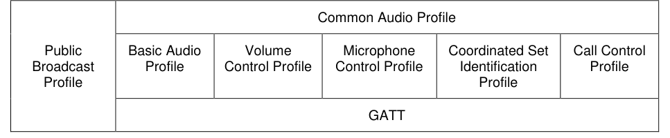
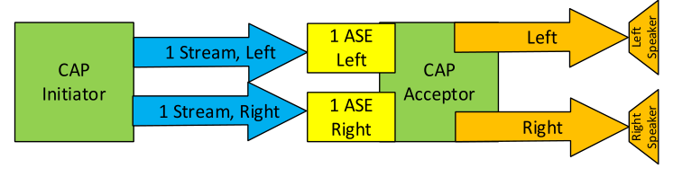
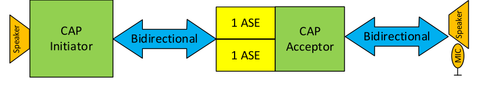

# HAP.TS .p2-1

> Source: PDF converted via PyMuPDF.

---

Hearing Access Profile (HAP)
Bluetooth® Test Suite
▪ Revision: HAP.TS.p2 ▪ Revision Date: 2024-10-08 ▪ Prepared By: Hearing Aid Working Group ▪ Published during TCRL: TCRL.2024-2-addition
This document, regardless of its title or content, is not a Bluetooth Specification as defined in the Bluetooth Patent/Copyright License Agreement (“PCLA”) and Bluetooth Trademark License Agreement. Use of this document by members of Bluetooth SIG is governed by the membership and other related agreements between Bluetooth SIG Inc. (“Bluetooth SIG”) and its members, including the PCLA and other agreements posted on Bluetooth SIG’s website located at www.bluetooth.com.
THIS DOCUMENT IS PROVIDED “AS IS” AND BLUETOOTH SIG, ITS MEMBERS, AND THEIR AFFILIATES MAKE NO REPRESENTATIONS OR WARRANTIES AND DISCLAIM ALL WARRANTIES, EXPRESS OR IMPLIED, INCLUDING ANY WARRANTY OF MERCHANTABILITY, TITLE, NON-INFRINGEMENT, FITNESS FOR ANY PARTICULAR PURPOSE, THAT THE CONTENT OF THIS DOCUMENT IS FREE OF ERRORS.
TO THE EXTENT NOT PROHIBITED BY LAW, BLUETOOTH SIG, ITS MEMBERS, AND THEIR AFFILIATES DISCLAIM ALL LIABILITY ARISING OUT OF OR RELATING TO USE OF THIS DOCUMENT AND ANY INFORMATION CONTAINED IN THIS DOCUMENT, INCLUDING LOST REVENUE, PROFITS, DATA OR PROGRAMS, OR BUSINESS INTERRUPTION, OR FOR SPECIAL, INDIRECT, CONSEQUENTIAL, INCIDENTAL OR PUNITIVE DAMAGES, HOWEVER CAUSED AND REGARDLESS OF THE THEORY OF LIABILITY, AND EVEN IF BLUETOOTH SIG, ITS MEMBERS, OR THEIR AFFILIATES HAVE BEEN ADVISED OF THE POSSIBILITY OF SUCH DAMAGES.
This document is proprietary to Bluetooth SIG. This document may contain or cover subject matter that is intellectual property of Bluetooth SIG and its members. The furnishing of this document does not grant any license to any intellectual property of Bluetooth SIG or its members.
This document is subject to change without notice.
Copyright © 2021–2024 by Bluetooth SIG, Inc. The Bluetooth word mark and logos are owned by Bluetooth SIG, Inc. Other third-party brands and names are the property of their respective owners.
Contents

## 1 Scope

This Bluetooth document contains the Test Suite Structure (TSS) and test cases to test the implementation of the Bluetooth Hearing Access Profile with the objective to provide a high probability of air interface interoperability between the tested implementation and other manufacturers’ Bluetooth devices.

## 2 References, definitions, and abbreviations

### 2.1 References

This document incorporates provisions from other publications by dated or undated reference. These references are cited at the appropriate places in the text, and the publications are listed hereinafter. Additional definitions and abbreviations can be found in [1] and [2].
[1] Bluetooth Core Specification, Version 5.2 or later
[2] Test Strategy and Terminology Overview
[3] Hearing Access Profile, Version 1.0
[4] Hearing Access Service, Version 1.0
[5] ICS Proforma for Hearing Access Profile
[6] Characteristic and Descriptor descriptions are accessible via the Bluetooth SIG Assigned Numbers
[7] GATT Test Suite, GATT.TS
[8] Basic Audio Profile Test Suite, BAP.TS
[9] IXIT Proforma for Hearing Access Profile

### 2.2 Definitions

In this Bluetooth document, the definitions from [1] and [2] apply.

### 2.3 Acronyms and abbreviations

In this Bluetooth document, the definitions, acronyms, and abbreviations from [1] and [2] apply.

## 3 Test Suite Structure (TSS)

### 3.1 Overview

The Hearing Access Profile requires GATT and L2CAP. This is illustrated in Figure 3.1.

| Hearing Access Profile |  |  |  |  |  |
| --- | --- | --- | --- | --- | --- |
| Public Broadcast Profile | Common Audio Profile |  |  |  |  |
|  | Basic Audio Profile | Volume Control Profile | Microphone Control Profile | Coordinated Set Identification Profile | Call Control Profile |
|  | GATT |  |  |  |  |

**Figure 3.1: Hearing Access Profile test model**

### 3.2 Test Strategy

The test objectives are to verify the functionality of the Hearing Access Profile specification within a Bluetooth Host and enable interoperability between Bluetooth Hosts on different devices. The testing approach covers mandatory and optional requirements in the specification and matches these to the support of the IUT as described in the ICS. Any defined test herein is applicable to the IUT if the ICS logical expression defined in the Test Case Mapping Table (TCMT) evaluates to true.
The test equipment provides an implementation of the Radio Controller and the parts of the Host needed to perform the test cases defined in this Test Suite. A Lower Tester acts as the IUT’s peer device and interacts with the IUT over-the-air interface. The configuration, including the IUT, needs to implement similar capabilities to communicate with the test equipment. For some test cases, it is necessary to stimulate the IUT from an Upper Tester. In practice, this could be implemented as a special test interface, a Man Machine Interface (MMI), or another interface supported by the IUT.
This Test Suite contains Valid Behavior (BV) tests complemented with Invalid Behavior (BI) tests where required. Additionally, since the Hearing Access Profile is a GATT-based profile, Generic GATT Integrated Tests (GGIT) are used to validate parts of the specification. The test coverage mirrored in the Test Suite Structure is the result of a process that started with catalogued specification requirements that were logically grouped and assessed for testability enabling coverage in defined test purposes.
Hearing Aid testing involves verifying that the device has the proper PAC records, supports Coordinated Set, and properly implements the Preset Control Point. Also, the HA tests verify that the optional G.729A codec can execute Codec and QoS configuration and can send and receive G.729A encoded audio. Hearing Aid Unicast Client and Hearing Aid Remote Control tests include using two Lower Testers in a Binaural Hearing Aid Set.

### 3.3 Test groups

The following test groups have been defined:
• Generic GATT Integrated Tests
• Client Configuration
• Discovery
• Streaming
• Preset Control Point procedures

## 4 Test cases (TC)

### 4.1 Introduction

#### 4.1.1 Test case identification conventions

Test cases are assigned unique identifiers per the conventions in [2]. The convention used here is: <spec abbreviation>/<IUT role>/<class>/<feat>/<func>/<subfunc>/<cap>/<xx>-<nn>-<y>.
Additionally, testing of this specification includes tests from the GATT Test Suite [7] referred to as Generic GATT Integrated Tests (GGIT); when used, the test cases in GGIT are referred to through a TCID string using the following convention: <spec abbreviation>/<IUT role>/<GGIT test group>/< GGIT class >/<xx>-<nn>-<y>.

|  | Identifier Abbreviation |  |  | Spec Identifier <spec abbreviation> |  |
| --- | --- | --- | --- | --- | --- |
| HAP |  |  | Hearing Access Profile |  |  |
|  | Identifier Abbreviation |  |  | Role Identifier <IUT role> |  |
| HA |  |  | Hearing Aid |  |  |
| HARC |  |  | Hearing Aid Remote Controller |  |  |
| HAUC |  |  | Hearing Aid Unicast Client |  |  |
| IAC |  |  | Immediate Alert Client |  |  |
|  | Identifier Abbreviation |  |  | Reference Identifier <GGIT test group> |  |
| CGGIT |  |  | Client Generic GATT Integrated Tests |  |  |
| SGGIT |  |  | Server Generic GATT Integrated Tests |  |  |
|  | Identifier Abbreviation |  |  | Features and Behaviors Identifier <feat> |  |
| CFG |  |  | Client Configuration |  |  |
| DISC |  |  | Service and Characteristic Discovery |  |  |
| PRE |  |  | Preset Control Point Procedures |  |  |
| STR |  |  | Streaming |  |  |
|  | Identifier Abbreviation |  |  | Reference Identifier <func> |  |
| CHA |  |  | Characteristic GGIT |  |  |
| SER |  |  | Service GGIT |  |  |

Table 4.1: HAP TC feature naming conventions

#### 4.1.2 Conformance

When conformance is claimed for a particular specification, all capabilities are to be supported in the specified manner. The mandated tests from this Test Suite depend on the capabilities to which conformance is claimed.
The Bluetooth Qualification Program may employ tests to verify implementation robustness. The level of implementation robustness that is verified varies from one specification to another and may be revised for cause based on interoperability issues found in the market.
• That claimed capabilities may be used in any order and any number of repetitions not excluded by the specification
• That capabilities enabled by the implementations are sustained over durations expected by the use case
• That the implementation gracefully handles any quantity of data expected by the use case
• That in cases where more than one valid interpretation of the specification exists, the implementation complies with at least one interpretation and gracefully handles other interpretations
• That the implementation is immune to attempted security exploits
A single execution of each of the required tests is required to constitute a Pass verdict. However, it is noted that to provide a foundation for interoperability, it is necessary that a qualified implementation consistently and repeatedly pass any of the applicable tests.
In any case, where a member finds an issue with the test plan generated by the Bluetooth SIG qualification tool, with the test case as described in the Test Suite, or with the test system utilized, the member is required to notify the responsible party via an erratum request such that the issue may be addressed.

#### 4.1.3 Pass/Fail verdict conventions

Each test case has an Expected Outcome section. The IUT is granted the Pass verdict when all the detailed pass criteria conditions within the Expected Outcome section are met.
The convention in this Test Suite is that, unless there is a specific set of fail conditions outlined in the test case, the IUT fails the test case as soon as one of the pass criteria conditions cannot be met. If this occurs, then the outcome of the test is a Fail verdict.

### 4.2 Setup preambles

The procedures defined in this section are used to achieve specific conditions on the IUT and the test equipment within the tests defined in this document. The preambles here are commonly used to establish initial conditions.

#### 4.2.1 ATT Bearer on LE Transport • Preamble Procedure

1. Establish an LE transport connection between the IUT and the Lower Tester. 2. Establish an L2CAP channel 0x0004 between the IUT and the Lower Tester over that LE
transport.

#### 4.2.2 EATT Bearer on LE Transport • Preamble Procedure

1. Establish an LE transport connection between the IUT and the Lower Tester. 2. Establish an L2CAP channel 0x0005 for signaling and one L2CAP channel (for ATT bearers) with
EATT PSM (as defined in Assigned Numbers) between the IUT and the Lower Tester over that LE transport.

#### 4.2.3 GATT Notification and Indication

The procedures defined in this section are provided to set up notifications and indications for the EATT or Unenhanced ATT bearers.

##### 4.2.3.1 EATT, Notifications and Indications

• Preamble Purpose
This preamble procedure enables the IUT with an EATT Bearer to use indications, and optionally notifications, with the Hearing Access Preset Control Point.
• Preamble Procedure
1. The IUT writes the value 0x0002 if indications are supported and notifications are not supported,
or 0x0003 if both indications and notifications are supported, using the GATT Write Characteristic Descriptor sub-procedure for the Preset Control Point CCCD.

##### 4.2.3.2 ATT, Indications

• Preamble Purpose
This preamble procedure enables the IUT with an ATT Bearer to use indications with the Hearing Access Preset Control Point.
• Preamble Procedure
1. The IUT enables indications by writing the value 0x0002 using the GATT Write Characteristic
Descriptor sub-procedure for the Preset Control Point CCCD.

### 4.3 Generic GATT Integrated Tests

Execute the Generic GATT Integrated Tests defined in [7] Section 6.3, Server test procedures (SGGIT), and Section 6.4, Client test procedures (CGGIT), using Table 4.2 below as input:

| TCID |  |  |  | Service / |  | Reference | Properties |  | Value |  | Type |
| --- | --- | --- | --- | --- | --- | --- | --- | --- | --- | --- | --- |
|  |  |  |  | Characteristic / |  |  |  |  | Length |  |  |
|  |  |  |  | Descriptor |  |  |  |  | (Octets) |  |  |
|  | HAP/HA/SGGIT/SER/BV-01-C [Service |  | Hearing Aid Service | Hearing Aid Service |  | [3] 3.5.1 | - | - | - |  | Unique |
|  | GGIT – Hearing Aid] |  |  |  |  |  |  |  |  |  |  |
|  | HAP/HA/SGGIT/SER/BV-02-C [Service |  | Immediate Alert Service |  |  | [3] 3.5.3 | - | - |  |  | Primary |
|  | GGIT – Immediate Alert] |  |  |  |  |  |  |  |  |  |  |
|  | HAP/HA/SGGIT/SER/BV-03-C [Service |  |  | Coordinated Set |  | [3] 3.6 | - | - |  |  | - |
|  | GGIT – Coordinated Set Identification] |  |  | Identification Service |  |  |  |  |  |  |  |
|  | HAP/HA/SGGIT/SER/BV-04-C [Service |  |  | Audio Input Control |  | [3] 3.8 | - | - |  |  | - |
|  | GGIT – Audio Input Control] |  |  | Service |  |  |  |  |  |  |  |
|  | HAP/HA/SGGIT/SER/BV-05-C [Service |  |  | Volume Offset Control |  | [3] 3.8 | - | - |  |  | Unique |
|  | GGIT – Volume Offset Control] |  |  | Service |  |  |  |  |  |  |  |
|  | HAP/HA/SGGIT/SER/BV-06-C [Service |  |  | Microphone Input |  | [3] 3.9 | - | - |  |  | Unique |
|  | GGIT – Microphone Input Control] |  |  | Control Service |  |  |  |  |  |  |  |
|  | HAP/HAUC/SGGIT/SER/BV-01-C [Service |  | Hearing Aid Service | Hearing Aid Service |  | [3] 4.2 | - | - |  |  | Primary |
|  | GGIT – Hearing Aid Unicast Client] |  |  |  |  |  |  |  |  |  |  |
|  | HAP/HARC/SGGIT/SER/BV-01-C [Service |  | Hearing Aid Service |  |  | [3] 5.2 | - | - |  |  | - |
|  | GGIT – Hearing Aid Remote Controller] |  |  |  |  |  |  |  |  |  |  |
|  | HAP/HARC/CGGIT/CHA/BV-01-C |  |  | Hearing Aid Preset |  | [3] 5.5 | 0x38 (Write, Indicate, Notify) | - |  |  | - |
|  | [Characteristic GGIT – Preset Control Point |  |  | Control Point |  |  |  |  |  |  |  |
|  | Characteristic, EATT] |  |  | Characteristic |  |  |  |  |  |  |  |
|  | HAP/HARC/CGGIT/CHA/BV-02-C |  |  | Hearing Aid Preset |  | [3] 5.5 | 0x28 (Write, Indicate) | - |  |  | - |
|  | [Characteristic GGIT – Preset Control Point |  |  | Control Point |  |  |  |  |  |  |  |
|  | Characteristic, Unenhanced ATT] |  |  | Characteristic |  |  |  |  |  |  |  |
|  | HAP/HARC/CGGIT/CHA/BV-03-C |  | Active Preset Index Characteristic | Active Preset Index |  | [3] 5.6 | 0x12 (Read, Notify) | 1 |  |  | - |
|  | [Characteristic GGIT – Active Preset Index |  |  | Characteristic |  |  |  |  |  |  |  |
|  | Characteristic] |  |  |  |  |  |  |  |  |  |  |

| TCID |  |  |  | Service / |  | Reference | Properties |  | Value |  | Type |
| --- | --- | --- | --- | --- | --- | --- | --- | --- | --- | --- | --- |
|  |  |  |  | Characteristic / |  |  |  |  | Length |  |  |
|  |  |  |  | Descriptor |  |  |  |  | (Octets) |  |  |
|  | HAP/HARC/CGGIT/CHA/BV-04-C |  | Hearing Aid Features Characteristic | Hearing Aid Features |  | [3] 5.4 | 0x12 (Read, Notify) | 1 | 1 |  | - |
|  | [Characteristic GGIT – Hearing Aid |  |  | Characteristic |  |  |  |  |  |  |  |
|  | Features Characteristic] |  |  |  |  |  |  |  |  |  |  |
|  | HAP/IAC/CGGIT/CHA/BV-01-C |  | Alert Level Characteristic |  |  | [3] 6.1 | 0x04 (Write Without Response) | - |  |  | - |
|  | [Characteristic GGIT – Alert Level |  |  |  |  |  |  |  |  |  |  |
|  | Characteristic] |  |  |  |  |  |  |  |  |  |  |

Table 4.2: Input for the GGIT Client and Server test procedures

### 4.4 Client Configuration

Verify the Client Configuration.
HAP/HARC/CFG/BV-01-C [Verify the ATT Client MTU Value]
• Test Purpose
Verify that a HARC Client IUT supports an ATT_MTU value of at least 49.
• Reference
[3] 5.5
• Initial Condition
- Establish a Bearer connection between the Lower Tester and the IUT as described in Section 4.2.1 if using ATT over an LE transport.
• Test Procedure
1. The Upper Tester commands the IUT to initiate an MTU exchange. 2. The IUT sends an ATT_EXCHANGE_MTU_REQ to the Lower Tester with Client Rx MTU >= 49.
• Expected Outcome
Pass verdict
In step 2, the IUT sets the Client Rx MTU >= 49.

### 4.5 Discovery

Verify the correct implementation of Characteristics supported by the Hearing Aid role.

#### 4.5.1 Sink Audio Locations Characteristic

##### 4.5.1.1 Sink Audio Locations Characteristic

• Test Purpose
Verify that the Hearing Aid IUT sets the value of the Sink Audio Locations characteristic as specified in Table 4.3.
• Reference
[3] 3.7
• Initial Condition
- Establish a Bearer connection between the Lower Tester and the IUT as described in Section 4.2.1, if using ATT over an LE transport, or Section 4.2.2 if using EATT over an LE transport.
• Test Case Configuration

|  | TCID |  |  | Type |  |  | Locations |  |
| --- | --- | --- | --- | --- | --- | --- | --- | --- |
|  | HAP/HA/DISC/BV-01-C [Sink Audio |  | Binaural Hearing Aid Set | Binaural Hearing Aid Set |  |  | Front Right or Front Left bits |  |
|  | Locations Characteristic, Binaural] |  |  |  |  |  | are set |  |
|  | HAP/HA/DISC/BV-02-C [Sink Audio |  | Banded Hearing Aid |  |  |  | Front Right and Front Left bits |  |
|  | Locations Characteristic, Banded] |  |  |  |  |  | are set |  |

• Test Procedure
1. The Lower Tester executes the GATT Discover All Characteristics of a Service sub-procedure or
GATT Discover Characteristics by Characteristic UUID sub-procedure to discover the Available Audio Contexts. 2. The Lower Tester verifies that the Sink Audio Locations characteristic is as specified in Table 4.3.
• Expected Outcome
Pass verdict
In step 2, the Lower Tester verifies that the Sink Audio Locations characteristic is as specified in Table 4.3.

#### 4.5.2 ASE Characteristic

HAP/HA/DISC/BV-03-C [ASE Characteristics]
• Test Purpose
Verify that the Hearing Aid IUT that supports the Audio Source role instantiates a bidirectional CIS with at least two ASE Characteristics: one for the Audio Sink direction and one for the Audio Source direction.
• Reference
[3] 3.7
• Initial Condition
- Establish a Bearer connection between the Lower Tester and the IUT as described in Section 4.2.1, if using ATT over an LE transport, or Section 4.2.2 if using EATT over an LE transport.
• Test Procedure
1. The Lower Tester executes the GATT Discover All Characteristics of a Service sub-procedure. 2. The Lower Tester verifies that the IUT reports at least one Source ASE and one Sink ASE.
• Expected Outcome
Pass verdict
In step 2, the IUT reports at least one Source and at least one Sink ASE.

#### 4.5.3 Immediate Alert

HAP/HA/DISC/BV-04-C [Audio Alert Notification]
• Test Purpose
Verify that the Hearing Aid IUT sends an audio alert when the value “High Alert” is written to the Alert Level characteristic by the Lower Tester.
• Reference
[3] 3.5.3
• Initial Condition
- Establish a Bearer connection between the Lower Tester and the IUT as described in Section 4.2.1.
• Test Procedure
1. The Lower Tester executes the GATT Write Without Response sub-procedure for the Alert Level
characteristic with “High Alert”. 2. The IUT produces the alert for the “High Alert” state. 3. The Upper Tester verifies that the IUT properly produces the alert for the “High Alert” state.
• Expected Outcome
Pass verdict
In step 2, the IUT produces the alert.

#### 4.5.4 Device Discovery

##### 4.5.4.1 Binaural Hearing Aid Set Discovery, Coordinated Set

• Test Purpose
Verify that the IUT in the role specified in Table 4.4 discovers a Binaural Hearing Aid Set using the CSIP Set Coordinator Role discovery procedure.
• Reference
[3] 8
• Initial Condition
- Establish a Bearer connection between the Lower Testers and the IUT as described in Section 4.2.1, if using ATT over an LE transport, or Section 4.2.2 if using EATT over an LE transport.
- The two Lower Testers are Hearing Aid Devices that are part of a Binaural Hearing Aid Set that includes a CSIS instance with an SIRK. The Lower Testers expose SIRK, Coordinated Set Size, and Set Member Rank Characteristics.
• Test Case Configuration

|  | TCID |  |  | Role |  |
| --- | --- | --- | --- | --- | --- |
|  | HAP/HAUC/DISC/BV-01-C [Binaural Hearing Aid Set |  | Hearing Aid Unicast Client | Hearing Aid Unicast Client |  |
|  | Discovery, Coordinated Set, HAUC] |  |  |  |  |
|  | HAP/HARC/DISC/BV-01-C [Binaural Hearing Aid Set |  | Hearing Aid Remote Controller |  |  |
|  | Discovery, Coordinated Set, HARC] |  |  |  |  |

Table 4.4: Binaural Hearing Aid Set Discovery, Coordinated Set test cases
• Test Procedure
1. The Upper Tester commands the IUT to start Coordinated Set Discovery for the Binaural Hearing
Aid Set.
Repeat steps 2–5 for each Lower Tester.
2. The IUT executes the GATT Find Included Services procedure to find services that include the
CSI Services. 3. The IUT executes the GATT Read Characteristic Value sub-procedure for the SIRK
characteristic. 4. The IUT executes the GATT Read Characteristic Value sub-procedure for the Coordinated Set
Size characteristic.
characteristic. 6. The Upper Tester verifies that the SIRK values discovered in step 3 for each Lower Tester are
identical.
• Expected Outcome
Pass verdict
After both rounds, each discovered SIRK in step 6 for each Lower Tester is the same.

#### 4.5.5 Service Discovery

Verify the discovery of services supported by the Hearing Aid role.
HAP/HA/DISC/BV-06-C [Service Discovery – Volume Offset Control, Two Instances]
• Test Purpose
Verify that the Hearing Aid IUT as a Banded Hearing Aid instantiates two instances of Volume Offset Control Service.
• Reference
[3] 3.9
• Initial Condition
- The IUT contains two instances of VOCS.
• Test Procedure
1. Execute the Generic GATT Service GGIT Tests defined in [7] Section 6.3.1, Server test
procedures (SGGIT), with the Volume Offset Control Service type. 2. The Lower Tester discovers two instances of the Volume Offset Control Service.
• Expected Outcome
Pass verdict
In step 2, two instances of the Volume Offset Control Service are discovered on the IUT as described in [7] Section 6.3.1, Server test procedures (SGGIT).

### 4.6 Streaming

Verify the correct implementation of Streaming Audio supported by the Hearing Aid role.

#### 4.6.1 Common test conditions

In the following examples, “speaker” is used as a representative example and represents any form of audio transducer or destination for the audio channel driven by the CAP Acceptor. “Microphone” is a representative example and represents any means of gathering voice audio by the HA that is then sent to the HAUC. The use of “speaker” and “microphone” is purely illustrative and in no way limits the implementation of those approaches.

**Figure 4.1: Two ASEs, one with Left Channel, one with Right Channel, one Acceptor**

In this configuration, the CAP Acceptor supports the Audio Locations Front Left and Front Right as Audio Sink. The CAP Acceptor exposes two ASEs. The CAP Initiator establishes two Audio Streams, one configured for the Front Left Audio Location and the other configured for the Front Right Audio Location. The CAP Acceptor routes the Front Left audio to the left speaker and routes the Front Right audio to the right speaker.

##### 4.6.1.2 Bidirectional ASEs with one Audio Channel per ASE, one Acceptor

**Figure 4.2: One ASE, Bidirectional CIS, one Acceptor**

In this configuration, the CAP Acceptor supports a single Audio Location. The CAP Acceptor exposes two ASEs. The CAP Initiator establishes one bidirectional Audio Stream configured for an Audio Location. The CAP Acceptor routes the audio to the speaker.

#### 4.6.2 Streaming parameters

HAP/HAUC/STR/BV-01-C [Unicast Audio Streams for Front Left and Front Right]
• Test Purpose
Verify that the Hearing Aid Unicast Client IUT connects to the Lower Tester with two unicast Audio Streams, one for the Front Left and one for the Front Right Audio Location.
• Reference
[3] 4.3
• Initial Condition
- The IUT and the Lower Tester have established an ACL connection.
- The Lower Tester Hearing Aid supports two Sink ASEs, one with the Front Left and one with the Front Right Audio Location using the configuration in Section 4.6.1.1.
• Test Procedure
1. The Upper Tester commands the IUT to establish two unicast Audio Streams with the Lower
Tester. 2. The Lower Tester verifies that two Unicast Audio Streams are established with the IUT and they
have a Front Left and a Front Right Audio Location.
• Expected Outcome
Pass verdict
In step 2, the IUT establishes two unicast Audio Streams with a Front Left and a Front Right Audio Location.
HAP/HA/STR/BV-01-C [CIS Stream, 7.5 ms Transport Interval]
• Test Purpose
Verify that the Hearing Aid IUT that supports a 7.5 ms transport interval supports a CIS stream with parameters as shown in Table 4.5.
• Reference
[3] 3.2
• Initial Condition
- The IUT and the Lower Tester have established an ACL connection.
• Test Procedure
1. The Lower Tester creates a CIS stream using the parameters in Table 4.5. 2. The Upper Tester verifies that the CIS stream is created successfully.

|  | Parameter |  |  | Value |  |
| --- | --- | --- | --- | --- | --- |
|  | Flush Timeout (FT) |  |  | 1 |  |
|  | Framing |  |  | Framed |  |
|  | BN |  |  | 1 |  |
| Max PDU _ | Max PDU |  |  | >= Maximum size of an SDU that contains one LC3 Media Packet with |  |
|  |  |  |  | codec frames at 10 ms frame duration plus 5 octets of framed ISOAL |  |
|  |  |  |  | header |  |

Table 4.5: CIS Stream parameters
• Expected Outcome
Pass verdict
In step 2, the IUT accepts a CIS stream connection with the parameters from step 1.
HAP/HA/STR/BV-02-C [BIS Stream, 7.5 ms Transport Interval]
• Test Purpose
Verify that the Hearing Aid IUT that supports a 7.5 ms transport interval supports a BIS stream with parameters as shown in Table 4.6.
• Reference
[3] 3.2
• Initial Condition
- The IUT and the Lower Tester have established an ACL connection.
- The Lower Tester BAP Broadcast Source configures a BIS with the parameters in Table 4.6.

|  | Parameter |  |  | Value |  |
| --- | --- | --- | --- | --- | --- |
|  | Pre-Transmission Offset (PTO) |  |  | 0 |  |
|  | Framing |  |  | Framed |  |
|  | BN |  |  | 1 |  |
| Max PDU _ | Max PDU |  |  | >= Maximum size of an SDU that contains one LC3 Media |  |
|  |  |  |  | Packet with codec frames at 10 ms frame duration plus |  |
|  |  |  |  | 5 octets of framed ISOAL header |  |

Table 4.6: BIS Stream parameters
• Test Procedure
1. The Upper Tester commands the IUT to synchronize with the Lower Tester BIS. 2. The Upper Tester verifies that broadcast data is received.
• Expected Outcome
Pass verdict
In step 2, the IUT receives broadcast data from the BIS that is configured with the parameters in Table 4.6.

### 4.7 Preset procedure

Verify the correct implementation of Preset Control procedures.

#### 4.7.1 Preset Control

HAP/HARC/PRE/BV-01-C [Write Preset Name Procedure]
• Test Purpose
Verify that the Hearing Aid Remote Controller IUT executes the Write Preset Name procedure correctly.
• Reference
[3] 5.5.4
• Initial Condition
- Establish a Bearer connection between the Lower Tester and the IUT as described in Section 4.2.1, if using ATT over an LE transport, or Section 4.2.2 if using EATT over an LE transport.
- The number of total presets is defined by the TSPX_num_presets IXIT value.
- The IUT enables notifications and/or indications by performing the preamble described in Section 4.2.3.
• Test Procedure
Repeat steps 1–4 for each round in Table 4.7.
1. The Upper Tester commands the IUT to write a new preset name to the Lower Tester for the
Preset Number as specified in Table 4.7 with a random name up to 40 characters. 2. Optionally, the IUT executes the GATT Write Characteristic Value sub-procedure for the Preset
Control Point characteristic with the Read Presets Request Operation with StartIndex set to 1 and NumPresets set to 0xFF and receives one “Read Preset Response” notification or indication with a Preset Record for each Preset Record on the Lower Tester. 3. The IUT executes the GATT Write Characteristic Value sub-procedure for the Preset Control
Point characteristic with the Write Preset Name Operation with Index and Name from step 1. 4. The Lower Tester executes the GATT Write Characteristic Value sub-procedure for the Preset
Control Point characteristic with the Preset Changed procedure with ChangeId set to 0x00 (Generic Update) with Index and Name from step 2.

|  | Round |  |  | Preset Number |  |
| --- | --- | --- | --- | --- | --- |
| 1 |  |  | 1 |  |  |
| 2 |  |  | TSPX num presets _ _ |  |  |

Table 4.7: Write Preset Name Procedure rounds
• Expected Outcome
Pass verdict
In step 3, the IUT sends a Write Preset Name operation to the Lower Tester with the Index and Name from step 1.

#### 4.7.2 Set Active Preset procedure • Test Purpose

Verify that the Hearing Aid Remote Controller IUT executes the Set Active Preset procedure correctly against Binaural Hearing Aid Lower Testers.
• Initial Condition
- Two Lower Tester devices are Binaural Hearing Aid devices. The two Lower Tester devices have the Independent Presets flag set to 0b0. Lower Tester 1 has the Preset Synchronization Support field set to 0b1 and Lower Tester 2 has the Preset Synchronization Support field set to 0b0.
- Establish a Bearer connection between Lower Tester 1 and the IUT as described in Section 4.2.1, if using ATT over an LE transport, or Section 4.2.2 if using EATT over an LE transport. If the Lower Testers are not part of a Binaural set as specified in Table 4.8, establish a Bearer connection between Lower Tester 2 and the IUT.
- An array of available preset indices is defined by the TSPX_available_preset_index IXIT value.
- The IUT enables notifications and/or indications by performing the preamble described in Section 4.2.3.
• Test Case Configuration

| Test Case | Reference | Opcode |  | Send to |  |
| --- | --- | --- | --- | --- | --- |
|  |  |  |  | Lower |  |
|  |  |  |  | Tester 2 |  |
| HAP/HARC/PRE/BV-02-C [Set Active Preset Procedure] | [3] 5.5.5 | Set Active Preset | Yes |  |  |
| HAP/HARC/PRE/BV-03-C [Set Active Preset Procedure, Synchronized Locally] | [3] 5.5.8 | Set Active Preset – Synchronized Locally | No |  |  |

Table 4.8: Set Active Preset procedure test cases
• Test Procedure
Repeat steps 1–4 for each value in TSPX_available_preset_index.
1. The Upper Tester commands the IUT to set a preset using the opcode in Table 4.8 with the index
from TSPX_available_preset_index. 2. The IUT executes the GATT Write Characteristic Value sub-procedure to Lower Tester 1 for the
Preset Control Point characteristic with the opcode from Table 4.8 with the Index from step 1. 3. Lower Tester 1 sends an “Active Preset” notification or indication to the IUT with the Index from
step 1. 4. If the IUT sends the opcode to Lower Tester 2 as specified in Table 4.8, repeat steps 2 and 3 for
Lower Tester 2.
• Expected Outcome
Pass verdict
In step 2, the IUT sends the opcode from Table 4.8 to the Lower Tester with the Index from step 1.
In step 4, if the IUT sends the opcode to Lower Tester 2, the IUT sends the same parameters as the opcode call to Lower Tester 1.

#### 4.7.3 Set Next Preset procedure • Test Purpose

Verify that the Hearing Aid Remote Controller IUT executes the Set Next Preset procedure correctly against Binaural Hearing Aid Lower Testers.
• Initial Condition
- Two Lower Tester devices are Binaural Hearing Aid devices. The two Lower Tester devices have the Independent Presets flag set to 0b0. Lower Tester 1 has the Preset Synchronization Support field set to 0b1, and Lower Tester 2 has the Preset Synchronization Support field set to 0b0.
- Establish a Bearer connection between Lower Tester 1 and the IUT as described in Section 4.2.1, if using ATT over an LE transport, or Section 4.2.2 if using EATT over an LE transport. If the Lower Testers are not part of a Binaural set as specified in Table 4.9, establish a Bearer connection between Lower Tester 2 and the IUT.
- An array of available preset indices is defined by the TSPX_available_preset_index IXIT value.
- The IUT enables notifications and/or indications by performing the preamble described in Section 4.2.3.
- Each Lower Tester sets the active preset to the first value in TSPX_available_preset_index.
• Test Case Configuration

| Test Case | Reference | Opcode |  | Send To |  |
| --- | --- | --- | --- | --- | --- |
|  |  |  |  | Lower |  |
|  |  |  |  | Tester 2 |  |
| HAP/HARC/PRE/BV-04-C [Set Next Preset Procedure] | [3] 5.5.6 | Set Next Preset | Yes |  |  |
| HAP/HARC/PRE/BV-05-C [Set Next Preset Procedure, Synchronized Locally] | [3] 5.5.9 | Set Next Preset – Synchronized Locally | No |  |  |

Table 4.9: Set Next Preset procedure test cases
• Test Procedure
Repeat steps 1–3 for each value in TSPX_available_preset_index.
1. The Upper Tester commands the IUT to set the next preset using the operation in Table 4.9. 2. The IUT executes the GATT Write Characteristic Value sub-procedure to Lower Tester 1 for the
Preset Control Point characteristic with the opcode from Table 4.9. 3. Lower Tester 1 sends an “Active Preset” notification or indication to the IUT with the next Index
from TSPX_available_preset_index. If the current Index in step 1 is the last Index from TSPX_available_preset_index, the next Index is the first Index from TSPX_available_preset_index. 4. If the IUT sends the opcode to Lower Tester 2 as specified in Table 4.9, repeat steps 2 and 3 for
Lower Tester 2.
• Expected Outcome
Pass verdict
In step 2, the IUT sends the opcode from Table 4.9 to the Lower Tester with the next Index from TSPX_available_preset_index.
In step 4, if the IUT sends the opcode to Lower Tester 2, the IUT sends the same parameters as the opcode calls to Lower Tester 1.

#### 4.7.4 Set Previous Preset procedure • Test Purpose

Verify that the Hearing Aid Remote Controller IUT executes the Set Previous Preset procedure correctly against Binaural Hearing Aid Lower Testers.
• Initial Condition
- Two Lower Tester devices are Binaural Hearing Aid devices. The two Lower Tester devices have the Independent Presets flag set to 0b0. Lower Tester 1 has the Preset Synchronization Support field set to 0b1, and Lower Tester 2 has the Preset Synchronization Support field set to 0b0.
- Establish a Bearer connection between each Lower Tester and the IUT as described in Section 4.2.1, if using ATT over an LE transport, or Section 4.2.2 if using EATT over an LE transport. If the Lower Testers are not part of a Binaural Set as specified in Table 4.10, establish a Bearer connection between Lower Tester 2 and the IUT.
- An array of available preset indices is defined by the TSPX_available_preset_index IXIT value.
- The IUT enables notifications and/or indications by performing the preamble described in Section 4.2.3.
- Each Lower Tester sets the active preset to the first value in TSPX_available_preset_index.
• Test Case Configuration

| Test Case | Reference | Opcode |  | Send to |  |
| --- | --- | --- | --- | --- | --- |
|  |  |  |  | Lower |  |
|  |  |  |  | Tester 2 |  |
| HAP/HARC/PRE/BV-06-C [Set Previous Preset Procedure] | [3] 5.5.7 | Set Previous Preset | Yes |  |  |
| HAP/HARC/PRE/BV-07-C [Set Previous Preset Procedure, Synchronized Locally] | [3] 5.5.10 | Set Previous Preset – Synchronized Locally | No |  |  |

Table 4.10: Set Previous Preset procedure test cases
• Test Procedure
Repeat steps 1–4 for each value in TSPX_available_preset_index.
1. The Upper Tester commands the IUT to set the previous preset using the operation in Table 4.10. 2. The IUT executes the GATT Write Characteristic Value sub-procedure to Lower Tester 1 for the
Preset Control Point characteristic with the opcode from Table 4.10. 3. Lower Tester 1 sends an “Active Preset” notification or indication to the IUT with the previous
Index from TSPX_available_preset_index. If the current Index in step 1 is the first Index from TSPX_available_preset_index, the previous Index is the last Index from TSPX_available_preset_index. 4. If the IUT sends the opcode to Lower Tester 2 as specified in Table 4.10, repeat steps 2 and 3 for
Lower Tester 2.
• Expected Outcome
Pass verdict
In step 2, the IUT sends the opcode from Table 4.10 to the Lower Tester with the previous Index from TSPX_available_preset_index.
In step 4, if the IUT sends the opcode to Lower Tester 2, the IUT sends the same parameters as the opcode calls to Lower Tester 1.

#### 4.7.5 Preset Control, Binaural Set, Preset Records Not Identical • Test Purpose

Verify that the Hearing Aid Remote Controller IUT properly writes the Preset Control Point sub-procedure to both Lower Testers in a Binaural Set when both Lower Testers have the Independent Preset feature set to 1.
• Reference
[3] 6.5
• Initial Condition
- Establish a Bearer connection between the Lower Testers and the IUT as described in Section 4.2.1, if using ATT over an LE transport, or Section 4.2.2 if using EATT over an LE transport.
- The IUT enables notifications and/or indications by performing the preamble described in Section 4.2.3.
- The Lower Testers have the Independent Presets flag set.
- Lower Tester 1 and Lower Tester 2 are both hearing aids in a Binaural Hearing Aid Set.
- The Lower Tester 1 and Lower Tester 2 Preset Records are configured as shown in Table 4.11.

| Index |  | Properties |  |  |  |  | Name |
| --- | --- | --- | --- | --- | --- | --- | --- |
|  |  | Writable |  |  | isAvailable |  |  |
| 1 | 0b1 |  |  | 0b1 |  |  | Name 1 Available |
| 2 | 0b1 |  |  | 0b1 |  |  | Name 2 Active |
| 3 | 0b0 |  |  | 0b1 |  |  | Name 3 Read Only |
| 4 | 0b1 |  |  | 0b0 |  |  | Name 4 not available |
| 5 | 0b1 |  |  | 0b1 |  |  | Name 5 Available |

Table 4.11: Lower Tester Preset Records
• Test Case Configuration

|  | Test Case |  |  | Reference |  |  | Opcode |  |
| --- | --- | --- | --- | --- | --- | --- | --- | --- |
| HAP/HARC/PRE/BV-08-C [Preset Control, Binaural Set, Preset Records Not Identical, Set Active Preset] |  |  | [3] 5.5.5 |  |  | Set Active Preset |  |  |
| HAP/HARC/PRE/BV-09-C [Preset Control, Binaural Set, Preset Records Not Identical, Set Next Preset] |  |  | [3] 5.5.6 |  |  | Set Next Preset |  |  |
| HAP/HARC/PRE/BV-10-C [Preset Control, Binaural Set, Preset Records Not Identical, Set Previous Preset] |  |  | [3] 5.5.7 |  |  | Set Previous Preset |  |  |

Table 4.12: Preset Control, Binaural Set, Preset Records not Identical test cases
• Test Procedure
1. The Upper Tester commands the IUT to execute the opcode in Table 4.12. If the opcode is Set
Active Preset, the Index is set to 1 for Lower Tester 1 and 3 for Lower Tester 2.
Steps 2 and 3 are executed in any order.
2. The IUT executes the GATT Write Characteristic Value sub-procedure for the Preset Control
Point characteristic to Lower Tester 1 using the opcode and parameters from step 1. 3. The IUT executes the GATT Write Characteristic Value sub-procedure for the Preset Control
Point characteristic to Lower Tester 2 using the opcode and parameters from step 1.
Steps 4 and 5 are executed in any order.
4. Lower Tester 1 sends a Preset Control Point characteristic notification or indication to the IUT in
response to step 2. 5. Lower Tester 2 sends a Preset Control Point characteristic notification or indication to the IUT in
response to step 3. 6. Lower Tester 1 deletes a preset record with Index set to 5.
with opcode set to “Change Notification” with ChangeId set to “Preset record deleted” with Index set to the Index in step 6. 8. The Upper Tester commands the IUT to execute the opcode in Table 4.12. If the opcode is Set
Active Preset, the Index is set to 2 for Lower Tester 1 and 1 for Lower Tester 2.
Steps 9 and 10 are executed in any order.
9. The IUT executes the GATT Write Characteristic Value sub-procedure for the Preset Control
Point characteristic to Lower Tester 1 using the opcode and parameters from step 8. 10. The IUT executes the GATT Write Characteristic Value sub-procedure for the Preset Control
Point characteristic to Lower Tester 2 using the opcode and parameters from step 8.
• Expected Outcome
Pass verdict
In steps 2 and 3, the IUT executes the specified Preset Control Point opcode with the Lower Testers.
In steps 9 and 10, if the IUT optionally executes the specified Preset Control Point opcode with the Lower Testers, it does so successfully.
HAP/HARC/PRE/BV-11-C [Read Presets Request]
• Test Purpose
Verify that the Hearing Aid Remote Controller IUT executes the Read Presets Request procedure and receives a Preset Record.
• Reference
[3] 5.5.2
• Initial Condition
- Establish a Bearer connection between the Lower Tester and the IUT as described in Section 4.2.1, if using ATT over an LE transport, or Section 4.2.2 if using EATT over an LE transport.
- An Index is defined by the TSPX_preset_record_index_available IXIT value.
- The IUT enables notifications and/or indications by performing the preamble described in Section 4.2.3.
• Test Procedure
1. The Upper Tester commands the IUT to read a preset with Index set to
TSPX_preset_record_index_available. 2. The IUT executes the GATT Write Characteristic Value sub-procedure for the Preset Control
Point characteristic with the Read Presets Request Operation with StartIndex set to the value in step 1 and NumPresets set to 1. 3. The Lower Tester sends a “Read Preset Response” notification or indication with a Preset Record
with Index from step 2.
• Expected Outcome
Pass verdict
In step 3, the IUT sends a notification or indication with a Preset Record with Index as specified in step 2.
• Test Purpose
Verify that the Hearing Aid Remote Controller IUT updates the internal list of preset records when receiving a Preset Changed Procedure.
• Reference
[3] 5.5.3
• Initial Condition
- Establish a Bearer connection between the Lower Tester and the IUT as described in Section 4.2.1, if using ATT over an LE transport, or Section 4.2.2 if using EATT over an LE transport.
- The largest Preset Record Index is defined by the TSPX_largest_preset_record_index IXIT value.
- The IUT enables notifications and/or indications by performing the preamble described in Section 4.2.3.
• Test Procedure
1. The Lower Tester sends a Preset Changed notification if using an EATT Bearer or indication if
using an ATT Bearer with ChangeId set to 0x00 (Generic Update) with PrevIndex set to TSPX_largest_preset_record_index, Index set to TSPX_largest_preset_record_index + 1, the isAvailable field set to 0b1, and Name set to “new record”. 2. The Upper Tester verifies that the new record received in step 1 is the last record in the list.
• Expected Outcome
Pass verdict
In step 2, the list of Preset Records in the IUT has the new record from step 1 as the last record.
HAP/HARC/PRE/BV-13-C [Write Preset Name, Binaural Hearing Aid Set Not Available]
• Test Purpose
Verify that the Hearing Aid Remote Controller IUT does not send the Write Preset Name when only one Hearing Aid of the Binaural Hearing Aid Set is available.
• Reference
[3] 5.5
• Initial Condition
- Establish a Bearer connection between the Lower Tester and the IUT as described in Section 4.2.1, if using ATT over an LE transport, or Section 4.2.2 if using EATT over an LE transport.
- The IUT enables notifications and/or indications by performing the preamble described in Section 4.2.3.
- The two Lower Tester devices are Hearing Aid devices that are part of a Binaural Hearing Aid Set.
- The two Lower Testers have the Independent Preset flag set to 0b0.
- A writable preset Index is defined by the TSPX_preset_record_index_available IXIT value.
• Test Procedure
1. The Upper Tester commands the IUT to read all presets.
Repeat step 2 for each Lower Tester.
2. The IUT executes the GATT Write Characteristic Value sub-procedure for the Preset Control
Point characteristic with the Read Presets Request Operation with StartIndex set to 1 and NumPresets set to 0xFF.
Each Lower Tester repeats step 3 until the isLast field is set to 0x01.
3. The Lower Tester sends a “Read Preset Response” notification or indication with a Preset
Record. 4. The Upper Tester commands the IUT to write the preset name with Index
TSPX_preset_record_index_available with the name “New Preset Name”.
Repeat steps 5 and 6 for each Lower Tester.
5. The IUT executes the GATT Write Characteristic Value sub-procedure for the Preset Control
Point characteristic with the Write Preset Name Operation with Index and Name from step 4. 6. The Lower Tester sends a “Preset Changed” notification or indication to the IUT with ChangeId
set to 0x00 (Generic Update) with a Preset Record with Index and Name from step 5. 7. Lower Tester 1 disconnects from the IUT. 8. The Upper Tester commands the IUT to write the preset name with Index set to
TSPX_preset_record_index_available with the name “New Preset Name”. 9. The IUT does not send the GATT Write Characteristic Value sub-procedure for the Preset Control
Point Characteristic to either Lower Tester with the Write Preset Name Operation.
• Expected Outcome
Pass verdict
In step 9, the IUT does not send the Write Preset Name Operation to Lower Tester 2 when only one of the Hearing Aids in a Binaural Hearing Aid Set is not available.

#### 4.7.6 Set Active Preset, Synchronized Locally, Preset Synchronization Support Not Supported • Test Purpose

Verify that the Hearing Aid Remote Controller IUT does not execute the Operation when Preset Synchronization is not supported.
• Initial Condition
- Establish a Bearer connection between the Lower Tester and the IUT as described in Section 4.2.1, if using ATT over an LE transport, or Section 4.2.2 if using EATT over an LE transport.
- The IUT enables notifications and/or indications by performing the preamble described in Section 4.2.3.
- The Lower Tester has the Preset Synchronization Support Feature Bit set to 0b0.
• Test Case Configuration

|  | Test Case |  |  | Reference |  |  | Opcode |  |
| --- | --- | --- | --- | --- | --- | --- | --- | --- |
| HAP/HARC/PRE/BV-14-C [Set Active Preset, Synchronized Locally, Preset Sync Support Not Supported] |  |  | [3] 5.5.8 |  |  | Set Active Preset Synchronized Locally |  |  |
| HAP/HARC/PRE/BV-15-C [Set Next Preset, Synchronized Locally, Preset Sync Support Not Supported] |  |  | [3] 5.5.9 |  |  | Set Next Preset Synchronized Locally |  |  |
| HAP/HARC/PRE/BV-16-C [Set Previous Preset, Previous Synchronized Locally, Preset Sync Support Not Supported] |  |  | [3] 5.5.10 |  |  | Set Previous Preset Synchronized Locally |  |  |

Table 4.13: Set Active Preset, Synchronize Locally, HA Preset Synchronization Support Not Supported test cases
• Test Procedure
1. The Upper Tester commands the IUT to send the opcode specified in Table 4.13. 2. The IUT does not send the GATT Write Characteristic Value sub-procedure for the Preset Control
Point Characteristic with the opcode specified in Table 4.13.
• Expected Outcome
Pass verdict
In step 2, the IUT does not send the opcode specified in Table 4.13.
HAP/HARC/PRE/BV-17-C [Set Active Preset Procedure, Inactive Preset]
• Test Purpose
Verify that the Hearing Aid Remote Controller IUT does not send the Set Active Preset Control Point Opcode when setting an active index to one that is unavailable.
• Reference
[3] 5.5.5
• Initial Condition
- Establish a Bearer connection between the Lower Tester and the IUT as described in Section 4.2.1, if using ATT over an LE transport, or Section 4.2.2 if using EATT over an LE transport.
- The IUT enables notifications and/or indications by performing the preamble described in Section 4.2.3.
- The Lower Tester has two Preset Records. Preset Index 1 has isAvailable set to 0b1. Preset Index 2 has isAvailable set to 0b0.
• Test Procedure
1. The Upper Tester commands the IUT to read all presets. 2. The IUT executes the GATT Write Characteristic Value sub-procedure for the Preset Control
Point characteristic with the Read Presets Request Operation with StartIndex set to 1 and NumPresets set to 0xFF and receives one “Read Preset Response” notification or indication with a Preset Record for each Preset Record on the Lower Tester. The last “Read Preset Response” notification or indication has isLast set to 0x01. 3. The Upper Tester commands the IUT to send the Set Active Preset Control Point command with
Index set to 2.
Control Point Characteristic with the Set Active Preset Control Point opcode. 5. The Upper Tester commands the IUT to send the Set Active Preset Control Point command with
Index set to 1. 6. The IUT sends the GATT Write Characteristic Value sub-procedure for the Preset Control Point
Characteristic with the Set Active Preset Control Point Opcode and Index set to 1. 7. The Lower Tester sends an “Active Preset” notification or indication to the IUT with the Index set
to 1.
• Expected Outcome
Pass verdict
In step 4, the IUT does not execute the GATT Write Characteristic Value sub-procedure with the Set Active Preset Control Point opcode.
HAP/HARC/PRE/BV-18-C [Write Preset Name, Binaural Hearing Aid Set]
• Test Purpose
Verify that the Hearing Aid Remote Controller IUT executes the Write Preset Name opcode with the same parameters to both Lower Tester Hearing Aid devices that are part of a Binaural Hearing Aid Set.
• Initial Condition
- Establish a Bearer connection between each Lower Tester and the IUT as described in Section 4.2.1, if using ATT over an LE transport, or Section 4.2.2 if using EATT over an LE transport.
- Two Lower Tester devices are Hearing Aid devices that are part of a Binaural Hearing Aid Set.
- Each Lower Tester has a single identical preset record with Index 1 and is writable and available.
- The IUT enables notifications and/or indications by performing the preamble described in Section 4.2.3.
- Lower Tester 1 and Lower Tester 2 have the Independent Preset Flag set to 0.
• Test Procedure
1. The Upper Tester commands the IUT to write the Write Preset Name opcode with Index set to 1
and Name set to 40 random characters. 2. Optionally, the IUT executes the GATT Write Characteristic Value sub-procedure for the Preset
Control Point characteristic with the Read Presets Request Operation with StartIndex set to 1 and NumPresets set to 0xFF and receives one “Read Preset Response” notification or indication with a Preset Record for each Preset Record with each Lower Tester.
Execute steps 3 and 4 in any order.
3. The IUT executes the GATT Write Characteristic Value sub-procedure with Lower Tester 1 for the
Preset Control Point characteristic with the opcode and parameters in step 1. 4. The IUT executes the GATT Write Characteristic Value sub-procedure with Lower Tester 2 for the
Preset Control Point characteristic with the opcode and parameters in step 1.
• Expected Outcome
Pass verdict
In steps 3 and 4, the IUT sends the same opcode and parameters from step 1.

## 5 Test case mapping

The Test Case Mapping Table (TCMT) maps test cases to specific requirements in the ICS. The IUT is tested in all roles for which support is declared in the ICS document.
The columns for the TCMT are defined as follows:
Item: Contains a logical expression based on specific entries from the associated ICS document. Contains a logical expression (using the operators AND, OR, NOT as needed) based on specific entries from the applicable ICS document(s). The entries are in the form of y/x references, where y corresponds to the table number and x corresponds to the feature number as defined in the ICS document for Hearing Access Profile [5].
Feature: A brief, informal description of the feature being tested.
Test Case(s): The applicable test case identifiers are required for Bluetooth Qualification if the corresponding y/x references defined in the Item column are supported. Further details about the function of the TCMT are elaborated in [2].
For the purpose and structure of the ICS/IXIT, refer to [2].

|  | Item |  |  | Feature |  |  | Test Case(s) |  |
| --- | --- | --- | --- | --- | --- | --- | --- | --- |
| HAP 1/1 AND HAP 14/1 |  |  | Hearing Aid Service, Hearing Aid |  |  | HAP/HA/SGGIT/SER/BV-01-C |  |  |
| HAP 1/1 AND HAP 12/5 AND HAP 12/7 |  |  | Hearing Aid, CIS, 7.5 ms Transport Interval |  |  | HAP/HA/STR/BV-01-C |  |  |
| HAP 1/1 AND HAP 12/6 AND HAP 12/7 |  |  | Hearing Aid, BIS, 7.5 ms Transport Interval |  |  | HAP/HA/STR/BV-02-C |  |  |
| HAP 14/2 |  |  | Immediate Alert Service, Hearing Aid |  |  | HAP/HA/SGGIT/SER/BV-02-C |  |  |
| HAP 14/3 |  |  | Coordinated Set Identification Service, Hearing Aid |  |  | HAP/HA/SGGIT/SER/BV-03-C |  |  |
| HAP 16/2 |  |  | Audio Input Control Service, Hearing Aid |  |  | HAP/HA/SGGIT/SER/BV-04-C |  |  |
| HAP 16/1 |  |  | Volume Offset Control Service, Hearing Aid |  |  | HAP/HA/SGGIT/SER/BV-05-C HAP/HA/DISC/BV-06-C |  |  |
| HAP 17/1 |  |  | Microphone Input Control Service, Hearing Aid |  |  | HAP/HA/SGGIT/SER/BV-06-C |  |  |
| HAP 1/2 AND HAP 14/1 |  |  | Hearing Aid Service, Hearing Aid Unicast Client |  |  | HAP/HAUC/SGGIT/SER/BV-01-C |  |  |
| HAP 1/3 AND HAP 14/1 |  |  | Hearing Aid Service, Hearing Aid Remote Controller |  |  | HAP/HARC/SGGIT/SER/BV-01-C |  |  |
| HAP 1/3 AND HAP 72/2 AND HAP 83/1 |  |  | Hearing Aid Preset Control Point Characteristic, Hearing Aid Remote Controller, EATT |  |  | HAP/HARC/CGGIT/CHA/BV-01-C |  |  |
| HAP 1/3 AND HAP 72/2 AND NOT HAP 83/1 |  |  | Hearing Aid Preset Control Point Characteristic, Hearing Aid Remote Controller, Unenhanced ATT |  |  | HAP/HARC/CGGIT/CHA/BV-02-C |  |  |
| HAP 1/3 AND HAP 72/1 |  |  | Active Preset Index Characteristic, Hearing Aid Remote Controller |  |  | HAP/HARC/CGGIT/CHA/BV-03-C |  |  |
| HAP 1/3 AND HAP 72/3 |  |  | Hearing Aid Features Characteristic, Hearing Aid Remote Controller |  |  | HAP/HARC/CGGIT/CHA/BV-04-C |  |  |

|  | Item |  |  | Feature |  |  | Test Case(s) |  |
| --- | --- | --- | --- | --- | --- | --- | --- | --- |
| HAP 1/1 AND HAP 12/2 AND HAP 19/1 |  |  | BAP Sink Audio Location, Binaural Set |  |  | HAP/HA/DISC/BV-01-C |  |  |
| HAP 1/1 AND HAP 12/3 AND HAP 19/1 |  |  | BAP Sink Audio Location, Banded Hearing Aid |  |  | HAP/HA/DISC/BV-02-C |  |  |
| HAP 1/1 AND HAP 19/2 |  |  | ASE Characteristics, HA to HAUC Audio |  |  | HAP/HA/DISC/BV-03-C |  |  |
| HAP 1/1 AND HAP 14/2 |  |  | Audio Alert Notification |  |  | HAP/HA/DISC/BV-04-C |  |  |
| HAP 1/2 AND HAP 43/2 |  |  | Discover Binaural Hearing Aid Set, HAUC |  |  | HAP/HAUC/DISC/BV-01-C |  |  |
| HAP 1/3 AND HAP 43/2 |  |  | Discover Binaural Hearing Aid Set, HARC |  |  | HAP/HARC/DISC/BV-01-C |  |  |
| HAP 1/2 |  |  | Audio Streams, HAUC |  |  | HAP/HAUC/STR/BV-01-C |  |  |
| HAP 73/1 |  |  | Write Preset Name Procedure |  |  | HAP/HARC/PRE/BV-01-C HAP/HARC/PRE/BV-13-C HAP/HARC/PRE/BV-18-C |  |  |
| HAP 73/2 |  |  | Set Active Preset Procedure |  |  | HAP/HARC/PRE/BV-02-C HAP/HARC/PRE/BV-08-C HAP/HARC/PRE/BV-17-C |  |  |
| HAP 73/5 |  |  | Set Active Preset Procedure, Synchronized Locally |  |  | HAP/HARC/PRE/BV-03-C HAP/HARC/PRE/BV-14-C |  |  |
| HAP 73/3 |  |  | Set Next Preset Procedure |  |  | HAP/HARC/PRE/BV-04-C HAP/HARC/PRE/BV-09-C |  |  |
| HAP 73/6 |  |  | Set Next Preset Procedure, Synchronized Locally |  |  | HAP/HARC/PRE/BV-05-C HAP/HARC/PRE/BV-15-C |  |  |
| HAP 73/4 |  |  | Set Previous Preset Procedure |  |  | HAP/HARC/PRE/BV-06-C HAP/HARC/PRE/BV-10-C |  |  |
| HAP 73/7 |  |  | Set Previous Preset Procedure, Synchronized Locally |  |  | HAP/HARC/PRE/BV-07-C HAP/HARC/PRE/BV-16-C |  |  |
| HAP 1/3 |  |  | ATT Client Configuration |  |  | HAP/HARC/CFG/BV-01-C |  |  |
| HAP 73/8 |  |  | Read Presets Request Procedure |  |  | HAP/HARC/PRE/BV-11-C |  |  |
| HAP 73/9 |  |  | Preset Changed Procedure |  |  | HAP/HARC/PRE/BV-12-C |  |  |
| HAP 1/4 |  |  | Alert Level Characteristic |  |  | HAP/IAC/CGGIT/CHA/BV-01-C |  |  |

Table 5.1: Test case mapping

## 6 Revision history and acknowledgments

Revision History

|  | Publication |  |  | Revision |  | Date | Comments |
| --- | --- | --- | --- | --- | --- | --- | --- |
|  | Number |  |  | Number |  |  |  |
| 0 |  |  | p0 |  |  | 2022-06-14 | HAP v1.0 adopted by the BoD on 2022-06-07. Prepared for initial publication. |
|  |  |  | p1r00 |  |  | 2024-03-22 | TSE 25097 (rating 2): Updated the TCMT to account for new GATT ILDs in the HAP ICS. Editorials to align the TS with the latest template, including simplifying the Test Groups section. |
| 1 |  |  | p1 |  |  | 2024-07-01 | Approved by BTI on 2024-04-21. Prepared for TCRL 2024-1 publication. |
|  |  |  | p2r00–r02 |  |  | 2024-08-09 – 2024-08-19 | TSE 24939 (rating 2): Per E23132, removed the test case HAP/HA/DISC/BV-05-C and updated the TCMT accordingly. |
| 2 |  |  | p2 |  |  | 2024-10-08 | Approved by BTI on 2024-09-11. HAP v1.0.1 adopted by the BoD on 2024-10-01. Prepared for TCRL 2024- 2-addition publication. |

Acknowledgments

|  | Name |  |  | Company |  |
| --- | --- | --- | --- | --- | --- |
| Dejan Berec |  |  | Bluetooth SIG, Inc. |  |  |
| Gene Chang |  |  | Bluetooth SIG, Inc. |  |  |
| Jawid Mirani |  |  | Bluetooth SIG, Inc. |  |  |
